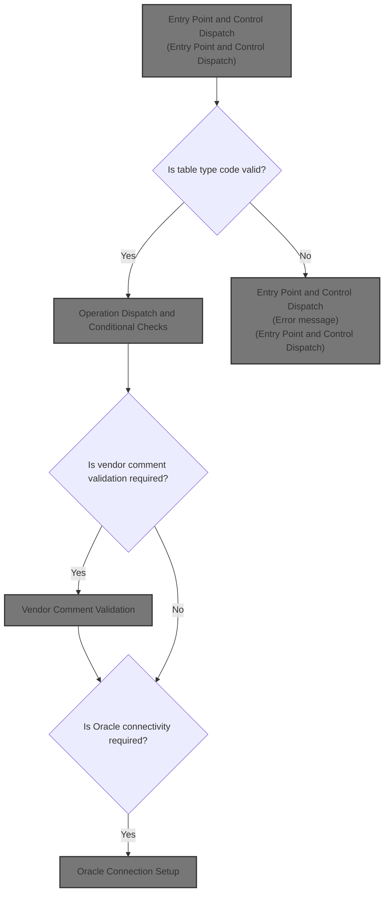
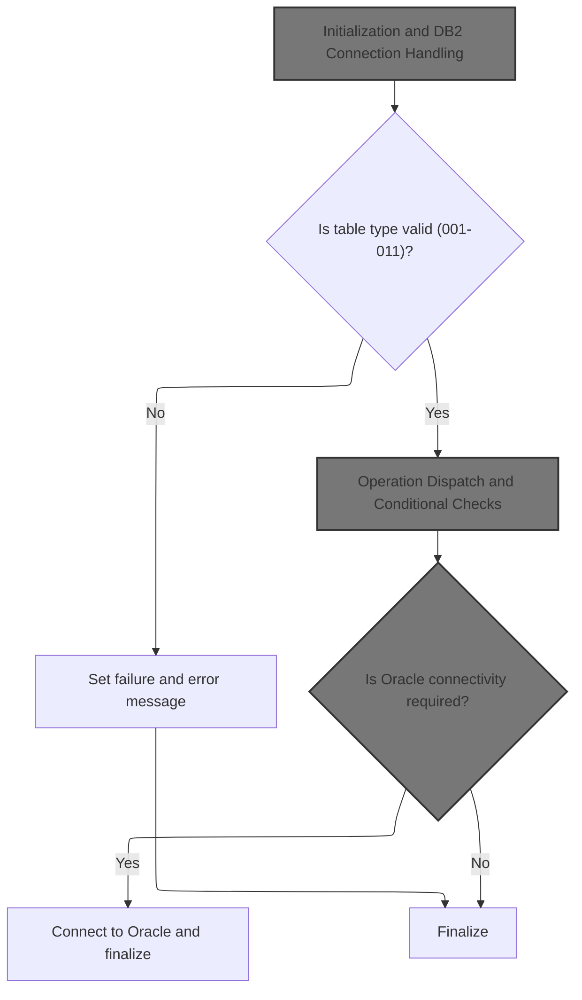
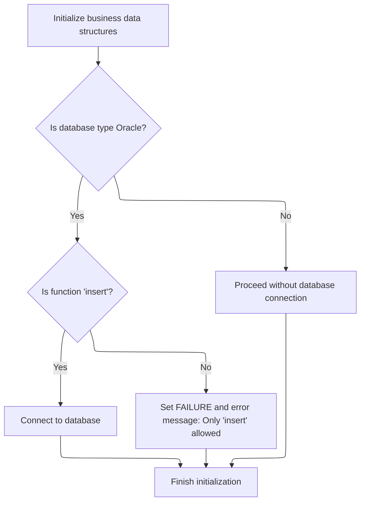
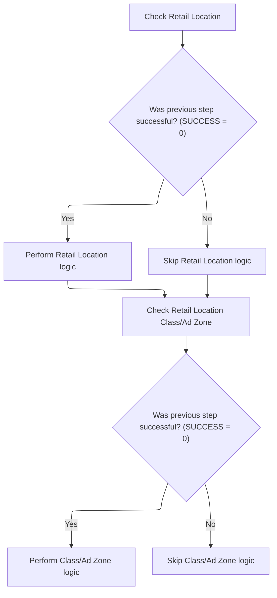
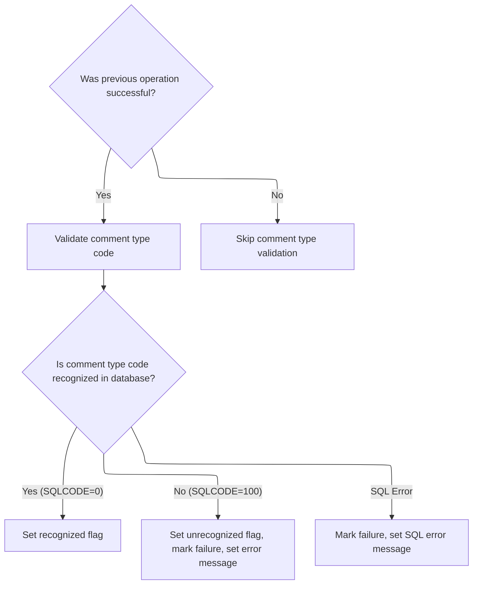

This document describes the main flow for processing business operation requests. The flow acts as the entry point, receiving a table type code and operation request, and dispatches to the appropriate business logic. Only valid table types are processed, with invalid codes resulting in an error message. The flow manages database connectivity and ensures all required validations are performed before returning the operation result and status.



# Spec

## Detailed View of the Program's Functionality

## Entry Point and Control Dispatch

The program begins execution by preparing the environment and handling initial setup. It then checks the type of table operation requested. If the table type is valid (codes 001 through 011), it dispatches to the corresponding operation or check. If the table type is invalid, it sets a failure flag and constructs an error message indicating that an invalid table was passed.

After the main operation dispatch, the program checks if Oracle database connectivity is required. If so, it prepares the necessary data structures, calls the Oracle connection routine, and restores the updated state. If Oracle connectivity is not needed, it simply finalizes and exits.

## Initialization and DB2 Connection Handling

At the start of execution, the program initializes all relevant business data structures and working storage areas. It then checks if the target database is Oracle. If Oracle is the target and the requested function is an 'insert', it calls a routine to connect to the DB2 database, passing the necessary structures for connection and error handling. If the function is not 'insert', it sets a failure flag and builds an error message stating that only 'insert' operations are allowed for Oracle. If the database is not Oracle, it proceeds without attempting a database connection.

Regardless of the path taken, the program resets the status field to ensure a clean state before proceeding.

## Operation Dispatch and Conditional Checks

For each valid table type, the program dispatches to a specific operation or validation routine. For example, when checking retail location data, it first verifies that the previous step was successful. If so, it performs additional checks such as validating e-commerce market area codes and, if required, computer type codes. These checks are chained together only if the previous validations succeed and certain conditions (like the presence of a parent record) are met.

Similarly, when validating retail location class and ad zone data, the program performs item class checks and, if needed, ad zone checks, again only if prior validations succeed and the parent condition is satisfied.

This conditional chaining ensures that related validations are performed only when necessary, reducing unnecessary processing and error handling.

## Vendor Comment Validation

When validating vendor comments, the program first checks if the previous operation was successful. If so, it proceeds to validate the comment type code by querying the database. If the code is recognized (i.e., found in the database), it sets a flag indicating recognition. If the code is not found, it marks the operation as failed and constructs an error message specifying that the code should exist in the database. If a SQL error occurs during the query, it marks the operation as failed and builds a message with the SQL error details.

This ensures that only valid comment type codes are processed and that errors are clearly communicated.

## Oracle Connection Setup

If Oracle connectivity is required, the program calls an external routine dedicated to establishing the Oracle database connection. It passes the necessary connection structures, and the external routine handles the setup and prepares the environment for further operations. This separation keeps the main program logic clean and allows for reuse of the connection handler.

---

This flow ensures that initialization, validation, and database connectivity are handled in a controlled, modular fashion, with clear error handling and messaging throughout. Each operation is only performed when its prerequisites are met, and failures are communicated with detailed messages.

# Rule Definition

| Paragraph Name                                                                                                                                   | Rule ID | Category          | Description                                                                                                                                                                                     | Conditions                                                                     | Remarks                                                                                                                                                                              |
| ------------------------------------------------------------------------------------------------------------------------------------------------ | ------- | ----------------- | ----------------------------------------------------------------------------------------------------------------------------------------------------------------------------------------------- | ------------------------------------------------------------------------------ | ------------------------------------------------------------------------------------------------------------------------------------------------------------------------------------ |
| 000-MAIN-LINE                                                                                                                                    | RL-001  | Conditional Logic | Checks if MMMC0335-TABLE is within the valid range (001-011). If not, sets failure status and error message.                                                                                    | MMMC0335-TABLE not in \[001-011\]                                              | Valid codes: 001-011. Error message: 'MMMS0335 - invalid table passed '. Message is a string field, padded with spaces if necessary.                                                 |
| 000-MAIN-LINE                                                                                                                                    | RL-002  | Conditional Logic | For valid MMMC0335-TABLE codes, dispatches to the corresponding validation routine.                                                                                                             | MMMC0335-TABLE in \[001-011\]                                                  | Each table code maps to a specific validation routine (e.g., 005/009 to XXX-CD, 006 to CUST-SHPNG-METH-CD, etc.).                                                                    |
| 505-CHK-XXX, 605-CHK-CUST-SHPNG-METH, 705-CHK-ECOMM-MKT-AREA, 805-CHK-ITM-CLS, 810-CHK-AA-ZONES, 1005-CHK-BUSINESS-FUNCTION, 1105-CHK-CMT-TYP-CD | RL-003  | Conditional Logic | Each validation routine checks the relevant code against a simulated hardcoded set (represented as a SQL SELECT, but should be a hardcoded list). If not found, sets failure and error message. | Routine is called for the relevant table code; code not found in hardcoded set | Error messages are specific to each code/table, e.g., 'MMMS0335 - XXX_CD should be in XXX, rule = MDCVMDCM '. Message is a string field. Parent/no-parent flags are set accordingly. |
| 700-CHK-RETAIL-LOC, 800-CHK-RETL-LOC-CLS-AD-ZN                                                                                                   | RL-004  | Conditional Logic | If the first validation is successful and MMMC0335-PARENT is set, chain to additional validation (computer type or ad zone).                                                                    | First validation successful (SQLCODE = 0) and MMMC0335-PARENT is true          | Chained validation only occurs if parent flag is set after first validation.                                                                                                         |
| 010-INITIALIZE, 020-CONNECT-TO-ORACLE                                                                                                            | RL-005  | Conditional Logic | If MMMC0335-ORACLE is set and MMMC0335-FUNC is not 'I', set failure and error message. If MMMC0335-ORACLE is set and FUNC is 'I', simulate Oracle connection by updating XXXN001A.              | MMMC0335-ORACLE is true/'Y'; MMMC0335-FUNC is not 'I' or is 'I'                | Oracle flag: true/'Y'. Function code: 'I'. Error message: 'MMMS0335 - invalid function passed function should be insert'.                                                            |
| All validation routines, 010-INITIALIZE                                                                                                          | RL-006  | Data Assignment   | All error and status reporting is done via flags (FAILURE, MMMC0335-PARENT, MMMC0335-NO-PARENT) and the IS-RTRN-MSG-TXT field.                                                                  | Any validation or connection error occurs                                      | IS-RTRN-MSG-TXT is a string field for error messages. Flags are set/cleared as appropriate.                                                                                          |
| 010-INITIALIZE                                                                                                                                   | RL-007  | Data Assignment   | Resets MMMC0335-STATUS to spaces at program initialization.                                                                                                                                     | Program start                                                                  | MMMC0335-STATUS is a string field, reset to spaces.                                                                                                                                  |

# User Stories

## User Story 1: System initialization and error/status reporting

---

### Story Description:

As a system, I want to reset the status and ensure all error and status reporting is handled via flags and message fields so that the program starts in a clean state and users receive clear feedback on errors and statuses.

---

### Business Rule Mapping:

| Rule ID | Paragraph Name                          | Rule Description                                                                                                               |
| ------- | --------------------------------------- | ------------------------------------------------------------------------------------------------------------------------------ |
| RL-007  | 010-INITIALIZE                          | Resets MMMC0335-STATUS to spaces at program initialization.                                                                    |
| RL-006  | All validation routines, 010-INITIALIZE | All error and status reporting is done via flags (FAILURE, MMMC0335-PARENT, MMMC0335-NO-PARENT) and the IS-RTRN-MSG-TXT field. |

---

### Relevant Functionality:

- **010-INITIALIZE**
  1. **RL-007:**
     - On program initialization:
       - Move spaces to MMMC0335-STATUS
- **All validation routines**
  1. **RL-006:**
     - On any error or failed validation:
       - Set FAILURE flag to true
       - Set IS-RTRN-MSG-TXT to appropriate error message
       - Set/clear MMMC0335-PARENT and MMMC0335-NO-PARENT as needed

## User Story 2: Validation of table codes and related fields

---

### Story Description:

As a user, I want the system to validate the table code and related fields, dispatch to the correct validation routine, perform chained validations when required, and set parent/no-parent flags so that only valid codes are accepted and errors are clearly reported.

---

### Business Rule Mapping:

| Rule ID | Paragraph Name                                                                                                                                   | Rule Description                                                                                                                                                                                |
| ------- | ------------------------------------------------------------------------------------------------------------------------------------------------ | ----------------------------------------------------------------------------------------------------------------------------------------------------------------------------------------------- |
| RL-001  | 000-MAIN-LINE                                                                                                                                    | Checks if MMMC0335-TABLE is within the valid range (001-011). If not, sets failure status and error message.                                                                                    |
| RL-002  | 000-MAIN-LINE                                                                                                                                    | For valid MMMC0335-TABLE codes, dispatches to the corresponding validation routine.                                                                                                             |
| RL-004  | 700-CHK-RETAIL-LOC, 800-CHK-RETL-LOC-CLS-AD-ZN                                                                                                   | If the first validation is successful and MMMC0335-PARENT is set, chain to additional validation (computer type or ad zone).                                                                    |
| RL-003  | 505-CHK-XXX, 605-CHK-CUST-SHPNG-METH, 705-CHK-ECOMM-MKT-AREA, 805-CHK-ITM-CLS, 810-CHK-AA-ZONES, 1005-CHK-BUSINESS-FUNCTION, 1105-CHK-CMT-TYP-CD | Each validation routine checks the relevant code against a simulated hardcoded set (represented as a SQL SELECT, but should be a hardcoded list). If not found, sets failure and error message. |
| RL-006  | All validation routines, 010-INITIALIZE                                                                                                          | All error and status reporting is done via flags (FAILURE, MMMC0335-PARENT, MMMC0335-NO-PARENT) and the IS-RTRN-MSG-TXT field.                                                                  |

---

### Relevant Functionality:

- **000-MAIN-LINE**
  1. **RL-001:**
     - On program start, evaluate MMMC0335-TABLE
       - If value is not 001-011:
         - Set failure flag to true
         - Set IS-RTRN-MSG-TXT to 'MMMS0335 - invalid table passed '
         - Exit routine
  2. **RL-002:**
     - Evaluate MMMC0335-TABLE
       - For each valid code, perform the corresponding validation routine
       - For codes 005/009: PERFORM 500-CHK-XXX-VEND-LOC or 900-CHK-XXX-VEND-LOC
       - For 006: PERFORM 600-CHK-LOC-SHPNG-OPT
       - For 007: PERFORM 700-CHK-RETAIL-LOC
       - For 008: PERFORM 800-CHK-RETL-LOC-CLS-AD-ZN
       - For 010: PERFORM 1000-CHK-VEND-TRXAL-CNTL
       - For 011: PERFORM 1100-CHK-VENDOR-COMMENTS
- **700-CHK-RETAIL-LOC**
  1. **RL-004:**
     - After first validation routine:
       - If MMMC0335-PARENT is true:
         - For table 007: perform computer type validation
         - For table 008: perform ad zone validation
- **505-CHK-XXX**
  1. **RL-003:**
     - For each validation routine:
       - Move input code to working field
       - Simulate lookup in hardcoded set (represented as SQL SELECT)
       - If found (SQLCODE = 0):
         - Set MMMC0335-PARENT to true
         - Clear MMMC0335-NO-PARENT
       - If not found (SQLCODE = 100):
         - Set MMMC0335-NO-PARENT to true
         - Clear MMMC0335-PARENT
         - Set failure flag to true
         - Set IS-RTRN-MSG-TXT to appropriate error message
       - If other SQL error:
         - Set failure flag to true
         - Set IS-RTRN-MSG-TXT to SQL error message
- **All validation routines**
  1. **RL-006:**
     - On any error or failed validation:
       - Set FAILURE flag to true
       - Set IS-RTRN-MSG-TXT to appropriate error message
       - Set/clear MMMC0335-PARENT and MMMC0335-NO-PARENT as needed

## User Story 3: Oracle simulation and function validation

---

### Story Description:

As a user, I want the system to validate Oracle-related flags and function codes, set errors for invalid operations, and simulate Oracle connections by updating the appropriate structure so that Oracle interactions are handled correctly without real database connections.

---

### Business Rule Mapping:

| Rule ID | Paragraph Name                          | Rule Description                                                                                                                                                                   |
| ------- | --------------------------------------- | ---------------------------------------------------------------------------------------------------------------------------------------------------------------------------------- |
| RL-005  | 010-INITIALIZE, 020-CONNECT-TO-ORACLE   | If MMMC0335-ORACLE is set and MMMC0335-FUNC is not 'I', set failure and error message. If MMMC0335-ORACLE is set and FUNC is 'I', simulate Oracle connection by updating XXXN001A. |
| RL-006  | All validation routines, 010-INITIALIZE | All error and status reporting is done via flags (FAILURE, MMMC0335-PARENT, MMMC0335-NO-PARENT) and the IS-RTRN-MSG-TXT field.                                                     |

---

### Relevant Functionality:

- **010-INITIALIZE**
  1. **RL-005:**
     - On initialization:
       - If MMMC0335-ORACLE is true:
         - If MMMC0335-FUNC = 'I':
           - Simulate Oracle connection (update XXXN001A)
         - Else:
           - Set failure flag to true
           - Set IS-RTRN-MSG-TXT to 'MMMS0335 - invalid function passed function should be insert'
- **All validation routines**
  1. **RL-006:**
     - On any error or failed validation:
       - Set FAILURE flag to true
       - Set IS-RTRN-MSG-TXT to appropriate error message
       - Set/clear MMMC0335-PARENT and MMMC0335-NO-PARENT as needed

# Code Walkthrough

## Entry Point and Control Dispatch



<SwmSnippet path="/base/src/MMMS0335.cbl" line="86">

---

000-MAIN-LINE starts by prepping the environment, then dispatches to the right check or operation based on MMMC0335-TABLE. Invalid codes trigger an error. Oracle DB setup is handled only if needed, right before finishing.

```cobol
010600 000-MAIN-LINE.                                                   00010600
010700     PERFORM 010-INITIALIZE                                       00010700
010800     EVALUATE MMMC0335-TABLE                                      00010800
010900       WHEN 001                                                   00010900
011100       WHEN 002                                                   00011100
011300       WHEN 003                                                   00011300
011500       WHEN 004                                                   00011500
011600         CONTINUE                                                 00011600
011700       WHEN 005                                                   00011700
011800         PERFORM 500-CHK-XXX-VEND-LOC                             00011800
011900       WHEN 006                                                   00011900
012000         PERFORM 600-CHK-LOC-SHPNG-OPT                            00012000
012100       WHEN 007                                                   00012100
012200         PERFORM 700-CHK-RETAIL-LOC                               00012200
012300       WHEN 008                                                   00012300
012400         PERFORM 800-CHK-RETL-LOC-CLS-AD-ZN                       00012400
012500       WHEN 009                                                   00012500
012600         PERFORM 900-CHK-XXX-VEND-LOC                             00012600
012700       WHEN 010                                                   00012700
012800         PERFORM 1000-CHK-VEND-TRXAL-CNTL                         00012800
012900       WHEN 011                                                   00012900
013000         PERFORM 1100-CHK-VENDOR-COMMENTS                         00013000
013100       WHEN OTHER                                                 00013100
013200         SET FAILURE   TO TRUE                                    00013200
013300         MOVE SPACES  TO IS-RTRN-MSG-TXT                          00013300
013400         STRING 'MMMS0335 - invalid table passed '                00013400
013500                DELIMITED BY SIZE INTO IS-RTRN-MSG-TXT            00013500
013600     END-EVALUATE                                                 00013600
013700     IF MMMC0335-ORACLE                                           00013700
013800       MOVE XXXN001A   TO  WS-XXXN001A                            00013800
013900       MOVE SQLCA      TO  WS-SQLCA                               00013900
014000       PERFORM 020-CONNECT-TO-ORACLE                              00014000
014100       MOVE WS-XXXN001A  TO XXXN001A                              00014100
014200       MOVE WS-SQLCA     TO SQLCA                                 00014200
014300     END-IF                                                       00014300
014400                                                                  00014400
014500     GOBACK                                                       00014500
014600     .                                                            00014600
```

---

</SwmSnippet>

### Initialization and DB2 Connection Handling



<SwmSnippet path="/base/src/MMMS0335.cbl" line="129">

---

010-INITIALIZE sets up the runtime state and checks if we're targeting Oracle and doing an insert. If both are true, it calls 015-CONNECT-TO-DB2 to switch the DB context. If not, it flags an error and builds a message. This keeps DB switching limited to valid insert operations only. It also resets the status field at the end.

```cobol
015200 010-INITIALIZE.                                                  00015200
015300     INITIALIZE XXXN001A                                          00015300
015400                WS-XXXN001A                                       00015400
015500                WS-SQLCA                                          00015500
015600                                                                  00015600
015700     IF MMMC0335-ORACLE                                           00015700
015800       IF MMMC0335-FUNC  = 'I'                                    00015800
015900         PERFORM 015-CONNECT-TO-DB2                               00015900
016000       ELSE                                                       00016000
016100         SET FAILURE TO TRUE                                      00016100
016200         MOVE SPACES  TO IS-RTRN-MSG-TXT                          00016200
016300         STRING 'MMMS0335 - invalid function passed '             00016300
016400                'function should be insert'                       00016400
016500                DELIMITED BY SIZE INTO IS-RTRN-MSG-TXT            00016500
016600       END-IF                                                     00016600
016700     END-IF                                                       00016700
016800                                                                  00016800
016900     MOVE SPACES   TO MMMC0335-STATUS                             00016900
017000     .                                                            00017000
```

---

</SwmSnippet>

<SwmSnippet path="/base/src/MMMS0335.cbl" line="153">

---

015-CONNECT-TO-DB2 just calls out to Z-DB2-CONNECT (YYYS0211.cbl), passing the relevant structures. That program handles the DB2 connection, error translation, and restores any needed data. This keeps DB2 logic out of the main code and lets us reuse the connection handler.

```cobol
017600 015-CONNECT-TO-DB2.                                              00017600
017700     CALL Z-DB2-CONNECT         USING XXXN001A                    00017700
017800                                      SQLCA                       00017800
017900     .                                                            00017900
```

---

</SwmSnippet>

### Operation Dispatch and Conditional Checks



<SwmSnippet path="/base/src/MMMS0335.cbl" line="260">

---

700-CHK-RETAIL-LOC checks if the last operation succeeded, then runs 705-CHK-ECOMM-MKT-AREA. If that also succeeds and MMMC0335-PARENT is set, it runs 710-CHK-CMPTR-TYP. This lets it chain related validations only when needed, not always.

```cobol
046200 700-CHK-RETAIL-LOC.                                              00046200
046300      IF SUCCESS                                                  00046300
046400*       PERFORM 705-CHK-ECOMM-MKT-AREA                            00046400
046500*       IF SUCCESS AND MMMC0335-PARENT                            00046500
046600*         PERFORM 710-CHK-CMPTR-TYP                               00046600
046700*       END-IF                                                    00046700
046800        CONTINUE                                                  00046800
046900      END-IF                                                      00046900
047000      .                                                           00047000
```

---

</SwmSnippet>

<SwmSnippet path="/base/src/MMMS0335.cbl" line="308">

---

800-CHK-RETL-LOC-CLS-AD-ZN runs 805-CHK-ITM-CLS if the last step was successful. If that also passes and MMMC0335-PARENT is set, it runs 810-CHK-AA-ZONES. This way, ad zone checks only happen when needed.

```cobol
054700 800-CHK-RETL-LOC-CLS-AD-ZN.                                      00054700
054800      IF SUCCESS                                                  00054800
054900*       PERFORM 805-CHK-ITM-CLS                                   00054900
055000*       IF SUCCESS AND MMMC0335-PARENT                            00055000
055100*         PERFORM 810-CHK-AA-ZONES                                00055100
055200*       END-IF                                                    00055200
055300        CONTINUE                                                  00055300
055400      END-IF                                                      00055400
055500      .                                                           00055500
```

---

</SwmSnippet>

### Vendor Comment Validation



<SwmSnippet path="/base/src/MMMS0335.cbl" line="484">

---

1100-CHK-VENDOR-COMMENTS only runs its logic if the previous step succeeded. It then calls 1105-CHK-CMT-TYP-CD to validate the comment type code, making sure only valid codes are processed for vendor comments.

```cobol
072300 1100-CHK-VENDOR-COMMENTS.                                        00072300
072400      IF SUCCESS                                                  00072400
072500        PERFORM 1105-CHK-CMT-TYP-CD                               00072500
072600      END-IF                                                      00072600
072700      .                                                           00072700
```

---

</SwmSnippet>

<SwmSnippet path="/base/src/MMMS0335.cbl" line="491">

---

1105-CHK-CMT-TYP-CD moves the comment type code into the query structure, runs a SELECT against XXX_TYP_CD, and then sets flags based on the SQL result. Not found or SQL errors both trigger failure and build an error message.

```cobol
073000 1105-CHK-CMT-TYP-CD.                                             00073000
073100     MOVE MMMC0335-CMT-TYP-CD                                     00073100
073200       TO CMT-TYP-CD             OF DCLCMT-TYP-CD                 00073200
073300                                                                  00073300
073400     EXEC SQL                                                     00073400
073500        SELECT XXX_TYP_CD                                         00073500
073600         INTO : DCLCMT-TYP-CD.CMT-TYP-CD                          00073600
073700        FROM XXX_TYP_CD                                           00073700
073800        WHERE XXX_TYP_CD                                          00073800
073900                      = :DCLCMT-TYP-CD.CMT-TYP-CD                 00073900
074000        FETCH FIRST 1 ROWS ONLY                                   00074000
074100     END-EXEC                                                     00074100
074200                                                                  00074200
074300     EVALUATE TRUE                                                00074300
074400       WHEN SQLCODE = 0                                           00074400
074500         SET MMMC0335-PARENT     TO  TRUE                         00074500
074600       WHEN SQLCODE = 100                                         00074600
074700         SET  MMMC0335-NO-PARENT TO TRUE                          00074700
074800         SET FAILURE             TO TRUE                          00074800
074900         MOVE SQLCODE            TO WS-SQLCODE                    00074900
075000         MOVE SPACE              TO IS-RTRN-MSG-TXT               00075000
075100         STRING 'MMMS0335 - XXX_TYP_CD'                           00075100
075200                 ' should be in XXX_TYP_CD,'                      00075200
075300                 ' rule = MDVCMDCT '                              00075300
075400         DELIMITED BY SIZE INTO IS-RTRN-MSG-TXT                   00075400
075500       WHEN OTHER                                                 00075500
075600         SET FAILURE             TO TRUE                          00075600
075700         MOVE SQLCODE            TO WS-SQLCODE                    00075700
075800         MOVE SPACE              TO IS-RTRN-MSG-TXT               00075800
075900         STRING 'MMMS0335 - SQL error on table '                  00075900
076000                'XXX_TYP_CD, '                                    00076000
076100                 'Sqlcode = ' WS-SQLCODE                          00076100
076200         DELIMITED BY SIZE INTO IS-RTRN-MSG-TXT                   00076200
076300     END-EVALUATE                                                 00076300
076400     .                                                            00076400
```

---

</SwmSnippet>

### Oracle Connection Setup

<SwmSnippet path="/base/src/MMMS0335.cbl" line="162">

---

020-CONNECT-TO-ORACLE calls out to Z-ORA-CONNECT (XXXS0210.cbl), passing the connection structures. That program sets up the Oracle DB connection and prepares the state for further operations.

```cobol
018500 020-CONNECT-TO-ORACLE.                                           00018500
018600     CALL Z-ORA-CONNECT USING XXXN001A                            00018600
018700                              SQLCA                               00018700
018800     .                                                            00018800
```

---

</SwmSnippet>

&nbsp;

*This is an auto-generated document by Swimm 🌊 and has not yet been verified by a human*

<SwmMeta version="3.0.0" repo-id="Z2l0aHViJTNBJTNBU3dpbW1pby1keW5jYWxsLWRlbW8lM0ElM0FHaXJpLVN3aW1t" repo-name="Swimmio-dyncall-demo"><sup>Powered by [Swimm](https://app.swimm.io/)</sup></SwmMeta>
