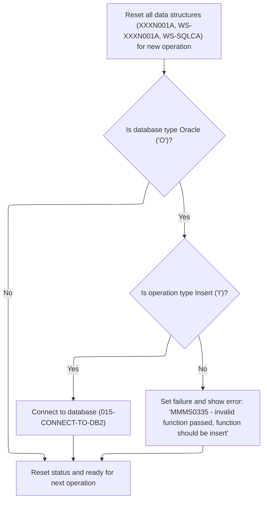
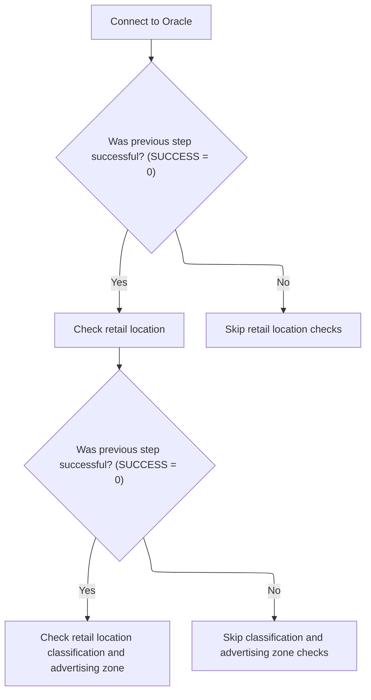

This document describes the main entry point for validation and database setup. The flow receives a table code and environment parameters, initializes the system, dispatches the correct validation logic, and sets up database connections when required. The result is a validation outcome or an error message.

# Spec

## Detailed View of the Program's Functionality

a. Main Program Startup and Table-Based Dispatch

The program begins by performing an initialization routine to prepare the environment and reset internal state. After initialization, it examines a specific field that indicates which type of table or validation is being requested. Based on the value of this field, the program dispatches control to the appropriate validation routine. Each possible value corresponds to a different validation or check, such as vendor location, shipping options, retail location, item class, and so on. If the value does not match any recognized table code, the program sets a failure flag, clears the return message text, and constructs an error message indicating that an invalid table was passed. After the validation or error handling, if the environment indicates that an Oracle database is being used, the program prepares for an Oracle connection by copying relevant data structures, performs the Oracle connection routine, and then restores the data structures. Finally, the program ends and returns control to the caller.

b. Initialization and Database Connection Handling

During initialization, the program resets all relevant data structures to ensure a clean state for the new operation. It then checks if the environment is set for Oracle database usage. If so, it further checks if the requested operation is an insert. If both conditions are met, it performs a routine to connect to a DB2 database by calling an external program responsible for the actual connection and error handling. If the operation is not an insert, the program sets a failure flag, clears the return message text, and constructs an error message indicating that only insert operations are valid in this context. Regardless of the database type, the program resets the status field to indicate readiness for the next operation.

c. Oracle and DB2 Connection Routines

The program contains separate routines for connecting to Oracle and DB2 databases. The DB2 connection routine simply calls an external program, passing the necessary data structures for connection and error handling. Similarly, the Oracle connection routine calls a different external program, again passing the required data structures. These external programs handle all the details of establishing the database connection, translating errors, and restoring any necessary record data, keeping the main program logic clean and focused.

d. Conditional Validation Logic

For certain validation routines, the program uses a conditional approach to ensure that only relevant checks are performed. For example, in the retail location validation routine, the program first checks if the previous operation was successful. If so, it performs an e-commerce market area check. If that check is also successful and a specific parent flag is set, it performs an additional computer type check. This ensures that validations are performed in a logical sequence and only when necessary. Similarly, in the item class and advertising zone validation routine, the program first checks for success before performing the item class check, and only performs the advertising zone check if both the previous check was successful and the parent flag is set.

e. Error Handling and Messaging

Throughout the validation routines, the program consistently checks the result of database operations. If a database query is successful, it sets a parent flag to indicate success. If the query returns no results, it sets a no-parent flag, marks the operation as a failure, and constructs a detailed error message indicating which code was missing from which table and which rule was violated. For any other database error, it sets the failure flag, records the SQL error code, and constructs an error message indicating a SQL error on the relevant table. All error messages are constructed by clearing the message text and then concatenating the relevant details, ensuring that the caller receives clear and actionable feedback.

f. Structure and Modularity

The program is highly modular, with each validation or check encapsulated in its own routine. This structure allows for easy maintenance and extension, as new validation routines can be added without affecting existing logic. The use of external programs for database connections further enhances modularity by separating connection logic and error handling from the main validation flow. This design ensures that the program is robust, maintainable, and adaptable to changing requirements.

# Rule Definition

| Paragraph Name                                                                                                                                                | Rule ID | Category          | Description                                                                                                                                                                                           | Conditions                                                                      | Remarks                                                                                                                                                                                                                                                                                                                                                                          |
| ------------------------------------------------------------------------------------------------------------------------------------------------------------- | ------- | ----------------- | ----------------------------------------------------------------------------------------------------------------------------------------------------------------------------------------------------- | ------------------------------------------------------------------------------- | -------------------------------------------------------------------------------------------------------------------------------------------------------------------------------------------------------------------------------------------------------------------------------------------------------------------------------------------------------------------------------- |
| 000-MAIN-LINE                                                                                                                                                 | RL-001  | Conditional Logic | The system must dispatch to the correct validation or database setup routine based on the value of MMMC0335-TABLE. Valid codes are 001-011, each corresponding to a specific routine or no operation. | MMMC0335-TABLE is set to a value between 001 and 011.                           | Valid codes: 001 (no-op), 002 (no-op), 003 (no-op), 004 (no-op), 005 (vendor location validation), 006 (location shipping option validation), 007 (retail location validation), 008 (retail location classification and advertising zone validation), 009 (alternate vendor location validation), 010 (vendor transaction control validation), 011 (vendor comments validation). |
| 000-MAIN-LINE                                                                                                                                                 | RL-002  | Conditional Logic | If MMMC0335-TABLE is not between 001 and 011, the system must set FAILURE to TRUE, set IS-RTRN-MSG-TXT to an error message indicating invalid table code, and stop further processing.                | MMMC0335-TABLE is not in the range 001-011.                                     | Error message format: 'MMMS0335 - invalid table passed '. IS-RTRN-MSG-TXT is a string field used for all error and status reporting.                                                                                                                                                                                                                                             |
| 010-INITIALIZE                                                                                                                                                | RL-003  | Conditional Logic | If MMMC0335-ORACLE is 'O', the system must check that MMMC0335-FUNC is 'I'. If not, set FAILURE to TRUE and IS-RTRN-MSG-TXT to an error message indicating invalid function for Oracle.               | MMMC0335-ORACLE is 'O' and MMMC0335-FUNC is not 'I'.                            | Error message format: 'MMMS0335 - invalid function passed function should be insert'. IS-RTRN-MSG-TXT is a string field.                                                                                                                                                                                                                                                         |
| 010-INITIALIZE                                                                                                                                                | RL-004  | Data Assignment   | The MMMC0335-STATUS field must be cleared (set to spaces) at the start of processing.                                                                                                                 | At the start of program execution, before any validation or database operation. | MMMC0335-STATUS is a string field. It is set to spaces at initialization.                                                                                                                                                                                                                                                                                                        |
| 505-CHK-XXX, 605-CHK-CUST-SHPNG-METH, 705-CHK-ECOMM-MKT-AREA, 805-CHK-ITM-CLS, 810-CHK-AA-ZONES, 905-CHK-XXX, 1005-CHK-BUSINESS-FUNCTION, 1105-CHK-CMT-TYP-CD | RL-005  | Conditional Logic | After each validation routine, set MMMC0335-PARENT to TRUE if a parent record is found (SQLCODE=0), or MMMC0335-NO-PARENT to TRUE and FAILURE to TRUE if not found (SQLCODE=100).                     | After a validation SQL query, check the SQLCODE result.                         | MMMC0335-PARENT and MMMC0335-NO-PARENT are boolean flags. SQLCODE=0 means found, SQLCODE=100 means not found.                                                                                                                                                                                                                                                                    |
| 000-MAIN-LINE, 010-INITIALIZE, all validation routines                                                                                                        | RL-006  | Data Assignment   | All error and status messages must be reported using the IS-RTRN-MSG-TXT field.                                                                                                                       | Whenever an error or status needs to be reported.                               | IS-RTRN-MSG-TXT is a string field. All error and status messages are written to this field.                                                                                                                                                                                                                                                                                      |
| 000-MAIN-LINE, 020-CONNECT-TO-ORACLE, 015-CONNECT-TO-DB2                                                                                                      | RL-007  | Data Assignment   | If a database connection is performed, the XXXN001A and SQLCA structures must be updated accordingly.                                                                                                 | When connecting to Oracle or DB2.                                               | XXXN001A is the main data record, SQLCA is the SQL communication area. Both are updated after database connection routines.                                                                                                                                                                                                                                                      |

# User Stories

## User Story 1: Dispatch and error handling for table codes

---

### Story Description:

As a system user, I want the system to dispatch to the correct validation or database setup routine based on the MMMC0335-TABLE code, and to receive clear error messages if an invalid code is provided, so that I can ensure the correct processing or be informed of configuration errors.

---

### Business Rule Mapping:

| Rule ID | Paragraph Name                                         | Rule Description                                                                                                                                                                                      |
| ------- | ------------------------------------------------------ | ----------------------------------------------------------------------------------------------------------------------------------------------------------------------------------------------------- |
| RL-001  | 000-MAIN-LINE                                          | The system must dispatch to the correct validation or database setup routine based on the value of MMMC0335-TABLE. Valid codes are 001-011, each corresponding to a specific routine or no operation. |
| RL-002  | 000-MAIN-LINE                                          | If MMMC0335-TABLE is not between 001 and 011, the system must set FAILURE to TRUE, set IS-RTRN-MSG-TXT to an error message indicating invalid table code, and stop further processing.                |
| RL-006  | 000-MAIN-LINE, 010-INITIALIZE, all validation routines | All error and status messages must be reported using the IS-RTRN-MSG-TXT field.                                                                                                                       |

---

### Relevant Functionality:

- **000-MAIN-LINE**
  1. **RL-001:**
     - On program entry, evaluate MMMC0335-TABLE:
       - If 001-004: continue (no operation)
       - If 005: perform vendor location validation
       - If 006: perform location shipping option validation
       - If 007: perform retail location validation
       - If 008: perform retail location classification and advertising zone validation
       - If 009: perform alternate vendor location validation
       - If 010: perform vendor transaction control validation
       - If 011: perform vendor comments validation
       - If any other value: set FAILURE to TRUE, set IS-RTRN-MSG-TXT to error message, stop further processing
  2. **RL-002:**
     - If MMMC0335-TABLE is not 001-011:
       - Set FAILURE to TRUE
       - Set IS-RTRN-MSG-TXT to 'MMMS0335 - invalid table passed '
       - Do not perform any further processing
  3. **RL-006:**
     - On any error or status update:
       - Set IS-RTRN-MSG-TXT to the appropriate message

## User Story 2: Oracle function validation

---

### Story Description:

As a system user, I want the system to validate that when MMMC0335-ORACLE is 'O', only the insert function is allowed, and to receive an error message if an invalid function is provided, so that Oracle-specific operations are not performed incorrectly.

---

### Business Rule Mapping:

| Rule ID | Paragraph Name                                         | Rule Description                                                                                                                                                                        |
| ------- | ------------------------------------------------------ | --------------------------------------------------------------------------------------------------------------------------------------------------------------------------------------- |
| RL-006  | 000-MAIN-LINE, 010-INITIALIZE, all validation routines | All error and status messages must be reported using the IS-RTRN-MSG-TXT field.                                                                                                         |
| RL-003  | 010-INITIALIZE                                         | If MMMC0335-ORACLE is 'O', the system must check that MMMC0335-FUNC is 'I'. If not, set FAILURE to TRUE and IS-RTRN-MSG-TXT to an error message indicating invalid function for Oracle. |

---

### Relevant Functionality:

- **000-MAIN-LINE**
  1. **RL-006:**
     - On any error or status update:
       - Set IS-RTRN-MSG-TXT to the appropriate message
- **010-INITIALIZE**
  1. **RL-003:**
     - If MMMC0335-ORACLE is 'O':
       - If MMMC0335-FUNC is not 'I':
         - Set FAILURE to TRUE
         - Set IS-RTRN-MSG-TXT to 'MMMS0335 - invalid function passed function should be insert'

## User Story 3: Initialization, parent/child flagging, and database updates

---

### Story Description:

As a system user, I want the system to clear the status field at initialization, set parent/child flags based on validation results, and update database structures when connections are made, so that the system state is accurate and reflects the results of processing.

---

### Business Rule Mapping:

| Rule ID | Paragraph Name                                                                                                                                                | Rule Description                                                                                                                                                                  |
| ------- | ------------------------------------------------------------------------------------------------------------------------------------------------------------- | --------------------------------------------------------------------------------------------------------------------------------------------------------------------------------- |
| RL-007  | 000-MAIN-LINE, 020-CONNECT-TO-ORACLE, 015-CONNECT-TO-DB2                                                                                                      | If a database connection is performed, the XXXN001A and SQLCA structures must be updated accordingly.                                                                             |
| RL-004  | 010-INITIALIZE                                                                                                                                                | The MMMC0335-STATUS field must be cleared (set to spaces) at the start of processing.                                                                                             |
| RL-005  | 505-CHK-XXX, 605-CHK-CUST-SHPNG-METH, 705-CHK-ECOMM-MKT-AREA, 805-CHK-ITM-CLS, 810-CHK-AA-ZONES, 905-CHK-XXX, 1005-CHK-BUSINESS-FUNCTION, 1105-CHK-CMT-TYP-CD | After each validation routine, set MMMC0335-PARENT to TRUE if a parent record is found (SQLCODE=0), or MMMC0335-NO-PARENT to TRUE and FAILURE to TRUE if not found (SQLCODE=100). |

---

### Relevant Functionality:

- **000-MAIN-LINE**
  1. **RL-007:**
     - When connecting to Oracle:
       - Move XXXN001A to working storage
       - Move SQLCA to working storage
       - Call Oracle connection routine
       - Move working storage back to XXXN001A and SQLCA
     - When connecting to DB2:
       - Call DB2 connection routine using XXXN001A and SQLCA
- **010-INITIALIZE**
  1. **RL-004:**
     - At the start of processing (in initialization routine):
       - Set MMMC0335-STATUS to spaces
- **505-CHK-XXX**
  1. **RL-005:**
     - After executing a validation SQL query:
       - If SQLCODE=0:
         - Set MMMC0335-PARENT to TRUE
       - If SQLCODE=100:
         - Set MMMC0335-NO-PARENT to TRUE
         - Set FAILURE to TRUE
         - Set IS-RTRN-MSG-TXT to appropriate error message
       - If SQLCODE is any other value:
         - Set FAILURE to TRUE
         - Set IS-RTRN-MSG-TXT to SQL error message

# Code Walkthrough

## Dispatching Table-Based Validation and Database Setup

<SwmSnippet path="/base/src/MMMS0335.cbl" line="86">

---

`000-MAIN-LINE` starts everything, runs environment checks, dispatches to the right validation based on MMMC0335-TABLE, and handles Oracle connection if needed. Invalid table codes get an error and stop the flow.

```cobol
010600 000-MAIN-LINE.                                                   00010600
010700     PERFORM 010-INITIALIZE                                       00010700
010800     EVALUATE MMMC0335-TABLE                                      00010800
010900       WHEN 001                                                   00010900
011100       WHEN 002                                                   00011100
011300       WHEN 003                                                   00011300
011500       WHEN 004                                                   00011500
011600         CONTINUE                                                 00011600
011700       WHEN 005                                                   00011700
011800         PERFORM 500-CHK-XXX-VEND-LOC                             00011800
011900       WHEN 006                                                   00011900
012000         PERFORM 600-CHK-LOC-SHPNG-OPT                            00012000
012100       WHEN 007                                                   00012100
012200         PERFORM 700-CHK-RETAIL-LOC                               00012200
012300       WHEN 008                                                   00012300
012400         PERFORM 800-CHK-RETL-LOC-CLS-AD-ZN                       00012400
012500       WHEN 009                                                   00012500
012600         PERFORM 900-CHK-XXX-VEND-LOC                             00012600
012700       WHEN 010                                                   00012700
012800         PERFORM 1000-CHK-VEND-TRXAL-CNTL                         00012800
012900       WHEN 011                                                   00012900
013000         PERFORM 1100-CHK-VENDOR-COMMENTS                         00013000
013100       WHEN OTHER                                                 00013100
013200         SET FAILURE   TO TRUE                                    00013200
013300         MOVE SPACES  TO IS-RTRN-MSG-TXT                          00013300
013400         STRING 'MMMS0335 - invalid table passed '                00013400
013500                DELIMITED BY SIZE INTO IS-RTRN-MSG-TXT            00013500
013600     END-EVALUATE                                                 00013600
013700     IF MMMC0335-ORACLE                                           00013700
013800       MOVE XXXN001A   TO  WS-XXXN001A                            00013800
013900       MOVE SQLCA      TO  WS-SQLCA                               00013900
014000       PERFORM 020-CONNECT-TO-ORACLE                              00014000
014100       MOVE WS-XXXN001A  TO XXXN001A                              00014100
014200       MOVE WS-SQLCA     TO SQLCA                                 00014200
014300     END-IF                                                       00014300
014400                                                                  00014400
014500     GOBACK                                                       00014500
014600     .                                                            00014600
```

---

</SwmSnippet>

### Initialization and DB2 Connection Handling



<SwmSnippet path="/base/src/MMMS0335.cbl" line="129">

---

`010-INITIALIZE` resets state, checks for Oracle and insert, and only then switches to DB2. Otherwise, it blocks the operation and sets an error.

```cobol
015200 010-INITIALIZE.                                                  00015200
015300     INITIALIZE XXXN001A                                          00015300
015400                WS-XXXN001A                                       00015400
015500                WS-SQLCA                                          00015500
015600                                                                  00015600
015700     IF MMMC0335-ORACLE                                           00015700
015800       IF MMMC0335-FUNC  = 'I'                                    00015800
015900         PERFORM 015-CONNECT-TO-DB2                               00015900
016000       ELSE                                                       00016000
016100         SET FAILURE TO TRUE                                      00016100
016200         MOVE SPACES  TO IS-RTRN-MSG-TXT                          00016200
016300         STRING 'MMMS0335 - invalid function passed '             00016300
016400                'function should be insert'                       00016400
016500                DELIMITED BY SIZE INTO IS-RTRN-MSG-TXT            00016500
016600       END-IF                                                     00016600
016700     END-IF                                                       00016700
016800                                                                  00016800
016900     MOVE SPACES   TO MMMC0335-STATUS                             00016900
017000     .                                                            00017000
```

---

</SwmSnippet>

<SwmSnippet path="/base/src/MMMS0335.cbl" line="153">

---

`015-CONNECT-TO-DB2` just calls out to the external program YYYS0211 (via Z-DB2-CONNECT). That program handles the actual DB2 connection, error translation, and restores any needed record data. This keeps the database switching logic out of the main module and centralizes error handling.

```cobol
017600 015-CONNECT-TO-DB2.                                              00017600
017700     CALL Z-DB2-CONNECT         USING XXXN001A                    00017700
017800                                      SQLCA                       00017800
017900     .                                                            00017900
```

---

</SwmSnippet>

### Conditional Validation Dispatch



<SwmSnippet path="/base/src/MMMS0335.cbl" line="260">

---

`700-CHK-RETAIL-LOC` checks if SUCCESS is set, then runs the e-commerce market area check. If that passes and MMMC0335-PARENT is set, it runs a computer type check. This keeps validations tight and only runs what's needed based on previous results and the parent flag.

```cobol
046200 700-CHK-RETAIL-LOC.                                              00046200
046300      IF SUCCESS                                                  00046300
046400*       PERFORM 705-CHK-ECOMM-MKT-AREA                            00046400
046500*       IF SUCCESS AND MMMC0335-PARENT                            00046500
046600*         PERFORM 710-CHK-CMPTR-TYP                               00046600
046700*       END-IF                                                    00046700
046800        CONTINUE                                                  00046800
046900      END-IF                                                      00046900
047000      .                                                           00047000
```

---

</SwmSnippet>

<SwmSnippet path="/base/src/MMMS0335.cbl" line="308">

---

`800-CHK-RETL-LOC-CLS-AD-ZN` runs the item class check if SUCCESS is set. If that passes and MMMC0335-PARENT is set, it also checks AA zones. This keeps the validation path clean and only runs what's needed for the current context.

```cobol
054700 800-CHK-RETL-LOC-CLS-AD-ZN.                                      00054700
054800      IF SUCCESS                                                  00054800
054900*       PERFORM 805-CHK-ITM-CLS                                   00054900
055000*       IF SUCCESS AND MMMC0335-PARENT                            00055000
055100*         PERFORM 810-CHK-AA-ZONES                                00055100
055200*       END-IF                                                    00055200
055300        CONTINUE                                                  00055300
055400      END-IF                                                      00055400
055500      .                                                           00055500
```

---

</SwmSnippet>

<SwmSnippet path="/base/src/MMMS0335.cbl" line="162">

---

`020-CONNECT-TO-ORACLE` just calls out to XXXS0210 (via Z-ORA-CONNECT). That program handles all the Oracle connection setup and variable initialization, keeping the main logic clean and focused.

```cobol
018500 020-CONNECT-TO-ORACLE.                                           00018500
018600     CALL Z-ORA-CONNECT USING XXXN001A                            00018600
018700                              SQLCA                               00018700
018800     .                                                            00018800
```

---

</SwmSnippet>

&nbsp;

*This is an auto-generated document by Swimm 🌊 and has not yet been verified by a human*

<SwmMeta version="3.0.0" repo-id="Z2l0aHViJTNBJTNBU3dpbW1pby1keW5jYWxsLWRlbW8lM0ElM0FHaXJpLVN3aW1t" repo-name="Swimmio-dyncall-demo"><sup>Powered by [Swimm](https://app.swimm.io/)</sup></SwmMeta>
