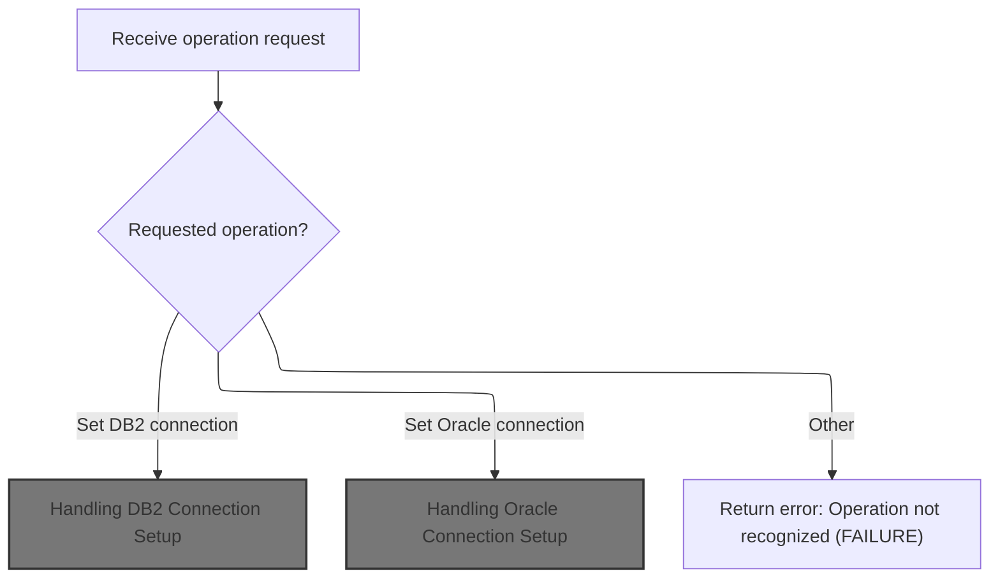
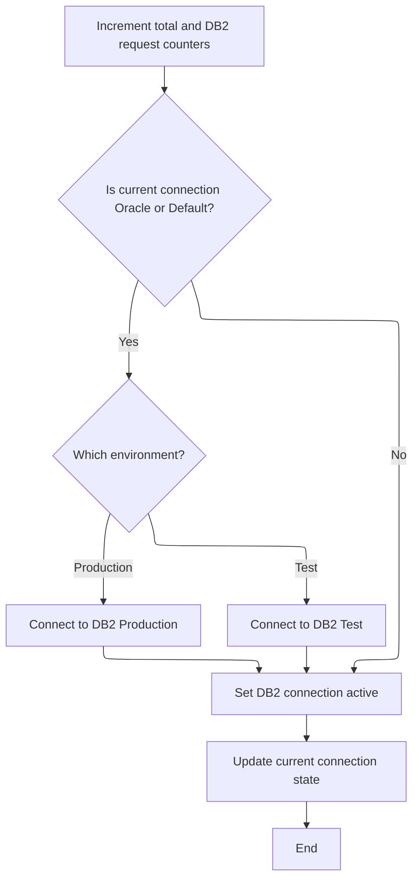
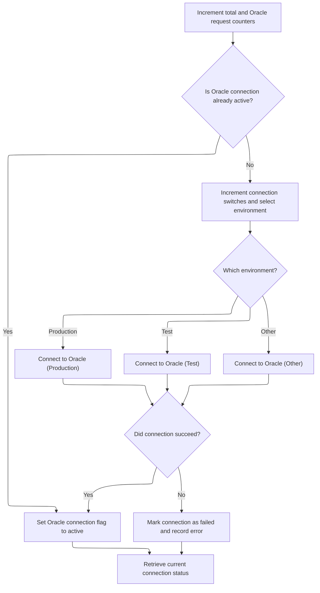
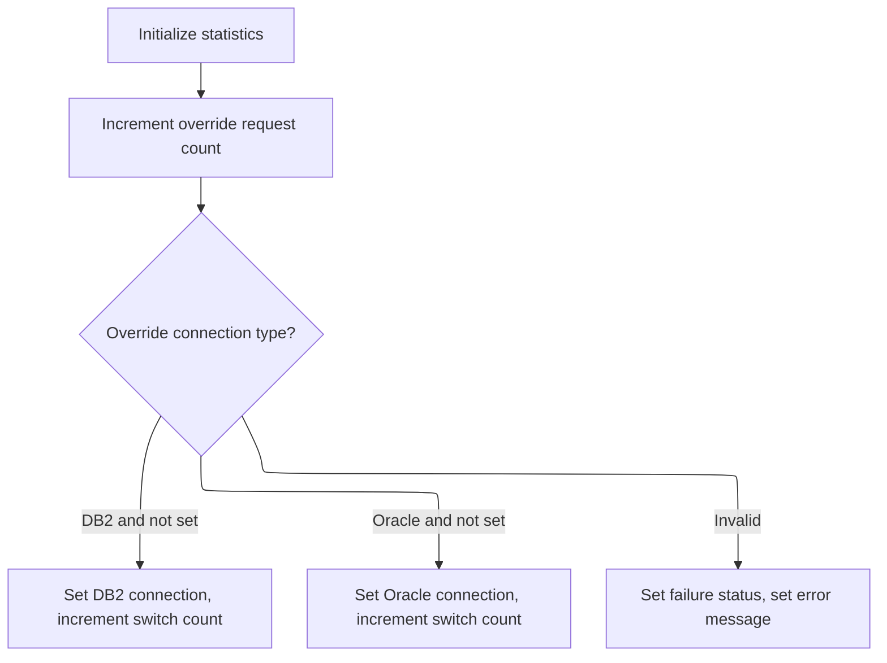

This document describes how requests to manage database connections and related operations are processed. The system identifies the requested operation—such as switching to a DB2 or Oracle connection, updating statistics, or overriding the current connection—and routes it to the appropriate handler. The correct connection is established for the specified environment, and statistics are updated as needed. If the operation is not recognized, an error message is returned.

# Spec

## Detailed View of the Program's Functionality

# a. Program Initialization and Entry Point

The program begins by defining its metadata (such as program ID, author, and date) and setting up its environment and working storage. It declares variables for tracking the environment (production, test, etc.), the current connection type (DB2, Oracle, or default), SQL error codes, and various statistics counters (total requests, DB2 requests, Oracle requests, override requests, connection switches, and override switches).

When the program is invoked, it expects two data structures as input (from the linkage section), which are likely used for communication with the caller and for passing connection/statistics information.

The main entry point is a dispatcher routine. This routine first performs initialization, which resets or sets up the environment flags (by default, it sets the environment to production). It then evaluates the requested operation, which is indicated by flags or values in the input structure.

# b. Dispatching Connection Requests

The dispatcher checks what operation the caller wants to perform. The possible operations are:

- Get the current connection type.
- Set the connection to DB2.
- Set the connection to Oracle.
- Get statistics.
- Reset statistics.
- Override the current connection type.

For each recognized operation, the dispatcher calls the corresponding handler routine. If the operation is not recognized, it sets a failure flag and returns an error message indicating the function is not recognized.

# c. Handling DB2 Connection Setup

When a request is made to set the connection to DB2, the following steps occur:

1. The total request counter and the DB2 request counter are incremented.
2. The program checks if the current connection is Oracle or the default (i.e., not already DB2).
   - If so, it performs the actual DB2 connection switch by calling a subroutine.
   - If not, it skips the switch to avoid unnecessary reconnections.
3. After switching (if needed), it marks the DB2 connection as active.
4. It then retrieves and returns the current connection type to the caller.

The subroutine that performs the actual DB2 connection does the following:

- Increments the connection switch counter.
- Checks which environment is active (production or test).
  - If production, it connects to the production DB2 database.
  - Otherwise, it connects to the test DB2 database.
- After attempting the connection, it checks the SQL result code.
  - If the connection was successful, it continues.
  - If there was an error, it sets the failure flag and constructs an error message containing the SQL error code.

# d. Handling Oracle Connection Setup

When a request is made to set the connection to Oracle, the following steps occur:

1. The total request counter and the Oracle request counter are incremented.
2. The program checks if the Oracle connection is already active.
   - If not, it performs the actual Oracle connection switch by calling a subroutine.
   - If already active, it skips the switch.
3. After switching (if needed), it marks the Oracle connection as active.
4. It then retrieves and returns the current connection type to the caller.

The subroutine that performs the actual Oracle connection does the following:

- Increments the connection switch counter.
- Checks which environment is active (production, test, or one of several test sub-environments).
  - Depending on the environment, it connects to the appropriate Oracle database.
- After attempting the connection, it checks the SQL result code.
  - If the connection was successful, it continues.
  - If there was an error, it sets the failure flag and constructs an error message containing the SQL error code.

# e. Statistics Handling

There are two main statistics-related operations:

1. **Getting statistics:**

   - The program retrieves the current connection type.
   - It then copies all the statistics counters (total requests, DB2 requests, Oracle requests, override requests, connection switches, override switches) into the output structure for the caller to inspect.

2. **Resetting statistics:**

   - The program resets all statistics counters to zero.
   - It also calls an external or shared routine for any additional statistics logic.

# f. Override Connection Handling

The override handler allows the caller to forcibly set the current connection type, regardless of the current state. The steps are:

1. The override request counter is incremented.
2. The program checks which override is requested:
   - If the request is to set DB2 and DB2 is not already active, it marks DB2 as active and increments the override switch counter.
   - If the request is to set Oracle and Oracle is not already active, it marks Oracle as active and increments the override switch counter.
   - If the request is invalid (e.g., both or neither are set), it sets the failure flag and returns an error message indicating the override is invalid.

# g. Error Handling

For any unrecognized operation or failed connection attempt, the program sets a failure flag and constructs a descriptive error message, which is returned to the caller in the output structure.

# h. Summary

- The program acts as a dispatcher and handler for database connection requests (DB2 or Oracle), statistics queries, and override commands.
- It tracks usage and connection statistics, and provides error feedback for invalid operations or failed connections.
- The logic ensures that unnecessary reconnections are avoided, and that only valid state transitions are performed.
- Environment selection (production, test, etc.) is handled via flags, and the actual database to connect to is chosen accordingly.

# Rule Definition

| Paragraph Name                              | Rule ID | Category          | Description                                                                                                                                                                                                                                          | Conditions                                                                                                          | Remarks                                                                                                                                                                                                                                                                                                                                                                                                                                                                                                                                                                                         |
| ------------------------------------------- | ------- | ----------------- | ---------------------------------------------------------------------------------------------------------------------------------------------------------------------------------------------------------------------------------------------------- | ------------------------------------------------------------------------------------------------------------------- | ----------------------------------------------------------------------------------------------------------------------------------------------------------------------------------------------------------------------------------------------------------------------------------------------------------------------------------------------------------------------------------------------------------------------------------------------------------------------------------------------------------------------------------------------------------------------------------------------- |
| 0000-EXIT-DISPATCHER                        | RL-001  | Conditional Logic | The dispatcher examines the operation request fields in the YYYC0220 structure and performs the corresponding operation. If the request is not recognized, it sets failure and an error message.                                                     | A request is present in one of the YYYC0220 operation fields. If none match, the request is unrecognized.           | FAILURE is set to '1' for unrecognized operations. IS-RTRN-MSG-TXT is set to 'YYYS0220 - Function not recognized!'. Other output fields remain unchanged. The recognized operations are: Set DB2 connection, Set Oracle connection, Get current connection, Get statistics, Set statistics, Set override connection.                                                                                                                                                                                                                                                                            |
| 200-GET-CURR-CON                            | RL-002  | Data Assignment   | Returns the current connection type in the output structure.                                                                                                                                                                                         | YYYC0220-GET-CURR-CON is set.                                                                                       | FAILURE is set to '0'. IS-RTRN-MSG-TXT is cleared (blank). YYYC0220-CURR-CON is set to the current connection type ('D', '0', or ' ').                                                                                                                                                                                                                                                                                                                                                                                                                                                          |
| 500-GET-STATS                               | RL-003  | Data Assignment   | Returns all statistics fields in the output structure.                                                                                                                                                                                               | YYYC0220-GET-STATS is set.                                                                                          | FAILURE is set to '0'. IS-RTRN-MSG-TXT is cleared (blank). All statistics fields in YYYC0220 are set to their current values.                                                                                                                                                                                                                                                                                                                                                                                                                                                                   |
| 600-SET-STATS                               | RL-004  | Data Assignment   | Resets all statistics fields to 0 in both working storage and output structure.                                                                                                                                                                      | YYYC0220-SET-STATS is set.                                                                                          | All statistics counters (YYYC0220-TOT-REQS, YYYC0220-DB2-REQS, YYYC0220-OCL-REQS, YYYC0220-OVR-REQS, YYYC0220-CON-SWITCHES, YYYC0220-OVR-SWITCHES) are set to 0. FAILURE is set to '0'. IS-RTRN-MSG-TXT is cleared (blank).                                                                                                                                                                                                                                                                                                                                                                     |
| 700-SET-OVERRIDE-CON                        | RL-005  | Conditional Logic | Handles override requests to set the connection to DB2 or Oracle, with validation for mutually exclusive flags and correct counter updates.                                                                                                          | YYYC0220-SET-OVERRIDE-CON is set. Checks if DB2 and Oracle override flags are set or not set.                       | YYYC0220-OVR-REQS is incremented. If both or neither DB2 and Oracle override flags are set, FAILURE is set to '1', IS-RTRN-MSG-TXT to 'YYYS0220 - Invalid over-ride connection!'. If only DB2 is set and not already active, perform DB2 switch and increment OVR-SWITCHES. If only Oracle is set and not already active, perform Oracle switch and increment OVR-SWITCHES. If requested connection is already active, set FAILURE to '0', clear message.                                                                                                                                       |
| 300-SET-DB2-CON, 310-DO-SET-DB2-CON         | RL-006  | Conditional Logic | Handles requests to set the DB2 connection. Increments the total requests counter and the DB2 requests counter, switches the current connection to DB2 if needed, and handles success or failure by updating the status and message fields.          | A request to set the DB2 connection is received. If the current connection is not DB2, a switch is performed.       | Counters incremented: total requests, DB2 requests. If a switch is needed, the connection switches counter is incremented. On success, the current connection type is set to 'D', failure status is set to '0', and the return message is cleared. On failure, failure status is set to '1', and the return message is set to 'YYYS0220 - Failure connecting to DB2, SQL=' followed by the SQL code value. The environment flag determines whether to connect to DB2P or DB2T.                                                                                                                  |
| 400-SET-ORACLE-CON, 410-DO-SET-ORACLE-CON   | RL-007  | Conditional Logic | Handles requests to set the Oracle connection. Increments the total requests counter and the Oracle requests counter, switches the current connection to Oracle if needed, and handles success or failure by updating the status and message fields. | A request to set the Oracle connection is received. If the current connection is not Oracle, a switch is performed. | Counters incremented: total requests, Oracle requests. If a switch is needed, the connection switches counter is incremented. On success, the current connection type is set to '0', failure status is set to '0', and the return message is cleared. On failure, failure status is set to '1', and the return message is set to 'YYYS0220 - Failure connecting to Oracle, SQL=' followed by the SQL code value. The environment flag determines which Oracle target to connect to: 'P' for DRDAASP1, 'T' for DRDAASC7, '6' for DRDAASC6, '5' for DRDAASC5, '4' for DRDAASD1, '3' for DRDAASC1. |
| WORKING-STORAGE SECTION, 100-INITIALIZATION | RL-008  | Data Assignment   | All statistics counters and the current connection type are initialized to 0 and blank, respectively, at program start.                                                                                                                              | Program start (before any operation is processed).                                                                  | The counters for total requests, DB2 requests, Oracle requests, override requests, connection switches, and override switches are set to 0. The current connection type is set to blank (' '). The environment flag is set to blank (' ').                                                                                                                                                                                                                                                                                                                                                      |

# User Stories

## User Story 1: Connection management and override handling

---

### Story Description:

As a user, I want to set the current connection to DB2 or Oracle, including handling override requests, switching connections, updating counters, and receiving feedback on success or failure, so that the system maintains accurate connection state and processes all connection-related requests correctly.

---

### Business Rule Mapping:

| Rule ID | Paragraph Name                            | Rule Description                                                                                                                                                                                                                                     |
| ------- | ----------------------------------------- | ---------------------------------------------------------------------------------------------------------------------------------------------------------------------------------------------------------------------------------------------------- |
| RL-006  | 300-SET-DB2-CON, 310-DO-SET-DB2-CON       | Handles requests to set the DB2 connection. Increments the total requests counter and the DB2 requests counter, switches the current connection to DB2 if needed, and handles success or failure by updating the status and message fields.          |
| RL-007  | 400-SET-ORACLE-CON, 410-DO-SET-ORACLE-CON | Handles requests to set the Oracle connection. Increments the total requests counter and the Oracle requests counter, switches the current connection to Oracle if needed, and handles success or failure by updating the status and message fields. |
| RL-005  | 700-SET-OVERRIDE-CON                      | Handles override requests to set the connection to DB2 or Oracle, with validation for mutually exclusive flags and correct counter updates.                                                                                                          |

---

### Relevant Functionality:

- **300-SET-DB2-CON**
  1. **RL-006:**
     - Increment total requests counter and DB2 requests counter.
     - If the current connection type is not DB2:
       - Increment connection switches counter.
       - If the environment flag is 'P', connect to DB2P; otherwise, connect to DB2T.
       - If the SQL code is 0:
         - Set current connection type to DB2, set failure status to '0', clear return message.
       - Else:
         - Set failure status to '1', set return message to include SQL code.
     - If already DB2, set failure status to '0', clear return message.
- **400-SET-ORACLE-CON**
  1. **RL-007:**
     - Increment total requests counter and Oracle requests counter.
     - If the current connection type is not Oracle:
       - Increment connection switches counter.
       - Connect to the appropriate Oracle target based on the environment flag.
       - If the SQL code is 0:
         - Set current connection type to Oracle, set failure status to '0', clear return message.
       - Else:
         - Set failure status to '1', set return message to include SQL code.
     - If already Oracle, set failure status to '0', clear return message.
- **700-SET-OVERRIDE-CON**
  1. **RL-005:**
     - Increment override requests counter.
     - If both or neither DB2 and Oracle override flags are set:
       - Set FAILURE to '1', set error message.
     - If only DB2 override is set and DB2 not active:
       - Set DB2 as active, increment override switches.
     - If only Oracle override is set and Oracle not active:
       - Set Oracle as active, increment override switches.
     - If requested override connection is already active:
       - Set FAILURE to '0', clear message.

## User Story 2: Dispatcher operation selection and execution

---

### Story Description:

As a system, I want to examine the operation request fields and perform the corresponding operation, including connection management, statistics handling, and error reporting, so that all valid requests are processed and users receive clear feedback on invalid requests.

---

### Business Rule Mapping:

| Rule ID | Paragraph Name       | Rule Description                                                                                                                                                                                 |
| ------- | -------------------- | ------------------------------------------------------------------------------------------------------------------------------------------------------------------------------------------------ |
| RL-001  | 0000-EXIT-DISPATCHER | The dispatcher examines the operation request fields in the YYYC0220 structure and performs the corresponding operation. If the request is not recognized, it sets failure and an error message. |
| RL-004  | 600-SET-STATS        | Resets all statistics fields to 0 in both working storage and output structure.                                                                                                                  |
| RL-002  | 200-GET-CURR-CON     | Returns the current connection type in the output structure.                                                                                                                                     |
| RL-003  | 500-GET-STATS        | Returns all statistics fields in the output structure.                                                                                                                                           |

---

### Relevant Functionality:

- **0000-EXIT-DISPATCHER**
  1. **RL-001:**
     - On entry, perform initialization.
     - Evaluate the operation request fields in YYYC0220:
       - If Get Current Connection, perform get current connection logic.
       - If Set DB2 Connection, perform DB2 connection logic.
       - If Set Oracle Connection, perform Oracle connection logic.
       - If Get Statistics, perform statistics retrieval logic.
       - If Set Statistics, perform statistics reset logic.
       - If Set Override Connection, perform override logic.
       - Otherwise, set FAILURE to '1', set IS-RTRN-MSG-TXT to error message, leave other fields unchanged.
- **600-SET-STATS**
  1. **RL-004:**
     - Reset all statistics counters in working storage and output structure to 0.
     - Set FAILURE to '0'.
     - Clear IS-RTRN-MSG-TXT.
- **200-GET-CURR-CON**
  1. **RL-002:**
     - Set FAILURE to '0'.
     - Clear IS-RTRN-MSG-TXT.
     - Move current connection type to output field.
- **500-GET-STATS**
  1. **RL-003:**
     - Set FAILURE to '0'.
     - Clear IS-RTRN-MSG-TXT.
     - Move all statistics counters to output structure.

## User Story 3: System initialization and statistics reset

---

### Story Description:

As a system, I want to initialize all statistics counters, the current connection type, and the environment flag to their default values at program start and after a statistics reset, so that the system starts and resets in a known and consistent state.

---

### Business Rule Mapping:

| Rule ID | Paragraph Name                              | Rule Description                                                                                                        |
| ------- | ------------------------------------------- | ----------------------------------------------------------------------------------------------------------------------- |
| RL-004  | 600-SET-STATS                               | Resets all statistics fields to 0 in both working storage and output structure.                                         |
| RL-008  | WORKING-STORAGE SECTION, 100-INITIALIZATION | All statistics counters and the current connection type are initialized to 0 and blank, respectively, at program start. |

---

### Relevant Functionality:

- **600-SET-STATS**
  1. **RL-004:**
     - Reset all statistics counters in working storage and output structure to 0.
     - Set FAILURE to '0'.
     - Clear IS-RTRN-MSG-TXT.
- **WORKING-STORAGE SECTION**
  1. **RL-008:**
     - On program start, set all statistics counters to 0.
     - Set current connection type to blank.
     - Set environment flag to blank.

# Code Walkthrough

## Dispatching Connection Requests



<SwmSnippet path="/base/src/YYYS0220.cbl" line="56">

---

`0000-EXIT-DISPATCHER` starts the flow, figures out what the caller wants, and calls the right handler. For DB2, it calls 300-SET-DB2-CON to do the actual work of switching connections and updating stats.

```cobol
006500 0000-EXIT-DISPATCHER.                                            00006500
006600     PERFORM 100-INITIALIZATION                                   00006600
006700                                                                  00006700
006800     EVALUATE TRUE                                                00006800
006900       WHEN YYYC0220-GET-CURR-CON                                 00006900
007000         PERFORM 200-GET-CURR-CON                                 00007000
007100       WHEN YYYC0220-SET-DB2-CON                                  00007100
007200         PERFORM 300-SET-DB2-CON                                  00007200
007300       WHEN YYYC0220-SET-ORACLE-CON                               00007300
007400         PERFORM 400-SET-ORACLE-CON                               00007400
007500       WHEN YYYC0220-GET-STATS                                    00007500
007600         PERFORM 500-GET-STATS                                    00007600
007700       WHEN YYYC0220-SET-STATS                                    00007700
007800         PERFORM 600-SET-STATS                                    00007800
007900       WHEN YYYC0220-SET-OVERRIDE-CON                             00007900
008000         PERFORM 700-SET-OVERRIDE-CON                             00008000
008100       WHEN OTHER                                                 00008100
008200         SET  FAILURE TO TRUE                                     00008200
008300         MOVE 'YYYS0220 - Function not recognized!'               00008300
008400           TO IS-RTRN-MSG-TXT                                     00008400
008500     END-EVALUATE                                                 00008500
008600                                                                  00008600
008700     GOBACK                                                       00008700
008800     .                                                            00008800
```

---

</SwmSnippet>

### Handling DB2 Connection Setup



<SwmSnippet path="/base/src/YYYS0220.cbl" line="105">

---

`300-SET-DB2-CON` handles the logic for switching to a DB2 connection. It bumps the request counters, and if we're not already on DB2, it calls 310-DO-SET-DB2-CON to do the actual connection switch. After that, it marks DB2 as active and fetches the current connection type for output. The call to 310-DO-SET-DB2-CON is only made if we're switching from Oracle or the default state, so we don't waste time reconnecting unnecessarily.

```cobol
011400 300-SET-DB2-CON.                                                 00011400
011500     ADD 1 TO WS-TOT-REQS                                         00011500
011600     ADD 1 TO WS-DB2-REQS                                         00011600
011700                                                                  00011700
011800     IF WS-ORACLE-CON                                             00011800
011900     OR WS-DEFAULT-CON                                            00011900
012000       PERFORM 310-DO-SET-DB2-CON                                 00012000
012100     END-IF                                                       00012100
012200                                                                  00012200
012300     SET WS-DB2-CON TO TRUE                                       00012300
012400     PERFORM 200-GET-CURR-CON                                     00012400
012500     .                                                            00012500
```

---

</SwmSnippet>

<SwmSnippet path="/base/src/YYYS0220.cbl" line="119">

---

`310-DO-SET-DB2-CON` does the actual DB2 connection. It increments the connection switch counter, checks if we're in production (WS-PROD), and connects to DB2P or DB2T accordingly. After the attempt, it checks SQLCODE—if it's not zero, it sets failure and builds an error message with the SQL code. The environment flag logic is hidden from the caller, so you have to know how WS-ENV-SWITCH is set.

```cobol
012800 310-DO-SET-DB2-CON.                                              00012800
012900     ADD 1 TO WS-CON-SWITCHES                                     00012900
013000                                                                  00013000
013100     EVALUATE TRUE                                                00013100
013200       WHEN WS-PROD                                               00013200
013300         EXEC SQL                                                 00013300
013400           CONNECT TO DB2P                                        00013400
013500         END-EXEC                                                 00013500
013600       WHEN OTHER                                                 00013600
013700         EXEC SQL                                                 00013700
013800           CONNECT TO DB2T                                        00013800
013900         END-EXEC                                                 00013900
014000     END-EVALUATE                                                 00014000
014100                                                                  00014100
014200     EVALUATE TRUE                                                00014200
014300       WHEN SQLCODE = 0                                           00014300
014400         CONTINUE                                                 00014400
014500                                                                  00014500
014600       WHEN OTHER                                                 00014600
014700         SET  FAILURE TO TRUE                                     00014700
014800         MOVE SQLCODE TO WS-SQLCODE                               00014800
014900         STRING 'YYYS0220 - Failure connecting to DB2, SQL='      00014900
015000                WS-SQLCODE                                        00015000
015100             DELIMITED BY SIZE INTO IS-RTRN-MSG-TXT               00015100
015200     END-EVALUATE                                                 00015200
015300     .                                                            00015300
```

---

</SwmSnippet>

### Handling Oracle Connection Setup



<SwmSnippet path="/base/src/YYYS0220.cbl" line="150">

---

`400-SET-ORACLE-CON` handles Oracle connection requests. It bumps both the total and Oracle request counters, and if we're not already on Oracle, it calls 410-DO-SET-ORACLE-CON to actually connect. Then it marks Oracle as active and fetches the current connection type. The conditional call avoids unnecessary reconnects.

```cobol
015900 400-SET-ORACLE-CON.                                              00015900
016000     ADD 1 TO WS-TOT-REQS                                         00016000
016100     ADD 1 TO WS-OCL-REQS                                         00016100
016200                                                                  00016200
016300     IF NOT WS-ORACLE-CON                                         00016300
016400       PERFORM 410-DO-SET-ORACLE-CON                              00016400
016500     END-IF                                                       00016500
016600                                                                  00016600
016700     SET WS-ORACLE-CON TO TRUE                                    00016700
016800     PERFORM 200-GET-CURR-CON                                     00016800
016900     .                                                            00016900
```

---

</SwmSnippet>

<SwmSnippet path="/base/src/YYYS0220.cbl" line="163">

---

`410-DO-SET-ORACLE-CON` figures out which Oracle DB to connect to by checking the environment flags (production, test, etc.) and calls the right EXEC SQL CONNECT. It increments the connection switch counter, and if the connection fails, it sets failure and builds an error message with the SQL code. The logic assumes only one environment flag is true at a time.

```cobol
017200 410-DO-SET-ORACLE-CON.                                           00017200
017300     ADD 1 TO WS-CON-SWITCHES                                     00017300
017400                                                                  00017400
017500     EVALUATE TRUE                                                00017500
017600       WHEN WS-PROD                                               00017600
017700         EXEC SQL                                                 00017700
017800           CONNECT TO DRDAASP1                                    00017800
017900         END-EXEC                                                 00017900
018000                                                                  00018000
018100       WHEN WS-TEST                                               00018100
018200         EXEC SQL                                                 00018200
018300           CONNECT TO DRDAASC7                                    00018300
018400         END-EXEC                                                 00018400
018500                                                                  00018500
018600       WHEN WS-TST6                                               00018600
018700         EXEC SQL                                                 00018700
018800           CONNECT TO DRDAASC6                                    00018800
018900         END-EXEC                                                 00018900
019000                                                                  00019000
019100       WHEN WS-TST5                                               00019100
019200         EXEC SQL                                                 00019200
019300           CONNECT TO DRDAASC5                                    00019300
019400         END-EXEC                                                 00019400
019500                                                                  00019500
019600       WHEN WS-TST4                                               00019600
019700         EXEC SQL                                                 00019700
019800           CONNECT TO DRDAASD1                                    00019800
019900         END-EXEC                                                 00019900
020000                                                                  00020000
020100       WHEN WS-TST3                                               00020100
020200         EXEC SQL                                                 00020200
020300           CONNECT TO DRDAASC1                                    00020300
020400         END-EXEC                                                 00020400
020500     END-EVALUATE                                                 00020500
020600                                                                  00020600
020700     EVALUATE TRUE                                                00020700
020800       WHEN SQLCODE = 0                                           00020800
020900         CONTINUE                                                 00020900
021000                                                                  00021000
021100       WHEN OTHER                                                 00021100
021200         SET  FAILURE TO TRUE                                     00021200
021300         MOVE SQLCODE TO WS-SQLCODE                               00021300
021400         STRING 'YYYS0220 - Failure connecting to Oracle, SQL='   00021400
021500                WS-SQLCODE                                        00021500
021600             DELIMITED BY SIZE INTO IS-RTRN-MSG-TXT               00021600
021700     END-EVALUATE                                                 00021700
021800     .                                                            00021800
```

---

</SwmSnippet>

### Stats and Override Handling



<SwmSnippet path="/base/src/YYYS0220.cbl" line="230">

---

`600-SET-STATS` resets the stats structure and calls YYYC0220-STATS for any extra stats logic. This is just the reset and handoff point; the details of stats handling are elsewhere.

```cobol
023900 600-SET-STATS.                                                   00023900
024000     INITIALIZE WS-STATS                                          00024000
024100                YYYC0220-STATS                                    00024100
024200     .                                                            00024200
```

---

</SwmSnippet>

<SwmSnippet path="/base/src/YYYS0220.cbl" line="239">

---

`700-SET-OVERRIDE-CON` bumps the override request counter, checks which override is requested (DB2 or Oracle), and sets the connection if it's not already active. If the input is invalid or both are set, it flags failure and sets an error message. Only one override is handled per call.

```cobol
024800 700-SET-OVERRIDE-CON.                                            00024800
024900     ADD 1 TO WS-OVR-REQS                                         00024900
025000                                                                  00025000
025100     EVALUATE TRUE                                                00025100
025200       WHEN YYYC0220-DB2-CON                                      00025200
025300       AND  NOT WS-DB2-CON                                        00025300
025400         SET WS-DB2-CON    TO TRUE                                00025400
025500         ADD 1             TO WS-OVR-SWITCHES                     00025500
025600                                                                  00025600
025700       WHEN YYYC0220-ORACLE-CON                                   00025700
025800       AND NOT WS-ORACLE-CON                                      00025800
025900         SET WS-ORACLE-CON TO TRUE                                00025900
026000         ADD 1             TO WS-OVR-SWITCHES                     00026000
026100                                                                  00026100
026200       WHEN OTHER                                                 00026200
026300         SET FAILURE TO TRUE                                      00026300
026400         MOVE 'YYYS0220 - Invalid over-ride connection!'          00026400
026500           TO IS-RTRN-MSG-TXT                                     00026500
026600     END-EVALUATE                                                 00026600
026700     .                                                            00026700
```

---

</SwmSnippet>

&nbsp;

*This is an auto-generated document by Swimm 🌊 and has not yet been verified by a human*

<SwmMeta version="3.0.0" repo-id="Z2l0aHViJTNBJTNBU3dpbW1pby1keW5jYWxsLWRlbW8lM0ElM0FHaXJpLVN3aW1t" repo-name="Swimmio-dyncall-demo"><sup>Powered by [Swimm](https://app.swimm.io/)</sup></SwmMeta>
