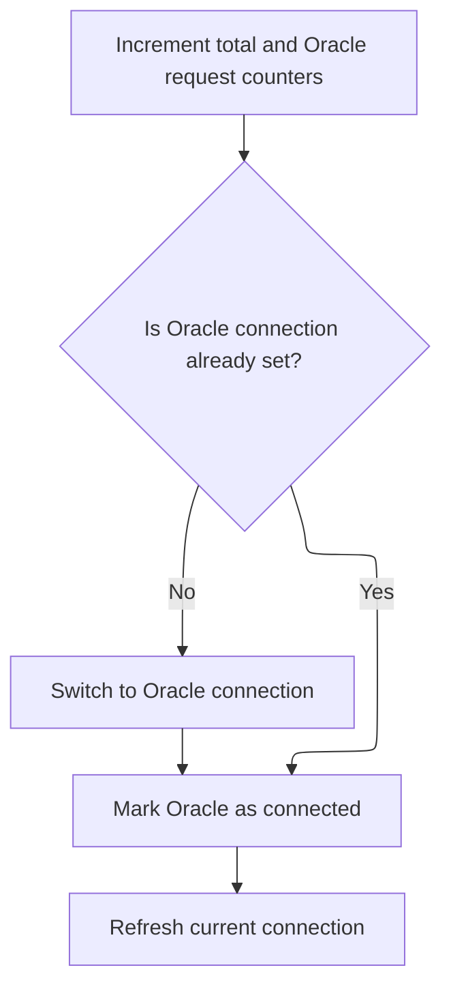
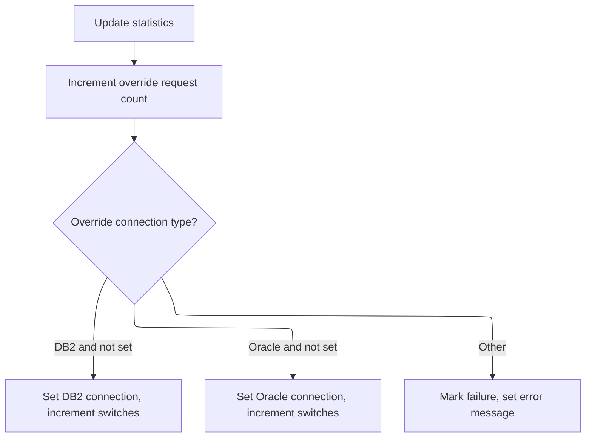

This document describes how the system processes commands to manage database connections and track usage statistics. When a connection request or stats reset command is received, the system determines the appropriate action—switching to DB2, Oracle, applying an override, or resetting counters—and updates the connection status and statistics accordingly.

# Spec

## Detailed View of the Program's Functionality

## Main Dispatcher Logic

The program begins execution in a main dispatcher routine. This routine first performs initialization, which sets up the environment and resets or sets initial values for various working variables. After initialization, the dispatcher examines the incoming command to determine what action is being requested. It does this by evaluating the command against a set of known options, such as requests to get the current connection, set the connection to DB2, set the connection to Oracle, retrieve statistics, reset statistics, or override the current connection. For each recognized command, the dispatcher calls the corresponding handler routine. If the command is not recognized, it marks the operation as a failure and sets an error message indicating the function is not recognized. After handling the command, the program returns control to the caller.

---

## Initialization

During initialization, the program resets or sets up the input/output area and working storage variables. It also sets the environment switch to indicate the production environment by default. This ensures that the program starts in a known state and is ready to process requests.

---

## Handling DB2 Connection Requests

When a request is made to set the connection to DB2, the handler for DB2 connection requests is invoked. This handler increments both the total request counter and the DB2-specific request counter, tracking usage statistics. It then checks if the current connection is either Oracle or the default (i.e., not already DB2). If so, it performs the actual switch to DB2 by calling a subroutine dedicated to making the DB2 connection.

The subroutine responsible for switching to DB2 increments the connection switch counter and determines which DB2 database to connect to based on the environment (production or test). It then issues the SQL command to connect to the appropriate DB2 instance. After attempting the connection, it checks the result code: if the connection was successful, it continues; if not, it marks the operation as a failure and constructs an error message containing the SQL error code.

After the connection switch (if needed), the handler marks DB2 as the current connection and updates the output to reflect the new connection type.

---

## Handling Oracle Connection Requests

When a request is made to set the connection to Oracle, the handler for Oracle connection requests is invoked. This handler increments both the total request counter and the Oracle-specific request counter. It then checks if the current connection is not already Oracle. If not, it performs the actual switch to Oracle by calling a subroutine dedicated to making the Oracle connection.

The subroutine responsible for switching to Oracle increments the connection switch counter and determines which Oracle database to connect to by checking a series of environment flags (production, test, or various test environments). It issues the SQL command to connect to the selected Oracle instance. After attempting the connection, it checks the result code: if the connection was successful, it continues; if not, it marks the operation as a failure and constructs an error message containing the SQL error code.

After the connection switch (if needed), the handler marks Oracle as the current connection and updates the output to reflect the new connection type.

---

## Retrieving Current Connection

When requested, the program retrieves the current connection type from working storage and places it into the output structure. This allows the caller to know whether the program is currently connected to DB2, Oracle, or is in the default state.

---

## Retrieving Statistics

When requested, the program first updates the output with the current connection type, then copies all statistics counters from working storage into the output structure. These statistics include total requests, DB2 requests, Oracle requests, override requests, connection switches, and override switches.

---

## Resetting Statistics

When requested, the program resets all statistics counters in both working storage and the output structure. This clears any previous tracking of requests, switches, and overrides, effectively starting the statistics from zero.

---

## Handling Connection Overrides

When a request is made to override the current connection, the handler for overrides is invoked. This handler increments the override request counter. It then checks if the override request is for DB2 or Oracle, and whether the current connection is not already set to the requested type. If the request is for DB2 and the current connection is not DB2, it sets the connection to DB2 and increments the override switches counter. If the request is for Oracle and the current connection is not Oracle, it sets the connection to Oracle and increments the override switches counter. If the request does not match either DB2 or Oracle, or if the connection is already set as requested, it marks the operation as a failure and sets an error message indicating the override connection is invalid.

---

## Error Handling

Throughout the program, if an operation fails (such as an unrecognized command or a failed database connection), the program marks the operation as a failure and constructs an appropriate error message. This message is placed in the output structure for the caller to review.

---

## Summary

- The program acts as a dispatcher, routing requests to handlers for DB2/Oracle connection management, statistics retrieval/reset, and connection overrides.
- It maintains and updates statistics for all operations.
- It ensures only valid connection switches are performed and provides error feedback for invalid operations or failures.
- The logic is modular, with each handler responsible for a specific aspect of connection or statistics management.

# Rule Definition

| Paragraph Name                                                                                                                   | Rule ID | Category          | Description                                                                                                                                                                                                                                                                                                                                                                                                 | Conditions                                                                                          | Remarks                                                                                                                                                                                                                                                       |
| -------------------------------------------------------------------------------------------------------------------------------- | ------- | ----------------- | ----------------------------------------------------------------------------------------------------------------------------------------------------------------------------------------------------------------------------------------------------------------------------------------------------------------------------------------------------------------------------------------------------------- | --------------------------------------------------------------------------------------------------- | ------------------------------------------------------------------------------------------------------------------------------------------------------------------------------------------------------------------------------------------------------------- |
| 0000-EXIT-DISPATCHER                                                                                                             | RL-001  | Conditional Logic | The program processes requests based on a single command flag in the input structure. Only one command flag should be set per request; otherwise, the request is considered invalid.                                                                                                                                                                                                                        | A request is received with the input structure. More than one or no command flag is set.            | If no valid command is set, the error message 'YYYS0220 - Function not recognized!' is returned and the FAILURE flag is set. The error message is a string field. The FAILURE flag is a boolean indicator.                                                    |
| 300-SET-DB2-CON, 310-DO-SET-DB2-CON                                                                                              | RL-002  | Computation       | When a Set DB2 Connection command is received, increment the total requests and DB2 requests counters. If the current connection is not DB2, switch to DB2, increment the connection switches counter, and update the output structure.                                                                                                                                                                     | Set DB2 Connection command flag is set. Current connection is not DB2.                              | The counters are numbers. The connection type is a single-character string. The output structure must reflect the new connection type and updated stats. If the connection switch fails, the error message includes the SQL code and the FAILURE flag is set. |
| 400-SET-ORACLE-CON, 410-DO-SET-ORACLE-CON                                                                                        | RL-003  | Computation       | When a Set Oracle Connection command is received, increment the total requests and Oracle requests counters. If the current connection is not Oracle, switch to Oracle, increment the connection switches counter, and update the output structure.                                                                                                                                                         | Set Oracle Connection command flag is set. Current connection is not Oracle.                        | The counters are numbers. The connection type is a single-character string. The output structure must reflect the new connection type and updated stats. If the connection switch fails, the error message includes the SQL code and the FAILURE flag is set. |
| 700-SET-OVERRIDE-CON                                                                                                             | RL-004  | Computation       | When an Override Connection command is received, increment the override requests counter. If the DB2 override is set and the current connection is not DB2, switch to DB2 and increment override switches. If the Oracle override is set and the current connection is not Oracle, switch to Oracle and increment override switches. If neither override is set, set an error message and the FAILURE flag. | Override Connection command flag is set. DB2 or Oracle override flag is set in the input structure. | Override requests and switches are numbers. The output structure must reflect the new connection type and updated stats. If neither override is set, the error message is 'YYYS0220 - Invalid over-ride connection!' and the FAILURE flag is set.             |
| 600-SET-STATS                                                                                                                    | RL-005  | Data Assignment   | When a Reset Stats command is received, set all statistics fields (total requests, DB2 requests, Oracle requests, override requests, connection switches, override switches) to zero in both workspace and output structure.                                                                                                                                                                                | Reset Stats command flag is set.                                                                    | All statistics fields are numbers. The output structure must reflect all stats as zero after reset.                                                                                                                                                           |
| 500-GET-STATS                                                                                                                    | RL-006  | Data Assignment   | When a Get Stats command is received, return the current values of all statistics fields in the output structure.                                                                                                                                                                                                                                                                                           | Get Stats command flag is set.                                                                      | All statistics fields are numbers. The output structure must reflect the current values of all stats.                                                                                                                                                         |
| 200-GET-CURR-CON                                                                                                                 | RL-007  | Data Assignment   | When a Get Current Connection command is received, return the current connection type in the output structure.                                                                                                                                                                                                                                                                                              | Get Current Connection command flag is set.                                                         | The connection type is a single-character string. The output structure must reflect the current connection type.                                                                                                                                              |
| 310-DO-SET-DB2-CON, 410-DO-SET-ORACLE-CON                                                                                        | RL-008  | Conditional Logic | If a connection switch fails (e.g., due to an SQL error), set the error message to include the SQL code and set the FAILURE flag.                                                                                                                                                                                                                                                                           | A connection switch is attempted and the SQL code is not zero.                                      | The error message is a string that includes the SQL code. The FAILURE flag is a boolean indicator.                                                                                                                                                            |
| All command handlers (200-GET-CURR-CON, 300-SET-DB2-CON, 400-SET-ORACLE-CON, 500-GET-STATS, 600-SET-STATS, 700-SET-OVERRIDE-CON) | RL-009  | Data Assignment   | After processing any request, the output structure must reflect the latest statistics, connection flags, and error message field.                                                                                                                                                                                                                                                                           | Any command is processed.                                                                           | The output structure contains fields for statistics (numbers), connection flags (single-character strings), and an error message (string).                                                                                                                    |

# User Stories

## User Story 1: Set or Override Connection (DB2/Oracle) and Handle Errors

---

### Story Description:

As a user, I want to set or override the current connection to DB2 or Oracle, update statistics, and receive error messages if the switch fails or the override is invalid so that I can control the database connection and track connection changes.

---

### Business Rule Mapping:

| Rule ID | Paragraph Name                            | Rule Description                                                                                                                                                                                                                                                                                                                                                                                            |
| ------- | ----------------------------------------- | ----------------------------------------------------------------------------------------------------------------------------------------------------------------------------------------------------------------------------------------------------------------------------------------------------------------------------------------------------------------------------------------------------------- |
| RL-002  | 300-SET-DB2-CON, 310-DO-SET-DB2-CON       | When a Set DB2 Connection command is received, increment the total requests and DB2 requests counters. If the current connection is not DB2, switch to DB2, increment the connection switches counter, and update the output structure.                                                                                                                                                                     |
| RL-003  | 400-SET-ORACLE-CON, 410-DO-SET-ORACLE-CON | When a Set Oracle Connection command is received, increment the total requests and Oracle requests counters. If the current connection is not Oracle, switch to Oracle, increment the connection switches counter, and update the output structure.                                                                                                                                                         |
| RL-004  | 700-SET-OVERRIDE-CON                      | When an Override Connection command is received, increment the override requests counter. If the DB2 override is set and the current connection is not DB2, switch to DB2 and increment override switches. If the Oracle override is set and the current connection is not Oracle, switch to Oracle and increment override switches. If neither override is set, set an error message and the FAILURE flag. |
| RL-008  | 310-DO-SET-DB2-CON, 410-DO-SET-ORACLE-CON | If a connection switch fails (e.g., due to an SQL error), set the error message to include the SQL code and set the FAILURE flag.                                                                                                                                                                                                                                                                           |

---

### Relevant Functionality:

- **300-SET-DB2-CON**
  1. **RL-002:**
     - On Set DB2 Connection command:
       - Increment total requests counter by 1.
       - Increment DB2 requests counter by 1.
       - If the current connection is not DB2:
         - Switch to DB2 connection.
         - Increment connection switches counter by 1.
         - If the switch fails:
           - Set FAILURE flag to true.
           - Set error message to include SQL code.
       - Update output structure with new connection type and stats.
- **400-SET-ORACLE-CON**
  1. **RL-003:**
     - On Set Oracle Connection command:
       - Increment total requests counter by 1.
       - Increment Oracle requests counter by 1.
       - If the current connection is not Oracle:
         - Switch to Oracle connection.
         - Increment connection switches counter by 1.
         - If the switch fails:
           - Set FAILURE flag to true.
           - Set error message to include SQL code.
       - Update output structure with new connection type and stats.
- **700-SET-OVERRIDE-CON**
  1. **RL-004:**
     - On Override Connection command:
       - Increment override requests counter by 1.
       - If DB2 override is set and current connection is not DB2:
         - Switch to DB2 connection.
         - Increment override switches counter by 1.
       - Else if Oracle override is set and current connection is not Oracle:
         - Switch to Oracle connection.
         - Increment override switches counter by 1.
       - Else:
         - Set FAILURE flag to true.
         - Set error message to indicate invalid override.
       - Update output structure with new connection type and stats.
- **310-DO-SET-DB2-CON**
  1. **RL-008:**
     - After attempting a connection switch:
       - If SQL code is not zero:
         - Set FAILURE flag to true.
         - Set error message to include SQL code.

## User Story 2: Command Dispatch, Validation, and Output Update

---

### Story Description:

As a system, I want to process requests based on a single command flag and always update the output structure so that only valid commands are executed, invalid requests are rejected with an appropriate error message, and the user receives accurate and up-to-date information.

---

### Business Rule Mapping:

| Rule ID | Paragraph Name                                                                                                                   | Rule Description                                                                                                                                                                     |
| ------- | -------------------------------------------------------------------------------------------------------------------------------- | ------------------------------------------------------------------------------------------------------------------------------------------------------------------------------------ |
| RL-001  | 0000-EXIT-DISPATCHER                                                                                                             | The program processes requests based on a single command flag in the input structure. Only one command flag should be set per request; otherwise, the request is considered invalid. |
| RL-009  | All command handlers (200-GET-CURR-CON, 300-SET-DB2-CON, 400-SET-ORACLE-CON, 500-GET-STATS, 600-SET-STATS, 700-SET-OVERRIDE-CON) | After processing any request, the output structure must reflect the latest statistics, connection flags, and error message field.                                                    |

---

### Relevant Functionality:

- **0000-EXIT-DISPATCHER**
  1. **RL-001:**
     - On receiving a request:
       - Check which command flag is set in the input structure.
       - If exactly one command flag is set, dispatch to the corresponding handler.
       - If none or multiple are set:
         - Set the FAILURE flag to true.
         - Set the error message field to indicate an unrecognized function.
- **All command handlers (200-GET-CURR-CON**
  1. **RL-009:**
     - After processing any command:
       - Update output structure with latest statistics.
       - Update output structure with latest connection flags.
       - Update output structure with latest error message.

## User Story 3: Manage and Retrieve Statistics and Connection State

---

### Story Description:

As a user, I want to reset all statistics, retrieve current statistics, and get the current connection type so that I can monitor and manage system usage and connection state.

---

### Business Rule Mapping:

| Rule ID | Paragraph Name   | Rule Description                                                                                                                                                                                                             |
| ------- | ---------------- | ---------------------------------------------------------------------------------------------------------------------------------------------------------------------------------------------------------------------------- |
| RL-005  | 600-SET-STATS    | When a Reset Stats command is received, set all statistics fields (total requests, DB2 requests, Oracle requests, override requests, connection switches, override switches) to zero in both workspace and output structure. |
| RL-006  | 500-GET-STATS    | When a Get Stats command is received, return the current values of all statistics fields in the output structure.                                                                                                            |
| RL-007  | 200-GET-CURR-CON | When a Get Current Connection command is received, return the current connection type in the output structure.                                                                                                               |

---

### Relevant Functionality:

- **600-SET-STATS**
  1. **RL-005:**
     - On Reset Stats command:
       - Set all statistics fields to zero in workspace.
       - Set all statistics fields to zero in output structure.
- **500-GET-STATS**
  1. **RL-006:**
     - On Get Stats command:
       - Copy all statistics fields from workspace to output structure.
- **200-GET-CURR-CON**
  1. **RL-007:**
     - On Get Current Connection command:
       - Copy current connection type from workspace to output structure.

# Code Walkthrough

## Dispatching and Handling DB2 Connection Requests

<SwmSnippet path="/base/src/YYYS0220.cbl" line="56">

---

0000-EXIT-DISPATCHER kicks off the flow by running initialization and then dispatching to the right subroutine based on the input command. It uses EVALUATE TRUE to match the command against known codes and calls the relevant handler, like 300-SET-DB2-CON for DB2 connection requests. If the command isn't recognized, it sets FAILURE and returns an error message. Calling 300-SET-DB2-CON here is what actually switches the connection to DB2 and updates stats, so it's the next logical step when the dispatcher sees a DB2 request.

```cobol
006500 0000-EXIT-DISPATCHER.                                            00006500
006600     PERFORM 100-INITIALIZATION                                   00006600
006700                                                                  00006700
006800     EVALUATE TRUE                                                00006800
006900       WHEN YYYC0220-GET-CURR-CON                                 00006900
007000         PERFORM 200-GET-CURR-CON                                 00007000
007100       WHEN YYYC0220-SET-DB2-CON                                  00007100
007200         PERFORM 300-SET-DB2-CON                                  00007200
007300       WHEN YYYC0220-SET-ORACLE-CON                               00007300
007400         PERFORM 400-SET-ORACLE-CON                               00007400
007500       WHEN YYYC0220-GET-STATS                                    00007500
007600         PERFORM 500-GET-STATS                                    00007600
007700       WHEN YYYC0220-SET-STATS                                    00007700
007800         PERFORM 600-SET-STATS                                    00007800
007900       WHEN YYYC0220-SET-OVERRIDE-CON                             00007900
008000         PERFORM 700-SET-OVERRIDE-CON                             00008000
008100       WHEN OTHER                                                 00008100
008200         SET  FAILURE TO TRUE                                     00008200
008300         MOVE 'YYYS0220 - Function not recognized!'               00008300
008400           TO IS-RTRN-MSG-TXT                                     00008400
008500     END-EVALUATE                                                 00008500
008600                                                                  00008600
008700     GOBACK                                                       00008700
008800     .                                                            00008800
```

---

</SwmSnippet>

<SwmSnippet path="/base/src/YYYS0220.cbl" line="105">

---

300-SET-DB2-CON handles the DB2 connection request. It bumps the total and DB2 request counters, checks if we're currently on Oracle or default, and only then calls 310-DO-SET-DB2-CON to actually switch to DB2. After the switch, it sets the DB2 flag and calls 200-GET-CURR-CON to update the connection type output.

```cobol
011400 300-SET-DB2-CON.                                                 00011400
011500     ADD 1 TO WS-TOT-REQS                                         00011500
011600     ADD 1 TO WS-DB2-REQS                                         00011600
011700                                                                  00011700
011800     IF WS-ORACLE-CON                                             00011800
011900     OR WS-DEFAULT-CON                                            00011900
012000       PERFORM 310-DO-SET-DB2-CON                                 00012000
012100     END-IF                                                       00012100
012200                                                                  00012200
012300     SET WS-DB2-CON TO TRUE                                       00012300
012400     PERFORM 200-GET-CURR-CON                                     00012400
012500     .                                                            00012500
```

---

</SwmSnippet>

### Handling Oracle Connection Requests



<SwmSnippet path="/base/src/YYYS0220.cbl" line="150">

---

400-SET-ORACLE-CON handles Oracle connection requests. It increments the total and Oracle request counters, checks if we're not already on Oracle, and only then calls 410-DO-SET-ORACLE-CON to switch. After that, it sets the Oracle flag and updates the connection type output.

```cobol
015900 400-SET-ORACLE-CON.                                              00015900
016000     ADD 1 TO WS-TOT-REQS                                         00016000
016100     ADD 1 TO WS-OCL-REQS                                         00016100
016200                                                                  00016200
016300     IF NOT WS-ORACLE-CON                                         00016300
016400       PERFORM 410-DO-SET-ORACLE-CON                              00016400
016500     END-IF                                                       00016500
016600                                                                  00016600
016700     SET WS-ORACLE-CON TO TRUE                                    00016700
016800     PERFORM 200-GET-CURR-CON                                     00016800
016900     .                                                            00016900
```

---

</SwmSnippet>

<SwmSnippet path="/base/src/YYYS0220.cbl" line="163">

---

410-DO-SET-ORACLE-CON figures out which Oracle DB to connect to by checking the environment switch flags. It picks the right connection string and runs the SQL CONNECT. After that, it checks SQLCODE—if the connection failed, it sets FAILURE and builds an error message with the SQL code.

```cobol
017200 410-DO-SET-ORACLE-CON.                                           00017200
017300     ADD 1 TO WS-CON-SWITCHES                                     00017300
017400                                                                  00017400
017500     EVALUATE TRUE                                                00017500
017600       WHEN WS-PROD                                               00017600
017700         EXEC SQL                                                 00017700
017800           CONNECT TO DRDAASP1                                    00017800
017900         END-EXEC                                                 00017900
018000                                                                  00018000
018100       WHEN WS-TEST                                               00018100
018200         EXEC SQL                                                 00018200
018300           CONNECT TO DRDAASC7                                    00018300
018400         END-EXEC                                                 00018400
018500                                                                  00018500
018600       WHEN WS-TST6                                               00018600
018700         EXEC SQL                                                 00018700
018800           CONNECT TO DRDAASC6                                    00018800
018900         END-EXEC                                                 00018900
019000                                                                  00019000
019100       WHEN WS-TST5                                               00019100
019200         EXEC SQL                                                 00019200
019300           CONNECT TO DRDAASC5                                    00019300
019400         END-EXEC                                                 00019400
019500                                                                  00019500
019600       WHEN WS-TST4                                               00019600
019700         EXEC SQL                                                 00019700
019800           CONNECT TO DRDAASD1                                    00019800
019900         END-EXEC                                                 00019900
020000                                                                  00020000
020100       WHEN WS-TST3                                               00020100
020200         EXEC SQL                                                 00020200
020300           CONNECT TO DRDAASC1                                    00020300
020400         END-EXEC                                                 00020400
020500     END-EVALUATE                                                 00020500
020600                                                                  00020600
020700     EVALUATE TRUE                                                00020700
020800       WHEN SQLCODE = 0                                           00020800
020900         CONTINUE                                                 00020900
021000                                                                  00021000
021100       WHEN OTHER                                                 00021100
021200         SET  FAILURE TO TRUE                                     00021200
021300         MOVE SQLCODE TO WS-SQLCODE                               00021300
021400         STRING 'YYYS0220 - Failure connecting to Oracle, SQL='   00021400
021500                WS-SQLCODE                                        00021500
021600             DELIMITED BY SIZE INTO IS-RTRN-MSG-TXT               00021600
021700     END-EVALUATE                                                 00021700
021800     .                                                            00021800
```

---

</SwmSnippet>

### Resetting Stats and Handling Connection Overrides



<SwmSnippet path="/base/src/YYYS0220.cbl" line="230">

---

600-SET-STATS resets all the stats counters in both the workspace and output structure. This wipes any previous tracking for requests, switches, and overrides.

```cobol
023900 600-SET-STATS.                                                   00023900
024000     INITIALIZE WS-STATS                                          00024000
024100                YYYC0220-STATS                                    00024100
024200     .                                                            00024200
```

---

</SwmSnippet>

<SwmSnippet path="/base/src/YYYS0220.cbl" line="239">

---

700-SET-OVERRIDE-CON bumps the override request counter, checks if the input is for DB2 or Oracle, and if the flag isn't already set, sets it and increments the override switches counter. If the input doesn't match either, it sets FAILURE and returns an error message.

```cobol
024800 700-SET-OVERRIDE-CON.                                            00024800
024900     ADD 1 TO WS-OVR-REQS                                         00024900
025000                                                                  00025000
025100     EVALUATE TRUE                                                00025100
025200       WHEN YYYC0220-DB2-CON                                      00025200
025300       AND  NOT WS-DB2-CON                                        00025300
025400         SET WS-DB2-CON    TO TRUE                                00025400
025500         ADD 1             TO WS-OVR-SWITCHES                     00025500
025600                                                                  00025600
025700       WHEN YYYC0220-ORACLE-CON                                   00025700
025800       AND NOT WS-ORACLE-CON                                      00025800
025900         SET WS-ORACLE-CON TO TRUE                                00025900
026000         ADD 1             TO WS-OVR-SWITCHES                     00026000
026100                                                                  00026100
026200       WHEN OTHER                                                 00026200
026300         SET FAILURE TO TRUE                                      00026300
026400         MOVE 'YYYS0220 - Invalid over-ride connection!'          00026400
026500           TO IS-RTRN-MSG-TXT                                     00026500
026600     END-EVALUATE                                                 00026600
026700     .                                                            00026700
```

---

</SwmSnippet>

&nbsp;

*This is an auto-generated document by Swimm 🌊 and has not yet been verified by a human*

<SwmMeta version="3.0.0" repo-id="Z2l0aHViJTNBJTNBU3dpbW1pby1keW5jYWxsLWRlbW8lM0ElM0FHaXJpLVN3aW1t" repo-name="Swimmio-dyncall-demo"><sup>Powered by [Swimm](https://app.swimm.io/)</sup></SwmMeta>
