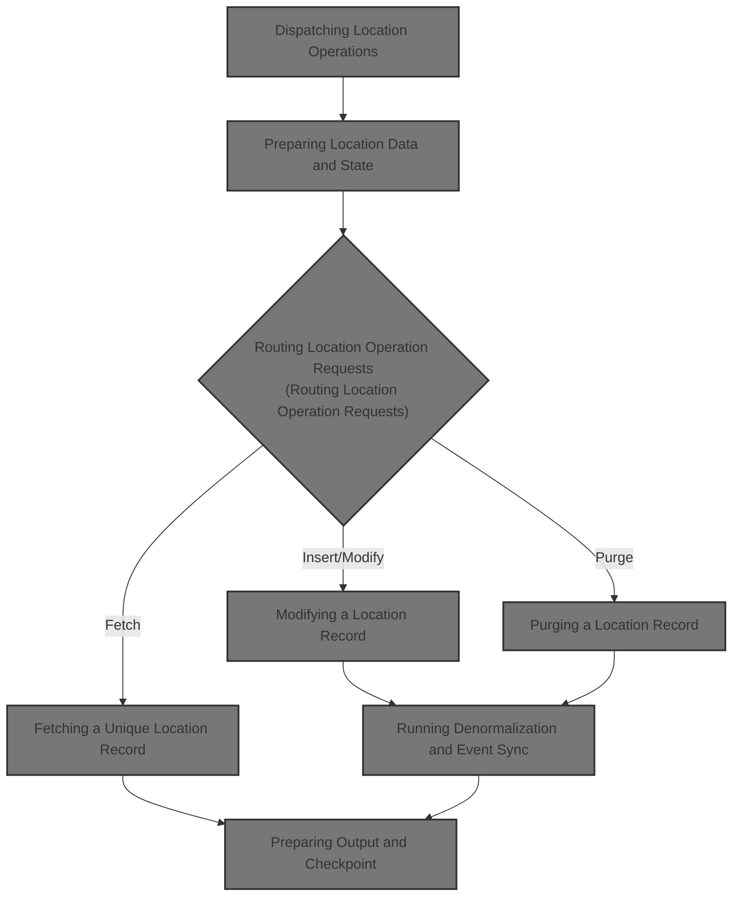
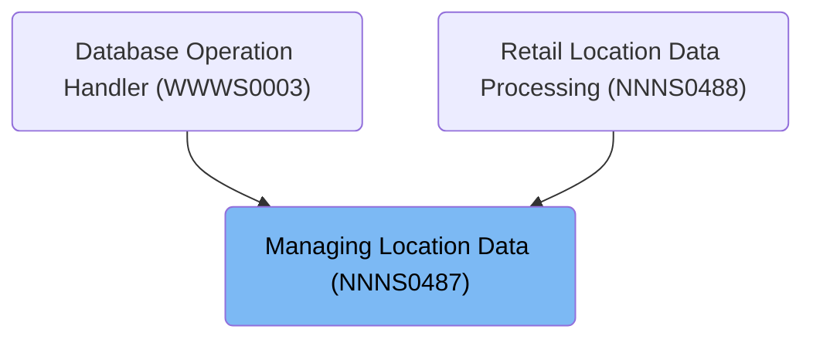

# Overview

This document describes the flow for managing location data operations. The flow receives operation codes and location data, determines the requested business operation (such as insert, modify, purge, or fetch), and coordinates all necessary database connections and business validations. It ensures that each location transaction is processed according to business rules, with updated data returned to the caller or an error message if the operation cannot be completed.

## Dependencies

### Programs

- NNNS0487 (<SwmPath>[base/src/NNNS0487.cbl](base/src/NNNS0487.cbl)</SwmPath>)
- YYYS0134 (<SwmPath>[base/src/YYYS0134.cbl](base/src/YYYS0134.cbl)</SwmPath>)
- MMMS0291 (<SwmPath>[base/src/MMMS0291.cbl](base/src/MMMS0291.cbl)</SwmPath>)
- YYYS0210 (<SwmPath>[base/src/XXXS0210.cbl](base/src/XXXS0210.cbl)</SwmPath>)
- YYYS0220 (<SwmPath>[base/src/YYYS0220.cbl](base/src/YYYS0220.cbl)</SwmPath>)
- YYYS0211 (<SwmPath>[base/src/YYYS0211.cbl](base/src/YYYS0211.cbl)</SwmPath>)
- YYYS0212 (<SwmPath>[base/src/YYYS0212.cbl](base/src/YYYS0212.cbl)</SwmPath>)
- NNNS0457
- NNNS0486
- WWWS0100 (<SwmPath>[base/src/WWWS0100.cbl](base/src/WWWS0100.cbl)</SwmPath>)
- MMMS0135
- MMMS0157
- MMMS0265
- ZZZS0197 (<SwmPath>[base/src/ZZZS0197.cbl](base/src/ZZZS0197.cbl)</SwmPath>)
- YYYS0175
- YYYS0127
- YYYS0107
- MMMS0474
- NNNS0488 (<SwmPath>[base/src/NNNS0488.cbl](base/src/NNNS0488.cbl)</SwmPath>)
- MMMS0159
- MMMS0304
- MMMS0335 (<SwmPath>[base/src/MMMS0335.cbl](base/src/MMMS0335.cbl)</SwmPath>)
- NNNU0488
- NNNS0575
- NNNS0483
- NNNS0473 (<SwmPath>[base/src/NNNS0473.cbl](base/src/NNNS0473.cbl)</SwmPath>)
- MMMS0161 (<SwmPath>[base/src/MMMS0161.cbl](base/src/MMMS0161.cbl)</SwmPath>)
- MMMS0162 (<SwmPath>[base/src/MMMS0162.cbl](base/src/MMMS0162.cbl)</SwmPath>)
- NNNS0120 (<SwmPath>[base/src/NNNS0120.cbl](base/src/NNNS0120.cbl)</SwmPath>)
- NNNU0120
- NNNU0473 (<SwmPath>[base/src/NNNU0473.cbl](base/src/NNNU0473.cbl)</SwmPath>)
- NNNS2294
- NNNU0487
- MMMU0487
- MMMS0711 (<SwmPath>[base/src/MMMS0711.cbl](base/src/MMMS0711.cbl)</SwmPath>)
- WWWS0099

### Copybooks

- YYYN000A (<SwmPath>[base/src/YYYN000A.cpy](base/src/YYYN000A.cpy)</SwmPath>)
- XXXN001A (<SwmPath>[base/src/XXXN001A.cpy](base/src/XXXN001A.cpy)</SwmPath>)
- SQLCA
- MMMC0291 (<SwmPath>[base/src/MMMC0291.cpy](base/src/MMMC0291.cpy)</SwmPath>)
- YYYC0220 (<SwmPath>[base/src/YYYC0220.cpy](base/src/YYYC0220.cpy)</SwmPath>)
- WWWC0100 (<SwmPath>[base/src/WWWC0100.cpy](base/src/WWWC0100.cpy)</SwmPath>)
- YYYC0175
- YYYN110A (<SwmPath>[base/src/YYYN110A.cpy](base/src/YYYN110A.cpy)</SwmPath>)
- ZZZC0197 (<SwmPath>[base/src/ZZZC0197.cpy](base/src/ZZZC0197.cpy)</SwmPath>)
- DDDTAC01
- DDDTCM01
- DDDTCS01
- DDDTEA01
- DDDTIC01
- DDDTAV01
- DDDTSC01
- DDDTBF01
- DDDTZN01
- DDDTCT01
- MMMC0335 (<SwmPath>[base/src/MMMC0335.cpy](base/src/MMMC0335.cpy)</SwmPath>)
- DFHEIBLK
- NNNN000U (<SwmPath>[base/src/NNNN000U.cpy](base/src/NNNN000U.cpy)</SwmPath>)
- HHHTLR01
- PPPTLO01 (<SwmPath>[base/src/PPPTLO01.cpy](base/src/PPPTLO01.cpy)</SwmPath>)
- YYYN000C (<SwmPath>[base/src/YYYN000C.cpy](base/src/YYYN000C.cpy)</SwmPath>)
- YYYC0127 (<SwmPath>[base/src/YYYC0127.cpy](base/src/YYYC0127.cpy)</SwmPath>)
- YYYC0107 (<SwmPath>[base/src/YYYC0107.cpy](base/src/YYYC0107.cpy)</SwmPath>)
- ZZZC0032 (<SwmPath>[base/src/ZZZC0032.cpy](base/src/ZZZC0032.cpy)</SwmPath>)
- ZZZC0094 (<SwmPath>[base/src/ZZZC0094.cpy](base/src/ZZZC0094.cpy)</SwmPath>)
- ZZZC0210
- MMMC0159
- MMMK001B (<SwmPath>[base/src/MMMK001B.cpy](base/src/MMMK001B.cpy)</SwmPath>)
- MMMC0304 (<SwmPath>[base/src/MMMC0304.cpy](base/src/MMMC0304.cpy)</SwmPath>)
- DDDTLR01
- YYYN005A (<SwmPath>[base/src/YYYN005A.cpy](base/src/YYYN005A.cpy)</SwmPath>)
- NNNN0000 (<SwmPath>[base/src/NNNN0000.cpy](base/src/NNNN0000.cpy)</SwmPath>)
- PPPTLR01 (<SwmPath>[base/src/PPPTLR01.cpy](base/src/PPPTLR01.cpy)</SwmPath>)
- YYYN111A (<SwmPath>[base/src/YYYN111A.cpy](base/src/YYYN111A.cpy)</SwmPath>)
- PPPTCZ01 (<SwmPath>[base/src/PPPTCZ01.cpy](base/src/PPPTCZ01.cpy)</SwmPath>)
- DDDPST01 (<SwmPath>[base/src/DDDPST01.cpy](base/src/DDDPST01.cpy)</SwmPath>)
- PPPTRL01 (<SwmPath>[base/src/PPPTRL01.cpy](base/src/PPPTRL01.cpy)</SwmPath>)
- HHHTRL01 (<SwmPath>[base/src/HHHTRL01.cpy](base/src/HHHTRL01.cpy)</SwmPath>)
- DDDTRL01 (<SwmPath>[base/src/DDDTRL01.cpy](base/src/DDDTRL01.cpy)</SwmPath>)
- W00N001A
- YYYC0097 (<SwmPath>[base/src/YYYC0097.cpy](base/src/YYYC0097.cpy)</SwmPath>)
- YYYC0131
- TTTK0001
- DDDBSSAS
- MMMC0161 (<SwmPath>[base/src/MMMC0161.cpy](base/src/MMMC0161.cpy)</SwmPath>)
- DDDTCZ01 (<SwmPath>[base/src/DDDTCZ01.cpy](base/src/DDDTCZ01.cpy)</SwmPath>)
- XXXEIBLK
- HHHTCZ01 (<SwmPath>[base/src/HHHTCZ01.cpy](base/src/HHHTCZ01.cpy)</SwmPath>)
- WWWC0099
- DDDTLS01
- DDDTPT01
- DDDTVI01
- DDDTSI01
- DDDTLO01 (<SwmPath>[base/src/DDDTLO01.cpy](base/src/DDDTLO01.cpy)</SwmPath>)
- MMMC0711 (<SwmPath>[base/src/MMMC0711.cpy](base/src/MMMC0711.cpy)</SwmPath>)
- PPPTAP01
- PPPTLD01
- PPPTFX01 (<SwmPath>[base/src/PPPTFX01.cpy](base/src/PPPTFX01.cpy)</SwmPath>)
- PPPTDT01
- PPPTCY01
- HHHTLO01 (<SwmPath>[base/src/HHHTLO01.cpy](base/src/HHHTLO01.cpy)</SwmPath>)
- MMMC0474
- ZZZC0122
- ZZZC0123
- ZZZC0124
- ZZZC0020
- ZZZC0044
- ZZZC0550 (<SwmPath>[base/src/ZZZC0550.cpy](base/src/ZZZC0550.cpy)</SwmPath>)
- MMMC0135
- MMMC0157
- MMMC0153
- MMMC0265
- DDDTDT01
- DDDTFX01
- DDDTAP01
- DDDTLW01
- DDDTLB01

# Where is this program used?

This program is used multiple times in the codebase as represented in the following diagram:

&nbsp;

*This is an auto-generated document by Swimm 🌊 and has not yet been verified by a human*

<SwmMeta version="3.0.0" repo-id="Z2l0aHViJTNBJTNBU3dpbW1pby1keW5jYWxsLWRlbW8lM0ElM0FHaXJpLVN3aW1t" repo-name="Swimmio-dyncall-demo">Powered by [Swimm](https://app.swimm.io/)</SwmMeta>
