# Overview

This document explains the flow of managing location records. The system receives operation codes and location data, validates and normalizes the input, establishes database connections as needed, and dispatches requests to retrieve, modify, insert, or purge location records. All changes are tracked for audit purposes, business events are triggered, and formatted output is produced for downstream systems.

## Dependencies

### Programs

- <SwmToken path="base/src/NNNS0487.cbl" pos="1183:5:5" line-data="126000       STRING &#39;NNNS0487 - Error connecting to Oracle. Sqlcode =&#39;  00126000">`NNNS0487`</SwmToken> (<SwmPath>[base/src/NNNS0487.cbl](base/src/NNNS0487.cbl)</SwmPath>)
- <SwmToken path="base/src/NNNS0487.cbl" pos="920:4:4" line-data="099700     CALL  YYYS0134-STRING-CRUNCH USING                           00099700">`YYYS0134`</SwmToken> (<SwmPath>[base/src/YYYS0134.cbl](base/src/YYYS0134.cbl)</SwmPath>)
- <SwmToken path="base/src/NNNS0487.cbl" pos="1435:6:6" line-data="151200       CALL WS-MMMS0291-PGM USING                                 00151200">`MMMS0291`</SwmToken> (<SwmPath>[base/src/MMMS0291.cbl](base/src/MMMS0291.cbl)</SwmPath>)
- <SwmToken path="base/src/XXXS0210.cbl" pos="2:7:7" line-data="000200 PROGRAM-ID.    YYYS0210.                                         00000200">`YYYS0210`</SwmToken> (<SwmPath>[base/src/XXXS0210.cbl](base/src/XXXS0210.cbl)</SwmPath>)
- <SwmToken path="base/src/XXXS0210.cbl" pos="55:4:4" line-data="007540     CALL YYYS0220-DBMS-CON-MGR USING                             00007540">`YYYS0220`</SwmToken> (<SwmPath>[base/src/YYYS0220.cbl](base/src/YYYS0220.cbl)</SwmPath>)
- <SwmToken path="base/src/YYYS0211.cbl" pos="2:7:7" line-data="000200 PROGRAM-ID.    YYYS0211.                                         00000200">`YYYS0211`</SwmToken> (<SwmPath>[base/src/YYYS0211.cbl](base/src/YYYS0211.cbl)</SwmPath>)
- <SwmToken path="base/src/YYYS0212.cbl" pos="96:9:9" line-data="010300         STRING &#39;Error in YYYS0212. Oracle code:&#39;                 00010300">`YYYS0212`</SwmToken> (<SwmPath>[base/src/YYYS0212.cbl](base/src/YYYS0212.cbl)</SwmPath>)
- <SwmToken path="base/src/NNNS0487.cbl" pos="50:4:4" line-data="012700 01 NNNS0457-AP-LOC-DAO                PIC X(8)  VALUE &#39;NNNS0457&#39;.00012700">`NNNS0457`</SwmToken>
- <SwmToken path="base/src/NNNS0487.cbl" pos="51:4:4" line-data="012800 01 NNNS0486-DSD-LOC-DAO               PIC X(8)  VALUE &#39;NNNS0486&#39;.00012800">`NNNS0486`</SwmToken>
- <SwmToken path="base/src/NNNS0487.cbl" pos="3123:4:4" line-data="320000     CALL WWWS0100-CONTROL-SUBR USING                             00320000">`WWWS0100`</SwmToken> (<SwmPath>[base/src/WWWS0100.cbl](base/src/WWWS0100.cbl)</SwmPath>)
- <SwmToken path="base/src/NNNS0487.cbl" pos="3134:4:4" line-data="321100         CALL MMMS0135-SYNC-LO USING                              00321100">`MMMS0135`</SwmToken>
- <SwmToken path="base/src/NNNS0487.cbl" pos="3142:4:4" line-data="321900         CALL MMMS0157-SYNC-LO USING                              00321900">`MMMS0157`</SwmToken>
- <SwmToken path="base/src/NNNS0487.cbl" pos="48:6:6" line-data="012500 01 WS-MMMS0265-SYNC                   PIC X(8)  VALUE &#39;MMMS0265&#39;.00012500">`MMMS0265`</SwmToken>
- <SwmToken path="base/src/NNNS0487.cbl" pos="3194:4:4" line-data="327100         CALL ZZZS0197-EVENT-MGR USING                            00327100">`ZZZS0197`</SwmToken> (<SwmPath>[base/src/ZZZS0197.cbl](base/src/ZZZS0197.cbl)</SwmPath>)
- YYYS0175
- YYYS0127
- YYYS0107
- <SwmToken path="base/src/NNNS0487.cbl" pos="3299:4:4" line-data="337600     CALL MMMS0474-DO-AVP-MAIN USING                              00337600">`MMMS0474`</SwmToken>
- <SwmToken path="base/src/NNNS0487.cbl" pos="52:4:4" line-data="012900 01 NNNS0488-RETAIL-LOC-DAO            PIC X(8)  VALUE &#39;NNNS0488&#39;.00012900">`NNNS0488`</SwmToken> (<SwmPath>[base/src/NNNS0488.cbl](base/src/NNNS0488.cbl)</SwmPath>)
- MMMS0159
- <SwmToken path="base/src/NNNS0487.cbl" pos="58:4:4" line-data="013500 01 MMMS0304-RI-DEL-CHK                PIC X(8)  VALUE &#39;MMMS0304&#39;.00013500">`MMMS0304`</SwmToken>
- MMMS0335 (<SwmPath>[base/src/MMMS0335.cbl](base/src/MMMS0335.cbl)</SwmPath>)
- NNNU0488
- <SwmToken path="base/src/NNNS0487.cbl" pos="53:4:4" line-data="013000 01 NNNS0575-STR-LOC-DEPT-DAO          PIC X(8)  VALUE &#39;NNNS0575&#39;.00013000">`NNNS0575`</SwmToken>
- <SwmToken path="base/src/NNNS0487.cbl" pos="54:4:4" line-data="013100 01 NNNS0483-FAX-DAO                   PIC X(8)  VALUE &#39;NNNS0483&#39;.00013100">`NNNS0483`</SwmToken>
- <SwmToken path="base/src/NNNS0487.cbl" pos="55:4:4" line-data="013200 01 NNNS0473-RETL-DAO                  PIC X(8)  VALUE &#39;NNNS0473&#39;.00013200">`NNNS0473`</SwmToken> (<SwmPath>[base/src/NNNS0473.cbl](base/src/NNNS0473.cbl)</SwmPath>)
- MMMS0161 (<SwmPath>[base/src/MMMS0161.cbl](base/src/MMMS0161.cbl)</SwmPath>)
- MMMS0162 (<SwmPath>[base/src/MMMS0162.cbl](base/src/MMMS0162.cbl)</SwmPath>)
- NNNS0120 (<SwmPath>[base/src/NNNS0120.cbl](base/src/NNNS0120.cbl)</SwmPath>)
- NNNU0120
- NNNU0473 (<SwmPath>[base/src/NNNU0473.cbl](base/src/NNNU0473.cbl)</SwmPath>)
- <SwmToken path="base/src/NNNS0487.cbl" pos="56:4:4" line-data="013300 01 NNNS2294-MECY-DAO                  PIC X(8)  VALUE &#39;NNNS2294&#39;.00013300">`NNNS2294`</SwmToken>
- <SwmToken path="base/src/NNNS0487.cbl" pos="3369:4:4" line-data="344600     CALL NNNU0487-ORACLE-UPDATE USING                            00344600">`NNNU0487`</SwmToken>
- <SwmToken path="base/src/NNNS0487.cbl" pos="2918:8:8" line-data="299500     PERFORM 5000-CALL-MMMU0487-CUD-ROUTINE                       00299500">`MMMU0487`</SwmToken>
- <SwmToken path="base/src/NNNS0487.cbl" pos="3443:4:4" line-data="352000     CALL MMMS0711-DSV-CHECK USING                                00352000">`MMMS0711`</SwmToken> (<SwmPath>[base/src/MMMS0711.cbl](base/src/MMMS0711.cbl)</SwmPath>)
- <SwmToken path="base/src/MMMS0711.cbl" pos="385:4:4" line-data="039300     CALL WWWS0099-CONTROL-SUBR USING                             00039900">`WWWS0099`</SwmToken>

### Copybooks

- <SwmToken path="base/src/NNNS0487.cbl" pos="92:4:4" line-data="016900 COPY YYYN000A.                                                   00016900">`YYYN000A`</SwmToken> (<SwmPath>[base/src/YYYN000A.cpy](base/src/YYYN000A.cpy)</SwmPath>)
- <SwmToken path="base/src/NNNS0487.cbl" pos="895:4:4" line-data="097200     INITIALIZE XXXN001A                                          00097200">`XXXN001A`</SwmToken> (<SwmPath>[base/src/XXXN001A.cpy](base/src/XXXN001A.cpy)</SwmPath>)
- SQLCA
- <SwmToken path="base/src/NNNS0487.cbl" pos="1424:4:4" line-data="150100       INITIALIZE MMMC0291-INPUT-TM                               00150100">`MMMC0291`</SwmToken> (<SwmPath>[base/src/MMMC0291.cpy](base/src/MMMC0291.cpy)</SwmPath>)
- <SwmToken path="base/src/XXXS0210.cbl" pos="53:4:4" line-data="007510     SET YYYC0220-SET-ORACLE-CON TO TRUE                          00007510">`YYYC0220`</SwmToken> (<SwmPath>[base/src/YYYC0220.cpy](base/src/YYYC0220.cpy)</SwmPath>)
- <SwmToken path="base/src/NNNS0487.cbl" pos="105:4:4" line-data="018200 COPY WWWC0100.                                                   00018200">`WWWC0100`</SwmToken> (<SwmPath>[base/src/WWWC0100.cpy](base/src/WWWC0100.cpy)</SwmPath>)
- YYYC0175
- <SwmToken path="base/src/NNNS0487.cbl" pos="2465:4:4" line-data="254200       SET YYYN110A-UPD TO TRUE                                   00254200">`YYYN110A`</SwmToken> (<SwmPath>[base/src/YYYN110A.cpy](base/src/YYYN110A.cpy)</SwmPath>)
- <SwmToken path="base/src/NNNS0487.cbl" pos="103:4:4" line-data="018000 COPY ZZZC0197.                                                   00018000">`ZZZC0197`</SwmToken> (<SwmPath>[base/src/ZZZC0197.cpy](base/src/ZZZC0197.cpy)</SwmPath>)
- DDDTAC01
- DDDTCM01
- DDDTCS01
- DDDTEA01
- DDDTIC01
- DDDTAV01
- DDDTSC01
- DDDTBF01
- DDDTZN01
- DDDTCT01
- MMMC0335 (<SwmPath>[base/src/MMMC0335.cpy](base/src/MMMC0335.cpy)</SwmPath>)
- DFHEIBLK
- <SwmToken path="base/src/NNNS0487.cbl" pos="80:4:4" line-data="015700 COPY NNNN000U.                                                   00015700">`NNNN000U`</SwmToken> (<SwmPath>[base/src/NNNN000U.cpy](base/src/NNNN000U.cpy)</SwmPath>)
- HHHTLR01
- <SwmToken path="base/src/NNNS0487.cbl" pos="851:4:4" line-data="092800 COPY PPPTLO01.                                                   00092800">`PPPTLO01`</SwmToken> (<SwmPath>[base/src/PPPTLO01.cpy](base/src/PPPTLO01.cpy)</SwmPath>)
- YYYN000C (<SwmPath>[base/src/YYYN000C.cpy](base/src/YYYN000C.cpy)</SwmPath>)
- <SwmToken path="base/src/NNNS0487.cbl" pos="2458:4:4" line-data="253500     MOVE YYYC0127-TS   TO LST-UPDT-TS     OF DCLXXXATION         00253500">`YYYC0127`</SwmToken> (<SwmPath>[base/src/YYYC0127.cpy](base/src/YYYC0127.cpy)</SwmPath>)
- <SwmToken path="base/src/NNNS0487.cbl" pos="2459:4:4" line-data="253600     MOVE YYYC0107-USER TO LST-UPDT-USR-ID OF DCLXXXATION         00253600">`YYYC0107`</SwmToken> (<SwmPath>[base/src/YYYC0107.cpy](base/src/YYYC0107.cpy)</SwmPath>)
- <SwmToken path="base/src/NNNS0487.cbl" pos="101:4:4" line-data="017800 COPY ZZZC0032.                                                   00017800">`ZZZC0032`</SwmToken> (<SwmPath>[base/src/ZZZC0032.cpy](base/src/ZZZC0032.cpy)</SwmPath>)
- <SwmToken path="base/src/NNNS0487.cbl" pos="96:4:4" line-data="017300 COPY ZZZC0094.                                                   00017300">`ZZZC0094`</SwmToken> (<SwmPath>[base/src/ZZZC0094.cpy](base/src/ZZZC0094.cpy)</SwmPath>)
- ZZZC0210
- MMMC0159
- <SwmToken path="base/src/NNNS0487.cbl" pos="113:4:4" line-data="019000 COPY MMMK001B.                                                   00019000">`MMMK001B`</SwmToken> (<SwmPath>[base/src/MMMK001B.cpy](base/src/MMMK001B.cpy)</SwmPath>)
- <SwmToken path="base/src/NNNS0487.cbl" pos="114:4:4" line-data="019100 COPY MMMC0304.                                                   00019100">`MMMC0304`</SwmToken> (<SwmPath>[base/src/MMMC0304.cpy](base/src/MMMC0304.cpy)</SwmPath>)
- <SwmToken path="base/src/NNNS0487.cbl" pos="126:4:4" line-data="020300       INCLUDE DDDTLR01                                           00020300">`DDDTLR01`</SwmToken>
- <SwmToken path="base/src/NNNS0487.cbl" pos="906:5:5" line-data="098300     IF (YYYN005A-ORACLE       OR EXIT-PUT-INSERT-ROW             00098300">`YYYN005A`</SwmToken> (<SwmPath>[base/src/YYYN005A.cpy](base/src/YYYN005A.cpy)</SwmPath>)
- <SwmToken path="base/src/NNNS0487.cbl" pos="899:4:4" line-data="097600     MOVE NNNN0000-INDEX-HANDLE TO DDDTLO01-INDEX-HANDLE          00097600">`NNNN0000`</SwmToken> (<SwmPath>[base/src/NNNN0000.cpy](base/src/NNNN0000.cpy)</SwmPath>)
- <SwmToken path="base/src/NNNS0487.cbl" pos="84:4:4" line-data="016100 COPY PPPTLR01.                                                   00016100">`PPPTLR01`</SwmToken> (<SwmPath>[base/src/PPPTLR01.cpy](base/src/PPPTLR01.cpy)</SwmPath>)
- YYYN111A (<SwmPath>[base/src/YYYN111A.cpy](base/src/YYYN111A.cpy)</SwmPath>)
- <SwmToken path="base/src/NNNS0487.cbl" pos="86:4:4" line-data="016300 COPY PPPTCZ01.                                                   00016300">`PPPTCZ01`</SwmToken> (<SwmPath>[base/src/PPPTCZ01.cpy](base/src/PPPTCZ01.cpy)</SwmPath>)
- DDDPST01 (<SwmPath>[base/src/DDDPST01.cpy](base/src/DDDPST01.cpy)</SwmPath>)
- PPPTRL01 (<SwmPath>[base/src/PPPTRL01.cpy](base/src/PPPTRL01.cpy)</SwmPath>)
- HHHTRL01 (<SwmPath>[base/src/HHHTRL01.cpy](base/src/HHHTRL01.cpy)</SwmPath>)
- DDDTRL01 (<SwmPath>[base/src/DDDTRL01.cpy](base/src/DDDTRL01.cpy)</SwmPath>)
- W00N001A
- YYYC0097 (<SwmPath>[base/src/YYYC0097.cpy](base/src/YYYC0097.cpy)</SwmPath>)
- YYYC0131
- TTTK0001
- DDDBSSAS
- MMMC0161 (<SwmPath>[base/src/MMMC0161.cpy](base/src/MMMC0161.cpy)</SwmPath>)
- <SwmToken path="base/src/NNNS0487.cbl" pos="123:4:4" line-data="020000       INCLUDE DDDTCZ01                                           00020000">`DDDTCZ01`</SwmToken> (<SwmPath>[base/src/DDDTCZ01.cpy](base/src/DDDTCZ01.cpy)</SwmPath>)
- XXXEIBLK
- HHHTCZ01 (<SwmPath>[base/src/HHHTCZ01.cpy](base/src/HHHTCZ01.cpy)</SwmPath>)
- <SwmToken path="base/src/MMMS0711.cbl" pos="133:9:9" line-data="014400*       IF SUCCESS AND WWWC0099-ORACLE                            00014700">`WWWC0099`</SwmToken>
- <SwmToken path="base/src/NNNS0487.cbl" pos="146:4:4" line-data="022300       INCLUDE DDDTLS01                                           00022300">`DDDTLS01`</SwmToken>
- <SwmToken path="base/src/MMMS0711.cbl" pos="38:4:4" line-data="005000       INCLUDE DDDTPT01                                           00005200">`DDDTPT01`</SwmToken>
- <SwmToken path="base/src/MMMS0711.cbl" pos="42:4:4" line-data="005400       INCLUDE DDDTVI01                                           00005600">`DDDTVI01`</SwmToken>
- <SwmToken path="base/src/MMMS0711.cbl" pos="46:4:4" line-data="005800       INCLUDE DDDTSI01                                           00006000">`DDDTSI01`</SwmToken>
- <SwmToken path="base/src/NNNS0487.cbl" pos="899:12:12" line-data="097600     MOVE NNNN0000-INDEX-HANDLE TO DDDTLO01-INDEX-HANDLE          00097600">`DDDTLO01`</SwmToken> (<SwmPath>[base/src/DDDTLO01.cpy](base/src/DDDTLO01.cpy)</SwmPath>)
- <SwmToken path="base/src/NNNS0487.cbl" pos="3438:14:14" line-data="351500     MOVE LOC-NBR    OF DCLXXXATION TO MMMC0711-I-VEND-NBR        00351500">`MMMC0711`</SwmToken> (<SwmPath>[base/src/MMMC0711.cpy](base/src/MMMC0711.cpy)</SwmPath>)
- <SwmToken path="base/src/NNNS0487.cbl" pos="82:4:4" line-data="015900 COPY PPPTAP01.                                                   00015900">`PPPTAP01`</SwmToken>
- <SwmToken path="base/src/NNNS0487.cbl" pos="83:4:4" line-data="016000 COPY PPPTLD01.                                                   00016000">`PPPTLD01`</SwmToken>
- <SwmToken path="base/src/NNNS0487.cbl" pos="85:4:4" line-data="016200 COPY PPPTFX01.                                                   00016200">`PPPTFX01`</SwmToken> (<SwmPath>[base/src/PPPTFX01.cpy](base/src/PPPTFX01.cpy)</SwmPath>)
- <SwmToken path="base/src/NNNS0487.cbl" pos="87:4:4" line-data="016400 COPY PPPTDT01.                                                   00016400">`PPPTDT01`</SwmToken>
- <SwmToken path="base/src/NNNS0487.cbl" pos="88:4:4" line-data="016500 COPY PPPTCY01.                                                   00016500">`PPPTCY01`</SwmToken>
- <SwmToken path="base/src/NNNS0487.cbl" pos="90:4:4" line-data="016700 COPY HHHTLO01.                                                   00016700">`HHHTLO01`</SwmToken> (<SwmPath>[base/src/HHHTLO01.cpy](base/src/HHHTLO01.cpy)</SwmPath>)
- <SwmToken path="base/src/NNNS0487.cbl" pos="897:2:2" line-data="097400                MMMC0474                                          00097400">`MMMC0474`</SwmToken>
- <SwmToken path="base/src/NNNS0487.cbl" pos="97:4:4" line-data="017400 COPY ZZZC0122.                                                   00017400">`ZZZC0122`</SwmToken>
- <SwmToken path="base/src/NNNS0487.cbl" pos="98:4:4" line-data="017500 COPY ZZZC0123.                                                   00017500">`ZZZC0123`</SwmToken>
- <SwmToken path="base/src/NNNS0487.cbl" pos="99:4:4" line-data="017600 COPY ZZZC0124.                                                   00017600">`ZZZC0124`</SwmToken>
- <SwmToken path="base/src/NNNS0487.cbl" pos="100:4:4" line-data="017700 COPY ZZZC0020.                                                   00017700">`ZZZC0020`</SwmToken>
- <SwmToken path="base/src/NNNS0487.cbl" pos="102:4:4" line-data="017900 COPY ZZZC0044.                                                   00017900">`ZZZC0044`</SwmToken>
- <SwmToken path="base/src/NNNS0487.cbl" pos="898:2:2" line-data="097500                ZZZC0550                                          00097500">`ZZZC0550`</SwmToken> (<SwmPath>[base/src/ZZZC0550.cpy](base/src/ZZZC0550.cpy)</SwmPath>)
- <SwmToken path="base/src/NNNS0487.cbl" pos="108:4:4" line-data="018500 COPY MMMC0135.                                                   00018500">`MMMC0135`</SwmToken>
- <SwmToken path="base/src/NNNS0487.cbl" pos="109:4:4" line-data="018600 COPY MMMC0157.                                                   00018600">`MMMC0157`</SwmToken>
- <SwmToken path="base/src/NNNS0487.cbl" pos="110:4:4" line-data="018700 COPY MMMC0153.                                                   00018700">`MMMC0153`</SwmToken>
- <SwmToken path="base/src/NNNS0487.cbl" pos="2466:4:4" line-data="254300       SET MMMC0265-MOD TO TRUE                                   00254300">`MMMC0265`</SwmToken>
- <SwmToken path="base/src/NNNS0487.cbl" pos="129:4:4" line-data="020600       INCLUDE DDDTDT01                                           00020600">`DDDTDT01`</SwmToken>
- <SwmToken path="base/src/NNNS0487.cbl" pos="132:4:4" line-data="020900       INCLUDE DDDTFX01                                           00020900">`DDDTFX01`</SwmToken>
- <SwmToken path="base/src/NNNS0487.cbl" pos="135:4:4" line-data="021200       INCLUDE DDDTAP01                                           00021200">`DDDTAP01`</SwmToken>
- <SwmToken path="base/src/NNNS0487.cbl" pos="138:4:4" line-data="021500       INCLUDE DDDTLW01                                           00021500">`DDDTLW01`</SwmToken>
- <SwmToken path="base/src/NNNS0487.cbl" pos="142:4:4" line-data="021900       INCLUDE DDDTLB01                                           00021900">`DDDTLB01`</SwmToken>

# Where is this program used?

This program is used multiple times in the codebase as represented in the following diagram:

```mermaid
graph TD
  c3rdk("Database Operation Handler (WWWS0003)") --> it62s("Managing Location Data (NNNS0487)"):::currentEntity
click c3rdk openCode "base/src/WWWS0003.cbl:1"
cp6wi("Retail Location Data Processing (NNNS0488)") --> it62s("Managing Location Data (NNNS0487)"):::currentEntity
click cp6wi openCode "base/src/NNNS0488.cbl:1"
  
  
click it62s openCode "base/src/NNNS0487.cbl:1"
    classDef currentEntity color:#000000,fill:#7CB9F4

%% Swimm:
%% graph TD
%%   c3rdk("Database Operation Handler (WWWS0003)") --> it62s("Managing Location Data (<SwmToken path="base/src/NNNS0487.cbl" pos="1183:5:5" line-data="126000       STRING &#39;NNNS0487 - Error connecting to Oracle. Sqlcode =&#39;  00126000">`NNNS0487`</SwmToken>)"):::currentEntity
%% click c3rdk openCode "<SwmPath>[base/src/WWWS0003.cbl](base/src/WWWS0003.cbl)</SwmPath>:1"
%% cp6wi("Retail Location Data Processing (<SwmToken path="base/src/NNNS0487.cbl" pos="52:4:4" line-data="012900 01 NNNS0488-RETAIL-LOC-DAO            PIC X(8)  VALUE &#39;NNNS0488&#39;.00012900">`NNNS0488`</SwmToken>)") --> it62s("Managing Location Data (<SwmToken path="base/src/NNNS0487.cbl" pos="1183:5:5" line-data="126000       STRING &#39;NNNS0487 - Error connecting to Oracle. Sqlcode =&#39;  00126000">`NNNS0487`</SwmToken>)"):::currentEntity
%% click cp6wi openCode "<SwmPath>[base/src/NNNS0488.cbl](base/src/NNNS0488.cbl)</SwmPath>:1"
%%   
%%   
%% click it62s openCode "<SwmPath>[base/src/NNNS0487.cbl](base/src/NNNS0487.cbl)</SwmPath>:1"
%%     classDef currentEntity color:#000000,fill:#7CB9F4
```

## Detailed View of the Program's Functionality

# Starting the dispatcher and initialization

## a. Main Entry and Initialization

The main entry point for the dispatcher logic is in the procedure division of the main program. When the program is invoked, it begins by performing an initialization routine. This routine resets and prepares all the working storage and linkage data areas, ensuring that all status fields, counters, and buffers are in a known state. It also moves any incoming index handle to the appropriate working area and resets SQL status codes and checkpoint counters. If the operation is not a cursor close, it normalizes and copies input location/contact data from the input area to the internal working structure, ensuring all fields are formatted and defaulted as needed.

## b. Database Connection Preparation

After normalization, the initialization checks if the operation will require an Oracle database connection (for example, if the operation is an insert, purge, or modify). If so, it calls a routine to establish the Oracle connection. This routine attempts to connect to Oracle and, if unsuccessful, builds a detailed error message including the SQL error code.

# Establishing and Managing Database Connections

## a. Dispatcher and Connection Manager

The dispatcher logic in the connection manager uses a multi-way branch (EVALUATE) to determine which database operation is being requested: get/set the current connection, switch to <SwmToken path="base/src/NNNS0487.cbl" pos="1227:10:10" line-data="130400       PERFORM 125-CONNECT-TO-DB2                                 00130400">`DB2`</SwmToken> or Oracle, get/set statistics, or override the connection. Each branch calls a subroutine to perform the requested action. If the request is not recognized, it sets a failure flag and returns an error message.

## b. Switching Active Database

When switching to Oracle, the connection manager sets a flag indicating the desired connection and calls the connection manager subroutine, which then performs the actual switch. The logic for switching to <SwmToken path="base/src/NNNS0487.cbl" pos="1227:10:10" line-data="130400       PERFORM 125-CONNECT-TO-DB2                                 00130400">`DB2`</SwmToken> is similar: it increments request counters, checks if a switch is needed, and if so, performs the switch and updates the current connection state. The actual database switch uses SQL CONNECT statements, choosing the correct database based on the environment (production, test, etc.), and handles errors by setting failure flags and error messages.

## c. Reporting and Overriding Connection State

The connection manager can also report statistics about connection usage and allow external overrides to force a connection switch. It tracks total requests, requests per database, overrides, and switches, and can reset these counters. Overrides are validated and only allowed if the requested connection is not already active; otherwise, an error is returned.

# Dispatching Database and Data Operations

## a. Operation Dispatch

After initialization, the dispatcher uses a multi-way branch to determine which business operation to perform based on the requested exit code. Supported operations include opening/closing database cursors, fetching unique or next rows, modifying, inserting, or purging rows, and performing special IO functions. Each operation is handled by a dedicated subroutine.

## b. Opening and Closing Cursors

When opening a cursor, the dispatcher checks the requested index handle and opens the corresponding SQL cursor. If the handle is invalid, it sets a failure flag and returns an error message. Closing a cursor follows the same pattern, closing the appropriate cursor or returning an error if the handle is invalid.

## c. Fetching Data Rows

Fetching a unique row involves running a SELECT statement to retrieve all location/contact fields for a specific location, then checking for null indicators and clearing out any fields flagged as null. Fetching the next row uses the current cursor handle to fetch the next record, again checking for nulls after the fetch.

# Modifying, Inserting, and Purging Location Records

## a. Modifying a Location Record

To modify a record, the dispatcher first checks for null or missing application fields and sets null indicators as needed. It then captures the current date and user for audit purposes. If all validations pass, it checks for event triggers (such as changes that require downstream actions), validates the location's status and dates, and checks if facility or organization IDs need to be updated or assigned. If the application number has changed, it retrieves or generates new IDs as needed. The record is then updated in the database, and if successful, update flags are set and denormalization/event handling routines are triggered. If the location type and application number have changed, additional maintenance is performed after switching to <SwmToken path="base/src/NNNS0487.cbl" pos="1227:10:10" line-data="130400       PERFORM 125-CONNECT-TO-DB2                                 00130400">`DB2`</SwmToken>.

## b. Inserting a New Location Record

Inserting a new record follows a similar pattern: null indicators are set, audit info is captured, and facility/org IDs are generated or retrieved. If all validations pass, the new record is inserted into the database. On success, add flags are set and denormalization/event handling is triggered.

## c. Purging (Deleting) a Location Record

Purging a record uses a multi-way branch to select the correct deletion routine based on location type. Each routine deletes the record from the appropriate table(s), handling related data as needed. After deletion, the dispatcher connects to Oracle and, if successful, deletes any related loan records. Deletion flags are set and denormalization/event handling is triggered. If the record is in use or another error occurs, appropriate error messages are returned.

# Finalizing and Cleaning Up After Operations

## a. Finalizing Output Data

After any operation, the dispatcher calls a finalization routine. If the operation was successful and not a cursor close, it copies all location/contact data from the internal structure to the output area, converting default or null values to blanks as needed. It also increments the checkpoint counter and, if the operation involved Oracle or was an insert/purge/modify, switches back to <SwmToken path="base/src/NNNS0487.cbl" pos="1227:10:10" line-data="130400       PERFORM 125-CONNECT-TO-DB2                                 00130400">`DB2`</SwmToken> and saves the SQL code for reporting.

## b. Formatting and Validating Output

The finalization routine also formats time fields for output, converting timestamps as needed and calling external routines for time conversion. If the location is a direct ship vendor and the environment is correct, it connects to <SwmToken path="base/src/NNNS0487.cbl" pos="1227:10:10" line-data="130400       PERFORM 125-CONNECT-TO-DB2                                 00130400">`DB2`</SwmToken> and checks for direct ship vendor subtype, updating flags as needed.

# Supporting Routines and Error Handling

## a. Null and Low-Value Handling

Special routines are used to check for null indicators and clear out fields as needed, and to replace any non-printable (low-value) data in key fields with blanks before writing to the database or output.

## b. Denormalization and Event Handling

After successful updates, inserts, or deletes, denormalization routines are called to synchronize data with downstream systems and trigger any required business events. These routines may call external programs or issue events based on the type of change and location type.

## c. Error Code Conversion

If an Oracle error is detected after switching back to <SwmToken path="base/src/NNNS0487.cbl" pos="1227:10:10" line-data="130400       PERFORM 125-CONNECT-TO-DB2                                 00130400">`DB2`</SwmToken>, a routine is called to convert Oracle error codes to internal <SwmToken path="base/src/NNNS0487.cbl" pos="1227:10:10" line-data="130400       PERFORM 125-CONNECT-TO-DB2                                 00130400">`DB2`</SwmToken> SQL codes, ensuring consistent error reporting. This involves parsing the Oracle error message and mapping known codes to their <SwmToken path="base/src/NNNS0487.cbl" pos="1227:10:10" line-data="130400       PERFORM 125-CONNECT-TO-DB2                                 00130400">`DB2`</SwmToken> equivalents, or building a generic error message if the code is not recognized.

# Summary

The overall flow is a robust dispatcher pattern: initialize, connect to the correct database, normalize and validate input, dispatch the requested operation, handle all business rules and data integrity checks, perform the database action, trigger any downstream events, and finally clean up and format the output for the caller. Error handling is thorough, with detailed messages and status flags set at every step to ensure that failures are reported clearly and consistently.

# Rule Definition

| Paragraph Name                                                                                                                                                                                                                                                                                                                                                                                                                                                                                                                                                                                                                                                                                                                                                                 | Rule ID | Category          | Description                                                                                                                                                                                                                                                                                                                                                                                                                                                                                                                                                                                                                                                                                                                                                                                                                                                                                                                                                                                     | Conditions                                                                                                                                                                                                                                                                                                                                                                                                                                                                                                                                                                      | Remarks                                                                                                                                                                                                                                                                                                                                                                                                                                                                                                                                                                                                                                              |
| ------------------------------------------------------------------------------------------------------------------------------------------------------------------------------------------------------------------------------------------------------------------------------------------------------------------------------------------------------------------------------------------------------------------------------------------------------------------------------------------------------------------------------------------------------------------------------------------------------------------------------------------------------------------------------------------------------------------------------------------------------------------------------ | ------- | ----------------- | ----------------------------------------------------------------------------------------------------------------------------------------------------------------------------------------------------------------------------------------------------------------------------------------------------------------------------------------------------------------------------------------------------------------------------------------------------------------------------------------------------------------------------------------------------------------------------------------------------------------------------------------------------------------------------------------------------------------------------------------------------------------------------------------------------------------------------------------------------------------------------------------------------------------------------------------------------------------------------------------------- | ------------------------------------------------------------------------------------------------------------------------------------------------------------------------------------------------------------------------------------------------------------------------------------------------------------------------------------------------------------------------------------------------------------------------------------------------------------------------------------------------------------------------------------------------------------------------------- | ---------------------------------------------------------------------------------------------------------------------------------------------------------------------------------------------------------------------------------------------------------------------------------------------------------------------------------------------------------------------------------------------------------------------------------------------------------------------------------------------------------------------------------------------------------------------------------------------------------------------------------------------------- |
| <SwmToken path="base/src/NNNS0487.cbl" pos="874:4:12" line-data="095100          PERFORM 1200-EXIT-GET-UNIQUE-ROW                        00095100">`1200-EXIT-GET-UNIQUE-ROW`</SwmToken>, <SwmToken path="base/src/NNNS0487.cbl" pos="865:4:6" line-data="094200     PERFORM 100-INITIALIZATION                                   00094200">`100-INITIALIZATION`</SwmToken>, <SwmToken path="base/src/NNNS0487.cbl" pos="904:4:14" line-data="098100       PERFORM 110-MOVE-PDA-FIELDS-2-DCL                          00098100">`110-MOVE-PDA-FIELDS-2-DCL`</SwmToken>                                                                                                                                                                                                         | RL-001  | Conditional Logic | The system must accept input for the <SwmToken path="base/src/NNNS0487.cbl" pos="873:4:10" line-data="095000       WHEN EXIT-GET-UNIQUE-ROW                                   00095000">`EXIT-GET-UNIQUE-ROW`</SwmToken> operation via the <SwmToken path="base/src/NNNS0487.cbl" pos="1246:24:26" line-data="132300     MOVE LOC-TYP-CD OF DCLXXXATION TO LOC-TYP-CD OF P-DDDTLO01   00132300">`P-DDDTLO01`</SwmToken> structure, with at least <SwmToken path="base/src/NNNS0487.cbl" pos="1246:4:8" line-data="132300     MOVE LOC-TYP-CD OF DCLXXXATION TO LOC-TYP-CD OF P-DDDTLO01   00132300">`LOC-TYP-CD`</SwmToken> and <SwmToken path="base/src/NNNS0487.cbl" pos="1247:4:6" line-data="132400     MOVE LOC-NBR OF DCLXXXATION TO LOC-NBR OF P-DDDTLO01         00132400">`LOC-NBR`</SwmToken> provided; other fields may be blank.                                                                                                                                                    | Operation is <SwmToken path="base/src/NNNS0487.cbl" pos="873:4:10" line-data="095000       WHEN EXIT-GET-UNIQUE-ROW                                   00095000">`EXIT-GET-UNIQUE-ROW`</SwmToken>; input structure <SwmToken path="base/src/NNNS0487.cbl" pos="1246:24:26" line-data="132300     MOVE LOC-TYP-CD OF DCLXXXATION TO LOC-TYP-CD OF P-DDDTLO01   00132300">`P-DDDTLO01`</SwmToken> is provided.                                                                                                                                                                     | <SwmToken path="base/src/NNNS0487.cbl" pos="1246:4:8" line-data="132300     MOVE LOC-TYP-CD OF DCLXXXATION TO LOC-TYP-CD OF P-DDDTLO01   00132300">`LOC-TYP-CD`</SwmToken> and <SwmToken path="base/src/NNNS0487.cbl" pos="1247:4:6" line-data="132400     MOVE LOC-NBR OF DCLXXXATION TO LOC-NBR OF P-DDDTLO01         00132400">`LOC-NBR`</SwmToken> are required fields. Other fields in <SwmToken path="base/src/NNNS0487.cbl" pos="1246:24:26" line-data="132300     MOVE LOC-TYP-CD OF DCLXXXATION TO LOC-TYP-CD OF P-DDDTLO01   00132300">`P-DDDTLO01`</SwmToken> may be blank. Input is a flat structure, field-aligned, no nesting or JSON. |
| <SwmToken path="base/src/NNNS0487.cbl" pos="874:4:12" line-data="095100          PERFORM 1200-EXIT-GET-UNIQUE-ROW                        00095100">`1200-EXIT-GET-UNIQUE-ROW`</SwmToken>                                                                                                                                                                                                                                                                                                                                                                                                                                                                                                                                                                                       | RL-002  | Computation       | The system must fetch a unique location record from the database where <SwmToken path="base/src/NNNS0487.cbl" pos="1246:4:8" line-data="132300     MOVE LOC-TYP-CD OF DCLXXXATION TO LOC-TYP-CD OF P-DDDTLO01   00132300">`LOC-TYP-CD`</SwmToken> and <SwmToken path="base/src/NNNS0487.cbl" pos="1247:4:6" line-data="132400     MOVE LOC-NBR OF DCLXXXATION TO LOC-NBR OF P-DDDTLO01         00132400">`LOC-NBR`</SwmToken> match the input values.                                                                                                                                                                                                                                                                                                                                                                                                                                                                                                                                           | <SwmToken path="base/src/NNNS0487.cbl" pos="1246:4:8" line-data="132300     MOVE LOC-TYP-CD OF DCLXXXATION TO LOC-TYP-CD OF P-DDDTLO01   00132300">`LOC-TYP-CD`</SwmToken> and <SwmToken path="base/src/NNNS0487.cbl" pos="1247:4:6" line-data="132400     MOVE LOC-NBR OF DCLXXXATION TO LOC-NBR OF P-DDDTLO01         00132400">`LOC-NBR`</SwmToken> are provided in input; operation is <SwmToken path="base/src/NNNS0487.cbl" pos="873:4:10" line-data="095000       WHEN EXIT-GET-UNIQUE-ROW                                   00095000">`EXIT-GET-UNIQUE-ROW`</SwmToken>. | Database table is queried for a row matching <SwmToken path="base/src/NNNS0487.cbl" pos="1246:4:8" line-data="132300     MOVE LOC-TYP-CD OF DCLXXXATION TO LOC-TYP-CD OF P-DDDTLO01   00132300">`LOC-TYP-CD`</SwmToken> and <SwmToken path="base/src/NNNS0487.cbl" pos="1247:4:6" line-data="132400     MOVE LOC-NBR OF DCLXXXATION TO LOC-NBR OF P-DDDTLO01         00132400">`LOC-NBR`</SwmToken>. Only one row should be returned.                                                                                                                                                                                                                |
| <SwmToken path="base/src/NNNS0487.cbl" pos="874:4:12" line-data="095100          PERFORM 1200-EXIT-GET-UNIQUE-ROW                        00095100">`1200-EXIT-GET-UNIQUE-ROW`</SwmToken>, <SwmToken path="base/src/NNNS0487.cbl" pos="1221:4:14" line-data="129800         PERFORM 130-MOVE-DCL-2-PDA-FIELDS                        00129800">`130-MOVE-DCL-2-PDA-FIELDS`</SwmToken>                                                                                                                                                                                                                                                                                                                                                                                           | RL-003  | Data Assignment   | The output must be populated in the <SwmToken path="base/src/NNNS0487.cbl" pos="1246:24:26" line-data="132300     MOVE LOC-TYP-CD OF DCLXXXATION TO LOC-TYP-CD OF P-DDDTLO01   00132300">`P-DDDTLO01`</SwmToken> structure, with all fields from the database row, including location, contact, business, and status fields.                                                                                                                                                                                                                                                                                                                                                                                                                                                                                                                                                                                                                                                                    | A unique row is found in the database for the given <SwmToken path="base/src/NNNS0487.cbl" pos="1246:4:8" line-data="132300     MOVE LOC-TYP-CD OF DCLXXXATION TO LOC-TYP-CD OF P-DDDTLO01   00132300">`LOC-TYP-CD`</SwmToken> and <SwmToken path="base/src/NNNS0487.cbl" pos="1247:4:6" line-data="132400     MOVE LOC-NBR OF DCLXXXATION TO LOC-NBR OF P-DDDTLO01         00132400">`LOC-NBR`</SwmToken>.                                                                                                                                                                     | Output structure <SwmToken path="base/src/NNNS0487.cbl" pos="1246:24:26" line-data="132300     MOVE LOC-TYP-CD OF DCLXXXATION TO LOC-TYP-CD OF P-DDDTLO01   00132300">`P-DDDTLO01`</SwmToken> must be flat, field-aligned, and match the field list and lengths of the database row. No nested or JSON output.                                                                                                                                                                                                                                                                                                                                       |
| <SwmToken path="base/src/NNNS0487.cbl" pos="1221:4:14" line-data="129800         PERFORM 130-MOVE-DCL-2-PDA-FIELDS                        00129800">`130-MOVE-DCL-2-PDA-FIELDS`</SwmToken>                                                                                                                                                                                                                                                                                                                                                                                                                                                                                                                                                                                     | RL-004  | Conditional Logic | Any date field (e.g., <SwmToken path="base/src/NNNS0487.cbl" pos="1329:4:6" line-data="140600     MOVE ADDED-DT OF DCLXXXATION TO ADDED-DT OF P-DDDTLO01       00140600">`ADDED-DT`</SwmToken>, <SwmToken path="base/src/NNNS0487.cbl" pos="1330:4:6" line-data="140700     MOVE DELETE-DT OF DCLXXXATION TO DELETE-DT OF P-DDDTLO01     00140700">`DELETE-DT`</SwmToken>, <SwmToken path="base/src/NNNS0487.cbl" pos="1331:4:6" line-data="140800     MOVE OPENED-DT OF DCLXXXATION TO OPENED-DT OF P-DDDTLO01     00140800">`OPENED-DT`</SwmToken>, <SwmToken path="base/src/NNNS0487.cbl" pos="1332:4:6" line-data="140900     MOVE CLOSED-DT OF DCLXXXATION TO CLOSED-DT OF P-DDDTLO01     00140900">`CLOSED-DT`</SwmToken>, <SwmToken path="base/src/NNNS0487.cbl" pos="1333:4:6" line-data="141000     MOVE INACTIVE-DT OF DCLXXXATION TO INACTIVE-DT OF P-DDDTLO01 00141000">`INACTIVE-DT`</SwmToken>) that is the default value ('01/01/1600') must be returned as blank in the output. | Output field is a date; value is '01/01/1600' (<SwmToken path="base/src/NNNS0487.cbl" pos="1334:16:20" line-data="141100     IF ADDED-DT OF P-DDDTLO01 = K-DEF-DT                         00141100">`K-DEF-DT`</SwmToken>).                                                                                                                                                                                                                                                                                                                                                     | Date fields are returned as blank (spaces) if they are the default value. Applies to all date fields in <SwmToken path="base/src/NNNS0487.cbl" pos="1246:24:26" line-data="132300     MOVE LOC-TYP-CD OF DCLXXXATION TO LOC-TYP-CD OF P-DDDTLO01   00132300">`P-DDDTLO01`</SwmToken>.                                                                                                                                                                                                                                                                                                                                                                |
| <SwmToken path="base/src/NNNS0487.cbl" pos="2461:4:12" line-data="253800     PERFORM 4010-REP-LOWVALUE-WITH-SPACES                        00253800">`4010-REP-LOWVALUE-WITH-SPACES`</SwmToken>, <SwmToken path="base/src/NNNS0487.cbl" pos="1221:4:14" line-data="129800         PERFORM 130-MOVE-DCL-2-PDA-FIELDS                        00129800">`130-MOVE-DCL-2-PDA-FIELDS`</SwmToken>                                                                                                                                                                                                                                                                                                                                                                                     | RL-005  | Conditional Logic | Any string field that is null or contains low-value data must be returned as blank in the output.                                                                                                                                                                                                                                                                                                                                                                                                                                                                                                                                                                                                                                                                                                                                                                                                                                                                                               | Output field is a string; value is null or low-values.                                                                                                                                                                                                                                                                                                                                                                                                                                                                                                                          | String fields are returned as blank (spaces) if they are null or contain low-values. Applies to all string fields in <SwmToken path="base/src/NNNS0487.cbl" pos="1246:24:26" line-data="132300     MOVE LOC-TYP-CD OF DCLXXXATION TO LOC-TYP-CD OF P-DDDTLO01   00132300">`P-DDDTLO01`</SwmToken>.                                                                                                                                                                                                                                                                                                                                                   |
| <SwmToken path="base/src/NNNS0487.cbl" pos="1693:4:10" line-data="177000     PERFORM 1700-CHECK-NULL-COLUMNS                              00177000">`1700-CHECK-NULL-COLUMNS`</SwmToken>, <SwmToken path="base/src/NNNS0487.cbl" pos="1221:4:14" line-data="129800         PERFORM 130-MOVE-DCL-2-PDA-FIELDS                        00129800">`130-MOVE-DCL-2-PDA-FIELDS`</SwmToken>                                                                                                                                                                                                                                                                                                                                                                                           | RL-006  | Conditional Logic | Any numeric field that is null must be returned as zero in the output.                                                                                                                                                                                                                                                                                                                                                                                                                                                                                                                                                                                                                                                                                                                                                                                                                                                                                                                          | Output field is numeric; value is null (null indicator < 0).                                                                                                                                                                                                                                                                                                                                                                                                                                                                                                                    | Numeric fields are returned as zero if null. Applies to all numeric fields in <SwmToken path="base/src/NNNS0487.cbl" pos="1246:24:26" line-data="132300     MOVE LOC-TYP-CD OF DCLXXXATION TO LOC-TYP-CD OF P-DDDTLO01   00132300">`P-DDDTLO01`</SwmToken>.                                                                                                                                                                                                                                                                                                                                                                                          |
| <SwmToken path="base/src/NNNS0487.cbl" pos="874:4:12" line-data="095100          PERFORM 1200-EXIT-GET-UNIQUE-ROW                        00095100">`1200-EXIT-GET-UNIQUE-ROW`</SwmToken>, <SwmToken path="base/src/NNNS0487.cbl" pos="1221:4:14" line-data="129800         PERFORM 130-MOVE-DCL-2-PDA-FIELDS                        00129800">`130-MOVE-DCL-2-PDA-FIELDS`</SwmToken>                                                                                                                                                                                                                                                                                                                                                                                           | RL-007  | Conditional Logic | If the row is not found, all fields in the output must be blank or zero, and an error message must be set in <SwmToken path="base/src/NNNS0487.cbl" pos="1182:8:14" line-data="125900       MOVE SPACES  TO IS-RTRN-MSG-TXT                            00125900">`IS-RTRN-MSG-TXT`</SwmToken>.                                                                                                                                                                                                                                                                                                                                                                                                                                                                                                                                                                                                                                                                                                  | No row is found for the given <SwmToken path="base/src/NNNS0487.cbl" pos="1246:4:8" line-data="132300     MOVE LOC-TYP-CD OF DCLXXXATION TO LOC-TYP-CD OF P-DDDTLO01   00132300">`LOC-TYP-CD`</SwmToken> and <SwmToken path="base/src/NNNS0487.cbl" pos="1247:4:6" line-data="132400     MOVE LOC-NBR OF DCLXXXATION TO LOC-NBR OF P-DDDTLO01         00132400">`LOC-NBR`</SwmToken>.                                                                                                                                                                                           | All output fields are set to blank (for strings/dates) or zero (for numerics). <SwmToken path="base/src/NNNS0487.cbl" pos="1182:8:14" line-data="125900       MOVE SPACES  TO IS-RTRN-MSG-TXT                            00125900">`IS-RTRN-MSG-TXT`</SwmToken> is set to an error message indicating 'row not found'.                                                                                                                                                                                                                                                                                                                               |
| <SwmToken path="base/src/NNNS0487.cbl" pos="1221:4:14" line-data="129800         PERFORM 130-MOVE-DCL-2-PDA-FIELDS                        00129800">`130-MOVE-DCL-2-PDA-FIELDS`</SwmToken>                                                                                                                                                                                                                                                                                                                                                                                                                                                                                                                                                                                     | RL-008  | Conditional Logic | The output format must be a flat record structure matching the field list and lengths of <SwmToken path="base/src/NNNS0487.cbl" pos="1246:24:26" line-data="132300     MOVE LOC-TYP-CD OF DCLXXXATION TO LOC-TYP-CD OF P-DDDTLO01   00132300">`P-DDDTLO01`</SwmToken>. The system must not return any fields in JSON or nested format; all output must be flat and field-aligned.                                                                                                                                                                                                                                                                                                                                                                                                                                                                                                                                                                                                               | Any output for <SwmToken path="base/src/NNNS0487.cbl" pos="873:4:10" line-data="095000       WHEN EXIT-GET-UNIQUE-ROW                                   00095000">`EXIT-GET-UNIQUE-ROW`</SwmToken> operation.                                                                                                                                                                                                                                                                                                                                                                   | Output is a flat, field-aligned structure. No JSON, no nesting. Field sizes and order must match <SwmToken path="base/src/NNNS0487.cbl" pos="1246:24:26" line-data="132300     MOVE LOC-TYP-CD OF DCLXXXATION TO LOC-TYP-CD OF P-DDDTLO01   00132300">`P-DDDTLO01`</SwmToken> definition.                                                                                                                                                                                                                                                                                                                                                            |
| <SwmToken path="base/src/NNNS0487.cbl" pos="874:4:12" line-data="095100          PERFORM 1200-EXIT-GET-UNIQUE-ROW                        00095100">`1200-EXIT-GET-UNIQUE-ROW`</SwmToken>, <SwmToken path="base/src/NNNS0487.cbl" pos="1221:4:14" line-data="129800         PERFORM 130-MOVE-DCL-2-PDA-FIELDS                        00129800">`130-MOVE-DCL-2-PDA-FIELDS`</SwmToken>, <SwmToken path="base/src/NNNS0487.cbl" pos="1693:4:10" line-data="177000     PERFORM 1700-CHECK-NULL-COLUMNS                              00177000">`1700-CHECK-NULL-COLUMNS`</SwmToken>, <SwmToken path="base/src/NNNS0487.cbl" pos="2461:4:12" line-data="253800     PERFORM 4010-REP-LOWVALUE-WITH-SPACES                        00253800">`4010-REP-LOWVALUE-WITH-SPACES`</SwmToken> | RL-009  | Conditional Logic | The system must enforce business rules for field handling, including required input fields, allowed values, and null/default handling as described above.                                                                                                                                                                                                                                                                                                                                                                                                                                                                                                                                                                                                                                                                                                                                                                                                                                       | Any input or output processing for <SwmToken path="base/src/NNNS0487.cbl" pos="873:4:10" line-data="095000       WHEN EXIT-GET-UNIQUE-ROW                                   00095000">`EXIT-GET-UNIQUE-ROW`</SwmToken>.                                                                                                                                                                                                                                                                                                                                                         | All field handling must follow the above rules for required fields, allowed values, and null/default handling.                                                                                                                                                                                                                                                                                                                                                                                                                                                                                                                                       |

# User Stories

## User Story 1: Retrieve and return unique location record

---

### Story Description:

As a system user, I want to retrieve a unique location record by providing <SwmToken path="base/src/NNNS0487.cbl" pos="1246:4:8" line-data="132300     MOVE LOC-TYP-CD OF DCLXXXATION TO LOC-TYP-CD OF P-DDDTLO01   00132300">`LOC-TYP-CD`</SwmToken> and <SwmToken path="base/src/NNNS0487.cbl" pos="1247:4:6" line-data="132400     MOVE LOC-NBR OF DCLXXXATION TO LOC-NBR OF P-DDDTLO01         00132400">`LOC-NBR`</SwmToken> so that I can view all relevant location, contact, business, and status information in a flat, field-aligned output structure.

---

### Business Rule Mapping:

| Rule ID | Paragraph Name                                                                                                                                                                                                                                                                                                                                                                                                                                                                                                                                                                                                                                                                                                                                                                 | Rule Description                                                                                                                                                                                                                                                                                                                                                                                                                                                                                                                                                                                                                                                                                                                                                                                                                             |
| ------- | ------------------------------------------------------------------------------------------------------------------------------------------------------------------------------------------------------------------------------------------------------------------------------------------------------------------------------------------------------------------------------------------------------------------------------------------------------------------------------------------------------------------------------------------------------------------------------------------------------------------------------------------------------------------------------------------------------------------------------------------------------------------------------ | -------------------------------------------------------------------------------------------------------------------------------------------------------------------------------------------------------------------------------------------------------------------------------------------------------------------------------------------------------------------------------------------------------------------------------------------------------------------------------------------------------------------------------------------------------------------------------------------------------------------------------------------------------------------------------------------------------------------------------------------------------------------------------------------------------------------------------------------- |
| RL-001  | <SwmToken path="base/src/NNNS0487.cbl" pos="874:4:12" line-data="095100          PERFORM 1200-EXIT-GET-UNIQUE-ROW                        00095100">`1200-EXIT-GET-UNIQUE-ROW`</SwmToken>, <SwmToken path="base/src/NNNS0487.cbl" pos="865:4:6" line-data="094200     PERFORM 100-INITIALIZATION                                   00094200">`100-INITIALIZATION`</SwmToken>, <SwmToken path="base/src/NNNS0487.cbl" pos="904:4:14" line-data="098100       PERFORM 110-MOVE-PDA-FIELDS-2-DCL                          00098100">`110-MOVE-PDA-FIELDS-2-DCL`</SwmToken>                                                                                                                                                                                                         | The system must accept input for the <SwmToken path="base/src/NNNS0487.cbl" pos="873:4:10" line-data="095000       WHEN EXIT-GET-UNIQUE-ROW                                   00095000">`EXIT-GET-UNIQUE-ROW`</SwmToken> operation via the <SwmToken path="base/src/NNNS0487.cbl" pos="1246:24:26" line-data="132300     MOVE LOC-TYP-CD OF DCLXXXATION TO LOC-TYP-CD OF P-DDDTLO01   00132300">`P-DDDTLO01`</SwmToken> structure, with at least <SwmToken path="base/src/NNNS0487.cbl" pos="1246:4:8" line-data="132300     MOVE LOC-TYP-CD OF DCLXXXATION TO LOC-TYP-CD OF P-DDDTLO01   00132300">`LOC-TYP-CD`</SwmToken> and <SwmToken path="base/src/NNNS0487.cbl" pos="1247:4:6" line-data="132400     MOVE LOC-NBR OF DCLXXXATION TO LOC-NBR OF P-DDDTLO01         00132400">`LOC-NBR`</SwmToken> provided; other fields may be blank. |
| RL-002  | <SwmToken path="base/src/NNNS0487.cbl" pos="874:4:12" line-data="095100          PERFORM 1200-EXIT-GET-UNIQUE-ROW                        00095100">`1200-EXIT-GET-UNIQUE-ROW`</SwmToken>                                                                                                                                                                                                                                                                                                                                                                                                                                                                                                                                                                                       | The system must fetch a unique location record from the database where <SwmToken path="base/src/NNNS0487.cbl" pos="1246:4:8" line-data="132300     MOVE LOC-TYP-CD OF DCLXXXATION TO LOC-TYP-CD OF P-DDDTLO01   00132300">`LOC-TYP-CD`</SwmToken> and <SwmToken path="base/src/NNNS0487.cbl" pos="1247:4:6" line-data="132400     MOVE LOC-NBR OF DCLXXXATION TO LOC-NBR OF P-DDDTLO01         00132400">`LOC-NBR`</SwmToken> match the input values.                                                                                                                                                                                                                                                                                                                                                                                        |
| RL-003  | <SwmToken path="base/src/NNNS0487.cbl" pos="874:4:12" line-data="095100          PERFORM 1200-EXIT-GET-UNIQUE-ROW                        00095100">`1200-EXIT-GET-UNIQUE-ROW`</SwmToken>, <SwmToken path="base/src/NNNS0487.cbl" pos="1221:4:14" line-data="129800         PERFORM 130-MOVE-DCL-2-PDA-FIELDS                        00129800">`130-MOVE-DCL-2-PDA-FIELDS`</SwmToken>                                                                                                                                                                                                                                                                                                                                                                                           | The output must be populated in the <SwmToken path="base/src/NNNS0487.cbl" pos="1246:24:26" line-data="132300     MOVE LOC-TYP-CD OF DCLXXXATION TO LOC-TYP-CD OF P-DDDTLO01   00132300">`P-DDDTLO01`</SwmToken> structure, with all fields from the database row, including location, contact, business, and status fields.                                                                                                                                                                                                                                                                                                                                                                                                                                                                                                                 |
| RL-007  | <SwmToken path="base/src/NNNS0487.cbl" pos="874:4:12" line-data="095100          PERFORM 1200-EXIT-GET-UNIQUE-ROW                        00095100">`1200-EXIT-GET-UNIQUE-ROW`</SwmToken>, <SwmToken path="base/src/NNNS0487.cbl" pos="1221:4:14" line-data="129800         PERFORM 130-MOVE-DCL-2-PDA-FIELDS                        00129800">`130-MOVE-DCL-2-PDA-FIELDS`</SwmToken>                                                                                                                                                                                                                                                                                                                                                                                           | If the row is not found, all fields in the output must be blank or zero, and an error message must be set in <SwmToken path="base/src/NNNS0487.cbl" pos="1182:8:14" line-data="125900       MOVE SPACES  TO IS-RTRN-MSG-TXT                            00125900">`IS-RTRN-MSG-TXT`</SwmToken>.                                                                                                                                                                                                                                                                                                                                                                                                                                                                                                                                               |
| RL-009  | <SwmToken path="base/src/NNNS0487.cbl" pos="874:4:12" line-data="095100          PERFORM 1200-EXIT-GET-UNIQUE-ROW                        00095100">`1200-EXIT-GET-UNIQUE-ROW`</SwmToken>, <SwmToken path="base/src/NNNS0487.cbl" pos="1221:4:14" line-data="129800         PERFORM 130-MOVE-DCL-2-PDA-FIELDS                        00129800">`130-MOVE-DCL-2-PDA-FIELDS`</SwmToken>, <SwmToken path="base/src/NNNS0487.cbl" pos="1693:4:10" line-data="177000     PERFORM 1700-CHECK-NULL-COLUMNS                              00177000">`1700-CHECK-NULL-COLUMNS`</SwmToken>, <SwmToken path="base/src/NNNS0487.cbl" pos="2461:4:12" line-data="253800     PERFORM 4010-REP-LOWVALUE-WITH-SPACES                        00253800">`4010-REP-LOWVALUE-WITH-SPACES`</SwmToken> | The system must enforce business rules for field handling, including required input fields, allowed values, and null/default handling as described above.                                                                                                                                                                                                                                                                                                                                                                                                                                                                                                                                                                                                                                                                                    |
| RL-008  | <SwmToken path="base/src/NNNS0487.cbl" pos="1221:4:14" line-data="129800         PERFORM 130-MOVE-DCL-2-PDA-FIELDS                        00129800">`130-MOVE-DCL-2-PDA-FIELDS`</SwmToken>                                                                                                                                                                                                                                                                                                                                                                                                                                                                                                                                                                                     | The output format must be a flat record structure matching the field list and lengths of <SwmToken path="base/src/NNNS0487.cbl" pos="1246:24:26" line-data="132300     MOVE LOC-TYP-CD OF DCLXXXATION TO LOC-TYP-CD OF P-DDDTLO01   00132300">`P-DDDTLO01`</SwmToken>. The system must not return any fields in JSON or nested format; all output must be flat and field-aligned.                                                                                                                                                                                                                                                                                                                                                                                                                                                            |

---

### Relevant Functionality:

- <SwmToken path="base/src/NNNS0487.cbl" pos="874:4:12" line-data="095100          PERFORM 1200-EXIT-GET-UNIQUE-ROW                        00095100">`1200-EXIT-GET-UNIQUE-ROW`</SwmToken>
  1. **RL-001:**
     - On <SwmToken path="base/src/NNNS0487.cbl" pos="873:4:10" line-data="095000       WHEN EXIT-GET-UNIQUE-ROW                                   00095000">`EXIT-GET-UNIQUE-ROW`</SwmToken>:
       - Check that <SwmToken path="base/src/NNNS0487.cbl" pos="1246:4:8" line-data="132300     MOVE LOC-TYP-CD OF DCLXXXATION TO LOC-TYP-CD OF P-DDDTLO01   00132300">`LOC-TYP-CD`</SwmToken> and <SwmToken path="base/src/NNNS0487.cbl" pos="1247:4:6" line-data="132400     MOVE LOC-NBR OF DCLXXXATION TO LOC-NBR OF P-DDDTLO01         00132400">`LOC-NBR`</SwmToken> are present in <SwmToken path="base/src/NNNS0487.cbl" pos="1246:24:26" line-data="132300     MOVE LOC-TYP-CD OF DCLXXXATION TO LOC-TYP-CD OF P-DDDTLO01   00132300">`P-DDDTLO01`</SwmToken>
       - If not, set error message and return blank/zero output
       - Other fields may be blank
  2. **RL-002:**
     - Execute SQL SELECT ... WHERE <SwmToken path="base/src/NNNS0487.cbl" pos="1532:4:4" line-data="160900         SELECT LOC_TYP_CD,                                       00160900">`LOC_TYP_CD`</SwmToken> = input.LOC-TYP-CD AND <SwmToken path="base/src/NNNS0487.cbl" pos="1533:2:2" line-data="161000                LOC_NBR,                                          00161000">`LOC_NBR`</SwmToken> = input.LOC-NBR
     - If a row is found, proceed to output formatting
     - If not, handle as 'row not found'
  3. **RL-003:**
     - For each field in the database row:
       - Assign value to corresponding field in <SwmToken path="base/src/NNNS0487.cbl" pos="1246:24:26" line-data="132300     MOVE LOC-TYP-CD OF DCLXXXATION TO LOC-TYP-CD OF P-DDDTLO01   00132300">`P-DDDTLO01`</SwmToken>
     - Ensure all fields are copied, including location, contact, business, and status
  4. **RL-007:**
     - If SQLCODE = 100 (not found):
       - Set all output fields to blank/zero
       - Set <SwmToken path="base/src/NNNS0487.cbl" pos="1182:8:14" line-data="125900       MOVE SPACES  TO IS-RTRN-MSG-TXT                            00125900">`IS-RTRN-MSG-TXT`</SwmToken> to error message
  5. **RL-009:**
     - On input:
       - Check required fields (<SwmToken path="base/src/NNNS0487.cbl" pos="1246:4:8" line-data="132300     MOVE LOC-TYP-CD OF DCLXXXATION TO LOC-TYP-CD OF P-DDDTLO01   00132300">`LOC-TYP-CD`</SwmToken>, <SwmToken path="base/src/NNNS0487.cbl" pos="1247:4:6" line-data="132400     MOVE LOC-NBR OF DCLXXXATION TO LOC-NBR OF P-DDDTLO01         00132400">`LOC-NBR`</SwmToken>)
     - On output:
       - Apply date, string, numeric null/default rules
       - Enforce flat, field-aligned output
- <SwmToken path="base/src/NNNS0487.cbl" pos="1221:4:14" line-data="129800         PERFORM 130-MOVE-DCL-2-PDA-FIELDS                        00129800">`130-MOVE-DCL-2-PDA-FIELDS`</SwmToken>
  1. **RL-008:**
     - When populating output:
       - Ensure all fields are assigned in order and with correct length
       - Do not create nested or JSON structures

## User Story 2: Normalize output field values

---

### Story Description:

As a system user, I want all output fields to be normalized so that date fields with default values are blank, string fields with null or low-value data are blank, and numeric fields with null values are zero, ensuring consistent and meaningful data presentation.

---

### Business Rule Mapping:

| Rule ID | Paragraph Name                                                                                                                                                                                                                                                                                                                                                                                                                                                                                                                                                                                                                                                                                                                                                                 | Rule Description                                                                                                                                                                                                                                                                                                                                                                                                                                                                                                                                                                                                                                                                                                                                                                                                                                                                                                                                                                                |
| ------- | ------------------------------------------------------------------------------------------------------------------------------------------------------------------------------------------------------------------------------------------------------------------------------------------------------------------------------------------------------------------------------------------------------------------------------------------------------------------------------------------------------------------------------------------------------------------------------------------------------------------------------------------------------------------------------------------------------------------------------------------------------------------------------ | ----------------------------------------------------------------------------------------------------------------------------------------------------------------------------------------------------------------------------------------------------------------------------------------------------------------------------------------------------------------------------------------------------------------------------------------------------------------------------------------------------------------------------------------------------------------------------------------------------------------------------------------------------------------------------------------------------------------------------------------------------------------------------------------------------------------------------------------------------------------------------------------------------------------------------------------------------------------------------------------------- |
| RL-009  | <SwmToken path="base/src/NNNS0487.cbl" pos="874:4:12" line-data="095100          PERFORM 1200-EXIT-GET-UNIQUE-ROW                        00095100">`1200-EXIT-GET-UNIQUE-ROW`</SwmToken>, <SwmToken path="base/src/NNNS0487.cbl" pos="1221:4:14" line-data="129800         PERFORM 130-MOVE-DCL-2-PDA-FIELDS                        00129800">`130-MOVE-DCL-2-PDA-FIELDS`</SwmToken>, <SwmToken path="base/src/NNNS0487.cbl" pos="1693:4:10" line-data="177000     PERFORM 1700-CHECK-NULL-COLUMNS                              00177000">`1700-CHECK-NULL-COLUMNS`</SwmToken>, <SwmToken path="base/src/NNNS0487.cbl" pos="2461:4:12" line-data="253800     PERFORM 4010-REP-LOWVALUE-WITH-SPACES                        00253800">`4010-REP-LOWVALUE-WITH-SPACES`</SwmToken> | The system must enforce business rules for field handling, including required input fields, allowed values, and null/default handling as described above.                                                                                                                                                                                                                                                                                                                                                                                                                                                                                                                                                                                                                                                                                                                                                                                                                                       |
| RL-006  | <SwmToken path="base/src/NNNS0487.cbl" pos="1693:4:10" line-data="177000     PERFORM 1700-CHECK-NULL-COLUMNS                              00177000">`1700-CHECK-NULL-COLUMNS`</SwmToken>, <SwmToken path="base/src/NNNS0487.cbl" pos="1221:4:14" line-data="129800         PERFORM 130-MOVE-DCL-2-PDA-FIELDS                        00129800">`130-MOVE-DCL-2-PDA-FIELDS`</SwmToken>                                                                                                                                                                                                                                                                                                                                                                                           | Any numeric field that is null must be returned as zero in the output.                                                                                                                                                                                                                                                                                                                                                                                                                                                                                                                                                                                                                                                                                                                                                                                                                                                                                                                          |
| RL-005  | <SwmToken path="base/src/NNNS0487.cbl" pos="2461:4:12" line-data="253800     PERFORM 4010-REP-LOWVALUE-WITH-SPACES                        00253800">`4010-REP-LOWVALUE-WITH-SPACES`</SwmToken>, <SwmToken path="base/src/NNNS0487.cbl" pos="1221:4:14" line-data="129800         PERFORM 130-MOVE-DCL-2-PDA-FIELDS                        00129800">`130-MOVE-DCL-2-PDA-FIELDS`</SwmToken>                                                                                                                                                                                                                                                                                                                                                                                     | Any string field that is null or contains low-value data must be returned as blank in the output.                                                                                                                                                                                                                                                                                                                                                                                                                                                                                                                                                                                                                                                                                                                                                                                                                                                                                               |
| RL-004  | <SwmToken path="base/src/NNNS0487.cbl" pos="1221:4:14" line-data="129800         PERFORM 130-MOVE-DCL-2-PDA-FIELDS                        00129800">`130-MOVE-DCL-2-PDA-FIELDS`</SwmToken>                                                                                                                                                                                                                                                                                                                                                                                                                                                                                                                                                                                     | Any date field (e.g., <SwmToken path="base/src/NNNS0487.cbl" pos="1329:4:6" line-data="140600     MOVE ADDED-DT OF DCLXXXATION TO ADDED-DT OF P-DDDTLO01       00140600">`ADDED-DT`</SwmToken>, <SwmToken path="base/src/NNNS0487.cbl" pos="1330:4:6" line-data="140700     MOVE DELETE-DT OF DCLXXXATION TO DELETE-DT OF P-DDDTLO01     00140700">`DELETE-DT`</SwmToken>, <SwmToken path="base/src/NNNS0487.cbl" pos="1331:4:6" line-data="140800     MOVE OPENED-DT OF DCLXXXATION TO OPENED-DT OF P-DDDTLO01     00140800">`OPENED-DT`</SwmToken>, <SwmToken path="base/src/NNNS0487.cbl" pos="1332:4:6" line-data="140900     MOVE CLOSED-DT OF DCLXXXATION TO CLOSED-DT OF P-DDDTLO01     00140900">`CLOSED-DT`</SwmToken>, <SwmToken path="base/src/NNNS0487.cbl" pos="1333:4:6" line-data="141000     MOVE INACTIVE-DT OF DCLXXXATION TO INACTIVE-DT OF P-DDDTLO01 00141000">`INACTIVE-DT`</SwmToken>) that is the default value ('01/01/1600') must be returned as blank in the output. |

---

### Relevant Functionality:

- <SwmToken path="base/src/NNNS0487.cbl" pos="874:4:12" line-data="095100          PERFORM 1200-EXIT-GET-UNIQUE-ROW                        00095100">`1200-EXIT-GET-UNIQUE-ROW`</SwmToken>
  1. **RL-009:**
     - On input:
       - Check required fields (<SwmToken path="base/src/NNNS0487.cbl" pos="1246:4:8" line-data="132300     MOVE LOC-TYP-CD OF DCLXXXATION TO LOC-TYP-CD OF P-DDDTLO01   00132300">`LOC-TYP-CD`</SwmToken>, <SwmToken path="base/src/NNNS0487.cbl" pos="1247:4:6" line-data="132400     MOVE LOC-NBR OF DCLXXXATION TO LOC-NBR OF P-DDDTLO01         00132400">`LOC-NBR`</SwmToken>)
     - On output:
       - Apply date, string, numeric null/default rules
       - Enforce flat, field-aligned output
- <SwmToken path="base/src/NNNS0487.cbl" pos="1693:4:10" line-data="177000     PERFORM 1700-CHECK-NULL-COLUMNS                              00177000">`1700-CHECK-NULL-COLUMNS`</SwmToken>
  1. **RL-006:**
     - For each numeric field in output:
       - If null indicator < 0, set field to zero
- <SwmToken path="base/src/NNNS0487.cbl" pos="2461:4:12" line-data="253800     PERFORM 4010-REP-LOWVALUE-WITH-SPACES                        00253800">`4010-REP-LOWVALUE-WITH-SPACES`</SwmToken>
  1. **RL-005:**
     - For each string field in output:
       - If value is null or low-values, set field to blank (spaces)
- <SwmToken path="base/src/NNNS0487.cbl" pos="1221:4:14" line-data="129800         PERFORM 130-MOVE-DCL-2-PDA-FIELDS                        00129800">`130-MOVE-DCL-2-PDA-FIELDS`</SwmToken>
  1. **RL-004:**
     - For each date field in output:
       - If value == <SwmToken path="base/src/NNNS0487.cbl" pos="1334:16:20" line-data="141100     IF ADDED-DT OF P-DDDTLO01 = K-DEF-DT                         00141100">`K-DEF-DT`</SwmToken> ('01/01/1600'), set field to blank (spaces)

# Workflow

# Starting the dispatcher and initialization

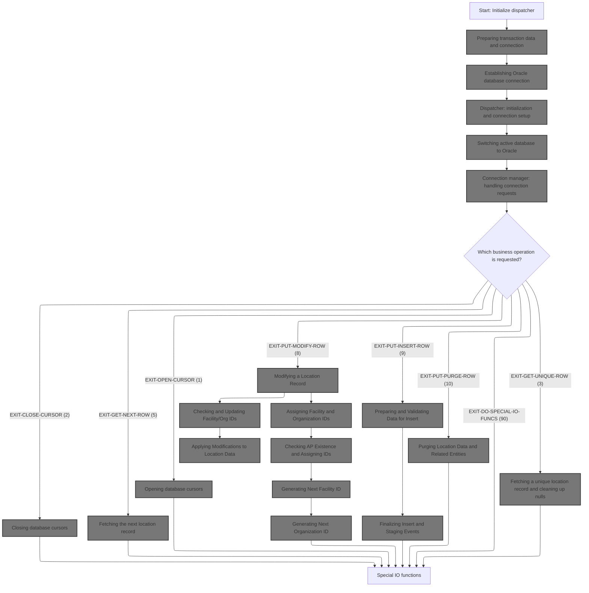

This section ensures that all prerequisites for database operations are met by initializing transaction data and establishing a valid Oracle database connection. It acts as the entry point for all subsequent business operations by dispatching requests based on the operation code provided.

| Category        | Rule Name                  | Description                                                                                                                                                                              |
| --------------- | -------------------------- | ---------------------------------------------------------------------------------------------------------------------------------------------------------------------------------------- |
| Data validation | Success Status Enforcement | The dispatcher must only allow business operations to proceed if the initialization and connection steps have completed successfully (status code = 0).                                  |
| Business logic  | Mandatory Initialization   | The dispatcher must always perform initialization of transaction data and database connection before any business operation is processed.                                                |
| Business logic  | Operation Code Routing     | The dispatcher must route each request to the correct business operation based on the provided operation code (e.g., 1 for open cursor, 2 for close cursor, 3 for get unique row, etc.). |
| Business logic  | Connection State Update    | The dispatcher must always update the connection state and status codes after each operation, reflecting the latest system state for downstream processes.                               |

<SwmSnippet path="/base/src/NNNS0487.cbl" line="864">

---

In <SwmToken path="base/src/NNNS0487.cbl" pos="864:2:6" line-data="094100 0000-EXIT-DISPATCHER.                                            00094100">`0000-EXIT-DISPATCHER`</SwmToken>, we start by calling <SwmToken path="base/src/NNNS0487.cbl" pos="865:4:6" line-data="094200     PERFORM 100-INITIALIZATION                                   00094200">`100-INITIALIZATION`</SwmToken> to prep transaction data and set up the database connection for everything that follows.

```cobol
094100 0000-EXIT-DISPATCHER.                                            00094100
094200     PERFORM 100-INITIALIZATION                                   00094200
```

---

</SwmSnippet>

## Preparing transaction data and connection

This section is responsible for preparing transaction and connection data by initializing required variables and structures, and ensuring that location data is cleaned, normalized, and validated before further processing.

| Category        | Rule Name                    | Description                                                                                                                                                                     |
| --------------- | ---------------------------- | ------------------------------------------------------------------------------------------------------------------------------------------------------------------------------- |
| Data validation | Shipping Days Validation     | Location shipping days must be edited and set according to business rules, ensuring that only valid shipping days are recorded.                                                 |
| Data validation | Pre-Processing Validation    | All location fields must be validated and normalized before being used in any downstream business logic or database operations.                                                 |
| Business logic  | Location Data Transfer       | All location, contact, address, and operational data fields must be transferred from the source structure to the destination structure before any further processing can occur. |
| Business logic  | Field Normalization          | Dates in location data must be defaulted if missing, and all text fields must be normalized to remove extra spaces and ensure consistency.                                      |
| Business logic  | Inactive Status Marking      | Inactive or deleted location statuses must be marked clearly in the normalized data to prevent further processing of such records.                                              |
| Business logic  | Contact Name Standardization | Contact name fields must be crunched to remove extra spaces and standardized for downstream use.                                                                                |

<SwmSnippet path="/base/src/NNNS0487.cbl" line="894">

---

In <SwmToken path="base/src/NNNS0487.cbl" pos="894:2:4" line-data="097100 100-INITIALIZATION.                                              00097100">`100-INITIALIZATION`</SwmToken>, after prepping storage, we call <SwmToken path="base/src/NNNS0487.cbl" pos="904:4:14" line-data="098100       PERFORM 110-MOVE-PDA-FIELDS-2-DCL                          00098100">`110-MOVE-PDA-FIELDS-2-DCL`</SwmToken> to clean up and normalize location data for the rest of the flow.

```cobol
097100 100-INITIALIZATION.                                              00097100
097200     INITIALIZE XXXN001A                                          00097200
097300                DAO-STATUS                                        00097300
097400                MMMC0474                                          00097400
097500                ZZZC0550                                          00097500
097600     MOVE NNNN0000-INDEX-HANDLE TO DDDTLO01-INDEX-HANDLE          00097600
097700     MOVE 0 TO WS-CHECKPOINT-INC                                  00097700
097800     MOVE 0 TO SQLCODE                                            00097800
097900     MOVE 0 TO SQL-INIT-FLAG                                      00097900
098000     IF NOT EXIT-CLOSE-CURSOR                                     00098000
098100       PERFORM 110-MOVE-PDA-FIELDS-2-DCL                          00098100
098200     END-IF                                                       00098200
```

---

</SwmSnippet>

### Normalizing and validating location data

This section is responsible for ensuring that all location data is standardized and meets business requirements before it is used in downstream processes. It enforces consistency in location types, address formats, and status codes, and ensures that only valid records are processed.

| Category        | Rule Name                   | Description                                                                                                                                                                                                                                                                                                                                                                                                                                                                                                                                             |
| --------------- | --------------------------- | ------------------------------------------------------------------------------------------------------------------------------------------------------------------------------------------------------------------------------------------------------------------------------------------------------------------------------------------------------------------------------------------------------------------------------------------------------------------------------------------------------------------------------------------------------- |
| Data validation | Valid location type codes   | Location type codes must match one of the following valid values: 'V' (Vendor), 'S' (Store), 'A' (Account), 'W' (Warehouse), or 'D' (DSD Vendor). Any location record with a type code outside this set is considered invalid.                                                                                                                                                                                                                                                                                                                          |
| Data validation | Valid location status codes | Location status must be set to 'A' (Active), 'I' (Inactive), or 'D' (Deleted) as defined in the KONSTANTS and <SwmToken path="base/src/NNNS0487.cbl" pos="1246:24:26" line-data="132300     MOVE LOC-TYP-CD OF DCLXXXATION TO LOC-TYP-CD OF P-DDDTLO01   00132300">`P-DDDTLO01`</SwmToken> scopes. Records with other status values are rejected.                                                                                                                                                                                                       |
| Data validation | Standardized date values    | Default date values must be set to '01/01/1600' for missing or uninitialized dates, and '00/00/0000' is used to represent a zero or null date. Any other non-standard date formats are flagged as errors.                                                                                                                                                                                                                                                                                                                                               |
| Data validation | ZIP code length validation  | ZIP code fields must be validated for length: <SwmToken path="base/src/NNNS0487.cbl" pos="1262:6:6" line-data="133900     MOVE PRIM-ZIP5-CD OF DCLXXXATION                             00133900">`ZIP5`</SwmToken> must be exactly 5 digits and <SwmToken path="base/src/NNNS0487.cbl" pos="1264:6:6" line-data="134100     MOVE PRIM-ZIP4-CD OF DCLXXXATION                             00134100">`ZIP4`</SwmToken> must be exactly 4 digits, as defined by K-ZIP5-LEN and K-ZIP4-LEN. Records with incorrect ZIP code lengths are flagged as invalid. |
| Data validation | Required location fields    | Location name, address, and contact fields must not be blank or contain only spaces. Records with missing or empty critical fields are rejected.                                                                                                                                                                                                                                                                                                                                                                                                        |
| Business logic  | Deleted location exclusion  | If a location record is marked as deleted ('D'), it must not be processed for active business operations and should be excluded from output unless specifically requested for audit or historical purposes.                                                                                                                                                                                                                                                                                                                                             |

See <SwmLink doc-title="Normalizing and Validating Location Data">[Normalizing and Validating Location Data](.swm%5Cnormalizing-and-validating-location-data.09uxydpo.sw.md)</SwmLink>

### Checking connection requirements after data normalization

<SwmSnippet path="/base/src/NNNS0487.cbl" line="906">

---

Back in <SwmToken path="base/src/NNNS0487.cbl" pos="865:4:6" line-data="094200     PERFORM 100-INITIALIZATION                                   00094200">`100-INITIALIZATION`</SwmToken>, after normalizing the data, we check if any of the flags for Oracle operations are set. If so, we call <SwmToken path="base/src/NNNS0487.cbl" pos="908:4:10" line-data="098500       PERFORM 115-CONNECT-TO-ORACLE                              00098500">`115-CONNECT-TO-ORACLE`</SwmToken> to establish the database connection, since those operations require it.

```cobol
098300     IF (YYYN005A-ORACLE       OR EXIT-PUT-INSERT-ROW             00098300
098400         OR EXIT-PUT-PURGE-ROW OR EXIT-PUT-MODIFY-ROW)            00098400
098500       PERFORM 115-CONNECT-TO-ORACLE                              00098500
098600     END-IF                                                       00098600
```

---

</SwmSnippet>

## Establishing Oracle database connection

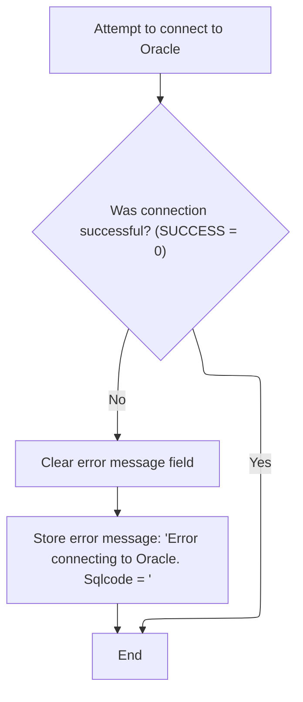

This section is responsible for initiating a connection to the Oracle database and handling the outcome, including error messaging if the connection fails.

| Category       | Rule Name                          | Description                                                                                                                                               |
| -------------- | ---------------------------------- | --------------------------------------------------------------------------------------------------------------------------------------------------------- |
| Business logic | Successful connection continuation | If the Oracle database connection attempt is successful (SUCCESS = 0), no error message is generated and the process continues.                           |
| Business logic | Connection attempt finalization    | The process must always end after either a successful connection or after storing the error message, ensuring a clear outcome for the connection attempt. |

<SwmSnippet path="/base/src/NNNS0487.cbl" line="1177">

---

<SwmToken path="base/src/NNNS0487.cbl" pos="1177:2:8" line-data="125400 115-CONNECT-TO-ORACLE.                                           00125400">`115-CONNECT-TO-ORACLE`</SwmToken> calls <SwmToken path="base/src/NNNS0487.cbl" pos="1178:4:8" line-data="125500     CALL Z-ORA-CONNECT USING XXXN001A                            00125500">`Z-ORA-CONNECT`</SwmToken> to set up the Oracle database connection. If it fails, we build an error message with the SQLCODE. Next, we move to <SwmPath>[base/src/XXXS0210.cbl](base/src/XXXS0210.cbl)</SwmPath> to continue with connection setup and management.

```cobol
125400 115-CONNECT-TO-ORACLE.                                           00125400
125500     CALL Z-ORA-CONNECT USING XXXN001A                            00125500
125600                              SQLCA                               00125600
125700     IF NOT SUCCESS                                               00125700
125800       MOVE SQLCODE TO WS-SQLCODE                                 00125800
125900       MOVE SPACES  TO IS-RTRN-MSG-TXT                            00125900
126000       STRING 'NNNS0487 - Error connecting to Oracle. Sqlcode ='  00126000
126100               WS-SQLCODE                                         00126100
126200               DELIMITED BY SIZE INTO IS-RTRN-MSG-TXT             00126200
126300     END-IF                                                       00126300
```

---

</SwmSnippet>

## Dispatcher: initialization and connection setup

This section is responsible for preparing the system for operation by initializing required resources and establishing a database connection. It acts as the entry point for dispatcher setup and ensures readiness for downstream processes.

<SwmSnippet path="/base/src/XXXS0210.cbl" line="33">

---

In <SwmToken path="base/src/XXXS0210.cbl" pos="33:2:6" line-data="004400 0000-EXIT-DISPATCHER.                                            00004400">`0000-EXIT-DISPATCHER`</SwmToken> (<SwmPath>[base/src/XXXS0210.cbl](base/src/XXXS0210.cbl)</SwmPath>), we run initialization and then connect to Oracle by calling the connection manager. The naming suggests exit logic, but it's really about setup and connection. We use PERFORM for subroutine calls and GOBACK to return, which is standard COBOL.

```cobol
004400 0000-EXIT-DISPATCHER.                                            00004400
004500     PERFORM 100-INITIALIZATION                                   00004500
004600     PERFORM 200-CONNECT-TO-ORACLE                                00004600
005000     GOBACK                                                       00005000
005100     .                                                            00005100
```

---

</SwmSnippet>

## Switching active database to Oracle

This section ensures that when a switch to Oracle is required, the system sets the correct flags and communicates with the connection manager to activate the Oracle database connection. This is a critical step in ensuring that subsequent database operations are directed to Oracle.

| Category        | Rule Name                      | Description                                                                                                                               |
| --------------- | ------------------------------ | ----------------------------------------------------------------------------------------------------------------------------------------- |
| Data validation | Avoid redundant Oracle switch  | The system must only switch to Oracle if the current connection is not already set to Oracle, to avoid unnecessary operations.            |
| Business logic  | Oracle connection request flag | When a switch to Oracle is required, the system must set the YYYC0220-FUNC field to 'S0' to indicate the Oracle connection request.       |
| Business logic  | Notify connection manager      | The connection manager must be notified whenever the Oracle connection flag is set, ensuring the active database is switched accordingly. |

<SwmSnippet path="/base/src/XXXS0210.cbl" line="52">

---

In <SwmToken path="base/src/XXXS0210.cbl" pos="52:2:8" line-data="007500 200-CONNECT-TO-ORACLE.                                           00007500">`200-CONNECT-TO-ORACLE`</SwmToken>, we flag the switch to Oracle and call the connection manager to actually change the active database.

```cobol
007500 200-CONNECT-TO-ORACLE.                                           00007500
007510     SET YYYC0220-SET-ORACLE-CON TO TRUE                          00007510
007530                                                                  00007530
007540     CALL YYYS0220-DBMS-CON-MGR USING                             00007540
007550         XXXN001A                                                 00007550
007560         YYYC0220                                                 00007560
010400     .                                                            00010400
```

---

</SwmSnippet>

## Connection manager: handling connection requests

The main product role of this section is to act as a dispatcher for connection management requests, ensuring that each request is routed to the correct handler and that unrecognized requests are properly flagged and reported to the caller.

| Category        | Rule Name                              | Description                                                                                                                                                                                                                                                                                                                                                                                                     |
| --------------- | -------------------------------------- | --------------------------------------------------------------------------------------------------------------------------------------------------------------------------------------------------------------------------------------------------------------------------------------------------------------------------------------------------------------------------------------------------------------- |
| Data validation | Function code mapping                  | The system must use the following function codes for dispatching: 'GC' for get current connection, 'SD' for set <SwmToken path="base/src/NNNS0487.cbl" pos="1227:10:10" line-data="130400       PERFORM 125-CONNECT-TO-DB2                                 00130400">`DB2`</SwmToken> connection, 'S0' for set Oracle connection, 'GS' for get stats, 'SS' for set stats, and 'SO' for set override connection. |
| Business logic  | Supported operation dispatch           | If the request function code matches a supported operation (get current connection, set <SwmToken path="base/src/NNNS0487.cbl" pos="1227:10:10" line-data="130400       PERFORM 125-CONNECT-TO-DB2                                 00130400">`DB2`</SwmToken> connection, set Oracle connection, get stats, set stats, or set override connection), the corresponding operation must be executed.               |
| Business logic  | Current connection reporting           | When reporting the current connection, the system must provide the current connection type as stored in the working storage, without altering the connection state.                                                                                                                                                                                                                                             |
| Business logic  | Connection state and statistics update | When setting a <SwmToken path="base/src/NNNS0487.cbl" pos="1227:10:10" line-data="130400       PERFORM 125-CONNECT-TO-DB2                                 00130400">`DB2`</SwmToken> or Oracle connection, the system must update the connection state and increment the relevant statistics counters for total requests and the specific database type.                                                        |

<SwmSnippet path="/base/src/YYYS0220.cbl" line="56">

---

In <SwmToken path="base/src/YYYS0220.cbl" pos="56:2:6" line-data="006500 0000-EXIT-DISPATCHER.                                            00006500">`0000-EXIT-DISPATCHER`</SwmToken> (<SwmToken path="base/src/YYYS0220.cbl" pos="74:5:5" line-data="008300         MOVE &#39;YYYS0220 - Function not recognized!&#39;               00008300">`YYYS0220`</SwmToken>), we use EVALUATE to pick the requested operation—get/set connection, stats, override, etc.—and call the right subroutine. If the request isn't recognized, we set a failure flag and error message.

```cobol
006500 0000-EXIT-DISPATCHER.                                            00006500
006600     PERFORM 100-INITIALIZATION                                   00006600
006700                                                                  00006700
006800     EVALUATE TRUE                                                00006800
006900       WHEN YYYC0220-GET-CURR-CON                                 00006900
007000         PERFORM 200-GET-CURR-CON                                 00007000
007100       WHEN YYYC0220-SET-DB2-CON                                  00007100
007200         PERFORM 300-SET-DB2-CON                                  00007200
007300       WHEN YYYC0220-SET-ORACLE-CON                               00007300
007400         PERFORM 400-SET-ORACLE-CON                               00007400
007500       WHEN YYYC0220-GET-STATS                                    00007500
007600         PERFORM 500-GET-STATS                                    00007600
007700       WHEN YYYC0220-SET-STATS                                    00007700
007800         PERFORM 600-SET-STATS                                    00007800
007900       WHEN YYYC0220-SET-OVERRIDE-CON                             00007900
008000         PERFORM 700-SET-OVERRIDE-CON                             00008000
008100       WHEN OTHER                                                 00008100
008200         SET  FAILURE TO TRUE                                     00008200
008300         MOVE 'YYYS0220 - Function not recognized!'               00008300
008400           TO IS-RTRN-MSG-TXT                                     00008400
008500     END-EVALUATE                                                 00008500
008600                                                                  00008600
008700     GOBACK                                                       00008700
008800     .                                                            00008800
```

---

</SwmSnippet>

<SwmSnippet path="/base/src/YYYS0220.cbl" line="97">

---

<SwmToken path="base/src/YYYS0220.cbl" pos="97:2:8" line-data="010600 200-GET-CURR-CON.                                                00010600">`200-GET-CURR-CON`</SwmToken> just copies the current connection type from working storage to the output structure. Despite the comment, it doesn't actually switch the connection—it's just reporting what the current state is.

```cobol
010600 200-GET-CURR-CON.                                                00010600
010700     MOVE WS-YYYC0220-CURR-CON TO YYYC0220-CURR-CON               00010700
010800     .                                                            00010800
```

---

</SwmSnippet>

### Switching active database to <SwmToken path="base/src/NNNS0487.cbl" pos="1227:10:10" line-data="130400       PERFORM 125-CONNECT-TO-DB2                                 00130400">`DB2`</SwmToken> and tracking stats

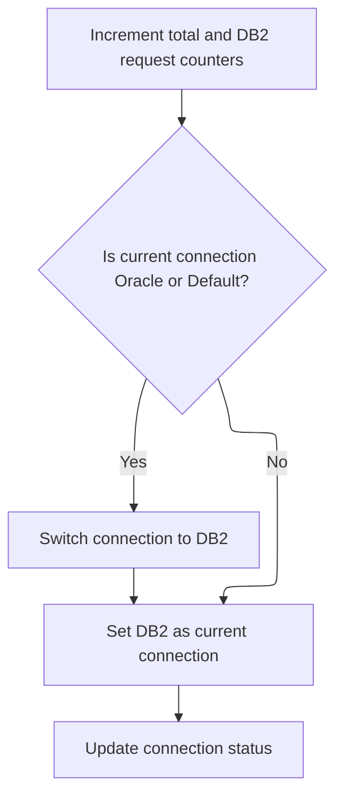

This section governs the process for switching the active database connection to <SwmToken path="base/src/NNNS0487.cbl" pos="1227:10:10" line-data="130400       PERFORM 125-CONNECT-TO-DB2                                 00130400">`DB2`</SwmToken>, ensuring accurate tracking of request statistics, updating connection status, and handling errors related to the connection process.

| Category       | Rule Name                                                                                                                                                                                         | Description                                                                                                                                                                                                                                                                                                                                                                                                                                                                                |
| -------------- | ------------------------------------------------------------------------------------------------------------------------------------------------------------------------------------------------- | ------------------------------------------------------------------------------------------------------------------------------------------------------------------------------------------------------------------------------------------------------------------------------------------------------------------------------------------------------------------------------------------------------------------------------------------------------------------------------------------ |
| Business logic | Request Counting                                                                                                                                                                                  | Each time a request to switch to <SwmToken path="base/src/NNNS0487.cbl" pos="1227:10:10" line-data="130400       PERFORM 125-CONNECT-TO-DB2                                 00130400">`DB2`</SwmToken> is processed, increment both the total request counter and the <SwmToken path="base/src/NNNS0487.cbl" pos="1227:10:10" line-data="130400       PERFORM 125-CONNECT-TO-DB2                                 00130400">`DB2`</SwmToken> request counter by 1.                          |
| Business logic | Conditional Connection Switching                                                                                                                                                                  | If the current connection is to Oracle or is set to default, initiate a switch to <SwmToken path="base/src/NNNS0487.cbl" pos="1227:10:10" line-data="130400       PERFORM 125-CONNECT-TO-DB2                                 00130400">`DB2`</SwmToken>; otherwise, set <SwmToken path="base/src/NNNS0487.cbl" pos="1227:10:10" line-data="130400       PERFORM 125-CONNECT-TO-DB2                                 00130400">`DB2`</SwmToken> as the current connection without switching. |
| Business logic | Environment-Based <SwmToken path="base/src/NNNS0487.cbl" pos="1227:10:10" line-data="130400       PERFORM 125-CONNECT-TO-DB2                                 00130400">`DB2`</SwmToken> Selection | When switching to <SwmToken path="base/src/NNNS0487.cbl" pos="1227:10:10" line-data="130400       PERFORM 125-CONNECT-TO-DB2                                 00130400">`DB2`</SwmToken>, select the appropriate <SwmToken path="base/src/NNNS0487.cbl" pos="1227:10:10" line-data="130400       PERFORM 125-CONNECT-TO-DB2                                 00130400">`DB2`</SwmToken> database (production or test) based on the environment flag.                                         |
| Business logic | Connection Switch Tracking                                                                                                                                                                        | Increment the connection switch counter each time a database connection switch is performed.                                                                                                                                                                                                                                                                                                                                                                                               |
| Business logic | Connection Status Update                                                                                                                                                                          | After switching to <SwmToken path="base/src/NNNS0487.cbl" pos="1227:10:10" line-data="130400       PERFORM 125-CONNECT-TO-DB2                                 00130400">`DB2`</SwmToken>, update the current connection status flag to indicate <SwmToken path="base/src/NNNS0487.cbl" pos="1227:10:10" line-data="130400       PERFORM 125-CONNECT-TO-DB2                                 00130400">`DB2`</SwmToken> is now active.                                                       |

<SwmSnippet path="/base/src/YYYS0220.cbl" line="105">

---

In <SwmToken path="base/src/YYYS0220.cbl" pos="105:2:8" line-data="011400 300-SET-DB2-CON.                                                 00011400">`300-SET-DB2-CON`</SwmToken>, we bump the stats counters, check if we're currently on Oracle or default, and if so, call <SwmToken path="base/src/YYYS0220.cbl" pos="111:4:12" line-data="012000       PERFORM 310-DO-SET-DB2-CON                                 00012000">`310-DO-SET-DB2-CON`</SwmToken> to switch to <SwmToken path="base/src/YYYS0220.cbl" pos="105:6:6" line-data="011400 300-SET-DB2-CON.                                                 00011400">`DB2`</SwmToken>. Then we set the <SwmToken path="base/src/YYYS0220.cbl" pos="105:6:6" line-data="011400 300-SET-DB2-CON.                                                 00011400">`DB2`</SwmToken> flag and update the current connection type for reporting.

```cobol
011400 300-SET-DB2-CON.                                                 00011400
011500     ADD 1 TO WS-TOT-REQS                                         00011500
011600     ADD 1 TO WS-DB2-REQS                                         00011600
011700                                                                  00011700
011800     IF WS-ORACLE-CON                                             00011800
011900     OR WS-DEFAULT-CON                                            00011900
012000       PERFORM 310-DO-SET-DB2-CON                                 00012000
012100     END-IF                                                       00012100
012200                                                                  00012200
012300     SET WS-DB2-CON TO TRUE                                       00012300
012400     PERFORM 200-GET-CURR-CON                                     00012400
012500     .                                                            00012500
```

---

</SwmSnippet>

<SwmSnippet path="/base/src/YYYS0220.cbl" line="119">

---

<SwmToken path="base/src/YYYS0220.cbl" pos="119:2:10" line-data="012800 310-DO-SET-DB2-CON.                                              00012800">`310-DO-SET-DB2-CON`</SwmToken> checks the environment flag to pick the right <SwmToken path="base/src/YYYS0220.cbl" pos="119:8:8" line-data="012800 310-DO-SET-DB2-CON.                                              00012800">`DB2`</SwmToken> database (production or test), bumps the connection switch counter, and handles errors by setting a failure flag and building an error message if the connection fails.

```cobol
012800 310-DO-SET-DB2-CON.                                              00012800
012900     ADD 1 TO WS-CON-SWITCHES                                     00012900
013000                                                                  00013000
013100     EVALUATE TRUE                                                00013100
013200       WHEN WS-PROD                                               00013200
013300         EXEC SQL                                                 00013300
013400           CONNECT TO DB2P                                        00013400
013500         END-EXEC                                                 00013500
013600       WHEN OTHER                                                 00013600
013700         EXEC SQL                                                 00013700
013800           CONNECT TO DB2T                                        00013800
013900         END-EXEC                                                 00013900
014000     END-EVALUATE                                                 00014000
014100                                                                  00014100
014200     EVALUATE TRUE                                                00014200
014300       WHEN SQLCODE = 0                                           00014300
014400         CONTINUE                                                 00014400
014500                                                                  00014500
014600       WHEN OTHER                                                 00014600
014700         SET  FAILURE TO TRUE                                     00014700
014800         MOVE SQLCODE TO WS-SQLCODE                               00014800
014900         STRING 'YYYS0220 - Failure connecting to DB2, SQL='      00014900
015000                WS-SQLCODE                                        00015000
015100             DELIMITED BY SIZE INTO IS-RTRN-MSG-TXT               00015100
015200     END-EVALUATE                                                 00015200
015300     .                                                            00015300
```

---

</SwmSnippet>

### Switching active database to Oracle and tracking stats

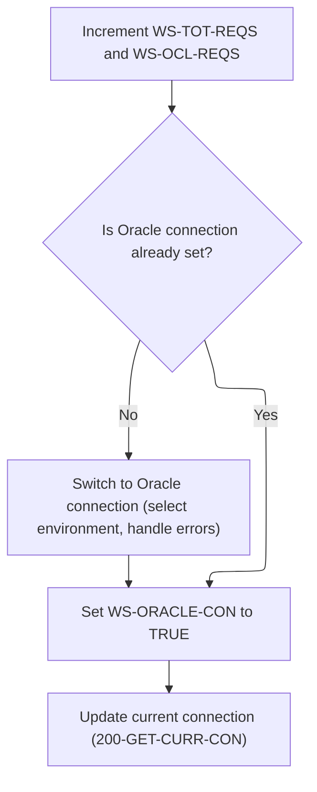

This section is responsible for managing the transition of the active database connection to Oracle, including tracking relevant statistics, handling environment selection, and reporting errors if the connection fails.

| Category       | Rule Name                      | Description                                                                                                                                                         |
| -------------- | ------------------------------ | ------------------------------------------------------------------------------------------------------------------------------------------------------------------- |
| Business logic | Oracle request tracking        | Each time an Oracle connection is requested, increment both the total requests counter and the Oracle requests counter by 1.                                        |
| Business logic | Oracle connection switching    | If the current connection is not already set to Oracle, switch the active connection to Oracle using the environment flag to determine the correct Oracle database. |
| Business logic | Oracle connection state update | After switching to Oracle, update the current connection state to reflect that Oracle is now active.                                                                |
| Business logic | Connection switch tracking     | Increment the connection switches counter each time a database connection is switched to Oracle.                                                                    |

<SwmSnippet path="/base/src/YYYS0220.cbl" line="150">

---

In <SwmToken path="base/src/YYYS0220.cbl" pos="150:2:8" line-data="015900 400-SET-ORACLE-CON.                                              00015900">`400-SET-ORACLE-CON`</SwmToken>, we bump the stats counters for Oracle requests, check if we're already connected, and if not, call <SwmToken path="base/src/YYYS0220.cbl" pos="155:4:12" line-data="016400       PERFORM 410-DO-SET-ORACLE-CON                              00016400">`410-DO-SET-ORACLE-CON`</SwmToken> to switch. Then we set the Oracle flag and update the connection state.

```cobol
015900 400-SET-ORACLE-CON.                                              00015900
016000     ADD 1 TO WS-TOT-REQS                                         00016000
016100     ADD 1 TO WS-OCL-REQS                                         00016100
016200                                                                  00016200
016300     IF NOT WS-ORACLE-CON                                         00016300
016400       PERFORM 410-DO-SET-ORACLE-CON                              00016400
016500     END-IF                                                       00016500
016600                                                                  00016600
016700     SET WS-ORACLE-CON TO TRUE                                    00016700
016800     PERFORM 200-GET-CURR-CON                                     00016800
016900     .                                                            00016900
```

---

</SwmSnippet>

<SwmSnippet path="/base/src/YYYS0220.cbl" line="163">

---

<SwmToken path="base/src/YYYS0220.cbl" pos="163:2:10" line-data="017200 410-DO-SET-ORACLE-CON.                                           00017200">`410-DO-SET-ORACLE-CON`</SwmToken> checks which environment flag is set and connects to the right Oracle database using a specific connection string. If the connection fails, we set a failure flag and build an error message with the SQLCODE.

```cobol
017200 410-DO-SET-ORACLE-CON.                                           00017200
017300     ADD 1 TO WS-CON-SWITCHES                                     00017300
017400                                                                  00017400
017500     EVALUATE TRUE                                                00017500
017600       WHEN WS-PROD                                               00017600
017700         EXEC SQL                                                 00017700
017800           CONNECT TO DRDAASP1                                    00017800
017900         END-EXEC                                                 00017900
018000                                                                  00018000
018100       WHEN WS-TEST                                               00018100
018200         EXEC SQL                                                 00018200
018300           CONNECT TO DRDAASC7                                    00018300
018400         END-EXEC                                                 00018400
018500                                                                  00018500
018600       WHEN WS-TST6                                               00018600
018700         EXEC SQL                                                 00018700
018800           CONNECT TO DRDAASC6                                    00018800
018900         END-EXEC                                                 00018900
019000                                                                  00019000
019100       WHEN WS-TST5                                               00019100
019200         EXEC SQL                                                 00019200
019300           CONNECT TO DRDAASC5                                    00019300
019400         END-EXEC                                                 00019400
019500                                                                  00019500
019600       WHEN WS-TST4                                               00019600
019700         EXEC SQL                                                 00019700
019800           CONNECT TO DRDAASD1                                    00019800
019900         END-EXEC                                                 00019900
020000                                                                  00020000
020100       WHEN WS-TST3                                               00020100
020200         EXEC SQL                                                 00020200
020300           CONNECT TO DRDAASC1                                    00020300
020400         END-EXEC                                                 00020400
020500     END-EVALUATE                                                 00020500
020600                                                                  00020600
020700     EVALUATE TRUE                                                00020700
020800       WHEN SQLCODE = 0                                           00020800
020900         CONTINUE                                                 00020900
021000                                                                  00021000
021100       WHEN OTHER                                                 00021100
021200         SET  FAILURE TO TRUE                                     00021200
021300         MOVE SQLCODE TO WS-SQLCODE                               00021300
021400         STRING 'YYYS0220 - Failure connecting to Oracle, SQL='   00021400
021500                WS-SQLCODE                                        00021500
021600             DELIMITED BY SIZE INTO IS-RTRN-MSG-TXT               00021600
021700     END-EVALUATE                                                 00021700
021800     .                                                            00021800
```

---

</SwmSnippet>

### Reporting connection stats

```mermaid
%%{init: {"flowchart": {"defaultRenderer": "elk"}} }%%
flowchart TD
  node1["Update system statistics"] --> node2["Record override request"]
  click node1 openCode "base/src/YYYS0220.cbl:22400:23300"
  click node2 openCode "base/src/YYYS0220.cbl:24800:24900"
  node2 --> node3{"Which override connection is requested?"}
  click node3 openCode "base/src/YYYS0220.cbl:25100:26200"
  node3 -->|"DB2 and not already active"| node4["Activate DB2 connection and record switch"]
  click node4 openCode "base/src/YYYS0220.cbl:25400:25500"
  node3 -->|"Oracle and not already active"| node5["Activate Oracle connection and record switch"]
  click node5 openCode "base/src/YYYS0220.cbl:25900:26000"
  node3 -->|"Invalid override"| node6["Mark request as failed and notify: 'Invalid over-ride connection!'"]
  click node6 openCode "base/src/YYYS0220.cbl:26300:26500"

classDef HeadingStyle fill:#777777,stroke:#333,stroke-width:2px;

%% Swimm:
%% %%{init: {"flowchart": {"defaultRenderer": "elk"}} }%%
%% flowchart TD
%%   node1["Update system statistics"] --> node2["Record override request"]
%%   click node1 openCode "<SwmPath>[base/src/YYYS0220.cbl](base/src/YYYS0220.cbl)</SwmPath>:22400:23300"
%%   click node2 openCode "<SwmPath>[base/src/YYYS0220.cbl](base/src/YYYS0220.cbl)</SwmPath>:24800:24900"
%%   node2 --> node3{"Which override connection is requested?"}
%%   click node3 openCode "<SwmPath>[base/src/YYYS0220.cbl](base/src/YYYS0220.cbl)</SwmPath>:25100:26200"
%%   node3 -->|"<SwmToken path="base/src/NNNS0487.cbl" pos="1227:10:10" line-data="130400       PERFORM 125-CONNECT-TO-DB2                                 00130400">`DB2`</SwmToken> and not already active"| node4["Activate <SwmToken path="base/src/NNNS0487.cbl" pos="1227:10:10" line-data="130400       PERFORM 125-CONNECT-TO-DB2                                 00130400">`DB2`</SwmToken> connection and record switch"]
%%   click node4 openCode "<SwmPath>[base/src/YYYS0220.cbl](base/src/YYYS0220.cbl)</SwmPath>:25400:25500"
%%   node3 -->|"Oracle and not already active"| node5["Activate Oracle connection and record switch"]
%%   click node5 openCode "<SwmPath>[base/src/YYYS0220.cbl](base/src/YYYS0220.cbl)</SwmPath>:25900:26000"
%%   node3 -->|"Invalid override"| node6["Mark request as failed and notify: 'Invalid <SwmToken path="base/src/YYYS0220.cbl" pos="255:11:13" line-data="026400         MOVE &#39;YYYS0220 - Invalid over-ride connection!&#39;          00026400">`over-ride`</SwmToken> connection!'"]
%%   click node6 openCode "<SwmPath>[base/src/YYYS0220.cbl](base/src/YYYS0220.cbl)</SwmPath>:26300:26500"
%% 
%% classDef HeadingStyle fill:#777777,stroke:#333,stroke-width:2px;
```

<SwmSnippet path="/base/src/YYYS0220.cbl" line="215">

---

In <SwmToken path="base/src/YYYS0220.cbl" pos="215:2:6" line-data="022400 500-GET-STATS.                                                   00022400">`500-GET-STATS`</SwmToken>, we call <SwmToken path="base/src/YYYS0220.cbl" pos="216:4:10" line-data="022500     PERFORM 200-GET-CURR-CON                                     00022500">`200-GET-CURR-CON`</SwmToken> to get the current connection type, then copy all the stats counters (total, <SwmToken path="base/src/YYYS0220.cbl" pos="219:6:6" line-data="022800     MOVE WS-DB2-REQS     TO YYYC0220-DB2-REQS                    00022800">`DB2`</SwmToken>, Oracle, overrides, switches) into the output structure for reporting.

```cobol
022400 500-GET-STATS.                                                   00022400
022500     PERFORM 200-GET-CURR-CON                                     00022500
022600                                                                  00022600
022700     MOVE WS-TOT-REQS     TO YYYC0220-TOT-REQS                    00022700
022800     MOVE WS-DB2-REQS     TO YYYC0220-DB2-REQS                    00022800
022900     MOVE WS-OCL-REQS     TO YYYC0220-OCL-REQS                    00022900
023000     MOVE WS-OVR-REQS     TO YYYC0220-OVR-REQS                    00023000
023100     MOVE WS-CON-SWITCHES TO YYYC0220-CON-SWITCHES                00023100
023200     MOVE WS-OVR-SWITCHES TO YYYC0220-OVR-SWITCHES                00023200
023300     .                                                            00023300
```

---

</SwmSnippet>

<SwmSnippet path="/base/src/YYYS0220.cbl" line="239">

---

<SwmToken path="base/src/YYYS0220.cbl" pos="239:2:8" line-data="024800 700-SET-OVERRIDE-CON.                                            00024800">`700-SET-OVERRIDE-CON`</SwmToken> bumps the override request counter, checks which override is requested (<SwmToken path="base/src/YYYS0220.cbl" pos="243:6:6" line-data="025200       WHEN YYYC0220-DB2-CON                                      00025200">`DB2`</SwmToken> or Oracle), sets the flag and switch counter if valid, or sets a failure flag and error message if the request is invalid.

```cobol
024800 700-SET-OVERRIDE-CON.                                            00024800
024900     ADD 1 TO WS-OVR-REQS                                         00024900
025000                                                                  00025000
025100     EVALUATE TRUE                                                00025100
025200       WHEN YYYC0220-DB2-CON                                      00025200
025300       AND  NOT WS-DB2-CON                                        00025300
025400         SET WS-DB2-CON    TO TRUE                                00025400
025500         ADD 1             TO WS-OVR-SWITCHES                     00025500
025600                                                                  00025600
025700       WHEN YYYC0220-ORACLE-CON                                   00025700
025800       AND NOT WS-ORACLE-CON                                      00025800
025900         SET WS-ORACLE-CON TO TRUE                                00025900
026000         ADD 1             TO WS-OVR-SWITCHES                     00026000
026100                                                                  00026100
026200       WHEN OTHER                                                 00026200
026300         SET FAILURE TO TRUE                                      00026300
026400         MOVE 'YYYS0220 - Invalid over-ride connection!'          00026400
026500           TO IS-RTRN-MSG-TXT                                     00026500
026600     END-EVALUATE                                                 00026600
026700     .                                                            00026700
```

---

</SwmSnippet>

## Dispatching database and data operations

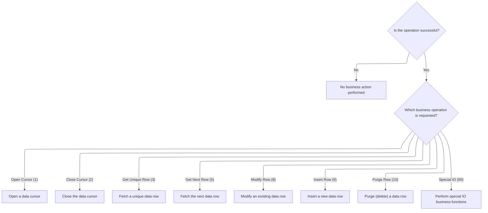

<SwmSnippet path="/base/src/NNNS0487.cbl" line="866">

---

After returning from <SwmToken path="base/src/NNNS0487.cbl" pos="865:4:6" line-data="094200     PERFORM 100-INITIALIZATION                                   00094200">`100-INITIALIZATION`</SwmToken> in <SwmToken path="base/src/NNNS0487.cbl" pos="864:2:6" line-data="094100 0000-EXIT-DISPATCHER.                                            00094100">`0000-EXIT-DISPATCHER`</SwmToken>, we use EVALUATE TRUE to pick the next operation based on the exit code. If the code is <SwmToken path="base/src/NNNS0487.cbl" pos="869:4:8" line-data="094600       WHEN EXIT-OPEN-CURSOR                                      00094600">`EXIT-OPEN-CURSOR`</SwmToken>, we call <SwmToken path="base/src/NNNS0487.cbl" pos="870:4:10" line-data="094700          PERFORM 1000-EXIT-OPEN-CURSOR                           00094700">`1000-EXIT-OPEN-CURSOR`</SwmToken> to open the right database cursor for the requested operation.

```cobol
094300     EVALUATE TRUE                                                00094300
094400       WHEN NOT SUCCESS                                           00094400
094500          CONTINUE                                                00094500
094600       WHEN EXIT-OPEN-CURSOR                                      00094600
094700          PERFORM 1000-EXIT-OPEN-CURSOR                           00094700
094800       WHEN EXIT-CLOSE-CURSOR                                     00094800
094900          PERFORM 1100-EXIT-CLOSE-CURSOR                          00094900
095000       WHEN EXIT-GET-UNIQUE-ROW                                   00095000
095100          PERFORM 1200-EXIT-GET-UNIQUE-ROW                        00095100
095200       WHEN EXIT-GET-NEXT-ROW                                     00095200
095300          PERFORM 1300-EXIT-GET-NEXT-ROW                          00095300
095400       WHEN EXIT-PUT-MODIFY-ROW                                   00095400
095500          PERFORM 1400-EXIT-PUT-MODIFY-ROW                        00095500
095600       WHEN EXIT-PUT-INSERT-ROW                                   00095600
095700          PERFORM 1500-EXIT-PUT-INSERT-ROW                        00095700
095800       WHEN EXIT-PUT-PURGE-ROW                                    00095800
095900          PERFORM 1600-EXIT-PUT-PURGE-ROW                         00095900
096000       WHEN EXIT-DO-SPECIAL-IO-FUNCS                              00096000
096100          PERFORM 10000-DO-SPECIAL-IO-FUNCS                       00096100
096200     END-EVALUATE                                                 00096200
```

---

</SwmSnippet>

## Opening database cursors

```mermaid
%%{init: {"flowchart": {"defaultRenderer": "elk"}} }%%
flowchart TD
    node1{"Is the index handle valid (01-07)?"}
    click node1 openCode "base/src/NNNS0487.cbl:1455:1483"
    node1 -->|"01"| node2["Open cursor for index 01"]
    click node2 openCode "base/src/NNNS0487.cbl:1456:1459"
    node1 -->|"02"| node3["Open cursor for index 02"]
    click node3 openCode "base/src/NNNS0487.cbl:1460:1463"
    node1 -->|"03"| node4["Open cursor for index 03"]
    click node4 openCode "base/src/NNNS0487.cbl:1464:1467"
    node1 -->|"04"| node5["Open cursor for index 04"]
    click node5 openCode "base/src/NNNS0487.cbl:1468:1471"
    node1 -->|"05"| node6["Open cursor for index 05"]
    click node6 openCode "base/src/NNNS0487.cbl:1472:1475"
    node1 -->|"06"| node7["Open cursor for index 06"]
    click node7 openCode "base/src/NNNS0487.cbl:1476:1479"
    node1 -->|"07"| node8["Open cursor for index 07"]
    click node8 openCode "base/src/NNNS0487.cbl:1480:1483"
    node1 -->|"Other"| node9["Mark failure and set error message: 'NNNS0487 - Invalid open cursor ID.'"]
    click node9 openCode "base/src/NNNS0487.cbl:1484:1487"
classDef HeadingStyle fill:#777777,stroke:#333,stroke-width:2px;

%% Swimm:
%% %%{init: {"flowchart": {"defaultRenderer": "elk"}} }%%
%% flowchart TD
%%     node1{"Is the index handle valid (01-07)?"}
%%     click node1 openCode "<SwmPath>[base/src/NNNS0487.cbl](base/src/NNNS0487.cbl)</SwmPath>:1455:1483"
%%     node1 -->|"01"| node2["Open cursor for index 01"]
%%     click node2 openCode "<SwmPath>[base/src/NNNS0487.cbl](base/src/NNNS0487.cbl)</SwmPath>:1456:1459"
%%     node1 -->|"02"| node3["Open cursor for index 02"]
%%     click node3 openCode "<SwmPath>[base/src/NNNS0487.cbl](base/src/NNNS0487.cbl)</SwmPath>:1460:1463"
%%     node1 -->|"03"| node4["Open cursor for index 03"]
%%     click node4 openCode "<SwmPath>[base/src/NNNS0487.cbl](base/src/NNNS0487.cbl)</SwmPath>:1464:1467"
%%     node1 -->|"04"| node5["Open cursor for index 04"]
%%     click node5 openCode "<SwmPath>[base/src/NNNS0487.cbl](base/src/NNNS0487.cbl)</SwmPath>:1468:1471"
%%     node1 -->|"05"| node6["Open cursor for index 05"]
%%     click node6 openCode "<SwmPath>[base/src/NNNS0487.cbl](base/src/NNNS0487.cbl)</SwmPath>:1472:1475"
%%     node1 -->|"06"| node7["Open cursor for index 06"]
%%     click node7 openCode "<SwmPath>[base/src/NNNS0487.cbl](base/src/NNNS0487.cbl)</SwmPath>:1476:1479"
%%     node1 -->|"07"| node8["Open cursor for index 07"]
%%     click node8 openCode "<SwmPath>[base/src/NNNS0487.cbl](base/src/NNNS0487.cbl)</SwmPath>:1480:1483"
%%     node1 -->|"Other"| node9["Mark failure and set error message: '<SwmToken path="base/src/NNNS0487.cbl" pos="1183:5:5" line-data="126000       STRING &#39;NNNS0487 - Error connecting to Oracle. Sqlcode =&#39;  00126000">`NNNS0487`</SwmToken> - Invalid open cursor ID.'"]
%%     click node9 openCode "<SwmPath>[base/src/NNNS0487.cbl](base/src/NNNS0487.cbl)</SwmPath>:1484:1487"
%% classDef HeadingStyle fill:#777777,stroke:#333,stroke-width:2px;
```

This section governs the process of opening database cursors based on a provided index handle. It ensures only valid handles (01-07) result in a cursor being opened, and handles errors for invalid handles by marking the operation as failed and returning a clear error message.

| Category        | Rule Name                    | Description                                                                                                                             |
| --------------- | ---------------------------- | --------------------------------------------------------------------------------------------------------------------------------------- |
| Data validation | Valid index handle range     | Only index handles with values 01 through 07 are considered valid for opening a database cursor. Any other value is treated as invalid. |
| Data validation | Maximum index handles        | The maximum number of index handles that can be processed for cursor opening is 7, as defined by DDDTLO01-MAX-INDICIES.                 |
| Business logic  | Open cursor for valid handle | If the index handle is valid (01-07), the corresponding database cursor must be opened for that index.                                  |

<SwmSnippet path="/base/src/NNNS0487.cbl" line="1454">

---

In <SwmToken path="base/src/NNNS0487.cbl" pos="1454:2:8" line-data="153100 1000-EXIT-OPEN-CURSOR.                                           00153100">`1000-EXIT-OPEN-CURSOR`</SwmToken>, we use EVALUATE to check the global cursor handle and open the matching SQL cursor. If the handle isn't valid, we set a failure flag and error message.

```cobol
153100 1000-EXIT-OPEN-CURSOR.                                           00153100
153200     EVALUATE TRUE                                                00153200
153300       WHEN DDDXLO01                                              00153300
153400         EXEC SQL                                                 00153400
153500           OPEN DDDXLO01                                          00153500
153600         END-EXEC                                                 00153600
153700       WHEN DDDXLO02                                              00153700
153800         EXEC SQL                                                 00153800
153900           OPEN DDDXLO02                                          00153900
154000         END-EXEC                                                 00154000
154100       WHEN DDDXLO03                                              00154100
154200         EXEC SQL                                                 00154200
154300           OPEN DDDXLO03                                          00154300
154400         END-EXEC                                                 00154400
154500       WHEN DDDXLO04                                              00154500
154600         EXEC SQL                                                 00154600
154700           OPEN DDDXLO04                                          00154700
154800         END-EXEC                                                 00154800
154900       WHEN DDDXLO05                                              00154900
155000         EXEC SQL                                                 00155000
155100           OPEN DDDXLO05                                          00155100
155200         END-EXEC                                                 00155200
155300       WHEN DDDXLO06                                              00155300
155400         EXEC SQL                                                 00155400
155500           OPEN DDDXLO06                                          00155500
155600         END-EXEC                                                 00155600
155700       WHEN DDDXLO07                                              00155700
155800         EXEC SQL                                                 00155800
155900           OPEN DDDXLO07                                          00155900
156000         END-EXEC                                                 00156000
```

---

</SwmSnippet>

<SwmSnippet path="/base/src/NNNS0487.cbl" line="1484">

---

If the cursor handle is invalid in <SwmToken path="base/src/NNNS0487.cbl" pos="870:4:10" line-data="094700          PERFORM 1000-EXIT-OPEN-CURSOR                           00094700">`1000-EXIT-OPEN-CURSOR`</SwmToken>, we set FAILURE to TRUE and return a specific error message in the output structure.

```cobol
156100       WHEN OTHER                                                 00156100
156200         SET FAILURE TO TRUE                                      00156200
156300         MOVE 'NNNS0487 - Invalid open cursor ID.'                00156300
156400           TO IS-RTRN-MSG-TXT OF XXXN001A                         00156400
156500     END-EVALUATE                                                 00156500
```

---

</SwmSnippet>

## Closing database cursors

This section ensures that only valid database cursors are closed and provides clear error handling for invalid cursor handles. It is critical for maintaining database integrity and providing clear feedback to calling processes.

| Category        | Rule Name                   | Description                                                                                                                                      |
| --------------- | --------------------------- | ------------------------------------------------------------------------------------------------------------------------------------------------ |
| Data validation | Valid Cursor Handle Range   | Only cursor handles with values 01 through 07 are considered valid for closure. Any other value is treated as invalid.                           |
| Business logic  | Cursor Closure Enforcement  | Each valid cursor handle (01-07) must result in the closure of the corresponding SQL cursor, ensuring that resources are released appropriately. |
| Business logic  | Consistent Output Reporting | The output structure must always reflect the result of the operation, including success or failure status and any relevant message text.         |

<SwmSnippet path="/base/src/NNNS0487.cbl" line="1492">

---

In <SwmToken path="base/src/NNNS0487.cbl" pos="1492:2:8" line-data="156900 1100-EXIT-CLOSE-CURSOR.                                          00156900">`1100-EXIT-CLOSE-CURSOR`</SwmToken>, we use EVALUATE to pick the right cursor handle and close the matching SQL cursor. If the handle isn't valid, we set a failure flag and error message.

```cobol
156900 1100-EXIT-CLOSE-CURSOR.                                          00156900
157000     EVALUATE TRUE                                                00157000
157100       WHEN DDDXLO01                                              00157100
157200         EXEC SQL                                                 00157200
157300           CLOSE DDDXLO01                                         00157300
157400         END-EXEC                                                 00157400
157500       WHEN DDDXLO02                                              00157500
157600         EXEC SQL                                                 00157600
157700           CLOSE DDDXLO02                                         00157700
157800         END-EXEC                                                 00157800
157900       WHEN DDDXLO03                                              00157900
158000         EXEC SQL                                                 00158000
158100           CLOSE DDDXLO03                                         00158100
158200         END-EXEC                                                 00158200
158300       WHEN DDDXLO04                                              00158300
158400         EXEC SQL                                                 00158400
158500           CLOSE DDDXLO04                                         00158500
158600         END-EXEC                                                 00158600
158700       WHEN DDDXLO05                                              00158700
158800         EXEC SQL                                                 00158800
158900           CLOSE DDDXLO05                                         00158900
159000         END-EXEC                                                 00159000
159100       WHEN DDDXLO06                                              00159100
159200         EXEC SQL                                                 00159200
159300           CLOSE DDDXLO06                                         00159300
159400         END-EXEC                                                 00159400
159500       WHEN DDDXLO07                                              00159500
159600         EXEC SQL                                                 00159600
159700           CLOSE DDDXLO07                                         00159700
159800         END-EXEC                                                 00159800
```

---

</SwmSnippet>

<SwmSnippet path="/base/src/NNNS0487.cbl" line="1522">

---

If the cursor handle is invalid in <SwmToken path="base/src/NNNS0487.cbl" pos="872:4:10" line-data="094900          PERFORM 1100-EXIT-CLOSE-CURSOR                          00094900">`1100-EXIT-CLOSE-CURSOR`</SwmToken>, we set FAILURE to TRUE and return a specific error message in the output structure.

```cobol
159900       WHEN OTHER                                                 00159900
160000         SET FAILURE TO TRUE                                      00160000
160100         MOVE 'NNNS0487 - Invalid close cursor ID.'               00160100
160200           TO IS-RTRN-MSG-TXT OF XXXN001A                         00160200
160300     END-EVALUATE                                                 00160300
```

---

</SwmSnippet>

## Fetching a unique location record and cleaning up nulls

This section ensures that a unique location record is retrieved and that any fields with null indicators are sanitized before further processing. This prevents the use of invalid or incomplete data in subsequent business logic.

| Category        | Rule Name                      | Description                                                                                                                                                                                                               |
| --------------- | ------------------------------ | ------------------------------------------------------------------------------------------------------------------------------------------------------------------------------------------------------------------------- |
| Data validation | Unique location identification | A location record must be uniquely identified by the combination of location type code and location number. Only one record should be returned for each unique combination.                                               |
| Business logic  | Null field sanitization        | If any field in the location record is indicated as null (by a negative indicator value), that field must be reset to a default value (blank for text fields, zero for numeric fields) before the record is used further. |

<SwmSnippet path="/base/src/NNNS0487.cbl" line="1530">

---

<SwmToken path="base/src/NNNS0487.cbl" pos="1530:2:10" line-data="160700 1200-EXIT-GET-UNIQUE-ROW.                                        00160700">`1200-EXIT-GET-UNIQUE-ROW`</SwmToken> fetches a full location record from the database, then calls <SwmToken path="base/src/NNNS0487.cbl" pos="1693:4:10" line-data="177000     PERFORM 1700-CHECK-NULL-COLUMNS                              00177000">`1700-CHECK-NULL-COLUMNS`</SwmToken> to clear out fields if any null indicators are set.

```cobol
160700 1200-EXIT-GET-UNIQUE-ROW.                                        00160700
160800     EXEC SQL                                                     00160800
160900         SELECT LOC_TYP_CD,                                       00160900
161000                LOC_NBR,                                          00161000
161100                LOC_NM,                                           00161100
161200                LOC_ABB,                                          00161200
161300                LGL_LOC_NAM,                                      00161300
161400                PRIM_CONTACT_NM,                                  00161400
161500                PRIM_ADR_1,                                       00161500
161600                PRIM_ADR_2,                                       00161600
161700                PRIM_ADR_3,                                       00161700
161800                PRIM_ADR_4,                                       00161800
161900                PRIM_CITY,                                        00161900
162000                PRIM_CITY_ID,                                     00162000
162100                PRIM_STATE_CD,                                    00162100
162200                PRIM_ZIP5_CD,                                     00162200
162300                PRIM_ZIP4_CD,                                     00162300
162400                PRIM_PHN_CNTRY_CD,                                00162400
162500                PRIM_AREA_CD,                                     00162500
162600                PRIM_PHONE_NBR,                                   00162600
162700                PRIM_CNTRY_NM,                                    00162700
162800                PRIM_CNTRY_ABB,                                   00162800
162900                SEC_LOC_NM,                                       00162900
163000                SEC_CONTACT_NM,                                   00163000
163100                SEC_ADR_1,                                        00163100
163200                SEC_ADR_2,                                        00163200
163300                SEC_ADR_3,                                        00163300
163400                SEC_ADR_4,                                        00163400
163500                SEC_CITY,                                         00163500
163600                SEC_STATE_CD,                                     00163600
163700                SEC_ZIP5_CD,                                      00163700
163800                SEC_ZIP4_CD,                                      00163800
163900                SEC_PHN_CNTRY_CD,                                 00163900
164000                SEC_AREA_CD,                                      00164000
164100                SEC_PHONE_NBR,                                    00164100
164200                SEC_CNTRY_NM,                                     00164200
164300                SEC_CNTRY_ABB,                                    00164300
164400                MAIL_TO_LOC_NM,                                   00164400
164500                MAIL_TO_CNTCT_NM,                                 00164500
164600                MAIL_TO_ADR_1,                                    00164600
164700                MAIL_TO_ADR_2,                                    00164700
164800                MAIL_TO_ADR_3,                                    00164800
164900                MAIL_TO_ADR_4,                                    00164900
165000                MAIL_TO_CITY,                                     00165000
165100                MAIL_TO_STATE_CD,                                 00165100
165200                MAIL_TO_ZIP5_CD,                                  00165200
165300                MAIL_TO_ZIP4_CD,                                  00165300
165400                MAIL_PHN_CNTRY_CD,                                00165400
165500                MAIL_TO_AREA_CD,                                  00165500
165600                MAIL_TO_PHONE_NBR,                                00165600
165700                MAIL_TO_CNTRY_NM,                                 00165700
165800                MAIL_TO_CNTRY_AB,                                 00165800
165900                CURR_FAX_ID,                                      00165900
166000                ADDED_DT,                                         00166000
166100                DELETE_DT,                                        00166100
166200                OPENED_DT,                                        00166200
166300                CLOSED_DT,                                        00166300
166400                INACTIVE_SW,                                      00166400
166500                INACTIVE_DT,                                      00166500
166600                AP_NBR,                                           00166600
166700                AP_TYP_CD,                                        00166700
166800                LST_UPDT_TS,                                      00166800
166900                LST_UPDT_USR_ID,                                  00166900
167000                PRIM_EMAIL_ID  ,                                  00167000
167100                SECY_EMAIL_ID  ,                                  00167100
167200                MAIL_TO_EMAIL_ID,                                 00167200
167300                FAC_ID,                                           00167300
167400                ORG_ID,                                           00167400
167500                B2B_PRIM_RTNG_ID,                                 00167500
167600                PRIM_CNTY_TXT,                                    00167600
167700                SECY_CNTY_TXT,                                    00167700
167800                MAIL_TO_CNTY_TXT,                                 00167800
167900                DIR_SHP_LOC_SW,                                   00167900
168000                LOC_ORD_PROCNG_DD,                                00168000
168100                ORD_PROCNG_CTOF_TM,                               00168100
168200                SCH_SHP_DD_TXT,                                   00168200
168300                FILLER1_TM,                                       00168300
168400                FILLER2_TM,                                       00168400
168500                ORD_LEAD_TM_DD,                                   00168500
168600                ORD_BUFFER_TM_DD                                  00168600
168700         INTO   :DCLXXXATION.LOC-TYP-CD,                          00168700
168800                :DCLXXXATION.LOC-NBR,                             00168800
168900                :DCLXXXATION.LOC-NM,                              00168900
169000                :DCLXXXATION.LOC-ABB,                             00169000
169100                :DCLXXXATION.LGL-LOC-NAM,                         00169100
169200                :DCLXXXATION.PRIM-CONTACT-NM,                     00169200
169300                :DCLXXXATION.PRIM-ADR-1,                          00169300
169400                :DCLXXXATION.PRIM-ADR-2,                          00169400
169500                :DCLXXXATION.PRIM-ADR-3,                          00169500
169600                :DCLXXXATION.PRIM-ADR-4,                          00169600
169700                :DCLXXXATION.PRIM-CITY,                           00169700
169800                :DCLXXXATION.PRIM-CITY-ID,                        00169800
169900                :DCLXXXATION.PRIM-STATE-CD,                       00169900
170000                :DCLXXXATION.PRIM-ZIP5-CD,                        00170000
170100                :DCLXXXATION.PRIM-ZIP4-CD,                        00170100
170200                :DCLXXXATION.PRIM-PHN-CNTRY-CD,                   00170200
170300                :DCLXXXATION.PRIM-AREA-CD,                        00170300
170400                :DCLXXXATION.PRIM-PHONE-NBR,                      00170400
170500                :DCLXXXATION.PRIM-CNTRY-NM,                       00170500
170600                :DCLXXXATION.PRIM-CNTRY-ABB,                      00170600
170700                :DCLXXXATION.SEC-LOC-NM,                          00170700
170800                :DCLXXXATION.SEC-CONTACT-NM,                      00170800
170900                :DCLXXXATION.SEC-ADR-1,                           00170900
171000                :DCLXXXATION.SEC-ADR-2,                           00171000
171100                :DCLXXXATION.SEC-ADR-3,                           00171100
171200                :DCLXXXATION.SEC-ADR-4,                           00171200
171300                :DCLXXXATION.SEC-CITY,                            00171300
171400                :DCLXXXATION.SEC-STATE-CD,                        00171400
171500                :DCLXXXATION.SEC-ZIP5-CD,                         00171500
171600                :DCLXXXATION.SEC-ZIP4-CD,                         00171600
171700                :DCLXXXATION.SEC-PHN-CNTRY-CD,                    00171700
171800                :DCLXXXATION.SEC-AREA-CD,                         00171800
171900                :DCLXXXATION.SEC-PHONE-NBR,                       00171900
172000                :DCLXXXATION.SEC-CNTRY-NM,                        00172000
172100                :DCLXXXATION.SEC-CNTRY-ABB,                       00172100
172200                :DCLXXXATION.MAIL-TO-LOC-NM,                      00172200
172300                :DCLXXXATION.MAIL-TO-CNTCT-NM,                    00172300
172400                :DCLXXXATION.MAIL-TO-ADR-1,                       00172400
172500                :DCLXXXATION.MAIL-TO-ADR-2,                       00172500
172600                :DCLXXXATION.MAIL-TO-ADR-3,                       00172600
172700                :DCLXXXATION.MAIL-TO-ADR-4,                       00172700
172800                :DCLXXXATION.MAIL-TO-CITY,                        00172800
172900                :DCLXXXATION.MAIL-TO-STATE-CD,                    00172900
173000                :DCLXXXATION.MAIL-TO-ZIP5-CD,                     00173000
173100                :DCLXXXATION.MAIL-TO-ZIP4-CD,                     00173100
173200                :DCLXXXATION.MAIL-PHN-CNTRY-CD,                   00173200
173300                :DCLXXXATION.MAIL-TO-AREA-CD,                     00173300
173400                :DCLXXXATION.MAIL-TO-PHONE-NBR,                   00173400
173500                :DCLXXXATION.MAIL-TO-CNTRY-NM,                    00173500
173600                :DCLXXXATION.MAIL-TO-CNTRY-AB,                    00173600
173700                :DCLXXXATION.CURR-FAX-ID,                         00173700
173800                :DCLXXXATION.ADDED-DT,                            00173800
173900                :DCLXXXATION.DELETE-DT,                           00173900
174000                :DCLXXXATION.OPENED-DT,                           00174000
174100                :DCLXXXATION.CLOSED-DT,                           00174100
174200                :DCLXXXATION.INACTIVE-SW,                         00174200
174300                :DCLXXXATION.INACTIVE-DT,                         00174300
174400                :DCLXXXATION.AP-NBR:WS-AP-NBR-IND,                00174400
174500                :DCLXXXATION.AP-TYP-CD:WS-AP-TYP-CD-IND,          00174500
174600                :DCLXXXATION.LST-UPDT-TS,                         00174600
174700                :DCLXXXATION.LST-UPDT-USR-ID,                     00174700
174800                :DCLXXXATION.PRIM-EMAIL-ID,                       00174800
174900                :DCLXXXATION.SECY-EMAIL-ID,                       00174900
175000                :DCLXXXATION.MAIL-TO-EMAIL-ID,                    00175000
175100                :DCLXXXATION.FAC-ID,                              00175100
175200                :DCLXXXATION.ORG-ID,                              00175200
175300                :DCLXXXATION.B2B-PRIM-RTNG-ID,                    00175300
175400                :DCLXXXATION.PRIM-CNTY-TXT,                       00175400
175500                :DCLXXXATION.SECY-CNTY-TXT,                       00175500
175600                :DCLXXXATION.MAIL-TO-CNTY-TXT,                    00175600
175700                :DCLXXXATION.DIR-SHP-LOC-SW,                      00175700
175800                :DCLXXXATION.LOC-ORD-PROCNG-DD,                   00175800
175900                :WS-ORD-PROCNG-CTOF-TM,                           00175900
176000                :DCLXXXATION.SCH-SHP-DD-TXT,                      00176000
176100                :WS-FILLER1-TS,                                   00176100
176200                :WS-FILLER2-TS,                                   00176200
176300                :DCLXXXATION.ORD-LEAD-TM-DD,                      00176300
176400                :DCLXXXATION.ORD-BUFFER-TM-DD                     00176400
176500         FROM   XXXATION                                          00176500
176600         WHERE  LOC_TYP_CD = :DCLXXXATION.LOC-TYP-CD              00176600
176700         AND    LOC_NBR = :DCLXXXATION.LOC-NBR                    00176700
176800     END-EXEC                                                     00176800
176900                                                                  00176900
177000     PERFORM 1700-CHECK-NULL-COLUMNS                              00177000
```

---

</SwmSnippet>

<SwmSnippet path="/base/src/NNNS0487.cbl" line="3079">

---

<SwmToken path="base/src/NNNS0487.cbl" pos="3079:2:8" line-data="315600 1700-CHECK-NULL-COLUMNS.                                         00315600">`1700-CHECK-NULL-COLUMNS`</SwmToken> checks if the null indicators are negative, and if so, resets the relevant fields to blanks or zero to avoid using bad data downstream.

```cobol
315600 1700-CHECK-NULL-COLUMNS.                                         00315600
315700     IF WS-AP-NBR-IND    < 0                                      00315700
315800     OR WS-AP-TYP-CD-IND < 0                                      00315800
315900       MOVE SPACES TO AP-TYP-CD OF DCLXXXATION                    00315900
316000       MOVE 0      TO AP-NBR    OF DCLXXXATION                    00316000
316100     END-IF                                                       00316100
```

---

</SwmSnippet>

## Fetching the next location record

```mermaid
%%{init: {"flowchart": {"defaultRenderer": "elk"}} }%%
flowchart TD
    node0("[Start]") --> node1{"Which cursor type?"}
    click node0 openCode "base/src/NNNS0487.cbl:1697:1697"
    node1 -->|DDDXLO01| node2["Fetch next row for DDDXLO01"]
    click node1 openCode "base/src/NNNS0487.cbl:1698:1717"
    node1 -->|DDDXLO02| node3["Fetch next row for DDDXLO02"]
    node1 -->|DDDXLO03| node4["Fetch next row for DDDXLO03"]
    node1 -->|DDDXLO04| node5["Fetch next row for DDDXLO04"]
    node1 -->|DDDXLO05| node6["Fetch next row for DDDXLO05"]
    node1 -->|DDDXLO06| node7["Fetch next row for DDDXLO06"]
    node1 -->|DDDXLO07| node8["Fetch next row for DDDXLO07"]
    node1 -->|"Other"| node9["Set FAILURE to true and message: 'NNNS0487 - Invalid fetch cursor ID.'"]
    click node2 openCode "base/src/NNNS0487.cbl:1700:1700"
    click node3 openCode "base/src/NNNS0487.cbl:1702:1702"
    click node4 openCode "base/src/NNNS0487.cbl:1704:1704"
    click node5 openCode "base/src/NNNS0487.cbl:1706:1706"
    click node6 openCode "base/src/NNNS0487.cbl:1708:1708"
    click node7 openCode "base/src/NNNS0487.cbl:1710:1710"
    click node8 openCode "base/src/NNNS0487.cbl:1712:1712"
    click node9 openCode "base/src/NNNS0487.cbl:1714:1716"
    node2 --> node10["Check for null columns"]
    node3 --> node10
    node4 --> node10
    node5 --> node10
    node6 --> node10
    node7 --> node10
    node8 --> node10
    node9 --> node10
    node10("[End]")
    click node10 openCode "base/src/NNNS0487.cbl:1719:1719"
classDef HeadingStyle fill:#777777,stroke:#333,stroke-width:2px;

%% Swimm:
%% %%{init: {"flowchart": {"defaultRenderer": "elk"}} }%%
%% flowchart TD
%%     node0("[Start]") --> node1{"Which cursor type?"}
%%     click node0 openCode "<SwmPath>[base/src/NNNS0487.cbl](base/src/NNNS0487.cbl)</SwmPath>:1697:1697"
%%     node1 -->|<SwmToken path="base/src/NNNS0487.cbl" pos="1456:4:4" line-data="153300       WHEN DDDXLO01                                              00153300">`DDDXLO01`</SwmToken>| node2["Fetch next row for <SwmToken path="base/src/NNNS0487.cbl" pos="1456:4:4" line-data="153300       WHEN DDDXLO01                                              00153300">`DDDXLO01`</SwmToken>"]
%%     click node1 openCode "<SwmPath>[base/src/NNNS0487.cbl](base/src/NNNS0487.cbl)</SwmPath>:1698:1717"
%%     node1 -->|<SwmToken path="base/src/NNNS0487.cbl" pos="1460:4:4" line-data="153700       WHEN DDDXLO02                                              00153700">`DDDXLO02`</SwmToken>| node3["Fetch next row for <SwmToken path="base/src/NNNS0487.cbl" pos="1460:4:4" line-data="153700       WHEN DDDXLO02                                              00153700">`DDDXLO02`</SwmToken>"]
%%     node1 -->|<SwmToken path="base/src/NNNS0487.cbl" pos="1464:4:4" line-data="154100       WHEN DDDXLO03                                              00154100">`DDDXLO03`</SwmToken>| node4["Fetch next row for <SwmToken path="base/src/NNNS0487.cbl" pos="1464:4:4" line-data="154100       WHEN DDDXLO03                                              00154100">`DDDXLO03`</SwmToken>"]
%%     node1 -->|<SwmToken path="base/src/NNNS0487.cbl" pos="1468:4:4" line-data="154500       WHEN DDDXLO04                                              00154500">`DDDXLO04`</SwmToken>| node5["Fetch next row for <SwmToken path="base/src/NNNS0487.cbl" pos="1468:4:4" line-data="154500       WHEN DDDXLO04                                              00154500">`DDDXLO04`</SwmToken>"]
%%     node1 -->|<SwmToken path="base/src/NNNS0487.cbl" pos="1472:4:4" line-data="154900       WHEN DDDXLO05                                              00154900">`DDDXLO05`</SwmToken>| node6["Fetch next row for <SwmToken path="base/src/NNNS0487.cbl" pos="1472:4:4" line-data="154900       WHEN DDDXLO05                                              00154900">`DDDXLO05`</SwmToken>"]
%%     node1 -->|<SwmToken path="base/src/NNNS0487.cbl" pos="1476:4:4" line-data="155300       WHEN DDDXLO06                                              00155300">`DDDXLO06`</SwmToken>| node7["Fetch next row for <SwmToken path="base/src/NNNS0487.cbl" pos="1476:4:4" line-data="155300       WHEN DDDXLO06                                              00155300">`DDDXLO06`</SwmToken>"]
%%     node1 -->|<SwmToken path="base/src/NNNS0487.cbl" pos="1480:4:4" line-data="155700       WHEN DDDXLO07                                              00155700">`DDDXLO07`</SwmToken>| node8["Fetch next row for <SwmToken path="base/src/NNNS0487.cbl" pos="1480:4:4" line-data="155700       WHEN DDDXLO07                                              00155700">`DDDXLO07`</SwmToken>"]
%%     node1 -->|"Other"| node9["Set FAILURE to true and message: '<SwmToken path="base/src/NNNS0487.cbl" pos="1183:5:5" line-data="126000       STRING &#39;NNNS0487 - Error connecting to Oracle. Sqlcode =&#39;  00126000">`NNNS0487`</SwmToken> - Invalid fetch cursor ID.'"]
%%     click node2 openCode "<SwmPath>[base/src/NNNS0487.cbl](base/src/NNNS0487.cbl)</SwmPath>:1700:1700"
%%     click node3 openCode "<SwmPath>[base/src/NNNS0487.cbl](base/src/NNNS0487.cbl)</SwmPath>:1702:1702"
%%     click node4 openCode "<SwmPath>[base/src/NNNS0487.cbl](base/src/NNNS0487.cbl)</SwmPath>:1704:1704"
%%     click node5 openCode "<SwmPath>[base/src/NNNS0487.cbl](base/src/NNNS0487.cbl)</SwmPath>:1706:1706"
%%     click node6 openCode "<SwmPath>[base/src/NNNS0487.cbl](base/src/NNNS0487.cbl)</SwmPath>:1708:1708"
%%     click node7 openCode "<SwmPath>[base/src/NNNS0487.cbl](base/src/NNNS0487.cbl)</SwmPath>:1710:1710"
%%     click node8 openCode "<SwmPath>[base/src/NNNS0487.cbl](base/src/NNNS0487.cbl)</SwmPath>:1712:1712"
%%     click node9 openCode "<SwmPath>[base/src/NNNS0487.cbl](base/src/NNNS0487.cbl)</SwmPath>:1714:1716"
%%     node2 --> node10["Check for null columns"]
%%     node3 --> node10
%%     node4 --> node10
%%     node5 --> node10
%%     node6 --> node10
%%     node7 --> node10
%%     node8 --> node10
%%     node9 --> node10
%%     node10("[End]")
%%     click node10 openCode "<SwmPath>[base/src/NNNS0487.cbl](base/src/NNNS0487.cbl)</SwmPath>:1719:1719"
%% classDef HeadingStyle fill:#777777,stroke:#333,stroke-width:2px;
```

This section determines which database cursor to use for fetching the next location record, retrieves the data, and ensures the output is valid and clean for downstream processing.

| Category        | Rule Name                      | Description                                                                                                                                                                                                                                                                                                                                                                                                                                                                                                                  |
| --------------- | ------------------------------ | ---------------------------------------------------------------------------------------------------------------------------------------------------------------------------------------------------------------------------------------------------------------------------------------------------------------------------------------------------------------------------------------------------------------------------------------------------------------------------------------------------------------------------- |
| Data validation | Valid cursor types only        | Only cursor types <SwmToken path="base/src/NNNS0487.cbl" pos="1456:4:4" line-data="153300       WHEN DDDXLO01                                              00153300">`DDDXLO01`</SwmToken> through <SwmToken path="base/src/NNNS0487.cbl" pos="1480:4:4" line-data="155700       WHEN DDDXLO07                                              00155700">`DDDXLO07`</SwmToken> are valid for fetching the next location record. Any other cursor type is considered invalid and results in an error message and failure status. |
| Data validation | Null column cleanup            | After fetching a location record, all columns flagged as null by the database must be cleared in the output structure to prevent passing uninitialized or invalid data.                                                                                                                                                                                                                                                                                                                                                      |
| Business logic  | Output structure alignment     | The output structure for location/contact data must match the database columns exactly for the fetch operation to succeed and for the data to be correctly interpreted by downstream processes.                                                                                                                                                                                                                                                                                                                              |
| Business logic  | Cursor-specific fetch routines | Each valid cursor type (<SwmToken path="base/src/NNNS0487.cbl" pos="1456:4:4" line-data="153300       WHEN DDDXLO01                                              00153300">`DDDXLO01`</SwmToken> to <SwmToken path="base/src/NNNS0487.cbl" pos="1480:4:4" line-data="155700       WHEN DDDXLO07                                              00155700">`DDDXLO07`</SwmToken>) must trigger its corresponding fetch routine to retrieve the next location record from the database.                                           |

<SwmSnippet path="/base/src/NNNS0487.cbl" line="1697">

---

In <SwmToken path="base/src/NNNS0487.cbl" pos="1697:2:10" line-data="177400 1300-EXIT-GET-NEXT-ROW.                                          00177400">`1300-EXIT-GET-NEXT-ROW`</SwmToken>, we use EVALUATE to pick the right fetch routine based on the cursor handle. If it's <SwmToken path="base/src/NNNS0487.cbl" pos="1707:4:4" line-data="178400       WHEN DDDXLO05                                              00178400">`DDDXLO05`</SwmToken>, we call <SwmToken path="base/src/NNNS0487.cbl" pos="1708:4:8" line-data="178500         PERFORM 1305-FETCH-DDDXLO05                              00178500">`1305-FETCH-DDDXLO05`</SwmToken> to get the next location record.

```cobol
177400 1300-EXIT-GET-NEXT-ROW.                                          00177400
177500     EVALUATE TRUE                                                00177500
177600       WHEN DDDXLO01                                              00177600
177700         PERFORM 1301-FETCH-DDDXLO01                              00177700
177800       WHEN DDDXLO02                                              00177800
177900         PERFORM 1302-FETCH-DDDXLO02                              00177900
178000       WHEN DDDXLO03                                              00178000
178100         PERFORM 1303-FETCH-DDDXLO03                              00178100
178200       WHEN DDDXLO04                                              00178200
178300         PERFORM 1304-FETCH-DDDXLO04                              00178300
178400       WHEN DDDXLO05                                              00178400
178500         PERFORM 1305-FETCH-DDDXLO05                              00178500
178600       WHEN DDDXLO06                                              00178600
178700         PERFORM 1306-FETCH-DDDXLO06                              00178700
178800       WHEN DDDXLO07                                              00178800
178900         PERFORM 1307-FETCH-DDDXLO07                              00178900
179000       WHEN OTHER                                                 00179000
179100         SET FAILURE TO TRUE                                      00179100
179200         MOVE 'NNNS0487 - Invalid fetch cursor ID.'               00179200
179300           TO IS-RTRN-MSG-TXT OF XXXN001A                         00179300
179400     END-EVALUATE                                                 00179400
179500                                                                  00179500
179600     PERFORM 1700-CHECK-NULL-COLUMNS                              00179600
```

---

</SwmSnippet>

<SwmSnippet path="/base/src/NNNS0487.cbl" line="2055">

---

<SwmToken path="base/src/NNNS0487.cbl" pos="2055:2:6" line-data="213200 1305-FETCH-DDDXLO05.                                             00213200">`1305-FETCH-DDDXLO05`</SwmToken> fetches a full set of location and contact fields from the database cursor into the DCLXXXATION structure. The structure has to match the database columns exactly for this to work.

```cobol
213200 1305-FETCH-DDDXLO05.                                             00213200
213300     EXEC SQL                                                     00213300
213400         FETCH DDDXLO05                                           00213400
213500         INTO  :DCLXXXATION.LOC-TYP-CD,                           00213500
213600               :DCLXXXATION.LOC-NBR,                              00213600
213700               :DCLXXXATION.LOC-NM,                               00213700
213800               :DCLXXXATION.LOC-ABB,                              00213800
213900               :DCLXXXATION.LGL-LOC-NAM,                          00213900
214000               :DCLXXXATION.PRIM-CONTACT-NM,                      00214000
214100               :DCLXXXATION.PRIM-ADR-1,                           00214100
214200               :DCLXXXATION.PRIM-ADR-2,                           00214200
214300               :DCLXXXATION.PRIM-ADR-3,                           00214300
214400               :DCLXXXATION.PRIM-ADR-4,                           00214400
214500               :DCLXXXATION.PRIM-CITY,                            00214500
214600               :DCLXXXATION.PRIM-CITY-ID,                         00214600
214700               :DCLXXXATION.PRIM-STATE-CD,                        00214700
214800               :DCLXXXATION.PRIM-ZIP5-CD,                         00214800
214900               :DCLXXXATION.PRIM-ZIP4-CD,                         00214900
215000               :DCLXXXATION.PRIM-PHN-CNTRY-CD,                    00215000
215100               :DCLXXXATION.PRIM-AREA-CD,                         00215100
215200               :DCLXXXATION.PRIM-PHONE-NBR,                       00215200
215300               :DCLXXXATION.PRIM-CNTRY-NM,                        00215300
215400               :DCLXXXATION.PRIM-CNTRY-ABB,                       00215400
215500               :DCLXXXATION.SEC-LOC-NM,                           00215500
215600               :DCLXXXATION.SEC-CONTACT-NM,                       00215600
215700               :DCLXXXATION.SEC-ADR-1,                            00215700
215800               :DCLXXXATION.SEC-ADR-2,                            00215800
215900               :DCLXXXATION.SEC-ADR-3,                            00215900
216000               :DCLXXXATION.SEC-ADR-4,                            00216000
216100               :DCLXXXATION.SEC-CITY,                             00216100
216200               :DCLXXXATION.SEC-STATE-CD,                         00216200
216300               :DCLXXXATION.SEC-ZIP5-CD,                          00216300
216400               :DCLXXXATION.SEC-ZIP4-CD,                          00216400
216500               :DCLXXXATION.SEC-PHN-CNTRY-CD,                     00216500
216600               :DCLXXXATION.SEC-AREA-CD,                          00216600
216700               :DCLXXXATION.SEC-PHONE-NBR,                        00216700
216800               :DCLXXXATION.SEC-CNTRY-NM,                         00216800
216900               :DCLXXXATION.SEC-CNTRY-ABB,                        00216900
217000               :DCLXXXATION.MAIL-TO-LOC-NM,                       00217000
217100               :DCLXXXATION.MAIL-TO-CNTCT-NM,                     00217100
217200               :DCLXXXATION.MAIL-TO-ADR-1,                        00217200
217300               :DCLXXXATION.MAIL-TO-ADR-2,                        00217300
217400               :DCLXXXATION.MAIL-TO-ADR-3,                        00217400
217500               :DCLXXXATION.MAIL-TO-ADR-4,                        00217500
217600               :DCLXXXATION.MAIL-TO-CITY,                         00217600
217700               :DCLXXXATION.MAIL-TO-STATE-CD,                     00217700
217800               :DCLXXXATION.MAIL-TO-ZIP5-CD,                      00217800
217900               :DCLXXXATION.MAIL-TO-ZIP4-CD,                      00217900
218000               :DCLXXXATION.MAIL-PHN-CNTRY-CD,                    00218000
218100               :DCLXXXATION.MAIL-TO-AREA-CD,                      00218100
218200               :DCLXXXATION.MAIL-TO-PHONE-NBR,                    00218200
218300               :DCLXXXATION.MAIL-TO-CNTRY-NM,                     00218300
218400               :DCLXXXATION.MAIL-TO-CNTRY-AB,                     00218400
218500               :DCLXXXATION.CURR-FAX-ID,                          00218500
218600               :DCLXXXATION.ADDED-DT,                             00218600
218700               :DCLXXXATION.DELETE-DT,                            00218700
218800               :DCLXXXATION.OPENED-DT,                            00218800
218900               :DCLXXXATION.CLOSED-DT,                            00218900
219000               :DCLXXXATION.INACTIVE-SW,                          00219000
219100               :DCLXXXATION.INACTIVE-DT,                          00219100
219200               :DCLXXXATION.AP-NBR:WS-AP-NBR-IND,                 00219200
219300               :DCLXXXATION.AP-TYP-CD:WS-AP-TYP-CD-IND,           00219300
219400               :DCLXXXATION.LST-UPDT-TS,                          00219400
219500               :DCLXXXATION.LST-UPDT-USR-ID,                      00219500
219600               :DCLXXXATION.PRIM-EMAIL-ID,                        00219600
219700               :DCLXXXATION.SECY-EMAIL-ID,                        00219700
219800               :DCLXXXATION.MAIL-TO-EMAIL-ID,                     00219800
219900               :DCLXXXATION.FAC-ID,                               00219900
220000               :DCLXXXATION.ORG-ID,                               00220000
220100               :DCLXXXATION.B2B-PRIM-RTNG-ID,                     00220100
220200               :DCLXXXATION.PRIM-CNTY-TXT,                        00220200
220300               :DCLXXXATION.SECY-CNTY-TXT,                        00220300
220400               :DCLXXXATION.MAIL-TO-CNTY-TXT,                     00220400
220500               :DCLXXXATION.DIR-SHP-LOC-SW,                       00220500
220600               :DCLXXXATION.LOC-ORD-PROCNG-DD,                    00220600
220700               :WS-ORD-PROCNG-CTOF-TM,                            00220700
220800               :DCLXXXATION.SCH-SHP-DD-TXT,                       00220800
220900               :DCLXXXATION.ORD-LEAD-TM-DD,                       00220900
221000               :DCLXXXATION.ORD-BUFFER-TM-DD                      00221000
221100     END-EXEC                                                     00221100
```

---

</SwmSnippet>

<SwmSnippet path="/base/src/NNNS0487.cbl" line="2221">

---

<SwmToken path="base/src/NNNS0487.cbl" pos="2221:2:6" line-data="229800 1307-FETCH-DDDXLO07.                                             00229800">`1307-FETCH-DDDXLO07`</SwmToken> just fetches the next row from the cursor into the structure. The cursor has to be open and positioned right, and the structure fields have to match the columns exactly.

```cobol
229800 1307-FETCH-DDDXLO07.                                             00229800
229900     EXEC SQL                                                     00229900
230000         FETCH DDDXLO07                                           00230000
230100         INTO  :DCLXXXATION.LOC-TYP-CD,                           00230100
230200               :DCLXXXATION.LOC-NBR,                              00230200
230300               :DCLXXXATION.LOC-NM,                               00230300
230400               :DCLXXXATION.LOC-ABB,                              00230400
230500               :DCLXXXATION.LGL-LOC-NAM,                          00230500
230600               :DCLXXXATION.PRIM-CONTACT-NM,                      00230600
230700               :DCLXXXATION.PRIM-ADR-1,                           00230700
230800               :DCLXXXATION.PRIM-ADR-2,                           00230800
230900               :DCLXXXATION.PRIM-ADR-3,                           00230900
231000               :DCLXXXATION.PRIM-ADR-4,                           00231000
231100               :DCLXXXATION.PRIM-CITY,                            00231100
231200               :DCLXXXATION.PRIM-CITY-ID,                         00231200
231300               :DCLXXXATION.PRIM-STATE-CD,                        00231300
231400               :DCLXXXATION.PRIM-ZIP5-CD,                         00231400
231500               :DCLXXXATION.PRIM-ZIP4-CD,                         00231500
231600               :DCLXXXATION.PRIM-PHN-CNTRY-CD,                    00231600
231700               :DCLXXXATION.PRIM-AREA-CD,                         00231700
231800               :DCLXXXATION.PRIM-PHONE-NBR,                       00231800
231900               :DCLXXXATION.PRIM-CNTRY-NM,                        00231900
232000               :DCLXXXATION.PRIM-CNTRY-ABB,                       00232000
232100               :DCLXXXATION.SEC-LOC-NM,                           00232100
232200               :DCLXXXATION.SEC-CONTACT-NM,                       00232200
232300               :DCLXXXATION.SEC-ADR-1,                            00232300
232400               :DCLXXXATION.SEC-ADR-2,                            00232400
232500               :DCLXXXATION.SEC-ADR-3,                            00232500
232600               :DCLXXXATION.SEC-ADR-4,                            00232600
232700               :DCLXXXATION.SEC-CITY,                             00232700
232800               :DCLXXXATION.SEC-STATE-CD,                         00232800
232900               :DCLXXXATION.SEC-ZIP5-CD,                          00232900
233000               :DCLXXXATION.SEC-ZIP4-CD,                          00233000
233100               :DCLXXXATION.SEC-PHN-CNTRY-CD,                     00233100
233200               :DCLXXXATION.SEC-AREA-CD,                          00233200
233300               :DCLXXXATION.SEC-PHONE-NBR,                        00233300
233400               :DCLXXXATION.SEC-CNTRY-NM,                         00233400
233500               :DCLXXXATION.SEC-CNTRY-ABB,                        00233500
233600               :DCLXXXATION.MAIL-TO-LOC-NM,                       00233600
233700               :DCLXXXATION.MAIL-TO-CNTCT-NM,                     00233700
233800               :DCLXXXATION.MAIL-TO-ADR-1,                        00233800
233900               :DCLXXXATION.MAIL-TO-ADR-2,                        00233900
234000               :DCLXXXATION.MAIL-TO-ADR-3,                        00234000
234100               :DCLXXXATION.MAIL-TO-ADR-4,                        00234100
234200               :DCLXXXATION.MAIL-TO-CITY,                         00234200
234300               :DCLXXXATION.MAIL-TO-STATE-CD,                     00234300
234400               :DCLXXXATION.MAIL-TO-ZIP5-CD,                      00234400
234500               :DCLXXXATION.MAIL-TO-ZIP4-CD,                      00234500
234600               :DCLXXXATION.MAIL-PHN-CNTRY-CD,                    00234600
234700               :DCLXXXATION.MAIL-TO-AREA-CD,                      00234700
234800               :DCLXXXATION.MAIL-TO-PHONE-NBR,                    00234800
234900               :DCLXXXATION.MAIL-TO-CNTRY-NM,                     00234900
235000               :DCLXXXATION.MAIL-TO-CNTRY-AB,                     00235000
235100               :DCLXXXATION.CURR-FAX-ID,                          00235100
235200               :DCLXXXATION.ADDED-DT,                             00235200
235300               :DCLXXXATION.DELETE-DT,                            00235300
235400               :DCLXXXATION.OPENED-DT,                            00235400
235500               :DCLXXXATION.CLOSED-DT,                            00235500
235600               :DCLXXXATION.INACTIVE-SW,                          00235600
235700               :DCLXXXATION.INACTIVE-DT,                          00235700
235800               :DCLXXXATION.AP-NBR:WS-AP-NBR-IND,                 00235800
235900               :DCLXXXATION.AP-TYP-CD:WS-AP-TYP-CD-IND,           00235900
236000               :DCLXXXATION.LST-UPDT-TS,                          00236000
236100               :DCLXXXATION.LST-UPDT-USR-ID,                      00236100
236200               :DCLXXXATION.PRIM-EMAIL-ID,                        00236200
236300               :DCLXXXATION.SECY-EMAIL-ID,                        00236300
236400               :DCLXXXATION.MAIL-TO-EMAIL-ID,                     00236400
236500               :DCLXXXATION.FAC-ID,                               00236500
236600               :DCLXXXATION.ORG-ID,                               00236600
236700               :DCLXXXATION.B2B-PRIM-RTNG-ID,                     00236700
236800               :DCLXXXATION.PRIM-CNTY-TXT,                        00236800
236900               :DCLXXXATION.SECY-CNTY-TXT,                        00236900
237000               :DCLXXXATION.MAIL-TO-CNTY-TXT,                     00237000
237100               :DCLXXXATION.DIR-SHP-LOC-SW,                       00237100
237200               :DCLXXXATION.LOC-ORD-PROCNG-DD,                    00237200
237300               :WS-ORD-PROCNG-CTOF-TM,                            00237300
237400               :DCLXXXATION.SCH-SHP-DD-TXT,                       00237400
237500               :DCLXXXATION.ORD-LEAD-TM-DD,                       00237500
237600               :DCLXXXATION.ORD-BUFFER-TM-DD                      00237600
237700     END-EXEC                                                     00237700
```

---

</SwmSnippet>

<SwmSnippet path="/base/src/NNNS0487.cbl" line="1697">

---

We just returned from <SwmToken path="base/src/NNNS0487.cbl" pos="1712:4:8" line-data="178900         PERFORM 1307-FETCH-DDDXLO07                              00178900">`1307-FETCH-DDDXLO07`</SwmToken>, which means we've pulled the next location record from the database in <SwmToken path="base/src/NNNS0487.cbl" pos="1697:2:10" line-data="177400 1300-EXIT-GET-NEXT-ROW.                                          00177400">`1300-EXIT-GET-NEXT-ROW`</SwmToken>. Right after the fetch, we call <SwmToken path="base/src/NNNS0487.cbl" pos="1719:4:10" line-data="179600     PERFORM 1700-CHECK-NULL-COLUMNS                              00179600">`1700-CHECK-NULL-COLUMNS`</SwmToken> to clear out any fields that are flagged as null by the DB indicators. This keeps the output clean and avoids passing along invalid or uninitialized data to the rest of the flow or the client.

```cobol
177400 1300-EXIT-GET-NEXT-ROW.                                          00177400
177500     EVALUATE TRUE                                                00177500
177600       WHEN DDDXLO01                                              00177600
177700         PERFORM 1301-FETCH-DDDXLO01                              00177700
177800       WHEN DDDXLO02                                              00177800
177900         PERFORM 1302-FETCH-DDDXLO02                              00177900
178000       WHEN DDDXLO03                                              00178000
178100         PERFORM 1303-FETCH-DDDXLO03                              00178100
178200       WHEN DDDXLO04                                              00178200
178300         PERFORM 1304-FETCH-DDDXLO04                              00178300
178400       WHEN DDDXLO05                                              00178400
178500         PERFORM 1305-FETCH-DDDXLO05                              00178500
178600       WHEN DDDXLO06                                              00178600
178700         PERFORM 1306-FETCH-DDDXLO06                              00178700
178800       WHEN DDDXLO07                                              00178800
178900         PERFORM 1307-FETCH-DDDXLO07                              00178900
179000       WHEN OTHER                                                 00179000
179100         SET FAILURE TO TRUE                                      00179100
179200         MOVE 'NNNS0487 - Invalid fetch cursor ID.'               00179200
179300           TO IS-RTRN-MSG-TXT OF XXXN001A                         00179300
179400     END-EVALUATE                                                 00179400
179500                                                                  00179500
179600     PERFORM 1700-CHECK-NULL-COLUMNS                              00179600
```

---

</SwmSnippet>

## Modifying a Location Record

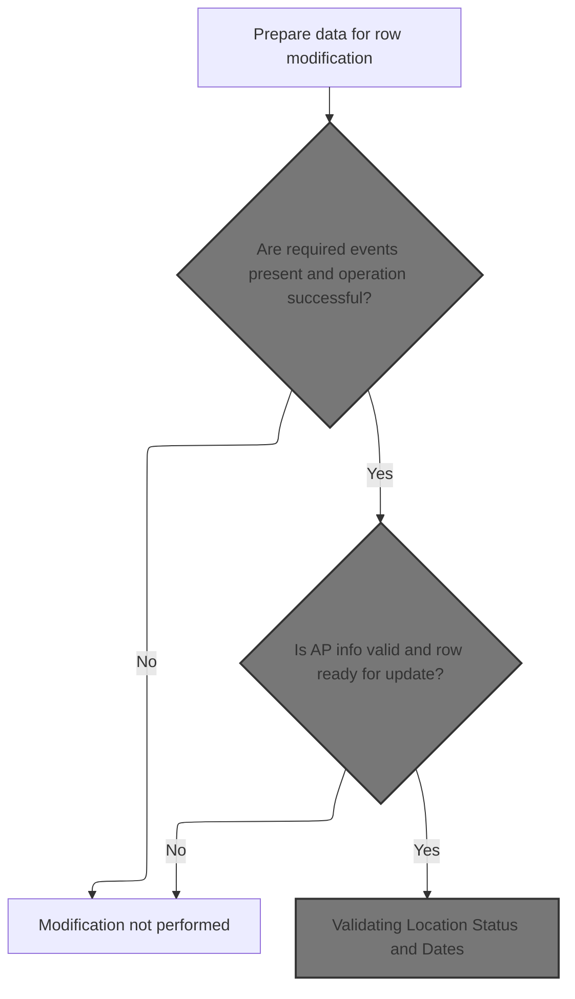

This section governs the rules for modifying a location record, including validation of required fields, audit tracking, event trigger detection, and status/date updates. It ensures only valid and auditable modifications are performed, and that any necessary follow-up actions are initiated.

| Category        | Rule Name                           | Description                                                                                                                                                           |
| --------------- | ----------------------------------- | --------------------------------------------------------------------------------------------------------------------------------------------------------------------- |
| Data validation | Application Field Null Validation   | If the application type code or number is missing or zero, the modification process must flag these fields as invalid and prevent them from being used in the update. |
| Data validation | Event and Success Gatekeeping       | Modification of a location record is only performed if all required events are present and the operation is successful; otherwise, no update is made.                 |
| Business logic  | Audit Trail Enforcement             | Every modification must be tagged with the current date and the user ID performing the update, or 'BATCH' if no user is available, to ensure auditability.            |
| Business logic  | Location Status and Date Validation | If a location record is modified, its status and relevant dates must be validated and updated according to business rules for active, inactive, or deleted states.    |
| Business logic  | Event Trigger Follow-up             | If an event trigger is detected during modification, appropriate follow-up actions or workflows must be initiated as defined by business requirements.                |

<SwmSnippet path="/base/src/NNNS0487.cbl" line="2304">

---

In <SwmToken path="base/src/NNNS0487.cbl" pos="2304:2:10" line-data="238100 1400-EXIT-PUT-MODIFY-ROW.                                        00238100">`1400-EXIT-PUT-MODIFY-ROW`</SwmToken>, we start by calling <SwmToken path="base/src/NNNS0487.cbl" pos="2305:4:10" line-data="238200     PERFORM 1800-EDIT-NULL-INDICATORS                            00238200">`1800-EDIT-NULL-INDICATORS`</SwmToken>. This step checks if the application type code or number is missing or zero, and if so, sets the null indicators to -1. This flags those fields as invalid for the rest of the update flow, so we don't accidentally write junk to the DB.

```cobol
238100 1400-EXIT-PUT-MODIFY-ROW.                                        00238100
238200     PERFORM 1800-EDIT-NULL-INDICATORS                            00238200
238300     PERFORM 2040-GET-DATE-AND-USER                               00238300
```

---

</SwmSnippet>

<SwmSnippet path="/base/src/NNNS0487.cbl" line="3091">

---

<SwmToken path="base/src/NNNS0487.cbl" pos="3091:2:8" line-data="316800 1800-EDIT-NULL-INDICATORS.                                       00316800">`1800-EDIT-NULL-INDICATORS`</SwmToken> sets the null indicators to -1 if the application fields are empty, so later code knows they're not valid.

```cobol
316800 1800-EDIT-NULL-INDICATORS.                                       00316800
316900     INITIALIZE WS-AP-NBR-IND                                     00316900
317000                WS-AP-TYP-CD-IND                                  00317000
317100                                                                  00317100
317200     IF AP-TYP-CD OF DCLXXXATION   = SPACES                       00317200
317300     OR AP-NBR    OF DCLXXXATION   = 0                            00317300
317400       MOVE -1 TO WS-AP-NBR-IND                                   00317400
317500       MOVE -1 TO WS-AP-TYP-CD-IND                                00317500
317600     END-IF                                                       00317600
```

---

</SwmSnippet>

<SwmSnippet path="/base/src/NNNS0487.cbl" line="2304">

---

Back in <SwmToken path="base/src/NNNS0487.cbl" pos="2304:2:10" line-data="238100 1400-EXIT-PUT-MODIFY-ROW.                                        00238100">`1400-EXIT-PUT-MODIFY-ROW`</SwmToken>, after flagging nulls, we call <SwmToken path="base/src/NNNS0487.cbl" pos="2306:4:12" line-data="238300     PERFORM 2040-GET-DATE-AND-USER                               00238300">`2040-GET-DATE-AND-USER`</SwmToken>. This grabs the current date and user ID (or sets 'BATCH' if not in CICS), so the update can be tracked with who did it and when.

```cobol
238100 1400-EXIT-PUT-MODIFY-ROW.                                        00238100
238200     PERFORM 1800-EDIT-NULL-INDICATORS                            00238200
238300     PERFORM 2040-GET-DATE-AND-USER                               00238300
```

---

</SwmSnippet>

<SwmSnippet path="/base/src/NNNS0487.cbl" line="3268">

---

<SwmToken path="base/src/NNNS0487.cbl" pos="3268:2:10" line-data="334500 2040-GET-DATE-AND-USER.                                          00334500">`2040-GET-DATE-AND-USER`</SwmToken> calls <SwmToken path="base/src/NNNS0487.cbl" pos="3269:4:8" line-data="334600     CALL Z-DATE-FUNCTIONS USING                                  00334600">`Z-DATE-FUNCTIONS`</SwmToken> to get the current date. If we're in a CICS environment and the call succeeded, it calls <SwmToken path="base/src/NNNS0487.cbl" pos="3275:4:12" line-data="335200       CALL Z-GET-CICS-USER-ID USING                              00335200">`Z-GET-CICS-USER-ID`</SwmToken> to get the actual user. Otherwise, it just sets the user to 'BATCH'. This way, every update is tagged with either a real user or 'BATCH' for audit purposes.

```cobol
334500 2040-GET-DATE-AND-USER.                                          00334500
334600     CALL Z-DATE-FUNCTIONS USING                                  00334600
334700         XXXN001A                                                 00334700
334800         YYYC0127                                                 00334800
334900                                                                  00334900
335000     IF  SUCCESS                                                  00335000
335100     AND YYYN005A-CICS-ENV                                        00335100
335200       CALL Z-GET-CICS-USER-ID USING                              00335200
335300           EIBLK    WS-DUMMY                                      00335300
335400           XXXN001A YYYC0107                                      00335400
335500     ELSE                                                         00335500
335600       MOVE 'BATCH' TO YYYC0107-USER                              00335600
335700     END-IF                                                       00335700
```

---

</SwmSnippet>

<SwmSnippet path="/base/src/NNNS0487.cbl" line="2308">

---

Back in <SwmToken path="base/src/NNNS0487.cbl" pos="878:4:12" line-data="095500          PERFORM 1400-EXIT-PUT-MODIFY-ROW                        00095500">`1400-EXIT-PUT-MODIFY-ROW`</SwmToken>, after getting the date and user, we check for events by calling <SwmToken path="base/src/NNNS0487.cbl" pos="2309:4:10" line-data="238600       PERFORM 1411-CHECK-FOR-EVENTS                              00238600">`1411-CHECK-FOR-EVENTS`</SwmToken>. This step decides if any follow-up actions or workflows need to be triggered based on the current state of the record.

```cobol
238500     IF SUCCESS                                                   00238500
238600       PERFORM 1411-CHECK-FOR-EVENTS                              00238600
```

---

</SwmSnippet>

### Checking for Event Triggers

This section ensures that event triggers are only checked and validated if the necessary AP number and type information is successfully retrieved for the current location. It acts as a gatekeeper to prevent further processing if prerequisites are not met.

| Category        | Rule Name                 | Description                                                                                                                                      |
| --------------- | ------------------------- | ------------------------------------------------------------------------------------------------------------------------------------------------ |
| Data validation | AP Number Prerequisite    | The system must retrieve the AP number and type for the current location before any event validation can occur.                                  |
| Data validation | Success-Driven Validation | Event trigger validation must only proceed if the retrieval of the AP number and type is successful, as indicated by the SUCCESS code (value 0). |

<SwmSnippet path="/base/src/NNNS0487.cbl" line="2326">

---

<SwmToken path="base/src/NNNS0487.cbl" pos="2326:2:8" line-data="240300 1411-CHECK-FOR-EVENTS.                                           00240300">`1411-CHECK-FOR-EVENTS`</SwmToken> starts by calling <SwmToken path="base/src/NNNS0487.cbl" pos="2327:4:10" line-data="240400     PERFORM 1412-GET-AP-NBR                                      00240400">`1412-GET-AP-NBR`</SwmToken> to fetch the AP number and type for the current location. This is needed because the next step, validating the activity switch, depends on having those values available.

```cobol
240300 1411-CHECK-FOR-EVENTS.                                           00240300
240400     PERFORM 1412-GET-AP-NBR                                      00240400
240500     IF SUCCESS                                                   00240500
240600       PERFORM 1414-VALIDATE-ACTIV-SW                             00240600
240700     END-IF                                                       00240700
240800     .                                                            00240800
```

---

</SwmSnippet>

### Retrieving AP Number and Type

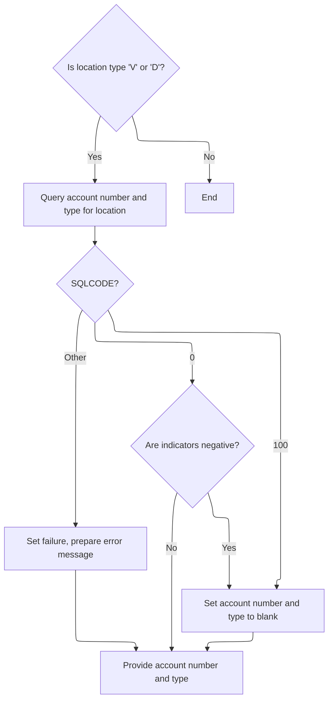

This section governs the retrieval of AP number and AP type code for a given location. It ensures that only valid location types trigger a database lookup, and handles nulls, missing data, and errors according to business rules.

| Category        | Rule Name               | Description                                                                                                                                                                |
| --------------- | ----------------------- | -------------------------------------------------------------------------------------------------------------------------------------------------------------------------- |
| Data validation | Null value handling     | If either AP number or AP type code is returned as null (indicator variable negative), both output fields are set to blank.                                                |
| Business logic  | Eligible location types | Only locations with type 'V' or 'D' are eligible for AP number and type retrieval. All other location types bypass this process and do not attempt to retrieve AP details. |
| Business logic  | Successful AP retrieval | When AP number and type are successfully retrieved and validated, they are provided as output for further business processing.                                             |

<SwmSnippet path="/base/src/NNNS0487.cbl" line="2334">

---

In <SwmToken path="base/src/NNNS0487.cbl" pos="2334:2:8" line-data="241100 1412-GET-AP-NBR.                                                 00241100">`1412-GET-AP-NBR`</SwmToken>, we only run the SQL query if the location type is 'V' or 'D'. The query pulls <SwmToken path="base/src/NNNS0487.cbl" pos="2337:4:4" line-data="241400           SELECT AP_NBR,                                         00241400">`AP_NBR`</SwmToken> and <SwmToken path="base/src/NNNS0487.cbl" pos="2338:2:2" line-data="241500                  AP_TYP_CD                                       00241500">`AP_TYP_CD`</SwmToken> from XXXATION into working storage, using indicator variables to catch nulls. This keeps the logic tight and avoids unnecessary DB calls for other types.

```cobol
241100 1412-GET-AP-NBR.                                                 00241100
241200     IF LOC-TYP-CD OF DCLXXXATION = 'V' OR 'D'                    00241200
241300       EXEC SQL                                                   00241300
241400           SELECT AP_NBR,                                         00241400
241500                  AP_TYP_CD                                       00241500
241600           INTO :WS-AP-NUM:WS-AP-NBR-IND,                         00241600
241700                :WS-AP-TYPE:WS-AP-TYP-CD-IND                      00241700
241800           FROM XXXATION                                          00241800
241900           WHERE LOC_TYP_CD = :DCLXXXATION.LOC-TYP-CD             00241900
242000           AND  LOC_NBR = :DCLXXXATION.LOC-NBR                    00242000
242100       END-EXEC                                                   00242100
```

---

</SwmSnippet>

<SwmSnippet path="/base/src/NNNS0487.cbl" line="2346">

---

After the SQL query in <SwmToken path="base/src/NNNS0487.cbl" pos="2327:4:10" line-data="240400     PERFORM 1412-GET-AP-NBR                                      00240400">`1412-GET-AP-NBR`</SwmToken>, we use EVALUATE to handle the result. If SQLCODE is 0, we check the indicators and blank out the output if they're negative. If SQLCODE is 100 (no data), we reset the output and clear the error. Any other code sets FAILURE and builds an error message.

```cobol
242300       EVALUATE TRUE                                              00242300
242400         WHEN SQLCODE = 0                                         00242400
242500           IF WS-AP-NBR-IND < 0                                   00242500
242600           OR WS-AP-TYP-CD-IND < 0                                00242600
242700             INITIALIZE WS-AP-NUM                                 00242700
242800                        WS-AP-TYPE                                00242800
242900           END-IF                                                 00242900
243000         WHEN SQLCODE = 100                                       00243000
243100           INITIALIZE WS-AP-NUM                                   00243100
243200                      WS-AP-TYPE                                  00243200
243300           MOVE 0 TO SQLCODE                                      00243300
243400        WHEN OTHER                                                00243400
243500         SET FAILURE  TO TRUE                                     00243500
243600         MOVE SPACES  TO IS-RTRN-MSG-TXT                          00243600
243700         MOVE SQLCODE TO WS-SQLCODE                               00243700
243800         STRING 'NNNS0487 - Error in gathering events. SQL '      00243800
243900                WS-SQLCODE '.'                                    00243900
244000         DELIMITED BY SIZE INTO IS-RTRN-MSG-TXT                   00244000
244100       END-EVALUATE                                               00244100
```

---

</SwmSnippet>

<SwmSnippet path="/base/src/NNNS0487.cbl" line="2365">

---

After all the error and null handling in <SwmToken path="base/src/NNNS0487.cbl" pos="2327:4:10" line-data="240400     PERFORM 1412-GET-AP-NBR                                      00240400">`1412-GET-AP-NBR`</SwmToken>, we move the AP number and type from working storage to the output variables. This hands off the values (or blanks) to the next part of the flow.

```cobol
244200       MOVE WS-AP-NUM   TO MMMC0474-OLD-AP-NBR                    00244200
244300       MOVE WS-AP-TYPE  TO MMMC0474-OLD-AP-TYP                    00244300
244400     END-IF                                                       00244400
```

---

</SwmSnippet>

### Validating Location Status and Dates

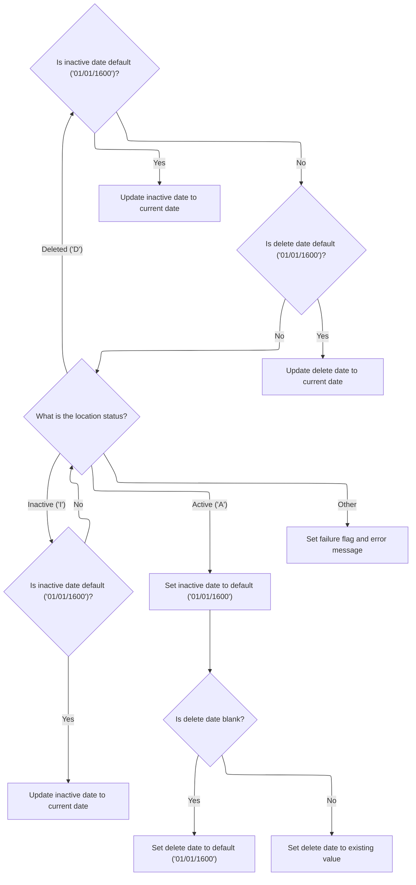

This section ensures that location status and associated dates are consistent with business rules. It updates date fields based on the status and default values, and blocks invalid status codes.

| Category       | Rule Name                           | Description                                                                                                                                                                                                       |
| -------------- | ----------------------------------- | ----------------------------------------------------------------------------------------------------------------------------------------------------------------------------------------------------------------- |
| Business logic | Inactive status date update         | If the location status is 'Inactive' and the inactive date is set to the default value ('01/01/1600'), the inactive date must be updated to the current date.                                                     |
| Business logic | Active status resets inactive date  | If the location status is 'Active', the inactive date must always be reset to the default value ('01/01/1600').                                                                                                   |
| Business logic | Active status delete date handling  | If the location status is 'Active' and the previous delete date is blank, the delete date must be set to the default value ('01/01/1600'). If not blank, the delete date must be copied from the previous record. |
| Business logic | Deleted status inactive date update | If the location status is 'Deleted' and the inactive date is set to the default value ('01/01/1600'), the inactive date must be updated to the current date.                                                      |
| Business logic | Deleted status delete date update   | If the location status is 'Deleted' and the delete date is set to the default value ('01/01/1600'), the delete date must be updated to the current date.                                                          |

<SwmSnippet path="/base/src/NNNS0487.cbl" line="2371">

---

In <SwmToken path="base/src/NNNS0487.cbl" pos="2371:2:8" line-data="244800 1414-VALIDATE-ACTIV-SW.                                          00244800">`1414-VALIDATE-ACTIV-SW`</SwmToken>, we use repository-specific constants to decide how to update <SwmToken path="base/src/NNNS0487.cbl" pos="2374:4:6" line-data="245100         IF INACTIVE-DT OF DCLXXXATION = K-DEF-DT                 00245100">`INACTIVE-DT`</SwmToken> and <SwmToken path="base/src/NNNS0487.cbl" pos="1330:4:6" line-data="140700     MOVE DELETE-DT OF DCLXXXATION TO DELETE-DT OF P-DDDTLO01     00140700">`DELETE-DT`</SwmToken> in DCLXXXATION. The logic branches based on <SwmToken path="base/src/NNNS0487.cbl" pos="2373:4:6" line-data="245000       WHEN INACTIVE-SW OF DCLXXXATION = K-LOC-IN-ACTIVE          00245000">`INACTIVE-SW`</SwmToken> ('I', 'A', 'D'), and updates dates only if they match the default value. This is all driven by KONSTANTS, not generic COBOL.

```cobol
244800 1414-VALIDATE-ACTIV-SW.                                          00244800
244900     EVALUATE TRUE                                                00244900
245000       WHEN INACTIVE-SW OF DCLXXXATION = K-LOC-IN-ACTIVE          00245000
245100         IF INACTIVE-DT OF DCLXXXATION = K-DEF-DT                 00245100
245200           MOVE DTA10-MM-DD-YYYY TO INACTIVE-DT OF DCLXXXATION    00245200
245300         END-IF                                                   00245300
```

---

</SwmSnippet>

<SwmSnippet path="/base/src/NNNS0487.cbl" line="2378">

---

When <SwmToken path="base/src/NNNS0487.cbl" pos="2378:4:6" line-data="245500       WHEN INACTIVE-SW OF DCLXXXATION = K-LOC-ACTIVE             00245500">`INACTIVE-SW`</SwmToken> is 'A' in <SwmToken path="base/src/NNNS0487.cbl" pos="2329:4:10" line-data="240600       PERFORM 1414-VALIDATE-ACTIV-SW                             00240600">`1414-VALIDATE-ACTIV-SW`</SwmToken>, we reset <SwmToken path="base/src/NNNS0487.cbl" pos="2379:12:14" line-data="245600         MOVE K-DEF-DT TO INACTIVE-DT OF DCLXXXATION              00245600">`INACTIVE-DT`</SwmToken> to the default date. For <SwmToken path="base/src/NNNS0487.cbl" pos="2380:4:6" line-data="245700         IF DELETE-DT     OF P-DDDTLO01 = SPACES                  00245700">`DELETE-DT`</SwmToken>, if the previous value is blank, we set it to the default; otherwise, we copy it from the previous record. This keeps the DB consistent for active locations.

```cobol
245500       WHEN INACTIVE-SW OF DCLXXXATION = K-LOC-ACTIVE             00245500
245600         MOVE K-DEF-DT TO INACTIVE-DT OF DCLXXXATION              00245600
245700         IF DELETE-DT     OF P-DDDTLO01 = SPACES                  00245700
245800           MOVE K-DEF-DT TO DELETE-DT     OF DCLXXXATION          00245800
245900         ELSE                                                     00245900
246000           MOVE DELETE-DT     OF P-DDDTLO01                       00246000
246100             TO DELETE-DT     OF DCLXXXATION                      00246100
246200         END-IF                                                   00246200
```

---

</SwmSnippet>

<SwmSnippet path="/base/src/NNNS0487.cbl" line="2388">

---

For deleted status in <SwmToken path="base/src/NNNS0487.cbl" pos="2329:4:10" line-data="240600       PERFORM 1414-VALIDATE-ACTIV-SW                             00240600">`1414-VALIDATE-ACTIV-SW`</SwmToken>, we check if <SwmToken path="base/src/NNNS0487.cbl" pos="2389:4:6" line-data="246600         IF INACTIVE-DT OF DCLXXXATION = K-DEF-DT                 00246600">`INACTIVE-DT`</SwmToken> and <SwmToken path="base/src/NNNS0487.cbl" pos="2392:4:6" line-data="246900         IF DELETE-DT OF DCLXXXATION = K-DEF-DT                   00246900">`DELETE-DT`</SwmToken> are still at the default. If so, we set them to the current date. This marks the record as deleted in both fields, following the repo's business rules.

```cobol
246500       WHEN INACTIVE-SW OF DCLXXXATION = K-LOC-DELETED            00246500
246600         IF INACTIVE-DT OF DCLXXXATION = K-DEF-DT                 00246600
246700           MOVE DTA10-MM-DD-YYYY TO INACTIVE-DT OF DCLXXXATION    00246700
246800         END-IF                                                   00246800
246900         IF DELETE-DT OF DCLXXXATION = K-DEF-DT                   00246900
247000           MOVE DTA10-MM-DD-YYYY TO DELETE-DT   OF DCLXXXATION    00247000
247100         END-IF                                                   00247100
```

---

</SwmSnippet>

<SwmSnippet path="/base/src/NNNS0487.cbl" line="2396">

---

If <SwmToken path="base/src/NNNS0487.cbl" pos="1350:4:6" line-data="142700     MOVE INACTIVE-SW OF DCLXXXATION TO INACTIVE-SW OF P-DDDTLO01 00142700">`INACTIVE-SW`</SwmToken> isn't 'A', 'I', or 'D', <SwmToken path="base/src/NNNS0487.cbl" pos="2329:4:10" line-data="240600       PERFORM 1414-VALIDATE-ACTIV-SW                             00240600">`1414-VALIDATE-ACTIV-SW`</SwmToken> sets FAILURE to TRUE and returns an error message. This blocks any further updates for invalid status codes, so only valid ones get processed.

```cobol
247300       WHEN OTHER                                                 00247300
247400         SET  FAILURE TO TRUE                                     00247400
247500         MOVE 'NNNS0487 - Invalid active-sw - must be A,I,or D!'  00247500
247600           TO IS-RTRN-MSG-TXT                                     00247600
247700     END-EVALUATE                                                 00247700
```

---

</SwmSnippet>

### Validating AP Info and Preparing for Modification

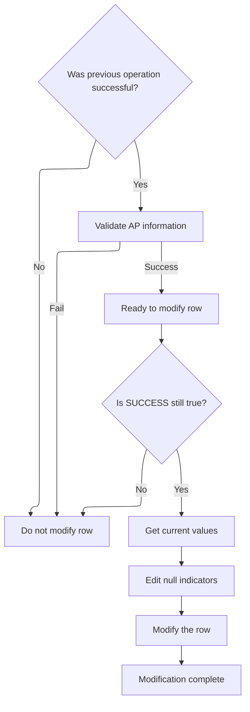

<SwmSnippet path="/base/src/NNNS0487.cbl" line="2310">

---

After <SwmToken path="base/src/NNNS0487.cbl" pos="2309:4:10" line-data="238600       PERFORM 1411-CHECK-FOR-EVENTS                              00238600">`1411-CHECK-FOR-EVENTS`</SwmToken> runs in <SwmToken path="base/src/NNNS0487.cbl" pos="878:4:12" line-data="095500          PERFORM 1400-EXIT-PUT-MODIFY-ROW                        00095500">`1400-EXIT-PUT-MODIFY-ROW`</SwmToken>, we move on to <SwmToken path="base/src/NNNS0487.cbl" pos="2311:4:10" line-data="238800         PERFORM 1420-CHECK-AP-INFO                               00238800">`1420-CHECK-AP-INFO`</SwmToken>. This step checks if the AP info needs to be updated, especially if the application number changed, before we do any modification.

```cobol
238700       IF SUCCESS                                                 00238700
238800         PERFORM 1420-CHECK-AP-INFO                               00238800
238900         IF SUCCESS                                               00238900
239000*          PERFORM 10300-CHECK-FOR-VALID-COUNTY                   00239000
239100           SET EXIT-PUT-MODIFY-ROW  TO TRUE                       00239100
239200           IF SUCCESS                                             00239200
239300             PERFORM 1430-GET-CURRENT-VALUES                      00239300
239400             PERFORM 1800-EDIT-NULL-INDICATORS                    00239400
239500             PERFORM 1440-D0-MODIFY-ROW                           00239500
239600           END-IF                                                 00239600
239700         END-IF                                                   00239700
239800       END-IF                                                     00239800
```

---

</SwmSnippet>

## Checking and Updating Facility/Org IDs

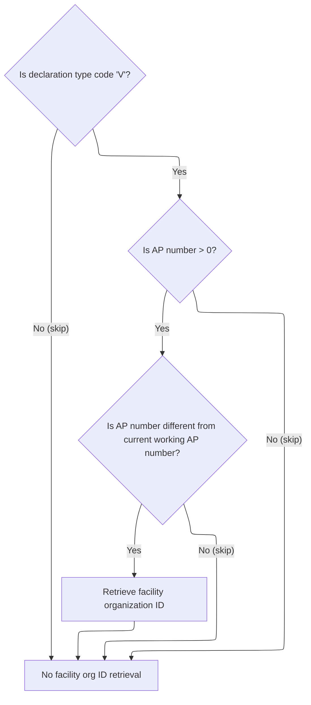

This section governs the rules for when a facility or organization ID should be retrieved and updated based on the declaration's location type and AP number. It ensures that updates only occur under specific business conditions to maintain data integrity and relevance.

| Category        | Rule Name                      | Description                                                                                                                                                                                                      |
| --------------- | ------------------------------ | ---------------------------------------------------------------------------------------------------------------------------------------------------------------------------------------------------------------- |
| Data validation | AP number validity             | If the AP number in the declaration is less than or equal to zero, no facility or organization ID retrieval or update is performed.                                                                              |
| Business logic  | Location type exclusion        | If the declaration's location type code is not 'V', no facility or organization ID retrieval or update is performed.                                                                                             |
| Business logic  | Duplicate AP number prevention | If the AP number in the declaration matches the current working AP number, no facility or organization ID retrieval or update is performed.                                                                      |
| Business logic  | Facility/org ID update trigger | If the declaration's location type code is 'V', the AP number is greater than zero, and the AP number differs from the current working AP number, the facility or organization ID must be retrieved and updated. |

<SwmSnippet path="/base/src/NNNS0487.cbl" line="2404">

---

<SwmToken path="base/src/NNNS0487.cbl" pos="2404:2:8" line-data="248100 1420-CHECK-AP-INFO.                                              00248100">`1420-CHECK-AP-INFO`</SwmToken> checks if the location type is 'V' and if the AP number is greater than zero and different from the previous value. If so, it calls <SwmToken path="base/src/NNNS0487.cbl" pos="2408:4:12" line-data="248500           PERFORM 1505-GET-FAC-ORG-ID                            00248500">`1505-GET-FAC-ORG-ID`</SwmToken> to update or assign the right facility/org IDs.

```cobol
248100 1420-CHECK-AP-INFO.                                              00248100
248200     IF LOC-TYP-CD OF DCLXXXATION = 'V'                           00248200
248300       IF AP-NBR OF DCLXXXATION > 0                               00248300
248400         IF AP-NBR OF DCLXXXATION NOT EQUAL TO WS-AP-NUM          00248400
248500           PERFORM 1505-GET-FAC-ORG-ID                            00248500
248600         END-IF                                                   00248600
248700       END-IF                                                     00248700
248800     END-IF                                                       00248800
```

---

</SwmSnippet>

## Assigning Facility and Organization IDs

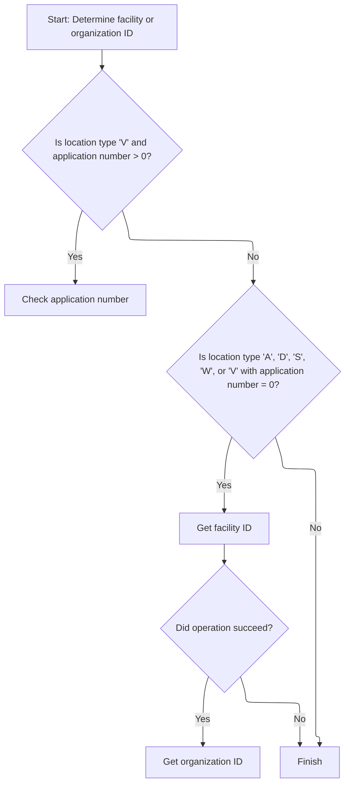

This section governs the assignment of facility and organization IDs based on the type of location and the application number. It ensures that IDs are only assigned when specific business conditions are met, and that error handling is performed if assignments fail.

| Category       | Rule Name                                 | Description                                                                                                                                                      |
| -------------- | ----------------------------------------- | ---------------------------------------------------------------------------------------------------------------------------------------------------------------- |
| Business logic | Application Number Check for Type V       | If the location type is 'V' and the application number is greater than 0, only the application number is checked and no facility or organization ID is assigned. |
| Business logic | Facility ID Assignment                    | If the location type is 'A', 'D', 'S', 'W', or 'V' with application number equal to 0, a facility ID is assigned.                                                |
| Business logic | Organization ID Assignment on Success     | If facility ID assignment succeeds (return code SUCCESS = 0), an organization ID is also assigned.                                                               |
| Business logic | No Assignment for Non-matching Conditions | If none of the specified location type and application number conditions are met, no IDs are assigned and the process continues without changes.                 |

<SwmSnippet path="/base/src/NNNS0487.cbl" line="2503">

---

<SwmToken path="base/src/NNNS0487.cbl" pos="2503:2:10" line-data="258000 1505-GET-FAC-ORG-ID.                                             00258000">`1505-GET-FAC-ORG-ID`</SwmToken> uses EVALUATE to branch based on location type and AP number. For 'V' with <SwmToken path="base/src/NNNS0487.cbl" pos="2506:4:6" line-data="258300        AND AP-NBR OF DCLXXXATION &gt; 0                             00258300">`AP-NBR`</SwmToken> > 0, it calls <SwmToken path="base/src/NNNS0487.cbl" pos="2507:4:10" line-data="258400         PERFORM 1515-CHECK-AP-NBR                                00258400">`1515-CHECK-AP-NBR`</SwmToken>. For other types or 'V' with <SwmToken path="base/src/NNNS0487.cbl" pos="2506:4:6" line-data="258300        AND AP-NBR OF DCLXXXATION &gt; 0                             00258300">`AP-NBR`</SwmToken> = 0, it calls <SwmToken path="base/src/NNNS0487.cbl" pos="2511:4:12" line-data="258800         PERFORM 1525-EXIT-GET-FAC-ID                             00258800">`1525-EXIT-GET-FAC-ID`</SwmToken> and, if successful, <SwmToken path="base/src/NNNS0487.cbl" pos="2513:4:12" line-data="259000           PERFORM 1530-EXIT-GET-ORG-ID                           00259000">`1530-EXIT-GET-ORG-ID`</SwmToken>. This keeps the ID assignment logic tight and type-specific.

```cobol
258000 1505-GET-FAC-ORG-ID.                                             00258000
258100     EVALUATE TRUE                                                00258100
258200       WHEN LOC-TYP-CD OF DCLXXXATION = 'V'                       00258200
258300        AND AP-NBR OF DCLXXXATION > 0                             00258300
258400         PERFORM 1515-CHECK-AP-NBR                                00258400
258500       WHEN (LOC-TYP-CD OF DCLXXXATION = 'A' OR 'D' OR 'S' OR 'W')00258500
258600         OR (LOC-TYP-CD OF DCLXXXATION = 'V'                      00258600
258700        AND AP-NBR OF DCLXXXATION = 0)                            00258700
258800         PERFORM 1525-EXIT-GET-FAC-ID                             00258800
258900         IF SUCCESS                                               00258900
259000           PERFORM 1530-EXIT-GET-ORG-ID                           00259000
259100         END-IF                                                   00259100
259200       WHEN OTHER                                                 00259200
259300         CONTINUE                                                 00259300
259400     END-EVALUATE                                                 00259400
```

---

</SwmSnippet>

## Checking AP Existence and Assigning IDs

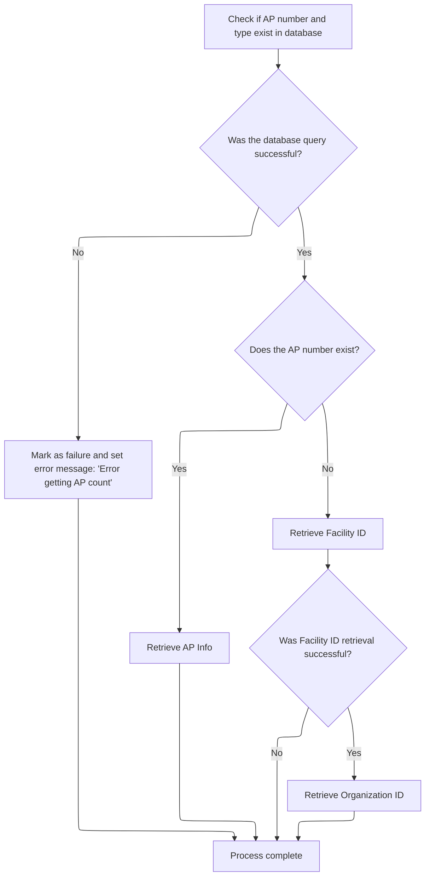

This section ensures that AP numbers and types are uniquely managed by checking their existence in the database. It assigns new Facility and Organization IDs only when necessary, preventing duplicate AP entries and handling errors appropriately.

| Category        | Rule Name                         | Description                                                                                                                                                                      |
| --------------- | --------------------------------- | -------------------------------------------------------------------------------------------------------------------------------------------------------------------------------- |
| Data validation | Facility ID Dependency            | Facility ID retrieval must be successful before attempting to retrieve Organization ID. If Facility ID retrieval fails, the process completes without assigning Organization ID. |
| Business logic  | Assign New IDs for Nonexistent AP | If the AP number and type do not exist in the database, new Facility and Organization IDs must be assigned.                                                                      |
| Business logic  | Retrieve Existing AP Info         | If the AP number and type exist in the database, the existing AP information must be retrieved instead of assigning new IDs.                                                     |

<SwmSnippet path="/base/src/NNNS0487.cbl" line="2540">

---

In <SwmToken path="base/src/NNNS0487.cbl" pos="2540:2:8" line-data="261700 1515-CHECK-AP-NBR.                                               00261700">`1515-CHECK-AP-NBR`</SwmToken>, we copy AP number and type to working storage, then run a SQL COUNT query on XXXATION. If the count is zero, we go get new facility/org IDs. If not, we fetch the existing ones. This keeps ID assignment clean and avoids duplicates.

```cobol
261700 1515-CHECK-AP-NBR.                                               00261700
261800     MOVE AP-NBR    OF DCLXXXATION TO WS-AP-NUM                   00261800
261900     MOVE AP-TYP-CD OF DCLXXXATION TO WS-AP-TYPE                  00261900
262000                                                                  00262000
262100     EXEC SQL                                                     00262100
262200         SELECT COUNT(*)                                          00262200
262300         INTO   :WS-AP-NBR-CNT                                    00262300
262400         FROM XXXATION                                            00262400
262500         WHERE AP_TYP_CD = :WS-AP-TYPE                            00262500
262600           AND AP_NBR = :WS-AP-NUM                                00262600
262700     END-EXEC                                                     00262700
```

---

</SwmSnippet>

<SwmSnippet path="/base/src/NNNS0487.cbl" line="2552">

---

After the count query in <SwmToken path="base/src/NNNS0487.cbl" pos="2507:4:10" line-data="258400         PERFORM 1515-CHECK-AP-NBR                                00258400">`1515-CHECK-AP-NBR`</SwmToken>, we branch: if count is zero, we call <SwmToken path="base/src/NNNS0487.cbl" pos="2555:4:12" line-data="263200           PERFORM 1525-EXIT-GET-FAC-ID                           00263200">`1525-EXIT-GET-FAC-ID`</SwmToken> and, if successful, <SwmToken path="base/src/NNNS0487.cbl" pos="2557:4:12" line-data="263400             PERFORM 1530-EXIT-GET-ORG-ID                         00263400">`1530-EXIT-GET-ORG-ID`</SwmToken>. If count isn't zero, we fetch existing AP info. Any SQL error sets FAILURE and an error message.

```cobol
262900     EVALUATE TRUE                                                00262900
263000       WHEN SQLCODE = 0                                           00263000
263100         IF WS-AP-NBR-CNT = 0                                     00263100
263200           PERFORM 1525-EXIT-GET-FAC-ID                           00263200
263300           IF SUCCESS                                             00263300
263400             PERFORM 1530-EXIT-GET-ORG-ID                         00263400
263500           END-IF                                                 00263500
263600         ELSE                                                     00263600
263700           PERFORM 1520-GET-AP-INFO                               00263700
263800         END-IF                                                   00263800
263900       WHEN OTHER                                                 00263900
264000         SET  FAILURE        TO TRUE                              00264000
264100         MOVE 'NNNS0487 - Error getting AP count!'                00264100
264200           TO IS-RTRN-MSG-TXT                                     00264200
264300     END-EVALUATE                                                 00264300
```

---

</SwmSnippet>

## Generating Next Facility ID

This section ensures that each new facility record receives a unique, sequential Facility ID by determining the highest current ID and incrementing it. It also handles error reporting if the ID generation process fails.

| Category       | Rule Name                         | Description                                                                                                                                                                                                                                                                    |
| -------------- | --------------------------------- | ------------------------------------------------------------------------------------------------------------------------------------------------------------------------------------------------------------------------------------------------------------------------------ |
| Business logic | Sequential Facility ID Assignment | The next Facility ID must always be one greater than the current maximum <SwmToken path="base/src/NNNS0487.cbl" pos="1596:2:2" line-data="167300                FAC_ID,                                           00167300">`FAC_ID`</SwmToken> present in the XXXATION table. |

<SwmSnippet path="/base/src/NNNS0487.cbl" line="2595">

---

In <SwmToken path="base/src/NNNS0487.cbl" pos="2595:2:10" line-data="267200 1525-EXIT-GET-FAC-ID.                                            00267200">`1525-EXIT-GET-FAC-ID`</SwmToken>, we run a SQL query to get the max <SwmToken path="base/src/NNNS0487.cbl" pos="2597:7:7" line-data="267400         SELECT MAX (FAC_ID)                                      00267400">`FAC_ID`</SwmToken> from XXXATION, then bump it by one to get the next available ID. This is how we generate new facility IDs when inserting new records.

```cobol
267200 1525-EXIT-GET-FAC-ID.                                            00267200
267300     EXEC SQL                                                     00267300
267400         SELECT MAX (FAC_ID)                                      00267400
267500         INTO   :DCLXXXATION.FAC-ID                               00267500
267600         FROM   XXXATION                                          00267600
267700     END-EXEC                                                     00267700
```

---

</SwmSnippet>

<SwmSnippet path="/base/src/NNNS0487.cbl" line="2602">

---

After the query in <SwmToken path="base/src/NNNS0487.cbl" pos="2511:4:12" line-data="258800         PERFORM 1525-EXIT-GET-FAC-ID                             00258800">`1525-EXIT-GET-FAC-ID`</SwmToken>, if it worked, we increment <SwmToken path="base/src/NNNS0487.cbl" pos="2604:4:6" line-data="268100         COMPUTE FAC-ID OF DCLXXXATION =                          00268100">`FAC-ID`</SwmToken> and use it. If it failed, we set FAILURE and return an error message, so the flow knows to bail out.

```cobol
267900     EVALUATE TRUE                                                00267900
268000       WHEN SQLCODE = 0                                           00268000
268100         COMPUTE FAC-ID OF DCLXXXATION =                          00268100
268200                 FAC-ID OF DCLXXXATION + 1                        00268200
268300       WHEN OTHER                                                 00268300
268400         SET  FAILURE TO TRUE                                     00268400
268500         MOVE 'NNNS0487 - Error getting FAC_ID!'                  00268500
268600           TO IS-RTRN-MSG-TXT                                     00268600
268700     END-EVALUATE                                                 00268700
```

---

</SwmSnippet>

## Generating Next Organization ID

This section ensures that every new organization receives a unique ID by checking the highest existing ID across two tables and incrementing it. If the process fails, an error message is returned and the flow is halted.

| Category        | Rule Name                             | Description                                                                                                                                                                                                                                                                                                                                                                                                                                 |
| --------------- | ------------------------------------- | ------------------------------------------------------------------------------------------------------------------------------------------------------------------------------------------------------------------------------------------------------------------------------------------------------------------------------------------------------------------------------------------------------------------------------------------- |
| Data validation | Failure State Enforcement             | If FAILURE is set to true, no organization ID should be assigned or used in subsequent operations.                                                                                                                                                                                                                                                                                                                                          |
| Business logic  | Unique Organization ID Enforcement    | The next organization ID must be greater than any existing <SwmToken path="base/src/NNNS0487.cbl" pos="1597:2:2" line-data="167400                ORG_ID,                                           00167400">`ORG_ID`</SwmToken> in both the XXXATION and <SwmToken path="base/src/NNNS0487.cbl" pos="2618:9:9" line-data="269500         FROM   XXXATION LOC, STR_DEPT DEPT                       00269500">`STR_DEPT`</SwmToken> tables. |
| Business logic  | Sequential Organization ID Assignment | The returned organization ID must be exactly one greater than the highest <SwmToken path="base/src/NNNS0487.cbl" pos="1597:2:2" line-data="167400                ORG_ID,                                           00167400">`ORG_ID`</SwmToken> found in either table.                                                                                                                                                                     |

<SwmSnippet path="/base/src/NNNS0487.cbl" line="2614">

---

In <SwmToken path="base/src/NNNS0487.cbl" pos="2614:2:10" line-data="269100 1530-EXIT-GET-ORG-ID.                                            00269100">`1530-EXIT-GET-ORG-ID`</SwmToken>, we run a SQL query to get the highest <SwmToken path="base/src/NNNS0487.cbl" pos="2616:12:12" line-data="269300         SELECT GREATEST (MAX (LOC.ORG_ID), MAX (DEPT.ORG_ID))    00269300">`ORG_ID`</SwmToken> from both XXXATION and <SwmToken path="base/src/NNNS0487.cbl" pos="2618:9:9" line-data="269500         FROM   XXXATION LOC, STR_DEPT DEPT                       00269500">`STR_DEPT`</SwmToken>, then bump it by one for the next available ID. This keeps org IDs unique across both tables.

```cobol
269100 1530-EXIT-GET-ORG-ID.                                            00269100
269200     EXEC SQL                                                     00269200
269300         SELECT GREATEST (MAX (LOC.ORG_ID), MAX (DEPT.ORG_ID))    00269300
269400         INTO   :DCLXXXATION.ORG-ID                               00269400
269500         FROM   XXXATION LOC, STR_DEPT DEPT                       00269500
269600     END-EXEC                                                     00269600
```

---

</SwmSnippet>

<SwmSnippet path="/base/src/NNNS0487.cbl" line="2621">

---

After the query in <SwmToken path="base/src/NNNS0487.cbl" pos="2513:4:12" line-data="259000           PERFORM 1530-EXIT-GET-ORG-ID                           00259000">`1530-EXIT-GET-ORG-ID`</SwmToken>, if it worked, we increment <SwmToken path="base/src/NNNS0487.cbl" pos="2623:4:6" line-data="270000         COMPUTE ORG-ID OF DCLXXXATION =                          00270000">`ORG-ID`</SwmToken> and use it. If it failed, we set FAILURE and return an error message, so the flow knows to bail out.

```cobol
269800     EVALUATE TRUE                                                00269800
269900       WHEN SQLCODE = 0                                           00269900
270000         COMPUTE ORG-ID OF DCLXXXATION =                          00270000
270100                 ORG-ID OF DCLXXXATION + 1                        00270100
270200       WHEN OTHER                                                 00270200
270300         SET  FAILURE TO TRUE                                     00270300
270400         MOVE 'NNNS0487 - Error getting ORG_ID!'                  00270400
270500           TO IS-RTRN-MSG-TXT                                     00270500
270600     END-EVALUATE                                                 00270600
```

---

</SwmSnippet>

## Applying Modifications to Location Data

```mermaid
%%{init: {"flowchart": {"defaultRenderer": "elk"}} }%%
flowchart TD
    node1["Update declaration with modification timestamp and user"] --> node2["Cleaning Up Non-Printable Data"]
    click node1 openCode "base/src/NNNS0487.cbl:2457:2459"
    
    node2 --> node3["Perform database update (CUD routine)"]
    click node3 openCode "base/src/NNNS0487.cbl:2462:2462"
    node3 --> node4{"Was update successful? (SQLCODE = 0)"}
    click node4 openCode "base/src/NNNS0487.cbl:2464:2464"
    node4 -->|"Yes"| node5["Mark update as successful, set update flags"]
    click node5 openCode "base/src/NNNS0487.cbl:2465:2471"
    node4 -->|"No"| node7["Exit process"]
    node5 --> node6["Trigger vendor event check"]
    click node6 openCode "base/src/NNNS0487.cbl:2472:2472"
    node6 --> node8["Triggering Denormalization and Event Handling"]
    
    node8 --> node9{"Is update fully successful? (SUCCESS)"}
    click node9 openCode "base/src/NNNS0487.cbl:2474:2474"
    node9 -->|"Yes"| node10{"Is location type V or D?"}
    click node10 openCode "base/src/NNNS0487.cbl:2475:2475"
    node9 -->|"No"| node7
    node10 -->|"Yes"| node11{"Has AP number changed?"}
    click node11 openCode "base/src/NNNS0487.cbl:2476:2476"
    node10 -->|"No"| node7
    node11 -->|"Yes"| node12["Running AVP Maintenance After DB2 Switch"]
    
    node11 -->|"No"| node7
    node12 --> node7["Exit process"]
    click node7 openCode "base/src/YYYS0211.cbl:32:32"

classDef HeadingStyle fill:#777777,stroke:#333,stroke-width:2px;
click node2 goToHeading "Cleaning Up Non-Printable Data"
node2:::HeadingStyle
click node8 goToHeading "Triggering Denormalization and Event Handling"
node8:::HeadingStyle
click node12 goToHeading "Running AVP Maintenance After DB2 Switch"
node12:::HeadingStyle

%% Swimm:
%% %%{init: {"flowchart": {"defaultRenderer": "elk"}} }%%
%% flowchart TD
%%     node1["Update declaration with modification timestamp and user"] --> node2["Cleaning Up Non-Printable Data"]
%%     click node1 openCode "<SwmPath>[base/src/NNNS0487.cbl](base/src/NNNS0487.cbl)</SwmPath>:2457:2459"
%%     
%%     node2 --> node3["Perform database update (CUD routine)"]
%%     click node3 openCode "<SwmPath>[base/src/NNNS0487.cbl](base/src/NNNS0487.cbl)</SwmPath>:2462:2462"
%%     node3 --> node4{"Was update successful? (SQLCODE = 0)"}
%%     click node4 openCode "<SwmPath>[base/src/NNNS0487.cbl](base/src/NNNS0487.cbl)</SwmPath>:2464:2464"
%%     node4 -->|"Yes"| node5["Mark update as successful, set update flags"]
%%     click node5 openCode "<SwmPath>[base/src/NNNS0487.cbl](base/src/NNNS0487.cbl)</SwmPath>:2465:2471"
%%     node4 -->|"No"| node7["Exit process"]
%%     node5 --> node6["Trigger vendor event check"]
%%     click node6 openCode "<SwmPath>[base/src/NNNS0487.cbl](base/src/NNNS0487.cbl)</SwmPath>:2472:2472"
%%     node6 --> node8["Triggering Denormalization and Event Handling"]
%%     
%%     node8 --> node9{"Is update fully successful? (SUCCESS)"}
%%     click node9 openCode "<SwmPath>[base/src/NNNS0487.cbl](base/src/NNNS0487.cbl)</SwmPath>:2474:2474"
%%     node9 -->|"Yes"| node10{"Is location type V or D?"}
%%     click node10 openCode "<SwmPath>[base/src/NNNS0487.cbl](base/src/NNNS0487.cbl)</SwmPath>:2475:2475"
%%     node9 -->|"No"| node7
%%     node10 -->|"Yes"| node11{"Has AP number changed?"}
%%     click node11 openCode "<SwmPath>[base/src/NNNS0487.cbl](base/src/NNNS0487.cbl)</SwmPath>:2476:2476"
%%     node10 -->|"No"| node7
%%     node11 -->|"Yes"| node12["Running AVP Maintenance After <SwmToken path="base/src/NNNS0487.cbl" pos="1227:10:10" line-data="130400       PERFORM 125-CONNECT-TO-DB2                                 00130400">`DB2`</SwmToken> Switch"]
%%     
%%     node11 -->|"No"| node7
%%     node12 --> node7["Exit process"]
%%     click node7 openCode "<SwmPath>[base/src/YYYS0211.cbl](base/src/YYYS0211.cbl)</SwmPath>:32:32"
%% 
%% classDef HeadingStyle fill:#777777,stroke:#333,stroke-width:2px;
%% click node2 goToHeading "Cleaning Up Non-Printable Data"
%% node2:::HeadingStyle
%% click node8 goToHeading "Triggering Denormalization and Event Handling"
%% node8:::HeadingStyle
%% click node12 goToHeading "Running AVP Maintenance After <SwmToken path="base/src/NNNS0487.cbl" pos="1227:10:10" line-data="130400       PERFORM 125-CONNECT-TO-DB2                                 00130400">`DB2`</SwmToken> Switch"
%% node12:::HeadingStyle
```

This section ensures that location data modifications are accurately recorded, data quality is maintained, and all necessary business processes are triggered based on the outcome and context of the update.

| Category        | Rule Name                    | Description                                                                                                                                                                                                                                                                                   |
| --------------- | ---------------------------- | --------------------------------------------------------------------------------------------------------------------------------------------------------------------------------------------------------------------------------------------------------------------------------------------- |
| Data validation | Data cleanliness enforcement | All non-printable values in key contact and address fields must be replaced with blanks before saving the data to the database.                                                                                                                                                               |
| Business logic  | Modification metadata update | The modification timestamp and user ID must be updated in the location declaration whenever a modification is applied.                                                                                                                                                                        |
| Business logic  | Success flagging             | If the update is successful, the system must mark the update as successful and set relevant update flags for downstream processing.                                                                                                                                                           |
| Business logic  | Vendor event triggering      | After a successful update, a vendor event check must be triggered to determine if any vendor-related events need to be processed.                                                                                                                                                             |
| Business logic  | Conditional denormalization  | Denormalization and event handling must be triggered only if the update is fully successful.                                                                                                                                                                                                  |
| Business logic  | AVP maintenance on AP change | If the location type is 'V' or 'D' and the AP number has changed, AVP maintenance must be performed after switching to <SwmToken path="base/src/NNNS0487.cbl" pos="1227:10:10" line-data="130400       PERFORM 125-CONNECT-TO-DB2                                 00130400">`DB2`</SwmToken>. |

<SwmSnippet path="/base/src/NNNS0487.cbl" line="2457">

---

In <SwmToken path="base/src/NNNS0487.cbl" pos="2457:2:8" line-data="253400 1440-D0-MODIFY-ROW.                                              00253400">`1440-D0-MODIFY-ROW`</SwmToken>, we start by moving the timestamp and user into the record, then call <SwmToken path="base/src/NNNS0487.cbl" pos="2461:4:12" line-data="253800     PERFORM 4010-REP-LOWVALUE-WITH-SPACES                        00253800">`4010-REP-LOWVALUE-WITH-SPACES`</SwmToken> to clean up any non-printable values in key fields. This keeps the data clean before we push it to the DB.

```cobol
253400 1440-D0-MODIFY-ROW.                                              00253400
253500     MOVE YYYC0127-TS   TO LST-UPDT-TS     OF DCLXXXATION         00253500
253600     MOVE YYYC0107-USER TO LST-UPDT-USR-ID OF DCLXXXATION         00253600
253700                                                                  00253700
253800     PERFORM 4010-REP-LOWVALUE-WITH-SPACES                        00253800
253900     PERFORM 5000-CALL-NNNS0487-CUD-ROUTINE                       00253900
```

---

</SwmSnippet>

### Cleaning Up Non-Printable Data

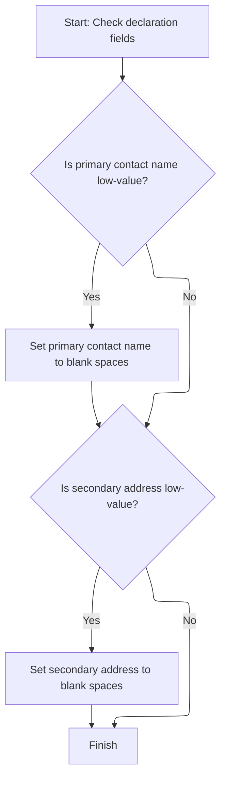

This section ensures that declaration records do not contain non-printable or low-value data in key fields by replacing such values with blank spaces before further processing.

| Category       | Rule Name                    | Description                                                                                                                                  |
| -------------- | ---------------------------- | -------------------------------------------------------------------------------------------------------------------------------------------- |
| Business logic | Primary contact name cleanup | If the primary contact name field contains low-value data, it must be replaced with blank spaces to ensure the field is printable and clean. |
| Business logic | Secondary address cleanup    | If the secondary address field contains low-value data, it must be replaced with blank spaces to ensure the field is printable and clean.    |

<SwmSnippet path="/base/src/NNNS0487.cbl" line="3383">

---

In <SwmToken path="base/src/NNNS0487.cbl" pos="3383:2:10" line-data="346000 4010-REP-LOWVALUE-WITH-SPACES.                                   00346000">`4010-REP-LOWVALUE-WITH-SPACES`</SwmToken>, we check if <SwmToken path="base/src/NNNS0487.cbl" pos="3384:4:8" line-data="346100     IF PRIM-CONTACT-NM   OF DCLXXXATION EQUAL LOW-VALUES         00346100">`PRIM-CONTACT-NM`</SwmToken> and <SwmToken path="base/src/NNNS0487.cbl" pos="1254:4:8" line-data="133100     MOVE PRIM-ADR-2 OF DCLXXXATION TO PRIM-ADR-2 OF P-DDDTLO01   00133100">`PRIM-ADR-2`</SwmToken> are set to <SwmToken path="base/src/NNNS0487.cbl" pos="3384:16:18" line-data="346100     IF PRIM-CONTACT-NM   OF DCLXXXATION EQUAL LOW-VALUES         00346100">`LOW-VALUES`</SwmToken>. If so, we move SPACES to those fields, clearing out any non-printable junk before the record goes anywhere else.

```cobol
346000 4010-REP-LOWVALUE-WITH-SPACES.                                   00346000
346100     IF PRIM-CONTACT-NM   OF DCLXXXATION EQUAL LOW-VALUES         00346100
346200        MOVE SPACES       TO PRIM-CONTACT-NM   OF DCLXXXATION     00346200
346300     END-IF                                                       00346300
```

---

</SwmSnippet>

<SwmSnippet path="/base/src/NNNS0487.cbl" line="3387">

---

After <SwmToken path="base/src/NNNS0487.cbl" pos="2461:4:12" line-data="253800     PERFORM 4010-REP-LOWVALUE-WITH-SPACES                        00253800">`4010-REP-LOWVALUE-WITH-SPACES`</SwmToken> runs, any low-value fields in <SwmToken path="base/src/NNNS0487.cbl" pos="1251:4:8" line-data="132800     MOVE PRIM-CONTACT-NM OF DCLXXXATION                          00132800">`PRIM-CONTACT-NM`</SwmToken> and <SwmToken path="base/src/NNNS0487.cbl" pos="3387:4:8" line-data="346400     IF PRIM-ADR-2        OF DCLXXXATION EQUAL LOW-VALUES         00346400">`PRIM-ADR-2`</SwmToken> are now set to blanks. This keeps the data clean for whatever comes next.

```cobol
346400     IF PRIM-ADR-2        OF DCLXXXATION EQUAL LOW-VALUES         00346400
346500        MOVE SPACES       TO PRIM-ADR-2        OF DCLXXXATION     00346500
346600     END-IF                                                       00346600
```

---

</SwmSnippet>

### Finalizing Update and Triggering Events

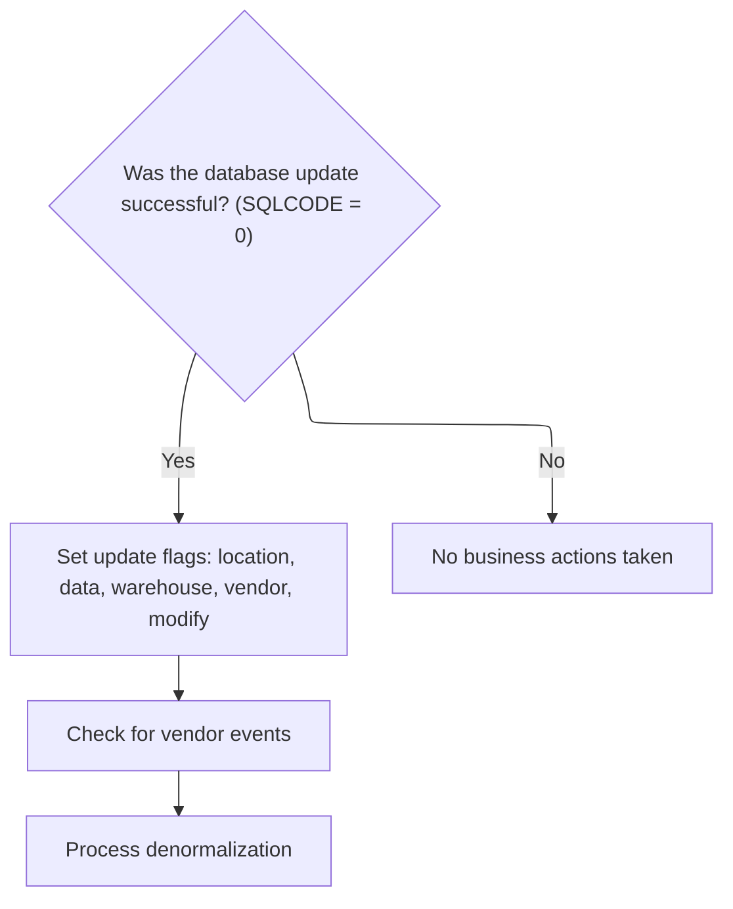

<SwmSnippet path="/base/src/NNNS0487.cbl" line="2464">

---

After <SwmToken path="base/src/NNNS0487.cbl" pos="2461:4:12" line-data="253800     PERFORM 4010-REP-LOWVALUE-WITH-SPACES                        00253800">`4010-REP-LOWVALUE-WITH-SPACES`</SwmToken> in <SwmToken path="base/src/NNNS0487.cbl" pos="2318:4:10" line-data="239500             PERFORM 1440-D0-MODIFY-ROW                           00239500">`1440-D0-MODIFY-ROW`</SwmToken>, we set a bunch of update flags to TRUE if the DB update worked. Then we call <SwmToken path="base/src/NNNS0487.cbl" pos="2473:4:8" line-data="255000       PERFORM 2000-DENORM-PROCESS                                00255000">`2000-DENORM-PROCESS`</SwmToken> to kick off denormalization and event handling, making sure every part of the system gets the update.

```cobol
254100     IF SQLCODE = 0                                               00254100
254200       SET YYYN110A-UPD TO TRUE                                   00254200
254300       SET MMMC0265-MOD TO TRUE                                   00254300
254400       SET LOC-UPD      TO TRUE                                   00254400
254500       SET DSD-UPD      TO TRUE                                   00254500
254600       SET WHS-UPD      TO TRUE                                   00254600
254700       SET VEN-UPD      TO TRUE                                   00254700
254800       SET MODIFY-OPERATION TO TRUE                               00254800
254900       PERFORM 10100-CHECK-FOR-VNDR-EVENTS                        00254900
255000       PERFORM 2000-DENORM-PROCESS                                00255000
```

---

</SwmSnippet>

### Triggering Denormalization and Event Handling

This section governs the rules for triggering denormalization processes and handling related events in the Swimmio-dyncall-demo system. It ensures that data normalization and event creation or skipping are managed according to business requirements and system states.

| Category       | Rule Name                         | Description                                                                                                                                  |
| -------------- | --------------------------------- | -------------------------------------------------------------------------------------------------------------------------------------------- |
| Business logic | Denormalization Trigger Condition | Denormalization is only triggered when the task indicator is set to 'NORM' and the update status flag indicates that updates have been made. |
| Business logic | Event Creation Control            | Events are created only if the event flag is set to 'CREATE' and not 'SKIP'.                                                                 |
| Business logic | Batch Environment Handling        | If the system environment is set to 'BATCH', denormalization and event handling must be compatible with batch processing constraints.        |
| Business logic | No Update Skip                    | If the update status flag indicates no updates were made, denormalization and event creation are skipped.                                    |
| Business logic | Scan Event Control                | Scan events are only created if the scan event flag is set to 'CREATE' and not 'SKIP'.                                                       |

See <SwmLink doc-title="Location Data Synchronization and Event Generation">[Location Data Synchronization and Event Generation](.swm%5Clocation-data-synchronization-and-event-generation.7uqvfujv.sw.md)</SwmLink>

### Handling AP Number Changes and <SwmToken path="base/src/NNNS0487.cbl" pos="1227:10:10" line-data="130400       PERFORM 125-CONNECT-TO-DB2                                 00130400">`DB2`</SwmToken> Maintenance

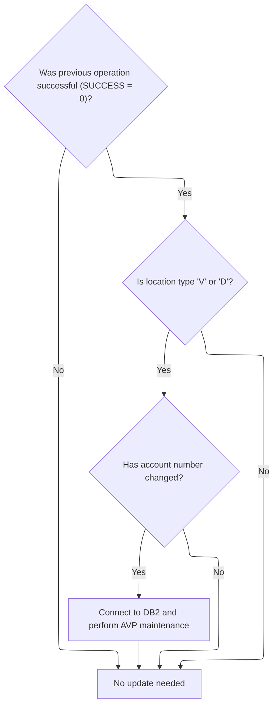

<SwmSnippet path="/base/src/NNNS0487.cbl" line="2474">

---

We just returned from <SwmToken path="base/src/NNNS0487.cbl" pos="2473:4:8" line-data="255000       PERFORM 2000-DENORM-PROCESS                                00255000">`2000-DENORM-PROCESS`</SwmToken> in <SwmToken path="base/src/NNNS0487.cbl" pos="2318:4:10" line-data="239500             PERFORM 1440-D0-MODIFY-ROW                           00239500">`1440-D0-MODIFY-ROW`</SwmToken>. Now, if the update was successful and the location type is 'V' or 'D', and the <SwmToken path="base/src/NNNS0487.cbl" pos="2476:4:6" line-data="255300           IF AP-NBR OF DCLXXXATION NOT EQUAL MMMC0474-OLD-AP-NBR 00255300">`AP-NBR`</SwmToken> changed, we set the update flag and call <SwmToken path="base/src/NNNS0487.cbl" pos="2478:4:10" line-data="255500             PERFORM 125-CONNECT-TO-DB2                           00255500">`125-CONNECT-TO-DB2`</SwmToken>. This reconnects to <SwmToken path="base/src/NNNS0487.cbl" pos="2478:10:10" line-data="255500             PERFORM 125-CONNECT-TO-DB2                           00255500">`DB2`</SwmToken> so we can run AVP maintenance in the right DB context. The logic is tightly scoped: only run these steps if the AP number actually changed for these specific location types, which is a domain rule for keeping AP-related data in sync.

```cobol
255100       IF SUCCESS                                                 00255100
255200         IF LOC-TYP-CD OF DCLXXXATION = 'V' OR 'D'                00255200
255300           IF AP-NBR OF DCLXXXATION NOT EQUAL MMMC0474-OLD-AP-NBR 00255300
255400             SET MMMC0474-UPD TO TRUE                             00255400
255500             PERFORM 125-CONNECT-TO-DB2                           00255500
255600             PERFORM 2050-DO-AVP-MAINTENANCE                      00255600
255700           END-IF                                                 00255700
255800         END-IF                                                   00255800
255900       END-IF                                                     00255900
```

---

</SwmSnippet>

### Switching to <SwmToken path="base/src/NNNS0487.cbl" pos="1227:10:10" line-data="130400       PERFORM 125-CONNECT-TO-DB2                                 00130400">`DB2`</SwmToken> for Maintenance

This section ensures that the application transitions to the <SwmToken path="base/src/NNNS0487.cbl" pos="1227:10:10" line-data="130400       PERFORM 125-CONNECT-TO-DB2                                 00130400">`DB2`</SwmToken> database context before performing maintenance tasks. It is critical for enabling DB2-specific logic and error handling required for business operations.

| Category       | Rule Name                                                                                                                                                                                     | Description                                                                                                                                                                                                                                                                 |
| -------------- | --------------------------------------------------------------------------------------------------------------------------------------------------------------------------------------------- | --------------------------------------------------------------------------------------------------------------------------------------------------------------------------------------------------------------------------------------------------------------------------- |
| Business logic | <SwmToken path="base/src/NNNS0487.cbl" pos="1227:10:10" line-data="130400       PERFORM 125-CONNECT-TO-DB2                                 00130400">`DB2`</SwmToken> Context Switch Required | The system must switch to the <SwmToken path="base/src/NNNS0487.cbl" pos="1227:10:10" line-data="130400       PERFORM 125-CONNECT-TO-DB2                                 00130400">`DB2`</SwmToken> database context before any DB2-specific maintenance logic is executed. |

<SwmSnippet path="/base/src/NNNS0487.cbl" line="1236">

---

<SwmToken path="base/src/NNNS0487.cbl" pos="1236:2:8" line-data="131300 125-CONNECT-TO-DB2.                                              00131300">`125-CONNECT-TO-DB2`</SwmToken> calls <SwmToken path="base/src/NNNS0487.cbl" pos="1237:4:8" line-data="131400     CALL Z-DB2-CONNECT         USING XXXN001A                    00131400">`Z-DB2-CONNECT`</SwmToken> to switch the DB context to <SwmToken path="base/src/NNNS0487.cbl" pos="1236:8:8" line-data="131300 125-CONNECT-TO-DB2.                                              00131300">`DB2`</SwmToken> using the <SwmToken path="base/src/NNNS0487.cbl" pos="1237:12:12" line-data="131400     CALL Z-DB2-CONNECT         USING XXXN001A                    00131400">`XXXN001A`</SwmToken> and SQLCA structures. This sets up the environment for any DB2-specific logic that follows, like error conversion and restoring business records. The next step is to call the dispatcher in <SwmPath>[base/src/YYYS0211.cbl](base/src/YYYS0211.cbl)</SwmPath>, which handles the actual connection switch and error handling.

```cobol
131300 125-CONNECT-TO-DB2.                                              00131300
131400     CALL Z-DB2-CONNECT         USING XXXN001A                    00131400
131500                                      SQLCA                       00131500
131600     .                                                            00131600
```

---

</SwmSnippet>

### <SwmToken path="base/src/NNNS0487.cbl" pos="1227:10:10" line-data="130400       PERFORM 125-CONNECT-TO-DB2                                 00130400">`DB2`</SwmToken> Connection Setup and Error Handling

```mermaid
%%{init: {"flowchart": {"defaultRenderer": "elk"}} }%%
flowchart TD
    node1["Prepare for exit: Save XXXN001A to WS-XXXN001A and clear XXXN001A"]
    click node1 openCode "base/src/YYYS0211.cbl:44:47"
    node1 --> node2["Disconnect from DB2: Set connection flag and call DBMS connection manager"]
    click node2 openCode "base/src/YYYS0211.cbl:53:58"
    node2 --> node3["Convert Oracle SQL error codes for reporting"]
    click node3 openCode "base/src/YYYS0211.cbl:35:35"
    node3 --> node4["Revert saved state: Restore XXXN001A"]
    click node4 openCode "base/src/YYYS0211.cbl:36:36"
    node4 --> node5["End program"]
    click node5 openCode "base/src/YYYS0211.cbl:37:37"
classDef HeadingStyle fill:#777777,stroke:#333,stroke-width:2px;

%% Swimm:
%% %%{init: {"flowchart": {"defaultRenderer": "elk"}} }%%
%% flowchart TD
%%     node1["Prepare for exit: Save <SwmToken path="base/src/NNNS0487.cbl" pos="895:4:4" line-data="097200     INITIALIZE XXXN001A                                          00097200">`XXXN001A`</SwmToken> to <SwmToken path="base/src/YYYS0211.cbl" pos="45:8:10" line-data="006100     MOVE XXXN001A TO WS-XXXN001A                                 00006100">`WS-XXXN001A`</SwmToken> and clear <SwmToken path="base/src/NNNS0487.cbl" pos="895:4:4" line-data="097200     INITIALIZE XXXN001A                                          00097200">`XXXN001A`</SwmToken>"]
%%     click node1 openCode "<SwmPath>[base/src/YYYS0211.cbl](base/src/YYYS0211.cbl)</SwmPath>:44:47"
%%     node1 --> node2["Disconnect from <SwmToken path="base/src/NNNS0487.cbl" pos="1227:10:10" line-data="130400       PERFORM 125-CONNECT-TO-DB2                                 00130400">`DB2`</SwmToken>: Set connection flag and call DBMS connection manager"]
%%     click node2 openCode "<SwmPath>[base/src/YYYS0211.cbl](base/src/YYYS0211.cbl)</SwmPath>:53:58"
%%     node2 --> node3["Convert Oracle SQL error codes for reporting"]
%%     click node3 openCode "<SwmPath>[base/src/YYYS0211.cbl](base/src/YYYS0211.cbl)</SwmPath>:35:35"
%%     node3 --> node4["Revert saved state: Restore <SwmToken path="base/src/NNNS0487.cbl" pos="895:4:4" line-data="097200     INITIALIZE XXXN001A                                          00097200">`XXXN001A`</SwmToken>"]
%%     click node4 openCode "<SwmPath>[base/src/YYYS0211.cbl](base/src/YYYS0211.cbl)</SwmPath>:36:36"
%%     node4 --> node5["End program"]
%%     click node5 openCode "<SwmPath>[base/src/YYYS0211.cbl](base/src/YYYS0211.cbl)</SwmPath>:37:37"
%% classDef HeadingStyle fill:#777777,stroke:#333,stroke-width:2px;
```

This section ensures that when transitioning from Oracle to <SwmToken path="base/src/NNNS0487.cbl" pos="1227:10:10" line-data="130400       PERFORM 125-CONNECT-TO-DB2                                 00130400">`DB2`</SwmToken>, the application saves the current business record, manages the database connection, handles error code translation, and restores the original state. This guarantees data integrity and consistent error handling across database transitions.

| Category        | Rule Name                                                                                                                                                                                               | Description                                                                                                                                                                                                                                                                                                                                                                                                                                                                                                                                                                                                                                                     |
| --------------- | ------------------------------------------------------------------------------------------------------------------------------------------------------------------------------------------------------- | --------------------------------------------------------------------------------------------------------------------------------------------------------------------------------------------------------------------------------------------------------------------------------------------------------------------------------------------------------------------------------------------------------------------------------------------------------------------------------------------------------------------------------------------------------------------------------------------------------------------------------------------------------------- |
| Data validation | Consistent program exit                                                                                                                                                                                 | The program must always exit in a consistent state, with all temporary changes reverted and the environment ready for the next operation or program termination.                                                                                                                                                                                                                                                                                                                                                                                                                                                                                                |
| Business logic  | Business record backup and clear                                                                                                                                                                        | Before connecting to <SwmToken path="base/src/NNNS0487.cbl" pos="1227:10:10" line-data="130400       PERFORM 125-CONNECT-TO-DB2                                 00130400">`DB2`</SwmToken>, the current business record (<SwmToken path="base/src/NNNS0487.cbl" pos="895:4:4" line-data="097200     INITIALIZE XXXN001A                                          00097200">`XXXN001A`</SwmToken>) must be saved to working storage (<SwmToken path="base/src/YYYS0211.cbl" pos="45:8:10" line-data="006100     MOVE XXXN001A TO WS-XXXN001A                                 00006100">`WS-XXXN001A`</SwmToken>) and then cleared to prevent data contamination. |
| Business logic  | Centralized <SwmToken path="base/src/NNNS0487.cbl" pos="1227:10:10" line-data="130400       PERFORM 125-CONNECT-TO-DB2                                 00130400">`DB2`</SwmToken> connection management | The system must always set the <SwmToken path="base/src/NNNS0487.cbl" pos="1227:10:10" line-data="130400       PERFORM 125-CONNECT-TO-DB2                                 00130400">`DB2`</SwmToken> connection flag and invoke the central connection manager to handle the actual database switch and maintain connection statistics.                                                                                                                                                                                                                                                                                                                         |
| Business logic  | Restore business record state                                                                                                                                                                           | After all operations, the original business record (<SwmToken path="base/src/NNNS0487.cbl" pos="895:4:4" line-data="097200     INITIALIZE XXXN001A                                          00097200">`XXXN001A`</SwmToken>) must be restored from working storage to ensure the program state is as it was before the <SwmToken path="base/src/NNNS0487.cbl" pos="1227:10:10" line-data="130400       PERFORM 125-CONNECT-TO-DB2                                 00130400">`DB2`</SwmToken> connection process.                                                                                                                                                |

<SwmSnippet path="/base/src/YYYS0211.cbl" line="32">

---

<SwmToken path="base/src/YYYS0211.cbl" pos="32:2:6" line-data="004700 0000-EXIT-DISPATCHER.                                            00004700">`0000-EXIT-DISPATCHER`</SwmToken> in <SwmPath>[base/src/YYYS0211.cbl](base/src/YYYS0211.cbl)</SwmPath> runs a sequence: initializes the business record, switches the DB connection to <SwmToken path="base/src/YYYS0211.cbl" pos="34:10:10" line-data="004900     PERFORM 200-CONNECT-TO-DB2                                   00004900">`DB2`</SwmToken>, converts Oracle error codes if needed, and restores the saved record. This keeps the environment clean and error handling consistent before returning control.

```cobol
004700 0000-EXIT-DISPATCHER.                                            00004700
004800     PERFORM 100-INITIALIZATION                                   00004800
004900     PERFORM 200-CONNECT-TO-DB2                                   00004900
005000     PERFORM 300-CNV-ORACLE-SQLCODE                               00005000
005100     PERFORM 400-REVERT-SAVED-XXXN001A                            00005100
005300     GOBACK                                                       00005300
005400     .                                                            00005400
```

---

</SwmSnippet>

<SwmSnippet path="/base/src/YYYS0211.cbl" line="44">

---

<SwmToken path="base/src/YYYS0211.cbl" pos="44:2:4" line-data="006000 100-INITIALIZATION.                                              00006000">`100-INITIALIZATION`</SwmToken> just copies <SwmToken path="base/src/YYYS0211.cbl" pos="45:4:4" line-data="006100     MOVE XXXN001A TO WS-XXXN001A                                 00006100">`XXXN001A`</SwmToken> to working storage and resets the original. This is prep for <SwmToken path="base/src/NNNS0487.cbl" pos="1227:10:10" line-data="130400       PERFORM 125-CONNECT-TO-DB2                                 00130400">`DB2`</SwmToken> connection, making sure we have a backup before we clear the main record.

```cobol
006000 100-INITIALIZATION.                                              00006000
006100     MOVE XXXN001A TO WS-XXXN001A                                 00006100
006200     INITIALIZE XXXN001A                                          00006200
006400     .                                                            00006400
```

---

</SwmSnippet>

<SwmSnippet path="/base/src/YYYS0211.cbl" line="53">

---

<SwmToken path="base/src/YYYS0211.cbl" pos="53:2:8" line-data="007300 200-CONNECT-TO-DB2.                                              00007300">`200-CONNECT-TO-DB2`</SwmToken> sets the <SwmToken path="base/src/YYYS0211.cbl" pos="53:8:8" line-data="007300 200-CONNECT-TO-DB2.                                              00007300">`DB2`</SwmToken> connection flag and calls the connection manager. This hands off the actual <SwmToken path="base/src/YYYS0211.cbl" pos="53:8:8" line-data="007300 200-CONNECT-TO-DB2.                                              00007300">`DB2`</SwmToken> switch and stats tracking to the central manager in <SwmPath>[base/src/YYYS0220.cbl](base/src/YYYS0220.cbl)</SwmPath>.

```cobol
007300 200-CONNECT-TO-DB2.                                              00007300
007400     SET YYYC0220-SET-DB2-CON TO TRUE                             00007400
007500     CALL YYYS0220-DBMS-CON-MGR USING                             00007500
007600         XXXN001A                                                 00007600
007700         YYYC0220                                                 00007700
008100     .                                                            00008100
```

---

</SwmSnippet>

### Converting Oracle Error Codes

This section ensures that Oracle error code -84, even when the operation is technically successful, is converted to an internal error code and remapped for consistent error handling within the application.

<SwmSnippet path="/base/src/YYYS0211.cbl" line="65">

---

<SwmToken path="base/src/YYYS0211.cbl" pos="65:2:8" line-data="009500 300-CNV-ORACLE-SQLCODE.                                          00009500">`300-CNV-ORACLE-SQLCODE`</SwmToken> checks if the last DB operation was successful but returned a specific Oracle error code (-84). If so, it calls <SwmToken path="base/src/YYYS0211.cbl" pos="68:4:10" line-data="009720       CALL Z-ORA-ERR-CONVERSION USING                            00009720">`Z-ORA-ERR-CONVERSION`</SwmToken> to map the Oracle error to an internal code. The next step is to run the conversion logic in <SwmPath>[base/src/YYYS0212.cbl](base/src/YYYS0212.cbl)</SwmPath>, which parses and remaps the error details.

```cobol
009500 300-CNV-ORACLE-SQLCODE.                                          00009500
009600     IF  SUCCESS                                                  00009600
009610     AND SQLCODE = -84                                            00009610
009720       CALL Z-ORA-ERR-CONVERSION USING                            00009720
009730           XXXN001A                                               00009730
009740           SQLCA                                                  00009740
009750     END-IF                                                       00009750
010200     .                                                            00010200
```

---

</SwmSnippet>

### Formatting and Mapping Error Messages

```mermaid
%%{init: {"flowchart": {"defaultRenderer": "elk"}} }%%
flowchart TD
    node1["Initialize environment"]
    click node1 openCode "base/src/YYYS0212.cbl:39:39"
    node1 --> node2{"Is Oracle error code recognized?"}
    click node2 openCode "base/src/YYYS0212.cbl:65:102"
    node2 -->|"Yes"| node3["Set specific SQLCODE and user message"]
    click node3 openCode "base/src/YYYS0212.cbl:65:102"
    node2 -->|"No"| node4["Set generic error message"]
    click node4 openCode "base/src/YYYS0212.cbl:103:103"
    node3 --> node5["End program"]
    click node5 openCode "base/src/YYYS0212.cbl:41:41"
    node4 --> node5
classDef HeadingStyle fill:#777777,stroke:#333,stroke-width:2px;

%% Swimm:
%% %%{init: {"flowchart": {"defaultRenderer": "elk"}} }%%
%% flowchart TD
%%     node1["Initialize environment"]
%%     click node1 openCode "<SwmPath>[base/src/YYYS0212.cbl](base/src/YYYS0212.cbl)</SwmPath>:39:39"
%%     node1 --> node2{"Is Oracle error code recognized?"}
%%     click node2 openCode "<SwmPath>[base/src/YYYS0212.cbl](base/src/YYYS0212.cbl)</SwmPath>:65:102"
%%     node2 -->|"Yes"| node3["Set specific SQLCODE and user message"]
%%     click node3 openCode "<SwmPath>[base/src/YYYS0212.cbl](base/src/YYYS0212.cbl)</SwmPath>:65:102"
%%     node2 -->|"No"| node4["Set generic error message"]
%%     click node4 openCode "<SwmPath>[base/src/YYYS0212.cbl](base/src/YYYS0212.cbl)</SwmPath>:103:103"
%%     node3 --> node5["End program"]
%%     click node5 openCode "<SwmPath>[base/src/YYYS0212.cbl](base/src/YYYS0212.cbl)</SwmPath>:41:41"
%%     node4 --> node5
%% classDef HeadingStyle fill:#777777,stroke:#333,stroke-width:2px;
```

This section is responsible for translating raw Oracle error messages into standardized internal error codes and user-friendly messages, ensuring that downstream systems and users receive consistent and understandable error information.

| Category       | Rule Name                 | Description                                                                                                                         |
| -------------- | ------------------------- | ----------------------------------------------------------------------------------------------------------------------------------- |
| Business logic | Oracle error code mapping | If the Oracle error code is recognized, it must be mapped to a specific internal SQLCODE according to the predefined mapping table. |

<SwmSnippet path="/base/src/YYYS0212.cbl" line="29">

---

<SwmToken path="base/src/YYYS0212.cbl" pos="29:2:6" line-data="003800 000-MAIN-PROCESS.                                                00003800">`000-MAIN-PROCESS`</SwmToken> in <SwmPath>[base/src/YYYS0212.cbl](base/src/YYYS0212.cbl)</SwmPath> runs two steps: clears out error message fields, then formats the user message text by mapping Oracle error codes to internal codes. This makes sure errors are readable and standardized before returning.

```cobol
003800 000-MAIN-PROCESS.                                                00003800
003900     PERFORM 100-INITIALIZE                                       00003900
004000     PERFORM 200-FORMAT-USER-MSG-TXT                              00004000
004100     GOBACK                                                       00004100
004200     .                                                            00004200
```

---

</SwmSnippet>

<SwmSnippet path="/base/src/YYYS0212.cbl" line="50">

---

<SwmToken path="base/src/YYYS0212.cbl" pos="50:2:10" line-data="005900 200-FORMAT-USER-MSG-TXT.                                         00005900">`200-FORMAT-USER-MSG-TXT`</SwmToken> splits the SQLERRMC string into message parts and the Oracle error code, then maps known Oracle codes to internal SQLCODEs. If the code isn't recognized, it builds a generic error message with the code. The parsing assumes the error string is space-delimited and has at least four parts.

```cobol
005900 200-FORMAT-USER-MSG-TXT.                                         00005900
006000     UNSTRING SQLERRMC  DELIMITED BY SPACE INTO                   00006000
006100                        WS-ERR-MSG1                               00006100
006200                        WS-ERR-MSG2                               00006200
006300                        WS-ERR-MSG3                               00006300
006400                        WS-ERR-ORA-CODE                           00006400
006500     EVALUATE WS-ERR-ORA-CODE                                     00006500
006510       WHEN  '60   '                                              00006510
006520         MOVE  -911                             TO SQLCODE        00006520
006600       WHEN  '904  '                                              00006600
006700       WHEN  '310  '                                              00006700
006800         MOVE  -206                             TO SQLCODE        00006800
006900       WHEN  '615  '                                              00006900
007000       WHEN  '616  '                                              00007000
007100         MOVE  -420                             TO SQLCODE        00007100
007200       WHEN  '942  '                                              00007200
007300         MOVE  -204                             TO SQLCODE        00007300
007400       WHEN  '1403 '                                              00007400
007500         MOVE  -100                             TO SQLCODE        00007500
007600       WHEN  '1001 '                                              00007600
007700         MOVE  -501                             TO SQLCODE        00007700
007800       WHEN  '1438 '                                              00007800
007900         MOVE  -413                             TO SQLCODE        00007900
008000       WHEN  '2112 '                                              00008000
008100       WHEN  '1422 '                                              00008100
008200         MOVE  -811                             TO SQLCODE        00008200
008300       WHEN  '2049 '                                              00008300
008400         MOVE  -913                             TO SQLCODE        00008400
008500       WHEN  '2291 '                                              00008500
008600         MOVE  -530                             TO SQLCODE        00008600
008700       WHEN  '2292 '                                              00008700
008800         MOVE  -532                             TO SQLCODE        00008800
008900       WHEN  '6502 '                                              00008900
009000         MOVE  -304                             TO SQLCODE        00009000
009100       WHEN  '6508 '                                              00009100
009200         MOVE  -440                             TO SQLCODE        00009200
009300       WHEN  '6511 '                                              00009300
009400         MOVE  -502                             TO SQLCODE        00009400
009500       WHEN  '6550 '                                              00009500
009600       WHEN  '6553 '                                              00009600
009700         MOVE  -440                             TO SQLCODE        00009700
009800       WHEN  '14028'                                              00009800
009900         MOVE  -538                             TO SQLCODE        00009900
010000       WHEN  '30006'                                              00010000
010100         MOVE  -904                             TO SQLCODE        00010100
010200       WHEN OTHER                                                 00010200
010300         STRING 'Error in YYYS0212. Oracle code:'                 00010300
010300                 WS-ERR-ORA-CODE                                  00010320
010300         DELIMITED BY SIZE INTO IS-RTRN-MSG2-TXT                  00010330
010500     END-EVALUATE                                                 00010500
010600     MOVE SPACES                                TO SQLERRMC       00010600
010700     .                                                            00010700
```

---

</SwmSnippet>

### Running AVP Maintenance After <SwmToken path="base/src/NNNS0487.cbl" pos="1227:10:10" line-data="130400       PERFORM 125-CONNECT-TO-DB2                                 00130400">`DB2`</SwmToken> Switch

<SwmSnippet path="/base/src/NNNS0487.cbl" line="3284">

---

<SwmToken path="base/src/NNNS0487.cbl" pos="3284:2:8" line-data="336100 2050-DO-AVP-MAINTENANCE.                                         00336100">`2050-DO-AVP-MAINTENANCE`</SwmToken> copies location and AP fields from DCLXXXATION to <SwmToken path="base/src/NNNS0487.cbl" pos="3286:4:4" line-data="336300       TO MMMC0474-LOC-TYP-CD                                     00336300">`MMMC0474`</SwmToken>, sets a flag, assigns the program name, and passes the system environment. Then it calls <SwmToken path="base/src/NNNS0487.cbl" pos="3299:4:10" line-data="337600     CALL MMMS0474-DO-AVP-MAIN USING                              00337600">`MMMS0474-DO-AVP-MAIN`</SwmToken> to run AVP maintenance with all the prepared data.

```cobol
336100 2050-DO-AVP-MAINTENANCE.                                         00336100
336200     MOVE LOC-TYP-CD               OF DCLXXXATION                 00336200
336300       TO MMMC0474-LOC-TYP-CD                                     00336300
336400     MOVE LOC-NBR                  OF DCLXXXATION                 00336400
336500       TO MMMC0474-LOC-NBR                                        00336500
336600     MOVE AP-TYP-CD                OF DCLXXXATION                 00336600
336700       TO MMMC0474-NEW-AP-TYP                                     00336700
336800     MOVE AP-NBR                   OF DCLXXXATION                 00336800
336900       TO MMMC0474-NEW-AP-NBR                                     00336900
337000     SET MMMC0474-LO               TO TRUE                        00337000
337100     MOVE 'NNNS0487'                                              00337100
337200       TO MMMC0474-PROGRAM                                        00337200
337300     MOVE YYYN005A-SYS-ENV                                        00337300
337400       TO MMMC0474-SYS-ENV                                        00337400
337500                                                                  00337500
337600     CALL MMMS0474-DO-AVP-MAIN USING                              00337600
337700          XXXN001A                                                00337700
337800          MMMC0474                                                00337800
337900     .                                                            00337900
```

---

</SwmSnippet>

## Preparing and Validating Data for Insert

```mermaid
%%{init: {"flowchart": {"defaultRenderer": "elk"}} }%%
flowchart TD
    node1["Edit required fields (null indicators)"] --> node2["Capture audit info (date and user)"]
    click node1 openCode "base/src/NNNS0487.cbl:256500:256500"
    click node2 openCode "base/src/NNNS0487.cbl:256600:256600"
    node2 --> node3{"Are all validations successful?"}
    click node3 openCode "base/src/NNNS0487.cbl:256700:256700"
    node3 -->|"Yes"| node4["Mark row as ready for insert"]
    click node4 openCode "base/src/NNNS0487.cbl:256900:256900"
    node3 -->|"No"| node7["Exit without insert"]
    click node7 openCode "base/src/NNNS0487.cbl:257600:257600"
    node4 --> node5{"Is facility/org ID valid?"}
    click node5 openCode "base/src/NNNS0487.cbl:257000:257200"
    node5 -->|"Yes"| node6["Insert new row"]
    click node6 openCode "base/src/NNNS0487.cbl:257300:257300"
    node5 -->|"No"| node7
classDef HeadingStyle fill:#777777,stroke:#333,stroke-width:2px;

%% Swimm:
%% %%{init: {"flowchart": {"defaultRenderer": "elk"}} }%%
%% flowchart TD
%%     node1["Edit required fields (null indicators)"] --> node2["Capture audit info (date and user)"]
%%     click node1 openCode "<SwmPath>[base/src/NNNS0487.cbl](base/src/NNNS0487.cbl)</SwmPath>:256500:256500"
%%     click node2 openCode "<SwmPath>[base/src/NNNS0487.cbl](base/src/NNNS0487.cbl)</SwmPath>:256600:256600"
%%     node2 --> node3{"Are all validations successful?"}
%%     click node3 openCode "<SwmPath>[base/src/NNNS0487.cbl](base/src/NNNS0487.cbl)</SwmPath>:256700:256700"
%%     node3 -->|"Yes"| node4["Mark row as ready for insert"]
%%     click node4 openCode "<SwmPath>[base/src/NNNS0487.cbl](base/src/NNNS0487.cbl)</SwmPath>:256900:256900"
%%     node3 -->|"No"| node7["Exit without insert"]
%%     click node7 openCode "<SwmPath>[base/src/NNNS0487.cbl](base/src/NNNS0487.cbl)</SwmPath>:257600:257600"
%%     node4 --> node5{"Is facility/org ID valid?"}
%%     click node5 openCode "<SwmPath>[base/src/NNNS0487.cbl](base/src/NNNS0487.cbl)</SwmPath>:257000:257200"
%%     node5 -->|"Yes"| node6["Insert new row"]
%%     click node6 openCode "<SwmPath>[base/src/NNNS0487.cbl](base/src/NNNS0487.cbl)</SwmPath>:257300:257300"
%%     node5 -->|"No"| node7
%% classDef HeadingStyle fill:#777777,stroke:#333,stroke-width:2px;
```

This section is responsible for preparing and validating data before inserting a new row into the database. It ensures all required fields are present, audit information is captured, and facility/org IDs are valid before allowing the insert.

| Category        | Rule Name                  | Description                                                                                                                             |
| --------------- | -------------------------- | --------------------------------------------------------------------------------------------------------------------------------------- |
| Data validation | Required field validation  | All required fields must be checked for missing or zero values. Any field that is missing or zero must be flagged as invalid.           |
| Data validation | Facility/org ID validation | A row can only be inserted if the facility or organization ID is valid. If the ID is invalid, the row must not be inserted.             |
| Business logic  | Audit info capture         | Audit information, including the current date and user, must be captured and attached to the record before any insert operation.        |
| Business logic  | Successful insert          | Rows that pass all validations and have valid facility/org IDs must be inserted into the database and marked as successfully processed. |

<SwmSnippet path="/base/src/NNNS0487.cbl" line="2487">

---

In <SwmToken path="base/src/NNNS0487.cbl" pos="2487:2:10" line-data="256400 1500-EXIT-PUT-INSERT-ROW.                                        00256400">`1500-EXIT-PUT-INSERT-ROW`</SwmToken>, we start by calling <SwmToken path="base/src/NNNS0487.cbl" pos="2488:4:10" line-data="256500     PERFORM 1800-EDIT-NULL-INDICATORS                            00256500">`1800-EDIT-NULL-INDICATORS`</SwmToken> to flag any missing or zero application fields. This sets up the null indicators so later steps know which fields are invalid before we try to insert anything.

```cobol
256400 1500-EXIT-PUT-INSERT-ROW.                                        00256400
256500     PERFORM 1800-EDIT-NULL-INDICATORS                            00256500
256600     PERFORM 2040-GET-DATE-AND-USER                               00256600
```

---

</SwmSnippet>

<SwmSnippet path="/base/src/NNNS0487.cbl" line="2487">

---

We just returned from <SwmToken path="base/src/NNNS0487.cbl" pos="2488:4:10" line-data="256500     PERFORM 1800-EDIT-NULL-INDICATORS                            00256500">`1800-EDIT-NULL-INDICATORS`</SwmToken> in <SwmToken path="base/src/NNNS0487.cbl" pos="2487:2:10" line-data="256400 1500-EXIT-PUT-INSERT-ROW.                                        00256400">`1500-EXIT-PUT-INSERT-ROW`</SwmToken>. Next, we call <SwmToken path="base/src/NNNS0487.cbl" pos="2489:4:12" line-data="256600     PERFORM 2040-GET-DATE-AND-USER                               00256600">`2040-GET-DATE-AND-USER`</SwmToken> to stamp the record with the current date and user info, which is needed for audit and tracking before any insert happens.

```cobol
256400 1500-EXIT-PUT-INSERT-ROW.                                        00256400
256500     PERFORM 1800-EDIT-NULL-INDICATORS                            00256500
256600     PERFORM 2040-GET-DATE-AND-USER                               00256600
```

---

</SwmSnippet>

<SwmSnippet path="/base/src/NNNS0487.cbl" line="2490">

---

We just returned from <SwmToken path="base/src/NNNS0487.cbl" pos="2306:4:12" line-data="238300     PERFORM 2040-GET-DATE-AND-USER                               00238300">`2040-GET-DATE-AND-USER`</SwmToken> in <SwmToken path="base/src/NNNS0487.cbl" pos="880:4:12" line-data="095700          PERFORM 1500-EXIT-PUT-INSERT-ROW                        00095700">`1500-EXIT-PUT-INSERT-ROW`</SwmToken>. If everything succeeded, we move on to get facility/org IDs with <SwmToken path="base/src/NNNS0487.cbl" pos="2494:4:12" line-data="257100         PERFORM 1505-GET-FAC-ORG-ID                              00257100">`1505-GET-FAC-ORG-ID`</SwmToken>, which is needed before we can actually insert the new row.

```cobol
256700     IF SUCCESS                                                   00256700
256800*      PERFORM 10300-CHECK-FOR-VALID-COUNTY                       00256800
256900       SET EXIT-PUT-INSERT-ROW TO TRUE                            00256900
257000       IF SUCCESS                                                 00257000
257100         PERFORM 1505-GET-FAC-ORG-ID                              00257100
257200         IF SUCCESS                                               00257200
257300           PERFORM 1510-D0-INSERT-ROW                             00257300
257400         END-IF                                                   00257400
257500       END-IF                                                     00257500
257600     END-IF                                                       00257600
```

---

</SwmSnippet>

## Finalizing Insert and Staging Events

```mermaid
%%{init: {"flowchart": {"defaultRenderer": "elk"}} }%%
flowchart TD
    node1["Prepare and clean data for new record (set date, timestamp, user)"] --> node2["Insert new record"]
    click node1 openCode "base/src/NNNS0487.cbl:2598:2604"
    click node2 openCode "base/src/NNNS0487.cbl:2605:2606"
    node2 --> node3{"Insert successful? (SQLCODE = 0)"}
    click node3 openCode "base/src/NNNS0487.cbl:2605:2613"
    node3 -->|"Yes"| node4["Set ADD flags (business status) and run denormalization process"]
    click node4 openCode "base/src/NNNS0487.cbl:2606:2613"
    node3 -->|"No"| node5["No further business action"]
    click node5 openCode "base/src/NNNS0487.cbl:2613:2613"

classDef HeadingStyle fill:#777777,stroke:#333,stroke-width:2px;

%% Swimm:
%% %%{init: {"flowchart": {"defaultRenderer": "elk"}} }%%
%% flowchart TD
%%     node1["Prepare and clean data for new record (set date, timestamp, user)"] --> node2["Insert new record"]
%%     click node1 openCode "<SwmPath>[base/src/NNNS0487.cbl](base/src/NNNS0487.cbl)</SwmPath>:2598:2604"
%%     click node2 openCode "<SwmPath>[base/src/NNNS0487.cbl](base/src/NNNS0487.cbl)</SwmPath>:2605:2606"
%%     node2 --> node3{"Insert successful? (SQLCODE = 0)"}
%%     click node3 openCode "<SwmPath>[base/src/NNNS0487.cbl](base/src/NNNS0487.cbl)</SwmPath>:2605:2613"
%%     node3 -->|"Yes"| node4["Set ADD flags (business status) and run denormalization process"]
%%     click node4 openCode "<SwmPath>[base/src/NNNS0487.cbl](base/src/NNNS0487.cbl)</SwmPath>:2606:2613"
%%     node3 -->|"No"| node5["No further business action"]
%%     click node5 openCode "<SwmPath>[base/src/NNNS0487.cbl](base/src/NNNS0487.cbl)</SwmPath>:2613:2613"
%% 
%% classDef HeadingStyle fill:#777777,stroke:#333,stroke-width:2px;
```

This section governs the finalization of inserting a new record and the staging of related events. It ensures that all new records are properly prepared, validated, and flagged for downstream processing, maintaining data integrity and business event consistency.

| Category        | Rule Name                     | Description                                                                                                                                                                                                                                                                                                                                                                                                                                                                                                                                                                                                                                                                                                                                                                                                                                                                                                                                                                                                                                                                                                                                                                                                      |
| --------------- | ----------------------------- | ---------------------------------------------------------------------------------------------------------------------------------------------------------------------------------------------------------------------------------------------------------------------------------------------------------------------------------------------------------------------------------------------------------------------------------------------------------------------------------------------------------------------------------------------------------------------------------------------------------------------------------------------------------------------------------------------------------------------------------------------------------------------------------------------------------------------------------------------------------------------------------------------------------------------------------------------------------------------------------------------------------------------------------------------------------------------------------------------------------------------------------------------------------------------------------------------------------------- |
| Data validation | Key field sanitization        | Key fields in the new record must be cleaned of non-printable characters prior to insertion to prevent database corruption and ensure data readability.                                                                                                                                                                                                                                                                                                                                                                                                                                                                                                                                                                                                                                                                                                                                                                                                                                                                                                                                                                                                                                                          |
| Business logic  | Record audit stamping         | All new records must be stamped with the current date, timestamp, and user before insertion to ensure auditability and traceability.                                                                                                                                                                                                                                                                                                                                                                                                                                                                                                                                                                                                                                                                                                                                                                                                                                                                                                                                                                                                                                                                             |
| Business logic  | Business domain add flagging  | If the insert is successful, all relevant business domain flags (ADD flags) must be set to indicate the record is newly added. These include <SwmToken path="base/src/NNNS0487.cbl" pos="2529:4:6" line-data="260600       SET YYYN110A-ADD TO TRUE                                   00260600">`YYYN110A-ADD`</SwmToken>, <SwmToken path="base/src/NNNS0487.cbl" pos="2530:4:6" line-data="260700       SET MMMC0265-ADD TO TRUE                                   00260700">`MMMC0265-ADD`</SwmToken>, <SwmToken path="base/src/NNNS0487.cbl" pos="2531:4:6" line-data="260800       SET LOC-ADD      TO TRUE                                   00260800">`LOC-ADD`</SwmToken>, <SwmToken path="base/src/NNNS0487.cbl" pos="2532:4:6" line-data="260900       SET DSD-ADD      TO TRUE                                   00260900">`DSD-ADD`</SwmToken>, <SwmToken path="base/src/NNNS0487.cbl" pos="2533:4:6" line-data="261000       SET WHS-ADD      TO TRUE                                   00261000">`WHS-ADD`</SwmToken>, and <SwmToken path="base/src/NNNS0487.cbl" pos="2534:4:6" line-data="261100       SET VEN-ADD      TO TRUE                                   00261100">`VEN-ADD`</SwmToken>. |
| Business logic  | Denormalization event staging | Upon successful insert and flagging, the denormalization process must be triggered to stage events for downstream systems.                                                                                                                                                                                                                                                                                                                                                                                                                                                                                                                                                                                                                                                                                                                                                                                                                                                                                                                                                                                                                                                                                       |

<SwmSnippet path="/base/src/NNNS0487.cbl" line="2521">

---

In <SwmToken path="base/src/NNNS0487.cbl" pos="2521:2:8" line-data="259800 1510-D0-INSERT-ROW.                                              00259800">`1510-D0-INSERT-ROW`</SwmToken>, we stamp the record with the current date, timestamp, and user, then call <SwmToken path="base/src/NNNS0487.cbl" pos="2525:4:12" line-data="260200     PERFORM 4010-REP-LOWVALUE-WITH-SPACES                        00260200">`4010-REP-LOWVALUE-WITH-SPACES`</SwmToken> to clean up any non-printable junk in key fields before the insert. This keeps the data readable and avoids DB issues.

```cobol
259800 1510-D0-INSERT-ROW.                                              00259800
259900     MOVE DTA10-MM-DD-YYYY TO ADDED-DT        OF DCLXXXATION      00259900
260000     MOVE YYYC0127-TS      TO LST-UPDT-TS     OF DCLXXXATION      00260000
260100     MOVE YYYC0107-USER    TO LST-UPDT-USR-ID OF DCLXXXATION      00260100
260200     PERFORM 4010-REP-LOWVALUE-WITH-SPACES                        00260200
260300     PERFORM 5000-CALL-NNNS0487-CUD-ROUTINE                       00260300
```

---

</SwmSnippet>

<SwmSnippet path="/base/src/NNNS0487.cbl" line="2528">

---

We just returned from <SwmToken path="base/src/NNNS0487.cbl" pos="2461:4:12" line-data="253800     PERFORM 4010-REP-LOWVALUE-WITH-SPACES                        00253800">`4010-REP-LOWVALUE-WITH-SPACES`</SwmToken> in <SwmToken path="base/src/NNNS0487.cbl" pos="2496:4:10" line-data="257300           PERFORM 1510-D0-INSERT-ROW                             00257300">`1510-D0-INSERT-ROW`</SwmToken>. If the DB insert worked (SQLCODE = 0), we set all the add flags and call <SwmToken path="base/src/NNNS0487.cbl" pos="2535:4:8" line-data="261200       PERFORM 2000-DENORM-PROCESS                                00261200">`2000-DENORM-PROCESS`</SwmToken> to kick off denormalization and event handling for downstream systems.

```cobol
260500     IF SQLCODE = 0                                               00260500
260600       SET YYYN110A-ADD TO TRUE                                   00260600
260700       SET MMMC0265-ADD TO TRUE                                   00260700
260800       SET LOC-ADD      TO TRUE                                   00260800
260900       SET DSD-ADD      TO TRUE                                   00260900
261000       SET WHS-ADD      TO TRUE                                   00261000
261100       SET VEN-ADD      TO TRUE                                   00261100
261200       PERFORM 2000-DENORM-PROCESS                                00261200
261300     END-IF                                                       00261300
```

---

</SwmSnippet>

## Purging Location Data and Related Entities

```mermaid
%%{init: {"flowchart": {"defaultRenderer": "elk"}} }%%
flowchart TD
    node1{"What type of location is being deleted?"}
    click node1 openCode "base/src/NNNS0487.cbl:2633:2646"
    node1 --> node2["Delete corresponding business record"]
    click node2 openCode "base/src/NNNS0487.cbl:2633:2646"
    node2 --> node3{"Was deletion successful? (SUCCESS and SQLCODE = 0)"}
    click node3 openCode "base/src/NNNS0487.cbl:2649:2651"
    node3 -->|"Yes"| node4["Purging Loan Records and Related Data"]
    
    node3 -->|"No"| node5{"What was the SQL result?"}
    click node5 openCode "base/src/NNNS0487.cbl:2653:2678"
    node5 -->|"In use or error"| node6["Mark failure, set error message"]
    click node6 openCode "base/src/NNNS0487.cbl:2666:2678"
    node5 -->|"Success (SQLCODE = 0)"| node4
classDef HeadingStyle fill:#777777,stroke:#333,stroke-width:2px;
click node4 goToHeading "Purging Loan Records and Related Data"
node4:::HeadingStyle

%% Swimm:
%% %%{init: {"flowchart": {"defaultRenderer": "elk"}} }%%
%% flowchart TD
%%     node1{"What type of location is being deleted?"}
%%     click node1 openCode "<SwmPath>[base/src/NNNS0487.cbl](base/src/NNNS0487.cbl)</SwmPath>:2633:2646"
%%     node1 --> node2["Delete corresponding business record"]
%%     click node2 openCode "<SwmPath>[base/src/NNNS0487.cbl](base/src/NNNS0487.cbl)</SwmPath>:2633:2646"
%%     node2 --> node3{"Was deletion successful? (SUCCESS and SQLCODE = 0)"}
%%     click node3 openCode "<SwmPath>[base/src/NNNS0487.cbl](base/src/NNNS0487.cbl)</SwmPath>:2649:2651"
%%     node3 -->|"Yes"| node4["Purging Loan Records and Related Data"]
%%     
%%     node3 -->|"No"| node5{"What was the SQL result?"}
%%     click node5 openCode "<SwmPath>[base/src/NNNS0487.cbl](base/src/NNNS0487.cbl)</SwmPath>:2653:2678"
%%     node5 -->|"In use or error"| node6["Mark failure, set error message"]
%%     click node6 openCode "<SwmPath>[base/src/NNNS0487.cbl](base/src/NNNS0487.cbl)</SwmPath>:2666:2678"
%%     node5 -->|"Success (SQLCODE = 0)"| node4
%% classDef HeadingStyle fill:#777777,stroke:#333,stroke-width:2px;
%% click node4 goToHeading "Purging Loan Records and Related Data"
%% node4:::HeadingStyle
```

This section is responsible for purging location data and all related entities from the system. It ensures that deletions are handled according to business rules for each location type, and that errors or in-use conditions are reported appropriately.

| Category        | Rule Name                          | Description                                                                                                                                                                                                                                                        |
| --------------- | ---------------------------------- | ------------------------------------------------------------------------------------------------------------------------------------------------------------------------------------------------------------------------------------------------------------------ |
| Data validation | Strict success criteria            | The system must only consider a deletion successful if both the SUCCESS flag is set and SQLCODE equals 0.                                                                                                                                                          |
| Data validation | Delete operation trigger           | The deletion operation must be initiated only when the operation code equals 3 (<SwmToken path="base/src/NNNS0487.cbl" pos="2662:4:6" line-data="273900         SET DELETE-OPERATION  TO TRUE                            00273900">`DELETE-OPERATION`</SwmToken>). |
| Business logic  | Cascade deletion of related data   | When a location is deleted, all related business records and dependent data must also be purged to maintain data integrity.                                                                                                                                        |
| Business logic  | Type-specific deletion logic       | The deletion routine must be selected based on the location type code (e.g., 'S' for store, 'A' for account, 'D' for DSD vendor, 'B' for backhaul, 'T' for terminal, 'W' for warehouse).                                                                           |
| Business logic  | Purge loans on successful deletion | If the deletion is successful (SUCCESS and SQLCODE = 0), the system must proceed to purge all loan records and related data for the location.                                                                                                                      |

<SwmSnippet path="/base/src/NNNS0487.cbl" line="2633">

---

In <SwmToken path="base/src/NNNS0487.cbl" pos="2633:2:10" line-data="271000 1600-EXIT-PUT-PURGE-ROW.                                         00271000">`1600-EXIT-PUT-PURGE-ROW`</SwmToken>, we use EVALUATE to pick the right deletion routine based on location type. For stores and accounts, we call <SwmToken path="base/src/NNNS0487.cbl" pos="2637:4:8" line-data="271400         PERFORM 1610-DELETE-STORE                                00271400">`1610-DELETE-STORE`</SwmToken>; for vendors, backhaul, terminals, and warehouses, we call their respective delete routines. This keeps deletion logic modular and type-specific.

```cobol
271000 1600-EXIT-PUT-PURGE-ROW.                                         00271000
271100     EVALUATE TRUE                                                00271100
271200       WHEN LOC-TYP-CD OF DCLXXXATION = K-STORE-LOC-TYPE          00271200
271300       OR   LOC-TYP-CD OF DCLXXXATION = K-ACCT-LOC-TYPE           00271300
271400         PERFORM 1610-DELETE-STORE                                00271400
271500       WHEN LOC-TYP-CD OF DCLXXXATION = K-DSD-VEND-LOC-TYPE       00271500
271600         PERFORM 1620-DELETE-DSD-VENDOR                           00271600
271700       WHEN LOC-TYP-CD OF DCLXXXATION = 'B'                       00271700
271800         PERFORM 1640-DELETE-BKHAUL                               00271800
271900       WHEN LOC-TYP-CD OF DCLXXXATION = 'T'                       00271900
272000         PERFORM 1650-DELETE-TERMINAL                             00272000
272100       WHEN LOC-TYP-CD OF DCLXXXATION = 'W'                       00272100
272200         PERFORM 1660-DELETE-WHSE                                 00272200
272300     END-EVALUATE                                                 00272300
```

---

</SwmSnippet>

### Deleting Store Data Across Systems

This section governs the rules and conditions for deleting store data across different systems, ensuring that the correct files and records are targeted and that the process is validated and tracked using exit codes.

| Category        | Rule Name                         | Description                                                                                                                                                                                                                                                                                           |
| --------------- | --------------------------------- | ----------------------------------------------------------------------------------------------------------------------------------------------------------------------------------------------------------------------------------------------------------------------------------------------------- |
| Data validation | Purge Success Confirmation        | The purge operation is considered successful only if the exit code NNNN0000-EXIT-CODES equals 10, as indicated by <SwmToken path="base/src/NNNS0487.cbl" pos="881:4:10" line-data="095800       WHEN EXIT-PUT-PURGE-ROW                                    00095800">`EXIT-PUT-PURGE-ROW`</SwmToken>. |
| Data validation | File Eligibility Restriction      | Only files explicitly listed in the NNNN0000-FILE struct are eligible for deletion during the purge operation.                                                                                                                                                                                        |
| Data validation | Parameter Validation Before Purge | The key and record length parameters must be set and valid before initiating the purge operation to ensure correct targeting of data.                                                                                                                                                                 |
| Business logic  | Complete Store Data Purge         | Store data must be deleted from all systems identified by the file codes listed in NNNN0000-FILE, ensuring no residual data remains after the operation.                                                                                                                                              |

See <SwmLink doc-title="Store Deletion Flow">[Store Deletion Flow](.swm%5Cstore-deletion-flow.w4lkirpp.sw.md)</SwmLink>

### Deleting Terminal Records

This section governs the business logic for deleting terminal records, ensuring that attempts to delete non-existent records do not result in errors or false failures.

<SwmSnippet path="/base/src/NNNS0487.cbl" line="2916">

---

In <SwmToken path="base/src/NNNS0487.cbl" pos="2916:2:6" line-data="299300 1650-DELETE-TERMINAL.                                            00299300">`1650-DELETE-TERMINAL`</SwmToken>, we call <SwmToken path="base/src/NNNS0487.cbl" pos="2918:4:12" line-data="299500     PERFORM 5000-CALL-MMMU0487-CUD-ROUTINE                       00299500">`5000-CALL-MMMU0487-CUD-ROUTINE`</SwmToken> to delete the terminal record. If SQLCODE comes back as 100 (no data found), we reset it to 0 so the flow treats it as a non-error. This avoids false failures when the record is already gone.

```cobol
299300 1650-DELETE-TERMINAL.                                            00299300
299400                                                                  00299400
299500     PERFORM 5000-CALL-MMMU0487-CUD-ROUTINE                       00299500
```

---

</SwmSnippet>

<SwmSnippet path="/base/src/NNNS0487.cbl" line="2920">

---

After deleting the terminal, if SQLCODE is 100, we reset it to 0. This means 'no data found' is treated as success, so the flow doesn't error out if the record was already missing.

```cobol
299700     IF SQLCODE = 100                                             00299700
299800       MOVE 0 TO SQLCODE                                          00299800
299900     END-IF                                                       00299900
```

---

</SwmSnippet>

### Deleting Warehouse Records

This section ensures that when a request is made to delete a warehouse record, the system attempts the deletion and handles the case where the record does not exist as a successful operation, preventing unnecessary errors.

| Category       | Rule Name                        | Description                                                                                                                                    |
| -------------- | -------------------------------- | ---------------------------------------------------------------------------------------------------------------------------------------------- |
| Business logic | No Data Found Treated as Success | If a warehouse record does not exist when a delete is requested, the system treats this as a successful deletion and does not return an error. |
| Business logic | Mandatory Deletion Attempt       | The system must always attempt to delete the warehouse record by invoking the designated deletion routine.                                     |

<SwmSnippet path="/base/src/NNNS0487.cbl" line="2926">

---

In <SwmToken path="base/src/NNNS0487.cbl" pos="2926:2:6" line-data="300300 1660-DELETE-WHSE.                                                00300300">`1660-DELETE-WHSE`</SwmToken>, we call <SwmToken path="base/src/NNNS0487.cbl" pos="2928:4:12" line-data="300500     PERFORM 5000-CALL-MMMU0487-CUD-ROUTINE                       00300500">`5000-CALL-MMMU0487-CUD-ROUTINE`</SwmToken> to delete the warehouse record. If SQLCODE is 100, we reset it to 0, treating 'no data found' as a successful delete.

```cobol
300300 1660-DELETE-WHSE.                                                00300300
300400                                                                  00300400
300500     PERFORM 5000-CALL-MMMU0487-CUD-ROUTINE                       00300500
```

---

</SwmSnippet>

<SwmSnippet path="/base/src/NNNS0487.cbl" line="2930">

---

After deleting the warehouse, if SQLCODE is 100, we reset it to 0. This means 'no data found' is treated as success, so the flow doesn't error out if the record was already missing.

```cobol
300700     IF SQLCODE = 100                                             00300700
300800       MOVE 0 TO SQLCODE                                          00300800
300900     END-IF                                                       00300900
```

---

</SwmSnippet>

### Connecting to Oracle and Purging Loans

<SwmSnippet path="/base/src/NNNS0487.cbl" line="2648">

---

We just returned from <SwmToken path="base/src/NNNS0487.cbl" pos="2645:4:8" line-data="272200         PERFORM 1660-DELETE-WHSE                                 00272200">`1660-DELETE-WHSE`</SwmToken> in <SwmToken path="base/src/NNNS0487.cbl" pos="882:4:12" line-data="095900          PERFORM 1600-EXIT-PUT-PURGE-ROW                         00095900">`1600-EXIT-PUT-PURGE-ROW`</SwmToken>. Next, we always connect to Oracle with <SwmToken path="base/src/NNNS0487.cbl" pos="2648:4:10" line-data="272500     PERFORM 115-CONNECT-TO-ORACLE                                00272500">`115-CONNECT-TO-ORACLE`</SwmToken>. If the connection works and SQLCODE is 0, we move on to delete the loan record. This keeps the loan purge tied to a valid Oracle session.

```cobol
272500     PERFORM 115-CONNECT-TO-ORACLE                                00272500
```

---

</SwmSnippet>

<SwmSnippet path="/base/src/NNNS0487.cbl" line="2649">

---

We just returned from <SwmToken path="base/src/NNNS0487.cbl" pos="908:4:10" line-data="098500       PERFORM 115-CONNECT-TO-ORACLE                              00098500">`115-CONNECT-TO-ORACLE`</SwmToken> in <SwmToken path="base/src/NNNS0487.cbl" pos="882:4:12" line-data="095900          PERFORM 1600-EXIT-PUT-PURGE-ROW                         00095900">`1600-EXIT-PUT-PURGE-ROW`</SwmToken>. If the connection and previous deletes worked (SUCCESS and SQLCODE = 0), we call <SwmToken path="base/src/NNNS0487.cbl" pos="2650:4:8" line-data="272700       PERFORM 1690-DELETE-LO                                     00272700">`1690-DELETE-LO`</SwmToken> to purge the loan record. This keeps loan deletion conditional on a clean Oracle session.

```cobol
272600     IF SUCCESS AND SQLCODE = 0                                   00272600
272700       PERFORM 1690-DELETE-LO                                     00272700
272800     END-IF                                                       00272800
```

---

</SwmSnippet>

### Purging Loan Records and Related Data

The main product role for this section is to ensure that loan records and all related data are completely and accurately removed from the system when required, maintaining data integrity and compliance with data retention policies.

| Category        | Rule Name                       | Description                                                                                                                                                                                      |
| --------------- | ------------------------------- | ------------------------------------------------------------------------------------------------------------------------------------------------------------------------------------------------ |
| Data validation | Purge Eligibility Criteria      | Only loan records that meet specific business criteria for deletion (such as being closed, obsolete, or flagged for purge) are eligible to be purged.                                            |
| Business logic  | Cascade Purge of Related Data   | All related data associated with a loan record (such as payment history, customer notes, and collateral information) must be purged together with the main loan record to prevent orphaned data. |
| Business logic  | Purge Confirmation Logging      | A confirmation message must be generated and logged for each successful purge operation, indicating the loan record ID and timestamp of deletion.                                                |
| Technical step  | Standardized Purge Status Codes | The purge operation must return a status code indicating success (0) or failure (1), as defined by the business, to allow for automated monitoring and follow-up actions.                        |

See <SwmLink doc-title="Deleting a location flow">[Deleting a location flow](.swm%5Cdeleting-a-location-flow.hoqj3ic7.sw.md)</SwmLink>

### Flagging Deletions and Staging Events

```mermaid
%%{init: {"flowchart": {"defaultRenderer": "elk"}} }%%
flowchart TD
  node1{"What is the result of the deletion?"}
  click node1 openCode "base/src/NNNS0487.cbl:2653:2678"
  node1 -->|"SQLCODE = 0"| node2["Mark deletion as successful (set deletion flags)"]
  click node2 openCode "base/src/NNNS0487.cbl:2654:2659"
  node2 --> node3{"Was the operation a business success? (SUCCESS = 0)"}
  click node3 openCode "base/src/NNNS0487.cbl:2661:2664"
  node3 -->|"Yes"| node4["Set delete operation, stage event, perform denormalization"]
  click node4 openCode "base/src/NNNS0487.cbl:2662:2665"
  node3 -->|"No"| node5["End"]
  click node5 openCode "base/src/NNNS0487.cbl:2678:2678"
  node1 -->|"SQLCODE = -532 or -84"| node6["Mark as failure, set error message: 'Row in use - cannot be deleted'"]
  click node6 openCode "base/src/NNNS0487.cbl:2666:2670"
  node1 -->|"Other SQLCODE"| node7["Mark as failure, set error message with SQLCODE"]
  click node7 openCode "base/src/NNNS0487.cbl:2671:2677"

classDef HeadingStyle fill:#777777,stroke:#333,stroke-width:2px;

%% Swimm:
%% %%{init: {"flowchart": {"defaultRenderer": "elk"}} }%%
%% flowchart TD
%%   node1{"What is the result of the deletion?"}
%%   click node1 openCode "<SwmPath>[base/src/NNNS0487.cbl](base/src/NNNS0487.cbl)</SwmPath>:2653:2678"
%%   node1 -->|"SQLCODE = 0"| node2["Mark deletion as successful (set deletion flags)"]
%%   click node2 openCode "<SwmPath>[base/src/NNNS0487.cbl](base/src/NNNS0487.cbl)</SwmPath>:2654:2659"
%%   node2 --> node3{"Was the operation a business success? (SUCCESS = 0)"}
%%   click node3 openCode "<SwmPath>[base/src/NNNS0487.cbl](base/src/NNNS0487.cbl)</SwmPath>:2661:2664"
%%   node3 -->|"Yes"| node4["Set delete operation, stage event, perform denormalization"]
%%   click node4 openCode "<SwmPath>[base/src/NNNS0487.cbl](base/src/NNNS0487.cbl)</SwmPath>:2662:2665"
%%   node3 -->|"No"| node5["End"]
%%   click node5 openCode "<SwmPath>[base/src/NNNS0487.cbl](base/src/NNNS0487.cbl)</SwmPath>:2678:2678"
%%   node1 -->|"SQLCODE = -532 or -84"| node6["Mark as failure, set error message: 'Row in use - cannot be deleted'"]
%%   click node6 openCode "<SwmPath>[base/src/NNNS0487.cbl](base/src/NNNS0487.cbl)</SwmPath>:2666:2670"
%%   node1 -->|"Other SQLCODE"| node7["Mark as failure, set error message with SQLCODE"]
%%   click node7 openCode "<SwmPath>[base/src/NNNS0487.cbl](base/src/NNNS0487.cbl)</SwmPath>:2671:2677"
%% 
%% classDef HeadingStyle fill:#777777,stroke:#333,stroke-width:2px;
```

<SwmSnippet path="/base/src/NNNS0487.cbl" line="2653">

---

We just returned from <SwmToken path="base/src/NNNS0487.cbl" pos="2650:4:8" line-data="272700       PERFORM 1690-DELETE-LO                                     00272700">`1690-DELETE-LO`</SwmToken> in <SwmToken path="base/src/NNNS0487.cbl" pos="882:4:12" line-data="095900          PERFORM 1600-EXIT-PUT-PURGE-ROW                         00095900">`1600-EXIT-PUT-PURGE-ROW`</SwmToken>. If the delete worked (SQLCODE = 0), we set all the deletion flags and stage the event. Then we call <SwmToken path="base/src/NNNS0487.cbl" pos="2665:4:8" line-data="274200         PERFORM 2000-DENORM-PROCESS                              00274200">`2000-DENORM-PROCESS`</SwmToken> to sync downstream systems and trigger any needed events.

```cobol
273000     EVALUATE TRUE                                                00273000
273100       WHEN SQLCODE = 0                                           00273100
273200         SET YYYN110A-DEL  TO TRUE                                00273200
273300         SET MMMC0265-DEL  TO TRUE                                00273300
273400         SET LOC-DEL       TO TRUE                                00273400
273500         SET DSD-DEL       TO TRUE                                00273500
273600         SET WHS-DEL       TO TRUE                                00273600
273700         SET VEN-DEL       TO TRUE                                00273700
273800     IF SUCCESS AND SQLCODE = 0                                   00273800
273900         SET DELETE-OPERATION  TO TRUE                            00273900
274000         SET STAGE-EVENT       TO TRUE                            00274000
274100     END-IF                                                       00274100
274200         PERFORM 2000-DENORM-PROCESS                              00274200
```

---

</SwmSnippet>

<SwmSnippet path="/base/src/NNNS0487.cbl" line="2666">

---

After denorm, we handle errors: special message for in-use, generic for other SQL errors.

```cobol
274300       WHEN SQLCODE = -532                                        00274300
274400       WHEN SQLCODE = -84                                         00274400
274500         SET  FAILURE TO TRUE                                     00274500
274600         MOVE 'NNNS0487 - XXXATION in use - it cannot be deleted!'00274600
274700           TO IS-RTRN-MSG-TXT                                     00274700
```

---

</SwmSnippet>

<SwmSnippet path="/base/src/NNNS0487.cbl" line="2671">

---

After purge, we return a specific message for in-use errors, and a generic one for other SQL errors.

```cobol
274800       WHEN SQLCODE NOT = 0                                       00274800
274900         MOVE SQLCODE                 TO WS-SQLCODE               00274900
275000         SET  FAILURE                 TO TRUE                     00275000
275100         MOVE SPACES                  TO IS-RTRN-MSG-TXT          00275100
275200         STRING 'NNNS0514 - Error deleting XXXATION, SQL='        00275200
275300                 WS-SQLCODE                                       00275300
275400                 DELIMITED BY SIZE INTO IS-RTRN-MSG-TXT           00275400
275500     END-EVALUATE                                                 00275500
```

---

</SwmSnippet>

## Finalizing and Cleaning Up After Location Operations

<SwmSnippet path="/base/src/NNNS0487.cbl" line="887">

---

We just returned from <SwmToken path="base/src/NNNS0487.cbl" pos="882:4:12" line-data="095900          PERFORM 1600-EXIT-PUT-PURGE-ROW                         00095900">`1600-EXIT-PUT-PURGE-ROW`</SwmToken> in <SwmToken path="base/src/NNNS0487.cbl" pos="864:2:6" line-data="094100 0000-EXIT-DISPATCHER.                                            00094100">`0000-EXIT-DISPATCHER`</SwmToken>. Now, before returning control, we call <SwmToken path="base/src/NNNS0487.cbl" pos="887:4:8" line-data="096400     PERFORM 120-EXIT-STUFF                                       00096400">`120-EXIT-STUFF`</SwmToken> to finalize the transaction: it moves any remaining location/contact data to the output, updates the checkpoint, and handles <SwmToken path="base/src/NNNS0487.cbl" pos="1227:10:10" line-data="130400       PERFORM 125-CONNECT-TO-DB2                                 00130400">`DB2`</SwmToken> connection logic if needed. This step makes sure the output is clean and the system is ready for the next operation. After that, GOBACK returns control to the caller.

```cobol
096400     PERFORM 120-EXIT-STUFF                                       00096400
096500     GOBACK                                                       00096500
096600     .                                                            00096600
```

---

</SwmSnippet>

# Transferring Output Data and Handling Post-Transaction State

```mermaid
%%{init: {"flowchart": {"defaultRenderer": "elk"}} }%%
flowchart TD
    node1{"Was operation successful?"}
    click node1 openCode "base/src/NNNS0487.cbl:1219:1224"
    node1 -->|"Yes"| node2{"Is cursor being closed?"}
    click node2 openCode "base/src/NNNS0487.cbl:1220:1222"
    node2 -->|"No"| node3["Copying and Formatting Location Data for Output"]
    
    node3 --> node4["Increment checkpoint and finalize"]
    click node4 openCode "base/src/NNNS0487.cbl:1223:1230"
    node2 -->|"Yes"| node4
    node1 -->|"No"| node4
    node4 --> node5{"Oracle or Insert/Purge/Modify?"}
    click node5 openCode "base/src/NNNS0487.cbl:1225:1228"
    node5 -->|"Yes"| node6["Connect to database"]
    click node6 openCode "base/src/NNNS0487.cbl:1227:1227"
    node5 -->|"No"| node7["End"]
    click node7 openCode "base/src/NNNS0487.cbl:1230:1230"
classDef HeadingStyle fill:#777777,stroke:#333,stroke-width:2px;
click node3 goToHeading "Copying and Formatting Location Data for Output"
node3:::HeadingStyle

%% Swimm:
%% %%{init: {"flowchart": {"defaultRenderer": "elk"}} }%%
%% flowchart TD
%%     node1{"Was operation successful?"}
%%     click node1 openCode "<SwmPath>[base/src/NNNS0487.cbl](base/src/NNNS0487.cbl)</SwmPath>:1219:1224"
%%     node1 -->|"Yes"| node2{"Is cursor being closed?"}
%%     click node2 openCode "<SwmPath>[base/src/NNNS0487.cbl](base/src/NNNS0487.cbl)</SwmPath>:1220:1222"
%%     node2 -->|"No"| node3["Copying and Formatting Location Data for Output"]
%%     
%%     node3 --> node4["Increment checkpoint and finalize"]
%%     click node4 openCode "<SwmPath>[base/src/NNNS0487.cbl](base/src/NNNS0487.cbl)</SwmPath>:1223:1230"
%%     node2 -->|"Yes"| node4
%%     node1 -->|"No"| node4
%%     node4 --> node5{"Oracle or Insert/Purge/Modify?"}
%%     click node5 openCode "<SwmPath>[base/src/NNNS0487.cbl](base/src/NNNS0487.cbl)</SwmPath>:1225:1228"
%%     node5 -->|"Yes"| node6["Connect to database"]
%%     click node6 openCode "<SwmPath>[base/src/NNNS0487.cbl](base/src/NNNS0487.cbl)</SwmPath>:1227:1227"
%%     node5 -->|"No"| node7["End"]
%%     click node7 openCode "<SwmPath>[base/src/NNNS0487.cbl](base/src/NNNS0487.cbl)</SwmPath>:1230:1230"
%% classDef HeadingStyle fill:#777777,stroke:#333,stroke-width:2px;
%% click node3 goToHeading "Copying and Formatting Location Data for Output"
%% node3:::HeadingStyle
```

This section governs the rules for transferring output data after a transaction and updating the post-transaction state, including checkpoint management and conditional database connectivity.

| Category        | Rule Name                       | Description                                                                                                                                                   |
| --------------- | ------------------------------- | ------------------------------------------------------------------------------------------------------------------------------------------------------------- |
| Data validation | Data Transfer Restriction       | If the transaction was not successful or the cursor is being closed, location/contact details are not transferred to the output area.                         |
| Business logic  | Conditional Data Transfer       | Location and contact details are only transferred to the output area if the transaction was successful and the cursor is not being closed.                    |
| Business logic  | Checkpoint Progression          | The checkpoint counter must be incremented after each transaction, regardless of success or cursor state, to maintain accurate transaction progress tracking. |
| Business logic  | Conditional Database Connection | If the transaction type is Oracle or Insert/Purge/Modify, a database connection must be established after finalizing the checkpoint.                          |
| Business logic  | Transaction Type Termination    | If the transaction type is not Oracle or Insert/Purge/Modify, the process ends after checkpoint finalization without establishing a database connection.      |

<SwmSnippet path="/base/src/NNNS0487.cbl" line="1218">

---

In <SwmToken path="base/src/NNNS0487.cbl" pos="1218:2:6" line-data="129500 120-EXIT-STUFF.                                                  00129500">`120-EXIT-STUFF`</SwmToken>, we check if the transaction succeeded and we're not closing the cursor. If so, we call <SwmToken path="base/src/NNNS0487.cbl" pos="1221:4:14" line-data="129800         PERFORM 130-MOVE-DCL-2-PDA-FIELDS                        00129800">`130-MOVE-DCL-2-PDA-FIELDS`</SwmToken> to copy location/contact details to the output area. This makes sure only valid data gets transferred. We also bump the checkpoint counter to track transaction progress.

```cobol
129500 120-EXIT-STUFF.                                                  00129500
129600     IF SUCCESS                                                   00129600
129700       IF NOT EXIT-CLOSE-CURSOR                                   00129700
129800         PERFORM 130-MOVE-DCL-2-PDA-FIELDS                        00129800
129900       END-IF                                                     00129900
130000       ADD WS-CHECKPOINT-INC TO YYYN005A-CHKPT-CNT                00130000
130100     END-IF                                                       00130100
```

---

</SwmSnippet>

## Copying and Formatting Location Data for Output

This section ensures that all location and contact information is accurately transferred from the source structure to the output, with special handling for default values and additional business logic for downstream processing.

| Category        | Rule Name             | Description                                                                                                                                                                                                                                                                                                                                                                                                                                                                                                                                                                                                                                                                                                                                                                                                                                                                                                                                                                                                                                                                                                                                                                                                                                            |
| --------------- | --------------------- | ------------------------------------------------------------------------------------------------------------------------------------------------------------------------------------------------------------------------------------------------------------------------------------------------------------------------------------------------------------------------------------------------------------------------------------------------------------------------------------------------------------------------------------------------------------------------------------------------------------------------------------------------------------------------------------------------------------------------------------------------------------------------------------------------------------------------------------------------------------------------------------------------------------------------------------------------------------------------------------------------------------------------------------------------------------------------------------------------------------------------------------------------------------------------------------------------------------------------------------------------------ |
| Data validation | Default Date Blanking | If any date field (<SwmToken path="base/src/NNNS0487.cbl" pos="1329:4:6" line-data="140600     MOVE ADDED-DT OF DCLXXXATION TO ADDED-DT OF P-DDDTLO01       00140600">`ADDED-DT`</SwmToken>, <SwmToken path="base/src/NNNS0487.cbl" pos="1330:4:6" line-data="140700     MOVE DELETE-DT OF DCLXXXATION TO DELETE-DT OF P-DDDTLO01     00140700">`DELETE-DT`</SwmToken>, <SwmToken path="base/src/NNNS0487.cbl" pos="1331:4:6" line-data="140800     MOVE OPENED-DT OF DCLXXXATION TO OPENED-DT OF P-DDDTLO01     00140800">`OPENED-DT`</SwmToken>, <SwmToken path="base/src/NNNS0487.cbl" pos="1332:4:6" line-data="140900     MOVE CLOSED-DT OF DCLXXXATION TO CLOSED-DT OF P-DDDTLO01     00140900">`CLOSED-DT`</SwmToken>, <SwmToken path="base/src/NNNS0487.cbl" pos="1333:4:6" line-data="141000     MOVE INACTIVE-DT OF DCLXXXATION TO INACTIVE-DT OF P-DDDTLO01 00141000">`INACTIVE-DT`</SwmToken>) in the output structure is set to the default value '01/01/1600' (<SwmToken path="base/src/NNNS0487.cbl" pos="1334:16:20" line-data="141100     IF ADDED-DT OF P-DDDTLO01 = K-DEF-DT                         00141100">`K-DEF-DT`</SwmToken>), it must be blanked out in the output to avoid displaying meaningless default dates to users. |
| Data validation | Default Time Blanking | If the <SwmToken path="base/src/NNNS0487.cbl" pos="1392:4:10" line-data="146900     IF ORD-PROCNG-CTOF-TM OF P-DDDTLO01 = WS-NULL-TM             00146900">`ORD-PROCNG-CTOF-TM`</SwmToken> field in the output is set to the default time '00:00:01' (<SwmToken path="base/src/NNNS0487.cbl" pos="1392:20:24" line-data="146900     IF ORD-PROCNG-CTOF-TM OF P-DDDTLO01 = WS-NULL-TM             00146900">`WS-NULL-TM`</SwmToken>), it must be blanked out in the output to avoid showing a meaningless default time.                                                                                                                                                                                                                                                                                                                                                                                                                                                                                                                                                                                                                                                                                                                                 |
| Business logic  | Field Synchronization | All location and contact fields present in DCLXXXATION must be copied to the corresponding fields in <SwmToken path="base/src/NNNS0487.cbl" pos="1246:24:26" line-data="132300     MOVE LOC-TYP-CD OF DCLXXXATION TO LOC-TYP-CD OF P-DDDTLO01   00132300">`P-DDDTLO01`</SwmToken>, ensuring that the output structure is a complete and accurate representation of the input.                                                                                                                                                                                                                                                                                                                                                                                                                                                                                                                                                                                                                                                                                                                                                                                                                                                                          |
| Business logic  | Shipping Day Flags    | After copying the shipping day text, the system must determine and set flags for which days shipments do not occur, based on the business logic in <SwmToken path="base/src/NNNS0487.cbl" pos="1398:4:10" line-data="147500     PERFORM 116-EDIT-SHIP-DAYS                                   00147500">`116-EDIT-SHIP-DAYS`</SwmToken>, to support accurate scheduling in downstream systems.                                                                                                                                                                                                                                                                                                                                                                                                                                                                                                                                                                                                                                                                                                                                                                                                                                                          |
| Business logic  | Time Field Formatting | After editing ship days, all time fields must be formatted for output according to business rules, using the logic defined in <SwmToken path="base/src/NNNS0487.cbl" pos="1405:4:12" line-data="148200     PERFORM 132-CONVERT-TS-TO-TM                                 00148200">`132-CONVERT-TS-TO-TM`</SwmToken>, to ensure consistency and readability.                                                                                                                                                                                                                                                                                                                                                                                                                                                                                                                                                                                                                                                                                                                                                                                                                                                                                            |
| Business logic  | Direct Ship Flagging  | If the location is not a direct ship location, the output must explicitly set the <SwmToken path="base/src/NNNS0487.cbl" pos="1379:4:12" line-data="145600       SET LOC-IS-NOT-DIRECT-SHIP OF P-DDDTLO01 TO TRUE           00145600">`LOC-IS-NOT-DIRECT-SHIP`</SwmToken> flag to TRUE, so that downstream logic can differentiate between direct ship and non-direct ship locations.                                                                                                                                                                                                                                                                                                                                                                                                                                                                                                                                                                                                                                                                                                                                                                                                                                                                  |

<SwmSnippet path="/base/src/NNNS0487.cbl" line="1245">

---

In <SwmToken path="base/src/NNNS0487.cbl" pos="1245:2:12" line-data="132200 130-MOVE-DCL-2-PDA-FIELDS.                                       00132200">`130-MOVE-DCL-2-PDA-FIELDS`</SwmToken>, we copy each location and contact field from DCLXXXATION to <SwmToken path="base/src/NNNS0487.cbl" pos="1246:24:26" line-data="132300     MOVE LOC-TYP-CD OF DCLXXXATION TO LOC-TYP-CD OF P-DDDTLO01   00132300">`P-DDDTLO01`</SwmToken>, assuming both structures match. Special values like <SwmToken path="base/src/NNNS0487.cbl" pos="1334:16:20" line-data="141100     IF ADDED-DT OF P-DDDTLO01 = K-DEF-DT                         00141100">`K-DEF-DT`</SwmToken> and <SwmToken path="base/src/NNNS0487.cbl" pos="1392:20:24" line-data="146900     IF ORD-PROCNG-CTOF-TM OF P-DDDTLO01 = WS-NULL-TM             00146900">`WS-NULL-TM`</SwmToken> get converted to blanks. Next, we call <SwmToken path="base/src/NNNS0487.cbl" pos="1398:4:10" line-data="147500     PERFORM 116-EDIT-SHIP-DAYS                                   00147500">`116-EDIT-SHIP-DAYS`</SwmToken> and <SwmToken path="base/src/NNNS0487.cbl" pos="1405:4:12" line-data="148200     PERFORM 132-CONVERT-TS-TO-TM                                 00148200">`132-CONVERT-TS-TO-TM`</SwmToken> for extra business logic, and handle direct ship vendor logic if needed.

```cobol
132200 130-MOVE-DCL-2-PDA-FIELDS.                                       00132200
132300     MOVE LOC-TYP-CD OF DCLXXXATION TO LOC-TYP-CD OF P-DDDTLO01   00132300
132400     MOVE LOC-NBR OF DCLXXXATION TO LOC-NBR OF P-DDDTLO01         00132400
132500     MOVE LOC-NM OF DCLXXXATION TO LOC-NM OF P-DDDTLO01           00132500
132600     MOVE LOC-ABB OF DCLXXXATION TO LOC-ABB OF P-DDDTLO01         00132600
132700     MOVE LGL-LOC-NAM OF DCLXXXATION TO LGL-LOC-NAM OF P-DDDTLO01 00132700
132800     MOVE PRIM-CONTACT-NM OF DCLXXXATION                          00132800
132900       TO PRIM-CONTACT-NM OF P-DDDTLO01                           00132900
133000     MOVE PRIM-ADR-1 OF DCLXXXATION TO PRIM-ADR-1 OF P-DDDTLO01   00133000
133100     MOVE PRIM-ADR-2 OF DCLXXXATION TO PRIM-ADR-2 OF P-DDDTLO01   00133100
133200     MOVE PRIM-ADR-3 OF DCLXXXATION TO PRIM-ADR-3 OF P-DDDTLO01   00133200
133300     MOVE PRIM-ADR-4 OF DCLXXXATION TO PRIM-ADR-4 OF P-DDDTLO01   00133300
133400     MOVE PRIM-CITY OF DCLXXXATION TO PRIM-CITY OF P-DDDTLO01     00133400
133500     MOVE PRIM-CITY-ID OF DCLXXXATION                             00133500
133600       TO PRIM-CITY-ID OF P-DDDTLO01                              00133600
133700     MOVE PRIM-STATE-CD OF DCLXXXATION                            00133700
133800       TO PRIM-STATE-CD OF P-DDDTLO01                             00133800
133900     MOVE PRIM-ZIP5-CD OF DCLXXXATION                             00133900
134000       TO PRIM-ZIP5-CD OF P-DDDTLO01                              00134000
134100     MOVE PRIM-ZIP4-CD OF DCLXXXATION                             00134100
134200       TO PRIM-ZIP4-CD OF P-DDDTLO01                              00134200
134300     MOVE PRIM-PHN-CNTRY-CD OF DCLXXXATION                        00134300
134400       TO PRIM-PHN-CNTRY-CD OF P-DDDTLO01                         00134400
134500     MOVE PRIM-AREA-CD OF DCLXXXATION                             00134500
134600       TO PRIM-AREA-CD OF P-DDDTLO01                              00134600
134700     MOVE PRIM-PHONE-NBR OF DCLXXXATION                           00134700
134800       TO PRIM-PHONE-NBR OF P-DDDTLO01                            00134800
134900     MOVE PRIM-CNTRY-NM OF DCLXXXATION                            00134900
135000       TO PRIM-CNTRY-NM OF P-DDDTLO01                             00135000
135100     MOVE PRIM-CNTRY-ABB OF DCLXXXATION                           00135100
135200       TO PRIM-CNTRY-ABB OF P-DDDTLO01                            00135200
135300     MOVE SEC-LOC-NM OF DCLXXXATION TO SEC-LOC-NM OF P-DDDTLO01   00135300
135400     MOVE SEC-CONTACT-NM OF DCLXXXATION                           00135400
135500       TO SEC-CONTACT-NM OF P-DDDTLO01                            00135500
135600     MOVE SEC-ADR-1 OF DCLXXXATION TO SEC-ADR-1 OF P-DDDTLO01     00135600
135700     MOVE SEC-ADR-2 OF DCLXXXATION TO SEC-ADR-2 OF P-DDDTLO01     00135700
135800     MOVE SEC-ADR-3 OF DCLXXXATION TO SEC-ADR-3 OF P-DDDTLO01     00135800
135900     MOVE SEC-ADR-4 OF DCLXXXATION TO SEC-ADR-4 OF P-DDDTLO01     00135900
136000     MOVE SEC-CITY OF DCLXXXATION TO SEC-CITY OF P-DDDTLO01       00136000
136100     MOVE SEC-STATE-CD OF DCLXXXATION                             00136100
136200       TO SEC-STATE-CD OF P-DDDTLO01                              00136200
136300     MOVE SEC-ZIP5-CD OF DCLXXXATION TO SEC-ZIP5-CD OF P-DDDTLO01 00136300
136400     MOVE SEC-ZIP4-CD OF DCLXXXATION TO SEC-ZIP4-CD OF P-DDDTLO01 00136400
136500     MOVE SEC-PHN-CNTRY-CD OF DCLXXXATION                         00136500
136600       TO SEC-PHN-CNTRY-CD OF P-DDDTLO01                          00136600
136700     MOVE SEC-AREA-CD OF DCLXXXATION TO SEC-AREA-CD OF P-DDDTLO01 00136700
136800     MOVE SEC-PHONE-NBR OF DCLXXXATION                            00136800
136900       TO SEC-PHONE-NBR OF P-DDDTLO01                             00136900
137000     MOVE SEC-CNTRY-NM OF DCLXXXATION                             00137000
137100       TO SEC-CNTRY-NM OF P-DDDTLO01                              00137100
137200     MOVE SEC-CNTRY-ABB OF DCLXXXATION                            00137200
137300       TO SEC-CNTRY-ABB OF P-DDDTLO01                             00137300
137400     MOVE MAIL-TO-LOC-NM OF DCLXXXATION                           00137400
137500       TO MAIL-TO-LOC-NM OF P-DDDTLO01                            00137500
137600     MOVE MAIL-TO-CNTCT-NM OF DCLXXXATION                         00137600
137700       TO MAIL-TO-CNTCT-NM OF P-DDDTLO01                          00137700
137800     MOVE MAIL-TO-ADR-1 OF DCLXXXATION                            00137800
137900       TO MAIL-TO-ADR-1 OF P-DDDTLO01                             00137900
138000     MOVE MAIL-TO-ADR-2 OF DCLXXXATION                            00138000
138100       TO MAIL-TO-ADR-2 OF P-DDDTLO01                             00138100
138200     MOVE MAIL-TO-ADR-3 OF DCLXXXATION                            00138200
138300       TO MAIL-TO-ADR-3 OF P-DDDTLO01                             00138300
138400     MOVE MAIL-TO-ADR-4 OF DCLXXXATION                            00138400
138500       TO MAIL-TO-ADR-4 OF P-DDDTLO01                             00138500
138600     MOVE MAIL-TO-CITY OF DCLXXXATION                             00138600
138700       TO MAIL-TO-CITY OF P-DDDTLO01                              00138700
138800     MOVE MAIL-TO-STATE-CD OF DCLXXXATION                         00138800
138900       TO MAIL-TO-STATE-CD OF P-DDDTLO01                          00138900
139000     MOVE MAIL-TO-ZIP5-CD OF DCLXXXATION                          00139000
139100       TO MAIL-TO-ZIP5-CD OF P-DDDTLO01                           00139100
139200     MOVE MAIL-TO-ZIP4-CD OF DCLXXXATION                          00139200
139300       TO MAIL-TO-ZIP4-CD OF P-DDDTLO01                           00139300
139400     MOVE MAIL-PHN-CNTRY-CD OF DCLXXXATION                        00139400
139500       TO MAIL-PHN-CNTRY-CD OF P-DDDTLO01                         00139500
139600     MOVE MAIL-TO-AREA-CD OF DCLXXXATION                          00139600
139700       TO MAIL-TO-AREA-CD OF P-DDDTLO01                           00139700
139800     MOVE MAIL-TO-PHONE-NBR OF DCLXXXATION                        00139800
139900       TO MAIL-TO-PHONE-NBR OF P-DDDTLO01                         00139900
140000     MOVE MAIL-TO-CNTRY-NM OF DCLXXXATION                         00140000
140100       TO MAIL-TO-CNTRY-NM OF P-DDDTLO01                          00140100
140200     MOVE MAIL-TO-CNTRY-AB OF DCLXXXATION                         00140200
140300       TO MAIL-TO-CNTRY-AB OF P-DDDTLO01                          00140300
140400     MOVE CURR-FAX-ID OF DCLXXXATION TO CURR-FAX-ID OF P-DDDTLO01 00140400
140500                                                                  00140500
140600     MOVE ADDED-DT OF DCLXXXATION TO ADDED-DT OF P-DDDTLO01       00140600
140700     MOVE DELETE-DT OF DCLXXXATION TO DELETE-DT OF P-DDDTLO01     00140700
140800     MOVE OPENED-DT OF DCLXXXATION TO OPENED-DT OF P-DDDTLO01     00140800
140900     MOVE CLOSED-DT OF DCLXXXATION TO CLOSED-DT OF P-DDDTLO01     00140900
141000     MOVE INACTIVE-DT OF DCLXXXATION TO INACTIVE-DT OF P-DDDTLO01 00141000
```

---

</SwmSnippet>

<SwmSnippet path="/base/src/NNNS0487.cbl" line="1334">

---

Here we check if <SwmToken path="base/src/NNNS0487.cbl" pos="1334:4:6" line-data="141100     IF ADDED-DT OF P-DDDTLO01 = K-DEF-DT                         00141100">`ADDED-DT`</SwmToken> in <SwmToken path="base/src/NNNS0487.cbl" pos="1334:10:12" line-data="141100     IF ADDED-DT OF P-DDDTLO01 = K-DEF-DT                         00141100">`P-DDDTLO01`</SwmToken> is set to <SwmToken path="base/src/NNNS0487.cbl" pos="1334:16:20" line-data="141100     IF ADDED-DT OF P-DDDTLO01 = K-DEF-DT                         00141100">`K-DEF-DT`</SwmToken>. If so, we blank it out so the output doesn't show a meaningless default date.

```cobol
141100     IF ADDED-DT OF P-DDDTLO01 = K-DEF-DT                         00141100
141200       MOVE SPACES TO ADDED-DT OF P-DDDTLO01                      00141200
141300     END-IF                                                       00141300
```

---

</SwmSnippet>

<SwmSnippet path="/base/src/NNNS0487.cbl" line="1337">

---

Same logic as before—if <SwmToken path="base/src/NNNS0487.cbl" pos="1337:4:6" line-data="141400     IF DELETE-DT OF P-DDDTLO01 = K-DEF-DT                        00141400">`DELETE-DT`</SwmToken> is the default, we blank it out in the output structure.

```cobol
141400     IF DELETE-DT OF P-DDDTLO01 = K-DEF-DT                        00141400
141500       MOVE SPACES TO DELETE-DT OF P-DDDTLO01                     00141500
141600     END-IF                                                       00141600
```

---

</SwmSnippet>

<SwmSnippet path="/base/src/NNNS0487.cbl" line="1340">

---

If <SwmToken path="base/src/NNNS0487.cbl" pos="1340:4:6" line-data="141700     IF OPENED-DT OF P-DDDTLO01 = K-DEF-DT                        00141700">`OPENED-DT`</SwmToken> is set to the default date, we blank it out just like the other date fields.

```cobol
141700     IF OPENED-DT OF P-DDDTLO01 = K-DEF-DT                        00141700
141800       MOVE SPACES TO OPENED-DT OF P-DDDTLO01                     00141800
141900     END-IF                                                       00141900
```

---

</SwmSnippet>

<SwmSnippet path="/base/src/NNNS0487.cbl" line="1343">

---

If <SwmToken path="base/src/NNNS0487.cbl" pos="1343:4:6" line-data="142000     IF CLOSED-DT OF P-DDDTLO01 = K-DEF-DT                        00142000">`CLOSED-DT`</SwmToken> is the default, we blank it out in the output, same as the other date fields.

```cobol
142000     IF CLOSED-DT OF P-DDDTLO01 = K-DEF-DT                        00142000
142100       MOVE SPACES TO CLOSED-DT OF P-DDDTLO01                     00142100
142200     END-IF                                                       00142200
```

---

</SwmSnippet>

<SwmSnippet path="/base/src/NNNS0487.cbl" line="1346">

---

If <SwmToken path="base/src/NNNS0487.cbl" pos="1346:4:6" line-data="142300     IF INACTIVE-DT OF P-DDDTLO01 = K-DEF-DT                      00142300">`INACTIVE-DT`</SwmToken> is the default, we blank it out in the output, following the same rule as the other date fields.

```cobol
142300     IF INACTIVE-DT OF P-DDDTLO01 = K-DEF-DT                      00142300
142400       MOVE SPACES TO INACTIVE-DT OF P-DDDTLO01                   00142400
142500     END-IF                                                       00142500
```

---

</SwmSnippet>

<SwmSnippet path="/base/src/NNNS0487.cbl" line="1350">

---

Now we move the rest of the fields like <SwmToken path="base/src/NNNS0487.cbl" pos="1350:4:6" line-data="142700     MOVE INACTIVE-SW OF DCLXXXATION TO INACTIVE-SW OF P-DDDTLO01 00142700">`INACTIVE-SW`</SwmToken>, <SwmToken path="base/src/NNNS0487.cbl" pos="1351:4:6" line-data="142800     MOVE AP-NBR OF DCLXXXATION TO AP-NBR OF P-DDDTLO01           00142800">`AP-NBR`</SwmToken>, <SwmToken path="base/src/NNNS0487.cbl" pos="1352:4:8" line-data="142900     MOVE AP-TYP-CD OF DCLXXXATION TO AP-TYP-CD OF P-DDDTLO01     00142900">`AP-TYP-CD`</SwmToken>, and some contact info straight to the output. No special handling here.

```cobol
142700     MOVE INACTIVE-SW OF DCLXXXATION TO INACTIVE-SW OF P-DDDTLO01 00142700
142800     MOVE AP-NBR OF DCLXXXATION TO AP-NBR OF P-DDDTLO01           00142800
142900     MOVE AP-TYP-CD OF DCLXXXATION TO AP-TYP-CD OF P-DDDTLO01     00142900
143000                                                                  00143000
143100     MOVE LST-UPDT-TS OF DCLXXXATION TO LST-UPDT-TS OF P-DDDTLO01 00143100
143200     MOVE LST-UPDT-USR-ID OF DCLXXXATION                          00143200
143300       TO LST-UPDT-USR-ID OF P-DDDTLO01                           00143300
143400     MOVE PRIM-EMAIL-ID    OF DCLXXXATION                         00143400
143500       TO PRIM-EMAIL-ID    OF P-DDDTLO01                          00143500
143600     MOVE SECY-EMAIL-ID    OF DCLXXXATION                         00143600
143700       TO SECY-EMAIL-ID    OF P-DDDTLO01                          00143700
143800     MOVE MAIL-TO-EMAIL-ID OF DCLXXXATION                         00143800
143900       TO MAIL-TO-EMAIL-ID OF P-DDDTLO01                          00143900
144000     MOVE FAC-ID           OF DCLXXXATION                         00144000
144100       TO FAC-ID           OF P-DDDTLO01                          00144100
144200     MOVE ORG-ID           OF DCLXXXATION                         00144200
144300       TO ORG-ID           OF P-DDDTLO01                          00144300
144400     MOVE B2B-PRIM-RTNG-ID OF DCLXXXATION                         00144400
144500       TO B2B-PRIM-RTNG-ID OF P-DDDTLO01                          00144500
144600     MOVE PRIM-CNTY-TXT    OF DCLXXXATION                         00144600
144700       TO PRIM-CNTY-TXT    OF P-DDDTLO01                          00144700
144800     MOVE SECY-CNTY-TXT    OF DCLXXXATION                         00144800
144900       TO SECY-CNTY-TXT    OF P-DDDTLO01                          00144900
145000     MOVE MAIL-TO-CNTY-TXT OF DCLXXXATION                         00145000
145100       TO MAIL-TO-CNTY-TXT OF P-DDDTLO01                          00145100
145200                                                                  00145200
145300     MOVE DIR-SHP-LOC-SW   OF DCLXXXATION                         00145300
145400       TO DIR-SHP-LOC-SW   OF P-DDDTLO01                          00145400
```

---

</SwmSnippet>

<SwmSnippet path="/base/src/NNNS0487.cbl" line="1378">

---

Here we check if the location isn't direct ship and set the flag in the output to make that clear for downstream logic.

```cobol
145500     IF NOT LOC-IS-DIRECT-SHIP OF P-DDDTLO01                      00145500
145600       SET LOC-IS-NOT-DIRECT-SHIP OF P-DDDTLO01 TO TRUE           00145600
145700     END-IF                                                       00145700
```

---

</SwmSnippet>

<SwmSnippet path="/base/src/NNNS0487.cbl" line="1382">

---

We copy <SwmToken path="base/src/NNNS0487.cbl" pos="1382:4:10" line-data="145900     MOVE LOC-ORD-PROCNG-DD  OF DCLXXXATION                       00145900">`LOC-ORD-PROCNG-DD`</SwmToken> to the output, just keeping all the fields in sync.

```cobol
145900     MOVE LOC-ORD-PROCNG-DD  OF DCLXXXATION                       00145900
146000       TO LOC-ORD-PROCNG-DD  OF P-DDDTLO01                        00146000
```

---

</SwmSnippet>

<SwmSnippet path="/base/src/NNNS0487.cbl" line="1392">

---

If <SwmToken path="base/src/NNNS0487.cbl" pos="1392:4:10" line-data="146900     IF ORD-PROCNG-CTOF-TM OF P-DDDTLO01 = WS-NULL-TM             00146900">`ORD-PROCNG-CTOF-TM`</SwmToken> is set to <SwmToken path="base/src/NNNS0487.cbl" pos="1392:20:24" line-data="146900     IF ORD-PROCNG-CTOF-TM OF P-DDDTLO01 = WS-NULL-TM             00146900">`WS-NULL-TM`</SwmToken>, we blank it out in the output so clients don't see a meaningless default time.

```cobol
146900     IF ORD-PROCNG-CTOF-TM OF P-DDDTLO01 = WS-NULL-TM             00146900
147000       MOVE SPACES TO ORD-PROCNG-CTOF-TM OF P-DDDTLO01            00147000
147100     END-IF                                                       00147100
```

---

</SwmSnippet>

<SwmSnippet path="/base/src/NNNS0487.cbl" line="1396">

---

After copying the shipping day text, we call <SwmToken path="base/src/NNNS0487.cbl" pos="1398:4:10" line-data="147500     PERFORM 116-EDIT-SHIP-DAYS                                   00147500">`116-EDIT-SHIP-DAYS`</SwmToken> to set flags for which days shipments don't happen. This helps downstream systems handle scheduling.

```cobol
147300     MOVE SCH-SHP-DD-TXT     OF DCLXXXATION                       00147300
147400       TO SCH-SHP-DD-TXT     OF P-DDDTLO01                        00147400
147500     PERFORM 116-EDIT-SHIP-DAYS                                   00147500
```

---

</SwmSnippet>

<SwmSnippet path="/base/src/NNNS0487.cbl" line="1399">

---

After editing ship days, we call <SwmToken path="base/src/NNNS0487.cbl" pos="1405:4:12" line-data="148200     PERFORM 132-CONVERT-TS-TO-TM                                 00148200">`132-CONVERT-TS-TO-TM`</SwmToken> to format time fields for output.

```cobol
147600     MOVE ORD-LEAD-TM-DD     OF DCLXXXATION                       00147600
147700       TO ORD-LEAD-TM-DD     OF P-DDDTLO01                        00147700
147800                                                                  00147800
147900     MOVE ORD-BUFFER-TM-DD   OF DCLXXXATION                       00147900
148000       TO ORD-BUFFER-TM-DD   OF P-DDDTLO01                        00148000
148100                                                                  00148100
148200     PERFORM 132-CONVERT-TS-TO-TM                                 00148200
```

---

</SwmSnippet>

### Formatting Time Fields for Output

```mermaid
%%{init: {"flowchart": {"defaultRenderer": "elk"}} }%%
flowchart TD
    node1{"Is Oracle mode enabled or exit code 8/9?"}
    click node1 openCode "base/src/NNNS0487.cbl:1422:1423"
    node1 -->|"Yes"| node2["Convert timestamp to time"]
    click node2 openCode "base/src/NNNS0487.cbl:1424:1437"
    node2 --> node3{"Conversion successful?"}
    click node3 openCode "base/src/NNNS0487.cbl:1438"
    node3 -->|"Yes"| node4["Store converted time in output"]
    click node4 openCode "base/src/NNNS0487.cbl:1439:1444"
    node3 -->|"No"| node5["End"]
    click node5 openCode "base/src/NNNS0487.cbl:1445:1445"
    node1 -->|"No"| node5
classDef HeadingStyle fill:#777777,stroke:#333,stroke-width:2px;

%% Swimm:
%% %%{init: {"flowchart": {"defaultRenderer": "elk"}} }%%
%% flowchart TD
%%     node1{"Is Oracle mode enabled or exit code 8/9?"}
%%     click node1 openCode "<SwmPath>[base/src/NNNS0487.cbl](base/src/NNNS0487.cbl)</SwmPath>:1422:1423"
%%     node1 -->|"Yes"| node2["Convert timestamp to time"]
%%     click node2 openCode "<SwmPath>[base/src/NNNS0487.cbl](base/src/NNNS0487.cbl)</SwmPath>:1424:1437"
%%     node2 --> node3{"Conversion successful?"}
%%     click node3 openCode "<SwmPath>[base/src/NNNS0487.cbl](base/src/NNNS0487.cbl)</SwmPath>:1438"
%%     node3 -->|"Yes"| node4["Store converted time in output"]
%%     click node4 openCode "<SwmPath>[base/src/NNNS0487.cbl](base/src/NNNS0487.cbl)</SwmPath>:1439:1444"
%%     node3 -->|"No"| node5["End"]
%%     click node5 openCode "<SwmPath>[base/src/NNNS0487.cbl](base/src/NNNS0487.cbl)</SwmPath>:1445:1445"
%%     node1 -->|"No"| node5
%% classDef HeadingStyle fill:#777777,stroke:#333,stroke-width:2px;
```

This section governs the formatting of time fields for output, ensuring that timestamps are converted to time fields when Oracle mode is enabled or specific exit codes are present. The conversion is only performed if successful, and the results are stored for output.

<SwmSnippet path="/base/src/NNNS0487.cbl" line="1421">

---

In <SwmToken path="base/src/NNNS0487.cbl" pos="1421:2:10" line-data="149800 132-CONVERT-TS-TO-TM.                                            00149800">`132-CONVERT-TS-TO-TM`</SwmToken>, we prep the input and call <SwmToken path="base/src/NNNS0487.cbl" pos="1435:6:6" line-data="151200       CALL WS-MMMS0291-PGM USING                                 00151200">`MMMS0291`</SwmToken> to do the heavy lifting for converting time and timestamp fields. This keeps the conversion logic centralized and reliable.

```cobol
149800 132-CONVERT-TS-TO-TM.                                            00149800
149900     IF (YYYN005A-ORACLE OR EXIT-PUT-MODIFY-ROW                   00149900
150000         OR EXIT-PUT-INSERT-ROW)                                  00150000
150100       INITIALIZE MMMC0291-INPUT-TM                               00150100
150200                  MMMC0291-INPUT-TS                               00150200
150300                                                                  00150300
150400       MOVE WS-ORD-PROCNG-CTOF-TM                                 00150400
150500         TO WS-TIMSTAMP-INOUT-CONV(1)                             00150500
150600       MOVE WS-FILLER1-TS                                         00150600
150700         TO WS-TIMSTAMP-INOUT-CONV(2)                             00150700
150800       MOVE WS-FILLER2-TS                                         00150800
150900         TO WS-TIMSTAMP-INOUT-CONV(3)                             00150900
151000                                                                  00151000
151100       SET MMMC0291-CVT-TS-TO-TM  TO TRUE                         00151100
151200       CALL WS-MMMS0291-PGM USING                                 00151200
151300                          XXXN001A                                00151300
151400                          MMMC0291                                00151400
```

---

</SwmSnippet>

<SwmSnippet path="/base/src/NNNS0487.cbl" line="1438">

---

After calling <SwmToken path="base/src/NNNS0487.cbl" pos="1435:6:6" line-data="151200       CALL WS-MMMS0291-PGM USING                                 00151200">`MMMS0291`</SwmToken> in <SwmToken path="base/src/NNNS0487.cbl" pos="1405:4:12" line-data="148200     PERFORM 132-CONVERT-TS-TO-TM                                 00148200">`132-CONVERT-TS-TO-TM`</SwmToken>, if the conversion worked, we move the converted time fields back into DCLXXXATION. This keeps the data clean for output.

```cobol
151500       IF SUCCESS                                                 00151500
151600         MOVE WS-TIME-INOUT-CONV(1)                               00151600
151700           TO ORD-PROCNG-CTOF-TM OF DCLXXXATION                   00151700
151800         MOVE WS-TIMSTAMP-INOUT-CONV(2)                           00151800
151900           TO FILLER1-TM OF DCLXXXATION                           00151900
152000         MOVE WS-TIMSTAMP-INOUT-CONV(3)                           00152000
152100           TO FILLER2-TM OF DCLXXXATION                           00152100
152200       END-IF                                                     00152200
```

---

</SwmSnippet>

### Finalizing Output Data After Time Conversion

```mermaid
%%{init: {"flowchart": {"defaultRenderer": "elk"}} }%%
flowchart TD
    node2{"Was previous operation successful? (SUCCESS = 0)"}
    click node2 openCode "base/src/NNNS0487.cbl:1483:1486"
    node2 -->|"Yes"| node3["Transfer processing time data"]
    click node3 openCode "base/src/NNNS0487.cbl:1484:1485"
    node2 -->|"No"| node7["Done"]
    node3 --> node5{"Is location type DSD vendor (LOC-TYP-CD = 'D'), previous operation successful, and CICS environment active?"}
    click node5 openCode "base/src/NNNS0487.cbl:1488:1494"
    node5 -->|"Yes"| node6["Connect to DB2 and check DSD vendor location subtype"]
    click node6 openCode "base/src/NNNS0487.cbl:1490:1493"
    node5 -->|"No"| node7
    node6 --> node7["Done"]
classDef HeadingStyle fill:#777777,stroke:#333,stroke-width:2px;

%% Swimm:
%% %%{init: {"flowchart": {"defaultRenderer": "elk"}} }%%
%% flowchart TD
%%     node2{"Was previous operation successful? (SUCCESS = 0)"}
%%     click node2 openCode "<SwmPath>[base/src/NNNS0487.cbl](base/src/NNNS0487.cbl)</SwmPath>:1483:1486"
%%     node2 -->|"Yes"| node3["Transfer processing time data"]
%%     click node3 openCode "<SwmPath>[base/src/NNNS0487.cbl](base/src/NNNS0487.cbl)</SwmPath>:1484:1485"
%%     node2 -->|"No"| node7["Done"]
%%     node3 --> node5{"Is location type DSD vendor (<SwmToken path="base/src/NNNS0487.cbl" pos="1246:4:8" line-data="132300     MOVE LOC-TYP-CD OF DCLXXXATION TO LOC-TYP-CD OF P-DDDTLO01   00132300">`LOC-TYP-CD`</SwmToken> = 'D'), previous operation successful, and CICS environment active?"}
%%     click node5 openCode "<SwmPath>[base/src/NNNS0487.cbl](base/src/NNNS0487.cbl)</SwmPath>:1488:1494"
%%     node5 -->|"Yes"| node6["Connect to <SwmToken path="base/src/NNNS0487.cbl" pos="1227:10:10" line-data="130400       PERFORM 125-CONNECT-TO-DB2                                 00130400">`DB2`</SwmToken> and check DSD vendor location subtype"]
%%     click node6 openCode "<SwmPath>[base/src/NNNS0487.cbl](base/src/NNNS0487.cbl)</SwmPath>:1490:1493"
%%     node5 -->|"No"| node7
%%     node6 --> node7["Done"]
%% classDef HeadingStyle fill:#777777,stroke:#333,stroke-width:2px;
```

<SwmSnippet path="/base/src/NNNS0487.cbl" line="1406">

---

If the conversion worked, we copy the time field to the output.

```cobol
148300     IF SUCCESS                                                   00148300
148400       MOVE ORD-PROCNG-CTOF-TM OF DCLXXXATION                     00148400
148500         TO ORD-PROCNG-CTOF-TM OF P-DDDTLO01                      00148500
148600     END-IF                                                       00148600
```

---

</SwmSnippet>

<SwmSnippet path="/base/src/NNNS0487.cbl" line="1411">

---

If the location is a direct ship vendor and we're in the right environment, we connect to <SwmToken path="base/src/NNNS0487.cbl" pos="1413:10:10" line-data="149000       PERFORM 125-CONNECT-TO-DB2                                 00149000">`DB2`</SwmToken> and run extra checks for DSV subtype. This adds business logic beyond just copying fields.

```cobol
148800     IF LOC-TYP-CD OF DCLXXXATION = K-DSD-VEND-LOC-TYPE           00148800
148900     AND SUCCESS AND YYYN005A-CICS-ENV                            00148900
149000       PERFORM 125-CONNECT-TO-DB2                                 00149000
149100       IF SUCCESS                                                 00149100
149200          PERFORM 10200-CHECK-DSV-LOC-SUB-TYP                     00149200
149300       END-IF                                                     00149300
149400     END-IF                                                       00149400
```

---

</SwmSnippet>

## Validating Direct Ship Vendor Subtype

```mermaid
%%{init: {"flowchart": {"defaultRenderer": "elk"}} }%%
flowchart TD
    node1["Prepare location info (number, type code)"]
    click node1 openCode "base/src/NNNS0487.cbl:3438:3439"
    node1 --> node2["Assume location is not DSV"]
    click node2 openCode "base/src/NNNS0487.cbl:3440:3440"
    node2 --> node3["Set up for DSV check"]
    click node3 openCode "base/src/NNNS0487.cbl:3441:3441"
    node3 --> node4["Check if location is DSV"]
    click node4 openCode "base/src/NNNS0487.cbl:3443:3445"
    node4 --> node5{"DSV check successful and vendor is DSV?"}
    click node5 openCode "base/src/NNNS0487.cbl:3446:3446"
    node5 -->|"Yes"| node6["Mark location as DSV"]
    click node6 openCode "base/src/NNNS0487.cbl:3447:3447"
    node5 -->|"No"| node7["End"]
    click node7 openCode "base/src/NNNS0487.cbl:3448:3448"
classDef HeadingStyle fill:#777777,stroke:#333,stroke-width:2px;

%% Swimm:
%% %%{init: {"flowchart": {"defaultRenderer": "elk"}} }%%
%% flowchart TD
%%     node1["Prepare location info (number, type code)"]
%%     click node1 openCode "<SwmPath>[base/src/NNNS0487.cbl](base/src/NNNS0487.cbl)</SwmPath>:3438:3439"
%%     node1 --> node2["Assume location is not DSV"]
%%     click node2 openCode "<SwmPath>[base/src/NNNS0487.cbl](base/src/NNNS0487.cbl)</SwmPath>:3440:3440"
%%     node2 --> node3["Set up for DSV check"]
%%     click node3 openCode "<SwmPath>[base/src/NNNS0487.cbl](base/src/NNNS0487.cbl)</SwmPath>:3441:3441"
%%     node3 --> node4["Check if location is DSV"]
%%     click node4 openCode "<SwmPath>[base/src/NNNS0487.cbl](base/src/NNNS0487.cbl)</SwmPath>:3443:3445"
%%     node4 --> node5{"DSV check successful and vendor is DSV?"}
%%     click node5 openCode "<SwmPath>[base/src/NNNS0487.cbl](base/src/NNNS0487.cbl)</SwmPath>:3446:3446"
%%     node5 -->|"Yes"| node6["Mark location as DSV"]
%%     click node6 openCode "<SwmPath>[base/src/NNNS0487.cbl](base/src/NNNS0487.cbl)</SwmPath>:3447:3447"
%%     node5 -->|"No"| node7["End"]
%%     click node7 openCode "<SwmPath>[base/src/NNNS0487.cbl](base/src/NNNS0487.cbl)</SwmPath>:3448:3448"
%% classDef HeadingStyle fill:#777777,stroke:#333,stroke-width:2px;
```

This section validates whether a given location is associated with a Direct Ship Vendor (DSV) subtype. The result determines if special DSV handling should be applied for the location in subsequent business processes.

| Category        | Rule Name                | Description                                                                                                                                                              |
| --------------- | ------------------------ | ------------------------------------------------------------------------------------------------------------------------------------------------------------------------ |
| Data validation | Location Data Validation | The location number and type code must be provided and valid before attempting DSV validation.                                                                           |
| Business logic  | Mark DSV Location        | If the vendor subtype check is successful and the vendor is identified as a Direct Ship Vendor (DSV), the location must be marked as DSV for downstream processing.      |
| Business logic  | Default Non-DSV Location | If the vendor subtype check fails or the vendor is not identified as a Direct Ship Vendor (DSV), the location must not be marked as DSV and standard processing applies. |

<SwmSnippet path="/base/src/NNNS0487.cbl" line="3437">

---

In <SwmToken path="base/src/NNNS0487.cbl" pos="3437:2:12" line-data="351400 10200-CHECK-DSV-LOC-SUB-TYP.                                     00351400">`10200-CHECK-DSV-LOC-SUB-TYP`</SwmToken>, we prep the vendor data and call <SwmToken path="base/src/NNNS0487.cbl" pos="3443:4:4" line-data="352000     CALL MMMS0711-DSV-CHECK USING                                00352000">`MMMS0711`</SwmToken> to check if it's a direct store vendor. The result updates the DSV flag for downstream logic.

```cobol
351400 10200-CHECK-DSV-LOC-SUB-TYP.                                     00351400
351500     MOVE LOC-NBR    OF DCLXXXATION TO MMMC0711-I-VEND-NBR        00351500
351600     MOVE LOC-TYP-CD OF DCLXXXATION TO MMMC0711-I-VEND-TYP-CD     00351600
351700     SET VEND-IS-NOT-DSV            TO TRUE                       00351700
351800     SET MMMC0711-IS-DSV-FUNC       TO TRUE                       00351800
351900                                                                  00351900
352000     CALL MMMS0711-DSV-CHECK USING                                00352000
352100          XXXN001A                                                00352100
352200          MMMC0711                                                00352200
352300     IF SUCCESS AND VEND-IS-DSV                                   00352300
352400        SET IS-DSV-VEND TO TRUE                                   00352400
352500     END-IF                                                       00352500
```

---

</SwmSnippet>

## Branching Vendor and Entity Validation Logic

This section is responsible for directing the validation process based on the type of function requested. It ensures that only valid function types are processed and that appropriate validation routines are executed for vendors or entities. If an invalid function type is provided, it sets a failure state and returns a clear error message.

| Category       | Rule Name                  | Description                                                                                              |
| -------------- | -------------------------- | -------------------------------------------------------------------------------------------------------- |
| Business logic | Vendor validation for DSV  | If the function type is 'DSV ', the system must validate the vendor using the vendor validation routine. |
| Business logic | Entity validation for DSVI | If the function type is 'DSVI', the system must validate the entity using the entity validation routine. |

<SwmSnippet path="/base/src/MMMS0711.cbl" line="70">

---

In <SwmToken path="base/src/MMMS0711.cbl" pos="70:2:4" line-data="008200 000-MAIN.                                                        00008400">`000-MAIN`</SwmToken>, we use EVALUATE to pick between vendor and entity validation routines, or set an error if the function type is invalid. This keeps the logic tight and only runs what's needed.

```cobol
008200 000-MAIN.                                                        00008400
008300     PERFORM 100-INITIALIZE                                       00008500
008400                                                                  00008600
008500     EVALUATE TRUE                                                00008700
008600       WHEN MMMC0711-IS-DSV-FUNC                                  00008800
008700         PERFORM 200-CHECK-VEND-IS-DSV                            00008900
008800       WHEN MMMC0711-IS-DSV-ITEM-FUNC                             00009000
008900         PERFORM 300-CHECK-ENTY-IS-DSV                            00009100
009000       WHEN OTHER                                                 00009200
009100         SET FAILURE TO TRUE                                      00009300
009200         MOVE 'ZZZS0033 - Invalid MMMC0711-FUNC passed.'          00009400
009300           TO IS-RTRN-MSG-TXT                                     00009500
009400     END-EVALUATE                                                 00009600
009500                                                                  00009700
009600                                                                  00009800
009700*    IF YYYN005A-ORACLE                                           00009900
009800*      PERFORM 125-CONNECT-TO-DB2                                 00010000
009900*    END-IF                                                       00010100
010000     GOBACK                                                       00010200
010100     .                                                            00010300
```

---

</SwmSnippet>

### Validating Vendor/Entity Input and Setting Up <SwmToken path="base/src/NNNS0487.cbl" pos="1227:10:10" line-data="130400       PERFORM 125-CONNECT-TO-DB2                                 00130400">`DB2`</SwmToken> Connection

```mermaid
%%{init: {"flowchart": {"defaultRenderer": "elk"}} }%%
flowchart TD
    node1["Initialize outputs and set all status flags to default"] --> node2{"Is vendor type code 'D'?"}
    click node1 openCode "base/src/MMMS0711.cbl:95:102"
    node2 -->|"No"| node3["Set vendor type code to 'D'"]
    click node2 openCode "base/src/MMMS0711.cbl:103:105"
    node2 -->|"Yes"| node4
    node3 --> node4
    node4{"Function type and input validation"}
    click node4 openCode "base/src/MMMS0711.cbl:107:130"
    node4 -->|"DSV & (vendor number is 0 or type blank)"| node5["Fail: Invalid Vendor Number or Type"]
    click node5 openCode "base/src/MMMS0711.cbl:111:116"
    node4 -->|"DSVI & (entity id is 0 or type blank)"| node6["Fail: Invalid Entity id/Entity Type"]
    click node6 openCode "base/src/MMMS0711.cbl:118:123"
    node4 -->|"Other"| node7["Fail: Invalid Entity type"]
    click node7 openCode "base/src/MMMS0711.cbl:126:129"
    node4 -->|"Valid"| node8["Success"]
    click node8 openCode "base/src/MMMS0711.cbl:108:109"
    node8 --> node9["Connect to DB2"]
    click node9 openCode "base/src/MMMS0711.cbl:138:139"
classDef HeadingStyle fill:#777777,stroke:#333,stroke-width:2px;

%% Swimm:
%% %%{init: {"flowchart": {"defaultRenderer": "elk"}} }%%
%% flowchart TD
%%     node1["Initialize outputs and set all status flags to default"] --> node2{"Is vendor type code 'D'?"}
%%     click node1 openCode "<SwmPath>[base/src/MMMS0711.cbl](base/src/MMMS0711.cbl)</SwmPath>:95:102"
%%     node2 -->|"No"| node3["Set vendor type code to 'D'"]
%%     click node2 openCode "<SwmPath>[base/src/MMMS0711.cbl](base/src/MMMS0711.cbl)</SwmPath>:103:105"
%%     node2 -->|"Yes"| node4
%%     node3 --> node4
%%     node4{"Function type and input validation"}
%%     click node4 openCode "<SwmPath>[base/src/MMMS0711.cbl](base/src/MMMS0711.cbl)</SwmPath>:107:130"
%%     node4 -->|"DSV & (vendor number is 0 or type blank)"| node5["Fail: Invalid Vendor Number or Type"]
%%     click node5 openCode "<SwmPath>[base/src/MMMS0711.cbl](base/src/MMMS0711.cbl)</SwmPath>:111:116"
%%     node4 -->|"DSVI & (entity id is 0 or type blank)"| node6["Fail: Invalid Entity id/Entity Type"]
%%     click node6 openCode "<SwmPath>[base/src/MMMS0711.cbl](base/src/MMMS0711.cbl)</SwmPath>:118:123"
%%     node4 -->|"Other"| node7["Fail: Invalid Entity type"]
%%     click node7 openCode "<SwmPath>[base/src/MMMS0711.cbl](base/src/MMMS0711.cbl)</SwmPath>:126:129"
%%     node4 -->|"Valid"| node8["Success"]
%%     click node8 openCode "<SwmPath>[base/src/MMMS0711.cbl](base/src/MMMS0711.cbl)</SwmPath>:108:109"
%%     node8 --> node9["Connect to <SwmToken path="base/src/NNNS0487.cbl" pos="1227:10:10" line-data="130400       PERFORM 125-CONNECT-TO-DB2                                 00130400">`DB2`</SwmToken>"]
%%     click node9 openCode "<SwmPath>[base/src/MMMS0711.cbl](base/src/MMMS0711.cbl)</SwmPath>:138:139"
%% classDef HeadingStyle fill:#777777,stroke:#333,stroke-width:2px;
```

This section is responsible for validating the vendor and entity input data, setting appropriate error messages for invalid input, and establishing a <SwmToken path="base/src/NNNS0487.cbl" pos="1227:10:10" line-data="130400       PERFORM 125-CONNECT-TO-DB2                                 00130400">`DB2`</SwmToken> database connection if all validations are successful. It ensures that only valid requests proceed to database operations.

| Category        | Rule Name                                                                                                                                                                                   | Description                                                                                                                                                                                                                                                                                                                                                                                                                                                                                                        |
| --------------- | ------------------------------------------------------------------------------------------------------------------------------------------------------------------------------------------- | ------------------------------------------------------------------------------------------------------------------------------------------------------------------------------------------------------------------------------------------------------------------------------------------------------------------------------------------------------------------------------------------------------------------------------------------------------------------------------------------------------------------ |
| Data validation | Vendor Input Validation                                                                                                                                                                     | If the function code is 'DSV' and either the vendor number is 0 or the vendor type code is blank, the request must fail with the message '<SwmToken path="base/src/NNNS0487.cbl" pos="3443:4:4" line-data="352000     CALL MMMS0711-DSV-CHECK USING                                00352000">`MMMS0711`</SwmToken> - Invalid Vendor Number or Type!'.                                                                                                                                                              |
| Data validation | Entity Input Validation                                                                                                                                                                     | If the function code is 'DSVI' and either the entity id is 0 or the entity type is blank, the request must fail with the message '<SwmToken path="base/src/NNNS0487.cbl" pos="3443:4:4" line-data="352000     CALL MMMS0711-DSV-CHECK USING                                00352000">`MMMS0711`</SwmToken> - Invalid Enty <SwmToken path="base/src/MMMS0711.cbl" pos="122:13:15" line-data="013300         MOVE &#39;MMMS0711 - Invalid Enty id/Enty Type!&#39;             00013600">`id/Enty`</SwmToken> Type!'. |
| Data validation | Function Code Validation                                                                                                                                                                    | If the function code is not recognized as 'DSV' or 'DSVI', the request must fail with the message '<SwmToken path="base/src/NNNS0487.cbl" pos="3443:4:4" line-data="352000     CALL MMMS0711-DSV-CHECK USING                                00352000">`MMMS0711`</SwmToken> - Invalid Entity type!'.                                                                                                                                                                                                               |
| Business logic  | Default Vendor Type Code                                                                                                                                                                    | If the vendor type code is not 'D', it must be set to 'D' before proceeding.                                                                                                                                                                                                                                                                                                                                                                                                                                       |
| Business logic  | <SwmToken path="base/src/NNNS0487.cbl" pos="1227:10:10" line-data="130400       PERFORM 125-CONNECT-TO-DB2                                 00130400">`DB2`</SwmToken> Connection on Success | If all validations pass, the system must attempt to connect to <SwmToken path="base/src/NNNS0487.cbl" pos="1227:10:10" line-data="130400       PERFORM 125-CONNECT-TO-DB2                                 00130400">`DB2`</SwmToken> for further processing.                                                                                                                                                                                                                                                       |

<SwmSnippet path="/base/src/MMMS0711.cbl" line="95">

---

We validate input, set error messages if needed, and connect to <SwmToken path="base/src/MMMS0711.cbl" pos="138:10:10" line-data="014600           PERFORM 125-CONNECT-TO-DB2                             00015200">`DB2`</SwmToken> if everything checks out.

```cobol
010700 100-INITIALIZE.                                                  00010900
010701*    DISPLAY 'IM IN MMMS0711'                                     00011000
010800     INITIALIZE XXXN001A                                          00011100
010900                MMMC0711-OUTPUTS                                  00011200
011000     SET ENTY-IS-NOT-DSV TO TRUE                                  00011300
011100     SET VEND-IS-NOT-DSV TO TRUE                                  00011400
011200     SET ENTY-EXISTS     TO TRUE                                  00011500
011300                                                                  00011600
011400     IF  MMMC0711-I-VEND-TYP-CD NOT EQUAL 'D'                     00011700
011500       MOVE 'D' TO MMMC0711-I-VEND-TYP-CD                         00011800
011600     END-IF                                                       00011900
011700                                                                  00012000
011800     EVALUATE TRUE                                                00012100
011900       WHEN SUCCESS                                               00012200
012000         CONTINUE                                                 00012300
012100                                                                  00012400
012200       WHEN MMMC0711-IS-DSV-FUNC                                  00012500
012300        AND ( MMMC0711-I-VEND-NBR = 0                             00012600
012400         OR   MMMC0711-I-VEND-TYP-CD = SPACES)                    00012700
012500         SET  FAILURE TO TRUE                                     00012800
012600         MOVE 'MMMS0711 - Invalid Vendor Number or Type!'         00012900
012700           TO IS-RTRN-MSG-TXT                                     00013000
012800                                                                  00013100
012900       WHEN MMMC0711-IS-DSV-ITEM-FUNC                             00013200
013000        AND ( MMMC0711-I-ENTY-ID  = 0                             00013300
013100         OR   MMMC0711-I-ENTY-TYP = SPACES)                       00013400
013200         SET  FAILURE TO TRUE                                     00013500
013300         MOVE 'MMMS0711 - Invalid Enty id/Enty Type!'             00013600
013400           TO IS-RTRN-MSG-TXT                                     00013700
013500                                                                  00013800
013600                                                                  00013900
013700       WHEN OTHER                                                 00014000
013800         SET  FAILURE TO TRUE                                     00014100
013900         MOVE 'MMMS0711 - Invalid Entity type!'                   00014200
014000           TO IS-RTRN-MSG-TXT                                     00014300
014100     END-EVALUATE                                                 00014400
014200     IF SUCCESS                                                   00014500
014300*       PERFORM 900-GET-TASK                                      00014600
014400*       IF SUCCESS AND WWWC0099-ORACLE                            00014700
014500*          SET YYYN005A-ORACLE  TO TRUE                           00014800
014600*          PERFORM 115-CONNECT-TO-ORACLE                          00014900
014700*       END-IF                                                    00015000
 14400*       IF SUCCESS                                                00015100
014600           PERFORM 125-CONNECT-TO-DB2                             00015200
014700*       END-IF                                                    00015300
014800     END-IF                                                       00015400
014900     .                                                            00015500
```

---

</SwmSnippet>

<SwmSnippet path="/base/src/MMMS0711.cbl" line="163">

---

In <SwmToken path="base/src/MMMS0711.cbl" pos="163:2:8" line-data="017100 125-CONNECT-TO-DB2.                                              00017700">`125-CONNECT-TO-DB2`</SwmToken>, we call <SwmToken path="base/src/MMMS0711.cbl" pos="164:4:8" line-data="017200     CALL Z-DB2-CONNECT         USING XXXN001A                    00017800">`Z-DB2-CONNECT`</SwmToken> (<SwmToken path="base/src/YYYS0211.cbl" pos="2:7:7" line-data="000200 PROGRAM-ID.    YYYS0211.                                         00000200">`YYYS0211`</SwmToken>) to switch to <SwmToken path="base/src/MMMS0711.cbl" pos="163:8:8" line-data="017100 125-CONNECT-TO-DB2.                                              00017700">`DB2`</SwmToken> and handle any connection errors. This keeps the connection logic centralized.

```cobol
017100 125-CONNECT-TO-DB2.                                              00017700
017200     CALL Z-DB2-CONNECT         USING XXXN001A                    00017800
017300                                      SQLCA                       00017900
017400     .                                                            00018000
```

---

</SwmSnippet>

### Entity Type-Based Validation and Vendor/Product Checks

<SwmSnippet path="/base/src/MMMS0711.cbl" line="207">

---

In <SwmToken path="base/src/MMMS0711.cbl" pos="207:2:10" line-data="021500 300-CHECK-ENTY-IS-DSV.                                           00022100">`300-CHECK-ENTY-IS-DSV`</SwmToken>, we use EVALUATE to pick the right check routine based on the item key code—UPC or product—so we only run the logic that's needed for the entity type.

```cobol
021500 300-CHECK-ENTY-IS-DSV.                                           00022100
021600      EVALUATE TRUE                                               00022200
021700        WHEN ( DSD-ITEM-KEY-CD OR UPC-ITEM-KEY-CD )               00022300
021800          PERFORM 310-CHECK-UPC-VEND                              00022400
021900                                                                  00022500
022000        WHEN PRD-ITEM-KEY-CD                                      00022600
022100          PERFORM 320-CHECK-PROD-VEND                             00022700
022200      END-EVALUATE                                                00022800
022300      .                                                           00022900
```

---

</SwmSnippet>

## Post-Transaction <SwmToken path="base/src/NNNS0487.cbl" pos="1227:10:10" line-data="130400       PERFORM 125-CONNECT-TO-DB2                                 00130400">`DB2`</SwmToken> Connection and Status Update

<SwmSnippet path="/base/src/NNNS0487.cbl" line="1225">

---

After moving output data in <SwmToken path="base/src/NNNS0487.cbl" pos="887:4:8" line-data="096400     PERFORM 120-EXIT-STUFF                                       00096400">`120-EXIT-STUFF`</SwmToken>, if we're in Oracle or just did an insert, purge, or modify, we connect to <SwmToken path="base/src/NNNS0487.cbl" pos="1227:10:10" line-data="130400       PERFORM 125-CONNECT-TO-DB2                                 00130400">`DB2`</SwmToken> to wrap up the transaction and save the SQLCODE for reporting.

```cobol
130200     IF (YYYN005A-ORACLE       OR EXIT-PUT-INSERT-ROW             00130200
130300         OR EXIT-PUT-PURGE-ROW OR EXIT-PUT-MODIFY-ROW)            00130300
130400       PERFORM 125-CONNECT-TO-DB2                                 00130400
130500     END-IF                                                       00130500
130600     MOVE SQLCODE TO DB2-SQL-CODE                                 00130600
130700     .                                                            00130700
```

---

</SwmSnippet>

&nbsp;

*This is an auto-generated document by Swimm 🌊 and has not yet been verified by a human*

<SwmMeta version="3.0.0" repo-id="Z2l0aHViJTNBJTNBU3dpbW1pby1keW5jYWxsLWRlbW8lM0ElM0FHaXJpLVN3aW1t" repo-name="Swimmio-dyncall-demo"><sup>Powered by [Swimm](https://app.swimm.io/)</sup></SwmMeta>
