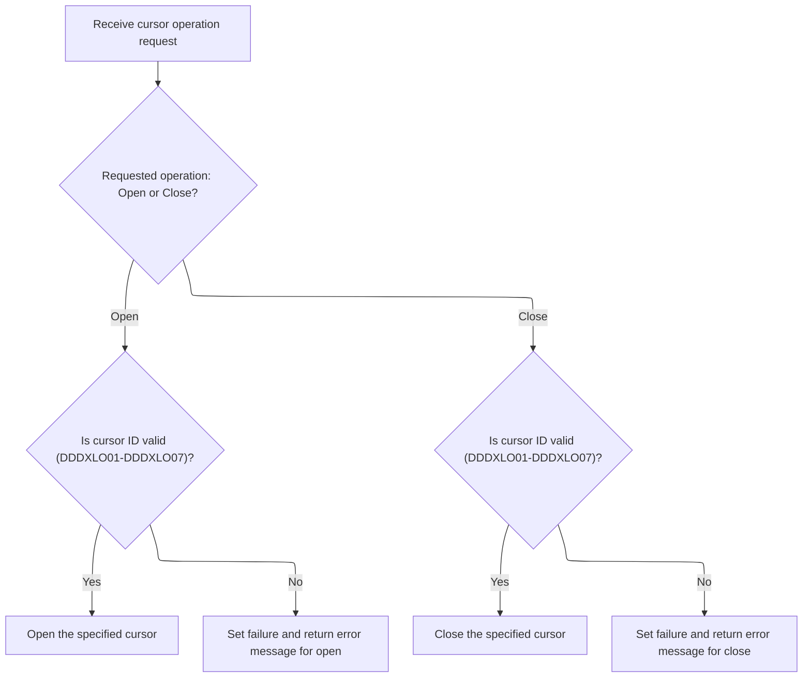

This document describes how location-related database operations are managed. The flow prepares and validates location data, establishes a database connection when needed, and routes requests to the appropriate handler for operations like opening, closing, reading, or modifying location data. The result is returned, including any updates or status messages.

# Spec

## Detailed View of the Program's Functionality

# Swimmio-dyncall-demo: Location Operation Dispatch and Cursor Management

## A. Main Dispatch Flow

The main entry point for location operations begins by preparing all necessary business data and ensuring database connectivity. The dispatcher then routes the request to the appropriate handler based on the requested operation (such as opening or closing a cursor, fetching rows, modifying, inserting, or purging data).

1. **Initialization**

   - All working storage areas and status fields are reset to ensure a clean state.
   - Incoming location data is normalized and copied into the destination structure, unless the operation is specifically to close a cursor.
   - If the operation requires Oracle database access (such as insert, purge, or modify), a connection is established.

2. **Operation Routing**

   - The dispatcher evaluates the requested operation and calls the corresponding handler:
     - Open Cursor
     - Close Cursor
     - Get Unique Row
     - Get Next Row
     - Put/Modify Row
     - Put/Insert Row
     - Put/Purge Row
     - Special IO Functions

3. **Exit Handling**

   - After the operation, results are moved out and any necessary DB2 database actions are performed.
   - The SQL status code is updated for reporting.

---

## B. Preparing Location Data and Connections

### 1\. Data Initialization

- All relevant data structures and status fields are reset.
- The incoming location/contact data is copied and normalized into the destination structure, unless the operation is to close a cursor.
- If the operation involves Oracle (insert, purge, modify), a connection to Oracle is established.

### 2\. Field Normalization and Validation

- Each location/contact field is moved from the input structure to the destination structure.
- Date fields (added, deleted, inactive, opened, closed) are checked for blanks or zero values and set to default values if necessary.
- Flags for active/inactive/deleted status are set based on the input data.
- Additional business rules are applied depending on the location type (vendor, store, DSD vendor, etc.).
- Null indicators for certain fields are set if the values are missing or zero.

### 3\. Database Connectivity

- If Oracle connectivity is required, a connection routine is called.
- If the connection fails, the SQL error code is captured and a detailed error message is constructed for the return structure.

---

## C. Routing to Location Operation Handlers

### 1\. Cursor Operations

#### a. Opening a Cursor

- The handler checks which cursor ID is requested.
- If the ID matches one of the seven supported SQL cursors, the corresponding cursor is opened.
- If the ID is invalid, a failure is set and an error message is returned.

#### b. Closing a Cursor

- The handler checks which cursor handle is provided.
- If the handle matches one of the seven supported SQL cursors, the corresponding cursor is closed.
- If the handle is invalid, a failure is set and an error message is returned.

---

## D. Supported Cursors

The system supports seven specific SQL cursors for location operations. Each cursor is declared for a particular type of location query, and only these are allowed for open/close operations. Any request for an unsupported cursor results in a clear error.

---

## E. Error Handling

- For any operation, if an error occurs (such as an invalid cursor ID or failed database connection), a failure status is set.
- A descriptive error message is constructed and placed in the return structure for the caller to process.

---

## F. Summary

The Swimmio-dyncall-demo location dispatcher ensures that every operation starts with a clean, validated data state and the necessary database connections. It strictly enforces which cursor operations are allowed and provides clear error reporting for unsupported requests or failures. All data normalization, validation, and error handling are performed before and after the main business operation, ensuring robust and predictable behavior for location-related database actions.

# Rule Definition

| Paragraph Name                                                                | Rule ID | Category          | Description                                                                                                                                                               | Conditions                                                                                                                          | Remarks                                                                                                                                                                                                                    |
| ----------------------------------------------------------------------------- | ------- | ----------------- | ------------------------------------------------------------------------------------------------------------------------------------------------------------------------- | ----------------------------------------------------------------------------------------------------------------------------------- | -------------------------------------------------------------------------------------------------------------------------------------------------------------------------------------------------------------------------- |
| 1000-EXIT-OPEN-CURSOR, 1100-EXIT-CLOSE-CURSOR, 1300-EXIT-GET-NEXT-ROW         | RL-001  | Conditional Logic | Only the seven valid cursor IDs are accepted for cursor operations. Any other value must result in a failure response with the appropriate error message.                 | Operation is a cursor operation (open, close, getUniqueRow, getNextRow, putModifyRow, putInsertRow, putPurgeRow, doSpecialIOFuncs). | Valid cursor IDs: DDDXLO01, DDDXLO02, DDDXLO03, DDDXLO04, DDDXLO05, DDDXLO06, DDDXLO07. Error messages: 'NNNS0487 - Invalid open cursor ID.', 'NNNS0487 - Invalid close cursor ID.', 'NNNS0487 - Invalid fetch cursor ID.' |
| 0000-EXIT-DISPATCHER, 100-INITIALIZATION                                      | RL-002  | Conditional Logic | No operation is processed until initialization is complete and all required data is prepared. Operations are dispatched based on the requested type after initialization. | Any incoming request.                                                                                                               | Initialization includes setting up working storage, moving handles, and preparing connection flags. Operations are dispatched using EVALUATE TRUE after initialization.                                                    |
| 110-MOVE-PDA-FIELDS-2-DCL, 1800-EDIT-NULL-INDICATORS, 1700-CHECK-NULL-COLUMNS | RL-003  | Data Assignment   | All location/contact fields must be normalized and validated before performing any operation that uses them.                                                              | Operation uses location/contact data (get, put, etc.).                                                                              | Normalization includes string crunching, date normalization, and handling of null/low-value fields. Validation includes checking for numeric fields and setting null indicators appropriately.                             |
| Spec requirement, output handling after each operation                        | RL-004  | Data Assignment   | For each operation, the system must return a JSON response containing status, message, and data (if applicable), using only the fields described in the output format.    | Any operation completes (success or failure).                                                                                       | Response format:                                                                                                                                                                                                           |

- status: 'success' or 'failure'
- message: string
- data: object with location/contact fields (only for get operations) No extra fields allowed. | | 1000-EXIT-OPEN-CURSOR, 1100-EXIT-CLOSE-CURSOR, 1200-EXIT-GET-UNIQUE-ROW, 1300-EXIT-GET-NEXT-ROW, 1400-EXIT-PUT-MODIFY-ROW, 1500-EXIT-PUT-INSERT-ROW, 1600-EXIT-PUT-PURGE-ROW | RL-005 | Computation | Each operation type is handled by a dedicated procedure, performing the required database action and returning the appropriate result or error. | Operation type matches one of the supported types. | Supported operations: open, close, getUniqueRow, getNextRow, putModifyRow, putInsertRow, putPurgeRow, doSpecialIOFuncs. Each has specific error handling and output requirements. | | 1000-EXIT-OPEN-CURSOR, 1100-EXIT-CLOSE-CURSOR, 1300-EXIT-GET-NEXT-ROW | RL-006 | Conditional Logic | Invalid cursor IDs must result in a failure response with the exact error message specified for each operation type. | Cursor ID is invalid for the requested operation. | Error messages must be verbatim as specified in the spec. | | Cursor declarations, 110-MOVE-PDA-FIELDS-2-DCL, 130-MOVE-DCL-2-PDA-FIELDS | RL-007 | Data Assignment | All location/contact fields described in the input format must be supported and mapped in both input and output. | Operation uses location/contact data. | Fields include primary, secondary, mailing address, dates, status, AP fields, identifiers, etc. Data types: string, number, date, etc. | | 0000-EXIT-DISPATCHER, 100-INITIALIZATION | RL-008 | Conditional Logic | No operation is processed until initialization is complete and all required data is prepared. | Any incoming request. | Initialization includes setting up working storage, moving handles, and preparing connection flags. | | 2000-DENORM-PROCESS, 2030-ISSUE-EVENTS | RL-009 | Computation | After data changes (insert, update, purge), denormalization and event processing routines are called to synchronize and trigger events as needed. | Data change operation completes successfully. | Event routines are called based on location type and operation. Denormalization increments checkpoint and triggers sync/event routines. | | 10000-DO-SPECIAL-IO-FUNCS | RL-010 | Computation | Special IO functions are performed using the specified cursor, with error handling for invalid cursor IDs. | Operation type is doSpecialIOFuncs. | Error handling as for fetch operations. |

# User Stories

## User Story 1: Robust request validation and error handling for cursor operations

---

### Story Description:

As a system user, I want the system to validate cursor IDs and operation types so that only valid requests are processed and clear, specific error messages are returned for invalid requests.

---

### Business Rule Mapping:

| Rule ID | Paragraph Name                                                        | Rule Description                                                                                                                                          |
| ------- | --------------------------------------------------------------------- | --------------------------------------------------------------------------------------------------------------------------------------------------------- |
| RL-001  | 1000-EXIT-OPEN-CURSOR, 1100-EXIT-CLOSE-CURSOR, 1300-EXIT-GET-NEXT-ROW | Only the seven valid cursor IDs are accepted for cursor operations. Any other value must result in a failure response with the appropriate error message. |
| RL-006  | 1000-EXIT-OPEN-CURSOR, 1100-EXIT-CLOSE-CURSOR, 1300-EXIT-GET-NEXT-ROW | Invalid cursor IDs must result in a failure response with the exact error message specified for each operation type.                                      |
| RL-010  | 10000-DO-SPECIAL-IO-FUNCS                                             | Special IO functions are performed using the specified cursor, with error handling for invalid cursor IDs.                                                |

---

### Relevant Functionality:

- **1000-EXIT-OPEN-CURSOR**
  1. **RL-001:**
     - On cursor operation:
       - If cursorId is not one of the seven valid IDs:
         - Set status to failure
         - Set message to the appropriate error string
         - Return response
  2. **RL-006:**
     - On invalid cursorId:
       - Set status to failure
       - Set message to verbatim error string
       - Return response
- **10000-DO-SPECIAL-IO-FUNCS**
  1. **RL-010:**
     - On doSpecialIOFuncs:
       - Validate cursorId
       - If invalid, set failure and error message
       - Else, perform special IO functions

## User Story 2: System initialization and controlled operation dispatching

---

### Story Description:

As a system user, I want the system to ensure all operations are processed only after initialization is complete and required data is prepared, so that requests are handled reliably and in the correct order.

---

### Business Rule Mapping:

| Rule ID | Paragraph Name                           | Rule Description                                                                                                                                                          |
| ------- | ---------------------------------------- | ------------------------------------------------------------------------------------------------------------------------------------------------------------------------- |
| RL-002  | 0000-EXIT-DISPATCHER, 100-INITIALIZATION | No operation is processed until initialization is complete and all required data is prepared. Operations are dispatched based on the requested type after initialization. |
| RL-008  | 0000-EXIT-DISPATCHER, 100-INITIALIZATION | No operation is processed until initialization is complete and all required data is prepared.                                                                             |

---

### Relevant Functionality:

- **0000-EXIT-DISPATCHER**
  1. **RL-002:**
     - On request:
       - Perform initialization
       - If initialization fails, do not process operation
       - Dispatch operation based on type (open, close, getUniqueRow, etc.)
  2. **RL-008:**
     - On request:
       - Perform initialization
       - If initialization fails, do not process operation

## User Story 3: Comprehensive normalization and validation of location/contact data

---

### Story Description:

As a system user, I want all location/contact fields to be normalized and validated before any operation that uses them, so that data integrity is maintained and only valid data is processed or returned.

---

### Business Rule Mapping:

| Rule ID | Paragraph Name                                                                | Rule Description                                                                                                 |
| ------- | ----------------------------------------------------------------------------- | ---------------------------------------------------------------------------------------------------------------- |
| RL-003  | 110-MOVE-PDA-FIELDS-2-DCL, 1800-EDIT-NULL-INDICATORS, 1700-CHECK-NULL-COLUMNS | All location/contact fields must be normalized and validated before performing any operation that uses them.     |
| RL-007  | Cursor declarations, 110-MOVE-PDA-FIELDS-2-DCL, 130-MOVE-DCL-2-PDA-FIELDS     | All location/contact fields described in the input format must be supported and mapped in both input and output. |

---

### Relevant Functionality:

- **110-MOVE-PDA-FIELDS-2-DCL**
  1. **RL-003:**
     - Before performing operation:
       - Normalize string fields (e.g., call string crunch routine)
       - Normalize dates (replace spaces/zero dates with default)
       - Validate numeric fields (set to 0 if not numeric)
       - Set null indicators for AP fields if values are missing
- **Cursor declarations**
  1. **RL-007:**
     - On input:
       - Map all fields from input to internal structures
     - On output:
       - Map all fields from internal structures to output

## User Story 4: Consistent operation handling and compliant response formatting

---

### Story Description:

As a system user, I want each supported operation type to be handled by a dedicated procedure that performs the required database action and returns a JSON response containing only the specified fields (status, message, and data if applicable), so that all operations are processed correctly and responses conform to the required output format.

---

### Business Rule Mapping:

| Rule ID | Paragraph Name                                                                                                                                                               | Rule Description                                                                                                                                                       |
| ------- | ---------------------------------------------------------------------------------------------------------------------------------------------------------------------------- | ---------------------------------------------------------------------------------------------------------------------------------------------------------------------- |
| RL-005  | 1000-EXIT-OPEN-CURSOR, 1100-EXIT-CLOSE-CURSOR, 1200-EXIT-GET-UNIQUE-ROW, 1300-EXIT-GET-NEXT-ROW, 1400-EXIT-PUT-MODIFY-ROW, 1500-EXIT-PUT-INSERT-ROW, 1600-EXIT-PUT-PURGE-ROW | Each operation type is handled by a dedicated procedure, performing the required database action and returning the appropriate result or error.                        |
| RL-004  | Spec requirement, output handling after each operation                                                                                                                       | For each operation, the system must return a JSON response containing status, message, and data (if applicable), using only the fields described in the output format. |

---

### Relevant Functionality:

- **1000-EXIT-OPEN-CURSOR**
  1. **RL-005:**
     - On operation:
       - Call corresponding procedure
       - If error, set failure and message
       - If success, process and return data as needed
- **Spec requirement**
  1. **RL-004:**
     - After operation:
       - Construct response object
         - status: success or failure
         - message: result or error message
         - data: location/contact fields if applicable
       - Return response

## User Story 5: Post-operation denormalization and event processing for data changes

---

### Story Description:

As a system user, I want the system to perform denormalization and trigger event processing routines after successful data-changing operations, so that data remains synchronized and relevant events are issued as needed.

---

### Business Rule Mapping:

| Rule ID | Paragraph Name                                                                                                                                                               | Rule Description                                                                                                                                  |
| ------- | ---------------------------------------------------------------------------------------------------------------------------------------------------------------------------- | ------------------------------------------------------------------------------------------------------------------------------------------------- |
| RL-005  | 1000-EXIT-OPEN-CURSOR, 1100-EXIT-CLOSE-CURSOR, 1200-EXIT-GET-UNIQUE-ROW, 1300-EXIT-GET-NEXT-ROW, 1400-EXIT-PUT-MODIFY-ROW, 1500-EXIT-PUT-INSERT-ROW, 1600-EXIT-PUT-PURGE-ROW | Each operation type is handled by a dedicated procedure, performing the required database action and returning the appropriate result or error.   |
| RL-009  | 2000-DENORM-PROCESS, 2030-ISSUE-EVENTS                                                                                                                                       | After data changes (insert, update, purge), denormalization and event processing routines are called to synchronize and trigger events as needed. |

---

### Relevant Functionality:

- **1000-EXIT-OPEN-CURSOR**
  1. **RL-005:**
     - On operation:
       - Call corresponding procedure
       - If error, set failure and message
       - If success, process and return data as needed
- **2000-DENORM-PROCESS**
  1. **RL-009:**
     - After data change:
       - Call denormalization routine
       - If success, call sync and event routines as needed

# Code Walkthrough

## Dispatching Location Operations

<SwmSnippet path="/base/src/NNNS0487.cbl" line="864">

---

`0000-EXIT-DISPATCHER` kicks off the flow by running 100-INITIALIZATION to prep all the business data and set up the DB connection if needed. After that, it uses EVALUATE TRUE to branch to the right handler (open, close, get, put, etc.) based on the requested operation. Initialization comes first so every operation starts with a clean slate and the DB is ready if needed. At the end, it calls 120-EXIT-STUFF to move results out and handle DB2 stuff, then returns.

```cobol
094100 0000-EXIT-DISPATCHER.                                            00094100
094200     PERFORM 100-INITIALIZATION                                   00094200
094300     EVALUATE TRUE                                                00094300
094400       WHEN NOT SUCCESS                                           00094400
094500          CONTINUE                                                00094500
094600       WHEN EXIT-OPEN-CURSOR                                      00094600
094700          PERFORM 1000-EXIT-OPEN-CURSOR                           00094700
094800       WHEN EXIT-CLOSE-CURSOR                                     00094800
094900          PERFORM 1100-EXIT-CLOSE-CURSOR                          00094900
095000       WHEN EXIT-GET-UNIQUE-ROW                                   00095000
095100          PERFORM 1200-EXIT-GET-UNIQUE-ROW                        00095100
095200       WHEN EXIT-GET-NEXT-ROW                                     00095200
095300          PERFORM 1300-EXIT-GET-NEXT-ROW                          00095300
095400       WHEN EXIT-PUT-MODIFY-ROW                                   00095400
095500          PERFORM 1400-EXIT-PUT-MODIFY-ROW                        00095500
095600       WHEN EXIT-PUT-INSERT-ROW                                   00095600
095700          PERFORM 1500-EXIT-PUT-INSERT-ROW                        00095700
095800       WHEN EXIT-PUT-PURGE-ROW                                    00095800
095900          PERFORM 1600-EXIT-PUT-PURGE-ROW                         00095900
096000       WHEN EXIT-DO-SPECIAL-IO-FUNCS                              00096000
096100          PERFORM 10000-DO-SPECIAL-IO-FUNCS                       00096100
096200     END-EVALUATE                                                 00096200
096300                                                                  00096300
096400     PERFORM 120-EXIT-STUFF                                       00096400
096500     GOBACK                                                       00096500
096600     .                                                            00096600
```

---

</SwmSnippet>

### Preparing Location Data and Connections

<SwmSnippet path="/base/src/NNNS0487.cbl" line="894">

---

`100-INITIALIZATION` sets up all the working storage and resets status fields, then moves the incoming location data into the destination structure by calling 110-MOVE-PDA-FIELDS-2-DCL (unless we're just closing a cursor). This makes sure all the location/contact fields are normalized and ready for whatever operation comes next. If the operation needs Oracle, it connects after that.

```cobol
097100 100-INITIALIZATION.                                              00097100
097200     INITIALIZE XXXN001A                                          00097200
097300                DAO-STATUS                                        00097300
097400                MMMC0474                                          00097400
097500                ZZZC0550                                          00097500
097600     MOVE NNNN0000-INDEX-HANDLE TO DDDTLO01-INDEX-HANDLE          00097600
097700     MOVE 0 TO WS-CHECKPOINT-INC                                  00097700
097800     MOVE 0 TO SQLCODE                                            00097800
097900     MOVE 0 TO SQL-INIT-FLAG                                      00097900
098000     IF NOT EXIT-CLOSE-CURSOR                                     00098000
098100       PERFORM 110-MOVE-PDA-FIELDS-2-DCL                          00098100
098200     END-IF                                                       00098200
098300     IF (YYYN005A-ORACLE       OR EXIT-PUT-INSERT-ROW             00098300
098400         OR EXIT-PUT-PURGE-ROW OR EXIT-PUT-MODIFY-ROW)            00098400
098500       PERFORM 115-CONNECT-TO-ORACLE                              00098500
098600     END-IF                                                       00098600
098700     .                                                            00098700
```

---

</SwmSnippet>

#### Normalizing and Validating Location Fields

See <SwmLink doc-title="Preparing and Validating Location Data">[Preparing and Validating Location Data](\.swm\preparing-and-validating-location-data.no9j4r0e.sw.md)</SwmLink>

#### Establishing Database Connectivity

<SwmSnippet path="/base/src/NNNS0487.cbl" line="1177">

---

`115-CONNECT-TO-ORACLE` calls Z-ORA-CONNECT (which is actually YYYS0210) to set up the Oracle DB connection, passing in the status/message struct XXXN001A and SQLCA. If the connection fails (checked using the SUCCESS condition), it grabs the SQLCODE, builds a detailed error message, and puts it in the return message field. The actual connection logic lives in base/src/XXXS0210.cbl, so that's what gets called next.

```cobol
125400 115-CONNECT-TO-ORACLE.                                           00125400
125500     CALL Z-ORA-CONNECT USING XXXN001A                            00125500
125600                              SQLCA                               00125600
125700     IF NOT SUCCESS                                               00125700
125800       MOVE SQLCODE TO WS-SQLCODE                                 00125800
125900       MOVE SPACES  TO IS-RTRN-MSG-TXT                            00125900
126000       STRING 'NNNS0487 - Error connecting to Oracle. Sqlcode ='  00126000
126100               WS-SQLCODE                                         00126100
126200               DELIMITED BY SIZE INTO IS-RTRN-MSG-TXT             00126200
126300     END-IF                                                       00126300
126400     .                                                            00126400
```

---

</SwmSnippet>

### Routing to Location Operation Handlers



<SwmSnippet path="/base/src/NNNS0487.cbl" line="1454">

---

`1000-EXIT-OPEN-CURSOR` checks the input cursor ID and opens the matching SQL cursor (DDDXLO01 to DDDXLO07). If the ID doesn't match any known cursor, it sets FAILURE and writes an error message to XXXN001A. Only these seven cursors are supported—anything else is rejected with a clear error.

```cobol
153100 1000-EXIT-OPEN-CURSOR.                                           00153100
153200     EVALUATE TRUE                                                00153200
153300       WHEN DDDXLO01                                              00153300
153400         EXEC SQL                                                 00153400
153500           OPEN DDDXLO01                                          00153500
153600         END-EXEC                                                 00153600
153700       WHEN DDDXLO02                                              00153700
153800         EXEC SQL                                                 00153800
153900           OPEN DDDXLO02                                          00153900
154000         END-EXEC                                                 00154000
154100       WHEN DDDXLO03                                              00154100
154200         EXEC SQL                                                 00154200
154300           OPEN DDDXLO03                                          00154300
154400         END-EXEC                                                 00154400
154500       WHEN DDDXLO04                                              00154500
154600         EXEC SQL                                                 00154600
154700           OPEN DDDXLO04                                          00154700
154800         END-EXEC                                                 00154800
154900       WHEN DDDXLO05                                              00154900
155000         EXEC SQL                                                 00155000
155100           OPEN DDDXLO05                                          00155100
155200         END-EXEC                                                 00155200
155300       WHEN DDDXLO06                                              00155300
155400         EXEC SQL                                                 00155400
155500           OPEN DDDXLO06                                          00155500
155600         END-EXEC                                                 00155600
155700       WHEN DDDXLO07                                              00155700
155800         EXEC SQL                                                 00155800
155900           OPEN DDDXLO07                                          00155900
156000         END-EXEC                                                 00156000
156100       WHEN OTHER                                                 00156100
156200         SET FAILURE TO TRUE                                      00156200
156300         MOVE 'NNNS0487 - Invalid open cursor ID.'                00156300
156400           TO IS-RTRN-MSG-TXT OF XXXN001A                         00156400
156500     END-EVALUATE                                                 00156500
156600     .                                                            00156600
```

---

</SwmSnippet>

<SwmSnippet path="/base/src/NNNS0487.cbl" line="1492">

---

`1100-EXIT-CLOSE-CURSOR` checks which cursor handle is passed and closes the matching SQL cursor (DDDXLO01 to DDDXLO07). If the handle is invalid, it sets FAILURE and writes an error message to XXXN001A. Only these seven handles are allowed—anything else triggers an explicit error.

```cobol
156900 1100-EXIT-CLOSE-CURSOR.                                          00156900
157000     EVALUATE TRUE                                                00157000
157100       WHEN DDDXLO01                                              00157100
157200         EXEC SQL                                                 00157200
157300           CLOSE DDDXLO01                                         00157300
157400         END-EXEC                                                 00157400
157500       WHEN DDDXLO02                                              00157500
157600         EXEC SQL                                                 00157600
157700           CLOSE DDDXLO02                                         00157700
157800         END-EXEC                                                 00157800
157900       WHEN DDDXLO03                                              00157900
158000         EXEC SQL                                                 00158000
158100           CLOSE DDDXLO03                                         00158100
158200         END-EXEC                                                 00158200
158300       WHEN DDDXLO04                                              00158300
158400         EXEC SQL                                                 00158400
158500           CLOSE DDDXLO04                                         00158500
158600         END-EXEC                                                 00158600
158700       WHEN DDDXLO05                                              00158700
158800         EXEC SQL                                                 00158800
158900           CLOSE DDDXLO05                                         00158900
159000         END-EXEC                                                 00159000
159100       WHEN DDDXLO06                                              00159100
159200         EXEC SQL                                                 00159200
159300           CLOSE DDDXLO06                                         00159300
159400         END-EXEC                                                 00159400
159500       WHEN DDDXLO07                                              00159500
159600         EXEC SQL                                                 00159600
159700           CLOSE DDDXLO07                                         00159700
159800         END-EXEC                                                 00159800
159900       WHEN OTHER                                                 00159900
160000         SET FAILURE TO TRUE                                      00160000
160100         MOVE 'NNNS0487 - Invalid close cursor ID.'               00160100
160200           TO IS-RTRN-MSG-TXT OF XXXN001A                         00160200
160300     END-EVALUATE                                                 00160300
160400     .                                                            00160400
```

---

</SwmSnippet>

&nbsp;

*This is an auto-generated document by Swimm 🌊 and has not yet been verified by a human*

<SwmMeta version="3.0.0" repo-id="Z2l0aHViJTNBJTNBU3dpbW1pby1keW5jYWxsLWRlbW8lM0ElM0FHaXJpLVN3aW1t" repo-name="Swimmio-dyncall-demo"><sup>Powered by [Swimm](https://app.swimm.io/)</sup></SwmMeta>
