This document describes how exit operations for location records are managed. The flow receives a request to perform an operation, prepares the environment, routes to the correct business logic, validates and updates data, and triggers business events when changes occur. The result includes updated location data and status flags.

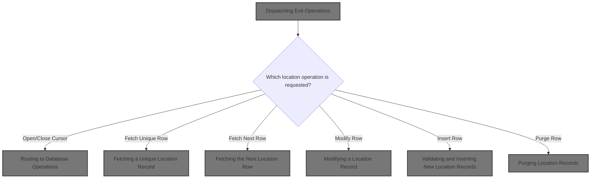

# Spec

## Detailed View of the Program's Functionality

# Swimmio-dyncall-demo: Detailed Flow Explanation

## a. Program Structure and Entry Point

The program is structured as a main dispatcher that receives requests to perform various operations on a location/store database. It uses a combination of initialization, routing, validation, and database access routines to process these requests.

The entry point is a dispatcher routine. This routine is responsible for:

- Initializing all relevant state and data areas.
- Determining which operation is being requested (such as open/close cursor, fetch, insert, update, delete, or special IO).
- Routing the request to the appropriate handler.
- Performing cleanup and exit routines before returning control.

## b. Initialization and State Preparation

Before any operation, the program performs a thorough initialization:

- It resets all status fields, switches, and working storage areas to default values.
- It synchronizes index handles to ensure correct database access.
- It clears any previous SQL codes and flags.
- If the operation is not a cursor close, it copies and validates all incoming location/store fields, applying business rules and default values as needed.
- If the operation involves Oracle (or is an insert, update, or delete), it establishes a database connection.

### Copying and Validating Location Fields

A dedicated routine is responsible for:

- Copying all location/store fields from the input to the internal data structure.
- Setting default values for missing or zeroed association fields.
- Defaulting blank or zero date fields to a standard minimum date.
- Normalizing time fields, converting between DB2 and Oracle formats as needed.
- Ensuring latitude and longitude fields are numeric, defaulting to zero if not.
- Setting preference flags for product substitution and display pallets if unset.
- Normalizing rollup reporting fields and time fields.
- Handling ECOMM (e-commerce) start/end dates and indicators.
- Setting report sequence numbers based on environment.
- Transferring any remaining fields.

### Rollup Data Handling

A subroutine processes rollup reporting fields:

- It copies a text field and then, for each of 10 numeric slots, moves the value if numeric or sets it to zero otherwise.

### Time Field Handling

Another subroutine manages time fields:

- If the operation is Oracle-related or an insert/update, it packs all open/close times into an array, sets a conversion flag, and calls an external program to convert them to timestamps.
- If not, it simply copies the times as-is.

### Oracle Connection

A routine calls an external program to establish a database connection. If the connection fails, it logs the error code and message for later use.

## c. Routing to Database Operations

The dispatcher uses a routing mechanism to determine which operation to perform:

- For cursor operations, it opens or closes the specified cursor, validating the cursor ID and setting error messages if invalid.
- For fetch operations, it retrieves either a unique row or the next row from the database, using the appropriate cursor and handling nulls.
- For modification, insertion, or deletion, it performs validation, referential integrity checks, and then executes the database operation.
- For special IO, it calls a placeholder routine for custom logic.

## d. Fetching and Returning Data

### Fetching a Unique Location Record

When fetching a unique record:

- The program executes a SELECT statement to retrieve all fields for the specified location and type.
- It then checks for any negative indicator fields (which represent nulls in COBOL) and resets the associated fields to default values.
- The standardized record is then returned.

### Fetching the Next Location Row

When fetching the next row:

- The program determines which cursor is active and calls the corresponding fetch routine.
- After fetching, it checks for nulls and cleans up any missing fields.

## e. Modifying a Location Record

When modifying a record:

- The program first edits null indicators and validates alternate store entries.
- If validation passes, it checks for status or data changes and updates the row.
- If the update is successful, it triggers any necessary business events.

### Validating Alternate Store Edits

If certain collection and alternate store conditions are met:

- The program checks if the alternate store exists in the database.
- If not, it sets a failure status and logs an error message.

### Checking for Status and Data Changes

The program checks if the location status code has changed:

- If so, it sets a flag and updates the status date.
- If not, it marks the status as retained.
- Errors are flagged and logged.

## f. Updating the Location Row

When updating:

- The program replaces any low-value fields with spaces.
- It calls an external routine to perform the actual database update.
- If successful, it sets update flags and triggers denormalization processing.

## g. Denormalizing and Syncing Data

After a successful update or insert:

- The program checks if the location status changed and updates the main system if needed.
- It increments a checkpoint counter.
- If successful, it calls control and synchronization subroutines.
- If all steps succeed, it issues business events.

## h. Updating Location Status in Database

To sync status codes:

- The program sets the inactive switch based on the current status.
- It flags the operation as a modify and calls the DAO to update the database.
- Errors are checked and logged.

## i. Issuing Master Data and Store Events

When issuing events:

- The program gets the current user context (either a user ID or 'BATCH').
- If the previous operation was successful, it builds and sends a master data event.
- If the location is a store, it also sends a store-specific event.

## j. Detecting and Issuing Business Line Change Events

If the business line has changed:

- The program sets up the event data and calls a routine to send the event.

## k. Staging and Sending Business Line Events

To send business line events:

- The program sets the transaction type and prepares the event data, including environment flags and user information.
- It calls an event stager to queue the event for downstream processing.

## l. Validating and Inserting New Location Records

When inserting:

- The program checks required fields and applies business rule validations.
- If all validations pass, it inserts the new row and updates flags.
- If the insert is successful, it marks the location as changed and processes denormalization.

## m. Checking Referential Integrity and Inserting Data

Before inserting:

- The program checks referential integrity using an external routine.
- If allowed, it prepares the data and performs the insert.
- If successful, it updates flags and triggers denormalization.

## n. Purging Location Records

When deleting:

- The program validates if the row can be deleted using an external routine.
- If allowed, it performs the deletion and sets flags based on the result.
- Special cases (such as 'in use' or other errors) are handled with specific messages.

---

This flow ensures that all location/store operations are performed with proper validation, error handling, and business rule enforcement, while keeping the database and related systems in sync. The program is modular, with clear separation between initialization, validation, database access, and event handling.

# Rule Definition

| Paragraph Name                                                                                                                       | Rule ID | Category          | Description                                                                                                                                                                                                                                                                             | Conditions                                                              | Remarks                                                                                                                                                                                                                                                                                                                                                                           |
| ------------------------------------------------------------------------------------------------------------------------------------ | ------- | ----------------- | --------------------------------------------------------------------------------------------------------------------------------------------------------------------------------------------------------------------------------------------------------------------------------------- | ----------------------------------------------------------------------- | --------------------------------------------------------------------------------------------------------------------------------------------------------------------------------------------------------------------------------------------------------------------------------------------------------------------------------------------------------------------------------- |
| 0000-EXIT-DISPATCHER, 100-INITIALIZATION                                                                                             | RL-001  | Conditional Logic | The system must receive a location operation request containing an operation code, cursor ID (if applicable), location/store data fields, null indicators, and control/status fields. The request must be validated for required fields before processing.                              | A request is received for any operation.                                | Operation code: string identifying the requested operation (e.g., open, close, fetch, modify, insert, purge). Cursor ID: string, required for cursor operations. Null indicators: numeric, -1 for null, 0 for not null. Control/status fields: various flags and codes. All fields must be present and in the expected format.                                                    |
| 100-INITIALIZATION                                                                                                                   | RL-002  | Data Assignment   | Before processing any operation, the system must initialize internal state, synchronize indexes, and set up the environment, including establishing database connections if required.                                                                                                   | Any operation is about to be processed.                                 | SQLCODE and SQL-INIT-FLAG are set to 0. Database connections are established as needed (e.g., Oracle for insert/modify/purge).                                                                                                                                                                                                                                                    |
| 0000-EXIT-DISPATCHER                                                                                                                 | RL-003  | Conditional Logic | The system must route the request to the correct operation handler based on the operation code provided in the input.                                                                                                                                                                   | A valid operation code is present in the request.                       | Operation codes correspond to actions: open/close cursor, fetch unique/next row, modify, insert, purge, special IO functions.                                                                                                                                                                                                                                                     |
| 1000-EXIT-OPEN-CURSOR, 1100-EXIT-CLOSE-CURSOR                                                                                        | RL-004  | Conditional Logic | For open/close cursor operations, the system must validate the cursor ID and only allow operations on valid cursor IDs.                                                                                                                                                                 | Operation is open or close cursor.                                      | Valid open cursor IDs: DDDXLR01-DDDXLR09. Valid close cursor IDs: DDDXLR01-DDDXLR07, DDDXLR09. Cursor ID is a string identifier.                                                                                                                                                                                                                                                  |
| 1200-EXIT-GET-UNIQUE-ROW, 1300-EXIT-GET-NEXT-ROW, 1301-FETCH-DDDXLR01, etc.                                                          | RL-005  | Computation       | For fetch operations (unique or next row), the system must retrieve the location/store record from the database using the provided keys and populate all output fields, setting null indicators for any fields that are null in the database.                                           | Operation is fetch unique or fetch next row.                            | Output fields: all location/store fields as defined in the schema. Null indicators: -1 for null, 0 for not null. Output structure includes all fields, null indicators, and status/result codes.                                                                                                                                                                                  |
| 1400-EXIT-PUT-MODIFY-ROW, 1410-MODIFY-EDITS, 1420-VALIDATE-ALT-STORE, 1430-CHECK-FOR-EVENTS, 1440-D0-MODIFY-ROW, 2000-DENORM-PROCESS | RL-006  | Conditional Logic | For modify operations, the system must validate alternate store entries, check for status and data changes, and update the location/store record in the database if all validations pass. Status change must trigger a status date update and denormalization/synchronization routines. | Operation is modify row.                                                | Status change triggers status date update. Denormalization and synchronization routines are invoked after successful update. Alternate store validation checks for existence and referential integrity.                                                                                                                                                                           |
| 1500-EXIT-PUT-INSERT-ROW, 1510-ADD-EDITS, 1520-D0-INSERT-ROW, 4600-CALL-MMMS0335-RI-ADD-CHK                                          | RL-007  | Conditional Logic | For insert operations, the system must validate all required fields and business rules, check referential integrity, and insert the new location/store record only if all validations succeed. Flags must indicate if the row was added.                                                | Operation is insert row.                                                | Required fields must be present and valid. Referential integrity is checked via external routine. Flags: LOC-ADD, YYYN110A-ADD set to true if row added.                                                                                                                                                                                                                          |
| 1600-EXIT-PUT-PURGE-ROW, 4500-CALL-MMMS0304-RI-DEL-CHK                                                                               | RL-008  | Conditional Logic | For purge operations, the system must validate if the row can be deleted, perform the deletion if allowed, and set flags to indicate if the row was deleted.                                                                                                                            | Operation is purge row.                                                 | Deletion is allowed only if referential integrity checks pass. Flags: LOC-DEL, YYYN110A-DEL set to true if row deleted. SQLCODE 0 or 100 indicates success.                                                                                                                                                                                                                       |
| 110-MOVE-PDA-FIELDS-2-DCL, 112-MOVE-TIME-FIELDS, 130-MOVE-DCL-2-PDA-FIELDS                                                           | RL-009  | Computation       | For all operations, the system must normalize date and time fields to default values if missing or invalid, and set numeric fields to zero if not numeric.                                                                                                                              | Any operation involving date, time, or numeric fields.                  | Default date: K-DEF-DT. Default time: K-DEF-TM ('00.00.00'). DB2 max time: K-DB2-MAX-TM ('24.00.00'). Oracle max time: K-ORA-MAX-TM ('23.59.59'). Numeric fields set to 0 if not numeric.                                                                                                                                                                                         |
| 110-MOVE-PDA-FIELDS-2-DCL                                                                                                            | RL-010  | Conditional Logic | The system must set preference flags for product substitution and display pallets to true if unset.                                                                                                                                                                                     | Preference flags for product substitution or display pallets are unset. | Flags: OK-TO-SUB-UNLIKE-PRODS, DONT-SUB-UNLIKE-PRODS, OK-TO-SUB-DISP-PALS, DONT-SUB-DISP-PALS. If neither is set, set NO-UNLIKE-SUB-STORE-PREF or NO-DISP-PAL-SUB-STORE-PREF to true.                                                                                                                                                                                             |
| 1430-CHECK-FOR-EVENTS, 2000-DENORM-PROCESS, 2030-ISSUE-EVENTS, 2400-CHECK-FOR-DCM-EVENT, 2420-ISSUE-EVENT, 2430-ISSUE-EVENT2         | RL-011  | Conditional Logic | The system must issue business events when location/store status or line of business changes, including user context and environment flags in the event payload.                                                                                                                        | Status or line of business changes during modify or insert operations.  | Event payload includes user context (user ID, environment), program name, transaction ID, and before/after values for changed fields.                                                                                                                                                                                                                                             |
| 1700-CHECK-NULL-COLUMNS, 1800-EDIT-NULL-INDICATORS                                                                                   | RL-012  | Computation       | The system must handle null indicators for all fields that can be null, setting them to -1 if the value is null and to 0 otherwise.                                                                                                                                                     | Any field that can be null is processed.                                | Null indicator: numeric, -1 for null, 0 for not null. Applies to all nullable fields, including associated store number, type, replaced by store number, e-commerce start/end dates.                                                                                                                                                                                              |
| 120-EXIT-STUFF, 130-MOVE-DCL-2-PDA-FIELDS, fetch/insert/modify/purge handlers                                                        | RL-013  | Data Assignment   | The system must return a result structure containing all location/store fields, null indicators, status/result codes, error messages, SQL code, and flags indicating if the row was added, updated, or deleted.                                                                         | Any operation completes successfully or with error.                     | Result structure includes: all location/store fields (strings, numbers, dates, times), null indicators (-1/0), status/result codes (numeric), error messages (string), SQL code (numeric), flags (boolean) for row added/updated/deleted. Field sizes and types as per schema; alignment and padding as per field type (e.g., strings padded with spaces, numbers right-aligned). |

# User Stories

## User Story 1: Receive, validate, initialize, and route location/store operation requests

---

### Story Description:

As a system, I want to receive a location/store operation request, validate required fields, initialize internal state, synchronize indexes, set up the environment, and route the request to the correct operation handler so that each operation is reliably and efficiently processed.

---

### Business Rule Mapping:

| Rule ID | Paragraph Name                           | Rule Description                                                                                                                                                                                                                                           |
| ------- | ---------------------------------------- | ---------------------------------------------------------------------------------------------------------------------------------------------------------------------------------------------------------------------------------------------------------- |
| RL-001  | 0000-EXIT-DISPATCHER, 100-INITIALIZATION | The system must receive a location operation request containing an operation code, cursor ID (if applicable), location/store data fields, null indicators, and control/status fields. The request must be validated for required fields before processing. |
| RL-003  | 0000-EXIT-DISPATCHER                     | The system must route the request to the correct operation handler based on the operation code provided in the input.                                                                                                                                      |
| RL-002  | 100-INITIALIZATION                       | Before processing any operation, the system must initialize internal state, synchronize indexes, and set up the environment, including establishing database connections if required.                                                                      |

---

### Relevant Functionality:

- **0000-EXIT-DISPATCHER**
  1. **RL-001:**
     - On entry, check that all required fields are present in the request.
     - Validate that the operation code is recognized.
     - For cursor operations, ensure a valid cursor ID is provided.
     - If any required field is missing or invalid, set failure status and return an error message.
  2. **RL-003:**
     - Evaluate the operation code.
     - Dispatch to the corresponding handler (e.g., open cursor, close cursor, fetch, modify, insert, purge).
     - If the operation code is not recognized, set failure status and return an error message.
- **100-INITIALIZATION**
  1. **RL-002:**
     - Initialize all working storage and parameter data areas.
     - Reset status and control flags.
     - If the operation requires a database connection (insert, modify, purge), establish the connection.
     - Synchronize index handles as needed.

## User Story 2: Modify and insert location/store records with validation, event handling, and result reporting

---

### Story Description:

As a user, I want to modify and insert location/store records with validation of alternate store entries, required fields, referential integrity, status/data changes, trigger status date updates, denormalization, synchronization, and business events, and receive a comprehensive result structure so that data integrity and business processes are maintained and I have complete information about the outcome.

---

### Business Rule Mapping:

| Rule ID | Paragraph Name                                                                                                                       | Rule Description                                                                                                                                                                                                                                                                        |
| ------- | ------------------------------------------------------------------------------------------------------------------------------------ | --------------------------------------------------------------------------------------------------------------------------------------------------------------------------------------------------------------------------------------------------------------------------------------- |
| RL-006  | 1400-EXIT-PUT-MODIFY-ROW, 1410-MODIFY-EDITS, 1420-VALIDATE-ALT-STORE, 1430-CHECK-FOR-EVENTS, 1440-D0-MODIFY-ROW, 2000-DENORM-PROCESS | For modify operations, the system must validate alternate store entries, check for status and data changes, and update the location/store record in the database if all validations pass. Status change must trigger a status date update and denormalization/synchronization routines. |
| RL-011  | 1430-CHECK-FOR-EVENTS, 2000-DENORM-PROCESS, 2030-ISSUE-EVENTS, 2400-CHECK-FOR-DCM-EVENT, 2420-ISSUE-EVENT, 2430-ISSUE-EVENT2         | The system must issue business events when location/store status or line of business changes, including user context and environment flags in the event payload.                                                                                                                        |
| RL-007  | 1500-EXIT-PUT-INSERT-ROW, 1510-ADD-EDITS, 1520-D0-INSERT-ROW, 4600-CALL-MMMS0335-RI-ADD-CHK                                          | For insert operations, the system must validate all required fields and business rules, check referential integrity, and insert the new location/store record only if all validations succeed. Flags must indicate if the row was added.                                                |
| RL-013  | 120-EXIT-STUFF, 130-MOVE-DCL-2-PDA-FIELDS, fetch/insert/modify/purge handlers                                                        | The system must return a result structure containing all location/store fields, null indicators, status/result codes, error messages, SQL code, and flags indicating if the row was added, updated, or deleted.                                                                         |

---

### Relevant Functionality:

- **1400-EXIT-PUT-MODIFY-ROW**
  1. **RL-006:**
     - Validate alternate store fields (if present).
     - Check if status or line of business has changed.
     - If status changed, update status date to current date.
     - If all validations pass, update the record in the database.
     - Invoke denormalization and synchronization routines as needed.
     - Issue business events if status or line of business changed.
- **1430-CHECK-FOR-EVENTS**
  1. **RL-011:**
     - Detect if status or line of business has changed.
     - Gather user context and environment flags.
     - Populate event payload with relevant data.
     - Call event manager to issue the event.
- **1500-EXIT-PUT-INSERT-ROW**
  1. **RL-007:**
     - Validate all required fields for insert.
     - Check referential integrity using external routine.
     - If all validations pass, insert the new record into the database.
     - Set flags to indicate row was added.
     - Invoke denormalization and event routines as needed.
- **120-EXIT-STUFF**
  1. **RL-013:**
     - Populate the result structure with all relevant fields and indicators.
     - Set status/result codes and error messages as appropriate.
     - Set SQL code to the result of the last database operation.
     - Set flags for row added, updated, or deleted as appropriate.
     - Return the complete result structure to the caller.

## User Story 3: Normalize and validate data fields, set preference flags, and handle null indicators

---

### Story Description:

As a system, I want to normalize date, time, and numeric fields to default values, set preference flags for product substitution and display pallets to true if unset, and handle null indicators for all nullable fields so that data integrity and user preferences are always correctly represented across all operations.

---

### Business Rule Mapping:

| Rule ID | Paragraph Name                                                             | Rule Description                                                                                                                                           |
| ------- | -------------------------------------------------------------------------- | ---------------------------------------------------------------------------------------------------------------------------------------------------------- |
| RL-009  | 110-MOVE-PDA-FIELDS-2-DCL, 112-MOVE-TIME-FIELDS, 130-MOVE-DCL-2-PDA-FIELDS | For all operations, the system must normalize date and time fields to default values if missing or invalid, and set numeric fields to zero if not numeric. |
| RL-010  | 110-MOVE-PDA-FIELDS-2-DCL                                                  | The system must set preference flags for product substitution and display pallets to true if unset.                                                        |
| RL-012  | 1700-CHECK-NULL-COLUMNS, 1800-EDIT-NULL-INDICATORS                         | The system must handle null indicators for all fields that can be null, setting them to -1 if the value is null and to 0 otherwise.                        |

---

### Relevant Functionality:

- **110-MOVE-PDA-FIELDS-2-DCL**
  1. **RL-009:**
     - For each date field, if missing or invalid, set to default date.
     - For each time field, if missing or invalid, set to default time.
     - If DB2 max time is encountered, convert to Oracle max time as needed.
     - For each numeric field, if not numeric, set to 0.
  2. **RL-010:**
     - If neither product substitution flag is set, set the default preference flag to true.
     - If neither display pallet flag is set, set the default preference flag to true.
- **1700-CHECK-NULL-COLUMNS**
  1. **RL-012:**
     - For each nullable field, check if the value is null or zero (for numbers).
     - Set the corresponding null indicator to -1 if null, 0 otherwise.
     - Ensure output structure includes all null indicators.

## User Story 4: Handle cursor and fetch operations with validation and data integrity

---

### Story Description:

As a user, I want to open and close cursors using valid cursor IDs and fetch unique or next location/store records from the database, receiving all output fields with correct null indicators so that I can safely manage data retrieval sessions and view accurate, complete data.

---

### Business Rule Mapping:

| Rule ID | Paragraph Name                                                              | Rule Description                                                                                                                                                                                                                              |
| ------- | --------------------------------------------------------------------------- | --------------------------------------------------------------------------------------------------------------------------------------------------------------------------------------------------------------------------------------------- |
| RL-004  | 1000-EXIT-OPEN-CURSOR, 1100-EXIT-CLOSE-CURSOR                               | For open/close cursor operations, the system must validate the cursor ID and only allow operations on valid cursor IDs.                                                                                                                       |
| RL-005  | 1200-EXIT-GET-UNIQUE-ROW, 1300-EXIT-GET-NEXT-ROW, 1301-FETCH-DDDXLR01, etc. | For fetch operations (unique or next row), the system must retrieve the location/store record from the database using the provided keys and populate all output fields, setting null indicators for any fields that are null in the database. |

---

### Relevant Functionality:

- **1000-EXIT-OPEN-CURSOR**
  1. **RL-004:**
     - On open cursor, check if the cursor ID is in the allowed set for open.
     - On close cursor, check if the cursor ID is in the allowed set for close.
     - If invalid, set failure status and return an error message.
- **1200-EXIT-GET-UNIQUE-ROW**
  1. **RL-005:**
     - Use the provided keys to fetch the record from the database.
     - Populate all output fields with the retrieved values.
     - For each field that is null in the database, set the corresponding null indicator to -1; otherwise, set to 0.
     - Return the populated output structure.

## User Story 5: Purge location/store records with validation and result reporting

---

### Story Description:

As a user, I want to purge location/store records with validation, appropriate flags, and receive a comprehensive result structure so that records are deleted only when allowed and I have complete information about the outcome.

---

### Business Rule Mapping:

| Rule ID | Paragraph Name                                                                | Rule Description                                                                                                                                                                                                |
| ------- | ----------------------------------------------------------------------------- | --------------------------------------------------------------------------------------------------------------------------------------------------------------------------------------------------------------- |
| RL-008  | 1600-EXIT-PUT-PURGE-ROW, 4500-CALL-MMMS0304-RI-DEL-CHK                        | For purge operations, the system must validate if the row can be deleted, perform the deletion if allowed, and set flags to indicate if the row was deleted.                                                    |
| RL-013  | 120-EXIT-STUFF, 130-MOVE-DCL-2-PDA-FIELDS, fetch/insert/modify/purge handlers | The system must return a result structure containing all location/store fields, null indicators, status/result codes, error messages, SQL code, and flags indicating if the row was added, updated, or deleted. |

---

### Relevant Functionality:

- **1600-EXIT-PUT-PURGE-ROW**
  1. **RL-008:**
     - Validate if the row can be deleted (referential integrity check).
     - If allowed, delete the row from the database.
     - Set flags to indicate row was deleted.
     - Return appropriate status/result codes.
- **120-EXIT-STUFF**
  1. **RL-013:**
     - Populate the result structure with all relevant fields and indicators.
     - Set status/result codes and error messages as appropriate.
     - Set SQL code to the result of the last database operation.
     - Set flags for row added, updated, or deleted as appropriate.
     - Return the complete result structure to the caller.

# Code Walkthrough

## Dispatching Exit Operations

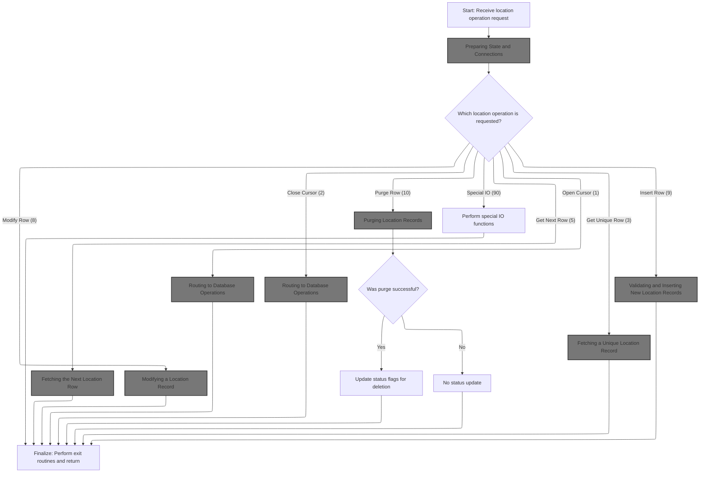

<SwmSnippet path="/base/src/NNNS0488.cbl" line="1209">

---

`0000-EXIT-DISPATCHER` is the entry point for all exit operations. It starts the flow by calling 100-INITIALIZATION to reset state, sync indexes, and set up the environment (including database connections if needed). After that, it uses an EVALUATE block to route to the correct operation (open/close cursor, get/put row, etc.) based on the exit code. Initialization is needed up front so that all downstream logic works with clean data and the right connections. The dispatcher always calls initialization first to avoid weird bugs from leftover state. After the main operation, it calls 120-EXIT-STUFF to wrap up, then returns control with GOBACK.

```cobol
125400 0000-EXIT-DISPATCHER.                                            00125400
125500     PERFORM 100-INITIALIZATION                                   00125500
125600     EVALUATE TRUE                                                00125600
125700       WHEN NOT SUCCESS                                           00125700
125800          CONTINUE                                                00125800
125900       WHEN EXIT-OPEN-CURSOR                                      00125900
126000          PERFORM 1000-EXIT-OPEN-CURSOR                           00126000
126100       WHEN EXIT-CLOSE-CURSOR                                     00126100
126200          PERFORM 1100-EXIT-CLOSE-CURSOR                          00126200
126300       WHEN EXIT-GET-UNIQUE-ROW                                   00126300
126400          PERFORM 1200-EXIT-GET-UNIQUE-ROW                        00126400
126500       WHEN EXIT-GET-NEXT-ROW                                     00126500
126600          PERFORM 1300-EXIT-GET-NEXT-ROW                          00126600
126700       WHEN EXIT-PUT-MODIFY-ROW                                   00126700
126800          PERFORM 1400-EXIT-PUT-MODIFY-ROW                        00126800
126900       WHEN EXIT-PUT-INSERT-ROW                                   00126900
127000          PERFORM 1500-EXIT-PUT-INSERT-ROW                        00127000
127100       WHEN EXIT-PUT-PURGE-ROW                                    00127100
127200          PERFORM 1600-EXIT-PUT-PURGE-ROW                         00127200
127300       WHEN EXIT-DO-SPECIAL-IO-FUNCS                              00127300
127400          PERFORM 10000-DO-SPECIAL-IO-FUNCS                       00127400
127500     END-EVALUATE                                                 00127500
127600     PERFORM 120-EXIT-STUFF                                       00127600
127700     GOBACK                                                       00127700
127800     .                                                            00127800
```

---

</SwmSnippet>

### Preparing State and Connections

<SwmSnippet path="/base/src/NNNS0488.cbl" line="1239">

---

`100-INITIALIZATION` resets status fields, syncs indexes, and sets up the environment. It checks repository-specific flags to decide what to do next. If we're not closing a cursor, it calls 110-MOVE-PDA-FIELDS-2-DCL to prep and validate location/store fields for later steps. If we're doing Oracle work (insert, modify, purge, or flagged for Oracle), it connects to the database. The flag checks make sure we only do what's needed for the current operation.

```cobol
128400 100-INITIALIZATION.                                              00128400
128500     INITIALIZE XXXN001A                                          00128500
128600                DAO-STATUS                                        00128600
128700                WS-LOC-STAT-SW                                    00128700
128800                WS-CURR-VALUES                                    00128800
128900     MOVE NNNN0000-INDEX-HANDLE TO DDDTLR01-INDEX-HANDLE          00128900
129000     MOVE 0 TO WS-CHECKPOINT-INC                                  00129000
129100     MOVE 0 TO SQLCODE                                            00129100
129200     MOVE 0 TO SQL-INIT-FLAG                                      00129200
129300     IF NOT EXIT-CLOSE-CURSOR                                     00129300
129400       PERFORM 110-MOVE-PDA-FIELDS-2-DCL                          00129400
129500     END-IF                                                       00129500
129600     IF (YYYN005A-ORACLE       OR EXIT-PUT-INSERT-ROW             00129600
129700         OR EXIT-PUT-PURGE-ROW OR EXIT-PUT-MODIFY-ROW)            00129700
129800       PERFORM 115-CONNECT-TO-ORACLE                              00129800
129900     END-IF                                                       00129900
130000     .                                                            00130000
```

---

</SwmSnippet>

#### Copying and Validating Location Fields

```mermaid
%%{init: {"flowchart": {"defaultRenderer": "elk"}} }%%
flowchart TD
    node1["Transfer all location and store fields from source to destination"] --> node2{"Are association fields missing or zero?"}
    click node1 openCode "base/src/NNNS0488.cbl:1262:1263"
    node2 -->|"Yes"| node3["Set association type to 'S' and indicators to -1/0"]
    click node2 openCode "base/src/NNNS0488.cbl:1265:1277"
    node2 -->|"No"| node4
    node3 --> node4
    node4 --> node5{"Are any date fields blank or zero?"}
    click node5 openCode "base/src/NNNS0488.cbl:1279:1300"
    node5 -->|"Yes"| node6["Set missing dates to '01/01/1600'"]
    click node6 openCode "base/src/NNNS0488.cbl:1281:1282"
    node5 -->|"No"| node7
    node6 --> node7
    node7 --> node8{"Are any time fields blank, default, or DB2 max?"}
    click node8 openCode "base/src/NNNS0488.cbl:1449:1525"
    node8 -->|"Yes"| node9["Set missing times to '00.00.00' or Oracle max"]
    click node9 openCode "base/src/NNNS0488.cbl:1451:1458"
    node8 -->|"No"| node10
    node9 --> node10
    node10 --> node11{"Are latitude/longitude not numeric?"}
    click node11 openCode "base/src/NNNS0488.cbl:1342:1350"
    node11 -->|"Yes"| node12["Set to zero"]
    click node12 openCode "base/src/NNNS0488.cbl:1343:1344"
    node11 -->|"No"| node13
    node12 --> node13
    node13 --> node14{"Are preference flags for product substitution/display pallets unset?"}
    click node14 openCode "base/src/NNNS0488.cbl:1420:1436"
    node14 -->|"Yes"| node15["Set preference flags to true"]
    click node15 openCode "base/src/NNNS0488.cbl:1422:1429"
    node14 -->|"No"| node16
    node15 --> node16
    node16 --> node17{"Are ECOMM start/end dates blank or zero?"}
    click node17 openCode "base/src/NNNS0488.cbl:1533:1546"
    node17 -->|"Yes"| node18["Set ECOMM dates to '01/01/1600' and indicators to 0"]
    click node18 openCode "base/src/NNNS0488.cbl:1535:1548"
    node17 -->|"No"| node19
    node18 --> node19
    node19 --> node20{"Is CICS environment set?"}
    click node20 openCode "base/src/NNNS0488.cbl:1372:1375"
    node20 -->|"Yes"| node21["Set report sequence number from statement sort code"]
    click node21 openCode "base/src/NNNS0488.cbl:1373:1374"
    node20 -->|"No"| node22
    node21 --> node22
    node22 --> node23["Normalize rollup reporting fields"]
    click node23 openCode "base/src/NNNS0488.cbl:1329:1329"
    node23 --> node24["Normalize time fields"]
    click node24 openCode "base/src/NNNS0488.cbl:1526:1526"
    node24 --> node25["Transfer remaining fields and finish"]
    click node25 openCode "base/src/NNNS0488.cbl:1302:1559"
classDef HeadingStyle fill:#777777,stroke:#333,stroke-width:2px;
```

<SwmSnippet path="/base/src/NNNS0488.cbl" line="1261">

---

`110-MOVE-PDA-FIELDS-2-DCL` copies and validates a ton of location/store fields, defaulting dates/times and checking numerics as needed. It sets indicator fields for special cases and applies business rules for store preferences. After the basic field moves, it calls 117-MOVE-ROLLUP-DATA to handle rollup fields, then 112-MOVE-TIME-FIELDS for time conversion. This keeps the main logic clean and pushes the complex stuff into subroutines.

```cobol
130600 110-MOVE-PDA-FIELDS-2-DCL.                                       00130600
130700     MOVE LOC-NBR OF P-DDDTLR01 TO LOC-NBR OF DCLXXXAIL-LOC       00130700
130800     MOVE LOC-TYP-CD OF P-DDDTLR01 TO LOC-TYP-CD OF DCLXXXAIL-LOC 00130800
130900                                                                  00130900
131000     IF ASSOC-STR-TYP-CD OF P-DDDTLR01 = SPACES                   00131000
131100        MOVE 'S' TO ASSOC-STR-TYP-CD OF P-DDDTLR01                00131100
131200     END-IF                                                       00131200
131300     MOVE ASSOC-STR-TYP-CD OF P-DDDTLR01                          00131300
131400       TO ASSOC-STR-TYP-CD OF DCLXXXAIL-LOC                       00131400
131500     MOVE 0 TO  WS-ASSOC-ST-TYPE-IND                              00131500
131600     MOVE ASSOC-STR-NBR OF P-DDDTLR01                             00131600
131700       TO ASSOC-STR-NBR OF DCLXXXAIL-LOC                          00131700
131800     IF ASSOC-STR-NBR OF P-DDDTLR01  =  ZERO                      00131800
131900        MOVE -1 TO WS-ASSOC-ST-NO-IND                             00131900
132000     ELSE                                                         00132000
132100        MOVE 0 TO  WS-ASSOC-ST-NO-IND                             00132100
132200     END-IF                                                       00132200
132300                                                                  00132300
132400     IF SLS-CLOSED-DT OF P-DDDTLR01 = SPACES                      00132400
132500     OR SLS-CLOSED-DT OF P-DDDTLR01 = K-ZERO-DT                   00132500
132600       MOVE K-DEF-DT TO SLS-CLOSED-DT OF P-DDDTLR01               00132600
132700     END-IF                                                       00132700
132800     MOVE SLS-CLOSED-DT OF P-DDDTLR01                             00132800
132900       TO SLS-CLOSED-DT OF DCLXXXAIL-LOC                          00132900
133000     IF STR-REMODL-DT OF P-DDDTLR01 = SPACES                      00133000
133100     OR STR-REMODL-DT OF P-DDDTLR01 = K-ZERO-DT                   00133100
133200       MOVE K-DEF-DT TO STR-REMODL-DT OF P-DDDTLR01               00133200
133300     END-IF                                                       00133300
133400     MOVE STR-REMODL-DT OF P-DDDTLR01                             00133400
133500       TO STR-REMODL-DT OF DCLXXXAIL-LOC                          00133500
133600                                                                  00133600
133700     MOVE RETL-LOC-STAT-CD OF P-DDDTLR01                          00133700
133800       TO RETL-LOC-STAT-CD OF DCLXXXAIL-LOC                       00133800
133900                                                                  00133900
134000     IF RETL-LOC-STAT-DT OF P-DDDTLR01 = SPACES                   00134000
134100     OR RETL-LOC-STAT-DT OF P-DDDTLR01 = K-ZERO-DT                00134100
134200       MOVE K-DEF-DT TO RETL-LOC-STAT-DT OF P-DDDTLR01            00134200
134300     END-IF                                                       00134300
134400     MOVE RETL-LOC-STAT-DT OF P-DDDTLR01                          00134400
134500       TO RETL-LOC-STAT-DT OF DCLXXXAIL-LOC                       00134500
134600                                                                  00134600
134700     MOVE COMPANY-ID OF P-DDDTLR01 TO COMPANY-ID OF DCLXXXAIL-LOC 00134700
134800     MOVE FINANCIAL-DIV-ID OF P-DDDTLR01                          00134800
134900       TO FINANCIAL-DIV-ID OF DCLXXXAIL-LOC                       00134900
135000     MOVE LIN-OF-BUS-ID OF P-DDDTLR01                             00135000
135100       TO LIN-OF-BUS-ID OF DCLXXXAIL-LOC                          00135100
135200     MOVE DIST-ID OF P-DDDTLR01 TO DIST-ID OF DCLXXXAIL-LOC       00135200
135300                                   MKT-RGN-ID OF P-DDDTLR01       00135300
135400     MOVE MKT-RGN-ID OF P-DDDTLR01 TO MKT-RGN-ID OF DCLXXXAIL-LOC 00135400
135500     MOVE GEO-ZN-CD OF P-DDDTLR01 TO GEO-ZN-CD OF DCLXXXAIL-LOC   00135500
135600     MOVE RETL-GEO-ZN-ID OF P-DDDTLR01                            00135600
135700       TO RETL-GEO-ZN-ID OF DCLXXXAIL-LOC                         00135700
135800     MOVE SCN-MAINT-SW OF P-DDDTLR01                              00135800
135900       TO SCN-MAINT-SW OF DCLXXXAIL-LOC                           00135900
136000     MOVE FRNT-END-CD OF P-DDDTLR01                               00136000
136100       TO FRNT-END-CD OF DCLXXXAIL-LOC                            00136100
136200     MOVE PRC-BUL-SW OF P-DDDTLR01 TO PRC-BUL-SW OF DCLXXXAIL-LOC 00136200
136300     MOVE UPC-ON-PRC-BUL-SW OF P-DDDTLR01                         00136300
136400       TO UPC-ON-PRC-BUL-SW OF DCLXXXAIL-LOC                      00136400
136500     MOVE CMPTR-TYP-CD OF P-DDDTLR01                              00136500
136600       TO CMPTR-TYP-CD OF DCLXXXAIL-LOC                           00136600
136700     MOVE RETL-VID-ZN-NBR OF P-DDDTLR01                           00136700
136800       TO RETL-VID-ZN-NBR OF DCLXXXAIL-LOC                        00136800
136900     MOVE RETL-UNLD-CD OF P-DDDTLR01                              00136900
137000       TO RETL-UNLD-CD OF DCLXXXAIL-LOC                           00137000
137100*    MOVE ROLUP-REPT-TBL-TXT OF P-DDDTLR01                        00137100
137200     MOVE SPACES                                                  00137200
137300       TO ROLUP-REPT-TBL-TXT OF DCLXXXAIL-LOC                     00137300
137400     PERFORM 117-MOVE-ROLLUP-DATA                                 00137400
137500     MOVE NEW-STR-SW OF P-DDDTLR01 TO NEW-STR-SW OF DCLXXXAIL-LOC 00137500
137600     MOVE SEL-CIR-SW OF P-DDDTLR01 TO SEL-CIR-SW OF DCLXXXAIL-LOC 00137600
137700     MOVE BKRM-SQ-FT OF P-DDDTLR01 TO BKRM-SQ-FT OF DCLXXXAIL-LOC 00137700
137800     MOVE FD-LINER-FT OF P-DDDTLR01                               00137800
137900       TO FD-LINER-FT OF DCLXXXAIL-LOC                            00137900
138000     MOVE NON-FD-LINER-FT OF P-DDDTLR01                           00138000
138100       TO NON-FD-LINER-FT OF DCLXXXAIL-LOC                        00138100
138200     MOVE SETOFF-ROOM-SW OF P-DDDTLR01                            00138200
138300       TO SETOFF-ROOM-SW OF DCLXXXAIL-LOC                         00138300
138400     MOVE CAT-CLS-TBL-TXT OF P-DDDTLR01                           00138400
138500       TO CAT-CLS-TBL-TXT OF DCLXXXAIL-LOC                        00138500
138600                                                                  00138600
138700     IF LAT-K OF P-DDDTLR01 IS NOT NUMERIC                        00138700
138800       MOVE 0 TO LAT-K OF P-DDDTLR01                              00138800
138900     END-IF                                                       00138900
139000     MOVE LAT-K OF P-DDDTLR01 TO LAT-K OF DCLXXXAIL-LOC           00139000
139100                                                                  00139100
139200     IF LON-K OF P-DDDTLR01 IS NOT NUMERIC                        00139200
139300       MOVE 0 TO LON-K OF P-DDDTLR01                              00139300
139400     END-IF                                                       00139400
139500     MOVE LON-K OF P-DDDTLR01 TO LON-K OF DCLXXXAIL-LOC           00139500
139600                                                                  00139600
139700     MOVE CK-COLL-REPT-SW OF P-DDDTLR01                           00139700
139800       TO CK-COLL-REPT-SW OF DCLXXXAIL-LOC                        00139800
139900     MOVE CK-COLL-CNTL-CD OF P-DDDTLR01                           00139900
140000       TO CK-COLL-CNTL-CD OF DCLXXXAIL-LOC                        00140000
140100     MOVE CK-COLL-ADD-DEL-SW OF P-DDDTLR01                        00140100
140200       TO CK-COLL-ADD-DEL-SW OF DCLXXXAIL-LOC                     00140200
140300     MOVE CK-ALT-STR-ID OF P-DDDTLR01                             00140300
140400       TO CK-ALT-STR-ID OF DCLXXXAIL-LOC                          00140400
140500     MOVE CK-COLL-FEE-AMT OF P-DDDTLR01                           00140500
140600       TO CK-COLL-FEE-AMT OF DCLXXXAIL-LOC                        00140600
140700     MOVE SALS-TAX-PCT OF P-DDDTLR01                              00140700
140800       TO SALS-TAX-PCT OF DCLXXXAIL-LOC                           00140800
140900     MOVE SOAP-SALE-VAR-PCT OF P-DDDTLR01                         00140900
141000       TO SOAP-SALE-VAR-PCT OF DCLXXXAIL-LOC                      00141000
141100     MOVE ON-SRS-CD OF P-DDDTLR01 TO ON-SRS-CD OF DCLXXXAIL-LOC   00141100
141200     MOVE SRS-DSD-ORD-SW OF P-DDDTLR01                            00141200
141300       TO SRS-DSD-ORD-SW OF DCLXXXAIL-LOC                         00141300
141400     MOVE RETL-LOC-TYP-CD OF P-DDDTLR01                           00141400
141500       TO RETL-LOC-TYP-CD OF DCLXXXAIL-LOC                        00141500
141600     MOVE DEA-NBR OF P-DDDTLR01 TO DEA-NBR OF DCLXXXAIL-LOC       00141600
141700     IF YYYN005A-CICS-ENV                                         00141700
141800       MOVE STR-OPSTMT-SRT-CD OF P-DDDTLR01                       00141800
141900         TO RPRT-SEQ-NBR      OF P-DDDTLR01                       00141900
142000     END-IF                                                       00142000
142100     MOVE RPRT-SEQ-NBR OF P-DDDTLR01                              00142100
142200       TO RPRT-SEQ-NBR OF DCLXXXAIL-LOC                           00142200
142300     MOVE STR-OPSTMT-SRT-CD OF P-DDDTLR01                         00142300
142400       TO STR-OPSTMT-SRT-CD OF DCLXXXAIL-LOC                      00142400
142500     MOVE STR-OPSTMT-TYP-CD OF P-DDDTLR01                         00142500
142600       TO STR-OPSTMT-TYP-CD OF DCLXXXAIL-LOC                      00142600
142700     MOVE STR-OPSTMT-HDR-CD OF P-DDDTLR01                         00142700
142800       TO STR-OPSTMT-HDR-CD OF DCLXXXAIL-LOC                      00142800
142900     MOVE DPS-NBR OF P-DDDTLR01 TO DPS-NBR OF DCLXXXAIL-LOC       00142900
143000     MOVE MEDICARE-ID OF P-DDDTLR01                               00143000
143100       TO MEDICARE-ID OF DCLXXXAIL-LOC                            00143100
143200     MOVE NABP-NBR OF P-DDDTLR01 TO NABP-NBR OF DCLXXXAIL-LOC     00143200
143300     MOVE NATL-PROV-ID OF P-DDDTLR01                              00143300
143400       TO NATL-PROV-ID OF DCLXXXAIL-LOC                           00143400
143500     MOVE CURR-AD-ZN-NBR OF P-DDDTLR01                            00143500
143600       TO CURR-AD-ZN-NBR OF DCLXXXAIL-LOC                         00143600
143700     MOVE PD-ZONE-NO OF P-DDDTLR01 TO PD-ZONE-NO OF DCLXXXAIL-LOC 00143700
143800     MOVE SOS-PROC-SW OF P-DDDTLR01                               00143800
143900       TO SOS-PROC-SW OF DCLXXXAIL-LOC                            00143900
144000     MOVE GRP-CD OF P-DDDTLR01 TO GRP-CD OF DCLXXXAIL-LOC         00144000
144100     MOVE PRIM-GRP-CD-1 OF P-DDDTLR01                             00144100
144200       TO PRIM-GRP-CD-1 OF DCLXXXAIL-LOC                          00144200
144300     MOVE PRIM-GRP-CD-2 OF P-DDDTLR01                             00144300
144400       TO PRIM-GRP-CD-2 OF DCLXXXAIL-LOC                          00144400
144500     MOVE SECY-GRP-CD-1 OF P-DDDTLR01                             00144500
144600       TO SECY-GRP-CD-1 OF DCLXXXAIL-LOC                          00144600
144700     MOVE SECY-GRP-CD-2 OF P-DDDTLR01                             00144700
144800       TO SECY-GRP-CD-2 OF DCLXXXAIL-LOC                          00144800
144900     MOVE PRIM-CLS-NBR-1 OF P-DDDTLR01                            00144900
145000       TO PRIM-CLS-NBR-1 OF DCLXXXAIL-LOC                         00145000
145100     MOVE PRIM-CLS-NBR-2 OF P-DDDTLR01                            00145100
145200       TO PRIM-CLS-NBR-2 OF DCLXXXAIL-LOC                         00145200
145300     MOVE SECY-CLS-NBR-1 OF P-DDDTLR01                            00145300
145400       TO SECY-CLS-NBR-1 OF DCLXXXAIL-LOC                         00145400
145500     MOVE SECY-CLS-NBR-2 OF P-DDDTLR01                            00145500
145600       TO SECY-CLS-NBR-2 OF DCLXXXAIL-LOC                         00145600
145700     MOVE VAL-STR-SW OF P-DDDTLR01 TO VAL-STR-SW OF DCLXXXAIL-LOC 00145700
145800     IF TBCO-PRMT-NBR OF P-DDDTLR01 NOT NUMERIC                   00145800
145900       MOVE ZEROES TO TBCO-PRMT-NBR OF P-DDDTLR01                 00145900
146000     END-IF                                                       00146000
146100                                                                  00146100
146200     MOVE TBCO-PRMT-NBR OF P-DDDTLR01                             00146200
146300       TO TBCO-PRMT-NBR OF DCLXXXAIL-LOC                          00146300
146400                                                                  00146400
146500     IF  NOT OK-TO-SUB-UNLIKE-PRODS   OF P-DDDTLR01               00146500
146600     AND NOT DONT-SUB-UNLIKE-PRODS    OF P-DDDTLR01               00146600
146700       SET NO-UNLIKE-SUB-STORE-PREF   OF P-DDDTLR01 TO TRUE       00146700
146800     END-IF                                                       00146800
146900     MOVE SUB-UNLIKE-PROD-CD OF P-DDDTLR01                        00146900
147000       TO SUB-UNLIKE-PROD-CD OF DCLXXXAIL-LOC                     00147000
147100                                                                  00147100
147200     IF  NOT OK-TO-SUB-DISP-PALS      OF P-DDDTLR01               00147200
147300     AND NOT DONT-SUB-DISP-PALS       OF P-DDDTLR01               00147300
147400       SET NO-DISP-PAL-SUB-STORE-PREF OF P-DDDTLR01 TO TRUE       00147400
147500     END-IF                                                       00147500
147600     MOVE SUB-DSPLY-PAL-CD   OF P-DDDTLR01                        00147600
147700       TO SUB-DSPLY-PAL-CD   OF DCLXXXAIL-LOC                     00147700
147800                                                                  00147800
147900     IF  NOT SEND-REAL-TIME-G3        OF P-DDDTLR01               00147900
148000       SET DONT-SEND-REAL-TIME-G3     OF P-DDDTLR01 TO TRUE       00148000
148100     END-IF                                                       00148100
148200     MOVE RLTM-SCN-MAINT-SW  OF P-DDDTLR01                        00148200
148300       TO RLTM-SCN-MAINT-SW  OF DCLXXXAIL-LOC                     00148300
148400     MOVE TOP-LEADER-NM  OF P-DDDTLR01                            00148400
148500       TO TOP-LEADER-NM  OF DCLXXXAIL-LOC                         00148500
148600     MOVE CUST-FRNDLY-NM OF P-DDDTLR01                            00148600
148700       TO CUST-FRNDLY-NM OF DCLXXXAIL-LOC                         00148700
148800     IF SLS-OPEN-DT       OF P-DDDTLR01 = SPACES                  00148800
148900     OR SLS-OPEN-DT       OF P-DDDTLR01 = K-ZERO-DT               00148900
149000        MOVE K-DEF-DT     TO SLS-OPEN-DT OF P-DDDTLR01            00149000
149100     END-IF                                                       00149100
149200     MOVE SLS-OPEN-DT    OF P-DDDTLR01                            00149200
149300       TO SLS-OPEN-DT    OF DCLXXXAIL-LOC                         00149300
149400     IF MON-OPEN-TM       OF P-DDDTLR01 = SPACES                  00149400
149500     OR MON-OPEN-TM       OF P-DDDTLR01 = K-DEF-TM                00149500
149600        MOVE K-DEF-TM     TO MON-OPEN-TM OF P-DDDTLR01            00149600
149700     END-IF                                                       00149700
149800     IF MON-CLOS-TM       OF P-DDDTLR01 = SPACES                  00149800
149900     OR MON-CLOS-TM       OF P-DDDTLR01 = K-DEF-TM                00149900
150000        MOVE K-DEF-TM     TO MON-CLOS-TM OF P-DDDTLR01            00150000
150100     END-IF                                                       00150100
150200     IF MON-CLOS-TM       OF P-DDDTLR01 = K-DB2-MAX-TM            00150200
150300        MOVE K-ORA-MAX-TM TO MON-CLOS-TM OF P-DDDTLR01            00150300
150400     END-IF                                                       00150400
150500     IF TUE-OPEN-TM       OF P-DDDTLR01 = SPACES                  00150500
150600     OR TUE-OPEN-TM       OF P-DDDTLR01 = K-DEF-TM                00150600
150700        MOVE K-DEF-TM     TO TUE-OPEN-TM OF P-DDDTLR01            00150700
150800     END-IF                                                       00150800
150900     IF TUE-CLOS-TM       OF P-DDDTLR01 = SPACES                  00150900
151000     OR TUE-CLOS-TM       OF P-DDDTLR01 = K-DEF-TM                00151000
151100        MOVE K-DEF-TM     TO TUE-CLOS-TM OF P-DDDTLR01            00151100
151200     END-IF                                                       00151200
151300     IF TUE-CLOS-TM       OF P-DDDTLR01 = K-DB2-MAX-TM            00151300
151400        MOVE K-ORA-MAX-TM TO TUE-CLOS-TM OF P-DDDTLR01            00151400
151500     END-IF                                                       00151500
151600     IF WED-OPEN-TM       OF P-DDDTLR01 = SPACES                  00151600
151700     OR WED-OPEN-TM       OF P-DDDTLR01 = K-DEF-TM                00151700
151800        MOVE K-DEF-TM     TO WED-OPEN-TM OF P-DDDTLR01            00151800
151900     END-IF                                                       00151900
152000     IF WED-CLOS-TM       OF P-DDDTLR01 = SPACES                  00152000
152100     OR WED-CLOS-TM       OF P-DDDTLR01 = K-DEF-TM                00152100
152200        MOVE K-DEF-TM     TO WED-CLOS-TM OF P-DDDTLR01            00152200
152300     END-IF                                                       00152300
152400     IF WED-CLOS-TM       OF P-DDDTLR01 = K-DB2-MAX-TM            00152400
152500        MOVE K-ORA-MAX-TM TO WED-CLOS-TM OF P-DDDTLR01            00152500
152600     END-IF                                                       00152600
152700     IF THUR-OPEN-TM      OF P-DDDTLR01 = SPACES                  00152700
152800     OR THUR-OPEN-TM      OF P-DDDTLR01 = K-DEF-TM                00152800
152900        MOVE K-DEF-TM     TO THUR-OPEN-TM  OF P-DDDTLR01          00152900
153000     END-IF                                                       00153000
153100     IF THUR-CLOS-TM      OF P-DDDTLR01 = SPACES                  00153100
153200     OR THUR-CLOS-TM      OF P-DDDTLR01 = K-DEF-TM                00153200
153300        MOVE K-DEF-TM     TO THUR-CLOS-TM OF P-DDDTLR01           00153300
153400     END-IF                                                       00153400
153500     IF THUR-CLOS-TM      OF P-DDDTLR01 = K-DB2-MAX-TM            00153500
153600        MOVE K-ORA-MAX-TM TO THUR-CLOS-TM OF P-DDDTLR01           00153600
153700     END-IF                                                       00153700
153800     IF FRI-OPEN-TM       OF P-DDDTLR01 = SPACES                  00153800
153900     OR FRI-OPEN-TM       OF P-DDDTLR01 = K-DEF-TM                00153900
154000        MOVE K-DEF-TM     TO FRI-OPEN-TM OF P-DDDTLR01            00154000
154100     END-IF                                                       00154100
154200     IF FRI-CLOS-TM       OF P-DDDTLR01 = SPACES                  00154200
154300     OR FRI-CLOS-TM       OF P-DDDTLR01 = K-DEF-TM                00154300
154400        MOVE K-DEF-TM     TO FRI-CLOS-TM OF P-DDDTLR01            00154400
154500     END-IF                                                       00154500
154600     IF FRI-CLOS-TM       OF P-DDDTLR01 = K-DB2-MAX-TM            00154600
154700        MOVE K-ORA-MAX-TM TO FRI-CLOS-TM OF P-DDDTLR01            00154700
154800     END-IF                                                       00154800
154900     IF SAT-OPEN-TM       OF P-DDDTLR01 = SPACES                  00154900
155000     OR SAT-OPEN-TM       OF P-DDDTLR01 = K-DEF-TM                00155000
155100        MOVE K-DEF-TM     TO SAT-OPEN-TM OF P-DDDTLR01            00155100
155200     END-IF                                                       00155200
155300     IF SAT-CLOS-TM       OF P-DDDTLR01 = SPACES                  00155300
155400     OR SAT-CLOS-TM       OF P-DDDTLR01 = K-DEF-TM                00155400
155500        MOVE K-DEF-TM     TO SAT-CLOS-TM OF P-DDDTLR01            00155500
155600     END-IF                                                       00155600
155700     IF SAT-CLOS-TM       OF P-DDDTLR01 = K-DB2-MAX-TM            00155700
155800        MOVE K-ORA-MAX-TM TO SAT-CLOS-TM OF P-DDDTLR01            00155800
155900     END-IF                                                       00155900
156000     IF SUN-OPEN-TM       OF P-DDDTLR01 = SPACES                  00156000
156100     OR SUN-OPEN-TM       OF P-DDDTLR01 = K-DEF-TM                00156100
156200        MOVE K-DEF-TM     TO SUN-OPEN-TM OF P-DDDTLR01            00156200
156300     END-IF                                                       00156300
156400     IF SUN-CLOS-TM       OF P-DDDTLR01 = SPACES                  00156400
156500     OR SUN-CLOS-TM       OF P-DDDTLR01 = K-DEF-TM                00156500
156600        MOVE K-DEF-TM     TO SUN-CLOS-TM OF P-DDDTLR01            00156600
156700     END-IF                                                       00156700
156800     IF SUN-CLOS-TM       OF P-DDDTLR01 = K-DB2-MAX-TM            00156800
156900        MOVE K-ORA-MAX-TM TO SUN-CLOS-TM OF P-DDDTLR01            00156900
157000     END-IF                                                       00157000
157100     PERFORM 112-MOVE-TIME-FIELDS                                 00157100
157200     MOVE RETL-LOC-FRMAT-CD OF P-DDDTLR01                         00157200
157300       TO RETL-LOC-FRMAT-CD OF DCLXXXAIL-LOC                      00157300
157400     MOVE RETL-LOC-SEGM-CD OF P-DDDTLR01                          00157400
157500       TO RETL-LOC-SEGM-CD OF DCLXXXAIL-LOC                       00157500
157600     MOVE ECOMM-MKT-AREA-CD OF P-DDDTLR01                         00157600
157700       TO ECOMM-MKT-AREA-CD OF DCLXXXAIL-LOC                      00157700
157800     IF ECOMM-STRT-DT OF P-DDDTLR01 = SPACES                      00157800
157900     OR ECOMM-STRT-DT OF P-DDDTLR01 = K-ZERO-DT                   00157900
158000       MOVE K-DEF-DT TO ECOMM-STRT-DT OF P-DDDTLR01               00158000
158100     END-IF                                                       00158100
158200     MOVE ECOMM-STRT-DT OF P-DDDTLR01                             00158200
158300       TO ECOMM-STRT-DT OF DCLXXXAIL-LOC                          00158300
158400     MOVE 0 TO ECOMM-STRT-DT-IND OF P-DDDTLR01                    00158400
158500     MOVE 0 TO ECOMM-STRT-DT-IND OF DCLXXXAIL-LOC-IND             00158500
158600     IF ECOMM-END-DT OF P-DDDTLR01 = SPACES                       00158600
158700     OR ECOMM-END-DT OF P-DDDTLR01 = K-ZERO-DT                    00158700
158800       MOVE K-DEF-DT TO ECOMM-END-DT OF P-DDDTLR01                00158800
158900     END-IF                                                       00158900
159000     MOVE ECOMM-END-DT OF P-DDDTLR01                              00159000
159100       TO ECOMM-END-DT OF DCLXXXAIL-LOC                           00159100
159200     MOVE 0 TO ECOMM-END-DT-IND OF P-DDDTLR01                     00159200
159300     MOVE 0 TO ECOMM-END-DT-IND OF DCLXXXAIL-LOC-IND              00159300
159400     MOVE ONLIN-SSON-SW OF P-DDDTLR01                             00159400
159500                        TO ONLIN-SSON-SW  OF DCLXXXAIL-LOC        00159500
159510     MOVE 0 TO  RPLACD-BY-STR-NBR-IND                             00159510
159600     MOVE RPLACD-BY-STR-NBR OF P-DDDTLR01                         00159600
159700                     TO RPLACD-BY-STR-NBR OF DCLXXXAIL-LOC        00159700
159710     IF RPLACD-BY-STR-NBR  OF P-DDDTLR01  =  ZERO                 00159710
159720        MOVE -1 TO RPLACD-BY-STR-NBR-IND  OF DCLXXXAIL-LOC-IND    00159720
159730     ELSE                                                         00159730
159740        MOVE 0 TO  RPLACD-BY-STR-NBR-IND OF DCLXXXAIL-LOC-IND     00159740
159750     END-IF                                                       00159750
159760     .                                                            00159760
```

---

</SwmSnippet>

<SwmSnippet path="/base/src/NNNS0488.cbl" line="1687">

---

`117-MOVE-ROLLUP-DATA` copies the rollup text field, then loops through 10 numeric slots, moving each to the output if it's numeric, or zero if not. This keeps downstream logic from choking on bad data.

```cobol
172400 117-MOVE-ROLLUP-DATA.                                            00172400
172500     MOVE ROLUP-REPT-TBL-TXT OF P-DDDTLR01                        00172500
172600       TO WS-REPT-TBL-TXT                                         00172600
172700     IF WS-REPT-TBL-NUMERIC(1) IS NUMERIC                         00172700
172800        MOVE WS-REPT-TBL-NUMERIC(1)                               00172800
172900          TO ROLUP-REPT-TBL-01-NBR  OF DCLXXXAIL-LOC              00172900
173000     ELSE                                                         00173000
173100        MOVE ZERO TO ROLUP-REPT-TBL-01-NBR OF DCLXXXAIL-LOC       00173100
173200     END-IF                                                       00173200
173300     IF WS-REPT-TBL-NUMERIC(2) IS NUMERIC                         00173300
173400        MOVE WS-REPT-TBL-NUMERIC(2)                               00173400
173500          TO ROLUP-REPT-TBL-02-NBR  OF DCLXXXAIL-LOC              00173500
173600     ELSE                                                         00173600
173700        MOVE ZERO TO ROLUP-REPT-TBL-02-NBR OF DCLXXXAIL-LOC       00173700
173800     END-IF                                                       00173800
173900     IF WS-REPT-TBL-NUMERIC(3) IS NUMERIC                         00173900
174000        MOVE WS-REPT-TBL-NUMERIC(3)                               00174000
174100          TO ROLUP-REPT-TBL-03-NBR  OF DCLXXXAIL-LOC              00174100
174200     ELSE                                                         00174200
174300        MOVE ZERO TO ROLUP-REPT-TBL-03-NBR OF DCLXXXAIL-LOC       00174300
174400     END-IF                                                       00174400
174500     IF WS-REPT-TBL-NUMERIC(4) IS NUMERIC                         00174500
174600        MOVE WS-REPT-TBL-NUMERIC(4)                               00174600
174700          TO ROLUP-REPT-TBL-04-NBR  OF DCLXXXAIL-LOC              00174700
174800     ELSE                                                         00174800
174900        MOVE ZERO TO ROLUP-REPT-TBL-04-NBR OF DCLXXXAIL-LOC       00174900
175000     END-IF                                                       00175000
175100     IF WS-REPT-TBL-NUMERIC(5) IS NUMERIC                         00175100
175200        MOVE WS-REPT-TBL-NUMERIC(5)                               00175200
175300          TO ROLUP-REPT-TBL-05-NBR  OF DCLXXXAIL-LOC              00175300
175400     ELSE                                                         00175400
175500        MOVE ZERO TO ROLUP-REPT-TBL-05-NBR OF DCLXXXAIL-LOC       00175500
175600     END-IF                                                       00175600
175700     IF WS-REPT-TBL-NUMERIC(6) IS NUMERIC                         00175700
175800        MOVE WS-REPT-TBL-NUMERIC(6)                               00175800
175900          TO ROLUP-REPT-TBL-06-NBR  OF DCLXXXAIL-LOC              00175900
176000     ELSE                                                         00176000
176100        MOVE ZERO TO ROLUP-REPT-TBL-06-NBR OF DCLXXXAIL-LOC       00176100
176200     END-IF                                                       00176200
176300     IF WS-REPT-TBL-NUMERIC(7) IS NUMERIC                         00176300
176400        MOVE WS-REPT-TBL-NUMERIC(7)                               00176400
176500          TO ROLUP-REPT-TBL-07-NBR  OF DCLXXXAIL-LOC              00176500
176600     ELSE                                                         00176600
176700        MOVE ZERO TO ROLUP-REPT-TBL-07-NBR OF DCLXXXAIL-LOC       00176700
176800     END-IF                                                       00176800
176900     IF WS-REPT-TBL-NUMERIC(8) IS NUMERIC                         00176900
177000        MOVE WS-REPT-TBL-NUMERIC(8)                               00177000
177100          TO ROLUP-REPT-TBL-08-NBR  OF DCLXXXAIL-LOC              00177100
177200     ELSE                                                         00177200
177300        MOVE ZERO TO ROLUP-REPT-TBL-08-NBR OF DCLXXXAIL-LOC       00177300
177400     END-IF                                                       00177400
177500     IF WS-REPT-TBL-NUMERIC(9) IS NUMERIC                         00177500
177600        MOVE WS-REPT-TBL-NUMERIC(9)                               00177600
177700          TO ROLUP-REPT-TBL-09-NBR  OF DCLXXXAIL-LOC              00177700
177800     ELSE                                                         00177800
177900        MOVE ZERO TO ROLUP-REPT-TBL-09-NBR OF DCLXXXAIL-LOC       00177900
178000     END-IF                                                       00178000
178100     IF WS-REPT-TBL-NUMERIC(10) IS NUMERIC                        00178100
178200        MOVE WS-REPT-TBL-NUMERIC(10)                              00178200
178300          TO ROLUP-REPT-TBL-10-NBR  OF DCLXXXAIL-LOC              00178300
178400     ELSE                                                         00178400
178500        MOVE ZERO TO ROLUP-REPT-TBL-10-NBR OF DCLXXXAIL-LOC       00178500
178600     END-IF                                                       00178600
178700     .                                                            00178700
```

---

</SwmSnippet>

<SwmSnippet path="/base/src/NNNS0488.cbl" line="1565">

---

`112-MOVE-TIME-FIELDS` checks if we're on Oracle or doing insert/modify. If so, it packs all the open/close times into an array, sets up a conversion flag, and calls MMMS0291 to convert them to timestamps. If not, it just copies the times over as-is. The external program handles the actual conversion logic.

```cobol
160200 112-MOVE-TIME-FIELDS.                                            00160200
160300     IF (YYYN005A-ORACLE OR EXIT-PUT-INSERT-ROW                   00160300
160400         OR EXIT-PUT-MODIFY-ROW)                                  00160400
160500       INITIALIZE MMMC0291-INPUT-TM                               00160500
160600                  MMMC0291-INPUT-TS                               00160600
160700       MOVE MON-OPEN-TM OF P-DDDTLR01                             00160700
160800         TO WS-TIME-INOUT-CONV(1)                                 00160800
160900       MOVE MON-CLOS-TM OF P-DDDTLR01                             00160900
161000         TO WS-TIME-INOUT-CONV(2)                                 00161000
161100       MOVE TUE-OPEN-TM OF P-DDDTLR01                             00161100
161200         TO WS-TIME-INOUT-CONV(3)                                 00161200
161300       MOVE TUE-CLOS-TM OF P-DDDTLR01                             00161300
161400         TO WS-TIME-INOUT-CONV(4)                                 00161400
161500       MOVE WED-OPEN-TM OF P-DDDTLR01                             00161500
161600         TO WS-TIME-INOUT-CONV(5)                                 00161600
161700       MOVE WED-CLOS-TM OF P-DDDTLR01                             00161700
161800         TO WS-TIME-INOUT-CONV(6)                                 00161800
161900       MOVE THUR-OPEN-TM OF P-DDDTLR01                            00161900
162000         TO WS-TIME-INOUT-CONV(7)                                 00162000
162100       MOVE THUR-CLOS-TM OF P-DDDTLR01                            00162100
162200         TO WS-TIME-INOUT-CONV(8)                                 00162200
162300       MOVE FRI-OPEN-TM OF P-DDDTLR01                             00162300
162400         TO WS-TIME-INOUT-CONV(9)                                 00162400
162500       MOVE FRI-CLOS-TM OF P-DDDTLR01                             00162500
162600         TO WS-TIME-INOUT-CONV(10)                                00162600
162700       MOVE SAT-OPEN-TM OF P-DDDTLR01                             00162700
162800         TO WS-TIME-INOUT-CONV(11)                                00162800
162900       MOVE SAT-CLOS-TM OF P-DDDTLR01                             00162900
163000         TO WS-TIME-INOUT-CONV(12)                                00163000
163100       MOVE SUN-OPEN-TM OF P-DDDTLR01                             00163100
163200         TO WS-TIME-INOUT-CONV(13)                                00163200
163300       MOVE SUN-CLOS-TM OF P-DDDTLR01                             00163300
163400         TO WS-TIME-INOUT-CONV(14)                                00163400
163500                                                                  00163500
163600       SET  MMMC0291-CVT-TM-TO-TS  TO TRUE                        00163600
163700       CALL WS-MMMS0291-PGM USING                                 00163700
163800                          XXXN001A                                00163800
163900                          MMMC0291                                00163900
164000                                                                  00164000
164100       IF NOT SUCCESS                                             00164100
164200         STRING 'NNNS0488 - INVALID TIME.PLS VERIFY Sqlcode ='    00164200
164300             WS-SQLCODE                                           00164300
164400             DELIMITED BY SIZE INTO IS-RTRN-MSG-TXT               00164400
164500       ELSE                                                       00164500
164600         MOVE WS-TIMSTAMP-INOUT-CONV(1)                           00164600
164700           TO WS-MON-OPEN-TS                                      00164700
164800         MOVE WS-TIMSTAMP-INOUT-CONV(2)                           00164800
164900           TO WS-MON-CLOS-TS                                      00164900
165000         MOVE WS-TIMSTAMP-INOUT-CONV(3)                           00165000
165100           TO WS-TUE-OPEN-TS                                      00165100
165200         MOVE WS-TIMSTAMP-INOUT-CONV(4)                           00165200
165300           TO WS-TUE-CLOS-TS                                      00165300
165400         MOVE WS-TIMSTAMP-INOUT-CONV(5)                           00165400
165500           TO WS-WED-OPEN-TS                                      00165500
165600         MOVE WS-TIMSTAMP-INOUT-CONV(6)                           00165600
165700           TO WS-WED-CLOS-TS                                      00165700
165800         MOVE WS-TIMSTAMP-INOUT-CONV(7)                           00165800
165900           TO WS-THUR-OPEN-TS                                     00165900
166000         MOVE WS-TIMSTAMP-INOUT-CONV(8)                           00166000
166100           TO WS-THUR-CLOS-TS                                     00166100
166200         MOVE WS-TIMSTAMP-INOUT-CONV(9)                           00166200
166300           TO WS-FRI-OPEN-TS                                      00166300
166400         MOVE WS-TIMSTAMP-INOUT-CONV(10)                          00166400
166500           TO WS-FRI-CLOS-TS                                      00166500
166600         MOVE WS-TIMSTAMP-INOUT-CONV(11)                          00166600
166700           TO WS-SAT-OPEN-TS                                      00166700
166800         MOVE WS-TIMSTAMP-INOUT-CONV(12)                          00166800
166900           TO WS-SAT-CLOS-TS                                      00166900
167000         MOVE WS-TIMSTAMP-INOUT-CONV(13)                          00167000
167100           TO WS-SUN-OPEN-TS                                      00167100
167200         MOVE WS-TIMSTAMP-INOUT-CONV(14)                          00167200
167300           TO WS-SUN-CLOS-TS                                      00167300
167400       END-IF                                                     00167400
167500     ELSE                                                         00167500
167600       MOVE MON-OPEN-TM OF P-DDDTLR01                             00167600
167700         TO MON-OPEN-TM OF DCLXXXAIL-LOC                          00167700
167800       MOVE MON-CLOS-TM OF P-DDDTLR01                             00167800
167900         TO MON-CLOS-TM OF DCLXXXAIL-LOC                          00167900
168000       MOVE TUE-OPEN-TM OF P-DDDTLR01                             00168000
168100         TO TUE-OPEN-TM OF DCLXXXAIL-LOC                          00168100
168200       MOVE TUE-CLOS-TM OF P-DDDTLR01                             00168200
168300         TO TUE-CLOS-TM OF DCLXXXAIL-LOC                          00168300
168400       MOVE WED-OPEN-TM OF P-DDDTLR01                             00168400
168500         TO WED-OPEN-TM OF DCLXXXAIL-LOC                          00168500
168600       MOVE WED-CLOS-TM OF P-DDDTLR01                             00168600
168700         TO WED-CLOS-TM OF DCLXXXAIL-LOC                          00168700
168800       MOVE THUR-OPEN-TM OF P-DDDTLR01                            00168800
168900         TO THUR-OPEN-TM OF DCLXXXAIL-LOC                         00168900
169000       MOVE THUR-CLOS-TM OF P-DDDTLR01                            00169000
169100         TO THUR-CLOS-TM OF DCLXXXAIL-LOC                         00169100
169200       MOVE FRI-OPEN-TM OF P-DDDTLR01                             00169200
169300         TO FRI-OPEN-TM OF DCLXXXAIL-LOC                          00169300
169400       MOVE FRI-CLOS-TM OF P-DDDTLR01                             00169400
169500         TO FRI-CLOS-TM OF DCLXXXAIL-LOC                          00169500
169600       MOVE SAT-OPEN-TM OF P-DDDTLR01                             00169600
169700         TO SAT-OPEN-TM OF DCLXXXAIL-LOC                          00169700
169800       MOVE SAT-CLOS-TM OF P-DDDTLR01                             00169800
169900         TO SAT-CLOS-TM OF DCLXXXAIL-LOC                          00169900
170000       MOVE SUN-OPEN-TM OF P-DDDTLR01                             00170000
170100         TO SUN-OPEN-TM OF DCLXXXAIL-LOC                          00170100
170200       MOVE SUN-CLOS-TM OF P-DDDTLR01                             00170200
170300         TO SUN-CLOS-TM OF DCLXXXAIL-LOC                          00170300
170400     END-IF                                                       00170400
170500     .                                                            00170500
```

---

</SwmSnippet>

#### Connecting to Oracle

<SwmSnippet path="/base/src/NNNS0488.cbl" line="1674">

---

`115-CONNECT-TO-ORACLE` calls Z-ORA-CONNECT (which is XXXS0210) to open a database connection. If it fails, it logs the SQL error code in a message field for later use. The actual connection logic is handled in the external program.

```cobol
171100 115-CONNECT-TO-ORACLE.                                           00171100
171200     CALL Z-ORA-CONNECT USING XXXN001A                            00171200
171300                              SQLCA                               00171300
171400     IF NOT SUCCESS                                               00171400
171500       MOVE SQLCODE TO WS-SQLCODE                                 00171500
171600       MOVE SPACES  TO IS-RTRN-MSG-TXT                            00171600
171700       STRING 'NNNS0488 - Error connecting to Oracle. Sqlcode ='  00171700
171800               WS-SQLCODE                                         00171800
171900               DELIMITED BY SIZE INTO IS-RTRN-MSG-TXT             00171900
172000     END-IF                                                       00172000
172100     .                                                            00172100
```

---

</SwmSnippet>

### Routing to Database Operations

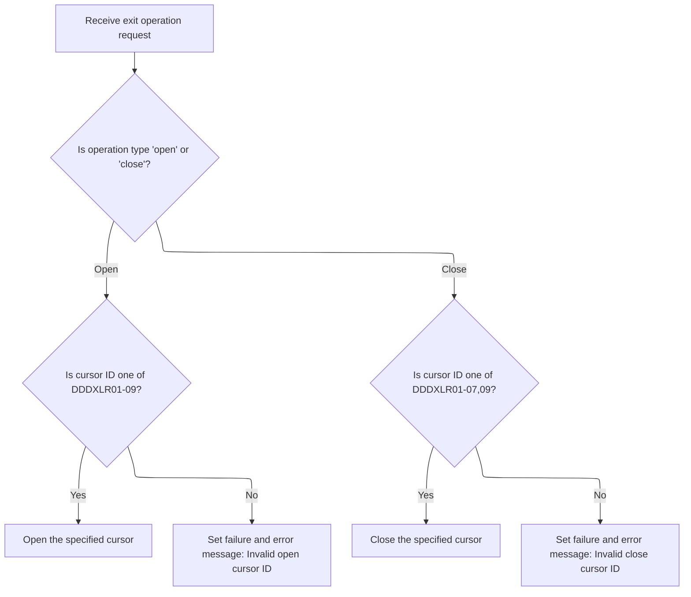

<SwmSnippet path="/base/src/NNNS0488.cbl" line="2206">

---

`1000-EXIT-OPEN-CURSOR` opens a database cursor based on the input ID. It uses EVALUATE to pick the right one (DDDXLR01 to DDDXLR09). If the ID doesn't match, it sets failure and logs an error message.

```cobol
224300 1000-EXIT-OPEN-CURSOR.                                           00224300
224400     EVALUATE TRUE                                                00224400
224500       WHEN DDDXLR01                                              00224500
224600         EXEC SQL                                                 00224600
224700           OPEN DDDXLR01                                          00224700
224800         END-EXEC                                                 00224800
224900       WHEN DDDXLR02                                              00224900
225000         EXEC SQL                                                 00225000
225100           OPEN DDDXLR02                                          00225100
225200         END-EXEC                                                 00225200
225300       WHEN DDDXLR03                                              00225300
225400         EXEC SQL                                                 00225400
225500           OPEN DDDXLR03                                          00225500
225600         END-EXEC                                                 00225600
225700       WHEN DDDXLR04                                              00225700
225800         EXEC SQL                                                 00225800
225900           OPEN DDDXLR04                                          00225900
226000         END-EXEC                                                 00226000
226100       WHEN DDDXLR05                                              00226100
226200         EXEC SQL                                                 00226200
226300           OPEN DDDXLR05                                          00226300
226400         END-EXEC                                                 00226400
226500       WHEN DDDXLR06                                              00226500
226600         EXEC SQL                                                 00226600
226700           OPEN DDDXLR06                                          00226700
226800         END-EXEC                                                 00226800
226900       WHEN DDDXLR07                                              00226900
227000         EXEC SQL                                                 00227000
227100           OPEN DDDXLR07                                          00227100
227200         END-EXEC                                                 00227200
227300       WHEN DDDXLR08                                              00227300
227400         EXEC SQL                                                 00227400
227500           OPEN DDDXLR08                                          00227500
227600         END-EXEC                                                 00227600
227700       WHEN DDDXLR09                                              00227700
227800         EXEC SQL                                                 00227800
227900           OPEN DDDXLR09                                          00227900
228000         END-EXEC                                                 00228000
228100       WHEN OTHER                                                 00228100
228200         SET FAILURE TO TRUE                                      00228200
228300         MOVE 'NNNS0488 - Invalid open cursor ID.'                00228300
228400           TO IS-RTRN-MSG-TXT OF XXXN001A                         00228400
228500     END-EVALUATE                                                 00228500
228600     .                                                            00228600
```

---

</SwmSnippet>

<SwmSnippet path="/base/src/NNNS0488.cbl" line="2252">

---

`1100-EXIT-CLOSE-CURSOR` closes a database cursor based on the input ID. It uses EVALUATE to pick the right one (DDDXLR01 to DDDXLR09). If the ID doesn't match, it sets failure and logs an error message.

```cobol
228900 1100-EXIT-CLOSE-CURSOR.                                          00228900
229000     EVALUATE TRUE                                                00229000
229100       WHEN DDDXLR01                                              00229100
229200         EXEC SQL                                                 00229200
229300           CLOSE DDDXLR01                                         00229300
229400         END-EXEC                                                 00229400
229500       WHEN DDDXLR02                                              00229500
229600         EXEC SQL                                                 00229600
229700           CLOSE DDDXLR02                                         00229700
229800         END-EXEC                                                 00229800
229900       WHEN DDDXLR03                                              00229900
230000         EXEC SQL                                                 00230000
230100           CLOSE DDDXLR03                                         00230100
230200         END-EXEC                                                 00230200
230300       WHEN DDDXLR04                                              00230300
230400         EXEC SQL                                                 00230400
230500           CLOSE DDDXLR04                                         00230500
230600         END-EXEC                                                 00230600
230700       WHEN DDDXLR05                                              00230700
230800         EXEC SQL                                                 00230800
230900           CLOSE DDDXLR05                                         00230900
231000         END-EXEC                                                 00231000
231100       WHEN DDDXLR06                                              00231100
231200         EXEC SQL                                                 00231200
231300           CLOSE DDDXLR06                                         00231300
231400         END-EXEC                                                 00231400
231500       WHEN DDDXLR07                                              00231500
231600         EXEC SQL                                                 00231600
231700           CLOSE DDDXLR07                                         00231700
231800         END-EXEC                                                 00231800
231900       WHEN DDDXLR09                                              00231900
232000         EXEC SQL                                                 00232000
232100           CLOSE DDDXLR09                                         00232100
232200         END-EXEC                                                 00232200
232300       WHEN OTHER                                                 00232300
232400         SET FAILURE TO TRUE                                      00232400
232500         MOVE 'NNNS0488 - Invalid close cursor ID.'               00232500
232600           TO IS-RTRN-MSG-TXT OF XXXN001A                         00232600
232700     END-EVALUATE                                                 00232700
232800     .                                                            00232800
```

---

</SwmSnippet>

### Fetching a Unique Location Record

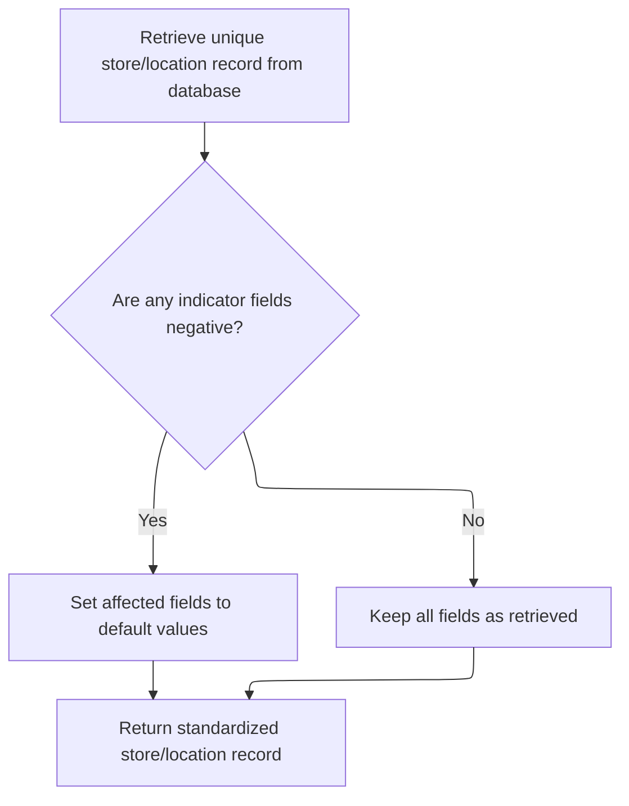

<SwmSnippet path="/base/src/NNNS0488.cbl" line="2294">

---

`1200-EXIT-GET-UNIQUE-ROW` fetches a full location record from the database into the output structure. Right after, it calls 1700-CHECK-NULL-COLUMNS to fill in any missing or null fields with default values, so the rest of the flow doesn't have to deal with incomplete data.

```cobol
233100 1200-EXIT-GET-UNIQUE-ROW.                                        00233100
233200       EXEC SQL                                                   00233200
233300           SELECT LOC_NBR,                                        00233300
233400                  LOC_TYP_CD,                                     00233400
233500                  ASSOC_STR_TYP_CD,                               00233500
233600                  ASSOC_STR_NBR,                                  00233600
233700                  STR_REMODL_DT,                                  00233700
233800                  RETL_LOC_STAT_CD,                               00233800
233900                  RETL_LOC_STAT_DT,                               00233900
234000                  COMPANY_ID,                                     00234000
234100                  FINANCIAL_DIV_ID,                               00234100
234200                  LIN_OF_BUS_ID,                                  00234200
234300                  DIST_ID,                                        00234300
234400                  MKT_RGN_ID,                                     00234400
234500                  GEO_ZN_CD,                                      00234500
234600                  RETL_GEO_ZN_ID,                                 00234600
234700                  SCN_MAINT_SW,                                   00234700
234800                  FRNT_END_CD,                                    00234800
234900                  PRC_BUL_SW,                                     00234900
235000                  UPC_ON_PRC_BUL_SW,                              00235000
235100                  CMPTR_TYP_CD,                                   00235100
235200                  RETL_VID_ZN_NBR,                                00235200
235300                  RETL_UNLD_CD,                                   00235300
235400                  ROLUP_REPT_TBL_TXT,                             00235400
235500                  NEW_STR_SW,                                     00235500
235600                  SEL_CIR_SW,                                     00235600
235700                  BKRM_SQ_FT,                                     00235700
235800                  FD_LINER_FT,                                    00235800
235900                  NON_FD_LINER_FT,                                00235900
236000                  SETOFF_ROOM_SW,                                 00236000
236100                  CAT_CLS_TBL_TXT,                                00236100
236200                  LAT_K,                                          00236200
236300                  LON_K,                                          00236300
236400                  CK_COLL_REPT_SW,                                00236400
236500                  CK_COLL_CNTL_CD,                                00236500
236600                  CK_COLL_ADD_DEL_SW,                             00236600
236700                  CK_ALT_STR_ID,                                  00236700
236800                  CK_COLL_FEE_AMT,                                00236800
236900                  SALS_TAX_PCT,                                   00236900
237000                  SOAP_SALE_VAR_PCT,                              00237000
237100                  ON_SRS_CD,                                      00237100
237200                  SRS_DSD_ORD_SW,                                 00237200
237300                  RETL_LOC_TYP_CD,                                00237300
237400                  DEA_NBR,                                        00237400
237500                  STR_OPSTMT_SRT_CD,                              00237500
237600                  STR_OPSTMT_TYP_CD,                              00237600
237700                  STR_OPSTMT_HDR_CD,                              00237700
237800                  DPS_NBR,                                        00237800
237900                  MEDICARE_ID,                                    00237900
238000                  NABP_NBR,                                       00238000
238100                  NATL_PROV_ID,                                   00238100
238200                  CURR_AD_ZN_NBR,                                 00238200
238300                  PD_ZONE_NO,                                     00238300
238400                  SOS_PROC_SW,                                    00238400
238500                  RPRT_SEQ_NBR,                                   00238500
238600                  GRP_CD,                                         00238600
238700                  PRIM_GRP_CD_1,                                  00238700
238800                  PRIM_GRP_CD_2,                                  00238800
238900                  SECY_GRP_CD_1,                                  00238900
239000                  SECY_GRP_CD_2,                                  00239000
239100                  PRIM_CLS_NBR_1,                                 00239100
239200                  PRIM_CLS_NBR_2,                                 00239200
239300                  SECY_CLS_NBR_1,                                 00239300
239400                  SECY_CLS_NBR_2,                                 00239400
239500                  VAL_STR_SW,                                     00239500
239600                  SLS_CLOSED_DT,                                  00239600
239700                  TBCO_PRMT_NBR,                                  00239700
239800                  SUB_UNLIKE_PROD_CD,                             00239800
239900                  SUB_DSPLY_PAL_CD,                               00239900
240000                  RLTM_SCN_MAINT_SW,                              00240000
240100                  TOP_LEADER_NM,                                  00240100
240200                  CUST_FRNDLY_NM,                                 00240200
240300                  SLS_OPEN_DT,                                    00240300
240400                  MON_OPEN_TM,                                    00240400
240500                  MON_CLOS_TM,                                    00240500
240600                  TUE_OPEN_TM,                                    00240600
240700                  TUE_CLOS_TM,                                    00240700
240800                  WED_OPEN_TM,                                    00240800
240900                  WED_CLOS_TM,                                    00240900
241000                  THUR_OPEN_TM,                                   00241000
241100                  THUR_CLOS_TM,                                   00241100
241200                  FRI_OPEN_TM,                                    00241200
241300                  FRI_CLOS_TM,                                    00241300
241400                  SAT_OPEN_TM,                                    00241400
241500                  SAT_CLOS_TM,                                    00241500
241600                  SUN_OPEN_TM,                                    00241600
241700                  SUN_CLOS_TM,                                    00241700
241800                  RETL_LOC_FRMAT_CD,                              00241800
241900                  RETL_LOC_SEGM_CD,                               00241900
242000                  ECOMM_MKT_AREA_CD,                              00242000
242100                  ECOMM_STRT_DT,                                  00242100
242200                  ECOMM_END_DT,                                   00242200
242300                  ROLUP_REPT_TBL_01_NBR,                          00242300
242400                  ROLUP_REPT_TBL_02_NBR,                          00242400
242500                  ROLUP_REPT_TBL_03_NBR,                          00242500
242600                  ROLUP_REPT_TBL_04_NBR,                          00242600
242700                  ROLUP_REPT_TBL_05_NBR,                          00242700
242800                  ROLUP_REPT_TBL_06_NBR,                          00242800
242900                  ROLUP_REPT_TBL_07_NBR,                          00242900
243000                  ROLUP_REPT_TBL_08_NBR,                          00243000
243100                  ROLUP_REPT_TBL_09_NBR,                          00243100
243200                  ROLUP_REPT_TBL_10_NBR,                          00243200
243300                  ONLIN_SSON_SW,                                  00243300
243400                  RPLACD_BY_STR_NBR                               00243400
243500           INTO   :DCLXXXAIL-LOC.LOC-NBR,                         00243500
243600                  :DCLXXXAIL-LOC.LOC-TYP-CD,                      00243600
243700                  :DCLXXXAIL-LOC.ASSOC-STR-TYP-CD                 00243700
243800                  :WS-ASSOC-ST-TYPE-IND,                          00243800
243900                  :DCLXXXAIL-LOC.ASSOC-STR-NBR                    00243900
244000                  :WS-ASSOC-ST-NO-IND,                            00244000
244100                  :DCLXXXAIL-LOC.STR-REMODL-DT,                   00244100
244200                  :DCLXXXAIL-LOC.RETL-LOC-STAT-CD,                00244200
244300                  :DCLXXXAIL-LOC.RETL-LOC-STAT-DT,                00244300
244400                  :DCLXXXAIL-LOC.COMPANY-ID,                      00244400
244500                  :DCLXXXAIL-LOC.FINANCIAL-DIV-ID,                00244500
244600                  :DCLXXXAIL-LOC.LIN-OF-BUS-ID,                   00244600
244700                  :DCLXXXAIL-LOC.DIST-ID,                         00244700
244800                  :DCLXXXAIL-LOC.MKT-RGN-ID,                      00244800
244900                  :DCLXXXAIL-LOC.GEO-ZN-CD,                       00244900
245000                  :DCLXXXAIL-LOC.RETL-GEO-ZN-ID,                  00245000
245100                  :DCLXXXAIL-LOC.SCN-MAINT-SW,                    00245100
245200                  :DCLXXXAIL-LOC.FRNT-END-CD,                     00245200
245300                  :DCLXXXAIL-LOC.PRC-BUL-SW,                      00245300
245400                  :DCLXXXAIL-LOC.UPC-ON-PRC-BUL-SW,               00245400
245500                  :DCLXXXAIL-LOC.CMPTR-TYP-CD,                    00245500
245600                  :DCLXXXAIL-LOC.RETL-VID-ZN-NBR,                 00245600
245700                  :DCLXXXAIL-LOC.RETL-UNLD-CD,                    00245700
245800                  :DCLXXXAIL-LOC.ROLUP-REPT-TBL-TXT,              00245800
245900                  :DCLXXXAIL-LOC.NEW-STR-SW,                      00245900
246000                  :DCLXXXAIL-LOC.SEL-CIR-SW,                      00246000
246100                  :DCLXXXAIL-LOC.BKRM-SQ-FT,                      00246100
246200                  :DCLXXXAIL-LOC.FD-LINER-FT,                     00246200
246300                  :DCLXXXAIL-LOC.NON-FD-LINER-FT,                 00246300
246400                  :DCLXXXAIL-LOC.SETOFF-ROOM-SW,                  00246400
246500                  :DCLXXXAIL-LOC.CAT-CLS-TBL-TXT,                 00246500
246600                  :DCLXXXAIL-LOC.LAT-K,                           00246600
246700                  :DCLXXXAIL-LOC.LON-K,                           00246700
246800                  :DCLXXXAIL-LOC.CK-COLL-REPT-SW,                 00246800
246900                  :DCLXXXAIL-LOC.CK-COLL-CNTL-CD,                 00246900
247000                  :DCLXXXAIL-LOC.CK-COLL-ADD-DEL-SW,              00247000
247100                  :DCLXXXAIL-LOC.CK-ALT-STR-ID,                   00247100
247200                  :DCLXXXAIL-LOC.CK-COLL-FEE-AMT,                 00247200
247300                  :DCLXXXAIL-LOC.SALS-TAX-PCT,                    00247300
247400                  :DCLXXXAIL-LOC.SOAP-SALE-VAR-PCT,               00247400
247500                  :DCLXXXAIL-LOC.ON-SRS-CD,                       00247500
247600                  :DCLXXXAIL-LOC.SRS-DSD-ORD-SW,                  00247600
247700                  :DCLXXXAIL-LOC.RETL-LOC-TYP-CD,                 00247700
247800                  :DCLXXXAIL-LOC.DEA-NBR,                         00247800
247900                  :DCLXXXAIL-LOC.STR-OPSTMT-SRT-CD,               00247900
248000                  :DCLXXXAIL-LOC.STR-OPSTMT-TYP-CD,               00248000
248100                  :DCLXXXAIL-LOC.STR-OPSTMT-HDR-CD,               00248100
248200                  :DCLXXXAIL-LOC.DPS-NBR,                         00248200
248300                  :DCLXXXAIL-LOC.MEDICARE-ID,                     00248300
248400                  :DCLXXXAIL-LOC.NABP-NBR,                        00248400
248500                  :DCLXXXAIL-LOC.NATL-PROV-ID,                    00248500
248600                  :DCLXXXAIL-LOC.CURR-AD-ZN-NBR,                  00248600
248700                  :DCLXXXAIL-LOC.PD-ZONE-NO,                      00248700
248800                  :DCLXXXAIL-LOC.SOS-PROC-SW,                     00248800
248900                  :DCLXXXAIL-LOC.RPRT-SEQ-NBR,                    00248900
249000                  :DCLXXXAIL-LOC.GRP-CD,                          00249000
249100                  :DCLXXXAIL-LOC.PRIM-GRP-CD-1,                   00249100
249200                  :DCLXXXAIL-LOC.PRIM-GRP-CD-2,                   00249200
249300                  :DCLXXXAIL-LOC.SECY-GRP-CD-1,                   00249300
249400                  :DCLXXXAIL-LOC.SECY-GRP-CD-2,                   00249400
249500                  :DCLXXXAIL-LOC.PRIM-CLS-NBR-1,                  00249500
249600                  :DCLXXXAIL-LOC.PRIM-CLS-NBR-2,                  00249600
249700                  :DCLXXXAIL-LOC.SECY-CLS-NBR-1,                  00249700
249800                  :DCLXXXAIL-LOC.SECY-CLS-NBR-2,                  00249800
249900                  :DCLXXXAIL-LOC.VAL-STR-SW,                      00249900
250000                  :DCLXXXAIL-LOC.SLS-CLOSED-DT,                   00250000
250100                  :DCLXXXAIL-LOC.TBCO-PRMT-NBR,                   00250100
250200                  :DCLXXXAIL-LOC.SUB-UNLIKE-PROD-CD,              00250200
250300                  :DCLXXXAIL-LOC.SUB-DSPLY-PAL-CD,                00250300
250400                  :DCLXXXAIL-LOC.RLTM-SCN-MAINT-SW,               00250400
250500                  :DCLXXXAIL-LOC.TOP-LEADER-NM,                   00250500
250600                  :DCLXXXAIL-LOC.CUST-FRNDLY-NM,                  00250600
250700                  :DCLXXXAIL-LOC.SLS-OPEN-DT,                     00250700
250800                  :WS-MON-OPEN-TS,                                00250800
250900                  :WS-MON-CLOS-TS,                                00250900
251000                  :WS-TUE-OPEN-TS,                                00251000
251100                  :WS-TUE-CLOS-TS,                                00251100
251200                  :WS-WED-OPEN-TS,                                00251200
251300                  :WS-WED-CLOS-TS,                                00251300
251400                  :WS-THUR-OPEN-TS,                               00251400
251500                  :WS-THUR-CLOS-TS,                               00251500
251600                  :WS-FRI-OPEN-TS ,                               00251600
251700                  :WS-FRI-CLOS-TS,                                00251700
251800                  :WS-SAT-OPEN-TS,                                00251800
251900                  :WS-SAT-CLOS-TS,                                00251900
252000                  :WS-SUN-OPEN-TS,                                00252000
252100                  :WS-SUN-CLOS-TS,                                00252100
252200                  :DCLXXXAIL-LOC.RETL-LOC-FRMAT-CD,               00252200
252300                  :DCLXXXAIL-LOC.RETL-LOC-SEGM-CD,                00252300
252400                  :DCLXXXAIL-LOC.ECOMM-MKT-AREA-CD,               00252400
252500                  :DCLXXXAIL-LOC.ECOMM-STRT-DT                    00252500
252600                  :DCLXXXAIL-LOC-IND.ECOMM-STRT-DT-IND,           00252600
252700                  :DCLXXXAIL-LOC.ECOMM-END-DT                     00252700
252800                  :DCLXXXAIL-LOC-IND.ECOMM-END-DT-IND,            00252800
252900                  :DCLXXXAIL-LOC.ROLUP-REPT-TBL-01-NBR,           00252900
253000                  :DCLXXXAIL-LOC.ROLUP-REPT-TBL-02-NBR,           00253000
253100                  :DCLXXXAIL-LOC.ROLUP-REPT-TBL-03-NBR,           00253100
253200                  :DCLXXXAIL-LOC.ROLUP-REPT-TBL-04-NBR,           00253200
253300                  :DCLXXXAIL-LOC.ROLUP-REPT-TBL-05-NBR,           00253300
253400                  :DCLXXXAIL-LOC.ROLUP-REPT-TBL-06-NBR,           00253400
253500                  :DCLXXXAIL-LOC.ROLUP-REPT-TBL-07-NBR,           00253500
253600                  :DCLXXXAIL-LOC.ROLUP-REPT-TBL-08-NBR,           00253600
253700                  :DCLXXXAIL-LOC.ROLUP-REPT-TBL-09-NBR,           00253700
253800                  :DCLXXXAIL-LOC.ROLUP-REPT-TBL-10-NBR,           00253800
253900                  :DCLXXXAIL-LOC.ONLIN-SSON-SW,                   00253900
254000                  :DCLXXXAIL-LOC.RPLACD-BY-STR-NBR                00254000
254010                  :DCLXXXAIL-LOC-IND.RPLACD-BY-STR-NBR-IND        00254010
254100           FROM   XXXAIL_LOC                                      00254100
254200           WHERE  LOC_NBR = :DCLXXXAIL-LOC.LOC-NBR                00254200
254300           AND    LOC_TYP_CD = :DCLXXXAIL-LOC.LOC-TYP-CD          00254300
254400       END-EXEC                                                   00254400
254500                                                                  00254500
254600     PERFORM 1700-CHECK-NULL-COLUMNS                              00254600
254700     .                                                            00254700
```

---

</SwmSnippet>

<SwmSnippet path="/base/src/NNNS0488.cbl" line="3649">

---

`1700-CHECK-NULL-COLUMNS` looks for negative indicator values and resets the associated fields to blanks, zero, or a zero date. This is how the code handles nulls in legacy COBOL style.

```cobol
367700 1700-CHECK-NULL-COLUMNS.                                         00367700
367800     IF WS-ASSOC-ST-TYPE-IND < 0                                  00367800
367900     OR WS-ASSOC-ST-NO-IND < 0                                    00367900
368000       MOVE SPACES TO ASSOC-STR-TYP-CD OF DCLXXXAIL-LOC           00368000
368100       MOVE 0      TO ASSOC-STR-NBR OF DCLXXXAIL-LOC              00368100
368200     END-IF                                                       00368200
368210     IF RPLACD-BY-STR-NBR-IND < 0                                 00368210
368211       MOVE 0      TO RPLACD-BY-STR-NBR-IND                       00368211
368220     END-IF                                                       00368220
368300     IF ECOMM-STRT-DT-IND OF DCLXXXAIL-LOC-IND < 0                00368300
368400*      MOVE 0      TO ECOMM-STRT-DT OF DCLXXXAIL-LOC              00368400
368500       MOVE K-ZERO-DT TO  ECOMM-STRT-DT OF DCLXXXAIL-LOC          00368500
368600     END-IF                                                       00368600
368700     IF ECOMM-END-DT-IND OF DCLXXXAIL-LOC-IND < 0                 00368700
368800*      MOVE 0      TO ECOMM-END-DT OF DCLXXXAIL-LOC               00368800
368900       MOVE K-ZERO-DT TO ECOMM-END-DT OF DCLXXXAIL-LOC            00368900
369000     END-IF                                                       00369000
369100     .                                                            00369100
```

---

</SwmSnippet>

### Fetching the Next Location Row

<SwmSnippet path="/base/src/NNNS0488.cbl" line="2514">

---

`1300-EXIT-GET-NEXT-ROW` figures out which cursor we're working with and calls the right fetch routine (like 1301-FETCH-DDDXLR01). After fetching, it checks for nulls to clean up any missing fields.

```cobol
255000 1300-EXIT-GET-NEXT-ROW.                                          00255000
255100     EVALUATE TRUE                                                00255100
255200       WHEN DDDXLR01                                              00255200
255300         PERFORM 1301-FETCH-DDDXLR01                              00255300
255400       WHEN DDDXLR02                                              00255400
255500         PERFORM 1302-FETCH-DDDXLR02                              00255500
255600       WHEN DDDXLR03                                              00255600
255700         PERFORM 1303-FETCH-DDDXLR03                              00255700
255800       WHEN DDDXLR04                                              00255800
255900         PERFORM 1304-FETCH-DDDXLR04                              00255900
256000       WHEN DDDXLR05                                              00256000
256100         PERFORM 1305-FETCH-DDDXLR05                              00256100
256200       WHEN DDDXLR06                                              00256200
256300         PERFORM 1306-FETCH-DDDXLR06                              00256300
256400       WHEN DDDXLR07                                              00256400
256500         PERFORM 1307-FETCH-DDDXLR07                              00256500
256600       WHEN DDDXLR09                                              00256600
256700         PERFORM 1309-FETCH-DDDXLR09                              00256700
256800       WHEN OTHER                                                 00256800
256900         SET FAILURE TO TRUE                                      00256900
257000         MOVE 'NNNS0488 - Invalid fetch cursor ID.'               00257000
257100           TO IS-RTRN-MSG-TXT OF XXXN001A                         00257100
257200     END-EVALUATE                                                 00257200
257300                                                                  00257300
257400     PERFORM 1700-CHECK-NULL-COLUMNS                              00257400
257500     .                                                            00257500
```

---

</SwmSnippet>

<SwmSnippet path="/base/src/NNNS0488.cbl" line="2542">

---

`1301-FETCH-DDDXLR01` just fetches a full location record from the DDDXLR01 cursor into all the output fields. It expects the cursor to be open and the host variables to match the cursor's columns exactly.

```cobol
257800 1301-FETCH-DDDXLR01.                                             00257800
257900     EXEC SQL                                                     00257900
258000         FETCH DDDXLR01                                           00258000
258100         INTO  :DCLXXXAIL-LOC.LOC-NBR,                            00258100
258200               :DCLXXXAIL-LOC.LOC-TYP-CD,                         00258200
258300               :DCLXXXAIL-LOC.ASSOC-STR-TYP-CD                    00258300
258400               :WS-ASSOC-ST-TYPE-IND,                             00258400
258500               :DCLXXXAIL-LOC.ASSOC-STR-NBR                       00258500
258600               :WS-ASSOC-ST-NO-IND,                               00258600
258700               :DCLXXXAIL-LOC.STR-REMODL-DT,                      00258700
258800               :DCLXXXAIL-LOC.RETL-LOC-STAT-CD,                   00258800
258900               :DCLXXXAIL-LOC.RETL-LOC-STAT-DT,                   00258900
259000               :DCLXXXAIL-LOC.COMPANY-ID,                         00259000
259100               :DCLXXXAIL-LOC.FINANCIAL-DIV-ID,                   00259100
259200               :DCLXXXAIL-LOC.LIN-OF-BUS-ID,                      00259200
259300               :DCLXXXAIL-LOC.DIST-ID,                            00259300
259400               :DCLXXXAIL-LOC.MKT-RGN-ID,                         00259400
259500               :DCLXXXAIL-LOC.GEO-ZN-CD,                          00259500
259600               :DCLXXXAIL-LOC.RETL-GEO-ZN-ID,                     00259600
259700               :DCLXXXAIL-LOC.SCN-MAINT-SW,                       00259700
259800               :DCLXXXAIL-LOC.FRNT-END-CD,                        00259800
259900               :DCLXXXAIL-LOC.PRC-BUL-SW,                         00259900
260000               :DCLXXXAIL-LOC.UPC-ON-PRC-BUL-SW,                  00260000
260100               :DCLXXXAIL-LOC.CMPTR-TYP-CD,                       00260100
260200               :DCLXXXAIL-LOC.RETL-VID-ZN-NBR,                    00260200
260300               :DCLXXXAIL-LOC.RETL-UNLD-CD,                       00260300
260400               :DCLXXXAIL-LOC.ROLUP-REPT-TBL-TXT,                 00260400
260500               :DCLXXXAIL-LOC.NEW-STR-SW,                         00260500
260600               :DCLXXXAIL-LOC.SEL-CIR-SW,                         00260600
260700               :DCLXXXAIL-LOC.BKRM-SQ-FT,                         00260700
260800               :DCLXXXAIL-LOC.FD-LINER-FT,                        00260800
260900               :DCLXXXAIL-LOC.NON-FD-LINER-FT,                    00260900
261000               :DCLXXXAIL-LOC.SETOFF-ROOM-SW,                     00261000
261100               :DCLXXXAIL-LOC.CAT-CLS-TBL-TXT,                    00261100
261200               :DCLXXXAIL-LOC.LAT-K,                              00261200
261300               :DCLXXXAIL-LOC.LON-K,                              00261300
261400               :DCLXXXAIL-LOC.CK-COLL-REPT-SW,                    00261400
261500               :DCLXXXAIL-LOC.CK-COLL-CNTL-CD,                    00261500
261600               :DCLXXXAIL-LOC.CK-COLL-ADD-DEL-SW,                 00261600
261700               :DCLXXXAIL-LOC.CK-ALT-STR-ID,                      00261700
261800               :DCLXXXAIL-LOC.CK-COLL-FEE-AMT,                    00261800
261900               :DCLXXXAIL-LOC.SALS-TAX-PCT,                       00261900
262000               :DCLXXXAIL-LOC.SOAP-SALE-VAR-PCT,                  00262000
262100               :DCLXXXAIL-LOC.ON-SRS-CD,                          00262100
262200               :DCLXXXAIL-LOC.SRS-DSD-ORD-SW,                     00262200
262300               :DCLXXXAIL-LOC.RETL-LOC-TYP-CD,                    00262300
262400               :DCLXXXAIL-LOC.DEA-NBR,                            00262400
262500               :DCLXXXAIL-LOC.STR-OPSTMT-SRT-CD,                  00262500
262600               :DCLXXXAIL-LOC.STR-OPSTMT-TYP-CD,                  00262600
262700               :DCLXXXAIL-LOC.STR-OPSTMT-HDR-CD,                  00262700
262800               :DCLXXXAIL-LOC.DPS-NBR,                            00262800
262900               :DCLXXXAIL-LOC.MEDICARE-ID,                        00262900
263000               :DCLXXXAIL-LOC.NABP-NBR,                           00263000
263100               :DCLXXXAIL-LOC.NATL-PROV-ID,                       00263100
263200               :DCLXXXAIL-LOC.CURR-AD-ZN-NBR,                     00263200
263300               :DCLXXXAIL-LOC.PD-ZONE-NO,                         00263300
263400               :DCLXXXAIL-LOC.SOS-PROC-SW,                        00263400
263500               :DCLXXXAIL-LOC.RPRT-SEQ-NBR,                       00263500
263600               :DCLXXXAIL-LOC.GRP-CD,                             00263600
263700               :DCLXXXAIL-LOC.PRIM-GRP-CD-1,                      00263700
263800               :DCLXXXAIL-LOC.PRIM-GRP-CD-2,                      00263800
263900               :DCLXXXAIL-LOC.SECY-GRP-CD-1,                      00263900
264000               :DCLXXXAIL-LOC.SECY-GRP-CD-2,                      00264000
264100               :DCLXXXAIL-LOC.PRIM-CLS-NBR-1,                     00264100
264200               :DCLXXXAIL-LOC.PRIM-CLS-NBR-2,                     00264200
264300               :DCLXXXAIL-LOC.SECY-CLS-NBR-1,                     00264300
264400               :DCLXXXAIL-LOC.SECY-CLS-NBR-2,                     00264400
264500               :DCLXXXAIL-LOC.VAL-STR-SW,                         00264500
264600               :DCLXXXAIL-LOC.SLS-CLOSED-DT,                      00264600
264700               :DCLXXXAIL-LOC.TBCO-PRMT-NBR,                      00264700
264800               :DCLXXXAIL-LOC.SUB-UNLIKE-PROD-CD,                 00264800
264900               :DCLXXXAIL-LOC.SUB-DSPLY-PAL-CD,                   00264900
265000               :DCLXXXAIL-LOC.RLTM-SCN-MAINT-SW,                  00265000
265100               :DCLXXXAIL-LOC.TOP-LEADER-NM,                      00265100
265200               :DCLXXXAIL-LOC.CUST-FRNDLY-NM,                     00265200
265300               :DCLXXXAIL-LOC.SLS-OPEN-DT,                        00265300
265400               :WS-MON-OPEN-TS,                                   00265400
265500               :WS-MON-CLOS-TS,                                   00265500
265600               :WS-TUE-OPEN-TS,                                   00265600
265700               :WS-TUE-CLOS-TS,                                   00265700
265800               :WS-WED-OPEN-TS,                                   00265800
265900               :WS-WED-CLOS-TS,                                   00265900
266000               :WS-THUR-OPEN-TS,                                  00266000
266100               :WS-THUR-CLOS-TS,                                  00266100
266200               :WS-FRI-OPEN-TS ,                                  00266200
266300               :WS-FRI-CLOS-TS,                                   00266300
266400               :WS-SAT-OPEN-TS,                                   00266400
266500               :WS-SUN-OPEN-TS,                                   00266500
266600               :WS-SAT-CLOS-TS,                                   00266600
266700               :WS-SUN-CLOS-TS,                                   00266700
266800               :DCLXXXAIL-LOC.RETL-LOC-FRMAT-CD,                  00266800
266900               :DCLXXXAIL-LOC.RETL-LOC-SEGM-CD,                   00266900
267000               :DCLXXXAIL-LOC.ECOMM-MKT-AREA-CD,                  00267000
267100               :DCLXXXAIL-LOC.ECOMM-STRT-DT                       00267100
267200               :DCLXXXAIL-LOC-IND.ECOMM-STRT-DT-IND,              00267200
267300               :DCLXXXAIL-LOC.ECOMM-END-DT                        00267300
267400               :DCLXXXAIL-LOC-IND.ECOMM-END-DT-IND,               00267400
267500               :DCLXXXAIL-LOC.ROLUP-REPT-TBL-01-NBR,              00267500
267600               :DCLXXXAIL-LOC.ROLUP-REPT-TBL-02-NBR,              00267600
267700               :DCLXXXAIL-LOC.ROLUP-REPT-TBL-03-NBR,              00267700
267800               :DCLXXXAIL-LOC.ROLUP-REPT-TBL-04-NBR,              00267800
267900               :DCLXXXAIL-LOC.ROLUP-REPT-TBL-05-NBR,              00267900
268000               :DCLXXXAIL-LOC.ROLUP-REPT-TBL-06-NBR,              00268000
268100               :DCLXXXAIL-LOC.ROLUP-REPT-TBL-07-NBR,              00268100
268200               :DCLXXXAIL-LOC.ROLUP-REPT-TBL-08-NBR,              00268200
268300               :DCLXXXAIL-LOC.ROLUP-REPT-TBL-09-NBR,              00268300
268400               :DCLXXXAIL-LOC.ROLUP-REPT-TBL-10-NBR,              00268400
268500               :DCLXXXAIL-LOC.ONLIN-SSON-SW,                      00268500
268600               :DCLXXXAIL-LOC.RPLACD-BY-STR-NBR                   00268600
268610               :DCLXXXAIL-LOC-IND.RPLACD-BY-STR-NBR-IND           00268610
268700     END-EXEC                                                     00268700
268800     .                                                            00268800
```

---

</SwmSnippet>

<SwmSnippet path="/base/src/NNNS0488.cbl" line="2770">

---

`1303-FETCH-DDDXLR03` fetches a full location record from the DDDXLR03 cursor into all the output fields. The structure matches the cursor's columns, just like the other fetch routines.

```cobol
280400 1303-FETCH-DDDXLR03.                                             00280400
280500     EXEC SQL                                                     00280500
280600         FETCH DDDXLR03                                           00280600
280700         INTO  :DCLXXXAIL-LOC.LOC-NBR,                            00280700
280800               :DCLXXXAIL-LOC.LOC-TYP-CD,                         00280800
280900               :DCLXXXAIL-LOC.ASSOC-STR-TYP-CD                    00280900
281000               :WS-ASSOC-ST-TYPE-IND,                             00281000
281100               :DCLXXXAIL-LOC.ASSOC-STR-NBR                       00281100
281200               :WS-ASSOC-ST-NO-IND,                               00281200
281300               :DCLXXXAIL-LOC.STR-REMODL-DT,                      00281300
281400               :DCLXXXAIL-LOC.RETL-LOC-STAT-CD,                   00281400
281500               :DCLXXXAIL-LOC.RETL-LOC-STAT-DT,                   00281500
281600               :DCLXXXAIL-LOC.COMPANY-ID,                         00281600
281700               :DCLXXXAIL-LOC.FINANCIAL-DIV-ID,                   00281700
281800               :DCLXXXAIL-LOC.LIN-OF-BUS-ID,                      00281800
281900               :DCLXXXAIL-LOC.DIST-ID,                            00281900
282000               :DCLXXXAIL-LOC.MKT-RGN-ID,                         00282000
282100               :DCLXXXAIL-LOC.GEO-ZN-CD,                          00282100
282200               :DCLXXXAIL-LOC.RETL-GEO-ZN-ID,                     00282200
282300               :DCLXXXAIL-LOC.SCN-MAINT-SW,                       00282300
282400               :DCLXXXAIL-LOC.FRNT-END-CD,                        00282400
282500               :DCLXXXAIL-LOC.PRC-BUL-SW,                         00282500
282600               :DCLXXXAIL-LOC.UPC-ON-PRC-BUL-SW,                  00282600
282700               :DCLXXXAIL-LOC.CMPTR-TYP-CD,                       00282700
282800               :DCLXXXAIL-LOC.RETL-VID-ZN-NBR,                    00282800
282900               :DCLXXXAIL-LOC.RETL-UNLD-CD,                       00282900
283000               :DCLXXXAIL-LOC.ROLUP-REPT-TBL-TXT,                 00283000
283100               :DCLXXXAIL-LOC.NEW-STR-SW,                         00283100
283200               :DCLXXXAIL-LOC.SEL-CIR-SW,                         00283200
283300               :DCLXXXAIL-LOC.BKRM-SQ-FT,                         00283300
283400               :DCLXXXAIL-LOC.FD-LINER-FT,                        00283400
283500               :DCLXXXAIL-LOC.NON-FD-LINER-FT,                    00283500
283600               :DCLXXXAIL-LOC.SETOFF-ROOM-SW,                     00283600
283700               :DCLXXXAIL-LOC.CAT-CLS-TBL-TXT,                    00283700
283800               :DCLXXXAIL-LOC.LAT-K,                              00283800
283900               :DCLXXXAIL-LOC.LON-K,                              00283900
284000               :DCLXXXAIL-LOC.CK-COLL-REPT-SW,                    00284000
284100               :DCLXXXAIL-LOC.CK-COLL-CNTL-CD,                    00284100
284200               :DCLXXXAIL-LOC.CK-COLL-ADD-DEL-SW,                 00284200
284300               :DCLXXXAIL-LOC.CK-ALT-STR-ID,                      00284300
284400               :DCLXXXAIL-LOC.CK-COLL-FEE-AMT,                    00284400
284500               :DCLXXXAIL-LOC.SALS-TAX-PCT,                       00284500
284600               :DCLXXXAIL-LOC.SOAP-SALE-VAR-PCT,                  00284600
284700               :DCLXXXAIL-LOC.ON-SRS-CD,                          00284700
284800               :DCLXXXAIL-LOC.SRS-DSD-ORD-SW,                     00284800
284900               :DCLXXXAIL-LOC.RETL-LOC-TYP-CD,                    00284900
285000               :DCLXXXAIL-LOC.DEA-NBR,                            00285000
285100               :DCLXXXAIL-LOC.STR-OPSTMT-SRT-CD,                  00285100
285200               :DCLXXXAIL-LOC.STR-OPSTMT-TYP-CD,                  00285200
285300               :DCLXXXAIL-LOC.STR-OPSTMT-HDR-CD,                  00285300
285400               :DCLXXXAIL-LOC.DPS-NBR,                            00285400
285500               :DCLXXXAIL-LOC.MEDICARE-ID,                        00285500
285600               :DCLXXXAIL-LOC.NABP-NBR,                           00285600
285700               :DCLXXXAIL-LOC.NATL-PROV-ID,                       00285700
285800               :DCLXXXAIL-LOC.CURR-AD-ZN-NBR,                     00285800
285900               :DCLXXXAIL-LOC.PD-ZONE-NO,                         00285900
286000               :DCLXXXAIL-LOC.SOS-PROC-SW,                        00286000
286100               :DCLXXXAIL-LOC.RPRT-SEQ-NBR,                       00286100
286200               :DCLXXXAIL-LOC.GRP-CD,                             00286200
286300               :DCLXXXAIL-LOC.PRIM-GRP-CD-1,                      00286300
286400               :DCLXXXAIL-LOC.PRIM-GRP-CD-2,                      00286400
286500               :DCLXXXAIL-LOC.SECY-GRP-CD-1,                      00286500
286600               :DCLXXXAIL-LOC.SECY-GRP-CD-2,                      00286600
286700               :DCLXXXAIL-LOC.PRIM-CLS-NBR-1,                     00286700
286800               :DCLXXXAIL-LOC.PRIM-CLS-NBR-2,                     00286800
286900               :DCLXXXAIL-LOC.SECY-CLS-NBR-1,                     00286900
287000               :DCLXXXAIL-LOC.SECY-CLS-NBR-2,                     00287000
287100               :DCLXXXAIL-LOC.VAL-STR-SW ,                        00287100
287200               :DCLXXXAIL-LOC.SLS-CLOSED-DT,                      00287200
287300               :DCLXXXAIL-LOC.TBCO-PRMT-NBR,                      00287300
287400               :DCLXXXAIL-LOC.SUB-UNLIKE-PROD-CD,                 00287400
287500               :DCLXXXAIL-LOC.SUB-DSPLY-PAL-CD,                   00287500
287600               :DCLXXXAIL-LOC.RLTM-SCN-MAINT-SW,                  00287600
287700               :DCLXXXAIL-LOC.TOP-LEADER-NM,                      00287700
287800               :DCLXXXAIL-LOC.CUST-FRNDLY-NM,                     00287800
287900               :DCLXXXAIL-LOC.SLS-OPEN-DT,                        00287900
288000               :WS-MON-OPEN-TS,                                   00288000
288100               :WS-MON-CLOS-TS,                                   00288100
288200               :WS-TUE-OPEN-TS,                                   00288200
288300               :WS-TUE-CLOS-TS,                                   00288300
288400               :WS-WED-OPEN-TS,                                   00288400
288500               :WS-WED-CLOS-TS,                                   00288500
288600               :WS-THUR-OPEN-TS,                                  00288600
288700               :WS-THUR-CLOS-TS,                                  00288700
288800               :WS-FRI-OPEN-TS ,                                  00288800
288900               :WS-FRI-CLOS-TS,                                   00288900
289000               :WS-SAT-OPEN-TS,                                   00289000
289100               :WS-SUN-OPEN-TS,                                   00289100
289200               :WS-SAT-CLOS-TS,                                   00289200
289300               :WS-SUN-CLOS-TS,                                   00289300
289400               :DCLXXXAIL-LOC.RETL-LOC-FRMAT-CD,                  00289400
289500               :DCLXXXAIL-LOC.RETL-LOC-SEGM-CD,                   00289500
289600               :DCLXXXAIL-LOC.ECOMM-MKT-AREA-CD,                  00289600
289700               :DCLXXXAIL-LOC.ECOMM-STRT-DT                       00289700
289800               :DCLXXXAIL-LOC-IND.ECOMM-STRT-DT-IND,              00289800
289900               :DCLXXXAIL-LOC.ECOMM-END-DT                        00289900
290000               :DCLXXXAIL-LOC-IND.ECOMM-END-DT-IND,               00290000
290100               :DCLXXXAIL-LOC.ROLUP-REPT-TBL-01-NBR,              00290100
290200               :DCLXXXAIL-LOC.ROLUP-REPT-TBL-02-NBR,              00290200
290300               :DCLXXXAIL-LOC.ROLUP-REPT-TBL-03-NBR,              00290300
290400               :DCLXXXAIL-LOC.ROLUP-REPT-TBL-04-NBR,              00290400
290500               :DCLXXXAIL-LOC.ROLUP-REPT-TBL-05-NBR,              00290500
290600               :DCLXXXAIL-LOC.ROLUP-REPT-TBL-06-NBR,              00290600
290700               :DCLXXXAIL-LOC.ROLUP-REPT-TBL-07-NBR,              00290700
290800               :DCLXXXAIL-LOC.ROLUP-REPT-TBL-08-NBR,              00290800
290900               :DCLXXXAIL-LOC.ROLUP-REPT-TBL-09-NBR,              00290900
291000               :DCLXXXAIL-LOC.ROLUP-REPT-TBL-10-NBR,              00291000
291100               :DCLXXXAIL-LOC.ONLIN-SSON-SW,                      00291100
291200               :DCLXXXAIL-LOC.RPLACD-BY-STR-NBR                   00291200
291210               :DCLXXXAIL-LOC-IND.RPLACD-BY-STR-NBR-IND           00291210
291300     END-EXEC                                                     00291300
291400     .                                                            00291400
```

---

</SwmSnippet>

<SwmSnippet path="/base/src/NNNS0488.cbl" line="2998">

---

`1305-FETCH-DDDXLR05` fetches a full location record from the DDDXLR05 cursor into all the output fields. The structure matches the cursor's columns, just like the other fetch routines.

```cobol
303000 1305-FETCH-DDDXLR05.                                             00303000
303100     EXEC SQL                                                     00303100
303200         FETCH DDDXLR05                                           00303200
303300         INTO  :DCLXXXAIL-LOC.LOC-NBR,                            00303300
303400               :DCLXXXAIL-LOC.LOC-TYP-CD,                         00303400
303500               :DCLXXXAIL-LOC.ASSOC-STR-TYP-CD                    00303500
303600               :WS-ASSOC-ST-TYPE-IND,                             00303600
303700               :DCLXXXAIL-LOC.ASSOC-STR-NBR                       00303700
303800               :WS-ASSOC-ST-NO-IND,                               00303800
303900               :DCLXXXAIL-LOC.STR-REMODL-DT,                      00303900
304000               :DCLXXXAIL-LOC.RETL-LOC-STAT-CD,                   00304000
304100               :DCLXXXAIL-LOC.RETL-LOC-STAT-DT,                   00304100
304200               :DCLXXXAIL-LOC.COMPANY-ID,                         00304200
304300               :DCLXXXAIL-LOC.FINANCIAL-DIV-ID,                   00304300
304400               :DCLXXXAIL-LOC.LIN-OF-BUS-ID,                      00304400
304500               :DCLXXXAIL-LOC.DIST-ID,                            00304500
304600               :DCLXXXAIL-LOC.MKT-RGN-ID,                         00304600
304700               :DCLXXXAIL-LOC.GEO-ZN-CD,                          00304700
304800               :DCLXXXAIL-LOC.RETL-GEO-ZN-ID,                     00304800
304900               :DCLXXXAIL-LOC.SCN-MAINT-SW,                       00304900
305000               :DCLXXXAIL-LOC.FRNT-END-CD,                        00305000
305100               :DCLXXXAIL-LOC.PRC-BUL-SW,                         00305100
305200               :DCLXXXAIL-LOC.UPC-ON-PRC-BUL-SW,                  00305200
305300               :DCLXXXAIL-LOC.CMPTR-TYP-CD,                       00305300
305400               :DCLXXXAIL-LOC.RETL-VID-ZN-NBR,                    00305400
305500               :DCLXXXAIL-LOC.RETL-UNLD-CD,                       00305500
305600               :DCLXXXAIL-LOC.ROLUP-REPT-TBL-TXT,                 00305600
305700               :DCLXXXAIL-LOC.NEW-STR-SW,                         00305700
305800               :DCLXXXAIL-LOC.SEL-CIR-SW,                         00305800
305900               :DCLXXXAIL-LOC.BKRM-SQ-FT,                         00305900
306000               :DCLXXXAIL-LOC.FD-LINER-FT,                        00306000
306100               :DCLXXXAIL-LOC.NON-FD-LINER-FT,                    00306100
306200               :DCLXXXAIL-LOC.SETOFF-ROOM-SW,                     00306200
306300               :DCLXXXAIL-LOC.CAT-CLS-TBL-TXT,                    00306300
306400               :DCLXXXAIL-LOC.LAT-K,                              00306400
306500               :DCLXXXAIL-LOC.LON-K,                              00306500
306600               :DCLXXXAIL-LOC.CK-COLL-REPT-SW,                    00306600
306700               :DCLXXXAIL-LOC.CK-COLL-CNTL-CD,                    00306700
306800               :DCLXXXAIL-LOC.CK-COLL-ADD-DEL-SW,                 00306800
306900               :DCLXXXAIL-LOC.CK-ALT-STR-ID,                      00306900
307000               :DCLXXXAIL-LOC.CK-COLL-FEE-AMT,                    00307000
307100               :DCLXXXAIL-LOC.SALS-TAX-PCT,                       00307100
307200               :DCLXXXAIL-LOC.SOAP-SALE-VAR-PCT,                  00307200
307300               :DCLXXXAIL-LOC.ON-SRS-CD,                          00307300
307400               :DCLXXXAIL-LOC.SRS-DSD-ORD-SW,                     00307400
307500               :DCLXXXAIL-LOC.RETL-LOC-TYP-CD,                    00307500
307600               :DCLXXXAIL-LOC.DEA-NBR,                            00307600
307700               :DCLXXXAIL-LOC.STR-OPSTMT-SRT-CD,                  00307700
307800               :DCLXXXAIL-LOC.STR-OPSTMT-TYP-CD,                  00307800
307900               :DCLXXXAIL-LOC.STR-OPSTMT-HDR-CD,                  00307900
308000               :DCLXXXAIL-LOC.DPS-NBR,                            00308000
308100               :DCLXXXAIL-LOC.MEDICARE-ID,                        00308100
308200               :DCLXXXAIL-LOC.NABP-NBR,                           00308200
308300               :DCLXXXAIL-LOC.NATL-PROV-ID,                       00308300
308400               :DCLXXXAIL-LOC.CURR-AD-ZN-NBR,                     00308400
308500               :DCLXXXAIL-LOC.PD-ZONE-NO,                         00308500
308600               :DCLXXXAIL-LOC.SOS-PROC-SW,                        00308600
308700               :DCLXXXAIL-LOC.RPRT-SEQ-NBR,                       00308700
308800               :DCLXXXAIL-LOC.GRP-CD,                             00308800
308900               :DCLXXXAIL-LOC.PRIM-GRP-CD-1,                      00308900
309000               :DCLXXXAIL-LOC.PRIM-GRP-CD-2,                      00309000
309100               :DCLXXXAIL-LOC.SECY-GRP-CD-1,                      00309100
309200               :DCLXXXAIL-LOC.SECY-GRP-CD-2,                      00309200
309300               :DCLXXXAIL-LOC.PRIM-CLS-NBR-1,                     00309300
309400               :DCLXXXAIL-LOC.PRIM-CLS-NBR-2,                     00309400
309500               :DCLXXXAIL-LOC.SECY-CLS-NBR-1,                     00309500
309600               :DCLXXXAIL-LOC.SECY-CLS-NBR-2,                     00309600
309700               :DCLXXXAIL-LOC.VAL-STR-SW ,                        00309700
309800               :DCLXXXAIL-LOC.SLS-CLOSED-DT,                      00309800
309900               :DCLXXXAIL-LOC.TBCO-PRMT-NBR,                      00309900
310000               :DCLXXXAIL-LOC.SUB-UNLIKE-PROD-CD,                 00310000
310100               :DCLXXXAIL-LOC.SUB-DSPLY-PAL-CD,                   00310100
310200               :DCLXXXAIL-LOC.RLTM-SCN-MAINT-SW,                  00310200
310300               :DCLXXXAIL-LOC.TOP-LEADER-NM,                      00310300
310400               :DCLXXXAIL-LOC.CUST-FRNDLY-NM,                     00310400
310500               :DCLXXXAIL-LOC.SLS-OPEN-DT,                        00310500
310600               :WS-MON-OPEN-TS,                                   00310600
310700               :WS-MON-CLOS-TS,                                   00310700
310800               :WS-TUE-OPEN-TS,                                   00310800
310900               :WS-TUE-CLOS-TS,                                   00310900
311000               :WS-WED-OPEN-TS,                                   00311000
311100               :WS-WED-CLOS-TS,                                   00311100
311200               :WS-THUR-OPEN-TS,                                  00311200
311300               :WS-THUR-CLOS-TS,                                  00311300
311400               :WS-FRI-OPEN-TS ,                                  00311400
311500               :WS-FRI-CLOS-TS,                                   00311500
311600               :WS-SAT-OPEN-TS,                                   00311600
311700               :WS-SUN-OPEN-TS,                                   00311700
311800               :WS-SAT-CLOS-TS,                                   00311800
311900               :WS-SUN-CLOS-TS,                                   00311900
312000               :DCLXXXAIL-LOC.RETL-LOC-FRMAT-CD,                  00312000
312100               :DCLXXXAIL-LOC.RETL-LOC-SEGM-CD,                   00312100
312200               :DCLXXXAIL-LOC.ECOMM-MKT-AREA-CD,                  00312200
312300               :DCLXXXAIL-LOC.ECOMM-STRT-DT                       00312300
312400               :DCLXXXAIL-LOC-IND.ECOMM-STRT-DT-IND,              00312400
312500               :DCLXXXAIL-LOC.ECOMM-END-DT                        00312500
312600               :DCLXXXAIL-LOC-IND.ECOMM-END-DT-IND,               00312600
312700               :DCLXXXAIL-LOC.ROLUP-REPT-TBL-01-NBR,              00312700
312800               :DCLXXXAIL-LOC.ROLUP-REPT-TBL-02-NBR,              00312800
312900               :DCLXXXAIL-LOC.ROLUP-REPT-TBL-03-NBR,              00312900
313000               :DCLXXXAIL-LOC.ROLUP-REPT-TBL-04-NBR,              00313000
313100               :DCLXXXAIL-LOC.ROLUP-REPT-TBL-05-NBR,              00313100
313200               :DCLXXXAIL-LOC.ROLUP-REPT-TBL-06-NBR,              00313200
313300               :DCLXXXAIL-LOC.ROLUP-REPT-TBL-07-NBR,              00313300
313400               :DCLXXXAIL-LOC.ROLUP-REPT-TBL-08-NBR,              00313400
313500               :DCLXXXAIL-LOC.ROLUP-REPT-TBL-09-NBR,              00313500
313600               :DCLXXXAIL-LOC.ROLUP-REPT-TBL-10-NBR,              00313600
313700               :DCLXXXAIL-LOC.ONLIN-SSON-SW,                      00313700
313800               :DCLXXXAIL-LOC.RPLACD-BY-STR-NBR                   00313800
313810               :DCLXXXAIL-LOC-IND.RPLACD-BY-STR-NBR-IND           00313810
313900     END-EXEC                                                     00313900
314000     .                                                            00314000
```

---

</SwmSnippet>

<SwmSnippet path="/base/src/NNNS0488.cbl" line="3112">

---

`1306-FETCH-DDDXLR06` fetches a full location record from the DDDXLR06 cursor into all the output fields. It expects the cursor to be open and the host variables to match the cursor's columns.

```cobol
314300 1306-FETCH-DDDXLR06.                                             00314300
314400     EXEC SQL                                                     00314400
314500         FETCH DDDXLR06                                           00314500
314600         INTO  :DCLXXXAIL-LOC.LOC-NBR,                            00314600
314700               :DCLXXXAIL-LOC.LOC-TYP-CD,                         00314700
314800               :DCLXXXAIL-LOC.ASSOC-STR-TYP-CD                    00314800
314900               :WS-ASSOC-ST-TYPE-IND,                             00314900
315000               :DCLXXXAIL-LOC.ASSOC-STR-NBR                       00315000
315100               :WS-ASSOC-ST-NO-IND,                               00315100
315200               :DCLXXXAIL-LOC.STR-REMODL-DT,                      00315200
315300               :DCLXXXAIL-LOC.RETL-LOC-STAT-CD,                   00315300
315400               :DCLXXXAIL-LOC.RETL-LOC-STAT-DT,                   00315400
315500               :DCLXXXAIL-LOC.COMPANY-ID,                         00315500
315600               :DCLXXXAIL-LOC.FINANCIAL-DIV-ID,                   00315600
315700               :DCLXXXAIL-LOC.LIN-OF-BUS-ID,                      00315700
315800               :DCLXXXAIL-LOC.DIST-ID,                            00315800
315900               :DCLXXXAIL-LOC.MKT-RGN-ID,                         00315900
316000               :DCLXXXAIL-LOC.GEO-ZN-CD,                          00316000
316100               :DCLXXXAIL-LOC.RETL-GEO-ZN-ID,                     00316100
316200               :DCLXXXAIL-LOC.SCN-MAINT-SW,                       00316200
316300               :DCLXXXAIL-LOC.FRNT-END-CD,                        00316300
316400               :DCLXXXAIL-LOC.PRC-BUL-SW,                         00316400
316500               :DCLXXXAIL-LOC.UPC-ON-PRC-BUL-SW,                  00316500
316600               :DCLXXXAIL-LOC.CMPTR-TYP-CD,                       00316600
316700               :DCLXXXAIL-LOC.RETL-VID-ZN-NBR,                    00316700
316800               :DCLXXXAIL-LOC.RETL-UNLD-CD,                       00316800
316900               :DCLXXXAIL-LOC.ROLUP-REPT-TBL-TXT,                 00316900
317000               :DCLXXXAIL-LOC.NEW-STR-SW,                         00317000
317100               :DCLXXXAIL-LOC.SEL-CIR-SW,                         00317100
317200               :DCLXXXAIL-LOC.BKRM-SQ-FT,                         00317200
317300               :DCLXXXAIL-LOC.FD-LINER-FT,                        00317300
317400               :DCLXXXAIL-LOC.NON-FD-LINER-FT,                    00317400
317500               :DCLXXXAIL-LOC.SETOFF-ROOM-SW,                     00317500
317600               :DCLXXXAIL-LOC.CAT-CLS-TBL-TXT,                    00317600
317700               :DCLXXXAIL-LOC.LAT-K,                              00317700
317800               :DCLXXXAIL-LOC.LON-K,                              00317800
317900               :DCLXXXAIL-LOC.CK-COLL-REPT-SW,                    00317900
318000               :DCLXXXAIL-LOC.CK-COLL-CNTL-CD,                    00318000
318100               :DCLXXXAIL-LOC.CK-COLL-ADD-DEL-SW,                 00318100
318200               :DCLXXXAIL-LOC.CK-ALT-STR-ID,                      00318200
318300               :DCLXXXAIL-LOC.CK-COLL-FEE-AMT,                    00318300
318400               :DCLXXXAIL-LOC.SALS-TAX-PCT,                       00318400
318500               :DCLXXXAIL-LOC.SOAP-SALE-VAR-PCT,                  00318500
318600               :DCLXXXAIL-LOC.ON-SRS-CD,                          00318600
318700               :DCLXXXAIL-LOC.SRS-DSD-ORD-SW,                     00318700
318800               :DCLXXXAIL-LOC.RETL-LOC-TYP-CD,                    00318800
318900               :DCLXXXAIL-LOC.DEA-NBR,                            00318900
319000               :DCLXXXAIL-LOC.STR-OPSTMT-SRT-CD,                  00319000
319100               :DCLXXXAIL-LOC.STR-OPSTMT-TYP-CD,                  00319100
319200               :DCLXXXAIL-LOC.STR-OPSTMT-HDR-CD,                  00319200
319300               :DCLXXXAIL-LOC.DPS-NBR,                            00319300
319400               :DCLXXXAIL-LOC.MEDICARE-ID,                        00319400
319500               :DCLXXXAIL-LOC.NABP-NBR,                           00319500
319600               :DCLXXXAIL-LOC.NATL-PROV-ID,                       00319600
319700               :DCLXXXAIL-LOC.CURR-AD-ZN-NBR,                     00319700
319800               :DCLXXXAIL-LOC.PD-ZONE-NO,                         00319800
319900               :DCLXXXAIL-LOC.SOS-PROC-SW,                        00319900
320000               :DCLXXXAIL-LOC.RPRT-SEQ-NBR,                       00320000
320100               :DCLXXXAIL-LOC.GRP-CD,                             00320100
320200               :DCLXXXAIL-LOC.PRIM-GRP-CD-1,                      00320200
320300               :DCLXXXAIL-LOC.PRIM-GRP-CD-2,                      00320300
320400               :DCLXXXAIL-LOC.SECY-GRP-CD-1,                      00320400
320500               :DCLXXXAIL-LOC.SECY-GRP-CD-2,                      00320500
320600               :DCLXXXAIL-LOC.PRIM-CLS-NBR-1,                     00320600
320700               :DCLXXXAIL-LOC.PRIM-CLS-NBR-2,                     00320700
320800               :DCLXXXAIL-LOC.SECY-CLS-NBR-1,                     00320800
320900               :DCLXXXAIL-LOC.SECY-CLS-NBR-2,                     00320900
321000               :DCLXXXAIL-LOC.VAL-STR-SW ,                        00321000
321100               :DCLXXXAIL-LOC.SLS-CLOSED-DT,                      00321100
321200               :DCLXXXAIL-LOC.TBCO-PRMT-NBR,                      00321200
321300               :DCLXXXAIL-LOC.SUB-UNLIKE-PROD-CD,                 00321300
321400               :DCLXXXAIL-LOC.SUB-DSPLY-PAL-CD,                   00321400
321500               :DCLXXXAIL-LOC.RLTM-SCN-MAINT-SW,                  00321500
321600               :DCLXXXAIL-LOC.TOP-LEADER-NM,                      00321600
321700               :DCLXXXAIL-LOC.CUST-FRNDLY-NM,                     00321700
321800               :DCLXXXAIL-LOC.SLS-OPEN-DT,                        00321800
321900               :WS-MON-OPEN-TS,                                   00321900
322000               :WS-MON-CLOS-TS,                                   00322000
322100               :WS-TUE-OPEN-TS,                                   00322100
322200               :WS-TUE-CLOS-TS,                                   00322200
322300               :WS-WED-OPEN-TS,                                   00322300
322400               :WS-WED-CLOS-TS,                                   00322400
322500               :WS-THUR-OPEN-TS,                                  00322500
322600               :WS-THUR-CLOS-TS,                                  00322600
322700               :WS-FRI-OPEN-TS ,                                  00322700
322800               :WS-FRI-CLOS-TS,                                   00322800
322900               :WS-SAT-OPEN-TS,                                   00322900
323000               :WS-SUN-OPEN-TS,                                   00323000
323100               :WS-SAT-CLOS-TS,                                   00323100
323200               :WS-SUN-CLOS-TS,                                   00323200
323300               :DCLXXXAIL-LOC.RETL-LOC-FRMAT-CD,                  00323300
323400               :DCLXXXAIL-LOC.RETL-LOC-SEGM-CD,                   00323400
323500               :DCLXXXAIL-LOC.ECOMM-MKT-AREA-CD,                  00323500
323600               :DCLXXXAIL-LOC.ECOMM-STRT-DT                       00323600
323700               :DCLXXXAIL-LOC-IND.ECOMM-STRT-DT-IND,              00323700
323800               :DCLXXXAIL-LOC.ECOMM-END-DT                        00323800
323900               :DCLXXXAIL-LOC-IND.ECOMM-END-DT-IND,               00323900
324000               :DCLXXXAIL-LOC.ROLUP-REPT-TBL-01-NBR,              00324000
324100               :DCLXXXAIL-LOC.ROLUP-REPT-TBL-02-NBR,              00324100
324200               :DCLXXXAIL-LOC.ROLUP-REPT-TBL-03-NBR,              00324200
324300               :DCLXXXAIL-LOC.ROLUP-REPT-TBL-04-NBR,              00324300
324400               :DCLXXXAIL-LOC.ROLUP-REPT-TBL-05-NBR,              00324400
324500               :DCLXXXAIL-LOC.ROLUP-REPT-TBL-06-NBR,              00324500
324600               :DCLXXXAIL-LOC.ROLUP-REPT-TBL-07-NBR,              00324600
324700               :DCLXXXAIL-LOC.ROLUP-REPT-TBL-08-NBR,              00324700
324800               :DCLXXXAIL-LOC.ROLUP-REPT-TBL-09-NBR,              00324800
324900               :DCLXXXAIL-LOC.ROLUP-REPT-TBL-10-NBR,              00324900
325000               :DCLXXXAIL-LOC.ONLIN-SSON-SW,                      00325000
325100               :DCLXXXAIL-LOC.RPLACD-BY-STR-NBR                   00325100
325110               :DCLXXXAIL-LOC-IND.RPLACD-BY-STR-NBR-IND           00325110
325200     END-EXEC                                                     00325200
325300     .                                                            00325300
```

---

</SwmSnippet>

### Modifying a Location Record

<SwmSnippet path="/base/src/NNNS0488.cbl" line="3452">

---

`1400-EXIT-PUT-MODIFY-ROW` starts by editing null indicators and then calls 1410-MODIFY-EDITS to validate alternate store entries. Only if edits pass does it check for events and update the row.

```cobol
348000 1400-EXIT-PUT-MODIFY-ROW.                                        00348000
348100     PERFORM 1800-EDIT-NULL-INDICATORS                            00348100
348200     PERFORM 1410-MODIFY-EDITS                                    00348200
348300     IF SUCCESS                                                   00348300
348400       PERFORM 1430-CHECK-FOR-EVENTS                              00348400
348500       IF SQLCODE = 0                                             00348500
348600         PERFORM 1440-D0-MODIFY-ROW                               00348600
348700         IF SUCCESS AND SQLCODE = 0                               00348700
348800           PERFORM 2400-CHECK-FOR-DCM-EVENT                       00348800
348900         END-IF                                                   00348900
349000       END-IF                                                     00349000
349100     END-IF                                                       00349100
349200     .                                                            00349200
```

---

</SwmSnippet>

#### Validating Alternate Store Edits

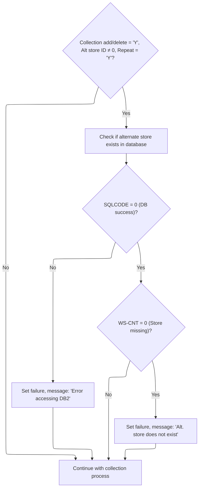

<SwmSnippet path="/base/src/NNNS0488.cbl" line="3467">

---

`1410-MODIFY-EDITS` just calls 1420-VALIDATE-ALT-STORE to check if the alternate store exists when required. If the validation fails, the modification won't proceed.

```cobol
349500 1410-MODIFY-EDITS.                                               00349500
349600     PERFORM 1420-VALIDATE-ALT-STORE                              00349600
349700     .                                                            00349700
```

---

</SwmSnippet>

<SwmSnippet path="/base/src/NNNS0488.cbl" line="3472">

---

`1420-VALIDATE-ALT-STORE` checks if alternate store validation is needed, then runs a count query to see if the store exists. If not, it sets failure and logs an error message. If DB2 errors out, it does the same.

```cobol
350000 1420-VALIDATE-ALT-STORE.                                         00350000
350100     IF CK-COLL-ADD-DEL-SW OF DCLXXXAIL-LOC = 'Y' AND             00350100
350200        CK-ALT-STR-ID OF DCLXXXAIL-LOC NOT = 0    AND             00350200
350300        CK-COLL-REPT-SW OF DCLXXXAIL-LOC   = 'Y'                  00350300
350400          EXEC SQL                                                00350400
350500            SELECT COUNT(*)                                       00350500
350600            INTO :WS-CNT                                          00350600
350700            FROM XXXAIL_LOC                                       00350700
350800            WHERE LOC_NBR    = :DCLXXXAIL-LOC.CK-ALT-STR-ID       00350800
350900            AND   LOC_TYP_CD = :DCLXXXAIL-LOC.LOC-TYP-CD          00350900
351000          END-EXEC                                                00351000
351100          EVALUATE TRUE                                           00351100
351200           WHEN SQLCODE = 0                                       00351200
351300            IF WS-CNT = 0                                         00351300
351400              SET  FAILURE                 TO TRUE                00351400
351500              MOVE SPACES                  TO IS-RTRN-MSG-TXT     00351500
351600              STRING 'NNNS0488 - Alt. store does not exists'      00351600
351700                     DELIMITED BY SIZE INTO IS-RTRN-MSG-TXT       00351700
351800            ELSE                                                  00351800
351900              CONTINUE                                            00351900
352000            END-IF                                                00352000
352100           WHEN OTHER                                             00352100
352200             SET  FAILURE                 TO TRUE                 00352200
352300             MOVE SPACES                  TO IS-RTRN-MSG-TXT      00352300
352400             STRING 'NNNS0488 - Error accessing DB2'              00352400
352500                    DELIMITED BY SIZE INTO IS-RTRN-MSG-TXT        00352500
352600     END-IF                                                       00352600
352700     .                                                            00352700
```

---

</SwmSnippet>

#### Checking for Status and Data Changes

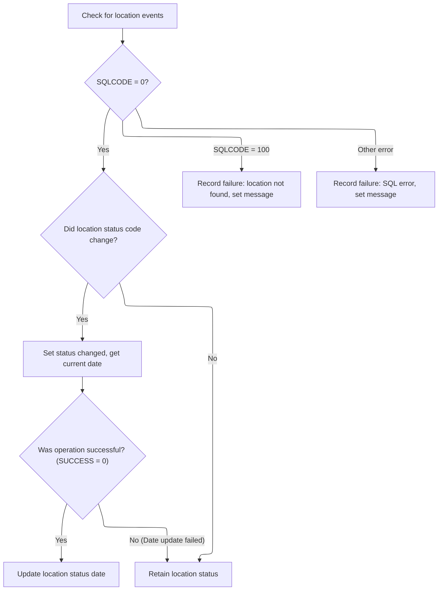

<SwmSnippet path="/base/src/NNNS0488.cbl" line="3502">

---

`1430-CHECK-FOR-EVENTS` checks the current status, address zone, and line of business for the location. If the status changed, it sets a flag and updates the date. If not, it marks the status as retained. Errors are flagged and logged with messages.

```cobol
353000 1430-CHECK-FOR-EVENTS.                                           00353000
353100     EXEC SQL                                                     00353100
353200         SELECT RETL_LOC_STAT_CD,                                 00353200
353300                CURR_AD_ZN_NBR,                                   00353300
353400                LIN_OF_BUS_ID                                     00353400
353500         INTO   :WS-STR-ST-CD,                                    00353500
353600                :WS-CURR-AD-ZONE,                                 00353600
353700                :WS-CURR-LOB                                      00353700
353800         FROM   XXXAIL_LOC                                        00353800
353900         WHERE  LOC_NBR = :DCLXXXAIL-LOC.LOC-NBR                  00353900
354000         AND    LOC_TYP_CD = :DCLXXXAIL-LOC.LOC-TYP-CD            00354000
354100     END-EXEC                                                     00354100
354200                                                                  00354200
354300     EVALUATE TRUE                                                00354300
354400       WHEN SQLCODE = 0                                           00354400
354500         IF WS-STR-ST-CD NOT = RETL-LOC-STAT-CD OF DCLXXXAIL-LOC  00354500
354600           SET WS-LOC-STAT-CHANGED TO TRUE                        00354600
354700           PERFORM 2040-GET-CURRENT-DATE                          00354700
354800           IF SUCCESS                                             00354800
354900             MOVE DTA10-MM-DD-YYYY                                00354900
355000               TO RETL-LOC-STAT-DT OF DCLXXXAIL-LOC               00355000
355100           END-IF                                                 00355100
355200         ELSE                                                     00355200
355300           SET  WS-LOC-STAT-RETAINED TO TRUE                      00355300
355400         END-IF                                                   00355400
355500       WHEN SQLCODE = 100                                         00355500
355600         SET  FAILURE TO TRUE                                     00355600
355700         MOVE 'NNNS0488 - xxxail xxxation not found!'             00355700
355800           TO IS-RTRN-MSG-TXT                                     00355800
355900       WHEN SQLCODE NOT = 0                                       00355900
356000         MOVE SQLCODE                 TO WS-SQLCODE               00356000
356100         SET  FAILURE                 TO TRUE                     00356100
356200         MOVE SPACES                  TO IS-RTRN-MSG-TXT          00356200
356300         STRING 'NNNS0488 - Error checking for changes, SQL='     00356300
356400                 WS-SQLCODE                                       00356400
356500                 DELIMITED BY SIZE INTO IS-RTRN-MSG-TXT           00356500
356600     END-EVALUATE                                                 00356600
356700     .                                                            00356700
```

---

</SwmSnippet>

### Updating the Location Row

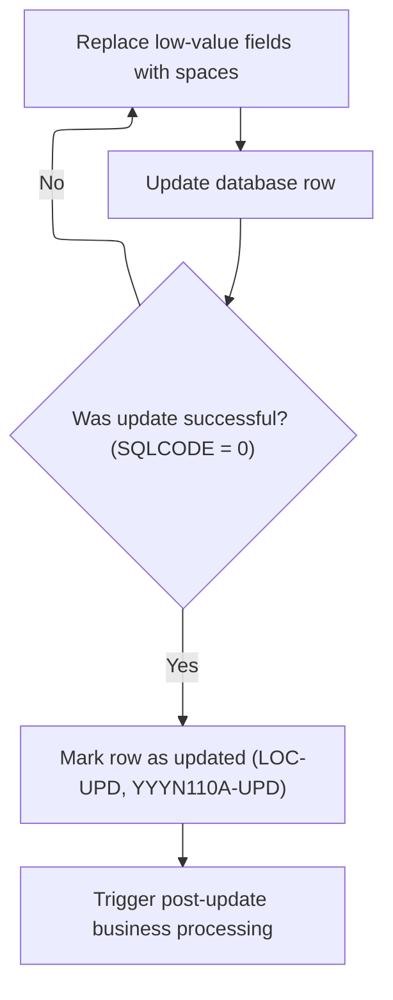

<SwmSnippet path="/base/src/NNNS0488.cbl" line="3542">

---

`1440-D0-MODIFY-ROW` runs the update routine, sets update flags if successful, and then calls 2000-DENORM-PROCESS to sync related data. Denormalization keeps everything in sync after a change.

```cobol
357000 1440-D0-MODIFY-ROW.                                              00357000
357100     PERFORM 4670-REP-LOWVALUE-WITH-SPACES                        00357100
357200     PERFORM 5000-CALL-NNNU0488-CUD-ROUTINE                       00357200
357300                                                                  00357300
357400     IF SQLCODE = 0                                               00357400
357500       SET YYYN110A-UPD TO TRUE                                   00357500
357600       SET LOC-UPD      TO TRUE                                   00357600
357700       PERFORM 2000-DENORM-PROCESS                                00357700
357800     END-IF                                                       00357800
357900     .                                                            00357900
```

---

</SwmSnippet>

### Denormalizing and Syncing Data

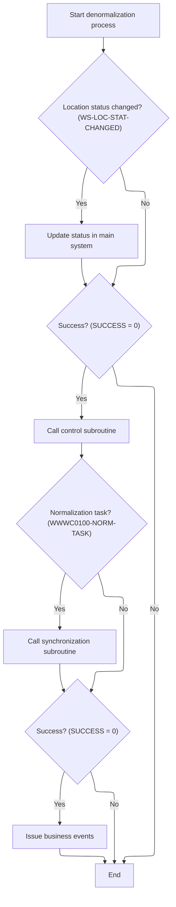

<SwmSnippet path="/base/src/NNNS0488.cbl" line="3701">

---

`2000-DENORM-PROCESS` checks if the location status changed. If so, it calls 2100-UPD-STAT-IN-xxxation to update the status. It also handles checkpointing and triggers control/event routines if needed.

```cobol
372200 2000-DENORM-PROCESS.                                             00372200
372300     IF WS-LOC-STAT-CHANGED                                       00372300
372400       PERFORM 2100-UPD-STAT-IN-xxxation                          00372400
372500     END-IF                                                       00372500
372600     MOVE 1 TO WS-CHECKPOINT-INC                                  00372600
372700     IF SUCCESS                                                   00372700
372800       PERFORM 2010-CALL-CONTROL-SUBR                             00372800
372900     END-IF                                                       00372900
373000     IF  SUCCESS                                                  00373000
373100     AND WWWC0100-NORM-TASK                                       00373100
373200       PERFORM 2020-CALL-SYNC-SUBR                                00373200
373300     END-IF                                                       00373300
373400     IF SUCCESS                                                   00373400
373500       PERFORM 2030-ISSUE-EVENTS                                  00373500
373600     END-IF                                                       00373600
373700     .                                                            00373700
```

---

</SwmSnippet>

### Updating Location Status in Database

<SwmSnippet path="/base/src/NNNS0488.cbl" line="3799">

---

`2100-UPD-STAT-IN-xxxation` gets the latest data and syncs the status if all is good.

```cobol
382000 2100-UPD-STAT-IN-xxxation.                                       00382000
382100     MOVE NNNN0000-EXIT-CODES TO WS-NNNN0000-EXIT-CODES           00382100
382200                                                                  00382200
382300     PERFORM 2200-GET-xxxation                                    00382300
382400     IF SUCCESS                                                   00382400
382500       PERFORM 2300-SYNC-STAT-CODE                                00382500
382600     END-IF                                                       00382600
382700                                                                  00382700
382800     MOVE WS-NNNN0000-EXIT-CODES TO NNNN0000-EXIT-CODES           00382800
382900     .                                                            00382900
```

---

</SwmSnippet>

#### Retrieving Latest Location Data

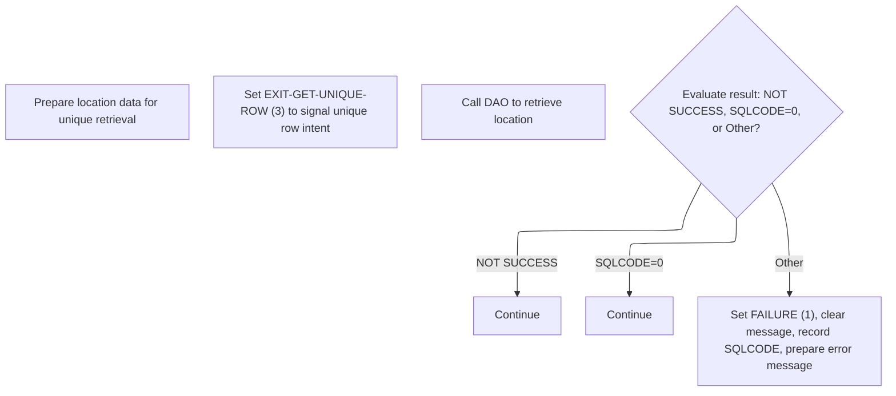

<SwmSnippet path="/base/src/NNNS0488.cbl" line="3814">

---

`2200-GET-xxxation` sets up the input, flags the operation as a unique row fetch, and calls 3000-CALL-LO-DAO to do the actual database read. It checks the result and logs an error if the fetch fails.

```cobol
383500 2200-GET-xxxation.                                               00383500
383600     INITIALIZE P-DDDTLO01                                        00383600
383700     MOVE LOC-NBR                    OF DCLXXXAIL-LOC             00383700
383800       TO LOC-NBR                    OF P-DDDTLO01                00383800
383900     MOVE LOC-TYP-CD                 OF DCLXXXAIL-LOC             00383900
384000       TO LOC-TYP-CD                 OF P-DDDTLO01                00384000
384100                                                                  00384100
384200     SET EXIT-GET-UNIQUE-ROW         TO TRUE                      00384200
384300     PERFORM 3000-CALL-LO-DAO                                     00384300
384400                                                                  00384400
384500     EVALUATE TRUE                                                00384500
384600         WHEN NOT SUCCESS                                         00384600
384700           CONTINUE                                               00384700
384800         WHEN SQLCODE = 0                                         00384800
384900           CONTINUE                                               00384900
385000         WHEN OTHER                                               00385000
385100           SET FAILURE               TO TRUE                      00385100
385200           MOVE SPACES               TO IS-RTRN-MSG-TXT           00385200
385300           MOVE SQLCODE              TO WS-SQLCODE                00385300
385400           STRING 'NNNS0488 - Get unique error on xxxation table' 00385400
385500                  'SQL = ' WS-SQLCODE                             00385500
385600           DELIMITED BY SIZE INTO IS-RTRN-MSG-TXT                 00385600
385700     END-EVALUATE                                                 00385700
385800     .                                                            00385800
```

---

</SwmSnippet>

<SwmSnippet path="/base/src/NNNS0488.cbl" line="3938">

---

`3000-CALL-LO-DAO` just calls the NNNS0487 program to do the database work. All the DB logic is in that external program, so this step is just a wrapper.

```cobol
396400 3000-CALL-LO-DAO.                                                00396400
396500     CALL NNNS0487-LO-DAO USING                                   00396500
396600          XXXN001A                                                00396600
396700          SQLCA                                                   00396700
396800          YYYN005A                                                00396800
396900          NNNN0000-PARMS                                          00396900
397000          P-DDDTLO01                                              00397000
397100     .                                                            00397100
```

---

</SwmSnippet>

#### Syncing Status Code to Database

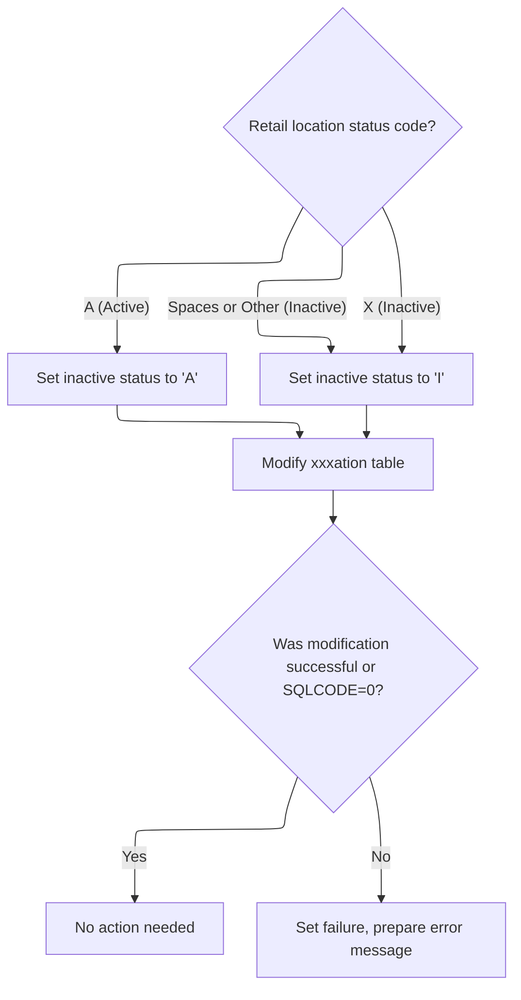

<SwmSnippet path="/base/src/NNNS0488.cbl" line="3843">

---

`2300-SYNC-STAT-CODE` sets the inactive switch based on the current status, flags the operation as a modify, and calls the DAO to update the DB. It checks for errors and logs them if needed.

```cobol
386400 2300-SYNC-STAT-CODE.                                             00386400
386500     EVALUATE TRUE                                                00386500
386600       WHEN RETL-LOC-STAT-CD OF DCLXXXAIL-LOC = 'A'               00386600
386700          MOVE 'A'           TO INACTIVE-SW OF P-DDDTLO01         00386700
386800       WHEN RETL-LOC-STAT-CD OF DCLXXXAIL-LOC = 'X'               00386800
386900          MOVE 'I'           TO INACTIVE-SW OF P-DDDTLO01         00386900
387000       WHEN RETL-LOC-STAT-CD OF DCLXXXAIL-LOC = SPACES            00387000
387100          MOVE 'I'           TO INACTIVE-SW OF P-DDDTLO01         00387100
387200       WHEN OTHER                                                 00387200
387300          MOVE 'I'           TO INACTIVE-SW OF P-DDDTLO01         00387300
387400     END-EVALUATE                                                 00387400
387500                                                                  00387500
387600     SET EXIT-PUT-MODIFY-ROW         TO TRUE                      00387600
387700     PERFORM 3000-CALL-LO-DAO                                     00387700
387800                                                                  00387800
387900     EVALUATE TRUE                                                00387900
388000         WHEN NOT SUCCESS                                         00388000
388100           CONTINUE                                               00388100
388200         WHEN SQLCODE = 0                                         00388200
388300           CONTINUE                                               00388300
388400         WHEN OTHER                                               00388400
388500           SET FAILURE               TO TRUE                      00388500
388600           MOVE SPACES               TO IS-RTRN-MSG-TXT           00388600
388700           MOVE SQLCODE              TO WS-SQLCODE                00388700
388800           STRING 'NNNS0488 - Modify error on xxxation table'     00388800
388900                  'SQL = ' WS-SQLCODE                             00388900
389000           DELIMITED BY SIZE INTO IS-RTRN-MSG-TXT                 00389000
389100     END-EVALUATE                                                 00389100
389200     .                                                            00389200
```

---

</SwmSnippet>

### Issuing Master Data and Store Events

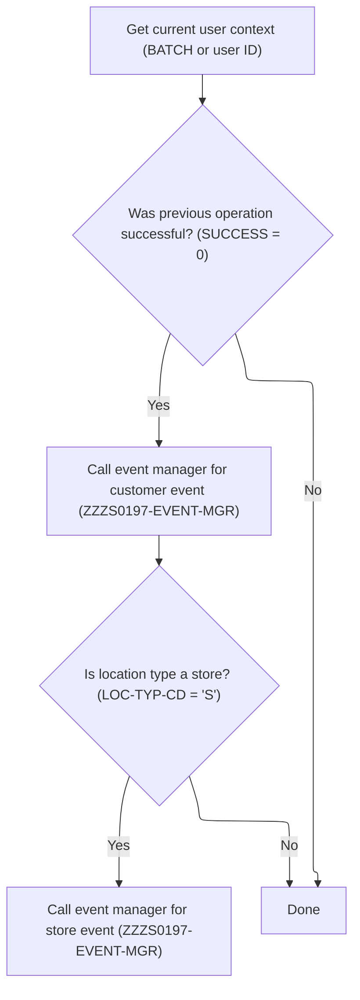

<SwmSnippet path="/base/src/NNNS0488.cbl" line="3740">

---

`2030-ISSUE-EVENTS` first gets the current user, sets up the Oracle environment, and if everything's good, builds and sends a master data event. If the location is a store, it also builds and sends a second event with a different transaction ID. The call to `2050-GET-CURRENT-USER` is needed to fill in the user field for both events, so downstream systems know who triggered the change. The function uses repo-specific structures and constants to shape the event payloads, and the event manager call actually pushes the event out.

```cobol
376100 2030-ISSUE-EVENTS.                                               00376100
376200     PERFORM 2050-GET-CURRENT-USER                                00376200
376300     SET  YYYN110A-ORACLE      TO TRUE                            00376300
376400     IF SUCCESS                                                   00376400
376500       MOVE LOC-NBR OF P-DDDTLR01 TO ST-STORE-NUMBER OF ZZZC0032  00376500
376600                                     LOC-NBR OF ZZZC0094          00376600
376700       SET  ZZZC0032-UPD-FXXX     TO TRUE                         00376700
376800       MOVE ZZZC0032              TO ZZZC0197-TRX-REC             00376800
376900       MOVE 'CUST'                TO ZZZC0197-TRX-ID              00376900
377000       MOVE 'NNNS0488'            TO ZZZC0197-PROGRAM             00377000
377100       MOVE YYYC0107-USER         TO ZZZC0197-USER                00377100
377200       MOVE YYYN005A-SYS-ENV      TO YYYN110A-SYS-ENV             00377200
377300       CALL ZZZS0197-EVENT-MGR USING                              00377300
377400            XXXN001A                                              00377400
377500            YYYN110A                                              00377500
377600            ZZZC0197                                              00377600
377700                                                                  00377700
377800       EVALUATE TRUE                                              00377800
377900                                                                  00377900
378000       WHEN LOC-TYP-CD OF P-DDDTLR01 = K-STORE-LOC-TYPE           00378000
378100         MOVE LOC-TYP-CD OF P-DDDTLR01 TO                         00378100
378200                                       LOC-TYP-CD OF ZZZC0094     00378200
378300         MOVE ZZZC0094              TO ZZZC0197-TRX-REC           00378300
378400         MOVE 'STRM'                TO ZZZC0197-TRX-ID            00378400
378500         MOVE 'NNNS0488'            TO ZZZC0197-PROGRAM           00378500
378600         MOVE YYYC0107-USER         TO ZZZC0197-USER              00378600
378700         MOVE YYYN005A-SYS-ENV      TO YYYN110A-SYS-ENV           00378700
378800         CALL ZZZS0197-EVENT-MGR USING                            00378800
378900              XXXN001A                                            00378900
379000              YYYN110A                                            00379000
379100              ZZZC0197                                            00379100
379200                                                                  00379200
379300       END-EVALUATE                                               00379300
379400                                                                  00379400
379500     END-IF                                                       00379500
379600     .                                                            00379600
```

---

</SwmSnippet>

<SwmSnippet path="/base/src/NNNS0488.cbl" line="3785">

---

`2050-GET-CURRENT-USER` checks if we're in a CICS environment and if the last step was successful. If so, it calls a repo-specific subroutine to get the user ID; otherwise, it just sets the user to 'BATCH'. This way, events always have a user value, either the real user or a batch default.

```cobol
380600 2050-GET-CURRENT-USER.                                           00380600
380700     IF  SUCCESS                                                  00380700
380800     AND YYYN005A-CICS-ENV                                        00380800
380900       CALL Z-GET-CICS-USER-ID USING                              00380900
381000           EIBLK    WS-DUMMY                                      00381000
381100           XXXN001A YYYC0107                                      00381100
381200     ELSE                                                         00381200
381300       MOVE 'BATCH' TO YYYC0107-USER                              00381300
381400     END-IF                                                       00381400
381500     .                                                            00381500
```

---

</SwmSnippet>

### Detecting and Issuing Business Line Change Events

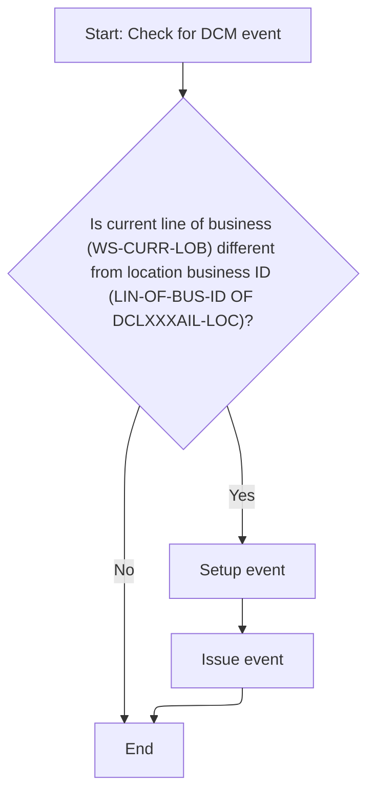

<SwmSnippet path="/base/src/NNNS0488.cbl" line="3877">

---

`2400-CHECK-FOR-DCM-EVENT` checks if the business line has changed for the location. If it has, it sets up the event data and then calls `2430-ISSUE-EVENT2` to actually send out the event. The call to `2430-ISSUE-EVENT2` is what pushes the event after setup.

```cobol
389800 2400-CHECK-FOR-DCM-EVENT.                                        00389800
389900     IF WS-CURR-LOB     NOT = LIN-OF-BUS-ID  OF DCLXXXAIL-LOC     00389900
390400         PERFORM 2410-SETUP-EVENT                                 00390400
390400         PERFORM 2430-ISSUE-EVENT2                                00390500
390600     END-IF                                                       00390600
390700     .                                                            00390700
```

---

</SwmSnippet>

### Staging and Sending Business Line Events

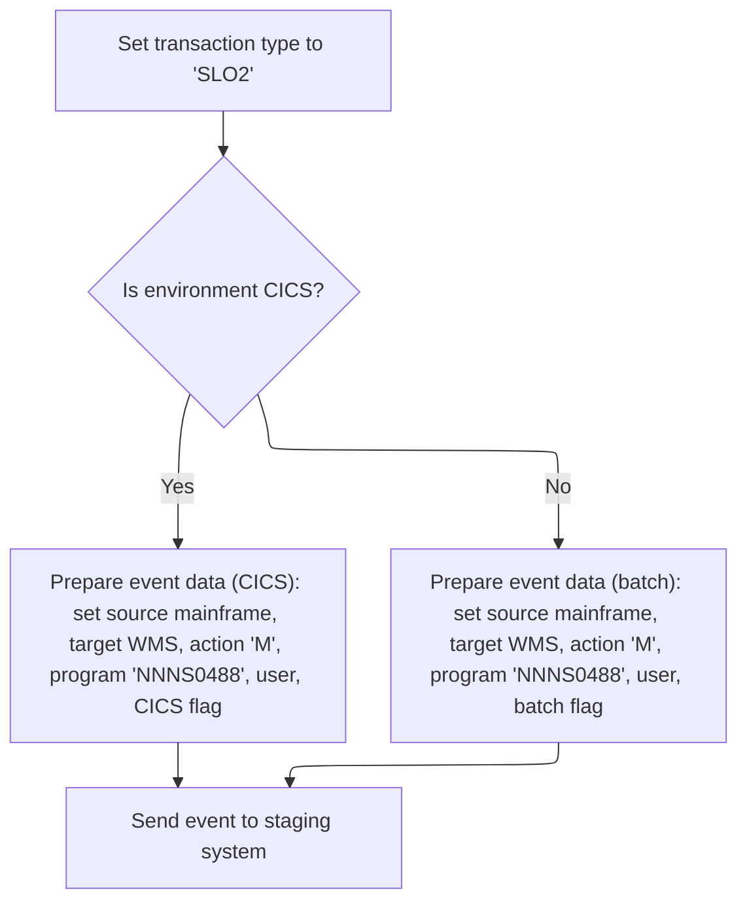

<SwmSnippet path="/base/src/NNNS0488.cbl" line="3929">

---

`2430-ISSUE-EVENT2` sets up the transaction ID as 'SLO2' and then hands off to `2420-ISSUE-EVENT` to do the actual event staging and sending. The call is needed because the event logic is split—ID setup here, payload and send in the next step.

```cobol
395500 2430-ISSUE-EVENT2.                                               00395500
395600     MOVE 'SLO2' TO ZZZC0210-TRX-ID                               00395600
395700     PERFORM 2420-ISSUE-EVENT                                     00395700
395800     .                                                            00395800
```

---

</SwmSnippet>

<SwmSnippet path="/base/src/NNNS0488.cbl" line="3904">

---

`2420-ISSUE-EVENT` builds the event payload, sets the environment flag, and calls the event stager to queue the event.

```cobol
393000 2420-ISSUE-EVENT.                                                00393000
393100     INITIALIZE YYYC0175                                          00393100
393200     SET YYYC0175-ORACLE      TO TRUE                             00393200
393300     IF YYYN005A-CICS-ENV                                         00393300
393400       SET YYYC0175-CICS-ENV  TO TRUE                             00393400
393500     ELSE                                                         00393500
393600       SET YYYC0175-BATCH-ENV TO TRUE                             00393600
393700     END-IF                                                       00393700
393800                                                                  00393800
393900     MOVE ZZZC0210-TRX-ID TO YYYC0175-TRX-CD                      00393900
394000     MOVE ZZZC0210        TO YYYC0175-DATA                        00394000
394100     MOVE 'M'             TO YYYC0175-ACTION-CD                   00394100
394200                                                                  00394200
394300     MOVE 'NNNS0488'      TO YYYC0175-CALLING-PROG                00394300
394400     MOVE YYYC0107-USER   TO YYYC0175-CALLING-USER                00394400
394500                                                                  00394500
394600     SET  YYYC0175-SOURCE-MAINFRAME TO TRUE                       00394600
394700     SET  YYYC0175-TARGET-WMS       TO TRUE                       00394700
394800                                                                  00394800
394900     CALL Z-EVENT-STAGER USING                                    00394900
395000         XXXN001A                                                 00395000
395100         YYYC0175                                                 00395100
395200     .                                                            00395200
```

---

</SwmSnippet>

### Validating and Inserting New Location Records

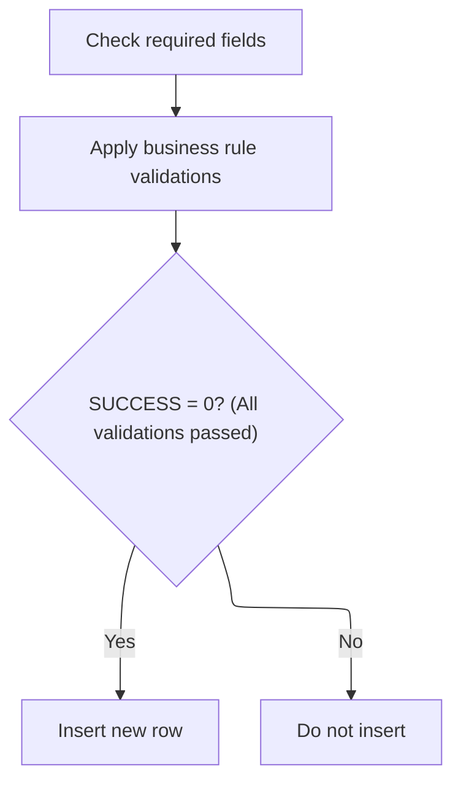

<SwmSnippet path="/base/src/NNNS0488.cbl" line="3554">

---

`1500-EXIT-PUT-INSERT-ROW` runs edits to clean up nulls and standardize fields, then if everything checks out, calls `1520-D0-INSERT-ROW` to actually add the new location. The insert only happens if the earlier edits succeed.

```cobol
358200 1500-EXIT-PUT-INSERT-ROW.                                        00358200
358300     PERFORM 1800-EDIT-NULL-INDICATORS                            00358300
358400     PERFORM 1510-ADD-EDITS                                       00358400
358500     IF SUCCESS                                                   00358500
358600       PERFORM 1520-D0-INSERT-ROW                                 00358600
358700     END-IF                                                       00358700
358800     .                                                            00358800
```

---

</SwmSnippet>

### Checking Referential Integrity and Inserting Data

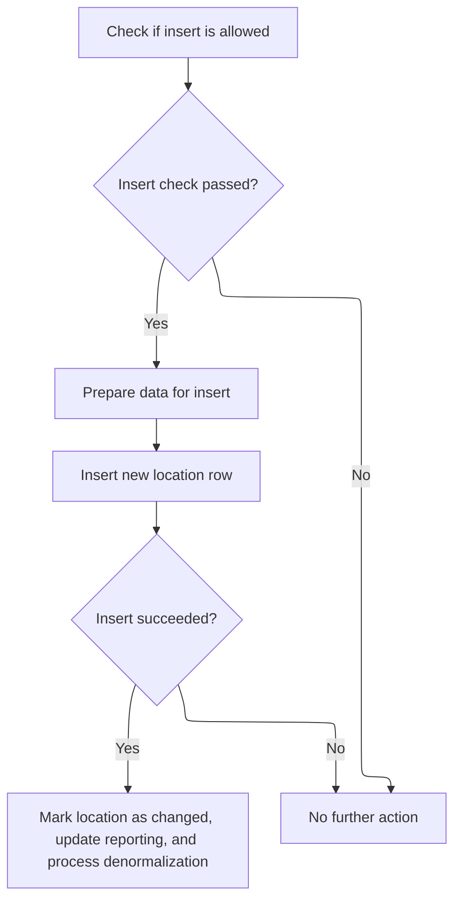

<SwmSnippet path="/base/src/NNNS0488.cbl" line="3597">

---

`1520-D0-INSERT-ROW` checks integrity, then inserts the record and updates flags if successful.

```cobol
362500 1520-D0-INSERT-ROW.                                              00362500
362600     PERFORM 4600-CALL-MMMS0335-RI-ADD-CHK                        00362600
362700     IF SUCCESS                                                   00362700
362800        PERFORM 4670-REP-LOWVALUE-WITH-SPACES                     00362800
362900        PERFORM 5000-CALL-NNNU0488-CUD-ROUTINE                    00362900
363000                                                                  00363000
363100        IF SQLCODE = 0                                            00363100
363200          SET WS-LOC-STAT-CHANGED TO TRUE                         00363200
363300          SET YYYN110A-ADD TO TRUE                                00363300
363400          SET LOC-ADD      TO TRUE                                00363400
363500          PERFORM 2000-DENORM-PROCESS                             00363500
363600        END-IF                                                    00363600
363700     END-IF                                                       00363700
363800     .                                                            00363800
```

---

</SwmSnippet>

<SwmSnippet path="/base/src/NNNS0488.cbl" line="3963">

---

`4600-CALL-MMMS0335-RI-ADD-CHK` prepares the data and calls the external integrity checker.

```cobol
398900 4600-CALL-MMMS0335-RI-ADD-CHK.                                   00398900
399000     INITIALIZE MMMC0335                                          00399000
399100     MOVE ECOMM-MKT-AREA-CD OF DCLXXXAIL-LOC                      00399100
399200                                 TO MMMC0335-ECOMM-MKT-AREA-CD    00399200
399300     MOVE CMPTR-TYP-CD  OF DCLXXXAIL-LOC                          00399300
399400                                 TO MMMC0335-CMPTR-TYP-CD         00399400
399500     SET   MMMC0335-INSERT-CHECK TO TRUE                          00399500
399600     SET   MMMC0335-XXXAIL-LOC   TO TRUE                          00399600
399700     SET   MMMC0335-ORACLE       TO TRUE                          00399700
399800     CALL  MMMC0335-RI-INSERT-CHK USING                           00399800
399900           XXXN001A                                               00399900
400000           MMMC0335                                               00400000
400100     .                                                            00400100
```

---

</SwmSnippet>

### Purging Location Records

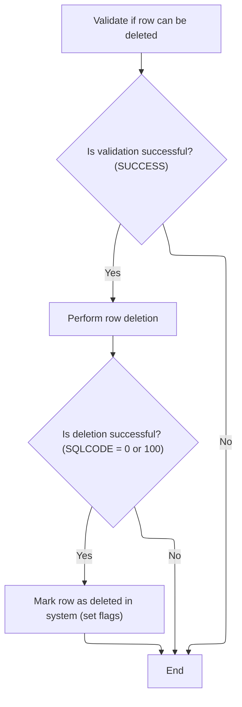

<SwmSnippet path="/base/src/NNNS0488.cbl" line="3613">

---

`1600-EXIT-PUT-PURGE-ROW` checks if the location can be deleted using an external routine, then tries to delete it if allowed. It sets flags based on the result and handles special cases like 'in use' or other errors with specific messages.

```cobol
364100 1600-EXIT-PUT-PURGE-ROW.                                         00364100
364200     PERFORM 4500-CALL-MMMS0304-RI-DEL-CHK                        00364200
364300     IF SUCCESS                                                   00364300
364400       PERFORM 5000-CALL-NNNU0488-CUD-ROUTINE                     00364400
364500                                                                  00364500
364600       IF SQLCODE = 0 OR 100                                      00364600
364700         MOVE 0            TO SQLCODE                             00364700
364800         SET  YYYN110A-DEL TO TRUE                                00364800
364900         SET  LOC-DEL      TO TRUE                                00364900
365000       END-IF                                                     00365000
365100     END-IF                                                       00365100
365200                                                                  00365200
365300*    EVALUATE TRUE                                                00365300
365400*      WHEN SQLCODE = 0                                           00365400
365500*      OR   SQLCODE = 100                                         00365500
365600*        MOVE 0            TO SQLCODE                             00365600
365700*        SET  YYYN110A-DEL TO TRUE                                00365700
365800*        SET  LOC-DEL      TO TRUE                                00365800
365900*      WHEN SQLCODE = -532                                        00365900
366000*        SET  FAILURE TO TRUE                                     00366000
366100*        MOVE 'NNNS0488 - xxxation in use - it cannot be deleted!'00366100
366200*          TO IS-RTRN-MSG-TXT                                     00366200
366300*      WHEN SQLCODE NOT = 0                                       00366300
366400*        MOVE SQLCODE                 TO WS-SQLCODE               00366400
366500*        SET  FAILURE                 TO TRUE                     00366500
366600*        MOVE SPACES                  TO IS-RTRN-MSG-TXT          00366600
366700*        STRING 'NNNS0488 - Error deleting xxxail loc, SQL='      00366700
366800*                WS-SQLCODE                                       00366800
366900*                DELIMITED BY SIZE INTO IS-RTRN-MSG-TXT           00366900
367000*    END-EVALUATE                                                 00367000
367100     .                                                            00367100
```

---

</SwmSnippet>

&nbsp;

*This is an auto-generated document by Swimm 🌊 and has not yet been verified by a human*

<SwmMeta version="3.0.0" repo-id="Z2l0aHViJTNBJTNBU3dpbW1pby1keW5jYWxsLWRlbW8lM0ElM0FHaXJpLVN3aW1t" repo-name="Swimmio-dyncall-demo"><sup>Powered by [Swimm](https://app.swimm.io/)</sup></SwmMeta>
