This document describes the flow for managing location records, including fetching, updating, inserting, and purging location data. The process begins by preparing location data and handing off to the DAO routine, which dispatches the requested operation. Depending on the operation, the flow fetches, updates, inserts, or purges location records. After the operation, the output is finalized and normalized, and any relevant business events are triggered.

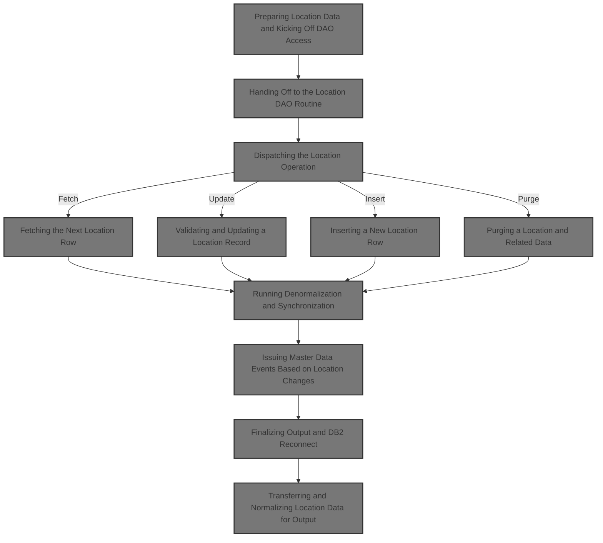

# Spec

## Detailed View of the Program's Functionality

# a. Overview

This file, `NNNS0487.cbl`, is a core Data Access Object (DAO) program for handling location-related database operations in the Swimmio-dyncall-demo system. It is responsible for all CRUD (Create, Read, Update, Delete) operations on location records, as well as related business logic, event generation, and synchronization with other systems. It is called by higher-level programs (like `WWWS0003.cbl`) to perform the actual database work.

# b. Main Entry and Dispatch

The main entry point is `0000-EXIT-DISPATCHER`. When called, it initializes working storage and then uses a large conditional block to determine which operation to perform based on flags set by the caller. These operations include opening/closing cursors, fetching rows, modifying/inserting/purging rows, and running special routines. After the requested operation, it performs exit logic and returns control to the caller.

# c. Initialization

The `100-INITIALIZATION` routine prepares all the necessary data areas, resets error/status fields, and, unless the operation is a cursor close, copies input fields from the parameter area into the internal data structure. If the operation is an insert, purge, or modify, and the environment is Oracle, it connects to Oracle.

# d. Moving Data Between Structures

There are two key routines for moving data:

- `110-MOVE-PDA-FIELDS-2-DCL` copies all relevant fields from the parameter data area to the internal structure, handling default/null values and setting up status flags.
- `130-MOVE-DCL-2-PDA-FIELDS` does the reverse, copying from the internal structure back to the parameter area, again handling null/defaults and running extra business logic as needed.

# e. Cursor Operations

The program supports multiple SQL cursors for different types of location queries. The routines `1000-EXIT-OPEN-CURSOR` and `1100-EXIT-CLOSE-CURSOR` open and close these cursors based on an input identifier. If an invalid cursor ID is provided, an error is set.

# f. Fetching Data

- `1200-EXIT-GET-UNIQUE-ROW` and `1300-EXIT-GET-NEXT-ROW` fetch a single or the next row from the database, using the appropriate cursor. After fetching, they check for null columns and set indicators as needed.
- Each cursor has a corresponding fetch routine (e.g., `1302-FETCH-DDDXLO02`) that maps database columns directly into the internal structure.

# g. Modifying a Location Record

The `1400-EXIT-PUT-MODIFY-ROW` routine is a complex chain that:

1. Edits null indicators.
2. Gets the current date and user.
3. If all is well, checks for business events (like status changes).
4. If still successful, checks and updates application info for vendor locations.
5. If still successful, fetches current values for mailing/contact info.
6. Edits null indicators again.
7. Performs the actual database update.
8. If the update succeeds, sets update flags, triggers event checks, runs denormalization/synchronization, and, if needed, triggers additional vendor maintenance logic.

# h. Inserting a New Location Row

The `1500-EXIT-PUT-INSERT-ROW` routine:

1. Edits null indicators.
2. Gets the current date and user.
3. If successful, sets the insert flag.
4. If still successful, resolves facility and organization IDs.
5. If still successful, performs the insert.
6. If the insert succeeds, sets add flags and runs denormalization.

# i. Purging (Deleting) a Location and Related Data

The `1600-EXIT-PUT-PURGE-ROW` routine:

1. Determines the type of location (store, vendor, etc.).
2. Calls the appropriate delete routine for that type, which may involve deleting related records in other tables.
3. Connects to Oracle if needed.
4. If successful, deletes the main location record.
5. Sets delete flags and triggers denormalization if successful.
6. Handles special SQL error codes for "in use" or other errors.

# j. Deleting a Loan Record and Related Cleanup

The `1690-DELETE-LO` routine:

1. Purges fax numbers associated with the location.
2. Runs a referential integrity check.
3. If allowed, deletes the loan record.
4. Handles "not found" as a non-error.

# k. Purging Fax Numbers for a Location

The `1691-EXIT-PUT-PURGE-FAX-NUM` routine:

1. Opens a cursor for fax numbers tied to the location.
2. Loops through each, purging them and reconnecting to Oracle as needed.
3. Closes the cursor at the end.

# l. Finalizing Output and DB2 Reconnect

The `120-EXIT-STUFF` routine:

1. If the operation succeeded and is not a cursor close, copies data to the output area.
2. Increments the checkpoint counter.
3. If the operation involved Oracle or a row operation, reconnects to DB2.
4. Saves the SQLCODE for later.

# m. Denormalization and Synchronization

The `2000-DENORM-PROCESS` routine:

1. Increments the checkpoint.
2. Copies environment data.
3. Calls a control subroutine.
4. If successful and normalization is required, calls a sync subroutine for the location type.
5. If that succeeds, issues events.

# n. Event Generation

The `2030-ISSUE-EVENTS` routine:

1. Initializes event data.
2. Sets event type based on operation (delete or not).
3. Fills in event fields based on location type.
4. Calls the event manager to issue the event.
5. Handles special logic for scan events.

# o. Null Indicator and Data Validation

- `1700-CHECK-NULL-COLUMNS` and `1800-EDIT-NULL-INDICATORS` handle null indicators for AP number/type fields, ensuring that missing or zero values are marked as null for SQL operations.

# p. Special DAO Calls

There are several routines that call other DAOs for related data (retail location, department, fax, etc.), always passing the necessary context and parameters.

# q. Oracle/DB2 Connection Management

- `115-CONNECT-TO-ORACLE` and `125-CONNECT-TO-DB2` handle switching the database connection as needed, calling out to centralized connection manager routines.

# r. Error Handling

Throughout the program, errors are handled by setting failure flags, moving SQLCODEs to working storage, and building user-friendly error messages. Special routines handle common DB2 error codes and setup error messages for the caller.

# s. Business Logic Hooks

There are hooks for business logic such as:

- Checking for event triggers on status changes.
- Validating and updating application info for vendor locations.
- Resolving facility and organization IDs.
- Running denormalization and synchronization after changes.
- Issuing master data events for downstream systems.

# t. Summary

This file is the central hub for all location-related database operations, handling not just the raw SQL but also all the business logic, error handling, event generation, and synchronization required to keep the system consistent and integrated with other components. It is highly modular, with each operation broken into its own routine and extensive use of copybooks for shared data structures.

# Rule Definition

| Paragraph Name                                                                                              | Rule ID | Category          | Description                                                                                                                                                                                                                                                                              | Conditions                                                                                                                                | Remarks                                                                                                                                                                                                                                                                                                                 |
| ----------------------------------------------------------------------------------------------------------- | ------- | ----------------- | ---------------------------------------------------------------------------------------------------------------------------------------------------------------------------------------------------------------------------------------------------------------------------------------- | ----------------------------------------------------------------------------------------------------------------------------------------- | ----------------------------------------------------------------------------------------------------------------------------------------------------------------------------------------------------------------------------------------------------------------------------------------------------------------------- |
| 100-INITIALIZATION, 110-MOVE-PDA-FIELDS-2-DCL, 200-CHECK-INPUTS (WWWS0003), 100-INITIALIZE (MMMS0711)       | RL-001  | Conditional Logic | The system must validate that the input location record structure contains at least the location number and location type code for any fetch, update, insert, or delete operation. If these are missing or invalid, the operation must not proceed and an error status must be returned. | Triggered on any CRUD operation request. Applies if location number or location type code is missing or invalid in the input structure.   | Location number: numeric, Location type code: string (typically 2 characters). Input structure must be present and properly formatted. Error status must be returned in the control/status structure if validation fails.                                                                                               |
| 1200-EXIT-GET-UNIQUE-ROW, 1300-EXIT-GET-NEXT-ROW, 1301-FETCH-DDDXLO01, 1302-FETCH-DDDXLO02, etc.            | RL-002  | Data Assignment   | For fetch operations, the system must populate the output location record structure with all fields from the database if the record is found. If not found, the output structure should be cleared or set to defaults, and the status should indicate 'not found'.                       | Triggered on fetch (get unique or get next) operations. Applies when a location record is requested by key.                               | Output structure must match the database schema (all fields). If not found, output fields are blanked or set to default values. Status structure: FAILURE='N' for success, 'Y' for not found; IS-RTRN-MSG-TXT with appropriate message; SQLCODE=0 for success, 100 for not found.                                       |
| 1400-EXIT-PUT-MODIFY-ROW, 1500-EXIT-PUT-INSERT-ROW, 1510-D0-INSERT-ROW, 1440-D0-MODIFY-ROW                  | RL-003  | Computation       | For update and insert operations, the system must update or insert the location record in the database using all fields provided in the input structure. After the operation, the updated record must be returned in the output structure.                                               | Triggered on update or insert requests. Applies when all required fields are present and valid.                                           | All fields from input structure are used. Output structure after operation must reflect the current state of the record in the database. Status structure: FAILURE='N' for success, 'Y' for failure; IS-RTRN-MSG-TXT with appropriate message; SQLCODE=0 for success, or relevant error code.                           |
| 1600-EXIT-PUT-PURGE-ROW, 1610-DELETE-STORE, 1620-DELETE-DSD-VENDOR, etc.                                    | RL-004  | Computation       | For delete operations, the system must remove the location record and all related data as required by business rules. The status of the operation must be returned in the output structure.                                                                                              | Triggered on delete requests. Applies when a valid location key is provided.                                                              | Related data may include entries in auxiliary tables (e.g., LST_BILED_CST, AP_XXX_SUB_TYP, etc.). Output structure: status fields updated as per operation result. Status structure: FAILURE='N' for success, 'Y' for failure; IS-RTRN-MSG-TXT with appropriate message; SQLCODE=0 for success, or relevant error code. |
| 120-EXIT-STUFF, 300-EXIT-STUFF (WWWS0003), 100-INITIALIZATION, error handling sections                      | RL-005  | Data Assignment   | After any operation, the system must return the control/status structure with the FAILURE flag, IS-RTRN-MSG-TXT, and SQLCODE set according to the result of the operation.                                                                                                               | Applies after any CRUD or special operation.                                                                                              | FAILURE: 'N' for success, 'Y' for failure. IS-RTRN-MSG-TXT: string, contains success, not found, or error message. SQLCODE: number, 0 for success, 100 for not found, or relevant error code. Output structure must match input structure format.                                                                       |
| YYYS0212, 300-CNV-ORACLE-SQLCODE (YYYS0211), error handling in main programs                                | RL-006  | Computation       | For error cases, the system must format the error message in IS-RTRN-MSG-TXT to include the SQLCODE and a descriptive message. For Oracle errors, Oracle error codes must be mapped to DB2-style SQLCODEs and the message formatted accordingly.                                         | Triggered on any error or non-success SQLCODE, especially when interacting with Oracle.                                                   | Oracle error codes (e.g., 60, 904, 1403, etc.) are mapped to DB2 SQLCODEs (e.g., -911, -206, -100, etc.). Error message format: 'Program - Error description. Sqlcode = <code>' or similar. IS-RTRN-MSG-TXT: string, up to 80 characters typical.                                                                       |
| 110-MOVE-PDA-FIELDS-2-DCL, 130-MOVE-DCL-2-PDA-FIELDS, 1700-CHECK-NULL-COLUMNS, 1800-EDIT-NULL-INDICATORS    | RL-007  | Conditional Logic | The system must handle null and default values for date and time fields according to business rules. For example, '01/01/1600' or equivalent default dates must be blanked out in output, and null indicators must be set appropriately for database operations.                         | Applies on input and output of date/time fields, and when preparing data for database operations.                                         | Default date: '01/01/1600' or equivalent. Output: blank or spaces for default/null dates. Null indicators: -1 for null, 0 for not null. Date fields: string (format depends on system, e.g., 'YYYY-MM-DD').                                                                                                             |
| 110-MOVE-PDA-FIELDS-2-DCL, 1411-CHECK-FOR-EVENTS, 1420-CHECK-AP-INFO, 10200-CHECK-DSV-LOC-SUB-TYP, MMMS0711 | RL-008  | Conditional Logic | The system must support all location types (store, vendor, DSD vendor, warehouse, etc.) as indicated by the location type code, and must use additional tables for related data and validation as required by business logic.                                                            | Applies on any operation involving a location type code. Related data validation is required for certain types (e.g., DSD vendor, store). | Location type code: string (e.g., 'S', 'V', 'D', 'W', etc.). Related tables: AP_XXX_SUB_TYP, STR_DEPT, LST_BILED_CST, etc. Validation may include checking for related records, subtypes, or constraints.                                                                                                               |
| 2030-ISSUE-EVENTS, ZZZS0197, 2040-GET-DATE-AND-USER                                                         | RL-009  | Computation       | When certain data changes occur (e.g., insert, update, delete), the system must issue events to downstream systems, including all required context and data in the event payload.                                                                                                        | Triggered after successful data modification operations, and when event staging is required by business logic.                            | Event payload includes location type, number, user, program, and action code ('A', 'M', 'P'). Event structure: fields for transaction ID, data, calling program, user, source/target system, etc. Events are not issued for weeded/duplicate events or certain transaction types in batch mode.                         |

# User Stories

## User Story 1: Comprehensive location record management

---

### Story Description:

As a system user, I want to perform fetch, update, insert, and delete operations on location records, with proper validation, error handling, support for all location types, correct handling of null and default values for date/time fields, and issuance of events to downstream systems, so that I can reliably manage location data, ensure data integrity, and keep related systems synchronized.

---

### Business Rule Mapping:

| Rule ID | Paragraph Name                                                                                              | Rule Description                                                                                                                                                                                                                                                                         |
| ------- | ----------------------------------------------------------------------------------------------------------- | ---------------------------------------------------------------------------------------------------------------------------------------------------------------------------------------------------------------------------------------------------------------------------------------- |
| RL-003  | 1400-EXIT-PUT-MODIFY-ROW, 1500-EXIT-PUT-INSERT-ROW, 1510-D0-INSERT-ROW, 1440-D0-MODIFY-ROW                  | For update and insert operations, the system must update or insert the location record in the database using all fields provided in the input structure. After the operation, the updated record must be returned in the output structure.                                               |
| RL-009  | 2030-ISSUE-EVENTS, ZZZS0197, 2040-GET-DATE-AND-USER                                                         | When certain data changes occur (e.g., insert, update, delete), the system must issue events to downstream systems, including all required context and data in the event payload.                                                                                                        |
| RL-001  | 100-INITIALIZATION, 110-MOVE-PDA-FIELDS-2-DCL, 200-CHECK-INPUTS (WWWS0003), 100-INITIALIZE (MMMS0711)       | The system must validate that the input location record structure contains at least the location number and location type code for any fetch, update, insert, or delete operation. If these are missing or invalid, the operation must not proceed and an error status must be returned. |
| RL-004  | 1600-EXIT-PUT-PURGE-ROW, 1610-DELETE-STORE, 1620-DELETE-DSD-VENDOR, etc.                                    | For delete operations, the system must remove the location record and all related data as required by business rules. The status of the operation must be returned in the output structure.                                                                                              |
| RL-005  | 120-EXIT-STUFF, 300-EXIT-STUFF (WWWS0003), 100-INITIALIZATION, error handling sections                      | After any operation, the system must return the control/status structure with the FAILURE flag, IS-RTRN-MSG-TXT, and SQLCODE set according to the result of the operation.                                                                                                               |
| RL-002  | 1200-EXIT-GET-UNIQUE-ROW, 1300-EXIT-GET-NEXT-ROW, 1301-FETCH-DDDXLO01, 1302-FETCH-DDDXLO02, etc.            | For fetch operations, the system must populate the output location record structure with all fields from the database if the record is found. If not found, the output structure should be cleared or set to defaults, and the status should indicate 'not found'.                       |
| RL-006  | YYYS0212, 300-CNV-ORACLE-SQLCODE (YYYS0211), error handling in main programs                                | For error cases, the system must format the error message in IS-RTRN-MSG-TXT to include the SQLCODE and a descriptive message. For Oracle errors, Oracle error codes must be mapped to DB2-style SQLCODEs and the message formatted accordingly.                                         |
| RL-007  | 110-MOVE-PDA-FIELDS-2-DCL, 130-MOVE-DCL-2-PDA-FIELDS, 1700-CHECK-NULL-COLUMNS, 1800-EDIT-NULL-INDICATORS    | The system must handle null and default values for date and time fields according to business rules. For example, '01/01/1600' or equivalent default dates must be blanked out in output, and null indicators must be set appropriately for database operations.                         |
| RL-008  | 110-MOVE-PDA-FIELDS-2-DCL, 1411-CHECK-FOR-EVENTS, 1420-CHECK-AP-INFO, 10200-CHECK-DSV-LOC-SUB-TYP, MMMS0711 | The system must support all location types (store, vendor, DSD vendor, warehouse, etc.) as indicated by the location type code, and must use additional tables for related data and validation as required by business logic.                                                            |

---

### Relevant Functionality:

- **1400-EXIT-PUT-MODIFY-ROW**
  1. **RL-003:**
     - On update/insert request:
       - Validate input fields
       - Attempt to update/insert record in database
       - If successful:
         - Retrieve updated record
         - Populate output structure with current database values
         - Set FAILURE='N', IS-RTRN-MSG-TXT='Success', SQLCODE=0
       - If error:
         - Set FAILURE='Y', IS-RTRN-MSG-TXT with error, SQLCODE with error code
- **2030-ISSUE-EVENTS**
  1. **RL-009:**
     - After successful data change:
       - Prepare event payload with required fields
       - Check for duplicate or weeded events
       - If not weeded, call event stager program with payload
       - Set action code based on operation (add, modify, purge)
       - Include user and program context in event
- **100-INITIALIZATION**
  1. **RL-001:**
     - On operation request:
       - Check if location number and location type code are present and valid in the input structure.
       - If not valid:
         - Set FAILURE flag to 'Y' in status structure
         - Set IS-RTRN-MSG-TXT to appropriate error message
         - Set SQLCODE to error code (e.g., -1 or other relevant code)
         - Return without performing the operation.
- **1600-EXIT-PUT-PURGE-ROW**
  1. **RL-004:**
     - On delete request:
       - Validate location key
       - Delete main record and all related data as per business rules
       - If successful:
         - Set FAILURE='N', IS-RTRN-MSG-TXT='Success', SQLCODE=0
       - If error or constraint violation:
         - Set FAILURE='Y', IS-RTRN-MSG-TXT with error, SQLCODE with error code
- **120-EXIT-STUFF**
  1. **RL-005:**
     - After operation:
       - Set FAILURE flag based on result
       - Set IS-RTRN-MSG-TXT to appropriate message
       - Set SQLCODE to 0, 100, or error code
       - Return status structure with outputs
- **1200-EXIT-GET-UNIQUE-ROW**
  1. **RL-002:**
     - On fetch request:
       - Query database for location by key
       - If found:
         - Populate all fields in output structure from database
         - Set FAILURE='N', IS-RTRN-MSG-TXT='Success', SQLCODE=0
       - If not found:
         - Clear output structure or set to defaults
         - Set FAILURE='Y', IS-RTRN-MSG-TXT='Not found', SQLCODE=100
- **YYYS0212**
  1. **RL-006:**
     - On error:
       - If Oracle error:
         - Map Oracle code to DB2 SQLCODE
         - Format IS-RTRN-MSG-TXT to include SQLCODE and description
       - Else:
         - Format IS-RTRN-MSG-TXT with SQLCODE and error message
       - Set FAILURE='Y', SQLCODE to mapped or original code
- **110-MOVE-PDA-FIELDS-2-DCL**
  1. **RL-007:**
     - On input:
       - If date/time field is blank or default, set to system default or blank
       - Set null indicator as needed
     - On output:
       - If date/time field is default, blank out in output structure
  2. **RL-008:**
     - On operation involving location type:
       - Determine type from code
       - For certain types, perform additional validation (e.g., check DSV subtype for DSD vendor)
       - Use related tables as needed for validation or cascading deletes

# Code Walkthrough

## Preparing Location Data and Kicking Off DAO Access

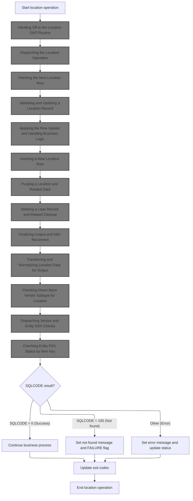

<SwmSnippet path="/base/src/WWWS0003.cbl" line="830">

---

In `2200-GET-LO` we're setting up the location data structure (P-DDDTLO01) with the store number and type, and prepping the exit code variable. This is just input prep for the DAO call. The next step, calling 2100-CALL-LO-DAO, actually does the database operation using these parameters. If we didn't set these up, the DAO wouldn't know what to fetch or update.

```cobol
085600 2200-GET-LO.                                                     00085600
085700     INITIALIZE P-DDDTLO01                                        00085700
085800     MOVE ST-STORE-NUMBER     TO LOC-NBR    OF P-DDDTLO01         00085800
085900     MOVE ST-STORE-TYPE       TO LOC-TYP-CD OF P-DDDTLO01         00085900
086000                                                                  00086000
086100     MOVE NNNN0000-EXIT-CODES TO WS-NNNN0000-EXIT-CODES           00086100
086200     SET  EXIT-GET-UNIQUE-ROW TO TRUE                             00086200
086300     PERFORM 2100-CALL-LO-DAO                                     00086300
```

---

</SwmSnippet>

### Handing Off to the Location DAO Routine

<SwmSnippet path="/base/src/WWWS0003.cbl" line="777">

---

`2100-CALL-LO-DAO` just calls the location DAO program (NNNS0487) with all the context and data it needs. This is where the actual DB logic lives. We call it next because that's where the DB operation happens—this routine is just a wrapper to hand off the work.

```cobol
080300 2100-CALL-LO-DAO.                                                00080300
080400     CALL NNNS0487-LO-DAO USING                                   00080400
080500         XXXN001A                                                 00080500
080600         SQLCA                                                    00080600
080700         YYYN005A                                                 00080700
080800         NNNN0000-PARMS                                           00080800
080900         P-DDDTLO01                                               00080900
081000     .                                                            00081000
```

---

</SwmSnippet>

### Dispatching the Location Operation

<SwmSnippet path="/base/src/NNNS0487.cbl" line="864">

---

`0000-EXIT-DISPATCHER` is where the code figures out which DB action to run based on the exit code. It runs the right subroutine for open, close, fetch, update, etc. This is the main switchboard for all location DB ops.

```cobol
094100 0000-EXIT-DISPATCHER.                                            00094100
094200     PERFORM 100-INITIALIZATION                                   00094200
094300     EVALUATE TRUE                                                00094300
094400       WHEN NOT SUCCESS                                           00094400
094500          CONTINUE                                                00094500
094600       WHEN EXIT-OPEN-CURSOR                                      00094600
094700          PERFORM 1000-EXIT-OPEN-CURSOR                           00094700
094800       WHEN EXIT-CLOSE-CURSOR                                     00094800
094900          PERFORM 1100-EXIT-CLOSE-CURSOR                          00094900
095000       WHEN EXIT-GET-UNIQUE-ROW                                   00095000
095100          PERFORM 1200-EXIT-GET-UNIQUE-ROW                        00095100
095200       WHEN EXIT-GET-NEXT-ROW                                     00095200
095300          PERFORM 1300-EXIT-GET-NEXT-ROW                          00095300
095400       WHEN EXIT-PUT-MODIFY-ROW                                   00095400
095500          PERFORM 1400-EXIT-PUT-MODIFY-ROW                        00095500
095600       WHEN EXIT-PUT-INSERT-ROW                                   00095600
095700          PERFORM 1500-EXIT-PUT-INSERT-ROW                        00095700
095800       WHEN EXIT-PUT-PURGE-ROW                                    00095800
095900          PERFORM 1600-EXIT-PUT-PURGE-ROW                         00095900
096000       WHEN EXIT-DO-SPECIAL-IO-FUNCS                              00096000
096100          PERFORM 10000-DO-SPECIAL-IO-FUNCS                       00096100
096200     END-EVALUATE                                                 00096200
096300                                                                  00096300
096400     PERFORM 120-EXIT-STUFF                                       00096400
096500     GOBACK                                                       00096500
096600     .                                                            00096600
```

---

</SwmSnippet>

#### Setting Up Transaction Data and DB Connection

See <SwmLink doc-title="Preparing and Normalizing Location Data">[Preparing and Normalizing Location Data](\.swm\preparing-and-normalizing-location-data.qwmz3fdv.sw.md)</SwmLink>

#### Branching to the Requested DB Operation

<SwmSnippet path="/base/src/NNNS0487.cbl" line="1454">

---

`1000-EXIT-OPEN-CURSOR` checks which cursor ID is set and opens the matching SQL cursor. If the ID isn't recognized, it sets a failure and error message. This is just a big switch for opening the right DB cursor.

```cobol
153100 1000-EXIT-OPEN-CURSOR.                                           00153100
153200     EVALUATE TRUE                                                00153200
153300       WHEN DDDXLO01                                              00153300
153400         EXEC SQL                                                 00153400
153500           OPEN DDDXLO01                                          00153500
153600         END-EXEC                                                 00153600
153700       WHEN DDDXLO02                                              00153700
153800         EXEC SQL                                                 00153800
153900           OPEN DDDXLO02                                          00153900
154000         END-EXEC                                                 00154000
154100       WHEN DDDXLO03                                              00154100
154200         EXEC SQL                                                 00154200
154300           OPEN DDDXLO03                                          00154300
154400         END-EXEC                                                 00154400
154500       WHEN DDDXLO04                                              00154500
154600         EXEC SQL                                                 00154600
154700           OPEN DDDXLO04                                          00154700
154800         END-EXEC                                                 00154800
154900       WHEN DDDXLO05                                              00154900
155000         EXEC SQL                                                 00155000
155100           OPEN DDDXLO05                                          00155100
155200         END-EXEC                                                 00155200
155300       WHEN DDDXLO06                                              00155300
155400         EXEC SQL                                                 00155400
155500           OPEN DDDXLO06                                          00155500
155600         END-EXEC                                                 00155600
155700       WHEN DDDXLO07                                              00155700
155800         EXEC SQL                                                 00155800
155900           OPEN DDDXLO07                                          00155900
156000         END-EXEC                                                 00156000
156100       WHEN OTHER                                                 00156100
156200         SET FAILURE TO TRUE                                      00156200
156300         MOVE 'NNNS0487 - Invalid open cursor ID.'                00156300
156400           TO IS-RTRN-MSG-TXT OF XXXN001A                         00156400
156500     END-EVALUATE                                                 00156500
156600     .                                                            00156600
```

---

</SwmSnippet>

<SwmSnippet path="/base/src/NNNS0487.cbl" line="1492">

---

`1100-EXIT-CLOSE-CURSOR` just closes the SQL cursor matching the input value. If the value doesn't match any known cursor, it sets a failure and error message. It's a mirror of the open logic, but for closing.

```cobol
156900 1100-EXIT-CLOSE-CURSOR.                                          00156900
157000     EVALUATE TRUE                                                00157000
157100       WHEN DDDXLO01                                              00157100
157200         EXEC SQL                                                 00157200
157300           CLOSE DDDXLO01                                         00157300
157400         END-EXEC                                                 00157400
157500       WHEN DDDXLO02                                              00157500
157600         EXEC SQL                                                 00157600
157700           CLOSE DDDXLO02                                         00157700
157800         END-EXEC                                                 00157800
157900       WHEN DDDXLO03                                              00157900
158000         EXEC SQL                                                 00158000
158100           CLOSE DDDXLO03                                         00158100
158200         END-EXEC                                                 00158200
158300       WHEN DDDXLO04                                              00158300
158400         EXEC SQL                                                 00158400
158500           CLOSE DDDXLO04                                         00158500
158600         END-EXEC                                                 00158600
158700       WHEN DDDXLO05                                              00158700
158800         EXEC SQL                                                 00158800
158900           CLOSE DDDXLO05                                         00158900
159000         END-EXEC                                                 00159000
159100       WHEN DDDXLO06                                              00159100
159200         EXEC SQL                                                 00159200
159300           CLOSE DDDXLO06                                         00159300
159400         END-EXEC                                                 00159400
159500       WHEN DDDXLO07                                              00159500
159600         EXEC SQL                                                 00159600
159700           CLOSE DDDXLO07                                         00159700
159800         END-EXEC                                                 00159800
159900       WHEN OTHER                                                 00159900
160000         SET FAILURE TO TRUE                                      00160000
160100         MOVE 'NNNS0487 - Invalid close cursor ID.'               00160100
160200           TO IS-RTRN-MSG-TXT OF XXXN001A                         00160200
160300     END-EVALUATE                                                 00160300
160400     .                                                            00160400
```

---

</SwmSnippet>

### Fetching the Next Location Row

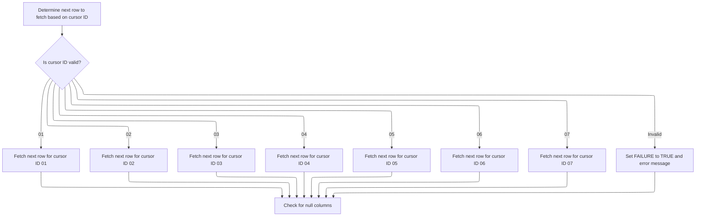

<SwmSnippet path="/base/src/NNNS0487.cbl" line="1697">

---

`1300-EXIT-GET-NEXT-ROW` picks the right fetch routine based on the cursor ID, runs it, and then checks for null columns. If the ID isn't valid, it sets a failure and error message. This is just a dispatcher for fetching the next row from the DB.

```cobol
177400 1300-EXIT-GET-NEXT-ROW.                                          00177400
177500     EVALUATE TRUE                                                00177500
177600       WHEN DDDXLO01                                              00177600
177700         PERFORM 1301-FETCH-DDDXLO01                              00177700
177800       WHEN DDDXLO02                                              00177800
177900         PERFORM 1302-FETCH-DDDXLO02                              00177900
178000       WHEN DDDXLO03                                              00178000
178100         PERFORM 1303-FETCH-DDDXLO03                              00178100
178200       WHEN DDDXLO04                                              00178200
178300         PERFORM 1304-FETCH-DDDXLO04                              00178300
178400       WHEN DDDXLO05                                              00178400
178500         PERFORM 1305-FETCH-DDDXLO05                              00178500
178600       WHEN DDDXLO06                                              00178600
178700         PERFORM 1306-FETCH-DDDXLO06                              00178700
178800       WHEN DDDXLO07                                              00178800
178900         PERFORM 1307-FETCH-DDDXLO07                              00178900
179000       WHEN OTHER                                                 00179000
179100         SET FAILURE TO TRUE                                      00179100
179200         MOVE 'NNNS0487 - Invalid fetch cursor ID.'               00179200
179300           TO IS-RTRN-MSG-TXT OF XXXN001A                         00179300
179400     END-EVALUATE                                                 00179400
179500                                                                  00179500
179600     PERFORM 1700-CHECK-NULL-COLUMNS                              00179600
179700     .                                                            00179700
```

---

</SwmSnippet>

<SwmSnippet path="/base/src/NNNS0487.cbl" line="1806">

---

`1302-FETCH-DDDXLO02` fetches a row from the DDDXLO02 cursor and maps all columns directly into the DCLXXXATION structure fields. The structure has to match the DB columns exactly, or this breaks.

```cobol
188300 1302-FETCH-DDDXLO02.                                             00188300
188400     EXEC SQL                                                     00188400
188500         FETCH DDDXLO02                                           00188500
188600         INTO  :DCLXXXATION.LOC-TYP-CD,                           00188600
188700               :DCLXXXATION.LOC-NBR,                              00188700
188800               :DCLXXXATION.LOC-NM,                               00188800
188900               :DCLXXXATION.LOC-ABB,                              00188900
189000               :DCLXXXATION.LGL-LOC-NAM,                          00189000
189100               :DCLXXXATION.PRIM-CONTACT-NM,                      00189100
189200               :DCLXXXATION.PRIM-ADR-1,                           00189200
189300               :DCLXXXATION.PRIM-ADR-2,                           00189300
189400               :DCLXXXATION.PRIM-ADR-3,                           00189400
189500               :DCLXXXATION.PRIM-ADR-4,                           00189500
189600               :DCLXXXATION.PRIM-CITY,                            00189600
189700               :DCLXXXATION.PRIM-CITY-ID,                         00189700
189800               :DCLXXXATION.PRIM-STATE-CD,                        00189800
189900               :DCLXXXATION.PRIM-ZIP5-CD,                         00189900
190000               :DCLXXXATION.PRIM-ZIP4-CD,                         00190000
190100               :DCLXXXATION.PRIM-PHN-CNTRY-CD,                    00190100
190200               :DCLXXXATION.PRIM-AREA-CD,                         00190200
190300               :DCLXXXATION.PRIM-PHONE-NBR,                       00190300
190400               :DCLXXXATION.PRIM-CNTRY-NM,                        00190400
190500               :DCLXXXATION.PRIM-CNTRY-ABB,                       00190500
190600               :DCLXXXATION.SEC-LOC-NM,                           00190600
190700               :DCLXXXATION.SEC-CONTACT-NM,                       00190700
190800               :DCLXXXATION.SEC-ADR-1,                            00190800
190900               :DCLXXXATION.SEC-ADR-2,                            00190900
191000               :DCLXXXATION.SEC-ADR-3,                            00191000
191100               :DCLXXXATION.SEC-ADR-4,                            00191100
191200               :DCLXXXATION.SEC-CITY,                             00191200
191300               :DCLXXXATION.SEC-STATE-CD,                         00191300
191400               :DCLXXXATION.SEC-ZIP5-CD,                          00191400
191500               :DCLXXXATION.SEC-ZIP4-CD,                          00191500
191600               :DCLXXXATION.SEC-PHN-CNTRY-CD,                     00191600
191700               :DCLXXXATION.SEC-AREA-CD,                          00191700
191800               :DCLXXXATION.SEC-PHONE-NBR,                        00191800
191900               :DCLXXXATION.SEC-CNTRY-NM,                         00191900
192000               :DCLXXXATION.SEC-CNTRY-ABB,                        00192000
192100               :DCLXXXATION.MAIL-TO-LOC-NM,                       00192100
192200               :DCLXXXATION.MAIL-TO-CNTCT-NM,                     00192200
192300               :DCLXXXATION.MAIL-TO-ADR-1,                        00192300
192400               :DCLXXXATION.MAIL-TO-ADR-2,                        00192400
192500               :DCLXXXATION.MAIL-TO-ADR-3,                        00192500
192600               :DCLXXXATION.MAIL-TO-ADR-4,                        00192600
192700               :DCLXXXATION.MAIL-TO-CITY,                         00192700
192800               :DCLXXXATION.MAIL-TO-STATE-CD,                     00192800
192900               :DCLXXXATION.MAIL-TO-ZIP5-CD,                      00192900
193000               :DCLXXXATION.MAIL-TO-ZIP4-CD,                      00193000
193100               :DCLXXXATION.MAIL-PHN-CNTRY-CD,                    00193100
193200               :DCLXXXATION.MAIL-TO-AREA-CD,                      00193200
193300               :DCLXXXATION.MAIL-TO-PHONE-NBR,                    00193300
193400               :DCLXXXATION.MAIL-TO-CNTRY-NM,                     00193400
193500               :DCLXXXATION.MAIL-TO-CNTRY-AB,                     00193500
193600               :DCLXXXATION.CURR-FAX-ID,                          00193600
193700               :DCLXXXATION.ADDED-DT,                             00193700
193800               :DCLXXXATION.DELETE-DT,                            00193800
193900               :DCLXXXATION.OPENED-DT,                            00193900
194000               :DCLXXXATION.CLOSED-DT,                            00194000
194100               :DCLXXXATION.INACTIVE-SW,                          00194100
194200               :DCLXXXATION.INACTIVE-DT,                          00194200
194300               :DCLXXXATION.AP-NBR:WS-AP-NBR-IND,                 00194300
194400               :DCLXXXATION.AP-TYP-CD:WS-AP-TYP-CD-IND,           00194400
194500               :DCLXXXATION.LST-UPDT-TS,                          00194500
194600               :DCLXXXATION.LST-UPDT-USR-ID,                      00194600
194700               :DCLXXXATION.PRIM-EMAIL-ID,                        00194700
194800               :DCLXXXATION.SECY-EMAIL-ID,                        00194800
194900               :DCLXXXATION.MAIL-TO-EMAIL-ID,                     00194900
195000               :DCLXXXATION.FAC-ID,                               00195000
195100               :DCLXXXATION.ORG-ID,                               00195100
195200               :DCLXXXATION.B2B-PRIM-RTNG-ID,                     00195200
195300               :DCLXXXATION.PRIM-CNTY-TXT,                        00195300
195400               :DCLXXXATION.SECY-CNTY-TXT,                        00195400
195500               :DCLXXXATION.MAIL-TO-CNTY-TXT,                     00195500
195600               :DCLXXXATION.DIR-SHP-LOC-SW,                       00195600
195700               :DCLXXXATION.LOC-ORD-PROCNG-DD,                    00195700
195800               :WS-ORD-PROCNG-CTOF-TM,                            00195800
195900               :DCLXXXATION.SCH-SHP-DD-TXT,                       00195900
196000               :DCLXXXATION.ORD-LEAD-TM-DD,                       00196000
196100               :DCLXXXATION.ORD-BUFFER-TM-DD                      00196100
196200     END-EXEC                                                     00196200
196300     .                                                            00196300
```

---

</SwmSnippet>

<SwmSnippet path="/base/src/NNNS0487.cbl" line="2221">

---

`1307-FETCH-DDDXLO07` fetches a row from the DDDXLO07 cursor and dumps all the columns into the DCLXXXATION structure. The structure has to match the DB columns exactly, or this breaks.

```cobol
229800 1307-FETCH-DDDXLO07.                                             00229800
229900     EXEC SQL                                                     00229900
230000         FETCH DDDXLO07                                           00230000
230100         INTO  :DCLXXXATION.LOC-TYP-CD,                           00230100
230200               :DCLXXXATION.LOC-NBR,                              00230200
230300               :DCLXXXATION.LOC-NM,                               00230300
230400               :DCLXXXATION.LOC-ABB,                              00230400
230500               :DCLXXXATION.LGL-LOC-NAM,                          00230500
230600               :DCLXXXATION.PRIM-CONTACT-NM,                      00230600
230700               :DCLXXXATION.PRIM-ADR-1,                           00230700
230800               :DCLXXXATION.PRIM-ADR-2,                           00230800
230900               :DCLXXXATION.PRIM-ADR-3,                           00230900
231000               :DCLXXXATION.PRIM-ADR-4,                           00231000
231100               :DCLXXXATION.PRIM-CITY,                            00231100
231200               :DCLXXXATION.PRIM-CITY-ID,                         00231200
231300               :DCLXXXATION.PRIM-STATE-CD,                        00231300
231400               :DCLXXXATION.PRIM-ZIP5-CD,                         00231400
231500               :DCLXXXATION.PRIM-ZIP4-CD,                         00231500
231600               :DCLXXXATION.PRIM-PHN-CNTRY-CD,                    00231600
231700               :DCLXXXATION.PRIM-AREA-CD,                         00231700
231800               :DCLXXXATION.PRIM-PHONE-NBR,                       00231800
231900               :DCLXXXATION.PRIM-CNTRY-NM,                        00231900
232000               :DCLXXXATION.PRIM-CNTRY-ABB,                       00232000
232100               :DCLXXXATION.SEC-LOC-NM,                           00232100
232200               :DCLXXXATION.SEC-CONTACT-NM,                       00232200
232300               :DCLXXXATION.SEC-ADR-1,                            00232300
232400               :DCLXXXATION.SEC-ADR-2,                            00232400
232500               :DCLXXXATION.SEC-ADR-3,                            00232500
232600               :DCLXXXATION.SEC-ADR-4,                            00232600
232700               :DCLXXXATION.SEC-CITY,                             00232700
232800               :DCLXXXATION.SEC-STATE-CD,                         00232800
232900               :DCLXXXATION.SEC-ZIP5-CD,                          00232900
233000               :DCLXXXATION.SEC-ZIP4-CD,                          00233000
233100               :DCLXXXATION.SEC-PHN-CNTRY-CD,                     00233100
233200               :DCLXXXATION.SEC-AREA-CD,                          00233200
233300               :DCLXXXATION.SEC-PHONE-NBR,                        00233300
233400               :DCLXXXATION.SEC-CNTRY-NM,                         00233400
233500               :DCLXXXATION.SEC-CNTRY-ABB,                        00233500
233600               :DCLXXXATION.MAIL-TO-LOC-NM,                       00233600
233700               :DCLXXXATION.MAIL-TO-CNTCT-NM,                     00233700
233800               :DCLXXXATION.MAIL-TO-ADR-1,                        00233800
233900               :DCLXXXATION.MAIL-TO-ADR-2,                        00233900
234000               :DCLXXXATION.MAIL-TO-ADR-3,                        00234000
234100               :DCLXXXATION.MAIL-TO-ADR-4,                        00234100
234200               :DCLXXXATION.MAIL-TO-CITY,                         00234200
234300               :DCLXXXATION.MAIL-TO-STATE-CD,                     00234300
234400               :DCLXXXATION.MAIL-TO-ZIP5-CD,                      00234400
234500               :DCLXXXATION.MAIL-TO-ZIP4-CD,                      00234500
234600               :DCLXXXATION.MAIL-PHN-CNTRY-CD,                    00234600
234700               :DCLXXXATION.MAIL-TO-AREA-CD,                      00234700
234800               :DCLXXXATION.MAIL-TO-PHONE-NBR,                    00234800
234900               :DCLXXXATION.MAIL-TO-CNTRY-NM,                     00234900
235000               :DCLXXXATION.MAIL-TO-CNTRY-AB,                     00235000
235100               :DCLXXXATION.CURR-FAX-ID,                          00235100
235200               :DCLXXXATION.ADDED-DT,                             00235200
235300               :DCLXXXATION.DELETE-DT,                            00235300
235400               :DCLXXXATION.OPENED-DT,                            00235400
235500               :DCLXXXATION.CLOSED-DT,                            00235500
235600               :DCLXXXATION.INACTIVE-SW,                          00235600
235700               :DCLXXXATION.INACTIVE-DT,                          00235700
235800               :DCLXXXATION.AP-NBR:WS-AP-NBR-IND,                 00235800
235900               :DCLXXXATION.AP-TYP-CD:WS-AP-TYP-CD-IND,           00235900
236000               :DCLXXXATION.LST-UPDT-TS,                          00236000
236100               :DCLXXXATION.LST-UPDT-USR-ID,                      00236100
236200               :DCLXXXATION.PRIM-EMAIL-ID,                        00236200
236300               :DCLXXXATION.SECY-EMAIL-ID,                        00236300
236400               :DCLXXXATION.MAIL-TO-EMAIL-ID,                     00236400
236500               :DCLXXXATION.FAC-ID,                               00236500
236600               :DCLXXXATION.ORG-ID,                               00236600
236700               :DCLXXXATION.B2B-PRIM-RTNG-ID,                     00236700
236800               :DCLXXXATION.PRIM-CNTY-TXT,                        00236800
236900               :DCLXXXATION.SECY-CNTY-TXT,                        00236900
237000               :DCLXXXATION.MAIL-TO-CNTY-TXT,                     00237000
237100               :DCLXXXATION.DIR-SHP-LOC-SW,                       00237100
237200               :DCLXXXATION.LOC-ORD-PROCNG-DD,                    00237200
237300               :WS-ORD-PROCNG-CTOF-TM,                            00237300
237400               :DCLXXXATION.SCH-SHP-DD-TXT,                       00237400
237500               :DCLXXXATION.ORD-LEAD-TM-DD,                       00237500
237600               :DCLXXXATION.ORD-BUFFER-TM-DD                      00237600
237700     END-EXEC                                                     00237700
237800     .                                                            00237800
```

---

</SwmSnippet>

### Validating and Updating a Location Record

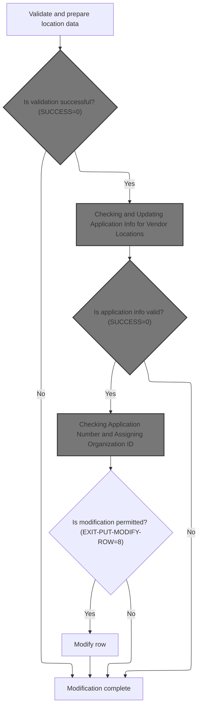

<SwmSnippet path="/base/src/NNNS0487.cbl" line="2304">

---

`1400-EXIT-PUT-MODIFY-ROW` runs a bunch of validation and data prep routines, checks for events, fetches current values, and only then does the actual update. Each step is chained so that if one fails, the update doesn't happen.

```cobol
238100 1400-EXIT-PUT-MODIFY-ROW.                                        00238100
238200     PERFORM 1800-EDIT-NULL-INDICATORS                            00238200
238300     PERFORM 2040-GET-DATE-AND-USER                               00238300
238400                                                                  00238400
238500     IF SUCCESS                                                   00238500
238600       PERFORM 1411-CHECK-FOR-EVENTS                              00238600
238700       IF SUCCESS                                                 00238700
238800         PERFORM 1420-CHECK-AP-INFO                               00238800
238900         IF SUCCESS                                               00238900
239000*          PERFORM 10300-CHECK-FOR-VALID-COUNTY                   00239000
239100           SET EXIT-PUT-MODIFY-ROW  TO TRUE                       00239100
239200           IF SUCCESS                                             00239200
239300             PERFORM 1430-GET-CURRENT-VALUES                      00239300
239400             PERFORM 1800-EDIT-NULL-INDICATORS                    00239400
239500             PERFORM 1440-D0-MODIFY-ROW                           00239500
239600           END-IF                                                 00239600
239700         END-IF                                                   00239700
239800       END-IF                                                     00239800
239900     END-IF                                                       00239900
240000     .                                                            00240000
```

---

</SwmSnippet>

#### Checking for Event Triggers and Validating Status

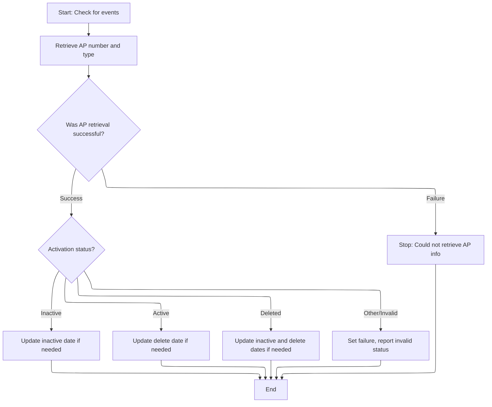

<SwmSnippet path="/base/src/NNNS0487.cbl" line="2326">

---

`1411-CHECK-FOR-EVENTS` first fetches the AP number, then if that works, validates the activity switch. This sets up whether further event logic needs to run.

```cobol
240300 1411-CHECK-FOR-EVENTS.                                           00240300
240400     PERFORM 1412-GET-AP-NBR                                      00240400
240500     IF SUCCESS                                                   00240500
240600       PERFORM 1414-VALIDATE-ACTIV-SW                             00240600
240700     END-IF                                                       00240700
240800     .                                                            00240800
```

---

</SwmSnippet>

<SwmSnippet path="/base/src/NNNS0487.cbl" line="2334">

---

`1412-GET-AP-NBR` only runs the SQL select if the location type is 'V' or 'D'. It fetches AP_NBR and AP_TYP_CD, handles nulls and errors, and sets up the working storage for later checks.

```cobol
241100 1412-GET-AP-NBR.                                                 00241100
241200     IF LOC-TYP-CD OF DCLXXXATION = 'V' OR 'D'                    00241200
241300       EXEC SQL                                                   00241300
241400           SELECT AP_NBR,                                         00241400
241500                  AP_TYP_CD                                       00241500
241600           INTO :WS-AP-NUM:WS-AP-NBR-IND,                         00241600
241700                :WS-AP-TYPE:WS-AP-TYP-CD-IND                      00241700
241800           FROM XXXATION                                          00241800
241900           WHERE LOC_TYP_CD = :DCLXXXATION.LOC-TYP-CD             00241900
242000           AND  LOC_NBR = :DCLXXXATION.LOC-NBR                    00242000
242100       END-EXEC                                                   00242100
242200                                                                  00242200
242300       EVALUATE TRUE                                              00242300
242400         WHEN SQLCODE = 0                                         00242400
242500           IF WS-AP-NBR-IND < 0                                   00242500
242600           OR WS-AP-TYP-CD-IND < 0                                00242600
242700             INITIALIZE WS-AP-NUM                                 00242700
242800                        WS-AP-TYPE                                00242800
242900           END-IF                                                 00242900
243000         WHEN SQLCODE = 100                                       00243000
243100           INITIALIZE WS-AP-NUM                                   00243100
243200                      WS-AP-TYPE                                  00243200
243300           MOVE 0 TO SQLCODE                                      00243300
243400        WHEN OTHER                                                00243400
243500         SET FAILURE  TO TRUE                                     00243500
243600         MOVE SPACES  TO IS-RTRN-MSG-TXT                          00243600
243700         MOVE SQLCODE TO WS-SQLCODE                               00243700
243800         STRING 'NNNS0487 - Error in gathering events. SQL '      00243800
243900                WS-SQLCODE '.'                                    00243900
244000         DELIMITED BY SIZE INTO IS-RTRN-MSG-TXT                   00244000
244100       END-EVALUATE                                               00244100
244200       MOVE WS-AP-NUM   TO MMMC0474-OLD-AP-NBR                    00244200
244300       MOVE WS-AP-TYPE  TO MMMC0474-OLD-AP-TYP                    00244300
244400     END-IF                                                       00244400
244500     .                                                            00244500
```

---

</SwmSnippet>

<SwmSnippet path="/base/src/NNNS0487.cbl" line="2371">

---

`1414-VALIDATE-ACTIV-SW` checks the inactive status and sets or copies inactive/delete dates based on the value. If the status is invalid, it sets a failure and error message. The default date is used as a marker for 'not set'.

```cobol
244800 1414-VALIDATE-ACTIV-SW.                                          00244800
244900     EVALUATE TRUE                                                00244900
245000       WHEN INACTIVE-SW OF DCLXXXATION = K-LOC-IN-ACTIVE          00245000
245100         IF INACTIVE-DT OF DCLXXXATION = K-DEF-DT                 00245100
245200           MOVE DTA10-MM-DD-YYYY TO INACTIVE-DT OF DCLXXXATION    00245200
245300         END-IF                                                   00245300
245400                                                                  00245400
245500       WHEN INACTIVE-SW OF DCLXXXATION = K-LOC-ACTIVE             00245500
245600         MOVE K-DEF-DT TO INACTIVE-DT OF DCLXXXATION              00245600
245700         IF DELETE-DT     OF P-DDDTLO01 = SPACES                  00245700
245800           MOVE K-DEF-DT TO DELETE-DT     OF DCLXXXATION          00245800
245900         ELSE                                                     00245900
246000           MOVE DELETE-DT     OF P-DDDTLO01                       00246000
246100             TO DELETE-DT     OF DCLXXXATION                      00246100
246200         END-IF                                                   00246200
246300                                                                  00246300
246400                                                                  00246400
246500       WHEN INACTIVE-SW OF DCLXXXATION = K-LOC-DELETED            00246500
246600         IF INACTIVE-DT OF DCLXXXATION = K-DEF-DT                 00246600
246700           MOVE DTA10-MM-DD-YYYY TO INACTIVE-DT OF DCLXXXATION    00246700
246800         END-IF                                                   00246800
246900         IF DELETE-DT OF DCLXXXATION = K-DEF-DT                   00246900
247000           MOVE DTA10-MM-DD-YYYY TO DELETE-DT   OF DCLXXXATION    00247000
247100         END-IF                                                   00247100
247200                                                                  00247200
247300       WHEN OTHER                                                 00247300
247400         SET  FAILURE TO TRUE                                     00247400
247500         MOVE 'NNNS0487 - Invalid active-sw - must be A,I,or D!'  00247500
247600           TO IS-RTRN-MSG-TXT                                     00247600
247700     END-EVALUATE                                                 00247700
247800     .                                                            00247800
```

---

</SwmSnippet>

#### Checking and Updating Application Info for Vendor Locations

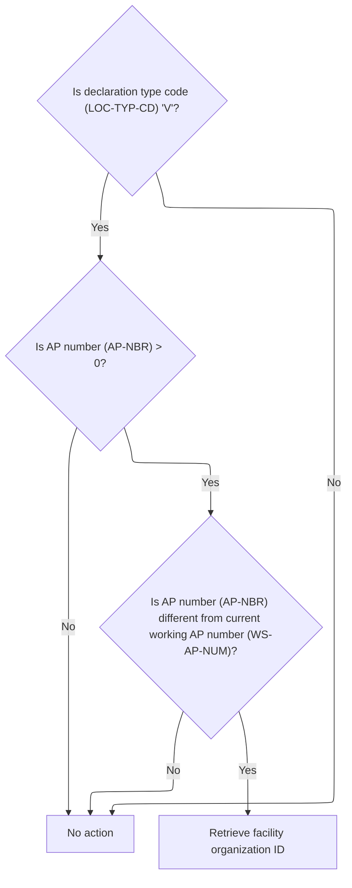

<SwmSnippet path="/base/src/NNNS0487.cbl" line="2404">

---

`1420-CHECK-AP-INFO` only runs for vendor locations. If the AP number is set and changed, it triggers the facility/org ID logic by calling 1505-GET-FAC-ORG-ID.

```cobol
248100 1420-CHECK-AP-INFO.                                              00248100
248200     IF LOC-TYP-CD OF DCLXXXATION = 'V'                           00248200
248300       IF AP-NBR OF DCLXXXATION > 0                               00248300
248400         IF AP-NBR OF DCLXXXATION NOT EQUAL TO WS-AP-NUM          00248400
248500           PERFORM 1505-GET-FAC-ORG-ID                            00248500
248600         END-IF                                                   00248600
248700       END-IF                                                     00248700
248800     END-IF                                                       00248800
248900     .                                                            00248900
```

---

</SwmSnippet>

#### Resolving Facility and Organization IDs

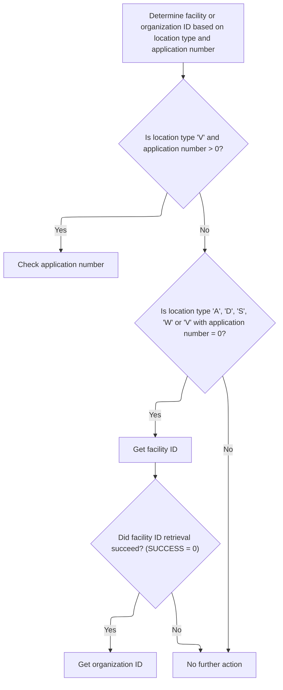

<SwmSnippet path="/base/src/NNNS0487.cbl" line="2503">

---

`1505-GET-FAC-ORG-ID` checks the location type and AP number, then runs the right subroutine to resolve facility or org IDs. Each branch handles a different business case.

```cobol
258000 1505-GET-FAC-ORG-ID.                                             00258000
258100     EVALUATE TRUE                                                00258100
258200       WHEN LOC-TYP-CD OF DCLXXXATION = 'V'                       00258200
258300        AND AP-NBR OF DCLXXXATION > 0                             00258300
258400         PERFORM 1515-CHECK-AP-NBR                                00258400
258500       WHEN (LOC-TYP-CD OF DCLXXXATION = 'A' OR 'D' OR 'S' OR 'W')00258500
258600         OR (LOC-TYP-CD OF DCLXXXATION = 'V'                      00258600
258700        AND AP-NBR OF DCLXXXATION = 0)                            00258700
258800         PERFORM 1525-EXIT-GET-FAC-ID                             00258800
258900         IF SUCCESS                                               00258900
259000           PERFORM 1530-EXIT-GET-ORG-ID                           00259000
259100         END-IF                                                   00259100
259200       WHEN OTHER                                                 00259200
259300         CONTINUE                                                 00259300
259400     END-EVALUATE                                                 00259400
259500     .                                                            00259500
```

---

</SwmSnippet>

#### Checking Application Number and Assigning Organization ID

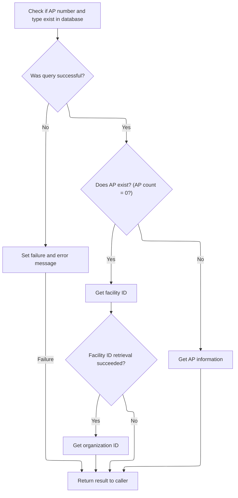

<SwmSnippet path="/base/src/NNNS0487.cbl" line="2540">

---

`1515-CHECK-AP-NBR` counts how many times the AP number/type exists in the DB. If it's missing, it generates new facility/org IDs. If it exists, it fetches the info. If the SQL fails, it sets an error.

```cobol
261700 1515-CHECK-AP-NBR.                                               00261700
261800     MOVE AP-NBR    OF DCLXXXATION TO WS-AP-NUM                   00261800
261900     MOVE AP-TYP-CD OF DCLXXXATION TO WS-AP-TYPE                  00261900
262000                                                                  00262000
262100     EXEC SQL                                                     00262100
262200         SELECT COUNT(*)                                          00262200
262300         INTO   :WS-AP-NBR-CNT                                    00262300
262400         FROM XXXATION                                            00262400
262500         WHERE AP_TYP_CD = :WS-AP-TYPE                            00262500
262600           AND AP_NBR = :WS-AP-NUM                                00262600
262700     END-EXEC                                                     00262700
262800                                                                  00262800
262900     EVALUATE TRUE                                                00262900
263000       WHEN SQLCODE = 0                                           00263000
263100         IF WS-AP-NBR-CNT = 0                                     00263100
263200           PERFORM 1525-EXIT-GET-FAC-ID                           00263200
263300           IF SUCCESS                                             00263300
263400             PERFORM 1530-EXIT-GET-ORG-ID                         00263400
263500           END-IF                                                 00263500
263600         ELSE                                                     00263600
263700           PERFORM 1520-GET-AP-INFO                               00263700
263800         END-IF                                                   00263800
263900       WHEN OTHER                                                 00263900
264000         SET  FAILURE        TO TRUE                              00264000
264100         MOVE 'NNNS0487 - Error getting AP count!'                00264100
264200           TO IS-RTRN-MSG-TXT                                     00264200
264300     END-EVALUATE                                                 00264300
264400     .                                                            00264400
```

---

</SwmSnippet>

<SwmSnippet path="/base/src/NNNS0487.cbl" line="2614">

---

`1530-EXIT-GET-ORG-ID` grabs the max ORG_ID from two tables, bumps it by one, and assigns it. If the SQL fails, it sets an error. This keeps org IDs unique.

```cobol
269100 1530-EXIT-GET-ORG-ID.                                            00269100
269200     EXEC SQL                                                     00269200
269300         SELECT GREATEST (MAX (LOC.ORG_ID), MAX (DEPT.ORG_ID))    00269300
269400         INTO   :DCLXXXATION.ORG-ID                               00269400
269500         FROM   XXXATION LOC, STR_DEPT DEPT                       00269500
269600     END-EXEC                                                     00269600
269700                                                                  00269700
269800     EVALUATE TRUE                                                00269800
269900       WHEN SQLCODE = 0                                           00269900
270000         COMPUTE ORG-ID OF DCLXXXATION =                          00270000
270100                 ORG-ID OF DCLXXXATION + 1                        00270100
270200       WHEN OTHER                                                 00270200
270300         SET  FAILURE TO TRUE                                     00270300
270400         MOVE 'NNNS0487 - Error getting ORG_ID!'                  00270400
270500           TO IS-RTRN-MSG-TXT                                     00270500
270600     END-EVALUATE                                                 00270600
270700     .                                                            00270700
```

---

</SwmSnippet>

#### Fetching Current Mailing and Contact Data

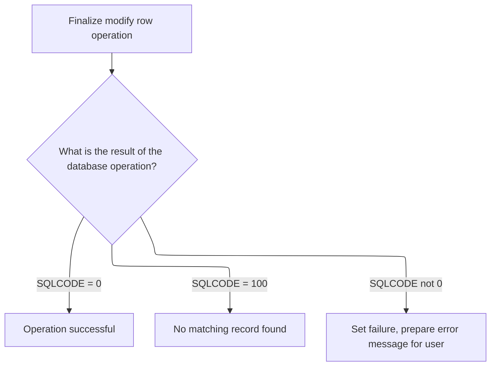

<SwmSnippet path="/base/src/NNNS0487.cbl" line="2415">

---

`1430-GET-CURRENT-VALUES` fetches the current mailing and contact info for the location from the DB, using the type and number as keys. This is needed for later update logic.

```cobol
249200 1430-GET-CURRENT-VALUES.                                         00249200
249300                                                                  00249300
249400     EXEC SQL                                                     00249400
249500         SELECT MAIL_TO_LOC_NM,                                   00249500
249600                MAIL_TO_ADR_1,                                    00249600
249700                MAIL_TO_ADR_2,                                    00249700
249800                MAIL_TO_CITY,                                     00249800
249900                MAIL_TO_STATE_CD,                                 00249900
250000                SEC_CONTACT_NM,                                   00250000
250100                MAIL_TO_ZIP5_CD,                                  00250100
250200                MAIL_TO_ZIP4_CD,                                  00250200
250300                MAIL_TO_PHONE_NBR                                 00250300
250400          INTO  :WS-MAIL-TO-LOC-NM,                               00250400
250500                :WS-MAIL-TO-ADR-1,                                00250500
250600                :WS-MAIL-TO-ADR-2,                                00250600
250700                :WS-MAIL-TO-CITY,                                 00250700
250800                :WS-MAIL-TO-STATE-CD,                             00250800
250900                :WS-SEC-CONTACT-NM,                               00250900
251000                :WS-MAIL-TO-ZIP5-CD,                              00251000
251100                :WS-MAIL-TO-ZIP4-CD,                              00251100
251200                :WS-MAIL-TO-PHONE-NBR                             00251200
251300         FROM   XXXATION                                          00251300
251400         WHERE  LOC_TYP_CD = :DCLXXXATION.LOC-TYP-CD              00251400
251500         AND    LOC_NBR = :DCLXXXATION.LOC-NBR                    00251500
251600     END-EXEC                                                     00251600
251700                                                                  00251700
251800     EVALUATE TRUE                                                00251800
251900       WHEN SQLCODE = 0                                           00251900
252000         CONTINUE                                                 00252000
252100       WHEN SQLCODE = 100                                         00252100
252200         CONTINUE                                                 00252200
252300       WHEN SQLCODE NOT = 0                                       00252300
252400         SET  FAILURE TO TRUE                                     00252400
252500         MOVE SPACES  TO IS-RTRN-MSG-TXT                          00252500
252600         MOVE SQLCODE TO WS-SQLCODE                               00252600
252700         STRING 'NNNS0487 - Error in getting curr values, '       00252700
252800                'RC=' WS-SQLCODE '.'                              00252800
252900                DELIMITED BY SIZE INTO IS-RTRN-MSG-TXT            00252900
253000     END-EVALUATE                                                 00253000
253100     .                                                            00253100
```

---

</SwmSnippet>

### Applying the Row Update and Handling Business Logic

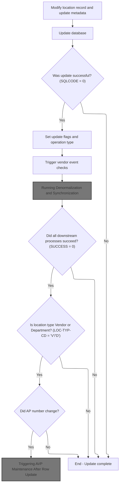

<SwmSnippet path="/base/src/NNNS0487.cbl" line="2457">

---

`1440-D0-MODIFY-ROW` updates the row, sets a bunch of flags, calls the CUD routine, and if successful, triggers event, denorm, and vendor maintenance logic as needed. This is where all the business side effects happen after an update.

```cobol
253400 1440-D0-MODIFY-ROW.                                              00253400
253500     MOVE YYYC0127-TS   TO LST-UPDT-TS     OF DCLXXXATION         00253500
253600     MOVE YYYC0107-USER TO LST-UPDT-USR-ID OF DCLXXXATION         00253600
253700                                                                  00253700
253800     PERFORM 4010-REP-LOWVALUE-WITH-SPACES                        00253800
253900     PERFORM 5000-CALL-NNNS0487-CUD-ROUTINE                       00253900
254000                                                                  00254000
254100     IF SQLCODE = 0                                               00254100
254200       SET YYYN110A-UPD TO TRUE                                   00254200
254300       SET MMMC0265-MOD TO TRUE                                   00254300
254400       SET LOC-UPD      TO TRUE                                   00254400
254500       SET DSD-UPD      TO TRUE                                   00254500
254600       SET WHS-UPD      TO TRUE                                   00254600
254700       SET VEN-UPD      TO TRUE                                   00254700
254800       SET MODIFY-OPERATION TO TRUE                               00254800
254900       PERFORM 10100-CHECK-FOR-VNDR-EVENTS                        00254900
255000       PERFORM 2000-DENORM-PROCESS                                00255000
255100       IF SUCCESS                                                 00255100
255200         IF LOC-TYP-CD OF DCLXXXATION = 'V' OR 'D'                00255200
255300           IF AP-NBR OF DCLXXXATION NOT EQUAL MMMC0474-OLD-AP-NBR 00255300
255400             SET MMMC0474-UPD TO TRUE                             00255400
255500             PERFORM 125-CONNECT-TO-DB2                           00255500
255600             PERFORM 2050-DO-AVP-MAINTENANCE                      00255600
255700           END-IF                                                 00255700
255800         END-IF                                                   00255800
255900       END-IF                                                     00255900
256000     END-IF                                                       00256000
256100     .                                                            00256100
```

---

</SwmSnippet>

#### Running Denormalization and Synchronization

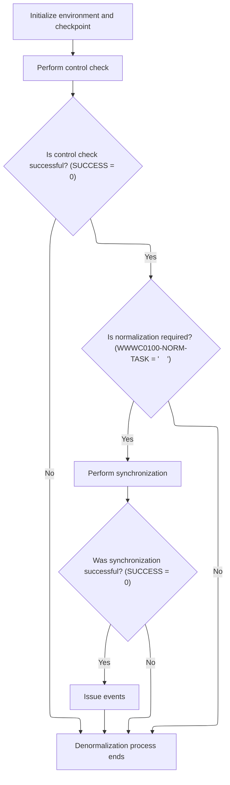

<SwmSnippet path="/base/src/NNNS0487.cbl" line="3106">

---

`2000-DENORM-PROCESS` bumps the checkpoint, copies env data, runs control logic, and if it's a normal task, calls the sync subroutine and issues events if that works. This keeps everything in sync after a DB change.

```cobol
318300 2000-DENORM-PROCESS.                                             00318300
318400     MOVE 1                TO WS-CHECKPOINT-INC                   00318400
318500     MOVE YYYN005A-SYS-ENV TO YYYN110A-SYS-ENV                    00318500
318600     PERFORM 2010-CALL-CONTROL-SUBR                               00318600
318700     IF  SUCCESS                                                  00318700
318800     AND WWWC0100-NORM-TASK                                       00318800
318900       PERFORM 2020-CALL-SYNC-SUBR                                00318900
319000       IF SUCCESS                                                 00319000
319100          PERFORM 2030-ISSUE-EVENTS                               00319100
319200       END-IF                                                     00319200
319300     END-IF                                                       00319300
319400     .                                                            00319400
```

---

</SwmSnippet>

<SwmSnippet path="/base/src/NNNS0487.cbl" line="3129">

---

`2020-CALL-SYNC-SUBR` checks the location type and calls the right sync routine for each type. Some types are skipped (CONTINUE), and each call sets up the right flags and passes the right data.

```cobol
320600 2020-CALL-SYNC-SUBR.                                             00320600
320700     SET YYYN110A-ORACLE        TO TRUE                           00320700
320800     EVALUATE TRUE                                                00320800
320900       WHEN LOC-TYP-CD OF DCLXXXATION = K-VEND-LOC-TYPE           00320900
321000         SET MMMC0135-LO-IS-CURRENT TO TRUE                       00321000
321100         CALL MMMS0135-SYNC-LO USING                              00321100
321200           XXXN001A                                               00321200
321300           YYYN110A                                               00321300
321400           MMMC0135                                               00321400
321500           P-DDDTLO01                                             00321500
321600       WHEN LOC-TYP-CD OF DCLXXXATION = K-STORE-LOC-TYPE          00321600
321700       OR   LOC-TYP-CD OF DCLXXXATION = K-ACCT-LOC-TYPE           00321700
321800         SET MMMC0157-LO-IS-CURRENT TO TRUE                       00321800
321900         CALL MMMS0157-SYNC-LO USING                              00321900
322000           XXXN001A                                               00322000
322100           YYYN110A                                               00322100
322200           MMMC0157                                               00322200
322300           P-DDDTLO01                                             00322300
322400       WHEN LOC-TYP-CD OF DCLXXXATION = K-DSD-VEND-LOC-TYPE       00322400
322500         CONTINUE                                                 00322500
322600*        SET MMMC0153-LO-IS-CURRENT TO TRUE                       00322600
322700*        CALL MMMS0153-SYNC-LO USING                              00322700
322800*          XXXN001A                                               00322800
322900*          YYYN110A                                               00322900
323000*          MMMC0153                                               00323000
323100*          P-DDDTLO01                                             00323100
323200       WHEN LOC-TYP-CD OF DCLXXXATION = 'B'                       00323200
323300       OR   LOC-TYP-CD OF DCLXXXATION = 'T'                       00323300
323400       OR   LOC-TYP-CD OF DCLXXXATION = 'W'                       00323400
323500       OR   LOC-TYP-CD OF DCLXXXATION = 'O'                       00323500
323600         SET  MMMC0265-LO-LEVEL TO TRUE                           00323600
323700         MOVE LOC-TYP-CD OF DCLXXXATION TO LOC-TYP-CD OF MMMC0265 00323700
323800         MOVE LOC-NBR    OF DCLXXXATION TO LOC-NBR    OF MMMC0265 00323800
323900         CALL WS-MMMS0265-SYNC USING                              00323900
324000             XXXN001A                                             00324000
324100             MMMC0265                                             00324100
324200     END-EVALUATE                                                 00324200
324300     .                                                            00324300
```

---

</SwmSnippet>

#### Issuing Master Data Events Based on Location Changes

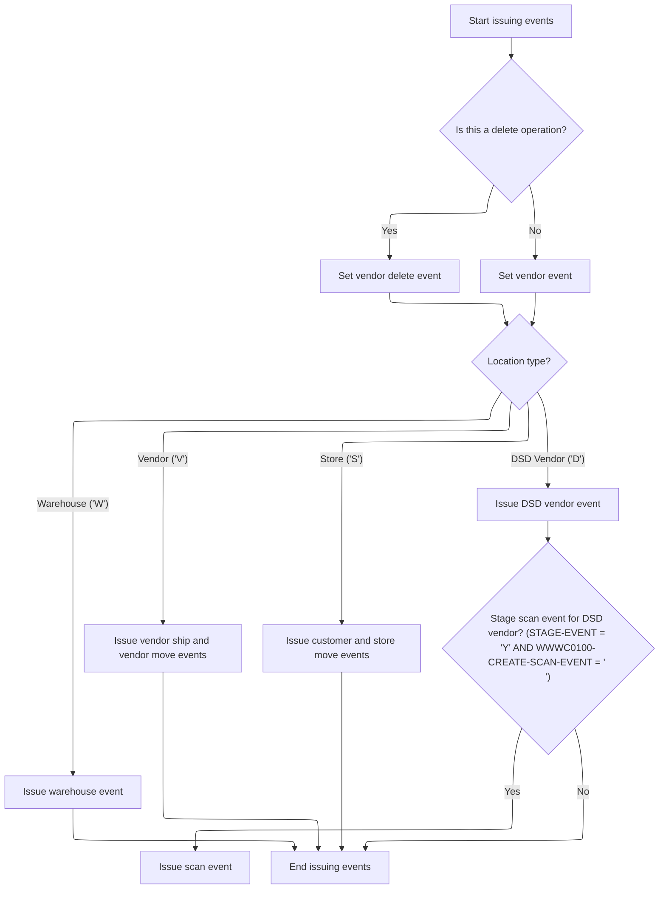

<SwmSnippet path="/base/src/NNNS0487.cbl" line="3169">

---

`2030-ISSUE-EVENTS` builds and issues events based on the location type and operation. It sets up the right event data, picks the event type, and calls the event manager program to handle it. Special logic for deletes and scan events is included.

```cobol
324600 2030-ISSUE-EVENTS.                                               00324600
324700     INITIALIZE ZZZC0550-IN-DATA                                  00324700
324800     SET  YYYN110A-ORACLE       TO TRUE                           00324800
324900     IF DELETE-OPERATION                                          00324900
325000       SET VENDOR-DELETE-EVENT  TO TRUE                           00325000
325100     ELSE                                                         00325100
325200       SET VENDOR-EVENT TO TRUE                                   00325200
325300     END-IF                                                       00325300
325400     MOVE LOC-TYP-CD       OF DCLXXXATION                         00325400
325500       TO VEND-TYP-CD      OF ZZZC0550-VENDOR-DATA                00325500
325600     MOVE LOC-NBR          OF DCLXXXATION                         00325600
325700       TO VEND-NBR         OF ZZZC0550-VENDOR-DATA                00325700
325800     MOVE 'NNNS0487'            TO ZZZC0197-PROGRAM               00325800
325900     MOVE YYYC0107-USER         TO ZZZC0197-USER                  00325900
326000     MOVE YYYN005A-SYS-ENV      TO YYYN110A-SYS-ENV               00326000
326100     MOVE LOC-NBR OF P-DDDTLO01 TO WS-OLD-KEY                     00326100
326200                                                                  00326200
326300     EVALUATE TRUE                                                00326300
326400       WHEN LOC-TYP-CD OF DCLXXXATION = K-VEND-LOC-TYPE           00326400
326500         MOVE WS-VENDOR-FACILITY                                  00326500
326600           TO VM-VENDOR-FACILITY OF ZZZC0020                      00326600
326700         MOVE WS-VENDOR-NUMBER                                    00326700
326800           TO VM-VENDOR-NUMBER   OF ZZZC0020                      00326800
326900         MOVE ZZZC0020              TO ZZZC0197-TRX-REC           00326900
327000         MOVE 'VSHP'                TO ZZZC0197-TRX-ID            00327000
327100         CALL ZZZS0197-EVENT-MGR USING                            00327100
327200             XXXN001A                                             00327200
327300             YYYN110A                                             00327300
327400             ZZZC0197                                             00327400
327500                                                                  00327500
327600         MOVE LOC-TYP-CD OF DCLXXXATION                           00327600
327700           TO LOC-VEN-TYP-CD OF ZZZC0124                          00327700
327800         MOVE LOC-NBR OF DCLXXXATION                              00327800
327900           TO LOC-VEN-NBR OF ZZZC0124                             00327900
328000         MOVE ZZZC0124              TO ZZZC0197-TRX-REC           00328000
328100         MOVE 'VENM'                TO ZZZC0197-TRX-ID            00328100
328200         CALL ZZZS0197-EVENT-MGR USING                            00328200
328300             XXXN001A                                             00328300
328400             YYYN110A                                             00328400
328500             ZZZC0197                                             00328500
328600                                                                  00328600
328700       WHEN LOC-TYP-CD OF DCLXXXATION = K-STORE-LOC-TYPE          00328700
328800         MOVE LOC-NBR OF DCLXXXATION                              00328800
328900           TO ST-STORE-NUMBER OF ZZZC0032                         00328900
329000              LOC-NBR OF ZZZC0094                                 00329000
329100         SET  ZZZC0032-UPD-FXXX TO TRUE                           00329100
329200         MOVE ZZZC0032          TO ZZZC0197-TRX-REC               00329200
329300         MOVE 'CUST'            TO ZZZC0197-TRX-ID                00329300
329400         CALL ZZZS0197-EVENT-MGR USING                            00329400
329500             XXXN001A                                             00329500
329600             YYYN110A                                             00329600
329700             ZZZC0197                                             00329700
329800                                                                  00329800
329900         MOVE LOC-TYP-CD OF DCLXXXATION TO                        00329900
330000                                 LOC-TYP-CD OF ZZZC0094           00330000
330100         MOVE ZZZC0094              TO ZZZC0197-TRX-REC           00330100
330200         MOVE 'STRM'                TO ZZZC0197-TRX-ID            00330200
330300         CALL ZZZS0197-EVENT-MGR USING                            00330300
330400              XXXN001A                                            00330400
330500              YYYN110A                                            00330500
330600              ZZZC0197                                            00330600
330700                                                                  00330700
330800       WHEN LOC-TYP-CD OF DCLXXXATION = K-DSD-VEND-LOC-TYPE       00330800
330900         MOVE LOC-TYP-CD OF DCLXXXATION TO                        00330900
331000                                 LOC-DSD-TYP-CD OF ZZZC0122       00331000
331100         MOVE ZZZC0122              TO ZZZC0197-TRX-REC           00331100
331200         MOVE 'DSDM'                TO ZZZC0197-TRX-ID            00331200
331300         CALL ZZZS0197-EVENT-MGR USING                            00331300
331400              XXXN001A                                            00331400
331500              YYYN110A                                            00331500
331600              ZZZC0197                                            00331600
331700                                                                  00331700
331800       WHEN LOC-TYP-CD OF DCLXXXATION = K-WHSE-LOC-TYPE           00331800
331900         MOVE LOC-NBR OF DCLXXXATION                              00331900
332000           TO LOC-WHS-NBR OF ZZZC0123                             00332000
332100         MOVE LOC-TYP-CD OF DCLXXXATION TO                        00332100
332200              LOC-WHS-TYP-CD OF ZZZC0123                          00332200
332300*        SET  ZZZC0044-UPD-FXXX TO TRUE                           00332300
332400         MOVE ZZZC0123          TO ZZZC0197-TRX-REC               00332400
332500         MOVE 'WHSM'            TO ZZZC0197-TRX-ID                00332500
332600         CALL ZZZS0197-EVENT-MGR USING                            00332600
332700             XXXN001A                                             00332700
332800             YYYN110A                                             00332800
332900             ZZZC0197                                             00332900
333000                                                                  00333000
333100     END-EVALUATE                                                 00333100
333200     IF STAGE-EVENT AND WWWC0100-CREATE-SCAN-EVENT                00333200
333300       AND LOC-TYP-CD OF DCLXXXATION = 'D'                        00333300
333400         MOVE ZZZC0550              TO ZZZC0197-TRX-REC           00333400
333500         MOVE ZZZC0550-TRX          TO ZZZC0197-TRX-ID            00333500
333600                                       ZZZC0197-TRX-CD            00333600
333700         CALL ZZZS0197-EVENT-MGR USING                            00333700
333800              XXXN001A                                            00333800
333900              YYYN110A                                            00333900
334000              ZZZC0197                                            00334000
334100     END-IF                                                       00334100
334200     .                                                            00334200
```

---

</SwmSnippet>

#### Filtering and Issuing Master Data Events

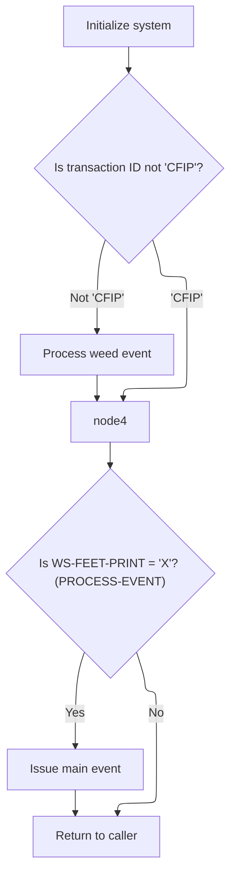

<SwmSnippet path="/base/src/ZZZS0197.cbl" line="57">

---

`000-MAINLINE` filters and issues events, skipping duplicates and unwanted ones.

```cobol
008400 000-MAINLINE.                                                    00008400
008500     PERFORM 100-INITIALIZE                                       00008500
008600                                                                  00008600
008700*    IF  ZZZC0197-TRX-ID NOT = 'CFIP'                             00008700
008800       PERFORM 200-WEED-EVENT                                     00008800
008900*    END-IF                                                       00008900
009000                                                                  00009000
009100     IF PROCESS-EVENT                                             00009100
009200       PERFORM 300-ISSUE-EVENT                                    00009200
009300     END-IF                                                       00009300
009400                                                                  00009400
009500     GOBACK                                                       00009500
009600     .                                                            00009600
```

---

</SwmSnippet>

#### Filtering Out Unwanted or Duplicate Events

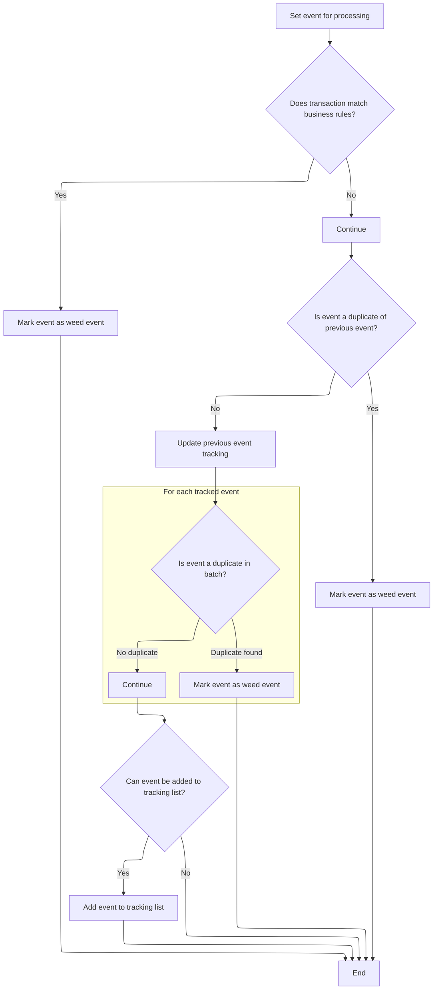

<SwmSnippet path="/base/src/ZZZS0197.cbl" line="89">

---

`200-WEED-EVENT` first runs a hard-coded filter to skip certain events, then checks for duplicates. If the event passes both, it gets processed. This keeps the event stream clean.

```cobol
011600 200-WEED-EVENT.                                                  00011600
011700     SET PROCESS-EVENT TO TRUE                                    00011700
011800     PERFORM 210-WEED-BY-HARD-CODE                                00011800
011900     IF PROCESS-EVENT                                             00011900
012000       PERFORM 220-WEED-DUP-EVENTS                                00012000
012100     END-IF                                                       00012100
012200     .                                                            00012200
```

---

</SwmSnippet>

<SwmSnippet path="/base/src/ZZZS0197.cbl" line="98">

---

`210-WEED-BY-HARD-CODE` just filters out events for a fixed set of transaction IDs in batch mode by setting a skip flag if both conditions match.

```cobol
012500 210-WEED-BY-HARD-CODE.                                           00012500
012600     IF  (ZZZC0197-TRX-ID = 'BVLM'                                00012600
012700*      OR ZZZC0197-TRX-ID = 'APLM'                                00012700
012800*      OR ZZZC0197-TRX-ID = 'BDMM'                                00012800
012900*      OR ZZZC0197-TRX-ID = 'BCAM'                                00012900
013000*      OR ZZZC0197-TRX-ID = 'CCSM'                                00013000
013100*      OR ZZZC0197-TRX-ID = 'CEMM'                                00013100
013200       OR ZZZC0197-TRX-ID = 'CNCM'                                00013200
013300*      OR ZZZC0197-TRX-ID = 'COMM'                                00013300
013400*      OR ZZZC0197-TRX-ID = 'CRCM'                                00013400
013500*      OR ZZZC0197-TRX-ID = 'CSCM'                                00013500
013600*      OR ZZZC0197-TRX-ID = 'CTOM'                                00013600
013700*      OR ZZZC0197-TRX-ID = 'DIRM'                                00013700
013800*      OR ZZZC0197-TRX-ID = 'DISM'                                00013800
013900*      OR ZZZC0197-TRX-ID = 'DSDM'                                00013900
014000*      OR ZZZC0197-TRX-ID = 'FINM'                                00014000
014100*      OR ZZZC0197-TRX-ID = 'ICCM'                                00014100
014200*      OR ZZZC0197-TRX-ID = 'ITMM'                                00014200
014300       OR ZZZC0197-TRX-ID = 'IWVM'                                00014300
014400*      OR ZZZC0197-TRX-ID = 'LOBM'                                00014400
014500*      OR ZZZC0197-TRX-ID = 'MCEM'                                00014500
014600*      OR ZZZC0197-TRX-ID = 'MRGM'                                00014600
014700       OR ZZZC0197-TRX-ID = 'OBSM'                                00014700
014800*      OR ZZZC0197-TRX-ID = 'ORBM'                                00014800
014900       OR ZZZC0197-TRX-ID = 'PBCM'                                00014900
015000*      OR ZZZC0197-TRX-ID = 'PBNM'                                00015000
015100       OR ZZZC0197-TRX-ID = 'PBTM'                                00015100
015200*      OR ZZZC0197-TRX-ID = 'PCCM'                                00015200
015300*      OR ZZZC0197-TRX-ID = 'PCTM'                                00015300
015400*      OR ZZZC0197-TRX-ID = 'PDSH'                                00015400
015500*      OR ZZZC0197-TRX-ID = 'PDUA'                                00015500
015600*      OR ZZZC0197-TRX-ID = 'PDUP'                                00015600
015700       OR ZZZC0197-TRX-ID = 'PIPM'                                00015700
015800*      OR ZZZC0197-TRX-ID = 'PRIM'                                00015800
015900*      OR ZZZC0197-TRX-ID = 'PRMM'                                00015900
016000*      OR ZZZC0197-TRX-ID = 'PRRM'                                00016000
016100       OR ZZZC0197-TRX-ID = 'PSBM'                                00016100
016200*      OR ZZZC0197-TRX-ID = 'PSCM'                                00016200
016300       OR ZZZC0197-TRX-ID = 'RARM'                                00016300
016400       OR ZZZC0197-TRX-ID = 'RFTM'                                00016400
016500       OR ZZZC0197-TRX-ID = 'RITM'                                00016500
016600       OR ZZZC0197-TRX-ID = 'RRFM'                                00016600
016700       OR ZZZC0197-TRX-ID = 'RTDM'                                00016700
016800*      OR ZZZC0197-TRX-ID = 'RTTM'                                00016800
016900       OR ZZZC0197-TRX-ID = 'SCAM'                                00016900
017000*      OR ZZZC0197-TRX-ID = 'SDPM'                                00017000
017100*      OR ZZZC0197-TRX-ID = 'SLDM'                                00017100
017200       OR ZZZC0197-TRX-ID = 'STAM'                                00017200
017300*      OR ZZZC0197-TRX-ID = 'STPM'                                00017300
017400*      OR ZZZC0197-TRX-ID = 'STRM'                                00017400
017500       OR ZZZC0197-TRX-ID = 'STTM'                                00017500
017600*      OR ZZZC0197-TRX-ID = 'T2TM'                                00017600
017700       OR ZZZC0197-TRX-ID = 'TRDM'                                00017700
017800*      OR ZZZC0197-TRX-ID = 'VCMM'                                00017800
017900*      OR ZZZC0197-TRX-ID = 'VENM'                                00017900
018000*      OR ZZZC0197-TRX-ID = 'VISM'                                00018000
018100*      OR ZZZC0197-TRX-ID = 'VLIM'                                00018100
018200*      OR ZZZC0197-TRX-ID = 'WHSM'                                00018200
018300       OR ZZZC0197-TRX-ID = 'WLIM')                               00018300
018400       AND YYYN110A-BATCH-ENV                                     00018400
018500         SET WEED-EVENT TO TRUE                                   00018500
018600     END-IF                                                       00018600
018700     .                                                            00018700
```

---

</SwmSnippet>

<SwmSnippet path="/base/src/ZZZS0197.cbl" line="163">

---

`220-WEED-DUP-EVENTS` checks if the current event matches the previous one or any in the event table. If it finds a match, it sets the skip flag so the event isn't processed again. If it's unique, it adds the event to the table for future checks. This keeps duplicate events from being issued.

```cobol
019000 220-WEED-DUP-EVENTS.                                             00019000
019100     IF  WS-PREV-COMPARE-DATA NOT = SPACES                        00019100
019200     AND WS-PREV-EVENT-TRX    NOT = SPACES                        00019200
019300     AND WS-PREV-COMPARE-DATA = ZZZC0197-COMPARE-DATA             00019300
019400     AND WS-PREV-EVENT-TRX    = ZZZC0197-TRX-ID                   00019400
019500       SET WEED-EVENT TO TRUE                                     00019500
019600     END-IF                                                       00019600
019700                                                                  00019700
019800     MOVE ZZZC0197-COMPARE-DATA TO WS-PREV-COMPARE-DATA           00019800
019900     MOVE ZZZC0197-TRX-ID       TO WS-PREV-EVENT-TRX              00019900
020000                                                                  00020000
020100     IF PROCESS-EVENT                                             00020100
020200       PERFORM VARYING I FROM 1 BY 1                              00020200
020300           UNTIL I > WS-NUM-EVENTS                                00020300
020400           OR    WEED-EVENT                                       00020400
020500         IF WS-EVENT-TRX (I) = ZZZC0197-TRX-ID                    00020500
020600           IF WS-COMPARE-DATA (I) = ZZZC0197-COMPARE-DATA         00020600
020700             SET WEED-EVENT TO TRUE                               00020700
020800           END-IF                                                 00020800
020900         END-IF                                                   00020900
021000       END-PERFORM                                                00021000
021100                                                                  00021100
021200       IF  PROCESS-EVENT                                          00021200
021300       AND WS-NUM-EVENTS < WS-MAX-EVENTS                          00021300
021400         ADD  1                     TO WS-NUM-EVENTS              00021400
021500         MOVE WS-NUM-EVENTS         TO I                          00021500
021600         MOVE ZZZC0197-TRX-ID       TO WS-EVENT-TRX (I)           00021600
021700         MOVE ZZZC0197-COMPARE-DATA TO WS-COMPARE-DATA (I)        00021700
021800       END-IF                                                     00021800
021900     END-IF                                                       00021900
022000     .                                                            00022000
```

---

</SwmSnippet>

#### Switching to DB2 Connection

<SwmSnippet path="/base/src/NNNS0487.cbl" line="1236">

---

`125-CONNECT-TO-DB2` just calls the DB2 connection dispatcher (YYYS0211). This hands off the connection context and error area, so the system can switch to DB2, handle any Oracle-to-DB2 error translation, and restore the working record if needed. The call is necessary because all the DB2 connection logic and error handling live in YYYS0211, not here.

```cobol
131300 125-CONNECT-TO-DB2.                                              00131300
131400     CALL Z-DB2-CONNECT         USING XXXN001A                    00131400
131500                                      SQLCA                       00131500
131600     .                                                            00131600
```

---

</SwmSnippet>

#### DB2 Connection Setup and Initialization

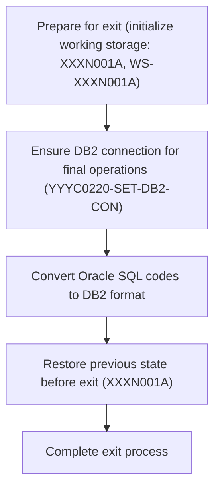

<SwmSnippet path="/base/src/YYYS0211.cbl" line="32">

---

`0000-EXIT-DISPATCHER` runs the full DB2 connection setup: it initializes the working record, switches the DB connection to DB2, converts Oracle error codes if needed, and restores the business record from backup. Each step is chained so the environment is ready for DB2 ops and error handling is consistent. The call to this routine is needed because it centralizes all DB2 connection logic and error translation.

```cobol
004700 0000-EXIT-DISPATCHER.                                            00004700
004800     PERFORM 100-INITIALIZATION                                   00004800
004900     PERFORM 200-CONNECT-TO-DB2                                   00004900
005000     PERFORM 300-CNV-ORACLE-SQLCODE                               00005000
005100     PERFORM 400-REVERT-SAVED-XXXN001A                            00005100
005300     GOBACK                                                       00005300
005400     .                                                            00005400
```

---

</SwmSnippet>

<SwmSnippet path="/base/src/YYYS0211.cbl" line="44">

---

`100-INITIALIZATION` backs up the business record (XXXN001A) to working storage, then clears it out. This is so the original data can be restored later if needed, and the area is clean for DB2 connection work. It's a defensive prep step for DB2 ops.

```cobol
006000 100-INITIALIZATION.                                              00006000
006100     MOVE XXXN001A TO WS-XXXN001A                                 00006100
006200     INITIALIZE XXXN001A                                          00006200
006400     .                                                            00006400
```

---

</SwmSnippet>

<SwmSnippet path="/base/src/YYYS0211.cbl" line="53">

---

`200-CONNECT-TO-DB2` sets a flag to request a DB2 connection and calls the DBMS connection manager (YYYS0220). This is where the actual DB2/Oracle switching logic and stats tracking happen. The call is needed because all the connection management is centralized in YYYS0220, not here.

```cobol
007300 200-CONNECT-TO-DB2.                                              00007300
007400     SET YYYC0220-SET-DB2-CON TO TRUE                             00007400
007500     CALL YYYS0220-DBMS-CON-MGR USING                             00007500
007600         XXXN001A                                                 00007600
007700         YYYC0220                                                 00007700
008100     .                                                            00008100
```

---

</SwmSnippet>

#### Oracle Error Code Conversion

<SwmSnippet path="/base/src/YYYS0211.cbl" line="65">

---

`300-CNV-ORACLE-SQLCODE` checks if the last DB operation was a success but returned Oracle SQLCODE -84. If so, it calls the Oracle error conversion routine (YYYS0212) to map the Oracle error to an internal code and message. This is needed so the rest of the system gets a consistent error format, regardless of DB backend.

```cobol
009500 300-CNV-ORACLE-SQLCODE.                                          00009500
009600     IF  SUCCESS                                                  00009600
009610     AND SQLCODE = -84                                            00009610
009720       CALL Z-ORA-ERR-CONVERSION USING                            00009720
009730           XXXN001A                                               00009730
009740           SQLCA                                                  00009740
009750     END-IF                                                       00009750
010200     .                                                            00010200
```

---

</SwmSnippet>

#### Mapping Oracle Errors to Internal Codes

```mermaid
%%{init: {"flowchart": {"defaultRenderer": "elk"}} }%%
flowchart TD
    node1["Initialize process"]
    click node1 openCode "base/src/YYYS0212.cbl:39:40"
    node1 --> node2["Format user message text"]
    click node2 openCode "base/src/YYYS0212.cbl:59:107"
    node2 --> node3{"Oracle error code?"}
    click node3 openCode "base/src/YYYS0212.cbl:65:102"
    node3 -->|"60"| node4["Assign business error code -911"]
    click node4 openCode "base/src/YYYS0212.cbl:65:65"
    node3 -->|"310"| node5["Assign business error code -206"]
    click node5 openCode "base/src/YYYS0212.cbl:67:68"
    node3 -->|"615/616"| node6["Assign business error code -420"]
    click node6 openCode "base/src/YYYS0212.cbl:69:71"
    node3 -->|"942"| node7["Assign business error code -204"]
    click node7 openCode "base/src/YYYS0212.cbl:72:73"
    node3 -->|"1403"| node8["Assign business error code -100"]
    click node8 openCode "base/src/YYYS0212.cbl:74:75"
    node3 -->|"1001"| node9["Assign business error code -501"]
    click node9 openCode "base/src/YYYS0212.cbl:76:77"
    node3 -->|"1438"| node10["Assign business error code -413"]
    click node10 openCode "base/src/YYYS0212.cbl:78:79"
    node3 -->|"2112/1422"| node11["Assign business error code -811"]
    click node11 openCode "base/src/YYYS0212.cbl:80:82"
    node3 -->|"2049"| node12["Assign business error code -913"]
    click node12 openCode "base/src/YYYS0212.cbl:83:84"
    node3 -->|"2291"| node13["Assign business error code -530"]
    click node13 openCode "base/src/YYYS0212.cbl:85:86"
    node3 -->|"2292"| node14["Assign business error code -532"]
    click node14 openCode "base/src/YYYS0212.cbl:87:88"
    node3 -->|"6502"| node15["Assign business error code -304"]
    click node15 openCode "base/src/YYYS0212.cbl:89:90"
    node3 -->|"6508"| node16["Assign business error code -440"]
    click node16 openCode "base/src/YYYS0212.cbl:91:92"
    node3 -->|"6511"| node17["Assign business error code -502"]
    click node17 openCode "base/src/YYYS0212.cbl:93:94"
    node3 -->|"6550/6553"| node18["Assign business error code -440"]
    click node18 openCode "base/src/YYYS0212.cbl:95:97"
    node3 -->|"14028"| node19["Assign business error code -538"]
    click node19 openCode "base/src/YYYS0212.cbl:98:99"
    node3 -->|"30006"| node20["Assign business error code -904"]
    click node20 openCode "base/src/YYYS0212.cbl:100:101"
    node3 -->|"Other"| node21["Format generic error message"]
    click node21 openCode "base/src/YYYS0212.cbl:103:107"
    node4 --> node22["End process"]
    click node22 openCode "base/src/YYYS0212.cbl:41:42"
    node5 --> node22
    node6 --> node22
    node7 --> node22
    node8 --> node22
    node9 --> node22
    node10 --> node22
    node11 --> node22
    node12 --> node22
    node13 --> node22
    node14 --> node22
    node15 --> node22
    node16 --> node22
    node17 --> node22
    node18 --> node22
    node19 --> node22
    node20 --> node22
    node21 --> node22

classDef HeadingStyle fill:#777777,stroke:#333,stroke-width:2px;
```

<SwmSnippet path="/base/src/YYYS0212.cbl" line="29">

---

`000-MAIN-PROCESS` clears out the error message fields, then formats the Oracle error into a user/system message by calling the formatter. This makes sure the error info is reset and then mapped to something the rest of the system (or a user) can actually use. The call is needed because the formatting logic is in a separate routine.

```cobol
003800 000-MAIN-PROCESS.                                                00003800
003900     PERFORM 100-INITIALIZE                                       00003900
004000     PERFORM 200-FORMAT-USER-MSG-TXT                              00004000
004100     GOBACK                                                       00004100
004200     .                                                            00004200
```

---

</SwmSnippet>

<SwmSnippet path="/base/src/YYYS0212.cbl" line="50">

---

`200-FORMAT-USER-MSG-TXT` splits the Oracle error message into four fields, grabs the error code, and maps it to a DB2 SQLCODE using a big EVALUATE block. If the code isn't recognized, it builds a generic error message. This only works if the Oracle error string is formatted exactly as expected.

```cobol
005900 200-FORMAT-USER-MSG-TXT.                                         00005900
006000     UNSTRING SQLERRMC  DELIMITED BY SPACE INTO                   00006000
006100                        WS-ERR-MSG1                               00006100
006200                        WS-ERR-MSG2                               00006200
006300                        WS-ERR-MSG3                               00006300
006400                        WS-ERR-ORA-CODE                           00006400
006500     EVALUATE WS-ERR-ORA-CODE                                     00006500
006510       WHEN  '60   '                                              00006510
006520         MOVE  -911                             TO SQLCODE        00006520
006600       WHEN  '904  '                                              00006600
006700       WHEN  '310  '                                              00006700
006800         MOVE  -206                             TO SQLCODE        00006800
006900       WHEN  '615  '                                              00006900
007000       WHEN  '616  '                                              00007000
007100         MOVE  -420                             TO SQLCODE        00007100
007200       WHEN  '942  '                                              00007200
007300         MOVE  -204                             TO SQLCODE        00007300
007400       WHEN  '1403 '                                              00007400
007500         MOVE  -100                             TO SQLCODE        00007500
007600       WHEN  '1001 '                                              00007600
007700         MOVE  -501                             TO SQLCODE        00007700
007800       WHEN  '1438 '                                              00007800
007900         MOVE  -413                             TO SQLCODE        00007900
008000       WHEN  '2112 '                                              00008000
008100       WHEN  '1422 '                                              00008100
008200         MOVE  -811                             TO SQLCODE        00008200
008300       WHEN  '2049 '                                              00008300
008400         MOVE  -913                             TO SQLCODE        00008400
008500       WHEN  '2291 '                                              00008500
008600         MOVE  -530                             TO SQLCODE        00008600
008700       WHEN  '2292 '                                              00008700
008800         MOVE  -532                             TO SQLCODE        00008800
008900       WHEN  '6502 '                                              00008900
009000         MOVE  -304                             TO SQLCODE        00009000
009100       WHEN  '6508 '                                              00009100
009200         MOVE  -440                             TO SQLCODE        00009200
009300       WHEN  '6511 '                                              00009300
009400         MOVE  -502                             TO SQLCODE        00009400
009500       WHEN  '6550 '                                              00009500
009600       WHEN  '6553 '                                              00009600
009700         MOVE  -440                             TO SQLCODE        00009700
009800       WHEN  '14028'                                              00009800
009900         MOVE  -538                             TO SQLCODE        00009900
010000       WHEN  '30006'                                              00010000
010100         MOVE  -904                             TO SQLCODE        00010100
010200       WHEN OTHER                                                 00010200
010300         STRING 'Error in YYYS0212. Oracle code:'                 00010300
010300                 WS-ERR-ORA-CODE                                  00010320
010300         DELIMITED BY SIZE INTO IS-RTRN-MSG2-TXT                  00010330
010500     END-EVALUATE                                                 00010500
010600     MOVE SPACES                                TO SQLERRMC       00010600
010700     .                                                            00010700
```

---

</SwmSnippet>

#### Triggering AVP Maintenance After Row Update

<SwmSnippet path="/base/src/NNNS0487.cbl" line="3284">

---

`2050-DO-AVP-MAINTENANCE` copies location and AP fields from DCLXXXATION to MMMC0474, sets a program ID, and calls the AVP maintenance routine. The program string 'NNNS0487' is just a hardcoded identifier for the downstream logic. All the prep here is so the called routine gets the right context and flags.

```cobol
336100 2050-DO-AVP-MAINTENANCE.                                         00336100
336200     MOVE LOC-TYP-CD               OF DCLXXXATION                 00336200
336300       TO MMMC0474-LOC-TYP-CD                                     00336300
336400     MOVE LOC-NBR                  OF DCLXXXATION                 00336400
336500       TO MMMC0474-LOC-NBR                                        00336500
336600     MOVE AP-TYP-CD                OF DCLXXXATION                 00336600
336700       TO MMMC0474-NEW-AP-TYP                                     00336700
336800     MOVE AP-NBR                   OF DCLXXXATION                 00336800
336900       TO MMMC0474-NEW-AP-NBR                                     00336900
337000     SET MMMC0474-LO               TO TRUE                        00337000
337100     MOVE 'NNNS0487'                                              00337100
337200       TO MMMC0474-PROGRAM                                        00337200
337300     MOVE YYYN005A-SYS-ENV                                        00337300
337400       TO MMMC0474-SYS-ENV                                        00337400
337500                                                                  00337500
337600     CALL MMMS0474-DO-AVP-MAIN USING                              00337600
337700          XXXN001A                                                00337700
337800          MMMC0474                                                00337800
337900     .                                                            00337900
```

---

</SwmSnippet>

### Inserting a New Location Row

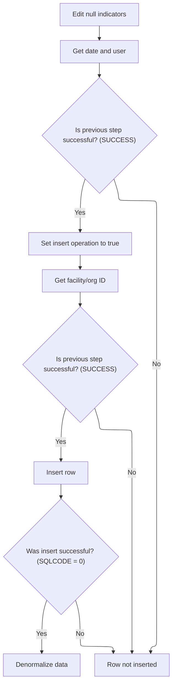

<SwmSnippet path="/base/src/NNNS0487.cbl" line="2487">

---

`1500-EXIT-PUT-INSERT-ROW` chains together null indicator edits, date/user fetch, county validation, facility/org ID logic, and finally the insert. Each step only runs if the previous one succeeded. The insert only happens if all the prep and checks pass, so this is more than just a simple insert call.

```cobol
256400 1500-EXIT-PUT-INSERT-ROW.                                        00256400
256500     PERFORM 1800-EDIT-NULL-INDICATORS                            00256500
256600     PERFORM 2040-GET-DATE-AND-USER                               00256600
256700     IF SUCCESS                                                   00256700
256800*      PERFORM 10300-CHECK-FOR-VALID-COUNTY                       00256800
256900       SET EXIT-PUT-INSERT-ROW TO TRUE                            00256900
257000       IF SUCCESS                                                 00257000
257100         PERFORM 1505-GET-FAC-ORG-ID                              00257100
257200         IF SUCCESS                                               00257200
257300           PERFORM 1510-D0-INSERT-ROW                             00257300
257400         END-IF                                                   00257400
257500       END-IF                                                     00257500
257600     END-IF                                                       00257600
257700     .                                                            00257700
```

---

</SwmSnippet>

<SwmSnippet path="/base/src/NNNS0487.cbl" line="2521">

---

`1510-D0-INSERT-ROW` does the insert, sets all the add flags, and kicks off denorm if it worked.

```cobol
259800 1510-D0-INSERT-ROW.                                              00259800
259900     MOVE DTA10-MM-DD-YYYY TO ADDED-DT        OF DCLXXXATION      00259900
260000     MOVE YYYC0127-TS      TO LST-UPDT-TS     OF DCLXXXATION      00260000
260100     MOVE YYYC0107-USER    TO LST-UPDT-USR-ID OF DCLXXXATION      00260100
260200     PERFORM 4010-REP-LOWVALUE-WITH-SPACES                        00260200
260300     PERFORM 5000-CALL-NNNS0487-CUD-ROUTINE                       00260300
260400                                                                  00260400
260500     IF SQLCODE = 0                                               00260500
260600       SET YYYN110A-ADD TO TRUE                                   00260600
260700       SET MMMC0265-ADD TO TRUE                                   00260700
260800       SET LOC-ADD      TO TRUE                                   00260800
260900       SET DSD-ADD      TO TRUE                                   00260900
261000       SET WHS-ADD      TO TRUE                                   00261000
261100       SET VEN-ADD      TO TRUE                                   00261100
261200       PERFORM 2000-DENORM-PROCESS                                00261200
261300     END-IF                                                       00261300
261400     .                                                            00261400
```

---

</SwmSnippet>

### Purging a Location and Related Data

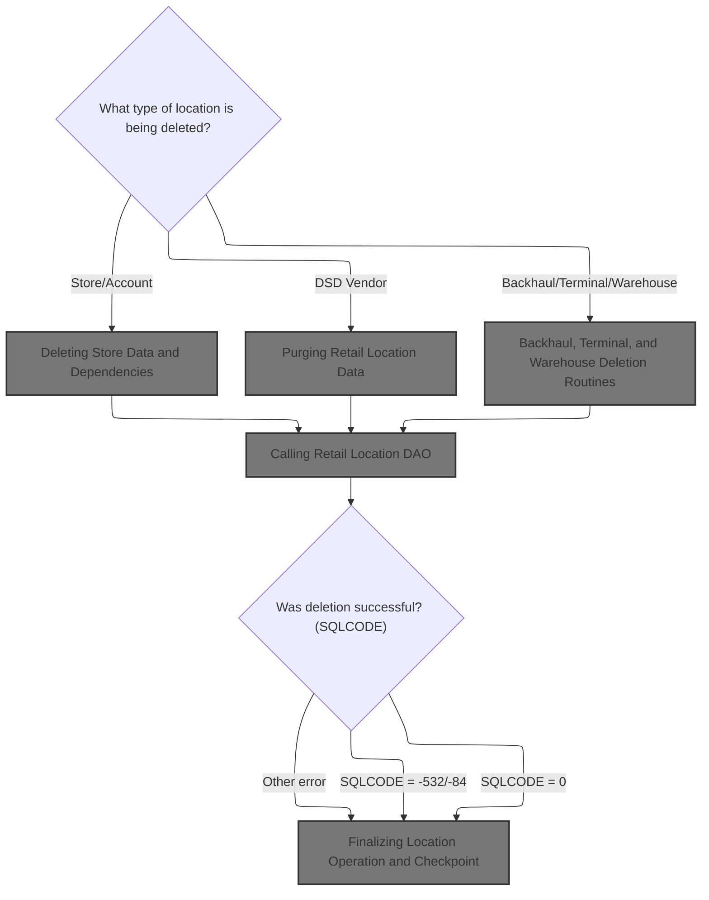

<SwmSnippet path="/base/src/NNNS0487.cbl" line="2633">

---

`1600-EXIT-PUT-PURGE-ROW` figures out what kind of location this is (store, vendor, backhaul, terminal, warehouse) and calls the right delete routine for each. After that, it connects to Oracle and, if successful, deletes the main location record. If the delete works, it sets a bunch of 'deleted' flags and triggers denorm. If the location is in use, it sets a custom error message. Any other SQL error gets a generic error message with the code.

```cobol
271000 1600-EXIT-PUT-PURGE-ROW.                                         00271000
271100     EVALUATE TRUE                                                00271100
271200       WHEN LOC-TYP-CD OF DCLXXXATION = K-STORE-LOC-TYPE          00271200
271300       OR   LOC-TYP-CD OF DCLXXXATION = K-ACCT-LOC-TYPE           00271300
271400         PERFORM 1610-DELETE-STORE                                00271400
271500       WHEN LOC-TYP-CD OF DCLXXXATION = K-DSD-VEND-LOC-TYPE       00271500
271600         PERFORM 1620-DELETE-DSD-VENDOR                           00271600
271700       WHEN LOC-TYP-CD OF DCLXXXATION = 'B'                       00271700
271800         PERFORM 1640-DELETE-BKHAUL                               00271800
271900       WHEN LOC-TYP-CD OF DCLXXXATION = 'T'                       00271900
272000         PERFORM 1650-DELETE-TERMINAL                             00272000
272100       WHEN LOC-TYP-CD OF DCLXXXATION = 'W'                       00272100
272200         PERFORM 1660-DELETE-WHSE                                 00272200
272300     END-EVALUATE                                                 00272300
272400                                                                  00272400
272500     PERFORM 115-CONNECT-TO-ORACLE                                00272500
272600     IF SUCCESS AND SQLCODE = 0                                   00272600
272700       PERFORM 1690-DELETE-LO                                     00272700
272800     END-IF                                                       00272800
272900                                                                  00272900
273000     EVALUATE TRUE                                                00273000
273100       WHEN SQLCODE = 0                                           00273100
273200         SET YYYN110A-DEL  TO TRUE                                00273200
273300         SET MMMC0265-DEL  TO TRUE                                00273300
273400         SET LOC-DEL       TO TRUE                                00273400
273500         SET DSD-DEL       TO TRUE                                00273500
273600         SET WHS-DEL       TO TRUE                                00273600
273700         SET VEN-DEL       TO TRUE                                00273700
273800     IF SUCCESS AND SQLCODE = 0                                   00273800
273900         SET DELETE-OPERATION  TO TRUE                            00273900
274000         SET STAGE-EVENT       TO TRUE                            00274000
274100     END-IF                                                       00274100
274200         PERFORM 2000-DENORM-PROCESS                              00274200
274300       WHEN SQLCODE = -532                                        00274300
274400       WHEN SQLCODE = -84                                         00274400
274500         SET  FAILURE TO TRUE                                     00274500
274600         MOVE 'NNNS0487 - XXXATION in use - it cannot be deleted!'00274600
274700           TO IS-RTRN-MSG-TXT                                     00274700
274800       WHEN SQLCODE NOT = 0                                       00274800
274900         MOVE SQLCODE                 TO WS-SQLCODE               00274900
275000         SET  FAILURE                 TO TRUE                     00275000
275100         MOVE SPACES                  TO IS-RTRN-MSG-TXT          00275100
275200         STRING 'NNNS0514 - Error deleting XXXATION, SQL='        00275200
275300                 WS-SQLCODE                                       00275300
275400                 DELIMITED BY SIZE INTO IS-RTRN-MSG-TXT           00275400
275500     END-EVALUATE                                                 00275500
275600     .                                                            00275600
```

---

</SwmSnippet>

#### Deleting Store Data and Dependencies

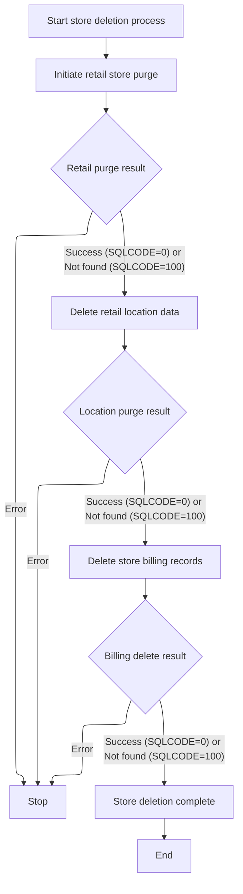

<SwmSnippet path="/base/src/NNNS0487.cbl" line="2682">

---

`1610-DELETE-STORE` deletes store data in three steps: first, it calls the retail delete routine, then the department delete routine, and finally deletes from the cost list table. Each step only runs if the previous one succeeded. The calls to the DAO routines are needed to clean up all related data, not just the main store record.

```cobol
275900 1610-DELETE-STORE.                                               00275900
276000     PERFORM 1610-EXIT-PUT-PURGE-RETL                             00276000
276100     IF SQLCODE = 0                                               00276100
276200       MOVE  LOC-TYP-CD       OF DCLXXXATION                      00276200
276300         TO  LOC-TYP-CD       OF P-DDDTLR01                       00276300
276400       MOVE  LOC-NBR          OF DCLXXXATION                      00276400
276500         TO  LOC-NBR          OF P-DDDTLR01                       00276500
276600       SET EXIT-PUT-PURGE-ROW TO TRUE                             00276600
276700       PERFORM 2060-CALL-RETAIL-LOC-DAO                           00276700
276800       IF SQLCODE = 100                                           00276800
276900         MOVE 0 TO SQLCODE                                        00276900
277000       END-IF                                                     00277000
277100     END-IF                                                       00277100
277200                                                                  00277200
277300     IF SQLCODE = 0                                               00277300
277400       MOVE  LOC-TYP-CD       OF DCLXXXATION                      00277400
277500         TO  LOC-TYP-CD       OF P-DDDTDT01                       00277500
277600       MOVE  LOC-NBR          OF DCLXXXATION                      00277600
277700         TO  LOC-NBR          OF P-DDDTDT01                       00277700
277800       SET EXIT-PUT-PURGE-ROW TO TRUE                             00277800
277900       PERFORM 2070-CALL-STR-LOC-DEPT-DAO                         00277900
278000       IF SQLCODE = 100                                           00278000
278100         MOVE 0 TO SQLCODE                                        00278100
278200       END-IF                                                     00278200
278300     END-IF                                                       00278300
278400                                                                  00278400
278500     IF SQLCODE = 0                                               00278500
278600       EXEC SQL                                                   00278600
278700         DELETE FROM LST_BILED_CST                                00278700
278800         WHERE  STR_LOC_NUM = :DCLXXXATION.LOC-NBR                00278800
278900         AND    STR_LOC_TYP = :DCLXXXATION.LOC-TYP-CD             00278900
279000       END-EXEC                                                   00279000
279100       IF SQLCODE = 100                                           00279100
279200         MOVE 0 TO SQLCODE                                        00279200
279300       END-IF                                                     00279300
279400     END-IF                                                       00279400
279500                                                                  00279500
279600     .                                                            00279600
```

---

</SwmSnippet>

#### Purging Retail Location Data

See <SwmLink doc-title="Purging Retail Location Records">[Purging Retail Location Records](\.swm\purging-retail-location-records.guoilllp.sw.md)</SwmLink>

#### Calling Retail Location DAO

<SwmSnippet path="/base/src/NNNS0487.cbl" line="3305">

---

`2060-CALL-RETAIL-LOC-DAO` just calls the retail location DAO (NNNS0488) with all the context and parameters. This hands off the actual DB work—query, update, delete, etc.—to the DAO, which knows how to handle retail location records. The call is needed because all the DB logic for retail locations is in NNNS0488, not here.

```cobol
338200 2060-CALL-RETAIL-LOC-DAO.                                        00338200
338300     CALL NNNS0488-RETAIL-LOC-DAO USING                           00338300
338400          XXXN001A                                                00338400
338500          SQLCA                                                   00338500
338600          YYYN005A                                                00338600
338700          NNNN0000-PARMS                                          00338700
338800          P-DDDTLR01                                              00338800
338900     .                                                            00338900
```

---

</SwmSnippet>

#### Retail Location DAO Dispatcher

See <SwmLink doc-title="Processing row operations">[Processing row operations](\.swm\processing-row-operations.tmzrry1d.sw.md)</SwmLink>

#### Finalizing Location Operation and Checkpoint

See <SwmLink doc-title="Coordinating Retail Data Transfer and Database State">[Coordinating Retail Data Transfer and Database State](\.swm\coordinating-retail-data-transfer-and-database-state.dmdav0wa.sw.md)</SwmLink>

#### Backhaul, Terminal, and Warehouse Deletion Routines

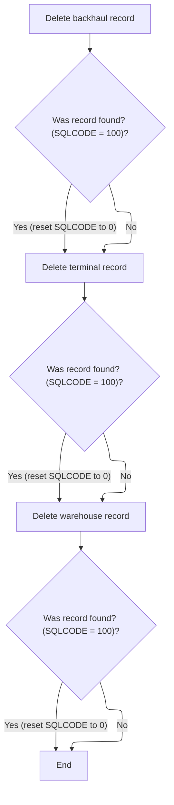

<SwmSnippet path="/base/src/NNNS0487.cbl" line="2906">

---

`1640-DELETE-BKHAUL` calls the CUD routine to delete backhaul data, then checks if SQLCODE is 100 (no data found) and resets it to 0. This way, 'not found' isn't treated as an error. This is standard for DB ops where missing data is OK.

```cobol
298300 1640-DELETE-BKHAUL.                                              00298300
298400                                                                  00298400
298500     PERFORM 5000-CALL-MMMU0487-CUD-ROUTINE                       00298500
298600                                                                  00298600
298700     IF SQLCODE = 100                                             00298700
298800       MOVE 0 TO SQLCODE                                          00298800
298900     END-IF                                                       00298900
299000     .                                                            00299000
```

---

</SwmSnippet>

<SwmSnippet path="/base/src/NNNS0487.cbl" line="2916">

---

`1650-DELETE-TERMINAL` calls the CUD routine for terminal deletion, then resets SQLCODE to 0 if it was 100. This means 'no terminal found' is not an error, just a no-op.

```cobol
299300 1650-DELETE-TERMINAL.                                            00299300
299400                                                                  00299400
299500     PERFORM 5000-CALL-MMMU0487-CUD-ROUTINE                       00299500
299600                                                                  00299600
299700     IF SQLCODE = 100                                             00299700
299800       MOVE 0 TO SQLCODE                                          00299800
299900     END-IF                                                       00299900
300000     .                                                            00300000
```

---

</SwmSnippet>

<SwmSnippet path="/base/src/NNNS0487.cbl" line="2926">

---

`1660-DELETE-WHSE` calls the CUD routine for warehouse deletion, then resets SQLCODE to 0 if it was 100. Again, 'not found' is not an error here.

```cobol
300300 1660-DELETE-WHSE.                                                00300300
300400                                                                  00300400
300500     PERFORM 5000-CALL-MMMU0487-CUD-ROUTINE                       00300500
300600                                                                  00300600
300700     IF SQLCODE = 100                                             00300700
300800       MOVE 0 TO SQLCODE                                          00300800
300900     END-IF                                                       00300900
301000     .                                                            00301000
```

---

</SwmSnippet>

### Deleting a Loan Record and Related Cleanup

<SwmSnippet path="/base/src/NNNS0487.cbl" line="2954">

---

`1690-DELETE-LO` first purges fax numbers, then runs a delete check. If the check passes, it calls the CUD routine to delete the loan record. If the delete returns SQLCODE 100, it resets it to 0 so 'not found' isn't an error. Each step is chained and only runs if the previous one worked.

```cobol
303100 1690-DELETE-LO.                                                  00303100
303200     PERFORM 1691-EXIT-PUT-PURGE-FAX-NUM                          00303200
303300                                                                  00303300
303400     PERFORM 4500-CALL-MMMS0304-RI-DEL-CHK                        00303400
303500     IF SUCCESS                                                   00303500
303600        PERFORM 5000-CALL-NNNS0487-CUD-ROUTINE                    00303600
303700                                                                  00303700
303800        IF SQLCODE = 100                                          00303800
303900           MOVE 0 TO SQLCODE                                      00303900
304000        END-IF                                                    00304000
304100     END-IF                                                       00304100
304200     .                                                            00304200
```

---

</SwmSnippet>

#### Purging Fax Numbers for a Location

```mermaid
%%{init: {"flowchart": {"defaultRenderer": "elk"}} }%%
flowchart TD
    node1["Start purging fax numbers"]
    click node1 openCode "base/src/NNNS0487.cbl:2968:2969"
    node1 --> node2["Open delivery cursor"]
    click node2 openCode "base/src/NNNS0487.cbl:2970:2970"
    node2 --> node3{"Was cursor opened successfully? (SUCCESS = 0)"}
    click node3 openCode "base/src/NNNS0487.cbl:2971:2971"
    node3 -->|"Yes"| node4["Process delivery records"]
    node3 -->|"No"| node8["Close delivery cursor"]
    click node8 openCode "base/src/NNNS0487.cbl:2980:2980"
    subgraph loop1["For each delivery record"]
      node4 --> node5["Fetch next delivery record"]
      click node5 openCode "base/src/NNNS0487.cbl:2973:2973"
      node5 --> node6{"Success and more records? (SUCCESS = 0 and NOT END-OF-DEL-CSR)"}
      click node6 openCode "base/src/NNNS0487.cbl:2974:2974"
      node6 -->|"Yes"| node7["Purge fax number and update database"]
      click node7 openCode "base/src/NNNS0487.cbl:2975:2976"
      node7 --> node5
      node6 -->|"No"| node8
    end
    node8 --> node9["End process"]
    click node9 openCode "base/src/NNNS0487.cbl:2981:2981"
classDef HeadingStyle fill:#777777,stroke:#333,stroke-width:2px;
```

<SwmSnippet path="/base/src/NNNS0487.cbl" line="2968">

---

`1691-EXIT-PUT-PURGE-FAX-NUM` opens a cursor for fax numbers tied to the location, loops through and purges each one, reconnects to Oracle as needed, and closes the cursor at the end. The call to open the cursor is needed to fetch all fax numbers for this location, and the reconnect is needed for DB consistency.

```cobol
304500 1691-EXIT-PUT-PURGE-FAX-NUM.                                     00304500
304600     SET NOT-END-OF-DEL-CSR TO TRUE                               00304600
304700     PERFORM 1692-OPEN-DEL-CSR                                    00304700
304800     IF SUCCESS                                                   00304800
304900       PERFORM UNTIL END-OF-DEL-CSR OR NOT SUCCESS                00304900
305000         PERFORM 1693-FETCH-DEL-CSR                               00305000
305100         IF SUCCESS AND NOT-END-OF-DEL-CSR                        00305100
305200           PERFORM 1694-EXIT-PURGE-FAX-NUM                        00305200
305300           PERFORM 115-CONNECT-TO-ORACLE                          00305300
305400         END-IF                                                   00305400
305500       END-PERFORM                                                00305500
305600     END-IF                                                       00305600
305700     PERFORM 1695-CLOSE-DEL-CSR                                   00305700
305800     .                                                            00305800
```

---

</SwmSnippet>

<SwmSnippet path="/base/src/NNNS0487.cbl" line="2984">

---

`1692-OPEN-DEL-CSR` copies the location type and number from DCLXXXATION to DCLXXX-NUMBERS, then opens the DEL-CSR cursor. If opening fails, it sets a failure flag and builds an error message. This only works if those fields are set up right before the call.

```cobol
306100 1692-OPEN-DEL-CSR.                                               00306100
306200     MOVE LOC-TYP-CD                 OF DCLXXXATION               00306200
306300       TO LOC-TYP-CD                 OF DCLXXX-NUMBERS            00306300
306400     MOVE LOC-NBR                    OF DCLXXXATION               00306400
306500       TO LOC-NBR                    OF DCLXXX-NUMBERS            00306500
306600                                                                  00306600
306700     EXEC SQL                                                     00306700
306800       OPEN DEL-CSR                                               00306800
306900     END-EXEC                                                     00306900
307000                                                                  00307000
307100     IF SQLCODE NOT = 0                                           00307100
307200       MOVE SQLCODE TO WS-SQLCODE                                 00307200
307300       SET  FAILURE TO TRUE                                       00307300
307400       MOVE SPACES  TO IS-RTRN-MSG-TXT                            00307400
307500       STRING 'NNNS0487 - ERROR OPENING DEL-CSR, '                00307500
307600              'SQL=' WS-SQLCODE '.'                               00307600
307700              DELIMITED BY SIZE INTO IS-RTRN-MSG-TXT              00307700
307800     END-IF                                                       00307800
307900     .                                                            00307900
```

---

</SwmSnippet>

#### Checking Deletion Eligibility for Location

<SwmSnippet path="/base/src/NNNS0487.cbl" line="3353">

---

`4500-CALL-MMMS0304-RI-DEL-CHK` initializes the MMMC0304 structure, copies location type and number from DCLXXXATION, sets the delete check and Oracle flags, and calls the delete check routine. This only works if DCLXXXATION is set up right before the call.

```cobol
343000 4500-CALL-MMMS0304-RI-DEL-CHK.                                   00343000
343100     INITIALIZE MMMC0304                                          00343100
343200     MOVE LOC-TYP-CD OF DCLXXXATION    TO                         00343200
343300                                      MMMC0304-LOC-TYP-CD         00343300
343400     MOVE LOC-NBR OF DCLXXXATION      TO                          00343400
343500                                      MMMC0304-LOC-NBR            00343500
343600     SET MMMC0304-DELETE-CHECK TO TRUE                            00343600
343700     SET MMMC0304-XXXATION     TO TRUE                            00343700
343800     SET MMMC0304-ORACLE       TO TRUE                            00343800
343900     CALL MMMS0304-RI-DEL-CHK USING                               00343900
344000          XXXN001A                                                00344000
344100          MMMC0304                                                00344100
344200     .                                                            00344200
```

---

</SwmSnippet>

### Finalizing Output and DB2 Reconnect

```mermaid
%%{init: {"flowchart": {"defaultRenderer": "elk"}} }%%
flowchart TD
    node1{"Was operation successful? (SUCCESS = 0)"}
    click node1 openCode "base/src/NNNS0487.cbl:1219:1224"
    node1 -->|"Yes"| node2{"Is this NOT a cursor close? (EXIT-CLOSE-CURSOR != 2)"}
    click node2 openCode "base/src/NNNS0487.cbl:1220:1222"
    node2 -->|"Yes"| node3["Move DCL fields for checkpoint"]
    click node3 openCode "base/src/NNNS0487.cbl:1221:1222"
    node3 --> node4["Add checkpoint increment"]
    click node4 openCode "base/src/NNNS0487.cbl:1223:1224"
    node2 -->|"No"| node4
    node4 --> node5{"Oracle or Row Operation? (ORACLE or INSERT/MODIFY/PURGE)"}
    click node5 openCode "base/src/NNNS0487.cbl:1225:1228"
    node5 -->|"Yes"| node6["Connect to DB2"]
    click node6 openCode "base/src/NNNS0487.cbl:1227:1228"
    node6 --> node7["Record SQL status"]
    click node7 openCode "base/src/NNNS0487.cbl:1229:1230"
    node5 -->|"No"| node7
    node1 -->|"No"| node7
classDef HeadingStyle fill:#777777,stroke:#333,stroke-width:2px;
```

<SwmSnippet path="/base/src/NNNS0487.cbl" line="1218">

---

`120-EXIT-STUFF` copies location data to the output area if the operation succeeded and the cursor isn't closing, bumps the checkpoint, and reconnects to DB2 if needed. It also saves the SQLCODE for later. The DB2 reconnect is needed if the operation type or context requires it, so the system is ready for the next DB2 call.

```cobol
129500 120-EXIT-STUFF.                                                  00129500
129600     IF SUCCESS                                                   00129600
129700       IF NOT EXIT-CLOSE-CURSOR                                   00129700
129800         PERFORM 130-MOVE-DCL-2-PDA-FIELDS                        00129800
129900       END-IF                                                     00129900
130000       ADD WS-CHECKPOINT-INC TO YYYN005A-CHKPT-CNT                00130000
130100     END-IF                                                       00130100
130200     IF (YYYN005A-ORACLE       OR EXIT-PUT-INSERT-ROW             00130200
130300         OR EXIT-PUT-PURGE-ROW OR EXIT-PUT-MODIFY-ROW)            00130300
130400       PERFORM 125-CONNECT-TO-DB2                                 00130400
130500     END-IF                                                       00130500
130600     MOVE SQLCODE TO DB2-SQL-CODE                                 00130600
130700     .                                                            00130700
```

---

</SwmSnippet>

### Transferring and Normalizing Location Data for Output

```mermaid
%%{init: {"flowchart": {"defaultRenderer": "elk"}} }%%
flowchart TD
    node1["Copy all location and contact fields from source to target"]
    click node1 openCode "base/src/NNNS0487.cbl:1245:1472"
    node1 --> node2{"Any date field = '01/01/1600'?"}
    click node2 openCode "base/src/NNNS0487.cbl:1334:1348"
    node2 -->|"Yes"| node3["Clear date field(s) in target"]
    click node3 openCode "base/src/NNNS0487.cbl:1335:1347"
    node2 -->|"No"| node4{"Time field = '00:00:01'?"}
    click node4 openCode "base/src/NNNS0487.cbl:1392:1394"
    node3 --> node4
    node4 -->|"Yes"| node5["Clear time field in target"]
    click node5 openCode "base/src/NNNS0487.cbl:1393:1394"
    node4 -->|"No"| node6["Edit shipping days"]
    click node6 openCode "base/src/NNNS0487.cbl:1398:1398"
    node5 --> node6
    node6 --> node7["Convert timestamp to time"]
    click node7 openCode "base/src/NNNS0487.cbl:1405:1409"
    node7 --> node8{"Conversion successful?"}
    click node8 openCode "base/src/NNNS0487.cbl:1406:1409"
    node8 -->|"Yes"| node9["Update time field in target"]
    click node9 openCode "base/src/NNNS0487.cbl:1407:1408"
    node8 -->|"No"| node10{"Location type = 'D' and in CICS env?"}
    click node10 openCode "base/src/NNNS0487.cbl:1411:1417"
    node9 --> node10
    node10 -->|"Yes"| node11["Connect to DB2 and check DSV location subtype"]
    click node11 openCode "base/src/NNNS0487.cbl:1413:1416"
    node10 -->|"No"| node12["End"]
    node11 --> node12
classDef HeadingStyle fill:#777777,stroke:#333,stroke-width:2px;
```

<SwmSnippet path="/base/src/NNNS0487.cbl" line="1245">

---

This section copies all location/contact fields, blanks out default/null dates and times, sets direct-ship flags, and runs extra business logic routines to make sure the output is ready for downstream processing.

```cobol
132200 130-MOVE-DCL-2-PDA-FIELDS.                                       00132200
132300     MOVE LOC-TYP-CD OF DCLXXXATION TO LOC-TYP-CD OF P-DDDTLO01   00132300
132400     MOVE LOC-NBR OF DCLXXXATION TO LOC-NBR OF P-DDDTLO01         00132400
132500     MOVE LOC-NM OF DCLXXXATION TO LOC-NM OF P-DDDTLO01           00132500
132600     MOVE LOC-ABB OF DCLXXXATION TO LOC-ABB OF P-DDDTLO01         00132600
132700     MOVE LGL-LOC-NAM OF DCLXXXATION TO LGL-LOC-NAM OF P-DDDTLO01 00132700
132800     MOVE PRIM-CONTACT-NM OF DCLXXXATION                          00132800
132900       TO PRIM-CONTACT-NM OF P-DDDTLO01                           00132900
133000     MOVE PRIM-ADR-1 OF DCLXXXATION TO PRIM-ADR-1 OF P-DDDTLO01   00133000
133100     MOVE PRIM-ADR-2 OF DCLXXXATION TO PRIM-ADR-2 OF P-DDDTLO01   00133100
133200     MOVE PRIM-ADR-3 OF DCLXXXATION TO PRIM-ADR-3 OF P-DDDTLO01   00133200
133300     MOVE PRIM-ADR-4 OF DCLXXXATION TO PRIM-ADR-4 OF P-DDDTLO01   00133300
133400     MOVE PRIM-CITY OF DCLXXXATION TO PRIM-CITY OF P-DDDTLO01     00133400
133500     MOVE PRIM-CITY-ID OF DCLXXXATION                             00133500
133600       TO PRIM-CITY-ID OF P-DDDTLO01                              00133600
133700     MOVE PRIM-STATE-CD OF DCLXXXATION                            00133700
133800       TO PRIM-STATE-CD OF P-DDDTLO01                             00133800
133900     MOVE PRIM-ZIP5-CD OF DCLXXXATION                             00133900
134000       TO PRIM-ZIP5-CD OF P-DDDTLO01                              00134000
134100     MOVE PRIM-ZIP4-CD OF DCLXXXATION                             00134100
134200       TO PRIM-ZIP4-CD OF P-DDDTLO01                              00134200
134300     MOVE PRIM-PHN-CNTRY-CD OF DCLXXXATION                        00134300
134400       TO PRIM-PHN-CNTRY-CD OF P-DDDTLO01                         00134400
134500     MOVE PRIM-AREA-CD OF DCLXXXATION                             00134500
134600       TO PRIM-AREA-CD OF P-DDDTLO01                              00134600
134700     MOVE PRIM-PHONE-NBR OF DCLXXXATION                           00134700
134800       TO PRIM-PHONE-NBR OF P-DDDTLO01                            00134800
134900     MOVE PRIM-CNTRY-NM OF DCLXXXATION                            00134900
135000       TO PRIM-CNTRY-NM OF P-DDDTLO01                             00135000
135100     MOVE PRIM-CNTRY-ABB OF DCLXXXATION                           00135100
135200       TO PRIM-CNTRY-ABB OF P-DDDTLO01                            00135200
135300     MOVE SEC-LOC-NM OF DCLXXXATION TO SEC-LOC-NM OF P-DDDTLO01   00135300
135400     MOVE SEC-CONTACT-NM OF DCLXXXATION                           00135400
135500       TO SEC-CONTACT-NM OF P-DDDTLO01                            00135500
135600     MOVE SEC-ADR-1 OF DCLXXXATION TO SEC-ADR-1 OF P-DDDTLO01     00135600
135700     MOVE SEC-ADR-2 OF DCLXXXATION TO SEC-ADR-2 OF P-DDDTLO01     00135700
135800     MOVE SEC-ADR-3 OF DCLXXXATION TO SEC-ADR-3 OF P-DDDTLO01     00135800
135900     MOVE SEC-ADR-4 OF DCLXXXATION TO SEC-ADR-4 OF P-DDDTLO01     00135900
136000     MOVE SEC-CITY OF DCLXXXATION TO SEC-CITY OF P-DDDTLO01       00136000
136100     MOVE SEC-STATE-CD OF DCLXXXATION                             00136100
136200       TO SEC-STATE-CD OF P-DDDTLO01                              00136200
136300     MOVE SEC-ZIP5-CD OF DCLXXXATION TO SEC-ZIP5-CD OF P-DDDTLO01 00136300
136400     MOVE SEC-ZIP4-CD OF DCLXXXATION TO SEC-ZIP4-CD OF P-DDDTLO01 00136400
136500     MOVE SEC-PHN-CNTRY-CD OF DCLXXXATION                         00136500
136600       TO SEC-PHN-CNTRY-CD OF P-DDDTLO01                          00136600
136700     MOVE SEC-AREA-CD OF DCLXXXATION TO SEC-AREA-CD OF P-DDDTLO01 00136700
136800     MOVE SEC-PHONE-NBR OF DCLXXXATION                            00136800
136900       TO SEC-PHONE-NBR OF P-DDDTLO01                             00136900
137000     MOVE SEC-CNTRY-NM OF DCLXXXATION                             00137000
137100       TO SEC-CNTRY-NM OF P-DDDTLO01                              00137100
137200     MOVE SEC-CNTRY-ABB OF DCLXXXATION                            00137200
137300       TO SEC-CNTRY-ABB OF P-DDDTLO01                             00137300
137400     MOVE MAIL-TO-LOC-NM OF DCLXXXATION                           00137400
137500       TO MAIL-TO-LOC-NM OF P-DDDTLO01                            00137500
137600     MOVE MAIL-TO-CNTCT-NM OF DCLXXXATION                         00137600
137700       TO MAIL-TO-CNTCT-NM OF P-DDDTLO01                          00137700
137800     MOVE MAIL-TO-ADR-1 OF DCLXXXATION                            00137800
137900       TO MAIL-TO-ADR-1 OF P-DDDTLO01                             00137900
138000     MOVE MAIL-TO-ADR-2 OF DCLXXXATION                            00138000
138100       TO MAIL-TO-ADR-2 OF P-DDDTLO01                             00138100
138200     MOVE MAIL-TO-ADR-3 OF DCLXXXATION                            00138200
138300       TO MAIL-TO-ADR-3 OF P-DDDTLO01                             00138300
138400     MOVE MAIL-TO-ADR-4 OF DCLXXXATION                            00138400
138500       TO MAIL-TO-ADR-4 OF P-DDDTLO01                             00138500
138600     MOVE MAIL-TO-CITY OF DCLXXXATION                             00138600
138700       TO MAIL-TO-CITY OF P-DDDTLO01                              00138700
138800     MOVE MAIL-TO-STATE-CD OF DCLXXXATION                         00138800
138900       TO MAIL-TO-STATE-CD OF P-DDDTLO01                          00138900
139000     MOVE MAIL-TO-ZIP5-CD OF DCLXXXATION                          00139000
139100       TO MAIL-TO-ZIP5-CD OF P-DDDTLO01                           00139100
139200     MOVE MAIL-TO-ZIP4-CD OF DCLXXXATION                          00139200
139300       TO MAIL-TO-ZIP4-CD OF P-DDDTLO01                           00139300
139400     MOVE MAIL-PHN-CNTRY-CD OF DCLXXXATION                        00139400
139500       TO MAIL-PHN-CNTRY-CD OF P-DDDTLO01                         00139500
139600     MOVE MAIL-TO-AREA-CD OF DCLXXXATION                          00139600
139700       TO MAIL-TO-AREA-CD OF P-DDDTLO01                           00139700
139800     MOVE MAIL-TO-PHONE-NBR OF DCLXXXATION                        00139800
139900       TO MAIL-TO-PHONE-NBR OF P-DDDTLO01                         00139900
140000     MOVE MAIL-TO-CNTRY-NM OF DCLXXXATION                         00140000
140100       TO MAIL-TO-CNTRY-NM OF P-DDDTLO01                          00140100
140200     MOVE MAIL-TO-CNTRY-AB OF DCLXXXATION                         00140200
140300       TO MAIL-TO-CNTRY-AB OF P-DDDTLO01                          00140300
140400     MOVE CURR-FAX-ID OF DCLXXXATION TO CURR-FAX-ID OF P-DDDTLO01 00140400
140500                                                                  00140500
140600     MOVE ADDED-DT OF DCLXXXATION TO ADDED-DT OF P-DDDTLO01       00140600
140700     MOVE DELETE-DT OF DCLXXXATION TO DELETE-DT OF P-DDDTLO01     00140700
140800     MOVE OPENED-DT OF DCLXXXATION TO OPENED-DT OF P-DDDTLO01     00140800
140900     MOVE CLOSED-DT OF DCLXXXATION TO CLOSED-DT OF P-DDDTLO01     00140900
141000     MOVE INACTIVE-DT OF DCLXXXATION TO INACTIVE-DT OF P-DDDTLO01 00141000
141100     IF ADDED-DT OF P-DDDTLO01 = K-DEF-DT                         00141100
141200       MOVE SPACES TO ADDED-DT OF P-DDDTLO01                      00141200
141300     END-IF                                                       00141300
141400     IF DELETE-DT OF P-DDDTLO01 = K-DEF-DT                        00141400
141500       MOVE SPACES TO DELETE-DT OF P-DDDTLO01                     00141500
141600     END-IF                                                       00141600
141700     IF OPENED-DT OF P-DDDTLO01 = K-DEF-DT                        00141700
141800       MOVE SPACES TO OPENED-DT OF P-DDDTLO01                     00141800
141900     END-IF                                                       00141900
142000     IF CLOSED-DT OF P-DDDTLO01 = K-DEF-DT                        00142000
142100       MOVE SPACES TO CLOSED-DT OF P-DDDTLO01                     00142100
142200     END-IF                                                       00142200
142300     IF INACTIVE-DT OF P-DDDTLO01 = K-DEF-DT                      00142300
142400       MOVE SPACES TO INACTIVE-DT OF P-DDDTLO01                   00142400
142500     END-IF                                                       00142500
142600                                                                  00142600
142700     MOVE INACTIVE-SW OF DCLXXXATION TO INACTIVE-SW OF P-DDDTLO01 00142700
142800     MOVE AP-NBR OF DCLXXXATION TO AP-NBR OF P-DDDTLO01           00142800
142900     MOVE AP-TYP-CD OF DCLXXXATION TO AP-TYP-CD OF P-DDDTLO01     00142900
143000                                                                  00143000
143100     MOVE LST-UPDT-TS OF DCLXXXATION TO LST-UPDT-TS OF P-DDDTLO01 00143100
143200     MOVE LST-UPDT-USR-ID OF DCLXXXATION                          00143200
143300       TO LST-UPDT-USR-ID OF P-DDDTLO01                           00143300
143400     MOVE PRIM-EMAIL-ID    OF DCLXXXATION                         00143400
143500       TO PRIM-EMAIL-ID    OF P-DDDTLO01                          00143500
143600     MOVE SECY-EMAIL-ID    OF DCLXXXATION                         00143600
143700       TO SECY-EMAIL-ID    OF P-DDDTLO01                          00143700
143800     MOVE MAIL-TO-EMAIL-ID OF DCLXXXATION                         00143800
143900       TO MAIL-TO-EMAIL-ID OF P-DDDTLO01                          00143900
144000     MOVE FAC-ID           OF DCLXXXATION                         00144000
144100       TO FAC-ID           OF P-DDDTLO01                          00144100
144200     MOVE ORG-ID           OF DCLXXXATION                         00144200
144300       TO ORG-ID           OF P-DDDTLO01                          00144300
144400     MOVE B2B-PRIM-RTNG-ID OF DCLXXXATION                         00144400
144500       TO B2B-PRIM-RTNG-ID OF P-DDDTLO01                          00144500
144600     MOVE PRIM-CNTY-TXT    OF DCLXXXATION                         00144600
144700       TO PRIM-CNTY-TXT    OF P-DDDTLO01                          00144700
144800     MOVE SECY-CNTY-TXT    OF DCLXXXATION                         00144800
144900       TO SECY-CNTY-TXT    OF P-DDDTLO01                          00144900
145000     MOVE MAIL-TO-CNTY-TXT OF DCLXXXATION                         00145000
145100       TO MAIL-TO-CNTY-TXT OF P-DDDTLO01                          00145100
145200                                                                  00145200
145300     MOVE DIR-SHP-LOC-SW   OF DCLXXXATION                         00145300
145400       TO DIR-SHP-LOC-SW   OF P-DDDTLO01                          00145400
145500     IF NOT LOC-IS-DIRECT-SHIP OF P-DDDTLO01                      00145500
145600       SET LOC-IS-NOT-DIRECT-SHIP OF P-DDDTLO01 TO TRUE           00145600
145700     END-IF                                                       00145700
145800                                                                  00145800
145900     MOVE LOC-ORD-PROCNG-DD  OF DCLXXXATION                       00145900
146000       TO LOC-ORD-PROCNG-DD  OF P-DDDTLO01                        00146000
146100                                                                  00146100
146200*    MOVE WS-CURRENT-DATE-DATA                                    00146200
146300*      TO WS-CURRENT-DATE-DATA1                                   00146300
146400*    MOVE WS-CURRENT-TIME  OF   WS-CURRENT-DATE-DATA1             00146400
146500*      TO ORD-PROCNG-CTOF-TM OF P-DDDTLO01                        00146500
146600*     MOVE ORD-PROCNG-CTOF-TM OF DCLXXXATION                      00146600
146700*       TO ORD-PROCNG-CTOF-TM OF P-DDDTLO01                       00146700
146800                                                                  00146800
146900     IF ORD-PROCNG-CTOF-TM OF P-DDDTLO01 = WS-NULL-TM             00146900
147000       MOVE SPACES TO ORD-PROCNG-CTOF-TM OF P-DDDTLO01            00147000
147100     END-IF                                                       00147100
147200                                                                  00147200
147300     MOVE SCH-SHP-DD-TXT     OF DCLXXXATION                       00147300
147400       TO SCH-SHP-DD-TXT     OF P-DDDTLO01                        00147400
147500     PERFORM 116-EDIT-SHIP-DAYS                                   00147500
147600     MOVE ORD-LEAD-TM-DD     OF DCLXXXATION                       00147600
147700       TO ORD-LEAD-TM-DD     OF P-DDDTLO01                        00147700
147800                                                                  00147800
147900     MOVE ORD-BUFFER-TM-DD   OF DCLXXXATION                       00147900
148000       TO ORD-BUFFER-TM-DD   OF P-DDDTLO01                        00148000
148100                                                                  00148100
148200     PERFORM 132-CONVERT-TS-TO-TM                                 00148200
148300     IF SUCCESS                                                   00148300
148400       MOVE ORD-PROCNG-CTOF-TM OF DCLXXXATION                     00148400
148500         TO ORD-PROCNG-CTOF-TM OF P-DDDTLO01                      00148500
148600     END-IF                                                       00148600
148700                                                                  00148700
148800     IF LOC-TYP-CD OF DCLXXXATION = K-DSD-VEND-LOC-TYPE           00148800
148900     AND SUCCESS AND YYYN005A-CICS-ENV                            00148900
149000       PERFORM 125-CONNECT-TO-DB2                                 00149000
149100       IF SUCCESS                                                 00149100
149200          PERFORM 10200-CHECK-DSV-LOC-SUB-TYP                     00149200
149300       END-IF                                                     00149300
149400     END-IF                                                       00149400
149500     .                                                            00149500
```

---

</SwmSnippet>

<SwmSnippet path="/base/src/NNNS0487.cbl" line="1421">

---

This part sets up and calls MMMS0291 to convert timestamps to time, then updates the output fields if the conversion worked.

```cobol
149800 132-CONVERT-TS-TO-TM.                                            00149800
149900     IF (YYYN005A-ORACLE OR EXIT-PUT-MODIFY-ROW                   00149900
150000         OR EXIT-PUT-INSERT-ROW)                                  00150000
150100       INITIALIZE MMMC0291-INPUT-TM                               00150100
150200                  MMMC0291-INPUT-TS                               00150200
150300                                                                  00150300
150400       MOVE WS-ORD-PROCNG-CTOF-TM                                 00150400
150500         TO WS-TIMSTAMP-INOUT-CONV(1)                             00150500
150600       MOVE WS-FILLER1-TS                                         00150600
150700         TO WS-TIMSTAMP-INOUT-CONV(2)                             00150700
150800       MOVE WS-FILLER2-TS                                         00150800
150900         TO WS-TIMSTAMP-INOUT-CONV(3)                             00150900
151000                                                                  00151000
151100       SET MMMC0291-CVT-TS-TO-TM  TO TRUE                         00151100
151200       CALL WS-MMMS0291-PGM USING                                 00151200
151300                          XXXN001A                                00151300
151400                          MMMC0291                                00151400
151500       IF SUCCESS                                                 00151500
151600         MOVE WS-TIME-INOUT-CONV(1)                               00151600
151700           TO ORD-PROCNG-CTOF-TM OF DCLXXXATION                   00151700
151800         MOVE WS-TIMSTAMP-INOUT-CONV(2)                           00151800
151900           TO FILLER1-TM OF DCLXXXATION                           00151900
152000         MOVE WS-TIMSTAMP-INOUT-CONV(3)                           00152000
152100           TO FILLER2-TM OF DCLXXXATION                           00152100
152200       END-IF                                                     00152200
152300     END-IF                                                       00152300
152400     .                                                            00152400
```

---

</SwmSnippet>

### Checking Direct Store Vendor Subtype for Location

```mermaid
%%{init: {"flowchart": {"defaultRenderer": "elk"}} }%%
flowchart TD
    node1["Prepare location info for DSV check"]
    click node1 openCode "base/src/NNNS0487.cbl:3438:3441"
    node1 --> node2["Check if location is DSV vendor"]
    click node2 openCode "base/src/NNNS0487.cbl:3443:3445"
    node2 --> node3{"Is check successful and vendor is DSV?"}
    click node3 openCode "base/src/NNNS0487.cbl:3446:3446"
    node3 -->|"Yes"| node4["Mark location as DSV vendor"]
    click node4 openCode "base/src/NNNS0487.cbl:3447:3447"
    node3 -->|"No"| node5["Location remains not marked as DSV vendor"]
    click node5 openCode "base/src/NNNS0487.cbl:3449:3449"
classDef HeadingStyle fill:#777777,stroke:#333,stroke-width:2px;
```

<SwmSnippet path="/base/src/NNNS0487.cbl" line="3437">

---

10200-CHECK-DSV-LOC-SUB-TYP sets up the vendor number and type, marks the function as DSV check, and calls MMMS0711 to run the actual business logic and DB query. The result sets flags for DSV status, which downstream logic uses to decide how to handle the location.

```cobol
351400 10200-CHECK-DSV-LOC-SUB-TYP.                                     00351400
351500     MOVE LOC-NBR    OF DCLXXXATION TO MMMC0711-I-VEND-NBR        00351500
351600     MOVE LOC-TYP-CD OF DCLXXXATION TO MMMC0711-I-VEND-TYP-CD     00351600
351700     SET VEND-IS-NOT-DSV            TO TRUE                       00351700
351800     SET MMMC0711-IS-DSV-FUNC       TO TRUE                       00351800
351900                                                                  00351900
352000     CALL MMMS0711-DSV-CHECK USING                                00352000
352100          XXXN001A                                                00352100
352200          MMMC0711                                                00352200
352300     IF SUCCESS AND VEND-IS-DSV                                   00352300
352400        SET IS-DSV-VEND TO TRUE                                   00352400
352500     END-IF                                                       00352500
352600     .                                                            00352600
```

---

</SwmSnippet>

### Dispatching Vendor and Entity DSV Checks

<SwmSnippet path="/base/src/MMMS0711.cbl" line="70">

---

000-MAIN initializes everything, then branches to the right check based on the function type—DSV vendor or DSV item/entity. If the function type is invalid, it sets a failure flag and error message. This keeps all DSV logic in one place and makes sure errors are handled up front.

```cobol
008200 000-MAIN.                                                        00008400
008300     PERFORM 100-INITIALIZE                                       00008500
008400                                                                  00008600
008500     EVALUATE TRUE                                                00008700
008600       WHEN MMMC0711-IS-DSV-FUNC                                  00008800
008700         PERFORM 200-CHECK-VEND-IS-DSV                            00008900
008800       WHEN MMMC0711-IS-DSV-ITEM-FUNC                             00009000
008900         PERFORM 300-CHECK-ENTY-IS-DSV                            00009100
009000       WHEN OTHER                                                 00009200
009100         SET FAILURE TO TRUE                                      00009300
009200         MOVE 'ZZZS0033 - Invalid MMMC0711-FUNC passed.'          00009400
009300           TO IS-RTRN-MSG-TXT                                     00009500
009400     END-EVALUATE                                                 00009600
009500                                                                  00009700
009600                                                                  00009800
009700*    IF YYYN005A-ORACLE                                           00009900
009800*      PERFORM 125-CONNECT-TO-DB2                                 00010000
009900*    END-IF                                                       00010100
010000     GOBACK                                                       00010200
010100     .                                                            00010300
```

---

</SwmSnippet>

#### Validating Inputs and Setting Up DB2 Connection

```mermaid
%%{init: {"flowchart": {"defaultRenderer": "elk"}} }%%
flowchart TD
    node1["Initialize business state: set entity/vendor flags, mark entity as existing"] --> node2{"Is vendor type code 'D'?"}
    click node1 openCode "base/src/MMMS0711.cbl:97:101"
    node2 -->|"No"| node3["Set vendor type code to 'D'"]
    click node2 openCode "base/src/MMMS0711.cbl:103:105"
    node2 -->|"Yes"| node4["Evaluate operation and input"]
    click node3 openCode "base/src/MMMS0711.cbl:104:104"
    node3 --> node4
    click node4 openCode "base/src/MMMS0711.cbl:107:130"
    node4 --> node5{"Operation type and input valid?"}
    click node5 openCode "base/src/MMMS0711.cbl:107:130"
    node5 -->|"DSV, vendor number is 0 or vendor type code is SPACES"| node6["Fail: Invalid Vendor Number or Type"]
    click node6 openCode "base/src/MMMS0711.cbl:111:117"
    node5 -->|"DSVI, entity ID is 0 or entity type is SPACES"| node7["Fail: Invalid Entity ID/Type"]
    click node7 openCode "base/src/MMMS0711.cbl:118:123"
    node5 -->|"Other"| node8["Fail: Invalid Entity type"]
    click node8 openCode "base/src/MMMS0711.cbl:126:129"
    node5 -->|"Valid"| node9{"Did all validations succeed?"}
    click node9 openCode "base/src/MMMS0711.cbl:131:140"
    node9 -->|"Yes"| node10["Connect to database"]
    click node10 openCode "base/src/MMMS0711.cbl:138:138"
    node9 -->|"No"| node11["End with failure"]
    click node11 openCode "base/src/MMMS0711.cbl:114:129"
classDef HeadingStyle fill:#777777,stroke:#333,stroke-width:2px;
```

<SwmSnippet path="/base/src/MMMS0711.cbl" line="95">

---

100-INITIALIZE sets up flags and variables, then checks input values for validity. If the vendor type isn't 'D', it sets it. If any required input is missing or zero, it sets a failure flag and error message. If everything checks out, it runs DB connection logic as needed. This keeps bad data out and makes sure DB calls only happen with valid input.

```cobol
010700 100-INITIALIZE.                                                  00010900
010701*    DISPLAY 'IM IN MMMS0711'                                     00011000
010800     INITIALIZE XXXN001A                                          00011100
010900                MMMC0711-OUTPUTS                                  00011200
011000     SET ENTY-IS-NOT-DSV TO TRUE                                  00011300
011100     SET VEND-IS-NOT-DSV TO TRUE                                  00011400
011200     SET ENTY-EXISTS     TO TRUE                                  00011500
011300                                                                  00011600
011400     IF  MMMC0711-I-VEND-TYP-CD NOT EQUAL 'D'                     00011700
011500       MOVE 'D' TO MMMC0711-I-VEND-TYP-CD                         00011800
011600     END-IF                                                       00011900
011700                                                                  00012000
011800     EVALUATE TRUE                                                00012100
011900       WHEN SUCCESS                                               00012200
012000         CONTINUE                                                 00012300
012100                                                                  00012400
012200       WHEN MMMC0711-IS-DSV-FUNC                                  00012500
012300        AND ( MMMC0711-I-VEND-NBR = 0                             00012600
012400         OR   MMMC0711-I-VEND-TYP-CD = SPACES)                    00012700
012500         SET  FAILURE TO TRUE                                     00012800
012600         MOVE 'MMMS0711 - Invalid Vendor Number or Type!'         00012900
012700           TO IS-RTRN-MSG-TXT                                     00013000
012800                                                                  00013100
012900       WHEN MMMC0711-IS-DSV-ITEM-FUNC                             00013200
013000        AND ( MMMC0711-I-ENTY-ID  = 0                             00013300
013100         OR   MMMC0711-I-ENTY-TYP = SPACES)                       00013400
013200         SET  FAILURE TO TRUE                                     00013500
013300         MOVE 'MMMS0711 - Invalid Enty id/Enty Type!'             00013600
013400           TO IS-RTRN-MSG-TXT                                     00013700
013500                                                                  00013800
013600                                                                  00013900
013700       WHEN OTHER                                                 00014000
013800         SET  FAILURE TO TRUE                                     00014100
013900         MOVE 'MMMS0711 - Invalid Entity type!'                   00014200
014000           TO IS-RTRN-MSG-TXT                                     00014300
014100     END-EVALUATE                                                 00014400
014200     IF SUCCESS                                                   00014500
014300*       PERFORM 900-GET-TASK                                      00014600
014400*       IF SUCCESS AND WWWC0099-ORACLE                            00014700
014500*          SET YYYN005A-ORACLE  TO TRUE                           00014800
014600*          PERFORM 115-CONNECT-TO-ORACLE                          00014900
014700*       END-IF                                                    00015000
 14400*       IF SUCCESS                                                00015100
014600           PERFORM 125-CONNECT-TO-DB2                             00015200
014700*       END-IF                                                    00015300
014800     END-IF                                                       00015400
014900     .                                                            00015500
```

---

</SwmSnippet>

<SwmSnippet path="/base/src/MMMS0711.cbl" line="163">

---

125-CONNECT-TO-DB2 just calls YYYS0211 to switch the system to DB2, handle any Oracle error translation, and restore the business record. This keeps all DB2 connection logic in one place and makes sure downstream DB ops work with the right environment.

```cobol
017100 125-CONNECT-TO-DB2.                                              00017700
017200     CALL Z-DB2-CONNECT         USING XXXN001A                    00017800
017300                                      SQLCA                       00017900
017400     .                                                            00018000
```

---

</SwmSnippet>

#### Checking Vendor DSV Status in Database

```mermaid
%%{init: {"flowchart": {"defaultRenderer": "elk"}} }%%
flowchart TD
    node1["Check if vendor is DSV"]
    click node1 openCode "base/src/MMMS0711.cbl:172:185"
    node1 --> node2{"SQLCODE result"}
    click node2 openCode "base/src/MMMS0711.cbl:186:202"
    node2 -->|"0 (Success)"| node3{"Vendor matches DSV criteria?"}
    click node3 openCode "base/src/MMMS0711.cbl:188:192"
    node3 -->|"Yes"| node4["Mark vendor as DSV"]
    click node4 openCode "base/src/MMMS0711.cbl:189:190"
    node3 -->|"No"| node5["Mark vendor as NOT DSV"]
    click node5 openCode "base/src/MMMS0711.cbl:191:192"
    node2 -->|"100 (No vendor found)"| node6["Reset SQLCODE, end"]
    click node6 openCode "base/src/MMMS0711.cbl:194:194"
    node2 -->|"Other (Error)"| node7["Set FAILURE and error message"]
    click node7 openCode "base/src/MMMS0711.cbl:196:201"
classDef HeadingStyle fill:#777777,stroke:#333,stroke-width:2px;
```

<SwmSnippet path="/base/src/MMMS0711.cbl" line="172">

---

200-CHECK-VEND-IS-DSV moves the vendor info into the location struct, runs a count query on XXXATION and AP_XXX_SUB_TYP for the DSV subtype, and sets the DSV flag based on the result. If no rows are found, it resets SQLCODE to 0. Any other SQL error sets a failure flag and error message. This keeps DSV status logic simple and robust.

```cobol
018000 200-CHECK-VEND-IS-DSV.                                           00018600
018100     MOVE MMMC0711-I-VEND-NBR     TO LOC-NBR        OF DCLXXXATION00018700
018200     MOVE MMMC0711-I-VEND-TYP-CD  TO LOC-TYP-CD     OF DCLXXXATION00018800
018300     EXEC SQL                                                     00018900
018400         SELECT COALESCE(COUNT (*),0)                             00019000
018500           INTO :WS-CNT                                           00019100
018600           FROM XXXATION LOC,                                     00019200
018700                AP_XXX_SUB_TYP SUB                                00019300
018800         WHERE LOC.LOC_NBR         = :DCLXXXATION.LOC-NBR         00019400
018900           AND LOC.LOC_TYP_CD      = :DCLXXXATION.LOC-TYP-CD      00019500
019000           AND SUB.AP_NBR          = LOC.AP_NBR                   00019600
019100           AND SUB.AP_TYP_CD       = LOC.AP_TYP_CD                00019700
019200           AND SUB.AP_SUB_TYP_CD   = :K-DSV-LOC-SUB-TYP-CD        00019800
019300     END-EXEC                                                     00019900
019400     EVALUATE TRUE                                                00020000
019500       WHEN SQLCODE = 0                                           00020100
019600         IF WS-CNT > 0                                            00020200
019700           SET VEND-IS-DSV TO TRUE                                00020300
019800         ELSE                                                     00020400
019900           SET VEND-IS-NOT-DSV TO TRUE                            00020500
020000         END-IF                                                   00020600
020100       WHEN SQLCODE = 100                                         00020700
020200         MOVE 0 TO SQLCODE                                        00020800
020300       WHEN SQLCODE NOT = 0                                       00020900
020400         SET  FAILURE TO TRUE                                     00021000
020500         MOVE SPACES  TO IS-RTRN-MSG-TXT                          00021100
020600         MOVE SQLCODE TO WS-SQLCODE                               00021200
020700         STRING 'MMMS0711 - Error checking SUB/VLI, '             00021300
020800                'RC=' WS-SQLCODE '.'                              00021400
020900                DELIMITED BY SIZE INTO IS-RTRN-MSG-TXT            00021500
021000     END-EVALUATE                                                 00021600
021100      .                                                           00021700
```

---

</SwmSnippet>

### Checking Entity DSV Status by Item Key

<SwmSnippet path="/base/src/MMMS0711.cbl" line="207">

---

300-CHECK-ENTY-IS-DSV checks the item key code and runs either the UPC vendor check or the product vendor check. This makes sure the right validation logic runs for each entity type and sets the correct flags for downstream use.

```cobol
021500 300-CHECK-ENTY-IS-DSV.                                           00022100
021600      EVALUATE TRUE                                               00022200
021700        WHEN ( DSD-ITEM-KEY-CD OR UPC-ITEM-KEY-CD )               00022300
021800          PERFORM 310-CHECK-UPC-VEND                              00022400
021900                                                                  00022500
022000        WHEN PRD-ITEM-KEY-CD                                      00022600
022100          PERFORM 320-CHECK-PROD-VEND                             00022700
022200      END-EVALUATE                                                00022800
022300      .                                                           00022900
```

---

</SwmSnippet>

#### Validating UPC Entity Against DSV Vendor

```mermaid
%%{init: {"flowchart": {"defaultRenderer": "elk"}} }%%
flowchart TD
    node1{"Vendor number > 0 and check with vendor = Y?"}
    click node1 openCode "base/src/MMMS0711.cbl:249:250"
    node1 -->|"Yes"| node2["Check if UPC is DSV for vendor/location"]
    click node2 openCode "base/src/MMMS0711.cbl:251:266"
    node1 -->|"No"| node3["Check if UPC is DSV for location only"]
    click node3 openCode "base/src/MMMS0711.cbl:268:279"
    node2 --> node4{"Was query successful? (SQLCODE = 0)"}
    node3 --> node4
    click node4 openCode "base/src/MMMS0711.cbl:282:299"
    node4 -->|"Yes"| node5{"Does DSV relationship exist? (WS-CNT > 0)"}
    node4 -->|"No"| node8["Mark operation as failed"]
    click node8 openCode "base/src/MMMS0711.cbl:293:295"
    node5 -->|"Yes"| node6["Flag item as DSV"]
    click node6 openCode "base/src/MMMS0711.cbl:285:285"
    node5 -->|"No"| node7["Flag item as not DSV"]
    click node7 openCode "base/src/MMMS0711.cbl:287:287"
    node6 --> node9{"SUCCESS = 0?"}
    node7 --> node9
    click node9 openCode "base/src/MMMS0711.cbl:240:242"
    node9 -->|"Yes"| node10["Check if vendor is DSV"]
    click node10 openCode "base/src/MMMS0711.cbl:241:241"
    node9 -->|"No"| node11["Finish"]

classDef HeadingStyle fill:#777777,stroke:#333,stroke-width:2px;
```

<SwmSnippet path="/base/src/MMMS0711.cbl" line="219">

---

315-CHECK-UPC-IS-DSV runs a SQL count query to check if the UPC and vendor match the DSV subtype. If vendor number is set and CHECK-WITH-VEND is true, it joins three tables; otherwise, it joins two. Based on the count, it sets DSV flags and then calls 315-CHECK-IF-UPC-EXISTS for further validation. SQL errors set a failure flag and error message.

```cobol
022700 310-CHECK-UPC-VEND.                                              00023300
022800     MOVE MMMC0711-I-ENTY-ID      TO ITM-ID     OF DCLXXXD-LOC-ITM00023400
022900     MOVE MMMC0711-I-VEND-NBR     TO LOC-NBR    OF DCLXXXATION    00023500
023000     MOVE MMMC0711-I-VEND-TYP-CD                                  00023600
023100                                  TO LOC-TYP-CD OF DCLXXXATION    00023700
023200                                                                  00023800
023300     PERFORM 315-CHECK-UPC-IS-DSV                                 00023900
023400     IF SUCCESS                                                   00024000
023500       PERFORM 200-CHECK-VEND-IS-DSV                              00024100
023600     END-IF                                                       00024200
023700     .                                                            00024300
```

---

</SwmSnippet>

<SwmSnippet path="/base/src/MMMS0711.cbl" line="235">

---

315-CHECK-UPC-IS-DSV runs a SQL count query to check if the UPC and vendor match the DSV subtype. If vendor number is set and CHECK-WITH-VEND is true, it joins three tables; otherwise, it joins two. Based on the count, it sets DSV flags and then calls 315-CHECK-IF-UPC-EXISTS for further validation. SQL errors set a failure flag and error message.

```cobol
024300 315-CHECK-UPC-IS-DSV.                                            00024900
024400     IF MMMC0711-I-VEND-NBR > 0 AND CHECK-WITH-VEND               00025000
024500       EXEC SQL                                                   00025100
024600           SELECT COALESCE(COUNT (*),0)                           00025200
024700             INTO :WS-CNT                                         00025300
024800             FROM AP_XXX_SUB_TYP SUB ,                            00025400
024900                  XXXD_LOC_ITM VLI,                               00025500
025000                  XXXATION     LOC                                00025600
025100           WHERE SUB.AP_SUB_TYP_CD   = :K-DSV-LOC-SUB-TYP-CD      00025700
025200             AND SUB.AP_NBR          = LOC.AP_NBR                 00025800
025300             AND SUB.AP_TYP_CD       = LOC.AP_TYP_CD              00025900
025400             AND VLI.VEND_LOC_TYP_CD = LOC.LOC_TYP_CD             00026000
025500             AND VLI.VEND_LOC_NBR    = LOC.LOC_NBR                00026100
025600             AND VLI.ITM_KEY_TYP_CD  = :K-DSD-ITEM-KEY-CD         00026200
025700             AND VLI.ITM_ID          = :DCLXXXD-LOC-ITM.ITM-ID    00026300
025800             AND LOC.LOC_NBR         = :DCLXXXATION.LOC-NBR       00026400
025900             AND LOC.LOC_TYP_CD      = :DCLXXXATION.LOC-TYP-CD    00026500
026000       END-EXEC                                                   00026600
026100     ELSE                                                         00026700
026200       EXEC SQL                                                   00026800
026300           SELECT COALESCE(COUNT (*),0)                           00026900
026400             INTO :WS-CNT                                         00027000
026500             FROM AP_XXX_SUB_TYP SUB ,                            00027100
026600                  XXXD_LOC_ITM VLI                                00027200
026700           WHERE SUB.AP_SUB_TYP_CD   = :K-DSV-LOC-SUB-TYP-CD      00027300
026800             AND SUB.AP_NBR          =  VLI.VEND_LOC_NBR          00027400
026900             AND SUB.AP_TYP_CD       = :K-DSD-AP-TYP-CD           00027500
027000             AND VLI.VEND_LOC_TYP_CD = :K-DSD-VEND-LOC-TYP-CD     00027600
027100             AND VLI.ITM_KEY_TYP_CD  = :K-DSD-ITEM-KEY-CD         00027700
027200             AND VLI.ITM_ID          = :DCLXXXD-LOC-ITM.ITM-ID    00027800
027300       END-EXEC                                                   00027900
027400     END-IF                                                       00028000
027500                                                                  00028100
027600     EVALUATE TRUE                                                00028200
027700       WHEN SQLCODE = 0                                           00028300
027800         IF WS-CNT > 0                                            00028400
027900           SET ENTY-IS-DSV TO TRUE                                00028500
028000         ELSE                                                     00028600
028100           SET ENTY-IS-NOT-DSV TO TRUE                            00028700
028200         END-IF                                                   00028800
028300         PERFORM 315-CHECK-IF-UPC-EXISTS                          00028900
028400       WHEN SQLCODE = 100                                         00029000
028500         MOVE 0 TO SQLCODE                                        00029100
028600       WHEN SQLCODE NOT = 0                                       00029200
028700         SET  FAILURE TO TRUE                                     00029300
028800         MOVE SPACES  TO IS-RTRN-MSG-TXT                          00029400
028900         MOVE SQLCODE TO WS-SQLCODE                               00029500
029000         STRING 'MMMS0711 - Error checking SUB/VLI, '             00029600
029100                'RC=' WS-SQLCODE '.'                              00029700
029200                DELIMITED BY SIZE INTO IS-RTRN-MSG-TXT            00029800
029300     END-EVALUATE                                                 00029900
029400     .                                                            00030000
```

---

</SwmSnippet>

#### Validating Product Entity Against DSV Vendor

```mermaid
%%{init: {"flowchart": {"defaultRenderer": "elk"}} }%%
flowchart TD
    node1["Determine if vendor number is provided"] --> node2{"Vendor number > 0?"}
    click node1 openCode "base/src/MMMS0711.cbl:324:331"
    click node2 openCode "base/src/MMMS0711.cbl:331:331"
    node2 -->|"Yes"| node3["Check entity DSV status (with vendor)"]
    click node3 openCode "base/src/MMMS0711.cbl:332:349"
    node2 -->|"No"| node4["Check entity DSV status (without vendor)"]
    click node4 openCode "base/src/MMMS0711.cbl:351:363"
    node3 --> node5{"Was database check successful? (SQLCODE = 0)"}
    node4 --> node5
    click node5 openCode "base/src/MMMS0711.cbl:366:367"
    node5 -->|"Yes"| node6{"Is entity DSV? (WS-CNT > 0)"}
    click node6 openCode "base/src/MMMS0711.cbl:368:372"
    node5 -->|"No"| node7["Unable to determine DSV status"]
    click node7 openCode "base/src/MMMS0711.cbl:373:380"
    node6 -->|"Yes"| node8["Mark entity as DSV"]
    click node8 openCode "base/src/MMMS0711.cbl:369:369"
    node6 -->|"No"| node9["Mark entity as NOT DSV"]
    click node9 openCode "base/src/MMMS0711.cbl:371:371"
    node8 --> node10["End"]
    node9 --> node10
    node7 --> node10
    click node10 openCode "base/src/MMMS0711.cbl:381:381"

classDef HeadingStyle fill:#777777,stroke:#333,stroke-width:2px;
```

<SwmSnippet path="/base/src/MMMS0711.cbl" line="324">

---

320-CHECK-PROD-VEND runs a SQL count query to check if the product and vendor match the DSV subtype. If vendor number is set, it joins four tables; otherwise, it joins three. Based on the count, it sets DSV flags. SQL errors set a failure flag and error message. This keeps product/vendor DSV logic clean and robust.

```cobol
033200 320-CHECK-PROD-VEND.                                             00033800
033300     MOVE MMMC0711-I-ENTY-ID  TO PROD-ID    OF DCLPROD-ITEM       00033900
033400     MOVE MMMC0711-I-VEND-NBR TO LOC-NBR    OF DCLXXXATION        00034000
033500                                 AP-NBR     OF DCLAP-XXX-SUB-TYP  00034100
033600     MOVE MMMC0711-I-VEND-TYP-CD                                  00034200
033700                              TO LOC-TYP-CD OF DCLXXXATION        00034300
033800                                                                  00034400
033900     IF MMMC0711-I-VEND-NBR > 0                                   00034500
034000       EXEC SQL                                                   00034600
034100           SELECT COUNT (*)                                       00034700
034200             INTO :WS-CNT                                         00034800
034300             FROM AP_XXX_SUB_TYP SUB ,                            00034900
034400                  XXXD_LOC_ITM VLI,                               00035000
034500                  XXXATION LOC,                                   00035100
034600                  PROD_ITEM PI                                    00035200
034700           WHERE SUB.AP_SUB_TYP_CD   = :K-DSV-LOC-SUB-TYP-CD      00035300
034800             AND SUB.AP_NBR          = LOC.AP_NBR                 00035400
034900             AND SUB.AP_TYP_CD       = LOC.AP_TYP_CD              00035500
035000             AND VLI.VEND_LOC_NBR    = LOC.LOC_NBR                00035600
035100             AND VLI.VEND_LOC_TYP_CD = LOC.LOC_TYP_CD             00035700
035200             AND LOC.LOC_NBR         = :DCLXXXATION.LOC-NBR       00035800
035300             AND LOC.LOC_TYP_CD      = :DCLXXXATION.LOC-TYP-CD    00035900
035400             AND VLI.ITM_ID          = PI.ITM_ID                  00036000
035500             AND VLI.ITM_KEY_TYP_CD  = PI.ITM_KEY_TYP_CD          00036100
035600             AND PI.PROD_ID          = :DCLPROD-ITEM.PROD-ID      00036200
035700       END-EXEC                                                   00036300
035800     ELSE                                                         00036400
035900       EXEC SQL                                                   00036500
036000           SELECT COUNT (*)                                       00036600
036100             INTO :WS-CNT                                         00036700
036200             FROM AP_XXX_SUB_TYP SUB ,                            00036800
036300                  XXXD_LOC_ITM VLI,                               00036900
036400                  PROD_ITEM PI                                    00037000
036500           WHERE SUB.AP_SUB_TYP_CD   = :K-DSV-LOC-SUB-TYP-CD      00037100
036600             AND VLI.VEND_LOC_NBR    = SUB.AP_NBR                 00037200
036700             AND VLI.VEND_LOC_TYP_CD = :K-DSD-VEND-LOC-TYP-CD     00037300
036800             AND VLI.ITM_ID          = PI.ITM_ID                  00037400
036900             AND VLI.ITM_KEY_TYP_CD  = PI.ITM_KEY_TYP_CD          00037500
037000             AND PI.PROD_ID          = :DCLPROD-ITEM.PROD-ID      00037600
037100       END-EXEC                                                   00037700
037200     END-IF                                                       00037800
037300                                                                  00037900
037400     EVALUATE TRUE                                                00038000
037500       WHEN SQLCODE = 0                                           00038100
037600         IF WS-CNT > 0                                            00038200
037700           SET ENTY-IS-DSV TO TRUE                                00038300
037800         ELSE                                                     00038400
037900           SET ENTY-IS-NOT-DSV TO TRUE                            00038500
038000         END-IF                                                   00038600
038100       WHEN SQLCODE NOT = 0                                       00038700
038200         SET  FAILURE TO TRUE                                     00038800
038300         MOVE SPACES  TO IS-RTRN-MSG-TXT                          00038900
038400         MOVE SQLCODE TO WS-SQLCODE                               00039000
038500         STRING 'MMMS0711 - Error checking SUB/VLI, '             00039100
038600                'RC=' WS-SQLCODE '.'                              00039200
038700                DELIMITED BY SIZE INTO IS-RTRN-MSG-TXT            00039300
038800     END-EVALUATE                                                 00039400
038900     .                                                            00039500
```

---

</SwmSnippet>

### Handling DAO Results and Finalizing Location Output

```mermaid
%%{init: {"flowchart": {"defaultRenderer": "elk"}} }%%
flowchart TD
    node1{"Was the store found in the XXXATION table?"}
    click node1 openCode "base/src/WWWS0003.cbl:839:853"
    node1 -->|"Yes (SQLCODE = 0)"| node2["No action needed"]
    click node2 openCode "base/src/WWWS0003.cbl:840:841"
    node1 -->|"No (SQLCODE = 100)"| node3["Inform: Store not found, mark as failure"]
    click node3 openCode "base/src/WWWS0003.cbl:842:847"
    node1 -->|"Error (Other)"| node4["Call error handler, inform failure"]
    click node4 openCode "base/src/WWWS0003.cbl:848:852"
    node2 --> node5["Set exit code and finish"]
    node3 --> node5
    node4 --> node5
    click node5 openCode "base/src/WWWS0003.cbl:854:855"
classDef HeadingStyle fill:#777777,stroke:#333,stroke-width:2px;
```

<SwmSnippet path="/base/src/WWWS0003.cbl" line="839">

---

After the DAO call, this part checks SQLCODE, sets failure or error messages if needed, and updates the exit codes for the next step.

```cobol
086500     EVALUATE TRUE                                                00086500
086600       WHEN SQLCODE = 0                                           00086600
086700         CONTINUE                                                 00086700
086800       WHEN SQLCODE = 100                                         00086800
086900         MOVE SPACES TO IS-RTRN-MSG-TXT                           00086900
087000         SET  FAILURE TO TRUE                                     00087000
087100         STRING 'WWWS0003 - Store '  ST-STORE-NUMBER              00087100
087200                ' not found in XXXATION table.'                   00087200
087300                DELIMITED BY SIZE INTO IS-RTRN-MSG-TXT            00087300
087400       WHEN OTHER                                                 00087400
087500         PERFORM 9999-SETUP-DB2-ERROR                             00087500
087600         STRING 'WWWS0003 - Failed on XXXATION table(LO),SQL='    00087600
087700                 WS-SQLCODE                                       00087700
087800                 DELIMITED BY SIZE INTO IS-RTRN-MSG-TXT           00087800
087900     END-EVALUATE                                                 00087900
088000     MOVE WS-NNNN0000-EXIT-CODES TO NNNN0000-EXIT-CODES           00088000
088100     .                                                            00088100
```

---

</SwmSnippet>

&nbsp;

*This is an auto-generated document by Swimm 🌊 and has not yet been verified by a human*

<SwmMeta version="3.0.0" repo-id="Z2l0aHViJTNBJTNBU3dpbW1pby1keW5jYWxsLWRlbW8lM0ElM0FHaXJpLVN3aW1t" repo-name="Swimmio-dyncall-demo"><sup>Powered by [Swimm](https://app.swimm.io/)</sup></SwmMeta>
