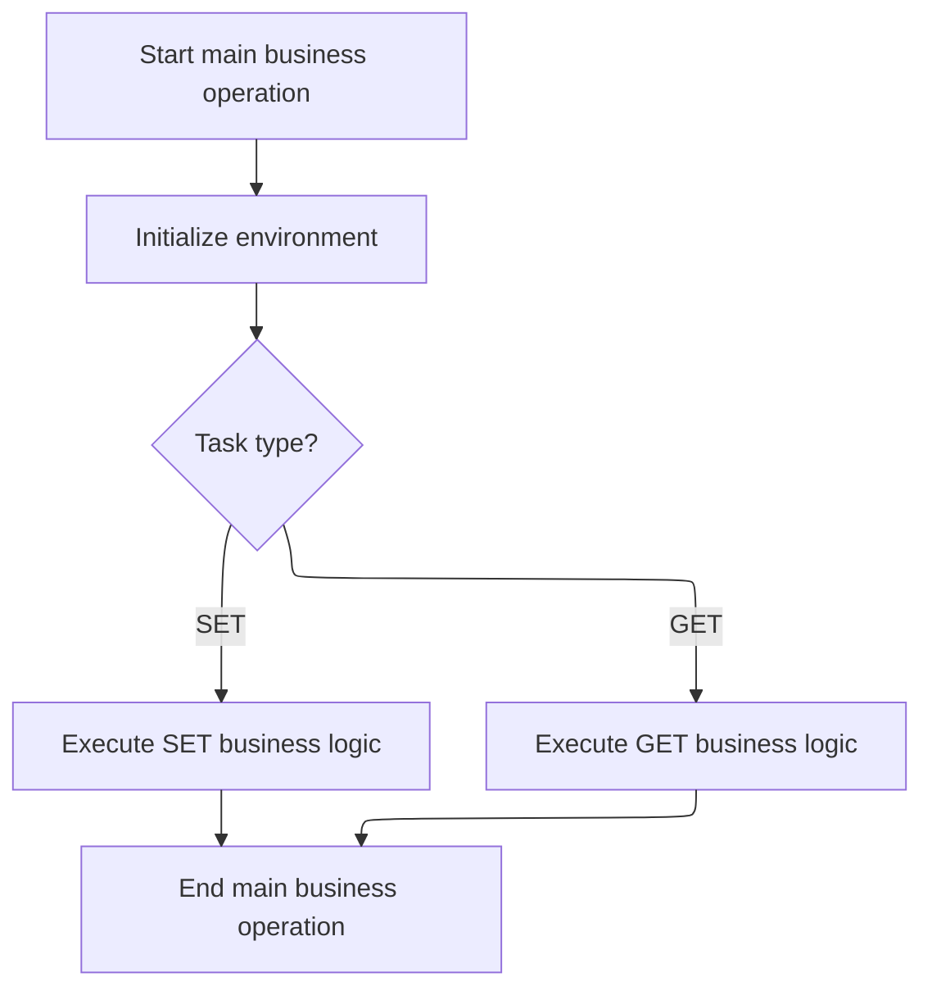

# Overview

This document describes the flow for managing master data workflow state transitions. The flow determines whether to save or retrieve the workflow state based on the provided task code, supporting consistent state management for modules that depend on master data transitions.

## Dependencies

### Program

- <SwmToken path="base/src/WWWS0100.cbl" pos="2:7:7" line-data="000200 PROGRAM-ID.    WWWS0100.                                         00000200">`WWWS0100`</SwmToken> (<SwmPath>[base/src/WWWS0100.cbl](base/src/WWWS0100.cbl)</SwmPath>)

### Copybooks

- <SwmToken path="base/src/WWWS0100.cbl" pos="27:4:4" line-data="009800 COPY XXXN001A.                                                   00009800">`XXXN001A`</SwmToken> (<SwmPath>[base/src/XXXN001A.cpy](base/src/XXXN001A.cpy)</SwmPath>)
- <SwmToken path="base/src/WWWS0100.cbl" pos="42:4:4" line-data="012400       WHEN WWWC0100-SET-TASK                                     00012400">`WWWC0100`</SwmToken> (<SwmPath>[base/src/WWWC0100.cpy](base/src/WWWC0100.cpy)</SwmPath>)

# Where is this program used?

This program is used multiple times in the codebase as represented in the following diagram:

```mermaid
graph TD
  z2t05("Table IO Object for Location Class Advertisement Zones (NNNS0473)") --> 8sxdo("Master Data Transitional Control (WWWS0100)"):::currentEntity
click z2t05 openCode "base/src/NNNS0473.cbl:1"
ds8u3("Table IO Object for Department Data (NNNS0573)") --> 8sxdo("Master Data Transitional Control (WWWS0100)"):::currentEntity
click ds8u3 openCode "base/src/NNNS0573.cbl:1"
an3cw("Managing Location Data (NNNS0487)") --> 8sxdo("Master Data Transitional Control (WWWS0100)"):::currentEntity
click an3cw openCode "base/src/NNNS0487.cbl:1"
mknro("Retail Location Data Processing (NNNS0488)") --> 8sxdo("Master Data Transitional Control (WWWS0100)"):::currentEntity
click mknro openCode "base/src/NNNS0488.cbl:1"
  
  
click 8sxdo openCode "base/src/WWWS0100.cbl:1"
    classDef currentEntity color:#000000,fill:#7CB9F4

%% Swimm:
%% graph TD
%%   z2t05("Table IO Object for Location Class Advertisement Zones (NNNS0473)") --> 8sxdo("Master Data Transitional Control (<SwmToken path="base/src/WWWS0100.cbl" pos="2:7:7" line-data="000200 PROGRAM-ID.    WWWS0100.                                         00000200">`WWWS0100`</SwmToken>)"):::currentEntity
%% click z2t05 openCode "<SwmPath>[base/src/NNNS0473.cbl](base/src/NNNS0473.cbl)</SwmPath>:1"
%% ds8u3("Table IO Object for Department Data (NNNS0573)") --> 8sxdo("Master Data Transitional Control (<SwmToken path="base/src/WWWS0100.cbl" pos="2:7:7" line-data="000200 PROGRAM-ID.    WWWS0100.                                         00000200">`WWWS0100`</SwmToken>)"):::currentEntity
%% click ds8u3 openCode "<SwmPath>[base/src/NNNS0573.cbl](base/src/NNNS0573.cbl)</SwmPath>:1"
%% an3cw("Managing Location Data (NNNS0487)") --> 8sxdo("Master Data Transitional Control (<SwmToken path="base/src/WWWS0100.cbl" pos="2:7:7" line-data="000200 PROGRAM-ID.    WWWS0100.                                         00000200">`WWWS0100`</SwmToken>)"):::currentEntity
%% click an3cw openCode "<SwmPath>[base/src/NNNS0487.cbl](base/src/NNNS0487.cbl)</SwmPath>:1"
%% mknro("Retail Location Data Processing (NNNS0488)") --> 8sxdo("Master Data Transitional Control (<SwmToken path="base/src/WWWS0100.cbl" pos="2:7:7" line-data="000200 PROGRAM-ID.    WWWS0100.                                         00000200">`WWWS0100`</SwmToken>)"):::currentEntity
%% click mknro openCode "<SwmPath>[base/src/NNNS0488.cbl](base/src/NNNS0488.cbl)</SwmPath>:1"
%%   
%%   
%% click 8sxdo openCode "<SwmPath>[base/src/WWWS0100.cbl](base/src/WWWS0100.cbl)</SwmPath>:1"
%%     classDef currentEntity color:#000000,fill:#7CB9F4
```



## Detailed View of the Program's Functionality

a. Program Initialization

The program begins execution by setting up its identity and environment. It declares its name, author, and purpose, which is to act as a master data transitional control subroutine. The program defines areas for working storage, which are used to temporarily hold data during execution. It also specifies external data structures (copy books) that will be used for input and output, and sets up the parameters it will receive when called.

b. Main Business Operation Entry Point

The main logic starts by performing an initialization routine. This routine prepares the environment by resetting or clearing the input data structure, ensuring that all fields are in a known state before any business logic is executed. This step is crucial for maintaining data integrity and preventing errors due to leftover or invalid data.

c. Task Type Evaluation and Branching

After initialization, the program evaluates the type of task requested. It checks whether the incoming task code corresponds to a "SET" operation or a "GET" operation. This decision point determines which branch of logic will be executed next:

- If the task is "SET", the program proceeds to save the current workflow state.
- If the task is "GET", the program retrieves the previously saved workflow state.

d. SET Task Business Logic

When the "SET" branch is chosen, the program copies the relevant fields from the input data structure into its internal working storage. This includes the main task code, a subtask code, an update status indicator, an event flag, and a scan event flag. By storing these values internally, the program preserves the current state of the workflow for future retrieval or processing.

e. GET Task Business Logic

When the "GET" branch is chosen, the program performs the reverse operation. It copies the values from its internal working storage back into the output data structure. This allows the caller to retrieve the current workflow state, including the task code, subtask code, update status, event flag, and scan event flag.

f. End of Main Business Operation

After completing either the "SET" or "GET" logic, the program ends the main business operation and returns control to the caller. This marks the completion of the requested task, ensuring that the workflow state has been either saved or retrieved as needed.

# Rule Definition

| Paragraph Name                                                                                                                                                                                   | Rule ID | Category          | Description                                                                                                                                                                                       | Conditions                                                                                         | Remarks                                                                                                                                    |
| ------------------------------------------------------------------------------------------------------------------------------------------------------------------------------------------------ | ------- | ----------------- | ------------------------------------------------------------------------------------------------------------------------------------------------------------------------------------------------- | -------------------------------------------------------------------------------------------------- | ------------------------------------------------------------------------------------------------------------------------------------------ |
| <SwmToken path="base/src/WWWS0100.cbl" pos="39:4:6" line-data="011800     PERFORM 100-INITIALIZE                                       00011800">`100-INITIALIZE`</SwmToken>                     | RL-001  | Data Assignment   | Before any business logic is executed, all fields in the internal structure must be set to their default values: spaces for text fields and zeros for numeric fields.                             | This rule applies at the start of program execution, before any SET or GET operation is performed. | All text fields are initialized to spaces. Numeric fields (if any) are initialized to zeros. The structure is initialized in its entirety. |
| PROCEDURE DIVISION USING, <SwmToken path="base/src/WWWS0100.cbl" pos="38:2:4" line-data="011700 000-MAIN.                                                        00011700">`000-MAIN`</SwmToken> | RL-002  | Conditional Logic | The program accepts an input structure containing fixed-length fields for task code, subtask code, update status, event flag, and scan event flag. The task code must be either 'SET ' or 'GET '. | This rule applies whenever the program is invoked with an input structure.                         | Input fields:                                                                                                                              |

- Task code: 4 characters (must be 'SET ' or 'GET ')
- Subtask code: 4 characters
- Update status: 1 character
- Event flag: 1 character
- Scan event flag: 1 character All fields are fixed-length strings. | | <SwmToken path="base/src/WWWS0100.cbl" pos="43:4:8" line-data="012500         PERFORM 200-SET-TASK                                     00012500">`200-SET-TASK`</SwmToken> | RL-003 | Data Assignment | When the task code is 'SET ', the program copies the subtask code, update status, event flag, and scan event flag from the input structure into the internal storage fields. | This rule applies when the input task code is 'SET '. | All fields are fixed-length strings (subtask code: 4 characters, update status: 1 character, event flag: 1 character, scan event flag: 1 character). | | <SwmToken path="base/src/WWWS0100.cbl" pos="45:4:8" line-data="012700         PERFORM 300-GET-TASK                                     00012700">`300-GET-TASK`</SwmToken> | RL-004 | Data Assignment | When the task code is 'GET ', the program copies the subtask code, update status, event flag, and scan event flag from the internal storage fields into the output structure. | This rule applies when the input task code is 'GET '. | All output fields are fixed-length strings matching the input format (subtask code: 4 characters, update status: 1 character, event flag: 1 character, scan event flag: 1 character). | | <SwmToken path="base/src/WWWS0100.cbl" pos="38:2:4" line-data="011700 000-MAIN.                                                        00011700">`000-MAIN`</SwmToken> | RL-005 | Conditional Logic | The program must always branch its business logic based on the value of the task code, using only the values 'SET ' and 'GET '. | This rule applies after initialization and upon receiving the input structure. | Only 'SET ' and 'GET ' are valid task codes. Any other value is not processed. |

# User Stories

## User Story 1: Prepare and validate workflow operation

---

### Story Description:

As a system, I want to initialize the internal workflow state, accept a fixed-format input structure, and branch logic based on the task code ('SET ' or 'GET ') so that workflow operations are always started from a consistent state and only valid requests are processed.

---

### Business Rule Mapping:

| Rule ID | Paragraph Name                                                                                                                                                                                   | Rule Description                                                                                                                                                                                  |
| ------- | ------------------------------------------------------------------------------------------------------------------------------------------------------------------------------------------------ | ------------------------------------------------------------------------------------------------------------------------------------------------------------------------------------------------- |
| RL-005  | <SwmToken path="base/src/WWWS0100.cbl" pos="38:2:4" line-data="011700 000-MAIN.                                                        00011700">`000-MAIN`</SwmToken>                           | The program must always branch its business logic based on the value of the task code, using only the values 'SET ' and 'GET '.                                                                   |
| RL-001  | <SwmToken path="base/src/WWWS0100.cbl" pos="39:4:6" line-data="011800     PERFORM 100-INITIALIZE                                       00011800">`100-INITIALIZE`</SwmToken>                     | Before any business logic is executed, all fields in the internal structure must be set to their default values: spaces for text fields and zeros for numeric fields.                             |
| RL-002  | PROCEDURE DIVISION USING, <SwmToken path="base/src/WWWS0100.cbl" pos="38:2:4" line-data="011700 000-MAIN.                                                        00011700">`000-MAIN`</SwmToken> | The program accepts an input structure containing fixed-length fields for task code, subtask code, update status, event flag, and scan event flag. The task code must be either 'SET ' or 'GET '. |

---

### Relevant Functionality:

- <SwmToken path="base/src/WWWS0100.cbl" pos="38:2:4" line-data="011700 000-MAIN.                                                        00011700">`000-MAIN`</SwmToken>
  1. **RL-005:**
     - After initialization:
       - If task code is 'SET ', perform SET operation
       - If task code is 'GET ', perform GET operation
- <SwmToken path="base/src/WWWS0100.cbl" pos="39:4:6" line-data="011800     PERFORM 100-INITIALIZE                                       00011800">`100-INITIALIZE`</SwmToken>
  1. **RL-001:**
     - At program start:
       - Set all text fields in the internal structure to spaces
       - Set all numeric fields in the internal structure to zeros
- **PROCEDURE DIVISION USING**
  1. **RL-002:**
     - Receive input structure with fixed-length fields
     - Check that the task code is either 'SET ' or 'GET '
     - Proceed based on the value of the task code

## User Story 2: Manage workflow state for SET and GET operations

---

### Story Description:

As a user, I want to set or retrieve the workflow state using the SET and GET operations so that I can update or access the current workflow status and flags as needed.

---

### Business Rule Mapping:

| Rule ID | Paragraph Name                                                                                                                                                             | Rule Description                                                                                                                                                              |
| ------- | -------------------------------------------------------------------------------------------------------------------------------------------------------------------------- | ----------------------------------------------------------------------------------------------------------------------------------------------------------------------------- |
| RL-003  | <SwmToken path="base/src/WWWS0100.cbl" pos="43:4:8" line-data="012500         PERFORM 200-SET-TASK                                     00012500">`200-SET-TASK`</SwmToken> | When the task code is 'SET ', the program copies the subtask code, update status, event flag, and scan event flag from the input structure into the internal storage fields.  |
| RL-004  | <SwmToken path="base/src/WWWS0100.cbl" pos="45:4:8" line-data="012700         PERFORM 300-GET-TASK                                     00012700">`300-GET-TASK`</SwmToken> | When the task code is 'GET ', the program copies the subtask code, update status, event flag, and scan event flag from the internal storage fields into the output structure. |

---

### Relevant Functionality:

- <SwmToken path="base/src/WWWS0100.cbl" pos="43:4:8" line-data="012500         PERFORM 200-SET-TASK                                     00012500">`200-SET-TASK`</SwmToken>
  1. **RL-003:**
     - If task code is 'SET ':
       - Copy subtask code from input to internal storage
       - Copy update status from input to internal storage
       - Copy event flag from input to internal storage
       - Copy scan event flag from input to internal storage
- <SwmToken path="base/src/WWWS0100.cbl" pos="45:4:8" line-data="012700         PERFORM 300-GET-TASK                                     00012700">`300-GET-TASK`</SwmToken>
  1. **RL-004:**
     - If task code is 'GET ':
       - Copy subtask code from internal storage to output
       - Copy update status from internal storage to output
       - Copy event flag from internal storage to output
       - Copy scan event flag from internal storage to output

# Workflow

# Task State Control Entry Point



This section acts as the entry point for controlling task state operations. It ensures the environment is properly initialized before branching to the appropriate business logic based on the task type ('SET ' or 'GET '). The section guarantees that only valid task types are processed and that the operation concludes cleanly.

| Category        | Rule Name                            | Description                                                                                                                              |
| --------------- | ------------------------------------ | ---------------------------------------------------------------------------------------------------------------------------------------- |
| Data validation | Mandatory environment initialization | The environment must be initialized before any task operation is performed. Initialization is mandatory for all incoming requests.       |
| Data validation | Valid task type enforcement          | Only requests with a task code of 'SET ' or 'GET ' are permitted. Any other task code is not processed by this section.                  |
| Business logic  | Save workflow state on SET           | If the task code is 'SET ', the current workflow state must be saved as part of the operation.                                           |
| Business logic  | Retrieve workflow state on GET       | If the task code is 'GET ', the workflow state must be retrieved and made available to the caller.                                       |
| Technical step  | Return control after operation       | After completing the requested task operation, control must be returned to the caller, signaling the end of the main business operation. |

<SwmSnippet path="/base/src/WWWS0100.cbl" line="38">

---

In <SwmToken path="base/src/WWWS0100.cbl" pos="38:2:4" line-data="011700 000-MAIN.                                                        00011700">`000-MAIN`</SwmToken>, we kick off the flow by calling <SwmToken path="base/src/WWWS0100.cbl" pos="39:4:6" line-data="011800     PERFORM 100-INITIALIZE                                       00011800">`100-INITIALIZE`</SwmToken>. This sets up the internal structures needed for handling master data task transitions. It's a required step before any task operations can happen, so the rest of the logic has a valid state to work with.

```cobol
011700 000-MAIN.                                                        00011700
011800     PERFORM 100-INITIALIZE                                       00011800
```

---

</SwmSnippet>

<SwmSnippet path="/base/src/WWWS0100.cbl" line="41">

---

Next in <SwmToken path="base/src/WWWS0100.cbl" pos="38:2:4" line-data="011700 000-MAIN.                                                        00011700">`000-MAIN`</SwmToken>, we use EVALUATE TRUE to branch based on the task code. If it's 'SET ', we call <SwmToken path="base/src/WWWS0100.cbl" pos="43:4:8" line-data="012500         PERFORM 200-SET-TASK                                     00012500">`200-SET-TASK`</SwmToken> to save the current workflow state. If it's 'GET ', we call <SwmToken path="base/src/WWWS0100.cbl" pos="45:4:8" line-data="012700         PERFORM 300-GET-TASK                                     00012700">`300-GET-TASK`</SwmToken> to retrieve the workflow state. The flow ends with GOBACK, returning control to the caller.

```cobol
012300     EVALUATE TRUE                                                00012300
012400       WHEN WWWC0100-SET-TASK                                     00012400
012500         PERFORM 200-SET-TASK                                     00012500
012600       WHEN WWWC0100-GET-TASK                                     00012600
012700         PERFORM 300-GET-TASK                                     00012700
013800     END-EVALUATE                                                 00013800
014100                                                                  00014100
014200     GOBACK                                                       00014200
014300     .                                                            00014300
```

---

</SwmSnippet>

&nbsp;

*This is an auto-generated document by Swimm 🌊 and has not yet been verified by a human*

<SwmMeta version="3.0.0" repo-id="Z2l0aHViJTNBJTNBU3dpbW1pby1keW5jYWxsLWRlbW8lM0ElM0FHaXJpLVN3aW1t" repo-name="Swimmio-dyncall-demo"><sup>Powered by [Swimm](https://app.swimm.io/)</sup></SwmMeta>
