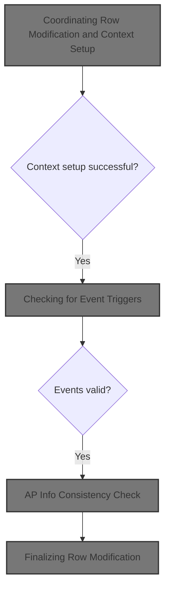
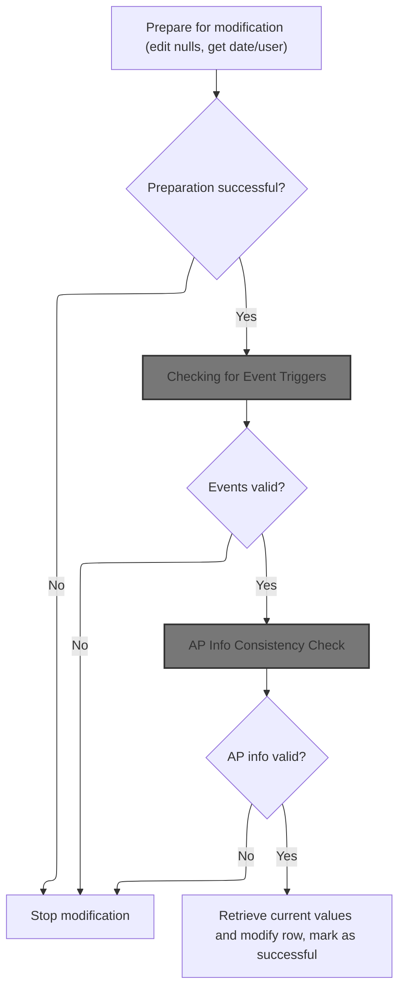
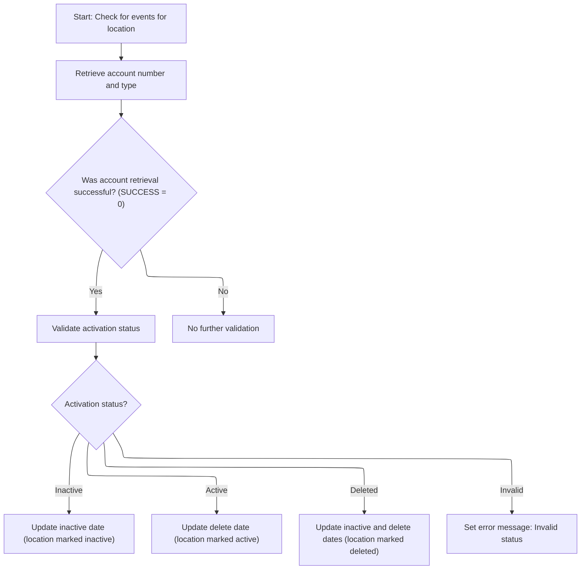
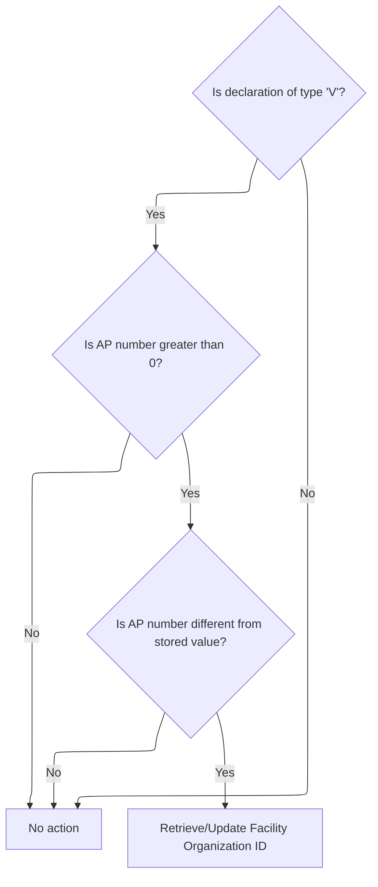
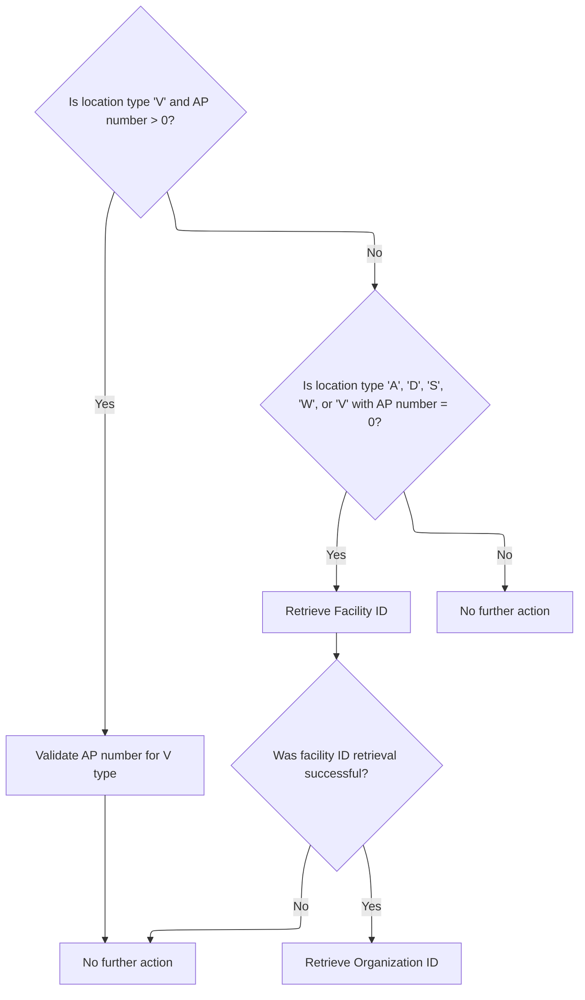
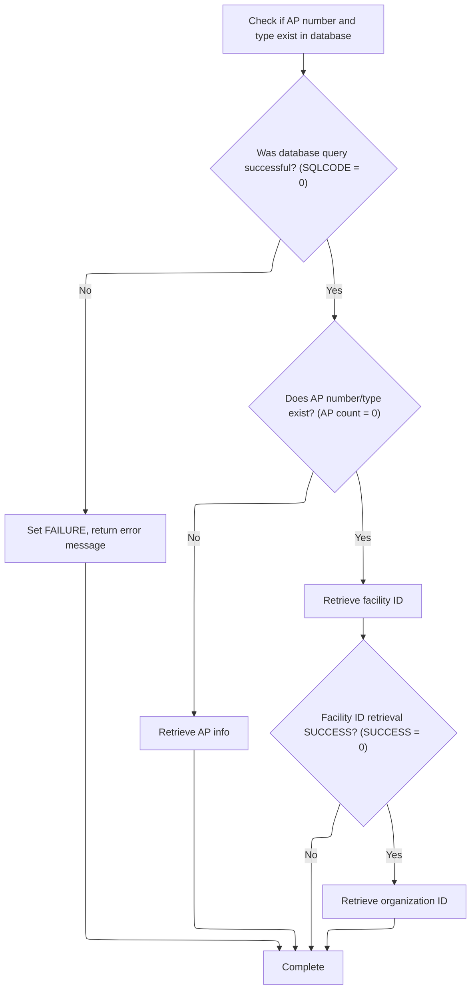
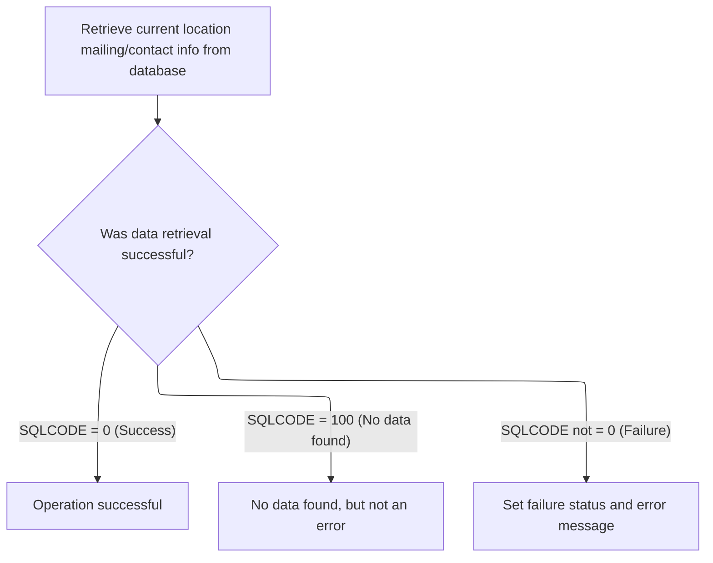

This document describes the flow for modifying a location row, ensuring business rules, audit context, and data consistency are maintained. The process includes context setup, event trigger checks, validation of activation status, consistency checks for account provider information, and updating facility/organization IDs. The modification is finalized only if all conditions are met.



# Spec

## Detailed View of the Program's Functionality

# Detailed Explanation of the Row Modification and Context Setup Flow

---

## a. Preparation for Row Modification

The process begins by preparing the data for modification. This involves two main actions:

- **Editing Null Indicators:** The code initializes and sets special markers for fields that are considered "null" (for example, if a code is blank or a number is zero, it marks the corresponding indicator as null). This ensures that when the data is written to the database, nulls are handled correctly.
- **Getting Date and User Context:** The code retrieves the current date and determines the user performing the operation. If the system is running in an interactive environment, it fetches the user ID from the session; otherwise, it defaults to a batch user. This information is used for audit trails and update tracking.

If both steps succeed, the process continues. If either fails, the modification is stopped immediately.

---

## b. Checking for Event Triggers

Next, the code checks if any special events need to be triggered for the location being modified:

- **Retrieve Account Provider Number:** If the location type is of certain kinds (such as vendor or DSD vendor), the code queries the database to fetch the account provider number and type. If the query fails or returns no data, it initializes these fields to default values.
- **Validate Activation Status:** If the account provider number retrieval is successful, the code checks the location's activation status. Depending on whether the location is marked as active, inactive, or deleted, it updates the corresponding inactive and delete dates. If the status is invalid, it sets an error message and marks the operation as failed.

If any of these checks fail, the modification is stopped.

---

## c. AP Info Consistency Check

If the event checks pass, the code verifies the consistency of the account provider (AP) information:

- **Check for Vendor Type and AP Number:** If the location is a vendor and has a non-zero AP number, the code checks if the AP number has changed compared to what was previously stored.
- **Update Facility/Organization IDs if Needed:** If the AP number has changed, the code triggers a process to update the facility and organization IDs associated with this location. If nothing has changed, no further action is taken.

If this check fails, the modification is stopped.

---

## d. Facility and Organization ID Assignment

When an AP number change is detected or a new row is being inserted, the code determines how to assign facility and organization IDs:

- **Vendor with AP Number:** If the location is a vendor and has an AP number, the code checks if this AP exists in the database. If it does not exist, it generates new facility and organization IDs.
- **Other Location Types or Vendor with No AP Number:** For other types of locations, or vendors with no AP number, the code generates new facility and organization IDs as needed.
- **Database Errors:** If any database operation fails during this process, the code sets an error message and marks the operation as failed.

---

## e. Account Provider Existence and Org ID Handling

When checking if an AP exists:

- **Query for AP Existence:** The code queries the database to count how many records match the given AP number and type.
- **If AP Does Not Exist:** If no record is found, it generates new facility and organization IDs.
- **If AP Exists:** If a record is found, it retrieves the existing facility and organization IDs from the database and assigns them to the current location.
- **Error Handling:** If the query fails, the code sets an error message and marks the operation as failed.

---

## f. Finalizing Row Modification

If all previous checks pass, the code proceeds to finalize the modification:

- **Retrieve Current Values:** The code fetches the latest mailing and contact information for the location from the database. This is used to compare with the new values and determine if any significant changes have occurred.
- **Edit Null Indicators Again:** The code re-applies the null indicator logic to ensure all fields are correctly marked before the update.
- **Modify the Row:** The code updates the database with the new values, setting the last update timestamp and user ID. It also triggers any necessary downstream processes, such as event staging or denormalization, depending on what changed.

If the update is successful, the operation is marked as complete. If any step fails, the process is stopped and an error is reported.

---

## g. Date and User Context Details

The code responsible for getting the date and user works as follows:

- **Call Date Function:** It calls a routine to get the current date and time.
- **Determine User:** If running in an interactive environment, it calls another routine to get the current user ID. If not, it sets the user to a default batch value.
- **Purpose:** This ensures that all updates are properly attributed to the correct user and timestamp, which is important for auditing and tracking changes.

---

## h. Summary

The overall flow is a robust, multi-step process that ensures:

- Data is properly prepared and validated before any modification.
- All necessary context (date, user) is captured for audit purposes.
- Special event triggers and consistency checks are performed as needed.
- Facility and organization IDs are managed correctly, with new ones generated when appropriate.
- The database is updated only if all checks pass, and errors are handled gracefully.

This design ensures data integrity, proper audit trails, and correct handling of business rules around location and account provider management.

# Rule Definition

| Paragraph Name                                                                                                                                        | Rule ID | Category          | Description                                                                                                                                                                                                                                 | Conditions                                                                                          | Remarks                                                                                                                      |
| ----------------------------------------------------------------------------------------------------------------------------------------------------- | ------- | ----------------- | ------------------------------------------------------------------------------------------------------------------------------------------------------------------------------------------------------------------------------------------- | --------------------------------------------------------------------------------------------------- | ---------------------------------------------------------------------------------------------------------------------------- |
| 110-MOVE-PDA-FIELDS-2-DCL, 1400-EXIT-PUT-MODIFY-ROW, 1500-EXIT-PUT-INSERT-ROW, 1600-EXIT-PUT-PURGE-ROW                                                | RL-001  | Data Assignment   | The system must accept a location record as input using the P-DDDTLO01 structure and update it in place based on modification logic.                                                                                                        | A location record is provided as input and the operation is a modification, insertion, or deletion. | Input and output structures use the P-DDDTLO01 format. All fields are updated in place. Date fields use 'YYYY-MM-DD' format. |
| 100-INITIALIZATION, 120-EXIT-STUFF, 1400-EXIT-PUT-MODIFY-ROW, 1500-EXIT-PUT-INSERT-ROW, 1600-EXIT-PUT-PURGE-ROW, error handling in various paragraphs | RL-002  | Data Assignment   | The system must use the XXXN001A structure to indicate operation status, with SUCCESS and FAILURE flags and an error message field.                                                                                                         | Any operation is performed, or an error occurs.                                                     | XXXN001A contains SUCCESS/FAILURE flags and an error message field (string).                                                 |
| All EXEC SQL blocks, error handling after SQL operations                                                                                              | RL-003  | Data Assignment   | The system must use the SQLCA structure to indicate the result of any database operation, with SQLCODE values: 0 for success, 100 for not found, and negative values for errors.                                                            | A database operation is performed.                                                                  | SQLCA.SQLCODE: 0=success, 100=not found, <0=error.                                                                           |
| 2040-GET-DATE-AND-USER                                                                                                                                | RL-004  | Computation       | The system must retrieve the current date and user ID at the start of the operation, setting the user ID to 'BATCH' if not in a CICS environment, or to the CICS user ID if in CICS.                                                        | At the start of a modification, insertion, or deletion operation.                                   | User ID is a string. 'BATCH' is used for batch, CICS user ID for CICS.                                                       |
| 1400-EXIT-PUT-MODIFY-ROW, 1500-EXIT-PUT-INSERT-ROW, 1600-EXIT-PUT-PURGE-ROW                                                                           | RL-005  | Conditional Logic | The system must only proceed with modification if all preparation steps succeed, as indicated by the SUCCESS flag.                                                                                                                          | Preparation steps (validation, event check, etc.) are completed.                                    | SUCCESS is a boolean flag in the status structure.                                                                           |
| 1411-CHECK-FOR-EVENTS, 1412-GET-AP-NBR                                                                                                                | RL-006  | Conditional Logic | The system must check for event triggers for the location, retrieving the AP number and type if the location type is 'V' or 'D'. If retrieval fails, the event check must stop.                                                             | Location type is 'V' or 'D'.                                                                        | AP number is a number, AP type is a string. SQLCODE checked after retrieval.                                                 |
| 1414-VALIDATE-ACTIV-SW                                                                                                                                | RL-007  | Conditional Logic | The system must validate the activation status of the location, updating the inactive and/or delete dates based on the status value ('A', 'I', 'D'). If the status is invalid, the system must set an error message and the FAILURE flag.   | Status field is present in the input record.                                                        | Status values: 'A' (Active), 'I' (Inactive), 'D' (Deleted). Date fields use 'YYYY-MM-DD' format. K-DEF-DT = '0001-01-01'.    |
| 1420-CHECK-AP-INFO, 1505-GET-FAC-ORG-ID, 1515-CHECK-AP-NBR, 1520-GET-AP-INFO                                                                          | RL-008  | Conditional Logic | If the location type is 'V' and the AP number is set and has changed, the system must retrieve or update the facility and organization IDs accordingly.                                                                                     | Location type is 'V' and AP number is set and has changed.                                          | Facility and organization IDs are numbers. AP number is a number.                                                            |
| 1505-GET-FAC-ORG-ID, 1525-EXIT-GET-FAC-ID, 1530-EXIT-GET-ORG-ID                                                                                       | RL-009  | Computation       | The system must assign facility and organization IDs based on location type and AP number, generating new IDs if needed, and ensuring uniqueness by using the highest existing ID plus one.                                                 | Facility or organization ID needs to be assigned or generated.                                      | Facility and organization IDs are numbers. Uniqueness ensured by MAX+1 logic.                                                |
| 1515-CHECK-AP-NBR, 1520-GET-AP-INFO                                                                                                                   | RL-010  | Conditional Logic | The system must check if the AP number and type exist in the database, and if not, generate new facility and org IDs. If the AP exists, the system must fetch the existing info. SQL errors must set the FAILURE flag and an error message. | AP number and type are provided.                                                                    | AP number is a number, AP type is a string. SQLCODE checked after operation.                                                 |
| 1430-GET-CURRENT-VALUES                                                                                                                               | RL-011  | Computation       | The system must retrieve the latest mailing and contact info for the location from the database, updating the output structure. If the query fails, the system must set the FAILURE flag and an error message.                              | Modification operation is in progress and preparation steps succeeded.                              | Mailing and contact info fields are strings/numbers as per structure. SQLCODE checked after operation.                       |
| All error handling sections, especially after SQL operations and validation steps                                                                     | RL-012  | Conditional Logic | The system must stop further processing and set the FAILURE flag if any step fails.                                                                                                                                                         | Any step fails (e.g., SQL error, validation error).                                                 | FAILURE is a boolean flag in the status structure.                                                                           |
| 110-MOVE-PDA-FIELDS-2-DCL, 1414-VALIDATE-ACTIV-SW, 1500-EXIT-PUT-INSERT-ROW, 1505-GET-FAC-ORG-ID                                                      | RL-013  | Computation       | The system must use the following constants for date fields: K-DEF-DT = '0001-01-01', K-ZERO-DT = '0000-00-00'. All date fields must use the format 'YYYY-MM-DD'.                                                                           | Any date field is empty, spaces, or zero date.                                                      | K-DEF-DT = '0001-01-01', K-ZERO-DT = '0000-00-00'. Date fields are strings in 'YYYY-MM-DD' format.                           |
| 110-MOVE-PDA-FIELDS-2-DCL, 1414-VALIDATE-ACTIV-SW, 1505-GET-FAC-ORG-ID                                                                                | RL-014  | Conditional Logic | The system must support the following values for location type: 'V', 'D', 'A', 'S', 'W', 'B', 'T', 'O'. The system must support the following values for status: 'A' (Active), 'I' (Inactive), 'D' (Deleted).                               | Location type or status field is present in the input record.                                       | Location types: 'V', 'D', 'A', 'S', 'W', 'B', 'T', 'O'. Status: 'A', 'I', 'D'.                                               |

# User Stories

## User Story 1: Submit, validate, and update a location record

---

### Story Description:

As a system user, I want to submit a location record for modification, insertion, or deletion so that the system can validate, update, and ensure the record reflects its correct state, including activation status and contact details.

---

### Business Rule Mapping:

| Rule ID | Paragraph Name                                                                                         | Rule Description                                                                                                                                                                                                                          |
| ------- | ------------------------------------------------------------------------------------------------------ | ----------------------------------------------------------------------------------------------------------------------------------------------------------------------------------------------------------------------------------------- |
| RL-007  | 1414-VALIDATE-ACTIV-SW                                                                                 | The system must validate the activation status of the location, updating the inactive and/or delete dates based on the status value ('A', 'I', 'D'). If the status is invalid, the system must set an error message and the FAILURE flag. |
| RL-011  | 1430-GET-CURRENT-VALUES                                                                                | The system must retrieve the latest mailing and contact info for the location from the database, updating the output structure. If the query fails, the system must set the FAILURE flag and an error message.                            |
| RL-001  | 110-MOVE-PDA-FIELDS-2-DCL, 1400-EXIT-PUT-MODIFY-ROW, 1500-EXIT-PUT-INSERT-ROW, 1600-EXIT-PUT-PURGE-ROW | The system must accept a location record as input using the P-DDDTLO01 structure and update it in place based on modification logic.                                                                                                      |
| RL-013  | 110-MOVE-PDA-FIELDS-2-DCL, 1414-VALIDATE-ACTIV-SW, 1500-EXIT-PUT-INSERT-ROW, 1505-GET-FAC-ORG-ID       | The system must use the following constants for date fields: K-DEF-DT = '0001-01-01', K-ZERO-DT = '0000-00-00'. All date fields must use the format 'YYYY-MM-DD'.                                                                         |
| RL-014  | 110-MOVE-PDA-FIELDS-2-DCL, 1414-VALIDATE-ACTIV-SW, 1505-GET-FAC-ORG-ID                                 | The system must support the following values for location type: 'V', 'D', 'A', 'S', 'W', 'B', 'T', 'O'. The system must support the following values for status: 'A' (Active), 'I' (Inactive), 'D' (Deleted).                             |

---

### Relevant Functionality:

- **1414-VALIDATE-ACTIV-SW**
  1. **RL-007:**
     - If status is 'I', set inactive date if not already set
     - If status is 'A', clear inactive date, set delete date if needed
     - If status is 'D', set inactive and delete dates if not already set
     - If status is not one of 'A', 'I', 'D', set FAILURE and error message
- **1430-GET-CURRENT-VALUES**
  1. **RL-011:**
     - Query for mailing and contact info by location type and number
     - If found, update output structure
     - If SQLCODE != 0 and != 100, set FAILURE and error message
- **110-MOVE-PDA-FIELDS-2-DCL**
  1. **RL-001:**
     - Receive location record as input
     - Move fields from input structure to working DCL structure
     - Apply modification logic (validation, assignment, etc.)
     - Move updated fields back to output structure
  2. **RL-013:**
     - If date field is spaces or K-ZERO-DT, set to K-DEF-DT
     - All date fields must be in 'YYYY-MM-DD' format
  3. **RL-014:**
     - Validate location type is in supported set
     - Validate status is in supported set

## User Story 2: Receive operation status and error feedback

---

### Story Description:

As a system user, I want to receive clear status and error feedback for each operation so that I know whether my request succeeded or failed and why.

---

### Business Rule Mapping:

| Rule ID | Paragraph Name                                                                                                                                        | Rule Description                                                                                                                                                                 |
| ------- | ----------------------------------------------------------------------------------------------------------------------------------------------------- | -------------------------------------------------------------------------------------------------------------------------------------------------------------------------------- |
| RL-002  | 100-INITIALIZATION, 120-EXIT-STUFF, 1400-EXIT-PUT-MODIFY-ROW, 1500-EXIT-PUT-INSERT-ROW, 1600-EXIT-PUT-PURGE-ROW, error handling in various paragraphs | The system must use the XXXN001A structure to indicate operation status, with SUCCESS and FAILURE flags and an error message field.                                              |
| RL-003  | All EXEC SQL blocks, error handling after SQL operations                                                                                              | The system must use the SQLCA structure to indicate the result of any database operation, with SQLCODE values: 0 for success, 100 for not found, and negative values for errors. |
| RL-012  | All error handling sections, especially after SQL operations and validation steps                                                                     | The system must stop further processing and set the FAILURE flag if any step fails.                                                                                              |

---

### Relevant Functionality:

- **100-INITIALIZATION**
  1. **RL-002:**
     - Initialize status structure at start
     - Set SUCCESS or FAILURE flag based on operation outcome
     - Set error message field if an error occurs
- **All EXEC SQL blocks**
  1. **RL-003:**
     - After each SQL operation, check SQLCA.SQLCODE
     - Take action based on value (continue, handle not found, or set FAILURE and error message)
- **All error handling sections**
  1. **RL-012:**
     - After each step, check for errors
     - If error detected, set FAILURE flag and abort further processing

## User Story 3: Event trigger and AP info management

---

### Story Description:

As a system user, I want the system to check for event triggers and manage AP number and type for locations of type 'V' or 'D', including facility and organization ID assignment, so that related information is correctly handled and updated.

---

### Business Rule Mapping:

| Rule ID | Paragraph Name                                                               | Rule Description                                                                                                                                                                                                                            |
| ------- | ---------------------------------------------------------------------------- | ------------------------------------------------------------------------------------------------------------------------------------------------------------------------------------------------------------------------------------------- |
| RL-006  | 1411-CHECK-FOR-EVENTS, 1412-GET-AP-NBR                                       | The system must check for event triggers for the location, retrieving the AP number and type if the location type is 'V' or 'D'. If retrieval fails, the event check must stop.                                                             |
| RL-008  | 1420-CHECK-AP-INFO, 1505-GET-FAC-ORG-ID, 1515-CHECK-AP-NBR, 1520-GET-AP-INFO | If the location type is 'V' and the AP number is set and has changed, the system must retrieve or update the facility and organization IDs accordingly.                                                                                     |
| RL-009  | 1505-GET-FAC-ORG-ID, 1525-EXIT-GET-FAC-ID, 1530-EXIT-GET-ORG-ID              | The system must assign facility and organization IDs based on location type and AP number, generating new IDs if needed, and ensuring uniqueness by using the highest existing ID plus one.                                                 |
| RL-010  | 1515-CHECK-AP-NBR, 1520-GET-AP-INFO                                          | The system must check if the AP number and type exist in the database, and if not, generate new facility and org IDs. If the AP exists, the system must fetch the existing info. SQL errors must set the FAILURE flag and an error message. |

---

### Relevant Functionality:

- **1411-CHECK-FOR-EVENTS**
  1. **RL-006:**
     - If location type is 'V' or 'D', attempt to retrieve AP number and type
     - If retrieval fails (SQLCODE != 0), stop event check
- **1420-CHECK-AP-INFO**
  1. **RL-008:**
     - If location type is 'V' and AP number > 0 and has changed, retrieve or update facility and org IDs
- **1505-GET-FAC-ORG-ID**
  1. **RL-009:**
     - If AP does not exist, get max FAC_ID and ORG_ID from database
     - Assign new IDs as MAX+1
- **1515-CHECK-AP-NBR**
  1. **RL-010:**
     - Query for AP number and type
     - If not found, generate new IDs
     - If found, fetch existing info
     - On SQL error, set FAILURE and error message

## User Story 4: Initialize operation context and validate preparation

---

### Story Description:

As a system, I want to retrieve the current date and user ID at the start of each operation and ensure all preparation steps succeed before proceeding so that only valid operations are performed in the correct context.

---

### Business Rule Mapping:

| Rule ID | Paragraph Name                                                              | Rule Description                                                                                                                                                                     |
| ------- | --------------------------------------------------------------------------- | ------------------------------------------------------------------------------------------------------------------------------------------------------------------------------------ |
| RL-005  | 1400-EXIT-PUT-MODIFY-ROW, 1500-EXIT-PUT-INSERT-ROW, 1600-EXIT-PUT-PURGE-ROW | The system must only proceed with modification if all preparation steps succeed, as indicated by the SUCCESS flag.                                                                   |
| RL-004  | 2040-GET-DATE-AND-USER                                                      | The system must retrieve the current date and user ID at the start of the operation, setting the user ID to 'BATCH' if not in a CICS environment, or to the CICS user ID if in CICS. |

---

### Relevant Functionality:

- **1400-EXIT-PUT-MODIFY-ROW**
  1. **RL-005:**
     - After each preparation step, check SUCCESS flag
     - If not SUCCESS, abort further processing
- **2040-GET-DATE-AND-USER**
  1. **RL-004:**
     - Call date function to get current date
     - If in CICS environment, call function to get CICS user ID
     - Else, set user ID to 'BATCH'

# Code Walkthrough

## Coordinating Row Modification and Context Setup



<SwmSnippet path="/base/src/NNNS0487.cbl" line="2304">

---

`1400-EXIT-PUT-MODIFY-ROW` starts the flow, running a sequence of checks and updates. It calls `2040-GET-DATE-AND-USER` early to ensure all later steps have the right date/user context for audit and update tracking. The flow only continues if each check passes, and the EXIT-PUT-MODIFY-ROW flag is set to signal everything is good to go.

```cobol
238100 1400-EXIT-PUT-MODIFY-ROW.                                        00238100
238200     PERFORM 1800-EDIT-NULL-INDICATORS                            00238200
238300     PERFORM 2040-GET-DATE-AND-USER                               00238300
238400                                                                  00238400
238500     IF SUCCESS                                                   00238500
238600       PERFORM 1411-CHECK-FOR-EVENTS                              00238600
238700       IF SUCCESS                                                 00238700
238800         PERFORM 1420-CHECK-AP-INFO                               00238800
238900         IF SUCCESS                                               00238900
239000*          PERFORM 10300-CHECK-FOR-VALID-COUNTY                   00239000
239100           SET EXIT-PUT-MODIFY-ROW  TO TRUE                       00239100
239200           IF SUCCESS                                             00239200
239300             PERFORM 1430-GET-CURRENT-VALUES                      00239300
239400             PERFORM 1800-EDIT-NULL-INDICATORS                    00239400
239500             PERFORM 1440-D0-MODIFY-ROW                           00239500
239600           END-IF                                                 00239600
239700         END-IF                                                   00239700
239800       END-IF                                                     00239800
239900     END-IF                                                       00239900
240000     .                                                            00240000
```

---

</SwmSnippet>

<SwmSnippet path="/base/src/NNNS0487.cbl" line="3268">

---

`2040-GET-DATE-AND-USER` grabs the current date and figures out who the user is. If we're running in a CICS environment, it calls the CICS user ID routine; otherwise, it just sets the user to 'BATCH'. This way, all updates have the right context for who did what, whether it's a real user or a batch job.

```cobol
334500 2040-GET-DATE-AND-USER.                                          00334500
334600     CALL Z-DATE-FUNCTIONS USING                                  00334600
334700         XXXN001A                                                 00334700
334800         YYYC0127                                                 00334800
334900                                                                  00334900
335000     IF  SUCCESS                                                  00335000
335100     AND YYYN005A-CICS-ENV                                        00335100
335200       CALL Z-GET-CICS-USER-ID USING                              00335200
335300           EIBLK    WS-DUMMY                                      00335300
335400           XXXN001A YYYC0107                                      00335400
335500     ELSE                                                         00335500
335600       MOVE 'BATCH' TO YYYC0107-USER                              00335600
335700     END-IF                                                       00335700
335800     .                                                            00335800
```

---

</SwmSnippet>

### Checking for Event Triggers



<SwmSnippet path="/base/src/NNNS0487.cbl" line="2326">

---

`1411-CHECK-FOR-EVENTS` checks if anything needs to happen for this location by first fetching the AP number (with `1412-GET-AP-NBR`). If that works, it moves on to validate the activity switch. If the AP number can't be fetched, the event check stops here.

```cobol
240300 1411-CHECK-FOR-EVENTS.                                           00240300
240400     PERFORM 1412-GET-AP-NBR                                      00240400
240500     IF SUCCESS                                                   00240500
240600       PERFORM 1414-VALIDATE-ACTIV-SW                             00240600
240700     END-IF                                                       00240700
240800     .                                                            00240800
```

---

</SwmSnippet>

<SwmSnippet path="/base/src/NNNS0487.cbl" line="2334">

---

`1412-GET-AP-NBR` only runs its SQL if the location type is 'V' or 'D'. It pulls AP number and type from the database, handles missing/nulls, and pushes the results to output fields. If the query fails or returns nothing, it sets defaults or logs an error as needed.

```cobol
241100 1412-GET-AP-NBR.                                                 00241100
241200     IF LOC-TYP-CD OF DCLXXXATION = 'V' OR 'D'                    00241200
241300       EXEC SQL                                                   00241300
241400           SELECT AP_NBR,                                         00241400
241500                  AP_TYP_CD                                       00241500
241600           INTO :WS-AP-NUM:WS-AP-NBR-IND,                         00241600
241700                :WS-AP-TYPE:WS-AP-TYP-CD-IND                      00241700
241800           FROM XXXATION                                          00241800
241900           WHERE LOC_TYP_CD = :DCLXXXATION.LOC-TYP-CD             00241900
242000           AND  LOC_NBR = :DCLXXXATION.LOC-NBR                    00242000
242100       END-EXEC                                                   00242100
242200                                                                  00242200
242300       EVALUATE TRUE                                              00242300
242400         WHEN SQLCODE = 0                                         00242400
242500           IF WS-AP-NBR-IND < 0                                   00242500
242600           OR WS-AP-TYP-CD-IND < 0                                00242600
242700             INITIALIZE WS-AP-NUM                                 00242700
242800                        WS-AP-TYPE                                00242800
242900           END-IF                                                 00242900
243000         WHEN SQLCODE = 100                                       00243000
243100           INITIALIZE WS-AP-NUM                                   00243100
243200                      WS-AP-TYPE                                  00243200
243300           MOVE 0 TO SQLCODE                                      00243300
243400        WHEN OTHER                                                00243400
243500         SET FAILURE  TO TRUE                                     00243500
243600         MOVE SPACES  TO IS-RTRN-MSG-TXT                          00243600
243700         MOVE SQLCODE TO WS-SQLCODE                               00243700
243800         STRING 'NNNS0487 - Error in gathering events. SQL '      00243800
243900                WS-SQLCODE '.'                                    00243900
244000         DELIMITED BY SIZE INTO IS-RTRN-MSG-TXT                   00244000
244100       END-EVALUATE                                               00244100
244200       MOVE WS-AP-NUM   TO MMMC0474-OLD-AP-NBR                    00244200
244300       MOVE WS-AP-TYPE  TO MMMC0474-OLD-AP-TYP                    00244300
244400     END-IF                                                       00244400
244500     .                                                            00244500
```

---

</SwmSnippet>

<SwmSnippet path="/base/src/NNNS0487.cbl" line="2371">

---

`1414-VALIDATE-ACTIV-SW` checks the location's status code and updates the inactive/delete dates based on repository constants. If the status is invalid, it flags an error. The default date is used to detect unset fields and decide when to update them.

```cobol
244800 1414-VALIDATE-ACTIV-SW.                                          00244800
244900     EVALUATE TRUE                                                00244900
245000       WHEN INACTIVE-SW OF DCLXXXATION = K-LOC-IN-ACTIVE          00245000
245100         IF INACTIVE-DT OF DCLXXXATION = K-DEF-DT                 00245100
245200           MOVE DTA10-MM-DD-YYYY TO INACTIVE-DT OF DCLXXXATION    00245200
245300         END-IF                                                   00245300
245400                                                                  00245400
245500       WHEN INACTIVE-SW OF DCLXXXATION = K-LOC-ACTIVE             00245500
245600         MOVE K-DEF-DT TO INACTIVE-DT OF DCLXXXATION              00245600
245700         IF DELETE-DT     OF P-DDDTLO01 = SPACES                  00245700
245800           MOVE K-DEF-DT TO DELETE-DT     OF DCLXXXATION          00245800
245900         ELSE                                                     00245900
246000           MOVE DELETE-DT     OF P-DDDTLO01                       00246000
246100             TO DELETE-DT     OF DCLXXXATION                      00246100
246200         END-IF                                                   00246200
246300                                                                  00246300
246400                                                                  00246400
246500       WHEN INACTIVE-SW OF DCLXXXATION = K-LOC-DELETED            00246500
246600         IF INACTIVE-DT OF DCLXXXATION = K-DEF-DT                 00246600
246700           MOVE DTA10-MM-DD-YYYY TO INACTIVE-DT OF DCLXXXATION    00246700
246800         END-IF                                                   00246800
246900         IF DELETE-DT OF DCLXXXATION = K-DEF-DT                   00246900
247000           MOVE DTA10-MM-DD-YYYY TO DELETE-DT   OF DCLXXXATION    00247000
247100         END-IF                                                   00247100
247200                                                                  00247200
247300       WHEN OTHER                                                 00247300
247400         SET  FAILURE TO TRUE                                     00247400
247500         MOVE 'NNNS0487 - Invalid active-sw - must be A,I,or D!'  00247500
247600           TO IS-RTRN-MSG-TXT                                     00247600
247700     END-EVALUATE                                                 00247700
247800     .                                                            00247800
```

---

</SwmSnippet>

### AP Info Consistency Check



<SwmSnippet path="/base/src/NNNS0487.cbl" line="2404">

---

`1420-CHECK-AP-INFO` checks if the location is type 'V' and if the AP number is set and has changed. If so, it calls `1505-GET-FAC-ORG-ID` to update facility and org IDs. No call is made if nothing changed.

```cobol
248100 1420-CHECK-AP-INFO.                                              00248100
248200     IF LOC-TYP-CD OF DCLXXXATION = 'V'                           00248200
248300       IF AP-NBR OF DCLXXXATION > 0                               00248300
248400         IF AP-NBR OF DCLXXXATION NOT EQUAL TO WS-AP-NUM          00248400
248500           PERFORM 1505-GET-FAC-ORG-ID                            00248500
248600         END-IF                                                   00248600
248700       END-IF                                                     00248700
248800     END-IF                                                       00248800
248900     .                                                            00248900
```

---

</SwmSnippet>

### Facility and Organization ID Assignment



<SwmSnippet path="/base/src/NNNS0487.cbl" line="2503">

---

`1505-GET-FAC-ORG-ID` decides what to do based on location type and AP number. If it's type 'V' and AP number is set, it checks if the AP exists (`1515-CHECK-AP-NBR`). Otherwise, it generates new facility/org IDs as needed. The SUCCESS flag controls whether to continue to org ID generation.

```cobol
258000 1505-GET-FAC-ORG-ID.                                             00258000
258100     EVALUATE TRUE                                                00258100
258200       WHEN LOC-TYP-CD OF DCLXXXATION = 'V'                       00258200
258300        AND AP-NBR OF DCLXXXATION > 0                             00258300
258400         PERFORM 1515-CHECK-AP-NBR                                00258400
258500       WHEN (LOC-TYP-CD OF DCLXXXATION = 'A' OR 'D' OR 'S' OR 'W')00258500
258600         OR (LOC-TYP-CD OF DCLXXXATION = 'V'                      00258600
258700        AND AP-NBR OF DCLXXXATION = 0)                            00258700
258800         PERFORM 1525-EXIT-GET-FAC-ID                             00258800
258900         IF SUCCESS                                               00258900
259000           PERFORM 1530-EXIT-GET-ORG-ID                           00259000
259100         END-IF                                                   00259100
259200       WHEN OTHER                                                 00259200
259300         CONTINUE                                                 00259300
259400     END-EVALUATE                                                 00259400
259500     .                                                            00259500
```

---

</SwmSnippet>

### Account Provider Existence and Org ID Handling



<SwmSnippet path="/base/src/NNNS0487.cbl" line="2540">

---

`1515-CHECK-AP-NBR` checks if the AP exists in the database. If not, it generates new facility and org IDs (calls `1525-EXIT-GET-FAC-ID` and, if successful, `1530-EXIT-GET-ORG-ID`). If the AP exists, it just fetches the existing info. SQL errors set a failure flag and message.

```cobol
261700 1515-CHECK-AP-NBR.                                               00261700
261800     MOVE AP-NBR    OF DCLXXXATION TO WS-AP-NUM                   00261800
261900     MOVE AP-TYP-CD OF DCLXXXATION TO WS-AP-TYPE                  00261900
262000                                                                  00262000
262100     EXEC SQL                                                     00262100
262200         SELECT COUNT(*)                                          00262200
262300         INTO   :WS-AP-NBR-CNT                                    00262300
262400         FROM XXXATION                                            00262400
262500         WHERE AP_TYP_CD = :WS-AP-TYPE                            00262500
262600           AND AP_NBR = :WS-AP-NUM                                00262600
262700     END-EXEC                                                     00262700
262800                                                                  00262800
262900     EVALUATE TRUE                                                00262900
263000       WHEN SQLCODE = 0                                           00263000
263100         IF WS-AP-NBR-CNT = 0                                     00263100
263200           PERFORM 1525-EXIT-GET-FAC-ID                           00263200
263300           IF SUCCESS                                             00263300
263400             PERFORM 1530-EXIT-GET-ORG-ID                         00263400
263500           END-IF                                                 00263500
263600         ELSE                                                     00263600
263700           PERFORM 1520-GET-AP-INFO                               00263700
263800         END-IF                                                   00263800
263900       WHEN OTHER                                                 00263900
264000         SET  FAILURE        TO TRUE                              00264000
264100         MOVE 'NNNS0487 - Error getting AP count!'                00264100
264200           TO IS-RTRN-MSG-TXT                                     00264200
264300     END-EVALUATE                                                 00264300
264400     .                                                            00264400
```

---

</SwmSnippet>

<SwmSnippet path="/base/src/NNNS0487.cbl" line="2614">

---

`1530-EXIT-GET-ORG-ID` grabs the highest ORG_ID from two tables, bumps it by one, and uses that as the next ID. If the SQL fails, it flags an error and sets a message. This keeps org IDs unique across both tables.

```cobol
269100 1530-EXIT-GET-ORG-ID.                                            00269100
269200     EXEC SQL                                                     00269200
269300         SELECT GREATEST (MAX (LOC.ORG_ID), MAX (DEPT.ORG_ID))    00269300
269400         INTO   :DCLXXXATION.ORG-ID                               00269400
269500         FROM   XXXATION LOC, STR_DEPT DEPT                       00269500
269600     END-EXEC                                                     00269600
269700                                                                  00269700
269800     EVALUATE TRUE                                                00269800
269900       WHEN SQLCODE = 0                                           00269900
270000         COMPUTE ORG-ID OF DCLXXXATION =                          00270000
270100                 ORG-ID OF DCLXXXATION + 1                        00270100
270200       WHEN OTHER                                                 00270200
270300         SET  FAILURE TO TRUE                                     00270300
270400         MOVE 'NNNS0487 - Error getting ORG_ID!'                  00270400
270500           TO IS-RTRN-MSG-TXT                                     00270500
270600     END-EVALUATE                                                 00270600
270700     .                                                            00270700
```

---

</SwmSnippet>

### Finalizing Row Modification



<SwmSnippet path="/base/src/NNNS0487.cbl" line="2415">

---

`1430-GET-CURRENT-VALUES` fetches the latest address/contact info for the location, and errors out if the query fails.

```cobol
249200 1430-GET-CURRENT-VALUES.                                         00249200
249300                                                                  00249300
249400     EXEC SQL                                                     00249400
249500         SELECT MAIL_TO_LOC_NM,                                   00249500
249600                MAIL_TO_ADR_1,                                    00249600
249700                MAIL_TO_ADR_2,                                    00249700
249800                MAIL_TO_CITY,                                     00249800
249900                MAIL_TO_STATE_CD,                                 00249900
250000                SEC_CONTACT_NM,                                   00250000
250100                MAIL_TO_ZIP5_CD,                                  00250100
250200                MAIL_TO_ZIP4_CD,                                  00250200
250300                MAIL_TO_PHONE_NBR                                 00250300
250400          INTO  :WS-MAIL-TO-LOC-NM,                               00250400
250500                :WS-MAIL-TO-ADR-1,                                00250500
250600                :WS-MAIL-TO-ADR-2,                                00250600
250700                :WS-MAIL-TO-CITY,                                 00250700
250800                :WS-MAIL-TO-STATE-CD,                             00250800
250900                :WS-SEC-CONTACT-NM,                               00250900
251000                :WS-MAIL-TO-ZIP5-CD,                              00251000
251100                :WS-MAIL-TO-ZIP4-CD,                              00251100
251200                :WS-MAIL-TO-PHONE-NBR                             00251200
251300         FROM   XXXATION                                          00251300
251400         WHERE  LOC_TYP_CD = :DCLXXXATION.LOC-TYP-CD              00251400
251500         AND    LOC_NBR = :DCLXXXATION.LOC-NBR                    00251500
251600     END-EXEC                                                     00251600
251700                                                                  00251700
251800     EVALUATE TRUE                                                00251800
251900       WHEN SQLCODE = 0                                           00251900
252000         CONTINUE                                                 00252000
252100       WHEN SQLCODE = 100                                         00252100
252200         CONTINUE                                                 00252200
252300       WHEN SQLCODE NOT = 0                                       00252300
252400         SET  FAILURE TO TRUE                                     00252400
252500         MOVE SPACES  TO IS-RTRN-MSG-TXT                          00252500
252600         MOVE SQLCODE TO WS-SQLCODE                               00252600
252700         STRING 'NNNS0487 - Error in getting curr values, '       00252700
252800                'RC=' WS-SQLCODE '.'                              00252800
252900                DELIMITED BY SIZE INTO IS-RTRN-MSG-TXT            00252900
253000     END-EVALUATE                                                 00253000
253100     .                                                            00253100
```

---

</SwmSnippet>

&nbsp;

*This is an auto-generated document by Swimm 🌊 and has not yet been verified by a human*

<SwmMeta version="3.0.0" repo-id="Z2l0aHViJTNBJTNBU3dpbW1pby1keW5jYWxsLWRlbW8lM0ElM0FHaXJpLVN3aW1t" repo-name="Swimmio-dyncall-demo"><sup>Powered by [Swimm](https://app.swimm.io/)</sup></SwmMeta>
