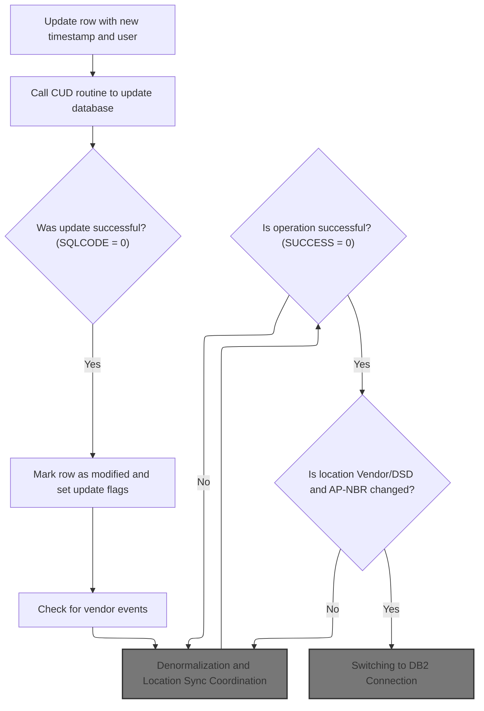
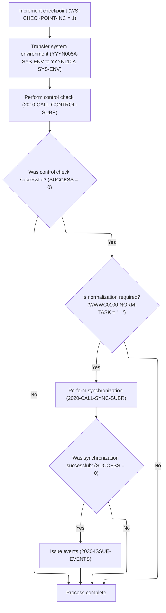
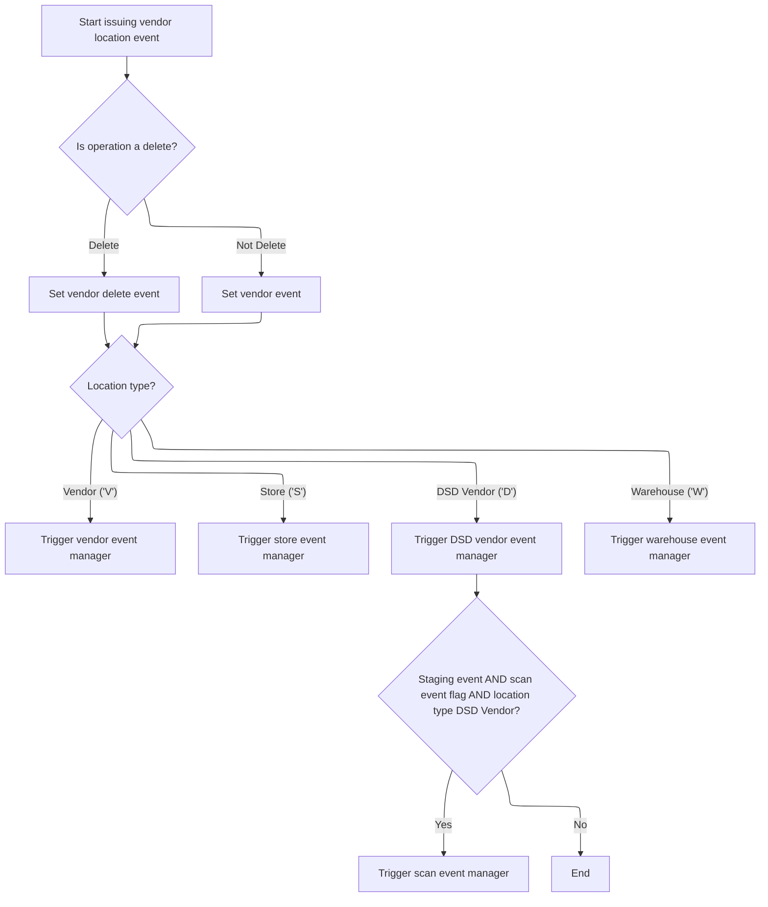
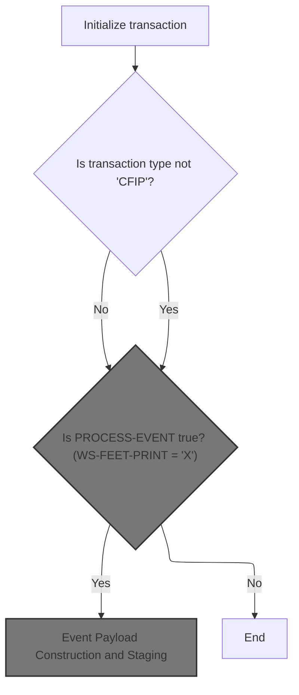
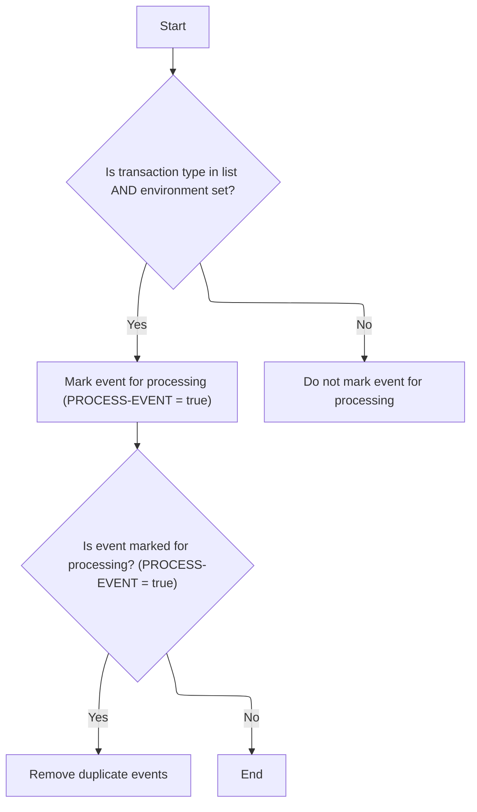
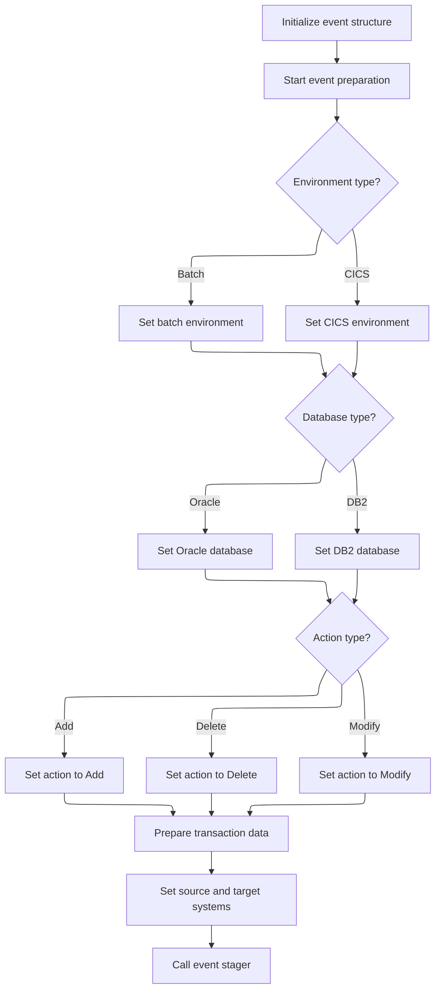
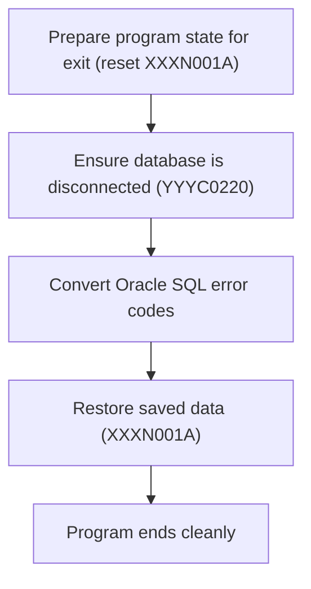
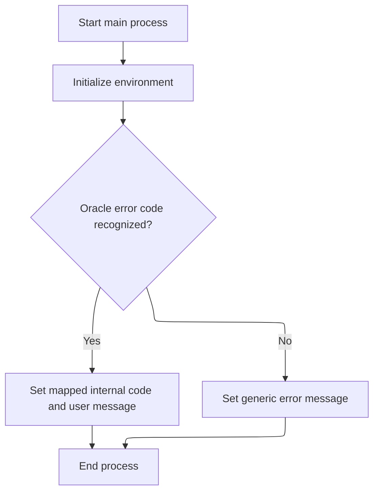

This document describes the flow for modifying a master data row, coordinating event checks, denormalization, location synchronization, and issuing master data events. The process ensures that updates are properly handled and synchronized across systems, with additional maintenance performed when required by business rules.

# Spec

## Detailed View of the Program's Functionality

# Swimmio-dyncall-demo: Detailed Flow Explanation

---

## A. Row Modification and Event Coordination

### 1\. Preparing and Modifying the Row

- The process begins by updating a record with the current timestamp and user ID. This ensures that any changes are properly tracked with audit information.
- Before updating the database, certain fields are cleaned up (for example, replacing low-value bytes with spaces).
- The update operation is performed by calling a routine responsible for Create/Update/Delete (CUD) actions on the database.

### 2\. Handling Update Results

- After attempting the update, the code checks if the operation was successful by examining the SQL status code.
- If the update succeeded:
  - Several flags are set to indicate which parts of the data were modified (such as location, vendor, warehouse, etc.).
  - A flag is set to indicate that a modification operation occurred.
  - The system then checks if any vendor-related events need to be staged, based on changes to vendor contact or mailing information.
  - The denormalization process is triggered, which coordinates further downstream actions.

### 3\. Vendor Event Checks

- The system compares the current values of various vendor mailing and contact fields to their previous values.
- If any of these fields have changed, a flag is set to indicate that an event should be staged for downstream processing.
- If no relevant changes are detected, a flag is set to indicate that no event should be staged.

---

## B. Denormalization and Location Synchronization

### 1\. Checkpoint and Environment Setup

- A checkpoint increment is set to indicate that a significant operation is taking place.
- The system environment information is transferred to a structure used for downstream processing.

### 2\. Control and Workflow Checks

- A control subroutine is called to determine the current workflow state and ensure that the operation is valid.
- If the control check is successful and the workflow indicates that normalization is required, the process continues.

### 3\. Synchronization by Location Type

- Depending on the type of location being processed (vendor, store, account, DSD vendor, etc.), the appropriate synchronization routine is called:
  - For vendors, a vendor-specific sync routine is called.
  - For stores and accounts, a different sync routine is used.
  - For DSD vendors, the sync is skipped (as indicated by a "continue" statement).
  - For other types (such as warehouse, terminal, etc.), a generic sync routine is called with the relevant location information.
- If synchronization is successful, the system proceeds to issue events for the changes.

---

## C. Issuing Master Data Events

### 1\. Event Preparation

- The system initializes the event data structure and sets the environment to indicate that Oracle is the current database.
- It determines whether the operation is a delete or not, setting the appropriate event type flag.

### 2\. Event Construction by Location Type

- The event payload is constructed based on the location type:
  - For vendors, vendor-specific data is populated and two types of events are issued (shipping and master).
  - For stores, store-specific data is populated and two types of events are issued (customer and store master).
  - For DSD vendors, DSD-specific data is populated and an event is issued.
  - For warehouses, warehouse-specific data is populated and an event is issued.
- For DSD vendors, if both the event staging flag and a scan event flag are set, and the location type matches, an additional scan event is issued.

---

## D. Event Initialization and Filtering

### 1\. Event Manager Mainline

- The event manager program initializes its working storage and event processing flags.
- It filters out events with a specific transaction type ("CFIP").
- If the event passes filtering, it proceeds to weed out duplicates and hard-coded transaction types.

### 2\. Hard-Coded and Duplicate Event Filtering

- The event is checked against a list of transaction types that are hard-coded to be filtered out in batch environments.
- If the event is not filtered out, it is checked for duplication by comparing its key data to previously processed events.
- If the event is unique and allowed, it is marked for processing.

### 3\. Event Payload Construction and Staging

- The event payload is built by setting environment and database flags, copying transaction data, and mapping action codes (add, delete, modify).
- Source and target system flags are set to indicate the direction of the event (from WMS to mainframe).
- The event is then sent to the event stager for downstream processing.

---

## E. Switching to DB2 Connection

### 1\. DB2 Connection Setup

- When a switch to DB2 is required (for example, after certain vendor or AP number changes), a dispatcher program is called.
- This program prepares the program state, ensures any previous database connections are closed, and sets the flag to switch to DB2.
- The DB2 connection manager is called with the necessary transaction and connection data.

### 2\. Oracle Error Code Conversion

- After connecting to DB2, if a specific Oracle error code is detected (such as -84), an error conversion routine is called.
- This routine maps Oracle error codes to their DB2 equivalents and formats user-friendly error messages.

### 3\. Restoring Program State

- After all connection and error handling steps, the original business record is restored to ensure the program state is consistent for further processing or exit.

---

## F. Formatting and Mapping Oracle Error Messages

### 1\. Error Message Formatting

- When an Oracle error occurs, the error message is split into components to extract the Oracle error code.
- The code is then mapped to the corresponding DB2 SQLCODE, or a generic error message is constructed if the code is not recognized.
- The error message area is cleared to avoid confusion in subsequent operations.

---

## G. AVP Maintenance for Location and AP Data

### 1\. AVP Data Preparation and Call

- When location or AP data changes, the relevant fields are copied from the main declaration to the AVP maintenance structure.
- Flags are set to indicate the type of operation and the calling program.
- The AVP maintenance procedure is called to update the AVP data accordingly.

---

This flow ensures that all changes to master data are properly tracked, synchronized, and communicated to downstream systems, with robust error handling and event management throughout the process.

# Rule Definition

| Paragraph Name                                                                                                       | Rule ID | Category          | Description                                                                                                                                                                                                                                                              | Conditions                                                                                                  | Remarks                                                                                                                                                                                                                                                                                                     |
| -------------------------------------------------------------------------------------------------------------------- | ------- | ----------------- | ------------------------------------------------------------------------------------------------------------------------------------------------------------------------------------------------------------------------------------------------------------------------ | ----------------------------------------------------------------------------------------------------------- | ----------------------------------------------------------------------------------------------------------------------------------------------------------------------------------------------------------------------------------------------------------------------------------------------------------- |
| 100-INITIALIZATION, 110-MOVE-PDA-FIELDS-2-DCL, 1800-EDIT-NULL-INDICATORS, 1700-CHECK-NULL-COLUMNS                    | RL-001  | Data Assignment   | The system must accept and validate a structured input for a modify-row operation, ensuring all required fields (location type code, location number, mailing/contact fields, AP number, AP type code, etc.) are present and mapped to the internal data structures.     | A modify-row operation is requested with structured input data.                                             | Input must include at minimum: locType (string), locNbr (number), mailToLocNm (string), mailToAdr1 (string), mailToCity (string), apNbr (number, nullable), apTypCd (string, nullable), and other business-relevant fields. Null-capable fields must be accompanied by null indicators (e.g., -1 for null). |
| 100-INITIALIZATION, 2040-GET-DATE-AND-USER, 200-CONNECT-TO-DB2 (YYYS0211), 115-CONNECT-TO-ORACLE, 125-CONNECT-TO-DB2 | RL-002  | Conditional Logic | The system must determine and respect the environment context (batch, Oracle, CICS) for the operation, and update the environment in the output if changes occur (e.g., switching to DB2 after Oracle).                                                                  | Operation is running; environment flags are present in input or system context.                             | Environment flags: isBatch (boolean), isOracle (boolean), isCICS (boolean). Output environment must reflect any changes (e.g., after DB2 connection).                                                                                                                                                       |
| 2040-GET-DATE-AND-USER, 1440-D0-MODIFY-ROW, 1510-D0-INSERT-ROW                                                       | RL-003  | Data Assignment   | On any row modification, the system must update the row's last-update timestamp and user ID fields with the current values.                                                                                                                                              | A row is being modified (modify-row operation).                                                             | Timestamp: string (format as per YYYC0127-TS). User ID: string (from CICS user or 'BATCH').                                                                                                                                                                                                                 |
| 1800-EDIT-NULL-INDICATORS, 1700-CHECK-NULL-COLUMNS, 110-MOVE-PDA-FIELDS-2-DCL, 130-MOVE-DCL-2-PDA-FIELDS             | RL-004  | Conditional Logic | All null-capable fields (e.g., AP number, AP type code) must be handled using null indicators in both input and output, ensuring correct mapping and propagation of nulls.                                                                                               | Input or output contains null-capable fields.                                                               | Null indicators: -1 for null, 0 or positive for present values. Fields: apNbr (number), apTypCd (string), etc.                                                                                                                                                                                              |
| 1440-D0-MODIFY-ROW, 1510-D0-INSERT-ROW, 2540-1440-D0-MODIFY-ROW                                                      | RL-005  | Computation       | After a successful database update (SQLCODE = 0), the system must set flags indicating which parts of the data were updated (locationUpdated, dsdUpdated, warehouseUpdated, vendorUpdated, modifyOperation).                                                             | Database update operation returns SQLCODE = 0.                                                              | Flags: locationUpdated, dsdUpdated, warehouseUpdated, vendorUpdated, modifyOperation (all boolean).                                                                                                                                                                                                         |
| 1430-GET-CURRENT-VALUES, 10100-CHECK-FOR-VNDR-EVENTS, 2030-ISSUE-EVENTS (calls ZZZS0197)                             | RL-006  | Conditional Logic | The system must compare previous and current values of vendor mailing/contact fields. If any have changed, it must stage a 'VendorContactChanged' event with a payload containing both old and new values.                                                               | Previous and current values of vendor mailing/contact fields are available; at least one field has changed. | Fields compared: mailToLocNm, mailToAdr1, mailToCity, mailToStateCd, secContactNm, mailToZip5Cd, mailToZip4Cd, mailToPhoneNbr. Event payload: object with old and new values for each changed field.                                                                                                        |
| 120-EXIT-STUFF, 130-MOVE-DCL-2-PDA-FIELDS, 2030-ISSUE-EVENTS, 2030-ISSUE-EVENTS (ZZZS0197)                           | RL-007  | Data Assignment   | The output must include the updated row, status, SQL return code, update flags, the possibly updated environment, and a list of any events staged or issued as a result of the operation. The system must support extensibility for additional event types and payloads. | Operation completes (success or failure).                                                                   | Output: object with fields: updatedRow (structured), status (string, e.g., 'SUCCESS'), sqlReturnCode (number), updateFlags (object), environment (object), events (array of event objects). Extensible for new event types and payloads.                                                                    |

# User Stories

## User Story 1: Perform modify-row operation with environment and null handling

---

### Story Description:

As a system, I want to accept and validate a structured modify-row input, handle environment context and null indicators, and update the row's timestamp and user ID so that data integrity and business rules are maintained during row modification.

---

### Business Rule Mapping:

| Rule ID | Paragraph Name                                                                                                       | Rule Description                                                                                                                                                                                                                                                     |
| ------- | -------------------------------------------------------------------------------------------------------------------- | -------------------------------------------------------------------------------------------------------------------------------------------------------------------------------------------------------------------------------------------------------------------- |
| RL-001  | 100-INITIALIZATION, 110-MOVE-PDA-FIELDS-2-DCL, 1800-EDIT-NULL-INDICATORS, 1700-CHECK-NULL-COLUMNS                    | The system must accept and validate a structured input for a modify-row operation, ensuring all required fields (location type code, location number, mailing/contact fields, AP number, AP type code, etc.) are present and mapped to the internal data structures. |
| RL-002  | 100-INITIALIZATION, 2040-GET-DATE-AND-USER, 200-CONNECT-TO-DB2 (YYYS0211), 115-CONNECT-TO-ORACLE, 125-CONNECT-TO-DB2 | The system must determine and respect the environment context (batch, Oracle, CICS) for the operation, and update the environment in the output if changes occur (e.g., switching to DB2 after Oracle).                                                              |
| RL-003  | 2040-GET-DATE-AND-USER, 1440-D0-MODIFY-ROW, 1510-D0-INSERT-ROW                                                       | On any row modification, the system must update the row's last-update timestamp and user ID fields with the current values.                                                                                                                                          |
| RL-004  | 1800-EDIT-NULL-INDICATORS, 1700-CHECK-NULL-COLUMNS, 110-MOVE-PDA-FIELDS-2-DCL, 130-MOVE-DCL-2-PDA-FIELDS             | All null-capable fields (e.g., AP number, AP type code) must be handled using null indicators in both input and output, ensuring correct mapping and propagation of nulls.                                                                                           |

---

### Relevant Functionality:

- **100-INITIALIZATION**
  1. **RL-001:**
     - On receiving a modify-row request:
       - Validate presence of required fields in input.
       - Map input fields to internal data structures.
       - For null-capable fields, set null indicators if value is missing or null.
       - Initialize or reset working storage as needed.
  2. **RL-002:**
     - Check environment flags in input or system context.
     - If Oracle is required, connect to Oracle.
     - If DB2 is required (e.g., after Oracle), connect to DB2 and update environment in output.
     - If CICS is active, ensure user ID is fetched from CICS context.
- **2040-GET-DATE-AND-USER**
  1. **RL-003:**
     - On modify-row operation:
       - Fetch current timestamp (call date function).
       - Fetch user ID (from CICS if online, else 'BATCH').
       - Assign timestamp and user ID to the row's last-update fields.
- **1800-EDIT-NULL-INDICATORS**
  1. **RL-004:**
     - For each null-capable field:
       - If value is missing or set to null, set corresponding null indicator to -1.
       - On output, if null indicator is -1, set output field to null or default value.

## User Story 2: Process post-modification output, detect changes, and stage events

---

### Story Description:

As a system, I want to set update flags, compare previous and current vendor mailing/contact fields, stage relevant events, and produce comprehensive output including updated row, status, environment, and extensible event payloads so that consumers receive all relevant information and downstream systems are notified of changes.

---

### Business Rule Mapping:

| Rule ID | Paragraph Name                                                                             | Rule Description                                                                                                                                                                                                                                                         |
| ------- | ------------------------------------------------------------------------------------------ | ------------------------------------------------------------------------------------------------------------------------------------------------------------------------------------------------------------------------------------------------------------------------ |
| RL-005  | 1440-D0-MODIFY-ROW, 1510-D0-INSERT-ROW, 2540-1440-D0-MODIFY-ROW                            | After a successful database update (SQLCODE = 0), the system must set flags indicating which parts of the data were updated (locationUpdated, dsdUpdated, warehouseUpdated, vendorUpdated, modifyOperation).                                                             |
| RL-006  | 1430-GET-CURRENT-VALUES, 10100-CHECK-FOR-VNDR-EVENTS, 2030-ISSUE-EVENTS (calls ZZZS0197)   | The system must compare previous and current values of vendor mailing/contact fields. If any have changed, it must stage a 'VendorContactChanged' event with a payload containing both old and new values.                                                               |
| RL-007  | 120-EXIT-STUFF, 130-MOVE-DCL-2-PDA-FIELDS, 2030-ISSUE-EVENTS, 2030-ISSUE-EVENTS (ZZZS0197) | The output must include the updated row, status, SQL return code, update flags, the possibly updated environment, and a list of any events staged or issued as a result of the operation. The system must support extensibility for additional event types and payloads. |

---

### Relevant Functionality:

- **1440-D0-MODIFY-ROW**
  1. **RL-005:**
     - After database update:
       - If SQLCODE = 0:
         - Set locationUpdated, dsdUpdated, warehouseUpdated, vendorUpdated, modifyOperation flags to true as appropriate for the operation type.
- **1430-GET-CURRENT-VALUES**
  1. **RL-006:**
     - Retrieve previous values for vendor mailing/contact fields.
     - Compare each field to current value.
     - If any field differs:
       - Stage a 'VendorContactChanged' event.
       - Include both old and new values in the event payload.
- **120-EXIT-STUFF**
  1. **RL-007:**
     - On operation completion:
       - Construct output object with:
         - Updated row data
         - Status ('SUCCESS' if no errors, else error message)
         - SQL return code
         - Update flags
         - Environment (reflecting any changes)
         - List of staged/issued events
       - Support adding new event types and payloads as needed.

# Code Walkthrough

## Coordinating Row Modification and Vendor Event Checks



<SwmSnippet path="/base/src/NNNS0487.cbl" line="2457">

---

1440-D0-MODIFY-ROW kicks off the flow by prepping the declaration with timestamp and user ID, cleaning up fields, and updating the database. If the update works, it sets a bunch of flags to signal which parts of the data were changed. It then calls 10100-CHECK-FOR-VNDR-EVENTS to see if any vendor contact or mailing info changed, so an event can be staged if needed. This step is key for downstream event handling and is followed by denormalization and, if certain business rules match, DB2 connection and AVP maintenance.

```cobol
253400 1440-D0-MODIFY-ROW.                                              00253400
253500     MOVE YYYC0127-TS   TO LST-UPDT-TS     OF DCLXXXATION         00253500
253600     MOVE YYYC0107-USER TO LST-UPDT-USR-ID OF DCLXXXATION         00253600
253700                                                                  00253700
253800     PERFORM 4010-REP-LOWVALUE-WITH-SPACES                        00253800
253900     PERFORM 5000-CALL-NNNS0487-CUD-ROUTINE                       00253900
254000                                                                  00254000
254100     IF SQLCODE = 0                                               00254100
254200       SET YYYN110A-UPD TO TRUE                                   00254200
254300       SET MMMC0265-MOD TO TRUE                                   00254300
254400       SET LOC-UPD      TO TRUE                                   00254400
254500       SET DSD-UPD      TO TRUE                                   00254500
254600       SET WHS-UPD      TO TRUE                                   00254600
254700       SET VEN-UPD      TO TRUE                                   00254700
254800       SET MODIFY-OPERATION TO TRUE                               00254800
254900       PERFORM 10100-CHECK-FOR-VNDR-EVENTS                        00254900
255000       PERFORM 2000-DENORM-PROCESS                                00255000
255100       IF SUCCESS                                                 00255100
255200         IF LOC-TYP-CD OF DCLXXXATION = 'V' OR 'D'                00255200
255300           IF AP-NBR OF DCLXXXATION NOT EQUAL MMMC0474-OLD-AP-NBR 00255300
255400             SET MMMC0474-UPD TO TRUE                             00255400
255500             PERFORM 125-CONNECT-TO-DB2                           00255500
255600             PERFORM 2050-DO-AVP-MAINTENANCE                      00255600
255700           END-IF                                                 00255700
255800         END-IF                                                   00255800
255900       END-IF                                                     00255900
256000     END-IF                                                       00256000
256100     .                                                            00256100
```

---

</SwmSnippet>

<SwmSnippet path="/base/src/NNNS0487.cbl" line="3411">

---

10100-CHECK-FOR-VNDR-EVENTS checks all vendor mailing/contact fields for changes and sets a flag to stage an event if anything changed.

```cobol
348800 10100-CHECK-FOR-VNDR-EVENTS.                                     00348800
348900     IF ((WS-MAIL-TO-LOC-NM  NOT = MAIL-TO-LOC-NM                 00348900
349000                                         OF DCLXXXATION ) OR      00349000
349100         (WS-MAIL-TO-ADR-1   NOT = MAIL-TO-ADR-1                  00349100
349200                                         OF DCLXXXATION ) OR      00349200
349300         (WS-MAIL-TO-ADR-2   NOT = MAIL-TO-ADR-2                  00349300
349400                                         OF DCLXXXATION ) OR      00349400
349500         (WS-MAIL-TO-CITY    NOT = MAIL-TO-CITY                   00349500
349600                                         OF DCLXXXATION ) OR      00349600
349700         (WS-MAIL-TO-STATE-CD NOT = MAIL-TO-STATE-CD              00349700
349800                                         OF DCLXXXATION ) OR      00349800
349900         (WS-SEC-CONTACT-NM   NOT = SEC-CONTACT-NM                00349900
350000                                         OF DCLXXXATION ) OR      00350000
350100         (WS-MAIL-TO-ZIP5-CD  NOT = MAIL-TO-ZIP5-CD               00350100
350200                                         OF DCLXXXATION ) OR      00350200
350300         (WS-MAIL-TO-ZIP4-CD  NOT = MAIL-TO-ZIP4-CD               00350300
350400                                         OF DCLXXXATION ) OR      00350400
350500         (WS-MAIL-TO-PHONE-NBR NOT = MAIL-TO-PHONE-NBR            00350500
350600                                         OF DCLXXXATION ))        00350600
350700         SET STAGE-EVENT TO TRUE                                  00350700
350800     ELSE                                                         00350800
350900         SET DONT-STAGE-EVENT TO TRUE                             00350900
351000     END-IF                                                       00351000
351100     .                                                            00351100
```

---

</SwmSnippet>

### Denormalization and Location Sync Coordination



<SwmSnippet path="/base/src/NNNS0487.cbl" line="3106">

---

2000-DENORM-PROCESS sets up the checkpoint, copies system environment, and gets the workflow state. If everything checks out and it's a normal task, it calls 2020-CALL-SYNC-SUBR to sync location records. If that works, it issues events for the changes.

```cobol
318300 2000-DENORM-PROCESS.                                             00318300
318400     MOVE 1                TO WS-CHECKPOINT-INC                   00318400
318500     MOVE YYYN005A-SYS-ENV TO YYYN110A-SYS-ENV                    00318500
318600     PERFORM 2010-CALL-CONTROL-SUBR                               00318600
318700     IF  SUCCESS                                                  00318700
318800     AND WWWC0100-NORM-TASK                                       00318800
318900       PERFORM 2020-CALL-SYNC-SUBR                                00318900
319000       IF SUCCESS                                                 00319000
319100          PERFORM 2030-ISSUE-EVENTS                               00319100
319200       END-IF                                                     00319200
319300     END-IF                                                       00319300
319400     .                                                            00319400
```

---

</SwmSnippet>

<SwmSnippet path="/base/src/NNNS0487.cbl" line="3129">

---

2020-CALL-SYNC-SUBR checks the location type and sets flags, then calls the right sync routine for vendors, stores, accounts, or other types. This makes sure each type gets its own handling. For DSD vendor, it skips sync. For types 'B', 'T', 'W', 'O', it sets a level flag and calls a different sync routine.

```cobol
320600 2020-CALL-SYNC-SUBR.                                             00320600
320700     SET YYYN110A-ORACLE        TO TRUE                           00320700
320800     EVALUATE TRUE                                                00320800
320900       WHEN LOC-TYP-CD OF DCLXXXATION = K-VEND-LOC-TYPE           00320900
321000         SET MMMC0135-LO-IS-CURRENT TO TRUE                       00321000
321100         CALL MMMS0135-SYNC-LO USING                              00321100
321200           XXXN001A                                               00321200
321300           YYYN110A                                               00321300
321400           MMMC0135                                               00321400
321500           P-DDDTLO01                                             00321500
321600       WHEN LOC-TYP-CD OF DCLXXXATION = K-STORE-LOC-TYPE          00321600
321700       OR   LOC-TYP-CD OF DCLXXXATION = K-ACCT-LOC-TYPE           00321700
321800         SET MMMC0157-LO-IS-CURRENT TO TRUE                       00321800
321900         CALL MMMS0157-SYNC-LO USING                              00321900
322000           XXXN001A                                               00322000
322100           YYYN110A                                               00322100
322200           MMMC0157                                               00322200
322300           P-DDDTLO01                                             00322300
322400       WHEN LOC-TYP-CD OF DCLXXXATION = K-DSD-VEND-LOC-TYPE       00322400
322500         CONTINUE                                                 00322500
322600*        SET MMMC0153-LO-IS-CURRENT TO TRUE                       00322600
322700*        CALL MMMS0153-SYNC-LO USING                              00322700
322800*          XXXN001A                                               00322800
322900*          YYYN110A                                               00322900
323000*          MMMC0153                                               00323000
323100*          P-DDDTLO01                                             00323100
323200       WHEN LOC-TYP-CD OF DCLXXXATION = 'B'                       00323200
323300       OR   LOC-TYP-CD OF DCLXXXATION = 'T'                       00323300
323400       OR   LOC-TYP-CD OF DCLXXXATION = 'W'                       00323400
323500       OR   LOC-TYP-CD OF DCLXXXATION = 'O'                       00323500
323600         SET  MMMC0265-LO-LEVEL TO TRUE                           00323600
323700         MOVE LOC-TYP-CD OF DCLXXXATION TO LOC-TYP-CD OF MMMC0265 00323700
323800         MOVE LOC-NBR    OF DCLXXXATION TO LOC-NBR    OF MMMC0265 00323800
323900         CALL WS-MMMS0265-SYNC USING                              00323900
324000             XXXN001A                                             00324000
324100             MMMC0265                                             00324100
324200     END-EVALUATE                                                 00324200
324300     .                                                            00324300
```

---

</SwmSnippet>

### Issuing Master Data Events for Location Changes



<SwmSnippet path="/base/src/NNNS0487.cbl" line="3169">

---

2030-ISSUE-EVENTS builds event data based on location type, sets transaction IDs, and calls the event manager program to issue the right event. For DSD vendor and scan events, it does extra prep and calls. All this depends on flags and codes being set correctly.

```cobol
324600 2030-ISSUE-EVENTS.                                               00324600
324700     INITIALIZE ZZZC0550-IN-DATA                                  00324700
324800     SET  YYYN110A-ORACLE       TO TRUE                           00324800
324900     IF DELETE-OPERATION                                          00324900
325000       SET VENDOR-DELETE-EVENT  TO TRUE                           00325000
325100     ELSE                                                         00325100
325200       SET VENDOR-EVENT TO TRUE                                   00325200
325300     END-IF                                                       00325300
325400     MOVE LOC-TYP-CD       OF DCLXXXATION                         00325400
325500       TO VEND-TYP-CD      OF ZZZC0550-VENDOR-DATA                00325500
325600     MOVE LOC-NBR          OF DCLXXXATION                         00325600
325700       TO VEND-NBR         OF ZZZC0550-VENDOR-DATA                00325700
325800     MOVE 'NNNS0487'            TO ZZZC0197-PROGRAM               00325800
325900     MOVE YYYC0107-USER         TO ZZZC0197-USER                  00325900
326000     MOVE YYYN005A-SYS-ENV      TO YYYN110A-SYS-ENV               00326000
326100     MOVE LOC-NBR OF P-DDDTLO01 TO WS-OLD-KEY                     00326100
326200                                                                  00326200
326300     EVALUATE TRUE                                                00326300
326400       WHEN LOC-TYP-CD OF DCLXXXATION = K-VEND-LOC-TYPE           00326400
326500         MOVE WS-VENDOR-FACILITY                                  00326500
326600           TO VM-VENDOR-FACILITY OF ZZZC0020                      00326600
326700         MOVE WS-VENDOR-NUMBER                                    00326700
326800           TO VM-VENDOR-NUMBER   OF ZZZC0020                      00326800
326900         MOVE ZZZC0020              TO ZZZC0197-TRX-REC           00326900
327000         MOVE 'VSHP'                TO ZZZC0197-TRX-ID            00327000
327100         CALL ZZZS0197-EVENT-MGR USING                            00327100
327200             XXXN001A                                             00327200
327300             YYYN110A                                             00327300
327400             ZZZC0197                                             00327400
327500                                                                  00327500
327600         MOVE LOC-TYP-CD OF DCLXXXATION                           00327600
327700           TO LOC-VEN-TYP-CD OF ZZZC0124                          00327700
327800         MOVE LOC-NBR OF DCLXXXATION                              00327800
327900           TO LOC-VEN-NBR OF ZZZC0124                             00327900
328000         MOVE ZZZC0124              TO ZZZC0197-TRX-REC           00328000
328100         MOVE 'VENM'                TO ZZZC0197-TRX-ID            00328100
328200         CALL ZZZS0197-EVENT-MGR USING                            00328200
328300             XXXN001A                                             00328300
328400             YYYN110A                                             00328400
328500             ZZZC0197                                             00328500
328600                                                                  00328600
328700       WHEN LOC-TYP-CD OF DCLXXXATION = K-STORE-LOC-TYPE          00328700
328800         MOVE LOC-NBR OF DCLXXXATION                              00328800
328900           TO ST-STORE-NUMBER OF ZZZC0032                         00328900
329000              LOC-NBR OF ZZZC0094                                 00329000
329100         SET  ZZZC0032-UPD-FXXX TO TRUE                           00329100
329200         MOVE ZZZC0032          TO ZZZC0197-TRX-REC               00329200
329300         MOVE 'CUST'            TO ZZZC0197-TRX-ID                00329300
329400         CALL ZZZS0197-EVENT-MGR USING                            00329400
329500             XXXN001A                                             00329500
329600             YYYN110A                                             00329600
329700             ZZZC0197                                             00329700
329800                                                                  00329800
329900         MOVE LOC-TYP-CD OF DCLXXXATION TO                        00329900
330000                                 LOC-TYP-CD OF ZZZC0094           00330000
330100         MOVE ZZZC0094              TO ZZZC0197-TRX-REC           00330100
330200         MOVE 'STRM'                TO ZZZC0197-TRX-ID            00330200
330300         CALL ZZZS0197-EVENT-MGR USING                            00330300
330400              XXXN001A                                            00330400
330500              YYYN110A                                            00330500
330600              ZZZC0197                                            00330600
330700                                                                  00330700
330800       WHEN LOC-TYP-CD OF DCLXXXATION = K-DSD-VEND-LOC-TYPE       00330800
330900         MOVE LOC-TYP-CD OF DCLXXXATION TO                        00330900
331000                                 LOC-DSD-TYP-CD OF ZZZC0122       00331000
331100         MOVE ZZZC0122              TO ZZZC0197-TRX-REC           00331100
331200         MOVE 'DSDM'                TO ZZZC0197-TRX-ID            00331200
331300         CALL ZZZS0197-EVENT-MGR USING                            00331300
331400              XXXN001A                                            00331400
331500              YYYN110A                                            00331500
331600              ZZZC0197                                            00331600
331700                                                                  00331700
331800       WHEN LOC-TYP-CD OF DCLXXXATION = K-WHSE-LOC-TYPE           00331800
331900         MOVE LOC-NBR OF DCLXXXATION                              00331900
332000           TO LOC-WHS-NBR OF ZZZC0123                             00332000
332100         MOVE LOC-TYP-CD OF DCLXXXATION TO                        00332100
332200              LOC-WHS-TYP-CD OF ZZZC0123                          00332200
332300*        SET  ZZZC0044-UPD-FXXX TO TRUE                           00332300
332400         MOVE ZZZC0123          TO ZZZC0197-TRX-REC               00332400
332500         MOVE 'WHSM'            TO ZZZC0197-TRX-ID                00332500
332600         CALL ZZZS0197-EVENT-MGR USING                            00332600
332700             XXXN001A                                             00332700
332800             YYYN110A                                             00332800
332900             ZZZC0197                                             00332900
333000                                                                  00333000
333100     END-EVALUATE                                                 00333100
333200     IF STAGE-EVENT AND WWWC0100-CREATE-SCAN-EVENT                00333200
333300       AND LOC-TYP-CD OF DCLXXXATION = 'D'                        00333300
333400         MOVE ZZZC0550              TO ZZZC0197-TRX-REC           00333400
333500         MOVE ZZZC0550-TRX          TO ZZZC0197-TRX-ID            00333500
333600                                       ZZZC0197-TRX-CD            00333600
333700         CALL ZZZS0197-EVENT-MGR USING                            00333700
333800              XXXN001A                                            00333800
333900              YYYN110A                                            00333900
334000              ZZZC0197                                            00334000
334100     END-IF                                                       00334100
334200     .                                                            00334200
```

---

</SwmSnippet>

### Event Initialization and Filtering



<SwmSnippet path="/base/src/ZZZS0197.cbl" line="57">

---

000-MAINLINE sets up event processing, filters out 'CFIP' events, weeds duplicates, and issues events if flagged.

```cobol
008400 000-MAINLINE.                                                    00008400
008500     PERFORM 100-INITIALIZE                                       00008500
008600                                                                  00008600
008700*    IF  ZZZC0197-TRX-ID NOT = 'CFIP'                             00008700
008800       PERFORM 200-WEED-EVENT                                     00008800
008900*    END-IF                                                       00008900
009000                                                                  00009000
009100     IF PROCESS-EVENT                                             00009100
009200       PERFORM 300-ISSUE-EVENT                                    00009200
009300     END-IF                                                       00009300
009400                                                                  00009400
009500     GOBACK                                                       00009500
009600     .                                                            00009600
```

---

</SwmSnippet>

#### Hard-Coded and Duplicate Event Filtering



<SwmSnippet path="/base/src/ZZZS0197.cbl" line="89">

---

200-WEED-EVENT filters events by hard-coded transaction IDs and checks for duplicates before allowing event processing.

```cobol
011600 200-WEED-EVENT.                                                  00011600
011700     SET PROCESS-EVENT TO TRUE                                    00011700
011800     PERFORM 210-WEED-BY-HARD-CODE                                00011800
011900     IF PROCESS-EVENT                                             00011900
012000       PERFORM 220-WEED-DUP-EVENTS                                00012000
012100     END-IF                                                       00012100
012200     .                                                            00012200
```

---

</SwmSnippet>

<SwmSnippet path="/base/src/ZZZS0197.cbl" line="98">

---

210-WEED-BY-HARD-CODE filters events by matching transaction IDs against a hard-coded list in batch mode.

```cobol
012500 210-WEED-BY-HARD-CODE.                                           00012500
012600     IF  (ZZZC0197-TRX-ID = 'BVLM'                                00012600
012700*      OR ZZZC0197-TRX-ID = 'APLM'                                00012700
012800*      OR ZZZC0197-TRX-ID = 'BDMM'                                00012800
012900*      OR ZZZC0197-TRX-ID = 'BCAM'                                00012900
013000*      OR ZZZC0197-TRX-ID = 'CCSM'                                00013000
013100*      OR ZZZC0197-TRX-ID = 'CEMM'                                00013100
013200       OR ZZZC0197-TRX-ID = 'CNCM'                                00013200
013300*      OR ZZZC0197-TRX-ID = 'COMM'                                00013300
013400*      OR ZZZC0197-TRX-ID = 'CRCM'                                00013400
013500*      OR ZZZC0197-TRX-ID = 'CSCM'                                00013500
013600*      OR ZZZC0197-TRX-ID = 'CTOM'                                00013600
013700*      OR ZZZC0197-TRX-ID = 'DIRM'                                00013700
013800*      OR ZZZC0197-TRX-ID = 'DISM'                                00013800
013900*      OR ZZZC0197-TRX-ID = 'DSDM'                                00013900
014000*      OR ZZZC0197-TRX-ID = 'FINM'                                00014000
014100*      OR ZZZC0197-TRX-ID = 'ICCM'                                00014100
014200*      OR ZZZC0197-TRX-ID = 'ITMM'                                00014200
014300       OR ZZZC0197-TRX-ID = 'IWVM'                                00014300
014400*      OR ZZZC0197-TRX-ID = 'LOBM'                                00014400
014500*      OR ZZZC0197-TRX-ID = 'MCEM'                                00014500
014600*      OR ZZZC0197-TRX-ID = 'MRGM'                                00014600
014700       OR ZZZC0197-TRX-ID = 'OBSM'                                00014700
014800*      OR ZZZC0197-TRX-ID = 'ORBM'                                00014800
014900       OR ZZZC0197-TRX-ID = 'PBCM'                                00014900
015000*      OR ZZZC0197-TRX-ID = 'PBNM'                                00015000
015100       OR ZZZC0197-TRX-ID = 'PBTM'                                00015100
015200*      OR ZZZC0197-TRX-ID = 'PCCM'                                00015200
015300*      OR ZZZC0197-TRX-ID = 'PCTM'                                00015300
015400*      OR ZZZC0197-TRX-ID = 'PDSH'                                00015400
015500*      OR ZZZC0197-TRX-ID = 'PDUA'                                00015500
015600*      OR ZZZC0197-TRX-ID = 'PDUP'                                00015600
015700       OR ZZZC0197-TRX-ID = 'PIPM'                                00015700
015800*      OR ZZZC0197-TRX-ID = 'PRIM'                                00015800
015900*      OR ZZZC0197-TRX-ID = 'PRMM'                                00015900
016000*      OR ZZZC0197-TRX-ID = 'PRRM'                                00016000
016100       OR ZZZC0197-TRX-ID = 'PSBM'                                00016100
016200*      OR ZZZC0197-TRX-ID = 'PSCM'                                00016200
016300       OR ZZZC0197-TRX-ID = 'RARM'                                00016300
016400       OR ZZZC0197-TRX-ID = 'RFTM'                                00016400
016500       OR ZZZC0197-TRX-ID = 'RITM'                                00016500
016600       OR ZZZC0197-TRX-ID = 'RRFM'                                00016600
016700       OR ZZZC0197-TRX-ID = 'RTDM'                                00016700
016800*      OR ZZZC0197-TRX-ID = 'RTTM'                                00016800
016900       OR ZZZC0197-TRX-ID = 'SCAM'                                00016900
017000*      OR ZZZC0197-TRX-ID = 'SDPM'                                00017000
017100*      OR ZZZC0197-TRX-ID = 'SLDM'                                00017100
017200       OR ZZZC0197-TRX-ID = 'STAM'                                00017200
017300*      OR ZZZC0197-TRX-ID = 'STPM'                                00017300
017400*      OR ZZZC0197-TRX-ID = 'STRM'                                00017400
017500       OR ZZZC0197-TRX-ID = 'STTM'                                00017500
017600*      OR ZZZC0197-TRX-ID = 'T2TM'                                00017600
017700       OR ZZZC0197-TRX-ID = 'TRDM'                                00017700
017800*      OR ZZZC0197-TRX-ID = 'VCMM'                                00017800
017900*      OR ZZZC0197-TRX-ID = 'VENM'                                00017900
018000*      OR ZZZC0197-TRX-ID = 'VISM'                                00018000
018100*      OR ZZZC0197-TRX-ID = 'VLIM'                                00018100
018200*      OR ZZZC0197-TRX-ID = 'WHSM'                                00018200
018300       OR ZZZC0197-TRX-ID = 'WLIM')                               00018300
018400       AND YYYN110A-BATCH-ENV                                     00018400
018500         SET WEED-EVENT TO TRUE                                   00018500
018600     END-IF                                                       00018600
018700     .                                                            00018700
```

---

</SwmSnippet>

#### Event Payload Construction and Staging



<SwmSnippet path="/base/src/ZZZS0197.cbl" line="199">

---

300-ISSUE-EVENT builds the event payload by setting environment and database flags, copying transaction data, mapping action codes, and then calls the event stager to send it out. It uses global data and sets source/target flags for WMS and mainframe.

```cobol
022600 300-ISSUE-EVENT.                                                 00022600
022700     INITIALIZE YYYC0175                                          00022700
022800                                                                  00022800
022900     IF YYYN110A-BATCH-ENV                                        00022900
023000       SET YYYC0175-BATCH-ENV TO TRUE                             00023000
023100     ELSE                                                         00023100
023200       SET YYYC0175-CICS-ENV  TO TRUE                             00023200
023300     END-IF                                                       00023300
023301                                                                  00023301
023310     IF YYYN110A-ORACLE                                           00023310
023320       SET YYYC0175-ORACLE    TO TRUE                             00023320
023330     ELSE                                                         00023330
023340       SET YYYC0175-DB2       TO TRUE                             00023340
023350     END-IF                                                       00023350
023400                                                                  00023400
023500     MOVE ZZZC0197-TRX-ID  TO YYYC0175-TRX-CD                     00023500
023600     MOVE ZZZC0197-TRX-REC TO YYYC0175-DATA                       00023600
023700     EVALUATE TRUE                                                00023700
023800       WHEN YYYN110A-ADD                                          00023800
023900         MOVE 'A' TO YYYC0175-ACTION-CD                           00023900
024000       WHEN YYYN110A-DEL                                          00024000
024100         MOVE 'P' TO YYYC0175-ACTION-CD                           00024100
024200       WHEN OTHER                                                 00024200
024300         MOVE 'M' TO YYYC0175-ACTION-CD                           00024300
024400     END-EVALUATE                                                 00024400
024500                                                                  00024500
024600     MOVE ZZZC0197-PROGRAM TO YYYC0175-CALLING-PROG               00024600
024700     MOVE ZZZC0197-USER    TO YYYC0175-CALLING-USER               00024700
024800                                                                  00024800
024900     SET  YYYC0175-SOURCE-WMS       TO TRUE                       00024900
025000     SET  YYYC0175-TARGET-MAINFRAME TO TRUE                       00025000
025100                                                                  00025100
025200     CALL WS-EVENT-STAGER USING                                   00025200
025300         XXXN001A                                                 00025300
025400         YYYC0175                                                 00025400
025500     .                                                            00025500
```

---

</SwmSnippet>

### Switching to DB2 Connection

<SwmSnippet path="/base/src/NNNS0487.cbl" line="1236">

---

125-CONNECT-TO-DB2 calls the DB2 connection dispatcher program, passing transaction and SQL status data. This switches the system to DB2 for further operations.

```cobol
131300 125-CONNECT-TO-DB2.                                              00131300
131400     CALL Z-DB2-CONNECT         USING XXXN001A                    00131400
131500                                      SQLCA                       00131500
131600     .                                                            00131600
```

---

</SwmSnippet>

### DB2 Connection Setup and Error Handling



<SwmSnippet path="/base/src/YYYS0211.cbl" line="32">

---

0000-EXIT-DISPATCHER runs initialization, connects to DB2, converts Oracle errors if needed, and restores the saved business record before finishing.

```cobol
004700 0000-EXIT-DISPATCHER.                                            00004700
004800     PERFORM 100-INITIALIZATION                                   00004800
004900     PERFORM 200-CONNECT-TO-DB2                                   00004900
005000     PERFORM 300-CNV-ORACLE-SQLCODE                               00005000
005100     PERFORM 400-REVERT-SAVED-XXXN001A                            00005100
005300     GOBACK                                                       00005300
005400     .                                                            00005400
```

---

</SwmSnippet>

<SwmSnippet path="/base/src/YYYS0211.cbl" line="44">

---

100-INITIALIZATION copies the business record to working storage and resets it, making sure the area is clean for the next DB2 connection steps.

```cobol
006000 100-INITIALIZATION.                                              00006000
006100     MOVE XXXN001A TO WS-XXXN001A                                 00006100
006200     INITIALIZE XXXN001A                                          00006200
006400     .                                                            00006400
```

---

</SwmSnippet>

<SwmSnippet path="/base/src/YYYS0211.cbl" line="53">

---

200-CONNECT-TO-DB2 sets the flag to switch to DB2 and calls the connection manager program, passing transaction and connection data for the switch and stats.

```cobol
007300 200-CONNECT-TO-DB2.                                              00007300
007400     SET YYYC0220-SET-DB2-CON TO TRUE                             00007400
007500     CALL YYYS0220-DBMS-CON-MGR USING                             00007500
007600         XXXN001A                                                 00007600
007700         YYYC0220                                                 00007700
008100     .                                                            00008100
```

---

</SwmSnippet>

### Oracle Error Code Conversion

<SwmSnippet path="/base/src/YYYS0211.cbl" line="65">

---

300-CNV-ORACLE-SQLCODE checks for Oracle error -84 after a successful operation and calls the error conversion routine to map it to a DB2 code, passing transaction and SQL status data.

```cobol
009500 300-CNV-ORACLE-SQLCODE.                                          00009500
009600     IF  SUCCESS                                                  00009600
009610     AND SQLCODE = -84                                            00009610
009720       CALL Z-ORA-ERR-CONVERSION USING                            00009720
009730           XXXN001A                                               00009730
009740           SQLCA                                                  00009740
009750     END-IF                                                       00009750
010200     .                                                            00010200
```

---

</SwmSnippet>

### Formatting and Mapping Oracle Error Messages



<SwmSnippet path="/base/src/YYYS0212.cbl" line="29">

---

000-MAIN-PROCESS clears error fields, then formats and maps Oracle error messages to DB2 codes and user-friendly text before exiting.

```cobol
003800 000-MAIN-PROCESS.                                                00003800
003900     PERFORM 100-INITIALIZE                                       00003900
004000     PERFORM 200-FORMAT-USER-MSG-TXT                              00004000
004100     GOBACK                                                       00004100
004200     .                                                            00004200
```

---

</SwmSnippet>

<SwmSnippet path="/base/src/YYYS0212.cbl" line="50">

---

200-FORMAT-USER-MSG-TXT splits the Oracle error string, grabs the error code, and maps it to a DB2 SQLCODE or builds a default message if it's not recognized.

```cobol
005900 200-FORMAT-USER-MSG-TXT.                                         00005900
006000     UNSTRING SQLERRMC  DELIMITED BY SPACE INTO                   00006000
006100                        WS-ERR-MSG1                               00006100
006200                        WS-ERR-MSG2                               00006200
006300                        WS-ERR-MSG3                               00006300
006400                        WS-ERR-ORA-CODE                           00006400
006500     EVALUATE WS-ERR-ORA-CODE                                     00006500
006510       WHEN  '60   '                                              00006510
006520         MOVE  -911                             TO SQLCODE        00006520
006600       WHEN  '904  '                                              00006600
006700       WHEN  '310  '                                              00006700
006800         MOVE  -206                             TO SQLCODE        00006800
006900       WHEN  '615  '                                              00006900
007000       WHEN  '616  '                                              00007000
007100         MOVE  -420                             TO SQLCODE        00007100
007200       WHEN  '942  '                                              00007200
007300         MOVE  -204                             TO SQLCODE        00007300
007400       WHEN  '1403 '                                              00007400
007500         MOVE  -100                             TO SQLCODE        00007500
007600       WHEN  '1001 '                                              00007600
007700         MOVE  -501                             TO SQLCODE        00007700
007800       WHEN  '1438 '                                              00007800
007900         MOVE  -413                             TO SQLCODE        00007900
008000       WHEN  '2112 '                                              00008000
008100       WHEN  '1422 '                                              00008100
008200         MOVE  -811                             TO SQLCODE        00008200
008300       WHEN  '2049 '                                              00008300
008400         MOVE  -913                             TO SQLCODE        00008400
008500       WHEN  '2291 '                                              00008500
008600         MOVE  -530                             TO SQLCODE        00008600
008700       WHEN  '2292 '                                              00008700
008800         MOVE  -532                             TO SQLCODE        00008800
008900       WHEN  '6502 '                                              00008900
009000         MOVE  -304                             TO SQLCODE        00009000
009100       WHEN  '6508 '                                              00009100
009200         MOVE  -440                             TO SQLCODE        00009200
009300       WHEN  '6511 '                                              00009300
009400         MOVE  -502                             TO SQLCODE        00009400
009500       WHEN  '6550 '                                              00009500
009600       WHEN  '6553 '                                              00009600
009700         MOVE  -440                             TO SQLCODE        00009700
009800       WHEN  '14028'                                              00009800
009900         MOVE  -538                             TO SQLCODE        00009900
010000       WHEN  '30006'                                              00010000
010100         MOVE  -904                             TO SQLCODE        00010100
010200       WHEN OTHER                                                 00010200
010300         STRING 'Error in YYYS0212. Oracle code:'                 00010300
010300                 WS-ERR-ORA-CODE                                  00010320
010300         DELIMITED BY SIZE INTO IS-RTRN-MSG2-TXT                  00010330
010500     END-EVALUATE                                                 00010500
010600     MOVE SPACES                                TO SQLERRMC       00010600
010700     .                                                            00010700
```

---

</SwmSnippet>

### AVP Maintenance for Location and AP Data

<SwmSnippet path="/base/src/NNNS0487.cbl" line="3284">

---

2050-DO-AVP-MAINTENANCE copies location and AP data from the declaration to the AVP maintenance structure, sets a flag, adds the program name and system environment, then calls the AVP maintenance procedure.

```cobol
336100 2050-DO-AVP-MAINTENANCE.                                         00336100
336200     MOVE LOC-TYP-CD               OF DCLXXXATION                 00336200
336300       TO MMMC0474-LOC-TYP-CD                                     00336300
336400     MOVE LOC-NBR                  OF DCLXXXATION                 00336400
336500       TO MMMC0474-LOC-NBR                                        00336500
336600     MOVE AP-TYP-CD                OF DCLXXXATION                 00336600
336700       TO MMMC0474-NEW-AP-TYP                                     00336700
336800     MOVE AP-NBR                   OF DCLXXXATION                 00336800
336900       TO MMMC0474-NEW-AP-NBR                                     00336900
337000     SET MMMC0474-LO               TO TRUE                        00337000
337100     MOVE 'NNNS0487'                                              00337100
337200       TO MMMC0474-PROGRAM                                        00337200
337300     MOVE YYYN005A-SYS-ENV                                        00337300
337400       TO MMMC0474-SYS-ENV                                        00337400
337500                                                                  00337500
337600     CALL MMMS0474-DO-AVP-MAIN USING                              00337600
337700          XXXN001A                                                00337700
337800          MMMC0474                                                00337800
337900     .                                                            00337900
```

---

</SwmSnippet>

&nbsp;

*This is an auto-generated document by Swimm 🌊 and has not yet been verified by a human*

<SwmMeta version="3.0.0" repo-id="Z2l0aHViJTNBJTNBU3dpbW1pby1keW5jYWxsLWRlbW8lM0ElM0FHaXJpLVN3aW1t" repo-name="Swimmio-dyncall-demo"><sup>Powered by [Swimm](https://app.swimm.io/)</sup></SwmMeta>
