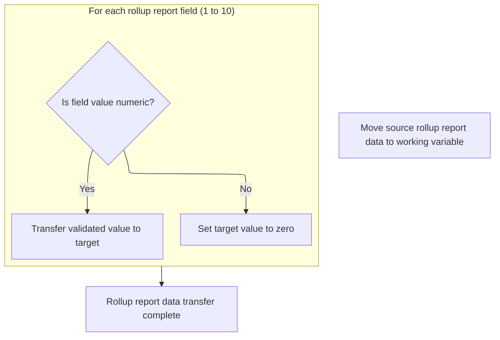

This document outlines how store data is prepared for downstream processes by normalizing date fields and validating rollup report fields before transferring them to a destination structure. The flow receives store data as input, standardizes any blank or invalid dates, and ensures that only valid numeric rollup values are transferred. This results in a consistent and validated store record for further use.

# Spec

## Detailed View of the Program's Functionality

# Detailed Explanation of the Flow

## a. Normalizing and Transferring Store Fields

At the beginning of the process, the code checks several date fields in the input data structure to ensure they are valid. If any of these date fields (such as opening date, closing date, remodel date, or deleted date) are blank or contain known invalid values (like '00/00/0000' or '01/01/1600'), they are set to a standardized placeholder value ('12/31/9999'). This normalization ensures that downstream logic does not encounter unexpected or malformed date values.

After normalizing the date fields, the code proceeds to copy a large number of store-related fields from the input structure to the target structure. This is done field by field, ensuring that all relevant information about the store (such as store number, name, codes, location details, and various attributes) is transferred accurately.

One exception is made for the rollup report code field: instead of copying it directly, the code explicitly blanks out the corresponding field in the target structure. This is because the rollup report code and its associated numeric fields require special validation and handling, which is performed in a separate step.

## b. Parsing and Validating Rollup Data

The next step involves handling the rollup report code and its associated numeric fields. The code first copies the rollup report code from the input structure into a working buffer. This buffer is defined in such a way that it can be accessed both as a text string and as an array of numeric values.

For each of the ten expected numeric rollup fields, the code checks whether the value is a valid number. If it is, the value is transferred to the corresponding field in the target structure. If it is not a valid number, the target field is set to zero. This validation ensures that only proper numeric values are stored, and any invalid or missing data is safely defaulted.

This process is repeated for all ten numeric rollup fields, ensuring that the target structure contains only validated numeric data for these fields.

## c. Finalizing Store Data Transfer

After the rollup data has been handled, the code resumes copying the remaining store-related fields from the input structure to the target structure. These fields include additional status codes, type codes, group codes, contact information, and various other attributes related to the store.

All of these fields are copied directly, as they do not require the special validation or handling that the rollup fields do. This completes the process of transferring and normalizing all relevant store data from the input to the target structure, ensuring that the data is consistent, validated, and ready for further processing or storage.

# Rule Definition

| Paragraph Name                                        | Rule ID | Category          | Description                                                                                                                                                                                                                                                                                                                                        | Conditions                                                                             | Remarks                                                                                                                                                     |
| ----------------------------------------------------- | ------- | ----------------- | -------------------------------------------------------------------------------------------------------------------------------------------------------------------------------------------------------------------------------------------------------------------------------------------------------------------------------------------------- | -------------------------------------------------------------------------------------- | ----------------------------------------------------------------------------------------------------------------------------------------------------------- |
| 110-MOVE-PDA-FIELDS-2-DCL                             | RL-001  | Conditional Logic | For each of the date fields (FC-RL-OPENING-DT, FC-RL-CLOSING-DT, FC-RL-REMODEL-DT, FC-RL-DELETED-DT), if the value is blank, '00/00/0000', or '01/01/1600', set the destination field to '12/31/9999'. Otherwise, copy the value as-is.                                                                                                            | The source date field is blank (all spaces), '00/00/0000', or '01/01/1600'.            | Sentinel value for invalid/missing dates is '12/31/9999'. Date fields are strings in MM/DD/YYYY format.                                                     |
| 110-MOVE-PDA-FIELDS-2-DCL                             | RL-002  | Data Assignment   | All store fields except FN-ROLLUP-REPT-CD and FN-ROLLUP-REPT-01-NBR through FN-ROLLUP-REPT-10-NBR are copied directly from source to destination without modification.                                                                                                                                                                             | Field is not one of the special rollup fields or date fields requiring normalization.  | Field types and order must match the destination table definition. No transformation is applied.                                                            |
| 110-MOVE-PDA-FIELDS-2-DCL                             | RL-003  | Data Assignment   | The FN-ROLLUP-REPT-CD field in the destination is set to blank (all spaces) before rollup numeric handling.                                                                                                                                                                                                                                        | Always applies before rollup numeric fields are set.                                   | FN-ROLLUP-REPT-CD is an alphanumeric field. It is set to all spaces before parsing for numeric slots.                                                       |
| 117-MOVE-ROLLUP-DATA                                  | RL-004  | Computation       | For each of the 10 numeric slots in FN-ROLLUP-REPT-CD from the source, if the slot is strictly numeric (digits and optional sign, no spaces or decimal points), set the corresponding FN-ROLLUP-REPT-XX-NBR field in the destination to the parsed integer value (range -999 to +999). If not strictly numeric, set the destination field to zero. | For each slot in the rollup report code field, check if the value is strictly numeric. | Each rollup numeric field is a signed integer, range -999 to +999. Non-numeric slots are set to zero. No decimals or spaces allowed for numeric validation. |
| 110-MOVE-PDA-FIELDS-2-DCL, SQL SELECT/INTO statements | RL-005  | Data Assignment   | The output record format must match the field order and types as described in the destination table definition.                                                                                                                                                                                                                                    | Always applies when writing to the destination table.                                  | Field order and types must match the DCLFC-XXXAIL-STORES table definition exactly. This includes all field sizes, types, and alignment.                     |

# User Stories

## User Story 1: Store Record Transfer and Field Normalization

---

### Story Description:

As a system, I want to transfer store records from the source to the destination table, normalizing date fields and copying all other fields directly, while ensuring the output record format matches the destination table definition so that data integrity and compatibility are maintained.

---

### Business Rule Mapping:

| Rule ID | Paragraph Name                                        | Rule Description                                                                                                                                                                                                                        |
| ------- | ----------------------------------------------------- | --------------------------------------------------------------------------------------------------------------------------------------------------------------------------------------------------------------------------------------- |
| RL-001  | 110-MOVE-PDA-FIELDS-2-DCL                             | For each of the date fields (FC-RL-OPENING-DT, FC-RL-CLOSING-DT, FC-RL-REMODEL-DT, FC-RL-DELETED-DT), if the value is blank, '00/00/0000', or '01/01/1600', set the destination field to '12/31/9999'. Otherwise, copy the value as-is. |
| RL-002  | 110-MOVE-PDA-FIELDS-2-DCL                             | All store fields except FN-ROLLUP-REPT-CD and FN-ROLLUP-REPT-01-NBR through FN-ROLLUP-REPT-10-NBR are copied directly from source to destination without modification.                                                                  |
| RL-005  | 110-MOVE-PDA-FIELDS-2-DCL, SQL SELECT/INTO statements | The output record format must match the field order and types as described in the destination table definition.                                                                                                                         |

---

### Relevant Functionality:

- **110-MOVE-PDA-FIELDS-2-DCL**
  1. **RL-001:**
     - For each relevant date field:
       - If the source value is blank, '00/00/0000', or '01/01/1600':
         - Set the destination value to '12/31/9999'.
       - Else:
         - Copy the source value to the destination.
  2. **RL-002:**
     - For each field in the source record:
       - If the field is not a rollup code or rollup number field and not a special date field:
         - Copy the value directly to the destination field.
  3. **RL-005:**
     - When constructing the destination record:
       - Ensure all fields are in the order and type as defined by the destination table.
       - Do not add, remove, or reorder fields.

## User Story 2: Rollup Report Code Parsing and Assignment

---

### Story Description:

As a system, I want to set the rollup report code field to blank and parse its numeric slots to populate the corresponding rollup numeric fields, ensuring only strictly numeric values are assigned and others are set to zero, so that rollup data is accurately represented in the destination table.

---

### Business Rule Mapping:

| Rule ID | Paragraph Name            | Rule Description                                                                                                                                                                                                                                                                                                                                   |
| ------- | ------------------------- | -------------------------------------------------------------------------------------------------------------------------------------------------------------------------------------------------------------------------------------------------------------------------------------------------------------------------------------------------- |
| RL-003  | 110-MOVE-PDA-FIELDS-2-DCL | The FN-ROLLUP-REPT-CD field in the destination is set to blank (all spaces) before rollup numeric handling.                                                                                                                                                                                                                                        |
| RL-004  | 117-MOVE-ROLLUP-DATA      | For each of the 10 numeric slots in FN-ROLLUP-REPT-CD from the source, if the slot is strictly numeric (digits and optional sign, no spaces or decimal points), set the corresponding FN-ROLLUP-REPT-XX-NBR field in the destination to the parsed integer value (range -999 to +999). If not strictly numeric, set the destination field to zero. |

---

### Relevant Functionality:

- **110-MOVE-PDA-FIELDS-2-DCL**
  1. **RL-003:**
     - Set the destination rollup report code field to all spaces.
- **117-MOVE-ROLLUP-DATA**
  1. **RL-004:**
     - For each of the 10 slots in the rollup report code:
       - If the slot value is strictly numeric (digits and optional sign):
         - Set the corresponding rollup number field to the integer value.
       - Else:
         - Set the corresponding rollup number field to zero.

# Code Walkthrough

## Normalizing and Transferring Store Fields

<SwmSnippet path="/base/src/NNNS0120.cbl" line="1711">

---

In `110-MOVE-PDA-FIELDS-2-DCL`, we start by checking if the opening date field is blank or set to a known invalid value. If so, we assign '12/31/9999' to standardize the field for later logic.

```cobol
173200 110-MOVE-PDA-FIELDS-2-DCL.                                       00173200
173300     IF FC-RL-OPENING-DT OF P-DDDTRL01 = SPACES                   00173300
173400     OR FC-RL-OPENING-DT OF P-DDDTRL01 = '00/00/0000'             00173400
173500     OR FC-RL-OPENING-DT OF P-DDDTRL01 = '01/01/1600'             00173500
173600       MOVE '12/31/9999' TO FC-RL-OPENING-DT OF P-DDDTRL01        00173600
173700     END-IF                                                       00173700
```

---

</SwmSnippet>

<SwmSnippet path="/base/src/NNNS0120.cbl" line="1717">

---

We do the same normalization for the closing date as we did for opening date.

```cobol
173800     IF FC-RL-CLOSING-DT OF P-DDDTRL01 = SPACES                   00173800
173900     OR FC-RL-CLOSING-DT OF P-DDDTRL01 = '00/00/0000'             00173900
174000     OR FC-RL-CLOSING-DT OF P-DDDTRL01 = '01/01/1600'             00174000
174100       MOVE '12/31/9999' TO FC-RL-CLOSING-DT OF P-DDDTRL01        00174100
174200     END-IF                                                       00174200
```

---

</SwmSnippet>

<SwmSnippet path="/base/src/NNNS0120.cbl" line="1722">

---

Here we normalize the remodel date field, just like the previous date fields, to keep all date data consistent.

```cobol
174300     IF FC-RL-REMODEL-DT OF P-DDDTRL01 = SPACES                   00174300
174400     OR FC-RL-REMODEL-DT OF P-DDDTRL01 = '00/00/0000'             00174400
174500     OR FC-RL-REMODEL-DT OF P-DDDTRL01 = '01/01/1600'             00174500
174600       MOVE '12/31/9999' TO FC-RL-REMODEL-DT OF P-DDDTRL01        00174600
174700     END-IF                                                       00174700
```

---

</SwmSnippet>

<SwmSnippet path="/base/src/NNNS0120.cbl" line="1727">

---

Here we handle the deleted date field, making sure it doesn't have blanks or invalid values, just like the other dates.

```cobol
174800     IF FC-RL-DELETED-DT OF P-DDDTRL01 = SPACES                   00174800
174900     OR FC-RL-DELETED-DT OF P-DDDTRL01 = '00/00/0000'             00174900
175000     OR FC-RL-DELETED-DT OF P-DDDTRL01 = '01/01/1600'             00175000
175100       MOVE '12/31/9999' TO FC-RL-DELETED-DT OF P-DDDTRL01        00175100
175200     END-IF                                                       00175200
```

---

</SwmSnippet>

<SwmSnippet path="/base/src/NNNS0120.cbl" line="1733">

---

Now we copy all the relevant store fields from the source to the destination structure, field by field. FN-ROLLUP-REPT-CD is intentionally blanked out here, since it's handled separately in the next step.

```cobol
175400     MOVE FC-STORE-NO OF P-DDDTRL01                               00175400
175500       TO FC-STORE-NO OF DCLFC-XXXAIL-STORES                      00175500
175600     MOVE FC-RL-STORE-NM OF P-DDDTRL01                            00175600
175700       TO FC-RL-STORE-NM OF DCLFC-XXXAIL-STORES                   00175700
175800     MOVE FC-RL-STORE-CD OF P-DDDTRL01                            00175800
175900       TO FC-RL-STORE-CD OF DCLFC-XXXAIL-STORES                   00175900
176000     MOVE FC-RL-STORE-DIR-NM OF P-DDDTRL01                        00176000
176100       TO FC-RL-STORE-DIR-NM OF DCLFC-XXXAIL-STORES               00176100
176200     MOVE FC-RL-STORE-LOC-NM OF P-DDDTRL01                        00176200
176300       TO FC-RL-STORE-LOC-NM OF DCLFC-XXXAIL-STORES               00176300
176400     MOVE FC-RL-OPENING-DT OF P-DDDTRL01                          00176400
176500       TO FC-RL-OPENING-DT OF DCLFC-XXXAIL-STORES                 00176500
176600     MOVE FC-RL-CLOSING-DT OF P-DDDTRL01                          00176600
176700       TO FC-RL-CLOSING-DT OF DCLFC-XXXAIL-STORES                 00176700
176800     MOVE FC-RL-REMODEL-DT OF P-DDDTRL01                          00176800
176900       TO FC-RL-REMODEL-DT OF DCLFC-XXXAIL-STORES                 00176900
177000     MOVE FC-RL-DELETED-DT OF P-DDDTRL01                          00177000
177100       TO FC-RL-DELETED-DT OF DCLFC-XXXAIL-STORES                 00177100
177200     MOVE FC-RL-DISTRICT-NO OF P-DDDTRL01                         00177200
177300       TO FC-RL-DISTRICT-NO OF DCLFC-XXXAIL-STORES                00177300
177400     MOVE FC-RL-MARKET-AR-NO OF P-DDDTRL01                        00177400
177500       TO FC-RL-MARKET-AR-NO OF DCLFC-XXXAIL-STORES               00177500
177600     MOVE FC-RL-PAYROL-AR-NO OF P-DDDTRL01                        00177600
177700       TO FC-RL-PAYROL-AR-NO OF DCLFC-XXXAIL-STORES               00177700
177800     MOVE FC-RL-PAY-GROUP-NO OF P-DDDTRL01                        00177800
177900       TO FC-RL-PAY-GROUP-NO OF DCLFC-XXXAIL-STORES               00177900
178000     MOVE FC-RL-COMPANY-NO OF P-DDDTRL01                          00178000
178100       TO FC-RL-COMPANY-NO OF DCLFC-XXXAIL-STORES                 00178100
178200     MOVE FC-RL-GEO-ZONE-CD OF P-DDDTRL01                         00178200
178300       TO FC-RL-GEO-ZONE-CD OF DCLFC-XXXAIL-STORES                00178300
178400     MOVE FC-RL-GEO-ZONE-NO OF P-DDDTRL01                         00178400
178500       TO FC-RL-GEO-ZONE-NO OF DCLFC-XXXAIL-STORES                00178500
178600     MOVE FC-RL-SCAN-MAIN-CD OF P-DDDTRL01                        00178600
178700       TO FC-RL-SCAN-MAIN-CD OF DCLFC-XXXAIL-STORES               00178700
178800     MOVE FC-RL-FRONT-END-CD OF P-DDDTRL01                        00178800
178900       TO FC-RL-FRONT-END-CD OF DCLFC-XXXAIL-STORES               00178900
179000     MOVE FC-RL-PRICE-BUL-CD OF P-DDDTRL01                        00179000
179100       TO FC-RL-PRICE-BUL-CD OF DCLFC-XXXAIL-STORES               00179100
179200     MOVE FC-RL-UPC-ON-PB-CD OF P-DDDTRL01                        00179200
179300       TO FC-RL-UPC-ON-PB-CD OF DCLFC-XXXAIL-STORES               00179300
179400     MOVE FC-RL-COMPETITR-CD OF P-DDDTRL01                        00179400
179500       TO FC-RL-COMPETITR-CD OF DCLFC-XXXAIL-STORES               00179500
179600     MOVE FC-RL-ASSOC-STR-NO OF P-DDDTRL01                        00179600
179700       TO FC-RL-ASSOC-STR-NO OF DCLFC-XXXAIL-STORES               00179700
179800     MOVE FC-RL-RPRT-SEQ-NO OF P-DDDTRL01                         00179800
179900       TO FC-RL-RPRT-SEQ-NO OF DCLFC-XXXAIL-STORES                00179900
180000     MOVE FC-RL-SORT-SOS-NO OF P-DDDTRL01                         00180000
180100       TO FC-RL-SORT-SOS-NO OF DCLFC-XXXAIL-STORES                00180100
180200     MOVE FC-RL-VID-PRZN-NO OF P-DDDTRL01                         00180200
180300       TO FC-RL-VID-PRZN-NO OF DCLFC-XXXAIL-STORES                00180300
180400     MOVE FC-RL-CITY-ID-CD OF P-DDDTRL01                          00180400
180500       TO FC-RL-CITY-ID-CD OF DCLFC-XXXAIL-STORES                 00180500
180600     MOVE FC-RL-ADZONE-ABB OF P-DDDTRL01                          00180600
180700       TO FC-RL-ADZONE-ABB OF DCLFC-XXXAIL-STORES                 00180700
180800     MOVE FC-RL-ADZONE-DES OF P-DDDTRL01                          00180800
180900       TO FC-RL-ADZONE-DES OF DCLFC-XXXAIL-STORES                 00180900
181000     MOVE FC-RL-UNLOAD-SW OF P-DDDTRL01                           00181000
181100       TO FC-RL-UNLOAD-SW OF DCLFC-XXXAIL-STORES                  00181100
181200*    MOVE FN-ROLLUP-REPT-CD OF P-DDDTRL01                         00181200
181300     MOVE SPACES                                                  00181300
181400       TO FN-ROLLUP-REPT-CD OF DCLFC-XXXAIL-STORES                00181400
```

---

</SwmSnippet>

<SwmSnippet path="/base/src/NNNS0120.cbl" line="1794">

---

Here we call 117-MOVE-ROLLUP-DATA to handle the rollup report code and numeric rollup fields, since they need validation and can't just be copied directly.

```cobol
181500     PERFORM 117-MOVE-ROLLUP-DATA                                 00181500
```

---

</SwmSnippet>

### Parsing and Validating Rollup Data



<SwmSnippet path="/base/src/NNNS0120.cbl" line="1884">

---

In `117-MOVE-ROLLUP-DATA`, we start by copying the rollup report code into a working buffer, then check if the first numeric slot is valid before moving it to the destination. If not, we set it to zero.

```cobol
190500 117-MOVE-ROLLUP-DATA.                                            00190500
190600     MOVE FN-ROLLUP-REPT-CD OF P-DDDTRL01                         00190600
190700       TO WS-REPT-TBL-TXT                                         00190700
190800     IF WS-REPT-TBL-NUMERIC(1) IS NUMERIC                         00190800
190900        MOVE WS-REPT-TBL-NUMERIC(1)                               00190900
191000          TO FN-ROLLUP-REPT-01-NBR  OF DCLFC-XXXAIL-STORES        00191000
191100     ELSE                                                         00191100
191200        MOVE ZERO TO FN-ROLLUP-REPT-01-NBR OF DCLFC-XXXAIL-STORES 00191200
191300     END-IF                                                       00191300
```

---

</SwmSnippet>

<SwmSnippet path="/base/src/NNNS0120.cbl" line="1893">

---

Next, we validate and move the second numeric value, or set it to zero if it's not numeric, just like the first.

```cobol
191400     IF WS-REPT-TBL-NUMERIC(2) IS NUMERIC                         00191400
191500        MOVE WS-REPT-TBL-NUMERIC(2)                               00191500
191600          TO FN-ROLLUP-REPT-02-NBR  OF DCLFC-XXXAIL-STORES        00191600
191700     ELSE                                                         00191700
191800        MOVE ZERO TO FN-ROLLUP-REPT-02-NBR OF DCLFC-XXXAIL-STORES 00191800
191900     END-IF                                                       00191900
```

---

</SwmSnippet>

<SwmSnippet path="/base/src/NNNS0120.cbl" line="1899">

---

Here we handle the third numeric rollup value, validating and moving or zeroing as needed.

```cobol
192000     IF WS-REPT-TBL-NUMERIC(3) IS NUMERIC                         00192000
192100        MOVE WS-REPT-TBL-NUMERIC(3)                               00192100
192200          TO FN-ROLLUP-REPT-03-NBR  OF DCLFC-XXXAIL-STORES        00192200
192300     ELSE                                                         00192300
192400        MOVE ZERO TO FN-ROLLUP-REPT-03-NBR OF DCLFC-XXXAIL-STORES 00192400
192500     END-IF                                                       00192500
```

---

</SwmSnippet>

<SwmSnippet path="/base/src/NNNS0120.cbl" line="1905">

---

Now we process the fourth numeric rollup value, again validating and moving or zeroing as needed.

```cobol
192600     IF WS-REPT-TBL-NUMERIC(4) IS NUMERIC                         00192600
192700        MOVE WS-REPT-TBL-NUMERIC(4)                               00192700
192800          TO FN-ROLLUP-REPT-04-NBR  OF DCLFC-XXXAIL-STORES        00192800
192900     ELSE                                                         00192900
193000        MOVE ZERO TO FN-ROLLUP-REPT-04-NBR OF DCLFC-XXXAIL-STORES 00193000
193100     END-IF                                                       00193100
```

---

</SwmSnippet>

<SwmSnippet path="/base/src/NNNS0120.cbl" line="1911">

---

Here we handle the fifth numeric rollup value, keeping the pattern going for all expected fields.

```cobol
193200     IF WS-REPT-TBL-NUMERIC(5) IS NUMERIC                         00193200
193300        MOVE WS-REPT-TBL-NUMERIC(5)                               00193300
193400          TO FN-ROLLUP-REPT-05-NBR  OF DCLFC-XXXAIL-STORES        00193400
193500     ELSE                                                         00193500
193600        MOVE ZERO TO FN-ROLLUP-REPT-05-NBR OF DCLFC-XXXAIL-STORES 00193600
193700     END-IF                                                       00193700
```

---

</SwmSnippet>

<SwmSnippet path="/base/src/NNNS0120.cbl" line="1917">

---

Sixth numeric value gets the same validation and move logic as the previous ones.

```cobol
193800     IF WS-REPT-TBL-NUMERIC(6) IS NUMERIC                         00193800
193900        MOVE WS-REPT-TBL-NUMERIC(6)                               00193900
194000          TO FN-ROLLUP-REPT-06-NBR  OF DCLFC-XXXAIL-STORES        00194000
194100     ELSE                                                         00194100
194200        MOVE ZERO TO FN-ROLLUP-REPT-06-NBR OF DCLFC-XXXAIL-STORES 00194200
194300     END-IF                                                       00194300
```

---

</SwmSnippet>

<SwmSnippet path="/base/src/NNNS0120.cbl" line="1923">

---

Seventh numeric value is handled here, following the same validation and assignment pattern.

```cobol
194400     IF WS-REPT-TBL-NUMERIC(7) IS NUMERIC                         00194400
194500        MOVE WS-REPT-TBL-NUMERIC(7)                               00194500
194600          TO FN-ROLLUP-REPT-07-NBR  OF DCLFC-XXXAIL-STORES        00194600
194700     ELSE                                                         00194700
194800        MOVE ZERO TO FN-ROLLUP-REPT-07-NBR OF DCLFC-XXXAIL-STORES 00194800
194900     END-IF                                                       00194900
```

---

</SwmSnippet>

<SwmSnippet path="/base/src/NNNS0120.cbl" line="1929">

---

Eighth numeric value is validated and moved, or set to zero, just like the rest.

```cobol
195000     IF WS-REPT-TBL-NUMERIC(8) IS NUMERIC                         00195000
195100        MOVE WS-REPT-TBL-NUMERIC(8)                               00195100
195200          TO FN-ROLLUP-REPT-08-NBR  OF DCLFC-XXXAIL-STORES        00195200
195300     ELSE                                                         00195300
195400        MOVE ZERO TO FN-ROLLUP-REPT-08-NBR OF DCLFC-XXXAIL-STORES 00195400
195500     END-IF                                                       00195500
```

---

</SwmSnippet>

<SwmSnippet path="/base/src/NNNS0120.cbl" line="1935">

---

Ninth numeric value is handled here, validated and moved or zeroed as needed.

```cobol
195600     IF WS-REPT-TBL-NUMERIC(9) IS NUMERIC                         00195600
195700        MOVE WS-REPT-TBL-NUMERIC(9)                               00195700
195800          TO FN-ROLLUP-REPT-09-NBR  OF DCLFC-XXXAIL-STORES        00195800
195900     ELSE                                                         00195900
196000        MOVE ZERO TO FN-ROLLUP-REPT-09-NBR OF DCLFC-XXXAIL-STORES 00196000
196100     END-IF                                                       00196100
```

---

</SwmSnippet>

<SwmSnippet path="/base/src/NNNS0120.cbl" line="1941">

---

Finally, we handle the tenth numeric value, validating and moving or zeroing as with the others. The function expects exactly 10 values, so all are processed explicitly.

```cobol
196200     IF WS-REPT-TBL-NUMERIC(10) IS NUMERIC                        00196200
196300        MOVE WS-REPT-TBL-NUMERIC(10)                              00196300
196400          TO FN-ROLLUP-REPT-10-NBR  OF DCLFC-XXXAIL-STORES        00196400
196500     ELSE                                                         00196500
196600        MOVE ZERO TO FN-ROLLUP-REPT-10-NBR OF DCLFC-XXXAIL-STORES 00196600
196700     END-IF                                                       00196700
```

---

</SwmSnippet>

### Finalizing Store Data Transfer

<SwmSnippet path="/base/src/NNNS0120.cbl" line="1795">

---

Back in 110-MOVE-PDA-FIELDS-2-DCL, after returning from 117-MOVE-ROLLUP-DATA, we finish copying the rest of the store fields from the source to the destination. These fields don't need the special rollup handling, so they're just moved over directly.

```cobol
181600     MOVE FC-RL-STATUS-CD OF P-DDDTRL01                           00181600
181700       TO FC-RL-STATUS-CD OF DCLFC-XXXAIL-STORES                  00181700
181800     MOVE FC-RL-NEW-STORE-CD OF P-DDDTRL01                        00181800
181900       TO FC-RL-NEW-STORE-CD OF DCLFC-XXXAIL-STORES               00181900
182000     MOVE FC-RL-TYPE-CD OF P-DDDTRL01                             00182000
182100       TO FC-RL-TYPE-CD OF DCLFC-XXXAIL-STORES                    00182100
182200     MOVE FC-RL-GROUP-CD OF P-DDDTRL01                            00182200
182300       TO FC-RL-GROUP-CD OF DCLFC-XXXAIL-STORES                   00182300
182400     MOVE FC-RL-SELECTCIR-CD OF P-DDDTRL01                        00182400
182500       TO FC-RL-SELECTCIR-CD OF DCLFC-XXXAIL-STORES               00182500
182600     MOVE FC-RL-AREA-CODE-NO OF P-DDDTRL01                        00182600
182700       TO FC-RL-AREA-CODE-NO OF DCLFC-XXXAIL-STORES               00182700
182800     MOVE FC-RL-TELEPHONE-NO OF P-DDDTRL01                        00182800
182900       TO FC-RL-TELEPHONE-NO OF DCLFC-XXXAIL-STORES               00182900
183000     MOVE FC-RL-STORE-ABB OF P-DDDTRL01                           00183000
183100       TO FC-RL-STORE-ABB OF DCLFC-XXXAIL-STORES                  00183100
183200     MOVE FC-RL-BCKRM-FT-QTY OF P-DDDTRL01                        00183200
183300       TO FC-RL-BCKRM-FT-QTY OF DCLFC-XXXAIL-STORES               00183300
183400     MOVE FC-RL-LFT-FOOD-QTY OF P-DDDTRL01                        00183400
183500       TO FC-RL-LFT-FOOD-QTY OF DCLFC-XXXAIL-STORES               00183500
183600     MOVE FC-RL-LFT-NONF-QTY OF P-DDDTRL01                        00183600
183700       TO FC-RL-LFT-NONF-QTY OF DCLFC-XXXAIL-STORES               00183700
183800     MOVE FC-RL-SETOFF-CD OF P-DDDTRL01                           00183800
183900       TO FC-RL-SETOFF-CD OF DCLFC-XXXAIL-STORES                  00183900
184000     MOVE FC-RL-CL12-ZONE-NO OF P-DDDTRL01                        00184000
184100       TO FC-RL-CL12-ZONE-NO OF DCLFC-XXXAIL-STORES               00184100
184200     MOVE FC-RL-CL12-ADZN-NO OF P-DDDTRL01                        00184200
184300       TO FC-RL-CL12-ADZN-NO OF DCLFC-XXXAIL-STORES               00184300
184400     MOVE FC-RL-CL13-ZONE-NO OF P-DDDTRL01                        00184400
184500       TO FC-RL-CL13-ZONE-NO OF DCLFC-XXXAIL-STORES               00184500
184600     MOVE FC-RL-CL13-ADZN-NO OF P-DDDTRL01                        00184600
184700       TO FC-RL-CL13-ADZN-NO OF DCLFC-XXXAIL-STORES               00184700
184800     MOVE FC-RL-CL14-ZONE-NO OF P-DDDTRL01                        00184800
184900       TO FC-RL-CL14-ZONE-NO OF DCLFC-XXXAIL-STORES               00184900
185000     MOVE FC-RL-CL14-ADZN-NO OF P-DDDTRL01                        00185000
185100       TO FC-RL-CL14-ADZN-NO OF DCLFC-XXXAIL-STORES               00185100
185200     MOVE FC-RL-CL36-ADZN-NO OF P-DDDTRL01                        00185200
185300       TO FC-RL-CL36-ADZN-NO OF DCLFC-XXXAIL-STORES               00185300
185400     MOVE FC-RL-CL37-ADZN-NO OF P-DDDTRL01                        00185400
185500       TO FC-RL-CL37-ADZN-NO OF DCLFC-XXXAIL-STORES               00185500
185600     MOVE FC-RL-STORE-DEA-NO OF P-DDDTRL01                        00185600
185700       TO FC-RL-STORE-DEA-NO OF DCLFC-XXXAIL-STORES               00185700
185800     MOVE FC-RL-RETL-ZONE-NO OF P-DDDTRL01                        00185800
185900       TO FC-RL-RETL-ZONE-NO OF DCLFC-XXXAIL-STORES               00185900
186000     MOVE FC-RL-STOR2-LOC-NM OF P-DDDTRL01                        00186000
186100       TO FC-RL-STOR2-LOC-NM OF DCLFC-XXXAIL-STORES               00186100
186200     MOVE FC-CITY-ADR OF P-DDDTRL01                               00186200
186300       TO FC-CITY-ADR OF DCLFC-XXXAIL-STORES                      00186300
186400     MOVE FC-STATE-ADR OF P-DDDTRL01                              00186400
186500       TO FC-STATE-ADR OF DCLFC-XXXAIL-STORES                     00186500
186600     MOVE FC-ZIP-CODE5-ADR OF P-DDDTRL01                          00186600
186700       TO FC-ZIP-CODE5-ADR OF DCLFC-XXXAIL-STORES                 00186700
186800     MOVE FC-ZIP-CODE4-ADR OF P-DDDTRL01                          00186800
186900       TO FC-ZIP-CODE4-ADR OF DCLFC-XXXAIL-STORES                 00186900
187000     MOVE FC-RL-SOS-TYPE-CD OF P-DDDTRL01                         00187000
187100       TO FC-RL-SOS-TYPE-CD OF DCLFC-XXXAIL-STORES                00187100
187200     MOVE FC-RL-NOPROCESS-CD OF P-DDDTRL01                        00187200
187300       TO FC-RL-NOPROCESS-CD OF DCLFC-XXXAIL-STORES               00187300
187400     MOVE FC-RL-SOSHDRTYP-CD OF P-DDDTRL01                        00187400
187500       TO FC-RL-SOSHDRTYP-CD OF DCLFC-XXXAIL-STORES               00187500
187600     MOVE FC-RL-CAT-CLASS-TB OF P-DDDTRL01                        00187600
187700       TO FC-RL-CAT-CLASS-TB OF DCLFC-XXXAIL-STORES               00187700
187800     MOVE FC-RL-LATITUDE-K OF P-DDDTRL01                          00187800
187900       TO FC-RL-LATITUDE-K OF DCLFC-XXXAIL-STORES                 00187900
188000     MOVE FC-RL-LONGITUDE-K OF P-DDDTRL01                         00188000
188100       TO FC-RL-LONGITUDE-K OF DCLFC-XXXAIL-STORES                00188100
188200     MOVE FN-DIVISION-CD OF P-DDDTRL01                            00188200
188300       TO FN-DIVISION-CD OF DCLFC-XXXAIL-STORES                   00188300
188400     MOVE FN-LINE-OF-BUS-CD OF P-DDDTRL01                         00188400
188500       TO FN-LINE-OF-BUS-CD OF DCLFC-XXXAIL-STORES                00188500
188600     .                                                            00188600
```

---

</SwmSnippet>

&nbsp;

*This is an auto-generated document by Swimm 🌊 and has not yet been verified by a human*

<SwmMeta version="3.0.0" repo-id="Z2l0aHViJTNBJTNBU3dpbW1pby1keW5jYWxsLWRlbW8lM0ElM0FHaXJpLVN3aW1t" repo-name="Swimmio-dyncall-demo"><sup>Powered by [Swimm](https://app.swimm.io/)</sup></SwmMeta>
