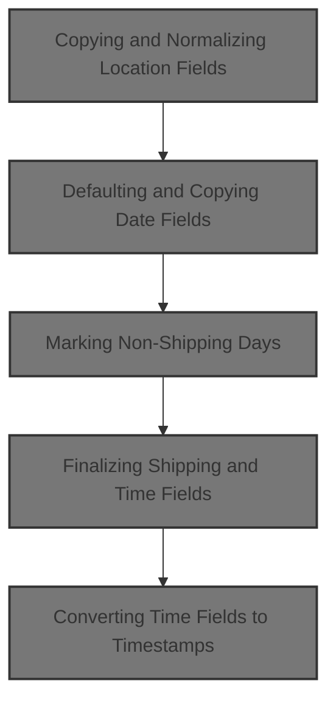
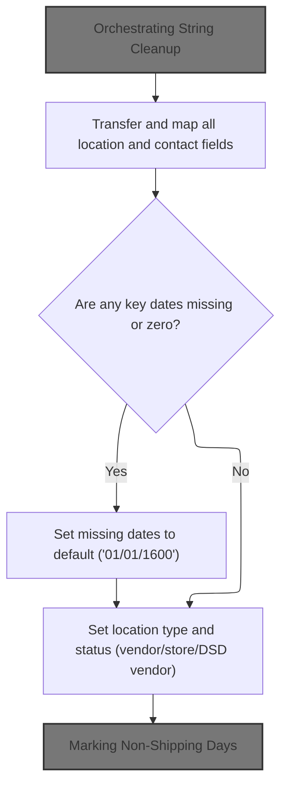
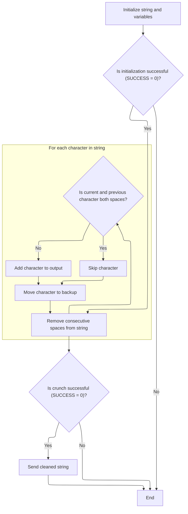
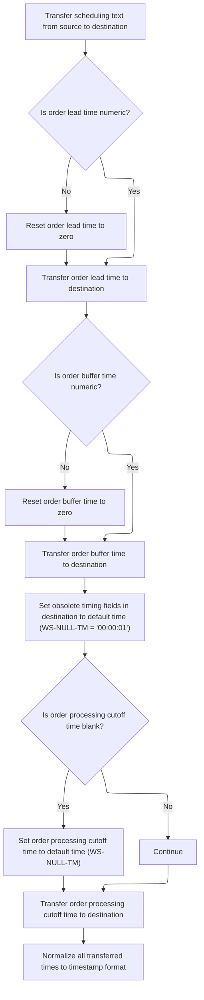
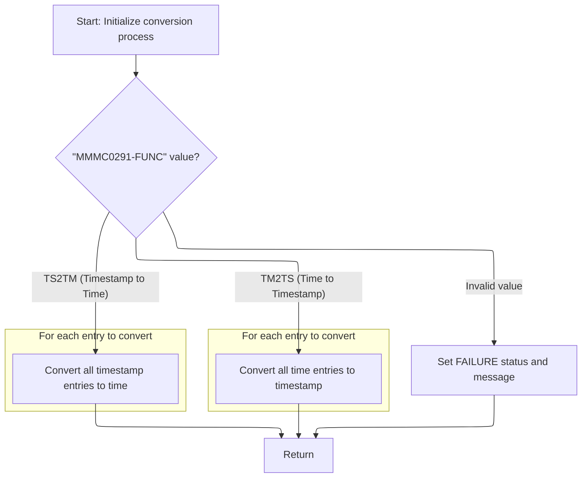

This document explains how location and contact data is cleaned, validated, and standardized for downstream use. The flow receives raw data, normalizes and defaults fields, marks non-shipping days, and ensures all time and date values are ready for further processing.



# Spec

## Detailed View of the Program's Functionality

# Detailed Explanation of the Flow

## a. Orchestrating String Cleanup

The process begins by ensuring that the primary contact name is properly formatted before any copying or mapping of fields occurs. This is done by invoking a utility that removes extra spaces from the contact name string.

- The length of the contact name is determined.
- A string crunching utility is called, which:
  - Initializes working variables and checks if the input is valid (not empty or just spaces).
  - Iterates through each character of the string, copying characters to the output unless it finds consecutive spaces, in which case it skips the extra spaces.
  - After processing, the cleaned-up string replaces the original.
- This ensures that the contact name is tidy, with no double spaces, before it is copied to the destination structure.

## b. Transfer and Map All Location and Contact Fields

After cleaning the contact name, the process proceeds to copy all relevant location and contact fields from the source structure to the destination structure.

- Each field, such as location type, number, name, abbreviation, legal name, addresses, city, state, zip codes, phone numbers, country information, secondary contact details, and mail-to information, is copied one by one from the source to the destination.
- This mapping is comprehensive and includes both primary and secondary contact details, as well as mail-to fields and the current fax ID.

## c. Defaulting and Copying Date Fields

The next step is to ensure that all important date fields are set and valid.

- For each key date field (added, deleted, inactive, opened, closed):
  - If the field is blank or set to a zero date, it is replaced with a default date ('01/01/1600').
  - The (possibly defaulted) date is then copied to the destination structure.
- After all date fields are handled, the code checks the status of the location:
  - If the location is neither inactive nor deleted, it is marked as active.
  - Depending on the location type (vendor, store, DSD vendor), additional fields are set:
    - Vendors get a specific AP type code.
    - Stores have their AP number cleared and AP type code blanked.
    - DSD vendors get a different AP type code, and their active/inactive status is set based on the inactive date.
- Status and AP fields, as well as audit and email fields, are copied.
- If facility or organization IDs are missing, they are defaulted to zero before copying.
- Routing and county text fields are also copied.
- The direct ship flag is checked and set if necessary.
- The order processing day is validated for numeric content and defaulted to zero if invalid, then copied.

## d. Marking Non-Shipping Days

The process then determines which days of the week are non-shipping days for the location.

- For each day from Monday to Sunday:
  - If shipping is not scheduled for that day, a flag is set to indicate it is a non-shipping day.
- This results in a clear set of flags indicating which days shipments do not occur.

## e. Finalizing Shipping and Time Fields

After non-shipping days are marked, the process finalizes scheduling and timing fields.

- The shipping day text is copied from the source to the destination.
- The order lead time and buffer time are checked for numeric validity:
  - If not numeric, they are set to zero.
  - They are then copied to the destination.
- Obsolete timing fields in the destination are set to a default time value ('00:00:01').
- The order processing cutoff time is checked:
  - If blank, it is set to the default time.
  - It is then copied to the destination.
- At this point, all time fields are normalized and ready for conversion to timestamp format.

## f. Converting Time Fields to Timestamps

To ensure compatibility with Oracle databases, time fields are converted to timestamp format.

- If the environment requires Oracle compatibility or a database update/insert is being performed:
  - Input arrays for time fields are prepared.
  - An external utility is called to perform the conversion:
    - If the function code indicates time-to-timestamp, each time entry is validated and converted to a timestamp.
    - If the function code indicates timestamp-to-time, each timestamp is parsed and converted back to a time value.
    - If the function code is invalid, an error is flagged.
  - If the conversion is successful, the resulting timestamps are copied to the appropriate fields.
  - If the conversion fails, the original time fields are copied as-is to the timestamp fields, ensuring that there is always a value present.

## g. Handling Conversion Results and Assigning Timestamps

After the conversion utility returns:

- If the conversion was successful, the converted timestamp values are assigned to the local fields used for Oracle storage.
- If the conversion failed, the original time values are used instead.
- This ensures that the destination structure always has valid, normalized, and Oracle-compatible time and timestamp fields, regardless of conversion success.

---

This flow ensures that all location, contact, date, shipping, and timing fields are thoroughly validated, normalized, and mapped from the source to the destination, with special attention to formatting and database compatibility. The process is robust against missing or invalid data and provides clear indicators for non-shipping days and status fields.

# Rule Definition

| Paragraph Name                                                      | Rule ID | Category          | Description                                                                                                                                                                                                                                 | Conditions                                                                                    | Remarks                                                                                                                                                                          |
| ------------------------------------------------------------------- | ------- | ----------------- | ------------------------------------------------------------------------------------------------------------------------------------------------------------------------------------------------------------------------------------------- | --------------------------------------------------------------------------------------------- | -------------------------------------------------------------------------------------------------------------------------------------------------------------------------------- |
| 110-MOVE-PDA-FIELDS-2-DCL                                           | RL-001  | Computation       | The primary contact name field in the source record must be normalized so that consecutive spaces are reduced to a single space before copying to the target record.                                                                        | When transferring the primary contact name from the source to the target.                     | Normalization is performed by calling an external module (YYYS0134) that reduces consecutive spaces to a single space. The field is an alphanumeric string, up to 80 characters. |
| 110-MOVE-PDA-FIELDS-2-DCL                                           | RL-002  | Data Assignment   | All location and contact fields are copied from the source to the target without modification, except for those requiring normalization or defaulting.                                                                                      | For each location and contact field not explicitly mentioned for normalization or defaulting. | Fields are transferred as-is, preserving their original format and length.                                                                                                       |
| 110-MOVE-PDA-FIELDS-2-DCL                                           | RL-003  | Conditional Logic | For each date field, if the value is blank or '00/00/0000', set it to the default date '01/01/1600' in the target; otherwise, copy as-is.                                                                                                   | For each date field (ADDED-DT, DELETE-DT, INACTIVE-DT, OPENED-DT, CLOSED-DT) during transfer. | Default date: '01/01/1600'. Date fields are strings in the format MM/DD/YYYY.                                                                                                    |
| 110-MOVE-PDA-FIELDS-2-DCL, 112-CONVERT-TM-TO-TS                     | RL-004  | Computation       | Time fields FILLER1-TM and FILLER2-TM are always set to '00:00:01'. If ORD-PROCNG-CTOF-TM is blank, set it to '00:00:01'. All time fields are converted to Oracle-compatible timestamp format and stored in corresponding timestamp fields. | When processing time fields during normalization.                                             | Default time: '00:00:01'. Oracle timestamp format: 'YYYY-MM-DD-HH.MM.SS.000000' (26 characters). Conversion is performed by calling MMMS0291.                                    |
| 116-EDIT-SHIP-DAYS                                                  | RL-005  | Conditional Logic | For each shipping day field, if the value is not 'Y', set the corresponding DOES-NOT-SHIP-<DAY> flag in the target to 'Y'; if the value is 'Y', set the flag to blank.                                                                      | For each shipping day field (SHIPS-MON, SHIPS-TUE, etc.) during normalization.                | Input: single-character field ('Y' or blank). Output: single-character flag ('Y' or blank).                                                                                      |
| 110-MOVE-PDA-FIELDS-2-DCL                                           | RL-006  | Conditional Logic | All numeric fields must be validated; if a field is not numeric, set it to 0 in the target.                                                                                                                                                 | For each numeric field during normalization.                                                  | Numeric fields are numbers (integer or decimal as defined in the copybooks). Default value: 0.                                                                                   |
| 110-MOVE-PDA-FIELDS-2-DCL                                           | RL-007  | Data Assignment   | All fields not explicitly mentioned for normalization or defaulting are copied from source to target without modification.                                                                                                                  | For all fields not covered by other normalization or defaulting rules.                        | Fields are transferred as-is, preserving their original format and length.                                                                                                       |
| 110-MOVE-PDA-FIELDS-2-DCL, 112-CONVERT-TM-TO-TS, 116-EDIT-SHIP-DAYS | RL-008  | Computation       | The output record must reflect all cleaning, defaulting, and normalization as described in the business rules.                                                                                                                              | After all normalization and transformation steps are complete.                                | Output record (DCLXXXATION) must have all fields set according to the above rules. Field formats and lengths are as defined in the copybooks.                                    |

# User Stories

## User Story 1: Normalize and transfer location and contact fields

---

### Story Description:

As a system, I want all location and contact fields to be transferred from the source to the target, with the primary contact name cleaned to reduce consecutive spaces, so that the target record contains accurate and normalized contact information.

---

### Business Rule Mapping:

| Rule ID | Paragraph Name            | Rule Description                                                                                                                                                     |
| ------- | ------------------------- | -------------------------------------------------------------------------------------------------------------------------------------------------------------------- |
| RL-001  | 110-MOVE-PDA-FIELDS-2-DCL | The primary contact name field in the source record must be normalized so that consecutive spaces are reduced to a single space before copying to the target record. |
| RL-002  | 110-MOVE-PDA-FIELDS-2-DCL | All location and contact fields are copied from the source to the target without modification, except for those requiring normalization or defaulting.               |
| RL-007  | 110-MOVE-PDA-FIELDS-2-DCL | All fields not explicitly mentioned for normalization or defaulting are copied from source to target without modification.                                           |

---

### Relevant Functionality:

- **110-MOVE-PDA-FIELDS-2-DCL**
  1. **RL-001:**
     - Determine the length of the primary contact name in the source record.
     - Call the space cruncher module with the source string and its length.
     - The module returns the normalized string with single spaces only.
     - Copy the normalized string to the target record's primary contact name field.
  2. **RL-002:**
     - For each location and contact field (excluding those with special rules):
       - Copy the value from the source record to the corresponding field in the target record.
  3. **RL-007:**
     - For each field not covered by other rules:
       - Copy the value from the source record to the corresponding field in the target record.

## User Story 2: Normalize and convert date and time fields

---

### Story Description:

As a system, I want all date and time fields to be normalized, defaulted, and converted to the required formats, so that the target record contains valid and Oracle-compatible date and timestamp values.

---

### Business Rule Mapping:

| Rule ID | Paragraph Name                                  | Rule Description                                                                                                                                                                                                                            |
| ------- | ----------------------------------------------- | ------------------------------------------------------------------------------------------------------------------------------------------------------------------------------------------------------------------------------------------- |
| RL-003  | 110-MOVE-PDA-FIELDS-2-DCL                       | For each date field, if the value is blank or '00/00/0000', set it to the default date '01/01/1600' in the target; otherwise, copy as-is.                                                                                                   |
| RL-004  | 110-MOVE-PDA-FIELDS-2-DCL, 112-CONVERT-TM-TO-TS | Time fields FILLER1-TM and FILLER2-TM are always set to '00:00:01'. If ORD-PROCNG-CTOF-TM is blank, set it to '00:00:01'. All time fields are converted to Oracle-compatible timestamp format and stored in corresponding timestamp fields. |

---

### Relevant Functionality:

- **110-MOVE-PDA-FIELDS-2-DCL**
  1. **RL-003:**
     - For each date field:
       - If the source value is blank or '00/00/0000':
         - Set the target value to '01/01/1600'.
       - Else:
         - Copy the source value to the target.
  2. **RL-004:**
     - Set FILLER1-TM and FILLER2-TM to '00:00:01' in the target.
     - If ORD-PROCNG-CTOF-TM is blank, set it to '00:00:01'.
     - For each time field:
       - Call the time-to-timestamp conversion module (MMMS0291) with the time value.
       - Store the resulting timestamp in the corresponding target timestamp field.

## User Story 3: Ensure output record completeness and correctness

---

### Story Description:

As a system, I want the output record to have shipping day flags set, numeric fields validated, and all cleaning, defaulting, and normalization applied, so that the target record is complete, correct, and meets all business requirements.

---

### Business Rule Mapping:

| Rule ID | Paragraph Name                                                      | Rule Description                                                                                                                                                       |
| ------- | ------------------------------------------------------------------- | ---------------------------------------------------------------------------------------------------------------------------------------------------------------------- |
| RL-006  | 110-MOVE-PDA-FIELDS-2-DCL                                           | All numeric fields must be validated; if a field is not numeric, set it to 0 in the target.                                                                            |
| RL-008  | 110-MOVE-PDA-FIELDS-2-DCL, 112-CONVERT-TM-TO-TS, 116-EDIT-SHIP-DAYS | The output record must reflect all cleaning, defaulting, and normalization as described in the business rules.                                                         |
| RL-005  | 116-EDIT-SHIP-DAYS                                                  | For each shipping day field, if the value is not 'Y', set the corresponding DOES-NOT-SHIP-<DAY> flag in the target to 'Y'; if the value is 'Y', set the flag to blank. |

---

### Relevant Functionality:

- **110-MOVE-PDA-FIELDS-2-DCL**
  1. **RL-006:**
     - For each numeric field:
       - If the value is not numeric:
         - Set the target value to 0.
       - Else:
         - Copy the value as-is.
  2. **RL-008:**
     - After applying all normalization and transformation rules:
       - Ensure the output record contains the cleaned, defaulted, and normalized values for all fields.
- **116-EDIT-SHIP-DAYS**
  1. **RL-005:**
     - For each shipping day field:
       - If the value is not 'Y':
         - Set the DOES-NOT-SHIP-<DAY> flag to 'Y'.
       - Else:
         - Set the flag to blank.

# Code Walkthrough

## Copying and Normalizing Location Fields



<SwmSnippet path="/base/src/NNNS0487.cbl" line="918">

---

In `110-MOVE-PDA-FIELDS-2-DCL`, we kick off by cleaning up PRIM-CONTACT-NM using YYYS0134-STRING-CRUNCH. This avoids double spaces and keeps the contact name tidy before copying it over.

```cobol
099500 110-MOVE-PDA-FIELDS-2-DCL.                                       00099500
099600     MOVE LENGTH OF PRIM-CONTACT-NM OF P-DDDTLO01 TO WS-STR-LEN   00099600
099700     CALL  YYYS0134-STRING-CRUNCH USING                           00099700
099800                            XXXN001A                              00099800
099900                            PRIM-CONTACT-NM OF P-DDDTLO01         00099900
100000                            WS-STR-LEN                            00100000
100100     INITIALIZE XXXN001A                                          00100100
100200     MOVE LOC-TYP-CD OF P-DDDTLO01 TO LOC-TYP-CD OF DCLXXXATION   00100200
100300     MOVE LOC-NBR OF P-DDDTLO01 TO LOC-NBR OF DCLXXXATION         00100300
100400     MOVE LOC-NM OF P-DDDTLO01 TO LOC-NM OF DCLXXXATION           00100400
100500     MOVE LOC-ABB OF P-DDDTLO01 TO LOC-ABB OF DCLXXXATION         00100500
100600     MOVE LGL-LOC-NAM OF P-DDDTLO01 TO LGL-LOC-NAM OF DCLXXXATION 00100600
100700     MOVE PRIM-CONTACT-NM OF P-DDDTLO01                           00100700
100800       TO PRIM-CONTACT-NM OF DCLXXXATION                          00100800
100900     MOVE PRIM-ADR-1 OF P-DDDTLO01 TO PRIM-ADR-1 OF DCLXXXATION   00100900
101000     MOVE PRIM-ADR-2 OF P-DDDTLO01 TO PRIM-ADR-2 OF DCLXXXATION   00101000
101100     MOVE PRIM-ADR-3 OF P-DDDTLO01 TO PRIM-ADR-3 OF DCLXXXATION   00101100
101200     MOVE PRIM-ADR-4 OF P-DDDTLO01 TO PRIM-ADR-4 OF DCLXXXATION   00101200
101300     MOVE PRIM-CITY OF P-DDDTLO01 TO PRIM-CITY OF DCLXXXATION     00101300
101400     MOVE PRIM-CITY-ID OF P-DDDTLO01                              00101400
101500       TO PRIM-CITY-ID OF DCLXXXATION                             00101500
101600     MOVE PRIM-STATE-CD OF P-DDDTLO01                             00101600
101700       TO PRIM-STATE-CD OF DCLXXXATION                            00101700
101800     MOVE PRIM-ZIP5-CD OF P-DDDTLO01                              00101800
101900       TO PRIM-ZIP5-CD OF DCLXXXATION                             00101900
102000     MOVE PRIM-ZIP4-CD OF P-DDDTLO01                              00102000
102100       TO PRIM-ZIP4-CD OF DCLXXXATION                             00102100
102200     MOVE PRIM-PHN-CNTRY-CD OF P-DDDTLO01                         00102200
102300       TO PRIM-PHN-CNTRY-CD OF DCLXXXATION                        00102300
102400     MOVE PRIM-AREA-CD OF P-DDDTLO01                              00102400
102500       TO PRIM-AREA-CD OF DCLXXXATION                             00102500
102600     MOVE PRIM-PHONE-NBR OF P-DDDTLO01                            00102600
102700       TO PRIM-PHONE-NBR OF DCLXXXATION                           00102700
102800     MOVE PRIM-CNTRY-NM OF P-DDDTLO01                             00102800
102900       TO PRIM-CNTRY-NM OF DCLXXXATION                            00102900
103000     MOVE PRIM-CNTRY-ABB OF P-DDDTLO01                            00103000
103100       TO PRIM-CNTRY-ABB OF DCLXXXATION                           00103100
103200     MOVE SEC-LOC-NM OF P-DDDTLO01 TO SEC-LOC-NM OF DCLXXXATION   00103200
103300     MOVE SEC-CONTACT-NM OF P-DDDTLO01                            00103300
103400       TO SEC-CONTACT-NM OF DCLXXXATION                           00103400
103500     MOVE SEC-ADR-1 OF P-DDDTLO01 TO SEC-ADR-1 OF DCLXXXATION     00103500
103600     MOVE SEC-ADR-2 OF P-DDDTLO01 TO SEC-ADR-2 OF DCLXXXATION     00103600
103700     MOVE SEC-ADR-3 OF P-DDDTLO01 TO SEC-ADR-3 OF DCLXXXATION     00103700
103800     MOVE SEC-ADR-4 OF P-DDDTLO01 TO SEC-ADR-4 OF DCLXXXATION     00103800
103900     MOVE SEC-CITY OF P-DDDTLO01 TO SEC-CITY OF DCLXXXATION       00103900
104000     MOVE SEC-STATE-CD OF P-DDDTLO01                              00104000
104100       TO SEC-STATE-CD OF DCLXXXATION                             00104100
104200     MOVE SEC-ZIP5-CD OF P-DDDTLO01 TO SEC-ZIP5-CD OF DCLXXXATION 00104200
104300     MOVE SEC-ZIP4-CD OF P-DDDTLO01 TO SEC-ZIP4-CD OF DCLXXXATION 00104300
104400     MOVE SEC-PHN-CNTRY-CD OF P-DDDTLO01                          00104400
104500       TO SEC-PHN-CNTRY-CD OF DCLXXXATION                         00104500
104600     MOVE SEC-AREA-CD OF P-DDDTLO01 TO SEC-AREA-CD OF DCLXXXATION 00104600
104700     MOVE SEC-PHONE-NBR OF P-DDDTLO01                             00104700
104800       TO SEC-PHONE-NBR OF DCLXXXATION                            00104800
104900     MOVE SEC-CNTRY-NM OF P-DDDTLO01                              00104900
105000       TO SEC-CNTRY-NM OF DCLXXXATION                             00105000
105100     MOVE SEC-CNTRY-ABB OF P-DDDTLO01                             00105100
105200       TO SEC-CNTRY-ABB OF DCLXXXATION                            00105200
105300     MOVE MAIL-TO-LOC-NM OF P-DDDTLO01                            00105300
105400       TO MAIL-TO-LOC-NM OF DCLXXXATION                           00105400
105500     MOVE MAIL-TO-CNTCT-NM OF P-DDDTLO01                          00105500
105600       TO MAIL-TO-CNTCT-NM OF DCLXXXATION                         00105600
105700     MOVE MAIL-TO-ADR-1 OF P-DDDTLO01                             00105700
105800       TO MAIL-TO-ADR-1 OF DCLXXXATION                            00105800
105900     MOVE MAIL-TO-ADR-2 OF P-DDDTLO01                             00105900
106000       TO MAIL-TO-ADR-2 OF DCLXXXATION                            00106000
106100     MOVE MAIL-TO-ADR-3 OF P-DDDTLO01                             00106100
106200       TO MAIL-TO-ADR-3 OF DCLXXXATION                            00106200
106300     MOVE MAIL-TO-ADR-4 OF P-DDDTLO01                             00106300
106400       TO MAIL-TO-ADR-4 OF DCLXXXATION                            00106400
106500     MOVE MAIL-TO-CITY OF P-DDDTLO01                              00106500
106600       TO MAIL-TO-CITY OF DCLXXXATION                             00106600
106700     MOVE MAIL-TO-STATE-CD OF P-DDDTLO01                          00106700
106800       TO MAIL-TO-STATE-CD OF DCLXXXATION                         00106800
106900     MOVE MAIL-TO-ZIP5-CD OF P-DDDTLO01                           00106900
107000       TO MAIL-TO-ZIP5-CD OF DCLXXXATION                          00107000
107100     MOVE MAIL-TO-ZIP4-CD OF P-DDDTLO01                           00107100
107200       TO MAIL-TO-ZIP4-CD OF DCLXXXATION                          00107200
107300     MOVE MAIL-PHN-CNTRY-CD OF P-DDDTLO01                         00107300
107400       TO MAIL-PHN-CNTRY-CD OF DCLXXXATION                        00107400
107500     MOVE MAIL-TO-AREA-CD OF P-DDDTLO01                           00107500
107600       TO MAIL-TO-AREA-CD OF DCLXXXATION                          00107600
107700     MOVE MAIL-TO-PHONE-NBR OF P-DDDTLO01                         00107700
107800       TO MAIL-TO-PHONE-NBR OF DCLXXXATION                        00107800
107900     MOVE MAIL-TO-CNTRY-NM OF P-DDDTLO01                          00107900
108000       TO MAIL-TO-CNTRY-NM OF DCLXXXATION                         00108000
108100     MOVE MAIL-TO-CNTRY-AB OF P-DDDTLO01                          00108100
108200       TO MAIL-TO-CNTRY-AB OF DCLXXXATION                         00108200
108300     MOVE CURR-FAX-ID OF P-DDDTLO01 TO CURR-FAX-ID OF DCLXXXATION 00108300
```

---

</SwmSnippet>

### Orchestrating String Cleanup



<SwmSnippet path="/base/src/YYYS0134.cbl" line="47">

---

`000-MAIN` in YYYS0134.cbl runs the whole space crunching process. It first checks the input, then crunches the string to remove extra spaces, and finally sends the cleaned string back. If any step fails, it exits early with an error.

```cobol
009100 000-MAIN.                                                        00009100
009200     PERFORM 100-INITIALIZATION                                   00009200
009300     IF SUCCESS                                                   00009300
009400       PERFORM 200-CRUNCH-STRING                                  00009400
009500     END-IF                                                       00009500
009600     IF SUCCESS                                                   00009600
009700       PERFORM 300-SEND-FINAL-STRING                              00009700
009800     END-IF                                                       00009800
010300     GOBACK                                                       00010300
010400     .                                                            00010400
```

---

</SwmSnippet>

<SwmSnippet path="/base/src/YYYS0134.cbl" line="62">

---

`100-INITIALIZATION` checks the input string length and caps it if needed. It also validates that the string isn't empty or just junk. If the input fails, it sets a failure flag and an error message, stopping the crunching flow.

```cobol
011000 100-INITIALIZATION.                                              00011000
011100     INITIALIZE XXXN001A                                          00011100
011101                WS-OT-STR                                         00011101
011102                WS-BKUP-BYTE                                      00011102
011103                J                                                 00011103
011104                                                                  00011104
011105     IF STR-LEN          > WS-MAX-STR-LEN                         00011105
011106       MOVE WS-MAX-STR-LEN            TO STR-LEN                  00011106
011107     END-IF                                                       00011107
011108                                                                  00011108
011110     IF STR EQUAL SPACES OR LOW-VALUES                            00011110
011111         SET FAILURE                  TO TRUE                     00011111
011120         MOVE 'YYYS0134 - Text not passed for parsing.'           00011120
011130           TO IS-RTRN-MSG-TXT                                     00011130
011160     END-IF                                                       00011160
011800     .                                                            00011800
```

---

</SwmSnippet>

<SwmSnippet path="/base/src/YYYS0134.cbl" line="84">

---

`200-CRUNCH-STRING` loops through each character, copying only non-consecutive spaces to the output. It uses WS-BKUP-BYTE to track the last character and skips extra spaces, so the result is a string with single spaces between words.

```cobol
012500 200-CRUNCH-STRING.                                               00012500
012600                                                                  00012600
013500     PERFORM VARYING I FROM +1 BY +1 UNTIL I > STR-LEN            00013500
013501                                                                  00013501
013502       IF STR-B(I) EQUAL SPACE AND WS-BKUP-BYTE EQUAL SPACE       00013502
013503         CONTINUE                                                 00013503
013504       ELSE                                                       00013504
013505         ADD +1                       TO J                        00013505
013506                                                                  00013506
013507         MOVE STR-B(I)                TO WS-STR-B(J)              00013507
013508       END-IF                                                     00013508
013509                                                                  00013509
013510       MOVE STR-B(I)                  TO WS-BKUP-BYTE             00013510
013520                                                                  00013520
013600     END-PERFORM                                                  00013600
036500     .                                                            00036500
```

---

</SwmSnippet>

<SwmSnippet path="/base/src/YYYS0134.cbl" line="102">

---

`300-SEND-FINAL-STRING` clears out the target substring in STR and then copies the cleaned output from WS-OT-STR into it. This guarantees the result is fresh and doesn't have leftover junk.

```cobol
036600 300-SEND-FINAL-STRING.                                           00036600
036700     MOVE SPACES                      TO STR(1:STR-LEN)           00036700
036800     MOVE WS-OT-STR                   TO STR(1:STR-LEN)           00036800
037000     .                                                            00037000
```

---

</SwmSnippet>

### Defaulting and Copying Date Fields

```mermaid
%%{init: {"flowchart": {"defaultRenderer": "elk"}} }%%
flowchart TD
    node1["Ensure all key dates are set (added, deleted, inactive, opened, closed)"]
    click node1 openCode "base/src/NNNS0487.cbl:1085:1113"
    node1 --> node2["Transfer dates to declaration"]
    click node2 openCode "base/src/NNNS0487.cbl:1089:1113"
    node2 --> node3{"Is location inactive or deleted?"}
    click node3 openCode "base/src/NNNS0487.cbl:1115:1117"
    node3 -->|"No"| node4["Mark location as active"]
    click node4 openCode "base/src/NNNS0487.cbl:1116:1117"
    node3 -->|"Yes"| node5["Continue"]
    node4 --> node6{"Location type?"}
    click node6 openCode "base/src/NNNS0487.cbl:1190:1134"
    node6 -->|"Vendor ('V')"| node7["Set AP type code to 'AP'"]
    click node7 openCode "base/src/NNNS0487.cbl:1120:1122"
    node6 -->|"Store ('S')"| node8["Set AP number to 0, clear AP type code"]
    click node8 openCode "base/src/NNNS0487.cbl:1123:1125"
    node6 -->|"DSD Vendor ('D')"| node9["Set AP type code to 'DS'"]
    click node9 openCode "base/src/NNNS0487.cbl:1127:1128"
    node9 --> node10{"Is inactive date default ('01/01/1600')?"}
    click node10 openCode "base/src/NNNS0487.cbl:1129:1133"
    node10 -->|"Yes"| node11["Mark location as active"]
    click node11 openCode "base/src/NNNS0487.cbl:1130:1131"
    node10 -->|"No"| node12["Mark location as inactive"]
    click node12 openCode "base/src/NNNS0487.cbl:1132:1133"
    node7 --> node13["Transfer status and AP fields"]
    click node13 openCode "base/src/NNNS0487.cbl:1136:1149"
    node8 --> node13
    node11 --> node13
    node12 --> node13
    node5 --> node13
    node13 --> node14{"Are FAC-ID-X or ORG-ID-X missing?"}
    click node14 openCode "base/src/NNNS0487.cbl:1150:1157"
    node14 -->|"Yes"| node15["Set missing IDs to zero"]
    click node15 openCode "base/src/NNNS0487.cbl:1151:1156"
    node14 -->|"No"| node16["Continue"]
    node15 --> node17["Transfer remaining fields"]
    click node17 openCode "base/src/NNNS0487.cbl:1158:1167"
    node16 --> node17
    node17 --> node18{"Is location not direct ship?"}
    click node18 openCode "base/src/NNNS0487.cbl:1169:1171"
    node18 -->|"Yes"| node19["Mark as not direct ship"]
    click node19 openCode "base/src/NNNS0487.cbl:1170:1171"
    node18 -->|"No"| node20["Continue"]
    node19 --> node21{"Is order processing day not numeric?"}
    click node21 openCode "base/src/NNNS0487.cbl:1175:1177"
    node20 --> node21
    node21 -->|"Yes"| node22["Set order processing day to zero"]
    click node22 openCode "base/src/NNNS0487.cbl:1176:1177"
    node21 -->|"No"| node23["Continue"]
    node22 --> node24["Transfer order processing day"]
    click node24 openCode "base/src/NNNS0487.cbl:1178:1179"
    node23 --> node24
    node24 --> node25["Perform ship days edit"]
    click node25 openCode "base/src/NNNS0487.cbl:1181:1181"

classDef HeadingStyle fill:#777777,stroke:#333,stroke-width:2px;
```



<SwmSnippet path="/base/src/NNNS0487.cbl" line="1008">

---

Back in `110-MOVE-PDA-FIELDS-2-DCL`, after returning from YYYS0134.cbl, we start checking each date field. If a date is blank or set to '00/00/0000', we swap it out for '01/01/1600' before copying. This keeps our dates valid and avoids empty values.

```cobol
108500     IF ADDED-DT OF P-DDDTLO01 = SPACES                           00108500
108600     OR ADDED-DT OF P-DDDTLO01 = K-ZERO-DT                        00108600
108700       MOVE K-DEF-DT TO ADDED-DT OF P-DDDTLO01                    00108700
108800     END-IF                                                       00108800
```

---

</SwmSnippet>

<SwmSnippet path="/base/src/NNNS0487.cbl" line="1012">

---

After defaulting ADDED-DT if needed, we copy it to DCLXXXATION. The next step repeats this logic for DELETE-DT.

```cobol
108900     MOVE ADDED-DT OF P-DDDTLO01 TO ADDED-DT OF DCLXXXATION       00108900
109000                                                                  00109000
109100     IF DELETE-DT OF P-DDDTLO01 = SPACES                          00109100
109200     OR DELETE-DT OF P-DDDTLO01 = K-ZERO-DT                       00109200
109300       MOVE K-DEF-DT TO DELETE-DT OF P-DDDTLO01                   00109300
109400     END-IF                                                       00109400
```

---

</SwmSnippet>

<SwmSnippet path="/base/src/NNNS0487.cbl" line="1018">

---

After handling ADDED-DT, we check DELETE-DT for blanks or zero date, default it if needed, and then continue to the next field.

```cobol
109500     MOVE DELETE-DT OF P-DDDTLO01 TO DELETE-DT OF DCLXXXATION     00109500
109600                                                                  00109600
109700     IF INACTIVE-DT OF P-DDDTLO01 = SPACES                        00109700
109800     OR INACTIVE-DT OF P-DDDTLO01 = K-ZERO-DT                     00109800
109900       MOVE K-DEF-DT TO INACTIVE-DT OF P-DDDTLO01                 00109900
110000     END-IF                                                       00110000
```

---

</SwmSnippet>

<SwmSnippet path="/base/src/NNNS0487.cbl" line="1024">

---

Now we copy DELETE-DT to DCLXXXATION and move on to INACTIVE-DT, repeating the same defaulting logic.

```cobol
110100     MOVE INACTIVE-DT OF P-DDDTLO01 TO INACTIVE-DT OF DCLXXXATION 00110100
110200                                                                  00110200
110300     IF OPENED-DT OF P-DDDTLO01 = SPACES                          00110300
110400     OR OPENED-DT OF P-DDDTLO01 = K-ZERO-DT                       00110400
110500       MOVE K-DEF-DT TO OPENED-DT OF P-DDDTLO01                   00110500
110600     END-IF                                                       00110600
```

---

</SwmSnippet>

<SwmSnippet path="/base/src/NNNS0487.cbl" line="1030">

---

After copying DELETE-DT, we check INACTIVE-DT for blanks or zero date, default it if needed, and then continue to OPENED-DT.

```cobol
110700     MOVE OPENED-DT OF P-DDDTLO01 TO OPENED-DT OF DCLXXXATION     00110700
110800                                                                  00110800
110900     IF CLOSED-DT OF P-DDDTLO01 = SPACES                          00110900
111000     OR CLOSED-DT OF P-DDDTLO01 = K-ZERO-DT                       00111000
111100       MOVE K-DEF-DT TO CLOSED-DT OF P-DDDTLO01                   00111100
111200     END-IF                                                       00111200
```

---

</SwmSnippet>

<SwmSnippet path="/base/src/NNNS0487.cbl" line="1036">

---

After copying INACTIVE-DT, we check OPENED-DT for blanks or zero date, default it if needed, and then move on to CLOSED-DT. After all date fields are handled, we set LO-ACTIVE to TRUE if the location isn't inactive or deleted.

```cobol
111300     MOVE CLOSED-DT OF P-DDDTLO01 TO CLOSED-DT OF DCLXXXATION     00111300
111400                                                                  00111400
111500     IF NOT LO-INACTIVE AND NOT LO-DELETED                        00111500
111600       SET LO-ACTIVE TO TRUE                                      00111600
111700     END-IF                                                       00111700
```

---

</SwmSnippet>

<SwmSnippet path="/base/src/NNNS0487.cbl" line="1042">

---

After setting LO-ACTIVE, we check LOC-TYP-CD and set AP-TYP-CD and AP-NBR based on the type. For DSD vendors, we also set LO-ACTIVE or LO-INACTIVE depending on INACTIVE-DT.

```cobol
111900     EVALUATE TRUE                                                00111900
112000       WHEN LOC-TYP-CD OF DCLXXXATION = K-VEND-LOC-TYPE           00112000
112100         MOVE K-AP-TYPE-CD TO AP-TYP-CD OF P-DDDTLO01             00112100
112200                                                                  00112200
112300       WHEN LOC-TYP-CD OF DCLXXXATION = K-STORE-LOC-TYPE          00112300
112400         MOVE 0      TO AP-NBR    OF P-DDDTLO01                   00112400
112500         MOVE SPACES TO AP-TYP-CD OF P-DDDTLO01                   00112500
112600                                                                  00112600
112700       WHEN LOC-TYP-CD OF DCLXXXATION = K-DSD-VEND-LOC-TYPE       00112700
112800         MOVE K-DSD-AP-TYPE-CD TO AP-TYP-CD OF P-DDDTLO01         00112800
112900         IF INACTIVE-DT OF P-DDDTLO01 = K-DEF-DT                  00112900
113000           SET LO-ACTIVE TO TRUE                                  00113000
113100         ELSE                                                     00113100
113200           SET LO-INACTIVE TO TRUE                                00113200
113300         END-IF                                                   00113300
113400     END-EVALUATE                                                 00113400
```

---

</SwmSnippet>

<SwmSnippet path="/base/src/NNNS0487.cbl" line="1059">

---

After handling location type logic, we copy INACTIVE-SW, AP-NBR, AP-TYP-CD, and update audit fields and email IDs to DCLXXXATION.

```cobol
113600     MOVE INACTIVE-SW OF P-DDDTLO01 TO INACTIVE-SW OF DCLXXXATION 00113600
113700                                                                  00113700
113800     MOVE AP-NBR OF P-DDDTLO01 TO AP-NBR OF DCLXXXATION           00113800
113900     MOVE AP-TYP-CD OF P-DDDTLO01   TO AP-TYP-CD OF DCLXXXATION   00113900
114000                                                                  00114000
114100     MOVE LST-UPDT-TS OF P-DDDTLO01 TO LST-UPDT-TS OF DCLXXXATION 00114100
114200     MOVE LST-UPDT-USR-ID OF P-DDDTLO01                           00114200
114300       TO LST-UPDT-USR-ID OF DCLXXXATION                          00114300
114400     MOVE PRIM-EMAIL-ID    OF P-DDDTLO01                          00114400
114500       TO PRIM-EMAIL-ID    OF DCLXXXATION                         00114500
114600     MOVE SECY-EMAIL-ID    OF P-DDDTLO01                          00114600
114700       TO SECY-EMAIL-ID    OF DCLXXXATION                         00114700
114800     MOVE MAIL-TO-EMAIL-ID OF P-DDDTLO01                          00114800
114900       TO MAIL-TO-EMAIL-ID OF DCLXXXATION                         00114900
```

---

</SwmSnippet>

<SwmSnippet path="/base/src/NNNS0487.cbl" line="1073">

---

After copying email fields, we check FAC-ID-X and ORG-ID-X for blanks and default them to 0 if needed before copying.

```cobol
115000     IF FAC-ID-X = SPACES                                         00115000
115100       MOVE 0 TO FAC-ID OF P-DDDTLO01                             00115100
115200     END-IF                                                       00115200
```

---

</SwmSnippet>

<SwmSnippet path="/base/src/NNNS0487.cbl" line="1076">

---

After defaulting FAC-ID and ORG-ID, we copy them and then move on to routing and county text fields.

```cobol
115300     MOVE FAC-ID           OF P-DDDTLO01                          00115300
115400       TO FAC-ID           OF DCLXXXATION                         00115400
115500     IF ORG-ID-X = SPACES                                         00115500
115600       MOVE 0 TO ORG-ID OF P-DDDTLO01                             00115600
115700     END-IF                                                       00115700
```

---

</SwmSnippet>

<SwmSnippet path="/base/src/NNNS0487.cbl" line="1081">

---

After copying routing and county fields, we check if the location is not direct ship and set the flag accordingly.

```cobol
115800     MOVE ORG-ID           OF P-DDDTLO01                          00115800
115900       TO ORG-ID           OF DCLXXXATION                         00115900
116000     MOVE B2B-PRIM-RTNG-ID OF P-DDDTLO01                          00116000
116100       TO B2B-PRIM-RTNG-ID OF DCLXXXATION                         00116100
116200     MOVE PRIM-CNTY-TXT    OF P-DDDTLO01                          00116200
116300       TO PRIM-CNTY-TXT    OF DCLXXXATION                         00116300
116400     MOVE SECY-CNTY-TXT    OF P-DDDTLO01                          00116400
116500       TO SECY-CNTY-TXT    OF DCLXXXATION                         00116500
116600     MOVE MAIL-TO-CNTY-TXT OF P-DDDTLO01                          00116600
116700       TO MAIL-TO-CNTY-TXT OF DCLXXXATION                         00116700
```

---

</SwmSnippet>

<SwmSnippet path="/base/src/NNNS0487.cbl" line="1092">

---

After setting the direct ship flag, we copy the shipping switch and then check numeric fields for validity.

```cobol
116900     IF NOT LOC-IS-DIRECT-SHIP OF P-DDDTLO01                      00116900
117000       SET LOC-IS-NOT-DIRECT-SHIP  OF P-DDDTLO01 TO TRUE          00117000
117100     END-IF                                                       00117100
```

---

</SwmSnippet>

<SwmSnippet path="/base/src/NNNS0487.cbl" line="1095">

---

After copying the shipping switch, we check LOC-ORD-PROCNG-DD for non-numeric values and default it to 0 if needed before copying. This keeps numeric fields clean.

```cobol
117200     MOVE DIR-SHP-LOC-SW     OF P-DDDTLO01                        00117200
117300       TO DIR-SHP-LOC-SW     OF DCLXXXATION                       00117300
117400                                                                  00117400
117500     IF LOC-ORD-PROCNG-DD    OF P-DDDTLO01 NOT NUMERIC            00117500
117600        MOVE 0 TO LOC-ORD-PROCNG-DD OF P-DDDTLO01                 00117600
117700     END-IF                                                       00117700
```

---

</SwmSnippet>

<SwmSnippet path="/base/src/NNNS0487.cbl" line="1101">

---

We call 116-EDIT-SHIP-DAYS to set flags for non-shipping days.

```cobol
117800     MOVE LOC-ORD-PROCNG-DD  OF P-DDDTLO01                        00117800
117900       TO LOC-ORD-PROCNG-DD  OF DCLXXXATION                       00117900
118000                                                                  00118000
118100     PERFORM 116-EDIT-SHIP-DAYS                                   00118100
```

---

</SwmSnippet>

### Marking Non-Shipping Days

```mermaid
%%{init: {"flowchart": {"defaultRenderer": "elk"}} }%%
flowchart TD
    node1["Start: Edit shipping days"]
    click node1 openCode "base/src/NNNS0487.cbl:126700:126700"
    subgraph loop1["For each day: Monday to Sunday"]
      node1 --> node2{"Shipping on Monday? (SHIPS-MON = 'Y')"}
      click node2 openCode "base/src/NNNS0487.cbl:126800:126900"
      node2 -->|"No"| node3["Mark Monday as non-shipping (DOES-NOT-SHIP-MON)"]
      click node3 openCode "base/src/NNNS0487.cbl:126900:126900"
      node2 -->|"Yes"| node4
      node3 --> node5{"Shipping on Tuesday? (SHIPS-TUE = 'Y')"}
      node4 --> node5
      click node5 openCode "base/src/NNNS0487.cbl:127100:127200"
      node5 -->|"No"| node6["Mark Tuesday as non-shipping (DOES-NOT-SHIP-TUE)"]
      click node6 openCode "base/src/NNNS0487.cbl:127200:127200"
      node5 -->|"Yes"| node7
      node6 --> node8{"Shipping on Wednesday? (SHIPS-WED = 'Y')"}
      node7 --> node8
      click node8 openCode "base/src/NNNS0487.cbl:127400:127500"
      node8 -->|"No"| node9["Mark Wednesday as non-shipping (DOES-NOT-SHIP-WED)"]
      click node9 openCode "base/src/NNNS0487.cbl:127500:127500"
      node8 -->|"Yes"| node10
      node9 --> node11{"Shipping on Thursday? (SHIPS-THU = 'Y')"}
      node10 --> node11
      click node11 openCode "base/src/NNNS0487.cbl:127700:127800"
      node11 -->|"No"| node12["Mark Thursday as non-shipping (DOES-NOT-SHIP-THU)"]
      click node12 openCode "base/src/NNNS0487.cbl:127800:127800"
      node11 -->|"Yes"| node13
      node12 --> node14{"Shipping on Friday? (SHIPS-FRI = 'Y')"}
      node13 --> node14
      click node14 openCode "base/src/NNNS0487.cbl:128000:128100"
      node14 -->|"No"| node15["Mark Friday as non-shipping (DOES-NOT-SHIP-FRI)"]
      click node15 openCode "base/src/NNNS0487.cbl:128100:128100"
      node14 -->|"Yes"| node16
      node15 --> node17{"Shipping on Saturday? (SHIPS-SAT = 'Y')"}
      node16 --> node17
      click node17 openCode "base/src/NNNS0487.cbl:128300:128400"
      node17 -->|"No"| node18["Mark Saturday as non-shipping (DOES-NOT-SHIP-SAT)"]
      click node18 openCode "base/src/NNNS0487.cbl:128400:128400"
      node17 -->|"Yes"| node19
      node18 --> node20{"Shipping on Sunday? (SHIPS-SUN = 'Y')"}
      node19 --> node20
      click node20 openCode "base/src/NNNS0487.cbl:128600:128700"
      node20 -->|"No"| node21["Mark Sunday as non-shipping (DOES-NOT-SHIP-SUN)"]
      click node21 openCode "base/src/NNNS0487.cbl:128700:128700"
      node20 -->|"Yes"| node22["Finish"]
      node21 --> node22
    end
    click node22 openCode "base/src/NNNS0487.cbl:128800:128800"
classDef HeadingStyle fill:#777777,stroke:#333,stroke-width:2px;
```



<SwmSnippet path="/base/src/NNNS0487.cbl" line="1190">

---

In `116-EDIT-SHIP-DAYS`, we check each weekday's shipping status. If shipping isn't scheduled, we set a flag for that day to mark it as non-shipping. This makes it clear which days are excluded.

```cobol
126700 116-EDIT-SHIP-DAYS.                                              00126700
126800     IF NOT SHIPS-MON                                             00126800
126900       SET DOES-NOT-SHIP-MON TO TRUE                              00126900
127000     END-IF                                                       00127000
```

---

</SwmSnippet>

<SwmSnippet path="/base/src/NNNS0487.cbl" line="1194">

---

After Monday, we check Tuesday's shipping status and set DOES-NOT-SHIP-TUE if needed, then move on to Wednesday.

```cobol
127100     IF NOT SHIPS-TUE                                             00127100
127200       SET DOES-NOT-SHIP-TUE TO TRUE                              00127200
127300     END-IF                                                       00127300
```

---

</SwmSnippet>

<SwmSnippet path="/base/src/NNNS0487.cbl" line="1197">

---

After Tuesday, we check Wednesday's shipping status and set DOES-NOT-SHIP-WED if needed, then move on to Thursday.

```cobol
127400     IF NOT SHIPS-WED                                             00127400
127500       SET DOES-NOT-SHIP-WED TO TRUE                              00127500
127600     END-IF                                                       00127600
```

---

</SwmSnippet>

<SwmSnippet path="/base/src/NNNS0487.cbl" line="1200">

---

After Wednesday, we check Thursday's shipping status and set DOES-NOT-SHIP-THU if needed, then move on to Friday.

```cobol
127700     IF NOT SHIPS-THU                                             00127700
127800       SET DOES-NOT-SHIP-THU TO TRUE                              00127800
127900     END-IF                                                       00127900
```

---

</SwmSnippet>

<SwmSnippet path="/base/src/NNNS0487.cbl" line="1203">

---

After Thursday, we check Friday's shipping status and set DOES-NOT-SHIP-FRI if needed, then move on to Saturday.

```cobol
128000     IF NOT SHIPS-FRI                                             00128000
128100       SET DOES-NOT-SHIP-FRI TO TRUE                              00128100
128200     END-IF                                                       00128200
```

---

</SwmSnippet>

<SwmSnippet path="/base/src/NNNS0487.cbl" line="1206">

---

After Friday, we check Saturday's shipping status and set DOES-NOT-SHIP-SAT if needed, then move on to Sunday.

```cobol
128300     IF NOT SHIPS-SAT                                             00128300
128400       SET DOES-NOT-SHIP-SAT TO TRUE                              00128400
128500     END-IF                                                       00128500
```

---

</SwmSnippet>

<SwmSnippet path="/base/src/NNNS0487.cbl" line="1209">

---

After Sunday, we've set all the non-shipping flags for the week. This gives us a clear map of which days don't have shipments for the location.

```cobol
128600     IF NOT SHIPS-SUN                                             00128600
128700       SET DOES-NOT-SHIP-SUN TO TRUE                              00128700
128800     END-IF                                                       00128800
```

---

</SwmSnippet>

### Finalizing Shipping and Time Fields



<SwmSnippet path="/base/src/NNNS0487.cbl" line="1105">

---

Back in `110-MOVE-PDA-FIELDS-2-DCL`, after returning from 116-EDIT-SHIP-DAYS, we copy the shipping day text and start validating lead and buffer times for numeric values before copying.

```cobol
118200     MOVE SCH-SHP-DD-TXT     OF P-DDDTLO01                        00118200
118300       TO SCH-SHP-DD-TXT     OF DCLXXXATION                       00118300
118400                                                                  00118400
118500                                                                  00118500
118600     IF ORD-LEAD-TM-DD OF P-DDDTLO01 IS NOT NUMERIC               00118600
118700        MOVE 0 TO ORD-LEAD-TM-DD OF P-DDDTLO01                    00118700
118800     END-IF                                                       00118800
```

---

</SwmSnippet>

<SwmSnippet path="/base/src/NNNS0487.cbl" line="1112">

---

After validating lead time, we copy it to DCLXXXATION, then check buffer time for numeric validity.

```cobol
118900     MOVE ORD-LEAD-TM-DD   OF P-DDDTLO01                          00118900
119000       TO ORD-LEAD-TM-DD   OF DCLXXXATION                         00119000
119100                                                                  00119100
119200     IF ORD-BUFFER-TM-DD OF P-DDDTLO01 IS NOT NUMERIC             00119200
119300        MOVE 0 TO ORD-BUFFER-TM-DD OF P-DDDTLO01                  00119300
119400     END-IF                                                       00119400
```

---

</SwmSnippet>

<SwmSnippet path="/base/src/NNNS0487.cbl" line="1118">

---

After copying buffer time, we set obsolete fields to WS-NULL-TM and default ORD-PROCNG-CTOF-TM if it's blank. This keeps time fields consistent and Oracle-ready.

```cobol
119500     MOVE ORD-BUFFER-TM-DD   OF P-DDDTLO01                        00119500
119600       TO ORD-BUFFER-TM-DD   OF DCLXXXATION                       00119600
119700                                                                  00119700
119800** Obsolete fields - Order Lead time and Buffer time renamed      00119800
119900** to FILLER1-TM and FILLER2-TM respectively.                     00119900
120000     MOVE WS-NULL-TM TO FILLER1-TM  OF DCLXXXATION                00120000
120100                        FILLER2-TM  OF DCLXXXATION                00120100
120200** Obsolete fields                                                00120200
120300                                                                  00120300
120400     IF ORD-PROCNG-CTOF-TM OF P-DDDTLO01 = SPACES                 00120400
120500       MOVE WS-NULL-TM TO ORD-PROCNG-CTOF-TM OF P-DDDTLO01        00120500
120600     END-IF                                                       00120600
```

---

</SwmSnippet>

<SwmSnippet path="/base/src/NNNS0487.cbl" line="1130">

---

After defaulting and copying all time fields, we call 112-CONVERT-TM-TO-TS to convert these times to Oracle-compatible timestamps using an external utility. This step is needed for database compatibility.

```cobol
120700     MOVE ORD-PROCNG-CTOF-TM OF P-DDDTLO01                        00120700
120800       TO ORD-PROCNG-CTOF-TM OF DCLXXXATION                       00120800
120900                                                                  00120900
121000     PERFORM 112-CONVERT-TM-TO-TS                                 00121000
```

---

</SwmSnippet>

## Converting Time Fields to Timestamps

<SwmSnippet path="/base/src/NNNS0487.cbl" line="1139">

---

In `112-CONVERT-TM-TO-TS`, we check repository flags and, if set, prep input arrays and call MMMS0291 to convert time fields to timestamps. This offloads the conversion logic to an external utility, making sure the timestamps are Oracle-ready.

```cobol
121600 112-CONVERT-TM-TO-TS.                                            00121600
121700     IF (YYYN005A-ORACLE OR EXIT-PUT-MODIFY-ROW                   00121700
121800         OR EXIT-PUT-INSERT-ROW)                                  00121800
121900       INITIALIZE MMMC0291-INPUT-TM                               00121900
122000                  MMMC0291-INPUT-TS                               00122000
122100                                                                  00122100
122200       MOVE ORD-PROCNG-CTOF-TM OF DCLXXXATION                     00122200
122300         TO WS-TIME-INOUT-CONV(1)                                 00122300
122400       MOVE FILLER1-TM  OF DCLXXXATION                            00122400
122500         TO WS-TIME-INOUT-CONV(2)                                 00122500
122600       MOVE FILLER2-TM  OF DCLXXXATION                            00122600
122700         TO WS-TIME-INOUT-CONV(3)                                 00122700
122800                                                                  00122800
122900       SET  MMMC0291-CVT-TM-TO-TS  TO TRUE                        00122900
123000       CALL WS-MMMS0291-PGM USING                                 00123000
123100                          XXXN001A                                00123100
123200                          MMMC0291                                00123200
```

---

</SwmSnippet>

### Delegating Time Conversion



<SwmSnippet path="/base/src/MMMS0291.cbl" line="51">

---

`000-MAIN` in MMMS0291.cbl picks the conversion logic based on the function code. It runs either time-to-timestamp or timestamp-to-time, and handles errors if the code is invalid.

```cobol
005800 000-MAIN.                                                        00005800
005900     PERFORM 100-INITIALIZE                                       00005900
006000                                                                  00006000
006100     EVALUATE TRUE                                                00006100
006200       WHEN MMMC0291-CVT-TM-TO-TS                                 00006200
006300         PERFORM 201-CONVERT-TM-TO-TS                             00006300
006400       WHEN MMMC0291-CVT-TS-TO-TM                                 00006400
006500         PERFORM 301-CONVERT-TS-TO-TM                             00006500
006600       WHEN OTHER                                                 00006600
006700         SET FAILURE TO TRUE                                      00006700
006800         MOVE 'MMMS0291 - Invalid MMMC0291-FUNC passed.'          00006800
006900           TO IS-RTRN-MSG-TXT                                     00006900
007000     END-EVALUATE                                                 00007000
007100                                                                  00007100
007200                                                                  00007200
007300     GOBACK                                                       00007300
007400     .                                                            00007400
```

---

</SwmSnippet>

<SwmSnippet path="/base/src/MMMS0291.cbl" line="96">

---

`201-CONVERT-TM-TO-TS` loops through each time input, validates hours/minutes/seconds, defaults missing parts, and builds a timestamp. If any value is out of range, it flags an error and sets a message. Space-filled inputs just get cleared.

```cobol
010300 201-CONVERT-TM-TO-TS.                                            00010300
010400                                                                  00010400
010500     PERFORM VARYING WS-CNT FROM 1 BY 1 UNTIL WS-CNT > WS-K       00010500
010600       IF WS-TIME-INOUT-CONV(WS-CNT) NOT EQUAL TO SPACES          00010600
010700         MOVE WS-TIME-INOUT-CONV(WS-CNT)                          00010700
010800                                     TO  WS-CURRENT-TIME          00010800
010900         PERFORM 110-INITIALIZE-TM-DELIM                          00010900
011000         IF WS-CURRENT-HOURS <= '23' AND WS-CURRENT-MINUTE <= '59'00011000
011100                                     AND WS-CURRENT-SECOND <= '59'00011100
011200           IF WS-CURRENT-HOURS   = '  '                           00011200
011300              MOVE '00'         TO WS-CURRENT-HOURS               00011300
011400           END-IF                                                 00011400
011500           IF WS-CURRENT-MINUTE  = '  '                           00011500
011600              MOVE '00'         TO WS-CURRENT-MINUTE              00011600
011700           END-IF                                                 00011700
011800           IF WS-CURRENT-SECOND  = '  '                           00011800
011900              MOVE '00'         TO WS-CURRENT-SECOND              00011900
012000           END-IF                                                 00012000
012100                                                                  00012100
012200           MOVE WS-CURRENT-TIME-STAMP                             00012200
012300                                TO WS-CURRENT-DATE-DATA           00012300
012400           MOVE WS-CURRENT-DATE-DATA                              00012400
012500                                TO WS-TIMSTAMP-INOUT-CONV(WS-CNT) 00012500
012600         ELSE                                                     00012600
012700           SET  FAILURE TO TRUE                                   00012700
012800           MOVE 'MMMS0291 - Invalid MMMC0291-FUNC passed.'        00012800
012900             TO IS-RTRN-MSG-TXT                                   00012900
013000           STRING 'MMMS0291 - INVALID TIME. PLEASE ENTER CORRECT' 00013000
013100                  'TIME VALUE'                                    00013100
013200           DELIMITED BY SIZE INTO IS-RTRN-MSG-TXT                 00013200
013300         END-IF                                                   00013300
013400       ELSE                                                       00013400
013500         MOVE SPACES TO WS-TIMSTAMP-INOUT-CONV(WS-CNT)            00013500
013600       END-IF                                                     00013600
013700     END-PERFORM                                                  00013700
013800     .                                                            00013800
```

---

</SwmSnippet>

<SwmSnippet path="/base/src/MMMS0291.cbl" line="137">

---

`301-CONVERT-TS-TO-TM` loops through the timestamp array, parses each timestamp into hours, minutes, and seconds, and checks if they're valid. If any part is missing, it fills it with '00'. If the values are out of range, it sets an error flag and message. If the timestamp is just spaces, it clears the output. This keeps the conversion strict and avoids junk times.

```cobol
014400 301-CONVERT-TS-TO-TM.                                            00014400
014500     PERFORM VARYING WS-CNT FROM 1 BY 1 UNTIL WS-CNT > WS-K       00014500
014600       IF WS-TIMSTAMP-INOUT-CONV(WS-CNT) NOT EQUAL TO SPACES      00014600
014700         MOVE WS-TIMSTAMP-INOUT-CONV(WS-CNT)                      00014700
014800                                     TO  WS-CURRENT-TIME-STAMP    00014800
014900         PERFORM 110-INITIALIZE-TM-DELIM                          00014900
015000         IF WS-CURRENT-HOURS <= '23' AND WS-CURRENT-MINUTE <= '59'00015000
015100                                     AND WS-CURRENT-SECOND <= '59'00015100
015200           IF WS-CURRENT-HOURS   = '  '                           00015200
015300              MOVE '00'         TO WS-CURRENT-HOURS               00015300
015400           END-IF                                                 00015400
015500           IF WS-CURRENT-MINUTE  = '  '                           00015500
015600              MOVE '00'         TO WS-CURRENT-MINUTE              00015600
015700           END-IF                                                 00015700
015800           IF WS-CURRENT-SECOND  = '  '                           00015800
015900              MOVE '00'         TO WS-CURRENT-SECOND              00015900
016000           END-IF                                                 00016000
016100           MOVE WS-CURRENT-TIME TO WS-TIME-INOUT-CONV(WS-CNT)     00016100
016200         ELSE                                                     00016200
016300           SET FAILURE TO TRUE                                    00016300
016400           MOVE 'MMMS0291 - Invalid MMMC0291-FUNC passed.'        00016400
016500             TO IS-RTRN-MSG-TXT                                   00016500
016600           STRING 'MMMS0291 - INVALID TIME. PLEASE ENTER CORRECT' 00016600
016700                  'TIMESTAMP VALUE'                               00016700
016800            DELIMITED BY SIZE INTO IS-RTRN-MSG-TXT                00016800
016900         END-IF                                                   00016900
017000       ELSE                                                       00017000
017100         MOVE SPACES TO WS-TIME-INOUT-CONV(WS-CNT)                00017100
017200       END-IF                                                     00017200
017300     END-PERFORM                                                  00017300
017400     .                                                            00017400
```

---

</SwmSnippet>

### Handling Conversion Results and Assigning Timestamps

<SwmSnippet path="/base/src/NNNS0487.cbl" line="1157">

---

After returning from MMMS0291.cbl, `112-CONVERT-TM-TO-TS` checks if the conversion was successful. If so, it copies the converted timestamps from the utility's output array into the local fields for Oracle. Only the first three results are used here.

```cobol
123400       IF SUCCESS                                                 00123400
123500         MOVE WS-TIMSTAMP-INOUT-CONV(1)                           00123500
123600           TO WS-ORD-PROCNG-CTOF-TM                               00123600
123700         MOVE WS-TIMSTAMP-INOUT-CONV(2)                           00123700
123800           TO WS-FILLER1-TS                                       00123800
123900         MOVE WS-TIMSTAMP-INOUT-CONV(3)                           00123900
124000           TO WS-FILLER2-TS                                       00124000
124100       END-IF                                                     00124100
```

---

</SwmSnippet>

<SwmSnippet path="/base/src/NNNS0487.cbl" line="1165">

---

If the conversion in `112-CONVERT-TM-TO-TS` fails, we skip the utility output and just copy the original time fields straight to the timestamp fields. This way, we always have something to store, even if it's not Oracle-ready.

```cobol
124200     ELSE                                                         00124200
124300       MOVE ORD-PROCNG-CTOF-TM OF DCLXXXATION                     00124300
124400         TO WS-ORD-PROCNG-CTOF-TM                                 00124400
124500       MOVE FILLER1-TM  OF DCLXXXATION TO WS-FILLER1-TS           00124500
124600       MOVE FILLER2-TM  OF DCLXXXATION TO WS-FILLER2-TS           00124600
124700     END-IF                                                       00124700
```

---

</SwmSnippet>

&nbsp;

*This is an auto-generated document by Swimm 🌊 and has not yet been verified by a human*

<SwmMeta version="3.0.0" repo-id="Z2l0aHViJTNBJTNBU3dpbW1pby1keW5jYWxsLWRlbW8lM0ElM0FHaXJpLVN3aW1t" repo-name="Swimmio-dyncall-demo"><sup>Powered by [Swimm](https://app.swimm.io/)</sup></SwmMeta>
