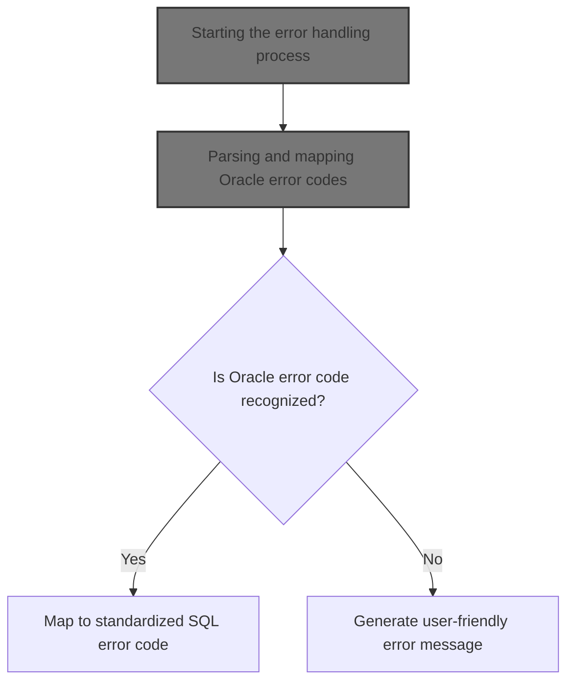
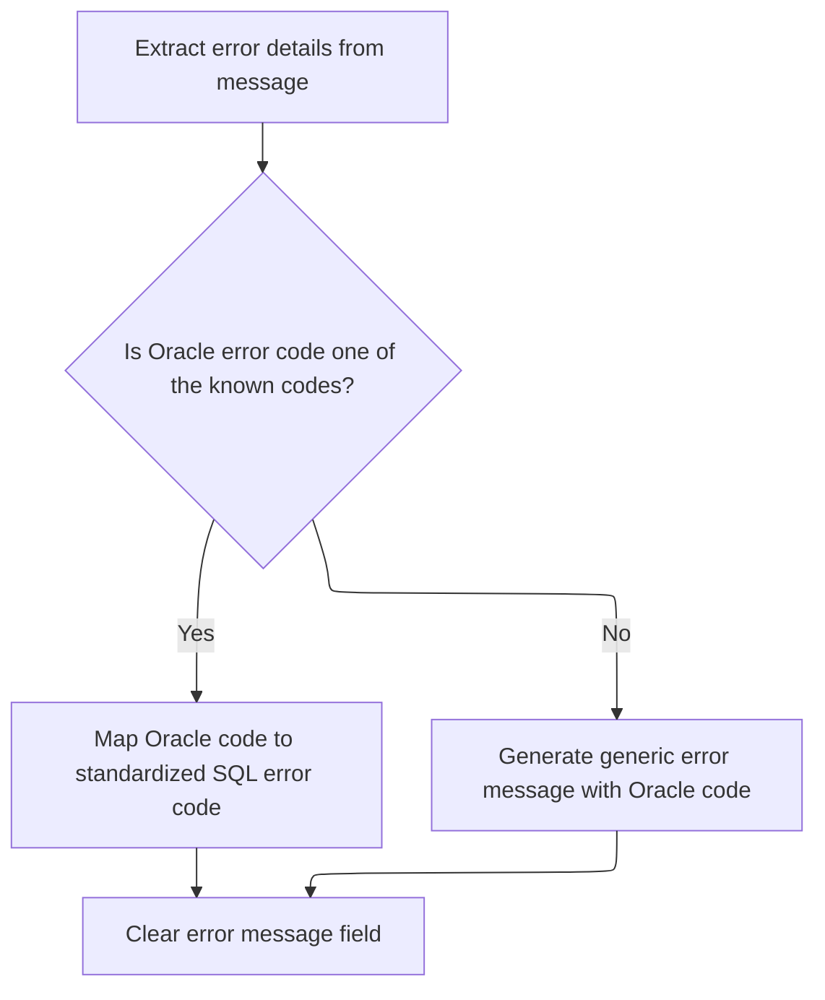

# Overview

This document explains the flow of converting Oracle SQL error codes into standardized internal SQL error codes or user-friendly messages. The system receives an Oracle error message, extracts the error code, and either maps it to an internal code or generates a generic message, ensuring consistent error handling.



## Dependencies

### Program

- <SwmToken path="base/src/YYYS0212.cbl" pos="96:9:9" line-data="010300         STRING &#39;Error in YYYS0212. Oracle code:&#39;                 00010300">`YYYS0212`</SwmToken> (<SwmPath>[base/src/YYYS0212.cbl](base/src/YYYS0212.cbl)</SwmPath>)

### Copybooks

- <SwmToken path="base/src/YYYS0212.cbl" pos="17:4:4" line-data="002600     COPY XXXN001A.                                               00002600">`XXXN001A`</SwmToken> (<SwmPath>[base/src/XXXN001A.cpy](base/src/XXXN001A.cpy)</SwmPath>)
- SQLCA

# Where is this program used?

This program is used once, as represented in the following diagram:

```mermaid
graph TD
  ockgm("Database Connection and Oracle SQL Error Handling (YYYS0211)") --> 5tq0g("Oracle to DB2 SQL Error Code Converter (YYYS0212)"):::currentEntity
click ockgm openCode "base/src/YYYS0211.cbl:1"
  
  
click 5tq0g openCode "base/src/YYYS0212.cbl:1"
    classDef currentEntity color:#000000,fill:#7CB9F4

%% Swimm:
%% graph TD
%%   ockgm("Database Connection and Oracle SQL Error Handling (YYYS0211)") --> 5tq0g("Oracle to <SwmToken path="base/src/YYYS0212.cbl" pos="48:15:15" line-data="005700* CONVERTING ORACLE ERROR MESSAGE TO CORRESPONDING DB2 SQL CODE   00005700">`DB2`</SwmToken> SQL Error Code Converter (<SwmToken path="base/src/YYYS0212.cbl" pos="96:9:9" line-data="010300         STRING &#39;Error in YYYS0212. Oracle code:&#39;                 00010300">`YYYS0212`</SwmToken>)"):::currentEntity
%% click ockgm openCode "<SwmPath>[base/src/YYYS0211.cbl](base/src/YYYS0211.cbl)</SwmPath>:1"
%%   
%%   
%% click 5tq0g openCode "<SwmPath>[base/src/YYYS0212.cbl](base/src/YYYS0212.cbl)</SwmPath>:1"
%%     classDef currentEntity color:#000000,fill:#7CB9F4
```



## Detailed View of the Program's Functionality

a. Program Initialization and Entry Point

The program begins by defining its structure and memory layout. It sets up working storage fields to temporarily hold parts of the Oracle error message, including three message segments and a field for the Oracle error code. It also includes a linkage section to interface with external data structures and the SQL communication area (SQLCA), which is standard for handling SQL errors in this environment.

The main entry point of the program is a procedure that expects two parameters: a custom data structure and the SQLCA. The main process is defined to perform two key actions in sequence:

1. It initializes all working storage fields related to error message handling, ensuring they start as blank.
2. It immediately proceeds to format the user message text, which is the core of the error handling logic. After these steps, the program exits.

b. Initialization of Working Storage

The initialization routine clears out all temporary fields used for error message processing. This includes the three message segments and the Oracle error code field. This step ensures that any previous data does not interfere with the current error handling process.

c. Parsing the Oracle Error Message

The formatting routine is responsible for interpreting the raw Oracle error message. It does this by splitting the error message string (which is expected to be space-delimited) into four parts:

- The first three segments are stored in separate fields for potential use or logging.
- The fourth segment is assumed to be the Oracle error code and is stored in a dedicated field.

This parsing relies on the Oracle error message format remaining consistent; if Oracle changes the structure or delimiter, this logic would fail.

d. Mapping Oracle Error Codes to Internal Codes

Once the Oracle error code is isolated, the program uses a decision structure to check if the code matches any known values. For each recognized Oracle error code, it assigns a corresponding internal SQL error code. This mapping allows the rest of the system to handle errors in a standardized way, regardless of the original Oracle code.

For example:

- If the Oracle code is '60', the internal code is set to -911.
- If the Oracle code is '904' or '310', the internal code is set to -206.
- Many other specific mappings are handled similarly, each translating an Oracle code to a system-understood SQL code.

e. Handling Unknown Oracle Error Codes

If the Oracle error code does not match any of the known values, the program constructs a generic error message. This message includes a prefix indicating an error in this module and appends the unknown Oracle code. This constructed message is stored for user display or logging.

After handling the error code (whether known or unknown), the program clears the original error message field to prevent any unprocessed or sensitive information from leaking into subsequent processes.

f. Summary of Flow

1. The program starts and initializes all relevant fields.
2. It splits the incoming Oracle error message to extract the error code.
3. It checks if the code is recognized:
   - If yes, it maps it to an internal code.
   - If not, it generates a generic error message.
4. It clears the original error message field to maintain clean state and security.

This process ensures that Oracle errors are consistently translated into system-understood codes or messages, making error handling and user communication more reliable and maintainable.

# Rule Definition

| Paragraph Name                                                                                                                                                                                                                                                                                                                                                       | Rule ID | Category          | Description                                                                                                                                                                                                                       | Conditions                                                             | Remarks                                                                                                                                                                                                                                                                                                                                                                                               |
| -------------------------------------------------------------------------------------------------------------------------------------------------------------------------------------------------------------------------------------------------------------------------------------------------------------------------------------------------------------------- | ------- | ----------------- | --------------------------------------------------------------------------------------------------------------------------------------------------------------------------------------------------------------------------------- | ---------------------------------------------------------------------- | ----------------------------------------------------------------------------------------------------------------------------------------------------------------------------------------------------------------------------------------------------------------------------------------------------------------------------------------------------------------------------------------------------- |
| <SwmToken path="base/src/YYYS0212.cbl" pos="31:4:12" line-data="004000     PERFORM 200-FORMAT-USER-MSG-TXT                              00004000">`200-FORMAT-USER-MSG-TXT`</SwmToken>                                                                                                                                                                               | RL-001  | Data Assignment   | The system must accept a space-delimited Oracle error message string as input, with the Oracle error code as the last token. The string is split into four fields: the first three tokens and the last token (Oracle error code). | Input string must be space-delimited and contain at least four tokens. | Input format: space-delimited string. Output fields: first three tokens as message parts (max lengths: 20, 20, 10 characters), last token as Oracle error code (max length: 5 characters).                                                                                                                                                                                                            |
| <SwmToken path="base/src/YYYS0212.cbl" pos="31:4:12" line-data="004000     PERFORM 200-FORMAT-USER-MSG-TXT                              00004000">`200-FORMAT-USER-MSG-TXT`</SwmToken>                                                                                                                                                                               | RL-002  | Conditional Logic | The system must map the Oracle error code to an internal SQLCODE value according to a predefined mapping table.                                                                                                                   | Oracle error code must match one of the predefined values.             | Mapping table:                                                                                                                                                                                                                                                                                                                                                                                        |
| '60'    → -911                                                                                                                                                                                                                                                                                                                                                       |         |                   |                                                                                                                                                                                                                                   |                                                                        |                                                                                                                                                                                                                                                                                                                                                                                                       |
| '904'   → -206                                                                                                                                                                                                                                                                                                                                                       |         |                   |                                                                                                                                                                                                                                   |                                                                        |                                                                                                                                                                                                                                                                                                                                                                                                       |
| '310'   → -206                                                                                                                                                                                                                                                                                                                                                       |         |                   |                                                                                                                                                                                                                                   |                                                                        |                                                                                                                                                                                                                                                                                                                                                                                                       |
| '615'   → -420                                                                                                                                                                                                                                                                                                                                                       |         |                   |                                                                                                                                                                                                                                   |                                                                        |                                                                                                                                                                                                                                                                                                                                                                                                       |
| '616'   → -420                                                                                                                                                                                                                                                                                                                                                       |         |                   |                                                                                                                                                                                                                                   |                                                                        |                                                                                                                                                                                                                                                                                                                                                                                                       |
| '942'   → -204                                                                                                                                                                                                                                                                                                                                                       |         |                   |                                                                                                                                                                                                                                   |                                                                        |                                                                                                                                                                                                                                                                                                                                                                                                       |
| '1403'  → -100                                                                                                                                                                                                                                                                                                                                                       |         |                   |                                                                                                                                                                                                                                   |                                                                        |                                                                                                                                                                                                                                                                                                                                                                                                       |
| '1001'  → -501                                                                                                                                                                                                                                                                                                                                                       |         |                   |                                                                                                                                                                                                                                   |                                                                        |                                                                                                                                                                                                                                                                                                                                                                                                       |
| '1438'  → -413                                                                                                                                                                                                                                                                                                                                                       |         |                   |                                                                                                                                                                                                                                   |                                                                        |                                                                                                                                                                                                                                                                                                                                                                                                       |
| '2112'  → -811                                                                                                                                                                                                                                                                                                                                                       |         |                   |                                                                                                                                                                                                                                   |                                                                        |                                                                                                                                                                                                                                                                                                                                                                                                       |
| '1422'  → -811                                                                                                                                                                                                                                                                                                                                                       |         |                   |                                                                                                                                                                                                                                   |                                                                        |                                                                                                                                                                                                                                                                                                                                                                                                       |
| '2049'  → -913                                                                                                                                                                                                                                                                                                                                                       |         |                   |                                                                                                                                                                                                                                   |                                                                        |                                                                                                                                                                                                                                                                                                                                                                                                       |
| '2291'  → -530                                                                                                                                                                                                                                                                                                                                                       |         |                   |                                                                                                                                                                                                                                   |                                                                        |                                                                                                                                                                                                                                                                                                                                                                                                       |
| '2292'  → -532                                                                                                                                                                                                                                                                                                                                                       |         |                   |                                                                                                                                                                                                                                   |                                                                        |                                                                                                                                                                                                                                                                                                                                                                                                       |
| '6502'  → -304                                                                                                                                                                                                                                                                                                                                                       |         |                   |                                                                                                                                                                                                                                   |                                                                        |                                                                                                                                                                                                                                                                                                                                                                                                       |
| '6508'  → -440                                                                                                                                                                                                                                                                                                                                                       |         |                   |                                                                                                                                                                                                                                   |                                                                        |                                                                                                                                                                                                                                                                                                                                                                                                       |
| '6511'  → -502                                                                                                                                                                                                                                                                                                                                                       |         |                   |                                                                                                                                                                                                                                   |                                                                        |                                                                                                                                                                                                                                                                                                                                                                                                       |
| '6550'  → -440                                                                                                                                                                                                                                                                                                                                                       |         |                   |                                                                                                                                                                                                                                   |                                                                        |                                                                                                                                                                                                                                                                                                                                                                                                       |
| '6553'  → -440                                                                                                                                                                                                                                                                                                                                                       |         |                   |                                                                                                                                                                                                                                   |                                                                        |                                                                                                                                                                                                                                                                                                                                                                                                       |
| '14028' → -538                                                                                                                                                                                                                                                                                                                                                       |         |                   |                                                                                                                                                                                                                                   |                                                                        |                                                                                                                                                                                                                                                                                                                                                                                                       |
| '30006' → -904                                                                                                                                                                                                                                                                                                                                                       |         |                   |                                                                                                                                                                                                                                   |                                                                        |                                                                                                                                                                                                                                                                                                                                                                                                       |
| <SwmToken path="base/src/YYYS0212.cbl" pos="31:4:12" line-data="004000     PERFORM 200-FORMAT-USER-MSG-TXT                              00004000">`200-FORMAT-USER-MSG-TXT`</SwmToken>                                                                                                                                                                               | RL-003  | Conditional Logic | If the Oracle error code does not match any entry in the mapping table, the system must generate a generic error message including the Oracle code and set SQLCODE to a generic value.                                            | Oracle error code does not match any value in the mapping table.       | Generic error message format: 'Error in <SwmToken path="base/src/YYYS0212.cbl" pos="96:9:9" line-data="010300         STRING &#39;Error in YYYS0212. Oracle code:&#39;                 00010300">`YYYS0212`</SwmToken>. Oracle code:' followed by the Oracle error code. SQLCODE is set to a default value for unmapped codes (value not specified in code, but implied by the absence of a mapping). |
| <SwmToken path="base/src/YYYS0212.cbl" pos="30:4:6" line-data="003900     PERFORM 100-INITIALIZE                                       00003900">`100-INITIALIZE`</SwmToken>, <SwmToken path="base/src/YYYS0212.cbl" pos="31:4:12" line-data="004000     PERFORM 200-FORMAT-USER-MSG-TXT                              00004000">`200-FORMAT-USER-MSG-TXT`</SwmToken> | RL-004  | Data Assignment   | Before processing a new error message, the system must clear previous error message fields to avoid residual data.                                                                                                                | Before any new processing of error message input.                      | Fields cleared: message part 1 (20 chars), message part 2 (20 chars), message part 3 (10 chars), Oracle error code (5 chars), SQLERRMC (variable length).                                                                                                                                                                                                                                             |
| <SwmToken path="base/src/YYYS0212.cbl" pos="31:4:12" line-data="004000     PERFORM 200-FORMAT-USER-MSG-TXT                              00004000">`200-FORMAT-USER-MSG-TXT`</SwmToken>                                                                                                                                                                               | RL-005  | Data Assignment   | After processing, the system must output the parsed message fields, the mapped SQLCODE, and the user-facing error message.                                                                                                        | After successful processing of input error message.                    | Output includes: message part 1 (string, max 20 chars), message part 2 (string, max 20 chars), message part 3 (string, max 10 chars), Oracle error code (string, max 5 chars), mapped SQLCODE (integer), user-facing error message (string, variable length).                                                                                                                                         |

# User Stories

## User Story 1: Process Oracle error message and output results

---

### Story Description:

As a system, I want to accept a space-delimited Oracle error message string, clear any previous error data, parse the string into message fields and Oracle error code, map the code to an internal SQLCODE (or generate a generic message for unmapped codes), and output the parsed fields, mapped SQLCODE, and user-facing error message so that users receive clear and accurate error information.

---

### Business Rule Mapping:

| Rule ID | Paragraph Name                                                                                                                                                                                                                                                                                                                                                       | Rule Description                                                                                                                                                                                                                  |
| ------- | -------------------------------------------------------------------------------------------------------------------------------------------------------------------------------------------------------------------------------------------------------------------------------------------------------------------------------------------------------------------- | --------------------------------------------------------------------------------------------------------------------------------------------------------------------------------------------------------------------------------- |
| RL-001  | <SwmToken path="base/src/YYYS0212.cbl" pos="31:4:12" line-data="004000     PERFORM 200-FORMAT-USER-MSG-TXT                              00004000">`200-FORMAT-USER-MSG-TXT`</SwmToken>                                                                                                                                                                               | The system must accept a space-delimited Oracle error message string as input, with the Oracle error code as the last token. The string is split into four fields: the first three tokens and the last token (Oracle error code). |
| RL-002  | <SwmToken path="base/src/YYYS0212.cbl" pos="31:4:12" line-data="004000     PERFORM 200-FORMAT-USER-MSG-TXT                              00004000">`200-FORMAT-USER-MSG-TXT`</SwmToken>                                                                                                                                                                               | The system must map the Oracle error code to an internal SQLCODE value according to a predefined mapping table.                                                                                                                   |
| RL-003  | <SwmToken path="base/src/YYYS0212.cbl" pos="31:4:12" line-data="004000     PERFORM 200-FORMAT-USER-MSG-TXT                              00004000">`200-FORMAT-USER-MSG-TXT`</SwmToken>                                                                                                                                                                               | If the Oracle error code does not match any entry in the mapping table, the system must generate a generic error message including the Oracle code and set SQLCODE to a generic value.                                            |
| RL-005  | <SwmToken path="base/src/YYYS0212.cbl" pos="31:4:12" line-data="004000     PERFORM 200-FORMAT-USER-MSG-TXT                              00004000">`200-FORMAT-USER-MSG-TXT`</SwmToken>                                                                                                                                                                               | After processing, the system must output the parsed message fields, the mapped SQLCODE, and the user-facing error message.                                                                                                        |
| RL-004  | <SwmToken path="base/src/YYYS0212.cbl" pos="30:4:6" line-data="003900     PERFORM 100-INITIALIZE                                       00003900">`100-INITIALIZE`</SwmToken>, <SwmToken path="base/src/YYYS0212.cbl" pos="31:4:12" line-data="004000     PERFORM 200-FORMAT-USER-MSG-TXT                              00004000">`200-FORMAT-USER-MSG-TXT`</SwmToken> | Before processing a new error message, the system must clear previous error message fields to avoid residual data.                                                                                                                |

---

### Relevant Functionality:

- <SwmToken path="base/src/YYYS0212.cbl" pos="31:4:12" line-data="004000     PERFORM 200-FORMAT-USER-MSG-TXT                              00004000">`200-FORMAT-USER-MSG-TXT`</SwmToken>
  1. **RL-001:**
     - Receive input string (SQLERRMC)
     - Split input string by spaces
     - Assign first token to message part 1 (max 20 chars)
     - Assign second token to message part 2 (max 20 chars)
     - Assign third token to message part 3 (max 10 chars)
     - Assign last token to Oracle error code (max 5 chars)
  2. **RL-002:**
     - Evaluate Oracle error code
     - If code matches a value in the mapping table:
       - Set SQLCODE to corresponding mapped value
     - Else:
       - Proceed to generic error handling
  3. **RL-003:**
     - If Oracle error code is not in mapping table:
       - Concatenate 'Error in <SwmToken path="base/src/YYYS0212.cbl" pos="96:9:9" line-data="010300         STRING &#39;Error in YYYS0212. Oracle code:&#39;                 00010300">`YYYS0212`</SwmToken>. Oracle code:' with Oracle error code
       - Set user-facing error message field to this string
       - Set SQLCODE to default value for unmapped codes
  4. **RL-005:**
     - Output message part 1
     - Output message part 2
     - Output message part 3
     - Output Oracle error code
     - Output mapped SQLCODE
     - Output user-facing error message
- <SwmToken path="base/src/YYYS0212.cbl" pos="30:4:6" line-data="003900     PERFORM 100-INITIALIZE                                       00003900">`100-INITIALIZE`</SwmToken>
  1. **RL-004:**
     - Set message part 1 to spaces
     - Set message part 2 to spaces
     - Set message part 3 to spaces
     - Set Oracle error code field to spaces
     - After processing, set SQLERRMC to spaces

# Workflow

# Starting the error handling process

This section is responsible for starting the error handling process by ensuring that any Oracle error information is converted into a format that is understandable and actionable for both the system and its users.

| Category       | Rule Name                      | Description                                                                                                                 |
| -------------- | ------------------------------ | --------------------------------------------------------------------------------------------------------------------------- |
| Business logic | User-friendly error formatting | The system must always convert raw Oracle error codes into user-friendly messages before any further processing or display. |

<SwmSnippet path="/base/src/YYYS0212.cbl" line="29">

---

<SwmToken path="base/src/YYYS0212.cbl" pos="29:2:6" line-data="003800 000-MAIN-PROCESS.                                                00003800">`000-MAIN-PROCESS`</SwmToken> kicks things off by running initialization and then immediately calling <SwmToken path="base/src/YYYS0212.cbl" pos="31:4:12" line-data="004000     PERFORM 200-FORMAT-USER-MSG-TXT                              00004000">`200-FORMAT-USER-MSG-TXT`</SwmToken>. We need to call <SwmToken path="base/src/YYYS0212.cbl" pos="31:4:12" line-data="004000     PERFORM 200-FORMAT-USER-MSG-TXT                              00004000">`200-FORMAT-USER-MSG-TXT`</SwmToken> here to take the raw Oracle error info and turn it into something our system and users can actually use—otherwise, we'd just be passing around Oracle's cryptic error codes.

```cobol
003800 000-MAIN-PROCESS.                                                00003800
003900     PERFORM 100-INITIALIZE                                       00003900
004000     PERFORM 200-FORMAT-USER-MSG-TXT                              00004000
004100     GOBACK                                                       00004100
004200     .                                                            00004200
```

---

</SwmSnippet>

# Parsing and mapping Oracle error codes



This section is responsible for parsing Oracle error messages, extracting the Oracle error code, and mapping it to a standardized internal SQL error code if it is recognized. If the Oracle error code is not recognized, a generic error message is generated for logging or user display. This ensures consistent error handling across the system, regardless of the original Oracle error code format.

| Category       | Rule Name                 | Description                                                                                                                                                               |
| -------------- | ------------------------- | ------------------------------------------------------------------------------------------------------------------------------------------------------------------------- |
| Business logic | Known Oracle code mapping | Only Oracle error codes that are explicitly listed in the mapping table are converted to standardized SQL error codes; all other codes result in a generic error message. |

<SwmSnippet path="/base/src/YYYS0212.cbl" line="50">

---

In <SwmToken path="base/src/YYYS0212.cbl" pos="50:2:10" line-data="005900 200-FORMAT-USER-MSG-TXT.                                         00005900">`200-FORMAT-USER-MSG-TXT`</SwmToken>, we break apart the Oracle error message string into four pieces using UNSTRING, grabbing the Oracle error code as the last token. This only works if the input is space-delimited and the code is in the expected position, so if Oracle changes their format, this breaks.

```cobol
005900 200-FORMAT-USER-MSG-TXT.                                         00005900
006000     UNSTRING SQLERRMC  DELIMITED BY SPACE INTO                   00006000
006100                        WS-ERR-MSG1                               00006100
006200                        WS-ERR-MSG2                               00006200
006300                        WS-ERR-MSG3                               00006300
006400                        WS-ERR-ORA-CODE                           00006400
```

---

</SwmSnippet>

<SwmSnippet path="/base/src/YYYS0212.cbl" line="56">

---

After splitting out the Oracle error code, we use EVALUATE to map known Oracle codes to our internal SQLCODE values. This is where the actual translation happens, so the rest of the system can handle errors in a consistent way, regardless of the original Oracle code.

```cobol
006500     EVALUATE WS-ERR-ORA-CODE                                     00006500
006510       WHEN  '60   '                                              00006510
006520         MOVE  -911                             TO SQLCODE        00006520
006600       WHEN  '904  '                                              00006600
006700       WHEN  '310  '                                              00006700
006800         MOVE  -206                             TO SQLCODE        00006800
006900       WHEN  '615  '                                              00006900
007000       WHEN  '616  '                                              00007000
007100         MOVE  -420                             TO SQLCODE        00007100
007200       WHEN  '942  '                                              00007200
007300         MOVE  -204                             TO SQLCODE        00007300
007400       WHEN  '1403 '                                              00007400
007500         MOVE  -100                             TO SQLCODE        00007500
007600       WHEN  '1001 '                                              00007600
007700         MOVE  -501                             TO SQLCODE        00007700
007800       WHEN  '1438 '                                              00007800
007900         MOVE  -413                             TO SQLCODE        00007900
008000       WHEN  '2112 '                                              00008000
008100       WHEN  '1422 '                                              00008100
008200         MOVE  -811                             TO SQLCODE        00008200
008300       WHEN  '2049 '                                              00008300
008400         MOVE  -913                             TO SQLCODE        00008400
008500       WHEN  '2291 '                                              00008500
008600         MOVE  -530                             TO SQLCODE        00008600
008700       WHEN  '2292 '                                              00008700
008800         MOVE  -532                             TO SQLCODE        00008800
008900       WHEN  '6502 '                                              00008900
009000         MOVE  -304                             TO SQLCODE        00009000
009100       WHEN  '6508 '                                              00009100
009200         MOVE  -440                             TO SQLCODE        00009200
009300       WHEN  '6511 '                                              00009300
009400         MOVE  -502                             TO SQLCODE        00009400
009500       WHEN  '6550 '                                              00009500
009600       WHEN  '6553 '                                              00009600
009700         MOVE  -440                             TO SQLCODE        00009700
009800       WHEN  '14028'                                              00009800
009900         MOVE  -538                             TO SQLCODE        00009900
010000       WHEN  '30006'                                              00010000
010100         MOVE  -904                             TO SQLCODE        00010100
```

---

</SwmSnippet>

<SwmSnippet path="/base/src/YYYS0212.cbl" line="95">

---

If the Oracle code isn't in our mapping, we build a message with the unknown code and store it for the user or logs. Then we clear out SQLERRMC so nothing leaks through to the next process.

```cobol
010200       WHEN OTHER                                                 00010200
010300         STRING 'Error in YYYS0212. Oracle code:'                 00010300
010300                 WS-ERR-ORA-CODE                                  00010320
010300         DELIMITED BY SIZE INTO IS-RTRN-MSG2-TXT                  00010330
010500     END-EVALUATE                                                 00010500
010600     MOVE SPACES                                TO SQLERRMC       00010600
010700     .                                                            00010700
```

---

</SwmSnippet>

&nbsp;

*This is an auto-generated document by Swimm 🌊 and has not yet been verified by a human*

<SwmMeta version="3.0.0" repo-id="Z2l0aHViJTNBJTNBU3dpbW1pby1keW5jYWxsLWRlbW8lM0ElM0FHaXJpLVN3aW1t" repo-name="Swimmio-dyncall-demo"><sup>Powered by [Swimm](https://app.swimm.io/)</sup></SwmMeta>
