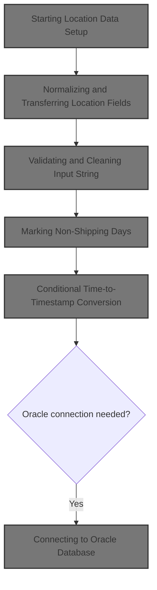
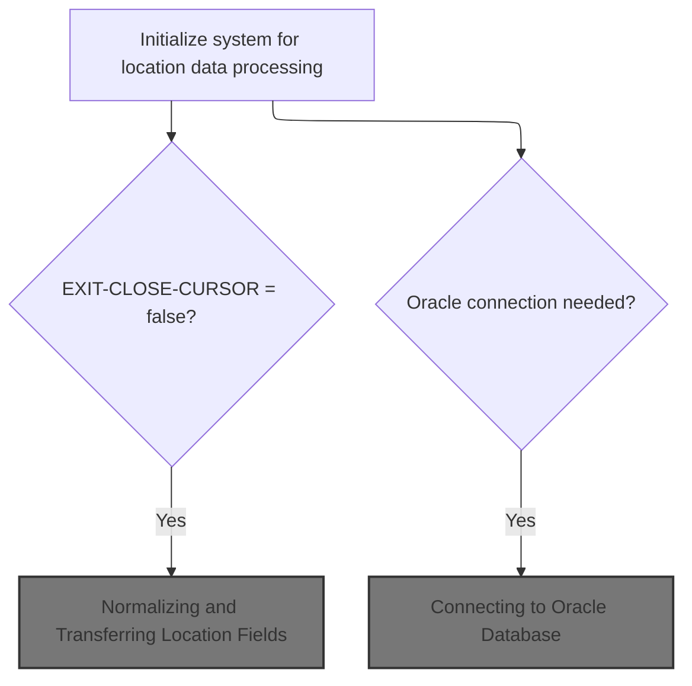
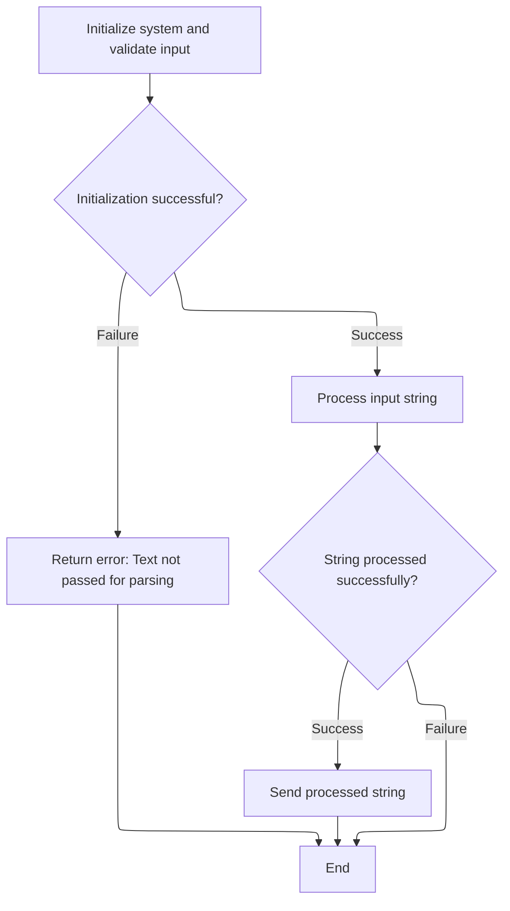
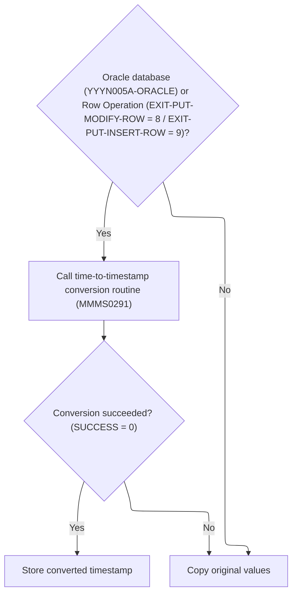
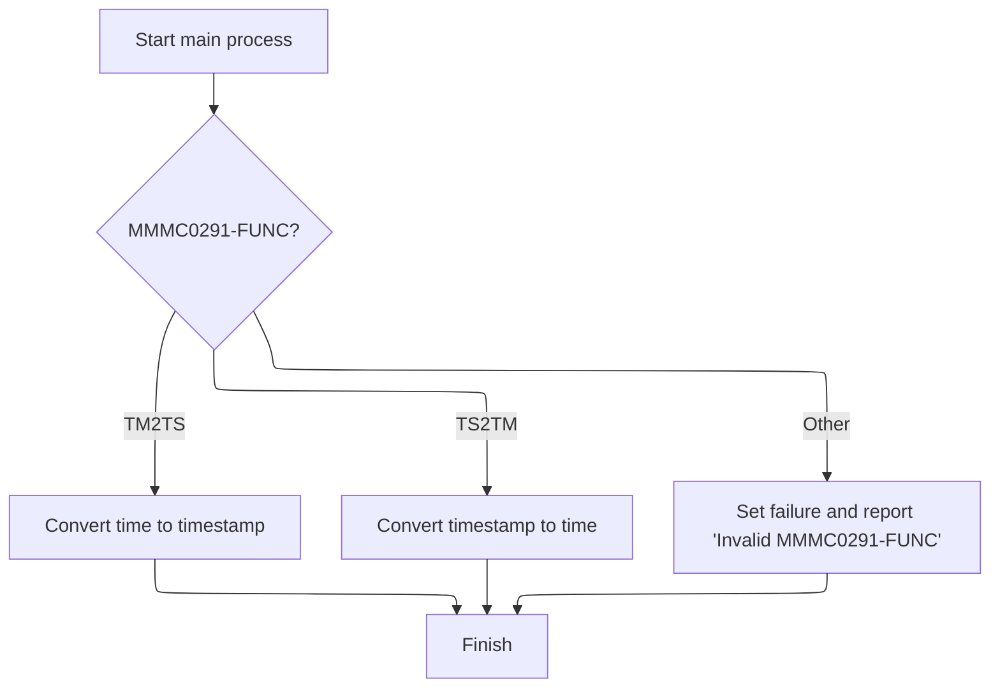
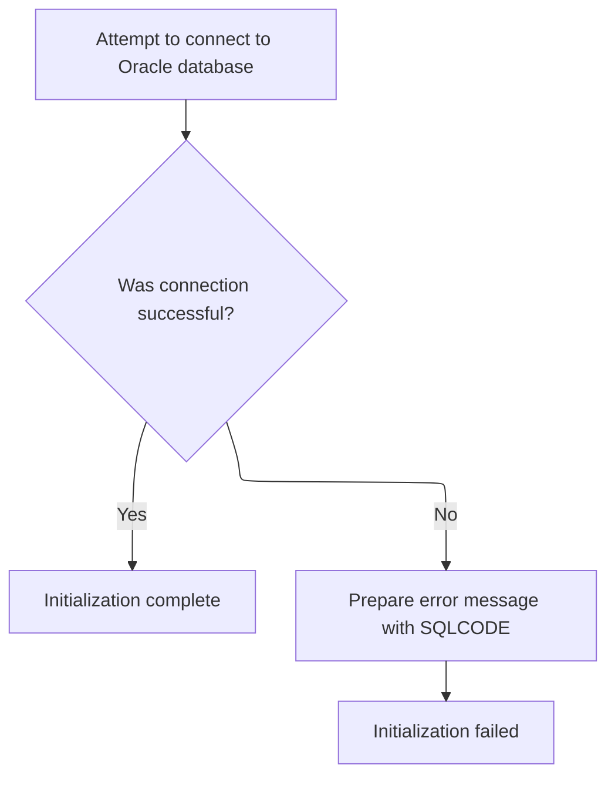

This document describes the process of preparing and normalizing location data for downstream business operations. The flow initializes required fields, applies business rules to location information, cleans contact names, connects to the Oracle database if needed, validates input strings, marks non-shipping days, and converts time fields to timestamps. The output is validated, business-ready location data for further processing.



# Spec

## Detailed View of the Program's Functionality

# Detailed Explanation of the Flow

---

## a. Starting Location Data Setup

The main program begins by initializing all necessary working fields and data structures for processing location data. This includes clearing out status fields, resetting counters, and preparing SQL-related flags. If the operation is not a cursor close, the program proceeds to normalize and transfer location fields for further processing. Additionally, if the operation involves Oracle database interaction or certain row operations (insert, purge, modify), it attempts to establish a connection to the Oracle database.

---

## b. Normalizing and Transferring Location Fields

This step is responsible for copying and normalizing all relevant location fields from the input data area to the internal data structure used for database operations. The process includes:

- Determining the length of the primary contact name and invoking a string cleanup routine to ensure the name is properly formatted (removing extra spaces).
- Copying all address, contact, and location fields (primary, secondary, and mailing) from the input to the internal structure.
- Ensuring all date fields (added, deleted, inactive, opened, closed) are set to a default value if missing or invalid, and then copying them over.
- Applying business logic to set flags indicating whether the location is active, inactive, or deleted, based on the state of certain fields.
- Setting or clearing additional fields based on the type of location (vendor, store, DSD vendor), including account numbers and type codes.
- Copying email addresses, facility and organization IDs, routing IDs, and county text fields.
- Ensuring direct-ship flags are set appropriately.
- Validating and defaulting numeric fields (such as order processing days, lead times, buffer times).
- Marking which days of the week are non-shipping days by setting flags if shipping is not scheduled for those days.
- Setting obsolete fields to a default value.
- Ensuring time fields are set to a default if missing, and copying them over.
- Finally, invoking a routine to convert time fields to timestamp format if required by the context.

---

## c. Validating and Cleaning Input String

When cleaning up contact names or similar strings, the program calls a dedicated string cruncher module. This module:

- Initializes its own working storage and validates the input string.
- If the string is empty or contains only low-values, it sets a failure flag and returns an error message.
- If the string is valid, it processes the string to remove extra spaces, ensuring only single spaces remain between words.
- The cleaned string is then returned to the caller for further use.

---

## d. Marking Non-Shipping Days

A dedicated routine checks each weekday's shipping flag. For each day (Monday through Sunday), if shipping is not scheduled, it sets a corresponding flag indicating that shipments should not occur on that day. This information is used by downstream logic to enforce shipping restrictions.

---

## e. Conditional Time-to-Timestamp Conversion

When the context requires (such as when interacting with Oracle or performing certain row operations), the program prepares to convert time fields to timestamp format:

- It initializes the input and output areas for the conversion.
- It copies up to three time fields into a conversion buffer.
- It sets a flag indicating that time-to-timestamp conversion should be performed.
- It calls an external conversion routine, passing the prepared buffers.
- If the conversion is successful, the resulting timestamps are stored in the appropriate fields.
- If the conversion fails or is not required, the original time values are simply copied over without conversion.

---

## f. Controlling Time and Timestamp Conversion

The time/timestamp conversion routine itself operates as follows:

- It initializes its working storage.
- It checks a function code to determine whether to convert time to timestamp or timestamp to time.
- For time-to-timestamp conversion:
  - It loops through each input time string.
  - If the string is not empty, it parses the hours, minutes, and seconds, defaulting missing components to '00'.
  - If the time is valid, it formats it as a timestamp and stores it in the output buffer.
  - If the time is invalid, it sets a failure flag and returns an error message.
  - If the input is empty, it outputs spaces.
- For timestamp-to-time conversion:
  - It loops through each input timestamp.
  - If the string is not empty, it parses out the time components, defaulting missing parts to '00'.
  - If valid, it stores the time in the output buffer.
  - If invalid, it sets a failure flag and returns an error message.
  - If the input is empty, it outputs spaces.
- If the function code is invalid, it sets a failure flag and returns an error message.

---

## g. Connecting to Oracle Database

When a database connection is required, the program calls an external connection manager to establish a link to the Oracle database. If the connection fails, it retrieves the SQL error code and constructs a detailed error message for further handling. If the connection is successful, processing continues as normal.

---

This flow ensures that all location data is properly validated, normalized, and prepared for database operations, with robust handling of string formatting, date and time fields, and database connectivity.

# Rule Definition

| Paragraph Name                                                                                                         | Rule ID | Category          | Description                                                                                                                                                                                                                                                             | Conditions                                                                  | Remarks                                                                                                                                                               |
| ---------------------------------------------------------------------------------------------------------------------- | ------- | ----------------- | ----------------------------------------------------------------------------------------------------------------------------------------------------------------------------------------------------------------------------------------------------------------------- | --------------------------------------------------------------------------- | --------------------------------------------------------------------------------------------------------------------------------------------------------------------- |
| 100-INITIALIZATION, 100-INITIALIZE, 100-INITIALIZATION in NNNS0487.cbl and MMMS0291.cbl                                | RL-001  | Data Assignment   | Before any normalization or data transfer occurs, all working fields related to location data processing must be initialized to their default values.                                                                                                                   | At the start of any operation that processes location data.                 | Initialization includes setting numeric fields to 0, alphanumeric fields to spaces, and resetting flags. This ensures no residual data from previous operations.      |
| 100-INITIALIZATION, 110-MOVE-PDA-FIELDS-2-DCL, 120-EXIT-STUFF in NNNS0487.cbl                                          | RL-002  | Conditional Logic | If the cursor is not closing, normalize and transfer all location fields from the input table to the output table, applying business logic for dates and flags.                                                                                                         | EXIT-CLOSE-CURSOR is false.                                                 | Normalization includes cleaning strings, validating and defaulting dates, and setting flags. Output fields must match the normalized input fields in type and length. |
| 110-MOVE-PDA-FIELDS-2-DCL (CALL YYYS0134-STRING-CRUNCH), YYYS0134.cbl                                                  | RL-003  | Computation       | All contact name fields must be cleaned by reducing multiple spaces to single spaces and removing leading/trailing spaces.                                                                                                                                              | Whenever a contact name field is processed for normalization or transfer.   | Input string is capped at 80 characters. Output is a string of up to 80 characters, with no leading/trailing spaces and no consecutive spaces.                        |
| 100-INITIALIZATION, 100-INITIALIZE, 000-MAIN, 100-INITIALIZATION, 200-CRUNCH-STRING in YYYS0134.cbl                    | RL-004  | Conditional Logic | The string cleaning routine must validate the input string, cap its length at 80 characters, and set a failure flag and error message if the string is empty or contains only spaces or low-values.                                                                     | When the string cleaning routine is called.                                 | Failure flag is set and error message is populated if input is invalid. Error message: 'YYYS0134 - Text not passed for parsing.'                                      |
| 116-EDIT-SHIP-DAYS in NNNS0487.cbl                                                                                     | RL-005  | Conditional Logic | For each weekday, if the shipping flag is not set, the corresponding DOES-NOT-SHIP-XXX flag must be set to true.                                                                                                                                                        | For each weekday shipping flag (SHIPS-MON, SHIPS-TUE, etc.).                | Flags are boolean indicators. There is one DOES-NOT-SHIP-XXX flag for each weekday.                                                                                   |
| 115-CONNECT-TO-ORACLE in NNNS0487.cbl                                                                                  | RL-006  | Conditional Logic | If an Oracle database connection is required, attempt to connect using provided parameters. On failure, populate the error message field with the SQLCODE and a descriptive message.                                                                                    | YYYN005A-ORACLE is true or operation requires Oracle connection.            | Error message format: 'NNNS0487 - Error connecting to Oracle. Sqlcode = <code>'. SQLCODE is a signed integer.                                                         |
| 112-CONVERT-TM-TO-TS, 132-CONVERT-TS-TO-TM in NNNS0487.cbl; 201-CONVERT-TM-TO-TS, 301-CONVERT-TS-TO-TM in MMMS0291.cbl | RL-007  | Computation       | If the context is Oracle database or a row operation (EXIT-PUT-MODIFY-ROW = 8 or EXIT-PUT-INSERT-ROW = 9), call the time conversion routine and store the converted timestamp in the output. If conversion fails, copy the original time value instead.                 | YYYN005A-ORACLE is true or EXIT-PUT-MODIFY-ROW/EXIT-PUT-INSERT-ROW is true. | Input: time string (X(8)), Output: timestamp string (X(26)). On failure, output is the original input.                                                                |
| 201-CONVERT-TM-TO-TS, 301-CONVERT-TS-TO-TM in MMMS0291.cbl                                                             | RL-008  | Conditional Logic | The time conversion routine must support both time-to-timestamp and timestamp-to-time conversions, validating input and defaulting missing components to '00'. Invalid inputs trigger a failure flag and error message, and empty inputs result in blank output fields. | When time conversion routine is called.                                     | Input: time or timestamp string. Output: timestamp (X(26)) or time (X(8)). Failure flag and error message set on invalid input.                                       |
| 110-MOVE-PDA-FIELDS-2-DCL, 130-MOVE-DCL-2-PDA-FIELDS, 120-EXIT-STUFF in NNNS0487.cbl                                   | RL-009  | Data Assignment   | All output tables and linkage structures must reflect the normalized, cleaned, and converted data as processed by the above rules.                                                                                                                                      | At the end of each operation, before returning or committing data.          | Output fields must match the normalized, cleaned, and converted values in type and length. No residual or unprocessed data should be present.                         |

# User Stories

## User Story 1: Initialize, normalize, clean, and transfer location data including shipping flags and output integrity

---

### Story Description:

As a system, I want to initialize all working fields, normalize and transfer location data, clean contact name fields, validate strings, set weekday shipping flags, and ensure output tables reflect all processed data so that the output is accurate, validated, and free of residual or unprocessed data.

---

### Business Rule Mapping:

| Rule ID | Paragraph Name                                                                                      | Rule Description                                                                                                                                                                                    |
| ------- | --------------------------------------------------------------------------------------------------- | --------------------------------------------------------------------------------------------------------------------------------------------------------------------------------------------------- |
| RL-001  | 100-INITIALIZATION, 100-INITIALIZE, 100-INITIALIZATION in NNNS0487.cbl and MMMS0291.cbl             | Before any normalization or data transfer occurs, all working fields related to location data processing must be initialized to their default values.                                               |
| RL-002  | 100-INITIALIZATION, 110-MOVE-PDA-FIELDS-2-DCL, 120-EXIT-STUFF in NNNS0487.cbl                       | If the cursor is not closing, normalize and transfer all location fields from the input table to the output table, applying business logic for dates and flags.                                     |
| RL-004  | 100-INITIALIZATION, 100-INITIALIZE, 000-MAIN, 100-INITIALIZATION, 200-CRUNCH-STRING in YYYS0134.cbl | The string cleaning routine must validate the input string, cap its length at 80 characters, and set a failure flag and error message if the string is empty or contains only spaces or low-values. |
| RL-009  | 110-MOVE-PDA-FIELDS-2-DCL, 130-MOVE-DCL-2-PDA-FIELDS, 120-EXIT-STUFF in NNNS0487.cbl                | All output tables and linkage structures must reflect the normalized, cleaned, and converted data as processed by the above rules.                                                                  |
| RL-003  | 110-MOVE-PDA-FIELDS-2-DCL (CALL YYYS0134-STRING-CRUNCH), YYYS0134.cbl                               | All contact name fields must be cleaned by reducing multiple spaces to single spaces and removing leading/trailing spaces.                                                                          |
| RL-005  | 116-EDIT-SHIP-DAYS in NNNS0487.cbl                                                                  | For each weekday, if the shipping flag is not set, the corresponding DOES-NOT-SHIP-XXX flag must be set to true.                                                                                    |

---

### Relevant Functionality:

- **100-INITIALIZATION**
  1. **RL-001:**
     - On program start or before processing a new operation:
       - Set all working storage fields to their default values (0 for numbers, spaces for strings).
       - Reset all status and error flags.
       - Prepare any required linkage or copybook structures.
  2. **RL-002:**
     - If EXIT-CLOSE-CURSOR is false:
       - Move each field from the input structure to the output structure.
       - Apply normalization routines (e.g., string cleaning, date defaulting).
       - Set output fields to match normalized values.
  3. **RL-004:**
     - On entry to string cleaning routine:
       - If input length > 80, truncate to 80.
       - If input is spaces or low-values, set failure flag and error message.
       - Otherwise, proceed with cleaning.
- **110-MOVE-PDA-FIELDS-2-DCL**
  1. **RL-009:**
     - After processing:
       - Move all normalized, cleaned, and converted fields to output tables and linkage structures.
       - Ensure all output fields are up-to-date and consistent.
- **110-MOVE-PDA-FIELDS-2-DCL (CALL YYYS0134-STRING-CRUNCH)**
  1. **RL-003:**
     - For each contact name field:
       - Call the string cleaning routine.
       - Replace the field with the cleaned version.
- **116-EDIT-SHIP-DAYS in NNNS0487.cbl**
  1. **RL-005:**
     - For each weekday:
       - If SHIPS-<DAY> is false, set DOES-NOT-SHIP-<DAY> to true.

## User Story 2: Handle Oracle database connection and time conversion routines

---

### Story Description:

As a system, I want to connect to the Oracle database when required, handle connection failures with appropriate error messages, and perform time-to-timestamp and timestamp-to-time conversions with validation and error handling so that external integrations and time data are processed reliably.

---

### Business Rule Mapping:

| Rule ID | Paragraph Name                                                                                                         | Rule Description                                                                                                                                                                                                                                                        |
| ------- | ---------------------------------------------------------------------------------------------------------------------- | ----------------------------------------------------------------------------------------------------------------------------------------------------------------------------------------------------------------------------------------------------------------------- |
| RL-007  | 112-CONVERT-TM-TO-TS, 132-CONVERT-TS-TO-TM in NNNS0487.cbl; 201-CONVERT-TM-TO-TS, 301-CONVERT-TS-TO-TM in MMMS0291.cbl | If the context is Oracle database or a row operation (EXIT-PUT-MODIFY-ROW = 8 or EXIT-PUT-INSERT-ROW = 9), call the time conversion routine and store the converted timestamp in the output. If conversion fails, copy the original time value instead.                 |
| RL-008  | 201-CONVERT-TM-TO-TS, 301-CONVERT-TS-TO-TM in MMMS0291.cbl                                                             | The time conversion routine must support both time-to-timestamp and timestamp-to-time conversions, validating input and defaulting missing components to '00'. Invalid inputs trigger a failure flag and error message, and empty inputs result in blank output fields. |
| RL-006  | 115-CONNECT-TO-ORACLE in NNNS0487.cbl                                                                                  | If an Oracle database connection is required, attempt to connect using provided parameters. On failure, populate the error message field with the SQLCODE and a descriptive message.                                                                                    |

---

### Relevant Functionality:

- **112-CONVERT-TM-TO-TS**
  1. **RL-007:**
     - If Oracle or row operation:
       - Call time conversion routine.
       - If conversion succeeds, store converted timestamp.
       - If conversion fails, store original time value.
- **201-CONVERT-TM-TO-TS**
  1. **RL-008:**
     - On conversion call:
       - If input is not blank:
         - Validate hours <= 23, minutes <= 59, seconds <= 59.
         - Default missing components to '00'.
         - If invalid, set failure flag and error message.
       - If input is blank, output blank field.
- **115-CONNECT-TO-ORACLE in NNNS0487.cbl**
  1. **RL-006:**
     - If Oracle connection is needed:
       - Attempt to connect.
       - If connection fails:
         - Move SQLCODE to error field.
         - Set error message with SQLCODE.

# Code Walkthrough

## Starting Location Data Setup



<SwmSnippet path="/base/src/NNNS0487.cbl" line="894">

---

100-INITIALIZATION sets up all the working fields and, if the cursor isn't closing, calls 110-MOVE-PDA-FIELDS-2-DCL to prep location data for the next steps.

```cobol
097100 100-INITIALIZATION.                                              00097100
097200     INITIALIZE XXXN001A                                          00097200
097300                DAO-STATUS                                        00097300
097400                MMMC0474                                          00097400
097500                ZZZC0550                                          00097500
097600     MOVE NNNN0000-INDEX-HANDLE TO DDDTLO01-INDEX-HANDLE          00097600
097700     MOVE 0 TO WS-CHECKPOINT-INC                                  00097700
097800     MOVE 0 TO SQLCODE                                            00097800
097900     MOVE 0 TO SQL-INIT-FLAG                                      00097900
098000     IF NOT EXIT-CLOSE-CURSOR                                     00098000
098100       PERFORM 110-MOVE-PDA-FIELDS-2-DCL                          00098100
098200     END-IF                                                       00098200
098300     IF (YYYN005A-ORACLE       OR EXIT-PUT-INSERT-ROW             00098300
098400         OR EXIT-PUT-PURGE-ROW OR EXIT-PUT-MODIFY-ROW)            00098400
098500       PERFORM 115-CONNECT-TO-ORACLE                              00098500
098600     END-IF                                                       00098600
098700     .                                                            00098700
```

---

</SwmSnippet>

### Normalizing and Transferring Location Fields

<SwmSnippet path="/base/src/NNNS0487.cbl" line="918">

---

110-MOVE-PDA-FIELDS-2-DCL copies and normalizes location fields, applies business logic for dates and flags, and calls YYYS0134.cbl to clean up contact names before storing.

```cobol
099500 110-MOVE-PDA-FIELDS-2-DCL.                                       00099500
099600     MOVE LENGTH OF PRIM-CONTACT-NM OF P-DDDTLO01 TO WS-STR-LEN   00099600
099700     CALL  YYYS0134-STRING-CRUNCH USING                           00099700
099800                            XXXN001A                              00099800
099900                            PRIM-CONTACT-NM OF P-DDDTLO01         00099900
100000                            WS-STR-LEN                            00100000
100100     INITIALIZE XXXN001A                                          00100100
100200     MOVE LOC-TYP-CD OF P-DDDTLO01 TO LOC-TYP-CD OF DCLXXXATION   00100200
100300     MOVE LOC-NBR OF P-DDDTLO01 TO LOC-NBR OF DCLXXXATION         00100300
100400     MOVE LOC-NM OF P-DDDTLO01 TO LOC-NM OF DCLXXXATION           00100400
100500     MOVE LOC-ABB OF P-DDDTLO01 TO LOC-ABB OF DCLXXXATION         00100500
100600     MOVE LGL-LOC-NAM OF P-DDDTLO01 TO LGL-LOC-NAM OF DCLXXXATION 00100600
100700     MOVE PRIM-CONTACT-NM OF P-DDDTLO01                           00100700
100800       TO PRIM-CONTACT-NM OF DCLXXXATION                          00100800
100900     MOVE PRIM-ADR-1 OF P-DDDTLO01 TO PRIM-ADR-1 OF DCLXXXATION   00100900
101000     MOVE PRIM-ADR-2 OF P-DDDTLO01 TO PRIM-ADR-2 OF DCLXXXATION   00101000
101100     MOVE PRIM-ADR-3 OF P-DDDTLO01 TO PRIM-ADR-3 OF DCLXXXATION   00101100
101200     MOVE PRIM-ADR-4 OF P-DDDTLO01 TO PRIM-ADR-4 OF DCLXXXATION   00101200
101300     MOVE PRIM-CITY OF P-DDDTLO01 TO PRIM-CITY OF DCLXXXATION     00101300
101400     MOVE PRIM-CITY-ID OF P-DDDTLO01                              00101400
101500       TO PRIM-CITY-ID OF DCLXXXATION                             00101500
101600     MOVE PRIM-STATE-CD OF P-DDDTLO01                             00101600
101700       TO PRIM-STATE-CD OF DCLXXXATION                            00101700
101800     MOVE PRIM-ZIP5-CD OF P-DDDTLO01                              00101800
101900       TO PRIM-ZIP5-CD OF DCLXXXATION                             00101900
102000     MOVE PRIM-ZIP4-CD OF P-DDDTLO01                              00102000
102100       TO PRIM-ZIP4-CD OF DCLXXXATION                             00102100
102200     MOVE PRIM-PHN-CNTRY-CD OF P-DDDTLO01                         00102200
102300       TO PRIM-PHN-CNTRY-CD OF DCLXXXATION                        00102300
102400     MOVE PRIM-AREA-CD OF P-DDDTLO01                              00102400
102500       TO PRIM-AREA-CD OF DCLXXXATION                             00102500
102600     MOVE PRIM-PHONE-NBR OF P-DDDTLO01                            00102600
102700       TO PRIM-PHONE-NBR OF DCLXXXATION                           00102700
102800     MOVE PRIM-CNTRY-NM OF P-DDDTLO01                             00102800
102900       TO PRIM-CNTRY-NM OF DCLXXXATION                            00102900
103000     MOVE PRIM-CNTRY-ABB OF P-DDDTLO01                            00103000
103100       TO PRIM-CNTRY-ABB OF DCLXXXATION                           00103100
103200     MOVE SEC-LOC-NM OF P-DDDTLO01 TO SEC-LOC-NM OF DCLXXXATION   00103200
103300     MOVE SEC-CONTACT-NM OF P-DDDTLO01                            00103300
103400       TO SEC-CONTACT-NM OF DCLXXXATION                           00103400
103500     MOVE SEC-ADR-1 OF P-DDDTLO01 TO SEC-ADR-1 OF DCLXXXATION     00103500
103600     MOVE SEC-ADR-2 OF P-DDDTLO01 TO SEC-ADR-2 OF DCLXXXATION     00103600
103700     MOVE SEC-ADR-3 OF P-DDDTLO01 TO SEC-ADR-3 OF DCLXXXATION     00103700
103800     MOVE SEC-ADR-4 OF P-DDDTLO01 TO SEC-ADR-4 OF DCLXXXATION     00103800
103900     MOVE SEC-CITY OF P-DDDTLO01 TO SEC-CITY OF DCLXXXATION       00103900
104000     MOVE SEC-STATE-CD OF P-DDDTLO01                              00104000
104100       TO SEC-STATE-CD OF DCLXXXATION                             00104100
104200     MOVE SEC-ZIP5-CD OF P-DDDTLO01 TO SEC-ZIP5-CD OF DCLXXXATION 00104200
104300     MOVE SEC-ZIP4-CD OF P-DDDTLO01 TO SEC-ZIP4-CD OF DCLXXXATION 00104300
104400     MOVE SEC-PHN-CNTRY-CD OF P-DDDTLO01                          00104400
104500       TO SEC-PHN-CNTRY-CD OF DCLXXXATION                         00104500
104600     MOVE SEC-AREA-CD OF P-DDDTLO01 TO SEC-AREA-CD OF DCLXXXATION 00104600
104700     MOVE SEC-PHONE-NBR OF P-DDDTLO01                             00104700
104800       TO SEC-PHONE-NBR OF DCLXXXATION                            00104800
104900     MOVE SEC-CNTRY-NM OF P-DDDTLO01                              00104900
105000       TO SEC-CNTRY-NM OF DCLXXXATION                             00105000
105100     MOVE SEC-CNTRY-ABB OF P-DDDTLO01                             00105100
105200       TO SEC-CNTRY-ABB OF DCLXXXATION                            00105200
105300     MOVE MAIL-TO-LOC-NM OF P-DDDTLO01                            00105300
105400       TO MAIL-TO-LOC-NM OF DCLXXXATION                           00105400
105500     MOVE MAIL-TO-CNTCT-NM OF P-DDDTLO01                          00105500
105600       TO MAIL-TO-CNTCT-NM OF DCLXXXATION                         00105600
105700     MOVE MAIL-TO-ADR-1 OF P-DDDTLO01                             00105700
105800       TO MAIL-TO-ADR-1 OF DCLXXXATION                            00105800
105900     MOVE MAIL-TO-ADR-2 OF P-DDDTLO01                             00105900
106000       TO MAIL-TO-ADR-2 OF DCLXXXATION                            00106000
106100     MOVE MAIL-TO-ADR-3 OF P-DDDTLO01                             00106100
106200       TO MAIL-TO-ADR-3 OF DCLXXXATION                            00106200
106300     MOVE MAIL-TO-ADR-4 OF P-DDDTLO01                             00106300
106400       TO MAIL-TO-ADR-4 OF DCLXXXATION                            00106400
106500     MOVE MAIL-TO-CITY OF P-DDDTLO01                              00106500
106600       TO MAIL-TO-CITY OF DCLXXXATION                             00106600
106700     MOVE MAIL-TO-STATE-CD OF P-DDDTLO01                          00106700
106800       TO MAIL-TO-STATE-CD OF DCLXXXATION                         00106800
106900     MOVE MAIL-TO-ZIP5-CD OF P-DDDTLO01                           00106900
107000       TO MAIL-TO-ZIP5-CD OF DCLXXXATION                          00107000
107100     MOVE MAIL-TO-ZIP4-CD OF P-DDDTLO01                           00107100
107200       TO MAIL-TO-ZIP4-CD OF DCLXXXATION                          00107200
107300     MOVE MAIL-PHN-CNTRY-CD OF P-DDDTLO01                         00107300
107400       TO MAIL-PHN-CNTRY-CD OF DCLXXXATION                        00107400
107500     MOVE MAIL-TO-AREA-CD OF P-DDDTLO01                           00107500
107600       TO MAIL-TO-AREA-CD OF DCLXXXATION                          00107600
107700     MOVE MAIL-TO-PHONE-NBR OF P-DDDTLO01                         00107700
107800       TO MAIL-TO-PHONE-NBR OF DCLXXXATION                        00107800
107900     MOVE MAIL-TO-CNTRY-NM OF P-DDDTLO01                          00107900
108000       TO MAIL-TO-CNTRY-NM OF DCLXXXATION                         00108000
108100     MOVE MAIL-TO-CNTRY-AB OF P-DDDTLO01                          00108100
108200       TO MAIL-TO-CNTRY-AB OF DCLXXXATION                         00108200
108300     MOVE CURR-FAX-ID OF P-DDDTLO01 TO CURR-FAX-ID OF DCLXXXATION 00108300
108400                                                                  00108400
108500     IF ADDED-DT OF P-DDDTLO01 = SPACES                           00108500
108600     OR ADDED-DT OF P-DDDTLO01 = K-ZERO-DT                        00108600
108700       MOVE K-DEF-DT TO ADDED-DT OF P-DDDTLO01                    00108700
108800     END-IF                                                       00108800
108900     MOVE ADDED-DT OF P-DDDTLO01 TO ADDED-DT OF DCLXXXATION       00108900
109000                                                                  00109000
109100     IF DELETE-DT OF P-DDDTLO01 = SPACES                          00109100
109200     OR DELETE-DT OF P-DDDTLO01 = K-ZERO-DT                       00109200
109300       MOVE K-DEF-DT TO DELETE-DT OF P-DDDTLO01                   00109300
109400     END-IF                                                       00109400
109500     MOVE DELETE-DT OF P-DDDTLO01 TO DELETE-DT OF DCLXXXATION     00109500
109600                                                                  00109600
109700     IF INACTIVE-DT OF P-DDDTLO01 = SPACES                        00109700
109800     OR INACTIVE-DT OF P-DDDTLO01 = K-ZERO-DT                     00109800
109900       MOVE K-DEF-DT TO INACTIVE-DT OF P-DDDTLO01                 00109900
110000     END-IF                                                       00110000
110100     MOVE INACTIVE-DT OF P-DDDTLO01 TO INACTIVE-DT OF DCLXXXATION 00110100
110200                                                                  00110200
110300     IF OPENED-DT OF P-DDDTLO01 = SPACES                          00110300
110400     OR OPENED-DT OF P-DDDTLO01 = K-ZERO-DT                       00110400
110500       MOVE K-DEF-DT TO OPENED-DT OF P-DDDTLO01                   00110500
110600     END-IF                                                       00110600
110700     MOVE OPENED-DT OF P-DDDTLO01 TO OPENED-DT OF DCLXXXATION     00110700
110800                                                                  00110800
110900     IF CLOSED-DT OF P-DDDTLO01 = SPACES                          00110900
111000     OR CLOSED-DT OF P-DDDTLO01 = K-ZERO-DT                       00111000
111100       MOVE K-DEF-DT TO CLOSED-DT OF P-DDDTLO01                   00111100
111200     END-IF                                                       00111200
111300     MOVE CLOSED-DT OF P-DDDTLO01 TO CLOSED-DT OF DCLXXXATION     00111300
111400                                                                  00111400
111500     IF NOT LO-INACTIVE AND NOT LO-DELETED                        00111500
111600       SET LO-ACTIVE TO TRUE                                      00111600
111700     END-IF                                                       00111700
111800                                                                  00111800
111900     EVALUATE TRUE                                                00111900
112000       WHEN LOC-TYP-CD OF DCLXXXATION = K-VEND-LOC-TYPE           00112000
112100         MOVE K-AP-TYPE-CD TO AP-TYP-CD OF P-DDDTLO01             00112100
112200                                                                  00112200
112300       WHEN LOC-TYP-CD OF DCLXXXATION = K-STORE-LOC-TYPE          00112300
112400         MOVE 0      TO AP-NBR    OF P-DDDTLO01                   00112400
112500         MOVE SPACES TO AP-TYP-CD OF P-DDDTLO01                   00112500
112600                                                                  00112600
112700       WHEN LOC-TYP-CD OF DCLXXXATION = K-DSD-VEND-LOC-TYPE       00112700
112800         MOVE K-DSD-AP-TYPE-CD TO AP-TYP-CD OF P-DDDTLO01         00112800
112900         IF INACTIVE-DT OF P-DDDTLO01 = K-DEF-DT                  00112900
113000           SET LO-ACTIVE TO TRUE                                  00113000
113100         ELSE                                                     00113100
113200           SET LO-INACTIVE TO TRUE                                00113200
113300         END-IF                                                   00113300
113400     END-EVALUATE                                                 00113400
113500                                                                  00113500
113600     MOVE INACTIVE-SW OF P-DDDTLO01 TO INACTIVE-SW OF DCLXXXATION 00113600
113700                                                                  00113700
113800     MOVE AP-NBR OF P-DDDTLO01 TO AP-NBR OF DCLXXXATION           00113800
113900     MOVE AP-TYP-CD OF P-DDDTLO01   TO AP-TYP-CD OF DCLXXXATION   00113900
114000                                                                  00114000
114100     MOVE LST-UPDT-TS OF P-DDDTLO01 TO LST-UPDT-TS OF DCLXXXATION 00114100
114200     MOVE LST-UPDT-USR-ID OF P-DDDTLO01                           00114200
114300       TO LST-UPDT-USR-ID OF DCLXXXATION                          00114300
114400     MOVE PRIM-EMAIL-ID    OF P-DDDTLO01                          00114400
114500       TO PRIM-EMAIL-ID    OF DCLXXXATION                         00114500
114600     MOVE SECY-EMAIL-ID    OF P-DDDTLO01                          00114600
114700       TO SECY-EMAIL-ID    OF DCLXXXATION                         00114700
114800     MOVE MAIL-TO-EMAIL-ID OF P-DDDTLO01                          00114800
114900       TO MAIL-TO-EMAIL-ID OF DCLXXXATION                         00114900
115000     IF FAC-ID-X = SPACES                                         00115000
115100       MOVE 0 TO FAC-ID OF P-DDDTLO01                             00115100
115200     END-IF                                                       00115200
115300     MOVE FAC-ID           OF P-DDDTLO01                          00115300
115400       TO FAC-ID           OF DCLXXXATION                         00115400
115500     IF ORG-ID-X = SPACES                                         00115500
115600       MOVE 0 TO ORG-ID OF P-DDDTLO01                             00115600
115700     END-IF                                                       00115700
115800     MOVE ORG-ID           OF P-DDDTLO01                          00115800
115900       TO ORG-ID           OF DCLXXXATION                         00115900
116000     MOVE B2B-PRIM-RTNG-ID OF P-DDDTLO01                          00116000
116100       TO B2B-PRIM-RTNG-ID OF DCLXXXATION                         00116100
116200     MOVE PRIM-CNTY-TXT    OF P-DDDTLO01                          00116200
116300       TO PRIM-CNTY-TXT    OF DCLXXXATION                         00116300
116400     MOVE SECY-CNTY-TXT    OF P-DDDTLO01                          00116400
116500       TO SECY-CNTY-TXT    OF DCLXXXATION                         00116500
116600     MOVE MAIL-TO-CNTY-TXT OF P-DDDTLO01                          00116600
116700       TO MAIL-TO-CNTY-TXT OF DCLXXXATION                         00116700
116800                                                                  00116800
116900     IF NOT LOC-IS-DIRECT-SHIP OF P-DDDTLO01                      00116900
117000       SET LOC-IS-NOT-DIRECT-SHIP  OF P-DDDTLO01 TO TRUE          00117000
117100     END-IF                                                       00117100
117200     MOVE DIR-SHP-LOC-SW     OF P-DDDTLO01                        00117200
117300       TO DIR-SHP-LOC-SW     OF DCLXXXATION                       00117300
117400                                                                  00117400
117500     IF LOC-ORD-PROCNG-DD    OF P-DDDTLO01 NOT NUMERIC            00117500
117600        MOVE 0 TO LOC-ORD-PROCNG-DD OF P-DDDTLO01                 00117600
117700     END-IF                                                       00117700
117800     MOVE LOC-ORD-PROCNG-DD  OF P-DDDTLO01                        00117800
117900       TO LOC-ORD-PROCNG-DD  OF DCLXXXATION                       00117900
118000                                                                  00118000
118100     PERFORM 116-EDIT-SHIP-DAYS                                   00118100
118200     MOVE SCH-SHP-DD-TXT     OF P-DDDTLO01                        00118200
118300       TO SCH-SHP-DD-TXT     OF DCLXXXATION                       00118300
118400                                                                  00118400
118500                                                                  00118500
118600     IF ORD-LEAD-TM-DD OF P-DDDTLO01 IS NOT NUMERIC               00118600
118700        MOVE 0 TO ORD-LEAD-TM-DD OF P-DDDTLO01                    00118700
118800     END-IF                                                       00118800
118900     MOVE ORD-LEAD-TM-DD   OF P-DDDTLO01                          00118900
119000       TO ORD-LEAD-TM-DD   OF DCLXXXATION                         00119000
119100                                                                  00119100
119200     IF ORD-BUFFER-TM-DD OF P-DDDTLO01 IS NOT NUMERIC             00119200
119300        MOVE 0 TO ORD-BUFFER-TM-DD OF P-DDDTLO01                  00119300
119400     END-IF                                                       00119400
119500     MOVE ORD-BUFFER-TM-DD   OF P-DDDTLO01                        00119500
119600       TO ORD-BUFFER-TM-DD   OF DCLXXXATION                       00119600
119700                                                                  00119700
119800** Obsolete fields - Order Lead time and Buffer time renamed      00119800
119900** to FILLER1-TM and FILLER2-TM respectively.                     00119900
120000     MOVE WS-NULL-TM TO FILLER1-TM  OF DCLXXXATION                00120000
120100                        FILLER2-TM  OF DCLXXXATION                00120100
120200** Obsolete fields                                                00120200
120300                                                                  00120300
120400     IF ORD-PROCNG-CTOF-TM OF P-DDDTLO01 = SPACES                 00120400
120500       MOVE WS-NULL-TM TO ORD-PROCNG-CTOF-TM OF P-DDDTLO01        00120500
120600     END-IF                                                       00120600
120700     MOVE ORD-PROCNG-CTOF-TM OF P-DDDTLO01                        00120700
120800       TO ORD-PROCNG-CTOF-TM OF DCLXXXATION                       00120800
120900                                                                  00120900
121000     PERFORM 112-CONVERT-TM-TO-TS                                 00121000
121100     .                                                            00121100
```

---

</SwmSnippet>

#### Validating and Cleaning Input String



<SwmSnippet path="/base/src/YYYS0134.cbl" line="47">

---

000-MAIN in YYYS0134.cbl runs the input validation first by checking string length and content. If the string is empty or just low-values, it sets a failure flag and returns an error message. Only valid strings move on to the crunching logic.

```cobol
009100 000-MAIN.                                                        00009100
009200     PERFORM 100-INITIALIZATION                                   00009200
009300     IF SUCCESS                                                   00009300
009400       PERFORM 200-CRUNCH-STRING                                  00009400
009500     END-IF                                                       00009500
009600     IF SUCCESS                                                   00009600
009700       PERFORM 300-SEND-FINAL-STRING                              00009700
009800     END-IF                                                       00009800
010300     GOBACK                                                       00010300
010400     .                                                            00010400
```

---

</SwmSnippet>

<SwmSnippet path="/base/src/YYYS0134.cbl" line="62">

---

100-INITIALIZATION checks if the input string is too long and caps it at the max allowed length. It also validates that the string isn't empty or just low-values, setting a failure flag and error message if it is.

```cobol
011000 100-INITIALIZATION.                                              00011000
011100     INITIALIZE XXXN001A                                          00011100
011101                WS-OT-STR                                         00011101
011102                WS-BKUP-BYTE                                      00011102
011103                J                                                 00011103
011104                                                                  00011104
011105     IF STR-LEN          > WS-MAX-STR-LEN                         00011105
011106       MOVE WS-MAX-STR-LEN            TO STR-LEN                  00011106
011107     END-IF                                                       00011107
011108                                                                  00011108
011110     IF STR EQUAL SPACES OR LOW-VALUES                            00011110
011111         SET FAILURE                  TO TRUE                     00011111
011120         MOVE 'YYYS0134 - Text not passed for parsing.'           00011120
011130           TO IS-RTRN-MSG-TXT                                     00011130
011160     END-IF                                                       00011160
011800     .                                                            00011800
```

---

</SwmSnippet>

#### Marking Non-Shipping Days

<SwmSnippet path="/base/src/NNNS0487.cbl" line="1190">

---

116-EDIT-SHIP-DAYS checks each weekday's shipping flag and sets the corresponding DOES-NOT-SHIP-XXX flag if shipping isn't scheduled. This makes it easy for downstream logic to know which days are off-limits for shipments.

```cobol
126700 116-EDIT-SHIP-DAYS.                                              00126700
126800     IF NOT SHIPS-MON                                             00126800
126900       SET DOES-NOT-SHIP-MON TO TRUE                              00126900
127000     END-IF                                                       00127000
127100     IF NOT SHIPS-TUE                                             00127100
127200       SET DOES-NOT-SHIP-TUE TO TRUE                              00127200
127300     END-IF                                                       00127300
127400     IF NOT SHIPS-WED                                             00127400
127500       SET DOES-NOT-SHIP-WED TO TRUE                              00127500
127600     END-IF                                                       00127600
127700     IF NOT SHIPS-THU                                             00127700
127800       SET DOES-NOT-SHIP-THU TO TRUE                              00127800
127900     END-IF                                                       00127900
128000     IF NOT SHIPS-FRI                                             00128000
128100       SET DOES-NOT-SHIP-FRI TO TRUE                              00128100
128200     END-IF                                                       00128200
128300     IF NOT SHIPS-SAT                                             00128300
128400       SET DOES-NOT-SHIP-SAT TO TRUE                              00128400
128500     END-IF                                                       00128500
128600     IF NOT SHIPS-SUN                                             00128600
128700       SET DOES-NOT-SHIP-SUN TO TRUE                              00128700
128800     END-IF                                                       00128800
128900     .                                                            00128900
```

---

</SwmSnippet>

### Conditional Time-to-Timestamp Conversion



<SwmSnippet path="/base/src/NNNS0487.cbl" line="1139">

---

112-CONVERT-TM-TO-TS checks if we're in a database or transactional context and, if so, calls MMMS0291 to convert time fields to timestamps. Otherwise, it just copies the time fields directly. The call to MMMS0291 handles the actual conversion logic and error handling.

```cobol
121600 112-CONVERT-TM-TO-TS.                                            00121600
121700     IF (YYYN005A-ORACLE OR EXIT-PUT-MODIFY-ROW                   00121700
121800         OR EXIT-PUT-INSERT-ROW)                                  00121800
121900       INITIALIZE MMMC0291-INPUT-TM                               00121900
122000                  MMMC0291-INPUT-TS                               00122000
122100                                                                  00122100
122200       MOVE ORD-PROCNG-CTOF-TM OF DCLXXXATION                     00122200
122300         TO WS-TIME-INOUT-CONV(1)                                 00122300
122400       MOVE FILLER1-TM  OF DCLXXXATION                            00122400
122500         TO WS-TIME-INOUT-CONV(2)                                 00122500
122600       MOVE FILLER2-TM  OF DCLXXXATION                            00122600
122700         TO WS-TIME-INOUT-CONV(3)                                 00122700
122800                                                                  00122800
122900       SET  MMMC0291-CVT-TM-TO-TS  TO TRUE                        00122900
123000       CALL WS-MMMS0291-PGM USING                                 00123000
123100                          XXXN001A                                00123100
123200                          MMMC0291                                00123200
123300                                                                  00123300
123400       IF SUCCESS                                                 00123400
123500         MOVE WS-TIMSTAMP-INOUT-CONV(1)                           00123500
123600           TO WS-ORD-PROCNG-CTOF-TM                               00123600
123700         MOVE WS-TIMSTAMP-INOUT-CONV(2)                           00123700
123800           TO WS-FILLER1-TS                                       00123800
123900         MOVE WS-TIMSTAMP-INOUT-CONV(3)                           00123900
124000           TO WS-FILLER2-TS                                       00124000
124100       END-IF                                                     00124100
124200     ELSE                                                         00124200
124300       MOVE ORD-PROCNG-CTOF-TM OF DCLXXXATION                     00124300
124400         TO WS-ORD-PROCNG-CTOF-TM                                 00124400
124500       MOVE FILLER1-TM  OF DCLXXXATION TO WS-FILLER1-TS           00124500
124600       MOVE FILLER2-TM  OF DCLXXXATION TO WS-FILLER2-TS           00124600
124700     END-IF                                                       00124700
124800     .                                                            00124800
```

---

</SwmSnippet>

### Controlling Time and Timestamp Conversion



<SwmSnippet path="/base/src/MMMS0291.cbl" line="51">

---

000-MAIN in MMMS0291.cbl runs initialization, then checks the function code to decide which conversion routine to run—either time-to-timestamp or timestamp-to-time. If the code is invalid, it sets a failure flag and error message. This keeps conversion logic and error handling in one place.

```cobol
005800 000-MAIN.                                                        00005800
005900     PERFORM 100-INITIALIZE                                       00005900
006000                                                                  00006000
006100     EVALUATE TRUE                                                00006100
006200       WHEN MMMC0291-CVT-TM-TO-TS                                 00006200
006300         PERFORM 201-CONVERT-TM-TO-TS                             00006300
006400       WHEN MMMC0291-CVT-TS-TO-TM                                 00006400
006500         PERFORM 301-CONVERT-TS-TO-TM                             00006500
006600       WHEN OTHER                                                 00006600
006700         SET FAILURE TO TRUE                                      00006700
006800         MOVE 'MMMS0291 - Invalid MMMC0291-FUNC passed.'          00006800
006900           TO IS-RTRN-MSG-TXT                                     00006900
007000     END-EVALUATE                                                 00007000
007100                                                                  00007100
007200                                                                  00007200
007300     GOBACK                                                       00007300
007400     .                                                            00007400
```

---

</SwmSnippet>

<SwmSnippet path="/base/src/MMMS0291.cbl" line="96">

---

201-CONVERT-TM-TO-TS loops through each time string, validates and defaults missing components to '00', then converts to timestamp format. Invalid times trigger a failure flag and error message. Empty inputs just get set to spaces in the output.

```cobol
010300 201-CONVERT-TM-TO-TS.                                            00010300
010400                                                                  00010400
010500     PERFORM VARYING WS-CNT FROM 1 BY 1 UNTIL WS-CNT > WS-K       00010500
010600       IF WS-TIME-INOUT-CONV(WS-CNT) NOT EQUAL TO SPACES          00010600
010700         MOVE WS-TIME-INOUT-CONV(WS-CNT)                          00010700
010800                                     TO  WS-CURRENT-TIME          00010800
010900         PERFORM 110-INITIALIZE-TM-DELIM                          00010900
011000         IF WS-CURRENT-HOURS <= '23' AND WS-CURRENT-MINUTE <= '59'00011000
011100                                     AND WS-CURRENT-SECOND <= '59'00011100
011200           IF WS-CURRENT-HOURS   = '  '                           00011200
011300              MOVE '00'         TO WS-CURRENT-HOURS               00011300
011400           END-IF                                                 00011400
011500           IF WS-CURRENT-MINUTE  = '  '                           00011500
011600              MOVE '00'         TO WS-CURRENT-MINUTE              00011600
011700           END-IF                                                 00011700
011800           IF WS-CURRENT-SECOND  = '  '                           00011800
011900              MOVE '00'         TO WS-CURRENT-SECOND              00011900
012000           END-IF                                                 00012000
012100                                                                  00012100
012200           MOVE WS-CURRENT-TIME-STAMP                             00012200
012300                                TO WS-CURRENT-DATE-DATA           00012300
012400           MOVE WS-CURRENT-DATE-DATA                              00012400
012500                                TO WS-TIMSTAMP-INOUT-CONV(WS-CNT) 00012500
012600         ELSE                                                     00012600
012700           SET  FAILURE TO TRUE                                   00012700
012800           MOVE 'MMMS0291 - Invalid MMMC0291-FUNC passed.'        00012800
012900             TO IS-RTRN-MSG-TXT                                   00012900
013000           STRING 'MMMS0291 - INVALID TIME. PLEASE ENTER CORRECT' 00013000
013100                  'TIME VALUE'                                    00013100
013200           DELIMITED BY SIZE INTO IS-RTRN-MSG-TXT                 00013200
013300         END-IF                                                   00013300
013400       ELSE                                                       00013400
013500         MOVE SPACES TO WS-TIMSTAMP-INOUT-CONV(WS-CNT)            00013500
013600       END-IF                                                     00013600
013700     END-PERFORM                                                  00013700
013800     .                                                            00013800
```

---

</SwmSnippet>

<SwmSnippet path="/base/src/MMMS0291.cbl" line="137">

---

301-CONVERT-TS-TO-TM loops through each timestamp, validates and defaults missing time components to '00', then converts to time format. Invalid timestamps trigger a failure flag and error message. Empty inputs just get set to spaces in the output.

```cobol
014400 301-CONVERT-TS-TO-TM.                                            00014400
014500     PERFORM VARYING WS-CNT FROM 1 BY 1 UNTIL WS-CNT > WS-K       00014500
014600       IF WS-TIMSTAMP-INOUT-CONV(WS-CNT) NOT EQUAL TO SPACES      00014600
014700         MOVE WS-TIMSTAMP-INOUT-CONV(WS-CNT)                      00014700
014800                                     TO  WS-CURRENT-TIME-STAMP    00014800
014900         PERFORM 110-INITIALIZE-TM-DELIM                          00014900
015000         IF WS-CURRENT-HOURS <= '23' AND WS-CURRENT-MINUTE <= '59'00015000
015100                                     AND WS-CURRENT-SECOND <= '59'00015100
015200           IF WS-CURRENT-HOURS   = '  '                           00015200
015300              MOVE '00'         TO WS-CURRENT-HOURS               00015300
015400           END-IF                                                 00015400
015500           IF WS-CURRENT-MINUTE  = '  '                           00015500
015600              MOVE '00'         TO WS-CURRENT-MINUTE              00015600
015700           END-IF                                                 00015700
015800           IF WS-CURRENT-SECOND  = '  '                           00015800
015900              MOVE '00'         TO WS-CURRENT-SECOND              00015900
016000           END-IF                                                 00016000
016100           MOVE WS-CURRENT-TIME TO WS-TIME-INOUT-CONV(WS-CNT)     00016100
016200         ELSE                                                     00016200
016300           SET FAILURE TO TRUE                                    00016300
016400           MOVE 'MMMS0291 - Invalid MMMC0291-FUNC passed.'        00016400
016500             TO IS-RTRN-MSG-TXT                                   00016500
016600           STRING 'MMMS0291 - INVALID TIME. PLEASE ENTER CORRECT' 00016600
016700                  'TIMESTAMP VALUE'                               00016700
016800            DELIMITED BY SIZE INTO IS-RTRN-MSG-TXT                00016800
016900         END-IF                                                   00016900
017000       ELSE                                                       00017000
017100         MOVE SPACES TO WS-TIME-INOUT-CONV(WS-CNT)                00017100
017200       END-IF                                                     00017200
017300     END-PERFORM                                                  00017300
017400     .                                                            00017400
```

---

</SwmSnippet>

### Connecting to Oracle Database



<SwmSnippet path="/base/src/NNNS0487.cbl" line="1177">

---

115-CONNECT-TO-ORACLE calls the external connection manager to set up the Oracle database link. If the connection fails, it grabs the SQL error code and builds a detailed error message for downstream handling.

```cobol
125400 115-CONNECT-TO-ORACLE.                                           00125400
125500     CALL Z-ORA-CONNECT USING XXXN001A                            00125500
125600                              SQLCA                               00125600
125700     IF NOT SUCCESS                                               00125700
125800       MOVE SQLCODE TO WS-SQLCODE                                 00125800
125900       MOVE SPACES  TO IS-RTRN-MSG-TXT                            00125900
126000       STRING 'NNNS0487 - Error connecting to Oracle. Sqlcode ='  00126000
126100               WS-SQLCODE                                         00126100
126200               DELIMITED BY SIZE INTO IS-RTRN-MSG-TXT             00126200
126300     END-IF                                                       00126300
126400     .                                                            00126400
```

---

</SwmSnippet>

&nbsp;

*This is an auto-generated document by Swimm 🌊 and has not yet been verified by a human*

<SwmMeta version="3.0.0" repo-id="Z2l0aHViJTNBJTNBU3dpbW1pby1keW5jYWxsLWRlbW8lM0ElM0FHaXJpLVN3aW1t" repo-name="Swimmio-dyncall-demo"><sup>Powered by [Swimm](https://app.swimm.io/)</sup></SwmMeta>
