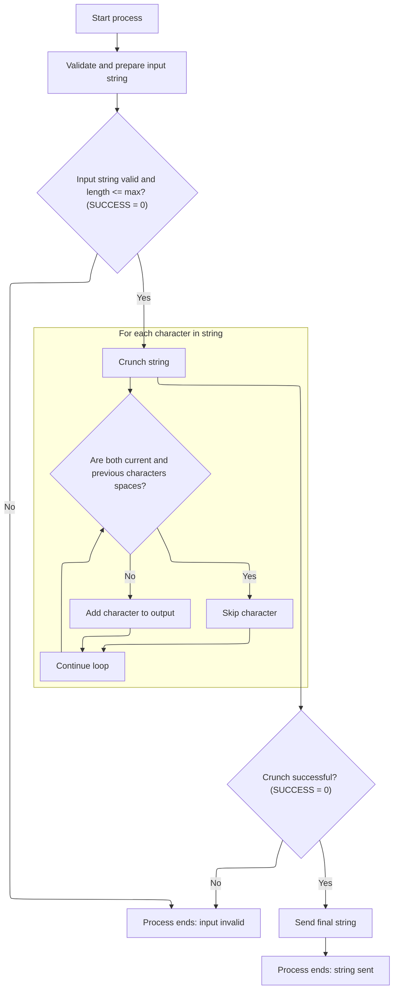
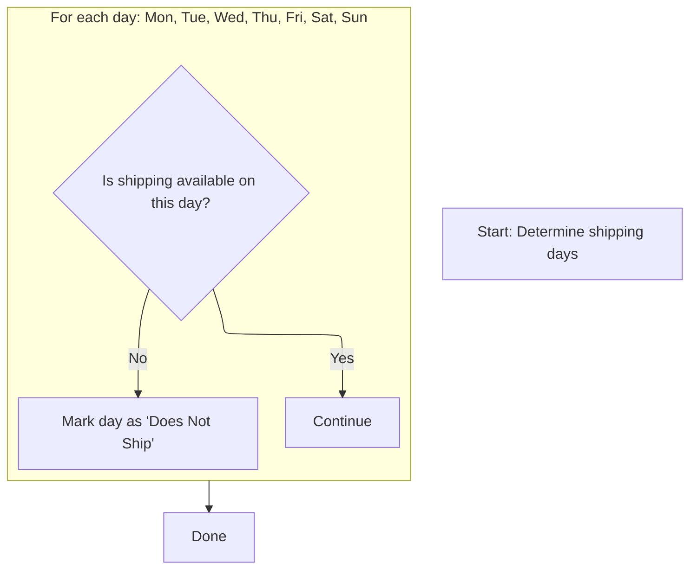

This document describes the flow for preparing and validating location data. The process transforms raw input, cleans contact names, sets status flags, marks non-shipping days, and converts time fields for database compatibility. This ensures location data is ready for downstream business operations.

# Spec

## Detailed View of the Program's Functionality

# Detailed Explanation of the Flow

## a. Transforming and Validating Location Data

The main process for transforming and validating location data is initiated by a routine that prepares the data for database operations. This process involves several key steps:

 1. **Contact Name Cleanup**:\
    The process begins by determining the length of the primary contact name field from the input data. It then calls a dedicated string cleanup routine (the "string cruncher") to ensure the contact name is consistently formatted. This routine removes extra spaces, ensuring that there is at most one space between words.

 2. **Field Initialization and Data Copying**:\
    After cleaning the contact name, the process initializes a work area to clear any previous data. It then systematically copies each field from the input data structure to a corresponding output structure. This includes location type, number, name, abbreviation, legal name, contact names, addresses, city, state, zip codes, phone numbers, country information, secondary contact and address information, mail-to information, fax ID, and more.

 3. **Date Field Defaulting**:\
    For each important date field (such as added date, deleted date, inactive date, opened date, closed date), the process checks if the field is empty or contains a special "zero" value. If so, it assigns a default date value to ensure the field is always populated with a valid date.

 4. **Status Flag Setting**:\
    The process evaluates the status of the location (active, inactive, deleted) and sets the appropriate status flags. For example, if the location is neither inactive nor deleted, it is marked as active.

 5. **Special Handling Based on Location Type**:\
    Depending on the type of location (such as vendor, store, or direct-store-delivery vendor), the process sets or clears certain fields (like account type and number) and may adjust status flags accordingly.

 6. **Numeric Field Validation**:\
    Numeric fields, such as facility ID, organization ID, order processing days, order lead time, and buffer time, are checked to ensure they contain valid numbers. If not, they are set to zero.

 7. **Direct Ship Flag Handling**:\
    The process ensures that the direct ship flag is set correctly based on the input.

 8. **Shipping Days and Schedule**:\
    The process calls a subroutine to mark which days of the week are non-shipping days, based on the shipping schedule. It also copies the shipping schedule text.

 9. **Time Field Preparation**:\
    Time fields are checked for validity. If a time field is empty, it is set to a default value. These fields are then prepared for conversion to timestamp format, as required by the database.

10. **Final Conversion and Preparation**:\
    The process calls a subroutine to convert time fields to timestamp format if needed, ensuring compatibility with the database.

## b. Cleaning and Outputting the Contact Name

The string cleanup routine (the "string cruncher") is responsible for ensuring that names and similar fields are consistently formatted. Its operation is as follows:

1. **Initialization**:\
   The routine initializes its work areas and counters. If the input string is longer than the maximum allowed length, it is trimmed. If the string is empty or contains only spaces or special low-value characters, the routine sets a failure flag and an error message, and no further processing occurs.

2. **Space Crunching**:\
   The routine loops through each character of the input string. It copies each character to a new output string, but if it encounters a space that immediately follows another space, it skips the extra space. This ensures that there are never multiple consecutive spaces in the output.

3. **Final Output**:\
   After processing, the routine blanks out the original string and copies the cleaned-up output string back into it, ensuring no leftover or junk data remains.

## c. Marking Non-Shipping Days and Converting Time Fields

1. **Marking Non-Shipping Days**:\
   A dedicated subroutine checks each day of the week (Monday through Sunday) to determine if shipping is scheduled for that day. If shipping is not scheduled, it sets a flag indicating that the location does not ship on that day. This makes it easy for other parts of the system to quickly determine non-shipping days.

2. **Converting Time Fields to Timestamps**:\
   Another subroutine checks if the system is operating in a mode that requires Oracle database compatibility or if a row is being inserted or modified. If so, it prepares the time fields and calls a conversion routine to transform them into timestamp format. If the conversion is successful, the output is updated with the new timestamp values. If not, the original time fields are simply copied as-is. This ensures that the data is always in a format compatible with the database requirements.

---

This flow ensures that all location data is validated, cleaned, and transformed into a consistent and database-ready format, with special attention to names, dates, numeric fields, shipping schedules, and time fields. The process is robust, handling invalid or missing data gracefully and ensuring that only valid, well-formatted data is passed on for storage or further processing.

# Rule Definition

| Paragraph Name                       | Rule ID | Category          | Description                                                                                                                                                                               | Conditions                                                   | Remarks                                                                                                                                                 |
| ------------------------------------ | ------- | ----------------- | ----------------------------------------------------------------------------------------------------------------------------------------------------------------------------------------- | ------------------------------------------------------------ | ------------------------------------------------------------------------------------------------------------------------------------------------------- |
| 100-INITIALIZATION (YYYS0134.cbl)    | RL-001  | Conditional Logic | If the input string consists entirely of spaces or low-values (hexadecimal zeros), it is treated as invalid and a failure flag and error message are set.                                 | Input string == all spaces OR input string == all low-values | Error message: 'YYYS0134 - Text not passed for parsing.' Failure flag is set. Output includes status flag and error message.                            |
| 200-CRUNCH-STRING (YYYS0134.cbl)     | RL-002  | Computation       | Removes any sequence of consecutive spaces so that no more than one space appears between non-space characters, while preserving leading and trailing spaces within the specified length. | Input string is valid (not all spaces or low-values)         | Output string is alphanumeric, up to 80 characters. Leading and trailing spaces are preserved within the specified length.                              |
| 300-SEND-FINAL-STRING (YYYS0134.cbl) | RL-003  | Data Assignment   | The cleaned string is written back to the output, overwriting any previous content.                                                                                                       | After crunching string                                       | Output string is alphanumeric, up to 80 characters. Previous content is replaced with spaces before writing cleaned string.                             |
| 100-INITIALIZATION (YYYS0134.cbl)    | RL-004  | Data Assignment   | The output includes a status flag indicating success ('0') or failure ('1'), and an error message if invalid input is detected.                                                           | Input string is invalid (all spaces or low-values)           | Status flag: '0' for success, '1' for failure. Error message is a string field.                                                                         |
| 116-EDIT-SHIP-DAYS (NNNS0487.cbl)    | RL-005  | Conditional Logic | For each day where shipping is not scheduled, a corresponding output flag is set to TRUE to indicate 'Does Not Ship' for that day; otherwise, it is set to FALSE.                         | Boolean flag for day is FALSE                                | Output flags are Boolean (TRUE/FALSE) for each day of the week (Monday-Sunday).                                                                         |
| 112-CONVERT-TM-TO-TS (NNNS0487.cbl)  | RL-006  | Computation       | If running in Oracle mode or during insert/modify operations, convert each 8-character time string ('HH:MM:SS') to a 26-character timestamp string ('YYYY-MM-DD-HH.MM.SS.FFFFFF').        | Oracle mode OR insert/modify operation                       | Input: 8-character time string ('HH:MM:SS'). Output: 26-character timestamp string ('YYYY-MM-DD-HH.MM.SS.FFFFFF').                                      |
| 112-CONVERT-TM-TO-TS (NNNS0487.cbl)  | RL-007  | Data Assignment   | If conversion is not required or fails, the original 8-character time string is copied to the output field as-is.                                                                         | Conversion not required OR conversion fails                  | Input and output: 8-character time string ('HH:MM:SS').                                                                                                 |
| 100-INITIALIZATION (YYYS0134.cbl)    | RL-008  | Data Assignment   | If the input string length exceeds 80 characters, it is truncated to 80 characters before further processing.                                                                             | Input string length > 80                                     | Maximum allowed length is 80 characters. Input and output are alphanumeric strings. Only the first 80 characters are retained; any excess is discarded. |

# User Stories

## User Story 1: Contact Name Input Processing and Validation

---

### Story Description:

As a user, I want to input a contact name string and have the system validate, clean, and output the processed string so that only valid, properly formatted names are accepted and stored.

---

### Business Rule Mapping:

| Rule ID | Paragraph Name                       | Rule Description                                                                                                                                                                          |
| ------- | ------------------------------------ | ----------------------------------------------------------------------------------------------------------------------------------------------------------------------------------------- |
| RL-001  | 100-INITIALIZATION (YYYS0134.cbl)    | If the input string consists entirely of spaces or low-values (hexadecimal zeros), it is treated as invalid and a failure flag and error message are set.                                 |
| RL-004  | 100-INITIALIZATION (YYYS0134.cbl)    | The output includes a status flag indicating success ('0') or failure ('1'), and an error message if invalid input is detected.                                                           |
| RL-008  | 100-INITIALIZATION (YYYS0134.cbl)    | If the input string length exceeds 80 characters, it is truncated to 80 characters before further processing.                                                                             |
| RL-002  | 200-CRUNCH-STRING (YYYS0134.cbl)     | Removes any sequence of consecutive spaces so that no more than one space appears between non-space characters, while preserving leading and trailing spaces within the specified length. |
| RL-003  | 300-SEND-FINAL-STRING (YYYS0134.cbl) | The cleaned string is written back to the output, overwriting any previous content.                                                                                                       |

---

### Relevant Functionality:

- **100-INITIALIZATION (YYYS0134.cbl)**
  1. **RL-001:**
     - If input string is all spaces or all low-values:
       - Set failure flag to TRUE
       - Set error message in output.
  2. **RL-004:**
     - If input is invalid:
       - Set status flag to '1'
       - Set error message
     - Else:
       - Set status flag to '0'
  3. **RL-008:**
     - If the input string's length is greater than 80:
       - Set the effective length to 80
       - Only the first 80 characters are processed and output
- **200-CRUNCH-STRING (YYYS0134.cbl)**
  1. **RL-002:**
     - For each character in input string:
       - If current character is space and previous character is space:
         - Skip
       - Else:
         - Copy character to output string
       - Update previous character tracker.
- **300-SEND-FINAL-STRING (YYYS0134.cbl)**
  1. **RL-003:**
     - Set output string to spaces
     - Copy cleaned string to output string.

## User Story 2: Shipping Days and Time Field Processing Output

---

### Story Description:

As a user, I want to specify shipping days and provide time fields so that the system can output scheduling flags and convert time fields to the required format, ensuring accurate scheduling and timing information.

---

### Business Rule Mapping:

| Rule ID | Paragraph Name                      | Rule Description                                                                                                                                                                   |
| ------- | ----------------------------------- | ---------------------------------------------------------------------------------------------------------------------------------------------------------------------------------- |
| RL-005  | 116-EDIT-SHIP-DAYS (NNNS0487.cbl)   | For each day where shipping is not scheduled, a corresponding output flag is set to TRUE to indicate 'Does Not Ship' for that day; otherwise, it is set to FALSE.                  |
| RL-006  | 112-CONVERT-TM-TO-TS (NNNS0487.cbl) | If running in Oracle mode or during insert/modify operations, convert each 8-character time string ('HH:MM:SS') to a 26-character timestamp string ('YYYY-MM-DD-HH.MM.SS.FFFFFF'). |
| RL-007  | 112-CONVERT-TM-TO-TS (NNNS0487.cbl) | If conversion is not required or fails, the original 8-character time string is copied to the output field as-is.                                                                  |

---

### Relevant Functionality:

- **116-EDIT-SHIP-DAYS (NNNS0487.cbl)**
  1. **RL-005:**
     - For each day of the week:
       - If shipping flag for day is FALSE:
         - Set 'Does Not Ship' flag for day to TRUE
       - Else:
         - Set 'Does Not Ship' flag for day to FALSE.
- **112-CONVERT-TM-TO-TS (NNNS0487.cbl)**
  1. **RL-006:**
     - If Oracle mode or insert/modify operation:
       - For each time field:
         - Convert 8-character time string to 26-character timestamp string
         - If conversion succeeds:
           - Write timestamp to output
         - Else:
           - Write original time string to output.
  2. **RL-007:**
     - If conversion not required or fails:
       - Copy original time string to output field.

# Code Walkthrough

## Transforming and Validating Location Data

<SwmSnippet path="/base/src/NNNS0487.cbl" line="918">

---

110-MOVE-PDA-FIELDS-2-DCL starts the flow by transforming and validating location data, including cleaning up the contact name (via a call to the string cruncher), defaulting dates, fixing numeric fields, setting status flags, and prepping time fields for DB storage. The call to YYYS0134 ensures the contact name is consistently formatted before moving on.

```cobol
099500 110-MOVE-PDA-FIELDS-2-DCL.                                       00099500
099600     MOVE LENGTH OF PRIM-CONTACT-NM OF P-DDDTLO01 TO WS-STR-LEN   00099600
099700     CALL  YYYS0134-STRING-CRUNCH USING                           00099700
099800                            XXXN001A                              00099800
099900                            PRIM-CONTACT-NM OF P-DDDTLO01         00099900
100000                            WS-STR-LEN                            00100000
100100     INITIALIZE XXXN001A                                          00100100
100200     MOVE LOC-TYP-CD OF P-DDDTLO01 TO LOC-TYP-CD OF DCLXXXATION   00100200
100300     MOVE LOC-NBR OF P-DDDTLO01 TO LOC-NBR OF DCLXXXATION         00100300
100400     MOVE LOC-NM OF P-DDDTLO01 TO LOC-NM OF DCLXXXATION           00100400
100500     MOVE LOC-ABB OF P-DDDTLO01 TO LOC-ABB OF DCLXXXATION         00100500
100600     MOVE LGL-LOC-NAM OF P-DDDTLO01 TO LGL-LOC-NAM OF DCLXXXATION 00100600
100700     MOVE PRIM-CONTACT-NM OF P-DDDTLO01                           00100700
100800       TO PRIM-CONTACT-NM OF DCLXXXATION                          00100800
100900     MOVE PRIM-ADR-1 OF P-DDDTLO01 TO PRIM-ADR-1 OF DCLXXXATION   00100900
101000     MOVE PRIM-ADR-2 OF P-DDDTLO01 TO PRIM-ADR-2 OF DCLXXXATION   00101000
101100     MOVE PRIM-ADR-3 OF P-DDDTLO01 TO PRIM-ADR-3 OF DCLXXXATION   00101100
101200     MOVE PRIM-ADR-4 OF P-DDDTLO01 TO PRIM-ADR-4 OF DCLXXXATION   00101200
101300     MOVE PRIM-CITY OF P-DDDTLO01 TO PRIM-CITY OF DCLXXXATION     00101300
101400     MOVE PRIM-CITY-ID OF P-DDDTLO01                              00101400
101500       TO PRIM-CITY-ID OF DCLXXXATION                             00101500
101600     MOVE PRIM-STATE-CD OF P-DDDTLO01                             00101600
101700       TO PRIM-STATE-CD OF DCLXXXATION                            00101700
101800     MOVE PRIM-ZIP5-CD OF P-DDDTLO01                              00101800
101900       TO PRIM-ZIP5-CD OF DCLXXXATION                             00101900
102000     MOVE PRIM-ZIP4-CD OF P-DDDTLO01                              00102000
102100       TO PRIM-ZIP4-CD OF DCLXXXATION                             00102100
102200     MOVE PRIM-PHN-CNTRY-CD OF P-DDDTLO01                         00102200
102300       TO PRIM-PHN-CNTRY-CD OF DCLXXXATION                        00102300
102400     MOVE PRIM-AREA-CD OF P-DDDTLO01                              00102400
102500       TO PRIM-AREA-CD OF DCLXXXATION                             00102500
102600     MOVE PRIM-PHONE-NBR OF P-DDDTLO01                            00102600
102700       TO PRIM-PHONE-NBR OF DCLXXXATION                           00102700
102800     MOVE PRIM-CNTRY-NM OF P-DDDTLO01                             00102800
102900       TO PRIM-CNTRY-NM OF DCLXXXATION                            00102900
103000     MOVE PRIM-CNTRY-ABB OF P-DDDTLO01                            00103000
103100       TO PRIM-CNTRY-ABB OF DCLXXXATION                           00103100
103200     MOVE SEC-LOC-NM OF P-DDDTLO01 TO SEC-LOC-NM OF DCLXXXATION   00103200
103300     MOVE SEC-CONTACT-NM OF P-DDDTLO01                            00103300
103400       TO SEC-CONTACT-NM OF DCLXXXATION                           00103400
103500     MOVE SEC-ADR-1 OF P-DDDTLO01 TO SEC-ADR-1 OF DCLXXXATION     00103500
103600     MOVE SEC-ADR-2 OF P-DDDTLO01 TO SEC-ADR-2 OF DCLXXXATION     00103600
103700     MOVE SEC-ADR-3 OF P-DDDTLO01 TO SEC-ADR-3 OF DCLXXXATION     00103700
103800     MOVE SEC-ADR-4 OF P-DDDTLO01 TO SEC-ADR-4 OF DCLXXXATION     00103800
103900     MOVE SEC-CITY OF P-DDDTLO01 TO SEC-CITY OF DCLXXXATION       00103900
104000     MOVE SEC-STATE-CD OF P-DDDTLO01                              00104000
104100       TO SEC-STATE-CD OF DCLXXXATION                             00104100
104200     MOVE SEC-ZIP5-CD OF P-DDDTLO01 TO SEC-ZIP5-CD OF DCLXXXATION 00104200
104300     MOVE SEC-ZIP4-CD OF P-DDDTLO01 TO SEC-ZIP4-CD OF DCLXXXATION 00104300
104400     MOVE SEC-PHN-CNTRY-CD OF P-DDDTLO01                          00104400
104500       TO SEC-PHN-CNTRY-CD OF DCLXXXATION                         00104500
104600     MOVE SEC-AREA-CD OF P-DDDTLO01 TO SEC-AREA-CD OF DCLXXXATION 00104600
104700     MOVE SEC-PHONE-NBR OF P-DDDTLO01                             00104700
104800       TO SEC-PHONE-NBR OF DCLXXXATION                            00104800
104900     MOVE SEC-CNTRY-NM OF P-DDDTLO01                              00104900
105000       TO SEC-CNTRY-NM OF DCLXXXATION                             00105000
105100     MOVE SEC-CNTRY-ABB OF P-DDDTLO01                             00105100
105200       TO SEC-CNTRY-ABB OF DCLXXXATION                            00105200
105300     MOVE MAIL-TO-LOC-NM OF P-DDDTLO01                            00105300
105400       TO MAIL-TO-LOC-NM OF DCLXXXATION                           00105400
105500     MOVE MAIL-TO-CNTCT-NM OF P-DDDTLO01                          00105500
105600       TO MAIL-TO-CNTCT-NM OF DCLXXXATION                         00105600
105700     MOVE MAIL-TO-ADR-1 OF P-DDDTLO01                             00105700
105800       TO MAIL-TO-ADR-1 OF DCLXXXATION                            00105800
105900     MOVE MAIL-TO-ADR-2 OF P-DDDTLO01                             00105900
106000       TO MAIL-TO-ADR-2 OF DCLXXXATION                            00106000
106100     MOVE MAIL-TO-ADR-3 OF P-DDDTLO01                             00106100
106200       TO MAIL-TO-ADR-3 OF DCLXXXATION                            00106200
106300     MOVE MAIL-TO-ADR-4 OF P-DDDTLO01                             00106300
106400       TO MAIL-TO-ADR-4 OF DCLXXXATION                            00106400
106500     MOVE MAIL-TO-CITY OF P-DDDTLO01                              00106500
106600       TO MAIL-TO-CITY OF DCLXXXATION                             00106600
106700     MOVE MAIL-TO-STATE-CD OF P-DDDTLO01                          00106700
106800       TO MAIL-TO-STATE-CD OF DCLXXXATION                         00106800
106900     MOVE MAIL-TO-ZIP5-CD OF P-DDDTLO01                           00106900
107000       TO MAIL-TO-ZIP5-CD OF DCLXXXATION                          00107000
107100     MOVE MAIL-TO-ZIP4-CD OF P-DDDTLO01                           00107100
107200       TO MAIL-TO-ZIP4-CD OF DCLXXXATION                          00107200
107300     MOVE MAIL-PHN-CNTRY-CD OF P-DDDTLO01                         00107300
107400       TO MAIL-PHN-CNTRY-CD OF DCLXXXATION                        00107400
107500     MOVE MAIL-TO-AREA-CD OF P-DDDTLO01                           00107500
107600       TO MAIL-TO-AREA-CD OF DCLXXXATION                          00107600
107700     MOVE MAIL-TO-PHONE-NBR OF P-DDDTLO01                         00107700
107800       TO MAIL-TO-PHONE-NBR OF DCLXXXATION                        00107800
107900     MOVE MAIL-TO-CNTRY-NM OF P-DDDTLO01                          00107900
108000       TO MAIL-TO-CNTRY-NM OF DCLXXXATION                         00108000
108100     MOVE MAIL-TO-CNTRY-AB OF P-DDDTLO01                          00108100
108200       TO MAIL-TO-CNTRY-AB OF DCLXXXATION                         00108200
108300     MOVE CURR-FAX-ID OF P-DDDTLO01 TO CURR-FAX-ID OF DCLXXXATION 00108300
108400                                                                  00108400
108500     IF ADDED-DT OF P-DDDTLO01 = SPACES                           00108500
108600     OR ADDED-DT OF P-DDDTLO01 = K-ZERO-DT                        00108600
108700       MOVE K-DEF-DT TO ADDED-DT OF P-DDDTLO01                    00108700
108800     END-IF                                                       00108800
108900     MOVE ADDED-DT OF P-DDDTLO01 TO ADDED-DT OF DCLXXXATION       00108900
109000                                                                  00109000
109100     IF DELETE-DT OF P-DDDTLO01 = SPACES                          00109100
109200     OR DELETE-DT OF P-DDDTLO01 = K-ZERO-DT                       00109200
109300       MOVE K-DEF-DT TO DELETE-DT OF P-DDDTLO01                   00109300
109400     END-IF                                                       00109400
109500     MOVE DELETE-DT OF P-DDDTLO01 TO DELETE-DT OF DCLXXXATION     00109500
109600                                                                  00109600
109700     IF INACTIVE-DT OF P-DDDTLO01 = SPACES                        00109700
109800     OR INACTIVE-DT OF P-DDDTLO01 = K-ZERO-DT                     00109800
109900       MOVE K-DEF-DT TO INACTIVE-DT OF P-DDDTLO01                 00109900
110000     END-IF                                                       00110000
110100     MOVE INACTIVE-DT OF P-DDDTLO01 TO INACTIVE-DT OF DCLXXXATION 00110100
110200                                                                  00110200
110300     IF OPENED-DT OF P-DDDTLO01 = SPACES                          00110300
110400     OR OPENED-DT OF P-DDDTLO01 = K-ZERO-DT                       00110400
110500       MOVE K-DEF-DT TO OPENED-DT OF P-DDDTLO01                   00110500
110600     END-IF                                                       00110600
110700     MOVE OPENED-DT OF P-DDDTLO01 TO OPENED-DT OF DCLXXXATION     00110700
110800                                                                  00110800
110900     IF CLOSED-DT OF P-DDDTLO01 = SPACES                          00110900
111000     OR CLOSED-DT OF P-DDDTLO01 = K-ZERO-DT                       00111000
111100       MOVE K-DEF-DT TO CLOSED-DT OF P-DDDTLO01                   00111100
111200     END-IF                                                       00111200
111300     MOVE CLOSED-DT OF P-DDDTLO01 TO CLOSED-DT OF DCLXXXATION     00111300
111400                                                                  00111400
111500     IF NOT LO-INACTIVE AND NOT LO-DELETED                        00111500
111600       SET LO-ACTIVE TO TRUE                                      00111600
111700     END-IF                                                       00111700
111800                                                                  00111800
111900     EVALUATE TRUE                                                00111900
112000       WHEN LOC-TYP-CD OF DCLXXXATION = K-VEND-LOC-TYPE           00112000
112100         MOVE K-AP-TYPE-CD TO AP-TYP-CD OF P-DDDTLO01             00112100
112200                                                                  00112200
112300       WHEN LOC-TYP-CD OF DCLXXXATION = K-STORE-LOC-TYPE          00112300
112400         MOVE 0      TO AP-NBR    OF P-DDDTLO01                   00112400
112500         MOVE SPACES TO AP-TYP-CD OF P-DDDTLO01                   00112500
112600                                                                  00112600
112700       WHEN LOC-TYP-CD OF DCLXXXATION = K-DSD-VEND-LOC-TYPE       00112700
112800         MOVE K-DSD-AP-TYPE-CD TO AP-TYP-CD OF P-DDDTLO01         00112800
112900         IF INACTIVE-DT OF P-DDDTLO01 = K-DEF-DT                  00112900
113000           SET LO-ACTIVE TO TRUE                                  00113000
113100         ELSE                                                     00113100
113200           SET LO-INACTIVE TO TRUE                                00113200
113300         END-IF                                                   00113300
113400     END-EVALUATE                                                 00113400
113500                                                                  00113500
113600     MOVE INACTIVE-SW OF P-DDDTLO01 TO INACTIVE-SW OF DCLXXXATION 00113600
113700                                                                  00113700
113800     MOVE AP-NBR OF P-DDDTLO01 TO AP-NBR OF DCLXXXATION           00113800
113900     MOVE AP-TYP-CD OF P-DDDTLO01   TO AP-TYP-CD OF DCLXXXATION   00113900
114000                                                                  00114000
114100     MOVE LST-UPDT-TS OF P-DDDTLO01 TO LST-UPDT-TS OF DCLXXXATION 00114100
114200     MOVE LST-UPDT-USR-ID OF P-DDDTLO01                           00114200
114300       TO LST-UPDT-USR-ID OF DCLXXXATION                          00114300
114400     MOVE PRIM-EMAIL-ID    OF P-DDDTLO01                          00114400
114500       TO PRIM-EMAIL-ID    OF DCLXXXATION                         00114500
114600     MOVE SECY-EMAIL-ID    OF P-DDDTLO01                          00114600
114700       TO SECY-EMAIL-ID    OF DCLXXXATION                         00114700
114800     MOVE MAIL-TO-EMAIL-ID OF P-DDDTLO01                          00114800
114900       TO MAIL-TO-EMAIL-ID OF DCLXXXATION                         00114900
115000     IF FAC-ID-X = SPACES                                         00115000
115100       MOVE 0 TO FAC-ID OF P-DDDTLO01                             00115100
115200     END-IF                                                       00115200
115300     MOVE FAC-ID           OF P-DDDTLO01                          00115300
115400       TO FAC-ID           OF DCLXXXATION                         00115400
115500     IF ORG-ID-X = SPACES                                         00115500
115600       MOVE 0 TO ORG-ID OF P-DDDTLO01                             00115600
115700     END-IF                                                       00115700
115800     MOVE ORG-ID           OF P-DDDTLO01                          00115800
115900       TO ORG-ID           OF DCLXXXATION                         00115900
116000     MOVE B2B-PRIM-RTNG-ID OF P-DDDTLO01                          00116000
116100       TO B2B-PRIM-RTNG-ID OF DCLXXXATION                         00116100
116200     MOVE PRIM-CNTY-TXT    OF P-DDDTLO01                          00116200
116300       TO PRIM-CNTY-TXT    OF DCLXXXATION                         00116300
116400     MOVE SECY-CNTY-TXT    OF P-DDDTLO01                          00116400
116500       TO SECY-CNTY-TXT    OF DCLXXXATION                         00116500
116600     MOVE MAIL-TO-CNTY-TXT OF P-DDDTLO01                          00116600
116700       TO MAIL-TO-CNTY-TXT OF DCLXXXATION                         00116700
116800                                                                  00116800
116900     IF NOT LOC-IS-DIRECT-SHIP OF P-DDDTLO01                      00116900
117000       SET LOC-IS-NOT-DIRECT-SHIP  OF P-DDDTLO01 TO TRUE          00117000
117100     END-IF                                                       00117100
117200     MOVE DIR-SHP-LOC-SW     OF P-DDDTLO01                        00117200
117300       TO DIR-SHP-LOC-SW     OF DCLXXXATION                       00117300
117400                                                                  00117400
117500     IF LOC-ORD-PROCNG-DD    OF P-DDDTLO01 NOT NUMERIC            00117500
117600        MOVE 0 TO LOC-ORD-PROCNG-DD OF P-DDDTLO01                 00117600
117700     END-IF                                                       00117700
117800     MOVE LOC-ORD-PROCNG-DD  OF P-DDDTLO01                        00117800
117900       TO LOC-ORD-PROCNG-DD  OF DCLXXXATION                       00117900
118000                                                                  00118000
118100     PERFORM 116-EDIT-SHIP-DAYS                                   00118100
118200     MOVE SCH-SHP-DD-TXT     OF P-DDDTLO01                        00118200
118300       TO SCH-SHP-DD-TXT     OF DCLXXXATION                       00118300
118400                                                                  00118400
118500                                                                  00118500
118600     IF ORD-LEAD-TM-DD OF P-DDDTLO01 IS NOT NUMERIC               00118600
118700        MOVE 0 TO ORD-LEAD-TM-DD OF P-DDDTLO01                    00118700
118800     END-IF                                                       00118800
118900     MOVE ORD-LEAD-TM-DD   OF P-DDDTLO01                          00118900
119000       TO ORD-LEAD-TM-DD   OF DCLXXXATION                         00119000
119100                                                                  00119100
119200     IF ORD-BUFFER-TM-DD OF P-DDDTLO01 IS NOT NUMERIC             00119200
119300        MOVE 0 TO ORD-BUFFER-TM-DD OF P-DDDTLO01                  00119300
119400     END-IF                                                       00119400
119500     MOVE ORD-BUFFER-TM-DD   OF P-DDDTLO01                        00119500
119600       TO ORD-BUFFER-TM-DD   OF DCLXXXATION                       00119600
119700                                                                  00119700
119800** Obsolete fields - Order Lead time and Buffer time renamed      00119800
119900** to FILLER1-TM and FILLER2-TM respectively.                     00119900
120000     MOVE WS-NULL-TM TO FILLER1-TM  OF DCLXXXATION                00120000
120100                        FILLER2-TM  OF DCLXXXATION                00120100
120200** Obsolete fields                                                00120200
120300                                                                  00120300
120400     IF ORD-PROCNG-CTOF-TM OF P-DDDTLO01 = SPACES                 00120400
120500       MOVE WS-NULL-TM TO ORD-PROCNG-CTOF-TM OF P-DDDTLO01        00120500
120600     END-IF                                                       00120600
120700     MOVE ORD-PROCNG-CTOF-TM OF P-DDDTLO01                        00120700
120800       TO ORD-PROCNG-CTOF-TM OF DCLXXXATION                       00120800
120900                                                                  00120900
121000     PERFORM 112-CONVERT-TM-TO-TS                                 00121000
121100     .                                                            00121100
```

---

</SwmSnippet>

### Cleaning and Outputting the Contact Name



<SwmSnippet path="/base/src/YYYS0134.cbl" line="47">

---

000-MAIN in YYYS0134.cbl runs the string cleanup in three steps, only moving forward if the previous one worked. This way, only valid, cleaned strings get returned.

```cobol
009100 000-MAIN.                                                        00009100
009200     PERFORM 100-INITIALIZATION                                   00009200
009300     IF SUCCESS                                                   00009300
009400       PERFORM 200-CRUNCH-STRING                                  00009400
009500     END-IF                                                       00009500
009600     IF SUCCESS                                                   00009600
009700       PERFORM 300-SEND-FINAL-STRING                              00009700
009800     END-IF                                                       00009800
010300     GOBACK                                                       00010300
010400     .                                                            00010400
```

---

</SwmSnippet>

<SwmSnippet path="/base/src/YYYS0134.cbl" line="62">

---

100-INITIALIZATION checks the input string before crunching. If the string is too long, it trims it to the max allowed length. If it's empty or just junk (all spaces or low-values), it sets a failure flag and an error message, so nothing else runs on bad input.

```cobol
011000 100-INITIALIZATION.                                              00011000
011100     INITIALIZE XXXN001A                                          00011100
011101                WS-OT-STR                                         00011101
011102                WS-BKUP-BYTE                                      00011102
011103                J                                                 00011103
011104                                                                  00011104
011105     IF STR-LEN          > WS-MAX-STR-LEN                         00011105
011106       MOVE WS-MAX-STR-LEN            TO STR-LEN                  00011106
011107     END-IF                                                       00011107
011108                                                                  00011108
011110     IF STR EQUAL SPACES OR LOW-VALUES                            00011110
011111         SET FAILURE                  TO TRUE                     00011111
011120         MOVE 'YYYS0134 - Text not passed for parsing.'           00011120
011130           TO IS-RTRN-MSG-TXT                                     00011130
011160     END-IF                                                       00011160
011800     .                                                            00011800
```

---

</SwmSnippet>

<SwmSnippet path="/base/src/YYYS0134.cbl" line="84">

---

200-CRUNCH-STRING loops through the input string and copies each character to a new string, but skips any space if the previous character was also a space. This way, you never get more than one space in a row.

```cobol
012500 200-CRUNCH-STRING.                                               00012500
012600                                                                  00012600
013500     PERFORM VARYING I FROM +1 BY +1 UNTIL I > STR-LEN            00013500
013501                                                                  00013501
013502       IF STR-B(I) EQUAL SPACE AND WS-BKUP-BYTE EQUAL SPACE       00013502
013503         CONTINUE                                                 00013503
013504       ELSE                                                       00013504
013505         ADD +1                       TO J                        00013505
013506                                                                  00013506
013507         MOVE STR-B(I)                TO WS-STR-B(J)              00013507
013508       END-IF                                                     00013508
013509                                                                  00013509
013510       MOVE STR-B(I)                  TO WS-BKUP-BYTE             00013510
013520                                                                  00013520
013600     END-PERFORM                                                  00013600
036500     .                                                            00036500
```

---

</SwmSnippet>

<SwmSnippet path="/base/src/YYYS0134.cbl" line="102">

---

300-SEND-FINAL-STRING blanks out the target string and then copies the cleaned-up output string into it. This guarantees the result doesn't have any leftover junk from before.

```cobol
036600 300-SEND-FINAL-STRING.                                           00036600
036700     MOVE SPACES                      TO STR(1:STR-LEN)           00036700
036800     MOVE WS-OT-STR                   TO STR(1:STR-LEN)           00036800
037000     .                                                            00037000
```

---

</SwmSnippet>

### Marking Non-Shipping Days and Converting Time Fields



<SwmSnippet path="/base/src/NNNS0487.cbl" line="1190">

---

116-EDIT-SHIP-DAYS checks each weekday—if shipping isn't scheduled, it sets a flag for that day. This makes it easy for other logic to know which days are non-shipping without extra calculation.

```cobol
126700 116-EDIT-SHIP-DAYS.                                              00126700
126800     IF NOT SHIPS-MON                                             00126800
126900       SET DOES-NOT-SHIP-MON TO TRUE                              00126900
127000     END-IF                                                       00127000
127100     IF NOT SHIPS-TUE                                             00127100
127200       SET DOES-NOT-SHIP-TUE TO TRUE                              00127200
127300     END-IF                                                       00127300
127400     IF NOT SHIPS-WED                                             00127400
127500       SET DOES-NOT-SHIP-WED TO TRUE                              00127500
127600     END-IF                                                       00127600
127700     IF NOT SHIPS-THU                                             00127700
127800       SET DOES-NOT-SHIP-THU TO TRUE                              00127800
127900     END-IF                                                       00127900
128000     IF NOT SHIPS-FRI                                             00128000
128100       SET DOES-NOT-SHIP-FRI TO TRUE                              00128100
128200     END-IF                                                       00128200
128300     IF NOT SHIPS-SAT                                             00128300
128400       SET DOES-NOT-SHIP-SAT TO TRUE                              00128400
128500     END-IF                                                       00128500
128600     IF NOT SHIPS-SUN                                             00128600
128700       SET DOES-NOT-SHIP-SUN TO TRUE                              00128700
128800     END-IF                                                       00128800
128900     .                                                            00128900
```

---

</SwmSnippet>

<SwmSnippet path="/base/src/NNNS0487.cbl" line="1139">

---

112-CONVERT-TM-TO-TS checks if we're running in Oracle mode or doing a row insert/modify. If so, it sets up the data and calls MMMS0291 to convert time fields to timestamps. If the conversion works, it updates the output; if not, it just copies the time fields as-is. This keeps the data compatible with what the DB expects.

```cobol
121600 112-CONVERT-TM-TO-TS.                                            00121600
121700     IF (YYYN005A-ORACLE OR EXIT-PUT-MODIFY-ROW                   00121700
121800         OR EXIT-PUT-INSERT-ROW)                                  00121800
121900       INITIALIZE MMMC0291-INPUT-TM                               00121900
122000                  MMMC0291-INPUT-TS                               00122000
122100                                                                  00122100
122200       MOVE ORD-PROCNG-CTOF-TM OF DCLXXXATION                     00122200
122300         TO WS-TIME-INOUT-CONV(1)                                 00122300
122400       MOVE FILLER1-TM  OF DCLXXXATION                            00122400
122500         TO WS-TIME-INOUT-CONV(2)                                 00122500
122600       MOVE FILLER2-TM  OF DCLXXXATION                            00122600
122700         TO WS-TIME-INOUT-CONV(3)                                 00122700
122800                                                                  00122800
122900       SET  MMMC0291-CVT-TM-TO-TS  TO TRUE                        00122900
123000       CALL WS-MMMS0291-PGM USING                                 00123000
123100                          XXXN001A                                00123100
123200                          MMMC0291                                00123200
123300                                                                  00123300
123400       IF SUCCESS                                                 00123400
123500         MOVE WS-TIMSTAMP-INOUT-CONV(1)                           00123500
123600           TO WS-ORD-PROCNG-CTOF-TM                               00123600
123700         MOVE WS-TIMSTAMP-INOUT-CONV(2)                           00123700
123800           TO WS-FILLER1-TS                                       00123800
123900         MOVE WS-TIMSTAMP-INOUT-CONV(3)                           00123900
124000           TO WS-FILLER2-TS                                       00124000
124100       END-IF                                                     00124100
124200     ELSE                                                         00124200
124300       MOVE ORD-PROCNG-CTOF-TM OF DCLXXXATION                     00124300
124400         TO WS-ORD-PROCNG-CTOF-TM                                 00124400
124500       MOVE FILLER1-TM  OF DCLXXXATION TO WS-FILLER1-TS           00124500
124600       MOVE FILLER2-TM  OF DCLXXXATION TO WS-FILLER2-TS           00124600
124700     END-IF                                                       00124700
124800     .                                                            00124800
```

---

</SwmSnippet>

&nbsp;

*This is an auto-generated document by Swimm 🌊 and has not yet been verified by a human*

<SwmMeta version="3.0.0" repo-id="Z2l0aHViJTNBJTNBU3dpbW1pby1keW5jYWxsLWRlbW8lM0ElM0FHaXJpLVN3aW1t" repo-name="Swimmio-dyncall-demo"><sup>Powered by [Swimm](https://app.swimm.io/)</sup></SwmMeta>
