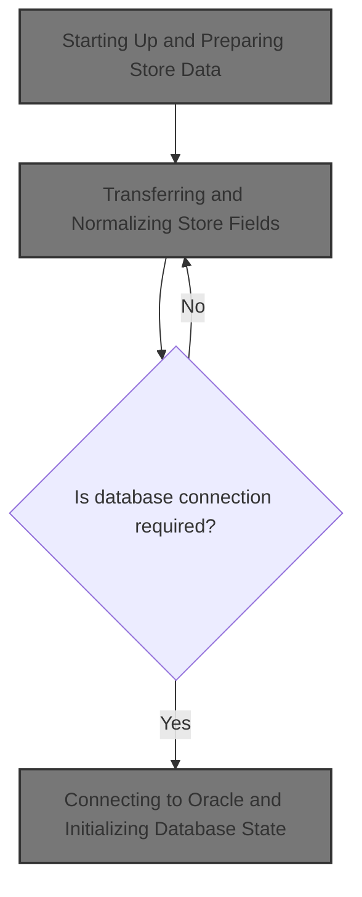
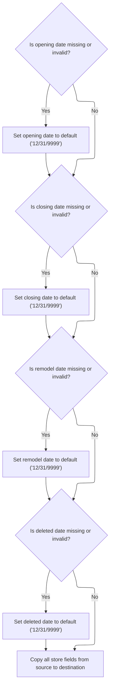
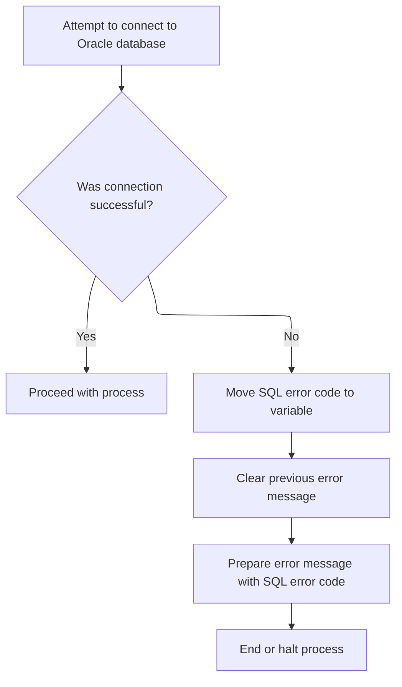

This document describes how store data is prepared and validated before further business operations. Store record data is normalized, key fields are checked and cleaned, and the database environment is initialized if needed. The output is a validated store record, ready for downstream use.



# Spec

## Detailed View of the Program's Functionality

# Detailed Explanation of the Flow

---

## a. Starting Up and Preparing Store Data

When the program begins, it performs an initialization routine to prepare all the necessary working storage and state for further processing. This includes:

- Clearing out (resetting) the main working storage area used for communication with other routines.
- Copying an index handle from a parameter area to a local area, ensuring the program knows which record or set of records it is working with.
- Resetting checkpoint and SQL-related flags to zero, which ensures that any previous state or errors do not affect the current run.
- If the operation is not a cursor close, the program proceeds to transfer and normalize store/location fields from the input area to the destination area. This is done to ensure that all data is in a clean and valid state before any further processing or database operations.

This setup is crucial because it ensures that all subsequent operations work with valid, normalized data and that the program's state is consistent.

---

## b. Transferring and Normalizing Store Fields

The next step is to move and clean up the store/location fields. This process involves:

- Checking each of the key date fields (opening, closing, remodel, deleted) in the input record. If any of these fields are missing, blank, or contain known invalid values (like '00/00/0000' or '01/01/1600'), they are replaced with a standard default value ('12/31/9999'). This ensures that downstream processes and the database do not receive invalid or ambiguous dates.
- After normalizing the date fields, all relevant store/location fields are copied from the input record to the destination record. This includes identifiers, names, codes, addresses, and various numeric and text attributes related to the store.
- For rollup data (a set of numeric fields used for reporting or aggregation), the program clears the report code field in the destination and then calls a separate routine to handle the rollup fields. This is necessary because these fields may require conversion from text to numbers and validation to ensure they are numeric.

This normalization and transfer step ensures that the destination record is fully populated with clean, valid data, ready for database operations or further processing.

---

## c. Handling Rollup Data

The rollup data consists of a set of up to 10 numeric fields, typically used for reporting or aggregation. The handling of these fields involves:

- Taking the rollup report code from the input record and interpreting it as an array of 10 packed decimal numbers.
- For each of these 10 fields, the program checks if the value is numeric. If it is, the value is copied to the corresponding field in the destination record. If it is not numeric, the field is set to zero.
- This process ensures that only valid numeric data is stored in the rollup fields, preventing errors or inconsistencies in reporting or aggregation.

By validating and converting these fields, the program maintains data integrity and ensures that downstream processes receive only valid numeric data.

---

## d. Connecting to Oracle and Initializing Database State

If the operation requires interaction with an Oracle database (for example, inserting, modifying, or purging a row), the program attempts to establish a connection to the Oracle database:

- It calls a routine to open the Oracle connection, passing in the necessary working storage and SQL control area.
- If the connection fails, the program captures the SQL error code, clears any previous error messages, and constructs a new error message that includes the SQL error code. This message is stored for later retrieval or logging.
- If the connection is successful, the program proceeds with the rest of the process, knowing that the database environment is correctly set up.

This step is essential for any operation that modifies the database, as it ensures that the program can communicate with the database and handle any connection errors gracefully.

---

## e. Summary

In summary, the flow ensures that:

1. All working storage and state are initialized and clean.
2. Store/location data is normalized and transferred to the destination record, with special handling for date and rollup fields.
3. Rollup fields are validated and converted to ensure they are numeric.
4. If required, a connection to the Oracle database is established, with error handling in place.

This careful preparation and validation ensure that all subsequent operations (such as database inserts, updates, or deletes) are performed with clean, valid data and in a properly initialized environment.

# Rule Definition

| Paragraph Name                                  | Rule ID | Category          | Description                                                                                                                                                                                                                                                                                                                                            | Conditions                                                                                                                          | Remarks                                                                                                                                                                                                                                                  |
| ----------------------------------------------- | ------- | ----------------- | ------------------------------------------------------------------------------------------------------------------------------------------------------------------------------------------------------------------------------------------------------------------------------------------------------------------------------------------------------ | ----------------------------------------------------------------------------------------------------------------------------------- | -------------------------------------------------------------------------------------------------------------------------------------------------------------------------------------------------------------------------------------------------------- |
| 100-INITIALIZATION                              | RL-001  | Data Assignment   | At the start of processing, the program initializes all working storage areas and copies the index handle, checkpoint flag, and SQL flag from the input linkage area to internal storage before processing store records.                                                                                                                              | Always, at program start.                                                                                                           | No constants. The index handle, checkpoint flag, and SQL flag are copied as control fields. These are typically numeric or alphanumeric fields used for program control.                                                                                 |
| 110-MOVE-PDA-FIELDS-2-DCL                       | RL-002  | Conditional Logic | For each date field in the store/location record, if the value is blank, '00/00/0000', or '01/01/1600', set the field to '12/31/9999'. Otherwise, retain the original value.                                                                                                                                                                           | For each date field (opening, closing, remodel, deleted) in the record, check if the value is blank, '00/00/0000', or '01/01/1600'. | Constants: blank (spaces), '00/00/0000', '01/01/1600', default date '12/31/9999'. Format: date fields are strings in MM/DD/YYYY format.                                                                                                                  |
| 110-MOVE-PDA-FIELDS-2-DCL                       | RL-003  | Data Assignment   | All store/location fields other than the date fields are copied directly from the source record to the destination record without modification.                                                                                                                                                                                                        | For all fields except the date fields and rollup report code.                                                                       | Fields are copied as-is. Formats depend on the field (string, number, etc.).                                                                                                                                                                             |
| 110-MOVE-PDA-FIELDS-2-DCL, 117-MOVE-ROLLUP-DATA | RL-004  | Computation       | The rollup report code field in the destination record must be cleared (set to spaces). The source rollup report code is interpreted as a 20-byte packed decimal field containing 10 signed 3-digit numbers. For each segment, if it is numeric, decode and store it in the corresponding rollup number field; if not, set the field to zero.          | When processing rollup data during record transfer.                                                                                 | Rollup report code: 20 bytes, packed decimal (COMP-3), 10 segments of 2 bytes each, each representing a signed 3-digit number. Output fields: 10 numeric fields, each corresponding to a rollup number. If a segment is not numeric, the output is zero. |
| 115-CONNECT-TO-ORACLE                           | RL-005  | Conditional Logic | Before further processing, the program attempts to connect to the Oracle database. If the connection is successful, processing continues. If the connection fails, the SQL error code is moved to an error variable, any previous error message is cleared, a new error message is prepared with the SQL error code, and further processing is halted. | When Oracle connection is required (e.g., for certain operations or flags).                                                         | Error message format: 'NNNS0120 - Error connecting to Oracle. Sqlcode =<code>' (alphanumeric string). SQL error code is a signed numeric value. Processing is halted on error.                                                                           |
| 120-EXIT-STUFF, 125-CONNECT-TO-DB2              | RL-006  | Data Assignment   | After connecting to the Oracle database, the program completes the database environment setup to ensure all downstream operations have the correct connection and state. This may include connecting to DB2 if required.                                                                                                                               | After successful Oracle connection and before downstream database operations.                                                       | No constants. Ensures all database environments are correctly initialized for further operations.                                                                                                                                                        |

# User Stories

## User Story 1: Store Record Processing and Normalization

---

### Story Description:

As a system, I want to initialize working storage, copy control fields, transfer and normalize store/location fields, and handle rollup data so that destination records are accurate, standardized, and ready for further processing.

---

### Business Rule Mapping:

| Rule ID | Paragraph Name                                  | Rule Description                                                                                                                                                                                                                                                                                                                              |
| ------- | ----------------------------------------------- | --------------------------------------------------------------------------------------------------------------------------------------------------------------------------------------------------------------------------------------------------------------------------------------------------------------------------------------------- |
| RL-001  | 100-INITIALIZATION                              | At the start of processing, the program initializes all working storage areas and copies the index handle, checkpoint flag, and SQL flag from the input linkage area to internal storage before processing store records.                                                                                                                     |
| RL-002  | 110-MOVE-PDA-FIELDS-2-DCL                       | For each date field in the store/location record, if the value is blank, '00/00/0000', or '01/01/1600', set the field to '12/31/9999'. Otherwise, retain the original value.                                                                                                                                                                  |
| RL-003  | 110-MOVE-PDA-FIELDS-2-DCL                       | All store/location fields other than the date fields are copied directly from the source record to the destination record without modification.                                                                                                                                                                                               |
| RL-004  | 110-MOVE-PDA-FIELDS-2-DCL, 117-MOVE-ROLLUP-DATA | The rollup report code field in the destination record must be cleared (set to spaces). The source rollup report code is interpreted as a 20-byte packed decimal field containing 10 signed 3-digit numbers. For each segment, if it is numeric, decode and store it in the corresponding rollup number field; if not, set the field to zero. |

---

### Relevant Functionality:

- **100-INITIALIZATION**
  1. **RL-001:**
     - Initialize all working storage areas
     - Copy index handle from input linkage area to internal storage
     - Copy checkpoint flag from input linkage area to internal storage
     - Copy SQL flag from input linkage area to internal storage
- **110-MOVE-PDA-FIELDS-2-DCL**
  1. **RL-002:**
     - For each date field in the record:
       - If the value is blank, '00/00/0000', or '01/01/1600':
         - Set the field to '12/31/9999'
       - Else:
         - Retain the original value
  2. **RL-003:**
     - For each non-date, non-rollup field in the store/location record:
       - Copy the value from the source record to the destination record
  3. **RL-004:**
     - Set the destination rollup report code field to spaces
     - Interpret the source rollup report code as 10 packed decimal segments
     - For each segment (1 to 10):
       - If the segment is numeric:
         - Decode and store in the corresponding rollup number field
       - Else:
         - Set the corresponding rollup number field to zero

## User Story 2: Database Connection and Environment Setup

---

### Story Description:

As a system, I want to connect to the Oracle database, handle connection errors appropriately, and complete the database environment setup so that all downstream operations have the correct connection and state.

---

### Business Rule Mapping:

| Rule ID | Paragraph Name                     | Rule Description                                                                                                                                                                                                                                                                                                                                       |
| ------- | ---------------------------------- | ------------------------------------------------------------------------------------------------------------------------------------------------------------------------------------------------------------------------------------------------------------------------------------------------------------------------------------------------------ |
| RL-005  | 115-CONNECT-TO-ORACLE              | Before further processing, the program attempts to connect to the Oracle database. If the connection is successful, processing continues. If the connection fails, the SQL error code is moved to an error variable, any previous error message is cleared, a new error message is prepared with the SQL error code, and further processing is halted. |
| RL-006  | 120-EXIT-STUFF, 125-CONNECT-TO-DB2 | After connecting to the Oracle database, the program completes the database environment setup to ensure all downstream operations have the correct connection and state. This may include connecting to DB2 if required.                                                                                                                               |

---

### Relevant Functionality:

- **115-CONNECT-TO-ORACLE**
  1. **RL-005:**
     - Attempt to connect to Oracle database
     - If connection is successful:
       - Continue processing
     - Else:
       - Move SQL error code to error variable
       - Clear previous error message
       - Prepare new error message with SQL error code
       - Halt further processing
- **120-EXIT-STUFF**
  1. **RL-006:**
     - After Oracle connection, check if DB2 connection is required
     - If required, connect to DB2
     - Ensure all database environment variables are set for downstream operations

# Code Walkthrough

## Starting Up and Preparing Store Data

<SwmSnippet path="/base/src/NNNS0120.cbl" line="1691">

---

100-INITIALIZATION kicks off the flow by prepping working storage, copying the index handle, and resetting checkpoint and SQL flags. If we're not closing the cursor, we call 110-MOVE-PDA-FIELDS-2-DCL to transfer and normalize store/location fields, making sure all the data is clean before anything else happens. This sets up the destination record with valid values, which is needed for later steps.

```cobol
171200 100-INITIALIZATION.                                              00171200
171300     INITIALIZE W00N001A                                          00171300
171400     MOVE NNNN0000-INDEX-HANDLE TO DDDTRL01-INDEX-HANDLE          00171400
171500     MOVE 0 TO WS-CHECKPOINT-INC                                  00171500
171600     MOVE 0 TO SQLCODE                                            00171600
171700     MOVE 0 TO SQL-INIT-FLAG                                      00171700
171800     IF NOT EXIT-CLOSE-CURSOR                                     00171800
171900       PERFORM 110-MOVE-PDA-FIELDS-2-DCL                          00171900
172000     END-IF                                                       00172000
172100                                                                  00172100
172200     IF (YYYN005A-ORACLE       OR EXIT-PUT-INSERT-ROW             00172200
172300         OR EXIT-PUT-PURGE-ROW OR EXIT-PUT-MODIFY-ROW)            00172300
172400       PERFORM 115-CONNECT-TO-ORACLE                              00172400
172500     END-IF                                                       00172500
172600     .                                                            00172600
```

---

</SwmSnippet>

### Transferring and Normalizing Store Fields



<SwmSnippet path="/base/src/NNNS0120.cbl" line="1711">

---

110-MOVE-PDA-FIELDS-2-DCL checks and normalizes date fields in the source record, replacing blanks and specific invalid dates with '12/31/9999'. Then it copies all relevant fields to the destination record. For rollup data, it clears the report code and calls 117-MOVE-ROLLUP-DATA to handle the numeric rollup fields separately, since those need validation and conversion from text to numbers.

```cobol
173200 110-MOVE-PDA-FIELDS-2-DCL.                                       00173200
173300     IF FC-RL-OPENING-DT OF P-DDDTRL01 = SPACES                   00173300
173400     OR FC-RL-OPENING-DT OF P-DDDTRL01 = '00/00/0000'             00173400
173500     OR FC-RL-OPENING-DT OF P-DDDTRL01 = '01/01/1600'             00173500
173600       MOVE '12/31/9999' TO FC-RL-OPENING-DT OF P-DDDTRL01        00173600
173700     END-IF                                                       00173700
173800     IF FC-RL-CLOSING-DT OF P-DDDTRL01 = SPACES                   00173800
173900     OR FC-RL-CLOSING-DT OF P-DDDTRL01 = '00/00/0000'             00173900
174000     OR FC-RL-CLOSING-DT OF P-DDDTRL01 = '01/01/1600'             00174000
174100       MOVE '12/31/9999' TO FC-RL-CLOSING-DT OF P-DDDTRL01        00174100
174200     END-IF                                                       00174200
174300     IF FC-RL-REMODEL-DT OF P-DDDTRL01 = SPACES                   00174300
174400     OR FC-RL-REMODEL-DT OF P-DDDTRL01 = '00/00/0000'             00174400
174500     OR FC-RL-REMODEL-DT OF P-DDDTRL01 = '01/01/1600'             00174500
174600       MOVE '12/31/9999' TO FC-RL-REMODEL-DT OF P-DDDTRL01        00174600
174700     END-IF                                                       00174700
174800     IF FC-RL-DELETED-DT OF P-DDDTRL01 = SPACES                   00174800
174900     OR FC-RL-DELETED-DT OF P-DDDTRL01 = '00/00/0000'             00174900
175000     OR FC-RL-DELETED-DT OF P-DDDTRL01 = '01/01/1600'             00175000
175100       MOVE '12/31/9999' TO FC-RL-DELETED-DT OF P-DDDTRL01        00175100
175200     END-IF                                                       00175200
175300                                                                  00175300
175400     MOVE FC-STORE-NO OF P-DDDTRL01                               00175400
175500       TO FC-STORE-NO OF DCLFC-XXXAIL-STORES                      00175500
175600     MOVE FC-RL-STORE-NM OF P-DDDTRL01                            00175600
175700       TO FC-RL-STORE-NM OF DCLFC-XXXAIL-STORES                   00175700
175800     MOVE FC-RL-STORE-CD OF P-DDDTRL01                            00175800
175900       TO FC-RL-STORE-CD OF DCLFC-XXXAIL-STORES                   00175900
176000     MOVE FC-RL-STORE-DIR-NM OF P-DDDTRL01                        00176000
176100       TO FC-RL-STORE-DIR-NM OF DCLFC-XXXAIL-STORES               00176100
176200     MOVE FC-RL-STORE-LOC-NM OF P-DDDTRL01                        00176200
176300       TO FC-RL-STORE-LOC-NM OF DCLFC-XXXAIL-STORES               00176300
176400     MOVE FC-RL-OPENING-DT OF P-DDDTRL01                          00176400
176500       TO FC-RL-OPENING-DT OF DCLFC-XXXAIL-STORES                 00176500
176600     MOVE FC-RL-CLOSING-DT OF P-DDDTRL01                          00176600
176700       TO FC-RL-CLOSING-DT OF DCLFC-XXXAIL-STORES                 00176700
176800     MOVE FC-RL-REMODEL-DT OF P-DDDTRL01                          00176800
176900       TO FC-RL-REMODEL-DT OF DCLFC-XXXAIL-STORES                 00176900
177000     MOVE FC-RL-DELETED-DT OF P-DDDTRL01                          00177000
177100       TO FC-RL-DELETED-DT OF DCLFC-XXXAIL-STORES                 00177100
177200     MOVE FC-RL-DISTRICT-NO OF P-DDDTRL01                         00177200
177300       TO FC-RL-DISTRICT-NO OF DCLFC-XXXAIL-STORES                00177300
177400     MOVE FC-RL-MARKET-AR-NO OF P-DDDTRL01                        00177400
177500       TO FC-RL-MARKET-AR-NO OF DCLFC-XXXAIL-STORES               00177500
177600     MOVE FC-RL-PAYROL-AR-NO OF P-DDDTRL01                        00177600
177700       TO FC-RL-PAYROL-AR-NO OF DCLFC-XXXAIL-STORES               00177700
177800     MOVE FC-RL-PAY-GROUP-NO OF P-DDDTRL01                        00177800
177900       TO FC-RL-PAY-GROUP-NO OF DCLFC-XXXAIL-STORES               00177900
178000     MOVE FC-RL-COMPANY-NO OF P-DDDTRL01                          00178000
178100       TO FC-RL-COMPANY-NO OF DCLFC-XXXAIL-STORES                 00178100
178200     MOVE FC-RL-GEO-ZONE-CD OF P-DDDTRL01                         00178200
178300       TO FC-RL-GEO-ZONE-CD OF DCLFC-XXXAIL-STORES                00178300
178400     MOVE FC-RL-GEO-ZONE-NO OF P-DDDTRL01                         00178400
178500       TO FC-RL-GEO-ZONE-NO OF DCLFC-XXXAIL-STORES                00178500
178600     MOVE FC-RL-SCAN-MAIN-CD OF P-DDDTRL01                        00178600
178700       TO FC-RL-SCAN-MAIN-CD OF DCLFC-XXXAIL-STORES               00178700
178800     MOVE FC-RL-FRONT-END-CD OF P-DDDTRL01                        00178800
178900       TO FC-RL-FRONT-END-CD OF DCLFC-XXXAIL-STORES               00178900
179000     MOVE FC-RL-PRICE-BUL-CD OF P-DDDTRL01                        00179000
179100       TO FC-RL-PRICE-BUL-CD OF DCLFC-XXXAIL-STORES               00179100
179200     MOVE FC-RL-UPC-ON-PB-CD OF P-DDDTRL01                        00179200
179300       TO FC-RL-UPC-ON-PB-CD OF DCLFC-XXXAIL-STORES               00179300
179400     MOVE FC-RL-COMPETITR-CD OF P-DDDTRL01                        00179400
179500       TO FC-RL-COMPETITR-CD OF DCLFC-XXXAIL-STORES               00179500
179600     MOVE FC-RL-ASSOC-STR-NO OF P-DDDTRL01                        00179600
179700       TO FC-RL-ASSOC-STR-NO OF DCLFC-XXXAIL-STORES               00179700
179800     MOVE FC-RL-RPRT-SEQ-NO OF P-DDDTRL01                         00179800
179900       TO FC-RL-RPRT-SEQ-NO OF DCLFC-XXXAIL-STORES                00179900
180000     MOVE FC-RL-SORT-SOS-NO OF P-DDDTRL01                         00180000
180100       TO FC-RL-SORT-SOS-NO OF DCLFC-XXXAIL-STORES                00180100
180200     MOVE FC-RL-VID-PRZN-NO OF P-DDDTRL01                         00180200
180300       TO FC-RL-VID-PRZN-NO OF DCLFC-XXXAIL-STORES                00180300
180400     MOVE FC-RL-CITY-ID-CD OF P-DDDTRL01                          00180400
180500       TO FC-RL-CITY-ID-CD OF DCLFC-XXXAIL-STORES                 00180500
180600     MOVE FC-RL-ADZONE-ABB OF P-DDDTRL01                          00180600
180700       TO FC-RL-ADZONE-ABB OF DCLFC-XXXAIL-STORES                 00180700
180800     MOVE FC-RL-ADZONE-DES OF P-DDDTRL01                          00180800
180900       TO FC-RL-ADZONE-DES OF DCLFC-XXXAIL-STORES                 00180900
181000     MOVE FC-RL-UNLOAD-SW OF P-DDDTRL01                           00181000
181100       TO FC-RL-UNLOAD-SW OF DCLFC-XXXAIL-STORES                  00181100
181200*    MOVE FN-ROLLUP-REPT-CD OF P-DDDTRL01                         00181200
181300     MOVE SPACES                                                  00181300
181400       TO FN-ROLLUP-REPT-CD OF DCLFC-XXXAIL-STORES                00181400
181500     PERFORM 117-MOVE-ROLLUP-DATA                                 00181500
181600     MOVE FC-RL-STATUS-CD OF P-DDDTRL01                           00181600
181700       TO FC-RL-STATUS-CD OF DCLFC-XXXAIL-STORES                  00181700
181800     MOVE FC-RL-NEW-STORE-CD OF P-DDDTRL01                        00181800
181900       TO FC-RL-NEW-STORE-CD OF DCLFC-XXXAIL-STORES               00181900
182000     MOVE FC-RL-TYPE-CD OF P-DDDTRL01                             00182000
182100       TO FC-RL-TYPE-CD OF DCLFC-XXXAIL-STORES                    00182100
182200     MOVE FC-RL-GROUP-CD OF P-DDDTRL01                            00182200
182300       TO FC-RL-GROUP-CD OF DCLFC-XXXAIL-STORES                   00182300
182400     MOVE FC-RL-SELECTCIR-CD OF P-DDDTRL01                        00182400
182500       TO FC-RL-SELECTCIR-CD OF DCLFC-XXXAIL-STORES               00182500
182600     MOVE FC-RL-AREA-CODE-NO OF P-DDDTRL01                        00182600
182700       TO FC-RL-AREA-CODE-NO OF DCLFC-XXXAIL-STORES               00182700
182800     MOVE FC-RL-TELEPHONE-NO OF P-DDDTRL01                        00182800
182900       TO FC-RL-TELEPHONE-NO OF DCLFC-XXXAIL-STORES               00182900
183000     MOVE FC-RL-STORE-ABB OF P-DDDTRL01                           00183000
183100       TO FC-RL-STORE-ABB OF DCLFC-XXXAIL-STORES                  00183100
183200     MOVE FC-RL-BCKRM-FT-QTY OF P-DDDTRL01                        00183200
183300       TO FC-RL-BCKRM-FT-QTY OF DCLFC-XXXAIL-STORES               00183300
183400     MOVE FC-RL-LFT-FOOD-QTY OF P-DDDTRL01                        00183400
183500       TO FC-RL-LFT-FOOD-QTY OF DCLFC-XXXAIL-STORES               00183500
183600     MOVE FC-RL-LFT-NONF-QTY OF P-DDDTRL01                        00183600
183700       TO FC-RL-LFT-NONF-QTY OF DCLFC-XXXAIL-STORES               00183700
183800     MOVE FC-RL-SETOFF-CD OF P-DDDTRL01                           00183800
183900       TO FC-RL-SETOFF-CD OF DCLFC-XXXAIL-STORES                  00183900
184000     MOVE FC-RL-CL12-ZONE-NO OF P-DDDTRL01                        00184000
184100       TO FC-RL-CL12-ZONE-NO OF DCLFC-XXXAIL-STORES               00184100
184200     MOVE FC-RL-CL12-ADZN-NO OF P-DDDTRL01                        00184200
184300       TO FC-RL-CL12-ADZN-NO OF DCLFC-XXXAIL-STORES               00184300
184400     MOVE FC-RL-CL13-ZONE-NO OF P-DDDTRL01                        00184400
184500       TO FC-RL-CL13-ZONE-NO OF DCLFC-XXXAIL-STORES               00184500
184600     MOVE FC-RL-CL13-ADZN-NO OF P-DDDTRL01                        00184600
184700       TO FC-RL-CL13-ADZN-NO OF DCLFC-XXXAIL-STORES               00184700
184800     MOVE FC-RL-CL14-ZONE-NO OF P-DDDTRL01                        00184800
184900       TO FC-RL-CL14-ZONE-NO OF DCLFC-XXXAIL-STORES               00184900
185000     MOVE FC-RL-CL14-ADZN-NO OF P-DDDTRL01                        00185000
185100       TO FC-RL-CL14-ADZN-NO OF DCLFC-XXXAIL-STORES               00185100
185200     MOVE FC-RL-CL36-ADZN-NO OF P-DDDTRL01                        00185200
185300       TO FC-RL-CL36-ADZN-NO OF DCLFC-XXXAIL-STORES               00185300
185400     MOVE FC-RL-CL37-ADZN-NO OF P-DDDTRL01                        00185400
185500       TO FC-RL-CL37-ADZN-NO OF DCLFC-XXXAIL-STORES               00185500
185600     MOVE FC-RL-STORE-DEA-NO OF P-DDDTRL01                        00185600
185700       TO FC-RL-STORE-DEA-NO OF DCLFC-XXXAIL-STORES               00185700
185800     MOVE FC-RL-RETL-ZONE-NO OF P-DDDTRL01                        00185800
185900       TO FC-RL-RETL-ZONE-NO OF DCLFC-XXXAIL-STORES               00185900
186000     MOVE FC-RL-STOR2-LOC-NM OF P-DDDTRL01                        00186000
186100       TO FC-RL-STOR2-LOC-NM OF DCLFC-XXXAIL-STORES               00186100
186200     MOVE FC-CITY-ADR OF P-DDDTRL01                               00186200
186300       TO FC-CITY-ADR OF DCLFC-XXXAIL-STORES                      00186300
186400     MOVE FC-STATE-ADR OF P-DDDTRL01                              00186400
186500       TO FC-STATE-ADR OF DCLFC-XXXAIL-STORES                     00186500
186600     MOVE FC-ZIP-CODE5-ADR OF P-DDDTRL01                          00186600
186700       TO FC-ZIP-CODE5-ADR OF DCLFC-XXXAIL-STORES                 00186700
186800     MOVE FC-ZIP-CODE4-ADR OF P-DDDTRL01                          00186800
186900       TO FC-ZIP-CODE4-ADR OF DCLFC-XXXAIL-STORES                 00186900
187000     MOVE FC-RL-SOS-TYPE-CD OF P-DDDTRL01                         00187000
187100       TO FC-RL-SOS-TYPE-CD OF DCLFC-XXXAIL-STORES                00187100
187200     MOVE FC-RL-NOPROCESS-CD OF P-DDDTRL01                        00187200
187300       TO FC-RL-NOPROCESS-CD OF DCLFC-XXXAIL-STORES               00187300
187400     MOVE FC-RL-SOSHDRTYP-CD OF P-DDDTRL01                        00187400
187500       TO FC-RL-SOSHDRTYP-CD OF DCLFC-XXXAIL-STORES               00187500
187600     MOVE FC-RL-CAT-CLASS-TB OF P-DDDTRL01                        00187600
187700       TO FC-RL-CAT-CLASS-TB OF DCLFC-XXXAIL-STORES               00187700
187800     MOVE FC-RL-LATITUDE-K OF P-DDDTRL01                          00187800
187900       TO FC-RL-LATITUDE-K OF DCLFC-XXXAIL-STORES                 00187900
188000     MOVE FC-RL-LONGITUDE-K OF P-DDDTRL01                         00188000
188100       TO FC-RL-LONGITUDE-K OF DCLFC-XXXAIL-STORES                00188100
188200     MOVE FN-DIVISION-CD OF P-DDDTRL01                            00188200
188300       TO FN-DIVISION-CD OF DCLFC-XXXAIL-STORES                   00188300
188400     MOVE FN-LINE-OF-BUS-CD OF P-DDDTRL01                         00188400
188500       TO FN-LINE-OF-BUS-CD OF DCLFC-XXXAIL-STORES                00188500
188600     .                                                            00188600
```

---

</SwmSnippet>

<SwmSnippet path="/base/src/NNNS0120.cbl" line="1884">

---

117-MOVE-ROLLUP-DATA takes the rollup report code, interprets it as an array of 10 packed decimals, and for each one, checks if it's numeric. If so, it copies the value to the destination; if not, it sets the field to zero. This keeps the rollup fields clean and numeric-only.

```cobol
190500 117-MOVE-ROLLUP-DATA.                                            00190500
190600     MOVE FN-ROLLUP-REPT-CD OF P-DDDTRL01                         00190600
190700       TO WS-REPT-TBL-TXT                                         00190700
190800     IF WS-REPT-TBL-NUMERIC(1) IS NUMERIC                         00190800
190900        MOVE WS-REPT-TBL-NUMERIC(1)                               00190900
191000          TO FN-ROLLUP-REPT-01-NBR  OF DCLFC-XXXAIL-STORES        00191000
191100     ELSE                                                         00191100
191200        MOVE ZERO TO FN-ROLLUP-REPT-01-NBR OF DCLFC-XXXAIL-STORES 00191200
191300     END-IF                                                       00191300
191400     IF WS-REPT-TBL-NUMERIC(2) IS NUMERIC                         00191400
191500        MOVE WS-REPT-TBL-NUMERIC(2)                               00191500
191600          TO FN-ROLLUP-REPT-02-NBR  OF DCLFC-XXXAIL-STORES        00191600
191700     ELSE                                                         00191700
191800        MOVE ZERO TO FN-ROLLUP-REPT-02-NBR OF DCLFC-XXXAIL-STORES 00191800
191900     END-IF                                                       00191900
192000     IF WS-REPT-TBL-NUMERIC(3) IS NUMERIC                         00192000
192100        MOVE WS-REPT-TBL-NUMERIC(3)                               00192100
192200          TO FN-ROLLUP-REPT-03-NBR  OF DCLFC-XXXAIL-STORES        00192200
192300     ELSE                                                         00192300
192400        MOVE ZERO TO FN-ROLLUP-REPT-03-NBR OF DCLFC-XXXAIL-STORES 00192400
192500     END-IF                                                       00192500
192600     IF WS-REPT-TBL-NUMERIC(4) IS NUMERIC                         00192600
192700        MOVE WS-REPT-TBL-NUMERIC(4)                               00192700
192800          TO FN-ROLLUP-REPT-04-NBR  OF DCLFC-XXXAIL-STORES        00192800
192900     ELSE                                                         00192900
193000        MOVE ZERO TO FN-ROLLUP-REPT-04-NBR OF DCLFC-XXXAIL-STORES 00193000
193100     END-IF                                                       00193100
193200     IF WS-REPT-TBL-NUMERIC(5) IS NUMERIC                         00193200
193300        MOVE WS-REPT-TBL-NUMERIC(5)                               00193300
193400          TO FN-ROLLUP-REPT-05-NBR  OF DCLFC-XXXAIL-STORES        00193400
193500     ELSE                                                         00193500
193600        MOVE ZERO TO FN-ROLLUP-REPT-05-NBR OF DCLFC-XXXAIL-STORES 00193600
193700     END-IF                                                       00193700
193800     IF WS-REPT-TBL-NUMERIC(6) IS NUMERIC                         00193800
193900        MOVE WS-REPT-TBL-NUMERIC(6)                               00193900
194000          TO FN-ROLLUP-REPT-06-NBR  OF DCLFC-XXXAIL-STORES        00194000
194100     ELSE                                                         00194100
194200        MOVE ZERO TO FN-ROLLUP-REPT-06-NBR OF DCLFC-XXXAIL-STORES 00194200
194300     END-IF                                                       00194300
194400     IF WS-REPT-TBL-NUMERIC(7) IS NUMERIC                         00194400
194500        MOVE WS-REPT-TBL-NUMERIC(7)                               00194500
194600          TO FN-ROLLUP-REPT-07-NBR  OF DCLFC-XXXAIL-STORES        00194600
194700     ELSE                                                         00194700
194800        MOVE ZERO TO FN-ROLLUP-REPT-07-NBR OF DCLFC-XXXAIL-STORES 00194800
194900     END-IF                                                       00194900
195000     IF WS-REPT-TBL-NUMERIC(8) IS NUMERIC                         00195000
195100        MOVE WS-REPT-TBL-NUMERIC(8)                               00195100
195200          TO FN-ROLLUP-REPT-08-NBR  OF DCLFC-XXXAIL-STORES        00195200
195300     ELSE                                                         00195300
195400        MOVE ZERO TO FN-ROLLUP-REPT-08-NBR OF DCLFC-XXXAIL-STORES 00195400
195500     END-IF                                                       00195500
195600     IF WS-REPT-TBL-NUMERIC(9) IS NUMERIC                         00195600
195700        MOVE WS-REPT-TBL-NUMERIC(9)                               00195700
195800          TO FN-ROLLUP-REPT-09-NBR  OF DCLFC-XXXAIL-STORES        00195800
195900     ELSE                                                         00195900
196000        MOVE ZERO TO FN-ROLLUP-REPT-09-NBR OF DCLFC-XXXAIL-STORES 00196000
196100     END-IF                                                       00196100
196200     IF WS-REPT-TBL-NUMERIC(10) IS NUMERIC                        00196200
196300        MOVE WS-REPT-TBL-NUMERIC(10)                              00196300
196400          TO FN-ROLLUP-REPT-10-NBR  OF DCLFC-XXXAIL-STORES        00196400
196500     ELSE                                                         00196500
196600        MOVE ZERO TO FN-ROLLUP-REPT-10-NBR OF DCLFC-XXXAIL-STORES 00196600
196700     END-IF                                                       00196700
196800     .                                                            00196800
```

---

</SwmSnippet>

### Connecting to Oracle and Initializing Database State



<SwmSnippet path="/base/src/NNNS0120.cbl" line="1871">

---

115-CONNECT-TO-ORACLE calls Z-ORA-CONNECT to open the Oracle connection and handles any errors by building a message with the SQLCODE. After this, we call XXXS0210 to finish setting up the database environment, so everything downstream has the right connection and state.

```cobol
189200 115-CONNECT-TO-ORACLE.                                           00189200
189300     CALL Z-ORA-CONNECT USING W00N001A                            00189300
189400                              SQLCA                               00189400
189500     IF NOT SUCCESS                                               00189500
189600       MOVE SQLCODE TO WS-SQLCODE                                 00189600
189700       MOVE SPACES  TO IS-RTRN-MSG-TXT                            00189700
189800       STRING 'NNNS0120 - Error connecting to Oracle. Sqlcode ='  00189800
189900               WS-SQLCODE                                         00189900
190000               DELIMITED BY SIZE INTO IS-RTRN-MSG-TXT             00190000
190100     END-IF                                                       00190100
190200     .                                                            00190200
```

---

</SwmSnippet>

&nbsp;

*This is an auto-generated document by Swimm 🌊 and has not yet been verified by a human*

<SwmMeta version="3.0.0" repo-id="Z2l0aHViJTNBJTNBU3dpbW1pby1keW5jYWxsLWRlbW8lM0ElM0FHaXJpLVN3aW1t" repo-name="Swimmio-dyncall-demo"><sup>Powered by [Swimm](https://app.swimm.io/)</sup></SwmMeta>
