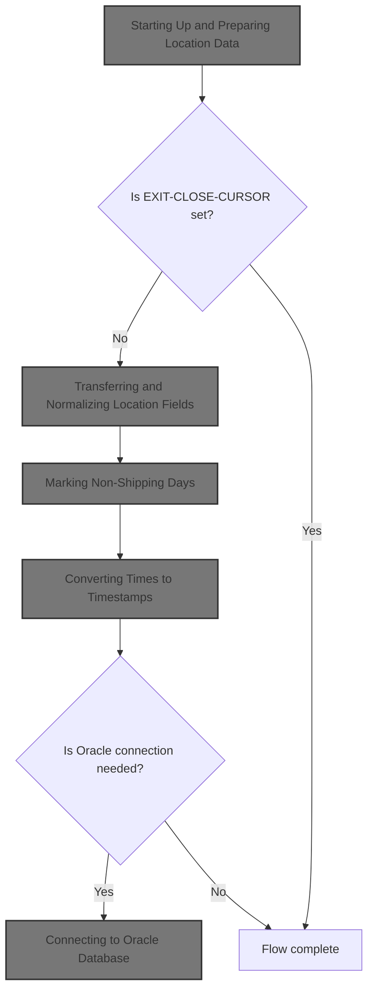
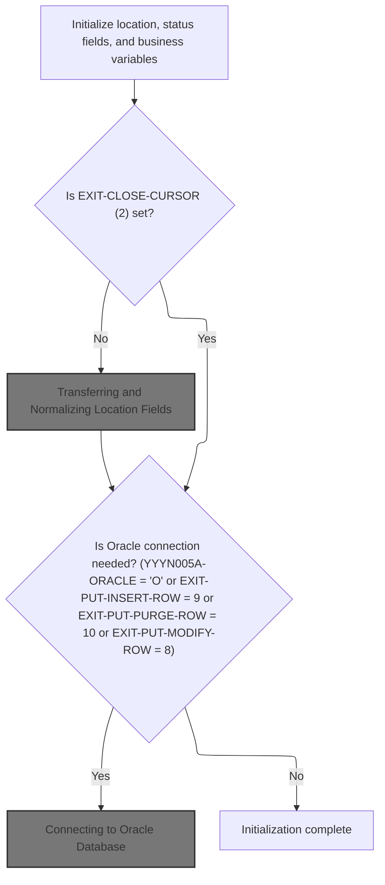
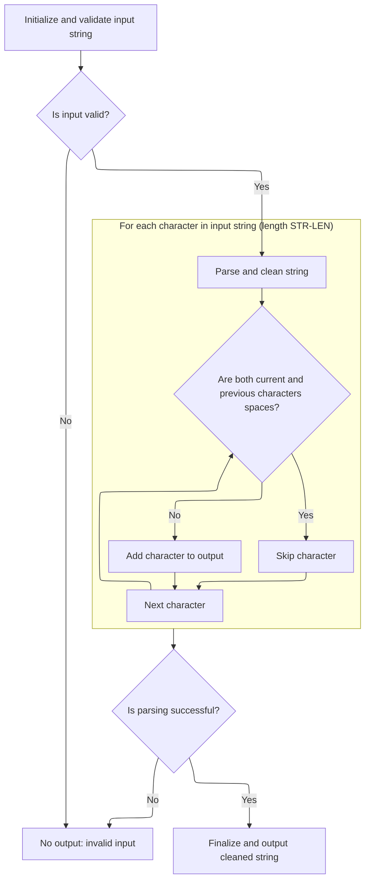
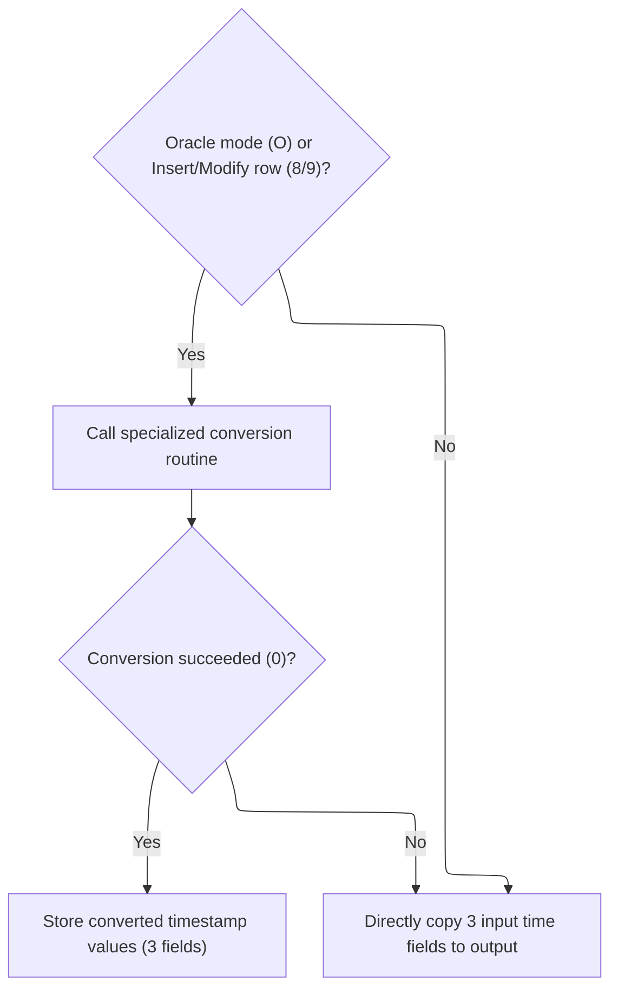
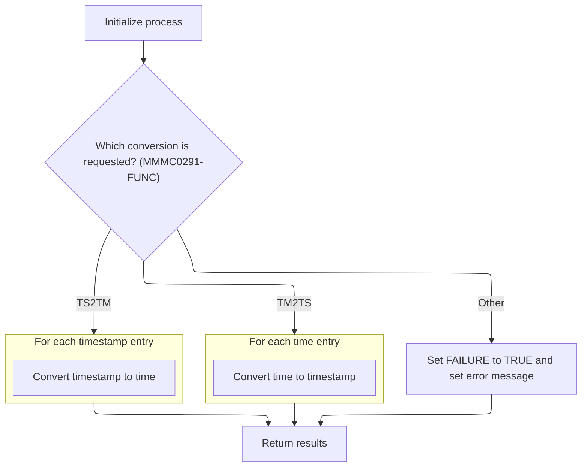

This document describes how location and contact data is prepared for business use. The flow validates and normalizes location fields, cleans contact names, marks non-shipping days, and converts time fields to timestamps when needed. The result is a set of consistent, business-ready data that supports downstream processes such as shipping, scheduling, and database operations.



# Spec

## Detailed View of the Program's Functionality

# Swimmio-dyncall-demo: Flow and Actions in the Provided Code

---

## A. Program Startup and Initialization

When the main program starts, it performs several setup steps to prepare for processing location data:

1. **Initialization of Data Structures and Status Fields**

   - The program initializes various working storage areas, status fields, and business-related variables. This ensures all fields start in a known state, preventing leftover data from previous runs from causing errors.

2. **Handling Cursor Closure**

   - The program checks if the operation requested is to close a database cursor. If so, it skips the rest of the initialization and moves on to cursor closure logic.

3. **Transferring and Normalizing Location Data**

   - If not closing a cursor, the program proceeds to transfer and normalize location data from the input area to the internal data structures. This is done by calling a dedicated routine that handles all the necessary field moves and data cleaning.

4. **Database Connection Decision**

   - The program checks if an Oracle database connection is needed. This is determined by checking if the system is in Oracle mode or if the operation is an insert, purge, or modify row. If so, it initiates a connection to the Oracle database.

---

## B. Transferring and Normalizing Location Fields

This section is responsible for preparing all location-related data for further processing:

 1. **Space-Crunching Contact Names**

    - The program calculates the length of the primary contact name and calls a specialized string cleaning routine. This routine removes extra spaces, ensuring only single spaces remain between words.

 2. **Copying and Normalizing Fields**

    - All location-related fields (such as type, number, name, address, city, state, zip, country, phone, etc.) are copied from the input area to the internal data structure. This includes both primary and secondary contact and address information, as well as mailing information.

 3. **Defaulting and Validating Dates**

    - For each important date field (added, deleted, inactive, opened, closed), the program checks if the field is empty or contains a special zero value. If so, it sets the field to a default date. Then, it copies the date to the internal structure.

 4. **Setting Active/Inactive Flags**

    - The program checks if the location is neither inactive nor deleted. If so, it marks the location as active.

 5. **Applying Business Rules Based on Location Type**

    - Depending on the location type (vendor, store, DSD vendor), the program sets or clears certain fields (like account type and number) and adjusts active/inactive flags as needed.

 6. **Copying Additional Fields**

    - The program continues copying various fields, including email addresses, facility and organization IDs, routing IDs, county text, and direct ship flags.

 7. **Validating Numeric Fields**

    - For certain fields expected to be numeric (like order processing days, lead time, buffer time), the program checks if the value is numeric. If not, it sets the field to zero.

 8. **Marking Non-Shipping Days**

    - The program calls a routine to mark which days of the week the location does not ship. This is done by checking each day and setting a flag if shipping is not available.

 9. **Handling Obsolete Fields**

    - Some fields are marked as obsolete and are set to a default null time value.

10. **Time Field Preparation**

    - If the order processing cutoff time is empty, it is set to a default null time. The value is then copied to the internal structure.

11. **Time-to-Timestamp Conversion**

    - The program calls a routine to convert time fields to timestamp format if needed (see next section).

---

## C. Cleaning and Returning Space-Crunched Strings

The string cleaning routine works as follows:

1. **Initialization and Validation**

   - The routine initializes its working storage and checks the input string length, capping it at a maximum allowed value. It then checks if the string is empty or filled with low-values (non-printable characters). If invalid, it sets a failure flag and an error message.

2. **Space Crunching Loop**

   - The routine loops through each character in the input string. If it encounters a space that follows another space, it skips the character. Otherwise, it adds the character to the output buffer. This ensures that only single spaces remain between words.

3. **Finalizing Output**

   - If the crunching was successful, the routine clears the output string and copies the cleaned string into it, ensuring no leftover data remains.

---

## D. Marking Non-Shipping Days

The program determines which days of the week the location does not ship:

1. **Checking Each Day**

   - For each day from Monday to Sunday, the program checks if shipping is available. If not, it sets a flag indicating that shipping does not occur on that day.

2. **Result**

   - This setup allows later logic to quickly determine which days are excluded from shipping without re-checking the schedule.

---

## E. Converting Times to Timestamps

The program handles time-to-timestamp conversion as follows:

1. **Determining Need for Conversion**

   - The program checks if it is running in Oracle mode or performing an insert/modify operation. If so, it prepares for conversion.

2. **Preparing Input for Conversion**

   - It initializes the input and output areas for the conversion routine and copies up to three time fields into the conversion input array.

3. **Calling the Conversion Routine**

   - The program sets a flag indicating time-to-timestamp conversion and calls the specialized conversion routine.

4. **Handling Conversion Results**

   - If the conversion is successful, the resulting timestamps are copied to the appropriate output fields. If not, the original time fields are copied directly to the output.

---

## F. Bidirectional Time and Timestamp Conversion

The specialized conversion routine can convert both ways:

1. **Initialization**

   - The routine initializes its working storage and determines which conversion is requested (time-to-timestamp or timestamp-to-time).

2. **Time-to-Timestamp Conversion**

   - For each time entry:
     - If the entry is not blank, it parses the time, fills in missing parts with '00', and checks for valid hour, minute, and second values.
     - If valid, it builds a timestamp string and stores it in the output.
     - If invalid, it sets a failure flag and an error message, and clears the output for that entry.

3. **Timestamp-to-Time Conversion**

   - For each timestamp entry:
     - If the entry is not blank, it parses the timestamp, fills in missing time parts with '00', and checks for valid values.
     - If valid, it extracts the time portion and stores it in the output.
     - If invalid, it sets a failure flag and an error message, and clears the output for that entry.

4. **Error Handling**

   - If an invalid function code is passed, the routine sets a failure flag and an error message.

---

## G. Connecting to Oracle Database

When a database connection is needed:

1. **Calling the Connection Manager**

   - The program calls an external routine responsible for establishing the Oracle database connection.

2. **Error Handling**

   - If the connection fails, the program retrieves the SQL error code and builds an error message for downstream handling.

---

## H. Summary

- The program initializes all necessary data and status fields.
- It transfers and normalizes all location data, including cleaning up contact names and validating fields.
- It marks non-shipping days for easy reference.
- It converts time fields to timestamps (and vice versa) as needed, using a robust conversion routine with error handling.
- It connects to the Oracle database when required, handling errors gracefully.
- All these steps ensure that location data is clean, normalized, and ready for further business processing or database operations.

# Rule Definition

| Paragraph Name                                                                          | Rule ID | Category          | Description                                                                                                                                                                                                                                                                                           | Conditions                                                                                                                         | Remarks                                                                                                                                                                                         |
| --------------------------------------------------------------------------------------- | ------- | ----------------- | ----------------------------------------------------------------------------------------------------------------------------------------------------------------------------------------------------------------------------------------------------------------------------------------------------- | ---------------------------------------------------------------------------------------------------------------------------------- | ----------------------------------------------------------------------------------------------------------------------------------------------------------------------------------------------- |
| 100-INITIALIZATION, 100-INITIALIZE, 100-INITIALIZATION in NNNS0487.cbl and MMMS0291.cbl | RL-001  | Data Assignment   | Before any processing begins, all relevant variables for location, status, and business logic must be initialized to their default values.                                                                                                                                                            | Program start or entry into main dispatcher.                                                                                       | Initialization includes setting numeric fields to 0, alphanumeric fields to spaces, and status flags to their default (e.g., SUCCESS/FALSE).                                                    |
| 100-INITIALIZATION, 115-CONNECT-TO-ORACLE in NNNS0487.cbl                               | RL-002  | Conditional Logic | If the EXIT-CLOSE-CURSOR flag is set to 2, check if an Oracle connection is needed by evaluating if YYYN005A-ORACLE equals 'O', or if EXIT-PUT-INSERT-ROW equals 9, or if EXIT-PUT-PURGE-ROW equals 10, or if EXIT-PUT-MODIFY-ROW equals 8. If so, establish the Oracle connection before continuing. | EXIT-CLOSE-CURSOR = 2 and (YYYN005A-ORACLE = 'O' or EXIT-PUT-INSERT-ROW = 9 or EXIT-PUT-PURGE-ROW = 10 or EXIT-PUT-MODIFY-ROW = 8) | Oracle connection is established via a call to Z-ORA-CONNECT. If connection fails, set FAILURE and provide an error message.                                                                    |
| 110-MOVE-PDA-FIELDS-2-DCL in NNNS0487.cbl                                               | RL-003  | Data Assignment   | When EXIT-CLOSE-CURSOR is not set, transfer all location fields from the input structure (P-DDDTLO01) to the working structure (DCLXXXATION), applying normalization and business rules.                                                                                                              | EXIT-CLOSE-CURSOR is not set.                                                                                                      | All fields are copied, and business rules (such as cleaning, defaulting, and validation) are applied during the transfer.                                                                       |
| 110-MOVE-PDA-FIELDS-2-DCL in NNNS0487.cbl, YYYS0134.cbl                                 | RL-004  | Computation       | All contact name fields must be cleaned by removing consecutive spaces, ensuring only single spaces remain between words. Input strings must be validated for emptiness or invalid values before cleaning.                                                                                            | Contact name field is being processed.                                                                                             | Cleaning is performed by calling YYYS0134, which processes up to 80 characters and returns a string with no consecutive spaces. If input is empty or low-values, set FAILURE and error message. |
| 110-MOVE-PDA-FIELDS-2-DCL in NNNS0487.cbl                                               | RL-005  | Data Assignment   | Date and numeric fields must be defaulted to business-defined constants (e.g., K-DEF-DT, K-ZERO-DT) if they are empty or contain invalid values.                                                                                                                                                      | Date or numeric field is empty, spaces, or contains invalid value.                                                                 | K-DEF-DT and K-ZERO-DT are used as default values for dates. Numeric fields default to 0 if not numeric.                                                                                        |
| 116-EDIT-SHIP-DAYS in NNNS0487.cbl                                                      | RL-006  | Conditional Logic | For each day of the week, set the corresponding DOES-NOT-SHIP flag to true if the SHIPS flag for that day is not set.                                                                                                                                                                                 | Processing shipping days fields.                                                                                                   | Flags: DOES-NOT-SHIP-MON through DOES-NOT-SHIP-SUN, SHIPS-MON through SHIPS-SUN.                                                                                                                |
| 112-CONVERT-TM-TO-TS in NNNS0487.cbl, 201-CONVERT-TM-TO-TS in MMMS0291.cbl              | RL-007  | Computation       | If Oracle mode is active or row insert/modify operations are requested, convert time fields (e.g., ORD-PROCNG-CTOF-TM, FILLER1-TM, FILLER2-TM) to timestamp format using the conversion routine, validating the input format.                                                                         | YYYN005A-ORACLE or EXIT-PUT-MODIFY-ROW or EXIT-PUT-INSERT-ROW is set.                                                              | Input: time fields as strings (e.g., 'HH:MM:SS'). Output: timestamp as string (e.g., 'YYYY-MM-DD-HH:MM:SS.000000'). If input is invalid, set FAILURE and error message.                         |
| 132-CONVERT-TS-TO-TM in NNNS0487.cbl, 301-CONVERT-TS-TO-TM in MMMS0291.cbl              | RL-008  | Computation       | When requested, convert timestamp fields to time format, filling in missing time parts with '00' and validating the output.                                                                                                                                                                           | Conversion from timestamp to time is requested.                                                                                    | Input: timestamp string. Output: time string (e.g., 'HH:MM:SS'). If any part is missing, fill with '00'. If output is invalid, set FAILURE and error message.                                   |
| 120-EXIT-STUFF, 130-MOVE-DCL-2-PDA-FIELDS in NNNS0487.cbl                               | RL-009  | Data Assignment   | After processing, return all cleaned, converted, and normalized data in the specified output formats.                                                                                                                                                                                                 | Processing completed successfully.                                                                                                 | Output formats match the structure of the working and output data areas, with cleaned strings, normalized fields, and converted times/timestamps.                                               |
| Throughout error handling in NNNS0487.cbl, MMMS0291.cbl, YYYS0134.cbl                   | RL-010  | Conditional Logic | If any input is invalid or a conversion fails, set the FAILURE flag and provide an appropriate error message in the output. Otherwise, set SUCCESS.                                                                                                                                                   | Any validation or conversion fails.                                                                                                | Error messages are descriptive and placed in the output message field. SUCCESS/FAILURE flags are set accordingly.                                                                               |

# User Stories

## User Story 1: Oracle Connection and Time/ Timestamp Conversion

---

### Story Description:

As a system, I want to establish an Oracle connection when required and convert time fields to timestamp format when Oracle mode or row operations are requested, and also convert timestamp fields to time format when requested, filling in missing parts and validating the output so that data is processed correctly for database operations and time data is consistently formatted for downstream use.

---

### Business Rule Mapping:

| Rule ID | Paragraph Name                                                             | Rule Description                                                                                                                                                                                                                                                                                      |
| ------- | -------------------------------------------------------------------------- | ----------------------------------------------------------------------------------------------------------------------------------------------------------------------------------------------------------------------------------------------------------------------------------------------------- |
| RL-002  | 100-INITIALIZATION, 115-CONNECT-TO-ORACLE in NNNS0487.cbl                  | If the EXIT-CLOSE-CURSOR flag is set to 2, check if an Oracle connection is needed by evaluating if YYYN005A-ORACLE equals 'O', or if EXIT-PUT-INSERT-ROW equals 9, or if EXIT-PUT-PURGE-ROW equals 10, or if EXIT-PUT-MODIFY-ROW equals 8. If so, establish the Oracle connection before continuing. |
| RL-007  | 112-CONVERT-TM-TO-TS in NNNS0487.cbl, 201-CONVERT-TM-TO-TS in MMMS0291.cbl | If Oracle mode is active or row insert/modify operations are requested, convert time fields (e.g., ORD-PROCNG-CTOF-TM, FILLER1-TM, FILLER2-TM) to timestamp format using the conversion routine, validating the input format.                                                                         |
| RL-008  | 132-CONVERT-TS-TO-TM in NNNS0487.cbl, 301-CONVERT-TS-TO-TM in MMMS0291.cbl | When requested, convert timestamp fields to time format, filling in missing time parts with '00' and validating the output.                                                                                                                                                                           |

---

### Relevant Functionality:

- **100-INITIALIZATION**
  1. **RL-002:**
     - If EXIT-CLOSE-CURSOR is set to 2:
       - If any of the Oracle-related flags/fields are set:
         - Call Oracle connection routine.
         - If connection fails, set FAILURE and error message.
- **112-CONVERT-TM-TO-TS in NNNS0487.cbl**
  1. **RL-007:**
     - If Oracle mode or row insert/modify:
       - For each time field:
         - Call conversion routine to produce timestamp.
         - Validate input; if invalid, set FAILURE and error message.
- **132-CONVERT-TS-TO-TM in NNNS0487.cbl**
  1. **RL-008:**
     - When conversion requested:
       - For each timestamp field:
         - Convert to time format, filling missing parts with '00'.
         - Validate output; if invalid, set FAILURE and error message.

## User Story 2: System Initialization, Input Data Normalization and Cleaning

---

### Story Description:

As a system, I want all location, status, and business variables to be initialized to their default values before processing begins, and then transfer, clean, and normalize all location and contact fields from the input to the working structure, applying business rules and defaulting invalid or empty fields so that the data is validated and ready for processing.

---

### Business Rule Mapping:

| Rule ID | Paragraph Name                                                                          | Rule Description                                                                                                                                                                                           |
| ------- | --------------------------------------------------------------------------------------- | ---------------------------------------------------------------------------------------------------------------------------------------------------------------------------------------------------------- |
| RL-001  | 100-INITIALIZATION, 100-INITIALIZE, 100-INITIALIZATION in NNNS0487.cbl and MMMS0291.cbl | Before any processing begins, all relevant variables for location, status, and business logic must be initialized to their default values.                                                                 |
| RL-003  | 110-MOVE-PDA-FIELDS-2-DCL in NNNS0487.cbl                                               | When EXIT-CLOSE-CURSOR is not set, transfer all location fields from the input structure (P-DDDTLO01) to the working structure (DCLXXXATION), applying normalization and business rules.                   |
| RL-004  | 110-MOVE-PDA-FIELDS-2-DCL in NNNS0487.cbl, YYYS0134.cbl                                 | All contact name fields must be cleaned by removing consecutive spaces, ensuring only single spaces remain between words. Input strings must be validated for emptiness or invalid values before cleaning. |
| RL-005  | 110-MOVE-PDA-FIELDS-2-DCL in NNNS0487.cbl                                               | Date and numeric fields must be defaulted to business-defined constants (e.g., K-DEF-DT, K-ZERO-DT) if they are empty or contain invalid values.                                                           |
| RL-006  | 116-EDIT-SHIP-DAYS in NNNS0487.cbl                                                      | For each day of the week, set the corresponding DOES-NOT-SHIP flag to true if the SHIPS flag for that day is not set.                                                                                      |

---

### Relevant Functionality:

- **100-INITIALIZATION**
  1. **RL-001:**
     - On program start:
       - Set all working storage and linkage variables to their default values.
       - Initialize status and business flags (e.g., SUCCESS, FAILURE).
       - Prepare all structures for subsequent processing.
- **110-MOVE-PDA-FIELDS-2-DCL in NNNS0487.cbl**
  1. **RL-003:**
     - For each field in the input structure:
       - Copy value to the corresponding field in the working structure.
       - Apply cleaning and normalization as required.
  2. **RL-004:**
     - For each contact name field:
       - If field is empty or low-values, set FAILURE and error message.
       - Otherwise, call space cruncher routine to clean up spaces.
  3. **RL-005:**
     - For each date field:
       - If field is spaces or K-ZERO-DT, set to K-DEF-DT.
     - For each numeric field:
       - If not numeric, set to 0.
- **116-EDIT-SHIP-DAYS in NNNS0487.cbl**
  1. **RL-006:**
     - For each day (Mon-Sun):
       - If SHIPS-DAY is not set, set DOES-NOT-SHIP-DAY to true.

## User Story 3: Output Formatting and Error Handling

---

### Story Description:

As a system, I want to return cleaned strings, converted times/timestamps, and normalized location data in the specified output formats, setting SUCCESS or FAILURE flags and providing error messages when necessary so that users receive clear and accurate results.

---

### Business Rule Mapping:

| Rule ID | Paragraph Name                                                        | Rule Description                                                                                                                                    |
| ------- | --------------------------------------------------------------------- | --------------------------------------------------------------------------------------------------------------------------------------------------- |
| RL-009  | 120-EXIT-STUFF, 130-MOVE-DCL-2-PDA-FIELDS in NNNS0487.cbl             | After processing, return all cleaned, converted, and normalized data in the specified output formats.                                               |
| RL-010  | Throughout error handling in NNNS0487.cbl, MMMS0291.cbl, YYYS0134.cbl | If any input is invalid or a conversion fails, set the FAILURE flag and provide an appropriate error message in the output. Otherwise, set SUCCESS. |

---

### Relevant Functionality:

- **120-EXIT-STUFF**
  1. **RL-009:**
     - On successful processing:
       - Move all normalized and cleaned fields to output structures.
       - Ensure output matches required formats.
- **Throughout error handling in NNNS0487.cbl**
  1. **RL-010:**
     - On any validation or conversion error:
       - Set FAILURE flag.
       - Set error message in output.
     - Otherwise, set SUCCESS flag.

# Code Walkthrough

## Starting Up and Preparing Location Data



<SwmSnippet path="/base/src/NNNS0487.cbl" line="894">

---

100-INITIALIZATION sets up the environment and, unless we're closing the cursor, hands off to 110-MOVE-PDA-FIELDS-2-DCL to start prepping the location data for the rest of the flow.

```cobol
097100 100-INITIALIZATION.                                              00097100
097200     INITIALIZE XXXN001A                                          00097200
097300                DAO-STATUS                                        00097300
097400                MMMC0474                                          00097400
097500                ZZZC0550                                          00097500
097600     MOVE NNNN0000-INDEX-HANDLE TO DDDTLO01-INDEX-HANDLE          00097600
097700     MOVE 0 TO WS-CHECKPOINT-INC                                  00097700
097800     MOVE 0 TO SQLCODE                                            00097800
097900     MOVE 0 TO SQL-INIT-FLAG                                      00097900
098000     IF NOT EXIT-CLOSE-CURSOR                                     00098000
098100       PERFORM 110-MOVE-PDA-FIELDS-2-DCL                          00098100
098200     END-IF                                                       00098200
098300     IF (YYYN005A-ORACLE       OR EXIT-PUT-INSERT-ROW             00098300
098400         OR EXIT-PUT-PURGE-ROW OR EXIT-PUT-MODIFY-ROW)            00098400
098500       PERFORM 115-CONNECT-TO-ORACLE                              00098500
098600     END-IF                                                       00098600
098700     .                                                            00098700
```

---

</SwmSnippet>

### Transferring and Normalizing Location Fields

<SwmSnippet path="/base/src/NNNS0487.cbl" line="918">

---

110-MOVE-PDA-FIELDS-2-DCL copies and normalizes all location data, crunches contact names by calling YYYS0134.cbl, defaults dates and numeric fields, applies business rules, and hands off to routines for shipping days and time conversion.

```cobol
099500 110-MOVE-PDA-FIELDS-2-DCL.                                       00099500
099600     MOVE LENGTH OF PRIM-CONTACT-NM OF P-DDDTLO01 TO WS-STR-LEN   00099600
099700     CALL  YYYS0134-STRING-CRUNCH USING                           00099700
099800                            XXXN001A                              00099800
099900                            PRIM-CONTACT-NM OF P-DDDTLO01         00099900
100000                            WS-STR-LEN                            00100000
100100     INITIALIZE XXXN001A                                          00100100
100200     MOVE LOC-TYP-CD OF P-DDDTLO01 TO LOC-TYP-CD OF DCLXXXATION   00100200
100300     MOVE LOC-NBR OF P-DDDTLO01 TO LOC-NBR OF DCLXXXATION         00100300
100400     MOVE LOC-NM OF P-DDDTLO01 TO LOC-NM OF DCLXXXATION           00100400
100500     MOVE LOC-ABB OF P-DDDTLO01 TO LOC-ABB OF DCLXXXATION         00100500
100600     MOVE LGL-LOC-NAM OF P-DDDTLO01 TO LGL-LOC-NAM OF DCLXXXATION 00100600
100700     MOVE PRIM-CONTACT-NM OF P-DDDTLO01                           00100700
100800       TO PRIM-CONTACT-NM OF DCLXXXATION                          00100800
100900     MOVE PRIM-ADR-1 OF P-DDDTLO01 TO PRIM-ADR-1 OF DCLXXXATION   00100900
101000     MOVE PRIM-ADR-2 OF P-DDDTLO01 TO PRIM-ADR-2 OF DCLXXXATION   00101000
101100     MOVE PRIM-ADR-3 OF P-DDDTLO01 TO PRIM-ADR-3 OF DCLXXXATION   00101100
101200     MOVE PRIM-ADR-4 OF P-DDDTLO01 TO PRIM-ADR-4 OF DCLXXXATION   00101200
101300     MOVE PRIM-CITY OF P-DDDTLO01 TO PRIM-CITY OF DCLXXXATION     00101300
101400     MOVE PRIM-CITY-ID OF P-DDDTLO01                              00101400
101500       TO PRIM-CITY-ID OF DCLXXXATION                             00101500
101600     MOVE PRIM-STATE-CD OF P-DDDTLO01                             00101600
101700       TO PRIM-STATE-CD OF DCLXXXATION                            00101700
101800     MOVE PRIM-ZIP5-CD OF P-DDDTLO01                              00101800
101900       TO PRIM-ZIP5-CD OF DCLXXXATION                             00101900
102000     MOVE PRIM-ZIP4-CD OF P-DDDTLO01                              00102000
102100       TO PRIM-ZIP4-CD OF DCLXXXATION                             00102100
102200     MOVE PRIM-PHN-CNTRY-CD OF P-DDDTLO01                         00102200
102300       TO PRIM-PHN-CNTRY-CD OF DCLXXXATION                        00102300
102400     MOVE PRIM-AREA-CD OF P-DDDTLO01                              00102400
102500       TO PRIM-AREA-CD OF DCLXXXATION                             00102500
102600     MOVE PRIM-PHONE-NBR OF P-DDDTLO01                            00102600
102700       TO PRIM-PHONE-NBR OF DCLXXXATION                           00102700
102800     MOVE PRIM-CNTRY-NM OF P-DDDTLO01                             00102800
102900       TO PRIM-CNTRY-NM OF DCLXXXATION                            00102900
103000     MOVE PRIM-CNTRY-ABB OF P-DDDTLO01                            00103000
103100       TO PRIM-CNTRY-ABB OF DCLXXXATION                           00103100
103200     MOVE SEC-LOC-NM OF P-DDDTLO01 TO SEC-LOC-NM OF DCLXXXATION   00103200
103300     MOVE SEC-CONTACT-NM OF P-DDDTLO01                            00103300
103400       TO SEC-CONTACT-NM OF DCLXXXATION                           00103400
103500     MOVE SEC-ADR-1 OF P-DDDTLO01 TO SEC-ADR-1 OF DCLXXXATION     00103500
103600     MOVE SEC-ADR-2 OF P-DDDTLO01 TO SEC-ADR-2 OF DCLXXXATION     00103600
103700     MOVE SEC-ADR-3 OF P-DDDTLO01 TO SEC-ADR-3 OF DCLXXXATION     00103700
103800     MOVE SEC-ADR-4 OF P-DDDTLO01 TO SEC-ADR-4 OF DCLXXXATION     00103800
103900     MOVE SEC-CITY OF P-DDDTLO01 TO SEC-CITY OF DCLXXXATION       00103900
104000     MOVE SEC-STATE-CD OF P-DDDTLO01                              00104000
104100       TO SEC-STATE-CD OF DCLXXXATION                             00104100
104200     MOVE SEC-ZIP5-CD OF P-DDDTLO01 TO SEC-ZIP5-CD OF DCLXXXATION 00104200
104300     MOVE SEC-ZIP4-CD OF P-DDDTLO01 TO SEC-ZIP4-CD OF DCLXXXATION 00104300
104400     MOVE SEC-PHN-CNTRY-CD OF P-DDDTLO01                          00104400
104500       TO SEC-PHN-CNTRY-CD OF DCLXXXATION                         00104500
104600     MOVE SEC-AREA-CD OF P-DDDTLO01 TO SEC-AREA-CD OF DCLXXXATION 00104600
104700     MOVE SEC-PHONE-NBR OF P-DDDTLO01                             00104700
104800       TO SEC-PHONE-NBR OF DCLXXXATION                            00104800
104900     MOVE SEC-CNTRY-NM OF P-DDDTLO01                              00104900
105000       TO SEC-CNTRY-NM OF DCLXXXATION                             00105000
105100     MOVE SEC-CNTRY-ABB OF P-DDDTLO01                             00105100
105200       TO SEC-CNTRY-ABB OF DCLXXXATION                            00105200
105300     MOVE MAIL-TO-LOC-NM OF P-DDDTLO01                            00105300
105400       TO MAIL-TO-LOC-NM OF DCLXXXATION                           00105400
105500     MOVE MAIL-TO-CNTCT-NM OF P-DDDTLO01                          00105500
105600       TO MAIL-TO-CNTCT-NM OF DCLXXXATION                         00105600
105700     MOVE MAIL-TO-ADR-1 OF P-DDDTLO01                             00105700
105800       TO MAIL-TO-ADR-1 OF DCLXXXATION                            00105800
105900     MOVE MAIL-TO-ADR-2 OF P-DDDTLO01                             00105900
106000       TO MAIL-TO-ADR-2 OF DCLXXXATION                            00106000
106100     MOVE MAIL-TO-ADR-3 OF P-DDDTLO01                             00106100
106200       TO MAIL-TO-ADR-3 OF DCLXXXATION                            00106200
106300     MOVE MAIL-TO-ADR-4 OF P-DDDTLO01                             00106300
106400       TO MAIL-TO-ADR-4 OF DCLXXXATION                            00106400
106500     MOVE MAIL-TO-CITY OF P-DDDTLO01                              00106500
106600       TO MAIL-TO-CITY OF DCLXXXATION                             00106600
106700     MOVE MAIL-TO-STATE-CD OF P-DDDTLO01                          00106700
106800       TO MAIL-TO-STATE-CD OF DCLXXXATION                         00106800
106900     MOVE MAIL-TO-ZIP5-CD OF P-DDDTLO01                           00106900
107000       TO MAIL-TO-ZIP5-CD OF DCLXXXATION                          00107000
107100     MOVE MAIL-TO-ZIP4-CD OF P-DDDTLO01                           00107100
107200       TO MAIL-TO-ZIP4-CD OF DCLXXXATION                          00107200
107300     MOVE MAIL-PHN-CNTRY-CD OF P-DDDTLO01                         00107300
107400       TO MAIL-PHN-CNTRY-CD OF DCLXXXATION                        00107400
107500     MOVE MAIL-TO-AREA-CD OF P-DDDTLO01                           00107500
107600       TO MAIL-TO-AREA-CD OF DCLXXXATION                          00107600
107700     MOVE MAIL-TO-PHONE-NBR OF P-DDDTLO01                         00107700
107800       TO MAIL-TO-PHONE-NBR OF DCLXXXATION                        00107800
107900     MOVE MAIL-TO-CNTRY-NM OF P-DDDTLO01                          00107900
108000       TO MAIL-TO-CNTRY-NM OF DCLXXXATION                         00108000
108100     MOVE MAIL-TO-CNTRY-AB OF P-DDDTLO01                          00108100
108200       TO MAIL-TO-CNTRY-AB OF DCLXXXATION                         00108200
108300     MOVE CURR-FAX-ID OF P-DDDTLO01 TO CURR-FAX-ID OF DCLXXXATION 00108300
108400                                                                  00108400
108500     IF ADDED-DT OF P-DDDTLO01 = SPACES                           00108500
108600     OR ADDED-DT OF P-DDDTLO01 = K-ZERO-DT                        00108600
108700       MOVE K-DEF-DT TO ADDED-DT OF P-DDDTLO01                    00108700
108800     END-IF                                                       00108800
108900     MOVE ADDED-DT OF P-DDDTLO01 TO ADDED-DT OF DCLXXXATION       00108900
109000                                                                  00109000
109100     IF DELETE-DT OF P-DDDTLO01 = SPACES                          00109100
109200     OR DELETE-DT OF P-DDDTLO01 = K-ZERO-DT                       00109200
109300       MOVE K-DEF-DT TO DELETE-DT OF P-DDDTLO01                   00109300
109400     END-IF                                                       00109400
109500     MOVE DELETE-DT OF P-DDDTLO01 TO DELETE-DT OF DCLXXXATION     00109500
109600                                                                  00109600
109700     IF INACTIVE-DT OF P-DDDTLO01 = SPACES                        00109700
109800     OR INACTIVE-DT OF P-DDDTLO01 = K-ZERO-DT                     00109800
109900       MOVE K-DEF-DT TO INACTIVE-DT OF P-DDDTLO01                 00109900
110000     END-IF                                                       00110000
110100     MOVE INACTIVE-DT OF P-DDDTLO01 TO INACTIVE-DT OF DCLXXXATION 00110100
110200                                                                  00110200
110300     IF OPENED-DT OF P-DDDTLO01 = SPACES                          00110300
110400     OR OPENED-DT OF P-DDDTLO01 = K-ZERO-DT                       00110400
110500       MOVE K-DEF-DT TO OPENED-DT OF P-DDDTLO01                   00110500
110600     END-IF                                                       00110600
110700     MOVE OPENED-DT OF P-DDDTLO01 TO OPENED-DT OF DCLXXXATION     00110700
110800                                                                  00110800
110900     IF CLOSED-DT OF P-DDDTLO01 = SPACES                          00110900
111000     OR CLOSED-DT OF P-DDDTLO01 = K-ZERO-DT                       00111000
111100       MOVE K-DEF-DT TO CLOSED-DT OF P-DDDTLO01                   00111100
111200     END-IF                                                       00111200
111300     MOVE CLOSED-DT OF P-DDDTLO01 TO CLOSED-DT OF DCLXXXATION     00111300
111400                                                                  00111400
111500     IF NOT LO-INACTIVE AND NOT LO-DELETED                        00111500
111600       SET LO-ACTIVE TO TRUE                                      00111600
111700     END-IF                                                       00111700
111800                                                                  00111800
111900     EVALUATE TRUE                                                00111900
112000       WHEN LOC-TYP-CD OF DCLXXXATION = K-VEND-LOC-TYPE           00112000
112100         MOVE K-AP-TYPE-CD TO AP-TYP-CD OF P-DDDTLO01             00112100
112200                                                                  00112200
112300       WHEN LOC-TYP-CD OF DCLXXXATION = K-STORE-LOC-TYPE          00112300
112400         MOVE 0      TO AP-NBR    OF P-DDDTLO01                   00112400
112500         MOVE SPACES TO AP-TYP-CD OF P-DDDTLO01                   00112500
112600                                                                  00112600
112700       WHEN LOC-TYP-CD OF DCLXXXATION = K-DSD-VEND-LOC-TYPE       00112700
112800         MOVE K-DSD-AP-TYPE-CD TO AP-TYP-CD OF P-DDDTLO01         00112800
112900         IF INACTIVE-DT OF P-DDDTLO01 = K-DEF-DT                  00112900
113000           SET LO-ACTIVE TO TRUE                                  00113000
113100         ELSE                                                     00113100
113200           SET LO-INACTIVE TO TRUE                                00113200
113300         END-IF                                                   00113300
113400     END-EVALUATE                                                 00113400
113500                                                                  00113500
113600     MOVE INACTIVE-SW OF P-DDDTLO01 TO INACTIVE-SW OF DCLXXXATION 00113600
113700                                                                  00113700
113800     MOVE AP-NBR OF P-DDDTLO01 TO AP-NBR OF DCLXXXATION           00113800
113900     MOVE AP-TYP-CD OF P-DDDTLO01   TO AP-TYP-CD OF DCLXXXATION   00113900
114000                                                                  00114000
114100     MOVE LST-UPDT-TS OF P-DDDTLO01 TO LST-UPDT-TS OF DCLXXXATION 00114100
114200     MOVE LST-UPDT-USR-ID OF P-DDDTLO01                           00114200
114300       TO LST-UPDT-USR-ID OF DCLXXXATION                          00114300
114400     MOVE PRIM-EMAIL-ID    OF P-DDDTLO01                          00114400
114500       TO PRIM-EMAIL-ID    OF DCLXXXATION                         00114500
114600     MOVE SECY-EMAIL-ID    OF P-DDDTLO01                          00114600
114700       TO SECY-EMAIL-ID    OF DCLXXXATION                         00114700
114800     MOVE MAIL-TO-EMAIL-ID OF P-DDDTLO01                          00114800
114900       TO MAIL-TO-EMAIL-ID OF DCLXXXATION                         00114900
115000     IF FAC-ID-X = SPACES                                         00115000
115100       MOVE 0 TO FAC-ID OF P-DDDTLO01                             00115100
115200     END-IF                                                       00115200
115300     MOVE FAC-ID           OF P-DDDTLO01                          00115300
115400       TO FAC-ID           OF DCLXXXATION                         00115400
115500     IF ORG-ID-X = SPACES                                         00115500
115600       MOVE 0 TO ORG-ID OF P-DDDTLO01                             00115600
115700     END-IF                                                       00115700
115800     MOVE ORG-ID           OF P-DDDTLO01                          00115800
115900       TO ORG-ID           OF DCLXXXATION                         00115900
116000     MOVE B2B-PRIM-RTNG-ID OF P-DDDTLO01                          00116000
116100       TO B2B-PRIM-RTNG-ID OF DCLXXXATION                         00116100
116200     MOVE PRIM-CNTY-TXT    OF P-DDDTLO01                          00116200
116300       TO PRIM-CNTY-TXT    OF DCLXXXATION                         00116300
116400     MOVE SECY-CNTY-TXT    OF P-DDDTLO01                          00116400
116500       TO SECY-CNTY-TXT    OF DCLXXXATION                         00116500
116600     MOVE MAIL-TO-CNTY-TXT OF P-DDDTLO01                          00116600
116700       TO MAIL-TO-CNTY-TXT OF DCLXXXATION                         00116700
116800                                                                  00116800
116900     IF NOT LOC-IS-DIRECT-SHIP OF P-DDDTLO01                      00116900
117000       SET LOC-IS-NOT-DIRECT-SHIP  OF P-DDDTLO01 TO TRUE          00117000
117100     END-IF                                                       00117100
117200     MOVE DIR-SHP-LOC-SW     OF P-DDDTLO01                        00117200
117300       TO DIR-SHP-LOC-SW     OF DCLXXXATION                       00117300
117400                                                                  00117400
117500     IF LOC-ORD-PROCNG-DD    OF P-DDDTLO01 NOT NUMERIC            00117500
117600        MOVE 0 TO LOC-ORD-PROCNG-DD OF P-DDDTLO01                 00117600
117700     END-IF                                                       00117700
117800     MOVE LOC-ORD-PROCNG-DD  OF P-DDDTLO01                        00117800
117900       TO LOC-ORD-PROCNG-DD  OF DCLXXXATION                       00117900
118000                                                                  00118000
118100     PERFORM 116-EDIT-SHIP-DAYS                                   00118100
118200     MOVE SCH-SHP-DD-TXT     OF P-DDDTLO01                        00118200
118300       TO SCH-SHP-DD-TXT     OF DCLXXXATION                       00118300
118400                                                                  00118400
118500                                                                  00118500
118600     IF ORD-LEAD-TM-DD OF P-DDDTLO01 IS NOT NUMERIC               00118600
118700        MOVE 0 TO ORD-LEAD-TM-DD OF P-DDDTLO01                    00118700
118800     END-IF                                                       00118800
118900     MOVE ORD-LEAD-TM-DD   OF P-DDDTLO01                          00118900
119000       TO ORD-LEAD-TM-DD   OF DCLXXXATION                         00119000
119100                                                                  00119100
119200     IF ORD-BUFFER-TM-DD OF P-DDDTLO01 IS NOT NUMERIC             00119200
119300        MOVE 0 TO ORD-BUFFER-TM-DD OF P-DDDTLO01                  00119300
119400     END-IF                                                       00119400
119500     MOVE ORD-BUFFER-TM-DD   OF P-DDDTLO01                        00119500
119600       TO ORD-BUFFER-TM-DD   OF DCLXXXATION                       00119600
119700                                                                  00119700
119800** Obsolete fields - Order Lead time and Buffer time renamed      00119800
119900** to FILLER1-TM and FILLER2-TM respectively.                     00119900
120000     MOVE WS-NULL-TM TO FILLER1-TM  OF DCLXXXATION                00120000
120100                        FILLER2-TM  OF DCLXXXATION                00120100
120200** Obsolete fields                                                00120200
120300                                                                  00120300
120400     IF ORD-PROCNG-CTOF-TM OF P-DDDTLO01 = SPACES                 00120400
120500       MOVE WS-NULL-TM TO ORD-PROCNG-CTOF-TM OF P-DDDTLO01        00120500
120600     END-IF                                                       00120600
120700     MOVE ORD-PROCNG-CTOF-TM OF P-DDDTLO01                        00120700
120800       TO ORD-PROCNG-CTOF-TM OF DCLXXXATION                       00120800
120900                                                                  00120900
121000     PERFORM 112-CONVERT-TM-TO-TS                                 00121000
121100     .                                                            00121100
```

---

</SwmSnippet>

#### Cleaning and Returning Space-Crunched Strings



<SwmSnippet path="/base/src/YYYS0134.cbl" line="47">

---

000-MAIN validates the input, crunches spaces if valid, and returns the cleaned string, only moving forward if each step succeeds.

```cobol
009100 000-MAIN.                                                        00009100
009200     PERFORM 100-INITIALIZATION                                   00009200
009300     IF SUCCESS                                                   00009300
009400       PERFORM 200-CRUNCH-STRING                                  00009400
009500     END-IF                                                       00009500
009600     IF SUCCESS                                                   00009600
009700       PERFORM 300-SEND-FINAL-STRING                              00009700
009800     END-IF                                                       00009800
010300     GOBACK                                                       00010300
010400     .                                                            00010400
```

---

</SwmSnippet>

<SwmSnippet path="/base/src/YYYS0134.cbl" line="62">

---

100-INITIALIZATION checks the input string length and caps it at the max allowed, then validates that the string isn't empty or filled with low-values. If it's invalid, it sets a failure flag and an error message so the rest of the flow doesn't run.

```cobol
011000 100-INITIALIZATION.                                              00011000
011100     INITIALIZE XXXN001A                                          00011100
011101                WS-OT-STR                                         00011101
011102                WS-BKUP-BYTE                                      00011102
011103                J                                                 00011103
011104                                                                  00011104
011105     IF STR-LEN          > WS-MAX-STR-LEN                         00011105
011106       MOVE WS-MAX-STR-LEN            TO STR-LEN                  00011106
011107     END-IF                                                       00011107
011108                                                                  00011108
011110     IF STR EQUAL SPACES OR LOW-VALUES                            00011110
011111         SET FAILURE                  TO TRUE                     00011111
011120         MOVE 'YYYS0134 - Text not passed for parsing.'           00011120
011130           TO IS-RTRN-MSG-TXT                                     00011130
011160     END-IF                                                       00011160
011800     .                                                            00011800
```

---

</SwmSnippet>

<SwmSnippet path="/base/src/YYYS0134.cbl" line="84">

---

200-CRUNCH-STRING loops through the input string, copying each character to the output buffer unless it's a space following another space. It uses WS-BKUP-BYTE to track the last character, so consecutive spaces get dropped and only single spaces remain.

```cobol
012500 200-CRUNCH-STRING.                                               00012500
012600                                                                  00012600
013500     PERFORM VARYING I FROM +1 BY +1 UNTIL I > STR-LEN            00013500
013501                                                                  00013501
013502       IF STR-B(I) EQUAL SPACE AND WS-BKUP-BYTE EQUAL SPACE       00013502
013503         CONTINUE                                                 00013503
013504       ELSE                                                       00013504
013505         ADD +1                       TO J                        00013505
013506                                                                  00013506
013507         MOVE STR-B(I)                TO WS-STR-B(J)              00013507
013508       END-IF                                                     00013508
013509                                                                  00013509
013510       MOVE STR-B(I)                  TO WS-BKUP-BYTE             00013510
013520                                                                  00013520
013600     END-PERFORM                                                  00013600
036500     .                                                            00036500
```

---

</SwmSnippet>

<SwmSnippet path="/base/src/YYYS0134.cbl" line="102">

---

300-SEND-FINAL-STRING resets the output string by filling it with spaces, then immediately overwrites it with the cleaned string. This double overwrite makes sure any leftover junk is cleared before returning the result, though it might be redundant.

```cobol
036600 300-SEND-FINAL-STRING.                                           00036600
036700     MOVE SPACES                      TO STR(1:STR-LEN)           00036700
036800     MOVE WS-OT-STR                   TO STR(1:STR-LEN)           00036800
037000     .                                                            00037000
```

---

</SwmSnippet>

#### Marking Non-Shipping Days

```mermaid
%%{init: {"flowchart": {"defaultRenderer": "elk"}} }%%
flowchart TD
    node1["Start: Check shipping days"]
    click node1 openCode "base/src/NNNS0487.cbl:1190:1191"
    subgraph loop1["For each day: Monday to Sunday"]
      node1 --> node2{"Is shipping available on Monday?"}
      click node2 openCode "base/src/NNNS0487.cbl:1191:1193"
      node2 -->|"No"| node3["Mark Monday as does not ship"]
      click node3 openCode "base/src/NNNS0487.cbl:1192:1193"
      node2 -->|"Yes"| node4{"Is shipping available on Tuesday?"}
      click node4 openCode "base/src/NNNS0487.cbl:1194:1196"
      node3 --> node4
      node4 -->|"No"| node5["Mark Tuesday as does not ship"]
      click node5 openCode "base/src/NNNS0487.cbl:1195:1196"
      node4 -->|"Yes"| node6{"Is shipping available on Wednesday?"}
      click node6 openCode "base/src/NNNS0487.cbl:1197:1199"
      node5 --> node6
      node6 -->|"No"| node7["Mark Wednesday as does not ship"]
      click node7 openCode "base/src/NNNS0487.cbl:1198:1199"
      node6 -->|"Yes"| node8{"Is shipping available on Thursday?"}
      click node8 openCode "base/src/NNNS0487.cbl:1200:1202"
      node7 --> node8
      node8 -->|"No"| node9["Mark Thursday as does not ship"]
      click node9 openCode "base/src/NNNS0487.cbl:1201:1202"
      node8 -->|"Yes"| node10{"Is shipping available on Friday?"}
      click node10 openCode "base/src/NNNS0487.cbl:1203:1205"
      node9 --> node10
      node10 -->|"No"| node11["Mark Friday as does not ship"]
      click node11 openCode "base/src/NNNS0487.cbl:1204:1205"
      node10 -->|"Yes"| node12{"Is shipping available on Saturday?"}
      click node12 openCode "base/src/NNNS0487.cbl:1206:1208"
      node11 --> node12
      node12 -->|"No"| node13["Mark Saturday as does not ship"]
      click node13 openCode "base/src/NNNS0487.cbl:1207:1208"
      node12 -->|"Yes"| node14{"Is shipping available on Sunday?"}
      click node14 openCode "base/src/NNNS0487.cbl:1209:1211"
      node13 --> node14
      node14 -->|"No"| node15["Mark Sunday as does not ship"]
      click node15 openCode "base/src/NNNS0487.cbl:1210:1211"
      node14 -->|"Yes"| node16["Done"]
      node15 --> node16
    end
    node16 --> node16
    click node16 openCode "base/src/NNNS0487.cbl:1212:1212"

classDef HeadingStyle fill:#777777,stroke:#333,stroke-width:2px;
```



<SwmSnippet path="/base/src/NNNS0487.cbl" line="1190">

---

116-EDIT-SHIP-DAYS loops through each weekday and sets a flag for days where shipping doesn't happen. This makes it easy for later logic to know which days are excluded without checking the shipping schedule directly.

```cobol
126700 116-EDIT-SHIP-DAYS.                                              00126700
126800     IF NOT SHIPS-MON                                             00126800
126900       SET DOES-NOT-SHIP-MON TO TRUE                              00126900
127000     END-IF                                                       00127000
127100     IF NOT SHIPS-TUE                                             00127100
127200       SET DOES-NOT-SHIP-TUE TO TRUE                              00127200
127300     END-IF                                                       00127300
127400     IF NOT SHIPS-WED                                             00127400
127500       SET DOES-NOT-SHIP-WED TO TRUE                              00127500
127600     END-IF                                                       00127600
127700     IF NOT SHIPS-THU                                             00127700
127800       SET DOES-NOT-SHIP-THU TO TRUE                              00127800
127900     END-IF                                                       00127900
128000     IF NOT SHIPS-FRI                                             00128000
128100       SET DOES-NOT-SHIP-FRI TO TRUE                              00128100
128200     END-IF                                                       00128200
128300     IF NOT SHIPS-SAT                                             00128300
128400       SET DOES-NOT-SHIP-SAT TO TRUE                              00128400
128500     END-IF                                                       00128500
128600     IF NOT SHIPS-SUN                                             00128600
128700       SET DOES-NOT-SHIP-SUN TO TRUE                              00128700
128800     END-IF                                                       00128800
128900     .                                                            00128900
```

---

</SwmSnippet>

### Converting Times to Timestamps



<SwmSnippet path="/base/src/NNNS0487.cbl" line="1139">

---

112-CONVERT-TM-TO-TS checks if we're dealing with Oracle or row changes, and if so, calls MMMS0291 to handle time-to-timestamp conversion with validation. Otherwise, it just moves the fields directly. The MMMS0291 call is needed for cases where strict format and error handling matter.

```cobol
121600 112-CONVERT-TM-TO-TS.                                            00121600
121700     IF (YYYN005A-ORACLE OR EXIT-PUT-MODIFY-ROW                   00121700
121800         OR EXIT-PUT-INSERT-ROW)                                  00121800
121900       INITIALIZE MMMC0291-INPUT-TM                               00121900
122000                  MMMC0291-INPUT-TS                               00122000
122100                                                                  00122100
122200       MOVE ORD-PROCNG-CTOF-TM OF DCLXXXATION                     00122200
122300         TO WS-TIME-INOUT-CONV(1)                                 00122300
122400       MOVE FILLER1-TM  OF DCLXXXATION                            00122400
122500         TO WS-TIME-INOUT-CONV(2)                                 00122500
122600       MOVE FILLER2-TM  OF DCLXXXATION                            00122600
122700         TO WS-TIME-INOUT-CONV(3)                                 00122700
122800                                                                  00122800
122900       SET  MMMC0291-CVT-TM-TO-TS  TO TRUE                        00122900
123000       CALL WS-MMMS0291-PGM USING                                 00123000
123100                          XXXN001A                                00123100
123200                          MMMC0291                                00123200
123300                                                                  00123300
123400       IF SUCCESS                                                 00123400
123500         MOVE WS-TIMSTAMP-INOUT-CONV(1)                           00123500
123600           TO WS-ORD-PROCNG-CTOF-TM                               00123600
123700         MOVE WS-TIMSTAMP-INOUT-CONV(2)                           00123700
123800           TO WS-FILLER1-TS                                       00123800
123900         MOVE WS-TIMSTAMP-INOUT-CONV(3)                           00123900
124000           TO WS-FILLER2-TS                                       00124000
124100       END-IF                                                     00124100
124200     ELSE                                                         00124200
124300       MOVE ORD-PROCNG-CTOF-TM OF DCLXXXATION                     00124300
124400         TO WS-ORD-PROCNG-CTOF-TM                                 00124400
124500       MOVE FILLER1-TM  OF DCLXXXATION TO WS-FILLER1-TS           00124500
124600       MOVE FILLER2-TM  OF DCLXXXATION TO WS-FILLER2-TS           00124600
124700     END-IF                                                       00124700
124800     .                                                            00124800
```

---

</SwmSnippet>

### Bidirectional Time and Timestamp Conversion



<SwmSnippet path="/base/src/MMMS0291.cbl" line="51">

---

000-MAIN in MMMS0291.cbl picks the conversion direction based on the function code, then runs either time-to-timestamp or timestamp-to-time logic. If the code is invalid, it sets an error and returns a message.

```cobol
005800 000-MAIN.                                                        00005800
005900     PERFORM 100-INITIALIZE                                       00005900
006000                                                                  00006000
006100     EVALUATE TRUE                                                00006100
006200       WHEN MMMC0291-CVT-TM-TO-TS                                 00006200
006300         PERFORM 201-CONVERT-TM-TO-TS                             00006300
006400       WHEN MMMC0291-CVT-TS-TO-TM                                 00006400
006500         PERFORM 301-CONVERT-TS-TO-TM                             00006500
006600       WHEN OTHER                                                 00006600
006700         SET FAILURE TO TRUE                                      00006700
006800         MOVE 'MMMS0291 - Invalid MMMC0291-FUNC passed.'          00006800
006900           TO IS-RTRN-MSG-TXT                                     00006900
007000     END-EVALUATE                                                 00007000
007100                                                                  00007100
007200                                                                  00007200
007300     GOBACK                                                       00007300
007400     .                                                            00007400
```

---

</SwmSnippet>

<SwmSnippet path="/base/src/MMMS0291.cbl" line="96">

---

201-CONVERT-TM-TO-TS loops through each time string, checks validity, fills in missing parts with '00', and converts to timestamp format. Invalid times get flagged and cleared out, so only good data moves forward.

```cobol
010300 201-CONVERT-TM-TO-TS.                                            00010300
010400                                                                  00010400
010500     PERFORM VARYING WS-CNT FROM 1 BY 1 UNTIL WS-CNT > WS-K       00010500
010600       IF WS-TIME-INOUT-CONV(WS-CNT) NOT EQUAL TO SPACES          00010600
010700         MOVE WS-TIME-INOUT-CONV(WS-CNT)                          00010700
010800                                     TO  WS-CURRENT-TIME          00010800
010900         PERFORM 110-INITIALIZE-TM-DELIM                          00010900
011000         IF WS-CURRENT-HOURS <= '23' AND WS-CURRENT-MINUTE <= '59'00011000
011100                                     AND WS-CURRENT-SECOND <= '59'00011100
011200           IF WS-CURRENT-HOURS   = '  '                           00011200
011300              MOVE '00'         TO WS-CURRENT-HOURS               00011300
011400           END-IF                                                 00011400
011500           IF WS-CURRENT-MINUTE  = '  '                           00011500
011600              MOVE '00'         TO WS-CURRENT-MINUTE              00011600
011700           END-IF                                                 00011700
011800           IF WS-CURRENT-SECOND  = '  '                           00011800
011900              MOVE '00'         TO WS-CURRENT-SECOND              00011900
012000           END-IF                                                 00012000
012100                                                                  00012100
012200           MOVE WS-CURRENT-TIME-STAMP                             00012200
012300                                TO WS-CURRENT-DATE-DATA           00012300
012400           MOVE WS-CURRENT-DATE-DATA                              00012400
012500                                TO WS-TIMSTAMP-INOUT-CONV(WS-CNT) 00012500
012600         ELSE                                                     00012600
012700           SET  FAILURE TO TRUE                                   00012700
012800           MOVE 'MMMS0291 - Invalid MMMC0291-FUNC passed.'        00012800
012900             TO IS-RTRN-MSG-TXT                                   00012900
013000           STRING 'MMMS0291 - INVALID TIME. PLEASE ENTER CORRECT' 00013000
013100                  'TIME VALUE'                                    00013100
013200           DELIMITED BY SIZE INTO IS-RTRN-MSG-TXT                 00013200
013300         END-IF                                                   00013300
013400       ELSE                                                       00013400
013500         MOVE SPACES TO WS-TIMSTAMP-INOUT-CONV(WS-CNT)            00013500
013600       END-IF                                                     00013600
013700     END-PERFORM                                                  00013700
013800     .                                                            00013800
```

---

</SwmSnippet>

<SwmSnippet path="/base/src/MMMS0291.cbl" line="137">

---

301-CONVERT-TS-TO-TM loops through each timestamp, checks and fills in missing time parts with '00', and converts to time format. Invalid or blank timestamps get flagged or cleared, so only valid times are returned.

```cobol
014400 301-CONVERT-TS-TO-TM.                                            00014400
014500     PERFORM VARYING WS-CNT FROM 1 BY 1 UNTIL WS-CNT > WS-K       00014500
014600       IF WS-TIMSTAMP-INOUT-CONV(WS-CNT) NOT EQUAL TO SPACES      00014600
014700         MOVE WS-TIMSTAMP-INOUT-CONV(WS-CNT)                      00014700
014800                                     TO  WS-CURRENT-TIME-STAMP    00014800
014900         PERFORM 110-INITIALIZE-TM-DELIM                          00014900
015000         IF WS-CURRENT-HOURS <= '23' AND WS-CURRENT-MINUTE <= '59'00015000
015100                                     AND WS-CURRENT-SECOND <= '59'00015100
015200           IF WS-CURRENT-HOURS   = '  '                           00015200
015300              MOVE '00'         TO WS-CURRENT-HOURS               00015300
015400           END-IF                                                 00015400
015500           IF WS-CURRENT-MINUTE  = '  '                           00015500
015600              MOVE '00'         TO WS-CURRENT-MINUTE              00015600
015700           END-IF                                                 00015700
015800           IF WS-CURRENT-SECOND  = '  '                           00015800
015900              MOVE '00'         TO WS-CURRENT-SECOND              00015900
016000           END-IF                                                 00016000
016100           MOVE WS-CURRENT-TIME TO WS-TIME-INOUT-CONV(WS-CNT)     00016100
016200         ELSE                                                     00016200
016300           SET FAILURE TO TRUE                                    00016300
016400           MOVE 'MMMS0291 - Invalid MMMC0291-FUNC passed.'        00016400
016500             TO IS-RTRN-MSG-TXT                                   00016500
016600           STRING 'MMMS0291 - INVALID TIME. PLEASE ENTER CORRECT' 00016600
016700                  'TIMESTAMP VALUE'                               00016700
016800            DELIMITED BY SIZE INTO IS-RTRN-MSG-TXT                00016800
016900         END-IF                                                   00016900
017000       ELSE                                                       00017000
017100         MOVE SPACES TO WS-TIME-INOUT-CONV(WS-CNT)                00017100
017200       END-IF                                                     00017200
017300     END-PERFORM                                                  00017300
017400     .                                                            00017400
```

---

</SwmSnippet>

### Connecting to Oracle Database

<SwmSnippet path="/base/src/NNNS0487.cbl" line="1177">

---

115-CONNECT-TO-ORACLE calls out to the connection manager program to set up the Oracle database link. If it fails, it grabs the SQLCODE and builds an error message for downstream handling. The external call makes sure all connection logic is handled in one place.

```cobol
125400 115-CONNECT-TO-ORACLE.                                           00125400
125500     CALL Z-ORA-CONNECT USING XXXN001A                            00125500
125600                              SQLCA                               00125600
125700     IF NOT SUCCESS                                               00125700
125800       MOVE SQLCODE TO WS-SQLCODE                                 00125800
125900       MOVE SPACES  TO IS-RTRN-MSG-TXT                            00125900
126000       STRING 'NNNS0487 - Error connecting to Oracle. Sqlcode ='  00126000
126100               WS-SQLCODE                                         00126100
126200               DELIMITED BY SIZE INTO IS-RTRN-MSG-TXT             00126200
126300     END-IF                                                       00126300
126400     .                                                            00126400
```

---

</SwmSnippet>

&nbsp;

*This is an auto-generated document by Swimm 🌊 and has not yet been verified by a human*

<SwmMeta version="3.0.0" repo-id="Z2l0aHViJTNBJTNBU3dpbW1pby1keW5jYWxsLWRlbW8lM0ElM0FHaXJpLVN3aW1t" repo-name="Swimmio-dyncall-demo"><sup>Powered by [Swimm](https://app.swimm.io/)</sup></SwmMeta>
