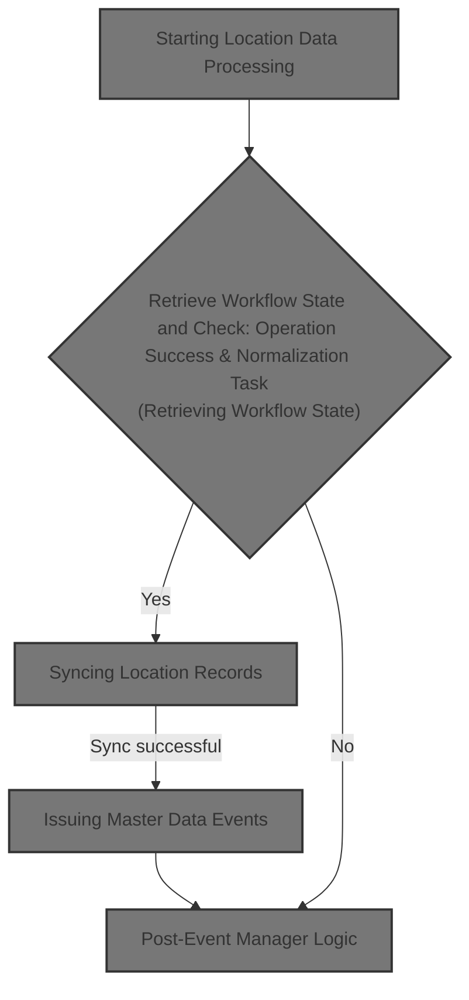
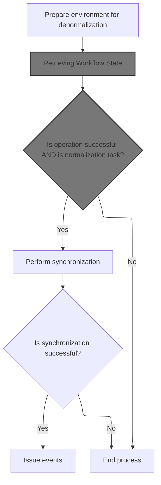
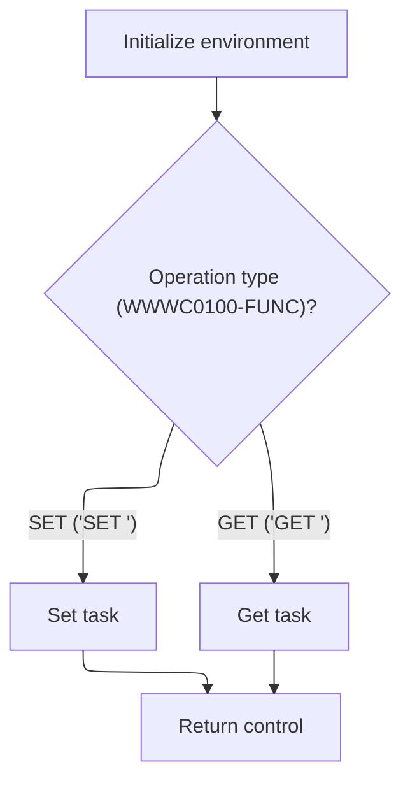
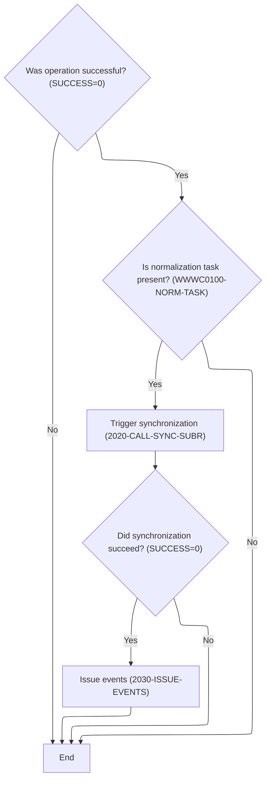
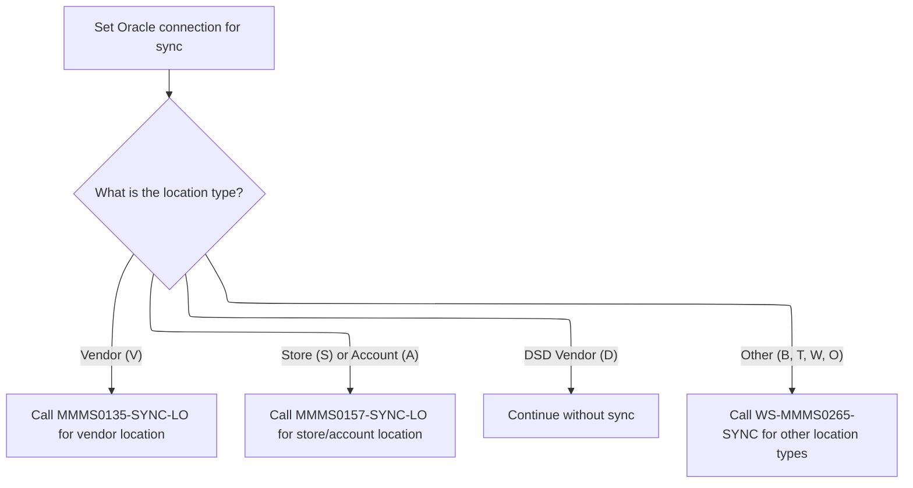
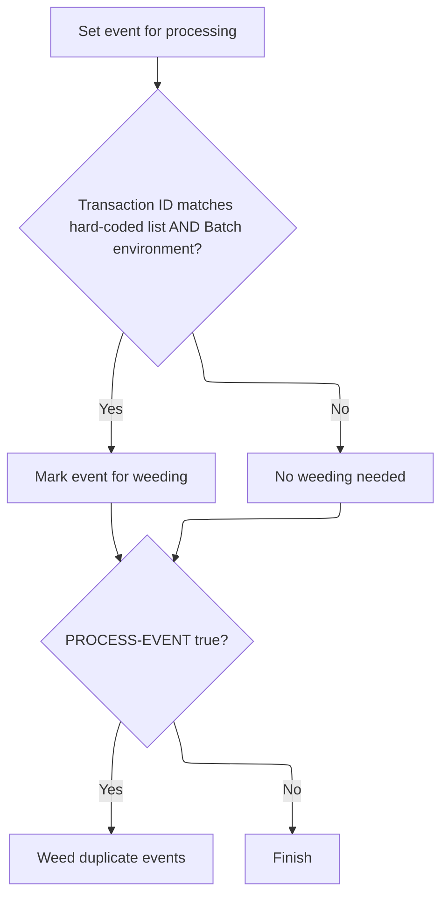
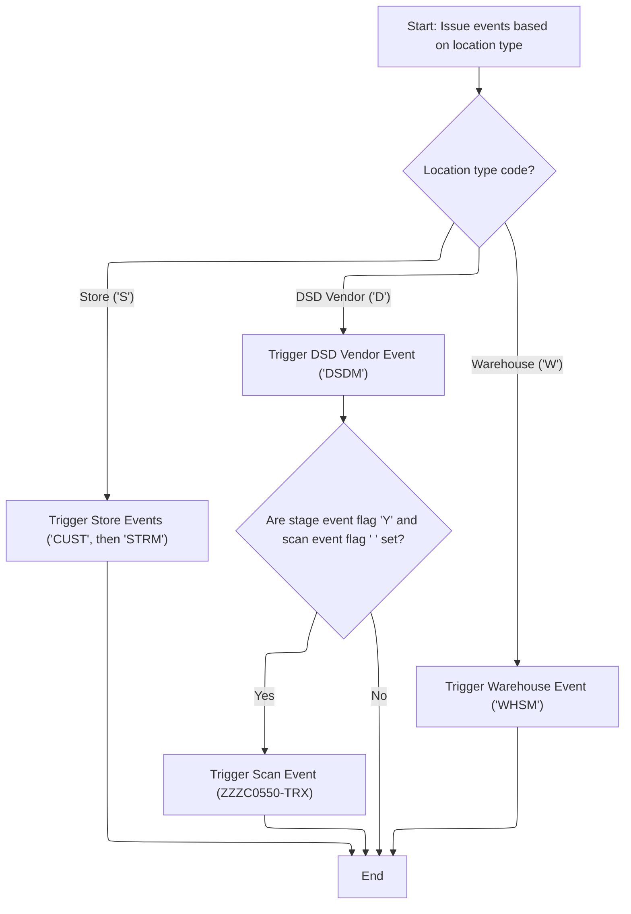

This document describes how location data updates are processed and synchronized, resulting in the issuance of master data events. The flow starts with retrieving the workflow state, checks business conditions, synchronizes records by location type, and issues filtered master data events to downstream systems.



# Spec

## Detailed View of the Program's Functionality

# Starting Location Data Processing

This section describes the initial steps taken to prepare for denormalization and workflow state retrieval.

## Prepare Environment for Denormalization

- The process begins by setting a checkpoint increment value to 1, which is likely used for tracking progress or recovery.
- The system environment value from one structure is copied to another, ensuring the correct environment context is set for subsequent operations.
- A control subroutine is called to establish or retrieve the current workflow state, ensuring the process operates with the latest and correct context.

## Retrieving Workflow State

- A flag is set to indicate that the workflow state should be fetched.
- The control subroutine is called, passing in the necessary context and workflow state structures.
- This subroutine will either update or retrieve the workflow state, depending on which flag is set.

# Master Task State Handling

This section details how the workflow state is managed by the control subroutine.

## Initialization and Task Handling

- The control subroutine starts by initializing the context structure, which is a placeholder for any setup needed.
- It then checks which operation is requested: setting or getting the workflow task state.
  - If the "set" flag is active, it copies the task, subtask, update status, event flag, and scan event flag from the workflow state structure into working storage.
  - If the "get" flag is active, it copies these values from working storage back into the workflow state structure.
- The subroutine then returns control to the caller.

# Conditional Sync and Event Issuing

This section describes the decision-making process for whether to proceed with synchronization and event issuing.

## Success and Task Checks

- After retrieving the workflow state, the process checks if the previous operation was successful and if a normalization task is present.
- If both conditions are met, it proceeds to the synchronization subroutine.
- After synchronization, if that operation is also successful, it proceeds to issue events.
- If any of these checks fail, the process ends early.

# Syncing Location Records

This section explains how the system synchronizes location records based on their type.

## Database Connection and Branching

- The system sets a flag to indicate that Oracle should be used for the upcoming operations.
- It then checks the type of location being processed and branches accordingly:
  - For vendor locations, it sets a flag indicating the current vendor location and calls the vendor location sync routine.
  - For store or account locations, it sets a similar flag and calls the store/account sync routine.
  - For DSD vendor locations, the code is present but commented out, so no sync is performed.
  - For other location types (such as 'B', 'T', 'W', 'O'), it sets a level flag, copies the type and number, and calls the appropriate sync routine for these business entities.

# Issuing Master Data Events

This section covers how events are prepared and issued after a successful sync.

## Event Preparation

- The event data structure is initialized.
- The Oracle environment flag is set.
- The event type is determined: if the operation is a delete, a delete event flag is set; otherwise, a standard event flag is set.
- The location type and number are copied into the event data structure.
- Program name, user, and system environment are set in the event context.
- The old location key is stored for reference.

## Event Issuing by Location Type

- The system evaluates the location type and prepares the appropriate event(s):
  - For vendor locations, it prepares and issues two events: one for vendor shipment and one for vendor master.
  - For store locations, it prepares and issues two events: one for customer and one for store master.
  - For DSD vendor locations, it prepares and issues a DSD vendor event.
  - For warehouse locations, it prepares and issues a warehouse event.
- For each event, the relevant data is moved into the event record, the transaction ID is set, and the event manager is called to issue the event.

## Special Scan Event

- If certain flags are set (indicating a stage event and a scan event should be created) and the location type is DSD vendor, a special scan event is prepared and issued.

# Event Filtering and Issuing

This section describes how the event manager filters and issues events to avoid duplicates and unnecessary notifications.

## Main Event Manager Logic

- The event manager initializes its context and sets a flag to process the event.
- It performs a "weeding" step to determine if the event should be filtered out based on hard-coded rules and duplicate detection.
- If the event passes these checks, it proceeds to issue the event.

## Event Eligibility and Deduplication

- The "weeding" step first checks if the transaction ID matches any in a hard-coded list and if the environment is batch mode. If both are true, the event is marked for weeding (i.e., not to be processed).
- If the event is still eligible, it checks for duplicates by comparing the current event's key data and transaction ID to previously processed events. If a duplicate is found, the event is marked for weeding.
- If the event is unique and eligible, it is added to the list of processed events to prevent future duplicates.

## Event Issuing

- If the event is eligible for processing, the event manager prepares the event data, sets the environment and database flags, and determines the action code based on the operation (add, delete, or modify).
- The event is then sent to the event stager program, which handles the actual dispatching of the event.

# Post-Event Manager Logic

This section describes additional event issuing logic for specific location types after the main event manager call.

## Store Locations

- For store locations, two events are issued: one for customer and one for store master. Each event is prepared with the appropriate data and transaction ID, and the event manager is called for each.

## DSD Vendor Locations

- For DSD vendor locations, the event data is prepared and the event manager is called with the DSD vendor transaction ID.

## Warehouse Locations

- For warehouse locations, the event data is prepared and the event manager is called with the warehouse transaction ID.

## Special Scan Event (DSD Vendor)

- If the stage event and scan event flags are set and the location type is DSD vendor, a special scan event is prepared and issued by calling the event manager with the appropriate data and transaction ID.

# Summary

The overall process is as follows:

1. Prepare the environment and retrieve the workflow state.
2. If successful and a normalization task is present, synchronize the location record based on its type.
3. If synchronization is successful, prepare and issue the appropriate events for the location change.
4. The event manager filters out ineligible or duplicate events before issuing them.
5. Additional events may be issued for certain location types, such as stores, DSD vendors, and warehouses.
6. Special scan events are issued under specific conditions for DSD vendor locations.

# Rule Definition

| Paragraph Name                             | Rule ID | Category          | Description                                                                                                                                                                                | Conditions                                                              | Remarks                                                                                                   |
| ------------------------------------------ | ------- | ----------------- | ------------------------------------------------------------------------------------------------------------------------------------------------------------------------------------------ | ----------------------------------------------------------------------- | --------------------------------------------------------------------------------------------------------- |
| 100-INITIALIZATION, 2010-CALL-CONTROL-SUBR | RL-001  | Data Assignment   | The system initializes required data areas and retrieves the workflow state using the workflow state structure (WWWC0100) by setting the GET-TASK flag and calling the control subroutine. | Always at the start of the denormalization process.                     | WWWC0100 is used for workflow state. The GET-TASK flag must be set before calling the control subroutine. |
| 2000-DENORM-PROCESS                        | RL-002  | Conditional Logic | The process continues only if the previous operation was successful (SUCCESS = 0) and the workflow state indicates a normalization task (WWWC0100-NORM-TASK = 'Y').                        | SUCCESS = 0 and WWWC0100-NORM-TASK = 'Y' after control subroutine call. | SUCCESS is a status flag; normalization task is indicated by 'Y' in the workflow state.                   |
| 2020-CALL-SYNC-SUBR                        | RL-003  | Conditional Logic | Depending on the location type code (LOC-TYP-CD), the system calls the appropriate synchronization routine or skips synchronization.                                                       | After successful workflow state retrieval and normalization task check. | Location type codes:                                                                                      |

- 'V': Vendor location
- 'S': Store location
- 'A': Account location
- 'D': DSD vendor location
- 'B', 'T', 'W', 'O': Business entity types Synchronization routines are called accordingly. | | 2030-ISSUE-EVENTS | RL-004 | Conditional Logic | After successful synchronization (SUCCESS = 0), the system issues master data events for the location change, preparing event data and branching by location type and operation type. | After synchronization, if SUCCESS = 0. | Event data must include event type, payload, originating program, user, transaction code, and deduplication data. Event type and payload depend on location type and operation (delete or not). | | 2030-ISSUE-EVENTS | RL-005 | Computation | The event payload is constructed differently for each event type, with specific fields required for each type. | When issuing an event for a location change. | Payload formats:
- 'VSHP': vendor facility, vendor number (numbers)
- 'VENM': vendor type code, vendor number (alphanumeric, number)
- 'CUST': store number (number), update flag (alphanumeric)
- 'STRM': location type code, location number (alphanumeric, number)
- 'DSDM': DSD type code (alphanumeric)
- 'WHSM': warehouse number, warehouse type code (number, alphanumeric)
- Scan event: vendor type code, vendor number, transaction code (alphanumeric, number, alphanumeric) All event records must include program, user, event type code, payload, transaction code, and deduplication data. | | 2030-ISSUE-EVENTS | RL-006 | Conditional Logic | For certain location types, multiple events must be issued (e.g., both 'CUST' and 'STRM' for store locations), and the correct event type must be chosen for each location type. | When preparing to issue events after sync. | Store locations ('S'): issue 'CUST' and 'STRM'. DSD vendor locations ('D'): issue 'DSDM'. Warehouse locations ('W'): issue 'WHSM'. Vendor locations ('V'): issue 'VSHP' and/or 'VENM'. Other types: as defined by business rules. | | 2030-ISSUE-EVENTS | RL-007 | Conditional Logic | For DSD vendor locations, if the stage event flag is 'Y' and the scan event flag is blank, issue a scan event with the appropriate payload. | Location type is 'D', stage event flag is 'Y', scan event flag is blank. | Scan event payload: vendor type code, vendor number, transaction code. Only issued if conditions are met. | | 200-WEED-EVENT, 210-WEED-BY-HARD-CODE | RL-008 | Conditional Logic | Before issuing any event, filter out events with transaction IDs that match a hard-coded list and are in a batch environment, marking them for weeding. | Transaction ID matches hard-coded list and batch environment flag is set. | Hard-coded transaction IDs include: 'BVLM', 'CNCM', 'IWVM', 'OBSM', 'PBCM', 'PBTM', 'RARM', 'RFTM', 'RITM', 'RRFM', 'RTDM', 'SCAM', 'STAM', 'STTM', 'TRDM', 'WLIM', etc. (see code for full list). | | 200-WEED-EVENT, 220-WEED-DUP-EVENTS | RL-009 | Conditional Logic | Only events that are eligible and not duplicates (based on compare data fields) must be issued. Deduplication is enforced using a table of previously issued events. | Before issuing an event, compare event's compare data and transaction ID to previously issued events. | Deduplication uses ZZZC0197-COMPARE-DATA (string, up to 100 bytes) and transaction ID (string, 4 bytes). If both match a previous event, the event is not issued. | | 2030-ISSUE-EVENTS, ZZZS0197 | RL-010 | Data Assignment | Each event record must contain the originating program, user, event type code, event payload, transaction code, and deduplication data. The payload structure varies by event type. | For every event to be issued. | Event record fields:
- Program (string, 8 bytes)
- User (string, 8 bytes)
- Event type code (string, 4 bytes)
- Event payload (structure varies by event type)
- Transaction code (string, 4 bytes)
- Deduplication data (string, up to 100 bytes) Payload structure as per event type rule. |

# User Stories

## User Story 1: Initialize and retrieve workflow state

---

### Story Description:

As a system, I want to initialize required data areas and retrieve the workflow state so that I can determine if a normalization task should proceed.

---

### Business Rule Mapping:

| Rule ID | Paragraph Name                             | Rule Description                                                                                                                                                                           |
| ------- | ------------------------------------------ | ------------------------------------------------------------------------------------------------------------------------------------------------------------------------------------------ |
| RL-002  | 2000-DENORM-PROCESS                        | The process continues only if the previous operation was successful (SUCCESS = 0) and the workflow state indicates a normalization task (WWWC0100-NORM-TASK = 'Y').                        |
| RL-001  | 100-INITIALIZATION, 2010-CALL-CONTROL-SUBR | The system initializes required data areas and retrieves the workflow state using the workflow state structure (WWWC0100) by setting the GET-TASK flag and calling the control subroutine. |

---

### Relevant Functionality:

- **2000-DENORM-PROCESS**
  1. **RL-002:**
     - If SUCCESS = 0 and workflow state indicates normalization task:
       - Proceed to synchronization phase
     - Else:
       - Skip further processing
- **100-INITIALIZATION**
  1. **RL-001:**
     - Initialize working storage and control structures
     - Set GET-TASK flag in workflow state structure
     - Call control subroutine with workflow state structure to retrieve current workflow state

## User Story 2: Issue master data events for location changes

---

### Story Description:

As a system, I want to issue master data events for location changes, constructing the correct event payloads and branching by location type and operation so that downstream systems receive accurate and complete event information.

---

### Business Rule Mapping:

| Rule ID | Paragraph Name              | Rule Description                                                                                                                                                                      |
| ------- | --------------------------- | ------------------------------------------------------------------------------------------------------------------------------------------------------------------------------------- |
| RL-004  | 2030-ISSUE-EVENTS           | After successful synchronization (SUCCESS = 0), the system issues master data events for the location change, preparing event data and branching by location type and operation type. |
| RL-005  | 2030-ISSUE-EVENTS           | The event payload is constructed differently for each event type, with specific fields required for each type.                                                                        |
| RL-006  | 2030-ISSUE-EVENTS           | For certain location types, multiple events must be issued (e.g., both 'CUST' and 'STRM' for store locations), and the correct event type must be chosen for each location type.      |
| RL-007  | 2030-ISSUE-EVENTS           | For DSD vendor locations, if the stage event flag is 'Y' and the scan event flag is blank, issue a scan event with the appropriate payload.                                           |
| RL-010  | 2030-ISSUE-EVENTS, ZZZS0197 | Each event record must contain the originating program, user, event type code, event payload, transaction code, and deduplication data. The payload structure varies by event type.   |

---

### Relevant Functionality:

- **2030-ISSUE-EVENTS**
  1. **RL-004:**
     - If SUCCESS = 0 after sync:
       - Prepare event data
       - Set event type based on operation (delete or not)
       - Branch by location type to prepare event payload
       - Issue events as required
  2. **RL-005:**
     - For each event type:
       - Populate payload fields as specified
       - Assign to event record
       - Include all required metadata
  3. **RL-006:**
     - If location type is store:
       - Issue 'CUST' event
       - Issue 'STRM' event
     - If location type is DSD vendor:
       - Issue 'DSDM' event
     - If location type is warehouse:
       - Issue 'WHSM' event
     - If location type is vendor:
       - Issue 'VSHP' and/or 'VENM' events
     - For other types:
       - Issue corresponding event
  4. **RL-007:**
     - If location type is 'D' and stage event flag is 'Y' and scan event flag is blank:
       - Prepare scan event payload
       - Issue scan event
  5. **RL-010:**
     - For each event:
       - Populate program, user, event type code, payload, transaction code, deduplication data
       - Use correct payload structure for event type

## User Story 3: Filter and deduplicate events before issuing

---

### Story Description:

As a system, I want to filter out ineligible events and ensure only unique events are issued so that duplicate or unwanted events do not propagate through the system.

---

### Business Rule Mapping:

| Rule ID | Paragraph Name                        | Rule Description                                                                                                                                                     |
| ------- | ------------------------------------- | -------------------------------------------------------------------------------------------------------------------------------------------------------------------- |
| RL-008  | 200-WEED-EVENT, 210-WEED-BY-HARD-CODE | Before issuing any event, filter out events with transaction IDs that match a hard-coded list and are in a batch environment, marking them for weeding.              |
| RL-009  | 200-WEED-EVENT, 220-WEED-DUP-EVENTS   | Only events that are eligible and not duplicates (based on compare data fields) must be issued. Deduplication is enforced using a table of previously issued events. |

---

### Relevant Functionality:

- **200-WEED-EVENT**
  1. **RL-008:**
     - If transaction ID is in hard-coded list and batch environment:
       - Mark event as weeded (do not process further)
  2. **RL-009:**
     - For each event to be issued:
       - Compare compare-data and transaction ID to previous events
       - If match found, mark as duplicate and do not issue
       - Else, add to event table and proceed to issue

## User Story 4: Process location changes, synchronize records, and issue events if successful

---

### Story Description:

As a system, I want to process location changes by checking workflow state, synchronizing location records according to their type, and issuing events if synchronization is successful so that only relevant locations are updated and downstream systems are notified appropriately.

---

### Business Rule Mapping:

| Rule ID | Paragraph Name      | Rule Description                                                                                                                                                                      |
| ------- | ------------------- | ------------------------------------------------------------------------------------------------------------------------------------------------------------------------------------- |
| RL-003  | 2020-CALL-SYNC-SUBR | Depending on the location type code (LOC-TYP-CD), the system calls the appropriate synchronization routine or skips synchronization.                                                  |
| RL-004  | 2030-ISSUE-EVENTS   | After successful synchronization (SUCCESS = 0), the system issues master data events for the location change, preparing event data and branching by location type and operation type. |

---

### Relevant Functionality:

- **2020-CALL-SYNC-SUBR**
  1. **RL-003:**
     - If LOC-TYP-CD = 'V':
       - Call vendor location sync routine
     - If LOC-TYP-CD = 'S' or 'A':
       - Call store/account location sync routine
     - If LOC-TYP-CD = 'D':
       - Skip synchronization
     - If LOC-TYP-CD = 'B', 'T', 'W', or 'O':
       - Call business entity sync routine
- **2030-ISSUE-EVENTS**
  1. **RL-004:**
     - If SUCCESS = 0 after sync:
       - Prepare event data
       - Set event type based on operation (delete or not)
       - Branch by location type to prepare event payload
       - Issue events as required

# Code Walkthrough

## Starting Location Data Processing



<SwmSnippet path="/base/src/NNNS0487.cbl" line="3106">

---

We start by prepping the environment and grabbing the workflow state. We need to call the control subroutine next to make sure we're working with the right context before any sync or event logic happens.

```cobol
318300 2000-DENORM-PROCESS.                                             00318300
318400     MOVE 1                TO WS-CHECKPOINT-INC                   00318400
318500     MOVE YYYN005A-SYS-ENV TO YYYN110A-SYS-ENV                    00318500
318600     PERFORM 2010-CALL-CONTROL-SUBR                               00318600
```

---

</SwmSnippet>

### Retrieving Workflow State

<SwmSnippet path="/base/src/NNNS0487.cbl" line="3121">

---

We set up the flag to fetch the workflow state and call the control program to get the latest info for the main task.

```cobol
319800 2010-CALL-CONTROL-SUBR.                                          00319800
319900     SET WWWC0100-GET-TASK  TO TRUE                               00319900
320000     CALL WWWS0100-CONTROL-SUBR USING                             00320000
320100         XXXN001A                                                 00320100
320200         WWWC0100                                                 00320200
320300     .                                                            00320300
```

---

</SwmSnippet>

### Master Task State Handling



<SwmSnippet path="/base/src/WWWS0100.cbl" line="38">

---

`000-MAIN` runs the initialization, then checks which flag is set to either save or fetch the workflow state. This lets us update or retrieve the task info as needed for the workflow.

```cobol
011700 000-MAIN.                                                        00011700
011800     PERFORM 100-INITIALIZE                                       00011800
011900                                                                  00011900
012300     EVALUATE TRUE                                                00012300
012400       WHEN WWWC0100-SET-TASK                                     00012400
012500         PERFORM 200-SET-TASK                                     00012500
012600       WHEN WWWC0100-GET-TASK                                     00012600
012700         PERFORM 300-GET-TASK                                     00012700
013800     END-EVALUATE                                                 00013800
014100                                                                  00014100
014200     GOBACK                                                       00014200
014300     .                                                            00014300
```

---

</SwmSnippet>

<SwmSnippet path="/base/src/WWWS0100.cbl" line="55">

---

`100-INITIALIZE` just runs INITIALIZE on XXXN001A. There's no real logic here, so it's basically a placeholder for future or external setup.

```cobol
014900 100-INITIALIZE.                                                  00014900
015800     INITIALIZE XXXN001A                                          00015800
017000     .                                                            00017000
```

---

</SwmSnippet>

### Conditional Sync and Event Issuing



<SwmSnippet path="/base/src/NNNS0487.cbl" line="3110">

---

Back in `2000-DENORM-PROCESS`, after getting the workflow state, we only move forward if everything looks good (SUCCESS and normal task). Next, we call the sync subroutine to update location records, and only if that works do we issue events for those changes.

```cobol
318700     IF  SUCCESS                                                  00318700
318800     AND WWWC0100-NORM-TASK                                       00318800
318900       PERFORM 2020-CALL-SYNC-SUBR                                00318900
319000       IF SUCCESS                                                 00319000
319100          PERFORM 2030-ISSUE-EVENTS                               00319100
319200       END-IF                                                     00319200
319300     END-IF                                                       00319300
```

---

</SwmSnippet>

## Syncing Location Records



<SwmSnippet path="/base/src/NNNS0487.cbl" line="3129">

---

In `2020-CALL-SYNC-SUBR` we set up the database connection and branch based on the location type code. For each type, we set the relevant flag and call the matching sync routine to update the right kind of location record.

```cobol
320600 2020-CALL-SYNC-SUBR.                                             00320600
320700     SET YYYN110A-ORACLE        TO TRUE                           00320700
320800     EVALUATE TRUE                                                00320800
320900       WHEN LOC-TYP-CD OF DCLXXXATION = K-VEND-LOC-TYPE           00320900
321000         SET MMMC0135-LO-IS-CURRENT TO TRUE                       00321000
321100         CALL MMMS0135-SYNC-LO USING                              00321100
321200           XXXN001A                                               00321200
321300           YYYN110A                                               00321300
321400           MMMC0135                                               00321400
321500           P-DDDTLO01                                             00321500
```

---

</SwmSnippet>

<SwmSnippet path="/base/src/NNNS0487.cbl" line="3139">

---

After handling vendors, we check for store or account types and run their sync routine with the right flag and data. This keeps the logic tight for similar types.

```cobol
321600       WHEN LOC-TYP-CD OF DCLXXXATION = K-STORE-LOC-TYPE          00321600
321700       OR   LOC-TYP-CD OF DCLXXXATION = K-ACCT-LOC-TYPE           00321700
321800         SET MMMC0157-LO-IS-CURRENT TO TRUE                       00321800
321900         CALL MMMS0157-SYNC-LO USING                              00321900
322000           XXXN001A                                               00322000
322100           YYYN110A                                               00322100
322200           MMMC0157                                               00322200
322300           P-DDDTLO01                                             00322300
```

---

</SwmSnippet>

<SwmSnippet path="/base/src/NNNS0487.cbl" line="3147">

---

For DSD vendor location types, we just skip syncing. The code is commented out, so this type isn't handled here.

```cobol
322400       WHEN LOC-TYP-CD OF DCLXXXATION = K-DSD-VEND-LOC-TYPE       00322400
322500         CONTINUE                                                 00322500
```

---

</SwmSnippet>

<SwmSnippet path="/base/src/NNNS0487.cbl" line="3155">

---

For location types 'B', 'T', 'W', 'O', we set the level flag, copy the type and number, and call the sync routine for these business entities. This wraps up the branching logic for syncing.

```cobol
323200       WHEN LOC-TYP-CD OF DCLXXXATION = 'B'                       00323200
323300       OR   LOC-TYP-CD OF DCLXXXATION = 'T'                       00323300
323400       OR   LOC-TYP-CD OF DCLXXXATION = 'W'                       00323400
323500       OR   LOC-TYP-CD OF DCLXXXATION = 'O'                       00323500
323600         SET  MMMC0265-LO-LEVEL TO TRUE                           00323600
323700         MOVE LOC-TYP-CD OF DCLXXXATION TO LOC-TYP-CD OF MMMC0265 00323700
323800         MOVE LOC-NBR    OF DCLXXXATION TO LOC-NBR    OF MMMC0265 00323800
323900         CALL WS-MMMS0265-SYNC USING                              00323900
324000             XXXN001A                                             00324000
324100             MMMC0265                                             00324100
324200     END-EVALUATE                                                 00324200
```

---

</SwmSnippet>

## Issuing Master Data Events

<SwmSnippet path="/base/src/NNNS0487.cbl" line="3169">

---

In `2030-ISSUE-EVENTS` we prep the event data and set the event type based on whether it's a delete or not. This makes sure the right event gets sent out for the operation.

```cobol
324600 2030-ISSUE-EVENTS.                                               00324600
324700     INITIALIZE ZZZC0550-IN-DATA                                  00324700
324800     SET  YYYN110A-ORACLE       TO TRUE                           00324800
324900     IF DELETE-OPERATION                                          00324900
325000       SET VENDOR-DELETE-EVENT  TO TRUE                           00325000
325100     ELSE                                                         00325100
325200       SET VENDOR-EVENT TO TRUE                                   00325200
325300     END-IF                                                       00325300
```

---

</SwmSnippet>

<SwmSnippet path="/base/src/NNNS0487.cbl" line="3177">

---

After setting up the event type, we branch by location type and prep the right data for each event. This sets up the payloads for the event manager calls.

```cobol
325400     MOVE LOC-TYP-CD       OF DCLXXXATION                         00325400
325500       TO VEND-TYP-CD      OF ZZZC0550-VENDOR-DATA                00325500
325600     MOVE LOC-NBR          OF DCLXXXATION                         00325600
325700       TO VEND-NBR         OF ZZZC0550-VENDOR-DATA                00325700
325800     MOVE 'NNNS0487'            TO ZZZC0197-PROGRAM               00325800
325900     MOVE YYYC0107-USER         TO ZZZC0197-USER                  00325900
326000     MOVE YYYN005A-SYS-ENV      TO YYYN110A-SYS-ENV               00326000
326100     MOVE LOC-NBR OF P-DDDTLO01 TO WS-OLD-KEY                     00326100
326200                                                                  00326200
326300     EVALUATE TRUE                                                00326300
```

---

</SwmSnippet>

<SwmSnippet path="/base/src/NNNS0487.cbl" line="3187">

---

For each location type, we prep the right record and transaction ID, then call the event manager program to issue the event. Some types need multiple events, so we call it more than once.

```cobol
326400       WHEN LOC-TYP-CD OF DCLXXXATION = K-VEND-LOC-TYPE           00326400
326500         MOVE WS-VENDOR-FACILITY                                  00326500
326600           TO VM-VENDOR-FACILITY OF ZZZC0020                      00326600
326700         MOVE WS-VENDOR-NUMBER                                    00326700
326800           TO VM-VENDOR-NUMBER   OF ZZZC0020                      00326800
326900         MOVE ZZZC0020              TO ZZZC0197-TRX-REC           00326900
327000         MOVE 'VSHP'                TO ZZZC0197-TRX-ID            00327000
327100         CALL ZZZS0197-EVENT-MGR USING                            00327100
327200             XXXN001A                                             00327200
327300             YYYN110A                                             00327300
327400             ZZZC0197                                             00327400
327500                                                                  00327500
327600         MOVE LOC-TYP-CD OF DCLXXXATION                           00327600
327700           TO LOC-VEN-TYP-CD OF ZZZC0124                          00327700
327800         MOVE LOC-NBR OF DCLXXXATION                              00327800
327900           TO LOC-VEN-NBR OF ZZZC0124                             00327900
328000         MOVE ZZZC0124              TO ZZZC0197-TRX-REC           00328000
328100         MOVE 'VENM'                TO ZZZC0197-TRX-ID            00328100
328200         CALL ZZZS0197-EVENT-MGR USING                            00328200
328300             XXXN001A                                             00328300
328400             YYYN110A                                             00328400
328500             ZZZC0197                                             00328500
```

---

</SwmSnippet>

### Event Filtering and Issuing

<SwmSnippet path="/base/src/ZZZS0197.cbl" line="57">

---

`000-MAINLINE` initializes, filters out certain transaction IDs, checks for duplicates, and only issues the event if it passes all checks. This keeps the event flow clean and avoids spamming duplicates.

```cobol
008400 000-MAINLINE.                                                    00008400
008500     PERFORM 100-INITIALIZE                                       00008500
008600                                                                  00008600
008700*    IF  ZZZC0197-TRX-ID NOT = 'CFIP'                             00008700
008800       PERFORM 200-WEED-EVENT                                     00008800
008900*    END-IF                                                       00008900
009000                                                                  00009000
009100     IF PROCESS-EVENT                                             00009100
009200       PERFORM 300-ISSUE-EVENT                                    00009200
009300     END-IF                                                       00009300
009400                                                                  00009400
009500     GOBACK                                                       00009500
009600     .                                                            00009600
```

---

</SwmSnippet>

### Event Eligibility and Deduplication



<SwmSnippet path="/base/src/ZZZS0197.cbl" line="89">

---

`200-WEED-EVENT` first runs the hard-coded eligibility check, then checks for duplicates if the event is still eligible. This makes sure only valid, unique events get processed.

```cobol
011600 200-WEED-EVENT.                                                  00011600
011700     SET PROCESS-EVENT TO TRUE                                    00011700
011800     PERFORM 210-WEED-BY-HARD-CODE                                00011800
011900     IF PROCESS-EVENT                                             00011900
012000       PERFORM 220-WEED-DUP-EVENTS                                00012000
012100     END-IF                                                       00012100
012200     .                                                            00012200
```

---

</SwmSnippet>

<SwmSnippet path="/base/src/ZZZS0197.cbl" line="98">

---

`210-WEED-BY-HARD-CODE` checks if the transaction ID matches any in a big hardcoded list and if we're in batch mode. If both match, it flags the event for special handling.

```cobol
012500 210-WEED-BY-HARD-CODE.                                           00012500
012600     IF  (ZZZC0197-TRX-ID = 'BVLM'                                00012600
012700*      OR ZZZC0197-TRX-ID = 'APLM'                                00012700
012800*      OR ZZZC0197-TRX-ID = 'BDMM'                                00012800
012900*      OR ZZZC0197-TRX-ID = 'BCAM'                                00012900
013000*      OR ZZZC0197-TRX-ID = 'CCSM'                                00013000
013100*      OR ZZZC0197-TRX-ID = 'CEMM'                                00013100
013200       OR ZZZC0197-TRX-ID = 'CNCM'                                00013200
013300*      OR ZZZC0197-TRX-ID = 'COMM'                                00013300
013400*      OR ZZZC0197-TRX-ID = 'CRCM'                                00013400
013500*      OR ZZZC0197-TRX-ID = 'CSCM'                                00013500
013600*      OR ZZZC0197-TRX-ID = 'CTOM'                                00013600
013700*      OR ZZZC0197-TRX-ID = 'DIRM'                                00013700
013800*      OR ZZZC0197-TRX-ID = 'DISM'                                00013800
013900*      OR ZZZC0197-TRX-ID = 'DSDM'                                00013900
014000*      OR ZZZC0197-TRX-ID = 'FINM'                                00014000
014100*      OR ZZZC0197-TRX-ID = 'ICCM'                                00014100
014200*      OR ZZZC0197-TRX-ID = 'ITMM'                                00014200
014300       OR ZZZC0197-TRX-ID = 'IWVM'                                00014300
014400*      OR ZZZC0197-TRX-ID = 'LOBM'                                00014400
014500*      OR ZZZC0197-TRX-ID = 'MCEM'                                00014500
014600*      OR ZZZC0197-TRX-ID = 'MRGM'                                00014600
014700       OR ZZZC0197-TRX-ID = 'OBSM'                                00014700
014800*      OR ZZZC0197-TRX-ID = 'ORBM'                                00014800
014900       OR ZZZC0197-TRX-ID = 'PBCM'                                00014900
015000*      OR ZZZC0197-TRX-ID = 'PBNM'                                00015000
015100       OR ZZZC0197-TRX-ID = 'PBTM'                                00015100
015200*      OR ZZZC0197-TRX-ID = 'PCCM'                                00015200
015300*      OR ZZZC0197-TRX-ID = 'PCTM'                                00015300
015400*      OR ZZZC0197-TRX-ID = 'PDSH'                                00015400
015500*      OR ZZZC0197-TRX-ID = 'PDUA'                                00015500
015600*      OR ZZZC0197-TRX-ID = 'PDUP'                                00015600
015700       OR ZZZC0197-TRX-ID = 'PIPM'                                00015700
015800*      OR ZZZC0197-TRX-ID = 'PRIM'                                00015800
015900*      OR ZZZC0197-TRX-ID = 'PRMM'                                00015900
016000*      OR ZZZC0197-TRX-ID = 'PRRM'                                00016000
016100       OR ZZZC0197-TRX-ID = 'PSBM'                                00016100
016200*      OR ZZZC0197-TRX-ID = 'PSCM'                                00016200
016300       OR ZZZC0197-TRX-ID = 'RARM'                                00016300
016400       OR ZZZC0197-TRX-ID = 'RFTM'                                00016400
016500       OR ZZZC0197-TRX-ID = 'RITM'                                00016500
016600       OR ZZZC0197-TRX-ID = 'RRFM'                                00016600
016700       OR ZZZC0197-TRX-ID = 'RTDM'                                00016700
016800*      OR ZZZC0197-TRX-ID = 'RTTM'                                00016800
016900       OR ZZZC0197-TRX-ID = 'SCAM'                                00016900
017000*      OR ZZZC0197-TRX-ID = 'SDPM'                                00017000
017100*      OR ZZZC0197-TRX-ID = 'SLDM'                                00017100
017200       OR ZZZC0197-TRX-ID = 'STAM'                                00017200
017300*      OR ZZZC0197-TRX-ID = 'STPM'                                00017300
017400*      OR ZZZC0197-TRX-ID = 'STRM'                                00017400
017500       OR ZZZC0197-TRX-ID = 'STTM'                                00017500
017600*      OR ZZZC0197-TRX-ID = 'T2TM'                                00017600
017700       OR ZZZC0197-TRX-ID = 'TRDM'                                00017700
017800*      OR ZZZC0197-TRX-ID = 'VCMM'                                00017800
017900*      OR ZZZC0197-TRX-ID = 'VENM'                                00017900
018000*      OR ZZZC0197-TRX-ID = 'VISM'                                00018000
018100*      OR ZZZC0197-TRX-ID = 'VLIM'                                00018100
018200*      OR ZZZC0197-TRX-ID = 'WHSM'                                00018200
018300       OR ZZZC0197-TRX-ID = 'WLIM')                               00018300
018400       AND YYYN110A-BATCH-ENV                                     00018400
018500         SET WEED-EVENT TO TRUE                                   00018500
018600     END-IF                                                       00018600
018700     .                                                            00018700
```

---

</SwmSnippet>

### Post-Event Manager Logic



<SwmSnippet path="/base/src/NNNS0487.cbl" line="3210">

---

For store locations, we prep and issue both 'CUST' and 'STRM' events by calling the event manager twice with different records and IDs.

```cobol
328700       WHEN LOC-TYP-CD OF DCLXXXATION = K-STORE-LOC-TYPE          00328700
328800         MOVE LOC-NBR OF DCLXXXATION                              00328800
328900           TO ST-STORE-NUMBER OF ZZZC0032                         00328900
329000              LOC-NBR OF ZZZC0094                                 00329000
329100         SET  ZZZC0032-UPD-FXXX TO TRUE                           00329100
329200         MOVE ZZZC0032          TO ZZZC0197-TRX-REC               00329200
329300         MOVE 'CUST'            TO ZZZC0197-TRX-ID                00329300
329400         CALL ZZZS0197-EVENT-MGR USING                            00329400
329500             XXXN001A                                             00329500
329600             YYYN110A                                             00329600
329700             ZZZC0197                                             00329700
329800                                                                  00329800
329900         MOVE LOC-TYP-CD OF DCLXXXATION TO                        00329900
330000                                 LOC-TYP-CD OF ZZZC0094           00330000
330100         MOVE ZZZC0094              TO ZZZC0197-TRX-REC           00330100
330200         MOVE 'STRM'                TO ZZZC0197-TRX-ID            00330200
330300         CALL ZZZS0197-EVENT-MGR USING                            00330300
330400              XXXN001A                                            00330400
330500              YYYN110A                                            00330500
330600              ZZZC0197                                            00330600
```

---

</SwmSnippet>

<SwmSnippet path="/base/src/NNNS0487.cbl" line="3231">

---

For DSD vendor locations, we prep the data and call the event manager with the right transaction ID for this type.

```cobol
330800       WHEN LOC-TYP-CD OF DCLXXXATION = K-DSD-VEND-LOC-TYPE       00330800
330900         MOVE LOC-TYP-CD OF DCLXXXATION TO                        00330900
331000                                 LOC-DSD-TYP-CD OF ZZZC0122       00331000
331100         MOVE ZZZC0122              TO ZZZC0197-TRX-REC           00331100
331200         MOVE 'DSDM'                TO ZZZC0197-TRX-ID            00331200
331300         CALL ZZZS0197-EVENT-MGR USING                            00331300
331400              XXXN001A                                            00331400
331500              YYYN110A                                            00331500
331600              ZZZC0197                                            00331600
```

---

</SwmSnippet>

<SwmSnippet path="/base/src/NNNS0487.cbl" line="3241">

---

For warehouse locations, we prep the data and call the event manager with the warehouse-specific transaction ID. This wraps up the event issuing logic for all location types.

```cobol
331800       WHEN LOC-TYP-CD OF DCLXXXATION = K-WHSE-LOC-TYPE           00331800
331900         MOVE LOC-NBR OF DCLXXXATION                              00331900
332000           TO LOC-WHS-NBR OF ZZZC0123                             00332000
332100         MOVE LOC-TYP-CD OF DCLXXXATION TO                        00332100
332200              LOC-WHS-TYP-CD OF ZZZC0123                          00332200
332300*        SET  ZZZC0044-UPD-FXXX TO TRUE                           00332300
332400         MOVE ZZZC0123          TO ZZZC0197-TRX-REC               00332400
332500         MOVE 'WHSM'            TO ZZZC0197-TRX-ID                00332500
332600         CALL ZZZS0197-EVENT-MGR USING                            00332600
332700             XXXN001A                                             00332700
332800             YYYN110A                                             00332800
332900             ZZZC0197                                             00332900
333000                                                                  00333000
333100     END-EVALUATE                                                 00333100
```

---

</SwmSnippet>

<SwmSnippet path="/base/src/NNNS0487.cbl" line="3255">

---

At the end of `2030-ISSUE-EVENTS`, if staging and scan event flags are set and it's a DSD vendor, we issue a special scan event by calling the event manager with the right record and code.

```cobol
333200     IF STAGE-EVENT AND WWWC0100-CREATE-SCAN-EVENT                00333200
333300       AND LOC-TYP-CD OF DCLXXXATION = 'D'                        00333300
333400         MOVE ZZZC0550              TO ZZZC0197-TRX-REC           00333400
333500         MOVE ZZZC0550-TRX          TO ZZZC0197-TRX-ID            00333500
333600                                       ZZZC0197-TRX-CD            00333600
333700         CALL ZZZS0197-EVENT-MGR USING                            00333700
333800              XXXN001A                                            00333800
333900              YYYN110A                                            00333900
334000              ZZZC0197                                            00334000
334100     END-IF                                                       00334100
```

---

</SwmSnippet>

&nbsp;

*This is an auto-generated document by Swimm 🌊 and has not yet been verified by a human*

<SwmMeta version="3.0.0" repo-id="Z2l0aHViJTNBJTNBU3dpbW1pby1keW5jYWxsLWRlbW8lM0ElM0FHaXJpLVN3aW1t" repo-name="Swimmio-dyncall-demo"><sup>Powered by [Swimm](https://app.swimm.io/)</sup></SwmMeta>
