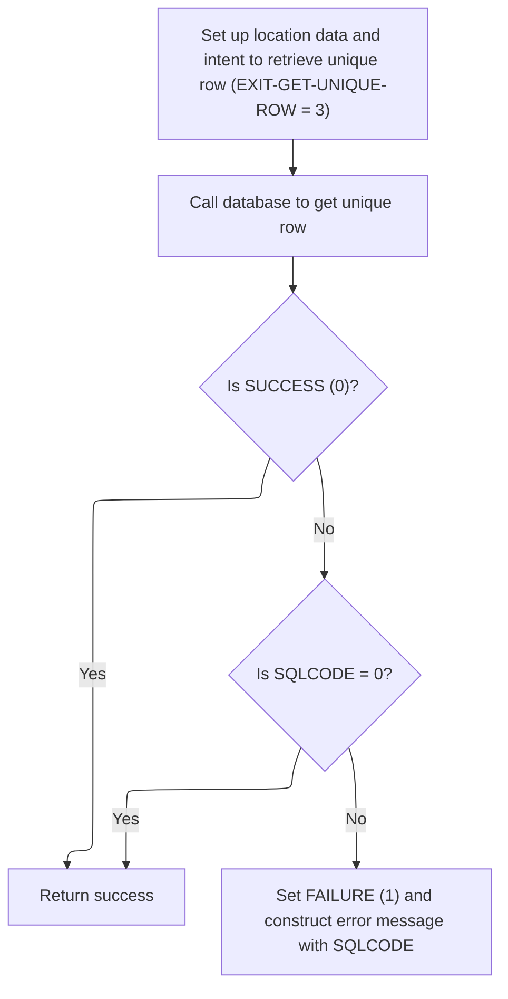
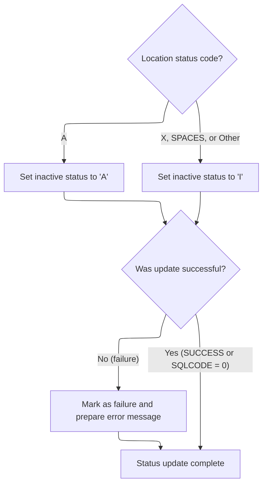

This document describes how location status changes are processed and synchronized across the system. The flow receives location status and related data as input, and outputs updated status, synchronized workflow state, and issued events.

# Spec

## Detailed View of the Program's Functionality

# Detailed Explanation of the Flow

---

## a. Triggering Status Update and Control Flow

The main process responsible for denormalization begins by checking if the location status has changed. If a change is detected, it updates the status in the relevant table. After this, it increments a checkpoint counter to track progress. The process then checks if the previous steps were successful. If so, it proceeds to call a control subroutine that manages workflow state. If the workflow is still successful and a specific task flag is set, it calls a synchronization subroutine. Finally, if all previous steps are still successful, it issues any necessary events.

---

## b. Updating Status and Fetching Location Data

When a location status change is detected, the update routine is invoked. This routine first copies exit codes to a working area for tracking. It then fetches the latest location data to ensure that subsequent logic operates on up-to-date information. If the fetch is successful, it proceeds to synchronize the status code between tables. After these operations, it copies the updated exit codes back to the main area for consistency.

---

## c. Preparing and Fetching Unique Location Row

To fetch the latest location data, the process initializes the data structure used for location information and sets the intent to retrieve a unique row from the database. It then calls a data access subroutine, which delegates the actual database operation to a lower-level routine. After the call, the process evaluates the result:

- If the operation was not successful, it continues without further action.
- If the SQL operation was successful (SQL code is zero), it continues.
- For any other result, it marks the operation as a failure and constructs an error message that includes the SQL code for diagnostic purposes.

---

## d. Syncing Status Code and Modifying Location Row

After fetching the latest location data, the process synchronizes the status code between the main location table and the auxiliary table. It checks the current status code:

- If the status is 'A', it sets the inactive flag to 'A'.
- If the status is 'X', blank, or any other value, it sets the inactive flag to 'I'.

It then sets the intent to modify the row and calls the data access subroutine to persist the change. After the update, it evaluates the result:

- If the operation was not successful or the SQL code is not zero, it marks the operation as a failure and prepares an error message with the SQL code.
- Otherwise, it considers the status update complete.

---

## e. Control Subroutine and Workflow State Management

The control subroutine is responsible for managing the workflow state. It sets a flag indicating that a task should be retrieved and then calls another subroutine, passing all necessary context and data structures. This ensures that the workflow state is kept in sync for any subsequent processing steps.

---

## f. Data Access Subroutine Delegation

Whenever a fetch or update operation is needed on the location data, the process calls a dedicated data access subroutine. This subroutine delegates the actual database work—such as fetching or updating records—to a lower-level routine, passing all relevant context and data structures. The lower-level routine handles the details of the database interaction and returns the results to the calling process.

---

## g. Error Handling and Messaging

Throughout the flow, after each database operation or critical step, the process checks for success or failure. If a failure is detected, it sets a failure flag and constructs a detailed error message, often including the SQL code or other diagnostic information. This ensures that any issues can be traced and diagnosed effectively.

---

## h. Summary of the Flow

1. **Check for status change**: If changed, update status in the auxiliary table.
2. **Fetch latest location data**: Ensure all logic uses current data.
3. **Synchronize status code**: Align status between tables and persist changes.
4. **Manage workflow state**: Keep workflow in sync via control subroutine.
5. **Issue events if needed**: Trigger events if all previous steps succeed.
6. **Delegate database operations**: Use a dedicated subroutine for all database access.
7. **Handle errors**: Set failure flags and prepare messages as needed.

This structure ensures that location status changes are handled reliably, workflow state is maintained, and all operations are robust against errors.

# Rule Definition

| Paragraph Name                                                    | Rule ID | Category          | Description                                                                                                                                                                                                           | Conditions                                                                                                                                  | Remarks                                                                                                                                                                                     |
| ----------------------------------------------------------------- | ------- | ----------------- | --------------------------------------------------------------------------------------------------------------------------------------------------------------------------------------------------------------------- | ------------------------------------------------------------------------------------------------------------------------------------------- | ------------------------------------------------------------------------------------------------------------------------------------------------------------------------------------------- |
| 2200-GET-xxxation, 3000-CALL-LO-DAO                               | RL-001  | Computation       | After updating the status, the system must fetch the latest location data from the xxxation table to ensure all further logic uses current data.                                                                      | After a status update or when explicitly requested by control logic.                                                                        | P-DDDTLO01 structure must be initialized and populated with location number and type code. EXIT-GET-UNIQUE-ROW flag set to TRUE. DAO interface called. SUCCESS/SQLCODE checked for outcome. |
| 2300-SYNC-STAT-CODE                                               | RL-002  | Data Assignment   | The system must map the RETL-LOC-STAT-CD field to the correct INACTIVE-SW value and update the xxxation table accordingly.                                                                                            | After fetching latest location data, or when a status update is required.                                                                   | RETL-LOC-STAT-CD: 'A' (active), 'X' (inactive/closed), spaces (inactive), any other value (inactive). INACTIVE-SW: 'A' (active), 'I' (inactive).                                            |
| 2200-GET-xxxation, 2300-SYNC-STAT-CODE, 3000-CALL-LO-DAO          | RL-003  | Conditional Logic | After every DAO/database call, the system must check the SUCCESS and SQLCODE flags to determine the outcome and handle errors accordingly. Error messages must include the operation and SQLCODE value.               | After any DAO/database call (fetch, update, etc.).                                                                                          | Error messages must include operation description and SQLCODE. FAILURE flag set on error.                                                                                                   |
| 2000-DENORM-PROCESS, 2010-CALL-CONTROL-SUBR                       | RL-004  | Conditional Logic | After a successful status update, the system must set up the task flag and call the control subroutine to manage workflow state, passing all necessary context and location data.                                     | After status update and if SUCCESS is TRUE.                                                                                                 | Task flag set via SET WWWC0100-GET-TASK TO TRUE. Control subroutine called with all context and location data.                                                                              |
| 2100-UPD-STAT-IN-xxxation, 2200-GET-xxxation, 2300-SYNC-STAT-CODE | RL-005  | Conditional Logic | Before executing control and sync routines, the system must check if the location status has changed. If it has, update the status in the auxiliary location table and ensure all further logic uses the latest data. | Triggered when a status change is detected by comparing the current status from the database with the status in the working data structure. | Status codes: 'A' (active), 'X' (inactive/closed), spaces (inactive), any other value (inactive). INACTIVE-SW: 'A' (active), 'I' (inactive).                                                |

# User Stories

## User Story 1: Location Status and Workflow Management

---

### Story Description:

As a system, I want to check for location status changes, update the status if necessary, fetch the latest location data, sync the status code, handle database outcomes, and manage workflow state after a successful status update so that location information is always current, errors are properly managed, and workflow state is correctly maintained.

---

### Business Rule Mapping:

| Rule ID | Paragraph Name                                                    | Rule Description                                                                                                                                                                                                      |
| ------- | ----------------------------------------------------------------- | --------------------------------------------------------------------------------------------------------------------------------------------------------------------------------------------------------------------- |
| RL-004  | 2000-DENORM-PROCESS, 2010-CALL-CONTROL-SUBR                       | After a successful status update, the system must set up the task flag and call the control subroutine to manage workflow state, passing all necessary context and location data.                                     |
| RL-005  | 2100-UPD-STAT-IN-xxxation, 2200-GET-xxxation, 2300-SYNC-STAT-CODE | Before executing control and sync routines, the system must check if the location status has changed. If it has, update the status in the auxiliary location table and ensure all further logic uses the latest data. |
| RL-001  | 2200-GET-xxxation, 3000-CALL-LO-DAO                               | After updating the status, the system must fetch the latest location data from the xxxation table to ensure all further logic uses current data.                                                                      |
| RL-003  | 2200-GET-xxxation, 2300-SYNC-STAT-CODE, 3000-CALL-LO-DAO          | After every DAO/database call, the system must check the SUCCESS and SQLCODE flags to determine the outcome and handle errors accordingly. Error messages must include the operation and SQLCODE value.               |
| RL-002  | 2300-SYNC-STAT-CODE                                               | The system must map the RETL-LOC-STAT-CD field to the correct INACTIVE-SW value and update the xxxation table accordingly.                                                                                            |

---

### Relevant Functionality:

- **2000-DENORM-PROCESS**
  1. **RL-004:**
     - If status update was successful:
       - Set task flag (SET WWWC0100-GET-TASK TO TRUE)
       - Call control subroutine with context and location data
       - Further workflow state managed by subroutine
- **2100-UPD-STAT-IN-xxxation**
  1. **RL-005:**
     - If the location status has changed:
       - Copy exit codes to a temporary storage area
       - Fetch the latest location data from the auxiliary table
       - If fetch is successful, synchronize the status code
       - Copy updated exit codes back to the main area
       - All further logic uses the updated data
- **2200-GET-xxxation**
  1. **RL-001:**
     - Initialize parameter structure for location fetch
     - Set location number and type code
     - Set EXIT-GET-UNIQUE-ROW to TRUE
     - Call DAO/database interface
     - If SUCCESS or SQLCODE=0, data is returned
     - If failure, set FAILURE to TRUE and construct error message with SQLCODE
  2. **RL-003:**
     - After DAO/database call:
       - If SUCCESS or SQLCODE=0, continue
       - If not, set FAILURE to TRUE
       - Move SQLCODE to working storage
       - Construct error message: 'NNNS0488 - \[operation\] error, SQL=' + SQLCODE
       - Store message in return message field
- **2300-SYNC-STAT-CODE**
  1. **RL-002:**
     - Evaluate RETL-LOC-STAT-CD:
       - If 'A', set INACTIVE-SW to 'A'
       - If 'X', spaces, or any other value, set INACTIVE-SW to 'I'
     - Set EXIT-PUT-MODIFY-ROW to TRUE
     - Call DAO/database interface to update row
     - If SUCCESS or SQLCODE=0, mark update as complete
     - If failure, set FAILURE to TRUE and construct error message with SQLCODE

# Code Walkthrough

## Triggering Status Update and Control Flow

<SwmSnippet path="/base/src/NNNS0488.cbl" line="3701">

---

2000-DENORM-PROCESS starts by checking if the location status changed and updates it if needed, then continues with control and sync routines only if everything is successful.

```cobol
372200 2000-DENORM-PROCESS.                                             00372200
372300     IF WS-LOC-STAT-CHANGED                                       00372300
372400       PERFORM 2100-UPD-STAT-IN-xxxation                          00372400
372500     END-IF                                                       00372500
372600     MOVE 1 TO WS-CHECKPOINT-INC                                  00372600
372700     IF SUCCESS                                                   00372700
372800       PERFORM 2010-CALL-CONTROL-SUBR                             00372800
372900     END-IF                                                       00372900
373000     IF  SUCCESS                                                  00373000
373100     AND WWWC0100-NORM-TASK                                       00373100
373200       PERFORM 2020-CALL-SYNC-SUBR                                00373200
373300     END-IF                                                       00373300
373400     IF SUCCESS                                                   00373400
373500       PERFORM 2030-ISSUE-EVENTS                                  00373500
373600     END-IF                                                       00373600
373700     .                                                            00373700
```

---

</SwmSnippet>

### Updating Status and Fetching Location Data

<SwmSnippet path="/base/src/NNNS0488.cbl" line="3799">

---

2100-UPD-STAT-IN-xxxation handles updating exit codes and then immediately fetches the latest location data by calling 2200-GET-xxxation. This is necessary so that any further logic works with current data. If fetching is successful, it proceeds to sync the status code.

```cobol
382000 2100-UPD-STAT-IN-xxxation.                                       00382000
382100     MOVE NNNN0000-EXIT-CODES TO WS-NNNN0000-EXIT-CODES           00382100
382200                                                                  00382200
382300     PERFORM 2200-GET-xxxation                                    00382300
382400     IF SUCCESS                                                   00382400
382500       PERFORM 2300-SYNC-STAT-CODE                                00382500
382600     END-IF                                                       00382600
382700                                                                  00382700
382800     MOVE WS-NNNN0000-EXIT-CODES TO NNNN0000-EXIT-CODES           00382800
382900     .                                                            00382900
```

---

</SwmSnippet>

#### Preparing and Fetching Unique Location Row



<SwmSnippet path="/base/src/NNNS0488.cbl" line="3814">

---

2200-GET-xxxation prepares the location data, flags the DAO to fetch a unique row, and calls 3000-CALL-LO-DAO to get the actual record, handling errors if the fetch fails.

```cobol
383500 2200-GET-xxxation.                                               00383500
383600     INITIALIZE P-DDDTLO01                                        00383600
383700     MOVE LOC-NBR                    OF DCLXXXAIL-LOC             00383700
383800       TO LOC-NBR                    OF P-DDDTLO01                00383800
383900     MOVE LOC-TYP-CD                 OF DCLXXXAIL-LOC             00383900
384000       TO LOC-TYP-CD                 OF P-DDDTLO01                00384000
384100                                                                  00384100
384200     SET EXIT-GET-UNIQUE-ROW         TO TRUE                      00384200
384300     PERFORM 3000-CALL-LO-DAO                                     00384300
384400                                                                  00384400
384500     EVALUATE TRUE                                                00384500
384600         WHEN NOT SUCCESS                                         00384600
384700           CONTINUE                                               00384700
384800         WHEN SQLCODE = 0                                         00384800
384900           CONTINUE                                               00384900
385000         WHEN OTHER                                               00385000
385100           SET FAILURE               TO TRUE                      00385100
385200           MOVE SPACES               TO IS-RTRN-MSG-TXT           00385200
385300           MOVE SQLCODE              TO WS-SQLCODE                00385300
385400           STRING 'NNNS0488 - Get unique error on xxxation table' 00385400
385500                  'SQL = ' WS-SQLCODE                             00385500
385600           DELIMITED BY SIZE INTO IS-RTRN-MSG-TXT                 00385600
385700     END-EVALUATE                                                 00385700
385800     .                                                            00385800
```

---

</SwmSnippet>

<SwmSnippet path="/base/src/NNNS0488.cbl" line="3938">

---

3000-CALL-LO-DAO calls NNNS0487-LO-DAO, passing all the relevant context and data structures. This delegates the actual database work—fetching or updating location records—to NNNS0487, which handles the details and returns the results.

```cobol
396400 3000-CALL-LO-DAO.                                                00396400
396500     CALL NNNS0487-LO-DAO USING                                   00396500
396600          XXXN001A                                                00396600
396700          SQLCA                                                   00396700
396800          YYYN005A                                                00396800
396900          NNNN0000-PARMS                                          00396900
397000          P-DDDTLO01                                              00397000
397100     .                                                            00397100
```

---

</SwmSnippet>

#### Syncing Status Code and Modifying Location Row



<SwmSnippet path="/base/src/NNNS0488.cbl" line="3843">

---

2300-SYNC-STAT-CODE checks the location status code and sets the inactive switch accordingly, then flags the DAO for a modify operation and calls 3000-CALL-LO-DAO to update the record. Error handling is done right after to catch any issues with the update.

```cobol
386400 2300-SYNC-STAT-CODE.                                             00386400
386500     EVALUATE TRUE                                                00386500
386600       WHEN RETL-LOC-STAT-CD OF DCLXXXAIL-LOC = 'A'               00386600
386700          MOVE 'A'           TO INACTIVE-SW OF P-DDDTLO01         00386700
386800       WHEN RETL-LOC-STAT-CD OF DCLXXXAIL-LOC = 'X'               00386800
386900          MOVE 'I'           TO INACTIVE-SW OF P-DDDTLO01         00386900
387000       WHEN RETL-LOC-STAT-CD OF DCLXXXAIL-LOC = SPACES            00387000
387100          MOVE 'I'           TO INACTIVE-SW OF P-DDDTLO01         00387100
387200       WHEN OTHER                                                 00387200
387300          MOVE 'I'           TO INACTIVE-SW OF P-DDDTLO01         00387300
387400     END-EVALUATE                                                 00387400
387500                                                                  00387500
387600     SET EXIT-PUT-MODIFY-ROW         TO TRUE                      00387600
387700     PERFORM 3000-CALL-LO-DAO                                     00387700
387800                                                                  00387800
387900     EVALUATE TRUE                                                00387900
388000         WHEN NOT SUCCESS                                         00388000
388100           CONTINUE                                               00388100
388200         WHEN SQLCODE = 0                                         00388200
388300           CONTINUE                                               00388300
388400         WHEN OTHER                                               00388400
388500           SET FAILURE               TO TRUE                      00388500
388600           MOVE SPACES               TO IS-RTRN-MSG-TXT           00388600
388700           MOVE SQLCODE              TO WS-SQLCODE                00388700
388800           STRING 'NNNS0488 - Modify error on xxxation table'     00388800
388900                  'SQL = ' WS-SQLCODE                             00388900
389000           DELIMITED BY SIZE INTO IS-RTRN-MSG-TXT                 00389000
389100     END-EVALUATE                                                 00389100
389200     .                                                            00389200
```

---

</SwmSnippet>

### Control Subroutine and Workflow State Management

<SwmSnippet path="/base/src/NNNS0488.cbl" line="3720">

---

2010-CALL-CONTROL-SUBR sets up the task flag and calls WWWS0100-CONTROL-SUBR to manage workflow state, passing in all the necessary context. This keeps the workflow state in sync for later steps.

```cobol
374100 2010-CALL-CONTROL-SUBR.                                          00374100
374200     SET WWWC0100-GET-TASK  TO TRUE                               00374200
374300     CALL WWWS0100-CONTROL-SUBR USING                             00374300
374400         XXXN001A                                                 00374400
374500         WWWC0100                                                 00374500
374600     .                                                            00374600
```

---

</SwmSnippet>

&nbsp;

*This is an auto-generated document by Swimm 🌊 and has not yet been verified by a human*

<SwmMeta version="3.0.0" repo-id="Z2l0aHViJTNBJTNBU3dpbW1pby1keW5jYWxsLWRlbW8lM0ElM0FHaXJpLVN3aW1t" repo-name="Swimmio-dyncall-demo"><sup>Powered by [Swimm](https://app.swimm.io/)</sup></SwmMeta>
