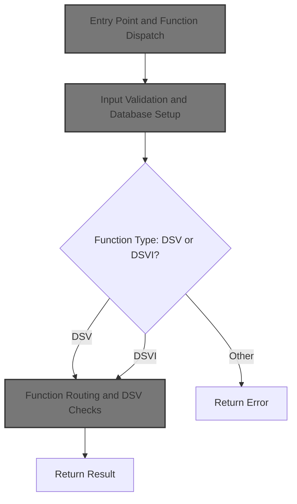
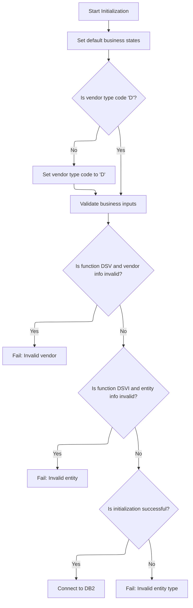
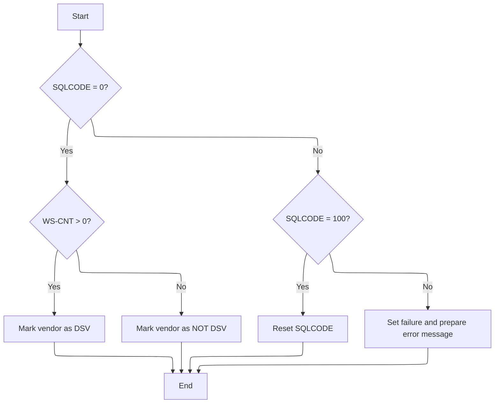

This document describes how requests are processed to determine if a vendor or entity qualifies as DSV. The flow validates the input, routes to the correct check based on the request type, and returns the result.



# Spec

## Detailed View of the Program's Functionality

# a. Program Entry and Main Dispatch

The program begins execution in its main section. The first action is to perform an initialization routine, which prepares the environment and validates the incoming data. After initialization, the program determines which function is being requested by the caller—either a "DSV" or "DSVI" check. Based on this, it routes execution to the appropriate logic for checking a vendor or an entity. If the function is not recognized, it sets an error state and prepares an error message indicating an invalid function was passed. The main section then ends the program.

---

# b. Initialization and Input Validation

The initialization routine is responsible for several key setup steps:

1. It resets (initializes) the main input and output data structures to default values.
2. It sets internal flags to indicate that, by default, the entity and vendor are not DSV, and that the entity exists.
3. It checks if the vendor type code is set to a specific value ('D'). If not, it sets it to this default.
4. The routine then validates the incoming data:
   - If the function is a vendor DSV check, it ensures the vendor number is not zero and the vendor type code is not blank. If either is invalid, it sets a failure state and prepares an error message.
   - If the function is an entity DSV check, it ensures the entity ID is not zero and the entity type is not blank. If either is invalid, it sets a failure state and prepares an error message.
   - For any other case, it sets a failure state and prepares a generic invalid entity type error message.
5. If all validation passes, the routine proceeds to connect to the database (DB2) by calling a dedicated connection routine. This ensures that database operations are only attempted if the inputs are valid.

---

# c. Database Connection

The database connection routine is simple: it delegates the actual connection logic to an external program or module. This external handler is responsible for establishing the connection, translating any errors, and restoring backup records if necessary. This design keeps the main program logic clean and centralizes all database connection handling.

---

# d. Vendor DSV Check Logic

When checking if a vendor is a DSV, the program performs the following steps:

1. It prepares the necessary fields for the database query by copying the vendor number and type code into the query structure.
2. It executes a SQL query that counts the number of records matching the vendor number, type code, and a specific DSV sub-type code, joining two tables.
3. After the query:
   - If the query is successful (no SQL error), it checks the count:
     - If the count is greater than zero, it marks the vendor as a DSV.
     - If the count is zero, it marks the vendor as not a DSV.
   - If the query returns a "not found" code, it resets the SQL code to zero (no error).
   - For any other SQL error, it sets a failure state and prepares an error message that includes the SQL error code.

---

# e. Entity DSV Check Logic

When checking if an entity is a DSV, the program uses a dispatch based on the type of entity key:

1. If the entity key is of a certain type (UPC or DSD), it performs a UPC-based DSV check.
2. If the entity key is a product, it performs a product-based DSV check.

Each of these checks involves preparing the necessary fields, executing a SQL query to count matching records, and setting flags based on the results. If the count is positive, the entity is marked as DSV; otherwise, it is marked as not DSV. Additional checks are performed to verify the existence of the entity (for example, by checking scan codes).

---

# f. Error Handling

Throughout the program, error handling is consistent:

- If any validation or database operation fails, the program sets a failure state and prepares a descriptive error message.
- SQL errors are captured, and the error code is included in the message for troubleshooting.
- The program avoids proceeding with further logic if a failure state is set during initialization or any check.

---

# g. Constants and External Dependencies

The program uses several constants to control its logic, such as the DSV sub-type code and various type codes. These constants determine what qualifies as a DSV vendor or entity. The program also relies on external modules for database connection and for some data structure definitions, which are included at the top of the file.

---

# h. Summary

In summary, the program is structured to:

1. Initialize and validate all inputs.
2. Route to the correct check logic based on the requested function.
3. Perform database queries to determine DSV status for vendors or entities.
4. Handle errors gracefully and provide meaningful messages.
5. Use constants and external modules to keep the logic maintainable and adaptable.

# Rule Definition

| Paragraph Name                                                                       | Rule ID | Category          | Description                                                                                                                                                                                                                 | Conditions                                               | Remarks                                                                                                   |
| ------------------------------------------------------------------------------------ | ------- | ----------------- | --------------------------------------------------------------------------------------------------------------------------------------------------------------------------------------------------------------------------- | -------------------------------------------------------- | --------------------------------------------------------------------------------------------------------- |
| 100-INITIALIZE                                                                       | RL-001  | Conditional Logic | Before any processing, the program checks that all required input fields are present and valid. If any validation fails, it sets an error message and does not proceed to database checks.                                  | Always applies at the start of processing.               | Error messages are set in the output structure. No database operations are performed if validation fails. |
| 100-INITIALIZE                                                                       | RL-002  | Data Assignment   | If the vendor type code is not provided in the input, the program sets it to 'D'.                                                                                                                                           | Vendor type code is blank or not equal to 'D'.           | The default value is 'D'.                                                                                 |
| 100-INITIALIZE                                                                       | RL-003  | Conditional Logic | If the function selector is 'DSV', the program checks that the vendor number is greater than 0 and the vendor type code is 'D'.                                                                                             | Function selector is 'DSV'.                              | Vendor number must be a positive integer. Vendor type code must be 'D'.                                   |
| 100-INITIALIZE                                                                       | RL-004  | Conditional Logic | If the function selector is 'DSVI', the program checks that the entity ID is greater than 0 and the entity type is not blank.                                                                                               | Function selector is 'DSVI'.                             | Entity ID must be a positive integer. Entity type must be a non-blank string.                             |
| 000-MAIN                                                                             | RL-005  | Conditional Logic | If the function selector is not 'DSV' or 'DSVI', the program sets an error message indicating an unknown function.                                                                                                          | Function selector is not 'DSV' or 'DSVI'.                | Error message is 'ZZZS0033 - Invalid MMMC0711-FUNC passed.'                                               |
| 100-INITIALIZE                                                                       | RL-006  | Conditional Logic | If any input validation fails, the program must not proceed to database checks.                                                                                                                                             | Any input validation fails.                              | No database operations are performed if validation fails.                                                 |
| 200-CHECK-VEND-IS-DSV                                                                | RL-007  | Computation       | For the 'DSV' function, the program executes a SQL COUNT query joining XXXATION and AP_XXX_SUB_TYP tables, filtering by vendor number, vendor type code, and AP_SUB_TYP_CD = 'DSV  '.                                       | Function selector is 'DSV' and input validation passed.  | K-DSV-LOC-SUB-TYP-CD = 'DSV  ' (5-character string, right-padded).                                        |
| 300-CHECK-ENTY-IS-DSV, 310-CHECK-UPC-VEND, 315-CHECK-UPC-IS-DSV, 320-CHECK-PROD-VEND | RL-008  | Computation       | For the 'DSVI' function, the program executes a SQL COUNT query joining AP_XXX_SUB_TYP, XXXD_LOC_ITM, XXXATION, and possibly PROD_ITEM, filtering by AP_SUB_TYP_CD = 'DSV  ' and other keys as required by the entity type. | Function selector is 'DSVI' and input validation passed. | K-DSV-LOC-SUB-TYP-CD = 'DSV  ' (5-character string, right-padded).                                        |
| 200-CHECK-VEND-IS-DSV, 315-CHECK-UPC-IS-DSV, 320-CHECK-PROD-VEND                     | RL-009  | Conditional Logic | If a SQL error occurs (SQLCODE not 0 or 100), the program sets an error message including the SQLCODE.                                                                                                                      | SQLCODE not 0 or 100 after SQL execution.                | Error message includes the SQLCODE value.                                                                 |
| 000-MAIN, 100-INITIALIZE, 200-CHECK-VEND-IS-DSV, 300-CHECK-ENTY-IS-DSV               | RL-010  | Data Assignment   | The program returns the result (DSV status) and any error message in the output structure.                                                                                                                                  | Always at end of processing.                             | Output structure includes DSV status and error message fields.                                            |

# User Stories

## User Story 1: Input validation and default assignment with output reporting

---

### Story Description:

As a system, I want to validate all incoming data, assign default values where necessary, and report any validation errors in the output structure so that only valid and complete data is processed and errors are communicated to the caller.

---

### Business Rule Mapping:

| Rule ID | Paragraph Name                                                         | Rule Description                                                                                                                                                                           |
| ------- | ---------------------------------------------------------------------- | ------------------------------------------------------------------------------------------------------------------------------------------------------------------------------------------ |
| RL-010  | 000-MAIN, 100-INITIALIZE, 200-CHECK-VEND-IS-DSV, 300-CHECK-ENTY-IS-DSV | The program returns the result (DSV status) and any error message in the output structure.                                                                                                 |
| RL-001  | 100-INITIALIZE                                                         | Before any processing, the program checks that all required input fields are present and valid. If any validation fails, it sets an error message and does not proceed to database checks. |
| RL-002  | 100-INITIALIZE                                                         | If the vendor type code is not provided in the input, the program sets it to 'D'.                                                                                                          |
| RL-006  | 100-INITIALIZE                                                         | If any input validation fails, the program must not proceed to database checks.                                                                                                            |

---

### Relevant Functionality:

- **000-MAIN**
  1. **RL-010:**
     - At end of processing, populate output structure with DSV status and any error message.
- **100-INITIALIZE**
  1. **RL-001:**
     - On program start, check if required fields are present and valid.
     - If not, set failure flag and error message in output.
     - Skip database checks if validation fails.
  2. **RL-002:**
     - If vendor type code is blank or not 'D', set vendor type code to 'D'.
  3. **RL-006:**
     - If failure flag is set during validation, skip all database operations.

## User Story 2: Function selector handling, validation, and output reporting

---

### Story Description:

As a system, I want to validate inputs based on the function selector ('DSV', 'DSVI', or unknown), set appropriate error messages for invalid or unknown functions, and return these messages in the output structure so that the caller is informed of any issues with the function selection.

---

### Business Rule Mapping:

| Rule ID | Paragraph Name                                                         | Rule Description                                                                                                                |
| ------- | ---------------------------------------------------------------------- | ------------------------------------------------------------------------------------------------------------------------------- |
| RL-005  | 000-MAIN                                                               | If the function selector is not 'DSV' or 'DSVI', the program sets an error message indicating an unknown function.              |
| RL-010  | 000-MAIN, 100-INITIALIZE, 200-CHECK-VEND-IS-DSV, 300-CHECK-ENTY-IS-DSV | The program returns the result (DSV status) and any error message in the output structure.                                      |
| RL-003  | 100-INITIALIZE                                                         | If the function selector is 'DSV', the program checks that the vendor number is greater than 0 and the vendor type code is 'D'. |
| RL-004  | 100-INITIALIZE                                                         | If the function selector is 'DSVI', the program checks that the entity ID is greater than 0 and the entity type is not blank.   |

---

### Relevant Functionality:

- **000-MAIN**
  1. **RL-005:**
     - If function selector is not recognized:
       - Set failure flag and error message in output.
  2. **RL-010:**
     - At end of processing, populate output structure with DSV status and any error message.
- **100-INITIALIZE**
  1. **RL-003:**
     - If function selector is 'DSV':
       - Check vendor number > 0 and vendor type code = 'D'.
       - If not, set failure flag and error message.
  2. **RL-004:**
     - If function selector is 'DSVI':
       - Check entity ID > 0 and entity type is not blank.
       - If not, set failure flag and error message.

## User Story 3: DSV status determination, SQL error handling, and output reporting

---

### Story Description:

As a system, I want to determine the DSV status by executing the appropriate SQL queries for 'DSV' and 'DSVI' functions, handle any SQL errors by reporting them, and return the DSV status and errors in the output structure so that the caller receives all relevant information about the processing outcome.

---

### Business Rule Mapping:

| Rule ID | Paragraph Name                                                                       | Rule Description                                                                                                                                                                                                            |
| ------- | ------------------------------------------------------------------------------------ | --------------------------------------------------------------------------------------------------------------------------------------------------------------------------------------------------------------------------- |
| RL-010  | 000-MAIN, 100-INITIALIZE, 200-CHECK-VEND-IS-DSV, 300-CHECK-ENTY-IS-DSV               | The program returns the result (DSV status) and any error message in the output structure.                                                                                                                                  |
| RL-007  | 200-CHECK-VEND-IS-DSV                                                                | For the 'DSV' function, the program executes a SQL COUNT query joining XXXATION and AP_XXX_SUB_TYP tables, filtering by vendor number, vendor type code, and AP_SUB_TYP_CD = 'DSV  '.                                       |
| RL-009  | 200-CHECK-VEND-IS-DSV, 315-CHECK-UPC-IS-DSV, 320-CHECK-PROD-VEND                     | If a SQL error occurs (SQLCODE not 0 or 100), the program sets an error message including the SQLCODE.                                                                                                                      |
| RL-008  | 300-CHECK-ENTY-IS-DSV, 310-CHECK-UPC-VEND, 315-CHECK-UPC-IS-DSV, 320-CHECK-PROD-VEND | For the 'DSVI' function, the program executes a SQL COUNT query joining AP_XXX_SUB_TYP, XXXD_LOC_ITM, XXXATION, and possibly PROD_ITEM, filtering by AP_SUB_TYP_CD = 'DSV  ' and other keys as required by the entity type. |

---

### Relevant Functionality:

- **000-MAIN**
  1. **RL-010:**
     - At end of processing, populate output structure with DSV status and any error message.
- **200-CHECK-VEND-IS-DSV**
  1. **RL-007:**
     - Execute SQL COUNT query with joins and filters as specified.
     - If count > 0, set VEND-IS-DSV to true; else, set VEND-IS-NOT-DSV to true.
  2. **RL-009:**
     - If SQLCODE not 0 or 100 after SQL execution:
       - Set failure flag and error message including SQLCODE in output.
- **300-CHECK-ENTY-IS-DSV**
  1. **RL-008:**
     - Depending on entity type, execute the appropriate SQL COUNT query with joins and filters as specified.
     - If count > 0, set ENTY-IS-DSV to true; else, set ENTY-IS-NOT-DSV to true.

# Code Walkthrough

## Entry Point and Function Dispatch

<SwmSnippet path="/base/src/MMMS0711.cbl" line="70">

---

`000-MAIN` kicks off the flow. It starts by calling 100-INITIALIZE to validate all incoming data and set up the environment. After that, it checks which function (DSV or DSVI) is requested and routes to the right check logic, or sets an error if the function is unknown. Initialization is needed up front so we don't waste time or resources if the inputs are bad.

```cobol
008200 000-MAIN.                                                        00008400
008300     PERFORM 100-INITIALIZE                                       00008500
008400                                                                  00008600
008500     EVALUATE TRUE                                                00008700
008600       WHEN MMMC0711-IS-DSV-FUNC                                  00008800
008700         PERFORM 200-CHECK-VEND-IS-DSV                            00008900
008800       WHEN MMMC0711-IS-DSV-ITEM-FUNC                             00009000
008900         PERFORM 300-CHECK-ENTY-IS-DSV                            00009100
009000       WHEN OTHER                                                 00009200
009100         SET FAILURE TO TRUE                                      00009300
009200         MOVE 'ZZZS0033 - Invalid MMMC0711-FUNC passed.'          00009400
009300           TO IS-RTRN-MSG-TXT                                     00009500
009400     END-EVALUATE                                                 00009600
009500                                                                  00009700
009600                                                                  00009800
009700*    IF YYYN005A-ORACLE                                           00009900
009800*      PERFORM 125-CONNECT-TO-DB2                                 00010000
009900*    END-IF                                                       00010100
010000     GOBACK                                                       00010200
010100     .                                                            00010300
```

---

</SwmSnippet>

### Input Validation and Database Setup



<SwmSnippet path="/base/src/MMMS0711.cbl" line="95">

---

`100-INITIALIZE` handles all the input checks for vendor and entity fields, sets error messages if anything is off, and only proceeds if everything is valid. If validation passes, it calls 125-CONNECT-TO-DB2 to set up the DB2 connection, so the rest of the flow can safely hit the database.

```cobol
010700 100-INITIALIZE.                                                  00010900
010701*    DISPLAY 'IM IN MMMS0711'                                     00011000
010800     INITIALIZE XXXN001A                                          00011100
010900                MMMC0711-OUTPUTS                                  00011200
011000     SET ENTY-IS-NOT-DSV TO TRUE                                  00011300
011100     SET VEND-IS-NOT-DSV TO TRUE                                  00011400
011200     SET ENTY-EXISTS     TO TRUE                                  00011500
011300                                                                  00011600
011400     IF  MMMC0711-I-VEND-TYP-CD NOT EQUAL 'D'                     00011700
011500       MOVE 'D' TO MMMC0711-I-VEND-TYP-CD                         00011800
011600     END-IF                                                       00011900
011700                                                                  00012000
011800     EVALUATE TRUE                                                00012100
011900       WHEN SUCCESS                                               00012200
012000         CONTINUE                                                 00012300
012100                                                                  00012400
012200       WHEN MMMC0711-IS-DSV-FUNC                                  00012500
012300        AND ( MMMC0711-I-VEND-NBR = 0                             00012600
012400         OR   MMMC0711-I-VEND-TYP-CD = SPACES)                    00012700
012500         SET  FAILURE TO TRUE                                     00012800
012600         MOVE 'MMMS0711 - Invalid Vendor Number or Type!'         00012900
012700           TO IS-RTRN-MSG-TXT                                     00013000
012800                                                                  00013100
012900       WHEN MMMC0711-IS-DSV-ITEM-FUNC                             00013200
013000        AND ( MMMC0711-I-ENTY-ID  = 0                             00013300
013100         OR   MMMC0711-I-ENTY-TYP = SPACES)                       00013400
013200         SET  FAILURE TO TRUE                                     00013500
013300         MOVE 'MMMS0711 - Invalid Enty id/Enty Type!'             00013600
013400           TO IS-RTRN-MSG-TXT                                     00013700
013500                                                                  00013800
013600                                                                  00013900
013700       WHEN OTHER                                                 00014000
013800         SET  FAILURE TO TRUE                                     00014100
013900         MOVE 'MMMS0711 - Invalid Entity type!'                   00014200
014000           TO IS-RTRN-MSG-TXT                                     00014300
014100     END-EVALUATE                                                 00014400
014200     IF SUCCESS                                                   00014500
014300*       PERFORM 900-GET-TASK                                      00014600
014400*       IF SUCCESS AND WWWC0099-ORACLE                            00014700
014500*          SET YYYN005A-ORACLE  TO TRUE                           00014800
014600*          PERFORM 115-CONNECT-TO-ORACLE                          00014900
014700*       END-IF                                                    00015000
 14400*       IF SUCCESS                                                00015100
014600           PERFORM 125-CONNECT-TO-DB2                             00015200
014700*       END-IF                                                    00015300
014800     END-IF                                                       00015400
014900     .                                                            00015500
```

---

</SwmSnippet>

<SwmSnippet path="/base/src/MMMS0711.cbl" line="163">

---

`125-CONNECT-TO-DB2` just calls Z-DB2-CONNECT (YYYS0211). That program handles switching to DB2, error translation, and restoring any backup records. This keeps all the DB2 logic out of the main flow and centralizes error handling.

```cobol
017100 125-CONNECT-TO-DB2.                                              00017700
017200     CALL Z-DB2-CONNECT         USING XXXN001A                    00017800
017300                                      SQLCA                       00017900
017400     .                                                            00018000
```

---

</SwmSnippet>

### Function Routing and DSV Checks



<SwmSnippet path="/base/src/MMMS0711.cbl" line="172">

---

`200-CHECK-VEND-IS-DSV` checks if the vendor is a DSV by running a SQL COUNT on joined tables, filtering by the vendor number, type code, and the K-DSV-LOC-SUB-TYP-CD constant. If the count is positive, it sets VEND-IS-DSV; otherwise, VEND-IS-NOT-DSV. SQL errors set failure and an error message. The constant controls what counts as DSV, so changing it changes the logic.

```cobol
018000 200-CHECK-VEND-IS-DSV.                                           00018600
018100     MOVE MMMC0711-I-VEND-NBR     TO LOC-NBR        OF DCLXXXATION00018700
018200     MOVE MMMC0711-I-VEND-TYP-CD  TO LOC-TYP-CD     OF DCLXXXATION00018800
018300     EXEC SQL                                                     00018900
018400         SELECT COALESCE(COUNT (*),0)                             00019000
018500           INTO :WS-CNT                                           00019100
018600           FROM XXXATION LOC,                                     00019200
018700                AP_XXX_SUB_TYP SUB                                00019300
018800         WHERE LOC.LOC_NBR         = :DCLXXXATION.LOC-NBR         00019400
018900           AND LOC.LOC_TYP_CD      = :DCLXXXATION.LOC-TYP-CD      00019500
019000           AND SUB.AP_NBR          = LOC.AP_NBR                   00019600
019100           AND SUB.AP_TYP_CD       = LOC.AP_TYP_CD                00019700
019200           AND SUB.AP_SUB_TYP_CD   = :K-DSV-LOC-SUB-TYP-CD        00019800
019300     END-EXEC                                                     00019900
019400     EVALUATE TRUE                                                00020000
019500       WHEN SQLCODE = 0                                           00020100
019600         IF WS-CNT > 0                                            00020200
019700           SET VEND-IS-DSV TO TRUE                                00020300
019800         ELSE                                                     00020400
019900           SET VEND-IS-NOT-DSV TO TRUE                            00020500
020000         END-IF                                                   00020600
020100       WHEN SQLCODE = 100                                         00020700
020200         MOVE 0 TO SQLCODE                                        00020800
020300       WHEN SQLCODE NOT = 0                                       00020900
020400         SET  FAILURE TO TRUE                                     00021000
020500         MOVE SPACES  TO IS-RTRN-MSG-TXT                          00021100
020600         MOVE SQLCODE TO WS-SQLCODE                               00021200
020700         STRING 'MMMS0711 - Error checking SUB/VLI, '             00021300
020800                'RC=' WS-SQLCODE '.'                              00021400
020900                DELIMITED BY SIZE INTO IS-RTRN-MSG-TXT            00021500
021000     END-EVALUATE                                                 00021600
021100      .                                                           00021700
```

---

</SwmSnippet>

&nbsp;

*This is an auto-generated document by Swimm 🌊 and has not yet been verified by a human*

<SwmMeta version="3.0.0" repo-id="Z2l0aHViJTNBJTNBU3dpbW1pby1keW5jYWxsLWRlbW8lM0ElM0FHaXJpLVN3aW1t" repo-name="Swimmio-dyncall-demo"><sup>Powered by [Swimm](https://app.swimm.io/)</sup></SwmMeta>
