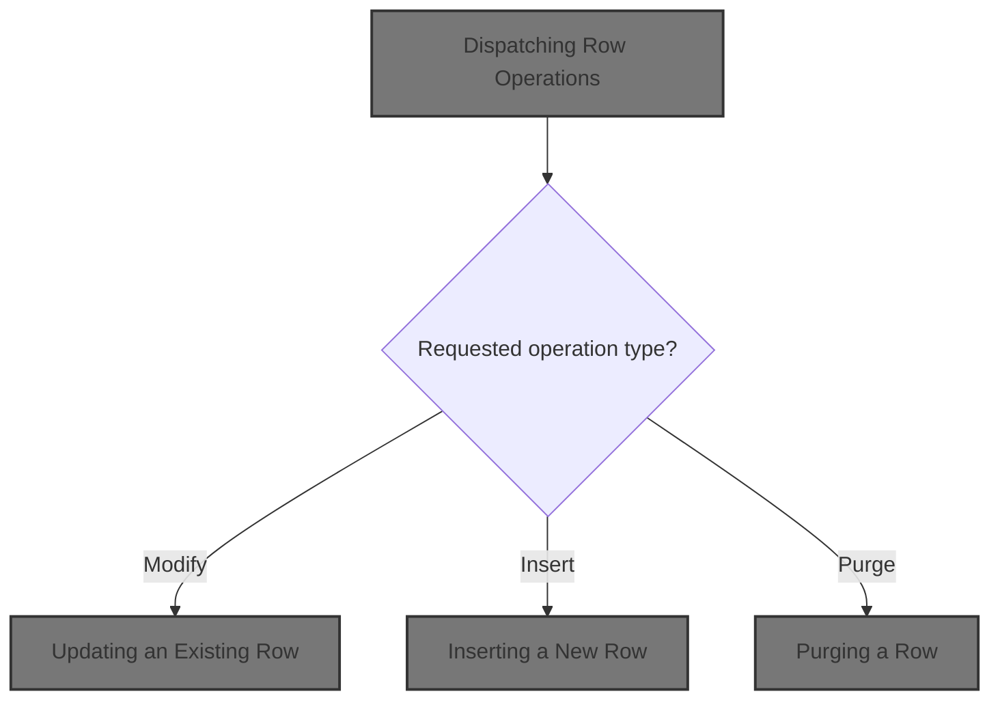
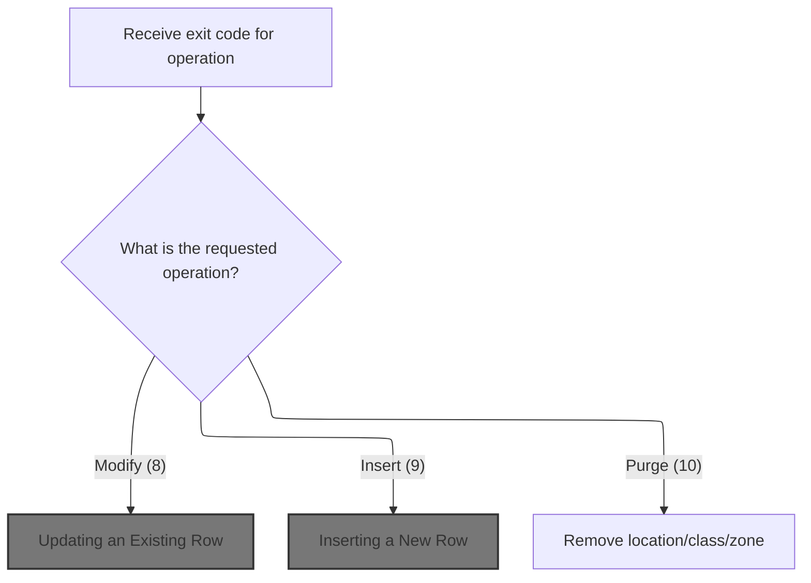

This document describes how requests to modify, insert, or purge rows in the database are processed. When a row operation is requested, the flow determines the type of operation and performs the corresponding update, insertion, or deletion in the database table.



# Spec

## Detailed View of the Program's Functionality

a. Program Initialization and Structure

The program begins by declaring its identification, author, and metadata such as the date written and compiled. It describes itself as a data access object for a specific table, intended to handle input/output operations for that table in an Oracle database. The environment and configuration sections are present but do not contain any custom logic. The data division includes working storage and linkage sections, which are used to define the data structures and parameters that the program will use. Several external data structures and SQL communication areas are included via copy statements, ensuring that the program has access to all necessary fields for database operations.

b. Main Entry Point and Dispatcher Logic

The main logic starts in the procedure division, which receives several data structures as input parameters. The core entry point is a dispatcher routine. This dispatcher checks a specific exit code to determine which database operation should be performed. It uses a switch-case style construct to route control to one of three possible operations: updating an existing row, inserting a new row, or purging (deleting) a row. The dispatcher itself does not perform any database operations; it simply delegates to the appropriate routine based on the exit code.

c. Updating an Existing Row

When the dispatcher determines that an update is required, it calls the update routine. This routine immediately hands off control to a subroutine dedicated to performing the update. The update subroutine executes an SQL UPDATE statement against the target table. It sets several fields in the row to new values, all of which are sourced from a provided data structure. The row to be updated is identified using a combination of key fields, also taken from the same data structure. If the data in this structure is incorrect, the update will not affect the intended row.

d. Inserting a New Row

If the dispatcher determines that an insert is required, it calls the insert routine. This routine immediately hands off control to a subroutine dedicated to performing the insert. The insert subroutine executes an SQL INSERT statement, adding a new row to the target table. All values for the new row are sourced from the provided data structure. The success and correctness of the insert depend entirely on the contents of this structure.

e. Purging (Deleting) a Row

If the dispatcher determines that a purge is required, it calls the purge routine. This routine executes an SQL DELETE statement against the target table. The row to be deleted is identified using a combination of key fields from the provided data structure. Only the row matching all specified keys will be removed from the table.

f. Program Termination

After the appropriate operation has been performed, control returns to the dispatcher, which then terminates the program and returns control to the caller. There is no additional cleanup or post-processing logic; the program's sole responsibility is to perform the requested database operation and exit.

# Rule Definition

| Paragraph Name                           | Rule ID | Category          | Description                                                                                                                                                                               | Conditions                                                                                     | Remarks                                                                                                                                                          |
| ---------------------------------------- | ------- | ----------------- | ----------------------------------------------------------------------------------------------------------------------------------------------------------------------------------------- | ---------------------------------------------------------------------------------------------- | ---------------------------------------------------------------------------------------------------------------------------------------------------------------- |
| 0000-EXIT-DISPATCHER                     | RL-001  | Conditional Logic | The dispatcher evaluates the operation code and routes the request to the appropriate handler for Modify, Insert, or Purge operations.                                                    | Operation code must be 8, 9, or 10.                                                            | Valid operation codes: 8 (Modify), 9 (Insert), 10 (Purge). No other codes are processed. All field values are strings.                                           |
| 1400-EXIT-PUT-MODIFY-ROW, 1405-DO-UPDATE | RL-002  | Computation       | For operation code 8, the system updates the row in the table where LOC_TYP_CD, LOC_NBR, and ITM_CLS_CD match the input. The AD_ZONE and AD_ZONE_EXCP fields are set to the input values. | Operation code is 8. LOC_TYP_CD, LOC_NBR, and ITM_CLS_CD in the table match the input values.  | All five fields (LOC-TYP-CD, LOC-NBR, ITM-CLS-CD, AD-ZONE, AD-ZONE-EXCP) are strings. Only AD_ZONE and AD_ZONE_EXCP are updated; the keys are used for matching. |
| 1500-EXIT-PUT-INSERT-ROW, 1505-DO-INSERT | RL-003  | Computation       | For operation code 9, the system inserts a new row into the table using all five input fields.                                                                                            | Operation code is 9.                                                                           | All five fields (LOC-TYP-CD, LOC-NBR, ITM-CLS-CD, AD-ZONE, AD-ZONE-EXCP) are strings. All are required for the insert.                                           |
| 1600-EXIT-PUT-PURGE-ROW                  | RL-004  | Computation       | For operation code 10, the system deletes the row from the table where LOC_TYP_CD, LOC_NBR, and ITM_CLS_CD match the input.                                                               | Operation code is 10. LOC_TYP_CD, LOC_NBR, and ITM_CLS_CD in the table match the input values. | All key fields (LOC-TYP-CD, LOC-NBR, ITM-CLS-CD) are strings. Only rows matching all three keys are deleted.                                                     |
| Throughout all SQL operations            | RL-005  | Data Assignment   | All five fields in the input and output structures are handled as strings for consistency and compatibility.                                                                              | Any operation involving field values.                                                          | Fields: LOC-TYP-CD, LOC-NBR, ITM-CLS-CD, AD-ZONE, AD-ZONE-EXCP. All are strings (CHAR or VARCHAR).                                                               |
| 0000-EXIT-DISPATCHER                     | RL-006  | Conditional Logic | The dispatcher does not process any operation codes other than 8, 9, or 10.                                                                                                               | Operation code is not 8, 9, or 10.                                                             | No action is taken for unsupported codes.                                                                                                                        |

# User Stories

## User Story 1: Dispatcher routes requests based on operation code

---

### Story Description:

As a system, I want to route requests to the appropriate handler based on the operation code so that only valid operations (Modify, Insert, Purge) are processed and unsupported codes are ignored.

---

### Business Rule Mapping:

| Rule ID | Paragraph Name       | Rule Description                                                                                                                       |
| ------- | -------------------- | -------------------------------------------------------------------------------------------------------------------------------------- |
| RL-001  | 0000-EXIT-DISPATCHER | The dispatcher evaluates the operation code and routes the request to the appropriate handler for Modify, Insert, or Purge operations. |
| RL-006  | 0000-EXIT-DISPATCHER | The dispatcher does not process any operation codes other than 8, 9, or 10.                                                            |

---

### Relevant Functionality:

- **0000-EXIT-DISPATCHER**
  1. **RL-001:**
     - Evaluate the operation code:
       - If code is 8, perform the Modify handler
       - If code is 9, perform the Insert handler
       - If code is 10, perform the Purge handler
       - Otherwise, do nothing
  2. **RL-006:**
     - If operation code is not 8, 9, or 10:
       - Do nothing

## User Story 2: Modify operation updates existing row

---

### Story Description:

As a user, I want to modify an existing row in the XXXX_LOC_CLS_AD_ZN table by providing key fields and new values so that the AD_ZONE and AD_ZONE_EXCP fields are updated for the matching row.

---

### Business Rule Mapping:

| Rule ID | Paragraph Name                           | Rule Description                                                                                                                                                                          |
| ------- | ---------------------------------------- | ----------------------------------------------------------------------------------------------------------------------------------------------------------------------------------------- |
| RL-002  | 1400-EXIT-PUT-MODIFY-ROW, 1405-DO-UPDATE | For operation code 8, the system updates the row in the table where LOC_TYP_CD, LOC_NBR, and ITM_CLS_CD match the input. The AD_ZONE and AD_ZONE_EXCP fields are set to the input values. |
| RL-005  | Throughout all SQL operations            | All five fields in the input and output structures are handled as strings for consistency and compatibility.                                                                              |

---

### Relevant Functionality:

- **1400-EXIT-PUT-MODIFY-ROW**
  1. **RL-002:**
     - When operation code is 8:
       - Locate the row in the table where LOC_TYP_CD, LOC_NBR, and ITM_CLS_CD match the input
       - Update AD_ZONE and AD_ZONE_EXCP to the input values
- **Throughout all SQL operations**
  1. **RL-005:**
     - For all operations (Modify, Insert, Purge):
       - Treat all field values as strings when reading from input and writing to the database

## User Story 3: Insert operation adds new row

---

### Story Description:

As a user, I want to insert a new row into the XXXX_LOC_CLS_AD_ZN table by providing all required fields so that new data can be added to the system.

---

### Business Rule Mapping:

| Rule ID | Paragraph Name                           | Rule Description                                                                                             |
| ------- | ---------------------------------------- | ------------------------------------------------------------------------------------------------------------ |
| RL-003  | 1500-EXIT-PUT-INSERT-ROW, 1505-DO-INSERT | For operation code 9, the system inserts a new row into the table using all five input fields.               |
| RL-005  | Throughout all SQL operations            | All five fields in the input and output structures are handled as strings for consistency and compatibility. |

---

### Relevant Functionality:

- **1500-EXIT-PUT-INSERT-ROW**
  1. **RL-003:**
     - When operation code is 9:
       - Insert a new row into the table with all five input field values
- **Throughout all SQL operations**
  1. **RL-005:**
     - For all operations (Modify, Insert, Purge):
       - Treat all field values as strings when reading from input and writing to the database

## User Story 4: Purge operation deletes existing row

---

### Story Description:

As a user, I want to delete an existing row from the XXXX_LOC_CLS_AD_ZN table by providing key fields so that obsolete or incorrect data can be removed from the system.

---

### Business Rule Mapping:

| Rule ID | Paragraph Name                | Rule Description                                                                                                            |
| ------- | ----------------------------- | --------------------------------------------------------------------------------------------------------------------------- |
| RL-004  | 1600-EXIT-PUT-PURGE-ROW       | For operation code 10, the system deletes the row from the table where LOC_TYP_CD, LOC_NBR, and ITM_CLS_CD match the input. |
| RL-005  | Throughout all SQL operations | All five fields in the input and output structures are handled as strings for consistency and compatibility.                |

---

### Relevant Functionality:

- **1600-EXIT-PUT-PURGE-ROW**
  1. **RL-004:**
     - When operation code is 10:
       - Delete the row from the table where LOC_TYP_CD, LOC_NBR, and ITM_CLS_CD match the input
- **Throughout all SQL operations**
  1. **RL-005:**
     - For all operations (Modify, Insert, Purge):
       - Treat all field values as strings when reading from input and writing to the database

# Code Walkthrough

## Dispatching Row Operations



<SwmSnippet path="/base/src/NNNU0473.cbl" line="44">

---

0000-EXIT-DISPATCHER kicks off the flow by checking the exit condition and routing to the right operation using EVALUATE TRUE, which is basically a switch-case. If the condition matches EXIT-PUT-MODIFY-ROW, it calls 1400-EXIT-PUT-MODIFY-ROW next, which is where the actual update logic happens. The dispatcher itself doesn't touch any repository-specific details, just hands off control based on the exit code.

```cobol
004800 0000-EXIT-DISPATCHER.                                            00480000
004900      EVALUATE TRUE                                               00490000
005000       WHEN EXIT-PUT-MODIFY-ROW                                   00500000
005100          PERFORM 1400-EXIT-PUT-MODIFY-ROW                        00510000
005200       WHEN EXIT-PUT-INSERT-ROW                                   00520000
005300          PERFORM 1500-EXIT-PUT-INSERT-ROW                        00530000
005400       WHEN EXIT-PUT-PURGE-ROW                                    00540000
005500          PERFORM 1600-EXIT-PUT-PURGE-ROW                         00550000
005600      END-EVALUATE                                                00560000
005700     GOBACK                                                       00570000
005800     .                                                            00580000
```

---

</SwmSnippet>

### Updating an Existing Row

<SwmSnippet path="/base/src/NNNU0473.cbl" line="56">

---

1400-EXIT-PUT-MODIFY-ROW just hands off control to 1405-DO-UPDATE. There's no extra logic here—it's just a direct call to the update routine, keeping things clean and modular.

```cobol
006000 1400-EXIT-PUT-MODIFY-ROW.                                        00600000
006100      PERFORM 1405-DO-UPDATE                                      00610000
006200      .                                                           00620000
```

---

</SwmSnippet>

<SwmSnippet path="/base/src/NNNU0473.cbl" line="61">

---

1405-DO-UPDATE runs the actual SQL UPDATE using embedded SQL. It pulls both the new values and the WHERE clause keys from the DCLXXXX-LOC-CLS-AD-ZN structure, so everything about which row gets updated and what values are set comes from that struct. If the struct's data is off, the update won't work as expected.

```cobol
006500 1405-DO-UPDATE.                                                  00650000
006600     EXEC SQL                                                     00660000
046000         UPDATE XXXX_LOC_CLS_AD_ZN                                00046000
046100         SET    LOC_TYP_CD         =                              00046100
046200               :DCLXXXX-LOC-CLS-AD-ZN.LOC-TYP-CD,                 00046200
046300                LOC_NBR            =                              00046300
046400                      :DCLXXXX-LOC-CLS-AD-ZN.LOC-NBR,             00046400
046500                ITM_CLS_CD         =                              00046500
046600                      :DCLXXXX-LOC-CLS-AD-ZN.ITM-CLS-CD,          00046600
046700                AD_ZONE            =                              00046700
046800                      :DCLXXXX-LOC-CLS-AD-ZN.AD-ZONE,             00046800
046900                AD_ZONE_EXCP       =                              00046900
047000                      :DCLXXXX-LOC-CLS-AD-ZN.AD-ZONE-EXCP         00047000
047100         WHERE  LOC_TYP_CD = :DCLXXXX-LOC-CLS-AD-ZN.LOC-TYP-CD    00047100
047200         AND    LOC_NBR = :DCLXXXX-LOC-CLS-AD-ZN.LOC-NBR          00047200
047300         AND    ITM_CLS_CD = :DCLXXXX-LOC-CLS-AD-ZN.ITM-CLS-CD    00047300
006700     END-EXEC                                                     00670000
006800     .                                                            00680000
```

---

</SwmSnippet>

### Inserting a New Row

<SwmSnippet path="/base/src/NNNU0473.cbl" line="81">

---

1500-EXIT-PUT-INSERT-ROW just calls 1505-DO-INSERT directly. There's no extra logic here, it's just a clean handoff to the insert routine.

```cobol
007100 1500-EXIT-PUT-INSERT-ROW.                                        00710000
007200      PERFORM 1505-DO-INSERT                                      00720000
007300     .                                                            00730000
```

---

</SwmSnippet>

<SwmSnippet path="/base/src/NNNU0473.cbl" line="86">

---

1505-DO-INSERT runs the SQL INSERT using embedded SQL. It pulls all the values for the new row from the DCLXXXX-LOC-CLS-AD-ZN struct, so the insert is only as good as the data in that struct.

```cobol
007600 1505-DO-INSERT.                                                  00760000
007700     EXEC SQL                                                     00770000
048900         INSERT INTO XXXX_LOC_CLS_AD_ZN (                         00048900
049000             LOC_TYP_CD,                                          00049000
049100             LOC_NBR,                                             00049100
049200             ITM_CLS_CD,                                          00049200
049300             AD_ZONE,                                             00049300
049400             AD_ZONE_EXCP )                                       00049400
049500         VALUES (                                                 00049500
049600             :DCLXXXX-LOC-CLS-AD-ZN.LOC-TYP-CD,                   00049600
049700             :DCLXXXX-LOC-CLS-AD-ZN.LOC-NBR,                      00049700
049800             :DCLXXXX-LOC-CLS-AD-ZN.ITM-CLS-CD,                   00049800
049900             :DCLXXXX-LOC-CLS-AD-ZN.AD-ZONE,                      00049900
050000             :DCLXXXX-LOC-CLS-AD-ZN.AD-ZONE-EXCP )                00050000
007800     END-EXEC                                                     00780000
007900     .                                                            00790000
```

---

</SwmSnippet>

### Purging a Row

<SwmSnippet path="/base/src/NNNU0473.cbl" line="104">

---

1600-EXIT-PUT-PURGE-ROW runs the SQL DELETE using embedded SQL. It uses the key fields from the DCLXXXX-LOC-CLS-AD-ZN struct to find and remove the matching row from the table.

```cobol
008200 1600-EXIT-PUT-PURGE-ROW.                                         00820000
008300       EXEC SQL                                                   00830000
051400         DELETE FROM XXXX_LOC_CLS_AD_ZN                           00051400
051500         WHERE  LOC_TYP_CD = :DCLXXXX-LOC-CLS-AD-ZN.LOC-TYP-CD    00051500
051600         AND    LOC_NBR = :DCLXXXX-LOC-CLS-AD-ZN.LOC-NBR          00051600
051700         AND    ITM_CLS_CD = :DCLXXXX-LOC-CLS-AD-ZN.ITM-CLS-CD    00051700
008400       END-EXEC                                                   00840000
008500     .                                                            00850000
```

---

</SwmSnippet>

&nbsp;

*This is an auto-generated document by Swimm 🌊 and has not yet been verified by a human*

<SwmMeta version="3.0.0" repo-id="Z2l0aHViJTNBJTNBU3dpbW1pby1keW5jYWxsLWRlbW8lM0ElM0FHaXJpLVN3aW1t" repo-name="Swimmio-dyncall-demo"><sup>Powered by [Swimm](https://app.swimm.io/)</sup></SwmMeta>
