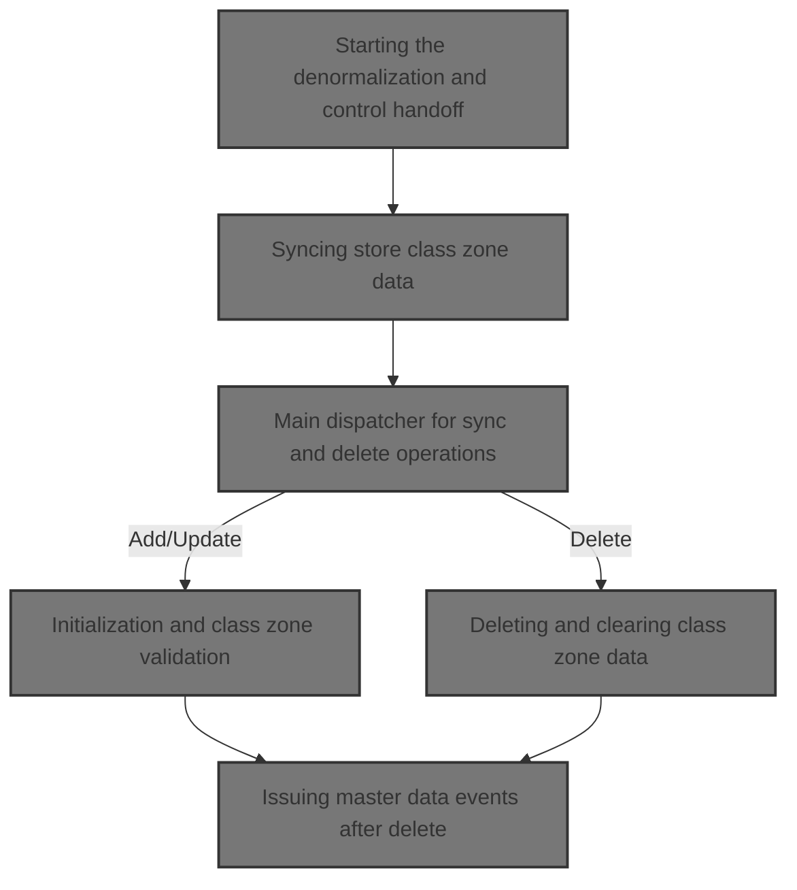
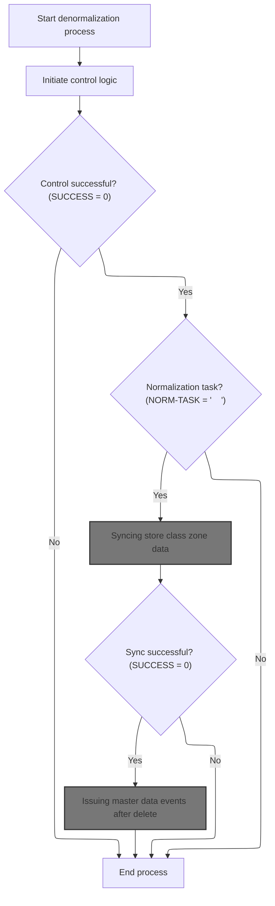
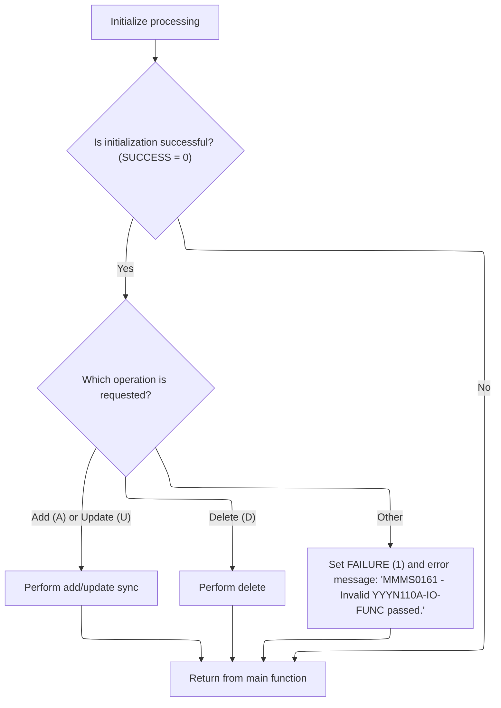
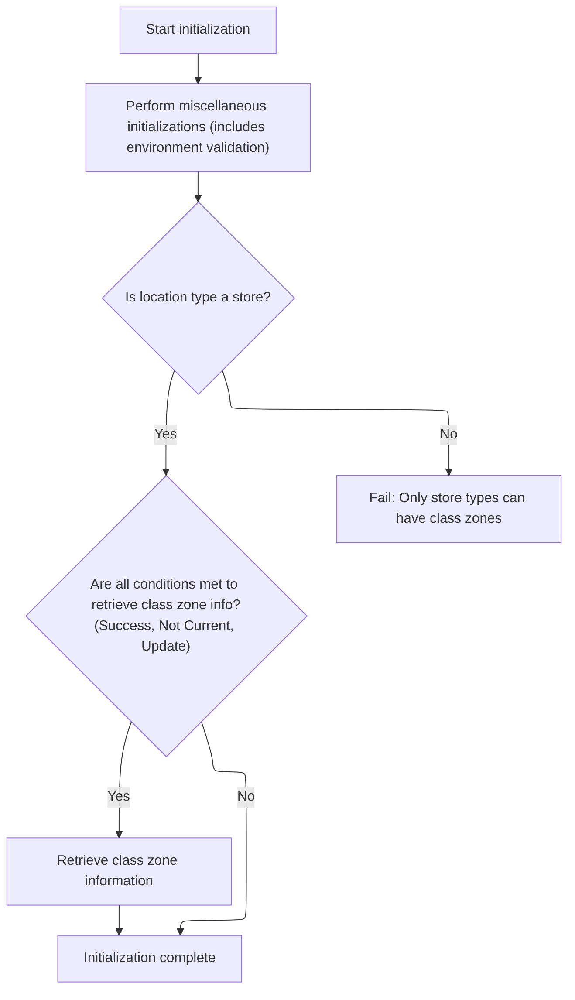
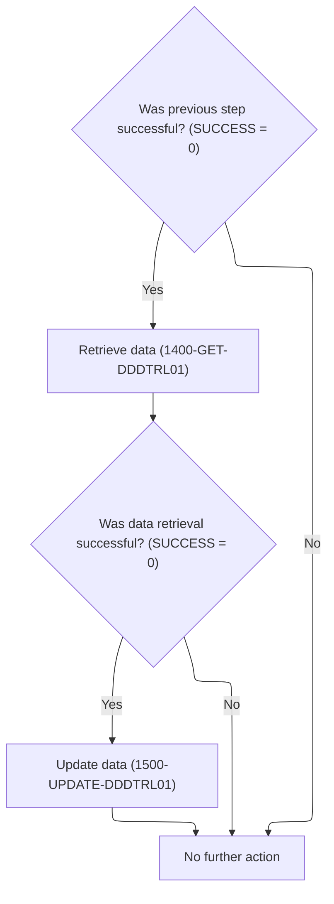
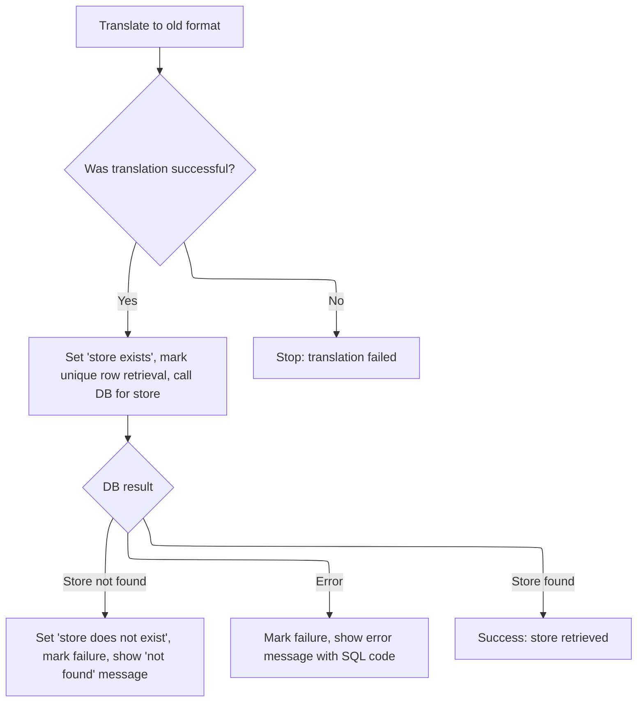
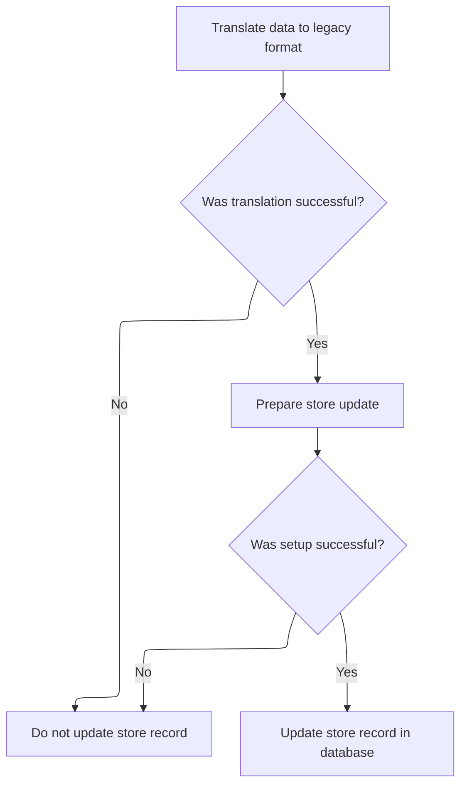
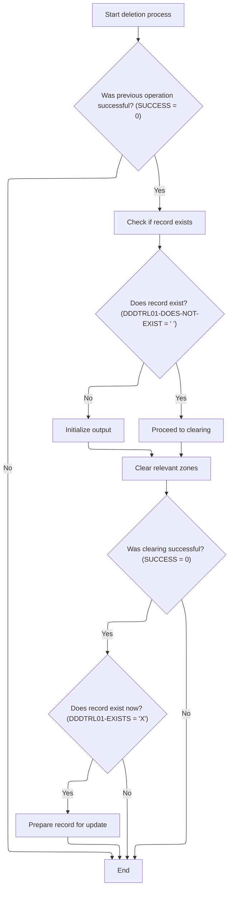
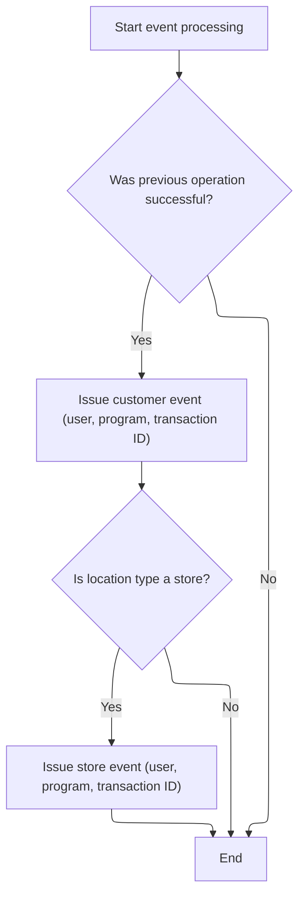

This document describes how store class zone data is processed, including synchronizing, updating, or deleting records and issuing master data events. The flow receives store class zone data and workflow context, determines the required operation, and either syncs or deletes records. After processing, relevant master data events are issued to notify downstream systems.



# Spec

## Detailed View of the Program's Functionality

# Swimmio-dyncall-demo: Store Class Zone Denormalization and Synchronization Flow

---

## a. Starting the Denormalization and Control Handoff

The process begins with a denormalization routine that prepares the environment and coordinates the workflow for synchronizing store class zone data between new and legacy databases.

1. The denormalization process is started, and the system environment is copied from a general environment structure to a more specific one used for downstream logic.
2. Control is handed off to a subroutine that prepares the workflow state, ensuring the context is ready for the next steps.
3. If the control subroutine completes successfully, and if a normalization task is indicated, the process continues to synchronize the store class zone data.
4. If the synchronization is also successful, the process issues master data events to notify downstream systems of the changes.
5. If any of these steps fail, the process ends early.

---

## b. Control Subroutine for Workflow State

The control subroutine is responsible for preparing the workflow context:

1. It sets a flag indicating that a task should be retrieved.
2. It calls an external control subroutine, passing in the necessary context and workflow structures.
3. This sets up the state for the rest of the denormalization and synchronization process.

---

## c. Syncing Store Class Zone Data

If the workflow context and normalization task checks pass, the process continues to synchronize the store class zone data:

1. The environment is marked as the last call and as using the Oracle database.
2. A flag is set to indicate that the class zone data is current.
3. The synchronization subroutine is called, passing in the context, environment, synchronization flags, and the store class zone data structure.

---

## d. Main Dispatcher for Sync and Delete Operations

The main dispatcher routine in the synchronization module determines what operation to perform:

1. Initialization is performed, including environment validation and setup.
2. If initialization is successful, the dispatcher checks the requested operation type:
   - For add or update, it performs the synchronization routine.
   - For delete, it performs the deletion routine.
   - For any other operation code, it sets a failure flag and an error message.
3. The dispatcher then returns control to the caller.

---

## e. Initialization and Class Zone Validation

During initialization:

1. Miscellaneous setup is performed, including environment validation.
2. The process checks if the location type is a store. If not, it fails with an error message.
3. If the location is a store, and certain flags indicate that the class zone is not current and an update is requested, it retrieves the class zone information from the database.
4. The retrieval is performed by calling a data access object (DAO) routine, which fetches the unique class zone row and handles errors based on the database response.

---

## f. Syncing and Updating Store Records

When synchronizing store records:

1. If the previous step was successful, the process retrieves the store record by translating the data to the legacy format and calling the DAO to fetch the record.
2. If the store record is found, the process proceeds to update the record.
3. If the store record is not found or an error occurs, appropriate failure flags and messages are set.

---

## g. Fetching and Validating Store Record

The process for fetching a store record involves:

1. Translating the input data to the legacy format.
2. If translation is successful, setting flags to indicate the record exists and preparing for a unique row fetch.
3. Calling the DAO to retrieve the store record.
4. Handling the result:
   - If the record is not found, setting failure flags and a "not found" message.
   - If an error occurs, setting failure flags and an error message with the SQL code.
   - If the record is found, marking success.

---

## h. Translating Between New and Old Data Formats

A translation module is used to convert between new and old data formats:

1. The translation routine is initialized.
2. Based on a function flag, the module either translates from new to old format or from old to new.
3. If the function flag is invalid, an error is set.
4. The translation routines move data between the new and legacy structures, handling each item class code as needed.

---

## i. DAO Call and Exit Dispatcher for Store Records

The DAO dispatcher routine is responsible for executing the correct database operation:

1. Initialization is performed.
2. Based on an exit code set earlier, the dispatcher selects the appropriate operation (open/close cursor, get row, modify, insert, delete, etc.).
3. After the operation, cleanup is performed and control is returned.

---

## j. Updating Store Record with Readiness Checks

The update process for a store record is carefully sequenced:

1. Data is translated to the legacy format.
2. If translation is successful, setup for the update is performed.
3. If setup is successful, readiness checks are performed and the DAO is called to update the record.
4. Errors or "not found" cases are handled with appropriate messages and flags.

---

## k. Deleting and Clearing Class Zone Data

When deleting a class zone:

1. The process first fetches the store record.
2. If the record does not exist, output is initialized and the process ends.
3. If the record exists, the relevant class zone fields are cleared based on the item class code.
4. If clearing is successful and the record still exists, the record is updated in the database.
5. Errors and missing records are handled gracefully.

---

## l. Issuing Master Data Events After Delete

After a successful delete or update:

1. The process prepares to issue master data events.
2. The current user is determined (from the environment or set to "BATCH").
3. An event payload is built from the input arguments and sent to the event manager.
4. If the location type is a store, an additional store event is issued.
5. This notifies downstream systems of the changes.

---

## m. Summary

This flow ensures that changes to store class zone data are properly denormalized, synchronized between new and legacy systems, and that all relevant systems are notified of changes. The process is robust, with careful error handling, environment validation, and translation between data formats to maintain consistency across multiple databases and systems.

# Rule Definition

| Paragraph Name                                                                                                                                                                                                                                     | Rule ID | Category          | Description                                                                                                                                                                                                                                | Conditions                                                                              | Remarks                                                                                                                                                                                                                                                                                                                                                                            |
| -------------------------------------------------------------------------------------------------------------------------------------------------------------------------------------------------------------------------------------------------- | ------- | ----------------- | ------------------------------------------------------------------------------------------------------------------------------------------------------------------------------------------------------------------------------------------ | --------------------------------------------------------------------------------------- | ---------------------------------------------------------------------------------------------------------------------------------------------------------------------------------------------------------------------------------------------------------------------------------------------------------------------------------------------------------------------------------- |
| NNNS0473: PROCEDURE DIVISION USING, MMMS0161: PROCEDURE DIVISION USING, MMMS0162: PROCEDURE DIVISION USING, NNNS0120: PROCEDURE DIVISION USING                                                                                                     | RL-001  | Conditional Logic | The system must accept and process input via predefined linkage areas for control/status, SQL communication, environment info, general parameters, store/class/zone record, environment/function flags, sync status, and workflow context. | Input is received via the specified linkage areas at program invocation.                | Linkage areas include: control/status (XXXN001A), SQLCA, environment info (YYYN005A), general parameters (NNNN0000-PARMS), store/class/zone record (P-DDDTCZ01), environment/function flags (YYYN110A), sync status (MMMC0161), workflow context (WWWC0100). Each area has a defined structure (alphanumeric, numeric, etc.) and must be populated according to its specification. |
| NNNS0473: 0000-EXIT-DISPATCHER, MMMS0161: 000-MAIN, NNNS0120: 0000-EXIT-DISPATCHER                                                                                                                                                                 | RL-002  | Conditional Logic | The system must dispatch processing logic based on the IO-FUNC operation flag, supporting Add ('A'), Update ('U'), and Delete ('D'). Invalid values must result in FAILURE and an error message.                                           | IO-FUNC value is present in the environment/function flags area.                        | Valid IO-FUNC values: 'A' (Add), 'U' (Update), 'D' (Delete). Any other value is invalid. Status and error messages are alphanumeric strings, placed in the return message text field.                                                                                                                                                                                              |
| NNNS0473: 1400-EXIT-PUT-MODIFY-ROW, 1500-EXIT-PUT-INSERT-ROW, 1600-EXIT-PUT-PURGE-ROW, MMMS0161: 1000-DO-THE-SYNC, 1500-UPDATE-DDDTRL01, 2000-DO-THE-DELETE, NNNS0120: 1400-EXIT-PUT-MODIFY-ROW, 1500-EXIT-PUT-INSERT-ROW, 1600-EXIT-PUT-PURGE-ROW | RL-003  | Computation       | The system must update the DB2 Store/Class/Zone Table with the provided record data for add, update, or delete operations, using the fields LOC-TYP-CD, LOC-NBR, ITM-CLS-CD, AD-ZONE, AD-ZONE-EXCP.                                        | A valid Add, Update, or Delete operation is requested and input record data is present. | Table fields: location type code (string), location number (number), item class code (number), ad zone (string), ad zone exception (string).                                                                                                                                                                                                                                       |
| NNNS0473: 1420-D0-MODIFY-ROW, 1500-EXIT-PUT-INSERT-ROW, 1600-EXIT-PUT-PURGE-ROW, MMMS0161: 1400-GET-DDDTRL01, 1500-UPDATE-DDDTRL01, NNNS0120: 1400-EXIT-PUT-MODIFY-ROW, 1500-EXIT-PUT-INSERT-ROW, 1600-EXIT-PUT-PURGE-ROW                          | RL-004  | Conditional Logic | The system must use SQLCODE to determine the result of database operations: 0 for success, 100 for not found, other values for error.                                                                                                      | A database operation has been executed and SQLCODE is set.                              | SQLCODE values: 0 (success), 100 (not found), other (error). Error messages are alphanumeric strings. Status is set in the control/status area.                                                                                                                                                                                                                                    |
| NNNS0473: 120-EXIT-STUFF, MMMS0161: 1400-GET-DDDTRL01, 1500-UPDATE-DDDTRL01, 2000-DO-THE-DELETE, MMMS0162: 000-MAIN, NNNS0120: 120-EXIT-STUFF                                                                                                      | RL-005  | Data Assignment   | After each operation, the system must update the control/status area, setting SUCCESS or FAILURE and an appropriate message in the return message text field.                                                                              | Any operation completes (success or failure).                                           | Status is a flag (SUCCESS/FAILURE). Message is an alphanumeric string, placed in the return message text field. No direct console output is allowed.                                                                                                                                                                                                                               |
| MMMS0161: 100-INITIALIZE, MMMS0162: 210-POPULATE-DDDPST01, 220-POPULATE-DDDTRL01                                                                                                                                                                   | RL-006  | Conditional Logic | The system must only allow class zone operations for location types that are stores (LOC-TYP-CD = 'ST').                                                                                                                                   | A class zone operation is requested and the location type code is present.              | Valid location type code for class zone operations: 'ST'.                                                                                                                                                                                                                                                                                                                          |
| MMMS0162: 200-NEW-2-OLD, 500-OLD-2-NEW, MMMS0161: 9000-TRANSLATE-TO-OLD                                                                                                                                                                            | RL-007  | Computation       | The system must translate data between new and legacy formats as required for DAO/database operations and event issuing.                                                                                                                   | A translation is required for DAO/database or event operations.                         | Translation involves mapping fields between new (P-DDDTCZ01) and old (DDDPST01, DDDTRL01) formats. Field types: alphanumeric, numeric, etc. Mapping is field-to-field as per translation routines.                                                                                                                                                                                 |
| NNNS0473: 2030-ISSUE-EVENTS, MMMS0161: 1000-DO-THE-SYNC, 2000-DO-THE-DELETE                                                                                                                                                                        | RL-008  | Computation       | The system must issue master data events after successful delete or update, with event payloads containing EVENT-TYPE, USER-ID, PROGRAM-ID, and TRANSACTION-ID.                                                                            | A delete or update operation completes successfully.                                    | Event payload fields: event type (string), user ID (string), program ID (string), transaction ID (string/number). Payloads are passed to the event manager routine.                                                                                                                                                                                                                |
| NNNS0473: 2020-CALL-SYNC-SUBR, MMMS0161: 100-INITIALIZE, 120-GET-CZ                                                                                                                                                                                | RL-009  | Data Assignment   | The system must set flags in the sync status area to indicate if the class zone is current or not current.                                                                                                                                 | A sync operation is performed or status needs to be updated.                            | Sync status flags: current/not current (boolean or flag).                                                                                                                                                                                                                                                                                                                          |
| MMMS0161: 1400-GET-DDDTRL01, 1500-UPDATE-DDDTRL01, 2000-DO-THE-DELETE                                                                                                                                                                              | RL-010  | Conditional Logic | The system must handle missing records by setting the DOES-NOT-EXIST flag and updating the status area accordingly.                                                                                                                        | A database fetch returns SQLCODE 100 (not found).                                       | DOES-NOT-EXIST is a boolean/flag. Status area is updated with failure and message.                                                                                                                                                                                                                                                                                                 |
| NNNS0473: throughout, MMMS0161: throughout, NNNS0120: throughout, MMMS0162: throughout                                                                                                                                                             | RL-011  | Conditional Logic | The system must not produce direct console output; all output must be via updated linkage areas, database changes, or event payloads.                                                                                                      | Any operation produces output or error.                                                 | All output is via linkage areas, database changes, or event payloads. No console or standard output is used.                                                                                                                                                                                                                                                                       |

# User Stories

## User Story 1: System input and status communication

---

### Story Description:

As a system user, I want the system to accept input and communicate results via predefined linkage areas so that all control, status, and error information is managed consistently and without direct console output.

---

### Business Rule Mapping:

| Rule ID | Paragraph Name                                                                                                                                 | Rule Description                                                                                                                                                                                                                           |
| ------- | ---------------------------------------------------------------------------------------------------------------------------------------------- | ------------------------------------------------------------------------------------------------------------------------------------------------------------------------------------------------------------------------------------------ |
| RL-001  | NNNS0473: PROCEDURE DIVISION USING, MMMS0161: PROCEDURE DIVISION USING, MMMS0162: PROCEDURE DIVISION USING, NNNS0120: PROCEDURE DIVISION USING | The system must accept and process input via predefined linkage areas for control/status, SQL communication, environment info, general parameters, store/class/zone record, environment/function flags, sync status, and workflow context. |
| RL-005  | NNNS0473: 120-EXIT-STUFF, MMMS0161: 1400-GET-DDDTRL01, 1500-UPDATE-DDDTRL01, 2000-DO-THE-DELETE, MMMS0162: 000-MAIN, NNNS0120: 120-EXIT-STUFF  | After each operation, the system must update the control/status area, setting SUCCESS or FAILURE and an appropriate message in the return message text field.                                                                              |
| RL-011  | NNNS0473: throughout, MMMS0161: throughout, NNNS0120: throughout, MMMS0162: throughout                                                         | The system must not produce direct console output; all output must be via updated linkage areas, database changes, or event payloads.                                                                                                      |

---

### Relevant Functionality:

- **NNNS0473: PROCEDURE DIVISION USING**
  1. **RL-001:**
     - On program start, receive all required linkage areas as parameters.
     - Validate that all required areas are present.
     - Initialize or use these areas for all subsequent operations.
- **NNNS0473: 120-EXIT-STUFF**
  1. **RL-005:**
     - On operation completion, set SUCCESS or FAILURE in status area.
     - Populate return message text with appropriate message.
     - Do not write to console.
- **NNNS0473: throughout**
  1. **RL-011:**
     - For all errors, status, and results, update the appropriate linkage area or event payload.
     - Do not write to console or standard output.

## User Story 2: Store/Class/Zone operation processing

---

### Story Description:

As a system user, I want to perform add, update, or delete operations on store/class/zone records using operation flags so that I can manage these records and receive appropriate status and error messages for valid and invalid operations.

---

### Business Rule Mapping:

| Rule ID | Paragraph Name                                                                                                                                                                                                                                     | Rule Description                                                                                                                                                                                    |
| ------- | -------------------------------------------------------------------------------------------------------------------------------------------------------------------------------------------------------------------------------------------------- | --------------------------------------------------------------------------------------------------------------------------------------------------------------------------------------------------- |
| RL-002  | NNNS0473: 0000-EXIT-DISPATCHER, MMMS0161: 000-MAIN, NNNS0120: 0000-EXIT-DISPATCHER                                                                                                                                                                 | The system must dispatch processing logic based on the IO-FUNC operation flag, supporting Add ('A'), Update ('U'), and Delete ('D'). Invalid values must result in FAILURE and an error message.    |
| RL-003  | NNNS0473: 1400-EXIT-PUT-MODIFY-ROW, 1500-EXIT-PUT-INSERT-ROW, 1600-EXIT-PUT-PURGE-ROW, MMMS0161: 1000-DO-THE-SYNC, 1500-UPDATE-DDDTRL01, 2000-DO-THE-DELETE, NNNS0120: 1400-EXIT-PUT-MODIFY-ROW, 1500-EXIT-PUT-INSERT-ROW, 1600-EXIT-PUT-PURGE-ROW | The system must update the DB2 Store/Class/Zone Table with the provided record data for add, update, or delete operations, using the fields LOC-TYP-CD, LOC-NBR, ITM-CLS-CD, AD-ZONE, AD-ZONE-EXCP. |
| RL-004  | NNNS0473: 1420-D0-MODIFY-ROW, 1500-EXIT-PUT-INSERT-ROW, 1600-EXIT-PUT-PURGE-ROW, MMMS0161: 1400-GET-DDDTRL01, 1500-UPDATE-DDDTRL01, NNNS0120: 1400-EXIT-PUT-MODIFY-ROW, 1500-EXIT-PUT-INSERT-ROW, 1600-EXIT-PUT-PURGE-ROW                          | The system must use SQLCODE to determine the result of database operations: 0 for success, 100 for not found, other values for error.                                                               |
| RL-006  | MMMS0161: 100-INITIALIZE, MMMS0162: 210-POPULATE-DDDPST01, 220-POPULATE-DDDTRL01                                                                                                                                                                   | The system must only allow class zone operations for location types that are stores (LOC-TYP-CD = 'ST').                                                                                            |

---

### Relevant Functionality:

- **NNNS0473: 0000-EXIT-DISPATCHER**
  1. **RL-002:**
     - Read IO-FUNC from environment/function flags.
     - If IO-FUNC is 'A', dispatch to Add logic.
     - If IO-FUNC is 'U', dispatch to Update logic.
     - If IO-FUNC is 'D', dispatch to Delete logic.
     - Otherwise, set FAILURE, populate error message in return message text.
- **NNNS0473: 1400-EXIT-PUT-MODIFY-ROW**
  1. **RL-003:**
     - For Add/Update/Delete, map input record fields to DB2 table columns.
     - Execute the corresponding SQL operation (INSERT, UPDATE, DELETE).
     - Use SQLCODE to determine the result.
- **NNNS0473: 1420-D0-MODIFY-ROW**
  1. **RL-004:**
     - After each DB operation, check SQLCODE.
     - If 0, set SUCCESS.
     - If 100, set FAILURE, set 'not found' message.
     - If other, set FAILURE, set error message with SQLCODE.
- **MMMS0161: 100-INITIALIZE**
  1. **RL-006:**
     - Check LOC-TYP-CD in input record.
     - If not 'ST', set FAILURE and error message.
     - Otherwise, proceed.

## User Story 3: Event issuing and data translation

---

### Story Description:

As a system user, I want the system to issue master data events after successful update or delete operations, with event payloads containing translated data between new and legacy formats so that downstream systems receive accurate and compatible event information.

---

### Business Rule Mapping:

| Rule ID | Paragraph Name                                                              | Rule Description                                                                                                                                                |
| ------- | --------------------------------------------------------------------------- | --------------------------------------------------------------------------------------------------------------------------------------------------------------- |
| RL-007  | MMMS0162: 200-NEW-2-OLD, 500-OLD-2-NEW, MMMS0161: 9000-TRANSLATE-TO-OLD     | The system must translate data between new and legacy formats as required for DAO/database operations and event issuing.                                        |
| RL-008  | NNNS0473: 2030-ISSUE-EVENTS, MMMS0161: 1000-DO-THE-SYNC, 2000-DO-THE-DELETE | The system must issue master data events after successful delete or update, with event payloads containing EVENT-TYPE, USER-ID, PROGRAM-ID, and TRANSACTION-ID. |

---

### Relevant Functionality:

- **MMMS0162: 200-NEW-2-OLD**
  1. **RL-007:**
     - For new-to-old: map new record fields to old structure fields.
     - For old-to-new: map old structure fields to new record fields.
     - Use translation routines as needed.
- **NNNS0473: 2030-ISSUE-EVENTS**
  1. **RL-008:**
     - On successful update/delete, construct event payload with required fields.
     - Call event manager routine with payload.
     - Do not issue event on failure.

## User Story 4: Sync status and missing record handling

---

### Story Description:

As a system user, I want the system to indicate whether the class zone is current and handle missing records by updating the sync status and existence flags so that I am informed about the current state and existence of records.

---

### Business Rule Mapping:

| Rule ID | Paragraph Name                                                        | Rule Description                                                                                                    |
| ------- | --------------------------------------------------------------------- | ------------------------------------------------------------------------------------------------------------------- |
| RL-009  | NNNS0473: 2020-CALL-SYNC-SUBR, MMMS0161: 100-INITIALIZE, 120-GET-CZ   | The system must set flags in the sync status area to indicate if the class zone is current or not current.          |
| RL-010  | MMMS0161: 1400-GET-DDDTRL01, 1500-UPDATE-DDDTRL01, 2000-DO-THE-DELETE | The system must handle missing records by setting the DOES-NOT-EXIST flag and updating the status area accordingly. |

---

### Relevant Functionality:

- **NNNS0473: 2020-CALL-SYNC-SUBR**
  1. **RL-009:**
     - On sync, set sync status flag to current.
     - If not current, set flag accordingly.
- **MMMS0161: 1400-GET-DDDTRL01**
  1. **RL-010:**
     - If SQLCODE = 100 after fetch, set DOES-NOT-EXIST flag.
     - Set FAILURE and appropriate message in status area.

# Code Walkthrough

## Starting the denormalization and control handoff



<SwmSnippet path="/base/src/NNNS0473.cbl" line="540">

---

`2000-DENORM-PROCESS` starts things off, sets up the environment, and hands off to the control subroutine to get the workflow state ready for the rest of the process.

```cobol
058200 2000-DENORM-PROCESS.                                             00058200
058300     MOVE YYYN005A-SYS-ENV      TO YYYN110A-SYS-ENV               00058300
058400     PERFORM 2010-CALL-CONTROL-SUBR                               00058400
058500     IF  SUCCESS                                                  00058500
058600     AND WWWC0100-NORM-TASK                                       00058600
058700       PERFORM 2020-CALL-SYNC-SUBR                                00058700
058800     END-IF                                                       00058800
058900     IF SUCCESS                                                   00058900
059200          PERFORM 2030-ISSUE-EVENTS                               00059200
059400     END-IF                                                       00059400
059500     .                                                            00059500
```

---

</SwmSnippet>

<SwmSnippet path="/base/src/NNNS0473.cbl" line="553">

---

`2010-CALL-CONTROL-SUBR` sets up the task state and calls WWWS0100 to get the workflow context ready for downstream logic.

```cobol
059800 2010-CALL-CONTROL-SUBR.                                          00059800
059900     SET WWWC0100-GET-TASK  TO TRUE                               00059900
060000     CALL WWWS0100-CONTROL-SUBR USING                             00060000
060100         XXXN001A                                                 00060100
060200         WWWC0100                                                 00060200
060300     .                                                            00060300
```

---

</SwmSnippet>

### Syncing store class zone data

<SwmSnippet path="/base/src/NNNS0473.cbl" line="561">

---

`2020-CALL-SYNC-SUBR` sets up environment and sync flags, then calls MMMS0161 to handle the actual synchronization of store class zone data.

```cobol
060600 2020-CALL-SYNC-SUBR.                                             00060600
060700     SET YYYN110A-LAST-CALL     TO TRUE                           00060700
060710     SET YYYN110A-ORACLE        TO TRUE                           00060710
060800     SET MMMC0161-CZ-IS-CURRENT TO TRUE                           00060800
060900     CALL MMMS0161-SYNC-CZ USING                                  00060900
061000         XXXN001A                                                 00061000
061100         YYYN110A                                                 00061100
061200         MMMC0161                                                 00061200
061300         P-DDDTCZ01                                               00061300
061400     .                                                            00061400
```

---

</SwmSnippet>

### Main dispatcher for sync and delete operations



<SwmSnippet path="/base/src/MMMS0161.cbl" line="82">

---

`000-MAIN` acts as the dispatcher, running initialization and then branching to either sync or delete logic based on the IO-FUNC value. Invalid codes are caught and flagged as errors.

```cobol
009000 000-MAIN.                                                        00009000
009100     PERFORM 100-INITIALIZE                                       00009100
009200                                                                  00009200
009300     IF SUCCESS                                                   00009300
009400       EVALUATE TRUE                                              00009400
009500         WHEN YYYN110A-ADD                                        00009500
009600         OR   YYYN110A-UPD                                        00009600
009700           PERFORM 1000-DO-THE-SYNC                               00009700
009800                                                                  00009800
009900         WHEN YYYN110A-DEL                                        00009900
010000           PERFORM 2000-DO-THE-DELETE                             00010000
010100                                                                  00010100
010200         WHEN OTHER                                               00010200
010300           SET FAILURE TO TRUE                                    00010300
010400           MOVE 'MMMS0161 - Invalid YYYN110A-IO-FUNC passed.'     00010400
010500             TO IS-RTRN-MSG-TXT                                   00010500
010600       END-EVALUATE                                               00010600
010700     END-IF                                                       00010700
010800                                                                  00010800
010900     GOBACK                                                       00010900
011000     .                                                            00011000
```

---

</SwmSnippet>

### Initialization and class zone validation



<SwmSnippet path="/base/src/MMMS0161.cbl" line="108">

---

`100-INITIALIZE` runs environment and misc setup, checks that only store types are allowed for class zones, and conditionally fetches class zone data if the right flags are set.

```cobol
011600 100-INITIALIZE.                                                  00011600
011700     PERFORM 110-MISC-INITS                                       00011700
011800                                                                  00011800
011900     IF LOC-TYP-CD OF P-DDDTCZ01 NOT = K-STORE-LOC-TYPE           00011900
012000       SET FAILURE TO TRUE                                        00012000
012100       MOVE 'MMMS0161 - only store types can have class zones!'   00012100
012200         TO IS-RTRN-MSG-TXT                                       00012200
012300     END-IF                                                       00012300
012400                                                                  00012400
012500     IF  SUCCESS                                                  00012500
012600     AND MMMC0161-CZ-IS-NOT-CURRENT                               00012600
012700     AND YYYN110A-UPD                                             00012700
012800       PERFORM 120-GET-CZ                                         00012800
012900     END-IF                                                       00012900
013000     .                                                            00013000
```

---

</SwmSnippet>

<SwmSnippet path="/base/src/MMMS0161.cbl" line="125">

---

`110-MISC-INITS` sets environment flags for CICS, BATCH, and ORACLE, and fails if the environment is invalid.

```cobol
013300 110-MISC-INITS.                                                  00013300
013400     INITIALIZE XXXN001A                                          00013400
013500                DDDPST01                                          00013500
013600                P-DDDTRL01                                        00013600
013700                                                                  00013700
013800     EVALUATE TRUE                                                00013800
013900       WHEN YYYN110A-CICS-ENV                                     00013900
014000         SET YYYN005A-CICS-ENV        TO TRUE                     00014000
014100       WHEN YYYN110A-BATCH-ENV                                    00014100
014200         SET YYYN005A-BATCH-ENV       TO TRUE                     00014200
014300       WHEN OTHER                                                 00014300
014400         SET FAILURE TO TRUE                                      00014400
014500         MOVE 'MMMS0161 - Invalid environment variable.'          00014500
014600           TO IS-RTRN-MSG-TXT                                     00014600
014700     END-EVALUATE                                                 00014700
014710     IF YYYN110A-ORACLE                                           00014710
014720         SET YYYN005A-ORACLE  TO TRUE                             00014720
014730     END-IF                                                       00014730
014800     .                                                            00014800
```

---

</SwmSnippet>

<SwmSnippet path="/base/src/MMMS0161.cbl" line="146">

---

`120-GET-CZ` sets up to fetch a unique class zone row and calls NNNS0473-CZ-DAO to do the actual database operation. Error handling is done based on SQLCODE results.

```cobol
015100 120-GET-CZ.                                                      00015100
015200     SET EXIT-GET-UNIQUE-ROW TO TRUE                              00015200
015300     CALL NNNS0473-CZ-DAO USING                                   00015300
015400         XXXN001A                                                 00015400
015500         SQLCA                                                    00015500
015600         YYYN005A                                                 00015600
015700         NNNN0000-PARMS                                           00015700
015800         P-DDDTCZ01                                               00015800
015900                                                                  00015900
016000     EVALUATE TRUE                                                00016000
016100       WHEN NOT SUCCESS                                           00016100
016200         CONTINUE                                                 00016200
016300                                                                  00016300
016400       WHEN SQLCODE = 100                                         00016400
016500         SET  FAILURE                 TO TRUE                     00016500
016600         MOVE 'MMMS0161 - Store/Cls/Zone does not exist!'         00016600
016700           TO IS-RTRN-MSG-TXT                                     00016700
016800                                                                  00016800
016900       WHEN SQLCODE NOT = 0                                       00016900
017000         MOVE SQLCODE                 TO WS-SQLCODE               00017000
017100         SET  FAILURE                 TO TRUE                     00017100
017200         MOVE SPACES                  TO IS-RTRN-MSG-TXT          00017200
017300         STRING 'MMMS0161 - Failure getting Cls Ad Zn, SQLCODE='  00017300
017400                 WS-SQLCODE                                       00017400
017500                 DELIMITED BY SIZE                                00017500
017600                 INTO IS-RTRN-MSG-TXT                             00017600
017700     END-EVALUATE                                                 00017700
017800     .                                                            00017800
```

---

</SwmSnippet>

### Syncing and updating store records



<SwmSnippet path="/base/src/MMMS0161.cbl" line="179">

---

`1000-DO-THE-SYNC` fetches the store record and, if successful, runs the update routine to sync the data.

```cobol
018400 1000-DO-THE-SYNC.                                                00018400
018500     IF SUCCESS                                                   00018500
018600       PERFORM 1400-GET-DDDTRL01                                  00018600
018700       IF SUCCESS                                                 00018700
018800         PERFORM 1500-UPDATE-DDDTRL01                             00018800
018900       END-IF                                                     00018900
019000     END-IF                                                       00019000
019100     .                                                            00019100
```

---

</SwmSnippet>

### Fetching and validating store record



<SwmSnippet path="/base/src/MMMS0161.cbl" line="194">

---

`1400-GET-DDDTRL01` translates data to the old format, sets up for a unique row fetch, and calls the DAO to get the store record. Existence and error flags are set based on the result.

```cobol
019900 1400-GET-DDDTRL01.                                               00019900
020000     PERFORM 9000-TRANSLATE-TO-OLD                                00020000
020100     IF SUCCESS                                                   00020100
020200       SET DDDTRL01-EXISTS            TO TRUE                     00020200
020300       SET EXIT-GET-UNIQUE-ROW        TO TRUE                     00020300
020400       PERFORM 9200-CALL-DDDTRL01-DAO                             00020400
020500                                                                  00020500
020600       EVALUATE TRUE                                              00020600
020700         WHEN SQLCODE = 100                                       00020700
020800           SET  DDDTRL01-DOES-NOT-EXIST TO TRUE                   00020800
020900           SET  FAILURE                 TO TRUE                   00020900
021000           MOVE 'MMMS0161 - Store not found in DB2 Table (FCRL)!' 00021000
021100             TO IS-RTRN-MSG-TXT                                   00021100
021200                                                                  00021200
021300         WHEN SQLCODE NOT = 0                                     00021300
021400           SET  FAILURE TO TRUE                                   00021400
021500           MOVE SQLCODE TO WS-SQLCODE                             00021500
021600           MOVE SPACES  TO IS-RTRN-MSG-TXT                        00021600
021700           STRING 'MMMS0161 - Error reading DB2 Store, '          00021700
021800                  'key='      ST-STORE-KEY OF DDDPST01            00021800
021900                  ',SQL=' WS-SQLCODE '.'                          00021900
022000                  DELIMITED BY SIZE INTO IS-RTRN-MSG-TXT          00022000
022100       END-EVALUATE                                               00022100
022200     END-IF                                                       00022200
022300     .                                                            00022300
```

---

</SwmSnippet>

### Translating between new and old data formats

<SwmSnippet path="/base/src/MMMS0161.cbl" line="320">

---

`9000-TRANSLATE-TO-OLD` sets up for new-to-old translation and calls MMMS0162 to do the actual conversion before passing data to legacy routines.

```cobol
032500 9000-TRANSLATE-TO-OLD.                                           00032500
032600     INITIALIZE YYYN111A                                          00032600
032700     SET YYYN111A-NEW-2-OLD           TO TRUE                     00032700
032800                                                                  00032800
032900     CALL MMMS0162-TRANSLATE-CZ USING                             00032900
033000         XXXN001A                                                 00033000
033100         YYYN111A                                                 00033100
033200         P-DDDTCZ01                                               00033200
033300         DDDPST01                                                 00033300
033400         P-DDDTRL01                                               00033400
033500     .                                                            00033500
```

---

</SwmSnippet>

<SwmSnippet path="/base/src/MMMS0162.cbl" line="53">

---

`000-MAIN` in MMMS0162 branches to either new-to-old or old-to-new translation routines based on the function flag, and sets errors if the flag is invalid. Initialization is done up front.

```cobol
005700 000-MAIN.                                                        00005700
005800     PERFORM 100-INITIALIZE                                       00005800
005900                                                                  00005900
006000     EVALUATE TRUE                                                00006000
006100       WHEN YYYN111A-NEW-2-OLD                                    00006100
006200         PERFORM 200-NEW-2-OLD                                    00006200
006300                                                                  00006300
006400       WHEN YYYN111A-OLD-2-NEW                                    00006400
006500         PERFORM 500-OLD-2-NEW                                    00006500
006600                                                                  00006600
006700       WHEN OTHER                                                 00006700
006800         SET FAILURE TO TRUE                                      00006800
006900         MOVE 'MMMS0162 - Invalid translation function.'          00006900
007000           TO IS-RTRN-MSG-TXT                                     00007000
007100     END-EVALUATE                                                 00007100
007200                                                                  00007200
007300     GOBACK                                                       00007300
007400     .                                                            00007400
```

---

</SwmSnippet>

### DAO call and exit dispatcher for store records

<SwmSnippet path="/base/src/MMMS0161.cbl" line="332">

---

`9200-CALL-DDDTRL01-DAO` calls NNNS0120-DDDTRL01-DAO to run the right store record operation, using the exit code set earlier to pick what to do.

```cobol
033700 9200-CALL-DDDTRL01-DAO.                                          00033700
033800     CALL NNNS0120-DDDTRL01-DAO USING                             00033800
033900         XXXN001A                                                 00033900
034000         SQLCA                                                    00034000
034100         YYYN005A                                                 00034100
034200         NNNN0000-PARMS                                           00034200
034300         P-DDDTRL01                                               00034300
034400     .                                                            00034400
```

---

</SwmSnippet>

<SwmSnippet path="/base/src/NNNS0120.cbl" line="1661">

---

`0000-EXIT-DISPATCHER` runs initialization, then uses the exit code to pick the right store record operation, and does cleanup before returning. This pattern keeps all exit logic in one place.

```cobol
168200 0000-EXIT-DISPATCHER.                                            00168200
168300     PERFORM 100-INITIALIZATION                                   00168300
168400     EVALUATE TRUE                                                00168400
168500       WHEN NOT SUCCESS                                           00168500
168600          CONTINUE                                                00168600
168700       WHEN EXIT-OPEN-CURSOR                                      00168700
168800          PERFORM 1000-EXIT-OPEN-CURSOR                           00168800
168900       WHEN EXIT-CLOSE-CURSOR                                     00168900
169000          PERFORM 1100-EXIT-CLOSE-CURSOR                          00169000
169100       WHEN EXIT-GET-UNIQUE-ROW                                   00169100
169200          PERFORM 1200-EXIT-GET-UNIQUE-ROW                        00169200
169300       WHEN EXIT-GET-NEXT-ROW                                     00169300
169400          PERFORM 1300-EXIT-GET-NEXT-ROW                          00169400
169500       WHEN EXIT-PUT-MODIFY-ROW                                   00169500
169600          PERFORM 1400-EXIT-PUT-MODIFY-ROW                        00169600
169700       WHEN EXIT-PUT-INSERT-ROW                                   00169700
169800          PERFORM 1500-EXIT-PUT-INSERT-ROW                        00169800
169900       WHEN EXIT-PUT-PURGE-ROW                                    00169900
170000          PERFORM 1600-EXIT-PUT-PURGE-ROW                         00170000
170100       WHEN EXIT-DO-SPECIAL-IO-FUNCS                              00170100
170200          PERFORM 10000-DO-SPECIAL-IO-FUNCS                       00170200
170300     END-EVALUATE                                                 00170300
170400     PERFORM 120-EXIT-STUFF                                       00170400
170500     GOBACK                                                       00170500
170600     .                                                            00170600
```

---

</SwmSnippet>

### Updating store record with readiness checks



<SwmSnippet path="/base/src/MMMS0161.cbl" line="224">

---

`1500-UPDATE-DDDTRL01` chains translation, setup, and readiness routines, only moving to the next step if the previous one succeeded. This keeps updates safe and consistent.

```cobol
022900 1500-UPDATE-DDDTRL01.                                            00022900
023000     PERFORM 9000-TRANSLATE-TO-OLD                                00023000
023100     IF SUCCESS                                                   00023100
023200       PERFORM 1510-SETUP-UPD-DDDTRL01                            00023200
023300       IF SUCCESS                                                 00023300
023400         PERFORM 1520-READY-UPD-DDDTRL01                          00023400
023500       END-IF                                                     00023500
023600     END-IF                                                       00023600
023700     .                                                            00023700
```

---

</SwmSnippet>

<SwmSnippet path="/base/src/MMMS0161.cbl" line="240">

---

`1520-READY-UPD-DDDTRL01` sets the exit code for modify, calls the DAO to update the store record, and handles errors or not found cases based on SQLCODE.

```cobol
024500 1520-READY-UPD-DDDTRL01.                                         00024500
024600     SET EXIT-PUT-MODIFY-ROW          TO TRUE                     00024600
024700     PERFORM 9200-CALL-DDDTRL01-DAO                               00024700
024800                                                                  00024800
024900     EVALUATE TRUE                                                00024900
025000       WHEN SQLCODE = 100                                         00025000
025100         MOVE SQLCODE                 TO WS-SQLCODE               00025100
025200         SET  FAILURE                 TO TRUE                     00025200
025300         MOVE SPACES                  TO IS-RTRN-MSG-TXT          00025300
025400         STRING 'MMMS0161 - DB2 Store record not found,'          00025400
025500                'key='      ST-STORE-KEY OF DDDPST01              00025500
025600                ',SQL=' WS-SQLCODE '.'                            00025600
025700                DELIMITED BY SIZE INTO IS-RTRN-MSG-TXT            00025700
025800                                                                  00025800
025900       WHEN SQLCODE NOT = 0                                       00025900
026000         MOVE SQLCODE                 TO WS-SQLCODE               00026000
026100         SET  FAILURE                 TO TRUE                     00026100
026200         MOVE SPACES                  TO IS-RTRN-MSG-TXT          00026200
026300         STRING 'MMMS0161 - Error adding DB2 Store, '             00026300
026400                'key='      ST-STORE-KEY OF DDDPST01              00026400
026500                ',SQL=' WS-SQLCODE '.'                            00026500
026600                DELIMITED BY SIZE INTO IS-RTRN-MSG-TXT            00026600
026700     END-EVALUATE                                                 00026700
026800     .                                                            00026800
```

---

</SwmSnippet>

### Deleting and clearing class zone data



<SwmSnippet path="/base/src/MMMS0161.cbl" line="270">

---

`2000-DO-THE-DELETE` fetches the store record, clears zones if the record exists, and then updates the record if needed. Missing records are handled by skipping the update.

```cobol
027500 2000-DO-THE-DELETE.                                              00027500
027600     IF SUCCESS                                                   00027600
027700       PERFORM 1400-GET-DDDTRL01                                  00027700
027800       IF  NOT SUCCESS                                            00027800
027900       AND DDDTRL01-DOES-NOT-EXIST                                00027900
028000         INITIALIZE XXXN001A                                      00028000
028100       END-IF                                                     00028100
028200     END-IF                                                       00028200
028300                                                                  00028300
028400     IF SUCCESS                                                   00028400
028500       PERFORM 2010-CLEAR-ZONE                                    00028500
028600       IF SUCCESS                                                 00028600
028700         IF DDDTRL01-EXISTS                                       00028700
028800           PERFORM 1520-READY-UPD-DDDTRL01                        00028800
028900         END-IF                                                   00028900
029000       END-IF                                                     00029000
029100     END-IF                                                       00029100
029200     .                                                            00029200
```

---

</SwmSnippet>

<SwmSnippet path="/base/src/MMMS0161.cbl" line="290">

---

`2010-CLEAR-ZONE` runs zone clearing logic only for specific item class codes, using repository-specific variable names. If the code isn't expected, nothing happens.

```cobol
029500 2010-CLEAR-ZONE.                                                 00029500
029600     EVALUATE ITM-CLS-CD                                          00029600
029700      WHEN 12                                                     00029700
029800        INITIALIZE ST-CLASS12-ZONE                                00029800
029900                   ST-CLASS12-EXCEPTION-AD-ZONE                   00029900
030000                   FC-RL-CL12-ZONE-NO                             00030000
030100                   FC-RL-CL12-ADZN-NO                             00030100
030200      WHEN 13                                                     00030200
030300        INITIALIZE ST-CLASS13-ZONE                                00030300
030400                   ST-CLASS13-EXCEPTION-AD-ZONE                   00030400
030500                   FC-RL-CL13-ZONE-NO                             00030500
030600                   FC-RL-CL13-ADZN-NO                             00030600
030700      WHEN 14                                                     00030700
030800        INITIALIZE ST-CLASS14-ZONE                                00030800
030900                   ST-CLASS14-EXCEPTION-AD-ZONE                   00030900
031000                   FC-RL-CL14-ZONE-NO                             00031000
031100                   FC-RL-CL14-ADZN-NO                             00031100
031200      WHEN 36                                                     00031200
031300        INITIALIZE ST-CLASS36-EXCEPTION-AD-ZONE                   00031300
031400                   FC-RL-CL36-ADZN-NO                             00031400
031500      WHEN 37                                                     00031500
031600        INITIALIZE ST-CLASS37-EXCEPTION-AD-ZONE                   00031600
031700                   FC-RL-CL37-ADZN-NO                             00031700
031800     END-EVALUATE                                                 00031800
031900     .                                                            00031900
```

---

</SwmSnippet>

### Issuing master data events after delete



<SwmSnippet path="/base/src/NNNS0473.cbl" line="573">

---

`2030-ISSUE-EVENTS` builds event payloads from input arguments and calls ZZZS0197 to issue master data events. It assumes the input fields are valid and uses them to set up the event data.

```cobol
061700 2030-ISSUE-EVENTS.                                               00061700
061710     SET YYYN110A-ORACLE        TO TRUE                           00061710
061800     PERFORM 2040-GET-CURRENT-USER                                00061800
061900     IF SUCCESS                                                   00061900
062000       MOVE LOC-NBR OF P-DDDTCZ01 TO ST-STORE-NUMBER OF ZZZC0032  00062000
062100                                     LOC-NBR OF ZZZC0094          00062100
062200       SET  ZZZC0032-UPD-FXXX     TO TRUE                         00062200
062300       MOVE ZZZC0032              TO ZZZC0197-TRX-REC             00062300
062400       MOVE 'CUST'                TO ZZZC0197-TRX-ID              00062400
062500       MOVE 'NNNS0473'            TO ZZZC0197-PROGRAM             00062500
062600       MOVE YYYC0107-USER         TO ZZZC0197-USER                00062600
062700       MOVE YYYN005A-SYS-ENV      TO YYYN110A-SYS-ENV             00062700
062800       CALL ZZZS0197-EVENT-MGR USING                              00062800
062900           XXXN001A                                               00062900
063000           YYYN110A                                               00063000
063100           ZZZC0197                                               00063100
063200                                                                  00063200
063300       EVALUATE TRUE                                              00063300
063400                                                                  00063400
063500       WHEN LOC-TYP-CD   OF P-DDDTCZ01 = K-STORE-LOC-TYPE         00063500
063600         MOVE LOC-TYP-CD OF P-DDDTCZ01 TO                         00063600
063700                                       LOC-TYP-CD OF ZZZC0094     00063700
063800         MOVE ZZZC0094              TO ZZZC0197-TRX-REC           00063800
063900         MOVE 'STRM'                TO ZZZC0197-TRX-ID            00063900
064000         MOVE 'NNNS0473'            TO ZZZC0197-PROGRAM           00064000
064100         MOVE YYYC0107-USER         TO ZZZC0197-USER              00064100
064200         MOVE YYYN005A-SYS-ENV      TO YYYN110A-SYS-ENV           00064200
064300         CALL ZZZS0197-EVENT-MGR USING                            00064300
064400              XXXN001A                                            00064400
064500              YYYN110A                                            00064500
064600              ZZZC0197                                            00064600
064700                                                                  00064700
064800       END-EVALUATE                                               00064800
064900     END-IF                                                       00064900
065000     .                                                            00065000
```

---

</SwmSnippet>

&nbsp;

*This is an auto-generated document by Swimm 🌊 and has not yet been verified by a human*

<SwmMeta version="3.0.0" repo-id="Z2l0aHViJTNBJTNBU3dpbW1pby1keW5jYWxsLWRlbW8lM0ElM0FHaXJpLVN3aW1t" repo-name="Swimmio-dyncall-demo"><sup>Powered by [Swimm](https://app.swimm.io/)</sup></SwmMeta>
