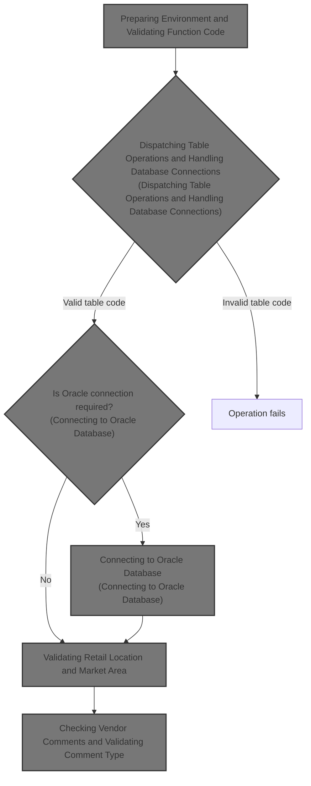
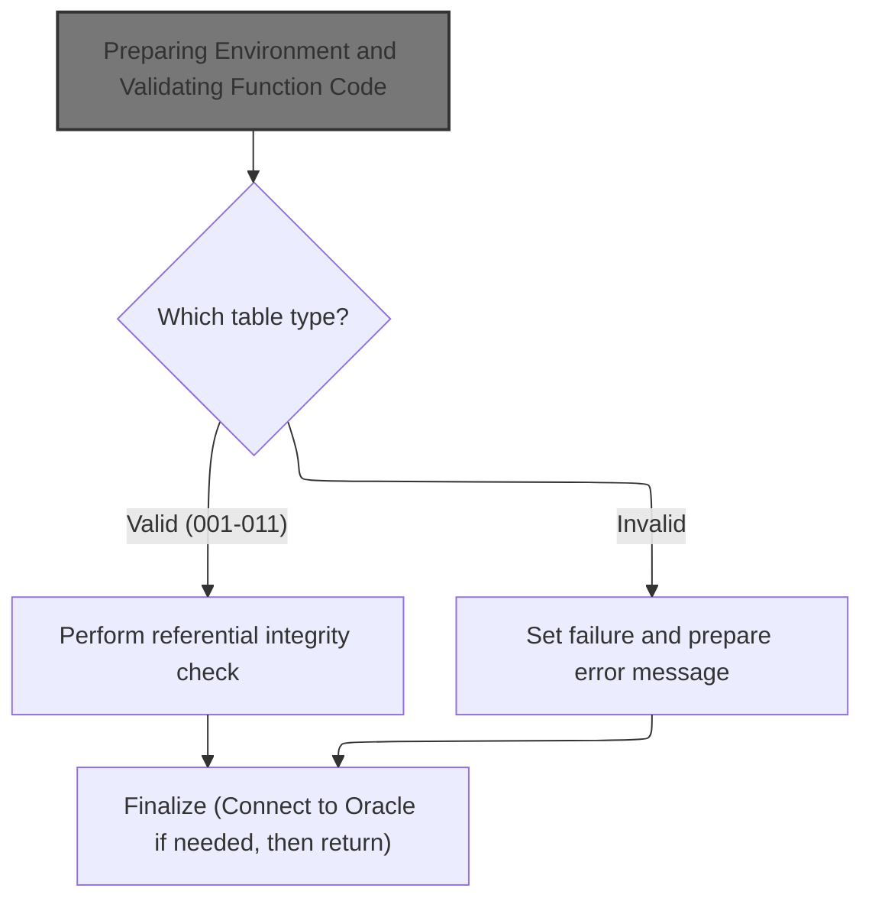
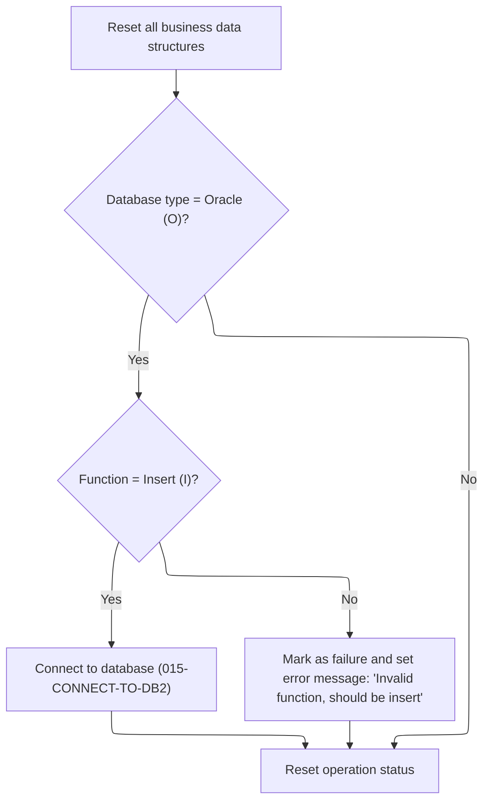
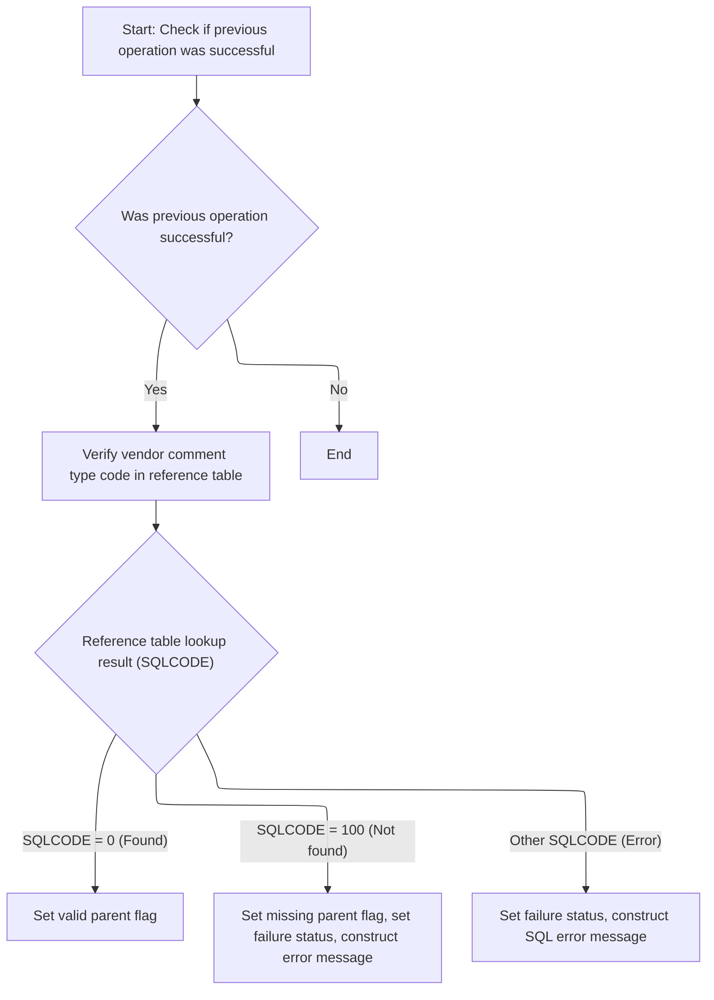

This document describes the flow for processing business operations by dispatching requests based on table and function codes. The flow prepares the environment, validates the function code, and routes the operation to the correct business logic for each table type. For valid table codes, referential integrity checks are performed, and database connections are established if needed. The flow also includes validation for retail locations and vendor comments, ensuring all business rules are met before completing the operation.



# Spec

## Detailed View of the Program's Functionality

## Main Program Flow: Dispatching Table Operations and Handling Database Connections

The program begins by initializing its environment and then decides what operation to perform based on a table code provided as input. The steps are as follows:

1. **Initialization**: All relevant business data structures and status fields are reset to ensure a clean state for processing.
2. **Table Code Evaluation**: The program checks the table code to determine which operation to perform:
   - If the code matches one of the valid types (from 001 to 011), it performs a referential integrity check specific to that table type. Each valid code triggers a different subroutine, which may include further checks or validations.
   - If the code is invalid (not in the range 001-011), the program marks the operation as a failure and prepares an error message indicating that an invalid table was passed.
3. **Database Connection Handling**: After the table-specific logic, if the operation requires Oracle database access, the program sets up the necessary connection by copying relevant data structures and calling a dedicated routine to establish the connection.
4. **Finalization**: The program returns control to the caller, signaling completion.

## Preparing Environment and Validating Function Code

Before any table-specific logic is executed, the program performs an initialization routine:

1. **Reset Data Structures**: All business data structures and status fields are cleared.
2. **Database Type Check**: The program checks if the operation is intended for Oracle database mode.
   - If Oracle mode is active and the function code indicates an insert operation, it calls a routine to connect to the DB2 database.
   - If Oracle mode is active but the function code is not for insert, it marks the operation as a failure and sets an error message stating that the function should be insert.
   - If not in Oracle mode, it simply resets the operation status.
3. **Status Reset**: Regardless of the outcome, the status field is cleared at the end of initialization.

## Connecting to DB2 Database

When the initialization routine determines that a DB2 connection is needed (Oracle mode and insert function), it calls an external routine to establish the connection. This routine uses the business record and SQL control area to set up the environment for DB2 operations.

## Connecting to Oracle Database

If the main program logic determines that Oracle database access is required, it calls an external routine to establish the Oracle connection. This routine also uses the business record and SQL control area to prepare the environment for Oracle-specific operations.

## Table-Specific Referential Integrity Checks

For each valid table code, the program dispatches to a specific subroutine that performs referential integrity checks. These checks typically involve:

1. **Checking for Success**: The subroutine first verifies that previous operations were successful before proceeding.
2. **Performing Table-Specific Checks**: Depending on the table type, the subroutine may:
   - Move input codes to SQL structures.
   - Execute SQL queries to verify the existence of related records in reference tables.
   - Set flags indicating whether a parent record exists or is missing.
   - Mark the operation as a failure and construct error messages if the required reference is missing or if a SQL error occurs.

## Example: Validating Retail Location and Market Area

For the retail location table code:

1. The subroutine checks if previous operations succeeded.
2. If so, it performs a market area check by querying the relevant reference table.
3. If the market area check is successful and a parent flag is set, it may perform additional checks (such as verifying computer type).
4. If any check fails, the operation is marked as a failure and an appropriate error message is constructed.

## Example: Checking Vendor Comments and Validating Comment Type

For the vendor comments table code:

1. The subroutine checks if previous operations succeeded.
2. If so, it calls another routine to validate the comment type code:
   - The input comment type code is moved to the SQL structure.
   - An SQL query checks if the code exists in the reference table.
   - If found, a valid parent flag is set.
   - If not found, a missing parent flag is set, the operation is marked as a failure, and an error message is constructed.
   - If a SQL error occurs, the operation is marked as a failure and a SQL error message is constructed.

## Error Handling and Messaging

Throughout the program, whenever a failure is detected (invalid table code, missing reference, SQL error), the program:

1. Sets a failure status flag.
2. Moves relevant error information (such as SQL error codes) to working storage.
3. Constructs detailed error messages describing the nature of the failure, which are stored in a designated message field for return to the caller.

## Summary

- The program is structured to first initialize its environment, then dispatch to the correct table-specific logic based on input codes.
- It performs referential integrity checks using SQL queries and sets flags or error messages based on the results.
- Database connections are established as needed, depending on the operation and database type.
- Error handling is consistent, with clear messaging for invalid inputs or failed checks.

# Rule Definition

| Paragraph Name                                                                                                                                                                       | Rule ID | Category          | Description                                                                                                                                                                                                                                                    | Conditions                                                     | Remarks                                                                                                                                                                               |
| ------------------------------------------------------------------------------------------------------------------------------------------------------------------------------------ | ------- | ----------------- | -------------------------------------------------------------------------------------------------------------------------------------------------------------------------------------------------------------------------------------------------------------- | -------------------------------------------------------------- | ------------------------------------------------------------------------------------------------------------------------------------------------------------------------------------- |
| 010-INITIALIZE                                                                                                                                                                       | RL-001  | Data Assignment   | All business data structures and status fields must be initialized to a clean state before processing each operation.                                                                                                                                          | Always at the start of each operation.                         | Fields initialized include the business record, working storage areas, and status fields. MMMC0335-STATUS is cleared to spaces.                                                       |
| 000-MAIN-LINE                                                                                                                                                                        | RL-002  | Conditional Logic | Table code and function code must be validated before any operation is dispatched.                                                                                                                                                                             | Always before dispatching operations.                          | Table codes must be in the range 001-011. Function code must be valid for Oracle operations.                                                                                          |
| 000-MAIN-LINE                                                                                                                                                                        | RL-003  | Conditional Logic | Only table codes 001-011 are accepted as valid. Any other value triggers a failure status and error message.                                                                                                                                                   | Table code not in 001-011.                                     | Error message is constructed in IS-RTRN-MSG-TXT: 'MMMS0335 - invalid table passed'.                                                                                                   |
| 000-MAIN-LINE, 500-CHK-XXX-VEND-LOC, 600-CHK-LOC-SHPNG-OPT, 700-CHK-RETAIL-LOC, 800-CHK-RETL-LOC-CLS-AD-ZN, 900-CHK-XXX-VEND-LOC, 1000-CHK-VEND-TRXAL-CNTL, 1100-CHK-VENDOR-COMMENTS | RL-004  | Computation       | For valid table codes, perform referential integrity checks as mapped: 001-004 (none), 005/009 (XXX table), 006 (XXXT_SHPNG_METH table), 007 (XXXMM_MKT_AREA table), 008 (XXX_CLS and XX_ZONES tables), 010 (XXXINESS_FUNCTION table), 011 (XXX_TYP_CD table). | Table code is valid (001-011).                                 | Each check uses the relevant code field and reference table. If not found, set NO-PARENT to TRUE, set FAILURE, and construct error message. If SQL error, include SQLCODE in message. |
| 505-CHK-XXX, 605-CHK-CUST-SHPNG-METH, 705-CHK-ECOMM-MKT-AREA, 805-CHK-ITM-CLS, 810-CHK-AA-ZONES, 905-CHK-XXX, 1005-CHK-BUSINESS-FUNCTION, 1105-CHK-CMT-TYP-CD                        | RL-005  | Conditional Logic | If referential integrity check does not find the value in the reference table, set NO-PARENT to TRUE, set FAILURE status, and construct an error message.                                                                                                      | SQLCODE = 100 (not found).                                     | Error message includes the field and table name, and rule identifier. Example: 'MMMS0335 - XXX_CD should be in XXX, rule = MDCVMDCM'.                                                 |
| 505-CHK-XXX, 605-CHK-CUST-SHPNG-METH, 705-CHK-ECOMM-MKT-AREA, 805-CHK-ITM-CLS, 810-CHK-AA-ZONES, 905-CHK-XXX, 1005-CHK-BUSINESS-FUNCTION, 1105-CHK-CMT-TYP-CD                        | RL-006  | Conditional Logic | If a database error occurs during referential integrity check (other than not found), set FAILURE status and construct error message including SQL error code.                                                                                                 | SQLCODE not 0 or 100.                                          | Error message includes table name and SQLCODE. Example: 'MMMS0335 - SQL error on table XXX, Sqlcode = <code>'.                                                                        |
| 505-CHK-XXX, 605-CHK-CUST-SHPNG-METH, 705-CHK-ECOMM-MKT-AREA, 805-CHK-ITM-CLS, 810-CHK-AA-ZONES, 905-CHK-XXX, 1005-CHK-BUSINESS-FUNCTION, 1105-CHK-CMT-TYP-CD                        | RL-007  | Data Assignment   | If referential integrity check finds the value in the reference table, set PARENT to TRUE.                                                                                                                                                                     | SQLCODE = 0 (found).                                           | No additional output format required.                                                                                                                                                 |
| 010-INITIALIZE                                                                                                                                                                       | RL-008  | Conditional Logic | If Oracle connection is required and function code is not 'I', set FAILURE status and construct error message indicating only Insert is allowed.                                                                                                               | MMMC0335-ORACLE is TRUE (or 'O') and MMMC0335-FUNC is not 'I'. | Error message: 'MMMS0335 - invalid function passed function should be insert'.                                                                                                        |
| 010-INITIALIZE                                                                                                                                                                       | RL-009  | Data Assignment   | The status field must be cleared to spaces at initialization and after each operation.                                                                                                                                                                         | At initialization and after each operation.                    | MMMC0335-STATUS is cleared to spaces.                                                                                                                                                 |
| 000-MAIN-LINE, 505-CHK-XXX, 605-CHK-CUST-SHPNG-METH, 705-CHK-ECOMM-MKT-AREA, 805-CHK-ITM-CLS, 810-CHK-AA-ZONES, 905-CHK-XXX, 1005-CHK-BUSINESS-FUNCTION, 1105-CHK-CMT-TYP-CD         | RL-010  | Data Assignment   | The IS-RTRN-MSG-TXT field must be updated with a descriptive message for both success and failure scenarios.                                                                                                                                                   | After each operation, success or failure.                      | Messages include details about the operation, field, table, and rule identifier, or SQL error code.                                                                                   |
| 000-MAIN-LINE                                                                                                                                                                        | RL-011  | Data Assignment   | After database operations, update the business record with any session or connection information as needed.                                                                                                                                                    | After DB operations.                                           | Business record (XXXN001A) is updated with session/connection info from working storage.                                                                                              |

# User Stories

## User Story 1: Initialization and Status Management

---

### Story Description:

As a system, I want to initialize all business data structures and status fields to a clean state before each operation so that processing is reliable and status is accurately tracked.

---

### Business Rule Mapping:

| Rule ID | Paragraph Name | Rule Description                                                                                                      |
| ------- | -------------- | --------------------------------------------------------------------------------------------------------------------- |
| RL-001  | 010-INITIALIZE | All business data structures and status fields must be initialized to a clean state before processing each operation. |
| RL-009  | 010-INITIALIZE | The status field must be cleared to spaces at initialization and after each operation.                                |

---

### Relevant Functionality:

- **010-INITIALIZE**
  1. **RL-001:**
     - Initialize business record and working storage areas
     - If Oracle connection is required and function is 'I', connect to DB2
     - Otherwise, set failure status and construct error message
     - Clear status field
  2. **RL-009:**
     - Move spaces to status field

## User Story 2: Validation of Table and Function Codes

---

### Story Description:

As a system, I want to validate table codes and function codes before dispatching operations so that only permitted operations are processed and errors are communicated clearly.

---

### Business Rule Mapping:

| Rule ID | Paragraph Name | Rule Description                                                                                                                                 |
| ------- | -------------- | ------------------------------------------------------------------------------------------------------------------------------------------------ |
| RL-002  | 000-MAIN-LINE  | Table code and function code must be validated before any operation is dispatched.                                                               |
| RL-003  | 000-MAIN-LINE  | Only table codes 001-011 are accepted as valid. Any other value triggers a failure status and error message.                                     |
| RL-008  | 010-INITIALIZE | If Oracle connection is required and function code is not 'I', set FAILURE status and construct error message indicating only Insert is allowed. |

---

### Relevant Functionality:

- **000-MAIN-LINE**
  1. **RL-002:**
     - Evaluate table code
     - If table code is not in 001-011, set failure status and construct error message
     - If Oracle connection and function code is not 'I', set failure status and construct error message
  2. **RL-003:**
     - If table code is not in 001-011
       - Set failure status
       - Clear IS-RTRN-MSG-TXT
       - Construct error message
- **010-INITIALIZE**
  1. **RL-008:**
     - If Oracle connection required and function is not 'I'
       - Set FAILURE status
       - Construct error message

## User Story 3: Referential Integrity Checks and Error Handling

---

### Story Description:

As a system, I want to perform referential integrity checks for valid table codes, handle not found and database errors appropriately, and update status and messages so that data integrity is maintained and users are informed of any issues.

---

### Business Rule Mapping:

| Rule ID | Paragraph Name                                                                                                                                                                       | Rule Description                                                                                                                                                                                                                                               |
| ------- | ------------------------------------------------------------------------------------------------------------------------------------------------------------------------------------ | -------------------------------------------------------------------------------------------------------------------------------------------------------------------------------------------------------------------------------------------------------------- |
| RL-004  | 000-MAIN-LINE, 500-CHK-XXX-VEND-LOC, 600-CHK-LOC-SHPNG-OPT, 700-CHK-RETAIL-LOC, 800-CHK-RETL-LOC-CLS-AD-ZN, 900-CHK-XXX-VEND-LOC, 1000-CHK-VEND-TRXAL-CNTL, 1100-CHK-VENDOR-COMMENTS | For valid table codes, perform referential integrity checks as mapped: 001-004 (none), 005/009 (XXX table), 006 (XXXT_SHPNG_METH table), 007 (XXXMM_MKT_AREA table), 008 (XXX_CLS and XX_ZONES tables), 010 (XXXINESS_FUNCTION table), 011 (XXX_TYP_CD table). |
| RL-005  | 505-CHK-XXX, 605-CHK-CUST-SHPNG-METH, 705-CHK-ECOMM-MKT-AREA, 805-CHK-ITM-CLS, 810-CHK-AA-ZONES, 905-CHK-XXX, 1005-CHK-BUSINESS-FUNCTION, 1105-CHK-CMT-TYP-CD                        | If referential integrity check does not find the value in the reference table, set NO-PARENT to TRUE, set FAILURE status, and construct an error message.                                                                                                      |
| RL-006  | 505-CHK-XXX, 605-CHK-CUST-SHPNG-METH, 705-CHK-ECOMM-MKT-AREA, 805-CHK-ITM-CLS, 810-CHK-AA-ZONES, 905-CHK-XXX, 1005-CHK-BUSINESS-FUNCTION, 1105-CHK-CMT-TYP-CD                        | If a database error occurs during referential integrity check (other than not found), set FAILURE status and construct error message including SQL error code.                                                                                                 |
| RL-007  | 505-CHK-XXX, 605-CHK-CUST-SHPNG-METH, 705-CHK-ECOMM-MKT-AREA, 805-CHK-ITM-CLS, 810-CHK-AA-ZONES, 905-CHK-XXX, 1005-CHK-BUSINESS-FUNCTION, 1105-CHK-CMT-TYP-CD                        | If referential integrity check finds the value in the reference table, set PARENT to TRUE.                                                                                                                                                                     |

---

### Relevant Functionality:

- **000-MAIN-LINE**
  1. **RL-004:**
     - For each table code:
       - 001-004: No check
       - 005/009: Check XXX-CD in XXX table
       - 006: Check CUST-SHPNG-METH-CD in XXXT_SHPNG_METH table
       - 007: Check ECOMM-MKT-AREA-CD in XXXMM_MKT_AREA table
       - 008: Check ITM-CLS-CD in XXX_CLS table, then AD-ZONE in XX_ZONES table
       - 010: Check BUS-FUNC-ID in XXXINESS_FUNCTION table
       - 011: Check CMT-TYP-CD in XXX_TYP_CD table
     - If value not found, set NO-PARENT, FAILURE, and construct error message
     - If SQL error, set FAILURE and construct error message with SQLCODE
     - If found, set PARENT to TRUE
- **505-CHK-XXX**
  1. **RL-005:**
     - If SQLCODE = 100
       - Set NO-PARENT to TRUE
       - Set FAILURE status
       - Move SQLCODE to working storage
       - Construct error message in IS-RTRN-MSG-TXT
  2. **RL-006:**
     - If SQLCODE is not 0 or 100
       - Set FAILURE status
       - Move SQLCODE to working storage
       - Construct error message in IS-RTRN-MSG-TXT
  3. **RL-007:**
     - If SQLCODE = 0
       - Set PARENT to TRUE

## User Story 4: Messaging and Business Record Updates

---

### Story Description:

As a user, I want to receive descriptive messages for both success and failure scenarios and have the business record updated with session or connection information after database operations so that I am informed of outcomes and system state is accurately maintained.

---

### Business Rule Mapping:

| Rule ID | Paragraph Name                                                                                                                                                               | Rule Description                                                                                             |
| ------- | ---------------------------------------------------------------------------------------------------------------------------------------------------------------------------- | ------------------------------------------------------------------------------------------------------------ |
| RL-010  | 000-MAIN-LINE, 505-CHK-XXX, 605-CHK-CUST-SHPNG-METH, 705-CHK-ECOMM-MKT-AREA, 805-CHK-ITM-CLS, 810-CHK-AA-ZONES, 905-CHK-XXX, 1005-CHK-BUSINESS-FUNCTION, 1105-CHK-CMT-TYP-CD | The IS-RTRN-MSG-TXT field must be updated with a descriptive message for both success and failure scenarios. |
| RL-011  | 000-MAIN-LINE                                                                                                                                                                | After database operations, update the business record with any session or connection information as needed.  |

---

### Relevant Functionality:

- **000-MAIN-LINE**
  1. **RL-010:**
     - After each operation
       - Construct and move descriptive message to IS-RTRN-MSG-TXT
  2. **RL-011:**
     - After DB operations
       - Move session/connection info from working storage to business record

# Code Walkthrough

## Dispatching Table Operations and Handling Database Connections



<SwmSnippet path="/base/src/MMMS0335.cbl" line="86">

---

000-MAIN-LINE starts by initializing everything, then dispatches to the right subroutine based on the table code, and handles Oracle DB connection if needed. Invalid codes trigger a failure and error message.

```cobol
010600 000-MAIN-LINE.                                                   00010600
010700     PERFORM 010-INITIALIZE                                       00010700
010800     EVALUATE MMMC0335-TABLE                                      00010800
010900       WHEN 001                                                   00010900
011100       WHEN 002                                                   00011100
011300       WHEN 003                                                   00011300
011500       WHEN 004                                                   00011500
011600         CONTINUE                                                 00011600
011700       WHEN 005                                                   00011700
011800         PERFORM 500-CHK-XXX-VEND-LOC                             00011800
011900       WHEN 006                                                   00011900
012000         PERFORM 600-CHK-LOC-SHPNG-OPT                            00012000
012100       WHEN 007                                                   00012100
012200         PERFORM 700-CHK-RETAIL-LOC                               00012200
012300       WHEN 008                                                   00012300
012400         PERFORM 800-CHK-RETL-LOC-CLS-AD-ZN                       00012400
012500       WHEN 009                                                   00012500
012600         PERFORM 900-CHK-XXX-VEND-LOC                             00012600
012700       WHEN 010                                                   00012700
012800         PERFORM 1000-CHK-VEND-TRXAL-CNTL                         00012800
012900       WHEN 011                                                   00012900
013000         PERFORM 1100-CHK-VENDOR-COMMENTS                         00013000
013100       WHEN OTHER                                                 00013100
013200         SET FAILURE   TO TRUE                                    00013200
013300         MOVE SPACES  TO IS-RTRN-MSG-TXT                          00013300
013400         STRING 'MMMS0335 - invalid table passed '                00013400
013500                DELIMITED BY SIZE INTO IS-RTRN-MSG-TXT            00013500
013600     END-EVALUATE                                                 00013600
013700     IF MMMC0335-ORACLE                                           00013700
013800       MOVE XXXN001A   TO  WS-XXXN001A                            00013800
013900       MOVE SQLCA      TO  WS-SQLCA                               00013900
014000       PERFORM 020-CONNECT-TO-ORACLE                              00014000
014100       MOVE WS-XXXN001A  TO XXXN001A                              00014100
014200       MOVE WS-SQLCA     TO SQLCA                                 00014200
014300     END-IF                                                       00014300
014400                                                                  00014400
014500     GOBACK                                                       00014500
014600     .                                                            00014600
```

---

</SwmSnippet>

### Preparing Environment and Validating Function Code



<SwmSnippet path="/base/src/MMMS0335.cbl" line="129">

---

010-INITIALIZE checks if we're in Oracle mode and if the function code is 'I'. If both are true, it calls 015-CONNECT-TO-DB2 to set up the DB2 connection. If not, it sets FAILURE and writes a specific error message. It always clears the status field at the end.

```cobol
015200 010-INITIALIZE.                                                  00015200
015300     INITIALIZE XXXN001A                                          00015300
015400                WS-XXXN001A                                       00015400
015500                WS-SQLCA                                          00015500
015600                                                                  00015600
015700     IF MMMC0335-ORACLE                                           00015700
015800       IF MMMC0335-FUNC  = 'I'                                    00015800
015900         PERFORM 015-CONNECT-TO-DB2                               00015900
016000       ELSE                                                       00016000
016100         SET FAILURE TO TRUE                                      00016100
016200         MOVE SPACES  TO IS-RTRN-MSG-TXT                          00016200
016300         STRING 'MMMS0335 - invalid function passed '             00016300
016400                'function should be insert'                       00016400
016500                DELIMITED BY SIZE INTO IS-RTRN-MSG-TXT            00016500
016600       END-IF                                                     00016600
016700     END-IF                                                       00016700
016800                                                                  00016800
016900     MOVE SPACES   TO MMMC0335-STATUS                             00016900
017000     .                                                            00017000
```

---

</SwmSnippet>

<SwmSnippet path="/base/src/MMMS0335.cbl" line="153">

---

015-CONNECT-TO-DB2 hands off to YYYS0211 to switch to DB2, handle errors, and prep the record for DB2 work.

```cobol
017600 015-CONNECT-TO-DB2.                                              00017600
017700     CALL Z-DB2-CONNECT         USING XXXN001A                    00017700
017800                                      SQLCA                       00017800
017900     .                                                            00017900
```

---

</SwmSnippet>

### Validating Retail Location and Market Area

<SwmSnippet path="/base/src/MMMS0335.cbl" line="260">

---

700-CHK-RETAIL-LOC runs only if SUCCESS is true. It then performs a market area check, and if that's successful and MMMC0335-PARENT is set, it checks the computer type. This sequencing avoids running extra checks if earlier ones fail.

```cobol
046200 700-CHK-RETAIL-LOC.                                              00046200
046300      IF SUCCESS                                                  00046300
046400*       PERFORM 705-CHK-ECOMM-MKT-AREA                            00046400
046500*       IF SUCCESS AND MMMC0335-PARENT                            00046500
046600*         PERFORM 710-CHK-CMPTR-TYP                               00046600
046700*       END-IF                                                    00046700
046800        CONTINUE                                                  00046800
046900      END-IF                                                      00046900
047000      .                                                           00047000
```

---

</SwmSnippet>

### Checking Vendor Comments and Validating Comment Type



<SwmSnippet path="/base/src/MMMS0335.cbl" line="484">

---

1100-CHK-VENDOR-COMMENTS checks if previous steps succeeded, then calls 1105-CHK-CMT-TYP-CD to validate the comment type code. This keeps the validation logic clean and only runs it when the context is correct.

```cobol
072300 1100-CHK-VENDOR-COMMENTS.                                        00072300
072400      IF SUCCESS                                                  00072400
072500        PERFORM 1105-CHK-CMT-TYP-CD                               00072500
072600      END-IF                                                      00072600
072700      .                                                           00072700
```

---

</SwmSnippet>

<SwmSnippet path="/base/src/MMMS0335.cbl" line="491">

---

1105-CHK-CMT-TYP-CD moves the input comment type code to the SQL structure, runs a SELECT to see if it exists in XXX_TYP_CD, and sets flags based on the result. It sets parent/no-parent status and prepares error messages depending on SQLCODE.

```cobol
073000 1105-CHK-CMT-TYP-CD.                                             00073000
073100     MOVE MMMC0335-CMT-TYP-CD                                     00073100
073200       TO CMT-TYP-CD             OF DCLCMT-TYP-CD                 00073200
073300                                                                  00073300
073400     EXEC SQL                                                     00073400
073500        SELECT XXX_TYP_CD                                         00073500
073600         INTO : DCLCMT-TYP-CD.CMT-TYP-CD                          00073600
073700        FROM XXX_TYP_CD                                           00073700
073800        WHERE XXX_TYP_CD                                          00073800
073900                      = :DCLCMT-TYP-CD.CMT-TYP-CD                 00073900
074000        FETCH FIRST 1 ROWS ONLY                                   00074000
074100     END-EXEC                                                     00074100
074200                                                                  00074200
074300     EVALUATE TRUE                                                00074300
074400       WHEN SQLCODE = 0                                           00074400
074500         SET MMMC0335-PARENT     TO  TRUE                         00074500
074600       WHEN SQLCODE = 100                                         00074600
074700         SET  MMMC0335-NO-PARENT TO TRUE                          00074700
074800         SET FAILURE             TO TRUE                          00074800
074900         MOVE SQLCODE            TO WS-SQLCODE                    00074900
075000         MOVE SPACE              TO IS-RTRN-MSG-TXT               00075000
075100         STRING 'MMMS0335 - XXX_TYP_CD'                           00075100
075200                 ' should be in XXX_TYP_CD,'                      00075200
075300                 ' rule = MDVCMDCT '                              00075300
075400         DELIMITED BY SIZE INTO IS-RTRN-MSG-TXT                   00075400
075500       WHEN OTHER                                                 00075500
075600         SET FAILURE             TO TRUE                          00075600
075700         MOVE SQLCODE            TO WS-SQLCODE                    00075700
075800         MOVE SPACE              TO IS-RTRN-MSG-TXT               00075800
075900         STRING 'MMMS0335 - SQL error on table '                  00075900
076000                'XXX_TYP_CD, '                                    00076000
076100                 'Sqlcode = ' WS-SQLCODE                          00076100
076200         DELIMITED BY SIZE INTO IS-RTRN-MSG-TXT                   00076200
076300     END-EVALUATE                                                 00076300
076400     .                                                            00076400
```

---

</SwmSnippet>

### Connecting to Oracle Database

<SwmSnippet path="/base/src/MMMS0335.cbl" line="162">

---

020-CONNECT-TO-ORACLE calls Z-ORA-CONNECT (XXXS0210) with the business record and SQLCA. This sets up the Oracle DB connection and preps the environment for Oracle operations.

```cobol
018500 020-CONNECT-TO-ORACLE.                                           00018500
018600     CALL Z-ORA-CONNECT USING XXXN001A                            00018600
018700                              SQLCA                               00018700
018800     .                                                            00018800
```

---

</SwmSnippet>

&nbsp;

*This is an auto-generated document by Swimm 🌊 and has not yet been verified by a human*

<SwmMeta version="3.0.0" repo-id="Z2l0aHViJTNBJTNBU3dpbW1pby1keW5jYWxsLWRlbW8lM0ElM0FHaXJpLVN3aW1t" repo-name="Swimmio-dyncall-demo"><sup>Powered by [Swimm](https://app.swimm.io/)</sup></SwmMeta>
