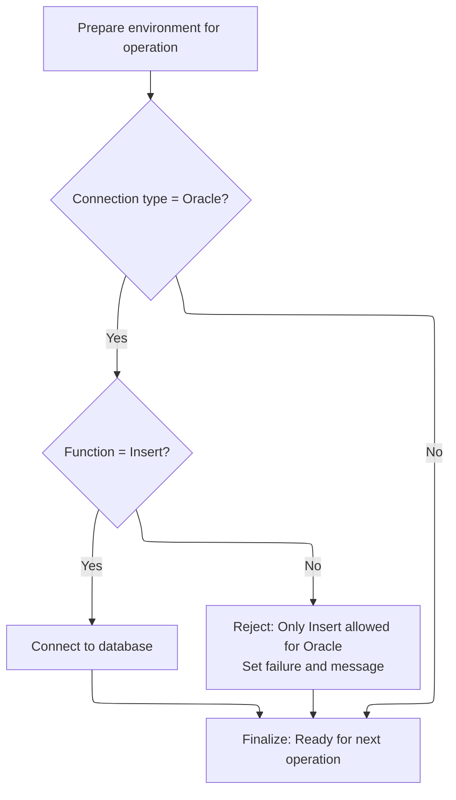
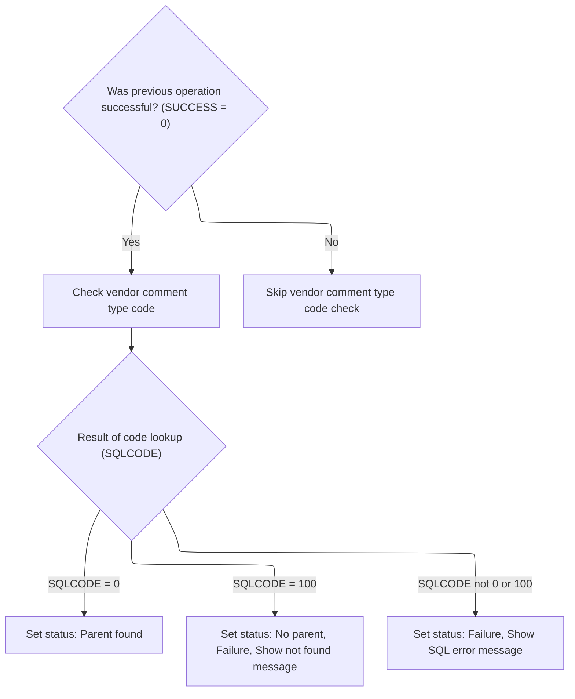

This document describes how table operation requests are processed. The flow prepares the environment, validates the operation type and connection, and dispatches to the appropriate business logic based on the table code. Results are communicated through status and messages.

# Spec

## Detailed View of the Program's Functionality

# a. Main Program Flow and Dispatching

The program begins by initializing the environment and preparing for the requested operation. This is done by running an initialization routine that sets up the necessary data structures and validates the operation type, especially when working with Oracle databases.

After initialization, the program examines a field that indicates which table or operation is being requested. Based on this value, it branches to the appropriate logic block for that operation. Each supported operation (represented by a numeric code) has its own block of logic, which may include further validation or referential integrity checks. If the code does not match any known operation, the program marks the operation as a failure and constructs an error message indicating an invalid table was specified.

If the Oracle database flag is set, the program performs additional steps to set up the Oracle connection. This involves saving the current state, calling an external routine to establish the Oracle connection, and then restoring the state.

The main routine concludes by exiting cleanly, ensuring all resources are properly released.

---

# b. Initialization and Database Connection Validation

During initialization, the program clears out the main communication and status areas to ensure a clean state. It then checks if the operation is targeting an Oracle database. If so, it further checks if the requested operation is an insert. Only insert operations are allowed for Oracle; if any other operation is requested, the program marks the operation as a failure and constructs a specific error message indicating that only inserts are permitted.

If the operation is a valid insert for Oracle, the program calls an external routine to switch the database connection to DB2, which may be required for certain validation steps before switching to Oracle. At the end of initialization, the status field is cleared to indicate readiness for the next operation.

---

# c. External Database Connection Routines

There are two main external routines for database connections:

- One routine is called to establish a connection to DB2. This routine is responsible for switching the database context, handling any necessary error translation, and restoring any saved records.
- Another routine is called to establish a connection to Oracle. This routine sets up the Oracle environment and prepares it for subsequent operations.

Both routines are called with the main communication area and the SQL state structure, ensuring that the external program has all the necessary context to perform the connection.

---

# d. Operation Dispatching and Table-Specific Checks

After initialization, the program uses a dispatching mechanism to determine which operation to perform based on the table code provided. For each supported code, the program either continues (if no action is needed) or performs a specific validation routine. These routines typically check referential integrity by verifying that related records exist in reference tables.

For example, when checking a vendor location, the program may call a routine that verifies the existence of a vendor code in a reference table. Similar routines exist for checking shipping options, retail locations, item classes, and other business entities.

If the table code does not match any supported operation, the program marks the operation as a failure and constructs an error message indicating an invalid table code.

---

# e. Vendor Comment Type Validation

One of the supported operations is to validate a vendor comment type code. This validation is only performed if all previous operations have been successful. The program moves the comment type code into a query structure and executes a database query to check if the code exists in the reference table.

The result of the query determines the next steps:

- If the code is found, the program marks the parent as found.
- If the code is not found, the program marks the operation as a failure, sets a "no parent" flag, and constructs an error message indicating the code was not found.
- If there is any other SQL error, the program marks the operation as a failure and constructs an error message with the SQL error code.

This pattern of validation and error handling is consistent across the various table-specific routines.

---

# f. Error Handling and Status Reporting

Throughout the program, error handling is performed by setting failure flags and constructing detailed error messages. These messages are built by concatenating static text with dynamic values such as the operation or table name and the SQL error code. The status and message fields are used to communicate the result of the operation back to the caller.

At each decision point, the program ensures that only valid operations are allowed to proceed, and any errors are clearly reported with appropriate messages.

---

# g. Clean Exit

After all operations and validations are complete, the program exits cleanly, ensuring that all resources are released and the final status is communicated to the caller. This is done using a standard exit statement, which is typical in this programming environment.

# Rule Definition

| Paragraph Name                                                                  | Rule ID | Category          | Description                                                                                                                                                                      | Conditions                                                    | Remarks                                                                                                                                                                                                         |
| ------------------------------------------------------------------------------- | ------- | ----------------- | -------------------------------------------------------------------------------------------------------------------------------------------------------------------------------- | ------------------------------------------------------------- | --------------------------------------------------------------------------------------------------------------------------------------------------------------------------------------------------------------- |
| 010-INITIALIZE                                                                  | RL-001  | Data Assignment   | At the start of the program, all relevant working storage and status fields must be initialized or cleared to ensure a clean state for processing.                               | Always at program start.                                      | The status field is cleared (set to spaces). All working storage areas for connection and SQL communication are initialized.                                                                                    |
| 010-INITIALIZE                                                                  | RL-002  | Conditional Logic | If the operation is for Oracle, only Insert operations are permitted. Any other operation results in failure and an error message.                                               | MMMC0335-ORACLE is set.                                       | The only allowed value for MMMC0335-FUNC is 'I'. If not, set FAILURE to TRUE and IS-RTRN-MSG-TXT to a message indicating only Insert is allowed.                                                                |
| 000-MAIN-LINE                                                                   | RL-003  | Conditional Logic | The program selects which validation routine to perform based on the value of MMMC0335-TABLE. Only codes 004-011 are supported for validation; others result in failure.         | MMMC0335-TABLE is provided.                                   | Supported codes: 004, 005, 006, 007, 008, 009, 010, 011. For any other value, set FAILURE to TRUE and IS-RTRN-MSG-TXT to 'invalid table passed'.                                                                |
| 000-MAIN-LINE, 010-INITIALIZE, 015-CONNECT-TO-DB2, 020-CONNECT-TO-ORACLE        | RL-004  | Computation       | Depending on the database type, the program sets up the connection using the provided connection information.                                                                    | MMMC0335-ORACLE is set for Oracle; otherwise, DB2 is assumed. | Connection information is passed using XXXN001A and SQLCA. The program calls external routines for connection setup.                                                                                            |
| 1100-CHK-VENDOR-COMMENTS, 1105-CHK-CMT-TYP-CD                                   | RL-005  | Conditional Logic | For table code 011, the program validates the vendor comment type code by checking its existence in the XXX_TYP_CD table.                                                        | MMMC0335-TABLE = 011                                          | If found, set MMMC0335-PARENT to TRUE. If not found, set MMMC0335-NO-PARENT and FAILURE to TRUE. If SQL error, set FAILURE to TRUE and set IS-RTRN-MSG-TXT to a descriptive error.                              |
| 000-MAIN-LINE, 010-INITIALIZE, 1105-CHK-CMT-TYP-CD, and all validation routines | RL-006  | Data Assignment   | Whenever a failure or invalid operation occurs, the program sets IS-RTRN-MSG-TXT with a descriptive error or status message.                                                     | Any failure or invalid operation.                             | IS-RTRN-MSG-TXT is set to a string describing the error, including the operation and relevant codes.                                                                                                            |
| 010-INITIALIZE, all validation routines                                         | RL-007  | Data Assignment   | The program clears the status at the start and sets it to indicate success or failure after each operation.                                                                      | At program start and after each operation.                    | MMMC0335-STATUS is cleared at start and updated after each operation.                                                                                                                                           |
| Program-wide (no INSERT/UPDATE/DELETE statements present)                       | RL-008  | Conditional Logic | The program must not perform any database changes, only validations (SELECTs) and connection setup.                                                                              | Always.                                                       | Only SELECT statements are used for validation. No data modification statements are present.                                                                                                                    |
| All validation routines (e.g., 505-CHK-XXX, 605-CHK-CUST-SHPNG-METH, etc.)      | RL-009  | Computation       | The program uses the SQL return code from the database communication area to determine the result of database operations and stores this code in a general-purpose result field. | After each SQL operation.                                     | The SQL return code is interpreted as follows: 0 means found, 100 means not found, other values indicate an SQL error. The result code is stored in a numeric field for further processing and error reporting. |

# User Stories

## User Story 1: Initialize environment and manage status

---

### Story Description:

As a system, I want to initialize all relevant working storage and status fields at the start and update the status after each operation so that processing starts cleanly and users can see the outcome of each operation.

---

### Business Rule Mapping:

| Rule ID | Paragraph Name                          | Rule Description                                                                                                                                   |
| ------- | --------------------------------------- | -------------------------------------------------------------------------------------------------------------------------------------------------- |
| RL-001  | 010-INITIALIZE                          | At the start of the program, all relevant working storage and status fields must be initialized or cleared to ensure a clean state for processing. |
| RL-007  | 010-INITIALIZE, all validation routines | The program clears the status at the start and sets it to indicate success or failure after each operation.                                        |

---

### Relevant Functionality:

- **010-INITIALIZE**
  1. **RL-001:**
     - Initialize all connection and SQL communication areas to blank or default values
     - Clear the status field to indicate no prior result
  2. **RL-007:**
     - At start: clear status
     - After each operation: set status to indicate success or failure

## User Story 2: Validate allowed operations, perform validations, and communicate errors

---

### Story Description:

As a user, I want the program to validate that only permitted operations are performed (especially for Oracle, only Insert), select the correct validation routine based on the table code, set up the appropriate database connection, use SQL return codes to determine results, and receive clear error messages when an invalid operation or table code is provided so that I am informed of any issues and only valid operations are executed.

---

### Business Rule Mapping:

| Rule ID | Paragraph Name                                                                  | Rule Description                                                                                                                                                                 |
| ------- | ------------------------------------------------------------------------------- | -------------------------------------------------------------------------------------------------------------------------------------------------------------------------------- |
| RL-003  | 000-MAIN-LINE                                                                   | The program selects which validation routine to perform based on the value of MMMC0335-TABLE. Only codes 004-011 are supported for validation; others result in failure.         |
| RL-004  | 000-MAIN-LINE, 010-INITIALIZE, 015-CONNECT-TO-DB2, 020-CONNECT-TO-ORACLE        | Depending on the database type, the program sets up the connection using the provided connection information.                                                                    |
| RL-006  | 000-MAIN-LINE, 010-INITIALIZE, 1105-CHK-CMT-TYP-CD, and all validation routines | Whenever a failure or invalid operation occurs, the program sets IS-RTRN-MSG-TXT with a descriptive error or status message.                                                     |
| RL-002  | 010-INITIALIZE                                                                  | If the operation is for Oracle, only Insert operations are permitted. Any other operation results in failure and an error message.                                               |
| RL-008  | Program-wide (no INSERT/UPDATE/DELETE statements present)                       | The program must not perform any database changes, only validations (SELECTs) and connection setup.                                                                              |
| RL-009  | All validation routines (e.g., 505-CHK-XXX, 605-CHK-CUST-SHPNG-METH, etc.)      | The program uses the SQL return code from the database communication area to determine the result of database operations and stores this code in a general-purpose result field. |

---

### Relevant Functionality:

- **000-MAIN-LINE**
  1. **RL-003:**
     - Evaluate MMMC0335-TABLE:
       - For 004: continue
       - For 005: perform vendor location check
       - For 006: perform shipping option check
       - For 007: perform retail location check
       - For 008: perform retail location class/ad zone check
       - For 009: perform vendor location check
       - For 010: perform vendor transaction control check
       - For 011: perform vendor comment type code check
       - For any other value:
         - Set failure flag
         - Set return message to 'invalid table passed'
  2. **RL-004:**
     - If Oracle is selected:
       - Move connection info to working storage
       - Call Oracle connection routine
       - Move updated info back
     - If DB2 is selected:
       - Call DB2 connection routine
  3. **RL-006:**
     - On failure or invalid operation:
       - Set IS-RTRN-MSG-TXT to a descriptive message indicating the error and context
- **010-INITIALIZE**
  1. **RL-002:**
     - If Oracle is selected:
       - If function is not 'I':
         - Set failure flag
         - Set return message to 'invalid function passed, function should be insert'
- **Program-wide (no INSERT/UPDATE/DELETE statements present)**
  1. **RL-008:**
     - Only perform SELECT statements for validation
     - Do not execute any INSERT, UPDATE, or DELETE statements
- **All validation routines (e.g.**
  1. **RL-009:**
     - After a SELECT operation:
       - If the SQL return code is 0: set the parent-found flag
       - If the SQL return code is 100: set the no-parent and failure flags
       - If the SQL return code is any other value: set the failure flag and store the error message

## User Story 3: Validate vendor comment type code for table 011

---

### Story Description:

As a user, I want the program to validate the vendor comment type code for table 011, set appropriate flags based on the result, use SQL return codes to determine the outcome, and receive descriptive error messages if the code is not found or an SQL error occurs so that I know whether the comment type code is valid and understand any failures.

---

### Business Rule Mapping:

| Rule ID | Paragraph Name                                                                  | Rule Description                                                                                                                                                                 |
| ------- | ------------------------------------------------------------------------------- | -------------------------------------------------------------------------------------------------------------------------------------------------------------------------------- |
| RL-006  | 000-MAIN-LINE, 010-INITIALIZE, 1105-CHK-CMT-TYP-CD, and all validation routines | Whenever a failure or invalid operation occurs, the program sets IS-RTRN-MSG-TXT with a descriptive error or status message.                                                     |
| RL-007  | 010-INITIALIZE, all validation routines                                         | The program clears the status at the start and sets it to indicate success or failure after each operation.                                                                      |
| RL-005  | 1100-CHK-VENDOR-COMMENTS, 1105-CHK-CMT-TYP-CD                                   | For table code 011, the program validates the vendor comment type code by checking its existence in the XXX_TYP_CD table.                                                        |
| RL-009  | All validation routines (e.g., 505-CHK-XXX, 605-CHK-CUST-SHPNG-METH, etc.)      | The program uses the SQL return code from the database communication area to determine the result of database operations and stores this code in a general-purpose result field. |

---

### Relevant Functionality:

- **000-MAIN-LINE**
  1. **RL-006:**
     - On failure or invalid operation:
       - Set IS-RTRN-MSG-TXT to a descriptive message indicating the error and context
- **010-INITIALIZE**
  1. **RL-007:**
     - At start: clear status
     - After each operation: set status to indicate success or failure
- **1100-CHK-VENDOR-COMMENTS**
  1. **RL-005:**
     - Move input comment type code to working storage
     - Execute SELECT on XXX_TYP_CD
     - If found:
       - Set parent flag
     - If not found:
       - Set no-parent and failure flags
       - Set return message to 'should be in XXX_TYP_CD'
     - If SQL error:
       - Set failure flag
       - Set return message to 'SQL error on table XXX_TYP_CD'
- **All validation routines (e.g.**
  1. **RL-009:**
     - After a SELECT operation:
       - If the SQL return code is 0: set the parent-found flag
       - If the SQL return code is 100: set the no-parent and failure flags
       - If the SQL return code is any other value: set the failure flag and store the error message

# Code Walkthrough

## Dispatching Table Operations and Database Setup

<SwmSnippet path="/base/src/MMMS0335.cbl" line="86">

---

`000-MAIN-LINE` kicks off the process by running 010-INITIALIZE to prep the environment and validate that we're allowed to continue (mainly for inserts). After that, it checks MMMC0335-TABLE to decide which operation to run, branching to the right PERFORM block for each supported table code. If the code doesn't match any known value, it sets a failure and writes an error message. If the Oracle flag is set, it handles the Oracle connection setup. The flow ends with GOBACK to exit cleanly.

```cobol
010600 000-MAIN-LINE.                                                   00010600
010700     PERFORM 010-INITIALIZE                                       00010700
010800     EVALUATE MMMC0335-TABLE                                      00010800
010900       WHEN 001                                                   00010900
011100       WHEN 002                                                   00011100
011300       WHEN 003                                                   00011300
011500       WHEN 004                                                   00011500
011600         CONTINUE                                                 00011600
011700       WHEN 005                                                   00011700
011800         PERFORM 500-CHK-XXX-VEND-LOC                             00011800
011900       WHEN 006                                                   00011900
012000         PERFORM 600-CHK-LOC-SHPNG-OPT                            00012000
012100       WHEN 007                                                   00012100
012200         PERFORM 700-CHK-RETAIL-LOC                               00012200
012300       WHEN 008                                                   00012300
012400         PERFORM 800-CHK-RETL-LOC-CLS-AD-ZN                       00012400
012500       WHEN 009                                                   00012500
012600         PERFORM 900-CHK-XXX-VEND-LOC                             00012600
012700       WHEN 010                                                   00012700
012800         PERFORM 1000-CHK-VEND-TRXAL-CNTL                         00012800
012900       WHEN 011                                                   00012900
013000         PERFORM 1100-CHK-VENDOR-COMMENTS                         00013000
013100       WHEN OTHER                                                 00013100
013200         SET FAILURE   TO TRUE                                    00013200
013300         MOVE SPACES  TO IS-RTRN-MSG-TXT                          00013300
013400         STRING 'MMMS0335 - invalid table passed '                00013400
013500                DELIMITED BY SIZE INTO IS-RTRN-MSG-TXT            00013500
013600     END-EVALUATE                                                 00013600
013700     IF MMMC0335-ORACLE                                           00013700
013800       MOVE XXXN001A   TO  WS-XXXN001A                            00013800
013900       MOVE SQLCA      TO  WS-SQLCA                               00013900
014000       PERFORM 020-CONNECT-TO-ORACLE                              00014000
014100       MOVE WS-XXXN001A  TO XXXN001A                              00014100
014200       MOVE WS-SQLCA     TO SQLCA                                 00014200
014300     END-IF                                                       00014300
014400                                                                  00014400
014500     GOBACK                                                       00014500
014600     .                                                            00014600
```

---

</SwmSnippet>

### Insert Operation Validation and DB2 Connection



<SwmSnippet path="/base/src/MMMS0335.cbl" line="129">

---

`010-INITIALIZE` checks if we're targeting Oracle and if the operation is an insert. If both are true, it calls 015-CONNECT-TO-DB2 to switch the connection. If not, it sets failure and builds an error message. At the end, it clears the status field for a clean slate.

```cobol
015200 010-INITIALIZE.                                                  00015200
015300     INITIALIZE XXXN001A                                          00015300
015400                WS-XXXN001A                                       00015400
015500                WS-SQLCA                                          00015500
015600                                                                  00015600
015700     IF MMMC0335-ORACLE                                           00015700
015800       IF MMMC0335-FUNC  = 'I'                                    00015800
015900         PERFORM 015-CONNECT-TO-DB2                               00015900
016000       ELSE                                                       00016000
016100         SET FAILURE TO TRUE                                      00016100
016200         MOVE SPACES  TO IS-RTRN-MSG-TXT                          00016200
016300         STRING 'MMMS0335 - invalid function passed '             00016300
016400                'function should be insert'                       00016400
016500                DELIMITED BY SIZE INTO IS-RTRN-MSG-TXT            00016500
016600       END-IF                                                     00016600
016700     END-IF                                                       00016700
016800                                                                  00016800
016900     MOVE SPACES   TO MMMC0335-STATUS                             00016900
017000     .                                                            00017000
```

---

</SwmSnippet>

<SwmSnippet path="/base/src/MMMS0335.cbl" line="153">

---

`015-CONNECT-TO-DB2` just calls Z-DB2-CONNECT (YYYS0211) with the connection and SQL state structures. That external program does the heavy lifting: switches to DB2, handles Oracle error translation, and restores any saved records.

```cobol
017600 015-CONNECT-TO-DB2.                                              00017600
017700     CALL Z-DB2-CONNECT         USING XXXN001A                    00017700
017800                                      SQLCA                       00017800
017900     .                                                            00017900
```

---

</SwmSnippet>

### Vendor Comment Type Validation



<SwmSnippet path="/base/src/MMMS0335.cbl" line="484">

---

`1100-CHK-VENDOR-COMMENTS` only runs the comment type code validation if everything up to this point was successful. It calls 1105-CHK-CMT-TYP-CD to actually check if the code exists in the reference table.

```cobol
072300 1100-CHK-VENDOR-COMMENTS.                                        00072300
072400      IF SUCCESS                                                  00072400
072500        PERFORM 1105-CHK-CMT-TYP-CD                               00072500
072600      END-IF                                                      00072600
072700      .                                                           00072700
```

---

</SwmSnippet>

<SwmSnippet path="/base/src/MMMS0335.cbl" line="491">

---

`1105-CHK-CMT-TYP-CD` moves the comment type code into the query structure, runs a SELECT to see if it exists, and sets flags based on the SQL result: parent found, not found, or SQL error. It also builds error messages for missing or failed lookups.

```cobol
073000 1105-CHK-CMT-TYP-CD.                                             00073000
073100     MOVE MMMC0335-CMT-TYP-CD                                     00073100
073200       TO CMT-TYP-CD             OF DCLCMT-TYP-CD                 00073200
073300                                                                  00073300
073400     EXEC SQL                                                     00073400
073500        SELECT XXX_TYP_CD                                         00073500
073600         INTO : DCLCMT-TYP-CD.CMT-TYP-CD                          00073600
073700        FROM XXX_TYP_CD                                           00073700
073800        WHERE XXX_TYP_CD                                          00073800
073900                      = :DCLCMT-TYP-CD.CMT-TYP-CD                 00073900
074000        FETCH FIRST 1 ROWS ONLY                                   00074000
074100     END-EXEC                                                     00074100
074200                                                                  00074200
074300     EVALUATE TRUE                                                00074300
074400       WHEN SQLCODE = 0                                           00074400
074500         SET MMMC0335-PARENT     TO  TRUE                         00074500
074600       WHEN SQLCODE = 100                                         00074600
074700         SET  MMMC0335-NO-PARENT TO TRUE                          00074700
074800         SET FAILURE             TO TRUE                          00074800
074900         MOVE SQLCODE            TO WS-SQLCODE                    00074900
075000         MOVE SPACE              TO IS-RTRN-MSG-TXT               00075000
075100         STRING 'MMMS0335 - XXX_TYP_CD'                           00075100
075200                 ' should be in XXX_TYP_CD,'                      00075200
075300                 ' rule = MDVCMDCT '                              00075300
075400         DELIMITED BY SIZE INTO IS-RTRN-MSG-TXT                   00075400
075500       WHEN OTHER                                                 00075500
075600         SET FAILURE             TO TRUE                          00075600
075700         MOVE SQLCODE            TO WS-SQLCODE                    00075700
075800         MOVE SPACE              TO IS-RTRN-MSG-TXT               00075800
075900         STRING 'MMMS0335 - SQL error on table '                  00075900
076000                'XXX_TYP_CD, '                                    00076000
076100                 'Sqlcode = ' WS-SQLCODE                          00076100
076200         DELIMITED BY SIZE INTO IS-RTRN-MSG-TXT                   00076200
076300     END-EVALUATE                                                 00076300
076400     .                                                            00076400
```

---

</SwmSnippet>

### Oracle Connection Setup

<SwmSnippet path="/base/src/MMMS0335.cbl" line="162">

---

`020-CONNECT-TO-ORACLE` just calls Z-ORA-CONNECT (XXXS0210) with the connection and SQL state structures. That program sets up the Oracle connection and preps the environment for Oracle operations.

```cobol
018500 020-CONNECT-TO-ORACLE.                                           00018500
018600     CALL Z-ORA-CONNECT USING XXXN001A                            00018600
018700                              SQLCA                               00018700
018800     .                                                            00018800
```

---

</SwmSnippet>

&nbsp;

*This is an auto-generated document by Swimm 🌊 and has not yet been verified by a human*

<SwmMeta version="3.0.0" repo-id="Z2l0aHViJTNBJTNBU3dpbW1pby1keW5jYWxsLWRlbW8lM0ElM0FHaXJpLVN3aW1t" repo-name="Swimmio-dyncall-demo"><sup>Powered by [Swimm](https://app.swimm.io/)</sup></SwmMeta>
