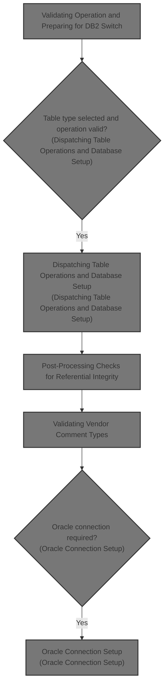
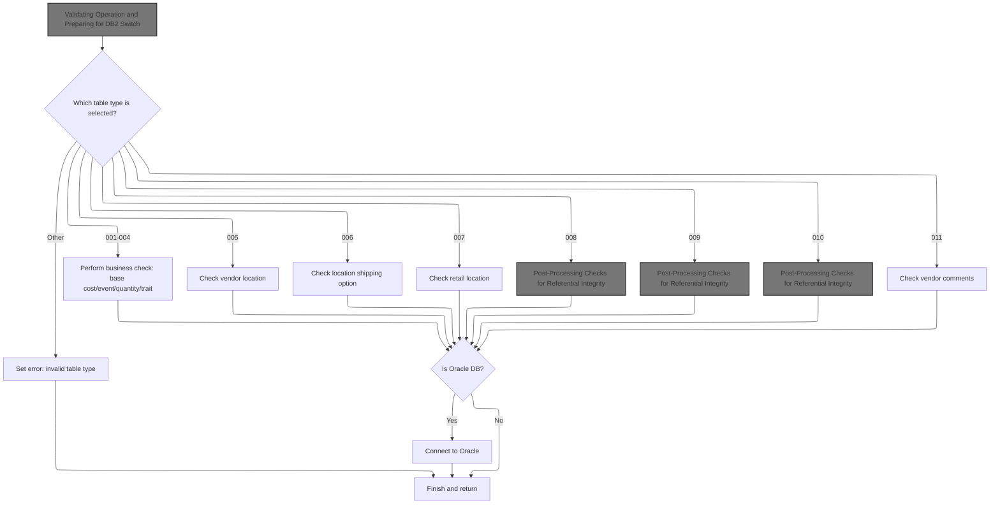
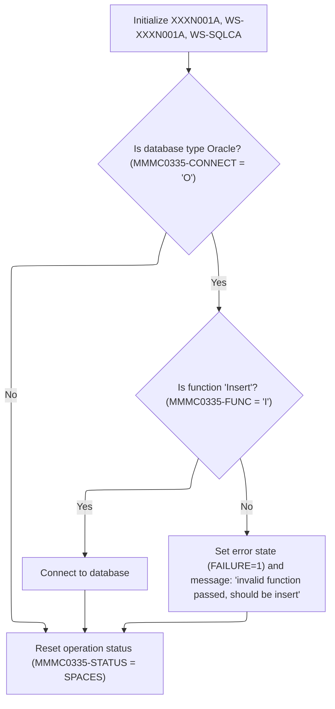
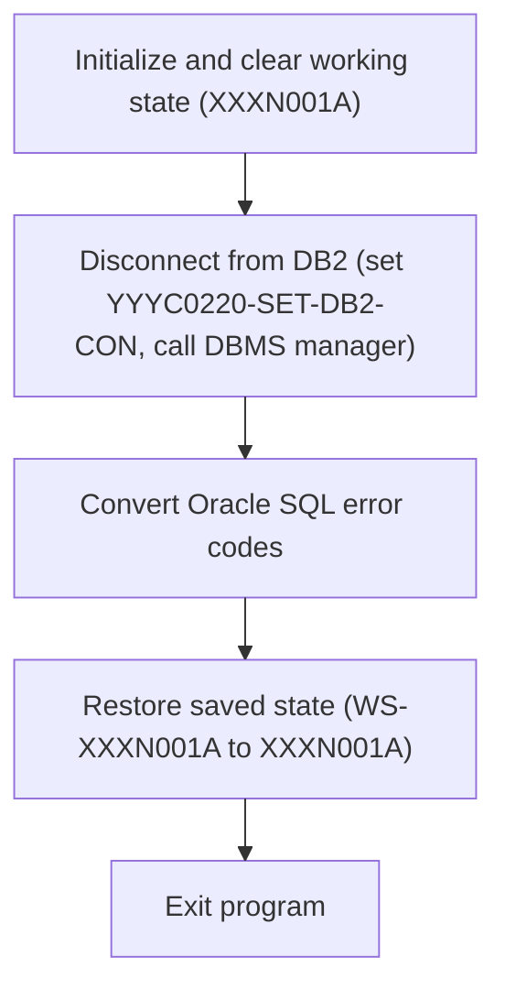
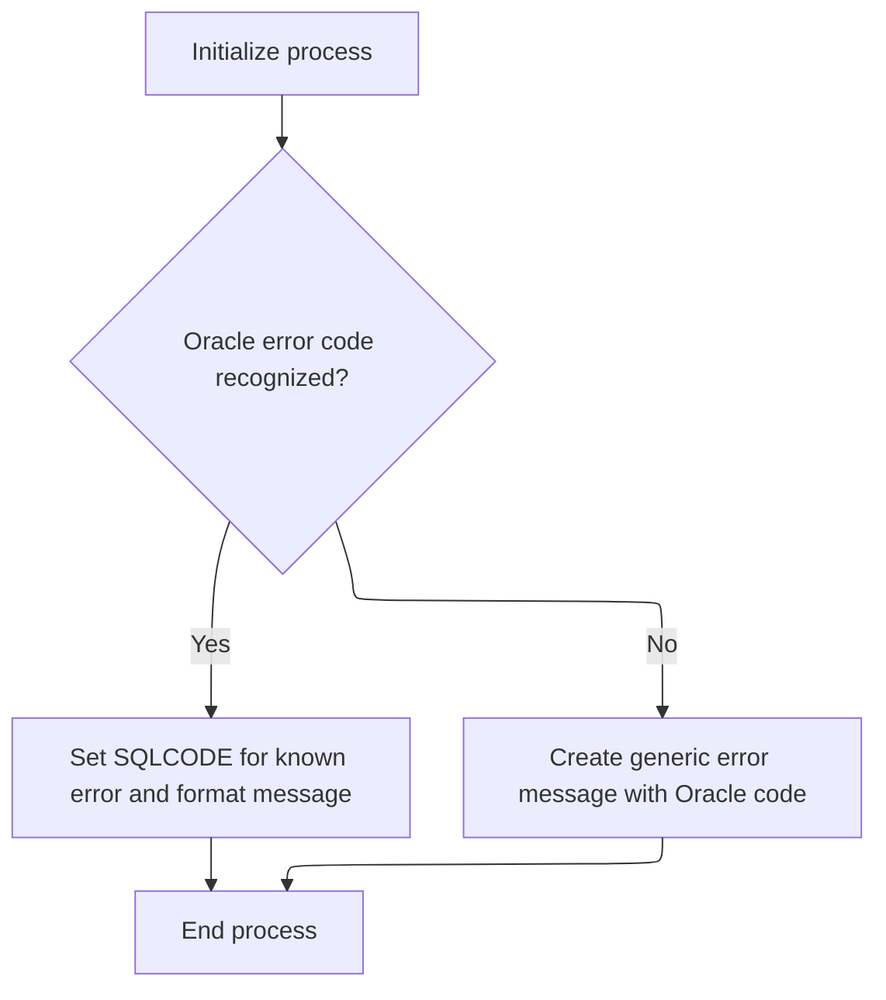
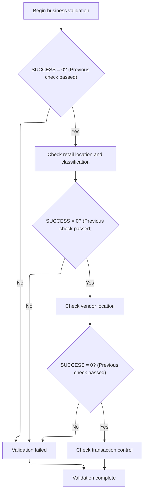
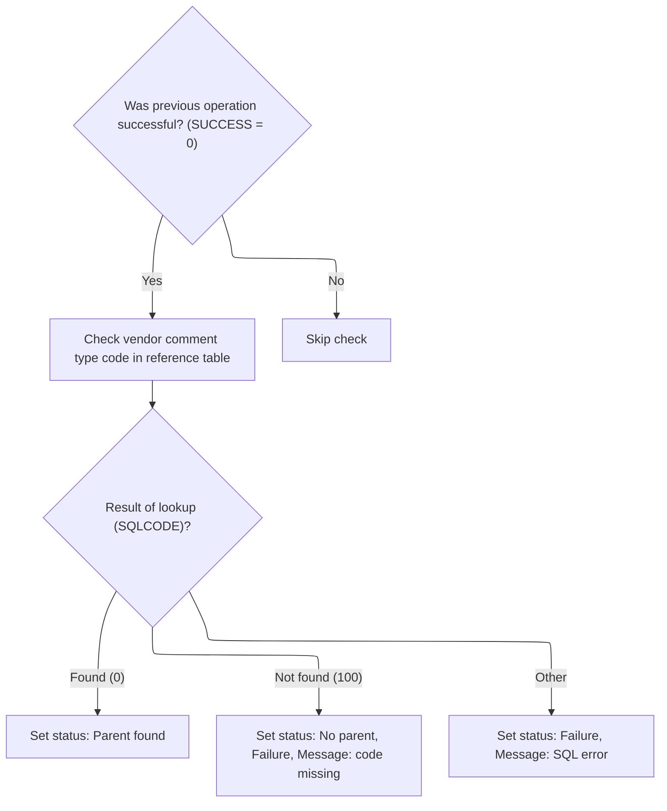

This document describes how table operation requests are validated and dispatched to the appropriate business logic, with necessary database connections managed and business rules enforced. The flow covers validation, dispatching, referential integrity checks, and vendor comment type validation, ensuring each operation meets business requirements.



# Spec

## Detailed View of the Program's Functionality

# Main Program Flow and Table Operation Dispatch

The main program begins by preparing the environment and validating the requested operation. It then determines which table type is being processed and dispatches the appropriate business logic or validation routine for that table. If the table type is not recognized, it sets an error state and builds an error message. At the end of the main logic, if the Oracle database is in use, it handles the Oracle connection setup and restores the working state.

## Initialization and Operation Validation

- The program starts by initializing key data areas and clearing any previous status or error messages.
- It checks if the database type is Oracle. If so, it further checks if the requested function is an insert operation. Only insert operations are allowed for Oracle; any other function results in an error state and a specific error message.
- If the operation is valid, it calls a routine to switch the database connection to DB2, ensuring the environment is ready for business logic.
- The operation status is reset to a neutral state to avoid carrying over any previous results.

## Table Type Dispatch and Business Logic

- The program evaluates the table type code provided in the input.
- For recognized table types, it dispatches to the corresponding business logic or validation routine:
  - For codes 001-004, it performs basic business checks (such as base cost, event, quantity, or trait).
  - For code 005, it checks vendor location.
  - For code 006, it checks location shipping options.
  - For code 007, it checks retail location.
  - For codes 008, 009, and 010, it performs post-processing checks for referential integrity.
  - For code 011, it validates vendor comments.
- If the table type is not recognized, it sets a failure flag and builds an error message indicating an invalid table type.

## Oracle Connection Setup

- After business logic is dispatched, if the Oracle database is in use, the program saves the current working state, sets up the Oracle connection by calling an external routine, and then restores the working state.
- This ensures that any changes made during the Oracle connection setup do not affect the main program's data.

# DB2 Connection Logic

## Delegating DB2 Connection

- When a DB2 connection is required, the program calls an external routine dedicated to handling DB2 connections.
- This routine is a thin wrapper that passes the necessary data to the external connection manager, keeping the connection logic modular and separate from the main program.

## DB2 Connection Setup and Error Handling

- The external DB2 connection routine performs several steps:
  - It saves the current working state and clears the main data area to prepare for the connection.
  - It sets a flag to request a DB2 connection and calls the connection manager with the relevant data.
  - After the connection, it checks for any Oracle-specific error codes that may need conversion.
  - It restores the saved working state to ensure consistency.

# Oracle Error Code Conversion

## Error Code Mapping

- If a DB2 operation returns a specific Oracle error code, the program calls an external routine to convert the Oracle error code to an internal code.
- This routine parses the error message, extracts the Oracle error code, and maps it to a corresponding internal code using a predefined set of mappings.
- If the error code is not recognized, it builds a generic error message including the Oracle code.

## Error Message Formatting

- The error conversion routine splits the error message into parts, identifies the Oracle error code, and uses a switch to map it to an internal code.
- For known codes, it sets the internal code directly.
- For unknown codes, it creates a generic error message for the user.

# Post-Processing Checks for Referential Integrity

## Validation Sequence

- For certain table types, the program performs a sequence of referential integrity checks:
  - It first checks if the previous operation was successful.
  - If so, it may check retail location and classification, vendor location, and transaction control, depending on the table type.
  - Each check is only performed if the previous one succeeded.
  - Some checks are currently commented out, indicating placeholders for future logic.

# Vendor Comment Type Validation

## Comment Type Lookup

- When validating vendor comments, the program checks if the previous operation was successful.
- It then looks up the comment type code in a reference table.
- Based on the result of the lookup:
  - If found, it sets a status indicating the parent was found.
  - If not found, it sets a failure status and builds an error message indicating the code is missing.
  - For other errors, it sets a failure status and builds a message with the SQL error code.

# Oracle Connection Routine

## Connection Setup

- When an Oracle connection is needed, the program calls an external routine to set up the connection, passing the necessary data.
- This routine is only called if the earlier logic determined that Oracle is required.

---

This detailed flow ensures that all operations are validated, dispatched, and processed according to the table type and database environment, with robust error handling and modular connection logic for both DB2 and Oracle.

# Rule Definition

| Paragraph Name                                          | Rule ID | Category          | Description                                                                                                                                                                       | Conditions                                                                                                                    | Remarks                                                                                                                                                |
| ------------------------------------------------------- | ------- | ----------------- | --------------------------------------------------------------------------------------------------------------------------------------------------------------------------------- | ----------------------------------------------------------------------------------------------------------------------------- | ------------------------------------------------------------------------------------------------------------------------------------------------------ |
| 000-MAIN-LINE (EVALUATE MMMC0335-TABLE), 010-INITIALIZE | RL-001  | Conditional Logic | The program must ensure that the table code field is a 3-digit, zero-padded integer string, and only values from '001' to '011' are valid. Any other value is considered invalid. | MMMC0335-TABLE must be a string of length 3, containing only digits, and its value must be between '001' and '011' inclusive. | Valid values: '001' to '011'. Output error message: 'MMMS0335 - invalid table passed '. Field is a string of length 3, zero-padded.                    |
| 010-INITIALIZE                                          | RL-002  | Conditional Logic | For Oracle operations, only the Insert function ('I') is allowed. Any other function code is invalid and triggers an error.                                                       | MMMC0335-ORACLE = 'Y' and MMMC0335-FUNC != 'I'                                                                                | Valid Oracle function: 'I'. Output error message: 'MMMS0335 - invalid function passed function should be insert'. Function code is a single character. |
| 000-MAIN-LINE (EVALUATE MMMC0335-TABLE)                 | RL-003  | Conditional Logic | The program dispatches business logic based on the value of the table code, performing different checks or actions for each valid code.                                           | MMMC0335-TABLE is valid (between '001' and '011')                                                                             | Dispatch mapping:                                                                                                                                      |

- '001'-'004': business check
- '005': vendor location check
- '006': location shipping option check
- '007': retail location check
- '008'-'010': post-processing referential integrity checks
- '011': vendor comments check Output error message for invalid table: 'MMMS0335 - invalid table passed '. | | 500-CHK-XXX-VEND-LOC, 505-CHK-XXX, 605-CHK-CUST-SHPNG-METH, 705-CHK-ECOMM-MKT-AREA, 805-CHK-ITM-CLS, 810-CHK-AA-ZONES, 905-CHK-XXX, 1005-CHK-BUSINESS-FUNCTION, 1105-CHK-CMT-TYP-CD | RL-004 | Computation | For each referential integrity check, the program performs a SQL SELECT on the corresponding reference table using the relevant code field as the key. The result determines parent/no-parent status and error handling. | Referential integrity check is triggered for the relevant table code. | If SQLCODE = 0: set PARENT to TRUE. If SQLCODE = 100: set NO-PARENT to TRUE, FAILURE to TRUE, and set IS-RTRN-MSG-TXT to 'MMMS0335 - <FIELD> should be in <TABLE>, rule = <RULE>'. If SQLCODE is any other value: set FAILURE to TRUE, and set IS-RTRN-MSG-TXT to 'MMMS0335 - SQL error on table <TABLE>, Sqlcode = <SQLCODE>'. Message fields are strings, error codes are numeric. | | 1105-CHK-CMT-TYP-CD | RL-005 | Computation | For vendor comment type code validation, a SQL SELECT is performed on the XXX_TYP_CD table, matching the code to MMMC0335-CMT-TYP-CD. Error handling follows referential integrity rules. | MMMC0335-TABLE = '011' | If SQLCODE = 0: set PARENT to TRUE. If SQLCODE = 100: set NO-PARENT to TRUE, FAILURE to TRUE, and set IS-RTRN-MSG-TXT to 'MMMS0335 - XXX_TYP_CD should be in XXX_TYP_CD, rule = MDVCMDCT'. If SQLCODE is any other value: set FAILURE to TRUE, and set IS-RTRN-MSG-TXT to 'MMMS0335 - SQL error on table XXX_TYP_CD, Sqlcode = <SQLCODE>'. | | YYYS0212.cbl 200-FORMAT-USER-MSG-TXT | RL-006 | Computation | Oracle error codes must be mapped to internal SQLCODEs according to a predefined mapping. Any unmapped Oracle code triggers a generic error message. | Oracle error code is present in SQLERRMC during Oracle operations. | Oracle error codes are mapped as follows:
- '60' => -911
- '904', '310' => -206
- '615', '616' => -420
- '942' => -204
- '1403' => -100
- '1001' => -501
- '1438' => -413
- '2112', '1422' => -811
- '2049' => -913
- '2291' => -530
- '2292' => -532
- '6502' => -304
- '6508' => -440
- '6511' => -502
- '6550', '6553' => -440
- '14028' => -538
- '30006' => -904 Unmapped: set IS-RTRN-MSG2-TXT to 'Error in YYYS0212. Oracle code:<CODE>'. | | 000-MAIN-LINE (IF MMMC0335-ORACLE), 020-CONNECT-TO-ORACLE | RL-007 | Conditional Logic | If the Oracle flag is set, the program connects to Oracle DB; otherwise, it skips Oracle connection logic. | MMMC0335-ORACLE = 'Y' | Oracle flag values: 'Y' or 'N'. Connection is performed via subprogram call. | | Throughout main logic and referential checks | RL-008 | Data Assignment | All status and error information is communicated via flags and message fields in the MMMC0335 control block, with no explicit return value. | Any operation that results in success or error | Status field: spaces ('     ') for success. Failure flag and error message fields are set for errors. All fields are strings or flags as appropriate. |

# User Stories

## User Story 1: Validate input and handle Oracle connection

---

### Story Description:

As a system, I want to validate the table code and function code, and connect to Oracle only if required, so that only valid requests are processed and the correct database is used.

---

### Business Rule Mapping:

| Rule ID | Paragraph Name                                            | Rule Description                                                                                                                                                                  |
| ------- | --------------------------------------------------------- | --------------------------------------------------------------------------------------------------------------------------------------------------------------------------------- |
| RL-002  | 010-INITIALIZE                                            | For Oracle operations, only the Insert function ('I') is allowed. Any other function code is invalid and triggers an error.                                                       |
| RL-001  | 000-MAIN-LINE (EVALUATE MMMC0335-TABLE), 010-INITIALIZE   | The program must ensure that the table code field is a 3-digit, zero-padded integer string, and only values from '001' to '011' are valid. Any other value is considered invalid. |
| RL-007  | 000-MAIN-LINE (IF MMMC0335-ORACLE), 020-CONNECT-TO-ORACLE | If the Oracle flag is set, the program connects to Oracle DB; otherwise, it skips Oracle connection logic.                                                                        |

---

### Relevant Functionality:

- **010-INITIALIZE**
  1. **RL-002:**
     - If MMMC0335-ORACLE is 'Y':
       - If MMMC0335-FUNC != 'I':
         - Set FAILURE flag to TRUE
         - Set IS-RTRN-MSG-TXT to 'MMMS0335 - invalid function passed function should be insert'
         - Status remains spaces
- **000-MAIN-LINE (EVALUATE MMMC0335-TABLE)**
  1. **RL-001:**
     - On program start, check MMMC0335-TABLE value
       - If not in \['001', ..., '011'\]:
         - Set FAILURE flag to TRUE
         - Set IS-RTRN-MSG-TXT to 'MMMS0335 - invalid table passed '
         - Status remains spaces
- **000-MAIN-LINE (IF MMMC0335-ORACLE)**
  1. **RL-007:**
     - If MMMC0335-ORACLE = 'Y':
       - Move session info and SQLCA to working storage
       - Call Oracle connection subprogram
       - Move results back to input structures
     - Else: skip Oracle connection

## User Story 2: Process request, perform referential integrity checks, and handle errors

---

### Story Description:

As a system, I want to dispatch logic based on the table code, perform the appropriate referential integrity checks, map Oracle error codes to internal SQLCODEs, and report errors and statuses via the control block, so that data integrity is maintained and errors are communicated accurately.

---

### Business Rule Mapping:

| Rule ID | Paragraph Name                                                                                                                                                                      | Rule Description                                                                                                                                                                                                         |
| ------- | ----------------------------------------------------------------------------------------------------------------------------------------------------------------------------------- | ------------------------------------------------------------------------------------------------------------------------------------------------------------------------------------------------------------------------ |
| RL-005  | 1105-CHK-CMT-TYP-CD                                                                                                                                                                 | For vendor comment type code validation, a SQL SELECT is performed on the XXX_TYP_CD table, matching the code to MMMC0335-CMT-TYP-CD. Error handling follows referential integrity rules.                                |
| RL-003  | 000-MAIN-LINE (EVALUATE MMMC0335-TABLE)                                                                                                                                             | The program dispatches business logic based on the value of the table code, performing different checks or actions for each valid code.                                                                                  |
| RL-004  | 500-CHK-XXX-VEND-LOC, 505-CHK-XXX, 605-CHK-CUST-SHPNG-METH, 705-CHK-ECOMM-MKT-AREA, 805-CHK-ITM-CLS, 810-CHK-AA-ZONES, 905-CHK-XXX, 1005-CHK-BUSINESS-FUNCTION, 1105-CHK-CMT-TYP-CD | For each referential integrity check, the program performs a SQL SELECT on the corresponding reference table using the relevant code field as the key. The result determines parent/no-parent status and error handling. |
| RL-006  | YYYS0212.cbl 200-FORMAT-USER-MSG-TXT                                                                                                                                                | Oracle error codes must be mapped to internal SQLCODEs according to a predefined mapping. Any unmapped Oracle code triggers a generic error message.                                                                     |
| RL-008  | Throughout main logic and referential checks                                                                                                                                        | All status and error information is communicated via flags and message fields in the MMMC0335 control block, with no explicit return value.                                                                              |

---

### Relevant Functionality:

- **1105-CHK-CMT-TYP-CD**
  1. **RL-005:**
     - Perform SQL SELECT on XXX_TYP_CD using MMMC0335-CMT-TYP-CD
       - If SQLCODE = 0:
         - Set PARENT flag to TRUE
       - If SQLCODE = 100:
         - Set NO-PARENT flag to TRUE
         - Set FAILURE flag to TRUE
         - Set IS-RTRN-MSG-TXT to 'MMMS0335 - XXX_TYP_CD should be in XXX_TYP_CD, rule = MDVCMDCT'
       - If SQLCODE is any other value:
         - Set FAILURE flag to TRUE
         - Set IS-RTRN-MSG-TXT to 'MMMS0335 - SQL error on table XXX_TYP_CD, Sqlcode = <SQLCODE>'
- **000-MAIN-LINE (EVALUATE MMMC0335-TABLE)**
  1. **RL-003:**
     - EVALUATE MMMC0335-TABLE:
       - WHEN '001'-'004': perform business check
       - WHEN '005': perform vendor location check
       - WHEN '006': perform location shipping option check
       - WHEN '007': perform retail location check
       - WHEN '008'-'010': perform post-processing referential integrity checks
       - WHEN '011': perform vendor comments check
       - WHEN OTHER: set FAILURE to TRUE, set IS-RTRN-MSG-TXT to 'MMMS0335 - invalid table passed '
- **500-CHK-XXX-VEND-LOC**
  1. **RL-004:**
     - For each referential check:
       - Perform SQL SELECT on reference table using code field
       - If SQLCODE = 0:
         - Set PARENT flag to TRUE
       - If SQLCODE = 100:
         - Set NO-PARENT flag to TRUE
         - Set FAILURE flag to TRUE
         - Set IS-RTRN-MSG-TXT to 'MMMS0335 - <FIELD> should be in <TABLE>, rule = <RULE>'
       - If SQLCODE is any other value:
         - Set FAILURE flag to TRUE
         - Set IS-RTRN-MSG-TXT to 'MMMS0335 - SQL error on table <TABLE>, Sqlcode = <SQLCODE>'
- **YYYS0212.cbl 200-FORMAT-USER-MSG-TXT**
  1. **RL-006:**
     - Unstring SQLERRMC to extract Oracle error code
     - EVALUATE error code:
       - If code matches mapping, set SQLCODE accordingly
       - If code is unmapped, set IS-RTRN-MSG2-TXT to 'Error in YYYS0212. Oracle code:<CODE>'
- **Throughout main logic and referential checks**
  1. **RL-008:**
     - On success: set STATUS to spaces
     - On error: set FAILURE flag to TRUE, set error message field(s) as appropriate
     - All changes are made in-place to MMMC0335 and XXXN001A structures

# Code Walkthrough

## Dispatching Table Operations and Database Setup



<SwmSnippet path="/base/src/MMMS0335.cbl" line="86">

---

000-MAIN-LINE kicks off the flow by calling 010-INITIALIZE to prep the environment and validate that the operation is allowed (like making sure only inserts are processed for Oracle). After that, it dispatches logic based on the table code, running the relevant PERFORM for each supported operation. If the table code is invalid, it sets a failure flag and builds an error message. At the end, if Oracle is in use, it handles the Oracle connection setup. The call to 010-INITIALIZE is needed up front to avoid running any business logic in an unprepared or invalid state.

```cobol
010600 000-MAIN-LINE.                                                   00010600
010700     PERFORM 010-INITIALIZE                                       00010700
010800     EVALUATE MMMC0335-TABLE                                      00010800
010900       WHEN 001                                                   00010900
011100       WHEN 002                                                   00011100
011300       WHEN 003                                                   00011300
011500       WHEN 004                                                   00011500
011600         CONTINUE                                                 00011600
011700       WHEN 005                                                   00011700
011800         PERFORM 500-CHK-XXX-VEND-LOC                             00011800
011900       WHEN 006                                                   00011900
012000         PERFORM 600-CHK-LOC-SHPNG-OPT                            00012000
012100       WHEN 007                                                   00012100
012200         PERFORM 700-CHK-RETAIL-LOC                               00012200
012300       WHEN 008                                                   00012300
012400         PERFORM 800-CHK-RETL-LOC-CLS-AD-ZN                       00012400
012500       WHEN 009                                                   00012500
012600         PERFORM 900-CHK-XXX-VEND-LOC                             00012600
012700       WHEN 010                                                   00012700
012800         PERFORM 1000-CHK-VEND-TRXAL-CNTL                         00012800
012900       WHEN 011                                                   00012900
013000         PERFORM 1100-CHK-VENDOR-COMMENTS                         00013000
013100       WHEN OTHER                                                 00013100
013200         SET FAILURE   TO TRUE                                    00013200
013300         MOVE SPACES  TO IS-RTRN-MSG-TXT                          00013300
013400         STRING 'MMMS0335 - invalid table passed '                00013400
013500                DELIMITED BY SIZE INTO IS-RTRN-MSG-TXT            00013500
013600     END-EVALUATE                                                 00013600
013700     IF MMMC0335-ORACLE                                           00013700
013800       MOVE XXXN001A   TO  WS-XXXN001A                            00013800
013900       MOVE SQLCA      TO  WS-SQLCA                               00013900
014000       PERFORM 020-CONNECT-TO-ORACLE                              00014000
014100       MOVE WS-XXXN001A  TO XXXN001A                              00014100
014200       MOVE WS-SQLCA     TO SQLCA                                 00014200
014300     END-IF                                                       00014300
014400                                                                  00014400
014500     GOBACK                                                       00014500
014600     .                                                            00014600
```

---

</SwmSnippet>

### Validating Operation and Preparing for DB2 Switch



<SwmSnippet path="/base/src/MMMS0335.cbl" line="129">

---

010-INITIALIZE checks if we're doing an Oracle insert, and if so, calls 015-CONNECT-TO-DB2 to switch DBs. If not, it blocks the operation with an error.

```cobol
015200 010-INITIALIZE.                                                  00015200
015300     INITIALIZE XXXN001A                                          00015300
015400                WS-XXXN001A                                       00015400
015500                WS-SQLCA                                          00015500
015600                                                                  00015600
015700     IF MMMC0335-ORACLE                                           00015700
015800       IF MMMC0335-FUNC  = 'I'                                    00015800
015900         PERFORM 015-CONNECT-TO-DB2                               00015900
016000       ELSE                                                       00016000
016100         SET FAILURE TO TRUE                                      00016100
016200         MOVE SPACES  TO IS-RTRN-MSG-TXT                          00016200
016300         STRING 'MMMS0335 - invalid function passed '             00016300
016400                'function should be insert'                       00016400
016500                DELIMITED BY SIZE INTO IS-RTRN-MSG-TXT            00016500
016600       END-IF                                                     00016600
016700     END-IF                                                       00016700
016800                                                                  00016800
016900     MOVE SPACES   TO MMMC0335-STATUS                             00016900
017000     .                                                            00017000
```

---

</SwmSnippet>

### Delegating DB2 Connection Logic

<SwmSnippet path="/base/src/MMMS0335.cbl" line="153">

---

015-CONNECT-TO-DB2 just calls Z-DB2-CONNECT (YYYS0211) with XXXN001A and SQLCA. The actual DB2 connection logic is handled in that external program, so this function is just a thin wrapper to keep things modular.

```cobol
017600 015-CONNECT-TO-DB2.                                              00017600
017700     CALL Z-DB2-CONNECT         USING XXXN001A                    00017700
017800                                      SQLCA                       00017800
017900     .                                                            00017900
```

---

</SwmSnippet>

### DB2 Connection Setup and Error Handling Dispatcher



<SwmSnippet path="/base/src/YYYS0211.cbl" line="32">

---

0000-EXIT-DISPATCHER runs the sequence: initializes data, connects to DB2, converts Oracle error codes if needed, and restores the working record. Each step is performed in order to make sure the environment and data are ready for whatever comes next.

```cobol
004700 0000-EXIT-DISPATCHER.                                            00004700
004800     PERFORM 100-INITIALIZATION                                   00004800
004900     PERFORM 200-CONNECT-TO-DB2                                   00004900
005000     PERFORM 300-CNV-ORACLE-SQLCODE                               00005000
005100     PERFORM 400-REVERT-SAVED-XXXN001A                            00005100
005300     GOBACK                                                       00005300
005400     .                                                            00005400
```

---

</SwmSnippet>

<SwmSnippet path="/base/src/YYYS0211.cbl" line="44">

---

100-INITIALIZATION saves the current XXXN001A to WS-XXXN001A, then clears XXXN001A. This keeps the original value safe for later, probably for restoring state after DB2 operations.

```cobol
006000 100-INITIALIZATION.                                              00006000
006100     MOVE XXXN001A TO WS-XXXN001A                                 00006100
006200     INITIALIZE XXXN001A                                          00006200
006400     .                                                            00006400
```

---

</SwmSnippet>

<SwmSnippet path="/base/src/YYYS0211.cbl" line="53">

---

200-CONNECT-TO-DB2 sets a flag to request a DB2 connection, then calls the connection manager (YYYS0220-DBMS-CON-MGR) with the relevant data. This keeps all connection switching logic in one place.

```cobol
007300 200-CONNECT-TO-DB2.                                              00007300
007400     SET YYYC0220-SET-DB2-CON TO TRUE                             00007400
007500     CALL YYYS0220-DBMS-CON-MGR USING                             00007500
007600         XXXN001A                                                 00007600
007700         YYYC0220                                                 00007700
008100     .                                                            00008100
```

---

</SwmSnippet>

### Oracle Error Code Conversion

<SwmSnippet path="/base/src/YYYS0211.cbl" line="65">

---

300-CNV-ORACLE-SQLCODE checks if the last DB operation was successful but returned a specific Oracle error code. If so, it calls Z-ORA-ERR-CONVERSION (YYYS0212) to map that error to an internal code.

```cobol
009500 300-CNV-ORACLE-SQLCODE.                                          00009500
009600     IF  SUCCESS                                                  00009600
009610     AND SQLCODE = -84                                            00009610
009720       CALL Z-ORA-ERR-CONVERSION USING                            00009720
009730           XXXN001A                                               00009730
009740           SQLCA                                                  00009740
009750     END-IF                                                       00009750
010200     .                                                            00010200
```

---

</SwmSnippet>

### Formatting and Mapping Oracle Error Messages



<SwmSnippet path="/base/src/YYYS0212.cbl" line="29">

---

000-MAIN-PROCESS clears out error fields, then calls 200-FORMAT-USER-MSG-TXT to parse and map Oracle error codes to internal codes and user messages. This keeps error handling modular and easy to update.

```cobol
003800 000-MAIN-PROCESS.                                                00003800
003900     PERFORM 100-INITIALIZE                                       00003900
004000     PERFORM 200-FORMAT-USER-MSG-TXT                              00004000
004100     GOBACK                                                       00004100
004200     .                                                            00004200
```

---

</SwmSnippet>

<SwmSnippet path="/base/src/YYYS0212.cbl" line="50">

---

200-FORMAT-USER-MSG-TXT splits the SQLERRMC string into four parts using spaces, then maps the last part (the Oracle error code) to an internal SQLCODE using a big switch. If the code isn't recognized, it builds a generic error message. The mappings are specific to this repo.

```cobol
005900 200-FORMAT-USER-MSG-TXT.                                         00005900
006000     UNSTRING SQLERRMC  DELIMITED BY SPACE INTO                   00006000
006100                        WS-ERR-MSG1                               00006100
006200                        WS-ERR-MSG2                               00006200
006300                        WS-ERR-MSG3                               00006300
006400                        WS-ERR-ORA-CODE                           00006400
006500     EVALUATE WS-ERR-ORA-CODE                                     00006500
006510       WHEN  '60   '                                              00006510
006520         MOVE  -911                             TO SQLCODE        00006520
006600       WHEN  '904  '                                              00006600
006700       WHEN  '310  '                                              00006700
006800         MOVE  -206                             TO SQLCODE        00006800
006900       WHEN  '615  '                                              00006900
007000       WHEN  '616  '                                              00007000
007100         MOVE  -420                             TO SQLCODE        00007100
007200       WHEN  '942  '                                              00007200
007300         MOVE  -204                             TO SQLCODE        00007300
007400       WHEN  '1403 '                                              00007400
007500         MOVE  -100                             TO SQLCODE        00007500
007600       WHEN  '1001 '                                              00007600
007700         MOVE  -501                             TO SQLCODE        00007700
007800       WHEN  '1438 '                                              00007800
007900         MOVE  -413                             TO SQLCODE        00007900
008000       WHEN  '2112 '                                              00008000
008100       WHEN  '1422 '                                              00008100
008200         MOVE  -811                             TO SQLCODE        00008200
008300       WHEN  '2049 '                                              00008300
008400         MOVE  -913                             TO SQLCODE        00008400
008500       WHEN  '2291 '                                              00008500
008600         MOVE  -530                             TO SQLCODE        00008600
008700       WHEN  '2292 '                                              00008700
008800         MOVE  -532                             TO SQLCODE        00008800
008900       WHEN  '6502 '                                              00008900
009000         MOVE  -304                             TO SQLCODE        00009000
009100       WHEN  '6508 '                                              00009100
009200         MOVE  -440                             TO SQLCODE        00009200
009300       WHEN  '6511 '                                              00009300
009400         MOVE  -502                             TO SQLCODE        00009400
009500       WHEN  '6550 '                                              00009500
009600       WHEN  '6553 '                                              00009600
009700         MOVE  -440                             TO SQLCODE        00009700
009800       WHEN  '14028'                                              00009800
009900         MOVE  -538                             TO SQLCODE        00009900
010000       WHEN  '30006'                                              00010000
010100         MOVE  -904                             TO SQLCODE        00010100
010200       WHEN OTHER                                                 00010200
010300         STRING 'Error in YYYS0212. Oracle code:'                 00010300
010300                 WS-ERR-ORA-CODE                                  00010320
010300         DELIMITED BY SIZE INTO IS-RTRN-MSG2-TXT                  00010330
010500     END-EVALUATE                                                 00010500
010600     MOVE SPACES                                TO SQLERRMC       00010600
010700     .                                                            00010700
```

---

</SwmSnippet>

### Post-Processing Checks for Referential Integrity



<SwmSnippet path="/base/src/MMMS0335.cbl" line="308">

---

800-CHK-RETL-LOC-CLS-AD-ZN checks if the last operation was successful. If so, it was supposed to run two more checks (item class and AA zones), but those are commented out, so it just continues. The logic is set up for future expansion if those checks come back.

```cobol
054700 800-CHK-RETL-LOC-CLS-AD-ZN.                                      00054700
054800      IF SUCCESS                                                  00054800
054900*       PERFORM 805-CHK-ITM-CLS                                   00054900
055000*       IF SUCCESS AND MMMC0335-PARENT                            00055000
055100*         PERFORM 810-CHK-AA-ZONES                                00055100
055200*       END-IF                                                    00055200
055300        CONTINUE                                                  00055300
055400      END-IF                                                      00055400
055500      .                                                           00055500
```

---

</SwmSnippet>

<SwmSnippet path="/base/src/MMMS0335.cbl" line="395">

---

900-CHK-XXX-VEND-LOC checks if the last operation succeeded. If so, it was supposed to run 905-CHK-XXX, but that's commented out, so it just continues. This is a stub for logic that might come back later.

```cobol
063400 900-CHK-XXX-VEND-LOC.                                            00063400
063500      IF SUCCESS                                                  00063500
063600*       PERFORM 905-CHK-XXX                                       00063600
063700        CONTINUE                                                  00063700
063800      END-IF                                                      00063800
063900      .                                                           00063900
```

---

</SwmSnippet>

<SwmSnippet path="/base/src/MMMS0335.cbl" line="439">

---

1000-CHK-VEND-TRXAL-CNTL checks if the last operation was successful, and if so, would run 1005-CHK-BUSINESS-FUNCTION (currently commented out). This is a hook for more business logic if needed.

```cobol
067800 1000-CHK-VEND-TRXAL-CNTL.                                        00067800
067900      IF SUCCESS                                                  00067900
068000*       PERFORM 1005-CHK-BUSINESS-FUNCTION                        00068000
068100        CONTINUE                                                  00068100
068200      END-IF                                                      00068200
068300      .                                                           00068300
```

---

</SwmSnippet>

### Validating Vendor Comment Types



<SwmSnippet path="/base/src/MMMS0335.cbl" line="484">

---

1100-CHK-VENDOR-COMMENTS only checks the comment type code if the last step was successful.

```cobol
072300 1100-CHK-VENDOR-COMMENTS.                                        00072300
072400      IF SUCCESS                                                  00072400
072500        PERFORM 1105-CHK-CMT-TYP-CD                               00072500
072600      END-IF                                                      00072600
072700      .                                                           00072700
```

---

</SwmSnippet>

<SwmSnippet path="/base/src/MMMS0335.cbl" line="491">

---

1105-CHK-CMT-TYP-CD copies the comment type code to a host variable, runs a SELECT on XXX_TYP_CD, and sets flags based on the result. If the code isn't found, it marks failure and builds an error message. No input validation is done before the query.

```cobol
073000 1105-CHK-CMT-TYP-CD.                                             00073000
073100     MOVE MMMC0335-CMT-TYP-CD                                     00073100
073200       TO CMT-TYP-CD             OF DCLCMT-TYP-CD                 00073200
073300                                                                  00073300
073400     EXEC SQL                                                     00073400
073500        SELECT XXX_TYP_CD                                         00073500
073600         INTO : DCLCMT-TYP-CD.CMT-TYP-CD                          00073600
073700        FROM XXX_TYP_CD                                           00073700
073800        WHERE XXX_TYP_CD                                          00073800
073900                      = :DCLCMT-TYP-CD.CMT-TYP-CD                 00073900
074000        FETCH FIRST 1 ROWS ONLY                                   00074000
074100     END-EXEC                                                     00074100
074200                                                                  00074200
074300     EVALUATE TRUE                                                00074300
074400       WHEN SQLCODE = 0                                           00074400
074500         SET MMMC0335-PARENT     TO  TRUE                         00074500
074600       WHEN SQLCODE = 100                                         00074600
074700         SET  MMMC0335-NO-PARENT TO TRUE                          00074700
074800         SET FAILURE             TO TRUE                          00074800
074900         MOVE SQLCODE            TO WS-SQLCODE                    00074900
075000         MOVE SPACE              TO IS-RTRN-MSG-TXT               00075000
075100         STRING 'MMMS0335 - XXX_TYP_CD'                           00075100
075200                 ' should be in XXX_TYP_CD,'                      00075200
075300                 ' rule = MDVCMDCT '                              00075300
075400         DELIMITED BY SIZE INTO IS-RTRN-MSG-TXT                   00075400
075500       WHEN OTHER                                                 00075500
075600         SET FAILURE             TO TRUE                          00075600
075700         MOVE SQLCODE            TO WS-SQLCODE                    00075700
075800         MOVE SPACE              TO IS-RTRN-MSG-TXT               00075800
075900         STRING 'MMMS0335 - SQL error on table '                  00075900
076000                'XXX_TYP_CD, '                                    00076000
076100                 'Sqlcode = ' WS-SQLCODE                          00076100
076200         DELIMITED BY SIZE INTO IS-RTRN-MSG-TXT                   00076200
076300     END-EVALUATE                                                 00076300
076400     .                                                            00076400
```

---

</SwmSnippet>

### Oracle Connection Setup

<SwmSnippet path="/base/src/MMMS0335.cbl" line="162">

---

020-CONNECT-TO-ORACLE calls Z-ORA-CONNECT (XXXS0210) with XXXN001A and SQLCA to set up the Oracle DB connection. This only happens if the earlier logic determined Oracle is needed.

```cobol
018500 020-CONNECT-TO-ORACLE.                                           00018500
018600     CALL Z-ORA-CONNECT USING XXXN001A                            00018600
018700                              SQLCA                               00018700
018800     .                                                            00018800
```

---

</SwmSnippet>

&nbsp;

*This is an auto-generated document by Swimm 🌊 and has not yet been verified by a human*

<SwmMeta version="3.0.0" repo-id="Z2l0aHViJTNBJTNBU3dpbW1pby1keW5jYWxsLWRlbW8lM0ElM0FHaXJpLVN3aW1t" repo-name="Swimmio-dyncall-demo"><sup>Powered by [Swimm](https://app.swimm.io/)</sup></SwmMeta>
