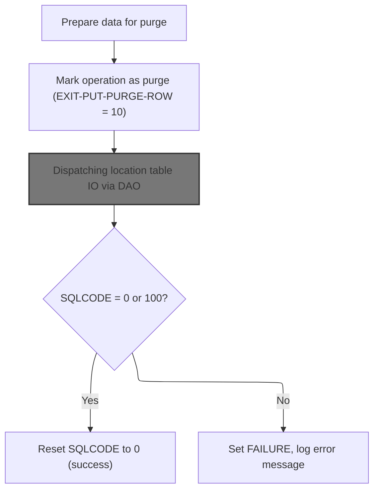
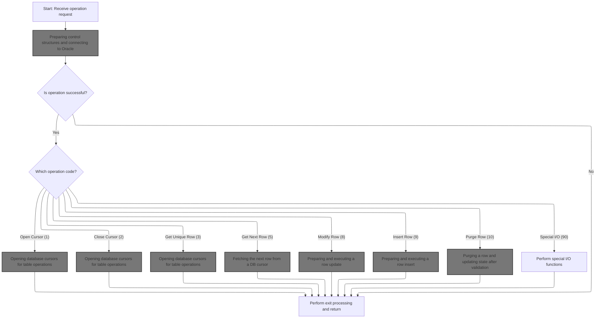
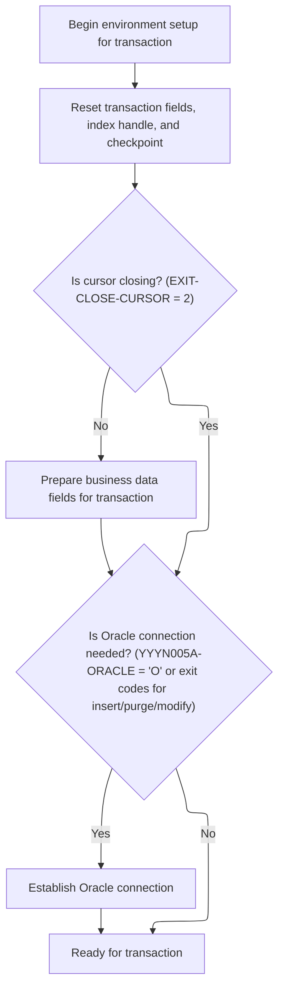
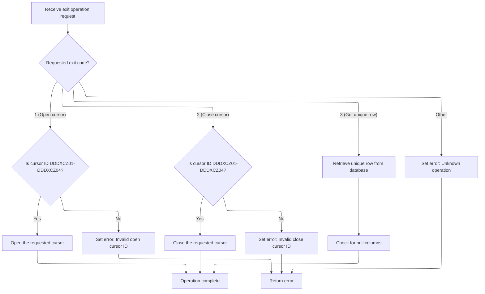
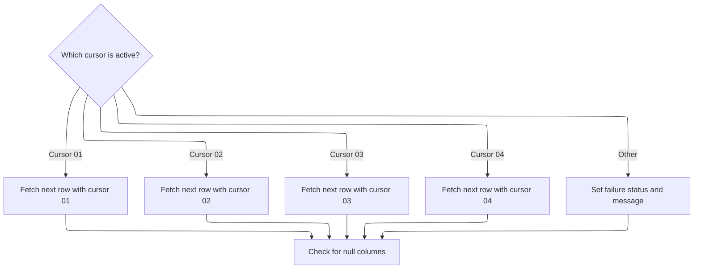
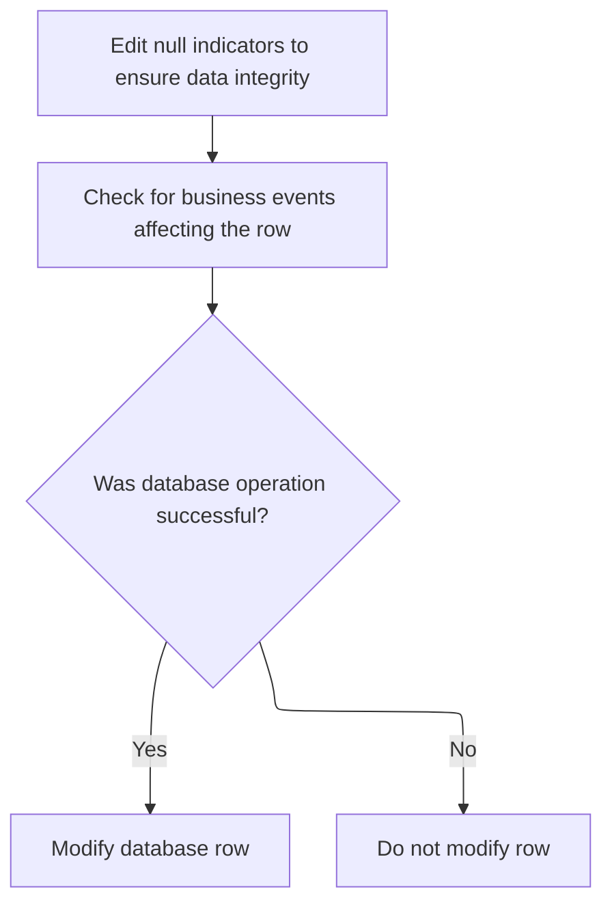
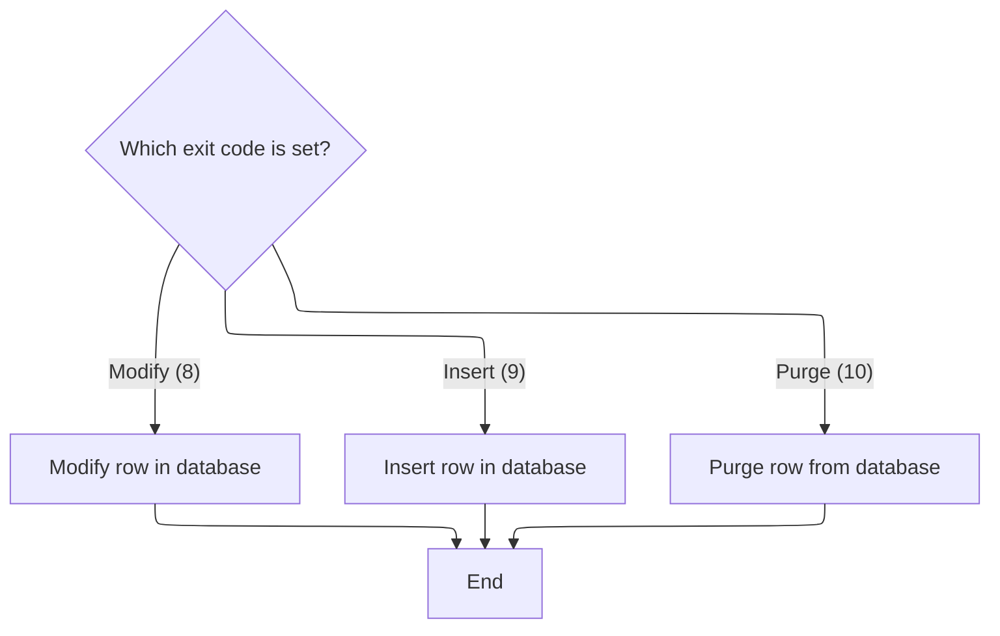
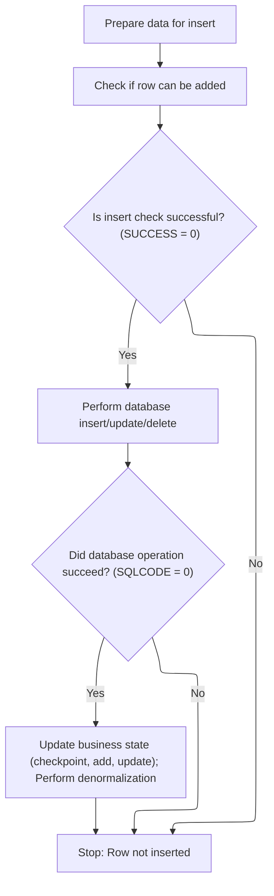
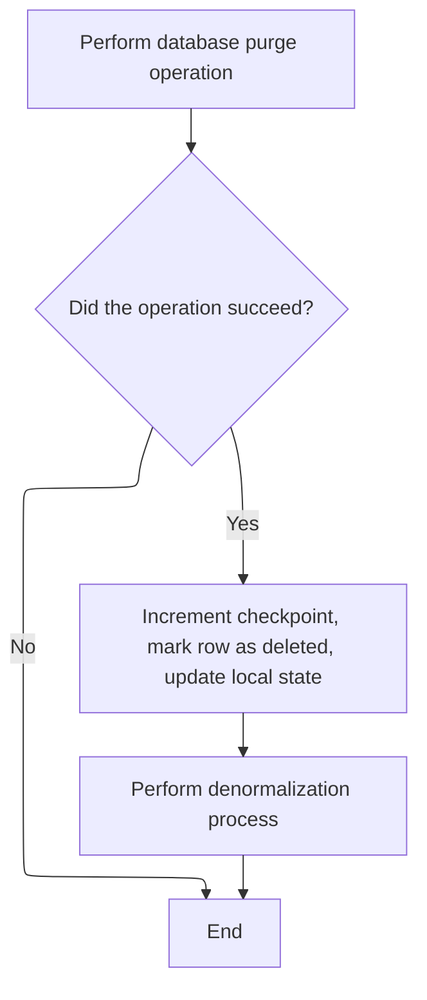
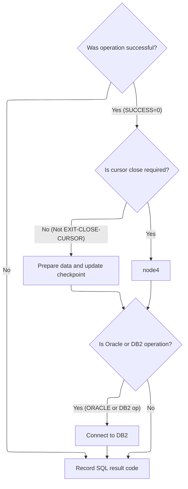

This document describes how a request to remove a row from the location/class/zone table is processed. The system prepares the data, routes the request to the database, performs the purge, and updates the system state and related tables if successful.

# Spec

## Detailed View of the Program's Functionality

# Detailed Explanation of the Purge Flow in Swimmio-dyncall-demo

## a. Starting the Purge and Dispatching Table Operations

The purge process begins by preparing the necessary data for the purge operation. This involves copying key fields (such as item class, location type, and location number) from a working structure into a structure specifically used for database operations. Once the data is prepared, a flag is set to indicate that a purge operation should be performed.

After setting this flag, the code calls a dispatcher routine responsible for handling all table input/output operations. This dispatcher uses the previously set flag to determine that a purge (delete) operation is required and routes the request accordingly.

## b. Dispatching Location Table IO via DAO

The dispatcher routine acts as a central switchboard for all database operations. It receives the operation request, along with all necessary control and data structures, and then evaluates which type of database action is needed based on the operation code (which was set to indicate a purge).

If the operation is successful, the dispatcher proceeds to the next step. If not, it performs exit processing and returns. For a purge operation, it specifically routes to the logic that handles deleting a row from the database.

## c. Routing Table IO Requests Based on Operation Code

The dispatcher checks the operation code and performs the corresponding database action. For a purge operation, it calls the routine responsible for deleting a row and updating the state after validation. Other possible operations include opening/closing cursors, fetching rows, modifying, or inserting rows.

## d. Preparing Control Structures and Connecting to Oracle

Before any database operation, the code initializes all control and status fields, resets transaction fields, and prepares the business data fields for the transaction. If the operation requires a connection to Oracle (which is the case for purge, insert, or modify operations), it establishes this connection by calling an external program. If the connection fails, it records the error for reporting.

## e. Purging a Row and Updating State After Validation

For a purge operation, the code calls the database update routine to delete the row. It then checks if the operation was successful. If so, it increments a checkpoint counter, marks the row as deleted, updates local state flags, and performs a denormalization process to synchronize related tables and trigger any necessary business events. If the operation fails, it records the error and sets a failure status.

## f. Calling the Oracle Update Routine for Table Changes

The actual deletion from the database is performed by calling an external Oracle update program. This program receives all the necessary data and control structures and executes the DELETE statement on the database, matching the row by the provided key fields.

## g. Finalizing Transaction and Connecting to DB2

After the purge operation, the code checks if the operation was successful. If so, it may perform additional actions such as updating checkpoints or connecting to another database system (DB2) if required. It always records the final SQL result code for reporting.

## h. Handling the Result of the Purge Operation

Finally, after returning from the dispatcher, the code checks the result of the purge operation. If the SQL result code indicates success or that the row was not found (which is also considered a successful purge), it resets the code to zero. If there was an error, it sets a failure status and builds an error message for reporting.

---

**Summary:**\
The purge flow in this system is a multi-step process that prepares data, dispatches the operation to the correct handler, connects to the database, performs the deletion, updates state and related tables, and handles the result. Each step is modularized, with clear separation between data preparation, operation dispatch, database interaction, and error handling. This design allows for robust handling of complex business logic and ensures that all related systems are kept in sync after a purge operation.

# Rule Definition

| Paragraph Name                                                                                                                                                                             | Rule ID | Category          | Description                                                                                                                                                                                                                      | Conditions                                                                                | Remarks                                                                                                                                                                                           |
| ------------------------------------------------------------------------------------------------------------------------------------------------------------------------------------------ | ------- | ----------------- | -------------------------------------------------------------------------------------------------------------------------------------------------------------------------------------------------------------------------------- | ----------------------------------------------------------------------------------------- | ------------------------------------------------------------------------------------------------------------------------------------------------------------------------------------------------- |
| 0000-EXIT-DISPATCHER (NNNS0473.cbl, NNNS0487.cbl), 0000-EXIT-DISPATCHER (NNNU0473.cbl)                                                                                                     | RL-001  | Conditional Logic | The operation code in the control block determines which database action is performed. Valid codes are: 1 (open cursor), 2 (close cursor), 3 (get unique row), 5 (get next row), 8 (modify row), 9 (insert row), 10 (purge row). | A control block with a valid operation code is received as input.                         | Operation codes: 1=open cursor, 2=close cursor, 3=get unique row, 5=get next row, 8=modify row, 9=insert row, 10=purge row. The control block is a structured input with an operation code field. |
| 110-MOVE-PDA-FIELDS-2-DCL, 130-MOVE-DCL-2-PDA-FIELDS (NNNS0473.cbl, NNNS0487.cbl)                                                                                                          | RL-002  | Data Assignment   | The business data structure (location type code, location number, item class code, ad zone, ad zone exception, etc.) is used for all database operations, with fields mapped to the relevant table columns.                      | Any database operation is performed.                                                      | Business data structure fields are mapped 1:1 to table columns for all operations. Data types are typically alphanumeric or numeric as per the table schema.                                      |
| 130-MOVE-DCL-2-PDA-FIELDS (NNNS0473.cbl, NNNS0487.cbl), 1200-EXIT-GET-UNIQUE-ROW, 1300-EXIT-GET-NEXT-ROW and FETCH routines                                                                | RL-003  | Data Assignment   | After a SELECT or FETCH operation, the business data structure is updated in-place with the results.                                                                                                                             | A SELECT or FETCH operation is performed and returns data.                                | All fields in the business data structure are updated with the values returned from the database. Data types and field sizes match the table schema.                                              |
| 120-EXIT-STUFF (NNNS0473.cbl, NNNS0487.cbl), after each DB operation                                                                                                                       | RL-004  | Data Assignment   | The control block is updated with the result of the operation, setting SUCCESS or FAILURE flags and populating the return message. The SQL status area is updated with SQLCODE and SQLERRM.                                      | Any database operation completes.                                                         | Control block contains status flags (SUCCESS, FAILURE) and a return message field (string). SQL status area contains SQLCODE (number) and SQLERRM (string).                                       |
| 120-EXIT-STUFF, after each DB operation (NNNS0473.cbl, NNNS0487.cbl)                                                                                                                       | RL-005  | Conditional Logic | If SQLCODE is 0 or 100, set SUCCESS and clear FAILURE in the control block. If SQLCODE is not 0 or 100, set FAILURE and clear SUCCESS, and place an error message in the return message field.                                   | A database operation completes and SQLCODE is available.                                  | SUCCESS and FAILURE are boolean flags in the control block. Return message is a string field. SQLCODE is a signed integer; 0 and 100 are considered success codes.                                |
| 1600-EXIT-PUT-PURGE-ROW (NNNS0473.cbl, NNNS0487.cbl), 1610-DELETE-STORE, 1620-DELETE-DSD-VENDOR, etc.                                                                                      | RL-006  | Computation       | For purge operations, the system deletes the row matching the business data structure fields and updates the checkpoint and local state as required.                                                                             | Operation code is 10 (purge row).                                                         | Row is deleted where all key fields match. Checkpoint increment is set to 1 if successful. Local state flags (e.g., LOC-DEL, DSD-DEL) are set as appropriate.                                     |
| 1500-EXIT-PUT-INSERT-ROW, 4600-CALL-MMMS0335-RI-ADD-CHK (NNNS0473.cbl), 1505-GET-FAC-ORG-ID, 1515-CHECK-AP-NBR, 1520-GET-AP-INFO (NNNS0487.cbl)                                            | RL-007  | Conditional Logic | For insert operations, referential integrity is validated before inserting the row. The insert proceeds only if validation passes.                                                                                               | Operation code is 9 (insert row).                                                         | Referential integrity checks may involve calling external routines or checking related tables. Insert is performed only if checks succeed.                                                        |
| 1400-EXIT-PUT-MODIFY-ROW, 1410-CHECK-FOR-EVENTS, 1420-D0-MODIFY-ROW (NNNS0473.cbl), 1400-EXIT-PUT-MODIFY-ROW, 1411-CHECK-FOR-EVENTS, 1420-CHECK-AP-INFO, 1440-D0-MODIFY-ROW (NNNS0487.cbl) | RL-008  | Conditional Logic | For modify operations, the system checks for business events affecting the row and only updates if the operation is successful.                                                                                                  | Operation code is 8 (modify row).                                                         | Business event checks may involve additional queries or logic. Update is performed only if checks succeed and SQLCODE = 0.                                                                        |
| 2000-DENORM-PROCESS, 2030-ISSUE-EVENTS (NNNS0473.cbl, NNNS0487.cbl)                                                                                                                        | RL-009  | Computation       | After a successful database change (insert, modify, purge), the system performs denormalization and triggers related events as required.                                                                                         | A database change operation (insert, modify, purge) completes successfully (SQLCODE = 0). | Denormalization may involve updating related tables or calling subroutines. Event triggering involves calling event manager routines with relevant data.                                          |
| Throughout all routines (NNNS0473.cbl, NNNS0487.cbl, NNNU0473.cbl)                                                                                                                         | RL-010  | Conditional Logic | The system must not interact with the user directly; all status and error reporting must be handled via the control block and SQL status area.                                                                                   | Any status or error must be reported.                                                     | No user prompts or direct output. All status and error information is written to the control block (flags, message) and SQL status area (SQLCODE, SQLERRM).                                       |

# User Stories

## User Story 1: General Database Operation Handling

---

### Story Description:

As a system, I want to process a control block containing an operation code, status flags, and a return message, along with a business data structure and SQL status area, so that I can perform the requested database operation, update all relevant fields, and report status and errors without direct user interaction.

---

### Business Rule Mapping:

| Rule ID | Paragraph Name                                                                                                              | Rule Description                                                                                                                                                                                                                 |
| ------- | --------------------------------------------------------------------------------------------------------------------------- | -------------------------------------------------------------------------------------------------------------------------------------------------------------------------------------------------------------------------------- |
| RL-005  | 120-EXIT-STUFF, after each DB operation (NNNS0473.cbl, NNNS0487.cbl)                                                        | If SQLCODE is 0 or 100, set SUCCESS and clear FAILURE in the control block. If SQLCODE is not 0 or 100, set FAILURE and clear SUCCESS, and place an error message in the return message field.                                   |
| RL-001  | 0000-EXIT-DISPATCHER (NNNS0473.cbl, NNNS0487.cbl), 0000-EXIT-DISPATCHER (NNNU0473.cbl)                                      | The operation code in the control block determines which database action is performed. Valid codes are: 1 (open cursor), 2 (close cursor), 3 (get unique row), 5 (get next row), 8 (modify row), 9 (insert row), 10 (purge row). |
| RL-002  | 110-MOVE-PDA-FIELDS-2-DCL, 130-MOVE-DCL-2-PDA-FIELDS (NNNS0473.cbl, NNNS0487.cbl)                                           | The business data structure (location type code, location number, item class code, ad zone, ad zone exception, etc.) is used for all database operations, with fields mapped to the relevant table columns.                      |
| RL-003  | 130-MOVE-DCL-2-PDA-FIELDS (NNNS0473.cbl, NNNS0487.cbl), 1200-EXIT-GET-UNIQUE-ROW, 1300-EXIT-GET-NEXT-ROW and FETCH routines | After a SELECT or FETCH operation, the business data structure is updated in-place with the results.                                                                                                                             |
| RL-004  | 120-EXIT-STUFF (NNNS0473.cbl, NNNS0487.cbl), after each DB operation                                                        | The control block is updated with the result of the operation, setting SUCCESS or FAILURE flags and populating the return message. The SQL status area is updated with SQLCODE and SQLERRM.                                      |
| RL-010  | Throughout all routines (NNNS0473.cbl, NNNS0487.cbl, NNNU0473.cbl)                                                          | The system must not interact with the user directly; all status and error reporting must be handled via the control block and SQL status area.                                                                                   |

---

### Relevant Functionality:

- **120-EXIT-STUFF**
  1. **RL-005:**
     - If SQLCODE = 0 or 100:
       - Set SUCCESS flag
       - Clear FAILURE flag
     - Else:
       - Set FAILURE flag
       - Clear SUCCESS flag
       - Set error message in return message field
- **0000-EXIT-DISPATCHER (NNNS0473.cbl**
  1. **RL-001:**
     - Read operation code from control block
     - EVALUATE operation code:
       - WHEN 1: perform open cursor logic
       - WHEN 2: perform close cursor logic
       - WHEN 3: perform get unique row logic
       - WHEN 5: perform get next row logic
       - WHEN 8: perform modify row logic
       - WHEN 9: perform insert row logic
       - WHEN 10: perform purge row logic
       - OTHERWISE: set failure, return error message
- **110-MOVE-PDA-FIELDS-2-DCL**
  1. **RL-002:**
     - On input: move fields from business data structure to DCL structure for SQL
     - On output (SELECT/FETCH): move fields from DCL structure back to business data structure
- **130-MOVE-DCL-2-PDA-FIELDS (NNNS0473.cbl**
  1. **RL-003:**
     - After successful SELECT/FETCH:
       - Move each field from DCL structure to business data structure
- **120-EXIT-STUFF (NNNS0473.cbl**
  1. **RL-004:**
     - After DB operation:
       - If SQLCODE = 0 or 100: set SUCCESS, clear FAILURE
       - If SQLCODE not 0 or 100: set FAILURE, clear SUCCESS, set error message
       - Move SQLCODE and SQLERRM to SQL status area
       - Move result message to control block
- **Throughout all routines (NNNS0473.cbl**
  1. **RL-010:**
     - On any error or status change:
       - Set appropriate flags and messages in control block
       - Set SQLCODE and SQLERRM in SQL status area
       - Do not perform any user I/O

## User Story 2: Purge Operation Logic

---

### Story Description:

As a system, I want to delete a row matching the business data structure fields when a purge operation is requested, and update the checkpoint and local state as required, so that data is removed correctly and system state is maintained.

---

### Business Rule Mapping:

| Rule ID | Paragraph Name                                                                                        | Rule Description                                                                                                                                     |
| ------- | ----------------------------------------------------------------------------------------------------- | ---------------------------------------------------------------------------------------------------------------------------------------------------- |
| RL-006  | 1600-EXIT-PUT-PURGE-ROW (NNNS0473.cbl, NNNS0487.cbl), 1610-DELETE-STORE, 1620-DELETE-DSD-VENDOR, etc. | For purge operations, the system deletes the row matching the business data structure fields and updates the checkpoint and local state as required. |
| RL-009  | 2000-DENORM-PROCESS, 2030-ISSUE-EVENTS (NNNS0473.cbl, NNNS0487.cbl)                                   | After a successful database change (insert, modify, purge), the system performs denormalization and triggers related events as required.             |

---

### Relevant Functionality:

- **1600-EXIT-PUT-PURGE-ROW (NNNS0473.cbl**
  1. **RL-006:**
     - Perform DELETE statement using business data structure fields as WHERE clause
     - If SQLCODE = 0:
       - Set checkpoint increment to 1
       - Set local state flags (e.g., LOC-DEL)
       - Perform denormalization and event processing
- **2000-DENORM-PROCESS**
  1. **RL-009:**
     - If DB operation is successful:
       - Perform denormalization (update related tables, call subroutines)
       - Trigger events (call event manager with relevant data)

## User Story 3: Insert Operation Logic

---

### Story Description:

As a system, I want to validate referential integrity before inserting a row, and only proceed if validation passes, so that data consistency is maintained and related events are triggered after a successful insert.

---

### Business Rule Mapping:

| Rule ID | Paragraph Name                                                                                                                                  | Rule Description                                                                                                                         |
| ------- | ----------------------------------------------------------------------------------------------------------------------------------------------- | ---------------------------------------------------------------------------------------------------------------------------------------- |
| RL-007  | 1500-EXIT-PUT-INSERT-ROW, 4600-CALL-MMMS0335-RI-ADD-CHK (NNNS0473.cbl), 1505-GET-FAC-ORG-ID, 1515-CHECK-AP-NBR, 1520-GET-AP-INFO (NNNS0487.cbl) | For insert operations, referential integrity is validated before inserting the row. The insert proceeds only if validation passes.       |
| RL-009  | 2000-DENORM-PROCESS, 2030-ISSUE-EVENTS (NNNS0473.cbl, NNNS0487.cbl)                                                                             | After a successful database change (insert, modify, purge), the system performs denormalization and triggers related events as required. |

---

### Relevant Functionality:

- **1500-EXIT-PUT-INSERT-ROW**
  1. **RL-007:**
     - Perform referential integrity check (call external routine or query related tables)
     - If check passes:
       - Perform INSERT statement
       - If SQLCODE = 0: set checkpoint increment, set local state flags, perform denormalization/event processing
     - Else: set FAILURE, return error message
- **2000-DENORM-PROCESS**
  1. **RL-009:**
     - If DB operation is successful:
       - Perform denormalization (update related tables, call subroutines)
       - Trigger events (call event manager with relevant data)

## User Story 4: Modify Operation Logic

---

### Story Description:

As a system, I want to check for business events affecting a row before modifying it, and only update if the operation is successful, so that business rules are enforced and related events are triggered after a successful modification.

---

### Business Rule Mapping:

| Rule ID | Paragraph Name                                                                                                                                                                             | Rule Description                                                                                                                         |
| ------- | ------------------------------------------------------------------------------------------------------------------------------------------------------------------------------------------ | ---------------------------------------------------------------------------------------------------------------------------------------- |
| RL-008  | 1400-EXIT-PUT-MODIFY-ROW, 1410-CHECK-FOR-EVENTS, 1420-D0-MODIFY-ROW (NNNS0473.cbl), 1400-EXIT-PUT-MODIFY-ROW, 1411-CHECK-FOR-EVENTS, 1420-CHECK-AP-INFO, 1440-D0-MODIFY-ROW (NNNS0487.cbl) | For modify operations, the system checks for business events affecting the row and only updates if the operation is successful.          |
| RL-009  | 2000-DENORM-PROCESS, 2030-ISSUE-EVENTS (NNNS0473.cbl, NNNS0487.cbl)                                                                                                                        | After a successful database change (insert, modify, purge), the system performs denormalization and triggers related events as required. |

---

### Relevant Functionality:

- **1400-EXIT-PUT-MODIFY-ROW**
  1. **RL-008:**
     - Check for business events (call routines or perform queries)
     - If checks succeed:
       - Perform UPDATE statement
       - If SQLCODE = 0: set checkpoint increment, set local state flags, perform denormalization/event processing
     - Else: set FAILURE, return error message
- **2000-DENORM-PROCESS**
  1. **RL-009:**
     - If DB operation is successful:
       - Perform denormalization (update related tables, call subroutines)
       - Trigger events (call event manager with relevant data)

# Code Walkthrough

## Starting the purge and dispatching table operations



<SwmSnippet path="/base/src/NNNS0487.cbl" line="2782">

---

In `1613-EXIT-PURGE-RETL` we prep the data by moving location and item class fields into the structure used for DB operations, then set the flag to indicate a purge is needed. We call 4000-NNNS0473-RETL-DAO next because that's the dispatcher for all table IO, and it uses the flag we just set to route the request to the right DB operation.

```cobol
285900 1613-EXIT-PURGE-RETL.                                            00285900
286000     MOVE ITM-CLS-CD         OF DCLXXXL-LOC-CLS-AD-ZN             00286000
286100       TO ITM-CLS-CD         OF P-DDDTCZ01                        00286100
286200     MOVE LOC-TYP-CD         OF DCLXXXL-LOC-CLS-AD-ZN             00286200
286300       TO LOC-TYP-CD         OF P-DDDTCZ01                        00286300
286400     MOVE LOC-NBR            OF DCLXXXL-LOC-CLS-AD-ZN             00286400
286500       TO LOC-NBR            OF P-DDDTCZ01                        00286500
286600                                                                  00286600
286700     SET EXIT-PUT-PURGE-ROW TO TRUE                               00286700
286800     PERFORM 4000-NNNS0473-RETL-DAO                               00286800
```

---

</SwmSnippet>

### Dispatching location table IO via DAO

<SwmSnippet path="/base/src/NNNS0487.cbl" line="3333">

---

`4000-NNNS0473-RETL-DAO` just calls the table IO dispatcher, passing all the control and data structures needed for DB operations. The next step is to call into NNNS0473.cbl, which actually runs the dispatcher logic and picks the right DB action based on the operation code.

```cobol
341000 4000-NNNS0473-RETL-DAO.                                          00341000
341100     CALL NNNS0473-RETL-DAO USING                                 00341100
341200          XXXN001A                                                00341200
341300          SQLCA                                                   00341300
341400          YYYN005A                                                00341400
341500          NNNN0000-PARMS                                          00341500
341600          P-DDDTCZ01                                              00341600
341700     .                                                            00341700
```

---

</SwmSnippet>

### Routing table IO requests based on operation code



<SwmSnippet path="/base/src/NNNS0473.cbl" line="199">

---

`0000-EXIT-DISPATCHER` runs the main switch for table IO. It checks the exit code (set earlier) and routes to the right DB routine (open/close cursor, get row, modify, insert, purge, etc.). Each branch is a PERFORM to the relevant logic. The exit code is assumed to be set correctly before entry.

```cobol
020800 0000-EXIT-DISPATCHER.                                            00020800
020900     PERFORM 100-INITIALIZATION                                   00020900
021000     EVALUATE TRUE                                                00021000
021100       WHEN NOT SUCCESS                                           00021100
021200          CONTINUE                                                00021200
021300       WHEN EXIT-OPEN-CURSOR                                      00021300
021400          PERFORM 1000-EXIT-OPEN-CURSOR                           00021400
021500       WHEN EXIT-CLOSE-CURSOR                                     00021500
021600          PERFORM 1100-EXIT-CLOSE-CURSOR                          00021600
021700       WHEN EXIT-GET-UNIQUE-ROW                                   00021700
021800          PERFORM 1200-EXIT-GET-UNIQUE-ROW                        00021800
021900       WHEN EXIT-GET-NEXT-ROW                                     00021900
022000          PERFORM 1300-EXIT-GET-NEXT-ROW                          00022000
022100       WHEN EXIT-PUT-MODIFY-ROW                                   00022100
022200          PERFORM 1400-EXIT-PUT-MODIFY-ROW                        00022200
022300       WHEN EXIT-PUT-INSERT-ROW                                   00022300
022400          PERFORM 1500-EXIT-PUT-INSERT-ROW                        00022400
022500       WHEN EXIT-PUT-PURGE-ROW                                    00022500
022600          PERFORM 1600-EXIT-PUT-PURGE-ROW                         00022600
022700       WHEN EXIT-DO-SPECIAL-IO-FUNCS                              00022700
022800          PERFORM 10000-DO-SPECIAL-IO-FUNCS                       00022800
022900     END-EVALUATE                                                 00022900
023000     PERFORM 120-EXIT-STUFF                                       00023000
023100     GOBACK                                                       00023100
023200     .                                                            00023200
```

---

</SwmSnippet>

#### Preparing control structures and connecting to Oracle



<SwmSnippet path="/base/src/NNNS0473.cbl" line="229">

---

`100-INITIALIZATION` sets up all the control and status fields for DB operations, moves the needed fields, and only connects to Oracle if we're about to do a write or if the Oracle flag is set. The next step is to run the connection logic if those conditions are met.

```cobol
023800 100-INITIALIZATION.                                              00023800
023900     INITIALIZE XXXN001A                                          00023900
024000                DAO-STATUS                                        00024000
024100     MOVE NNNN0000-INDEX-HANDLE TO DDDTCZ01-INDEX-HANDLE          00024100
024200     MOVE 0 TO WS-CHECKPOINT-INC                                  00024200
024300     MOVE 0 TO SQLCODE                                            00024300
024400     MOVE 0 TO SQL-INIT-FLAG                                      00024400
024500     IF NOT EXIT-CLOSE-CURSOR                                     00024500
024600       PERFORM 110-MOVE-PDA-FIELDS-2-DCL                          00024600
024700     END-IF                                                       00024700
024800     IF (YYYN005A-ORACLE       OR EXIT-PUT-INSERT-ROW             00024800
024900         OR EXIT-PUT-PURGE-ROW OR EXIT-PUT-MODIFY-ROW)            00024900
025000       PERFORM 115-CONNECT-TO-ORACLE                              00025000
025100     END-IF                                                       00025100
025200     .                                                            00025200
```

---

</SwmSnippet>

<SwmSnippet path="/base/src/NNNS0473.cbl" line="266">

---

`115-CONNECT-TO-ORACLE` calls the external program to set up the Oracle DB connection. If it fails, we grab the error code and build a message for error reporting. The next step is to continue with the dispatcher logic, now with the DB connection state set.

```cobol
027500 115-CONNECT-TO-ORACLE.                                           00027500
027600     CALL Z-ORA-CONNECT USING XXXN001A                            00027600
027700                              SQLCA                               00027700
027800                                                                  00027800
027900     IF NOT SUCCESS                                               00027900
028000       MOVE SQLCODE TO WS-SQLCODE                                 00028000
028100       MOVE SPACES  TO IS-RTRN-MSG-TXT                            00028100
028200       STRING 'NNNS0473 - Error connecting to Oracle. Sqlcode ='  00028200
028300               WS-SQLCODE                                         00028300
028400               DELIMITED BY SIZE INTO IS-RTRN-MSG-TXT             00028400
028500     END-IF                                                       00028500
028600     .                                                            00028600
```

---

</SwmSnippet>

#### Opening database cursors for table operations



<SwmSnippet path="/base/src/NNNS0473.cbl" line="327">

---

`1000-EXIT-OPEN-CURSOR` picks which DB cursor to open based on the input handle. It matches against four known constants and runs the corresponding SQL OPEN. If the ID doesn't match, it flags an error and sets a message.

```cobol
033600 1000-EXIT-OPEN-CURSOR.                                           00033600
033700     EVALUATE TRUE                                                00033700
033800       WHEN DDDXCZ01                                              00033800
033900         EXEC SQL                                                 00033900
034000           OPEN DDDXCZ01                                          00034000
034100         END-EXEC                                                 00034100
034200       WHEN DDDXCZ02                                              00034200
034300         EXEC SQL                                                 00034300
034400           OPEN DDDXCZ02                                          00034400
034500         END-EXEC                                                 00034500
034600       WHEN DDDXCZ03                                              00034600
034700         EXEC SQL                                                 00034700
034800           OPEN DDDXCZ03                                          00034800
034900         END-EXEC                                                 00034900
035000       WHEN DDDXCZ04                                              00035000
035100         EXEC SQL                                                 00035100
035200           OPEN DDDXCZ04                                          00035200
035300         END-EXEC                                                 00035300
035400       WHEN OTHER                                                 00035400
035500         SET FAILURE TO TRUE                                      00035500
035600         MOVE 'NNNS0473 - Invalid open cursor ID.'                00035600
035700           TO IS-RTRN-MSG-TXT OF XXXN001A                         00035700
035800     END-EVALUATE                                                 00035800
035900     .                                                            00035900
```

---

</SwmSnippet>

<SwmSnippet path="/base/src/NNNS0473.cbl" line="353">

---

`1100-EXIT-CLOSE-CURSOR` closes the DB cursor matching the input ID. It checks against four known constants and runs the SQL CLOSE for the right one, or errors out if the ID is invalid.

```cobol
036200 1100-EXIT-CLOSE-CURSOR.                                          00036200
036300     EVALUATE TRUE                                                00036300
036400       WHEN DDDXCZ01                                              00036400
036500         EXEC SQL                                                 00036500
036600           CLOSE DDDXCZ01                                         00036600
036700         END-EXEC                                                 00036700
036800       WHEN DDDXCZ02                                              00036800
036900         EXEC SQL                                                 00036900
037000           CLOSE DDDXCZ02                                         00037000
037100         END-EXEC                                                 00037100
037200       WHEN DDDXCZ03                                              00037200
037300         EXEC SQL                                                 00037300
037400           CLOSE DDDXCZ03                                         00037400
037500         END-EXEC                                                 00037500
037600       WHEN DDDXCZ04                                              00037600
037700         EXEC SQL                                                 00037700
037800           CLOSE DDDXCZ04                                         00037800
037900         END-EXEC                                                 00037900
038000       WHEN OTHER                                                 00038000
038100         SET FAILURE TO TRUE                                      00038100
038200         MOVE 'NNNS0473 - Invalid close cursor ID.'               00038200
038300           TO IS-RTRN-MSG-TXT OF XXXN001A                         00038300
038400     END-EVALUATE                                                 00038400
038500     .                                                            00038500
```

---

</SwmSnippet>

<SwmSnippet path="/base/src/NNNS0473.cbl" line="379">

---

`1200-EXIT-GET-UNIQUE-ROW` runs a SELECT to fetch a unique row from the DB table, using the fields in the input structure for the WHERE clause and storing the result back into the same structure. After the fetch, it checks for nulls in the result.

```cobol
038800 1200-EXIT-GET-UNIQUE-ROW.                                        00038800
038900     EXEC SQL                                                     00038900
039000         SELECT LOC_TYP_CD,                                       00039000
039100                LOC_NBR,                                          00039100
039200                ITM_CLS_CD,                                       00039200
039300                AD_ZONE,                                          00039300
039400                AD_ZONE_EXCP                                      00039400
039500         INTO   :DCLXXXL-LOC-CLS-AD-ZN.LOC-TYP-CD,                00039500
039600                :DCLXXXL-LOC-CLS-AD-ZN.LOC-NBR,                   00039600
039700                :DCLXXXL-LOC-CLS-AD-ZN.ITM-CLS-CD,                00039700
039800                :DCLXXXL-LOC-CLS-AD-ZN.AD-ZONE,                   00039800
039900                :DCLXXXL-LOC-CLS-AD-ZN.AD-ZONE-EXCP               00039900
040000         FROM   XXXL_LOC_CLS_AD_ZN                                00040000
040100         WHERE  LOC_TYP_CD = :DCLXXXL-LOC-CLS-AD-ZN.LOC-TYP-CD    00040100
040200         AND    LOC_NBR = :DCLXXXL-LOC-CLS-AD-ZN.LOC-NBR          00040200
040300         AND    ITM_CLS_CD = :DCLXXXL-LOC-CLS-AD-ZN.ITM-CLS-CD    00040300
040400     END-EXEC                                                     00040400
040500                                                                  00040500
040600     PERFORM 1700-CHECK-NULL-COLUMNS                              00040600
040700     .                                                            00040700
```

---

</SwmSnippet>

#### Fetching the next row from a DB cursor



<SwmSnippet path="/base/src/NNNS0473.cbl" line="401">

---

`1300-EXIT-GET-NEXT-ROW` picks the right fetch routine based on the cursor ID. It matches against four constants and runs the fetch, or errors out if the ID is invalid. After the fetch, it checks for nulls in the result.

```cobol
041000 1300-EXIT-GET-NEXT-ROW.                                          00041000
041100     EVALUATE TRUE                                                00041100
041200       WHEN DDDXCZ01                                              00041200
041300         PERFORM 1301-FETCH-DDDXCZ01                              00041300
041400       WHEN DDDXCZ02                                              00041400
041500         PERFORM 1302-FETCH-DDDXCZ02                              00041500
041600       WHEN DDDXCZ03                                              00041600
041700         PERFORM 1303-FETCH-DDDXCZ03                              00041700
041800       WHEN DDDXCZ04                                              00041800
041900         PERFORM 1304-FETCH-DDDXCZ04                              00041900
042000       WHEN OTHER                                                 00042000
042100         SET FAILURE TO TRUE                                      00042100
042200         MOVE 'NNNS0473 - Invalid fetch cursor ID.'               00042200
042300           TO IS-RTRN-MSG-TXT OF XXXN001A                         00042300
042400     END-EVALUATE                                                 00042400
042500                                                                  00042500
042600     PERFORM 1700-CHECK-NULL-COLUMNS                              00042600
042700     .                                                            00042700
```

---

</SwmSnippet>

<SwmSnippet path="/base/src/NNNS0473.cbl" line="457">

---

`1304-FETCH-DDDXCZ04` runs a FETCH from the DDDXCZ04 cursor and puts the result into the location/class/zone structure. The cursor has to be open and positioned right before this call.

```cobol
046600 1304-FETCH-DDDXCZ04.                                             00046600
046700     EXEC SQL                                                     00046700
046800         FETCH DDDXCZ04                                           00046800
046900         INTO  :DCLXXXL-LOC-CLS-AD-ZN.LOC-TYP-CD,                 00046900
047000               :DCLXXXL-LOC-CLS-AD-ZN.LOC-NBR,                    00047000
047100               :DCLXXXL-LOC-CLS-AD-ZN.ITM-CLS-CD,                 00047100
047200               :DCLXXXL-LOC-CLS-AD-ZN.AD-ZONE,                    00047200
047300               :DCLXXXL-LOC-CLS-AD-ZN.AD-ZONE-EXCP                00047300
047400     END-EXEC                                                     00047400
047500     .                                                            00047500
```

---

</SwmSnippet>

#### Preparing and executing a row update



<SwmSnippet path="/base/src/NNNS0473.cbl" line="469">

---

`1400-EXIT-PUT-MODIFY-ROW` edits null indicators, checks for triggered events, and only runs the update if SQLCODE is zero. The next step is to call the actual row update routine.

```cobol
047800 1400-EXIT-PUT-MODIFY-ROW.                                        00047800
047900     PERFORM 1800-EDIT-NULL-INDICATORS                            00047900
048000     PERFORM 1410-CHECK-FOR-EVENTS                                00048000
048100     IF SQLCODE = 0                                               00048100
048200       PERFORM 1420-D0-MODIFY-ROW                                 00048200
048300     END-IF                                                       00048300
048400     .                                                            00048400
```

---

</SwmSnippet>

#### Updating the database row and triggering sync

<SwmSnippet path="/base/src/NNNS0473.cbl" line="483">

---

`1420-D0-MODIFY-ROW` calls the DB update routine, checks for success, sets checkpoint and update flags, and then runs denormalization to sync related tables and trigger events.

```cobol
049200 1420-D0-MODIFY-ROW.                                              00049200
050900     PERFORM 5000-CALL-NNNS0473-CUD-ROUTINE                       00050900
051000     IF SQLCODE = 0                                               00051000
051100       MOVE 1 TO WS-CHECKPOINT-INC                                00051100
051200       SET YYYN110A-UPD TO TRUE                                   00051200
051300       SET LOC-UPD      TO TRUE                                   00051300
051400       PERFORM 2000-DENORM-PROCESS                                00051400
051500     END-IF                                                       00051500
051600     .                                                            00051600
```

---

</SwmSnippet>

#### Calling the Oracle update routine for table changes

<SwmSnippet path="/base/src/NNNS0473.cbl" line="639">

---

`5000-CALL-NNNS0473-CUD-ROUTINE` calls the Oracle update program, passing all the table and control data. The next step is to let the external routine handle the DB change and return the result.

```cobol
066400 5000-CALL-NNNS0473-CUD-ROUTINE.                                  00066400
066410     CALL NNNU0473-ORACLE-UPDATE USING                            00066410
066420          XXXN001A                                                00066420
066430          SQLCA                                                   00066430
066440          YYYN005A                                                00066440
066450          NNNN0000-PARMS                                          00066450
066460          DDDTCZ01                                                00066460
066470     .                                                            00066470
```

---

</SwmSnippet>

#### Dispatching update, insert, and purge operations



<SwmSnippet path="/base/src/NNNU0473.cbl" line="44">

---

`0000-EXIT-DISPATCHER` in NNNU0473.cbl routes the request to update, insert, or purge logic based on the operation code. Each branch runs the right DB routine for the requested action.

```cobol
004800 0000-EXIT-DISPATCHER.                                            00480000
004900      EVALUATE TRUE                                               00490000
005000       WHEN EXIT-PUT-MODIFY-ROW                                   00500000
005100          PERFORM 1400-EXIT-PUT-MODIFY-ROW                        00510000
005200       WHEN EXIT-PUT-INSERT-ROW                                   00520000
005300          PERFORM 1500-EXIT-PUT-INSERT-ROW                        00530000
005400       WHEN EXIT-PUT-PURGE-ROW                                    00540000
005500          PERFORM 1600-EXIT-PUT-PURGE-ROW                         00550000
005600      END-EVALUATE                                                00560000
005700     GOBACK                                                       00570000
005800     .                                                            00580000
```

---

</SwmSnippet>

<SwmSnippet path="/base/src/NNNU0473.cbl" line="104">

---

`1600-EXIT-PUT-PURGE-ROW` runs a DELETE on the DB table, matching the row by the fields in the input structure. The fields have to be set right for the delete to work.

```cobol
008200 1600-EXIT-PUT-PURGE-ROW.                                         00820000
008300       EXEC SQL                                                   00830000
051400         DELETE FROM XXXX_LOC_CLS_AD_ZN                           00051400
051500         WHERE  LOC_TYP_CD = :DCLXXXX-LOC-CLS-AD-ZN.LOC-TYP-CD    00051500
051600         AND    LOC_NBR = :DCLXXXX-LOC-CLS-AD-ZN.LOC-NBR          00051600
051700         AND    ITM_CLS_CD = :DCLXXXX-LOC-CLS-AD-ZN.ITM-CLS-CD    00051700
008400       END-EXEC                                                   00840000
008500     .                                                            00850000
```

---

</SwmSnippet>

#### Syncing denormalized tables and triggering events

See <SwmLink doc-title="Processing and Synchronizing Location Data">[Processing and Synchronizing Location Data](\.swm\processing-and-synchronizing-location-data.q9ez9f34.sw.md)</SwmLink>

#### Preparing and executing a row insert



<SwmSnippet path="/base/src/NNNS0473.cbl" line="494">

---

`1500-EXIT-PUT-INSERT-ROW` edits nulls, validates with MMMS0335, and only runs the insert if validation passes. After a successful insert, it sets flags and runs denormalization.

```cobol
051900 1500-EXIT-PUT-INSERT-ROW.                                        00051900
052000     PERFORM 1800-EDIT-NULL-INDICATORS                            00052000
052100                                                                  00052100
052200     PERFORM 4600-CALL-MMMS0335-RI-ADD-CHK                        00052200
052300     IF SUCCESS                                                   00052300
053600        PERFORM 5000-CALL-NNNS0473-CUD-ROUTINE                    00053600
053700        IF SQLCODE = 0                                            00053700
053800           MOVE 1 TO WS-CHECKPOINT-INC                            00053800
053900           SET YYYN110A-ADD TO TRUE                               00053900
054000           SET LOC-UPD      TO TRUE                               00054000
054100           PERFORM 2000-DENORM-PROCESS                            00054100
054200        END-IF                                                    00054200
054210     END-IF                                                       00054210
054300     .                                                            00054300
```

---

</SwmSnippet>

#### Validating referential integrity before insert

<SwmSnippet path="/base/src/NNNS0473.cbl" line="622">

---

`4600-CALL-MMMS0335-RI-ADD-CHK` calls MMMS0335 to validate the new row before insert.

```cobol
066320 4600-CALL-MMMS0335-RI-ADD-CHK.                                   00066320
066330     INITIALIZE MMMC0335                                          00066330
066340     MOVE ITM-CLS-CD                   OF DCLXXXL-LOC-CLS-AD-ZN   00066340
066350                                       TO MMMC0335-ITM-CLS-CD     00066350
066360     MOVE AD-ZONE-EXCP                 OF DCLXXXL-LOC-CLS-AD-ZN   00066360
066370                                       TO MMMC0335-AD-ZONE-EXCP   00066370
066371     MOVE AD-ZONE                      OF DCLXXXL-LOC-CLS-AD-ZN   00066371
066372                                       TO MMMC0335-AD-ZONE        00066372
066380     SET   MMMC0335-INSERT-CHECK       TO TRUE                    00066380
066390     SET   MMMC0335-XXXL-LOC-CLS-AD-ZN TO TRUE                    00066390
066391     SET   MMMC0335-ORACLE             TO TRUE                    00066391
066392     CALL  MMMC0335-RI-INSERT-CHK      USING                      00066392
066393           XXXN001A                                               00066393
066394           MMMC0335                                               00066394
066395     .                                                            00066395
```

---

</SwmSnippet>

#### Validating business operation for referential integrity

See <SwmLink doc-title="Processing Table Operation Requests">[Processing Table Operation Requests](\.swm\processing-table-operation-requests.090eh2wf.sw.md)</SwmLink>

#### Purging a row and updating state after validation



<SwmSnippet path="/base/src/NNNS0473.cbl" line="510">

---

`1600-EXIT-PUT-PURGE-ROW` calls the DB update routine to delete the row, checks for success, sets delete and update flags, bumps the checkpoint, and runs denormalization to sync tables and trigger events.

```cobol
054600 1600-EXIT-PUT-PURGE-ROW.                                         00054600
055300     PERFORM 5000-CALL-NNNS0473-CUD-ROUTINE                       00055300
055400     IF SQLCODE = 0                                               00055400
055500       MOVE 1 TO WS-CHECKPOINT-INC                                00055500
055600       SET YYYN110A-DEL TO TRUE                                   00055600
055700       SET LOC-UPD      TO TRUE                                   00055700
055800       PERFORM 2000-DENORM-PROCESS                                00055800
055900     END-IF                                                       00055900
056000     .                                                            00056000
```

---

</SwmSnippet>

### Finalizing transaction and connecting to DB2



<SwmSnippet path="/base/src/NNNS0473.cbl" line="282">

---

`120-EXIT-STUFF` checks flags to decide if it should move fields to the program data area, bump the checkpoint, and connect to DB2. The DB2 connection only happens if we're about to do a write or if the Oracle flag is set.

```cobol
029100 120-EXIT-STUFF.                                                  00029100
029200     IF SUCCESS                                                   00029200
029300       IF NOT EXIT-CLOSE-CURSOR                                   00029300
029400         PERFORM 130-MOVE-DCL-2-PDA-FIELDS                        00029400
029500       END-IF                                                     00029500
029600       ADD WS-CHECKPOINT-INC TO YYYN005A-CHKPT-CNT                00029600
029700     END-IF                                                       00029700
029800     IF (YYYN005A-ORACLE       OR EXIT-PUT-INSERT-ROW             00029800
029900         OR EXIT-PUT-PURGE-ROW OR EXIT-PUT-MODIFY-ROW)            00029900
030000        PERFORM 125-CONNECT-TO-DB2                                00030000
030100     END-IF                                                       00030100
030200     MOVE SQLCODE            TO DB2-SQL-CODE                      00030200
030300     .                                                            00030300
```

---

</SwmSnippet>

<SwmSnippet path="/base/src/NNNS0473.cbl" line="300">

---

`125-CONNECT-TO-DB2` calls the external program to set up the DB2 connection, handle Oracle errors, and restore backup data. The next step is to continue with the dispatcher logic, now with the DB2 connection state set.

```cobol
030900 125-CONNECT-TO-DB2.                                              00030900
031000     CALL Z-DB2-CONNECT         USING XXXN001A                    00031000
031100                                      SQLCA                       00031100
031200     .                                                            00031200
```

---

</SwmSnippet>

### Handling the result of the purge operation

<SwmSnippet path="/base/src/NNNS0487.cbl" line="2793">

---

Back in `1613-EXIT-PURGE-RETL` after returning from 4000-NNNS0473-RETL-DAO, we check the SQLCODE. If it's 0 or 100, we reset it; otherwise, we set failure and build an error message for reporting.

```cobol
287000     EVALUATE TRUE                                                00287000
287100       WHEN SQLCODE = 0 OR 100                                    00287100
287200         MOVE 0 TO SQLCODE                                        00287200
287300       WHEN OTHER                                                 00287300
287400         MOVE SQLCODE TO WS-SQLCODE                               00287400
287500         SET FAILURE TO TRUE                                      00287500
287600         MOVE SPACES  TO IS-RTRN-MSG-TXT                          00287600
287700         MOVE SQLCODE TO WS-SQLCODE                               00287700
287800         STRING 'NNNS0487 - Error in delete of RETL'              00287800
287900                'LOC ,RC=' WS-SQLCODE '.'                         00287900
288000                DELIMITED BY SIZE INTO IS-RTRN-MSG-TXT            00288000
288100     END-EVALUATE                                                 00288100
```

---

</SwmSnippet>

&nbsp;

*This is an auto-generated document by Swimm 🌊 and has not yet been verified by a human*

<SwmMeta version="3.0.0" repo-id="Z2l0aHViJTNBJTNBU3dpbW1pby1keW5jYWxsLWRlbW8lM0ElM0FHaXJpLVN3aW1t" repo-name="Swimmio-dyncall-demo"><sup>Powered by [Swimm](https://app.swimm.io/)</sup></SwmMeta>
