This document outlines the process for purging retail location data rows to maintain data integrity and business consistency. The flow receives retail location records to be purged, removes them from the database, synchronizes related data, and issues events as needed.


# Spec

## Detailed View of the Program's Functionality

# Purging Location Data Rows

## a. Prepare and open database cursor

The process begins by preparing to purge location data rows. The code sets a flag indicating that the end of the cursor has not been reached. It then performs the logic to open a database cursor that is configured to select item class codes for a specific location type and number from a location class/zone table. The location type and number are moved into the appropriate structure for the cursor.

If the cursor opens successfully, the process continues; otherwise, it moves to error handling and closes the cursor.

## b. Loop through each retail location record in the cursor

If the cursor is open, the code enters a loop that continues until either the end of the cursor is reached or an error occurs. In each iteration:

- The next record is fetched from the cursor.
- If the fetch is successful and the end of the cursor has not been reached, the code proceeds to purge the row.
- If the fetch fails or the end of the cursor is reached, the loop exits and the cursor is closed.

## c. Preparing and Dispatching Row Purge

For each successfully fetched record:

- The relevant attributes (item class code, location type, and location number) are transferred from the fetched record to the structure used for the purge operation.
- A flag is set to indicate that a purge operation should be performed.
- The purge operation is dispatched by calling a dedicated routine that handles the actual database operation.
- After the purge, the code connects to the Oracle database, likely to commit or synchronize the operation.
- The loop then continues to the next record.

## d. Closing Purge Cursor and Error Handling

After all records have been processed or an error has occurred, the code prepares to close the cursor. It moves the location type and number into the appropriate structure and issues a command to close the cursor. If the close operation fails, it sets a failure flag and logs an error message with the SQL code.

# Preparing and Dispatching Row Purge

## a. Transfer retail location attributes

The code copies the item class code, location type, and location number from the fetched record into the structure used for the purge operation.

## b. Mark row for purge

A flag is set to indicate that the next operation should be a purge.

## c. Perform purge operation

The code calls a routine that performs the actual purge (delete) operation on the database.

## d. Was purge successful?

After the purge operation, the code checks the result:

- If the operation was successful (SQL code is 0 or 100), it resets the SQL code to 0.
- If the operation failed, it sets a failure flag and prepares an error message for downstream processes, including the SQL code.

# Calling Table DAO for Purge

The code calls a data access object (DAO) routine, passing all necessary control and data structures. This routine is responsible for executing the actual table input/output operation, such as deleting the row from the database.

# Dispatching Table Operations

## a. Start: Initialize dispatcher

The dispatcher routine initializes the environment and then checks if the previous operation was successful.

## b. Was previous operation successful?

- If not, the dispatcher finalizes and exits.
- If successful, it checks which operation is requested (open cursor, close cursor, fetch, insert, update, purge, or special logic).

## c. Which operation is requested?

Depending on the operation code, the dispatcher calls the appropriate subroutine for opening/closing cursors, fetching rows, modifying/inserting/purging rows, or performing special logic.

# Initializing Table Operation and Oracle Connection

## a. Prepare environment: initialize data and set index handle

The code initializes control structures, resets status, and moves fields for database operations. It sets up the index handle for the operation.

## b. Is the cursor being closed?

- If not, it moves fields from the parameter data area to the data control layer structure.
- If yes, it checks if an Oracle connection is needed.

## c. Oracle connection needed?

- If the operation is an insert, modify, or purge, or if the environment requires Oracle, it connects to Oracle.
- If not, the environment is ready for the transaction.

## d. Connect to Oracle

The code calls a routine to establish a connection to the Oracle database. If the connection fails, it logs an error message with the SQL code.

# Opening SQL Cursors for Table Access

## a. Receive exit operation request

The code receives a request to perform a cursor operation.

## b. Which exit code?

- For open/close/fetch operations, it checks if the cursor ID is valid.
- If valid, it opens/closes/fetches the cursor as requested.
- If not valid, it sets a failure flag and logs an error message.

## c. Fetch unique row

For fetching a unique row, the code runs a SQL SELECT using three key fields and checks for null columns.

## d. Fetch next row

For fetching the next row, the code picks the correct fetch routine based on the cursor ID and checks for null columns after fetching.

# Modifying Table Rows

## a. Edit null indicators

The code performs edits on null indicators to ensure data integrity.

## b. Check for events

It checks for any events that need to be processed as part of the modification.

## c. Was previous DB operation successful?

- If successful, it proceeds to modify the row.
- If not, it ends the process.

## d. Modify row

The code performs the actual modification of the row in the database.

# Updating and Syncing Table Row

## a. Perform database update

The code calls a routine to update the row in the database.

## b. Was update successful?

- If successful, it increments the checkpoint, sets update flags, and triggers further processing (such as denormalization and event synchronization).
- If not, it ends the process.

# Calling Oracle Update Routine

The code calls an external routine to perform the actual update in the Oracle database, passing all necessary control and data structures.

# Dispatching and Executing Row Purge

The dispatcher in the Oracle update program switches on the operation code and calls the appropriate subroutine for insert, modify, or purge. For purges, it calls the routine that performs the actual delete operation.

## a. Perform SQL DELETE

The purge routine executes a SQL DELETE statement to remove the row from the table where the three key fields match.

# Handling Denormalization and Event Sync

## a. Set system environment for denormalization

The code moves system environment data and runs a control check.

## b. Control check

If the control check is successful and a normalization task is required, it performs data synchronization.

## c. Perform data synchronization

If synchronization is successful, it issues events to notify other systems of the change.

# Syncing Class Zone Data

The code sets flags to indicate this is the last call and Oracle-specific, then calls a routine to synchronize class zone data across systems.

# Main Sync and Delete Dispatcher

## a. Initialize process

The main routine initializes the process and checks if initialization was successful.

## b. Requested operation

- If the operation is add or update, it performs the sync logic.
- If the operation is delete, it performs the delete logic.
- If the operation is invalid, it sets an error message.

# Validating Store Type and Fetching Class Zone

## a. Start Initialization

The code performs miscellaneous initializations.

## b. Is location type 'Store'?

- If not, it fails with an error message.
- If yes, and if an update is requested and the class zone is not current, it retrieves class zone information.

# Syncing Store Data

## a. Is SUCCESS?

- If successful, it retrieves store data.
- If retrieval is successful, it updates the data.

# Fetching and Validating Store Record

## a. Translate input to old format

The code translates the input data to the old format for compatibility.

## b. Was translation successful?

- If successful, it sets flags indicating the store exists and prepares to fetch the store from the database.
- If the fetch returns not found or an error, it sets appropriate error messages.

# Translating Data for Legacy Compatibility

The code sets a flag for the translation direction and calls a routine to convert the data between new and old formats, ensuring compatibility with legacy routines.

# Dispatching Store DAO Operations

The code calls a DAO routine for store records, passing all relevant structures. The DAO handles the actual database operations.

# Preparing Store Record Update

## a. Translate data to old format

The code translates the data to the old format.

## b. Setup update for store record

If translation is successful, it sets up the update for the store record.

## c. Execute update

If setup is successful, it executes the update and checks the result:

- If the record is not found, it sets a failure and error message.
- If there is another error, it sets a failure and error message.
- If successful, it marks the store record as updated.

# Conditional Store Record Deletion

## a. Start deletion process

The code checks if previous steps succeeded and tries to get the store record.

## b. Did get fail AND record does not exist?

- If so, it initializes the return area.
- If not, it continues.

## c. Clear relevant zones

If successful, it clears the relevant zones based on the item class code.

## d. Does record exist?

If the record exists, it prepares the record for update.

# Issuing Store and Location Events

## a. Set environment to ORACLE and get current user

The code sets the environment to Oracle and retrieves the current user (either batch or interactive).

## b. Issue event for location

If user retrieval is successful, it builds and sends an event for the location update.

## c. Is location type a store?

If the location type is a store, it sends a second event for the store update.

# Inserting New Location Class Zone Row

## a. Prepare data for insert

The code prepares the data for insertion and checks if the row can be added.

## b. Is add check passed?

If the add check passes, it performs the database insert.

## c. Is insert succeeded?

If the insert succeeds, it sets the checkpoint, marks the add, updates the location, and triggers denormalization.

# Validating Insert with RI Check

The code sets up a referential integrity check by moving relevant data into the structure, sets flags for insert and Oracle, and calls a routine to validate before the insert.

# Finalizing Table Row Purge

## a. Perform purge operation

The code performs the database update to delete the row.

## b. Was purge successful?

If the purge is successful, it increments the checkpoint, marks the row as deleted, updates the location, and triggers post-processing.

# Finalizing and Connecting to DB2

## a. Was the operation successful?

If successful and not a cursor close, the code moves data fields for further processing and updates the checkpoint counter.

## b. Is this an Oracle or row operation?

If so, it connects to DB2.

## c. Move SQL code to DB2-SQL-CODE

The code moves the SQL code to the appropriate field for further processing.

# Closing Purge Cursor and Error Handling

## a. Prepare to close DEL-CSR1 cursor

The code moves the location type and number into the appropriate structure.

## b. Attempt to close DEL-CSR1 cursor

It issues a command to close the DEL-CSR1 cursor.

## c. Was DEL-CSR1 closed successfully?

- If successful, the operation is complete.
- If not, it marks the operation as a failure and logs an error message with the SQL code.

# Rule Definition

| Paragraph Name                                                                                  | Rule ID | Category          | Description                                                                                                                                                                                                                                                            | Conditions                                                              | Remarks                                                                                                                                                                                                          |
| ----------------------------------------------------------------------------------------------- | ------- | ----------------- | ---------------------------------------------------------------------------------------------------------------------------------------------------------------------------------------------------------------------------------------------------------------------- | ----------------------------------------------------------------------- | ---------------------------------------------------------------------------------------------------------------------------------------------------------------------------------------------------------------- |
| Spec document, supported by cursor declaration and fetch logic in NNNS0473.cbl and NNNU0473.cbl | RL-001  | Computation       | The system must process all records in the XXXL_LOC_CLS_AD_ZN table for a given location type and location number, extracting LOC_TYP_CD, LOC_NBR, ITM_CLS_CD, AD_ZONE, and AD_ZONE_EXCP for each row.                                                                 | A location type and location number are provided as input.              | Fields extracted: LOC_TYP_CD (string), LOC_NBR (number), ITM_CLS_CD (number), AD_ZONE (string), AD_ZONE_EXCP (string). Extraction is done via a database cursor.                                                 |
| Spec document, see NNNU0473.cbl 1600-EXIT-PUT-PURGE-ROW and SQL DELETE statement                | RL-002  | Computation       | For each record, the system must initiate a purge operation that deletes the row from the XXXL_LOC_CLS_AD_ZN table where LOC_TYP_CD, LOC_NBR, and ITM_CLS_CD match the values from the current record. Only these three fields are used to identify the row to delete. | A record has been extracted and its key fields are available.           | Key fields: LOC_TYP_CD (string), LOC_NBR (number), ITM_CLS_CD (number). Only these are used in the DELETE WHERE clause.                                                                                          |
| Spec document, see status handling in NNNU0473.cbl after DELETE                                 | RL-003  | Conditional Logic | After each purge operation, the system must return a status for that record: 'SUCCESS' if deleted, 'NOT_FOUND' if SQLCODE=100, 'FAILURE' otherwise. Error code and message are blank for SUCCESS and NOT_FOUND, and populated for FAILURE.                             | A purge operation has been attempted and an SQLCODE is available.       | Output fields: LOC_TYP_CD (string), LOC_NBR (number), ITM_CLS_CD (number), PURGE_STATUS (string: 'SUCCESS', 'NOT_FOUND', 'FAILURE'), ERROR_CODE (number or blank), ERROR_MESSAGE (string or blank).              |
| Spec document, output logic in main program and DAO routines                                    | RL-004  | Data Assignment   | The output for each processed record must include only: LOC_TYP_CD, LOC_NBR, ITM_CLS_CD, PURGE_STATUS, ERROR_CODE, and ERROR_MESSAGE.                                                                                                                                  | A record has been processed (purged or attempted).                      | Output format: LOC_TYP_CD (string), LOC_NBR (number), ITM_CLS_CD (number), PURGE_STATUS (string), ERROR_CODE (number or blank), ERROR_MESSAGE (string or blank). No other data from the deleted row is included. |
| Spec document, cursor close logic in NNNS0473.cbl and NNNU0473.cbl                              | RL-005  | Computation       | The system must close the database cursor after all records are processed.                                                                                                                                                                                             | All records for the given location type and number have been processed. | No output fields; this is a resource management rule.                                                                                                                                                            |
| Spec document, error handling logic in main program and DAO routines                            | RL-006  | Conditional Logic | The system must not perform any additional actions on records that are not successfully purged, except to report the failure status.                                                                                                                                   | A record's purge operation failed (SQLCODE not 0 or 100).               | No side effects or further processing for failed records; only output the failure status as specified.                                                                                                           |

# User Stories

## User Story 1: Extract and iterate records using cursor

---

### Story Description:

As a system, I want to process all records in the XXXL_LOC_CLS_AD_ZN table for a given location type and location number, extracting the required fields for each row and closing the cursor after processing, so that all relevant data is handled efficiently and resources are managed correctly.

---

### Business Rule Mapping:

| Rule ID | Paragraph Name                                                                                  | Rule Description                                                                                                                                                                                       |
| ------- | ----------------------------------------------------------------------------------------------- | ------------------------------------------------------------------------------------------------------------------------------------------------------------------------------------------------------ |
| RL-001  | Spec document, supported by cursor declaration and fetch logic in NNNS0473.cbl and NNNU0473.cbl | The system must process all records in the XXXL_LOC_CLS_AD_ZN table for a given location type and location number, extracting LOC_TYP_CD, LOC_NBR, ITM_CLS_CD, AD_ZONE, and AD_ZONE_EXCP for each row. |
| RL-005  | Spec document, cursor close logic in NNNS0473.cbl and NNNU0473.cbl                              | The system must close the database cursor after all records are processed.                                                                                                                             |

---

### Relevant Functionality:

- **Spec document**
  1. **RL-001:**
     - Open a database cursor for XXXL_LOC_CLS_AD_ZN where LOC_TYP_CD and LOC_NBR match input
     - For each row fetched:
       - Extract LOC_TYP_CD, LOC_NBR, ITM_CLS_CD, AD_ZONE, AD_ZONE_EXCP
       - Pass these to the purge operation
  2. **RL-005:**
     - After processing all records:
       - Close the database cursor

## User Story 2: Purge records and report results

---

### Story Description:

As a system, I want to initiate a purge operation for each extracted record using only the key fields (LOC_TYP_CD, LOC_NBR, ITM_CLS_CD), and report the result of each operation including status, error code, and error message, ensuring only the specified output fields are included and no further actions are taken for failed purges, so that users receive clear and accurate feedback for each processed record and only the intended records are removed.

---

### Business Rule Mapping:

| Rule ID | Paragraph Name                                                                   | Rule Description                                                                                                                                                                                                                                                       |
| ------- | -------------------------------------------------------------------------------- | ---------------------------------------------------------------------------------------------------------------------------------------------------------------------------------------------------------------------------------------------------------------------- |
| RL-002  | Spec document, see NNNU0473.cbl 1600-EXIT-PUT-PURGE-ROW and SQL DELETE statement | For each record, the system must initiate a purge operation that deletes the row from the XXXL_LOC_CLS_AD_ZN table where LOC_TYP_CD, LOC_NBR, and ITM_CLS_CD match the values from the current record. Only these three fields are used to identify the row to delete. |
| RL-003  | Spec document, see status handling in NNNU0473.cbl after DELETE                  | After each purge operation, the system must return a status for that record: 'SUCCESS' if deleted, 'NOT_FOUND' if SQLCODE=100, 'FAILURE' otherwise. Error code and message are blank for SUCCESS and NOT_FOUND, and populated for FAILURE.                             |
| RL-004  | Spec document, output logic in main program and DAO routines                     | The output for each processed record must include only: LOC_TYP_CD, LOC_NBR, ITM_CLS_CD, PURGE_STATUS, ERROR_CODE, and ERROR_MESSAGE.                                                                                                                                  |
| RL-006  | Spec document, error handling logic in main program and DAO routines             | The system must not perform any additional actions on records that are not successfully purged, except to report the failure status.                                                                                                                                   |

---

### Relevant Functionality:

- **Spec document**
  1. **RL-002:**
     - Execute SQL DELETE FROM XXXL_LOC_CLS_AD_ZN WHERE LOC_TYP_CD = :LOC_TYP_CD AND LOC_NBR = :LOC_NBR AND ITM_CLS_CD = :ITM_CLS_CD
  2. **RL-003:**
     - If SQLCODE = 0:
       - Set PURGE_STATUS = 'SUCCESS', ERROR_CODE = '', ERROR_MESSAGE = ''
     - Else if SQLCODE = 100:
       - Set PURGE_STATUS = 'NOT_FOUND', ERROR_CODE = '', ERROR_MESSAGE = ''
     - Else:
       - Set PURGE_STATUS = 'FAILURE', ERROR_CODE = SQLCODE, ERROR_MESSAGE = error description
  3. **RL-004:**
     - For each processed record, construct an output object/row with only the specified fields
     - Do not include AD_ZONE, AD_ZONE_EXCP, or any other data
  4. **RL-006:**
     - If purge operation fails (SQLCODE not 0 or 100):
       - Do not attempt further processing for this record
       - Only output the failure status, error code, and error message

# Code Walkthrough

## Purging Location Data Rows


<SwmSnippet path="/base/src/NNNS0487.cbl" line="2722">

---

1610-EXIT-PUT-PURGE-RETL kicks off the purge flow. It opens a cursor, loops through each row, fetches data, and for every successful fetch, calls 1613-EXIT-PURGE-RETL to handle the purge for that row. After purging, it connects to Oracle for each row (probably to commit or sync the operation). The loop continues until all rows are processed or an error occurs. Finally, it closes the cursor. Calling 1613-EXIT-PURGE-RETL here is what actually triggers the purge logic for each row fetched.

```cobol
279900 1610-EXIT-PUT-PURGE-RETL.                                        00279900
280000     SET NOT-END-OF-DEL-CSR1 TO TRUE                              00280000
280100     PERFORM 1611-OPEN-DEL-CSR1                                   00280100
280200     IF SUCCESS                                                   00280200
280300       PERFORM UNTIL END-OF-DEL-CSR1 OR NOT SUCCESS               00280300
280400         PERFORM 1612-FETCH-DEL-CSR1                              00280400
280500         IF SUCCESS AND NOT-END-OF-DEL-CSR1                       00280500
280600           PERFORM 1613-EXIT-PURGE-RETL                           00280600
280700           PERFORM 115-CONNECT-TO-ORACLE                          00280700
280800         END-IF                                                   00280800
280900       END-PERFORM                                                00280900
281000     END-IF                                                       00281000
281100     PERFORM 1614-CLOSE-DEL-CSR1                                  00281100
281200     .                                                            00281200
```

---

</SwmSnippet>

### Preparing and Dispatching Row Purge


<SwmSnippet path="/base/src/NNNS0487.cbl" line="2782">

---

1613-EXIT-PURGE-RETL copies the relevant fields into the structure used for the DAO call, sets a flag to indicate a purge operation, and then calls 4000-NNNS0473-RETL-DAO to actually perform the database purge. After the call, it checks SQLCODE to handle errors and set failure states if needed. Calling 4000-NNNS0473-RETL-DAO is what triggers the actual DB operation.

```cobol
285900 1613-EXIT-PURGE-RETL.                                            00285900
286000     MOVE ITM-CLS-CD         OF DCLXXXL-LOC-CLS-AD-ZN             00286000
286100       TO ITM-CLS-CD         OF P-DDDTCZ01                        00286100
286200     MOVE LOC-TYP-CD         OF DCLXXXL-LOC-CLS-AD-ZN             00286200
286300       TO LOC-TYP-CD         OF P-DDDTCZ01                        00286300
286400     MOVE LOC-NBR            OF DCLXXXL-LOC-CLS-AD-ZN             00286400
286500       TO LOC-NBR            OF P-DDDTCZ01                        00286500
286600                                                                  00286600
286700     SET EXIT-PUT-PURGE-ROW TO TRUE                               00286700
286800     PERFORM 4000-NNNS0473-RETL-DAO                               00286800
286900                                                                  00286900
287000     EVALUATE TRUE                                                00287000
287100       WHEN SQLCODE = 0 OR 100                                    00287100
287200         MOVE 0 TO SQLCODE                                        00287200
287300       WHEN OTHER                                                 00287300
287400         MOVE SQLCODE TO WS-SQLCODE                               00287400
287500         SET FAILURE TO TRUE                                      00287500
287600         MOVE SPACES  TO IS-RTRN-MSG-TXT                          00287600
287700         MOVE SQLCODE TO WS-SQLCODE                               00287700
287800         STRING 'NNNS0487 - Error in delete of RETL'              00287800
287900                'LOC ,RC=' WS-SQLCODE '.'                         00287900
288000                DELIMITED BY SIZE INTO IS-RTRN-MSG-TXT            00288000
288100     END-EVALUATE                                                 00288100
288200     .                                                            00288200
```

---

</SwmSnippet>

### Calling Table DAO for Purge

<SwmSnippet path="/base/src/NNNS0487.cbl" line="3333">

---

4000-NNNS0473-RETL-DAO just calls out to NNNS0473-RETL-DAO, passing all the control and data structures needed for the operation. This is where the actual table IO happens, so the purge is executed in the DAO layer. The next step is handled by the called program, which does the DB work.

```cobol
341000 4000-NNNS0473-RETL-DAO.                                          00341000
341100     CALL NNNS0473-RETL-DAO USING                                 00341100
341200          XXXN001A                                                00341200
341300          SQLCA                                                   00341300
341400          YYYN005A                                                00341400
341500          NNNN0000-PARMS                                          00341500
341600          P-DDDTCZ01                                              00341600
341700     .                                                            00341700
```

---

</SwmSnippet>

### Dispatching Table Operations


<SwmSnippet path="/base/src/NNNS0473.cbl" line="199">

---

0000-EXIT-DISPATCHER is just a big switch on the operation code. It picks the right subroutine for whatever table operation is needed—open, close, fetch, insert, update, purge, or special logic. The next call is determined by the operation code set in the input.

```cobol
020800 0000-EXIT-DISPATCHER.                                            00020800
020900     PERFORM 100-INITIALIZATION                                   00020900
021000     EVALUATE TRUE                                                00021000
021100       WHEN NOT SUCCESS                                           00021100
021200          CONTINUE                                                00021200
021300       WHEN EXIT-OPEN-CURSOR                                      00021300
021400          PERFORM 1000-EXIT-OPEN-CURSOR                           00021400
021500       WHEN EXIT-CLOSE-CURSOR                                     00021500
021600          PERFORM 1100-EXIT-CLOSE-CURSOR                          00021600
021700       WHEN EXIT-GET-UNIQUE-ROW                                   00021700
021800          PERFORM 1200-EXIT-GET-UNIQUE-ROW                        00021800
021900       WHEN EXIT-GET-NEXT-ROW                                     00021900
022000          PERFORM 1300-EXIT-GET-NEXT-ROW                          00022000
022100       WHEN EXIT-PUT-MODIFY-ROW                                   00022100
022200          PERFORM 1400-EXIT-PUT-MODIFY-ROW                        00022200
022300       WHEN EXIT-PUT-INSERT-ROW                                   00022300
022400          PERFORM 1500-EXIT-PUT-INSERT-ROW                        00022400
022500       WHEN EXIT-PUT-PURGE-ROW                                    00022500
022600          PERFORM 1600-EXIT-PUT-PURGE-ROW                         00022600
022700       WHEN EXIT-DO-SPECIAL-IO-FUNCS                              00022700
022800          PERFORM 10000-DO-SPECIAL-IO-FUNCS                       00022800
022900     END-EVALUATE                                                 00022900
023000     PERFORM 120-EXIT-STUFF                                       00023000
023100     GOBACK                                                       00023100
023200     .                                                            00023200
```

---

</SwmSnippet>

#### Initializing Table Operation and Oracle Connection


<SwmSnippet path="/base/src/NNNS0473.cbl" line="229">

---

100-INITIALIZATION sets up the control structures, resets status, and moves fields for DB operations. If the operation needs Oracle (insert, modify, purge), it calls 115-CONNECT-TO-ORACLE to establish the connection. The next step depends on whether the connection is needed and successful.

```cobol
023800 100-INITIALIZATION.                                              00023800
023900     INITIALIZE XXXN001A                                          00023900
024000                DAO-STATUS                                        00024000
024100     MOVE NNNN0000-INDEX-HANDLE TO DDDTCZ01-INDEX-HANDLE          00024100
024200     MOVE 0 TO WS-CHECKPOINT-INC                                  00024200
024300     MOVE 0 TO SQLCODE                                            00024300
024400     MOVE 0 TO SQL-INIT-FLAG                                      00024400
024500     IF NOT EXIT-CLOSE-CURSOR                                     00024500
024600       PERFORM 110-MOVE-PDA-FIELDS-2-DCL                          00024600
024700     END-IF                                                       00024700
024800     IF (YYYN005A-ORACLE       OR EXIT-PUT-INSERT-ROW             00024800
024900         OR EXIT-PUT-PURGE-ROW OR EXIT-PUT-MODIFY-ROW)            00024900
025000       PERFORM 115-CONNECT-TO-ORACLE                              00025000
025100     END-IF                                                       00025100
025200     .                                                            00025200
```

---

</SwmSnippet>

<SwmSnippet path="/base/src/NNNS0473.cbl" line="266">

---

115-CONNECT-TO-ORACLE calls Z-ORA-CONNECT to set up the Oracle DB connection, passing in the control and SQL structures. If the connection fails, it logs a detailed error message with the SQLCODE. The next step is handled by the connection routine, which either lets the flow continue or signals failure.

```cobol
027500 115-CONNECT-TO-ORACLE.                                           00027500
027600     CALL Z-ORA-CONNECT USING XXXN001A                            00027600
027700                              SQLCA                               00027700
027800                                                                  00027800
027900     IF NOT SUCCESS                                               00027900
028000       MOVE SQLCODE TO WS-SQLCODE                                 00028000
028100       MOVE SPACES  TO IS-RTRN-MSG-TXT                            00028100
028200       STRING 'NNNS0473 - Error connecting to Oracle. Sqlcode ='  00028200
028300               WS-SQLCODE                                         00028300
028400               DELIMITED BY SIZE INTO IS-RTRN-MSG-TXT             00028400
028500     END-IF                                                       00028500
028600     .                                                            00028600
```

---

</SwmSnippet>

#### Opening SQL Cursors for Table Access


<SwmSnippet path="/base/src/NNNS0473.cbl" line="327">

---

1000-EXIT-OPEN-CURSOR picks the right SQL cursor to open based on the cursor ID. If the ID matches one of the known constants, it opens that cursor; otherwise, it sets a failure flag and logs an error. This lets the flow handle different table access patterns.

```cobol
033600 1000-EXIT-OPEN-CURSOR.                                           00033600
033700     EVALUATE TRUE                                                00033700
033800       WHEN DDDXCZ01                                              00033800
033900         EXEC SQL                                                 00033900
034000           OPEN DDDXCZ01                                          00034000
034100         END-EXEC                                                 00034100
034200       WHEN DDDXCZ02                                              00034200
034300         EXEC SQL                                                 00034300
034400           OPEN DDDXCZ02                                          00034400
034500         END-EXEC                                                 00034500
034600       WHEN DDDXCZ03                                              00034600
034700         EXEC SQL                                                 00034700
034800           OPEN DDDXCZ03                                          00034800
034900         END-EXEC                                                 00034900
035000       WHEN DDDXCZ04                                              00035000
035100         EXEC SQL                                                 00035100
035200           OPEN DDDXCZ04                                          00035200
035300         END-EXEC                                                 00035300
035400       WHEN OTHER                                                 00035400
035500         SET FAILURE TO TRUE                                      00035500
035600         MOVE 'NNNS0473 - Invalid open cursor ID.'                00035600
035700           TO IS-RTRN-MSG-TXT OF XXXN001A                         00035700
035800     END-EVALUATE                                                 00035800
035900     .                                                            00035900
```

---

</SwmSnippet>

<SwmSnippet path="/base/src/NNNS0473.cbl" line="353">

---

1100-EXIT-CLOSE-CURSOR closes the SQL cursor matching the given ID. If the ID is valid, it closes that cursor; if not, it sets a failure flag and logs an error. This keeps resource management tight and avoids leaks.

```cobol
036200 1100-EXIT-CLOSE-CURSOR.                                          00036200
036300     EVALUATE TRUE                                                00036300
036400       WHEN DDDXCZ01                                              00036400
036500         EXEC SQL                                                 00036500
036600           CLOSE DDDXCZ01                                         00036600
036700         END-EXEC                                                 00036700
036800       WHEN DDDXCZ02                                              00036800
036900         EXEC SQL                                                 00036900
037000           CLOSE DDDXCZ02                                         00037000
037100         END-EXEC                                                 00037100
037200       WHEN DDDXCZ03                                              00037200
037300         EXEC SQL                                                 00037300
037400           CLOSE DDDXCZ03                                         00037400
037500         END-EXEC                                                 00037500
037600       WHEN DDDXCZ04                                              00037600
037700         EXEC SQL                                                 00037700
037800           CLOSE DDDXCZ04                                         00037800
037900         END-EXEC                                                 00037900
038000       WHEN OTHER                                                 00038000
038100         SET FAILURE TO TRUE                                      00038100
038200         MOVE 'NNNS0473 - Invalid close cursor ID.'               00038200
038300           TO IS-RTRN-MSG-TXT OF XXXN001A                         00038300
038400     END-EVALUATE                                                 00038400
038500     .                                                            00038500
```

---

</SwmSnippet>

<SwmSnippet path="/base/src/NNNS0473.cbl" line="379">

---

1200-EXIT-GET-UNIQUE-ROW runs a SQL SELECT to grab a single row from the table using three key fields. After fetching, it checks for nulls to make sure the data is usable. This sets up the data for whatever comes next.

```cobol
038800 1200-EXIT-GET-UNIQUE-ROW.                                        00038800
038900     EXEC SQL                                                     00038900
039000         SELECT LOC_TYP_CD,                                       00039000
039100                LOC_NBR,                                          00039100
039200                ITM_CLS_CD,                                       00039200
039300                AD_ZONE,                                          00039300
039400                AD_ZONE_EXCP                                      00039400
039500         INTO   :DCLXXXL-LOC-CLS-AD-ZN.LOC-TYP-CD,                00039500
039600                :DCLXXXL-LOC-CLS-AD-ZN.LOC-NBR,                   00039600
039700                :DCLXXXL-LOC-CLS-AD-ZN.ITM-CLS-CD,                00039700
039800                :DCLXXXL-LOC-CLS-AD-ZN.AD-ZONE,                   00039800
039900                :DCLXXXL-LOC-CLS-AD-ZN.AD-ZONE-EXCP               00039900
040000         FROM   XXXL_LOC_CLS_AD_ZN                                00040000
040100         WHERE  LOC_TYP_CD = :DCLXXXL-LOC-CLS-AD-ZN.LOC-TYP-CD    00040100
040200         AND    LOC_NBR = :DCLXXXL-LOC-CLS-AD-ZN.LOC-NBR          00040200
040300         AND    ITM_CLS_CD = :DCLXXXL-LOC-CLS-AD-ZN.ITM-CLS-CD    00040300
040400     END-EXEC                                                     00040400
040500                                                                  00040500
040600     PERFORM 1700-CHECK-NULL-COLUMNS                              00040600
040700     .                                                            00040700
```

---

</SwmSnippet>

<SwmSnippet path="/base/src/NNNS0473.cbl" line="401">

---

1300-EXIT-GET-NEXT-ROW picks the right fetch routine based on the cursor ID. If the ID is valid, it fetches the next row; if not, it logs an error. After fetching, it checks for nulls to keep the data clean.

```cobol
041000 1300-EXIT-GET-NEXT-ROW.                                          00041000
041100     EVALUATE TRUE                                                00041100
041200       WHEN DDDXCZ01                                              00041200
041300         PERFORM 1301-FETCH-DDDXCZ01                              00041300
041400       WHEN DDDXCZ02                                              00041400
041500         PERFORM 1302-FETCH-DDDXCZ02                              00041500
041600       WHEN DDDXCZ03                                              00041600
041700         PERFORM 1303-FETCH-DDDXCZ03                              00041700
041800       WHEN DDDXCZ04                                              00041800
041900         PERFORM 1304-FETCH-DDDXCZ04                              00041900
042000       WHEN OTHER                                                 00042000
042100         SET FAILURE TO TRUE                                      00042100
042200         MOVE 'NNNS0473 - Invalid fetch cursor ID.'               00042200
042300           TO IS-RTRN-MSG-TXT OF XXXN001A                         00042300
042400     END-EVALUATE                                                 00042400
042500                                                                  00042500
042600     PERFORM 1700-CHECK-NULL-COLUMNS                              00042600
042700     .                                                            00042700
```

---

</SwmSnippet>

#### Modifying Table Rows


<SwmSnippet path="/base/src/NNNS0473.cbl" line="469">

---

1400-EXIT-PUT-MODIFY-ROW runs null indicator edits and event checks, then only updates the row if SQLCODE is 0. This keeps the update safe and only happens if everything checks out.

```cobol
047800 1400-EXIT-PUT-MODIFY-ROW.                                        00047800
047900     PERFORM 1800-EDIT-NULL-INDICATORS                            00047900
048000     PERFORM 1410-CHECK-FOR-EVENTS                                00048000
048100     IF SQLCODE = 0                                               00048100
048200       PERFORM 1420-D0-MODIFY-ROW                                 00048200
048300     END-IF                                                       00048300
048400     .                                                            00048400
```

---

</SwmSnippet>

#### Updating and Syncing Table Row


<SwmSnippet path="/base/src/NNNS0473.cbl" line="483">

---

1420-D0-MODIFY-ROW calls out to the update routine to change the DB row. If the update works (SQLCODE = 0), it bumps the checkpoint, sets update flags, and kicks off denormalization and event sync.

```cobol
049200 1420-D0-MODIFY-ROW.                                              00049200
050900     PERFORM 5000-CALL-NNNS0473-CUD-ROUTINE                       00050900
051000     IF SQLCODE = 0                                               00051000
051100       MOVE 1 TO WS-CHECKPOINT-INC                                00051100
051200       SET YYYN110A-UPD TO TRUE                                   00051200
051300       SET LOC-UPD      TO TRUE                                   00051300
051400       PERFORM 2000-DENORM-PROCESS                                00051400
051500     END-IF                                                       00051500
051600     .                                                            00051600
```

---

</SwmSnippet>

#### Calling Oracle Update Routine

<SwmSnippet path="/base/src/NNNS0473.cbl" line="639">

---

5000-CALL-NNNS0473-CUD-ROUTINE just calls NNNU0473-ORACLE-UPDATE to do the DB update. All the control and data structures are passed in, and the actual update logic is handled in the called program.

```cobol
066400 5000-CALL-NNNS0473-CUD-ROUTINE.                                  00066400
066410     CALL NNNU0473-ORACLE-UPDATE USING                            00066410
066420          XXXN001A                                                00066420
066430          SQLCA                                                   00066430
066440          YYYN005A                                                00066440
066450          NNNN0000-PARMS                                          00066450
066460          DDDTCZ01                                                00066460
066470     .                                                            00066470
```

---

</SwmSnippet>

#### Dispatching and Executing Row Purge

<SwmSnippet path="/base/src/NNNU0473.cbl" line="44">

---

0000-EXIT-DISPATCHER in NNNU0473.cbl switches on the operation code and runs the right subroutine for insert, modify, or purge. For purges, it calls 1600-EXIT-PUT-PURGE-ROW to do the actual delete.

```cobol
004800 0000-EXIT-DISPATCHER.                                            00480000
004900      EVALUATE TRUE                                               00490000
005000       WHEN EXIT-PUT-MODIFY-ROW                                   00500000
005100          PERFORM 1400-EXIT-PUT-MODIFY-ROW                        00510000
005200       WHEN EXIT-PUT-INSERT-ROW                                   00520000
005300          PERFORM 1500-EXIT-PUT-INSERT-ROW                        00530000
005400       WHEN EXIT-PUT-PURGE-ROW                                    00540000
005500          PERFORM 1600-EXIT-PUT-PURGE-ROW                         00550000
005600      END-EVALUATE                                                00560000
005700     GOBACK                                                       00570000
005800     .                                                            00580000
```

---

</SwmSnippet>

<SwmSnippet path="/base/src/NNNU0473.cbl" line="104">

---

1600-EXIT-PUT-PURGE-ROW runs a SQL DELETE to remove rows from the table where the three key fields match. This is a direct DB operation, so only the intended row gets purged.

```cobol
008200 1600-EXIT-PUT-PURGE-ROW.                                         00820000
008300       EXEC SQL                                                   00830000
051400         DELETE FROM XXXX_LOC_CLS_AD_ZN                           00051400
051500         WHERE  LOC_TYP_CD = :DCLXXXX-LOC-CLS-AD-ZN.LOC-TYP-CD    00051500
051600         AND    LOC_NBR = :DCLXXXX-LOC-CLS-AD-ZN.LOC-NBR          00051600
051700         AND    ITM_CLS_CD = :DCLXXXX-LOC-CLS-AD-ZN.ITM-CLS-CD    00051700
008400       END-EXEC                                                   00840000
008500     .                                                            00850000
```

---

</SwmSnippet>

#### Handling Denormalization and Event Sync


<SwmSnippet path="/base/src/NNNS0473.cbl" line="540">

---

2000-DENORM-PROCESS moves system environment data, runs a control check, and if successful, calls sync and event routines. This keeps denormalized tables and events in sync with the latest changes.

```cobol
058200 2000-DENORM-PROCESS.                                             00058200
058300     MOVE YYYN005A-SYS-ENV      TO YYYN110A-SYS-ENV               00058300
058400     PERFORM 2010-CALL-CONTROL-SUBR                               00058400
058500     IF  SUCCESS                                                  00058500
058600     AND WWWC0100-NORM-TASK                                       00058600
058700       PERFORM 2020-CALL-SYNC-SUBR                                00058700
058800     END-IF                                                       00058800
058900     IF SUCCESS                                                   00058900
059200          PERFORM 2030-ISSUE-EVENTS                               00059200
059400     END-IF                                                       00059400
059500     .                                                            00059500
```

---

</SwmSnippet>

#### Syncing Class Zone Data

<SwmSnippet path="/base/src/NNNS0473.cbl" line="561">

---

2020-CALL-SYNC-SUBR sets flags to mark the call as last and Oracle-specific, then calls MMMS0161-SYNC-CZ to sync class zone data. This keeps everything in sync across systems.

```cobol
060600 2020-CALL-SYNC-SUBR.                                             00060600
060700     SET YYYN110A-LAST-CALL     TO TRUE                           00060700
060710     SET YYYN110A-ORACLE        TO TRUE                           00060710
060800     SET MMMC0161-CZ-IS-CURRENT TO TRUE                           00060800
060900     CALL MMMS0161-SYNC-CZ USING                                  00060900
061000         XXXN001A                                                 00061000
061100         YYYN110A                                                 00061100
061200         MMMC0161                                                 00061200
061300         P-DDDTCZ01                                               00061300
061400     .                                                            00061400
```

---

</SwmSnippet>

#### Main Sync and Delete Dispatcher


<SwmSnippet path="/base/src/MMMS0161.cbl" line="82">

---

000-MAIN runs initialization, then dispatches to sync or delete logic based on the IO function. If the function is invalid, it sets an error. This keeps the main flow simple and modular.

```cobol
009000 000-MAIN.                                                        00009000
009100     PERFORM 100-INITIALIZE                                       00009100
009200                                                                  00009200
009300     IF SUCCESS                                                   00009300
009400       EVALUATE TRUE                                              00009400
009500         WHEN YYYN110A-ADD                                        00009500
009600         OR   YYYN110A-UPD                                        00009600
009700           PERFORM 1000-DO-THE-SYNC                               00009700
009800                                                                  00009800
009900         WHEN YYYN110A-DEL                                        00009900
010000           PERFORM 2000-DO-THE-DELETE                             00010000
010100                                                                  00010100
010200         WHEN OTHER                                               00010200
010300           SET FAILURE TO TRUE                                    00010300
010400           MOVE 'MMMS0161 - Invalid YYYN110A-IO-FUNC passed.'     00010400
010500             TO IS-RTRN-MSG-TXT                                   00010500
010600       END-EVALUATE                                               00010600
010700     END-IF                                                       00010700
010800                                                                  00010800
010900     GOBACK                                                       00010900
011000     .                                                            00011000
```

---

</SwmSnippet>

#### Validating Store Type and Fetching Class Zone


<SwmSnippet path="/base/src/MMMS0161.cbl" line="108">

---

100-INITIALIZE runs basic inits, then checks if the location is a store. If not, it errors out. If it's a store and needs an update, it calls 120-GET-CZ to fetch the class zone. This keeps the logic tight and domain-specific.

```cobol
011600 100-INITIALIZE.                                                  00011600
011700     PERFORM 110-MISC-INITS                                       00011700
011800                                                                  00011800
011900     IF LOC-TYP-CD OF P-DDDTCZ01 NOT = K-STORE-LOC-TYPE           00011900
012000       SET FAILURE TO TRUE                                        00012000
012100       MOVE 'MMMS0161 - only store types can have class zones!'   00012100
012200         TO IS-RTRN-MSG-TXT                                       00012200
012300     END-IF                                                       00012300
012400                                                                  00012400
012500     IF  SUCCESS                                                  00012500
012600     AND MMMC0161-CZ-IS-NOT-CURRENT                               00012600
012700     AND YYYN110A-UPD                                             00012700
012800       PERFORM 120-GET-CZ                                         00012800
012900     END-IF                                                       00012900
013000     .                                                            00013000
```

---

</SwmSnippet>

<SwmSnippet path="/base/src/MMMS0161.cbl" line="146">

---

120-GET-CZ sets up the fetch for a unique class zone row and calls NNNS0473-CZ-DAO to get the data. It then checks for errors and sets messages if the fetch fails or the row doesn't exist.

```cobol
015100 120-GET-CZ.                                                      00015100
015200     SET EXIT-GET-UNIQUE-ROW TO TRUE                              00015200
015300     CALL NNNS0473-CZ-DAO USING                                   00015300
015400         XXXN001A                                                 00015400
015500         SQLCA                                                    00015500
015600         YYYN005A                                                 00015600
015700         NNNN0000-PARMS                                           00015700
015800         P-DDDTCZ01                                               00015800
015900                                                                  00015900
016000     EVALUATE TRUE                                                00016000
016100       WHEN NOT SUCCESS                                           00016100
016200         CONTINUE                                                 00016200
016300                                                                  00016300
016400       WHEN SQLCODE = 100                                         00016400
016500         SET  FAILURE                 TO TRUE                     00016500
016600         MOVE 'MMMS0161 - Store/Cls/Zone does not exist!'         00016600
016700           TO IS-RTRN-MSG-TXT                                     00016700
016800                                                                  00016800
016900       WHEN SQLCODE NOT = 0                                       00016900
017000         MOVE SQLCODE                 TO WS-SQLCODE               00017000
017100         SET  FAILURE                 TO TRUE                     00017100
017200         MOVE SPACES                  TO IS-RTRN-MSG-TXT          00017200
017300         STRING 'MMMS0161 - Failure getting Cls Ad Zn, SQLCODE='  00017300
017400                 WS-SQLCODE                                       00017400
017500                 DELIMITED BY SIZE                                00017500
017600                 INTO IS-RTRN-MSG-TXT                             00017600
017700     END-EVALUATE                                                 00017700
017800     .                                                            00017800
```

---

</SwmSnippet>

#### Syncing Store Data


<SwmSnippet path="/base/src/MMMS0161.cbl" line="179">

---

1000-DO-THE-SYNC checks for success, fetches the store data, and if that works, updates it. This keeps the sync process safe and only updates when the data is valid.

```cobol
018400 1000-DO-THE-SYNC.                                                00018400
018500     IF SUCCESS                                                   00018500
018600       PERFORM 1400-GET-DDDTRL01                                  00018600
018700       IF SUCCESS                                                 00018700
018800         PERFORM 1500-UPDATE-DDDTRL01                             00018800
018900       END-IF                                                     00018900
019000     END-IF                                                       00019000
019100     .                                                            00019100
```

---

</SwmSnippet>

#### Fetching and Validating Store Record


<SwmSnippet path="/base/src/MMMS0161.cbl" line="194">

---

1400-GET-DDDTRL01 translates the data to the old format, then fetches the store record. If the fetch fails or the store isn't found, it sets error messages. This keeps legacy compatibility tight.

```cobol
019900 1400-GET-DDDTRL01.                                               00019900
020000     PERFORM 9000-TRANSLATE-TO-OLD                                00020000
020100     IF SUCCESS                                                   00020100
020200       SET DDDTRL01-EXISTS            TO TRUE                     00020200
020300       SET EXIT-GET-UNIQUE-ROW        TO TRUE                     00020300
020400       PERFORM 9200-CALL-DDDTRL01-DAO                             00020400
020500                                                                  00020500
020600       EVALUATE TRUE                                              00020600
020700         WHEN SQLCODE = 100                                       00020700
020800           SET  DDDTRL01-DOES-NOT-EXIST TO TRUE                   00020800
020900           SET  FAILURE                 TO TRUE                   00020900
021000           MOVE 'MMMS0161 - Store not found in DB2 Table (FCRL)!' 00021000
021100             TO IS-RTRN-MSG-TXT                                   00021100
021200                                                                  00021200
021300         WHEN SQLCODE NOT = 0                                     00021300
021400           SET  FAILURE TO TRUE                                   00021400
021500           MOVE SQLCODE TO WS-SQLCODE                             00021500
021600           MOVE SPACES  TO IS-RTRN-MSG-TXT                        00021600
021700           STRING 'MMMS0161 - Error reading DB2 Store, '          00021700
021800                  'key='      ST-STORE-KEY OF DDDPST01            00021800
021900                  ',SQL=' WS-SQLCODE '.'                          00021900
022000                  DELIMITED BY SIZE INTO IS-RTRN-MSG-TXT          00022000
022100       END-EVALUATE                                               00022100
022200     END-IF                                                       00022200
022300     .                                                            00022300
```

---

</SwmSnippet>

#### Translating Data for Legacy Compatibility

<SwmSnippet path="/base/src/MMMS0161.cbl" line="320">

---

9000-TRANSLATE-TO-OLD sets up the translation flag and calls MMMS0162-TRANSLATE-CZ to convert the data to the old format. This makes sure legacy routines can work with the data.

```cobol
032500 9000-TRANSLATE-TO-OLD.                                           00032500
032600     INITIALIZE YYYN111A                                          00032600
032700     SET YYYN111A-NEW-2-OLD           TO TRUE                     00032700
032800                                                                  00032800
032900     CALL MMMS0162-TRANSLATE-CZ USING                             00032900
033000         XXXN001A                                                 00033000
033100         YYYN111A                                                 00033100
033200         P-DDDTCZ01                                               00033200
033300         DDDPST01                                                 00033300
033400         P-DDDTRL01                                               00033400
033500     .                                                            00033500
```

---

</SwmSnippet>

<SwmSnippet path="/base/src/MMMS0162.cbl" line="53">

---

000-MAIN in MMMS0162.cbl runs initialization, then checks YYYN111A-FUNCTION to decide which translation to perform. If it's 'N', it calls 200-NEW-2-OLD; if 'O', it calls 500-OLD-2-NEW. Anything else triggers an error and sets FAILURE. This is where the translation direction is chosen and error handling is done for invalid requests.

```cobol
005700 000-MAIN.                                                        00005700
005800     PERFORM 100-INITIALIZE                                       00005800
005900                                                                  00005900
006000     EVALUATE TRUE                                                00006000
006100       WHEN YYYN111A-NEW-2-OLD                                    00006100
006200         PERFORM 200-NEW-2-OLD                                    00006200
006300                                                                  00006300
006400       WHEN YYYN111A-OLD-2-NEW                                    00006400
006500         PERFORM 500-OLD-2-NEW                                    00006500
006600                                                                  00006600
006700       WHEN OTHER                                                 00006700
006800         SET FAILURE TO TRUE                                      00006800
006900         MOVE 'MMMS0162 - Invalid translation function.'          00006900
007000           TO IS-RTRN-MSG-TXT                                     00007000
007100     END-EVALUATE                                                 00007100
007200                                                                  00007200
007300     GOBACK                                                       00007300
007400     .                                                            00007400
```

---

</SwmSnippet>

#### Dispatching Store DAO Operations

<SwmSnippet path="/base/src/MMMS0161.cbl" line="332">

---

9200-CALL-DDDTRL01-DAO just calls NNNS0120-DDDTRL01-DAO, passing all the relevant store, SQL, and parameter structures. This hands off the DB access to the DAO layer, which is set up to handle store record operations. The next step is handled by the DAO, which does the actual DB work.

```cobol
033700 9200-CALL-DDDTRL01-DAO.                                          00033700
033800     CALL NNNS0120-DDDTRL01-DAO USING                             00033800
033900         XXXN001A                                                 00033900
034000         SQLCA                                                    00034000
034100         YYYN005A                                                 00034100
034200         NNNN0000-PARMS                                           00034200
034300         P-DDDTRL01                                               00034300
034400     .                                                            00034400
```

---

</SwmSnippet>

<SwmSnippet path="/base/src/NNNS0120.cbl" line="1661">

---

0000-EXIT-DISPATCHER in NNNS0120.cbl runs initialization, then uses an EVALUATE statement to pick the right subroutine based on the EXIT code. Each code triggers a specific DB operation—open, close, fetch, insert, update, purge, or special logic. The dispatcher pattern keeps the code modular and easy to extend.

```cobol
168200 0000-EXIT-DISPATCHER.                                            00168200
168300     PERFORM 100-INITIALIZATION                                   00168300
168400     EVALUATE TRUE                                                00168400
168500       WHEN NOT SUCCESS                                           00168500
168600          CONTINUE                                                00168600
168700       WHEN EXIT-OPEN-CURSOR                                      00168700
168800          PERFORM 1000-EXIT-OPEN-CURSOR                           00168800
168900       WHEN EXIT-CLOSE-CURSOR                                     00168900
169000          PERFORM 1100-EXIT-CLOSE-CURSOR                          00169000
169100       WHEN EXIT-GET-UNIQUE-ROW                                   00169100
169200          PERFORM 1200-EXIT-GET-UNIQUE-ROW                        00169200
169300       WHEN EXIT-GET-NEXT-ROW                                     00169300
169400          PERFORM 1300-EXIT-GET-NEXT-ROW                          00169400
169500       WHEN EXIT-PUT-MODIFY-ROW                                   00169500
169600          PERFORM 1400-EXIT-PUT-MODIFY-ROW                        00169600
169700       WHEN EXIT-PUT-INSERT-ROW                                   00169700
169800          PERFORM 1500-EXIT-PUT-INSERT-ROW                        00169800
169900       WHEN EXIT-PUT-PURGE-ROW                                    00169900
170000          PERFORM 1600-EXIT-PUT-PURGE-ROW                         00170000
170100       WHEN EXIT-DO-SPECIAL-IO-FUNCS                              00170100
170200          PERFORM 10000-DO-SPECIAL-IO-FUNCS                       00170200
170300     END-EVALUATE                                                 00170300
170400     PERFORM 120-EXIT-STUFF                                       00170400
170500     GOBACK                                                       00170500
170600     .                                                            00170600
```

---

</SwmSnippet>

#### Preparing Store Record Update


<SwmSnippet path="/base/src/MMMS0161.cbl" line="224">

---

1500-UPDATE-DDDTRL01 first translates the data to the old format, then runs setup and readiness checks before updating. Each step only runs if the previous one succeeded, so errors stop the flow early. This keeps the update logic safe and compatible with legacy routines.

```cobol
022900 1500-UPDATE-DDDTRL01.                                            00022900
023000     PERFORM 9000-TRANSLATE-TO-OLD                                00023000
023100     IF SUCCESS                                                   00023100
023200       PERFORM 1510-SETUP-UPD-DDDTRL01                            00023200
023300       IF SUCCESS                                                 00023300
023400         PERFORM 1520-READY-UPD-DDDTRL01                          00023400
023500       END-IF                                                     00023500
023600     END-IF                                                       00023600
023700     .                                                            00023700
```

---

</SwmSnippet>

<SwmSnippet path="/base/src/MMMS0161.cbl" line="240">

---

1520-READY-UPD-DDDTRL01 sets the modify flag, calls the DAO to update the store record, then checks SQLCODE for errors. If the update fails or the record isn't found, it sets FAILURE and builds an error message with the store key and SQLCODE.

```cobol
024500 1520-READY-UPD-DDDTRL01.                                         00024500
024600     SET EXIT-PUT-MODIFY-ROW          TO TRUE                     00024600
024700     PERFORM 9200-CALL-DDDTRL01-DAO                               00024700
024800                                                                  00024800
024900     EVALUATE TRUE                                                00024900
025000       WHEN SQLCODE = 100                                         00025000
025100         MOVE SQLCODE                 TO WS-SQLCODE               00025100
025200         SET  FAILURE                 TO TRUE                     00025200
025300         MOVE SPACES                  TO IS-RTRN-MSG-TXT          00025300
025400         STRING 'MMMS0161 - DB2 Store record not found,'          00025400
025500                'key='      ST-STORE-KEY OF DDDPST01              00025500
025600                ',SQL=' WS-SQLCODE '.'                            00025600
025700                DELIMITED BY SIZE INTO IS-RTRN-MSG-TXT            00025700
025800                                                                  00025800
025900       WHEN SQLCODE NOT = 0                                       00025900
026000         MOVE SQLCODE                 TO WS-SQLCODE               00026000
026100         SET  FAILURE                 TO TRUE                     00026100
026200         MOVE SPACES                  TO IS-RTRN-MSG-TXT          00026200
026300         STRING 'MMMS0161 - Error adding DB2 Store, '             00026300
026400                'key='      ST-STORE-KEY OF DDDPST01              00026400
026500                ',SQL=' WS-SQLCODE '.'                            00026500
026600                DELIMITED BY SIZE INTO IS-RTRN-MSG-TXT            00026600
026700     END-EVALUATE                                                 00026700
026800     .                                                            00026800
```

---

</SwmSnippet>

#### Conditional Store Record Deletion

```mermaid
%%{init: {"flowchart": {"defaultRenderer": "elk"}} }%%
flowchart TD
    node1["Start deletion process"]
    click node1 openCode "base/src/MMMS0161.cbl:270:271"
    node1 --> node2{"Was previous operation successful? (SUCCESS = 0)"}
    click node2 openCode "base/src/MMMS0161.cbl:271:272"
    node2 -->|"Yes"| node3["Get record"]
    click node3 openCode "base/src/MMMS0161.cbl:272:273"
    node2 -->|"No"| node10["End"]
    node3 --> node4{"Did get fail AND record does not exist? (SUCCESS ≠ 0 AND DDDTRL01-DOES-NOT-EXIST)"}
    click node4 openCode "base/src/MMMS0161.cbl:273:275"
    node4 -->|"Yes"| node5["Initialize return area"]
    click node5 openCode "base/src/MMMS0161.cbl:275:276"
    node4 -->|"No"| node6["Continue"]
    node5 --> node7{"Was operation successful? (SUCCESS = 0)"}
    click node7 openCode "base/src/MMMS0161.cbl:279:280"
    node6 --> node7
    node7 -->|"Yes"| node8["Clear relevant zones"]
    click node8 openCode "base/src/MMMS0161.cbl:280:281"
    node7 -->|"No"| node10
    node8 --> node9{"Does record exist? (DDDTRL01-EXISTS)"}
    click node9 openCode "base/src/MMMS0161.cbl:282:283"
    node9 -->|"Yes"| node11["Prepare record for update"]
    click node11 openCode "base/src/MMMS0161.cbl:283:284"
    node9 -->|"No"| node10
    node11 --> node10["End"]
    click node10 openCode "base/src/MMMS0161.cbl:287:287"
classDef HeadingStyle fill:#777777,stroke:#333,stroke-width:2px;
```



<SwmSnippet path="/base/src/MMMS0161.cbl" line="270">

---

2000-DO-THE-DELETE checks if previous steps succeeded, tries to get the store record, initializes if missing, then clears zones and readies the update only if all flags and conditions are right. This keeps the delete logic safe and domain-specific.

```cobol
027500 2000-DO-THE-DELETE.                                              00027500
027600     IF SUCCESS                                                   00027600
027700       PERFORM 1400-GET-DDDTRL01                                  00027700
027800       IF  NOT SUCCESS                                            00027800
027900       AND DDDTRL01-DOES-NOT-EXIST                                00027900
028000         INITIALIZE XXXN001A                                      00028000
028100       END-IF                                                     00028100
028200     END-IF                                                       00028200
028300                                                                  00028300
028400     IF SUCCESS                                                   00028400
028500       PERFORM 2010-CLEAR-ZONE                                    00028500
028600       IF SUCCESS                                                 00028600
028700         IF DDDTRL01-EXISTS                                       00028700
028800           PERFORM 1520-READY-UPD-DDDTRL01                        00028800
028900         END-IF                                                   00028900
029000       END-IF                                                     00029000
029100     END-IF                                                       00029100
029200     .                                                            00029200
```

---

</SwmSnippet>

<SwmSnippet path="/base/src/MMMS0161.cbl" line="290">

---

2010-CLEAR-ZONE uses EVALUATE to pick which zones to clear based on ITM-CLS-CD. Only codes 12, 13, 14, 36, or 37 trigger zone clears—anything else does nothing, so the input has to be valid.

```cobol
029500 2010-CLEAR-ZONE.                                                 00029500
029600     EVALUATE ITM-CLS-CD                                          00029600
029700      WHEN 12                                                     00029700
029800        INITIALIZE ST-CLASS12-ZONE                                00029800
029900                   ST-CLASS12-EXCEPTION-AD-ZONE                   00029900
030000                   FC-RL-CL12-ZONE-NO                             00030000
030100                   FC-RL-CL12-ADZN-NO                             00030100
030200      WHEN 13                                                     00030200
030300        INITIALIZE ST-CLASS13-ZONE                                00030300
030400                   ST-CLASS13-EXCEPTION-AD-ZONE                   00030400
030500                   FC-RL-CL13-ZONE-NO                             00030500
030600                   FC-RL-CL13-ADZN-NO                             00030600
030700      WHEN 14                                                     00030700
030800        INITIALIZE ST-CLASS14-ZONE                                00030800
030900                   ST-CLASS14-EXCEPTION-AD-ZONE                   00030900
031000                   FC-RL-CL14-ZONE-NO                             00031000
031100                   FC-RL-CL14-ADZN-NO                             00031100
031200      WHEN 36                                                     00031200
031300        INITIALIZE ST-CLASS36-EXCEPTION-AD-ZONE                   00031300
031400                   FC-RL-CL36-ADZN-NO                             00031400
031500      WHEN 37                                                     00031500
031600        INITIALIZE ST-CLASS37-EXCEPTION-AD-ZONE                   00031600
031700                   FC-RL-CL37-ADZN-NO                             00031700
031800     END-EVALUATE                                                 00031800
031900     .                                                            00031900
```

---

</SwmSnippet>

#### Issuing Store and Location Events


<SwmSnippet path="/base/src/NNNS0473.cbl" line="573">

---

2030-ISSUE-EVENTS sets up Oracle, gets the current user, then builds and sends an event for location updates. If the location type is 'S', it sends a second event for store updates. This uses repo-specific constants and fields, so the meaning is domain-specific.

```cobol
061700 2030-ISSUE-EVENTS.                                               00061700
061710     SET YYYN110A-ORACLE        TO TRUE                           00061710
061800     PERFORM 2040-GET-CURRENT-USER                                00061800
061900     IF SUCCESS                                                   00061900
062000       MOVE LOC-NBR OF P-DDDTCZ01 TO ST-STORE-NUMBER OF ZZZC0032  00062000
062100                                     LOC-NBR OF ZZZC0094          00062100
062200       SET  ZZZC0032-UPD-FXXX     TO TRUE                         00062200
062300       MOVE ZZZC0032              TO ZZZC0197-TRX-REC             00062300
062400       MOVE 'CUST'                TO ZZZC0197-TRX-ID              00062400
062500       MOVE 'NNNS0473'            TO ZZZC0197-PROGRAM             00062500
062600       MOVE YYYC0107-USER         TO ZZZC0197-USER                00062600
062700       MOVE YYYN005A-SYS-ENV      TO YYYN110A-SYS-ENV             00062700
062800       CALL ZZZS0197-EVENT-MGR USING                              00062800
062900           XXXN001A                                               00062900
063000           YYYN110A                                               00063000
063100           ZZZC0197                                               00063100
063200                                                                  00063200
063300       EVALUATE TRUE                                              00063300
063400                                                                  00063400
063500       WHEN LOC-TYP-CD   OF P-DDDTCZ01 = K-STORE-LOC-TYPE         00063500
063600         MOVE LOC-TYP-CD OF P-DDDTCZ01 TO                         00063600
063700                                       LOC-TYP-CD OF ZZZC0094     00063700
063800         MOVE ZZZC0094              TO ZZZC0197-TRX-REC           00063800
063900         MOVE 'STRM'                TO ZZZC0197-TRX-ID            00063900
064000         MOVE 'NNNS0473'            TO ZZZC0197-PROGRAM           00064000
064100         MOVE YYYC0107-USER         TO ZZZC0197-USER              00064100
064200         MOVE YYYN005A-SYS-ENV      TO YYYN110A-SYS-ENV           00064200
064300         CALL ZZZS0197-EVENT-MGR USING                            00064300
064400              XXXN001A                                            00064400
064500              YYYN110A                                            00064500
064600              ZZZC0197                                            00064600
064700                                                                  00064700
064800       END-EVALUATE                                               00064800
064900     END-IF                                                       00064900
065000     .                                                            00065000
```

---

</SwmSnippet>

<SwmSnippet path="/base/src/NNNS0473.cbl" line="610">

---

2040-GET-CURRENT-USER checks if we're in CICS and the last step worked. If so, it calls Z-GET-CICS-USER-ID to get the user; otherwise, it just sets the user to 'BATCH'. This keeps event user tracking clear for batch vs. interactive.

```cobol
065300 2040-GET-CURRENT-USER.                                           00065300
065400     IF  SUCCESS                                                  00065400
065500     AND YYYN005A-CICS-ENV                                        00065500
065600       CALL Z-GET-CICS-USER-ID USING                              00065600
065700           EIBLK    WS-DUMMY                                      00065700
065800           XXXN001A YYYC0107                                      00065800
065900     ELSE                                                         00065900
066000       MOVE 'BATCH' TO YYYC0107-USER                              00066000
066100     END-IF                                                       00066100
066200     .                                                            00066200
```

---

</SwmSnippet>

#### Inserting New Location Class Zone Row


<SwmSnippet path="/base/src/NNNS0473.cbl" line="494">

---

1500-EXIT-PUT-INSERT-ROW edits nulls, runs a validation check, then inserts the row if everything passes. On success, it sets flags for add and update, bumps the checkpoint, and kicks off denormalization and event sync. This keeps the insert logic safe and triggers all the downstream effects.

```cobol
051900 1500-EXIT-PUT-INSERT-ROW.                                        00051900
052000     PERFORM 1800-EDIT-NULL-INDICATORS                            00052000
052100                                                                  00052100
052200     PERFORM 4600-CALL-MMMS0335-RI-ADD-CHK                        00052200
052300     IF SUCCESS                                                   00052300
053600        PERFORM 5000-CALL-NNNS0473-CUD-ROUTINE                    00053600
053700        IF SQLCODE = 0                                            00053700
053800           MOVE 1 TO WS-CHECKPOINT-INC                            00053800
053900           SET YYYN110A-ADD TO TRUE                               00053900
054000           SET LOC-UPD      TO TRUE                               00054000
054100           PERFORM 2000-DENORM-PROCESS                            00054100
054200        END-IF                                                    00054200
054210     END-IF                                                       00054210
054300     .                                                            00054300
```

---

</SwmSnippet>

#### Validating Insert with RI Check

<SwmSnippet path="/base/src/NNNS0473.cbl" line="622">

---

4600-CALL-MMMS0335-RI-ADD-CHK sets up the RI check by moving item class, zone, and exception data into the MMMS0335 structure, sets flags for insert and Oracle, then calls MMMS0335-RI-INSERT-CHK to validate before the insert.

```cobol
066320 4600-CALL-MMMS0335-RI-ADD-CHK.                                   00066320
066330     INITIALIZE MMMC0335                                          00066330
066340     MOVE ITM-CLS-CD                   OF DCLXXXL-LOC-CLS-AD-ZN   00066340
066350                                       TO MMMC0335-ITM-CLS-CD     00066350
066360     MOVE AD-ZONE-EXCP                 OF DCLXXXL-LOC-CLS-AD-ZN   00066360
066370                                       TO MMMC0335-AD-ZONE-EXCP   00066370
066371     MOVE AD-ZONE                      OF DCLXXXL-LOC-CLS-AD-ZN   00066371
066372                                       TO MMMC0335-AD-ZONE        00066372
066380     SET   MMMC0335-INSERT-CHECK       TO TRUE                    00066380
066390     SET   MMMC0335-XXXL-LOC-CLS-AD-ZN TO TRUE                    00066390
066391     SET   MMMC0335-ORACLE             TO TRUE                    00066391
066392     CALL  MMMC0335-RI-INSERT-CHK      USING                      00066392
066393           XXXN001A                                               00066393
066394           MMMC0335                                               00066394
066395     .                                                            00066395
```

---

</SwmSnippet>

#### Staging and Issuing Master Data Events

See <SwmLink doc-title="Vendor and Location Validation Flow">[Vendor and Location Validation Flow](\.swm\vendor-and-location-validation-flow.8trcla8h.sw.md)</SwmLink>

#### Finalizing Table Row Purge


<SwmSnippet path="/base/src/NNNS0473.cbl" line="510">

---

1600-EXIT-PUT-PURGE-ROW calls the DB update routine to delete the row, then sets flags for delete and update, bumps the checkpoint, and triggers denormalization if the purge worked. This keeps everything in sync after a delete.

```cobol
054600 1600-EXIT-PUT-PURGE-ROW.                                         00054600
055300     PERFORM 5000-CALL-NNNS0473-CUD-ROUTINE                       00055300
055400     IF SQLCODE = 0                                               00055400
055500       MOVE 1 TO WS-CHECKPOINT-INC                                00055500
055600       SET YYYN110A-DEL TO TRUE                                   00055600
055700       SET LOC-UPD      TO TRUE                                   00055700
055800       PERFORM 2000-DENORM-PROCESS                                00055800
055900     END-IF                                                       00055900
056000     .                                                            00056000
```

---

</SwmSnippet>

### Finalizing and Connecting to DB2

```mermaid
%%{init: {"flowchart": {"defaultRenderer": "elk"}} }%%
flowchart TD
    node1{"Was the operation successful? (SUCCESS = 0)"}
    click node1 openCode "base/src/NNNS0473.cbl:282:283"
    node1 -->|"Yes"| node2{"Is the cursor being closed? (EXIT-CLOSE-CURSOR ≠ 2)"}
    click node2 openCode "base/src/NNNS0473.cbl:283:285"
    node2 -->|"No"| node3["Move data fields for further processing"]
    click node3 openCode "base/src/NNNS0473.cbl:285:286"
    node2 -->|"Yes"| node4["Update checkpoint counter"]
    click node4 openCode "base/src/NNNS0473.cbl:287:287"
    node3 --> node4
    node1 -->|"No"| node8["Move SQL code to DB2-SQL-CODE"]
    click node8 openCode "base/src/NNNS0473.cbl:293:294"
    node4 --> node5{"Is this an Oracle or row operation? (YYYN005A-ORACLE = 'O' or EXIT-PUT-INSERT-ROW = 9 or EXIT-PUT-PURGE-ROW = 10 or EXIT-PUT-MODIFY-ROW = 8)"}
    click node5 openCode "base/src/NNNS0473.cbl:289:291"
    node5 -->|"Yes"| node6["Connect to DB2"]
    click node6 openCode "base/src/NNNS0473.cbl:291:292"
    node6 --> node8
    node5 -->|"No"| node8
classDef HeadingStyle fill:#777777,stroke:#333,stroke-width:2px;
```



<SwmSnippet path="/base/src/NNNS0473.cbl" line="282">

---

120-EXIT-STUFF checks a bunch of flags to decide what cleanup to run. If the operation was successful and not a cursor close, it moves data to the PDA fields and bumps the checkpoint. If any DB-modifying flags are set, it connects to DB2. This keeps resource management tight and avoids extra DB calls.

```cobol
029100 120-EXIT-STUFF.                                                  00029100
029200     IF SUCCESS                                                   00029200
029300       IF NOT EXIT-CLOSE-CURSOR                                   00029300
029400         PERFORM 130-MOVE-DCL-2-PDA-FIELDS                        00029400
029500       END-IF                                                     00029500
029600       ADD WS-CHECKPOINT-INC TO YYYN005A-CHKPT-CNT                00029600
029700     END-IF                                                       00029700
029800     IF (YYYN005A-ORACLE       OR EXIT-PUT-INSERT-ROW             00029800
029900         OR EXIT-PUT-PURGE-ROW OR EXIT-PUT-MODIFY-ROW)            00029900
030000        PERFORM 125-CONNECT-TO-DB2                                00030000
030100     END-IF                                                       00030100
030200     MOVE SQLCODE            TO DB2-SQL-CODE                      00030200
030300     .                                                            00030300
```

---

</SwmSnippet>

<SwmSnippet path="/base/src/NNNS0473.cbl" line="300">

---

125-CONNECT-TO-DB2 just calls Z-DB2-CONNECT, passing the main control and SQL structures. This hands off the DB2 connection logic to a dedicated routine, which also handles error translation and restores backup data if needed.

```cobol
030900 125-CONNECT-TO-DB2.                                              00030900
031000     CALL Z-DB2-CONNECT         USING XXXN001A                    00031000
031100                                      SQLCA                       00031100
031200     .                                                            00031200
```

---

</SwmSnippet>

### Closing Purge Cursor and Error Handling


<SwmSnippet path="/base/src/NNNS0487.cbl" line="2808">

---

1614-CLOSE-DEL-CSR1 moves location type and number to the right structure, then closes the DEL-CSR1 cursor with embedded SQL. If closing fails, it sets FAILURE and builds an error message with the SQLCODE.

```cobol
288500 1614-CLOSE-DEL-CSR1.                                             00288500
288600     MOVE LOC-TYP-CD                 OF DCLXXXATION               00288600
288700       TO LOC-TYP-CD                 OF DCLXXXL-LOC-CLS-AD-ZN     00288700
288800     MOVE LOC-NBR                    OF DCLXXXATION               00288800
288900       TO LOC-NBR                    OF DCLXXXL-LOC-CLS-AD-ZN     00288900
289000                                                                  00289000
289100     EXEC SQL                                                     00289100
289200       CLOSE DEL-CSR1                                             00289200
289300     END-EXEC                                                     00289300
289400                                                                  00289400
289500     IF SQLCODE NOT = 0                                           00289500
289600       MOVE SQLCODE TO WS-SQLCODE                                 00289600
289700       SET  FAILURE TO TRUE                                       00289700
289800       MOVE SPACES  TO IS-RTRN-MSG-TXT                            00289800
289900       STRING 'NNNS0487 - Error closing DEL-CSR1, '               00289900
290000              'SQL=' WS-SQLCODE '.'                               00290000
290100              DELIMITED BY SIZE INTO IS-RTRN-MSG-TXT              00290100
290200     END-IF                                                       00290200
290300     .                                                            00290300
```

---

</SwmSnippet>

&nbsp;

*This is an auto-generated document by Swimm 🌊 and has not yet been verified by a human*

<SwmMeta version="3.0.0" repo-id="Z2l0aHViJTNBJTNBU3dpbW1pby1keW5jYWxsLWRlbW8lM0ElM0FHaXJpLVN3aW1t" repo-name="Swimmio-dyncall-demo"><sup>Powered by [Swimm](https://app.swimm.io/)</sup></SwmMeta>
