This document outlines how retail location records are purged from the RETL table. The process receives retail location and item class data, deletes the relevant records, synchronizes related data, and triggers system events to maintain consistency.

# Spec

## Detailed View of the Program's Functionality

# Detailed Explanation of the Purge and Retrieval Flow

## a. Starting the Purge and Retrieval Process

The purge and retrieval process for retail location class zone records is initiated by a routine that sets a flag indicating the cursor is not at the end, and then attempts to open a database cursor (specifically, the DEL-CSR1 cursor) that is used to iterate over the relevant records.

- The process begins by setting a flag to indicate that the end of the cursor has not been reached.
- It then calls a subroutine to open the DEL-CSR1 cursor. This cursor is configured to select class zone records for a specific location type and number.
- If the cursor opens successfully (i.e., the database operation returns a success code), the process enters a loop.
- In this loop, it repeatedly fetches the next record from the cursor. After each fetch, it checks if the operation was successful and if the end of the cursor has not been reached.
- If both conditions are true, it proceeds to purge (delete) the current class zone record by calling a purge subroutine, and then reconnects to Oracle to ensure the database session is valid for the next operation.
- This loop continues until either the end of the cursor is reached or a fetch operation fails.
- After the loop, regardless of success or failure, the cursor is closed using a dedicated subroutine. If closing the cursor fails, an error message is prepared for the caller.

## b. Opening the DEL-CSR1 Cursor

The subroutine responsible for opening the DEL-CSR1 cursor prepares the necessary host variables (location type and number) and then executes an SQL command to open the cursor.

- The location type and number are copied from the main data structure into the host variables used by the cursor.
- An SQL OPEN command is issued for the DEL-CSR1 cursor.
- If the SQL operation does not return a success code (i.e., SQLCODE is not zero), a failure flag is set, and an error message is constructed that includes the SQL error code.

## c. Fetching Records from the Cursor

Each iteration of the main loop fetches the next record from the DEL-CSR1 cursor.

- An SQL FETCH command is executed to retrieve the next class code from the result set.
- The result of the fetch is evaluated:
  - If the fetch is successful (SQLCODE = 0), processing continues.
  - If the fetch returns SQLCODE = 100 (end of data), a flag is set to indicate the end of the cursor, and SQLCODE is reset to zero.
  - If any other SQL error occurs, a failure flag is set, and an error message is constructed.

## d. Purging and Deleting RETL Rows

When a record is successfully fetched, the purge subroutine is called to delete the corresponding class zone row.

- The relevant fields (class code, location type, and number) are copied into a structure used for the purge operation.
- A flag is set to indicate that a purge operation should be performed.
- The purge operation is executed by calling a Data Access Object (DAO) subroutine, which handles the actual database deletion.
- After the DAO call, the SQL result code is evaluated:
  - If the operation was successful or returned SQLCODE = 100 (row not found), SQLCODE is reset to zero.
  - If any other error occurs, a failure flag is set, and an error message is constructed with the SQL error code.

## e. Calling the RETL DAO for Table Operations

The DAO subroutine is responsible for executing the actual database operation (delete, in this case).

- The subroutine is called with all necessary control and data structures, including the main parameter area, SQL communication area, and the structure containing the class zone information.
- The DAO executes the SQL logic required for the purge.

## f. Closing Cursor and Finalizing Purge

After all records have been processed (either successfully or due to an error), the cursor is closed.

- The location type and number are copied into the host variables for the cursor.
- An SQL CLOSE command is issued for the DEL-CSR1 cursor.
- If the close operation fails (SQLCODE not zero), a failure flag is set, and an error message is constructed with the SQL error code.

---

# Summary of the Flow

1. **Initialization:** Set up flags and open the DEL-CSR1 cursor for the target location.
2. **Loop:** For each record fetched from the cursor:
   - If successful, purge the class zone row using the DAO.
   - Reconnect to Oracle if needed.
   - Continue until all records are processed or an error occurs.
3. **Finalization:** Close the cursor and handle any errors that occur during closing.

This flow ensures that all class zone records for a given retail location are purged in a controlled, transactional manner, with robust error handling and messaging at each step. The process is modular, with clear separation between cursor management, record fetching, purge logic, and database operations.

# Rule Definition

| Paragraph Name                                                                                                       | Rule ID | Category          | Description                                                                                                                                                                                                                          | Conditions                                                                 | Remarks                                                                                                                                                                                                                                                 |
| -------------------------------------------------------------------------------------------------------------------- | ------- | ----------------- | ------------------------------------------------------------------------------------------------------------------------------------------------------------------------------------------------------------------------------------ | -------------------------------------------------------------------------- | ------------------------------------------------------------------------------------------------------------------------------------------------------------------------------------------------------------------------------------------------------- |
| 0000-EXIT-DISPATCHER (NNNS0473, NNNS0487)                                                                            | RL-001  | Conditional Logic | Only one operation flag (EXIT-OPEN-CURSOR, EXIT-CLOSE-CURSOR, EXIT-GET-UNIQUE-ROW, EXIT-GET-NEXT-ROW, EXIT-PUT-MODIFY-ROW, EXIT-PUT-INSERT-ROW, EXIT-PUT-PURGE-ROW, EXIT-DO-SPECIAL-IO-FUNCS) may be set to TRUE for each operation. | Control structure is received for an operation.                            | Operation flags are mutually exclusive. Only one may be TRUE at a time.                                                                                                                                                                                 |
| All SQL operations, 120-EXIT-STUFF (NNNS0473, NNNS0487)                                                              | RL-002  | Conditional Logic | After each SQL operation, set SUCCESS/FAILURE flags and construct error/status messages based on SQLCODE.                                                                                                                            | Any SQL operation is performed.                                            | If SQLCODE is 0 or 100: SUCCESS=TRUE, FAILURE=FALSE, SQLCODE reset to 0. Otherwise: FAILURE=TRUE, SUCCESS=FALSE, error message in IS-RTRN-MSG-TXT as '<MODULE> - <description>, SQL=<SQLCODE>.'                                                         |
| 1500-EXIT-PUT-INSERT-ROW, 4600-CALL-MMMS0335-RI-ADD-CHK (NNNS0473)                                                   | RL-003  | Conditional Logic | Before inserting a new row, validate referential integrity rules using a dedicated check routine.                                                                                                                                    | EXIT-PUT-INSERT-ROW is requested.                                          | RI check is performed by calling MMMS0335-RI-INSERT-CHK. Insert proceeds only if RI check is successful.                                                                                                                                                |
| 2000-DENORM-PROCESS (NNNS0473, NNNS0487), 2030-ISSUE-EVENTS (NNNS0473)                                               | RL-004  | Computation       | After successful insert, update, or purge, perform denormalization and trigger events as required by environment and flags.                                                                                                          | Insert, update, or purge operation completes successfully.                 | Event and denormalization routines are called only if SUCCESS is TRUE. Event data includes user, environment, and operation type.                                                                                                                       |
| 2040-GET-DATE-AND-USER (NNNS0473, NNNS0473), 2040-GET-CURRENT-USER (NNNS0473)                                        | RL-005  | Conditional Logic | Determine user context for the operation: if in CICS environment and operation succeeded, use CICS user ID; otherwise, use 'BATCH'.                                                                                                  | Any operation that requires user context (e.g., for event logging).        | User context is a string (CICS user ID or 'BATCH').                                                                                                                                                                                                     |
| 2000-DO-THE-DELETE, 2010-CLEAR-ZONE (MMMS0161)                                                                       | RL-006  | Computation       | When deleting a class zone, clear the corresponding zone fields for class codes 12, 13, 14, 36, 37 in the old and new databases.                                                                                                     | Delete operation for a class zone with ITM_CLS_CD in (12, 13, 14, 36, 37). | Fields to clear: ST-CLASS12-ZONE, ST-CLASS13-ZONE, etc. Applies only to store-type locations.                                                                                                                                                           |
| 1200-EXIT-GET-UNIQUE-ROW, 1300-EXIT-GET-NEXT-ROW, 1000-EXIT-OPEN-CURSOR, 1100-EXIT-CLOSE-CURSOR (NNNS0473, NNNS0487) | RL-007  | Conditional Logic | Support retrieval of unique rows and fetching of next rows using open cursors, with end-of-cursor detection (SQLCODE=100).                                                                                                           | EXIT-GET-UNIQUE-ROW or EXIT-GET-NEXT-ROW is requested.                     | End-of-cursor is detected by SQLCODE=100. Cursors must be opened before fetch and closed after use.                                                                                                                                                     |
| Spec, all CUD operations (NNNS0473, NNNS0487)                                                                        | RL-008  | Conditional Logic | Each operation is treated as atomic; transaction boundaries are managed by the environment or database interface routines.                                                                                                           | Any CUD operation (insert, update, delete).                                | No explicit isolation or concurrency management in program; relies on DB/environment.                                                                                                                                                                   |
| 110-MOVE-PDA-FIELDS-2-DCL, 130-MOVE-DCL-2-PDA-FIELDS (NNNS0473, NNNS0487)                                            | RL-009  | Data Assignment   | Move data between parameter blocks and DCL structures for table operations.                                                                                                                                                          | Before and after each operation involving table data.                      | Field mapping is 1:1 between parameter block and DCL structure. Data types: string, number, etc. No padding or alignment beyond what is required by the DB schema.                                                                                      |
| 120-EXIT-STUFF (NNNS0473, NNNS0487)                                                                                  | RL-010  | Computation       | Increment the checkpoint counter after each successful operation.                                                                                                                                                                    | Operation completes with SUCCESS=TRUE.                                     | The checkpoint counter is incremented by the value set for the increment (typically 1) after a successful create, update, or delete operation. The checkpoint counter is a numeric field used for tracking progress and supporting recovery or restart. |

# User Stories

## User Story 1: Execute and track database operations, including data movement and cursor management

---

### Story Description:

As a system, I want to process retail location records using mutually exclusive operation flags, handle SQL result codes, set status flags, construct error/status messages, increment checkpoint counters, treat each operation as atomic, move data between parameter blocks and DCL structures, and support retrieval of unique rows and fetching of next rows using open cursors so that database operations are executed reliably, data is correctly mapped, and users can efficiently access and navigate retail location records.

---

### Business Rule Mapping:

| Rule ID | Paragraph Name                                                                                                       | Rule Description                                                                                                                                                                                                                     |
| ------- | -------------------------------------------------------------------------------------------------------------------- | ------------------------------------------------------------------------------------------------------------------------------------------------------------------------------------------------------------------------------------ |
| RL-007  | 1200-EXIT-GET-UNIQUE-ROW, 1300-EXIT-GET-NEXT-ROW, 1000-EXIT-OPEN-CURSOR, 1100-EXIT-CLOSE-CURSOR (NNNS0473, NNNS0487) | Support retrieval of unique rows and fetching of next rows using open cursors, with end-of-cursor detection (SQLCODE=100).                                                                                                           |
| RL-001  | 0000-EXIT-DISPATCHER (NNNS0473, NNNS0487)                                                                            | Only one operation flag (EXIT-OPEN-CURSOR, EXIT-CLOSE-CURSOR, EXIT-GET-UNIQUE-ROW, EXIT-GET-NEXT-ROW, EXIT-PUT-MODIFY-ROW, EXIT-PUT-INSERT-ROW, EXIT-PUT-PURGE-ROW, EXIT-DO-SPECIAL-IO-FUNCS) may be set to TRUE for each operation. |
| RL-002  | All SQL operations, 120-EXIT-STUFF (NNNS0473, NNNS0487)                                                              | After each SQL operation, set SUCCESS/FAILURE flags and construct error/status messages based on SQLCODE.                                                                                                                            |
| RL-008  | Spec, all CUD operations (NNNS0473, NNNS0487)                                                                        | Each operation is treated as atomic; transaction boundaries are managed by the environment or database interface routines.                                                                                                           |
| RL-009  | 110-MOVE-PDA-FIELDS-2-DCL, 130-MOVE-DCL-2-PDA-FIELDS (NNNS0473, NNNS0487)                                            | Move data between parameter blocks and DCL structures for table operations.                                                                                                                                                          |
| RL-010  | 120-EXIT-STUFF (NNNS0473, NNNS0487)                                                                                  | Increment the checkpoint counter after each successful operation.                                                                                                                                                                    |

---

### Relevant Functionality:

- **1200-EXIT-GET-UNIQUE-ROW**
  1. **RL-007:**
     - On unique row request:
       - Perform SELECT with key fields
     - On next row request:
       - FETCH from open cursor
       - If SQLCODE=100, set end-of-cursor flag
     - On open/close cursor request:
       - OPEN or CLOSE the specified cursor
- **0000-EXIT-DISPATCHER (NNNS0473**
  1. **RL-001:**
     - On entry, check which operation flag is set to TRUE
     - Dispatch to the corresponding handler based on the flag
     - If more than one flag is set, treat as error or undefined behavior
- **All SQL operations**
  1. **RL-002:**
     - After SQL operation, check SQLCODE
     - If SQLCODE == 0 or 100:
       - Set SUCCESS to TRUE
       - Set FAILURE to FALSE
       - Set SQLCODE to 0
     - Else:
       - Set FAILURE to TRUE
       - Set SUCCESS to FALSE
       - Construct error message with module name and SQLCODE
       - Place message in IS-RTRN-MSG-TXT
- **Spec**
  1. **RL-008:**
     - Each operation is performed as a single transaction
     - Commit/rollback is handled by DB or environment routines
- **110-MOVE-PDA-FIELDS-2-DCL**
  1. **RL-009:**
     - Before operation:
       - Move fields from parameter block to DCL structure
     - After operation:
       - Move fields from DCL structure to parameter block
- **120-EXIT-STUFF (NNNS0473**
  1. **RL-010:**
     - If the operation was successful:
       - Add the increment value (usually 1) to the checkpoint counter field in the control structure

## User Story 2: Maintain data consistency, trigger business logic, and handle environment/user context after changes

---

### Story Description:

As a system, I want to validate referential integrity before inserts, perform denormalization and event triggers after successful inserts, updates, or purges, clear class zone data for specific class codes during deletes, and determine the operating environment and user context for event logging so that data remains consistent, business processes are correctly triggered, and operations are performed in the correct context.

---

### Business Rule Mapping:

| Rule ID | Paragraph Name                                                                | Rule Description                                                                                                                    |
| ------- | ----------------------------------------------------------------------------- | ----------------------------------------------------------------------------------------------------------------------------------- |
| RL-006  | 2000-DO-THE-DELETE, 2010-CLEAR-ZONE (MMMS0161)                                | When deleting a class zone, clear the corresponding zone fields for class codes 12, 13, 14, 36, 37 in the old and new databases.    |
| RL-003  | 1500-EXIT-PUT-INSERT-ROW, 4600-CALL-MMMS0335-RI-ADD-CHK (NNNS0473)            | Before inserting a new row, validate referential integrity rules using a dedicated check routine.                                   |
| RL-004  | 2000-DENORM-PROCESS (NNNS0473, NNNS0487), 2030-ISSUE-EVENTS (NNNS0473)        | After successful insert, update, or purge, perform denormalization and trigger events as required by environment and flags.         |
| RL-005  | 2040-GET-DATE-AND-USER (NNNS0473, NNNS0473), 2040-GET-CURRENT-USER (NNNS0473) | Determine user context for the operation: if in CICS environment and operation succeeded, use CICS user ID; otherwise, use 'BATCH'. |

---

### Relevant Functionality:

- **2000-DO-THE-DELETE**
  1. **RL-006:**
     - On delete for class zone:
       - If ITM_CLS_CD is 12, 13, 14, 36, or 37:
         - Clear corresponding zone and exception fields in both IMS and DB2 tables
- **1500-EXIT-PUT-INSERT-ROW**
  1. **RL-003:**
     - On insert request:
       - Call RI check routine with relevant fields
       - If RI check fails, set FAILURE and return error
       - If RI check passes, proceed with insert
- **2000-DENORM-PROCESS (NNNS0473**
  1. **RL-004:**
     - After successful data change:
       - Call denormalization routine
       - If denormalization is successful and event task is required, call event trigger routine
       - Pass operation type, user, and environment to event routine
- **2040-GET-DATE-AND-USER (NNNS0473**
  1. **RL-005:**
     - If operation succeeded and CICS environment flag is set:
       - Retrieve CICS user ID
     - Else:
       - Set user context to 'BATCH'

# Code Walkthrough

## Starting the purge and retrieval process

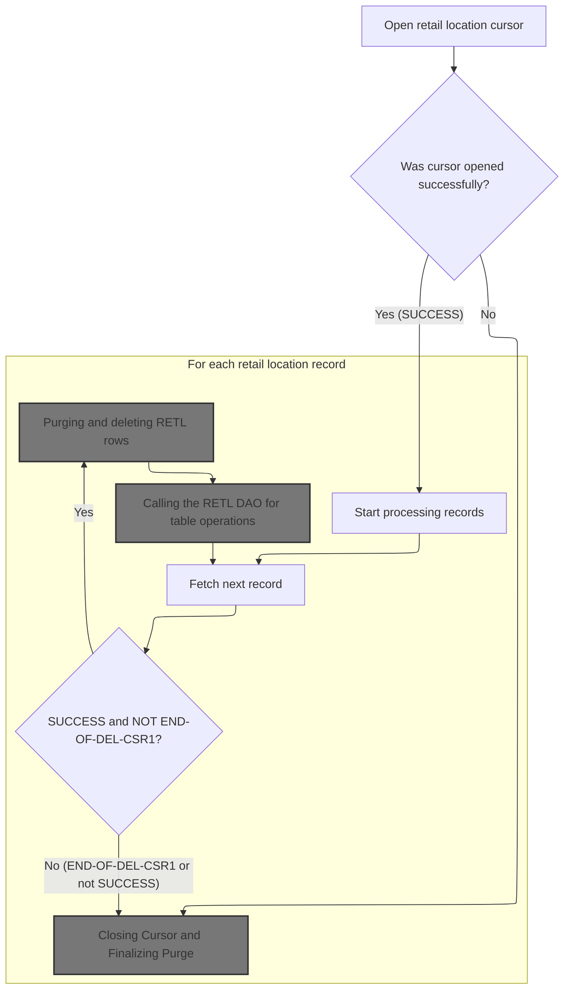

<SwmSnippet path="/base/src/NNNS0487.cbl" line="2722">

---

`1610-EXIT-PUT-PURGE-RETL` kicks off the purge/retrieval flow by setting the NOT-END-OF-DEL-CSR1 flag and calling 1611-OPEN-DEL-CSR1 to get the DEL-CSR1 cursor ready. The loop only runs if the cursor opens successfully, fetching and purging rows until the end-of-cursor or a failure. We call 1611-OPEN-DEL-CSR1 first because all subsequent fetches and purges require an open cursor to work against.

```cobol
279900 1610-EXIT-PUT-PURGE-RETL.                                        00279900
280000     SET NOT-END-OF-DEL-CSR1 TO TRUE                              00280000
280100     PERFORM 1611-OPEN-DEL-CSR1                                   00280100
280200     IF SUCCESS                                                   00280200
280300       PERFORM UNTIL END-OF-DEL-CSR1 OR NOT SUCCESS               00280300
280400         PERFORM 1612-FETCH-DEL-CSR1                              00280400
280500         IF SUCCESS AND NOT-END-OF-DEL-CSR1                       00280500
280600           PERFORM 1613-EXIT-PURGE-RETL                           00280600
280700           PERFORM 115-CONNECT-TO-ORACLE                          00280700
280800         END-IF                                                   00280800
280900       END-PERFORM                                                00280900
281000     END-IF                                                       00281000
281100     PERFORM 1614-CLOSE-DEL-CSR1                                  00281100
281200     .                                                            00281200
```

---

</SwmSnippet>

<SwmSnippet path="/base/src/NNNS0487.cbl" line="2738">

---

`1611-OPEN-DEL-CSR1` moves the location type and number into the host variables that the DEL-CSR1 cursor uses, then opens the cursor with EXEC SQL. If the open fails (SQLCODE not zero), it sets FAILURE and builds an error message for the caller to handle.

```cobol
281500 1611-OPEN-DEL-CSR1.                                              00281500
281600     MOVE LOC-TYP-CD                 OF DCLXXXATION               00281600
281700       TO LOC-TYP-CD                 OF DCLXXXL-LOC-CLS-AD-ZN     00281700
281800     MOVE LOC-NBR                    OF DCLXXXATION               00281800
281900       TO LOC-NBR                    OF DCLXXXL-LOC-CLS-AD-ZN     00281900
282000                                                                  00282000
282100     EXEC SQL                                                     00282100
282200       OPEN DEL-CSR1                                              00282200
282300     END-EXEC                                                     00282300
282400                                                                  00282400
282500     IF SQLCODE NOT = 0                                           00282500
282600       MOVE SQLCODE TO WS-SQLCODE                                 00282600
282700       SET  FAILURE TO TRUE                                       00282700
282800       MOVE SPACES  TO IS-RTRN-MSG-TXT                            00282800
282900       STRING 'NNNS0487 - ERROR OPENING DEL-CSR1, '               00282900
283000              'SQL=' WS-SQLCODE '.'                               00283000
283100              DELIMITED BY SIZE INTO IS-RTRN-MSG-TXT              00283100
283200     END-IF                                                       00283200
283300     .                                                            00283300
```

---

</SwmSnippet>

### Purging and deleting RETL rows

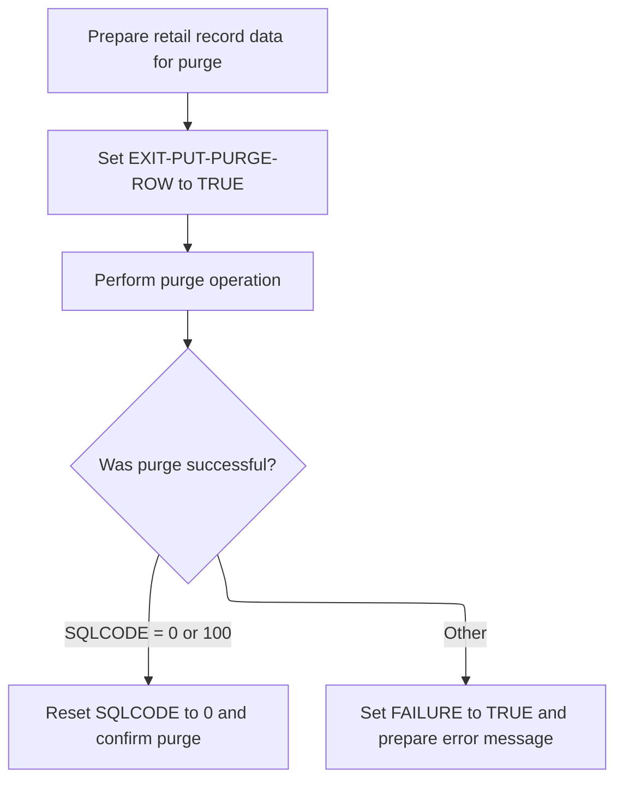

<SwmSnippet path="/base/src/NNNS0487.cbl" line="2782">

---

`1613-EXIT-PURGE-RETL` moves the necessary fields into P-DDDTCZ01, sets the EXIT-PUT-PURGE-ROW flag, and calls 4000-NNNS0473-RETL-DAO to run the actual purge/delete operation. Error handling is done based on SQLCODE after the call.

```cobol
285900 1613-EXIT-PURGE-RETL.                                            00285900
286000     MOVE ITM-CLS-CD         OF DCLXXXL-LOC-CLS-AD-ZN             00286000
286100       TO ITM-CLS-CD         OF P-DDDTCZ01                        00286100
286200     MOVE LOC-TYP-CD         OF DCLXXXL-LOC-CLS-AD-ZN             00286200
286300       TO LOC-TYP-CD         OF P-DDDTCZ01                        00286300
286400     MOVE LOC-NBR            OF DCLXXXL-LOC-CLS-AD-ZN             00286400
286500       TO LOC-NBR            OF P-DDDTCZ01                        00286500
286600                                                                  00286600
286700     SET EXIT-PUT-PURGE-ROW TO TRUE                               00286700
286800     PERFORM 4000-NNNS0473-RETL-DAO                               00286800
286900                                                                  00286900
287000     EVALUATE TRUE                                                00287000
287100       WHEN SQLCODE = 0 OR 100                                    00287100
287200         MOVE 0 TO SQLCODE                                        00287200
287300       WHEN OTHER                                                 00287300
287400         MOVE SQLCODE TO WS-SQLCODE                               00287400
287500         SET FAILURE TO TRUE                                      00287500
287600         MOVE SPACES  TO IS-RTRN-MSG-TXT                          00287600
287700         MOVE SQLCODE TO WS-SQLCODE                               00287700
287800         STRING 'NNNS0487 - Error in delete of RETL'              00287800
287900                'LOC ,RC=' WS-SQLCODE '.'                         00287900
288000                DELIMITED BY SIZE INTO IS-RTRN-MSG-TXT            00288000
288100     END-EVALUATE                                                 00288100
288200     .                                                            00288200
```

---

</SwmSnippet>

### Calling the RETL DAO for table operations

<SwmSnippet path="/base/src/NNNS0487.cbl" line="3333">

---

`4000-NNNS0473-RETL-DAO` calls NNNS0473-RETL-DAO, passing all the control and data structures needed for the table operation. This hands off the DB work to the DAO, which runs the actual SQL logic.

```cobol
341000 4000-NNNS0473-RETL-DAO.                                          00341000
341100     CALL NNNS0473-RETL-DAO USING                                 00341100
341200          XXXN001A                                                00341200
341300          SQLCA                                                   00341300
341400          YYYN005A                                                00341400
341500          NNNN0000-PARMS                                          00341500
341600          P-DDDTCZ01                                              00341600
341700     .                                                            00341700
```

---

</SwmSnippet>

### Dispatching table operations

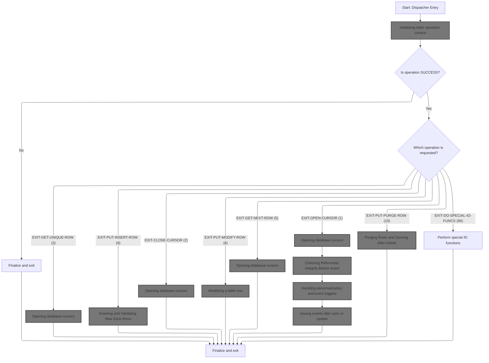

<SwmSnippet path="/base/src/NNNS0473.cbl" line="199">

---

`0000-EXIT-DISPATCHER` runs initialization, then uses EVALUATE to pick the right table operation based on the input flags. It calls the relevant subroutine for each case, then finalizes with 120-EXIT-STUFF.

```cobol
020800 0000-EXIT-DISPATCHER.                                            00020800
020900     PERFORM 100-INITIALIZATION                                   00020900
021000     EVALUATE TRUE                                                00021000
021100       WHEN NOT SUCCESS                                           00021100
021200          CONTINUE                                                00021200
021300       WHEN EXIT-OPEN-CURSOR                                      00021300
021400          PERFORM 1000-EXIT-OPEN-CURSOR                           00021400
021500       WHEN EXIT-CLOSE-CURSOR                                     00021500
021600          PERFORM 1100-EXIT-CLOSE-CURSOR                          00021600
021700       WHEN EXIT-GET-UNIQUE-ROW                                   00021700
021800          PERFORM 1200-EXIT-GET-UNIQUE-ROW                        00021800
021900       WHEN EXIT-GET-NEXT-ROW                                     00021900
022000          PERFORM 1300-EXIT-GET-NEXT-ROW                          00022000
022100       WHEN EXIT-PUT-MODIFY-ROW                                   00022100
022200          PERFORM 1400-EXIT-PUT-MODIFY-ROW                        00022200
022300       WHEN EXIT-PUT-INSERT-ROW                                   00022300
022400          PERFORM 1500-EXIT-PUT-INSERT-ROW                        00022400
022500       WHEN EXIT-PUT-PURGE-ROW                                    00022500
022600          PERFORM 1600-EXIT-PUT-PURGE-ROW                         00022600
022700       WHEN EXIT-DO-SPECIAL-IO-FUNCS                              00022700
022800          PERFORM 10000-DO-SPECIAL-IO-FUNCS                       00022800
022900     END-EVALUATE                                                 00022900
023000     PERFORM 120-EXIT-STUFF                                       00023000
023100     GOBACK                                                       00023100
023200     .                                                            00023200
```

---

</SwmSnippet>

#### Initializing table operation context

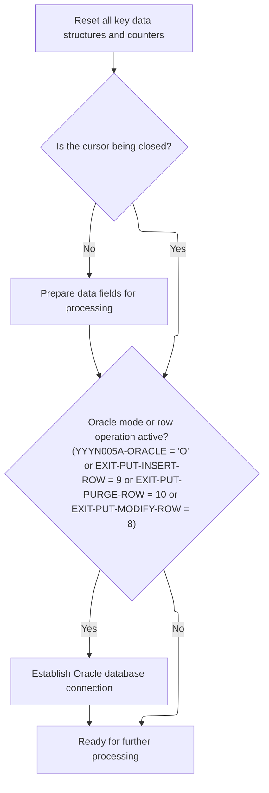

<SwmSnippet path="/base/src/NNNS0473.cbl" line="229">

---

`100-INITIALIZATION` sets up the index handle, resets checkpoint and SQL status, copies fields if needed, and connects to Oracle if the operation requires it. This preps everything for the table operation.

```cobol
023800 100-INITIALIZATION.                                              00023800
023900     INITIALIZE XXXN001A                                          00023900
024000                DAO-STATUS                                        00024000
024100     MOVE NNNN0000-INDEX-HANDLE TO DDDTCZ01-INDEX-HANDLE          00024100
024200     MOVE 0 TO WS-CHECKPOINT-INC                                  00024200
024300     MOVE 0 TO SQLCODE                                            00024300
024400     MOVE 0 TO SQL-INIT-FLAG                                      00024400
024500     IF NOT EXIT-CLOSE-CURSOR                                     00024500
024600       PERFORM 110-MOVE-PDA-FIELDS-2-DCL                          00024600
024700     END-IF                                                       00024700
024800     IF (YYYN005A-ORACLE       OR EXIT-PUT-INSERT-ROW             00024800
024900         OR EXIT-PUT-PURGE-ROW OR EXIT-PUT-MODIFY-ROW)            00024900
025000       PERFORM 115-CONNECT-TO-ORACLE                              00025000
025100     END-IF                                                       00025100
025200     .                                                            00025200
```

---

</SwmSnippet>

<SwmSnippet path="/base/src/NNNS0473.cbl" line="266">

---

`115-CONNECT-TO-ORACLE` calls Z-ORA-CONNECT to set up the Oracle DB connection. If it fails, it logs the error with SQLCODE for the caller to handle.

```cobol
027500 115-CONNECT-TO-ORACLE.                                           00027500
027600     CALL Z-ORA-CONNECT USING XXXN001A                            00027600
027700                              SQLCA                               00027700
027800                                                                  00027800
027900     IF NOT SUCCESS                                               00027900
028000       MOVE SQLCODE TO WS-SQLCODE                                 00028000
028100       MOVE SPACES  TO IS-RTRN-MSG-TXT                            00028100
028200       STRING 'NNNS0473 - Error connecting to Oracle. Sqlcode ='  00028200
028300               WS-SQLCODE                                         00028300
028400               DELIMITED BY SIZE INTO IS-RTRN-MSG-TXT             00028400
028500     END-IF                                                       00028500
028600     .                                                            00028600
```

---

</SwmSnippet>

#### Opening database cursors

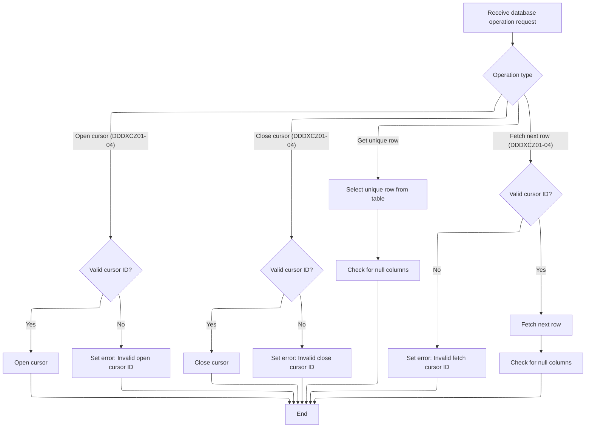

<SwmSnippet path="/base/src/NNNS0473.cbl" line="327">

---

`1000-EXIT-OPEN-CURSOR` uses EVALUATE to pick which cursor to open based on the ID. If the ID isn't valid, it sets FAILURE and logs an error message for the caller.

```cobol
033600 1000-EXIT-OPEN-CURSOR.                                           00033600
033700     EVALUATE TRUE                                                00033700
033800       WHEN DDDXCZ01                                              00033800
033900         EXEC SQL                                                 00033900
034000           OPEN DDDXCZ01                                          00034000
034100         END-EXEC                                                 00034100
034200       WHEN DDDXCZ02                                              00034200
034300         EXEC SQL                                                 00034300
034400           OPEN DDDXCZ02                                          00034400
034500         END-EXEC                                                 00034500
034600       WHEN DDDXCZ03                                              00034600
034700         EXEC SQL                                                 00034700
034800           OPEN DDDXCZ03                                          00034800
034900         END-EXEC                                                 00034900
035000       WHEN DDDXCZ04                                              00035000
035100         EXEC SQL                                                 00035100
035200           OPEN DDDXCZ04                                          00035200
035300         END-EXEC                                                 00035300
035400       WHEN OTHER                                                 00035400
035500         SET FAILURE TO TRUE                                      00035500
035600         MOVE 'NNNS0473 - Invalid open cursor ID.'                00035600
035700           TO IS-RTRN-MSG-TXT OF XXXN001A                         00035700
035800     END-EVALUATE                                                 00035800
035900     .                                                            00035900
```

---

</SwmSnippet>

<SwmSnippet path="/base/src/NNNS0473.cbl" line="353">

---

`1100-EXIT-CLOSE-CURSOR` closes the cursor for the given ID using EVALUATE. If the ID isn't valid, it sets FAILURE and logs an error message for the caller.

```cobol
036200 1100-EXIT-CLOSE-CURSOR.                                          00036200
036300     EVALUATE TRUE                                                00036300
036400       WHEN DDDXCZ01                                              00036400
036500         EXEC SQL                                                 00036500
036600           CLOSE DDDXCZ01                                         00036600
036700         END-EXEC                                                 00036700
036800       WHEN DDDXCZ02                                              00036800
036900         EXEC SQL                                                 00036900
037000           CLOSE DDDXCZ02                                         00037000
037100         END-EXEC                                                 00037100
037200       WHEN DDDXCZ03                                              00037200
037300         EXEC SQL                                                 00037300
037400           CLOSE DDDXCZ03                                         00037400
037500         END-EXEC                                                 00037500
037600       WHEN DDDXCZ04                                              00037600
037700         EXEC SQL                                                 00037700
037800           CLOSE DDDXCZ04                                         00037800
037900         END-EXEC                                                 00037900
038000       WHEN OTHER                                                 00038000
038100         SET FAILURE TO TRUE                                      00038100
038200         MOVE 'NNNS0473 - Invalid close cursor ID.'               00038200
038300           TO IS-RTRN-MSG-TXT OF XXXN001A                         00038300
038400     END-EVALUATE                                                 00038400
038500     .                                                            00038500
```

---

</SwmSnippet>

<SwmSnippet path="/base/src/NNNS0473.cbl" line="379">

---

`1200-EXIT-GET-UNIQUE-ROW` fetches a row from the DB using the host variables for both filtering and output, then checks for null columns to make sure the data is valid.

```cobol
038800 1200-EXIT-GET-UNIQUE-ROW.                                        00038800
038900     EXEC SQL                                                     00038900
039000         SELECT LOC_TYP_CD,                                       00039000
039100                LOC_NBR,                                          00039100
039200                ITM_CLS_CD,                                       00039200
039300                AD_ZONE,                                          00039300
039400                AD_ZONE_EXCP                                      00039400
039500         INTO   :DCLXXXL-LOC-CLS-AD-ZN.LOC-TYP-CD,                00039500
039600                :DCLXXXL-LOC-CLS-AD-ZN.LOC-NBR,                   00039600
039700                :DCLXXXL-LOC-CLS-AD-ZN.ITM-CLS-CD,                00039700
039800                :DCLXXXL-LOC-CLS-AD-ZN.AD-ZONE,                   00039800
039900                :DCLXXXL-LOC-CLS-AD-ZN.AD-ZONE-EXCP               00039900
040000         FROM   XXXL_LOC_CLS_AD_ZN                                00040000
040100         WHERE  LOC_TYP_CD = :DCLXXXL-LOC-CLS-AD-ZN.LOC-TYP-CD    00040100
040200         AND    LOC_NBR = :DCLXXXL-LOC-CLS-AD-ZN.LOC-NBR          00040200
040300         AND    ITM_CLS_CD = :DCLXXXL-LOC-CLS-AD-ZN.ITM-CLS-CD    00040300
040400     END-EXEC                                                     00040400
040500                                                                  00040500
040600     PERFORM 1700-CHECK-NULL-COLUMNS                              00040600
040700     .                                                            00040700
```

---

</SwmSnippet>

<SwmSnippet path="/base/src/NNNS0473.cbl" line="401">

---

`1300-EXIT-GET-NEXT-ROW` dispatches to the right fetch routine based on the cursor ID, then checks for null columns. If the ID is invalid, it flags failure and logs an error.

```cobol
041000 1300-EXIT-GET-NEXT-ROW.                                          00041000
041100     EVALUATE TRUE                                                00041100
041200       WHEN DDDXCZ01                                              00041200
041300         PERFORM 1301-FETCH-DDDXCZ01                              00041300
041400       WHEN DDDXCZ02                                              00041400
041500         PERFORM 1302-FETCH-DDDXCZ02                              00041500
041600       WHEN DDDXCZ03                                              00041600
041700         PERFORM 1303-FETCH-DDDXCZ03                              00041700
041800       WHEN DDDXCZ04                                              00041800
041900         PERFORM 1304-FETCH-DDDXCZ04                              00041900
042000       WHEN OTHER                                                 00042000
042100         SET FAILURE TO TRUE                                      00042100
042200         MOVE 'NNNS0473 - Invalid fetch cursor ID.'               00042200
042300           TO IS-RTRN-MSG-TXT OF XXXN001A                         00042300
042400     END-EVALUATE                                                 00042400
042500                                                                  00042500
042600     PERFORM 1700-CHECK-NULL-COLUMNS                              00042600
042700     .                                                            00042700
```

---

</SwmSnippet>

#### Modifying a table row

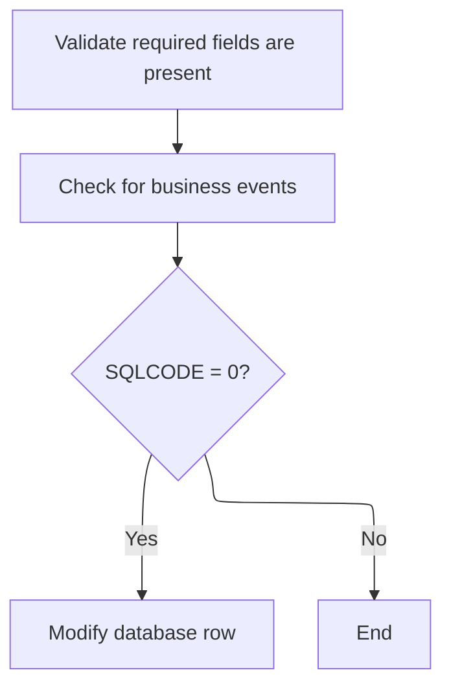

<SwmSnippet path="/base/src/NNNS0473.cbl" line="469">

---

`1400-EXIT-PUT-MODIFY-ROW` edits null indicators, checks for events, and only runs the actual modify routine if SQLCODE is 0. This keeps updates safe and only runs them when previous steps succeeded.

```cobol
047800 1400-EXIT-PUT-MODIFY-ROW.                                        00047800
047900     PERFORM 1800-EDIT-NULL-INDICATORS                            00047900
048000     PERFORM 1410-CHECK-FOR-EVENTS                                00048000
048100     IF SQLCODE = 0                                               00048100
048200       PERFORM 1420-D0-MODIFY-ROW                                 00048200
048300     END-IF                                                       00048300
048400     .                                                            00048400
```

---

</SwmSnippet>

#### Updating the database row and triggering sync

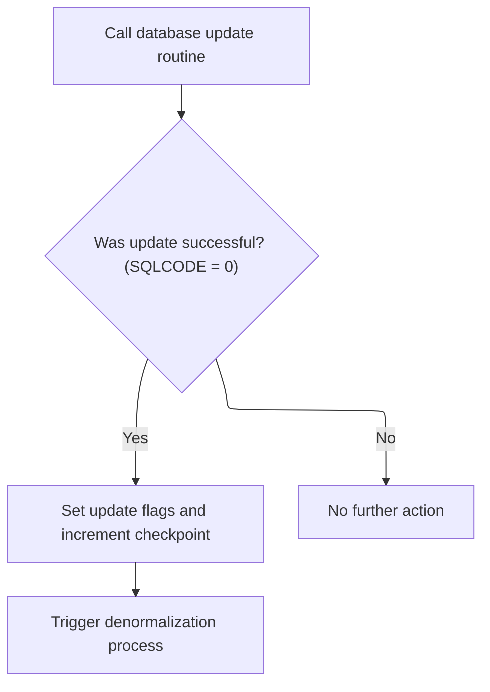

<SwmSnippet path="/base/src/NNNS0473.cbl" line="483">

---

`1420-D0-MODIFY-ROW` calls the CUD routine to update the DB row, then sets checkpoint and update flags if it worked, and runs denormalization logic.

```cobol
049200 1420-D0-MODIFY-ROW.                                              00049200
050900     PERFORM 5000-CALL-NNNS0473-CUD-ROUTINE                       00050900
051000     IF SQLCODE = 0                                               00051000
051100       MOVE 1 TO WS-CHECKPOINT-INC                                00051100
051200       SET YYYN110A-UPD TO TRUE                                   00051200
051300       SET LOC-UPD      TO TRUE                                   00051300
051400       PERFORM 2000-DENORM-PROCESS                                00051400
051500     END-IF                                                       00051500
051600     .                                                            00051600
```

---

</SwmSnippet>

#### Calling the Oracle update routine

<SwmSnippet path="/base/src/NNNS0473.cbl" line="639">

---

`5000-CALL-NNNS0473-CUD-ROUTINE` calls NNNU0473-ORACLE-UPDATE to run the DB update, passing all the control and data structures needed for the operation.

```cobol
066400 5000-CALL-NNNS0473-CUD-ROUTINE.                                  00066400
066410     CALL NNNU0473-ORACLE-UPDATE USING                            00066410
066420          XXXN001A                                                00066420
066430          SQLCA                                                   00066430
066440          YYYN005A                                                00066440
066450          NNNN0000-PARMS                                          00066450
066460          DDDTCZ01                                                00066460
066470     .                                                            00066470
```

---

</SwmSnippet>

#### Central dispatcher for DB operations

See <SwmLink doc-title="Processing row operations">[Processing row operations](\.swm\processing-row-operations.tmzrry1d.sw.md)</SwmLink>

#### Handling denormalization and event triggers

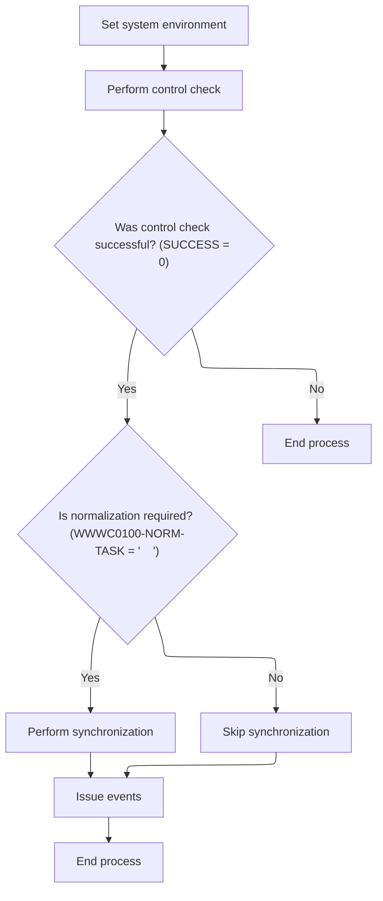

<SwmSnippet path="/base/src/NNNS0473.cbl" line="540">

---

`2000-DENORM-PROCESS` moves system environment data, calls the control subroutine, and if successful, runs sync and event routines based on flags.

```cobol
058200 2000-DENORM-PROCESS.                                             00058200
058300     MOVE YYYN005A-SYS-ENV      TO YYYN110A-SYS-ENV               00058300
058400     PERFORM 2010-CALL-CONTROL-SUBR                               00058400
058500     IF  SUCCESS                                                  00058500
058600     AND WWWC0100-NORM-TASK                                       00058600
058700       PERFORM 2020-CALL-SYNC-SUBR                                00058700
058800     END-IF                                                       00058800
058900     IF SUCCESS                                                   00058900
059200          PERFORM 2030-ISSUE-EVENTS                               00059200
059400     END-IF                                                       00059400
059500     .                                                            00059500
```

---

</SwmSnippet>

#### Calling the sync subroutine for class zones

<SwmSnippet path="/base/src/NNNS0473.cbl" line="561">

---

`2020-CALL-SYNC-SUBR` sets the flags for last call and Oracle, marks the class zone as current, and calls MMMS0161-SYNC-CZ to run the sync logic.

```cobol
060600 2020-CALL-SYNC-SUBR.                                             00060600
060700     SET YYYN110A-LAST-CALL     TO TRUE                           00060700
060710     SET YYYN110A-ORACLE        TO TRUE                           00060710
060800     SET MMMC0161-CZ-IS-CURRENT TO TRUE                           00060800
060900     CALL MMMS0161-SYNC-CZ USING                                  00060900
061000         XXXN001A                                                 00061000
061100         YYYN110A                                                 00061100
061200         MMMC0161                                                 00061200
061300         P-DDDTCZ01                                               00061300
061400     .                                                            00061400
```

---

</SwmSnippet>

#### Main entry for class zone sync and delete

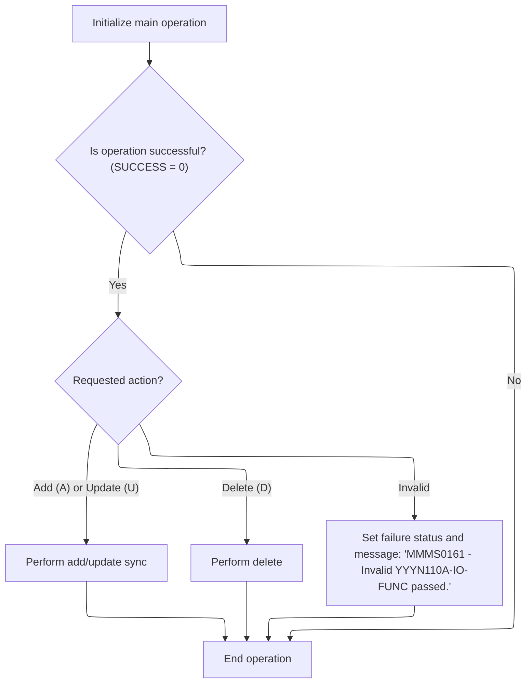

<SwmSnippet path="/base/src/MMMS0161.cbl" line="82">

---

`000-MAIN` runs initialization, then picks sync or delete based on the IO-FUNC value. If the value isn't valid, it flags failure and sets an error message.

```cobol
009000 000-MAIN.                                                        00009000
009100     PERFORM 100-INITIALIZE                                       00009100
009200                                                                  00009200
009300     IF SUCCESS                                                   00009300
009400       EVALUATE TRUE                                              00009400
009500         WHEN YYYN110A-ADD                                        00009500
009600         OR   YYYN110A-UPD                                        00009600
009700           PERFORM 1000-DO-THE-SYNC                               00009700
009800                                                                  00009800
009900         WHEN YYYN110A-DEL                                        00009900
010000           PERFORM 2000-DO-THE-DELETE                             00010000
010100                                                                  00010100
010200         WHEN OTHER                                               00010200
010300           SET FAILURE TO TRUE                                    00010300
010400           MOVE 'MMMS0161 - Invalid YYYN110A-IO-FUNC passed.'     00010400
010500             TO IS-RTRN-MSG-TXT                                   00010500
010600       END-EVALUATE                                               00010600
010700     END-IF                                                       00010700
010800                                                                  00010800
010900     GOBACK                                                       00010900
011000     .                                                            00011000
```

---

</SwmSnippet>

#### Initializing sync/delete context and validating location type

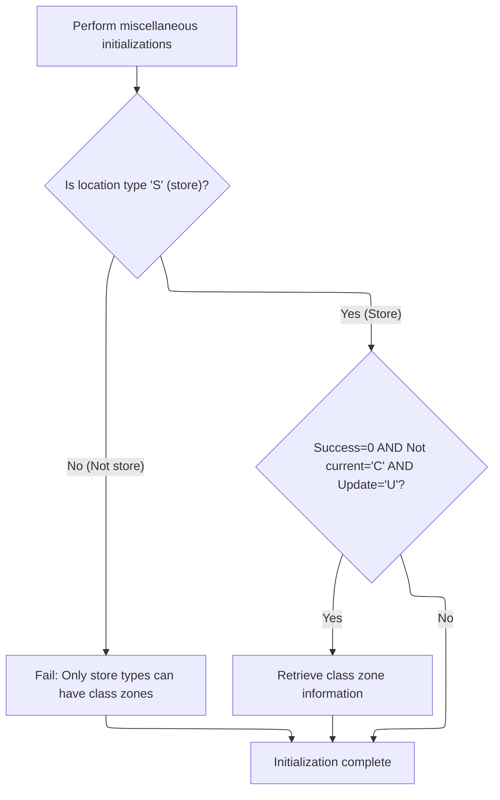

<SwmSnippet path="/base/src/MMMS0161.cbl" line="108">

---

`100-INITIALIZE` checks if the location type is 'S' (store) and errors out if not. If the flags are right, it calls 120-GET-CZ to fetch class zone data.

```cobol
011600 100-INITIALIZE.                                                  00011600
011700     PERFORM 110-MISC-INITS                                       00011700
011800                                                                  00011800
011900     IF LOC-TYP-CD OF P-DDDTCZ01 NOT = K-STORE-LOC-TYPE           00011900
012000       SET FAILURE TO TRUE                                        00012000
012100       MOVE 'MMMS0161 - only store types can have class zones!'   00012100
012200         TO IS-RTRN-MSG-TXT                                       00012200
012300     END-IF                                                       00012300
012400                                                                  00012400
012500     IF  SUCCESS                                                  00012500
012600     AND MMMC0161-CZ-IS-NOT-CURRENT                               00012600
012700     AND YYYN110A-UPD                                             00012700
012800       PERFORM 120-GET-CZ                                         00012800
012900     END-IF                                                       00012900
013000     .                                                            00013000
```

---

</SwmSnippet>

<SwmSnippet path="/base/src/MMMS0161.cbl" line="125">

---

`110-MISC-INITS` sets up flags for CICS, batch, or Oracle environments based on the input, and errors out if the environment is invalid.

```cobol
013300 110-MISC-INITS.                                                  00013300
013400     INITIALIZE XXXN001A                                          00013400
013500                DDDPST01                                          00013500
013600                P-DDDTRL01                                        00013600
013700                                                                  00013700
013800     EVALUATE TRUE                                                00013800
013900       WHEN YYYN110A-CICS-ENV                                     00013900
014000         SET YYYN005A-CICS-ENV        TO TRUE                     00014000
014100       WHEN YYYN110A-BATCH-ENV                                    00014100
014200         SET YYYN005A-BATCH-ENV       TO TRUE                     00014200
014300       WHEN OTHER                                                 00014300
014400         SET FAILURE TO TRUE                                      00014400
014500         MOVE 'MMMS0161 - Invalid environment variable.'          00014500
014600           TO IS-RTRN-MSG-TXT                                     00014600
014700     END-EVALUATE                                                 00014700
014710     IF YYYN110A-ORACLE                                           00014710
014720         SET YYYN005A-ORACLE  TO TRUE                             00014720
014730     END-IF                                                       00014730
014800     .                                                            00014800
```

---

</SwmSnippet>

<SwmSnippet path="/base/src/MMMS0161.cbl" line="146">

---

`120-GET-CZ` calls NNNS0473-CZ-DAO to fetch a unique row, then checks the result and sets error messages if no data is found or if there's an SQL error.

```cobol
015100 120-GET-CZ.                                                      00015100
015200     SET EXIT-GET-UNIQUE-ROW TO TRUE                              00015200
015300     CALL NNNS0473-CZ-DAO USING                                   00015300
015400         XXXN001A                                                 00015400
015500         SQLCA                                                    00015500
015600         YYYN005A                                                 00015600
015700         NNNN0000-PARMS                                           00015700
015800         P-DDDTCZ01                                               00015800
015900                                                                  00015900
016000     EVALUATE TRUE                                                00016000
016100       WHEN NOT SUCCESS                                           00016100
016200         CONTINUE                                                 00016200
016300                                                                  00016300
016400       WHEN SQLCODE = 100                                         00016400
016500         SET  FAILURE                 TO TRUE                     00016500
016600         MOVE 'MMMS0161 - Store/Cls/Zone does not exist!'         00016600
016700           TO IS-RTRN-MSG-TXT                                     00016700
016800                                                                  00016800
016900       WHEN SQLCODE NOT = 0                                       00016900
017000         MOVE SQLCODE                 TO WS-SQLCODE               00017000
017100         SET  FAILURE                 TO TRUE                     00017100
017200         MOVE SPACES                  TO IS-RTRN-MSG-TXT          00017200
017300         STRING 'MMMS0161 - Failure getting Cls Ad Zn, SQLCODE='  00017300
017400                 WS-SQLCODE                                       00017400
017500                 DELIMITED BY SIZE                                00017500
017600                 INTO IS-RTRN-MSG-TXT                             00017600
017700     END-EVALUATE                                                 00017700
017800     .                                                            00017800
```

---

</SwmSnippet>

#### Syncing class zone data

See <SwmLink doc-title="Synchronizing Store Data">[Synchronizing Store Data](\.swm\synchronizing-store-data.3jxzxf6s.sw.md)</SwmLink>

#### Deleting class zone data

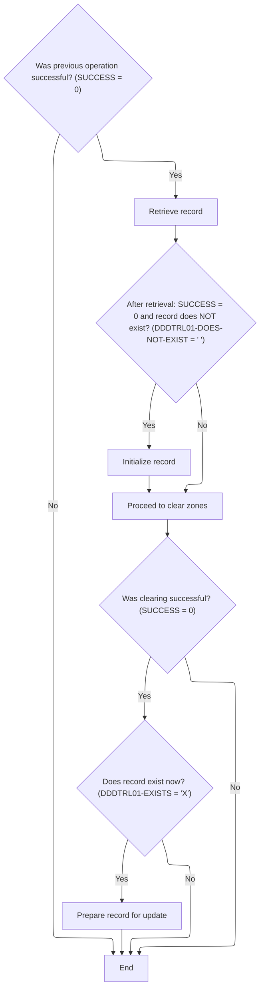

<SwmSnippet path="/base/src/MMMS0161.cbl" line="270">

---

`2000-DO-THE-DELETE` checks if the record exists, clears zone data if needed, and updates the record if the right flags are set.

```cobol
027500 2000-DO-THE-DELETE.                                              00027500
027600     IF SUCCESS                                                   00027600
027700       PERFORM 1400-GET-DDDTRL01                                  00027700
027800       IF  NOT SUCCESS                                            00027800
027900       AND DDDTRL01-DOES-NOT-EXIST                                00027900
028000         INITIALIZE XXXN001A                                      00028000
028100       END-IF                                                     00028100
028200     END-IF                                                       00028200
028300                                                                  00028300
028400     IF SUCCESS                                                   00028400
028500       PERFORM 2010-CLEAR-ZONE                                    00028500
028600       IF SUCCESS                                                 00028600
028700         IF DDDTRL01-EXISTS                                       00028700
028800           PERFORM 1520-READY-UPD-DDDTRL01                        00028800
028900         END-IF                                                   00028900
029000       END-IF                                                     00029000
029100     END-IF                                                       00029100
029200     .                                                            00029200
```

---

</SwmSnippet>

<SwmSnippet path="/base/src/MMMS0161.cbl" line="290">

---

`2010-CLEAR-ZONE` only clears zone data for specific class codes (12, 13, 14, 36, 37). If the code isn't one of these, nothing happens.

```cobol
029500 2010-CLEAR-ZONE.                                                 00029500
029600     EVALUATE ITM-CLS-CD                                          00029600
029700      WHEN 12                                                     00029700
029800        INITIALIZE ST-CLASS12-ZONE                                00029800
029900                   ST-CLASS12-EXCEPTION-AD-ZONE                   00029900
030000                   FC-RL-CL12-ZONE-NO                             00030000
030100                   FC-RL-CL12-ADZN-NO                             00030100
030200      WHEN 13                                                     00030200
030300        INITIALIZE ST-CLASS13-ZONE                                00030300
030400                   ST-CLASS13-EXCEPTION-AD-ZONE                   00030400
030500                   FC-RL-CL13-ZONE-NO                             00030500
030600                   FC-RL-CL13-ADZN-NO                             00030600
030700      WHEN 14                                                     00030700
030800        INITIALIZE ST-CLASS14-ZONE                                00030800
030900                   ST-CLASS14-EXCEPTION-AD-ZONE                   00030900
031000                   FC-RL-CL14-ZONE-NO                             00031000
031100                   FC-RL-CL14-ADZN-NO                             00031100
031200      WHEN 36                                                     00031200
031300        INITIALIZE ST-CLASS36-EXCEPTION-AD-ZONE                   00031300
031400                   FC-RL-CL36-ADZN-NO                             00031400
031500      WHEN 37                                                     00031500
031600        INITIALIZE ST-CLASS37-EXCEPTION-AD-ZONE                   00031600
031700                   FC-RL-CL37-ADZN-NO                             00031700
031800     END-EVALUATE                                                 00031800
031900     .                                                            00031900
```

---

</SwmSnippet>

#### Issuing events after sync or update

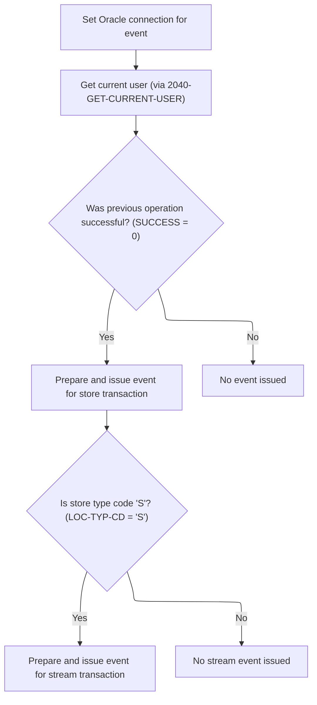

<SwmSnippet path="/base/src/NNNS0473.cbl" line="573">

---

`2030-ISSUE-EVENTS` sets up and calls the event manager for both 'CUST' and 'STRM' events if the location is a store, using repo-specific structures and constants for the payloads.

```cobol
061700 2030-ISSUE-EVENTS.                                               00061700
061710     SET YYYN110A-ORACLE        TO TRUE                           00061710
061800     PERFORM 2040-GET-CURRENT-USER                                00061800
061900     IF SUCCESS                                                   00061900
062000       MOVE LOC-NBR OF P-DDDTCZ01 TO ST-STORE-NUMBER OF ZZZC0032  00062000
062100                                     LOC-NBR OF ZZZC0094          00062100
062200       SET  ZZZC0032-UPD-FXXX     TO TRUE                         00062200
062300       MOVE ZZZC0032              TO ZZZC0197-TRX-REC             00062300
062400       MOVE 'CUST'                TO ZZZC0197-TRX-ID              00062400
062500       MOVE 'NNNS0473'            TO ZZZC0197-PROGRAM             00062500
062600       MOVE YYYC0107-USER         TO ZZZC0197-USER                00062600
062700       MOVE YYYN005A-SYS-ENV      TO YYYN110A-SYS-ENV             00062700
062800       CALL ZZZS0197-EVENT-MGR USING                              00062800
062900           XXXN001A                                               00062900
063000           YYYN110A                                               00063000
063100           ZZZC0197                                               00063100
063200                                                                  00063200
063300       EVALUATE TRUE                                              00063300
063400                                                                  00063400
063500       WHEN LOC-TYP-CD   OF P-DDDTCZ01 = K-STORE-LOC-TYPE         00063500
063600         MOVE LOC-TYP-CD OF P-DDDTCZ01 TO                         00063600
063700                                       LOC-TYP-CD OF ZZZC0094     00063700
063800         MOVE ZZZC0094              TO ZZZC0197-TRX-REC           00063800
063900         MOVE 'STRM'                TO ZZZC0197-TRX-ID            00063900
064000         MOVE 'NNNS0473'            TO ZZZC0197-PROGRAM           00064000
064100         MOVE YYYC0107-USER         TO ZZZC0197-USER              00064100
064200         MOVE YYYN005A-SYS-ENV      TO YYYN110A-SYS-ENV           00064200
064300         CALL ZZZS0197-EVENT-MGR USING                            00064300
064400              XXXN001A                                            00064400
064500              YYYN110A                                            00064500
064600              ZZZC0197                                            00064600
064700                                                                  00064700
064800       END-EVALUATE                                               00064800
064900     END-IF                                                       00064900
065000     .                                                            00065000
```

---

</SwmSnippet>

<SwmSnippet path="/base/src/NNNS0473.cbl" line="610">

---

2040-GET-CURRENT-USER checks if the operation succeeded and if we're running in CICS. If both are true, it calls Z-GET-CICS-USER-ID to get the user ID; otherwise, it sets the user to 'BATCH'. This is how the repo decides which user context to use for downstream logic, based on environment and success status.

```cobol
065300 2040-GET-CURRENT-USER.                                           00065300
065400     IF  SUCCESS                                                  00065400
065500     AND YYYN005A-CICS-ENV                                        00065500
065600       CALL Z-GET-CICS-USER-ID USING                              00065600
065700           EIBLK    WS-DUMMY                                      00065700
065800           XXXN001A YYYC0107                                      00065800
065900     ELSE                                                         00065900
066000       MOVE 'BATCH' TO YYYC0107-USER                              00066000
066100     END-IF                                                       00066100
066200     .                                                            00066200
```

---

</SwmSnippet>

#### Inserting and Validating New Zone Rows

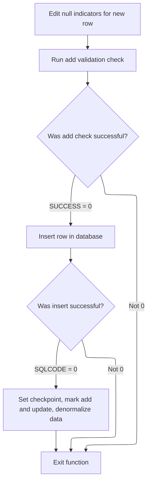

<SwmSnippet path="/base/src/NNNS0473.cbl" line="494">

---

1500-EXIT-PUT-INSERT-ROW runs a null indicator edit, calls an external RI/insertion check, and only if that passes, updates the DB, sets add/update flags, bumps the checkpoint, and kicks off denormalization. Each step is conditional and repo-specific, not just a straight insert.

```cobol
051900 1500-EXIT-PUT-INSERT-ROW.                                        00051900
052000     PERFORM 1800-EDIT-NULL-INDICATORS                            00052000
052100                                                                  00052100
052200     PERFORM 4600-CALL-MMMS0335-RI-ADD-CHK                        00052200
052300     IF SUCCESS                                                   00052300
053600        PERFORM 5000-CALL-NNNS0473-CUD-ROUTINE                    00053600
053700        IF SQLCODE = 0                                            00053700
053800           MOVE 1 TO WS-CHECKPOINT-INC                            00053800
053900           SET YYYN110A-ADD TO TRUE                               00053900
054000           SET LOC-UPD      TO TRUE                               00054000
054100           PERFORM 2000-DENORM-PROCESS                            00054100
054200        END-IF                                                    00054200
054210     END-IF                                                       00054210
054300     .                                                            00054300
```

---

</SwmSnippet>

#### Checking Referential Integrity Before Insert

<SwmSnippet path="/base/src/NNNS0473.cbl" line="622">

---

4600-CALL-MMMS0335-RI-ADD-CHK preps the data and calls MMMS0335 to validate the insert against RI rules.

```cobol
066320 4600-CALL-MMMS0335-RI-ADD-CHK.                                   00066320
066330     INITIALIZE MMMC0335                                          00066330
066340     MOVE ITM-CLS-CD                   OF DCLXXXL-LOC-CLS-AD-ZN   00066340
066350                                       TO MMMC0335-ITM-CLS-CD     00066350
066360     MOVE AD-ZONE-EXCP                 OF DCLXXXL-LOC-CLS-AD-ZN   00066360
066370                                       TO MMMC0335-AD-ZONE-EXCP   00066370
066371     MOVE AD-ZONE                      OF DCLXXXL-LOC-CLS-AD-ZN   00066371
066372                                       TO MMMC0335-AD-ZONE        00066372
066380     SET   MMMC0335-INSERT-CHECK       TO TRUE                    00066380
066390     SET   MMMC0335-XXXL-LOC-CLS-AD-ZN TO TRUE                    00066390
066391     SET   MMMC0335-ORACLE             TO TRUE                    00066391
066392     CALL  MMMC0335-RI-INSERT-CHK      USING                      00066392
066393           XXXN001A                                               00066393
066394           MMMC0335                                               00066394
066395     .                                                            00066395
```

---

</SwmSnippet>

#### Mainline Entry and Control Dispatch

See <SwmLink doc-title="Processing Table-Based Business Operations">[Processing Table-Based Business Operations](\.swm\processing-table-based-business-operations.tzrb9vn3.sw.md)</SwmLink>

#### Purging Rows and Syncing After Delete

<SwmSnippet path="/base/src/NNNS0473.cbl" line="510">

---

1600-EXIT-PUT-PURGE-ROW calls the DB update routine to delete a row, and if that works, sets delete/update flags, bumps the checkpoint, and runs denormalization to sync related tables and trigger events.

```cobol
054600 1600-EXIT-PUT-PURGE-ROW.                                         00054600
055300     PERFORM 5000-CALL-NNNS0473-CUD-ROUTINE                       00055300
055400     IF SQLCODE = 0                                               00055400
055500       MOVE 1 TO WS-CHECKPOINT-INC                                00055500
055600       SET YYYN110A-DEL TO TRUE                                   00055600
055700       SET LOC-UPD      TO TRUE                                   00055700
055800       PERFORM 2000-DENORM-PROCESS                                00055800
055900     END-IF                                                       00055900
056000     .                                                            00056000
```

---

</SwmSnippet>

### Finalizing Transaction and Handling DB2 Connection

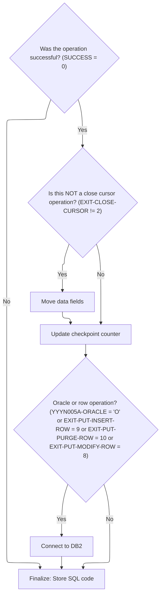

<SwmSnippet path="/base/src/NNNS0473.cbl" line="282">

---

120-EXIT-STUFF checks transaction status and exit codes, moves data fields if the operation worked and the cursor isn't closing, bumps the checkpoint, connects to DB2 if certain flags are set, and tracks SQLCODE for later error handling.

```cobol
029100 120-EXIT-STUFF.                                                  00029100
029200     IF SUCCESS                                                   00029200
029300       IF NOT EXIT-CLOSE-CURSOR                                   00029300
029400         PERFORM 130-MOVE-DCL-2-PDA-FIELDS                        00029400
029500       END-IF                                                     00029500
029600       ADD WS-CHECKPOINT-INC TO YYYN005A-CHKPT-CNT                00029600
029700     END-IF                                                       00029700
029800     IF (YYYN005A-ORACLE       OR EXIT-PUT-INSERT-ROW             00029800
029900         OR EXIT-PUT-PURGE-ROW OR EXIT-PUT-MODIFY-ROW)            00029900
030000        PERFORM 125-CONNECT-TO-DB2                                00030000
030100     END-IF                                                       00030100
030200     MOVE SQLCODE            TO DB2-SQL-CODE                      00030200
030300     .                                                            00030300
```

---

</SwmSnippet>

<SwmSnippet path="/base/src/NNNS0473.cbl" line="300">

---

125-CONNECT-TO-DB2 calls Z-DB2-CONNECT, passing the control and SQLCA structures. This hands off DB2 connection setup and error handling to a shared routine, keeping connection logic consistent.

```cobol
030900 125-CONNECT-TO-DB2.                                              00030900
031000     CALL Z-DB2-CONNECT         USING XXXN001A                    00031000
031100                                      SQLCA                       00031100
031200     .                                                            00031200
```

---

</SwmSnippet>

### Closing Cursor and Finalizing Purge

<SwmSnippet path="/base/src/NNNS0487.cbl" line="2808">

---

1614-CLOSE-DEL-CSR1 moves location type and number fields to the target struct, then closes the DEL-CSR1 cursor with embedded SQL. If closing fails, it sets the failure flag and builds an error message with the SQL code.

```cobol
288500 1614-CLOSE-DEL-CSR1.                                             00288500
288600     MOVE LOC-TYP-CD                 OF DCLXXXATION               00288600
288700       TO LOC-TYP-CD                 OF DCLXXXL-LOC-CLS-AD-ZN     00288700
288800     MOVE LOC-NBR                    OF DCLXXXATION               00288800
288900       TO LOC-NBR                    OF DCLXXXL-LOC-CLS-AD-ZN     00288900
289000                                                                  00289000
289100     EXEC SQL                                                     00289100
289200       CLOSE DEL-CSR1                                             00289200
289300     END-EXEC                                                     00289300
289400                                                                  00289400
289500     IF SQLCODE NOT = 0                                           00289500
289600       MOVE SQLCODE TO WS-SQLCODE                                 00289600
289700       SET  FAILURE TO TRUE                                       00289700
289800       MOVE SPACES  TO IS-RTRN-MSG-TXT                            00289800
289900       STRING 'NNNS0487 - Error closing DEL-CSR1, '               00289900
290000              'SQL=' WS-SQLCODE '.'                               00290000
290100              DELIMITED BY SIZE INTO IS-RTRN-MSG-TXT              00290100
290200     END-IF                                                       00290200
290300     .                                                            00290300
```

---

</SwmSnippet>

&nbsp;

*This is an auto-generated document by Swimm 🌊 and has not yet been verified by a human*

<SwmMeta version="3.0.0" repo-id="Z2l0aHViJTNBJTNBU3dpbW1pby1keW5jYWxsLWRlbW8lM0ElM0FHaXJpLVN3aW1t" repo-name="Swimmio-dyncall-demo"><sup>Powered by [Swimm](https://app.swimm.io/)</sup></SwmMeta>
