This document describes the flow for purging retail rows for a specific location and class, supporting data maintenance and integrity. The process opens a cursor to access records, loops through each to prepare and purge, and invokes the DAO for database operations. After all records are processed, the transaction is finalized and the cursor is closed.

# Spec

## Detailed View of the Program's Functionality

# Purging RETL Rows and Opening the DEL-CSR1 Cursor

## a. Opening the DEL-CSR1 Cursor

The process begins by preparing to purge rows from a specific table. The logic sets a flag indicating that the end of the cursor has not been reached. It then performs a routine to open a database cursor (DEL-CSR1), which is used to select records for purging. This involves copying the location type code and location number from one data structure (representing the current location) into another structure used for the SQL operation. The cursor is then opened using an embedded SQL statement. If the open operation fails (i.e., the SQL return code is not zero), the code sets a failure flag and constructs an error message containing the SQL error code for diagnostics.

## b. Looping Through Records to Purge

If the cursor is opened successfully, the code enters a loop that continues as long as there are more records to process and the last operation was successful. Inside the loop, it fetches the next record from the cursor. If the fetch is successful and the end of the cursor has not been reached, it proceeds to prepare the data for purging and invokes the data access object (DAO) logic to perform the actual purge. After each purge attempt, it reconnects to Oracle to ensure the database connection is valid for the next operation. If the fetch fails or the end of the cursor is reached, the loop exits.

## c. Closing the DEL-CSR1 Cursor

After all records have been processed (or if an error occurs), the code performs a routine to close the DEL-CSR1 cursor. This again involves copying the location type code and number into the appropriate structure and issuing an embedded SQL statement to close the cursor. If closing the cursor fails, a failure flag is set and an error message is constructed with the SQL error code.

# Preparing RETL Row Data and Invoking the DAO

## a. Preparing the Purge Request

For each record fetched from the DEL-CSR1 cursor, the code prepares a purge request by copying the relevant fields (item class code, location type code, and location number) from the fetched record into a structure used for the purge operation. It then sets a flag indicating that a purge operation is intended.

## b. Invoking the DAO

The code then calls a routine that invokes the external DAO logic responsible for performing the actual database operation (purge/delete). This is a direct call to another program or module, passing all the necessary data structures.

## c. Handling the Result

After the DAO call, the code checks the SQL return code. If the operation was successful (SQL code is zero or indicates "no data found"), it resets the SQL code to zero. If the operation failed, it sets a failure flag and constructs an error message containing the SQL error code for diagnostics.

# Calling the RETL DAO for Row Operations

The routine that invokes the DAO simply calls an external program, passing all required parameters, including control structures, status areas, and the data structure representing the row to be purged. There is no additional logic here; it is a straightforward handoff to the DAO, which is expected to handle the database operation (delete).

# Dispatching Table Operations Based on Input Code

## a. Main Dispatcher

The main dispatcher routine receives a request to perform a table operation. It first performs initialization, which sets up control structures, resets status flags, and copies key fields as needed. If the operation requires an Oracle connection (as determined by certain flags or operation codes), it establishes the connection.

## b. Operation Routing

The dispatcher uses a multi-way conditional (similar to a switch statement) to route the request to the appropriate logic based on the operation code. Supported operations include opening and closing cursors, fetching unique or next rows, modifying, inserting, or purging rows, and performing special I/O functions. After the operation is performed, the dispatcher finalizes the transaction and returns.

# Initializing Table Operation State and Connecting to Oracle

## a. Initialization

During initialization, the code resets various control and status structures, copies index handles, and ensures the SQL code and initialization flags are set to zero. If the operation is not a cursor close, it copies fields from the parameter data area into the main data structure used for table operations.

## b. Oracle Connection

If the operation requires an Oracle connection (as determined by certain flags or operation codes), the code calls a routine to establish the connection. If the connection fails, it logs the error code and constructs an error message for diagnostics.

# Opening SQL Cursors Based on Index Handle

## a. Opening Cursors

When requested to open a cursor, the code selects the appropriate SQL cursor based on the input ID and issues an embedded SQL statement to open it. If the cursor ID is invalid, it sets a failure flag and constructs an error message.

## b. Closing Cursors

Similarly, when closing a cursor, the code selects the appropriate cursor and issues an embedded SQL statement to close it. If the cursor ID is invalid, it sets a failure flag and constructs an error message.

## c. Fetching Rows

For fetching unique or next rows, the code issues embedded SQL SELECT or FETCH statements, placing the results into the main data structure. After fetching, it checks for null columns to validate the data.

# Editing and Modifying Table Rows

## a. Modifying Rows

When modifying a row, the code first validates data and checks for any required events. If all checks pass, it updates the row using an external update routine. If the update is successful, it sets flags indicating the update and triggers denormalization logic.

# Updating Table Rows and Handling Denormalization

## a. Performing the Update

The update routine calls an external program to perform the actual database update, passing all required data structures. If the update is successful, it increments a checkpoint counter, sets update flags, and performs denormalization processing.

# Calling the Oracle Update Routine for Table Changes

The routine that performs the update simply calls an external program, passing all necessary data for the update. The actual update logic is handled outside this code.

# Dispatching Table Update, Insert, and Purge Operations

## a. Operation Dispatcher

In the external DAO program, a dispatcher routine receives requests to modify, insert, or purge rows. It uses a multi-way conditional to route the request to the appropriate logic for each operation.

## b. Performing the Operation

Each operation (modify, insert, purge) is handled by a dedicated routine, which performs the corresponding SQL operation (UPDATE, INSERT, DELETE) using the provided data structure.

# Performing the Table Row Update

## a. Update Logic

The update routine runs an embedded SQL UPDATE statement, setting all relevant fields in the table based on the provided data structure. The WHERE clause ensures only the intended row is updated.

# Performing the Table Row Insert

## a. Insert Logic

The insert routine runs an embedded SQL INSERT statement, inserting a new row into the table using the provided data structure. All required fields are assumed to be valid and present.

# Validating and Inserting New Table Rows

## a. Validation and Insert

When inserting a new row, the code first edits null indicators and performs a repository-specific validation by calling an external program. If validation is successful, it calls the update routine to insert the new row. If the insert succeeds, it sets flags indicating the addition, updates the location, increments the checkpoint, and triggers denormalization logic.

# Validating Insert Conditions via MMMS0335

## a. Integrity Check

Before inserting a new row, the code prepares validation data and calls an external program to perform an integrity check. This ensures that the insert operation meets all business rules.

# Purging Table Rows and Handling Post-Delete Logic

## a. Purge Logic

When purging a row, the code calls the update routine to delete the row from the table. If the delete is successful, it increments the checkpoint, sets delete flags, updates the location, and triggers denormalization logic.

# Finalizing Transaction State and Conditional DB2 Connection

## a. Finalization

After the main operation, the code finalizes the transaction. If the operation was successful and not a cursor close, it copies table data back into the program's working area. It then checks if a DB2 connection is needed (based on certain flags or operation codes) and, if so, establishes the connection. Finally, it copies the SQL return code for later error handling.

# Closing the RETL Purge Cursor and Handling Errors

## a. Closing the Cursor

After purging is complete, the code closes the DEL-CSR1 cursor. It copies the location type code and number into the appropriate structure and issues an embedded SQL statement to close the cursor. If closing fails, it sets a failure flag and constructs an error message with the SQL error code for diagnostics. This step assumes the location fields are valid before the move.

# Rule Definition

| Paragraph Name                                                                                                                       | Rule ID | Category          | Description                                                                                                                                                                                                                                                                                                                                   | Conditions                                                                                                                                           | Remarks                                                                                                                                                                                                                                                                                              |
| ------------------------------------------------------------------------------------------------------------------------------------ | ------- | ----------------- | --------------------------------------------------------------------------------------------------------------------------------------------------------------------------------------------------------------------------------------------------------------------------------------------------------------------------------------------- | ---------------------------------------------------------------------------------------------------------------------------------------------------- | ---------------------------------------------------------------------------------------------------------------------------------------------------------------------------------------------------------------------------------------------------------------------------------------------------- |
| 1000-EXIT-OPEN-CURSOR, 1100-EXIT-CLOSE-CURSOR                                                                                        | RL-001  | Conditional Logic | The system must support opening and closing cursors for iterating over multiple rows in XXXL_LOC_CLS_AD_ZN, using the key fields as cursor parameters.                                                                                                                                                                                        | Operation is open or close cursor; valid cursor ID provided.                                                                                         | Cursor IDs are DDDXCZ01, DDDXCZ02, DDDXCZ03, DDDXCZ04. Errors are reported in IS-RTRN-MSG-TXT if an invalid cursor ID is used.                                                                                                                                                                       |
| 1700-CHECK-NULL-COLUMNS, 1800-EDIT-NULL-INDICATORS                                                                                   | RL-002  | Data Assignment   | The system must set null indicators for fields that may be null in the database, as required by the operation.                                                                                                                                                                                                                                | Any operation involving nullable fields.                                                                                                             | Null indicators are set to -1 for null, 0 for not null. No explicit null indicators are used for the main fields in this table, but hooks are present for extension.                                                                                                                                 |
| 100-INITIALIZATION, 110-MOVE-PDA-FIELDS-2-DCL                                                                                        | RL-003  | Conditional Logic | The system must not perform any operation if the required key fields (LOC_TYP_CD, LOC_NBR, ITM_CLS_CD) are missing or invalid.                                                                                                                                                                                                                | Any operation; key fields are missing or invalid.                                                                                                    | Key fields must be present and valid (non-empty, correct type).                                                                                                                                                                                                                                      |
| 1600-EXIT-PUT-PURGE-ROW, 5000-CALL-NNNS0473-CUD-ROUTINE                                                                              | RL-004  | Computation       | When a purge operation is requested, the system deletes a row from the table where the location type code, location number, and item class code match the input. The output is a status code: 0 for success, 100 for not found, or other for error, with an error message if not successful.                                                  | Operation is purge; location type code, location number, and item class code are provided and valid.                                                 | Status is returned as a number (status code) and a string (error message, up to 80 characters, left-aligned, space-padded). No data is returned on success. Error messages are descriptive and include the status code.                                                                              |
| 1500-EXIT-PUT-INSERT-ROW, 5000-CALL-NNNS0473-CUD-ROUTINE, 4600-CALL-MMMS0335-RI-ADD-CHK                                              | RL-005  | Computation       | When an insert operation is requested, the system adds a new row to the table with all provided field values. The output is a status code: 0 for success or other for error, with an error message if not successful.                                                                                                                         | Operation is insert; all required fields are provided and valid; referential integrity check passes.                                                 | Status is returned as a number (status code) and a string (error message, up to 80 characters, left-aligned, space-padded). No data is returned on success. Referential integrity is checked before insert.                                                                                          |
| 1400-EXIT-PUT-MODIFY-ROW, 5000-CALL-NNNS0473-CUD-ROUTINE                                                                             | RL-006  | Computation       | When an update operation is requested, the system updates an existing row in the table where the location type code, location number, and item class code match the input, setting the other fields to the provided values. The output is a status code: 0 for success or other for error, with an error message if not successful.           | Operation is update; location type code, location number, and item class code are provided and valid.                                                | Status is returned as a number (status code) and a string (error message, up to 80 characters, left-aligned, space-padded). No data is returned on success.                                                                                                                                          |
| 1200-EXIT-GET-UNIQUE-ROW, 1300-EXIT-GET-NEXT-ROW, 1301-FETCH-DDDXCZ01, 1302-FETCH-DDDXCZ02, 1303-FETCH-DDDXCZ03, 1304-FETCH-DDDXCZ04 | RL-007  | Computation       | When a fetch operation is requested, the system retrieves a row (unique fetch) or iterates over multiple rows (next fetch) from the table using the provided key fields and cursor. The output is the full record structure and a status code: 0 for success, 100 for not found, or other for error, with an error message if not successful. | Operation is fetch; location type code, location number, and item class code are provided and valid for unique fetch; cursor is open for next fetch. | Returned data is the full record structure (fields: location type code, location number, item class code, ad zone, ad zone exception; types: alphanumeric or number as appropriate). Status is a number (status code) and a string (error message, up to 80 characters, left-aligned, space-padded). |
| Throughout (status code, error message, input/output record structure)                                                               | RL-008  | Data Assignment   | All operations must use a defined record structure for input and output, and return status via a status code and error message.                                                                                                                                                                                                               | Any operation.                                                                                                                                       | Input/output record structure: fields are location type code (string), location number (number), item class code (string), ad zone (string), ad zone exception (string). Status code: number. Error message: string, up to 80 characters, left-aligned, space-padded.                                |
| 1600-EXIT-PUT-PURGE-ROW, 1500-EXIT-PUT-INSERT-ROW, 1400-EXIT-PUT-MODIFY-ROW                                                          | RL-009  | Conditional Logic | The system must not return any data on successful purge, insert, or update operations, except for status codes and messages.                                                                                                                                                                                                                  | Operation is purge, insert, or update; operation is successful.                                                                                      | Only status code and error message are returned.                                                                                                                                                                                                                                                     |
| 1200-EXIT-GET-UNIQUE-ROW, 1300-EXIT-GET-NEXT-ROW                                                                                     | RL-010  | Conditional Logic | The system must return the full record structure on successful fetch operations.                                                                                                                                                                                                                                                              | Operation is fetch; status code = 0.                                                                                                                 | Full record structure as defined above is returned.                                                                                                                                                                                                                                                  |

# User Stories

## User Story 1: Purge a row from the table

---

### Story Description:

As a system user, I want to purge a row from the XXXL_LOC_CLS_AD_ZN table by specifying the location type code, location number, and item class code so that I can remove obsolete or incorrect records and receive clear status and error messages.

---

### Business Rule Mapping:

| Rule ID | Paragraph Name                                                              | Rule Description                                                                                                                                                                                                                                                                             |
| ------- | --------------------------------------------------------------------------- | -------------------------------------------------------------------------------------------------------------------------------------------------------------------------------------------------------------------------------------------------------------------------------------------- |
| RL-003  | 100-INITIALIZATION, 110-MOVE-PDA-FIELDS-2-DCL                               | The system must not perform any operation if the required key fields (LOC_TYP_CD, LOC_NBR, ITM_CLS_CD) are missing or invalid.                                                                                                                                                               |
| RL-004  | 1600-EXIT-PUT-PURGE-ROW, 5000-CALL-NNNS0473-CUD-ROUTINE                     | When a purge operation is requested, the system deletes a row from the table where the location type code, location number, and item class code match the input. The output is a status code: 0 for success, 100 for not found, or other for error, with an error message if not successful. |
| RL-009  | 1600-EXIT-PUT-PURGE-ROW, 1500-EXIT-PUT-INSERT-ROW, 1400-EXIT-PUT-MODIFY-ROW | The system must not return any data on successful purge, insert, or update operations, except for status codes and messages.                                                                                                                                                                 |
| RL-008  | Throughout (status code, error message, input/output record structure)      | All operations must use a defined record structure for input and output, and return status via a status code and error message.                                                                                                                                                              |

---

### Relevant Functionality:

- **100-INITIALIZATION**
  1. **RL-003:**
     - Before any operation:
       - Check if LOC_TYP_CD, LOC_NBR, ITM_CLS_CD are present and valid
       - If not, set FAILURE and populate IS-RTRN-MSG-TXT with error
- **1600-EXIT-PUT-PURGE-ROW**
  1. **RL-004:**
     - If operation is purge and key fields are valid:
       - Execute DELETE FROM table WHERE location type code = input.location type code AND location number = input.location number AND item class code = input.item class code
       - Set status code to result of operation
       - If status code = 0, set success status
       - If status code = 100, set not found status
       - If status code is not 0 or 100, set error status and populate error message
       - Do not return any row data
  2. **RL-009:**
     - After successful purge, insert, or update:
       - Do not populate output record structure
       - Only set status code and error message
- **Throughout (status code**
  1. **RL-008:**
     - For all operations:
       - Use the defined record structure for input and output
       - Set status code to result of operation
       - Set error message if needed

## User Story 2: Insert a new row into the table

---

### Story Description:

As a system user, I want to insert a new row into the XXXL_LOC_CLS_AD_ZN table with all required field values so that I can add new records, ensure referential integrity, and receive clear status and error messages.

---

### Business Rule Mapping:

| Rule ID | Paragraph Name                                                                          | Rule Description                                                                                                                                                                                                      |
| ------- | --------------------------------------------------------------------------------------- | --------------------------------------------------------------------------------------------------------------------------------------------------------------------------------------------------------------------- |
| RL-003  | 100-INITIALIZATION, 110-MOVE-PDA-FIELDS-2-DCL                                           | The system must not perform any operation if the required key fields (LOC_TYP_CD, LOC_NBR, ITM_CLS_CD) are missing or invalid.                                                                                        |
| RL-005  | 1500-EXIT-PUT-INSERT-ROW, 5000-CALL-NNNS0473-CUD-ROUTINE, 4600-CALL-MMMS0335-RI-ADD-CHK | When an insert operation is requested, the system adds a new row to the table with all provided field values. The output is a status code: 0 for success or other for error, with an error message if not successful. |
| RL-009  | 1600-EXIT-PUT-PURGE-ROW, 1500-EXIT-PUT-INSERT-ROW, 1400-EXIT-PUT-MODIFY-ROW             | The system must not return any data on successful purge, insert, or update operations, except for status codes and messages.                                                                                          |
| RL-008  | Throughout (status code, error message, input/output record structure)                  | All operations must use a defined record structure for input and output, and return status via a status code and error message.                                                                                       |

---

### Relevant Functionality:

- **100-INITIALIZATION**
  1. **RL-003:**
     - Before any operation:
       - Check if LOC_TYP_CD, LOC_NBR, ITM_CLS_CD are present and valid
       - If not, set FAILURE and populate IS-RTRN-MSG-TXT with error
- **1500-EXIT-PUT-INSERT-ROW**
  1. **RL-005:**
     - If operation is insert and all fields are valid:
       - Perform referential integrity check
       - If check passes, execute INSERT INTO table (location type code, location number, item class code, ad zone, ad zone exception) VALUES (...)
       - Set status code to result of operation
       - If status code = 0, set success status
       - If status code is not 0, set error status and populate error message
       - Do not return any row data
- **1600-EXIT-PUT-PURGE-ROW**
  1. **RL-009:**
     - After successful purge, insert, or update:
       - Do not populate output record structure
       - Only set status code and error message
- **Throughout (status code**
  1. **RL-008:**
     - For all operations:
       - Use the defined record structure for input and output
       - Set status code to result of operation
       - Set error message if needed

## User Story 3: Update an existing row in the table

---

### Story Description:

As a system user, I want to update an existing row in the XXXL_LOC_CLS_AD_ZN table by specifying the key fields and new values so that I can correct or modify records and receive clear status and error messages.

---

### Business Rule Mapping:

| Rule ID | Paragraph Name                                                              | Rule Description                                                                                                                                                                                                                                                                                                                    |
| ------- | --------------------------------------------------------------------------- | ----------------------------------------------------------------------------------------------------------------------------------------------------------------------------------------------------------------------------------------------------------------------------------------------------------------------------------- |
| RL-003  | 100-INITIALIZATION, 110-MOVE-PDA-FIELDS-2-DCL                               | The system must not perform any operation if the required key fields (LOC_TYP_CD, LOC_NBR, ITM_CLS_CD) are missing or invalid.                                                                                                                                                                                                      |
| RL-006  | 1400-EXIT-PUT-MODIFY-ROW, 5000-CALL-NNNS0473-CUD-ROUTINE                    | When an update operation is requested, the system updates an existing row in the table where the location type code, location number, and item class code match the input, setting the other fields to the provided values. The output is a status code: 0 for success or other for error, with an error message if not successful. |
| RL-009  | 1600-EXIT-PUT-PURGE-ROW, 1500-EXIT-PUT-INSERT-ROW, 1400-EXIT-PUT-MODIFY-ROW | The system must not return any data on successful purge, insert, or update operations, except for status codes and messages.                                                                                                                                                                                                        |
| RL-008  | Throughout (status code, error message, input/output record structure)      | All operations must use a defined record structure for input and output, and return status via a status code and error message.                                                                                                                                                                                                     |

---

### Relevant Functionality:

- **100-INITIALIZATION**
  1. **RL-003:**
     - Before any operation:
       - Check if LOC_TYP_CD, LOC_NBR, ITM_CLS_CD are present and valid
       - If not, set FAILURE and populate IS-RTRN-MSG-TXT with error
- **1400-EXIT-PUT-MODIFY-ROW**
  1. **RL-006:**
     - If operation is update and key fields are valid:
       - Execute UPDATE table SET ad zone = [input.ad](http://input.ad) zone, ad zone exception = [input.ad](http://input.ad) zone exception WHERE location type code = input.location type code AND location number = input.location number AND item class code = input.item class code
       - Set status code to result of operation
       - If status code = 0, set success status
       - If status code is not 0, set error status and populate error message
       - Do not return any row data
- **1600-EXIT-PUT-PURGE-ROW**
  1. **RL-009:**
     - After successful purge, insert, or update:
       - Do not populate output record structure
       - Only set status code and error message
- **Throughout (status code**
  1. **RL-008:**
     - For all operations:
       - Use the defined record structure for input and output
       - Set status code to result of operation
       - Set error message if needed

## User Story 4: Fetch rows from the table

---

### Story Description:

As a system user, I want to fetch rows from the XXXL_LOC_CLS_AD_ZN table by specifying key fields for a unique fetch or using a cursor for multiple rows so that I can view record details and receive clear status and error messages.

---

### Business Rule Mapping:

| Rule ID | Paragraph Name                                                                                                                       | Rule Description                                                                                                                                                                                                                                                                                                                              |
| ------- | ------------------------------------------------------------------------------------------------------------------------------------ | --------------------------------------------------------------------------------------------------------------------------------------------------------------------------------------------------------------------------------------------------------------------------------------------------------------------------------------------- |
| RL-003  | 100-INITIALIZATION, 110-MOVE-PDA-FIELDS-2-DCL                                                                                        | The system must not perform any operation if the required key fields (LOC_TYP_CD, LOC_NBR, ITM_CLS_CD) are missing or invalid.                                                                                                                                                                                                                |
| RL-007  | 1200-EXIT-GET-UNIQUE-ROW, 1300-EXIT-GET-NEXT-ROW, 1301-FETCH-DDDXCZ01, 1302-FETCH-DDDXCZ02, 1303-FETCH-DDDXCZ03, 1304-FETCH-DDDXCZ04 | When a fetch operation is requested, the system retrieves a row (unique fetch) or iterates over multiple rows (next fetch) from the table using the provided key fields and cursor. The output is the full record structure and a status code: 0 for success, 100 for not found, or other for error, with an error message if not successful. |
| RL-010  | 1200-EXIT-GET-UNIQUE-ROW, 1300-EXIT-GET-NEXT-ROW                                                                                     | The system must return the full record structure on successful fetch operations.                                                                                                                                                                                                                                                              |
| RL-008  | Throughout (status code, error message, input/output record structure)                                                               | All operations must use a defined record structure for input and output, and return status via a status code and error message.                                                                                                                                                                                                               |

---

### Relevant Functionality:

- **100-INITIALIZATION**
  1. **RL-003:**
     - Before any operation:
       - Check if LOC_TYP_CD, LOC_NBR, ITM_CLS_CD are present and valid
       - If not, set FAILURE and populate IS-RTRN-MSG-TXT with error
- **1200-EXIT-GET-UNIQUE-ROW**
  1. **RL-007:**
     - If operation is unique fetch and key fields are valid:
       - Execute SELECT ... FROM table WHERE location type code = input.location type code AND location number = input.location number AND item class code = input.item class code
       - Set status code to result of operation
       - If status code = 0, return full record structure
       - If status code = 100, set not found status
       - If status code is not 0 or 100, set error status and populate error message
     - If operation is next fetch and cursor is open:
       - FETCH cursor INTO record structure
       - Set status code to result of operation
       - Return record or status as above
  2. **RL-010:**
     - After successful fetch:
       - Populate output record structure with all fields from the fetched row
       - Set status code to 0
- **Throughout (status code**
  1. **RL-008:**
     - For all operations:
       - Use the defined record structure for input and output
       - Set status code to result of operation
       - Set error message if needed

## User Story 5: Manage cursors for multi-row fetches

---

### Story Description:

As a system user, I want to open and close cursors for iterating over multiple rows in the XXXL_LOC_CLS_AD_ZN table using key fields and valid cursor IDs so that I can efficiently process large result sets and receive error messages for invalid cursor operations.

---

### Business Rule Mapping:

| Rule ID | Paragraph Name                                                         | Rule Description                                                                                                                                       |
| ------- | ---------------------------------------------------------------------- | ------------------------------------------------------------------------------------------------------------------------------------------------------ |
| RL-003  | 100-INITIALIZATION, 110-MOVE-PDA-FIELDS-2-DCL                          | The system must not perform any operation if the required key fields (LOC_TYP_CD, LOC_NBR, ITM_CLS_CD) are missing or invalid.                         |
| RL-001  | 1000-EXIT-OPEN-CURSOR, 1100-EXIT-CLOSE-CURSOR                          | The system must support opening and closing cursors for iterating over multiple rows in XXXL_LOC_CLS_AD_ZN, using the key fields as cursor parameters. |
| RL-008  | Throughout (status code, error message, input/output record structure) | All operations must use a defined record structure for input and output, and return status via a status code and error message.                        |

---

### Relevant Functionality:

- **100-INITIALIZATION**
  1. **RL-003:**
     - Before any operation:
       - Check if LOC_TYP_CD, LOC_NBR, ITM_CLS_CD are present and valid
       - If not, set FAILURE and populate IS-RTRN-MSG-TXT with error
- **1000-EXIT-OPEN-CURSOR**
  1. **RL-001:**
     - If operation is open cursor and cursor ID is valid:
       - OPEN cursor
       - If error, set FAILURE and populate IS-RTRN-MSG-TXT
     - If operation is close cursor and cursor ID is valid:
       - CLOSE cursor
       - If error, set FAILURE and populate IS-RTRN-MSG-TXT
- **Throughout (status code**
  1. **RL-008:**
     - For all operations:
       - Use the defined record structure for input and output
       - Set status code to result of operation
       - Set error message if needed

## User Story 6: Handle null indicators for nullable fields

---

### Story Description:

As a system user, I want the system to correctly set null indicators for fields that may be null in the database during any operation so that data integrity is maintained and null values are handled appropriately.

---

### Business Rule Mapping:

| Rule ID | Paragraph Name                                                         | Rule Description                                                                                                                |
| ------- | ---------------------------------------------------------------------- | ------------------------------------------------------------------------------------------------------------------------------- |
| RL-002  | 1700-CHECK-NULL-COLUMNS, 1800-EDIT-NULL-INDICATORS                     | The system must set null indicators for fields that may be null in the database, as required by the operation.                  |
| RL-008  | Throughout (status code, error message, input/output record structure) | All operations must use a defined record structure for input and output, and return status via a status code and error message. |

---

### Relevant Functionality:

- **1700-CHECK-NULL-COLUMNS**
  1. **RL-002:**
     - For each nullable field:
       - If field is null or empty, set corresponding null indicator to -1
       - Otherwise, set to 0
- **Throughout (status code**
  1. **RL-008:**
     - For all operations:
       - Use the defined record structure for input and output
       - Set status code to result of operation
       - Set error message if needed

# Code Walkthrough

## Purging RETL Rows and Opening the DEL-CSR1 Cursor


<SwmSnippet path="/base/src/NNNS0487.cbl" line="2722">

---

1610-EXIT-PUT-PURGE-RETL starts the purge process by opening the DEL-CSR1 cursor, which is required for fetching the rows to be purged. The flow then loops through fetch and purge steps, connecting to Oracle as needed.

```cobol
279900 1610-EXIT-PUT-PURGE-RETL.                                        00279900
280000     SET NOT-END-OF-DEL-CSR1 TO TRUE                              00280000
280100     PERFORM 1611-OPEN-DEL-CSR1                                   00280100
280200     IF SUCCESS                                                   00280200
280300       PERFORM UNTIL END-OF-DEL-CSR1 OR NOT SUCCESS               00280300
280400         PERFORM 1612-FETCH-DEL-CSR1                              00280400
280500         IF SUCCESS AND NOT-END-OF-DEL-CSR1                       00280500
280600           PERFORM 1613-EXIT-PURGE-RETL                           00280600
280700           PERFORM 115-CONNECT-TO-ORACLE                          00280700
280800         END-IF                                                   00280800
280900       END-PERFORM                                                00280900
281000     END-IF                                                       00281000
281100     PERFORM 1614-CLOSE-DEL-CSR1                                  00281100
281200     .                                                            00281200
```

---

</SwmSnippet>

<SwmSnippet path="/base/src/NNNS0487.cbl" line="2738">

---

1611-OPEN-DEL-CSR1 moves LOC-TYP-CD and LOC-NBR from DCLXXXATION to DCLXXXL-LOC-CLS-AD-ZN, then opens the DEL-CSR1 SQL cursor. The function assumes those fields are valid and populated, which is a hidden dependency. If the SQL open fails, it sets a failure flag and builds an error message for diagnostics.

```cobol
281500 1611-OPEN-DEL-CSR1.                                              00281500
281600     MOVE LOC-TYP-CD                 OF DCLXXXATION               00281600
281700       TO LOC-TYP-CD                 OF DCLXXXL-LOC-CLS-AD-ZN     00281700
281800     MOVE LOC-NBR                    OF DCLXXXATION               00281800
281900       TO LOC-NBR                    OF DCLXXXL-LOC-CLS-AD-ZN     00281900
282000                                                                  00282000
282100     EXEC SQL                                                     00282100
282200       OPEN DEL-CSR1                                              00282200
282300     END-EXEC                                                     00282300
282400                                                                  00282400
282500     IF SQLCODE NOT = 0                                           00282500
282600       MOVE SQLCODE TO WS-SQLCODE                                 00282600
282700       SET  FAILURE TO TRUE                                       00282700
282800       MOVE SPACES  TO IS-RTRN-MSG-TXT                            00282800
282900       STRING 'NNNS0487 - ERROR OPENING DEL-CSR1, '               00282900
283000              'SQL=' WS-SQLCODE '.'                               00283000
283100              DELIMITED BY SIZE INTO IS-RTRN-MSG-TXT              00283100
283200     END-IF                                                       00283200
283300     .                                                            00283300
```

---

</SwmSnippet>

### Preparing RETL Row Data and Invoking the DAO


<SwmSnippet path="/base/src/NNNS0487.cbl" line="2782">

---

1613-EXIT-PURGE-RETL sets up the purge row by moving relevant fields into P-DDDTCZ01 and flags the row for purge. It then calls 4000-NNNS0473-RETL-DAO to run the actual DAO logic. Error handling checks SQLCODE and sets failure flags/messages if needed.

```cobol
285900 1613-EXIT-PURGE-RETL.                                            00285900
286000     MOVE ITM-CLS-CD         OF DCLXXXL-LOC-CLS-AD-ZN             00286000
286100       TO ITM-CLS-CD         OF P-DDDTCZ01                        00286100
286200     MOVE LOC-TYP-CD         OF DCLXXXL-LOC-CLS-AD-ZN             00286200
286300       TO LOC-TYP-CD         OF P-DDDTCZ01                        00286300
286400     MOVE LOC-NBR            OF DCLXXXL-LOC-CLS-AD-ZN             00286400
286500       TO LOC-NBR            OF P-DDDTCZ01                        00286500
286600                                                                  00286600
286700     SET EXIT-PUT-PURGE-ROW TO TRUE                               00286700
286800     PERFORM 4000-NNNS0473-RETL-DAO                               00286800
286900                                                                  00286900
287000     EVALUATE TRUE                                                00287000
287100       WHEN SQLCODE = 0 OR 100                                    00287100
287200         MOVE 0 TO SQLCODE                                        00287200
287300       WHEN OTHER                                                 00287300
287400         MOVE SQLCODE TO WS-SQLCODE                               00287400
287500         SET FAILURE TO TRUE                                      00287500
287600         MOVE SPACES  TO IS-RTRN-MSG-TXT                          00287600
287700         MOVE SQLCODE TO WS-SQLCODE                               00287700
287800         STRING 'NNNS0487 - Error in delete of RETL'              00287800
287900                'LOC ,RC=' WS-SQLCODE '.'                         00287900
288000                DELIMITED BY SIZE INTO IS-RTRN-MSG-TXT            00288000
288100     END-EVALUATE                                                 00288100
288200     .                                                            00288200
```

---

</SwmSnippet>

### Calling the RETL DAO for Row Operations

<SwmSnippet path="/base/src/NNNS0487.cbl" line="3333">

---

4000-NNNS0473-RETL-DAO just calls NNNS0473-RETL-DAO, passing all the required parameters. There's no extra logic here—it's a direct handoff to the external DAO, which is expected to handle the database operation.

```cobol
341000 4000-NNNS0473-RETL-DAO.                                          00341000
341100     CALL NNNS0473-RETL-DAO USING                                 00341100
341200          XXXN001A                                                00341200
341300          SQLCA                                                   00341300
341400          YYYN005A                                                00341400
341500          NNNN0000-PARMS                                          00341500
341600          P-DDDTCZ01                                              00341600
341700     .                                                            00341700
```

---

</SwmSnippet>

### Dispatching Table Operations Based on Input Code


<SwmSnippet path="/base/src/NNNS0473.cbl" line="199">

---

0000-EXIT-DISPATCHER routes the flow to the right table operation using an EVALUATE statement. It picks the logic based on the input code, then finalizes the transaction before returning.

```cobol
020800 0000-EXIT-DISPATCHER.                                            00020800
020900     PERFORM 100-INITIALIZATION                                   00020900
021000     EVALUATE TRUE                                                00021000
021100       WHEN NOT SUCCESS                                           00021100
021200          CONTINUE                                                00021200
021300       WHEN EXIT-OPEN-CURSOR                                      00021300
021400          PERFORM 1000-EXIT-OPEN-CURSOR                           00021400
021500       WHEN EXIT-CLOSE-CURSOR                                     00021500
021600          PERFORM 1100-EXIT-CLOSE-CURSOR                          00021600
021700       WHEN EXIT-GET-UNIQUE-ROW                                   00021700
021800          PERFORM 1200-EXIT-GET-UNIQUE-ROW                        00021800
021900       WHEN EXIT-GET-NEXT-ROW                                     00021900
022000          PERFORM 1300-EXIT-GET-NEXT-ROW                          00022000
022100       WHEN EXIT-PUT-MODIFY-ROW                                   00022100
022200          PERFORM 1400-EXIT-PUT-MODIFY-ROW                        00022200
022300       WHEN EXIT-PUT-INSERT-ROW                                   00022300
022400          PERFORM 1500-EXIT-PUT-INSERT-ROW                        00022400
022500       WHEN EXIT-PUT-PURGE-ROW                                    00022500
022600          PERFORM 1600-EXIT-PUT-PURGE-ROW                         00022600
022700       WHEN EXIT-DO-SPECIAL-IO-FUNCS                              00022700
022800          PERFORM 10000-DO-SPECIAL-IO-FUNCS                       00022800
022900     END-EVALUATE                                                 00022900
023000     PERFORM 120-EXIT-STUFF                                       00023000
023100     GOBACK                                                       00023100
023200     .                                                            00023200
```

---

</SwmSnippet>

#### Initializing Table Operation State and Connecting to Oracle


<SwmSnippet path="/base/src/NNNS0473.cbl" line="229">

---

100-INITIALIZATION sets up control structures, resets status, and copies key fields for table ops. If the operation needs Oracle, it calls 115-CONNECT-TO-ORACLE to establish the DB connection.

```cobol
023800 100-INITIALIZATION.                                              00023800
023900     INITIALIZE XXXN001A                                          00023900
024000                DAO-STATUS                                        00024000
024100     MOVE NNNN0000-INDEX-HANDLE TO DDDTCZ01-INDEX-HANDLE          00024100
024200     MOVE 0 TO WS-CHECKPOINT-INC                                  00024200
024300     MOVE 0 TO SQLCODE                                            00024300
024400     MOVE 0 TO SQL-INIT-FLAG                                      00024400
024500     IF NOT EXIT-CLOSE-CURSOR                                     00024500
024600       PERFORM 110-MOVE-PDA-FIELDS-2-DCL                          00024600
024700     END-IF                                                       00024700
024800     IF (YYYN005A-ORACLE       OR EXIT-PUT-INSERT-ROW             00024800
024900         OR EXIT-PUT-PURGE-ROW OR EXIT-PUT-MODIFY-ROW)            00024900
025000       PERFORM 115-CONNECT-TO-ORACLE                              00025000
025100     END-IF                                                       00025100
025200     .                                                            00025200
```

---

</SwmSnippet>

<SwmSnippet path="/base/src/NNNS0473.cbl" line="266">

---

115-CONNECT-TO-ORACLE calls Z-ORA-CONNECT to set up the Oracle DB connection. If it fails, it logs the error code and message for troubleshooting.

```cobol
027500 115-CONNECT-TO-ORACLE.                                           00027500
027600     CALL Z-ORA-CONNECT USING XXXN001A                            00027600
027700                              SQLCA                               00027700
027800                                                                  00027800
027900     IF NOT SUCCESS                                               00027900
028000       MOVE SQLCODE TO WS-SQLCODE                                 00028000
028100       MOVE SPACES  TO IS-RTRN-MSG-TXT                            00028100
028200       STRING 'NNNS0473 - Error connecting to Oracle. Sqlcode ='  00028200
028300               WS-SQLCODE                                         00028300
028400               DELIMITED BY SIZE INTO IS-RTRN-MSG-TXT             00028400
028500     END-IF                                                       00028500
028600     .                                                            00028600
```

---

</SwmSnippet>

#### Opening SQL Cursors Based on Index Handle


<SwmSnippet path="/base/src/NNNS0473.cbl" line="327">

---

1000-EXIT-OPEN-CURSOR picks the right SQL cursor to open based on the input ID using an EVALUATE (switch-case). If the ID isn't valid, it sets a failure flag and error message.

```cobol
033600 1000-EXIT-OPEN-CURSOR.                                           00033600
033700     EVALUATE TRUE                                                00033700
033800       WHEN DDDXCZ01                                              00033800
033900         EXEC SQL                                                 00033900
034000           OPEN DDDXCZ01                                          00034000
034100         END-EXEC                                                 00034100
034200       WHEN DDDXCZ02                                              00034200
034300         EXEC SQL                                                 00034300
034400           OPEN DDDXCZ02                                          00034400
034500         END-EXEC                                                 00034500
034600       WHEN DDDXCZ03                                              00034600
034700         EXEC SQL                                                 00034700
034800           OPEN DDDXCZ03                                          00034800
034900         END-EXEC                                                 00034900
035000       WHEN DDDXCZ04                                              00035000
035100         EXEC SQL                                                 00035100
035200           OPEN DDDXCZ04                                          00035200
035300         END-EXEC                                                 00035300
035400       WHEN OTHER                                                 00035400
035500         SET FAILURE TO TRUE                                      00035500
035600         MOVE 'NNNS0473 - Invalid open cursor ID.'                00035600
035700           TO IS-RTRN-MSG-TXT OF XXXN001A                         00035700
035800     END-EVALUATE                                                 00035800
035900     .                                                            00035900
```

---

</SwmSnippet>

<SwmSnippet path="/base/src/NNNS0473.cbl" line="353">

---

1100-EXIT-CLOSE-CURSOR closes the right SQL cursor based on the input ID using EVALUATE. If the ID isn't valid, it flags an error and sets a message.

```cobol
036200 1100-EXIT-CLOSE-CURSOR.                                          00036200
036300     EVALUATE TRUE                                                00036300
036400       WHEN DDDXCZ01                                              00036400
036500         EXEC SQL                                                 00036500
036600           CLOSE DDDXCZ01                                         00036600
036700         END-EXEC                                                 00036700
036800       WHEN DDDXCZ02                                              00036800
036900         EXEC SQL                                                 00036900
037000           CLOSE DDDXCZ02                                         00037000
037100         END-EXEC                                                 00037100
037200       WHEN DDDXCZ03                                              00037200
037300         EXEC SQL                                                 00037300
037400           CLOSE DDDXCZ03                                         00037400
037500         END-EXEC                                                 00037500
037600       WHEN DDDXCZ04                                              00037600
037700         EXEC SQL                                                 00037700
037800           CLOSE DDDXCZ04                                         00037800
037900         END-EXEC                                                 00037900
038000       WHEN OTHER                                                 00038000
038100         SET FAILURE TO TRUE                                      00038100
038200         MOVE 'NNNS0473 - Invalid close cursor ID.'               00038200
038300           TO IS-RTRN-MSG-TXT OF XXXN001A                         00038300
038400     END-EVALUATE                                                 00038400
038500     .                                                            00038500
```

---

</SwmSnippet>

<SwmSnippet path="/base/src/NNNS0473.cbl" line="379">

---

1200-EXIT-GET-UNIQUE-ROW runs an embedded SQL SELECT to fetch a unique row based on key fields. It expects those fields to be set up before the call. After fetching, it checks for null columns to validate the data.

```cobol
038800 1200-EXIT-GET-UNIQUE-ROW.                                        00038800
038900     EXEC SQL                                                     00038900
039000         SELECT LOC_TYP_CD,                                       00039000
039100                LOC_NBR,                                          00039100
039200                ITM_CLS_CD,                                       00039200
039300                AD_ZONE,                                          00039300
039400                AD_ZONE_EXCP                                      00039400
039500         INTO   :DCLXXXL-LOC-CLS-AD-ZN.LOC-TYP-CD,                00039500
039600                :DCLXXXL-LOC-CLS-AD-ZN.LOC-NBR,                   00039600
039700                :DCLXXXL-LOC-CLS-AD-ZN.ITM-CLS-CD,                00039700
039800                :DCLXXXL-LOC-CLS-AD-ZN.AD-ZONE,                   00039800
039900                :DCLXXXL-LOC-CLS-AD-ZN.AD-ZONE-EXCP               00039900
040000         FROM   XXXL_LOC_CLS_AD_ZN                                00040000
040100         WHERE  LOC_TYP_CD = :DCLXXXL-LOC-CLS-AD-ZN.LOC-TYP-CD    00040100
040200         AND    LOC_NBR = :DCLXXXL-LOC-CLS-AD-ZN.LOC-NBR          00040200
040300         AND    ITM_CLS_CD = :DCLXXXL-LOC-CLS-AD-ZN.ITM-CLS-CD    00040300
040400     END-EXEC                                                     00040400
040500                                                                  00040500
040600     PERFORM 1700-CHECK-NULL-COLUMNS                              00040600
040700     .                                                            00040700
```

---

</SwmSnippet>

<SwmSnippet path="/base/src/NNNS0473.cbl" line="401">

---

1300-EXIT-GET-NEXT-ROW dispatches to the correct fetch routine based on the cursor ID using EVALUATE. If the ID is invalid, it flags an error. After any fetch, it checks for null columns.

```cobol
041000 1300-EXIT-GET-NEXT-ROW.                                          00041000
041100     EVALUATE TRUE                                                00041100
041200       WHEN DDDXCZ01                                              00041200
041300         PERFORM 1301-FETCH-DDDXCZ01                              00041300
041400       WHEN DDDXCZ02                                              00041400
041500         PERFORM 1302-FETCH-DDDXCZ02                              00041500
041600       WHEN DDDXCZ03                                              00041600
041700         PERFORM 1303-FETCH-DDDXCZ03                              00041700
041800       WHEN DDDXCZ04                                              00041800
041900         PERFORM 1304-FETCH-DDDXCZ04                              00041900
042000       WHEN OTHER                                                 00042000
042100         SET FAILURE TO TRUE                                      00042100
042200         MOVE 'NNNS0473 - Invalid fetch cursor ID.'               00042200
042300           TO IS-RTRN-MSG-TXT OF XXXN001A                         00042300
042400     END-EVALUATE                                                 00042400
042500                                                                  00042500
042600     PERFORM 1700-CHECK-NULL-COLUMNS                              00042600
042700     .                                                            00042700
```

---

</SwmSnippet>

#### Editing and Modifying Table Rows

<SwmSnippet path="/base/src/NNNS0473.cbl" line="469">

---

1400-EXIT-PUT-MODIFY-ROW validates data, checks for events, and updates the row if everything checks out.

```cobol
047800 1400-EXIT-PUT-MODIFY-ROW.                                        00047800
047900     PERFORM 1800-EDIT-NULL-INDICATORS                            00047900
048000     PERFORM 1410-CHECK-FOR-EVENTS                                00048000
048100     IF SQLCODE = 0                                               00048100
048200       PERFORM 1420-D0-MODIFY-ROW                                 00048200
048300     END-IF                                                       00048300
048400     .                                                            00048400
```

---

</SwmSnippet>

#### Updating Table Rows and Handling Denormalization

<SwmSnippet path="/base/src/NNNS0473.cbl" line="483">

---

1420-D0-MODIFY-ROW updates the row, sets flags if successful, and runs denormalization.

```cobol
049200 1420-D0-MODIFY-ROW.                                              00049200
050900     PERFORM 5000-CALL-NNNS0473-CUD-ROUTINE                       00050900
051000     IF SQLCODE = 0                                               00051000
051100       MOVE 1 TO WS-CHECKPOINT-INC                                00051100
051200       SET YYYN110A-UPD TO TRUE                                   00051200
051300       SET LOC-UPD      TO TRUE                                   00051300
051400       PERFORM 2000-DENORM-PROCESS                                00051400
051500     END-IF                                                       00051500
051600     .                                                            00051600
```

---

</SwmSnippet>

#### Calling the Oracle Update Routine for Table Changes

<SwmSnippet path="/base/src/NNNS0473.cbl" line="639">

---

5000-CALL-NNNS0473-CUD-ROUTINE calls NNNU0473-ORACLE-UPDATE, passing all the required data for the DB update. The actual update logic is handled externally.

```cobol
066400 5000-CALL-NNNS0473-CUD-ROUTINE.                                  00066400
066410     CALL NNNU0473-ORACLE-UPDATE USING                            00066410
066420          XXXN001A                                                00066420
066430          SQLCA                                                   00066430
066440          YYYN005A                                                00066440
066450          NNNN0000-PARMS                                          00066450
066460          DDDTCZ01                                                00066460
066470     .                                                            00066470
```

---

</SwmSnippet>

#### Dispatching Table Update, Insert, and Purge Operations


<SwmSnippet path="/base/src/NNNU0473.cbl" line="44">

---

0000-EXIT-DISPATCHER in NNNU0473.cbl routes to the correct table operation (modify, insert, purge) using EVALUATE TRUE. Each WHEN triggers the relevant logic.

```cobol
004800 0000-EXIT-DISPATCHER.                                            00480000
004900      EVALUATE TRUE                                               00490000
005000       WHEN EXIT-PUT-MODIFY-ROW                                   00500000
005100          PERFORM 1400-EXIT-PUT-MODIFY-ROW                        00510000
005200       WHEN EXIT-PUT-INSERT-ROW                                   00520000
005300          PERFORM 1500-EXIT-PUT-INSERT-ROW                        00530000
005400       WHEN EXIT-PUT-PURGE-ROW                                    00540000
005500          PERFORM 1600-EXIT-PUT-PURGE-ROW                         00550000
005600      END-EVALUATE                                                00560000
005700     GOBACK                                                       00570000
005800     .                                                            00580000
```

---

</SwmSnippet>

#### Performing the Table Row Update

<SwmSnippet path="/base/src/NNNU0473.cbl" line="56">

---

1400-EXIT-PUT-MODIFY-ROW just calls 1405-DO-UPDATE, which runs the SQL UPDATE using the provided data structure. The update logic is handled in the embedded SQL.

```cobol
006000 1400-EXIT-PUT-MODIFY-ROW.                                        00600000
006100      PERFORM 1405-DO-UPDATE                                      00610000
006200      .                                                           00620000
```

---

</SwmSnippet>

<SwmSnippet path="/base/src/NNNU0473.cbl" line="61">

---

1405-DO-UPDATE runs an embedded SQL UPDATE using fields from DCLXXXX-LOC-CLS-AD-ZN for both SET and WHERE clauses. It assumes those fields are valid and present.

```cobol
006500 1405-DO-UPDATE.                                                  00650000
006600     EXEC SQL                                                     00660000
046000         UPDATE XXXX_LOC_CLS_AD_ZN                                00046000
046100         SET    LOC_TYP_CD         =                              00046100
046200               :DCLXXXX-LOC-CLS-AD-ZN.LOC-TYP-CD,                 00046200
046300                LOC_NBR            =                              00046300
046400                      :DCLXXXX-LOC-CLS-AD-ZN.LOC-NBR,             00046400
046500                ITM_CLS_CD         =                              00046500
046600                      :DCLXXXX-LOC-CLS-AD-ZN.ITM-CLS-CD,          00046600
046700                AD_ZONE            =                              00046700
046800                      :DCLXXXX-LOC-CLS-AD-ZN.AD-ZONE,             00046800
046900                AD_ZONE_EXCP       =                              00046900
047000                      :DCLXXXX-LOC-CLS-AD-ZN.AD-ZONE-EXCP         00047000
047100         WHERE  LOC_TYP_CD = :DCLXXXX-LOC-CLS-AD-ZN.LOC-TYP-CD    00047100
047200         AND    LOC_NBR = :DCLXXXX-LOC-CLS-AD-ZN.LOC-NBR          00047200
047300         AND    ITM_CLS_CD = :DCLXXXX-LOC-CLS-AD-ZN.ITM-CLS-CD    00047300
006700     END-EXEC                                                     00670000
006800     .                                                            00680000
```

---

</SwmSnippet>

#### Performing the Table Row Insert

<SwmSnippet path="/base/src/NNNU0473.cbl" line="81">

---

1500-EXIT-PUT-INSERT-ROW just calls 1505-DO-INSERT, which runs the SQL INSERT using the provided data structure. The insert logic is handled in the embedded SQL.

```cobol
007100 1500-EXIT-PUT-INSERT-ROW.                                        00710000
007200      PERFORM 1505-DO-INSERT                                      00720000
007300     .                                                            00730000
```

---

</SwmSnippet>

<SwmSnippet path="/base/src/NNNU0473.cbl" line="86">

---

1505-DO-INSERT runs an embedded SQL INSERT using fields from DCLXXXX-LOC-CLS-AD-ZN. It assumes those fields are valid and present.

```cobol
007600 1505-DO-INSERT.                                                  00760000
007700     EXEC SQL                                                     00770000
048900         INSERT INTO XXXX_LOC_CLS_AD_ZN (                         00048900
049000             LOC_TYP_CD,                                          00049000
049100             LOC_NBR,                                             00049100
049200             ITM_CLS_CD,                                          00049200
049300             AD_ZONE,                                             00049300
049400             AD_ZONE_EXCP )                                       00049400
049500         VALUES (                                                 00049500
049600             :DCLXXXX-LOC-CLS-AD-ZN.LOC-TYP-CD,                   00049600
049700             :DCLXXXX-LOC-CLS-AD-ZN.LOC-NBR,                      00049700
049800             :DCLXXXX-LOC-CLS-AD-ZN.ITM-CLS-CD,                   00049800
049900             :DCLXXXX-LOC-CLS-AD-ZN.AD-ZONE,                      00049900
050000             :DCLXXXX-LOC-CLS-AD-ZN.AD-ZONE-EXCP )                00050000
007800     END-EXEC                                                     00780000
007900     .                                                            00790000
```

---

</SwmSnippet>

#### Synchronizing Denormalized Data and Triggering Events

See <SwmLink doc-title="Processing store class zone data">[Processing store class zone data](\.swm\processing-store-class-zone-data.t6xirq0t.sw.md)</SwmLink>

#### Validating and Inserting New Table Rows


<SwmSnippet path="/base/src/NNNS0473.cbl" line="494">

---

1500-EXIT-PUT-INSERT-ROW edits null indicators, runs a repository-specific validation, and if successful, calls the DB update routine. On success, it sets flags and runs denormalization logic.

```cobol
051900 1500-EXIT-PUT-INSERT-ROW.                                        00051900
052000     PERFORM 1800-EDIT-NULL-INDICATORS                            00052000
052100                                                                  00052100
052200     PERFORM 4600-CALL-MMMS0335-RI-ADD-CHK                        00052200
052300     IF SUCCESS                                                   00052300
053600        PERFORM 5000-CALL-NNNS0473-CUD-ROUTINE                    00053600
053700        IF SQLCODE = 0                                            00053700
053800           MOVE 1 TO WS-CHECKPOINT-INC                            00053800
053900           SET YYYN110A-ADD TO TRUE                               00053900
054000           SET LOC-UPD      TO TRUE                               00054000
054100           PERFORM 2000-DENORM-PROCESS                            00054100
054200        END-IF                                                    00054200
054210     END-IF                                                       00054210
054300     .                                                            00054300
```

---

</SwmSnippet>

#### Validating Insert Conditions via MMMS0335

<SwmSnippet path="/base/src/NNNS0473.cbl" line="622">

---

4600-CALL-MMMS0335-RI-ADD-CHK prepares validation data and calls MMMS0335 for the integrity check.

```cobol
066320 4600-CALL-MMMS0335-RI-ADD-CHK.                                   00066320
066330     INITIALIZE MMMC0335                                          00066330
066340     MOVE ITM-CLS-CD                   OF DCLXXXL-LOC-CLS-AD-ZN   00066340
066350                                       TO MMMC0335-ITM-CLS-CD     00066350
066360     MOVE AD-ZONE-EXCP                 OF DCLXXXL-LOC-CLS-AD-ZN   00066360
066370                                       TO MMMC0335-AD-ZONE-EXCP   00066370
066371     MOVE AD-ZONE                      OF DCLXXXL-LOC-CLS-AD-ZN   00066371
066372                                       TO MMMC0335-AD-ZONE        00066372
066380     SET   MMMC0335-INSERT-CHECK       TO TRUE                    00066380
066390     SET   MMMC0335-XXXL-LOC-CLS-AD-ZN TO TRUE                    00066390
066391     SET   MMMC0335-ORACLE             TO TRUE                    00066391
066392     CALL  MMMC0335-RI-INSERT-CHK      USING                      00066392
066393           XXXN001A                                               00066393
066394           MMMC0335                                               00066394
066395     .                                                            00066395
```

---

</SwmSnippet>

#### Starting the Main Application Flow

See <SwmLink doc-title="Table Validation and Database Setup Flow">[Table Validation and Database Setup Flow](\.swm\table-validation-and-database-setup-flow.qspdgq07.sw.md)</SwmLink>

#### Purging Table Rows and Handling Post-Delete Logic

<SwmSnippet path="/base/src/NNNS0473.cbl" line="510">

---

1600-EXIT-PUT-PURGE-ROW calls the DB update routine to delete the row, then sets flags and runs denormalization if successful.

```cobol
054600 1600-EXIT-PUT-PURGE-ROW.                                         00054600
055300     PERFORM 5000-CALL-NNNS0473-CUD-ROUTINE                       00055300
055400     IF SQLCODE = 0                                               00055400
055500       MOVE 1 TO WS-CHECKPOINT-INC                                00055500
055600       SET YYYN110A-DEL TO TRUE                                   00055600
055700       SET LOC-UPD      TO TRUE                                   00055700
055800       PERFORM 2000-DENORM-PROCESS                                00055800
055900     END-IF                                                       00055900
056000     .                                                            00056000
```

---

</SwmSnippet>

### Finalizing Transaction State and Conditional DB2 Connection

```mermaid
%%{init: {"flowchart": {"defaultRenderer": "elk"}} }%%
flowchart TD
    node1{"Was the transaction successful? (SUCCESS = 0)"}
    click node1 openCode "base/src/NNNS0473.cbl:282:288"
    node1 -->|"Yes"| node2{"Is cursor not being closed? (EXIT-CLOSE-CURSOR ≠ 2)"}
    click node2 openCode "base/src/NNNS0473.cbl:283:286"
    node2 -->|"Yes"| node3["Prepare transaction data"]
    click node3 openCode "base/src/NNNS0473.cbl:285:285"
    node2 -->|"No"| node5
    node3 --> node5["Update checkpoint count"]
    click node5 openCode "base/src/NNNS0473.cbl:287:287"
    node5 --> node6{"Is DB2 connection needed? (YYYN005A-ORACLE = 'O' or EXIT-PUT-INSERT-ROW = 9 or EXIT-PUT-MODIFY-ROW = 8 or EXIT-PUT-PURGE-ROW = 10)"}
    click node6 openCode "base/src/NNNS0473.cbl:289:292"
    node6 -->|"Yes"| node7["Connect to DB2"]
    click node7 openCode "base/src/NNNS0473.cbl:291:291"
    node6 -->|"No"| node8["Record transaction result"]
    click node8 openCode "base/src/NNNS0473.cbl:293:294"
    node7 --> node8
classDef HeadingStyle fill:#777777,stroke:#333,stroke-width:2px;
```



<SwmSnippet path="/base/src/NNNS0473.cbl" line="282">

---

120-EXIT-STUFF wraps up the transaction by updating the checkpoint counter and, if SUCCESS is set and we're not closing a cursor, moves table data into the program's working area. It then checks a bunch of repository-specific flags (like YYYN005A-ORACLE and the EXIT-PUT-\* codes) to decide if it should connect to DB2. If any of those are set, it calls 125-CONNECT-TO-DB2. Finally, it copies the SQLCODE to DB2-SQL-CODE for later error handling. The logic here is tightly coupled to the repository's business rules—these flags and counters are set elsewhere, and their meaning isn't obvious unless you know the whole system.

```cobol
029100 120-EXIT-STUFF.                                                  00029100
029200     IF SUCCESS                                                   00029200
029300       IF NOT EXIT-CLOSE-CURSOR                                   00029300
029400         PERFORM 130-MOVE-DCL-2-PDA-FIELDS                        00029400
029500       END-IF                                                     00029500
029600       ADD WS-CHECKPOINT-INC TO YYYN005A-CHKPT-CNT                00029600
029700     END-IF                                                       00029700
029800     IF (YYYN005A-ORACLE       OR EXIT-PUT-INSERT-ROW             00029800
029900         OR EXIT-PUT-PURGE-ROW OR EXIT-PUT-MODIFY-ROW)            00029900
030000        PERFORM 125-CONNECT-TO-DB2                                00030000
030100     END-IF                                                       00030100
030200     MOVE SQLCODE            TO DB2-SQL-CODE                      00030200
030300     .                                                            00030300
```

---

</SwmSnippet>

<SwmSnippet path="/base/src/NNNS0473.cbl" line="300">

---

125-CONNECT-TO-DB2 just calls Z-DB2-CONNECT, which is implemented in YYYS0211. That routine handles the actual DB2 connection, error code translation, and restores any saved working storage. This separation keeps the connection logic out of the main flow and makes sure all DB2 connections are handled the same way everywhere.

```cobol
030900 125-CONNECT-TO-DB2.                                              00030900
031000     CALL Z-DB2-CONNECT         USING XXXN001A                    00031000
031100                                      SQLCA                       00031100
031200     .                                                            00031200
```

---

</SwmSnippet>

### Closing the RETL Purge Cursor and Handling Errors

<SwmSnippet path="/base/src/NNNS0487.cbl" line="2808">

---

1614-CLOSE-DEL-CSR1 moves the location type code and number from DCLXXXATION to DCLXXXL-LOC-CLS-AD-ZN, then closes the DEL-CSR1 cursor with embedded SQL. If closing fails (SQLCODE not zero), it sets FAILURE and builds an error message with the SQLCODE for diagnostics. This step assumes the location fields are valid before the move.

```cobol
288500 1614-CLOSE-DEL-CSR1.                                             00288500
288600     MOVE LOC-TYP-CD                 OF DCLXXXATION               00288600
288700       TO LOC-TYP-CD                 OF DCLXXXL-LOC-CLS-AD-ZN     00288700
288800     MOVE LOC-NBR                    OF DCLXXXATION               00288800
288900       TO LOC-NBR                    OF DCLXXXL-LOC-CLS-AD-ZN     00288900
289000                                                                  00289000
289100     EXEC SQL                                                     00289100
289200       CLOSE DEL-CSR1                                             00289200
289300     END-EXEC                                                     00289300
289400                                                                  00289400
289500     IF SQLCODE NOT = 0                                           00289500
289600       MOVE SQLCODE TO WS-SQLCODE                                 00289600
289700       SET  FAILURE TO TRUE                                       00289700
289800       MOVE SPACES  TO IS-RTRN-MSG-TXT                            00289800
289900       STRING 'NNNS0487 - Error closing DEL-CSR1, '               00289900
290000              'SQL=' WS-SQLCODE '.'                               00290000
290100              DELIMITED BY SIZE INTO IS-RTRN-MSG-TXT              00290100
290200     END-IF                                                       00290200
290300     .                                                            00290300
```

---

</SwmSnippet>

&nbsp;

*This is an auto-generated document by Swimm 🌊 and has not yet been verified by a human*

<SwmMeta version="3.0.0" repo-id="Z2l0aHViJTNBJTNBU3dpbW1pby1keW5jYWxsLWRlbW8lM0ElM0FHaXJpLVN3aW1t" repo-name="Swimmio-dyncall-demo"><sup>Powered by [Swimm](https://app.swimm.io/)</sup></SwmMeta>
