This document describes how department and district codes are resolved to their names for business processing. The flow searches for codes in lookup tables, fetches missing names from the database, and updates tables as needed. Both department and district names are made available for further processing, with errors handled for missing or invalid codes.

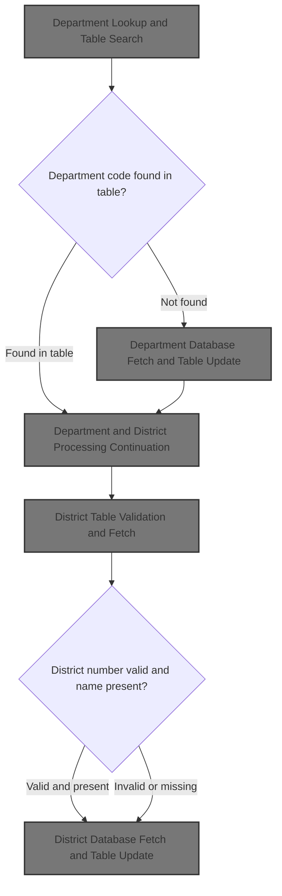

# Spec

## Detailed View of the Program's Functionality

## Department Lookup and Table Search

### Start of Department Match Process

The process begins by preparing to match a department code from an audit record against a lookup table. The code initializes a counter to start at the first entry in the table and then enters a loop to search for a match.

### Department Table Search Loop

For each entry in the department lookup table:

- The code checks if the search has reached the end of the table (either by exceeding the maximum number of entries or hitting a blank entry).
- If so, it marks the search as done.
- If the current entry matches the department-subdepartment code from the audit record, it copies the department name from the table to the output area, marks the search as done, and sets a flag indicating a match was found.
- If neither condition is met, the counter is incremented and the loop continues.

### After Table Search

Once the search is complete:

- The search flag is reset.
- If a match was found, the match flag is cleared and processing continues.
- If no match was found, the code fetches the department information from the database and updates the lookup table if possible.
- In either case, the process continues to district matching.

## Department Database Fetch and Table Update

### Fetching Department from Database

If the department was not found in the lookup table:

- The code prepares the department code and key for the database call.
- It sets up the environment and calls an external routine to retrieve the department name from the database.

### Handling Database Results

After the database call:

- If the call is successful and the department is found, the department name is copied to the output area.
- If there is space in the lookup table, the new department code and name are added to the table. If the table is full, an error message is logged.
- If the department is not found (SQL code 100), the output is set to an "invalid department" message and a flag is set to indicate an error.
- If there is any other database error, the code sets up error context and calls a central error handler for logging and diagnostics.

## Error Handling and Diagnostic Dispatch

### Centralized Error Handler

When a database or other unexpected error occurs:

- The code calls a diagnostic print routine, which in turn calls a lower-level error reporting program.
- Based on the action code returned, the handler decides whether to simply return control, perform a dump and abend (terminate abnormally with a message), or handle other error cases by setting a generic error code and message.

### Diagnostic Print Routine

The diagnostic print routine:

- Calls the lower-level error reporting program, passing along the SQL error context and message area.
- The action code returned is stored for the main error handler to use.

## DB2 Error Message Processing Entry

### Initialization and Program Context

The error reporting program:

- Initializes all status flags to indicate no problems.
- Prepares pointers for message handling.
- Opens the error reporting file, and if successful, retrieves program context information (such as job and program names) from system control blocks.
- If the error file cannot be opened, it logs to the console and sets a flag to avoid further file operations.

### Option Validation

The program checks the DB2 error handling option byte to determine whether to print, dump, or abend. If the option is invalid, it logs an error and sets all flags to treat it as a serious error.

### Error Identifier Output

The program constructs an error identifier string based on the program context and writes it to the error log. If a DB2 message line is present, it is also logged.

### DB2 Error Message Retrieval

The program sets up pointers and calls the DB2 message formatting routine (DSNTIAR) to retrieve a formatted error message. It handles all possible return codes, logging and setting flags if anything goes wrong.

### Printing DB2 Messages

The program writes each line of the DB2 error message to the error log or console, stopping after 10 lines or when a blank line is encountered.

### Cleanup and Return Code Mapping

After error reporting:

- The error file is closed.
- The return code is set based on which error flags are set (e.g., SQL error, DSNTIAR problem, file problem, invalid parameter, abend requested, dump requested, or no error).
- If closing the file fails, an error is logged and a flag is set.

## Department and District Processing Continuation

After handling the department:

- The search state is reset.
- If a department match was found, the match flag is cleared.
- If not, the code attempts to fetch the department from the database.
- In all cases, the process continues to district matching.

## District Table Validation and Fetch

### District Match

The code checks if the district number is within the valid range (<=99):

- If not, it logs an error and fetches the district from the database.
- If the district name is already present in the lookup table, it is used directly.
- Otherwise, the code fetches the district from the database.

## District Database Fetch and Table Update

### Fetching District from Database

To fetch the district name:

- The code prepares the district code and key, sets up the environment, and executes a SQL query to retrieve the district name.

### Handling Database Results

After the query:

- If successful and the district is found, the name is copied to the output area.
- If the district number is less than 100, the lookup table is updated with the new name.
- If the district is not found (SQL code 100), the output is set to "INVALID DISTRICT" and an error flag is set.
- If there is any other error, the code sets up error context and calls the central error handler.

## Job and Program Context Extraction

When gathering program context for error reporting:

- The program extracts job and program names from system control blocks.
- If not running under the expected environment, it logs a warning and writes the program name to the error log.

## Error File Operations

### Writing to Error File

When writing error messages:

- If the error file is available, messages are written to it.
- If writing fails, the program logs the error to the console and sets a flag to avoid further file operations.
- After each message, the message buffer is cleared.

### Closing the Error File

When closing the error file:

- If in online mode, a divider is written to the log.
- The file is closed, and any errors are logged and flagged.

## Finalization and Return

After all error handling and cleanup:

- The program returns control to the caller, signaling completion of error processing.

# Rule Definition

| Paragraph Name                                                                        | Rule ID | Category          | Description                                                                                                                                                                                                                                                                                                                                        | Conditions                                                                                       | Remarks                                                                                                                                                                                                                                                                                                                              |
| ------------------------------------------------------------------------------------- | ------- | ----------------- | -------------------------------------------------------------------------------------------------------------------------------------------------------------------------------------------------------------------------------------------------------------------------------------------------------------------------------------------------- | ------------------------------------------------------------------------------------------------ | ------------------------------------------------------------------------------------------------------------------------------------------------------------------------------------------------------------------------------------------------------------------------------------------------------------------------------------ |
| PROCESS-RECORD, DEPT-MATCH, DISTRICT-MATCH, DEPT-TABLE-SEARCH, GET-DEPT, GET-DISTRICT | RL-001  | Conditional Logic | When an audit record is processed, the system validates and attempts to match the department and district codes against their respective lookup tables. If a match is found, the corresponding name is set and the error flag is cleared.                                                                                                          | Audit record contains DA-DEPT-SUB-DEPT (3 chars) and DA-DISTRICT-NUMBER (2 chars, numeric 1-99). | DA-DEPT-SUB-DEPT: string (3 chars), DA-DISTRICT-NUMBER: number (2 chars, 1-99). DEPT-TABLE: up to 2000 entries, each with DEPT-NUMBER (3 chars), DEPT-NAME (30 chars). DISTRICT-TABLE: up to 99 entries, each with DISTRICT-NAME (30 chars).                                                                                         |
| GET-DEPT, GET-DISTRICT, DEPT-MATCH, DISTRICT-MATCH                                    | RL-002  | Conditional Logic | If a department or district code is not found in the lookup table, the system attempts to retrieve the name from the database. If found, the name is set, the error flag is cleared, and the lookup table is updated if space allows. If not found, the name is set to an invalid value, the error flag is set, and an error message is generated. | No match found in DEPT-TABLE or DISTRICT-TABLE for the given code.                               | If DEPT-TABLE has less than 2000 entries, add new department. If DISTRICT-TABLE has less than 99 entries and district number < 100, add new district. Invalid names: 'INVALID DEPARTMENT' (20 chars), 'INVALID DISTRICT' (20 chars). Error flags: DEPT-FLAG, DISTRICT-FLAG set to 'Y' if error.                                      |
| WRITE-OUTPUT-RECORD, ERROR-PARA, WRITE-ERROR, TTTS2001, TTTP2002                      | RL-003  | Data Assignment   | After processing, the system outputs the audit record with all relevant fields populated, including error flags and messages. If errors occur, diagnostic information is written to an error file or console, and return codes are set based on the error type using TTTS2001 and TTTP2002 routines.                                               | After processing each audit record, or when an error is detected during processing.              | Output record includes: DA-DEPT-NAME (30 chars), DEPT-FLAG (1 char), DA-DISTRICT-NAME (30 chars), DISTRICT-FLAG (1 char), ERROR-MSG (50 chars). Error messages and return codes are managed via TTTS2001 and TTTP2002. Error file record: 133 chars. Diagnostic output includes program name, error type, and SQLCODE if applicable. |

# User Stories

## User Story 1: Process, validate, and output audit records with department and district resolution and error handling

---

### Story Description:

As a system processing audit records, I want to validate and resolve department and district codes using lookup tables and database retrievals, output the processed records with all relevant fields, and provide diagnostic error reporting so that audit records are accurate and users are informed of any issues encountered.

---

### Business Rule Mapping:

| Rule ID | Paragraph Name                                                                        | Rule Description                                                                                                                                                                                                                                                                                                                                   |
| ------- | ------------------------------------------------------------------------------------- | -------------------------------------------------------------------------------------------------------------------------------------------------------------------------------------------------------------------------------------------------------------------------------------------------------------------------------------------------- |
| RL-002  | GET-DEPT, GET-DISTRICT, DEPT-MATCH, DISTRICT-MATCH                                    | If a department or district code is not found in the lookup table, the system attempts to retrieve the name from the database. If found, the name is set, the error flag is cleared, and the lookup table is updated if space allows. If not found, the name is set to an invalid value, the error flag is set, and an error message is generated. |
| RL-001  | PROCESS-RECORD, DEPT-MATCH, DISTRICT-MATCH, DEPT-TABLE-SEARCH, GET-DEPT, GET-DISTRICT | When an audit record is processed, the system validates and attempts to match the department and district codes against their respective lookup tables. If a match is found, the corresponding name is set and the error flag is cleared.                                                                                                          |
| RL-003  | WRITE-OUTPUT-RECORD, ERROR-PARA, WRITE-ERROR, TTTS2001, TTTP2002                      | After processing, the system outputs the audit record with all relevant fields populated, including error flags and messages. If errors occur, diagnostic information is written to an error file or console, and return codes are set based on the error type using TTTS2001 and TTTP2002 routines.                                               |

---

### Relevant Functionality:

- **GET-DEPT**
  1. **RL-002:**
     - If department code not found in DEPT-TABLE:
       - Query database for department name.
         - If found, set DA-DEPT-NAME, clear DEPT-FLAG, add to DEPT-TABLE if space.
         - If not found, set DA-DEPT-NAME to 'INVALID DEPARTMENT', set DEPT-FLAG to 'Y', set error message.
     - If district code not found in DISTRICT-TABLE or number > 99:
       - If > 99, set error message for table too small, attempt database fetch.
       - If found, set DA-DISTRICT-NAME, clear DISTRICT-FLAG, add to DISTRICT-TABLE if < 100.
       - If not found, set DA-DISTRICT-NAME to 'INVALID DISTRICT', set DISTRICT-FLAG to 'Y', set error message.
- **PROCESS-RECORD**
  1. **RL-001:**
     - For each audit record:
       - Validate DA-DEPT-SUB-DEPT and DA-DISTRICT-NUMBER fields.
       - Search DEPT-TABLE for DA-DEPT-SUB-DEPT:
         - If found, set DA-DEPT-NAME to DEPT-NAME, clear DEPT-FLAG.
       - Search DISTRICT-TABLE for DA-DISTRICT-NUMBER:
         - If within 1-99 and found, set DA-DISTRICT-NAME to DISTRICT-NAME, clear DISTRICT-FLAG.
- **WRITE-OUTPUT-RECORD**
  1. **RL-003:**
     - After processing each record:
       - Populate output fields: DA-DEPT-NAME, DEPT-FLAG, DA-DISTRICT-NAME, DISTRICT-FLAG, ERROR-MSG.
       - Write output record to output file.
       - If error flags are set, write diagnostic message to error file or console.
       - Set return code based on error type using TTTS2001 and TTTP2002 routines.

# Code Walkthrough

## Department Lookup and Table Search

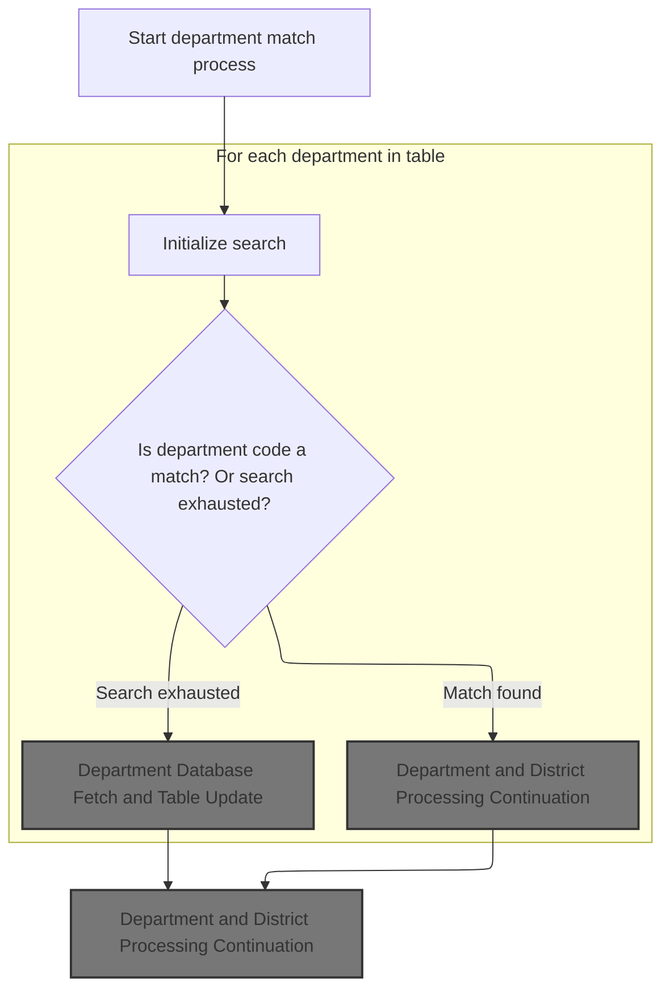

<SwmSnippet path="/base/src/XXXP12DK.cbl" line="340">

---

In `DEPT-MATCH`, we kick things off by setting up the counter and immediately calling DEPT-TABLE-SEARCH. This is where we check if the department-subdepartment value from the audit record is already in our lookup table. If it's there, we can grab the department name right away. If not, we'll need to fetch it later. Calling DEPT-TABLE-SEARCH here lets us avoid unnecessary database calls for departments we already know about.

```cobol
040200 DEPT-MATCH.
040300     MOVE 1 TO CTR.
040400     PERFORM DEPT-TABLE-SEARCH UNTIL DONE-SEARCHING.
```

---

</SwmSnippet>

<SwmSnippet path="/base/src/XXXP12DK.cbl" line="350">

---

`DEPT-TABLE-SEARCH` loops through the department table, comparing each entry to the target department-subdepartment value. If it finds a match, it copies the department name and marks the search as done. If it hits a blank or goes past the max table size, it stops searching. This keeps things simple and works with the way the table is structured.

```cobol
041200 DEPT-TABLE-SEARCH.
041300     IF CTR GREATER THAN MAX-DEPT-NBR
041400          OR DEPT-NUMBER (CTR) = SPACES
041500         MOVE 'Y' TO SEARCH-FLAG
041600     ELSE IF DEPT-NUMBER (CTR) = DA-DEPT-SUB-DEPT
041700              MOVE 'Y' TO MATCH-FLAG  SEARCH-FLAG
041800              MOVE DEPT-NAME (CTR) TO DA-DEPT-NAME.
041900     ADD 1 TO CTR.
```

---

</SwmSnippet>

<SwmSnippet path="/base/src/XXXP12DK.cbl" line="343">

---

Back in `DEPT-MATCH`, after searching the table, if we didn't find a match, we call GET-DEPT to fetch the department name from the database. If we did find a match, we just clear the match flag and move on. Either way, we continue by calling DISTRICT-MATCH to handle the district lookup next.

```cobol
040500     MOVE SPACE TO SEARCH-FLAG.
040600     IF FOUND-MATCH
040700         MOVE SPACE TO MATCH-FLAG
040800     ELSE
040900         PERFORM GET-DEPT.
041000     PERFORM DISTRICT-MATCH.
```

---

</SwmSnippet>

### Department Database Fetch and Table Update

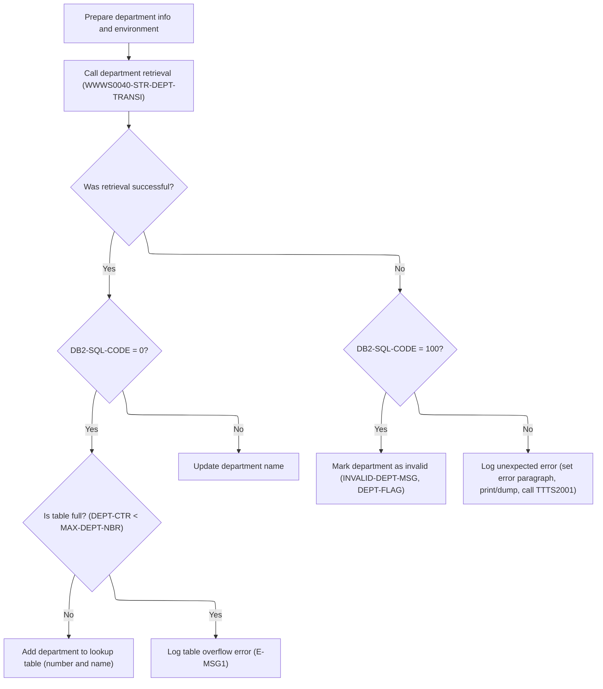

<SwmSnippet path="/base/src/XXXP12DK.cbl" line="360">

---

In `GET-DEPT`, we prep the department code and key, set up the environment, and call WWWS0040-STR-DEPT-TRANSI to fetch the department name from the database. This is where we try to fill in missing department info if it wasn't in the lookup table.

```cobol
042200 GET-DEPT.
042300     MOVE DA-DEPT-SUB-DEPT TO DEPT-CODE.
043000     MOVE '200' TO CT-DEPARTMENT-SEQUENCE
043100     MOVE DEPT-KEY TO DEPT-I-O-AREA(1:10)
043300     SET YYYN005A-BATCH-ENV   TO  TRUE
043400     SET EXIT-GET-UNIQUE-ROW  TO  TRUE
049400     CALL WWWS0040-STR-DEPT-TRANSI USING
049500                                  XXXN001A
049600                                  YYYN005A
049700                                  NNNN0000-PARMS
049800                                  WWWC0040
049900                                  DEPT-I-O-AREA
```

---

</SwmSnippet>

<SwmSnippet path="/base/src/XXXP12DK.cbl" line="372">

---

After the database call, if we get a successful result, we move the department name into the output field and, if there's space, update the lookup table. If the table is full, we log an error instead. This keeps the table in sync with the database and avoids silent failures.

```cobol
044100     EVALUATE TRUE
044200     WHEN SUCCESS
044300       IF DB2-SQL-CODE = 0
044400         MOVE CT-DEPARTMENT-NAME TO DA-DEPT-NAME
044500         IF DEPT-CTR < MAX-DEPT-NBR
044600            ADD 1 TO DEPT-CTR
044700            MOVE DA-DEPT-SUB-DEPT TO DEPT-NUMBER (DEPT-CTR)
044800            MOVE CT-DEPARTMENT-NAME TO DEPT-NAME (DEPT-CTR)
044900         ELSE
045000            MOVE E-MSG1 TO ERROR-REC
045100            WRITE ERROR-REC
045200            WRITE ERROR-REC FROM SPACED-OUT
045300         END-IF
046200       END-IF
```

---

</SwmSnippet>

<SwmSnippet path="/base/src/XXXP12DK.cbl" line="386">

---

If the fetch returns SQL code 100 (not found), we set the department name to an invalid message and flag it as invalid. This signals to the rest of the process that this department couldn't be resolved.

```cobol
046300      WHEN NOT SUCCESS
045700        IF DB2-SQL-CODE = 100
045800         MOVE SPACES           TO ST-DEPARTMENT-KEY
045900         MOVE INVALID-DEPT-MSG TO DA-DEPT-NAME
046000         MOVE 'Y' TO DEPT-FLAG
              END-IF
```

---

</SwmSnippet>

<SwmSnippet path="/base/src/XXXP12DK.cbl" line="392">

---

When we hit an unexpected database error, we set up the error context and call TTTS2001 to handle the error reporting and logging. This keeps error handling consistent and out of the mainline logic.

```cobol
046300      WHEN OTHER
046400         MOVE 'GET DEPT' TO DB2-ERROR-PARAGRAPH
052720         SET DB2121-PRINT-AND-DUMP TO TRUE
052730         CALL 'TTTS2001' USING SQLCA
052740                                 DB2121-MESSAGE-AREA.
```

---

</SwmSnippet>

### Error Handling and Diagnostic Dispatch

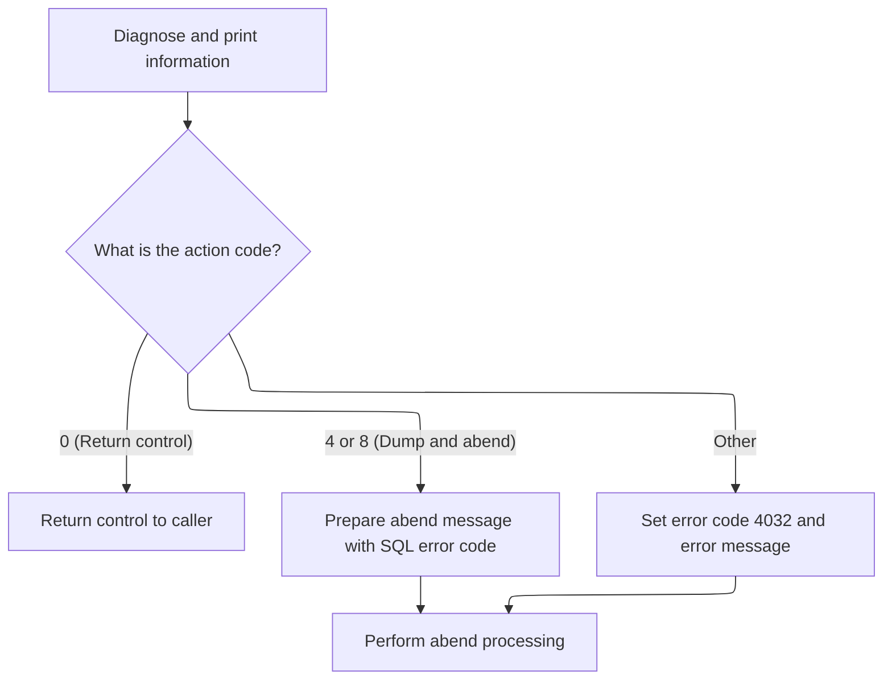

<SwmSnippet path="/base/src/TTTS2001.cbl" line="36">

---

In `PROCEDURE DIVISION` of TTTS2001, we call the diagnostic print routine, then check the action code. If it's a normal return, we continue. If it's a dump/abend code, we build a detailed error message and abend. Any other code triggers a generic error and abend. This centralizes error flow control based on what the diagnostic routine decides.

```cobol
007300 PROCEDURE DIVISION      USING  SQLCA
007400                                DB279-MESSAGE-AREA.
007500
007600     PERFORM 100-DIAGNOSE-N-PRINT
007700
007800     EVALUATE TRUE
007900
008000        WHEN  RETURN-CONTROL-TO-CALLER
008100              CONTINUE
008200
008300        WHEN  DUMP-N-ABEND
008400              MOVE SQLCODE TO WS-SQLCODE-DISP
008500              STRING
008600                 'ABEND FROM '
008700                 DB2-ERROR-PROGNAME       DELIMITED BY SIZE
008800                 ' - DB2 ERROR SQLCODE: ' DELIMITED BY SIZE
008900                 WS-SQLCODE-DISP          DELIMITED BY SIZE
009000                 INTO SSSABEND-MESG
009100              PERFORM 999-SSSABEND-DUMP-N-ABEND
009200
009300        WHEN  OTHER
009400              MOVE 4032 TO SSSABEND-CODE
009500              MOVE RETURN-CODE TO WS-DISP-RC
009600              DISPLAY 'TTTS2001: BAD RETURN CODE FROM TTTP2002:'
009700                 WS-DISP-RC UPON CONSOLE
009800              MOVE 'TTTS2001: BAD RETURN CODE FROM TTTP2002'
009900                 TO SSSABEND-MESG
010000              PERFORM 999-SSSABEND-DUMP-N-ABEND
010100
010200     END-EVALUATE
010300
010400     GOBACK
010500     .
```

---

</SwmSnippet>

### Error Diagnostic Print and Action Code

<SwmSnippet path="/base/src/TTTS2001.cbl" line="73">

---

In `100-DIAGNOSE-N-PRINT`, we call TTTP2002 to handle error reporting and logging, then store the action code it returns for the main error handler to decide what to do next.

```cobol
011000 100-DIAGNOSE-N-PRINT.
011100     CALL TTTP2002      USING  SQLCA
011200                               DB279-MESSAGE-AREA
011300     CANCEL TTTP2002
011400     MOVE RETURN-CODE TO WS-ACTION-CODE
011500     .
```

---

</SwmSnippet>

### DB2 Error Message Processing Entry

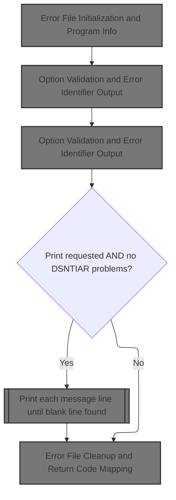

<SwmSnippet path="/base/src/TTTP2002.cbl" line="198">

---

In `PROCEDURE DIVISION` of TTTP2002, we start by initializing state, validating options, and prepping for error message handling. This sets up everything needed for the rest of the error reporting flow.

```cobol
022600 PROCEDURE DIVISION    USING   SQLCA
022700                               DB2-MESSAGE-AREA
022800********************************************* 2003/06/09 - PGLB - COMNT
022900* REPLACED QWIK-REF PARMS WITH DUMMY PARMS
023000*                              QW-LOOKUP-MSG
023100*                              QW-RESULT-MSG.
023200                               DUMMY-PARM1
023300                               DUMMY-PARM2.
023400********************************************* 2003/06/09 - PGLB - COMNT
023500
023600
023700
023800     PERFORM 100-INITIALIZE
023900
024000     PERFORM 150-VALIDATE-OPTION-PARM
024100
024200     IF PRINT-REQUESTED
024300        PERFORM 200-WRITE-IDENTIFIER
024400
024500     PERFORM 300-GET-DB2-MESSAGE
024600
024700     IF PRINT-REQUESTED AND NO-DSNTIAR-PROBLEMS
024800        PERFORM 400-PRINT-MESSAGE
024900           VARYING WS-LINE-NO FROM 1 BY 1
025000           UNTIL BLANK-LINE-FOUND
025100********************************************* 2003/06/09 - PGLB - COMNT
025200*       IF BATCH-MODE AND NO-FILE-PROBLEMS
025300*          PERFORM 700-PRINT-QWIKREF-INFO
025400*       END-IF
025500********************************************* 2003/06/09 - PGLB - END
025600     END-IF
025700
025800     PERFORM 500-CLEANUP
025900
026000     GOBACK
026100     .
026200
026300 100-INITIALIZE.
```

---

</SwmSnippet>

#### Error File Initialization and Program Info

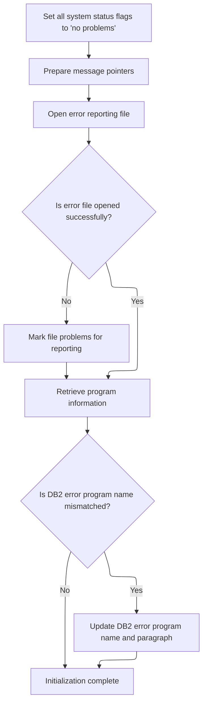

<SwmSnippet path="/base/src/TTTP2002.cbl" line="235">

---

In `100-INITIALIZE`, we set up error file handling, grab program info, and swap program name/paragraph values if needed for error reporting consistency. This keeps error logs clear about which program and paragraph had the issue.

```cobol
026300 100-INITIALIZE.
026400
026500     SET NO-FILE-PROBLEMS TO TRUE
026600     SET BLANK-LINE-NOT-FOUND TO TRUE
026700     SET REASON-CODE-NOT-FOUND TO TRUE
026800     SET NO-QWIKREF-PROBLEMS TO TRUE
026900     SET NO-DSNTIAR-PROBLEMS TO TRUE
027000     SET VALID-SQLCODE TO TRUE
027100     MOVE 1 TO WS-MESSAGE-INDEX
027200     MOVE 1 TO WS-SQLERRMC-PTR
027300*    MOVE SPACES TO QW-RESULT-MSG
027400     PERFORM 600-OPEN-ERROR-FILE
027500     PERFORM 900-GET-PROGRAM-INFO
027600     IF DB2-ERROR-PROGNAME NOT EQUAL WS-IMS-DRIVER
027700     AND DB2-ERROR-PARAGRAPH EQUAL SPACES
027800        MOVE DB2-ERROR-PROGNAME TO DB2-ERROR-PARAGRAPH
027900        MOVE WS-IMS-DRIVER TO DB2-ERROR-PROGNAME
028000     END-IF
028100     .
```

---

</SwmSnippet>

<SwmSnippet path="/base/src/TTTP2002.cbl" line="436">

---

In `600-OPEN-ERROR-FILE`, we try to open the error output file. If it's missing, we log to the console and set a flag so later logic knows not to use the file. Other file errors are handled the same way. This keeps error reporting working even if the file setup is broken.

```cobol
046400 600-OPEN-ERROR-FILE.
046500
046600     MOVE SPACES TO WS-MESSAGE-LINE
046700
046800     OPEN OUTPUT ERROR-OUTPUT-FILE
046900
047000     EVALUATE TRUE
047100       WHEN GOOD-FILE-STATUS
047200          CONTINUE
047300       WHEN DB2ERROR-DD-MISSING
047400          DISPLAY 'TTTP2002- DB2ERROR DD CARD MISSING'
047500             UPON CONSOLE
047600          DISPLAY 'TTTP2002- ROUTING OUTPUT TO CONSOLE'
047700             UPON CONSOLE
047800          SET FILE-PROBLEMS TO TRUE
047900       WHEN OTHER
048000          DISPLAY 'TTTP2002- BAD FILE STATUS ON DB2ERROR OPEN: '
048100             WS-FILE-STATUS UPON CONSOLE
048200          DISPLAY 'TTTP2002- ROUTING OUTPUT TO CONSOLE'
048300             UPON CONSOLE
048400          SET FILE-PROBLEMS TO TRUE
048500     END-EVALUATE
048600     .
```

---

</SwmSnippet>

#### Job and Program Context Extraction

<SwmSnippet path="/base/src/TTTP2002.cbl" line="663">

---

In `900-GET-PROGRAM-INFO`, we grab job and program context from system control blocks, then warn if we're not running under IMS. This helps with debugging and makes sure error logs have the right context.

```cobol
069100 900-GET-PROGRAM-INFO.
069200
069300*    PSA (PREFIXED SAVE AREA) STARTS AT ADDRESS ZERO
069400     SET ADDRESS OF PSA-CONTROL-BLOCK   TO  NULL
069500
069600*    PSA  OFFSET 540 POINTS TO TCB (TASK CONTROL BLOCK)
069700     SET ADDRESS OF TCB-CONTROL-BLOCK   TO  TCB-PTR
069800
069900*    TCB  OFFSET 0   POINTS TO RB (REQUEST BLOCK)
070000     SET ADDRESS OF RB-CONTROL-BLOCK    TO  RB-PTR
070100
070200*    TCB  OFFSET 180 POINTS TO JSCB (JOB/STEP CONTROL BLOCK)
070300     SET ADDRESS OF JSCB-CONTROL-BLOCK  TO  JSCB-PTR
070400
070500*    JSCB OFFSET 316 POINTS TO SSIB (SUBSYSTEM IDENTIFICATION BLOCK)
070600     SET ADDRESS OF SSIB-CONTROL-BLOCK  TO  SSIB-PTR
070700
070800*    JSCB OFFSET 360 CONTAINS JOB STEP PROGRAM NAME
070900     MOVE STEP-PROGNAME TO WS-STEP-PROGNAME
071000
071100*    SSIB OFFSET 12  CONTAINS JOB/STC ID
071200     MOVE JOB-TYPE TO WS-JOB-PREFIX
071300
071400*    RB   OFFSET 96  CONTAINS EXTENDED SAVE AREA INFO, OF WHICH
071500*                    THE FIRST 8 BYTES IS THE FIRST PROGRAM
071600*                    CALLED USING MVS "LINK" TYPE CALL
071700     MOVE LINK-PROGNAME TO WS-IMS-DRIVER
071800
071900     IF NOT IMS-PROGRAM
072000        MOVE 'TTTP2002- WARNING: NOT EXECUTING UNDER IMS CONTROL!'
072100             TO WS-MESSAGE-LINE
072200        DISPLAY WS-MESSAGE-LINE
072300                 UPON CONSOLE
072400        PERFORM 610-WRITE-TO-DB2ERROR-DD
072500        STRING 'TTTP2002- EXECUTING PROGRAM: ' DELIMITED BY SIZE
072600               WS-STEP-PROGNAME                DELIMITED BY SIZE
072700               INTO WS-MESSAGE-LINE
072800        DISPLAY WS-MESSAGE-LINE
072900                 UPON CONSOLE
073000        PERFORM 610-WRITE-TO-DB2ERROR-DD
073100     END-IF
073200     .
```

---

</SwmSnippet>

<SwmSnippet path="/base/src/TTTP2002.cbl" line="460">

---

In `610-WRITE-TO-DB2ERROR-DD`, we write the error message to the file if possible. If that fails, we set a flag and switch to console output. After each message, we clear the message line for the next use.

```cobol
048800 610-WRITE-TO-DB2ERROR-DD.
048900
049000     IF NO-FILE-PROBLEMS
049100        WRITE ERROR-RECORD FROM WS-MESSAGE-LINE
049200        IF NOT GOOD-FILE-STATUS
049300           SET FILE-PROBLEMS TO TRUE
049400           DISPLAY 'TTTP2002- BAD STATUS WRITING TO DB2ERROR: '
049500              WS-FILE-STATUS UPON CONSOLE
049600           DISPLAY 'TTTP2002- ROUTING OUTPUT TO CONSOLE'
049700              UPON CONSOLE
049800           DISPLAY 'TTTP2002- ' WS-MESSAGE-LINE
049900              UPON CONSOLE
050000        END-IF
050100     ELSE
050200        DISPLAY 'TTTP2002- ' WS-MESSAGE-LINE
050300           UPON CONSOLE
050400     END-IF
050500
050600     MOVE SPACES TO WS-MESSAGE-LINE
050700     .
```

---

</SwmSnippet>

#### Option Validation and Error Identifier Output

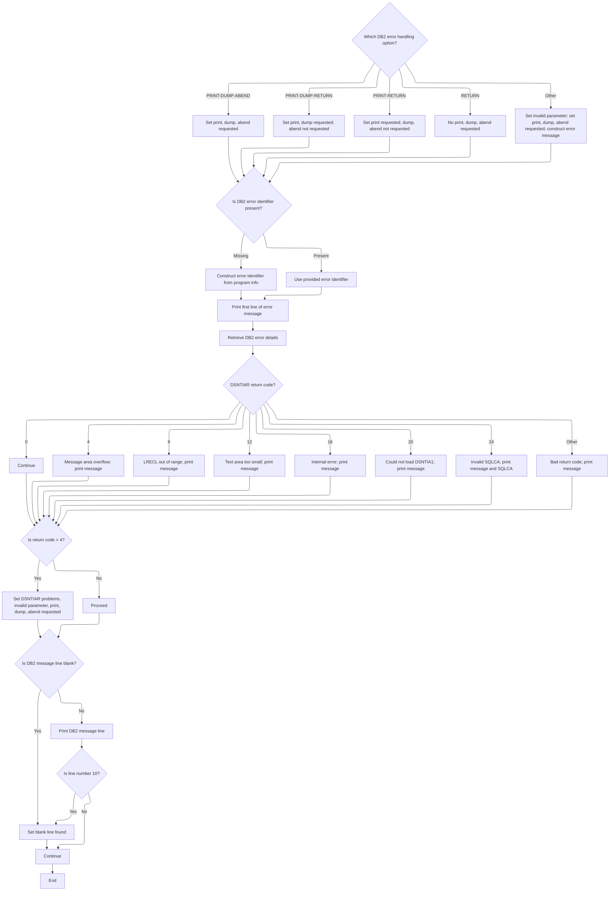

<SwmSnippet path="/base/src/TTTP2002.cbl" line="255">

---

In `150-VALIDATE-OPTION-PARM`, we check the DB2 option byte and set flags for print, dump, and abend as needed. If the option is invalid, we log it and make sure it's treated as a serious error.

```cobol
028300 150-VALIDATE-OPTION-PARM.
028400
028500     EVALUATE TRUE
028600
028700        WHEN DB2-PRINT-DUMP-ABEND
028800           SET PRINT-REQUESTED TO TRUE
028900           SET DUMP-REQUESTED TO TRUE
029000           SET ABEND-REQUESTED TO TRUE
029100
029200        WHEN DB2-PRINT-DUMP-RETURN
029300           SET PRINT-REQUESTED TO TRUE
029400           SET DUMP-REQUESTED TO TRUE
029500           SET NO-ABEND-REQUESTED TO TRUE
029600
029700        WHEN DB2-PRINT-RETURN
029800           SET PRINT-REQUESTED TO TRUE
029900           SET NO-DUMP-REQUESTED TO TRUE
030000           SET NO-ABEND-REQUESTED TO TRUE
030100
030200        WHEN DB2-RETURN
030300           SET NO-PRINT-REQUESTED TO TRUE
030400           SET NO-DUMP-REQUESTED TO TRUE
030500           SET NO-ABEND-REQUESTED TO TRUE
030600
030700        WHEN OTHER
030800           SET INVALID-PARM TO TRUE
030900           SET PRINT-REQUESTED TO TRUE
031000           SET DUMP-REQUESTED TO TRUE
031100           SET ABEND-REQUESTED TO TRUE
031200           STRING 'TTTP2002- INVALID DB2 OPTION-BYTE PASSED:'
031300                                            DELIMITED BY SIZE
031400                  DB2-OPTION-BYTE DELIMITED BY SIZE
031500             INTO WS-MESSAGE-LINE
031600           DISPLAY WS-MESSAGE-LINE UPON CONSOLE
031700           PERFORM 610-WRITE-TO-DB2ERROR-DD
031800
031900     END-EVALUATE
032000     .
```

---

</SwmSnippet>

<SwmSnippet path="/base/src/TTTP2002.cbl" line="294">

---

In `200-WRITE-IDENTIFIER`, we build an error identifier string based on the program context and write it to the error log. If there's a DB2 message line, we log that too. This makes error logs easier to trace.

```cobol
032200 200-WRITE-IDENTIFIER.
032300
032400     IF DB2-ERROR-IDENTIFIER EQUAL TO SPACES
032500        IF IMS-PROGRAM
032600           STRING 'DB2 ERROR TRAPPED '         DELIMITED BY SIZE
032700                  'IN ENCLAVE '                DELIMITED BY SIZE
032800                  WS-IMS-DRIVER                DELIMITED BY SIZE
032900             INTO WS-ERROR-ID
033000        ELSE
033100           STRING 'DB2 ERROR TRAPPED '         DELIMITED BY SIZE
033200                  'IN ENCLAVE '                DELIMITED BY SIZE
033300                  WS-STEP-PROGNAME             DELIMITED BY SIZE
033400             INTO WS-ERROR-ID
033500        END-IF
033600     ELSE
033700        MOVE DB2-ERROR-IDENTIFIER TO WS-ERROR-ID
033800     END-IF
033900     MOVE WS-FIRST-LINE TO WS-MESSAGE-LINE
034000     PERFORM 610-WRITE-TO-DB2ERROR-DD
034100     PERFORM 610-WRITE-TO-DB2ERROR-DD
034200     IF DB2-MESSAGE-LINE(1) NOT EQUAL SPACES
034300        MOVE DB2-MESSAGE-LINE(1) TO WS-MESSAGE-LINE
034400        PERFORM 610-WRITE-TO-DB2ERROR-DD
034500        PERFORM 610-WRITE-TO-DB2ERROR-DD
034600     END-IF
034700     .
```

---

</SwmSnippet>

<SwmSnippet path="/base/src/TTTP2002.cbl" line="321">

---

In `300-GET-DB2-MESSAGE`, we set up pointers and call DSNTIAR to format the DB2 error message. We handle all the possible return codes, logging and setting flags if anything goes wrong. This makes sure error messages are readable and complete.

```cobol
034900 300-GET-DB2-MESSAGE.
035000
035100     SET ADDRESS OF DSNTIAR-MESSAGE-PTR
035200         TO ADDRESS OF DB2-MESSAGE-LENGTH
035300     SET ADDRESS OF DSNTIAR-LRECL-PTR
035400         TO ADDRESS OF DB2-LINE-LENGTH
035500
035600     CALL WS-DSNTIAR  USING  SQLCA
035700                             DSNTIAR-MESSAGE-PTR
035800                             DSNTIAR-LRECL-PTR
035900************ MADE COBOL II COMPLIANT FOR TELON - 2003/06/23 - PGLB
036000******* ON EXCEPTION
036100*******    SET DSNTIAR-PROBLEMS TO TRUE
036200*******    MOVE 'TTTP2002- EXCEPTION LOADING DSNTIAR MODULE!!'
036300*******      TO WS-MESSAGE-LINE
036400*******    DISPLAY WS-MESSAGE-LINE UPON CONSOLE
036500*******    PERFORM 610-WRITE-TO-DB2ERROR-DD
036600******* NOT ON EXCEPTION
036700           CANCEL WS-DSNTIAR
036800**** END-CALL
036900************ MADE COBOL II COMPLIANT FOR TELON - 2003/06/23 - PGLB
037000
037100     IF NO-DSNTIAR-PROBLEMS
037200        EVALUATE RETURN-CODE
037300           WHEN 0
037400              CONTINUE
037500           WHEN 4
037600              MOVE 'TTTP2002- DSNTIAR - MESSAGE AREA OVERFLOW'
037700                TO WS-MESSAGE-LINE
037800              DISPLAY WS-MESSAGE-LINE UPON CONSOLE
037900              PERFORM 610-WRITE-TO-DB2ERROR-DD
038000           WHEN 8
038100              MOVE 'TTTP2002- DSNTIAR - LRECL OUT OF RANGE'
038200                TO WS-MESSAGE-LINE
038300              DISPLAY WS-MESSAGE-LINE UPON CONSOLE
038400              PERFORM 610-WRITE-TO-DB2ERROR-DD
038500           WHEN 12
038600              MOVE 'TTTP2002- DSNTIAR - TEXT AREA TOO SMALL'
038700                TO WS-MESSAGE-LINE
038800              DISPLAY WS-MESSAGE-LINE UPON CONSOLE
038900              PERFORM 610-WRITE-TO-DB2ERROR-DD
039000           WHEN 16
039100              MOVE 'TTTP2002- INTERNAL ERROR IN DSNTIAR ROUTINE!'
039200                TO WS-MESSAGE-LINE
039300              DISPLAY WS-MESSAGE-LINE UPON CONSOLE
039400              PERFORM 610-WRITE-TO-DB2ERROR-DD
039500           WHEN 20
039600              MOVE 'TTTP2002- DSNTIAR COULD NOT LOAD DSNTIA1!!'
039700                TO WS-MESSAGE-LINE
039800              DISPLAY WS-MESSAGE-LINE UPON CONSOLE
039900              PERFORM 610-WRITE-TO-DB2ERROR-DD
040000           WHEN 24
040100              MOVE 'TTTP2002- INVALID SQLCA PASSED TO DSNTIAR!!'
040200                TO WS-MESSAGE-LINE
040300              DISPLAY WS-MESSAGE-LINE UPON CONSOLE
040400              PERFORM 610-WRITE-TO-DB2ERROR-DD
040500              MOVE 'SQLCA:' TO WS-MESSAGE-LINE
040600              PERFORM 610-WRITE-TO-DB2ERROR-DD
040700              MOVE SQLCA TO WS-MESSAGE-LINE
040800              PERFORM 610-WRITE-TO-DB2ERROR-DD
040900           WHEN OTHER
041000              MOVE RETURN-CODE TO WS-DISP-RC
041100              STRING 'TTTP2002- BAD RETURN CODE FROM DSNTIAR: '
041200                                              DELIMITED BY SIZE
041300                     WS-DISP-RC               DELIMITED BY SIZE
041400                INTO WS-MESSAGE-LINE
041500              DISPLAY WS-MESSAGE-LINE UPON CONSOLE
041600              PERFORM 610-WRITE-TO-DB2ERROR-DD
041700        END-EVALUATE
041800        IF RETURN-CODE > 4
041900           SET DSNTIAR-PROBLEMS TO TRUE
042000           SET INVALID-PARM TO TRUE
042100           SET PRINT-REQUESTED TO TRUE
042200           SET DUMP-REQUESTED TO TRUE
042300           SET ABEND-REQUESTED TO TRUE
042400        END-IF
042500     END-IF
042600     .
```

---

</SwmSnippet>

<SwmSnippet path="/base/src/TTTP2002.cbl" line="400">

---

In `400-PRINT-MESSAGE`, we write each DB2 message line to the error log or console, stopping after 10 lines or when we hit a blank. This keeps error output readable and avoids log spam.

```cobol
042800 400-PRINT-MESSAGE.
042900
043000     IF DB2-MESSAGE-LINE(WS-LINE-NO) = SPACES
043100        THEN SET BLANK-LINE-FOUND TO TRUE
043200        ELSE
043300           MOVE DB2-MESSAGE-LINE(WS-LINE-NO)
043400              TO WS-MESSAGE-LINE
043500           PERFORM 610-WRITE-TO-DB2ERROR-DD
043600           IF WS-LINE-NO = 10
043700              THEN SET BLANK-LINE-FOUND TO TRUE
043800           END-IF
043900     END-IF
044000     .
```

---

</SwmSnippet>

#### Error File Cleanup and Return Code Mapping

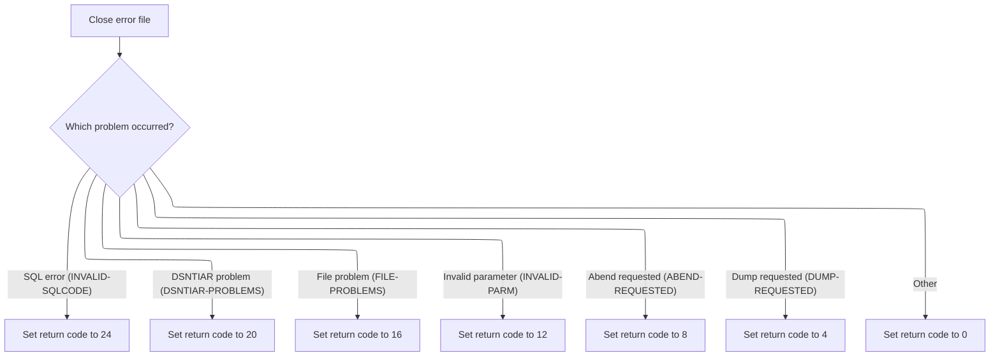

<SwmSnippet path="/base/src/TTTP2002.cbl" line="414">

---

In `500-CLEANUP`, we close the error file, then set the return code based on which error flags are set. This gives a clear signal to upstream systems about what went wrong.

```cobol
044200 500-CLEANUP.
044300
044400     PERFORM 620-CLOSE-ERROR-FILE
044500
044600     EVALUATE TRUE
044700        WHEN INVALID-SQLCODE
044800           MOVE 24 TO RETURN-CODE
044900        WHEN DSNTIAR-PROBLEMS
045000           MOVE 20 TO RETURN-CODE
045100        WHEN FILE-PROBLEMS
045200           MOVE 16 TO RETURN-CODE
045300        WHEN INVALID-PARM
045400           MOVE 12 TO RETURN-CODE
045500        WHEN ABEND-REQUESTED
045600           MOVE 8  TO RETURN-CODE
045700        WHEN DUMP-REQUESTED
045800           MOVE 4  TO RETURN-CODE
045900        WHEN OTHER
046000           MOVE 0  TO RETURN-CODE
046100     END-EVALUATE
046200     .
```

---

</SwmSnippet>

<SwmSnippet path="/base/src/TTTP2002.cbl" line="481">

---

In `620-CLOSE-ERROR-FILE`, we write a divider to the error log if we're in online mode, then close the file. If closing fails, we log the error and set a flag. This keeps error logs organized and signals file issues for later handling.

```cobol
050900 620-CLOSE-ERROR-FILE.
051000
051100     IF ONLINE-MODE
051200        MOVE WS-ERROR-DIVIDER TO WS-MESSAGE-LINE
051300        PERFORM 610-WRITE-TO-DB2ERROR-DD
051400     END-IF
051500
051600     CLOSE ERROR-OUTPUT-FILE
051700
051800     EVALUATE TRUE
051900       WHEN GOOD-FILE-STATUS
052000          CONTINUE
052100       WHEN DB2ERROR-NOT-OPEN
052200        AND FILE-PROBLEMS
052300          CONTINUE
052400       WHEN OTHER
052500          DISPLAY 'TTTP2002- BAD FILE STATUS ON DB2ERROR CLOSE: '
052600             WS-FILE-STATUS UPON CONSOLE
052700          SET FILE-PROBLEMS TO TRUE
052800     END-EVALUATE
052900     .
```

---

</SwmSnippet>

#### Finalization and Return from Error Processing

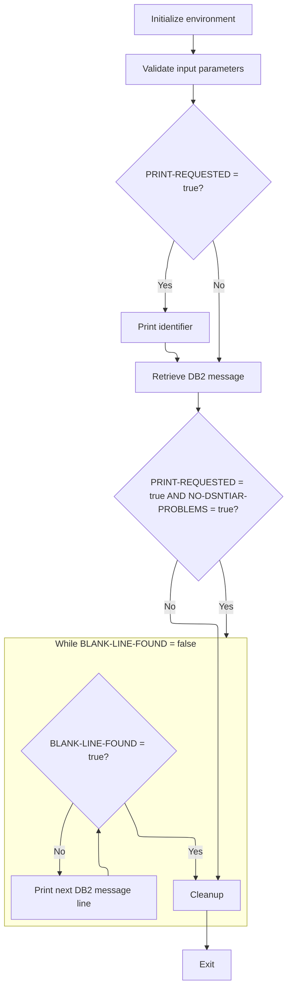

<SwmSnippet path="/base/src/TTTP2002.cbl" line="198">

---

After error handling, we return to the caller and finish up.

```cobol
022600 PROCEDURE DIVISION    USING   SQLCA
022700                               DB2-MESSAGE-AREA
022800********************************************* 2003/06/09 - PGLB - COMNT
022900* REPLACED QWIK-REF PARMS WITH DUMMY PARMS
023000*                              QW-LOOKUP-MSG
023100*                              QW-RESULT-MSG.
023200                               DUMMY-PARM1
023300                               DUMMY-PARM2.
023400********************************************* 2003/06/09 - PGLB - COMNT
023500
023600
023700
023800     PERFORM 100-INITIALIZE
023900
024000     PERFORM 150-VALIDATE-OPTION-PARM
024100
024200     IF PRINT-REQUESTED
024300        PERFORM 200-WRITE-IDENTIFIER
024400
024500     PERFORM 300-GET-DB2-MESSAGE
024600
024700     IF PRINT-REQUESTED AND NO-DSNTIAR-PROBLEMS
024800        PERFORM 400-PRINT-MESSAGE
024900           VARYING WS-LINE-NO FROM 1 BY 1
025000           UNTIL BLANK-LINE-FOUND
025100********************************************* 2003/06/09 - PGLB - COMNT
025200*       IF BATCH-MODE AND NO-FILE-PROBLEMS
025300*          PERFORM 700-PRINT-QWIKREF-INFO
025400*       END-IF
025500********************************************* 2003/06/09 - PGLB - END
025600     END-IF
025700
025800     PERFORM 500-CLEANUP
025900
026000     GOBACK
026100     .
026200
026300 100-INITIALIZE.
```

---

</SwmSnippet>

### Department and District Processing Continuation

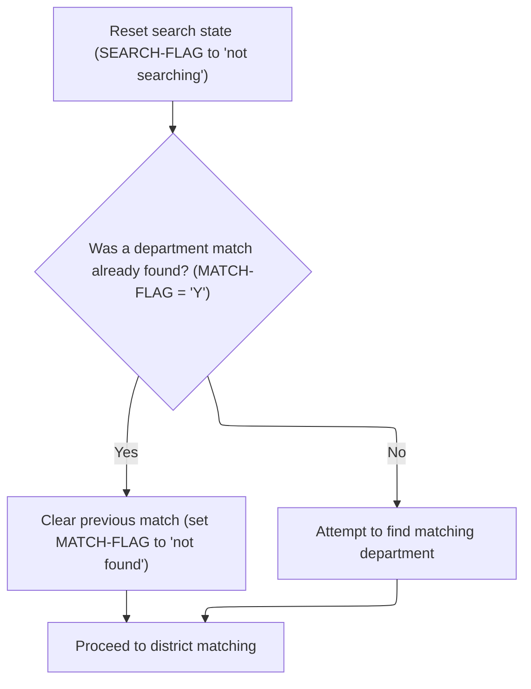

<SwmSnippet path="/base/src/XXXP12DK.cbl" line="343">

---

After department handling, we call DISTRICT-MATCH to process the district next.

```cobol
040500     MOVE SPACE TO SEARCH-FLAG.
040600     IF FOUND-MATCH
040700         MOVE SPACE TO MATCH-FLAG
040800     ELSE
040900         PERFORM GET-DEPT.
041000     PERFORM DISTRICT-MATCH.
```

---

</SwmSnippet>

## District Table Validation and Fetch

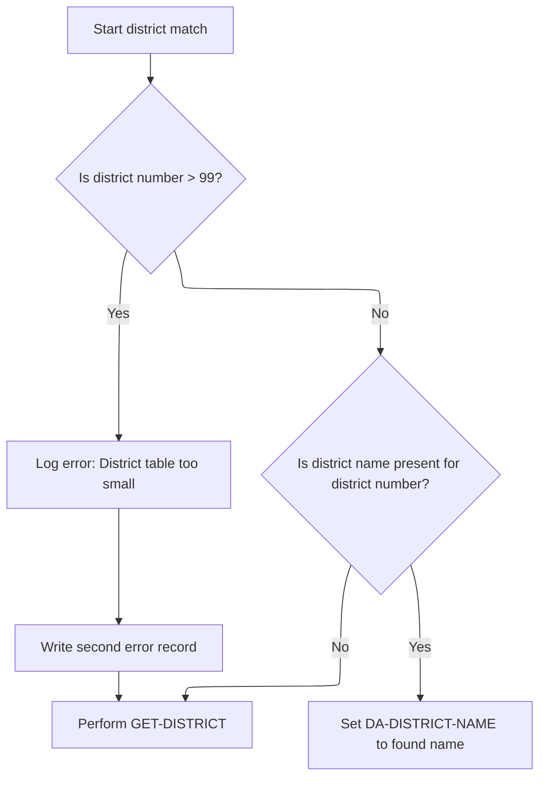

<SwmSnippet path="/base/src/XXXP12DK.cbl" line="398">

---

In `DISTRICT-MATCH`, we check if the district number is within the table's range (<=99). If not, we log an error and fetch from the database. If the name is already in the table, we use it; otherwise, we fetch it. This keeps the lookup table in sync and flags out-of-bounds cases.

```cobol
047000 DISTRICT-MATCH.
047100     IF DA-DISTRICT-NUMBER GREATER THAN 99
047200         MOVE E-MSG2 TO ERROR-REC
047300         WRITE ERROR-REC
047400         WRITE ERROR-REC FROM SPACED-OUT
047500         PERFORM GET-DISTRICT
047600     ELSE IF DISTRICT-NAME (DA-DISTRICT-NUMBER) NOT = SPACES
047700             MOVE DISTRICT-NAME (DA-DISTRICT-NUMBER)
047800             TO DA-DISTRICT-NAME
047900          ELSE PERFORM GET-DISTRICT.
```

---

</SwmSnippet>

## District Database Fetch and Table Update

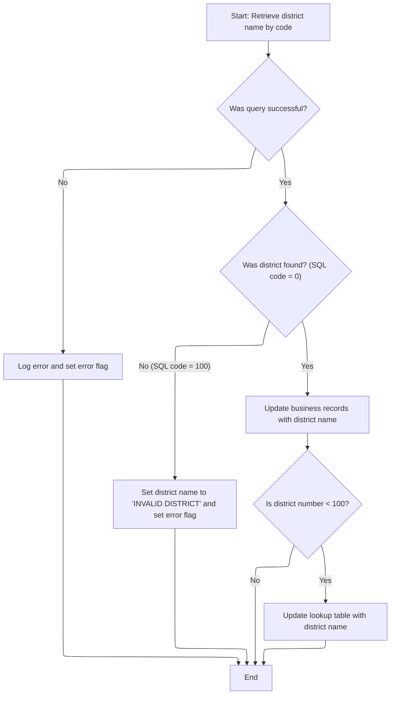

<SwmSnippet path="/base/src/XXXP12DK.cbl" line="409">

---

In `GET-DISTRICT`, we prep the district code and key using '201' as a required value, then run the SQL to fetch the district name. This relies on the input being valid and formatted right, or the lookup will fail.

```cobol
048100 GET-DISTRICT.
048300     MOVE DA-DISTRICT-NUMBER TO DISTRICT-CODE.
049000     MOVE '201' TO CT-DISTRICT-SEQUENCE
049100     MOVE DISTRICT-KEY TO DISTRICT-I-O-AREA(1:10)
           MOVE DISTRICT-CODE      TO DIST-ID OF DCLXXXT
049200     SET YYYN005A-BATCH-ENV    TO  TRUE

           EXEC SQL
             SELECT  DIST_NM
               INTO :DCLXXXT.DIST-NM
             FROM XXXT
             WHERE DIST_ID = :DCLXXXT.DIST-ID
           END-EXEC
```

---

</SwmSnippet>

<SwmSnippet path="/base/src/XXXP12DK.cbl" line="423">

---

After fetching the district name, if the number is less than 100, we update the lookup table. If the fetch fails or errors, we set error messages or call TTTS2001 for error handling. This keeps the table in sync and routes errors to the central handler.

```cobol
050200     MOVE SQLCODE TO DB2-SQL-CODE
050200
050200     EVALUATE TRUE
050300     WHEN SUCCESS
050400       IF DB2-SQL-CODE = 0
               MOVE DIST-NM OF DCLXXXT  TO CT-DISTRICT-NAME             
050500         MOVE CT-DISTRICT-NAME TO DA-DISTRICT-NAME
050600         IF DA-DISTRICT-NUMBER LESS THAN 100
050700             MOVE CT-DISTRICT-NAME TO
050800               DISTRICT-NAME (DA-DISTRICT-NUMBER)
050900         ELSE NEXT SENTENCE
051000         END-IF
051200       ELSE IF DB2-SQL-CODE = 100
051300          MOVE INVALID-DIST-MSG TO DA-DISTRICT-NAME
051400          MOVE 'Y' TO DISTRICT-FLAG
051600       END-IF
051700       END-IF
051800     WHEN OTHER
051900         MOVE 'GET DIST' TO DB2-ERROR-PARAGRAPH
052720         SET DB2121-PRINT-AND-DUMP TO TRUE
052730         CALL 'TTTS2001' USING SQLCA
052740                                 DB2121-MESSAGE-AREA.
```

---

</SwmSnippet>

&nbsp;

*This is an auto-generated document by Swimm 🌊 and has not yet been verified by a human*

<SwmMeta version="3.0.0" repo-id="Z2l0aHViJTNBJTNBU3dpbW1pby1keW5jYWxsLWRlbW8lM0ElM0FHaXJpLVN3aW1t" repo-name="Swimmio-dyncall-demo"><sup>Powered by [Swimm](https://app.swimm.io/)</sup></SwmMeta>
