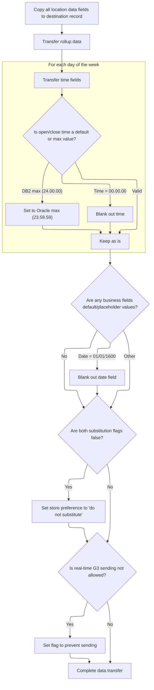

After a successful retail data operation, this flow prepares and normalizes the retail data for further processing. It updates the checkpoint count and, if needed, connects to the database to ensure the latest status is reflected. The flow receives retail location data and operation status as input, and outputs prepared data, updated status, and database connection if required.

# Spec

## Detailed View of the Program's Functionality

# Detailed Explanation of the Flow

---

## a. Exit Handling and Data Preparation

When the main program is finishing up its work, it runs a section that checks if the previous operation was successful and if the cursor (the database pointer used for reading rows) is not in the process of being closed. If both conditions are true, it proceeds to prepare and normalize the retail location data for the next step. This preparation is only done if there is still data to process, avoiding unnecessary work when the cursor is closing.

The preparation involves copying and normalizing data fields from an internal structure (used for database communication) to an output structure (used for returning data to the caller or next system). This includes handling special cases for date and time fields, ensuring that default or placeholder values are replaced with blanks or appropriate constants, and setting business logic flags based on the values of other fields.

After this data preparation, the program updates a checkpoint counter, which is likely used for tracking progress or recovery in case of failure.

If the operation involved certain types of database actions (such as inserting, modifying, or purging rows, or if the system is using Oracle), the program ensures a connection to the DB2 database is established by calling a dedicated routine for that purpose. Finally, it records the result of the last SQL operation for later reference.

---

## b. Retail Data Mapping and Time Normalization

The core of the data preparation is handled by a routine that copies all relevant retail location fields from the internal database structure to the output structure. This is a comprehensive field-by-field transfer, ensuring that all location attributes, business codes, and status indicators are moved over.

During this process, the code performs normalization steps:

- For date fields (such as remodel date, sales closed date, and status date), if the value is a default or placeholder (like a special "zero" date), it is replaced with blanks in the output.
- For time fields (such as store open and close times for each day of the week), the code checks for default values (like "00.00.00") and replaces them with blanks. If a time field contains a special maximum value used by DB2 ("24.00.00"), it is converted to the Oracle equivalent ("23.59.59").
- For certain business logic flags (such as substitution preferences), the code sets output flags based on combinations of other fields. For example, if both substitution flags are false, it sets a preference to "do not substitute."
- If real-time sending is not allowed, a flag is set to prevent sending data to the real-time system.

After all direct field moves and normalizations, the program calls a specialized routine to handle more complex time field conversions. This is necessary because some time fields may be stored as timestamps in the database and need to be converted to plain time values for the output, or vice versa, depending on the database system in use.

---

## c. Complex Time Field Conversion

The specialized time conversion routine checks if the system is working with Oracle or if certain database actions are being performed. If so, it prepares arrays containing the open and close timestamps for each day of the week and sets a flag indicating that a conversion from timestamp to time is needed.

It then calls an external conversion routine, which processes the timestamps and returns plain time values. If the conversion is successful, the results are copied back into the output structure. If the conversion fails, an error message is set for later reporting.

If the conversion is not needed (for example, if the system is not using Oracle or not performing the relevant actions), the routine simply copies the time fields directly from the internal structure to the output structure without any transformation.

---

## d. Database Connection and Status Update

Whenever the program needs to ensure a connection to the DB2 database (for example, after certain types of operations or when working in an Oracle environment), it calls a dedicated routine that handles the connection logic. This routine delegates the actual connection and error handling to a separate, centralized module, keeping the connection logic consistent and maintainable.

---

## e. Summary of the Data Flow

1. **Exit Handling**: On program exit, check if the operation was successful and if the cursor is not closing. If so, prepare and normalize data for output.
2. **Data Mapping**: Copy all retail location fields from the internal database structure to the output structure, normalizing dates, times, and business logic flags as needed.
3. **Time Normalization**: For each day of the week, handle special cases for open/close times (default values, DB2/Oracle max values, etc.).
4. **Complex Time Conversion**: If required, convert timestamps to plain times using an external routine; otherwise, copy times directly.
5. **Database Connection**: Ensure a DB2 connection is established when needed.
6. **Checkpoint and Status**: Update checkpoint counters and record the result of the last SQL operation.

This flow ensures that data returned or passed to the next system is clean, normalized, and consistent, regardless of the underlying database or special cases encountered in the data.

# Rule Definition

| Paragraph Name                                                                                                         | Rule ID | Category          | Description                                                                                                                                                                                                                                                                               | Conditions                                                                         | Remarks                                                                                                                                                                                                                         |
| ---------------------------------------------------------------------------------------------------------------------- | ------- | ----------------- | ----------------------------------------------------------------------------------------------------------------------------------------------------------------------------------------------------------------------------------------------------------------------------------------- | ---------------------------------------------------------------------------------- | ------------------------------------------------------------------------------------------------------------------------------------------------------------------------------------------------------------------------------- |
| 110-MOVE-PDA-FIELDS-2-DCL, 130-MOVE-DCL-2-PDA-FIELDS                                                                   | RL-001  | Data Assignment   | All retail location data fields must be copied from the source record to the destination record, ensuring that the destination accurately reflects the source data, subject to normalization rules.                                                                                       | Always, for all fields not otherwise subject to normalization or special handling. | Fields are copied as-is unless otherwise specified by normalization rules. Field formats are determined by their business meaning (e.g., numbers, strings, dates).                                                              |
| 117-MOVE-ROLLUP-DATA, 135-MOVE-DC-ROLLUP-DATA                                                                          | RL-002  | Data Assignment   | All rollup data fields (ROLUP-REPT-TBL-TXT and ROLUP-REPT-TBL-01-NBR through ROLUP-REPT-TBL-10-NBR) must be transferred from source to destination without modification, except for numeric validation.                                                                                   | Always, for all rollup fields.                                                     | ROLUP-REPT-TBL-TXT is a string (20 chars). ROLUP-REPT-TBL-01-NBR through ROLUP-REPT-TBL-10-NBR are numeric fields. If a numeric field is not numeric, it is set to zero.                                                        |
| 110-MOVE-PDA-FIELDS-2-DCL, 112-MOVE-TIME-FIELDS, 130-MOVE-DCL-2-PDA-FIELDS, 132-MOVE-TIME-FIELDS                       | RL-003  | Conditional Logic | For each time field (MON-OPEN-TM, MON-CLOS-TM, ..., SUN-OPEN-TM, SUN-CLOS-TM): if the value is '00.00.00', the destination field is blanked out; if '24.00.00', set to '23.59.59'; otherwise, retain the source value. If repository/database type requires, convert timestamps to times. | For each time field during data movement or normalization.                         | Time fields are strings in 'hh.mm.ss' format (8 chars). '00.00.00' means blank out (set to spaces), '24.00.00' means set to '23.59.59'. Conversion between timestamp and time may be required for Oracle/DB2.                   |
| 110-MOVE-PDA-FIELDS-2-DCL, 130-MOVE-DCL-2-PDA-FIELDS                                                                   | RL-004  | Conditional Logic | For each date field (STR-REMODL-DT, SLS-CLOSED-DT, SLS-OPEN-DT): if the value is '01/01/1600', '0000-00-00', or all zeroes, the destination field is blanked out; otherwise, retain the source value.                                                                                     | For each date field during data movement or normalization.                         | Date fields are strings in 'YYYY-MM-DD' or similar format. Special values ('01/01/1600', '0000-00-00', all zeroes) are considered default/null and must be blanked out (set to spaces).                                         |
| 110-MOVE-PDA-FIELDS-2-DCL, 130-MOVE-DCL-2-PDA-FIELDS                                                                   | RL-005  | Conditional Logic | If both substitution flags (OK-TO-SUB-UNLIKE-PRODS and DONT-SUB-UNLIKE-PRODS) are false, set NO-UNLIKE-SUB-STORE-PREF to true in the destination. Similarly for OK-TO-SUB-DISP-PALS and DONT-SUB-DISP-PALS, set NO-DISP-PAL-SUB-STORE-PREF to true if both are false.                     | When both relevant substitution flags are false.                                   | Flags are boolean or single-character fields. NO-UNLIKE-SUB-STORE-PREF and NO-DISP-PAL-SUB-STORE-PREF are set to true (typically 'Y' or equivalent).                                                                            |
| 110-MOVE-PDA-FIELDS-2-DCL, 130-MOVE-DCL-2-PDA-FIELDS                                                                   | RL-006  | Conditional Logic | If SEND-REAL-TIME-G3 is not allowed, set DONT-SEND-REAL-TIME-G3 to true in the destination record.                                                                                                                                                                                        | When SEND-REAL-TIME-G3 is not allowed.                                             | Flags are boolean or single-character fields. DONT-SEND-REAL-TIME-G3 is set to true (typically 'Y' or equivalent).                                                                                                              |
| 110-MOVE-PDA-FIELDS-2-DCL, 112-MOVE-TIME-FIELDS, 117-MOVE-ROLLUP-DATA, 130-MOVE-DCL-2-PDA-FIELDS, 132-MOVE-TIME-FIELDS | RL-007  | Computation       | All output fields must conform to the specified formats and normalization rules, including field sizes, alignment, and padding.                                                                                                                                                           | Always, for all output fields.                                                     | Field formats are as specified: time fields as 'hh.mm.ss' (8 chars), date fields as 'YYYY-MM-DD' or blank, numeric fields as numbers, string fields as fixed-length strings, etc. Padding with spaces or zeroes as appropriate. |

# User Stories

## User Story 1: Transfer, Normalize, and Format Retail Location, Rollup, Time, and Date Fields

---

### Story Description:

As a system, I want to copy all retail location, rollup, time, and date fields from the source record to the destination record, applying normalization and formatting rules so that the destination data is accurate, consistent, and compliant with business requirements.

---

### Business Rule Mapping:

| Rule ID | Paragraph Name                                                                                                         | Rule Description                                                                                                                                                                                                                                                                          |
| ------- | ---------------------------------------------------------------------------------------------------------------------- | ----------------------------------------------------------------------------------------------------------------------------------------------------------------------------------------------------------------------------------------------------------------------------------------- |
| RL-001  | 110-MOVE-PDA-FIELDS-2-DCL, 130-MOVE-DCL-2-PDA-FIELDS                                                                   | All retail location data fields must be copied from the source record to the destination record, ensuring that the destination accurately reflects the source data, subject to normalization rules.                                                                                       |
| RL-003  | 110-MOVE-PDA-FIELDS-2-DCL, 112-MOVE-TIME-FIELDS, 130-MOVE-DCL-2-PDA-FIELDS, 132-MOVE-TIME-FIELDS                       | For each time field (MON-OPEN-TM, MON-CLOS-TM, ..., SUN-OPEN-TM, SUN-CLOS-TM): if the value is '00.00.00', the destination field is blanked out; if '24.00.00', set to '23.59.59'; otherwise, retain the source value. If repository/database type requires, convert timestamps to times. |
| RL-004  | 110-MOVE-PDA-FIELDS-2-DCL, 130-MOVE-DCL-2-PDA-FIELDS                                                                   | For each date field (STR-REMODL-DT, SLS-CLOSED-DT, SLS-OPEN-DT): if the value is '01/01/1600', '0000-00-00', or all zeroes, the destination field is blanked out; otherwise, retain the source value.                                                                                     |
| RL-007  | 110-MOVE-PDA-FIELDS-2-DCL, 112-MOVE-TIME-FIELDS, 117-MOVE-ROLLUP-DATA, 130-MOVE-DCL-2-PDA-FIELDS, 132-MOVE-TIME-FIELDS | All output fields must conform to the specified formats and normalization rules, including field sizes, alignment, and padding.                                                                                                                                                           |
| RL-002  | 117-MOVE-ROLLUP-DATA, 135-MOVE-DC-ROLLUP-DATA                                                                          | All rollup data fields (ROLUP-REPT-TBL-TXT and ROLUP-REPT-TBL-01-NBR through ROLUP-REPT-TBL-10-NBR) must be transferred from source to destination without modification, except for numeric validation.                                                                                   |

---

### Relevant Functionality:

- **110-MOVE-PDA-FIELDS-2-DCL**
  1. **RL-001:**
     - For each field in the source record:
       - If the field is not subject to normalization or special handling, copy its value to the corresponding field in the destination record.
  2. **RL-003:**
     - For each time field:
       - If value is '00.00.00' or blank, set destination to spaces.
       - If value is '24.00.00', set destination to '23.59.59'.
       - Otherwise, copy value.
     - If repository/database type requires timestamp-to-time conversion:
       - Convert all week's open/close timestamps to plain times and copy to destination.
  3. **RL-004:**
     - For each date field:
       - If value is '01/01/1600', '0000-00-00', or all zeroes, set destination to spaces.
       - Otherwise, copy value.
  4. **RL-007:**
     - For each output field:
       - Apply normalization rules as specified for its type.
       - Ensure field size, alignment, and padding conform to requirements.
- **117-MOVE-ROLLUP-DATA**
  1. **RL-002:**
     - Copy ROLUP-REPT-TBL-TXT from source to destination.
     - For each ROLUP-REPT-TBL-XX-NBR:
       - If the value is numeric, copy it.
       - Else, set the destination field to zero.

## User Story 2: Apply Conditional Logic for Substitution and Business Logic Flags

---

### Story Description:

As a system, I want to set substitution and business logic flags in the destination record based on the values of related source flags so that business preferences and restrictions are correctly enforced.

---

### Business Rule Mapping:

| Rule ID | Paragraph Name                                       | Rule Description                                                                                                                                                                                                                                                      |
| ------- | ---------------------------------------------------- | --------------------------------------------------------------------------------------------------------------------------------------------------------------------------------------------------------------------------------------------------------------------- |
| RL-005  | 110-MOVE-PDA-FIELDS-2-DCL, 130-MOVE-DCL-2-PDA-FIELDS | If both substitution flags (OK-TO-SUB-UNLIKE-PRODS and DONT-SUB-UNLIKE-PRODS) are false, set NO-UNLIKE-SUB-STORE-PREF to true in the destination. Similarly for OK-TO-SUB-DISP-PALS and DONT-SUB-DISP-PALS, set NO-DISP-PAL-SUB-STORE-PREF to true if both are false. |
| RL-006  | 110-MOVE-PDA-FIELDS-2-DCL, 130-MOVE-DCL-2-PDA-FIELDS | If SEND-REAL-TIME-G3 is not allowed, set DONT-SEND-REAL-TIME-G3 to true in the destination record.                                                                                                                                                                    |

---

### Relevant Functionality:

- **110-MOVE-PDA-FIELDS-2-DCL**
  1. **RL-005:**
     - If NOT OK-TO-SUB-UNLIKE-PRODS AND NOT DONT-SUB-UNLIKE-PRODS:
       - Set NO-UNLIKE-SUB-STORE-PREF to true.
     - If NOT OK-TO-SUB-DISP-PALS AND NOT DONT-SUB-DISP-PALS:
       - Set NO-DISP-PAL-SUB-STORE-PREF to true.
  2. **RL-006:**
     - If NOT SEND-REAL-TIME-G3:
       - Set DONT-SEND-REAL-TIME-G3 to true.

# Code Walkthrough

## Exit Handling and Data Preparation

<SwmSnippet path="/base/src/NNNS0488.cbl" line="1756">

---

120-EXIT-STUFF checks if the operation succeeded and the cursor isn't closing, then calls 130-MOVE-DCL-2-PDA-FIELDS to prep and normalize the retail data for whatever comes next. This is only done if there's still data to handle, so we don't waste cycles on closed cursors.

```cobol
179300 120-EXIT-STUFF.                                                  00179300
179400     IF SUCCESS                                                   00179400
179500       IF NOT EXIT-CLOSE-CURSOR                                   00179500
179600         PERFORM 130-MOVE-DCL-2-PDA-FIELDS                        00179600
179700       END-IF                                                     00179700
179800       ADD WS-CHECKPOINT-INC TO YYYN005A-CHKPT-CNT                00179800
179900     END-IF                                                       00179900
180000     IF (YYYN005A-ORACLE       OR EXIT-PUT-INSERT-ROW             00180000
180100         OR EXIT-PUT-PURGE-ROW OR EXIT-PUT-MODIFY-ROW)            00180100
180200*      SET YYYN005A-DB2        TO TRUE                            00180200
180300       PERFORM 125-CONNECT-TO-DB2                                 00180300
180400     END-IF                                                       00180400
180500     MOVE SQLCODE            TO DB2-SQL-CODE                      00180500
180600     .                                                            00180600
```

---

</SwmSnippet>

### Retail Data Mapping and Time Normalization



<SwmSnippet path="/base/src/NNNS0488.cbl" line="1784">

---

130-MOVE-DCL-2-PDA-FIELDS handles copying all retail location fields from the source to the destination structure, with a bunch of normalization steps for dates and times (like replacing default or max values with blanks or alternate constants). It also sets some business logic flags based on combinations of other fields. After all the direct moves and normalizations, it calls 132-MOVE-TIME-FIELDS to handle the more complex time field conversions, especially for open/close times that might need format changes or conversion from timestamps. That call is needed because not all time fields can be handled with simple moves—some need conversion logic that depends on the repository or DB type.

```cobol
182100 130-MOVE-DCL-2-PDA-FIELDS.                                       00182100
182200     MOVE LOC-NBR OF DCLXXXAIL-LOC TO LOC-NBR OF P-DDDTLR01       00182200
182300     MOVE LOC-TYP-CD OF DCLXXXAIL-LOC TO LOC-TYP-CD OF P-DDDTLR01 00182300
182400     MOVE ASSOC-STR-TYP-CD OF DCLXXXAIL-LOC                       00182400
182500       TO ASSOC-STR-TYP-CD OF P-DDDTLR01                          00182500
182600     MOVE ASSOC-STR-NBR OF DCLXXXAIL-LOC                          00182600
182700       TO ASSOC-STR-NBR OF P-DDDTLR01                             00182700
182800                                                                  00182800
182900     MOVE STR-REMODL-DT OF DCLXXXAIL-LOC                          00182900
183000       TO STR-REMODL-DT OF P-DDDTLR01                             00183000
183100     IF STR-REMODL-DT OF P-DDDTLR01 = K-DEF-DT                    00183100
183200       MOVE SPACES TO STR-REMODL-DT OF P-DDDTLR01                 00183200
183300     END-IF                                                       00183300
183400                                                                  00183400
183500     MOVE SLS-CLOSED-DT OF DCLXXXAIL-LOC                          00183500
183600       TO SLS-CLOSED-DT OF P-DDDTLR01                             00183600
183700     IF SLS-CLOSED-DT OF P-DDDTLR01 = K-DEF-DT                    00183700
183800       MOVE SPACES TO SLS-CLOSED-DT OF P-DDDTLR01                 00183800
183900     END-IF                                                       00183900
184000                                                                  00184000
184100     MOVE RETL-LOC-STAT-CD OF DCLXXXAIL-LOC                       00184100
184200       TO RETL-LOC-STAT-CD OF P-DDDTLR01                          00184200
184300                                                                  00184300
184400     MOVE RETL-LOC-STAT-DT OF DCLXXXAIL-LOC                       00184400
184500       TO RETL-LOC-STAT-DT OF P-DDDTLR01                          00184500
184600     IF RETL-LOC-STAT-DT OF P-DDDTLR01 = K-DEF-DT                 00184600
184700       MOVE SPACES TO RETL-LOC-STAT-DT OF P-DDDTLR01              00184700
184800     END-IF                                                       00184800
184900                                                                  00184900
185000     MOVE COMPANY-ID OF DCLXXXAIL-LOC TO COMPANY-ID OF P-DDDTLR01 00185000
185100     MOVE FINANCIAL-DIV-ID OF DCLXXXAIL-LOC                       00185100
185200       TO FINANCIAL-DIV-ID OF P-DDDTLR01                          00185200
185300     MOVE LIN-OF-BUS-ID OF DCLXXXAIL-LOC                          00185300
185400       TO LIN-OF-BUS-ID OF P-DDDTLR01                             00185400
185500     MOVE DIST-ID OF DCLXXXAIL-LOC TO DIST-ID OF P-DDDTLR01       00185500
185600     MOVE MKT-RGN-ID OF DCLXXXAIL-LOC TO MKT-RGN-ID OF P-DDDTLR01 00185600
185700     MOVE GEO-ZN-CD OF DCLXXXAIL-LOC TO GEO-ZN-CD OF P-DDDTLR01   00185700
185800     MOVE RETL-GEO-ZN-ID OF DCLXXXAIL-LOC                         00185800
185900       TO RETL-GEO-ZN-ID OF P-DDDTLR01                            00185900
186000     MOVE SCN-MAINT-SW OF DCLXXXAIL-LOC                           00186000
186100       TO SCN-MAINT-SW OF P-DDDTLR01                              00186100
186200     MOVE FRNT-END-CD OF DCLXXXAIL-LOC                            00186200
186300       TO FRNT-END-CD OF P-DDDTLR01                               00186300
186400     MOVE PRC-BUL-SW OF DCLXXXAIL-LOC TO PRC-BUL-SW OF P-DDDTLR01 00186400
186500     MOVE UPC-ON-PRC-BUL-SW OF DCLXXXAIL-LOC                      00186500
186600       TO UPC-ON-PRC-BUL-SW OF P-DDDTLR01                         00186600
186700     MOVE CMPTR-TYP-CD OF DCLXXXAIL-LOC                           00186700
186800       TO CMPTR-TYP-CD OF P-DDDTLR01                              00186800
186900     MOVE RETL-VID-ZN-NBR OF DCLXXXAIL-LOC                        00186900
187000       TO RETL-VID-ZN-NBR OF P-DDDTLR01                           00187000
187100     MOVE RETL-UNLD-CD OF DCLXXXAIL-LOC                           00187100
187200       TO RETL-UNLD-CD OF P-DDDTLR01                              00187200
187300*    MOVE ROLUP-REPT-TBL-TXT OF DCLXXXAIL-LOC                     00187300
187400*      TO ROLUP-REPT-TBL-TXT OF P-DDDTLR01                        00187400
187500     PERFORM 135-MOVE-DC-ROLLUP-DATA                              00187500
187600     MOVE NEW-STR-SW OF DCLXXXAIL-LOC TO NEW-STR-SW OF P-DDDTLR01 00187600
187700     MOVE SEL-CIR-SW OF DCLXXXAIL-LOC TO SEL-CIR-SW OF P-DDDTLR01 00187700
187800     MOVE BKRM-SQ-FT OF DCLXXXAIL-LOC TO BKRM-SQ-FT OF P-DDDTLR01 00187800
187900     MOVE FD-LINER-FT OF DCLXXXAIL-LOC                            00187900
188000       TO FD-LINER-FT OF P-DDDTLR01                               00188000
188100     MOVE NON-FD-LINER-FT OF DCLXXXAIL-LOC                        00188100
188200       TO NON-FD-LINER-FT OF P-DDDTLR01                           00188200
188300     MOVE SETOFF-ROOM-SW OF DCLXXXAIL-LOC                         00188300
188400       TO SETOFF-ROOM-SW OF P-DDDTLR01                            00188400
188500     MOVE CAT-CLS-TBL-TXT OF DCLXXXAIL-LOC                        00188500
188600       TO CAT-CLS-TBL-TXT OF P-DDDTLR01                           00188600
188700     MOVE LAT-K OF DCLXXXAIL-LOC TO LAT-K OF P-DDDTLR01           00188700
188800     MOVE LON-K OF DCLXXXAIL-LOC TO LON-K OF P-DDDTLR01           00188800
188900     MOVE CK-COLL-REPT-SW OF DCLXXXAIL-LOC                        00188900
189000       TO CK-COLL-REPT-SW OF P-DDDTLR01                           00189000
189100     MOVE CK-COLL-CNTL-CD OF DCLXXXAIL-LOC                        00189100
189200       TO CK-COLL-CNTL-CD OF P-DDDTLR01                           00189200
189300     MOVE CK-COLL-ADD-DEL-SW OF DCLXXXAIL-LOC                     00189300
189400       TO CK-COLL-ADD-DEL-SW OF P-DDDTLR01                        00189400
189500     MOVE CK-ALT-STR-ID OF DCLXXXAIL-LOC                          00189500
189600       TO CK-ALT-STR-ID OF P-DDDTLR01                             00189600
189700     MOVE CK-COLL-FEE-AMT OF DCLXXXAIL-LOC                        00189700
189800       TO CK-COLL-FEE-AMT OF P-DDDTLR01                           00189800
189900     MOVE SALS-TAX-PCT OF DCLXXXAIL-LOC                           00189900
190000       TO SALS-TAX-PCT OF P-DDDTLR01                              00190000
190100     MOVE SOAP-SALE-VAR-PCT OF DCLXXXAIL-LOC                      00190100
190200       TO SOAP-SALE-VAR-PCT OF P-DDDTLR01                         00190200
190300     MOVE ON-SRS-CD OF DCLXXXAIL-LOC TO ON-SRS-CD OF P-DDDTLR01   00190300
190400     MOVE SRS-DSD-ORD-SW OF DCLXXXAIL-LOC                         00190400
190500       TO SRS-DSD-ORD-SW OF P-DDDTLR01                            00190500
190600     MOVE RETL-LOC-TYP-CD OF DCLXXXAIL-LOC                        00190600
190700       TO RETL-LOC-TYP-CD OF P-DDDTLR01                           00190700
190800     MOVE DEA-NBR OF DCLXXXAIL-LOC TO DEA-NBR OF P-DDDTLR01       00190800
190900     MOVE STR-OPSTMT-SRT-CD OF DCLXXXAIL-LOC                      00190900
191000       TO STR-OPSTMT-SRT-CD OF P-DDDTLR01                         00191000
191100     MOVE STR-OPSTMT-TYP-CD OF DCLXXXAIL-LOC                      00191100
191200       TO STR-OPSTMT-TYP-CD OF P-DDDTLR01                         00191200
191300     MOVE STR-OPSTMT-HDR-CD OF DCLXXXAIL-LOC                      00191300
191400       TO STR-OPSTMT-HDR-CD OF P-DDDTLR01                         00191400
191500     MOVE DPS-NBR OF DCLXXXAIL-LOC TO DPS-NBR OF P-DDDTLR01       00191500
191600     MOVE MEDICARE-ID OF DCLXXXAIL-LOC                            00191600
191700       TO MEDICARE-ID OF P-DDDTLR01                               00191700
191800     MOVE NABP-NBR OF DCLXXXAIL-LOC TO NABP-NBR OF P-DDDTLR01     00191800
191900     MOVE NATL-PROV-ID OF DCLXXXAIL-LOC                           00191900
192000       TO NATL-PROV-ID OF P-DDDTLR01                              00192000
192100     MOVE CURR-AD-ZN-NBR OF DCLXXXAIL-LOC                         00192100
192200       TO CURR-AD-ZN-NBR OF P-DDDTLR01                            00192200
192300     MOVE PD-ZONE-NO OF DCLXXXAIL-LOC TO PD-ZONE-NO OF P-DDDTLR01 00192300
192400     MOVE SOS-PROC-SW OF DCLXXXAIL-LOC                            00192400
192500       TO SOS-PROC-SW OF P-DDDTLR01                               00192500
192600     MOVE RPRT-SEQ-NBR OF DCLXXXAIL-LOC                           00192600
192700       TO RPRT-SEQ-NBR OF P-DDDTLR01                              00192700
192800     MOVE GRP-CD OF DCLXXXAIL-LOC TO GRP-CD OF P-DDDTLR01         00192800
192900     MOVE PRIM-GRP-CD-1 OF DCLXXXAIL-LOC                          00192900
193000       TO PRIM-GRP-CD-1 OF P-DDDTLR01                             00193000
193100     MOVE PRIM-GRP-CD-2 OF DCLXXXAIL-LOC                          00193100
193200       TO PRIM-GRP-CD-2 OF P-DDDTLR01                             00193200
193300     MOVE SECY-GRP-CD-1 OF DCLXXXAIL-LOC                          00193300
193400       TO SECY-GRP-CD-1 OF P-DDDTLR01                             00193400
193500     MOVE SECY-GRP-CD-2 OF DCLXXXAIL-LOC                          00193500
193600       TO SECY-GRP-CD-2 OF P-DDDTLR01                             00193600
193700     MOVE PRIM-CLS-NBR-1 OF DCLXXXAIL-LOC                         00193700
193800       TO PRIM-CLS-NBR-1 OF P-DDDTLR01                            00193800
193900     MOVE PRIM-CLS-NBR-2 OF DCLXXXAIL-LOC                         00193900
194000       TO PRIM-CLS-NBR-2 OF P-DDDTLR01                            00194000
194100     MOVE SECY-CLS-NBR-1 OF DCLXXXAIL-LOC                         00194100
194200       TO SECY-CLS-NBR-1 OF P-DDDTLR01                            00194200
194300     MOVE SECY-CLS-NBR-2 OF DCLXXXAIL-LOC                         00194300
194400       TO SECY-CLS-NBR-2 OF P-DDDTLR01                            00194400
194500     MOVE VAL-STR-SW OF DCLXXXAIL-LOC TO VAL-STR-SW OF P-DDDTLR01 00194500
194600     MOVE TBCO-PRMT-NBR OF DCLXXXAIL-LOC                          00194600
194700       TO TBCO-PRMT-NBR OF P-DDDTLR01                             00194700
194800                                                                  00194800
194900     MOVE SUB-UNLIKE-PROD-CD OF DCLXXXAIL-LOC                     00194900
195000       TO SUB-UNLIKE-PROD-CD OF P-DDDTLR01                        00195000
195100     IF  NOT OK-TO-SUB-UNLIKE-PRODS     OF P-DDDTLR01             00195100
195200     AND NOT DONT-SUB-UNLIKE-PRODS      OF P-DDDTLR01             00195200
195300       SET NO-UNLIKE-SUB-STORE-PREF     OF P-DDDTLR01 TO TRUE     00195300
195400     END-IF                                                       00195400
195500                                                                  00195500
195600     MOVE SUB-DSPLY-PAL-CD   OF DCLXXXAIL-LOC                     00195600
195700       TO SUB-DSPLY-PAL-CD   OF P-DDDTLR01                        00195700
195800     IF  NOT OK-TO-SUB-DISP-PALS        OF P-DDDTLR01             00195800
195900     AND NOT DONT-SUB-DISP-PALS         OF P-DDDTLR01             00195900
196000       SET NO-DISP-PAL-SUB-STORE-PREF   OF P-DDDTLR01 TO TRUE     00196000
196100     END-IF                                                       00196100
196200                                                                  00196200
196300     MOVE RLTM-SCN-MAINT-SW  OF DCLXXXAIL-LOC                     00196300
196400       TO RLTM-SCN-MAINT-SW  OF P-DDDTLR01                        00196400
196500     IF  NOT SEND-REAL-TIME-G3          OF P-DDDTLR01             00196500
196600       SET DONT-SEND-REAL-TIME-G3       OF P-DDDTLR01 TO TRUE     00196600
196700     END-IF                                                       00196700
196800     MOVE 0                                                       00196800
196900       TO DONTUSE1 OF P-DDDTLR01                                  00196900
197000     MOVE 0                                                       00197000
197100       TO DONTUSE2 OF P-DDDTLR01                                  00197100
197200     MOVE TOP-LEADER-NM   OF DCLXXXAIL-LOC                        00197200
197300       TO TOP-LEADER-NM   OF P-DDDTLR01                           00197300
197400     MOVE CUST-FRNDLY-NM  OF DCLXXXAIL-LOC                        00197400
197500       TO CUST-FRNDLY-NM  OF P-DDDTLR01                           00197500
197600     MOVE SLS-OPEN-DT     OF DCLXXXAIL-LOC                        00197600
197700       TO SLS-OPEN-DT     OF P-DDDTLR01                           00197700
197800     IF SLS-OPEN-DT OF P-DDDTLR01 = K-DEF-DT                      00197800
197900       MOVE SPACES TO SLS-OPEN-DT  OF P-DDDTLR01                  00197900
198000     END-IF                                                       00198000
198100     IF MON-OPEN-TM OF P-DDDTLR01 = K-DEF-TM                      00198100
198200       MOVE SPACES TO MON-OPEN-TM  OF P-DDDTLR01                  00198200
198300     END-IF                                                       00198300
198400     IF MON-CLOS-TM OF DCLXXXAIL-LOC = K-DB2-MAX-TM               00198400
198500       MOVE K-ORA-MAX-TM  TO MON-CLOS-TM OF DCLXXXAIL-LOC         00198500
198600     END-IF                                                       00198600
198700     IF MON-CLOS-TM OF P-DDDTLR01 = K-DEF-TM                      00198700
198800       MOVE SPACES TO MON-CLOS-TM  OF P-DDDTLR01                  00198800
198900     END-IF                                                       00198900
199000     IF TUE-OPEN-TM OF P-DDDTLR01 = K-DEF-TM                      00199000
199100       MOVE SPACES TO TUE-OPEN-TM  OF P-DDDTLR01                  00199100
199200     END-IF                                                       00199200
199300     IF TUE-CLOS-TM OF DCLXXXAIL-LOC = K-DB2-MAX-TM               00199300
199400       MOVE K-ORA-MAX-TM  TO TUE-CLOS-TM OF DCLXXXAIL-LOC         00199400
199500     END-IF                                                       00199500
199600     IF TUE-CLOS-TM OF P-DDDTLR01 = K-DEF-TM                      00199600
199700       MOVE SPACES TO TUE-CLOS-TM  OF P-DDDTLR01                  00199700
199800     END-IF                                                       00199800
199900     IF WED-OPEN-TM OF P-DDDTLR01 = K-DEF-TM                      00199900
200000       MOVE SPACES TO WED-OPEN-TM  OF P-DDDTLR01                  00200000
200100     END-IF                                                       00200100
200200     IF WED-CLOS-TM OF DCLXXXAIL-LOC = K-DB2-MAX-TM               00200200
200300       MOVE K-ORA-MAX-TM  TO WED-CLOS-TM OF DCLXXXAIL-LOC         00200300
200400     END-IF                                                       00200400
200500     IF WED-CLOS-TM OF P-DDDTLR01 = K-DEF-TM                      00200500
200600       MOVE SPACES TO WED-CLOS-TM  OF P-DDDTLR01                  00200600
200700     END-IF                                                       00200700
200800     IF THUR-OPEN-TM OF P-DDDTLR01 = K-DEF-TM                     00200800
200900       MOVE SPACES TO THUR-OPEN-TM OF P-DDDTLR01                  00200900
201000     END-IF                                                       00201000
201100     IF THUR-CLOS-TM OF DCLXXXAIL-LOC = K-DB2-MAX-TM              00201100
201200       MOVE K-ORA-MAX-TM  TO THUR-CLOS-TM OF DCLXXXAIL-LOC        00201200
201300     END-IF                                                       00201300
201400     IF THUR-CLOS-TM OF P-DDDTLR01 = K-DEF-TM                     00201400
201500       MOVE SPACES TO THUR-CLOS-TM OF P-DDDTLR01                  00201500
201600     END-IF                                                       00201600
201700     IF FRI-OPEN-TM OF P-DDDTLR01 = K-DEF-TM                      00201700
201800       MOVE SPACES TO FRI-OPEN-TM  OF P-DDDTLR01                  00201800
201900     END-IF                                                       00201900
202000     IF FRI-CLOS-TM OF DCLXXXAIL-LOC = K-DB2-MAX-TM               00202000
202100       MOVE K-ORA-MAX-TM  TO FRI-CLOS-TM OF DCLXXXAIL-LOC         00202100
202200     END-IF                                                       00202200
202300     IF FRI-CLOS-TM OF P-DDDTLR01 = K-DEF-TM                      00202300
202400       MOVE SPACES TO FRI-CLOS-TM  OF P-DDDTLR01                  00202400
202500     END-IF                                                       00202500
202600     IF SAT-OPEN-TM OF P-DDDTLR01 = K-DEF-TM                      00202600
202700       MOVE SPACES TO SAT-OPEN-TM  OF P-DDDTLR01                  00202700
202800     END-IF                                                       00202800
202900     IF SUN-OPEN-TM OF P-DDDTLR01 = K-DEF-TM                      00202900
203000       MOVE SPACES TO SUN-OPEN-TM  OF P-DDDTLR01                  00203000
203100     END-IF                                                       00203100
203200     IF SAT-CLOS-TM OF DCLXXXAIL-LOC = K-DB2-MAX-TM               00203200
203300       MOVE K-ORA-MAX-TM  TO SAT-CLOS-TM OF DCLXXXAIL-LOC         00203300
203400     END-IF                                                       00203400
203500     IF SAT-CLOS-TM OF P-DDDTLR01 = K-DEF-TM                      00203500
203600       MOVE SPACES TO SAT-CLOS-TM  OF P-DDDTLR01                  00203600
203700     END-IF                                                       00203700
203800     IF SUN-CLOS-TM OF DCLXXXAIL-LOC = K-DB2-MAX-TM               00203800
203900       MOVE K-ORA-MAX-TM  TO SUN-CLOS-TM OF DCLXXXAIL-LOC         00203900
204000     END-IF                                                       00204000
204100     IF SUN-CLOS-TM OF P-DDDTLR01 = K-DEF-TM                      00204100
204200       MOVE SPACES TO SUN-CLOS-TM  OF P-DDDTLR01                  00204200
204300     END-IF                                                       00204300
204400     PERFORM 132-MOVE-TIME-FIELDS                                 00204400
204500     MOVE RETL-LOC-FRMAT-CD OF DCLXXXAIL-LOC                      00204500
204600       TO RETL-LOC-FRMAT-CD OF P-DDDTLR01                         00204600
204700     MOVE RETL-LOC-SEGM-CD OF DCLXXXAIL-LOC                       00204700
204800       TO RETL-LOC-SEGM-CD OF P-DDDTLR01                          00204800
204900     MOVE ECOMM-MKT-AREA-CD OF DCLXXXAIL-LOC                      00204900
205000       TO ECOMM-MKT-AREA-CD OF P-DDDTLR01                         00205000
205100     MOVE ECOMM-STRT-DT OF DCLXXXAIL-LOC                          00205100
205200       TO ECOMM-STRT-DT OF P-DDDTLR01                             00205200
205300     IF ECOMM-STRT-DT OF P-DDDTLR01 = K-DEF-DT                    00205300
205400       MOVE SPACES TO ECOMM-STRT-DT OF P-DDDTLR01                 00205400
205500     END-IF                                                       00205500
205600     MOVE ECOMM-END-DT OF DCLXXXAIL-LOC                           00205600
205700       TO ECOMM-END-DT OF P-DDDTLR01                              00205700
205800     IF ECOMM-END-DT OF P-DDDTLR01 = K-DEF-DT                     00205800
205900       MOVE SPACES TO ECOMM-END-DT OF P-DDDTLR01                  00205900
206000     END-IF                                                       00206000
206100     MOVE ONLIN-SSON-SW OF DCLXXXAIL-LOC                          00206100
206200                        TO ONLIN-SSON-SW OF P-DDDTLR01            00206200
206300     MOVE RPLACD-BY-STR-NBR OF DCLXXXAIL-LOC                      00206300
206400                        TO RPLACD-BY-STR-NBR OF P-DDDTLR01.       00206400
```

---

</SwmSnippet>

<SwmSnippet path="/base/src/NNNS0488.cbl" line="2097">

---

132-MOVE-TIME-FIELDS checks if we're working with Oracle or certain exit codes. If so, it sets up arrays for all the week's open/close timestamps, flags the conversion, and calls MMMS0291 to convert them to plain times. If the conversion works, it copies the results back into the output structure; if not, it sets an error message. If conversion isn't needed, it just copies the time fields directly. The call to MMMS0291 is what actually does the timestamp-to-time conversion, which is needed for systems that don't use timestamps for store hours.

```cobol
213400 132-MOVE-TIME-FIELDS.                                            00213400
213500     IF (YYYN005A-ORACLE OR EXIT-PUT-INSERT-ROW                   00213500
213600         OR EXIT-PUT-MODIFY-ROW)                                  00213600
213700       INITIALIZE MMMC0291-INPUT-TM                               00213700
213800                  MMMC0291-INPUT-TS                               00213800
213900       MOVE WS-MON-OPEN-TS                                        00213900
214000         TO WS-TIMSTAMP-INOUT-CONV(1)                             00214000
214100       MOVE WS-MON-CLOS-TS                                        00214100
214200         TO WS-TIMSTAMP-INOUT-CONV(2)                             00214200
214300       MOVE WS-TUE-OPEN-TS                                        00214300
214400         TO WS-TIMSTAMP-INOUT-CONV(3)                             00214400
214500       MOVE WS-TUE-CLOS-TS                                        00214500
214600         TO WS-TIMSTAMP-INOUT-CONV(4)                             00214600
214700       MOVE WS-WED-OPEN-TS                                        00214700
214800         TO WS-TIMSTAMP-INOUT-CONV(5)                             00214800
214900       MOVE WS-WED-CLOS-TS                                        00214900
215000         TO WS-TIMSTAMP-INOUT-CONV(6)                             00215000
215100       MOVE WS-THUR-OPEN-TS                                       00215100
215200         TO WS-TIMSTAMP-INOUT-CONV(7)                             00215200
215300       MOVE WS-THUR-CLOS-TS                                       00215300
215400         TO WS-TIMSTAMP-INOUT-CONV(8)                             00215400
215500       MOVE WS-FRI-OPEN-TS                                        00215500
215600         TO WS-TIMSTAMP-INOUT-CONV(9)                             00215600
215700       MOVE WS-FRI-CLOS-TS                                        00215700
215800         TO WS-TIMSTAMP-INOUT-CONV(10)                            00215800
215900       MOVE WS-SAT-OPEN-TS                                        00215900
216000         TO WS-TIMSTAMP-INOUT-CONV(11)                            00216000
216100       MOVE WS-SAT-CLOS-TS                                        00216100
216200         TO WS-TIMSTAMP-INOUT-CONV(12)                            00216200
216300       MOVE WS-SUN-OPEN-TS                                        00216300
216400         TO WS-TIMSTAMP-INOUT-CONV(13)                            00216400
216500       MOVE WS-SUN-CLOS-TS                                        00216500
216600         TO WS-TIMSTAMP-INOUT-CONV(14)                            00216600
216700                                                                  00216700
216800        SET MMMC0291-CVT-TS-TO-TM  TO TRUE                        00216800
216900        CALL WS-MMMS0291-PGM USING                                00216900
217000                           XXXN001A                               00217000
217100                           MMMC0291                               00217100
217200        IF NOT SUCCESS                                            00217200
217300          STRING 'NNNS0488 - INVALD TIMSTMP.PLS VERIFY Sqlcode =' 00217300
217400              WS-SQLCODE                                          00217400
217500              DELIMITED BY SIZE INTO IS-RTRN-MSG-TXT              00217500
217600        ELSE                                                      00217600
217700          MOVE WS-TIME-INOUT-CONV(1)                              00217700
217800            TO MON-OPEN-TM OF P-DDDTLR01                          00217800
217900          MOVE WS-TIME-INOUT-CONV(2)                              00217900
218000            TO MON-CLOS-TM OF P-DDDTLR01                          00218000
218100          MOVE WS-TIME-INOUT-CONV(3)                              00218100
218200            TO TUE-OPEN-TM OF P-DDDTLR01                          00218200
218300          MOVE WS-TIME-INOUT-CONV(4)                              00218300
218400            TO TUE-CLOS-TM OF P-DDDTLR01                          00218400
218500          MOVE WS-TIME-INOUT-CONV(5)                              00218500
218600            TO WED-OPEN-TM OF P-DDDTLR01                          00218600
218700          MOVE WS-TIME-INOUT-CONV(6)                              00218700
218800            TO WED-CLOS-TM OF P-DDDTLR01                          00218800
218900          MOVE WS-TIME-INOUT-CONV(7)                              00218900
219000            TO THUR-OPEN-TM OF P-DDDTLR01                         00219000
219100          MOVE WS-TIME-INOUT-CONV(8)                              00219100
219200            TO THUR-CLOS-TM OF P-DDDTLR01                         00219200
219300          MOVE WS-TIME-INOUT-CONV(9)                              00219300
219400            TO FRI-OPEN-TM OF P-DDDTLR01                          00219400
219500          MOVE WS-TIME-INOUT-CONV(10)                             00219500
219600            TO FRI-CLOS-TM OF P-DDDTLR01                          00219600
219700          MOVE WS-TIME-INOUT-CONV(11)                             00219700
219800            TO SAT-OPEN-TM OF P-DDDTLR01                          00219800
219900          MOVE WS-TIME-INOUT-CONV(12)                             00219900
220000            TO SAT-CLOS-TM OF P-DDDTLR01                          00220000
220100          MOVE WS-TIME-INOUT-CONV(13)                             00220100
220200            TO SUN-OPEN-TM OF P-DDDTLR01                          00220200
220300          MOVE WS-TIME-INOUT-CONV(14)                             00220300
220400            TO SUN-CLOS-TM OF P-DDDTLR01                          00220400
220500        END-IF                                                    00220500
220600     ELSE                                                         00220600
220700       MOVE MON-OPEN-TM OF DCLXXXAIL-LOC                          00220700
220800         TO MON-OPEN-TM    OF P-DDDTLR01                          00220800
220900       MOVE MON-CLOS-TM    OF DCLXXXAIL-LOC                       00220900
221000         TO MON-CLOS-TM    OF P-DDDTLR01                          00221000
221100       MOVE TUE-OPEN-TM    OF DCLXXXAIL-LOC                       00221100
221200         TO TUE-OPEN-TM    OF P-DDDTLR01                          00221200
221300       MOVE TUE-CLOS-TM    OF DCLXXXAIL-LOC                       00221300
221400         TO TUE-CLOS-TM    OF P-DDDTLR01                          00221400
221500       MOVE WED-OPEN-TM    OF DCLXXXAIL-LOC                       00221500
221600         TO WED-OPEN-TM    OF P-DDDTLR01                          00221600
221700       MOVE WED-CLOS-TM    OF DCLXXXAIL-LOC                       00221700
221800         TO WED-CLOS-TM    OF P-DDDTLR01                          00221800
221900       MOVE THUR-OPEN-TM   OF DCLXXXAIL-LOC                       00221900
222000         TO THUR-OPEN-TM   OF P-DDDTLR01                          00222000
222100       MOVE THUR-CLOS-TM   OF DCLXXXAIL-LOC                       00222100
222200         TO THUR-CLOS-TM   OF P-DDDTLR01                          00222200
222300       MOVE FRI-OPEN-TM    OF DCLXXXAIL-LOC                       00222300
222400         TO FRI-OPEN-TM    OF P-DDDTLR01                          00222400
222500       MOVE FRI-CLOS-TM    OF DCLXXXAIL-LOC                       00222500
222600         TO FRI-CLOS-TM    OF P-DDDTLR01                          00222600
222700       MOVE SAT-OPEN-TM    OF DCLXXXAIL-LOC                       00222700
222800         TO SAT-OPEN-TM    OF P-DDDTLR01                          00222800
222900       MOVE SAT-CLOS-TM    OF DCLXXXAIL-LOC                       00222900
223000         TO SAT-CLOS-TM    OF P-DDDTLR01                          00223000
223100       MOVE SUN-OPEN-TM    OF DCLXXXAIL-LOC                       00223100
223200         TO SUN-OPEN-TM    OF P-DDDTLR01                          00223200
223300       MOVE SUN-CLOS-TM    OF DCLXXXAIL-LOC                       00223300
223400         TO SUN-CLOS-TM    OF P-DDDTLR01                          00223400
223500     END-IF                                                       00223500
223600     .                                                            00223600
```

---

</SwmSnippet>

### Database Connection and Status Update

<SwmSnippet path="/base/src/NNNS0488.cbl" line="1775">

---

125-CONNECT-TO-DB2 hands off DB2 connection and error handling to YYYS0211, so all that logic stays in one place.

```cobol
181200 125-CONNECT-TO-DB2.                                              00181200
181300     CALL Z-DB2-CONNECT         USING XXXN001A                    00181300
181400                                      SQLCA                       00181400
181500     .                                                            00181500
```

---

</SwmSnippet>

&nbsp;

*This is an auto-generated document by Swimm 🌊 and has not yet been verified by a human*

<SwmMeta version="3.0.0" repo-id="Z2l0aHViJTNBJTNBU3dpbW1pby1keW5jYWxsLWRlbW8lM0ElM0FHaXJpLVN3aW1t" repo-name="Swimmio-dyncall-demo"><sup>Powered by [Swimm](https://app.swimm.io/)</sup></SwmMeta>
