# Overview

This document describes the flow for managing retail location records. The system processes requests to fetch, modify, insert, or purge location data, applying business rules and triggering events to downstream systems when changes occur.

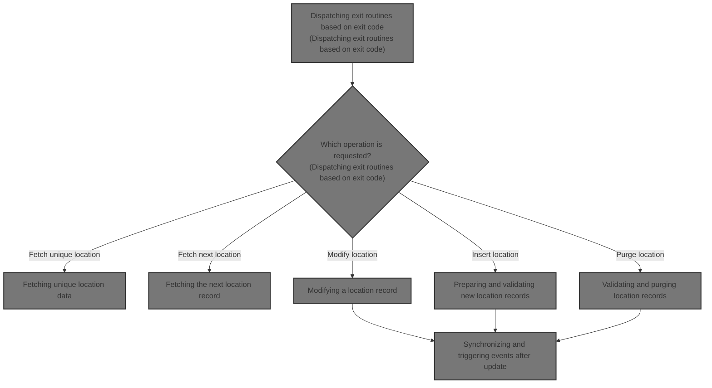
```mermaid
flowchart TD
    node1["Dispatching exit routines based on exit code
(Dispatching exit routines based on exit code)"]:::HeadingStyle --> node2{"Which operation is requested?
(Dispatching exit routines based on exit code)"}:::HeadingStyle
    click node1 goToHeading "Dispatching exit routines based on exit code"
    click node2 goToHeading "Dispatching exit routines based on exit code"
    node2 -->|"Fetch unique location"| node3["Fetching unique location data"]:::HeadingStyle
    click node3 goToHeading "Fetching unique location data"
    node2 -->|"Fetch next location"| node4["Fetching the next location record"]:::HeadingStyle
    click node4 goToHeading "Fetching the next location record"
    node2 -->|"Modify location"| node5["Modifying a location record"]:::HeadingStyle
    click node5 goToHeading "Modifying a location record"
    node2 -->|"Insert location"| node6["Preparing and validating new location records"]:::HeadingStyle
    click node6 goToHeading "Preparing and validating new location records"
    node2 -->|"Purge location"| node7["Validating and purging location records"]:::HeadingStyle
    click node7 goToHeading "Validating and purging location records"
    node5 --> node8["Synchronizing and triggering events after update"]:::HeadingStyle
    click node8 goToHeading "Synchronizing and triggering events after update"
    node6 --> node8
    node7 --> node8
classDef HeadingStyle fill:#777777,stroke:#333,stroke-width:2px;
```

## Dependencies

### Programs

- <SwmToken path="base/src/NNNS0488.cbl" pos="1680:5:5" line-data="171700       STRING &#39;NNNS0488 - Error connecting to Oracle. Sqlcode =&#39;  00171700">`NNNS0488`</SwmToken> (<SwmPath>[base/src/NNNS0488.cbl](base/src/NNNS0488.cbl)</SwmPath>)
- <SwmToken path="base/src/NNNS0488.cbl" pos="2132:6:6" line-data="216900        CALL WS-MMMS0291-PGM USING                                00216900">`MMMS0291`</SwmToken> (<SwmPath>[base/src/MMMS0291.cbl](base/src/MMMS0291.cbl)</SwmPath>)
- <SwmToken path="base/src/XXXS0210.cbl" pos="2:7:7" line-data="000200 PROGRAM-ID.    YYYS0210.                                         00000200">`YYYS0210`</SwmToken> (<SwmPath>[base/src/XXXS0210.cbl](base/src/XXXS0210.cbl)</SwmPath>)
- <SwmToken path="base/src/XXXS0210.cbl" pos="55:4:4" line-data="007540     CALL YYYS0220-DBMS-CON-MGR USING                             00007540">`YYYS0220`</SwmToken> (<SwmPath>[base/src/YYYS0220.cbl](base/src/YYYS0220.cbl)</SwmPath>)
- YYYS0211 (<SwmPath>[base/src/YYYS0211.cbl](base/src/YYYS0211.cbl)</SwmPath>)
- YYYS0212 (<SwmPath>[base/src/YYYS0212.cbl](base/src/YYYS0212.cbl)</SwmPath>)
- <SwmToken path="base/src/NNNS0488.cbl" pos="3722:4:4" line-data="374300     CALL WWWS0100-CONTROL-SUBR USING                             00374300">`WWWS0100`</SwmToken> (<SwmPath>[base/src/WWWS0100.cbl](base/src/WWWS0100.cbl)</SwmPath>)
- <SwmToken path="base/src/NNNS0488.cbl" pos="3732:4:4" line-data="375300     CALL MMMS0159-SYNC-LR USING                                  00375300">`MMMS0159`</SwmToken>
- <SwmToken path="base/src/NNNS0488.cbl" pos="3752:4:4" line-data="377300       CALL ZZZS0197-EVENT-MGR USING                              00377300">`ZZZS0197`</SwmToken> (<SwmPath>[base/src/ZZZS0197.cbl](base/src/ZZZS0197.cbl)</SwmPath>)
- YYYS0175
- YYYS0127
- YYYS0107
- <SwmToken path="base/src/NNNS0488.cbl" pos="3939:4:4" line-data="396500     CALL NNNS0487-LO-DAO USING                                   00396500">`NNNS0487`</SwmToken> (<SwmPath>[base/src/NNNS0487.cbl](base/src/NNNS0487.cbl)</SwmPath>)
- YYYS0134 (<SwmPath>[base/src/YYYS0134.cbl](base/src/YYYS0134.cbl)</SwmPath>)
- NNNS0457
- NNNS0486
- MMMS0135
- MMMS0157
- MMMS0265
- MMMS0474
- NNNS0575
- NNNS0483
- NNNS0473 (<SwmPath>[base/src/NNNS0473.cbl](base/src/NNNS0473.cbl)</SwmPath>)
- MMMS0161 (<SwmPath>[base/src/MMMS0161.cbl](base/src/MMMS0161.cbl)</SwmPath>)
- MMMS0162 (<SwmPath>[base/src/MMMS0162.cbl](base/src/MMMS0162.cbl)</SwmPath>)
- NNNS0120 (<SwmPath>[base/src/NNNS0120.cbl](base/src/NNNS0120.cbl)</SwmPath>)
- <SwmToken path="base/src/NNNS0488.cbl" pos="3614:8:8" line-data="364200     PERFORM 4500-CALL-MMMS0304-RI-DEL-CHK                        00364200">`MMMS0304`</SwmToken>
- NNNU0120
- <SwmToken path="base/src/NNNS0488.cbl" pos="3598:8:8" line-data="362600     PERFORM 4600-CALL-MMMS0335-RI-ADD-CHK                        00362600">`MMMS0335`</SwmToken> (<SwmPath>[base/src/MMMS0335.cbl](base/src/MMMS0335.cbl)</SwmPath>)
- NNNU0473 (<SwmPath>[base/src/NNNU0473.cbl](base/src/NNNU0473.cbl)</SwmPath>)
- NNNS2294
- NNNU0487
- MMMU0487
- MMMS0711 (<SwmPath>[base/src/MMMS0711.cbl](base/src/MMMS0711.cbl)</SwmPath>)
- WWWS0099
- <SwmToken path="base/src/NNNS0488.cbl" pos="3544:8:8" line-data="357200     PERFORM 5000-CALL-NNNU0488-CUD-ROUTINE                       00357200">`NNNU0488`</SwmToken>

### Copybooks

- SQLCA
- <SwmToken path="base/src/NNNS0488.cbl" pos="1240:4:4" line-data="128500     INITIALIZE XXXN001A                                          00128500">`XXXN001A`</SwmToken> (<SwmPath>[base/src/XXXN001A.cpy](base/src/XXXN001A.cpy)</SwmPath>)
- <SwmToken path="base/src/NNNS0488.cbl" pos="2100:4:4" line-data="213700       INITIALIZE MMMC0291-INPUT-TM                               00213700">`MMMC0291`</SwmToken> (<SwmPath>[base/src/MMMC0291.cpy](base/src/MMMC0291.cpy)</SwmPath>)
- <SwmToken path="base/src/NNNS0488.cbl" pos="72:4:4" line-data="011700 COPY YYYN000A.                                                   00011700">`YYYN000A`</SwmToken> (<SwmPath>[base/src/YYYN000A.cpy](base/src/YYYN000A.cpy)</SwmPath>)
- <SwmToken path="base/src/XXXS0210.cbl" pos="53:4:4" line-data="007510     SET YYYC0220-SET-ORACLE-CON TO TRUE                          00007510">`YYYC0220`</SwmToken> (<SwmPath>[base/src/YYYC0220.cpy](base/src/YYYC0220.cpy)</SwmPath>)
- <SwmToken path="base/src/NNNS0488.cbl" pos="3710:4:4" line-data="373100     AND WWWC0100-NORM-TASK                                       00373100">`WWWC0100`</SwmToken> (<SwmPath>[base/src/WWWC0100.cpy](base/src/WWWC0100.cpy)</SwmPath>)
- <SwmToken path="base/src/NNNS0488.cbl" pos="3905:4:4" line-data="393100     INITIALIZE YYYC0175                                          00393100">`YYYC0175`</SwmToken>
- <SwmToken path="base/src/NNNS0488.cbl" pos="3547:4:4" line-data="357500       SET YYYN110A-UPD TO TRUE                                   00357500">`YYYN110A`</SwmToken> (<SwmPath>[base/src/YYYN110A.cpy](base/src/YYYN110A.cpy)</SwmPath>)
- <SwmToken path="base/src/NNNS0488.cbl" pos="3747:8:8" line-data="376800       MOVE ZZZC0032              TO ZZZC0197-TRX-REC             00376800">`ZZZC0197`</SwmToken> (<SwmPath>[base/src/ZZZC0197.cpy](base/src/ZZZC0197.cpy)</SwmPath>)
- YYYN111A (<SwmPath>[base/src/YYYN111A.cpy](base/src/YYYN111A.cpy)</SwmPath>)
- PPPTCZ01 (<SwmPath>[base/src/PPPTCZ01.cpy](base/src/PPPTCZ01.cpy)</SwmPath>)
- DDDPST01 (<SwmPath>[base/src/DDDPST01.cpy](base/src/DDDPST01.cpy)</SwmPath>)
- PPPTRL01 (<SwmPath>[base/src/PPPTRL01.cpy](base/src/PPPTRL01.cpy)</SwmPath>)
- <SwmToken path="base/src/NNNS0488.cbl" pos="68:4:4" line-data="011300 COPY NNNN000U.                                                   00011300">`NNNN000U`</SwmToken> (<SwmPath>[base/src/NNNN000U.cpy](base/src/NNNN000U.cpy)</SwmPath>)
- HHHTRL01 (<SwmPath>[base/src/HHHTRL01.cpy](base/src/HHHTRL01.cpy)</SwmPath>)
- <SwmToken path="base/src/NNNS0488.cbl" pos="3949:4:4" line-data="397500     INITIALIZE MMMC0304                                          00397500">`MMMC0304`</SwmToken> (<SwmPath>[base/src/MMMC0304.cpy](base/src/MMMC0304.cpy)</SwmPath>)
- DDDTRL01 (<SwmPath>[base/src/DDDTRL01.cpy](base/src/DDDTRL01.cpy)</SwmPath>)
- W00N001A
- <SwmToken path="base/src/NNNS0488.cbl" pos="1251:5:5" line-data="129600     IF (YYYN005A-ORACLE       OR EXIT-PUT-INSERT-ROW             00129600">`YYYN005A`</SwmToken> (<SwmPath>[base/src/YYYN005A.cpy](base/src/YYYN005A.cpy)</SwmPath>)
- <SwmToken path="base/src/NNNS0488.cbl" pos="1244:4:4" line-data="128900     MOVE NNNN0000-INDEX-HANDLE TO DDDTLR01-INDEX-HANDLE          00128900">`NNNN0000`</SwmToken> (<SwmPath>[base/src/NNNN0000.cpy](base/src/NNNN0000.cpy)</SwmPath>)
- <SwmToken path="base/src/NNNS0488.cbl" pos="73:4:4" line-data="011800 COPY YYYN000C.                                                   00011800">`YYYN000C`</SwmToken> (<SwmPath>[base/src/YYYN000C.cpy](base/src/YYYN000C.cpy)</SwmPath>)
- YYYC0097 (<SwmPath>[base/src/YYYC0097.cpy](base/src/YYYC0097.cpy)</SwmPath>)
- <SwmToken path="base/src/NNNS0488.cbl" pos="88:4:4" line-data="013300 COPY MMMK001B.                                                   00013300">`MMMK001B`</SwmToken> (<SwmPath>[base/src/MMMK001B.cpy](base/src/MMMK001B.cpy)</SwmPath>)
- YYYC0131
- TTTK0001
- DDDBSSAS
- MMMC0161 (<SwmPath>[base/src/MMMC0161.cpy](base/src/MMMC0161.cpy)</SwmPath>)
- DDDTCZ01 (<SwmPath>[base/src/DDDTCZ01.cpy](base/src/DDDTCZ01.cpy)</SwmPath>)
- XXXEIBLK
- HHHTCZ01 (<SwmPath>[base/src/HHHTCZ01.cpy](base/src/HHHTCZ01.cpy)</SwmPath>)
- <SwmToken path="base/src/NNNS0488.cbl" pos="3750:4:4" line-data="377100       MOVE YYYC0107-USER         TO ZZZC0197-USER                00377100">`YYYC0107`</SwmToken> (<SwmPath>[base/src/YYYC0107.cpy](base/src/YYYC0107.cpy)</SwmPath>)
- <SwmToken path="base/src/NNNS0488.cbl" pos="3744:24:24" line-data="376500       MOVE LOC-NBR OF P-DDDTLR01 TO ST-STORE-NUMBER OF ZZZC0032  00376500">`ZZZC0032`</SwmToken> (<SwmPath>[base/src/ZZZC0032.cpy](base/src/ZZZC0032.cpy)</SwmPath>)
- <SwmToken path="base/src/NNNS0488.cbl" pos="3745:8:8" line-data="376600                                     LOC-NBR OF ZZZC0094          00376600">`ZZZC0094`</SwmToken> (<SwmPath>[base/src/ZZZC0094.cpy](base/src/ZZZC0094.cpy)</SwmPath>)
- <SwmToken path="base/src/NNNS0488.cbl" pos="3964:4:4" line-data="399000     INITIALIZE MMMC0335                                          00399000">`MMMC0335`</SwmToken> (<SwmPath>[base/src/MMMC0335.cpy](base/src/MMMC0335.cpy)</SwmPath>)
- WWWC0099
- DDDTLS01
- DDDTPT01
- DDDTVI01
- DDDTSI01
- <SwmToken path="base/src/NNNS0488.cbl" pos="3815:6:6" line-data="383600     INITIALIZE P-DDDTLO01                                        00383600">`DDDTLO01`</SwmToken> (<SwmPath>[base/src/DDDTLO01.cpy](base/src/DDDTLO01.cpy)</SwmPath>)
- MMMC0711 (<SwmPath>[base/src/MMMC0711.cpy](base/src/MMMC0711.cpy)</SwmPath>)
- PPPTAP01
- PPPTLD01
- <SwmToken path="base/src/NNNS0488.cbl" pos="1196:4:4" line-data="124100 COPY PPPTLR01.                                                   00124100">`PPPTLR01`</SwmToken> (<SwmPath>[base/src/PPPTLR01.cpy](base/src/PPPTLR01.cpy)</SwmPath>)
- PPPTFX01 (<SwmPath>[base/src/PPPTFX01.cpy](base/src/PPPTFX01.cpy)</SwmPath>)
- PPPTDT01
- PPPTCY01
- DFHEIBLK
- HHHTLO01 (<SwmPath>[base/src/HHHTLO01.cpy](base/src/HHHTLO01.cpy)</SwmPath>)
- MMMC0474
- <SwmToken path="base/src/NNNS0488.cbl" pos="75:4:4" line-data="012000 COPY YYYC0127.                                                   00012000">`YYYC0127`</SwmToken> (<SwmPath>[base/src/YYYC0127.cpy](base/src/YYYC0127.cpy)</SwmPath>)
- ZZZC0122
- ZZZC0123
- ZZZC0124
- ZZZC0020
- ZZZC0044
- ZZZC0550 (<SwmPath>[base/src/ZZZC0550.cpy](base/src/ZZZC0550.cpy)</SwmPath>)
- MMMC0135
- MMMC0157
- MMMC0153
- MMMC0265
- <SwmToken path="base/src/NNNS0488.cbl" pos="1244:12:12" line-data="128900     MOVE NNNN0000-INDEX-HANDLE TO DDDTLR01-INDEX-HANDLE          00128900">`DDDTLR01`</SwmToken>
- DDDTDT01
- DDDTFX01
- DDDTAP01
- DDDTLW01
- DDDTLB01
- <SwmToken path="base/src/NNNS0488.cbl" pos="70:4:4" line-data="011500 COPY PPPTLO01.                                                   00011500">`PPPTLO01`</SwmToken> (<SwmPath>[base/src/PPPTLO01.cpy](base/src/PPPTLO01.cpy)</SwmPath>)
- <SwmToken path="base/src/NNNS0488.cbl" pos="69:4:4" line-data="011400 COPY HHHTLR01.                                                   00011400">`HHHTLR01`</SwmToken>
- <SwmToken path="base/src/NNNS0488.cbl" pos="3913:4:4" line-data="393900     MOVE ZZZC0210-TRX-ID TO YYYC0175-TRX-CD                      00393900">`ZZZC0210`</SwmToken>
- <SwmToken path="base/src/NNNS0488.cbl" pos="3731:4:4" line-data="375200     SET MMMC0159-LR-IS-CURRENT TO TRUE                           00375200">`MMMC0159`</SwmToken>

# Where is this program used?

This program is used multiple times in the codebase as represented in the following diagram:


```mermaid
graph TD
  3yl1l("Database Operation Handler (WWWS0003)") --> hx5en("Retail Location Data Processing (NNNS0488)"):::currentEntity
click 3yl1l openCode "base/src/WWWS0003.cbl:1"
eu2qq("Managing Location Data (NNNS0487)") --> hx5en("Retail Location Data Processing (NNNS0488)"):::currentEntity
click eu2qq openCode "base/src/NNNS0487.cbl:1"
  
  
click hx5en openCode "base/src/NNNS0488.cbl:1"
    classDef currentEntity color:#000000,fill:#7CB9F4

%% Swimm:
%% graph TD
%%   3yl1l("Database Operation Handler (WWWS0003)") --> hx5en("Retail Location Data Processing (<SwmToken path="base/src/NNNS0488.cbl" pos="1680:5:5" line-data="171700       STRING &#39;NNNS0488 - Error connecting to Oracle. Sqlcode =&#39;  00171700">`NNNS0488`</SwmToken>)"):::currentEntity
%% click 3yl1l openCode "<SwmPath>[base/src/WWWS0003.cbl](base/src/WWWS0003.cbl)</SwmPath>:1"
%% eu2qq("Managing Location Data (<SwmToken path="base/src/NNNS0488.cbl" pos="3939:4:4" line-data="396500     CALL NNNS0487-LO-DAO USING                                   00396500">`NNNS0487`</SwmToken>)") --> hx5en("Retail Location Data Processing (<SwmToken path="base/src/NNNS0488.cbl" pos="1680:5:5" line-data="171700       STRING &#39;NNNS0488 - Error connecting to Oracle. Sqlcode =&#39;  00171700">`NNNS0488`</SwmToken>)"):::currentEntity
%% click eu2qq openCode "<SwmPath>[base/src/NNNS0487.cbl](base/src/NNNS0487.cbl)</SwmPath>:1"
%%   
%%   
%% click hx5en openCode "<SwmPath>[base/src/NNNS0488.cbl](base/src/NNNS0488.cbl)</SwmPath>:1"
%%     classDef currentEntity color:#000000,fill:#7CB9F4
```

## Detailed View of the Program's Functionality

a. Overview of Database Connection Management

The Swimmio-dyncall-demo system manages connections to two types of databases: <SwmToken path="base/src/NNNS0488.cbl" pos="1765:7:7" line-data="180200*      SET YYYN005A-DB2        TO TRUE                            00180200">`DB2`</SwmToken> and Oracle. The logic for switching and tracking these connections is distributed across several modules, with each module responsible for a specific aspect of connection management, initialization, and statistics.

b. Initialization and Connection Setup (<SwmPath>[base/src/XXXS0210.cbl](base/src/XXXS0210.cbl)</SwmPath>)

- When the dispatcher routine in this module is invoked, it first initializes all relevant data areas, including the main parameter block and the SQL status code.
- After initialization, it sets up a request to switch to an Oracle connection by setting a specific flag in the connection control structure.
- It then calls a connection manager routine (in another module) to handle the actual database connection logic.
- Once the connection manager completes, the program returns control to the caller.

c. Connection Manager and Dispatcher (<SwmPath>[base/src/YYYS0220.cbl](base/src/YYYS0220.cbl)</SwmPath>)

- The connection manager receives requests to perform various connection-related operations, such as switching to <SwmToken path="base/src/NNNS0488.cbl" pos="1765:7:7" line-data="180200*      SET YYYN005A-DB2        TO TRUE                            00180200">`DB2`</SwmToken>, switching to Oracle, reporting statistics, or overriding the current connection.
- On entry, it initializes the main parameter block and sets the environment (production, test, etc.).
- It then evaluates which operation is requested by checking flags in the control structure:
  - If the request is to get the current connection, it copies the current connection type to the output.
  - If the request is to switch to <SwmToken path="base/src/NNNS0488.cbl" pos="1765:7:7" line-data="180200*      SET YYYN005A-DB2        TO TRUE                            00180200">`DB2`</SwmToken>, it increments statistics counters, checks if a switch is needed, and if so, performs the switch and updates the current connection type.
  - If the request is to switch to Oracle, it increments statistics counters, checks if a switch is needed, and if so, performs the switch and updates the current connection type.
  - If the request is to get statistics, it copies all connection and request counters to the output.
  - If the request is to reset statistics, it initializes all statistics counters to zero.
  - If the request is to override the current connection, it checks which override flag is set (<SwmToken path="base/src/NNNS0488.cbl" pos="1765:7:7" line-data="180200*      SET YYYN005A-DB2        TO TRUE                            00180200">`DB2`</SwmToken> or Oracle), updates the connection type and counters, or sets an error if the request is invalid.
- For each connection switch, the manager checks the environment (production, test, etc.) and issues the appropriate SQL CONNECT statement to the correct database instance.
- After each connection attempt, it checks the SQL status code:
  - If successful, it continues.
  - If unsuccessful, it sets a failure flag and builds an error message with the SQL code for troubleshooting.

d. Connection Switch Logic

- When switching to <SwmToken path="base/src/NNNS0488.cbl" pos="1765:7:7" line-data="180200*      SET YYYN005A-DB2        TO TRUE                            00180200">`DB2`</SwmToken>:
  - The system increments both the total request counter and the <SwmToken path="base/src/NNNS0488.cbl" pos="1765:7:7" line-data="180200*      SET YYYN005A-DB2        TO TRUE                            00180200">`DB2`</SwmToken> request counter.
  - If the current connection is Oracle or the default, it performs the actual switch, logs the attempt, and connects to the correct <SwmToken path="base/src/NNNS0488.cbl" pos="1765:7:7" line-data="180200*      SET YYYN005A-DB2        TO TRUE                            00180200">`DB2`</SwmToken> instance based on the environment.
  - After switching, it updates the current connection type and reports it.
- When switching to Oracle:
  - The system increments both the total request counter and the Oracle request counter.
  - If not already connected to Oracle, it performs the actual switch, logs the attempt, and connects to the correct Oracle instance based on the environment.
  - After switching, it updates the current connection type and reports it.

e. Statistics and Overrides

- The system tracks the number of total requests, <SwmToken path="base/src/NNNS0488.cbl" pos="1765:7:7" line-data="180200*      SET YYYN005A-DB2        TO TRUE                            00180200">`DB2`</SwmToken> requests, Oracle requests, override requests, and the number of times connections have been switched (both normal and override).
- When requested, it copies these statistics to the output structure for monitoring or debugging.
- It also allows for external override of the current connection, but only if the override is valid (i.e., not already set to the requested type).

f. Error Handling

- If a connection attempt fails, the system sets a failure flag and constructs a detailed error message including the SQL code.
- If an invalid function or override is requested, it sets a failure flag and returns a descriptive error message.

g. Integration with Main Dispatcher (<SwmPath>[base/src/NNNS0488.cbl](base/src/NNNS0488.cbl)</SwmPath>)

- The main dispatcher in the core module calls the initialization and connection setup routines as needed, ensuring that the correct database connection is established before any business logic or data operations are performed.
- After completing its work, if the system was using Oracle or performed certain operations, it switches the connection back to <SwmToken path="base/src/NNNS0488.cbl" pos="1765:7:7" line-data="180200*      SET YYYN005A-DB2        TO TRUE                            00180200">`DB2`</SwmToken> to reset the environment for subsequent operations.

h. Summary

- The Swimmio-dyncall-demo system provides robust, environment-aware management of database connections, with clear separation of concerns between initialization, connection switching, statistics tracking, and error handling.
- All connection logic is centralized in the connection manager, which is invoked by the main dispatcher and other routines as needed.
- The system ensures that only one active connection type is set at a time, and provides mechanisms for both automatic and manual (override) switching, with full tracking and reporting of all connection activity.

# Rule Definition

| Paragraph Name                                                                                                                                                                                                                                                                                                                                                                                                                                                                                                                                                                                                                                                                                                                                                                                                                                                                                                                                                                                                                                                                                                                                                                                                                                                                                                                                                                                                                                                                                                                                                                                                                                                                                                                                                                                                                                                                                                                                                            | Rule ID | Category          | Description                                                                                                                                                                                                                                                                                                                                                                                                                                                                                                                                                                                                                                                                                                                                                                                                                                                                                                                                                                                                                                                                                                                                                                                                                                                                                                                                                                                                                                                                                                          | Conditions                                                                                                                                                                                                                  | Remarks                                                                                                                                                                                                                                                   |
| ------------------------------------------------------------------------------------------------------------------------------------------------------------------------------------------------------------------------------------------------------------------------------------------------------------------------------------------------------------------------------------------------------------------------------------------------------------------------------------------------------------------------------------------------------------------------------------------------------------------------------------------------------------------------------------------------------------------------------------------------------------------------------------------------------------------------------------------------------------------------------------------------------------------------------------------------------------------------------------------------------------------------------------------------------------------------------------------------------------------------------------------------------------------------------------------------------------------------------------------------------------------------------------------------------------------------------------------------------------------------------------------------------------------------------------------------------------------------------------------------------------------------------------------------------------------------------------------------------------------------------------------------------------------------------------------------------------------------------------------------------------------------------------------------------------------------------------------------------------------------------------------------------------------------------------------------------------------------- | ------- | ----------------- | -------------------------------------------------------------------------------------------------------------------------------------------------------------------------------------------------------------------------------------------------------------------------------------------------------------------------------------------------------------------------------------------------------------------------------------------------------------------------------------------------------------------------------------------------------------------------------------------------------------------------------------------------------------------------------------------------------------------------------------------------------------------------------------------------------------------------------------------------------------------------------------------------------------------------------------------------------------------------------------------------------------------------------------------------------------------------------------------------------------------------------------------------------------------------------------------------------------------------------------------------------------------------------------------------------------------------------------------------------------------------------------------------------------------------------------------------------------------------------------------------------------------- | --------------------------------------------------------------------------------------------------------------------------------------------------------------------------------------------------------------------------- | --------------------------------------------------------------------------------------------------------------------------------------------------------------------------------------------------------------------------------------------------------- |
| <SwmToken path="base/src/NNNS0488.cbl" pos="1210:4:6" line-data="125500     PERFORM 100-INITIALIZATION                                   00125500">`100-INITIALIZATION`</SwmToken>, <SwmToken path="base/src/NNNS0488.cbl" pos="1249:4:14" line-data="129400       PERFORM 110-MOVE-PDA-FIELDS-2-DCL                          00129400">`110-MOVE-PDA-FIELDS-2-DCL`</SwmToken>, PROCEDURE DIVISION USING                                                                                                                                                                                                                                                                                                                                                                                                                                                                                                                                                                                                                                                                                                                                                                                                                                                                                                                                                                                                                                                                                                                                                                                                                                                                                                                                                                                                                                                                                                                                                                  | RL-001  | Data Assignment   | The dispatcher must receive a parameter area containing the operation code, cursor ID, a location record (<SwmToken path="base/src/NNNS0488.cbl" pos="1785:22:24" line-data="182200     MOVE LOC-NBR OF DCLXXXAIL-LOC TO LOC-NBR OF P-DDDTLR01       00182200">`P-DDDTLR01`</SwmToken>), and fields for status and messaging.                                                                                                                                                                                                                                                                                                                                                                                                                                                                                                                                                                                                                                                                                                                                                                                                                                                                                                                                                                                                                                                                                                                                                                                        | Always, on entry to the dispatcher.                                                                                                                                                                                         | The parameter area must include fields for operation code (number), cursor ID (string), location record (structured), status flags (boolean or equivalent), and messaging (string).                                                                       |
| <SwmToken path="base/src/NNNS0488.cbl" pos="1209:2:6" line-data="125400 0000-EXIT-DISPATCHER.                                            00125400">`0000-EXIT-DISPATCHER`</SwmToken> (EVALUATE TRUE), <SwmToken path="base/src/NNNS0488.cbl" pos="1215:4:10" line-data="126000          PERFORM 1000-EXIT-OPEN-CURSOR                           00126000">`1000-EXIT-OPEN-CURSOR`</SwmToken>, <SwmToken path="base/src/NNNS0488.cbl" pos="1217:4:10" line-data="126200          PERFORM 1100-EXIT-CLOSE-CURSOR                          00126200">`1100-EXIT-CLOSE-CURSOR`</SwmToken>, <SwmToken path="base/src/NNNS0488.cbl" pos="1219:4:12" line-data="126400          PERFORM 1200-EXIT-GET-UNIQUE-ROW                        00126400">`1200-EXIT-GET-UNIQUE-ROW`</SwmToken>, <SwmToken path="base/src/NNNS0488.cbl" pos="1221:4:12" line-data="126600          PERFORM 1300-EXIT-GET-NEXT-ROW                          00126600">`1300-EXIT-GET-NEXT-ROW`</SwmToken>, <SwmToken path="base/src/NNNS0488.cbl" pos="1223:4:12" line-data="126800          PERFORM 1400-EXIT-PUT-MODIFY-ROW                        00126800">`1400-EXIT-PUT-MODIFY-ROW`</SwmToken>, <SwmToken path="base/src/NNNS0488.cbl" pos="1225:4:12" line-data="127000          PERFORM 1500-EXIT-PUT-INSERT-ROW                        00127000">`1500-EXIT-PUT-INSERT-ROW`</SwmToken>, <SwmToken path="base/src/NNNS0488.cbl" pos="1227:4:12" line-data="127200          PERFORM 1600-EXIT-PUT-PURGE-ROW                         00127200">`1600-EXIT-PUT-PURGE-ROW`</SwmToken>, <SwmToken path="base/src/NNNS0488.cbl" pos="1229:4:12" line-data="127400          PERFORM 10000-DO-SPECIAL-IO-FUNCS                       00127400">`10000-DO-SPECIAL-IO-FUNCS`</SwmToken>                                                                                                                                                                                                                     | RL-002  | Conditional Logic | The dispatcher must support operation codes: 1 (Open Cursor), 2 (Close Cursor), 3 (Get Unique Row), 5 (Get Next Row), 8 (Modify Row), 9 (Insert Row), 10 (Purge Row), 90 (Special IO).                                                                                                                                                                                                                                                                                                                                                                                                                                                                                                                                                                                                                                                                                                                                                                                                                                                                                                                                                                                                                                                                                                                                                                                                                                                                                                                               | Operation code in parameter area matches one of the supported codes.                                                                                                                                                        | Operation codes are numbers: 1, 2, 3, 5, 8, 9, 10, 90.                                                                                                                                                                                                    |
| <SwmToken path="base/src/NNNS0488.cbl" pos="1215:4:10" line-data="126000          PERFORM 1000-EXIT-OPEN-CURSOR                           00126000">`1000-EXIT-OPEN-CURSOR`</SwmToken>, <SwmToken path="base/src/NNNS0488.cbl" pos="1217:4:10" line-data="126200          PERFORM 1100-EXIT-CLOSE-CURSOR                          00126200">`1100-EXIT-CLOSE-CURSOR`</SwmToken>, <SwmToken path="base/src/NNNS0488.cbl" pos="1221:4:12" line-data="126600          PERFORM 1300-EXIT-GET-NEXT-ROW                          00126600">`1300-EXIT-GET-NEXT-ROW`</SwmToken>                                                                                                                                                                                                                                                                                                                                                                                                                                                                                                                                                                                                                                                                                                                                                                                                                                                                                                                                                                                                                                                                                                                                                                                                                                                                                                                                                                                                  | RL-003  | Conditional Logic | Cursor IDs must be mapped to cursor names <SwmToken path="base/src/NNNS0488.cbl" pos="2208:4:4" line-data="224500       WHEN DDDXLR01                                              00224500">`DDDXLR01`</SwmToken>–<SwmToken path="base/src/NNNS0488.cbl" pos="2240:4:4" line-data="227700       WHEN DDDXLR09                                              00227700">`DDDXLR09`</SwmToken>. Only <SwmToken path="base/src/NNNS0488.cbl" pos="2208:4:4" line-data="224500       WHEN DDDXLR01                                              00224500">`DDDXLR01`</SwmToken>–<SwmToken path="base/src/NNNS0488.cbl" pos="2232:4:4" line-data="226900       WHEN DDDXLR07                                              00226900">`DDDXLR07`</SwmToken> and <SwmToken path="base/src/NNNS0488.cbl" pos="2240:4:4" line-data="227700       WHEN DDDXLR09                                              00227700">`DDDXLR09`</SwmToken> are valid for fetch operations.                                                                                                                                                                                                                                                                                                                                                                                                                                                                                                                                                     | Operation involves a cursor (open, close, fetch).                                                                                                                                                                           | Cursor IDs are mapped to string names. Only specific names are valid for fetch.                                                                                                                                                                           |
| <SwmToken path="base/src/NNNS0488.cbl" pos="1249:4:14" line-data="129400       PERFORM 110-MOVE-PDA-FIELDS-2-DCL                          00129400">`110-MOVE-PDA-FIELDS-2-DCL`</SwmToken>, <SwmToken path="base/src/NNNS0488.cbl" pos="1759:4:14" line-data="179600         PERFORM 130-MOVE-DCL-2-PDA-FIELDS                        00179600">`130-MOVE-DCL-2-PDA-FIELDS`</SwmToken>, <SwmToken path="base/src/NNNS0488.cbl" pos="1231:4:8" line-data="127600     PERFORM 120-EXIT-STUFF                                       00127600">`120-EXIT-STUFF`</SwmToken>, <SwmToken path="base/src/NNNS0488.cbl" pos="1215:4:10" line-data="126000          PERFORM 1000-EXIT-OPEN-CURSOR                           00126000">`1000-EXIT-OPEN-CURSOR`</SwmToken>, <SwmToken path="base/src/NNNS0488.cbl" pos="1219:4:12" line-data="126400          PERFORM 1200-EXIT-GET-UNIQUE-ROW                        00126400">`1200-EXIT-GET-UNIQUE-ROW`</SwmToken>, <SwmToken path="base/src/NNNS0488.cbl" pos="1221:4:12" line-data="126600          PERFORM 1300-EXIT-GET-NEXT-ROW                          00126600">`1300-EXIT-GET-NEXT-ROW`</SwmToken>, <SwmToken path="base/src/NNNS0488.cbl" pos="1223:4:12" line-data="126800          PERFORM 1400-EXIT-PUT-MODIFY-ROW                        00126800">`1400-EXIT-PUT-MODIFY-ROW`</SwmToken>, <SwmToken path="base/src/NNNS0488.cbl" pos="1225:4:12" line-data="127000          PERFORM 1500-EXIT-PUT-INSERT-ROW                        00127000">`1500-EXIT-PUT-INSERT-ROW`</SwmToken>, <SwmToken path="base/src/NNNS0488.cbl" pos="1227:4:12" line-data="127200          PERFORM 1600-EXIT-PUT-PURGE-ROW                         00127200">`1600-EXIT-PUT-PURGE-ROW`</SwmToken>                                                                                                                                                                                                                                        | RL-004  | Data Assignment   | The location record (<SwmToken path="base/src/NNNS0488.cbl" pos="1785:22:24" line-data="182200     MOVE LOC-NBR OF DCLXXXAIL-LOC TO LOC-NBR OF P-DDDTLR01       00182200">`P-DDDTLR01`</SwmToken>) must be updated in-place to reflect changes, inserts, deletes, or fetches.                                                                                                                                                                                                                                                                                                                                                                                                                                                                                                                                                                                                                                                                                                                                                                                                                                                                                                                                                                                                                                                                                                                                                                                                                                        | After any operation that modifies or fetches data.                                                                                                                                                                          | Location record is a structured data area. Updates must be reflected in the output parameter area.                                                                                                                                                        |
| <SwmToken path="base/src/NNNS0488.cbl" pos="2510:4:10" line-data="254600     PERFORM 1700-CHECK-NULL-COLUMNS                              00254600">`1700-CHECK-NULL-COLUMNS`</SwmToken>, <SwmToken path="base/src/NNNS0488.cbl" pos="3453:4:10" line-data="348100     PERFORM 1800-EDIT-NULL-INDICATORS                            00348100">`1800-EDIT-NULL-INDICATORS`</SwmToken>, <SwmToken path="base/src/NNNS0488.cbl" pos="1249:4:14" line-data="129400       PERFORM 110-MOVE-PDA-FIELDS-2-DCL                          00129400">`110-MOVE-PDA-FIELDS-2-DCL`</SwmToken>, <SwmToken path="base/src/NNNS0488.cbl" pos="1759:4:14" line-data="179600         PERFORM 130-MOVE-DCL-2-PDA-FIELDS                        00179600">`130-MOVE-DCL-2-PDA-FIELDS`</SwmToken>                                                                                                                                                                                                                                                                                                                                                                                                                                                                                                                                                                                                                                                                                                                                                                                                                                                                                                                                                                                                                                                                                                                                                                                              | RL-005  | Data Assignment   | Indicator fields (e.g., <SwmToken path="base/src/NNNS0488.cbl" pos="2489:9:15" line-data="252600                  :DCLXXXAIL-LOC-IND.ECOMM-STRT-DT-IND,           00252600">`ECOMM-STRT-DT-IND`</SwmToken>) represent nullability for corresponding fields. -1 means null, 0 means not null.                                                                                                                                                                                                                                                                                                                                                                                                                                                                                                                                                                                                                                                                                                                                                                                                                                                                                                                                                                                                                                                                                                                                                                                                                         | Whenever a nullable field is processed or output.                                                                                                                                                                           | Indicator fields are numbers: -1 (null), 0 (not null).                                                                                                                                                                                                    |
| <SwmToken path="base/src/NNNS0488.cbl" pos="10:2:4" line-data="005500 WORKING-STORAGE SECTION.                                         00005500">`WORKING-STORAGE`</SwmToken> SECTION, <SwmToken path="base/src/NNNS0488.cbl" pos="1249:4:14" line-data="129400       PERFORM 110-MOVE-PDA-FIELDS-2-DCL                          00129400">`110-MOVE-PDA-FIELDS-2-DCL`</SwmToken>, <SwmToken path="base/src/NNNS0488.cbl" pos="1759:4:14" line-data="179600         PERFORM 130-MOVE-DCL-2-PDA-FIELDS                        00179600">`130-MOVE-DCL-2-PDA-FIELDS`</SwmToken>                                                                                                                                                                                                                                                                                                                                                                                                                                                                                                                                                                                                                                                                                                                                                                                                                                                                                                                                                                                                                                                                                                                                                                                                                                                                                                                                                                                             | RL-006  | Data Assignment   | Use <SwmToken path="base/src/NNNS0488.cbl" pos="1944:18:22" line-data="198100     IF MON-OPEN-TM OF P-DDDTLR01 = K-DEF-TM                      00198100">`K-DEF-TM`</SwmToken> (<SwmToken path="base/src/NNNS0488.cbl" pos="18:20:24" line-data="006300 01 K-DEF-TM                           PIC X(8)  VALUE &#39;00.00.00&#39;.00006300">`00.00.00`</SwmToken>), <SwmToken path="base/src/NNNS0488.cbl" pos="1947:18:24" line-data="198400     IF MON-CLOS-TM OF DCLXXXAIL-LOC = K-DB2-MAX-TM               00198400">`K-DB2-MAX-TM`</SwmToken> (<SwmToken path="base/src/NNNS0488.cbl" pos="19:22:26" line-data="006400 01 K-DB2-MAX-TM                       PIC X(8)  VALUE &#39;24.00.00&#39;.00006400">`24.00.00`</SwmToken>), <SwmToken path="base/src/NNNS0488.cbl" pos="1948:4:10" line-data="198500       MOVE K-ORA-MAX-TM  TO MON-CLOS-TM OF DCLXXXAIL-LOC         00198500">`K-ORA-MAX-TM`</SwmToken> (<SwmToken path="base/src/NNNS0488.cbl" pos="20:22:26" line-data="006500 01 K-ORA-MAX-TM                       PIC X(8)  VALUE &#39;23.59.59&#39;.00006500">`23.59.59`</SwmToken>), <SwmToken path="base/src/NNNS0488.cbl" pos="1794:18:22" line-data="183100     IF STR-REMODL-DT OF P-DDDTLR01 = K-DEF-DT                    00183100">`K-DEF-DT`</SwmToken> ('01/01/1600'), <SwmToken path="base/src/NNNS0488.cbl" pos="3660:4:8" line-data="368500       MOVE K-ZERO-DT TO  ECOMM-STRT-DT OF DCLXXXAIL-LOC          00368500">`K-ZERO-DT`</SwmToken> ('00/00/0000') for default/null values. | When a date or time field is empty or zero.                                                                                                                                                                                 | Constants are strings representing default or null values for dates and times.                                                                                                                                                                            |
| EVALUATE TRUE blocks in dispatcher, <SwmToken path="base/src/NNNS0488.cbl" pos="1215:4:10" line-data="126000          PERFORM 1000-EXIT-OPEN-CURSOR                           00126000">`1000-EXIT-OPEN-CURSOR`</SwmToken>, <SwmToken path="base/src/NNNS0488.cbl" pos="1217:4:10" line-data="126200          PERFORM 1100-EXIT-CLOSE-CURSOR                          00126200">`1100-EXIT-CLOSE-CURSOR`</SwmToken>, <SwmToken path="base/src/NNNS0488.cbl" pos="1219:4:12" line-data="126400          PERFORM 1200-EXIT-GET-UNIQUE-ROW                        00126400">`1200-EXIT-GET-UNIQUE-ROW`</SwmToken>, <SwmToken path="base/src/NNNS0488.cbl" pos="1221:4:12" line-data="126600          PERFORM 1300-EXIT-GET-NEXT-ROW                          00126600">`1300-EXIT-GET-NEXT-ROW`</SwmToken>, <SwmToken path="base/src/NNNS0488.cbl" pos="1223:4:12" line-data="126800          PERFORM 1400-EXIT-PUT-MODIFY-ROW                        00126800">`1400-EXIT-PUT-MODIFY-ROW`</SwmToken>, <SwmToken path="base/src/NNNS0488.cbl" pos="1225:4:12" line-data="127000          PERFORM 1500-EXIT-PUT-INSERT-ROW                        00127000">`1500-EXIT-PUT-INSERT-ROW`</SwmToken>, <SwmToken path="base/src/NNNS0488.cbl" pos="1227:4:12" line-data="127200          PERFORM 1600-EXIT-PUT-PURGE-ROW                         00127200">`1600-EXIT-PUT-PURGE-ROW`</SwmToken>, <SwmToken path="base/src/NNNS0488.cbl" pos="1229:4:12" line-data="127400          PERFORM 10000-DO-SPECIAL-IO-FUNCS                       00127400">`10000-DO-SPECIAL-IO-FUNCS`</SwmToken>, <SwmToken path="base/src/NNNS0488.cbl" pos="2510:4:10" line-data="254600     PERFORM 1700-CHECK-NULL-COLUMNS                              00254600">`1700-CHECK-NULL-COLUMNS`</SwmToken>, <SwmToken path="base/src/NNNS0488.cbl" pos="3453:4:10" line-data="348100     PERFORM 1800-EDIT-NULL-INDICATORS                            00348100">`1800-EDIT-NULL-INDICATORS`</SwmToken> | RL-007  | Conditional Logic | Set FAILURE to TRUE and populate <SwmToken path="base/src/NNNS0488.cbl" pos="1679:8:14" line-data="171600       MOVE SPACES  TO IS-RTRN-MSG-TXT                            00171600">`IS-RTRN-MSG-TXT`</SwmToken> with error message if invalid operation code, cursor ID, or database error occurs. For SQL errors, include SQLCODE in message. Set SUCCESS to TRUE if operation completes successfully.                                                                                                                                                                                                                                                                                                                                                                                                                                                                                                                                                                                                                                                                                                                                                                                                                                                                                                                                                                                                                                                                                                            | On any error or successful completion.                                                                                                                                                                                      | FAILURE and SUCCESS are boolean flags. <SwmToken path="base/src/NNNS0488.cbl" pos="1679:8:14" line-data="171600       MOVE SPACES  TO IS-RTRN-MSG-TXT                            00171600">`IS-RTRN-MSG-TXT`</SwmToken> is a string. SQLCODE is a number. |
| <SwmToken path="base/src/NNNS0488.cbl" pos="1759:4:14" line-data="179600         PERFORM 130-MOVE-DCL-2-PDA-FIELDS                        00179600">`130-MOVE-DCL-2-PDA-FIELDS`</SwmToken>, <SwmToken path="base/src/NNNS0488.cbl" pos="1249:4:14" line-data="129400       PERFORM 110-MOVE-PDA-FIELDS-2-DCL                          00129400">`110-MOVE-PDA-FIELDS-2-DCL`</SwmToken>, <SwmToken path="base/src/NNNS0488.cbl" pos="2510:4:10" line-data="254600     PERFORM 1700-CHECK-NULL-COLUMNS                              00254600">`1700-CHECK-NULL-COLUMNS`</SwmToken>, <SwmToken path="base/src/NNNS0488.cbl" pos="3453:4:10" line-data="348100     PERFORM 1800-EDIT-NULL-INDICATORS                            00348100">`1800-EDIT-NULL-INDICATORS`</SwmToken>                                                                                                                                                                                                                                                                                                                                                                                                                                                                                                                                                                                                                                                                                                                                                                                                                                                                                                                                                                                                                                                                                                                                                                                              | RL-008  | Computation       | All output fields must be normalized according to business rules, including blanking out or converting default values for dates and times.                                                                                                                                                                                                                                                                                                                                                                                                                                                                                                                                                                                                                                                                                                                                                                                                                                                                                                                                                                                                                                                                                                                                                                                                                                                                                                                                                                           | On output of any field to parameter area.                                                                                                                                                                                   | Dates/times with default values may be blanked out. Null indicators must be set appropriately.                                                                                                                                                            |
| <SwmToken path="base/src/NNNS0488.cbl" pos="1253:4:10" line-data="129800       PERFORM 115-CONNECT-TO-ORACLE                              00129800">`115-CONNECT-TO-ORACLE`</SwmToken>, <SwmToken path="base/src/NNNS0488.cbl" pos="1766:4:10" line-data="180300       PERFORM 125-CONNECT-TO-DB2                                 00180300">`125-CONNECT-TO-DB2`</SwmToken>, <SwmToken path="base/src/NNNS0488.cbl" pos="1210:4:6" line-data="125500     PERFORM 100-INITIALIZATION                                   00125500">`100-INITIALIZATION`</SwmToken>, environment checks                                                                                                                                                                                                                                                                                                                                                                                                                                                                                                                                                                                                                                                                                                                                                                                                                                                                                                                                                                                                                                                                                                                                                                                                                                                                                                                                                                                       | RL-009  | Conditional Logic | Dispatcher must support both real database operations and mock implementations, as determined by environment configuration.                                                                                                                                                                                                                                                                                                                                                                                                                                                                                                                                                                                                                                                                                                                                                                                                                                                                                                                                                                                                                                                                                                                                                                                                                                                                                                                                                                                          | Based on environment configuration (e.g., <SwmToken path="base/src/NNNS0488.cbl" pos="1251:5:7" line-data="129600     IF (YYYN005A-ORACLE       OR EXIT-PUT-INSERT-ROW             00129600">`YYYN005A-ORACLE`</SwmToken>). | Environment configuration determines which database routines are called.                                                                                                                                                                                  |
| <SwmToken path="base/src/NNNS0488.cbl" pos="1231:4:8" line-data="127600     PERFORM 120-EXIT-STUFF                                       00127600">`120-EXIT-STUFF`</SwmToken>, <SwmToken path="base/src/NNNS0488.cbl" pos="1759:4:14" line-data="179600         PERFORM 130-MOVE-DCL-2-PDA-FIELDS                        00179600">`130-MOVE-DCL-2-PDA-FIELDS`</SwmToken>, error handling blocks                                                                                                                                                                                                                                                                                                                                                                                                                                                                                                                                                                                                                                                                                                                                                                                                                                                                                                                                                                                                                                                                                                                                                                                                                                                                                                                                                                                                                                                                                                                                                                         | RL-010  | Data Assignment   | After each operation, update the output parameter area with the latest location record, status flags, and error message as appropriate.                                                                                                                                                                                                                                                                                                                                                                                                                                                                                                                                                                                                                                                                                                                                                                                                                                                                                                                                                                                                                                                                                                                                                                                                                                                                                                                                                                              | After any operation or error.                                                                                                                                                                                               | Output parameter area must reflect all changes, status, and messages.                                                                                                                                                                                     |

# User Stories

## User Story 1: Parameter Area Handling, Output Update, and Error Reporting

---

### Story Description:

As a system, I want to receive a parameter area containing the operation code, cursor ID, location record, status flags, and messaging fields, and update the output parameter area with the latest location record, status, and error message after each operation, including setting FAILURE or SUCCESS flags and populating error messages as appropriate, so that all input and output data, status, and errors are managed consistently and accurately.

---

### Business Rule Mapping:

| Rule ID | Paragraph Name                                                                                                                                                                                                                                                                                                                                                                                                                                                                                                                                                                                                                                                                                                                                                                                                                                                                                                                                                                                                                                                                                                                                                                                                                                                                                                                                                                                                                                                                                                                                                                                                                                                                                                                                                                                                                                                                                                                                                            | Rule Description                                                                                                                                                                                                                                                                                                                                                                                          |
| ------- | ------------------------------------------------------------------------------------------------------------------------------------------------------------------------------------------------------------------------------------------------------------------------------------------------------------------------------------------------------------------------------------------------------------------------------------------------------------------------------------------------------------------------------------------------------------------------------------------------------------------------------------------------------------------------------------------------------------------------------------------------------------------------------------------------------------------------------------------------------------------------------------------------------------------------------------------------------------------------------------------------------------------------------------------------------------------------------------------------------------------------------------------------------------------------------------------------------------------------------------------------------------------------------------------------------------------------------------------------------------------------------------------------------------------------------------------------------------------------------------------------------------------------------------------------------------------------------------------------------------------------------------------------------------------------------------------------------------------------------------------------------------------------------------------------------------------------------------------------------------------------------------------------------------------------------------------------------------------------- | --------------------------------------------------------------------------------------------------------------------------------------------------------------------------------------------------------------------------------------------------------------------------------------------------------------------------------------------------------------------------------------------------------- |
| RL-001  | <SwmToken path="base/src/NNNS0488.cbl" pos="1210:4:6" line-data="125500     PERFORM 100-INITIALIZATION                                   00125500">`100-INITIALIZATION`</SwmToken>, <SwmToken path="base/src/NNNS0488.cbl" pos="1249:4:14" line-data="129400       PERFORM 110-MOVE-PDA-FIELDS-2-DCL                          00129400">`110-MOVE-PDA-FIELDS-2-DCL`</SwmToken>, PROCEDURE DIVISION USING                                                                                                                                                                                                                                                                                                                                                                                                                                                                                                                                                                                                                                                                                                                                                                                                                                                                                                                                                                                                                                                                                                                                                                                                                                                                                                                                                                                                                                                                                                                                                                  | The dispatcher must receive a parameter area containing the operation code, cursor ID, a location record (<SwmToken path="base/src/NNNS0488.cbl" pos="1785:22:24" line-data="182200     MOVE LOC-NBR OF DCLXXXAIL-LOC TO LOC-NBR OF P-DDDTLR01       00182200">`P-DDDTLR01`</SwmToken>), and fields for status and messaging.                                                                             |
| RL-010  | <SwmToken path="base/src/NNNS0488.cbl" pos="1231:4:8" line-data="127600     PERFORM 120-EXIT-STUFF                                       00127600">`120-EXIT-STUFF`</SwmToken>, <SwmToken path="base/src/NNNS0488.cbl" pos="1759:4:14" line-data="179600         PERFORM 130-MOVE-DCL-2-PDA-FIELDS                        00179600">`130-MOVE-DCL-2-PDA-FIELDS`</SwmToken>, error handling blocks                                                                                                                                                                                                                                                                                                                                                                                                                                                                                                                                                                                                                                                                                                                                                                                                                                                                                                                                                                                                                                                                                                                                                                                                                                                                                                                                                                                                                                                                                                                                                                         | After each operation, update the output parameter area with the latest location record, status flags, and error message as appropriate.                                                                                                                                                                                                                                                                   |
| RL-004  | <SwmToken path="base/src/NNNS0488.cbl" pos="1249:4:14" line-data="129400       PERFORM 110-MOVE-PDA-FIELDS-2-DCL                          00129400">`110-MOVE-PDA-FIELDS-2-DCL`</SwmToken>, <SwmToken path="base/src/NNNS0488.cbl" pos="1759:4:14" line-data="179600         PERFORM 130-MOVE-DCL-2-PDA-FIELDS                        00179600">`130-MOVE-DCL-2-PDA-FIELDS`</SwmToken>, <SwmToken path="base/src/NNNS0488.cbl" pos="1231:4:8" line-data="127600     PERFORM 120-EXIT-STUFF                                       00127600">`120-EXIT-STUFF`</SwmToken>, <SwmToken path="base/src/NNNS0488.cbl" pos="1215:4:10" line-data="126000          PERFORM 1000-EXIT-OPEN-CURSOR                           00126000">`1000-EXIT-OPEN-CURSOR`</SwmToken>, <SwmToken path="base/src/NNNS0488.cbl" pos="1219:4:12" line-data="126400          PERFORM 1200-EXIT-GET-UNIQUE-ROW                        00126400">`1200-EXIT-GET-UNIQUE-ROW`</SwmToken>, <SwmToken path="base/src/NNNS0488.cbl" pos="1221:4:12" line-data="126600          PERFORM 1300-EXIT-GET-NEXT-ROW                          00126600">`1300-EXIT-GET-NEXT-ROW`</SwmToken>, <SwmToken path="base/src/NNNS0488.cbl" pos="1223:4:12" line-data="126800          PERFORM 1400-EXIT-PUT-MODIFY-ROW                        00126800">`1400-EXIT-PUT-MODIFY-ROW`</SwmToken>, <SwmToken path="base/src/NNNS0488.cbl" pos="1225:4:12" line-data="127000          PERFORM 1500-EXIT-PUT-INSERT-ROW                        00127000">`1500-EXIT-PUT-INSERT-ROW`</SwmToken>, <SwmToken path="base/src/NNNS0488.cbl" pos="1227:4:12" line-data="127200          PERFORM 1600-EXIT-PUT-PURGE-ROW                         00127200">`1600-EXIT-PUT-PURGE-ROW`</SwmToken>                                                                                                                                                                                                                                        | The location record (<SwmToken path="base/src/NNNS0488.cbl" pos="1785:22:24" line-data="182200     MOVE LOC-NBR OF DCLXXXAIL-LOC TO LOC-NBR OF P-DDDTLR01       00182200">`P-DDDTLR01`</SwmToken>) must be updated in-place to reflect changes, inserts, deletes, or fetches.                                                                                                                             |
| RL-007  | EVALUATE TRUE blocks in dispatcher, <SwmToken path="base/src/NNNS0488.cbl" pos="1215:4:10" line-data="126000          PERFORM 1000-EXIT-OPEN-CURSOR                           00126000">`1000-EXIT-OPEN-CURSOR`</SwmToken>, <SwmToken path="base/src/NNNS0488.cbl" pos="1217:4:10" line-data="126200          PERFORM 1100-EXIT-CLOSE-CURSOR                          00126200">`1100-EXIT-CLOSE-CURSOR`</SwmToken>, <SwmToken path="base/src/NNNS0488.cbl" pos="1219:4:12" line-data="126400          PERFORM 1200-EXIT-GET-UNIQUE-ROW                        00126400">`1200-EXIT-GET-UNIQUE-ROW`</SwmToken>, <SwmToken path="base/src/NNNS0488.cbl" pos="1221:4:12" line-data="126600          PERFORM 1300-EXIT-GET-NEXT-ROW                          00126600">`1300-EXIT-GET-NEXT-ROW`</SwmToken>, <SwmToken path="base/src/NNNS0488.cbl" pos="1223:4:12" line-data="126800          PERFORM 1400-EXIT-PUT-MODIFY-ROW                        00126800">`1400-EXIT-PUT-MODIFY-ROW`</SwmToken>, <SwmToken path="base/src/NNNS0488.cbl" pos="1225:4:12" line-data="127000          PERFORM 1500-EXIT-PUT-INSERT-ROW                        00127000">`1500-EXIT-PUT-INSERT-ROW`</SwmToken>, <SwmToken path="base/src/NNNS0488.cbl" pos="1227:4:12" line-data="127200          PERFORM 1600-EXIT-PUT-PURGE-ROW                         00127200">`1600-EXIT-PUT-PURGE-ROW`</SwmToken>, <SwmToken path="base/src/NNNS0488.cbl" pos="1229:4:12" line-data="127400          PERFORM 10000-DO-SPECIAL-IO-FUNCS                       00127400">`10000-DO-SPECIAL-IO-FUNCS`</SwmToken>, <SwmToken path="base/src/NNNS0488.cbl" pos="2510:4:10" line-data="254600     PERFORM 1700-CHECK-NULL-COLUMNS                              00254600">`1700-CHECK-NULL-COLUMNS`</SwmToken>, <SwmToken path="base/src/NNNS0488.cbl" pos="3453:4:10" line-data="348100     PERFORM 1800-EDIT-NULL-INDICATORS                            00348100">`1800-EDIT-NULL-INDICATORS`</SwmToken> | Set FAILURE to TRUE and populate <SwmToken path="base/src/NNNS0488.cbl" pos="1679:8:14" line-data="171600       MOVE SPACES  TO IS-RTRN-MSG-TXT                            00171600">`IS-RTRN-MSG-TXT`</SwmToken> with error message if invalid operation code, cursor ID, or database error occurs. For SQL errors, include SQLCODE in message. Set SUCCESS to TRUE if operation completes successfully. |

---

### Relevant Functionality:

- <SwmToken path="base/src/NNNS0488.cbl" pos="1210:4:6" line-data="125500     PERFORM 100-INITIALIZATION                                   00125500">`100-INITIALIZATION`</SwmToken>
  1. **RL-001:**
     - On entry, map input parameter area fields to internal working storage.
     - Initialize working storage and SQL status fields.
     - Prepare location record for processing.
- <SwmToken path="base/src/NNNS0488.cbl" pos="1231:4:8" line-data="127600     PERFORM 120-EXIT-STUFF                                       00127600">`120-EXIT-STUFF`</SwmToken>
  1. **RL-010:**
     - After operation, move updated fields, status, and message to output parameter area.
     - Ensure all output fields are current and normalized.
- <SwmToken path="base/src/NNNS0488.cbl" pos="1249:4:14" line-data="129400       PERFORM 110-MOVE-PDA-FIELDS-2-DCL                          00129400">`110-MOVE-PDA-FIELDS-2-DCL`</SwmToken>
  1. **RL-004:**
     - After operation, move updated fields back to output parameter area.
     - Ensure all changes are reflected in the output.
- **EVALUATE TRUE blocks in dispatcher**
  1. **RL-007:**
     - On error, set FAILURE to TRUE, populate <SwmToken path="base/src/NNNS0488.cbl" pos="1679:8:14" line-data="171600       MOVE SPACES  TO IS-RTRN-MSG-TXT                            00171600">`IS-RTRN-MSG-TXT`</SwmToken> with message (include SQLCODE if SQL error).
     - On success, set SUCCESS to TRUE.
     - Always update output parameter area with status and message.

## User Story 2: Operation Code, Cursor Management, and Environment Support

---

### Story Description:

As a system, I want to support the specified operation codes (open/close cursor, fetch, modify, insert, purge, special IO), map cursor IDs to valid cursor names, ensure only valid cursors are used for fetch operations, and support both real database operations and mock implementations as determined by environment configuration, so that database operations are performed correctly, securely, and flexibly in different environments.

---

### Business Rule Mapping:

| Rule ID | Paragraph Name                                                                                                                                                                                                                                                                                                                                                                                                                                                                                                                                                                                                                                                                                                                                                                                                                                                                                                                                                                                                                                                                                                                                                                                                                                                                                                                                                                                                                                                                                                                                                                                                                                                                                                                                        | Rule Description                                                                                                                                                                                                                                                                                                                                                                                                                                                                                                                                                                                                                                                                                                                                                                                                                                                                                                                                                 |
| ------- | ----------------------------------------------------------------------------------------------------------------------------------------------------------------------------------------------------------------------------------------------------------------------------------------------------------------------------------------------------------------------------------------------------------------------------------------------------------------------------------------------------------------------------------------------------------------------------------------------------------------------------------------------------------------------------------------------------------------------------------------------------------------------------------------------------------------------------------------------------------------------------------------------------------------------------------------------------------------------------------------------------------------------------------------------------------------------------------------------------------------------------------------------------------------------------------------------------------------------------------------------------------------------------------------------------------------------------------------------------------------------------------------------------------------------------------------------------------------------------------------------------------------------------------------------------------------------------------------------------------------------------------------------------------------------------------------------------------------------------------------------------- | ---------------------------------------------------------------------------------------------------------------------------------------------------------------------------------------------------------------------------------------------------------------------------------------------------------------------------------------------------------------------------------------------------------------------------------------------------------------------------------------------------------------------------------------------------------------------------------------------------------------------------------------------------------------------------------------------------------------------------------------------------------------------------------------------------------------------------------------------------------------------------------------------------------------------------------------------------------------- |
| RL-009  | <SwmToken path="base/src/NNNS0488.cbl" pos="1253:4:10" line-data="129800       PERFORM 115-CONNECT-TO-ORACLE                              00129800">`115-CONNECT-TO-ORACLE`</SwmToken>, <SwmToken path="base/src/NNNS0488.cbl" pos="1766:4:10" line-data="180300       PERFORM 125-CONNECT-TO-DB2                                 00180300">`125-CONNECT-TO-DB2`</SwmToken>, <SwmToken path="base/src/NNNS0488.cbl" pos="1210:4:6" line-data="125500     PERFORM 100-INITIALIZATION                                   00125500">`100-INITIALIZATION`</SwmToken>, environment checks                                                                                                                                                                                                                                                                                                                                                                                                                                                                                                                                                                                                                                                                                                                                                                                                                                                                                                                                                                                                                                                                                                                                                                   | Dispatcher must support both real database operations and mock implementations, as determined by environment configuration.                                                                                                                                                                                                                                                                                                                                                                                                                                                                                                                                                                                                                                                                                                                                                                                                                                      |
| RL-003  | <SwmToken path="base/src/NNNS0488.cbl" pos="1215:4:10" line-data="126000          PERFORM 1000-EXIT-OPEN-CURSOR                           00126000">`1000-EXIT-OPEN-CURSOR`</SwmToken>, <SwmToken path="base/src/NNNS0488.cbl" pos="1217:4:10" line-data="126200          PERFORM 1100-EXIT-CLOSE-CURSOR                          00126200">`1100-EXIT-CLOSE-CURSOR`</SwmToken>, <SwmToken path="base/src/NNNS0488.cbl" pos="1221:4:12" line-data="126600          PERFORM 1300-EXIT-GET-NEXT-ROW                          00126600">`1300-EXIT-GET-NEXT-ROW`</SwmToken>                                                                                                                                                                                                                                                                                                                                                                                                                                                                                                                                                                                                                                                                                                                                                                                                                                                                                                                                                                                                                                                                                                                                                                              | Cursor IDs must be mapped to cursor names <SwmToken path="base/src/NNNS0488.cbl" pos="2208:4:4" line-data="224500       WHEN DDDXLR01                                              00224500">`DDDXLR01`</SwmToken>–<SwmToken path="base/src/NNNS0488.cbl" pos="2240:4:4" line-data="227700       WHEN DDDXLR09                                              00227700">`DDDXLR09`</SwmToken>. Only <SwmToken path="base/src/NNNS0488.cbl" pos="2208:4:4" line-data="224500       WHEN DDDXLR01                                              00224500">`DDDXLR01`</SwmToken>–<SwmToken path="base/src/NNNS0488.cbl" pos="2232:4:4" line-data="226900       WHEN DDDXLR07                                              00226900">`DDDXLR07`</SwmToken> and <SwmToken path="base/src/NNNS0488.cbl" pos="2240:4:4" line-data="227700       WHEN DDDXLR09                                              00227700">`DDDXLR09`</SwmToken> are valid for fetch operations. |
| RL-002  | <SwmToken path="base/src/NNNS0488.cbl" pos="1209:2:6" line-data="125400 0000-EXIT-DISPATCHER.                                            00125400">`0000-EXIT-DISPATCHER`</SwmToken> (EVALUATE TRUE), <SwmToken path="base/src/NNNS0488.cbl" pos="1215:4:10" line-data="126000          PERFORM 1000-EXIT-OPEN-CURSOR                           00126000">`1000-EXIT-OPEN-CURSOR`</SwmToken>, <SwmToken path="base/src/NNNS0488.cbl" pos="1217:4:10" line-data="126200          PERFORM 1100-EXIT-CLOSE-CURSOR                          00126200">`1100-EXIT-CLOSE-CURSOR`</SwmToken>, <SwmToken path="base/src/NNNS0488.cbl" pos="1219:4:12" line-data="126400          PERFORM 1200-EXIT-GET-UNIQUE-ROW                        00126400">`1200-EXIT-GET-UNIQUE-ROW`</SwmToken>, <SwmToken path="base/src/NNNS0488.cbl" pos="1221:4:12" line-data="126600          PERFORM 1300-EXIT-GET-NEXT-ROW                          00126600">`1300-EXIT-GET-NEXT-ROW`</SwmToken>, <SwmToken path="base/src/NNNS0488.cbl" pos="1223:4:12" line-data="126800          PERFORM 1400-EXIT-PUT-MODIFY-ROW                        00126800">`1400-EXIT-PUT-MODIFY-ROW`</SwmToken>, <SwmToken path="base/src/NNNS0488.cbl" pos="1225:4:12" line-data="127000          PERFORM 1500-EXIT-PUT-INSERT-ROW                        00127000">`1500-EXIT-PUT-INSERT-ROW`</SwmToken>, <SwmToken path="base/src/NNNS0488.cbl" pos="1227:4:12" line-data="127200          PERFORM 1600-EXIT-PUT-PURGE-ROW                         00127200">`1600-EXIT-PUT-PURGE-ROW`</SwmToken>, <SwmToken path="base/src/NNNS0488.cbl" pos="1229:4:12" line-data="127400          PERFORM 10000-DO-SPECIAL-IO-FUNCS                       00127400">`10000-DO-SPECIAL-IO-FUNCS`</SwmToken> | The dispatcher must support operation codes: 1 (Open Cursor), 2 (Close Cursor), 3 (Get Unique Row), 5 (Get Next Row), 8 (Modify Row), 9 (Insert Row), 10 (Purge Row), 90 (Special IO).                                                                                                                                                                                                                                                                                                                                                                                                                                                                                                                                                                                                                                                                                                                                                                           |

---

### Relevant Functionality:

- <SwmToken path="base/src/NNNS0488.cbl" pos="1253:4:10" line-data="129800       PERFORM 115-CONNECT-TO-ORACLE                              00129800">`115-CONNECT-TO-ORACLE`</SwmToken>
  1. **RL-009:**
     - Check environment configuration.
     - If real DB, call real connect/update routines.
     - If mock, skip or call mock routines.
- <SwmToken path="base/src/NNNS0488.cbl" pos="1215:4:10" line-data="126000          PERFORM 1000-EXIT-OPEN-CURSOR                           00126000">`1000-EXIT-OPEN-CURSOR`</SwmToken>
  1. **RL-003:**
     - Map cursor ID to cursor name.
     - For fetch, validate that cursor name is in allowed set.
     - If invalid, set FAILURE and return error message.
- <SwmToken path="base/src/NNNS0488.cbl" pos="1209:2:6" line-data="125400 0000-EXIT-DISPATCHER.                                            00125400">`0000-EXIT-DISPATCHER`</SwmToken> **(EVALUATE TRUE)**
  1. **RL-002:**
     - Evaluate operation code.
     - Dispatch to corresponding paragraph for the operation.
     - If code is invalid, set FAILURE and return error message.

## User Story 3: Location Record Normalization and Null Handling

---

### Story Description:

As a system, I want to use indicator fields to represent nullability, apply default/null value constants for dates and times, and normalize all output fields according to business rules so that data integrity and clarity are maintained in all outputs.

---

### Business Rule Mapping:

| Rule ID | Paragraph Name                                                                                                                                                                                                                                                                                                                                                                                                                                                                                                                                                                                                                                                                                                                                                               | Rule Description                                                                                                                                                                                                                                                                                                                                                                                                                                                                                                                                                                                                                                                                                                                                                                                                                                                                                                                                                                                                                                                                                                                                                                                                                                                                                                                                                                                                                                                                                                     |
| ------- | ---------------------------------------------------------------------------------------------------------------------------------------------------------------------------------------------------------------------------------------------------------------------------------------------------------------------------------------------------------------------------------------------------------------------------------------------------------------------------------------------------------------------------------------------------------------------------------------------------------------------------------------------------------------------------------------------------------------------------------------------------------------------------- | -------------------------------------------------------------------------------------------------------------------------------------------------------------------------------------------------------------------------------------------------------------------------------------------------------------------------------------------------------------------------------------------------------------------------------------------------------------------------------------------------------------------------------------------------------------------------------------------------------------------------------------------------------------------------------------------------------------------------------------------------------------------------------------------------------------------------------------------------------------------------------------------------------------------------------------------------------------------------------------------------------------------------------------------------------------------------------------------------------------------------------------------------------------------------------------------------------------------------------------------------------------------------------------------------------------------------------------------------------------------------------------------------------------------------------------------------------------------------------------------------------------------- |
| RL-005  | <SwmToken path="base/src/NNNS0488.cbl" pos="2510:4:10" line-data="254600     PERFORM 1700-CHECK-NULL-COLUMNS                              00254600">`1700-CHECK-NULL-COLUMNS`</SwmToken>, <SwmToken path="base/src/NNNS0488.cbl" pos="3453:4:10" line-data="348100     PERFORM 1800-EDIT-NULL-INDICATORS                            00348100">`1800-EDIT-NULL-INDICATORS`</SwmToken>, <SwmToken path="base/src/NNNS0488.cbl" pos="1249:4:14" line-data="129400       PERFORM 110-MOVE-PDA-FIELDS-2-DCL                          00129400">`110-MOVE-PDA-FIELDS-2-DCL`</SwmToken>, <SwmToken path="base/src/NNNS0488.cbl" pos="1759:4:14" line-data="179600         PERFORM 130-MOVE-DCL-2-PDA-FIELDS                        00179600">`130-MOVE-DCL-2-PDA-FIELDS`</SwmToken> | Indicator fields (e.g., <SwmToken path="base/src/NNNS0488.cbl" pos="2489:9:15" line-data="252600                  :DCLXXXAIL-LOC-IND.ECOMM-STRT-DT-IND,           00252600">`ECOMM-STRT-DT-IND`</SwmToken>) represent nullability for corresponding fields. -1 means null, 0 means not null.                                                                                                                                                                                                                                                                                                                                                                                                                                                                                                                                                                                                                                                                                                                                                                                                                                                                                                                                                                                                                                                                                                                                                                                                                         |
| RL-008  | <SwmToken path="base/src/NNNS0488.cbl" pos="1759:4:14" line-data="179600         PERFORM 130-MOVE-DCL-2-PDA-FIELDS                        00179600">`130-MOVE-DCL-2-PDA-FIELDS`</SwmToken>, <SwmToken path="base/src/NNNS0488.cbl" pos="1249:4:14" line-data="129400       PERFORM 110-MOVE-PDA-FIELDS-2-DCL                          00129400">`110-MOVE-PDA-FIELDS-2-DCL`</SwmToken>, <SwmToken path="base/src/NNNS0488.cbl" pos="2510:4:10" line-data="254600     PERFORM 1700-CHECK-NULL-COLUMNS                              00254600">`1700-CHECK-NULL-COLUMNS`</SwmToken>, <SwmToken path="base/src/NNNS0488.cbl" pos="3453:4:10" line-data="348100     PERFORM 1800-EDIT-NULL-INDICATORS                            00348100">`1800-EDIT-NULL-INDICATORS`</SwmToken> | All output fields must be normalized according to business rules, including blanking out or converting default values for dates and times.                                                                                                                                                                                                                                                                                                                                                                                                                                                                                                                                                                                                                                                                                                                                                                                                                                                                                                                                                                                                                                                                                                                                                                                                                                                                                                                                                                           |
| RL-006  | <SwmToken path="base/src/NNNS0488.cbl" pos="10:2:4" line-data="005500 WORKING-STORAGE SECTION.                                         00005500">`WORKING-STORAGE`</SwmToken> SECTION, <SwmToken path="base/src/NNNS0488.cbl" pos="1249:4:14" line-data="129400       PERFORM 110-MOVE-PDA-FIELDS-2-DCL                          00129400">`110-MOVE-PDA-FIELDS-2-DCL`</SwmToken>, <SwmToken path="base/src/NNNS0488.cbl" pos="1759:4:14" line-data="179600         PERFORM 130-MOVE-DCL-2-PDA-FIELDS                        00179600">`130-MOVE-DCL-2-PDA-FIELDS`</SwmToken>                                                                                                                                                                                                | Use <SwmToken path="base/src/NNNS0488.cbl" pos="1944:18:22" line-data="198100     IF MON-OPEN-TM OF P-DDDTLR01 = K-DEF-TM                      00198100">`K-DEF-TM`</SwmToken> (<SwmToken path="base/src/NNNS0488.cbl" pos="18:20:24" line-data="006300 01 K-DEF-TM                           PIC X(8)  VALUE &#39;00.00.00&#39;.00006300">`00.00.00`</SwmToken>), <SwmToken path="base/src/NNNS0488.cbl" pos="1947:18:24" line-data="198400     IF MON-CLOS-TM OF DCLXXXAIL-LOC = K-DB2-MAX-TM               00198400">`K-DB2-MAX-TM`</SwmToken> (<SwmToken path="base/src/NNNS0488.cbl" pos="19:22:26" line-data="006400 01 K-DB2-MAX-TM                       PIC X(8)  VALUE &#39;24.00.00&#39;.00006400">`24.00.00`</SwmToken>), <SwmToken path="base/src/NNNS0488.cbl" pos="1948:4:10" line-data="198500       MOVE K-ORA-MAX-TM  TO MON-CLOS-TM OF DCLXXXAIL-LOC         00198500">`K-ORA-MAX-TM`</SwmToken> (<SwmToken path="base/src/NNNS0488.cbl" pos="20:22:26" line-data="006500 01 K-ORA-MAX-TM                       PIC X(8)  VALUE &#39;23.59.59&#39;.00006500">`23.59.59`</SwmToken>), <SwmToken path="base/src/NNNS0488.cbl" pos="1794:18:22" line-data="183100     IF STR-REMODL-DT OF P-DDDTLR01 = K-DEF-DT                    00183100">`K-DEF-DT`</SwmToken> ('01/01/1600'), <SwmToken path="base/src/NNNS0488.cbl" pos="3660:4:8" line-data="368500       MOVE K-ZERO-DT TO  ECOMM-STRT-DT OF DCLXXXAIL-LOC          00368500">`K-ZERO-DT`</SwmToken> ('00/00/0000') for default/null values. |

---

### Relevant Functionality:

- <SwmToken path="base/src/NNNS0488.cbl" pos="2510:4:10" line-data="254600     PERFORM 1700-CHECK-NULL-COLUMNS                              00254600">`1700-CHECK-NULL-COLUMNS`</SwmToken>
  1. **RL-005:**
     - Check value of field.
     - If field is null or zero, set indicator to -1.
     - Otherwise, set indicator to 0.
     - On output, use indicator to set field value appropriately.
- <SwmToken path="base/src/NNNS0488.cbl" pos="1759:4:14" line-data="179600         PERFORM 130-MOVE-DCL-2-PDA-FIELDS                        00179600">`130-MOVE-DCL-2-PDA-FIELDS`</SwmToken>
  1. **RL-008:**
     - Before output, check each field.
     - If field has default value, blank out if required.
     - Set null indicators as needed.
     - Move normalized values to output area.
- <SwmToken path="base/src/NNNS0488.cbl" pos="10:2:4" line-data="005500 WORKING-STORAGE SECTION.                                         00005500">`WORKING-STORAGE`</SwmToken> **SECTION**
  1. **RL-006:**
     - If date/time field is empty or zero, assign appropriate constant.
     - On output, convert constants to blanks if required by business rules.

# Workflow

# Starting the dispatcher and initializing state

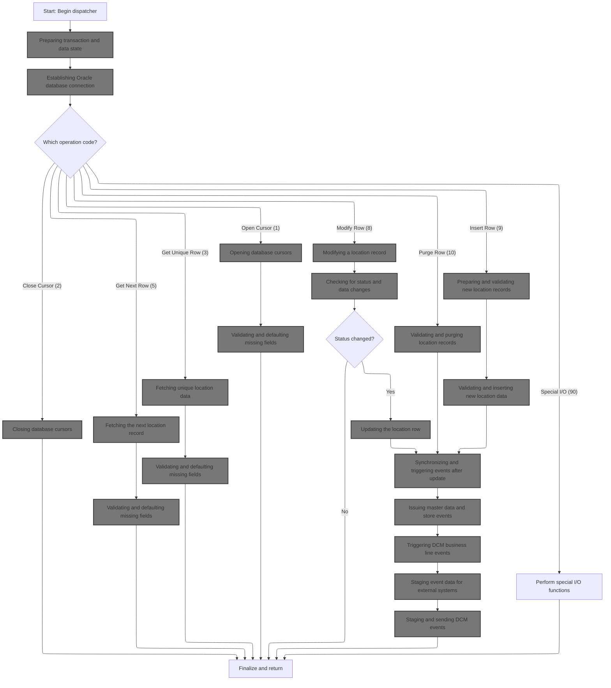
```mermaid
%%{init: {"flowchart": {"defaultRenderer": "elk"}} }%%
flowchart TD
    node1["Start: Begin dispatcher"]
    click node1 openCode "base/src/NNNS0488.cbl:1209:1210"
    node1 --> node2["Preparing transaction and data state"]
    
    node2 --> node3["Establishing Oracle database connection"]
    
    node3 --> node4{"Which operation code?"}
    click node4 openCode "base/src/NNNS0488.cbl:1256:1275"
    node4 -->|"Open Cursor (1)"| node5["Opening database cursors"]
    
    node5 --> node6["Validating and defaulting missing fields"]
    
    node6 --> node7["Finalize and return"]
    click node7 openCode "base/src/NNNS0488.cbl:1276:1278"
    node4 -->|"Close Cursor (2)"| node8["Closing database cursors"]
    
    node8 --> node7
    node4 -->|"Get Unique Row (3)"| node9["Fetching unique location data"]
    
    node9 --> node10["Validating and defaulting missing fields"]
    
    node10 --> node7
    node4 -->|"Get Next Row (5)"| node11["Fetching the next location record"]
    
    node11 --> node12["Validating and defaulting missing fields"]
    
    node12 --> node7
    node4 -->|"Modify Row (8)"| node13["Modifying a location record"]
    
    node13 --> node14["Checking for status and data changes"]
    
    node14 --> node15{"Status changed?"}
    click node15 openCode "base/src/NNNS0488.cbl:3542:3554"
    node15 -->|"Yes"| node16["Updating the location row"]
    
    node16 --> node17["Synchronizing and triggering events after update"]
    
    node17 --> node18["Issuing master data and store events"]
    
    node18 --> node19["Triggering DCM business line events"]
    
    node19 --> node20["Staging event data for external systems"]
    
    node20 --> node21["Staging and sending DCM events"]
    
    node21 --> node7
    node15 -->|"No"| node7
    node4 -->|"Insert Row (9)"| node22["Preparing and validating new location records"]
    
    node22 --> node23["Validating and inserting new location data"]
    
    node23 --> node17
    node4 -->|"Purge Row (10)"| node24["Validating and purging location records"]
    
    node24 --> node17
    node4 -->|"Special I/O (90)"| node25["Perform special I/O functions"]
    click node25 openCode "base/src/NNNS0488.cbl:10000:10001"
    node25 --> node7

classDef HeadingStyle fill:#777777,stroke:#333,stroke-width:2px;
click node2 goToHeading "Preparing transaction and data state"
node2:::HeadingStyle
click node3 goToHeading "Establishing Oracle database connection"
node3:::HeadingStyle
click node5 goToHeading "Opening database cursors"
node5:::HeadingStyle
click node6 goToHeading "Validating and defaulting missing fields"
node6:::HeadingStyle
click node8 goToHeading "Closing database cursors"
node8:::HeadingStyle
click node9 goToHeading "Fetching unique location data"
node9:::HeadingStyle
click node10 goToHeading "Validating and defaulting missing fields"
node10:::HeadingStyle
click node11 goToHeading "Fetching the next location record"
node11:::HeadingStyle
click node12 goToHeading "Validating and defaulting missing fields"
node12:::HeadingStyle
click node13 goToHeading "Modifying a location record"
node13:::HeadingStyle
click node14 goToHeading "Checking for status and data changes"
node14:::HeadingStyle
click node16 goToHeading "Updating the location row"
node16:::HeadingStyle
click node17 goToHeading "Synchronizing and triggering events after update"
node17:::HeadingStyle
click node18 goToHeading "Issuing master data and store events"
node18:::HeadingStyle
click node19 goToHeading "Triggering DCM business line events"
node19:::HeadingStyle
click node20 goToHeading "Staging event data for external systems"
node20:::HeadingStyle
click node21 goToHeading "Staging and sending DCM events"
node21:::HeadingStyle
click node22 goToHeading "Preparing and validating new location records"
node22:::HeadingStyle
click node23 goToHeading "Validating and inserting new location data"
node23:::HeadingStyle
click node24 goToHeading "Validating and purging location records"
node24:::HeadingStyle

%% Swimm:
%% %%{init: {"flowchart": {"defaultRenderer": "elk"}} }%%
%% flowchart TD
%%     node1["Start: Begin dispatcher"]
%%     click node1 openCode "<SwmPath>[base/src/NNNS0488.cbl](base/src/NNNS0488.cbl)</SwmPath>:1209:1210"
%%     node1 --> node2["Preparing transaction and data state"]
%%     
%%     node2 --> node3["Establishing Oracle database connection"]
%%     
%%     node3 --> node4{"Which operation code?"}
%%     click node4 openCode "<SwmPath>[base/src/NNNS0488.cbl](base/src/NNNS0488.cbl)</SwmPath>:1256:1275"
%%     node4 -->|"Open Cursor (1)"| node5["Opening database cursors"]
%%     
%%     node5 --> node6["Validating and defaulting missing fields"]
%%     
%%     node6 --> node7["Finalize and return"]
%%     click node7 openCode "<SwmPath>[base/src/NNNS0488.cbl](base/src/NNNS0488.cbl)</SwmPath>:1276:1278"
%%     node4 -->|"Close Cursor (2)"| node8["Closing database cursors"]
%%     
%%     node8 --> node7
%%     node4 -->|"Get Unique Row (3)"| node9["Fetching unique location data"]
%%     
%%     node9 --> node10["Validating and defaulting missing fields"]
%%     
%%     node10 --> node7
%%     node4 -->|"Get Next Row (5)"| node11["Fetching the next location record"]
%%     
%%     node11 --> node12["Validating and defaulting missing fields"]
%%     
%%     node12 --> node7
%%     node4 -->|"Modify Row (8)"| node13["Modifying a location record"]
%%     
%%     node13 --> node14["Checking for status and data changes"]
%%     
%%     node14 --> node15{"Status changed?"}
%%     click node15 openCode "<SwmPath>[base/src/NNNS0488.cbl](base/src/NNNS0488.cbl)</SwmPath>:3542:3554"
%%     node15 -->|"Yes"| node16["Updating the location row"]
%%     
%%     node16 --> node17["Synchronizing and triggering events after update"]
%%     
%%     node17 --> node18["Issuing master data and store events"]
%%     
%%     node18 --> node19["Triggering DCM business line events"]
%%     
%%     node19 --> node20["Staging event data for external systems"]
%%     
%%     node20 --> node21["Staging and sending DCM events"]
%%     
%%     node21 --> node7
%%     node15 -->|"No"| node7
%%     node4 -->|"Insert Row (9)"| node22["Preparing and validating new location records"]
%%     
%%     node22 --> node23["Validating and inserting new location data"]
%%     
%%     node23 --> node17
%%     node4 -->|"Purge Row (10)"| node24["Validating and purging location records"]
%%     
%%     node24 --> node17
%%     node4 -->|"Special I/O (90)"| node25["Perform special I/O functions"]
%%     click node25 openCode "<SwmPath>[base/src/NNNS0488.cbl](base/src/NNNS0488.cbl)</SwmPath>:10000:10001"
%%     node25 --> node7
%% 
%% classDef HeadingStyle fill:#777777,stroke:#333,stroke-width:2px;
%% click node2 goToHeading "Preparing transaction and data state"
%% node2:::HeadingStyle
%% click node3 goToHeading "Establishing Oracle database connection"
%% node3:::HeadingStyle
%% click node5 goToHeading "Opening database cursors"
%% node5:::HeadingStyle
%% click node6 goToHeading "Validating and defaulting missing fields"
%% node6:::HeadingStyle
%% click node8 goToHeading "Closing database cursors"
%% node8:::HeadingStyle
%% click node9 goToHeading "Fetching unique location data"
%% node9:::HeadingStyle
%% click node10 goToHeading "Validating and defaulting missing fields"
%% node10:::HeadingStyle
%% click node11 goToHeading "Fetching the next location record"
%% node11:::HeadingStyle
%% click node12 goToHeading "Validating and defaulting missing fields"
%% node12:::HeadingStyle
%% click node13 goToHeading "Modifying a location record"
%% node13:::HeadingStyle
%% click node14 goToHeading "Checking for status and data changes"
%% node14:::HeadingStyle
%% click node16 goToHeading "Updating the location row"
%% node16:::HeadingStyle
%% click node17 goToHeading "Synchronizing and triggering events after update"
%% node17:::HeadingStyle
%% click node18 goToHeading "Issuing master data and store events"
%% node18:::HeadingStyle
%% click node19 goToHeading "Triggering DCM business line events"
%% node19:::HeadingStyle
%% click node20 goToHeading "Staging event data for external systems"
%% node20:::HeadingStyle
%% click node21 goToHeading "Staging and sending DCM events"
%% node21:::HeadingStyle
%% click node22 goToHeading "Preparing and validating new location records"
%% node22:::HeadingStyle
%% click node23 goToHeading "Validating and inserting new location data"
%% node23:::HeadingStyle
%% click node24 goToHeading "Validating and purging location records"
%% node24:::HeadingStyle
```

This section governs the initialization and dispatching of database operations for location records. It ensures that all transaction and data states are properly set up before any database or business logic is executed, and routes requests to the correct operation based on the provided operation code.

| Category        | Rule Name                       | Description                                                                                                                                                                                                                                                           |
| --------------- | ------------------------------- | --------------------------------------------------------------------------------------------------------------------------------------------------------------------------------------------------------------------------------------------------------------------- |
| Data validation | Mandatory Initialization        | Initialization must always occur before any database or business logic is executed, ensuring all status fields and indexes are reset and consistent.                                                                                                                  |
| Data validation | Database Connection Requirement | A connection to the Oracle database must be established before any operation that requires database access. If the connection fails, an error message must be generated and returned.                                                                                 |
| Data validation | Cursor Validation               | When opening or closing database cursors, the cursor identifier must be validated. If the identifier is invalid, a failure status and error message must be set.                                                                                                      |
| Data validation | Insert Validation               | When inserting a new location record, the system must validate the data, set null indicators, standardize required status and codes, and only insert if all edits are successful.                                                                                     |
| Data validation | Purge Validation                | When purging a location record, the system must validate that deletion is allowed using an external service before removing the record from the database.                                                                                                             |
| Business logic  | Operation Code Routing          | The dispatcher must route requests to the correct operation based on the provided operation code. Supported codes are: 1 (Open Cursor), 2 (Close Cursor), 3 (Get Unique Row), 5 (Get Next Row), 8 (Modify Row), 9 (Insert Row), 10 (Purge Row), and 90 (Special I/O). |
| Business logic  | Default Missing Fields          | When fetching or modifying location records, any missing or null fields must be defaulted to standard values before further processing or storage.                                                                                                                    |
| Business logic  | Trigger Events on Change        | When modifying a location record, if the status or key data has changed, the system must update the record, synchronize with Oracle, and trigger related business events (master data, store, DCM, and external system events).                                       |

<SwmSnippet path="/base/src/NNNS0488.cbl" line="1209">

---

In <SwmToken path="base/src/NNNS0488.cbl" pos="1209:2:6" line-data="125400 0000-EXIT-DISPATCHER.                                            00125400">`0000-EXIT-DISPATCHER`</SwmToken> we kick off the flow by calling <SwmToken path="base/src/NNNS0488.cbl" pos="1210:4:6" line-data="125500     PERFORM 100-INITIALIZATION                                   00125500">`100-INITIALIZATION`</SwmToken>. This sets up all the transaction and data state, making sure status fields and indexes are reset and ready. We need to call <SwmToken path="base/src/NNNS0488.cbl" pos="1210:4:6" line-data="125500     PERFORM 100-INITIALIZATION                                   00125500">`100-INITIALIZATION`</SwmToken> first so that any later database or business logic works with fresh, consistent data.

```cobol
125400 0000-EXIT-DISPATCHER.                                            00125400
125500     PERFORM 100-INITIALIZATION                                   00125500
```

---

</SwmSnippet>

## Preparing transaction and data state

This section ensures that every new transaction starts with a clean and validated state, resetting all relevant fields and indexes, and conditionally preparing location data for downstream logic.

| Category        | Rule Name                       | Description                                                                                                                                                                                                                                                                                             |
| --------------- | ------------------------------- | ------------------------------------------------------------------------------------------------------------------------------------------------------------------------------------------------------------------------------------------------------------------------------------------------------- |
| Data validation | Location data integrity         | When copying location data, any missing or invalid values (such as dates or times) must be defaulted to valid values, and indicator flags must be set to reflect the state of the data.                                                                                                                 |
| Data validation | Indicator flag accuracy         | All indicator flags related to location and transaction state must accurately reflect the current status after initialization and validation steps.                                                                                                                                                     |
| Business logic  | Transaction state reset         | All transaction status fields, indexes, and checkpoint counters must be reset to their initial values at the start of each transaction.                                                                                                                                                                 |
| Business logic  | Conditional location validation | Location data must be copied and validated only if the transaction is not in an exit-close-cursor state (<SwmToken path="base/src/NNNS0488.cbl" pos="1216:4:8" line-data="126100       WHEN EXIT-CLOSE-CURSOR                                     00126100">`EXIT-CLOSE-CURSOR`</SwmToken> is not set). |

<SwmSnippet path="/base/src/NNNS0488.cbl" line="1239">

---

In <SwmToken path="base/src/NNNS0488.cbl" pos="1239:2:4" line-data="128400 100-INITIALIZATION.                                              00128400">`100-INITIALIZATION`</SwmToken> we reset all the status fields and indexes, then check if we need to move PDA fields to DCL. Calling <SwmToken path="base/src/NNNS0488.cbl" pos="1249:4:14" line-data="129400       PERFORM 110-MOVE-PDA-FIELDS-2-DCL                          00129400">`110-MOVE-PDA-FIELDS-2-DCL`</SwmToken> next copies and validates location data, so downstream logic works with a complete and correct record.

```cobol
128400 100-INITIALIZATION.                                              00128400
128500     INITIALIZE XXXN001A                                          00128500
128600                DAO-STATUS                                        00128600
128700                WS-LOC-STAT-SW                                    00128700
128800                WS-CURR-VALUES                                    00128800
128900     MOVE NNNN0000-INDEX-HANDLE TO DDDTLR01-INDEX-HANDLE          00128900
129000     MOVE 0 TO WS-CHECKPOINT-INC                                  00129000
129100     MOVE 0 TO SQLCODE                                            00129100
129200     MOVE 0 TO SQL-INIT-FLAG                                      00129200
129300     IF NOT EXIT-CLOSE-CURSOR                                     00129300
129400       PERFORM 110-MOVE-PDA-FIELDS-2-DCL                          00129400
129500     END-IF                                                       00129500
```

---

</SwmSnippet>

### Copying and validating location data

This section ensures that location data is accurately copied and meets all business validation requirements before it is used in downstream processes. It enforces business constraints on location types, status, and associated values to maintain data quality and consistency.

| Category        | Rule Name                 | Description                                                                                                                                                                                                                                                                  |
| --------------- | ------------------------- | ---------------------------------------------------------------------------------------------------------------------------------------------------------------------------------------------------------------------------------------------------------------------------- |
| Data validation | Valid location types only | Only location types defined in the KONSTANTS structure (Vendor, Store, Account, Warehouse, DSD Vendor) are considered valid. Any other location type is rejected.                                                                                                            |
| Data validation | Valid location status     | Location status must be set to one of the following: Active ('A'), Inactive ('I'), or Deleted ('D'), as defined in KONSTANTS. Any other status is invalid.                                                                                                                   |
| Business logic  | Default date substitution | If a location date is missing or set to the zero date ('00/00/0000'), it must be replaced with the default date ('01/01/1600').                                                                                                                                              |
| Business logic  | Default time substitution | If a location time is missing or set to zero, it must be replaced with the default time (<SwmToken path="base/src/NNNS0488.cbl" pos="18:20:24" line-data="006300 01 K-DEF-TM                           PIC X(8)  VALUE &#39;00.00.00&#39;.00006300">`00.00.00`</SwmToken>).  |
| Business logic  | Default status indicators | If the associated status number or type indicator is missing, it must default to 0 as defined in <SwmToken path="base/src/NNNS0488.cbl" pos="43:4:8" line-data="008800 01 WS-NULL-INDS.                                                 00008800">`WS-NULL-INDS`</SwmToken>. |

See <SwmLink doc-title="Retail Location Field Normalization Flow">[Retail Location Field Normalization Flow](.swm%5Cretail-location-field-normalization-flow.o84axrsu.sw.md)</SwmLink>

### Conditional Oracle connection setup

<SwmSnippet path="/base/src/NNNS0488.cbl" line="1251">

---

Back in <SwmToken path="base/src/NNNS0488.cbl" pos="1210:4:6" line-data="125500     PERFORM 100-INITIALIZATION                                   00125500">`100-INITIALIZATION`</SwmToken>, after moving PDA fields, we check if Oracle is needed for the next steps. If so, we call <SwmToken path="base/src/NNNS0488.cbl" pos="1253:4:10" line-data="129800       PERFORM 115-CONNECT-TO-ORACLE                              00129800">`115-CONNECT-TO-ORACLE`</SwmToken> to set up the database connection, making sure we're ready for any Oracle-specific operations.

```cobol
129600     IF (YYYN005A-ORACLE       OR EXIT-PUT-INSERT-ROW             00129600
129700         OR EXIT-PUT-PURGE-ROW OR EXIT-PUT-MODIFY-ROW)            00129700
129800       PERFORM 115-CONNECT-TO-ORACLE                              00129800
129900     END-IF                                                       00129900
```

---

</SwmSnippet>

## Establishing Oracle database connection

This section manages the process of connecting to an Oracle database, including error handling and status reporting if the connection fails. It ensures that the system is aware of the connection status before proceeding with further operations.

<SwmSnippet path="/base/src/NNNS0488.cbl" line="1674">

---

<SwmToken path="base/src/NNNS0488.cbl" pos="1674:2:8" line-data="171100 115-CONNECT-TO-ORACLE.                                           00171100">`115-CONNECT-TO-ORACLE`</SwmToken> calls <SwmToken path="base/src/NNNS0488.cbl" pos="1675:4:8" line-data="171200     CALL Z-ORA-CONNECT USING XXXN001A                            00171200">`Z-ORA-CONNECT`</SwmToken> to actually open the Oracle connection. If it fails, we set an error message and status. Next, we need to call <SwmPath>[base/src/XXXS0210.cbl](base/src/XXXS0210.cbl)</SwmPath> to continue with connection setup and management.

```cobol
171100 115-CONNECT-TO-ORACLE.                                           00171100
171200     CALL Z-ORA-CONNECT USING XXXN001A                            00171200
171300                              SQLCA                               00171300
171400     IF NOT SUCCESS                                               00171400
171500       MOVE SQLCODE TO WS-SQLCODE                                 00171500
171600       MOVE SPACES  TO IS-RTRN-MSG-TXT                            00171600
171700       STRING 'NNNS0488 - Error connecting to Oracle. Sqlcode ='  00171700
171800               WS-SQLCODE                                         00171800
171900               DELIMITED BY SIZE INTO IS-RTRN-MSG-TXT             00171900
172000     END-IF                                                       00172000
```

---

</SwmSnippet>

## Continuing dispatcher logic and connection setup

This section ensures that the system is properly initialized and connected to the Oracle database before any business operations are performed. It acts as a gatekeeper, guaranteeing that downstream processes have the necessary resources and environment to function correctly.

| Category       | Rule Name                        | Description                                                                                                       |
| -------------- | -------------------------------- | ----------------------------------------------------------------------------------------------------------------- |
| Business logic | Mandatory Initialization         | The system must perform all required initialization steps before attempting to connect to the Oracle database.    |
| Business logic | Database Connection Prerequisite | The Oracle database connection must be established successfully before any downstream business logic is executed. |

<SwmSnippet path="/base/src/XXXS0210.cbl" line="33">

---

<SwmToken path="base/src/XXXS0210.cbl" pos="33:2:6" line-data="004400 0000-EXIT-DISPATCHER.                                            00004400">`0000-EXIT-DISPATCHER`</SwmToken> in <SwmPath>[base/src/XXXS0210.cbl](base/src/XXXS0210.cbl)</SwmPath> runs initialization and then sets up the Oracle connection by calling the connection manager. This sequence makes sure the environment and database state are ready for downstream work.

```cobol
004400 0000-EXIT-DISPATCHER.                                            00004400
004500     PERFORM 100-INITIALIZATION                                   00004500
004600     PERFORM 200-CONNECT-TO-ORACLE                                00004600
005000     GOBACK                                                       00005000
005100     .                                                            00005100
```

---

</SwmSnippet>

## Switching active database to Oracle

This section governs the process of switching the active database connection to Oracle, ensuring that all necessary flags are set and the connection manager is properly invoked to handle the transition.

| Category        | Rule Name                       | Description                                                                                                                                                                                                                                                                                                                                                                                                                                                       |
| --------------- | ------------------------------- | ----------------------------------------------------------------------------------------------------------------------------------------------------------------------------------------------------------------------------------------------------------------------------------------------------------------------------------------------------------------------------------------------------------------------------------------------------------------- |
| Data validation | Oracle connection flag          | When switching to Oracle, the YYYC0220-FUNC variable must be set to 'S0' to indicate the Oracle connection request.                                                                                                                                                                                                                                                                                                                                               |
| Data validation | Prevent redundant Oracle switch | The switch to Oracle must only occur if the current connection is not already set to Oracle (i.e., <SwmToken path="base/src/YYYS0220.cbl" pos="98:6:10" line-data="010700     MOVE WS-YYYC0220-CURR-CON TO YYYC0220-CURR-CON               00010700">`YYYC0220-CURR-CON`</SwmToken> is not '0').                                                                                                                                                                  |
| Business logic  | Connection manager invocation   | The connection manager must be called with the updated <SwmToken path="base/src/XXXS0210.cbl" pos="53:4:4" line-data="007510     SET YYYC0220-SET-ORACLE-CON TO TRUE                          00007510">`YYYC0220`</SwmToken> structure and the identifier <SwmToken path="base/src/XXXS0210.cbl" pos="55:4:4" line-data="007540     CALL YYYS0220-DBMS-CON-MGR USING                             00007540">`YYYS0220`</SwmToken> to process the database switch. |
| Business logic  | Connection switch tracking      | Each successful switch to Oracle must increment the <SwmToken path="base/src/YYYS0220.cbl" pos="222:12:16" line-data="023100     MOVE WS-CON-SWITCHES TO YYYC0220-CON-SWITCHES                00023100">`YYYC0220-CON-SWITCHES`</SwmToken> counter to track the number of connection changes.                                                                                                                                                                     |

<SwmSnippet path="/base/src/XXXS0210.cbl" line="52">

---

<SwmToken path="base/src/XXXS0210.cbl" pos="52:2:8" line-data="007500 200-CONNECT-TO-ORACLE.                                           00007500">`200-CONNECT-TO-ORACLE`</SwmToken> sets the flag to switch to Oracle and calls the connection manager program. Next, we need to go to <SwmPath>[base/src/YYYS0220.cbl](base/src/YYYS0220.cbl)</SwmPath> so the manager can handle the actual connection logic.

```cobol
007500 200-CONNECT-TO-ORACLE.                                           00007500
007510     SET YYYC0220-SET-ORACLE-CON TO TRUE                          00007510
007530                                                                  00007530
007540     CALL YYYS0220-DBMS-CON-MGR USING                             00007540
007550         XXXN001A                                                 00007550
007560         YYYC0220                                                 00007560
010400     .                                                            00010400
```

---

</SwmSnippet>

## Managing connection requests and statistics

This section acts as a dispatcher for connection and statistics management requests, ensuring the correct operation is executed and handling errors for unrecognized requests.

| Category       | Rule Name                                                                                                                                                                                    | Description                                                                                                                                                                                                                                                                                                                                                                                                                                                                                                                                                                                                                                                                            |
| -------------- | -------------------------------------------------------------------------------------------------------------------------------------------------------------------------------------------- | -------------------------------------------------------------------------------------------------------------------------------------------------------------------------------------------------------------------------------------------------------------------------------------------------------------------------------------------------------------------------------------------------------------------------------------------------------------------------------------------------------------------------------------------------------------------------------------------------------------------------------------------------------------------------------------- |
| Business logic | Supported function dispatch                                                                                                                                                                  | If the request type matches a supported function (get/set connection, get/set statistics, set override), the corresponding operation is executed and the output is updated accordingly.                                                                                                                                                                                                                                                                                                                                                                                                                                                                                                |
| Business logic | Current connection retrieval                                                                                                                                                                 | When a request to get the current connection type is received, the system returns the current connection value without modifying any state.                                                                                                                                                                                                                                                                                                                                                                                                                                                                                                                                            |
| Business logic | <SwmToken path="base/src/NNNS0488.cbl" pos="1765:7:7" line-data="180200*      SET YYYN005A-DB2        TO TRUE                            00180200">`DB2`</SwmToken> connection establishment | When a request to set the <SwmToken path="base/src/NNNS0488.cbl" pos="1765:7:7" line-data="180200*      SET YYYN005A-DB2        TO TRUE                            00180200">`DB2`</SwmToken> connection is received, the system establishes a <SwmToken path="base/src/NNNS0488.cbl" pos="1765:7:7" line-data="180200*      SET YYYN005A-DB2        TO TRUE                            00180200">`DB2`</SwmToken> connection, updates statistics for total and <SwmToken path="base/src/NNNS0488.cbl" pos="1765:7:7" line-data="180200*      SET YYYN005A-DB2        TO TRUE                            00180200">`DB2`</SwmToken> requests, and outputs the current connection type. |
| Business logic | Oracle connection establishment                                                                                                                                                              | When a request to set the Oracle connection is received, the system establishes an Oracle connection if not already connected, increments Oracle usage statistics, and outputs the current connection type.                                                                                                                                                                                                                                                                                                                                                                                                                                                                            |
| Business logic | Override connection handling                                                                                                                                                                 | When a request to set an override connection is received, the system switches to the override connection and updates override statistics accordingly.                                                                                                                                                                                                                                                                                                                                                                                                                                                                                                                                  |
| Business logic | Statistics retrieval                                                                                                                                                                         | When a request to get statistics is received, the system returns the current statistics values for total requests, <SwmToken path="base/src/NNNS0488.cbl" pos="1765:7:7" line-data="180200*      SET YYYN005A-DB2        TO TRUE                            00180200">`DB2`</SwmToken> requests, Oracle requests, connection switches, override requests, and override switches.                                                                                                                                                                                                                                                                                                       |
| Business logic | Statistics update                                                                                                                                                                            | When a request to set statistics is received, the system updates the statistics fields as specified in the request.                                                                                                                                                                                                                                                                                                                                                                                                                                                                                                                                                                    |

<SwmSnippet path="/base/src/YYYS0220.cbl" line="56">

---

<SwmToken path="base/src/YYYS0220.cbl" pos="56:2:6" line-data="006500 0000-EXIT-DISPATCHER.                                            00006500">`0000-EXIT-DISPATCHER`</SwmToken> in <SwmPath>[base/src/YYYS0220.cbl](base/src/YYYS0220.cbl)</SwmPath> checks which connection or stats function is requested and runs the right routine. If the request isn't recognized, it sets a failure flag and error message.

```cobol
006500 0000-EXIT-DISPATCHER.                                            00006500
006600     PERFORM 100-INITIALIZATION                                   00006600
006700                                                                  00006700
006800     EVALUATE TRUE                                                00006800
006900       WHEN YYYC0220-GET-CURR-CON                                 00006900
007000         PERFORM 200-GET-CURR-CON                                 00007000
007100       WHEN YYYC0220-SET-DB2-CON                                  00007100
007200         PERFORM 300-SET-DB2-CON                                  00007200
007300       WHEN YYYC0220-SET-ORACLE-CON                               00007300
007400         PERFORM 400-SET-ORACLE-CON                               00007400
007500       WHEN YYYC0220-GET-STATS                                    00007500
007600         PERFORM 500-GET-STATS                                    00007600
007700       WHEN YYYC0220-SET-STATS                                    00007700
007800         PERFORM 600-SET-STATS                                    00007800
007900       WHEN YYYC0220-SET-OVERRIDE-CON                             00007900
008000         PERFORM 700-SET-OVERRIDE-CON                             00008000
008100       WHEN OTHER                                                 00008100
008200         SET  FAILURE TO TRUE                                     00008200
008300         MOVE 'YYYS0220 - Function not recognized!'               00008300
008400           TO IS-RTRN-MSG-TXT                                     00008400
008500     END-EVALUATE                                                 00008500
008600                                                                  00008600
008700     GOBACK                                                       00008700
008800     .                                                            00008800
```

---

</SwmSnippet>

<SwmSnippet path="/base/src/YYYS0220.cbl" line="97">

---

<SwmToken path="base/src/YYYS0220.cbl" pos="97:2:8" line-data="010600 200-GET-CURR-CON.                                                00010600">`200-GET-CURR-CON`</SwmToken> just copies the current connection type to the output field. There's no logic here for switching connections, despite what the comment suggests.

```cobol
010600 200-GET-CURR-CON.                                                00010600
010700     MOVE WS-YYYC0220-CURR-CON TO YYYC0220-CURR-CON               00010700
010800     .                                                            00010800
```

---

</SwmSnippet>

### Switching to <SwmToken path="base/src/NNNS0488.cbl" pos="1765:7:7" line-data="180200*      SET YYYN005A-DB2        TO TRUE                            00180200">`DB2`</SwmToken> and tracking connection attempts

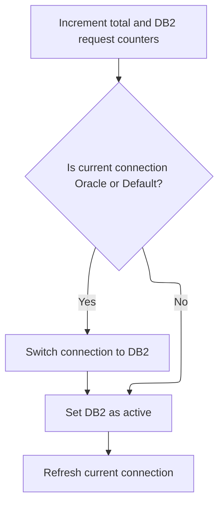
```mermaid
%%{init: {"flowchart": {"defaultRenderer": "elk"}} }%%
flowchart TD
    node1["Increment total and DB2 request counters"]
    click node1 openCode "base/src/YYYS0220.cbl:115:116"
    node1 --> node2{"Is current connection Oracle or Default?"}
    click node2 openCode "base/src/YYYS0220.cbl:118:119"
    node2 -->|"Yes"| node3["Switch connection to DB2"]
    click node3 openCode "base/src/YYYS0220.cbl:120:121"
    node2 -->|"No"| node4["Set DB2 as active"]
    click node4 openCode "base/src/YYYS0220.cbl:123:123"
    node3 --> node4
    node4 --> node5["Refresh current connection"]
    click node5 openCode "base/src/YYYS0220.cbl:124:124"
classDef HeadingStyle fill:#777777,stroke:#333,stroke-width:2px;

%% Swimm:
%% %%{init: {"flowchart": {"defaultRenderer": "elk"}} }%%
%% flowchart TD
%%     node1["Increment total and <SwmToken path="base/src/NNNS0488.cbl" pos="1765:7:7" line-data="180200*      SET YYYN005A-DB2        TO TRUE                            00180200">`DB2`</SwmToken> request counters"]
%%     click node1 openCode "<SwmPath>[base/src/YYYS0220.cbl](base/src/YYYS0220.cbl)</SwmPath>:115:116"
%%     node1 --> node2{"Is current connection Oracle or Default?"}
%%     click node2 openCode "<SwmPath>[base/src/YYYS0220.cbl](base/src/YYYS0220.cbl)</SwmPath>:118:119"
%%     node2 -->|"Yes"| node3["Switch connection to <SwmToken path="base/src/NNNS0488.cbl" pos="1765:7:7" line-data="180200*      SET YYYN005A-DB2        TO TRUE                            00180200">`DB2`</SwmToken>"]
%%     click node3 openCode "<SwmPath>[base/src/YYYS0220.cbl](base/src/YYYS0220.cbl)</SwmPath>:120:121"
%%     node2 -->|"No"| node4["Set <SwmToken path="base/src/NNNS0488.cbl" pos="1765:7:7" line-data="180200*      SET YYYN005A-DB2        TO TRUE                            00180200">`DB2`</SwmToken> as active"]
%%     click node4 openCode "<SwmPath>[base/src/YYYS0220.cbl](base/src/YYYS0220.cbl)</SwmPath>:123:123"
%%     node3 --> node4
%%     node4 --> node5["Refresh current connection"]
%%     click node5 openCode "<SwmPath>[base/src/YYYS0220.cbl](base/src/YYYS0220.cbl)</SwmPath>:124:124"
%% classDef HeadingStyle fill:#777777,stroke:#333,stroke-width:2px;
```

This section governs the process of switching the active database connection to <SwmToken path="base/src/NNNS0488.cbl" pos="1765:7:7" line-data="180200*      SET YYYN005A-DB2        TO TRUE                            00180200">`DB2`</SwmToken>, tracking statistics about requests and connection switches, and handling connection errors. It ensures that the system maintains accurate records of connection attempts and statuses.

| Category       | Rule Name                                                                                                                                                                                       | Description                                                                                                                                                                                                                                                                                                                                                                                                                                                                                                                                                                                       |
| -------------- | ----------------------------------------------------------------------------------------------------------------------------------------------------------------------------------------------- | ------------------------------------------------------------------------------------------------------------------------------------------------------------------------------------------------------------------------------------------------------------------------------------------------------------------------------------------------------------------------------------------------------------------------------------------------------------------------------------------------------------------------------------------------------------------------------------------------- |
| Business logic | Request Counting                                                                                                                                                                                | Every time a request to switch to <SwmToken path="base/src/NNNS0488.cbl" pos="1765:7:7" line-data="180200*      SET YYYN005A-DB2        TO TRUE                            00180200">`DB2`</SwmToken> is processed, increment both the total request counter and the <SwmToken path="base/src/NNNS0488.cbl" pos="1765:7:7" line-data="180200*      SET YYYN005A-DB2        TO TRUE                            00180200">`DB2`</SwmToken> request counter by 1.                                                                                                                                    |
| Business logic | Conditional <SwmToken path="base/src/NNNS0488.cbl" pos="1765:7:7" line-data="180200*      SET YYYN005A-DB2        TO TRUE                            00180200">`DB2`</SwmToken> Switch          | If the current connection is to Oracle or is the default, initiate a switch to <SwmToken path="base/src/NNNS0488.cbl" pos="1765:7:7" line-data="180200*      SET YYYN005A-DB2        TO TRUE                            00180200">`DB2`</SwmToken> and increment the connection switch counter by 1.                                                                                                                                                                                                                                                                                              |
| Business logic | Set <SwmToken path="base/src/NNNS0488.cbl" pos="1765:7:7" line-data="180200*      SET YYYN005A-DB2        TO TRUE                            00180200">`DB2`</SwmToken> Active                  | After switching, set <SwmToken path="base/src/NNNS0488.cbl" pos="1765:7:7" line-data="180200*      SET YYYN005A-DB2        TO TRUE                            00180200">`DB2`</SwmToken> as the active connection regardless of the previous state.                                                                                                                                                                                                                                                                                                                                               |
| Business logic | Environment-Based <SwmToken path="base/src/NNNS0488.cbl" pos="1765:7:7" line-data="180200*      SET YYYN005A-DB2        TO TRUE                            00180200">`DB2`</SwmToken> Selection | When switching to <SwmToken path="base/src/NNNS0488.cbl" pos="1765:7:7" line-data="180200*      SET YYYN005A-DB2        TO TRUE                            00180200">`DB2`</SwmToken>, connect to <SwmToken path="base/src/YYYS0220.cbl" pos="125:6:6" line-data="013400           CONNECT TO DB2P                                        00013400">`DB2P`</SwmToken> if the environment is production, otherwise connect to <SwmToken path="base/src/YYYS0220.cbl" pos="129:6:6" line-data="013800           CONNECT TO DB2T                                        00013800">`DB2T`</SwmToken>. |
| Business logic | Connection State Reporting                                                                                                                                                                      | After switching or setting <SwmToken path="base/src/NNNS0488.cbl" pos="1765:7:7" line-data="180200*      SET YYYN005A-DB2        TO TRUE                            00180200">`DB2`</SwmToken> as active, refresh and report the current connection type to ensure the system state is up to date.                                                                                                                                                                                                                                                                                                |

<SwmSnippet path="/base/src/YYYS0220.cbl" line="105">

---

<SwmToken path="base/src/YYYS0220.cbl" pos="105:2:8" line-data="011400 300-SET-DB2-CON.                                                 00011400">`300-SET-DB2-CON`</SwmToken> bumps the stats counters, checks if a switch is needed, and if so, runs <SwmToken path="base/src/YYYS0220.cbl" pos="111:4:12" line-data="012000       PERFORM 310-DO-SET-DB2-CON                                 00012000">`310-DO-SET-DB2-CON`</SwmToken> to actually connect to <SwmToken path="base/src/YYYS0220.cbl" pos="105:6:6" line-data="011400 300-SET-DB2-CON.                                                 00011400">`DB2`</SwmToken>. After switching, it reports the current connection type.

```cobol
011400 300-SET-DB2-CON.                                                 00011400
011500     ADD 1 TO WS-TOT-REQS                                         00011500
011600     ADD 1 TO WS-DB2-REQS                                         00011600
011700                                                                  00011700
011800     IF WS-ORACLE-CON                                             00011800
011900     OR WS-DEFAULT-CON                                            00011900
012000       PERFORM 310-DO-SET-DB2-CON                                 00012000
012100     END-IF                                                       00012100
012200                                                                  00012200
012300     SET WS-DB2-CON TO TRUE                                       00012300
012400     PERFORM 200-GET-CURR-CON                                     00012400
012500     .                                                            00012500
```

---

</SwmSnippet>

<SwmSnippet path="/base/src/YYYS0220.cbl" line="119">

---

<SwmToken path="base/src/YYYS0220.cbl" pos="119:2:10" line-data="012800 310-DO-SET-DB2-CON.                                              00012800">`310-DO-SET-DB2-CON`</SwmToken> logs the connection attempt, checks the environment, and connects to either <SwmToken path="base/src/YYYS0220.cbl" pos="125:6:6" line-data="013400           CONNECT TO DB2P                                        00013400">`DB2P`</SwmToken> or <SwmToken path="base/src/YYYS0220.cbl" pos="129:6:6" line-data="013800           CONNECT TO DB2T                                        00013800">`DB2T`</SwmToken>. If the connection fails, it sets a failure flag and builds an error message with the SQL code.

```cobol
012800 310-DO-SET-DB2-CON.                                              00012800
012900     ADD 1 TO WS-CON-SWITCHES                                     00012900
013000                                                                  00013000
013100     EVALUATE TRUE                                                00013100
013200       WHEN WS-PROD                                               00013200
013300         EXEC SQL                                                 00013300
013400           CONNECT TO DB2P                                        00013400
013500         END-EXEC                                                 00013500
013600       WHEN OTHER                                                 00013600
013700         EXEC SQL                                                 00013700
013800           CONNECT TO DB2T                                        00013800
013900         END-EXEC                                                 00013900
014000     END-EVALUATE                                                 00014000
014100                                                                  00014100
014200     EVALUATE TRUE                                                00014200
014300       WHEN SQLCODE = 0                                           00014300
014400         CONTINUE                                                 00014400
014500                                                                  00014500
014600       WHEN OTHER                                                 00014600
014700         SET  FAILURE TO TRUE                                     00014700
014800         MOVE SQLCODE TO WS-SQLCODE                               00014800
014900         STRING 'YYYS0220 - Failure connecting to DB2, SQL='      00014900
015000                WS-SQLCODE                                        00015000
015100             DELIMITED BY SIZE INTO IS-RTRN-MSG-TXT               00015100
015200     END-EVALUATE                                                 00015200
015300     .                                                            00015300
```

---

</SwmSnippet>

### Switching to Oracle and tracking connection attempts

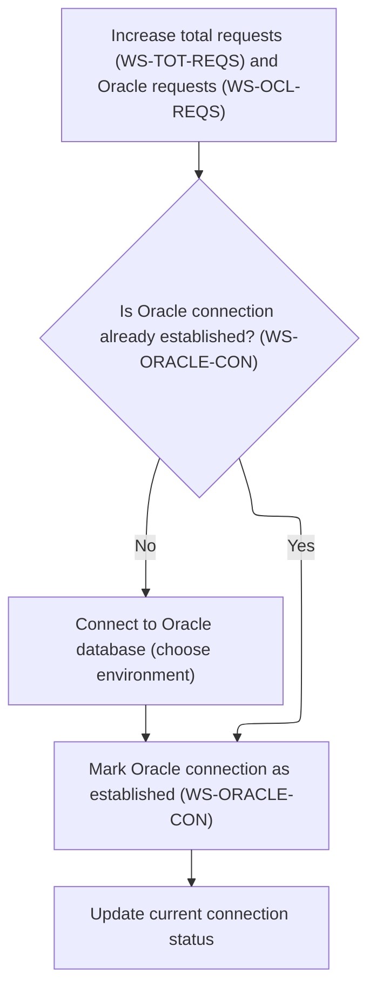
```mermaid
%%{init: {"flowchart": {"defaultRenderer": "elk"}} }%%
flowchart TD
    node1["Increase total requests (WS-TOT-REQS) and Oracle requests (WS-OCL-REQS)"]
    click node1 openCode "base/src/YYYS0220.cbl:160:161"
    node1 --> node2{"Is Oracle connection already established? (WS-ORACLE-CON)"}
    click node2 openCode "base/src/YYYS0220.cbl:163:163"
    node2 -->|"No"| node3["Connect to Oracle database (choose environment)"]
    click node3 openCode "base/src/YYYS0220.cbl:164:165"
    node2 -->|"Yes"| node4["Mark Oracle connection as established (WS-ORACLE-CON)"]
    click node4 openCode "base/src/YYYS0220.cbl:167:167"
    node3 --> node4
    node4 --> node5["Update current connection status"]
    click node5 openCode "base/src/YYYS0220.cbl:168:168"
classDef HeadingStyle fill:#777777,stroke:#333,stroke-width:2px;

%% Swimm:
%% %%{init: {"flowchart": {"defaultRenderer": "elk"}} }%%
%% flowchart TD
%%     node1["Increase total requests (<SwmToken path="base/src/YYYS0220.cbl" pos="106:8:12" line-data="011500     ADD 1 TO WS-TOT-REQS                                         00011500">`WS-TOT-REQS`</SwmToken>) and Oracle requests (<SwmToken path="base/src/YYYS0220.cbl" pos="152:8:12" line-data="016100     ADD 1 TO WS-OCL-REQS                                         00016100">`WS-OCL-REQS`</SwmToken>)"]
%%     click node1 openCode "<SwmPath>[base/src/YYYS0220.cbl](base/src/YYYS0220.cbl)</SwmPath>:160:161"
%%     node1 --> node2{"Is Oracle connection already established? (<SwmToken path="base/src/YYYS0220.cbl" pos="109:4:8" line-data="011800     IF WS-ORACLE-CON                                             00011800">`WS-ORACLE-CON`</SwmToken>)"}
%%     click node2 openCode "<SwmPath>[base/src/YYYS0220.cbl](base/src/YYYS0220.cbl)</SwmPath>:163:163"
%%     node2 -->|"No"| node3["Connect to Oracle database (choose environment)"]
%%     click node3 openCode "<SwmPath>[base/src/YYYS0220.cbl](base/src/YYYS0220.cbl)</SwmPath>:164:165"
%%     node2 -->|"Yes"| node4["Mark Oracle connection as established (<SwmToken path="base/src/YYYS0220.cbl" pos="109:4:8" line-data="011800     IF WS-ORACLE-CON                                             00011800">`WS-ORACLE-CON`</SwmToken>)"]
%%     click node4 openCode "<SwmPath>[base/src/YYYS0220.cbl](base/src/YYYS0220.cbl)</SwmPath>:167:167"
%%     node3 --> node4
%%     node4 --> node5["Update current connection status"]
%%     click node5 openCode "<SwmPath>[base/src/YYYS0220.cbl](base/src/YYYS0220.cbl)</SwmPath>:168:168"
%% classDef HeadingStyle fill:#777777,stroke:#333,stroke-width:2px;
```

This section governs the process of switching to an Oracle database connection, tracking connection attempts, and updating connection status and statistics. It ensures the correct environment is selected and handles errors in the connection process.

| Category       | Rule Name                     | Description                                                                                                                                               |
| -------------- | ----------------------------- | --------------------------------------------------------------------------------------------------------------------------------------------------------- |
| Business logic | Request Counting              | Each time a request to switch to Oracle is processed, increment both the total requests counter and the Oracle requests counter by one.                   |
| Business logic | Conditional Oracle Connection | If an Oracle connection is not already established, initiate a connection to the Oracle database using the environment flag (production, test, or other). |
| Business logic | Connection Status Update      | After a successful connection attempt, mark the Oracle connection as established and update the current connection status.                                |
| Business logic | Connection Switch Logging     | Log each connection switch attempt by incrementing the connection switches counter.                                                                       |
| Business logic | Connection Type Reporting     | Always report the current connection type after attempting to switch to Oracle, regardless of success or failure.                                         |

<SwmSnippet path="/base/src/YYYS0220.cbl" line="150">

---

<SwmToken path="base/src/YYYS0220.cbl" pos="150:2:8" line-data="015900 400-SET-ORACLE-CON.                                              00015900">`400-SET-ORACLE-CON`</SwmToken> bumps the stats counters, checks if a switch is needed, and if so, runs <SwmToken path="base/src/YYYS0220.cbl" pos="155:4:12" line-data="016400       PERFORM 410-DO-SET-ORACLE-CON                              00016400">`410-DO-SET-ORACLE-CON`</SwmToken> to actually connect to Oracle. After switching, it reports the current connection type.

```cobol
015900 400-SET-ORACLE-CON.                                              00015900
016000     ADD 1 TO WS-TOT-REQS                                         00016000
016100     ADD 1 TO WS-OCL-REQS                                         00016100
016200                                                                  00016200
016300     IF NOT WS-ORACLE-CON                                         00016300
016400       PERFORM 410-DO-SET-ORACLE-CON                              00016400
016500     END-IF                                                       00016500
016600                                                                  00016600
016700     SET WS-ORACLE-CON TO TRUE                                    00016700
016800     PERFORM 200-GET-CURR-CON                                     00016800
016900     .                                                            00016900
```

---

</SwmSnippet>

<SwmSnippet path="/base/src/YYYS0220.cbl" line="163">

---

<SwmToken path="base/src/YYYS0220.cbl" pos="163:2:10" line-data="017200 410-DO-SET-ORACLE-CON.                                           00017200">`410-DO-SET-ORACLE-CON`</SwmToken> logs the connection attempt, checks which environment flag is set, and connects to the right Oracle database. If the connection fails, it sets a failure flag and builds an error message with the SQL code.

```cobol
017200 410-DO-SET-ORACLE-CON.                                           00017200
017300     ADD 1 TO WS-CON-SWITCHES                                     00017300
017400                                                                  00017400
017500     EVALUATE TRUE                                                00017500
017600       WHEN WS-PROD                                               00017600
017700         EXEC SQL                                                 00017700
017800           CONNECT TO DRDAASP1                                    00017800
017900         END-EXEC                                                 00017900
018000                                                                  00018000
018100       WHEN WS-TEST                                               00018100
018200         EXEC SQL                                                 00018200
018300           CONNECT TO DRDAASC7                                    00018300
018400         END-EXEC                                                 00018400
018500                                                                  00018500
018600       WHEN WS-TST6                                               00018600
018700         EXEC SQL                                                 00018700
018800           CONNECT TO DRDAASC6                                    00018800
018900         END-EXEC                                                 00018900
019000                                                                  00019000
019100       WHEN WS-TST5                                               00019100
019200         EXEC SQL                                                 00019200
019300           CONNECT TO DRDAASC5                                    00019300
019400         END-EXEC                                                 00019400
019500                                                                  00019500
019600       WHEN WS-TST4                                               00019600
019700         EXEC SQL                                                 00019700
019800           CONNECT TO DRDAASD1                                    00019800
019900         END-EXEC                                                 00019900
020000                                                                  00020000
020100       WHEN WS-TST3                                               00020100
020200         EXEC SQL                                                 00020200
020300           CONNECT TO DRDAASC1                                    00020300
020400         END-EXEC                                                 00020400
020500     END-EVALUATE                                                 00020500
020600                                                                  00020600
020700     EVALUATE TRUE                                                00020700
020800       WHEN SQLCODE = 0                                           00020800
020900         CONTINUE                                                 00020900
021000                                                                  00021000
021100       WHEN OTHER                                                 00021100
021200         SET  FAILURE TO TRUE                                     00021200
021300         MOVE SQLCODE TO WS-SQLCODE                               00021300
021400         STRING 'YYYS0220 - Failure connecting to Oracle, SQL='   00021400
021500                WS-SQLCODE                                        00021500
021600             DELIMITED BY SIZE INTO IS-RTRN-MSG-TXT               00021600
021700     END-EVALUATE                                                 00021700
021800     .                                                            00021800
```

---

</SwmSnippet>

### Reporting connection statistics


```mermaid
%%{init: {"flowchart": {"defaultRenderer": "elk"}} }%%
flowchart TD
  node1["Update connection statistics"]
  click node1 openCode "base/src/YYYS0220.cbl:22400:23300"
  node2["Initialize statistics"]
  click node2 openCode "base/src/YYYS0220.cbl:23900:24200"
  node7["Increment override request count"]
  click node7 openCode "base/src/YYYS0220.cbl:24800:24900"
  node3{"Is override for DB2, Oracle, or invalid?"}
  click node3 openCode "base/src/YYYS0220.cbl:25100:26200"
  node4["Switch to DB2 connection"]
  click node4 openCode "base/src/YYYS0220.cbl:25400:25500"
  node5["Switch to Oracle connection"]
  click node5 openCode "base/src/YYYS0220.cbl:25900:26000"
  node6["Flag error and set message: 'YYYS0220 - Invalid over-ride connection!'"]
  click node6 openCode "base/src/YYYS0220.cbl:26300:26500"
  node1 --> node2
  node2 --> node7
  node7 --> node3
  node3 -->|"DB2 (not already set)"| node4
  node3 -->|"Oracle (not already set)"| node5
  node3 -->|"Invalid"| node6
classDef HeadingStyle fill:#777777,stroke:#333,stroke-width:2px;

%% Swimm:
%% %%{init: {"flowchart": {"defaultRenderer": "elk"}} }%%
%% flowchart TD
%%   node1["Update connection statistics"]
%%   click node1 openCode "<SwmPath>[base/src/YYYS0220.cbl](base/src/YYYS0220.cbl)</SwmPath>:22400:23300"
%%   node2["Initialize statistics"]
%%   click node2 openCode "<SwmPath>[base/src/YYYS0220.cbl](base/src/YYYS0220.cbl)</SwmPath>:23900:24200"
%%   node7["Increment override request count"]
%%   click node7 openCode "<SwmPath>[base/src/YYYS0220.cbl](base/src/YYYS0220.cbl)</SwmPath>:24800:24900"
%%   node3{"Is override for <SwmToken path="base/src/NNNS0488.cbl" pos="1765:7:7" line-data="180200*      SET YYYN005A-DB2        TO TRUE                            00180200">`DB2`</SwmToken>, Oracle, or invalid?"}
%%   click node3 openCode "<SwmPath>[base/src/YYYS0220.cbl](base/src/YYYS0220.cbl)</SwmPath>:25100:26200"
%%   node4["Switch to <SwmToken path="base/src/NNNS0488.cbl" pos="1765:7:7" line-data="180200*      SET YYYN005A-DB2        TO TRUE                            00180200">`DB2`</SwmToken> connection"]
%%   click node4 openCode "<SwmPath>[base/src/YYYS0220.cbl](base/src/YYYS0220.cbl)</SwmPath>:25400:25500"
%%   node5["Switch to Oracle connection"]
%%   click node5 openCode "<SwmPath>[base/src/YYYS0220.cbl](base/src/YYYS0220.cbl)</SwmPath>:25900:26000"
%%   node6["Flag error and set message: '<SwmToken path="base/src/XXXS0210.cbl" pos="55:4:4" line-data="007540     CALL YYYS0220-DBMS-CON-MGR USING                             00007540">`YYYS0220`</SwmToken> - Invalid <SwmToken path="base/src/YYYS0220.cbl" pos="255:11:13" line-data="026400         MOVE &#39;YYYS0220 - Invalid over-ride connection!&#39;          00026400">`over-ride`</SwmToken> connection!'"]
%%   click node6 openCode "<SwmPath>[base/src/YYYS0220.cbl](base/src/YYYS0220.cbl)</SwmPath>:26300:26500"
%%   node1 --> node2
%%   node2 --> node7
%%   node7 --> node3
%%   node3 -->|"<SwmToken path="base/src/NNNS0488.cbl" pos="1765:7:7" line-data="180200*      SET YYYN005A-DB2        TO TRUE                            00180200">`DB2`</SwmToken> (not already set)"| node4
%%   node3 -->|"Oracle (not already set)"| node5
%%   node3 -->|"Invalid"| node6
%% classDef HeadingStyle fill:#777777,stroke:#333,stroke-width:2px;
```

<SwmSnippet path="/base/src/YYYS0220.cbl" line="215">

---

<SwmToken path="base/src/YYYS0220.cbl" pos="215:2:6" line-data="022400 500-GET-STATS.                                                   00022400">`500-GET-STATS`</SwmToken> grabs all the connection and request counters, copies them to the output, and also reports the current connection type. This is used for monitoring or debugging.

```cobol
022400 500-GET-STATS.                                                   00022400
022500     PERFORM 200-GET-CURR-CON                                     00022500
022600                                                                  00022600
022700     MOVE WS-TOT-REQS     TO YYYC0220-TOT-REQS                    00022700
022800     MOVE WS-DB2-REQS     TO YYYC0220-DB2-REQS                    00022800
022900     MOVE WS-OCL-REQS     TO YYYC0220-OCL-REQS                    00022900
023000     MOVE WS-OVR-REQS     TO YYYC0220-OVR-REQS                    00023000
023100     MOVE WS-CON-SWITCHES TO YYYC0220-CON-SWITCHES                00023100
023200     MOVE WS-OVR-SWITCHES TO YYYC0220-OVR-SWITCHES                00023200
023300     .                                                            00023300
```

---

</SwmSnippet>

<SwmSnippet path="/base/src/YYYS0220.cbl" line="230">

---

<SwmToken path="base/src/YYYS0220.cbl" pos="230:2:6" line-data="023900 600-SET-STATS.                                                   00023900">`600-SET-STATS`</SwmToken> just initializes the stats structures. There's no other logic shown here.

```cobol
023900 600-SET-STATS.                                                   00023900
024000     INITIALIZE WS-STATS                                          00024000
024100                YYYC0220-STATS                                    00024100
024200     .                                                            00024200
```

---

</SwmSnippet>

<SwmSnippet path="/base/src/YYYS0220.cbl" line="239">

---

<SwmToken path="base/src/YYYS0220.cbl" pos="239:2:8" line-data="024800 700-SET-OVERRIDE-CON.                                            00024800">`700-SET-OVERRIDE-CON`</SwmToken> bumps the override request counter, checks which override flag is set, and updates the connection type and switch counter. If the request is invalid, it sets a failure flag and error message.

```cobol
024800 700-SET-OVERRIDE-CON.                                            00024800
024900     ADD 1 TO WS-OVR-REQS                                         00024900
025000                                                                  00025000
025100     EVALUATE TRUE                                                00025100
025200       WHEN YYYC0220-DB2-CON                                      00025200
025300       AND  NOT WS-DB2-CON                                        00025300
025400         SET WS-DB2-CON    TO TRUE                                00025400
025500         ADD 1             TO WS-OVR-SWITCHES                     00025500
025600                                                                  00025600
025700       WHEN YYYC0220-ORACLE-CON                                   00025700
025800       AND NOT WS-ORACLE-CON                                      00025800
025900         SET WS-ORACLE-CON TO TRUE                                00025900
026000         ADD 1             TO WS-OVR-SWITCHES                     00026000
026100                                                                  00026100
026200       WHEN OTHER                                                 00026200
026300         SET FAILURE TO TRUE                                      00026300
026400         MOVE 'YYYS0220 - Invalid over-ride connection!'          00026400
026500           TO IS-RTRN-MSG-TXT                                     00026500
026600     END-EVALUATE                                                 00026600
026700     .                                                            00026700
```

---

</SwmSnippet>

## Dispatching exit routines based on exit code

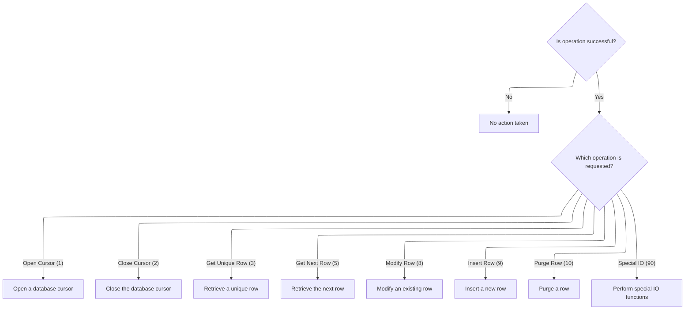
```mermaid
%%{init: {"flowchart": {"defaultRenderer": "elk"}} }%%
flowchart TD
    node0{"Is operation successful?"}
    click node0 openCode "base/src/NNNS0488.cbl:1212:1213"
    node0 -->|"No"| node10["No action taken"]
    click node10 openCode "base/src/NNNS0488.cbl:1212:1213"
    node0 -->|"Yes"| node1{"Which operation is requested?"}
    click node1 openCode "base/src/NNNS0488.cbl:1214:1229"
    node1 -->|"Open Cursor (1)"| node2["Open a database cursor"]
    click node2 openCode "base/src/NNNS0488.cbl:1215:1215"
    node1 -->|"Close Cursor (2)"| node3["Close the database cursor"]
    click node3 openCode "base/src/NNNS0488.cbl:1217:1217"
    node1 -->|"Get Unique Row (3)"| node4["Retrieve a unique row"]
    click node4 openCode "base/src/NNNS0488.cbl:1219:1219"
    node1 -->|"Get Next Row (5)"| node5["Retrieve the next row"]
    click node5 openCode "base/src/NNNS0488.cbl:1221:1221"
    node1 -->|"Modify Row (8)"| node6["Modify an existing row"]
    click node6 openCode "base/src/NNNS0488.cbl:1223:1223"
    node1 -->|"Insert Row (9)"| node7["Insert a new row"]
    click node7 openCode "base/src/NNNS0488.cbl:1225:1225"
    node1 -->|"Purge Row (10)"| node8["Purge a row"]
    click node8 openCode "base/src/NNNS0488.cbl:1227:1227"
    node1 -->|"Special IO (90)"| node9["Perform special IO functions"]
    click node9 openCode "base/src/NNNS0488.cbl:1229:1229"
classDef HeadingStyle fill:#777777,stroke:#333,stroke-width:2px;

%% Swimm:
%% %%{init: {"flowchart": {"defaultRenderer": "elk"}} }%%
%% flowchart TD
%%     node0{"Is operation successful?"}
%%     click node0 openCode "<SwmPath>[base/src/NNNS0488.cbl](base/src/NNNS0488.cbl)</SwmPath>:1212:1213"
%%     node0 -->|"No"| node10["No action taken"]
%%     click node10 openCode "<SwmPath>[base/src/NNNS0488.cbl](base/src/NNNS0488.cbl)</SwmPath>:1212:1213"
%%     node0 -->|"Yes"| node1{"Which operation is requested?"}
%%     click node1 openCode "<SwmPath>[base/src/NNNS0488.cbl](base/src/NNNS0488.cbl)</SwmPath>:1214:1229"
%%     node1 -->|"Open Cursor (1)"| node2["Open a database cursor"]
%%     click node2 openCode "<SwmPath>[base/src/NNNS0488.cbl](base/src/NNNS0488.cbl)</SwmPath>:1215:1215"
%%     node1 -->|"Close Cursor (2)"| node3["Close the database cursor"]
%%     click node3 openCode "<SwmPath>[base/src/NNNS0488.cbl](base/src/NNNS0488.cbl)</SwmPath>:1217:1217"
%%     node1 -->|"Get Unique Row (3)"| node4["Retrieve a unique row"]
%%     click node4 openCode "<SwmPath>[base/src/NNNS0488.cbl](base/src/NNNS0488.cbl)</SwmPath>:1219:1219"
%%     node1 -->|"Get Next Row (5)"| node5["Retrieve the next row"]
%%     click node5 openCode "<SwmPath>[base/src/NNNS0488.cbl](base/src/NNNS0488.cbl)</SwmPath>:1221:1221"
%%     node1 -->|"Modify Row (8)"| node6["Modify an existing row"]
%%     click node6 openCode "<SwmPath>[base/src/NNNS0488.cbl](base/src/NNNS0488.cbl)</SwmPath>:1223:1223"
%%     node1 -->|"Insert Row (9)"| node7["Insert a new row"]
%%     click node7 openCode "<SwmPath>[base/src/NNNS0488.cbl](base/src/NNNS0488.cbl)</SwmPath>:1225:1225"
%%     node1 -->|"Purge Row (10)"| node8["Purge a row"]
%%     click node8 openCode "<SwmPath>[base/src/NNNS0488.cbl](base/src/NNNS0488.cbl)</SwmPath>:1227:1227"
%%     node1 -->|"Special IO (90)"| node9["Perform special IO functions"]
%%     click node9 openCode "<SwmPath>[base/src/NNNS0488.cbl](base/src/NNNS0488.cbl)</SwmPath>:1229:1229"
%% classDef HeadingStyle fill:#777777,stroke:#333,stroke-width:2px;
```

<SwmSnippet path="/base/src/NNNS0488.cbl" line="1211">

---

After returning from <SwmToken path="base/src/NNNS0488.cbl" pos="1210:4:6" line-data="125500     PERFORM 100-INITIALIZATION                                   00125500">`100-INITIALIZATION`</SwmToken> in <SwmToken path="base/src/NNNS0488.cbl" pos="1209:2:6" line-data="125400 0000-EXIT-DISPATCHER.                                            00125400">`0000-EXIT-DISPATCHER`</SwmToken>, we use an EVALUATE statement to pick the right exit routine based on the exit code. If the code matches <SwmToken path="base/src/NNNS0488.cbl" pos="1214:4:8" line-data="125900       WHEN EXIT-OPEN-CURSOR                                      00125900">`EXIT-OPEN-CURSOR`</SwmToken>, we call <SwmToken path="base/src/NNNS0488.cbl" pos="1215:4:10" line-data="126000          PERFORM 1000-EXIT-OPEN-CURSOR                           00126000">`1000-EXIT-OPEN-CURSOR`</SwmToken> to open the database cursor for reading.

```cobol
125600     EVALUATE TRUE                                                00125600
125700       WHEN NOT SUCCESS                                           00125700
125800          CONTINUE                                                00125800
125900       WHEN EXIT-OPEN-CURSOR                                      00125900
126000          PERFORM 1000-EXIT-OPEN-CURSOR                           00126000
126100       WHEN EXIT-CLOSE-CURSOR                                     00126100
126200          PERFORM 1100-EXIT-CLOSE-CURSOR                          00126200
126300       WHEN EXIT-GET-UNIQUE-ROW                                   00126300
126400          PERFORM 1200-EXIT-GET-UNIQUE-ROW                        00126400
126500       WHEN EXIT-GET-NEXT-ROW                                     00126500
126600          PERFORM 1300-EXIT-GET-NEXT-ROW                          00126600
126700       WHEN EXIT-PUT-MODIFY-ROW                                   00126700
126800          PERFORM 1400-EXIT-PUT-MODIFY-ROW                        00126800
126900       WHEN EXIT-PUT-INSERT-ROW                                   00126900
127000          PERFORM 1500-EXIT-PUT-INSERT-ROW                        00127000
127100       WHEN EXIT-PUT-PURGE-ROW                                    00127100
127200          PERFORM 1600-EXIT-PUT-PURGE-ROW                         00127200
127300       WHEN EXIT-DO-SPECIAL-IO-FUNCS                              00127300
127400          PERFORM 10000-DO-SPECIAL-IO-FUNCS                       00127400
127500     END-EVALUATE                                                 00127500
```

---

</SwmSnippet>

## Opening database cursors

This section is responsible for opening a database cursor based on a provided cursor ID. It ensures only recognized cursors are opened and provides clear error signaling for invalid requests.

| Category        | Rule Name                      | Description                                                                                                                                                                                                                                                                                                                                                                                                                                           |
| --------------- | ------------------------------ | ----------------------------------------------------------------------------------------------------------------------------------------------------------------------------------------------------------------------------------------------------------------------------------------------------------------------------------------------------------------------------------------------------------------------------------------------------- |
| Data validation | Valid cursor ID enforcement    | Only cursor IDs matching <SwmToken path="base/src/NNNS0488.cbl" pos="2208:4:4" line-data="224500       WHEN DDDXLR01                                              00224500">`DDDXLR01`</SwmToken> through <SwmToken path="base/src/NNNS0488.cbl" pos="2240:4:4" line-data="227700       WHEN DDDXLR09                                              00227700">`DDDXLR09`</SwmToken> are permitted to be opened. Any other value is considered invalid. |
| Business logic  | Success path for valid cursors | Upon successful opening of a valid cursor, the system must not set the FAILURE flag and must allow downstream logic to proceed without error.                                                                                                                                                                                                                                                                                                         |

<SwmSnippet path="/base/src/NNNS0488.cbl" line="2206">

---

In <SwmToken path="base/src/NNNS0488.cbl" pos="2206:2:8" line-data="224300 1000-EXIT-OPEN-CURSOR.                                           00224300">`1000-EXIT-OPEN-CURSOR`</SwmToken> we use an EVALUATE statement to match the input cursor ID to one of the known cursor names (<SwmToken path="base/src/NNNS0488.cbl" pos="2208:4:4" line-data="224500       WHEN DDDXLR01                                              00224500">`DDDXLR01`</SwmToken> to <SwmToken path="base/src/NNNS0488.cbl" pos="2240:4:4" line-data="227700       WHEN DDDXLR09                                              00227700">`DDDXLR09`</SwmToken>). For each match, we open the corresponding SQL cursor. If the ID doesn't match, we set a failure flag and error message.

```cobol
224300 1000-EXIT-OPEN-CURSOR.                                           00224300
224400     EVALUATE TRUE                                                00224400
224500       WHEN DDDXLR01                                              00224500
224600         EXEC SQL                                                 00224600
224700           OPEN DDDXLR01                                          00224700
224800         END-EXEC                                                 00224800
224900       WHEN DDDXLR02                                              00224900
225000         EXEC SQL                                                 00225000
225100           OPEN DDDXLR02                                          00225100
225200         END-EXEC                                                 00225200
225300       WHEN DDDXLR03                                              00225300
225400         EXEC SQL                                                 00225400
225500           OPEN DDDXLR03                                          00225500
225600         END-EXEC                                                 00225600
225700       WHEN DDDXLR04                                              00225700
225800         EXEC SQL                                                 00225800
225900           OPEN DDDXLR04                                          00225900
226000         END-EXEC                                                 00226000
226100       WHEN DDDXLR05                                              00226100
226200         EXEC SQL                                                 00226200
226300           OPEN DDDXLR05                                          00226300
226400         END-EXEC                                                 00226400
226500       WHEN DDDXLR06                                              00226500
226600         EXEC SQL                                                 00226600
226700           OPEN DDDXLR06                                          00226700
226800         END-EXEC                                                 00226800
226900       WHEN DDDXLR07                                              00226900
227000         EXEC SQL                                                 00227000
227100           OPEN DDDXLR07                                          00227100
227200         END-EXEC                                                 00227200
227300       WHEN DDDXLR08                                              00227300
227400         EXEC SQL                                                 00227400
227500           OPEN DDDXLR08                                          00227500
227600         END-EXEC                                                 00227600
227700       WHEN DDDXLR09                                              00227700
227800         EXEC SQL                                                 00227800
227900           OPEN DDDXLR09                                          00227900
228000         END-EXEC                                                 00228000
```

---

</SwmSnippet>

<SwmSnippet path="/base/src/NNNS0488.cbl" line="2244">

---

If the input cursor ID doesn't match any known cursor, we set FAILURE to TRUE and move an error message to the output variable. This lets downstream logic know the open failed.

```cobol
228100       WHEN OTHER                                                 00228100
228200         SET FAILURE TO TRUE                                      00228200
228300         MOVE 'NNNS0488 - Invalid open cursor ID.'                00228300
228400           TO IS-RTRN-MSG-TXT OF XXXN001A                         00228400
228500     END-EVALUATE                                                 00228500
```

---

</SwmSnippet>

## Closing database cursors

This section is responsible for closing database cursors based on a provided cursor ID. It ensures that only recognized cursors are closed and provides error handling for invalid cursor IDs.

| Category        | Rule Name                | Description                                                                                                                                                                                                                                                                                                                                                                                                                                                                 |
| --------------- | ------------------------ | --------------------------------------------------------------------------------------------------------------------------------------------------------------------------------------------------------------------------------------------------------------------------------------------------------------------------------------------------------------------------------------------------------------------------------------------------------------------------- |
| Data validation | Valid cursor ID required | Only cursor IDs that match one of the known values (<SwmToken path="base/src/NNNS0488.cbl" pos="2208:4:4" line-data="224500       WHEN DDDXLR01                                              00224500">`DDDXLR01`</SwmToken> to <SwmToken path="base/src/NNNS0488.cbl" pos="2240:4:4" line-data="227700       WHEN DDDXLR09                                              00227700">`DDDXLR09`</SwmToken>) are eligible to be closed. Any other value is considered invalid. |
| Business logic  | Selective cursor closure | When a valid cursor ID is provided, the corresponding database cursor must be closed without affecting other cursors.                                                                                                                                                                                                                                                                                                                                                       |

<SwmSnippet path="/base/src/NNNS0488.cbl" line="2252">

---

In <SwmToken path="base/src/NNNS0488.cbl" pos="2252:2:8" line-data="228900 1100-EXIT-CLOSE-CURSOR.                                          00228900">`1100-EXIT-CLOSE-CURSOR`</SwmToken> we use an EVALUATE statement to match the input cursor ID to one of the known cursor names (<SwmToken path="base/src/NNNS0488.cbl" pos="2254:4:4" line-data="229100       WHEN DDDXLR01                                              00229100">`DDDXLR01`</SwmToken> to <SwmToken path="base/src/NNNS0488.cbl" pos="2282:4:4" line-data="231900       WHEN DDDXLR09                                              00231900">`DDDXLR09`</SwmToken>). For each match, we close the corresponding SQL cursor. If the ID doesn't match, we set a failure flag and error message.

```cobol
228900 1100-EXIT-CLOSE-CURSOR.                                          00228900
229000     EVALUATE TRUE                                                00229000
229100       WHEN DDDXLR01                                              00229100
229200         EXEC SQL                                                 00229200
229300           CLOSE DDDXLR01                                         00229300
229400         END-EXEC                                                 00229400
229500       WHEN DDDXLR02                                              00229500
229600         EXEC SQL                                                 00229600
229700           CLOSE DDDXLR02                                         00229700
229800         END-EXEC                                                 00229800
229900       WHEN DDDXLR03                                              00229900
230000         EXEC SQL                                                 00230000
230100           CLOSE DDDXLR03                                         00230100
230200         END-EXEC                                                 00230200
230300       WHEN DDDXLR04                                              00230300
230400         EXEC SQL                                                 00230400
230500           CLOSE DDDXLR04                                         00230500
230600         END-EXEC                                                 00230600
230700       WHEN DDDXLR05                                              00230700
230800         EXEC SQL                                                 00230800
230900           CLOSE DDDXLR05                                         00230900
231000         END-EXEC                                                 00231000
231100       WHEN DDDXLR06                                              00231100
231200         EXEC SQL                                                 00231200
231300           CLOSE DDDXLR06                                         00231300
231400         END-EXEC                                                 00231400
231500       WHEN DDDXLR07                                              00231500
231600         EXEC SQL                                                 00231600
231700           CLOSE DDDXLR07                                         00231700
231800         END-EXEC                                                 00231800
231900       WHEN DDDXLR09                                              00231900
232000         EXEC SQL                                                 00232000
232100           CLOSE DDDXLR09                                         00232100
232200         END-EXEC                                                 00232200
```

---

</SwmSnippet>

<SwmSnippet path="/base/src/NNNS0488.cbl" line="2286">

---

If the input cursor ID doesn't match any known cursor, we set FAILURE to TRUE and move an error message to the output variable. This lets downstream logic know the close failed.

```cobol
232300       WHEN OTHER                                                 00232300
232400         SET FAILURE TO TRUE                                      00232400
232500         MOVE 'NNNS0488 - Invalid close cursor ID.'               00232500
232600           TO IS-RTRN-MSG-TXT OF XXXN001A                         00232600
232700     END-EVALUATE                                                 00232700
```

---

</SwmSnippet>

## Fetching unique location data

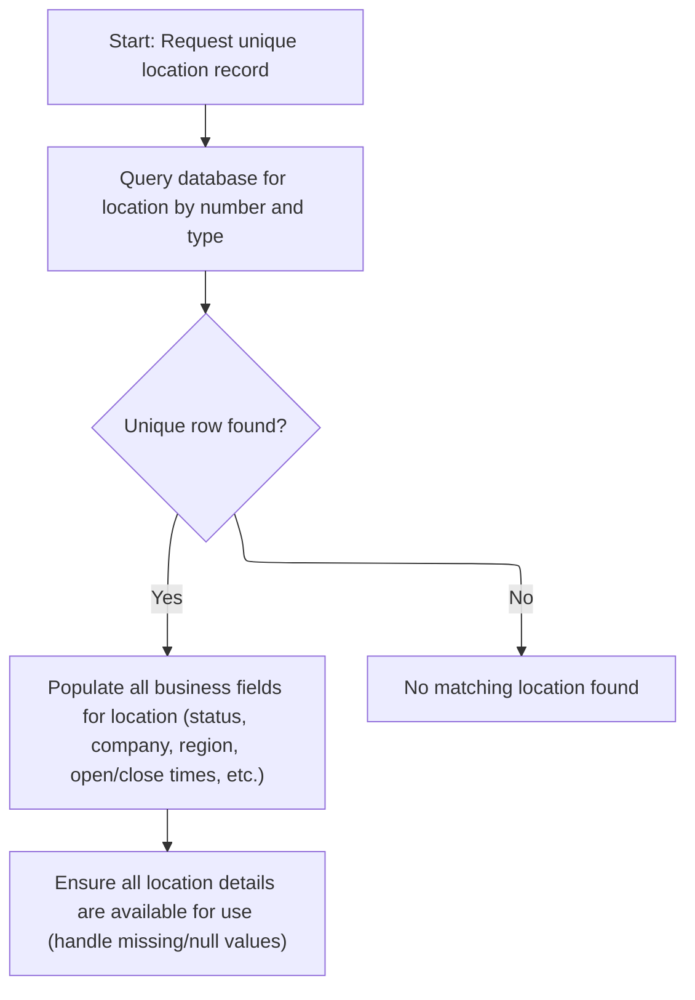
```mermaid
%%{init: {"flowchart": {"defaultRenderer": "elk"}} }%%
flowchart TD
    node1["Start: Request unique location record"]
    click node1 openCode "base/src/NNNS0488.cbl:2294:2294"
    node1 --> node2["Query database for location by number and type"]
    click node2 openCode "base/src/NNNS0488.cbl:2295:2505"
    node2 --> node3{"Unique row found?"}
    click node3 openCode "base/src/NNNS0488.cbl:2505:2506"
    node3 -->|"Yes"| node4["Populate all business fields for location (status, company, region, open/close times, etc.)"]
    click node4 openCode "base/src/NNNS0488.cbl:2295:2505"
    node4 --> node5["Ensure all location details are available for use (handle missing/null values)"]
    click node5 openCode "base/src/NNNS0488.cbl:2510:2510"
    node3 -->|"No"| node6["No matching location found"]
    click node6 openCode "base/src/NNNS0488.cbl:2295:2505"
classDef HeadingStyle fill:#777777,stroke:#333,stroke-width:2px;

%% Swimm:
%% %%{init: {"flowchart": {"defaultRenderer": "elk"}} }%%
%% flowchart TD
%%     node1["Start: Request unique location record"]
%%     click node1 openCode "<SwmPath>[base/src/NNNS0488.cbl](base/src/NNNS0488.cbl)</SwmPath>:2294:2294"
%%     node1 --> node2["Query database for location by number and type"]
%%     click node2 openCode "<SwmPath>[base/src/NNNS0488.cbl](base/src/NNNS0488.cbl)</SwmPath>:2295:2505"
%%     node2 --> node3{"Unique row found?"}
%%     click node3 openCode "<SwmPath>[base/src/NNNS0488.cbl](base/src/NNNS0488.cbl)</SwmPath>:2505:2506"
%%     node3 -->|"Yes"| node4["Populate all business fields for location (status, company, region, open/close times, etc.)"]
%%     click node4 openCode "<SwmPath>[base/src/NNNS0488.cbl](base/src/NNNS0488.cbl)</SwmPath>:2295:2505"
%%     node4 --> node5["Ensure all location details are available for use (handle missing/null values)"]
%%     click node5 openCode "<SwmPath>[base/src/NNNS0488.cbl](base/src/NNNS0488.cbl)</SwmPath>:2510:2510"
%%     node3 -->|"No"| node6["No matching location found"]
%%     click node6 openCode "<SwmPath>[base/src/NNNS0488.cbl](base/src/NNNS0488.cbl)</SwmPath>:2295:2505"
%% classDef HeadingStyle fill:#777777,stroke:#333,stroke-width:2px;
```

This section is responsible for retrieving a single, unique location record from the database, ensuring all relevant business fields are populated and usable for downstream processes.

| Category        | Rule Name                      | Description                                                                                                                                                   |
| --------------- | ------------------------------ | ------------------------------------------------------------------------------------------------------------------------------------------------------------- |
| Data validation | Unique location identification | A location record must be uniquely identified by both location number and location type. Only one record should match these criteria for a successful fetch.  |
| Business logic  | Complete field population      | If a unique location record is found, all business-relevant fields (such as status, company, region, open/close times, etc.) must be populated in the output. |
| Business logic  | Default value handling         | Any missing or null values in the location record must be replaced with default values to ensure data usability.                                              |

<SwmSnippet path="/base/src/NNNS0488.cbl" line="2294">

---

<SwmToken path="base/src/NNNS0488.cbl" pos="2294:2:10" line-data="233100 1200-EXIT-GET-UNIQUE-ROW.                                        00233100">`1200-EXIT-GET-UNIQUE-ROW`</SwmToken> runs a big SELECT to fetch all location data into the target record. Right after, we call <SwmToken path="base/src/NNNS0488.cbl" pos="2510:4:10" line-data="254600     PERFORM 1700-CHECK-NULL-COLUMNS                              00254600">`1700-CHECK-NULL-COLUMNS`</SwmToken> to fill in defaults for any missing or null fields.

```cobol
233100 1200-EXIT-GET-UNIQUE-ROW.                                        00233100
233200       EXEC SQL                                                   00233200
233300           SELECT LOC_NBR,                                        00233300
233400                  LOC_TYP_CD,                                     00233400
233500                  ASSOC_STR_TYP_CD,                               00233500
233600                  ASSOC_STR_NBR,                                  00233600
233700                  STR_REMODL_DT,                                  00233700
233800                  RETL_LOC_STAT_CD,                               00233800
233900                  RETL_LOC_STAT_DT,                               00233900
234000                  COMPANY_ID,                                     00234000
234100                  FINANCIAL_DIV_ID,                               00234100
234200                  LIN_OF_BUS_ID,                                  00234200
234300                  DIST_ID,                                        00234300
234400                  MKT_RGN_ID,                                     00234400
234500                  GEO_ZN_CD,                                      00234500
234600                  RETL_GEO_ZN_ID,                                 00234600
234700                  SCN_MAINT_SW,                                   00234700
234800                  FRNT_END_CD,                                    00234800
234900                  PRC_BUL_SW,                                     00234900
235000                  UPC_ON_PRC_BUL_SW,                              00235000
235100                  CMPTR_TYP_CD,                                   00235100
235200                  RETL_VID_ZN_NBR,                                00235200
235300                  RETL_UNLD_CD,                                   00235300
235400                  ROLUP_REPT_TBL_TXT,                             00235400
235500                  NEW_STR_SW,                                     00235500
235600                  SEL_CIR_SW,                                     00235600
235700                  BKRM_SQ_FT,                                     00235700
235800                  FD_LINER_FT,                                    00235800
235900                  NON_FD_LINER_FT,                                00235900
236000                  SETOFF_ROOM_SW,                                 00236000
236100                  CAT_CLS_TBL_TXT,                                00236100
236200                  LAT_K,                                          00236200
236300                  LON_K,                                          00236300
236400                  CK_COLL_REPT_SW,                                00236400
236500                  CK_COLL_CNTL_CD,                                00236500
236600                  CK_COLL_ADD_DEL_SW,                             00236600
236700                  CK_ALT_STR_ID,                                  00236700
236800                  CK_COLL_FEE_AMT,                                00236800
236900                  SALS_TAX_PCT,                                   00236900
237000                  SOAP_SALE_VAR_PCT,                              00237000
237100                  ON_SRS_CD,                                      00237100
237200                  SRS_DSD_ORD_SW,                                 00237200
237300                  RETL_LOC_TYP_CD,                                00237300
237400                  DEA_NBR,                                        00237400
237500                  STR_OPSTMT_SRT_CD,                              00237500
237600                  STR_OPSTMT_TYP_CD,                              00237600
237700                  STR_OPSTMT_HDR_CD,                              00237700
237800                  DPS_NBR,                                        00237800
237900                  MEDICARE_ID,                                    00237900
238000                  NABP_NBR,                                       00238000
238100                  NATL_PROV_ID,                                   00238100
238200                  CURR_AD_ZN_NBR,                                 00238200
238300                  PD_ZONE_NO,                                     00238300
238400                  SOS_PROC_SW,                                    00238400
238500                  RPRT_SEQ_NBR,                                   00238500
238600                  GRP_CD,                                         00238600
238700                  PRIM_GRP_CD_1,                                  00238700
238800                  PRIM_GRP_CD_2,                                  00238800
238900                  SECY_GRP_CD_1,                                  00238900
239000                  SECY_GRP_CD_2,                                  00239000
239100                  PRIM_CLS_NBR_1,                                 00239100
239200                  PRIM_CLS_NBR_2,                                 00239200
239300                  SECY_CLS_NBR_1,                                 00239300
239400                  SECY_CLS_NBR_2,                                 00239400
239500                  VAL_STR_SW,                                     00239500
239600                  SLS_CLOSED_DT,                                  00239600
239700                  TBCO_PRMT_NBR,                                  00239700
239800                  SUB_UNLIKE_PROD_CD,                             00239800
239900                  SUB_DSPLY_PAL_CD,                               00239900
240000                  RLTM_SCN_MAINT_SW,                              00240000
240100                  TOP_LEADER_NM,                                  00240100
240200                  CUST_FRNDLY_NM,                                 00240200
240300                  SLS_OPEN_DT,                                    00240300
240400                  MON_OPEN_TM,                                    00240400
240500                  MON_CLOS_TM,                                    00240500
240600                  TUE_OPEN_TM,                                    00240600
240700                  TUE_CLOS_TM,                                    00240700
240800                  WED_OPEN_TM,                                    00240800
240900                  WED_CLOS_TM,                                    00240900
241000                  THUR_OPEN_TM,                                   00241000
241100                  THUR_CLOS_TM,                                   00241100
241200                  FRI_OPEN_TM,                                    00241200
241300                  FRI_CLOS_TM,                                    00241300
241400                  SAT_OPEN_TM,                                    00241400
241500                  SAT_CLOS_TM,                                    00241500
241600                  SUN_OPEN_TM,                                    00241600
241700                  SUN_CLOS_TM,                                    00241700
241800                  RETL_LOC_FRMAT_CD,                              00241800
241900                  RETL_LOC_SEGM_CD,                               00241900
242000                  ECOMM_MKT_AREA_CD,                              00242000
242100                  ECOMM_STRT_DT,                                  00242100
242200                  ECOMM_END_DT,                                   00242200
242300                  ROLUP_REPT_TBL_01_NBR,                          00242300
242400                  ROLUP_REPT_TBL_02_NBR,                          00242400
242500                  ROLUP_REPT_TBL_03_NBR,                          00242500
242600                  ROLUP_REPT_TBL_04_NBR,                          00242600
242700                  ROLUP_REPT_TBL_05_NBR,                          00242700
242800                  ROLUP_REPT_TBL_06_NBR,                          00242800
242900                  ROLUP_REPT_TBL_07_NBR,                          00242900
243000                  ROLUP_REPT_TBL_08_NBR,                          00243000
243100                  ROLUP_REPT_TBL_09_NBR,                          00243100
243200                  ROLUP_REPT_TBL_10_NBR,                          00243200
243300                  ONLIN_SSON_SW,                                  00243300
243400                  RPLACD_BY_STR_NBR                               00243400
243500           INTO   :DCLXXXAIL-LOC.LOC-NBR,                         00243500
243600                  :DCLXXXAIL-LOC.LOC-TYP-CD,                      00243600
243700                  :DCLXXXAIL-LOC.ASSOC-STR-TYP-CD                 00243700
243800                  :WS-ASSOC-ST-TYPE-IND,                          00243800
243900                  :DCLXXXAIL-LOC.ASSOC-STR-NBR                    00243900
244000                  :WS-ASSOC-ST-NO-IND,                            00244000
244100                  :DCLXXXAIL-LOC.STR-REMODL-DT,                   00244100
244200                  :DCLXXXAIL-LOC.RETL-LOC-STAT-CD,                00244200
244300                  :DCLXXXAIL-LOC.RETL-LOC-STAT-DT,                00244300
244400                  :DCLXXXAIL-LOC.COMPANY-ID,                      00244400
244500                  :DCLXXXAIL-LOC.FINANCIAL-DIV-ID,                00244500
244600                  :DCLXXXAIL-LOC.LIN-OF-BUS-ID,                   00244600
244700                  :DCLXXXAIL-LOC.DIST-ID,                         00244700
244800                  :DCLXXXAIL-LOC.MKT-RGN-ID,                      00244800
244900                  :DCLXXXAIL-LOC.GEO-ZN-CD,                       00244900
245000                  :DCLXXXAIL-LOC.RETL-GEO-ZN-ID,                  00245000
245100                  :DCLXXXAIL-LOC.SCN-MAINT-SW,                    00245100
245200                  :DCLXXXAIL-LOC.FRNT-END-CD,                     00245200
245300                  :DCLXXXAIL-LOC.PRC-BUL-SW,                      00245300
245400                  :DCLXXXAIL-LOC.UPC-ON-PRC-BUL-SW,               00245400
245500                  :DCLXXXAIL-LOC.CMPTR-TYP-CD,                    00245500
245600                  :DCLXXXAIL-LOC.RETL-VID-ZN-NBR,                 00245600
245700                  :DCLXXXAIL-LOC.RETL-UNLD-CD,                    00245700
245800                  :DCLXXXAIL-LOC.ROLUP-REPT-TBL-TXT,              00245800
245900                  :DCLXXXAIL-LOC.NEW-STR-SW,                      00245900
246000                  :DCLXXXAIL-LOC.SEL-CIR-SW,                      00246000
246100                  :DCLXXXAIL-LOC.BKRM-SQ-FT,                      00246100
246200                  :DCLXXXAIL-LOC.FD-LINER-FT,                     00246200
246300                  :DCLXXXAIL-LOC.NON-FD-LINER-FT,                 00246300
246400                  :DCLXXXAIL-LOC.SETOFF-ROOM-SW,                  00246400
246500                  :DCLXXXAIL-LOC.CAT-CLS-TBL-TXT,                 00246500
246600                  :DCLXXXAIL-LOC.LAT-K,                           00246600
246700                  :DCLXXXAIL-LOC.LON-K,                           00246700
246800                  :DCLXXXAIL-LOC.CK-COLL-REPT-SW,                 00246800
246900                  :DCLXXXAIL-LOC.CK-COLL-CNTL-CD,                 00246900
247000                  :DCLXXXAIL-LOC.CK-COLL-ADD-DEL-SW,              00247000
247100                  :DCLXXXAIL-LOC.CK-ALT-STR-ID,                   00247100
247200                  :DCLXXXAIL-LOC.CK-COLL-FEE-AMT,                 00247200
247300                  :DCLXXXAIL-LOC.SALS-TAX-PCT,                    00247300
247400                  :DCLXXXAIL-LOC.SOAP-SALE-VAR-PCT,               00247400
247500                  :DCLXXXAIL-LOC.ON-SRS-CD,                       00247500
247600                  :DCLXXXAIL-LOC.SRS-DSD-ORD-SW,                  00247600
247700                  :DCLXXXAIL-LOC.RETL-LOC-TYP-CD,                 00247700
247800                  :DCLXXXAIL-LOC.DEA-NBR,                         00247800
247900                  :DCLXXXAIL-LOC.STR-OPSTMT-SRT-CD,               00247900
248000                  :DCLXXXAIL-LOC.STR-OPSTMT-TYP-CD,               00248000
248100                  :DCLXXXAIL-LOC.STR-OPSTMT-HDR-CD,               00248100
248200                  :DCLXXXAIL-LOC.DPS-NBR,                         00248200
248300                  :DCLXXXAIL-LOC.MEDICARE-ID,                     00248300
248400                  :DCLXXXAIL-LOC.NABP-NBR,                        00248400
248500                  :DCLXXXAIL-LOC.NATL-PROV-ID,                    00248500
248600                  :DCLXXXAIL-LOC.CURR-AD-ZN-NBR,                  00248600
248700                  :DCLXXXAIL-LOC.PD-ZONE-NO,                      00248700
248800                  :DCLXXXAIL-LOC.SOS-PROC-SW,                     00248800
248900                  :DCLXXXAIL-LOC.RPRT-SEQ-NBR,                    00248900
249000                  :DCLXXXAIL-LOC.GRP-CD,                          00249000
249100                  :DCLXXXAIL-LOC.PRIM-GRP-CD-1,                   00249100
249200                  :DCLXXXAIL-LOC.PRIM-GRP-CD-2,                   00249200
249300                  :DCLXXXAIL-LOC.SECY-GRP-CD-1,                   00249300
249400                  :DCLXXXAIL-LOC.SECY-GRP-CD-2,                   00249400
249500                  :DCLXXXAIL-LOC.PRIM-CLS-NBR-1,                  00249500
249600                  :DCLXXXAIL-LOC.PRIM-CLS-NBR-2,                  00249600
249700                  :DCLXXXAIL-LOC.SECY-CLS-NBR-1,                  00249700
249800                  :DCLXXXAIL-LOC.SECY-CLS-NBR-2,                  00249800
249900                  :DCLXXXAIL-LOC.VAL-STR-SW,                      00249900
250000                  :DCLXXXAIL-LOC.SLS-CLOSED-DT,                   00250000
250100                  :DCLXXXAIL-LOC.TBCO-PRMT-NBR,                   00250100
250200                  :DCLXXXAIL-LOC.SUB-UNLIKE-PROD-CD,              00250200
250300                  :DCLXXXAIL-LOC.SUB-DSPLY-PAL-CD,                00250300
250400                  :DCLXXXAIL-LOC.RLTM-SCN-MAINT-SW,               00250400
250500                  :DCLXXXAIL-LOC.TOP-LEADER-NM,                   00250500
250600                  :DCLXXXAIL-LOC.CUST-FRNDLY-NM,                  00250600
250700                  :DCLXXXAIL-LOC.SLS-OPEN-DT,                     00250700
250800                  :WS-MON-OPEN-TS,                                00250800
250900                  :WS-MON-CLOS-TS,                                00250900
251000                  :WS-TUE-OPEN-TS,                                00251000
251100                  :WS-TUE-CLOS-TS,                                00251100
251200                  :WS-WED-OPEN-TS,                                00251200
251300                  :WS-WED-CLOS-TS,                                00251300
251400                  :WS-THUR-OPEN-TS,                               00251400
251500                  :WS-THUR-CLOS-TS,                               00251500
251600                  :WS-FRI-OPEN-TS ,                               00251600
251700                  :WS-FRI-CLOS-TS,                                00251700
251800                  :WS-SAT-OPEN-TS,                                00251800
251900                  :WS-SAT-CLOS-TS,                                00251900
252000                  :WS-SUN-OPEN-TS,                                00252000
252100                  :WS-SUN-CLOS-TS,                                00252100
252200                  :DCLXXXAIL-LOC.RETL-LOC-FRMAT-CD,               00252200
252300                  :DCLXXXAIL-LOC.RETL-LOC-SEGM-CD,                00252300
252400                  :DCLXXXAIL-LOC.ECOMM-MKT-AREA-CD,               00252400
252500                  :DCLXXXAIL-LOC.ECOMM-STRT-DT                    00252500
252600                  :DCLXXXAIL-LOC-IND.ECOMM-STRT-DT-IND,           00252600
252700                  :DCLXXXAIL-LOC.ECOMM-END-DT                     00252700
252800                  :DCLXXXAIL-LOC-IND.ECOMM-END-DT-IND,            00252800
252900                  :DCLXXXAIL-LOC.ROLUP-REPT-TBL-01-NBR,           00252900
253000                  :DCLXXXAIL-LOC.ROLUP-REPT-TBL-02-NBR,           00253000
253100                  :DCLXXXAIL-LOC.ROLUP-REPT-TBL-03-NBR,           00253100
253200                  :DCLXXXAIL-LOC.ROLUP-REPT-TBL-04-NBR,           00253200
253300                  :DCLXXXAIL-LOC.ROLUP-REPT-TBL-05-NBR,           00253300
253400                  :DCLXXXAIL-LOC.ROLUP-REPT-TBL-06-NBR,           00253400
253500                  :DCLXXXAIL-LOC.ROLUP-REPT-TBL-07-NBR,           00253500
253600                  :DCLXXXAIL-LOC.ROLUP-REPT-TBL-08-NBR,           00253600
253700                  :DCLXXXAIL-LOC.ROLUP-REPT-TBL-09-NBR,           00253700
253800                  :DCLXXXAIL-LOC.ROLUP-REPT-TBL-10-NBR,           00253800
253900                  :DCLXXXAIL-LOC.ONLIN-SSON-SW,                   00253900
254000                  :DCLXXXAIL-LOC.RPLACD-BY-STR-NBR                00254000
254010                  :DCLXXXAIL-LOC-IND.RPLACD-BY-STR-NBR-IND        00254010
254100           FROM   XXXAIL_LOC                                      00254100
254200           WHERE  LOC_NBR = :DCLXXXAIL-LOC.LOC-NBR                00254200
254300           AND    LOC_TYP_CD = :DCLXXXAIL-LOC.LOC-TYP-CD          00254300
254400       END-EXEC                                                   00254400
254500                                                                  00254500
254600     PERFORM 1700-CHECK-NULL-COLUMNS                              00254600
```

---

</SwmSnippet>

## Validating and defaulting missing fields

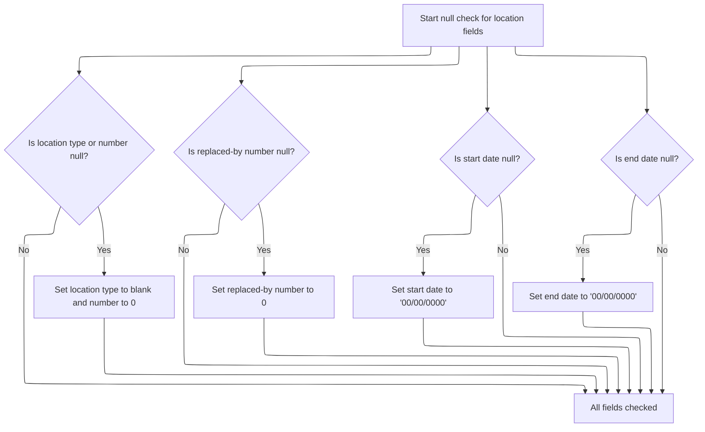
```mermaid
%%{init: {"flowchart": {"defaultRenderer": "elk"}} }%%
flowchart TD
    node1["Start null check for location fields"]
    click node1 openCode "base/src/NNNS0488.cbl:3649:3650"
    node1 --> node2{"Is location type or number null?"}
    click node2 openCode "base/src/NNNS0488.cbl:3650:3654"
    node1 --> node3{"Is replaced-by number null?"}
    click node3 openCode "base/src/NNNS0488.cbl:3655:3657"
    node1 --> node4{"Is start date null?"}
    click node4 openCode "base/src/NNNS0488.cbl:3658:3661"
    node1 --> node5{"Is end date null?"}
    click node5 openCode "base/src/NNNS0488.cbl:3662:3665"
    node2 -->|"Yes"| node6["Set location type to blank and number to 0"]
    click node6 openCode "base/src/NNNS0488.cbl:3652:3653"
    node2 -->|"No"| node10["All fields checked"]
    node3 -->|"Yes"| node7["Set replaced-by number to 0"]
    click node7 openCode "base/src/NNNS0488.cbl:3656:3656"
    node3 -->|"No"| node10
    node4 -->|"Yes"| node8["Set start date to '00/00/0000'"]
    click node8 openCode "base/src/NNNS0488.cbl:3660:3660"
    node4 -->|"No"| node10
    node5 -->|"Yes"| node9["Set end date to '00/00/0000'"]
    click node9 openCode "base/src/NNNS0488.cbl:3664:3664"
    node5 -->|"No"| node10
    node6 --> node10
    node7 --> node10
    node8 --> node10
    node9 --> node10
    node10["All fields checked"]
    click node10 openCode "base/src/NNNS0488.cbl:3649:3665"

classDef HeadingStyle fill:#777777,stroke:#333,stroke-width:2px;

%% Swimm:
%% %%{init: {"flowchart": {"defaultRenderer": "elk"}} }%%
%% flowchart TD
%%     node1["Start null check for location fields"]
%%     click node1 openCode "<SwmPath>[base/src/NNNS0488.cbl](base/src/NNNS0488.cbl)</SwmPath>:3649:3650"
%%     node1 --> node2{"Is location type or number null?"}
%%     click node2 openCode "<SwmPath>[base/src/NNNS0488.cbl](base/src/NNNS0488.cbl)</SwmPath>:3650:3654"
%%     node1 --> node3{"Is replaced-by number null?"}
%%     click node3 openCode "<SwmPath>[base/src/NNNS0488.cbl](base/src/NNNS0488.cbl)</SwmPath>:3655:3657"
%%     node1 --> node4{"Is start date null?"}
%%     click node4 openCode "<SwmPath>[base/src/NNNS0488.cbl](base/src/NNNS0488.cbl)</SwmPath>:3658:3661"
%%     node1 --> node5{"Is end date null?"}
%%     click node5 openCode "<SwmPath>[base/src/NNNS0488.cbl](base/src/NNNS0488.cbl)</SwmPath>:3662:3665"
%%     node2 -->|"Yes"| node6["Set location type to blank and number to 0"]
%%     click node6 openCode "<SwmPath>[base/src/NNNS0488.cbl](base/src/NNNS0488.cbl)</SwmPath>:3652:3653"
%%     node2 -->|"No"| node10["All fields checked"]
%%     node3 -->|"Yes"| node7["Set replaced-by number to 0"]
%%     click node7 openCode "<SwmPath>[base/src/NNNS0488.cbl](base/src/NNNS0488.cbl)</SwmPath>:3656:3656"
%%     node3 -->|"No"| node10
%%     node4 -->|"Yes"| node8["Set start date to '00/00/0000'"]
%%     click node8 openCode "<SwmPath>[base/src/NNNS0488.cbl](base/src/NNNS0488.cbl)</SwmPath>:3660:3660"
%%     node4 -->|"No"| node10
%%     node5 -->|"Yes"| node9["Set end date to '00/00/0000'"]
%%     click node9 openCode "<SwmPath>[base/src/NNNS0488.cbl](base/src/NNNS0488.cbl)</SwmPath>:3664:3664"
%%     node5 -->|"No"| node10
%%     node6 --> node10
%%     node7 --> node10
%%     node8 --> node10
%%     node9 --> node10
%%     node10["All fields checked"]
%%     click node10 openCode "<SwmPath>[base/src/NNNS0488.cbl](base/src/NNNS0488.cbl)</SwmPath>:3649:3665"
%% 
%% classDef HeadingStyle fill:#777777,stroke:#333,stroke-width:2px;
```

This section ensures that all location-related fields are valid and non-null by checking their indicator variables. If any indicator is negative, the corresponding field is reset to a default value, preventing invalid data from propagating through the system.

<SwmSnippet path="/base/src/NNNS0488.cbl" line="3649">

---

In <SwmToken path="base/src/NNNS0488.cbl" pos="3649:2:8" line-data="367700 1700-CHECK-NULL-COLUMNS.                                         00367700">`1700-CHECK-NULL-COLUMNS`</SwmToken> we check if any indicator variables are negative. If so, we reset the corresponding fields to default values (spaces, zero, or <SwmToken path="base/src/NNNS0488.cbl" pos="3660:4:8" line-data="368500       MOVE K-ZERO-DT TO  ECOMM-STRT-DT OF DCLXXXAIL-LOC          00368500">`K-ZERO-DT`</SwmToken> for dates).

```cobol
367700 1700-CHECK-NULL-COLUMNS.                                         00367700
367800     IF WS-ASSOC-ST-TYPE-IND < 0                                  00367800
367900     OR WS-ASSOC-ST-NO-IND < 0                                    00367900
368000       MOVE SPACES TO ASSOC-STR-TYP-CD OF DCLXXXAIL-LOC           00368000
368100       MOVE 0      TO ASSOC-STR-NBR OF DCLXXXAIL-LOC              00368100
368200     END-IF                                                       00368200
```

---

</SwmSnippet>

<SwmSnippet path="/base/src/NNNS0488.cbl" line="3655">

---

After checking the association indicators, we look at <SwmToken path="base/src/NNNS0488.cbl" pos="3655:4:12" line-data="368210     IF RPLACD-BY-STR-NBR-IND &lt; 0                                 00368210">`RPLACD-BY-STR-NBR-IND`</SwmToken>. If it's negative, we reset it to 0 so downstream logic doesn't break.

```cobol
368210     IF RPLACD-BY-STR-NBR-IND < 0                                 00368210
368211       MOVE 0      TO RPLACD-BY-STR-NBR-IND                       00368211
368220     END-IF                                                       00368220
```

---

</SwmSnippet>

<SwmSnippet path="/base/src/NNNS0488.cbl" line="3658">

---

For date indicators like <SwmToken path="base/src/NNNS0488.cbl" pos="3658:4:10" line-data="368300     IF ECOMM-STRT-DT-IND OF DCLXXXAIL-LOC-IND &lt; 0                00368300">`ECOMM-STRT-DT-IND`</SwmToken>, if they're negative, we set the date field to <SwmToken path="base/src/NNNS0488.cbl" pos="3660:4:8" line-data="368500       MOVE K-ZERO-DT TO  ECOMM-STRT-DT OF DCLXXXAIL-LOC          00368500">`K-ZERO-DT`</SwmToken> ('00/00/0000'). This marks the date as null for downstream systems.

```cobol
368300     IF ECOMM-STRT-DT-IND OF DCLXXXAIL-LOC-IND < 0                00368300
368400*      MOVE 0      TO ECOMM-STRT-DT OF DCLXXXAIL-LOC              00368400
368500       MOVE K-ZERO-DT TO  ECOMM-STRT-DT OF DCLXXXAIL-LOC          00368500
368600     END-IF                                                       00368600
```

---

</SwmSnippet>

<SwmSnippet path="/base/src/NNNS0488.cbl" line="3662">

---

After running <SwmToken path="base/src/NNNS0488.cbl" pos="2510:4:10" line-data="254600     PERFORM 1700-CHECK-NULL-COLUMNS                              00254600">`1700-CHECK-NULL-COLUMNS`</SwmToken>, any location-related fields with negative indicator values get reset to defaults. For example, if <SwmToken path="base/src/NNNS0488.cbl" pos="3662:4:10" line-data="368700     IF ECOMM-END-DT-IND OF DCLXXXAIL-LOC-IND &lt; 0                 00368700">`ECOMM-END-DT-IND`</SwmToken> is negative, <SwmToken path="base/src/NNNS0488.cbl" pos="3662:4:8" line-data="368700     IF ECOMM-END-DT-IND OF DCLXXXAIL-LOC-IND &lt; 0                 00368700">`ECOMM-END-DT`</SwmToken> is set to <SwmToken path="base/src/NNNS0488.cbl" pos="3664:4:8" line-data="368900       MOVE K-ZERO-DT TO ECOMM-END-DT OF DCLXXXAIL-LOC            00368900">`K-ZERO-DT`</SwmToken> ('00/00/0000'). This pattern is used for all the checked indicators, so null or invalid data is always replaced with a known value before the record is used elsewhere.

```cobol
368700     IF ECOMM-END-DT-IND OF DCLXXXAIL-LOC-IND < 0                 00368700
368800*      MOVE 0      TO ECOMM-END-DT OF DCLXXXAIL-LOC               00368800
368900       MOVE K-ZERO-DT TO ECOMM-END-DT OF DCLXXXAIL-LOC            00368900
369000     END-IF                                                       00369000
```

---

</SwmSnippet>

## Fetching the next location record

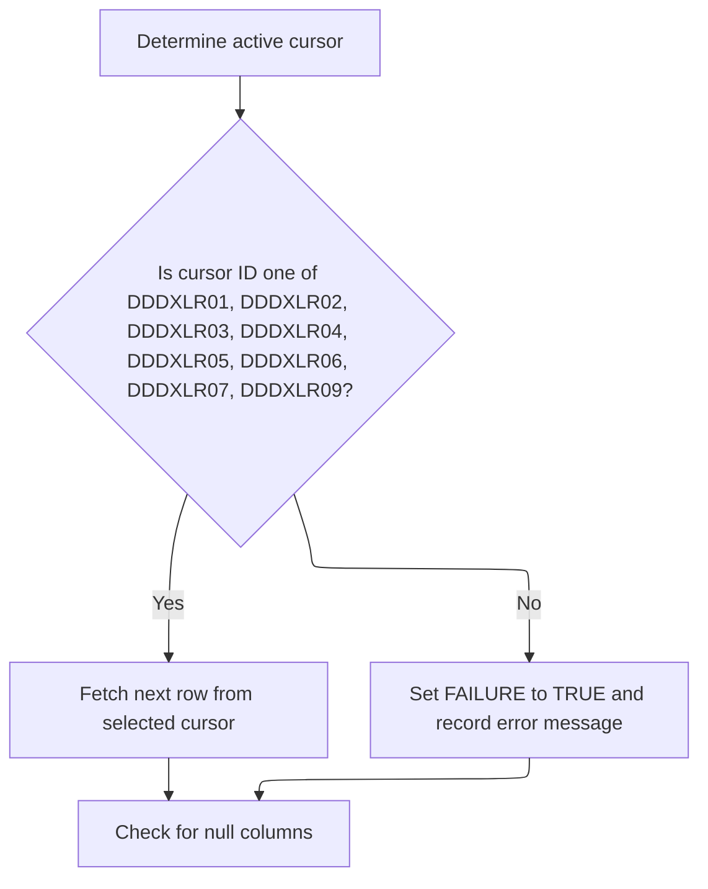
```mermaid
%%{init: {"flowchart": {"defaultRenderer": "elk"}} }%%
flowchart TD
    node1["Determine active cursor"] --> node2{"Is cursor ID one of DDDXLR01, DDDXLR02, DDDXLR03, DDDXLR04, DDDXLR05, DDDXLR06, DDDXLR07, DDDXLR09?"}
    click node1 openCode "base/src/NNNS0488.cbl:2514:2515"
    click node2 openCode "base/src/NNNS0488.cbl:2515:2531"
    node2 -->|"Yes"| node3["Fetch next row from selected cursor"]
    click node3 openCode "base/src/NNNS0488.cbl:2516:2531"
    node2 -->|"No"| node4["Set FAILURE to TRUE and record error message"]
    click node4 openCode "base/src/NNNS0488.cbl:2532:2535"
    node3 --> node5["Check for null columns"]
    click node5 openCode "base/src/NNNS0488.cbl:2538:2538"
    node4 --> node5
classDef HeadingStyle fill:#777777,stroke:#333,stroke-width:2px;

%% Swimm:
%% %%{init: {"flowchart": {"defaultRenderer": "elk"}} }%%
%% flowchart TD
%%     node1["Determine active cursor"] --> node2{"Is cursor ID one of <SwmToken path="base/src/NNNS0488.cbl" pos="2208:4:4" line-data="224500       WHEN DDDXLR01                                              00224500">`DDDXLR01`</SwmToken>, <SwmToken path="base/src/NNNS0488.cbl" pos="2212:4:4" line-data="224900       WHEN DDDXLR02                                              00224900">`DDDXLR02`</SwmToken>, <SwmToken path="base/src/NNNS0488.cbl" pos="2216:4:4" line-data="225300       WHEN DDDXLR03                                              00225300">`DDDXLR03`</SwmToken>, <SwmToken path="base/src/NNNS0488.cbl" pos="2220:4:4" line-data="225700       WHEN DDDXLR04                                              00225700">`DDDXLR04`</SwmToken>, <SwmToken path="base/src/NNNS0488.cbl" pos="2224:4:4" line-data="226100       WHEN DDDXLR05                                              00226100">`DDDXLR05`</SwmToken>, <SwmToken path="base/src/NNNS0488.cbl" pos="2228:4:4" line-data="226500       WHEN DDDXLR06                                              00226500">`DDDXLR06`</SwmToken>, <SwmToken path="base/src/NNNS0488.cbl" pos="2232:4:4" line-data="226900       WHEN DDDXLR07                                              00226900">`DDDXLR07`</SwmToken>, <SwmToken path="base/src/NNNS0488.cbl" pos="2240:4:4" line-data="227700       WHEN DDDXLR09                                              00227700">`DDDXLR09`</SwmToken>?"}
%%     click node1 openCode "<SwmPath>[base/src/NNNS0488.cbl](base/src/NNNS0488.cbl)</SwmPath>:2514:2515"
%%     click node2 openCode "<SwmPath>[base/src/NNNS0488.cbl](base/src/NNNS0488.cbl)</SwmPath>:2515:2531"
%%     node2 -->|"Yes"| node3["Fetch next row from selected cursor"]
%%     click node3 openCode "<SwmPath>[base/src/NNNS0488.cbl](base/src/NNNS0488.cbl)</SwmPath>:2516:2531"
%%     node2 -->|"No"| node4["Set FAILURE to TRUE and record error message"]
%%     click node4 openCode "<SwmPath>[base/src/NNNS0488.cbl](base/src/NNNS0488.cbl)</SwmPath>:2532:2535"
%%     node3 --> node5["Check for null columns"]
%%     click node5 openCode "<SwmPath>[base/src/NNNS0488.cbl](base/src/NNNS0488.cbl)</SwmPath>:2538:2538"
%%     node4 --> node5
%% classDef HeadingStyle fill:#777777,stroke:#333,stroke-width:2px;
```

This section governs how the system fetches the next location record based on the provided cursor ID, ensuring only valid cursor IDs are processed and all location attributes are retrieved and validated.

| Category       | Rule Name                          | Description                                                                                                                                                                        |
| -------------- | ---------------------------------- | ---------------------------------------------------------------------------------------------------------------------------------------------------------------------------------- |
| Business logic | Complete location record retrieval | When a valid cursor ID is provided, the system must fetch the next location record and populate all defined fields for that location, ensuring completeness of the data structure. |

<SwmSnippet path="/base/src/NNNS0488.cbl" line="2514">

---

In <SwmToken path="base/src/NNNS0488.cbl" pos="2514:2:10" line-data="255000 1300-EXIT-GET-NEXT-ROW.                                          00255000">`1300-EXIT-GET-NEXT-ROW`</SwmToken>, we use an EVALUATE statement to pick the right fetch routine based on the cursor ID. If it's <SwmToken path="base/src/NNNS0488.cbl" pos="2516:4:4" line-data="255200       WHEN DDDXLR01                                              00255200">`DDDXLR01`</SwmToken>, we call <SwmToken path="base/src/NNNS0488.cbl" pos="2517:4:8" line-data="255300         PERFORM 1301-FETCH-DDDXLR01                              00255300">`1301-FETCH-DDDXLR01`</SwmToken> to pull the next location record. Each fetch routine is matched to a specific cursor, so we always get the right data structure for the current operation.

```cobol
255000 1300-EXIT-GET-NEXT-ROW.                                          00255000
255100     EVALUATE TRUE                                                00255100
255200       WHEN DDDXLR01                                              00255200
255300         PERFORM 1301-FETCH-DDDXLR01                              00255300
255400       WHEN DDDXLR02                                              00255400
255500         PERFORM 1302-FETCH-DDDXLR02                              00255500
255600       WHEN DDDXLR03                                              00255600
255700         PERFORM 1303-FETCH-DDDXLR03                              00255700
255800       WHEN DDDXLR04                                              00255800
255900         PERFORM 1304-FETCH-DDDXLR04                              00255900
256000       WHEN DDDXLR05                                              00256000
256100         PERFORM 1305-FETCH-DDDXLR05                              00256100
256200       WHEN DDDXLR06                                              00256200
256300         PERFORM 1306-FETCH-DDDXLR06                              00256300
256400       WHEN DDDXLR07                                              00256400
256500         PERFORM 1307-FETCH-DDDXLR07                              00256500
256600       WHEN DDDXLR09                                              00256600
256700         PERFORM 1309-FETCH-DDDXLR09                              00256700
```

---

</SwmSnippet>

<SwmSnippet path="/base/src/NNNS0488.cbl" line="2542">

---

<SwmToken path="base/src/NNNS0488.cbl" pos="2542:2:6" line-data="257800 1301-FETCH-DDDXLR01.                                             00257800">`1301-FETCH-DDDXLR01`</SwmToken> pulls all fields for a location from the database, making sure every attribute is loaded for later use.

```cobol
257800 1301-FETCH-DDDXLR01.                                             00257800
257900     EXEC SQL                                                     00257900
258000         FETCH DDDXLR01                                           00258000
258100         INTO  :DCLXXXAIL-LOC.LOC-NBR,                            00258100
258200               :DCLXXXAIL-LOC.LOC-TYP-CD,                         00258200
258300               :DCLXXXAIL-LOC.ASSOC-STR-TYP-CD                    00258300
258400               :WS-ASSOC-ST-TYPE-IND,                             00258400
258500               :DCLXXXAIL-LOC.ASSOC-STR-NBR                       00258500
258600               :WS-ASSOC-ST-NO-IND,                               00258600
258700               :DCLXXXAIL-LOC.STR-REMODL-DT,                      00258700
258800               :DCLXXXAIL-LOC.RETL-LOC-STAT-CD,                   00258800
258900               :DCLXXXAIL-LOC.RETL-LOC-STAT-DT,                   00258900
259000               :DCLXXXAIL-LOC.COMPANY-ID,                         00259000
259100               :DCLXXXAIL-LOC.FINANCIAL-DIV-ID,                   00259100
259200               :DCLXXXAIL-LOC.LIN-OF-BUS-ID,                      00259200
259300               :DCLXXXAIL-LOC.DIST-ID,                            00259300
259400               :DCLXXXAIL-LOC.MKT-RGN-ID,                         00259400
259500               :DCLXXXAIL-LOC.GEO-ZN-CD,                          00259500
259600               :DCLXXXAIL-LOC.RETL-GEO-ZN-ID,                     00259600
259700               :DCLXXXAIL-LOC.SCN-MAINT-SW,                       00259700
259800               :DCLXXXAIL-LOC.FRNT-END-CD,                        00259800
259900               :DCLXXXAIL-LOC.PRC-BUL-SW,                         00259900
260000               :DCLXXXAIL-LOC.UPC-ON-PRC-BUL-SW,                  00260000
260100               :DCLXXXAIL-LOC.CMPTR-TYP-CD,                       00260100
260200               :DCLXXXAIL-LOC.RETL-VID-ZN-NBR,                    00260200
260300               :DCLXXXAIL-LOC.RETL-UNLD-CD,                       00260300
260400               :DCLXXXAIL-LOC.ROLUP-REPT-TBL-TXT,                 00260400
260500               :DCLXXXAIL-LOC.NEW-STR-SW,                         00260500
260600               :DCLXXXAIL-LOC.SEL-CIR-SW,                         00260600
260700               :DCLXXXAIL-LOC.BKRM-SQ-FT,                         00260700
260800               :DCLXXXAIL-LOC.FD-LINER-FT,                        00260800
260900               :DCLXXXAIL-LOC.NON-FD-LINER-FT,                    00260900
261000               :DCLXXXAIL-LOC.SETOFF-ROOM-SW,                     00261000
261100               :DCLXXXAIL-LOC.CAT-CLS-TBL-TXT,                    00261100
261200               :DCLXXXAIL-LOC.LAT-K,                              00261200
261300               :DCLXXXAIL-LOC.LON-K,                              00261300
261400               :DCLXXXAIL-LOC.CK-COLL-REPT-SW,                    00261400
261500               :DCLXXXAIL-LOC.CK-COLL-CNTL-CD,                    00261500
261600               :DCLXXXAIL-LOC.CK-COLL-ADD-DEL-SW,                 00261600
261700               :DCLXXXAIL-LOC.CK-ALT-STR-ID,                      00261700
261800               :DCLXXXAIL-LOC.CK-COLL-FEE-AMT,                    00261800
261900               :DCLXXXAIL-LOC.SALS-TAX-PCT,                       00261900
262000               :DCLXXXAIL-LOC.SOAP-SALE-VAR-PCT,                  00262000
262100               :DCLXXXAIL-LOC.ON-SRS-CD,                          00262100
262200               :DCLXXXAIL-LOC.SRS-DSD-ORD-SW,                     00262200
262300               :DCLXXXAIL-LOC.RETL-LOC-TYP-CD,                    00262300
262400               :DCLXXXAIL-LOC.DEA-NBR,                            00262400
262500               :DCLXXXAIL-LOC.STR-OPSTMT-SRT-CD,                  00262500
262600               :DCLXXXAIL-LOC.STR-OPSTMT-TYP-CD,                  00262600
262700               :DCLXXXAIL-LOC.STR-OPSTMT-HDR-CD,                  00262700
262800               :DCLXXXAIL-LOC.DPS-NBR,                            00262800
262900               :DCLXXXAIL-LOC.MEDICARE-ID,                        00262900
263000               :DCLXXXAIL-LOC.NABP-NBR,                           00263000
263100               :DCLXXXAIL-LOC.NATL-PROV-ID,                       00263100
263200               :DCLXXXAIL-LOC.CURR-AD-ZN-NBR,                     00263200
263300               :DCLXXXAIL-LOC.PD-ZONE-NO,                         00263300
263400               :DCLXXXAIL-LOC.SOS-PROC-SW,                        00263400
263500               :DCLXXXAIL-LOC.RPRT-SEQ-NBR,                       00263500
263600               :DCLXXXAIL-LOC.GRP-CD,                             00263600
263700               :DCLXXXAIL-LOC.PRIM-GRP-CD-1,                      00263700
263800               :DCLXXXAIL-LOC.PRIM-GRP-CD-2,                      00263800
263900               :DCLXXXAIL-LOC.SECY-GRP-CD-1,                      00263900
264000               :DCLXXXAIL-LOC.SECY-GRP-CD-2,                      00264000
264100               :DCLXXXAIL-LOC.PRIM-CLS-NBR-1,                     00264100
264200               :DCLXXXAIL-LOC.PRIM-CLS-NBR-2,                     00264200
264300               :DCLXXXAIL-LOC.SECY-CLS-NBR-1,                     00264300
264400               :DCLXXXAIL-LOC.SECY-CLS-NBR-2,                     00264400
264500               :DCLXXXAIL-LOC.VAL-STR-SW,                         00264500
264600               :DCLXXXAIL-LOC.SLS-CLOSED-DT,                      00264600
264700               :DCLXXXAIL-LOC.TBCO-PRMT-NBR,                      00264700
264800               :DCLXXXAIL-LOC.SUB-UNLIKE-PROD-CD,                 00264800
264900               :DCLXXXAIL-LOC.SUB-DSPLY-PAL-CD,                   00264900
265000               :DCLXXXAIL-LOC.RLTM-SCN-MAINT-SW,                  00265000
265100               :DCLXXXAIL-LOC.TOP-LEADER-NM,                      00265100
265200               :DCLXXXAIL-LOC.CUST-FRNDLY-NM,                     00265200
265300               :DCLXXXAIL-LOC.SLS-OPEN-DT,                        00265300
265400               :WS-MON-OPEN-TS,                                   00265400
265500               :WS-MON-CLOS-TS,                                   00265500
265600               :WS-TUE-OPEN-TS,                                   00265600
265700               :WS-TUE-CLOS-TS,                                   00265700
265800               :WS-WED-OPEN-TS,                                   00265800
265900               :WS-WED-CLOS-TS,                                   00265900
266000               :WS-THUR-OPEN-TS,                                  00266000
266100               :WS-THUR-CLOS-TS,                                  00266100
266200               :WS-FRI-OPEN-TS ,                                  00266200
266300               :WS-FRI-CLOS-TS,                                   00266300
266400               :WS-SAT-OPEN-TS,                                   00266400
266500               :WS-SUN-OPEN-TS,                                   00266500
266600               :WS-SAT-CLOS-TS,                                   00266600
266700               :WS-SUN-CLOS-TS,                                   00266700
266800               :DCLXXXAIL-LOC.RETL-LOC-FRMAT-CD,                  00266800
266900               :DCLXXXAIL-LOC.RETL-LOC-SEGM-CD,                   00266900
267000               :DCLXXXAIL-LOC.ECOMM-MKT-AREA-CD,                  00267000
267100               :DCLXXXAIL-LOC.ECOMM-STRT-DT                       00267100
267200               :DCLXXXAIL-LOC-IND.ECOMM-STRT-DT-IND,              00267200
267300               :DCLXXXAIL-LOC.ECOMM-END-DT                        00267300
267400               :DCLXXXAIL-LOC-IND.ECOMM-END-DT-IND,               00267400
267500               :DCLXXXAIL-LOC.ROLUP-REPT-TBL-01-NBR,              00267500
267600               :DCLXXXAIL-LOC.ROLUP-REPT-TBL-02-NBR,              00267600
267700               :DCLXXXAIL-LOC.ROLUP-REPT-TBL-03-NBR,              00267700
267800               :DCLXXXAIL-LOC.ROLUP-REPT-TBL-04-NBR,              00267800
267900               :DCLXXXAIL-LOC.ROLUP-REPT-TBL-05-NBR,              00267900
268000               :DCLXXXAIL-LOC.ROLUP-REPT-TBL-06-NBR,              00268000
268100               :DCLXXXAIL-LOC.ROLUP-REPT-TBL-07-NBR,              00268100
268200               :DCLXXXAIL-LOC.ROLUP-REPT-TBL-08-NBR,              00268200
268300               :DCLXXXAIL-LOC.ROLUP-REPT-TBL-09-NBR,              00268300
268400               :DCLXXXAIL-LOC.ROLUP-REPT-TBL-10-NBR,              00268400
268500               :DCLXXXAIL-LOC.ONLIN-SSON-SW,                      00268500
268600               :DCLXXXAIL-LOC.RPLACD-BY-STR-NBR                   00268600
268610               :DCLXXXAIL-LOC-IND.RPLACD-BY-STR-NBR-IND           00268610
268700     END-EXEC                                                     00268700
```

---

</SwmSnippet>

<SwmSnippet path="/base/src/NNNS0488.cbl" line="2532">

---

Back in <SwmToken path="base/src/NNNS0488.cbl" pos="1221:4:12" line-data="126600          PERFORM 1300-EXIT-GET-NEXT-ROW                          00126600">`1300-EXIT-GET-NEXT-ROW`</SwmToken>, after fetching the record, we call <SwmToken path="base/src/NNNS0488.cbl" pos="2538:4:10" line-data="257400     PERFORM 1700-CHECK-NULL-COLUMNS                              00257400">`1700-CHECK-NULL-COLUMNS`</SwmToken> to make sure any fields flagged as null or invalid get reset to defaults. If the cursor ID was invalid, we set an error message and failure flag before this step.

```cobol
256800       WHEN OTHER                                                 00256800
256900         SET FAILURE TO TRUE                                      00256900
257000         MOVE 'NNNS0488 - Invalid fetch cursor ID.'               00257000
257100           TO IS-RTRN-MSG-TXT OF XXXN001A                         00257100
257200     END-EVALUATE                                                 00257200
257300                                                                  00257300
257400     PERFORM 1700-CHECK-NULL-COLUMNS                              00257400
```

---

</SwmSnippet>

## Modifying a location record

This section governs the process of modifying a location record, ensuring that all necessary validations are performed before any changes are committed. It ensures data integrity and proper error messaging for failed modifications.

| Category        | Rule Name                       | Description                                                                                                                                                                                                  |
| --------------- | ------------------------------- | ------------------------------------------------------------------------------------------------------------------------------------------------------------------------------------------------------------ |
| Data validation | Edit validation required        | All edits to the location record must be validated before any modification is applied. If validation fails, the modification is not performed.                                                               |
| Business logic  | Alternate store existence check | Alternate store entries must be validated to confirm the store exists in the database. If the store does not exist or a database error occurs, the modification fails and a descriptive message is returned. |

<SwmSnippet path="/base/src/NNNS0488.cbl" line="3452">

---

In <SwmToken path="base/src/NNNS0488.cbl" pos="3452:2:10" line-data="348000 1400-EXIT-PUT-MODIFY-ROW.                                        00348000">`1400-EXIT-PUT-MODIFY-ROW`</SwmToken>, we start by setting null indicators, then immediately call <SwmToken path="base/src/NNNS0488.cbl" pos="3454:4:8" line-data="348200     PERFORM 1410-MODIFY-EDITS                                    00348200">`1410-MODIFY-EDITS`</SwmToken> to validate edits. This order makes sure the data is flagged and cleaned up before any business rules or updates are applied.

```cobol
348000 1400-EXIT-PUT-MODIFY-ROW.                                        00348000
348100     PERFORM 1800-EDIT-NULL-INDICATORS                            00348100
348200     PERFORM 1410-MODIFY-EDITS                                    00348200
```

---

</SwmSnippet>

### Validating edits for alternate store

This section ensures that any edits to an alternate store are validated against business rules before modifications are allowed. If the alternate store fails validation, the modification process is halted.

| Category        | Rule Name                                  | Description                                                                                                          |
| --------------- | ------------------------------------------ | -------------------------------------------------------------------------------------------------------------------- |
| Data validation | Alternate store existence check            | An alternate store must exist in the system before any modifications can be made to its data.                        |
| Business logic  | Pre-modification business rule enforcement | All business rules relevant to alternate store modifications must be checked before allowing any changes to proceed. |

<SwmSnippet path="/base/src/NNNS0488.cbl" line="3467">

---

<SwmToken path="base/src/NNNS0488.cbl" pos="3467:2:6" line-data="349500 1410-MODIFY-EDITS.                                               00349500">`1410-MODIFY-EDITS`</SwmToken> just calls <SwmToken path="base/src/NNNS0488.cbl" pos="3468:4:10" line-data="349600     PERFORM 1420-VALIDATE-ALT-STORE                              00349600">`1420-VALIDATE-ALT-STORE`</SwmToken> to check if the alternate store exists and meets the business rules. If it fails, the modification is stopped right here.

```cobol
349500 1410-MODIFY-EDITS.                                               00349500
349600     PERFORM 1420-VALIDATE-ALT-STORE                              00349600
349700     .                                                            00349700
```

---

</SwmSnippet>

### Checking alternate store existence

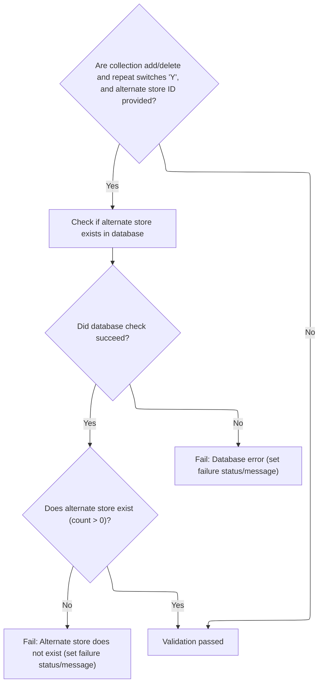
```mermaid
%%{init: {"flowchart": {"defaultRenderer": "elk"}} }%%
flowchart TD
    node1{"Are collection add/delete and repeat switches 'Y', and alternate store ID provided?"}
    click node1 openCode "base/src/NNNS0488.cbl:3473:3475"
    node2["Check if alternate store exists in database"]
    click node2 openCode "base/src/NNNS0488.cbl:3476:3482"
    node3{"Did database check succeed?"}
    click node3 openCode "base/src/NNNS0488.cbl:3483:3484"
    node4{"Does alternate store exist (count > 0)?"}
    click node4 openCode "base/src/NNNS0488.cbl:3485:3492"
    node5["Fail: Alternate store does not exist (set failure status/message)"]
    click node5 openCode "base/src/NNNS0488.cbl:3486:3489"
    node6["Fail: Database error (set failure status/message)"]
    click node6 openCode "base/src/NNNS0488.cbl:3494:3497"
    node7["Validation passed"]
    click node7 openCode "base/src/NNNS0488.cbl:3491:3492"
    node1 -->|"Yes"| node2
    node1 -->|"No"| node7
    node2 --> node3
    node3 -->|"Yes"| node4
    node3 -->|"No"| node6
    node4 -->|"Yes"| node7
    node4 -->|"No"| node5
classDef HeadingStyle fill:#777777,stroke:#333,stroke-width:2px;

%% Swimm:
%% %%{init: {"flowchart": {"defaultRenderer": "elk"}} }%%
%% flowchart TD
%%     node1{"Are collection add/delete and repeat switches 'Y', and alternate store ID provided?"}
%%     click node1 openCode "<SwmPath>[base/src/NNNS0488.cbl](base/src/NNNS0488.cbl)</SwmPath>:3473:3475"
%%     node2["Check if alternate store exists in database"]
%%     click node2 openCode "<SwmPath>[base/src/NNNS0488.cbl](base/src/NNNS0488.cbl)</SwmPath>:3476:3482"
%%     node3{"Did database check succeed?"}
%%     click node3 openCode "<SwmPath>[base/src/NNNS0488.cbl](base/src/NNNS0488.cbl)</SwmPath>:3483:3484"
%%     node4{"Does alternate store exist (count > 0)?"}
%%     click node4 openCode "<SwmPath>[base/src/NNNS0488.cbl](base/src/NNNS0488.cbl)</SwmPath>:3485:3492"
%%     node5["Fail: Alternate store does not exist (set failure status/message)"]
%%     click node5 openCode "<SwmPath>[base/src/NNNS0488.cbl](base/src/NNNS0488.cbl)</SwmPath>:3486:3489"
%%     node6["Fail: Database error (set failure status/message)"]
%%     click node6 openCode "<SwmPath>[base/src/NNNS0488.cbl](base/src/NNNS0488.cbl)</SwmPath>:3494:3497"
%%     node7["Validation passed"]
%%     click node7 openCode "<SwmPath>[base/src/NNNS0488.cbl](base/src/NNNS0488.cbl)</SwmPath>:3491:3492"
%%     node1 -->|"Yes"| node2
%%     node1 -->|"No"| node7
%%     node2 --> node3
%%     node3 -->|"Yes"| node4
%%     node3 -->|"No"| node6
%%     node4 -->|"Yes"| node7
%%     node4 -->|"No"| node5
%% classDef HeadingStyle fill:#777777,stroke:#333,stroke-width:2px;
```

This section validates the existence of an alternate store in the database when certain flags are set. If the store does not exist or there is a database error, it sets a failure status and returns an appropriate message.

| Category        | Rule Name                              | Description                                                                                                                                                                         |
| --------------- | -------------------------------------- | ----------------------------------------------------------------------------------------------------------------------------------------------------------------------------------- |
| Data validation | Conditional alternate store validation | Validation of alternate store existence is only triggered if both collection add/delete and repeat switches are set to 'Y', and an alternate store ID is provided (non-zero).       |
| Business logic  | Alternate store existence failure      | If the alternate store does not exist in the database (count = 0), the process must set the failure status and return a message indicating that the alternate store does not exist. |
| Business logic  | Successful alternate store validation  | If all conditions are met and the alternate store exists, validation passes and processing continues without error.                                                                 |

<SwmSnippet path="/base/src/NNNS0488.cbl" line="3472">

---

In <SwmToken path="base/src/NNNS0488.cbl" pos="3472:2:8" line-data="350000 1420-VALIDATE-ALT-STORE.                                         00350000">`1420-VALIDATE-ALT-STORE`</SwmToken>, we check if certain flags are set and if the alternate store ID is non-zero. If so, we run a SQL count to see if the store exists. If not, we set a failure flag and error message.

```cobol
350000 1420-VALIDATE-ALT-STORE.                                         00350000
350100     IF CK-COLL-ADD-DEL-SW OF DCLXXXAIL-LOC = 'Y' AND             00350100
350200        CK-ALT-STR-ID OF DCLXXXAIL-LOC NOT = 0    AND             00350200
350300        CK-COLL-REPT-SW OF DCLXXXAIL-LOC   = 'Y'                  00350300
350400          EXEC SQL                                                00350400
350500            SELECT COUNT(*)                                       00350500
350600            INTO :WS-CNT                                          00350600
350700            FROM XXXAIL_LOC                                       00350700
350800            WHERE LOC_NBR    = :DCLXXXAIL-LOC.CK-ALT-STR-ID       00350800
350900            AND   LOC_TYP_CD = :DCLXXXAIL-LOC.LOC-TYP-CD          00350900
351000          END-EXEC                                                00351000
```

---

</SwmSnippet>

<SwmSnippet path="/base/src/NNNS0488.cbl" line="3483">

---

After running <SwmToken path="base/src/NNNS0488.cbl" pos="3468:4:10" line-data="349600     PERFORM 1420-VALIDATE-ALT-STORE                              00349600">`1420-VALIDATE-ALT-STORE`</SwmToken>, if the alternate store doesn't exist, we set FAILURE and return a message saying so. If there's a <SwmToken path="base/src/NNNS0488.cbl" pos="3496:13:13" line-data="352400             STRING &#39;NNNS0488 - Error accessing DB2&#39;              00352400">`DB2`</SwmToken> error, we set FAILURE and return a <SwmToken path="base/src/NNNS0488.cbl" pos="3496:13:13" line-data="352400             STRING &#39;NNNS0488 - Error accessing DB2&#39;              00352400">`DB2`</SwmToken> error message. If everything's fine, we just continue.

```cobol
351100          EVALUATE TRUE                                           00351100
351200           WHEN SQLCODE = 0                                       00351200
351300            IF WS-CNT = 0                                         00351300
351400              SET  FAILURE                 TO TRUE                00351400
351500              MOVE SPACES                  TO IS-RTRN-MSG-TXT     00351500
351600              STRING 'NNNS0488 - Alt. store does not exists'      00351600
351700                     DELIMITED BY SIZE INTO IS-RTRN-MSG-TXT       00351700
351800            ELSE                                                  00351800
351900              CONTINUE                                            00351900
352000            END-IF                                                00352000
352100           WHEN OTHER                                             00352100
352200             SET  FAILURE                 TO TRUE                 00352200
352300             MOVE SPACES                  TO IS-RTRN-MSG-TXT      00352300
352400             STRING 'NNNS0488 - Error accessing DB2'              00352400
352500                    DELIMITED BY SIZE INTO IS-RTRN-MSG-TXT        00352500
352600     END-IF                                                       00352600
352700     .                                                            00352700
```

---

</SwmSnippet>

### Detecting and handling location changes

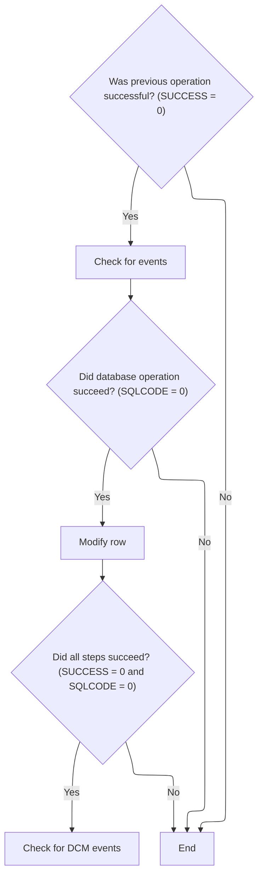
```mermaid
%%{init: {"flowchart": {"defaultRenderer": "elk"}} }%%
flowchart TD
  node1{"Was previous operation successful? (SUCCESS = 0)"}
  click node1 openCode "base/src/NNNS0488.cbl:3455:3463"
  node1 -->|"Yes"| node2["Check for events"]
  click node2 openCode "base/src/NNNS0488.cbl:3456:3456"
  node2 --> node3{"Did database operation succeed? (SQLCODE = 0)"}
  click node3 openCode "base/src/NNNS0488.cbl:3457:3462"
  node3 -->|"Yes"| node4["Modify row"]
  click node4 openCode "base/src/NNNS0488.cbl:3458:3458"
  node4 --> node5{"Did all steps succeed? (SUCCESS = 0 and SQLCODE = 0)"}
  click node5 openCode "base/src/NNNS0488.cbl:3459:3461"
  node5 -->|"Yes"| node6["Check for DCM events"]
  click node6 openCode "base/src/NNNS0488.cbl:3460:3460"
  node1 -->|"No"| node7["End"]
  node3 -->|"No"| node7
  node5 -->|"No"| node7
  click node7 openCode "base/src/NNNS0488.cbl:3463:3463"
classDef HeadingStyle fill:#777777,stroke:#333,stroke-width:2px;

%% Swimm:
%% %%{init: {"flowchart": {"defaultRenderer": "elk"}} }%%
%% flowchart TD
%%   node1{"Was previous operation successful? (SUCCESS = 0)"}
%%   click node1 openCode "<SwmPath>[base/src/NNNS0488.cbl](base/src/NNNS0488.cbl)</SwmPath>:3455:3463"
%%   node1 -->|"Yes"| node2["Check for events"]
%%   click node2 openCode "<SwmPath>[base/src/NNNS0488.cbl](base/src/NNNS0488.cbl)</SwmPath>:3456:3456"
%%   node2 --> node3{"Did database operation succeed? (SQLCODE = 0)"}
%%   click node3 openCode "<SwmPath>[base/src/NNNS0488.cbl](base/src/NNNS0488.cbl)</SwmPath>:3457:3462"
%%   node3 -->|"Yes"| node4["Modify row"]
%%   click node4 openCode "<SwmPath>[base/src/NNNS0488.cbl](base/src/NNNS0488.cbl)</SwmPath>:3458:3458"
%%   node4 --> node5{"Did all steps succeed? (SUCCESS = 0 and SQLCODE = 0)"}
%%   click node5 openCode "<SwmPath>[base/src/NNNS0488.cbl](base/src/NNNS0488.cbl)</SwmPath>:3459:3461"
%%   node5 -->|"Yes"| node6["Check for DCM events"]
%%   click node6 openCode "<SwmPath>[base/src/NNNS0488.cbl](base/src/NNNS0488.cbl)</SwmPath>:3460:3460"
%%   node1 -->|"No"| node7["End"]
%%   node3 -->|"No"| node7
%%   node5 -->|"No"| node7
%%   click node7 openCode "<SwmPath>[base/src/NNNS0488.cbl](base/src/NNNS0488.cbl)</SwmPath>:3463:3463"
%% classDef HeadingStyle fill:#777777,stroke:#333,stroke-width:2px;
```

<SwmSnippet path="/base/src/NNNS0488.cbl" line="3455">

---

After edits, we check for changes in <SwmToken path="base/src/NNNS0488.cbl" pos="3456:4:10" line-data="348400       PERFORM 1430-CHECK-FOR-EVENTS                              00348400">`1430-CHECK-FOR-EVENTS`</SwmToken>, and only keep going if everything is still good.

```cobol
348300     IF SUCCESS                                                   00348300
348400       PERFORM 1430-CHECK-FOR-EVENTS                              00348400
348500       IF SQLCODE = 0                                             00348500
348600         PERFORM 1440-D0-MODIFY-ROW                               00348600
348700         IF SUCCESS AND SQLCODE = 0                               00348700
348800           PERFORM 2400-CHECK-FOR-DCM-EVENT                       00348800
348900         END-IF                                                   00348900
349000       END-IF                                                     00349000
349100     END-IF                                                       00349100
```

---

</SwmSnippet>

## Checking for status and data changes

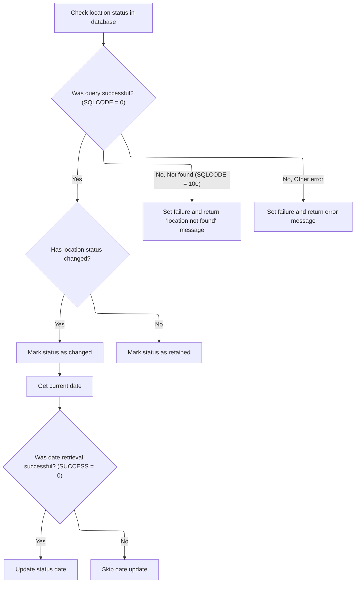
```mermaid
%%{init: {"flowchart": {"defaultRenderer": "elk"}} }%%
flowchart TD
    node1["Check location status in database"]
    click node1 openCode "base/src/NNNS0488.cbl:353000:353541"
    node1 --> node2{"Was query successful? (SQLCODE = 0)"}
    click node2 openCode "base/src/NNNS0488.cbl:353543:353544"
    node2 -->|"Yes"| node3{"Has location status changed?"}
    click node3 openCode "base/src/NNNS0488.cbl:353545:353554"
    node3 -->|"Yes"| node4["Mark status as changed"]
    click node4 openCode "base/src/NNNS0488.cbl:353546:353546"
    node4 --> node5["Get current date"]
    click node5 openCode "base/src/NNNS0488.cbl:353547:353547"
    node5 --> node6{"Was date retrieval successful? (SUCCESS = 0)"}
    click node6 openCode "base/src/NNNS0488.cbl:353548:353551"
    node6 -->|"Yes"| node7["Update status date"]
    click node7 openCode "base/src/NNNS0488.cbl:353549:353551"
    node6 -->|"No"| node8["Skip date update"]
    click node8 openCode "base/src/NNNS0488.cbl:353551:353551"
    node3 -->|"No"| node9["Mark status as retained"]
    click node9 openCode "base/src/NNNS0488.cbl:353553:353554"
    node2 -->|"No, Not found (SQLCODE = 100)"| node10["Set failure and return 'location not found' message"]
    click node10 openCode "base/src/NNNS0488.cbl:353555:353558"
    node2 -->|"No, Other error"| node11["Set failure and return error message"]
    click node11 openCode "base/src/NNNS0488.cbl:353559:353566"
classDef HeadingStyle fill:#777777,stroke:#333,stroke-width:2px;

%% Swimm:
%% %%{init: {"flowchart": {"defaultRenderer": "elk"}} }%%
%% flowchart TD
%%     node1["Check location status in database"]
%%     click node1 openCode "<SwmPath>[base/src/NNNS0488.cbl](base/src/NNNS0488.cbl)</SwmPath>:353000:353541"
%%     node1 --> node2{"Was query successful? (SQLCODE = 0)"}
%%     click node2 openCode "<SwmPath>[base/src/NNNS0488.cbl](base/src/NNNS0488.cbl)</SwmPath>:353543:353544"
%%     node2 -->|"Yes"| node3{"Has location status changed?"}
%%     click node3 openCode "<SwmPath>[base/src/NNNS0488.cbl](base/src/NNNS0488.cbl)</SwmPath>:353545:353554"
%%     node3 -->|"Yes"| node4["Mark status as changed"]
%%     click node4 openCode "<SwmPath>[base/src/NNNS0488.cbl](base/src/NNNS0488.cbl)</SwmPath>:353546:353546"
%%     node4 --> node5["Get current date"]
%%     click node5 openCode "<SwmPath>[base/src/NNNS0488.cbl](base/src/NNNS0488.cbl)</SwmPath>:353547:353547"
%%     node5 --> node6{"Was date retrieval successful? (SUCCESS = 0)"}
%%     click node6 openCode "<SwmPath>[base/src/NNNS0488.cbl](base/src/NNNS0488.cbl)</SwmPath>:353548:353551"
%%     node6 -->|"Yes"| node7["Update status date"]
%%     click node7 openCode "<SwmPath>[base/src/NNNS0488.cbl](base/src/NNNS0488.cbl)</SwmPath>:353549:353551"
%%     node6 -->|"No"| node8["Skip date update"]
%%     click node8 openCode "<SwmPath>[base/src/NNNS0488.cbl](base/src/NNNS0488.cbl)</SwmPath>:353551:353551"
%%     node3 -->|"No"| node9["Mark status as retained"]
%%     click node9 openCode "<SwmPath>[base/src/NNNS0488.cbl](base/src/NNNS0488.cbl)</SwmPath>:353553:353554"
%%     node2 -->|"No, Not found (SQLCODE = 100)"| node10["Set failure and return 'location not found' message"]
%%     click node10 openCode "<SwmPath>[base/src/NNNS0488.cbl](base/src/NNNS0488.cbl)</SwmPath>:353555:353558"
%%     node2 -->|"No, Other error"| node11["Set failure and return error message"]
%%     click node11 openCode "<SwmPath>[base/src/NNNS0488.cbl](base/src/NNNS0488.cbl)</SwmPath>:353559:353566"
%% classDef HeadingStyle fill:#777777,stroke:#333,stroke-width:2px;
```

This section is responsible for detecting changes in a location's status by comparing database values to in-memory values, updating the status date if a change is detected, and handling errors related to missing locations or database failures.

| Category       | Rule Name               | Description                                                                                                                                                                                               |
| -------------- | ----------------------- | --------------------------------------------------------------------------------------------------------------------------------------------------------------------------------------------------------- |
| Business logic | Status Change Detection | If the database query for the location is successful (SQLCODE = 0), compare the returned status code to the in-memory status code. If they differ, mark the status as changed and update the status date. |
| Business logic | Status Retention        | If the status code has not changed, mark the status as retained and do not update the status date.                                                                                                        |
| Business logic | Status Date Update      | When a status change is detected, attempt to retrieve the current date. If successful (SUCCESS = 0), update the status date; if not, skip the date update.                                                |

<SwmSnippet path="/base/src/NNNS0488.cbl" line="3502">

---

In <SwmToken path="base/src/NNNS0488.cbl" pos="3502:2:8" line-data="353000 1430-CHECK-FOR-EVENTS.                                           00353000">`1430-CHECK-FOR-EVENTS`</SwmToken>, we run a SQL SELECT to get the latest status, ad zone, and line of business for the location. This lets us compare with what's in memory and see if anything changed.

```cobol
353000 1430-CHECK-FOR-EVENTS.                                           00353000
353100     EXEC SQL                                                     00353100
353200         SELECT RETL_LOC_STAT_CD,                                 00353200
353300                CURR_AD_ZN_NBR,                                   00353300
353400                LIN_OF_BUS_ID                                     00353400
353500         INTO   :WS-STR-ST-CD,                                    00353500
353600                :WS-CURR-AD-ZONE,                                 00353600
353700                :WS-CURR-LOB                                      00353700
353800         FROM   XXXAIL_LOC                                        00353800
353900         WHERE  LOC_NBR = :DCLXXXAIL-LOC.LOC-NBR                  00353900
354000         AND    LOC_TYP_CD = :DCLXXXAIL-LOC.LOC-TYP-CD            00354000
354100     END-EXEC                                                     00354100
```

---

</SwmSnippet>

<SwmSnippet path="/base/src/NNNS0488.cbl" line="3515">

---

After the SELECT in <SwmToken path="base/src/NNNS0488.cbl" pos="3456:4:10" line-data="348400       PERFORM 1430-CHECK-FOR-EVENTS                              00348400">`1430-CHECK-FOR-EVENTS`</SwmToken>, if the status code changed, we flag it and update the date using <SwmToken path="base/src/NNNS0488.cbl" pos="3519:4:10" line-data="354700           PERFORM 2040-GET-CURRENT-DATE                          00354700">`2040-GET-CURRENT-DATE`</SwmToken>. If not, we just mark the status as retained.

```cobol
354300     EVALUATE TRUE                                                00354300
354400       WHEN SQLCODE = 0                                           00354400
354500         IF WS-STR-ST-CD NOT = RETL-LOC-STAT-CD OF DCLXXXAIL-LOC  00354500
354600           SET WS-LOC-STAT-CHANGED TO TRUE                        00354600
354700           PERFORM 2040-GET-CURRENT-DATE                          00354700
354800           IF SUCCESS                                             00354800
354900             MOVE DTA10-MM-DD-YYYY                                00354900
355000               TO RETL-LOC-STAT-DT OF DCLXXXAIL-LOC               00355000
355100           END-IF                                                 00355100
355200         ELSE                                                     00355200
355300           SET  WS-LOC-STAT-RETAINED TO TRUE                      00355300
355400         END-IF                                                   00355400
```

---

</SwmSnippet>

<SwmSnippet path="/base/src/NNNS0488.cbl" line="3527">

---

If the location's missing, we error out and stop right there.

```cobol
355500       WHEN SQLCODE = 100                                         00355500
355600         SET  FAILURE TO TRUE                                     00355600
355700         MOVE 'NNNS0488 - xxxail xxxation not found!'             00355700
355800           TO IS-RTRN-MSG-TXT                                     00355800
```

---

</SwmSnippet>

<SwmSnippet path="/base/src/NNNS0488.cbl" line="3531">

---

If we hit any other SQL error in <SwmToken path="base/src/NNNS0488.cbl" pos="3456:4:10" line-data="348400       PERFORM 1430-CHECK-FOR-EVENTS                              00348400">`1430-CHECK-FOR-EVENTS`</SwmToken>, we set FAILURE and build an error message with the SQLCODE. This makes it clear what failed for troubleshooting.

```cobol
355900       WHEN SQLCODE NOT = 0                                       00355900
356000         MOVE SQLCODE                 TO WS-SQLCODE               00356000
356100         SET  FAILURE                 TO TRUE                     00356100
356200         MOVE SPACES                  TO IS-RTRN-MSG-TXT          00356200
356300         STRING 'NNNS0488 - Error checking for changes, SQL='     00356300
356400                 WS-SQLCODE                                       00356400
356500                 DELIMITED BY SIZE INTO IS-RTRN-MSG-TXT           00356500
356600     END-EVALUATE                                                 00356600
```

---

</SwmSnippet>

## Updating the location row

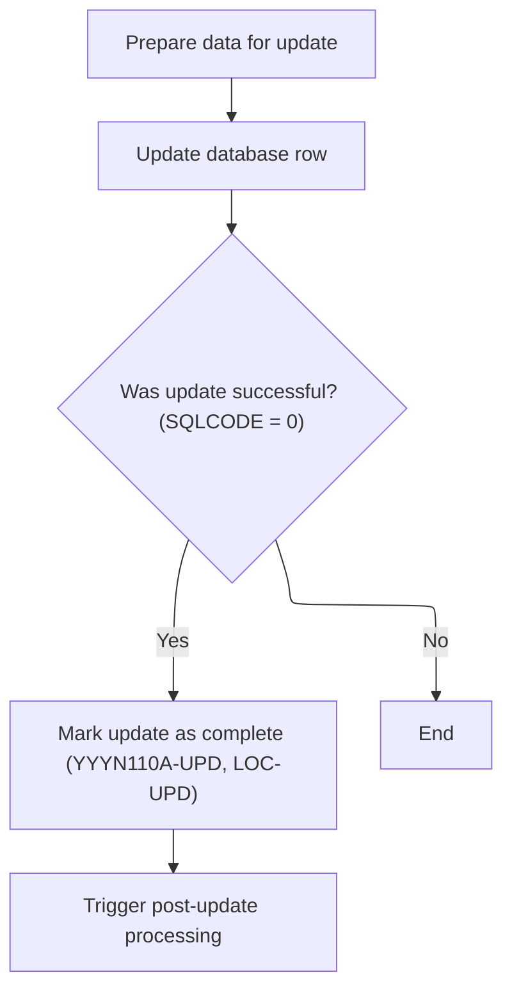
```mermaid
%%{init: {"flowchart": {"defaultRenderer": "elk"}} }%%
flowchart TD
    node1["Prepare data for update"]
    click node1 openCode "base/src/NNNS0488.cbl:357100:357100"
    node2["Update database row"]
    click node2 openCode "base/src/NNNS0488.cbl:357200:357200"
    node3{"Was update successful? (SQLCODE = 0)"}
    click node3 openCode "base/src/NNNS0488.cbl:357400:357400"
    node4["Mark update as complete (YYYN110A-UPD, LOC-UPD)"]
    click node4 openCode "base/src/NNNS0488.cbl:357500:357600"
    node5["Trigger post-update processing"]
    click node5 openCode "base/src/NNNS0488.cbl:357700:357700"
    node1 --> node2
    node2 --> node3
    node3 -->|"Yes"| node4
    node4 --> node5
    node3 -->|"No"| nodeEnd["End"]
    click nodeEnd openCode "base/src/NNNS0488.cbl:357400:357400"
classDef HeadingStyle fill:#777777,stroke:#333,stroke-width:2px;

%% Swimm:
%% %%{init: {"flowchart": {"defaultRenderer": "elk"}} }%%
%% flowchart TD
%%     node1["Prepare data for update"]
%%     click node1 openCode "<SwmPath>[base/src/NNNS0488.cbl](base/src/NNNS0488.cbl)</SwmPath>:357100:357100"
%%     node2["Update database row"]
%%     click node2 openCode "<SwmPath>[base/src/NNNS0488.cbl](base/src/NNNS0488.cbl)</SwmPath>:357200:357200"
%%     node3{"Was update successful? (SQLCODE = 0)"}
%%     click node3 openCode "<SwmPath>[base/src/NNNS0488.cbl](base/src/NNNS0488.cbl)</SwmPath>:357400:357400"
%%     node4["Mark update as complete (<SwmToken path="base/src/NNNS0488.cbl" pos="3547:4:6" line-data="357500       SET YYYN110A-UPD TO TRUE                                   00357500">`YYYN110A-UPD`</SwmToken>, <SwmToken path="base/src/NNNS0488.cbl" pos="3548:4:6" line-data="357600       SET LOC-UPD      TO TRUE                                   00357600">`LOC-UPD`</SwmToken>)"]
%%     click node4 openCode "<SwmPath>[base/src/NNNS0488.cbl](base/src/NNNS0488.cbl)</SwmPath>:357500:357600"
%%     node5["Trigger post-update processing"]
%%     click node5 openCode "<SwmPath>[base/src/NNNS0488.cbl](base/src/NNNS0488.cbl)</SwmPath>:357700:357700"
%%     node1 --> node2
%%     node2 --> node3
%%     node3 -->|"Yes"| node4
%%     node4 --> node5
%%     node3 -->|"No"| nodeEnd["End"]
%%     click nodeEnd openCode "<SwmPath>[base/src/NNNS0488.cbl](base/src/NNNS0488.cbl)</SwmPath>:357400:357400"
%% classDef HeadingStyle fill:#777777,stroke:#333,stroke-width:2px;
```

This section governs the process for updating a location row in the database, ensuring data integrity, tracking update status, and triggering necessary downstream processes after a successful update.

| Category       | Rule Name              | Description                                                                                                                                                                                                                                                                                                                                                                                                                                                                                                                  |
| -------------- | ---------------------- | ---------------------------------------------------------------------------------------------------------------------------------------------------------------------------------------------------------------------------------------------------------------------------------------------------------------------------------------------------------------------------------------------------------------------------------------------------------------------------------------------------------------------------- |
| Business logic | Update status tracking | If the update is successful, the system must set the <SwmToken path="base/src/NNNS0488.cbl" pos="3547:4:6" line-data="357500       SET YYYN110A-UPD TO TRUE                                   00357500">`YYYN110A-UPD`</SwmToken> and <SwmToken path="base/src/NNNS0488.cbl" pos="3548:4:6" line-data="357600       SET LOC-UPD      TO TRUE                                   00357600">`LOC-UPD`</SwmToken> flags to TRUE, indicating that an update action has been taken for both the location and the related function. |
| Business logic | Post-update processing | After a successful update, post-update processing must be triggered to synchronize location data and initiate any related events across systems.                                                                                                                                                                                                                                                                                                                                                                             |

<SwmSnippet path="/base/src/NNNS0488.cbl" line="3542">

---

In <SwmToken path="base/src/NNNS0488.cbl" pos="3542:2:8" line-data="357000 1440-D0-MODIFY-ROW.                                              00357000">`1440-D0-MODIFY-ROW`</SwmToken>, we clean up any low-value fields, then call the CUD routine to update the record in Oracle. This makes sure the data is valid before saving.

```cobol
357000 1440-D0-MODIFY-ROW.                                              00357000
357100     PERFORM 4670-REP-LOWVALUE-WITH-SPACES                        00357100
357200     PERFORM 5000-CALL-NNNU0488-CUD-ROUTINE                       00357200
```

---

</SwmSnippet>

<SwmSnippet path="/base/src/NNNS0488.cbl" line="3546">

---

After a successful update in <SwmToken path="base/src/NNNS0488.cbl" pos="3458:4:10" line-data="348600         PERFORM 1440-D0-MODIFY-ROW                               00348600">`1440-D0-MODIFY-ROW`</SwmToken>, we run <SwmToken path="base/src/NNNS0488.cbl" pos="3549:4:8" line-data="357700       PERFORM 2000-DENORM-PROCESS                                00357700">`2000-DENORM-PROCESS`</SwmToken> to sync the location data and kick off any related events. This keeps all systems up to date.

```cobol
357400     IF SQLCODE = 0                                               00357400
357500       SET YYYN110A-UPD TO TRUE                                   00357500
357600       SET LOC-UPD      TO TRUE                                   00357600
357700       PERFORM 2000-DENORM-PROCESS                                00357700
357800     END-IF                                                       00357800
```

---

</SwmSnippet>

## Synchronizing and triggering events after update

This section ensures that any change in a location's status is properly updated in the database and that subsequent business processes (control, sync, event routines) are triggered only when appropriate, based on business flags and checkpoint success.

| Category        | Rule Name                      | Description                                                                                                                                        |
| --------------- | ------------------------------ | -------------------------------------------------------------------------------------------------------------------------------------------------- |
| Data validation | Checkpoint Confirmation        | After a successful status update, a checkpoint must be set to confirm that the process can continue safely.                                        |
| Business logic  | Status Change Update           | If the location status has changed, the system must update the status in the business database before proceeding with any further actions.         |
| Business logic  | Conditional Routine Triggering | If the checkpoint is successful, control, synchronization, and event routines must be triggered according to the values of their respective flags. |
| Business logic  | Event Flag Control             | Event routines must only be triggered if the event flag indicates creation is required; otherwise, they must be skipped.                           |

<SwmSnippet path="/base/src/NNNS0488.cbl" line="3701">

---

In <SwmToken path="base/src/NNNS0488.cbl" pos="3701:2:6" line-data="372200 2000-DENORM-PROCESS.                                             00372200">`2000-DENORM-PROCESS`</SwmToken>, if the status changed, we update it in the DB. Then we set a checkpoint, and if everything's still good, we run control, sync, and event routines as needed, based on the flags.

```cobol
372200 2000-DENORM-PROCESS.                                             00372200
372300     IF WS-LOC-STAT-CHANGED                                       00372300
372400       PERFORM 2100-UPD-STAT-IN-xxxation                          00372400
372500     END-IF                                                       00372500
```

---

</SwmSnippet>

### Updating location status in the business DB

This section is responsible for updating the location status in the business database and reporting the outcome of the operation using standardized codes and messages.

| Category        | Rule Name                        | Description                                                                                                                                   |
| --------------- | -------------------------------- | --------------------------------------------------------------------------------------------------------------------------------------------- |
| Data validation | Recognized file type enforcement | Location status must only be updated for recognized file types as defined in the NNNN0000-FILE variable (e.g., 'XXXPST01', 'XXXPIM01', etc.). |
| Data validation | Exit code precondition           | Location status updates must not proceed if the initial exit code is not set to 0, indicating a clean starting state.                         |
| Business logic  | Operation result reporting       | Each update operation must return a status code indicating success (0) or failure (1), as defined by the SUCCESS and FAILURE values.          |

See <SwmLink doc-title="Retail Location Status Update Flow">[Retail Location Status Update Flow](.swm%5Cretail-location-status-update-flow.sl1kvu85.sw.md)</SwmLink>

### Checkpointing and workflow state retrieval

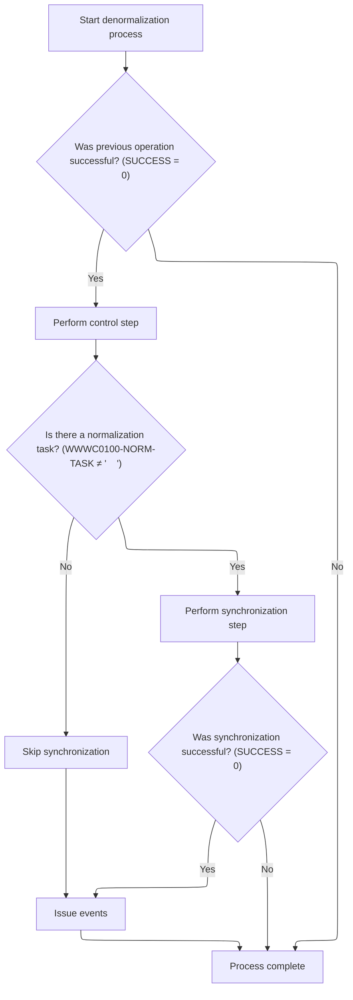
```mermaid
%%{init: {"flowchart": {"defaultRenderer": "elk"}} }%%
flowchart TD
    node1["Start denormalization process"]
    node1 --> node2{"Was previous operation successful? (SUCCESS = 0)"}
    click node1 openCode "base/src/NNNS0488.cbl:3705:3729"
    click node2 openCode "base/src/NNNS0488.cbl:3706:3708"
    node2 -->|"Yes"| node3["Perform control step"]
    click node3 openCode "base/src/NNNS0488.cbl:3707:3708"
    node2 -->|"No"| node8["Process complete"]
    click node8 openCode "base/src/NNNS0488.cbl:3706:3708"
    node3 --> node4{"Is there a normalization task? (WWWC0100-NORM-TASK ≠ '    ')"}
    click node4 openCode "base/src/NNNS0488.cbl:3709:3712"
    node4 -->|"Yes"| node5["Perform synchronization step"]
    click node5 openCode "base/src/NNNS0488.cbl:3728:3737"
    node4 -->|"No"| node6["Skip synchronization"]
    click node6 openCode "base/src/NNNS0488.cbl:3709:3712"
    node5 --> node7{"Was synchronization successful? (SUCCESS = 0)"}
    click node7 openCode "base/src/NNNS0488.cbl:3713:3715"
    node7 -->|"Yes"| node9["Issue events"]
    click node9 openCode "base/src/NNNS0488.cbl:3714:3715"
    node7 -->|"No"| node8
    node6 --> node9
    node9 --> node8
classDef HeadingStyle fill:#777777,stroke:#333,stroke-width:2px;

%% Swimm:
%% %%{init: {"flowchart": {"defaultRenderer": "elk"}} }%%
%% flowchart TD
%%     node1["Start denormalization process"]
%%     node1 --> node2{"Was previous operation successful? (SUCCESS = 0)"}
%%     click node1 openCode "<SwmPath>[base/src/NNNS0488.cbl](base/src/NNNS0488.cbl)</SwmPath>:3705:3729"
%%     click node2 openCode "<SwmPath>[base/src/NNNS0488.cbl](base/src/NNNS0488.cbl)</SwmPath>:3706:3708"
%%     node2 -->|"Yes"| node3["Perform control step"]
%%     click node3 openCode "<SwmPath>[base/src/NNNS0488.cbl](base/src/NNNS0488.cbl)</SwmPath>:3707:3708"
%%     node2 -->|"No"| node8["Process complete"]
%%     click node8 openCode "<SwmPath>[base/src/NNNS0488.cbl](base/src/NNNS0488.cbl)</SwmPath>:3706:3708"
%%     node3 --> node4{"Is there a normalization task? (<SwmToken path="base/src/NNNS0488.cbl" pos="3710:4:8" line-data="373100     AND WWWC0100-NORM-TASK                                       00373100">`WWWC0100-NORM-TASK`</SwmToken> ≠ '    ')"}
%%     click node4 openCode "<SwmPath>[base/src/NNNS0488.cbl](base/src/NNNS0488.cbl)</SwmPath>:3709:3712"
%%     node4 -->|"Yes"| node5["Perform synchronization step"]
%%     click node5 openCode "<SwmPath>[base/src/NNNS0488.cbl](base/src/NNNS0488.cbl)</SwmPath>:3728:3737"
%%     node4 -->|"No"| node6["Skip synchronization"]
%%     click node6 openCode "<SwmPath>[base/src/NNNS0488.cbl](base/src/NNNS0488.cbl)</SwmPath>:3709:3712"
%%     node5 --> node7{"Was synchronization successful? (SUCCESS = 0)"}
%%     click node7 openCode "<SwmPath>[base/src/NNNS0488.cbl](base/src/NNNS0488.cbl)</SwmPath>:3713:3715"
%%     node7 -->|"Yes"| node9["Issue events"]
%%     click node9 openCode "<SwmPath>[base/src/NNNS0488.cbl](base/src/NNNS0488.cbl)</SwmPath>:3714:3715"
%%     node7 -->|"No"| node8
%%     node6 --> node9
%%     node9 --> node8
%% classDef HeadingStyle fill:#777777,stroke:#333,stroke-width:2px;
```

<SwmSnippet path="/base/src/NNNS0488.cbl" line="3705">

---

After updating status in <SwmToken path="base/src/NNNS0488.cbl" pos="3703:4:12" line-data="372400       PERFORM 2100-UPD-STAT-IN-xxxation                          00372400">`2100-UPD-STAT-IN-xxxation`</SwmToken>, <SwmToken path="base/src/NNNS0488.cbl" pos="3549:4:8" line-data="357700       PERFORM 2000-DENORM-PROCESS                                00357700">`2000-DENORM-PROCESS`</SwmToken> bumps the checkpoint counter and, if everything's still good, moves on to get the user's workflow state.

```cobol
372600     MOVE 1 TO WS-CHECKPOINT-INC                                  00372600
372700     IF SUCCESS                                                   00372700
372800       PERFORM 2010-CALL-CONTROL-SUBR                             00372800
372900     END-IF                                                       00372900
```

---

</SwmSnippet>

<SwmSnippet path="/base/src/NNNS0488.cbl" line="3709">

---

If the task is normal and everything's still good, we call <SwmToken path="base/src/NNNS0488.cbl" pos="3711:4:10" line-data="373200       PERFORM 2020-CALL-SYNC-SUBR                                00373200">`2020-CALL-SYNC-SUBR`</SwmToken> to sync the location data with Oracle. This avoids unnecessary syncs for special tasks.

```cobol
373000     IF  SUCCESS                                                  00373000
373100     AND WWWC0100-NORM-TASK                                       00373100
373200       PERFORM 2020-CALL-SYNC-SUBR                                00373200
373300     END-IF                                                       00373300
```

---

</SwmSnippet>

<SwmSnippet path="/base/src/NNNS0488.cbl" line="3728">

---

<SwmToken path="base/src/NNNS0488.cbl" pos="3728:2:8" line-data="374900 2020-CALL-SYNC-SUBR.                                             00374900">`2020-CALL-SYNC-SUBR`</SwmToken> sets the Oracle, last-call, and current-record flags, then calls <SwmToken path="base/src/NNNS0488.cbl" pos="3732:4:8" line-data="375300     CALL MMMS0159-SYNC-LR USING                                  00375300">`MMMS0159-SYNC-LR`</SwmToken> with all the right objects. This makes sure the sync routine knows exactly what context it's running in.

```cobol
374900 2020-CALL-SYNC-SUBR.                                             00374900
375000     SET YYYN110A-ORACLE        TO TRUE                           00375000
375100     SET YYYN110A-LAST-CALL     TO TRUE                           00375100
375200     SET MMMC0159-LR-IS-CURRENT TO TRUE                           00375200
375300     CALL MMMS0159-SYNC-LR USING                                  00375300
375400         XXXN001A                                                 00375400
375500         YYYN110A                                                 00375500
375600         MMMC0159                                                 00375600
375700         P-DDDTLR01                                               00375700
375800     .                                                            00375800
```

---

</SwmSnippet>

<SwmSnippet path="/base/src/NNNS0488.cbl" line="3713">

---

After syncing in <SwmToken path="base/src/NNNS0488.cbl" pos="3711:4:10" line-data="373200       PERFORM 2020-CALL-SYNC-SUBR                                00373200">`2020-CALL-SYNC-SUBR`</SwmToken>, <SwmToken path="base/src/NNNS0488.cbl" pos="3549:4:8" line-data="357700       PERFORM 2000-DENORM-PROCESS                                00357700">`2000-DENORM-PROCESS`</SwmToken> only issues events if everything is still marked as successful. This keeps downstream systems from getting junk data.

```cobol
373400     IF SUCCESS                                                   00373400
373500       PERFORM 2030-ISSUE-EVENTS                                  00373500
373600     END-IF                                                       00373600
```

---

</SwmSnippet>

## Issuing master data and store events

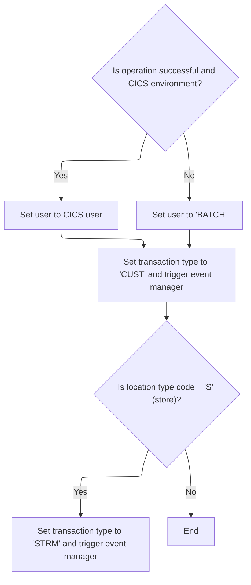
```mermaid
%%{init: {"flowchart": {"defaultRenderer": "elk"}} }%%
flowchart TD
    node1{"Is operation successful and CICS environment?"}
    click node1 openCode "base/src/NNNS0488.cbl:3807:3814"
    node1 -->|"Yes"| node2["Set user to CICS user"]
    click node2 openCode "base/src/NNNS0488.cbl:3808:3811"
    node1 -->|"No"| node3["Set user to 'BATCH'"]
    click node3 openCode "base/src/NNNS0488.cbl:3813:3814"
    node2 --> node4["Set transaction type to 'CUST' and trigger event manager"]
    click node4 openCode "base/src/NNNS0488.cbl:3763:3776"
    node3 --> node4
    node4 --> node5{"Is location type code = 'S' (store)?"}
    click node5 openCode "base/src/NNNS0488.cbl:3780:3793"
    node5 -->|"Yes"| node6["Set transaction type to 'STRM' and trigger event manager"]
    click node6 openCode "base/src/NNNS0488.cbl:3781:3791"
    node5 -->|"No"| node7["End"]
    click node7 openCode "base/src/NNNS0488.cbl:3792:3793"
classDef HeadingStyle fill:#777777,stroke:#333,stroke-width:2px;

%% Swimm:
%% %%{init: {"flowchart": {"defaultRenderer": "elk"}} }%%
%% flowchart TD
%%     node1{"Is operation successful and CICS environment?"}
%%     click node1 openCode "<SwmPath>[base/src/NNNS0488.cbl](base/src/NNNS0488.cbl)</SwmPath>:3807:3814"
%%     node1 -->|"Yes"| node2["Set user to CICS user"]
%%     click node2 openCode "<SwmPath>[base/src/NNNS0488.cbl](base/src/NNNS0488.cbl)</SwmPath>:3808:3811"
%%     node1 -->|"No"| node3["Set user to 'BATCH'"]
%%     click node3 openCode "<SwmPath>[base/src/NNNS0488.cbl](base/src/NNNS0488.cbl)</SwmPath>:3813:3814"
%%     node2 --> node4["Set transaction type to 'CUST' and trigger event manager"]
%%     click node4 openCode "<SwmPath>[base/src/NNNS0488.cbl](base/src/NNNS0488.cbl)</SwmPath>:3763:3776"
%%     node3 --> node4
%%     node4 --> node5{"Is location type code = 'S' (store)?"}
%%     click node5 openCode "<SwmPath>[base/src/NNNS0488.cbl](base/src/NNNS0488.cbl)</SwmPath>:3780:3793"
%%     node5 -->|"Yes"| node6["Set transaction type to 'STRM' and trigger event manager"]
%%     click node6 openCode "<SwmPath>[base/src/NNNS0488.cbl](base/src/NNNS0488.cbl)</SwmPath>:3781:3791"
%%     node5 -->|"No"| node7["End"]
%%     click node7 openCode "<SwmPath>[base/src/NNNS0488.cbl](base/src/NNNS0488.cbl)</SwmPath>:3792:3793"
%% classDef HeadingStyle fill:#777777,stroke:#333,stroke-width:2px;
```

This section ensures that master data changes and store-specific changes are tracked and communicated to downstream systems by issuing events with the correct transaction type and user context.

| Category        | Rule Name                  | Description                                                                                                                                                                                                                                                                              |
| --------------- | -------------------------- | ---------------------------------------------------------------------------------------------------------------------------------------------------------------------------------------------------------------------------------------------------------------------------------------- |
| Data validation | Success validation         | Events are only issued if the operation is successful (SUCCESS = 0).                                                                                                                                                                                                                     |
| Data validation | Event record completeness  | The event record must include the transaction type, program name, user, and system environment for each event issued.                                                                                                                                                                    |
| Business logic  | User context assignment    | If the operation is successful and the environment is CICS, the user for the event is set to the CICS user ID. Otherwise, the user is set to 'BATCH'.                                                                                                                                    |
| Business logic  | Master data event issuance | Every successful master data operation triggers an event with transaction type 'CUST' and program name <SwmToken path="base/src/NNNS0488.cbl" pos="1680:5:5" line-data="171700       STRING &#39;NNNS0488 - Error connecting to Oracle. Sqlcode =&#39;  00171700">`NNNS0488`</SwmToken>. |
| Business logic  | Store event issuance       | If the location type code is 'S' (store), an additional event is triggered with transaction type 'STRM'.                                                                                                                                                                                 |

<SwmSnippet path="/base/src/NNNS0488.cbl" line="3740">

---

In <SwmToken path="base/src/NNNS0488.cbl" pos="3740:2:6" line-data="376100 2030-ISSUE-EVENTS.                                               00376100">`2030-ISSUE-EVENTS`</SwmToken>, we start by getting the current user with <SwmToken path="base/src/NNNS0488.cbl" pos="3741:4:10" line-data="376200     PERFORM 2050-GET-CURRENT-USER                                00376200">`2050-GET-CURRENT-USER`</SwmToken>. This info is needed for the event manager to track who did what. After that, we prep and send the event data.

```cobol
376100 2030-ISSUE-EVENTS.                                               00376100
376200     PERFORM 2050-GET-CURRENT-USER                                00376200
```

---

</SwmSnippet>

<SwmSnippet path="/base/src/NNNS0488.cbl" line="3785">

---

<SwmToken path="base/src/NNNS0488.cbl" pos="3785:2:8" line-data="380600 2050-GET-CURRENT-USER.                                           00380600">`2050-GET-CURRENT-USER`</SwmToken> checks if we're in CICS and everything's OK. If so, it calls <SwmToken path="base/src/NNNS0488.cbl" pos="3788:4:12" line-data="380900       CALL Z-GET-CICS-USER-ID USING                              00380900">`Z-GET-CICS-USER-ID`</SwmToken> to get the user; otherwise, it just sets the user to 'BATCH'.

```cobol
380600 2050-GET-CURRENT-USER.                                           00380600
380700     IF  SUCCESS                                                  00380700
380800     AND YYYN005A-CICS-ENV                                        00380800
380900       CALL Z-GET-CICS-USER-ID USING                              00380900
381000           EIBLK    WS-DUMMY                                      00381000
381100           XXXN001A YYYC0107                                      00381100
381200     ELSE                                                         00381200
381300       MOVE 'BATCH' TO YYYC0107-USER                              00381300
381400     END-IF                                                       00381400
```

---

</SwmSnippet>

<SwmSnippet path="/base/src/NNNS0488.cbl" line="3742">

---

Back in <SwmToken path="base/src/NNNS0488.cbl" pos="3714:4:8" line-data="373500       PERFORM 2030-ISSUE-EVENTS                                  00373500">`2030-ISSUE-EVENTS`</SwmToken>, after getting the user, we fill in the event record with constants like 'CUST' and <SwmToken path="base/src/NNNS0488.cbl" pos="3749:5:5" line-data="377000       MOVE &#39;NNNS0488&#39;            TO ZZZC0197-PROGRAM             00377000">`NNNS0488`</SwmToken>, then call the event manager program to actually send the event.

```cobol
376300     SET  YYYN110A-ORACLE      TO TRUE                            00376300
376400     IF SUCCESS                                                   00376400
376500       MOVE LOC-NBR OF P-DDDTLR01 TO ST-STORE-NUMBER OF ZZZC0032  00376500
376600                                     LOC-NBR OF ZZZC0094          00376600
376700       SET  ZZZC0032-UPD-FXXX     TO TRUE                         00376700
376800       MOVE ZZZC0032              TO ZZZC0197-TRX-REC             00376800
376900       MOVE 'CUST'                TO ZZZC0197-TRX-ID              00376900
377000       MOVE 'NNNS0488'            TO ZZZC0197-PROGRAM             00377000
377100       MOVE YYYC0107-USER         TO ZZZC0197-USER                00377100
377200       MOVE YYYN005A-SYS-ENV      TO YYYN110A-SYS-ENV             00377200
377300       CALL ZZZS0197-EVENT-MGR USING                              00377300
377400            XXXN001A                                              00377400
377500            YYYN110A                                              00377500
377600            ZZZC0197                                              00377600
```

---

</SwmSnippet>

<SwmSnippet path="/base/src/NNNS0488.cbl" line="3757">

---

After calling the event manager in <SwmToken path="base/src/NNNS0488.cbl" pos="3714:4:8" line-data="373500       PERFORM 2030-ISSUE-EVENTS                                  00373500">`2030-ISSUE-EVENTS`</SwmToken>, if the location is a store, we prep a second event with type 'STRM' and send that too. This makes sure all the right systems get notified.

```cobol
377800       EVALUATE TRUE                                              00377800
377900                                                                  00377900
378000       WHEN LOC-TYP-CD OF P-DDDTLR01 = K-STORE-LOC-TYPE           00378000
378100         MOVE LOC-TYP-CD OF P-DDDTLR01 TO                         00378100
378200                                       LOC-TYP-CD OF ZZZC0094     00378200
378300         MOVE ZZZC0094              TO ZZZC0197-TRX-REC           00378300
378400         MOVE 'STRM'                TO ZZZC0197-TRX-ID            00378400
378500         MOVE 'NNNS0488'            TO ZZZC0197-PROGRAM           00378500
378600         MOVE YYYC0107-USER         TO ZZZC0197-USER              00378600
378700         MOVE YYYN005A-SYS-ENV      TO YYYN110A-SYS-ENV           00378700
378800         CALL ZZZS0197-EVENT-MGR USING                            00378800
378900              XXXN001A                                            00378900
379000              YYYN110A                                            00379000
379100              ZZZC0197                                            00379100
379200                                                                  00379200
379300       END-EVALUATE                                               00379300
```

---

</SwmSnippet>

## Triggering DCM business line events

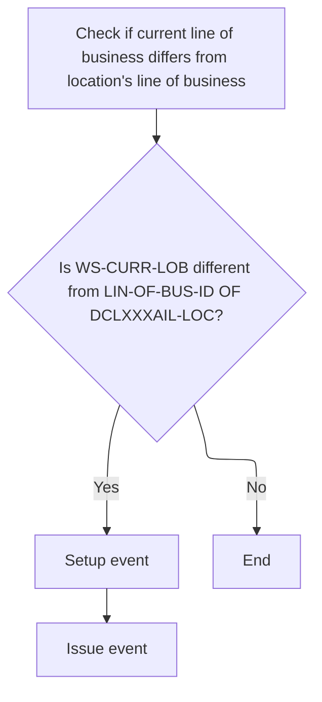
```mermaid
%%{init: {"flowchart": {"defaultRenderer": "elk"}} }%%
flowchart TD
    node1["Check if current line of business differs from location's line of business"]
    click node1 openCode "base/src/NNNS0488.cbl:3877:3878"
    node1 --> node2{"Is WS-CURR-LOB different from LIN-OF-BUS-ID OF DCLXXXAIL-LOC?"}
    click node2 openCode "base/src/NNNS0488.cbl:3878:3878"
    node2 -->|"Yes"| node3["Setup event"]
    click node3 openCode "base/src/NNNS0488.cbl:3879:3879"
    node3 --> node4["Issue event"]
    click node4 openCode "base/src/NNNS0488.cbl:3880:3880"
    node2 -->|"No"| node5["End"]
    click node5 openCode "base/src/NNNS0488.cbl:3882:3882"

classDef HeadingStyle fill:#777777,stroke:#333,stroke-width:2px;

%% Swimm:
%% %%{init: {"flowchart": {"defaultRenderer": "elk"}} }%%
%% flowchart TD
%%     node1["Check if current line of business differs from location's line of business"]
%%     click node1 openCode "<SwmPath>[base/src/NNNS0488.cbl](base/src/NNNS0488.cbl)</SwmPath>:3877:3878"
%%     node1 --> node2{"Is <SwmToken path="base/src/NNNS0488.cbl" pos="3509:3:7" line-data="353700                :WS-CURR-LOB                                      00353700">`WS-CURR-LOB`</SwmToken> different from <SwmToken path="base/src/NNNS0488.cbl" pos="1816:4:10" line-data="185300     MOVE LIN-OF-BUS-ID OF DCLXXXAIL-LOC                          00185300">`LIN-OF-BUS-ID`</SwmToken> OF <SwmToken path="base/src/NNNS0488.cbl" pos="1785:10:12" line-data="182200     MOVE LOC-NBR OF DCLXXXAIL-LOC TO LOC-NBR OF P-DDDTLR01       00182200">`DCLXXXAIL-LOC`</SwmToken>?"}
%%     click node2 openCode "<SwmPath>[base/src/NNNS0488.cbl](base/src/NNNS0488.cbl)</SwmPath>:3878:3878"
%%     node2 -->|"Yes"| node3["Setup event"]
%%     click node3 openCode "<SwmPath>[base/src/NNNS0488.cbl](base/src/NNNS0488.cbl)</SwmPath>:3879:3879"
%%     node3 --> node4["Issue event"]
%%     click node4 openCode "<SwmPath>[base/src/NNNS0488.cbl](base/src/NNNS0488.cbl)</SwmPath>:3880:3880"
%%     node2 -->|"No"| node5["End"]
%%     click node5 openCode "<SwmPath>[base/src/NNNS0488.cbl](base/src/NNNS0488.cbl)</SwmPath>:3882:3882"
%% 
%% classDef HeadingStyle fill:#777777,stroke:#333,stroke-width:2px;
```

This section ensures that any change in the business line for a location triggers a DCM event, keeping all systems synchronized with the latest business line information.

| Category        | Rule Name                  | Description                                                                                                                                    |
| --------------- | -------------------------- | ---------------------------------------------------------------------------------------------------------------------------------------------- |
| Data validation | Event data preparation     | The event data must be prepared with the latest business line information before issuing the event.                                            |
| Business logic  | Business line change event | A DCM event must be triggered whenever the current line of business for a location differs from the stored line of business for that location. |
| Business logic  | No event on match          | No DCM event should be triggered if the current line of business matches the stored line of business for the location.                         |
| Business logic  | Immediate event issuance   | The event must be issued immediately after preparation if a business line change is detected.                                                  |

<SwmSnippet path="/base/src/NNNS0488.cbl" line="3877">

---

In <SwmToken path="base/src/NNNS0488.cbl" pos="3877:2:10" line-data="389800 2400-CHECK-FOR-DCM-EVENT.                                        00389800">`2400-CHECK-FOR-DCM-EVENT`</SwmToken>, if the business line changed, we prep the event data and call <SwmToken path="base/src/NNNS0488.cbl" pos="3880:4:8" line-data="390400         PERFORM 2430-ISSUE-EVENT2                                00390500">`2430-ISSUE-EVENT2`</SwmToken> to send the event out. This keeps all the systems up to date.

```cobol
389800 2400-CHECK-FOR-DCM-EVENT.                                        00389800
389900     IF WS-CURR-LOB     NOT = LIN-OF-BUS-ID  OF DCLXXXAIL-LOC     00389900
390400         PERFORM 2410-SETUP-EVENT                                 00390400
390400         PERFORM 2430-ISSUE-EVENT2                                00390500
390600     END-IF                                                       00390600
390700     .                                                            00390700
```

---

</SwmSnippet>

## Staging and sending DCM events

This section ensures that DCM events are correctly prepared and routed by assigning a specific transaction ID and sending the event to the staging system. The main product role is to guarantee that events are consistently tagged and delivered to the correct destination for processing.

| Category       | Rule Name                 | Description                                                                                                                                                                                                                                                           |
| -------------- | ------------------------- | --------------------------------------------------------------------------------------------------------------------------------------------------------------------------------------------------------------------------------------------------------------------- |
| Business logic | Transaction ID Tagging    | All DCM events staged and sent through this process must have the transaction ID set to <SwmToken path="base/src/NNNS0488.cbl" pos="3930:5:5" line-data="395600     MOVE &#39;SLO2&#39; TO ZZZC0210-TRX-ID                               00395600">`SLO2`</SwmToken>. |
| Business logic | Event Staging Requirement | A DCM event must be sent to the staging system after the transaction ID is set, ensuring the event is available for further processing.                                                                                                                               |

<SwmSnippet path="/base/src/NNNS0488.cbl" line="3929">

---

In <SwmToken path="base/src/NNNS0488.cbl" pos="3929:2:6" line-data="395500 2430-ISSUE-EVENT2.                                               00395500">`2430-ISSUE-EVENT2`</SwmToken>, we set the transaction ID to <SwmToken path="base/src/NNNS0488.cbl" pos="3930:5:5" line-data="395600     MOVE &#39;SLO2&#39; TO ZZZC0210-TRX-ID                               00395600">`SLO2`</SwmToken> and then call <SwmToken path="base/src/NNNS0488.cbl" pos="3931:4:8" line-data="395700     PERFORM 2420-ISSUE-EVENT                                     00395700">`2420-ISSUE-EVENT`</SwmToken> to actually send the event to the staging system. This makes sure the event is tagged and routed right.

```cobol
395500 2430-ISSUE-EVENT2.                                               00395500
395600     MOVE 'SLO2' TO ZZZC0210-TRX-ID                               00395600
395700     PERFORM 2420-ISSUE-EVENT                                     00395700
395800     .                                                            00395800
```

---

</SwmSnippet>

## Staging event data for external systems

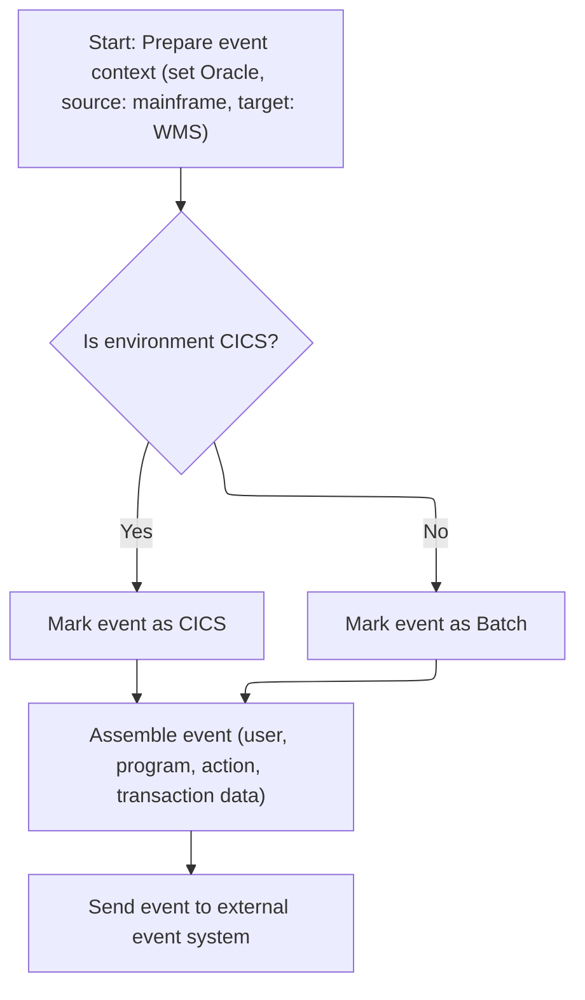
```mermaid
%%{init: {"flowchart": {"defaultRenderer": "elk"}} }%%
flowchart TD
    node1["Start: Prepare event context (set Oracle, source: mainframe, target: WMS)"] --> node2{"Is environment CICS?"}
    click node1 openCode "base/src/NNNS0488.cbl:3905:3906"
    node2 -->|"Yes"| node3["Mark event as CICS"]
    click node2 openCode "base/src/NNNS0488.cbl:3907:3911"
    node2 -->|"No"| node4["Mark event as Batch"]
    click node3 openCode "base/src/NNNS0488.cbl:3908:3908"
    click node4 openCode "base/src/NNNS0488.cbl:3910:3910"
    node3 --> node5["Assemble event (user, program, action, transaction data)"]
    node4 --> node5
    click node5 openCode "base/src/NNNS0488.cbl:3913:3921"
    node5 --> node6["Send event to external event system"]
    click node6 openCode "base/src/NNNS0488.cbl:3923:3926"
classDef HeadingStyle fill:#777777,stroke:#333,stroke-width:2px;

%% Swimm:
%% %%{init: {"flowchart": {"defaultRenderer": "elk"}} }%%
%% flowchart TD
%%     node1["Start: Prepare event context (set Oracle, source: mainframe, target: WMS)"] --> node2{"Is environment CICS?"}
%%     click node1 openCode "<SwmPath>[base/src/NNNS0488.cbl](base/src/NNNS0488.cbl)</SwmPath>:3905:3906"
%%     node2 -->|"Yes"| node3["Mark event as CICS"]
%%     click node2 openCode "<SwmPath>[base/src/NNNS0488.cbl](base/src/NNNS0488.cbl)</SwmPath>:3907:3911"
%%     node2 -->|"No"| node4["Mark event as Batch"]
%%     click node3 openCode "<SwmPath>[base/src/NNNS0488.cbl](base/src/NNNS0488.cbl)</SwmPath>:3908:3908"
%%     click node4 openCode "<SwmPath>[base/src/NNNS0488.cbl](base/src/NNNS0488.cbl)</SwmPath>:3910:3910"
%%     node3 --> node5["Assemble event (user, program, action, transaction data)"]
%%     node4 --> node5
%%     click node5 openCode "<SwmPath>[base/src/NNNS0488.cbl](base/src/NNNS0488.cbl)</SwmPath>:3913:3921"
%%     node5 --> node6["Send event to external event system"]
%%     click node6 openCode "<SwmPath>[base/src/NNNS0488.cbl](base/src/NNNS0488.cbl)</SwmPath>:3923:3926"
%% classDef HeadingStyle fill:#777777,stroke:#333,stroke-width:2px;
```

This section is responsible for preparing and staging event data so that external systems can reliably process events with full context, including environment, source, and transaction details.

| Category        | Rule Name                  | Description                                                                                                                                          |
| --------------- | -------------------------- | ---------------------------------------------------------------------------------------------------------------------------------------------------- |
| Data validation | Event Context Completeness | Each staged event must include the user ID, calling program name, action code, and transaction data to provide full context for external processing. |
| Data validation | Required Field Validation  | If required fields (user, program, transaction ID) are missing, the event must not be dispatched and an error must be raised.                        |
| Business logic  | Oracle Source Flag         | All event data must be marked as originating from Oracle before being staged for external systems.                                                   |
| Business logic  | Environment Flagging       | The environment flag must be set to CICS if the environment variable indicates CICS, otherwise it must be set to Batch.                              |
| Business logic  | Source and Target Routing  | The event must be marked as coming from the mainframe and targeted to WMS for downstream system routing.                                             |
| Business logic  | Event Dispatch Requirement | The event stager must be called with the fully populated event data structure to send the event to the external system.                              |

<SwmSnippet path="/base/src/NNNS0488.cbl" line="3904">

---

In <SwmToken path="base/src/NNNS0488.cbl" pos="3904:2:6" line-data="393000 2420-ISSUE-EVENT.                                                00393000">`2420-ISSUE-EVENT`</SwmToken>, we prep the event data structure (<SwmToken path="base/src/NNNS0488.cbl" pos="3905:4:4" line-data="393100     INITIALIZE YYYC0175                                          00393100">`YYYC0175`</SwmToken>), set the environment flag based on whether we're in CICS or batch (using <SwmToken path="base/src/NNNS0488.cbl" pos="3907:4:8" line-data="393300     IF YYYN005A-CICS-ENV                                         00393300">`YYYN005A-CICS-ENV`</SwmToken>), and mark the event as coming from Oracle. This setup is needed so the event stager knows exactly what context the event is coming from and how to process it. The rest of the function fills in transaction and program info before calling the event stager.

```cobol
393000 2420-ISSUE-EVENT.                                                00393000
393100     INITIALIZE YYYC0175                                          00393100
393200     SET YYYC0175-ORACLE      TO TRUE                             00393200
393300     IF YYYN005A-CICS-ENV                                         00393300
393400       SET YYYC0175-CICS-ENV  TO TRUE                             00393400
393500     ELSE                                                         00393500
393600       SET YYYC0175-BATCH-ENV TO TRUE                             00393600
393700     END-IF                                                       00393700
```

---

</SwmSnippet>

<SwmSnippet path="/base/src/NNNS0488.cbl" line="3913">

---

We finish filling out the event payload, set all the required codes and flags, and call the event stager to send the event out. The hardcoded values are there so downstream knows exactly what happened and who did it.

```cobol
393900     MOVE ZZZC0210-TRX-ID TO YYYC0175-TRX-CD                      00393900
394000     MOVE ZZZC0210        TO YYYC0175-DATA                        00394000
394100     MOVE 'M'             TO YYYC0175-ACTION-CD                   00394100
394200                                                                  00394200
394300     MOVE 'NNNS0488'      TO YYYC0175-CALLING-PROG                00394300
394400     MOVE YYYC0107-USER   TO YYYC0175-CALLING-USER                00394400
394500                                                                  00394500
394600     SET  YYYC0175-SOURCE-MAINFRAME TO TRUE                       00394600
394700     SET  YYYC0175-TARGET-WMS       TO TRUE                       00394700
394800                                                                  00394800
394900     CALL Z-EVENT-STAGER USING                                    00394900
395000         XXXN001A                                                 00395000
395100         YYYC0175                                                 00395100
395200     .                                                            00395200
```

---

</SwmSnippet>

## Preparing and validating new location records

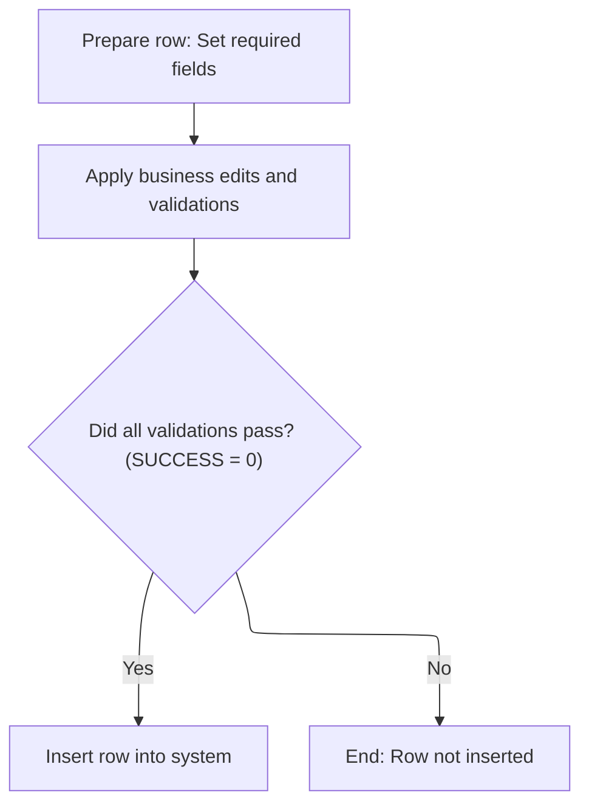
```mermaid
%%{init: {"flowchart": {"defaultRenderer": "elk"}} }%%
flowchart TD
    node1["Prepare row: Set required fields"] --> node2["Apply business edits and validations"]
    click node1 openCode "base/src/NNNS0488.cbl:358200:358300"
    node2 --> node3{"Did all validations pass? (SUCCESS = 0)"}
    click node2 openCode "base/src/NNNS0488.cbl:358400:358500"
    node3 -->|"Yes"| node4["Insert row into system"]
    click node3 openCode "base/src/NNNS0488.cbl:358500:358700"
    click node4 openCode "base/src/NNNS0488.cbl:358600:358700"
    node3 -->|"No"| node5["End: Row not inserted"]
    click node5 openCode "base/src/NNNS0488.cbl:358700:358700"

classDef HeadingStyle fill:#777777,stroke:#333,stroke-width:2px;

%% Swimm:
%% %%{init: {"flowchart": {"defaultRenderer": "elk"}} }%%
%% flowchart TD
%%     node1["Prepare row: Set required fields"] --> node2["Apply business edits and validations"]
%%     click node1 openCode "<SwmPath>[base/src/NNNS0488.cbl](base/src/NNNS0488.cbl)</SwmPath>:358200:358300"
%%     node2 --> node3{"Did all validations pass? (SUCCESS = 0)"}
%%     click node2 openCode "<SwmPath>[base/src/NNNS0488.cbl](base/src/NNNS0488.cbl)</SwmPath>:358400:358500"
%%     node3 -->|"Yes"| node4["Insert row into system"]
%%     click node3 openCode "<SwmPath>[base/src/NNNS0488.cbl](base/src/NNNS0488.cbl)</SwmPath>:358500:358700"
%%     click node4 openCode "<SwmPath>[base/src/NNNS0488.cbl](base/src/NNNS0488.cbl)</SwmPath>:358600:358700"
%%     node3 -->|"No"| node5["End: Row not inserted"]
%%     click node5 openCode "<SwmPath>[base/src/NNNS0488.cbl](base/src/NNNS0488.cbl)</SwmPath>:358700:358700"
%% 
%% classDef HeadingStyle fill:#777777,stroke:#333,stroke-width:2px;
```

This section ensures that all new location records are properly prepared, validated, and only inserted into the system if they meet all business and data quality requirements. It is a gatekeeper for data integrity in the location management process.

| Category        | Rule Name                     | Description                                                                                                                                |
| --------------- | ----------------------------- | ------------------------------------------------------------------------------------------------------------------------------------------ |
| Data validation | Required fields enforcement   | All required fields for a location record must be set and flagged before any further processing can occur.                                 |
| Data validation | Null value validation         | Null indicator edits must be performed to ensure no required field is left unset or with a null value.                                     |
| Data validation | Validation gate for insertion | A location record may only be inserted into the system if all validations pass and the SUCCESS code is set to 0.                           |
| Business logic  | Business edits enforcement    | Business edits and validations must be applied to each record, including standardizing status and sort codes to conform to business rules. |

<SwmSnippet path="/base/src/NNNS0488.cbl" line="3554">

---

In <SwmToken path="base/src/NNNS0488.cbl" pos="3554:2:10" line-data="358200 1500-EXIT-PUT-INSERT-ROW.                                        00358200">`1500-EXIT-PUT-INSERT-ROW`</SwmToken>, we run null indicator edits and then standardize status and sort codes. This sets up the location record so it's ready for insertion, with all required fields flagged and cleaned.

```cobol
358200 1500-EXIT-PUT-INSERT-ROW.                                        00358200
358300     PERFORM 1800-EDIT-NULL-INDICATORS                            00358300
358400     PERFORM 1510-ADD-EDITS                                       00358400
```

---

</SwmSnippet>

<SwmSnippet path="/base/src/NNNS0488.cbl" line="3557">

---

After prepping and validating the record in <SwmToken path="base/src/NNNS0488.cbl" pos="1225:4:12" line-data="127000          PERFORM 1500-EXIT-PUT-INSERT-ROW                        00127000">`1500-EXIT-PUT-INSERT-ROW`</SwmToken>, if edits succeeded, we call <SwmToken path="base/src/NNNS0488.cbl" pos="3558:4:10" line-data="358600       PERFORM 1520-D0-INSERT-ROW                                 00358600">`1520-D0-INSERT-ROW`</SwmToken> to actually insert the record into the main system. This step is needed to move from validation to actually adding the location.

```cobol
358500     IF SUCCESS                                                   00358500
358600       PERFORM 1520-D0-INSERT-ROW                                 00358600
358700     END-IF                                                       00358700
```

---

</SwmSnippet>

## Validating and inserting new location data

This section ensures that only valid location data is inserted into the database by performing a pre-insert validation and preparation step. It prevents invalid or incomplete data from being processed further, maintaining data integrity for vendor and retail locations.

| Category        | Rule Name                      | Description                                                                                                                                                                                      |
| --------------- | ------------------------------ | ------------------------------------------------------------------------------------------------------------------------------------------------------------------------------------------------ |
| Data validation | Pre-insert validation required | A location record must be validated for correctness and completeness before any attempt to insert it into the database is made. If validation fails, the insert operation must not proceed.      |
| Data validation | Required codes validation      | The validation process must check that required codes (such as market area and computer type) are present and valid for the location record.                                                     |
| Business logic  | Action type gating             | Only location records with the action indicator set to 'A' (add) are eligible for insertion as new records. Other action types must be routed to their respective operations (update or delete). |
| Business logic  | Success status on validation   | A successful validation must result in the location record being marked as ready for insertion, with a status code indicating success.                                                           |

<SwmSnippet path="/base/src/NNNS0488.cbl" line="3597">

---

In <SwmToken path="base/src/NNNS0488.cbl" pos="3597:2:8" line-data="362500 1520-D0-INSERT-ROW.                                              00362500">`1520-D0-INSERT-ROW`</SwmToken>, we start by calling <SwmToken path="base/src/NNNS0488.cbl" pos="3598:4:14" line-data="362600     PERFORM 4600-CALL-MMMS0335-RI-ADD-CHK                        00362600">`4600-CALL-MMMS0335-RI-ADD-CHK`</SwmToken> to validate and prep for the insert. This check is needed before we do any cleanup or DB updates, so we don't try to add invalid data.

```cobol
362500 1520-D0-INSERT-ROW.                                              00362500
362600     PERFORM 4600-CALL-MMMS0335-RI-ADD-CHK                        00362600
```

---

</SwmSnippet>

### Checking referential integrity for new locations

This section ensures that any new location added to the system does not violate referential integrity constraints by validating the location data with an external service before insertion.

| Category        | Rule Name                             | Description                                                                                                                                         |
| --------------- | ------------------------------------- | --------------------------------------------------------------------------------------------------------------------------------------------------- |
| Data validation | Required location attributes          | The location’s market area code and computer type code must be provided and valid for the referential integrity check to proceed.                   |
| Business logic  | Referential integrity enforcement     | A new location must pass referential integrity validation before it can be added to the system. If the validation fails, the location is not added. |
| Business logic  | Universal integrity check requirement | The referential integrity check must be performed for all new locations, regardless of their type or source.                                        |

<SwmSnippet path="/base/src/NNNS0488.cbl" line="3963">

---

We prep the integrity check struct and call the external validator to make sure the new location is legit.

```cobol
398900 4600-CALL-MMMS0335-RI-ADD-CHK.                                   00398900
399000     INITIALIZE MMMC0335                                          00399000
399100     MOVE ECOMM-MKT-AREA-CD OF DCLXXXAIL-LOC                      00399100
399200                                 TO MMMC0335-ECOMM-MKT-AREA-CD    00399200
399300     MOVE CMPTR-TYP-CD  OF DCLXXXAIL-LOC                          00399300
399400                                 TO MMMC0335-CMPTR-TYP-CD         00399400
399500     SET   MMMC0335-INSERT-CHECK TO TRUE                          00399500
399600     SET   MMMC0335-XXXAIL-LOC   TO TRUE                          00399600
399700     SET   MMMC0335-ORACLE       TO TRUE                          00399700
399800     CALL  MMMC0335-RI-INSERT-CHK USING                           00399800
399900           XXXN001A                                               00399900
400000           MMMC0335                                               00400000
400100     .                                                            00400100
```

---

</SwmSnippet>

### Validating business operation for new location

This section governs the validation of business operations when adding a new location, ensuring that all required business conditions are met before the location is accepted into the system.

| Category        | Rule Name                 | Description                                                                                                                                                                                                                                                                                                                              |
| --------------- | ------------------------- | ---------------------------------------------------------------------------------------------------------------------------------------------------------------------------------------------------------------------------------------------------------------------------------------------------------------------------------------- |
| Data validation | Valid connection type     | A new location operation must specify a valid connection type, either <SwmToken path="base/src/NNNS0488.cbl" pos="1765:7:7" line-data="180200*      SET YYYN005A-DB2        TO TRUE                            00180200">`DB2`</SwmToken> (spaces) or ORACLE ('O'). If the connection type is not recognized, the operation is rejected. |
| Data validation | Insert operation required | The operation function for a new location must be set to 'I' (Insert Check). Any other function value will result in rejection of the operation.                                                                                                                                                                                         |
| Data validation | Allowed table identifier  | The table identifier must match one of the predefined allowed values (001 to 011). If the table identifier is outside this range, the operation is rejected.                                                                                                                                                                             |
| Business logic  | Success status reporting  | If the operation passes all validations, the status code must be set to SUCCESS (0), and the location is accepted into the system.                                                                                                                                                                                                       |

See <SwmLink doc-title="Dispatching Table Operations and Managing Database Connections">[Dispatching Table Operations and Managing Database Connections](.swm%5Cdispatching-table-operations-and-managing-database-connections.obuj1c84.sw.md)</SwmLink>

### Cleaning up and finalizing location insert

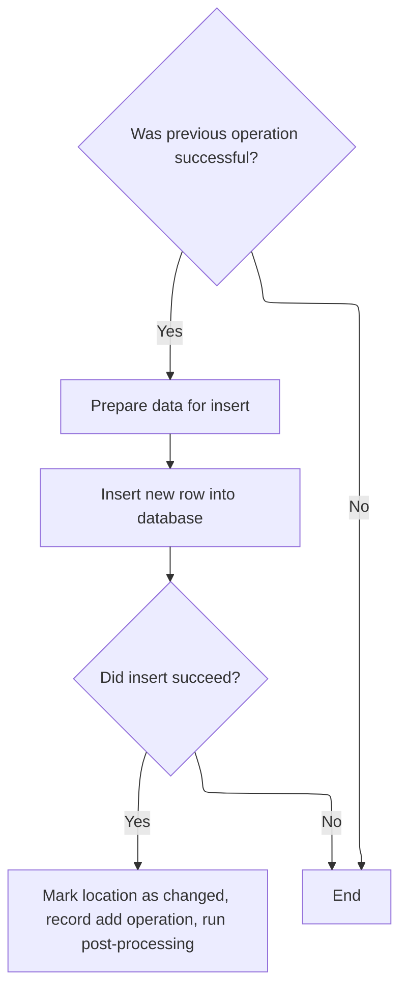
```mermaid
%%{init: {"flowchart": {"defaultRenderer": "elk"}} }%%
flowchart TD
    node1{"Was previous operation successful?"}
    click node1 openCode "base/src/NNNS0488.cbl:362700:362900"
    node1 -->|"Yes"| node2["Prepare data for insert"]
    click node2 openCode "base/src/NNNS0488.cbl:362800:362900"
    node2 --> node3["Insert new row into database"]
    click node3 openCode "base/src/NNNS0488.cbl:362900:363100"
    node3 --> node4{"Did insert succeed?"}
    click node4 openCode "base/src/NNNS0488.cbl:363100:363200"
    node4 -->|"Yes"| node5["Mark location as changed, record add operation, run post-processing"]
    click node5 openCode "base/src/NNNS0488.cbl:363200:363600"
    node4 -->|"No"| node6["End"]
    click node6 openCode "base/src/NNNS0488.cbl:363600:363700"
    node1 -->|"No"| node6
classDef HeadingStyle fill:#777777,stroke:#333,stroke-width:2px;

%% Swimm:
%% %%{init: {"flowchart": {"defaultRenderer": "elk"}} }%%
%% flowchart TD
%%     node1{"Was previous operation successful?"}
%%     click node1 openCode "<SwmPath>[base/src/NNNS0488.cbl](base/src/NNNS0488.cbl)</SwmPath>:362700:362900"
%%     node1 -->|"Yes"| node2["Prepare data for insert"]
%%     click node2 openCode "<SwmPath>[base/src/NNNS0488.cbl](base/src/NNNS0488.cbl)</SwmPath>:362800:362900"
%%     node2 --> node3["Insert new row into database"]
%%     click node3 openCode "<SwmPath>[base/src/NNNS0488.cbl](base/src/NNNS0488.cbl)</SwmPath>:362900:363100"
%%     node3 --> node4{"Did insert succeed?"}
%%     click node4 openCode "<SwmPath>[base/src/NNNS0488.cbl](base/src/NNNS0488.cbl)</SwmPath>:363100:363200"
%%     node4 -->|"Yes"| node5["Mark location as changed, record add operation, run post-processing"]
%%     click node5 openCode "<SwmPath>[base/src/NNNS0488.cbl](base/src/NNNS0488.cbl)</SwmPath>:363200:363600"
%%     node4 -->|"No"| node6["End"]
%%     click node6 openCode "<SwmPath>[base/src/NNNS0488.cbl](base/src/NNNS0488.cbl)</SwmPath>:363600:363700"
%%     node1 -->|"No"| node6
%% classDef HeadingStyle fill:#777777,stroke:#333,stroke-width:2px;
```

<SwmSnippet path="/base/src/NNNS0488.cbl" line="3599">

---

After the insert, we set flags and call the denorm process to update everything and kick off events if needed.

```cobol
362700     IF SUCCESS                                                   00362700
362800        PERFORM 4670-REP-LOWVALUE-WITH-SPACES                     00362800
362900        PERFORM 5000-CALL-NNNU0488-CUD-ROUTINE                    00362900
363000                                                                  00363000
363100        IF SQLCODE = 0                                            00363100
363200          SET WS-LOC-STAT-CHANGED TO TRUE                         00363200
363300          SET YYYN110A-ADD TO TRUE                                00363300
363400          SET LOC-ADD      TO TRUE                                00363400
363500          PERFORM 2000-DENORM-PROCESS                             00363500
363600        END-IF                                                    00363600
363700     END-IF                                                       00363700
```

---

</SwmSnippet>

## Validating and purging location records

```mermaid
%%{init: {"flowchart": {"defaultRenderer": "elk"}} }%%
flowchart TD
  node1["Call delete check routine for location"] --> node2{"Was delete successful? (SUCCESS = 0)"}
  click node1 openCode "base/src/NNNS0488.cbl:364100:364200"
  node2 -->|"Yes"| node3["Update system after delete"]
  click node2 openCode "base/src/NNNS0488.cbl:364300:364400"
  node3 --> node4{"Database operation successful? (SQLCODE = 0 or 100)"}
  click node3 openCode "base/src/NNNS0488.cbl:364400:364600"
  node4 -->|"Yes"| node5["Mark record as deleted (LOC-DEL, YYYN110A-DEL)"]
  click node4 openCode "base/src/NNNS0488.cbl:364600:365000"
  node4 -->|"No"| node7["No further action"]
  node2 -->|"No"| node7["No further action"]
  click node5 openCode "base/src/NNNS0488.cbl:364900:365000"
  click node7 openCode "base/src/NNNS0488.cbl:364300:364400"
classDef HeadingStyle fill:#777777,stroke:#333,stroke-width:2px;

%% Swimm:
%% %%{init: {"flowchart": {"defaultRenderer": "elk"}} }%%
%% flowchart TD
%%   node1["Call delete check routine for location"] --> node2{"Was delete successful? (SUCCESS = 0)"}
%%   click node1 openCode "<SwmPath>[base/src/NNNS0488.cbl](base/src/NNNS0488.cbl)</SwmPath>:364100:364200"
%%   node2 -->|"Yes"| node3["Update system after delete"]
%%   click node2 openCode "<SwmPath>[base/src/NNNS0488.cbl](base/src/NNNS0488.cbl)</SwmPath>:364300:364400"
%%   node3 --> node4{"Database operation successful? (SQLCODE = 0 or 100)"}
%%   click node3 openCode "<SwmPath>[base/src/NNNS0488.cbl](base/src/NNNS0488.cbl)</SwmPath>:364400:364600"
%%   node4 -->|"Yes"| node5["Mark record as deleted (<SwmToken path="base/src/NNNS0488.cbl" pos="3621:4:6" line-data="364900         SET  LOC-DEL      TO TRUE                                00364900">`LOC-DEL`</SwmToken>, <SwmToken path="base/src/NNNS0488.cbl" pos="3620:4:6" line-data="364800         SET  YYYN110A-DEL TO TRUE                                00364800">`YYYN110A-DEL`</SwmToken>)"]
%%   click node4 openCode "<SwmPath>[base/src/NNNS0488.cbl](base/src/NNNS0488.cbl)</SwmPath>:364600:365000"
%%   node4 -->|"No"| node7["No further action"]
%%   node2 -->|"No"| node7["No further action"]
%%   click node5 openCode "<SwmPath>[base/src/NNNS0488.cbl](base/src/NNNS0488.cbl)</SwmPath>:364900:365000"
%%   click node7 openCode "<SwmPath>[base/src/NNNS0488.cbl](base/src/NNNS0488.cbl)</SwmPath>:364300:364400"
%% classDef HeadingStyle fill:#777777,stroke:#333,stroke-width:2px;
```

This section governs the validation and purging of location records, ensuring only eligible locations are deleted and that system state is updated accordingly.

| Category        | Rule Name                | Description                                                                                                                                                                                                                                                                                                                                                                                                                                                                        |
| --------------- | ------------------------ | ---------------------------------------------------------------------------------------------------------------------------------------------------------------------------------------------------------------------------------------------------------------------------------------------------------------------------------------------------------------------------------------------------------------------------------------------------------------------------------- |
| Data validation | Delete eligibility check | A location record must pass an external delete check before any purge operation is attempted. The check ensures the location is not in use or otherwise invalid for deletion.                                                                                                                                                                                                                                                                                                      |
| Business logic  | Conditional purge action | If the delete check is successful (SUCCESS = 0), the system proceeds to update the database and mark the location as deleted.                                                                                                                                                                                                                                                                                                                                                      |
| Business logic  | Deletion status update   | A location is considered deleted when both <SwmToken path="base/src/NNNS0488.cbl" pos="3621:4:6" line-data="364900         SET  LOC-DEL      TO TRUE                                00364900">`LOC-DEL`</SwmToken> and <SwmToken path="base/src/NNNS0488.cbl" pos="3620:4:6" line-data="364800         SET  YYYN110A-DEL TO TRUE                                00364800">`YYYN110A-DEL`</SwmToken> flags are set, corresponding to ACTION-TAKEN = 'D' and YYYN110A-IO-FUNC = 'D'. |

<SwmSnippet path="/base/src/NNNS0488.cbl" line="3613">

---

In <SwmToken path="base/src/NNNS0488.cbl" pos="3613:2:10" line-data="364100 1600-EXIT-PUT-PURGE-ROW.                                         00364100">`1600-EXIT-PUT-PURGE-ROW`</SwmToken>, we start by calling <SwmToken path="base/src/NNNS0488.cbl" pos="3614:4:14" line-data="364200     PERFORM 4500-CALL-MMMS0304-RI-DEL-CHK                        00364200">`4500-CALL-MMMS0304-RI-DEL-CHK`</SwmToken> to check if the location can be deleted. This external check is needed before we try to purge anything from the DB.

```cobol
364100 1600-EXIT-PUT-PURGE-ROW.                                         00364100
364200     PERFORM 4500-CALL-MMMS0304-RI-DEL-CHK                        00364200
```

---

</SwmSnippet>

<SwmSnippet path="/base/src/NNNS0488.cbl" line="3948">

---

<SwmToken path="base/src/NNNS0488.cbl" pos="3948:2:12" line-data="397400 4500-CALL-MMMS0304-RI-DEL-CHK.                                   00397400">`4500-CALL-MMMS0304-RI-DEL-CHK`</SwmToken> sets up the delete check struct with location type and number, flips the delete and Oracle flags, and calls MMMS0304.cbl to validate the delete. This makes sure we don't try to purge a location that's still in use or invalid.

```cobol
397400 4500-CALL-MMMS0304-RI-DEL-CHK.                                   00397400
397500     INITIALIZE MMMC0304                                          00397500
397600     MOVE LOC-TYP-CD OF DCLXXXAIL-LOC                             00397600
397700                                 TO MMMC0304-LOC-TYP-CD           00397700
397800     MOVE LOC-NBR OF DCLXXXAIL-LOC                                00397800
397900                                 TO MMMC0304-LOC-NBR              00397900
398000     SET   MMMC0304-DELETE-CHECK TO TRUE                          00398000
398100     SET   MMMC0304-XXXAIL-LOC   TO TRUE                          00398100
398200     SET   MMMC0304-ORACLE       TO TRUE                          00398200
398300     CALL  MMMS0304-RI-DEL-CHK   USING                            00398300
398400              XXXN001A                                            00398400
398500              MMMC0304                                            00398500
398600     .                                                            00398600
```

---

</SwmSnippet>

<SwmSnippet path="/base/src/NNNS0488.cbl" line="3615">

---

Back in <SwmToken path="base/src/NNNS0488.cbl" pos="1227:4:12" line-data="127200          PERFORM 1600-EXIT-PUT-PURGE-ROW                         00127200">`1600-EXIT-PUT-PURGE-ROW`</SwmToken>, after the delete check, if we're successful, we run the DB delete and set the delete flags. If SQLCODE is good, we mark the location as deleted. If not, we handle errors and set failure flags/messages as needed.

```cobol
364300     IF SUCCESS                                                   00364300
364400       PERFORM 5000-CALL-NNNU0488-CUD-ROUTINE                     00364400
364500                                                                  00364500
364600       IF SQLCODE = 0 OR 100                                      00364600
364700         MOVE 0            TO SQLCODE                             00364700
364800         SET  YYYN110A-DEL TO TRUE                                00364800
364900         SET  LOC-DEL      TO TRUE                                00364900
365000       END-IF                                                     00365000
365100     END-IF                                                       00365100
365200                                                                  00365200
365300*    EVALUATE TRUE                                                00365300
365400*      WHEN SQLCODE = 0                                           00365400
365500*      OR   SQLCODE = 100                                         00365500
365600*        MOVE 0            TO SQLCODE                             00365600
365700*        SET  YYYN110A-DEL TO TRUE                                00365700
365800*        SET  LOC-DEL      TO TRUE                                00365800
365900*      WHEN SQLCODE = -532                                        00365900
366000*        SET  FAILURE TO TRUE                                     00366000
366100*        MOVE 'NNNS0488 - xxxation in use - it cannot be deleted!'00366100
366200*          TO IS-RTRN-MSG-TXT                                     00366200
366300*      WHEN SQLCODE NOT = 0                                       00366300
366400*        MOVE SQLCODE                 TO WS-SQLCODE               00366400
366500*        SET  FAILURE                 TO TRUE                     00366500
366600*        MOVE SPACES                  TO IS-RTRN-MSG-TXT          00366600
366700*        STRING 'NNNS0488 - Error deleting xxxail loc, SQL='      00366700
366800*                WS-SQLCODE                                       00366800
366900*                DELIMITED BY SIZE INTO IS-RTRN-MSG-TXT           00366900
367000*    END-EVALUATE                                                 00367000
367100     .                                                            00367100
```

---

</SwmSnippet>

## Finalizing dispatcher exit and cleanup

<SwmSnippet path="/base/src/NNNS0488.cbl" line="1231">

---

Back in <SwmToken path="base/src/NNNS0488.cbl" pos="1209:2:6" line-data="125400 0000-EXIT-DISPATCHER.                                            00125400">`0000-EXIT-DISPATCHER`</SwmToken>, after purging the location, we call <SwmToken path="base/src/NNNS0488.cbl" pos="1231:4:8" line-data="127600     PERFORM 120-EXIT-STUFF                                       00127600">`120-EXIT-STUFF`</SwmToken> to wrap up the transaction, update checkpoint counts, and handle any final data moves or DB connections needed before exit.

```cobol
127600     PERFORM 120-EXIT-STUFF                                       00127600
127700     GOBACK                                                       00127700
127800     .                                                            00127800
```

---

</SwmSnippet>

# Completing transaction exit and data sync

This section ensures that, upon successful transaction completion (excluding cursor close operations), all location data is accurately transferred back to the PDA record and the checkpoint count is updated. This guarantees data consistency for subsequent system operations.

| Category        | Rule Name                     | Description                                                                                                                                                                                                                                                                                                                     |
| --------------- | ----------------------------- | ------------------------------------------------------------------------------------------------------------------------------------------------------------------------------------------------------------------------------------------------------------------------------------------------------------------------------- |
| Data validation | Skip sync on cursor close     | Location data synchronization and checkpoint count update must not occur if the transaction is a cursor close operation, to avoid unnecessary data movement and incorrect checkpointing.                                                                                                                                        |
| Business logic  | Location data sync on success | If the transaction completes successfully and is not a cursor close operation, all location data must be copied from the DCL structure to the PDA record to ensure downstream data consistency.                                                                                                                                 |
| Business logic  | Checkpoint count update       | The checkpoint count must be incremented by the value of <SwmToken path="base/src/NNNS0488.cbl" pos="1245:8:12" line-data="129000     MOVE 0 TO WS-CHECKPOINT-INC                                  00129000">`WS-CHECKPOINT-INC`</SwmToken> after a successful transaction, ensuring accurate tracking of transaction progress. |

<SwmSnippet path="/base/src/NNNS0488.cbl" line="1756">

---

In <SwmToken path="base/src/NNNS0488.cbl" pos="1756:2:6" line-data="179300 120-EXIT-STUFF.                                                  00179300">`120-EXIT-STUFF`</SwmToken>, if the transaction was successful and not a cursor close, we call <SwmToken path="base/src/NNNS0488.cbl" pos="1759:4:14" line-data="179600         PERFORM 130-MOVE-DCL-2-PDA-FIELDS                        00179600">`130-MOVE-DCL-2-PDA-FIELDS`</SwmToken> to copy all location data back to the PDA record. This keeps the output record in sync for downstream use.

```cobol
179300 120-EXIT-STUFF.                                                  00179300
179400     IF SUCCESS                                                   00179400
179500       IF NOT EXIT-CLOSE-CURSOR                                   00179500
179600         PERFORM 130-MOVE-DCL-2-PDA-FIELDS                        00179600
179700       END-IF                                                     00179700
179800       ADD WS-CHECKPOINT-INC TO YYYN005A-CHKPT-CNT                00179800
179900     END-IF                                                       00179900
```

---

</SwmSnippet>

## Transferring and normalizing location data for output

This section is responsible for transferring all relevant location data from the source record to the output record, ensuring that all fields are normalized according to business rules. It handles special cases for date and time fields, cleans up placeholder values, and applies business logic to preference and flag fields to ensure downstream systems receive only valid and meaningful data.

| Category        | Rule Name                              | Description                                                                                                                                                                                                                                                                                                                                                                                                                                                                                                                                                                                                                                                      |
| --------------- | -------------------------------------- | ---------------------------------------------------------------------------------------------------------------------------------------------------------------------------------------------------------------------------------------------------------------------------------------------------------------------------------------------------------------------------------------------------------------------------------------------------------------------------------------------------------------------------------------------------------------------------------------------------------------------------------------------------------------- |
| Data validation | Default date cleanup                   | If any date field (such as remodel date, sales closed date, status date, or sales open date) is set to the default value '01/01/1600', the output field must be blanked out (set to spaces).                                                                                                                                                                                                                                                                                                                                                                                                                                                                     |
| Data validation | Default time cleanup                   | If any time field (open or close time for any day) is set to the default value <SwmToken path="base/src/NNNS0488.cbl" pos="18:20:24" line-data="006300 01 K-DEF-TM                           PIC X(8)  VALUE &#39;00.00.00&#39;.00006300">`00.00.00`</SwmToken>, the output field must be blanked out (set to spaces).                                                                                                                                                                                                                                                                                                                                           |
| Data validation | Unused field zeroing                   | All unused or reserved fields in the output record must be zeroed out to prevent accidental use or misinterpretation.                                                                                                                                                                                                                                                                                                                                                                                                                                                                                                                                            |
| Business logic  | Direct field transfer                  | All basic location, business, and attribute fields must be copied directly from the source to the output record without modification, unless a specific business rule applies.                                                                                                                                                                                                                                                                                                                                                                                                                                                                                   |
| Business logic  | Database max time normalization        | If any close time field is set to the <SwmToken path="base/src/NNNS0488.cbl" pos="1765:7:7" line-data="180200*      SET YYYN005A-DB2        TO TRUE                            00180200">`DB2`</SwmToken> maximum value <SwmToken path="base/src/NNNS0488.cbl" pos="19:22:26" line-data="006400 01 K-DB2-MAX-TM                       PIC X(8)  VALUE &#39;24.00.00&#39;.00006400">`24.00.00`</SwmToken>, it must be converted to the Oracle maximum value <SwmToken path="base/src/NNNS0488.cbl" pos="20:22:26" line-data="006500 01 K-ORA-MAX-TM                       PIC X(8)  VALUE &#39;23.59.59&#39;.00006500">`23.59.59`</SwmToken> before being output. |
| Business logic  | Unlike product substitution preference | If neither the allow nor disallow flag for unlike product substitution is set, the output must set the 'no unlike substitution preference' flag to true.                                                                                                                                                                                                                                                                                                                                                                                                                                                                                                         |
| Business logic  | Display pallet substitution preference | If neither the allow nor disallow flag for display pallet substitution is set, the output must set the 'no display pallet substitution preference' flag to true.                                                                                                                                                                                                                                                                                                                                                                                                                                                                                                 |
| Business logic  | Real-time send preference              | If the real-time send flag is not set, the output must set the 'do not send real-time' flag to true.                                                                                                                                                                                                                                                                                                                                                                                                                                                                                                                                                             |
| Technical step  | Timestamp to time conversion           | After all field transfers and cleanups, a dedicated routine must be called to convert timestamp fields to time fields if required by the database or operation context.                                                                                                                                                                                                                                                                                                                                                                                                                                                                                          |

<SwmSnippet path="/base/src/NNNS0488.cbl" line="1784">

---

In <SwmToken path="base/src/NNNS0488.cbl" pos="1784:2:12" line-data="182100 130-MOVE-DCL-2-PDA-FIELDS.                                       00182100">`130-MOVE-DCL-2-PDA-FIELDS`</SwmToken>, we copy all the basic location fields from the source to the output record. For date and time fields, we check for default or max values and blank them out or convert them as needed. This keeps the output clean and business-rule compliant.

```cobol
182100 130-MOVE-DCL-2-PDA-FIELDS.                                       00182100
182200     MOVE LOC-NBR OF DCLXXXAIL-LOC TO LOC-NBR OF P-DDDTLR01       00182200
182300     MOVE LOC-TYP-CD OF DCLXXXAIL-LOC TO LOC-TYP-CD OF P-DDDTLR01 00182300
182400     MOVE ASSOC-STR-TYP-CD OF DCLXXXAIL-LOC                       00182400
182500       TO ASSOC-STR-TYP-CD OF P-DDDTLR01                          00182500
182600     MOVE ASSOC-STR-NBR OF DCLXXXAIL-LOC                          00182600
182700       TO ASSOC-STR-NBR OF P-DDDTLR01                             00182700
182800                                                                  00182800
182900     MOVE STR-REMODL-DT OF DCLXXXAIL-LOC                          00182900
183000       TO STR-REMODL-DT OF P-DDDTLR01                             00183000
```

---

</SwmSnippet>

<SwmSnippet path="/base/src/NNNS0488.cbl" line="1794">

---

After copying the remodel date, we check if it's the default value and blank it out if needed. This keeps the output record clean before moving on to the next field.

```cobol
183100     IF STR-REMODL-DT OF P-DDDTLR01 = K-DEF-DT                    00183100
183200       MOVE SPACES TO STR-REMODL-DT OF P-DDDTLR01                 00183200
183300     END-IF                                                       00183300
```

---

</SwmSnippet>

<SwmSnippet path="/base/src/NNNS0488.cbl" line="1798">

---

After handling remodel date, we copy and check the sales closed date. If it's the default, we blank it out too. This keeps the output record consistent for downstream logic.

```cobol
183500     MOVE SLS-CLOSED-DT OF DCLXXXAIL-LOC                          00183500
183600       TO SLS-CLOSED-DT OF P-DDDTLR01                             00183600
183700     IF SLS-CLOSED-DT OF P-DDDTLR01 = K-DEF-DT                    00183700
183800       MOVE SPACES TO SLS-CLOSED-DT OF P-DDDTLR01                 00183800
183900     END-IF                                                       00183900
```

---

</SwmSnippet>

<SwmSnippet path="/base/src/NNNS0488.cbl" line="1804">

---

Next we copy the location status code and date, then check if the status date is default and blank it out if needed. This keeps the status info clean for reporting.

```cobol
184100     MOVE RETL-LOC-STAT-CD OF DCLXXXAIL-LOC                       00184100
184200       TO RETL-LOC-STAT-CD OF P-DDDTLR01                          00184200
184300                                                                  00184300
184400     MOVE RETL-LOC-STAT-DT OF DCLXXXAIL-LOC                       00184400
184500       TO RETL-LOC-STAT-DT OF P-DDDTLR01                          00184500
184600     IF RETL-LOC-STAT-DT OF P-DDDTLR01 = K-DEF-DT                 00184600
184700       MOVE SPACES TO RETL-LOC-STAT-DT OF P-DDDTLR01              00184700
184800     END-IF                                                       00184800
```

---

</SwmSnippet>

<SwmSnippet path="/base/src/NNNS0488.cbl" line="1813">

---

Now we copy all the company, division, business, and region codes. This is just a straight copy of business attributes before moving on to rollup and other fields.

```cobol
185000     MOVE COMPANY-ID OF DCLXXXAIL-LOC TO COMPANY-ID OF P-DDDTLR01 00185000
185100     MOVE FINANCIAL-DIV-ID OF DCLXXXAIL-LOC                       00185100
185200       TO FINANCIAL-DIV-ID OF P-DDDTLR01                          00185200
185300     MOVE LIN-OF-BUS-ID OF DCLXXXAIL-LOC                          00185300
185400       TO LIN-OF-BUS-ID OF P-DDDTLR01                             00185400
185500     MOVE DIST-ID OF DCLXXXAIL-LOC TO DIST-ID OF P-DDDTLR01       00185500
185600     MOVE MKT-RGN-ID OF DCLXXXAIL-LOC TO MKT-RGN-ID OF P-DDDTLR01 00185600
185700     MOVE GEO-ZN-CD OF DCLXXXAIL-LOC TO GEO-ZN-CD OF P-DDDTLR01   00185700
185800     MOVE RETL-GEO-ZN-ID OF DCLXXXAIL-LOC                         00185800
185900       TO RETL-GEO-ZN-ID OF P-DDDTLR01                            00185900
186000     MOVE SCN-MAINT-SW OF DCLXXXAIL-LOC                           00186000
186100       TO SCN-MAINT-SW OF P-DDDTLR01                              00186100
186200     MOVE FRNT-END-CD OF DCLXXXAIL-LOC                            00186200
186300       TO FRNT-END-CD OF P-DDDTLR01                               00186300
186400     MOVE PRC-BUL-SW OF DCLXXXAIL-LOC TO PRC-BUL-SW OF P-DDDTLR01 00186400
186500     MOVE UPC-ON-PRC-BUL-SW OF DCLXXXAIL-LOC                      00186500
186600       TO UPC-ON-PRC-BUL-SW OF P-DDDTLR01                         00186600
186700     MOVE CMPTR-TYP-CD OF DCLXXXAIL-LOC                           00186700
186800       TO CMPTR-TYP-CD OF P-DDDTLR01                              00186800
186900     MOVE RETL-VID-ZN-NBR OF DCLXXXAIL-LOC                        00186900
187000       TO RETL-VID-ZN-NBR OF P-DDDTLR01                           00187000
187100     MOVE RETL-UNLD-CD OF DCLXXXAIL-LOC                           00187100
187200       TO RETL-UNLD-CD OF P-DDDTLR01                              00187200
```

---

</SwmSnippet>

<SwmSnippet path="/base/src/NNNS0488.cbl" line="1838">

---

After copying the main business fields, we call <SwmToken path="base/src/NNNS0488.cbl" pos="1838:4:12" line-data="187500     PERFORM 135-MOVE-DC-ROLLUP-DATA                              00187500">`135-MOVE-DC-ROLLUP-DATA`</SwmToken> to validate and copy rollup values. This step makes sure numeric rollups are clean before we move on to other attributes.

```cobol
187500     PERFORM 135-MOVE-DC-ROLLUP-DATA                              00187500
```

---

</SwmSnippet>

<SwmSnippet path="/base/src/NNNS0488.cbl" line="1839">

---

After rollup data, we copy more store attributes like square footage, leader names, and tax rates. This is just a straight copy before we get to substitution and real-time flags.

```cobol
187600     MOVE NEW-STR-SW OF DCLXXXAIL-LOC TO NEW-STR-SW OF P-DDDTLR01 00187600
187700     MOVE SEL-CIR-SW OF DCLXXXAIL-LOC TO SEL-CIR-SW OF P-DDDTLR01 00187700
187800     MOVE BKRM-SQ-FT OF DCLXXXAIL-LOC TO BKRM-SQ-FT OF P-DDDTLR01 00187800
187900     MOVE FD-LINER-FT OF DCLXXXAIL-LOC                            00187900
188000       TO FD-LINER-FT OF P-DDDTLR01                               00188000
188100     MOVE NON-FD-LINER-FT OF DCLXXXAIL-LOC                        00188100
188200       TO NON-FD-LINER-FT OF P-DDDTLR01                           00188200
188300     MOVE SETOFF-ROOM-SW OF DCLXXXAIL-LOC                         00188300
188400       TO SETOFF-ROOM-SW OF P-DDDTLR01                            00188400
188500     MOVE CAT-CLS-TBL-TXT OF DCLXXXAIL-LOC                        00188500
188600       TO CAT-CLS-TBL-TXT OF P-DDDTLR01                           00188600
188700     MOVE LAT-K OF DCLXXXAIL-LOC TO LAT-K OF P-DDDTLR01           00188700
188800     MOVE LON-K OF DCLXXXAIL-LOC TO LON-K OF P-DDDTLR01           00188800
188900     MOVE CK-COLL-REPT-SW OF DCLXXXAIL-LOC                        00188900
189000       TO CK-COLL-REPT-SW OF P-DDDTLR01                           00189000
189100     MOVE CK-COLL-CNTL-CD OF DCLXXXAIL-LOC                        00189100
189200       TO CK-COLL-CNTL-CD OF P-DDDTLR01                           00189200
189300     MOVE CK-COLL-ADD-DEL-SW OF DCLXXXAIL-LOC                     00189300
189400       TO CK-COLL-ADD-DEL-SW OF P-DDDTLR01                        00189400
189500     MOVE CK-ALT-STR-ID OF DCLXXXAIL-LOC                          00189500
189600       TO CK-ALT-STR-ID OF P-DDDTLR01                             00189600
189700     MOVE CK-COLL-FEE-AMT OF DCLXXXAIL-LOC                        00189700
189800       TO CK-COLL-FEE-AMT OF P-DDDTLR01                           00189800
189900     MOVE SALS-TAX-PCT OF DCLXXXAIL-LOC                           00189900
190000       TO SALS-TAX-PCT OF P-DDDTLR01                              00190000
190100     MOVE SOAP-SALE-VAR-PCT OF DCLXXXAIL-LOC                      00190100
190200       TO SOAP-SALE-VAR-PCT OF P-DDDTLR01                         00190200
190300     MOVE ON-SRS-CD OF DCLXXXAIL-LOC TO ON-SRS-CD OF P-DDDTLR01   00190300
190400     MOVE SRS-DSD-ORD-SW OF DCLXXXAIL-LOC                         00190400
190500       TO SRS-DSD-ORD-SW OF P-DDDTLR01                            00190500
190600     MOVE RETL-LOC-TYP-CD OF DCLXXXAIL-LOC                        00190600
190700       TO RETL-LOC-TYP-CD OF P-DDDTLR01                           00190700
190800     MOVE DEA-NBR OF DCLXXXAIL-LOC TO DEA-NBR OF P-DDDTLR01       00190800
190900     MOVE STR-OPSTMT-SRT-CD OF DCLXXXAIL-LOC                      00190900
191000       TO STR-OPSTMT-SRT-CD OF P-DDDTLR01                         00191000
191100     MOVE STR-OPSTMT-TYP-CD OF DCLXXXAIL-LOC                      00191100
191200       TO STR-OPSTMT-TYP-CD OF P-DDDTLR01                         00191200
191300     MOVE STR-OPSTMT-HDR-CD OF DCLXXXAIL-LOC                      00191300
191400       TO STR-OPSTMT-HDR-CD OF P-DDDTLR01                         00191400
191500     MOVE DPS-NBR OF DCLXXXAIL-LOC TO DPS-NBR OF P-DDDTLR01       00191500
191600     MOVE MEDICARE-ID OF DCLXXXAIL-LOC                            00191600
191700       TO MEDICARE-ID OF P-DDDTLR01                               00191700
191800     MOVE NABP-NBR OF DCLXXXAIL-LOC TO NABP-NBR OF P-DDDTLR01     00191800
191900     MOVE NATL-PROV-ID OF DCLXXXAIL-LOC                           00191900
192000       TO NATL-PROV-ID OF P-DDDTLR01                              00192000
192100     MOVE CURR-AD-ZN-NBR OF DCLXXXAIL-LOC                         00192100
192200       TO CURR-AD-ZN-NBR OF P-DDDTLR01                            00192200
192300     MOVE PD-ZONE-NO OF DCLXXXAIL-LOC TO PD-ZONE-NO OF P-DDDTLR01 00192300
192400     MOVE SOS-PROC-SW OF DCLXXXAIL-LOC                            00192400
192500       TO SOS-PROC-SW OF P-DDDTLR01                               00192500
192600     MOVE RPRT-SEQ-NBR OF DCLXXXAIL-LOC                           00192600
192700       TO RPRT-SEQ-NBR OF P-DDDTLR01                              00192700
192800     MOVE GRP-CD OF DCLXXXAIL-LOC TO GRP-CD OF P-DDDTLR01         00192800
192900     MOVE PRIM-GRP-CD-1 OF DCLXXXAIL-LOC                          00192900
193000       TO PRIM-GRP-CD-1 OF P-DDDTLR01                             00193000
193100     MOVE PRIM-GRP-CD-2 OF DCLXXXAIL-LOC                          00193100
193200       TO PRIM-GRP-CD-2 OF P-DDDTLR01                             00193200
193300     MOVE SECY-GRP-CD-1 OF DCLXXXAIL-LOC                          00193300
193400       TO SECY-GRP-CD-1 OF P-DDDTLR01                             00193400
193500     MOVE SECY-GRP-CD-2 OF DCLXXXAIL-LOC                          00193500
193600       TO SECY-GRP-CD-2 OF P-DDDTLR01                             00193600
193700     MOVE PRIM-CLS-NBR-1 OF DCLXXXAIL-LOC                         00193700
193800       TO PRIM-CLS-NBR-1 OF P-DDDTLR01                            00193800
193900     MOVE PRIM-CLS-NBR-2 OF DCLXXXAIL-LOC                         00193900
194000       TO PRIM-CLS-NBR-2 OF P-DDDTLR01                            00194000
194100     MOVE SECY-CLS-NBR-1 OF DCLXXXAIL-LOC                         00194100
194200       TO SECY-CLS-NBR-1 OF P-DDDTLR01                            00194200
194300     MOVE SECY-CLS-NBR-2 OF DCLXXXAIL-LOC                         00194300
194400       TO SECY-CLS-NBR-2 OF P-DDDTLR01                            00194400
194500     MOVE VAL-STR-SW OF DCLXXXAIL-LOC TO VAL-STR-SW OF P-DDDTLR01 00194500
194600     MOVE TBCO-PRMT-NBR OF DCLXXXAIL-LOC                          00194600
194700       TO TBCO-PRMT-NBR OF P-DDDTLR01                             00194700
194800                                                                  00194800
194900     MOVE SUB-UNLIKE-PROD-CD OF DCLXXXAIL-LOC                     00194900
195000       TO SUB-UNLIKE-PROD-CD OF P-DDDTLR01                        00195000
```

---

</SwmSnippet>

<SwmSnippet path="/base/src/NNNS0488.cbl" line="1914">

---

Now we check substitution flags for unlike products. If neither allow nor disallow is set, we flip the no-substitution preference flag. This encodes a business rule for downstream systems.

```cobol
195100     IF  NOT OK-TO-SUB-UNLIKE-PRODS     OF P-DDDTLR01             00195100
195200     AND NOT DONT-SUB-UNLIKE-PRODS      OF P-DDDTLR01             00195200
195300       SET NO-UNLIKE-SUB-STORE-PREF     OF P-DDDTLR01 TO TRUE     00195300
195400     END-IF                                                       00195400
```

---

</SwmSnippet>

<SwmSnippet path="/base/src/NNNS0488.cbl" line="1919">

---

Next we handle display pallet substitution flags. Same logic: if neither allow nor disallow is set, we flip the no-display-pallet-sub flag.

```cobol
195600     MOVE SUB-DSPLY-PAL-CD   OF DCLXXXAIL-LOC                     00195600
195700       TO SUB-DSPLY-PAL-CD   OF P-DDDTLR01                        00195700
195800     IF  NOT OK-TO-SUB-DISP-PALS        OF P-DDDTLR01             00195800
195900     AND NOT DONT-SUB-DISP-PALS         OF P-DDDTLR01             00195900
196000       SET NO-DISP-PAL-SUB-STORE-PREF   OF P-DDDTLR01 TO TRUE     00196000
196100     END-IF                                                       00196100
```

---

</SwmSnippet>

<SwmSnippet path="/base/src/NNNS0488.cbl" line="1926">

---

Now we check the real-time send flag. If it's not set, we flip the don't-send-real-time flag. This controls downstream sync behavior.

```cobol
196300     MOVE RLTM-SCN-MAINT-SW  OF DCLXXXAIL-LOC                     00196300
196400       TO RLTM-SCN-MAINT-SW  OF P-DDDTLR01                        00196400
196500     IF  NOT SEND-REAL-TIME-G3          OF P-DDDTLR01             00196500
196600       SET DONT-SEND-REAL-TIME-G3       OF P-DDDTLR01 TO TRUE     00196600
196700     END-IF                                                       00196700
```

---

</SwmSnippet>

<SwmSnippet path="/base/src/NNNS0488.cbl" line="1931">

---

After handling flags, we zero out some unused fields and copy leader and friendly names. This is just record cleanup before moving on to open date and time fields.

```cobol
196800     MOVE 0                                                       00196800
196900       TO DONTUSE1 OF P-DDDTLR01                                  00196900
197000     MOVE 0                                                       00197000
197100       TO DONTUSE2 OF P-DDDTLR01                                  00197100
197200     MOVE TOP-LEADER-NM   OF DCLXXXAIL-LOC                        00197200
197300       TO TOP-LEADER-NM   OF P-DDDTLR01                           00197300
197400     MOVE CUST-FRNDLY-NM  OF DCLXXXAIL-LOC                        00197400
197500       TO CUST-FRNDLY-NM  OF P-DDDTLR01                           00197500
197600     MOVE SLS-OPEN-DT     OF DCLXXXAIL-LOC                        00197600
197700       TO SLS-OPEN-DT     OF P-DDDTLR01                           00197700
```

---

</SwmSnippet>

<SwmSnippet path="/base/src/NNNS0488.cbl" line="1941">

---

Now we copy the sales open date and blank it out if it's the default. This keeps the output record clean for downstream systems.

```cobol
197800     IF SLS-OPEN-DT OF P-DDDTLR01 = K-DEF-DT                      00197800
197900       MOVE SPACES TO SLS-OPEN-DT  OF P-DDDTLR01                  00197900
198000     END-IF                                                       00198000
```

---

</SwmSnippet>

<SwmSnippet path="/base/src/NNNS0488.cbl" line="1944">

---

Next we check Monday open time and blank it out if it's the default. This keeps time fields clean before handling close times.

```cobol
198100     IF MON-OPEN-TM OF P-DDDTLR01 = K-DEF-TM                      00198100
198200       MOVE SPACES TO MON-OPEN-TM  OF P-DDDTLR01                  00198200
198300     END-IF                                                       00198300
```

---

</SwmSnippet>

<SwmSnippet path="/base/src/NNNS0488.cbl" line="1947">

---

Now we check if Monday close time is the <SwmToken path="base/src/NNNS0488.cbl" pos="1947:20:20" line-data="198400     IF MON-CLOS-TM OF DCLXXXAIL-LOC = K-DB2-MAX-TM               00198400">`DB2`</SwmToken> max value and convert it to Oracle max if needed. This keeps time values consistent across DBs.

```cobol
198400     IF MON-CLOS-TM OF DCLXXXAIL-LOC = K-DB2-MAX-TM               00198400
198500       MOVE K-ORA-MAX-TM  TO MON-CLOS-TM OF DCLXXXAIL-LOC         00198500
198600     END-IF                                                       00198600
```

---

</SwmSnippet>

<SwmSnippet path="/base/src/NNNS0488.cbl" line="1950">

---

After converting close time, we blank out Monday close time if it's the default. This keeps the output record clean for downstream logic.

```cobol
198700     IF MON-CLOS-TM OF P-DDDTLR01 = K-DEF-TM                      00198700
198800       MOVE SPACES TO MON-CLOS-TM  OF P-DDDTLR01                  00198800
198900     END-IF                                                       00198900
```

---

</SwmSnippet>

<SwmSnippet path="/base/src/NNNS0488.cbl" line="1953">

---

Now we check Tuesday open time and blank it out if it's the default. This keeps time fields clean before handling Tuesday close time.

```cobol
199000     IF TUE-OPEN-TM OF P-DDDTLR01 = K-DEF-TM                      00199000
199100       MOVE SPACES TO TUE-OPEN-TM  OF P-DDDTLR01                  00199100
199200     END-IF                                                       00199200
```

---

</SwmSnippet>

<SwmSnippet path="/base/src/NNNS0488.cbl" line="1956">

---

Now we check if Tuesday close time is the <SwmToken path="base/src/NNNS0488.cbl" pos="1956:20:20" line-data="199300     IF TUE-CLOS-TM OF DCLXXXAIL-LOC = K-DB2-MAX-TM               00199300">`DB2`</SwmToken> max value and convert it to Oracle max if needed. This keeps time values consistent across DBs.

```cobol
199300     IF TUE-CLOS-TM OF DCLXXXAIL-LOC = K-DB2-MAX-TM               00199300
199400       MOVE K-ORA-MAX-TM  TO TUE-CLOS-TM OF DCLXXXAIL-LOC         00199400
199500     END-IF                                                       00199500
```

---

</SwmSnippet>

<SwmSnippet path="/base/src/NNNS0488.cbl" line="1959">

---

After converting close time, we blank out Tuesday close time if it's the default. This keeps the output record clean for downstream logic.

```cobol
199600     IF TUE-CLOS-TM OF P-DDDTLR01 = K-DEF-TM                      00199600
199700       MOVE SPACES TO TUE-CLOS-TM  OF P-DDDTLR01                  00199700
199800     END-IF                                                       00199800
```

---

</SwmSnippet>

<SwmSnippet path="/base/src/NNNS0488.cbl" line="1962">

---

Here we're checking if the Wednesday open time is set to the default value (<SwmToken path="base/src/NNNS0488.cbl" pos="1962:18:22" line-data="199900     IF WED-OPEN-TM OF P-DDDTLR01 = K-DEF-TM                      00199900">`K-DEF-TM`</SwmToken>). If it is, we blank it out. This keeps the output record clean and signals to downstream logic that there's no real value for this field. The next snippet handles Wednesday close time, continuing the same pattern for each day's open/close fields.

```cobol
199900     IF WED-OPEN-TM OF P-DDDTLR01 = K-DEF-TM                      00199900
200000       MOVE SPACES TO WED-OPEN-TM  OF P-DDDTLR01                  00200000
200100     END-IF                                                       00200100
```

---

</SwmSnippet>

<SwmSnippet path="/base/src/NNNS0488.cbl" line="1965">

---

Next we check if Wednesday close time is set to the <SwmToken path="base/src/NNNS0488.cbl" pos="1965:20:20" line-data="200200     IF WED-CLOS-TM OF DCLXXXAIL-LOC = K-DB2-MAX-TM               00200200">`DB2`</SwmToken> max value. If so, we convert it to Oracle's max time. This keeps time values consistent across DBs. The following snippet blanks out the close time if it's just the default.

```cobol
200200     IF WED-CLOS-TM OF DCLXXXAIL-LOC = K-DB2-MAX-TM               00200200
200300       MOVE K-ORA-MAX-TM  TO WED-CLOS-TM OF DCLXXXAIL-LOC         00200300
200400     END-IF                                                       00200400
```

---

</SwmSnippet>

<SwmSnippet path="/base/src/NNNS0488.cbl" line="1968">

---

Here we blank out Wednesday close time if it's set to the default. This is the same logic as for open times, just making sure no default placeholders leak into the output. Next, we move on to Thursday's open time.

```cobol
200500     IF WED-CLOS-TM OF P-DDDTLR01 = K-DEF-TM                      00200500
200600       MOVE SPACES TO WED-CLOS-TM  OF P-DDDTLR01                  00200600
200700     END-IF                                                       00200700
```

---

</SwmSnippet>

<SwmSnippet path="/base/src/NNNS0488.cbl" line="1971">

---

Now we're checking Thursday's open time. If it's the default, we blank it out. This is just repeating the same cleanup for each day. The next snippet handles Thursday close time.

```cobol
200800     IF THUR-OPEN-TM OF P-DDDTLR01 = K-DEF-TM                     00200800
200900       MOVE SPACES TO THUR-OPEN-TM OF P-DDDTLR01                  00200900
201000     END-IF                                                       00201000
```

---

</SwmSnippet>

<SwmSnippet path="/base/src/NNNS0488.cbl" line="1974">

---

Here we check Thursday's close time for the <SwmToken path="base/src/NNNS0488.cbl" pos="1974:20:20" line-data="201100     IF THUR-CLOS-TM OF DCLXXXAIL-LOC = K-DB2-MAX-TM              00201100">`DB2`</SwmToken> max value and convert it to Oracle's max if needed. This keeps the data format right for Oracle. Next, we blank out Thursday close time if it's just the default.

```cobol
201100     IF THUR-CLOS-TM OF DCLXXXAIL-LOC = K-DB2-MAX-TM              00201100
201200       MOVE K-ORA-MAX-TM  TO THUR-CLOS-TM OF DCLXXXAIL-LOC        00201200
201300     END-IF                                                       00201300
```

---

</SwmSnippet>

<SwmSnippet path="/base/src/NNNS0488.cbl" line="1977">

---

Now we blank out Thursday close time if it's set to the default. This is just more cleanup to keep the output clean. Next, we move on to Friday's open time.

```cobol
201400     IF THUR-CLOS-TM OF P-DDDTLR01 = K-DEF-TM                     00201400
201500       MOVE SPACES TO THUR-CLOS-TM OF P-DDDTLR01                  00201500
201600     END-IF                                                       00201600
```

---

</SwmSnippet>

<SwmSnippet path="/base/src/NNNS0488.cbl" line="1980">

---

Here we're blanking out Friday's open time if it's the default. Same pattern as before, just making sure every day's field is handled. Next, we check Friday's close time for <SwmToken path="base/src/NNNS0488.cbl" pos="1765:7:7" line-data="180200*      SET YYYN005A-DB2        TO TRUE                            00180200">`DB2`</SwmToken> max.

```cobol
201700     IF FRI-OPEN-TM OF P-DDDTLR01 = K-DEF-TM                      00201700
201800       MOVE SPACES TO FRI-OPEN-TM  OF P-DDDTLR01                  00201800
201900     END-IF                                                       00201900
```

---

</SwmSnippet>

<SwmSnippet path="/base/src/NNNS0488.cbl" line="1983">

---

Here we convert Friday's close time from <SwmToken path="base/src/NNNS0488.cbl" pos="1983:20:20" line-data="202000     IF FRI-CLOS-TM OF DCLXXXAIL-LOC = K-DB2-MAX-TM               00202000">`DB2`</SwmToken> max to Oracle max if needed. This is just keeping the time values in sync across DBs. Next, we blank out Friday close time if it's the default.

```cobol
202000     IF FRI-CLOS-TM OF DCLXXXAIL-LOC = K-DB2-MAX-TM               00202000
202100       MOVE K-ORA-MAX-TM  TO FRI-CLOS-TM OF DCLXXXAIL-LOC         00202100
202200     END-IF                                                       00202200
```

---

</SwmSnippet>

<SwmSnippet path="/base/src/NNNS0488.cbl" line="1986">

---

Now we blank out Friday's close time if it's set to the default. This is just more cleanup before moving on to Saturday's open time.

```cobol
202300     IF FRI-CLOS-TM OF P-DDDTLR01 = K-DEF-TM                      00202300
202400       MOVE SPACES TO FRI-CLOS-TM  OF P-DDDTLR01                  00202400
202500     END-IF                                                       00202500
```

---

</SwmSnippet>

<SwmSnippet path="/base/src/NNNS0488.cbl" line="1989">

---

Here we're blanking out Saturday's open time if it's the default. Same logic as before, just making sure all days are handled. Next, we check Sunday open time.

```cobol
202600     IF SAT-OPEN-TM OF P-DDDTLR01 = K-DEF-TM                      00202600
202700       MOVE SPACES TO SAT-OPEN-TM  OF P-DDDTLR01                  00202700
202800     END-IF                                                       00202800
```

---

</SwmSnippet>

<SwmSnippet path="/base/src/NNNS0488.cbl" line="1992">

---

Now we blank out Sunday open time if it's set to the default. This is just more cleanup for the weekend fields. Next, we check Saturday close time for <SwmToken path="base/src/NNNS0488.cbl" pos="1765:7:7" line-data="180200*      SET YYYN005A-DB2        TO TRUE                            00180200">`DB2`</SwmToken> max.

```cobol
202900     IF SUN-OPEN-TM OF P-DDDTLR01 = K-DEF-TM                      00202900
203000       MOVE SPACES TO SUN-OPEN-TM  OF P-DDDTLR01                  00203000
203100     END-IF                                                       00203100
```

---

</SwmSnippet>

<SwmSnippet path="/base/src/NNNS0488.cbl" line="1995">

---

Here we convert Saturday's close time from <SwmToken path="base/src/NNNS0488.cbl" pos="1995:20:20" line-data="203200     IF SAT-CLOS-TM OF DCLXXXAIL-LOC = K-DB2-MAX-TM               00203200">`DB2`</SwmToken> max to Oracle max if needed. This is just keeping the time values right for Oracle. Next, we blank out Saturday close time if it's the default.

```cobol
203200     IF SAT-CLOS-TM OF DCLXXXAIL-LOC = K-DB2-MAX-TM               00203200
203300       MOVE K-ORA-MAX-TM  TO SAT-CLOS-TM OF DCLXXXAIL-LOC         00203300
203400     END-IF                                                       00203400
```

---

</SwmSnippet>

<SwmSnippet path="/base/src/NNNS0488.cbl" line="1998">

---

Now we blank out Saturday's close time if it's set to the default. This is just more cleanup before moving on to Sunday close time.

```cobol
203500     IF SAT-CLOS-TM OF P-DDDTLR01 = K-DEF-TM                      00203500
203600       MOVE SPACES TO SAT-CLOS-TM  OF P-DDDTLR01                  00203600
203700     END-IF                                                       00203700
```

---

</SwmSnippet>

<SwmSnippet path="/base/src/NNNS0488.cbl" line="2001">

---

Here we convert Sunday close time from <SwmToken path="base/src/NNNS0488.cbl" pos="2001:20:20" line-data="203800     IF SUN-CLOS-TM OF DCLXXXAIL-LOC = K-DB2-MAX-TM               00203800">`DB2`</SwmToken> max to Oracle max if needed. This is just keeping the time values right for Oracle. Next, we blank out Sunday close time if it's the default.

```cobol
203800     IF SUN-CLOS-TM OF DCLXXXAIL-LOC = K-DB2-MAX-TM               00203800
203900       MOVE K-ORA-MAX-TM  TO SUN-CLOS-TM OF DCLXXXAIL-LOC         00203900
204000     END-IF                                                       00204000
```

---

</SwmSnippet>

<SwmSnippet path="/base/src/NNNS0488.cbl" line="2004">

---

Here we blank out Sunday close time if it's set to the default. This wraps up the per-day cleanup for open/close times. The use of constants like <SwmToken path="base/src/NNNS0488.cbl" pos="2004:18:22" line-data="204100     IF SUN-CLOS-TM OF P-DDDTLR01 = K-DEF-TM                      00204100">`K-DEF-TM`</SwmToken> and <SwmToken path="base/src/NNNS0488.cbl" pos="1947:18:24" line-data="198400     IF MON-CLOS-TM OF DCLXXXAIL-LOC = K-DB2-MAX-TM               00198400">`K-DB2-MAX-TM`</SwmToken> is key here—they let us spot and handle placeholder values so only real data gets through. Next, we call a subroutine to handle time field conversions.

```cobol
204100     IF SUN-CLOS-TM OF P-DDDTLR01 = K-DEF-TM                      00204100
204200       MOVE SPACES TO SUN-CLOS-TM  OF P-DDDTLR01                  00204200
204300     END-IF                                                       00204300
```

---

</SwmSnippet>

<SwmSnippet path="/base/src/NNNS0488.cbl" line="2007">

---

After cleaning up all the per-day fields, we call <SwmToken path="base/src/NNNS0488.cbl" pos="2007:4:10" line-data="204400     PERFORM 132-MOVE-TIME-FIELDS                                 00204400">`132-MOVE-TIME-FIELDS`</SwmToken>. This subroutine handles any needed conversions from timestamps to times, using an external utility if we're working with Oracle or doing inserts/modifies. This keeps the main function focused on field mapping and leaves the conversion logic to a dedicated routine.

```cobol
204400     PERFORM 132-MOVE-TIME-FIELDS                                 00204400
```

---

</SwmSnippet>

### Converting and mapping time fields

```mermaid
%%{init: {"flowchart": {"defaultRenderer": "elk"}} }%%
flowchart TD
    node1{"Oracle connection (YYYN005A-ORACLE) or exit code 8/9?"}
    click node1 openCode "base/src/NNNS0488.cbl:2098:2099"
    node2["Call time conversion routine (WS-MMMS0291-PGM)"]
    click node2 openCode "base/src/NNNS0488.cbl:2132:2134"
    node3{"Conversion successful (SUCCESS = 0)?"}
    click node3 openCode "base/src/NNNS0488.cbl:2135:2135"
    node4["Transfer converted time fields to P-DDDTLR01"]
    click node4 openCode "base/src/NNNS0488.cbl:2140:2167"
    node5["Report error: Invalid timestamp (with SQL code)"]
    click node5 openCode "base/src/NNNS0488.cbl:2136:2138"
    node6["Copy time fields directly to P-DDDTLR01"]
    click node6 openCode "base/src/NNNS0488.cbl:2170:2197"
    node1 -->|"Yes"| node2
    node2 --> node3
    node3 -->|"Yes"| node4
    node3 -->|"No"| node5
    node1 -->|"No"| node6
classDef HeadingStyle fill:#777777,stroke:#333,stroke-width:2px;

%% Swimm:
%% %%{init: {"flowchart": {"defaultRenderer": "elk"}} }%%
%% flowchart TD
%%     node1{"Oracle connection (<SwmToken path="base/src/NNNS0488.cbl" pos="1251:5:7" line-data="129600     IF (YYYN005A-ORACLE       OR EXIT-PUT-INSERT-ROW             00129600">`YYYN005A-ORACLE`</SwmToken>) or exit code 8/9?"}
%%     click node1 openCode "<SwmPath>[base/src/NNNS0488.cbl](base/src/NNNS0488.cbl)</SwmPath>:2098:2099"
%%     node2["Call time conversion routine (<SwmToken path="base/src/NNNS0488.cbl" pos="2132:4:8" line-data="216900        CALL WS-MMMS0291-PGM USING                                00216900">`WS-MMMS0291-PGM`</SwmToken>)"]
%%     click node2 openCode "<SwmPath>[base/src/NNNS0488.cbl](base/src/NNNS0488.cbl)</SwmPath>:2132:2134"
%%     node3{"Conversion successful (SUCCESS = 0)?"}
%%     click node3 openCode "<SwmPath>[base/src/NNNS0488.cbl](base/src/NNNS0488.cbl)</SwmPath>:2135:2135"
%%     node4["Transfer converted time fields to <SwmToken path="base/src/NNNS0488.cbl" pos="1785:22:24" line-data="182200     MOVE LOC-NBR OF DCLXXXAIL-LOC TO LOC-NBR OF P-DDDTLR01       00182200">`P-DDDTLR01`</SwmToken>"]
%%     click node4 openCode "<SwmPath>[base/src/NNNS0488.cbl](base/src/NNNS0488.cbl)</SwmPath>:2140:2167"
%%     node5["Report error: Invalid timestamp (with SQL code)"]
%%     click node5 openCode "<SwmPath>[base/src/NNNS0488.cbl](base/src/NNNS0488.cbl)</SwmPath>:2136:2138"
%%     node6["Copy time fields directly to <SwmToken path="base/src/NNNS0488.cbl" pos="1785:22:24" line-data="182200     MOVE LOC-NBR OF DCLXXXAIL-LOC TO LOC-NBR OF P-DDDTLR01       00182200">`P-DDDTLR01`</SwmToken>"]
%%     click node6 openCode "<SwmPath>[base/src/NNNS0488.cbl](base/src/NNNS0488.cbl)</SwmPath>:2170:2197"
%%     node1 -->|"Yes"| node2
%%     node2 --> node3
%%     node3 -->|"Yes"| node4
%%     node3 -->|"No"| node5
%%     node1 -->|"No"| node6
%% classDef HeadingStyle fill:#777777,stroke:#333,stroke-width:2px;
```

This section governs the conversion and mapping of weekday open/close time fields, ensuring that timestamps are properly converted to time format when required, and that all output fields are populated accurately. It also handles error reporting for failed conversions.

<SwmSnippet path="/base/src/NNNS0488.cbl" line="2097">

---

In <SwmToken path="base/src/NNNS0488.cbl" pos="2097:2:8" line-data="213400 132-MOVE-TIME-FIELDS.                                            00213400">`132-MOVE-TIME-FIELDS`</SwmToken>, we check if we're working with Oracle or doing an insert/modify. If so, we prep the timestamp arrays and call <SwmToken path="base/src/NNNS0488.cbl" pos="2132:6:6" line-data="216900        CALL WS-MMMS0291-PGM USING                                00216900">`MMMS0291`</SwmToken> to convert them to times. The mapping of days to array indices is hardcoded, so each day's open/close timestamp lands in the right spot. This call handles all the conversion logic, so we don't have to duplicate it here.

```cobol
213400 132-MOVE-TIME-FIELDS.                                            00213400
213500     IF (YYYN005A-ORACLE OR EXIT-PUT-INSERT-ROW                   00213500
213600         OR EXIT-PUT-MODIFY-ROW)                                  00213600
213700       INITIALIZE MMMC0291-INPUT-TM                               00213700
213800                  MMMC0291-INPUT-TS                               00213800
213900       MOVE WS-MON-OPEN-TS                                        00213900
214000         TO WS-TIMSTAMP-INOUT-CONV(1)                             00214000
214100       MOVE WS-MON-CLOS-TS                                        00214100
214200         TO WS-TIMSTAMP-INOUT-CONV(2)                             00214200
214300       MOVE WS-TUE-OPEN-TS                                        00214300
214400         TO WS-TIMSTAMP-INOUT-CONV(3)                             00214400
214500       MOVE WS-TUE-CLOS-TS                                        00214500
214600         TO WS-TIMSTAMP-INOUT-CONV(4)                             00214600
214700       MOVE WS-WED-OPEN-TS                                        00214700
214800         TO WS-TIMSTAMP-INOUT-CONV(5)                             00214800
214900       MOVE WS-WED-CLOS-TS                                        00214900
215000         TO WS-TIMSTAMP-INOUT-CONV(6)                             00215000
215100       MOVE WS-THUR-OPEN-TS                                       00215100
215200         TO WS-TIMSTAMP-INOUT-CONV(7)                             00215200
215300       MOVE WS-THUR-CLOS-TS                                       00215300
215400         TO WS-TIMSTAMP-INOUT-CONV(8)                             00215400
215500       MOVE WS-FRI-OPEN-TS                                        00215500
215600         TO WS-TIMSTAMP-INOUT-CONV(9)                             00215600
215700       MOVE WS-FRI-CLOS-TS                                        00215700
215800         TO WS-TIMSTAMP-INOUT-CONV(10)                            00215800
215900       MOVE WS-SAT-OPEN-TS                                        00215900
216000         TO WS-TIMSTAMP-INOUT-CONV(11)                            00216000
216100       MOVE WS-SAT-CLOS-TS                                        00216100
216200         TO WS-TIMSTAMP-INOUT-CONV(12)                            00216200
216300       MOVE WS-SUN-OPEN-TS                                        00216300
216400         TO WS-TIMSTAMP-INOUT-CONV(13)                            00216400
216500       MOVE WS-SUN-CLOS-TS                                        00216500
216600         TO WS-TIMSTAMP-INOUT-CONV(14)                            00216600
216700                                                                  00216700
216800        SET MMMC0291-CVT-TS-TO-TM  TO TRUE                        00216800
216900        CALL WS-MMMS0291-PGM USING                                00216900
217000                           XXXN001A                               00217000
217100                           MMMC0291                               00217100
```

---

</SwmSnippet>

<SwmSnippet path="/base/src/NNNS0488.cbl" line="2135">

---

Back in <SwmToken path="base/src/NNNS0488.cbl" pos="2007:4:10" line-data="204400     PERFORM 132-MOVE-TIME-FIELDS                                 00204400">`132-MOVE-TIME-FIELDS`</SwmToken>, right after calling <SwmToken path="base/src/NNNS0488.cbl" pos="2132:6:6" line-data="216900        CALL WS-MMMS0291-PGM USING                                00216900">`MMMS0291`</SwmToken>, we check if the conversion succeeded. If not, we build an error message with the SQL code so downstream logic knows exactly what failed.

```cobol
217200        IF NOT SUCCESS                                            00217200
217300          STRING 'NNNS0488 - INVALD TIMSTMP.PLS VERIFY Sqlcode =' 00217300
217400              WS-SQLCODE                                          00217400
217500              DELIMITED BY SIZE INTO IS-RTRN-MSG-TXT              00217500
```

---

</SwmSnippet>

<SwmSnippet path="/base/src/NNNS0488.cbl" line="2139">

---

If the conversion worked, we move the converted times from the array back into the output fields for each day. The mapping is hardcoded—index 1 is Monday open, 2 is Monday close, and so on. This fills out all the business fields with the right values.

```cobol
217600        ELSE                                                      00217600
217700          MOVE WS-TIME-INOUT-CONV(1)                              00217700
217800            TO MON-OPEN-TM OF P-DDDTLR01                          00217800
217900          MOVE WS-TIME-INOUT-CONV(2)                              00217900
218000            TO MON-CLOS-TM OF P-DDDTLR01                          00218000
218100          MOVE WS-TIME-INOUT-CONV(3)                              00218100
218200            TO TUE-OPEN-TM OF P-DDDTLR01                          00218200
218300          MOVE WS-TIME-INOUT-CONV(4)                              00218300
218400            TO TUE-CLOS-TM OF P-DDDTLR01                          00218400
218500          MOVE WS-TIME-INOUT-CONV(5)                              00218500
218600            TO WED-OPEN-TM OF P-DDDTLR01                          00218600
218700          MOVE WS-TIME-INOUT-CONV(6)                              00218700
218800            TO WED-CLOS-TM OF P-DDDTLR01                          00218800
218900          MOVE WS-TIME-INOUT-CONV(7)                              00218900
219000            TO THUR-OPEN-TM OF P-DDDTLR01                         00219000
219100          MOVE WS-TIME-INOUT-CONV(8)                              00219100
219200            TO THUR-CLOS-TM OF P-DDDTLR01                         00219200
219300          MOVE WS-TIME-INOUT-CONV(9)                              00219300
219400            TO FRI-OPEN-TM OF P-DDDTLR01                          00219400
219500          MOVE WS-TIME-INOUT-CONV(10)                             00219500
219600            TO FRI-CLOS-TM OF P-DDDTLR01                          00219600
219700          MOVE WS-TIME-INOUT-CONV(11)                             00219700
219800            TO SAT-OPEN-TM OF P-DDDTLR01                          00219800
219900          MOVE WS-TIME-INOUT-CONV(12)                             00219900
220000            TO SAT-CLOS-TM OF P-DDDTLR01                          00220000
220100          MOVE WS-TIME-INOUT-CONV(13)                             00220100
220200            TO SUN-OPEN-TM OF P-DDDTLR01                          00220200
220300          MOVE WS-TIME-INOUT-CONV(14)                             00220300
220400            TO SUN-CLOS-TM OF P-DDDTLR01                          00220400
220500        END-IF                                                    00220500
```

---

</SwmSnippet>

<SwmSnippet path="/base/src/NNNS0488.cbl" line="2169">

---

If we didn't need to convert times, we just copy all the weekday open/close times straight from the source to the output. No conversion, just a direct move for each field.

```cobol
220600     ELSE                                                         00220600
220700       MOVE MON-OPEN-TM OF DCLXXXAIL-LOC                          00220700
220800         TO MON-OPEN-TM    OF P-DDDTLR01                          00220800
220900       MOVE MON-CLOS-TM    OF DCLXXXAIL-LOC                       00220900
221000         TO MON-CLOS-TM    OF P-DDDTLR01                          00221000
221100       MOVE TUE-OPEN-TM    OF DCLXXXAIL-LOC                       00221100
221200         TO TUE-OPEN-TM    OF P-DDDTLR01                          00221200
221300       MOVE TUE-CLOS-TM    OF DCLXXXAIL-LOC                       00221300
221400         TO TUE-CLOS-TM    OF P-DDDTLR01                          00221400
221500       MOVE WED-OPEN-TM    OF DCLXXXAIL-LOC                       00221500
221600         TO WED-OPEN-TM    OF P-DDDTLR01                          00221600
221700       MOVE WED-CLOS-TM    OF DCLXXXAIL-LOC                       00221700
221800         TO WED-CLOS-TM    OF P-DDDTLR01                          00221800
221900       MOVE THUR-OPEN-TM   OF DCLXXXAIL-LOC                       00221900
222000         TO THUR-OPEN-TM   OF P-DDDTLR01                          00222000
222100       MOVE THUR-CLOS-TM   OF DCLXXXAIL-LOC                       00222100
222200         TO THUR-CLOS-TM   OF P-DDDTLR01                          00222200
222300       MOVE FRI-OPEN-TM    OF DCLXXXAIL-LOC                       00222300
222400         TO FRI-OPEN-TM    OF P-DDDTLR01                          00222400
222500       MOVE FRI-CLOS-TM    OF DCLXXXAIL-LOC                       00222500
222600         TO FRI-CLOS-TM    OF P-DDDTLR01                          00222600
222700       MOVE SAT-OPEN-TM    OF DCLXXXAIL-LOC                       00222700
222800         TO SAT-OPEN-TM    OF P-DDDTLR01                          00222800
222900       MOVE SAT-CLOS-TM    OF DCLXXXAIL-LOC                       00222900
223000         TO SAT-CLOS-TM    OF P-DDDTLR01                          00223000
223100       MOVE SUN-OPEN-TM    OF DCLXXXAIL-LOC                       00223100
223200         TO SUN-OPEN-TM    OF P-DDDTLR01                          00223200
223300       MOVE SUN-CLOS-TM    OF DCLXXXAIL-LOC                       00223300
223400         TO SUN-CLOS-TM    OF P-DDDTLR01                          00223400
223500     END-IF                                                       00223500
```

---

</SwmSnippet>

### Finalizing location and e-commerce fields

```mermaid
%%{init: {"flowchart": {"defaultRenderer": "elk"}} }%%
flowchart TD
    node1["Copy all retail location and e-commerce fields from source to target"] --> node2{"Is e-commerce start date in target = '01/01/1600'?"}
    click node1 openCode "base/src/NNNS0488.cbl:2045:2064"
    node2 -->|"Yes"| node3["Blank out e-commerce start date in target"]
    click node2 openCode "base/src/NNNS0488.cbl:2053:2055"
    click node3 openCode "base/src/NNNS0488.cbl:2054:2055"
    node2 -->|"No"| node4{"Is e-commerce end date in target = '01/01/1600'?"}
    node3 --> node4
    node4 -->|"Yes"| node5["Blank out e-commerce end date in target"]
    click node4 openCode "base/src/NNNS0488.cbl:2058:2060"
    click node5 openCode "base/src/NNNS0488.cbl:2059:2060"
    node4 -->|"No"| node6["All fields copied and dates validated"]
    node5 --> node6
    click node6 openCode "base/src/NNNS0488.cbl:2045:2064"
classDef HeadingStyle fill:#777777,stroke:#333,stroke-width:2px;

%% Swimm:
%% %%{init: {"flowchart": {"defaultRenderer": "elk"}} }%%
%% flowchart TD
%%     node1["Copy all retail location and e-commerce fields from source to target"] --> node2{"Is e-commerce start date in target = '01/01/1600'?"}
%%     click node1 openCode "<SwmPath>[base/src/NNNS0488.cbl](base/src/NNNS0488.cbl)</SwmPath>:2045:2064"
%%     node2 -->|"Yes"| node3["Blank out e-commerce start date in target"]
%%     click node2 openCode "<SwmPath>[base/src/NNNS0488.cbl](base/src/NNNS0488.cbl)</SwmPath>:2053:2055"
%%     click node3 openCode "<SwmPath>[base/src/NNNS0488.cbl](base/src/NNNS0488.cbl)</SwmPath>:2054:2055"
%%     node2 -->|"No"| node4{"Is e-commerce end date in target = '01/01/1600'?"}
%%     node3 --> node4
%%     node4 -->|"Yes"| node5["Blank out e-commerce end date in target"]
%%     click node4 openCode "<SwmPath>[base/src/NNNS0488.cbl](base/src/NNNS0488.cbl)</SwmPath>:2058:2060"
%%     click node5 openCode "<SwmPath>[base/src/NNNS0488.cbl](base/src/NNNS0488.cbl)</SwmPath>:2059:2060"
%%     node4 -->|"No"| node6["All fields copied and dates validated"]
%%     node5 --> node6
%%     click node6 openCode "<SwmPath>[base/src/NNNS0488.cbl](base/src/NNNS0488.cbl)</SwmPath>:2045:2064"
%% classDef HeadingStyle fill:#777777,stroke:#333,stroke-width:2px;
```

<SwmSnippet path="/base/src/NNNS0488.cbl" line="2008">

---

Back in <SwmToken path="base/src/NNNS0488.cbl" pos="1759:4:14" line-data="179600         PERFORM 130-MOVE-DCL-2-PDA-FIELDS                        00179600">`130-MOVE-DCL-2-PDA-FIELDS`</SwmToken>, after handling all the time fields, we move on to e-commerce and format fields. We copy them over, and if any date is set to the default, we blank it out. This keeps the output record clean for downstream use.

```cobol
204500     MOVE RETL-LOC-FRMAT-CD OF DCLXXXAIL-LOC                      00204500
204600       TO RETL-LOC-FRMAT-CD OF P-DDDTLR01                         00204600
204700     MOVE RETL-LOC-SEGM-CD OF DCLXXXAIL-LOC                       00204700
204800       TO RETL-LOC-SEGM-CD OF P-DDDTLR01                          00204800
204900     MOVE ECOMM-MKT-AREA-CD OF DCLXXXAIL-LOC                      00204900
205000       TO ECOMM-MKT-AREA-CD OF P-DDDTLR01                         00205000
205100     MOVE ECOMM-STRT-DT OF DCLXXXAIL-LOC                          00205100
205200       TO ECOMM-STRT-DT OF P-DDDTLR01                             00205200
205300     IF ECOMM-STRT-DT OF P-DDDTLR01 = K-DEF-DT                    00205300
205400       MOVE SPACES TO ECOMM-STRT-DT OF P-DDDTLR01                 00205400
205500     END-IF                                                       00205500
```

---

</SwmSnippet>

<SwmSnippet path="/base/src/NNNS0488.cbl" line="2019">

---

Here we copy the e-commerce end date and blank it out if it's set to the default. This is just more cleanup to keep the output record consistent. Next, we move on to online session and replacement store fields.

```cobol
205600     MOVE ECOMM-END-DT OF DCLXXXAIL-LOC                           00205600
205700       TO ECOMM-END-DT OF P-DDDTLR01                              00205700
205800     IF ECOMM-END-DT OF P-DDDTLR01 = K-DEF-DT                     00205800
205900       MOVE SPACES TO ECOMM-END-DT OF P-DDDTLR01                  00205900
206000     END-IF                                                       00206000
```

---

</SwmSnippet>

<SwmSnippet path="/base/src/NNNS0488.cbl" line="2024">

---

After all the field moves and cleanups, we finish by copying the online session and replacement store fields. This wraps up the transfer from <SwmToken path="base/src/NNNS0488.cbl" pos="2024:12:14" line-data="206100     MOVE ONLIN-SSON-SW OF DCLXXXAIL-LOC                          00206100">`DCLXXXAIL-LOC`</SwmToken> to <SwmToken path="base/src/NNNS0488.cbl" pos="2025:12:14" line-data="206200                        TO ONLIN-SSON-SW OF P-DDDTLR01            00206200">`P-DDDTLR01`</SwmToken>, assuming both records have all the right fields and formats.

```cobol
206100     MOVE ONLIN-SSON-SW OF DCLXXXAIL-LOC                          00206100
206200                        TO ONLIN-SSON-SW OF P-DDDTLR01            00206200
206300     MOVE RPLACD-BY-STR-NBR OF DCLXXXAIL-LOC                      00206300
206400                        TO RPLACD-BY-STR-NBR OF P-DDDTLR01.       00206400
```

---

</SwmSnippet>

## Completing transaction cleanup and DB switch

<SwmSnippet path="/base/src/NNNS0488.cbl" line="1763">

---

Back in <SwmToken path="base/src/NNNS0488.cbl" pos="1231:4:8" line-data="127600     PERFORM 120-EXIT-STUFF                                       00127600">`120-EXIT-STUFF`</SwmToken>, after finishing the data moves, we check if we've been using Oracle or doing an insert/modify/purge. If so, we call <SwmToken path="base/src/NNNS0488.cbl" pos="1766:4:10" line-data="180300       PERFORM 125-CONNECT-TO-DB2                                 00180300">`125-CONNECT-TO-DB2`</SwmToken> to switch the connection back. This resets the DB state for whatever comes next.

```cobol
180000     IF (YYYN005A-ORACLE       OR EXIT-PUT-INSERT-ROW             00180000
180100         OR EXIT-PUT-PURGE-ROW OR EXIT-PUT-MODIFY-ROW)            00180100
180200*      SET YYYN005A-DB2        TO TRUE                            00180200
180300       PERFORM 125-CONNECT-TO-DB2                                 00180300
180400     END-IF                                                       00180400
180500     MOVE SQLCODE            TO DB2-SQL-CODE                      00180500
180600     .                                                            00180600
```

---

</SwmSnippet>

<SwmSnippet path="/base/src/NNNS0488.cbl" line="1775">

---

In <SwmToken path="base/src/NNNS0488.cbl" pos="1775:2:8" line-data="181200 125-CONNECT-TO-DB2.                                              00181200">`125-CONNECT-TO-DB2`</SwmToken>, we call the external <SwmToken path="base/src/NNNS0488.cbl" pos="1775:8:8" line-data="181200 125-CONNECT-TO-DB2.                                              00181200">`DB2`</SwmToken> connect program. This handles the actual connection, error conversion, and restores any needed data. The next step is handled by the external program, so we don't have to deal with the details here.

```cobol
181200 125-CONNECT-TO-DB2.                                              00181200
181300     CALL Z-DB2-CONNECT         USING XXXN001A                    00181300
181400                                      SQLCA                       00181400
181500     .                                                            00181500
```

---

</SwmSnippet>

&nbsp;

*This is an auto-generated document by Swimm 🌊 and has not yet been verified by a human*

<SwmMeta version="3.0.0" repo-id="Z2l0aHViJTNBJTNBU3dpbW1pby1keW5jYWxsLWRlbW8lM0ElM0FHaXJpLVN3aW1t" repo-name="Swimmio-dyncall-demo"><sup>Powered by [Swimm](https://app.swimm.io/)</sup></SwmMeta>
