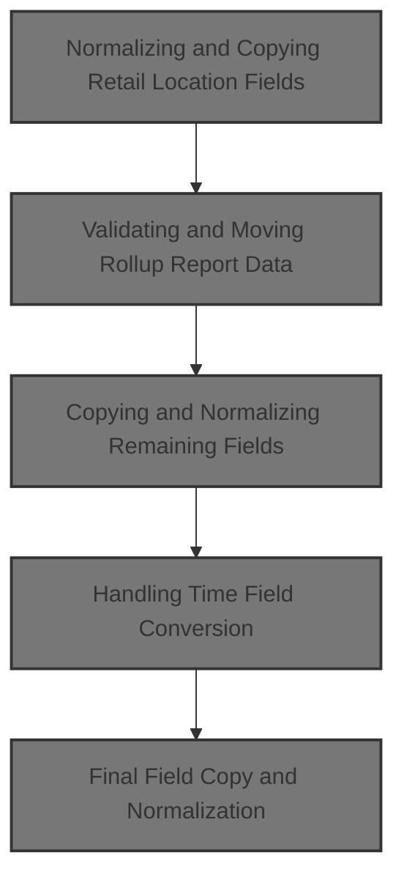
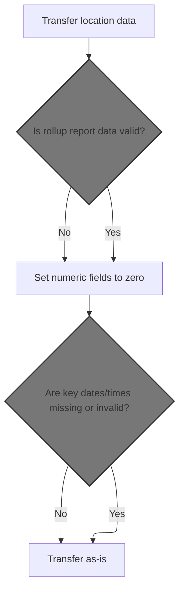
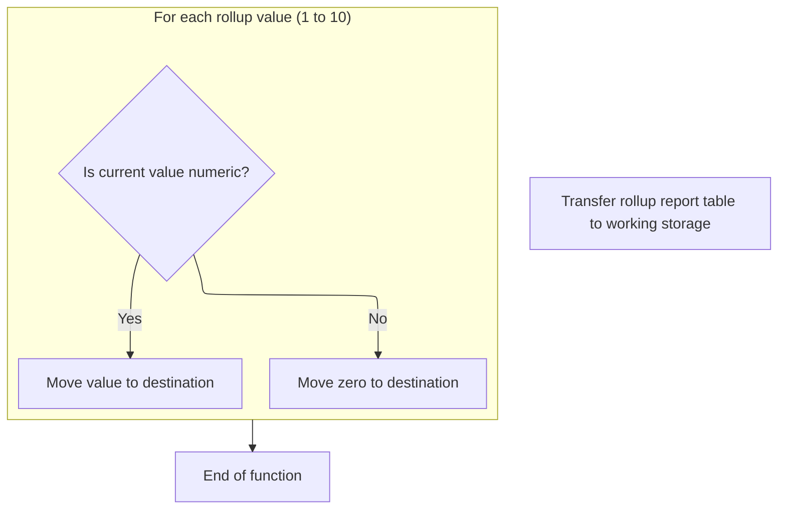
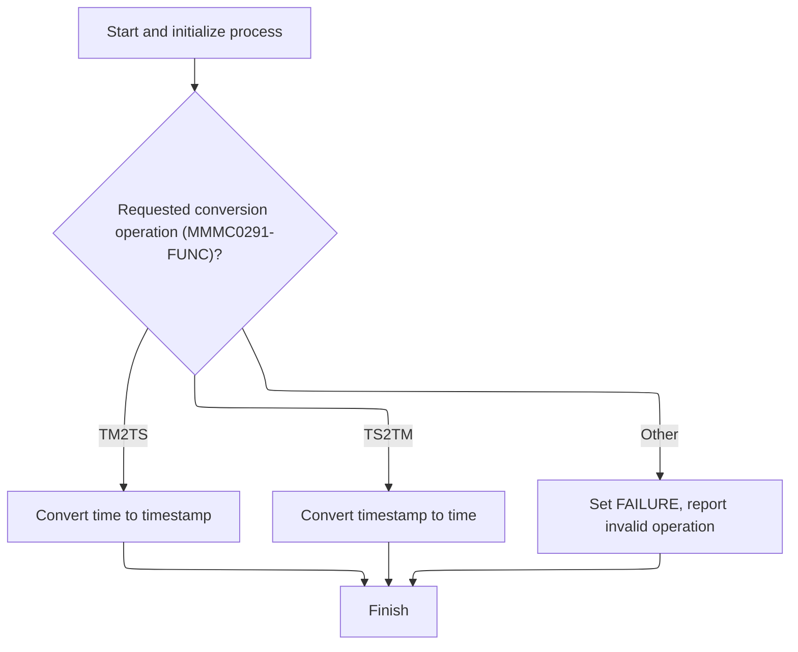
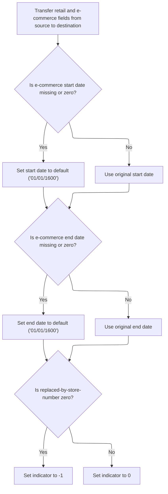

This document describes the flow for copying and normalizing retail location fields. The process prepares the record for downstream business processes by ensuring all codes, dates, times, and indicators are valid and consistent. Invalid or missing data is defaulted to business-standard values, and special handling is performed for rollup report data, time conversions, e-commerce, and replacement store logic. The flow receives a retail location record and outputs a fully normalized record, ready for reporting or analytics.



# Spec

## Detailed View of the Program's Functionality

# Detailed Explanation of the Code Flow

## a. Transfer and Normalize Retail Location Fields

The process begins by copying key location fields from the input structure to the output structure. This is not a simple copy; normalization is performed to ensure data integrity:

- The location number and type code are copied directly.
- If the associated store type code is blank, it is set to a default value ('S') to avoid empty fields.
- The normalized associated store type code is then copied to the output.
- An indicator for the associated store type is reset.
- The associated store number is copied, and if it is zero, a special indicator is set to flag this as missing data; otherwise, the indicator is reset.
- For the sales closed date, if it is blank or zero, it is set to a default date to ensure consistency, then copied to the output.
- The same normalization and copy logic is applied to the remodel date and the retail location status date.
- Company, division, region, and other organizational fields are copied directly without normalization.
- The rollup report text field is cleared in the output, and a specialized routine is called to handle the rollup numeric fields.

## b. Validating and Moving Rollup Report Data

A dedicated routine is used to process the rollup report data:

- The rollup text field is moved to a working area.
- For each of the 10 rollup numeric values:
  - If the value is numeric, it is copied to the output.
  - If not, the output is set to zero.
- This ensures that only valid numbers are present in the output, preventing garbage or non-numeric data from corrupting reports.

## c. Copying and Normalizing Remaining Fields

After the rollup data, the process continues with the remaining fields:

- Various switches, square footage, and text fields are copied directly.
- Latitude and longitude are checked for numeric validity; if not numeric, they are set to zero before copying.
- Additional check collection and tax fields are copied directly.
- If the environment is a specific type (CICS), a field is mapped differently to accommodate system requirements.
- Reporting and group code fields are copied directly.
- The permit number is checked for numeric validity; if not numeric, it is set to zero before copying.
- Store preference flags are set based on the state of other flags, ensuring default preferences are established if none are set.
- Substitution and display pallet codes are copied, and related flags are set as needed.
- Maintenance switches and leader names are copied.
- The sales open date is normalized to a default if blank or zero, then copied.

## d. Normalizing Daily Open and Close Times

For each day of the week (Monday through Sunday):

- The open and close times are checked:
  - If blank or set to the default, they are set to the default time.
  - If a close time is set to the system maximum (e.g., '24.00.00'), it is converted to the Oracle maximum ('23.59.59').
- This normalization ensures that all time fields are valid and compatible with downstream systems.

## e. Handling Time Field Conversion

A specialized routine is called to handle time field conversion:

- If the target is Oracle or an insert/update operation is being performed:
  - All daily open and close times are loaded into an array.
  - A flag is set to indicate that time-to-timestamp conversion is required.
  - An external utility is called to perform the conversion.
  - If the conversion fails, an error message is constructed with the SQL code.
  - If successful, the converted timestamps are copied into the appropriate output fields.
- If no conversion is needed, the times are copied directly from input to output.

## f. Final Field Copy and Normalization

After time fields are handled, the final set of fields is processed:

- Retail location format and segment codes, as well as e-commerce market area code, are copied.
- The e-commerce start and end dates are normalized to a default if blank or zero, then copied, and their indicators are reset.
- The online session switch and replaced-by-store number are copied.
- If the replaced-by-store number is zero, a special indicator is set; otherwise, it is reset.

## g. Summary of Data Integrity and Error Handling

Throughout the process:

- Numeric and date fields are validated and normalized to prevent invalid data from propagating.
- Special indicators are used to flag missing or defaulted data.
- Error handling is robust, with clear error messages constructed when conversions or database operations fail.
- The flow ensures that all output fields are populated with valid, normalized data, ready for further processing or storage.

---

This flow ensures that all retail location data is transferred, validated, and normalized, with special handling for numeric, date, and time fields, and robust error handling throughout.

# Rule Definition

| Paragraph Name                                                                     | Rule ID | Category          | Description                                                                                                                                                             | Conditions                                                            | Remarks                                                                                                                                                                              |
| ---------------------------------------------------------------------------------- | ------- | ----------------- | ----------------------------------------------------------------------------------------------------------------------------------------------------------------------- | --------------------------------------------------------------------- | ------------------------------------------------------------------------------------------------------------------------------------------------------------------------------------ |
| 110-MOVE-PDA-FIELDS-2-DCL                                                          | RL-001  | Data Assignment   | All retail location fields from the source record are transferred to the destination record, with normalization applied as specified by other rules.                    | Always applies when transferring a record from source to destination. | Fields are transferred as-is unless a specific normalization rule applies. Field types include strings, numbers, dates, and times.                                                   |
| 110-MOVE-PDA-FIELDS-2-DCL                                                          | RL-002  | Conditional Logic | If the location type code is blank, set it to 'S'.                                                                                                                      | Location type code is blank (spaces).                                 | Location type code is a single alphanumeric character. Default value is 'S'.                                                                                                         |
| 110-MOVE-PDA-FIELDS-2-DCL, 1800-EDIT-NULL-INDICATORS, 1700-CHECK-NULL-COLUMNS      | RL-003  | Conditional Logic | For indicator fields (e.g., ECOMM-STRT-DT-IND, ECOMM-END-DT-IND, RPLACD-BY-STR-NBR-IND), set to -1 if the corresponding field is missing or zero, otherwise set to 0.   | Corresponding field is missing (blank or spaces) or zero.             | Indicator fields are numeric (typically S9(4) COMP or similar). -1 indicates missing/zero, 0 indicates present/valid.                                                                |
| 117-MOVE-ROLLUP-DATA                                                               | RL-004  | Conditional Logic | For rollup report numeric fields, if the value is not numeric, set the destination field to zero; otherwise, transfer the value.                                        | Value is not numeric.                                                 | Fields are numeric (S9(3) COMP-3 or similar). There are 10 such fields (ROLUP-REPT-TBL-01-NBR through ROLUP-REPT-TBL-10-NBR).                                                        |
| 110-MOVE-PDA-FIELDS-2-DCL                                                          | RL-005  | Conditional Logic | For date fields, if the value is blank or zero, set to the default date '01011600'.                                                                                     | Date field is blank (spaces) or zero (K-ZERO-DT).                     | Default date is '01011600' (MMDDYYYY). Applies to SLS-CLOSED-DT, STR-REMODL-DT, RETL-LOC-STAT-DT, ECOMM-STRT-DT, ECOMM-END-DT, SLS-OPEN-DT.                                          |
| 110-MOVE-PDA-FIELDS-2-DCL, 112-MOVE-TIME-FIELDS, MMMS0291.cbl 201-CONVERT-TM-TO-TS | RL-006  | Conditional Logic | For time fields, if the value is blank, default ('00.00.00'), or system max ('24.00.00'), set to '00.00.00' or convert system max to '23.59.59'.                        | Time field is blank, '00.00.00', or '24.00.00'.                       | Default time is '00.00.00'. System max is '24.00.00', which is converted to '23.59.59' for Oracle compatibility. Applies to MON-OPEN-TM, MON-CLOS-TM, ..., SUN-OPEN-TM, SUN-CLOS-TM. |
| 110-MOVE-PDA-FIELDS-2-DCL                                                          | RL-007  | Conditional Logic | For latitude and longitude fields, if the value is not numeric, set to zero.                                                                                            | Value is not numeric.                                                 | Fields are numeric (S9(7)V9(6) or similar).                                                                                                                                          |
| 110-MOVE-PDA-FIELDS-2-DCL                                                          | RL-008  | Conditional Logic | For permit number, if the value is not numeric, set to zero.                                                                                                            | Permit number is not numeric.                                         | Permit number is numeric (e.g., TBCO-PRMT-NBR).                                                                                                                                      |
| 110-MOVE-PDA-FIELDS-2-DCL                                                          | RL-009  | Conditional Logic | For substitution preference flags, if not set, update to default preference value.                                                                                      | Neither OK nor DONT flags are set.                                    | Flags are boolean or single-character fields. Default is to set NO-UNLIKE-SUB-STORE-PREF or NO-DISP-PAL-SUB-STORE-PREF to TRUE.                                                      |
| 110-MOVE-PDA-FIELDS-2-DCL                                                          | RL-010  | Conditional Logic | If the environment is CICS, perform additional field mapping for compatibility.                                                                                         | YYYN005A-CICS-ENV is TRUE.                                            | Field mapping may include moving STR-OPSTMT-SRT-CD to RPRT-SEQ-NBR.                                                                                                                  |
| 112-MOVE-TIME-FIELDS, MMMS0291.cbl 201-CONVERT-TM-TO-TS                            | RL-011  | Computation       | For daily open/close times, after normalization, convert to Oracle-compatible timestamps if required by the target system or operation; otherwise, copy times directly. | Target system is Oracle or operation is insert/modify/purge.          | Times are converted to 26-character Oracle-compatible timestamp strings if needed; otherwise, remain as 8-character time strings.                                                    |
| 110-MOVE-PDA-FIELDS-2-DCL, 1800-EDIT-NULL-INDICATORS, 1700-CHECK-NULL-COLUMNS      | RL-012  | Conditional Logic | For e-commerce start and end dates, if missing or zero, set to default date ('01011600') and update indicator accordingly.                                              | Date is blank or zero.                                                | Default date is '01011600'. Indicator is set to -1 if missing/zero, else 0.                                                                                                          |
| 110-MOVE-PDA-FIELDS-2-DCL, 1800-EDIT-NULL-INDICATORS, 1700-CHECK-NULL-COLUMNS      | RL-013  | Conditional Logic | For replaced-by-store number, if zero, set indicator to -1; otherwise, set to 0.                                                                                        | Replaced-by-store number is zero.                                     | Indicator is numeric (-1 or 0).                                                                                                                                                      |
| 110-MOVE-PDA-FIELDS-2-DCL                                                          | RL-014  | Data Assignment   | All other fields not requiring normalization should be copied directly from source to destination.                                                                      | Field does not require normalization.                                 | Field types and sizes as defined in the copybooks.                                                                                                                                   |

# User Stories

## User Story 1: Transfer and normalize retail location fields, including CICS compatibility

---

### Story Description:

As a system, I want to transfer all retail location fields from the source record to the destination record, applying normalization rules and performing additional field mapping for CICS compatibility so that the data is consistent, valid, and meets all environment requirements.

---

### Business Rule Mapping:

| Rule ID | Paragraph Name                                                                     | Rule Description                                                                                                                                     |
| ------- | ---------------------------------------------------------------------------------- | ---------------------------------------------------------------------------------------------------------------------------------------------------- |
| RL-001  | 110-MOVE-PDA-FIELDS-2-DCL                                                          | All retail location fields from the source record are transferred to the destination record, with normalization applied as specified by other rules. |
| RL-002  | 110-MOVE-PDA-FIELDS-2-DCL                                                          | If the location type code is blank, set it to 'S'.                                                                                                   |
| RL-005  | 110-MOVE-PDA-FIELDS-2-DCL                                                          | For date fields, if the value is blank or zero, set to the default date '01011600'.                                                                  |
| RL-006  | 110-MOVE-PDA-FIELDS-2-DCL, 112-MOVE-TIME-FIELDS, MMMS0291.cbl 201-CONVERT-TM-TO-TS | For time fields, if the value is blank, default ('00.00.00'), or system max ('24.00.00'), set to '00.00.00' or convert system max to '23.59.59'.     |
| RL-007  | 110-MOVE-PDA-FIELDS-2-DCL                                                          | For latitude and longitude fields, if the value is not numeric, set to zero.                                                                         |
| RL-008  | 110-MOVE-PDA-FIELDS-2-DCL                                                          | For permit number, if the value is not numeric, set to zero.                                                                                         |
| RL-009  | 110-MOVE-PDA-FIELDS-2-DCL                                                          | For substitution preference flags, if not set, update to default preference value.                                                                   |
| RL-010  | 110-MOVE-PDA-FIELDS-2-DCL                                                          | If the environment is CICS, perform additional field mapping for compatibility.                                                                      |
| RL-014  | 110-MOVE-PDA-FIELDS-2-DCL                                                          | All other fields not requiring normalization should be copied directly from source to destination.                                                   |
| RL-004  | 117-MOVE-ROLLUP-DATA                                                               | For rollup report numeric fields, if the value is not numeric, set the destination field to zero; otherwise, transfer the value.                     |

---

### Relevant Functionality:

- **110-MOVE-PDA-FIELDS-2-DCL**
  1. **RL-001:**
     - For each field in the source record:
       - If a normalization rule applies, apply it.
       - Otherwise, copy the field value directly to the destination record.
  2. **RL-002:**
     - If location type code in source is blank:
       - Set location type code in source to 'S'.
     - Copy location type code from source to destination.
  3. **RL-005:**
     - For each date field:
       - If value is blank or zero:
         - Set value to '01011600'.
       - Copy value to destination.
  4. **RL-006:**
     - For each time field:
       - If value is blank or '00.00.00':
         - Set to '00.00.00'.
       - If value is '24.00.00':
         - Set to '23.59.59' (for Oracle).
       - Copy or convert as needed.
  5. **RL-007:**
     - If latitude is not numeric:
       - Set latitude to zero.
     - If longitude is not numeric:
       - Set longitude to zero.
     - Copy values to destination.
  6. **RL-008:**
     - If permit number is not numeric:
       - Set permit number to zero.
     - Copy value to destination.
  7. **RL-009:**
     - If neither OK nor DONT substitution flag is set:
       - Set NO-UNLIKE-SUB-STORE-PREF or NO-DISP-PAL-SUB-STORE-PREF to TRUE.
  8. **RL-010:**
     - If CICS environment:
       - Move STR-OPSTMT-SRT-CD to RPRT-SEQ-NBR.
  9. **RL-014:**
     - For each field not covered by a normalization rule:
       - Copy value from source to destination.
- **117-MOVE-ROLLUP-DATA**
  1. **RL-004:**
     - For each rollup report numeric field:
       - If value is numeric:
         - Copy value to destination.
       - Else:
         - Set destination field to zero.

## User Story 2: Normalize indicator fields, including e-commerce and replaced-by-store indicators

---

### Story Description:

As a system, I want to set all indicator fields (including e-commerce and replaced-by-store indicators) based on whether their corresponding values are missing or zero so that downstream processes can reliably detect missing or invalid data.

---

### Business Rule Mapping:

| Rule ID | Paragraph Name                                                                | Rule Description                                                                                                                                                      |
| ------- | ----------------------------------------------------------------------------- | --------------------------------------------------------------------------------------------------------------------------------------------------------------------- |
| RL-003  | 110-MOVE-PDA-FIELDS-2-DCL, 1800-EDIT-NULL-INDICATORS, 1700-CHECK-NULL-COLUMNS | For indicator fields (e.g., ECOMM-STRT-DT-IND, ECOMM-END-DT-IND, RPLACD-BY-STR-NBR-IND), set to -1 if the corresponding field is missing or zero, otherwise set to 0. |
| RL-012  | 110-MOVE-PDA-FIELDS-2-DCL, 1800-EDIT-NULL-INDICATORS, 1700-CHECK-NULL-COLUMNS | For e-commerce start and end dates, if missing or zero, set to default date ('01011600') and update indicator accordingly.                                            |
| RL-013  | 110-MOVE-PDA-FIELDS-2-DCL, 1800-EDIT-NULL-INDICATORS, 1700-CHECK-NULL-COLUMNS | For replaced-by-store number, if zero, set indicator to -1; otherwise, set to 0.                                                                                      |

---

### Relevant Functionality:

- **110-MOVE-PDA-FIELDS-2-DCL**
  1. **RL-003:**
     - For each indicator field:
       - If corresponding field is blank or zero:
         - Set indicator to -1.
       - Else:
         - Set indicator to 0.
  2. **RL-012:**
     - If e-commerce start/end date is blank or zero:
       - Set to '01011600'.
       - Set indicator to -1.
     - Else:
       - Set indicator to 0.
  3. **RL-013:**
     - If replaced-by-store number is zero:
       - Set indicator to -1.
     - Else:
       - Set indicator to 0.

## User Story 3: Normalize and convert date and time fields, including Oracle timestamp compatibility

---

### Story Description:

As a system, I want to normalize all date and time fields, setting defaults as needed and converting daily open/close times to Oracle-compatible timestamps when required so that temporal data is accurate and compatible with the target system.

---

### Business Rule Mapping:

| Rule ID | Paragraph Name                                                                     | Rule Description                                                                                                                                                        |
| ------- | ---------------------------------------------------------------------------------- | ----------------------------------------------------------------------------------------------------------------------------------------------------------------------- |
| RL-005  | 110-MOVE-PDA-FIELDS-2-DCL                                                          | For date fields, if the value is blank or zero, set to the default date '01011600'.                                                                                     |
| RL-006  | 110-MOVE-PDA-FIELDS-2-DCL, 112-MOVE-TIME-FIELDS, MMMS0291.cbl 201-CONVERT-TM-TO-TS | For time fields, if the value is blank, default ('00.00.00'), or system max ('24.00.00'), set to '00.00.00' or convert system max to '23.59.59'.                        |
| RL-011  | 112-MOVE-TIME-FIELDS, MMMS0291.cbl 201-CONVERT-TM-TO-TS                            | For daily open/close times, after normalization, convert to Oracle-compatible timestamps if required by the target system or operation; otherwise, copy times directly. |

---

### Relevant Functionality:

- **110-MOVE-PDA-FIELDS-2-DCL**
  1. **RL-005:**
     - For each date field:
       - If value is blank or zero:
         - Set value to '01011600'.
       - Copy value to destination.
  2. **RL-006:**
     - For each time field:
       - If value is blank or '00.00.00':
         - Set to '00.00.00'.
       - If value is '24.00.00':
         - Set to '23.59.59' (for Oracle).
       - Copy or convert as needed.
- **112-MOVE-TIME-FIELDS**
  1. **RL-011:**
     - If Oracle or insert/modify/purge operation:
       - Normalize times.
       - Call MMMS0291 to convert times to timestamps.
       - Store results in destination.
     - Else:
       - Copy times directly.

# Code Walkthrough

## Normalizing and Copying Retail Location Fields



<SwmSnippet path="/base/src/NNNS0488.cbl" line="1261">

---

In `110-MOVE-PDA-FIELDS-2-DCL`, we kick off by copying over location fields and immediately start normalizing: if a type code is blank, we set it to 'S', and we prep indicator fields for later logic. This isn't just a dumb copy—it's prepping the data for the rest of the flow by making sure required fields aren't left empty or invalid.

```cobol
130600 110-MOVE-PDA-FIELDS-2-DCL.                                       00130600
130700     MOVE LOC-NBR OF P-DDDTLR01 TO LOC-NBR OF DCLXXXAIL-LOC       00130700
130800     MOVE LOC-TYP-CD OF P-DDDTLR01 TO LOC-TYP-CD OF DCLXXXAIL-LOC 00130800
130900                                                                  00130900
131000     IF ASSOC-STR-TYP-CD OF P-DDDTLR01 = SPACES                   00131000
131100        MOVE 'S' TO ASSOC-STR-TYP-CD OF P-DDDTLR01                00131100
131200     END-IF                                                       00131200
```

---

</SwmSnippet>

<SwmSnippet path="/base/src/NNNS0488.cbl" line="1268">

---

Next we move the normalized type code and number to the destination, and set indicator flags based on whether the associated number is zero. This flags missing data for later logic.

```cobol
131300     MOVE ASSOC-STR-TYP-CD OF P-DDDTLR01                          00131300
131400       TO ASSOC-STR-TYP-CD OF DCLXXXAIL-LOC                       00131400
131500     MOVE 0 TO  WS-ASSOC-ST-TYPE-IND                              00131500
131600     MOVE ASSOC-STR-NBR OF P-DDDTLR01                             00131600
131700       TO ASSOC-STR-NBR OF DCLXXXAIL-LOC                          00131700
131800     IF ASSOC-STR-NBR OF P-DDDTLR01  =  ZERO                      00131800
131900        MOVE -1 TO WS-ASSOC-ST-NO-IND                             00131900
132000     ELSE                                                         00132000
132100        MOVE 0 TO  WS-ASSOC-ST-NO-IND                             00132100
132200     END-IF                                                       00132200
```

---

</SwmSnippet>

<SwmSnippet path="/base/src/NNNS0488.cbl" line="1279">

---

Here we check if the sales closed date is blank or zero, and if so, we set it to the default date. This keeps the data consistent before copying it over.

```cobol
132400     IF SLS-CLOSED-DT OF P-DDDTLR01 = SPACES                      00132400
132500     OR SLS-CLOSED-DT OF P-DDDTLR01 = K-ZERO-DT                   00132500
132600       MOVE K-DEF-DT TO SLS-CLOSED-DT OF P-DDDTLR01               00132600
132700     END-IF                                                       00132700
```

---

</SwmSnippet>

<SwmSnippet path="/base/src/NNNS0488.cbl" line="1283">

---

After normalizing the sales closed date, we copy it to the destination, then repeat the same normalization logic for the remodel date.

```cobol
132800     MOVE SLS-CLOSED-DT OF P-DDDTLR01                             00132800
132900       TO SLS-CLOSED-DT OF DCLXXXAIL-LOC                          00132900
133000     IF STR-REMODL-DT OF P-DDDTLR01 = SPACES                      00133000
133100     OR STR-REMODL-DT OF P-DDDTLR01 = K-ZERO-DT                   00133100
133200       MOVE K-DEF-DT TO STR-REMODL-DT OF P-DDDTLR01               00133200
133300     END-IF                                                       00133300
```

---

</SwmSnippet>

<SwmSnippet path="/base/src/NNNS0488.cbl" line="1289">

---

We copy the remodel date after normalizing it, then move on to the next set of fields, repeating the same pattern for retail location status and its date.

```cobol
133400     MOVE STR-REMODL-DT OF P-DDDTLR01                             00133400
133500       TO STR-REMODL-DT OF DCLXXXAIL-LOC                          00133500
133600                                                                  00133600
133700     MOVE RETL-LOC-STAT-CD OF P-DDDTLR01                          00133700
133800       TO RETL-LOC-STAT-CD OF DCLXXXAIL-LOC                       00133800
133900                                                                  00133900
134000     IF RETL-LOC-STAT-DT OF P-DDDTLR01 = SPACES                   00134000
134100     OR RETL-LOC-STAT-DT OF P-DDDTLR01 = K-ZERO-DT                00134100
134200       MOVE K-DEF-DT TO RETL-LOC-STAT-DT OF P-DDDTLR01            00134200
134300     END-IF                                                       00134300
```

---

</SwmSnippet>

<SwmSnippet path="/base/src/NNNS0488.cbl" line="1299">

---

Here we just copy over a bunch of company, division, and region fields directly—no normalization needed for these.

```cobol
134400     MOVE RETL-LOC-STAT-DT OF P-DDDTLR01                          00134400
134500       TO RETL-LOC-STAT-DT OF DCLXXXAIL-LOC                       00134500
134600                                                                  00134600
134700     MOVE COMPANY-ID OF P-DDDTLR01 TO COMPANY-ID OF DCLXXXAIL-LOC 00134700
134800     MOVE FINANCIAL-DIV-ID OF P-DDDTLR01                          00134800
134900       TO FINANCIAL-DIV-ID OF DCLXXXAIL-LOC                       00134900
135000     MOVE LIN-OF-BUS-ID OF P-DDDTLR01                             00135000
135100       TO LIN-OF-BUS-ID OF DCLXXXAIL-LOC                          00135100
135200     MOVE DIST-ID OF P-DDDTLR01 TO DIST-ID OF DCLXXXAIL-LOC       00135200
135300                                   MKT-RGN-ID OF P-DDDTLR01       00135300
135400     MOVE MKT-RGN-ID OF P-DDDTLR01 TO MKT-RGN-ID OF DCLXXXAIL-LOC 00135400
135500     MOVE GEO-ZN-CD OF P-DDDTLR01 TO GEO-ZN-CD OF DCLXXXAIL-LOC   00135500
135600     MOVE RETL-GEO-ZN-ID OF P-DDDTLR01                            00135600
135700       TO RETL-GEO-ZN-ID OF DCLXXXAIL-LOC                         00135700
135800     MOVE SCN-MAINT-SW OF P-DDDTLR01                              00135800
135900       TO SCN-MAINT-SW OF DCLXXXAIL-LOC                           00135900
136000     MOVE FRNT-END-CD OF P-DDDTLR01                               00136000
136100       TO FRNT-END-CD OF DCLXXXAIL-LOC                            00136100
136200     MOVE PRC-BUL-SW OF P-DDDTLR01 TO PRC-BUL-SW OF DCLXXXAIL-LOC 00136200
136300     MOVE UPC-ON-PRC-BUL-SW OF P-DDDTLR01                         00136300
136400       TO UPC-ON-PRC-BUL-SW OF DCLXXXAIL-LOC                      00136400
136500     MOVE CMPTR-TYP-CD OF P-DDDTLR01                              00136500
136600       TO CMPTR-TYP-CD OF DCLXXXAIL-LOC                           00136600
136700     MOVE RETL-VID-ZN-NBR OF P-DDDTLR01                           00136700
136800       TO RETL-VID-ZN-NBR OF DCLXXXAIL-LOC                        00136800
136900     MOVE RETL-UNLD-CD OF P-DDDTLR01                              00136900
137000       TO RETL-UNLD-CD OF DCLXXXAIL-LOC                           00137000
137100*    MOVE ROLUP-REPT-TBL-TXT OF P-DDDTLR01                        00137100
137200     MOVE SPACES                                                  00137200
137300       TO ROLUP-REPT-TBL-TXT OF DCLXXXAIL-LOC                     00137300
```

---

</SwmSnippet>

<SwmSnippet path="/base/src/NNNS0488.cbl" line="1329">

---

Here we call 117-MOVE-ROLLUP-DATA instead of just copying rollup fields. That routine checks if each numeric value is valid before moving it, so we don't get junk in the report fields.

```cobol
137400     PERFORM 117-MOVE-ROLLUP-DATA                                 00137400
```

---

</SwmSnippet>

### Validating and Moving Rollup Report Data



<SwmSnippet path="/base/src/NNNS0488.cbl" line="1687">

---

In `117-MOVE-ROLLUP-DATA`, we start by moving the rollup text field, then check each numeric value in the array. If it's numeric, we move it; if not, we set the destination to zero. This keeps the report data clean.

```cobol
172400 117-MOVE-ROLLUP-DATA.                                            00172400
172500     MOVE ROLUP-REPT-TBL-TXT OF P-DDDTLR01                        00172500
172600       TO WS-REPT-TBL-TXT                                         00172600
172700     IF WS-REPT-TBL-NUMERIC(1) IS NUMERIC                         00172700
172800        MOVE WS-REPT-TBL-NUMERIC(1)                               00172800
172900          TO ROLUP-REPT-TBL-01-NBR  OF DCLXXXAIL-LOC              00172900
173000     ELSE                                                         00173000
173100        MOVE ZERO TO ROLUP-REPT-TBL-01-NBR OF DCLXXXAIL-LOC       00173100
173200     END-IF                                                       00173200
```

---

</SwmSnippet>

<SwmSnippet path="/base/src/NNNS0488.cbl" line="1696">

---

Here we do the same numeric check and move for the second element in the array. It's repetitive, but that's how COBOL handles arrays.

```cobol
173300     IF WS-REPT-TBL-NUMERIC(2) IS NUMERIC                         00173300
173400        MOVE WS-REPT-TBL-NUMERIC(2)                               00173400
173500          TO ROLUP-REPT-TBL-02-NBR  OF DCLXXXAIL-LOC              00173500
173600     ELSE                                                         00173600
173700        MOVE ZERO TO ROLUP-REPT-TBL-02-NBR OF DCLXXXAIL-LOC       00173700
173800     END-IF                                                       00173800
```

---

</SwmSnippet>

<SwmSnippet path="/base/src/NNNS0488.cbl" line="1702">

---

Same pattern—check if the third numeric value is valid, move it if so, or set to zero if not. This is repeated for each element.

```cobol
173900     IF WS-REPT-TBL-NUMERIC(3) IS NUMERIC                         00173900
174000        MOVE WS-REPT-TBL-NUMERIC(3)                               00174000
174100          TO ROLUP-REPT-TBL-03-NBR  OF DCLXXXAIL-LOC              00174100
174200     ELSE                                                         00174200
174300        MOVE ZERO TO ROLUP-REPT-TBL-03-NBR OF DCLXXXAIL-LOC       00174300
174400     END-IF                                                       00174400
```

---

</SwmSnippet>

<SwmSnippet path="/base/src/NNNS0488.cbl" line="1708">

---

We keep going—fourth element, same check and move logic. If it's not numeric, it's zeroed out.

```cobol
174500     IF WS-REPT-TBL-NUMERIC(4) IS NUMERIC                         00174500
174600        MOVE WS-REPT-TBL-NUMERIC(4)                               00174600
174700          TO ROLUP-REPT-TBL-04-NBR  OF DCLXXXAIL-LOC              00174700
174800     ELSE                                                         00174800
174900        MOVE ZERO TO ROLUP-REPT-TBL-04-NBR OF DCLXXXAIL-LOC       00174900
175000     END-IF                                                       00175000
```

---

</SwmSnippet>

<SwmSnippet path="/base/src/NNNS0488.cbl" line="1714">

---

Fifth element—same deal. Only valid numbers get copied, everything else is zeroed.

```cobol
175100     IF WS-REPT-TBL-NUMERIC(5) IS NUMERIC                         00175100
175200        MOVE WS-REPT-TBL-NUMERIC(5)                               00175200
175300          TO ROLUP-REPT-TBL-05-NBR  OF DCLXXXAIL-LOC              00175300
175400     ELSE                                                         00175400
175500        MOVE ZERO TO ROLUP-REPT-TBL-05-NBR OF DCLXXXAIL-LOC       00175500
175600     END-IF                                                       00175600
```

---

</SwmSnippet>

<SwmSnippet path="/base/src/NNNS0488.cbl" line="1720">

---

Sixth element—same numeric check and move. The code assumes there are exactly 10 elements, so every one gets handled explicitly.

```cobol
175700     IF WS-REPT-TBL-NUMERIC(6) IS NUMERIC                         00175700
175800        MOVE WS-REPT-TBL-NUMERIC(6)                               00175800
175900          TO ROLUP-REPT-TBL-06-NBR  OF DCLXXXAIL-LOC              00175900
176000     ELSE                                                         00176000
176100        MOVE ZERO TO ROLUP-REPT-TBL-06-NBR OF DCLXXXAIL-LOC       00176100
176200     END-IF                                                       00176200
```

---

</SwmSnippet>

<SwmSnippet path="/base/src/NNNS0488.cbl" line="1726">

---

Seventh element—again, check and move if numeric, zero if not. No dependencies between elements.

```cobol
176300     IF WS-REPT-TBL-NUMERIC(7) IS NUMERIC                         00176300
176400        MOVE WS-REPT-TBL-NUMERIC(7)                               00176400
176500          TO ROLUP-REPT-TBL-07-NBR  OF DCLXXXAIL-LOC              00176500
176600     ELSE                                                         00176600
176700        MOVE ZERO TO ROLUP-REPT-TBL-07-NBR OF DCLXXXAIL-LOC       00176700
176800     END-IF                                                       00176800
```

---

</SwmSnippet>

<SwmSnippet path="/base/src/NNNS0488.cbl" line="1732">

---

Eighth element—same logic, making sure every destination field gets a value, even if it's just zero.

```cobol
176900     IF WS-REPT-TBL-NUMERIC(8) IS NUMERIC                         00176900
177000        MOVE WS-REPT-TBL-NUMERIC(8)                               00177000
177100          TO ROLUP-REPT-TBL-08-NBR  OF DCLXXXAIL-LOC              00177100
177200     ELSE                                                         00177200
177300        MOVE ZERO TO ROLUP-REPT-TBL-08-NBR OF DCLXXXAIL-LOC       00177300
177400     END-IF                                                       00177400
```

---

</SwmSnippet>

<SwmSnippet path="/base/src/NNNS0488.cbl" line="1738">

---

Ninth element—same check and move logic. The code expects all fields to be there, so missing data could cause issues.

```cobol
177500     IF WS-REPT-TBL-NUMERIC(9) IS NUMERIC                         00177500
177600        MOVE WS-REPT-TBL-NUMERIC(9)                               00177600
177700          TO ROLUP-REPT-TBL-09-NBR  OF DCLXXXAIL-LOC              00177700
177800     ELSE                                                         00177800
177900        MOVE ZERO TO ROLUP-REPT-TBL-09-NBR OF DCLXXXAIL-LOC       00177900
178000     END-IF                                                       00178000
```

---

</SwmSnippet>

<SwmSnippet path="/base/src/NNNS0488.cbl" line="1744">

---

Finally, we check and move the tenth numeric value. After this, the destination has 10 validated numeric fields—any non-numeric input is now zero.

```cobol
178100     IF WS-REPT-TBL-NUMERIC(10) IS NUMERIC                        00178100
178200        MOVE WS-REPT-TBL-NUMERIC(10)                              00178200
178300          TO ROLUP-REPT-TBL-10-NBR  OF DCLXXXAIL-LOC              00178300
178400     ELSE                                                         00178400
178500        MOVE ZERO TO ROLUP-REPT-TBL-10-NBR OF DCLXXXAIL-LOC       00178500
178600     END-IF                                                       00178600
```

---

</SwmSnippet>

### Copying and Normalizing Remaining Fields

```mermaid
%%{init: {"flowchart": {"defaultRenderer": "elk"}} }%%
flowchart TD
    node1["Transfer all store/location fields from source to destination"]
    click node1 openCode "base/src/NNNS0488.cbl:1330:1371"
    node1 --> node2{"Are latitude/longitude numeric?"}
    click node2 openCode "base/src/NNNS0488.cbl:1342:1350"
    node2 -->|"No"| node3["Set latitude/longitude to 0"]
    click node3 openCode "base/src/NNNS0488.cbl:1343:1349"
    node2 -->|"Yes"| node4{"Is sales open date missing or zero?"}
    click node4 openCode "base/src/NNNS0488.cbl:1443:1446"
    node3 --> node4
    node4 -->|"Yes"| node5["Set sales open date to default (01/01/1600)"]
    click node5 openCode "base/src/NNNS0488.cbl:1445:1446"
    node4 -->|"No"| node6{"Are any opening/closing times missing, default (00.00.00), or system max (24.00.00)?"}
    click node6 openCode "base/src/NNNS0488.cbl:1449:1525"
    node5 --> node6
    node6 -->|"Yes"| node7["Set times to default (00.00.00) or system value (23.59.59)"]
    click node7 openCode "base/src/NNNS0488.cbl:1451:1525"
    node6 -->|"No"| node8{"Are substitution preferences not set?"}
    click node8 openCode "base/src/NNNS0488.cbl:1420:1436"
    node7 --> node8
    node8 -->|"Yes"| node9["Update substitution preference flags"]
    click node9 openCode "base/src/NNNS0488.cbl:1422:1435"
    node8 -->|"No"| node10{"Is environment CICS?"}
    click node10 openCode "base/src/NNNS0488.cbl:1372:1375"
    node9 --> node10
    node10 -->|"Yes"| node11["Perform additional field mapping for CICS"]
    click node11 openCode "base/src/NNNS0488.cbl:1373:1374"
    node10 -->|"No"| node12["Finish"]
    click node12 openCode "base/src/NNNS0488.cbl:1412:1412"
    node11 --> node12
classDef HeadingStyle fill:#777777,stroke:#333,stroke-width:2px;
```



<SwmSnippet path="/base/src/NNNS0488.cbl" line="1330">

---

Back in `110-MOVE-PDA-FIELDS-2-DCL`, after returning from 117-MOVE-ROLLUP-DATA, we copy over a bunch of remaining fields like switches and text fields. These aren't affected by the rollup data, just handled after it.

```cobol
137500     MOVE NEW-STR-SW OF P-DDDTLR01 TO NEW-STR-SW OF DCLXXXAIL-LOC 00137500
137600     MOVE SEL-CIR-SW OF P-DDDTLR01 TO SEL-CIR-SW OF DCLXXXAIL-LOC 00137600
137700     MOVE BKRM-SQ-FT OF P-DDDTLR01 TO BKRM-SQ-FT OF DCLXXXAIL-LOC 00137700
137800     MOVE FD-LINER-FT OF P-DDDTLR01                               00137800
137900       TO FD-LINER-FT OF DCLXXXAIL-LOC                            00137900
138000     MOVE NON-FD-LINER-FT OF P-DDDTLR01                           00138000
138100       TO NON-FD-LINER-FT OF DCLXXXAIL-LOC                        00138100
138200     MOVE SETOFF-ROOM-SW OF P-DDDTLR01                            00138200
138300       TO SETOFF-ROOM-SW OF DCLXXXAIL-LOC                         00138300
138400     MOVE CAT-CLS-TBL-TXT OF P-DDDTLR01                           00138400
138500       TO CAT-CLS-TBL-TXT OF DCLXXXAIL-LOC                        00138500
```

---

</SwmSnippet>

<SwmSnippet path="/base/src/NNNS0488.cbl" line="1342">

---

Here we check if the latitude value is numeric. If not, we set it to zero so we don't copy junk data.

```cobol
138700     IF LAT-K OF P-DDDTLR01 IS NOT NUMERIC                        00138700
138800       MOVE 0 TO LAT-K OF P-DDDTLR01                              00138800
138900     END-IF                                                       00138900
```

---

</SwmSnippet>

<SwmSnippet path="/base/src/NNNS0488.cbl" line="1345">

---

Same logic for longitude—check if it's numeric, set to zero if not, then copy it over.

```cobol
139000     MOVE LAT-K OF P-DDDTLR01 TO LAT-K OF DCLXXXAIL-LOC           00139000
139100                                                                  00139100
139200     IF LON-K OF P-DDDTLR01 IS NOT NUMERIC                        00139200
139300       MOVE 0 TO LON-K OF P-DDDTLR01                              00139300
139400     END-IF                                                       00139400
```

---

</SwmSnippet>

<SwmSnippet path="/base/src/NNNS0488.cbl" line="1350">

---

Here we just copy over a bunch of check collection and tax fields directly—no extra logic.

```cobol
139500     MOVE LON-K OF P-DDDTLR01 TO LON-K OF DCLXXXAIL-LOC           00139500
139600                                                                  00139600
139700     MOVE CK-COLL-REPT-SW OF P-DDDTLR01                           00139700
139800       TO CK-COLL-REPT-SW OF DCLXXXAIL-LOC                        00139800
139900     MOVE CK-COLL-CNTL-CD OF P-DDDTLR01                           00139900
140000       TO CK-COLL-CNTL-CD OF DCLXXXAIL-LOC                        00140000
140100     MOVE CK-COLL-ADD-DEL-SW OF P-DDDTLR01                        00140100
140200       TO CK-COLL-ADD-DEL-SW OF DCLXXXAIL-LOC                     00140200
140300     MOVE CK-ALT-STR-ID OF P-DDDTLR01                             00140300
140400       TO CK-ALT-STR-ID OF DCLXXXAIL-LOC                          00140400
140500     MOVE CK-COLL-FEE-AMT OF P-DDDTLR01                           00140500
140600       TO CK-COLL-FEE-AMT OF DCLXXXAIL-LOC                        00140600
140700     MOVE SALS-TAX-PCT OF P-DDDTLR01                              00140700
140800       TO SALS-TAX-PCT OF DCLXXXAIL-LOC                           00140800
140900     MOVE SOAP-SALE-VAR-PCT OF P-DDDTLR01                         00140900
141000       TO SOAP-SALE-VAR-PCT OF DCLXXXAIL-LOC                      00141000
141100     MOVE ON-SRS-CD OF P-DDDTLR01 TO ON-SRS-CD OF DCLXXXAIL-LOC   00141100
141200     MOVE SRS-DSD-ORD-SW OF P-DDDTLR01                            00141200
141300       TO SRS-DSD-ORD-SW OF DCLXXXAIL-LOC                         00141300
141400     MOVE RETL-LOC-TYP-CD OF P-DDDTLR01                           00141400
141500       TO RETL-LOC-TYP-CD OF DCLXXXAIL-LOC                        00141500
141600     MOVE DEA-NBR OF P-DDDTLR01 TO DEA-NBR OF DCLXXXAIL-LOC       00141600
```

---

</SwmSnippet>

<SwmSnippet path="/base/src/NNNS0488.cbl" line="1372">

---

Here we check if we're in a special environment (CICS). If so, we move one field to another to match that environment's requirements. This is a hidden assumption not obvious from the function name.

```cobol
141700     IF YYYN005A-CICS-ENV                                         00141700
141800       MOVE STR-OPSTMT-SRT-CD OF P-DDDTLR01                       00141800
141900         TO RPRT-SEQ-NBR      OF P-DDDTLR01                       00141900
142000     END-IF                                                       00142000
```

---

</SwmSnippet>

<SwmSnippet path="/base/src/NNNS0488.cbl" line="1376">

---

Here we copy a bunch of reporting and group code fields directly—no extra logic.

```cobol
142100     MOVE RPRT-SEQ-NBR OF P-DDDTLR01                              00142100
142200       TO RPRT-SEQ-NBR OF DCLXXXAIL-LOC                           00142200
142300     MOVE STR-OPSTMT-SRT-CD OF P-DDDTLR01                         00142300
142400       TO STR-OPSTMT-SRT-CD OF DCLXXXAIL-LOC                      00142400
142500     MOVE STR-OPSTMT-TYP-CD OF P-DDDTLR01                         00142500
142600       TO STR-OPSTMT-TYP-CD OF DCLXXXAIL-LOC                      00142600
142700     MOVE STR-OPSTMT-HDR-CD OF P-DDDTLR01                         00142700
142800       TO STR-OPSTMT-HDR-CD OF DCLXXXAIL-LOC                      00142800
142900     MOVE DPS-NBR OF P-DDDTLR01 TO DPS-NBR OF DCLXXXAIL-LOC       00142900
143000     MOVE MEDICARE-ID OF P-DDDTLR01                               00143000
143100       TO MEDICARE-ID OF DCLXXXAIL-LOC                            00143100
143200     MOVE NABP-NBR OF P-DDDTLR01 TO NABP-NBR OF DCLXXXAIL-LOC     00143200
143300     MOVE NATL-PROV-ID OF P-DDDTLR01                              00143300
143400       TO NATL-PROV-ID OF DCLXXXAIL-LOC                           00143400
143500     MOVE CURR-AD-ZN-NBR OF P-DDDTLR01                            00143500
143600       TO CURR-AD-ZN-NBR OF DCLXXXAIL-LOC                         00143600
143700     MOVE PD-ZONE-NO OF P-DDDTLR01 TO PD-ZONE-NO OF DCLXXXAIL-LOC 00143700
143800     MOVE SOS-PROC-SW OF P-DDDTLR01                               00143800
143900       TO SOS-PROC-SW OF DCLXXXAIL-LOC                            00143900
144000     MOVE GRP-CD OF P-DDDTLR01 TO GRP-CD OF DCLXXXAIL-LOC         00144000
144100     MOVE PRIM-GRP-CD-1 OF P-DDDTLR01                             00144100
144200       TO PRIM-GRP-CD-1 OF DCLXXXAIL-LOC                          00144200
144300     MOVE PRIM-GRP-CD-2 OF P-DDDTLR01                             00144300
144400       TO PRIM-GRP-CD-2 OF DCLXXXAIL-LOC                          00144400
144500     MOVE SECY-GRP-CD-1 OF P-DDDTLR01                             00144500
144600       TO SECY-GRP-CD-1 OF DCLXXXAIL-LOC                          00144600
144700     MOVE SECY-GRP-CD-2 OF P-DDDTLR01                             00144700
144800       TO SECY-GRP-CD-2 OF DCLXXXAIL-LOC                          00144800
144900     MOVE PRIM-CLS-NBR-1 OF P-DDDTLR01                            00144900
145000       TO PRIM-CLS-NBR-1 OF DCLXXXAIL-LOC                         00145000
145100     MOVE PRIM-CLS-NBR-2 OF P-DDDTLR01                            00145100
145200       TO PRIM-CLS-NBR-2 OF DCLXXXAIL-LOC                         00145200
145300     MOVE SECY-CLS-NBR-1 OF P-DDDTLR01                            00145300
145400       TO SECY-CLS-NBR-1 OF DCLXXXAIL-LOC                         00145400
145500     MOVE SECY-CLS-NBR-2 OF P-DDDTLR01                            00145500
145600       TO SECY-CLS-NBR-2 OF DCLXXXAIL-LOC                         00145600
145700     MOVE VAL-STR-SW OF P-DDDTLR01 TO VAL-STR-SW OF DCLXXXAIL-LOC 00145700
```

---

</SwmSnippet>

<SwmSnippet path="/base/src/NNNS0488.cbl" line="1413">

---

Here we check if the permit number is numeric. If not, we set it to zero so we don't copy junk data.

```cobol
145800     IF TBCO-PRMT-NBR OF P-DDDTLR01 NOT NUMERIC                   00145800
145900       MOVE ZEROES TO TBCO-PRMT-NBR OF P-DDDTLR01                 00145900
146000     END-IF                                                       00146000
```

---

</SwmSnippet>

<SwmSnippet path="/base/src/NNNS0488.cbl" line="1417">

---

Here we copy the permit number and handle some store preference flags. If certain flags aren't set, we set a default preference.

```cobol
146200     MOVE TBCO-PRMT-NBR OF P-DDDTLR01                             00146200
146300       TO TBCO-PRMT-NBR OF DCLXXXAIL-LOC                          00146300
146400                                                                  00146400
146500     IF  NOT OK-TO-SUB-UNLIKE-PRODS   OF P-DDDTLR01               00146500
146600     AND NOT DONT-SUB-UNLIKE-PRODS    OF P-DDDTLR01               00146600
146700       SET NO-UNLIKE-SUB-STORE-PREF   OF P-DDDTLR01 TO TRUE       00146700
146800     END-IF                                                       00146800
```

---

</SwmSnippet>

<SwmSnippet path="/base/src/NNNS0488.cbl" line="1424">

---

Here we copy the substitution code and handle another store preference flag, setting it if certain conditions aren't met.

```cobol
146900     MOVE SUB-UNLIKE-PROD-CD OF P-DDDTLR01                        00146900
147000       TO SUB-UNLIKE-PROD-CD OF DCLXXXAIL-LOC                     00147000
147100                                                                  00147100
147200     IF  NOT OK-TO-SUB-DISP-PALS      OF P-DDDTLR01               00147200
147300     AND NOT DONT-SUB-DISP-PALS       OF P-DDDTLR01               00147300
147400       SET NO-DISP-PAL-SUB-STORE-PREF OF P-DDDTLR01 TO TRUE       00147400
147500     END-IF                                                       00147500
```

---

</SwmSnippet>

<SwmSnippet path="/base/src/NNNS0488.cbl" line="1431">

---

Here we copy the display pallet code and handle a real-time flag, setting it if not already set.

```cobol
147600     MOVE SUB-DSPLY-PAL-CD   OF P-DDDTLR01                        00147600
147700       TO SUB-DSPLY-PAL-CD   OF DCLXXXAIL-LOC                     00147700
147800                                                                  00147800
147900     IF  NOT SEND-REAL-TIME-G3        OF P-DDDTLR01               00147900
148000       SET DONT-SEND-REAL-TIME-G3     OF P-DDDTLR01 TO TRUE       00148000
148100     END-IF                                                       00148100
```

---

</SwmSnippet>

<SwmSnippet path="/base/src/NNNS0488.cbl" line="1437">

---

Here we copy more fields like maintenance switches and leader names, then check if the sales open date is blank or zero and set a default if needed.

```cobol
148200     MOVE RLTM-SCN-MAINT-SW  OF P-DDDTLR01                        00148200
148300       TO RLTM-SCN-MAINT-SW  OF DCLXXXAIL-LOC                     00148300
148400     MOVE TOP-LEADER-NM  OF P-DDDTLR01                            00148400
148500       TO TOP-LEADER-NM  OF DCLXXXAIL-LOC                         00148500
148600     MOVE CUST-FRNDLY-NM OF P-DDDTLR01                            00148600
148700       TO CUST-FRNDLY-NM OF DCLXXXAIL-LOC                         00148700
148800     IF SLS-OPEN-DT       OF P-DDDTLR01 = SPACES                  00148800
148900     OR SLS-OPEN-DT       OF P-DDDTLR01 = K-ZERO-DT               00148900
149000        MOVE K-DEF-DT     TO SLS-OPEN-DT OF P-DDDTLR01            00149000
149100     END-IF                                                       00149100
```

---

</SwmSnippet>

<SwmSnippet path="/base/src/NNNS0488.cbl" line="1447">

---

Here we start normalizing daily open and close times. If a time is blank or set to the default, we set it to the default. If the close time is the DB2 max, we convert it to the Oracle max. This keeps the data consistent across systems.

```cobol
149200     MOVE SLS-OPEN-DT    OF P-DDDTLR01                            00149200
149300       TO SLS-OPEN-DT    OF DCLXXXAIL-LOC                         00149300
149400     IF MON-OPEN-TM       OF P-DDDTLR01 = SPACES                  00149400
149500     OR MON-OPEN-TM       OF P-DDDTLR01 = K-DEF-TM                00149500
149600        MOVE K-DEF-TM     TO MON-OPEN-TM OF P-DDDTLR01            00149600
149700     END-IF                                                       00149700
```

---

</SwmSnippet>

<SwmSnippet path="/base/src/NNNS0488.cbl" line="1453">

---

Same normalization for Monday close time—set to default if blank or default, convert DB2 max to Oracle max if needed.

```cobol
149800     IF MON-CLOS-TM       OF P-DDDTLR01 = SPACES                  00149800
149900     OR MON-CLOS-TM       OF P-DDDTLR01 = K-DEF-TM                00149900
150000        MOVE K-DEF-TM     TO MON-CLOS-TM OF P-DDDTLR01            00150000
150100     END-IF                                                       00150100
```

---

</SwmSnippet>

<SwmSnippet path="/base/src/NNNS0488.cbl" line="1457">

---

Here we specifically check if Monday's close time is the DB2 max, and convert it to Oracle max if so.

```cobol
150200     IF MON-CLOS-TM       OF P-DDDTLR01 = K-DB2-MAX-TM            00150200
150300        MOVE K-ORA-MAX-TM TO MON-CLOS-TM OF P-DDDTLR01            00150300
150400     END-IF                                                       00150400
```

---

</SwmSnippet>

<SwmSnippet path="/base/src/NNNS0488.cbl" line="1460">

---

Now we do the same normalization for Tuesday open time—set to default if blank or default.

```cobol
150500     IF TUE-OPEN-TM       OF P-DDDTLR01 = SPACES                  00150500
150600     OR TUE-OPEN-TM       OF P-DDDTLR01 = K-DEF-TM                00150600
150700        MOVE K-DEF-TM     TO TUE-OPEN-TM OF P-DDDTLR01            00150700
150800     END-IF                                                       00150800
```

---

</SwmSnippet>

<SwmSnippet path="/base/src/NNNS0488.cbl" line="1464">

---

Same normalization for Tuesday close time—set to default if blank or default.

```cobol
150900     IF TUE-CLOS-TM       OF P-DDDTLR01 = SPACES                  00150900
151000     OR TUE-CLOS-TM       OF P-DDDTLR01 = K-DEF-TM                00151000
151100        MOVE K-DEF-TM     TO TUE-CLOS-TM OF P-DDDTLR01            00151100
151200     END-IF                                                       00151200
```

---

</SwmSnippet>

<SwmSnippet path="/base/src/NNNS0488.cbl" line="1468">

---

Here we specifically check if Tuesday's close time is the DB2 max, and convert it to Oracle max if so.

```cobol
151300     IF TUE-CLOS-TM       OF P-DDDTLR01 = K-DB2-MAX-TM            00151300
151400        MOVE K-ORA-MAX-TM TO TUE-CLOS-TM OF P-DDDTLR01            00151400
151500     END-IF                                                       00151500
```

---

</SwmSnippet>

<SwmSnippet path="/base/src/NNNS0488.cbl" line="1471">

---

Now we do the same normalization for Wednesday open time—set to default if blank or default.

```cobol
151600     IF WED-OPEN-TM       OF P-DDDTLR01 = SPACES                  00151600
151700     OR WED-OPEN-TM       OF P-DDDTLR01 = K-DEF-TM                00151700
151800        MOVE K-DEF-TM     TO WED-OPEN-TM OF P-DDDTLR01            00151800
151900     END-IF                                                       00151900
```

---

</SwmSnippet>

<SwmSnippet path="/base/src/NNNS0488.cbl" line="1475">

---

Same normalization for Wednesday close time—set to default if blank or default.

```cobol
152000     IF WED-CLOS-TM       OF P-DDDTLR01 = SPACES                  00152000
152100     OR WED-CLOS-TM       OF P-DDDTLR01 = K-DEF-TM                00152100
152200        MOVE K-DEF-TM     TO WED-CLOS-TM OF P-DDDTLR01            00152200
152300     END-IF                                                       00152300
```

---

</SwmSnippet>

<SwmSnippet path="/base/src/NNNS0488.cbl" line="1479">

---

Here we specifically check if Wednesday's close time is the DB2 max, and convert it to Oracle max if so.

```cobol
152400     IF WED-CLOS-TM       OF P-DDDTLR01 = K-DB2-MAX-TM            00152400
152500        MOVE K-ORA-MAX-TM TO WED-CLOS-TM OF P-DDDTLR01            00152500
152600     END-IF                                                       00152600
```

---

</SwmSnippet>

<SwmSnippet path="/base/src/NNNS0488.cbl" line="1482">

---

Here we're checking if Thursday's open time is blank or set to the default, and if so, we set it to the default time. This is just like the logic for the previous days—keeps the open time field from being empty or garbage before we move on to the close time normalization.

```cobol
152700     IF THUR-OPEN-TM      OF P-DDDTLR01 = SPACES                  00152700
152800     OR THUR-OPEN-TM      OF P-DDDTLR01 = K-DEF-TM                00152800
152900        MOVE K-DEF-TM     TO THUR-OPEN-TM  OF P-DDDTLR01          00152900
153000     END-IF                                                       00153000
```

---

</SwmSnippet>

<SwmSnippet path="/base/src/NNNS0488.cbl" line="1486">

---

Next we do the same normalization for Thursday's close time—if it's blank or default, set it to the default. This keeps the flow consistent before we check for special max time values in the next step.

```cobol
153100     IF THUR-CLOS-TM      OF P-DDDTLR01 = SPACES                  00153100
153200     OR THUR-CLOS-TM      OF P-DDDTLR01 = K-DEF-TM                00153200
153300        MOVE K-DEF-TM     TO THUR-CLOS-TM OF P-DDDTLR01           00153300
153400     END-IF                                                       00153400
```

---

</SwmSnippet>

<SwmSnippet path="/base/src/NNNS0488.cbl" line="1490">

---

Now we check if Thursday's close time is set to the DB2 max ('24.00.00'). If it is, we convert it to the Oracle max ('23.59.59'). This is needed for compatibility before moving on to Friday's times.

```cobol
153500     IF THUR-CLOS-TM      OF P-DDDTLR01 = K-DB2-MAX-TM            00153500
153600        MOVE K-ORA-MAX-TM TO THUR-CLOS-TM OF P-DDDTLR01           00153600
153700     END-IF                                                       00153700
```

---

</SwmSnippet>

<SwmSnippet path="/base/src/NNNS0488.cbl" line="1493">

---

First up for Friday, we check if the open time is blank or default and set it to the default if so. This follows the same normalization pattern as the other days, prepping for the close time logic next.

```cobol
153800     IF FRI-OPEN-TM       OF P-DDDTLR01 = SPACES                  00153800
153900     OR FRI-OPEN-TM       OF P-DDDTLR01 = K-DEF-TM                00153900
154000        MOVE K-DEF-TM     TO FRI-OPEN-TM OF P-DDDTLR01            00154000
154100     END-IF                                                       00154100
```

---

</SwmSnippet>

<SwmSnippet path="/base/src/NNNS0488.cbl" line="1497">

---

Here we normalize Friday's close time—if it's blank or default, set it to the default. This keeps the data clean before we check for DB2/Oracle max time conversion in the next step.

```cobol
154200     IF FRI-CLOS-TM       OF P-DDDTLR01 = SPACES                  00154200
154300     OR FRI-CLOS-TM       OF P-DDDTLR01 = K-DEF-TM                00154300
154400        MOVE K-DEF-TM     TO FRI-CLOS-TM OF P-DDDTLR01            00154400
154500     END-IF                                                       00154500
```

---

</SwmSnippet>

<SwmSnippet path="/base/src/NNNS0488.cbl" line="1501">

---

Now we check if Friday's close time is set to the DB2 max value. If so, we convert it to the Oracle max. This is the last step for Friday before moving on to Saturday's times.

```cobol
154600     IF FRI-CLOS-TM       OF P-DDDTLR01 = K-DB2-MAX-TM            00154600
154700        MOVE K-ORA-MAX-TM TO FRI-CLOS-TM OF P-DDDTLR01            00154700
154800     END-IF                                                       00154800
```

---

</SwmSnippet>

<SwmSnippet path="/base/src/NNNS0488.cbl" line="1504">

---

For Saturday, we start by normalizing the open time—if it's blank or default, set it to the default. This is the same as the other days, just prepping for the close time normalization next.

```cobol
154900     IF SAT-OPEN-TM       OF P-DDDTLR01 = SPACES                  00154900
155000     OR SAT-OPEN-TM       OF P-DDDTLR01 = K-DEF-TM                00155000
155100        MOVE K-DEF-TM     TO SAT-OPEN-TM OF P-DDDTLR01            00155100
155200     END-IF                                                       00155200
```

---

</SwmSnippet>

<SwmSnippet path="/base/src/NNNS0488.cbl" line="1508">

---

Here we normalize Saturday's close time—if it's blank or default, set it to the default. This keeps the flow consistent before we check for DB2/Oracle max time conversion for Saturday.

```cobol
155300     IF SAT-CLOS-TM       OF P-DDDTLR01 = SPACES                  00155300
155400     OR SAT-CLOS-TM       OF P-DDDTLR01 = K-DEF-TM                00155400
155500        MOVE K-DEF-TM     TO SAT-CLOS-TM OF P-DDDTLR01            00155500
155600     END-IF                                                       00155600
```

---

</SwmSnippet>

<SwmSnippet path="/base/src/NNNS0488.cbl" line="1512">

---

Now we check if Saturday's close time is set to the DB2 max value. If so, we convert it to the Oracle max. This wraps up Saturday before we move on to Sunday.

```cobol
155700     IF SAT-CLOS-TM       OF P-DDDTLR01 = K-DB2-MAX-TM            00155700
155800        MOVE K-ORA-MAX-TM TO SAT-CLOS-TM OF P-DDDTLR01            00155800
155900     END-IF                                                       00155900
```

---

</SwmSnippet>

<SwmSnippet path="/base/src/NNNS0488.cbl" line="1515">

---

For Sunday, we start by normalizing the open time—if it's blank or default, set it to the default. This is the last day in the week, and we keep the pattern going before handling the close time.

```cobol
156000     IF SUN-OPEN-TM       OF P-DDDTLR01 = SPACES                  00156000
156100     OR SUN-OPEN-TM       OF P-DDDTLR01 = K-DEF-TM                00156100
156200        MOVE K-DEF-TM     TO SUN-OPEN-TM OF P-DDDTLR01            00156200
156300     END-IF                                                       00156300
```

---

</SwmSnippet>

<SwmSnippet path="/base/src/NNNS0488.cbl" line="1519">

---

Here we normalize Sunday’s close time—if it’s blank or default, set it to the default. This is the last close time normalization before we check for DB2/Oracle max conversion for Sunday.

```cobol
156400     IF SUN-CLOS-TM       OF P-DDDTLR01 = SPACES                  00156400
156500     OR SUN-CLOS-TM       OF P-DDDTLR01 = K-DEF-TM                00156500
156600        MOVE K-DEF-TM     TO SUN-CLOS-TM OF P-DDDTLR01            00156600
156700     END-IF                                                       00156700
```

---

</SwmSnippet>

<SwmSnippet path="/base/src/NNNS0488.cbl" line="1523">

---

We convert Sunday’s close time from DB2 max to Oracle max if needed, finishing the week’s normalization.

```cobol
156800     IF SUN-CLOS-TM       OF P-DDDTLR01 = K-DB2-MAX-TM            00156800
156900        MOVE K-ORA-MAX-TM TO SUN-CLOS-TM OF P-DDDTLR01            00156900
157000     END-IF                                                       00157000
```

---

</SwmSnippet>

<SwmSnippet path="/base/src/NNNS0488.cbl" line="1526">

---

After normalizing all the open/close times, we call 112-MOVE-TIME-FIELDS. This isn’t just a copy—this routine handles converting those times to Oracle-compatible timestamps if we’re saving or updating, or just copies them if not. It’s a separate routine because the conversion logic is more involved and needs to be reused in different contexts.

```cobol
157100     PERFORM 112-MOVE-TIME-FIELDS                                 00157100
```

---

</SwmSnippet>

### Handling Time Field Conversion

<SwmSnippet path="/base/src/NNNS0488.cbl" line="1565">

---

In `112-MOVE-TIME-FIELDS`, we check if we’re targeting Oracle or doing an insert/update. If so, we prep the input arrays with all the open/close times for the week, set the conversion flag, and call MMMS0291 to do the heavy lifting. This call handles the actual time-to-timestamp conversion, which is why we don’t just copy fields here. If we’re not in that scenario, we just copy the times directly.

```cobol
160200 112-MOVE-TIME-FIELDS.                                            00160200
160300     IF (YYYN005A-ORACLE OR EXIT-PUT-INSERT-ROW                   00160300
160400         OR EXIT-PUT-MODIFY-ROW)                                  00160400
160500       INITIALIZE MMMC0291-INPUT-TM                               00160500
160600                  MMMC0291-INPUT-TS                               00160600
160700       MOVE MON-OPEN-TM OF P-DDDTLR01                             00160700
160800         TO WS-TIME-INOUT-CONV(1)                                 00160800
160900       MOVE MON-CLOS-TM OF P-DDDTLR01                             00160900
161000         TO WS-TIME-INOUT-CONV(2)                                 00161000
161100       MOVE TUE-OPEN-TM OF P-DDDTLR01                             00161100
161200         TO WS-TIME-INOUT-CONV(3)                                 00161200
161300       MOVE TUE-CLOS-TM OF P-DDDTLR01                             00161300
161400         TO WS-TIME-INOUT-CONV(4)                                 00161400
161500       MOVE WED-OPEN-TM OF P-DDDTLR01                             00161500
161600         TO WS-TIME-INOUT-CONV(5)                                 00161600
161700       MOVE WED-CLOS-TM OF P-DDDTLR01                             00161700
161800         TO WS-TIME-INOUT-CONV(6)                                 00161800
161900       MOVE THUR-OPEN-TM OF P-DDDTLR01                            00161900
162000         TO WS-TIME-INOUT-CONV(7)                                 00162000
162100       MOVE THUR-CLOS-TM OF P-DDDTLR01                            00162100
162200         TO WS-TIME-INOUT-CONV(8)                                 00162200
162300       MOVE FRI-OPEN-TM OF P-DDDTLR01                             00162300
162400         TO WS-TIME-INOUT-CONV(9)                                 00162400
162500       MOVE FRI-CLOS-TM OF P-DDDTLR01                             00162500
162600         TO WS-TIME-INOUT-CONV(10)                                00162600
162700       MOVE SAT-OPEN-TM OF P-DDDTLR01                             00162700
162800         TO WS-TIME-INOUT-CONV(11)                                00162800
162900       MOVE SAT-CLOS-TM OF P-DDDTLR01                             00162900
163000         TO WS-TIME-INOUT-CONV(12)                                00163000
163100       MOVE SUN-OPEN-TM OF P-DDDTLR01                             00163100
163200         TO WS-TIME-INOUT-CONV(13)                                00163200
163300       MOVE SUN-CLOS-TM OF P-DDDTLR01                             00163300
163400         TO WS-TIME-INOUT-CONV(14)                                00163400
163500                                                                  00163500
163600       SET  MMMC0291-CVT-TM-TO-TS  TO TRUE                        00163600
163700       CALL WS-MMMS0291-PGM USING                                 00163700
163800                          XXXN001A                                00163800
163900                          MMMC0291                                00163900
```

---

</SwmSnippet>

#### Dispatching Time Conversion Commands



<SwmSnippet path="/base/src/MMMS0291.cbl" line="51">

---

`000-MAIN` is just a dispatcher. It checks which conversion is requested (time-to-timestamp or timestamp-to-time) and calls the right routine. If the function code is invalid, it sets an error flag and message. This lets the caller (like 112-MOVE-TIME-FIELDS) use the same utility for both directions and get clear errors if something goes wrong.

```cobol
005800 000-MAIN.                                                        00005800
005900     PERFORM 100-INITIALIZE                                       00005900
006000                                                                  00006000
006100     EVALUATE TRUE                                                00006100
006200       WHEN MMMC0291-CVT-TM-TO-TS                                 00006200
006300         PERFORM 201-CONVERT-TM-TO-TS                             00006300
006400       WHEN MMMC0291-CVT-TS-TO-TM                                 00006400
006500         PERFORM 301-CONVERT-TS-TO-TM                             00006500
006600       WHEN OTHER                                                 00006600
006700         SET FAILURE TO TRUE                                      00006700
006800         MOVE 'MMMS0291 - Invalid MMMC0291-FUNC passed.'          00006800
006900           TO IS-RTRN-MSG-TXT                                     00006900
007000     END-EVALUATE                                                 00007000
007100                                                                  00007100
007200                                                                  00007200
007300     GOBACK                                                       00007300
007400     .                                                            00007400
```

---

</SwmSnippet>

<SwmSnippet path="/base/src/MMMS0291.cbl" line="137">

---

`301-CONVERT-TS-TO-TM` loops through all 14 timestamp fields, sets up delimiters, and checks if each timestamp is valid. If any part (hour, minute, second) is missing, it fills in '00'. If the values are out of range, it sets an error. If the timestamp is blank, it just outputs blanks. This keeps the output clean and avoids garbage times.

```cobol
014400 301-CONVERT-TS-TO-TM.                                            00014400
014500     PERFORM VARYING WS-CNT FROM 1 BY 1 UNTIL WS-CNT > WS-K       00014500
014600       IF WS-TIMSTAMP-INOUT-CONV(WS-CNT) NOT EQUAL TO SPACES      00014600
014700         MOVE WS-TIMSTAMP-INOUT-CONV(WS-CNT)                      00014700
014800                                     TO  WS-CURRENT-TIME-STAMP    00014800
014900         PERFORM 110-INITIALIZE-TM-DELIM                          00014900
015000         IF WS-CURRENT-HOURS <= '23' AND WS-CURRENT-MINUTE <= '59'00015000
015100                                     AND WS-CURRENT-SECOND <= '59'00015100
015200           IF WS-CURRENT-HOURS   = '  '                           00015200
015300              MOVE '00'         TO WS-CURRENT-HOURS               00015300
015400           END-IF                                                 00015400
015500           IF WS-CURRENT-MINUTE  = '  '                           00015500
015600              MOVE '00'         TO WS-CURRENT-MINUTE              00015600
015700           END-IF                                                 00015700
015800           IF WS-CURRENT-SECOND  = '  '                           00015800
015900              MOVE '00'         TO WS-CURRENT-SECOND              00015900
016000           END-IF                                                 00016000
016100           MOVE WS-CURRENT-TIME TO WS-TIME-INOUT-CONV(WS-CNT)     00016100
016200         ELSE                                                     00016200
016300           SET FAILURE TO TRUE                                    00016300
016400           MOVE 'MMMS0291 - Invalid MMMC0291-FUNC passed.'        00016400
016500             TO IS-RTRN-MSG-TXT                                   00016500
016600           STRING 'MMMS0291 - INVALID TIME. PLEASE ENTER CORRECT' 00016600
016700                  'TIMESTAMP VALUE'                               00016700
016800            DELIMITED BY SIZE INTO IS-RTRN-MSG-TXT                00016800
016900         END-IF                                                   00016900
017000       ELSE                                                       00017000
017100         MOVE SPACES TO WS-TIME-INOUT-CONV(WS-CNT)                00017100
017200       END-IF                                                     00017200
017300     END-PERFORM                                                  00017300
017400     .                                                            00017400
```

---

</SwmSnippet>

#### Handling Conversion Results

<SwmSnippet path="/base/src/NNNS0488.cbl" line="1604">

---

We just got back from calling MMMS0291 in `112-MOVE-TIME-FIELDS`. If the conversion failed, we build an error message with the SQL code so the caller knows exactly what went wrong. This is the error handling branch right after the conversion call.

```cobol
164100       IF NOT SUCCESS                                             00164100
164200         STRING 'NNNS0488 - INVALID TIME.PLS VERIFY Sqlcode ='    00164200
164300             WS-SQLCODE                                           00164300
164400             DELIMITED BY SIZE INTO IS-RTRN-MSG-TXT               00164400
```

---

</SwmSnippet>

<SwmSnippet path="/base/src/NNNS0488.cbl" line="1608">

---

If the conversion was successful, we copy each converted timestamp from the output array into the individual fields for each day's open and close time. This is the last step in the conversion branch before returning. If there was an error, we already handled it above.

```cobol
164500       ELSE                                                       00164500
164600         MOVE WS-TIMSTAMP-INOUT-CONV(1)                           00164600
164700           TO WS-MON-OPEN-TS                                      00164700
164800         MOVE WS-TIMSTAMP-INOUT-CONV(2)                           00164800
164900           TO WS-MON-CLOS-TS                                      00164900
165000         MOVE WS-TIMSTAMP-INOUT-CONV(3)                           00165000
165100           TO WS-TUE-OPEN-TS                                      00165100
165200         MOVE WS-TIMSTAMP-INOUT-CONV(4)                           00165200
165300           TO WS-TUE-CLOS-TS                                      00165300
165400         MOVE WS-TIMSTAMP-INOUT-CONV(5)                           00165400
165500           TO WS-WED-OPEN-TS                                      00165500
165600         MOVE WS-TIMSTAMP-INOUT-CONV(6)                           00165600
165700           TO WS-WED-CLOS-TS                                      00165700
165800         MOVE WS-TIMSTAMP-INOUT-CONV(7)                           00165800
165900           TO WS-THUR-OPEN-TS                                     00165900
166000         MOVE WS-TIMSTAMP-INOUT-CONV(8)                           00166000
166100           TO WS-THUR-CLOS-TS                                     00166100
166200         MOVE WS-TIMSTAMP-INOUT-CONV(9)                           00166200
166300           TO WS-FRI-OPEN-TS                                      00166300
166400         MOVE WS-TIMSTAMP-INOUT-CONV(10)                          00166400
166500           TO WS-FRI-CLOS-TS                                      00166500
166600         MOVE WS-TIMSTAMP-INOUT-CONV(11)                          00166600
166700           TO WS-SAT-OPEN-TS                                      00166700
166800         MOVE WS-TIMSTAMP-INOUT-CONV(12)                          00166800
166900           TO WS-SAT-CLOS-TS                                      00166900
167000         MOVE WS-TIMSTAMP-INOUT-CONV(13)                          00167000
167100           TO WS-SUN-OPEN-TS                                      00167100
167200         MOVE WS-TIMSTAMP-INOUT-CONV(14)                          00167200
167300           TO WS-SUN-CLOS-TS                                      00167300
167400       END-IF                                                     00167400
```

---

</SwmSnippet>

<SwmSnippet path="/base/src/NNNS0488.cbl" line="1638">

---

If we didn’t do the Oracle/timestamp conversion, we just copy the open/close times directly from the source to the destination structure for each day. This is the fallback path if we’re not in Oracle or not doing an insert/update.

```cobol
167500     ELSE                                                         00167500
167600       MOVE MON-OPEN-TM OF P-DDDTLR01                             00167600
167700         TO MON-OPEN-TM OF DCLXXXAIL-LOC                          00167700
167800       MOVE MON-CLOS-TM OF P-DDDTLR01                             00167800
167900         TO MON-CLOS-TM OF DCLXXXAIL-LOC                          00167900
168000       MOVE TUE-OPEN-TM OF P-DDDTLR01                             00168000
168100         TO TUE-OPEN-TM OF DCLXXXAIL-LOC                          00168100
168200       MOVE TUE-CLOS-TM OF P-DDDTLR01                             00168200
168300         TO TUE-CLOS-TM OF DCLXXXAIL-LOC                          00168300
168400       MOVE WED-OPEN-TM OF P-DDDTLR01                             00168400
168500         TO WED-OPEN-TM OF DCLXXXAIL-LOC                          00168500
168600       MOVE WED-CLOS-TM OF P-DDDTLR01                             00168600
168700         TO WED-CLOS-TM OF DCLXXXAIL-LOC                          00168700
168800       MOVE THUR-OPEN-TM OF P-DDDTLR01                            00168800
168900         TO THUR-OPEN-TM OF DCLXXXAIL-LOC                         00168900
169000       MOVE THUR-CLOS-TM OF P-DDDTLR01                            00169000
169100         TO THUR-CLOS-TM OF DCLXXXAIL-LOC                         00169100
169200       MOVE FRI-OPEN-TM OF P-DDDTLR01                             00169200
169300         TO FRI-OPEN-TM OF DCLXXXAIL-LOC                          00169300
169400       MOVE FRI-CLOS-TM OF P-DDDTLR01                             00169400
169500         TO FRI-CLOS-TM OF DCLXXXAIL-LOC                          00169500
169600       MOVE SAT-OPEN-TM OF P-DDDTLR01                             00169600
169700         TO SAT-OPEN-TM OF DCLXXXAIL-LOC                          00169700
169800       MOVE SAT-CLOS-TM OF P-DDDTLR01                             00169800
169900         TO SAT-CLOS-TM OF DCLXXXAIL-LOC                          00169900
170000       MOVE SUN-OPEN-TM OF P-DDDTLR01                             00170000
170100         TO SUN-OPEN-TM OF DCLXXXAIL-LOC                          00170100
170200       MOVE SUN-CLOS-TM OF P-DDDTLR01                             00170200
170300         TO SUN-CLOS-TM OF DCLXXXAIL-LOC                          00170300
170400     END-IF                                                       00170400
```

---

</SwmSnippet>

### Final Field Copy and Normalization



<SwmSnippet path="/base/src/NNNS0488.cbl" line="1527">

---

We just finished 112-MOVE-TIME-FIELDS in `110-MOVE-PDA-FIELDS-2-DCL`, so now we’re back to copying and normalizing the next set of fields, starting with retail location format and segment codes, then prepping the e-commerce start date for normalization. The time fields are already handled at this point.

```cobol
157200     MOVE RETL-LOC-FRMAT-CD OF P-DDDTLR01                         00157200
157300       TO RETL-LOC-FRMAT-CD OF DCLXXXAIL-LOC                      00157300
157400     MOVE RETL-LOC-SEGM-CD OF P-DDDTLR01                          00157400
157500       TO RETL-LOC-SEGM-CD OF DCLXXXAIL-LOC                       00157500
157600     MOVE ECOMM-MKT-AREA-CD OF P-DDDTLR01                         00157600
157700       TO ECOMM-MKT-AREA-CD OF DCLXXXAIL-LOC                      00157700
157800     IF ECOMM-STRT-DT OF P-DDDTLR01 = SPACES                      00157800
157900     OR ECOMM-STRT-DT OF P-DDDTLR01 = K-ZERO-DT                   00157900
158000       MOVE K-DEF-DT TO ECOMM-STRT-DT OF P-DDDTLR01               00158000
158100     END-IF                                                       00158100
```

---

</SwmSnippet>

<SwmSnippet path="/base/src/NNNS0488.cbl" line="1537">

---

Here we copy the normalized e-commerce start date to the destination, reset its indicator, and then do the same normalization for the end date. This keeps the flow tight—normalize, copy, reset indicator, repeat for the next field.

```cobol
158200     MOVE ECOMM-STRT-DT OF P-DDDTLR01                             00158200
158300       TO ECOMM-STRT-DT OF DCLXXXAIL-LOC                          00158300
158400     MOVE 0 TO ECOMM-STRT-DT-IND OF P-DDDTLR01                    00158400
158500     MOVE 0 TO ECOMM-STRT-DT-IND OF DCLXXXAIL-LOC-IND             00158500
158600     IF ECOMM-END-DT OF P-DDDTLR01 = SPACES                       00158600
158700     OR ECOMM-END-DT OF P-DDDTLR01 = K-ZERO-DT                    00158700
158800       MOVE K-DEF-DT TO ECOMM-END-DT OF P-DDDTLR01                00158800
158900     END-IF                                                       00158900
```

---

</SwmSnippet>

<SwmSnippet path="/base/src/NNNS0488.cbl" line="1545">

---

At the end of `110-MOVE-PDA-FIELDS-2-DCL`, we copy the final batch of fields (e-commerce end date, switches, replacement store number, and indicators) to the output structure. This wraps up all the field moves and normalization for the retail location record.

```cobol
159000     MOVE ECOMM-END-DT OF P-DDDTLR01                              00159000
159100       TO ECOMM-END-DT OF DCLXXXAIL-LOC                           00159100
159200     MOVE 0 TO ECOMM-END-DT-IND OF P-DDDTLR01                     00159200
159300     MOVE 0 TO ECOMM-END-DT-IND OF DCLXXXAIL-LOC-IND              00159300
159400     MOVE ONLIN-SSON-SW OF P-DDDTLR01                             00159400
159500                        TO ONLIN-SSON-SW  OF DCLXXXAIL-LOC        00159500
159510     MOVE 0 TO  RPLACD-BY-STR-NBR-IND                             00159510
159600     MOVE RPLACD-BY-STR-NBR OF P-DDDTLR01                         00159600
159700                     TO RPLACD-BY-STR-NBR OF DCLXXXAIL-LOC        00159700
159710     IF RPLACD-BY-STR-NBR  OF P-DDDTLR01  =  ZERO                 00159710
159720        MOVE -1 TO RPLACD-BY-STR-NBR-IND  OF DCLXXXAIL-LOC-IND    00159720
159730     ELSE                                                         00159730
159740        MOVE 0 TO  RPLACD-BY-STR-NBR-IND OF DCLXXXAIL-LOC-IND     00159740
159750     END-IF                                                       00159750
```

---

</SwmSnippet>

&nbsp;

*This is an auto-generated document by Swimm 🌊 and has not yet been verified by a human*

<SwmMeta version="3.0.0" repo-id="Z2l0aHViJTNBJTNBU3dpbW1pby1keW5jYWxsLWRlbW8lM0ElM0FHaXJpLVN3aW1t" repo-name="Swimmio-dyncall-demo"><sup>Powered by [Swimm](https://app.swimm.io/)</sup></SwmMeta>
