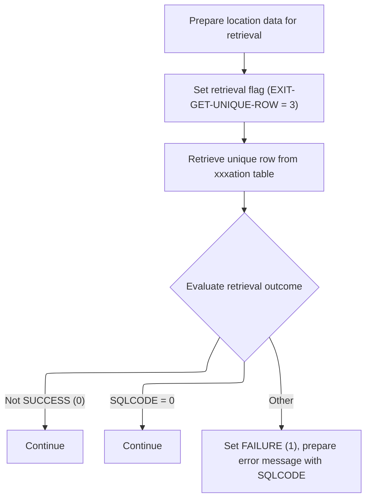
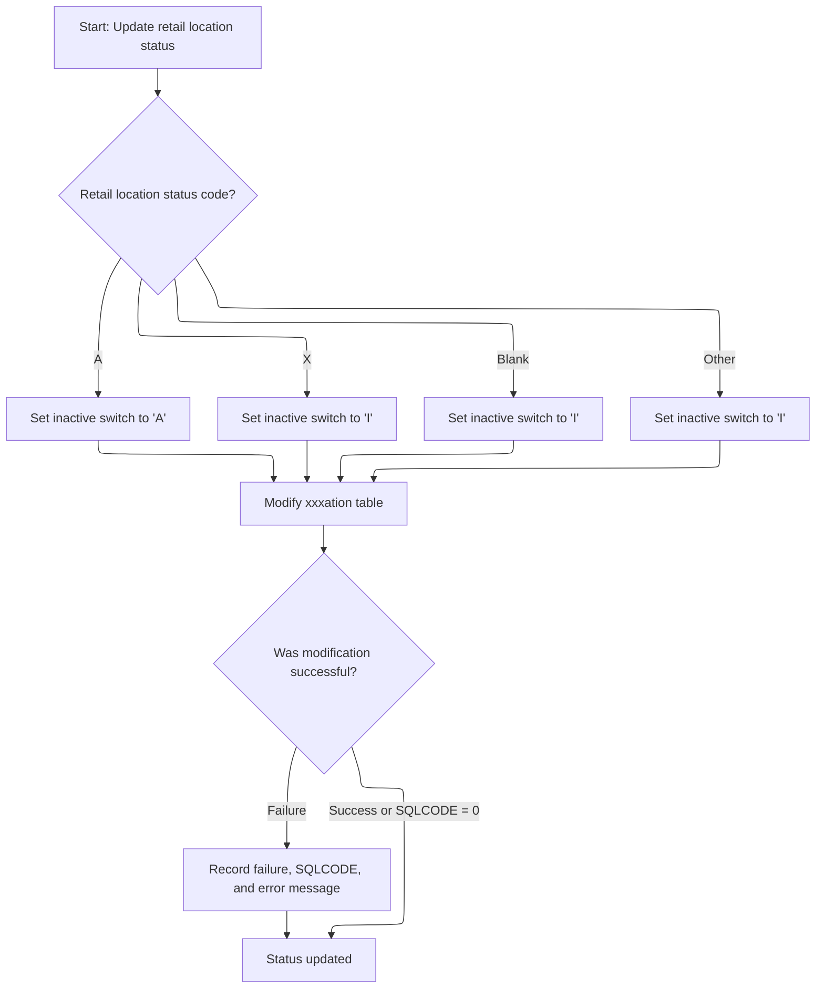

This document describes the process for updating the status of a retail location. When a status update is requested, the system retrieves the latest location data, determines the new inactive status according to business rules, and updates the location record in the database. The outcome is recorded as either a successful update or a failure.

# Spec

## Detailed View of the Program's Functionality

# a. Status Update Entry Point

The process for updating the status of a location begins with a routine that prepares the necessary exit codes to ensure the operation's state can be preserved and restored. Immediately after this preparation, the flow calls a routine responsible for retrieving the latest location data from the database. This retrieval is essential because any status update must be based on the most current data; otherwise, there is a risk of modifying outdated or missing information.

If the retrieval of the location data is successful, the flow proceeds to synchronize the status code between the in-memory data and the database. After the synchronization (or if the retrieval fails), the original exit codes are restored to maintain the correct operation state.

# b. Location Retrieval Logic

The location retrieval routine starts by initializing the data structure that will hold the location information. It then copies the location number and location type code from the current in-memory representation into the structure used for the database operation.

A flag is set to indicate that the operation is to retrieve a unique row from the location table. The actual database access is delegated to a separate data access handler (DAO), which is called with all the necessary parameters and data structures.

After the DAO call, the outcome is evaluated:

- If the operation was not successful, the flow continues without taking further action.
- If the database operation returned a success code, the flow also continues.
- For any other outcome, a failure flag is set, an error message is prepared (including the database error code), and this message is stored for later use.

# c. Status Sync and Update

Once the latest location data has been successfully retrieved, the flow moves to synchronize the status code. This involves determining the correct value for the "inactive" flag in the database based on the current status code of the location:

- If the status code indicates "Active," the inactive flag is set to indicate active.
- If the status code indicates "Inactive," is blank, or is any other value, the inactive flag is set to indicate inactive.

A flag is then set to indicate that a modification operation should be performed on the database row. The DAO is called again to apply this update.

After the update attempt, the outcome is checked:

- If the update was successful or the database returned a success code, the process continues without error.
- If there was a failure, a failure flag is set, the error code is captured, and a detailed error message is prepared and stored.

# d. DAO Delegation

All direct interactions with the database (retrieval and update) are performed by calling an external data access handler. This handler is responsible for executing the actual SQL operations, keeping the main business logic separate from the database logic. The handler is called with all relevant data structures, including the operation parameters, the SQL communication area, and the data to be read or written.

# e. Error Handling and Messaging

Throughout the flow, after each database operation, the outcome is carefully checked. If an error occurs, a failure flag is set, and a descriptive error message is constructed, often including the specific database error code. This message is stored in a designated area for later retrieval or display, ensuring that any issues can be diagnosed and addressed.

# f. Summary

The overall flow ensures that status updates to location records are always performed on the most current data, with robust error handling and clear separation between business logic and database access. The use of flags and structured messaging allows for reliable operation and easier troubleshooting.

# Rule Definition

| Paragraph Name                                                                  | Rule ID | Category          | Description                                                                                                                                                                                                                                                                                                                             | Conditions                                                                                      | Remarks                                                                                                                                                                                                                        |
| ------------------------------------------------------------------------------- | ------- | ----------------- | --------------------------------------------------------------------------------------------------------------------------------------------------------------------------------------------------------------------------------------------------------------------------------------------------------------------------------------- | ----------------------------------------------------------------------------------------------- | ------------------------------------------------------------------------------------------------------------------------------------------------------------------------------------------------------------------------------ |
| PROCEDURE DIVISION USING (lines 1198-1203)                                      | RL-001  | Data Assignment   | The status update entry point must accept five input structures: control/return area, SQL communication area, environment/configuration area, general parameters (including exit codes), and location record with keys and status code.                                                                                                 | Program is invoked (entry point called).                                                        | Input structures: XXXN001A, SQLCA, YYYN005A, NNNN0000-PARMS, P-DDDTLR01. Each structure must be passed by reference and conform to its copybook definition.                                                                    |
| 1200-EXIT-GET-UNIQUE-ROW (lines 2294-2511), 2200-GET-xxxation (lines 3814-3837) | RL-002  | Computation       | The location retrieval logic must use the location keys (LOC-NBR, LOC-TYP-CD) from the input structure to fetch the latest location data from the XXXAIL_LOC table.                                                                                                                                                                     | A status update operation is requested (EXIT-GET-UNIQUE-ROW or 2200-GET-xxxation is performed). | Keys: LOC-NBR (number), LOC-TYP-CD (string/alphanumeric). Table: XXXAIL_LOC. All fields from the table are fetched into the working area.                                                                                      |
| 1200-EXIT-GET-UNIQUE-ROW (lines 2294-2511)                                      | RL-003  | Data Assignment   | The retrieval must request a unique row and populate the output location structure with all fields from the table, including RETL-LOC-STAT-CD and INACTIVE-SW.                                                                                                                                                                          | Location retrieval is successful (SQLCODE = 0).                                                 | Output structure: P-DDDTLR01. All fields from XXXAIL_LOC are mapped to corresponding fields in the output structure.                                                                                                           |
| 2300-SYNC-STAT-CODE (lines 3843-3871)                                           | RL-004  | Conditional Logic | If retrieval succeeds, determine the new value for INACTIVE-SW based on RETL-LOC-STAT-CD: if 'A', set INACTIVE-SW to 'A'; if 'X', blank, or any other value, set INACTIVE-SW to 'I'.                                                                                                                                                    | Retrieval succeeded and status sync is required.                                                | RETL-LOC-STAT-CD: string (1 char). INACTIVE-SW: string (1 char).                                                                                                                                                               |
| 2300-SYNC-STAT-CODE (lines 3843-3871), 3000-CALL-LO-DAO (lines 3938-3945)       | RL-005  | Computation       | The update logic must always attempt to update the location record in the XXXAIL_LOC table, regardless of whether the status code or inactive switch already matches the desired value.                                                                                                                                                 | Status sync logic is performed.                                                                 | Update is performed via DAO call, regardless of data change.                                                                                                                                                                   |
| 2300-SYNC-STAT-CODE (lines 3843-3871), 120-EXIT-STUFF (lines 1756-1769)         | RL-006  | Conditional Logic | If the update succeeds (SQLCODE is 0), update the output location structure with the latest record and set the exit code in the general parameters to indicate success.                                                                                                                                                                 | SQLCODE = 0 after update.                                                                       | Output structure: P-DDDTLR01. Exit code: numeric, set to success value (typically 0).                                                                                                                                          |
| Throughout, especially 120-EXIT-STUFF (lines 1756-1769)                         | RL-007  | Data Assignment   | All error and status information must be returned in the output structures: control/return area, SQLCA, general parameters, and location record.                                                                                                                                                                                        | On any exit from the program.                                                                   | Output structures: XXXN001A, SQLCA, NNNN0000-PARMS, P-DDDTLR01. All must be updated with latest status and error information.                                                                                                  |
| Throughout, especially 120-EXIT-STUFF (lines 1756-1769)                         | RL-008  | Data Assignment   | The environment/configuration area must be passed through and updated as needed for the operation.                                                                                                                                                                                                                                      | On any operation that may affect environment/configuration.                                     | YYYN005A is passed through and may be updated (e.g., checkpoint count incremented).                                                                                                                                            |
| 1200-EXIT-GET-UNIQUE-ROW (lines 2294-2511), 2200-GET-xxxation (lines 3814-3837) | RL-009  | Conditional Logic | If retrieval fails (SQLCODE not 0), set the failure flag in the control/return area to TRUE, set the return message text to include an error message and the SQLCODE, and set the accumulated SQL code field to the SQLCODE. If SQLCODE is 100, the return message text must indicate the location was not found.                       | SQLCODE not 0 after SELECT.                                                                     | Failure flag: boolean field in the control/return area. Return message text: string field, must include the SQLCODE. SQLCODE 100: special message indicating not found. Accumulated SQL code: numeric field for SQLCODE value. |
| 2300-SYNC-STAT-CODE (lines 3843-3871)                                           | RL-010  | Conditional Logic | After the update, if the operation fails (SQLCODE not 0), set the failure flag in the control/return area to TRUE, set the return message text to include an error message and the SQLCODE, and set the accumulated SQL code field to the SQLCODE. If SQLCODE is 100, the return message text must indicate the location was not found. | SQLCODE not 0 after update.                                                                     | Failure flag: boolean field in the control/return area. Return message text: string field, must include the SQLCODE. SQLCODE 100: special message indicating not found. Accumulated SQL code: numeric field for SQLCODE value. |

# User Stories

## User Story 1: Status update entry point and data structure management

---

### Story Description:

As a system, I want to accept and update all required input and output structures for the status update operation so that all relevant data, configuration, and results are correctly managed and returned.

---

### Business Rule Mapping:

| Rule ID | Paragraph Name                                          | Rule Description                                                                                                                                                                                                                        |
| ------- | ------------------------------------------------------- | --------------------------------------------------------------------------------------------------------------------------------------------------------------------------------------------------------------------------------------- |
| RL-001  | PROCEDURE DIVISION USING (lines 1198-1203)              | The status update entry point must accept five input structures: control/return area, SQL communication area, environment/configuration area, general parameters (including exit codes), and location record with keys and status code. |
| RL-007  | Throughout, especially 120-EXIT-STUFF (lines 1756-1769) | All error and status information must be returned in the output structures: control/return area, SQLCA, general parameters, and location record.                                                                                        |
| RL-008  | Throughout, especially 120-EXIT-STUFF (lines 1756-1769) | The environment/configuration area must be passed through and updated as needed for the operation.                                                                                                                                      |

---

### Relevant Functionality:

- **PROCEDURE DIVISION USING (lines 1198-1203)**
  1. **RL-001:**
     - On program entry, expect five parameters in the following order:
       - Control/return area
       - SQL communication area
       - Environment/configuration area
       - General parameters (including exit codes)
       - Location record (with keys and status code)
- **Throughout**
  1. **RL-007:**
     - Before exit, ensure all output structures are updated with latest status and error information
  2. **RL-008:**
     - Pass YYYN005A through all subroutine calls
     - Update fields as needed (e.g., increment checkpoint count)

## User Story 2: Location status synchronization

---

### Story Description:

As a user, I want the system to retrieve the latest location record, determine the correct inactive status, and update the location record in the database so that the location status is always accurate and up-to-date.

---

### Business Rule Mapping:

| Rule ID | Paragraph Name                                                                  | Rule Description                                                                                                                                                                        |
| ------- | ------------------------------------------------------------------------------- | --------------------------------------------------------------------------------------------------------------------------------------------------------------------------------------- |
| RL-002  | 1200-EXIT-GET-UNIQUE-ROW (lines 2294-2511), 2200-GET-xxxation (lines 3814-3837) | The location retrieval logic must use the location keys (LOC-NBR, LOC-TYP-CD) from the input structure to fetch the latest location data from the XXXAIL_LOC table.                     |
| RL-003  | 1200-EXIT-GET-UNIQUE-ROW (lines 2294-2511)                                      | The retrieval must request a unique row and populate the output location structure with all fields from the table, including RETL-LOC-STAT-CD and INACTIVE-SW.                          |
| RL-004  | 2300-SYNC-STAT-CODE (lines 3843-3871)                                           | If retrieval succeeds, determine the new value for INACTIVE-SW based on RETL-LOC-STAT-CD: if 'A', set INACTIVE-SW to 'A'; if 'X', blank, or any other value, set INACTIVE-SW to 'I'.    |
| RL-005  | 2300-SYNC-STAT-CODE (lines 3843-3871), 3000-CALL-LO-DAO (lines 3938-3945)       | The update logic must always attempt to update the location record in the XXXAIL_LOC table, regardless of whether the status code or inactive switch already matches the desired value. |
| RL-006  | 2300-SYNC-STAT-CODE (lines 3843-3871), 120-EXIT-STUFF (lines 1756-1769)         | If the update succeeds (SQLCODE is 0), update the output location structure with the latest record and set the exit code in the general parameters to indicate success.                 |

---

### Relevant Functionality:

- **1200-EXIT-GET-UNIQUE-ROW (lines 2294-2511)**
  1. **RL-002:**
     - Extract LOC-NBR and LOC-TYP-CD from input structure
     - Execute SELECT ... FROM XXXAIL_LOC WHERE LOC_NBR = :LOC-NBR AND LOC_TYP_CD = :LOC-TYP-CD
     - Populate working storage and output structure with all fields from the table
  2. **RL-003:**
     - On successful SELECT, move all columns from the result set into the output structure
     - Ensure RETL-LOC-STAT-CD and INACTIVE-SW are included
- **2300-SYNC-STAT-CODE (lines 3843-3871)**
  1. **RL-004:**
     - If RETL-LOC-STAT-CD = 'A':
       - Set INACTIVE-SW to 'A'
     - Else (RETL-LOC-STAT-CD = 'X', blank, or other):
       - Set INACTIVE-SW to 'I'
  2. **RL-005:**
     - After setting INACTIVE-SW, always call the DAO update routine to update the record in XXXAIL_LOC
  3. **RL-006:**
     - If SQLCODE = 0:
       - Move latest location record to output structure
       - Set exit code in general parameters to success

## User Story 3: Error handling and reporting

---

### Story Description:

As a user, I want the system to provide clear error messages and status codes in the output structures when retrieval or update operations fail so that I can understand and respond to any issues that occur.

---

### Business Rule Mapping:

| Rule ID | Paragraph Name                                                                  | Rule Description                                                                                                                                                                                                                                                                                                                        |
| ------- | ------------------------------------------------------------------------------- | --------------------------------------------------------------------------------------------------------------------------------------------------------------------------------------------------------------------------------------------------------------------------------------------------------------------------------------- |
| RL-009  | 1200-EXIT-GET-UNIQUE-ROW (lines 2294-2511), 2200-GET-xxxation (lines 3814-3837) | If retrieval fails (SQLCODE not 0), set the failure flag in the control/return area to TRUE, set the return message text to include an error message and the SQLCODE, and set the accumulated SQL code field to the SQLCODE. If SQLCODE is 100, the return message text must indicate the location was not found.                       |
| RL-010  | 2300-SYNC-STAT-CODE (lines 3843-3871)                                           | After the update, if the operation fails (SQLCODE not 0), set the failure flag in the control/return area to TRUE, set the return message text to include an error message and the SQLCODE, and set the accumulated SQL code field to the SQLCODE. If SQLCODE is 100, the return message text must indicate the location was not found. |

---

### Relevant Functionality:

- **1200-EXIT-GET-UNIQUE-ROW (lines 2294-2511)**
  1. **RL-009:**
     - If SQLCODE = 100:
       - Set the failure flag in the control/return area to TRUE
       - Set the return message text to 'location not found'
       - Set the accumulated SQL code field to 100
     - Else if SQLCODE not 0:
       - Set the failure flag in the control/return area to TRUE
       - Set the return message text to an error message including the SQLCODE
       - Set the accumulated SQL code field to the SQLCODE
- **2300-SYNC-STAT-CODE (lines 3843-3871)**
  1. **RL-010:**
     - If SQLCODE = 100:
       - Set the failure flag in the control/return area to TRUE
       - Set the return message text to 'location not found'
       - Set the accumulated SQL code field to 100
     - Else if SQLCODE not 0:
       - Set the failure flag in the control/return area to TRUE
       - Set the return message text to an error message including the SQLCODE
       - Set the accumulated SQL code field to the SQLCODE

# Code Walkthrough

## Status Update Entry Point

<SwmSnippet path="/base/src/NNNS0488.cbl" line="3799">

---

`2100-UPD-STAT-IN-xxxation` kicks off the flow by prepping exit codes and immediately calling `2200-GET-xxxation` to pull the latest location data. We need to call `2200-GET-xxxation` here because any status update depends on having the current state of the location; otherwise, we could be modifying stale or missing data. Only if the fetch is successful do we move on to syncing the status code. The exit codes are moved in and out to preserve and restore the operation state.

```cobol
382000 2100-UPD-STAT-IN-xxxation.                                       00382000
382100     MOVE NNNN0000-EXIT-CODES TO WS-NNNN0000-EXIT-CODES           00382100
382200                                                                  00382200
382300     PERFORM 2200-GET-xxxation                                    00382300
382400     IF SUCCESS                                                   00382400
382500       PERFORM 2300-SYNC-STAT-CODE                                00382500
382600     END-IF                                                       00382600
382700                                                                  00382700
382800     MOVE WS-NNNN0000-EXIT-CODES TO NNNN0000-EXIT-CODES           00382800
382900     .                                                            00382900
```

---

</SwmSnippet>

### Location Retrieval Logic



<SwmSnippet path="/base/src/NNNS0488.cbl" line="3814">

---

`2200-GET-xxxation` sets up the location query parameters and flags that we want a unique row, then calls `3000-CALL-LO-DAO` to actually fetch the data from the database. Using the DAO keeps the database logic out of this routine. After the call, it checks for errors and sets failure info if something goes wrong.

```cobol
383500 2200-GET-xxxation.                                               00383500
383600     INITIALIZE P-DDDTLO01                                        00383600
383700     MOVE LOC-NBR                    OF DCLXXXAIL-LOC             00383700
383800       TO LOC-NBR                    OF P-DDDTLO01                00383800
383900     MOVE LOC-TYP-CD                 OF DCLXXXAIL-LOC             00383900
384000       TO LOC-TYP-CD                 OF P-DDDTLO01                00384000
384100                                                                  00384100
384200     SET EXIT-GET-UNIQUE-ROW         TO TRUE                      00384200
384300     PERFORM 3000-CALL-LO-DAO                                     00384300
384400                                                                  00384400
384500     EVALUATE TRUE                                                00384500
384600         WHEN NOT SUCCESS                                         00384600
384700           CONTINUE                                               00384700
384800         WHEN SQLCODE = 0                                         00384800
384900           CONTINUE                                               00384900
385000         WHEN OTHER                                               00385000
385100           SET FAILURE               TO TRUE                      00385100
385200           MOVE SPACES               TO IS-RTRN-MSG-TXT           00385200
385300           MOVE SQLCODE              TO WS-SQLCODE                00385300
385400           STRING 'NNNS0488 - Get unique error on xxxation table' 00385400
385500                  'SQL = ' WS-SQLCODE                             00385500
385600           DELIMITED BY SIZE INTO IS-RTRN-MSG-TXT                 00385600
385700     END-EVALUATE                                                 00385700
385800     .                                                            00385800
```

---

</SwmSnippet>

<SwmSnippet path="/base/src/NNNS0488.cbl" line="3938">

---

`3000-CALL-LO-DAO` just calls out to the NNNS0487-LO-DAO program, passing all the relevant data and parameters. This offloads the actual database work to a dedicated handler, keeping this code focused on business logic.

```cobol
396400 3000-CALL-LO-DAO.                                                00396400
396500     CALL NNNS0487-LO-DAO USING                                   00396500
396600          XXXN001A                                                00396600
396700          SQLCA                                                   00396700
396800          YYYN005A                                                00396800
396900          NNNN0000-PARMS                                          00396900
397000          P-DDDTLO01                                              00397000
397100     .                                                            00397100
```

---

</SwmSnippet>

### Status Sync and Update



<SwmSnippet path="/base/src/NNNS0488.cbl" line="3843">

---

`2300-SYNC-STAT-CODE` figures out what the new inactive flag should be based on the location status, sets the modify-row flag, and then calls `3000-CALL-LO-DAO` to push the update to the database. It checks for errors after the call and sets failure info if needed.

```cobol
386400 2300-SYNC-STAT-CODE.                                             00386400
386500     EVALUATE TRUE                                                00386500
386600       WHEN RETL-LOC-STAT-CD OF DCLXXXAIL-LOC = 'A'               00386600
386700          MOVE 'A'           TO INACTIVE-SW OF P-DDDTLO01         00386700
386800       WHEN RETL-LOC-STAT-CD OF DCLXXXAIL-LOC = 'X'               00386800
386900          MOVE 'I'           TO INACTIVE-SW OF P-DDDTLO01         00386900
387000       WHEN RETL-LOC-STAT-CD OF DCLXXXAIL-LOC = SPACES            00387000
387100          MOVE 'I'           TO INACTIVE-SW OF P-DDDTLO01         00387100
387200       WHEN OTHER                                                 00387200
387300          MOVE 'I'           TO INACTIVE-SW OF P-DDDTLO01         00387300
387400     END-EVALUATE                                                 00387400
387500                                                                  00387500
387600     SET EXIT-PUT-MODIFY-ROW         TO TRUE                      00387600
387700     PERFORM 3000-CALL-LO-DAO                                     00387700
387800                                                                  00387800
387900     EVALUATE TRUE                                                00387900
388000         WHEN NOT SUCCESS                                         00388000
388100           CONTINUE                                               00388100
388200         WHEN SQLCODE = 0                                         00388200
388300           CONTINUE                                               00388300
388400         WHEN OTHER                                               00388400
388500           SET FAILURE               TO TRUE                      00388500
388600           MOVE SPACES               TO IS-RTRN-MSG-TXT           00388600
388700           MOVE SQLCODE              TO WS-SQLCODE                00388700
388800           STRING 'NNNS0488 - Modify error on xxxation table'     00388800
388900                  'SQL = ' WS-SQLCODE                             00388900
389000           DELIMITED BY SIZE INTO IS-RTRN-MSG-TXT                 00389000
389100     END-EVALUATE                                                 00389100
389200     .                                                            00389200
```

---

</SwmSnippet>

&nbsp;

*This is an auto-generated document by Swimm 🌊 and has not yet been verified by a human*

<SwmMeta version="3.0.0" repo-id="Z2l0aHViJTNBJTNBU3dpbW1pby1keW5jYWxsLWRlbW8lM0ElM0FHaXJpLVN3aW1t" repo-name="Swimmio-dyncall-demo"><sup>Powered by [Swimm](https://app.swimm.io/)</sup></SwmMeta>
