This document describes the flow for updating the status of a retail location. The process starts with a request to change a location's status, verifies the location exists, standardizes the status, and updates the database. Only valid locations are updated, ensuring accurate status management.


# Spec

## Detailed View of the Program's Functionality

a. Starting the Status Update Flow

The process begins by preparing for a status update on a location. The program saves the current exit codes for later restoration. It then immediately initiates a fetch of the current location data from the database. This fetch is critical because it ensures the location exists and provides its current state before any status changes are attempted.

b. Fetching the Location Record

To retrieve the location, the program initializes the data structure that will hold the location information. It copies the location number and type from the input area into this structure, setting a flag to indicate that a unique row fetch is required. The program then calls a dedicated data access routine, which is responsible for interacting with the database.

c. Calling the Location DAO

The data access routine is invoked, passing all necessary data structures, including the location keys and context information. This routine is responsible for executing the database operation, such as fetching, updating, or deleting location records.

d. Dispatching Location Database Operations

Within the data access routine, the program determines which database operation to perform based on the flags set earlier. For a unique row fetch, it executes a SQL SELECT statement to retrieve all details for the specified location. The results are placed into the location structure, and a check is performed to clear out any fields that are flagged as invalid by the database (using null indicators).

e. Retrieving and Validating a Unique Location Record

The unique row fetch operation executes a SQL SELECT to pull all columns for the location into the structure. Immediately after, it checks for any columns that are flagged as null by the database. If certain fields (such as account number or type) are invalid, they are cleared to prevent invalid data from affecting later logic.

f. Fetching the Next Location Row

If the operation is to fetch the next row (for example, in a cursor-based loop), the program determines which cursor to use and fetches the next row accordingly. After fetching, it again checks for null columns and clears them as needed. If an invalid cursor is specified, it sets a failure flag and prepares an error message.

g. Modifying a Location Record

When modifying a location, the program performs a series of validation and event checks. It ensures all required fields are present and valid, gathers audit information (such as the current date and user), and checks for any business rules that must be enforced. If all checks pass, it marks the operation as a modification and proceeds to update the database.

h. Performing the Row Modification and Vendor Event Checks

Before updating the database, the program may perform additional checks related to vendor events or other business logic. If these checks pass, it updates the location record in the database and triggers any necessary downstream processes, such as denormalization or event notifications.

i. Inserting a New Location Record

For inserts, the program validates all required fields, gathers audit information, and checks for valid facility and organization IDs. If all checks pass, it inserts the new row into the database. Upon successful insertion, it marks the relevant flags and triggers denormalization and event processes.

j. Purging a Location Record

When purging (deleting) a location, the program first ensures that all related data, such as fax numbers, are also purged. It checks if the deletion is allowed, and if so, performs the delete operation. If the database reports that the record was not found, it resets the result code to avoid propagating an error.

k. Deleting a Location and Related Fax Numbers

The program opens a cursor to find all fax numbers related to the location being deleted. It loops through each fax number, purges it, and ensures the database connection is maintained. After all related data is purged, it closes the cursor.

l. Finalizing Output and Database Connections

After each operation, the program finalizes the output. If the operation was successful and not a cursor close, it copies the location data to the output area and updates a checkpoint counter. If the operation involved Oracle or certain row operations, it ensures the database connection is properly managed. Finally, it copies the SQL result code to the output area for error reporting.

m. Transferring and Normalizing Location Data

When moving data between internal and external structures, the program copies all relevant fields, applies business rules (such as clearing default dates and null times), and sets flags as needed. It also performs time conversions and, if the location is a direct store vendor, may connect to the database to check subtypes.

n. Checking Direct Store Vendor Subtype

For certain vendor types, the program checks if the location qualifies as a direct store vendor (DSV). It prepares the necessary data and calls a dedicated routine to perform the check. If the check passes, it marks the location as a DSV vendor.

o. Main Entry for Conversion and Validation Utilities

The program contains utility routines for converting and validating data, such as time and date conversions, and for checking business rules.

p. Checking Entity DSV Status

When checking if an entity (such as a product or UPC) is associated with a DSV vendor, the program determines the type of entity and performs the appropriate check. It may check both the UPC and the vendor, or the product and the vendor, depending on the context. The result is used to set flags indicating whether the entity is DSV or not.

q. Handling DAO Results in Location Fetch

After fetching a location, the program checks the result. If the fetch was not successful or the SQL code indicates an error, it sets a failure flag and prepares an error message. This ensures that errors are caught and reported before proceeding.

r. Finalizing the Status Update Flow

After fetching and validating the location, the program only proceeds with the status update if the fetch was successful. It then calls a routine to synchronize the status code, ensuring that only valid locations are updated.

s. Syncing the Location Status Code

The program translates the current status code into a standardized inactive/active flag. If the status is 'A', the location is marked as active; for any other value, it is marked as inactive. The program then marks the operation as a modification and updates the database. After the update, it checks if the operation was successful; if not, it sets a failure flag and prepares an error message. This ensures that the status update is only considered complete if the database update succeeds.

# Rule Definition

| Paragraph Name                                                                                                               | Rule ID | Category          | Description                                                                                                                                                                                                                                                 | Conditions                                                                               | Remarks                                                                                                                                                                                                                                         |
| ---------------------------------------------------------------------------------------------------------------------------- | ------- | ----------------- | ----------------------------------------------------------------------------------------------------------------------------------------------------------------------------------------------------------------------------------------------------------- | ---------------------------------------------------------------------------------------- | ----------------------------------------------------------------------------------------------------------------------------------------------------------------------------------------------------------------------------------------------- |
| 1700-CHECK-NULL-COLUMNS, 1800-EDIT-NULL-INDICATORS (NNNS0487), 1700-CHECK-NULL-COLUMNS, 1800-EDIT-NULL-INDICATORS (NNNS0488) | RL-001  | Conditional Logic | If certain key columns (such as AP_NBR, AP_TYP_CD, ASSOC-STR-NBR, ASSOC-STR-TYP-CD, RPLACD-BY-STR-NBR, ECOMM-STRT-DT, ECOMM-END-DT) are null or zero, set their null indicators to -1 and assign default values (spaces or zero) to the columns themselves. | When the relevant column is spaces or zero, or the null indicator is less than zero.     | Default values: spaces for alphanumeric fields, zero for numeric fields. Null indicator: -1 means NULL. Applies to both AP_NBR/AP_TYP_CD (NNNS0487) and ASSOC-STR-NBR/ASSOC-STR-TYP-CD/RPLACD-BY-STR-NBR/ECOMM-STRT-DT/ECOMM-END-DT (NNNS0488). |
| 110-MOVE-PDA-FIELDS-2-DCL (NNNS0487, NNNS0488)                                                                               | RL-002  | Data Assignment   | Assign default values to date and time fields if they are missing (spaces) or set to a zero constant.                                                                                                                                                       | When a date or time field is spaces or equals the zero constant (K-ZERO-DT or K-DEF-TM). | K-DEF-DT, K-ZERO-DT, K-DEF-TM, K-DB2-MAX-TM, K-ORA-MAX-TM are used as default values. Date fields are alphanumeric, time fields are 8-character strings.                                                                                        |
| 200-CHECK-VEND-IS-DSV, 300-CHECK-ENTY-IS-DSV, 315-CHECK-UPC-IS-DSV, 320-CHECK-PROD-VEND (MMMS0711)                           | RL-003  | Conditional Logic | Determine if a vendor or item is a DSV (Direct Store Vendor) by checking for the presence of a DSV sub-type in the AP_XXX_SUB_TYP table and related joins.                                                                                                  | When DSV check function is invoked and required keys are present.                        | K-DSV-LOC-SUB-TYP-CD = 'DSV  ', K-DSD-AP-TYP-CD = 'DS', K-DSD-VEND-LOC-TYP-CD = 'D '.                                                                                                                                                           |
| 1430-GET-CURRENT-VALUES, 1440-D0-MODIFY-ROW, 2030-ISSUE-EVENTS (NNNS0487, NNNS0488)                                          | RL-004  | Conditional Logic | When certain fields are changed (e.g., status, address, vendor info), trigger event management routines to propagate changes to external systems.                                                                                                           | When a tracked field is changed and the operation is successful.                         | Events are triggered via calls to ZZZS0197-EVENT-MGR or Z-EVENT-STAGER, with transaction IDs and user/program info.                                                                                                                             |
| 4500-CALL-MMMS0304-RI-DEL-CHK, 4600-CALL-MMMS0335-RI-ADD-CHK (NNNS0487, NNNS0488)                                            | RL-005  | Conditional Logic | Before deleting or modifying a record, check for referential integrity using external routines. If the check fails, prevent the operation and set an error message.                                                                                         | Before a delete or modify operation.                                                     | Calls to MMMS0304-RI-DEL-CHK and MMMS0335-RI-INSERT-CHK. Error messages are set if checks fail.                                                                                                                                                 |
| 112-MOVE-TIME-FIELDS, 132-MOVE-TIME-FIELDS (NNNS0487, NNNS0488)                                                              | RL-006  | Computation       | Convert time fields between DB2 and Oracle formats using a conversion subroutine, depending on the target database.                                                                                                                                         | When operating in Oracle mode or performing insert/modify operations.                    | Time fields are 8-character strings, timestamps are 26-character strings. Conversion uses MMMS0291 subroutine.                                                                                                                                  |
| 2000-DENORM-PROCESS, 120-EXIT-STUFF (NNNS0487, NNNS0488)                                                                     | RL-007  | Computation       | Increment checkpoint counter and update success status after successful operations, and propagate changes to external systems if required.                                                                                                                  | After a successful operation.                                                            | Checkpoint increment is typically 1. Success status is propagated to YYYN005A-CHKPT-CNT.                                                                                                                                                        |
| 1510-ADD-EDITS (NNNS0488)                                                                                                    | RL-008  | Data Assignment   | Assign default values to flag fields (e.g., status, new store, setoff room, price bulletin, etc.) if they are missing (spaces).                                                                                                                             | When a flag field is spaces.                                                             | Default values: 'X', 'Y', 'N' as appropriate for each flag.                                                                                                                                                                                     |

# User Stories

## User Story 1: Default Value Assignment and Data Integrity

---

### Story Description:

As a system, I want to automatically assign default values and set null indicators for key columns, date/time fields, and flag fields when they are missing or invalid so that data integrity is maintained and downstream processes receive consistent data.

---

### Business Rule Mapping:

| Rule ID | Paragraph Name                                                                                                               | Rule Description                                                                                                                                                                                                                                            |
| ------- | ---------------------------------------------------------------------------------------------------------------------------- | ----------------------------------------------------------------------------------------------------------------------------------------------------------------------------------------------------------------------------------------------------------- |
| RL-001  | 1700-CHECK-NULL-COLUMNS, 1800-EDIT-NULL-INDICATORS (NNNS0487), 1700-CHECK-NULL-COLUMNS, 1800-EDIT-NULL-INDICATORS (NNNS0488) | If certain key columns (such as AP_NBR, AP_TYP_CD, ASSOC-STR-NBR, ASSOC-STR-TYP-CD, RPLACD-BY-STR-NBR, ECOMM-STRT-DT, ECOMM-END-DT) are null or zero, set their null indicators to -1 and assign default values (spaces or zero) to the columns themselves. |
| RL-002  | 110-MOVE-PDA-FIELDS-2-DCL (NNNS0487, NNNS0488)                                                                               | Assign default values to date and time fields if they are missing (spaces) or set to a zero constant.                                                                                                                                                       |
| RL-008  | 1510-ADD-EDITS (NNNS0488)                                                                                                    | Assign default values to flag fields (e.g., status, new store, setoff room, price bulletin, etc.) if they are missing (spaces).                                                                                                                             |

---

### Relevant Functionality:

- **1700-CHECK-NULL-COLUMNS**
  1. **RL-001:**
     - If column is spaces or zero:
       - Set null indicator to -1
       - Set column to default (spaces or zero)
     - If null indicator < 0:
       - Set column to default (spaces or zero)
     - For date columns, if null indicator < 0, set to K-ZERO-DT
- **110-MOVE-PDA-FIELDS-2-DCL (NNNS0487**
  1. **RL-002:**
     - If date/time field is spaces or zero:
       - Assign default value (K-DEF-DT, K-DEF-TM, etc.)
     - For DB2 max time, convert to Oracle max time if needed
- **1510-ADD-EDITS (NNNS0488)**
  1. **RL-008:**
     - For each flag field:
       - If field is spaces, assign default value

## User Story 2: Time Field Conversion and Operational Success Tracking

---

### Story Description:

As a system, I want to convert time fields between database formats and increment checkpoint counters after successful operations so that data is correctly formatted for the target database and operational success is tracked.

---

### Business Rule Mapping:

| Rule ID | Paragraph Name                                                  | Rule Description                                                                                                                           |
| ------- | --------------------------------------------------------------- | ------------------------------------------------------------------------------------------------------------------------------------------ |
| RL-006  | 112-MOVE-TIME-FIELDS, 132-MOVE-TIME-FIELDS (NNNS0487, NNNS0488) | Convert time fields between DB2 and Oracle formats using a conversion subroutine, depending on the target database.                        |
| RL-007  | 2000-DENORM-PROCESS, 120-EXIT-STUFF (NNNS0487, NNNS0488)        | Increment checkpoint counter and update success status after successful operations, and propagate changes to external systems if required. |

---

### Relevant Functionality:

- **112-MOVE-TIME-FIELDS**
  1. **RL-006:**
     - If Oracle mode or insert/modify:
       - Prepare input time fields
       - Call conversion subroutine
       - On success, assign converted values
       - On failure, set error message
- **2000-DENORM-PROCESS**
  1. **RL-007:**
     - If operation successful:
       - Increment checkpoint counter
       - If required, call external sync/denorm routines

## User Story 3: System Validation and External Communication

---

### Story Description:

As a system, I want to validate DSV status, trigger event management routines, and enforce referential integrity before modifying or deleting records so that business logic is correctly applied, external systems are synchronized, and data consistency is preserved.

---

### Business Rule Mapping:

| Rule ID | Paragraph Name                                                                                     | Rule Description                                                                                                                                                    |
| ------- | -------------------------------------------------------------------------------------------------- | ------------------------------------------------------------------------------------------------------------------------------------------------------------------- |
| RL-003  | 200-CHECK-VEND-IS-DSV, 300-CHECK-ENTY-IS-DSV, 315-CHECK-UPC-IS-DSV, 320-CHECK-PROD-VEND (MMMS0711) | Determine if a vendor or item is a DSV (Direct Store Vendor) by checking for the presence of a DSV sub-type in the AP_XXX_SUB_TYP table and related joins.          |
| RL-004  | 1430-GET-CURRENT-VALUES, 1440-D0-MODIFY-ROW, 2030-ISSUE-EVENTS (NNNS0487, NNNS0488)                | When certain fields are changed (e.g., status, address, vendor info), trigger event management routines to propagate changes to external systems.                   |
| RL-005  | 4500-CALL-MMMS0304-RI-DEL-CHK, 4600-CALL-MMMS0335-RI-ADD-CHK (NNNS0487, NNNS0488)                  | Before deleting or modifying a record, check for referential integrity using external routines. If the check fails, prevent the operation and set an error message. |

---

### Relevant Functionality:

- **200-CHECK-VEND-IS-DSV**
  1. **RL-003:**
     - If vendor/item keys are present:
       - Query AP_XXX_SUB_TYP and related tables for DSV sub-type
       - If count > 0, set DSV flag to true
       - Else, set DSV flag to false
- **1430-GET-CURRENT-VALUES**
  1. **RL-004:**
     - Compare current and previous values of tracked fields
     - If changed:
       - Set event flag
       - Populate event structure with relevant data
       - Call event manager routine
- **4500-CALL-MMMS0304-RI-DEL-CHK**
  1. **RL-005:**
     - Call RI check routine before delete/modify
     - If check fails:
       - Set FAILURE flag
       - Set error message
     - Else, proceed

# Code Walkthrough

## Starting the Status Update Flow

<SwmSnippet path="/base/src/NNNS0488.cbl" line="3799">

---

In `2100-UPD-STAT-IN-xxxation` we're kicking off the status update process by copying the exit codes and immediately calling 2200-GET-xxxation. We need to call 2200-GET-xxxation here to pull the current location data from the database—without this, we can't safely proceed with any status changes because we wouldn't know if the location exists or what its current state is.

```cobol
382000 2100-UPD-STAT-IN-xxxation.                                       00382000
382100     MOVE NNNN0000-EXIT-CODES TO WS-NNNN0000-EXIT-CODES           00382100
382200                                                                  00382200
382300     PERFORM 2200-GET-xxxation                                    00382300
```

---

</SwmSnippet>

### Fetching the Location Record


<SwmSnippet path="/base/src/NNNS0488.cbl" line="3814">

---

In `2200-GET-xxxation` we're prepping the query parameters and moving the location number and type into the structure expected by the DAO. Setting EXIT-GET-UNIQUE-ROW to TRUE tells the DAO we're looking for a single, unique record. We call 3000-CALL-LO-DAO next to actually hit the database and get the data we need for this location.

```cobol
383500 2200-GET-xxxation.                                               00383500
383600     INITIALIZE P-DDDTLO01                                        00383600
383700     MOVE LOC-NBR                    OF DCLXXXAIL-LOC             00383700
383800       TO LOC-NBR                    OF P-DDDTLO01                00383800
383900     MOVE LOC-TYP-CD                 OF DCLXXXAIL-LOC             00383900
384000       TO LOC-TYP-CD                 OF P-DDDTLO01                00384000
384100                                                                  00384100
384200     SET EXIT-GET-UNIQUE-ROW         TO TRUE                      00384200
384300     PERFORM 3000-CALL-LO-DAO                                     00384300
```

---

</SwmSnippet>

#### Calling the Location DAO

<SwmSnippet path="/base/src/NNNS0488.cbl" line="3938">

---

`3000-CALL-LO-DAO` is where we actually call out to the NNNS0487-LO-DAO program, passing all the required data structures and parameters. This is the point where the database action happens. We need to call NNNS0487-LO-DAO because that's where the logic for interacting with the location data lives.

```cobol
396400 3000-CALL-LO-DAO.                                                00396400
396500     CALL NNNS0487-LO-DAO USING                                   00396500
396600          XXXN001A                                                00396600
396700          SQLCA                                                   00396700
396800          YYYN005A                                                00396800
396900          NNNN0000-PARMS                                          00396900
397000          P-DDDTLO01                                              00397000
397100     .                                                            00397100
```

---

</SwmSnippet>

#### Dispatching Location Database Operations

See <SwmLink doc-title="Coordinating Database Operation Requests">[Coordinating Database Operation Requests](\.swm\coordinating-database-operation-requests.6q2vt07n.sw.md)</SwmLink>

#### Retrieving and Validating a Unique Location Record

<SwmSnippet path="/base/src/NNNS0487.cbl" line="1530">

---

`1200-EXIT-GET-UNIQUE-ROW` runs a big SQL SELECT to pull all location details into the structure, then immediately calls 1700-CHECK-NULL-COLUMNS to blank out any fields flagged as invalid by the indicators. This keeps the data clean for later steps.

```cobol
160700 1200-EXIT-GET-UNIQUE-ROW.                                        00160700
160800     EXEC SQL                                                     00160800
160900         SELECT LOC_TYP_CD,                                       00160900
161000                LOC_NBR,                                          00161000
161100                LOC_NM,                                           00161100
161200                LOC_ABB,                                          00161200
161300                LGL_LOC_NAM,                                      00161300
161400                PRIM_CONTACT_NM,                                  00161400
161500                PRIM_ADR_1,                                       00161500
161600                PRIM_ADR_2,                                       00161600
161700                PRIM_ADR_3,                                       00161700
161800                PRIM_ADR_4,                                       00161800
161900                PRIM_CITY,                                        00161900
162000                PRIM_CITY_ID,                                     00162000
162100                PRIM_STATE_CD,                                    00162100
162200                PRIM_ZIP5_CD,                                     00162200
162300                PRIM_ZIP4_CD,                                     00162300
162400                PRIM_PHN_CNTRY_CD,                                00162400
162500                PRIM_AREA_CD,                                     00162500
162600                PRIM_PHONE_NBR,                                   00162600
162700                PRIM_CNTRY_NM,                                    00162700
162800                PRIM_CNTRY_ABB,                                   00162800
162900                SEC_LOC_NM,                                       00162900
163000                SEC_CONTACT_NM,                                   00163000
163100                SEC_ADR_1,                                        00163100
163200                SEC_ADR_2,                                        00163200
163300                SEC_ADR_3,                                        00163300
163400                SEC_ADR_4,                                        00163400
163500                SEC_CITY,                                         00163500
163600                SEC_STATE_CD,                                     00163600
163700                SEC_ZIP5_CD,                                      00163700
163800                SEC_ZIP4_CD,                                      00163800
163900                SEC_PHN_CNTRY_CD,                                 00163900
164000                SEC_AREA_CD,                                      00164000
164100                SEC_PHONE_NBR,                                    00164100
164200                SEC_CNTRY_NM,                                     00164200
164300                SEC_CNTRY_ABB,                                    00164300
164400                MAIL_TO_LOC_NM,                                   00164400
164500                MAIL_TO_CNTCT_NM,                                 00164500
164600                MAIL_TO_ADR_1,                                    00164600
164700                MAIL_TO_ADR_2,                                    00164700
164800                MAIL_TO_ADR_3,                                    00164800
164900                MAIL_TO_ADR_4,                                    00164900
165000                MAIL_TO_CITY,                                     00165000
165100                MAIL_TO_STATE_CD,                                 00165100
165200                MAIL_TO_ZIP5_CD,                                  00165200
165300                MAIL_TO_ZIP4_CD,                                  00165300
165400                MAIL_PHN_CNTRY_CD,                                00165400
165500                MAIL_TO_AREA_CD,                                  00165500
165600                MAIL_TO_PHONE_NBR,                                00165600
165700                MAIL_TO_CNTRY_NM,                                 00165700
165800                MAIL_TO_CNTRY_AB,                                 00165800
165900                CURR_FAX_ID,                                      00165900
166000                ADDED_DT,                                         00166000
166100                DELETE_DT,                                        00166100
166200                OPENED_DT,                                        00166200
166300                CLOSED_DT,                                        00166300
166400                INACTIVE_SW,                                      00166400
166500                INACTIVE_DT,                                      00166500
166600                AP_NBR,                                           00166600
166700                AP_TYP_CD,                                        00166700
166800                LST_UPDT_TS,                                      00166800
166900                LST_UPDT_USR_ID,                                  00166900
167000                PRIM_EMAIL_ID  ,                                  00167000
167100                SECY_EMAIL_ID  ,                                  00167100
167200                MAIL_TO_EMAIL_ID,                                 00167200
167300                FAC_ID,                                           00167300
167400                ORG_ID,                                           00167400
167500                B2B_PRIM_RTNG_ID,                                 00167500
167600                PRIM_CNTY_TXT,                                    00167600
167700                SECY_CNTY_TXT,                                    00167700
167800                MAIL_TO_CNTY_TXT,                                 00167800
167900                DIR_SHP_LOC_SW,                                   00167900
168000                LOC_ORD_PROCNG_DD,                                00168000
168100                ORD_PROCNG_CTOF_TM,                               00168100
168200                SCH_SHP_DD_TXT,                                   00168200
168300                FILLER1_TM,                                       00168300
168400                FILLER2_TM,                                       00168400
168500                ORD_LEAD_TM_DD,                                   00168500
168600                ORD_BUFFER_TM_DD                                  00168600
168700         INTO   :DCLXXXATION.LOC-TYP-CD,                          00168700
168800                :DCLXXXATION.LOC-NBR,                             00168800
168900                :DCLXXXATION.LOC-NM,                              00168900
169000                :DCLXXXATION.LOC-ABB,                             00169000
169100                :DCLXXXATION.LGL-LOC-NAM,                         00169100
169200                :DCLXXXATION.PRIM-CONTACT-NM,                     00169200
169300                :DCLXXXATION.PRIM-ADR-1,                          00169300
169400                :DCLXXXATION.PRIM-ADR-2,                          00169400
169500                :DCLXXXATION.PRIM-ADR-3,                          00169500
169600                :DCLXXXATION.PRIM-ADR-4,                          00169600
169700                :DCLXXXATION.PRIM-CITY,                           00169700
169800                :DCLXXXATION.PRIM-CITY-ID,                        00169800
169900                :DCLXXXATION.PRIM-STATE-CD,                       00169900
170000                :DCLXXXATION.PRIM-ZIP5-CD,                        00170000
170100                :DCLXXXATION.PRIM-ZIP4-CD,                        00170100
170200                :DCLXXXATION.PRIM-PHN-CNTRY-CD,                   00170200
170300                :DCLXXXATION.PRIM-AREA-CD,                        00170300
170400                :DCLXXXATION.PRIM-PHONE-NBR,                      00170400
170500                :DCLXXXATION.PRIM-CNTRY-NM,                       00170500
170600                :DCLXXXATION.PRIM-CNTRY-ABB,                      00170600
170700                :DCLXXXATION.SEC-LOC-NM,                          00170700
170800                :DCLXXXATION.SEC-CONTACT-NM,                      00170800
170900                :DCLXXXATION.SEC-ADR-1,                           00170900
171000                :DCLXXXATION.SEC-ADR-2,                           00171000
171100                :DCLXXXATION.SEC-ADR-3,                           00171100
171200                :DCLXXXATION.SEC-ADR-4,                           00171200
171300                :DCLXXXATION.SEC-CITY,                            00171300
171400                :DCLXXXATION.SEC-STATE-CD,                        00171400
171500                :DCLXXXATION.SEC-ZIP5-CD,                         00171500
171600                :DCLXXXATION.SEC-ZIP4-CD,                         00171600
171700                :DCLXXXATION.SEC-PHN-CNTRY-CD,                    00171700
171800                :DCLXXXATION.SEC-AREA-CD,                         00171800
171900                :DCLXXXATION.SEC-PHONE-NBR,                       00171900
172000                :DCLXXXATION.SEC-CNTRY-NM,                        00172000
172100                :DCLXXXATION.SEC-CNTRY-ABB,                       00172100
172200                :DCLXXXATION.MAIL-TO-LOC-NM,                      00172200
172300                :DCLXXXATION.MAIL-TO-CNTCT-NM,                    00172300
172400                :DCLXXXATION.MAIL-TO-ADR-1,                       00172400
172500                :DCLXXXATION.MAIL-TO-ADR-2,                       00172500
172600                :DCLXXXATION.MAIL-TO-ADR-3,                       00172600
172700                :DCLXXXATION.MAIL-TO-ADR-4,                       00172700
172800                :DCLXXXATION.MAIL-TO-CITY,                        00172800
172900                :DCLXXXATION.MAIL-TO-STATE-CD,                    00172900
173000                :DCLXXXATION.MAIL-TO-ZIP5-CD,                     00173000
173100                :DCLXXXATION.MAIL-TO-ZIP4-CD,                     00173100
173200                :DCLXXXATION.MAIL-PHN-CNTRY-CD,                   00173200
173300                :DCLXXXATION.MAIL-TO-AREA-CD,                     00173300
173400                :DCLXXXATION.MAIL-TO-PHONE-NBR,                   00173400
173500                :DCLXXXATION.MAIL-TO-CNTRY-NM,                    00173500
173600                :DCLXXXATION.MAIL-TO-CNTRY-AB,                    00173600
173700                :DCLXXXATION.CURR-FAX-ID,                         00173700
173800                :DCLXXXATION.ADDED-DT,                            00173800
173900                :DCLXXXATION.DELETE-DT,                           00173900
174000                :DCLXXXATION.OPENED-DT,                           00174000
174100                :DCLXXXATION.CLOSED-DT,                           00174100
174200                :DCLXXXATION.INACTIVE-SW,                         00174200
174300                :DCLXXXATION.INACTIVE-DT,                         00174300
174400                :DCLXXXATION.AP-NBR:WS-AP-NBR-IND,                00174400
174500                :DCLXXXATION.AP-TYP-CD:WS-AP-TYP-CD-IND,          00174500
174600                :DCLXXXATION.LST-UPDT-TS,                         00174600
174700                :DCLXXXATION.LST-UPDT-USR-ID,                     00174700
174800                :DCLXXXATION.PRIM-EMAIL-ID,                       00174800
174900                :DCLXXXATION.SECY-EMAIL-ID,                       00174900
175000                :DCLXXXATION.MAIL-TO-EMAIL-ID,                    00175000
175100                :DCLXXXATION.FAC-ID,                              00175100
175200                :DCLXXXATION.ORG-ID,                              00175200
175300                :DCLXXXATION.B2B-PRIM-RTNG-ID,                    00175300
175400                :DCLXXXATION.PRIM-CNTY-TXT,                       00175400
175500                :DCLXXXATION.SECY-CNTY-TXT,                       00175500
175600                :DCLXXXATION.MAIL-TO-CNTY-TXT,                    00175600
175700                :DCLXXXATION.DIR-SHP-LOC-SW,                      00175700
175800                :DCLXXXATION.LOC-ORD-PROCNG-DD,                   00175800
175900                :WS-ORD-PROCNG-CTOF-TM,                           00175900
176000                :DCLXXXATION.SCH-SHP-DD-TXT,                      00176000
176100                :WS-FILLER1-TS,                                   00176100
176200                :WS-FILLER2-TS,                                   00176200
176300                :DCLXXXATION.ORD-LEAD-TM-DD,                      00176300
176400                :DCLXXXATION.ORD-BUFFER-TM-DD                     00176400
176500         FROM   XXXATION                                          00176500
176600         WHERE  LOC_TYP_CD = :DCLXXXATION.LOC-TYP-CD              00176600
176700         AND    LOC_NBR = :DCLXXXATION.LOC-NBR                    00176700
176800     END-EXEC                                                     00176800
176900                                                                  00176900
177000     PERFORM 1700-CHECK-NULL-COLUMNS                              00177000
177100     .                                                            00177100
```

---

</SwmSnippet>

<SwmSnippet path="/base/src/NNNS0487.cbl" line="3079">

---

`1700-CHECK-NULL-COLUMNS` checks if either null indicator is negative, and if so, blanks out AP-TYP-CD and zeroes AP-NBR in the location structure. This is how we make sure invalid fields don't leak into later logic.

```cobol
315600 1700-CHECK-NULL-COLUMNS.                                         00315600
315700     IF WS-AP-NBR-IND    < 0                                      00315700
315800     OR WS-AP-TYP-CD-IND < 0                                      00315800
315900       MOVE SPACES TO AP-TYP-CD OF DCLXXXATION                    00315900
316000       MOVE 0      TO AP-NBR    OF DCLXXXATION                    00316000
316100     END-IF                                                       00316100
316200     .                                                            00316200
```

---

</SwmSnippet>

#### Fetching the Next Location Row

<SwmSnippet path="/base/src/NNNS0487.cbl" line="1697">

---

`1300-EXIT-GET-NEXT-ROW` uses EVALUATE to pick the right fetch routine for the cursor ID, runs the fetch, and then calls 1700-CHECK-NULL-COLUMNS to clean up any invalid fields. If the cursor ID isn't recognized, it sets a failure flag and error message.

```cobol
177400 1300-EXIT-GET-NEXT-ROW.                                          00177400
177500     EVALUATE TRUE                                                00177500
177600       WHEN DDDXLO01                                              00177600
177700         PERFORM 1301-FETCH-DDDXLO01                              00177700
177800       WHEN DDDXLO02                                              00177800
177900         PERFORM 1302-FETCH-DDDXLO02                              00177900
178000       WHEN DDDXLO03                                              00178000
178100         PERFORM 1303-FETCH-DDDXLO03                              00178100
178200       WHEN DDDXLO04                                              00178200
178300         PERFORM 1304-FETCH-DDDXLO04                              00178300
178400       WHEN DDDXLO05                                              00178400
178500         PERFORM 1305-FETCH-DDDXLO05                              00178500
178600       WHEN DDDXLO06                                              00178600
178700         PERFORM 1306-FETCH-DDDXLO06                              00178700
178800       WHEN DDDXLO07                                              00178800
178900         PERFORM 1307-FETCH-DDDXLO07                              00178900
179000       WHEN OTHER                                                 00179000
179100         SET FAILURE TO TRUE                                      00179100
179200         MOVE 'NNNS0487 - Invalid fetch cursor ID.'               00179200
179300           TO IS-RTRN-MSG-TXT OF XXXN001A                         00179300
179400     END-EVALUATE                                                 00179400
179500                                                                  00179500
179600     PERFORM 1700-CHECK-NULL-COLUMNS                              00179600
179700     .                                                            00179700
```

---

</SwmSnippet>

<SwmSnippet path="/base/src/NNNS0487.cbl" line="1723">

---

`1301-FETCH-DDDXLO01` does a big embedded SQL FETCH from the DDDXLO01 cursor, dumping all columns straight into the DCLXXXATION structure. This only works if the cursor is open and the structure matches the select list exactly.

```cobol
180000 1301-FETCH-DDDXLO01.                                             00180000
180100     EXEC SQL                                                     00180100
180200         FETCH DDDXLO01                                           00180200
180300         INTO  :DCLXXXATION.LOC-TYP-CD,                           00180300
180400               :DCLXXXATION.LOC-NBR,                              00180400
180500               :DCLXXXATION.LOC-NM,                               00180500
180600               :DCLXXXATION.LOC-ABB,                              00180600
180700               :DCLXXXATION.LGL-LOC-NAM,                          00180700
180800               :DCLXXXATION.PRIM-CONTACT-NM,                      00180800
180900               :DCLXXXATION.PRIM-ADR-1,                           00180900
181000               :DCLXXXATION.PRIM-ADR-2,                           00181000
181100               :DCLXXXATION.PRIM-ADR-3,                           00181100
181200               :DCLXXXATION.PRIM-ADR-4,                           00181200
181300               :DCLXXXATION.PRIM-CITY,                            00181300
181400               :DCLXXXATION.PRIM-CITY-ID,                         00181400
181500               :DCLXXXATION.PRIM-STATE-CD,                        00181500
181600               :DCLXXXATION.PRIM-ZIP5-CD,                         00181600
181700               :DCLXXXATION.PRIM-ZIP4-CD,                         00181700
181800               :DCLXXXATION.PRIM-PHN-CNTRY-CD,                    00181800
181900               :DCLXXXATION.PRIM-AREA-CD,                         00181900
182000               :DCLXXXATION.PRIM-PHONE-NBR,                       00182000
182100               :DCLXXXATION.PRIM-CNTRY-NM,                        00182100
182200               :DCLXXXATION.PRIM-CNTRY-ABB,                       00182200
182300               :DCLXXXATION.SEC-LOC-NM,                           00182300
182400               :DCLXXXATION.SEC-CONTACT-NM,                       00182400
182500               :DCLXXXATION.SEC-ADR-1,                            00182500
182600               :DCLXXXATION.SEC-ADR-2,                            00182600
182700               :DCLXXXATION.SEC-ADR-3,                            00182700
182800               :DCLXXXATION.SEC-ADR-4,                            00182800
182900               :DCLXXXATION.SEC-CITY,                             00182900
183000               :DCLXXXATION.SEC-STATE-CD,                         00183000
183100               :DCLXXXATION.SEC-ZIP5-CD,                          00183100
183200               :DCLXXXATION.SEC-ZIP4-CD,                          00183200
183300               :DCLXXXATION.SEC-PHN-CNTRY-CD,                     00183300
183400               :DCLXXXATION.SEC-AREA-CD,                          00183400
183500               :DCLXXXATION.SEC-PHONE-NBR,                        00183500
183600               :DCLXXXATION.SEC-CNTRY-NM,                         00183600
183700               :DCLXXXATION.SEC-CNTRY-ABB,                        00183700
183800               :DCLXXXATION.MAIL-TO-LOC-NM,                       00183800
183900               :DCLXXXATION.MAIL-TO-CNTCT-NM,                     00183900
184000               :DCLXXXATION.MAIL-TO-ADR-1,                        00184000
184100               :DCLXXXATION.MAIL-TO-ADR-2,                        00184100
184200               :DCLXXXATION.MAIL-TO-ADR-3,                        00184200
184300               :DCLXXXATION.MAIL-TO-ADR-4,                        00184300
184400               :DCLXXXATION.MAIL-TO-CITY,                         00184400
184500               :DCLXXXATION.MAIL-TO-STATE-CD,                     00184500
184600               :DCLXXXATION.MAIL-TO-ZIP5-CD,                      00184600
184700               :DCLXXXATION.MAIL-TO-ZIP4-CD,                      00184700
184800               :DCLXXXATION.MAIL-PHN-CNTRY-CD,                    00184800
184900               :DCLXXXATION.MAIL-TO-AREA-CD,                      00184900
185000               :DCLXXXATION.MAIL-TO-PHONE-NBR,                    00185000
185100               :DCLXXXATION.MAIL-TO-CNTRY-NM,                     00185100
185200               :DCLXXXATION.MAIL-TO-CNTRY-AB,                     00185200
185300               :DCLXXXATION.CURR-FAX-ID,                          00185300
185400               :DCLXXXATION.ADDED-DT,                             00185400
185500               :DCLXXXATION.DELETE-DT,                            00185500
185600               :DCLXXXATION.OPENED-DT,                            00185600
185700               :DCLXXXATION.CLOSED-DT,                            00185700
185800               :DCLXXXATION.INACTIVE-SW,                          00185800
185900               :DCLXXXATION.INACTIVE-DT,                          00185900
186000               :DCLXXXATION.AP-NBR:WS-AP-NBR-IND,                 00186000
186100               :DCLXXXATION.AP-TYP-CD:WS-AP-TYP-CD-IND,           00186100
186200               :DCLXXXATION.LST-UPDT-TS,                          00186200
186300               :DCLXXXATION.LST-UPDT-USR-ID,                      00186300
186400               :DCLXXXATION.PRIM-EMAIL-ID,                        00186400
186500               :DCLXXXATION.SECY-EMAIL-ID,                        00186500
186600               :DCLXXXATION.MAIL-TO-EMAIL-ID,                     00186600
186700               :DCLXXXATION.FAC-ID,                               00186700
186800               :DCLXXXATION.ORG-ID,                               00186800
186900               :DCLXXXATION.B2B-PRIM-RTNG-ID,                     00186900
187000               :DCLXXXATION.PRIM-CNTY-TXT,                        00187000
187100               :DCLXXXATION.SECY-CNTY-TXT,                        00187100
187200               :DCLXXXATION.MAIL-TO-CNTY-TXT,                     00187200
187300               :DCLXXXATION.DIR-SHP-LOC-SW,                       00187300
187400               :DCLXXXATION.LOC-ORD-PROCNG-DD,                    00187400
187500               :WS-ORD-PROCNG-CTOF-TM,                            00187500
187600               :DCLXXXATION.SCH-SHP-DD-TXT,                       00187600
187700               :DCLXXXATION.ORD-LEAD-TM-DD,                       00187700
187800               :DCLXXXATION.ORD-BUFFER-TM-DD                      00187800
187900     END-EXEC                                                     00187900
188000     .                                                            00188000
```

---

</SwmSnippet>

<SwmSnippet path="/base/src/NNNS0487.cbl" line="1806">

---

`1302-FETCH-DDDXLO02` does a big embedded SQL FETCH from the DDDXLO02 cursor, mapping all columns into the location structure. This only works if the structure matches the cursor's select list exactly.

```cobol
188300 1302-FETCH-DDDXLO02.                                             00188300
188400     EXEC SQL                                                     00188400
188500         FETCH DDDXLO02                                           00188500
188600         INTO  :DCLXXXATION.LOC-TYP-CD,                           00188600
188700               :DCLXXXATION.LOC-NBR,                              00188700
188800               :DCLXXXATION.LOC-NM,                               00188800
188900               :DCLXXXATION.LOC-ABB,                              00188900
189000               :DCLXXXATION.LGL-LOC-NAM,                          00189000
189100               :DCLXXXATION.PRIM-CONTACT-NM,                      00189100
189200               :DCLXXXATION.PRIM-ADR-1,                           00189200
189300               :DCLXXXATION.PRIM-ADR-2,                           00189300
189400               :DCLXXXATION.PRIM-ADR-3,                           00189400
189500               :DCLXXXATION.PRIM-ADR-4,                           00189500
189600               :DCLXXXATION.PRIM-CITY,                            00189600
189700               :DCLXXXATION.PRIM-CITY-ID,                         00189700
189800               :DCLXXXATION.PRIM-STATE-CD,                        00189800
189900               :DCLXXXATION.PRIM-ZIP5-CD,                         00189900
190000               :DCLXXXATION.PRIM-ZIP4-CD,                         00190000
190100               :DCLXXXATION.PRIM-PHN-CNTRY-CD,                    00190100
190200               :DCLXXXATION.PRIM-AREA-CD,                         00190200
190300               :DCLXXXATION.PRIM-PHONE-NBR,                       00190300
190400               :DCLXXXATION.PRIM-CNTRY-NM,                        00190400
190500               :DCLXXXATION.PRIM-CNTRY-ABB,                       00190500
190600               :DCLXXXATION.SEC-LOC-NM,                           00190600
190700               :DCLXXXATION.SEC-CONTACT-NM,                       00190700
190800               :DCLXXXATION.SEC-ADR-1,                            00190800
190900               :DCLXXXATION.SEC-ADR-2,                            00190900
191000               :DCLXXXATION.SEC-ADR-3,                            00191000
191100               :DCLXXXATION.SEC-ADR-4,                            00191100
191200               :DCLXXXATION.SEC-CITY,                             00191200
191300               :DCLXXXATION.SEC-STATE-CD,                         00191300
191400               :DCLXXXATION.SEC-ZIP5-CD,                          00191400
191500               :DCLXXXATION.SEC-ZIP4-CD,                          00191500
191600               :DCLXXXATION.SEC-PHN-CNTRY-CD,                     00191600
191700               :DCLXXXATION.SEC-AREA-CD,                          00191700
191800               :DCLXXXATION.SEC-PHONE-NBR,                        00191800
191900               :DCLXXXATION.SEC-CNTRY-NM,                         00191900
192000               :DCLXXXATION.SEC-CNTRY-ABB,                        00192000
192100               :DCLXXXATION.MAIL-TO-LOC-NM,                       00192100
192200               :DCLXXXATION.MAIL-TO-CNTCT-NM,                     00192200
192300               :DCLXXXATION.MAIL-TO-ADR-1,                        00192300
192400               :DCLXXXATION.MAIL-TO-ADR-2,                        00192400
192500               :DCLXXXATION.MAIL-TO-ADR-3,                        00192500
192600               :DCLXXXATION.MAIL-TO-ADR-4,                        00192600
192700               :DCLXXXATION.MAIL-TO-CITY,                         00192700
192800               :DCLXXXATION.MAIL-TO-STATE-CD,                     00192800
192900               :DCLXXXATION.MAIL-TO-ZIP5-CD,                      00192900
193000               :DCLXXXATION.MAIL-TO-ZIP4-CD,                      00193000
193100               :DCLXXXATION.MAIL-PHN-CNTRY-CD,                    00193100
193200               :DCLXXXATION.MAIL-TO-AREA-CD,                      00193200
193300               :DCLXXXATION.MAIL-TO-PHONE-NBR,                    00193300
193400               :DCLXXXATION.MAIL-TO-CNTRY-NM,                     00193400
193500               :DCLXXXATION.MAIL-TO-CNTRY-AB,                     00193500
193600               :DCLXXXATION.CURR-FAX-ID,                          00193600
193700               :DCLXXXATION.ADDED-DT,                             00193700
193800               :DCLXXXATION.DELETE-DT,                            00193800
193900               :DCLXXXATION.OPENED-DT,                            00193900
194000               :DCLXXXATION.CLOSED-DT,                            00194000
194100               :DCLXXXATION.INACTIVE-SW,                          00194100
194200               :DCLXXXATION.INACTIVE-DT,                          00194200
194300               :DCLXXXATION.AP-NBR:WS-AP-NBR-IND,                 00194300
194400               :DCLXXXATION.AP-TYP-CD:WS-AP-TYP-CD-IND,           00194400
194500               :DCLXXXATION.LST-UPDT-TS,                          00194500
194600               :DCLXXXATION.LST-UPDT-USR-ID,                      00194600
194700               :DCLXXXATION.PRIM-EMAIL-ID,                        00194700
194800               :DCLXXXATION.SECY-EMAIL-ID,                        00194800
194900               :DCLXXXATION.MAIL-TO-EMAIL-ID,                     00194900
195000               :DCLXXXATION.FAC-ID,                               00195000
195100               :DCLXXXATION.ORG-ID,                               00195100
195200               :DCLXXXATION.B2B-PRIM-RTNG-ID,                     00195200
195300               :DCLXXXATION.PRIM-CNTY-TXT,                        00195300
195400               :DCLXXXATION.SECY-CNTY-TXT,                        00195400
195500               :DCLXXXATION.MAIL-TO-CNTY-TXT,                     00195500
195600               :DCLXXXATION.DIR-SHP-LOC-SW,                       00195600
195700               :DCLXXXATION.LOC-ORD-PROCNG-DD,                    00195700
195800               :WS-ORD-PROCNG-CTOF-TM,                            00195800
195900               :DCLXXXATION.SCH-SHP-DD-TXT,                       00195900
196000               :DCLXXXATION.ORD-LEAD-TM-DD,                       00196000
196100               :DCLXXXATION.ORD-BUFFER-TM-DD                      00196100
196200     END-EXEC                                                     00196200
196300     .                                                            00196300
```

---

</SwmSnippet>

#### Modifying a Location Record

See <SwmLink doc-title="Modifying a Location Row">[Modifying a Location Row](\.swm\modifying-a-location-row.girxgaek.sw.md)</SwmLink>

#### Performing the Row Modification and Vendor Event Checks

See <SwmLink doc-title="Modifying master data row flow">[Modifying master data row flow](\.swm\modifying-master-data-row-flow.i300ag65.sw.md)</SwmLink>

#### Inserting a New Location Record


<SwmSnippet path="/base/src/NNNS0487.cbl" line="2487">

---

`1500-EXIT-PUT-INSERT-ROW` chains together a bunch of checks—null indicators, date/user info, county validation, facility/org ID—before actually inserting the row. Each step only runs if the previous one succeeded, so we don't try to insert bad data.

```cobol
256400 1500-EXIT-PUT-INSERT-ROW.                                        00256400
256500     PERFORM 1800-EDIT-NULL-INDICATORS                            00256500
256600     PERFORM 2040-GET-DATE-AND-USER                               00256600
256700     IF SUCCESS                                                   00256700
256800*      PERFORM 10300-CHECK-FOR-VALID-COUNTY                       00256800
256900       SET EXIT-PUT-INSERT-ROW TO TRUE                            00256900
257000       IF SUCCESS                                                 00257000
257100         PERFORM 1505-GET-FAC-ORG-ID                              00257100
257200         IF SUCCESS                                               00257200
257300           PERFORM 1510-D0-INSERT-ROW                             00257300
257400         END-IF                                                   00257400
257500       END-IF                                                     00257500
257600     END-IF                                                       00257600
257700     .                                                            00257700
```

---

</SwmSnippet>

<SwmSnippet path="/base/src/NNNS0487.cbl" line="2521">

---

`1510-D0-INSERT-ROW` sets up the new row with date/user info, cleans up low-value fields, calls the CUD routine to insert, and if SQLCODE is zero, sets a bunch of flags to mark entities as added and kicks off denormalization.

```cobol
259800 1510-D0-INSERT-ROW.                                              00259800
259900     MOVE DTA10-MM-DD-YYYY TO ADDED-DT        OF DCLXXXATION      00259900
260000     MOVE YYYC0127-TS      TO LST-UPDT-TS     OF DCLXXXATION      00260000
260100     MOVE YYYC0107-USER    TO LST-UPDT-USR-ID OF DCLXXXATION      00260100
260200     PERFORM 4010-REP-LOWVALUE-WITH-SPACES                        00260200
260300     PERFORM 5000-CALL-NNNS0487-CUD-ROUTINE                       00260300
260400                                                                  00260400
260500     IF SQLCODE = 0                                               00260500
260600       SET YYYN110A-ADD TO TRUE                                   00260600
260700       SET MMMC0265-ADD TO TRUE                                   00260700
260800       SET LOC-ADD      TO TRUE                                   00260800
260900       SET DSD-ADD      TO TRUE                                   00260900
261000       SET WHS-ADD      TO TRUE                                   00261000
261100       SET VEN-ADD      TO TRUE                                   00261100
261200       PERFORM 2000-DENORM-PROCESS                                00261200
261300     END-IF                                                       00261300
261400     .                                                            00261400
```

---

</SwmSnippet>

#### Purging a Location Record

See <SwmLink doc-title="Location Deletion Flow">[Location Deletion Flow](\.swm\location-deletion-flow.r5gvi2nl.sw.md)</SwmLink>

#### Deleting a Location and Related Fax Numbers

```mermaid
%%{init: {"flowchart": {"defaultRenderer": "elk"}} }%%
flowchart TD
    node1["Start deletion process"] --> node2["Cleanup: Purge related fax numbers"]
    click node1 openCode "base/src/NNNS0487.cbl:2954:2955"
    click node2 openCode "base/src/NNNS0487.cbl:2955:2956"
    node2 --> node3["Check if deletion is allowed"]
    click node3 openCode "base/src/NNNS0487.cbl:2957:2958"
    node3 --> node4{"Deletion check successful?"}
    click node4 openCode "base/src/NNNS0487.cbl:2958:2964"
    node4 -->|"Yes (SUCCESS)"| node5["Perform main deletion routine"]
    node4 -->|"No"| node7["End"]
    click node5 openCode "base/src/NNNS0487.cbl:2959:2961"
    node5 --> node6{"Database: No data found?"}
    click node6 openCode "base/src/NNNS0487.cbl:2961:2964"
    node6 -->|"Yes (SQLCODE = 100)"| node8["Reset database result code"]
    click node8 openCode "base/src/NNNS0487.cbl:2962:2963"
    node8 --> node7["End"]
    node6 -->|"No (SQLCODE ≠ 100)"| node7["End"]
    click node7 openCode "base/src/NNNS0487.cbl:2965:2965"
classDef HeadingStyle fill:#777777,stroke:#333,stroke-width:2px;
```



<SwmSnippet path="/base/src/NNNS0487.cbl" line="2954">

---

`1690-DELETE-LO` starts by purging related fax numbers, then checks if the location can be deleted, and if so, calls the CUD routine to do the actual delete. If SQLCODE is 100 (not found), it resets it to zero to avoid error propagation.

```cobol
303100 1690-DELETE-LO.                                                  00303100
303200     PERFORM 1691-EXIT-PUT-PURGE-FAX-NUM                          00303200
303300                                                                  00303300
303400     PERFORM 4500-CALL-MMMS0304-RI-DEL-CHK                        00303400
303500     IF SUCCESS                                                   00303500
303600        PERFORM 5000-CALL-NNNS0487-CUD-ROUTINE                    00303600
303700                                                                  00303700
303800        IF SQLCODE = 100                                          00303800
303900           MOVE 0 TO SQLCODE                                      00303900
304000        END-IF                                                    00304000
304100     END-IF                                                       00304100
304200     .                                                            00304200
```

---

</SwmSnippet>

<SwmSnippet path="/base/src/NNNS0487.cbl" line="2968">

---

`1691-EXIT-PUT-PURGE-FAX-NUM` opens a cursor for deleted fax numbers, loops through each record, purges the fax number, connects to Oracle if needed, and finally closes the cursor. This makes sure all related data is cleaned up.

```cobol
304500 1691-EXIT-PUT-PURGE-FAX-NUM.                                     00304500
304600     SET NOT-END-OF-DEL-CSR TO TRUE                               00304600
304700     PERFORM 1692-OPEN-DEL-CSR                                    00304700
304800     IF SUCCESS                                                   00304800
304900       PERFORM UNTIL END-OF-DEL-CSR OR NOT SUCCESS                00304900
305000         PERFORM 1693-FETCH-DEL-CSR                               00305000
305100         IF SUCCESS AND NOT-END-OF-DEL-CSR                        00305100
305200           PERFORM 1694-EXIT-PURGE-FAX-NUM                        00305200
305300           PERFORM 115-CONNECT-TO-ORACLE                          00305300
305400         END-IF                                                   00305400
305500       END-PERFORM                                                00305500
305600     END-IF                                                       00305600
305700     PERFORM 1695-CLOSE-DEL-CSR                                   00305700
305800     .                                                            00305800
```

---

</SwmSnippet>

#### Finalizing Output and Database Connections


<SwmSnippet path="/base/src/NNNS0487.cbl" line="1218">

---

`120-EXIT-STUFF` moves location data to the output area if we're not closing the cursor, bumps the checkpoint counter, and connects to DB2 if the exit code matches insert, purge, or modify. Finally, it copies SQLCODE to the DB2 error field.

```cobol
129500 120-EXIT-STUFF.                                                  00129500
129600     IF SUCCESS                                                   00129600
129700       IF NOT EXIT-CLOSE-CURSOR                                   00129700
129800         PERFORM 130-MOVE-DCL-2-PDA-FIELDS                        00129800
129900       END-IF                                                     00129900
130000       ADD WS-CHECKPOINT-INC TO YYYN005A-CHKPT-CNT                00130000
130100     END-IF                                                       00130100
130200     IF (YYYN005A-ORACLE       OR EXIT-PUT-INSERT-ROW             00130200
130300         OR EXIT-PUT-PURGE-ROW OR EXIT-PUT-MODIFY-ROW)            00130300
130400       PERFORM 125-CONNECT-TO-DB2                                 00130400
130500     END-IF                                                       00130500
130600     MOVE SQLCODE TO DB2-SQL-CODE                                 00130600
130700     .                                                            00130700
```

---

</SwmSnippet>

#### Transferring and Normalizing Location Data


<SwmSnippet path="/base/src/NNNS0487.cbl" line="1245">

---

`130-MOVE-DCL-2-PDA-FIELDS` copies all location fields to the output structure, blanks out default dates, sets direct ship flags, converts timestamps to times, and connects to DB2 for DSV types if needed. It also checks for null times and blanks those out.

```cobol
132200 130-MOVE-DCL-2-PDA-FIELDS.                                       00132200
132300     MOVE LOC-TYP-CD OF DCLXXXATION TO LOC-TYP-CD OF P-DDDTLO01   00132300
132400     MOVE LOC-NBR OF DCLXXXATION TO LOC-NBR OF P-DDDTLO01         00132400
132500     MOVE LOC-NM OF DCLXXXATION TO LOC-NM OF P-DDDTLO01           00132500
132600     MOVE LOC-ABB OF DCLXXXATION TO LOC-ABB OF P-DDDTLO01         00132600
132700     MOVE LGL-LOC-NAM OF DCLXXXATION TO LGL-LOC-NAM OF P-DDDTLO01 00132700
132800     MOVE PRIM-CONTACT-NM OF DCLXXXATION                          00132800
132900       TO PRIM-CONTACT-NM OF P-DDDTLO01                           00132900
133000     MOVE PRIM-ADR-1 OF DCLXXXATION TO PRIM-ADR-1 OF P-DDDTLO01   00133000
133100     MOVE PRIM-ADR-2 OF DCLXXXATION TO PRIM-ADR-2 OF P-DDDTLO01   00133100
133200     MOVE PRIM-ADR-3 OF DCLXXXATION TO PRIM-ADR-3 OF P-DDDTLO01   00133200
133300     MOVE PRIM-ADR-4 OF DCLXXXATION TO PRIM-ADR-4 OF P-DDDTLO01   00133300
133400     MOVE PRIM-CITY OF DCLXXXATION TO PRIM-CITY OF P-DDDTLO01     00133400
133500     MOVE PRIM-CITY-ID OF DCLXXXATION                             00133500
133600       TO PRIM-CITY-ID OF P-DDDTLO01                              00133600
133700     MOVE PRIM-STATE-CD OF DCLXXXATION                            00133700
133800       TO PRIM-STATE-CD OF P-DDDTLO01                             00133800
133900     MOVE PRIM-ZIP5-CD OF DCLXXXATION                             00133900
134000       TO PRIM-ZIP5-CD OF P-DDDTLO01                              00134000
134100     MOVE PRIM-ZIP4-CD OF DCLXXXATION                             00134100
134200       TO PRIM-ZIP4-CD OF P-DDDTLO01                              00134200
134300     MOVE PRIM-PHN-CNTRY-CD OF DCLXXXATION                        00134300
134400       TO PRIM-PHN-CNTRY-CD OF P-DDDTLO01                         00134400
134500     MOVE PRIM-AREA-CD OF DCLXXXATION                             00134500
134600       TO PRIM-AREA-CD OF P-DDDTLO01                              00134600
134700     MOVE PRIM-PHONE-NBR OF DCLXXXATION                           00134700
134800       TO PRIM-PHONE-NBR OF P-DDDTLO01                            00134800
134900     MOVE PRIM-CNTRY-NM OF DCLXXXATION                            00134900
135000       TO PRIM-CNTRY-NM OF P-DDDTLO01                             00135000
135100     MOVE PRIM-CNTRY-ABB OF DCLXXXATION                           00135100
135200       TO PRIM-CNTRY-ABB OF P-DDDTLO01                            00135200
135300     MOVE SEC-LOC-NM OF DCLXXXATION TO SEC-LOC-NM OF P-DDDTLO01   00135300
135400     MOVE SEC-CONTACT-NM OF DCLXXXATION                           00135400
135500       TO SEC-CONTACT-NM OF P-DDDTLO01                            00135500
135600     MOVE SEC-ADR-1 OF DCLXXXATION TO SEC-ADR-1 OF P-DDDTLO01     00135600
135700     MOVE SEC-ADR-2 OF DCLXXXATION TO SEC-ADR-2 OF P-DDDTLO01     00135700
135800     MOVE SEC-ADR-3 OF DCLXXXATION TO SEC-ADR-3 OF P-DDDTLO01     00135800
135900     MOVE SEC-ADR-4 OF DCLXXXATION TO SEC-ADR-4 OF P-DDDTLO01     00135900
136000     MOVE SEC-CITY OF DCLXXXATION TO SEC-CITY OF P-DDDTLO01       00136000
136100     MOVE SEC-STATE-CD OF DCLXXXATION                             00136100
136200       TO SEC-STATE-CD OF P-DDDTLO01                              00136200
136300     MOVE SEC-ZIP5-CD OF DCLXXXATION TO SEC-ZIP5-CD OF P-DDDTLO01 00136300
136400     MOVE SEC-ZIP4-CD OF DCLXXXATION TO SEC-ZIP4-CD OF P-DDDTLO01 00136400
136500     MOVE SEC-PHN-CNTRY-CD OF DCLXXXATION                         00136500
136600       TO SEC-PHN-CNTRY-CD OF P-DDDTLO01                          00136600
136700     MOVE SEC-AREA-CD OF DCLXXXATION TO SEC-AREA-CD OF P-DDDTLO01 00136700
136800     MOVE SEC-PHONE-NBR OF DCLXXXATION                            00136800
136900       TO SEC-PHONE-NBR OF P-DDDTLO01                             00136900
137000     MOVE SEC-CNTRY-NM OF DCLXXXATION                             00137000
137100       TO SEC-CNTRY-NM OF P-DDDTLO01                              00137100
137200     MOVE SEC-CNTRY-ABB OF DCLXXXATION                            00137200
137300       TO SEC-CNTRY-ABB OF P-DDDTLO01                             00137300
137400     MOVE MAIL-TO-LOC-NM OF DCLXXXATION                           00137400
137500       TO MAIL-TO-LOC-NM OF P-DDDTLO01                            00137500
137600     MOVE MAIL-TO-CNTCT-NM OF DCLXXXATION                         00137600
137700       TO MAIL-TO-CNTCT-NM OF P-DDDTLO01                          00137700
137800     MOVE MAIL-TO-ADR-1 OF DCLXXXATION                            00137800
137900       TO MAIL-TO-ADR-1 OF P-DDDTLO01                             00137900
138000     MOVE MAIL-TO-ADR-2 OF DCLXXXATION                            00138000
138100       TO MAIL-TO-ADR-2 OF P-DDDTLO01                             00138100
138200     MOVE MAIL-TO-ADR-3 OF DCLXXXATION                            00138200
138300       TO MAIL-TO-ADR-3 OF P-DDDTLO01                             00138300
138400     MOVE MAIL-TO-ADR-4 OF DCLXXXATION                            00138400
138500       TO MAIL-TO-ADR-4 OF P-DDDTLO01                             00138500
138600     MOVE MAIL-TO-CITY OF DCLXXXATION                             00138600
138700       TO MAIL-TO-CITY OF P-DDDTLO01                              00138700
138800     MOVE MAIL-TO-STATE-CD OF DCLXXXATION                         00138800
138900       TO MAIL-TO-STATE-CD OF P-DDDTLO01                          00138900
139000     MOVE MAIL-TO-ZIP5-CD OF DCLXXXATION                          00139000
139100       TO MAIL-TO-ZIP5-CD OF P-DDDTLO01                           00139100
139200     MOVE MAIL-TO-ZIP4-CD OF DCLXXXATION                          00139200
139300       TO MAIL-TO-ZIP4-CD OF P-DDDTLO01                           00139300
139400     MOVE MAIL-PHN-CNTRY-CD OF DCLXXXATION                        00139400
139500       TO MAIL-PHN-CNTRY-CD OF P-DDDTLO01                         00139500
139600     MOVE MAIL-TO-AREA-CD OF DCLXXXATION                          00139600
139700       TO MAIL-TO-AREA-CD OF P-DDDTLO01                           00139700
139800     MOVE MAIL-TO-PHONE-NBR OF DCLXXXATION                        00139800
139900       TO MAIL-TO-PHONE-NBR OF P-DDDTLO01                         00139900
140000     MOVE MAIL-TO-CNTRY-NM OF DCLXXXATION                         00140000
140100       TO MAIL-TO-CNTRY-NM OF P-DDDTLO01                          00140100
140200     MOVE MAIL-TO-CNTRY-AB OF DCLXXXATION                         00140200
140300       TO MAIL-TO-CNTRY-AB OF P-DDDTLO01                          00140300
140400     MOVE CURR-FAX-ID OF DCLXXXATION TO CURR-FAX-ID OF P-DDDTLO01 00140400
140500                                                                  00140500
140600     MOVE ADDED-DT OF DCLXXXATION TO ADDED-DT OF P-DDDTLO01       00140600
140700     MOVE DELETE-DT OF DCLXXXATION TO DELETE-DT OF P-DDDTLO01     00140700
140800     MOVE OPENED-DT OF DCLXXXATION TO OPENED-DT OF P-DDDTLO01     00140800
140900     MOVE CLOSED-DT OF DCLXXXATION TO CLOSED-DT OF P-DDDTLO01     00140900
141000     MOVE INACTIVE-DT OF DCLXXXATION TO INACTIVE-DT OF P-DDDTLO01 00141000
141100     IF ADDED-DT OF P-DDDTLO01 = K-DEF-DT                         00141100
141200       MOVE SPACES TO ADDED-DT OF P-DDDTLO01                      00141200
141300     END-IF                                                       00141300
141400     IF DELETE-DT OF P-DDDTLO01 = K-DEF-DT                        00141400
141500       MOVE SPACES TO DELETE-DT OF P-DDDTLO01                     00141500
141600     END-IF                                                       00141600
141700     IF OPENED-DT OF P-DDDTLO01 = K-DEF-DT                        00141700
141800       MOVE SPACES TO OPENED-DT OF P-DDDTLO01                     00141800
141900     END-IF                                                       00141900
142000     IF CLOSED-DT OF P-DDDTLO01 = K-DEF-DT                        00142000
142100       MOVE SPACES TO CLOSED-DT OF P-DDDTLO01                     00142100
142200     END-IF                                                       00142200
142300     IF INACTIVE-DT OF P-DDDTLO01 = K-DEF-DT                      00142300
142400       MOVE SPACES TO INACTIVE-DT OF P-DDDTLO01                   00142400
142500     END-IF                                                       00142500
142600                                                                  00142600
142700     MOVE INACTIVE-SW OF DCLXXXATION TO INACTIVE-SW OF P-DDDTLO01 00142700
142800     MOVE AP-NBR OF DCLXXXATION TO AP-NBR OF P-DDDTLO01           00142800
142900     MOVE AP-TYP-CD OF DCLXXXATION TO AP-TYP-CD OF P-DDDTLO01     00142900
143000                                                                  00143000
143100     MOVE LST-UPDT-TS OF DCLXXXATION TO LST-UPDT-TS OF P-DDDTLO01 00143100
143200     MOVE LST-UPDT-USR-ID OF DCLXXXATION                          00143200
143300       TO LST-UPDT-USR-ID OF P-DDDTLO01                           00143300
143400     MOVE PRIM-EMAIL-ID    OF DCLXXXATION                         00143400
143500       TO PRIM-EMAIL-ID    OF P-DDDTLO01                          00143500
143600     MOVE SECY-EMAIL-ID    OF DCLXXXATION                         00143600
143700       TO SECY-EMAIL-ID    OF P-DDDTLO01                          00143700
143800     MOVE MAIL-TO-EMAIL-ID OF DCLXXXATION                         00143800
143900       TO MAIL-TO-EMAIL-ID OF P-DDDTLO01                          00143900
144000     MOVE FAC-ID           OF DCLXXXATION                         00144000
144100       TO FAC-ID           OF P-DDDTLO01                          00144100
144200     MOVE ORG-ID           OF DCLXXXATION                         00144200
144300       TO ORG-ID           OF P-DDDTLO01                          00144300
144400     MOVE B2B-PRIM-RTNG-ID OF DCLXXXATION                         00144400
144500       TO B2B-PRIM-RTNG-ID OF P-DDDTLO01                          00144500
144600     MOVE PRIM-CNTY-TXT    OF DCLXXXATION                         00144600
144700       TO PRIM-CNTY-TXT    OF P-DDDTLO01                          00144700
144800     MOVE SECY-CNTY-TXT    OF DCLXXXATION                         00144800
144900       TO SECY-CNTY-TXT    OF P-DDDTLO01                          00144900
145000     MOVE MAIL-TO-CNTY-TXT OF DCLXXXATION                         00145000
145100       TO MAIL-TO-CNTY-TXT OF P-DDDTLO01                          00145100
145200                                                                  00145200
145300     MOVE DIR-SHP-LOC-SW   OF DCLXXXATION                         00145300
145400       TO DIR-SHP-LOC-SW   OF P-DDDTLO01                          00145400
145500     IF NOT LOC-IS-DIRECT-SHIP OF P-DDDTLO01                      00145500
145600       SET LOC-IS-NOT-DIRECT-SHIP OF P-DDDTLO01 TO TRUE           00145600
145700     END-IF                                                       00145700
145800                                                                  00145800
145900     MOVE LOC-ORD-PROCNG-DD  OF DCLXXXATION                       00145900
146000       TO LOC-ORD-PROCNG-DD  OF P-DDDTLO01                        00146000
146100                                                                  00146100
146200*    MOVE WS-CURRENT-DATE-DATA                                    00146200
146300*      TO WS-CURRENT-DATE-DATA1                                   00146300
146400*    MOVE WS-CURRENT-TIME  OF   WS-CURRENT-DATE-DATA1             00146400
146500*      TO ORD-PROCNG-CTOF-TM OF P-DDDTLO01                        00146500
146600*     MOVE ORD-PROCNG-CTOF-TM OF DCLXXXATION                      00146600
146700*       TO ORD-PROCNG-CTOF-TM OF P-DDDTLO01                       00146700
146800                                                                  00146800
146900     IF ORD-PROCNG-CTOF-TM OF P-DDDTLO01 = WS-NULL-TM             00146900
147000       MOVE SPACES TO ORD-PROCNG-CTOF-TM OF P-DDDTLO01            00147000
147100     END-IF                                                       00147100
147200                                                                  00147200
147300     MOVE SCH-SHP-DD-TXT     OF DCLXXXATION                       00147300
147400       TO SCH-SHP-DD-TXT     OF P-DDDTLO01                        00147400
147500     PERFORM 116-EDIT-SHIP-DAYS                                   00147500
147600     MOVE ORD-LEAD-TM-DD     OF DCLXXXATION                       00147600
147700       TO ORD-LEAD-TM-DD     OF P-DDDTLO01                        00147700
147800                                                                  00147800
147900     MOVE ORD-BUFFER-TM-DD   OF DCLXXXATION                       00147900
148000       TO ORD-BUFFER-TM-DD   OF P-DDDTLO01                        00148000
148100                                                                  00148100
148200     PERFORM 132-CONVERT-TS-TO-TM                                 00148200
148300     IF SUCCESS                                                   00148300
148400       MOVE ORD-PROCNG-CTOF-TM OF DCLXXXATION                     00148400
148500         TO ORD-PROCNG-CTOF-TM OF P-DDDTLO01                      00148500
148600     END-IF                                                       00148600
148700                                                                  00148700
148800     IF LOC-TYP-CD OF DCLXXXATION = K-DSD-VEND-LOC-TYPE           00148800
148900     AND SUCCESS AND YYYN005A-CICS-ENV                            00148900
149000       PERFORM 125-CONNECT-TO-DB2                                 00149000
149100       IF SUCCESS                                                 00149100
149200          PERFORM 10200-CHECK-DSV-LOC-SUB-TYP                     00149200
149300       END-IF                                                     00149300
149400     END-IF                                                       00149400
149500     .                                                            00149500
```

---

</SwmSnippet>

<SwmSnippet path="/base/src/NNNS0487.cbl" line="1421">

---

`132-CONVERT-TS-TO-TM` checks if we're on Oracle or doing a modify/insert, sets up arrays for the conversion, flags the conversion type, and calls MMMS0291 to do the actual timestamp-to-time conversion. If it works, it copies the results back into the location structure.

```cobol
149800 132-CONVERT-TS-TO-TM.                                            00149800
149900     IF (YYYN005A-ORACLE OR EXIT-PUT-MODIFY-ROW                   00149900
150000         OR EXIT-PUT-INSERT-ROW)                                  00150000
150100       INITIALIZE MMMC0291-INPUT-TM                               00150100
150200                  MMMC0291-INPUT-TS                               00150200
150300                                                                  00150300
150400       MOVE WS-ORD-PROCNG-CTOF-TM                                 00150400
150500         TO WS-TIMSTAMP-INOUT-CONV(1)                             00150500
150600       MOVE WS-FILLER1-TS                                         00150600
150700         TO WS-TIMSTAMP-INOUT-CONV(2)                             00150700
150800       MOVE WS-FILLER2-TS                                         00150800
150900         TO WS-TIMSTAMP-INOUT-CONV(3)                             00150900
151000                                                                  00151000
151100       SET MMMC0291-CVT-TS-TO-TM  TO TRUE                         00151100
151200       CALL WS-MMMS0291-PGM USING                                 00151200
151300                          XXXN001A                                00151300
151400                          MMMC0291                                00151400
151500       IF SUCCESS                                                 00151500
151600         MOVE WS-TIME-INOUT-CONV(1)                               00151600
151700           TO ORD-PROCNG-CTOF-TM OF DCLXXXATION                   00151700
151800         MOVE WS-TIMSTAMP-INOUT-CONV(2)                           00151800
151900           TO FILLER1-TM OF DCLXXXATION                           00151900
152000         MOVE WS-TIMSTAMP-INOUT-CONV(3)                           00152000
152100           TO FILLER2-TM OF DCLXXXATION                           00152100
152200       END-IF                                                     00152200
152300     END-IF                                                       00152300
152400     .                                                            00152400
```

---

</SwmSnippet>

#### Checking Direct Store Vendor Subtype


<SwmSnippet path="/base/src/NNNS0487.cbl" line="3437">

---

`10200-CHECK-DSV-LOC-SUB-TYP` moves location info into the MMMS0711 structure, flags the check type, and calls MMMS0711-DSV-CHECK to see if the vendor is DSV. If the check passes, it sets the IS-DSV-VEND flag.

```cobol
351400 10200-CHECK-DSV-LOC-SUB-TYP.                                     00351400
351500     MOVE LOC-NBR    OF DCLXXXATION TO MMMC0711-I-VEND-NBR        00351500
351600     MOVE LOC-TYP-CD OF DCLXXXATION TO MMMC0711-I-VEND-TYP-CD     00351600
351700     SET VEND-IS-NOT-DSV            TO TRUE                       00351700
351800     SET MMMC0711-IS-DSV-FUNC       TO TRUE                       00351800
351900                                                                  00351900
352000     CALL MMMS0711-DSV-CHECK USING                                00352000
352100          XXXN001A                                                00352100
352200          MMMC0711                                                00352200
352300     IF SUCCESS AND VEND-IS-DSV                                   00352300
352400        SET IS-DSV-VEND TO TRUE                                   00352400
352500     END-IF                                                       00352500
352600     .                                                            00352600
```

---

</SwmSnippet>

#### Main Entry for Conversion and Validation Utilities

See <SwmLink doc-title="Validating Vendor or Entity and Determining DSV Status">[Validating Vendor or Entity and Determining DSV Status](\.swm\validating-vendor-or-entity-and-determining-dsv-status.1obpnxax.sw.md)</SwmLink>

#### Checking Entity DSV Status


<SwmSnippet path="/base/src/MMMS0711.cbl" line="207">

---

`300-CHECK-ENTY-IS-DSV` uses EVALUATE to pick the right check based on item key code—UPC or product vendor—then runs the corresponding logic. If the code isn't recognized, nothing happens.

```cobol
021500 300-CHECK-ENTY-IS-DSV.                                           00022100
021600      EVALUATE TRUE                                               00022200
021700        WHEN ( DSD-ITEM-KEY-CD OR UPC-ITEM-KEY-CD )               00022300
021800          PERFORM 310-CHECK-UPC-VEND                              00022400
021900                                                                  00022500
022000        WHEN PRD-ITEM-KEY-CD                                      00022600
022100          PERFORM 320-CHECK-PROD-VEND                             00022700
022200      END-EVALUATE                                                00022800
022300      .                                                           00022900
```

---

</SwmSnippet>

<SwmSnippet path="/base/src/MMMS0711.cbl" line="219">

---

`310-CHECK-UPC-VEND` moves entity and vendor info into local structures, runs the UPC check, and if that passes, checks the vendor DSV status. This way, we only validate the vendor if the UPC is good.

```cobol
022700 310-CHECK-UPC-VEND.                                              00023300
022800     MOVE MMMC0711-I-ENTY-ID      TO ITM-ID     OF DCLXXXD-LOC-ITM00023400
022900     MOVE MMMC0711-I-VEND-NBR     TO LOC-NBR    OF DCLXXXATION    00023500
023000     MOVE MMMC0711-I-VEND-TYP-CD                                  00023600
023100                                  TO LOC-TYP-CD OF DCLXXXATION    00023700
023200                                                                  00023800
023300     PERFORM 315-CHECK-UPC-IS-DSV                                 00023900
023400     IF SUCCESS                                                   00024000
023500       PERFORM 200-CHECK-VEND-IS-DSV                              00024100
023600     END-IF                                                       00024200
023700     .                                                            00024300
```

---

</SwmSnippet>

<SwmSnippet path="/base/src/MMMS0711.cbl" line="324">

---

`320-CHECK-PROD-VEND` moves entity and vendor info into local structures, then runs one of two SQL queries depending on vendor number. If the count is positive, it sets the DSV flag; if not, it sets the not-DSV flag. SQL errors trigger a failure and error message.

```cobol
033200 320-CHECK-PROD-VEND.                                             00033800
033300     MOVE MMMC0711-I-ENTY-ID  TO PROD-ID    OF DCLPROD-ITEM       00033900
033400     MOVE MMMC0711-I-VEND-NBR TO LOC-NBR    OF DCLXXXATION        00034000
033500                                 AP-NBR     OF DCLAP-XXX-SUB-TYP  00034100
033600     MOVE MMMC0711-I-VEND-TYP-CD                                  00034200
033700                              TO LOC-TYP-CD OF DCLXXXATION        00034300
033800                                                                  00034400
033900     IF MMMC0711-I-VEND-NBR > 0                                   00034500
034000       EXEC SQL                                                   00034600
034100           SELECT COUNT (*)                                       00034700
034200             INTO :WS-CNT                                         00034800
034300             FROM AP_XXX_SUB_TYP SUB ,                            00034900
034400                  XXXD_LOC_ITM VLI,                               00035000
034500                  XXXATION LOC,                                   00035100
034600                  PROD_ITEM PI                                    00035200
034700           WHERE SUB.AP_SUB_TYP_CD   = :K-DSV-LOC-SUB-TYP-CD      00035300
034800             AND SUB.AP_NBR          = LOC.AP_NBR                 00035400
034900             AND SUB.AP_TYP_CD       = LOC.AP_TYP_CD              00035500
035000             AND VLI.VEND_LOC_NBR    = LOC.LOC_NBR                00035600
035100             AND VLI.VEND_LOC_TYP_CD = LOC.LOC_TYP_CD             00035700
035200             AND LOC.LOC_NBR         = :DCLXXXATION.LOC-NBR       00035800
035300             AND LOC.LOC_TYP_CD      = :DCLXXXATION.LOC-TYP-CD    00035900
035400             AND VLI.ITM_ID          = PI.ITM_ID                  00036000
035500             AND VLI.ITM_KEY_TYP_CD  = PI.ITM_KEY_TYP_CD          00036100
035600             AND PI.PROD_ID          = :DCLPROD-ITEM.PROD-ID      00036200
035700       END-EXEC                                                   00036300
035800     ELSE                                                         00036400
035900       EXEC SQL                                                   00036500
036000           SELECT COUNT (*)                                       00036600
036100             INTO :WS-CNT                                         00036700
036200             FROM AP_XXX_SUB_TYP SUB ,                            00036800
036300                  XXXD_LOC_ITM VLI,                               00036900
036400                  PROD_ITEM PI                                    00037000
036500           WHERE SUB.AP_SUB_TYP_CD   = :K-DSV-LOC-SUB-TYP-CD      00037100
036600             AND VLI.VEND_LOC_NBR    = SUB.AP_NBR                 00037200
036700             AND VLI.VEND_LOC_TYP_CD = :K-DSD-VEND-LOC-TYP-CD     00037300
036800             AND VLI.ITM_ID          = PI.ITM_ID                  00037400
036900             AND VLI.ITM_KEY_TYP_CD  = PI.ITM_KEY_TYP_CD          00037500
037000             AND PI.PROD_ID          = :DCLPROD-ITEM.PROD-ID      00037600
037100       END-EXEC                                                   00037700
037200     END-IF                                                       00037800
037300                                                                  00037900
037400     EVALUATE TRUE                                                00038000
037500       WHEN SQLCODE = 0                                           00038100
037600         IF WS-CNT > 0                                            00038200
037700           SET ENTY-IS-DSV TO TRUE                                00038300
037800         ELSE                                                     00038400
037900           SET ENTY-IS-NOT-DSV TO TRUE                            00038500
038000         END-IF                                                   00038600
038100       WHEN SQLCODE NOT = 0                                       00038700
038200         SET  FAILURE TO TRUE                                     00038800
038300         MOVE SPACES  TO IS-RTRN-MSG-TXT                          00038900
038400         MOVE SQLCODE TO WS-SQLCODE                               00039000
038500         STRING 'MMMS0711 - Error checking SUB/VLI, '             00039100
038600                'RC=' WS-SQLCODE '.'                              00039200
038700                DELIMITED BY SIZE INTO IS-RTRN-MSG-TXT            00039300
038800     END-EVALUATE                                                 00039400
038900     .                                                            00039500
```

---

</SwmSnippet>

#### Handling DAO Results in Location Fetch

<SwmSnippet path="/base/src/NNNS0488.cbl" line="3824">

---

Back in `2200-GET-xxxation`, after returning from 3000-CALL-LO-DAO, we check the result. If the call wasn't successful or SQLCODE isn't zero, we set a failure flag and build an error message. This is where we handle any issues from the DAO call before moving on.

```cobol
384500     EVALUATE TRUE                                                00384500
384600         WHEN NOT SUCCESS                                         00384600
384700           CONTINUE                                               00384700
384800         WHEN SQLCODE = 0                                         00384800
384900           CONTINUE                                               00384900
385000         WHEN OTHER                                               00385000
385100           SET FAILURE               TO TRUE                      00385100
385200           MOVE SPACES               TO IS-RTRN-MSG-TXT           00385200
385300           MOVE SQLCODE              TO WS-SQLCODE                00385300
385400           STRING 'NNNS0488 - Get unique error on xxxation table' 00385400
385500                  'SQL = ' WS-SQLCODE                             00385500
385600           DELIMITED BY SIZE INTO IS-RTRN-MSG-TXT                 00385600
385700     END-EVALUATE                                                 00385700
```

---

</SwmSnippet>

### Finalizing the Status Update Flow

<SwmSnippet path="/base/src/NNNS0488.cbl" line="3803">

---

Back in `2100-UPD-STAT-IN-xxxation`, after returning from 2200-GET-xxxation, we only move forward if the fetch was successful. If so, we call 2300-SYNC-STAT-CODE to actually update the status in the database. This keeps us from trying to update a location that doesn't exist or had an error.

```cobol
382400     IF SUCCESS                                                   00382400
382500       PERFORM 2300-SYNC-STAT-CODE                                00382500
382600     END-IF                                                       00382600
382700                                                                  00382700
382800     MOVE WS-NNNN0000-EXIT-CODES TO NNNN0000-EXIT-CODES           00382800
382900     .                                                            00382900
```

---

</SwmSnippet>

## Syncing the Location Status Code


<SwmSnippet path="/base/src/NNNS0488.cbl" line="3843">

---

In `2300-SYNC-STAT-CODE` we're translating the current location status code into the INACTIVE-SW field. If the status is 'A', we keep it active ('A'); for anything else—including 'X', blank, or any other value—we set it to inactive ('I'). This standardizes the status for the update operation, so later logic doesn't have to handle multiple codes.

```cobol
386400 2300-SYNC-STAT-CODE.                                             00386400
386500     EVALUATE TRUE                                                00386500
386600       WHEN RETL-LOC-STAT-CD OF DCLXXXAIL-LOC = 'A'               00386600
386700          MOVE 'A'           TO INACTIVE-SW OF P-DDDTLO01         00386700
386800       WHEN RETL-LOC-STAT-CD OF DCLXXXAIL-LOC = 'X'               00386800
386900          MOVE 'I'           TO INACTIVE-SW OF P-DDDTLO01         00386900
387000       WHEN RETL-LOC-STAT-CD OF DCLXXXAIL-LOC = SPACES            00387000
387100          MOVE 'I'           TO INACTIVE-SW OF P-DDDTLO01         00387100
387200       WHEN OTHER                                                 00387200
387300          MOVE 'I'           TO INACTIVE-SW OF P-DDDTLO01         00387300
387400     END-EVALUATE                                                 00387400
```

---

</SwmSnippet>

<SwmSnippet path="/base/src/NNNS0488.cbl" line="3855">

---

After setting INACTIVE-SW, we set the EXIT-PUT-MODIFY-ROW flag and call 3000-CALL-LO-DAO. This is what actually sends the update to the database—without this, the status change is just in memory and doesn't affect the real data.

```cobol
387600     SET EXIT-PUT-MODIFY-ROW         TO TRUE                      00387600
387700     PERFORM 3000-CALL-LO-DAO                                     00387700
```

---

</SwmSnippet>

<SwmSnippet path="/base/src/NNNS0488.cbl" line="3858">

---

After coming back from 3000-CALL-LO-DAO in `2300-SYNC-STAT-CODE`, we check if the update worked. If not, we set FAILURE, clear the return message, copy the SQLCODE, and build an error message. This stops the flow if the database update didn't go through.

```cobol
387900     EVALUATE TRUE                                                00387900
388000         WHEN NOT SUCCESS                                         00388000
388100           CONTINUE                                               00388100
388200         WHEN SQLCODE = 0                                         00388200
388300           CONTINUE                                               00388300
388400         WHEN OTHER                                               00388400
388500           SET FAILURE               TO TRUE                      00388500
388600           MOVE SPACES               TO IS-RTRN-MSG-TXT           00388600
388700           MOVE SQLCODE              TO WS-SQLCODE                00388700
388800           STRING 'NNNS0488 - Modify error on xxxation table'     00388800
388900                  'SQL = ' WS-SQLCODE                             00388900
389000           DELIMITED BY SIZE INTO IS-RTRN-MSG-TXT                 00389000
389100     END-EVALUATE                                                 00389100
```

---

</SwmSnippet>

&nbsp;

*This is an auto-generated document by Swimm 🌊 and has not yet been verified by a human*

<SwmMeta version="3.0.0" repo-id="Z2l0aHViJTNBJTNBU3dpbW1pby1keW5jYWxsLWRlbW8lM0ElM0FHaXJpLVN3aW1t" repo-name="Swimmio-dyncall-demo"><sup>Powered by [Swimm](https://app.swimm.io/)</sup></SwmMeta>
