# Overview

This document describes the flow for handling store-related database operations. The flow prepares and normalizes store data, manages database connections, and dispatches requests for store record retrieval and updates, ensuring consistent transaction state and connection management.

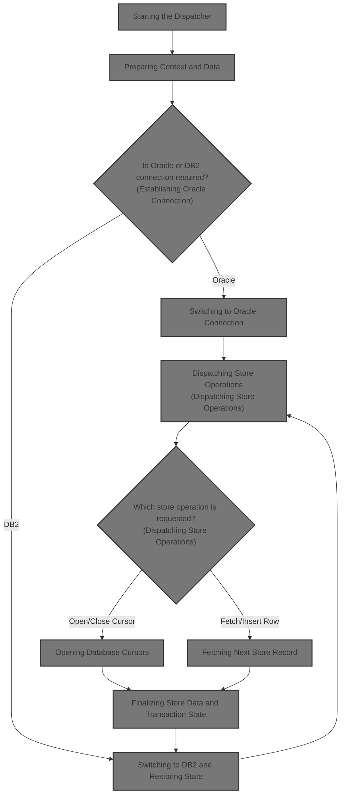

## Dependencies

### Programs

- <SwmToken path="base/src/NNNS0120.cbl" pos="1877:5:5" line-data="189800       STRING &#39;NNNS0120 - Error connecting to Oracle. Sqlcode =&#39;  00189800">`NNNS0120`</SwmToken> (<SwmPath>[base/src/NNNS0120.cbl](base/src/NNNS0120.cbl)</SwmPath>)
- <SwmToken path="base/src/XXXS0210.cbl" pos="2:7:7" line-data="000200 PROGRAM-ID.    YYYS0210.                                         00000200">`YYYS0210`</SwmToken> (<SwmPath>[base/src/XXXS0210.cbl](base/src/XXXS0210.cbl)</SwmPath>)
- <SwmToken path="base/src/XXXS0210.cbl" pos="55:4:4" line-data="007540     CALL YYYS0220-DBMS-CON-MGR USING                             00007540">`YYYS0220`</SwmToken> (<SwmPath>[base/src/YYYS0220.cbl](base/src/YYYS0220.cbl)</SwmPath>)
- <SwmToken path="base/src/YYYS0211.cbl" pos="2:7:7" line-data="000200 PROGRAM-ID.    YYYS0211.                                         00000200">`YYYS0211`</SwmToken> (<SwmPath>[base/src/YYYS0211.cbl](base/src/YYYS0211.cbl)</SwmPath>)
- <SwmToken path="base/src/YYYS0212.cbl" pos="96:9:9" line-data="010300         STRING &#39;Error in YYYS0212. Oracle code:&#39;                 00010300">`YYYS0212`</SwmToken> (<SwmPath>[base/src/YYYS0212.cbl](base/src/YYYS0212.cbl)</SwmPath>)
- <SwmToken path="base/src/NNNS0120.cbl" pos="24:4:4" line-data="004500 01 MMMS0304-RI-DEL-CHK                PIC X(8) VALUE &#39;MMMS0304&#39;. 00004500">`MMMS0304`</SwmToken>
- <SwmToken path="base/src/NNNS0120.cbl" pos="3950:8:8" line-data="397100     PERFORM 5000-CALL-NNNU0120-CUD-ROUTINE                       00397100">`NNNU0120`</SwmToken>

### Copybooks

- SQLCA
- <SwmToken path="base/src/XXXS0210.cbl" pos="56:2:2" line-data="007550         XXXN001A                                                 00007550">`XXXN001A`</SwmToken> (<SwmPath>[base/src/XXXN001A.cpy](base/src/XXXN001A.cpy)</SwmPath>)
- <SwmToken path="base/src/XXXS0210.cbl" pos="53:4:4" line-data="007510     SET YYYC0220-SET-ORACLE-CON TO TRUE                          00007510">`YYYC0220`</SwmToken> (<SwmPath>[base/src/YYYC0220.cpy](base/src/YYYC0220.cpy)</SwmPath>)
- <SwmToken path="base/src/NNNS0120.cbl" pos="30:4:4" line-data="005100 COPY YYYN000A.                                                   00005100">`YYYN000A`</SwmToken> (<SwmPath>[base/src/YYYN000A.cpy](base/src/YYYN000A.cpy)</SwmPath>)
- <SwmToken path="base/src/NNNS0120.cbl" pos="28:4:4" line-data="004900 COPY NNNN000U.                                                   00004900">`NNNN000U`</SwmToken> (<SwmPath>[base/src/NNNN000U.cpy](base/src/NNNN000U.cpy)</SwmPath>)
- <SwmToken path="base/src/NNNS0120.cbl" pos="29:4:4" line-data="005000 COPY HHHTRL01.                                                   00005000">`HHHTRL01`</SwmToken> (<SwmPath>[base/src/HHHTRL01.cpy](base/src/HHHTRL01.cpy)</SwmPath>)
- <SwmToken path="base/src/NNNS0120.cbl" pos="31:4:4" line-data="005200 COPY MMMC0304.                                                   00005200">`MMMC0304`</SwmToken> (<SwmPath>[base/src/MMMC0304.cpy](base/src/MMMC0304.cpy)</SwmPath>)
- <SwmToken path="base/src/NNNS0120.cbl" pos="1693:12:12" line-data="171400     MOVE NNNN0000-INDEX-HANDLE TO DDDTRL01-INDEX-HANDLE          00171400">`DDDTRL01`</SwmToken> (<SwmPath>[base/src/DDDTRL01.cpy](base/src/DDDTRL01.cpy)</SwmPath>)
- <SwmToken path="base/src/NNNS0120.cbl" pos="1692:4:4" line-data="171300     INITIALIZE W00N001A                                          00171300">`W00N001A`</SwmToken>
- <SwmToken path="base/src/NNNS0120.cbl" pos="1701:5:5" line-data="172200     IF (YYYN005A-ORACLE       OR EXIT-PUT-INSERT-ROW             00172200">`YYYN005A`</SwmToken> (<SwmPath>[base/src/YYYN005A.cpy](base/src/YYYN005A.cpy)</SwmPath>)
- <SwmToken path="base/src/NNNS0120.cbl" pos="1693:4:4" line-data="171400     MOVE NNNN0000-INDEX-HANDLE TO DDDTRL01-INDEX-HANDLE          00171400">`NNNN0000`</SwmToken> (<SwmPath>[base/src/NNNN0000.cpy](base/src/NNNN0000.cpy)</SwmPath>)
- <SwmToken path="base/src/NNNS0120.cbl" pos="1648:4:4" line-data="166900 COPY PPPTRL01.                                                   00166900">`PPPTRL01`</SwmToken> (<SwmPath>[base/src/PPPTRL01.cpy](base/src/PPPTRL01.cpy)</SwmPath>)

# Where is this program used?

This program is used once, as represented in the following diagram:

```mermaid
graph TD
  avz1v("Synchronizing Store Class Zones (MMMS0161)") --> 8ilxd("Retrieving Store Details (NNNS0120)"):::currentEntity
click avz1v openCode "base/src/MMMS0161.cbl:1"
  
  
click 8ilxd openCode "base/src/NNNS0120.cbl:1"
    classDef currentEntity color:#000000,fill:#7CB9F4

%% Swimm:
%% graph TD
%%   avz1v("Synchronizing Store Class Zones (MMMS0161)") --> 8ilxd("Retrieving Store Details (<SwmToken path="base/src/NNNS0120.cbl" pos="1877:5:5" line-data="189800       STRING &#39;NNNS0120 - Error connecting to Oracle. Sqlcode =&#39;  00189800">`NNNS0120`</SwmToken>)"):::currentEntity
%% click avz1v openCode "<SwmPath>[base/src/MMMS0161.cbl](base/src/MMMS0161.cbl)</SwmPath>:1"
%%   
%%   
%% click 8ilxd openCode "<SwmPath>[base/src/NNNS0120.cbl](base/src/NNNS0120.cbl)</SwmPath>:1"
%%     classDef currentEntity color:#000000,fill:#7CB9F4
```

## Detailed View of the Program's Functionality

# Main Flow Overview

a. **Program Startup and Initialization**

- The main dispatcher routine is started, which is responsible for handling all incoming requests related to store/location data and database operations.
- The dispatcher first performs an initialization routine to prepare all necessary data structures and working storage for the operation.
- During initialization, it resets various counters and flags, and copies or normalizes store/location fields as needed.

b. **Preparing Context and Data**

- The initialization routine ensures that all relevant fields for store/location are copied from the input area to the internal data structures.
- It normalizes date fields: if any of the key date fields (such as opening, closing, remodel, or deleted dates) are blank or contain default/invalid values, they are set to a far-future date to standardize the data.
- All store/location fields are then copied from the input area to the internal structure, ensuring the dispatcher works with a consistent and normalized set of data.

c. **Establishing Oracle Connection**

- If the operation requires Oracle (either because the environment flag is set or the operation is an insert, purge, or modify), the dispatcher attempts to connect to Oracle.
- The connection is made by calling an external routine. If the connection fails, an error message is constructed and stored for return.

d. **Kicking Off Connection Setup (Alternate Entry)**

- In some flows (such as a dedicated connection setup program), the dispatcher simply initializes and then connects to Oracle, without any branching or additional logic.

e. **Switching to Oracle Connection**

- To switch the active database connection to Oracle, a flag is set and a connection manager routine is called.
- The connection manager updates the environment to point to Oracle, and the current connection status is updated accordingly.

f. **Managing Connection Requests**

- The dispatcher receives a request indicating which type of database operation or connection change is needed.
- It evaluates the request and dispatches to the appropriate routine: get/set current connection, switch to <SwmToken path="base/src/NNNS0120.cbl" pos="1962:10:10" line-data="198300        PERFORM  125-CONNECT-TO-DB2                               00198300">`DB2`</SwmToken> or Oracle, get/set statistics, or handle overrides.
- If the request is not recognized, it marks the operation as failed and prepares an error message.

g. **Switching to** <SwmToken path="base/src/NNNS0120.cbl" pos="1962:10:10" line-data="198300        PERFORM  125-CONNECT-TO-DB2                               00198300">`DB2`</SwmToken> **Connection**

- When switching to <SwmToken path="base/src/NNNS0120.cbl" pos="1962:10:10" line-data="198300        PERFORM  125-CONNECT-TO-DB2                               00198300">`DB2`</SwmToken>, the dispatcher increments request counters and, if the current connection is not already <SwmToken path="base/src/NNNS0120.cbl" pos="1962:10:10" line-data="198300        PERFORM  125-CONNECT-TO-DB2                               00198300">`DB2`</SwmToken>, performs the necessary steps to connect.
- It chooses the correct <SwmToken path="base/src/NNNS0120.cbl" pos="1962:10:10" line-data="198300        PERFORM  125-CONNECT-TO-DB2                               00198300">`DB2`</SwmToken> environment (production or test) and attempts the connection.
- If the connection fails, it marks the operation as failed and constructs an error message.

h. **Switching to Oracle Environment**

- When switching to Oracle, the dispatcher increments request counters and, if not already connected, selects the correct Oracle environment (production or one of several test environments) and attempts the connection.
- If the connection fails, it marks the operation as failed and constructs an error message.

i. **Resetting Connection Stats**

- The dispatcher can reset all statistics counters to zero, clearing out any accumulated request or switch counts.

j. **Handling Override Requests**

- The dispatcher can forcibly override the current connection type to <SwmToken path="base/src/NNNS0120.cbl" pos="1962:10:10" line-data="198300        PERFORM  125-CONNECT-TO-DB2                               00198300">`DB2`</SwmToken> or Oracle, incrementing override counters as appropriate.
- If the override request is invalid, it marks the operation as failed and constructs an error message.

# Store Operation Dispatch

a. **Dispatching Store Operations**

- After initialization, the dispatcher checks the requested operation code and dispatches to the appropriate routine:
  - Open cursor
  - Close cursor
  - Get unique row
  - Get next row
  - Modify row
  - Insert row
  - Purge row
  - Special IO functions
- If the operation code is not recognized or the previous step failed, it simply continues.

b. **Opening Database Cursors**

- The dispatcher matches the requested cursor ID and opens the corresponding SQL cursor.
- If the cursor ID is invalid, it marks the operation as failed and prepares an error message.

c. **Closing Database Cursors**

- The dispatcher matches the requested cursor ID and closes the corresponding SQL cursor.
- If the cursor ID is invalid, it marks the operation as failed and prepares an error message.

d. **Fetching Next Store Record**

- The dispatcher matches the requested cursor ID and calls the corresponding fetch routine.
- Each fetch routine retrieves all store/location fields from the database into the internal structure.
- After fetching, a routine is called to check for null columns and ensure data consistency.
- If the cursor ID is invalid, it marks the operation as failed and prepares an error message.

e. **Handling Row Insert and Exit Finalization**

- For insert operations, the dispatcher first ensures null indicators are valid, then calls an external routine to perform the actual insert into Oracle.
- After a successful insert, it sets a flag to increment the transaction checkpoint, which is used for tracking changes and recovery.
- After any operation, the dispatcher performs finalization logic: copying data back to the output area if needed, incrementing the checkpoint counter, and switching back to <SwmToken path="base/src/NNNS0120.cbl" pos="1962:10:10" line-data="198300        PERFORM  125-CONNECT-TO-DB2                               00198300">`DB2`</SwmToken> if required.

# Finalization and State Restoration

a. **Finalizing Store Data and Transaction State**

- If the operation was successful and not a cursor close, the dispatcher copies all store/location fields from the internal structure back to the output area.
- It increments the checkpoint counter by the amount set during the operation.
- If the environment is Oracle or the operation was a row modification, it switches the connection back to <SwmToken path="base/src/NNNS0120.cbl" pos="1962:10:10" line-data="198300        PERFORM  125-CONNECT-TO-DB2                               00198300">`DB2`</SwmToken> to keep the system state consistent.

b. **Switching to** <SwmToken path="base/src/NNNS0120.cbl" pos="1962:10:10" line-data="198300        PERFORM  125-CONNECT-TO-DB2                               00198300">`DB2`</SwmToken> **and Restoring State**

- To switch back to <SwmToken path="base/src/NNNS0120.cbl" pos="1962:10:10" line-data="198300        PERFORM  125-CONNECT-TO-DB2                               00198300">`DB2`</SwmToken>, the dispatcher calls an external routine to perform the connection.
- It also converts any Oracle error codes to internal codes for consistent error handling.
- The original business record is restored to ensure the system is ready for the next operation.

# Error Handling and Message Formatting

a. <SwmToken path="base/src/NNNS0120.cbl" pos="1962:10:10" line-data="198300        PERFORM  125-CONNECT-TO-DB2                               00198300">`DB2`</SwmToken> **Connection Setup and Error Handling**

- When connecting to <SwmToken path="base/src/NNNS0120.cbl" pos="1962:10:10" line-data="198300        PERFORM  125-CONNECT-TO-DB2                               00198300">`DB2`</SwmToken>, the dispatcher sets the appropriate flag and calls the connection manager.
- After connecting, it checks for any residual Oracle error codes and, if found, calls a conversion routine to map them to internal codes.
- The original business record is restored after the connection is complete.

b. **Mapping Oracle Errors to Internal Codes**

- If a residual Oracle error code is detected after a successful operation, a conversion routine is called.
- This routine maps known Oracle error codes to corresponding <SwmToken path="base/src/NNNS0120.cbl" pos="1962:10:10" line-data="198300        PERFORM  125-CONNECT-TO-DB2                               00198300">`DB2`</SwmToken> SQLCODEs for consistent error reporting.

c. **Formatting and Mapping Error Messages**

- When formatting error messages, the dispatcher splits the Oracle error string into components, extracts the error code, and maps it to a <SwmToken path="base/src/NNNS0120.cbl" pos="1962:10:10" line-data="198300        PERFORM  125-CONNECT-TO-DB2                               00198300">`DB2`</SwmToken> SQLCODE if recognized.
- If the error code is not recognized, it constructs a generic error message including the Oracle code for user reference.
- The error message is then cleared from the SQLCA to prevent duplicate reporting.

# Summary

- The dispatcher coordinates all store/location database operations, handling initialization, normalization, connection management, operation dispatch, and finalization.
- It ensures that the correct database is connected for each operation, handles errors gracefully, and maintains consistent state and statistics.
- Error codes from Oracle are mapped to internal codes for uniform handling, and all data is carefully copied and normalized to ensure reliability and recoverability.

# Rule Definition

| Paragraph Name                                                                                                                                                                                                                                                                                                                                                                                                                                                                                                                                                                                                                                                                                                                                                                                                                                                                                                                                                                                                                                                                                                                                                                                                                                                                                                                 | Rule ID | Category          | Description                                                                                                                                                                                                                                                                                                                                                                                         | Conditions                                                                                                                                                                                                                                                                   | Remarks                                                                                                                                                                                                                                                                                                                                                                                 |
| ------------------------------------------------------------------------------------------------------------------------------------------------------------------------------------------------------------------------------------------------------------------------------------------------------------------------------------------------------------------------------------------------------------------------------------------------------------------------------------------------------------------------------------------------------------------------------------------------------------------------------------------------------------------------------------------------------------------------------------------------------------------------------------------------------------------------------------------------------------------------------------------------------------------------------------------------------------------------------------------------------------------------------------------------------------------------------------------------------------------------------------------------------------------------------------------------------------------------------------------------------------------------------------------------------------------------------ | ------- | ----------------- | --------------------------------------------------------------------------------------------------------------------------------------------------------------------------------------------------------------------------------------------------------------------------------------------------------------------------------------------------------------------------------------------------- | ---------------------------------------------------------------------------------------------------------------------------------------------------------------------------------------------------------------------------------------------------------------------------- | --------------------------------------------------------------------------------------------------------------------------------------------------------------------------------------------------------------------------------------------------------------------------------------------------------------------------------------------------------------------------------------- |
| <SwmToken path="base/src/NNNS0120.cbl" pos="1661:2:6" line-data="168200 0000-EXIT-DISPATCHER.                                            00168200">`0000-EXIT-DISPATCHER`</SwmToken>, EVALUATE TRUE block (<SwmPath>[base/src/NNNS0120.cbl](base/src/NNNS0120.cbl)</SwmPath>)                                                                                                                                                                                                                                                                                                                                                                                                                                                                                                                                                                                                                                                                                                                                                                                                                                                                                                                                                                                                                                                  | RL-001  | Conditional Logic | The dispatcher reads the operation code from the parameter area and routes the request to the appropriate logic for open/close cursor, fetch, insert, modify, purge, or special IO. All input and output are via the same parameter records, which are updated in place.                                                                                                                            | A valid operation code is present in the parameter area; the program is invoked with parameter records by reference.                                                                                                                                                         | Operation codes: 1=open cursor, 2=close cursor, 3=get unique row, 5=get next row, 8=modify row, 9=insert row, 10=purge row, 90=special IO. Parameter area is a record with fields for operation code, status, error message, and data fields. Output format: updated parameter area with status, error message, and data fields reflecting the operation result.                        |
| <SwmToken path="base/src/NNNS0120.cbl" pos="1673:4:12" line-data="169400          PERFORM 1300-EXIT-GET-NEXT-ROW                          00169400">`1300-EXIT-GET-NEXT-ROW`</SwmToken>, 130x-FETCH-RFCXRLxx, <SwmToken path="base/src/NNNS0120.cbl" pos="1683:4:8" line-data="170400     PERFORM 120-EXIT-STUFF                                       00170400">`120-EXIT-STUFF`</SwmToken> (<SwmPath>[base/src/NNNS0120.cbl](base/src/NNNS0120.cbl)</SwmPath>)                                                                                                                                                                                                                                                                                                                                                                                                                                                                                                                                                                                                                                                                                                                                                                                                                                                               | RL-002  | Computation       | For fetch operations, the dispatcher uses the cursor ID to select the correct cursor, fetches the next row into the internal structure, copies all relevant fields to the parameter area, and sets the status and error fields based on the SQL result.                                                                                                                                             | Operation code is for fetch (get next row or get unique row); a valid cursor is open; fetch is attempted.                                                                                                                                                                    | SUCCESS flag set if SQLCODE=0; FAILURE flag set if SQLCODE=100 (end of data) or negative; error message field populated if error; SQLCA fields updated. Output format: parameter area fields updated with fetched data, status, error message, and SQLCA values.                                                                                                                        |
| <SwmToken path="base/src/NNNS0120.cbl" pos="1677:4:12" line-data="169800          PERFORM 1500-EXIT-PUT-INSERT-ROW                        00169800">`1500-EXIT-PUT-INSERT-ROW`</SwmToken>, <SwmToken path="base/src/NNNS0120.cbl" pos="3949:4:10" line-data="397000     PERFORM 1800-EDIT-NULL-INDICATORS                            00397000">`1800-EDIT-NULL-INDICATORS`</SwmToken>, <SwmToken path="base/src/NNNS0120.cbl" pos="3950:4:12" line-data="397100     PERFORM 5000-CALL-NNNU0120-CUD-ROUTINE                       00397100">`5000-CALL-NNNU0120-CUD-ROUTINE`</SwmToken>, <SwmToken path="base/src/NNNS0120.cbl" pos="1683:4:8" line-data="170400     PERFORM 120-EXIT-STUFF                                       00170400">`120-EXIT-STUFF`</SwmToken> (<SwmPath>[base/src/NNNS0120.cbl](base/src/NNNS0120.cbl)</SwmPath>)                                                                                                                                                                                                                                                                                                                                                                                                                                                                                     | RL-003  | Computation       | For insert operations, the dispatcher copies data from the parameter area to the internal structure, normalizes null indicators, calls the insert routine, sets status and error fields, increments the checkpoint counter if successful, and copies any generated values back to the parameter area.                                                                                               | Operation code is for insert; insert routine is called; result is determined by SQLCODE.                                                                                                                                                                                     | SUCCESS flag set if SQLCODE=0; FAILURE flag set if SQLCODE negative; error message field populated if error; SQLCA fields updated; checkpoint counter incremented if successful. Output format: parameter area updated with new/generated values, status, error message, SQLCA, and checkpoint count.                                                                                   |
| <SwmPath>[base/src/YYYS0220.cbl](base/src/YYYS0220.cbl)</SwmPath>: <SwmToken path="base/src/YYYS0220.cbl" pos="63:4:10" line-data="007200         PERFORM 300-SET-DB2-CON                                  00007200">`300-SET-DB2-CON`</SwmToken>, <SwmToken path="base/src/YYYS0220.cbl" pos="65:4:10" line-data="007400         PERFORM 400-SET-ORACLE-CON                               00007400">`400-SET-ORACLE-CON`</SwmToken>, <SwmToken path="base/src/YYYS0220.cbl" pos="111:4:12" line-data="012000       PERFORM 310-DO-SET-DB2-CON                                 00012000">`310-DO-SET-DB2-CON`</SwmToken>, <SwmToken path="base/src/YYYS0220.cbl" pos="155:4:12" line-data="016400       PERFORM 410-DO-SET-ORACLE-CON                              00016400">`410-DO-SET-ORACLE-CON`</SwmToken>; <SwmPath>[base/src/XXXS0210.cbl](base/src/XXXS0210.cbl)</SwmPath>: <SwmToken path="base/src/XXXS0210.cbl" pos="35:4:10" line-data="004600     PERFORM 200-CONNECT-TO-ORACLE                                00004600">`200-CONNECT-TO-ORACLE`</SwmToken>; <SwmPath>[base/src/YYYS0211.cbl](base/src/YYYS0211.cbl)</SwmPath>: <SwmToken path="base/src/YYYS0211.cbl" pos="34:4:10" line-data="004900     PERFORM 200-CONNECT-TO-DB2                                   00004900">`200-CONNECT-TO-DB2`</SwmToken> | RL-004  | Conditional Logic | The system manages database connections, allowing switching between <SwmToken path="base/src/NNNS0120.cbl" pos="1962:10:10" line-data="198300        PERFORM  125-CONNECT-TO-DB2                               00198300">`DB2`</SwmToken> and Oracle based on requests. It tracks the current connection, performs the switch if needed, and updates status and error messages if connection fails. | A request to set <SwmToken path="base/src/NNNS0120.cbl" pos="1962:10:10" line-data="198300        PERFORM  125-CONNECT-TO-DB2                               00198300">`DB2`</SwmToken> or Oracle connection is received; current connection is not already set as requested. | Connection types: <SwmToken path="base/src/NNNS0120.cbl" pos="1962:10:10" line-data="198300        PERFORM  125-CONNECT-TO-DB2                               00198300">`DB2`</SwmToken>, Oracle. Status and error message fields updated if connection fails. Output format: current connection indicator and error message in parameter area.                                          |
| <SwmPath>[base/src/YYYS0212.cbl](base/src/YYYS0212.cbl)</SwmPath>: <SwmToken path="base/src/YYYS0212.cbl" pos="31:4:12" line-data="004000     PERFORM 200-FORMAT-USER-MSG-TXT                              00004000">`200-FORMAT-USER-MSG-TXT`</SwmToken>; <SwmPath>[base/src/YYYS0211.cbl](base/src/YYYS0211.cbl)</SwmPath>: <SwmToken path="base/src/YYYS0211.cbl" pos="35:4:10" line-data="005000     PERFORM 300-CNV-ORACLE-SQLCODE                               00005000">`300-CNV-ORACLE-SQLCODE`</SwmToken>                                                                                                                                                                                                                                                                                                                                                                                                                                                                                                                                                                                                                                                                                                                                                                                                            | RL-005  | Computation       | When an Oracle error occurs, the system maps the Oracle error code to the corresponding <SwmToken path="base/src/NNNS0120.cbl" pos="1962:10:10" line-data="198300        PERFORM  125-CONNECT-TO-DB2                               00198300">`DB2`</SwmToken> SQLCODE for consistent error handling and reporting. If no mapping exists, a generic error message is generated.                      | An Oracle error is detected (SQLCODE = -84 or other Oracle error); error message contains Oracle code.                                                                                                                                                                       | Mappings include: '60'→-911, '904'/'310'→-206, '615'/'616'→-420, '942'→-204, '1403'→-100, '1001'→-501, '1438'→-413, '2112'/'1422'→-811, '2049'→-913, '2291'→-530, '2292'→-532, '6502'→-304, '6508'/'6550'/'6553'→-440, '6511'→-502, '14028'→-538, '30006'→-904. If no match, a generic error message is set. Output format: SQLCODE and error message fields updated in parameter area. |

# User Stories

## User Story 1: Dispatcher routes, executes database operations, manages connections, and handles errors

---

### Story Description:

As a system, I want to route requests based on the operation code, execute the corresponding database operation (open/close cursor, fetch, insert, modify, purge, special IO), manage database connections, and handle error mapping so that all input and output are handled via updated parameter records, the correct database is used, and errors are reported consistently and understandably.

---

### Business Rule Mapping:

| Rule ID | Paragraph Name                                                                                                                                                                                                                                                                                                                                                                                                                                                                                                                                                                                                                                                                                                                                                                                                                                                                                                                                                                                                                                                                                                                                                                                                                                                                                                                 | Rule Description                                                                                                                                                                                                                                                                                                                                                                                    |
| ------- | ------------------------------------------------------------------------------------------------------------------------------------------------------------------------------------------------------------------------------------------------------------------------------------------------------------------------------------------------------------------------------------------------------------------------------------------------------------------------------------------------------------------------------------------------------------------------------------------------------------------------------------------------------------------------------------------------------------------------------------------------------------------------------------------------------------------------------------------------------------------------------------------------------------------------------------------------------------------------------------------------------------------------------------------------------------------------------------------------------------------------------------------------------------------------------------------------------------------------------------------------------------------------------------------------------------------------------ | --------------------------------------------------------------------------------------------------------------------------------------------------------------------------------------------------------------------------------------------------------------------------------------------------------------------------------------------------------------------------------------------------- |
| RL-001  | <SwmToken path="base/src/NNNS0120.cbl" pos="1661:2:6" line-data="168200 0000-EXIT-DISPATCHER.                                            00168200">`0000-EXIT-DISPATCHER`</SwmToken>, EVALUATE TRUE block (<SwmPath>[base/src/NNNS0120.cbl](base/src/NNNS0120.cbl)</SwmPath>)                                                                                                                                                                                                                                                                                                                                                                                                                                                                                                                                                                                                                                                                                                                                                                                                                                                                                                                                                                                                                                                  | The dispatcher reads the operation code from the parameter area and routes the request to the appropriate logic for open/close cursor, fetch, insert, modify, purge, or special IO. All input and output are via the same parameter records, which are updated in place.                                                                                                                            |
| RL-002  | <SwmToken path="base/src/NNNS0120.cbl" pos="1673:4:12" line-data="169400          PERFORM 1300-EXIT-GET-NEXT-ROW                          00169400">`1300-EXIT-GET-NEXT-ROW`</SwmToken>, 130x-FETCH-RFCXRLxx, <SwmToken path="base/src/NNNS0120.cbl" pos="1683:4:8" line-data="170400     PERFORM 120-EXIT-STUFF                                       00170400">`120-EXIT-STUFF`</SwmToken> (<SwmPath>[base/src/NNNS0120.cbl](base/src/NNNS0120.cbl)</SwmPath>)                                                                                                                                                                                                                                                                                                                                                                                                                                                                                                                                                                                                                                                                                                                                                                                                                                                               | For fetch operations, the dispatcher uses the cursor ID to select the correct cursor, fetches the next row into the internal structure, copies all relevant fields to the parameter area, and sets the status and error fields based on the SQL result.                                                                                                                                             |
| RL-003  | <SwmToken path="base/src/NNNS0120.cbl" pos="1677:4:12" line-data="169800          PERFORM 1500-EXIT-PUT-INSERT-ROW                        00169800">`1500-EXIT-PUT-INSERT-ROW`</SwmToken>, <SwmToken path="base/src/NNNS0120.cbl" pos="3949:4:10" line-data="397000     PERFORM 1800-EDIT-NULL-INDICATORS                            00397000">`1800-EDIT-NULL-INDICATORS`</SwmToken>, <SwmToken path="base/src/NNNS0120.cbl" pos="3950:4:12" line-data="397100     PERFORM 5000-CALL-NNNU0120-CUD-ROUTINE                       00397100">`5000-CALL-NNNU0120-CUD-ROUTINE`</SwmToken>, <SwmToken path="base/src/NNNS0120.cbl" pos="1683:4:8" line-data="170400     PERFORM 120-EXIT-STUFF                                       00170400">`120-EXIT-STUFF`</SwmToken> (<SwmPath>[base/src/NNNS0120.cbl](base/src/NNNS0120.cbl)</SwmPath>)                                                                                                                                                                                                                                                                                                                                                                                                                                                                                     | For insert operations, the dispatcher copies data from the parameter area to the internal structure, normalizes null indicators, calls the insert routine, sets status and error fields, increments the checkpoint counter if successful, and copies any generated values back to the parameter area.                                                                                               |
| RL-004  | <SwmPath>[base/src/YYYS0220.cbl](base/src/YYYS0220.cbl)</SwmPath>: <SwmToken path="base/src/YYYS0220.cbl" pos="63:4:10" line-data="007200         PERFORM 300-SET-DB2-CON                                  00007200">`300-SET-DB2-CON`</SwmToken>, <SwmToken path="base/src/YYYS0220.cbl" pos="65:4:10" line-data="007400         PERFORM 400-SET-ORACLE-CON                               00007400">`400-SET-ORACLE-CON`</SwmToken>, <SwmToken path="base/src/YYYS0220.cbl" pos="111:4:12" line-data="012000       PERFORM 310-DO-SET-DB2-CON                                 00012000">`310-DO-SET-DB2-CON`</SwmToken>, <SwmToken path="base/src/YYYS0220.cbl" pos="155:4:12" line-data="016400       PERFORM 410-DO-SET-ORACLE-CON                              00016400">`410-DO-SET-ORACLE-CON`</SwmToken>; <SwmPath>[base/src/XXXS0210.cbl](base/src/XXXS0210.cbl)</SwmPath>: <SwmToken path="base/src/XXXS0210.cbl" pos="35:4:10" line-data="004600     PERFORM 200-CONNECT-TO-ORACLE                                00004600">`200-CONNECT-TO-ORACLE`</SwmToken>; <SwmPath>[base/src/YYYS0211.cbl](base/src/YYYS0211.cbl)</SwmPath>: <SwmToken path="base/src/YYYS0211.cbl" pos="34:4:10" line-data="004900     PERFORM 200-CONNECT-TO-DB2                                   00004900">`200-CONNECT-TO-DB2`</SwmToken> | The system manages database connections, allowing switching between <SwmToken path="base/src/NNNS0120.cbl" pos="1962:10:10" line-data="198300        PERFORM  125-CONNECT-TO-DB2                               00198300">`DB2`</SwmToken> and Oracle based on requests. It tracks the current connection, performs the switch if needed, and updates status and error messages if connection fails. |
| RL-005  | <SwmPath>[base/src/YYYS0212.cbl](base/src/YYYS0212.cbl)</SwmPath>: <SwmToken path="base/src/YYYS0212.cbl" pos="31:4:12" line-data="004000     PERFORM 200-FORMAT-USER-MSG-TXT                              00004000">`200-FORMAT-USER-MSG-TXT`</SwmToken>; <SwmPath>[base/src/YYYS0211.cbl](base/src/YYYS0211.cbl)</SwmPath>: <SwmToken path="base/src/YYYS0211.cbl" pos="35:4:10" line-data="005000     PERFORM 300-CNV-ORACLE-SQLCODE                               00005000">`300-CNV-ORACLE-SQLCODE`</SwmToken>                                                                                                                                                                                                                                                                                                                                                                                                                                                                                                                                                                                                                                                                                                                                                                                                            | When an Oracle error occurs, the system maps the Oracle error code to the corresponding <SwmToken path="base/src/NNNS0120.cbl" pos="1962:10:10" line-data="198300        PERFORM  125-CONNECT-TO-DB2                               00198300">`DB2`</SwmToken> SQLCODE for consistent error handling and reporting. If no mapping exists, a generic error message is generated.                      |

---

### Relevant Functionality:

- <SwmToken path="base/src/NNNS0120.cbl" pos="1661:2:6" line-data="168200 0000-EXIT-DISPATCHER.                                            00168200">`0000-EXIT-DISPATCHER`</SwmToken>
  1. **RL-001:**
     - Read operation code from parameter area
     - EVALUATE operation code:
       - WHEN 1: perform open cursor logic
       - WHEN 2: perform close cursor logic
       - WHEN 3: perform get unique row logic
       - WHEN 5: perform get next row logic
       - WHEN 8: perform modify row logic
       - WHEN 9: perform insert row logic
       - WHEN 10: perform purge row logic
       - WHEN 90: perform special IO logic
     - Update parameter area fields in place with results, status, and error message
     - Do not return any value; all output is via updated parameter records
- <SwmToken path="base/src/NNNS0120.cbl" pos="1673:4:12" line-data="169400          PERFORM 1300-EXIT-GET-NEXT-ROW                          00169400">`1300-EXIT-GET-NEXT-ROW`</SwmToken>
  1. **RL-002:**
     - Select cursor based on cursor ID
     - FETCH next row into internal structure
     - If SQLCODE=0:
       - Copy all store/location fields from internal structure to parameter area
       - Set SUCCESS flag
     - If SQLCODE=100 or negative:
       - Set FAILURE flag
       - Populate error message field with descriptive message
     - Update SQLCA fields in parameter area
     - All output is via updated parameter area
- <SwmToken path="base/src/NNNS0120.cbl" pos="1677:4:12" line-data="169800          PERFORM 1500-EXIT-PUT-INSERT-ROW                        00169800">`1500-EXIT-PUT-INSERT-ROW`</SwmToken>
  1. **RL-003:**
     - Copy all store/location fields from parameter area to internal structure
     - Normalize null indicators as required
     - Call external insert routine
     - If SQLCODE=0:
       - Set SUCCESS flag
       - Increment checkpoint counter by 1
       - Copy any updated/generated values from internal structure back to parameter area
     - If SQLCODE negative:
       - Set FAILURE flag
       - Populate error message field
     - Update SQLCA fields in parameter area
     - All output is via updated parameter area
- <SwmPath>[base/src/YYYS0220.cbl](base/src/YYYS0220.cbl)</SwmPath>**:** <SwmToken path="base/src/YYYS0220.cbl" pos="63:4:10" line-data="007200         PERFORM 300-SET-DB2-CON                                  00007200">`300-SET-DB2-CON`</SwmToken>
  1. **RL-004:**
     - On request to set <SwmToken path="base/src/NNNS0120.cbl" pos="1962:10:10" line-data="198300        PERFORM  125-CONNECT-TO-DB2                               00198300">`DB2`</SwmToken> or Oracle connection:
       - If not already connected as requested:
         - Attempt to connect to the requested database
         - If connection succeeds, update current connection indicator
         - If connection fails, set FAILURE flag and populate error message
     - Track statistics on connection switches
- <SwmPath>[base/src/YYYS0212.cbl](base/src/YYYS0212.cbl)</SwmPath>**:** <SwmToken path="base/src/YYYS0212.cbl" pos="31:4:12" line-data="004000     PERFORM 200-FORMAT-USER-MSG-TXT                              00004000">`200-FORMAT-USER-MSG-TXT`</SwmToken>**;** <SwmPath>[base/src/YYYS0211.cbl](base/src/YYYS0211.cbl)</SwmPath>**:** <SwmToken path="base/src/YYYS0211.cbl" pos="35:4:10" line-data="005000     PERFORM 300-CNV-ORACLE-SQLCODE                               00005000">`300-CNV-ORACLE-SQLCODE`</SwmToken>
  1. **RL-005:**
     - On Oracle error:
       - Extract Oracle error code from error message
       - Map to <SwmToken path="base/src/NNNS0120.cbl" pos="1962:10:10" line-data="198300        PERFORM  125-CONNECT-TO-DB2                               00198300">`DB2`</SwmToken> SQLCODE if mapping exists
       - If mapping exists, set SQLCODE accordingly
       - If no mapping, set generic error message
       - Clear SQLERRMC field
     - All output is via updated parameter area

# Workflow

# Starting the Dispatcher

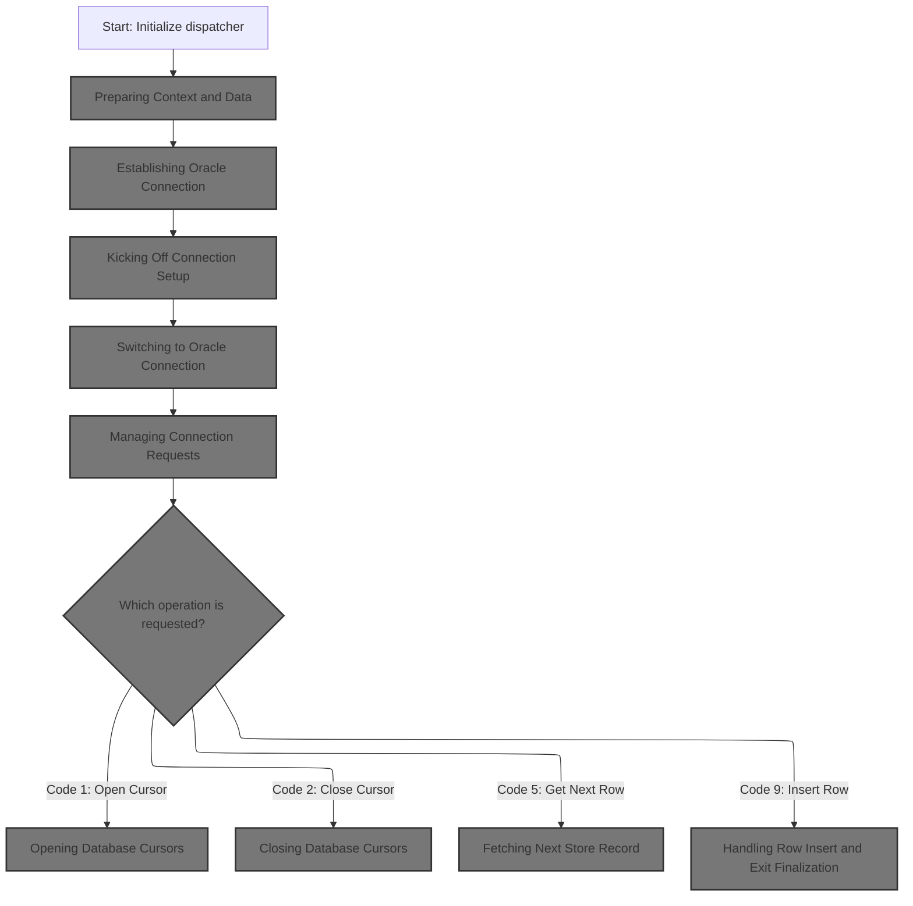

The main product role for this section is to initialize and manage the dispatcher responsible for handling database connection setup and dispatching store-related operations based on incoming function codes. It ensures the correct preparation of context, connection to the Oracle database, and execution of the requested database operation.

| Category        | Rule Name                       | Description                                                                                                                                                                                                  |
| --------------- | ------------------------------- | ------------------------------------------------------------------------------------------------------------------------------------------------------------------------------------------------------------ |
| Data validation | Mandatory Initialization        | The dispatcher must always perform initialization before any database operation is attempted, ensuring all required context and data are prepared.                                                           |
| Data validation | Database Connection Requirement | A valid Oracle database connection must be established before any database operation (such as opening/closing cursors or fetching/inserting rows) is performed.                                              |
| Data validation | Cursor Handle Validation        | When opening or closing a database cursor, the dispatcher must validate the provided index handle and only proceed if the handle is valid; otherwise, an error must be reported.                             |
| Data validation | Store Record Validation         | When fetching the next store record, all relevant store attributes must be populated in memory, and any missing or null fields must be validated and handled appropriately.                                  |
| Business logic  | Function Code Dispatching       | The dispatcher must interpret the incoming function code and dispatch the corresponding operation (e.g., open cursor for code 1, close cursor for code 2, fetch next row for code 5, insert row for code 9). |

<SwmSnippet path="/base/src/NNNS0120.cbl" line="1661">

---

In <SwmToken path="base/src/NNNS0120.cbl" pos="1661:2:6" line-data="168200 0000-EXIT-DISPATCHER.                                            00168200">`0000-EXIT-DISPATCHER`</SwmToken>, we start by calling <SwmToken path="base/src/NNNS0120.cbl" pos="1662:4:6" line-data="168300     PERFORM 100-INITIALIZATION                                   00168300">`100-INITIALIZATION`</SwmToken> to prep everything for the rest of the logic.

```cobol
168200 0000-EXIT-DISPATCHER.                                            00168200
168300     PERFORM 100-INITIALIZATION                                   00168300
```

---

</SwmSnippet>

## Preparing Context and Data

The main product role of this section is to ensure that all necessary context and data fields are properly initialized and normalized before any business operations are performed. This guarantees data consistency and readiness for downstream processes.

| Category        | Rule Name                                  | Description                                                                                                                                                                                                                                                                                                       |
| --------------- | ------------------------------------------ | ----------------------------------------------------------------------------------------------------------------------------------------------------------------------------------------------------------------------------------------------------------------------------------------------------------------- |
| Data validation | Date Field Normalization                   | Date fields in the destination record must be normalized to valid default values if they are missing or invalid in the source record.                                                                                                                                                                             |
| Business logic  | Store and Location Field Copy              | All store and location fields must be copied from the source record to the destination record before any business logic is executed.                                                                                                                                                                              |
| Business logic  | Conditional Initialization on Cursor State | The initialization process must only proceed to copy and normalize fields if the cursor is not in a closing state (<SwmToken path="base/src/NNNS0120.cbl" pos="1668:4:8" line-data="168900       WHEN EXIT-CLOSE-CURSOR                                     00168900">`EXIT-CLOSE-CURSOR`</SwmToken> is not set). |
| Business logic  | Context Variable Reset                     | All relevant context variables (such as index handles and checkpoint increments) must be reset to their initial values at the start of the initialization process.                                                                                                                                                |

<SwmSnippet path="/base/src/NNNS0120.cbl" line="1691">

---

In <SwmToken path="base/src/NNNS0120.cbl" pos="1691:2:4" line-data="171200 100-INITIALIZATION.                                              00171200">`100-INITIALIZATION`</SwmToken>, we make sure all the store/location fields are copied and normalized by calling <SwmToken path="base/src/NNNS0120.cbl" pos="1698:4:14" line-data="171900       PERFORM 110-MOVE-PDA-FIELDS-2-DCL                          00171900">`110-MOVE-PDA-FIELDS-2-DCL`</SwmToken> right after setup.

```cobol
171200 100-INITIALIZATION.                                              00171200
171300     INITIALIZE W00N001A                                          00171300
171400     MOVE NNNN0000-INDEX-HANDLE TO DDDTRL01-INDEX-HANDLE          00171400
171500     MOVE 0 TO WS-CHECKPOINT-INC                                  00171500
171600     MOVE 0 TO SQLCODE                                            00171600
171700     MOVE 0 TO SQL-INIT-FLAG                                      00171700
171800     IF NOT EXIT-CLOSE-CURSOR                                     00171800
171900       PERFORM 110-MOVE-PDA-FIELDS-2-DCL                          00171900
172000     END-IF                                                       00172000
```

---

</SwmSnippet>

### Normalizing Store Data

The 'Normalizing Store Data' section is responsible for ensuring that all incoming store data is transformed into a consistent and standardized format before it is used by other parts of the system. This normalization process ensures data integrity and compatibility across different modules and external integrations.

| Category        | Rule Name                  | Description                                                                                                                                         |
| --------------- | -------------------------- | --------------------------------------------------------------------------------------------------------------------------------------------------- |
| Data validation | Required Fields Validation | Any missing required fields in the store data must be identified and flagged for review before the data can be used in business processes.          |
| Business logic  | Standardized Data Format   | All store data must be converted to a standardized format, regardless of the source or original structure, to ensure consistency across the system. |
| Business logic  | Normalization Timestamp    | All normalized store data must be tagged with a timestamp indicating when the normalization occurred, to support auditing and traceability.         |

See <SwmLink doc-title="Normalizing and Transferring Store Data">[Normalizing and Transferring Store Data](.swm%5Cnormalizing-and-transferring-store-data.deznri89.sw.md)</SwmLink>

### Finalizing Initialization and Connecting

<SwmSnippet path="/base/src/NNNS0120.cbl" line="1701">

---

After normalizing, <SwmToken path="base/src/NNNS0120.cbl" pos="1662:4:6" line-data="168300     PERFORM 100-INITIALIZATION                                   00168300">`100-INITIALIZATION`</SwmToken> only connects to Oracle if the operation or flags require it.

```cobol
172200     IF (YYYN005A-ORACLE       OR EXIT-PUT-INSERT-ROW             00172200
172300         OR EXIT-PUT-PURGE-ROW OR EXIT-PUT-MODIFY-ROW)            00172300
172400       PERFORM 115-CONNECT-TO-ORACLE                              00172400
172500     END-IF                                                       00172500
```

---

</SwmSnippet>

## Establishing Oracle Connection

The main product role for this section is to ensure that the application can reliably connect to the Oracle database and provide clear feedback if the connection fails, supporting robust error handling and traceability.

| Category        | Rule Name                         | Description                                                                                                                                                                                                                                                                                                          |
| --------------- | --------------------------------- | -------------------------------------------------------------------------------------------------------------------------------------------------------------------------------------------------------------------------------------------------------------------------------------------------------------------- |
| Data validation | Standardized Error Message Format | The error message generated on connection failure must follow the format: '<SwmToken path="base/src/NNNS0120.cbl" pos="1877:5:5" line-data="189800       STRING &#39;NNNS0120 - Error connecting to Oracle. Sqlcode =&#39;  00189800">`NNNS0120`</SwmToken> - Error connecting to Oracle. Sqlcode = \[error code\]'. |
| Business logic  | No Error Message on Success       | If the connection is successful, no error message should be generated and the process should continue as normal.                                                                                                                                                                                                     |

<SwmSnippet path="/base/src/NNNS0120.cbl" line="1871">

---

<SwmToken path="base/src/NNNS0120.cbl" pos="1871:2:8" line-data="189200 115-CONNECT-TO-ORACLE.                                           00189200">`115-CONNECT-TO-ORACLE`</SwmToken> calls <SwmToken path="base/src/NNNS0120.cbl" pos="1872:4:8" line-data="189300     CALL Z-ORA-CONNECT USING W00N001A                            00189300">`Z-ORA-CONNECT`</SwmToken> to do the DB connection and handles errors if it fails.

```cobol
189200 115-CONNECT-TO-ORACLE.                                           00189200
189300     CALL Z-ORA-CONNECT USING W00N001A                            00189300
189400                              SQLCA                               00189400
189500     IF NOT SUCCESS                                               00189500
189600       MOVE SQLCODE TO WS-SQLCODE                                 00189600
189700       MOVE SPACES  TO IS-RTRN-MSG-TXT                            00189700
189800       STRING 'NNNS0120 - Error connecting to Oracle. Sqlcode ='  00189800
189900               WS-SQLCODE                                         00189900
190000               DELIMITED BY SIZE INTO IS-RTRN-MSG-TXT             00190000
190100     END-IF                                                       00190100
```

---

</SwmSnippet>

## Kicking Off Connection Setup

This section ensures that the environment is properly initialized and that a connection to the Oracle database is established before any further processing occurs. It is a foundational step required for the application's operation.

<SwmSnippet path="/base/src/XXXS0210.cbl" line="33">

---

XXXS0210's dispatcher just runs init and then connects to Oracle, no branching.

```cobol
004400 0000-EXIT-DISPATCHER.                                            00004400
004500     PERFORM 100-INITIALIZATION                                   00004500
004600     PERFORM 200-CONNECT-TO-ORACLE                                00004600
005000     GOBACK                                                       00005000
005100     .                                                            00005100
```

---

</SwmSnippet>

## Switching to Oracle Connection

This section ensures that when a switch to the Oracle database is required, the correct flags are set and the connection manager is invoked to complete the switch. This is critical for ensuring that subsequent database operations are performed against the correct backend.

| Category        | Rule Name                    | Description                                                                                                                                   |
| --------------- | ---------------------------- | --------------------------------------------------------------------------------------------------------------------------------------------- |
| Data validation | Oracle Flag Value            | The Oracle connection flag must be set to the value 'S0' to indicate an Oracle connection is requested.                                       |
| Business logic  | Set Oracle Connection Intent | When a switch to Oracle is required, the Oracle connection flag must be set to indicate this intent before any connection manager is invoked. |
| Business logic  | Invoke Connection Manager    | The connection manager must be called after the Oracle connection flag is set, to ensure the actual database switch occurs.                   |

<SwmSnippet path="/base/src/XXXS0210.cbl" line="52">

---

We set the Oracle flag and call the connection manager to switch DBs.

```cobol
007500 200-CONNECT-TO-ORACLE.                                           00007500
007510     SET YYYC0220-SET-ORACLE-CON TO TRUE                          00007510
007530                                                                  00007530
007540     CALL YYYS0220-DBMS-CON-MGR USING                             00007540
007550         XXXN001A                                                 00007550
007560         YYYC0220                                                 00007560
010400     .                                                            00010400
```

---

</SwmSnippet>

## Managing Connection Requests

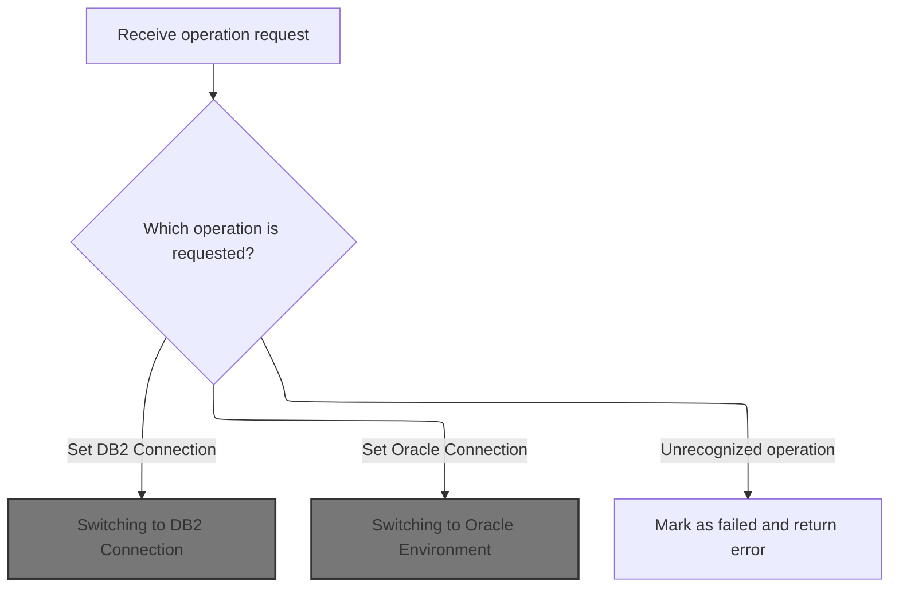

This section manages incoming requests to switch database connections or update/retrieve connection statistics. It ensures that only recognized operations are processed, and provides feedback if an invalid operation is requested.

| Category        | Rule Name                                                                                                                                                                                      | Description                                                                                                                                                                                                                                                                                                                                                                                                                                                                                                                                                                                                                                                                                   |
| --------------- | ---------------------------------------------------------------------------------------------------------------------------------------------------------------------------------------------- | --------------------------------------------------------------------------------------------------------------------------------------------------------------------------------------------------------------------------------------------------------------------------------------------------------------------------------------------------------------------------------------------------------------------------------------------------------------------------------------------------------------------------------------------------------------------------------------------------------------------------------------------------------------------------------------------- |
| Data validation | Valid Operation Codes                                                                                                                                                                          | Only the following operation codes are valid: 'GC' (Get Current Connection), 'SD' (Set <SwmToken path="base/src/NNNS0120.cbl" pos="1962:10:10" line-data="198300        PERFORM  125-CONNECT-TO-DB2                               00198300">`DB2`</SwmToken> Connection), 'S0' (Set Oracle Connection), 'GS' (Get Stats), 'SS' (Set Stats), 'SO' (Set Override Connection). Any other code is invalid.                                                                                                                                                                                                                                                                                        |
| Business logic  | <SwmToken path="base/src/NNNS0120.cbl" pos="1962:10:10" line-data="198300        PERFORM  125-CONNECT-TO-DB2                               00198300">`DB2`</SwmToken> Connection Establishment | If the requested operation is to set a <SwmToken path="base/src/NNNS0120.cbl" pos="1962:10:10" line-data="198300        PERFORM  125-CONNECT-TO-DB2                               00198300">`DB2`</SwmToken> connection, the system must establish a <SwmToken path="base/src/NNNS0120.cbl" pos="1962:10:10" line-data="198300        PERFORM  125-CONNECT-TO-DB2                               00198300">`DB2`</SwmToken> connection, update the total and <SwmToken path="base/src/NNNS0120.cbl" pos="1962:10:10" line-data="198300        PERFORM  125-CONNECT-TO-DB2                               00198300">`DB2`</SwmToken> request statistics, and return the current connection type. |
| Business logic  | Oracle Connection Establishment                                                                                                                                                                | If the requested operation is to set an Oracle connection, the system must establish an Oracle connection if not already connected, increment usage statistics, and return the current connection type.                                                                                                                                                                                                                                                                                                                                                                                                                                                                                       |
| Business logic  | Operation Dispatching                                                                                                                                                                          | When a recognized operation is requested, the system must perform the corresponding routine to update the connection or statistics as specified by the operation code.                                                                                                                                                                                                                                                                                                                                                                                                                                                                                                                        |

<SwmSnippet path="/base/src/YYYS0220.cbl" line="56">

---

The dispatcher picks the right connection/stats routine or errors out if the code is unknown.

```cobol
006500 0000-EXIT-DISPATCHER.                                            00006500
006600     PERFORM 100-INITIALIZATION                                   00006600
006700                                                                  00006700
006800     EVALUATE TRUE                                                00006800
006900       WHEN YYYC0220-GET-CURR-CON                                 00006900
007000         PERFORM 200-GET-CURR-CON                                 00007000
007100       WHEN YYYC0220-SET-DB2-CON                                  00007100
007200         PERFORM 300-SET-DB2-CON                                  00007200
007300       WHEN YYYC0220-SET-ORACLE-CON                               00007300
007400         PERFORM 400-SET-ORACLE-CON                               00007400
007500       WHEN YYYC0220-GET-STATS                                    00007500
007600         PERFORM 500-GET-STATS                                    00007600
007700       WHEN YYYC0220-SET-STATS                                    00007700
007800         PERFORM 600-SET-STATS                                    00007800
007900       WHEN YYYC0220-SET-OVERRIDE-CON                             00007900
008000         PERFORM 700-SET-OVERRIDE-CON                             00008000
008100       WHEN OTHER                                                 00008100
008200         SET  FAILURE TO TRUE                                     00008200
008300         MOVE 'YYYS0220 - Function not recognized!'               00008300
008400           TO IS-RTRN-MSG-TXT                                     00008400
008500     END-EVALUATE                                                 00008500
008600                                                                  00008600
008700     GOBACK                                                       00008700
008800     .                                                            00008800
```

---

</SwmSnippet>

### Switching to <SwmToken path="base/src/NNNS0120.cbl" pos="1962:10:10" line-data="198300        PERFORM  125-CONNECT-TO-DB2                               00198300">`DB2`</SwmToken> Connection

```mermaid
%%{init: {"flowchart": {"defaultRenderer": "elk"}} }%%
flowchart TD
    node1["Increment total and DB2 request counters"]
    click node1 openCode "base/src/YYYS0220.cbl:115:116"
    node1 --> node2{"Is current connection Oracle or Default?"}
    click node2 openCode "base/src/YYYS0220.cbl:118:119"
    node2 -->|"Yes"| node3["Perform DB2 connection setup"]
    click node3 openCode "base/src/YYYS0220.cbl:120:121"
    node3 -->|"Begin DB2 setup"| node6{"Is environment Production?"}
    click node6 openCode "base/src/YYYS0220.cbl:132:136"
    node6 -->|"Yes"| node7["Connect to DB2 Production"]
    click node7 openCode "base/src/YYYS0220.cbl:134:135"
    node6 -->|"No"| node8["Connect to DB2 Test"]
    click node8 openCode "base/src/YYYS0220.cbl:138:139"
    node7 --> node9{"Was connection successful?"}
    node8 --> node9
    click node9 openCode "base/src/YYYS0220.cbl:143:146"
    node9 -->|"SQLCODE = 0"| node4["Set DB2 connection to active"]
    node9 -->|"SQLCODE != 0"| node10["Mark failure and set error message"]
    click node10 openCode "base/src/YYYS0220.cbl:147:151"
    node10 --> node4
    node2 -->|"No"| node4["Set DB2 connection to active"]
    click node4 openCode "base/src/YYYS0220.cbl:123:123"
    node4 --> node5["Update current connection status"]
    click node5 openCode "base/src/YYYS0220.cbl:124:124"
classDef HeadingStyle fill:#777777,stroke:#333,stroke-width:2px;

%% Swimm:
%% %%{init: {"flowchart": {"defaultRenderer": "elk"}} }%%
%% flowchart TD
%%     node1["Increment total and <SwmToken path="base/src/NNNS0120.cbl" pos="1962:10:10" line-data="198300        PERFORM  125-CONNECT-TO-DB2                               00198300">`DB2`</SwmToken> request counters"]
%%     click node1 openCode "<SwmPath>[base/src/YYYS0220.cbl](base/src/YYYS0220.cbl)</SwmPath>:115:116"
%%     node1 --> node2{"Is current connection Oracle or Default?"}
%%     click node2 openCode "<SwmPath>[base/src/YYYS0220.cbl](base/src/YYYS0220.cbl)</SwmPath>:118:119"
%%     node2 -->|"Yes"| node3["Perform <SwmToken path="base/src/NNNS0120.cbl" pos="1962:10:10" line-data="198300        PERFORM  125-CONNECT-TO-DB2                               00198300">`DB2`</SwmToken> connection setup"]
%%     click node3 openCode "<SwmPath>[base/src/YYYS0220.cbl](base/src/YYYS0220.cbl)</SwmPath>:120:121"
%%     node3 -->|"Begin <SwmToken path="base/src/NNNS0120.cbl" pos="1962:10:10" line-data="198300        PERFORM  125-CONNECT-TO-DB2                               00198300">`DB2`</SwmToken> setup"| node6{"Is environment Production?"}
%%     click node6 openCode "<SwmPath>[base/src/YYYS0220.cbl](base/src/YYYS0220.cbl)</SwmPath>:132:136"
%%     node6 -->|"Yes"| node7["Connect to <SwmToken path="base/src/NNNS0120.cbl" pos="1962:10:10" line-data="198300        PERFORM  125-CONNECT-TO-DB2                               00198300">`DB2`</SwmToken> Production"]
%%     click node7 openCode "<SwmPath>[base/src/YYYS0220.cbl](base/src/YYYS0220.cbl)</SwmPath>:134:135"
%%     node6 -->|"No"| node8["Connect to <SwmToken path="base/src/NNNS0120.cbl" pos="1962:10:10" line-data="198300        PERFORM  125-CONNECT-TO-DB2                               00198300">`DB2`</SwmToken> Test"]
%%     click node8 openCode "<SwmPath>[base/src/YYYS0220.cbl](base/src/YYYS0220.cbl)</SwmPath>:138:139"
%%     node7 --> node9{"Was connection successful?"}
%%     node8 --> node9
%%     click node9 openCode "<SwmPath>[base/src/YYYS0220.cbl](base/src/YYYS0220.cbl)</SwmPath>:143:146"
%%     node9 -->|"SQLCODE = 0"| node4["Set <SwmToken path="base/src/NNNS0120.cbl" pos="1962:10:10" line-data="198300        PERFORM  125-CONNECT-TO-DB2                               00198300">`DB2`</SwmToken> connection to active"]
%%     node9 -->|"SQLCODE != 0"| node10["Mark failure and set error message"]
%%     click node10 openCode "<SwmPath>[base/src/YYYS0220.cbl](base/src/YYYS0220.cbl)</SwmPath>:147:151"
%%     node10 --> node4
%%     node2 -->|"No"| node4["Set <SwmToken path="base/src/NNNS0120.cbl" pos="1962:10:10" line-data="198300        PERFORM  125-CONNECT-TO-DB2                               00198300">`DB2`</SwmToken> connection to active"]
%%     click node4 openCode "<SwmPath>[base/src/YYYS0220.cbl](base/src/YYYS0220.cbl)</SwmPath>:123:123"
%%     node4 --> node5["Update current connection status"]
%%     click node5 openCode "<SwmPath>[base/src/YYYS0220.cbl](base/src/YYYS0220.cbl)</SwmPath>:124:124"
%% classDef HeadingStyle fill:#777777,stroke:#333,stroke-width:2px;
```

This section ensures that all requests requiring a <SwmToken path="base/src/NNNS0120.cbl" pos="1962:10:10" line-data="198300        PERFORM  125-CONNECT-TO-DB2                               00198300">`DB2`</SwmToken> connection are properly counted, the connection is switched to <SwmToken path="base/src/NNNS0120.cbl" pos="1962:10:10" line-data="198300        PERFORM  125-CONNECT-TO-DB2                               00198300">`DB2`</SwmToken> if necessary, and the correct <SwmToken path="base/src/NNNS0120.cbl" pos="1962:10:10" line-data="198300        PERFORM  125-CONNECT-TO-DB2                               00198300">`DB2`</SwmToken> environment is selected based on the system's environment. It also ensures that any connection failures are captured and reported.

| Category       | Rule Name                                                                                                                                                                                         | Description                                                                                                                                                                                                                                                                                                                                                                                                                                                             |
| -------------- | ------------------------------------------------------------------------------------------------------------------------------------------------------------------------------------------------- | ----------------------------------------------------------------------------------------------------------------------------------------------------------------------------------------------------------------------------------------------------------------------------------------------------------------------------------------------------------------------------------------------------------------------------------------------------------------------- |
| Business logic | Request Counting                                                                                                                                                                                  | Every time a request is processed, increment the total request counter and the <SwmToken path="base/src/NNNS0120.cbl" pos="1962:10:10" line-data="198300        PERFORM  125-CONNECT-TO-DB2                               00198300">`DB2`</SwmToken> request counter by 1.                                                                                                                                                                                              |
| Business logic | Conditional <SwmToken path="base/src/NNNS0120.cbl" pos="1962:10:10" line-data="198300        PERFORM  125-CONNECT-TO-DB2                               00198300">`DB2`</SwmToken> Switch          | If the current connection is Oracle or Default, initiate a switch to <SwmToken path="base/src/NNNS0120.cbl" pos="1962:10:10" line-data="198300        PERFORM  125-CONNECT-TO-DB2                               00198300">`DB2`</SwmToken>; otherwise, maintain the current <SwmToken path="base/src/NNNS0120.cbl" pos="1962:10:10" line-data="198300        PERFORM  125-CONNECT-TO-DB2                               00198300">`DB2`</SwmToken> connection.           |
| Business logic | Connection Switch Counting                                                                                                                                                                        | When switching to <SwmToken path="base/src/NNNS0120.cbl" pos="1962:10:10" line-data="198300        PERFORM  125-CONNECT-TO-DB2                               00198300">`DB2`</SwmToken>, increment the connection switch counter by 1.                                                                                                                                                                                                                                  |
| Business logic | Environment-Based <SwmToken path="base/src/NNNS0120.cbl" pos="1962:10:10" line-data="198300        PERFORM  125-CONNECT-TO-DB2                               00198300">`DB2`</SwmToken> Selection | If the environment is Production, connect to the <SwmToken path="base/src/NNNS0120.cbl" pos="1962:10:10" line-data="198300        PERFORM  125-CONNECT-TO-DB2                               00198300">`DB2`</SwmToken> Production database; otherwise, connect to the <SwmToken path="base/src/NNNS0120.cbl" pos="1962:10:10" line-data="198300        PERFORM  125-CONNECT-TO-DB2                               00198300">`DB2`</SwmToken> Test database.              |
| Business logic | Connection Status Update                                                                                                                                                                          | After switching or confirming the <SwmToken path="base/src/NNNS0120.cbl" pos="1962:10:10" line-data="198300        PERFORM  125-CONNECT-TO-DB2                               00198300">`DB2`</SwmToken> connection, set the <SwmToken path="base/src/NNNS0120.cbl" pos="1962:10:10" line-data="198300        PERFORM  125-CONNECT-TO-DB2                               00198300">`DB2`</SwmToken> connection status to active and update the current connection status. |

<SwmSnippet path="/base/src/YYYS0220.cbl" line="105">

---

We count the request, switch to <SwmToken path="base/src/YYYS0220.cbl" pos="105:6:6" line-data="011400 300-SET-DB2-CON.                                                 00011400">`DB2`</SwmToken> if needed, then update the connection type.

```cobol
011400 300-SET-DB2-CON.                                                 00011400
011500     ADD 1 TO WS-TOT-REQS                                         00011500
011600     ADD 1 TO WS-DB2-REQS                                         00011600
011700                                                                  00011700
011800     IF WS-ORACLE-CON                                             00011800
011900     OR WS-DEFAULT-CON                                            00011900
012000       PERFORM 310-DO-SET-DB2-CON                                 00012000
012100     END-IF                                                       00012100
012200                                                                  00012200
012300     SET WS-DB2-CON TO TRUE                                       00012300
012400     PERFORM 200-GET-CURR-CON                                     00012400
012500     .                                                            00012500
```

---

</SwmSnippet>

<SwmSnippet path="/base/src/YYYS0220.cbl" line="119">

---

We count the switch, connect to the right <SwmToken path="base/src/YYYS0220.cbl" pos="119:8:8" line-data="012800 310-DO-SET-DB2-CON.                                              00012800">`DB2`</SwmToken> based on environment, and handle errors if the connection fails.

```cobol
012800 310-DO-SET-DB2-CON.                                              00012800
012900     ADD 1 TO WS-CON-SWITCHES                                     00012900
013000                                                                  00013000
013100     EVALUATE TRUE                                                00013100
013200       WHEN WS-PROD                                               00013200
013300         EXEC SQL                                                 00013300
013400           CONNECT TO DB2P                                        00013400
013500         END-EXEC                                                 00013500
013600       WHEN OTHER                                                 00013600
013700         EXEC SQL                                                 00013700
013800           CONNECT TO DB2T                                        00013800
013900         END-EXEC                                                 00013900
014000     END-EVALUATE                                                 00014000
014100                                                                  00014100
014200     EVALUATE TRUE                                                00014200
014300       WHEN SQLCODE = 0                                           00014300
014400         CONTINUE                                                 00014400
014500                                                                  00014500
014600       WHEN OTHER                                                 00014600
014700         SET  FAILURE TO TRUE                                     00014700
014800         MOVE SQLCODE TO WS-SQLCODE                               00014800
014900         STRING 'YYYS0220 - Failure connecting to DB2, SQL='      00014900
015000                WS-SQLCODE                                        00015000
015100             DELIMITED BY SIZE INTO IS-RTRN-MSG-TXT               00015100
015200     END-EVALUATE                                                 00015200
015300     .                                                            00015300
```

---

</SwmSnippet>

### Switching to Oracle Environment

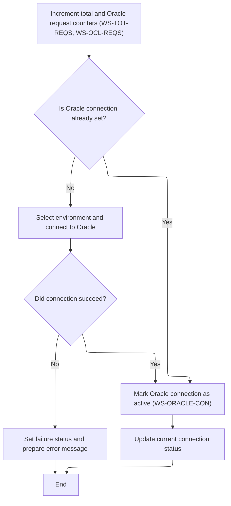

This section manages the process of switching the database environment to Oracle, including tracking usage statistics, selecting the correct Oracle environment, and handling connection outcomes.

| Category       | Rule Name                           | Description                                                                                                                                                                                                                                                                                                                                                                                                                                                                                                                                                                                                                                                                                                |
| -------------- | ----------------------------------- | ---------------------------------------------------------------------------------------------------------------------------------------------------------------------------------------------------------------------------------------------------------------------------------------------------------------------------------------------------------------------------------------------------------------------------------------------------------------------------------------------------------------------------------------------------------------------------------------------------------------------------------------------------------------------------------------------------------- |
| Business logic | Request Counting                    | Each time a request to switch to Oracle is processed, increment the total request counter (<SwmToken path="base/src/YYYS0220.cbl" pos="106:8:12" line-data="011500     ADD 1 TO WS-TOT-REQS                                         00011500">`WS-TOT-REQS`</SwmToken>) and the Oracle request counter (<SwmToken path="base/src/YYYS0220.cbl" pos="152:8:12" line-data="016100     ADD 1 TO WS-OCL-REQS                                         00016100">`WS-OCL-REQS`</SwmToken>) by 1.                                                                                                                                                                                                                 |
| Business logic | Connection Switch Counting          | If the Oracle connection is not already active, increment the connection switch counter (<SwmToken path="base/src/YYYS0220.cbl" pos="120:8:12" line-data="012900     ADD 1 TO WS-CON-SWITCHES                                     00012900">`WS-CON-SWITCHES`</SwmToken>) by 1 before attempting to connect.                                                                                                                                                                                                                                                                                                                                                                                               |
| Business logic | Environment-Based Oracle Selection  | When switching to Oracle, select the correct Oracle environment based on the current environment variable (e.g., <SwmToken path="base/src/YYYS0220.cbl" pos="123:4:6" line-data="013200       WHEN WS-PROD                                               00013200">`WS-PROD`</SwmToken>, <SwmToken path="base/src/YYYS0220.cbl" pos="172:4:6" line-data="018100       WHEN WS-TEST                                               00018100">`WS-TEST`</SwmToken>, <SwmToken path="base/src/YYYS0220.cbl" pos="177:4:6" line-data="018600       WHEN WS-TST6                                               00018600">`WS-TST6`</SwmToken>, etc.), and connect to the corresponding Oracle database instance. |
| Business logic | Successful Connection Status Update | If the Oracle connection attempt is successful (SQLCODE = 0), mark the Oracle connection as active and update the current connection status.                                                                                                                                                                                                                                                                                                                                                                                                                                                                                                                                                               |
| Business logic | Connection Status Synchronization   | After any connection attempt, update the current connection status to reflect whether Oracle is now active or not.                                                                                                                                                                                                                                                                                                                                                                                                                                                                                                                                                                                         |

<SwmSnippet path="/base/src/YYYS0220.cbl" line="150">

---

We count the request, switch to Oracle if needed, then update the connection type.

```cobol
015900 400-SET-ORACLE-CON.                                              00015900
016000     ADD 1 TO WS-TOT-REQS                                         00016000
016100     ADD 1 TO WS-OCL-REQS                                         00016100
016200                                                                  00016200
016300     IF NOT WS-ORACLE-CON                                         00016300
016400       PERFORM 410-DO-SET-ORACLE-CON                              00016400
016500     END-IF                                                       00016500
016600                                                                  00016600
016700     SET WS-ORACLE-CON TO TRUE                                    00016700
016800     PERFORM 200-GET-CURR-CON                                     00016800
016900     .                                                            00016900
```

---

</SwmSnippet>

<SwmSnippet path="/base/src/YYYS0220.cbl" line="163">

---

We count the switch, connect to the right Oracle DB based on environment, and handle errors if the connection fails.

```cobol
017200 410-DO-SET-ORACLE-CON.                                           00017200
017300     ADD 1 TO WS-CON-SWITCHES                                     00017300
017400                                                                  00017400
017500     EVALUATE TRUE                                                00017500
017600       WHEN WS-PROD                                               00017600
017700         EXEC SQL                                                 00017700
017800           CONNECT TO DRDAASP1                                    00017800
017900         END-EXEC                                                 00017900
018000                                                                  00018000
018100       WHEN WS-TEST                                               00018100
018200         EXEC SQL                                                 00018200
018300           CONNECT TO DRDAASC7                                    00018300
018400         END-EXEC                                                 00018400
018500                                                                  00018500
018600       WHEN WS-TST6                                               00018600
018700         EXEC SQL                                                 00018700
018800           CONNECT TO DRDAASC6                                    00018800
018900         END-EXEC                                                 00018900
019000                                                                  00019000
019100       WHEN WS-TST5                                               00019100
019200         EXEC SQL                                                 00019200
019300           CONNECT TO DRDAASC5                                    00019300
019400         END-EXEC                                                 00019400
019500                                                                  00019500
019600       WHEN WS-TST4                                               00019600
019700         EXEC SQL                                                 00019700
019800           CONNECT TO DRDAASD1                                    00019800
019900         END-EXEC                                                 00019900
020000                                                                  00020000
020100       WHEN WS-TST3                                               00020100
020200         EXEC SQL                                                 00020200
020300           CONNECT TO DRDAASC1                                    00020300
020400         END-EXEC                                                 00020400
020500     END-EVALUATE                                                 00020500
020600                                                                  00020600
020700     EVALUATE TRUE                                                00020700
020800       WHEN SQLCODE = 0                                           00020800
020900         CONTINUE                                                 00020900
021000                                                                  00021000
021100       WHEN OTHER                                                 00021100
021200         SET  FAILURE TO TRUE                                     00021200
021300         MOVE SQLCODE TO WS-SQLCODE                               00021300
021400         STRING 'YYYS0220 - Failure connecting to Oracle, SQL='   00021400
021500                WS-SQLCODE                                        00021500
021600             DELIMITED BY SIZE INTO IS-RTRN-MSG-TXT               00021600
021700     END-EVALUATE                                                 00021700
021800     .                                                            00021800
```

---

</SwmSnippet>

### Resetting Connection Stats

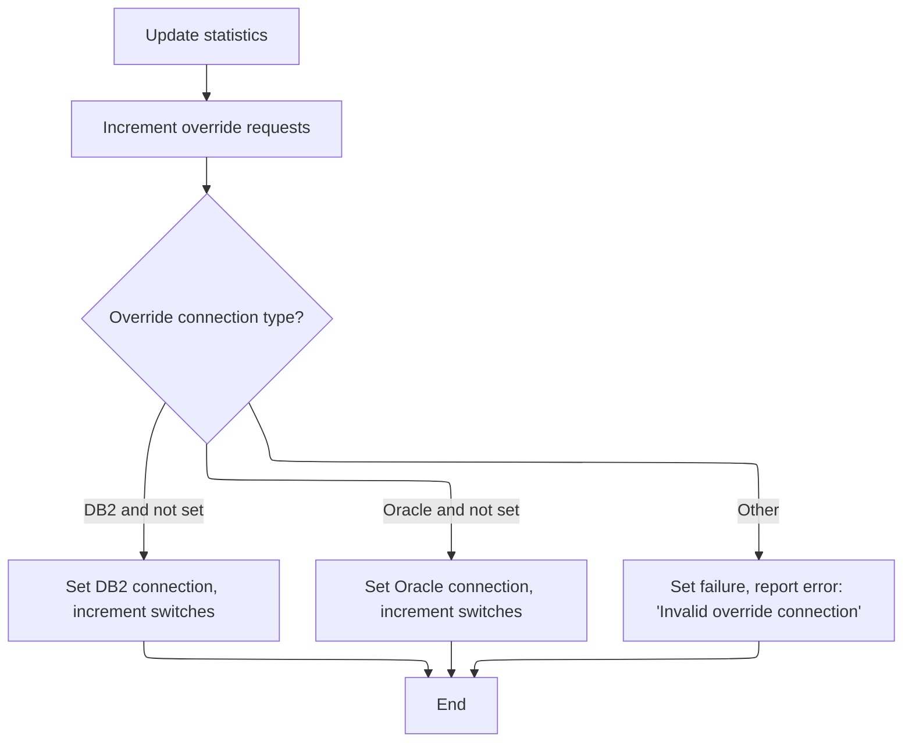

<SwmSnippet path="/base/src/YYYS0220.cbl" line="230">

---

We just clear all the stats counters.

```cobol
023900 600-SET-STATS.                                                   00023900
024000     INITIALIZE WS-STATS                                          00024000
024100                YYYC0220-STATS                                    00024100
024200     .                                                            00024200
```

---

</SwmSnippet>

<SwmSnippet path="/base/src/YYYS0220.cbl" line="239">

---

We count the override request, set the flag if valid, or error out if not.

```cobol
024800 700-SET-OVERRIDE-CON.                                            00024800
024900     ADD 1 TO WS-OVR-REQS                                         00024900
025000                                                                  00025000
025100     EVALUATE TRUE                                                00025100
025200       WHEN YYYC0220-DB2-CON                                      00025200
025300       AND  NOT WS-DB2-CON                                        00025300
025400         SET WS-DB2-CON    TO TRUE                                00025400
025500         ADD 1             TO WS-OVR-SWITCHES                     00025500
025600                                                                  00025600
025700       WHEN YYYC0220-ORACLE-CON                                   00025700
025800       AND NOT WS-ORACLE-CON                                      00025800
025900         SET WS-ORACLE-CON TO TRUE                                00025900
026000         ADD 1             TO WS-OVR-SWITCHES                     00026000
026100                                                                  00026100
026200       WHEN OTHER                                                 00026200
026300         SET FAILURE TO TRUE                                      00026300
026400         MOVE 'YYYS0220 - Invalid over-ride connection!'          00026400
026500           TO IS-RTRN-MSG-TXT                                     00026500
026600     END-EVALUATE                                                 00026600
026700     .                                                            00026700
```

---

</SwmSnippet>

## Dispatching Store Operations

```mermaid
%%{init: {"flowchart": {"defaultRenderer": "elk"}} }%%
flowchart TD
    node1{"Which exit operation is requested?"}
    click node1 openCode "base/src/NNNS0120.cbl:1663:1682"
    node1 -->|"Open cursor (code 1)"| node2["Open database cursor"]
    click node2 openCode "base/src/NNNS0120.cbl:1667:1667"
    node1 -->|"Close cursor (code 2)"| node3["Close database cursor"]
    click node3 openCode "base/src/NNNS0120.cbl:1669:1669"
    node1 -->|"Get unique row (code 3)"| node4["Retrieve unique row"]
    click node4 openCode "base/src/NNNS0120.cbl:1671:1671"
    node1 -->|"Get next row (code 5)"| node5["Retrieve next row"]
    click node5 openCode "base/src/NNNS0120.cbl:1673:1673"
    node1 -->|"Modify row (code 8)"| node6["Modify row"]
    click node6 openCode "base/src/NNNS0120.cbl:1675:1675"
    node1 -->|"Insert row (code 9)"| node7["Insert new row"]
    click node7 openCode "base/src/NNNS0120.cbl:1677:1677"
    node1 -->|"Purge row (code 10)"| node8["Purge row"]
    click node8 openCode "base/src/NNNS0120.cbl:1679:1679"
    node1 -->|"Special IO (code 90)"| node9["Perform special IO functions"]
    click node9 openCode "base/src/NNNS0120.cbl:1681:1681"
    node1 -->|"No valid operation"| node10["Continue"]
    click node10 openCode "base/src/NNNS0120.cbl:1665:1665"

classDef HeadingStyle fill:#777777,stroke:#333,stroke-width:2px;

%% Swimm:
%% %%{init: {"flowchart": {"defaultRenderer": "elk"}} }%%
%% flowchart TD
%%     node1{"Which exit operation is requested?"}
%%     click node1 openCode "<SwmPath>[base/src/NNNS0120.cbl](base/src/NNNS0120.cbl)</SwmPath>:1663:1682"
%%     node1 -->|"Open cursor (code 1)"| node2["Open database cursor"]
%%     click node2 openCode "<SwmPath>[base/src/NNNS0120.cbl](base/src/NNNS0120.cbl)</SwmPath>:1667:1667"
%%     node1 -->|"Close cursor (code 2)"| node3["Close database cursor"]
%%     click node3 openCode "<SwmPath>[base/src/NNNS0120.cbl](base/src/NNNS0120.cbl)</SwmPath>:1669:1669"
%%     node1 -->|"Get unique row (code 3)"| node4["Retrieve unique row"]
%%     click node4 openCode "<SwmPath>[base/src/NNNS0120.cbl](base/src/NNNS0120.cbl)</SwmPath>:1671:1671"
%%     node1 -->|"Get next row (code 5)"| node5["Retrieve next row"]
%%     click node5 openCode "<SwmPath>[base/src/NNNS0120.cbl](base/src/NNNS0120.cbl)</SwmPath>:1673:1673"
%%     node1 -->|"Modify row (code 8)"| node6["Modify row"]
%%     click node6 openCode "<SwmPath>[base/src/NNNS0120.cbl](base/src/NNNS0120.cbl)</SwmPath>:1675:1675"
%%     node1 -->|"Insert row (code 9)"| node7["Insert new row"]
%%     click node7 openCode "<SwmPath>[base/src/NNNS0120.cbl](base/src/NNNS0120.cbl)</SwmPath>:1677:1677"
%%     node1 -->|"Purge row (code 10)"| node8["Purge row"]
%%     click node8 openCode "<SwmPath>[base/src/NNNS0120.cbl](base/src/NNNS0120.cbl)</SwmPath>:1679:1679"
%%     node1 -->|"Special IO (code 90)"| node9["Perform special IO functions"]
%%     click node9 openCode "<SwmPath>[base/src/NNNS0120.cbl](base/src/NNNS0120.cbl)</SwmPath>:1681:1681"
%%     node1 -->|"No valid operation"| node10["Continue"]
%%     click node10 openCode "<SwmPath>[base/src/NNNS0120.cbl](base/src/NNNS0120.cbl)</SwmPath>:1665:1665"
%% 
%% classDef HeadingStyle fill:#777777,stroke:#333,stroke-width:2px;
```

<SwmSnippet path="/base/src/NNNS0120.cbl" line="1663">

---

After init, the dispatcher checks the exit code and calls the open cursor routine if that's the requested operation.

```cobol
168400     EVALUATE TRUE                                                00168400
168500       WHEN NOT SUCCESS                                           00168500
168600          CONTINUE                                                00168600
168700       WHEN EXIT-OPEN-CURSOR                                      00168700
168800          PERFORM 1000-EXIT-OPEN-CURSOR                           00168800
168900       WHEN EXIT-CLOSE-CURSOR                                     00168900
169000          PERFORM 1100-EXIT-CLOSE-CURSOR                          00169000
169100       WHEN EXIT-GET-UNIQUE-ROW                                   00169100
169200          PERFORM 1200-EXIT-GET-UNIQUE-ROW                        00169200
169300       WHEN EXIT-GET-NEXT-ROW                                     00169300
169400          PERFORM 1300-EXIT-GET-NEXT-ROW                          00169400
169500       WHEN EXIT-PUT-MODIFY-ROW                                   00169500
169600          PERFORM 1400-EXIT-PUT-MODIFY-ROW                        00169600
169700       WHEN EXIT-PUT-INSERT-ROW                                   00169700
169800          PERFORM 1500-EXIT-PUT-INSERT-ROW                        00169800
169900       WHEN EXIT-PUT-PURGE-ROW                                    00169900
170000          PERFORM 1600-EXIT-PUT-PURGE-ROW                         00170000
170100       WHEN EXIT-DO-SPECIAL-IO-FUNCS                              00170100
170200          PERFORM 10000-DO-SPECIAL-IO-FUNCS                       00170200
170300     END-EVALUATE                                                 00170300
```

---

</SwmSnippet>

## Opening Database Cursors

This section governs the process of opening SQL cursors based on a provided cursor ID. It ensures that only valid cursor IDs are accepted and that appropriate error handling is performed for invalid IDs.

| Category        | Rule Name             | Description                                                                                                                              |
| --------------- | --------------------- | ---------------------------------------------------------------------------------------------------------------------------------------- |
| Data validation | Valid cursor ID range | Only cursor IDs in the range 01 to 17 are considered valid for opening a SQL cursor. Any value outside this range is treated as invalid. |
| Business logic  | Open matching cursor  | If the provided cursor ID matches a valid value (01-17), the corresponding SQL cursor must be opened for database operations.            |

<SwmSnippet path="/base/src/NNNS0120.cbl" line="2184">

---

We match the cursor ID and open the right SQL cursor, or error out if it's not valid.

```cobol
220500 1000-EXIT-OPEN-CURSOR.                                           00220500
220600     EVALUATE TRUE                                                00220600
220700       WHEN RFCXRL01                                              00220700
220800         EXEC SQL                                                 00220800
220900           OPEN RFCXRL01                                          00220900
221000         END-EXEC                                                 00221000
221100       WHEN RFCXRL02                                              00221100
221200         EXEC SQL                                                 00221200
221300           OPEN RFCXRL02                                          00221300
221400         END-EXEC                                                 00221400
221500       WHEN RFCXRL03                                              00221500
221600         EXEC SQL                                                 00221600
221700           OPEN RFCXRL03                                          00221700
221800         END-EXEC                                                 00221800
221900       WHEN RFCXRL04                                              00221900
222000         EXEC SQL                                                 00222000
222100           OPEN RFCXRL04                                          00222100
222200         END-EXEC                                                 00222200
222300       WHEN RFCXRL05                                              00222300
222400         EXEC SQL                                                 00222400
222500           OPEN RFCXRL05                                          00222500
222600         END-EXEC                                                 00222600
222700       WHEN RFCXRL06                                              00222700
222800         EXEC SQL                                                 00222800
222900           OPEN RFCXRL06                                          00222900
223000         END-EXEC                                                 00223000
223100       WHEN RFCXRL07                                              00223100
223200         EXEC SQL                                                 00223200
223300           OPEN RFCXRL07                                          00223300
223400         END-EXEC                                                 00223400
223500       WHEN RFCXRL08                                              00223500
223600         EXEC SQL                                                 00223600
223700           OPEN RFCXRL08                                          00223700
223800         END-EXEC                                                 00223800
223900       WHEN RFCXRL09                                              00223900
224000         EXEC SQL                                                 00224000
224100           OPEN RFCXRL09                                          00224100
224200         END-EXEC                                                 00224200
224300       WHEN RFCXRL10                                              00224300
224400         EXEC SQL                                                 00224400
224500           OPEN RFCXRL10                                          00224500
224600         END-EXEC                                                 00224600
224700       WHEN RFCXRL11                                              00224700
224800         EXEC SQL                                                 00224800
224900           OPEN RFCXRL11                                          00224900
225000         END-EXEC                                                 00225000
225100       WHEN RFCXRL12                                              00225100
225200         EXEC SQL                                                 00225200
225300           OPEN RFCXRL12                                          00225300
225400         END-EXEC                                                 00225400
225500       WHEN RFCXRL13                                              00225500
225600         EXEC SQL                                                 00225600
225700           OPEN RFCXRL13                                          00225700
225800         END-EXEC                                                 00225800
225900       WHEN RFCXRL14                                              00225900
226000         EXEC SQL                                                 00226000
226100           OPEN RFCXRL14                                          00226100
226200         END-EXEC                                                 00226200
226300       WHEN RFCXRL15                                              00226300
226400         EXEC SQL                                                 00226400
226500           OPEN RFCXRL15                                          00226500
226600         END-EXEC                                                 00226600
226700       WHEN RFCXRL16                                              00226700
226800         EXEC SQL                                                 00226800
226900           OPEN RFCXRL16                                          00226900
227000         END-EXEC                                                 00227000
227100       WHEN RFCXRL17                                              00227100
227200         EXEC SQL                                                 00227200
227300           OPEN RFCXRL17                                          00227300
227400         END-EXEC                                                 00227400
```

---

</SwmSnippet>

<SwmSnippet path="/base/src/NNNS0120.cbl" line="2254">

---

If the cursor ID is invalid, we flag an error and return a message.

```cobol
227500       WHEN OTHER                                                 00227500
227600         SET FAILURE TO TRUE                                      00227600
227700         MOVE 'NNNS0120 - Invalid open cursor ID.'                00227700
227800           TO IS-RTRN-MSG-TXT OF W00N001A                         00227800
227900     END-EVALUATE                                                 00227900
```

---

</SwmSnippet>

## Closing Database Cursors

This section is responsible for closing database cursors based on a provided cursor ID. It ensures only valid cursors are closed and provides error handling for invalid cursor IDs.

| Category        | Rule Name             | Description                                                                                            |
| --------------- | --------------------- | ------------------------------------------------------------------------------------------------------ |
| Data validation | Valid cursor ID range | Only cursor IDs from 01 to 17 are considered valid for closing. Any other value is treated as invalid. |
| Business logic  | Close matched cursor  | If the provided cursor ID matches a valid value, the corresponding SQL cursor must be closed.          |
| Business logic  | Maximum cursor count  | The maximum number of valid cursor IDs is 17, as defined by DDDTRL01-MAX-INDICIES.                     |

<SwmSnippet path="/base/src/NNNS0120.cbl" line="2262">

---

We match the cursor ID and close the right SQL cursor, or error out if it's not valid.

```cobol
228300 1100-EXIT-CLOSE-CURSOR.                                          00228300
228400     EVALUATE TRUE                                                00228400
228500       WHEN RFCXRL01                                              00228500
228600         EXEC SQL                                                 00228600
228700           CLOSE RFCXRL01                                         00228700
228800         END-EXEC                                                 00228800
228900       WHEN RFCXRL02                                              00228900
229000         EXEC SQL                                                 00229000
229100           CLOSE RFCXRL02                                         00229100
229200         END-EXEC                                                 00229200
229300       WHEN RFCXRL03                                              00229300
229400         EXEC SQL                                                 00229400
229500           CLOSE RFCXRL03                                         00229500
229600         END-EXEC                                                 00229600
229700       WHEN RFCXRL04                                              00229700
229800         EXEC SQL                                                 00229800
229900           CLOSE RFCXRL04                                         00229900
230000         END-EXEC                                                 00230000
230100       WHEN RFCXRL05                                              00230100
230200         EXEC SQL                                                 00230200
230300           CLOSE RFCXRL05                                         00230300
230400         END-EXEC                                                 00230400
230500       WHEN RFCXRL06                                              00230500
230600         EXEC SQL                                                 00230600
230700           CLOSE RFCXRL06                                         00230700
230800         END-EXEC                                                 00230800
230900       WHEN RFCXRL07                                              00230900
231000         EXEC SQL                                                 00231000
231100           CLOSE RFCXRL07                                         00231100
231200         END-EXEC                                                 00231200
231300       WHEN RFCXRL08                                              00231300
231400         EXEC SQL                                                 00231400
231500           CLOSE RFCXRL08                                         00231500
231600         END-EXEC                                                 00231600
231700       WHEN RFCXRL09                                              00231700
231800         EXEC SQL                                                 00231800
231900           CLOSE RFCXRL09                                         00231900
232000         END-EXEC                                                 00232000
232100       WHEN RFCXRL10                                              00232100
232200         EXEC SQL                                                 00232200
232300           CLOSE RFCXRL10                                         00232300
232400         END-EXEC                                                 00232400
232500       WHEN RFCXRL11                                              00232500
232600         EXEC SQL                                                 00232600
232700           CLOSE RFCXRL11                                         00232700
232800         END-EXEC                                                 00232800
232900       WHEN RFCXRL12                                              00232900
233000         EXEC SQL                                                 00233000
233100           CLOSE RFCXRL12                                         00233100
233200         END-EXEC                                                 00233200
233300       WHEN RFCXRL13                                              00233300
233400         EXEC SQL                                                 00233400
233500           CLOSE RFCXRL13                                         00233500
233600         END-EXEC                                                 00233600
233700       WHEN RFCXRL14                                              00233700
233800         EXEC SQL                                                 00233800
233900           CLOSE RFCXRL14                                         00233900
234000         END-EXEC                                                 00234000
234100       WHEN RFCXRL15                                              00234100
234200         EXEC SQL                                                 00234200
234300           CLOSE RFCXRL15                                         00234300
234400         END-EXEC                                                 00234400
234500       WHEN RFCXRL16                                              00234500
234600         EXEC SQL                                                 00234600
234700           CLOSE RFCXRL16                                         00234700
234800         END-EXEC                                                 00234800
234900       WHEN RFCXRL17                                              00234900
235000         EXEC SQL                                                 00235000
235100           CLOSE RFCXRL17                                         00235100
235200         END-EXEC                                                 00235200
```

---

</SwmSnippet>

<SwmSnippet path="/base/src/NNNS0120.cbl" line="2332">

---

If the cursor ID is invalid, we flag an error and return a message.

```cobol
235300       WHEN OTHER                                                 00235300
235400         SET FAILURE TO TRUE                                      00235400
235500         MOVE 'NNNS0120 - Invalid close cursor ID.'               00235500
235600           TO IS-RTRN-MSG-TXT OF W00N001A                         00235600
235700     END-EVALUATE                                                 00235700
```

---

</SwmSnippet>

## Fetching Next Store Record

This section governs the process of retrieving the next store record from the database, ensuring that the correct fetch routine is used based on the cursor ID, and that the resulting data is validated for completeness and correctness.

| Category        | Rule Name                        | Description                                                                                                                                                                    |
| --------------- | -------------------------------- | ------------------------------------------------------------------------------------------------------------------------------------------------------------------------------ |
| Data validation | Null value validation            | After any fetch operation, all fields in the store record must be checked for null values to ensure data completeness and integrity.                                           |
| Business logic  | Complete store record population | All store fields defined in the structure must be populated from the database fetch, ensuring that the output record contains the full set of required attributes for a store. |

<SwmSnippet path="/base/src/NNNS0120.cbl" line="2500">

---

We pick the fetch routine by cursor ID, call it, and always check for nulls after.

```cobol
252100 1300-EXIT-GET-NEXT-ROW.                                          00252100
252200     EVALUATE TRUE                                                00252200
252300       WHEN RFCXRL01                                              00252300
252400         PERFORM 1301-FETCH-RFCXRL01                              00252400
252500       WHEN RFCXRL02                                              00252500
252600         PERFORM 1302-FETCH-RFCXRL02                              00252600
252700       WHEN RFCXRL03                                              00252700
252800         PERFORM 1303-FETCH-RFCXRL03                              00252800
252900       WHEN RFCXRL04                                              00252900
253000         PERFORM 1304-FETCH-RFCXRL04                              00253000
253100       WHEN RFCXRL05                                              00253100
253200         PERFORM 1305-FETCH-RFCXRL05                              00253200
253300       WHEN RFCXRL06                                              00253300
253400         PERFORM 1306-FETCH-RFCXRL06                              00253400
253500       WHEN RFCXRL07                                              00253500
253600         PERFORM 1307-FETCH-RFCXRL07                              00253600
253700       WHEN RFCXRL08                                              00253700
253800         PERFORM 1308-FETCH-RFCXRL08                              00253800
253900       WHEN RFCXRL09                                              00253900
254000         PERFORM 1309-FETCH-RFCXRL09                              00254000
254100       WHEN RFCXRL10                                              00254100
254200         PERFORM 1310-FETCH-RFCXRL10                              00254200
254300       WHEN RFCXRL11                                              00254300
254400         PERFORM 1311-FETCH-RFCXRL11                              00254400
254500       WHEN RFCXRL12                                              00254500
254600         PERFORM 1312-FETCH-RFCXRL12                              00254600
254700       WHEN RFCXRL13                                              00254700
254800         PERFORM 1313-FETCH-RFCXRL13                              00254800
254900       WHEN RFCXRL14                                              00254900
255000         PERFORM 1314-FETCH-RFCXRL14                              00255000
255100       WHEN RFCXRL15                                              00255100
255200         PERFORM 1315-FETCH-RFCXRL15                              00255200
255300       WHEN RFCXRL16                                              00255300
255400         PERFORM 1316-FETCH-RFCXRL16                              00255400
255500       WHEN RFCXRL17                                              00255500
255600         PERFORM 1317-FETCH-RFCXRL17                              00255600
```

---

</SwmSnippet>

<SwmSnippet path="/base/src/NNNS0120.cbl" line="2628">

---

We fetch all store fields from the cursor into the matching structure.

```cobol
264900 1302-FETCH-RFCXRL02.                                             00264900
265000     EXEC SQL                                                     00265000
265100         FETCH RFCXRL02                                           00265100
265200         INTO  :DCLFC-XXXAIL-STORES.FC-STORE-NO,                  00265200
265300               :DCLFC-XXXAIL-STORES.FC-RL-STORE-NM,               00265300
265400               :DCLFC-XXXAIL-STORES.FC-RL-STORE-CD,               00265400
265500               :DCLFC-XXXAIL-STORES.FC-RL-STORE-DIR-NM,           00265500
265600               :DCLFC-XXXAIL-STORES.FC-RL-STORE-LOC-NM,           00265600
265700               :DCLFC-XXXAIL-STORES.FC-RL-OPENING-DT,             00265700
265800               :DCLFC-XXXAIL-STORES.FC-RL-CLOSING-DT,             00265800
265900               :DCLFC-XXXAIL-STORES.FC-RL-REMODEL-DT,             00265900
266000               :DCLFC-XXXAIL-STORES.FC-RL-DELETED-DT,             00266000
266100               :DCLFC-XXXAIL-STORES.FC-RL-DISTRICT-NO,            00266100
266200               :DCLFC-XXXAIL-STORES.FC-RL-MARKET-AR-NO,           00266200
266300               :DCLFC-XXXAIL-STORES.FC-RL-PAYROL-AR-NO,           00266300
266400               :DCLFC-XXXAIL-STORES.FC-RL-PAY-GROUP-NO,           00266400
266500               :DCLFC-XXXAIL-STORES.FC-RL-COMPANY-NO,             00266500
266600               :DCLFC-XXXAIL-STORES.FC-RL-GEO-ZONE-CD,            00266600
266700               :DCLFC-XXXAIL-STORES.FC-RL-GEO-ZONE-NO,            00266700
266800               :DCLFC-XXXAIL-STORES.FC-RL-SCAN-MAIN-CD,           00266800
266900               :DCLFC-XXXAIL-STORES.FC-RL-FRONT-END-CD,           00266900
267000               :DCLFC-XXXAIL-STORES.FC-RL-PRICE-BUL-CD,           00267000
267100               :DCLFC-XXXAIL-STORES.FC-RL-UPC-ON-PB-CD,           00267100
267200               :DCLFC-XXXAIL-STORES.FC-RL-COMPETITR-CD,           00267200
267300               :DCLFC-XXXAIL-STORES.FC-RL-ASSOC-STR-NO,           00267300
267400               :DCLFC-XXXAIL-STORES.FC-RL-RPRT-SEQ-NO,            00267400
267500               :DCLFC-XXXAIL-STORES.FC-RL-SORT-SOS-NO,            00267500
267600               :DCLFC-XXXAIL-STORES.FC-RL-VID-PRZN-NO,            00267600
267700               :DCLFC-XXXAIL-STORES.FC-RL-CITY-ID-CD,             00267700
267800               :DCLFC-XXXAIL-STORES.FC-RL-ADZONE-ABB,             00267800
267900               :DCLFC-XXXAIL-STORES.FC-RL-ADZONE-DES,             00267900
268000               :DCLFC-XXXAIL-STORES.FC-RL-UNLOAD-SW,              00268000
268100               :DCLFC-XXXAIL-STORES.FN-ROLLUP-REPT-CD,            00268100
268200               :DCLFC-XXXAIL-STORES.FC-RL-STATUS-CD,              00268200
268300               :DCLFC-XXXAIL-STORES.FC-RL-NEW-STORE-CD,           00268300
268400               :DCLFC-XXXAIL-STORES.FC-RL-TYPE-CD,                00268400
268500               :DCLFC-XXXAIL-STORES.FC-RL-GROUP-CD,               00268500
268600               :DCLFC-XXXAIL-STORES.FC-RL-SELECTCIR-CD,           00268600
268700               :DCLFC-XXXAIL-STORES.FC-RL-AREA-CODE-NO,           00268700
268800               :DCLFC-XXXAIL-STORES.FC-RL-TELEPHONE-NO,           00268800
268900               :DCLFC-XXXAIL-STORES.FC-RL-STORE-ABB,              00268900
269000               :DCLFC-XXXAIL-STORES.FC-RL-BCKRM-FT-QTY,           00269000
269100               :DCLFC-XXXAIL-STORES.FC-RL-LFT-FOOD-QTY,           00269100
269200               :DCLFC-XXXAIL-STORES.FC-RL-LFT-NONF-QTY,           00269200
269300               :DCLFC-XXXAIL-STORES.FC-RL-SETOFF-CD,              00269300
269400               :DCLFC-XXXAIL-STORES.FC-RL-CL12-ZONE-NO,           00269400
269500               :DCLFC-XXXAIL-STORES.FC-RL-CL12-ADZN-NO,           00269500
269600               :DCLFC-XXXAIL-STORES.FC-RL-CL13-ZONE-NO,           00269600
269700               :DCLFC-XXXAIL-STORES.FC-RL-CL13-ADZN-NO,           00269700
269800               :DCLFC-XXXAIL-STORES.FC-RL-CL14-ZONE-NO,           00269800
269900               :DCLFC-XXXAIL-STORES.FC-RL-CL14-ADZN-NO,           00269900
270000               :DCLFC-XXXAIL-STORES.FC-RL-CL36-ADZN-NO,           00270000
270100               :DCLFC-XXXAIL-STORES.FC-RL-CL37-ADZN-NO,           00270100
270200               :DCLFC-XXXAIL-STORES.FC-RL-STORE-DEA-NO,           00270200
270300               :DCLFC-XXXAIL-STORES.FC-RL-RETL-ZONE-NO,           00270300
270400               :DCLFC-XXXAIL-STORES.FC-RL-STOR2-LOC-NM,           00270400
270500               :DCLFC-XXXAIL-STORES.FC-CITY-ADR,                  00270500
270600               :DCLFC-XXXAIL-STORES.FC-STATE-ADR,                 00270600
270700               :DCLFC-XXXAIL-STORES.FC-ZIP-CODE5-ADR,             00270700
270800               :DCLFC-XXXAIL-STORES.FC-ZIP-CODE4-ADR,             00270800
270900               :DCLFC-XXXAIL-STORES.FC-RL-SOS-TYPE-CD,            00270900
271000               :DCLFC-XXXAIL-STORES.FC-RL-NOPROCESS-CD,           00271000
271100               :DCLFC-XXXAIL-STORES.FC-RL-SOSHDRTYP-CD,           00271100
271200               :DCLFC-XXXAIL-STORES.FC-RL-CAT-CLASS-TB,           00271200
271300               :DCLFC-XXXAIL-STORES.FC-RL-LATITUDE-K,             00271300
271400               :DCLFC-XXXAIL-STORES.FC-RL-LONGITUDE-K,            00271400
271500               :DCLFC-XXXAIL-STORES.FN-DIVISION-CD,               00271500
271600               :DCLFC-XXXAIL-STORES.FN-LINE-OF-BUS-CD,            00271600
271700               :DCLFC-XXXAIL-STORES.FN-ROLLUP-REPT-01-NBR,        00271700
271800               :DCLFC-XXXAIL-STORES.FN-ROLLUP-REPT-02-NBR,        00271800
271900               :DCLFC-XXXAIL-STORES.FN-ROLLUP-REPT-03-NBR,        00271900
272000               :DCLFC-XXXAIL-STORES.FN-ROLLUP-REPT-04-NBR,        00272000
272100               :DCLFC-XXXAIL-STORES.FN-ROLLUP-REPT-05-NBR,        00272100
272200               :DCLFC-XXXAIL-STORES.FN-ROLLUP-REPT-06-NBR,        00272200
272300               :DCLFC-XXXAIL-STORES.FN-ROLLUP-REPT-07-NBR,        00272300
272400               :DCLFC-XXXAIL-STORES.FN-ROLLUP-REPT-08-NBR,        00272400
272500               :DCLFC-XXXAIL-STORES.FN-ROLLUP-REPT-09-NBR,        00272500
272600               :DCLFC-XXXAIL-STORES.FN-ROLLUP-REPT-10-NBR         00272600
272700     END-EXEC                                                     00272700
```

---

</SwmSnippet>

<SwmSnippet path="/base/src/NNNS0120.cbl" line="2792">

---

We fetch all store fields from the cursor into the matching structure.

```cobol
281300 1304-FETCH-RFCXRL04.                                             00281300
281400     EXEC SQL                                                     00281400
281500         FETCH RFCXRL04                                           00281500
281600         INTO  :DCLFC-XXXAIL-STORES.FC-STORE-NO,                  00281600
281700               :DCLFC-XXXAIL-STORES.FC-RL-STORE-NM,               00281700
281800               :DCLFC-XXXAIL-STORES.FC-RL-STORE-CD,               00281800
281900               :DCLFC-XXXAIL-STORES.FC-RL-STORE-DIR-NM,           00281900
282000               :DCLFC-XXXAIL-STORES.FC-RL-STORE-LOC-NM,           00282000
282100               :DCLFC-XXXAIL-STORES.FC-RL-OPENING-DT,             00282100
282200               :DCLFC-XXXAIL-STORES.FC-RL-CLOSING-DT,             00282200
282300               :DCLFC-XXXAIL-STORES.FC-RL-REMODEL-DT,             00282300
282400               :DCLFC-XXXAIL-STORES.FC-RL-DELETED-DT,             00282400
282500               :DCLFC-XXXAIL-STORES.FC-RL-DISTRICT-NO,            00282500
282600               :DCLFC-XXXAIL-STORES.FC-RL-MARKET-AR-NO,           00282600
282700               :DCLFC-XXXAIL-STORES.FC-RL-PAYROL-AR-NO,           00282700
282800               :DCLFC-XXXAIL-STORES.FC-RL-PAY-GROUP-NO,           00282800
282900               :DCLFC-XXXAIL-STORES.FC-RL-COMPANY-NO,             00282900
283000               :DCLFC-XXXAIL-STORES.FC-RL-GEO-ZONE-CD,            00283000
283100               :DCLFC-XXXAIL-STORES.FC-RL-GEO-ZONE-NO,            00283100
283200               :DCLFC-XXXAIL-STORES.FC-RL-SCAN-MAIN-CD,           00283200
283300               :DCLFC-XXXAIL-STORES.FC-RL-FRONT-END-CD,           00283300
283400               :DCLFC-XXXAIL-STORES.FC-RL-PRICE-BUL-CD,           00283400
283500               :DCLFC-XXXAIL-STORES.FC-RL-UPC-ON-PB-CD,           00283500
283600               :DCLFC-XXXAIL-STORES.FC-RL-COMPETITR-CD,           00283600
283700               :DCLFC-XXXAIL-STORES.FC-RL-ASSOC-STR-NO,           00283700
283800               :DCLFC-XXXAIL-STORES.FC-RL-RPRT-SEQ-NO,            00283800
283900               :DCLFC-XXXAIL-STORES.FC-RL-SORT-SOS-NO,            00283900
284000               :DCLFC-XXXAIL-STORES.FC-RL-VID-PRZN-NO,            00284000
284100               :DCLFC-XXXAIL-STORES.FC-RL-CITY-ID-CD,             00284100
284200               :DCLFC-XXXAIL-STORES.FC-RL-ADZONE-ABB,             00284200
284300               :DCLFC-XXXAIL-STORES.FC-RL-ADZONE-DES,             00284300
284400               :DCLFC-XXXAIL-STORES.FC-RL-UNLOAD-SW,              00284400
284500               :DCLFC-XXXAIL-STORES.FN-ROLLUP-REPT-CD,            00284500
284600               :DCLFC-XXXAIL-STORES.FC-RL-STATUS-CD,              00284600
284700               :DCLFC-XXXAIL-STORES.FC-RL-NEW-STORE-CD,           00284700
284800               :DCLFC-XXXAIL-STORES.FC-RL-TYPE-CD,                00284800
284900               :DCLFC-XXXAIL-STORES.FC-RL-GROUP-CD,               00284900
285000               :DCLFC-XXXAIL-STORES.FC-RL-SELECTCIR-CD,           00285000
285100               :DCLFC-XXXAIL-STORES.FC-RL-AREA-CODE-NO,           00285100
285200               :DCLFC-XXXAIL-STORES.FC-RL-TELEPHONE-NO,           00285200
285300               :DCLFC-XXXAIL-STORES.FC-RL-STORE-ABB,              00285300
285400               :DCLFC-XXXAIL-STORES.FC-RL-BCKRM-FT-QTY,           00285400
285500               :DCLFC-XXXAIL-STORES.FC-RL-LFT-FOOD-QTY,           00285500
285600               :DCLFC-XXXAIL-STORES.FC-RL-LFT-NONF-QTY,           00285600
285700               :DCLFC-XXXAIL-STORES.FC-RL-SETOFF-CD,              00285700
285800               :DCLFC-XXXAIL-STORES.FC-RL-CL12-ZONE-NO,           00285800
285900               :DCLFC-XXXAIL-STORES.FC-RL-CL12-ADZN-NO,           00285900
286000               :DCLFC-XXXAIL-STORES.FC-RL-CL13-ZONE-NO,           00286000
286100               :DCLFC-XXXAIL-STORES.FC-RL-CL13-ADZN-NO,           00286100
286200               :DCLFC-XXXAIL-STORES.FC-RL-CL14-ZONE-NO,           00286200
286300               :DCLFC-XXXAIL-STORES.FC-RL-CL14-ADZN-NO,           00286300
286400               :DCLFC-XXXAIL-STORES.FC-RL-CL36-ADZN-NO,           00286400
286500               :DCLFC-XXXAIL-STORES.FC-RL-CL37-ADZN-NO,           00286500
286600               :DCLFC-XXXAIL-STORES.FC-RL-STORE-DEA-NO,           00286600
286700               :DCLFC-XXXAIL-STORES.FC-RL-RETL-ZONE-NO,           00286700
286800               :DCLFC-XXXAIL-STORES.FC-RL-STOR2-LOC-NM,           00286800
286900               :DCLFC-XXXAIL-STORES.FC-CITY-ADR,                  00286900
287000               :DCLFC-XXXAIL-STORES.FC-STATE-ADR,                 00287000
287100               :DCLFC-XXXAIL-STORES.FC-ZIP-CODE5-ADR,             00287100
287200               :DCLFC-XXXAIL-STORES.FC-ZIP-CODE4-ADR,             00287200
287300               :DCLFC-XXXAIL-STORES.FC-RL-SOS-TYPE-CD,            00287300
287400               :DCLFC-XXXAIL-STORES.FC-RL-NOPROCESS-CD,           00287400
287500               :DCLFC-XXXAIL-STORES.FC-RL-SOSHDRTYP-CD,           00287500
287600               :DCLFC-XXXAIL-STORES.FC-RL-CAT-CLASS-TB,           00287600
287700               :DCLFC-XXXAIL-STORES.FC-RL-LATITUDE-K,             00287700
287800               :DCLFC-XXXAIL-STORES.FC-RL-LONGITUDE-K,            00287800
287900               :DCLFC-XXXAIL-STORES.FN-DIVISION-CD,               00287900
288000               :DCLFC-XXXAIL-STORES.FN-LINE-OF-BUS-CD,            00288000
288100               :DCLFC-XXXAIL-STORES.FN-ROLLUP-REPT-01-NBR,        00288100
288200               :DCLFC-XXXAIL-STORES.FN-ROLLUP-REPT-02-NBR,        00288200
288300               :DCLFC-XXXAIL-STORES.FN-ROLLUP-REPT-03-NBR,        00288300
288400               :DCLFC-XXXAIL-STORES.FN-ROLLUP-REPT-04-NBR,        00288400
288500               :DCLFC-XXXAIL-STORES.FN-ROLLUP-REPT-05-NBR,        00288500
288600               :DCLFC-XXXAIL-STORES.FN-ROLLUP-REPT-06-NBR,        00288600
288700               :DCLFC-XXXAIL-STORES.FN-ROLLUP-REPT-07-NBR,        00288700
288800               :DCLFC-XXXAIL-STORES.FN-ROLLUP-REPT-08-NBR,        00288800
288900               :DCLFC-XXXAIL-STORES.FN-ROLLUP-REPT-09-NBR,        00288900
289000               :DCLFC-XXXAIL-STORES.FN-ROLLUP-REPT-10-NBR         00289000
289100     END-EXEC                                                     00289100
```

---

</SwmSnippet>

<SwmSnippet path="/base/src/NNNS0120.cbl" line="2874">

---

We fetch all store fields from the cursor into the matching structure.

```cobol
289500 1305-FETCH-RFCXRL05.                                             00289500
289600     EXEC SQL                                                     00289600
289700         FETCH RFCXRL05                                           00289700
289800         INTO  :DCLFC-XXXAIL-STORES.FC-STORE-NO,                  00289800
289900               :DCLFC-XXXAIL-STORES.FC-RL-STORE-NM,               00289900
290000               :DCLFC-XXXAIL-STORES.FC-RL-STORE-CD,               00290000
290100               :DCLFC-XXXAIL-STORES.FC-RL-STORE-DIR-NM,           00290100
290200               :DCLFC-XXXAIL-STORES.FC-RL-STORE-LOC-NM,           00290200
290300               :DCLFC-XXXAIL-STORES.FC-RL-OPENING-DT,             00290300
290400               :DCLFC-XXXAIL-STORES.FC-RL-CLOSING-DT,             00290400
290500               :DCLFC-XXXAIL-STORES.FC-RL-REMODEL-DT,             00290500
290600               :DCLFC-XXXAIL-STORES.FC-RL-DELETED-DT,             00290600
290700               :DCLFC-XXXAIL-STORES.FC-RL-DISTRICT-NO,            00290700
290800               :DCLFC-XXXAIL-STORES.FC-RL-MARKET-AR-NO,           00290800
290900               :DCLFC-XXXAIL-STORES.FC-RL-PAYROL-AR-NO,           00290900
291000               :DCLFC-XXXAIL-STORES.FC-RL-PAY-GROUP-NO,           00291000
291100               :DCLFC-XXXAIL-STORES.FC-RL-COMPANY-NO,             00291100
291200               :DCLFC-XXXAIL-STORES.FC-RL-GEO-ZONE-CD,            00291200
291300               :DCLFC-XXXAIL-STORES.FC-RL-GEO-ZONE-NO,            00291300
291400               :DCLFC-XXXAIL-STORES.FC-RL-SCAN-MAIN-CD,           00291400
291500               :DCLFC-XXXAIL-STORES.FC-RL-FRONT-END-CD,           00291500
291600               :DCLFC-XXXAIL-STORES.FC-RL-PRICE-BUL-CD,           00291600
291700               :DCLFC-XXXAIL-STORES.FC-RL-UPC-ON-PB-CD,           00291700
291800               :DCLFC-XXXAIL-STORES.FC-RL-COMPETITR-CD,           00291800
291900               :DCLFC-XXXAIL-STORES.FC-RL-ASSOC-STR-NO,           00291900
292000               :DCLFC-XXXAIL-STORES.FC-RL-RPRT-SEQ-NO,            00292000
292100               :DCLFC-XXXAIL-STORES.FC-RL-SORT-SOS-NO,            00292100
292200               :DCLFC-XXXAIL-STORES.FC-RL-VID-PRZN-NO,            00292200
292300               :DCLFC-XXXAIL-STORES.FC-RL-CITY-ID-CD,             00292300
292400               :DCLFC-XXXAIL-STORES.FC-RL-ADZONE-ABB,             00292400
292500               :DCLFC-XXXAIL-STORES.FC-RL-ADZONE-DES,             00292500
292600               :DCLFC-XXXAIL-STORES.FC-RL-UNLOAD-SW,              00292600
292700               :DCLFC-XXXAIL-STORES.FN-ROLLUP-REPT-CD,            00292700
292800               :DCLFC-XXXAIL-STORES.FC-RL-STATUS-CD,              00292800
292900               :DCLFC-XXXAIL-STORES.FC-RL-NEW-STORE-CD,           00292900
293000               :DCLFC-XXXAIL-STORES.FC-RL-TYPE-CD,                00293000
293100               :DCLFC-XXXAIL-STORES.FC-RL-GROUP-CD,               00293100
293200               :DCLFC-XXXAIL-STORES.FC-RL-SELECTCIR-CD,           00293200
293300               :DCLFC-XXXAIL-STORES.FC-RL-AREA-CODE-NO,           00293300
293400               :DCLFC-XXXAIL-STORES.FC-RL-TELEPHONE-NO,           00293400
293500               :DCLFC-XXXAIL-STORES.FC-RL-STORE-ABB,              00293500
293600               :DCLFC-XXXAIL-STORES.FC-RL-BCKRM-FT-QTY,           00293600
293700               :DCLFC-XXXAIL-STORES.FC-RL-LFT-FOOD-QTY,           00293700
293800               :DCLFC-XXXAIL-STORES.FC-RL-LFT-NONF-QTY,           00293800
293900               :DCLFC-XXXAIL-STORES.FC-RL-SETOFF-CD,              00293900
294000               :DCLFC-XXXAIL-STORES.FC-RL-CL12-ZONE-NO,           00294000
294100               :DCLFC-XXXAIL-STORES.FC-RL-CL12-ADZN-NO,           00294100
294200               :DCLFC-XXXAIL-STORES.FC-RL-CL13-ZONE-NO,           00294200
294300               :DCLFC-XXXAIL-STORES.FC-RL-CL13-ADZN-NO,           00294300
294400               :DCLFC-XXXAIL-STORES.FC-RL-CL14-ZONE-NO,           00294400
294500               :DCLFC-XXXAIL-STORES.FC-RL-CL14-ADZN-NO,           00294500
294600               :DCLFC-XXXAIL-STORES.FC-RL-CL36-ADZN-NO,           00294600
294700               :DCLFC-XXXAIL-STORES.FC-RL-CL37-ADZN-NO,           00294700
294800               :DCLFC-XXXAIL-STORES.FC-RL-STORE-DEA-NO,           00294800
294900               :DCLFC-XXXAIL-STORES.FC-RL-RETL-ZONE-NO,           00294900
295000               :DCLFC-XXXAIL-STORES.FC-RL-STOR2-LOC-NM,           00295000
295100               :DCLFC-XXXAIL-STORES.FC-CITY-ADR,                  00295100
295200               :DCLFC-XXXAIL-STORES.FC-STATE-ADR,                 00295200
295300               :DCLFC-XXXAIL-STORES.FC-ZIP-CODE5-ADR,             00295300
295400               :DCLFC-XXXAIL-STORES.FC-ZIP-CODE4-ADR,             00295400
295500               :DCLFC-XXXAIL-STORES.FC-RL-SOS-TYPE-CD,            00295500
295600               :DCLFC-XXXAIL-STORES.FC-RL-NOPROCESS-CD,           00295600
295700               :DCLFC-XXXAIL-STORES.FC-RL-SOSHDRTYP-CD,           00295700
295800               :DCLFC-XXXAIL-STORES.FC-RL-CAT-CLASS-TB,           00295800
295900               :DCLFC-XXXAIL-STORES.FC-RL-LATITUDE-K,             00295900
296000               :DCLFC-XXXAIL-STORES.FC-RL-LONGITUDE-K,            00296000
296100               :DCLFC-XXXAIL-STORES.FN-DIVISION-CD,               00296100
296200               :DCLFC-XXXAIL-STORES.FN-LINE-OF-BUS-CD,            00296200
296300               :DCLFC-XXXAIL-STORES.FN-ROLLUP-REPT-01-NBR,        00296300
296400               :DCLFC-XXXAIL-STORES.FN-ROLLUP-REPT-02-NBR,        00296400
296500               :DCLFC-XXXAIL-STORES.FN-ROLLUP-REPT-03-NBR,        00296500
296600               :DCLFC-XXXAIL-STORES.FN-ROLLUP-REPT-04-NBR,        00296600
296700               :DCLFC-XXXAIL-STORES.FN-ROLLUP-REPT-05-NBR,        00296700
296800               :DCLFC-XXXAIL-STORES.FN-ROLLUP-REPT-06-NBR,        00296800
296900               :DCLFC-XXXAIL-STORES.FN-ROLLUP-REPT-07-NBR,        00296900
297000               :DCLFC-XXXAIL-STORES.FN-ROLLUP-REPT-08-NBR,        00297000
297100               :DCLFC-XXXAIL-STORES.FN-ROLLUP-REPT-09-NBR,        00297100
297200               :DCLFC-XXXAIL-STORES.FN-ROLLUP-REPT-10-NBR         00297200
297300     END-EXEC                                                     00297300
```

---

</SwmSnippet>

<SwmSnippet path="/base/src/NNNS0120.cbl" line="3120">

---

We fetch all store fields from the cursor into the matching structure.

```cobol
314100 1308-FETCH-RFCXRL08.                                             00314100
314200     EXEC SQL                                                     00314200
314300         FETCH RFCXRL08                                           00314300
314400         INTO  :DCLFC-XXXAIL-STORES.FC-STORE-NO,                  00314400
314500               :DCLFC-XXXAIL-STORES.FC-RL-STORE-NM,               00314500
314600               :DCLFC-XXXAIL-STORES.FC-RL-STORE-CD,               00314600
314700               :DCLFC-XXXAIL-STORES.FC-RL-STORE-DIR-NM,           00314700
314800               :DCLFC-XXXAIL-STORES.FC-RL-STORE-LOC-NM,           00314800
314900               :DCLFC-XXXAIL-STORES.FC-RL-OPENING-DT,             00314900
315000               :DCLFC-XXXAIL-STORES.FC-RL-CLOSING-DT,             00315000
315100               :DCLFC-XXXAIL-STORES.FC-RL-REMODEL-DT,             00315100
315200               :DCLFC-XXXAIL-STORES.FC-RL-DELETED-DT,             00315200
315300               :DCLFC-XXXAIL-STORES.FC-RL-DISTRICT-NO,            00315300
315400               :DCLFC-XXXAIL-STORES.FC-RL-MARKET-AR-NO,           00315400
315500               :DCLFC-XXXAIL-STORES.FC-RL-PAYROL-AR-NO,           00315500
315600               :DCLFC-XXXAIL-STORES.FC-RL-PAY-GROUP-NO,           00315600
315700               :DCLFC-XXXAIL-STORES.FC-RL-COMPANY-NO,             00315700
315800               :DCLFC-XXXAIL-STORES.FC-RL-GEO-ZONE-CD,            00315800
315900               :DCLFC-XXXAIL-STORES.FC-RL-GEO-ZONE-NO,            00315900
316000               :DCLFC-XXXAIL-STORES.FC-RL-SCAN-MAIN-CD,           00316000
316100               :DCLFC-XXXAIL-STORES.FC-RL-FRONT-END-CD,           00316100
316200               :DCLFC-XXXAIL-STORES.FC-RL-PRICE-BUL-CD,           00316200
316300               :DCLFC-XXXAIL-STORES.FC-RL-UPC-ON-PB-CD,           00316300
316400               :DCLFC-XXXAIL-STORES.FC-RL-COMPETITR-CD,           00316400
316500               :DCLFC-XXXAIL-STORES.FC-RL-ASSOC-STR-NO,           00316500
316600               :DCLFC-XXXAIL-STORES.FC-RL-RPRT-SEQ-NO,            00316600
316700               :DCLFC-XXXAIL-STORES.FC-RL-SORT-SOS-NO,            00316700
316800               :DCLFC-XXXAIL-STORES.FC-RL-VID-PRZN-NO,            00316800
316900               :DCLFC-XXXAIL-STORES.FC-RL-CITY-ID-CD,             00316900
317000               :DCLFC-XXXAIL-STORES.FC-RL-ADZONE-ABB,             00317000
317100               :DCLFC-XXXAIL-STORES.FC-RL-ADZONE-DES,             00317100
317200               :DCLFC-XXXAIL-STORES.FC-RL-UNLOAD-SW,              00317200
317300               :DCLFC-XXXAIL-STORES.FN-ROLLUP-REPT-CD,            00317300
317400               :DCLFC-XXXAIL-STORES.FC-RL-STATUS-CD,              00317400
317500               :DCLFC-XXXAIL-STORES.FC-RL-NEW-STORE-CD,           00317500
317600               :DCLFC-XXXAIL-STORES.FC-RL-TYPE-CD,                00317600
317700               :DCLFC-XXXAIL-STORES.FC-RL-GROUP-CD,               00317700
317800               :DCLFC-XXXAIL-STORES.FC-RL-SELECTCIR-CD,           00317800
317900               :DCLFC-XXXAIL-STORES.FC-RL-AREA-CODE-NO,           00317900
318000               :DCLFC-XXXAIL-STORES.FC-RL-TELEPHONE-NO,           00318000
318100               :DCLFC-XXXAIL-STORES.FC-RL-STORE-ABB,              00318100
318200               :DCLFC-XXXAIL-STORES.FC-RL-BCKRM-FT-QTY,           00318200
318300               :DCLFC-XXXAIL-STORES.FC-RL-LFT-FOOD-QTY,           00318300
318400               :DCLFC-XXXAIL-STORES.FC-RL-LFT-NONF-QTY,           00318400
318500               :DCLFC-XXXAIL-STORES.FC-RL-SETOFF-CD,              00318500
318600               :DCLFC-XXXAIL-STORES.FC-RL-CL12-ZONE-NO,           00318600
318700               :DCLFC-XXXAIL-STORES.FC-RL-CL12-ADZN-NO,           00318700
318800               :DCLFC-XXXAIL-STORES.FC-RL-CL13-ZONE-NO,           00318800
318900               :DCLFC-XXXAIL-STORES.FC-RL-CL13-ADZN-NO,           00318900
319000               :DCLFC-XXXAIL-STORES.FC-RL-CL14-ZONE-NO,           00319000
319100               :DCLFC-XXXAIL-STORES.FC-RL-CL14-ADZN-NO,           00319100
319200               :DCLFC-XXXAIL-STORES.FC-RL-CL36-ADZN-NO,           00319200
319300               :DCLFC-XXXAIL-STORES.FC-RL-CL37-ADZN-NO,           00319300
319400               :DCLFC-XXXAIL-STORES.FC-RL-STORE-DEA-NO,           00319400
319500               :DCLFC-XXXAIL-STORES.FC-RL-RETL-ZONE-NO,           00319500
319600               :DCLFC-XXXAIL-STORES.FC-RL-STOR2-LOC-NM,           00319600
319700               :DCLFC-XXXAIL-STORES.FC-CITY-ADR,                  00319700
319800               :DCLFC-XXXAIL-STORES.FC-STATE-ADR,                 00319800
319900               :DCLFC-XXXAIL-STORES.FC-ZIP-CODE5-ADR,             00319900
320000               :DCLFC-XXXAIL-STORES.FC-ZIP-CODE4-ADR,             00320000
320100               :DCLFC-XXXAIL-STORES.FC-RL-SOS-TYPE-CD,            00320100
320200               :DCLFC-XXXAIL-STORES.FC-RL-NOPROCESS-CD,           00320200
320300               :DCLFC-XXXAIL-STORES.FC-RL-SOSHDRTYP-CD,           00320300
320400               :DCLFC-XXXAIL-STORES.FC-RL-CAT-CLASS-TB,           00320400
320500               :DCLFC-XXXAIL-STORES.FC-RL-LATITUDE-K,             00320500
320600               :DCLFC-XXXAIL-STORES.FC-RL-LONGITUDE-K,            00320600
320700               :DCLFC-XXXAIL-STORES.FN-DIVISION-CD,               00320700
320800               :DCLFC-XXXAIL-STORES.FN-LINE-OF-BUS-CD,            00320800
320900               :DCLFC-XXXAIL-STORES.FN-ROLLUP-REPT-01-NBR,        00320900
321000               :DCLFC-XXXAIL-STORES.FN-ROLLUP-REPT-02-NBR,        00321000
321100               :DCLFC-XXXAIL-STORES.FN-ROLLUP-REPT-03-NBR,        00321100
321200               :DCLFC-XXXAIL-STORES.FN-ROLLUP-REPT-04-NBR,        00321200
321300               :DCLFC-XXXAIL-STORES.FN-ROLLUP-REPT-05-NBR,        00321300
321400               :DCLFC-XXXAIL-STORES.FN-ROLLUP-REPT-06-NBR,        00321400
321500               :DCLFC-XXXAIL-STORES.FN-ROLLUP-REPT-07-NBR,        00321500
321600               :DCLFC-XXXAIL-STORES.FN-ROLLUP-REPT-08-NBR,        00321600
321700               :DCLFC-XXXAIL-STORES.FN-ROLLUP-REPT-09-NBR,        00321700
321800               :DCLFC-XXXAIL-STORES.FN-ROLLUP-REPT-10-NBR         00321800
321900     END-EXEC                                                     00321900
```

---

</SwmSnippet>

<SwmSnippet path="/base/src/NNNS0120.cbl" line="3284">

---

We fetch all store fields from the cursor into the matching structure.

```cobol
330500 1310-FETCH-RFCXRL10.                                             00330500
330600     EXEC SQL                                                     00330600
330700         FETCH RFCXRL10                                           00330700
330800         INTO  :DCLFC-XXXAIL-STORES.FC-STORE-NO,                  00330800
330900               :DCLFC-XXXAIL-STORES.FC-RL-STORE-NM,               00330900
331000               :DCLFC-XXXAIL-STORES.FC-RL-STORE-CD,               00331000
331100               :DCLFC-XXXAIL-STORES.FC-RL-STORE-DIR-NM,           00331100
331200               :DCLFC-XXXAIL-STORES.FC-RL-STORE-LOC-NM,           00331200
331300               :DCLFC-XXXAIL-STORES.FC-RL-OPENING-DT,             00331300
331400               :DCLFC-XXXAIL-STORES.FC-RL-CLOSING-DT,             00331400
331500               :DCLFC-XXXAIL-STORES.FC-RL-REMODEL-DT,             00331500
331600               :DCLFC-XXXAIL-STORES.FC-RL-DELETED-DT,             00331600
331700               :DCLFC-XXXAIL-STORES.FC-RL-DISTRICT-NO,            00331700
331800               :DCLFC-XXXAIL-STORES.FC-RL-MARKET-AR-NO,           00331800
331900               :DCLFC-XXXAIL-STORES.FC-RL-PAYROL-AR-NO,           00331900
332000               :DCLFC-XXXAIL-STORES.FC-RL-PAY-GROUP-NO,           00332000
332100               :DCLFC-XXXAIL-STORES.FC-RL-COMPANY-NO,             00332100
332200               :DCLFC-XXXAIL-STORES.FC-RL-GEO-ZONE-CD,            00332200
332300               :DCLFC-XXXAIL-STORES.FC-RL-GEO-ZONE-NO,            00332300
332400               :DCLFC-XXXAIL-STORES.FC-RL-SCAN-MAIN-CD,           00332400
332500               :DCLFC-XXXAIL-STORES.FC-RL-FRONT-END-CD,           00332500
332600               :DCLFC-XXXAIL-STORES.FC-RL-PRICE-BUL-CD,           00332600
332700               :DCLFC-XXXAIL-STORES.FC-RL-UPC-ON-PB-CD,           00332700
332800               :DCLFC-XXXAIL-STORES.FC-RL-COMPETITR-CD,           00332800
332900               :DCLFC-XXXAIL-STORES.FC-RL-ASSOC-STR-NO,           00332900
333000               :DCLFC-XXXAIL-STORES.FC-RL-RPRT-SEQ-NO,            00333000
333100               :DCLFC-XXXAIL-STORES.FC-RL-SORT-SOS-NO,            00333100
333200               :DCLFC-XXXAIL-STORES.FC-RL-VID-PRZN-NO,            00333200
333300               :DCLFC-XXXAIL-STORES.FC-RL-CITY-ID-CD,             00333300
333400               :DCLFC-XXXAIL-STORES.FC-RL-ADZONE-ABB,             00333400
333500               :DCLFC-XXXAIL-STORES.FC-RL-ADZONE-DES,             00333500
333600               :DCLFC-XXXAIL-STORES.FC-RL-UNLOAD-SW,              00333600
333700               :DCLFC-XXXAIL-STORES.FN-ROLLUP-REPT-CD,            00333700
333800               :DCLFC-XXXAIL-STORES.FC-RL-STATUS-CD,              00333800
333900               :DCLFC-XXXAIL-STORES.FC-RL-NEW-STORE-CD,           00333900
334000               :DCLFC-XXXAIL-STORES.FC-RL-TYPE-CD,                00334000
334100               :DCLFC-XXXAIL-STORES.FC-RL-GROUP-CD,               00334100
334200               :DCLFC-XXXAIL-STORES.FC-RL-SELECTCIR-CD,           00334200
334300               :DCLFC-XXXAIL-STORES.FC-RL-AREA-CODE-NO,           00334300
334400               :DCLFC-XXXAIL-STORES.FC-RL-TELEPHONE-NO,           00334400
334500               :DCLFC-XXXAIL-STORES.FC-RL-STORE-ABB,              00334500
334600               :DCLFC-XXXAIL-STORES.FC-RL-BCKRM-FT-QTY,           00334600
334700               :DCLFC-XXXAIL-STORES.FC-RL-LFT-FOOD-QTY,           00334700
334800               :DCLFC-XXXAIL-STORES.FC-RL-LFT-NONF-QTY,           00334800
334900               :DCLFC-XXXAIL-STORES.FC-RL-SETOFF-CD,              00334900
335000               :DCLFC-XXXAIL-STORES.FC-RL-CL12-ZONE-NO,           00335000
335100               :DCLFC-XXXAIL-STORES.FC-RL-CL12-ADZN-NO,           00335100
335200               :DCLFC-XXXAIL-STORES.FC-RL-CL13-ZONE-NO,           00335200
335300               :DCLFC-XXXAIL-STORES.FC-RL-CL13-ADZN-NO,           00335300
335400               :DCLFC-XXXAIL-STORES.FC-RL-CL14-ZONE-NO,           00335400
335500               :DCLFC-XXXAIL-STORES.FC-RL-CL14-ADZN-NO,           00335500
335600               :DCLFC-XXXAIL-STORES.FC-RL-CL36-ADZN-NO,           00335600
335700               :DCLFC-XXXAIL-STORES.FC-RL-CL37-ADZN-NO,           00335700
335800               :DCLFC-XXXAIL-STORES.FC-RL-STORE-DEA-NO,           00335800
335900               :DCLFC-XXXAIL-STORES.FC-RL-RETL-ZONE-NO,           00335900
336000               :DCLFC-XXXAIL-STORES.FC-RL-STOR2-LOC-NM,           00336000
336100               :DCLFC-XXXAIL-STORES.FC-CITY-ADR,                  00336100
336200               :DCLFC-XXXAIL-STORES.FC-STATE-ADR,                 00336200
336300               :DCLFC-XXXAIL-STORES.FC-ZIP-CODE5-ADR,             00336300
336400               :DCLFC-XXXAIL-STORES.FC-ZIP-CODE4-ADR,             00336400
336500               :DCLFC-XXXAIL-STORES.FC-RL-SOS-TYPE-CD,            00336500
336600               :DCLFC-XXXAIL-STORES.FC-RL-NOPROCESS-CD,           00336600
336700               :DCLFC-XXXAIL-STORES.FC-RL-SOSHDRTYP-CD,           00336700
336800               :DCLFC-XXXAIL-STORES.FC-RL-CAT-CLASS-TB,           00336800
336900               :DCLFC-XXXAIL-STORES.FC-RL-LATITUDE-K,             00336900
337000               :DCLFC-XXXAIL-STORES.FC-RL-LONGITUDE-K,            00337000
337100               :DCLFC-XXXAIL-STORES.FN-DIVISION-CD,               00337100
337200               :DCLFC-XXXAIL-STORES.FN-LINE-OF-BUS-CD,            00337200
337300               :DCLFC-XXXAIL-STORES.FN-ROLLUP-REPT-01-NBR,        00337300
337400               :DCLFC-XXXAIL-STORES.FN-ROLLUP-REPT-02-NBR,        00337400
337500               :DCLFC-XXXAIL-STORES.FN-ROLLUP-REPT-03-NBR,        00337500
337600               :DCLFC-XXXAIL-STORES.FN-ROLLUP-REPT-04-NBR,        00337600
337700               :DCLFC-XXXAIL-STORES.FN-ROLLUP-REPT-05-NBR,        00337700
337800               :DCLFC-XXXAIL-STORES.FN-ROLLUP-REPT-06-NBR,        00337800
337900               :DCLFC-XXXAIL-STORES.FN-ROLLUP-REPT-07-NBR,        00337900
338000               :DCLFC-XXXAIL-STORES.FN-ROLLUP-REPT-08-NBR,        00338000
338100               :DCLFC-XXXAIL-STORES.FN-ROLLUP-REPT-09-NBR,        00338100
338200               :DCLFC-XXXAIL-STORES.FN-ROLLUP-REPT-10-NBR         00338200
338300     END-EXEC                                                     00338300
```

---

</SwmSnippet>

<SwmSnippet path="/base/src/NNNS0120.cbl" line="2536">

---

After any fetch, we always check for nulls to keep the data clean.

```cobol
255700       WHEN OTHER                                                 00255700
255800         SET FAILURE TO TRUE                                      00255800
255900         MOVE 'NNNS0120 - Invalid fetch cursor ID.'               00255900
256000           TO IS-RTRN-MSG-TXT OF W00N001A                         00256000
256100     END-EVALUATE                                                 00256100
256200                                                                  00256200
256300     PERFORM 1700-CHECK-NULL-COLUMNS                              00256300
```

---

</SwmSnippet>

## Handling Row Insert and Exit Finalization

<SwmSnippet path="/base/src/NNNS0120.cbl" line="3948">

---

In <SwmToken path="base/src/NNNS0120.cbl" pos="3948:2:10" line-data="396900 1500-EXIT-PUT-INSERT-ROW.                                        00396900">`1500-EXIT-PUT-INSERT-ROW`</SwmToken>, we first clean up null indicators for the new row, then call the external routine to actually insert the row into Oracle. After that, we set <SwmToken path="base/src/NNNS0120.cbl" pos="3952:8:12" line-data="397300     MOVE 1 TO WS-CHECKPOINT-INC                                  00397300">`WS-CHECKPOINT-INC`</SwmToken> to 1 to mark that a transaction checkpoint should be incremented, which helps with tracking changes and recovery.

```cobol
396900 1500-EXIT-PUT-INSERT-ROW.                                        00396900
397000     PERFORM 1800-EDIT-NULL-INDICATORS                            00397000
397100     PERFORM 5000-CALL-NNNU0120-CUD-ROUTINE                       00397100
397200                                                                  00397200
397300     MOVE 1 TO WS-CHECKPOINT-INC                                  00397300
397400     .                                                            00397400
```

---

</SwmSnippet>

<SwmSnippet path="/base/src/NNNS0120.cbl" line="1683">

---

After finishing the insert logic in <SwmToken path="base/src/NNNS0120.cbl" pos="1677:4:12" line-data="169800          PERFORM 1500-EXIT-PUT-INSERT-ROW                        00169800">`1500-EXIT-PUT-INSERT-ROW`</SwmToken>, <SwmToken path="base/src/NNNS0120.cbl" pos="1661:2:6" line-data="168200 0000-EXIT-DISPATCHER.                                            00168200">`0000-EXIT-DISPATCHER`</SwmToken> calls <SwmToken path="base/src/NNNS0120.cbl" pos="1683:4:8" line-data="170400     PERFORM 120-EXIT-STUFF                                       00170400">`120-EXIT-STUFF`</SwmToken> to wrap up: it moves store data if needed, bumps the checkpoint, and handles any required <SwmToken path="base/src/NNNS0120.cbl" pos="1962:10:10" line-data="198300        PERFORM  125-CONNECT-TO-DB2                               00198300">`DB2`</SwmToken> connection switch before returning.

```cobol
170400     PERFORM 120-EXIT-STUFF                                       00170400
170500     GOBACK                                                       00170500
170600     .                                                            00170600
```

---

</SwmSnippet>

# Finalizing Store Data and Transaction State

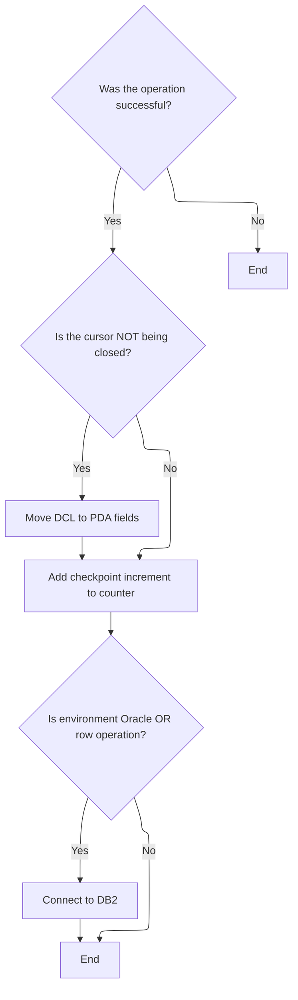

This section ensures that after each operation, the transaction state is finalized correctly, reporting fields are updated if necessary, progress is tracked, and the database connection is managed to maintain business and technical consistency.

| Category        | Rule Name                              | Description                                                                                                                                                                                                                                                                                                                                                           |
| --------------- | -------------------------------------- | --------------------------------------------------------------------------------------------------------------------------------------------------------------------------------------------------------------------------------------------------------------------------------------------------------------------------------------------------------------------- |
| Data validation | Success required for finalization      | If the operation is not successful, no further transaction finalization or reporting actions are performed, and the process ends for this transaction.                                                                                                                                                                                                                |
| Business logic  | Reporting fields update on open cursor | If the operation is successful and the cursor is not being closed, store/location fields are copied for reporting purposes to ensure accurate business reporting.                                                                                                                                                                                                     |
| Business logic  | Checkpoint counter increment           | After a successful operation, the transaction checkpoint counter is incremented by the defined increment value to track transaction progress.                                                                                                                                                                                                                         |
| Business logic  | Database connection synchronization    | If the environment is Oracle or the operation is an insert, modify, or purge row, the system must switch or maintain the connection to <SwmToken path="base/src/NNNS0120.cbl" pos="1962:10:10" line-data="198300        PERFORM  125-CONNECT-TO-DB2                               00198300">`DB2`</SwmToken> to keep the business record and technical state in sync. |

<SwmSnippet path="/base/src/NNNS0120.cbl" line="1953">

---

In <SwmToken path="base/src/NNNS0120.cbl" pos="1953:2:6" line-data="197400 120-EXIT-STUFF.                                                  00197400">`120-EXIT-STUFF`</SwmToken>, if the operation succeeded and we're not closing the cursor, we copy store/location fields for reporting. Then, if successful, we increment the transaction checkpoint counter to track progress.

```cobol
197400 120-EXIT-STUFF.                                                  00197400
197500     IF SUCCESS                                                   00197500
197600       IF NOT EXIT-CLOSE-CURSOR                                   00197600
197700         PERFORM 130-MOVE-DCL-2-PDA-FIELDS                        00197700
197800       END-IF                                                     00197800
197900         ADD WS-CHECKPOINT-INC TO YYYN005A-CHKPT-CNT              00197900
198000     END-IF                                                       00198000
```

---

</SwmSnippet>

<SwmSnippet path="/base/src/NNNS0120.cbl" line="1960">

---

After finalizing, we switch to <SwmToken path="base/src/NNNS0120.cbl" pos="1962:10:10" line-data="198300        PERFORM  125-CONNECT-TO-DB2                               00198300">`DB2`</SwmToken> if needed to keep the connection and business record in sync.

```cobol
198100     IF (YYYN005A-ORACLE       OR EXIT-PUT-INSERT-ROW             00198100
198200         OR EXIT-PUT-PURGE-ROW OR EXIT-PUT-MODIFY-ROW)            00198200
198300        PERFORM  125-CONNECT-TO-DB2                               00198300
198400     END-IF                                                       00198400
```

---

</SwmSnippet>

# Switching to <SwmToken path="base/src/NNNS0120.cbl" pos="1962:10:10" line-data="198300        PERFORM  125-CONNECT-TO-DB2                               00198300">`DB2`</SwmToken> and Restoring State

This section ensures that the application transitions smoothly from Oracle to <SwmToken path="base/src/NNNS0120.cbl" pos="1962:10:10" line-data="198300        PERFORM  125-CONNECT-TO-DB2                               00198300">`DB2`</SwmToken>, maintains error consistency, and restores the necessary business state for subsequent operations.

| Category       | Rule Name                   | Description                                                                                                                                                                                                                                                                                                        |
| -------------- | --------------------------- | ------------------------------------------------------------------------------------------------------------------------------------------------------------------------------------------------------------------------------------------------------------------------------------------------------------------ |
| Business logic | Business record restoration | The business record must be restored after switching to <SwmToken path="base/src/NNNS0120.cbl" pos="1962:10:10" line-data="198300        PERFORM  125-CONNECT-TO-DB2                               00198300">`DB2`</SwmToken> to ensure that the application state is consistent and ready for further processing. |

<SwmSnippet path="/base/src/NNNS0120.cbl" line="1970">

---

In <SwmToken path="base/src/NNNS0120.cbl" pos="1970:2:8" line-data="199100 125-CONNECT-TO-DB2.                                              00199100">`125-CONNECT-TO-DB2`</SwmToken>, we call the external <SwmToken path="base/src/NNNS0120.cbl" pos="1970:8:8" line-data="199100 125-CONNECT-TO-DB2.                                              00199100">`DB2`</SwmToken> connect program to switch the database, handle Oracle error conversion, and restore the business record. This sets up everything for the next dispatcher logic.

```cobol
199100 125-CONNECT-TO-DB2.                                              00199100
199200     CALL Z-DB2-CONNECT         USING W00N001A                    00199200
199300                                      SQLCA                       00199300
199400     .                                                            00199400
```

---

</SwmSnippet>

# <SwmToken path="base/src/NNNS0120.cbl" pos="1962:10:10" line-data="198300        PERFORM  125-CONNECT-TO-DB2                               00198300">`DB2`</SwmToken> Connection Setup and Error Handling

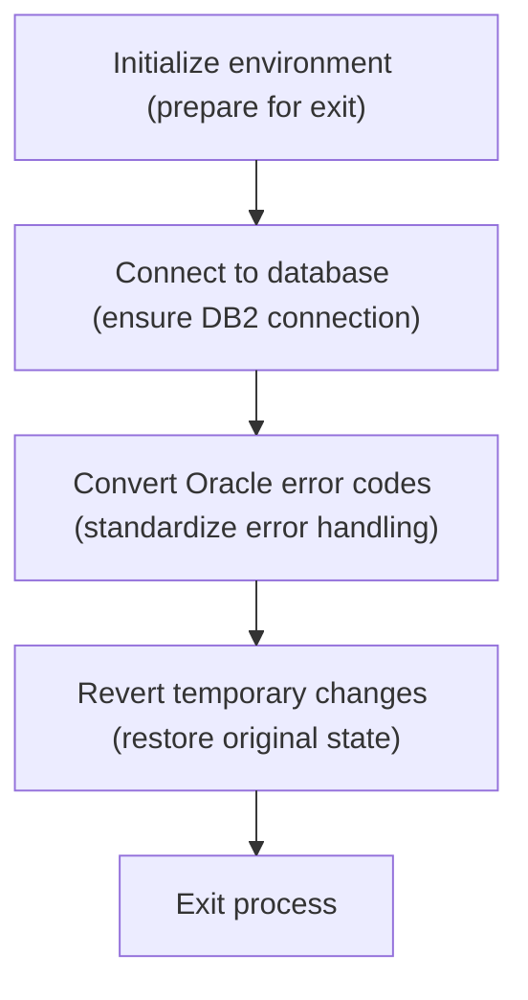

This section manages the transition to <SwmToken path="base/src/NNNS0120.cbl" pos="1962:10:10" line-data="198300        PERFORM  125-CONNECT-TO-DB2                               00198300">`DB2`</SwmToken> by initializing the environment, connecting to the database, handling error code standardization, and restoring the original business record state. It ensures reliable database switching and consistent error handling for downstream processes.

| Category        | Rule Name                                                                                                                                                                                  | Description                                                                                                                                                                                                                                                                                   |
| --------------- | ------------------------------------------------------------------------------------------------------------------------------------------------------------------------------------------ | --------------------------------------------------------------------------------------------------------------------------------------------------------------------------------------------------------------------------------------------------------------------------------------------- |
| Data validation | Environment Initialization Required                                                                                                                                                        | The system must always initialize the environment and prepare for a clean exit before attempting any database operations.                                                                                                                                                                     |
| Data validation | Mandatory <SwmToken path="base/src/NNNS0120.cbl" pos="1962:10:10" line-data="198300        PERFORM  125-CONNECT-TO-DB2                               00198300">`DB2`</SwmToken> Connection | A connection to the <SwmToken path="base/src/NNNS0120.cbl" pos="1962:10:10" line-data="198300        PERFORM  125-CONNECT-TO-DB2                               00198300">`DB2`</SwmToken> database must be established before any business logic that depends on database access is executed. |
| Business logic  | Standardized Error Codes                                                                                                                                                                   | Any Oracle-specific error codes encountered during the process must be converted to a standardized format recognized by the system.                                                                                                                                                           |
| Business logic  | Restore Original State                                                                                                                                                                     | After database operations, any temporary changes to the business record must be reverted to restore the original state.                                                                                                                                                                       |

<SwmSnippet path="/base/src/YYYS0211.cbl" line="32">

---

In <SwmToken path="base/src/YYYS0211.cbl" pos="32:2:6" line-data="004700 0000-EXIT-DISPATCHER.                                            00004700">`0000-EXIT-DISPATCHER`</SwmToken>, we initialize the business record, connect to <SwmToken path="base/src/YYYS0211.cbl" pos="34:10:10" line-data="004900     PERFORM 200-CONNECT-TO-DB2                                   00004900">`DB2`</SwmToken>, convert any Oracle error codes, and restore the saved record. This keeps the system state and error handling consistent after switching databases.

```cobol
004700 0000-EXIT-DISPATCHER.                                            00004700
004800     PERFORM 100-INITIALIZATION                                   00004800
004900     PERFORM 200-CONNECT-TO-DB2                                   00004900
005000     PERFORM 300-CNV-ORACLE-SQLCODE                               00005000
005100     PERFORM 400-REVERT-SAVED-XXXN001A                            00005100
005300     GOBACK                                                       00005300
005400     .                                                            00005400
```

---

</SwmSnippet>

<SwmSnippet path="/base/src/YYYS0211.cbl" line="53">

---

In <SwmToken path="base/src/YYYS0211.cbl" pos="53:2:8" line-data="007300 200-CONNECT-TO-DB2.                                              00007300">`200-CONNECT-TO-DB2`</SwmToken>, we set the flag to switch to <SwmToken path="base/src/YYYS0211.cbl" pos="53:8:8" line-data="007300 200-CONNECT-TO-DB2.                                              00007300">`DB2`</SwmToken> and call the connection manager program, passing the business record and connection context so the system updates its active database.

```cobol
007300 200-CONNECT-TO-DB2.                                              00007300
007400     SET YYYC0220-SET-DB2-CON TO TRUE                             00007400
007500     CALL YYYS0220-DBMS-CON-MGR USING                             00007500
007600         XXXN001A                                                 00007600
007700         YYYC0220                                                 00007700
008100     .                                                            00008100
```

---

</SwmSnippet>

# Mapping Oracle Errors to Internal Codes

This section ensures that Oracle-specific errors are translated into internal error codes, allowing the system to handle errors consistently and independently of the underlying database technology.

| Category        | Rule Name                            | Description                                                                                                                                                                      |
| --------------- | ------------------------------------ | -------------------------------------------------------------------------------------------------------------------------------------------------------------------------------- |
| Data validation | Conditional error mapping on success | Only map Oracle errors to internal codes if the operation is marked as successful (SUCCESS = 0).                                                                                 |
| Business logic  | Oracle error mapping                 | If a database operation completes successfully but the Oracle SQLCODE is -84, the Oracle error must be mapped to an internal error code using the designated conversion routine. |
| Business logic  | Standardized error output            | The internal error code and message produced by the conversion must be used for all subsequent error handling and reporting within the application.                              |

<SwmSnippet path="/base/src/YYYS0211.cbl" line="65">

---

In <SwmToken path="base/src/YYYS0211.cbl" pos="65:2:8" line-data="009500 300-CNV-ORACLE-SQLCODE.                                          00009500">`300-CNV-ORACLE-SQLCODE`</SwmToken>, we check for SQLCODE -84 after a successful operation and call the Oracle error conversion routine to map the error to our internal format for consistent handling.

```cobol
009500 300-CNV-ORACLE-SQLCODE.                                          00009500
009600     IF  SUCCESS                                                  00009600
009610     AND SQLCODE = -84                                            00009610
009720       CALL Z-ORA-ERR-CONVERSION USING                            00009720
009730           XXXN001A                                               00009730
009740           SQLCA                                                  00009740
009750     END-IF                                                       00009750
010200     .                                                            00010200
```

---

</SwmSnippet>

# Formatting and Mapping Error Messages

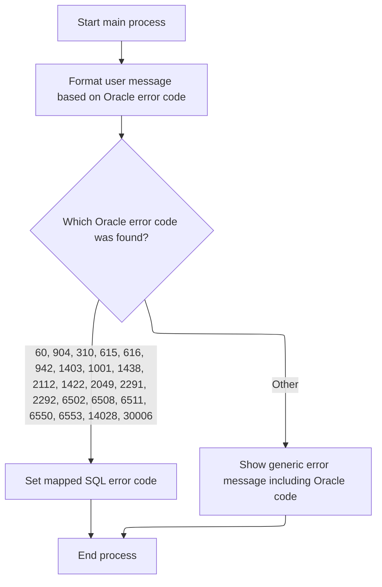

This section is responsible for translating Oracle error messages into user-friendly messages and mapping them to corresponding <SwmToken path="base/src/NNNS0120.cbl" pos="1962:10:10" line-data="198300        PERFORM  125-CONNECT-TO-DB2                               00198300">`DB2`</SwmToken> SQL error codes. This ensures that users and downstream systems receive consistent and understandable error information, regardless of the underlying database technology.

| Category        | Rule Name                                                                                                                                                                                     | Description                                                                                                                                                                                                                                                                                                                                                                                                                  |
| --------------- | --------------------------------------------------------------------------------------------------------------------------------------------------------------------------------------------- | ---------------------------------------------------------------------------------------------------------------------------------------------------------------------------------------------------------------------------------------------------------------------------------------------------------------------------------------------------------------------------------------------------------------------------- |
| Data validation | Clear previous error messages                                                                                                                                                                 | All error message fields must be cleared before formatting and mapping a new error message, to prevent residual data from previous errors from being displayed to the user.                                                                                                                                                                                                                                                  |
| Data validation | Parse Oracle error message                                                                                                                                                                    | The Oracle error message string must be parsed into separate fields, with the error code extracted for mapping and display purposes.                                                                                                                                                                                                                                                                                         |
| Business logic  | Oracle to <SwmToken path="base/src/NNNS0120.cbl" pos="1962:10:10" line-data="198300        PERFORM  125-CONNECT-TO-DB2                               00198300">`DB2`</SwmToken> error mapping | If the Oracle error code is one of the following: 60, 904, 310, 615, 616, 942, 1403, 1001, 1438, 2112, 1422, 2049, 2291, 2292, 6502, 6508, 6511, 6550, 6553, 14028, or 30006, it must be mapped to a specific <SwmToken path="base/src/NNNS0120.cbl" pos="1962:10:10" line-data="198300        PERFORM  125-CONNECT-TO-DB2                               00198300">`DB2`</SwmToken> SQLCODE as defined in the mapping table. |

<SwmSnippet path="/base/src/YYYS0212.cbl" line="29">

---

In <SwmToken path="base/src/YYYS0212.cbl" pos="29:2:6" line-data="003800 000-MAIN-PROCESS.                                                00003800">`000-MAIN-PROCESS`</SwmToken>, we clear out error message fields, then format the Oracle error into a user-friendly code and message before returning. This makes sure users see something readable.

```cobol
003800 000-MAIN-PROCESS.                                                00003800
003900     PERFORM 100-INITIALIZE                                       00003900
004000     PERFORM 200-FORMAT-USER-MSG-TXT                              00004000
004100     GOBACK                                                       00004100
004200     .                                                            00004200
```

---

</SwmSnippet>

<SwmSnippet path="/base/src/YYYS0212.cbl" line="50">

---

In <SwmToken path="base/src/YYYS0212.cbl" pos="50:2:10" line-data="005900 200-FORMAT-USER-MSG-TXT.                                         00005900">`200-FORMAT-USER-MSG-TXT`</SwmToken>, we split the Oracle error string into four fields, grab the error code, and use a switch-case to map it to a <SwmToken path="base/src/NNNS0120.cbl" pos="1962:10:10" line-data="198300        PERFORM  125-CONNECT-TO-DB2                               00198300">`DB2`</SwmToken> SQLCODE. If the code isn't recognized, we build a default error message for the user.

```cobol
005900 200-FORMAT-USER-MSG-TXT.                                         00005900
006000     UNSTRING SQLERRMC  DELIMITED BY SPACE INTO                   00006000
006100                        WS-ERR-MSG1                               00006100
006200                        WS-ERR-MSG2                               00006200
006300                        WS-ERR-MSG3                               00006300
006400                        WS-ERR-ORA-CODE                           00006400
006500     EVALUATE WS-ERR-ORA-CODE                                     00006500
006510       WHEN  '60   '                                              00006510
006520         MOVE  -911                             TO SQLCODE        00006520
006600       WHEN  '904  '                                              00006600
006700       WHEN  '310  '                                              00006700
006800         MOVE  -206                             TO SQLCODE        00006800
006900       WHEN  '615  '                                              00006900
007000       WHEN  '616  '                                              00007000
007100         MOVE  -420                             TO SQLCODE        00007100
007200       WHEN  '942  '                                              00007200
007300         MOVE  -204                             TO SQLCODE        00007300
007400       WHEN  '1403 '                                              00007400
007500         MOVE  -100                             TO SQLCODE        00007500
007600       WHEN  '1001 '                                              00007600
007700         MOVE  -501                             TO SQLCODE        00007700
007800       WHEN  '1438 '                                              00007800
007900         MOVE  -413                             TO SQLCODE        00007900
008000       WHEN  '2112 '                                              00008000
008100       WHEN  '1422 '                                              00008100
008200         MOVE  -811                             TO SQLCODE        00008200
008300       WHEN  '2049 '                                              00008300
008400         MOVE  -913                             TO SQLCODE        00008400
008500       WHEN  '2291 '                                              00008500
008600         MOVE  -530                             TO SQLCODE        00008600
008700       WHEN  '2292 '                                              00008700
008800         MOVE  -532                             TO SQLCODE        00008800
008900       WHEN  '6502 '                                              00008900
009000         MOVE  -304                             TO SQLCODE        00009000
009100       WHEN  '6508 '                                              00009100
009200         MOVE  -440                             TO SQLCODE        00009200
009300       WHEN  '6511 '                                              00009300
009400         MOVE  -502                             TO SQLCODE        00009400
009500       WHEN  '6550 '                                              00009500
009600       WHEN  '6553 '                                              00009600
009700         MOVE  -440                             TO SQLCODE        00009700
009800       WHEN  '14028'                                              00009800
009900         MOVE  -538                             TO SQLCODE        00009900
010000       WHEN  '30006'                                              00010000
010100         MOVE  -904                             TO SQLCODE        00010100
010200       WHEN OTHER                                                 00010200
010300         STRING 'Error in YYYS0212. Oracle code:'                 00010300
010300                 WS-ERR-ORA-CODE                                  00010320
010300         DELIMITED BY SIZE INTO IS-RTRN-MSG2-TXT                  00010330
010500     END-EVALUATE                                                 00010500
010600     MOVE SPACES                                TO SQLERRMC       00010600
010700     .                                                            00010700
```

---

</SwmSnippet>

&nbsp;

*This is an auto-generated document by Swimm 🌊 and has not yet been verified by a human*

<SwmMeta version="3.0.0" repo-id="Z2l0aHViJTNBJTNBU3dpbW1pby1keW5jYWxsLWRlbW8lM0ElM0FHaXJpLVN3aW1t" repo-name="Swimmio-dyncall-demo"><sup>Powered by [Swimm](https://app.swimm.io/)</sup></SwmMeta>
