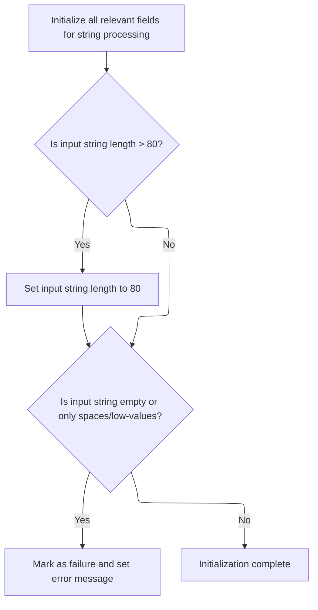
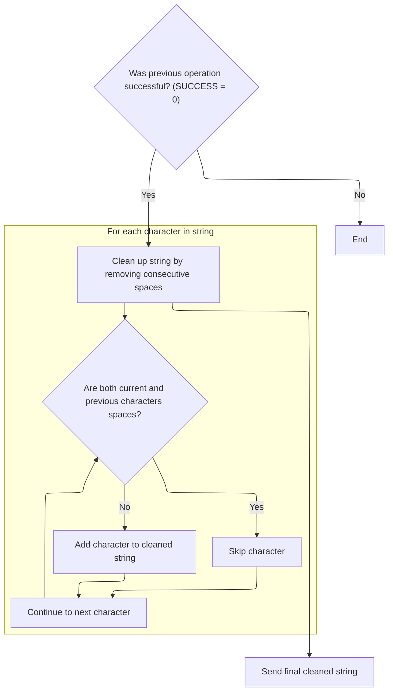

# Overview

This document describes the flow for cleaning up concatenated text strings, such as names, by removing extra spaces and ensuring only single spaces separate characters. The flow validates and processes the input, returning a cleaned string or an error message if the input is invalid.

## Dependencies

### Program

- <SwmToken path="base/src/YYYS0134.cbl" pos="74:5:5" line-data="011120         MOVE &#39;YYYS0134 - Text not passed for parsing.&#39;           00011120">`YYYS0134`</SwmToken> (<SwmPath>[base/src/YYYS0134.cbl](base/src/YYYS0134.cbl)</SwmPath>)

### Copybooks

- <SwmToken path="base/src/YYYS0134.cbl" pos="27:4:4" line-data="006900 COPY YYYN000A.                                                   00006900">`YYYN000A`</SwmToken> (<SwmPath>[base/src/YYYN000A.cpy](base/src/YYYN000A.cpy)</SwmPath>)
- <SwmToken path="base/src/YYYS0134.cbl" pos="63:4:4" line-data="011100     INITIALIZE XXXN001A                                          00011100">`XXXN001A`</SwmToken> (<SwmPath>[base/src/XXXN001A.cpy](base/src/XXXN001A.cpy)</SwmPath>)

# Where is this program used?

This program is used multiple times in the codebase as represented in the following diagram:

```mermaid
graph TD
  tivan("Translating Store Location Data (MMMS0158)") --> ppqal("Space Cruncher (YYYS0134)"):::currentEntity
click tivan openCode "base/src/MMMS0158.cbl:1"
2c0qx("Managing Location Data (NNNS0487)") --> ppqal("Space Cruncher (YYYS0134)"):::currentEntity
click 2c0qx openCode "base/src/NNNS0487.cbl:1"
  
  
click ppqal openCode "base/src/YYYS0134.cbl:1"
    classDef currentEntity color:#000000,fill:#7CB9F4

%% Swimm:
%% graph TD
%%   tivan("Translating Store Location Data (MMMS0158)") --> ppqal("Space Cruncher (<SwmToken path="base/src/YYYS0134.cbl" pos="74:5:5" line-data="011120         MOVE &#39;YYYS0134 - Text not passed for parsing.&#39;           00011120">`YYYS0134`</SwmToken>)"):::currentEntity
%% click tivan openCode "<SwmPath>[base/src/MMMS0158.cbl](base/src/MMMS0158.cbl)</SwmPath>:1"
%% 2c0qx("Managing Location Data (NNNS0487)") --> ppqal("Space Cruncher (<SwmToken path="base/src/YYYS0134.cbl" pos="74:5:5" line-data="011120         MOVE &#39;YYYS0134 - Text not passed for parsing.&#39;           00011120">`YYYS0134`</SwmToken>)"):::currentEntity
%% click 2c0qx openCode "<SwmPath>[base/src/NNNS0487.cbl](base/src/NNNS0487.cbl)</SwmPath>:1"
%%   
%%   
%% click ppqal openCode "<SwmPath>[base/src/YYYS0134.cbl](base/src/YYYS0134.cbl)</SwmPath>:1"
%%     classDef currentEntity color:#000000,fill:#7CB9F4
```



## Detailed View of the Program's Functionality

a. Starting the orchestration

The program begins by executing its main routine. The first action is to perform an initialization step, which is responsible for preparing the workspace and validating the input string. This ensures that the string provided for processing is suitable and avoids unnecessary computation on invalid data.

b. Validating and prepping input

During initialization, several workspace fields are reset to their default states. This includes clearing out any previous data in the output buffer, backup byte, and counters used for string manipulation.

The next check determines if the input string is longer than the allowed maximum (80 characters). If it is, the string length is forcibly set to the maximum, effectively trimming the input to fit within the safe bounds.

After handling the length, the code checks if the input string is empty or contains only spaces or special low-value characters. If this is the case, the process is marked as a failure, and an error message is set to inform the caller that no valid text was provided for parsing. If the input passes these checks, initialization is considered complete and the program proceeds to the next step.

c. Processing validated input

Once initialization is complete and the input is deemed valid, the program moves on to the string crunching phase. This step is only performed if the previous operation was successful.

The crunching routine iterates through each character of the input string. For every character, it checks if both the current character and the previous character are spaces. If they are, the current character is skipped, effectively removing consecutive spaces. If not, the character is added to the output buffer. The backup byte is updated to remember the last character processed, ensuring that only single spaces are retained between words.

This loop continues until all characters in the input string have been examined and the cleaned version of the string is constructed.

d. Sending the final cleaned string

After the string has been processed and cleaned, the program prepares to return the result to the caller. It first resets the output string to all spaces, ensuring that any leftover data from previous operations is cleared. Then, it copies the cleaned string from the workspace buffer into the output string, making it ready for use by the calling program.

This final step is only performed if all previous operations were successful. Once the cleaned string is sent, the program completes its execution and returns control to the caller.

# Rule Definition

| Paragraph Name                                                                                                                                                                       | Rule ID | Category          | Description                                                                                                                                                                                                                                    | Conditions                                                                                                              | Remarks                                                                                                                                                                                                                                                                                        |
| ------------------------------------------------------------------------------------------------------------------------------------------------------------------------------------ | ------- | ----------------- | ---------------------------------------------------------------------------------------------------------------------------------------------------------------------------------------------------------------------------------------------- | ----------------------------------------------------------------------------------------------------------------------- | ---------------------------------------------------------------------------------------------------------------------------------------------------------------------------------------------------------------------------------------------------------------------------------------------- |
| <SwmToken path="base/src/YYYS0134.cbl" pos="48:4:6" line-data="009200     PERFORM 100-INITIALIZATION                                   00009200">`100-INITIALIZATION`</SwmToken>     | RL-001  | Conditional Logic | If the input string length exceeds the maximum allowed (80), it is truncated to the maximum length before further processing.                                                                                                                  | The input string length is greater than 80.                                                                             | The maximum allowed string length is 80 characters. The string is truncated to this length if it exceeds it. The format is a string of up to 80 characters.                                                                                                                                    |
| <SwmToken path="base/src/YYYS0134.cbl" pos="48:4:6" line-data="009200     PERFORM 100-INITIALIZATION                                   00009200">`100-INITIALIZATION`</SwmToken>     | RL-002  | Conditional Logic | If the input string is all spaces or contains only low-values, the process fails and an error message is set.                                                                                                                                  | The input string is either all spaces or all low-values.                                                                | The error message set is: '<SwmToken path="base/src/YYYS0134.cbl" pos="74:5:5" line-data="011120         MOVE &#39;YYYS0134 - Text not passed for parsing.&#39;           00011120">`YYYS0134`</SwmToken> - Text not passed for parsing.' The output format for the error message is a string. |
| <SwmToken path="base/src/YYYS0134.cbl" pos="50:4:8" line-data="009400       PERFORM 200-CRUNCH-STRING                                  00009400">`200-CRUNCH-STRING`</SwmToken>      | RL-003  | Computation       | While traversing the input string, if a space is found and the previous character was also a space, the space is skipped. Otherwise, the character is copied to the output string, ensuring that no more than one space appears consecutively. | While iterating through the input string, the current character is a space and the previous character was also a space. | The output string is realigned so that only single spaces separate non-space characters. The format is a string of up to 80 characters, with no more than one consecutive space.                                                                                                               |
| <SwmToken path="base/src/YYYS0134.cbl" pos="53:4:10" line-data="009700       PERFORM 300-SEND-FINAL-STRING                              00009700">`300-SEND-FINAL-STRING`</SwmToken> | RL-004  | Data Assignment   | After processing, the output string replaces the original input string, ensuring that only single spaces separate words and the string is properly aligned.                                                                                    | The string has been successfully processed without errors.                                                              | The output string is up to 80 characters, with redundant spaces removed. The output replaces the original input string.                                                                                                                                                                        |

# User Stories

## User Story 1: Input String Validation and Error Handling

---

### Story Description:

As a user, I want the system to validate my input string and provide clear error messages if the input is invalid so that I can ensure my data is processed correctly and receive feedback when it is not.

---

### Business Rule Mapping:

| Rule ID | Paragraph Name                                                                                                                                                                   | Rule Description                                                                                                              |
| ------- | -------------------------------------------------------------------------------------------------------------------------------------------------------------------------------- | ----------------------------------------------------------------------------------------------------------------------------- |
| RL-001  | <SwmToken path="base/src/YYYS0134.cbl" pos="48:4:6" line-data="009200     PERFORM 100-INITIALIZATION                                   00009200">`100-INITIALIZATION`</SwmToken> | If the input string length exceeds the maximum allowed (80), it is truncated to the maximum length before further processing. |
| RL-002  | <SwmToken path="base/src/YYYS0134.cbl" pos="48:4:6" line-data="009200     PERFORM 100-INITIALIZATION                                   00009200">`100-INITIALIZATION`</SwmToken> | If the input string is all spaces or contains only low-values, the process fails and an error message is set.                 |

---

### Relevant Functionality:

- <SwmToken path="base/src/YYYS0134.cbl" pos="48:4:6" line-data="009200     PERFORM 100-INITIALIZATION                                   00009200">`100-INITIALIZATION`</SwmToken>
  1. **RL-001:**
     - If the input string length > 80:
       - Set the input string length to 80.
  2. **RL-002:**
     - If the input string is all spaces or all low-values:
       - Mark the process as failed.
       - Set the return message text to '<SwmToken path="base/src/YYYS0134.cbl" pos="74:5:5" line-data="011120         MOVE &#39;YYYS0134 - Text not passed for parsing.&#39;           00011120">`YYYS0134`</SwmToken> - Text not passed for parsing.'

## User Story 2: String Processing and Output Assignment

---

### Story Description:

As a user, I want the system to process my input string by removing redundant spaces and properly aligning the text so that the final output is clean, readable, and replaces my original input.

---

### Business Rule Mapping:

| Rule ID | Paragraph Name                                                                                                                                                                       | Rule Description                                                                                                                                                                                                                               |
| ------- | ------------------------------------------------------------------------------------------------------------------------------------------------------------------------------------ | ---------------------------------------------------------------------------------------------------------------------------------------------------------------------------------------------------------------------------------------------- |
| RL-003  | <SwmToken path="base/src/YYYS0134.cbl" pos="50:4:8" line-data="009400       PERFORM 200-CRUNCH-STRING                                  00009400">`200-CRUNCH-STRING`</SwmToken>      | While traversing the input string, if a space is found and the previous character was also a space, the space is skipped. Otherwise, the character is copied to the output string, ensuring that no more than one space appears consecutively. |
| RL-004  | <SwmToken path="base/src/YYYS0134.cbl" pos="53:4:10" line-data="009700       PERFORM 300-SEND-FINAL-STRING                              00009700">`300-SEND-FINAL-STRING`</SwmToken> | After processing, the output string replaces the original input string, ensuring that only single spaces separate words and the string is properly aligned.                                                                                    |

---

### Relevant Functionality:

- <SwmToken path="base/src/YYYS0134.cbl" pos="50:4:8" line-data="009400       PERFORM 200-CRUNCH-STRING                                  00009400">`200-CRUNCH-STRING`</SwmToken>
  1. **RL-003:**
     - For each character in the input string:
       - If the character is a space and the previous character was also a space:
         - Skip copying this character.
       - Else:
         - Copy the character to the output string.
       - Update the previous character tracker.
- <SwmToken path="base/src/YYYS0134.cbl" pos="53:4:10" line-data="009700       PERFORM 300-SEND-FINAL-STRING                              00009700">`300-SEND-FINAL-STRING`</SwmToken>
  1. **RL-004:**
     - Clear the input string area.
     - Copy the processed output string into the input string area, up to the processed length.

# Workflow

# Starting the orchestration

This section is responsible for starting the orchestration by validating the input string before any further processing. It ensures that only valid input strings are processed, preventing unnecessary computation or errors later in the flow.

| Category        | Rule Name              | Description                                                                                                                                                                                                |
| --------------- | ---------------------- | ---------------------------------------------------------------------------------------------------------------------------------------------------------------------------------------------------------- |
| Data validation | Empty input rejection  | If the input string is empty, the process must not proceed and an error status and message must be set.                                                                                                    |
| Data validation | Input length limit     | If the input string exceeds the maximum allowed length, the process must not proceed and an error status and message must be set. The maximum length must be clearly defined in the product documentation. |
| Business logic  | Proceed on valid input | If the input string passes all validation checks, the orchestration must proceed to the next step in the process.                                                                                          |

<SwmSnippet path="/base/src/YYYS0134.cbl" line="47">

---

In <SwmToken path="base/src/YYYS0134.cbl" pos="47:2:4" line-data="009100 000-MAIN.                                                        00009100">`000-MAIN`</SwmToken>, we kick off the flow by calling <SwmToken path="base/src/YYYS0134.cbl" pos="48:4:6" line-data="009200     PERFORM 100-INITIALIZATION                                   00009200">`100-INITIALIZATION`</SwmToken> to check if the input string is valid. This step is needed because we don't want to waste time crunching or sending strings that are empty or too long. Only if the input passes validation do we move on to the next steps.

```cobol
009100 000-MAIN.                                                        00009100
009200     PERFORM 100-INITIALIZATION                                   00009200
```

---

</SwmSnippet>

## Validating and prepping input



This section ensures that the input string is suitable for processing by validating its length and content. If the input is too long, it is trimmed. If the input is empty or contains only spaces or low-values, an error is returned and processing is halted.

| Category        | Rule Name                        | Description                                                                                                                                                                   |
| --------------- | -------------------------------- | ----------------------------------------------------------------------------------------------------------------------------------------------------------------------------- |
| Data validation | Maximum input length enforcement | If the input string length exceeds 80 characters, it must be truncated to 80 characters before any further processing.                                                        |
| Data validation | Empty or invalid input rejection | If the input string is empty, contains only spaces, or contains only low-values, the process must be marked as a failure and an error message must be returned to the caller. |

<SwmSnippet path="/base/src/YYYS0134.cbl" line="62">

---

In <SwmToken path="base/src/YYYS0134.cbl" pos="62:2:4" line-data="011000 100-INITIALIZATION.                                              00011000">`100-INITIALIZATION`</SwmToken>, we set up the workspace and make sure the input string isn't longer than allowed. If it is, we trim it down to fit the max length. This keeps things safe for later steps.

```cobol
011000 100-INITIALIZATION.                                              00011000
011100     INITIALIZE XXXN001A                                          00011100
011101                WS-OT-STR                                         00011101
011102                WS-BKUP-BYTE                                      00011102
011103                J                                                 00011103
011104                                                                  00011104
011105     IF STR-LEN          > WS-MAX-STR-LEN                         00011105
011106       MOVE WS-MAX-STR-LEN            TO STR-LEN                  00011106
011107     END-IF                                                       00011107
```

---

</SwmSnippet>

<SwmSnippet path="/base/src/YYYS0134.cbl" line="72">

---

After checking the input, if it's just spaces or junk characters, we set FAILURE and return an error message so the caller knows nothing useful was passed in.

```cobol
011110     IF STR EQUAL SPACES OR LOW-VALUES                            00011110
011111         SET FAILURE                  TO TRUE                     00011111
011120         MOVE 'YYYS0134 - Text not passed for parsing.'           00011120
011130           TO IS-RTRN-MSG-TXT                                     00011130
011160     END-IF                                                       00011160
```

---

</SwmSnippet>

## Processing validated input



<SwmSnippet path="/base/src/YYYS0134.cbl" line="49">

---

Back in <SwmToken path="base/src/YYYS0134.cbl" pos="47:2:4" line-data="009100 000-MAIN.                                                        00009100">`000-MAIN`</SwmToken>, after initialization, we only call <SwmToken path="base/src/YYYS0134.cbl" pos="50:4:8" line-data="009400       PERFORM 200-CRUNCH-STRING                                  00009400">`200-CRUNCH-STRING`</SwmToken> if the input passed validation. This step strips out extra spaces so the output is clean.

```cobol
009300     IF SUCCESS                                                   00009300
009400       PERFORM 200-CRUNCH-STRING                                  00009400
009500     END-IF                                                       00009500
```

---

</SwmSnippet>

<SwmSnippet path="/base/src/YYYS0134.cbl" line="84">

---

<SwmToken path="base/src/YYYS0134.cbl" pos="84:2:6" line-data="012500 200-CRUNCH-STRING.                                               00012500">`200-CRUNCH-STRING`</SwmToken> loops through the input, copying characters to the output unless they're consecutive spaces. It uses a backup byte to remember the last character, so only the first space in a sequence gets through.

```cobol
012500 200-CRUNCH-STRING.                                               00012500
012600                                                                  00012600
013500     PERFORM VARYING I FROM +1 BY +1 UNTIL I > STR-LEN            00013500
013501                                                                  00013501
013502       IF STR-B(I) EQUAL SPACE AND WS-BKUP-BYTE EQUAL SPACE       00013502
013503         CONTINUE                                                 00013503
013504       ELSE                                                       00013504
013505         ADD +1                       TO J                        00013505
013506                                                                  00013506
013507         MOVE STR-B(I)                TO WS-STR-B(J)              00013507
013508       END-IF                                                     00013508
013509                                                                  00013509
013510       MOVE STR-B(I)                  TO WS-BKUP-BYTE             00013510
013520                                                                  00013520
013600     END-PERFORM                                                  00013600
```

---

</SwmSnippet>

<SwmSnippet path="/base/src/YYYS0134.cbl" line="52">

---

Back in <SwmToken path="base/src/YYYS0134.cbl" pos="47:2:4" line-data="009100 000-MAIN.                                                        00009100">`000-MAIN`</SwmToken>, after crunching the string, we call <SwmToken path="base/src/YYYS0134.cbl" pos="53:4:10" line-data="009700       PERFORM 300-SEND-FINAL-STRING                              00009700">`300-SEND-FINAL-STRING`</SwmToken> to copy the cleaned-up result back to the caller. This only happens if everything worked up to this point.

```cobol
009600     IF SUCCESS                                                   00009600
009700       PERFORM 300-SEND-FINAL-STRING                              00009700
009800     END-IF                                                       00009800
010300     GOBACK                                                       00010300
010400     .                                                            00010400
```

---

</SwmSnippet>

<SwmSnippet path="/base/src/YYYS0134.cbl" line="102">

---

<SwmToken path="base/src/YYYS0134.cbl" pos="102:2:8" line-data="036600 300-SEND-FINAL-STRING.                                           00036600">`300-SEND-FINAL-STRING`</SwmToken> resets the output string to spaces, then copies the processed result over it. The double MOVE is probably there to guarantee the output is clean, or to satisfy some system requirement.

```cobol
036600 300-SEND-FINAL-STRING.                                           00036600
036700     MOVE SPACES                      TO STR(1:STR-LEN)           00036700
036800     MOVE WS-OT-STR                   TO STR(1:STR-LEN)           00036800
037000     .                                                            00037000
```

---

</SwmSnippet>

&nbsp;

*This is an auto-generated document by Swimm 🌊 and has not yet been verified by a human*

<SwmMeta version="3.0.0" repo-id="Z2l0aHViJTNBJTNBU3dpbW1pby1keW5jYWxsLWRlbW8lM0ElM0FHaXJpLVN3aW1t" repo-name="Swimmio-dyncall-demo"><sup>Powered by [Swimm](https://app.swimm.io/)</sup></SwmMeta>
