This document describes the business flow for deleting a store location and all associated data. When a store is removed, the process ensures that all retail, department, and billing records linked to the location are purged in a controlled sequence. The flow receives store location details as input and outputs a system state where all related records have been deleted, maintaining data integrity.

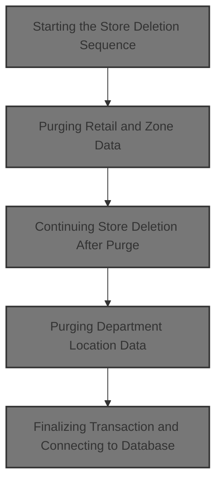

# Spec

## Detailed View of the Program's Functionality

# Swimmio-dyncall-demo: Store Deletion Flow

## a. Starting the Store Deletion Sequence

The store deletion process begins by initiating a sequence that ensures all related data is purged in a safe and consistent order. The main entry point for deleting a store is a routine that orchestrates the following steps:

1. **Purge Retail and Zone Data:**\
   The process first calls a subroutine responsible for purging all retail and advertising zone records associated with the store location. This is done to prevent any dangling references before the store itself is deleted.

2. **Check Purge Success:**\
   After attempting the purge, the process checks if the operation was successful by examining the database status code. If the purge was successful, it proceeds to update the working data structures with the location type and number, sets a flag indicating a purge operation, and then delegates further actions to the retail location data access layer.

3. **Handle DAO Results:**\
   If the retail location DAO reports that no data was found (a specific status code), the process resets the status code to indicate success and continues. This pattern is repeated for department location DAO and billing cost deletion, ensuring that missing data does not cause the overall process to fail.

4. **Delete Billing Records:**\
   After handling retail and department locations, the process deletes any billing records associated with the store location.

5. **Cleanup:**\
   The process closes any open database cursors and performs cleanup to release resources.

6. **Dispatch Further Actions:**\
   Finally, the process dispatches any additional actions required for the retail location, finalizes the transaction, and ensures the database connection is properly managed.

## b. Purging Retail and Zone Data

This step is handled by a dedicated subroutine that:

1. **Prepare for Cursor Operations:**\
   Sets a flag indicating that the end of the cursor has not been reached and opens a database cursor to fetch classification records related to the store location.

2. **Open Cursor and Error Handling:**\
   Moves the location type and number into the cursor structure and attempts to open the cursor. If the cursor fails to open, it sets a failure status and constructs an error message.

3. **Iterate and Purge Records:**\
   If the cursor opens successfully, the process enters a loop where it fetches each classification record. For each record, it checks for success and whether more records are available. If so, it calls a subroutine to purge the retail and zone record and reconnects to the database as needed.

4. **Close Cursor:**\
   After all records are processed or an error occurs, the cursor is closed. If closing the cursor fails, a failure status is set and an error message is constructed.

## c. Continuing Store Deletion After Purge

After purging retail and zone data:

1. **Update Store Location Details:**\
   If the purge was successful, the process updates the working data structures with the location type and number, sets the purge flag, and calls the retail location DAO.

2. **Handle DAO Results:**\
   If the DAO reports no data found, the status code is reset to success, and the process continues.

3. **Purge Department Location Data:**\
   The process then prepares the department location structure, sets the purge flag, and calls the department DAO. Again, if no data is found, the status code is reset.

4. **Delete Billing Records:**\
   If all previous steps succeed, the process deletes billing records for the location. If no records are found, the status code is reset.

## d. Delegating Retail Location Operations

The process delegates retail location operations to a separate module (DAO) by passing all necessary context and data structures. This module is responsible for handling all business logic related to retail location database operations, such as opening/closing cursors, fetching records, modifying, inserting, or purging rows, and handling special I/O functions.

## e. Dispatching Retail Location Actions

Within the retail location DAO:

1. **Initialization:**\
   The DAO initializes its working storage and prepares for the requested operation.

2. **Operation Dispatch:**\
   Based on the operation code, the DAO routes the request to the appropriate handler (open/close cursor, fetch unique/next row, modify/insert/purge row, or special I/O).

3. **Event Handling:**\
   After each operation, the DAO may trigger additional business events, such as issuing master data or store events, synchronizing data, or staging events for downstream systems.

## f. Finalizing Transaction and Connecting to Database

At the end of the process:

1. **Move Data for Output:**\
   If the operation was not a cursor close, the process moves all relevant fields from the working data structure to the output structure, handling special cases for dates and times (e.g., blanking out default values, converting time formats).

2. **Checkpoint and Database Connection:**\
   The process increments a checkpoint counter and, if the operation involved Oracle or was an insert, purge, or modify, connects to the DB2 database for finalization.

3. **Error Handling:**\
   Any errors encountered during database operations are handled by setting failure statuses and constructing detailed error messages for downstream processing.

## g. Purging Department Location Data

This step mirrors the retail location purge:

1. **Prepare and Call DAO:**\
   The process sets up the department location structure, marks the purge flag, and calls the department DAO.

2. **Handle DAO Results:**\
   If the DAO reports no data found, the status code is reset to success.

3. **Delete Billing Records:**\
   If all previous steps succeed, the process deletes billing records for the location, resetting the status code if no records are found.

---

**Summary:**\
The store deletion flow in Swimmio-dyncall-demo is a robust, multi-step process that ensures all related data (retail, zone, department, billing) is purged in the correct order, with careful error handling and resource cleanup at each stage. The process is modular, delegating specific operations to dedicated DAOs and handling all necessary business events and data synchronization as part of the transaction.

# Rule Definition

| Paragraph Name                                                                                                                                                                                           | Rule ID | Category          | Description                                                                                                                                                                                                               | Conditions                                                                                | Remarks                                                                                                                                                 |
| -------------------------------------------------------------------------------------------------------------------------------------------------------------------------------------------------------- | ------- | ----------------- | ------------------------------------------------------------------------------------------------------------------------------------------------------------------------------------------------------------------------- | ----------------------------------------------------------------------------------------- | ------------------------------------------------------------------------------------------------------------------------------------------------------- |
| 100-INITIALIZATION, 110-MOVE-PDA-FIELDS-2-DCL                                                                                                                                                            | RL-001  | Conditional Logic | The system requires only the location type code and location number as mandatory input fields for the deletion process.                                                                                                   | Deletion process is initiated.                                                            | LOC-TYP-CD and LOC-NBR must be present in the input structure. Other fields are optional.                                                               |
| 1610-EXIT-PUT-PURGE-RETL, 1613-EXIT-PURGE-RETL                                                                                                                                                           | RL-002  | Computation       | Before any further deletion steps, all retail and advertising zone data associated with the specified location must be purged.                                                                                            | Deletion process is initiated for a location.                                             | Retail and advertising zone data are identified by LOC-TYP-CD and LOC-NBR. Purge is performed via DAO calls and SQL DELETEs.                            |
| 1610-DELETE-STORE, 2060-CALL-RETAIL-LOC-DAO                                                                                                                                                              | RL-003  | Conditional Logic | If the purge of retail and zone data is successful (SQLCODE = 0), update the retail location information and set the purge flag for the location.                                                                         | Purge of retail and zone data returns SQLCODE = 0.                                        | Purge flag is set in the output structure (e.g., YYYN110A-DEL, LOC-DEL).                                                                                |
| 2060-CALL-RETAIL-LOC-DAO                                                                                                                                                                                 | RL-004  | Computation       | Retail location operations are delegated to the appropriate DAO using the provided location context.                                                                                                                      | Retail location operation is required as part of deletion.                                | DAO is called with the location context (LOC-TYP-CD, LOC-NBR, etc.).                                                                                    |
| 1610-DELETE-STORE, 1620-DELETE-DSD-VENDOR, 1613-EXIT-PURGE-RETL, 1614-CLOSE-DEL-CSR1, 1694-EXIT-PURGE-FAX-NUM, 1695-CLOSE-DEL-CSR, 1610-EXIT-PUT-PURGE-RETL, 1612-FETCH-DEL-CSR1, 1693-FETCH-DEL-CSR     | RL-005  | Conditional Logic | If a DAO operation for retail location returns SQLCODE = 100 (not found), reset SQLCODE to 0 and continue the deletion process without treating it as an error.                                                           | Any DAO or SQL operation returns SQLCODE = 100 during deletion sequence.                  | SQLCODE = 100 is not treated as an error. SQLCODE is reset to 0 for further processing.                                                                 |
| 1610-DELETE-STORE, 2070-CALL-STR-LOC-DEPT-DAO                                                                                                                                                            | RL-006  | Conditional Logic | Update department location information and set the purge flag if the retail DAO operation is successful or not found.                                                                                                     | Retail DAO operation returns SQLCODE = 0 or 100.                                          | Purge flag is set in the output structure (e.g., YYYN110A-DEL, LOC-DEL).                                                                                |
| 1610-DELETE-STORE                                                                                                                                                                                        | RL-007  | Computation       | After department location processing, delete all billing records associated with the location.                                                                                                                            | Department location processing is complete (SQLCODE = 0 or 100).                          | Billing records are identified by STR_LOC_NUM and STR_LOC_TYP.                                                                                          |
| 1610-DELETE-STORE, 1620-DELETE-DSD-VENDOR, 1613-EXIT-PURGE-RETL, 1694-EXIT-PURGE-FAX-NUM, 1695-CLOSE-DEL-CSR, 1610-EXIT-PUT-PURGE-RETL, 1612-FETCH-DEL-CSR1, 1693-FETCH-DEL-CSR, 1600-EXIT-PUT-PURGE-ROW | RL-008  | Conditional Logic | If any SQL operation returns a negative SQLCODE (e.g., -532), set FAILURE to true, SUCCESS to false, and populate the return message text with an appropriate error message. Deletion flags must not be set in this case. | Any SQL operation returns SQLCODE < 0 during deletion sequence.                           | FAILURE is set to true, SUCCESS to false, IS-RTRN-MSG-TXT is populated with error message. Deletion flags (YYYN110A-DEL, LOC-DEL) are not set.          |
| 1610-DELETE-STORE, 1600-EXIT-PUT-PURGE-ROW                                                                                                                                                               | RL-009  | Data Assignment   | On successful completion of all deletion steps (including cases where records are not found), set SUCCESS to true, FAILURE to false, and set the deletion flags (YYYN110A-DEL and LOC-DEL) to true.                       | All deletion steps complete with SQLCODE = 0 or 100, and no negative SQLCODE encountered. | SUCCESS = true, FAILURE = false, YYYN110A-DEL = true, LOC-DEL = true in the result structure.                                                           |
| 1610-DELETE-STORE, 1600-EXIT-PUT-PURGE-ROW, 120-EXIT-STUFF                                                                                                                                               | RL-010  | Data Assignment   | The system must return a result structure containing SQLCODE, SUCCESS, FAILURE, IS-RTRN-MSG-TXT, YYYN110A-DEL, and LOC-DEL to indicate the outcome of the deletion process.                                               | Deletion process completes (success or failure).                                          | Result structure includes: SQLCODE (number), SUCCESS (boolean), FAILURE (boolean), IS-RTRN-MSG-TXT (string), YYYN110A-DEL (boolean), LOC-DEL (boolean). |

# User Stories

## User Story 1: Minimal Input and Result Structure

---

### Story Description:

As a system user, I want to provide only the location type code and location number to delete a store, and receive a result structure indicating the outcome, so that the process is simple and I am informed of the result.

---

### Business Rule Mapping:

| Rule ID | Paragraph Name                                             | Rule Description                                                                                                                                                            |
| ------- | ---------------------------------------------------------- | --------------------------------------------------------------------------------------------------------------------------------------------------------------------------- |
| RL-010  | 1610-DELETE-STORE, 1600-EXIT-PUT-PURGE-ROW, 120-EXIT-STUFF | The system must return a result structure containing SQLCODE, SUCCESS, FAILURE, IS-RTRN-MSG-TXT, YYYN110A-DEL, and LOC-DEL to indicate the outcome of the deletion process. |
| RL-001  | 100-INITIALIZATION, 110-MOVE-PDA-FIELDS-2-DCL              | The system requires only the location type code and location number as mandatory input fields for the deletion process.                                                     |

---

### Relevant Functionality:

- **1610-DELETE-STORE**
  1. **RL-010:**
     - At the end of the process, populate the result structure with the current values of SQLCODE, SUCCESS, FAILURE, IS-RTRN-MSG-TXT, YYYN110A-DEL, and LOC-DEL.
     - Return this structure to the caller.
- **100-INITIALIZATION**
  1. **RL-001:**
     - On initialization, check that LOC-TYP-CD and LOC-NBR are present in the input structure.
     - If either is missing, set FAILURE to true and populate IS-RTRN-MSG-TXT with an error message.
     - Otherwise, proceed with deletion steps.

## User Story 2: Robust and Tolerant Deletion Workflow

---

### Story Description:

As a system, I want to purge all retail, advertising zone, department, and billing data associated with a location, delegate operations to DAOs, and treat missing data as successful, so that the deletion process is thorough and tolerant of absent records.

---

### Business Rule Mapping:

| Rule ID | Paragraph Name                                                                                                                                                                                       | Rule Description                                                                                                                                                |
| ------- | ---------------------------------------------------------------------------------------------------------------------------------------------------------------------------------------------------- | --------------------------------------------------------------------------------------------------------------------------------------------------------------- |
| RL-003  | 1610-DELETE-STORE, 2060-CALL-RETAIL-LOC-DAO                                                                                                                                                          | If the purge of retail and zone data is successful (SQLCODE = 0), update the retail location information and set the purge flag for the location.               |
| RL-005  | 1610-DELETE-STORE, 1620-DELETE-DSD-VENDOR, 1613-EXIT-PURGE-RETL, 1614-CLOSE-DEL-CSR1, 1694-EXIT-PURGE-FAX-NUM, 1695-CLOSE-DEL-CSR, 1610-EXIT-PUT-PURGE-RETL, 1612-FETCH-DEL-CSR1, 1693-FETCH-DEL-CSR | If a DAO operation for retail location returns SQLCODE = 100 (not found), reset SQLCODE to 0 and continue the deletion process without treating it as an error. |
| RL-006  | 1610-DELETE-STORE, 2070-CALL-STR-LOC-DEPT-DAO                                                                                                                                                        | Update department location information and set the purge flag if the retail DAO operation is successful or not found.                                           |
| RL-007  | 1610-DELETE-STORE                                                                                                                                                                                    | After department location processing, delete all billing records associated with the location.                                                                  |
| RL-002  | 1610-EXIT-PUT-PURGE-RETL, 1613-EXIT-PURGE-RETL                                                                                                                                                       | Before any further deletion steps, all retail and advertising zone data associated with the specified location must be purged.                                  |
| RL-004  | 2060-CALL-RETAIL-LOC-DAO                                                                                                                                                                             | Retail location operations are delegated to the appropriate DAO using the provided location context.                                                            |

---

### Relevant Functionality:

- **1610-DELETE-STORE**
  1. **RL-003:**
     - If SQLCODE = 0 after purge, call the DAO to update the retail location.
     - Set the purge flag in the result structure.
  2. **RL-005:**
     - After each DAO or SQL operation, check if SQLCODE = 100.
     - If so, set SQLCODE to 0 and continue to the next step.
     - Do not set FAILURE or stop processing.
  3. **RL-006:**
     - If SQLCODE = 0 or 100 after retail DAO, call the department DAO to update department location.
     - Set the purge flag in the result structure.
  4. **RL-007:**
     - After department DAO call, execute SQL DELETE for billing records with matching location.
     - If SQLCODE = 0 or 100, continue.
     - If SQLCODE < 0, set FAILURE to true, SUCCESS to false, and populate IS-RTRN-MSG-TXT.
- **1610-EXIT-PUT-PURGE-RETL**
  1. **RL-002:**
     - Open cursor for retail/zone data associated with the location.
     - For each record, call the DAO to delete the record.
     - If SQLCODE = 0 or 100, continue.
     - If SQLCODE < 0, set FAILURE to true, SUCCESS to false, and populate IS-RTRN-MSG-TXT.
- **2060-CALL-RETAIL-LOC-DAO**
  1. **RL-004:**
     - Prepare the location context structure.
     - Call the DAO for retail location operations.
     - Handle SQLCODE as per rules.

## User Story 3: Reliable Error Handling and Status Reporting

---

### Story Description:

As a system, I want to set appropriate success or failure flags and return error messages when a negative SQLCODE occurs, and set deletion flags only when all steps succeed, so that the outcome of the deletion is accurately reflected.

---

### Business Rule Mapping:

| Rule ID | Paragraph Name                                                                                                                                                                                           | Rule Description                                                                                                                                                                                                          |
| ------- | -------------------------------------------------------------------------------------------------------------------------------------------------------------------------------------------------------- | ------------------------------------------------------------------------------------------------------------------------------------------------------------------------------------------------------------------------- |
| RL-008  | 1610-DELETE-STORE, 1620-DELETE-DSD-VENDOR, 1613-EXIT-PURGE-RETL, 1694-EXIT-PURGE-FAX-NUM, 1695-CLOSE-DEL-CSR, 1610-EXIT-PUT-PURGE-RETL, 1612-FETCH-DEL-CSR1, 1693-FETCH-DEL-CSR, 1600-EXIT-PUT-PURGE-ROW | If any SQL operation returns a negative SQLCODE (e.g., -532), set FAILURE to true, SUCCESS to false, and populate the return message text with an appropriate error message. Deletion flags must not be set in this case. |
| RL-009  | 1610-DELETE-STORE, 1600-EXIT-PUT-PURGE-ROW                                                                                                                                                               | On successful completion of all deletion steps (including cases where records are not found), set SUCCESS to true, FAILURE to false, and set the deletion flags (YYYN110A-DEL and LOC-DEL) to true.                       |

---

### Relevant Functionality:

- **1610-DELETE-STORE**
  1. **RL-008:**
     - After each SQL operation, check if SQLCODE < 0.
     - If so, set FAILURE to true, SUCCESS to false.
     - Populate IS-RTRN-MSG-TXT with error message including SQLCODE.
     - Do not set deletion flags.
  2. **RL-009:**
     - After all deletion steps, if no FAILURE and SQLCODE = 0, set SUCCESS to true, FAILURE to false.
     - Set YYYN110A-DEL and LOC-DEL to true in the result structure.

# Code Walkthrough

## Starting the Store Deletion Sequence

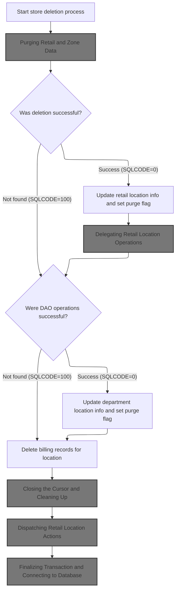

<SwmSnippet path="/base/src/NNNS0487.cbl" line="2682">

---

In `1610-DELETE-STORE`, we kick off the deletion by calling 1610-EXIT-PUT-PURGE-RETL. This step is about cleaning up retail and advertising zone records tied to the location before we do anything else. We need to call it first so we don't leave dangling references when we delete the store. If that purge succeeds (SQLCODE = 0), we move the location type and number from the input struct to the working struct, set the purge flag, and then call the DAO for retail location. If the DAO says 'no data found' (SQLCODE = 100), we reset SQLCODE to 0 so the flow doesn't treat it as an error and keeps going. The same pattern is used for department location DAO and finally for the billing cost delete. Each step is conditional on SQLCODE to make sure we only proceed if the previous operation worked.

```cobol
275900 1610-DELETE-STORE.                                               00275900
276000     PERFORM 1610-EXIT-PUT-PURGE-RETL                             00276000
```

---

</SwmSnippet>

### Purging Retail and Zone Data

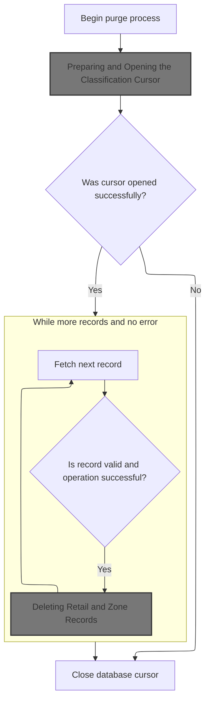

<SwmSnippet path="/base/src/NNNS0487.cbl" line="2722">

---

In `1610-EXIT-PUT-PURGE-RETL`, we set NOT-END-OF-DEL-CSR1 to TRUE and then call 1611-OPEN-DEL-CSR1. This is about prepping to fetch classification records for the location. We need to open the cursor so we can iterate through and purge each relevant record before moving on.

```cobol
279900 1610-EXIT-PUT-PURGE-RETL.                                        00279900
280000     SET NOT-END-OF-DEL-CSR1 TO TRUE                              00280000
280100     PERFORM 1611-OPEN-DEL-CSR1                                   00280100
```

---

</SwmSnippet>

#### Preparing and Opening the Classification Cursor

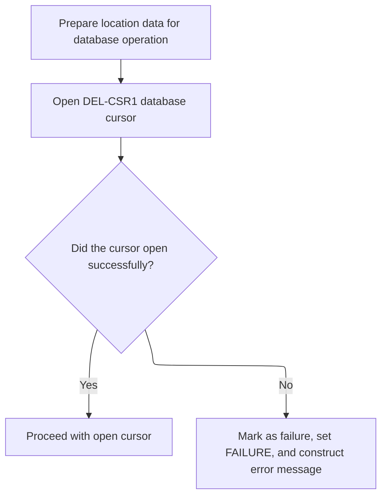

<SwmSnippet path="/base/src/NNNS0487.cbl" line="2738">

---

In `1611-OPEN-DEL-CSR1`, we move the location type and number from the input struct to the cursor struct, then open DEL-CSR1. This sets up the cursor to fetch records for the right location. The move is needed so the SQL OPEN statement uses the correct parameters.

```cobol
281500 1611-OPEN-DEL-CSR1.                                              00281500
281600     MOVE LOC-TYP-CD                 OF DCLXXXATION               00281600
281700       TO LOC-TYP-CD                 OF DCLXXXL-LOC-CLS-AD-ZN     00281700
281800     MOVE LOC-NBR                    OF DCLXXXATION               00281800
281900       TO LOC-NBR                    OF DCLXXXL-LOC-CLS-AD-ZN     00281900
282000                                                                  00282000
282100     EXEC SQL                                                     00282100
282200       OPEN DEL-CSR1                                              00282200
282300     END-EXEC                                                     00282300
```

---

</SwmSnippet>

<SwmSnippet path="/base/src/NNNS0487.cbl" line="2748">

---

After trying to open DEL-CSR1, we check SQLCODE. If it's not zero, we set FAILURE, stash the SQLCODE in a working variable, and build an error message for later use. This flags the error for the rest of the flow.

```cobol
282500     IF SQLCODE NOT = 0                                           00282500
282600       MOVE SQLCODE TO WS-SQLCODE                                 00282600
282700       SET  FAILURE TO TRUE                                       00282700
282800       MOVE SPACES  TO IS-RTRN-MSG-TXT                            00282800
282900       STRING 'NNNS0487 - ERROR OPENING DEL-CSR1, '               00282900
283000              'SQL=' WS-SQLCODE '.'                               00283000
283100              DELIMITED BY SIZE INTO IS-RTRN-MSG-TXT              00283100
283200     END-IF                                                       00283200
```

---

</SwmSnippet>

#### Iterating and Purging Classification Data

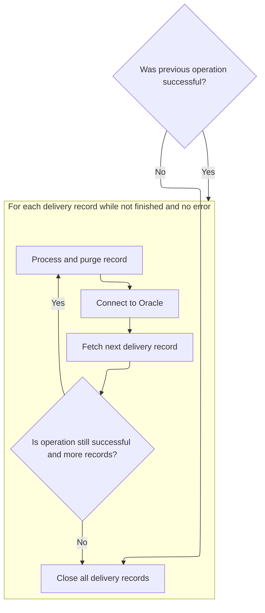

<SwmSnippet path="/base/src/NNNS0487.cbl" line="2725">

---

After opening the cursor, we loop through and purge each classification record by calling 1613-EXIT-PURGE-RETL, making sure nothing is left behind before closing the cursor.

```cobol
280200     IF SUCCESS                                                   00280200
280300       PERFORM UNTIL END-OF-DEL-CSR1 OR NOT SUCCESS               00280300
280400         PERFORM 1612-FETCH-DEL-CSR1                              00280400
280500         IF SUCCESS AND NOT-END-OF-DEL-CSR1                       00280500
280600           PERFORM 1613-EXIT-PURGE-RETL                           00280600
280700           PERFORM 115-CONNECT-TO-ORACLE                          00280700
280800         END-IF                                                   00280800
280900       END-PERFORM                                                00280900
281000     END-IF                                                       00281000
281100     PERFORM 1614-CLOSE-DEL-CSR1                                  00281100
```

---

</SwmSnippet>

#### Deleting Retail and Zone Records

See <SwmLink doc-title="Purging a Row from the Location/Class/Zone Table">[Purging a Row from the Location/Class/Zone Table](\.swm\purging-a-row-from-the-locationclasszone-table.p93dfg45.sw.md)</SwmLink>

#### Finalizing the Purge and Closing the Cursor

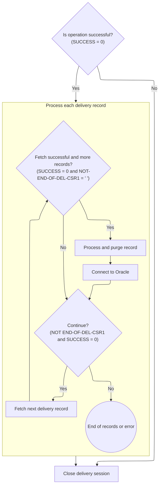

<SwmSnippet path="/base/src/NNNS0487.cbl" line="2725">

---

After returning from 115-CONNECT-TO-ORACLE in `1610-EXIT-PUT-PURGE-RETL`, we finish up by calling 1614-CLOSE-DEL-CSR1. This closes the classification cursor, freeing up resources and marking the end of the purge process for this location.

```cobol
280200     IF SUCCESS                                                   00280200
280300       PERFORM UNTIL END-OF-DEL-CSR1 OR NOT SUCCESS               00280300
280400         PERFORM 1612-FETCH-DEL-CSR1                              00280400
280500         IF SUCCESS AND NOT-END-OF-DEL-CSR1                       00280500
280600           PERFORM 1613-EXIT-PURGE-RETL                           00280600
280700           PERFORM 115-CONNECT-TO-ORACLE                          00280700
280800         END-IF                                                   00280800
280900       END-PERFORM                                                00280900
281000     END-IF                                                       00281000
281100     PERFORM 1614-CLOSE-DEL-CSR1                                  00281100
```

---

</SwmSnippet>

### Closing the Cursor and Cleaning Up

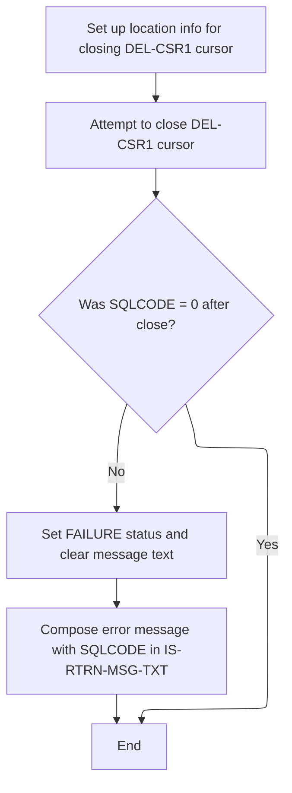

<SwmSnippet path="/base/src/NNNS0487.cbl" line="2808">

---

In `1614-CLOSE-DEL-CSR1`, we move the location type and number to the cursor struct again before closing DEL-CSR1. This ties the close operation to the right location, then we run the SQL CLOSE to release the cursor and its resources.

```cobol
288500 1614-CLOSE-DEL-CSR1.                                             00288500
288600     MOVE LOC-TYP-CD                 OF DCLXXXATION               00288600
288700       TO LOC-TYP-CD                 OF DCLXXXL-LOC-CLS-AD-ZN     00288700
288800     MOVE LOC-NBR                    OF DCLXXXATION               00288800
288900       TO LOC-NBR                    OF DCLXXXL-LOC-CLS-AD-ZN     00288900
289000                                                                  00289000
289100     EXEC SQL                                                     00289100
289200       CLOSE DEL-CSR1                                             00289200
289300     END-EXEC                                                     00289300
```

---

</SwmSnippet>

<SwmSnippet path="/base/src/NNNS0487.cbl" line="2818">

---

After closing DEL-CSR1, we check SQLCODE. If it's not zero, we set FAILURE and build an error message with the code. This flags the error for the rest of the flow.

```cobol
289500     IF SQLCODE NOT = 0                                           00289500
289600       MOVE SQLCODE TO WS-SQLCODE                                 00289600
289700       SET  FAILURE TO TRUE                                       00289700
289800       MOVE SPACES  TO IS-RTRN-MSG-TXT                            00289800
289900       STRING 'NNNS0487 - Error closing DEL-CSR1, '               00289900
290000              'SQL=' WS-SQLCODE '.'                               00290000
290100              DELIMITED BY SIZE INTO IS-RTRN-MSG-TXT              00290100
290200     END-IF                                                       00290200
```

---

</SwmSnippet>

### Continuing Store Deletion After Purge

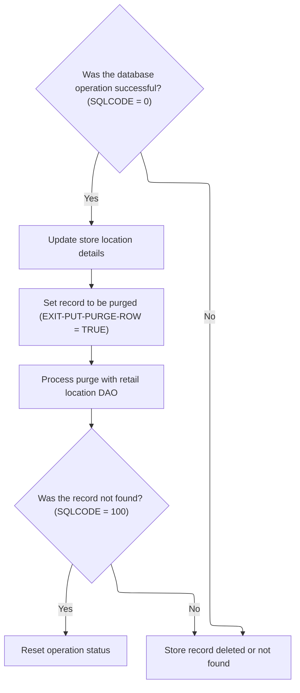

<SwmSnippet path="/base/src/NNNS0487.cbl" line="2684">

---

After returning from 1610-EXIT-PUT-PURGE-RETL in `1610-DELETE-STORE`, we check SQLCODE and, if it's zero, move the location info to the DAO struct, set the purge flag, and call the retail location DAO. If the DAO returns SQLCODE 100 (no data found), we reset SQLCODE to 0 so the flow keeps going. This pattern lets us handle missing data gracefully and signals to the DAO that we're doing a purge.

```cobol
276100     IF SQLCODE = 0                                               00276100
276200       MOVE  LOC-TYP-CD       OF DCLXXXATION                      00276200
276300         TO  LOC-TYP-CD       OF P-DDDTLR01                       00276300
276400       MOVE  LOC-NBR          OF DCLXXXATION                      00276400
276500         TO  LOC-NBR          OF P-DDDTLR01                       00276500
276600       SET EXIT-PUT-PURGE-ROW TO TRUE                             00276600
276700       PERFORM 2060-CALL-RETAIL-LOC-DAO                           00276700
276800       IF SQLCODE = 100                                           00276800
276900         MOVE 0 TO SQLCODE                                        00276900
277000       END-IF                                                     00277000
277100     END-IF                                                       00277100
```

---

</SwmSnippet>

### Delegating Retail Location Operations

<SwmSnippet path="/base/src/NNNS0487.cbl" line="3305">

---

We delegate retail location database ops to NNNS0488, passing all the context it needs to do the job.

```cobol
338200 2060-CALL-RETAIL-LOC-DAO.                                        00338200
338300     CALL NNNS0488-RETAIL-LOC-DAO USING                           00338300
338400          XXXN001A                                                00338400
338500          SQLCA                                                   00338500
338600          YYYN005A                                                00338600
338700          NNNN0000-PARMS                                          00338700
338800          P-DDDTLR01                                              00338800
338900     .                                                            00338900
```

---

</SwmSnippet>

### Dispatching Retail Location Actions

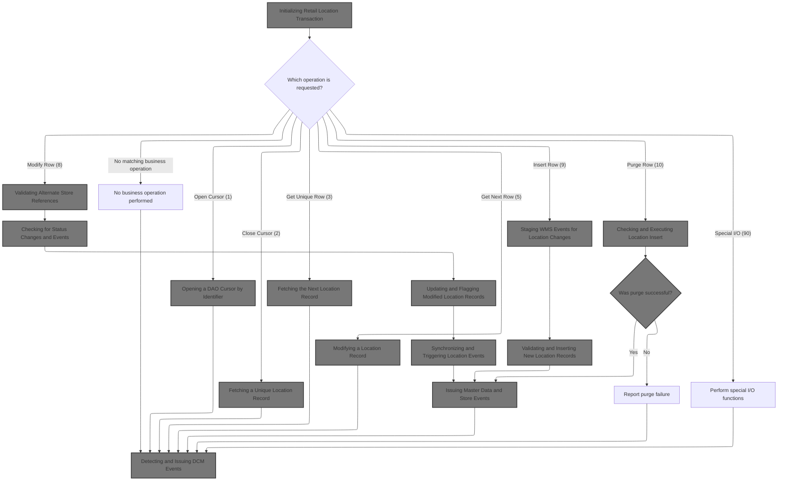

<SwmSnippet path="/base/src/NNNS0488.cbl" line="1209">

---

In `0000-EXIT-DISPATCHER`, we use a dispatcher to route the DAO operation to the right handler based on the operation type. This keeps all retail location actions in one place and makes it easy to add or change logic for different operation codes.

```cobol
125400 0000-EXIT-DISPATCHER.                                            00125400
125500     PERFORM 100-INITIALIZATION                                   00125500
125600     EVALUATE TRUE                                                00125600
125700       WHEN NOT SUCCESS                                           00125700
125800          CONTINUE                                                00125800
125900       WHEN EXIT-OPEN-CURSOR                                      00125900
126000          PERFORM 1000-EXIT-OPEN-CURSOR                           00126000
126100       WHEN EXIT-CLOSE-CURSOR                                     00126100
126200          PERFORM 1100-EXIT-CLOSE-CURSOR                          00126200
126300       WHEN EXIT-GET-UNIQUE-ROW                                   00126300
126400          PERFORM 1200-EXIT-GET-UNIQUE-ROW                        00126400
126500       WHEN EXIT-GET-NEXT-ROW                                     00126500
126600          PERFORM 1300-EXIT-GET-NEXT-ROW                          00126600
126700       WHEN EXIT-PUT-MODIFY-ROW                                   00126700
126800          PERFORM 1400-EXIT-PUT-MODIFY-ROW                        00126800
126900       WHEN EXIT-PUT-INSERT-ROW                                   00126900
127000          PERFORM 1500-EXIT-PUT-INSERT-ROW                        00127000
127100       WHEN EXIT-PUT-PURGE-ROW                                    00127100
127200          PERFORM 1600-EXIT-PUT-PURGE-ROW                         00127200
127300       WHEN EXIT-DO-SPECIAL-IO-FUNCS                              00127300
127400          PERFORM 10000-DO-SPECIAL-IO-FUNCS                       00127400
127500     END-EVALUATE                                                 00127500
127600     PERFORM 120-EXIT-STUFF                                       00127600
127700     GOBACK                                                       00127700
127800     .                                                            00127800
```

---

</SwmSnippet>

#### Initializing Retail Location Transaction

See document about `100-INITIALIZATION`

#### Opening a DAO Cursor by Identifier

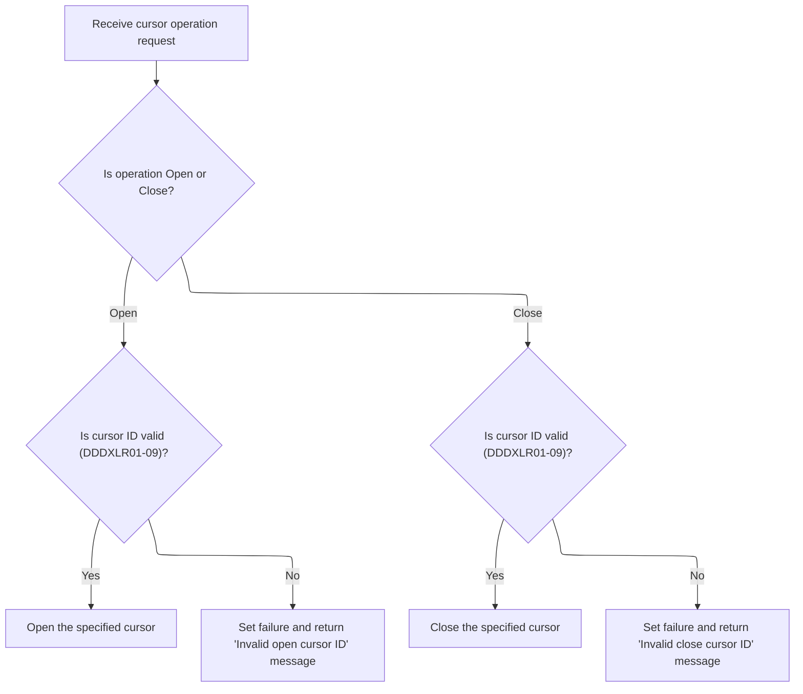

<SwmSnippet path="/base/src/NNNS0488.cbl" line="2206">

---

In `1000-EXIT-OPEN-CURSOR`, we use a switch-case (EVALUATE TRUE) to open the right cursor based on the input ID. If the ID isn't recognized, we set FAILURE and build an error message. This keeps cursor management simple and explicit.

```cobol
224300 1000-EXIT-OPEN-CURSOR.                                           00224300
224400     EVALUATE TRUE                                                00224400
224500       WHEN DDDXLR01                                              00224500
224600         EXEC SQL                                                 00224600
224700           OPEN DDDXLR01                                          00224700
224800         END-EXEC                                                 00224800
224900       WHEN DDDXLR02                                              00224900
225000         EXEC SQL                                                 00225000
225100           OPEN DDDXLR02                                          00225100
225200         END-EXEC                                                 00225200
225300       WHEN DDDXLR03                                              00225300
225400         EXEC SQL                                                 00225400
225500           OPEN DDDXLR03                                          00225500
225600         END-EXEC                                                 00225600
225700       WHEN DDDXLR04                                              00225700
225800         EXEC SQL                                                 00225800
225900           OPEN DDDXLR04                                          00225900
226000         END-EXEC                                                 00226000
226100       WHEN DDDXLR05                                              00226100
226200         EXEC SQL                                                 00226200
226300           OPEN DDDXLR05                                          00226300
226400         END-EXEC                                                 00226400
226500       WHEN DDDXLR06                                              00226500
226600         EXEC SQL                                                 00226600
226700           OPEN DDDXLR06                                          00226700
226800         END-EXEC                                                 00226800
226900       WHEN DDDXLR07                                              00226900
227000         EXEC SQL                                                 00227000
227100           OPEN DDDXLR07                                          00227100
227200         END-EXEC                                                 00227200
227300       WHEN DDDXLR08                                              00227300
227400         EXEC SQL                                                 00227400
227500           OPEN DDDXLR08                                          00227500
227600         END-EXEC                                                 00227600
227700       WHEN DDDXLR09                                              00227700
227800         EXEC SQL                                                 00227800
227900           OPEN DDDXLR09                                          00227900
228000         END-EXEC                                                 00228000
228100       WHEN OTHER                                                 00228100
228200         SET FAILURE TO TRUE                                      00228200
228300         MOVE 'NNNS0488 - Invalid open cursor ID.'                00228300
228400           TO IS-RTRN-MSG-TXT OF XXXN001A                         00228400
228500     END-EVALUATE                                                 00228500
228600     .                                                            00228600
```

---

</SwmSnippet>

<SwmSnippet path="/base/src/NNNS0488.cbl" line="2252">

---

In `1100-EXIT-CLOSE-CURSOR`, we use a switch-case to close the right cursor based on the input ID. If the ID isn't recognized, we set FAILURE and build an error message. This keeps cursor cleanup explicit and error handling clear.

```cobol
228900 1100-EXIT-CLOSE-CURSOR.                                          00228900
229000     EVALUATE TRUE                                                00229000
229100       WHEN DDDXLR01                                              00229100
229200         EXEC SQL                                                 00229200
229300           CLOSE DDDXLR01                                         00229300
229400         END-EXEC                                                 00229400
229500       WHEN DDDXLR02                                              00229500
229600         EXEC SQL                                                 00229600
229700           CLOSE DDDXLR02                                         00229700
229800         END-EXEC                                                 00229800
229900       WHEN DDDXLR03                                              00229900
230000         EXEC SQL                                                 00230000
230100           CLOSE DDDXLR03                                         00230100
230200         END-EXEC                                                 00230200
230300       WHEN DDDXLR04                                              00230300
230400         EXEC SQL                                                 00230400
230500           CLOSE DDDXLR04                                         00230500
230600         END-EXEC                                                 00230600
230700       WHEN DDDXLR05                                              00230700
230800         EXEC SQL                                                 00230800
230900           CLOSE DDDXLR05                                         00230900
231000         END-EXEC                                                 00231000
231100       WHEN DDDXLR06                                              00231100
231200         EXEC SQL                                                 00231200
231300           CLOSE DDDXLR06                                         00231300
231400         END-EXEC                                                 00231400
231500       WHEN DDDXLR07                                              00231500
231600         EXEC SQL                                                 00231600
231700           CLOSE DDDXLR07                                         00231700
231800         END-EXEC                                                 00231800
231900       WHEN DDDXLR09                                              00231900
232000         EXEC SQL                                                 00232000
232100           CLOSE DDDXLR09                                         00232100
232200         END-EXEC                                                 00232200
232300       WHEN OTHER                                                 00232300
232400         SET FAILURE TO TRUE                                      00232400
232500         MOVE 'NNNS0488 - Invalid close cursor ID.'               00232500
232600           TO IS-RTRN-MSG-TXT OF XXXN001A                         00232600
232700     END-EVALUATE                                                 00232700
232800     .                                                            00232800
```

---

</SwmSnippet>

#### Fetching a Unique Location Record

<SwmSnippet path="/base/src/NNNS0488.cbl" line="2294">

---

In `1200-EXIT-GET-UNIQUE-ROW`, we run a big SQL SELECT to pull all the location fields, then immediately call 1700-CHECK-NULL-COLUMNS to fill in any missing values with defaults. This keeps the data clean for downstream logic.

```cobol
233100 1200-EXIT-GET-UNIQUE-ROW.                                        00233100
233200       EXEC SQL                                                   00233200
233300           SELECT LOC_NBR,                                        00233300
233400                  LOC_TYP_CD,                                     00233400
233500                  ASSOC_STR_TYP_CD,                               00233500
233600                  ASSOC_STR_NBR,                                  00233600
233700                  STR_REMODL_DT,                                  00233700
233800                  RETL_LOC_STAT_CD,                               00233800
233900                  RETL_LOC_STAT_DT,                               00233900
234000                  COMPANY_ID,                                     00234000
234100                  FINANCIAL_DIV_ID,                               00234100
234200                  LIN_OF_BUS_ID,                                  00234200
234300                  DIST_ID,                                        00234300
234400                  MKT_RGN_ID,                                     00234400
234500                  GEO_ZN_CD,                                      00234500
234600                  RETL_GEO_ZN_ID,                                 00234600
234700                  SCN_MAINT_SW,                                   00234700
234800                  FRNT_END_CD,                                    00234800
234900                  PRC_BUL_SW,                                     00234900
235000                  UPC_ON_PRC_BUL_SW,                              00235000
235100                  CMPTR_TYP_CD,                                   00235100
235200                  RETL_VID_ZN_NBR,                                00235200
235300                  RETL_UNLD_CD,                                   00235300
235400                  ROLUP_REPT_TBL_TXT,                             00235400
235500                  NEW_STR_SW,                                     00235500
235600                  SEL_CIR_SW,                                     00235600
235700                  BKRM_SQ_FT,                                     00235700
235800                  FD_LINER_FT,                                    00235800
235900                  NON_FD_LINER_FT,                                00235900
236000                  SETOFF_ROOM_SW,                                 00236000
236100                  CAT_CLS_TBL_TXT,                                00236100
236200                  LAT_K,                                          00236200
236300                  LON_K,                                          00236300
236400                  CK_COLL_REPT_SW,                                00236400
236500                  CK_COLL_CNTL_CD,                                00236500
236600                  CK_COLL_ADD_DEL_SW,                             00236600
236700                  CK_ALT_STR_ID,                                  00236700
236800                  CK_COLL_FEE_AMT,                                00236800
236900                  SALS_TAX_PCT,                                   00236900
237000                  SOAP_SALE_VAR_PCT,                              00237000
237100                  ON_SRS_CD,                                      00237100
237200                  SRS_DSD_ORD_SW,                                 00237200
237300                  RETL_LOC_TYP_CD,                                00237300
237400                  DEA_NBR,                                        00237400
237500                  STR_OPSTMT_SRT_CD,                              00237500
237600                  STR_OPSTMT_TYP_CD,                              00237600
237700                  STR_OPSTMT_HDR_CD,                              00237700
237800                  DPS_NBR,                                        00237800
237900                  MEDICARE_ID,                                    00237900
238000                  NABP_NBR,                                       00238000
238100                  NATL_PROV_ID,                                   00238100
238200                  CURR_AD_ZN_NBR,                                 00238200
238300                  PD_ZONE_NO,                                     00238300
238400                  SOS_PROC_SW,                                    00238400
238500                  RPRT_SEQ_NBR,                                   00238500
238600                  GRP_CD,                                         00238600
238700                  PRIM_GRP_CD_1,                                  00238700
238800                  PRIM_GRP_CD_2,                                  00238800
238900                  SECY_GRP_CD_1,                                  00238900
239000                  SECY_GRP_CD_2,                                  00239000
239100                  PRIM_CLS_NBR_1,                                 00239100
239200                  PRIM_CLS_NBR_2,                                 00239200
239300                  SECY_CLS_NBR_1,                                 00239300
239400                  SECY_CLS_NBR_2,                                 00239400
239500                  VAL_STR_SW,                                     00239500
239600                  SLS_CLOSED_DT,                                  00239600
239700                  TBCO_PRMT_NBR,                                  00239700
239800                  SUB_UNLIKE_PROD_CD,                             00239800
239900                  SUB_DSPLY_PAL_CD,                               00239900
240000                  RLTM_SCN_MAINT_SW,                              00240000
240100                  TOP_LEADER_NM,                                  00240100
240200                  CUST_FRNDLY_NM,                                 00240200
240300                  SLS_OPEN_DT,                                    00240300
240400                  MON_OPEN_TM,                                    00240400
240500                  MON_CLOS_TM,                                    00240500
240600                  TUE_OPEN_TM,                                    00240600
240700                  TUE_CLOS_TM,                                    00240700
240800                  WED_OPEN_TM,                                    00240800
240900                  WED_CLOS_TM,                                    00240900
241000                  THUR_OPEN_TM,                                   00241000
241100                  THUR_CLOS_TM,                                   00241100
241200                  FRI_OPEN_TM,                                    00241200
241300                  FRI_CLOS_TM,                                    00241300
241400                  SAT_OPEN_TM,                                    00241400
241500                  SAT_CLOS_TM,                                    00241500
241600                  SUN_OPEN_TM,                                    00241600
241700                  SUN_CLOS_TM,                                    00241700
241800                  RETL_LOC_FRMAT_CD,                              00241800
241900                  RETL_LOC_SEGM_CD,                               00241900
242000                  ECOMM_MKT_AREA_CD,                              00242000
242100                  ECOMM_STRT_DT,                                  00242100
242200                  ECOMM_END_DT,                                   00242200
242300                  ROLUP_REPT_TBL_01_NBR,                          00242300
242400                  ROLUP_REPT_TBL_02_NBR,                          00242400
242500                  ROLUP_REPT_TBL_03_NBR,                          00242500
242600                  ROLUP_REPT_TBL_04_NBR,                          00242600
242700                  ROLUP_REPT_TBL_05_NBR,                          00242700
242800                  ROLUP_REPT_TBL_06_NBR,                          00242800
242900                  ROLUP_REPT_TBL_07_NBR,                          00242900
243000                  ROLUP_REPT_TBL_08_NBR,                          00243000
243100                  ROLUP_REPT_TBL_09_NBR,                          00243100
243200                  ROLUP_REPT_TBL_10_NBR,                          00243200
243300                  ONLIN_SSON_SW,                                  00243300
243400                  RPLACD_BY_STR_NBR                               00243400
243500           INTO   :DCLXXXAIL-LOC.LOC-NBR,                         00243500
243600                  :DCLXXXAIL-LOC.LOC-TYP-CD,                      00243600
243700                  :DCLXXXAIL-LOC.ASSOC-STR-TYP-CD                 00243700
243800                  :WS-ASSOC-ST-TYPE-IND,                          00243800
243900                  :DCLXXXAIL-LOC.ASSOC-STR-NBR                    00243900
244000                  :WS-ASSOC-ST-NO-IND,                            00244000
244100                  :DCLXXXAIL-LOC.STR-REMODL-DT,                   00244100
244200                  :DCLXXXAIL-LOC.RETL-LOC-STAT-CD,                00244200
244300                  :DCLXXXAIL-LOC.RETL-LOC-STAT-DT,                00244300
244400                  :DCLXXXAIL-LOC.COMPANY-ID,                      00244400
244500                  :DCLXXXAIL-LOC.FINANCIAL-DIV-ID,                00244500
244600                  :DCLXXXAIL-LOC.LIN-OF-BUS-ID,                   00244600
244700                  :DCLXXXAIL-LOC.DIST-ID,                         00244700
244800                  :DCLXXXAIL-LOC.MKT-RGN-ID,                      00244800
244900                  :DCLXXXAIL-LOC.GEO-ZN-CD,                       00244900
245000                  :DCLXXXAIL-LOC.RETL-GEO-ZN-ID,                  00245000
245100                  :DCLXXXAIL-LOC.SCN-MAINT-SW,                    00245100
245200                  :DCLXXXAIL-LOC.FRNT-END-CD,                     00245200
245300                  :DCLXXXAIL-LOC.PRC-BUL-SW,                      00245300
245400                  :DCLXXXAIL-LOC.UPC-ON-PRC-BUL-SW,               00245400
245500                  :DCLXXXAIL-LOC.CMPTR-TYP-CD,                    00245500
245600                  :DCLXXXAIL-LOC.RETL-VID-ZN-NBR,                 00245600
245700                  :DCLXXXAIL-LOC.RETL-UNLD-CD,                    00245700
245800                  :DCLXXXAIL-LOC.ROLUP-REPT-TBL-TXT,              00245800
245900                  :DCLXXXAIL-LOC.NEW-STR-SW,                      00245900
246000                  :DCLXXXAIL-LOC.SEL-CIR-SW,                      00246000
246100                  :DCLXXXAIL-LOC.BKRM-SQ-FT,                      00246100
246200                  :DCLXXXAIL-LOC.FD-LINER-FT,                     00246200
246300                  :DCLXXXAIL-LOC.NON-FD-LINER-FT,                 00246300
246400                  :DCLXXXAIL-LOC.SETOFF-ROOM-SW,                  00246400
246500                  :DCLXXXAIL-LOC.CAT-CLS-TBL-TXT,                 00246500
246600                  :DCLXXXAIL-LOC.LAT-K,                           00246600
246700                  :DCLXXXAIL-LOC.LON-K,                           00246700
246800                  :DCLXXXAIL-LOC.CK-COLL-REPT-SW,                 00246800
246900                  :DCLXXXAIL-LOC.CK-COLL-CNTL-CD,                 00246900
247000                  :DCLXXXAIL-LOC.CK-COLL-ADD-DEL-SW,              00247000
247100                  :DCLXXXAIL-LOC.CK-ALT-STR-ID,                   00247100
247200                  :DCLXXXAIL-LOC.CK-COLL-FEE-AMT,                 00247200
247300                  :DCLXXXAIL-LOC.SALS-TAX-PCT,                    00247300
247400                  :DCLXXXAIL-LOC.SOAP-SALE-VAR-PCT,               00247400
247500                  :DCLXXXAIL-LOC.ON-SRS-CD,                       00247500
247600                  :DCLXXXAIL-LOC.SRS-DSD-ORD-SW,                  00247600
247700                  :DCLXXXAIL-LOC.RETL-LOC-TYP-CD,                 00247700
247800                  :DCLXXXAIL-LOC.DEA-NBR,                         00247800
247900                  :DCLXXXAIL-LOC.STR-OPSTMT-SRT-CD,               00247900
248000                  :DCLXXXAIL-LOC.STR-OPSTMT-TYP-CD,               00248000
248100                  :DCLXXXAIL-LOC.STR-OPSTMT-HDR-CD,               00248100
248200                  :DCLXXXAIL-LOC.DPS-NBR,                         00248200
248300                  :DCLXXXAIL-LOC.MEDICARE-ID,                     00248300
248400                  :DCLXXXAIL-LOC.NABP-NBR,                        00248400
248500                  :DCLXXXAIL-LOC.NATL-PROV-ID,                    00248500
248600                  :DCLXXXAIL-LOC.CURR-AD-ZN-NBR,                  00248600
248700                  :DCLXXXAIL-LOC.PD-ZONE-NO,                      00248700
248800                  :DCLXXXAIL-LOC.SOS-PROC-SW,                     00248800
248900                  :DCLXXXAIL-LOC.RPRT-SEQ-NBR,                    00248900
249000                  :DCLXXXAIL-LOC.GRP-CD,                          00249000
249100                  :DCLXXXAIL-LOC.PRIM-GRP-CD-1,                   00249100
249200                  :DCLXXXAIL-LOC.PRIM-GRP-CD-2,                   00249200
249300                  :DCLXXXAIL-LOC.SECY-GRP-CD-1,                   00249300
249400                  :DCLXXXAIL-LOC.SECY-GRP-CD-2,                   00249400
249500                  :DCLXXXAIL-LOC.PRIM-CLS-NBR-1,                  00249500
249600                  :DCLXXXAIL-LOC.PRIM-CLS-NBR-2,                  00249600
249700                  :DCLXXXAIL-LOC.SECY-CLS-NBR-1,                  00249700
249800                  :DCLXXXAIL-LOC.SECY-CLS-NBR-2,                  00249800
249900                  :DCLXXXAIL-LOC.VAL-STR-SW,                      00249900
250000                  :DCLXXXAIL-LOC.SLS-CLOSED-DT,                   00250000
250100                  :DCLXXXAIL-LOC.TBCO-PRMT-NBR,                   00250100
250200                  :DCLXXXAIL-LOC.SUB-UNLIKE-PROD-CD,              00250200
250300                  :DCLXXXAIL-LOC.SUB-DSPLY-PAL-CD,                00250300
250400                  :DCLXXXAIL-LOC.RLTM-SCN-MAINT-SW,               00250400
250500                  :DCLXXXAIL-LOC.TOP-LEADER-NM,                   00250500
250600                  :DCLXXXAIL-LOC.CUST-FRNDLY-NM,                  00250600
250700                  :DCLXXXAIL-LOC.SLS-OPEN-DT,                     00250700
250800                  :WS-MON-OPEN-TS,                                00250800
250900                  :WS-MON-CLOS-TS,                                00250900
251000                  :WS-TUE-OPEN-TS,                                00251000
251100                  :WS-TUE-CLOS-TS,                                00251100
251200                  :WS-WED-OPEN-TS,                                00251200
251300                  :WS-WED-CLOS-TS,                                00251300
251400                  :WS-THUR-OPEN-TS,                               00251400
251500                  :WS-THUR-CLOS-TS,                               00251500
251600                  :WS-FRI-OPEN-TS ,                               00251600
251700                  :WS-FRI-CLOS-TS,                                00251700
251800                  :WS-SAT-OPEN-TS,                                00251800
251900                  :WS-SAT-CLOS-TS,                                00251900
252000                  :WS-SUN-OPEN-TS,                                00252000
252100                  :WS-SUN-CLOS-TS,                                00252100
252200                  :DCLXXXAIL-LOC.RETL-LOC-FRMAT-CD,               00252200
252300                  :DCLXXXAIL-LOC.RETL-LOC-SEGM-CD,                00252300
252400                  :DCLXXXAIL-LOC.ECOMM-MKT-AREA-CD,               00252400
252500                  :DCLXXXAIL-LOC.ECOMM-STRT-DT                    00252500
252600                  :DCLXXXAIL-LOC-IND.ECOMM-STRT-DT-IND,           00252600
252700                  :DCLXXXAIL-LOC.ECOMM-END-DT                     00252700
252800                  :DCLXXXAIL-LOC-IND.ECOMM-END-DT-IND,            00252800
252900                  :DCLXXXAIL-LOC.ROLUP-REPT-TBL-01-NBR,           00252900
253000                  :DCLXXXAIL-LOC.ROLUP-REPT-TBL-02-NBR,           00253000
253100                  :DCLXXXAIL-LOC.ROLUP-REPT-TBL-03-NBR,           00253100
253200                  :DCLXXXAIL-LOC.ROLUP-REPT-TBL-04-NBR,           00253200
253300                  :DCLXXXAIL-LOC.ROLUP-REPT-TBL-05-NBR,           00253300
253400                  :DCLXXXAIL-LOC.ROLUP-REPT-TBL-06-NBR,           00253400
253500                  :DCLXXXAIL-LOC.ROLUP-REPT-TBL-07-NBR,           00253500
253600                  :DCLXXXAIL-LOC.ROLUP-REPT-TBL-08-NBR,           00253600
253700                  :DCLXXXAIL-LOC.ROLUP-REPT-TBL-09-NBR,           00253700
253800                  :DCLXXXAIL-LOC.ROLUP-REPT-TBL-10-NBR,           00253800
253900                  :DCLXXXAIL-LOC.ONLIN-SSON-SW,                   00253900
254000                  :DCLXXXAIL-LOC.RPLACD-BY-STR-NBR                00254000
254010                  :DCLXXXAIL-LOC-IND.RPLACD-BY-STR-NBR-IND        00254010
254100           FROM   XXXAIL_LOC                                      00254100
254200           WHERE  LOC_NBR = :DCLXXXAIL-LOC.LOC-NBR                00254200
254300           AND    LOC_TYP_CD = :DCLXXXAIL-LOC.LOC-TYP-CD          00254300
254400       END-EXEC                                                   00254400
254500                                                                  00254500
254600     PERFORM 1700-CHECK-NULL-COLUMNS                              00254600
254700     .                                                            00254700
```

---

</SwmSnippet>

<SwmSnippet path="/base/src/NNNS0488.cbl" line="3649">

---

In `1700-CHECK-NULL-COLUMNS`, we scan the indicator fields and set any flagged as negative to default values—spaces for strings, zero for numbers, and K-ZERO-DT for dates. This keeps the data safe for further use.

```cobol
367700 1700-CHECK-NULL-COLUMNS.                                         00367700
367800     IF WS-ASSOC-ST-TYPE-IND < 0                                  00367800
367900     OR WS-ASSOC-ST-NO-IND < 0                                    00367900
368000       MOVE SPACES TO ASSOC-STR-TYP-CD OF DCLXXXAIL-LOC           00368000
368100       MOVE 0      TO ASSOC-STR-NBR OF DCLXXXAIL-LOC              00368100
368200     END-IF                                                       00368200
368210     IF RPLACD-BY-STR-NBR-IND < 0                                 00368210
368211       MOVE 0      TO RPLACD-BY-STR-NBR-IND                       00368211
368220     END-IF                                                       00368220
368300     IF ECOMM-STRT-DT-IND OF DCLXXXAIL-LOC-IND < 0                00368300
368400*      MOVE 0      TO ECOMM-STRT-DT OF DCLXXXAIL-LOC              00368400
368500       MOVE K-ZERO-DT TO  ECOMM-STRT-DT OF DCLXXXAIL-LOC          00368500
368600     END-IF                                                       00368600
368700     IF ECOMM-END-DT-IND OF DCLXXXAIL-LOC-IND < 0                 00368700
368800*      MOVE 0      TO ECOMM-END-DT OF DCLXXXAIL-LOC               00368800
368900       MOVE K-ZERO-DT TO ECOMM-END-DT OF DCLXXXAIL-LOC            00368900
369000     END-IF                                                       00369000
369100     .                                                            00369100
```

---

</SwmSnippet>

#### Fetching the Next Location Record

<SwmSnippet path="/base/src/NNNS0488.cbl" line="2514">

---

In `1300-EXIT-GET-NEXT-ROW`, we use a switch-case to pick the right fetch subroutine based on the cursor ID. After fetching, we run the null column check to clean up any missing values. If the ID isn't recognized, we set FAILURE and build an error message.

```cobol
255000 1300-EXIT-GET-NEXT-ROW.                                          00255000
255100     EVALUATE TRUE                                                00255100
255200       WHEN DDDXLR01                                              00255200
255300         PERFORM 1301-FETCH-DDDXLR01                              00255300
255400       WHEN DDDXLR02                                              00255400
255500         PERFORM 1302-FETCH-DDDXLR02                              00255500
255600       WHEN DDDXLR03                                              00255600
255700         PERFORM 1303-FETCH-DDDXLR03                              00255700
255800       WHEN DDDXLR04                                              00255800
255900         PERFORM 1304-FETCH-DDDXLR04                              00255900
256000       WHEN DDDXLR05                                              00256000
256100         PERFORM 1305-FETCH-DDDXLR05                              00256100
256200       WHEN DDDXLR06                                              00256200
256300         PERFORM 1306-FETCH-DDDXLR06                              00256300
256400       WHEN DDDXLR07                                              00256400
256500         PERFORM 1307-FETCH-DDDXLR07                              00256500
256600       WHEN DDDXLR09                                              00256600
256700         PERFORM 1309-FETCH-DDDXLR09                              00256700
256800       WHEN OTHER                                                 00256800
256900         SET FAILURE TO TRUE                                      00256900
257000         MOVE 'NNNS0488 - Invalid fetch cursor ID.'               00257000
257100           TO IS-RTRN-MSG-TXT OF XXXN001A                         00257100
257200     END-EVALUATE                                                 00257200
257300                                                                  00257300
257400     PERFORM 1700-CHECK-NULL-COLUMNS                              00257400
257500     .                                                            00257500
```

---

</SwmSnippet>

<SwmSnippet path="/base/src/NNNS0488.cbl" line="2542">

---

In `1301-FETCH-DDDXLR01`, we run a big SQL FETCH to pull all the location fields from DDDXLR01 into the host variables. This is about getting a complete record for the location in one shot.

```cobol
257800 1301-FETCH-DDDXLR01.                                             00257800
257900     EXEC SQL                                                     00257900
258000         FETCH DDDXLR01                                           00258000
258100         INTO  :DCLXXXAIL-LOC.LOC-NBR,                            00258100
258200               :DCLXXXAIL-LOC.LOC-TYP-CD,                         00258200
258300               :DCLXXXAIL-LOC.ASSOC-STR-TYP-CD                    00258300
258400               :WS-ASSOC-ST-TYPE-IND,                             00258400
258500               :DCLXXXAIL-LOC.ASSOC-STR-NBR                       00258500
258600               :WS-ASSOC-ST-NO-IND,                               00258600
258700               :DCLXXXAIL-LOC.STR-REMODL-DT,                      00258700
258800               :DCLXXXAIL-LOC.RETL-LOC-STAT-CD,                   00258800
258900               :DCLXXXAIL-LOC.RETL-LOC-STAT-DT,                   00258900
259000               :DCLXXXAIL-LOC.COMPANY-ID,                         00259000
259100               :DCLXXXAIL-LOC.FINANCIAL-DIV-ID,                   00259100
259200               :DCLXXXAIL-LOC.LIN-OF-BUS-ID,                      00259200
259300               :DCLXXXAIL-LOC.DIST-ID,                            00259300
259400               :DCLXXXAIL-LOC.MKT-RGN-ID,                         00259400
259500               :DCLXXXAIL-LOC.GEO-ZN-CD,                          00259500
259600               :DCLXXXAIL-LOC.RETL-GEO-ZN-ID,                     00259600
259700               :DCLXXXAIL-LOC.SCN-MAINT-SW,                       00259700
259800               :DCLXXXAIL-LOC.FRNT-END-CD,                        00259800
259900               :DCLXXXAIL-LOC.PRC-BUL-SW,                         00259900
260000               :DCLXXXAIL-LOC.UPC-ON-PRC-BUL-SW,                  00260000
260100               :DCLXXXAIL-LOC.CMPTR-TYP-CD,                       00260100
260200               :DCLXXXAIL-LOC.RETL-VID-ZN-NBR,                    00260200
260300               :DCLXXXAIL-LOC.RETL-UNLD-CD,                       00260300
260400               :DCLXXXAIL-LOC.ROLUP-REPT-TBL-TXT,                 00260400
260500               :DCLXXXAIL-LOC.NEW-STR-SW,                         00260500
260600               :DCLXXXAIL-LOC.SEL-CIR-SW,                         00260600
260700               :DCLXXXAIL-LOC.BKRM-SQ-FT,                         00260700
260800               :DCLXXXAIL-LOC.FD-LINER-FT,                        00260800
260900               :DCLXXXAIL-LOC.NON-FD-LINER-FT,                    00260900
261000               :DCLXXXAIL-LOC.SETOFF-ROOM-SW,                     00261000
261100               :DCLXXXAIL-LOC.CAT-CLS-TBL-TXT,                    00261100
261200               :DCLXXXAIL-LOC.LAT-K,                              00261200
261300               :DCLXXXAIL-LOC.LON-K,                              00261300
261400               :DCLXXXAIL-LOC.CK-COLL-REPT-SW,                    00261400
261500               :DCLXXXAIL-LOC.CK-COLL-CNTL-CD,                    00261500
261600               :DCLXXXAIL-LOC.CK-COLL-ADD-DEL-SW,                 00261600
261700               :DCLXXXAIL-LOC.CK-ALT-STR-ID,                      00261700
261800               :DCLXXXAIL-LOC.CK-COLL-FEE-AMT,                    00261800
261900               :DCLXXXAIL-LOC.SALS-TAX-PCT,                       00261900
262000               :DCLXXXAIL-LOC.SOAP-SALE-VAR-PCT,                  00262000
262100               :DCLXXXAIL-LOC.ON-SRS-CD,                          00262100
262200               :DCLXXXAIL-LOC.SRS-DSD-ORD-SW,                     00262200
262300               :DCLXXXAIL-LOC.RETL-LOC-TYP-CD,                    00262300
262400               :DCLXXXAIL-LOC.DEA-NBR,                            00262400
262500               :DCLXXXAIL-LOC.STR-OPSTMT-SRT-CD,                  00262500
262600               :DCLXXXAIL-LOC.STR-OPSTMT-TYP-CD,                  00262600
262700               :DCLXXXAIL-LOC.STR-OPSTMT-HDR-CD,                  00262700
262800               :DCLXXXAIL-LOC.DPS-NBR,                            00262800
262900               :DCLXXXAIL-LOC.MEDICARE-ID,                        00262900
263000               :DCLXXXAIL-LOC.NABP-NBR,                           00263000
263100               :DCLXXXAIL-LOC.NATL-PROV-ID,                       00263100
263200               :DCLXXXAIL-LOC.CURR-AD-ZN-NBR,                     00263200
263300               :DCLXXXAIL-LOC.PD-ZONE-NO,                         00263300
263400               :DCLXXXAIL-LOC.SOS-PROC-SW,                        00263400
263500               :DCLXXXAIL-LOC.RPRT-SEQ-NBR,                       00263500
263600               :DCLXXXAIL-LOC.GRP-CD,                             00263600
263700               :DCLXXXAIL-LOC.PRIM-GRP-CD-1,                      00263700
263800               :DCLXXXAIL-LOC.PRIM-GRP-CD-2,                      00263800
263900               :DCLXXXAIL-LOC.SECY-GRP-CD-1,                      00263900
264000               :DCLXXXAIL-LOC.SECY-GRP-CD-2,                      00264000
264100               :DCLXXXAIL-LOC.PRIM-CLS-NBR-1,                     00264100
264200               :DCLXXXAIL-LOC.PRIM-CLS-NBR-2,                     00264200
264300               :DCLXXXAIL-LOC.SECY-CLS-NBR-1,                     00264300
264400               :DCLXXXAIL-LOC.SECY-CLS-NBR-2,                     00264400
264500               :DCLXXXAIL-LOC.VAL-STR-SW,                         00264500
264600               :DCLXXXAIL-LOC.SLS-CLOSED-DT,                      00264600
264700               :DCLXXXAIL-LOC.TBCO-PRMT-NBR,                      00264700
264800               :DCLXXXAIL-LOC.SUB-UNLIKE-PROD-CD,                 00264800
264900               :DCLXXXAIL-LOC.SUB-DSPLY-PAL-CD,                   00264900
265000               :DCLXXXAIL-LOC.RLTM-SCN-MAINT-SW,                  00265000
265100               :DCLXXXAIL-LOC.TOP-LEADER-NM,                      00265100
265200               :DCLXXXAIL-LOC.CUST-FRNDLY-NM,                     00265200
265300               :DCLXXXAIL-LOC.SLS-OPEN-DT,                        00265300
265400               :WS-MON-OPEN-TS,                                   00265400
265500               :WS-MON-CLOS-TS,                                   00265500
265600               :WS-TUE-OPEN-TS,                                   00265600
265700               :WS-TUE-CLOS-TS,                                   00265700
265800               :WS-WED-OPEN-TS,                                   00265800
265900               :WS-WED-CLOS-TS,                                   00265900
266000               :WS-THUR-OPEN-TS,                                  00266000
266100               :WS-THUR-CLOS-TS,                                  00266100
266200               :WS-FRI-OPEN-TS ,                                  00266200
266300               :WS-FRI-CLOS-TS,                                   00266300
266400               :WS-SAT-OPEN-TS,                                   00266400
266500               :WS-SUN-OPEN-TS,                                   00266500
266600               :WS-SAT-CLOS-TS,                                   00266600
266700               :WS-SUN-CLOS-TS,                                   00266700
266800               :DCLXXXAIL-LOC.RETL-LOC-FRMAT-CD,                  00266800
266900               :DCLXXXAIL-LOC.RETL-LOC-SEGM-CD,                   00266900
267000               :DCLXXXAIL-LOC.ECOMM-MKT-AREA-CD,                  00267000
267100               :DCLXXXAIL-LOC.ECOMM-STRT-DT                       00267100
267200               :DCLXXXAIL-LOC-IND.ECOMM-STRT-DT-IND,              00267200
267300               :DCLXXXAIL-LOC.ECOMM-END-DT                        00267300
267400               :DCLXXXAIL-LOC-IND.ECOMM-END-DT-IND,               00267400
267500               :DCLXXXAIL-LOC.ROLUP-REPT-TBL-01-NBR,              00267500
267600               :DCLXXXAIL-LOC.ROLUP-REPT-TBL-02-NBR,              00267600
267700               :DCLXXXAIL-LOC.ROLUP-REPT-TBL-03-NBR,              00267700
267800               :DCLXXXAIL-LOC.ROLUP-REPT-TBL-04-NBR,              00267800
267900               :DCLXXXAIL-LOC.ROLUP-REPT-TBL-05-NBR,              00267900
268000               :DCLXXXAIL-LOC.ROLUP-REPT-TBL-06-NBR,              00268000
268100               :DCLXXXAIL-LOC.ROLUP-REPT-TBL-07-NBR,              00268100
268200               :DCLXXXAIL-LOC.ROLUP-REPT-TBL-08-NBR,              00268200
268300               :DCLXXXAIL-LOC.ROLUP-REPT-TBL-09-NBR,              00268300
268400               :DCLXXXAIL-LOC.ROLUP-REPT-TBL-10-NBR,              00268400
268500               :DCLXXXAIL-LOC.ONLIN-SSON-SW,                      00268500
268600               :DCLXXXAIL-LOC.RPLACD-BY-STR-NBR                   00268600
268610               :DCLXXXAIL-LOC-IND.RPLACD-BY-STR-NBR-IND           00268610
268700     END-EXEC                                                     00268700
268800     .                                                            00268800
```

---

</SwmSnippet>

<SwmSnippet path="/base/src/NNNS0488.cbl" line="3226">

---

In `1307-FETCH-DDDXLR07`, we run a big SQL FETCH to pull all the location fields from DDDXLR07 into the host variables. This is about getting a complete record for the location in one shot, just like with DDDXLR01.

```cobol
325600 1307-FETCH-DDDXLR07.                                             00325600
325700     EXEC SQL                                                     00325700
325800         FETCH DDDXLR07                                           00325800
325900         INTO  :DCLXXXAIL-LOC.LOC-NBR,                            00325900
326000               :DCLXXXAIL-LOC.LOC-TYP-CD,                         00326000
326100               :DCLXXXAIL-LOC.ASSOC-STR-TYP-CD                    00326100
326200               :WS-ASSOC-ST-TYPE-IND,                             00326200
326300               :DCLXXXAIL-LOC.STR-REMODL-DT,                      00326300
326400               :DCLXXXAIL-LOC.RETL-LOC-STAT-CD,                   00326400
326500               :DCLXXXAIL-LOC.RETL-LOC-STAT-DT,                   00326500
326600               :DCLXXXAIL-LOC.COMPANY-ID,                         00326600
326700               :DCLXXXAIL-LOC.FINANCIAL-DIV-ID,                   00326700
326800               :DCLXXXAIL-LOC.LIN-OF-BUS-ID,                      00326800
326900               :DCLXXXAIL-LOC.DIST-ID,                            00326900
327000               :DCLXXXAIL-LOC.MKT-RGN-ID,                         00327000
327100               :DCLXXXAIL-LOC.GEO-ZN-CD,                          00327100
327200               :DCLXXXAIL-LOC.RETL-GEO-ZN-ID,                     00327200
327300               :DCLXXXAIL-LOC.SCN-MAINT-SW,                       00327300
327400               :DCLXXXAIL-LOC.FRNT-END-CD,                        00327400
327500               :DCLXXXAIL-LOC.PRC-BUL-SW,                         00327500
327600               :DCLXXXAIL-LOC.UPC-ON-PRC-BUL-SW,                  00327600
327700               :DCLXXXAIL-LOC.CMPTR-TYP-CD,                       00327700
327800               :DCLXXXAIL-LOC.RETL-VID-ZN-NBR,                    00327800
327900               :DCLXXXAIL-LOC.RETL-UNLD-CD,                       00327900
328000               :DCLXXXAIL-LOC.ROLUP-REPT-TBL-TXT,                 00328000
328100               :DCLXXXAIL-LOC.NEW-STR-SW,                         00328100
328200               :DCLXXXAIL-LOC.SEL-CIR-SW,                         00328200
328300               :DCLXXXAIL-LOC.BKRM-SQ-FT,                         00328300
328400               :DCLXXXAIL-LOC.FD-LINER-FT,                        00328400
328500               :DCLXXXAIL-LOC.NON-FD-LINER-FT,                    00328500
328600               :DCLXXXAIL-LOC.SETOFF-ROOM-SW,                     00328600
328700               :DCLXXXAIL-LOC.CAT-CLS-TBL-TXT,                    00328700
328800               :DCLXXXAIL-LOC.LAT-K,                              00328800
328900               :DCLXXXAIL-LOC.LON-K,                              00328900
329000               :DCLXXXAIL-LOC.CK-COLL-REPT-SW,                    00329000
329100               :DCLXXXAIL-LOC.CK-COLL-CNTL-CD,                    00329100
329200               :DCLXXXAIL-LOC.CK-COLL-ADD-DEL-SW,                 00329200
329300               :DCLXXXAIL-LOC.CK-ALT-STR-ID,                      00329300
329400               :DCLXXXAIL-LOC.CK-COLL-FEE-AMT,                    00329400
329500               :DCLXXXAIL-LOC.SALS-TAX-PCT,                       00329500
329600               :DCLXXXAIL-LOC.SOAP-SALE-VAR-PCT,                  00329600
329700               :DCLXXXAIL-LOC.ON-SRS-CD,                          00329700
329800               :DCLXXXAIL-LOC.SRS-DSD-ORD-SW,                     00329800
329900               :DCLXXXAIL-LOC.RETL-LOC-TYP-CD,                    00329900
330000               :DCLXXXAIL-LOC.DEA-NBR,                            00330000
330100               :DCLXXXAIL-LOC.STR-OPSTMT-SRT-CD,                  00330100
330200               :DCLXXXAIL-LOC.STR-OPSTMT-TYP-CD,                  00330200
330300               :DCLXXXAIL-LOC.STR-OPSTMT-HDR-CD,                  00330300
330400               :DCLXXXAIL-LOC.DPS-NBR,                            00330400
330500               :DCLXXXAIL-LOC.MEDICARE-ID,                        00330500
330600               :DCLXXXAIL-LOC.NABP-NBR,                           00330600
330700               :DCLXXXAIL-LOC.NATL-PROV-ID,                       00330700
330800               :DCLXXXAIL-LOC.CURR-AD-ZN-NBR,                     00330800
330900               :DCLXXXAIL-LOC.PD-ZONE-NO,                         00330900
331000               :DCLXXXAIL-LOC.SOS-PROC-SW,                        00331000
331100               :DCLXXXAIL-LOC.RPRT-SEQ-NBR,                       00331100
331200               :DCLXXXAIL-LOC.GRP-CD,                             00331200
331300               :DCLXXXAIL-LOC.PRIM-GRP-CD-1,                      00331300
331400               :DCLXXXAIL-LOC.PRIM-GRP-CD-2,                      00331400
331500               :DCLXXXAIL-LOC.SECY-GRP-CD-1,                      00331500
331600               :DCLXXXAIL-LOC.SECY-GRP-CD-2,                      00331600
331700               :DCLXXXAIL-LOC.PRIM-CLS-NBR-1,                     00331700
331800               :DCLXXXAIL-LOC.PRIM-CLS-NBR-2,                     00331800
331900               :DCLXXXAIL-LOC.SECY-CLS-NBR-1,                     00331900
332000               :DCLXXXAIL-LOC.SECY-CLS-NBR-2,                     00332000
332100               :DCLXXXAIL-LOC.VAL-STR-SW,                         00332100
332200               :DCLXXXAIL-LOC.SLS-CLOSED-DT,                      00332200
332300               :DCLXXXAIL-LOC.TBCO-PRMT-NBR,                      00332300
332400               :DCLXXXAIL-LOC.SUB-UNLIKE-PROD-CD,                 00332400
332500               :DCLXXXAIL-LOC.SUB-DSPLY-PAL-CD,                   00332500
332600               :DCLXXXAIL-LOC.RLTM-SCN-MAINT-SW,                  00332600
332700               :DCLXXXAIL-LOC.TOP-LEADER-NM,                      00332700
332800               :DCLXXXAIL-LOC.CUST-FRNDLY-NM,                     00332800
332900               :DCLXXXAIL-LOC.SLS-OPEN-DT,                        00332900
333000               :WS-MON-OPEN-TS,                                   00333000
333100               :WS-MON-CLOS-TS,                                   00333100
333200               :WS-TUE-OPEN-TS,                                   00333200
333300               :WS-TUE-CLOS-TS,                                   00333300
333400               :WS-WED-OPEN-TS,                                   00333400
333500               :WS-WED-CLOS-TS,                                   00333500
333600               :WS-THUR-OPEN-TS,                                  00333600
333700               :WS-THUR-CLOS-TS,                                  00333700
333800               :WS-FRI-OPEN-TS ,                                  00333800
333900               :WS-FRI-CLOS-TS,                                   00333900
334000               :WS-SAT-OPEN-TS,                                   00334000
334100               :WS-SUN-OPEN-TS,                                   00334100
334200               :WS-SAT-CLOS-TS,                                   00334200
334300               :WS-SUN-CLOS-TS,                                   00334300
334400               :DCLXXXAIL-LOC.RETL-LOC-FRMAT-CD,                  00334400
334500               :DCLXXXAIL-LOC.RETL-LOC-SEGM-CD,                   00334500
334600               :DCLXXXAIL-LOC.ECOMM-MKT-AREA-CD,                  00334600
334700               :DCLXXXAIL-LOC.ECOMM-STRT-DT                       00334700
334800               :DCLXXXAIL-LOC-IND.ECOMM-STRT-DT-IND,              00334800
334900               :DCLXXXAIL-LOC.ECOMM-END-DT                        00334900
335000               :DCLXXXAIL-LOC-IND.ECOMM-END-DT-IND,               00335000
335100               :DCLXXXAIL-LOC.ROLUP-REPT-TBL-01-NBR,              00335100
335200               :DCLXXXAIL-LOC.ROLUP-REPT-TBL-02-NBR,              00335200
335300               :DCLXXXAIL-LOC.ROLUP-REPT-TBL-03-NBR,              00335300
335400               :DCLXXXAIL-LOC.ROLUP-REPT-TBL-04-NBR,              00335400
335500               :DCLXXXAIL-LOC.ROLUP-REPT-TBL-05-NBR,              00335500
335600               :DCLXXXAIL-LOC.ROLUP-REPT-TBL-06-NBR,              00335600
335700               :DCLXXXAIL-LOC.ROLUP-REPT-TBL-07-NBR,              00335700
335800               :DCLXXXAIL-LOC.ROLUP-REPT-TBL-08-NBR,              00335800
335900               :DCLXXXAIL-LOC.ROLUP-REPT-TBL-09-NBR,              00335900
336000               :DCLXXXAIL-LOC.ROLUP-REPT-TBL-10-NBR,              00336000
336100               :DCLXXXAIL-LOC.ONLIN-SSON-SW,                      00336100
336200               :DCLXXXAIL-LOC.RPLACD-BY-STR-NBR                   00336200
336210               :DCLXXXAIL-LOC-IND.RPLACD-BY-STR-NBR-IND           00336210
336300     END-EXEC                                                     00336300
336400     .                                                            00336400
```

---

</SwmSnippet>

#### Modifying a Location Record

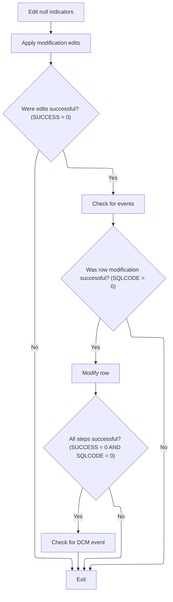

<SwmSnippet path="/base/src/NNNS0488.cbl" line="3452">

---

We clean up nulls, validate edits, check for events, and only then update the row if all is good.

```cobol
348000 1400-EXIT-PUT-MODIFY-ROW.                                        00348000
348100     PERFORM 1800-EDIT-NULL-INDICATORS                            00348100
348200     PERFORM 1410-MODIFY-EDITS                                    00348200
348300     IF SUCCESS                                                   00348300
348400       PERFORM 1430-CHECK-FOR-EVENTS                              00348400
348500       IF SQLCODE = 0                                             00348500
348600         PERFORM 1440-D0-MODIFY-ROW                               00348600
348700         IF SUCCESS AND SQLCODE = 0                               00348700
348800           PERFORM 2400-CHECK-FOR-DCM-EVENT                       00348800
348900         END-IF                                                   00348900
349000       END-IF                                                     00349000
349100     END-IF                                                       00349100
349200     .                                                            00349200
```

---

</SwmSnippet>

#### Validating Alternate Store References

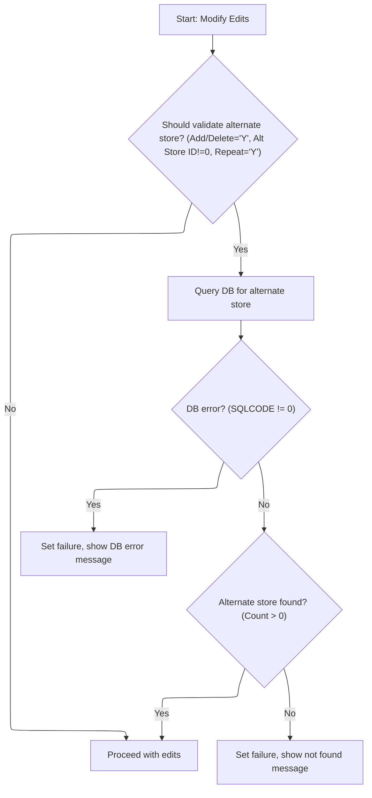

<SwmSnippet path="/base/src/NNNS0488.cbl" line="3467">

---

In `1410-MODIFY-EDITS`, we call 1420-VALIDATE-ALT-STORE to check if the alternate store exists. If it doesn't, we set FAILURE and build an error message. This prevents invalid references from being created.

```cobol
349500 1410-MODIFY-EDITS.                                               00349500
349600     PERFORM 1420-VALIDATE-ALT-STORE                              00349600
349700     .                                                            00349700
```

---

</SwmSnippet>

<SwmSnippet path="/base/src/NNNS0488.cbl" line="3472">

---

In `1420-VALIDATE-ALT-STORE`, we check if both flags are 'Y' and the alternate store ID is set. If so, we run a SQL COUNT to see if the store exists. If not, or if the query fails, we set FAILURE and build an error message. This keeps references valid.

```cobol
350000 1420-VALIDATE-ALT-STORE.                                         00350000
350100     IF CK-COLL-ADD-DEL-SW OF DCLXXXAIL-LOC = 'Y' AND             00350100
350200        CK-ALT-STR-ID OF DCLXXXAIL-LOC NOT = 0    AND             00350200
350300        CK-COLL-REPT-SW OF DCLXXXAIL-LOC   = 'Y'                  00350300
350400          EXEC SQL                                                00350400
350500            SELECT COUNT(*)                                       00350500
350600            INTO :WS-CNT                                          00350600
350700            FROM XXXAIL_LOC                                       00350700
350800            WHERE LOC_NBR    = :DCLXXXAIL-LOC.CK-ALT-STR-ID       00350800
350900            AND   LOC_TYP_CD = :DCLXXXAIL-LOC.LOC-TYP-CD          00350900
351000          END-EXEC                                                00351000
351100          EVALUATE TRUE                                           00351100
351200           WHEN SQLCODE = 0                                       00351200
351300            IF WS-CNT = 0                                         00351300
351400              SET  FAILURE                 TO TRUE                00351400
351500              MOVE SPACES                  TO IS-RTRN-MSG-TXT     00351500
351600              STRING 'NNNS0488 - Alt. store does not exists'      00351600
351700                     DELIMITED BY SIZE INTO IS-RTRN-MSG-TXT       00351700
351800            ELSE                                                  00351800
351900              CONTINUE                                            00351900
352000            END-IF                                                00352000
352100           WHEN OTHER                                             00352100
352200             SET  FAILURE                 TO TRUE                 00352200
352300             MOVE SPACES                  TO IS-RTRN-MSG-TXT      00352300
352400             STRING 'NNNS0488 - Error accessing DB2'              00352400
352500                    DELIMITED BY SIZE INTO IS-RTRN-MSG-TXT        00352500
352600     END-IF                                                       00352600
352700     .                                                            00352700
```

---

</SwmSnippet>

#### Checking for Status Changes and Events

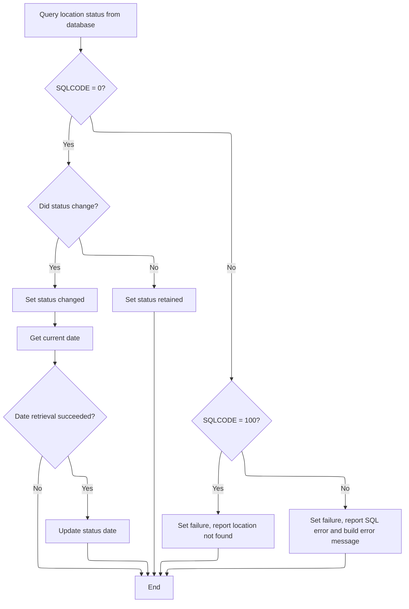

<SwmSnippet path="/base/src/NNNS0488.cbl" line="3502">

---

In `1430-CHECK-FOR-EVENTS`, we pull the latest status, ad zone, and line of business from the DB. If the status has changed, we set a flag and update the change date. If the location is missing or there's a DB error, we set FAILURE and build an error message.

```cobol
353000 1430-CHECK-FOR-EVENTS.                                           00353000
353100     EXEC SQL                                                     00353100
353200         SELECT RETL_LOC_STAT_CD,                                 00353200
353300                CURR_AD_ZN_NBR,                                   00353300
353400                LIN_OF_BUS_ID                                     00353400
353500         INTO   :WS-STR-ST-CD,                                    00353500
353600                :WS-CURR-AD-ZONE,                                 00353600
353700                :WS-CURR-LOB                                      00353700
353800         FROM   XXXAIL_LOC                                        00353800
353900         WHERE  LOC_NBR = :DCLXXXAIL-LOC.LOC-NBR                  00353900
354000         AND    LOC_TYP_CD = :DCLXXXAIL-LOC.LOC-TYP-CD            00354000
354100     END-EXEC                                                     00354100
354200                                                                  00354200
354300     EVALUATE TRUE                                                00354300
354400       WHEN SQLCODE = 0                                           00354400
354500         IF WS-STR-ST-CD NOT = RETL-LOC-STAT-CD OF DCLXXXAIL-LOC  00354500
354600           SET WS-LOC-STAT-CHANGED TO TRUE                        00354600
354700           PERFORM 2040-GET-CURRENT-DATE                          00354700
354800           IF SUCCESS                                             00354800
354900             MOVE DTA10-MM-DD-YYYY                                00354900
355000               TO RETL-LOC-STAT-DT OF DCLXXXAIL-LOC               00355000
355100           END-IF                                                 00355100
355200         ELSE                                                     00355200
355300           SET  WS-LOC-STAT-RETAINED TO TRUE                      00355300
355400         END-IF                                                   00355400
355500       WHEN SQLCODE = 100                                         00355500
355600         SET  FAILURE TO TRUE                                     00355600
355700         MOVE 'NNNS0488 - xxxail xxxation not found!'             00355700
355800           TO IS-RTRN-MSG-TXT                                     00355800
355900       WHEN SQLCODE NOT = 0                                       00355900
356000         MOVE SQLCODE                 TO WS-SQLCODE               00356000
356100         SET  FAILURE                 TO TRUE                     00356100
356200         MOVE SPACES                  TO IS-RTRN-MSG-TXT          00356200
356300         STRING 'NNNS0488 - Error checking for changes, SQL='     00356300
356400                 WS-SQLCODE                                       00356400
356500                 DELIMITED BY SIZE INTO IS-RTRN-MSG-TXT           00356500
356600     END-EVALUATE                                                 00356600
356700     .                                                            00356700
```

---

</SwmSnippet>

<SwmSnippet path="/base/src/NNNS0488.cbl" line="3778">

---

In `2040-GET-CURRENT-DATE`, we call Z-DATE-FUNCTIONS with two repo-specific parameters. This isn't a standard date call—it's likely doing extra formatting or business logic for the date, but the details depend on what those parameters mean.

```cobol
379900 2040-GET-CURRENT-DATE.                                           00379900
380000     CALL Z-DATE-FUNCTIONS USING                                  00380000
380100         XXXN001A                                                 00380100
380200         YYYC0127                                                 00380200
380300     .                                                            00380300
```

---

</SwmSnippet>

#### Updating and Flagging Modified Location Records

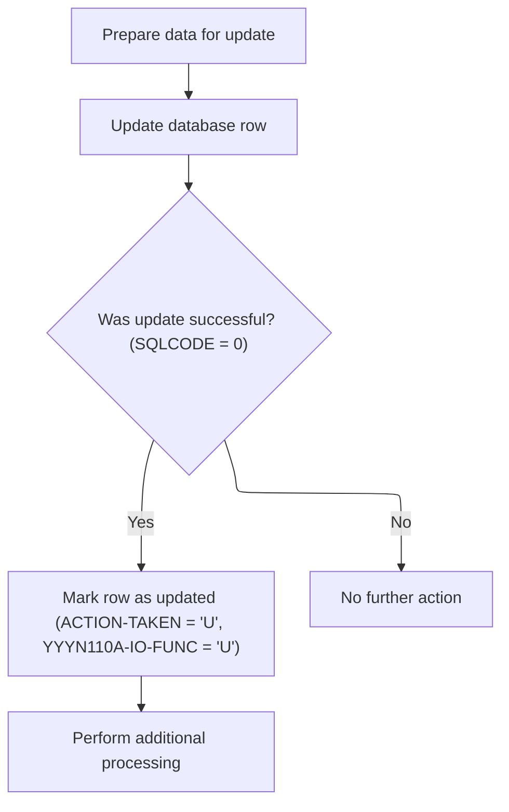

<SwmSnippet path="/base/src/NNNS0488.cbl" line="3542">

---

`1440-D0-MODIFY-ROW` first cleans up any low-value junk in the data, then calls the update routine to push changes to the database. If the update works (SQLCODE = 0), it sets the update flags in both the IO and action fields, so downstream logic knows this was an update. After that, it runs denormalization to sync and trigger any related events. The flag setting is key for tracking what kind of change just happened.

```cobol
357000 1440-D0-MODIFY-ROW.                                              00357000
357100     PERFORM 4670-REP-LOWVALUE-WITH-SPACES                        00357100
357200     PERFORM 5000-CALL-NNNU0488-CUD-ROUTINE                       00357200
357300                                                                  00357300
357400     IF SQLCODE = 0                                               00357400
357500       SET YYYN110A-UPD TO TRUE                                   00357500
357600       SET LOC-UPD      TO TRUE                                   00357600
357700       PERFORM 2000-DENORM-PROCESS                                00357700
357800     END-IF                                                       00357800
357900     .                                                            00357900
```

---

</SwmSnippet>

#### Synchronizing and Triggering Location Events

See <SwmLink doc-title="Processing and Synchronizing Location Data">[Processing and Synchronizing Location Data](\.swm\processing-and-synchronizing-location-data.q9ez9f34.sw.md)</SwmLink>

#### Issuing Master Data and Store Events

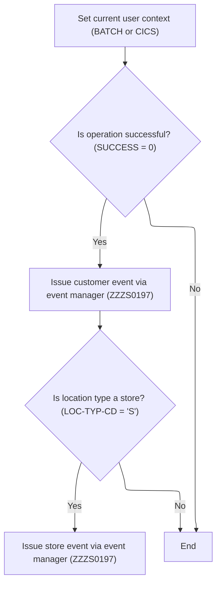

<SwmSnippet path="/base/src/NNNS0488.cbl" line="3740">

---

`2030-ISSUE-EVENTS` gets the current user, sets up the Oracle flag, and if everything's good, builds and sends a master data event for the location. If the location type is a store, it also builds and sends a separate store event. All the payload setup and event manager calls are wired to repository-specific structures and constants, so you need to know what those mean to follow the logic.

```cobol
376100 2030-ISSUE-EVENTS.                                               00376100
376200     PERFORM 2050-GET-CURRENT-USER                                00376200
376300     SET  YYYN110A-ORACLE      TO TRUE                            00376300
376400     IF SUCCESS                                                   00376400
376500       MOVE LOC-NBR OF P-DDDTLR01 TO ST-STORE-NUMBER OF ZZZC0032  00376500
376600                                     LOC-NBR OF ZZZC0094          00376600
376700       SET  ZZZC0032-UPD-FXXX     TO TRUE                         00376700
376800       MOVE ZZZC0032              TO ZZZC0197-TRX-REC             00376800
376900       MOVE 'CUST'                TO ZZZC0197-TRX-ID              00376900
377000       MOVE 'NNNS0488'            TO ZZZC0197-PROGRAM             00377000
377100       MOVE YYYC0107-USER         TO ZZZC0197-USER                00377100
377200       MOVE YYYN005A-SYS-ENV      TO YYYN110A-SYS-ENV             00377200
377300       CALL ZZZS0197-EVENT-MGR USING                              00377300
377400            XXXN001A                                              00377400
377500            YYYN110A                                              00377500
377600            ZZZC0197                                              00377600
377700                                                                  00377700
377800       EVALUATE TRUE                                              00377800
377900                                                                  00377900
378000       WHEN LOC-TYP-CD OF P-DDDTLR01 = K-STORE-LOC-TYPE           00378000
378100         MOVE LOC-TYP-CD OF P-DDDTLR01 TO                         00378100
378200                                       LOC-TYP-CD OF ZZZC0094     00378200
378300         MOVE ZZZC0094              TO ZZZC0197-TRX-REC           00378300
378400         MOVE 'STRM'                TO ZZZC0197-TRX-ID            00378400
378500         MOVE 'NNNS0488'            TO ZZZC0197-PROGRAM           00378500
378600         MOVE YYYC0107-USER         TO ZZZC0197-USER              00378600
378700         MOVE YYYN005A-SYS-ENV      TO YYYN110A-SYS-ENV           00378700
378800         CALL ZZZS0197-EVENT-MGR USING                            00378800
378900              XXXN001A                                            00378900
379000              YYYN110A                                            00379000
379100              ZZZC0197                                            00379100
379200                                                                  00379200
379300       END-EVALUATE                                               00379300
379400                                                                  00379400
379500     END-IF                                                       00379500
379600     .                                                            00379600
```

---

</SwmSnippet>

<SwmSnippet path="/base/src/NNNS0488.cbl" line="3785">

---

This part figures out if we're online or batch, and sets the user ID accordingly.

```cobol
380600 2050-GET-CURRENT-USER.                                           00380600
380700     IF  SUCCESS                                                  00380700
380800     AND YYYN005A-CICS-ENV                                        00380800
380900       CALL Z-GET-CICS-USER-ID USING                              00380900
381000           EIBLK    WS-DUMMY                                      00381000
381100           XXXN001A YYYC0107                                      00381100
381200     ELSE                                                         00381200
381300       MOVE 'BATCH' TO YYYC0107-USER                              00381300
381400     END-IF                                                       00381400
381500     .                                                            00381500
```

---

</SwmSnippet>

#### Detecting and Issuing DCM Events

<SwmSnippet path="/base/src/NNNS0488.cbl" line="3877">

---

`2400-CHECK-FOR-DCM-EVENT` checks if the current line of business is different from the one in the location record. If it is, it sets up and issues a new event to flag the change. This is how the system tracks and reacts to business line changes for a location.

```cobol
389800 2400-CHECK-FOR-DCM-EVENT.                                        00389800
389900     IF WS-CURR-LOB     NOT = LIN-OF-BUS-ID  OF DCLXXXAIL-LOC     00389900
390400         PERFORM 2410-SETUP-EVENT                                 00390400
390400         PERFORM 2430-ISSUE-EVENT2                                00390500
390600     END-IF                                                       00390600
390700     .                                                            00390700
```

---

</SwmSnippet>

#### Staging WMS Events for Location Changes

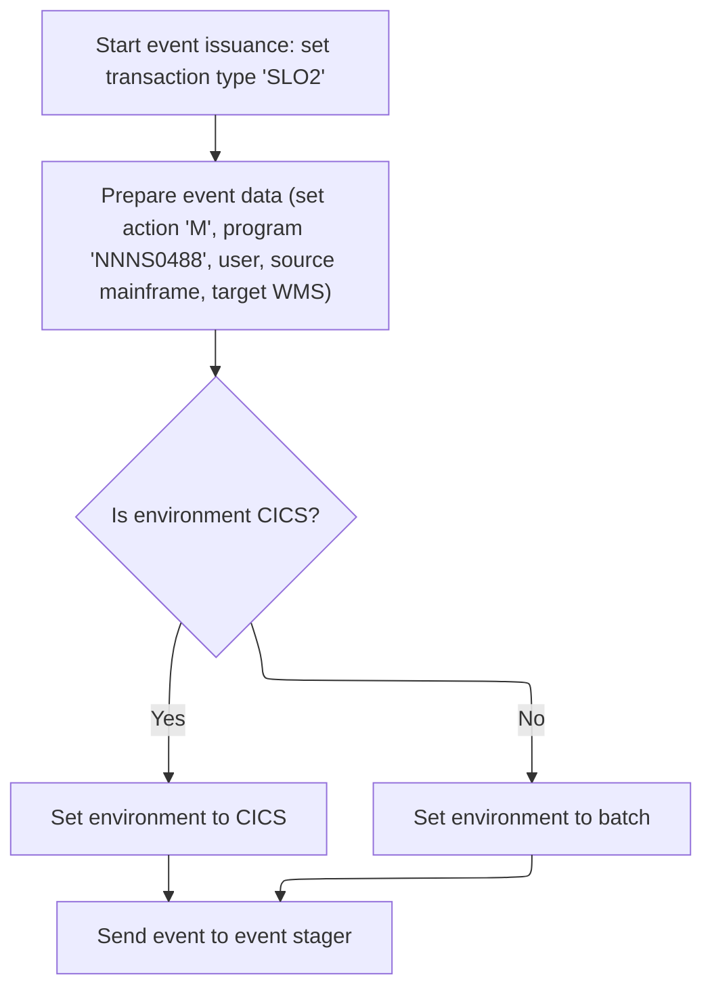

<SwmSnippet path="/base/src/NNNS0488.cbl" line="3929">

---

`2430-ISSUE-EVENT2` sets up the transaction ID, then calls `2420-ISSUE-EVENT` to build the event payload, mark it as a mainframe-to-WMS event, and send it to the event stager. The flags and codes used here are all repo-specific and control how the event is routed.

```cobol
395500 2430-ISSUE-EVENT2.                                               00395500
395600     MOVE 'SLO2' TO ZZZC0210-TRX-ID                               00395600
395700     PERFORM 2420-ISSUE-EVENT                                     00395700
395800     .                                                            00395800
```

---

</SwmSnippet>

<SwmSnippet path="/base/src/NNNS0488.cbl" line="3904">

---

This part builds the event, marks the environment, and sends it to the stager.

```cobol
393000 2420-ISSUE-EVENT.                                                00393000
393100     INITIALIZE YYYC0175                                          00393100
393200     SET YYYC0175-ORACLE      TO TRUE                             00393200
393300     IF YYYN005A-CICS-ENV                                         00393300
393400       SET YYYC0175-CICS-ENV  TO TRUE                             00393400
393500     ELSE                                                         00393500
393600       SET YYYC0175-BATCH-ENV TO TRUE                             00393600
393700     END-IF                                                       00393700
393800                                                                  00393800
393900     MOVE ZZZC0210-TRX-ID TO YYYC0175-TRX-CD                      00393900
394000     MOVE ZZZC0210        TO YYYC0175-DATA                        00394000
394100     MOVE 'M'             TO YYYC0175-ACTION-CD                   00394100
394200                                                                  00394200
394300     MOVE 'NNNS0488'      TO YYYC0175-CALLING-PROG                00394300
394400     MOVE YYYC0107-USER   TO YYYC0175-CALLING-USER                00394400
394500                                                                  00394500
394600     SET  YYYC0175-SOURCE-MAINFRAME TO TRUE                       00394600
394700     SET  YYYC0175-TARGET-WMS       TO TRUE                       00394700
394800                                                                  00394800
394900     CALL Z-EVENT-STAGER USING                                    00394900
395000         XXXN001A                                                 00395000
395100         YYYC0175                                                 00395100
395200     .                                                            00395200
```

---

</SwmSnippet>

#### Validating and Inserting New Location Records

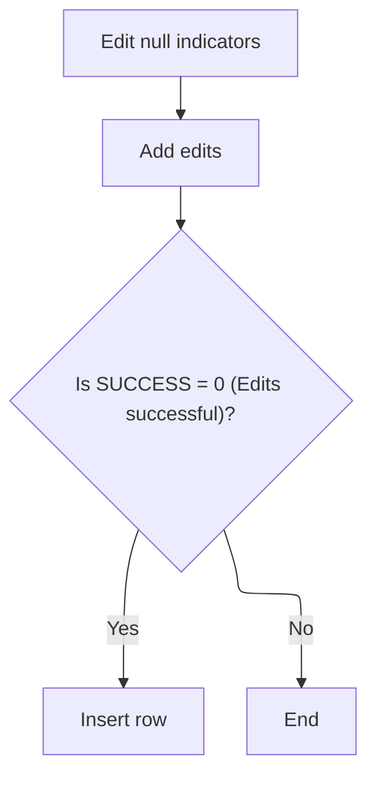

<SwmSnippet path="/base/src/NNNS0488.cbl" line="3554">

---

This part sets up nulls, runs edits, and inserts the record if all checks pass.

```cobol
358200 1500-EXIT-PUT-INSERT-ROW.                                        00358200
358300     PERFORM 1800-EDIT-NULL-INDICATORS                            00358300
358400     PERFORM 1510-ADD-EDITS                                       00358400
358500     IF SUCCESS                                                   00358500
358600       PERFORM 1520-D0-INSERT-ROW                                 00358600
358700     END-IF                                                       00358700
358800     .                                                            00358800
```

---

</SwmSnippet>

#### Checking and Executing Location Insert

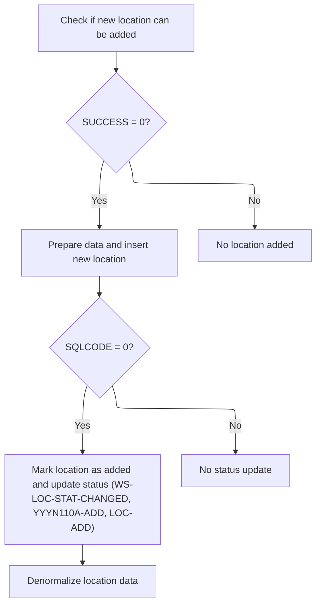

<SwmSnippet path="/base/src/NNNS0488.cbl" line="3597">

---

`1520-D0-INSERT-ROW` calls the MMMS0335 insert check to validate the operation, then cleans up low-value fields, runs the actual insert, and if successful, sets flags to mark the location as added and runs denormalization. The validation step is what keeps the data consistent.

```cobol
362500 1520-D0-INSERT-ROW.                                              00362500
362600     PERFORM 4600-CALL-MMMS0335-RI-ADD-CHK                        00362600
362700     IF SUCCESS                                                   00362700
362800        PERFORM 4670-REP-LOWVALUE-WITH-SPACES                     00362800
362900        PERFORM 5000-CALL-NNNU0488-CUD-ROUTINE                    00362900
363000                                                                  00363000
363100        IF SQLCODE = 0                                            00363100
363200          SET WS-LOC-STAT-CHANGED TO TRUE                         00363200
363300          SET YYYN110A-ADD TO TRUE                                00363300
363400          SET LOC-ADD      TO TRUE                                00363400
363500          PERFORM 2000-DENORM-PROCESS                             00363500
363600        END-IF                                                    00363600
363700     END-IF                                                       00363700
363800     .                                                            00363800
```

---

</SwmSnippet>

<SwmSnippet path="/base/src/NNNS0488.cbl" line="3963">

---

`4600-CALL-MMMS0335-RI-ADD-CHK` sets up the market area and computer type codes, flags the operation as an insert for Oracle, and then calls MMMS0335 to validate the insert. This step is all about making sure the new record won't break any rules.

```cobol
398900 4600-CALL-MMMS0335-RI-ADD-CHK.                                   00398900
399000     INITIALIZE MMMC0335                                          00399000
399100     MOVE ECOMM-MKT-AREA-CD OF DCLXXXAIL-LOC                      00399100
399200                                 TO MMMC0335-ECOMM-MKT-AREA-CD    00399200
399300     MOVE CMPTR-TYP-CD  OF DCLXXXAIL-LOC                          00399300
399400                                 TO MMMC0335-CMPTR-TYP-CD         00399400
399500     SET   MMMC0335-INSERT-CHECK TO TRUE                          00399500
399600     SET   MMMC0335-XXXAIL-LOC   TO TRUE                          00399600
399700     SET   MMMC0335-ORACLE       TO TRUE                          00399700
399800     CALL  MMMC0335-RI-INSERT-CHK USING                           00399800
399900           XXXN001A                                               00399900
400000           MMMC0335                                               00400000
400100     .                                                            00400100
```

---

</SwmSnippet>

#### Validating and Purging Location Records

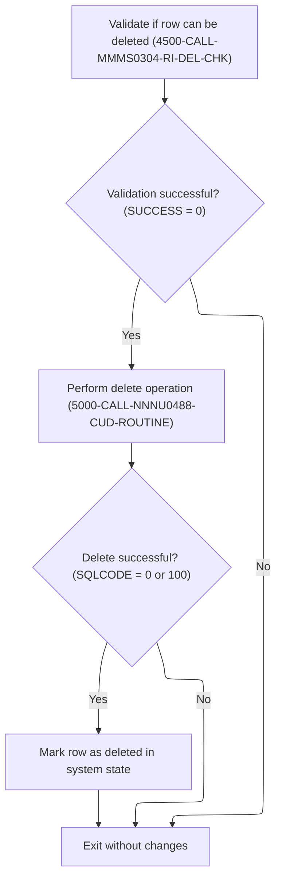

<SwmSnippet path="/base/src/NNNS0488.cbl" line="3613">

---

`1600-EXIT-PUT-PURGE-ROW` checks if the location can be deleted, runs the delete, and if SQLCODE is 0 or 100, sets the deletion flags so downstream logic knows the record is gone. The commented-out block shows how more detailed error handling could work, but it's not active.

```cobol
364100 1600-EXIT-PUT-PURGE-ROW.                                         00364100
364200     PERFORM 4500-CALL-MMMS0304-RI-DEL-CHK                        00364200
364300     IF SUCCESS                                                   00364300
364400       PERFORM 5000-CALL-NNNU0488-CUD-ROUTINE                     00364400
364500                                                                  00364500
364600       IF SQLCODE = 0 OR 100                                      00364600
364700         MOVE 0            TO SQLCODE                             00364700
364800         SET  YYYN110A-DEL TO TRUE                                00364800
364900         SET  LOC-DEL      TO TRUE                                00364900
365000       END-IF                                                     00365000
365100     END-IF                                                       00365100
365200                                                                  00365200
365300*    EVALUATE TRUE                                                00365300
365400*      WHEN SQLCODE = 0                                           00365400
365500*      OR   SQLCODE = 100                                         00365500
365600*        MOVE 0            TO SQLCODE                             00365600
365700*        SET  YYYN110A-DEL TO TRUE                                00365700
365800*        SET  LOC-DEL      TO TRUE                                00365800
365900*      WHEN SQLCODE = -532                                        00365900
366000*        SET  FAILURE TO TRUE                                     00366000
366100*        MOVE 'NNNS0488 - xxxation in use - it cannot be deleted!'00366100
366200*          TO IS-RTRN-MSG-TXT                                     00366200
366300*      WHEN SQLCODE NOT = 0                                       00366300
366400*        MOVE SQLCODE                 TO WS-SQLCODE               00366400
366500*        SET  FAILURE                 TO TRUE                     00366500
366600*        MOVE SPACES                  TO IS-RTRN-MSG-TXT          00366600
366700*        STRING 'NNNS0488 - Error deleting xxxail loc, SQL='      00366700
366800*                WS-SQLCODE                                       00366800
366900*                DELIMITED BY SIZE INTO IS-RTRN-MSG-TXT           00366900
367000*    END-EVALUATE                                                 00367000
367100     .                                                            00367100
```

---

</SwmSnippet>

### Finalizing Transaction and Connecting to Database

<SwmSnippet path="/base/src/NNNS0488.cbl" line="1756">

---

`120-EXIT-STUFF` checks if we're not closing a cursor, moves location data to the working record, bumps the checkpoint count, and if we're doing an insert, purge, or modify, connects to DB2 for the next step. This keeps the data and connection state in sync.

```cobol
179300 120-EXIT-STUFF.                                                  00179300
179400     IF SUCCESS                                                   00179400
179500       IF NOT EXIT-CLOSE-CURSOR                                   00179500
179600         PERFORM 130-MOVE-DCL-2-PDA-FIELDS                        00179600
179700       END-IF                                                     00179700
179800       ADD WS-CHECKPOINT-INC TO YYYN005A-CHKPT-CNT                00179800
179900     END-IF                                                       00179900
180000     IF (YYYN005A-ORACLE       OR EXIT-PUT-INSERT-ROW             00180000
180100         OR EXIT-PUT-PURGE-ROW OR EXIT-PUT-MODIFY-ROW)            00180100
180200*      SET YYYN005A-DB2        TO TRUE                            00180200
180300       PERFORM 125-CONNECT-TO-DB2                                 00180300
180400     END-IF                                                       00180400
180500     MOVE SQLCODE            TO DB2-SQL-CODE                      00180500
180600     .                                                            00180600
```

---

</SwmSnippet>

#### Mapping and Normalizing Location Data

```mermaid
%%{init: {"flowchart": {"defaultRenderer": "elk"}} }%%
flowchart TD
    node1["Transfer all location and store fields from source to destination"]
    click node1 openCode "base/src/NNNS0488.cbl:1784:2050"
    node1 --> node2{"Is any key date field = '01/01/1600'?"}
    click node2 openCode "base/src/NNNS0488.cbl:1794:2050"
    node2 -->|"Yes"| node3["Blank out date field"]
    click node3 openCode "base/src/NNNS0488.cbl:1795:2050"
    node2 -->|"No (date is valid)"| node4
    node3 --> node4
    node4 --> node5{"Is any closing time = '24.00.00'?"}
    click node5 openCode "base/src/NNNS0488.cbl:1947:2050"
    node5 -->|"Yes"| node6["Set closing time to '23.59.59'"]
    click node6 openCode "base/src/NNNS0488.cbl:1948:2050"
    node5 -->|"No (time is valid)"| node7
    node6 --> node7
    node7 --> node8{"Are substitution flags not set?"}
    click node8 openCode "base/src/NNNS0488.cbl:1914:1924"
    node8 -->|"Yes"| node9["Set store substitution preferences"]
    click node9 openCode "base/src/NNNS0488.cbl:1916:1924"
    node8 -->|"No (preferences already set)"| node10
    node9 --> node10
    node10 --> node11{"Is real-time flag not set?"}
    click node11 openCode "base/src/NNNS0488.cbl:1928:1930"
    node11 -->|"Yes"| node12["Disable real-time transmission"]
    click node12 openCode "base/src/NNNS0488.cbl:1929:1930"
    node11 -->|"No (real-time enabled)"| node13
    node12 --> node13
    node13 --> node14["Transfer rollup and time fields"]
    click node14 openCode "base/src/NNNS0488.cbl:1838:2007"
    node14 --> node15["Done"]
    click node15 openCode "base/src/NNNS0488.cbl:2027:2050"
classDef HeadingStyle fill:#777777,stroke:#333,stroke-width:2px;
```

<SwmSnippet path="/base/src/NNNS0488.cbl" line="1784">

---

`130-MOVE-DCL-2-PDA-FIELDS` copies all the location fields, but for dates and times, it blanks out defaults and converts DB2 max times to Oracle max times. It also sets flags based on business rules and calls routines for rollup and time conversions. This is all about getting the data into the right shape for downstream logic.

```cobol
182100 130-MOVE-DCL-2-PDA-FIELDS.                                       00182100
182200     MOVE LOC-NBR OF DCLXXXAIL-LOC TO LOC-NBR OF P-DDDTLR01       00182200
182300     MOVE LOC-TYP-CD OF DCLXXXAIL-LOC TO LOC-TYP-CD OF P-DDDTLR01 00182300
182400     MOVE ASSOC-STR-TYP-CD OF DCLXXXAIL-LOC                       00182400
182500       TO ASSOC-STR-TYP-CD OF P-DDDTLR01                          00182500
182600     MOVE ASSOC-STR-NBR OF DCLXXXAIL-LOC                          00182600
182700       TO ASSOC-STR-NBR OF P-DDDTLR01                             00182700
182800                                                                  00182800
182900     MOVE STR-REMODL-DT OF DCLXXXAIL-LOC                          00182900
183000       TO STR-REMODL-DT OF P-DDDTLR01                             00183000
183100     IF STR-REMODL-DT OF P-DDDTLR01 = K-DEF-DT                    00183100
183200       MOVE SPACES TO STR-REMODL-DT OF P-DDDTLR01                 00183200
183300     END-IF                                                       00183300
183400                                                                  00183400
183500     MOVE SLS-CLOSED-DT OF DCLXXXAIL-LOC                          00183500
183600       TO SLS-CLOSED-DT OF P-DDDTLR01                             00183600
183700     IF SLS-CLOSED-DT OF P-DDDTLR01 = K-DEF-DT                    00183700
183800       MOVE SPACES TO SLS-CLOSED-DT OF P-DDDTLR01                 00183800
183900     END-IF                                                       00183900
184000                                                                  00184000
184100     MOVE RETL-LOC-STAT-CD OF DCLXXXAIL-LOC                       00184100
184200       TO RETL-LOC-STAT-CD OF P-DDDTLR01                          00184200
184300                                                                  00184300
184400     MOVE RETL-LOC-STAT-DT OF DCLXXXAIL-LOC                       00184400
184500       TO RETL-LOC-STAT-DT OF P-DDDTLR01                          00184500
184600     IF RETL-LOC-STAT-DT OF P-DDDTLR01 = K-DEF-DT                 00184600
184700       MOVE SPACES TO RETL-LOC-STAT-DT OF P-DDDTLR01              00184700
184800     END-IF                                                       00184800
184900                                                                  00184900
185000     MOVE COMPANY-ID OF DCLXXXAIL-LOC TO COMPANY-ID OF P-DDDTLR01 00185000
185100     MOVE FINANCIAL-DIV-ID OF DCLXXXAIL-LOC                       00185100
185200       TO FINANCIAL-DIV-ID OF P-DDDTLR01                          00185200
185300     MOVE LIN-OF-BUS-ID OF DCLXXXAIL-LOC                          00185300
185400       TO LIN-OF-BUS-ID OF P-DDDTLR01                             00185400
185500     MOVE DIST-ID OF DCLXXXAIL-LOC TO DIST-ID OF P-DDDTLR01       00185500
185600     MOVE MKT-RGN-ID OF DCLXXXAIL-LOC TO MKT-RGN-ID OF P-DDDTLR01 00185600
185700     MOVE GEO-ZN-CD OF DCLXXXAIL-LOC TO GEO-ZN-CD OF P-DDDTLR01   00185700
185800     MOVE RETL-GEO-ZN-ID OF DCLXXXAIL-LOC                         00185800
185900       TO RETL-GEO-ZN-ID OF P-DDDTLR01                            00185900
186000     MOVE SCN-MAINT-SW OF DCLXXXAIL-LOC                           00186000
186100       TO SCN-MAINT-SW OF P-DDDTLR01                              00186100
186200     MOVE FRNT-END-CD OF DCLXXXAIL-LOC                            00186200
186300       TO FRNT-END-CD OF P-DDDTLR01                               00186300
186400     MOVE PRC-BUL-SW OF DCLXXXAIL-LOC TO PRC-BUL-SW OF P-DDDTLR01 00186400
186500     MOVE UPC-ON-PRC-BUL-SW OF DCLXXXAIL-LOC                      00186500
186600       TO UPC-ON-PRC-BUL-SW OF P-DDDTLR01                         00186600
186700     MOVE CMPTR-TYP-CD OF DCLXXXAIL-LOC                           00186700
186800       TO CMPTR-TYP-CD OF P-DDDTLR01                              00186800
186900     MOVE RETL-VID-ZN-NBR OF DCLXXXAIL-LOC                        00186900
187000       TO RETL-VID-ZN-NBR OF P-DDDTLR01                           00187000
187100     MOVE RETL-UNLD-CD OF DCLXXXAIL-LOC                           00187100
187200       TO RETL-UNLD-CD OF P-DDDTLR01                              00187200
187300*    MOVE ROLUP-REPT-TBL-TXT OF DCLXXXAIL-LOC                     00187300
187400*      TO ROLUP-REPT-TBL-TXT OF P-DDDTLR01                        00187400
187500     PERFORM 135-MOVE-DC-ROLLUP-DATA                              00187500
187600     MOVE NEW-STR-SW OF DCLXXXAIL-LOC TO NEW-STR-SW OF P-DDDTLR01 00187600
187700     MOVE SEL-CIR-SW OF DCLXXXAIL-LOC TO SEL-CIR-SW OF P-DDDTLR01 00187700
187800     MOVE BKRM-SQ-FT OF DCLXXXAIL-LOC TO BKRM-SQ-FT OF P-DDDTLR01 00187800
187900     MOVE FD-LINER-FT OF DCLXXXAIL-LOC                            00187900
188000       TO FD-LINER-FT OF P-DDDTLR01                               00188000
188100     MOVE NON-FD-LINER-FT OF DCLXXXAIL-LOC                        00188100
188200       TO NON-FD-LINER-FT OF P-DDDTLR01                           00188200
188300     MOVE SETOFF-ROOM-SW OF DCLXXXAIL-LOC                         00188300
188400       TO SETOFF-ROOM-SW OF P-DDDTLR01                            00188400
188500     MOVE CAT-CLS-TBL-TXT OF DCLXXXAIL-LOC                        00188500
188600       TO CAT-CLS-TBL-TXT OF P-DDDTLR01                           00188600
188700     MOVE LAT-K OF DCLXXXAIL-LOC TO LAT-K OF P-DDDTLR01           00188700
188800     MOVE LON-K OF DCLXXXAIL-LOC TO LON-K OF P-DDDTLR01           00188800
188900     MOVE CK-COLL-REPT-SW OF DCLXXXAIL-LOC                        00188900
189000       TO CK-COLL-REPT-SW OF P-DDDTLR01                           00189000
189100     MOVE CK-COLL-CNTL-CD OF DCLXXXAIL-LOC                        00189100
189200       TO CK-COLL-CNTL-CD OF P-DDDTLR01                           00189200
189300     MOVE CK-COLL-ADD-DEL-SW OF DCLXXXAIL-LOC                     00189300
189400       TO CK-COLL-ADD-DEL-SW OF P-DDDTLR01                        00189400
189500     MOVE CK-ALT-STR-ID OF DCLXXXAIL-LOC                          00189500
189600       TO CK-ALT-STR-ID OF P-DDDTLR01                             00189600
189700     MOVE CK-COLL-FEE-AMT OF DCLXXXAIL-LOC                        00189700
189800       TO CK-COLL-FEE-AMT OF P-DDDTLR01                           00189800
189900     MOVE SALS-TAX-PCT OF DCLXXXAIL-LOC                           00189900
190000       TO SALS-TAX-PCT OF P-DDDTLR01                              00190000
190100     MOVE SOAP-SALE-VAR-PCT OF DCLXXXAIL-LOC                      00190100
190200       TO SOAP-SALE-VAR-PCT OF P-DDDTLR01                         00190200
190300     MOVE ON-SRS-CD OF DCLXXXAIL-LOC TO ON-SRS-CD OF P-DDDTLR01   00190300
190400     MOVE SRS-DSD-ORD-SW OF DCLXXXAIL-LOC                         00190400
190500       TO SRS-DSD-ORD-SW OF P-DDDTLR01                            00190500
190600     MOVE RETL-LOC-TYP-CD OF DCLXXXAIL-LOC                        00190600
190700       TO RETL-LOC-TYP-CD OF P-DDDTLR01                           00190700
190800     MOVE DEA-NBR OF DCLXXXAIL-LOC TO DEA-NBR OF P-DDDTLR01       00190800
190900     MOVE STR-OPSTMT-SRT-CD OF DCLXXXAIL-LOC                      00190900
191000       TO STR-OPSTMT-SRT-CD OF P-DDDTLR01                         00191000
191100     MOVE STR-OPSTMT-TYP-CD OF DCLXXXAIL-LOC                      00191100
191200       TO STR-OPSTMT-TYP-CD OF P-DDDTLR01                         00191200
191300     MOVE STR-OPSTMT-HDR-CD OF DCLXXXAIL-LOC                      00191300
191400       TO STR-OPSTMT-HDR-CD OF P-DDDTLR01                         00191400
191500     MOVE DPS-NBR OF DCLXXXAIL-LOC TO DPS-NBR OF P-DDDTLR01       00191500
191600     MOVE MEDICARE-ID OF DCLXXXAIL-LOC                            00191600
191700       TO MEDICARE-ID OF P-DDDTLR01                               00191700
191800     MOVE NABP-NBR OF DCLXXXAIL-LOC TO NABP-NBR OF P-DDDTLR01     00191800
191900     MOVE NATL-PROV-ID OF DCLXXXAIL-LOC                           00191900
192000       TO NATL-PROV-ID OF P-DDDTLR01                              00192000
192100     MOVE CURR-AD-ZN-NBR OF DCLXXXAIL-LOC                         00192100
192200       TO CURR-AD-ZN-NBR OF P-DDDTLR01                            00192200
192300     MOVE PD-ZONE-NO OF DCLXXXAIL-LOC TO PD-ZONE-NO OF P-DDDTLR01 00192300
192400     MOVE SOS-PROC-SW OF DCLXXXAIL-LOC                            00192400
192500       TO SOS-PROC-SW OF P-DDDTLR01                               00192500
192600     MOVE RPRT-SEQ-NBR OF DCLXXXAIL-LOC                           00192600
192700       TO RPRT-SEQ-NBR OF P-DDDTLR01                              00192700
192800     MOVE GRP-CD OF DCLXXXAIL-LOC TO GRP-CD OF P-DDDTLR01         00192800
192900     MOVE PRIM-GRP-CD-1 OF DCLXXXAIL-LOC                          00192900
193000       TO PRIM-GRP-CD-1 OF P-DDDTLR01                             00193000
193100     MOVE PRIM-GRP-CD-2 OF DCLXXXAIL-LOC                          00193100
193200       TO PRIM-GRP-CD-2 OF P-DDDTLR01                             00193200
193300     MOVE SECY-GRP-CD-1 OF DCLXXXAIL-LOC                          00193300
193400       TO SECY-GRP-CD-1 OF P-DDDTLR01                             00193400
193500     MOVE SECY-GRP-CD-2 OF DCLXXXAIL-LOC                          00193500
193600       TO SECY-GRP-CD-2 OF P-DDDTLR01                             00193600
193700     MOVE PRIM-CLS-NBR-1 OF DCLXXXAIL-LOC                         00193700
193800       TO PRIM-CLS-NBR-1 OF P-DDDTLR01                            00193800
193900     MOVE PRIM-CLS-NBR-2 OF DCLXXXAIL-LOC                         00193900
194000       TO PRIM-CLS-NBR-2 OF P-DDDTLR01                            00194000
194100     MOVE SECY-CLS-NBR-1 OF DCLXXXAIL-LOC                         00194100
194200       TO SECY-CLS-NBR-1 OF P-DDDTLR01                            00194200
194300     MOVE SECY-CLS-NBR-2 OF DCLXXXAIL-LOC                         00194300
194400       TO SECY-CLS-NBR-2 OF P-DDDTLR01                            00194400
194500     MOVE VAL-STR-SW OF DCLXXXAIL-LOC TO VAL-STR-SW OF P-DDDTLR01 00194500
194600     MOVE TBCO-PRMT-NBR OF DCLXXXAIL-LOC                          00194600
194700       TO TBCO-PRMT-NBR OF P-DDDTLR01                             00194700
194800                                                                  00194800
194900     MOVE SUB-UNLIKE-PROD-CD OF DCLXXXAIL-LOC                     00194900
195000       TO SUB-UNLIKE-PROD-CD OF P-DDDTLR01                        00195000
195100     IF  NOT OK-TO-SUB-UNLIKE-PRODS     OF P-DDDTLR01             00195100
195200     AND NOT DONT-SUB-UNLIKE-PRODS      OF P-DDDTLR01             00195200
195300       SET NO-UNLIKE-SUB-STORE-PREF     OF P-DDDTLR01 TO TRUE     00195300
195400     END-IF                                                       00195400
195500                                                                  00195500
195600     MOVE SUB-DSPLY-PAL-CD   OF DCLXXXAIL-LOC                     00195600
195700       TO SUB-DSPLY-PAL-CD   OF P-DDDTLR01                        00195700
195800     IF  NOT OK-TO-SUB-DISP-PALS        OF P-DDDTLR01             00195800
195900     AND NOT DONT-SUB-DISP-PALS         OF P-DDDTLR01             00195900
196000       SET NO-DISP-PAL-SUB-STORE-PREF   OF P-DDDTLR01 TO TRUE     00196000
196100     END-IF                                                       00196100
196200                                                                  00196200
196300     MOVE RLTM-SCN-MAINT-SW  OF DCLXXXAIL-LOC                     00196300
196400       TO RLTM-SCN-MAINT-SW  OF P-DDDTLR01                        00196400
196500     IF  NOT SEND-REAL-TIME-G3          OF P-DDDTLR01             00196500
196600       SET DONT-SEND-REAL-TIME-G3       OF P-DDDTLR01 TO TRUE     00196600
196700     END-IF                                                       00196700
196800     MOVE 0                                                       00196800
196900       TO DONTUSE1 OF P-DDDTLR01                                  00196900
197000     MOVE 0                                                       00197000
197100       TO DONTUSE2 OF P-DDDTLR01                                  00197100
197200     MOVE TOP-LEADER-NM   OF DCLXXXAIL-LOC                        00197200
197300       TO TOP-LEADER-NM   OF P-DDDTLR01                           00197300
197400     MOVE CUST-FRNDLY-NM  OF DCLXXXAIL-LOC                        00197400
197500       TO CUST-FRNDLY-NM  OF P-DDDTLR01                           00197500
197600     MOVE SLS-OPEN-DT     OF DCLXXXAIL-LOC                        00197600
197700       TO SLS-OPEN-DT     OF P-DDDTLR01                           00197700
197800     IF SLS-OPEN-DT OF P-DDDTLR01 = K-DEF-DT                      00197800
197900       MOVE SPACES TO SLS-OPEN-DT  OF P-DDDTLR01                  00197900
198000     END-IF                                                       00198000
198100     IF MON-OPEN-TM OF P-DDDTLR01 = K-DEF-TM                      00198100
198200       MOVE SPACES TO MON-OPEN-TM  OF P-DDDTLR01                  00198200
198300     END-IF                                                       00198300
198400     IF MON-CLOS-TM OF DCLXXXAIL-LOC = K-DB2-MAX-TM               00198400
198500       MOVE K-ORA-MAX-TM  TO MON-CLOS-TM OF DCLXXXAIL-LOC         00198500
198600     END-IF                                                       00198600
198700     IF MON-CLOS-TM OF P-DDDTLR01 = K-DEF-TM                      00198700
198800       MOVE SPACES TO MON-CLOS-TM  OF P-DDDTLR01                  00198800
198900     END-IF                                                       00198900
199000     IF TUE-OPEN-TM OF P-DDDTLR01 = K-DEF-TM                      00199000
199100       MOVE SPACES TO TUE-OPEN-TM  OF P-DDDTLR01                  00199100
199200     END-IF                                                       00199200
199300     IF TUE-CLOS-TM OF DCLXXXAIL-LOC = K-DB2-MAX-TM               00199300
199400       MOVE K-ORA-MAX-TM  TO TUE-CLOS-TM OF DCLXXXAIL-LOC         00199400
199500     END-IF                                                       00199500
199600     IF TUE-CLOS-TM OF P-DDDTLR01 = K-DEF-TM                      00199600
199700       MOVE SPACES TO TUE-CLOS-TM  OF P-DDDTLR01                  00199700
199800     END-IF                                                       00199800
199900     IF WED-OPEN-TM OF P-DDDTLR01 = K-DEF-TM                      00199900
200000       MOVE SPACES TO WED-OPEN-TM  OF P-DDDTLR01                  00200000
200100     END-IF                                                       00200100
200200     IF WED-CLOS-TM OF DCLXXXAIL-LOC = K-DB2-MAX-TM               00200200
200300       MOVE K-ORA-MAX-TM  TO WED-CLOS-TM OF DCLXXXAIL-LOC         00200300
200400     END-IF                                                       00200400
200500     IF WED-CLOS-TM OF P-DDDTLR01 = K-DEF-TM                      00200500
200600       MOVE SPACES TO WED-CLOS-TM  OF P-DDDTLR01                  00200600
200700     END-IF                                                       00200700
200800     IF THUR-OPEN-TM OF P-DDDTLR01 = K-DEF-TM                     00200800
200900       MOVE SPACES TO THUR-OPEN-TM OF P-DDDTLR01                  00200900
201000     END-IF                                                       00201000
201100     IF THUR-CLOS-TM OF DCLXXXAIL-LOC = K-DB2-MAX-TM              00201100
201200       MOVE K-ORA-MAX-TM  TO THUR-CLOS-TM OF DCLXXXAIL-LOC        00201200
201300     END-IF                                                       00201300
201400     IF THUR-CLOS-TM OF P-DDDTLR01 = K-DEF-TM                     00201400
201500       MOVE SPACES TO THUR-CLOS-TM OF P-DDDTLR01                  00201500
201600     END-IF                                                       00201600
201700     IF FRI-OPEN-TM OF P-DDDTLR01 = K-DEF-TM                      00201700
201800       MOVE SPACES TO FRI-OPEN-TM  OF P-DDDTLR01                  00201800
201900     END-IF                                                       00201900
202000     IF FRI-CLOS-TM OF DCLXXXAIL-LOC = K-DB2-MAX-TM               00202000
202100       MOVE K-ORA-MAX-TM  TO FRI-CLOS-TM OF DCLXXXAIL-LOC         00202100
202200     END-IF                                                       00202200
202300     IF FRI-CLOS-TM OF P-DDDTLR01 = K-DEF-TM                      00202300
202400       MOVE SPACES TO FRI-CLOS-TM  OF P-DDDTLR01                  00202400
202500     END-IF                                                       00202500
202600     IF SAT-OPEN-TM OF P-DDDTLR01 = K-DEF-TM                      00202600
202700       MOVE SPACES TO SAT-OPEN-TM  OF P-DDDTLR01                  00202700
202800     END-IF                                                       00202800
202900     IF SUN-OPEN-TM OF P-DDDTLR01 = K-DEF-TM                      00202900
203000       MOVE SPACES TO SUN-OPEN-TM  OF P-DDDTLR01                  00203000
203100     END-IF                                                       00203100
203200     IF SAT-CLOS-TM OF DCLXXXAIL-LOC = K-DB2-MAX-TM               00203200
203300       MOVE K-ORA-MAX-TM  TO SAT-CLOS-TM OF DCLXXXAIL-LOC         00203300
203400     END-IF                                                       00203400
203500     IF SAT-CLOS-TM OF P-DDDTLR01 = K-DEF-TM                      00203500
203600       MOVE SPACES TO SAT-CLOS-TM  OF P-DDDTLR01                  00203600
203700     END-IF                                                       00203700
203800     IF SUN-CLOS-TM OF DCLXXXAIL-LOC = K-DB2-MAX-TM               00203800
203900       MOVE K-ORA-MAX-TM  TO SUN-CLOS-TM OF DCLXXXAIL-LOC         00203900
204000     END-IF                                                       00204000
204100     IF SUN-CLOS-TM OF P-DDDTLR01 = K-DEF-TM                      00204100
204200       MOVE SPACES TO SUN-CLOS-TM  OF P-DDDTLR01                  00204200
204300     END-IF                                                       00204300
204400     PERFORM 132-MOVE-TIME-FIELDS                                 00204400
204500     MOVE RETL-LOC-FRMAT-CD OF DCLXXXAIL-LOC                      00204500
204600       TO RETL-LOC-FRMAT-CD OF P-DDDTLR01                         00204600
204700     MOVE RETL-LOC-SEGM-CD OF DCLXXXAIL-LOC                       00204700
204800       TO RETL-LOC-SEGM-CD OF P-DDDTLR01                          00204800
204900     MOVE ECOMM-MKT-AREA-CD OF DCLXXXAIL-LOC                      00204900
205000       TO ECOMM-MKT-AREA-CD OF P-DDDTLR01                         00205000
205100     MOVE ECOMM-STRT-DT OF DCLXXXAIL-LOC                          00205100
205200       TO ECOMM-STRT-DT OF P-DDDTLR01                             00205200
205300     IF ECOMM-STRT-DT OF P-DDDTLR01 = K-DEF-DT                    00205300
205400       MOVE SPACES TO ECOMM-STRT-DT OF P-DDDTLR01                 00205400
205500     END-IF                                                       00205500
205600     MOVE ECOMM-END-DT OF DCLXXXAIL-LOC                           00205600
205700       TO ECOMM-END-DT OF P-DDDTLR01                              00205700
205800     IF ECOMM-END-DT OF P-DDDTLR01 = K-DEF-DT                     00205800
205900       MOVE SPACES TO ECOMM-END-DT OF P-DDDTLR01                  00205900
206000     END-IF                                                       00206000
206100     MOVE ONLIN-SSON-SW OF DCLXXXAIL-LOC                          00206100
206200                        TO ONLIN-SSON-SW OF P-DDDTLR01            00206200
206300     MOVE RPLACD-BY-STR-NBR OF DCLXXXAIL-LOC                      00206300
206400                        TO RPLACD-BY-STR-NBR OF P-DDDTLR01.       00206400
```

---

</SwmSnippet>

<SwmSnippet path="/base/src/NNNS0488.cbl" line="2097">

---

`132-MOVE-TIME-FIELDS` checks if we're using Oracle or doing an insert/modify, then sets up arrays and calls MMMS0291 to convert timestamps to times for each day. If the conversion works, it copies the results; if not, it sets an error. If we're not converting, it just copies the time fields directly. The array logic is key for handling all days at once.

```cobol
213400 132-MOVE-TIME-FIELDS.                                            00213400
213500     IF (YYYN005A-ORACLE OR EXIT-PUT-INSERT-ROW                   00213500
213600         OR EXIT-PUT-MODIFY-ROW)                                  00213600
213700       INITIALIZE MMMC0291-INPUT-TM                               00213700
213800                  MMMC0291-INPUT-TS                               00213800
213900       MOVE WS-MON-OPEN-TS                                        00213900
214000         TO WS-TIMSTAMP-INOUT-CONV(1)                             00214000
214100       MOVE WS-MON-CLOS-TS                                        00214100
214200         TO WS-TIMSTAMP-INOUT-CONV(2)                             00214200
214300       MOVE WS-TUE-OPEN-TS                                        00214300
214400         TO WS-TIMSTAMP-INOUT-CONV(3)                             00214400
214500       MOVE WS-TUE-CLOS-TS                                        00214500
214600         TO WS-TIMSTAMP-INOUT-CONV(4)                             00214600
214700       MOVE WS-WED-OPEN-TS                                        00214700
214800         TO WS-TIMSTAMP-INOUT-CONV(5)                             00214800
214900       MOVE WS-WED-CLOS-TS                                        00214900
215000         TO WS-TIMSTAMP-INOUT-CONV(6)                             00215000
215100       MOVE WS-THUR-OPEN-TS                                       00215100
215200         TO WS-TIMSTAMP-INOUT-CONV(7)                             00215200
215300       MOVE WS-THUR-CLOS-TS                                       00215300
215400         TO WS-TIMSTAMP-INOUT-CONV(8)                             00215400
215500       MOVE WS-FRI-OPEN-TS                                        00215500
215600         TO WS-TIMSTAMP-INOUT-CONV(9)                             00215600
215700       MOVE WS-FRI-CLOS-TS                                        00215700
215800         TO WS-TIMSTAMP-INOUT-CONV(10)                            00215800
215900       MOVE WS-SAT-OPEN-TS                                        00215900
216000         TO WS-TIMSTAMP-INOUT-CONV(11)                            00216000
216100       MOVE WS-SAT-CLOS-TS                                        00216100
216200         TO WS-TIMSTAMP-INOUT-CONV(12)                            00216200
216300       MOVE WS-SUN-OPEN-TS                                        00216300
216400         TO WS-TIMSTAMP-INOUT-CONV(13)                            00216400
216500       MOVE WS-SUN-CLOS-TS                                        00216500
216600         TO WS-TIMSTAMP-INOUT-CONV(14)                            00216600
216700                                                                  00216700
216800        SET MMMC0291-CVT-TS-TO-TM  TO TRUE                        00216800
216900        CALL WS-MMMS0291-PGM USING                                00216900
217000                           XXXN001A                               00217000
217100                           MMMC0291                               00217100
217200        IF NOT SUCCESS                                            00217200
217300          STRING 'NNNS0488 - INVALD TIMSTMP.PLS VERIFY Sqlcode =' 00217300
217400              WS-SQLCODE                                          00217400
217500              DELIMITED BY SIZE INTO IS-RTRN-MSG-TXT              00217500
217600        ELSE                                                      00217600
217700          MOVE WS-TIME-INOUT-CONV(1)                              00217700
217800            TO MON-OPEN-TM OF P-DDDTLR01                          00217800
217900          MOVE WS-TIME-INOUT-CONV(2)                              00217900
218000            TO MON-CLOS-TM OF P-DDDTLR01                          00218000
218100          MOVE WS-TIME-INOUT-CONV(3)                              00218100
218200            TO TUE-OPEN-TM OF P-DDDTLR01                          00218200
218300          MOVE WS-TIME-INOUT-CONV(4)                              00218300
218400            TO TUE-CLOS-TM OF P-DDDTLR01                          00218400
218500          MOVE WS-TIME-INOUT-CONV(5)                              00218500
218600            TO WED-OPEN-TM OF P-DDDTLR01                          00218600
218700          MOVE WS-TIME-INOUT-CONV(6)                              00218700
218800            TO WED-CLOS-TM OF P-DDDTLR01                          00218800
218900          MOVE WS-TIME-INOUT-CONV(7)                              00218900
219000            TO THUR-OPEN-TM OF P-DDDTLR01                         00219000
219100          MOVE WS-TIME-INOUT-CONV(8)                              00219100
219200            TO THUR-CLOS-TM OF P-DDDTLR01                         00219200
219300          MOVE WS-TIME-INOUT-CONV(9)                              00219300
219400            TO FRI-OPEN-TM OF P-DDDTLR01                          00219400
219500          MOVE WS-TIME-INOUT-CONV(10)                             00219500
219600            TO FRI-CLOS-TM OF P-DDDTLR01                          00219600
219700          MOVE WS-TIME-INOUT-CONV(11)                             00219700
219800            TO SAT-OPEN-TM OF P-DDDTLR01                          00219800
219900          MOVE WS-TIME-INOUT-CONV(12)                             00219900
220000            TO SAT-CLOS-TM OF P-DDDTLR01                          00220000
220100          MOVE WS-TIME-INOUT-CONV(13)                             00220100
220200            TO SUN-OPEN-TM OF P-DDDTLR01                          00220200
220300          MOVE WS-TIME-INOUT-CONV(14)                             00220300
220400            TO SUN-CLOS-TM OF P-DDDTLR01                          00220400
220500        END-IF                                                    00220500
220600     ELSE                                                         00220600
220700       MOVE MON-OPEN-TM OF DCLXXXAIL-LOC                          00220700
220800         TO MON-OPEN-TM    OF P-DDDTLR01                          00220800
220900       MOVE MON-CLOS-TM    OF DCLXXXAIL-LOC                       00220900
221000         TO MON-CLOS-TM    OF P-DDDTLR01                          00221000
221100       MOVE TUE-OPEN-TM    OF DCLXXXAIL-LOC                       00221100
221200         TO TUE-OPEN-TM    OF P-DDDTLR01                          00221200
221300       MOVE TUE-CLOS-TM    OF DCLXXXAIL-LOC                       00221300
221400         TO TUE-CLOS-TM    OF P-DDDTLR01                          00221400
221500       MOVE WED-OPEN-TM    OF DCLXXXAIL-LOC                       00221500
221600         TO WED-OPEN-TM    OF P-DDDTLR01                          00221600
221700       MOVE WED-CLOS-TM    OF DCLXXXAIL-LOC                       00221700
221800         TO WED-CLOS-TM    OF P-DDDTLR01                          00221800
221900       MOVE THUR-OPEN-TM   OF DCLXXXAIL-LOC                       00221900
222000         TO THUR-OPEN-TM   OF P-DDDTLR01                          00222000
222100       MOVE THUR-CLOS-TM   OF DCLXXXAIL-LOC                       00222100
222200         TO THUR-CLOS-TM   OF P-DDDTLR01                          00222200
222300       MOVE FRI-OPEN-TM    OF DCLXXXAIL-LOC                       00222300
222400         TO FRI-OPEN-TM    OF P-DDDTLR01                          00222400
222500       MOVE FRI-CLOS-TM    OF DCLXXXAIL-LOC                       00222500
222600         TO FRI-CLOS-TM    OF P-DDDTLR01                          00222600
222700       MOVE SAT-OPEN-TM    OF DCLXXXAIL-LOC                       00222700
222800         TO SAT-OPEN-TM    OF P-DDDTLR01                          00222800
222900       MOVE SAT-CLOS-TM    OF DCLXXXAIL-LOC                       00222900
223000         TO SAT-CLOS-TM    OF P-DDDTLR01                          00223000
223100       MOVE SUN-OPEN-TM    OF DCLXXXAIL-LOC                       00223100
223200         TO SUN-OPEN-TM    OF P-DDDTLR01                          00223200
223300       MOVE SUN-CLOS-TM    OF DCLXXXAIL-LOC                       00223300
223400         TO SUN-CLOS-TM    OF P-DDDTLR01                          00223400
223500     END-IF                                                       00223500
223600     .                                                            00223600
```

---

</SwmSnippet>

#### Switching Database Connection and Handling Errors

<SwmSnippet path="/base/src/NNNS0488.cbl" line="1775">

---

`125-CONNECT-TO-DB2` calls the DB2 connect routine, which switches the system to DB2, handles any Oracle error translation, and restores the backup record if needed. This keeps the connection state and error handling tight after a data move.

```cobol
181200 125-CONNECT-TO-DB2.                                              00181200
181300     CALL Z-DB2-CONNECT         USING XXXN001A                    00181300
181400                                      SQLCA                       00181400
181500     .                                                            00181500
```

---

</SwmSnippet>

### Purging Department Location Data

```mermaid
%%{init: {"flowchart": {"defaultRenderer": "elk"}} }%%
flowchart TD
  node1{"Is initial database operation successful?"}
  click node1 openCode "base/src/NNNS0487.cbl:2696:2706"
  node1 -->|"Yes (SQLCODE=0)"| node2["Lookup store location details"]
  click node2 openCode "base/src/NNNS0487.cbl:2697:2702"
  node2 --> node3{"Is store location found?"}
  click node3 openCode "base/src/NNNS0487.cbl:2703:2706"
  node3 -->|"Yes (SQLCODE=0)"| node4{"Is deletion operation successful?"}
  click node4 openCode "base/src/NNNS0487.cbl:2708:2717"
  node4 -->|"Yes (SQLCODE=0)"| node5["Store record deleted"]
  click node5 openCode "base/src/NNNS0487.cbl:2713:2717"
  node4 -->|"No (SQLCODE=100)"| node6["No record deleted"]
  click node6 openCode "base/src/NNNS0487.cbl:2714:2717"
  node3 -->|"No (SQLCODE=100)"| node6
  node1 -->|"No"| node6
classDef HeadingStyle fill:#777777,stroke:#333,stroke-width:2px;
```

<SwmSnippet path="/base/src/NNNS0487.cbl" line="2696">

---

After returning from `2060-CALL-RETAIL-LOC-DAO` in `1610-DELETE-STORE`, we set up the department location struct, mark the purge flag, and call the department DAO. If the DAO returns SQLCODE 100 (no data found), we reset it to 0 so the flow doesn't treat it as an error and keeps going. This pattern is all about making sure the purge doesn't fail just because some data is already gone.

```cobol
277300     IF SQLCODE = 0                                               00277300
277400       MOVE  LOC-TYP-CD       OF DCLXXXATION                      00277400
277500         TO  LOC-TYP-CD       OF P-DDDTDT01                       00277500
277600       MOVE  LOC-NBR          OF DCLXXXATION                      00277600
277700         TO  LOC-NBR          OF P-DDDTDT01                       00277700
277800       SET EXIT-PUT-PURGE-ROW TO TRUE                             00277800
277900       PERFORM 2070-CALL-STR-LOC-DEPT-DAO                         00277900
278000       IF SQLCODE = 100                                           00278000
278100         MOVE 0 TO SQLCODE                                        00278100
278200       END-IF                                                     00278200
278300     END-IF                                                       00278300
```

---

</SwmSnippet>

<SwmSnippet path="/base/src/NNNS0487.cbl" line="2708">

---

`1610-DELETE-STORE` runs a sequence: purges retail and department location data, then deletes billing cost records for the location. Each step checks SQLCODE and resets it from 100 to 0 if no data is found, so the flow doesn't error out if something's already gone. The input struct needs valid location fields or the whole thing falls apart.

```cobol
278500     IF SQLCODE = 0                                               00278500
278600       EXEC SQL                                                   00278600
278700         DELETE FROM LST_BILED_CST                                00278700
278800         WHERE  STR_LOC_NUM = :DCLXXXATION.LOC-NBR                00278800
278900         AND    STR_LOC_TYP = :DCLXXXATION.LOC-TYP-CD             00278900
279000       END-EXEC                                                   00279000
279100       IF SQLCODE = 100                                           00279100
279200         MOVE 0 TO SQLCODE                                        00279200
279300       END-IF                                                     00279300
279400     END-IF                                                       00279400
```

---

</SwmSnippet>

&nbsp;

*This is an auto-generated document by Swimm 🌊 and has not yet been verified by a human*

<SwmMeta version="3.0.0" repo-id="Z2l0aHViJTNBJTNBU3dpbW1pby1keW5jYWxsLWRlbW8lM0ElM0FHaXJpLVN3aW1t" repo-name="Swimmio-dyncall-demo"><sup>Powered by [Swimm](https://app.swimm.io/)</sup></SwmMeta>
