This document describes how a store and all its related data are removed from the system. When a store deletion is requested, the process ensures that all associated location, department, and billing records are purged, maintaining data integrity and preventing orphaned records.

# Spec

## Detailed View of the Program's Functionality

# Detailed Explanation of the Store Deletion Flow

---

## a. Starting the Store Deletion Sequence

The process to delete a store begins by invoking a routine that purges all related location and advertising zone records. This is a critical first step to ensure that no orphaned records are left behind in the database. The deletion sequence is as follows:

1. The main deletion routine is called.
2. The first action is to purge all location and advertising zone records associated with the store.
3. If this purge is successful (as indicated by a successful database operation code), the process continues to delete the main retail location record.
4. If the purge fails, the process stops immediately to prevent inconsistent data.

---

## b. Purging Location and Zone Records

This step is responsible for cleaning up all classification and advertising zone records tied to the store location:

1. The process sets a flag indicating that the end of the cursor has not been reached.
2. It opens a database cursor to fetch all relevant location classification records for the store.
3. If the cursor opens successfully, it enters a loop:
   - Each iteration fetches the next record.
   - If a record is fetched successfully and the end of the cursor has not been reached, it purges the record and connects to the Oracle database to ensure the state is synchronized.
   - The loop continues until all records are processed or an error occurs.
4. After processing, the cursor is closed to release resources.

---

## c. Deleting Location and Zone Data

For each classification/zone record fetched:

1. The relevant key fields (such as item class code, location type, and location number) are prepared and moved into a structure for the purge operation.
2. A flag is set to indicate a purge operation.
3. A data access object (DAO) routine is called to perform the actual deletion in the database.
4. After the DAO call, the result is checked:
   - If the operation was successful or the record was not found, the process continues.
   - If there was an error, a failure flag is set and an error message is constructed.

---

## d. Deleting Retail Location Data

After purging the location/zone data:

1. The location type and number are prepared for the retail location deletion.
2. A flag is set to indicate a purge operation.
3. The DAO for retail location is called to delete the retail location record.
4. If the record is not found, the status code is reset to indicate success, allowing the process to continue.
5. If the previous database operation was not successful, the process ends here.

---

## e. Dispatching Retail Location Operations

The DAO for retail location is an external program that receives all necessary data and operation codes. It determines the requested operation (open, close, get, modify, insert, purge, or special I/O) and dispatches the request to the appropriate handler. After the operation, it performs any necessary exit logic and returns control.

---

## f. Purging Store Location Department Data

If the retail location deletion was successful:

1. The location type and number are prepared for the department/location purge.
2. A flag is set to indicate a purge operation.
3. The DAO for store location department is called to delete department/location records.
4. If the record is not found, the status code is reset to indicate success.

---

## g. Deleting Billing/Cost Records

After the department/location purge:

1. If the previous operation was successful, a SQL DELETE statement is executed to remove any billing/cost records associated with the store location.
2. If the record is not found, the status code is reset to indicate success.
3. The process ends here, having fully deleted the store and all related records.

---

## h. Finalizing and Connecting to DB2

At the end of each major operation:

1. If the operation was successful and not a cursor close, fields are moved as needed to prepare for output or further processing.
2. The checkpoint counter is incremented to track progress.
3. If the operation involved Oracle or was an insert, purge, or modify, a connection to DB2 is established to ensure the environment is ready for any further database work.
4. The final SQL status code is moved to a designated output field for reporting or error handling.

---

## i. Data Normalization and Conversion

Throughout the process, whenever data is moved between internal structures and output structures:

1. All fields are normalized—default or placeholder values are replaced with blanks or zeros as appropriate.
2. Date and time fields are converted between database-specific formats (e.g., DB2 and Oracle) as needed.
3. Special flags are set based on business rules (such as store preferences or real-time processing flags).
4. Subroutines are called to handle rollup data and time field conversions.

---

## j. Event and Workflow Synchronization

After successful modifications or deletions:

1. The system checks if any business events need to be triggered (such as workflow state changes or external notifications).
2. If so, it gathers the current user context and sets up the environment for event processing.
3. Transaction records are built and sent to the event manager, which routes them to the appropriate downstream systems.
4. If the location type is a store, additional store-specific events are triggered.

---

## k. Error Handling

At every step:

1. If a database operation fails, the error code is captured.
2. A failure flag is set and a descriptive error message is constructed.
3. The process either stops or skips to the next logical step, depending on the type of error and the business rules.

---

## l. Summary

The store deletion process is a multi-step, transactional sequence that ensures all related data is purged in the correct order, with careful error handling and data normalization at each stage. It coordinates between multiple database tables and external programs, synchronizes with both Oracle and DB2 environments, and triggers business events as needed to keep the system and downstream consumers in sync.

# Rule Definition

| Paragraph Name                                                                                                                                                              | Rule ID | Category          | Description                                                                                                                                    | Conditions                                                                                                                 | Remarks                                                                                                                                                      |
| --------------------------------------------------------------------------------------------------------------------------------------------------------------------------- | ------- | ----------------- | ---------------------------------------------------------------------------------------------------------------------------------------------- | -------------------------------------------------------------------------------------------------------------------------- | ------------------------------------------------------------------------------------------------------------------------------------------------------------ |
| 100-INITIALIZATION, 110-MOVE-PDA-FIELDS-2-DCL                                                                                                                               | RL-001  | Data Assignment   | The system must accept a store deletion request containing Location Type Code (LOC_TYP_CD) and Location Number (LOC_NBR).                      | A request is received to delete a store, with LOC_TYP_CD and LOC_NBR provided.                                             | LOC_TYP_CD: string (alphanumeric, typically 1-2 chars); LOC_NBR: number (typically 5-7 digits).                                                              |
| 1610-DELETE-STORE, 1610-EXIT-PUT-PURGE-RETL, 1613-EXIT-PURGE-RETL, 4000-NNNS0473-RETL-DAO                                                                                   | RL-002  | Computation       | Before deleting the main store data, all related location and advertising zone records must be purged.                                         | A store deletion request is being processed.                                                                               | Related records include those in the advertising zone (via NNNS0473.cbl) and other location-related tables.                                                  |
| 1613-EXIT-PURGE-RETL, 1610-DELETE-STORE, 1610-EXIT-PUT-PURGE-RETL, 1694-EXIT-PURGE-FAX-NUM, 1690-DELETE-LO, 1620-DELETE-DSD-VENDOR, 1612-FETCH-DEL-CSR1, 1612-FETCH-DEL-CSR | RL-003  | Conditional Logic | After each purge or delete operation, the process must check the SQLCODE value returned by the database operation.                             | A purge or delete operation has just been performed.                                                                       | SQLCODE=0: success; SQLCODE=100: not found; any other value: error. IS_RTRN_MSG_TXT is a string for error messages. FAILURE is a flag ('Y' or boolean true). |
| 1610-DELETE-STORE, 1690-DELETE-LO, 5000-CALL-NNNS0487-CUD-ROUTINE                                                                                                           | RL-004  | Computation       | After successful purging of related records, the system must delete the main retail location record using the provided LOC_TYP_CD and LOC_NBR. | All related records have been purged without error (SQLCODE=0 or 100).                                                     | Main store record is identified by LOC_TYP_CD and LOC_NBR. SQLCODE=100 (not found) is treated as success for deletion.                                       |
| 1610-DELETE-STORE, 2070-CALL-STR-LOC-DEPT-DAO, 2780-DELETE FROM LST_BILED_CST                                                                                               | RL-005  | Computation       | After deleting the main store record, delete department/location and billing/cost records associated with the store.                           | Main store record has been deleted or not found (SQLCODE=0 or 100).                                                        | Department/location and billing/cost records are identified by the same LOC_TYP_CD and LOC_NBR. SQLCODE=100 (not found) is treated as success for deletion.  |
| 1610-DELETE-STORE, 2730-EVALUATE TRUE (SQLCODE = 0), 3640-EXIT-PUT-PURGE-ROW in NNNS0488.cbl                                                                                | RL-006  | Data Assignment   | Set appropriate flags (e.g., YYYN110A_DEL, LOC_DEL) to indicate successful deletion of each data type.                                         | A data type (store, department/location, billing/cost, advertising zone) has been successfully deleted (SQLCODE=0 or 100). | Flags are typically single-character or boolean fields indicating deletion status.                                                                           |
| 120-EXIT-STUFF, 130-MOVE-DCL-2-PDA-FIELDS, 1796-PERFORM 130-MOVE-DCL-2-PDA-FIELDS in NNNS0488.cbl                                                                           | RL-007  | Data Assignment   | Update the parameter data areas (e.g., P-DDDTLO01, P-DDDTLR01) to reflect the final state after deletion.                                      | Deletion processing is complete (success or failure).                                                                      | Parameter data areas are structured records reflecting the current state of the store and related entities.                                                  |
| 120-EXIT-STUFF, end of main dispatcher                                                                                                                                      | RL-008  | Data Assignment   | Return a response containing SQLCODE, SUCCESS/FAILURE flags, IS_RTRN_MSG_TXT, and updated parameter data areas.                                | Processing is complete (success or failure).                                                                               | Response includes: SQLCODE (number), SUCCESS/FAILURE (flag), IS_RTRN_MSG_TXT (string), parameter data areas (structured records).                            |
| 2000-DENORM-PROCESS, 2010-CALL-CONTROL-SUBR, 2020-CALL-SYNC-SUBR, 2030-ISSUE-EVENTS, 2100-UPD-STAT-IN-xxxation in NNNS0488.cbl                                              | RL-009  | Computation       | Trigger event manager and checkpoint logic at appropriate steps. If not implemented, stub out as placeholder functions.                        | After successful deletion or update of records, or at defined process checkpoints.                                         | Event manager and checkpoint logic may be implemented as external calls or stubbed functions.                                                                |
| No explicit code, but implied by spec and test hooks                                                                                                                        | RL-010  | Conditional Logic | The system must support simulation of SQLCODEs for database operations, allowing testing of all branches (success, not found, error).          | Testing or simulation mode is enabled.                                                                                     | Simulated SQLCODEs can be injected for each database operation to test error handling and branching logic.                                                   |

# User Stories

## User Story 1: Store deletion workflow and simulation

---

### Story Description:

As a system, I want to accept a store deletion request, purge all related records, check the result of each operation, delete the main store record, department/location, and billing/cost records, set appropriate flags, update parameter data areas, trigger event manager and checkpoint logic, and support simulation of SQLCODEs so that the store and all associated data are deleted safely and consistently, with proper error handling, process tracking, and testability.

---

### Business Rule Mapping:

| Rule ID | Paragraph Name                                                                                                                                                              | Rule Description                                                                                                                               |
| ------- | --------------------------------------------------------------------------------------------------------------------------------------------------------------------------- | ---------------------------------------------------------------------------------------------------------------------------------------------- |
| RL-002  | 1610-DELETE-STORE, 1610-EXIT-PUT-PURGE-RETL, 1613-EXIT-PURGE-RETL, 4000-NNNS0473-RETL-DAO                                                                                   | Before deleting the main store data, all related location and advertising zone records must be purged.                                         |
| RL-004  | 1610-DELETE-STORE, 1690-DELETE-LO, 5000-CALL-NNNS0487-CUD-ROUTINE                                                                                                           | After successful purging of related records, the system must delete the main retail location record using the provided LOC_TYP_CD and LOC_NBR. |
| RL-005  | 1610-DELETE-STORE, 2070-CALL-STR-LOC-DEPT-DAO, 2780-DELETE FROM LST_BILED_CST                                                                                               | After deleting the main store record, delete department/location and billing/cost records associated with the store.                           |
| RL-006  | 1610-DELETE-STORE, 2730-EVALUATE TRUE (SQLCODE = 0), 3640-EXIT-PUT-PURGE-ROW in NNNS0488.cbl                                                                                | Set appropriate flags (e.g., YYYN110A_DEL, LOC_DEL) to indicate successful deletion of each data type.                                         |
| RL-003  | 1613-EXIT-PURGE-RETL, 1610-DELETE-STORE, 1610-EXIT-PUT-PURGE-RETL, 1694-EXIT-PURGE-FAX-NUM, 1690-DELETE-LO, 1620-DELETE-DSD-VENDOR, 1612-FETCH-DEL-CSR1, 1612-FETCH-DEL-CSR | After each purge or delete operation, the process must check the SQLCODE value returned by the database operation.                             |
| RL-007  | 120-EXIT-STUFF, 130-MOVE-DCL-2-PDA-FIELDS, 1796-PERFORM 130-MOVE-DCL-2-PDA-FIELDS in NNNS0488.cbl                                                                           | Update the parameter data areas (e.g., P-DDDTLO01, P-DDDTLR01) to reflect the final state after deletion.                                      |
| RL-009  | 2000-DENORM-PROCESS, 2010-CALL-CONTROL-SUBR, 2020-CALL-SYNC-SUBR, 2030-ISSUE-EVENTS, 2100-UPD-STAT-IN-xxxation in NNNS0488.cbl                                              | Trigger event manager and checkpoint logic at appropriate steps. If not implemented, stub out as placeholder functions.                        |
| RL-001  | 100-INITIALIZATION, 110-MOVE-PDA-FIELDS-2-DCL                                                                                                                               | The system must accept a store deletion request containing Location Type Code (LOC_TYP_CD) and Location Number (LOC_NBR).                      |
| RL-010  | No explicit code, but implied by spec and test hooks                                                                                                                        | The system must support simulation of SQLCODEs for database operations, allowing testing of all branches (success, not found, error).          |

---

### Relevant Functionality:

- **1610-DELETE-STORE**
  1. **RL-002:**
     - Open a cursor to find all related advertising zone/location records for the given LOC_TYP_CD and LOC_NBR.
     - For each record found:
       - Attempt to delete the record using the DAO subroutine (NNNS0473-RETL-DAO).
       - Check SQLCODE after each delete.
     - Continue until all related records are processed or an error occurs.
  2. **RL-004:**
     - Attempt to delete the main store record.
     - If SQLCODE = 100, reset SQLCODE to 0 and continue.
     - If SQLCODE != 0, handle as error (see SQLCODE Handling rule).
  3. **RL-005:**
     - Attempt to delete department/location records.
     - If SQLCODE = 100, reset SQLCODE to 0 and continue.
     - Attempt to delete billing/cost records from LST_BILED_CST.
     - If SQLCODE = 100, reset SQLCODE to 0 and continue.
     - If SQLCODE != 0, handle as error.
  4. **RL-006:**
     - After each successful delete (SQLCODE=0 or 100):
       - Set the corresponding deletion flag to indicate success for that data type.
- **1613-EXIT-PURGE-RETL**
  1. **RL-003:**
     - After each SQL operation:
       - If SQLCODE = 0 or 100, continue to the next step.
       - If SQLCODE != 0 and != 100:
         - Set FAILURE flag to 'Y'.
         - Populate IS_RTRN_MSG_TXT with a descriptive error message including the SQLCODE.
         - Terminate further processing.
- **120-EXIT-STUFF**
  1. **RL-007:**
     - At the end of processing, move the current state from working storage to the output parameter data areas.
     - Ensure all flags and status fields are up to date.
- **2000-DENORM-PROCESS**
  1. **RL-009:**
     - After each major operation (delete, update, etc.):
       - Call event manager subroutine (or stub) to log or process events.
       - Call checkpoint logic (or stub) to record process state.
- **100-INITIALIZATION**
  1. **RL-001:**
     - On program start, extract LOC_TYP_CD and LOC_NBR from the input parameter data area.
     - Assign these values to the working storage area for use in subsequent operations.
- **No explicit code**
  1. **RL-010:**
     - Provide a mechanism (e.g., test flag or input parameter) to override actual SQLCODEs with simulated values.
     - For each database operation, if simulation is enabled, use the simulated SQLCODE instead of the real one.
     - Ensure all branches (success, not found, error) can be tested via simulation.

## User Story 2: Return deletion process response

---

### Story Description:

As a system, I want to return a response containing SQLCODE, SUCCESS/FAILURE flags, error messages, and updated parameter data areas so that the requester knows the outcome of the deletion process and the final state of the store data.

---

### Business Rule Mapping:

| Rule ID | Paragraph Name                                                                                    | Rule Description                                                                                                |
| ------- | ------------------------------------------------------------------------------------------------- | --------------------------------------------------------------------------------------------------------------- |
| RL-006  | 1610-DELETE-STORE, 2730-EVALUATE TRUE (SQLCODE = 0), 3640-EXIT-PUT-PURGE-ROW in NNNS0488.cbl      | Set appropriate flags (e.g., YYYN110A_DEL, LOC_DEL) to indicate successful deletion of each data type.          |
| RL-008  | 120-EXIT-STUFF, end of main dispatcher                                                            | Return a response containing SQLCODE, SUCCESS/FAILURE flags, IS_RTRN_MSG_TXT, and updated parameter data areas. |
| RL-007  | 120-EXIT-STUFF, 130-MOVE-DCL-2-PDA-FIELDS, 1796-PERFORM 130-MOVE-DCL-2-PDA-FIELDS in NNNS0488.cbl | Update the parameter data areas (e.g., P-DDDTLO01, P-DDDTLR01) to reflect the final state after deletion.       |

---

### Relevant Functionality:

- **1610-DELETE-STORE**
  1. **RL-006:**
     - After each successful delete (SQLCODE=0 or 100):
       - Set the corresponding deletion flag to indicate success for that data type.
- **120-EXIT-STUFF**
  1. **RL-008:**
     - Populate the response structure with:
       - Final SQLCODE
       - SUCCESS/FAILURE flag
       - IS_RTRN_MSG_TXT (if any error)
       - Updated parameter data areas
     - Return the response to the caller.
  2. **RL-007:**
     - At the end of processing, move the current state from working storage to the output parameter data areas.
     - Ensure all flags and status fields are up to date.

# Code Walkthrough

## Starting the Store Deletion Sequence

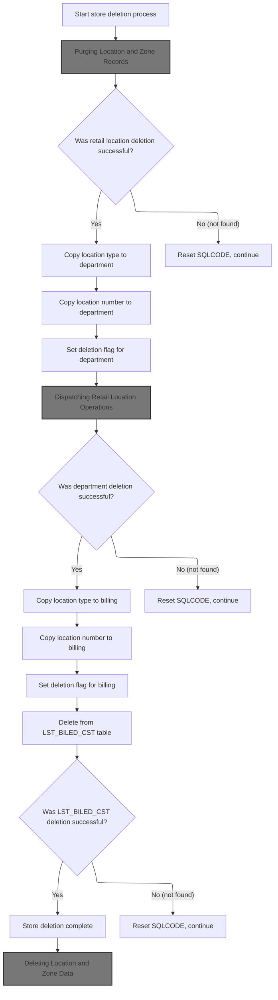

<SwmSnippet path="/base/src/NNNS0487.cbl" line="2682">

---

In `1610-DELETE-STORE` we kick off the deletion process by calling 1610-EXIT-PUT-PURGE-RETL. This step is about cleaning up all related location and advertising zone records before we touch the main store data. We do this first to avoid leaving behind any orphaned records. The rest of the flow will only proceed if this purge succeeds, which is checked via SQLCODE. If it fails, we bail out early. If it succeeds, we move on to deleting retail location and department data, and finally the store record itself, handling 'no data found' cases by resetting SQLCODE to 0.

```cobol
275900 1610-DELETE-STORE.                                               00275900
276000     PERFORM 1610-EXIT-PUT-PURGE-RETL                             00276000
```

---

</SwmSnippet>

### Purging Location and Zone Records

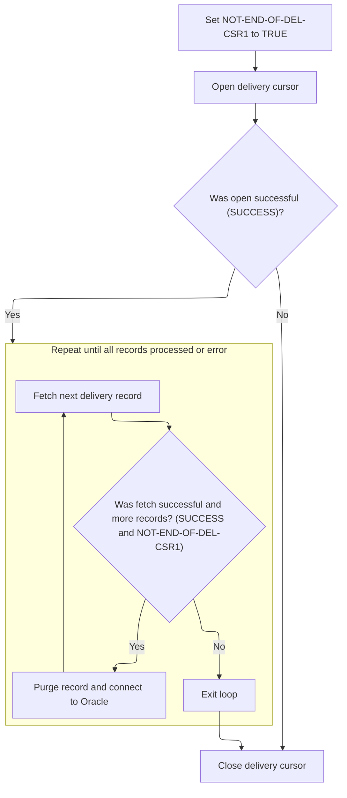

<SwmSnippet path="/base/src/NNNS0487.cbl" line="2722">

---

In `1610-EXIT-PUT-PURGE-RETL` we start by setting the cursor state and opening the cursor to fetch location classification records. The loop is set up to process each record one at a time, purging related data and connecting to Oracle after each successful purge. The loop ends when we hit the end of the data or an error. This lets us handle each record and any errors cleanly.

```cobol
279900 1610-EXIT-PUT-PURGE-RETL.                                        00279900
280000     SET NOT-END-OF-DEL-CSR1 TO TRUE                              00280000
280100     PERFORM 1611-OPEN-DEL-CSR1                                   00280100
```

---

</SwmSnippet>

<SwmSnippet path="/base/src/NNNS0487.cbl" line="2725">

---

After fetching each record in `1610-EXIT-PUT-PURGE-RETL`, we call 1613-EXIT-PURGE-RETL to purge the location and advertising zone data for that specific record. This is done inside the loop so we can handle errors record-by-record. We also connect to Oracle after each purge to make sure the database state is correct. Once we're done, we close the cursor to release resources and finalize the operation.

```cobol
280200     IF SUCCESS                                                   00280200
280300       PERFORM UNTIL END-OF-DEL-CSR1 OR NOT SUCCESS               00280300
280400         PERFORM 1612-FETCH-DEL-CSR1                              00280400
280500         IF SUCCESS AND NOT-END-OF-DEL-CSR1                       00280500
280600           PERFORM 1613-EXIT-PURGE-RETL                           00280600
280700           PERFORM 115-CONNECT-TO-ORACLE                          00280700
280800         END-IF                                                   00280800
280900       END-PERFORM                                                00280900
281000     END-IF                                                       00281000
281100     PERFORM 1614-CLOSE-DEL-CSR1                                  00281100
```

---

</SwmSnippet>

### Deleting Location and Zone Data

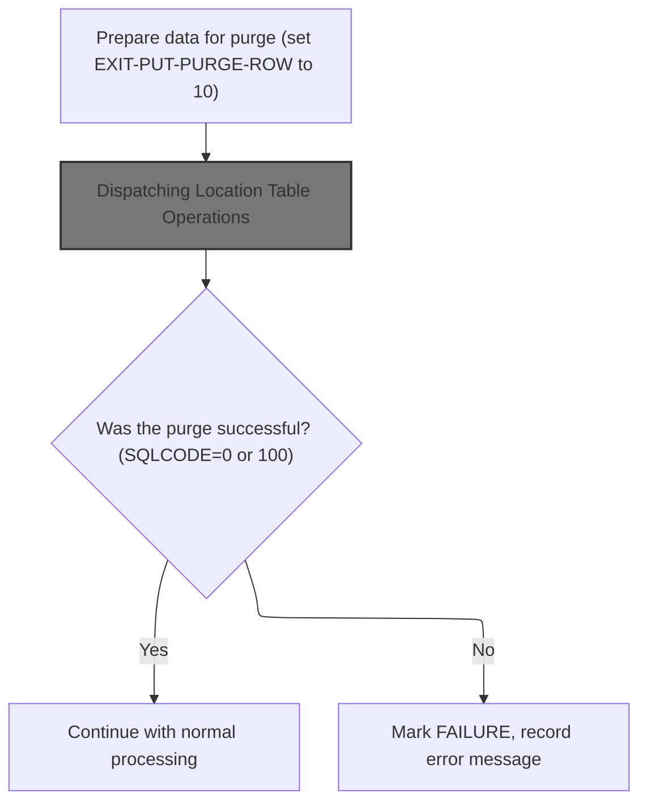

<SwmSnippet path="/base/src/NNNS0487.cbl" line="2782">

---

In `1613-EXIT-PURGE-RETL` we prep the key fields by moving them into P-DDDTCZ01, set the purge flag, and then call 4000-NNNS0473-RETL-DAO. This hands off the right data and signals the DAO to delete the matching row from the location/zone table.

```cobol
285900 1613-EXIT-PURGE-RETL.                                            00285900
286000     MOVE ITM-CLS-CD         OF DCLXXXL-LOC-CLS-AD-ZN             00286000
286100       TO ITM-CLS-CD         OF P-DDDTCZ01                        00286100
286200     MOVE LOC-TYP-CD         OF DCLXXXL-LOC-CLS-AD-ZN             00286200
286300       TO LOC-TYP-CD         OF P-DDDTCZ01                        00286300
286400     MOVE LOC-NBR            OF DCLXXXL-LOC-CLS-AD-ZN             00286400
286500       TO LOC-NBR            OF P-DDDTCZ01                        00286500
286600                                                                  00286600
286700     SET EXIT-PUT-PURGE-ROW TO TRUE                               00286700
286800     PERFORM 4000-NNNS0473-RETL-DAO                               00286800
```

---

</SwmSnippet>

#### Dispatching Location Table Operations

<SwmSnippet path="/base/src/NNNS0487.cbl" line="3333">

---

`4000-NNNS0473-RETL-DAO` calls out to NNNS0473-RETL-DAO, passing all the relevant data and operation code. This external program does the actual database work, like deleting the row we just set up.

```cobol
341000 4000-NNNS0473-RETL-DAO.                                          00341000
341100     CALL NNNS0473-RETL-DAO USING                                 00341100
341200          XXXN001A                                                00341200
341300          SQLCA                                                   00341300
341400          YYYN005A                                                00341400
341500          NNNN0000-PARMS                                          00341500
341600          P-DDDTCZ01                                              00341600
341700     .                                                            00341700
```

---

</SwmSnippet>

#### Table Operation Dispatcher

See <SwmLink doc-title="Dispatching and Executing Table Operations">[Dispatching and Executing Table Operations](\.swm\dispatching-and-executing-table-operations.txgp19c2.sw.md)</SwmLink>

#### Finalizing and Connecting to DB2

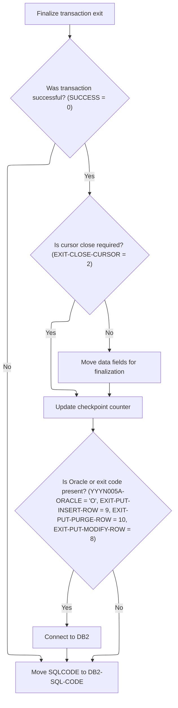

<SwmSnippet path="/base/src/NNNS0473.cbl" line="282">

---

In `120-EXIT-STUFF` we wrap up by moving fields if needed, bumping the checkpoint count, and connecting to DB2 if the operation type requires it. This sets up the environment for any follow-up database work.

```cobol
029100 120-EXIT-STUFF.                                                  00029100
029200     IF SUCCESS                                                   00029200
029300       IF NOT EXIT-CLOSE-CURSOR                                   00029300
029400         PERFORM 130-MOVE-DCL-2-PDA-FIELDS                        00029400
029500       END-IF                                                     00029500
029600       ADD WS-CHECKPOINT-INC TO YYYN005A-CHKPT-CNT                00029600
029700     END-IF                                                       00029700
029800     IF (YYYN005A-ORACLE       OR EXIT-PUT-INSERT-ROW             00029800
029900         OR EXIT-PUT-PURGE-ROW OR EXIT-PUT-MODIFY-ROW)            00029900
030000        PERFORM 125-CONNECT-TO-DB2                                00030000
030100     END-IF                                                       00030100
030200     MOVE SQLCODE            TO DB2-SQL-CODE                      00030200
030300     .                                                            00030300
```

---

</SwmSnippet>

<SwmSnippet path="/base/src/NNNS0473.cbl" line="300">

---

In `125-CONNECT-TO-DB2` we call out to Z-DB2-CONNECT (YYYS0211), passing the control and SQL status structures. The actual DB2 connection and error handling logic is handled in that external program.

```cobol
030900 125-CONNECT-TO-DB2.                                              00030900
031000     CALL Z-DB2-CONNECT         USING XXXN001A                    00031000
031100                                      SQLCA                       00031100
031200     .                                                            00031200
```

---

</SwmSnippet>

#### Handling DAO Results After Purge

<SwmSnippet path="/base/src/NNNS0487.cbl" line="2793">

---

Back in `1613-EXIT-PURGE-RETL`, after returning from 4000-NNNS0473-RETL-DAO, we check SQLCODE. If it's 0 or 100, we reset it to 0 and move on. If it's anything else, we set FAILURE to TRUE and build an error message for the failed delete.

```cobol
287000     EVALUATE TRUE                                                00287000
287100       WHEN SQLCODE = 0 OR 100                                    00287100
287200         MOVE 0 TO SQLCODE                                        00287200
287300       WHEN OTHER                                                 00287300
287400         MOVE SQLCODE TO WS-SQLCODE                               00287400
287500         SET FAILURE TO TRUE                                      00287500
287600         MOVE SPACES  TO IS-RTRN-MSG-TXT                          00287600
287700         MOVE SQLCODE TO WS-SQLCODE                               00287700
287800         STRING 'NNNS0487 - Error in delete of RETL'              00287800
287900                'LOC ,RC=' WS-SQLCODE '.'                         00287900
288000                DELIMITED BY SIZE INTO IS-RTRN-MSG-TXT            00288000
288100     END-EVALUATE                                                 00288100
```

---

</SwmSnippet>

### Deleting Retail Location Data

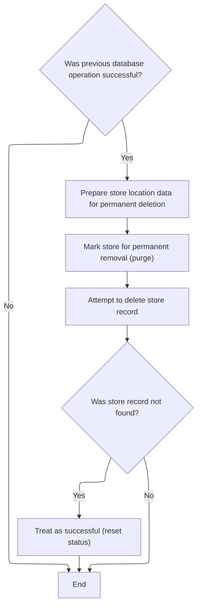

<SwmSnippet path="/base/src/NNNS0487.cbl" line="2684">

---

Back in `1610-DELETE-STORE`, after purging location/zone data, we move the location type and number into P-DDDTLR01, set the purge flag, and call 2060-CALL-RETAIL-LOC-DAO to delete the retail location record. We handle 'no data found' by resetting SQLCODE to 0 so the flow doesn't treat it as an error.

```cobol
276100     IF SQLCODE = 0                                               00276100
276200       MOVE  LOC-TYP-CD       OF DCLXXXATION                      00276200
276300         TO  LOC-TYP-CD       OF P-DDDTLR01                       00276300
276400       MOVE  LOC-NBR          OF DCLXXXATION                      00276400
276500         TO  LOC-NBR          OF P-DDDTLR01                       00276500
276600       SET EXIT-PUT-PURGE-ROW TO TRUE                             00276600
276700       PERFORM 2060-CALL-RETAIL-LOC-DAO                           00276700
276800       IF SQLCODE = 100                                           00276800
276900         MOVE 0 TO SQLCODE                                        00276900
277000       END-IF                                                     00277000
277100     END-IF                                                       00277100
```

---

</SwmSnippet>

### Dispatching Retail Location Operations

<SwmSnippet path="/base/src/NNNS0487.cbl" line="3305">

---

`2060-CALL-RETAIL-LOC-DAO` calls out to NNNS0488-RETAIL-LOC-DAO, passing all the relevant data and operation code. This external program does the actual database work, like deleting the retail location record.

```cobol
338200 2060-CALL-RETAIL-LOC-DAO.                                        00338200
338300     CALL NNNS0488-RETAIL-LOC-DAO USING                           00338300
338400          XXXN001A                                                00338400
338500          SQLCA                                                   00338500
338600          YYYN005A                                                00338600
338700          NNNN0000-PARMS                                          00338700
338800          P-DDDTLR01                                              00338800
338900     .                                                            00338900
```

---

</SwmSnippet>

### Retail Location Operation Dispatcher

<SwmSnippet path="/base/src/NNNS0488.cbl" line="1209">

---

`0000-EXIT-DISPATCHER` looks at the operation code and sends the request to the right handler for retail location operations—open, close, get, modify, insert, purge, or special I/O. It wraps up with exit logic and returns control.

```cobol
125400 0000-EXIT-DISPATCHER.                                            00125400
125500     PERFORM 100-INITIALIZATION                                   00125500
125600     EVALUATE TRUE                                                00125600
125700       WHEN NOT SUCCESS                                           00125700
125800          CONTINUE                                                00125800
125900       WHEN EXIT-OPEN-CURSOR                                      00125900
126000          PERFORM 1000-EXIT-OPEN-CURSOR                           00126000
126100       WHEN EXIT-CLOSE-CURSOR                                     00126100
126200          PERFORM 1100-EXIT-CLOSE-CURSOR                          00126200
126300       WHEN EXIT-GET-UNIQUE-ROW                                   00126300
126400          PERFORM 1200-EXIT-GET-UNIQUE-ROW                        00126400
126500       WHEN EXIT-GET-NEXT-ROW                                     00126500
126600          PERFORM 1300-EXIT-GET-NEXT-ROW                          00126600
126700       WHEN EXIT-PUT-MODIFY-ROW                                   00126700
126800          PERFORM 1400-EXIT-PUT-MODIFY-ROW                        00126800
126900       WHEN EXIT-PUT-INSERT-ROW                                   00126900
127000          PERFORM 1500-EXIT-PUT-INSERT-ROW                        00127000
127100       WHEN EXIT-PUT-PURGE-ROW                                    00127100
127200          PERFORM 1600-EXIT-PUT-PURGE-ROW                         00127200
127300       WHEN EXIT-DO-SPECIAL-IO-FUNCS                              00127300
127400          PERFORM 10000-DO-SPECIAL-IO-FUNCS                       00127400
127500     END-EVALUATE                                                 00127500
127600     PERFORM 120-EXIT-STUFF                                       00127600
127700     GOBACK                                                       00127700
127800     .                                                            00127800
```

---

</SwmSnippet>

#### Preparing Transaction State

See <SwmLink doc-title="Location and Store Data Initialization">[Location and Store Data Initialization](\.swm\location-and-store-data-initialization.x3vp863a.sw.md)</SwmLink>

#### Opening a Cursor for Location Data

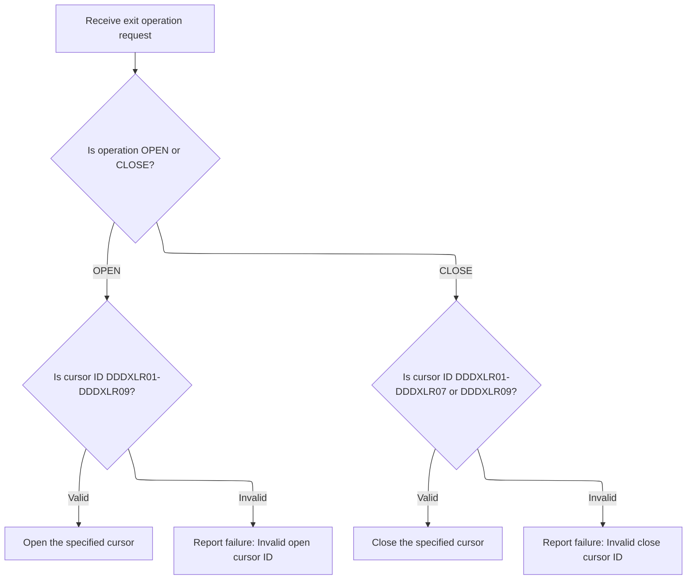

<SwmSnippet path="/base/src/NNNS0488.cbl" line="2206">

---

`1000-EXIT-OPEN-CURSOR` checks the input cursor ID and opens the matching cursor using embedded SQL. If the ID isn't recognized, it sets FAILURE and returns an error message.

```cobol
224300 1000-EXIT-OPEN-CURSOR.                                           00224300
224400     EVALUATE TRUE                                                00224400
224500       WHEN DDDXLR01                                              00224500
224600         EXEC SQL                                                 00224600
224700           OPEN DDDXLR01                                          00224700
224800         END-EXEC                                                 00224800
224900       WHEN DDDXLR02                                              00224900
225000         EXEC SQL                                                 00225000
225100           OPEN DDDXLR02                                          00225100
225200         END-EXEC                                                 00225200
225300       WHEN DDDXLR03                                              00225300
225400         EXEC SQL                                                 00225400
225500           OPEN DDDXLR03                                          00225500
225600         END-EXEC                                                 00225600
225700       WHEN DDDXLR04                                              00225700
225800         EXEC SQL                                                 00225800
225900           OPEN DDDXLR04                                          00225900
226000         END-EXEC                                                 00226000
226100       WHEN DDDXLR05                                              00226100
226200         EXEC SQL                                                 00226200
226300           OPEN DDDXLR05                                          00226300
226400         END-EXEC                                                 00226400
226500       WHEN DDDXLR06                                              00226500
226600         EXEC SQL                                                 00226600
226700           OPEN DDDXLR06                                          00226700
226800         END-EXEC                                                 00226800
226900       WHEN DDDXLR07                                              00226900
227000         EXEC SQL                                                 00227000
227100           OPEN DDDXLR07                                          00227100
227200         END-EXEC                                                 00227200
227300       WHEN DDDXLR08                                              00227300
227400         EXEC SQL                                                 00227400
227500           OPEN DDDXLR08                                          00227500
227600         END-EXEC                                                 00227600
227700       WHEN DDDXLR09                                              00227700
227800         EXEC SQL                                                 00227800
227900           OPEN DDDXLR09                                          00227900
228000         END-EXEC                                                 00228000
228100       WHEN OTHER                                                 00228100
228200         SET FAILURE TO TRUE                                      00228200
228300         MOVE 'NNNS0488 - Invalid open cursor ID.'                00228300
228400           TO IS-RTRN-MSG-TXT OF XXXN001A                         00228400
228500     END-EVALUATE                                                 00228500
228600     .                                                            00228600
```

---

</SwmSnippet>

<SwmSnippet path="/base/src/NNNS0488.cbl" line="2252">

---

`1100-EXIT-CLOSE-CURSOR` matches the input cursor ID and closes the corresponding cursor. If the ID isn't valid, it sets FAILURE and returns an error message.

```cobol
228900 1100-EXIT-CLOSE-CURSOR.                                          00228900
229000     EVALUATE TRUE                                                00229000
229100       WHEN DDDXLR01                                              00229100
229200         EXEC SQL                                                 00229200
229300           CLOSE DDDXLR01                                         00229300
229400         END-EXEC                                                 00229400
229500       WHEN DDDXLR02                                              00229500
229600         EXEC SQL                                                 00229600
229700           CLOSE DDDXLR02                                         00229700
229800         END-EXEC                                                 00229800
229900       WHEN DDDXLR03                                              00229900
230000         EXEC SQL                                                 00230000
230100           CLOSE DDDXLR03                                         00230100
230200         END-EXEC                                                 00230200
230300       WHEN DDDXLR04                                              00230300
230400         EXEC SQL                                                 00230400
230500           CLOSE DDDXLR04                                         00230500
230600         END-EXEC                                                 00230600
230700       WHEN DDDXLR05                                              00230700
230800         EXEC SQL                                                 00230800
230900           CLOSE DDDXLR05                                         00230900
231000         END-EXEC                                                 00231000
231100       WHEN DDDXLR06                                              00231100
231200         EXEC SQL                                                 00231200
231300           CLOSE DDDXLR06                                         00231300
231400         END-EXEC                                                 00231400
231500       WHEN DDDXLR07                                              00231500
231600         EXEC SQL                                                 00231600
231700           CLOSE DDDXLR07                                         00231700
231800         END-EXEC                                                 00231800
231900       WHEN DDDXLR09                                              00231900
232000         EXEC SQL                                                 00232000
232100           CLOSE DDDXLR09                                         00232100
232200         END-EXEC                                                 00232200
232300       WHEN OTHER                                                 00232300
232400         SET FAILURE TO TRUE                                      00232400
232500         MOVE 'NNNS0488 - Invalid close cursor ID.'               00232500
232600           TO IS-RTRN-MSG-TXT OF XXXN001A                         00232600
232700     END-EVALUATE                                                 00232700
232800     .                                                            00232800
```

---

</SwmSnippet>

### Fetching and Normalizing Unique Location Data

<SwmSnippet path="/base/src/NNNS0488.cbl" line="2294">

---

In `1200-EXIT-GET-UNIQUE-ROW` we fetch a location record by key, then immediately call 1700-CHECK-NULL-COLUMNS to fill in any missing values with defaults. This keeps the data clean for later steps.

```cobol
233100 1200-EXIT-GET-UNIQUE-ROW.                                        00233100
233200       EXEC SQL                                                   00233200
233300           SELECT LOC_NBR,                                        00233300
233400                  LOC_TYP_CD,                                     00233400
233500                  ASSOC_STR_TYP_CD,                               00233500
233600                  ASSOC_STR_NBR,                                  00233600
233700                  STR_REMODL_DT,                                  00233700
233800                  RETL_LOC_STAT_CD,                               00233800
233900                  RETL_LOC_STAT_DT,                               00233900
234000                  COMPANY_ID,                                     00234000
234100                  FINANCIAL_DIV_ID,                               00234100
234200                  LIN_OF_BUS_ID,                                  00234200
234300                  DIST_ID,                                        00234300
234400                  MKT_RGN_ID,                                     00234400
234500                  GEO_ZN_CD,                                      00234500
234600                  RETL_GEO_ZN_ID,                                 00234600
234700                  SCN_MAINT_SW,                                   00234700
234800                  FRNT_END_CD,                                    00234800
234900                  PRC_BUL_SW,                                     00234900
235000                  UPC_ON_PRC_BUL_SW,                              00235000
235100                  CMPTR_TYP_CD,                                   00235100
235200                  RETL_VID_ZN_NBR,                                00235200
235300                  RETL_UNLD_CD,                                   00235300
235400                  ROLUP_REPT_TBL_TXT,                             00235400
235500                  NEW_STR_SW,                                     00235500
235600                  SEL_CIR_SW,                                     00235600
235700                  BKRM_SQ_FT,                                     00235700
235800                  FD_LINER_FT,                                    00235800
235900                  NON_FD_LINER_FT,                                00235900
236000                  SETOFF_ROOM_SW,                                 00236000
236100                  CAT_CLS_TBL_TXT,                                00236100
236200                  LAT_K,                                          00236200
236300                  LON_K,                                          00236300
236400                  CK_COLL_REPT_SW,                                00236400
236500                  CK_COLL_CNTL_CD,                                00236500
236600                  CK_COLL_ADD_DEL_SW,                             00236600
236700                  CK_ALT_STR_ID,                                  00236700
236800                  CK_COLL_FEE_AMT,                                00236800
236900                  SALS_TAX_PCT,                                   00236900
237000                  SOAP_SALE_VAR_PCT,                              00237000
237100                  ON_SRS_CD,                                      00237100
237200                  SRS_DSD_ORD_SW,                                 00237200
237300                  RETL_LOC_TYP_CD,                                00237300
237400                  DEA_NBR,                                        00237400
237500                  STR_OPSTMT_SRT_CD,                              00237500
237600                  STR_OPSTMT_TYP_CD,                              00237600
237700                  STR_OPSTMT_HDR_CD,                              00237700
237800                  DPS_NBR,                                        00237800
237900                  MEDICARE_ID,                                    00237900
238000                  NABP_NBR,                                       00238000
238100                  NATL_PROV_ID,                                   00238100
238200                  CURR_AD_ZN_NBR,                                 00238200
238300                  PD_ZONE_NO,                                     00238300
238400                  SOS_PROC_SW,                                    00238400
238500                  RPRT_SEQ_NBR,                                   00238500
238600                  GRP_CD,                                         00238600
238700                  PRIM_GRP_CD_1,                                  00238700
238800                  PRIM_GRP_CD_2,                                  00238800
238900                  SECY_GRP_CD_1,                                  00238900
239000                  SECY_GRP_CD_2,                                  00239000
239100                  PRIM_CLS_NBR_1,                                 00239100
239200                  PRIM_CLS_NBR_2,                                 00239200
239300                  SECY_CLS_NBR_1,                                 00239300
239400                  SECY_CLS_NBR_2,                                 00239400
239500                  VAL_STR_SW,                                     00239500
239600                  SLS_CLOSED_DT,                                  00239600
239700                  TBCO_PRMT_NBR,                                  00239700
239800                  SUB_UNLIKE_PROD_CD,                             00239800
239900                  SUB_DSPLY_PAL_CD,                               00239900
240000                  RLTM_SCN_MAINT_SW,                              00240000
240100                  TOP_LEADER_NM,                                  00240100
240200                  CUST_FRNDLY_NM,                                 00240200
240300                  SLS_OPEN_DT,                                    00240300
240400                  MON_OPEN_TM,                                    00240400
240500                  MON_CLOS_TM,                                    00240500
240600                  TUE_OPEN_TM,                                    00240600
240700                  TUE_CLOS_TM,                                    00240700
240800                  WED_OPEN_TM,                                    00240800
240900                  WED_CLOS_TM,                                    00240900
241000                  THUR_OPEN_TM,                                   00241000
241100                  THUR_CLOS_TM,                                   00241100
241200                  FRI_OPEN_TM,                                    00241200
241300                  FRI_CLOS_TM,                                    00241300
241400                  SAT_OPEN_TM,                                    00241400
241500                  SAT_CLOS_TM,                                    00241500
241600                  SUN_OPEN_TM,                                    00241600
241700                  SUN_CLOS_TM,                                    00241700
241800                  RETL_LOC_FRMAT_CD,                              00241800
241900                  RETL_LOC_SEGM_CD,                               00241900
242000                  ECOMM_MKT_AREA_CD,                              00242000
242100                  ECOMM_STRT_DT,                                  00242100
242200                  ECOMM_END_DT,                                   00242200
242300                  ROLUP_REPT_TBL_01_NBR,                          00242300
242400                  ROLUP_REPT_TBL_02_NBR,                          00242400
242500                  ROLUP_REPT_TBL_03_NBR,                          00242500
242600                  ROLUP_REPT_TBL_04_NBR,                          00242600
242700                  ROLUP_REPT_TBL_05_NBR,                          00242700
242800                  ROLUP_REPT_TBL_06_NBR,                          00242800
242900                  ROLUP_REPT_TBL_07_NBR,                          00242900
243000                  ROLUP_REPT_TBL_08_NBR,                          00243000
243100                  ROLUP_REPT_TBL_09_NBR,                          00243100
243200                  ROLUP_REPT_TBL_10_NBR,                          00243200
243300                  ONLIN_SSON_SW,                                  00243300
243400                  RPLACD_BY_STR_NBR                               00243400
243500           INTO   :DCLXXXAIL-LOC.LOC-NBR,                         00243500
243600                  :DCLXXXAIL-LOC.LOC-TYP-CD,                      00243600
243700                  :DCLXXXAIL-LOC.ASSOC-STR-TYP-CD                 00243700
243800                  :WS-ASSOC-ST-TYPE-IND,                          00243800
243900                  :DCLXXXAIL-LOC.ASSOC-STR-NBR                    00243900
244000                  :WS-ASSOC-ST-NO-IND,                            00244000
244100                  :DCLXXXAIL-LOC.STR-REMODL-DT,                   00244100
244200                  :DCLXXXAIL-LOC.RETL-LOC-STAT-CD,                00244200
244300                  :DCLXXXAIL-LOC.RETL-LOC-STAT-DT,                00244300
244400                  :DCLXXXAIL-LOC.COMPANY-ID,                      00244400
244500                  :DCLXXXAIL-LOC.FINANCIAL-DIV-ID,                00244500
244600                  :DCLXXXAIL-LOC.LIN-OF-BUS-ID,                   00244600
244700                  :DCLXXXAIL-LOC.DIST-ID,                         00244700
244800                  :DCLXXXAIL-LOC.MKT-RGN-ID,                      00244800
244900                  :DCLXXXAIL-LOC.GEO-ZN-CD,                       00244900
245000                  :DCLXXXAIL-LOC.RETL-GEO-ZN-ID,                  00245000
245100                  :DCLXXXAIL-LOC.SCN-MAINT-SW,                    00245100
245200                  :DCLXXXAIL-LOC.FRNT-END-CD,                     00245200
245300                  :DCLXXXAIL-LOC.PRC-BUL-SW,                      00245300
245400                  :DCLXXXAIL-LOC.UPC-ON-PRC-BUL-SW,               00245400
245500                  :DCLXXXAIL-LOC.CMPTR-TYP-CD,                    00245500
245600                  :DCLXXXAIL-LOC.RETL-VID-ZN-NBR,                 00245600
245700                  :DCLXXXAIL-LOC.RETL-UNLD-CD,                    00245700
245800                  :DCLXXXAIL-LOC.ROLUP-REPT-TBL-TXT,              00245800
245900                  :DCLXXXAIL-LOC.NEW-STR-SW,                      00245900
246000                  :DCLXXXAIL-LOC.SEL-CIR-SW,                      00246000
246100                  :DCLXXXAIL-LOC.BKRM-SQ-FT,                      00246100
246200                  :DCLXXXAIL-LOC.FD-LINER-FT,                     00246200
246300                  :DCLXXXAIL-LOC.NON-FD-LINER-FT,                 00246300
246400                  :DCLXXXAIL-LOC.SETOFF-ROOM-SW,                  00246400
246500                  :DCLXXXAIL-LOC.CAT-CLS-TBL-TXT,                 00246500
246600                  :DCLXXXAIL-LOC.LAT-K,                           00246600
246700                  :DCLXXXAIL-LOC.LON-K,                           00246700
246800                  :DCLXXXAIL-LOC.CK-COLL-REPT-SW,                 00246800
246900                  :DCLXXXAIL-LOC.CK-COLL-CNTL-CD,                 00246900
247000                  :DCLXXXAIL-LOC.CK-COLL-ADD-DEL-SW,              00247000
247100                  :DCLXXXAIL-LOC.CK-ALT-STR-ID,                   00247100
247200                  :DCLXXXAIL-LOC.CK-COLL-FEE-AMT,                 00247200
247300                  :DCLXXXAIL-LOC.SALS-TAX-PCT,                    00247300
247400                  :DCLXXXAIL-LOC.SOAP-SALE-VAR-PCT,               00247400
247500                  :DCLXXXAIL-LOC.ON-SRS-CD,                       00247500
247600                  :DCLXXXAIL-LOC.SRS-DSD-ORD-SW,                  00247600
247700                  :DCLXXXAIL-LOC.RETL-LOC-TYP-CD,                 00247700
247800                  :DCLXXXAIL-LOC.DEA-NBR,                         00247800
247900                  :DCLXXXAIL-LOC.STR-OPSTMT-SRT-CD,               00247900
248000                  :DCLXXXAIL-LOC.STR-OPSTMT-TYP-CD,               00248000
248100                  :DCLXXXAIL-LOC.STR-OPSTMT-HDR-CD,               00248100
248200                  :DCLXXXAIL-LOC.DPS-NBR,                         00248200
248300                  :DCLXXXAIL-LOC.MEDICARE-ID,                     00248300
248400                  :DCLXXXAIL-LOC.NABP-NBR,                        00248400
248500                  :DCLXXXAIL-LOC.NATL-PROV-ID,                    00248500
248600                  :DCLXXXAIL-LOC.CURR-AD-ZN-NBR,                  00248600
248700                  :DCLXXXAIL-LOC.PD-ZONE-NO,                      00248700
248800                  :DCLXXXAIL-LOC.SOS-PROC-SW,                     00248800
248900                  :DCLXXXAIL-LOC.RPRT-SEQ-NBR,                    00248900
249000                  :DCLXXXAIL-LOC.GRP-CD,                          00249000
249100                  :DCLXXXAIL-LOC.PRIM-GRP-CD-1,                   00249100
249200                  :DCLXXXAIL-LOC.PRIM-GRP-CD-2,                   00249200
249300                  :DCLXXXAIL-LOC.SECY-GRP-CD-1,                   00249300
249400                  :DCLXXXAIL-LOC.SECY-GRP-CD-2,                   00249400
249500                  :DCLXXXAIL-LOC.PRIM-CLS-NBR-1,                  00249500
249600                  :DCLXXXAIL-LOC.PRIM-CLS-NBR-2,                  00249600
249700                  :DCLXXXAIL-LOC.SECY-CLS-NBR-1,                  00249700
249800                  :DCLXXXAIL-LOC.SECY-CLS-NBR-2,                  00249800
249900                  :DCLXXXAIL-LOC.VAL-STR-SW,                      00249900
250000                  :DCLXXXAIL-LOC.SLS-CLOSED-DT,                   00250000
250100                  :DCLXXXAIL-LOC.TBCO-PRMT-NBR,                   00250100
250200                  :DCLXXXAIL-LOC.SUB-UNLIKE-PROD-CD,              00250200
250300                  :DCLXXXAIL-LOC.SUB-DSPLY-PAL-CD,                00250300
250400                  :DCLXXXAIL-LOC.RLTM-SCN-MAINT-SW,               00250400
250500                  :DCLXXXAIL-LOC.TOP-LEADER-NM,                   00250500
250600                  :DCLXXXAIL-LOC.CUST-FRNDLY-NM,                  00250600
250700                  :DCLXXXAIL-LOC.SLS-OPEN-DT,                     00250700
250800                  :WS-MON-OPEN-TS,                                00250800
250900                  :WS-MON-CLOS-TS,                                00250900
251000                  :WS-TUE-OPEN-TS,                                00251000
251100                  :WS-TUE-CLOS-TS,                                00251100
251200                  :WS-WED-OPEN-TS,                                00251200
251300                  :WS-WED-CLOS-TS,                                00251300
251400                  :WS-THUR-OPEN-TS,                               00251400
251500                  :WS-THUR-CLOS-TS,                               00251500
251600                  :WS-FRI-OPEN-TS ,                               00251600
251700                  :WS-FRI-CLOS-TS,                                00251700
251800                  :WS-SAT-OPEN-TS,                                00251800
251900                  :WS-SAT-CLOS-TS,                                00251900
252000                  :WS-SUN-OPEN-TS,                                00252000
252100                  :WS-SUN-CLOS-TS,                                00252100
252200                  :DCLXXXAIL-LOC.RETL-LOC-FRMAT-CD,               00252200
252300                  :DCLXXXAIL-LOC.RETL-LOC-SEGM-CD,                00252300
252400                  :DCLXXXAIL-LOC.ECOMM-MKT-AREA-CD,               00252400
252500                  :DCLXXXAIL-LOC.ECOMM-STRT-DT                    00252500
252600                  :DCLXXXAIL-LOC-IND.ECOMM-STRT-DT-IND,           00252600
252700                  :DCLXXXAIL-LOC.ECOMM-END-DT                     00252700
252800                  :DCLXXXAIL-LOC-IND.ECOMM-END-DT-IND,            00252800
252900                  :DCLXXXAIL-LOC.ROLUP-REPT-TBL-01-NBR,           00252900
253000                  :DCLXXXAIL-LOC.ROLUP-REPT-TBL-02-NBR,           00253000
253100                  :DCLXXXAIL-LOC.ROLUP-REPT-TBL-03-NBR,           00253100
253200                  :DCLXXXAIL-LOC.ROLUP-REPT-TBL-04-NBR,           00253200
253300                  :DCLXXXAIL-LOC.ROLUP-REPT-TBL-05-NBR,           00253300
253400                  :DCLXXXAIL-LOC.ROLUP-REPT-TBL-06-NBR,           00253400
253500                  :DCLXXXAIL-LOC.ROLUP-REPT-TBL-07-NBR,           00253500
253600                  :DCLXXXAIL-LOC.ROLUP-REPT-TBL-08-NBR,           00253600
253700                  :DCLXXXAIL-LOC.ROLUP-REPT-TBL-09-NBR,           00253700
253800                  :DCLXXXAIL-LOC.ROLUP-REPT-TBL-10-NBR,           00253800
253900                  :DCLXXXAIL-LOC.ONLIN-SSON-SW,                   00253900
254000                  :DCLXXXAIL-LOC.RPLACD-BY-STR-NBR                00254000
254010                  :DCLXXXAIL-LOC-IND.RPLACD-BY-STR-NBR-IND        00254010
254100           FROM   XXXAIL_LOC                                      00254100
254200           WHERE  LOC_NBR = :DCLXXXAIL-LOC.LOC-NBR                00254200
254300           AND    LOC_TYP_CD = :DCLXXXAIL-LOC.LOC-TYP-CD          00254300
254400       END-EXEC                                                   00254400
254500                                                                  00254500
254600     PERFORM 1700-CHECK-NULL-COLUMNS                              00254600
254700     .                                                            00254700
```

---

</SwmSnippet>

<SwmSnippet path="/base/src/NNNS0488.cbl" line="3649">

---

`1700-CHECK-NULL-COLUMNS` checks indicator variables for negative values and resets the associated fields to defaults—spaces, zero, or K-ZERO-DT for dates. This keeps the data structure valid and avoids null-related issues.

```cobol
367700 1700-CHECK-NULL-COLUMNS.                                         00367700
367800     IF WS-ASSOC-ST-TYPE-IND < 0                                  00367800
367900     OR WS-ASSOC-ST-NO-IND < 0                                    00367900
368000       MOVE SPACES TO ASSOC-STR-TYP-CD OF DCLXXXAIL-LOC           00368000
368100       MOVE 0      TO ASSOC-STR-NBR OF DCLXXXAIL-LOC              00368100
368200     END-IF                                                       00368200
368210     IF RPLACD-BY-STR-NBR-IND < 0                                 00368210
368211       MOVE 0      TO RPLACD-BY-STR-NBR-IND                       00368211
368220     END-IF                                                       00368220
368300     IF ECOMM-STRT-DT-IND OF DCLXXXAIL-LOC-IND < 0                00368300
368400*      MOVE 0      TO ECOMM-STRT-DT OF DCLXXXAIL-LOC              00368400
368500       MOVE K-ZERO-DT TO  ECOMM-STRT-DT OF DCLXXXAIL-LOC          00368500
368600     END-IF                                                       00368600
368700     IF ECOMM-END-DT-IND OF DCLXXXAIL-LOC-IND < 0                 00368700
368800*      MOVE 0      TO ECOMM-END-DT OF DCLXXXAIL-LOC               00368800
368900       MOVE K-ZERO-DT TO ECOMM-END-DT OF DCLXXXAIL-LOC            00368900
369000     END-IF                                                       00369000
369100     .                                                            00369100
```

---

</SwmSnippet>

### Fetching Next Location Row and Normalizing

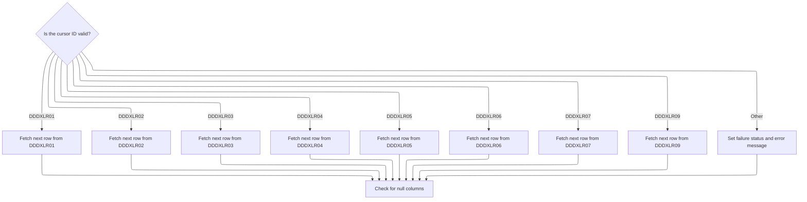

<SwmSnippet path="/base/src/NNNS0488.cbl" line="2514">

---

`1300-EXIT-GET-NEXT-ROW` checks the cursor ID and calls the matching fetch routine for that type. After fetching, it normalizes any nulls. If the ID isn't valid, it errors out.

```cobol
255000 1300-EXIT-GET-NEXT-ROW.                                          00255000
255100     EVALUATE TRUE                                                00255100
255200       WHEN DDDXLR01                                              00255200
255300         PERFORM 1301-FETCH-DDDXLR01                              00255300
255400       WHEN DDDXLR02                                              00255400
255500         PERFORM 1302-FETCH-DDDXLR02                              00255500
255600       WHEN DDDXLR03                                              00255600
255700         PERFORM 1303-FETCH-DDDXLR03                              00255700
255800       WHEN DDDXLR04                                              00255800
255900         PERFORM 1304-FETCH-DDDXLR04                              00255900
256000       WHEN DDDXLR05                                              00256000
256100         PERFORM 1305-FETCH-DDDXLR05                              00256100
256200       WHEN DDDXLR06                                              00256200
256300         PERFORM 1306-FETCH-DDDXLR06                              00256300
256400       WHEN DDDXLR07                                              00256400
256500         PERFORM 1307-FETCH-DDDXLR07                              00256500
256600       WHEN DDDXLR09                                              00256600
256700         PERFORM 1309-FETCH-DDDXLR09                              00256700
256800       WHEN OTHER                                                 00256800
256900         SET FAILURE TO TRUE                                      00256900
257000         MOVE 'NNNS0488 - Invalid fetch cursor ID.'               00257000
257100           TO IS-RTRN-MSG-TXT OF XXXN001A                         00257100
257200     END-EVALUATE                                                 00257200
257300                                                                  00257300
257400     PERFORM 1700-CHECK-NULL-COLUMNS                              00257400
257500     .                                                            00257500
```

---

</SwmSnippet>

<SwmSnippet path="/base/src/NNNS0488.cbl" line="2770">

---

`1303-FETCH-DDDXLR03` fetches all location fields from the cursor in one go.

```cobol
280400 1303-FETCH-DDDXLR03.                                             00280400
280500     EXEC SQL                                                     00280500
280600         FETCH DDDXLR03                                           00280600
280700         INTO  :DCLXXXAIL-LOC.LOC-NBR,                            00280700
280800               :DCLXXXAIL-LOC.LOC-TYP-CD,                         00280800
280900               :DCLXXXAIL-LOC.ASSOC-STR-TYP-CD                    00280900
281000               :WS-ASSOC-ST-TYPE-IND,                             00281000
281100               :DCLXXXAIL-LOC.ASSOC-STR-NBR                       00281100
281200               :WS-ASSOC-ST-NO-IND,                               00281200
281300               :DCLXXXAIL-LOC.STR-REMODL-DT,                      00281300
281400               :DCLXXXAIL-LOC.RETL-LOC-STAT-CD,                   00281400
281500               :DCLXXXAIL-LOC.RETL-LOC-STAT-DT,                   00281500
281600               :DCLXXXAIL-LOC.COMPANY-ID,                         00281600
281700               :DCLXXXAIL-LOC.FINANCIAL-DIV-ID,                   00281700
281800               :DCLXXXAIL-LOC.LIN-OF-BUS-ID,                      00281800
281900               :DCLXXXAIL-LOC.DIST-ID,                            00281900
282000               :DCLXXXAIL-LOC.MKT-RGN-ID,                         00282000
282100               :DCLXXXAIL-LOC.GEO-ZN-CD,                          00282100
282200               :DCLXXXAIL-LOC.RETL-GEO-ZN-ID,                     00282200
282300               :DCLXXXAIL-LOC.SCN-MAINT-SW,                       00282300
282400               :DCLXXXAIL-LOC.FRNT-END-CD,                        00282400
282500               :DCLXXXAIL-LOC.PRC-BUL-SW,                         00282500
282600               :DCLXXXAIL-LOC.UPC-ON-PRC-BUL-SW,                  00282600
282700               :DCLXXXAIL-LOC.CMPTR-TYP-CD,                       00282700
282800               :DCLXXXAIL-LOC.RETL-VID-ZN-NBR,                    00282800
282900               :DCLXXXAIL-LOC.RETL-UNLD-CD,                       00282900
283000               :DCLXXXAIL-LOC.ROLUP-REPT-TBL-TXT,                 00283000
283100               :DCLXXXAIL-LOC.NEW-STR-SW,                         00283100
283200               :DCLXXXAIL-LOC.SEL-CIR-SW,                         00283200
283300               :DCLXXXAIL-LOC.BKRM-SQ-FT,                         00283300
283400               :DCLXXXAIL-LOC.FD-LINER-FT,                        00283400
283500               :DCLXXXAIL-LOC.NON-FD-LINER-FT,                    00283500
283600               :DCLXXXAIL-LOC.SETOFF-ROOM-SW,                     00283600
283700               :DCLXXXAIL-LOC.CAT-CLS-TBL-TXT,                    00283700
283800               :DCLXXXAIL-LOC.LAT-K,                              00283800
283900               :DCLXXXAIL-LOC.LON-K,                              00283900
284000               :DCLXXXAIL-LOC.CK-COLL-REPT-SW,                    00284000
284100               :DCLXXXAIL-LOC.CK-COLL-CNTL-CD,                    00284100
284200               :DCLXXXAIL-LOC.CK-COLL-ADD-DEL-SW,                 00284200
284300               :DCLXXXAIL-LOC.CK-ALT-STR-ID,                      00284300
284400               :DCLXXXAIL-LOC.CK-COLL-FEE-AMT,                    00284400
284500               :DCLXXXAIL-LOC.SALS-TAX-PCT,                       00284500
284600               :DCLXXXAIL-LOC.SOAP-SALE-VAR-PCT,                  00284600
284700               :DCLXXXAIL-LOC.ON-SRS-CD,                          00284700
284800               :DCLXXXAIL-LOC.SRS-DSD-ORD-SW,                     00284800
284900               :DCLXXXAIL-LOC.RETL-LOC-TYP-CD,                    00284900
285000               :DCLXXXAIL-LOC.DEA-NBR,                            00285000
285100               :DCLXXXAIL-LOC.STR-OPSTMT-SRT-CD,                  00285100
285200               :DCLXXXAIL-LOC.STR-OPSTMT-TYP-CD,                  00285200
285300               :DCLXXXAIL-LOC.STR-OPSTMT-HDR-CD,                  00285300
285400               :DCLXXXAIL-LOC.DPS-NBR,                            00285400
285500               :DCLXXXAIL-LOC.MEDICARE-ID,                        00285500
285600               :DCLXXXAIL-LOC.NABP-NBR,                           00285600
285700               :DCLXXXAIL-LOC.NATL-PROV-ID,                       00285700
285800               :DCLXXXAIL-LOC.CURR-AD-ZN-NBR,                     00285800
285900               :DCLXXXAIL-LOC.PD-ZONE-NO,                         00285900
286000               :DCLXXXAIL-LOC.SOS-PROC-SW,                        00286000
286100               :DCLXXXAIL-LOC.RPRT-SEQ-NBR,                       00286100
286200               :DCLXXXAIL-LOC.GRP-CD,                             00286200
286300               :DCLXXXAIL-LOC.PRIM-GRP-CD-1,                      00286300
286400               :DCLXXXAIL-LOC.PRIM-GRP-CD-2,                      00286400
286500               :DCLXXXAIL-LOC.SECY-GRP-CD-1,                      00286500
286600               :DCLXXXAIL-LOC.SECY-GRP-CD-2,                      00286600
286700               :DCLXXXAIL-LOC.PRIM-CLS-NBR-1,                     00286700
286800               :DCLXXXAIL-LOC.PRIM-CLS-NBR-2,                     00286800
286900               :DCLXXXAIL-LOC.SECY-CLS-NBR-1,                     00286900
287000               :DCLXXXAIL-LOC.SECY-CLS-NBR-2,                     00287000
287100               :DCLXXXAIL-LOC.VAL-STR-SW ,                        00287100
287200               :DCLXXXAIL-LOC.SLS-CLOSED-DT,                      00287200
287300               :DCLXXXAIL-LOC.TBCO-PRMT-NBR,                      00287300
287400               :DCLXXXAIL-LOC.SUB-UNLIKE-PROD-CD,                 00287400
287500               :DCLXXXAIL-LOC.SUB-DSPLY-PAL-CD,                   00287500
287600               :DCLXXXAIL-LOC.RLTM-SCN-MAINT-SW,                  00287600
287700               :DCLXXXAIL-LOC.TOP-LEADER-NM,                      00287700
287800               :DCLXXXAIL-LOC.CUST-FRNDLY-NM,                     00287800
287900               :DCLXXXAIL-LOC.SLS-OPEN-DT,                        00287900
288000               :WS-MON-OPEN-TS,                                   00288000
288100               :WS-MON-CLOS-TS,                                   00288100
288200               :WS-TUE-OPEN-TS,                                   00288200
288300               :WS-TUE-CLOS-TS,                                   00288300
288400               :WS-WED-OPEN-TS,                                   00288400
288500               :WS-WED-CLOS-TS,                                   00288500
288600               :WS-THUR-OPEN-TS,                                  00288600
288700               :WS-THUR-CLOS-TS,                                  00288700
288800               :WS-FRI-OPEN-TS ,                                  00288800
288900               :WS-FRI-CLOS-TS,                                   00288900
289000               :WS-SAT-OPEN-TS,                                   00289000
289100               :WS-SUN-OPEN-TS,                                   00289100
289200               :WS-SAT-CLOS-TS,                                   00289200
289300               :WS-SUN-CLOS-TS,                                   00289300
289400               :DCLXXXAIL-LOC.RETL-LOC-FRMAT-CD,                  00289400
289500               :DCLXXXAIL-LOC.RETL-LOC-SEGM-CD,                   00289500
289600               :DCLXXXAIL-LOC.ECOMM-MKT-AREA-CD,                  00289600
289700               :DCLXXXAIL-LOC.ECOMM-STRT-DT                       00289700
289800               :DCLXXXAIL-LOC-IND.ECOMM-STRT-DT-IND,              00289800
289900               :DCLXXXAIL-LOC.ECOMM-END-DT                        00289900
290000               :DCLXXXAIL-LOC-IND.ECOMM-END-DT-IND,               00290000
290100               :DCLXXXAIL-LOC.ROLUP-REPT-TBL-01-NBR,              00290100
290200               :DCLXXXAIL-LOC.ROLUP-REPT-TBL-02-NBR,              00290200
290300               :DCLXXXAIL-LOC.ROLUP-REPT-TBL-03-NBR,              00290300
290400               :DCLXXXAIL-LOC.ROLUP-REPT-TBL-04-NBR,              00290400
290500               :DCLXXXAIL-LOC.ROLUP-REPT-TBL-05-NBR,              00290500
290600               :DCLXXXAIL-LOC.ROLUP-REPT-TBL-06-NBR,              00290600
290700               :DCLXXXAIL-LOC.ROLUP-REPT-TBL-07-NBR,              00290700
290800               :DCLXXXAIL-LOC.ROLUP-REPT-TBL-08-NBR,              00290800
290900               :DCLXXXAIL-LOC.ROLUP-REPT-TBL-09-NBR,              00290900
291000               :DCLXXXAIL-LOC.ROLUP-REPT-TBL-10-NBR,              00291000
291100               :DCLXXXAIL-LOC.ONLIN-SSON-SW,                      00291100
291200               :DCLXXXAIL-LOC.RPLACD-BY-STR-NBR                   00291200
291210               :DCLXXXAIL-LOC-IND.RPLACD-BY-STR-NBR-IND           00291210
291300     END-EXEC                                                     00291300
291400     .                                                            00291400
```

---

</SwmSnippet>

<SwmSnippet path="/base/src/NNNS0488.cbl" line="3338">

---

`1309-FETCH-DDDXLR09` fetches all location fields from the cursor in one go.

```cobol
336700 1309-FETCH-DDDXLR09.                                             00336700
336800     EXEC SQL                                                     00336800
336900         FETCH DDDXLR09                                           00336900
337000         INTO  :DCLXXXAIL-LOC.LOC-NBR,                            00337000
337100               :DCLXXXAIL-LOC.LOC-TYP-CD,                         00337100
337200               :DCLXXXAIL-LOC.ASSOC-STR-TYP-CD                    00337200
337300               :WS-ASSOC-ST-TYPE-IND,                             00337300
337400               :DCLXXXAIL-LOC.ASSOC-STR-NBR                       00337400
337500               :WS-ASSOC-ST-NO-IND,                               00337500
337600               :DCLXXXAIL-LOC.STR-REMODL-DT,                      00337600
337700               :DCLXXXAIL-LOC.RETL-LOC-STAT-CD,                   00337700
337800               :DCLXXXAIL-LOC.RETL-LOC-STAT-DT,                   00337800
337900               :DCLXXXAIL-LOC.COMPANY-ID,                         00337900
338000               :DCLXXXAIL-LOC.FINANCIAL-DIV-ID,                   00338000
338100               :DCLXXXAIL-LOC.LIN-OF-BUS-ID,                      00338100
338200               :DCLXXXAIL-LOC.DIST-ID,                            00338200
338300               :DCLXXXAIL-LOC.MKT-RGN-ID,                         00338300
338400               :DCLXXXAIL-LOC.GEO-ZN-CD,                          00338400
338500               :DCLXXXAIL-LOC.RETL-GEO-ZN-ID,                     00338500
338600               :DCLXXXAIL-LOC.SCN-MAINT-SW,                       00338600
338700               :DCLXXXAIL-LOC.FRNT-END-CD,                        00338700
338800               :DCLXXXAIL-LOC.PRC-BUL-SW,                         00338800
338900               :DCLXXXAIL-LOC.UPC-ON-PRC-BUL-SW,                  00338900
339000               :DCLXXXAIL-LOC.CMPTR-TYP-CD,                       00339000
339100               :DCLXXXAIL-LOC.RETL-VID-ZN-NBR,                    00339100
339200               :DCLXXXAIL-LOC.RETL-UNLD-CD,                       00339200
339300               :DCLXXXAIL-LOC.ROLUP-REPT-TBL-TXT,                 00339300
339400               :DCLXXXAIL-LOC.NEW-STR-SW,                         00339400
339500               :DCLXXXAIL-LOC.SEL-CIR-SW,                         00339500
339600               :DCLXXXAIL-LOC.BKRM-SQ-FT,                         00339600
339700               :DCLXXXAIL-LOC.FD-LINER-FT,                        00339700
339800               :DCLXXXAIL-LOC.NON-FD-LINER-FT,                    00339800
339900               :DCLXXXAIL-LOC.SETOFF-ROOM-SW,                     00339900
340000               :DCLXXXAIL-LOC.CAT-CLS-TBL-TXT,                    00340000
340100               :DCLXXXAIL-LOC.LAT-K,                              00340100
340200               :DCLXXXAIL-LOC.LON-K,                              00340200
340300               :DCLXXXAIL-LOC.CK-COLL-REPT-SW,                    00340300
340400               :DCLXXXAIL-LOC.CK-COLL-CNTL-CD,                    00340400
340500               :DCLXXXAIL-LOC.CK-COLL-ADD-DEL-SW,                 00340500
340600               :DCLXXXAIL-LOC.CK-ALT-STR-ID,                      00340600
340700               :DCLXXXAIL-LOC.CK-COLL-FEE-AMT,                    00340700
340800               :DCLXXXAIL-LOC.SALS-TAX-PCT,                       00340800
340900               :DCLXXXAIL-LOC.SOAP-SALE-VAR-PCT,                  00340900
341000               :DCLXXXAIL-LOC.ON-SRS-CD,                          00341000
341100               :DCLXXXAIL-LOC.SRS-DSD-ORD-SW,                     00341100
341200               :DCLXXXAIL-LOC.RETL-LOC-TYP-CD,                    00341200
341300               :DCLXXXAIL-LOC.DEA-NBR,                            00341300
341400               :DCLXXXAIL-LOC.STR-OPSTMT-SRT-CD,                  00341400
341500               :DCLXXXAIL-LOC.STR-OPSTMT-TYP-CD,                  00341500
341600               :DCLXXXAIL-LOC.STR-OPSTMT-HDR-CD,                  00341600
341700               :DCLXXXAIL-LOC.DPS-NBR,                            00341700
341800               :DCLXXXAIL-LOC.MEDICARE-ID,                        00341800
341900               :DCLXXXAIL-LOC.NABP-NBR,                           00341900
342000               :DCLXXXAIL-LOC.NATL-PROV-ID,                       00342000
342100               :DCLXXXAIL-LOC.CURR-AD-ZN-NBR,                     00342100
342200               :DCLXXXAIL-LOC.PD-ZONE-NO,                         00342200
342300               :DCLXXXAIL-LOC.SOS-PROC-SW,                        00342300
342400               :DCLXXXAIL-LOC.RPRT-SEQ-NBR,                       00342400
342500               :DCLXXXAIL-LOC.GRP-CD,                             00342500
342600               :DCLXXXAIL-LOC.PRIM-GRP-CD-1,                      00342600
342700               :DCLXXXAIL-LOC.PRIM-GRP-CD-2,                      00342700
342800               :DCLXXXAIL-LOC.SECY-GRP-CD-1,                      00342800
342900               :DCLXXXAIL-LOC.SECY-GRP-CD-2,                      00342900
343000               :DCLXXXAIL-LOC.PRIM-CLS-NBR-1,                     00343000
343100               :DCLXXXAIL-LOC.PRIM-CLS-NBR-2,                     00343100
343200               :DCLXXXAIL-LOC.SECY-CLS-NBR-1,                     00343200
343300               :DCLXXXAIL-LOC.SECY-CLS-NBR-2,                     00343300
343400               :DCLXXXAIL-LOC.VAL-STR-SW,                         00343400
343500               :DCLXXXAIL-LOC.SLS-CLOSED-DT,                      00343500
343600               :DCLXXXAIL-LOC.TBCO-PRMT-NBR,                      00343600
343700               :DCLXXXAIL-LOC.SUB-UNLIKE-PROD-CD,                 00343700
343800               :DCLXXXAIL-LOC.SUB-DSPLY-PAL-CD,                   00343800
343900               :DCLXXXAIL-LOC.RLTM-SCN-MAINT-SW,                  00343900
344000               :DCLXXXAIL-LOC.TOP-LEADER-NM,                      00344000
344100               :DCLXXXAIL-LOC.CUST-FRNDLY-NM,                     00344100
344200               :DCLXXXAIL-LOC.SLS-OPEN-DT,                        00344200
344300               :WS-MON-OPEN-TS,                                   00344300
344400               :WS-MON-CLOS-TS,                                   00344400
344500               :WS-TUE-OPEN-TS,                                   00344500
344600               :WS-TUE-CLOS-TS,                                   00344600
344700               :WS-WED-OPEN-TS,                                   00344700
344800               :WS-WED-CLOS-TS,                                   00344800
344900               :WS-THUR-OPEN-TS,                                  00344900
345000               :WS-THUR-CLOS-TS,                                  00345000
345100               :WS-FRI-OPEN-TS ,                                  00345100
345200               :WS-FRI-CLOS-TS,                                   00345200
345300               :WS-SAT-OPEN-TS,                                   00345300
345400               :WS-SUN-OPEN-TS,                                   00345400
345500               :WS-SAT-CLOS-TS,                                   00345500
345600               :WS-SUN-CLOS-TS,                                   00345600
345700               :DCLXXXAIL-LOC.RETL-LOC-FRMAT-CD,                  00345700
345800               :DCLXXXAIL-LOC.RETL-LOC-SEGM-CD,                   00345800
345900               :DCLXXXAIL-LOC.ECOMM-MKT-AREA-CD,                  00345900
346000               :DCLXXXAIL-LOC.ECOMM-STRT-DT                       00346000
346100               :DCLXXXAIL-LOC-IND.ECOMM-STRT-DT-IND,              00346100
346200               :DCLXXXAIL-LOC.ECOMM-END-DT                        00346200
346300               :DCLXXXAIL-LOC-IND.ECOMM-END-DT-IND,               00346300
346400               :DCLXXXAIL-LOC.ROLUP-REPT-TBL-01-NBR,              00346400
346500               :DCLXXXAIL-LOC.ROLUP-REPT-TBL-02-NBR,              00346500
346600               :DCLXXXAIL-LOC.ROLUP-REPT-TBL-03-NBR,              00346600
346700               :DCLXXXAIL-LOC.ROLUP-REPT-TBL-04-NBR,              00346700
346800               :DCLXXXAIL-LOC.ROLUP-REPT-TBL-05-NBR,              00346800
346900               :DCLXXXAIL-LOC.ROLUP-REPT-TBL-06-NBR,              00346900
347000               :DCLXXXAIL-LOC.ROLUP-REPT-TBL-07-NBR,              00347000
347100               :DCLXXXAIL-LOC.ROLUP-REPT-TBL-08-NBR,              00347100
347200               :DCLXXXAIL-LOC.ROLUP-REPT-TBL-09-NBR,              00347200
347300               :DCLXXXAIL-LOC.ROLUP-REPT-TBL-10-NBR,              00347300
347400               :DCLXXXAIL-LOC.ONLIN-SSON-SW,                      00347400
347500               :DCLXXXAIL-LOC.RPLACD-BY-STR-NBR                   00347500
347510               :DCLXXXAIL-LOC-IND.RPLACD-BY-STR-NBR-IND           00347510
347600     END-EXEC                                                     00347600
347700     .                                                            00347700
```

---

</SwmSnippet>

### Modifying Location Association Data

<SwmSnippet path="/base/src/NNNS0488.cbl" line="3452">

---

`1400-EXIT-PUT-MODIFY-ROW` starts by editing null indicators, then runs validation and event checks. If everything passes, it updates the row and triggers any needed events.

```cobol
348000 1400-EXIT-PUT-MODIFY-ROW.                                        00348000
348100     PERFORM 1800-EDIT-NULL-INDICATORS                            00348100
348200     PERFORM 1410-MODIFY-EDITS                                    00348200
348300     IF SUCCESS                                                   00348300
348400       PERFORM 1430-CHECK-FOR-EVENTS                              00348400
348500       IF SQLCODE = 0                                             00348500
348600         PERFORM 1440-D0-MODIFY-ROW                               00348600
348700         IF SUCCESS AND SQLCODE = 0                               00348700
348800           PERFORM 2400-CHECK-FOR-DCM-EVENT                       00348800
348900         END-IF                                                   00348900
349000       END-IF                                                     00349000
349100     END-IF                                                       00349100
349200     .                                                            00349200
```

---

</SwmSnippet>

#### Validating Alternate Store Data

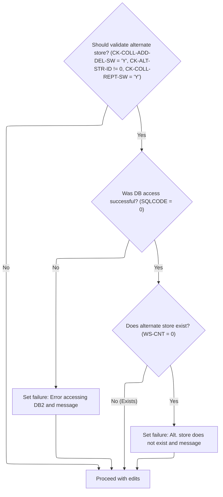

<SwmSnippet path="/base/src/NNNS0488.cbl" line="3467">

---

`1410-MODIFY-EDITS` calls 1420-VALIDATE-ALT-STORE to check if the referenced alternate store exists. If it doesn't, or if there's a DB error, we set failure and return a message.

```cobol
349500 1410-MODIFY-EDITS.                                               00349500
349600     PERFORM 1420-VALIDATE-ALT-STORE                              00349600
349700     .                                                            00349700
```

---

</SwmSnippet>

<SwmSnippet path="/base/src/NNNS0488.cbl" line="3472">

---

`1420-VALIDATE-ALT-STORE` checks flags and IDs before running a SQL count to see if the alternate store exists. If not, or if there's a DB error, it sets failure and builds the right error message.

```cobol
350000 1420-VALIDATE-ALT-STORE.                                         00350000
350100     IF CK-COLL-ADD-DEL-SW OF DCLXXXAIL-LOC = 'Y' AND             00350100
350200        CK-ALT-STR-ID OF DCLXXXAIL-LOC NOT = 0    AND             00350200
350300        CK-COLL-REPT-SW OF DCLXXXAIL-LOC   = 'Y'                  00350300
350400          EXEC SQL                                                00350400
350500            SELECT COUNT(*)                                       00350500
350600            INTO :WS-CNT                                          00350600
350700            FROM XXXAIL_LOC                                       00350700
350800            WHERE LOC_NBR    = :DCLXXXAIL-LOC.CK-ALT-STR-ID       00350800
350900            AND   LOC_TYP_CD = :DCLXXXAIL-LOC.LOC-TYP-CD          00350900
351000          END-EXEC                                                00351000
351100          EVALUATE TRUE                                           00351100
351200           WHEN SQLCODE = 0                                       00351200
351300            IF WS-CNT = 0                                         00351300
351400              SET  FAILURE                 TO TRUE                00351400
351500              MOVE SPACES                  TO IS-RTRN-MSG-TXT     00351500
351600              STRING 'NNNS0488 - Alt. store does not exists'      00351600
351700                     DELIMITED BY SIZE INTO IS-RTRN-MSG-TXT       00351700
351800            ELSE                                                  00351800
351900              CONTINUE                                            00351900
352000            END-IF                                                00352000
352100           WHEN OTHER                                             00352100
352200             SET  FAILURE                 TO TRUE                 00352200
352300             MOVE SPACES                  TO IS-RTRN-MSG-TXT      00352300
352400             STRING 'NNNS0488 - Error accessing DB2'              00352400
352500                    DELIMITED BY SIZE INTO IS-RTRN-MSG-TXT        00352500
352600     END-IF                                                       00352600
352700     .                                                            00352700
```

---

</SwmSnippet>

#### Checking for Status and Data Changes

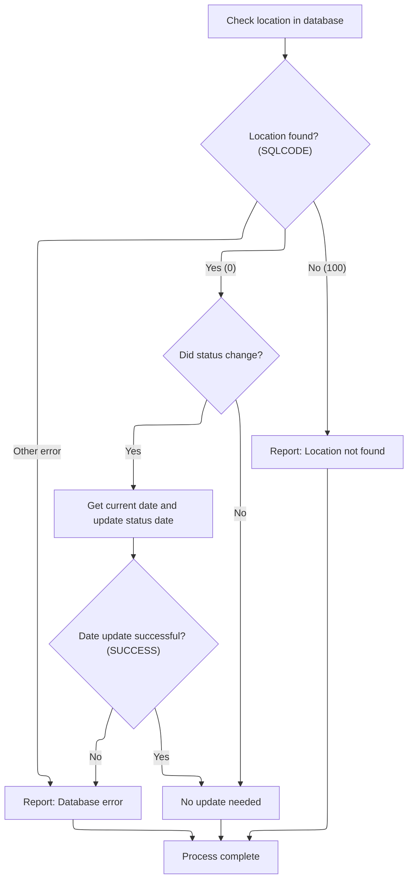

<SwmSnippet path="/base/src/NNNS0488.cbl" line="3502">

---

`1430-CHECK-FOR-EVENTS` runs a SQL query to get the current status and compares it to the record. If it's changed, we flag it and update the date. If not, we mark it as retained. Errors and missing data are handled with failure flags and messages.

```cobol
353000 1430-CHECK-FOR-EVENTS.                                           00353000
353100     EXEC SQL                                                     00353100
353200         SELECT RETL_LOC_STAT_CD,                                 00353200
353300                CURR_AD_ZN_NBR,                                   00353300
353400                LIN_OF_BUS_ID                                     00353400
353500         INTO   :WS-STR-ST-CD,                                    00353500
353600                :WS-CURR-AD-ZONE,                                 00353600
353700                :WS-CURR-LOB                                      00353700
353800         FROM   XXXAIL_LOC                                        00353800
353900         WHERE  LOC_NBR = :DCLXXXAIL-LOC.LOC-NBR                  00353900
354000         AND    LOC_TYP_CD = :DCLXXXAIL-LOC.LOC-TYP-CD            00354000
354100     END-EXEC                                                     00354100
354200                                                                  00354200
354300     EVALUATE TRUE                                                00354300
354400       WHEN SQLCODE = 0                                           00354400
354500         IF WS-STR-ST-CD NOT = RETL-LOC-STAT-CD OF DCLXXXAIL-LOC  00354500
354600           SET WS-LOC-STAT-CHANGED TO TRUE                        00354600
354700           PERFORM 2040-GET-CURRENT-DATE                          00354700
354800           IF SUCCESS                                             00354800
354900             MOVE DTA10-MM-DD-YYYY                                00354900
355000               TO RETL-LOC-STAT-DT OF DCLXXXAIL-LOC               00355000
355100           END-IF                                                 00355100
355200         ELSE                                                     00355200
355300           SET  WS-LOC-STAT-RETAINED TO TRUE                      00355300
355400         END-IF                                                   00355400
355500       WHEN SQLCODE = 100                                         00355500
355600         SET  FAILURE TO TRUE                                     00355600
355700         MOVE 'NNNS0488 - xxxail xxxation not found!'             00355700
355800           TO IS-RTRN-MSG-TXT                                     00355800
355900       WHEN SQLCODE NOT = 0                                       00355900
356000         MOVE SQLCODE                 TO WS-SQLCODE               00356000
356100         SET  FAILURE                 TO TRUE                     00356100
356200         MOVE SPACES                  TO IS-RTRN-MSG-TXT          00356200
356300         STRING 'NNNS0488 - Error checking for changes, SQL='     00356300
356400                 WS-SQLCODE                                       00356400
356500                 DELIMITED BY SIZE INTO IS-RTRN-MSG-TXT           00356500
356600     END-EVALUATE                                                 00356600
356700     .                                                            00356700
```

---

</SwmSnippet>

### Updating and Flagging Location Records

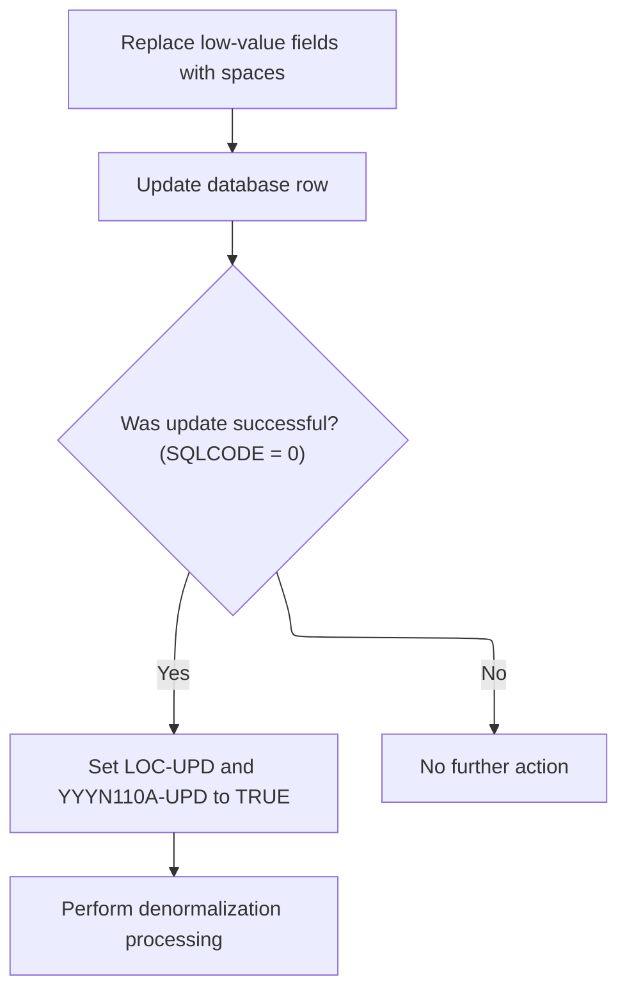

<SwmSnippet path="/base/src/NNNS0488.cbl" line="3542">

---

1440-D0-MODIFY-ROW cleans up invalid fields, updates the record in Oracle, sets update flags if successful, and runs denormalization to handle status and event logic.

```cobol
357000 1440-D0-MODIFY-ROW.                                              00357000
357100     PERFORM 4670-REP-LOWVALUE-WITH-SPACES                        00357100
357200     PERFORM 5000-CALL-NNNU0488-CUD-ROUTINE                       00357200
357300                                                                  00357300
357400     IF SQLCODE = 0                                               00357400
357500       SET YYYN110A-UPD TO TRUE                                   00357500
357600       SET LOC-UPD      TO TRUE                                   00357600
357700       PERFORM 2000-DENORM-PROCESS                                00357700
357800     END-IF                                                       00357800
357900     .                                                            00357900
```

---

</SwmSnippet>

### Post-Update Status and Event Handling

<SwmSnippet path="/base/src/NNNS0488.cbl" line="3701">

---

2000-DENORM-PROCESS checks if the location status changed, updates it if needed, bumps the checkpoint, and if everything's good, gets the workflow state, syncs with Oracle, and issues events. Each step keeps the data and business logic in sync after an update.

```cobol
372200 2000-DENORM-PROCESS.                                             00372200
372300     IF WS-LOC-STAT-CHANGED                                       00372300
372400       PERFORM 2100-UPD-STAT-IN-xxxation                          00372400
372500     END-IF                                                       00372500
372600     MOVE 1 TO WS-CHECKPOINT-INC                                  00372600
372700     IF SUCCESS                                                   00372700
372800       PERFORM 2010-CALL-CONTROL-SUBR                             00372800
372900     END-IF                                                       00372900
373000     IF  SUCCESS                                                  00373000
373100     AND WWWC0100-NORM-TASK                                       00373100
373200       PERFORM 2020-CALL-SYNC-SUBR                                00373200
373300     END-IF                                                       00373300
373400     IF SUCCESS                                                   00373400
373500       PERFORM 2030-ISSUE-EVENTS                                  00373500
373600     END-IF                                                       00373600
373700     .                                                            00373700
```

---

</SwmSnippet>

#### Updating Location Status in Database

See <SwmLink doc-title="Retail Location Status Update Flow">[Retail Location Status Update Flow](\.swm\retail-location-status-update-flow.6hel4a4v.sw.md)</SwmLink>

#### Syncing Workflow State and Data

<SwmSnippet path="/base/src/NNNS0488.cbl" line="3720">

---

2010-CALL-CONTROL-SUBR sets up to get the workflow state by calling WWWS0100-CONTROL-SUBR. This pulls in the user's current master task info, which is needed for later sync and event logic.

```cobol
374100 2010-CALL-CONTROL-SUBR.                                          00374100
374200     SET WWWC0100-GET-TASK  TO TRUE                               00374200
374300     CALL WWWS0100-CONTROL-SUBR USING                             00374300
374400         XXXN001A                                                 00374400
374500         WWWC0100                                                 00374500
374600     .                                                            00374600
```

---

</SwmSnippet>

### Triggering Master Data and Store Events

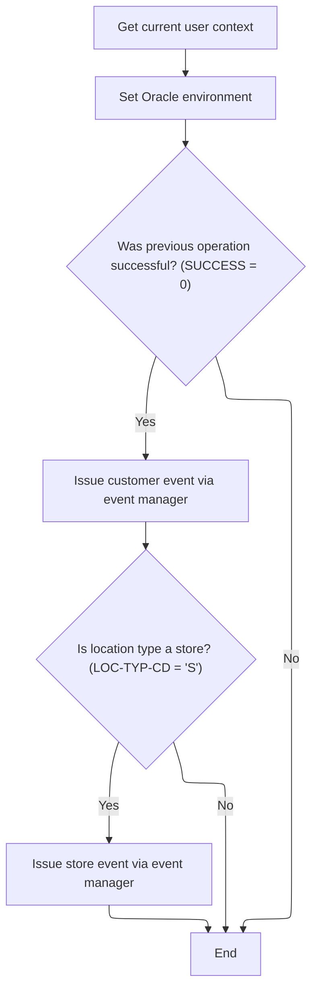

<SwmSnippet path="/base/src/NNNS0488.cbl" line="3740">

---

2030-ISSUE-EVENTS grabs the current user, sets Oracle flags, and if successful, builds a transaction record for a customer event and calls the event manager. If the location type is 'S', it builds a second record for a store event and calls the event manager again. Hardcoded IDs ('CUST', 'STRM', 'NNNS0488') drive event routing.

```cobol
376100 2030-ISSUE-EVENTS.                                               00376100
376200     PERFORM 2050-GET-CURRENT-USER                                00376200
376300     SET  YYYN110A-ORACLE      TO TRUE                            00376300
376400     IF SUCCESS                                                   00376400
376500       MOVE LOC-NBR OF P-DDDTLR01 TO ST-STORE-NUMBER OF ZZZC0032  00376500
376600                                     LOC-NBR OF ZZZC0094          00376600
376700       SET  ZZZC0032-UPD-FXXX     TO TRUE                         00376700
376800       MOVE ZZZC0032              TO ZZZC0197-TRX-REC             00376800
376900       MOVE 'CUST'                TO ZZZC0197-TRX-ID              00376900
377000       MOVE 'NNNS0488'            TO ZZZC0197-PROGRAM             00377000
377100       MOVE YYYC0107-USER         TO ZZZC0197-USER                00377100
377200       MOVE YYYN005A-SYS-ENV      TO YYYN110A-SYS-ENV             00377200
377300       CALL ZZZS0197-EVENT-MGR USING                              00377300
377400            XXXN001A                                              00377400
377500            YYYN110A                                              00377500
377600            ZZZC0197                                              00377600
377700                                                                  00377700
377800       EVALUATE TRUE                                              00377800
377900                                                                  00377900
378000       WHEN LOC-TYP-CD OF P-DDDTLR01 = K-STORE-LOC-TYPE           00378000
378100         MOVE LOC-TYP-CD OF P-DDDTLR01 TO                         00378100
378200                                       LOC-TYP-CD OF ZZZC0094     00378200
378300         MOVE ZZZC0094              TO ZZZC0197-TRX-REC           00378300
378400         MOVE 'STRM'                TO ZZZC0197-TRX-ID            00378400
378500         MOVE 'NNNS0488'            TO ZZZC0197-PROGRAM           00378500
378600         MOVE YYYC0107-USER         TO ZZZC0197-USER              00378600
378700         MOVE YYYN005A-SYS-ENV      TO YYYN110A-SYS-ENV           00378700
378800         CALL ZZZS0197-EVENT-MGR USING                            00378800
378900              XXXN001A                                            00378900
379000              YYYN110A                                            00379000
379100              ZZZC0197                                            00379100
379200                                                                  00379200
379300       END-EVALUATE                                               00379300
379400                                                                  00379400
379500     END-IF                                                       00379500
379600     .                                                            00379600
```

---

</SwmSnippet>

<SwmSnippet path="/base/src/NNNS0488.cbl" line="3785">

---

2050-GET-CURRENT-USER either calls out for the user ID if online, or sets it to 'BATCH' for offline/batch runs.

```cobol
380600 2050-GET-CURRENT-USER.                                           00380600
380700     IF  SUCCESS                                                  00380700
380800     AND YYYN005A-CICS-ENV                                        00380800
380900       CALL Z-GET-CICS-USER-ID USING                              00380900
381000           EIBLK    WS-DUMMY                                      00381000
381100           XXXN001A YYYC0107                                      00381100
381200     ELSE                                                         00381200
381300       MOVE 'BATCH' TO YYYC0107-USER                              00381300
381400     END-IF                                                       00381400
381500     .                                                            00381500
```

---

</SwmSnippet>

### Detecting and Issuing DCM Events

<SwmSnippet path="/base/src/NNNS0488.cbl" line="3877">

---

2400-CHECK-FOR-DCM-EVENT checks if the current business line differs from the location's business ID. If so, it sets up the event data and calls the event issuer to push the change.

```cobol
389800 2400-CHECK-FOR-DCM-EVENT.                                        00389800
389900     IF WS-CURR-LOB     NOT = LIN-OF-BUS-ID  OF DCLXXXAIL-LOC     00389900
390400         PERFORM 2410-SETUP-EVENT                                 00390400
390400         PERFORM 2430-ISSUE-EVENT2                                00390500
390600     END-IF                                                       00390600
390700     .                                                            00390700
```

---

</SwmSnippet>

### Staging DCM Event Data

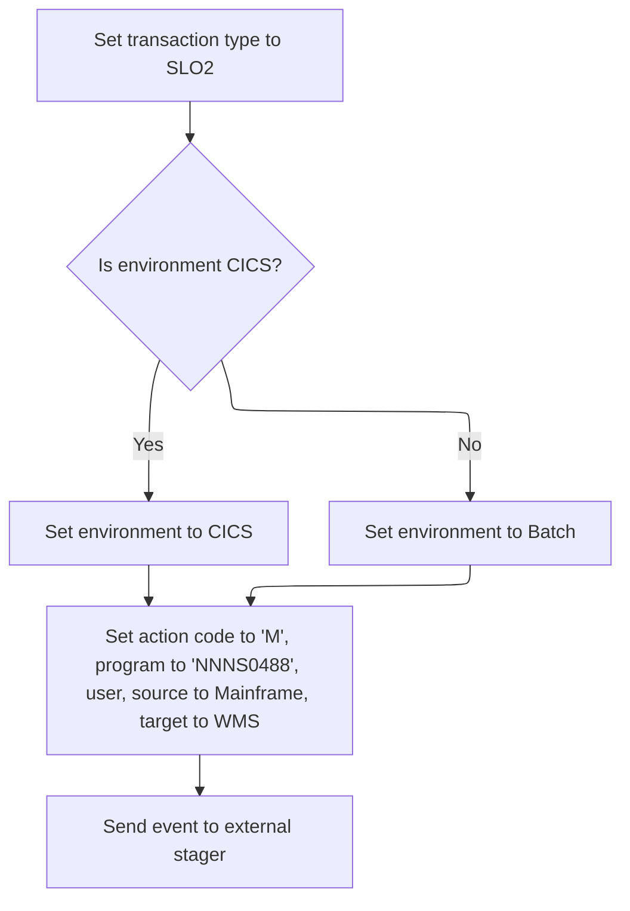

<SwmSnippet path="/base/src/NNNS0488.cbl" line="3929">

---

2430-ISSUE-EVENT2 sets up the event type and hands off to the event staging logic.

```cobol
395500 2430-ISSUE-EVENT2.                                               00395500
395600     MOVE 'SLO2' TO ZZZC0210-TRX-ID                               00395600
395700     PERFORM 2420-ISSUE-EVENT                                     00395700
395800     .                                                            00395800
```

---

</SwmSnippet>

<SwmSnippet path="/base/src/NNNS0488.cbl" line="3904">

---

2420-ISSUE-EVENT sets up all event fields, tags the environment, and calls the event stager to queue the event.

```cobol
393000 2420-ISSUE-EVENT.                                                00393000
393100     INITIALIZE YYYC0175                                          00393100
393200     SET YYYC0175-ORACLE      TO TRUE                             00393200
393300     IF YYYN005A-CICS-ENV                                         00393300
393400       SET YYYC0175-CICS-ENV  TO TRUE                             00393400
393500     ELSE                                                         00393500
393600       SET YYYC0175-BATCH-ENV TO TRUE                             00393600
393700     END-IF                                                       00393700
393800                                                                  00393800
393900     MOVE ZZZC0210-TRX-ID TO YYYC0175-TRX-CD                      00393900
394000     MOVE ZZZC0210        TO YYYC0175-DATA                        00394000
394100     MOVE 'M'             TO YYYC0175-ACTION-CD                   00394100
394200                                                                  00394200
394300     MOVE 'NNNS0488'      TO YYYC0175-CALLING-PROG                00394300
394400     MOVE YYYC0107-USER   TO YYYC0175-CALLING-USER                00394400
394500                                                                  00394500
394600     SET  YYYC0175-SOURCE-MAINFRAME TO TRUE                       00394600
394700     SET  YYYC0175-TARGET-WMS       TO TRUE                       00394700
394800                                                                  00394800
394900     CALL Z-EVENT-STAGER USING                                    00394900
395000         XXXN001A                                                 00395000
395100         YYYC0175                                                 00395100
395200     .                                                            00395200
```

---

</SwmSnippet>

### Preparing and Inserting Location Records

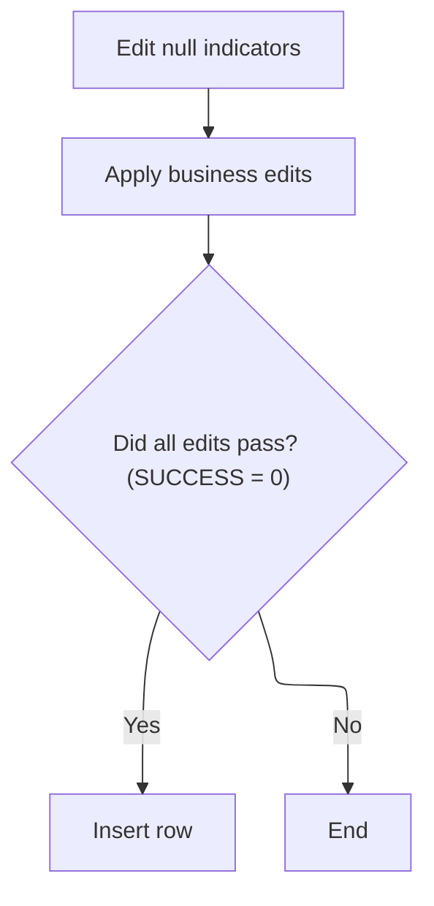

<SwmSnippet path="/base/src/NNNS0488.cbl" line="3554">

---

1500-EXIT-PUT-INSERT-ROW runs null indicator edits, applies extra field edits, and if everything passes, calls the insert routine. This sequence makes sure only clean, valid data gets inserted.

```cobol
358200 1500-EXIT-PUT-INSERT-ROW.                                        00358200
358300     PERFORM 1800-EDIT-NULL-INDICATORS                            00358300
358400     PERFORM 1510-ADD-EDITS                                       00358400
358500     IF SUCCESS                                                   00358500
358600       PERFORM 1520-D0-INSERT-ROW                                 00358600
358700     END-IF                                                       00358700
358800     .                                                            00358800
```

---

</SwmSnippet>

### Validating and Adding New Location Records

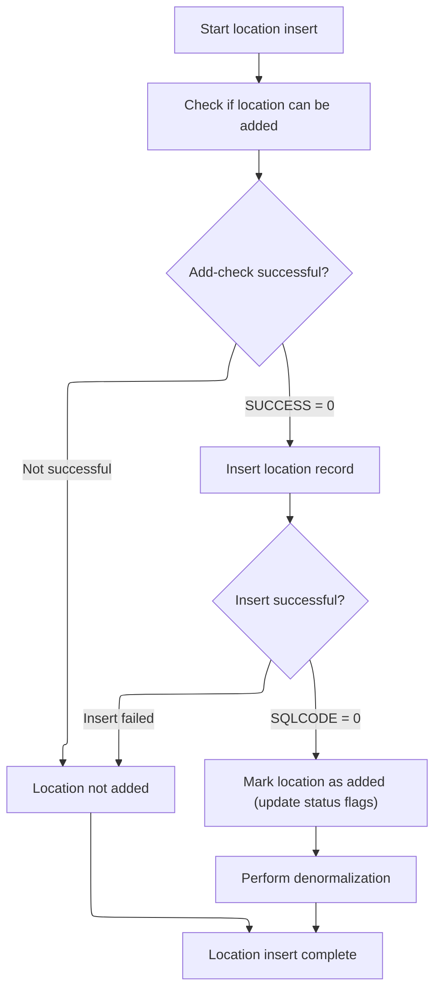

<SwmSnippet path="/base/src/NNNS0488.cbl" line="3597">

---

1520-D0-INSERT-ROW first calls a validation routine to check if the add is allowed. If it passes, it cleans up fields, inserts the record, and if successful, sets flags to mark the add and runs denormalization to sync status and trigger events.

```cobol
362500 1520-D0-INSERT-ROW.                                              00362500
362600     PERFORM 4600-CALL-MMMS0335-RI-ADD-CHK                        00362600
362700     IF SUCCESS                                                   00362700
362800        PERFORM 4670-REP-LOWVALUE-WITH-SPACES                     00362800
362900        PERFORM 5000-CALL-NNNU0488-CUD-ROUTINE                    00362900
363000                                                                  00363000
363100        IF SQLCODE = 0                                            00363100
363200          SET WS-LOC-STAT-CHANGED TO TRUE                         00363200
363300          SET YYYN110A-ADD TO TRUE                                00363300
363400          SET LOC-ADD      TO TRUE                                00363400
363500          PERFORM 2000-DENORM-PROCESS                             00363500
363600        END-IF                                                    00363600
363700     END-IF                                                       00363700
363800     .                                                            00363800
```

---

</SwmSnippet>

<SwmSnippet path="/base/src/NNNS0488.cbl" line="3963">

---

4600-CALL-MMMS0335-RI-ADD-CHK sets up market area and computer type codes, flags the operation as an insert for Oracle, and calls MMMS0335 to validate the business rules before adding the record.

```cobol
398900 4600-CALL-MMMS0335-RI-ADD-CHK.                                   00398900
399000     INITIALIZE MMMC0335                                          00399000
399100     MOVE ECOMM-MKT-AREA-CD OF DCLXXXAIL-LOC                      00399100
399200                                 TO MMMC0335-ECOMM-MKT-AREA-CD    00399200
399300     MOVE CMPTR-TYP-CD  OF DCLXXXAIL-LOC                          00399300
399400                                 TO MMMC0335-CMPTR-TYP-CD         00399400
399500     SET   MMMC0335-INSERT-CHECK TO TRUE                          00399500
399600     SET   MMMC0335-XXXAIL-LOC   TO TRUE                          00399600
399700     SET   MMMC0335-ORACLE       TO TRUE                          00399700
399800     CALL  MMMC0335-RI-INSERT-CHK USING                           00399800
399900           XXXN001A                                               00399900
400000           MMMC0335                                               00400000
400100     .                                                            00400100
```

---

</SwmSnippet>

### Finalizing Transaction and Connecting to Database

<SwmSnippet path="/base/src/NNNS0488.cbl" line="1756">

---

120-EXIT-STUFF moves retail location fields if needed, bumps the checkpoint count, and connects to DB2 if the operation type requires it. This wraps up the transaction and preps for any further DB work.

```cobol
179300 120-EXIT-STUFF.                                                  00179300
179400     IF SUCCESS                                                   00179400
179500       IF NOT EXIT-CLOSE-CURSOR                                   00179500
179600         PERFORM 130-MOVE-DCL-2-PDA-FIELDS                        00179600
179700       END-IF                                                     00179700
179800       ADD WS-CHECKPOINT-INC TO YYYN005A-CHKPT-CNT                00179800
179900     END-IF                                                       00179900
180000     IF (YYYN005A-ORACLE       OR EXIT-PUT-INSERT-ROW             00180000
180100         OR EXIT-PUT-PURGE-ROW OR EXIT-PUT-MODIFY-ROW)            00180100
180200*      SET YYYN005A-DB2        TO TRUE                            00180200
180300       PERFORM 125-CONNECT-TO-DB2                                 00180300
180400     END-IF                                                       00180400
180500     MOVE SQLCODE            TO DB2-SQL-CODE                      00180500
180600     .                                                            00180600
```

---

</SwmSnippet>

#### Normalizing and Converting Retail Location Data

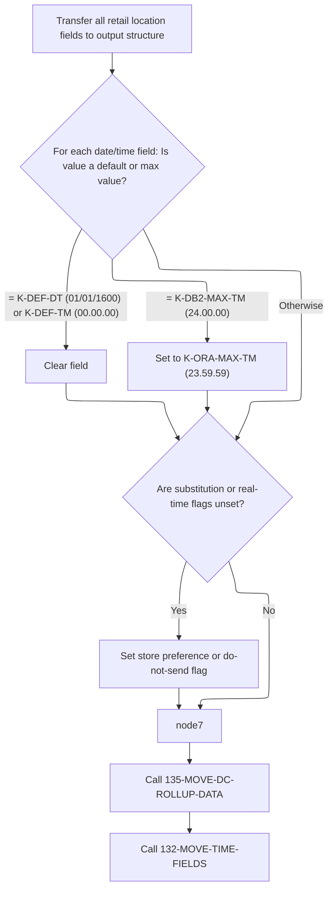

<SwmSnippet path="/base/src/NNNS0488.cbl" line="1784">

---

130-MOVE-DCL-2-PDA-FIELDS normalizes fields, converts times, sets flags, and delegates rollup/time conversion to subroutines.

```cobol
182100 130-MOVE-DCL-2-PDA-FIELDS.                                       00182100
182200     MOVE LOC-NBR OF DCLXXXAIL-LOC TO LOC-NBR OF P-DDDTLR01       00182200
182300     MOVE LOC-TYP-CD OF DCLXXXAIL-LOC TO LOC-TYP-CD OF P-DDDTLR01 00182300
182400     MOVE ASSOC-STR-TYP-CD OF DCLXXXAIL-LOC                       00182400
182500       TO ASSOC-STR-TYP-CD OF P-DDDTLR01                          00182500
182600     MOVE ASSOC-STR-NBR OF DCLXXXAIL-LOC                          00182600
182700       TO ASSOC-STR-NBR OF P-DDDTLR01                             00182700
182800                                                                  00182800
182900     MOVE STR-REMODL-DT OF DCLXXXAIL-LOC                          00182900
183000       TO STR-REMODL-DT OF P-DDDTLR01                             00183000
183100     IF STR-REMODL-DT OF P-DDDTLR01 = K-DEF-DT                    00183100
183200       MOVE SPACES TO STR-REMODL-DT OF P-DDDTLR01                 00183200
183300     END-IF                                                       00183300
183400                                                                  00183400
183500     MOVE SLS-CLOSED-DT OF DCLXXXAIL-LOC                          00183500
183600       TO SLS-CLOSED-DT OF P-DDDTLR01                             00183600
183700     IF SLS-CLOSED-DT OF P-DDDTLR01 = K-DEF-DT                    00183700
183800       MOVE SPACES TO SLS-CLOSED-DT OF P-DDDTLR01                 00183800
183900     END-IF                                                       00183900
184000                                                                  00184000
184100     MOVE RETL-LOC-STAT-CD OF DCLXXXAIL-LOC                       00184100
184200       TO RETL-LOC-STAT-CD OF P-DDDTLR01                          00184200
184300                                                                  00184300
184400     MOVE RETL-LOC-STAT-DT OF DCLXXXAIL-LOC                       00184400
184500       TO RETL-LOC-STAT-DT OF P-DDDTLR01                          00184500
184600     IF RETL-LOC-STAT-DT OF P-DDDTLR01 = K-DEF-DT                 00184600
184700       MOVE SPACES TO RETL-LOC-STAT-DT OF P-DDDTLR01              00184700
184800     END-IF                                                       00184800
184900                                                                  00184900
185000     MOVE COMPANY-ID OF DCLXXXAIL-LOC TO COMPANY-ID OF P-DDDTLR01 00185000
185100     MOVE FINANCIAL-DIV-ID OF DCLXXXAIL-LOC                       00185100
185200       TO FINANCIAL-DIV-ID OF P-DDDTLR01                          00185200
185300     MOVE LIN-OF-BUS-ID OF DCLXXXAIL-LOC                          00185300
185400       TO LIN-OF-BUS-ID OF P-DDDTLR01                             00185400
185500     MOVE DIST-ID OF DCLXXXAIL-LOC TO DIST-ID OF P-DDDTLR01       00185500
185600     MOVE MKT-RGN-ID OF DCLXXXAIL-LOC TO MKT-RGN-ID OF P-DDDTLR01 00185600
185700     MOVE GEO-ZN-CD OF DCLXXXAIL-LOC TO GEO-ZN-CD OF P-DDDTLR01   00185700
185800     MOVE RETL-GEO-ZN-ID OF DCLXXXAIL-LOC                         00185800
185900       TO RETL-GEO-ZN-ID OF P-DDDTLR01                            00185900
186000     MOVE SCN-MAINT-SW OF DCLXXXAIL-LOC                           00186000
186100       TO SCN-MAINT-SW OF P-DDDTLR01                              00186100
186200     MOVE FRNT-END-CD OF DCLXXXAIL-LOC                            00186200
186300       TO FRNT-END-CD OF P-DDDTLR01                               00186300
186400     MOVE PRC-BUL-SW OF DCLXXXAIL-LOC TO PRC-BUL-SW OF P-DDDTLR01 00186400
186500     MOVE UPC-ON-PRC-BUL-SW OF DCLXXXAIL-LOC                      00186500
186600       TO UPC-ON-PRC-BUL-SW OF P-DDDTLR01                         00186600
186700     MOVE CMPTR-TYP-CD OF DCLXXXAIL-LOC                           00186700
186800       TO CMPTR-TYP-CD OF P-DDDTLR01                              00186800
186900     MOVE RETL-VID-ZN-NBR OF DCLXXXAIL-LOC                        00186900
187000       TO RETL-VID-ZN-NBR OF P-DDDTLR01                           00187000
187100     MOVE RETL-UNLD-CD OF DCLXXXAIL-LOC                           00187100
187200       TO RETL-UNLD-CD OF P-DDDTLR01                              00187200
187300*    MOVE ROLUP-REPT-TBL-TXT OF DCLXXXAIL-LOC                     00187300
187400*      TO ROLUP-REPT-TBL-TXT OF P-DDDTLR01                        00187400
187500     PERFORM 135-MOVE-DC-ROLLUP-DATA                              00187500
187600     MOVE NEW-STR-SW OF DCLXXXAIL-LOC TO NEW-STR-SW OF P-DDDTLR01 00187600
187700     MOVE SEL-CIR-SW OF DCLXXXAIL-LOC TO SEL-CIR-SW OF P-DDDTLR01 00187700
187800     MOVE BKRM-SQ-FT OF DCLXXXAIL-LOC TO BKRM-SQ-FT OF P-DDDTLR01 00187800
187900     MOVE FD-LINER-FT OF DCLXXXAIL-LOC                            00187900
188000       TO FD-LINER-FT OF P-DDDTLR01                               00188000
188100     MOVE NON-FD-LINER-FT OF DCLXXXAIL-LOC                        00188100
188200       TO NON-FD-LINER-FT OF P-DDDTLR01                           00188200
188300     MOVE SETOFF-ROOM-SW OF DCLXXXAIL-LOC                         00188300
188400       TO SETOFF-ROOM-SW OF P-DDDTLR01                            00188400
188500     MOVE CAT-CLS-TBL-TXT OF DCLXXXAIL-LOC                        00188500
188600       TO CAT-CLS-TBL-TXT OF P-DDDTLR01                           00188600
188700     MOVE LAT-K OF DCLXXXAIL-LOC TO LAT-K OF P-DDDTLR01           00188700
188800     MOVE LON-K OF DCLXXXAIL-LOC TO LON-K OF P-DDDTLR01           00188800
188900     MOVE CK-COLL-REPT-SW OF DCLXXXAIL-LOC                        00188900
189000       TO CK-COLL-REPT-SW OF P-DDDTLR01                           00189000
189100     MOVE CK-COLL-CNTL-CD OF DCLXXXAIL-LOC                        00189100
189200       TO CK-COLL-CNTL-CD OF P-DDDTLR01                           00189200
189300     MOVE CK-COLL-ADD-DEL-SW OF DCLXXXAIL-LOC                     00189300
189400       TO CK-COLL-ADD-DEL-SW OF P-DDDTLR01                        00189400
189500     MOVE CK-ALT-STR-ID OF DCLXXXAIL-LOC                          00189500
189600       TO CK-ALT-STR-ID OF P-DDDTLR01                             00189600
189700     MOVE CK-COLL-FEE-AMT OF DCLXXXAIL-LOC                        00189700
189800       TO CK-COLL-FEE-AMT OF P-DDDTLR01                           00189800
189900     MOVE SALS-TAX-PCT OF DCLXXXAIL-LOC                           00189900
190000       TO SALS-TAX-PCT OF P-DDDTLR01                              00190000
190100     MOVE SOAP-SALE-VAR-PCT OF DCLXXXAIL-LOC                      00190100
190200       TO SOAP-SALE-VAR-PCT OF P-DDDTLR01                         00190200
190300     MOVE ON-SRS-CD OF DCLXXXAIL-LOC TO ON-SRS-CD OF P-DDDTLR01   00190300
190400     MOVE SRS-DSD-ORD-SW OF DCLXXXAIL-LOC                         00190400
190500       TO SRS-DSD-ORD-SW OF P-DDDTLR01                            00190500
190600     MOVE RETL-LOC-TYP-CD OF DCLXXXAIL-LOC                        00190600
190700       TO RETL-LOC-TYP-CD OF P-DDDTLR01                           00190700
190800     MOVE DEA-NBR OF DCLXXXAIL-LOC TO DEA-NBR OF P-DDDTLR01       00190800
190900     MOVE STR-OPSTMT-SRT-CD OF DCLXXXAIL-LOC                      00190900
191000       TO STR-OPSTMT-SRT-CD OF P-DDDTLR01                         00191000
191100     MOVE STR-OPSTMT-TYP-CD OF DCLXXXAIL-LOC                      00191100
191200       TO STR-OPSTMT-TYP-CD OF P-DDDTLR01                         00191200
191300     MOVE STR-OPSTMT-HDR-CD OF DCLXXXAIL-LOC                      00191300
191400       TO STR-OPSTMT-HDR-CD OF P-DDDTLR01                         00191400
191500     MOVE DPS-NBR OF DCLXXXAIL-LOC TO DPS-NBR OF P-DDDTLR01       00191500
191600     MOVE MEDICARE-ID OF DCLXXXAIL-LOC                            00191600
191700       TO MEDICARE-ID OF P-DDDTLR01                               00191700
191800     MOVE NABP-NBR OF DCLXXXAIL-LOC TO NABP-NBR OF P-DDDTLR01     00191800
191900     MOVE NATL-PROV-ID OF DCLXXXAIL-LOC                           00191900
192000       TO NATL-PROV-ID OF P-DDDTLR01                              00192000
192100     MOVE CURR-AD-ZN-NBR OF DCLXXXAIL-LOC                         00192100
192200       TO CURR-AD-ZN-NBR OF P-DDDTLR01                            00192200
192300     MOVE PD-ZONE-NO OF DCLXXXAIL-LOC TO PD-ZONE-NO OF P-DDDTLR01 00192300
192400     MOVE SOS-PROC-SW OF DCLXXXAIL-LOC                            00192400
192500       TO SOS-PROC-SW OF P-DDDTLR01                               00192500
192600     MOVE RPRT-SEQ-NBR OF DCLXXXAIL-LOC                           00192600
192700       TO RPRT-SEQ-NBR OF P-DDDTLR01                              00192700
192800     MOVE GRP-CD OF DCLXXXAIL-LOC TO GRP-CD OF P-DDDTLR01         00192800
192900     MOVE PRIM-GRP-CD-1 OF DCLXXXAIL-LOC                          00192900
193000       TO PRIM-GRP-CD-1 OF P-DDDTLR01                             00193000
193100     MOVE PRIM-GRP-CD-2 OF DCLXXXAIL-LOC                          00193100
193200       TO PRIM-GRP-CD-2 OF P-DDDTLR01                             00193200
193300     MOVE SECY-GRP-CD-1 OF DCLXXXAIL-LOC                          00193300
193400       TO SECY-GRP-CD-1 OF P-DDDTLR01                             00193400
193500     MOVE SECY-GRP-CD-2 OF DCLXXXAIL-LOC                          00193500
193600       TO SECY-GRP-CD-2 OF P-DDDTLR01                             00193600
193700     MOVE PRIM-CLS-NBR-1 OF DCLXXXAIL-LOC                         00193700
193800       TO PRIM-CLS-NBR-1 OF P-DDDTLR01                            00193800
193900     MOVE PRIM-CLS-NBR-2 OF DCLXXXAIL-LOC                         00193900
194000       TO PRIM-CLS-NBR-2 OF P-DDDTLR01                            00194000
194100     MOVE SECY-CLS-NBR-1 OF DCLXXXAIL-LOC                         00194100
194200       TO SECY-CLS-NBR-1 OF P-DDDTLR01                            00194200
194300     MOVE SECY-CLS-NBR-2 OF DCLXXXAIL-LOC                         00194300
194400       TO SECY-CLS-NBR-2 OF P-DDDTLR01                            00194400
194500     MOVE VAL-STR-SW OF DCLXXXAIL-LOC TO VAL-STR-SW OF P-DDDTLR01 00194500
194600     MOVE TBCO-PRMT-NBR OF DCLXXXAIL-LOC                          00194600
194700       TO TBCO-PRMT-NBR OF P-DDDTLR01                             00194700
194800                                                                  00194800
194900     MOVE SUB-UNLIKE-PROD-CD OF DCLXXXAIL-LOC                     00194900
195000       TO SUB-UNLIKE-PROD-CD OF P-DDDTLR01                        00195000
195100     IF  NOT OK-TO-SUB-UNLIKE-PRODS     OF P-DDDTLR01             00195100
195200     AND NOT DONT-SUB-UNLIKE-PRODS      OF P-DDDTLR01             00195200
195300       SET NO-UNLIKE-SUB-STORE-PREF     OF P-DDDTLR01 TO TRUE     00195300
195400     END-IF                                                       00195400
195500                                                                  00195500
195600     MOVE SUB-DSPLY-PAL-CD   OF DCLXXXAIL-LOC                     00195600
195700       TO SUB-DSPLY-PAL-CD   OF P-DDDTLR01                        00195700
195800     IF  NOT OK-TO-SUB-DISP-PALS        OF P-DDDTLR01             00195800
195900     AND NOT DONT-SUB-DISP-PALS         OF P-DDDTLR01             00195900
196000       SET NO-DISP-PAL-SUB-STORE-PREF   OF P-DDDTLR01 TO TRUE     00196000
196100     END-IF                                                       00196100
196200                                                                  00196200
196300     MOVE RLTM-SCN-MAINT-SW  OF DCLXXXAIL-LOC                     00196300
196400       TO RLTM-SCN-MAINT-SW  OF P-DDDTLR01                        00196400
196500     IF  NOT SEND-REAL-TIME-G3          OF P-DDDTLR01             00196500
196600       SET DONT-SEND-REAL-TIME-G3       OF P-DDDTLR01 TO TRUE     00196600
196700     END-IF                                                       00196700
196800     MOVE 0                                                       00196800
196900       TO DONTUSE1 OF P-DDDTLR01                                  00196900
197000     MOVE 0                                                       00197000
197100       TO DONTUSE2 OF P-DDDTLR01                                  00197100
197200     MOVE TOP-LEADER-NM   OF DCLXXXAIL-LOC                        00197200
197300       TO TOP-LEADER-NM   OF P-DDDTLR01                           00197300
197400     MOVE CUST-FRNDLY-NM  OF DCLXXXAIL-LOC                        00197400
197500       TO CUST-FRNDLY-NM  OF P-DDDTLR01                           00197500
197600     MOVE SLS-OPEN-DT     OF DCLXXXAIL-LOC                        00197600
197700       TO SLS-OPEN-DT     OF P-DDDTLR01                           00197700
197800     IF SLS-OPEN-DT OF P-DDDTLR01 = K-DEF-DT                      00197800
197900       MOVE SPACES TO SLS-OPEN-DT  OF P-DDDTLR01                  00197900
198000     END-IF                                                       00198000
198100     IF MON-OPEN-TM OF P-DDDTLR01 = K-DEF-TM                      00198100
198200       MOVE SPACES TO MON-OPEN-TM  OF P-DDDTLR01                  00198200
198300     END-IF                                                       00198300
198400     IF MON-CLOS-TM OF DCLXXXAIL-LOC = K-DB2-MAX-TM               00198400
198500       MOVE K-ORA-MAX-TM  TO MON-CLOS-TM OF DCLXXXAIL-LOC         00198500
198600     END-IF                                                       00198600
198700     IF MON-CLOS-TM OF P-DDDTLR01 = K-DEF-TM                      00198700
198800       MOVE SPACES TO MON-CLOS-TM  OF P-DDDTLR01                  00198800
198900     END-IF                                                       00198900
199000     IF TUE-OPEN-TM OF P-DDDTLR01 = K-DEF-TM                      00199000
199100       MOVE SPACES TO TUE-OPEN-TM  OF P-DDDTLR01                  00199100
199200     END-IF                                                       00199200
199300     IF TUE-CLOS-TM OF DCLXXXAIL-LOC = K-DB2-MAX-TM               00199300
199400       MOVE K-ORA-MAX-TM  TO TUE-CLOS-TM OF DCLXXXAIL-LOC         00199400
199500     END-IF                                                       00199500
199600     IF TUE-CLOS-TM OF P-DDDTLR01 = K-DEF-TM                      00199600
199700       MOVE SPACES TO TUE-CLOS-TM  OF P-DDDTLR01                  00199700
199800     END-IF                                                       00199800
199900     IF WED-OPEN-TM OF P-DDDTLR01 = K-DEF-TM                      00199900
200000       MOVE SPACES TO WED-OPEN-TM  OF P-DDDTLR01                  00200000
200100     END-IF                                                       00200100
200200     IF WED-CLOS-TM OF DCLXXXAIL-LOC = K-DB2-MAX-TM               00200200
200300       MOVE K-ORA-MAX-TM  TO WED-CLOS-TM OF DCLXXXAIL-LOC         00200300
200400     END-IF                                                       00200400
200500     IF WED-CLOS-TM OF P-DDDTLR01 = K-DEF-TM                      00200500
200600       MOVE SPACES TO WED-CLOS-TM  OF P-DDDTLR01                  00200600
200700     END-IF                                                       00200700
200800     IF THUR-OPEN-TM OF P-DDDTLR01 = K-DEF-TM                     00200800
200900       MOVE SPACES TO THUR-OPEN-TM OF P-DDDTLR01                  00200900
201000     END-IF                                                       00201000
201100     IF THUR-CLOS-TM OF DCLXXXAIL-LOC = K-DB2-MAX-TM              00201100
201200       MOVE K-ORA-MAX-TM  TO THUR-CLOS-TM OF DCLXXXAIL-LOC        00201200
201300     END-IF                                                       00201300
201400     IF THUR-CLOS-TM OF P-DDDTLR01 = K-DEF-TM                     00201400
201500       MOVE SPACES TO THUR-CLOS-TM OF P-DDDTLR01                  00201500
201600     END-IF                                                       00201600
201700     IF FRI-OPEN-TM OF P-DDDTLR01 = K-DEF-TM                      00201700
201800       MOVE SPACES TO FRI-OPEN-TM  OF P-DDDTLR01                  00201800
201900     END-IF                                                       00201900
202000     IF FRI-CLOS-TM OF DCLXXXAIL-LOC = K-DB2-MAX-TM               00202000
202100       MOVE K-ORA-MAX-TM  TO FRI-CLOS-TM OF DCLXXXAIL-LOC         00202100
202200     END-IF                                                       00202200
202300     IF FRI-CLOS-TM OF P-DDDTLR01 = K-DEF-TM                      00202300
202400       MOVE SPACES TO FRI-CLOS-TM  OF P-DDDTLR01                  00202400
202500     END-IF                                                       00202500
202600     IF SAT-OPEN-TM OF P-DDDTLR01 = K-DEF-TM                      00202600
202700       MOVE SPACES TO SAT-OPEN-TM  OF P-DDDTLR01                  00202700
202800     END-IF                                                       00202800
202900     IF SUN-OPEN-TM OF P-DDDTLR01 = K-DEF-TM                      00202900
203000       MOVE SPACES TO SUN-OPEN-TM  OF P-DDDTLR01                  00203000
203100     END-IF                                                       00203100
203200     IF SAT-CLOS-TM OF DCLXXXAIL-LOC = K-DB2-MAX-TM               00203200
203300       MOVE K-ORA-MAX-TM  TO SAT-CLOS-TM OF DCLXXXAIL-LOC         00203300
203400     END-IF                                                       00203400
203500     IF SAT-CLOS-TM OF P-DDDTLR01 = K-DEF-TM                      00203500
203600       MOVE SPACES TO SAT-CLOS-TM  OF P-DDDTLR01                  00203600
203700     END-IF                                                       00203700
203800     IF SUN-CLOS-TM OF DCLXXXAIL-LOC = K-DB2-MAX-TM               00203800
203900       MOVE K-ORA-MAX-TM  TO SUN-CLOS-TM OF DCLXXXAIL-LOC         00203900
204000     END-IF                                                       00204000
204100     IF SUN-CLOS-TM OF P-DDDTLR01 = K-DEF-TM                      00204100
204200       MOVE SPACES TO SUN-CLOS-TM  OF P-DDDTLR01                  00204200
204300     END-IF                                                       00204300
204400     PERFORM 132-MOVE-TIME-FIELDS                                 00204400
204500     MOVE RETL-LOC-FRMAT-CD OF DCLXXXAIL-LOC                      00204500
204600       TO RETL-LOC-FRMAT-CD OF P-DDDTLR01                         00204600
204700     MOVE RETL-LOC-SEGM-CD OF DCLXXXAIL-LOC                       00204700
204800       TO RETL-LOC-SEGM-CD OF P-DDDTLR01                          00204800
204900     MOVE ECOMM-MKT-AREA-CD OF DCLXXXAIL-LOC                      00204900
205000       TO ECOMM-MKT-AREA-CD OF P-DDDTLR01                         00205000
205100     MOVE ECOMM-STRT-DT OF DCLXXXAIL-LOC                          00205100
205200       TO ECOMM-STRT-DT OF P-DDDTLR01                             00205200
205300     IF ECOMM-STRT-DT OF P-DDDTLR01 = K-DEF-DT                    00205300
205400       MOVE SPACES TO ECOMM-STRT-DT OF P-DDDTLR01                 00205400
205500     END-IF                                                       00205500
205600     MOVE ECOMM-END-DT OF DCLXXXAIL-LOC                           00205600
205700       TO ECOMM-END-DT OF P-DDDTLR01                              00205700
205800     IF ECOMM-END-DT OF P-DDDTLR01 = K-DEF-DT                     00205800
205900       MOVE SPACES TO ECOMM-END-DT OF P-DDDTLR01                  00205900
206000     END-IF                                                       00206000
206100     MOVE ONLIN-SSON-SW OF DCLXXXAIL-LOC                          00206100
206200                        TO ONLIN-SSON-SW OF P-DDDTLR01            00206200
206300     MOVE RPLACD-BY-STR-NBR OF DCLXXXAIL-LOC                      00206300
206400                        TO RPLACD-BY-STR-NBR OF P-DDDTLR01.       00206400
```

---

</SwmSnippet>

<SwmSnippet path="/base/src/NNNS0488.cbl" line="2097">

---

132-MOVE-TIME-FIELDS checks if we're on Oracle or doing an insert/modify. If so, it loads timestamp fields into arrays, sets conversion mode, and calls MMMS0291 to convert them to time fields. If conversion fails, it sets an error message; otherwise, it maps the results back. If not, it just copies time fields directly.

```cobol
213400 132-MOVE-TIME-FIELDS.                                            00213400
213500     IF (YYYN005A-ORACLE OR EXIT-PUT-INSERT-ROW                   00213500
213600         OR EXIT-PUT-MODIFY-ROW)                                  00213600
213700       INITIALIZE MMMC0291-INPUT-TM                               00213700
213800                  MMMC0291-INPUT-TS                               00213800
213900       MOVE WS-MON-OPEN-TS                                        00213900
214000         TO WS-TIMSTAMP-INOUT-CONV(1)                             00214000
214100       MOVE WS-MON-CLOS-TS                                        00214100
214200         TO WS-TIMSTAMP-INOUT-CONV(2)                             00214200
214300       MOVE WS-TUE-OPEN-TS                                        00214300
214400         TO WS-TIMSTAMP-INOUT-CONV(3)                             00214400
214500       MOVE WS-TUE-CLOS-TS                                        00214500
214600         TO WS-TIMSTAMP-INOUT-CONV(4)                             00214600
214700       MOVE WS-WED-OPEN-TS                                        00214700
214800         TO WS-TIMSTAMP-INOUT-CONV(5)                             00214800
214900       MOVE WS-WED-CLOS-TS                                        00214900
215000         TO WS-TIMSTAMP-INOUT-CONV(6)                             00215000
215100       MOVE WS-THUR-OPEN-TS                                       00215100
215200         TO WS-TIMSTAMP-INOUT-CONV(7)                             00215200
215300       MOVE WS-THUR-CLOS-TS                                       00215300
215400         TO WS-TIMSTAMP-INOUT-CONV(8)                             00215400
215500       MOVE WS-FRI-OPEN-TS                                        00215500
215600         TO WS-TIMSTAMP-INOUT-CONV(9)                             00215600
215700       MOVE WS-FRI-CLOS-TS                                        00215700
215800         TO WS-TIMSTAMP-INOUT-CONV(10)                            00215800
215900       MOVE WS-SAT-OPEN-TS                                        00215900
216000         TO WS-TIMSTAMP-INOUT-CONV(11)                            00216000
216100       MOVE WS-SAT-CLOS-TS                                        00216100
216200         TO WS-TIMSTAMP-INOUT-CONV(12)                            00216200
216300       MOVE WS-SUN-OPEN-TS                                        00216300
216400         TO WS-TIMSTAMP-INOUT-CONV(13)                            00216400
216500       MOVE WS-SUN-CLOS-TS                                        00216500
216600         TO WS-TIMSTAMP-INOUT-CONV(14)                            00216600
216700                                                                  00216700
216800        SET MMMC0291-CVT-TS-TO-TM  TO TRUE                        00216800
216900        CALL WS-MMMS0291-PGM USING                                00216900
217000                           XXXN001A                               00217000
217100                           MMMC0291                               00217100
217200        IF NOT SUCCESS                                            00217200
217300          STRING 'NNNS0488 - INVALD TIMSTMP.PLS VERIFY Sqlcode =' 00217300
217400              WS-SQLCODE                                          00217400
217500              DELIMITED BY SIZE INTO IS-RTRN-MSG-TXT              00217500
217600        ELSE                                                      00217600
217700          MOVE WS-TIME-INOUT-CONV(1)                              00217700
217800            TO MON-OPEN-TM OF P-DDDTLR01                          00217800
217900          MOVE WS-TIME-INOUT-CONV(2)                              00217900
218000            TO MON-CLOS-TM OF P-DDDTLR01                          00218000
218100          MOVE WS-TIME-INOUT-CONV(3)                              00218100
218200            TO TUE-OPEN-TM OF P-DDDTLR01                          00218200
218300          MOVE WS-TIME-INOUT-CONV(4)                              00218300
218400            TO TUE-CLOS-TM OF P-DDDTLR01                          00218400
218500          MOVE WS-TIME-INOUT-CONV(5)                              00218500
218600            TO WED-OPEN-TM OF P-DDDTLR01                          00218600
218700          MOVE WS-TIME-INOUT-CONV(6)                              00218700
218800            TO WED-CLOS-TM OF P-DDDTLR01                          00218800
218900          MOVE WS-TIME-INOUT-CONV(7)                              00218900
219000            TO THUR-OPEN-TM OF P-DDDTLR01                         00219000
219100          MOVE WS-TIME-INOUT-CONV(8)                              00219100
219200            TO THUR-CLOS-TM OF P-DDDTLR01                         00219200
219300          MOVE WS-TIME-INOUT-CONV(9)                              00219300
219400            TO FRI-OPEN-TM OF P-DDDTLR01                          00219400
219500          MOVE WS-TIME-INOUT-CONV(10)                             00219500
219600            TO FRI-CLOS-TM OF P-DDDTLR01                          00219600
219700          MOVE WS-TIME-INOUT-CONV(11)                             00219700
219800            TO SAT-OPEN-TM OF P-DDDTLR01                          00219800
219900          MOVE WS-TIME-INOUT-CONV(12)                             00219900
220000            TO SAT-CLOS-TM OF P-DDDTLR01                          00220000
220100          MOVE WS-TIME-INOUT-CONV(13)                             00220100
220200            TO SUN-OPEN-TM OF P-DDDTLR01                          00220200
220300          MOVE WS-TIME-INOUT-CONV(14)                             00220300
220400            TO SUN-CLOS-TM OF P-DDDTLR01                          00220400
220500        END-IF                                                    00220500
220600     ELSE                                                         00220600
220700       MOVE MON-OPEN-TM OF DCLXXXAIL-LOC                          00220700
220800         TO MON-OPEN-TM    OF P-DDDTLR01                          00220800
220900       MOVE MON-CLOS-TM    OF DCLXXXAIL-LOC                       00220900
221000         TO MON-CLOS-TM    OF P-DDDTLR01                          00221000
221100       MOVE TUE-OPEN-TM    OF DCLXXXAIL-LOC                       00221100
221200         TO TUE-OPEN-TM    OF P-DDDTLR01                          00221200
221300       MOVE TUE-CLOS-TM    OF DCLXXXAIL-LOC                       00221300
221400         TO TUE-CLOS-TM    OF P-DDDTLR01                          00221400
221500       MOVE WED-OPEN-TM    OF DCLXXXAIL-LOC                       00221500
221600         TO WED-OPEN-TM    OF P-DDDTLR01                          00221600
221700       MOVE WED-CLOS-TM    OF DCLXXXAIL-LOC                       00221700
221800         TO WED-CLOS-TM    OF P-DDDTLR01                          00221800
221900       MOVE THUR-OPEN-TM   OF DCLXXXAIL-LOC                       00221900
222000         TO THUR-OPEN-TM   OF P-DDDTLR01                          00222000
222100       MOVE THUR-CLOS-TM   OF DCLXXXAIL-LOC                       00222100
222200         TO THUR-CLOS-TM   OF P-DDDTLR01                          00222200
222300       MOVE FRI-OPEN-TM    OF DCLXXXAIL-LOC                       00222300
222400         TO FRI-OPEN-TM    OF P-DDDTLR01                          00222400
222500       MOVE FRI-CLOS-TM    OF DCLXXXAIL-LOC                       00222500
222600         TO FRI-CLOS-TM    OF P-DDDTLR01                          00222600
222700       MOVE SAT-OPEN-TM    OF DCLXXXAIL-LOC                       00222700
222800         TO SAT-OPEN-TM    OF P-DDDTLR01                          00222800
222900       MOVE SAT-CLOS-TM    OF DCLXXXAIL-LOC                       00222900
223000         TO SAT-CLOS-TM    OF P-DDDTLR01                          00223000
223100       MOVE SUN-OPEN-TM    OF DCLXXXAIL-LOC                       00223100
223200         TO SUN-OPEN-TM    OF P-DDDTLR01                          00223200
223300       MOVE SUN-CLOS-TM    OF DCLXXXAIL-LOC                       00223300
223400         TO SUN-CLOS-TM    OF P-DDDTLR01                          00223400
223500     END-IF                                                       00223500
223600     .                                                            00223600
```

---

</SwmSnippet>

#### Connecting to DB2 for Finalization

<SwmSnippet path="/base/src/NNNS0488.cbl" line="1775">

---

125-CONNECT-TO-DB2 calls out to YYYS0211 to switch the system to DB2, convert Oracle errors, and restore the business record. This keeps connection logic consistent and error handling centralized.

```cobol
181200 125-CONNECT-TO-DB2.                                              00181200
181300     CALL Z-DB2-CONNECT         USING XXXN001A                    00181300
181400                                      SQLCA                       00181400
181500     .                                                            00181500
```

---

</SwmSnippet>

### Purging Store Location Department Data

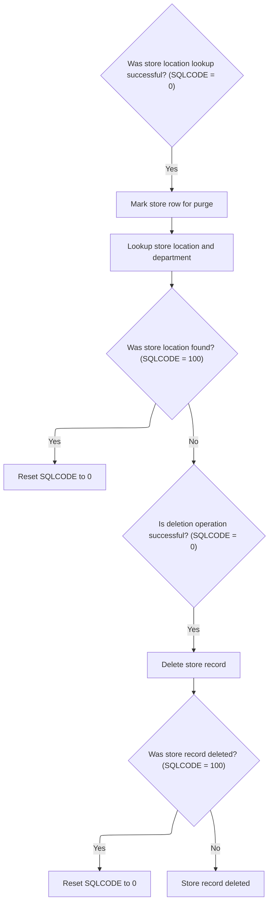

<SwmSnippet path="/base/src/NNNS0487.cbl" line="2696">

---

After 2060-CALL-RETAIL-LOC-DAO, 1610-DELETE-STORE sets up and calls the DAO to purge department/location data using the right parameters.

```cobol
277300     IF SQLCODE = 0                                               00277300
277400       MOVE  LOC-TYP-CD       OF DCLXXXATION                      00277400
277500         TO  LOC-TYP-CD       OF P-DDDTDT01                       00277500
277600       MOVE  LOC-NBR          OF DCLXXXATION                      00277600
277700         TO  LOC-NBR          OF P-DDDTDT01                       00277700
277800       SET EXIT-PUT-PURGE-ROW TO TRUE                             00277800
277900       PERFORM 2070-CALL-STR-LOC-DEPT-DAO                         00277900
278000       IF SQLCODE = 100                                           00278000
278100         MOVE 0 TO SQLCODE                                        00278100
278200       END-IF                                                     00278200
278300     END-IF                                                       00278300
```

---

</SwmSnippet>

<SwmSnippet path="/base/src/NNNS0487.cbl" line="2708">

---

1610-DELETE-STORE finishes by running a SQL DELETE on LST_BILED_CST using the location number and type. This clears out any billing/cost records tied to the deleted location, making sure no orphaned financial data remains.

```cobol
278500     IF SQLCODE = 0                                               00278500
278600       EXEC SQL                                                   00278600
278700         DELETE FROM LST_BILED_CST                                00278700
278800         WHERE  STR_LOC_NUM = :DCLXXXATION.LOC-NBR                00278800
278900         AND    STR_LOC_TYP = :DCLXXXATION.LOC-TYP-CD             00278900
279000       END-EXEC                                                   00279000
279100       IF SQLCODE = 100                                           00279100
279200         MOVE 0 TO SQLCODE                                        00279200
279300       END-IF                                                     00279300
279400     END-IF                                                       00279400
```

---

</SwmSnippet>

&nbsp;

*This is an auto-generated document by Swimm 🌊 and has not yet been verified by a human*

<SwmMeta version="3.0.0" repo-id="Z2l0aHViJTNBJTNBU3dpbW1pby1keW5jYWxsLWRlbW8lM0ElM0FHaXJpLVN3aW1t" repo-name="Swimmio-dyncall-demo"><sup>Powered by [Swimm](https://app.swimm.io/)</sup></SwmMeta>
