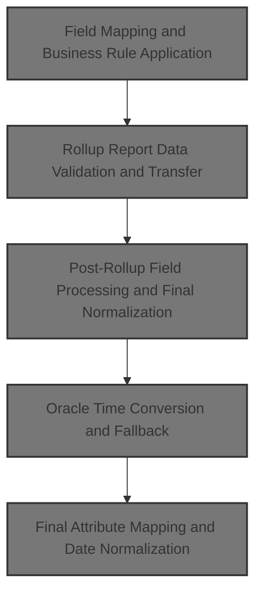
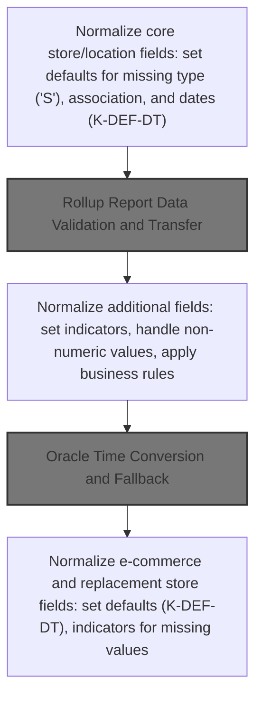
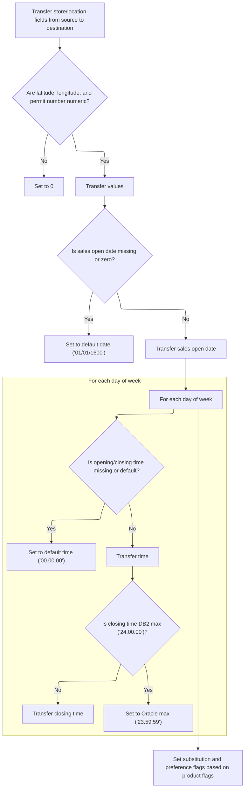
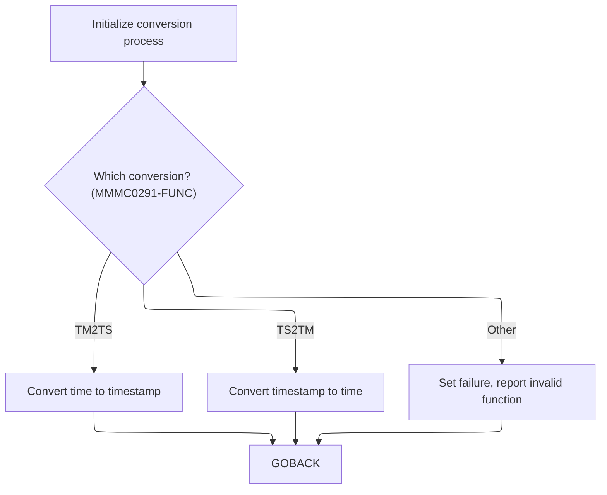
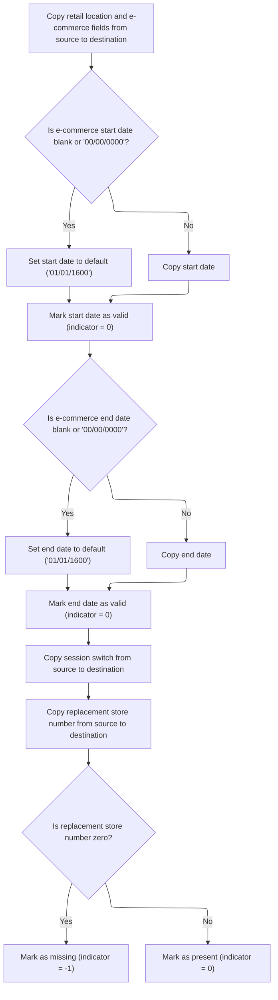

This document describes how store/location data records are transformed and validated for downstream business processes. The flow receives raw records, applies business rules to normalize and enrich fields, sets indicators for missing or invalid values, and outputs validated, mapped records ready for further use.



# Spec

## Detailed View of the Program's Functionality

# Detailed Explanation of the Flow in Swimmio-dyncall-demo

---

## a. Field Mapping and Business Rule Application

**Overview:**\
The process begins by transferring and normalizing core store/location fields from an input structure to an output structure. This is not a simple copy; it involves applying business rules, setting default values, and managing indicator variables to ensure data consistency and readiness for downstream processing.

**Step-by-step Actions:**

1. **Copy Core Identifiers:**\
   The location number and type are copied from the input to the output.

2. **Normalize Store Type:**\
   If the store type code is missing, it is set to a default value ('S'). This ensures that every record has a valid type.

3. **Set Indicators for Association:**\
   The association type and number are copied. If the association number is zero, an indicator is set to mark it as missing; otherwise, it is marked as present.

4. **Normalize Dates:**\
   Several date fields (such as sales closed date, remodel date, and retail location status date) are checked. If any are blank or set to a special zero value, they are replaced with a default date constant. This prevents invalid or missing dates from propagating.

5. **Copy Business and Location Identifiers:**\
   Various business-related fields (company, division, line of business, district, market region, etc.) are copied directly.

6. **Clear and Prepare Rollup Fields:**\
   The rollup report text field in the output is cleared, and a specialized routine is called to handle the rollup numeric fields.

---

## b. Rollup Report Data Validation and Transfer

**Overview:**\
A dedicated routine processes the rollup report data, which consists of a text field and up to 10 numeric slots. Each slot is validated and normalized.

**Step-by-step Actions:**

1. **Copy Rollup Text:**\
   The rollup report text is copied to a working area.

2. **Validate and Transfer Numeric Fields:**\
   For each of the 10 numeric slots:

   - If the value is numeric, it is copied to the corresponding output field.
   - If not, the output field is set to zero. This ensures that only valid numbers are used in reporting and analytics.

---

## c. Post-Rollup Field Processing and Final Normalization

**Overview:**\
After rollup processing, additional store/location attributes are copied and normalized. This includes handling latitude/longitude, tax fields, and various switches and codes.

**Step-by-step Actions:**

 1. **Copy Store Attributes:**\
    Fields such as new store switch, selection circuit switch, square footage, and others are copied directly.

 2. **Validate Coordinates:**\
    Latitude and longitude are checked for numeric validity. If not numeric, they are set to zero before copying.

 3. **Copy Collection and Tax Fields:**\
    Various collection and tax-related fields are copied.

 4. **Conditional Logic for Environment:**\
    If running in a specific environment, a store statement sort code is copied into a report sequence number.

 5. **Copy Group and Classification Codes:**\
    Several group and classification codes are copied.

 6. **Validate Permit Number:**\
    The permit number is checked for numeric validity and set to zero if invalid.

 7. **Handle Substitution Preferences:**\
    If neither of the substitution flags is set, a default preference is set.

 8. **Copy Product and Display Codes:**\
    Product and display codes are copied, and display substitution preferences are handled similarly.

 9. **Handle Real-Time Flags:**\
    If the real-time flag is not set, a "don't send" flag is set.

10. **Copy Leader and Customer-Friendly Names:**\
    These fields are copied directly.

11. **Normalize Sales Open Date:**\
    If the sales open date is missing or zero, it is set to the default date.

12. **Normalize and Convert Opening/Closing Times:**\
    For each day of the week:

    - If the opening or closing time is missing or set to a default, it is set to a standard default time.
    - If the closing time is set to a database-specific maximum, it is converted to the Oracle maximum.
    - Otherwise, the time is copied as-is.

13. **Call Time Conversion Routine:**\
    After all normalization, a specialized routine is called to handle database-specific time conversions (e.g., for Oracle).

---

## d. Oracle Time Conversion and Fallback

**Overview:**\
When targeting Oracle or performing certain database operations, time fields are converted to Oracle-compatible timestamps using a dedicated conversion program.

**Step-by-step Actions:**

1. **Prepare Time Fields:**\
   All normalized time fields for each day are collected into an array.

2. **Call Conversion Program:**\
   The conversion program is called, which:

   - Determines whether to convert times to timestamps or vice versa.
   - For each time, validates and normalizes the components (hours, minutes, seconds).
   - If valid, constructs a timestamp; if not, sets an error.

3. **Handle Conversion Results:**

   - If conversion fails, an error message is constructed with the SQL code.
   - If successful, the converted timestamps are assigned to the appropriate output fields.

4. **Fallback for Non-Oracle:**\
   If not targeting Oracle, the time fields are copied directly without conversion.

---

## e. Final Attribute Mapping and Date Normalization

**Overview:**\
The last phase copies and normalizes e-commerce and replacement store fields, ensuring all required indicators and defaults are set.

**Step-by-step Actions:**

1. **Copy E-commerce and Format Fields:**\
   E-commerce market area, format, and segment codes are copied.

2. **Normalize E-commerce Start/End Dates:**\
   If the start or end date is missing or zero, it is set to the default date. Indicators are set to mark the validity of these dates.

3. **Copy Session Switch and Replacement Store Number:**\
   These fields are copied, and the indicator for the replacement store number is set to -1 if the number is zero, or 0 otherwise.

---

## f. Supporting Routines and Error Handling

**Overview:**\
Throughout the process, supporting routines handle error reporting, indicator management, and database connectivity.

**Key Points:**

- **Indicator Management:**\
  Indicators are used to mark missing or invalid data, which is critical for downstream logic and database operations.

- **Error Reporting:**\
  When invalid data is detected (e.g., in time conversion), detailed error messages are constructed, often including the SQL code for debugging.

- **Database Connectivity:**\
  Specialized routines handle connecting to Oracle or DB2 as needed, with error handling for connection failures.

---

## g. Summary

The overall flow is a robust data normalization and mapping pipeline that prepares store/location data for reliable storage and downstream processing. It ensures all fields are valid, applies business rules, handles database-specific quirks, and provides detailed error handling and indicator management. This design supports both DB2 and Oracle environments and is extensible for future business rule changes.

# Rule Definition

| Paragraph Name                                                                | Rule ID | Category          | Description                                                                                                                     | Conditions                                                     | Remarks                                                                                                                                                                                                                |
| ----------------------------------------------------------------------------- | ------- | ----------------- | ------------------------------------------------------------------------------------------------------------------------------- | -------------------------------------------------------------- | ---------------------------------------------------------------------------------------------------------------------------------------------------------------------------------------------------------------------- |
| 110-MOVE-PDA-FIELDS-2-DCL, 100-INITIALIZATION                                 | RL-001  | Conditional Logic | If any date field is blank or zero, set it to the default date '01/01/1600'.                                                    | Date field is blank (spaces) or zero (K-ZERO-DT).              | Default date constant: K-DEF-DT = '01/01/1600'. Applies to fields like STR-REMODL-DT, RETL-LOC-STAT-DT, SLS-CLOSED-DT, SLS-OPEN-DT, ECOMM-STRT-DT, ECOMM-END-DT. Format: string, typically 10 characters (MM/DD/YYYY). |
| 110-MOVE-PDA-FIELDS-2-DCL, 112-MOVE-TIME-FIELDS                               | RL-002  | Conditional Logic | If any time field is blank or zero, set it to the default time '00.00.00'.                                                      | Time field is blank (spaces) or zero (K-DEF-TM).               | Default time constant: K-DEF-TM = '00.00.00'. Applies to fields like MON-OPEN-TM, MON-CLOS-TM, ... SUN-OPEN-TM, SUN-CLOS-TM. Format: string, 8 characters (HH.MM.SS).                                                  |
| 110-MOVE-PDA-FIELDS-2-DCL                                                     | RL-003  | Conditional Logic | If any day-of-week close time is '24.00.00', set it to '23.59.59'.                                                              | Day-of-week close time field equals K-DB2-MAX-TM ('24.00.00'). | K-DB2-MAX-TM = '24.00.00', K-ORA-MAX-TM = '23.59.59'. Applies to MON-CLOS-TM, ..., SUN-CLOS-TM. Format: string, 8 characters (HH.MM.SS).                                                                               |
| 110-MOVE-PDA-FIELDS-2-DCL                                                     | RL-004  | Conditional Logic | If the associated store type code is blank, set it to 'S'.                                                                      | ASSOC-STR-TYP-CD is blank (spaces).                            | Default value: 'S'. Format: string, 1 character.                                                                                                                                                                       |
| 110-MOVE-PDA-FIELDS-2-DCL                                                     | RL-005  | Conditional Logic | If the permit number is not numeric, set it to 0.                                                                               | TBCO-PRMT-NBR is not numeric.                                  | Default value: 0. Format: number/integer.                                                                                                                                                                              |
| 110-MOVE-PDA-FIELDS-2-DCL                                                     | RL-006  | Conditional Logic | If latitude or longitude is not numeric, set to 0.                                                                              | LAT-K or LON-K is not numeric.                                 | Default value: 0. Format: number/float.                                                                                                                                                                                |
| 117-MOVE-ROLLUP-DATA                                                          | RL-007  | Computation       | Parse ROLUP-REPT-TBL-TXT into 10 numeric fields. If any slot is not numeric, set to 0.                                          | Always applies when mapping rollup report fields.              | ROLUP-REPT-TBL-TXT: string, 20 characters. ROLUP-REPT-TBL-01-NBR ... ROLUP-REPT-TBL-10-NBR: number/integer, 10 fields. Each field is 3 digits (S9(3) COMP-3).                                                          |
| 110-MOVE-PDA-FIELDS-2-DCL                                                     | RL-008  | Data Assignment   | All fields not covered by other rules are transferred directly from source to destination.                                      | Field is not subject to normalization or special logic.        | Format and size as per field definition in the record structure.                                                                                                                                                       |
| 110-MOVE-PDA-FIELDS-2-DCL, 112-MOVE-TIME-FIELDS, 117-MOVE-ROLLUP-DATA         | RL-009  | Data Assignment   | The output record must include all normalized fields and indicator fields, with arrays for day-of-week times and rollup fields. | Always applies to output record creation.                      | Output record: all fields as described, including arrays for MON-OPEN-TM, ..., SUN-CLOS-TM and ROLUP-REPT-TBL-01-NBR ... ROLUP-REPT-TBL-10-NBR. Formats as per field definitions.                                      |
| 110-MOVE-PDA-FIELDS-2-DCL, 1700-CHECK-NULL-COLUMNS, 1800-EDIT-NULL-INDICATORS | RL-010  | Conditional Logic | Set indicator fields to -1 or 0 based on the value or blankness of related fields in the record.                                | Various, see below.                                            | \- Associated store number indicator: -1 if associated store number is 0, else 0.                                                                                                                                      |

- Associated store type code indicator: -1 if associated store type code is blank, else 0.
- E-commerce start date indicator: -1 if e-commerce start date is blank or '00/00/0000', else 0.
- E-commerce end date indicator: -1 if e-commerce end date is blank or '00/00/0000', else 0.
- Replaced-by store number indicator: -1 if replaced-by store number is 0, else 0. Format: integer, typically 4 bytes. |

# User Stories

## User Story 1: Field normalization during mapping

---

### Story Description:

As a system, I want all fields in the source record to be normalized according to business rules (dates, times, codes, numeric fields) so that the destination record contains valid and standardized data.

---

### Business Rule Mapping:

| Rule ID | Paragraph Name                                  | Rule Description                                                             |
| ------- | ----------------------------------------------- | ---------------------------------------------------------------------------- |
| RL-001  | 110-MOVE-PDA-FIELDS-2-DCL, 100-INITIALIZATION   | If any date field is blank or zero, set it to the default date '01/01/1600'. |
| RL-002  | 110-MOVE-PDA-FIELDS-2-DCL, 112-MOVE-TIME-FIELDS | If any time field is blank or zero, set it to the default time '00.00.00'.   |
| RL-003  | 110-MOVE-PDA-FIELDS-2-DCL                       | If any day-of-week close time is '24.00.00', set it to '23.59.59'.           |
| RL-004  | 110-MOVE-PDA-FIELDS-2-DCL                       | If the associated store type code is blank, set it to 'S'.                   |
| RL-005  | 110-MOVE-PDA-FIELDS-2-DCL                       | If the permit number is not numeric, set it to 0.                            |
| RL-006  | 110-MOVE-PDA-FIELDS-2-DCL                       | If latitude or longitude is not numeric, set to 0.                           |

---

### Relevant Functionality:

- **110-MOVE-PDA-FIELDS-2-DCL**
  1. **RL-001:**
     - For each date field:
       - If value is blank or equals K-ZERO-DT:
         - Set value to K-DEF-DT ('01/01/1600')
       - Move value to destination record.
  2. **RL-002:**
     - For each time field:
       - If value is blank or equals K-DEF-TM:
         - Set value to K-DEF-TM ('00.00.00')
       - Move value to destination record.
  3. **RL-003:**
     - For each day-of-week close time field:
       - If value equals K-DB2-MAX-TM ('24.00.00'):
         - Set value to K-ORA-MAX-TM ('23.59.59')
       - Move value to destination record.
  4. **RL-004:**
     - If ASSOC-STR-TYP-CD is blank:
       - Set to 'S'
     - Move to destination record.
  5. **RL-005:**
     - If TBCO-PRMT-NBR is not numeric:
       - Set to 0
     - Move to destination record.
  6. **RL-006:**
     - If LAT-K is not numeric:
       - Set to 0
     - If LON-K is not numeric:
       - Set to 0
     - Move to destination record.

## User Story 2: Output record creation with normalized, rollup, and indicator fields

---

### Story Description:

As a system, I want the output record to include all normalized fields, parsed rollup fields, indicator fields, and arrays for day-of-week times and rollup fields so that the destination record is complete, structured, and ready for use.

---

### Business Rule Mapping:

| Rule ID | Paragraph Name                                                                | Rule Description                                                                                                                |
| ------- | ----------------------------------------------------------------------------- | ------------------------------------------------------------------------------------------------------------------------------- |
| RL-008  | 110-MOVE-PDA-FIELDS-2-DCL                                                     | All fields not covered by other rules are transferred directly from source to destination.                                      |
| RL-009  | 110-MOVE-PDA-FIELDS-2-DCL, 112-MOVE-TIME-FIELDS, 117-MOVE-ROLLUP-DATA         | The output record must include all normalized fields and indicator fields, with arrays for day-of-week times and rollup fields. |
| RL-010  | 110-MOVE-PDA-FIELDS-2-DCL, 1700-CHECK-NULL-COLUMNS, 1800-EDIT-NULL-INDICATORS | Set indicator fields to -1 or 0 based on the value or blankness of related fields in the record.                                |
| RL-007  | 117-MOVE-ROLLUP-DATA                                                          | Parse ROLUP-REPT-TBL-TXT into 10 numeric fields. If any slot is not numeric, set to 0.                                          |

---

### Relevant Functionality:

- **110-MOVE-PDA-FIELDS-2-DCL**
  1. **RL-008:**
     - For each field not covered by other rules:
       - Move value from source to destination.
  2. **RL-009:**
     - After applying all normalization and indicator logic:
       - Assemble output record with all fields
       - Ensure arrays for times and rollup fields are populated as per rules.
  3. **RL-010:**
     - If associated store number is 0:
       - Set associated store number indicator to -1
       - Else set to 0
     - If associated store type code is blank:
       - Set associated store type code indicator to -1
       - Else set to 0
     - If e-commerce start date is blank or '00/00/0000':
       - Set e-commerce start date indicator to -1
       - Else set to 0
     - If e-commerce end date is blank or '00/00/0000':
       - Set e-commerce end date indicator to -1
       - Else set to 0
     - If replaced-by store number is 0:
       - Set replaced-by store number indicator to -1
       - Else set to 0
     - Move indicators to output record.
- **117-MOVE-ROLLUP-DATA**
  1. **RL-007:**
     - Move ROLUP-REPT-TBL-TXT to working storage
     - For i = 1 to 10:
       - If slot i is numeric:
         - Move to ROLUP-REPT-TBL-i-NBR
       - Else:
         - Set ROLUP-REPT-TBL-i-NBR to 0
     - Move to destination record.

# Code Walkthrough

## Field Mapping and Business Rule Application



<SwmSnippet path="/base/src/NNNS0488.cbl" line="1261">

---

In `110-MOVE-PDA-FIELDS-2-DCL`, this is where the flow starts. It doesn't just copy fields—it applies business rules, sets default values for fields like ASSOC-STR-TYP-CD and SLS-CLOSED-DT if they're blank or zero, and manages indicator variables. It also checks for numeric validity and normalizes data before moving it. This is more than a straight field move; it's prepping the data for downstream use.

```cobol
130600 110-MOVE-PDA-FIELDS-2-DCL.                                       00130600
130700     MOVE LOC-NBR OF P-DDDTLR01 TO LOC-NBR OF DCLXXXAIL-LOC       00130700
130800     MOVE LOC-TYP-CD OF P-DDDTLR01 TO LOC-TYP-CD OF DCLXXXAIL-LOC 00130800
130900                                                                  00130900
131000     IF ASSOC-STR-TYP-CD OF P-DDDTLR01 = SPACES                   00131000
131100        MOVE 'S' TO ASSOC-STR-TYP-CD OF P-DDDTLR01                00131100
131200     END-IF                                                       00131200
```

---

</SwmSnippet>

<SwmSnippet path="/base/src/NNNS0488.cbl" line="1268">

---

Next, we set indicator variables to flag missing or zero values, making it easier for later logic to handle these cases.

```cobol
131300     MOVE ASSOC-STR-TYP-CD OF P-DDDTLR01                          00131300
131400       TO ASSOC-STR-TYP-CD OF DCLXXXAIL-LOC                       00131400
131500     MOVE 0 TO  WS-ASSOC-ST-TYPE-IND                              00131500
131600     MOVE ASSOC-STR-NBR OF P-DDDTLR01                             00131600
131700       TO ASSOC-STR-NBR OF DCLXXXAIL-LOC                          00131700
131800     IF ASSOC-STR-NBR OF P-DDDTLR01  =  ZERO                      00131800
131900        MOVE -1 TO WS-ASSOC-ST-NO-IND                             00131900
132000     ELSE                                                         00132000
132100        MOVE 0 TO  WS-ASSOC-ST-NO-IND                             00132100
132200     END-IF                                                       00132200
```

---

</SwmSnippet>

<SwmSnippet path="/base/src/NNNS0488.cbl" line="1279">

---

Here we start normalizing date fields. If SLS-CLOSED-DT is blank or zero, we set it to K-DEF-DT. This is part of a broader normalization step using repo-wide constants to keep data consistent before moving it to the destination structure.

```cobol
132400     IF SLS-CLOSED-DT OF P-DDDTLR01 = SPACES                      00132400
132500     OR SLS-CLOSED-DT OF P-DDDTLR01 = K-ZERO-DT                   00132500
132600       MOVE K-DEF-DT TO SLS-CLOSED-DT OF P-DDDTLR01               00132600
132700     END-IF                                                       00132700
```

---

</SwmSnippet>

<SwmSnippet path="/base/src/NNNS0488.cbl" line="1283">

---

After normalizing SLS-CLOSED-DT, we move it to the destination and repeat the normalization for STR-REMODL-DT. This keeps the flow consistent for all date fields.

```cobol
132800     MOVE SLS-CLOSED-DT OF P-DDDTLR01                             00132800
132900       TO SLS-CLOSED-DT OF DCLXXXAIL-LOC                          00132900
133000     IF STR-REMODL-DT OF P-DDDTLR01 = SPACES                      00133000
133100     OR STR-REMODL-DT OF P-DDDTLR01 = K-ZERO-DT                   00133100
133200       MOVE K-DEF-DT TO STR-REMODL-DT OF P-DDDTLR01               00133200
133300     END-IF                                                       00133300
```

---

</SwmSnippet>

<SwmSnippet path="/base/src/NNNS0488.cbl" line="1289">

---

We keep the pattern going—move STR-REMODL-DT after normalization, then handle RETL-LOC-STAT-CD and normalize RETL-LOC-STAT-DT if needed. This keeps all status and remodel dates valid.

```cobol
133400     MOVE STR-REMODL-DT OF P-DDDTLR01                             00133400
133500       TO STR-REMODL-DT OF DCLXXXAIL-LOC                          00133500
133600                                                                  00133600
133700     MOVE RETL-LOC-STAT-CD OF P-DDDTLR01                          00133700
133800       TO RETL-LOC-STAT-CD OF DCLXXXAIL-LOC                       00133800
133900                                                                  00133900
134000     IF RETL-LOC-STAT-DT OF P-DDDTLR01 = SPACES                   00134000
134100     OR RETL-LOC-STAT-DT OF P-DDDTLR01 = K-ZERO-DT                00134100
134200       MOVE K-DEF-DT TO RETL-LOC-STAT-DT OF P-DDDTLR01            00134200
134300     END-IF                                                       00134300
```

---

</SwmSnippet>

<SwmSnippet path="/base/src/NNNS0488.cbl" line="1299">

---

After normalizing RETL-LOC-STAT-DT, we move it and then copy a bunch of business and location identifiers. This is just straight mapping for these fields.

```cobol
134400     MOVE RETL-LOC-STAT-DT OF P-DDDTLR01                          00134400
134500       TO RETL-LOC-STAT-DT OF DCLXXXAIL-LOC                       00134500
134600                                                                  00134600
134700     MOVE COMPANY-ID OF P-DDDTLR01 TO COMPANY-ID OF DCLXXXAIL-LOC 00134700
134800     MOVE FINANCIAL-DIV-ID OF P-DDDTLR01                          00134800
134900       TO FINANCIAL-DIV-ID OF DCLXXXAIL-LOC                       00134900
135000     MOVE LIN-OF-BUS-ID OF P-DDDTLR01                             00135000
135100       TO LIN-OF-BUS-ID OF DCLXXXAIL-LOC                          00135100
135200     MOVE DIST-ID OF P-DDDTLR01 TO DIST-ID OF DCLXXXAIL-LOC       00135200
135300                                   MKT-RGN-ID OF P-DDDTLR01       00135300
135400     MOVE MKT-RGN-ID OF P-DDDTLR01 TO MKT-RGN-ID OF DCLXXXAIL-LOC 00135400
135500     MOVE GEO-ZN-CD OF P-DDDTLR01 TO GEO-ZN-CD OF DCLXXXAIL-LOC   00135500
135600     MOVE RETL-GEO-ZN-ID OF P-DDDTLR01                            00135600
135700       TO RETL-GEO-ZN-ID OF DCLXXXAIL-LOC                         00135700
135800     MOVE SCN-MAINT-SW OF P-DDDTLR01                              00135800
135900       TO SCN-MAINT-SW OF DCLXXXAIL-LOC                           00135900
136000     MOVE FRNT-END-CD OF P-DDDTLR01                               00136000
136100       TO FRNT-END-CD OF DCLXXXAIL-LOC                            00136100
136200     MOVE PRC-BUL-SW OF P-DDDTLR01 TO PRC-BUL-SW OF DCLXXXAIL-LOC 00136200
136300     MOVE UPC-ON-PRC-BUL-SW OF P-DDDTLR01                         00136300
136400       TO UPC-ON-PRC-BUL-SW OF DCLXXXAIL-LOC                      00136400
136500     MOVE CMPTR-TYP-CD OF P-DDDTLR01                              00136500
136600       TO CMPTR-TYP-CD OF DCLXXXAIL-LOC                           00136600
136700     MOVE RETL-VID-ZN-NBR OF P-DDDTLR01                           00136700
136800       TO RETL-VID-ZN-NBR OF DCLXXXAIL-LOC                        00136800
136900     MOVE RETL-UNLD-CD OF P-DDDTLR01                              00136900
137000       TO RETL-UNLD-CD OF DCLXXXAIL-LOC                           00137000
137100*    MOVE ROLUP-REPT-TBL-TXT OF P-DDDTLR01                        00137100
137200     MOVE SPACES                                                  00137200
137300       TO ROLUP-REPT-TBL-TXT OF DCLXXXAIL-LOC                     00137300
```

---

</SwmSnippet>

<SwmSnippet path="/base/src/NNNS0488.cbl" line="1329">

---

Here we call 117-MOVE-ROLLUP-DATA to handle rollup report fields. This offloads the logic for validating and moving rollup data, keeping the main flow clean and letting specialized code handle the details.

```cobol
137400     PERFORM 117-MOVE-ROLLUP-DATA                                 00137400
```

---

</SwmSnippet>

### Rollup Report Data Validation and Transfer

<SwmSnippet path="/base/src/NNNS0488.cbl" line="1687">

---

In `117-MOVE-ROLLUP-DATA`, we start by copying the rollup report text, then for each numeric slot, we check if it's valid and move it or set it to zero. This keeps the rollup data clean for reporting.

```cobol
172400 117-MOVE-ROLLUP-DATA.                                            00172400
172500     MOVE ROLUP-REPT-TBL-TXT OF P-DDDTLR01                        00172500
172600       TO WS-REPT-TBL-TXT                                         00172600
172700     IF WS-REPT-TBL-NUMERIC(1) IS NUMERIC                         00172700
172800        MOVE WS-REPT-TBL-NUMERIC(1)                               00172800
172900          TO ROLUP-REPT-TBL-01-NBR  OF DCLXXXAIL-LOC              00172900
173000     ELSE                                                         00173000
173100        MOVE ZERO TO ROLUP-REPT-TBL-01-NBR OF DCLXXXAIL-LOC       00173100
173200     END-IF                                                       00173200
```

---

</SwmSnippet>

<SwmSnippet path="/base/src/NNNS0488.cbl" line="1696">

---

Now we repeat the numeric validation and move for the second rollup field. It's the same pattern for each slot in the rollup array.

```cobol
173300     IF WS-REPT-TBL-NUMERIC(2) IS NUMERIC                         00173300
173400        MOVE WS-REPT-TBL-NUMERIC(2)                               00173400
173500          TO ROLUP-REPT-TBL-02-NBR  OF DCLXXXAIL-LOC              00173500
173600     ELSE                                                         00173600
173700        MOVE ZERO TO ROLUP-REPT-TBL-02-NBR OF DCLXXXAIL-LOC       00173700
173800     END-IF                                                       00173800
```

---

</SwmSnippet>

<SwmSnippet path="/base/src/NNNS0488.cbl" line="1702">

---

Same as before, we check the third numeric field, move it if valid, or set to zero if not. This pattern continues for all rollup fields.

```cobol
173900     IF WS-REPT-TBL-NUMERIC(3) IS NUMERIC                         00173900
174000        MOVE WS-REPT-TBL-NUMERIC(3)                               00174000
174100          TO ROLUP-REPT-TBL-03-NBR  OF DCLXXXAIL-LOC              00174100
174200     ELSE                                                         00174200
174300        MOVE ZERO TO ROLUP-REPT-TBL-03-NBR OF DCLXXXAIL-LOC       00174300
174400     END-IF                                                       00174400
```

---

</SwmSnippet>

<SwmSnippet path="/base/src/NNNS0488.cbl" line="1708">

---

We keep going—validate and move the fourth rollup numeric field, or set to zero if it's not numeric.

```cobol
174500     IF WS-REPT-TBL-NUMERIC(4) IS NUMERIC                         00174500
174600        MOVE WS-REPT-TBL-NUMERIC(4)                               00174600
174700          TO ROLUP-REPT-TBL-04-NBR  OF DCLXXXAIL-LOC              00174700
174800     ELSE                                                         00174800
174900        MOVE ZERO TO ROLUP-REPT-TBL-04-NBR OF DCLXXXAIL-LOC       00174900
175000     END-IF                                                       00175000
```

---

</SwmSnippet>

<SwmSnippet path="/base/src/NNNS0488.cbl" line="1714">

---

This is the fifth rollup numeric field—validate, move, or zero. The pattern doesn't change.

```cobol
175100     IF WS-REPT-TBL-NUMERIC(5) IS NUMERIC                         00175100
175200        MOVE WS-REPT-TBL-NUMERIC(5)                               00175200
175300          TO ROLUP-REPT-TBL-05-NBR  OF DCLXXXAIL-LOC              00175300
175400     ELSE                                                         00175400
175500        MOVE ZERO TO ROLUP-REPT-TBL-05-NBR OF DCLXXXAIL-LOC       00175500
175600     END-IF                                                       00175600
```

---

</SwmSnippet>

<SwmSnippet path="/base/src/NNNS0488.cbl" line="1720">

---

Sixth rollup numeric field—same deal: validate, move, or zero.

```cobol
175700     IF WS-REPT-TBL-NUMERIC(6) IS NUMERIC                         00175700
175800        MOVE WS-REPT-TBL-NUMERIC(6)                               00175800
175900          TO ROLUP-REPT-TBL-06-NBR  OF DCLXXXAIL-LOC              00175900
176000     ELSE                                                         00176000
176100        MOVE ZERO TO ROLUP-REPT-TBL-06-NBR OF DCLXXXAIL-LOC       00176100
176200     END-IF                                                       00176200
```

---

</SwmSnippet>

<SwmSnippet path="/base/src/NNNS0488.cbl" line="1726">

---

Seventh rollup numeric field—validate and move or zero. Still following the same pattern.

```cobol
176300     IF WS-REPT-TBL-NUMERIC(7) IS NUMERIC                         00176300
176400        MOVE WS-REPT-TBL-NUMERIC(7)                               00176400
176500          TO ROLUP-REPT-TBL-07-NBR  OF DCLXXXAIL-LOC              00176500
176600     ELSE                                                         00176600
176700        MOVE ZERO TO ROLUP-REPT-TBL-07-NBR OF DCLXXXAIL-LOC       00176700
176800     END-IF                                                       00176800
```

---

</SwmSnippet>

<SwmSnippet path="/base/src/NNNS0488.cbl" line="1732">

---

Eighth rollup numeric field—validate, move, or zero. No surprises here.

```cobol
176900     IF WS-REPT-TBL-NUMERIC(8) IS NUMERIC                         00176900
177000        MOVE WS-REPT-TBL-NUMERIC(8)                               00177000
177100          TO ROLUP-REPT-TBL-08-NBR  OF DCLXXXAIL-LOC              00177100
177200     ELSE                                                         00177200
177300        MOVE ZERO TO ROLUP-REPT-TBL-08-NBR OF DCLXXXAIL-LOC       00177300
177400     END-IF                                                       00177400
```

---

</SwmSnippet>

<SwmSnippet path="/base/src/NNNS0488.cbl" line="1738">

---

Ninth rollup numeric field—validate, move, or zero. Same as the others.

```cobol
177500     IF WS-REPT-TBL-NUMERIC(9) IS NUMERIC                         00177500
177600        MOVE WS-REPT-TBL-NUMERIC(9)                               00177600
177700          TO ROLUP-REPT-TBL-09-NBR  OF DCLXXXAIL-LOC              00177700
177800     ELSE                                                         00177800
177900        MOVE ZERO TO ROLUP-REPT-TBL-09-NBR OF DCLXXXAIL-LOC       00177900
178000     END-IF                                                       00178000
```

---

</SwmSnippet>

<SwmSnippet path="/base/src/NNNS0488.cbl" line="1744">

---

Finally, we handle the tenth rollup numeric field. The function assumes all 10 fields exist and are checked for numeric validity. No error handling if the array is too short—if it's missing, things break.

```cobol
178100     IF WS-REPT-TBL-NUMERIC(10) IS NUMERIC                        00178100
178200        MOVE WS-REPT-TBL-NUMERIC(10)                              00178200
178300          TO ROLUP-REPT-TBL-10-NBR  OF DCLXXXAIL-LOC              00178300
178400     ELSE                                                         00178400
178500        MOVE ZERO TO ROLUP-REPT-TBL-10-NBR OF DCLXXXAIL-LOC       00178500
178600     END-IF                                                       00178600
```

---

</SwmSnippet>

### Post-Rollup Field Processing and Final Normalization



<SwmSnippet path="/base/src/NNNS0488.cbl" line="1330">

---

Back in 110-MOVE-PDA-FIELDS-2-DCL, after returning from 117-MOVE-ROLLUP-DATA, we continue copying more store attributes and text fields. The rollup data is already handled, so we just move on to the next set of fields.

```cobol
137500     MOVE NEW-STR-SW OF P-DDDTLR01 TO NEW-STR-SW OF DCLXXXAIL-LOC 00137500
137600     MOVE SEL-CIR-SW OF P-DDDTLR01 TO SEL-CIR-SW OF DCLXXXAIL-LOC 00137600
137700     MOVE BKRM-SQ-FT OF P-DDDTLR01 TO BKRM-SQ-FT OF DCLXXXAIL-LOC 00137700
137800     MOVE FD-LINER-FT OF P-DDDTLR01                               00137800
137900       TO FD-LINER-FT OF DCLXXXAIL-LOC                            00137900
138000     MOVE NON-FD-LINER-FT OF P-DDDTLR01                           00138000
138100       TO NON-FD-LINER-FT OF DCLXXXAIL-LOC                        00138100
138200     MOVE SETOFF-ROOM-SW OF P-DDDTLR01                            00138200
138300       TO SETOFF-ROOM-SW OF DCLXXXAIL-LOC                         00138300
138400     MOVE CAT-CLS-TBL-TXT OF P-DDDTLR01                           00138400
138500       TO CAT-CLS-TBL-TXT OF DCLXXXAIL-LOC                        00138500
```

---

</SwmSnippet>

<SwmSnippet path="/base/src/NNNS0488.cbl" line="1342">

---

Now we validate LAT-K to make sure it's numeric. If not, we set it to zero before moving it. This prevents garbage data in the location coordinates.

```cobol
138700     IF LAT-K OF P-DDDTLR01 IS NOT NUMERIC                        00138700
138800       MOVE 0 TO LAT-K OF P-DDDTLR01                              00138800
138900     END-IF                                                       00138900
```

---

</SwmSnippet>

<SwmSnippet path="/base/src/NNNS0488.cbl" line="1345">

---

After handling latitude, we do the same for longitude—validate it's numeric, set to zero if not, then move it. Keeps both coordinates clean.

```cobol
139000     MOVE LAT-K OF P-DDDTLR01 TO LAT-K OF DCLXXXAIL-LOC           00139000
139100                                                                  00139100
139200     IF LON-K OF P-DDDTLR01 IS NOT NUMERIC                        00139200
139300       MOVE 0 TO LON-K OF P-DDDTLR01                              00139300
139400     END-IF                                                       00139400
```

---

</SwmSnippet>

<SwmSnippet path="/base/src/NNNS0488.cbl" line="1350">

---

With coordinates handled, we move on to check collection and tax fields—just straight moves for these attributes.

```cobol
139500     MOVE LON-K OF P-DDDTLR01 TO LON-K OF DCLXXXAIL-LOC           00139500
139600                                                                  00139600
139700     MOVE CK-COLL-REPT-SW OF P-DDDTLR01                           00139700
139800       TO CK-COLL-REPT-SW OF DCLXXXAIL-LOC                        00139800
139900     MOVE CK-COLL-CNTL-CD OF P-DDDTLR01                           00139900
140000       TO CK-COLL-CNTL-CD OF DCLXXXAIL-LOC                        00140000
140100     MOVE CK-COLL-ADD-DEL-SW OF P-DDDTLR01                        00140100
140200       TO CK-COLL-ADD-DEL-SW OF DCLXXXAIL-LOC                     00140200
140300     MOVE CK-ALT-STR-ID OF P-DDDTLR01                             00140300
140400       TO CK-ALT-STR-ID OF DCLXXXAIL-LOC                          00140400
140500     MOVE CK-COLL-FEE-AMT OF P-DDDTLR01                           00140500
140600       TO CK-COLL-FEE-AMT OF DCLXXXAIL-LOC                        00140600
140700     MOVE SALS-TAX-PCT OF P-DDDTLR01                              00140700
140800       TO SALS-TAX-PCT OF DCLXXXAIL-LOC                           00140800
140900     MOVE SOAP-SALE-VAR-PCT OF P-DDDTLR01                         00140900
141000       TO SOAP-SALE-VAR-PCT OF DCLXXXAIL-LOC                      00141000
141100     MOVE ON-SRS-CD OF P-DDDTLR01 TO ON-SRS-CD OF DCLXXXAIL-LOC   00141100
141200     MOVE SRS-DSD-ORD-SW OF P-DDDTLR01                            00141200
141300       TO SRS-DSD-ORD-SW OF DCLXXXAIL-LOC                         00141300
141400     MOVE RETL-LOC-TYP-CD OF P-DDDTLR01                           00141400
141500       TO RETL-LOC-TYP-CD OF DCLXXXAIL-LOC                        00141500
141600     MOVE DEA-NBR OF P-DDDTLR01 TO DEA-NBR OF DCLXXXAIL-LOC       00141600
```

---

</SwmSnippet>

<SwmSnippet path="/base/src/NNNS0488.cbl" line="1372">

---

Here we have conditional logic—if YYYN005A-CICS-ENV is set, we move STR-OPSTMT-SRT-CD into RPRT-SEQ-NBR. This means the behavior changes based on the environment, which isn't obvious from the function name.

```cobol
141700     IF YYYN005A-CICS-ENV                                         00141700
141800       MOVE STR-OPSTMT-SRT-CD OF P-DDDTLR01                       00141800
141900         TO RPRT-SEQ-NBR      OF P-DDDTLR01                       00141900
142000     END-IF                                                       00142000
```

---

</SwmSnippet>

<SwmSnippet path="/base/src/NNNS0488.cbl" line="1376">

---

After the environment check, we just keep moving more store and group code fields. This is straight mapping for the rest of the attributes.

```cobol
142100     MOVE RPRT-SEQ-NBR OF P-DDDTLR01                              00142100
142200       TO RPRT-SEQ-NBR OF DCLXXXAIL-LOC                           00142200
142300     MOVE STR-OPSTMT-SRT-CD OF P-DDDTLR01                         00142300
142400       TO STR-OPSTMT-SRT-CD OF DCLXXXAIL-LOC                      00142400
142500     MOVE STR-OPSTMT-TYP-CD OF P-DDDTLR01                         00142500
142600       TO STR-OPSTMT-TYP-CD OF DCLXXXAIL-LOC                      00142600
142700     MOVE STR-OPSTMT-HDR-CD OF P-DDDTLR01                         00142700
142800       TO STR-OPSTMT-HDR-CD OF DCLXXXAIL-LOC                      00142800
142900     MOVE DPS-NBR OF P-DDDTLR01 TO DPS-NBR OF DCLXXXAIL-LOC       00142900
143000     MOVE MEDICARE-ID OF P-DDDTLR01                               00143000
143100       TO MEDICARE-ID OF DCLXXXAIL-LOC                            00143100
143200     MOVE NABP-NBR OF P-DDDTLR01 TO NABP-NBR OF DCLXXXAIL-LOC     00143200
143300     MOVE NATL-PROV-ID OF P-DDDTLR01                              00143300
143400       TO NATL-PROV-ID OF DCLXXXAIL-LOC                           00143400
143500     MOVE CURR-AD-ZN-NBR OF P-DDDTLR01                            00143500
143600       TO CURR-AD-ZN-NBR OF DCLXXXAIL-LOC                         00143600
143700     MOVE PD-ZONE-NO OF P-DDDTLR01 TO PD-ZONE-NO OF DCLXXXAIL-LOC 00143700
143800     MOVE SOS-PROC-SW OF P-DDDTLR01                               00143800
143900       TO SOS-PROC-SW OF DCLXXXAIL-LOC                            00143900
144000     MOVE GRP-CD OF P-DDDTLR01 TO GRP-CD OF DCLXXXAIL-LOC         00144000
144100     MOVE PRIM-GRP-CD-1 OF P-DDDTLR01                             00144100
144200       TO PRIM-GRP-CD-1 OF DCLXXXAIL-LOC                          00144200
144300     MOVE PRIM-GRP-CD-2 OF P-DDDTLR01                             00144300
144400       TO PRIM-GRP-CD-2 OF DCLXXXAIL-LOC                          00144400
144500     MOVE SECY-GRP-CD-1 OF P-DDDTLR01                             00144500
144600       TO SECY-GRP-CD-1 OF DCLXXXAIL-LOC                          00144600
144700     MOVE SECY-GRP-CD-2 OF P-DDDTLR01                             00144700
144800       TO SECY-GRP-CD-2 OF DCLXXXAIL-LOC                          00144800
144900     MOVE PRIM-CLS-NBR-1 OF P-DDDTLR01                            00144900
145000       TO PRIM-CLS-NBR-1 OF DCLXXXAIL-LOC                         00145000
145100     MOVE PRIM-CLS-NBR-2 OF P-DDDTLR01                            00145100
145200       TO PRIM-CLS-NBR-2 OF DCLXXXAIL-LOC                         00145200
145300     MOVE SECY-CLS-NBR-1 OF P-DDDTLR01                            00145300
145400       TO SECY-CLS-NBR-1 OF DCLXXXAIL-LOC                         00145400
145500     MOVE SECY-CLS-NBR-2 OF P-DDDTLR01                            00145500
145600       TO SECY-CLS-NBR-2 OF DCLXXXAIL-LOC                         00145600
145700     MOVE VAL-STR-SW OF P-DDDTLR01 TO VAL-STR-SW OF DCLXXXAIL-LOC 00145700
```

---

</SwmSnippet>

<SwmSnippet path="/base/src/NNNS0488.cbl" line="1413">

---

Now we validate TBCO-PRMT-NBR to make sure it's numeric. If not, we set it to zero. This keeps permit numbers clean for downstream use.

```cobol
145800     IF TBCO-PRMT-NBR OF P-DDDTLR01 NOT NUMERIC                   00145800
145900       MOVE ZEROES TO TBCO-PRMT-NBR OF P-DDDTLR01                 00145900
146000     END-IF                                                       00146000
```

---

</SwmSnippet>

<SwmSnippet path="/base/src/NNNS0488.cbl" line="1417">

---

Move the permit number, then handle substitution preferences.

```cobol
146200     MOVE TBCO-PRMT-NBR OF P-DDDTLR01                             00146200
146300       TO TBCO-PRMT-NBR OF DCLXXXAIL-LOC                          00146300
146400                                                                  00146400
146500     IF  NOT OK-TO-SUB-UNLIKE-PRODS   OF P-DDDTLR01               00146500
146600     AND NOT DONT-SUB-UNLIKE-PRODS    OF P-DDDTLR01               00146600
146700       SET NO-UNLIKE-SUB-STORE-PREF   OF P-DDDTLR01 TO TRUE       00146700
146800     END-IF                                                       00146800
```

---

</SwmSnippet>

<SwmSnippet path="/base/src/NNNS0488.cbl" line="1424">

---

Now we move the product code and handle display pallet substitution flags. If neither is set, we set a default. Keeps substitution logic consistent.

```cobol
146900     MOVE SUB-UNLIKE-PROD-CD OF P-DDDTLR01                        00146900
147000       TO SUB-UNLIKE-PROD-CD OF DCLXXXAIL-LOC                     00147000
147100                                                                  00147100
147200     IF  NOT OK-TO-SUB-DISP-PALS      OF P-DDDTLR01               00147200
147300     AND NOT DONT-SUB-DISP-PALS       OF P-DDDTLR01               00147300
147400       SET NO-DISP-PAL-SUB-STORE-PREF OF P-DDDTLR01 TO TRUE       00147400
147500     END-IF                                                       00147500
```

---

</SwmSnippet>

<SwmSnippet path="/base/src/NNNS0488.cbl" line="1431">

---

Here we move the display pallet code and handle the real-time G3 flag. If it's not set, we explicitly set the don't-send flag. This makes the intent clear for downstream logic.

```cobol
147600     MOVE SUB-DSPLY-PAL-CD   OF P-DDDTLR01                        00147600
147700       TO SUB-DSPLY-PAL-CD   OF DCLXXXAIL-LOC                     00147700
147800                                                                  00147800
147900     IF  NOT SEND-REAL-TIME-G3        OF P-DDDTLR01               00147900
148000       SET DONT-SEND-REAL-TIME-G3     OF P-DDDTLR01 TO TRUE       00148000
148100     END-IF                                                       00148100
```

---

</SwmSnippet>

<SwmSnippet path="/base/src/NNNS0488.cbl" line="1437">

---

Now we move the real-time scan maintenance switch and leader names. This is just copying more attributes over.

```cobol
148200     MOVE RLTM-SCN-MAINT-SW  OF P-DDDTLR01                        00148200
148300       TO RLTM-SCN-MAINT-SW  OF DCLXXXAIL-LOC                     00148300
148400     MOVE TOP-LEADER-NM  OF P-DDDTLR01                            00148400
148500       TO TOP-LEADER-NM  OF DCLXXXAIL-LOC                         00148500
148600     MOVE CUST-FRNDLY-NM OF P-DDDTLR01                            00148600
148700       TO CUST-FRNDLY-NM OF DCLXXXAIL-LOC                         00148700
148800     IF SLS-OPEN-DT       OF P-DDDTLR01 = SPACES                  00148800
148900     OR SLS-OPEN-DT       OF P-DDDTLR01 = K-ZERO-DT               00148900
149000        MOVE K-DEF-DT     TO SLS-OPEN-DT OF P-DDDTLR01            00149000
149100     END-IF                                                       00149100
```

---

</SwmSnippet>

<SwmSnippet path="/base/src/NNNS0488.cbl" line="1447">

---

Now we normalize SLS-OPEN-DT—if it's blank or zero, set it to the default date, then move it. Keeps open dates valid.

```cobol
149200     MOVE SLS-OPEN-DT    OF P-DDDTLR01                            00149200
149300       TO SLS-OPEN-DT    OF DCLXXXAIL-LOC                         00149300
149400     IF MON-OPEN-TM       OF P-DDDTLR01 = SPACES                  00149400
149500     OR MON-OPEN-TM       OF P-DDDTLR01 = K-DEF-TM                00149500
149600        MOVE K-DEF-TM     TO MON-OPEN-TM OF P-DDDTLR01            00149600
149700     END-IF                                                       00149700
```

---

</SwmSnippet>

<SwmSnippet path="/base/src/NNNS0488.cbl" line="1453">

---

Now we normalize MON-OPEN-TM—if it's blank or default, set it to K-DEF-TM. This keeps opening times valid for Monday.

```cobol
149800     IF MON-CLOS-TM       OF P-DDDTLR01 = SPACES                  00149800
149900     OR MON-CLOS-TM       OF P-DDDTLR01 = K-DEF-TM                00149900
150000        MOVE K-DEF-TM     TO MON-CLOS-TM OF P-DDDTLR01            00150000
150100     END-IF                                                       00150100
```

---

</SwmSnippet>

<SwmSnippet path="/base/src/NNNS0488.cbl" line="1457">

---

Same for MON-CLOS-TM—normalize if blank or default. Keeps closing times valid for Monday.

```cobol
150200     IF MON-CLOS-TM       OF P-DDDTLR01 = K-DB2-MAX-TM            00150200
150300        MOVE K-ORA-MAX-TM TO MON-CLOS-TM OF P-DDDTLR01            00150300
150400     END-IF                                                       00150400
```

---

</SwmSnippet>

<SwmSnippet path="/base/src/NNNS0488.cbl" line="1460">

---

If MON-CLOS-TM is set to the DB2 max time, we convert it to the Oracle max time. This handles DB-specific quirks for time fields.

```cobol
150500     IF TUE-OPEN-TM       OF P-DDDTLR01 = SPACES                  00150500
150600     OR TUE-OPEN-TM       OF P-DDDTLR01 = K-DEF-TM                00150600
150700        MOVE K-DEF-TM     TO TUE-OPEN-TM OF P-DDDTLR01            00150700
150800     END-IF                                                       00150800
```

---

</SwmSnippet>

<SwmSnippet path="/base/src/NNNS0488.cbl" line="1464">

---

Now we normalize TUE-OPEN-TM—if it's blank or default, set it to K-DEF-TM. Keeps Tuesday opening times valid.

```cobol
150900     IF TUE-CLOS-TM       OF P-DDDTLR01 = SPACES                  00150900
151000     OR TUE-CLOS-TM       OF P-DDDTLR01 = K-DEF-TM                00151000
151100        MOVE K-DEF-TM     TO TUE-CLOS-TM OF P-DDDTLR01            00151100
151200     END-IF                                                       00151200
```

---

</SwmSnippet>

<SwmSnippet path="/base/src/NNNS0488.cbl" line="1468">

---

Same for TUE-CLOS-TM—normalize if blank or default. Keeps Tuesday closing times valid.

```cobol
151300     IF TUE-CLOS-TM       OF P-DDDTLR01 = K-DB2-MAX-TM            00151300
151400        MOVE K-ORA-MAX-TM TO TUE-CLOS-TM OF P-DDDTLR01            00151400
151500     END-IF                                                       00151500
```

---

</SwmSnippet>

<SwmSnippet path="/base/src/NNNS0488.cbl" line="1471">

---

If TUE-CLOS-TM is set to the DB2 max time, we convert it to the Oracle max time. Keeps DB-specific time handling consistent.

```cobol
151600     IF WED-OPEN-TM       OF P-DDDTLR01 = SPACES                  00151600
151700     OR WED-OPEN-TM       OF P-DDDTLR01 = K-DEF-TM                00151700
151800        MOVE K-DEF-TM     TO WED-OPEN-TM OF P-DDDTLR01            00151800
151900     END-IF                                                       00151900
```

---

</SwmSnippet>

<SwmSnippet path="/base/src/NNNS0488.cbl" line="1475">

---

Now we normalize WED-OPEN-TM—if it's blank or default, set it to K-DEF-TM. Keeps Wednesday opening times valid.

```cobol
152000     IF WED-CLOS-TM       OF P-DDDTLR01 = SPACES                  00152000
152100     OR WED-CLOS-TM       OF P-DDDTLR01 = K-DEF-TM                00152100
152200        MOVE K-DEF-TM     TO WED-CLOS-TM OF P-DDDTLR01            00152200
152300     END-IF                                                       00152300
```

---

</SwmSnippet>

<SwmSnippet path="/base/src/NNNS0488.cbl" line="1479">

---

Same for WED-CLOS-TM—normalize if blank or default. Keeps Wednesday closing times valid.

```cobol
152400     IF WED-CLOS-TM       OF P-DDDTLR01 = K-DB2-MAX-TM            00152400
152500        MOVE K-ORA-MAX-TM TO WED-CLOS-TM OF P-DDDTLR01            00152500
152600     END-IF                                                       00152600
```

---

</SwmSnippet>

<SwmSnippet path="/base/src/NNNS0488.cbl" line="1482">

---

Here we're normalizing Thursday's open time. If it's blank or set to the default, we overwrite it with K-DEF-TM. This keeps the pattern going from previous days and sets up the next step, which is handling Thursday's close time.

```cobol
152700     IF THUR-OPEN-TM      OF P-DDDTLR01 = SPACES                  00152700
152800     OR THUR-OPEN-TM      OF P-DDDTLR01 = K-DEF-TM                00152800
152900        MOVE K-DEF-TM     TO THUR-OPEN-TM  OF P-DDDTLR01          00152900
153000     END-IF                                                       00153000
```

---

</SwmSnippet>

<SwmSnippet path="/base/src/NNNS0488.cbl" line="1486">

---

Next we normalize Thursday's close time. If it's blank or default, we set it to K-DEF-TM, just like we did for open time. This keeps the flow consistent and sets up for handling DB2/Oracle max time conversion next.

```cobol
153100     IF THUR-CLOS-TM      OF P-DDDTLR01 = SPACES                  00153100
153200     OR THUR-CLOS-TM      OF P-DDDTLR01 = K-DEF-TM                00153200
153300        MOVE K-DEF-TM     TO THUR-CLOS-TM OF P-DDDTLR01           00153300
153400     END-IF                                                       00153400
```

---

</SwmSnippet>

<SwmSnippet path="/base/src/NNNS0488.cbl" line="1490">

---

Here we handle the DB2/Oracle time conversion for Thursday's close time. If it's set to the DB2 max, we switch it to Oracle's max time. This is needed for cross-DB compatibility and sets up for Friday's open time normalization.

```cobol
153500     IF THUR-CLOS-TM      OF P-DDDTLR01 = K-DB2-MAX-TM            00153500
153600        MOVE K-ORA-MAX-TM TO THUR-CLOS-TM OF P-DDDTLR01           00153600
153700     END-IF                                                       00153700
```

---

</SwmSnippet>

<SwmSnippet path="/base/src/NNNS0488.cbl" line="1493">

---

Now we're normalizing Friday's open time. If it's blank or default, we set it to K-DEF-TM, just like the other days. Next up is Friday's close time.

```cobol
153800     IF FRI-OPEN-TM       OF P-DDDTLR01 = SPACES                  00153800
153900     OR FRI-OPEN-TM       OF P-DDDTLR01 = K-DEF-TM                00153900
154000        MOVE K-DEF-TM     TO FRI-OPEN-TM OF P-DDDTLR01            00154000
154100     END-IF                                                       00154100
```

---

</SwmSnippet>

<SwmSnippet path="/base/src/NNNS0488.cbl" line="1497">

---

Here we normalize Friday's close time. If it's blank or default, we set it to K-DEF-TM, just like the other close times. Next, we handle DB2/Oracle max time conversion for Friday.

```cobol
154200     IF FRI-CLOS-TM       OF P-DDDTLR01 = SPACES                  00154200
154300     OR FRI-CLOS-TM       OF P-DDDTLR01 = K-DEF-TM                00154300
154400        MOVE K-DEF-TM     TO FRI-CLOS-TM OF P-DDDTLR01            00154400
154500     END-IF                                                       00154500
```

---

</SwmSnippet>

<SwmSnippet path="/base/src/NNNS0488.cbl" line="1501">

---

Here we handle the DB2/Oracle time conversion for Friday's close time. If it's set to the DB2 max, we switch it to Oracle's max time. Next up is Saturday's open time normalization.

```cobol
154600     IF FRI-CLOS-TM       OF P-DDDTLR01 = K-DB2-MAX-TM            00154600
154700        MOVE K-ORA-MAX-TM TO FRI-CLOS-TM OF P-DDDTLR01            00154700
154800     END-IF                                                       00154800
```

---

</SwmSnippet>

<SwmSnippet path="/base/src/NNNS0488.cbl" line="1504">

---

Now we're normalizing Saturday's open time. If it's blank or default, we set it to K-DEF-TM, just like the other days. Next up is Saturday's close time.

```cobol
154900     IF SAT-OPEN-TM       OF P-DDDTLR01 = SPACES                  00154900
155000     OR SAT-OPEN-TM       OF P-DDDTLR01 = K-DEF-TM                00155000
155100        MOVE K-DEF-TM     TO SAT-OPEN-TM OF P-DDDTLR01            00155100
155200     END-IF                                                       00155200
```

---

</SwmSnippet>

<SwmSnippet path="/base/src/NNNS0488.cbl" line="1508">

---

Here we normalize Saturday's close time. If it's blank or default, we set it to K-DEF-TM, just like the other close times. Next, we handle DB2/Oracle max time conversion for Saturday.

```cobol
155300     IF SAT-CLOS-TM       OF P-DDDTLR01 = SPACES                  00155300
155400     OR SAT-CLOS-TM       OF P-DDDTLR01 = K-DEF-TM                00155400
155500        MOVE K-DEF-TM     TO SAT-CLOS-TM OF P-DDDTLR01            00155500
155600     END-IF                                                       00155600
```

---

</SwmSnippet>

<SwmSnippet path="/base/src/NNNS0488.cbl" line="1512">

---

Here we handle the DB2/Oracle time conversion for Saturday's close time. If it's set to the DB2 max, we switch it to Oracle's max time. Next up is Sunday open time normalization.

```cobol
155700     IF SAT-CLOS-TM       OF P-DDDTLR01 = K-DB2-MAX-TM            00155700
155800        MOVE K-ORA-MAX-TM TO SAT-CLOS-TM OF P-DDDTLR01            00155800
155900     END-IF                                                       00155900
```

---

</SwmSnippet>

<SwmSnippet path="/base/src/NNNS0488.cbl" line="1515">

---

Now we're normalizing Sunday open time. If it's blank or default, we set it to K-DEF-TM, just like the other days. Next up is Sunday close time.

```cobol
156000     IF SUN-OPEN-TM       OF P-DDDTLR01 = SPACES                  00156000
156100     OR SUN-OPEN-TM       OF P-DDDTLR01 = K-DEF-TM                00156100
156200        MOVE K-DEF-TM     TO SUN-OPEN-TM OF P-DDDTLR01            00156200
156300     END-IF                                                       00156300
```

---

</SwmSnippet>

<SwmSnippet path="/base/src/NNNS0488.cbl" line="1519">

---

Here we normalize Sunday close time. If it's blank or default, we set it to K-DEF-TM, just like the other close times. Next, we handle DB2/Oracle max time conversion for Sunday.

```cobol
156400     IF SUN-CLOS-TM       OF P-DDDTLR01 = SPACES                  00156400
156500     OR SUN-CLOS-TM       OF P-DDDTLR01 = K-DEF-TM                00156500
156600        MOVE K-DEF-TM     TO SUN-CLOS-TM OF P-DDDTLR01            00156600
156700     END-IF                                                       00156700
```

---

</SwmSnippet>

<SwmSnippet path="/base/src/NNNS0488.cbl" line="1523">

---

Here we handle the DB2/Oracle time conversion for Sunday close time. If it's set to the DB2 max, we switch it to Oracle's max time. Next, we call 112-MOVE-TIME-FIELDS to handle time conversion for Oracle saves.

```cobol
156800     IF SUN-CLOS-TM       OF P-DDDTLR01 = K-DB2-MAX-TM            00156800
156900        MOVE K-ORA-MAX-TM TO SUN-CLOS-TM OF P-DDDTLR01            00156900
157000     END-IF                                                       00157000
```

---

</SwmSnippet>

<SwmSnippet path="/base/src/NNNS0488.cbl" line="1526">

---

At this point we call 112-MOVE-TIME-FIELDS to handle all the DB-specific time conversion logic in one place. This keeps the main mapping routine clean and lets specialized code handle Oracle timestamp conversion or fallback to direct copy for other DBs.

```cobol
157100     PERFORM 112-MOVE-TIME-FIELDS                                 00157100
```

---

</SwmSnippet>

### Oracle Time Conversion and Fallback

<SwmSnippet path="/base/src/NNNS0488.cbl" line="1565">

---

In `112-MOVE-TIME-FIELDS` we check if we're targeting Oracle or doing a save/update. If so, we prep the time fields and call MMMS0291 to convert them to timestamps. This offloads the conversion logic and keeps the main flow clean.

```cobol
160200 112-MOVE-TIME-FIELDS.                                            00160200
160300     IF (YYYN005A-ORACLE OR EXIT-PUT-INSERT-ROW                   00160300
160400         OR EXIT-PUT-MODIFY-ROW)                                  00160400
160500       INITIALIZE MMMC0291-INPUT-TM                               00160500
160600                  MMMC0291-INPUT-TS                               00160600
160700       MOVE MON-OPEN-TM OF P-DDDTLR01                             00160700
160800         TO WS-TIME-INOUT-CONV(1)                                 00160800
160900       MOVE MON-CLOS-TM OF P-DDDTLR01                             00160900
161000         TO WS-TIME-INOUT-CONV(2)                                 00161000
161100       MOVE TUE-OPEN-TM OF P-DDDTLR01                             00161100
161200         TO WS-TIME-INOUT-CONV(3)                                 00161200
161300       MOVE TUE-CLOS-TM OF P-DDDTLR01                             00161300
161400         TO WS-TIME-INOUT-CONV(4)                                 00161400
161500       MOVE WED-OPEN-TM OF P-DDDTLR01                             00161500
161600         TO WS-TIME-INOUT-CONV(5)                                 00161600
161700       MOVE WED-CLOS-TM OF P-DDDTLR01                             00161700
161800         TO WS-TIME-INOUT-CONV(6)                                 00161800
161900       MOVE THUR-OPEN-TM OF P-DDDTLR01                            00161900
162000         TO WS-TIME-INOUT-CONV(7)                                 00162000
162100       MOVE THUR-CLOS-TM OF P-DDDTLR01                            00162100
162200         TO WS-TIME-INOUT-CONV(8)                                 00162200
162300       MOVE FRI-OPEN-TM OF P-DDDTLR01                             00162300
162400         TO WS-TIME-INOUT-CONV(9)                                 00162400
162500       MOVE FRI-CLOS-TM OF P-DDDTLR01                             00162500
162600         TO WS-TIME-INOUT-CONV(10)                                00162600
162700       MOVE SAT-OPEN-TM OF P-DDDTLR01                             00162700
162800         TO WS-TIME-INOUT-CONV(11)                                00162800
162900       MOVE SAT-CLOS-TM OF P-DDDTLR01                             00162900
163000         TO WS-TIME-INOUT-CONV(12)                                00163000
163100       MOVE SUN-OPEN-TM OF P-DDDTLR01                             00163100
163200         TO WS-TIME-INOUT-CONV(13)                                00163200
163300       MOVE SUN-CLOS-TM OF P-DDDTLR01                             00163300
163400         TO WS-TIME-INOUT-CONV(14)                                00163400
163500                                                                  00163500
163600       SET  MMMC0291-CVT-TM-TO-TS  TO TRUE                        00163600
163700       CALL WS-MMMS0291-PGM USING                                 00163700
163800                          XXXN001A                                00163800
163900                          MMMC0291                                00163900
```

---

</SwmSnippet>

#### Bidirectional Time/TS Conversion and Error Handling



<SwmSnippet path="/base/src/MMMS0291.cbl" line="51">

---

`000-MAIN` checks which conversion is needed—time to timestamp or the reverse—then runs the right logic. If the input is invalid, it sets a failure and returns an error message. This keeps conversion and error handling centralized.

```cobol
005800 000-MAIN.                                                        00005800
005900     PERFORM 100-INITIALIZE                                       00005900
006000                                                                  00006000
006100     EVALUATE TRUE                                                00006100
006200       WHEN MMMC0291-CVT-TM-TO-TS                                 00006200
006300         PERFORM 201-CONVERT-TM-TO-TS                             00006300
006400       WHEN MMMC0291-CVT-TS-TO-TM                                 00006400
006500         PERFORM 301-CONVERT-TS-TO-TM                             00006500
006600       WHEN OTHER                                                 00006600
006700         SET FAILURE TO TRUE                                      00006700
006800         MOVE 'MMMS0291 - Invalid MMMC0291-FUNC passed.'          00006800
006900           TO IS-RTRN-MSG-TXT                                     00006900
007000     END-EVALUATE                                                 00007000
007100                                                                  00007100
007200                                                                  00007200
007300     GOBACK                                                       00007300
007400     .                                                            00007400
```

---

</SwmSnippet>

<SwmSnippet path="/base/src/MMMS0291.cbl" line="96">

---

`201-CONVERT-TM-TO-TS` loops through all 14 time fields, validates and normalizes each, then converts them to timestamps. If a time is invalid, it sets a failure and error message. Empty times get cleared in the output.

```cobol
010300 201-CONVERT-TM-TO-TS.                                            00010300
010400                                                                  00010400
010500     PERFORM VARYING WS-CNT FROM 1 BY 1 UNTIL WS-CNT > WS-K       00010500
010600       IF WS-TIME-INOUT-CONV(WS-CNT) NOT EQUAL TO SPACES          00010600
010700         MOVE WS-TIME-INOUT-CONV(WS-CNT)                          00010700
010800                                     TO  WS-CURRENT-TIME          00010800
010900         PERFORM 110-INITIALIZE-TM-DELIM                          00010900
011000         IF WS-CURRENT-HOURS <= '23' AND WS-CURRENT-MINUTE <= '59'00011000
011100                                     AND WS-CURRENT-SECOND <= '59'00011100
011200           IF WS-CURRENT-HOURS   = '  '                           00011200
011300              MOVE '00'         TO WS-CURRENT-HOURS               00011300
011400           END-IF                                                 00011400
011500           IF WS-CURRENT-MINUTE  = '  '                           00011500
011600              MOVE '00'         TO WS-CURRENT-MINUTE              00011600
011700           END-IF                                                 00011700
011800           IF WS-CURRENT-SECOND  = '  '                           00011800
011900              MOVE '00'         TO WS-CURRENT-SECOND              00011900
012000           END-IF                                                 00012000
012100                                                                  00012100
012200           MOVE WS-CURRENT-TIME-STAMP                             00012200
012300                                TO WS-CURRENT-DATE-DATA           00012300
012400           MOVE WS-CURRENT-DATE-DATA                              00012400
012500                                TO WS-TIMSTAMP-INOUT-CONV(WS-CNT) 00012500
012600         ELSE                                                     00012600
012700           SET  FAILURE TO TRUE                                   00012700
012800           MOVE 'MMMS0291 - Invalid MMMC0291-FUNC passed.'        00012800
012900             TO IS-RTRN-MSG-TXT                                   00012900
013000           STRING 'MMMS0291 - INVALID TIME. PLEASE ENTER CORRECT' 00013000
013100                  'TIME VALUE'                                    00013100
013200           DELIMITED BY SIZE INTO IS-RTRN-MSG-TXT                 00013200
013300         END-IF                                                   00013300
013400       ELSE                                                       00013400
013500         MOVE SPACES TO WS-TIMSTAMP-INOUT-CONV(WS-CNT)            00013500
013600       END-IF                                                     00013600
013700     END-PERFORM                                                  00013700
013800     .                                                            00013800
```

---

</SwmSnippet>

<SwmSnippet path="/base/src/MMMS0291.cbl" line="137">

---

`301-CONVERT-TS-TO-TM` loops through all 14 timestamp fields, validates and normalizes each, then converts them to time strings. Invalid timestamps set a failure and error message, and empty entries get cleared.

```cobol
014400 301-CONVERT-TS-TO-TM.                                            00014400
014500     PERFORM VARYING WS-CNT FROM 1 BY 1 UNTIL WS-CNT > WS-K       00014500
014600       IF WS-TIMSTAMP-INOUT-CONV(WS-CNT) NOT EQUAL TO SPACES      00014600
014700         MOVE WS-TIMSTAMP-INOUT-CONV(WS-CNT)                      00014700
014800                                     TO  WS-CURRENT-TIME-STAMP    00014800
014900         PERFORM 110-INITIALIZE-TM-DELIM                          00014900
015000         IF WS-CURRENT-HOURS <= '23' AND WS-CURRENT-MINUTE <= '59'00015000
015100                                     AND WS-CURRENT-SECOND <= '59'00015100
015200           IF WS-CURRENT-HOURS   = '  '                           00015200
015300              MOVE '00'         TO WS-CURRENT-HOURS               00015300
015400           END-IF                                                 00015400
015500           IF WS-CURRENT-MINUTE  = '  '                           00015500
015600              MOVE '00'         TO WS-CURRENT-MINUTE              00015600
015700           END-IF                                                 00015700
015800           IF WS-CURRENT-SECOND  = '  '                           00015800
015900              MOVE '00'         TO WS-CURRENT-SECOND              00015900
016000           END-IF                                                 00016000
016100           MOVE WS-CURRENT-TIME TO WS-TIME-INOUT-CONV(WS-CNT)     00016100
016200         ELSE                                                     00016200
016300           SET FAILURE TO TRUE                                    00016300
016400           MOVE 'MMMS0291 - Invalid MMMC0291-FUNC passed.'        00016400
016500             TO IS-RTRN-MSG-TXT                                   00016500
016600           STRING 'MMMS0291 - INVALID TIME. PLEASE ENTER CORRECT' 00016600
016700                  'TIMESTAMP VALUE'                               00016700
016800            DELIMITED BY SIZE INTO IS-RTRN-MSG-TXT                00016800
016900         END-IF                                                   00016900
017000       ELSE                                                       00017000
017100         MOVE SPACES TO WS-TIME-INOUT-CONV(WS-CNT)                00017100
017200       END-IF                                                     00017200
017300     END-PERFORM                                                  00017300
017400     .                                                            00017400
```

---

</SwmSnippet>

#### Timestamp Assignment and Error Reporting

<SwmSnippet path="/base/src/NNNS0488.cbl" line="1604">

---

We just got back from MMMS0291 in `112-MOVE-TIME-FIELDS`. If the conversion failed, we build an error message with the SQL code for debugging. This is the error handling branch before assigning timestamps.

```cobol
164100       IF NOT SUCCESS                                             00164100
164200         STRING 'NNNS0488 - INVALID TIME.PLS VERIFY Sqlcode ='    00164200
164300             WS-SQLCODE                                           00164300
164400             DELIMITED BY SIZE INTO IS-RTRN-MSG-TXT               00164400
```

---

</SwmSnippet>

<SwmSnippet path="/base/src/NNNS0488.cbl" line="1608">

---

If the conversion succeeded, we assign each converted timestamp to its corresponding field for every day. This wraps up the timestamp handling before the fallback branch.

```cobol
164500       ELSE                                                       00164500
164600         MOVE WS-TIMSTAMP-INOUT-CONV(1)                           00164600
164700           TO WS-MON-OPEN-TS                                      00164700
164800         MOVE WS-TIMSTAMP-INOUT-CONV(2)                           00164800
164900           TO WS-MON-CLOS-TS                                      00164900
165000         MOVE WS-TIMSTAMP-INOUT-CONV(3)                           00165000
165100           TO WS-TUE-OPEN-TS                                      00165100
165200         MOVE WS-TIMSTAMP-INOUT-CONV(4)                           00165200
165300           TO WS-TUE-CLOS-TS                                      00165300
165400         MOVE WS-TIMSTAMP-INOUT-CONV(5)                           00165400
165500           TO WS-WED-OPEN-TS                                      00165500
165600         MOVE WS-TIMSTAMP-INOUT-CONV(6)                           00165600
165700           TO WS-WED-CLOS-TS                                      00165700
165800         MOVE WS-TIMSTAMP-INOUT-CONV(7)                           00165800
165900           TO WS-THUR-OPEN-TS                                     00165900
166000         MOVE WS-TIMSTAMP-INOUT-CONV(8)                           00166000
166100           TO WS-THUR-CLOS-TS                                     00166100
166200         MOVE WS-TIMSTAMP-INOUT-CONV(9)                           00166200
166300           TO WS-FRI-OPEN-TS                                      00166300
166400         MOVE WS-TIMSTAMP-INOUT-CONV(10)                          00166400
166500           TO WS-FRI-CLOS-TS                                      00166500
166600         MOVE WS-TIMSTAMP-INOUT-CONV(11)                          00166600
166700           TO WS-SAT-OPEN-TS                                      00166700
166800         MOVE WS-TIMSTAMP-INOUT-CONV(12)                          00166800
166900           TO WS-SAT-CLOS-TS                                      00166900
167000         MOVE WS-TIMSTAMP-INOUT-CONV(13)                          00167000
167100           TO WS-SUN-OPEN-TS                                      00167100
167200         MOVE WS-TIMSTAMP-INOUT-CONV(14)                          00167200
167300           TO WS-SUN-CLOS-TS                                      00167300
167400       END-IF                                                     00167400
```

---

</SwmSnippet>

<SwmSnippet path="/base/src/NNNS0488.cbl" line="1638">

---

If we're not working with Oracle or saving/updating, we just copy the time fields straight over—no conversion, no extra logic. This is the fallback branch for non-Oracle flows.

```cobol
167500     ELSE                                                         00167500
167600       MOVE MON-OPEN-TM OF P-DDDTLR01                             00167600
167700         TO MON-OPEN-TM OF DCLXXXAIL-LOC                          00167700
167800       MOVE MON-CLOS-TM OF P-DDDTLR01                             00167800
167900         TO MON-CLOS-TM OF DCLXXXAIL-LOC                          00167900
168000       MOVE TUE-OPEN-TM OF P-DDDTLR01                             00168000
168100         TO TUE-OPEN-TM OF DCLXXXAIL-LOC                          00168100
168200       MOVE TUE-CLOS-TM OF P-DDDTLR01                             00168200
168300         TO TUE-CLOS-TM OF DCLXXXAIL-LOC                          00168300
168400       MOVE WED-OPEN-TM OF P-DDDTLR01                             00168400
168500         TO WED-OPEN-TM OF DCLXXXAIL-LOC                          00168500
168600       MOVE WED-CLOS-TM OF P-DDDTLR01                             00168600
168700         TO WED-CLOS-TM OF DCLXXXAIL-LOC                          00168700
168800       MOVE THUR-OPEN-TM OF P-DDDTLR01                            00168800
168900         TO THUR-OPEN-TM OF DCLXXXAIL-LOC                         00168900
169000       MOVE THUR-CLOS-TM OF P-DDDTLR01                            00169000
169100         TO THUR-CLOS-TM OF DCLXXXAIL-LOC                         00169100
169200       MOVE FRI-OPEN-TM OF P-DDDTLR01                             00169200
169300         TO FRI-OPEN-TM OF DCLXXXAIL-LOC                          00169300
169400       MOVE FRI-CLOS-TM OF P-DDDTLR01                             00169400
169500         TO FRI-CLOS-TM OF DCLXXXAIL-LOC                          00169500
169600       MOVE SAT-OPEN-TM OF P-DDDTLR01                             00169600
169700         TO SAT-OPEN-TM OF DCLXXXAIL-LOC                          00169700
169800       MOVE SAT-CLOS-TM OF P-DDDTLR01                             00169800
169900         TO SAT-CLOS-TM OF DCLXXXAIL-LOC                          00169900
170000       MOVE SUN-OPEN-TM OF P-DDDTLR01                             00170000
170100         TO SUN-OPEN-TM OF DCLXXXAIL-LOC                          00170100
170200       MOVE SUN-CLOS-TM OF P-DDDTLR01                             00170200
170300         TO SUN-CLOS-TM OF DCLXXXAIL-LOC                          00170300
170400     END-IF                                                       00170400
```

---

</SwmSnippet>

### Final Attribute Mapping and Date Normalization



<SwmSnippet path="/base/src/NNNS0488.cbl" line="1527">

---

We just got back from 112-MOVE-TIME-FIELDS in `110-MOVE-PDA-FIELDS-2-DCL`. Now we map more location attributes and normalize the e-commerce start date if needed. This keeps the flow moving after time conversion.

```cobol
157200     MOVE RETL-LOC-FRMAT-CD OF P-DDDTLR01                         00157200
157300       TO RETL-LOC-FRMAT-CD OF DCLXXXAIL-LOC                      00157300
157400     MOVE RETL-LOC-SEGM-CD OF P-DDDTLR01                          00157400
157500       TO RETL-LOC-SEGM-CD OF DCLXXXAIL-LOC                       00157500
157600     MOVE ECOMM-MKT-AREA-CD OF P-DDDTLR01                         00157600
157700       TO ECOMM-MKT-AREA-CD OF DCLXXXAIL-LOC                      00157700
157800     IF ECOMM-STRT-DT OF P-DDDTLR01 = SPACES                      00157800
157900     OR ECOMM-STRT-DT OF P-DDDTLR01 = K-ZERO-DT                   00157900
158000       MOVE K-DEF-DT TO ECOMM-STRT-DT OF P-DDDTLR01               00158000
158100     END-IF                                                       00158100
```

---

</SwmSnippet>

<SwmSnippet path="/base/src/NNNS0488.cbl" line="1537">

---

After normalizing the e-commerce start date, we copy it to the output and reset its indicators. Then we check and normalize the end date before moving on.

```cobol
158200     MOVE ECOMM-STRT-DT OF P-DDDTLR01                             00158200
158300       TO ECOMM-STRT-DT OF DCLXXXAIL-LOC                          00158300
158400     MOVE 0 TO ECOMM-STRT-DT-IND OF P-DDDTLR01                    00158400
158500     MOVE 0 TO ECOMM-STRT-DT-IND OF DCLXXXAIL-LOC-IND             00158500
158600     IF ECOMM-END-DT OF P-DDDTLR01 = SPACES                       00158600
158700     OR ECOMM-END-DT OF P-DDDTLR01 = K-ZERO-DT                    00158700
158800       MOVE K-DEF-DT TO ECOMM-END-DT OF P-DDDTLR01                00158800
158900     END-IF                                                       00158900
```

---

</SwmSnippet>

<SwmSnippet path="/base/src/NNNS0488.cbl" line="1545">

---

At the end we copy the normalized end date, reset indicators, and map the last few attributes. For replaced store numbers, we set the indicator to -1 if it's zero, otherwise zero. This wraps up the mapping and normalization.

```cobol
159000     MOVE ECOMM-END-DT OF P-DDDTLR01                              00159000
159100       TO ECOMM-END-DT OF DCLXXXAIL-LOC                           00159100
159200     MOVE 0 TO ECOMM-END-DT-IND OF P-DDDTLR01                     00159200
159300     MOVE 0 TO ECOMM-END-DT-IND OF DCLXXXAIL-LOC-IND              00159300
159400     MOVE ONLIN-SSON-SW OF P-DDDTLR01                             00159400
159500                        TO ONLIN-SSON-SW  OF DCLXXXAIL-LOC        00159500
159510     MOVE 0 TO  RPLACD-BY-STR-NBR-IND                             00159510
159600     MOVE RPLACD-BY-STR-NBR OF P-DDDTLR01                         00159600
159700                     TO RPLACD-BY-STR-NBR OF DCLXXXAIL-LOC        00159700
159710     IF RPLACD-BY-STR-NBR  OF P-DDDTLR01  =  ZERO                 00159710
159720        MOVE -1 TO RPLACD-BY-STR-NBR-IND  OF DCLXXXAIL-LOC-IND    00159720
159730     ELSE                                                         00159730
159740        MOVE 0 TO  RPLACD-BY-STR-NBR-IND OF DCLXXXAIL-LOC-IND     00159740
159750     END-IF                                                       00159750
```

---

</SwmSnippet>

&nbsp;

*This is an auto-generated document by Swimm 🌊 and has not yet been verified by a human*

<SwmMeta version="3.0.0" repo-id="Z2l0aHViJTNBJTNBU3dpbW1pby1keW5jYWxsLWRlbW8lM0ElM0FHaXJpLVN3aW1t" repo-name="Swimmio-dyncall-demo"><sup>Powered by [Swimm](https://app.swimm.io/)</sup></SwmMeta>
