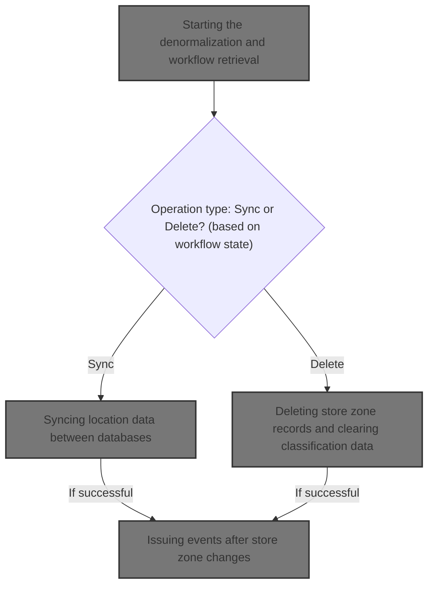
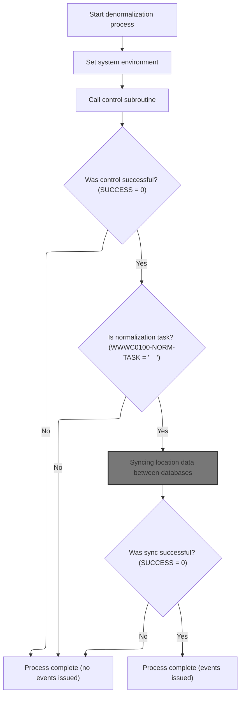
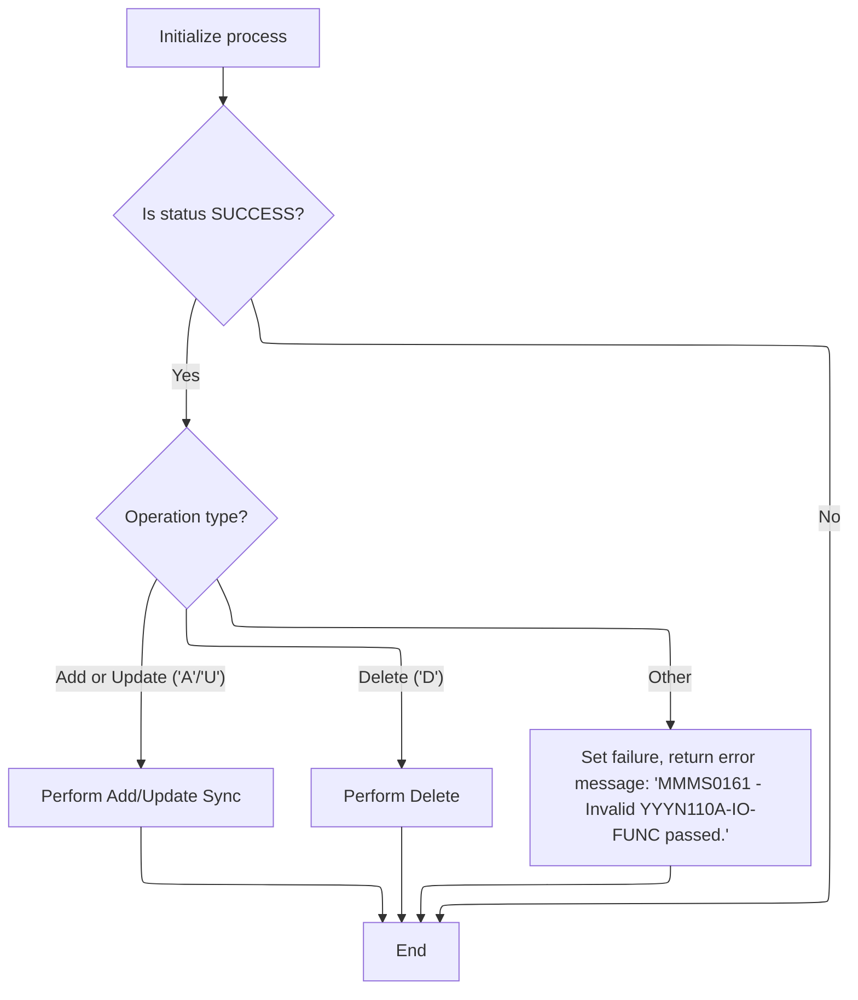
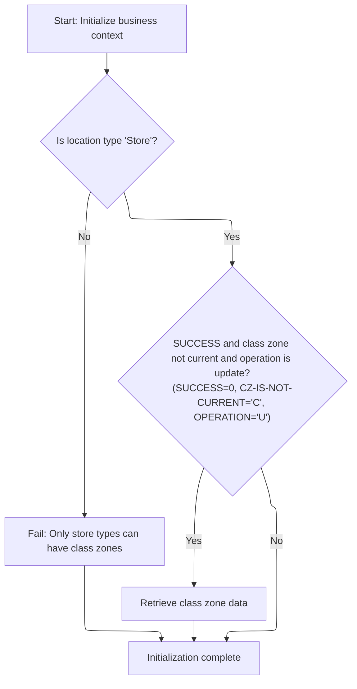
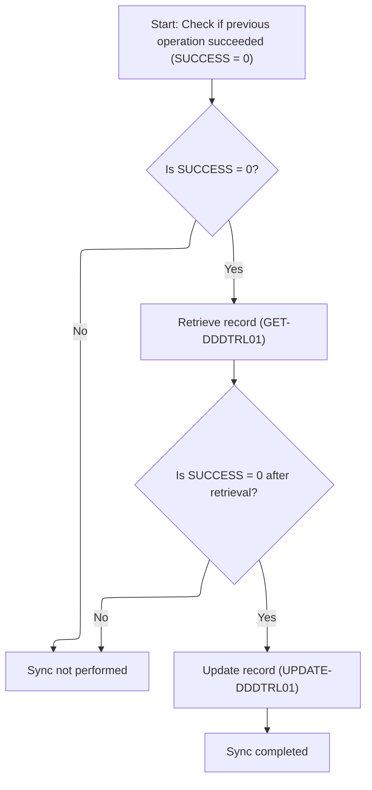
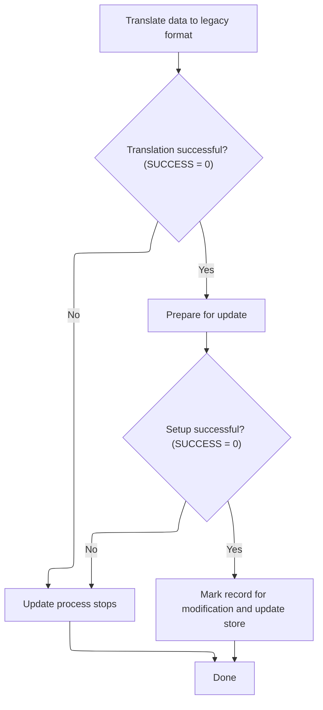
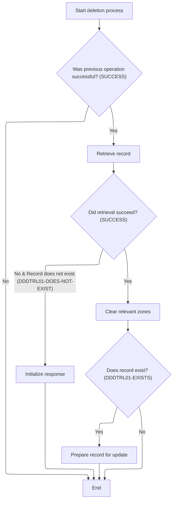
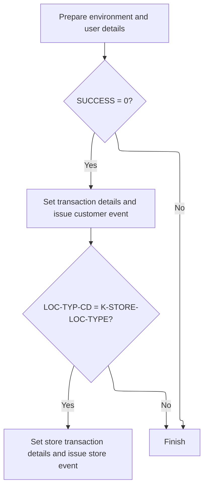

This document describes how location and store zone data is synchronized between DB2 and Oracle databases, and how business events are issued after changes. The flow starts by retrieving the workflow state, then decides whether to sync, update, or delete store records. For updates, store/class/zone records are fetched and updated; for deletes, relevant classification zones are cleared and records updated. Events are then issued to notify other systems of the changes.



# Spec

## Detailed View of the Program's Functionality

# a. High-Level Workflow Overview

The code in these two files orchestrates the synchronization and denormalization of store/class/zone records between a "new" master database (likely Oracle) and an "old" legacy database (DB2), as well as the issuing of related events. The process is triggered by changes (add, update, delete) to store zone data, and ensures both databases remain consistent and that downstream systems are notified of changes.

# b. Entry Point and Main Control Flow

The main entry point for the synchronization logic is in the routine that handles the denormalization process. This routine is called after a modification (add, update, delete) to a store/class/zone record.

1. **Set Up Environment:**\
   The system environment is copied from a general environment structure to a more specific one used for downstream calls.

2. **Retrieve Workflow State:**\
   A control subroutine is called to retrieve or update the current workflow state. This is necessary to determine what type of operation is being performed and whether further synchronization is needed.

3. **Decision on Normalization Task:**\
   If the control subroutine indicates success and the operation is a normalization task, the process continues to synchronize location data between the databases. If not, the process completes without issuing any events.

4. **Synchronization:**\
   If synchronization is required, a subroutine is called to perform the actual sync between the two databases. This involves setting up control flags, marking the operation as current, and invoking the sync routine.

5. **Event Issuance:**\
   If the synchronization is successful, another subroutine is called to issue events to notify other systems of the changes. If any step fails, the process completes without issuing events.

# c. Control Subroutine and Workflow Retrieval

The control subroutine is responsible for preparing and invoking the workflow control logic:

- It sets a flag indicating that a task should be retrieved.
- It calls a workflow control routine, passing in the necessary context and control structures.
- The result of this call determines whether the process continues with synchronization or stops.

# d. Synchronization Subroutine

The synchronization subroutine prepares the environment and database flags, marks the operation as current, and calls the main synchronization routine. This routine is responsible for moving location data between the new (Oracle) and old (DB2) systems.

# e. Main Synchronization Logic

The main synchronization routine (in the sync program) performs the following:

1. **Initialization:**\
   It initializes business context and validates that the location type is a store. If not, it fails early with an error message.

2. **Fetch Existing Record:**\
   If updating a non-current zone, it fetches the latest zone record from the database. This involves setting up for a unique row fetch and calling the appropriate data access routine.

3. **Operation Decision:**\
   Based on the operation type (add, update, delete), it decides which action to perform:

   - For add or update, it performs the synchronization.
   - For delete, it clears the relevant zone fields.
   - For any other operation, it fails with an error message.

# f. Store Record Synchronization

When synchronizing a store record:

1. **Translate Data:**\
   The location data is translated from the new format to the old format.

2. **Fetch Store Record:**\
   The system attempts to fetch the store record from the legacy DB2 table. If the record is not found or an error occurs, appropriate error messages are set.

3. **Update Store Record:**\
   If the record is found and all checks pass, the system prepares for an update and marks the record for modification. It then calls the data access routine to update the DB2 store record.

4. **Error Handling:**\
   If the update fails or the record is not found, error messages are constructed with the relevant store key and SQL error code.

# g. Deletion of Store Zone Records

When deleting a store zone record:

1. **Fetch Store Record:**\
   The system attempts to fetch the store record. If not found, it initializes the response and stops.

2. **Clear Zone Fields:**\
   If the record exists, it clears the relevant zone and exception fields for specific item class codes (such as 12, 13, 14, 36, 37).

3. **Update Store Record:**\
   If the record exists after clearing, it prepares and performs the update as in the synchronization step.

# h. Event Issuance

After a successful synchronization or deletion:

1. **Prepare Event Data:**\
   The system sets up event records with the appropriate transaction details, user, and environment information.

2. **Issue Customer Event:**\
   An event is issued to notify customer-related systems of the change.

3. **Issue Store Event (if applicable):**\
   If the location type is a store, an additional event is issued for store-specific systems.

# i. Supporting Routines

- **Translation Routine:**\
  Converts data from the new format to the old format for compatibility with legacy systems.

- **Data Access Routines:**\
  Handle the actual database operations (fetch, update, insert, delete) for both the new and old systems.

- **Error Handling:**\
  Throughout the process, error codes and messages are set and propagated to ensure failures are reported and handled appropriately.

# j. Summary

In summary, the code coordinates the synchronization of store/class/zone data between new and old databases, ensures that only valid operations are performed, and issues events to notify other systems of changes. The process is robust, with checks at each step to prevent invalid operations and to provide clear error reporting. The design ensures data consistency across systems and supports both real-time and batch environments.

# Rule Definition

| Paragraph Name                                                                           | Rule ID | Category          | Description                                                                                                                                                                                                                                                                                  | Conditions                                                           | Remarks                                                                                                                       |
| ---------------------------------------------------------------------------------------- | ------- | ----------------- | -------------------------------------------------------------------------------------------------------------------------------------------------------------------------------------------------------------------------------------------------------------------------------------------- | -------------------------------------------------------------------- | ----------------------------------------------------------------------------------------------------------------------------- |
| 2000-DENORM-PROCESS, 2010-CALL-CONTROL-SUBR                                              | RL-001  | Data Assignment   | The system must initialize the environment and retrieve the current workflow state before proceeding with any denormalization, sync, or delete operations.                                                                                                                                   | Always at the start of the denormalization process.                  | The environment is set using the system environment field, and the workflow state is retrieved via a control subroutine call. |
| 2000-DENORM-PROCESS                                                                      | RL-002  | Data Assignment   | The workflow record must be updated with the latest state before any synchronization or deletion operation is performed.                                                                                                                                                                     | Before performing sync or delete operations.                         | The workflow record is updated after retrieving the current state and before calling the sync or delete subroutines.          |
| 2000-DENORM-PROCESS                                                                      | RL-003  | Conditional Logic | If the workflow control subroutine does not indicate success, the process must complete without issuing any events or performing further actions.                                                                                                                                            | Workflow control subroutine returns failure.                         | No further actions, events, or database operations are performed if the workflow control fails.                               |
| 2000-DENORM-PROCESS                                                                      | RL-004  | Conditional Logic | If the workflow record indicates a normalization task (field is blank), the system must proceed to synchronize location data between databases.                                                                                                                                              | Normalization task field is blank.                                   | Normalization task field is checked for blank value.                                                                          |
| 2000-DENORM-PROCESS, 2020-CALL-SYNC-SUBR                                                 | RL-005  | Conditional Logic | The sync operation must be performed only if the workflow and environment checks succeed.                                                                                                                                                                                                    | Workflow and environment checks indicate success.                    | Sync is not performed if any check fails.                                                                                     |
| 1000-DO-THE-SYNC, 1500-UPDATE-DDDTRL01, 1510-SETUP-UPD-DDDTRL01, 1520-READY-UPD-DDDTRL01 | RL-006  | Computation       | The sync operation must update the store record in DB2 for item classes 12, 13, 14, 36, or 37 using values from the zone record. For item classes 12, 13, 14, update the zone, exception, and zone number fields. For item classes 36, 37, update only the exception and zone number fields. | Sync operation is performed and item class is 12, 13, 14, 36, or 37. | Fields updated depend on item class:                                                                                          |

- 12, 13, 14: zone, exception, zone number
- 36, 37: exception, zone number Field types: zone (string), exception (string), zone number (number) | | 2000-DO-THE-DELETE, 2010-CLEAR-ZONE | RL-007 | Computation | The delete operation must clear (set to blank or zero) the zone, exception, and zone number fields for the specified item class in the store record. For item classes 12, 13, 14: clear zone, exception, and zone number fields. For item classes 36, 37: clear only exception and zone number fields. | Delete operation is performed and item class is 12, 13, 14, 36, or 37. | Fields cleared depend on item class:
- 12, 13, 14: zone, exception, zone number
- 36, 37: exception, zone number Cleared values: blank for strings, zero for numbers. | | 000-MAIN, 2000-DENORM-PROCESS | RL-008 | Conditional Logic | The operation type (add, update, delete) must be determined by the IO-FUNC field in the control/environment record. | Always, before performing any operation. | IO-FUNC field values determine the operation:
- ADD: perform insert
- UPD: perform update
- DEL: perform delete | | 2000-DENORM-PROCESS, 2030-ISSUE-EVENTS | RL-009 | Data Assignment | After a successful sync or delete operation, the system must issue an event by populating the event record with transaction details, event type, program name, and user ID. | Sync or delete operation completes successfully. | Event record fields:
- Transaction details (structure from ZZZC0032 or ZZZC0094)
- Event type (e.g., 'CUST', 'STRM')
- Program name (e.g., 'NNNS0473')
- User ID (from user context) All fields are alphanumeric except transaction number, which may be numeric. | | 2030-ISSUE-EVENTS | RL-010 | Conditional Logic | For store locations (LOC-TYP-CD = 'S'), both a customer and a store event must be issued, each with its own transaction ID. | Location type code is 'S'. | Two events are issued:
- One with transaction ID 'CUST'
- One with transaction ID 'STRM' Each event record is populated separately. | | 1000-DO-THE-SYNC, 1400-GET-DDDTRL01, 1520-READY-UPD-DDDTRL01, 2000-DO-THE-DELETE | RL-011 | Computation | All operations must use the key fields (store number, item class code) to identify and update the correct store record. | Any sync or delete operation. | Key fields:
- Store number (number)
- Item class code (number) Used in all database operations to locate the correct record. | | 2000-DENORM-PROCESS, 100-INITIALIZE | RL-012 | Conditional Logic | The process must not proceed with sync or delete if the workflow or environment checks fail. | Workflow or environment checks indicate failure. | No sync or delete operation is performed if checks fail. |

# User Stories

## User Story 1: Initialize and validate workflow and environment

---

### Story Description:

As a system, I want to initialize the environment and retrieve the current workflow state, updating the workflow record and validating workflow and environment checks, so that only valid operations proceed and the latest state is always used.

---

### Business Rule Mapping:

| Rule ID | Paragraph Name                              | Rule Description                                                                                                                                           |
| ------- | ------------------------------------------- | ---------------------------------------------------------------------------------------------------------------------------------------------------------- |
| RL-001  | 2000-DENORM-PROCESS, 2010-CALL-CONTROL-SUBR | The system must initialize the environment and retrieve the current workflow state before proceeding with any denormalization, sync, or delete operations. |
| RL-002  | 2000-DENORM-PROCESS                         | The workflow record must be updated with the latest state before any synchronization or deletion operation is performed.                                   |
| RL-003  | 2000-DENORM-PROCESS                         | If the workflow control subroutine does not indicate success, the process must complete without issuing any events or performing further actions.          |
| RL-012  | 2000-DENORM-PROCESS, 100-INITIALIZE         | The process must not proceed with sync or delete if the workflow or environment checks fail.                                                               |

---

### Relevant Functionality:

- **2000-DENORM-PROCESS**
  1. **RL-001:**
     - Move system environment value to workflow environment field
     - Call the workflow control subroutine with required parameters
  2. **RL-002:**
     - After retrieving workflow state, update the workflow record with the latest state
  3. **RL-003:**
     - If workflow control subroutine indicates failure:
       - Exit process
       - Do not issue events or perform sync/delete
  4. **RL-012:**
     - If workflow or environment checks fail:
       - Abort sync or delete operation

## User Story 2: Determine and execute operation type

---

### Story Description:

As a system, I want to determine the operation type (add, update, delete) from the control/environment record and perform the appropriate sync or delete operation only if workflow and environment checks succeed, so that the correct action is taken for each request.

---

### Business Rule Mapping:

| Rule ID | Paragraph Name                           | Rule Description                                                                                                                                |
| ------- | ---------------------------------------- | ----------------------------------------------------------------------------------------------------------------------------------------------- |
| RL-004  | 2000-DENORM-PROCESS                      | If the workflow record indicates a normalization task (field is blank), the system must proceed to synchronize location data between databases. |
| RL-005  | 2000-DENORM-PROCESS, 2020-CALL-SYNC-SUBR | The sync operation must be performed only if the workflow and environment checks succeed.                                                       |
| RL-008  | 000-MAIN, 2000-DENORM-PROCESS            | The operation type (add, update, delete) must be determined by the IO-FUNC field in the control/environment record.                             |

---

### Relevant Functionality:

- **2000-DENORM-PROCESS**
  1. **RL-004:**
     - If normalization task field is blank:
       - Proceed to sync operation
  2. **RL-005:**
     - If workflow and environment checks succeed:
       - Call sync subroutine
- **000-MAIN**
  1. **RL-008:**
     - Read IO-FUNC field
     - If ADD: perform insert
     - If UPD: perform update
     - If DEL: perform delete

## User Story 3: Synchronize store records

---

### Story Description:

As a system, I want to synchronize store records for specified item classes using values from the zone record, updating the correct fields based on item class, so that location data is accurately reflected in the database.

---

### Business Rule Mapping:

| Rule ID | Paragraph Name                                                                           | Rule Description                                                                                                                                                                                                                                                                             |
| ------- | ---------------------------------------------------------------------------------------- | -------------------------------------------------------------------------------------------------------------------------------------------------------------------------------------------------------------------------------------------------------------------------------------------- |
| RL-006  | 1000-DO-THE-SYNC, 1500-UPDATE-DDDTRL01, 1510-SETUP-UPD-DDDTRL01, 1520-READY-UPD-DDDTRL01 | The sync operation must update the store record in DB2 for item classes 12, 13, 14, 36, or 37 using values from the zone record. For item classes 12, 13, 14, update the zone, exception, and zone number fields. For item classes 36, 37, update only the exception and zone number fields. |
| RL-011  | 1000-DO-THE-SYNC, 1400-GET-DDDTRL01, 1520-READY-UPD-DDDTRL01, 2000-DO-THE-DELETE         | All operations must use the key fields (store number, item class code) to identify and update the correct store record.                                                                                                                                                                      |

---

### Relevant Functionality:

- **1000-DO-THE-SYNC**
  1. **RL-006:**
     - For item class 12, 13, 14:
       - Update zone, exception, and zone number fields in DB2 store record
     - For item class 36, 37:
       - Update exception and zone number fields in DB2 store record
  2. **RL-011:**
     - Use store number and item class code as keys in all database operations

## User Story 4: Delete store record fields

---

### Story Description:

As a system, I want to clear the relevant fields in store records for specified item classes during a delete operation, so that obsolete location data is removed from the database.

---

### Business Rule Mapping:

| Rule ID | Paragraph Name                                                                   | Rule Description                                                                                                                                                                                                                                                                                       |
| ------- | -------------------------------------------------------------------------------- | ------------------------------------------------------------------------------------------------------------------------------------------------------------------------------------------------------------------------------------------------------------------------------------------------------ |
| RL-011  | 1000-DO-THE-SYNC, 1400-GET-DDDTRL01, 1520-READY-UPD-DDDTRL01, 2000-DO-THE-DELETE | All operations must use the key fields (store number, item class code) to identify and update the correct store record.                                                                                                                                                                                |
| RL-007  | 2000-DO-THE-DELETE, 2010-CLEAR-ZONE                                              | The delete operation must clear (set to blank or zero) the zone, exception, and zone number fields for the specified item class in the store record. For item classes 12, 13, 14: clear zone, exception, and zone number fields. For item classes 36, 37: clear only exception and zone number fields. |

---

### Relevant Functionality:

- **1000-DO-THE-SYNC**
  1. **RL-011:**
     - Use store number and item class code as keys in all database operations
- **2000-DO-THE-DELETE**
  1. **RL-007:**
     - For item class 12, 13, 14:
       - Clear zone, exception, and zone number fields in DB2 store record
     - For item class 36, 37:
       - Clear exception and zone number fields in DB2 store record

## User Story 5: Issue events after successful operations

---

### Story Description:

As a system, I want to issue event records with transaction details, event type, program name, and user ID after successful sync or delete operations, and for store locations, issue both customer and store events, so that downstream systems are notified of changes.

---

### Business Rule Mapping:

| Rule ID | Paragraph Name                         | Rule Description                                                                                                                                                            |
| ------- | -------------------------------------- | --------------------------------------------------------------------------------------------------------------------------------------------------------------------------- |
| RL-009  | 2000-DENORM-PROCESS, 2030-ISSUE-EVENTS | After a successful sync or delete operation, the system must issue an event by populating the event record with transaction details, event type, program name, and user ID. |
| RL-010  | 2030-ISSUE-EVENTS                      | For store locations (LOC-TYP-CD = 'S'), both a customer and a store event must be issued, each with its own transaction ID.                                                 |

---

### Relevant Functionality:

- **2000-DENORM-PROCESS**
  1. **RL-009:**
     - Populate event record with transaction details, event type, program name, and user ID
     - Call event manager to issue event
- **2030-ISSUE-EVENTS**
  1. **RL-010:**
     - If location type code is 'S':
       - Issue customer event (TRX-ID 'CUST')
       - Issue store event (TRX-ID 'STRM')

# Code Walkthrough

## Starting the denormalization and workflow retrieval



<SwmSnippet path="/base/src/NNNS0473.cbl" line="540">

---

`2000-DENORM-PROCESS` kicks off the flow by setting up the system environment and immediately calling 2010-CALL-CONTROL-SUBR to retrieve the current workflow state. This step is necessary because the rest of the logic (sync and event routines) depends on having up-to-date workflow info. Without it, we can't reliably decide what needs to be synchronized or which events to issue.

```cobol
058200 2000-DENORM-PROCESS.                                             00058200
058300     MOVE YYYN005A-SYS-ENV      TO YYYN110A-SYS-ENV               00058300
058400     PERFORM 2010-CALL-CONTROL-SUBR                               00058400
058500     IF  SUCCESS                                                  00058500
058600     AND WWWC0100-NORM-TASK                                       00058600
058700       PERFORM 2020-CALL-SYNC-SUBR                                00058700
058800     END-IF                                                       00058800
058900     IF SUCCESS                                                   00058900
059200          PERFORM 2030-ISSUE-EVENTS                               00059200
059400     END-IF                                                       00059400
059500     .                                                            00059500
```

---

</SwmSnippet>

<SwmSnippet path="/base/src/NNNS0473.cbl" line="553">

---

`2010-CALL-CONTROL-SUBR` sets up the GET-TASK flag and calls WWWS0100-CONTROL-SUBR to retrieve or update the workflow state. This call is what actually gets the workflow info we need for the rest of the process.

```cobol
059800 2010-CALL-CONTROL-SUBR.                                          00059800
059900     SET WWWC0100-GET-TASK  TO TRUE                               00059900
060000     CALL WWWS0100-CONTROL-SUBR USING                             00060000
060100         XXXN001A                                                 00060100
060200         WWWC0100                                                 00060200
060300     .                                                            00060300
```

---

</SwmSnippet>

### Syncing location data between databases

<SwmSnippet path="/base/src/NNNS0473.cbl" line="561">

---

`2020-CALL-SYNC-SUBR` sets up control flags for the environment and database, marks the operation as current, and then calls MMMS0161-SYNC-CZ to handle the actual sync between DB2 and Oracle. This call is what moves the location data between systems.

```cobol
060600 2020-CALL-SYNC-SUBR.                                             00060600
060700     SET YYYN110A-LAST-CALL     TO TRUE                           00060700
060710     SET YYYN110A-ORACLE        TO TRUE                           00060710
060800     SET MMMC0161-CZ-IS-CURRENT TO TRUE                           00060800
060900     CALL MMMS0161-SYNC-CZ USING                                  00060900
061000         XXXN001A                                                 00061000
061100         YYYN110A                                                 00061100
061200         MMMC0161                                                 00061200
061300         P-DDDTCZ01                                               00061300
061400     .                                                            00061400
```

---

</SwmSnippet>

### Main control logic for sync and delete operations



<SwmSnippet path="/base/src/MMMS0161.cbl" line="82">

---

`000-MAIN` runs the initialization, then checks the IO-FUNC value to decide if it should sync, delete, or error out. This is the main decision point for what happens next in the sync/delete flow.

```cobol
009000 000-MAIN.                                                        00009000
009100     PERFORM 100-INITIALIZE                                       00009100
009200                                                                  00009200
009300     IF SUCCESS                                                   00009300
009400       EVALUATE TRUE                                              00009400
009500         WHEN YYYN110A-ADD                                        00009500
009600         OR   YYYN110A-UPD                                        00009600
009700           PERFORM 1000-DO-THE-SYNC                               00009700
009800                                                                  00009800
009900         WHEN YYYN110A-DEL                                        00009900
010000           PERFORM 2000-DO-THE-DELETE                             00010000
010100                                                                  00010100
010200         WHEN OTHER                                               00010200
010300           SET FAILURE TO TRUE                                    00010300
010400           MOVE 'MMMS0161 - Invalid YYYN110A-IO-FUNC passed.'     00010400
010500             TO IS-RTRN-MSG-TXT                                   00010500
010600       END-EVALUATE                                               00010600
010700     END-IF                                                       00010700
010800                                                                  00010800
010900     GOBACK                                                       00010900
011000     .                                                            00011000
```

---

</SwmSnippet>

### Initialization and validation for store zone operations



<SwmSnippet path="/base/src/MMMS0161.cbl" line="108">

---

`100-INITIALIZE` does more than just setup—it checks if the location type is a store, and if not, it fails early. If everything's good and we're updating a non-current zone, it calls 120-GET-CZ to fetch the latest zone record.

```cobol
011600 100-INITIALIZE.                                                  00011600
011700     PERFORM 110-MISC-INITS                                       00011700
011800                                                                  00011800
011900     IF LOC-TYP-CD OF P-DDDTCZ01 NOT = K-STORE-LOC-TYPE           00011900
012000       SET FAILURE TO TRUE                                        00012000
012100       MOVE 'MMMS0161 - only store types can have class zones!'   00012100
012200         TO IS-RTRN-MSG-TXT                                       00012200
012300     END-IF                                                       00012300
012400                                                                  00012400
012500     IF  SUCCESS                                                  00012500
012600     AND MMMC0161-CZ-IS-NOT-CURRENT                               00012600
012700     AND YYYN110A-UPD                                             00012700
012800       PERFORM 120-GET-CZ                                         00012800
012900     END-IF                                                       00012900
013000     .                                                            00013000
```

---

</SwmSnippet>

<SwmSnippet path="/base/src/MMMS0161.cbl" line="146">

---

`120-GET-CZ` sets up for a unique row fetch and calls NNNS0473-CZ-DAO to get the store/class/zone record. The SQLCODE handling right after decides if we got the record, didn't find it, or hit a DB error.

```cobol
015100 120-GET-CZ.                                                      00015100
015200     SET EXIT-GET-UNIQUE-ROW TO TRUE                              00015200
015300     CALL NNNS0473-CZ-DAO USING                                   00015300
015400         XXXN001A                                                 00015400
015500         SQLCA                                                    00015500
015600         YYYN005A                                                 00015600
015700         NNNN0000-PARMS                                           00015700
015800         P-DDDTCZ01                                               00015800
015900                                                                  00015900
016000     EVALUATE TRUE                                                00016000
016100       WHEN NOT SUCCESS                                           00016100
016200         CONTINUE                                                 00016200
016300                                                                  00016300
016400       WHEN SQLCODE = 100                                         00016400
016500         SET  FAILURE                 TO TRUE                     00016500
016600         MOVE 'MMMS0161 - Store/Cls/Zone does not exist!'         00016600
016700           TO IS-RTRN-MSG-TXT                                     00016700
016800                                                                  00016800
016900       WHEN SQLCODE NOT = 0                                       00016900
017000         MOVE SQLCODE                 TO WS-SQLCODE               00017000
017100         SET  FAILURE                 TO TRUE                     00017100
017200         MOVE SPACES                  TO IS-RTRN-MSG-TXT          00017200
017300         STRING 'MMMS0161 - Failure getting Cls Ad Zn, SQLCODE='  00017300
017400                 WS-SQLCODE                                       00017400
017500                 DELIMITED BY SIZE                                00017500
017600                 INTO IS-RTRN-MSG-TXT                             00017600
017700     END-EVALUATE                                                 00017700
017800     .                                                            00017800
```

---

</SwmSnippet>

### Store record synchronization routine



<SwmSnippet path="/base/src/MMMS0161.cbl" line="179">

---

`1000-DO-THE-SYNC` checks for success, then fetches the store data from DB2. If that works, it goes ahead and updates the legacy record to match. This keeps both systems in sync.

```cobol
018400 1000-DO-THE-SYNC.                                                00018400
018500     IF SUCCESS                                                   00018500
018600       PERFORM 1400-GET-DDDTRL01                                  00018600
018700       IF SUCCESS                                                 00018700
018800         PERFORM 1500-UPDATE-DDDTRL01                             00018800
018900       END-IF                                                     00018900
019000     END-IF                                                       00019000
019100     .                                                            00019100
```

---

</SwmSnippet>

<SwmSnippet path="/base/src/MMMS0161.cbl" line="194">

---

`1400-GET-DDDTRL01` translates the location data to the old format, then tries to fetch the store record from DB2. The flags (EXISTS, DOES-NOT-EXIST, SUCCESS, FAILURE) and SQLCODE checks decide if we move forward, error out, or prep an error message with the store key.

```cobol
019900 1400-GET-DDDTRL01.                                               00019900
020000     PERFORM 9000-TRANSLATE-TO-OLD                                00020000
020100     IF SUCCESS                                                   00020100
020200       SET DDDTRL01-EXISTS            TO TRUE                     00020200
020300       SET EXIT-GET-UNIQUE-ROW        TO TRUE                     00020300
020400       PERFORM 9200-CALL-DDDTRL01-DAO                             00020400
020500                                                                  00020500
020600       EVALUATE TRUE                                              00020600
020700         WHEN SQLCODE = 100                                       00020700
020800           SET  DDDTRL01-DOES-NOT-EXIST TO TRUE                   00020800
020900           SET  FAILURE                 TO TRUE                   00020900
021000           MOVE 'MMMS0161 - Store not found in DB2 Table (FCRL)!' 00021000
021100             TO IS-RTRN-MSG-TXT                                   00021100
021200                                                                  00021200
021300         WHEN SQLCODE NOT = 0                                     00021300
021400           SET  FAILURE TO TRUE                                   00021400
021500           MOVE SQLCODE TO WS-SQLCODE                             00021500
021600           MOVE SPACES  TO IS-RTRN-MSG-TXT                        00021600
021700           STRING 'MMMS0161 - Error reading DB2 Store, '          00021700
021800                  'key='      ST-STORE-KEY OF DDDPST01            00021800
021900                  ',SQL=' WS-SQLCODE '.'                          00021900
022000                  DELIMITED BY SIZE INTO IS-RTRN-MSG-TXT          00022000
022100       END-EVALUATE                                               00022100
022200     END-IF                                                       00022200
022300     .                                                            00022300
```

---

</SwmSnippet>

### Updating store records in DB2



<SwmSnippet path="/base/src/MMMS0161.cbl" line="224">

---

`1500-UPDATE-DDDTRL01` translates the data to the old format, sets up the update, and then calls the routine to actually update the DB2 store record if everything checks out.

```cobol
022900 1500-UPDATE-DDDTRL01.                                            00022900
023000     PERFORM 9000-TRANSLATE-TO-OLD                                00023000
023100     IF SUCCESS                                                   00023100
023200       PERFORM 1510-SETUP-UPD-DDDTRL01                            00023200
023300       IF SUCCESS                                                 00023300
023400         PERFORM 1520-READY-UPD-DDDTRL01                          00023400
023500       END-IF                                                     00023500
023600     END-IF                                                       00023600
023700     .                                                            00023700
```

---

</SwmSnippet>

<SwmSnippet path="/base/src/MMMS0161.cbl" line="240">

---

`1520-READY-UPD-DDDTRL01` sets the modify flag, calls the DAO to update the DB2 store record, and then checks SQLCODE to handle not-found or error cases, building error messages with the store key.

```cobol
024500 1520-READY-UPD-DDDTRL01.                                         00024500
024600     SET EXIT-PUT-MODIFY-ROW          TO TRUE                     00024600
024700     PERFORM 9200-CALL-DDDTRL01-DAO                               00024700
024800                                                                  00024800
024900     EVALUATE TRUE                                                00024900
025000       WHEN SQLCODE = 100                                         00025000
025100         MOVE SQLCODE                 TO WS-SQLCODE               00025100
025200         SET  FAILURE                 TO TRUE                     00025200
025300         MOVE SPACES                  TO IS-RTRN-MSG-TXT          00025300
025400         STRING 'MMMS0161 - DB2 Store record not found,'          00025400
025500                'key='      ST-STORE-KEY OF DDDPST01              00025500
025600                ',SQL=' WS-SQLCODE '.'                            00025600
025700                DELIMITED BY SIZE INTO IS-RTRN-MSG-TXT            00025700
025800                                                                  00025800
025900       WHEN SQLCODE NOT = 0                                       00025900
026000         MOVE SQLCODE                 TO WS-SQLCODE               00026000
026100         SET  FAILURE                 TO TRUE                     00026100
026200         MOVE SPACES                  TO IS-RTRN-MSG-TXT          00026200
026300         STRING 'MMMS0161 - Error adding DB2 Store, '             00026300
026400                'key='      ST-STORE-KEY OF DDDPST01              00026400
026500                ',SQL=' WS-SQLCODE '.'                            00026500
026600                DELIMITED BY SIZE INTO IS-RTRN-MSG-TXT            00026600
026700     END-EVALUATE                                                 00026700
026800     .                                                            00026800
```

---

</SwmSnippet>

### Deleting store zone records and clearing classification data



<SwmSnippet path="/base/src/MMMS0161.cbl" line="270">

---

`2000-DO-THE-DELETE` runs a sequence: fetch store data, initialize if missing, clear zones, and update the DB2 record if the store exists. Each step only runs if the previous one succeeded, so we don't mess with bad data.

```cobol
027500 2000-DO-THE-DELETE.                                              00027500
027600     IF SUCCESS                                                   00027600
027700       PERFORM 1400-GET-DDDTRL01                                  00027700
027800       IF  NOT SUCCESS                                            00027800
027900       AND DDDTRL01-DOES-NOT-EXIST                                00027900
028000         INITIALIZE XXXN001A                                      00028000
028100       END-IF                                                     00028100
028200     END-IF                                                       00028200
028300                                                                  00028300
028400     IF SUCCESS                                                   00028400
028500       PERFORM 2010-CLEAR-ZONE                                    00028500
028600       IF SUCCESS                                                 00028600
028700         IF DDDTRL01-EXISTS                                       00028700
028800           PERFORM 1520-READY-UPD-DDDTRL01                        00028800
028900         END-IF                                                   00028900
029000       END-IF                                                     00029000
029100     END-IF                                                       00029100
029200     .                                                            00029200
```

---

</SwmSnippet>

<SwmSnippet path="/base/src/MMMS0161.cbl" line="290">

---

`2010-CLEAR-ZONE` resets zone and exception fields for specific item class codes (12, 13, 14, 36, 37). If the code isn't one of these, nothing happens, so the input is assumed to be valid.

```cobol
029500 2010-CLEAR-ZONE.                                                 00029500
029600     EVALUATE ITM-CLS-CD                                          00029600
029700      WHEN 12                                                     00029700
029800        INITIALIZE ST-CLASS12-ZONE                                00029800
029900                   ST-CLASS12-EXCEPTION-AD-ZONE                   00029900
030000                   FC-RL-CL12-ZONE-NO                             00030000
030100                   FC-RL-CL12-ADZN-NO                             00030100
030200      WHEN 13                                                     00030200
030300        INITIALIZE ST-CLASS13-ZONE                                00030300
030400                   ST-CLASS13-EXCEPTION-AD-ZONE                   00030400
030500                   FC-RL-CL13-ZONE-NO                             00030500
030600                   FC-RL-CL13-ADZN-NO                             00030600
030700      WHEN 14                                                     00030700
030800        INITIALIZE ST-CLASS14-ZONE                                00030800
030900                   ST-CLASS14-EXCEPTION-AD-ZONE                   00030900
031000                   FC-RL-CL14-ZONE-NO                             00031000
031100                   FC-RL-CL14-ADZN-NO                             00031100
031200      WHEN 36                                                     00031200
031300        INITIALIZE ST-CLASS36-EXCEPTION-AD-ZONE                   00031300
031400                   FC-RL-CL36-ADZN-NO                             00031400
031500      WHEN 37                                                     00031500
031600        INITIALIZE ST-CLASS37-EXCEPTION-AD-ZONE                   00031600
031700                   FC-RL-CL37-ADZN-NO                             00031700
031800     END-EVALUATE                                                 00031800
031900     .                                                            00031900
```

---

</SwmSnippet>

### Issuing events after store zone changes



<SwmSnippet path="/base/src/NNNS0473.cbl" line="573">

---

`2030-ISSUE-EVENTS` sets up event records using repo-specific constants and fields, then calls the event manager to issue them. For store locations, it sends both a customer and a store event, each with its own transaction ID.

```cobol
061700 2030-ISSUE-EVENTS.                                               00061700
061710     SET YYYN110A-ORACLE        TO TRUE                           00061710
061800     PERFORM 2040-GET-CURRENT-USER                                00061800
061900     IF SUCCESS                                                   00061900
062000       MOVE LOC-NBR OF P-DDDTCZ01 TO ST-STORE-NUMBER OF ZZZC0032  00062000
062100                                     LOC-NBR OF ZZZC0094          00062100
062200       SET  ZZZC0032-UPD-FXXX     TO TRUE                         00062200
062300       MOVE ZZZC0032              TO ZZZC0197-TRX-REC             00062300
062400       MOVE 'CUST'                TO ZZZC0197-TRX-ID              00062400
062500       MOVE 'NNNS0473'            TO ZZZC0197-PROGRAM             00062500
062600       MOVE YYYC0107-USER         TO ZZZC0197-USER                00062600
062700       MOVE YYYN005A-SYS-ENV      TO YYYN110A-SYS-ENV             00062700
062800       CALL ZZZS0197-EVENT-MGR USING                              00062800
062900           XXXN001A                                               00062900
063000           YYYN110A                                               00063000
063100           ZZZC0197                                               00063100
063200                                                                  00063200
063300       EVALUATE TRUE                                              00063300
063400                                                                  00063400
063500       WHEN LOC-TYP-CD   OF P-DDDTCZ01 = K-STORE-LOC-TYPE         00063500
063600         MOVE LOC-TYP-CD OF P-DDDTCZ01 TO                         00063600
063700                                       LOC-TYP-CD OF ZZZC0094     00063700
063800         MOVE ZZZC0094              TO ZZZC0197-TRX-REC           00063800
063900         MOVE 'STRM'                TO ZZZC0197-TRX-ID            00063900
064000         MOVE 'NNNS0473'            TO ZZZC0197-PROGRAM           00064000
064100         MOVE YYYC0107-USER         TO ZZZC0197-USER              00064100
064200         MOVE YYYN005A-SYS-ENV      TO YYYN110A-SYS-ENV           00064200
064300         CALL ZZZS0197-EVENT-MGR USING                            00064300
064400              XXXN001A                                            00064400
064500              YYYN110A                                            00064500
064600              ZZZC0197                                            00064600
064700                                                                  00064700
064800       END-EVALUATE                                               00064800
064900     END-IF                                                       00064900
065000     .                                                            00065000
```

---

</SwmSnippet>

&nbsp;

*This is an auto-generated document by Swimm 🌊 and has not yet been verified by a human*

<SwmMeta version="3.0.0" repo-id="Z2l0aHViJTNBJTNBU3dpbW1pby1keW5jYWxsLWRlbW8lM0ElM0FHaXJpLVN3aW1t" repo-name="Swimmio-dyncall-demo"><sup>Powered by [Swimm](https://app.swimm.io/)</sup></SwmMeta>
