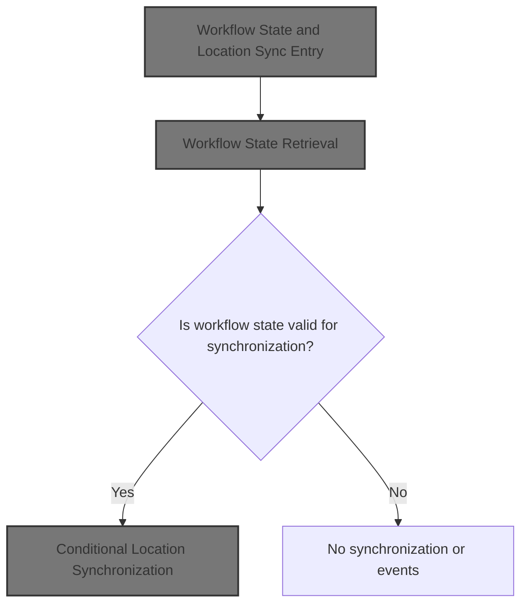
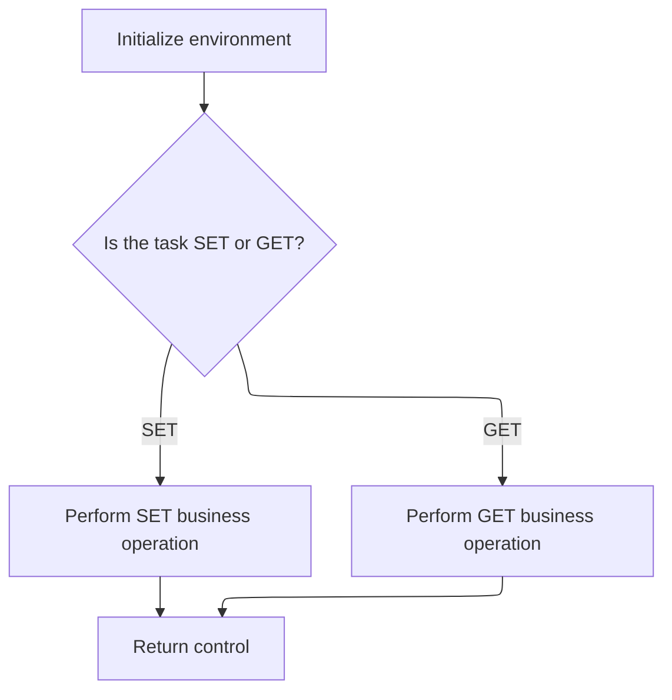
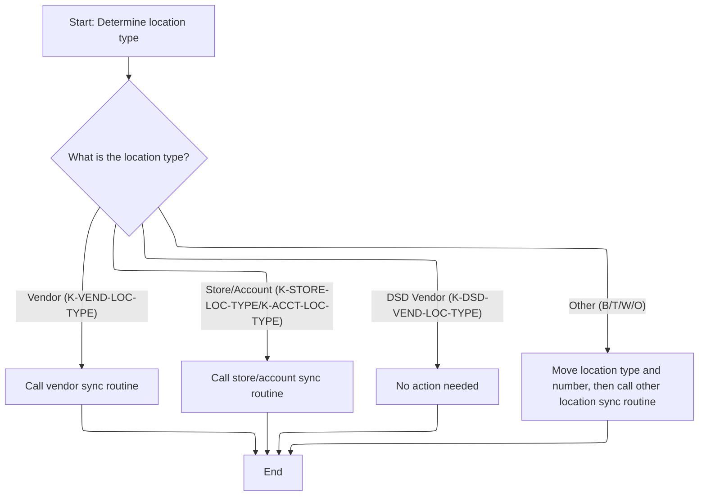

This document describes how location records are synchronized and workflow events are issued, depending on the current workflow state and location type. The flow receives the current workflow state and location information, checks if synchronization should occur, and updates location records accordingly. If synchronization is successful, workflow events are triggered.



# Spec

## Detailed View of the Program's Functionality

a. Workflow State and Location Sync Entry

The main workflow begins by preparing for checkpointing, which is a way to keep track of progress for recovery or auditing. It copies the current system environment to a new area to ensure the correct context is used for subsequent operations. Next, it retrieves the current workflow state by invoking a control subroutine. This state is essential for deciding whether to proceed with synchronizing location records and issuing related events. The workflow only continues if the previous steps are successful and the workflow is in a valid state, as determined by specific flags. If these conditions are met, it performs the location synchronization routine. If that is also successful, it proceeds to issue events related to the location changes.

b. Workflow State Retrieval

To obtain the workflow state, the process sets a flag indicating that it wants to fetch (not set) the workflow task. It then calls a control subroutine, passing in the necessary context and workflow fields. This subroutine is responsible for managing the workflow state, abstracting away the details from the main process. The control subroutine initializes its data area and then decides, based on the flags, whether to perform a "set" or "get" operation for the workflow task. In this case, since the flag is set for "get," it retrieves the current workflow state and updates the relevant fields.

c. Task State Initialization and Routing

The control subroutine starts by clearing out any previous data in its context area to ensure a clean state. It then evaluates which operation to perform: if the flag for setting the workflow task is active, it executes the logic to update the workflow state; if the flag for getting the workflow task is active, it executes the logic to fetch the workflow state. This separation keeps the logic for updating and fetching workflow state distinct and organized.

d. Conditional Location Synchronization

After confirming the workflow is in a valid state, the process moves on to synchronizing location records. It first sets the environment to Oracle, ensuring all subsequent database operations use the correct context. It then checks the type of location being processed and dispatches to the appropriate synchronization routine:

- If the location is a vendor, it marks the vendor location as current and calls the vendor synchronization routine.
- If the location is a store or account, it marks the store/account location as current and calls the store/account synchronization routine.
- If the location is a DSD vendor, it skips synchronization (the code for this is commented out).
- For other location types (such as B, T, W, O), it marks the location level, copies the location type and number to the appropriate area, and calls the corresponding synchronization routine.

Each routine is tailored to handle the specific requirements of the location type, ensuring accurate and efficient synchronization of records.

e. Event Issuance

If location synchronization is successful, the process proceeds to issue events. It initializes the event data area and sets the environment to Oracle. Depending on whether the operation was a deletion or not, it sets the appropriate event flags. It then populates the event data with the location type and number, program name, user, and system environment. For vendor locations, it also includes vendor-specific facility and number information. The process then calls the event manager routine to handle the event. Similar logic is applied for other location types, with each event tailored to the specifics of the location and operation performed. If certain conditions are met (such as staging events for DSD locations), additional event routines are called.

f. Supporting Routines

Throughout the workflow, various supporting routines are invoked to handle database connections, date and user retrieval, and data conversions. These routines ensure that all operations are performed in the correct context, with accurate timestamps and user information. They also handle error conditions, updating status fields and messages as needed to provide feedback and maintain data integrity.

g. Error Handling and Finalization

At each step, the workflow checks for success and handles errors appropriately. If an operation fails, it updates the status and message fields to indicate the nature of the error. Upon completion of the main workflow, it performs any necessary finalization steps, such as updating checkpoint counters and resetting database connections. This ensures the system remains consistent and ready for future operations.

# Rule Definition

| Paragraph Name                                                                          | Rule ID | Category          | Description                                                                                                                                                                              | Conditions                                                                                                             | Remarks                                                                                                                                                                                                 |
| --------------------------------------------------------------------------------------- | ------- | ----------------- | ---------------------------------------------------------------------------------------------------------------------------------------------------------------------------------------- | ---------------------------------------------------------------------------------------------------------------------- | ------------------------------------------------------------------------------------------------------------------------------------------------------------------------------------------------------- |
| 100-INITIALIZATION in NNNS0487, 100-INITIALIZE in WWWS0100                              | RL-001  | Data Assignment   | Before any workflow operation, the system must clear all fields in the context/status structure to ensure a clean state.                                                                 | Triggered at the start of the main process or subroutine call, before any workflow or location operation is performed. | The context/status structure contains fields for return code, status message, and other workflow-related data. All fields are set to their default values (e.g., spaces for strings, zero for numbers). |
| 2010-CALL-CONTROL-SUBR in NNNS0487, 300-GET-TASK in WWWS0100                            | RL-002  | Conditional Logic | The system retrieves the current workflow state by setting the GET flag and invoking the workflow control subroutine, which updates the workflow state structure with the current state. | The GET flag is set to 'Y' before calling the workflow control subroutine.                                             | The workflow state structure contains fields such as task, subtask, update status, event flag, and scan event flag. These are updated to reflect the current workflow state.                            |
| 200-SET-TASK in WWWS0100                                                                | RL-003  | Conditional Logic | The workflow control subroutine updates the workflow state from the input structure when the SET flag is set.                                                                            | The SET flag is set to 'Y' before calling the workflow control subroutine.                                             | The workflow state structure is updated with the values provided in the input structure (task, subtask, update status, event flag, scan event flag).                                                    |
| End of 2010-CALL-CONTROL-SUBR, 2020-CALL-SYNC-SUBR, and after sync routines in NNNS0487 | RL-004  | Data Assignment   | After each operation (control or sync), the context/status structure is updated with the result, including return code and status message.                                               | After any workflow control or location sync operation completes.                                                       | The context/status structure includes a return code (number) and a status message (string, left-justified, padded with spaces if necessary).                                                            |
| 2000-DENORM-PROCESS in NNNS0487                                                         | RL-005  | Conditional Logic | The main process checks that the previous operation was successful and that the workflow is in a normal state before proceeding to location synchronization.                             | The operation status is 'S' (success) and the workflow state indicates normal ('NORM-TASK' = 'Y').                     | Operation status is a single-character string ('S' for success). Workflow normal state is indicated by a flag ('Y').                                                                                    |
| 2020-CALL-SYNC-SUBR in NNNS0487                                                         | RL-006  | Conditional Logic | The system determines the location type from the location data structure and selects the appropriate synchronization routine based on the type.                                          | Location type code is read from the location data structure.                                                           | Location type codes: 'V' (Vendor), 'S' (Store), 'A' (Account), 'D' (DSD Vendor), 'B', 'T', 'W', 'O' (Other types).                                                                                      |
| 2020-CALL-SYNC-SUBR in NNNS0487                                                         | RL-007  | Data Assignment   | The system sets the Oracle environment flag to 'Y' for all location synchronization calls.                                                                                               | Before invoking any location sync routine.                                                                             | Oracle environment flag is a single-character string ('Y').                                                                                                                                             |
| After each sync routine call in 2020-CALL-SYNC-SUBR in NNNS0487                         | RL-008  | Data Assignment   | After each location sync operation, the context/status structure is updated with the result, including return code and status message.                                                   | After any location sync routine completes.                                                                             | The context/status structure includes a return code (number) and a status message (string, left-justified, padded with spaces if necessary).                                                            |

# User Stories

## User Story 1: Workflow Initialization, State Management, and Progression

---

### Story Description:

As a system, I want to initialize the workflow state, manage workflow status, verify successful operations, and ensure the workflow is in a normal state so that all workflow operations start from a clean state, accurately reflect the current status, and only proceed when it is safe to do so.

---

### Business Rule Mapping:

| Rule ID | Paragraph Name                                                                          | Rule Description                                                                                                                                                                         |
| ------- | --------------------------------------------------------------------------------------- | ---------------------------------------------------------------------------------------------------------------------------------------------------------------------------------------- |
| RL-001  | 100-INITIALIZATION in NNNS0487, 100-INITIALIZE in WWWS0100                              | Before any workflow operation, the system must clear all fields in the context/status structure to ensure a clean state.                                                                 |
| RL-002  | 2010-CALL-CONTROL-SUBR in NNNS0487, 300-GET-TASK in WWWS0100                            | The system retrieves the current workflow state by setting the GET flag and invoking the workflow control subroutine, which updates the workflow state structure with the current state. |
| RL-003  | 200-SET-TASK in WWWS0100                                                                | The workflow control subroutine updates the workflow state from the input structure when the SET flag is set.                                                                            |
| RL-004  | End of 2010-CALL-CONTROL-SUBR, 2020-CALL-SYNC-SUBR, and after sync routines in NNNS0487 | After each operation (control or sync), the context/status structure is updated with the result, including return code and status message.                                               |
| RL-005  | 2000-DENORM-PROCESS in NNNS0487                                                         | The main process checks that the previous operation was successful and that the workflow is in a normal state before proceeding to location synchronization.                             |

---

### Relevant Functionality:

- **100-INITIALIZATION in NNNS0487**
  1. **RL-001:**
     - On program start or subroutine entry:
       - Set all fields in the context/status structure to their default values.
       - This ensures no residual data from previous operations.
- **2010-CALL-CONTROL-SUBR in NNNS0487**
  1. **RL-002:**
     - Set the GET flag in the workflow state structure to 'Y'.
     - Call the workflow control subroutine with the context/status and workflow state structures.
     - The subroutine copies the current workflow state into the workflow state structure for the caller.
- **200-SET-TASK in WWWS0100**
  1. **RL-003:**
     - If the SET flag is 'Y':
       - Copy all relevant fields from the input workflow state structure into the internal workflow state.
       - This updates the workflow state for subsequent operations.
- **End of 2010-CALL-CONTROL-SUBR**
  1. **RL-004:**
     - After each operation:
       - Set the return code field to indicate success or failure.
       - Set the status message field to a descriptive message about the operation result.
- **2000-DENORM-PROCESS in NNNS0487**
  1. **RL-005:**
     - If operation status is 'S' and workflow normal flag is 'Y':
       - Proceed to location synchronization.
     - Otherwise, do not perform location synchronization.

## User Story 2: Location Synchronization Based on Type

---

### Story Description:

As a system, I want to determine the location type, set the Oracle environment flag, perform the appropriate synchronization routine, and update the context/status structure with the result so that each location is synchronized correctly according to its type.

---

### Business Rule Mapping:

| Rule ID | Paragraph Name                                                  | Rule Description                                                                                                                                |
| ------- | --------------------------------------------------------------- | ----------------------------------------------------------------------------------------------------------------------------------------------- |
| RL-006  | 2020-CALL-SYNC-SUBR in NNNS0487                                 | The system determines the location type from the location data structure and selects the appropriate synchronization routine based on the type. |
| RL-007  | 2020-CALL-SYNC-SUBR in NNNS0487                                 | The system sets the Oracle environment flag to 'Y' for all location synchronization calls.                                                      |
| RL-008  | After each sync routine call in 2020-CALL-SYNC-SUBR in NNNS0487 | After each location sync operation, the context/status structure is updated with the result, including return code and status message.          |

---

### Relevant Functionality:

- **2020-CALL-SYNC-SUBR in NNNS0487**
  1. **RL-006:**
     - Read location type code from the location data structure.
     - If type is 'V', call the vendor sync routine.
     - If type is 'S' or 'A', call the store/account sync routine.
     - If type is 'D', skip synchronization.
     - If type is 'B', 'T', 'W', or 'O', call the other location sync routine, passing location type and number.
  2. **RL-007:**
     - Before calling any location sync routine:
       - Set the Oracle environment flag to 'Y'.
- **After each sync routine call in 2020-CALL-SYNC-SUBR in NNNS0487**
  1. **RL-008:**
     - After each location sync operation:
       - Set the return code field to indicate success or failure.
       - Set the status message field to a descriptive message about the operation result.

# Code Walkthrough

## Workflow State and Location Sync Entry

<SwmSnippet path="/base/src/NNNS0487.cbl" line="3106">

---

2000-DENORM-PROCESS kicks off the flow by setting up checkpointing and copying the system environment. It then calls 2010-CALL-CONTROL-SUBR to get the current workflow state, which is needed to decide if we should sync location records and issue events. The flow checks SUCCESS and WWWC0100-NORM-TASK before moving on, so only valid states trigger the next steps.

```cobol
318300 2000-DENORM-PROCESS.                                             00318300
318400     MOVE 1                TO WS-CHECKPOINT-INC                   00318400
318500     MOVE YYYN005A-SYS-ENV TO YYYN110A-SYS-ENV                    00318500
318600     PERFORM 2010-CALL-CONTROL-SUBR                               00318600
318700     IF  SUCCESS                                                  00318700
318800     AND WWWC0100-NORM-TASK                                       00318800
318900       PERFORM 2020-CALL-SYNC-SUBR                                00318900
319000       IF SUCCESS                                                 00319000
319100          PERFORM 2030-ISSUE-EVENTS                               00319100
319200       END-IF                                                     00319200
319300     END-IF                                                       00319300
319400     .                                                            00319400
```

---

</SwmSnippet>

### Workflow State Retrieval

<SwmSnippet path="/base/src/NNNS0487.cbl" line="3121">

---

2010-CALL-CONTROL-SUBR sets the flag to fetch the workflow state and calls WWWS0100-CONTROL-SUBR, passing in the context and workflow fields. This step hands off workflow state management to the control program, so the main process doesn't have to handle it directly.

```cobol
319800 2010-CALL-CONTROL-SUBR.                                          00319800
319900     SET WWWC0100-GET-TASK  TO TRUE                               00319900
320000     CALL WWWS0100-CONTROL-SUBR USING                             00320000
320100         XXXN001A                                                 00320100
320200         WWWC0100                                                 00320200
320300     .                                                            00320300
```

---

</SwmSnippet>

### Task State Initialization and Routing



<SwmSnippet path="/base/src/WWWS0100.cbl" line="38">

---

000-MAIN runs initialization, then routes to either set or get the workflow task based on which flag is set. This keeps the logic for updating or fetching task state separate and clear.

```cobol
011700 000-MAIN.                                                        00011700
011800     PERFORM 100-INITIALIZE                                       00011800
011900                                                                  00011900
012300     EVALUATE TRUE                                                00012300
012400       WHEN WWWC0100-SET-TASK                                     00012400
012500         PERFORM 200-SET-TASK                                     00012500
012600       WHEN WWWC0100-GET-TASK                                     00012600
012700         PERFORM 300-GET-TASK                                     00012700
013800     END-EVALUATE                                                 00013800
014100                                                                  00014100
014200     GOBACK                                                       00014200
014300     .                                                            00014300
```

---

</SwmSnippet>

<SwmSnippet path="/base/src/WWWS0100.cbl" line="55">

---

100-INITIALIZE just resets XXXN001A, clearing out any previous data so the workflow state starts clean. No other logic is shown here.

```cobol
014900 100-INITIALIZE.                                                  00014900
015800     INITIALIZE XXXN001A                                          00015800
017000     .                                                            00017000
```

---

</SwmSnippet>

### Conditional Location Synchronization



<SwmSnippet path="/base/src/NNNS0487.cbl" line="3129">

---

2020-CALL-SYNC-SUBR checks the location type and dispatches to the right sync subroutine for vendors, stores, accounts, or other types. It sets flags to mark which location is current and skips DSD vendor sync since that logic is commented out. Oracle is set as the environment for all sync calls.

```cobol
320600 2020-CALL-SYNC-SUBR.                                             00320600
320700     SET YYYN110A-ORACLE        TO TRUE                           00320700
320800     EVALUATE TRUE                                                00320800
320900       WHEN LOC-TYP-CD OF DCLXXXATION = K-VEND-LOC-TYPE           00320900
321000         SET MMMC0135-LO-IS-CURRENT TO TRUE                       00321000
321100         CALL MMMS0135-SYNC-LO USING                              00321100
321200           XXXN001A                                               00321200
321300           YYYN110A                                               00321300
321400           MMMC0135                                               00321400
321500           P-DDDTLO01                                             00321500
321600       WHEN LOC-TYP-CD OF DCLXXXATION = K-STORE-LOC-TYPE          00321600
321700       OR   LOC-TYP-CD OF DCLXXXATION = K-ACCT-LOC-TYPE           00321700
321800         SET MMMC0157-LO-IS-CURRENT TO TRUE                       00321800
321900         CALL MMMS0157-SYNC-LO USING                              00321900
322000           XXXN001A                                               00322000
322100           YYYN110A                                               00322100
322200           MMMC0157                                               00322200
322300           P-DDDTLO01                                             00322300
322400       WHEN LOC-TYP-CD OF DCLXXXATION = K-DSD-VEND-LOC-TYPE       00322400
322500         CONTINUE                                                 00322500
322600*        SET MMMC0153-LO-IS-CURRENT TO TRUE                       00322600
322700*        CALL MMMS0153-SYNC-LO USING                              00322700
322800*          XXXN001A                                               00322800
322900*          YYYN110A                                               00322900
323000*          MMMC0153                                               00323000
323100*          P-DDDTLO01                                             00323100
323200       WHEN LOC-TYP-CD OF DCLXXXATION = 'B'                       00323200
323300       OR   LOC-TYP-CD OF DCLXXXATION = 'T'                       00323300
323400       OR   LOC-TYP-CD OF DCLXXXATION = 'W'                       00323400
323500       OR   LOC-TYP-CD OF DCLXXXATION = 'O'                       00323500
323600         SET  MMMC0265-LO-LEVEL TO TRUE                           00323600
323700         MOVE LOC-TYP-CD OF DCLXXXATION TO LOC-TYP-CD OF MMMC0265 00323700
323800         MOVE LOC-NBR    OF DCLXXXATION TO LOC-NBR    OF MMMC0265 00323800
323900         CALL WS-MMMS0265-SYNC USING                              00323900
324000             XXXN001A                                             00324000
324100             MMMC0265                                             00324100
324200     END-EVALUATE                                                 00324200
324300     .                                                            00324300
```

---

</SwmSnippet>

&nbsp;

*This is an auto-generated document by Swimm 🌊 and has not yet been verified by a human*

<SwmMeta version="3.0.0" repo-id="Z2l0aHViJTNBJTNBU3dpbW1pby1keW5jYWxsLWRlbW8lM0ElM0FHaXJpLVN3aW1t" repo-name="Swimmio-dyncall-demo"><sup>Powered by [Swimm](https://app.swimm.io/)</sup></SwmMeta>
