# Overview

This document describes the flow for synchronizing store zone data between the legacy <SwmToken path="base/src/MMMS0161.cbl" pos="205:17:17" line-data="021000           MOVE &#39;MMMS0161 - Store not found in DB2 Table (FCRL)!&#39; 00021000">`DB2`</SwmToken> store table and the new master database. The process validates input, determines the requested operation, and updates or clears store zone data as needed to maintain consistency between systems.


## Dependencies

### Programs

- <SwmToken path="base/src/MMMS0161.cbl" pos="96:5:5" line-data="010400           MOVE &#39;MMMS0161 - Invalid YYYN110A-IO-FUNC passed.&#39;     00010400">`MMMS0161`</SwmToken> (<SwmPath>[base/src/MMMS0161.cbl](base/src/MMMS0161.cbl)</SwmPath>)
- <SwmToken path="base/src/MMMS0161.cbl" pos="148:4:4" line-data="015300     CALL NNNS0473-CZ-DAO USING                                   00015300">`NNNS0473`</SwmToken> (<SwmPath>[base/src/NNNS0473.cbl](base/src/NNNS0473.cbl)</SwmPath>)
- <SwmToken path="base/src/XXXS0210.cbl" pos="2:7:7" line-data="000200 PROGRAM-ID.    YYYS0210.                                         00000200">`YYYS0210`</SwmToken> (<SwmPath>[base/src/XXXS0210.cbl](base/src/XXXS0210.cbl)</SwmPath>)
- YYYS0211 (<SwmPath>[base/src/YYYS0211.cbl](base/src/YYYS0211.cbl)</SwmPath>)
- <SwmToken path="base/src/NNNS0473.cbl" pos="555:4:4" line-data="060000     CALL WWWS0100-CONTROL-SUBR USING                             00060000">`WWWS0100`</SwmToken> (<SwmPath>[base/src/WWWS0100.cbl](base/src/WWWS0100.cbl)</SwmPath>)
- <SwmToken path="base/src/NNNS0473.cbl" pos="585:4:4" line-data="062800       CALL ZZZS0197-EVENT-MGR USING                              00062800">`ZZZS0197`</SwmToken> (<SwmPath>[base/src/ZZZS0197.cbl](base/src/ZZZS0197.cbl)</SwmPath>)
- <SwmToken path="base/src/ZZZS0197.cbl" pos="16:20:20" line-data="004300 01 WS-EVENT-STAGER                 PIC X(8) VALUE &#39;YYYS0175&#39;.    00004300">`YYYS0175`</SwmToken>
- YYYS0107
- <SwmToken path="base/src/NNNS0473.cbl" pos="497:8:8" line-data="052200     PERFORM 4600-CALL-MMMS0335-RI-ADD-CHK                        00052200">`MMMS0335`</SwmToken> (<SwmPath>[base/src/MMMS0335.cbl](base/src/MMMS0335.cbl)</SwmPath>)
- <SwmToken path="base/src/NNNS0473.cbl" pos="640:4:4" line-data="066410     CALL NNNU0473-ORACLE-UPDATE USING                            00066410">`NNNU0473`</SwmToken> (<SwmPath>[base/src/NNNU0473.cbl](base/src/NNNU0473.cbl)</SwmPath>)
- <SwmToken path="base/src/MMMS0161.cbl" pos="324:4:4" line-data="032900     CALL MMMS0162-TRANSLATE-CZ USING                             00032900">`MMMS0162`</SwmToken> (<SwmPath>[base/src/MMMS0162.cbl](base/src/MMMS0162.cbl)</SwmPath>)
- <SwmToken path="base/src/MMMS0161.cbl" pos="333:4:4" line-data="033800     CALL NNNS0120-DDDTRL01-DAO USING                             00033800">`NNNS0120`</SwmToken> (<SwmPath>[base/src/NNNS0120.cbl](base/src/NNNS0120.cbl)</SwmPath>)
- <SwmToken path="base/src/NNNS0120.cbl" pos="24:4:4" line-data="004500 01 MMMS0304-RI-DEL-CHK                PIC X(8) VALUE &#39;MMMS0304&#39;. 00004500">`MMMS0304`</SwmToken>
- <SwmToken path="base/src/NNNS0120.cbl" pos="3942:8:8" line-data="396300     PERFORM 5000-CALL-NNNU0120-CUD-ROUTINE                       00396300">`NNNU0120`</SwmToken>

### Copybooks

- <SwmToken path="base/src/MMMS0161.cbl" pos="126:4:4" line-data="013400     INITIALIZE XXXN001A                                          00013400">`XXXN001A`</SwmToken> (<SwmPath>[base/src/XXXN001A.cpy](base/src/XXXN001A.cpy)</SwmPath>)
- <SwmToken path="base/src/NNNS0473.cbl" pos="44:4:4" line-data="005400 COPY WWWC0100.                                                   00005400">`WWWC0100`</SwmToken> (<SwmPath>[base/src/WWWC0100.cpy](base/src/WWWC0100.cpy)</SwmPath>)
- <SwmToken path="base/src/MMMS0161.cbl" pos="42:4:4" line-data="005000 COPY YYYN000A.                                                   00005000">`YYYN000A`</SwmToken> (<SwmPath>[base/src/YYYN000A.cpy](base/src/YYYN000A.cpy)</SwmPath>)
- <SwmToken path="base/src/ZZZS0197.cbl" pos="41:4:4" line-data="006800 COPY YYYC0175.                                                   00006800">`YYYC0175`</SwmToken>
- <SwmToken path="base/src/MMMS0161.cbl" pos="87:4:4" line-data="009500         WHEN YYYN110A-ADD                                        00009500">`YYYN110A`</SwmToken> (<SwmPath>[base/src/YYYN110A.cpy](base/src/YYYN110A.cpy)</SwmPath>)
- <SwmToken path="base/src/NNNS0473.cbl" pos="580:8:8" line-data="062300       MOVE ZZZC0032              TO ZZZC0197-TRX-REC             00062300">`ZZZC0197`</SwmToken> (<SwmPath>[base/src/ZZZC0197.cpy](base/src/ZZZC0197.cpy)</SwmPath>)
- SQLCA
- DDDTAC01
- DDDTCM01
- DDDTCS01
- DDDTEA01
- DDDTIC01
- DDDTAV01
- DDDTSC01
- DDDTBF01
- DDDTZN01
- DDDTCT01
- <SwmToken path="base/src/NNNS0473.cbl" pos="623:4:4" line-data="066330     INITIALIZE MMMC0335                                          00066330">`MMMC0335`</SwmToken> (<SwmPath>[base/src/MMMC0335.cpy](base/src/MMMC0335.cpy)</SwmPath>)
- <SwmToken path="base/src/MMMS0161.cbl" pos="132:4:4" line-data="014000         SET YYYN005A-CICS-ENV        TO TRUE                     00014000">`YYYN005A`</SwmToken> (<SwmPath>[base/src/YYYN005A.cpy](base/src/YYYN005A.cpy)</SwmPath>)
- <SwmToken path="base/src/MMMS0161.cbl" pos="152:2:2" line-data="015700         NNNN0000-PARMS                                           00015700">`NNNN0000`</SwmToken> (<SwmPath>[base/src/NNNN0000.cpy](base/src/NNNN0000.cpy)</SwmPath>)
- <SwmToken path="base/src/MMMS0161.cbl" pos="111:14:14" line-data="011900     IF LOC-TYP-CD OF P-DDDTCZ01 NOT = K-STORE-LOC-TYPE           00011900">`DDDTCZ01`</SwmToken> (<SwmPath>[base/src/DDDTCZ01.cpy](base/src/DDDTCZ01.cpy)</SwmPath>)
- XXXEIBLK
- <SwmToken path="base/src/NNNS0473.cbl" pos="41:4:4" line-data="005100 COPY HHHTCZ01.                                                   00005100">`HHHTCZ01`</SwmToken> (<SwmPath>[base/src/HHHTCZ01.cpy](base/src/HHHTCZ01.cpy)</SwmPath>)
- <SwmToken path="base/src/NNNS0473.cbl" pos="583:4:4" line-data="062600       MOVE YYYC0107-USER         TO ZZZC0197-USER                00062600">`YYYC0107`</SwmToken> (<SwmPath>[base/src/YYYC0107.cpy](base/src/YYYC0107.cpy)</SwmPath>)
- <SwmToken path="base/src/NNNS0473.cbl" pos="577:24:24" line-data="062000       MOVE LOC-NBR OF P-DDDTCZ01 TO ST-STORE-NUMBER OF ZZZC0032  00062000">`ZZZC0032`</SwmToken> (<SwmPath>[base/src/ZZZC0032.cpy](base/src/ZZZC0032.cpy)</SwmPath>)
- <SwmToken path="base/src/MMMS0161.cbl" pos="118:4:4" line-data="012600     AND MMMC0161-CZ-IS-NOT-CURRENT                               00012600">`MMMC0161`</SwmToken> (<SwmPath>[base/src/MMMC0161.cpy](base/src/MMMC0161.cpy)</SwmPath>)
- <SwmToken path="base/src/MMMS0161.cbl" pos="48:4:4" line-data="005600 COPY MMMK001B.                                                   00005600">`MMMK001B`</SwmToken> (<SwmPath>[base/src/MMMK001B.cpy](base/src/MMMK001B.cpy)</SwmPath>)
- <SwmToken path="base/src/NNNS0473.cbl" pos="578:8:8" line-data="062100                                     LOC-NBR OF ZZZC0094          00062100">`ZZZC0094`</SwmToken> (<SwmPath>[base/src/ZZZC0094.cpy](base/src/ZZZC0094.cpy)</SwmPath>)
- <SwmToken path="base/src/NNNS0473.cbl" pos="51:4:4" line-data="006100 COPY NNNN000U.                                                   00006100">`NNNN000U`</SwmToken> (<SwmPath>[base/src/NNNN000U.cpy](base/src/NNNN000U.cpy)</SwmPath>)
- <SwmToken path="base/src/MMMS0161.cbl" pos="70:4:4" line-data="007800 COPY PPPTCZ01.                                                   00007800">`PPPTCZ01`</SwmToken> (<SwmPath>[base/src/PPPTCZ01.cpy](base/src/PPPTCZ01.cpy)</SwmPath>)
- <SwmToken path="base/src/MMMS0161.cbl" pos="321:4:4" line-data="032600     INITIALIZE YYYN111A                                          00032600">`YYYN111A`</SwmToken> (<SwmPath>[base/src/YYYN111A.cpy](base/src/YYYN111A.cpy)</SwmPath>)
- <SwmToken path="base/src/MMMS0161.cbl" pos="127:2:2" line-data="013500                DDDPST01                                          00013500">`DDDPST01`</SwmToken> (<SwmPath>[base/src/DDDPST01.cpy](base/src/DDDPST01.cpy)</SwmPath>)
- <SwmToken path="base/src/MMMS0161.cbl" pos="57:4:4" line-data="006500 COPY PPPTRL01.                                                   00006500">`PPPTRL01`</SwmToken> (<SwmPath>[base/src/PPPTRL01.cpy](base/src/PPPTRL01.cpy)</SwmPath>)
- <SwmToken path="base/src/NNNS0120.cbl" pos="29:4:4" line-data="005000 COPY HHHTRL01.                                                   00005000">`HHHTRL01`</SwmToken> (<SwmPath>[base/src/HHHTRL01.cpy](base/src/HHHTRL01.cpy)</SwmPath>)
- <SwmToken path="base/src/NNNS0120.cbl" pos="31:4:4" line-data="005200 COPY MMMC0304.                                                   00005200">`MMMC0304`</SwmToken> (<SwmPath>[base/src/MMMC0304.cpy](base/src/MMMC0304.cpy)</SwmPath>)
- <SwmToken path="base/src/MMMS0161.cbl" pos="128:4:4" line-data="013600                P-DDDTRL01                                        00013600">`DDDTRL01`</SwmToken> (<SwmPath>[base/src/DDDTRL01.cpy](base/src/DDDTRL01.cpy)</SwmPath>)
- <SwmToken path="base/src/NNNS0120.cbl" pos="1971:12:12" line-data="199200     CALL Z-DB2-CONNECT         USING W00N001A                    00199200">`W00N001A`</SwmToken>
- <SwmToken path="base/src/MMMS0161.cbl" pos="43:4:4" line-data="005100 COPY YYYN000C.                                                   00005100">`YYYN000C`</SwmToken> (<SwmPath>[base/src/YYYN000C.cpy](base/src/YYYN000C.cpy)</SwmPath>)
- <SwmToken path="base/src/MMMS0161.cbl" pos="45:4:4" line-data="005300 COPY YYYC0097.                                                   00005300">`YYYC0097`</SwmToken> (<SwmPath>[base/src/YYYC0097.cpy](base/src/YYYC0097.cpy)</SwmPath>)
- <SwmToken path="base/src/MMMS0161.cbl" pos="50:4:4" line-data="005800 COPY YYYC0131.                                                   00005800">`YYYC0131`</SwmToken>
- <SwmToken path="base/src/MMMS0161.cbl" pos="51:4:4" line-data="005900 COPY TTTK0001.                                                   00005900">`TTTK0001`</SwmToken>
- DDDBSSAS

# Where is this program used?

This program is used once, as represented in the following diagram:


## Detailed View of the Program's Functionality

## Store DAO Operation Dispatch

This section describes how the main dispatcher in the store DAO module (the program that handles store table operations) works.

- When the program is called, it first runs an initialization routine to set up working storage, reset SQL status, and prepare the data structures.
- It then checks which operation is requested by examining a set of flags (for example, open cursor, close cursor, get unique row, get next row, modify row, insert row, purge row, or special I/O).
- Depending on the requested operation, it performs the corresponding routine:
  - If the operation is to open a cursor, it calls the open cursor routine.
  - If the operation is to close a cursor, it calls the close cursor routine.
  - If the operation is to fetch a unique row, it calls the unique row fetch routine.
  - If the operation is to fetch the next row, it calls the next row fetch routine.
  - If the operation is to modify a row, it calls the modify row routine.
  - If the operation is to insert a row, it calls the insert row routine.
  - If the operation is to purge (delete) a row, it calls the purge row routine.
  - If the operation is to perform special I/O, it calls the special I/O routine.
- After the requested operation is performed, it runs a finalization routine to handle any post-operation tasks, such as updating checkpoint counters or switching database connections.
- Finally, the program returns control to the caller.

This dispatcher ensures that only the requested operation is performed, and all necessary setup and cleanup is handled automatically.

---

## Store DAO Initialization

- The initialization routine resets the main data structure used for communication, sets the index handle for the store record, and clears any checkpoint or SQL status flags.
- If the operation is not a cursor close, it copies the elementary fields from the parameter data area into the internal data structure used for database operations.
- If the operation requires an Oracle connection (for example, insert, purge, or modify), it calls the Oracle connection routine to establish the connection before proceeding.

---

## Store DAO Action Routing

### Open Cursor

- When an open cursor operation is requested, the program checks which cursor ID is specified.
- There are 17 possible cursor IDs, each corresponding to a different way of querying the store table (for example, by store number, name, code, etc.).
- If the cursor ID matches one of the known values, it executes an SQL OPEN statement for that cursor.
- If the cursor ID is invalid, it sets a failure status and writes an error message indicating an invalid open cursor ID.

### Close Cursor

- When a close cursor operation is requested, the program checks which cursor ID is specified.
- If the cursor ID matches one of the known values, it executes an SQL CLOSE statement for that cursor.
- If the cursor ID is invalid, it sets a failure status and writes an error message indicating an invalid close cursor ID.

---

## Store Row Fetching by Cursor

### Fetch Next Row

- When a fetch next row operation is requested, the program checks which cursor ID is specified.
- For each valid cursor ID, it calls a corresponding fetch routine.
- Each fetch routine executes an SQL FETCH statement from the specified cursor, retrieving a row from the store table into the internal data structure.
- If the cursor ID is invalid, it sets a failure status and writes an error message indicating an invalid fetch cursor ID.
- After fetching, it performs a check for null columns to ensure the data is valid.

### Fetch Routines

- Each fetch routine (one for each cursor) executes an SQL FETCH statement, retrieving all relevant fields from the store table into the internal data structure.
- The structure and columns must match exactly between the cursor and the data structure.
- The cursor must already be open and positioned before fetching.

---

## Store DAO Finalization and <SwmToken path="base/src/MMMS0161.cbl" pos="205:17:17" line-data="021000           MOVE &#39;MMMS0161 - Store not found in DB2 Table (FCRL)!&#39; 00021000">`DB2`</SwmToken> Connection

- After the main operation, the finalization routine checks if the operation was successful.
- If the operation was successful and not a cursor close, it copies the data fields from the internal data structure back to the parameter data area for use by the caller.
- It updates the checkpoint counter to reflect the number of changes made.
- If the operation involved an Oracle connection or certain row operations (insert, purge, modify), it calls the <SwmToken path="base/src/MMMS0161.cbl" pos="205:17:17" line-data="021000           MOVE &#39;MMMS0161 - Store not found in DB2 Table (FCRL)!&#39; 00021000">`DB2`</SwmToken> connection routine to switch the database connection and restore the business record.
- The <SwmToken path="base/src/MMMS0161.cbl" pos="205:17:17" line-data="021000           MOVE &#39;MMMS0161 - Store not found in DB2 Table (FCRL)!&#39; 00021000">`DB2`</SwmToken> connection routine calls an external program to handle the actual connection switch and any necessary error conversion or record restoration.

---

## Store Row Modification, Insert, and Purge

### Modify Row

- When a modify row operation is requested, the program edits null indicators, then calls the update routine.
- The update routine executes an SQL UPDATE statement, updating all relevant fields in the store table for the matching row.
- If the update is successful, it increments the checkpoint counter.

### Insert Row

- When an insert row operation is requested, the program edits null indicators, then calls the insert routine.
- The insert routine executes an SQL INSERT statement, adding a new row to the store table with all required fields.
- If the insert is successful, it increments the checkpoint counter.

### Purge (Delete) Row

- When a purge row operation is requested, the program first calls a referential integrity check routine to ensure the row can be safely deleted.
- If the check passes, it calls the delete routine.
- The delete routine executes an SQL DELETE statement, removing the matching row from the store table.
- If the delete is successful, it increments the checkpoint counter.

---

## Special I/O Functions

- If a special I/O operation is requested, the program calls a placeholder routine.
- This routine is currently a no-op (does nothing) but is reserved for future special functions.

---

## Null Handling

- There are routines for checking and editing null indicators in the data structure.
- These routines are currently placeholders (do nothing) but are intended to ensure that null values are handled correctly in the future.

---

## Summary

The store DAO module acts as a central dispatcher for all store table operations, handling initialization, operation dispatch, data movement, error handling, and finalization. It supports a wide range of operations (open/close cursor, fetch, modify, insert, purge) and ensures that all necessary setup and cleanup is performed automatically. The design is modular, with each operation handled by a dedicated routine, making it easy to maintain and extend.

# Rule Definition

| Paragraph Name                                                                                                                                                                                                                                                                                                                                                                                                                                                                                                                                                                                                                                                                                                                                                  | Rule ID | Category          | Description                                                                                                                                                                                                                                                                                                                                                                                                                                             | Conditions                                                                  | Remarks                                                                                                                                                                                                                                                                                                                                                                                             |
| --------------------------------------------------------------------------------------------------------------------------------------------------------------------------------------------------------------------------------------------------------------------------------------------------------------------------------------------------------------------------------------------------------------------------------------------------------------------------------------------------------------------------------------------------------------------------------------------------------------------------------------------------------------------------------------------------------------------------------------------------------------- | ------- | ----------------- | ------------------------------------------------------------------------------------------------------------------------------------------------------------------------------------------------------------------------------------------------------------------------------------------------------------------------------------------------------------------------------------------------------------------------------------------------------- | --------------------------------------------------------------------------- | --------------------------------------------------------------------------------------------------------------------------------------------------------------------------------------------------------------------------------------------------------------------------------------------------------------------------------------------------------------------------------------------------- |
| <SwmToken path="base/src/NNNS0473.cbl" pos="200:4:6" line-data="020900     PERFORM 100-INITIALIZATION                                   00020900">`100-INITIALIZATION`</SwmToken> in <SwmPath>[base/src/NNNS0473.cbl](base/src/NNNS0473.cbl)</SwmPath>, <SwmToken path="base/src/MMMS0161.cbl" pos="83:4:6" line-data="009100     PERFORM 100-INITIALIZE                                       00009100">`100-INITIALIZE`</SwmToken> in <SwmPath>[base/src/MMMS0161.cbl](base/src/MMMS0161.cbl)</SwmPath>                                                                                                                                                                                                                                                       | RL-001  | Conditional Logic | Before performing any operation, the system must validate that the environment flags are set correctly (CICS or batch, Oracle enabled if required). If the environment is invalid, the operation must not proceed and an error message must be set.                                                                                                                                                                                                     | Operation is about to be performed; environment flags are present in input. | Environment flags: CICS, batch, Oracle. Error message field must be set if invalid.                                                                                                                                                                                                                                                                                                                 |
| <SwmToken path="base/src/MMMS0161.cbl" pos="83:4:6" line-data="009100     PERFORM 100-INITIALIZE                                       00009100">`100-INITIALIZE`</SwmToken> in <SwmPath>[base/src/MMMS0161.cbl](base/src/MMMS0161.cbl)</SwmPath>                                                                                                                                                                                                                                                                                                                                                                                                                                                                                                               | RL-002  | Conditional Logic | Class zone operations are only allowed for records with location type code 'S'. If the location type is not 'S', the operation must not proceed and an error message must be set.                                                                                                                                                                                                                                                                       | Location type code is present in input.                                     | Location type code must be 'S'. Error message field must be set if not.                                                                                                                                                                                                                                                                                                                             |
| <SwmToken path="base/src/NNNS0473.cbl" pos="199:2:6" line-data="020800 0000-EXIT-DISPATCHER.                                            00020800">`0000-EXIT-DISPATCHER`</SwmToken> in <SwmPath>[base/src/NNNS0473.cbl](base/src/NNNS0473.cbl)</SwmPath>, <SwmToken path="base/src/NNNS0473.cbl" pos="199:2:6" line-data="020800 0000-EXIT-DISPATCHER.                                            00020800">`0000-EXIT-DISPATCHER`</SwmToken> in <SwmPath>[base/src/NNNU0473.cbl](base/src/NNNU0473.cbl)</SwmPath>, <SwmToken path="base/src/MMMS0161.cbl" pos="82:2:4" line-data="009000 000-MAIN.                                                        00009000">`000-MAIN`</SwmToken> in <SwmPath>[base/src/MMMS0161.cbl](base/src/MMMS0161.cbl)</SwmPath> | RL-003  | Conditional Logic | The system must support add, update, and delete operations for class zone records, determined by an operation code in the input.                                                                                                                                                                                                                                                                                                                        | Operation code is present in input.                                         | Operation codes: add, update, delete. Operation code must be validated.                                                                                                                                                                                                                                                                                                                             |
| <SwmToken path="base/src/MMMS0161.cbl" pos="120:4:8" line-data="012800       PERFORM 120-GET-CZ                                         00012800">`120-GET-CZ`</SwmToken> in <SwmPath>[base/src/MMMS0161.cbl](base/src/MMMS0161.cbl)</SwmPath>                                                                                                                                                                                                                                                                                                                                                                                                                                                                                                                  | RL-004  | Conditional Logic | For add or update operations, the system must retrieve the class zone record for the specified location and item class code. If the record does not exist, set an error message indicating that the store/class/zone does not exist.                                                                                                                                                                                                                    | Operation is add or update; location and item class code provided.          | Error message must indicate missing store/class/zone.                                                                                                                                                                                                                                                                                                                                               |
| <SwmToken path="base/src/MMMS0161.cbl" pos="83:4:6" line-data="009100     PERFORM 100-INITIALIZE                                       00009100">`100-INITIALIZE`</SwmToken> and <SwmToken path="base/src/MMMS0161.cbl" pos="120:4:8" line-data="012800       PERFORM 120-GET-CZ                                         00012800">`120-GET-CZ`</SwmToken> in <SwmPath>[base/src/MMMS0161.cbl](base/src/MMMS0161.cbl)</SwmPath>                                                                                                                                                                                                                                                                                                                                 | RL-005  | Conditional Logic | For update operations, if the class zone is not current, the system must initialize the class zone data before proceeding.                                                                                                                                                                                                                                                                                                                              | Operation is update; class zone is not current.                             | Initialization logic must be invoked before update.                                                                                                                                                                                                                                                                                                                                                 |
| <SwmToken path="base/src/NNNS0473.cbl" pos="199:2:6" line-data="020800 0000-EXIT-DISPATCHER.                                            00020800">`0000-EXIT-DISPATCHER`</SwmToken> in <SwmPath>[base/src/NNNS0473.cbl](base/src/NNNS0473.cbl)</SwmPath>, <SwmToken path="base/src/NNNS0473.cbl" pos="199:2:6" line-data="020800 0000-EXIT-DISPATCHER.                                            00020800">`0000-EXIT-DISPATCHER`</SwmToken> in <SwmPath>[base/src/NNNS0120.cbl](base/src/NNNS0120.cbl)</SwmPath>                                                                                                                                                                                                                                              | RL-006  | Conditional Logic | All table IO operations (open/close cursor, get unique/next row, modify/insert/purge row, special IO) must be dispatched based on an operation code. Only valid cursor IDs are allowed for cursor operations.                                                                                                                                                                                                                                           | Operation code and cursor ID provided.                                      | Supported operations: open cursor, close cursor, get unique row, get next row, modify row, insert row, purge row, special IO. Cursor IDs must be validated.                                                                                                                                                                                                                                         |
| <SwmToken path="base/src/NNNS0473.cbl" pos="200:4:6" line-data="020900     PERFORM 100-INITIALIZATION                                   00020900">`100-INITIALIZATION`</SwmToken> in <SwmPath>[base/src/NNNS0473.cbl](base/src/NNNS0473.cbl)</SwmPath>, <SwmToken path="base/src/NNNS0473.cbl" pos="200:4:6" line-data="020900     PERFORM 100-INITIALIZATION                                   00020900">`100-INITIALIZATION`</SwmToken> in <SwmPath>[base/src/NNNS0120.cbl](base/src/NNNS0120.cbl)</SwmPath>                                                                                                                                                                                                                                                  | RL-007  | Data Assignment   | Before performing table IO, all state must be reset, including clearing data structures, synchronizing index handles, and resetting SQL and checkpoint flags. Oracle connections must only be established if required.                                                                                                                                                                                                                                  | Before any table IO operation.                                              | State includes data structures, index handles, SQL and checkpoint flags.                                                                                                                                                                                                                                                                                                                            |
| <SwmToken path="base/src/NNNS0473.cbl" pos="213:4:12" line-data="022200          PERFORM 1400-EXIT-PUT-MODIFY-ROW                        00022200">`1400-EXIT-PUT-MODIFY-ROW`</SwmToken> and <SwmToken path="base/src/NNNS0473.cbl" pos="470:4:10" line-data="047900     PERFORM 1800-EDIT-NULL-INDICATORS                            00047900">`1800-EDIT-NULL-INDICATORS`</SwmToken> in <SwmPath>[base/src/NNNS0473.cbl](base/src/NNNS0473.cbl)</SwmPath>, <SwmPath>[base/src/NNNS0120.cbl](base/src/NNNS0120.cbl)</SwmPath>                                                                                                                                                                                                                                  | RL-008  | Computation       | For row update operations, null indicators must be edited and business events checked before modifying the database row.                                                                                                                                                                                                                                                                                                                                | Row update operation is being performed.                                    | Null indicators must be validated/edited before update.                                                                                                                                                                                                                                                                                                                                             |
| <SwmToken path="base/src/NNNS0473.cbl" pos="215:4:12" line-data="022400          PERFORM 1500-EXIT-PUT-INSERT-ROW                        00022400">`1500-EXIT-PUT-INSERT-ROW`</SwmToken> and <SwmToken path="base/src/NNNS0473.cbl" pos="497:4:14" line-data="052200     PERFORM 4600-CALL-MMMS0335-RI-ADD-CHK                        00052200">`4600-CALL-MMMS0335-RI-ADD-CHK`</SwmToken> in <SwmPath>[base/src/NNNS0473.cbl](base/src/NNNS0473.cbl)</SwmPath>                                                                                                                                                                                                                                                                                                 | RL-009  | Conditional Logic | For row insert operations, all required fields must be present and a referential integrity check must be performed before inserting the row.                                                                                                                                                                                                                                                                                                            | Row insert operation is being performed.                                    | Referential integrity check must be called before insert.                                                                                                                                                                                                                                                                                                                                           |
| <SwmToken path="base/src/NNNS0473.cbl" pos="217:4:12" line-data="022600          PERFORM 1600-EXIT-PUT-PURGE-ROW                         00022600">`1600-EXIT-PUT-PURGE-ROW`</SwmToken> in <SwmPath>[base/src/NNNS0473.cbl](base/src/NNNS0473.cbl)</SwmPath>, <SwmPath>[base/src/MMMS0161.cbl](base/src/MMMS0161.cbl)</SwmPath>                                                                                                                                                                                                                                                                                                                                                                                                                                 | RL-010  | Conditional Logic | For row purge (delete) operations, the system must call the CUD routine to delete the row. If successful, checkpoint and update flags must be set, and denormalization and event logic must be triggered.                                                                                                                                                                                                                                               | Row purge operation is being performed.                                     | Checkpoint and update flags must be set on success.                                                                                                                                                                                                                                                                                                                                                 |
| <SwmToken path="base/src/NNNS0473.cbl" pos="573:2:6" line-data="061700 2030-ISSUE-EVENTS.                                               00061700">`2030-ISSUE-EVENTS`</SwmToken> in <SwmPath>[base/src/NNNS0473.cbl](base/src/NNNS0473.cbl)</SwmPath>                                                                                                                                                                                                                                                                                                                                                                                                                                                                                                           | RL-011  | Computation       | After any successful insert, update, or purge operation, the system must issue business events using the event manager. The event payload must include the current user and relevant location data. If the location type is 'S', a store event must also be issued.                                                                                                                                                                                     | Insert, update, or purge operation completed successfully.                  | Event payload includes user and location data. Store event issued if location type is 'S'.                                                                                                                                                                                                                                                                                                          |
| <SwmToken path="base/src/MMMS0161.cbl" pos="195:4:10" line-data="020000     PERFORM 9000-TRANSLATE-TO-OLD                                00020000">`9000-TRANSLATE-TO-OLD`</SwmToken> in <SwmPath>[base/src/MMMS0161.cbl](base/src/MMMS0161.cbl)</SwmPath>, <SwmToken path="base/src/MMMS0162.cbl" pos="58:4:10" line-data="006200         PERFORM 200-NEW-2-OLD                                    00006200">`200-NEW-2-OLD`</SwmToken> and <SwmToken path="base/src/MMMS0162.cbl" pos="61:4:10" line-data="006500         PERFORM 500-OLD-2-NEW                                    00006500">`500-OLD-2-NEW`</SwmToken> in <SwmPath>[base/src/MMMS0162.cbl](base/src/MMMS0162.cbl)</SwmPath>                                                                  | RL-012  | Computation       | The system must support translation between new and old data formats for store and class zone records. Translation direction is determined by a flag. Only a fixed set of item class codes (12, 13, 14, 36, 37) are supported for mapping zone and exception fields.                                                                                                                                                                                    | Translation flag is set; item class code is one of 12, 13, 14, 36, 37.      | Supported item class codes: 12, 13, 14, 36, 37. Only these codes are mapped.                                                                                                                                                                                                                                                                                                                        |
| <SwmToken path="base/src/MMMS0161.cbl" pos="181:4:8" line-data="018600       PERFORM 1400-GET-DDDTRL01                                  00018600">`1400-GET-DDDTRL01`</SwmToken> in <SwmPath>[base/src/MMMS0161.cbl](base/src/MMMS0161.cbl)</SwmPath>                                                                                                                                                                                                                                                                                                                                                                                                                                                                                                           | RL-013  | Conditional Logic | For store data synchronization, the system must retrieve the store data before updating it. The get step must succeed before any update is performed.                                                                                                                                                                                                                                                                                                   | Store data update is requested.                                             | Get step must succeed before update.                                                                                                                                                                                                                                                                                                                                                                |
| <SwmToken path="base/src/MMMS0161.cbl" pos="280:4:8" line-data="028500       PERFORM 2010-CLEAR-ZONE                                    00028500">`2010-CLEAR-ZONE`</SwmToken> in <SwmPath>[base/src/MMMS0161.cbl](base/src/MMMS0161.cbl)</SwmPath>                                                                                                                                                                                                                                                                                                                                                                                                                                                                                                             | RL-014  | Data Assignment   | For store zone delete operations, the system must clear the appropriate zone and exception fields based on the item class code. Only class codes 12, 13, 14, 36, and 37 are supported for zone clearing.                                                                                                                                                                                                                                                | Store zone delete operation; item class code is one of 12, 13, 14, 36, 37.  | Supported item class codes: 12, 13, 14, 36, 37. Only these codes are cleared.                                                                                                                                                                                                                                                                                                                       |
| Throughout all main logic blocks in <SwmPath>[base/src/NNNS0473.cbl](base/src/NNNS0473.cbl)</SwmPath>, <SwmPath>[base/src/MMMS0161.cbl](base/src/MMMS0161.cbl)</SwmPath>, <SwmPath>[base/src/NNNS0120.cbl](base/src/NNNS0120.cbl)</SwmPath>                                                                                                                                                                                                                                                                                                                                                                                                                                                                                                                     | RL-015  | Data Assignment   | All operations must update status and error message fields to indicate success or failure. Status is communicated via control and status blocks, and error messages must be set in the designated message field.                                                                                                                                                                                                                                        | After any operation.                                                        | Status and error message fields must be updated according to operation result.                                                                                                                                                                                                                                                                                                                      |
| All IO and translation logic in <SwmPath>[base/src/NNNS0473.cbl](base/src/NNNS0473.cbl)</SwmPath>, <SwmPath>[base/src/MMMS0161.cbl](base/src/MMMS0161.cbl)</SwmPath>, <SwmPath>[base/src/MMMS0162.cbl](base/src/MMMS0162.cbl)</SwmPath>, <SwmPath>[base/src/NNNS0120.cbl](base/src/NNNS0120.cbl)</SwmPath>                                                                                                                                                                                                                                                                                                                                                                                                                                                      | RL-016  | Conditional Logic | All input and output data must conform to the field names and types as defined in the <SwmToken path="base/src/MMMS0161.cbl" pos="111:14:14" line-data="011900     IF LOC-TYP-CD OF P-DDDTCZ01 NOT = K-STORE-LOC-TYPE           00011900">`DDDTCZ01`</SwmToken> and <SwmToken path="base/src/MMMS0161.cbl" pos="128:4:4" line-data="013600                P-DDDTRL01                                        00013600">`DDDTRL01`</SwmToken> structures. | Any input or output operation.                                              | Field names and types must match <SwmToken path="base/src/MMMS0161.cbl" pos="111:14:14" line-data="011900     IF LOC-TYP-CD OF P-DDDTCZ01 NOT = K-STORE-LOC-TYPE           00011900">`DDDTCZ01`</SwmToken> and <SwmToken path="base/src/MMMS0161.cbl" pos="128:4:4" line-data="013600                P-DDDTRL01                                        00013600">`DDDTRL01`</SwmToken> definitions. |

# User Stories

## User Story 1: Environment and Input Validation

---

### Story Description:

As a system, I want to validate the environment, location type, operation code, and input/output data structure before performing any operation so that only valid operations are processed and errors are communicated clearly.

---

### Business Rule Mapping:

| Rule ID | Paragraph Name                                                                                                                                                                                                                                                                                                                                                                                                                                                                                                                                                                                                                                                                                                                                                  | Rule Description                                                                                                                                                                                                                                                                                                                                                                                                                                        |
| ------- | --------------------------------------------------------------------------------------------------------------------------------------------------------------------------------------------------------------------------------------------------------------------------------------------------------------------------------------------------------------------------------------------------------------------------------------------------------------------------------------------------------------------------------------------------------------------------------------------------------------------------------------------------------------------------------------------------------------------------------------------------------------- | ------------------------------------------------------------------------------------------------------------------------------------------------------------------------------------------------------------------------------------------------------------------------------------------------------------------------------------------------------------------------------------------------------------------------------------------------------- |
| RL-001  | <SwmToken path="base/src/NNNS0473.cbl" pos="200:4:6" line-data="020900     PERFORM 100-INITIALIZATION                                   00020900">`100-INITIALIZATION`</SwmToken> in <SwmPath>[base/src/NNNS0473.cbl](base/src/NNNS0473.cbl)</SwmPath>, <SwmToken path="base/src/MMMS0161.cbl" pos="83:4:6" line-data="009100     PERFORM 100-INITIALIZE                                       00009100">`100-INITIALIZE`</SwmToken> in <SwmPath>[base/src/MMMS0161.cbl](base/src/MMMS0161.cbl)</SwmPath>                                                                                                                                                                                                                                                       | Before performing any operation, the system must validate that the environment flags are set correctly (CICS or batch, Oracle enabled if required). If the environment is invalid, the operation must not proceed and an error message must be set.                                                                                                                                                                                                     |
| RL-002  | <SwmToken path="base/src/MMMS0161.cbl" pos="83:4:6" line-data="009100     PERFORM 100-INITIALIZE                                       00009100">`100-INITIALIZE`</SwmToken> in <SwmPath>[base/src/MMMS0161.cbl](base/src/MMMS0161.cbl)</SwmPath>                                                                                                                                                                                                                                                                                                                                                                                                                                                                                                               | Class zone operations are only allowed for records with location type code 'S'. If the location type is not 'S', the operation must not proceed and an error message must be set.                                                                                                                                                                                                                                                                       |
| RL-003  | <SwmToken path="base/src/NNNS0473.cbl" pos="199:2:6" line-data="020800 0000-EXIT-DISPATCHER.                                            00020800">`0000-EXIT-DISPATCHER`</SwmToken> in <SwmPath>[base/src/NNNS0473.cbl](base/src/NNNS0473.cbl)</SwmPath>, <SwmToken path="base/src/NNNS0473.cbl" pos="199:2:6" line-data="020800 0000-EXIT-DISPATCHER.                                            00020800">`0000-EXIT-DISPATCHER`</SwmToken> in <SwmPath>[base/src/NNNU0473.cbl](base/src/NNNU0473.cbl)</SwmPath>, <SwmToken path="base/src/MMMS0161.cbl" pos="82:2:4" line-data="009000 000-MAIN.                                                        00009000">`000-MAIN`</SwmToken> in <SwmPath>[base/src/MMMS0161.cbl](base/src/MMMS0161.cbl)</SwmPath> | The system must support add, update, and delete operations for class zone records, determined by an operation code in the input.                                                                                                                                                                                                                                                                                                                        |
| RL-016  | All IO and translation logic in <SwmPath>[base/src/NNNS0473.cbl](base/src/NNNS0473.cbl)</SwmPath>, <SwmPath>[base/src/MMMS0161.cbl](base/src/MMMS0161.cbl)</SwmPath>, <SwmPath>[base/src/MMMS0162.cbl](base/src/MMMS0162.cbl)</SwmPath>, <SwmPath>[base/src/NNNS0120.cbl](base/src/NNNS0120.cbl)</SwmPath>                                                                                                                                                                                                                                                                                                                                                                                                                                                      | All input and output data must conform to the field names and types as defined in the <SwmToken path="base/src/MMMS0161.cbl" pos="111:14:14" line-data="011900     IF LOC-TYP-CD OF P-DDDTCZ01 NOT = K-STORE-LOC-TYPE           00011900">`DDDTCZ01`</SwmToken> and <SwmToken path="base/src/MMMS0161.cbl" pos="128:4:4" line-data="013600                P-DDDTRL01                                        00013600">`DDDTRL01`</SwmToken> structures. |

---

### Relevant Functionality:

- <SwmToken path="base/src/NNNS0473.cbl" pos="200:4:6" line-data="020900     PERFORM 100-INITIALIZATION                                   00020900">`100-INITIALIZATION`</SwmToken> **in** <SwmPath>[base/src/NNNS0473.cbl](base/src/NNNS0473.cbl)</SwmPath>
  1. **RL-001:**
     - On entry, check environment flags (CICS, batch, Oracle)
     - If invalid:
       - Set error message in return message field
       - Set failure status
       - Do not proceed with operation
- <SwmToken path="base/src/MMMS0161.cbl" pos="83:4:6" line-data="009100     PERFORM 100-INITIALIZE                                       00009100">`100-INITIALIZE`</SwmToken> **in** <SwmPath>[base/src/MMMS0161.cbl](base/src/MMMS0161.cbl)</SwmPath>
  1. **RL-002:**
     - If location type code != 'S':
       - Set error message in return message field
       - Set failure status
       - Do not proceed
- <SwmToken path="base/src/NNNS0473.cbl" pos="199:2:6" line-data="020800 0000-EXIT-DISPATCHER.                                            00020800">`0000-EXIT-DISPATCHER`</SwmToken> **in** <SwmPath>[base/src/NNNS0473.cbl](base/src/NNNS0473.cbl)</SwmPath>
  1. **RL-003:**
     - Read operation code from input
     - Dispatch to add, update, or delete logic based on code
- **All IO and translation logic in** <SwmPath>[base/src/NNNS0473.cbl](base/src/NNNS0473.cbl)</SwmPath>
  1. **RL-016:**
     - Validate input and output data against <SwmToken path="base/src/MMMS0161.cbl" pos="111:14:14" line-data="011900     IF LOC-TYP-CD OF P-DDDTCZ01 NOT = K-STORE-LOC-TYPE           00011900">`DDDTCZ01`</SwmToken> and <SwmToken path="base/src/MMMS0161.cbl" pos="128:4:4" line-data="013600                P-DDDTRL01                                        00013600">`DDDTRL01`</SwmToken> structures

## User Story 2: Class Zone Record Operations (Add, Update, Delete) and Store Data Synchronization

---

### Story Description:

As a user, I want to add, update, or delete class zone records for a store, and ensure store data is retrieved and verified before updates, so that store/class/zone data can be managed according to business rules and only updated when current data is available.

---

### Business Rule Mapping:

| Rule ID | Paragraph Name                                                                                                                                                                                                                                                                                                                                                                                                                                                                                                                                                                                                                                                                                                                                                  | Rule Description                                                                                                                                                                                                                     |
| ------- | --------------------------------------------------------------------------------------------------------------------------------------------------------------------------------------------------------------------------------------------------------------------------------------------------------------------------------------------------------------------------------------------------------------------------------------------------------------------------------------------------------------------------------------------------------------------------------------------------------------------------------------------------------------------------------------------------------------------------------------------------------------- | ------------------------------------------------------------------------------------------------------------------------------------------------------------------------------------------------------------------------------------ |
| RL-003  | <SwmToken path="base/src/NNNS0473.cbl" pos="199:2:6" line-data="020800 0000-EXIT-DISPATCHER.                                            00020800">`0000-EXIT-DISPATCHER`</SwmToken> in <SwmPath>[base/src/NNNS0473.cbl](base/src/NNNS0473.cbl)</SwmPath>, <SwmToken path="base/src/NNNS0473.cbl" pos="199:2:6" line-data="020800 0000-EXIT-DISPATCHER.                                            00020800">`0000-EXIT-DISPATCHER`</SwmToken> in <SwmPath>[base/src/NNNU0473.cbl](base/src/NNNU0473.cbl)</SwmPath>, <SwmToken path="base/src/MMMS0161.cbl" pos="82:2:4" line-data="009000 000-MAIN.                                                        00009000">`000-MAIN`</SwmToken> in <SwmPath>[base/src/MMMS0161.cbl](base/src/MMMS0161.cbl)</SwmPath> | The system must support add, update, and delete operations for class zone records, determined by an operation code in the input.                                                                                                     |
| RL-004  | <SwmToken path="base/src/MMMS0161.cbl" pos="120:4:8" line-data="012800       PERFORM 120-GET-CZ                                         00012800">`120-GET-CZ`</SwmToken> in <SwmPath>[base/src/MMMS0161.cbl](base/src/MMMS0161.cbl)</SwmPath>                                                                                                                                                                                                                                                                                                                                                                                                                                                                                                                  | For add or update operations, the system must retrieve the class zone record for the specified location and item class code. If the record does not exist, set an error message indicating that the store/class/zone does not exist. |
| RL-005  | <SwmToken path="base/src/MMMS0161.cbl" pos="83:4:6" line-data="009100     PERFORM 100-INITIALIZE                                       00009100">`100-INITIALIZE`</SwmToken> and <SwmToken path="base/src/MMMS0161.cbl" pos="120:4:8" line-data="012800       PERFORM 120-GET-CZ                                         00012800">`120-GET-CZ`</SwmToken> in <SwmPath>[base/src/MMMS0161.cbl](base/src/MMMS0161.cbl)</SwmPath>                                                                                                                                                                                                                                                                                                                                 | For update operations, if the class zone is not current, the system must initialize the class zone data before proceeding.                                                                                                           |
| RL-009  | <SwmToken path="base/src/NNNS0473.cbl" pos="215:4:12" line-data="022400          PERFORM 1500-EXIT-PUT-INSERT-ROW                        00022400">`1500-EXIT-PUT-INSERT-ROW`</SwmToken> and <SwmToken path="base/src/NNNS0473.cbl" pos="497:4:14" line-data="052200     PERFORM 4600-CALL-MMMS0335-RI-ADD-CHK                        00052200">`4600-CALL-MMMS0335-RI-ADD-CHK`</SwmToken> in <SwmPath>[base/src/NNNS0473.cbl](base/src/NNNS0473.cbl)</SwmPath>                                                                                                                                                                                                                                                                                                 | For row insert operations, all required fields must be present and a referential integrity check must be performed before inserting the row.                                                                                         |
| RL-010  | <SwmToken path="base/src/NNNS0473.cbl" pos="217:4:12" line-data="022600          PERFORM 1600-EXIT-PUT-PURGE-ROW                         00022600">`1600-EXIT-PUT-PURGE-ROW`</SwmToken> in <SwmPath>[base/src/NNNS0473.cbl](base/src/NNNS0473.cbl)</SwmPath>, <SwmPath>[base/src/MMMS0161.cbl](base/src/MMMS0161.cbl)</SwmPath>                                                                                                                                                                                                                                                                                                                                                                                                                                 | For row purge (delete) operations, the system must call the CUD routine to delete the row. If successful, checkpoint and update flags must be set, and denormalization and event logic must be triggered.                            |
| RL-013  | <SwmToken path="base/src/MMMS0161.cbl" pos="181:4:8" line-data="018600       PERFORM 1400-GET-DDDTRL01                                  00018600">`1400-GET-DDDTRL01`</SwmToken> in <SwmPath>[base/src/MMMS0161.cbl](base/src/MMMS0161.cbl)</SwmPath>                                                                                                                                                                                                                                                                                                                                                                                                                                                                                                           | For store data synchronization, the system must retrieve the store data before updating it. The get step must succeed before any update is performed.                                                                                |

---

### Relevant Functionality:

- <SwmToken path="base/src/NNNS0473.cbl" pos="199:2:6" line-data="020800 0000-EXIT-DISPATCHER.                                            00020800">`0000-EXIT-DISPATCHER`</SwmToken> **in** <SwmPath>[base/src/NNNS0473.cbl](base/src/NNNS0473.cbl)</SwmPath>
  1. **RL-003:**
     - Read operation code from input
     - Dispatch to add, update, or delete logic based on code
- <SwmToken path="base/src/MMMS0161.cbl" pos="120:4:8" line-data="012800       PERFORM 120-GET-CZ                                         00012800">`120-GET-CZ`</SwmToken> **in** <SwmPath>[base/src/MMMS0161.cbl](base/src/MMMS0161.cbl)</SwmPath>
  1. **RL-004:**
     - If operation is add or update:
       - Attempt to retrieve class zone record
       - If not found:
         - Set error message
         - Set failure status
- <SwmToken path="base/src/MMMS0161.cbl" pos="83:4:6" line-data="009100     PERFORM 100-INITIALIZE                                       00009100">`100-INITIALIZE`</SwmToken> **and** <SwmToken path="base/src/MMMS0161.cbl" pos="120:4:8" line-data="012800       PERFORM 120-GET-CZ                                         00012800">`120-GET-CZ`</SwmToken> **in** <SwmPath>[base/src/MMMS0161.cbl](base/src/MMMS0161.cbl)</SwmPath>
  1. **RL-005:**
     - If operation is update and class zone is not current:
       - Initialize class zone data
- <SwmToken path="base/src/NNNS0473.cbl" pos="215:4:12" line-data="022400          PERFORM 1500-EXIT-PUT-INSERT-ROW                        00022400">`1500-EXIT-PUT-INSERT-ROW`</SwmToken> **and** <SwmToken path="base/src/NNNS0473.cbl" pos="497:4:14" line-data="052200     PERFORM 4600-CALL-MMMS0335-RI-ADD-CHK                        00052200">`4600-CALL-MMMS0335-RI-ADD-CHK`</SwmToken> **in** <SwmPath>[base/src/NNNS0473.cbl](base/src/NNNS0473.cbl)</SwmPath>
  1. **RL-009:**
     - Check all required fields are present
     - Call referential integrity check
     - If check passes, proceed with insert
- <SwmToken path="base/src/NNNS0473.cbl" pos="217:4:12" line-data="022600          PERFORM 1600-EXIT-PUT-PURGE-ROW                         00022600">`1600-EXIT-PUT-PURGE-ROW`</SwmToken> **in** <SwmPath>[base/src/NNNS0473.cbl](base/src/NNNS0473.cbl)</SwmPath>
  1. **RL-010:**
     - Call CUD routine to delete row
     - If successful:
       - Set checkpoint and update flags
       - Trigger denormalization logic
       - Trigger event logic
- <SwmToken path="base/src/MMMS0161.cbl" pos="181:4:8" line-data="018600       PERFORM 1400-GET-DDDTRL01                                  00018600">`1400-GET-DDDTRL01`</SwmToken> **in** <SwmPath>[base/src/MMMS0161.cbl](base/src/MMMS0161.cbl)</SwmPath>
  1. **RL-013:**
     - Retrieve store data
     - If retrieval fails, do not proceed with update

## User Story 3: Table IO Dispatch and State Management

---

### Story Description:

As a system, I want to dispatch table IO operations based on operation codes, manage cursor IDs, and reset all state before IO so that data integrity and correct operation sequencing are maintained.

---

### Business Rule Mapping:

| Rule ID | Paragraph Name                                                                                                                                                                                                                                                                                                                                                                                                                                                                                                     | Rule Description                                                                                                                                                                                                       |
| ------- | ------------------------------------------------------------------------------------------------------------------------------------------------------------------------------------------------------------------------------------------------------------------------------------------------------------------------------------------------------------------------------------------------------------------------------------------------------------------------------------------------------------------ | ---------------------------------------------------------------------------------------------------------------------------------------------------------------------------------------------------------------------- |
| RL-006  | <SwmToken path="base/src/NNNS0473.cbl" pos="199:2:6" line-data="020800 0000-EXIT-DISPATCHER.                                            00020800">`0000-EXIT-DISPATCHER`</SwmToken> in <SwmPath>[base/src/NNNS0473.cbl](base/src/NNNS0473.cbl)</SwmPath>, <SwmToken path="base/src/NNNS0473.cbl" pos="199:2:6" line-data="020800 0000-EXIT-DISPATCHER.                                            00020800">`0000-EXIT-DISPATCHER`</SwmToken> in <SwmPath>[base/src/NNNS0120.cbl](base/src/NNNS0120.cbl)</SwmPath> | All table IO operations (open/close cursor, get unique/next row, modify/insert/purge row, special IO) must be dispatched based on an operation code. Only valid cursor IDs are allowed for cursor operations.          |
| RL-007  | <SwmToken path="base/src/NNNS0473.cbl" pos="200:4:6" line-data="020900     PERFORM 100-INITIALIZATION                                   00020900">`100-INITIALIZATION`</SwmToken> in <SwmPath>[base/src/NNNS0473.cbl](base/src/NNNS0473.cbl)</SwmPath>, <SwmToken path="base/src/NNNS0473.cbl" pos="200:4:6" line-data="020900     PERFORM 100-INITIALIZATION                                   00020900">`100-INITIALIZATION`</SwmToken> in <SwmPath>[base/src/NNNS0120.cbl](base/src/NNNS0120.cbl)</SwmPath>     | Before performing table IO, all state must be reset, including clearing data structures, synchronizing index handles, and resetting SQL and checkpoint flags. Oracle connections must only be established if required. |

---

### Relevant Functionality:

- <SwmToken path="base/src/NNNS0473.cbl" pos="199:2:6" line-data="020800 0000-EXIT-DISPATCHER.                                            00020800">`0000-EXIT-DISPATCHER`</SwmToken> **in** <SwmPath>[base/src/NNNS0473.cbl](base/src/NNNS0473.cbl)</SwmPath>
  1. **RL-006:**
     - Read operation code and cursor ID
     - If cursor operation:
       - Validate cursor ID
       - If invalid, set error message and failure status
     - Dispatch to appropriate IO logic
- <SwmToken path="base/src/NNNS0473.cbl" pos="200:4:6" line-data="020900     PERFORM 100-INITIALIZATION                                   00020900">`100-INITIALIZATION`</SwmToken> **in** <SwmPath>[base/src/NNNS0473.cbl](base/src/NNNS0473.cbl)</SwmPath>
  1. **RL-007:**
     - Clear/initialize data structures
     - Synchronize index handles
     - Reset SQL and checkpoint flags
     - If Oracle required, establish connection

## User Story 4: Row Operations and Business Logic (Update, Insert, Purge)

---

### Story Description:

As a system, I want to perform row update, insert, and purge operations with all required checks, flag management, and denormalization logic so that database changes are consistent and business rules are enforced.

---

### Business Rule Mapping:

| Rule ID | Paragraph Name                                                                                                                                                                                                                                                                                                                                                                                                                                                                                                                 | Rule Description                                                                                                                                                                                          |
| ------- | ------------------------------------------------------------------------------------------------------------------------------------------------------------------------------------------------------------------------------------------------------------------------------------------------------------------------------------------------------------------------------------------------------------------------------------------------------------------------------------------------------------------------------ | --------------------------------------------------------------------------------------------------------------------------------------------------------------------------------------------------------- |
| RL-008  | <SwmToken path="base/src/NNNS0473.cbl" pos="213:4:12" line-data="022200          PERFORM 1400-EXIT-PUT-MODIFY-ROW                        00022200">`1400-EXIT-PUT-MODIFY-ROW`</SwmToken> and <SwmToken path="base/src/NNNS0473.cbl" pos="470:4:10" line-data="047900     PERFORM 1800-EDIT-NULL-INDICATORS                            00047900">`1800-EDIT-NULL-INDICATORS`</SwmToken> in <SwmPath>[base/src/NNNS0473.cbl](base/src/NNNS0473.cbl)</SwmPath>, <SwmPath>[base/src/NNNS0120.cbl](base/src/NNNS0120.cbl)</SwmPath> | For row update operations, null indicators must be edited and business events checked before modifying the database row.                                                                                  |
| RL-009  | <SwmToken path="base/src/NNNS0473.cbl" pos="215:4:12" line-data="022400          PERFORM 1500-EXIT-PUT-INSERT-ROW                        00022400">`1500-EXIT-PUT-INSERT-ROW`</SwmToken> and <SwmToken path="base/src/NNNS0473.cbl" pos="497:4:14" line-data="052200     PERFORM 4600-CALL-MMMS0335-RI-ADD-CHK                        00052200">`4600-CALL-MMMS0335-RI-ADD-CHK`</SwmToken> in <SwmPath>[base/src/NNNS0473.cbl](base/src/NNNS0473.cbl)</SwmPath>                                                                | For row insert operations, all required fields must be present and a referential integrity check must be performed before inserting the row.                                                              |
| RL-010  | <SwmToken path="base/src/NNNS0473.cbl" pos="217:4:12" line-data="022600          PERFORM 1600-EXIT-PUT-PURGE-ROW                         00022600">`1600-EXIT-PUT-PURGE-ROW`</SwmToken> in <SwmPath>[base/src/NNNS0473.cbl](base/src/NNNS0473.cbl)</SwmPath>, <SwmPath>[base/src/MMMS0161.cbl](base/src/MMMS0161.cbl)</SwmPath>                                                                                                                                                                                                | For row purge (delete) operations, the system must call the CUD routine to delete the row. If successful, checkpoint and update flags must be set, and denormalization and event logic must be triggered. |

---

### Relevant Functionality:

- <SwmToken path="base/src/NNNS0473.cbl" pos="213:4:12" line-data="022200          PERFORM 1400-EXIT-PUT-MODIFY-ROW                        00022200">`1400-EXIT-PUT-MODIFY-ROW`</SwmToken> **and** <SwmToken path="base/src/NNNS0473.cbl" pos="470:4:10" line-data="047900     PERFORM 1800-EDIT-NULL-INDICATORS                            00047900">`1800-EDIT-NULL-INDICATORS`</SwmToken> **in** <SwmPath>[base/src/NNNS0473.cbl](base/src/NNNS0473.cbl)</SwmPath>
  1. **RL-008:**
     - Edit null indicators for row
     - Check for business events
     - If all checks pass, proceed with update
- <SwmToken path="base/src/NNNS0473.cbl" pos="215:4:12" line-data="022400          PERFORM 1500-EXIT-PUT-INSERT-ROW                        00022400">`1500-EXIT-PUT-INSERT-ROW`</SwmToken> **and** <SwmToken path="base/src/NNNS0473.cbl" pos="497:4:14" line-data="052200     PERFORM 4600-CALL-MMMS0335-RI-ADD-CHK                        00052200">`4600-CALL-MMMS0335-RI-ADD-CHK`</SwmToken> **in** <SwmPath>[base/src/NNNS0473.cbl](base/src/NNNS0473.cbl)</SwmPath>
  1. **RL-009:**
     - Check all required fields are present
     - Call referential integrity check
     - If check passes, proceed with insert
- <SwmToken path="base/src/NNNS0473.cbl" pos="217:4:12" line-data="022600          PERFORM 1600-EXIT-PUT-PURGE-ROW                         00022600">`1600-EXIT-PUT-PURGE-ROW`</SwmToken> **in** <SwmPath>[base/src/NNNS0473.cbl](base/src/NNNS0473.cbl)</SwmPath>
  1. **RL-010:**
     - Call CUD routine to delete row
     - If successful:
       - Set checkpoint and update flags
       - Trigger denormalization logic
       - Trigger event logic

## User Story 5: Event Issuance and Status/Error Reporting

---

### Story Description:

As a system, I want to issue business events and update status and error message fields after any successful operation so that downstream systems and users are informed of changes and outcomes.

---

### Business Rule Mapping:

| Rule ID | Paragraph Name                                                                                                                                                                                                                                        | Rule Description                                                                                                                                                                                                                                                    |
| ------- | ----------------------------------------------------------------------------------------------------------------------------------------------------------------------------------------------------------------------------------------------------- | ------------------------------------------------------------------------------------------------------------------------------------------------------------------------------------------------------------------------------------------------------------------- |
| RL-011  | <SwmToken path="base/src/NNNS0473.cbl" pos="573:2:6" line-data="061700 2030-ISSUE-EVENTS.                                               00061700">`2030-ISSUE-EVENTS`</SwmToken> in <SwmPath>[base/src/NNNS0473.cbl](base/src/NNNS0473.cbl)</SwmPath> | After any successful insert, update, or purge operation, the system must issue business events using the event manager. The event payload must include the current user and relevant location data. If the location type is 'S', a store event must also be issued. |
| RL-015  | Throughout all main logic blocks in <SwmPath>[base/src/NNNS0473.cbl](base/src/NNNS0473.cbl)</SwmPath>, <SwmPath>[base/src/MMMS0161.cbl](base/src/MMMS0161.cbl)</SwmPath>, <SwmPath>[base/src/NNNS0120.cbl](base/src/NNNS0120.cbl)</SwmPath>           | All operations must update status and error message fields to indicate success or failure. Status is communicated via control and status blocks, and error messages must be set in the designated message field.                                                    |

---

### Relevant Functionality:

- <SwmToken path="base/src/NNNS0473.cbl" pos="573:2:6" line-data="061700 2030-ISSUE-EVENTS.                                               00061700">`2030-ISSUE-EVENTS`</SwmToken> **in** <SwmPath>[base/src/NNNS0473.cbl](base/src/NNNS0473.cbl)</SwmPath>
  1. **RL-011:**
     - Build event payload with user and location data
     - Call event manager
     - If location type is 'S', issue store event
- **Throughout all main logic blocks in** <SwmPath>[base/src/NNNS0473.cbl](base/src/NNNS0473.cbl)</SwmPath>
  1. **RL-015:**
     - After operation:
       - Set status block to success or failure
       - Set error message field if failure

## User Story 6: Data Translation and Store Zone Clearing

---

### Story Description:

As a system, I want to translate between new and old data formats for store and class zone records, and clear zone/exception fields for supported item class codes during store zone deletes, so that data remains compatible and accurate.

---

### Business Rule Mapping:

| Rule ID | Paragraph Name                                                                                                                                                                                                                                                                                                                                                                                                                                                                                                                                                                                                                                                                                 | Rule Description                                                                                                                                                                                                                                                     |
| ------- | ---------------------------------------------------------------------------------------------------------------------------------------------------------------------------------------------------------------------------------------------------------------------------------------------------------------------------------------------------------------------------------------------------------------------------------------------------------------------------------------------------------------------------------------------------------------------------------------------------------------------------------------------------------------------------------------------- | -------------------------------------------------------------------------------------------------------------------------------------------------------------------------------------------------------------------------------------------------------------------- |
| RL-012  | <SwmToken path="base/src/MMMS0161.cbl" pos="195:4:10" line-data="020000     PERFORM 9000-TRANSLATE-TO-OLD                                00020000">`9000-TRANSLATE-TO-OLD`</SwmToken> in <SwmPath>[base/src/MMMS0161.cbl](base/src/MMMS0161.cbl)</SwmPath>, <SwmToken path="base/src/MMMS0162.cbl" pos="58:4:10" line-data="006200         PERFORM 200-NEW-2-OLD                                    00006200">`200-NEW-2-OLD`</SwmToken> and <SwmToken path="base/src/MMMS0162.cbl" pos="61:4:10" line-data="006500         PERFORM 500-OLD-2-NEW                                    00006500">`500-OLD-2-NEW`</SwmToken> in <SwmPath>[base/src/MMMS0162.cbl](base/src/MMMS0162.cbl)</SwmPath> | The system must support translation between new and old data formats for store and class zone records. Translation direction is determined by a flag. Only a fixed set of item class codes (12, 13, 14, 36, 37) are supported for mapping zone and exception fields. |
| RL-014  | <SwmToken path="base/src/MMMS0161.cbl" pos="280:4:8" line-data="028500       PERFORM 2010-CLEAR-ZONE                                    00028500">`2010-CLEAR-ZONE`</SwmToken> in <SwmPath>[base/src/MMMS0161.cbl](base/src/MMMS0161.cbl)</SwmPath>                                                                                                                                                                                                                                                                                                                                                                                                                                            | For store zone delete operations, the system must clear the appropriate zone and exception fields based on the item class code. Only class codes 12, 13, 14, 36, and 37 are supported for zone clearing.                                                             |

---

### Relevant Functionality:

- <SwmToken path="base/src/MMMS0161.cbl" pos="195:4:10" line-data="020000     PERFORM 9000-TRANSLATE-TO-OLD                                00020000">`9000-TRANSLATE-TO-OLD`</SwmToken> **in** <SwmPath>[base/src/MMMS0161.cbl](base/src/MMMS0161.cbl)</SwmPath>
  1. **RL-012:**
     - If translation flag is set:
       - If item class code in supported set:
         - Map zone and exception fields between formats
- <SwmToken path="base/src/MMMS0161.cbl" pos="280:4:8" line-data="028500       PERFORM 2010-CLEAR-ZONE                                    00028500">`2010-CLEAR-ZONE`</SwmToken> **in** <SwmPath>[base/src/MMMS0161.cbl](base/src/MMMS0161.cbl)</SwmPath>
  1. **RL-014:**
     - If item class code in supported set:
       - Clear corresponding zone and exception fields

# Workflow

# Entry and Initialization


The Entry and Initialization section ensures that the system environment and input data are valid before any add, update, or delete operation is performed. It sets up necessary flags and retrieves required data, blocking further processing if validation fails.

| Category        | Rule Name                        | Description                                                                                                                                                                                                       |
| --------------- | -------------------------------- | ----------------------------------------------------------------------------------------------------------------------------------------------------------------------------------------------------------------- |
| Data validation | Environment and Input Validation | Initialization must validate that the environment configuration and input parameters (location type, update flag, current zone flag) are present and correct before any business operation is allowed to proceed. |
| Business logic  | Class Zone Record Requirement    | When the requested operation is 'Add' or 'Update', the system must retrieve the relevant class zone record before proceeding with the operation.                                                                  |
| Business logic  | Delete Operation Dispatch        | When the requested operation is 'Delete', the system must dispatch the appropriate table IO operation to handle the deletion.                                                                                     |
| Business logic  | Finalization and Cleanup         | After any operation (add, update, delete, or failed initialization), the system must finalize and clean up resources, including updating transaction status and establishing database connections if required.    |

<SwmSnippet path="/base/src/MMMS0161.cbl" line="82">

---

In <SwmToken path="base/src/MMMS0161.cbl" pos="82:2:4" line-data="009000 000-MAIN.                                                        00009000">`000-MAIN`</SwmToken> this is where the flow kicks off. It immediately calls <SwmToken path="base/src/MMMS0161.cbl" pos="83:4:6" line-data="009100     PERFORM 100-INITIALIZE                                       00009100">`100-INITIALIZE`</SwmToken> to set up environment flags, validate the input, and possibly fetch required data. This is needed before any operation (add, update, delete) because the rest of the logic depends on having a valid environment and input. If initialization fails, the flow doesn't continue to function code evaluation or any DB operations.

```cobol
009000 000-MAIN.                                                        00009000
009100     PERFORM 100-INITIALIZE                                       00009100
```

---

</SwmSnippet>

## Environment and Input Validation

This section is responsible for validating the input environment configuration and setting the appropriate environment flags for the transaction. It ensures that the system knows whether it is running in batch or CICS mode and which database (Oracle or <SwmToken path="base/src/MMMS0161.cbl" pos="205:17:17" line-data="021000           MOVE &#39;MMMS0161 - Store not found in DB2 Table (FCRL)!&#39; 00021000">`DB2`</SwmToken>) is being used. If the input is invalid, an error message is generated.

<SwmSnippet path="/base/src/MMMS0161.cbl" line="108">

---

In <SwmToken path="base/src/MMMS0161.cbl" pos="108:2:4" line-data="011600 100-INITIALIZE.                                                  00011600">`100-INITIALIZE`</SwmToken> we jump straight into <SwmToken path="base/src/MMMS0161.cbl" pos="109:4:8" line-data="011700     PERFORM 110-MISC-INITS                                       00011700">`110-MISC-INITS`</SwmToken> to set up environment flags. This is needed so the rest of the initialization logic knows which environment (batch/CICS, Oracle/DB2) it's running in, which affects how later steps behave.

```cobol
011600 100-INITIALIZE.                                                  00011600
011700     PERFORM 110-MISC-INITS                                       00011700
```

---

</SwmSnippet>

### System Environment Flag Setup


This section is responsible for setting up system environment flags based on input values, ensuring the correct environment is initialized, and handling invalid environment scenarios by blocking further processing and providing error feedback.

| Category       | Rule Name                    | Description                                                                                                            |
| -------------- | ---------------------------- | ---------------------------------------------------------------------------------------------------------------------- |
| Business logic | CICS Environment Selection   | If the input environment flag is set to CICS, the system must set the transaction environment to CICS.                 |
| Business logic | Batch Environment Selection  | If the input environment flag is set to Batch, the system must set the transaction environment to Batch.               |
| Business logic | Oracle Connection Enablement | If the Oracle connection flag is set, the system must enable the Oracle connection for subsequent database operations. |

<SwmSnippet path="/base/src/MMMS0161.cbl" line="125">

---

In <SwmToken path="base/src/MMMS0161.cbl" pos="125:2:6" line-data="013300 110-MISC-INITS.                                                  00013300">`110-MISC-INITS`</SwmToken> we set up flags for CICS or BATCH environments based on <SwmToken path="base/src/NNNS0473.cbl" pos="584:12:16" line-data="062700       MOVE YYYN005A-SYS-ENV      TO YYYN110A-SYS-ENV             00062700">`YYYN110A-SYS-ENV`</SwmToken>, and set the ORACLE flag if needed. If the environment is invalid, we set FAILURE and an error message. This controls how the rest of the flow runs and blocks further logic if the environment is wrong.

```cobol
013300 110-MISC-INITS.                                                  00013300
013400     INITIALIZE XXXN001A                                          00013400
013500                DDDPST01                                          00013500
013600                P-DDDTRL01                                        00013600
013700                                                                  00013700
013800     EVALUATE TRUE                                                00013800
013900       WHEN YYYN110A-CICS-ENV                                     00013900
014000         SET YYYN005A-CICS-ENV        TO TRUE                     00014000
014100       WHEN YYYN110A-BATCH-ENV                                    00014100
014200         SET YYYN005A-BATCH-ENV       TO TRUE                     00014200
014300       WHEN OTHER                                                 00014300
014400         SET FAILURE TO TRUE                                      00014400
014500         MOVE 'MMMS0161 - Invalid environment variable.'          00014500
014600           TO IS-RTRN-MSG-TXT                                     00014600
014700     END-EVALUATE                                                 00014700
```

---

</SwmSnippet>

<SwmSnippet path="/base/src/MMMS0161.cbl" line="140">

---

After <SwmToken path="base/src/MMMS0161.cbl" pos="109:4:8" line-data="011700     PERFORM 110-MISC-INITS                                       00011700">`110-MISC-INITS`</SwmToken>, we return with environment flags set for CICS/BATCH and Oracle if needed. These flags control which DB routines get called later. If the environment is invalid, FAILURE is set and the error message is ready for the caller.

```cobol
014710     IF YYYN110A-ORACLE                                           00014710
014720         SET YYYN005A-ORACLE  TO TRUE                             00014720
014730     END-IF                                                       00014730
```

---

</SwmSnippet>

### Location Type Validation


<SwmSnippet path="/base/src/MMMS0161.cbl" line="111">

---

Back in <SwmToken path="base/src/MMMS0161.cbl" pos="83:4:6" line-data="009100     PERFORM 100-INITIALIZE                                       00009100">`100-INITIALIZE`</SwmToken> after setting up environment flags, we check if the location type is 'S'. If not, we set FAILURE and an error message. This is a business rule to make sure only store types get class zones.

```cobol
011900     IF LOC-TYP-CD OF P-DDDTCZ01 NOT = K-STORE-LOC-TYPE           00011900
012000       SET FAILURE TO TRUE                                        00012000
012100       MOVE 'MMMS0161 - only store types can have class zones!'   00012100
012200         TO IS-RTRN-MSG-TXT                                       00012200
012300     END-IF                                                       00012300
```

---

</SwmSnippet>

<SwmSnippet path="/base/src/MMMS0161.cbl" line="117">

---

Finishing up <SwmToken path="base/src/MMMS0161.cbl" pos="83:4:6" line-data="009100     PERFORM 100-INITIALIZE                                       00009100">`100-INITIALIZE`</SwmToken>, we only call <SwmToken path="base/src/MMMS0161.cbl" pos="120:4:8" line-data="012800       PERFORM 120-GET-CZ                                         00012800">`120-GET-CZ`</SwmToken> if initialization succeeded, the class zone isn't current, and we're doing an update. This fetches the class zone record from the DB only when it's needed for an update and not already current.

```cobol
012500     IF  SUCCESS                                                  00012500
012600     AND MMMC0161-CZ-IS-NOT-CURRENT                               00012600
012700     AND YYYN110A-UPD                                             00012700
012800       PERFORM 120-GET-CZ                                         00012800
012900     END-IF                                                       00012900
```

---

</SwmSnippet>

## Class Zone Record Retrieval


The main product role for this section is to ensure that the correct class zone data is retrieved for further processing, and to provide clear error messaging if the data cannot be retrieved. This ensures downstream processes only proceed with valid data.

| Category        | Rule Name                     | Description                                                                                                                                            |
| --------------- | ----------------------------- | ------------------------------------------------------------------------------------------------------------------------------------------------------ |
| Data validation | Halt on Retrieval Failure     | The process must not proceed with further business logic if the class zone record retrieval fails for any reason (either not found or database error). |
| Business logic  | Successful Retrieval Required | If the class zone record is successfully retrieved from the database, the process continues and returns a success status.                              |

<SwmSnippet path="/base/src/MMMS0161.cbl" line="146">

---

In <SwmToken path="base/src/MMMS0161.cbl" pos="146:2:6" line-data="015100 120-GET-CZ.                                                      00015100">`120-GET-CZ`</SwmToken> we call <SwmToken path="base/src/MMMS0161.cbl" pos="148:4:8" line-data="015300     CALL NNNS0473-CZ-DAO USING                                   00015300">`NNNS0473-CZ-DAO`</SwmToken> to fetch the class zone record from the DB. After the call, we check the result and set error flags/messages if the record isn't found or if there's a DB error. This makes sure we only continue if the data is valid.

```cobol
015100 120-GET-CZ.                                                      00015100
015200     SET EXIT-GET-UNIQUE-ROW TO TRUE                              00015200
015300     CALL NNNS0473-CZ-DAO USING                                   00015300
015400         XXXN001A                                                 00015400
015500         SQLCA                                                    00015500
015600         YYYN005A                                                 00015600
015700         NNNN0000-PARMS                                           00015700
015800         P-DDDTCZ01                                               00015800
015900                                                                  00015900
016000     EVALUATE TRUE                                                00016000
016100       WHEN NOT SUCCESS                                           00016100
016200         CONTINUE                                                 00016200
016300                                                                  00016300
016400       WHEN SQLCODE = 100                                         00016400
016500         SET  FAILURE                 TO TRUE                     00016500
016600         MOVE 'MMMS0161 - Store/Cls/Zone does not exist!'         00016600
016700           TO IS-RTRN-MSG-TXT                                     00016700
016800                                                                  00016800
016900       WHEN SQLCODE NOT = 0                                       00016900
017000         MOVE SQLCODE                 TO WS-SQLCODE               00017000
017100         SET  FAILURE                 TO TRUE                     00017100
017200         MOVE SPACES                  TO IS-RTRN-MSG-TXT          00017200
017300         STRING 'MMMS0161 - Failure getting Cls Ad Zn, SQLCODE='  00017300
017400                 WS-SQLCODE                                       00017400
017500                 DELIMITED BY SIZE                                00017500
017600                 INTO IS-RTRN-MSG-TXT                             00017600
017700     END-EVALUATE                                                 00017700
```

---

</SwmSnippet>

## Table IO Operation Dispatch


This section acts as the central dispatcher for table IO operations, routing each request to the correct business logic based on the operation code and ensuring that all necessary validations and post-processing (such as denormalization and event issuance) are performed.

| Category        | Rule Name                                        | Description                                                                                                                                                                                                                                                              |
| --------------- | ------------------------------------------------ | ------------------------------------------------------------------------------------------------------------------------------------------------------------------------------------------------------------------------------------------------------------------------ |
| Data validation | Valid operation code required                    | The dispatcher must only process a table IO operation if a valid exit code is set before the call. If the exit code is not recognized, the operation is not performed and an error is recorded.                                                                          |
| Data validation | Cursor ID validation                             | For cursor-based operations (open, close), the dispatcher must validate that the cursor ID provided is valid before proceeding. If the cursor ID is invalid, the operation is not performed and an error is returned.                                                    |
| Data validation | Special IO code restriction                      | Special IO functions are only performed when the operation code is set to 90. Any other code must not trigger special IO routines.                                                                                                                                       |
| Data validation | Null indicator validation for row operations     | For insert and modify operations, null indicators in the input data must be validated before proceeding with the database operation. If nulls are not allowed, the operation must not proceed.                                                                           |
| Business logic  | Post-update denormalization and event triggering | When modifying, inserting, or purging a row, the dispatcher must check the result of the database operation. If the operation is successful (SQLCODE = 0), denormalization and event issuance logic must be triggered. If not, the operation ends without these actions. |

<SwmSnippet path="/base/src/NNNS0473.cbl" line="199">

---

In <SwmToken path="base/src/NNNS0473.cbl" pos="199:2:6" line-data="020800 0000-EXIT-DISPATCHER.                                            00020800">`0000-EXIT-DISPATCHER`</SwmToken> we route table IO operations based on an exit code set before the call. The dispatcher uses EVALUATE to pick the right routine (open/close cursor, get row, modify, insert, purge, etc). If the code isn't set right, it can't do the intended operation.

```cobol
020800 0000-EXIT-DISPATCHER.                                            00020800
020900     PERFORM 100-INITIALIZATION                                   00020900
021000     EVALUATE TRUE                                                00021000
021100       WHEN NOT SUCCESS                                           00021100
021200          CONTINUE                                                00021200
021300       WHEN EXIT-OPEN-CURSOR                                      00021300
021400          PERFORM 1000-EXIT-OPEN-CURSOR                           00021400
021500       WHEN EXIT-CLOSE-CURSOR                                     00021500
021600          PERFORM 1100-EXIT-CLOSE-CURSOR                          00021600
021700       WHEN EXIT-GET-UNIQUE-ROW                                   00021700
021800          PERFORM 1200-EXIT-GET-UNIQUE-ROW                        00021800
021900       WHEN EXIT-GET-NEXT-ROW                                     00021900
022000          PERFORM 1300-EXIT-GET-NEXT-ROW                          00022000
022100       WHEN EXIT-PUT-MODIFY-ROW                                   00022100
022200          PERFORM 1400-EXIT-PUT-MODIFY-ROW                        00022200
022300       WHEN EXIT-PUT-INSERT-ROW                                   00022300
022400          PERFORM 1500-EXIT-PUT-INSERT-ROW                        00022400
022500       WHEN EXIT-PUT-PURGE-ROW                                    00022500
022600          PERFORM 1600-EXIT-PUT-PURGE-ROW                         00022600
022700       WHEN EXIT-DO-SPECIAL-IO-FUNCS                              00022700
022800          PERFORM 10000-DO-SPECIAL-IO-FUNCS                       00022800
022900     END-EVALUATE                                                 00022900
023000     PERFORM 120-EXIT-STUFF                                       00023000
023100     GOBACK                                                       00023100
023200     .                                                            00023200
```

---

</SwmSnippet>

### Table IO Preparation


The main product role of this section is to ensure that all control structures and environment variables are correctly initialized before any table IO operation. It also ensures that database connections are only established when necessary, optimizing resource usage.

| Category       | Rule Name                       | Description                                                                                                                                                                                                                                                                                                                        |
| -------------- | ------------------------------- | ---------------------------------------------------------------------------------------------------------------------------------------------------------------------------------------------------------------------------------------------------------------------------------------------------------------------------------- |
| Business logic | State Reset Before IO           | All control structures, status codes, and checkpoint flags must be reset to their initial values before any table IO operation begins.                                                                                                                                                                                             |
| Business logic | Index Handle Synchronization    | The index handle must be synchronized with the current operation context before proceeding with table IO.                                                                                                                                                                                                                          |
| Business logic | Conditional PDA to DCL Move     | PDA fields must be moved to DCL only if the <SwmToken path="base/src/NNNS0473.cbl" pos="206:4:8" line-data="021500       WHEN EXIT-CLOSE-CURSOR                                     00021500">`EXIT-CLOSE-CURSOR`</SwmToken> condition is false (i.e., not closing a cursor).                                                      |
| Business logic | Conditional Oracle Connection   | An Oracle database connection must only be established if the operation requires it (i.e., if <SwmToken path="base/src/MMMS0161.cbl" pos="141:4:6" line-data="014720         SET YYYN005A-ORACLE  TO TRUE                             00014720">`YYYN005A-ORACLE`</SwmToken> is set or the operation is insert, modify, or purge). |
| Business logic | Skip Unneeded Oracle Connection | If no Oracle connection is required, the system must immediately be marked as ready for the next operation without attempting a connection.                                                                                                                                                                                        |

<SwmSnippet path="/base/src/NNNS0473.cbl" line="229">

---

In <SwmToken path="base/src/NNNS0473.cbl" pos="229:2:4" line-data="023800 100-INITIALIZATION.                                              00023800">`100-INITIALIZATION`</SwmToken> we prep control structures and copy location/class fields for table IO. We only connect to Oracle if we're about to do insert, modify, or purge. This keeps DB connections lean and only active when needed.

```cobol
023800 100-INITIALIZATION.                                              00023800
023900     INITIALIZE XXXN001A                                          00023900
024000                DAO-STATUS                                        00024000
024100     MOVE NNNN0000-INDEX-HANDLE TO DDDTCZ01-INDEX-HANDLE          00024100
024200     MOVE 0 TO WS-CHECKPOINT-INC                                  00024200
024300     MOVE 0 TO SQLCODE                                            00024300
024400     MOVE 0 TO SQL-INIT-FLAG                                      00024400
024500     IF NOT EXIT-CLOSE-CURSOR                                     00024500
024600       PERFORM 110-MOVE-PDA-FIELDS-2-DCL                          00024600
024700     END-IF                                                       00024700
024800     IF (YYYN005A-ORACLE       OR EXIT-PUT-INSERT-ROW             00024800
024900         OR EXIT-PUT-PURGE-ROW OR EXIT-PUT-MODIFY-ROW)            00024900
025000       PERFORM 115-CONNECT-TO-ORACLE                              00025000
025100     END-IF                                                       00025100
025200     .                                                            00025200
```

---

</SwmSnippet>

### Oracle Connection Setup

The main product role of this section is to establish a connection to the Oracle database and provide clear status feedback for subsequent operations, ensuring that any failure is communicated with a specific error message and code.

| Category        | Rule Name                                     | Description                                                                                                                                   |
| --------------- | --------------------------------------------- | --------------------------------------------------------------------------------------------------------------------------------------------- |
| Data validation | Connection status determination               | The connection status must be determined using the IS-RTRN-CD field, where a value of 0 indicates success and a value of 1 indicates failure. |
| Business logic  | Block downstream Oracle operations on failure | Oracle-dependent operations must not proceed if the connection setup does not return a SUCCESS code (value 0).                                |

<SwmSnippet path="/base/src/NNNS0473.cbl" line="266">

---

In <SwmToken path="base/src/NNNS0473.cbl" pos="266:2:8" line-data="027500 115-CONNECT-TO-ORACLE.                                           00027500">`115-CONNECT-TO-ORACLE`</SwmToken> we call <SwmToken path="base/src/NNNS0473.cbl" pos="267:4:8" line-data="027600     CALL Z-ORA-CONNECT USING XXXN001A                            00027600">`Z-ORA-CONNECT`</SwmToken> to set up the Oracle DB connection. If it fails, we set an error message with the SQLCODE so downstream logic knows not to continue with Oracle-dependent operations.

```cobol
027500 115-CONNECT-TO-ORACLE.                                           00027500
027600     CALL Z-ORA-CONNECT USING XXXN001A                            00027600
027700                              SQLCA                               00027700
027800                                                                  00027800
027900     IF NOT SUCCESS                                               00027900
028000       MOVE SQLCODE TO WS-SQLCODE                                 00028000
028100       MOVE SPACES  TO IS-RTRN-MSG-TXT                            00028100
028200       STRING 'NNNS0473 - Error connecting to Oracle. Sqlcode ='  00028200
028300               WS-SQLCODE                                         00028300
028400               DELIMITED BY SIZE INTO IS-RTRN-MSG-TXT             00028400
028500     END-IF                                                       00028500
028600     .                                                            00028600
```

---

</SwmSnippet>

### Connection Manager Dispatch

The Connection Manager Dispatch section is responsible for ensuring that the application is properly initialized and that the database connection is switched to Oracle before any Oracle-specific logic is executed. This guarantees that all subsequent operations relying on Oracle are performed in the correct environment.

| Category       | Rule Name                     | Description                                                                                      |
| -------------- | ----------------------------- | ------------------------------------------------------------------------------------------------ |
| Business logic | Initialization Precedence     | The application must be fully initialized before any database connection changes are made.       |
| Business logic | Oracle Connection Requirement | The database connection must be switched to Oracle before any Oracle-specific logic is executed. |

<SwmSnippet path="/base/src/XXXS0210.cbl" line="33">

---

In <SwmToken path="base/src/XXXS0210.cbl" pos="33:2:6" line-data="004400 0000-EXIT-DISPATCHER.                                            00004400">`0000-EXIT-DISPATCHER`</SwmToken> (XXXS0210) we run initialization and then switch the DB connection to Oracle. This is needed before any Oracle DB logic can run in the rest of the flow.

```cobol
004400 0000-EXIT-DISPATCHER.                                            00004400
004500     PERFORM 100-INITIALIZATION                                   00004500
004600     PERFORM 200-CONNECT-TO-ORACLE                                00004600
005000     GOBACK                                                       00005000
005100     .                                                            00005100
```

---

</SwmSnippet>

### Switch to Oracle Connection

This section is responsible for switching the active database connection to Oracle and ensuring that the appropriate statistics are tracked for usage and connection switches.

| Category       | Rule Name                     | Description                                                                                                                                     |
| -------------- | ----------------------------- | ----------------------------------------------------------------------------------------------------------------------------------------------- |
| Business logic | Oracle Connection Flag Set    | When a request to switch to Oracle is received, the system must set the connection type indicator to Oracle ('S0') before proceeding.           |
| Business logic | Connection Manager Invocation | The connection manager must be called to perform the actual switch to Oracle and to update statistics related to connection usage and switches. |
| Business logic | Oracle Usage Statistics       | The system must increment the total requests and Oracle-specific requests counters each time a switch to Oracle is performed.                   |

<SwmSnippet path="/base/src/XXXS0210.cbl" line="52">

---

In <SwmToken path="base/src/XXXS0210.cbl" pos="52:2:8" line-data="007500 200-CONNECT-TO-ORACLE.                                           00007500">`200-CONNECT-TO-ORACLE`</SwmToken> we set a flag to switch to Oracle and call <SwmToken path="base/src/XXXS0210.cbl" pos="55:4:10" line-data="007540     CALL YYYS0220-DBMS-CON-MGR USING                             00007540">`YYYS0220-DBMS-CON-MGR`</SwmToken>. This manager handles the actual connection switch and tracks stats for DB usage.

```cobol
007500 200-CONNECT-TO-ORACLE.                                           00007500
007510     SET YYYC0220-SET-ORACLE-CON TO TRUE                          00007510
007530                                                                  00007530
007540     CALL YYYS0220-DBMS-CON-MGR USING                             00007540
007550         XXXN001A                                                 00007550
007560         YYYC0220                                                 00007560
010400     .                                                            00010400
```

---

</SwmSnippet>

### Connection Type Routing

The main product role of this section is to ensure that database connection requests are routed to the correct connection type (<SwmToken path="base/src/MMMS0161.cbl" pos="205:17:17" line-data="021000           MOVE &#39;MMMS0161 - Store not found in DB2 Table (FCRL)!&#39; 00021000">`DB2`</SwmToken>, Oracle, or override) based on the function code provided, and to maintain accurate statistics on connection usage and switching.

| Category        | Rule Name                         | Description                                                                                                                                                                                                                                                                                                                                                 |
| --------------- | --------------------------------- | ----------------------------------------------------------------------------------------------------------------------------------------------------------------------------------------------------------------------------------------------------------------------------------------------------------------------------------------------------------- |
| Data validation | Valid function code required      | A connection request must specify a valid function code to determine the type of connection routing (e.g., 'SD' for <SwmToken path="base/src/MMMS0161.cbl" pos="205:17:17" line-data="021000           MOVE &#39;MMMS0161 - Store not found in DB2 Table (FCRL)!&#39; 00021000">`DB2`</SwmToken>, 'S0' for Oracle, 'SO' for override).                      |
| Business logic  | Connection type selection         | If the function code is 'SD', the request is routed to a <SwmToken path="base/src/MMMS0161.cbl" pos="205:17:17" line-data="021000           MOVE &#39;MMMS0161 - Store not found in DB2 Table (FCRL)!&#39; 00021000">`DB2`</SwmToken> connection; if 'S0', to an Oracle connection; if 'SO', to an override connection.                                     |
| Business logic  | Connection statistics tracking    | Statistics for total requests, <SwmToken path="base/src/MMMS0161.cbl" pos="205:17:17" line-data="021000           MOVE &#39;MMMS0161 - Store not found in DB2 Table (FCRL)!&#39; 00021000">`DB2`</SwmToken> requests, Oracle requests, override requests, and connection switches must be incremented appropriately based on the type of connection routed. |
| Business logic  | Status code and message reporting | A status code indicating success (0) or failure (1) must be returned for each routing operation, along with a message describing the result.                                                                                                                                                                                                                |

See <SwmLink doc-title="Managing Database Connections and Statistics">[Managing Database Connections and Statistics](.swm%5Cmanaging-database-connections-and-statistics.vqc2tunl.sw.md)</SwmLink>

### Cursor Operations


<SwmSnippet path="/base/src/NNNS0473.cbl" line="327">

---

In <SwmToken path="base/src/NNNS0473.cbl" pos="327:2:8" line-data="033600 1000-EXIT-OPEN-CURSOR.                                           00033600">`1000-EXIT-OPEN-CURSOR`</SwmToken> we open one of four SQL cursors based on the input ID. If the ID isn't recognized, we set FAILURE and an error message. Only valid IDs are allowed, and this blocks further DB logic if wrong.

```cobol
033600 1000-EXIT-OPEN-CURSOR.                                           00033600
033700     EVALUATE TRUE                                                00033700
033800       WHEN DDDXCZ01                                              00033800
033900         EXEC SQL                                                 00033900
034000           OPEN DDDXCZ01                                          00034000
034100         END-EXEC                                                 00034100
034200       WHEN DDDXCZ02                                              00034200
034300         EXEC SQL                                                 00034300
034400           OPEN DDDXCZ02                                          00034400
034500         END-EXEC                                                 00034500
034600       WHEN DDDXCZ03                                              00034600
034700         EXEC SQL                                                 00034700
034800           OPEN DDDXCZ03                                          00034800
034900         END-EXEC                                                 00034900
035000       WHEN DDDXCZ04                                              00035000
035100         EXEC SQL                                                 00035100
035200           OPEN DDDXCZ04                                          00035200
035300         END-EXEC                                                 00035300
035400       WHEN OTHER                                                 00035400
035500         SET FAILURE TO TRUE                                      00035500
035600         MOVE 'NNNS0473 - Invalid open cursor ID.'                00035600
035700           TO IS-RTRN-MSG-TXT OF XXXN001A                         00035700
035800     END-EVALUATE                                                 00035800
035900     .                                                            00035900
```

---

</SwmSnippet>

<SwmSnippet path="/base/src/NNNS0473.cbl" line="353">

---

In <SwmToken path="base/src/NNNS0473.cbl" pos="353:2:8" line-data="036200 1100-EXIT-CLOSE-CURSOR.                                          00036200">`1100-EXIT-CLOSE-CURSOR`</SwmToken> we close one of four SQL cursors based on the input ID. If the ID isn't valid, we set FAILURE and an error message. Only valid IDs are allowed, and this blocks further DB logic if wrong.

```cobol
036200 1100-EXIT-CLOSE-CURSOR.                                          00036200
036300     EVALUATE TRUE                                                00036300
036400       WHEN DDDXCZ01                                              00036400
036500         EXEC SQL                                                 00036500
036600           CLOSE DDDXCZ01                                         00036600
036700         END-EXEC                                                 00036700
036800       WHEN DDDXCZ02                                              00036800
036900         EXEC SQL                                                 00036900
037000           CLOSE DDDXCZ02                                         00037000
037100         END-EXEC                                                 00037100
037200       WHEN DDDXCZ03                                              00037200
037300         EXEC SQL                                                 00037300
037400           CLOSE DDDXCZ03                                         00037400
037500         END-EXEC                                                 00037500
037600       WHEN DDDXCZ04                                              00037600
037700         EXEC SQL                                                 00037700
037800           CLOSE DDDXCZ04                                         00037800
037900         END-EXEC                                                 00037900
038000       WHEN OTHER                                                 00038000
038100         SET FAILURE TO TRUE                                      00038100
038200         MOVE 'NNNS0473 - Invalid close cursor ID.'               00038200
038300           TO IS-RTRN-MSG-TXT OF XXXN001A                         00038300
038400     END-EVALUATE                                                 00038400
038500     .                                                            00038500
```

---

</SwmSnippet>

<SwmSnippet path="/base/src/NNNS0473.cbl" line="379">

---

In <SwmToken path="base/src/NNNS0473.cbl" pos="379:2:10" line-data="038800 1200-EXIT-GET-UNIQUE-ROW.                                        00038800">`1200-EXIT-GET-UNIQUE-ROW`</SwmToken> we run an SQL SELECT to fetch a unique row from the <SwmToken path="base/src/NNNS0473.cbl" pos="386:7:13" line-data="039500         INTO   :DCLXXXL-LOC-CLS-AD-ZN.LOC-TYP-CD,                00039500">`LOC-CLS-AD-ZN`</SwmToken> table using key fields. After fetching, we check for null columns to make sure the data is usable. If no row is found, error handling kicks in upstream.

```cobol
038800 1200-EXIT-GET-UNIQUE-ROW.                                        00038800
038900     EXEC SQL                                                     00038900
039000         SELECT LOC_TYP_CD,                                       00039000
039100                LOC_NBR,                                          00039100
039200                ITM_CLS_CD,                                       00039200
039300                AD_ZONE,                                          00039300
039400                AD_ZONE_EXCP                                      00039400
039500         INTO   :DCLXXXL-LOC-CLS-AD-ZN.LOC-TYP-CD,                00039500
039600                :DCLXXXL-LOC-CLS-AD-ZN.LOC-NBR,                   00039600
039700                :DCLXXXL-LOC-CLS-AD-ZN.ITM-CLS-CD,                00039700
039800                :DCLXXXL-LOC-CLS-AD-ZN.AD-ZONE,                   00039800
039900                :DCLXXXL-LOC-CLS-AD-ZN.AD-ZONE-EXCP               00039900
040000         FROM   XXXL_LOC_CLS_AD_ZN                                00040000
040100         WHERE  LOC_TYP_CD = :DCLXXXL-LOC-CLS-AD-ZN.LOC-TYP-CD    00040100
040200         AND    LOC_NBR = :DCLXXXL-LOC-CLS-AD-ZN.LOC-NBR          00040200
040300         AND    ITM_CLS_CD = :DCLXXXL-LOC-CLS-AD-ZN.ITM-CLS-CD    00040300
040400     END-EXEC                                                     00040400
040500                                                                  00040500
040600     PERFORM 1700-CHECK-NULL-COLUMNS                              00040600
040700     .                                                            00040700
```

---

</SwmSnippet>

### Row Update Preparation


This section ensures that all necessary preconditions are met before a database row is updated, including handling null indicators and business events, and only proceeds with the update if the SQL operation is successful.

| Category       | Rule Name            | Description                                                                                         |
| -------------- | -------------------- | --------------------------------------------------------------------------------------------------- |
| Business logic | Business Event Check | Any business events that could affect the row update must be checked and handled before proceeding. |

<SwmSnippet path="/base/src/NNNS0473.cbl" line="469">

---

In <SwmToken path="base/src/NNNS0473.cbl" pos="469:2:10" line-data="047800 1400-EXIT-PUT-MODIFY-ROW.                                        00047800">`1400-EXIT-PUT-MODIFY-ROW`</SwmToken> we prep for a DB row update by editing null indicators and checking for triggered events. If everything checks out and SQLCODE is 0, we run the actual update logic next.

```cobol
047800 1400-EXIT-PUT-MODIFY-ROW.                                        00047800
047900     PERFORM 1800-EDIT-NULL-INDICATORS                            00047900
048000     PERFORM 1410-CHECK-FOR-EVENTS                                00048000
048100     IF SQLCODE = 0                                               00048100
048200       PERFORM 1420-D0-MODIFY-ROW                                 00048200
048300     END-IF                                                       00048300
048400     .                                                            00048400
```

---

</SwmSnippet>

### Database Row Update


This section governs the process of updating a database row and the subsequent business state changes. It ensures that successful updates are tracked and that data consistency is maintained through denormalization. Unsuccessful updates do not alter the business state.

| Category       | Rule Name               | Description                                                                                                          |
| -------------- | ----------------------- | -------------------------------------------------------------------------------------------------------------------- |
| Business logic | Checkpoint Increment    | Upon a successful update, the checkpoint value must be incremented by 1 to reflect progress in processing.           |
| Business logic | Update Flag Setting     | After a successful update, the row must be marked as updated in both the local and external business contexts.       |
| Business logic | Denormalization Trigger | Denormalization logic must be triggered after a successful update to ensure data consistency across related systems. |

<SwmSnippet path="/base/src/NNNS0473.cbl" line="483">

---

In <SwmToken path="base/src/NNNS0473.cbl" pos="483:2:8" line-data="049200 1420-D0-MODIFY-ROW.                                              00049200">`1420-D0-MODIFY-ROW`</SwmToken> we call the update routine to modify the DB row. If successful, we set checkpoint and update flags, then run denormalization logic to keep data consistent.

```cobol
049200 1420-D0-MODIFY-ROW.                                              00049200
050900     PERFORM 5000-CALL-NNNS0473-CUD-ROUTINE                       00050900
051000     IF SQLCODE = 0                                               00051000
051100       MOVE 1 TO WS-CHECKPOINT-INC                                00051100
051200       SET YYYN110A-UPD TO TRUE                                   00051200
051300       SET LOC-UPD      TO TRUE                                   00051300
051400       PERFORM 2000-DENORM-PROCESS                                00051400
051500     END-IF                                                       00051500
051600     .                                                            00051600
```

---

</SwmSnippet>

### Row Update Dispatch

The Row Update Dispatch section is responsible for orchestrating the update of database records by delegating the update logic to a modular routine. This ensures that updates are performed consistently and can be reused across different flows within the product.

| Category        | Rule Name                     | Description                                                                                                                                                                                                                                                                                                 |
| --------------- | ----------------------------- | ----------------------------------------------------------------------------------------------------------------------------------------------------------------------------------------------------------------------------------------------------------------------------------------------------------- |
| Data validation | Parameter Presence Validation | The section must validate that all required parameters (record data, SQLCA, context, update parameters) are present before dispatching the update routine.                                                                                                                                                  |
| Data validation | Update Authorization          | The section must ensure that only valid and authorized update operations are dispatched, preventing unauthorized or invalid changes to database records.                                                                                                                                                    |
| Business logic  | Centralized Update Routine    | All database record updates must be dispatched through the <SwmToken path="base/src/NNNS0473.cbl" pos="640:4:8" line-data="066410     CALL NNNU0473-ORACLE-UPDATE USING                            00066410">`NNNU0473-ORACLE-UPDATE`</SwmToken> routine to ensure consistency and modularity across flows. |

<SwmSnippet path="/base/src/NNNS0473.cbl" line="639">

---

In <SwmToken path="base/src/NNNS0473.cbl" pos="639:2:10" line-data="066400 5000-CALL-NNNS0473-CUD-ROUTINE.                                  00066400">`5000-CALL-NNNS0473-CUD-ROUTINE`</SwmToken> we call <SwmToken path="base/src/NNNS0473.cbl" pos="640:4:8" line-data="066410     CALL NNNU0473-ORACLE-UPDATE USING                            00066410">`NNNU0473-ORACLE-UPDATE`</SwmToken> to run the actual DB update. This keeps the update logic modular and reusable across flows.

```cobol
066400 5000-CALL-NNNS0473-CUD-ROUTINE.                                  00066400
066410     CALL NNNU0473-ORACLE-UPDATE USING                            00066410
066420          XXXN001A                                                00066420
066430          SQLCA                                                   00066430
066440          YYYN005A                                                00066440
066450          NNNN0000-PARMS                                          00066450
066460          DDDTCZ01                                                00066460
066470     .                                                            00066470
```

---

</SwmSnippet>

### Row Modification Routing

This section is responsible for routing row modification requests to the correct operation (modify, insert, purge) based on the exit code provided. It ensures that only the intended row operation is executed, maintaining modularity and extensibility of row handling.

| Category        | Rule Name                    | Description                                                                                       |
| --------------- | ---------------------------- | ------------------------------------------------------------------------------------------------- |
| Data validation | Single Operation Enforcement | Only one row operation (modify, insert, purge) may be performed per call, based on the exit code. |

<SwmSnippet path="/base/src/NNNU0473.cbl" line="44">

---

In <SwmToken path="base/src/NNNU0473.cbl" pos="44:2:6" line-data="004800 0000-EXIT-DISPATCHER.                                            00480000">`0000-EXIT-DISPATCHER`</SwmToken> (<SwmToken path="base/src/NNNS0473.cbl" pos="640:4:4" line-data="066410     CALL NNNU0473-ORACLE-UPDATE USING                            00066410">`NNNU0473`</SwmToken>) we route to the right row operation (modify, insert, purge) based on the exit code set before the call. This keeps row operations modular and easy to extend.

```cobol
004800 0000-EXIT-DISPATCHER.                                            00480000
004900      EVALUATE TRUE                                               00490000
005000       WHEN EXIT-PUT-MODIFY-ROW                                   00500000
005100          PERFORM 1400-EXIT-PUT-MODIFY-ROW                        00510000
005200       WHEN EXIT-PUT-INSERT-ROW                                   00520000
005300          PERFORM 1500-EXIT-PUT-INSERT-ROW                        00530000
005400       WHEN EXIT-PUT-PURGE-ROW                                    00540000
005500          PERFORM 1600-EXIT-PUT-PURGE-ROW                         00550000
005600      END-EVALUATE                                                00560000
005700     GOBACK                                                       00570000
005800     .                                                            00580000
```

---

</SwmSnippet>

### Row Update Execution

This section is responsible for executing an update to a database row in the <SwmToken path="base/src/NNNU0473.cbl" pos="63:4:4" line-data="046000         UPDATE XXXX_LOC_CLS_AD_ZN                                00046000">`XXXX_LOC_CLS_AD_ZN`</SwmToken> table, ensuring that all relevant fields are updated for the row identified by the provided key fields.

| Category       | Rule Name                  | Description                                                                                                                                                                                                                                                                                                                                                                                                                                                                                                                                                                                                                                                                                                                                                                                                                                                                                                                                                                                 |
| -------------- | -------------------------- | ------------------------------------------------------------------------------------------------------------------------------------------------------------------------------------------------------------------------------------------------------------------------------------------------------------------------------------------------------------------------------------------------------------------------------------------------------------------------------------------------------------------------------------------------------------------------------------------------------------------------------------------------------------------------------------------------------------------------------------------------------------------------------------------------------------------------------------------------------------------------------------------------------------------------------------------------------------------------------------------- |
| Business logic | Targeted Row Update        | Only the row matching the provided <SwmToken path="base/src/NNNS0473.cbl" pos="381:4:4" line-data="039000         SELECT LOC_TYP_CD,                                       00039000">`LOC_TYP_CD`</SwmToken>, <SwmToken path="base/src/NNNS0473.cbl" pos="382:2:2" line-data="039100                LOC_NBR,                                          00039100">`LOC_NBR`</SwmToken>, and <SwmToken path="base/src/NNNS0473.cbl" pos="383:2:2" line-data="039200                ITM_CLS_CD,                                       00039200">`ITM_CLS_CD`</SwmToken> values will be updated. No other rows are affected.                                                                                                                                                                                                                                                                                                                                                                     |
| Business logic | Comprehensive Field Update | All relevant fields (<SwmToken path="base/src/NNNS0473.cbl" pos="381:4:4" line-data="039000         SELECT LOC_TYP_CD,                                       00039000">`LOC_TYP_CD`</SwmToken>, <SwmToken path="base/src/NNNS0473.cbl" pos="382:2:2" line-data="039100                LOC_NBR,                                          00039100">`LOC_NBR`</SwmToken>, <SwmToken path="base/src/NNNS0473.cbl" pos="383:2:2" line-data="039200                ITM_CLS_CD,                                       00039200">`ITM_CLS_CD`</SwmToken>, <SwmToken path="base/src/NNNS0473.cbl" pos="384:2:2" line-data="039300                AD_ZONE,                                          00039300">`AD_ZONE`</SwmToken>, <SwmToken path="base/src/NNNS0473.cbl" pos="385:2:2" line-data="039400                AD_ZONE_EXCP                                      00039400">`AD_ZONE_EXCP`</SwmToken>) in the matching row are updated with the new values provided in the data structure. |

<SwmSnippet path="/base/src/NNNU0473.cbl" line="56">

---

In <SwmToken path="base/src/NNNU0473.cbl" pos="56:2:10" line-data="006000 1400-EXIT-PUT-MODIFY-ROW.                                        00600000">`1400-EXIT-PUT-MODIFY-ROW`</SwmToken> we run <SwmToken path="base/src/NNNU0473.cbl" pos="57:4:8" line-data="006100      PERFORM 1405-DO-UPDATE                                      00610000">`1405-DO-UPDATE`</SwmToken> to execute the SQL UPDATE on the DB table. All relevant fields are updated for the matching row using the provided data structure.

```cobol
006000 1400-EXIT-PUT-MODIFY-ROW.                                        00600000
006100      PERFORM 1405-DO-UPDATE                                      00610000
006200      .                                                           00620000
```

---

</SwmSnippet>

<SwmSnippet path="/base/src/NNNU0473.cbl" line="61">

---

In <SwmToken path="base/src/NNNU0473.cbl" pos="61:2:6" line-data="006500 1405-DO-UPDATE.                                                  00650000">`1405-DO-UPDATE`</SwmToken> we run an SQL UPDATE on the DB table, updating all relevant fields for the matching row using the provided data structure. If no row matches, error handling is managed upstream.

```cobol
006500 1405-DO-UPDATE.                                                  00650000
006600     EXEC SQL                                                     00660000
046000         UPDATE XXXX_LOC_CLS_AD_ZN                                00046000
046100         SET    LOC_TYP_CD         =                              00046100
046200               :DCLXXXX-LOC-CLS-AD-ZN.LOC-TYP-CD,                 00046200
046300                LOC_NBR            =                              00046300
046400                      :DCLXXXX-LOC-CLS-AD-ZN.LOC-NBR,             00046400
046500                ITM_CLS_CD         =                              00046500
046600                      :DCLXXXX-LOC-CLS-AD-ZN.ITM-CLS-CD,          00046600
046700                AD_ZONE            =                              00046700
046800                      :DCLXXXX-LOC-CLS-AD-ZN.AD-ZONE,             00046800
046900                AD_ZONE_EXCP       =                              00046900
047000                      :DCLXXXX-LOC-CLS-AD-ZN.AD-ZONE-EXCP         00047000
047100         WHERE  LOC_TYP_CD = :DCLXXXX-LOC-CLS-AD-ZN.LOC-TYP-CD    00047100
047200         AND    LOC_NBR = :DCLXXXX-LOC-CLS-AD-ZN.LOC-NBR          00047200
047300         AND    ITM_CLS_CD = :DCLXXXX-LOC-CLS-AD-ZN.ITM-CLS-CD    00047300
006700     END-EXEC                                                     00670000
006800     .                                                            00680000
```

---

</SwmSnippet>

### Row Insert Execution

This section is responsible for executing the insertion of a new record into the <SwmToken path="base/src/NNNU0473.cbl" pos="63:4:4" line-data="046000         UPDATE XXXX_LOC_CLS_AD_ZN                                00046000">`XXXX_LOC_CLS_AD_ZN`</SwmToken> table, ensuring that all required data is present and valid before attempting the operation. It does not handle errors directly but relies on upstream processes for error management.

| Category        | Rule Name                | Description                                                                                                                                                                                                                                                                                                                                                                                                                                                                                                                                                                                                                                                                                                                                                                                                                                                                                                                                                       |
| --------------- | ------------------------ | ----------------------------------------------------------------------------------------------------------------------------------------------------------------------------------------------------------------------------------------------------------------------------------------------------------------------------------------------------------------------------------------------------------------------------------------------------------------------------------------------------------------------------------------------------------------------------------------------------------------------------------------------------------------------------------------------------------------------------------------------------------------------------------------------------------------------------------------------------------------------------------------------------------------------------------------------------------------- |
| Data validation | Required fields presence | A new row must only be inserted if all required fields (<SwmToken path="base/src/NNNS0473.cbl" pos="381:4:4" line-data="039000         SELECT LOC_TYP_CD,                                       00039000">`LOC_TYP_CD`</SwmToken>, <SwmToken path="base/src/NNNS0473.cbl" pos="382:2:2" line-data="039100                LOC_NBR,                                          00039100">`LOC_NBR`</SwmToken>, <SwmToken path="base/src/NNNS0473.cbl" pos="383:2:2" line-data="039200                ITM_CLS_CD,                                       00039200">`ITM_CLS_CD`</SwmToken>, <SwmToken path="base/src/NNNS0473.cbl" pos="384:2:2" line-data="039300                AD_ZONE,                                          00039300">`AD_ZONE`</SwmToken>, <SwmToken path="base/src/NNNS0473.cbl" pos="385:2:2" line-data="039400                AD_ZONE_EXCP                                      00039400">`AD_ZONE_EXCP`</SwmToken>) are present and valid. |
| Business logic  | Accurate row creation    | Each insert operation must create a new, unique row in the <SwmToken path="base/src/NNNU0473.cbl" pos="63:4:4" line-data="046000         UPDATE XXXX_LOC_CLS_AD_ZN                                00046000">`XXXX_LOC_CLS_AD_ZN`</SwmToken> table, reflecting the provided field values exactly as received.                                                                                                                                                                                                                                                                                                                                                                                                                                                                                                                                                                                                                                                      |

<SwmSnippet path="/base/src/NNNU0473.cbl" line="81">

---

In <SwmToken path="base/src/NNNU0473.cbl" pos="81:2:10" line-data="007100 1500-EXIT-PUT-INSERT-ROW.                                        00710000">`1500-EXIT-PUT-INSERT-ROW`</SwmToken> we run <SwmToken path="base/src/NNNU0473.cbl" pos="82:4:8" line-data="007200      PERFORM 1505-DO-INSERT                                      00720000">`1505-DO-INSERT`</SwmToken> to add a new row to the DB table. All required fields must be present, and error handling is managed upstream if the insert fails.

```cobol
007100 1500-EXIT-PUT-INSERT-ROW.                                        00710000
007200      PERFORM 1505-DO-INSERT                                      00720000
007300     .                                                            00730000
```

---

</SwmSnippet>

<SwmSnippet path="/base/src/NNNU0473.cbl" line="86">

---

<SwmToken path="base/src/NNNU0473.cbl" pos="86:2:6" line-data="007600 1505-DO-INSERT.                                                  00760000">`1505-DO-INSERT`</SwmToken> runs an embedded SQL INSERT into the <SwmToken path="base/src/NNNU0473.cbl" pos="88:6:6" line-data="048900         INSERT INTO XXXX_LOC_CLS_AD_ZN (                         00048900">`XXXX_LOC_CLS_AD_ZN`</SwmToken> table, using fields from <SwmToken path="base/src/NNNU0473.cbl" pos="95:3:11" line-data="049600             :DCLXXXX-LOC-CLS-AD-ZN.LOC-TYP-CD,                   00049600">`DCLXXXX-LOC-CLS-AD-ZN`</SwmToken>. It expects all required fields to be valid and presentif not, the insert fails and error handling happens elsewhere.

```cobol
007600 1505-DO-INSERT.                                                  00760000
007700     EXEC SQL                                                     00770000
048900         INSERT INTO XXXX_LOC_CLS_AD_ZN (                         00048900
049000             LOC_TYP_CD,                                          00049000
049100             LOC_NBR,                                             00049100
049200             ITM_CLS_CD,                                          00049200
049300             AD_ZONE,                                             00049300
049400             AD_ZONE_EXCP )                                       00049400
049500         VALUES (                                                 00049500
049600             :DCLXXXX-LOC-CLS-AD-ZN.LOC-TYP-CD,                   00049600
049700             :DCLXXXX-LOC-CLS-AD-ZN.LOC-NBR,                      00049700
049800             :DCLXXXX-LOC-CLS-AD-ZN.ITM-CLS-CD,                   00049800
049900             :DCLXXXX-LOC-CLS-AD-ZN.AD-ZONE,                      00049900
050000             :DCLXXXX-LOC-CLS-AD-ZN.AD-ZONE-EXCP )                00050000
007800     END-EXEC                                                     00780000
007900     .                                                            00790000
```

---

</SwmSnippet>

### Denormalization and Event Triggering

This section is responsible for ensuring that data is denormalized according to business requirements and that events are triggered when certain conditions are met. It uses task and event flags to determine when to trigger events and what type of denormalization to perform.

| Category       | Rule Name                              | Description                                                                                                                             |
| -------------- | -------------------------------------- | --------------------------------------------------------------------------------------------------------------------------------------- |
| Business logic | Denormalization Required for NORM Task | If the task type is set to 'NORM', denormalization must be performed on the relevant data records.                                      |
| Business logic | Event Triggering on Create Flag        | If the event flag is set to 'CREATE-EVENTS', events must be triggered after denormalization is completed.                               |
| Business logic | Batch Environment Handling             | If the system environment is set to 'BATCH', denormalization and event triggering must be compatible with batch processing constraints. |
| Business logic | No Event Triggering Without Updates    | If the update status is 'NO-UPDATES-MADE', no events should be triggered regardless of the event flag value.                            |

See <SwmLink doc-title="Workflow and Location Data Synchronization">[Workflow and Location Data Synchronization](.swm%5Cworkflow-and-location-data-synchronization.okn0n5lg.sw.md)</SwmLink>

### Event Issuance and User Attribution


This section is responsible for issuing customer and store events, attributing them to the correct user and environment, and ensuring that only successful operations result in event issuance. It centralizes event logic and ensures correct event types are sent based on business rules.

| Category        | Rule Name                        | Description                                                                                                                                                 |
| --------------- | -------------------------------- | ----------------------------------------------------------------------------------------------------------------------------------------------------------- |
| Data validation | Success gating                   | An event must only be issued if the previous operation was successful (SUCCESS = 0).                                                                        |
| Business logic  | Customer event issuance          | A customer event ('CUST') must always be issued for a successful operation, regardless of location type.                                                    |
| Business logic  | Store event conditional issuance | A store event ('STRM') must be issued in addition to the customer event if the location type code is 'S' (store).                                           |
| Business logic  | User attribution                 | The user attributed to the event must reflect the current execution context: if running under CICS, use the CICS user ID; if running in batch, use 'BATCH'. |
| Business logic  | System environment attribution   | All event payloads must include the current system environment value for traceability.                                                                      |
| Technical step  | Centralized event processing     | Event logic must be centralized in the event manager; no event processing is performed inline in this section.                                              |

<SwmSnippet path="/base/src/NNNS0473.cbl" line="573">

---

In <SwmToken path="base/src/NNNS0473.cbl" pos="573:2:6" line-data="061700 2030-ISSUE-EVENTS.                                               00061700">`2030-ISSUE-EVENTS`</SwmToken>, we prep and send event payloads using repository-specific structures and constants. First, we set the Oracle flag, get the current user, and if successful, move location data into the event structures. We call the event manager to issue a 'CUST' event. If the location type is 'S', we also prep and send a 'STRM' event for store-specific logic. All event logic is centralized in the event manager, not handled inline here. This setup assumes all input structures are valid and populated.

```cobol
061700 2030-ISSUE-EVENTS.                                               00061700
061710     SET YYYN110A-ORACLE        TO TRUE                           00061710
061800     PERFORM 2040-GET-CURRENT-USER                                00061800
061900     IF SUCCESS                                                   00061900
062000       MOVE LOC-NBR OF P-DDDTCZ01 TO ST-STORE-NUMBER OF ZZZC0032  00062000
062100                                     LOC-NBR OF ZZZC0094          00062100
062200       SET  ZZZC0032-UPD-FXXX     TO TRUE                         00062200
062300       MOVE ZZZC0032              TO ZZZC0197-TRX-REC             00062300
062400       MOVE 'CUST'                TO ZZZC0197-TRX-ID              00062400
062500       MOVE 'NNNS0473'            TO ZZZC0197-PROGRAM             00062500
062600       MOVE YYYC0107-USER         TO ZZZC0197-USER                00062600
062700       MOVE YYYN005A-SYS-ENV      TO YYYN110A-SYS-ENV             00062700
062800       CALL ZZZS0197-EVENT-MGR USING                              00062800
062900           XXXN001A                                               00062900
063000           YYYN110A                                               00063000
063100           ZZZC0197                                               00063100
063200                                                                  00063200
063300       EVALUATE TRUE                                              00063300
063400                                                                  00063400
063500       WHEN LOC-TYP-CD   OF P-DDDTCZ01 = K-STORE-LOC-TYPE         00063500
063600         MOVE LOC-TYP-CD OF P-DDDTCZ01 TO                         00063600
063700                                       LOC-TYP-CD OF ZZZC0094     00063700
063800         MOVE ZZZC0094              TO ZZZC0197-TRX-REC           00063800
063900         MOVE 'STRM'                TO ZZZC0197-TRX-ID            00063900
064000         MOVE 'NNNS0473'            TO ZZZC0197-PROGRAM           00064000
064100         MOVE YYYC0107-USER         TO ZZZC0197-USER              00064100
064200         MOVE YYYN005A-SYS-ENV      TO YYYN110A-SYS-ENV           00064200
064300         CALL ZZZS0197-EVENT-MGR USING                            00064300
064400              XXXN001A                                            00064400
064500              YYYN110A                                            00064500
064600              ZZZC0197                                            00064600
064700                                                                  00064700
064800       END-EVALUATE                                               00064800
064900     END-IF                                                       00064900
065000     .                                                            00065000
```

---

</SwmSnippet>

<SwmSnippet path="/base/src/NNNS0473.cbl" line="610">

---

<SwmToken path="base/src/NNNS0473.cbl" pos="610:2:8" line-data="065300 2040-GET-CURRENT-USER.                                           00065300">`2040-GET-CURRENT-USER`</SwmToken> figures out if we're running under CICS or batch, and sets the user ID accordingly, either by calling a routine or just using 'BATCH'.

```cobol
065300 2040-GET-CURRENT-USER.                                           00065300
065400     IF  SUCCESS                                                  00065400
065500     AND YYYN005A-CICS-ENV                                        00065500
065600       CALL Z-GET-CICS-USER-ID USING                              00065600
065700           EIBLK    WS-DUMMY                                      00065700
065800           XXXN001A YYYC0107                                      00065800
065900     ELSE                                                         00065900
066000       MOVE 'BATCH' TO YYYC0107-USER                              00066000
066100     END-IF                                                       00066100
066200     .                                                            00066200
```

---

</SwmSnippet>

### Event Mainline and Filtering


This section governs the mainline flow for event processing, including initialization, filtering (weeding) of events based on transaction ID, and conditional issuing of events based on control variables.

| Category        | Rule Name            | Description                                                                                                                                                                                                                                                                                                                                                                                                           |
| --------------- | -------------------- | --------------------------------------------------------------------------------------------------------------------------------------------------------------------------------------------------------------------------------------------------------------------------------------------------------------------------------------------------------------------------------------------------------------------- |
| Data validation | Event Initialization | All events must be initialized before any processing or filtering occurs.                                                                                                                                                                                                                                                                                                                                             |
| Data validation | Process Event Gate   | An event may only be issued if the <SwmToken path="base/src/ZZZS0197.cbl" pos="64:4:6" line-data="009100     IF PROCESS-EVENT                                             00009100">`PROCESS-EVENT`</SwmToken> condition is true (<SwmToken path="base/src/ZZZS0197.cbl" pos="19:4:8" line-data="004600     05 WS-FEET-PRINT               PIC X(01) VALUE SPACES.       00004600">`WS-FEET-PRINT`</SwmToken> = 'X'). |
| Business logic  | CFIP Bypass          | Events with transaction ID 'CFIP' must bypass the weed (filtering) check and proceed directly to processing.                                                                                                                                                                                                                                                                                                          |
| Business logic  | Event Filtering      | Events with transaction IDs other than 'CFIP' must be filtered (weeded) before further processing.                                                                                                                                                                                                                                                                                                                    |

<SwmSnippet path="/base/src/ZZZS0197.cbl" line="57">

---

<SwmToken path="base/src/ZZZS0197.cbl" pos="57:2:4" line-data="008400 000-MAINLINE.                                                    00008400">`000-MAINLINE`</SwmToken> initializes, weeds/filter events, and issues them if allowed. 'CFIP' events skip the weed check.

```cobol
008400 000-MAINLINE.                                                    00008400
008500     PERFORM 100-INITIALIZE                                       00008500
008600                                                                  00008600
008700*    IF  ZZZC0197-TRX-ID NOT = 'CFIP'                             00008700
008800       PERFORM 200-WEED-EVENT                                     00008800
008900*    END-IF                                                       00008900
009000                                                                  00009000
009100     IF PROCESS-EVENT                                             00009100
009200       PERFORM 300-ISSUE-EVENT                                    00009200
009300     END-IF                                                       00009300
009400                                                                  00009400
009500     GOBACK                                                       00009500
009600     .                                                            00009600
```

---

</SwmSnippet>

### Event Filtering and Duplicate Detection


This section is responsible for filtering out unwanted events and detecting duplicates before further processing. It ensures only valid, unique events are processed and tracked.

| Category        | Rule Name                            | Description                                                                                                                                                                                                                                                                                                                                                                                                                                                                               |
| --------------- | ------------------------------------ | ----------------------------------------------------------------------------------------------------------------------------------------------------------------------------------------------------------------------------------------------------------------------------------------------------------------------------------------------------------------------------------------------------------------------------------------------------------------------------------------- |
| Data validation | Tracked events capacity limit        | If the number of tracked events reaches the maximum allowed (<SwmToken path="base/src/ZZZS0197.cbl" pos="176:8:12" line-data="020300           UNTIL I &gt; WS-NUM-EVENTS                                00020300">`WS-NUM-EVENTS`</SwmToken> >= <SwmToken path="base/src/ZZZS0197.cbl" pos="186:12:16" line-data="021300       AND WS-NUM-EVENTS &lt; WS-MAX-EVENTS                          00021300">`WS-MAX-EVENTS`</SwmToken>), new events are not added to the tracked events list. |
| Business logic  | Hard-coded exclusion filter          | If an event's transaction ID matches any in the hard-coded exclusion list and the system is operating in batch mode, the event is marked as weeded and excluded from further processing.                                                                                                                                                                                                                                                                                                  |
| Business logic  | Duplicate event exclusion            | If an event matches the transaction ID and data of a previously tracked event, it is marked as a duplicate and excluded from further processing.                                                                                                                                                                                                                                                                                                                                          |
| Business logic  | Event tracking for future duplicates | Events that do not match the exclusion list and are not duplicates are added to the tracked events list for future duplicate detection, provided there is capacity.                                                                                                                                                                                                                                                                                                                       |

<SwmSnippet path="/base/src/ZZZS0197.cbl" line="89">

---

<SwmToken path="base/src/ZZZS0197.cbl" pos="89:2:6" line-data="011600 200-WEED-EVENT.                                                  00011600">`200-WEED-EVENT`</SwmToken> filters out unwanted or duplicate events before anything is issued.

```cobol
011600 200-WEED-EVENT.                                                  00011600
011700     SET PROCESS-EVENT TO TRUE                                    00011700
011800     PERFORM 210-WEED-BY-HARD-CODE                                00011800
011900     IF PROCESS-EVENT                                             00011900
012000       PERFORM 220-WEED-DUP-EVENTS                                00012000
012100     END-IF                                                       00012100
012200     .                                                            00012200
```

---

</SwmSnippet>

<SwmSnippet path="/base/src/ZZZS0197.cbl" line="98">

---

<SwmToken path="base/src/ZZZS0197.cbl" pos="98:2:10" line-data="012500 210-WEED-BY-HARD-CODE.                                           00012500">`210-WEED-BY-HARD-CODE`</SwmToken> checks if the transaction ID matches any in a long hard-coded list and if we're in batch mode. If both match, it marks the event as weeded (filtered out).

```cobol
012500 210-WEED-BY-HARD-CODE.                                           00012500
012600     IF  (ZZZC0197-TRX-ID = 'BVLM'                                00012600
012700*      OR ZZZC0197-TRX-ID = 'APLM'                                00012700
012800*      OR ZZZC0197-TRX-ID = 'BDMM'                                00012800
012900*      OR ZZZC0197-TRX-ID = 'BCAM'                                00012900
013000*      OR ZZZC0197-TRX-ID = 'CCSM'                                00013000
013100*      OR ZZZC0197-TRX-ID = 'CEMM'                                00013100
013200       OR ZZZC0197-TRX-ID = 'CNCM'                                00013200
013300*      OR ZZZC0197-TRX-ID = 'COMM'                                00013300
013400*      OR ZZZC0197-TRX-ID = 'CRCM'                                00013400
013500*      OR ZZZC0197-TRX-ID = 'CSCM'                                00013500
013600*      OR ZZZC0197-TRX-ID = 'CTOM'                                00013600
013700*      OR ZZZC0197-TRX-ID = 'DIRM'                                00013700
013800*      OR ZZZC0197-TRX-ID = 'DISM'                                00013800
013900*      OR ZZZC0197-TRX-ID = 'DSDM'                                00013900
014000*      OR ZZZC0197-TRX-ID = 'FINM'                                00014000
014100*      OR ZZZC0197-TRX-ID = 'ICCM'                                00014100
014200*      OR ZZZC0197-TRX-ID = 'ITMM'                                00014200
014300       OR ZZZC0197-TRX-ID = 'IWVM'                                00014300
014400*      OR ZZZC0197-TRX-ID = 'LOBM'                                00014400
014500*      OR ZZZC0197-TRX-ID = 'MCEM'                                00014500
014600*      OR ZZZC0197-TRX-ID = 'MRGM'                                00014600
014700       OR ZZZC0197-TRX-ID = 'OBSM'                                00014700
014800*      OR ZZZC0197-TRX-ID = 'ORBM'                                00014800
014900       OR ZZZC0197-TRX-ID = 'PBCM'                                00014900
015000*      OR ZZZC0197-TRX-ID = 'PBNM'                                00015000
015100       OR ZZZC0197-TRX-ID = 'PBTM'                                00015100
015200*      OR ZZZC0197-TRX-ID = 'PCCM'                                00015200
015300*      OR ZZZC0197-TRX-ID = 'PCTM'                                00015300
015400*      OR ZZZC0197-TRX-ID = 'PDSH'                                00015400
015500*      OR ZZZC0197-TRX-ID = 'PDUA'                                00015500
015600*      OR ZZZC0197-TRX-ID = 'PDUP'                                00015600
015700       OR ZZZC0197-TRX-ID = 'PIPM'                                00015700
015800*      OR ZZZC0197-TRX-ID = 'PRIM'                                00015800
015900*      OR ZZZC0197-TRX-ID = 'PRMM'                                00015900
016000*      OR ZZZC0197-TRX-ID = 'PRRM'                                00016000
016100       OR ZZZC0197-TRX-ID = 'PSBM'                                00016100
016200*      OR ZZZC0197-TRX-ID = 'PSCM'                                00016200
016300       OR ZZZC0197-TRX-ID = 'RARM'                                00016300
016400       OR ZZZC0197-TRX-ID = 'RFTM'                                00016400
016500       OR ZZZC0197-TRX-ID = 'RITM'                                00016500
016600       OR ZZZC0197-TRX-ID = 'RRFM'                                00016600
016700       OR ZZZC0197-TRX-ID = 'RTDM'                                00016700
016800*      OR ZZZC0197-TRX-ID = 'RTTM'                                00016800
016900       OR ZZZC0197-TRX-ID = 'SCAM'                                00016900
017000*      OR ZZZC0197-TRX-ID = 'SDPM'                                00017000
017100*      OR ZZZC0197-TRX-ID = 'SLDM'                                00017100
017200       OR ZZZC0197-TRX-ID = 'STAM'                                00017200
017300*      OR ZZZC0197-TRX-ID = 'STPM'                                00017300
017400*      OR ZZZC0197-TRX-ID = 'STRM'                                00017400
017500       OR ZZZC0197-TRX-ID = 'STTM'                                00017500
017600*      OR ZZZC0197-TRX-ID = 'T2TM'                                00017600
017700       OR ZZZC0197-TRX-ID = 'TRDM'                                00017700
017800*      OR ZZZC0197-TRX-ID = 'VCMM'                                00017800
017900*      OR ZZZC0197-TRX-ID = 'VENM'                                00017900
018000*      OR ZZZC0197-TRX-ID = 'VISM'                                00018000
018100*      OR ZZZC0197-TRX-ID = 'VLIM'                                00018100
018200*      OR ZZZC0197-TRX-ID = 'WHSM'                                00018200
018300       OR ZZZC0197-TRX-ID = 'WLIM')                               00018300
018400       AND YYYN110A-BATCH-ENV                                     00018400
018500         SET WEED-EVENT TO TRUE                                   00018500
018600     END-IF                                                       00018600
018700     .                                                            00018700
```

---

</SwmSnippet>

<SwmSnippet path="/base/src/ZZZS0197.cbl" line="163">

---

<SwmToken path="base/src/ZZZS0197.cbl" pos="163:2:8" line-data="019000 220-WEED-DUP-EVENTS.                                             00019000">`220-WEED-DUP-EVENTS`</SwmToken> checks if the current event matches the previous one or any in the event table. If so, it marks it as a duplicate. If not, and there's room, it adds the event to the table for future checks.

```cobol
019000 220-WEED-DUP-EVENTS.                                             00019000
019100     IF  WS-PREV-COMPARE-DATA NOT = SPACES                        00019100
019200     AND WS-PREV-EVENT-TRX    NOT = SPACES                        00019200
019300     AND WS-PREV-COMPARE-DATA = ZZZC0197-COMPARE-DATA             00019300
019400     AND WS-PREV-EVENT-TRX    = ZZZC0197-TRX-ID                   00019400
019500       SET WEED-EVENT TO TRUE                                     00019500
019600     END-IF                                                       00019600
019700                                                                  00019700
019800     MOVE ZZZC0197-COMPARE-DATA TO WS-PREV-COMPARE-DATA           00019800
019900     MOVE ZZZC0197-TRX-ID       TO WS-PREV-EVENT-TRX              00019900
020000                                                                  00020000
020100     IF PROCESS-EVENT                                             00020100
020200       PERFORM VARYING I FROM 1 BY 1                              00020200
020300           UNTIL I > WS-NUM-EVENTS                                00020300
020400           OR    WEED-EVENT                                       00020400
020500         IF WS-EVENT-TRX (I) = ZZZC0197-TRX-ID                    00020500
020600           IF WS-COMPARE-DATA (I) = ZZZC0197-COMPARE-DATA         00020600
020700             SET WEED-EVENT TO TRUE                               00020700
020800           END-IF                                                 00020800
020900         END-IF                                                   00020900
021000       END-PERFORM                                                00021000
021100                                                                  00021100
021200       IF  PROCESS-EVENT                                          00021200
021300       AND WS-NUM-EVENTS < WS-MAX-EVENTS                          00021300
021400         ADD  1                     TO WS-NUM-EVENTS              00021400
021500         MOVE WS-NUM-EVENTS         TO I                          00021500
021600         MOVE ZZZC0197-TRX-ID       TO WS-EVENT-TRX (I)           00021600
021700         MOVE ZZZC0197-COMPARE-DATA TO WS-COMPARE-DATA (I)        00021700
021800       END-IF                                                     00021800
021900     END-IF                                                       00021900
022000     .                                                            00022000
```

---

</SwmSnippet>

### Insert Row and Post-Insert Actions


This section governs the process for inserting a new row into the database, including pre-insert validation, the insert operation itself, and post-insert actions such as status updates and denormalization. It ensures that only valid and successful inserts result in further business logic being applied.

| Category       | Rule Name                   | Description                                                                                                                    |
| -------------- | --------------------------- | ------------------------------------------------------------------------------------------------------------------------------ |
| Business logic | Add Operation Eligibility   | An add check must be performed and must succeed (SUCCESS = 0) before the database insert is attempted.                         |
| Business logic | Post-Insert Status Update   | Upon successful insert, the checkpoint increment is set to 1, the add flag is set to TRUE, and the update flag is set to TRUE. |
| Business logic | Denormalization Enforcement | After a successful insert, denormalization processing must be performed to ensure data consistency across systems.             |

<SwmSnippet path="/base/src/NNNS0473.cbl" line="494">

---

<SwmToken path="base/src/NNNS0473.cbl" pos="494:2:10" line-data="051900 1500-EXIT-PUT-INSERT-ROW.                                        00051900">`1500-EXIT-PUT-INSERT-ROW`</SwmToken> checks, inserts, and then handles post-insert logic if everything worked.

```cobol
051900 1500-EXIT-PUT-INSERT-ROW.                                        00051900
052000     PERFORM 1800-EDIT-NULL-INDICATORS                            00052000
052100                                                                  00052100
052200     PERFORM 4600-CALL-MMMS0335-RI-ADD-CHK                        00052200
052300     IF SUCCESS                                                   00052300
053600        PERFORM 5000-CALL-NNNS0473-CUD-ROUTINE                    00053600
053700        IF SQLCODE = 0                                            00053700
053800           MOVE 1 TO WS-CHECKPOINT-INC                            00053800
053900           SET YYYN110A-ADD TO TRUE                               00053900
054000           SET LOC-UPD      TO TRUE                               00054000
054100           PERFORM 2000-DENORM-PROCESS                            00054100
054200        END-IF                                                    00054200
054210     END-IF                                                       00054210
054300     .                                                            00054300
```

---

</SwmSnippet>

### Referential Integrity Insert Check


This section is responsible for validating the referential integrity of merchandising records before they are inserted into the Oracle database. It ensures that all required relationships and data constraints are satisfied, preventing invalid or orphaned records from being added.

| Category        | Rule Name                         | Description                                                                                                                     |
| --------------- | --------------------------------- | ------------------------------------------------------------------------------------------------------------------------------- |
| Data validation | Required merchandising fields     | The record must have a valid item class code, advertising zone, and exception zone before an insert operation can be validated. |
| Data validation | Oracle database requirement       | The database connection must be set to Oracle for the insert check to proceed.                                                  |
| Business logic  | Referential integrity enforcement | The insert operation is only permitted if referential integrity is confirmed by the MMMS0335-RI-INSERT-CHK routine.             |
| Business logic  | Universal insert validation       | The insert check must be performed for every merchandising record before insertion, regardless of source or type.               |

<SwmSnippet path="/base/src/NNNS0473.cbl" line="622">

---

<SwmToken path="base/src/NNNS0473.cbl" pos="622:2:12" line-data="066320 4600-CALL-MMMS0335-RI-ADD-CHK.                                   00066320">`4600-CALL-MMMS0335-RI-ADD-CHK`</SwmToken> sets up the data for the insert check and calls <SwmToken path="base/src/NNNS0473.cbl" pos="622:6:6" line-data="066320 4600-CALL-MMMS0335-RI-ADD-CHK.                                   00066320">`MMMS0335`</SwmToken> to validate it. This keeps all the RI logic in one place and out of the main flow.

```cobol
066320 4600-CALL-MMMS0335-RI-ADD-CHK.                                   00066320
066330     INITIALIZE MMMC0335                                          00066330
066340     MOVE ITM-CLS-CD                   OF DCLXXXL-LOC-CLS-AD-ZN   00066340
066350                                       TO MMMC0335-ITM-CLS-CD     00066350
066360     MOVE AD-ZONE-EXCP                 OF DCLXXXL-LOC-CLS-AD-ZN   00066360
066370                                       TO MMMC0335-AD-ZONE-EXCP   00066370
066371     MOVE AD-ZONE                      OF DCLXXXL-LOC-CLS-AD-ZN   00066371
066372                                       TO MMMC0335-AD-ZONE        00066372
066380     SET   MMMC0335-INSERT-CHECK       TO TRUE                    00066380
066390     SET   MMMC0335-XXXL-LOC-CLS-AD-ZN TO TRUE                    00066390
066391     SET   MMMC0335-ORACLE             TO TRUE                    00066391
066392     CALL  MMMC0335-RI-INSERT-CHK      USING                      00066392
066393           XXXN001A                                               00066393
066394           MMMC0335                                               00066394
066395     .                                                            00066395
```

---

</SwmSnippet>

### RI Insert Check Mainline

This section governs the mainline logic for checking and processing RI Insert operations, ensuring that the correct database is targeted, the function is valid, and the results are clearly communicated to downstream systems.

| Category        | Rule Name                      | Description                                                                                                                                                                                                                                                                                                                                                                       |
| --------------- | ------------------------------ | --------------------------------------------------------------------------------------------------------------------------------------------------------------------------------------------------------------------------------------------------------------------------------------------------------------------------------------------------------------------------------- |
| Data validation | Function Code Validation       | The function code in MMMC0335-FUNC must be 'I' to perform an Insert Check operation. Any other value is considered invalid for this section.                                                                                                                                                                                                                                      |
| Data validation | Table Code Validation          | The MMMC0335-TABLE field must contain a valid table code (001-011) corresponding to a supported table for the insert operation. Any other value is invalid.                                                                                                                                                                                                                       |
| Business logic  | Database Target Selection      | If the MMMC0335-CONNECT field is set to 'O', the operation must be performed against an Oracle database. If it is set to spaces, the operation must target a <SwmToken path="base/src/MMMS0161.cbl" pos="205:17:17" line-data="021000           MOVE &#39;MMMS0161 - Store not found in DB2 Table (FCRL)!&#39; 00021000">`DB2`</SwmToken> database.                               |
| Business logic  | Operation Result Communication | The result of the operation must be communicated using the IS-RTRN-CD field, where a value of 0 indicates success and a value of 1 indicates failure. Corresponding messages must be populated in <SwmToken path="base/src/MMMS0161.cbl" pos="97:4:10" line-data="010500             TO IS-RTRN-MSG-TXT                                   00010500">`IS-RTRN-MSG-TXT`</SwmToken>. |

See <SwmLink doc-title="Processing Table Operation Requests">[Processing Table Operation Requests](.swm%5Cprocessing-table-operation-requests.mx658pzf.sw.md)</SwmLink>

### Post-RI Check Dispatcher Logic

<SwmSnippet path="/base/src/NNNS0473.cbl" line="510">

---

<SwmToken path="base/src/NNNS0473.cbl" pos="510:2:10" line-data="054600 1600-EXIT-PUT-PURGE-ROW.                                         00054600">`1600-EXIT-PUT-PURGE-ROW`</SwmToken> just calls the CUD routine to delete the row, and if it works, sets the checkpoint and update flags, then runs denormalization and event logic. Same pattern as insert/update.

```cobol
054600 1600-EXIT-PUT-PURGE-ROW.                                         00054600
055300     PERFORM 5000-CALL-NNNS0473-CUD-ROUTINE                       00055300
055400     IF SQLCODE = 0                                               00055400
055500       MOVE 1 TO WS-CHECKPOINT-INC                                00055500
055600       SET YYYN110A-DEL TO TRUE                                   00055600
055700       SET LOC-UPD      TO TRUE                                   00055700
055800       PERFORM 2000-DENORM-PROCESS                                00055800
055900     END-IF                                                       00055900
056000     .                                                            00056000
```

---

</SwmSnippet>

## Finalization and <SwmToken path="base/src/MMMS0161.cbl" pos="205:17:17" line-data="021000           MOVE &#39;MMMS0161 - Store not found in DB2 Table (FCRL)!&#39; 00021000">`DB2`</SwmToken> Connection



The 'Finalization and <SwmToken path="base/src/MMMS0161.cbl" pos="205:17:17" line-data="021000           MOVE &#39;MMMS0161 - Store not found in DB2 Table (FCRL)!&#39; 00021000">`DB2`</SwmToken> Connection' section determines the final steps after a database operation, including checkpoint updates, conditional <SwmToken path="base/src/MMMS0161.cbl" pos="205:17:17" line-data="021000           MOVE &#39;MMMS0161 - Store not found in DB2 Table (FCRL)!&#39; 00021000">`DB2`</SwmToken> connection, and SQL status code recording. It ensures that the transaction state is correctly finalized and any required connections or status updates are performed based on the operation's outcome and type.

```mermaid
%%{init: {"flowchart": {"defaultRenderer": "elk"}} }%%
flowchart TD
    node1{"Was the operation successful? (SUCCESS = 0)"}
    click node1 openCode "base/src/NNNS0473.cbl:282:283"
    node1 -->|"Yes"| node2{"Is cursor close required? (EXIT-CLOSE-CURSOR  2)"}
    click node2 openCode "base/src/NNNS0473.cbl:284:285"
    node2 -->|"Yes"| node3["Move DCL to PDA fields"]
    click node3 openCode "base/src/NNNS0473.cbl:285:286"
    node2 -->|"No"| node4["Update checkpoint count"]
    click node4 openCode "base/src/NNNS0473.cbl:287:288"
    node3 --> node4
    node4 --> node5{"Is Oracle or Insert/Modify/Purge operation? (YYYN005A-ORACLE = 'O' or EXIT-PUT-INSERT-ROW = 9 or EXIT-PUT-MODIFY-ROW = 8 or EXIT-PUT-PURGE-ROW = 10)"}
    click node5 openCode "base/src/NNNS0473.cbl:289:291"
    node5 -->|"Yes"| node6["Connect to DB2"]
    click node6 openCode "base/src/NNNS0473.cbl:291:292"
    node5 -->|"No"| node7["Record SQL status code"]
    click node7 openCode "base/src/NNNS0473.cbl:293:294"
    node6 --> node7
    node1 -->|"No"| node7
    %% End of process
classDef HeadingStyle fill:#777777,stroke:#333,stroke-width:2px;

%% Swimm:
%% %%{init: {"flowchart": {"defaultRenderer": "elk"}} }%%
%% flowchart TD
%%     node1{"Was the operation successful? (SUCCESS = 0)"}
%%     click node1 openCode "<SwmPath>[base/src/NNNS0473.cbl](base/src/NNNS0473.cbl)</SwmPath>:282:283"
%%     node1 -->|"Yes"| node2{"Is cursor close required? (<SwmToken path="base/src/NNNS0473.cbl" pos="206:4:8" line-data="021500       WHEN EXIT-CLOSE-CURSOR                                     00021500">`EXIT-CLOSE-CURSOR`</SwmToken>  2)"}
%%     click node2 openCode "<SwmPath>[base/src/NNNS0473.cbl](base/src/NNNS0473.cbl)</SwmPath>:284:285"
%%     node2 -->|"Yes"| node3["Move DCL to PDA fields"]
%%     click node3 openCode "<SwmPath>[base/src/NNNS0473.cbl](base/src/NNNS0473.cbl)</SwmPath>:285:286"
%%     node2 -->|"No"| node4["Update checkpoint count"]
%%     click node4 openCode "<SwmPath>[base/src/NNNS0473.cbl](base/src/NNNS0473.cbl)</SwmPath>:287:288"
%%     node3 --> node4
%%     node4 --> node5{"Is Oracle or Insert/Modify/Purge operation? (<SwmToken path="base/src/MMMS0161.cbl" pos="141:4:6" line-data="014720         SET YYYN005A-ORACLE  TO TRUE                             00014720">`YYYN005A-ORACLE`</SwmToken> = 'O' or <SwmToken path="base/src/NNNS0473.cbl" pos="214:4:10" line-data="022300       WHEN EXIT-PUT-INSERT-ROW                                   00022300">`EXIT-PUT-INSERT-ROW`</SwmToken> = 9 or <SwmToken path="base/src/MMMS0161.cbl" pos="241:4:10" line-data="024600     SET EXIT-PUT-MODIFY-ROW          TO TRUE                     00024600">`EXIT-PUT-MODIFY-ROW`</SwmToken> = 8 or <SwmToken path="base/src/NNNS0473.cbl" pos="216:4:10" line-data="022500       WHEN EXIT-PUT-PURGE-ROW                                    00022500">`EXIT-PUT-PURGE-ROW`</SwmToken> = 10)"}
%%     click node5 openCode "<SwmPath>[base/src/NNNS0473.cbl](base/src/NNNS0473.cbl)</SwmPath>:289:291"
%%     node5 -->|"Yes"| node6["Connect to <SwmToken path="base/src/MMMS0161.cbl" pos="205:17:17" line-data="021000           MOVE &#39;MMMS0161 - Store not found in DB2 Table (FCRL)!&#39; 00021000">`DB2`</SwmToken>"]
%%     click node6 openCode "<SwmPath>[base/src/NNNS0473.cbl](base/src/NNNS0473.cbl)</SwmPath>:291:292"
%%     node5 -->|"No"| node7["Record SQL status code"]
%%     click node7 openCode "<SwmPath>[base/src/NNNS0473.cbl](base/src/NNNS0473.cbl)</SwmPath>:293:294"
%%     node6 --> node7
%%     node1 -->|"No"| node7
%%     %% End of process
%% classDef HeadingStyle fill:#777777,stroke:#333,stroke-width:2px;
```

| Category       | Rule Name                                                                                                                                                                                           | Description                                                                                                                                                                                                                                                                                                                                                                                                                                                                                                                                                                                                                                                                                                                                                                                                                                                                                                                                                                                                                                                                    |
| -------------- | --------------------------------------------------------------------------------------------------------------------------------------------------------------------------------------------------- | ------------------------------------------------------------------------------------------------------------------------------------------------------------------------------------------------------------------------------------------------------------------------------------------------------------------------------------------------------------------------------------------------------------------------------------------------------------------------------------------------------------------------------------------------------------------------------------------------------------------------------------------------------------------------------------------------------------------------------------------------------------------------------------------------------------------------------------------------------------------------------------------------------------------------------------------------------------------------------------------------------------------------------------------------------------------------------ |
| Business logic | Checkpoint update on success                                                                                                                                                                        | If the operation was successful (SUCCESS = 0), checkpoint counters must be updated to reflect the completion of the transaction.                                                                                                                                                                                                                                                                                                                                                                                                                                                                                                                                                                                                                                                                                                                                                                                                                                                                                                                                               |
| Business logic | DCL to PDA move on open cursor                                                                                                                                                                      | If the operation was successful and cursor close is not required (<SwmToken path="base/src/NNNS0473.cbl" pos="206:4:8" line-data="021500       WHEN EXIT-CLOSE-CURSOR                                     00021500">`EXIT-CLOSE-CURSOR`</SwmToken>  2), DCL fields must be moved to PDA fields to finalize transaction data.                                                                                                                                                                                                                                                                                                                                                                                                                                                                                                                                                                                                                                                                                                                                                  |
| Business logic | Conditional <SwmToken path="base/src/MMMS0161.cbl" pos="205:17:17" line-data="021000           MOVE &#39;MMMS0161 - Store not found in DB2 Table (FCRL)!&#39; 00021000">`DB2`</SwmToken> connection | If the operation type is Oracle or is an Insert, Modify, or Purge (<SwmToken path="base/src/MMMS0161.cbl" pos="141:4:6" line-data="014720         SET YYYN005A-ORACLE  TO TRUE                             00014720">`YYYN005A-ORACLE`</SwmToken> = 'O' or <SwmToken path="base/src/NNNS0473.cbl" pos="214:4:10" line-data="022300       WHEN EXIT-PUT-INSERT-ROW                                   00022300">`EXIT-PUT-INSERT-ROW`</SwmToken> = 9 or <SwmToken path="base/src/MMMS0161.cbl" pos="241:4:10" line-data="024600     SET EXIT-PUT-MODIFY-ROW          TO TRUE                     00024600">`EXIT-PUT-MODIFY-ROW`</SwmToken> = 8 or <SwmToken path="base/src/NNNS0473.cbl" pos="216:4:10" line-data="022500       WHEN EXIT-PUT-PURGE-ROW                                    00022500">`EXIT-PUT-PURGE-ROW`</SwmToken> = 10), a connection to <SwmToken path="base/src/MMMS0161.cbl" pos="205:17:17" line-data="021000           MOVE &#39;MMMS0161 - Store not found in DB2 Table (FCRL)!&#39; 00021000">`DB2`</SwmToken> must be established before finalizing. |

<SwmSnippet path="/base/src/NNNS0473.cbl" line="282">

---

<SwmToken path="base/src/NNNS0473.cbl" pos="282:2:6" line-data="029100 120-EXIT-STUFF.                                                  00029100">`120-EXIT-STUFF`</SwmToken> handles final moves and checkpoint updates if the operation was successful, and connects to <SwmToken path="base/src/NNNS0473.cbl" pos="291:10:10" line-data="030000        PERFORM 125-CONNECT-TO-DB2                                00030000">`DB2`</SwmToken> if certain flags are set. It also updates the SQLCODE for downstream error handling.

```cobol
029100 120-EXIT-STUFF.                                                  00029100
029200     IF SUCCESS                                                   00029200
029300       IF NOT EXIT-CLOSE-CURSOR                                   00029300
029400         PERFORM 130-MOVE-DCL-2-PDA-FIELDS                        00029400
029500       END-IF                                                     00029500
029600       ADD WS-CHECKPOINT-INC TO YYYN005A-CHKPT-CNT                00029600
029700     END-IF                                                       00029700
029800     IF (YYYN005A-ORACLE       OR EXIT-PUT-INSERT-ROW             00029800
029900         OR EXIT-PUT-PURGE-ROW OR EXIT-PUT-MODIFY-ROW)            00029900
030000        PERFORM 125-CONNECT-TO-DB2                                00030000
030100     END-IF                                                       00030100
030200     MOVE SQLCODE            TO DB2-SQL-CODE                      00030200
030300     .                                                            00030300
```

---

</SwmSnippet>

<SwmSnippet path="/base/src/NNNS0473.cbl" line="300">

---

<SwmToken path="base/src/NNNS0473.cbl" pos="300:2:8" line-data="030900 125-CONNECT-TO-DB2.                                              00030900">`125-CONNECT-TO-DB2`</SwmToken> just calls out to the <SwmToken path="base/src/NNNS0473.cbl" pos="300:8:8" line-data="030900 125-CONNECT-TO-DB2.                                              00030900">`DB2`</SwmToken> connection handler, passing the required parameters. All the actual connection logic is handled in that external program.

```cobol
030900 125-CONNECT-TO-DB2.                                              00030900
031000     CALL Z-DB2-CONNECT         USING XXXN001A                    00031000
031100                                      SQLCA                       00031100
031200     .                                                            00031200
```

---

</SwmSnippet>

## Main Function Dispatch


<SwmSnippet path="/base/src/MMMS0161.cbl" line="85">

---

Back in <SwmToken path="base/src/MMMS0161.cbl" pos="82:2:4" line-data="009000 000-MAIN.                                                        00009000">`000-MAIN`</SwmToken>, after returning from <SwmToken path="base/src/MMMS0161.cbl" pos="83:4:6" line-data="009100     PERFORM 100-INITIALIZE                                       00009100">`100-INITIALIZE`</SwmToken>, we check if initialization worked. If so, we branch based on the function code: add/update triggers sync, delete triggers delete logic, anything else is an error. This keeps the flow tight and only allows supported operations.

```cobol
009300     IF SUCCESS                                                   00009300
009400       EVALUATE TRUE                                              00009400
009500         WHEN YYYN110A-ADD                                        00009500
009600         OR   YYYN110A-UPD                                        00009600
009700           PERFORM 1000-DO-THE-SYNC                               00009700
009800                                                                  00009800
009900         WHEN YYYN110A-DEL                                        00009900
010000           PERFORM 2000-DO-THE-DELETE                             00010000
010100                                                                  00010100
010200         WHEN OTHER                                               00010200
010300           SET FAILURE TO TRUE                                    00010300
010400           MOVE 'MMMS0161 - Invalid YYYN110A-IO-FUNC passed.'     00010400
010500             TO IS-RTRN-MSG-TXT                                   00010500
010600       END-EVALUATE                                               00010600
010700     END-IF                                                       00010700
010800                                                                  00010800
010900     GOBACK                                                       00010900
011000     .                                                            00011000
```

---

</SwmSnippet>

# Store Data Synchronization


This section ensures that store data is only updated if the process is in a successful state and the current data can be retrieved. It prevents overwriting data unless the latest information is available, maintaining data integrity during synchronization.

| Category        | Rule Name                        | Description                                                                                                                             |
| --------------- | -------------------------------- | --------------------------------------------------------------------------------------------------------------------------------------- |
| Data validation | Require successful process state | Synchronization proceeds only if the process is in a successful state, as indicated by the SUCCESS variable being set to 0.             |
| Business logic  | Retrieve before update           | The system must retrieve the current store detail information before attempting any update. If retrieval fails, no update is performed. |

<SwmSnippet path="/base/src/MMMS0161.cbl" line="179">

---

<SwmToken path="base/src/MMMS0161.cbl" pos="179:2:8" line-data="018400 1000-DO-THE-SYNC.                                                00018400">`1000-DO-THE-SYNC`</SwmToken> only does anything if SUCCESS is set. It first gets the store data, and if that works, updates it. The get step is required so we don't blindly overwrite data.

```cobol
018400 1000-DO-THE-SYNC.                                                00018400
018500     IF SUCCESS                                                   00018500
018600       PERFORM 1400-GET-DDDTRL01                                  00018600
018700       IF SUCCESS                                                 00018700
018800         PERFORM 1500-UPDATE-DDDTRL01                             00018800
018900       END-IF                                                     00018900
019000     END-IF                                                       00019000
```

---

</SwmSnippet>

# Fetch Store Data for Sync


This section governs the process of fetching store data for synchronization by ensuring compatibility between new and legacy data formats, validating store existence, and handling database retrieval and error scenarios.

| Category        | Rule Name                                   | Description                                                                                                                                                                                                                                                                                                                                      |
| --------------- | ------------------------------------------- | ------------------------------------------------------------------------------------------------------------------------------------------------------------------------------------------------------------------------------------------------------------------------------------------------------------------------------------------------ |
| Data validation | Store existence validation                  | If the translation to the old format is successful, the system must check if the store exists in the database and set the existence flag accordingly (EXISTS or <SwmToken path="base/src/MMMS0161.cbl" pos="203:6:10" line-data="020800           SET  DDDTRL01-DOES-NOT-EXIST TO TRUE                   00020800">`DOES-NOT-EXIST`</SwmToken>). |
| Business logic  | Successful store retrieval and finalization | If the store is found and no errors occur, the system must finalize the DAO operation, update the database connection status, and prepare the store data for further use or synchronization.                                                                                                                                                     |

<SwmSnippet path="/base/src/MMMS0161.cbl" line="194">

---

In <SwmToken path="base/src/MMMS0161.cbl" pos="194:2:6" line-data="019900 1400-GET-DDDTRL01.                                               00019900">`1400-GET-DDDTRL01`</SwmToken>, we start by translating the key to the old format. This is needed because the DAO only understands the legacy structure. If translation works, we set the existence flag and prep for the DAO call.

```cobol
019900 1400-GET-DDDTRL01.                                               00019900
020000     PERFORM 9000-TRANSLATE-TO-OLD                                00020000
```

---

</SwmSnippet>

## Key Format Translation (New to Old)

This section ensures that key data is correctly prepared and flagged for translation from the new format to the old format, delegating the actual translation to an external process.

| Category        | Rule Name                               | Description                                                                                                                    |
| --------------- | --------------------------------------- | ------------------------------------------------------------------------------------------------------------------------------ |
| Data validation | Parameter Preparation for Translation   | All required parameters (including key data and control structures) must be initialized and passed to the translation program. |
| Data validation | Enforce Translation Direction Value     | The translation process must only proceed if the translation direction is explicitly set to 'N' (new to old).                  |
| Business logic  | Set Translation Direction to New-to-Old | The translation direction must be set to 'new to old' before initiating the translation process.                               |

<SwmSnippet path="/base/src/MMMS0161.cbl" line="320">

---

<SwmToken path="base/src/MMMS0161.cbl" pos="320:2:8" line-data="032500 9000-TRANSLATE-TO-OLD.                                           00032500">`9000-TRANSLATE-TO-OLD`</SwmToken> sets up the translation direction and calls the translation program with all the required parameters. The actual translation logic is handled externally.

```cobol
032500 9000-TRANSLATE-TO-OLD.                                           00032500
032600     INITIALIZE YYYN111A                                          00032600
032700     SET YYYN111A-NEW-2-OLD           TO TRUE                     00032700
032800                                                                  00032800
032900     CALL MMMS0162-TRANSLATE-CZ USING                             00032900
033000         XXXN001A                                                 00033000
033100         YYYN111A                                                 00033100
033200         P-DDDTCZ01                                               00033200
033300         DDDPST01                                                 00033300
033400         P-DDDTRL01                                               00033400
033500     .                                                            00033500
```

---

</SwmSnippet>

## Translation Main Dispatch

This section is responsible for dispatching translation requests between new and old database layouts, ensuring the correct translation routine is executed based on the provided function code, and handling invalid requests with appropriate error messaging.

| Category       | Rule Name           | Description                                                                                                                                                |
| -------------- | ------------------- | ---------------------------------------------------------------------------------------------------------------------------------------------------------- |
| Business logic | New-to-Old Dispatch | If the function code indicates a new-to-old translation, the system must perform the translation from the new database layout to the old database layout.  |
| Business logic | Old-to-New Dispatch | If the function code indicates an old-to-new translation, the system must perform the translation from the old database layout to the new database layout. |

<SwmSnippet path="/base/src/MMMS0162.cbl" line="53">

---

<SwmToken path="base/src/MMMS0162.cbl" pos="53:2:4" line-data="005700 000-MAIN.                                                        00005700">`000-MAIN`</SwmToken> in the translation program checks which way to translate (new-to-old or old-to-new) and calls the right routine. If the function code is invalid, it errors out. Initialization is always done first.

```cobol
005700 000-MAIN.                                                        00005700
005800     PERFORM 100-INITIALIZE                                       00005800
005900                                                                  00005900
006000     EVALUATE TRUE                                                00006000
006100       WHEN YYYN111A-NEW-2-OLD                                    00006100
006200         PERFORM 200-NEW-2-OLD                                    00006200
006300                                                                  00006300
006400       WHEN YYYN111A-OLD-2-NEW                                    00006400
006500         PERFORM 500-OLD-2-NEW                                    00006500
006600                                                                  00006600
006700       WHEN OTHER                                                 00006700
006800         SET FAILURE TO TRUE                                      00006800
006900         MOVE 'MMMS0162 - Invalid translation function.'          00006900
007000           TO IS-RTRN-MSG-TXT                                     00007000
007100     END-EVALUATE                                                 00007100
007200                                                                  00007200
007300     GOBACK                                                       00007300
007400     .                                                            00007400
```

---

</SwmSnippet>

<SwmSnippet path="/base/src/MMMS0162.cbl" line="76">

---

<SwmToken path="base/src/MMMS0162.cbl" pos="76:2:4" line-data="008000 100-INITIALIZE.                                                  00008000">`100-INITIALIZE`</SwmToken> here is basically a no-opjust a comment and an INITIALIZE statement. There's no real logic, so it's probably just a placeholder.

```cobol
008000 100-INITIALIZE.                                                  00008000
008100     INITIALIZE XXXN001A                                          00008100
008200     .                                                            00008200
```

---

</SwmSnippet>

### New-to-Old Data Mapping

```mermaid
%%{init: {"flowchart": {"defaultRenderer": "elk"}} }%%
flowchart TD
    node1["Populate main data fields from new format"]
    click node1 openCode "base/src/MMMS0162.cbl:89:90"
    node1 --> node2{"Was population successful?"}
    click node2 openCode "base/src/MMMS0162.cbl:90:90"
    node2 -->|"Yes"| node3["Add location details"]
    click node3 openCode "base/src/MMMS0162.cbl:91:92"
    node2 -->|"No"| node6["Finish"]
    click node6 openCode "base/src/MMMS0162.cbl:93:93"
    node3 --> node4{"Which item class code?"}
    click node4 openCode "base/src/MMMS0162.cbl:151:177"
    node4 -->|"12"| node7["Map zone and exception for class 12"]
    click node7 openCode "base/src/MMMS0162.cbl:153:156"
    node4 -->|"13"| node8["Map zone and exception for class 13"]
    click node8 openCode "base/src/MMMS0162.cbl:160:163"
    node4 -->|"14"| node9["Map zone and exception for class 14"]
    click node9 openCode "base/src/MMMS0162.cbl:167:170"
    node4 -->|"36"| node10["Map exception for class 36"]
    click node10 openCode "base/src/MMMS0162.cbl:174:175"
    node4 -->|"37"| node11["Map exception for class 37"]
    click node11 openCode "base/src/MMMS0162.cbl:179:180"
    node7 --> node6
    node8 --> node6
    node9 --> node6
    node10 --> node6
    node11 --> node6
classDef HeadingStyle fill:#777777,stroke:#333,stroke-width:2px;

%% Swimm:
%% %%{init: {"flowchart": {"defaultRenderer": "elk"}} }%%
%% flowchart TD
%%     node1["Populate main data fields from new format"]
%%     click node1 openCode "<SwmPath>[base/src/MMMS0162.cbl](base/src/MMMS0162.cbl)</SwmPath>:89:90"
%%     node1 --> node2{"Was population successful?"}
%%     click node2 openCode "<SwmPath>[base/src/MMMS0162.cbl](base/src/MMMS0162.cbl)</SwmPath>:90:90"
%%     node2 -->|"Yes"| node3["Add location details"]
%%     click node3 openCode "<SwmPath>[base/src/MMMS0162.cbl](base/src/MMMS0162.cbl)</SwmPath>:91:92"
%%     node2 -->|"No"| node6["Finish"]
%%     click node6 openCode "<SwmPath>[base/src/MMMS0162.cbl](base/src/MMMS0162.cbl)</SwmPath>:93:93"
%%     node3 --> node4{"Which item class code?"}
%%     click node4 openCode "<SwmPath>[base/src/MMMS0162.cbl](base/src/MMMS0162.cbl)</SwmPath>:151:177"
%%     node4 -->|"12"| node7["Map zone and exception for class 12"]
%%     click node7 openCode "<SwmPath>[base/src/MMMS0162.cbl](base/src/MMMS0162.cbl)</SwmPath>:153:156"
%%     node4 -->|"13"| node8["Map zone and exception for class 13"]
%%     click node8 openCode "<SwmPath>[base/src/MMMS0162.cbl](base/src/MMMS0162.cbl)</SwmPath>:160:163"
%%     node4 -->|"14"| node9["Map zone and exception for class 14"]
%%     click node9 openCode "<SwmPath>[base/src/MMMS0162.cbl](base/src/MMMS0162.cbl)</SwmPath>:167:170"
%%     node4 -->|"36"| node10["Map exception for class 36"]
%%     click node10 openCode "<SwmPath>[base/src/MMMS0162.cbl](base/src/MMMS0162.cbl)</SwmPath>:174:175"
%%     node4 -->|"37"| node11["Map exception for class 37"]
%%     click node11 openCode "<SwmPath>[base/src/MMMS0162.cbl](base/src/MMMS0162.cbl)</SwmPath>:179:180"
%%     node7 --> node6
%%     node8 --> node6
%%     node9 --> node6
%%     node10 --> node6
%%     node11 --> node6
%% classDef HeadingStyle fill:#777777,stroke:#333,stroke-width:2px;
```

This section governs the mapping of data from a new format to an old format, ensuring that only valid and supported item class codes are processed for location and exception details. The mapping is domain-specific and must ensure data integrity and completeness.

| Category        | Rule Name                       | Description                                                                                                                                                                     |
| --------------- | ------------------------------- | ------------------------------------------------------------------------------------------------------------------------------------------------------------------------------- |
| Data validation | Conditional Location Mapping    | Location and item class details are only mapped if the main data population is successful (i.e., return code is SUCCESS, which equals 0).                                       |
| Business logic  | Main Data Population Precedence | Main data fields must be populated from the new format before any location or item class mapping is attempted.                                                                  |
| Business logic  | Supported Item Class Codes      | Only item class codes 12, 13, 14, 36, and 37 are eligible for location and exception mapping. All other item class codes are ignored for these fields.                          |
| Business logic  | Class-Specific Field Mapping    | For item class codes 12, 13, and 14, both zone and exception fields are mapped from the input to the output structure. For codes 36 and 37, only the exception field is mapped. |

<SwmSnippet path="/base/src/MMMS0162.cbl" line="84">

---

<SwmToken path="base/src/MMMS0162.cbl" pos="84:2:8" line-data="008800 200-NEW-2-OLD.                                                   00008800">`200-NEW-2-OLD`</SwmToken> first maps the main structure, then, if successful, maps the reporting structure. This keeps the mapping logic clean and separated by concern.

```cobol
008800 200-NEW-2-OLD.                                                   00008800
008900     PERFORM 210-POPULATE-DDDPST01                                00008900
009000     IF SUCCESS                                                   00009000
009100       PERFORM 220-POPULATE-DDDTRL01                              00009100
009200     END-IF                                                       00009200
009300     .                                                            00009300
```

---

</SwmSnippet>

<SwmSnippet path="/base/src/MMMS0162.cbl" line="140">

---

<SwmToken path="base/src/MMMS0162.cbl" pos="140:2:6" line-data="014400 220-POPULATE-DDDTRL01.                                           00014400">`220-POPULATE-DDDTRL01`</SwmToken> maps location and item class data from the input to the output structure, but only for a fixed set of item class codes. The mapping is hardcoded and domain-specific.

```cobol
014400 220-POPULATE-DDDTRL01.                                           00014400
014500     MOVE LOC-TYP-CD                   OF P-DDDTCZ01              00014500
014600       TO FC-RL-STORE-CD                                          00014600
014700                                                                  00014700
014800     MOVE LOC-NBR                      OF P-DDDTCZ01              00014800
014900       TO FC-STORE-NO                                             00014900
015000                                                                  00015000
015100     EVALUATE ITM-CLS-CD                                          00015100
015200      WHEN 12                                                     00015200
015300       MOVE AD-ZONE                    OF P-DDDTCZ01              00015300
015400         TO FC-RL-CL12-ZONE-NO                                    00015400
015500       MOVE AD-ZONE-EXCP               OF P-DDDTCZ01              00015500
015600         TO FC-RL-CL12-ADZN-NO                                    00015600
015700                                                                  00015700
015800      WHEN 13                                                     00015800
015900                                                                  00015900
016000       MOVE AD-ZONE                    OF P-DDDTCZ01              00016000
016100         TO FC-RL-CL13-ZONE-NO                                    00016100
016200       MOVE AD-ZONE-EXCP               OF P-DDDTCZ01              00016200
016300         TO FC-RL-CL13-ADZN-NO                                    00016300
016400                                                                  00016400
016500      WHEN 14                                                     00016500
016600                                                                  00016600
016700       MOVE AD-ZONE                    OF P-DDDTCZ01              00016700
016800         TO FC-RL-CL14-ZONE-NO                                    00016800
016900       MOVE AD-ZONE-EXCP               OF P-DDDTCZ01              00016900
017000         TO FC-RL-CL14-ADZN-NO                                    00017000
017100                                                                  00017100
017200      WHEN 36                                                     00017200
017300                                                                  00017300
017400       MOVE AD-ZONE-EXCP               OF P-DDDTCZ01              00017400
017500         TO FC-RL-CL36-ADZN-NO                                    00017500
017600                                                                  00017600
017700      WHEN 37                                                     00017700
017800                                                                  00017800
017900       MOVE AD-ZONE-EXCP               OF P-DDDTCZ01              00017900
018000         TO FC-RL-CL37-ADZN-NO                                    00018000
018100     END-EVALUATE                                                 00018100
018200     .                                                            00018200
```

---

</SwmSnippet>

### Old-to-New Data Mapping

```mermaid
%%{init: {"flowchart": {"defaultRenderer": "elk"}} }%%
flowchart TD
    node1["Assign store type and number to location"] --> node2{"Product class code?"}
    click node1 openCode "base/src/MMMS0162.cbl:185:190"
    node2 -->|"12"| node3["Assign class 12 advertising zone and exception zone"]
    click node2 openCode "base/src/MMMS0162.cbl:191:223"
    click node3 openCode "base/src/MMMS0162.cbl:192:196"
    node2 -->|"13"| node4["Assign class 13 advertising zone and exception zone"]
    click node4 openCode "base/src/MMMS0162.cbl:198:202"
    node2 -->|"14"| node5["Assign class 14 advertising zone and exception zone"]
    click node5 openCode "base/src/MMMS0162.cbl:204:208"
    node2 -->|"36"| node6["Assign class 36 exception advertising zone to both fields"]
    click node6 openCode "base/src/MMMS0162.cbl:210:214"
    node2 -->|"37"| node7["Set class code to 37 and assign class 37 exception advertising zone to both fields"]
    click node7 openCode "base/src/MMMS0162.cbl:216:222"
    node2 -->|"Other"| node8["No advertising zone assignment"]
    click node8 openCode "base/src/MMMS0162.cbl:191:223"
    node3 --> node9["End"]
    node4 --> node9
    node5 --> node9
    node6 --> node9
    node7 --> node9
    node8 --> node9
    click node9 openCode "base/src/MMMS0162.cbl:224:224"
classDef HeadingStyle fill:#777777,stroke:#333,stroke-width:2px;

%% Swimm:
%% %%{init: {"flowchart": {"defaultRenderer": "elk"}} }%%
%% flowchart TD
%%     node1["Assign store type and number to location"] --> node2{"Product class code?"}
%%     click node1 openCode "<SwmPath>[base/src/MMMS0162.cbl](base/src/MMMS0162.cbl)</SwmPath>:185:190"
%%     node2 -->|"12"| node3["Assign class 12 advertising zone and exception zone"]
%%     click node2 openCode "<SwmPath>[base/src/MMMS0162.cbl](base/src/MMMS0162.cbl)</SwmPath>:191:223"
%%     click node3 openCode "<SwmPath>[base/src/MMMS0162.cbl](base/src/MMMS0162.cbl)</SwmPath>:192:196"
%%     node2 -->|"13"| node4["Assign class 13 advertising zone and exception zone"]
%%     click node4 openCode "<SwmPath>[base/src/MMMS0162.cbl](base/src/MMMS0162.cbl)</SwmPath>:198:202"
%%     node2 -->|"14"| node5["Assign class 14 advertising zone and exception zone"]
%%     click node5 openCode "<SwmPath>[base/src/MMMS0162.cbl](base/src/MMMS0162.cbl)</SwmPath>:204:208"
%%     node2 -->|"36"| node6["Assign class 36 exception advertising zone to both fields"]
%%     click node6 openCode "<SwmPath>[base/src/MMMS0162.cbl](base/src/MMMS0162.cbl)</SwmPath>:210:214"
%%     node2 -->|"37"| node7["Set class code to 37 and assign class 37 exception advertising zone to both fields"]
%%     click node7 openCode "<SwmPath>[base/src/MMMS0162.cbl](base/src/MMMS0162.cbl)</SwmPath>:216:222"
%%     node2 -->|"Other"| node8["No advertising zone assignment"]
%%     click node8 openCode "<SwmPath>[base/src/MMMS0162.cbl](base/src/MMMS0162.cbl)</SwmPath>:191:223"
%%     node3 --> node9["End"]
%%     node4 --> node9
%%     node5 --> node9
%%     node6 --> node9
%%     node7 --> node9
%%     node8 --> node9
%%     click node9 openCode "<SwmPath>[base/src/MMMS0162.cbl](base/src/MMMS0162.cbl)</SwmPath>:224:224"
%% classDef HeadingStyle fill:#777777,stroke:#333,stroke-width:2px;
```

<SwmSnippet path="/base/src/MMMS0162.cbl" line="184">

---

<SwmToken path="base/src/MMMS0162.cbl" pos="184:2:8" line-data="018800 500-OLD-2-NEW.                                                   00018800">`500-OLD-2-NEW`</SwmToken> maps store type and number, then uses a switch on item class code to assign zone and exception zone fields. Only a fixed set of codes are handled, matching business rules.

```cobol
018800 500-OLD-2-NEW.                                                   00018800
018900     MOVE ST-STORE-TYPE                                           00018900
019000       TO LOC-TYP-CD                   OF P-DDDTCZ01              00019000
019100                                                                  00019100
019200     MOVE ST-STORE-NUMBER                                         00019200
019300       TO LOC-NBR                      OF P-DDDTCZ01              00019300
019400                                                                  00019400
019500     EVALUATE ITM-CLS-CD                                          00019500
019600      WHEN 12                                                     00019600
019900       MOVE ST-CLASS12-ZONE                                       00019900
020000         TO AD-ZONE                    OF P-DDDTCZ01              00020000
020100       MOVE ST-CLASS12-EXCEPTION-AD-ZONE                          00020100
020200         TO AD-ZONE-EXCP               OF P-DDDTCZ01              00020200
020300                                                                  00020300
020400      WHEN 13                                                     00020400
020700       MOVE ST-CLASS13-ZONE                                       00020700
020800         TO AD-ZONE                    OF P-DDDTCZ01              00020800
020900       MOVE ST-CLASS13-EXCEPTION-AD-ZONE                          00020900
021000         TO AD-ZONE-EXCP               OF P-DDDTCZ01              00021000
021100                                                                  00021100
021200      WHEN 14                                                     00021200
021500       MOVE ST-CLASS14-ZONE                                       00021500
021600         TO AD-ZONE                    OF P-DDDTCZ01              00021600
021700       MOVE ST-CLASS14-EXCEPTION-AD-ZONE                          00021700
021800         TO AD-ZONE-EXCP               OF P-DDDTCZ01              00021800
021900                                                                  00021900
022000      WHEN 36                                                     00022000
022300       MOVE ST-CLASS36-EXCEPTION-AD-ZONE                          00022300
022400         TO AD-ZONE                    OF P-DDDTCZ01              00022400
022500       MOVE ST-CLASS36-EXCEPTION-AD-ZONE                          00022500
022600         TO AD-ZONE-EXCP               OF P-DDDTCZ01              00022600
022700                                                                  00022700
022800      WHEN 37                                                     00022800
023000       MOVE 37                                                    00023000
023100         TO ITM-CLS-CD                 OF P-DDDTCZ01              00023100
023200       MOVE ST-CLASS37-EXCEPTION-AD-ZONE                          00023200
023300         TO AD-ZONE                    OF P-DDDTCZ01              00023300
023400       MOVE ST-CLASS37-EXCEPTION-AD-ZONE                          00023400
023500         TO AD-ZONE-EXCP               OF P-DDDTCZ01              00023500
023600     END-EVALUATE                                                 00023600
023700     .                                                            00023700
```

---

</SwmSnippet>

## Fetch Store Data from DAO

```mermaid
%%{init: {"flowchart": {"defaultRenderer": "elk"}} }%%
flowchart TD
    node1{"Was previous operation successful (SUCCESS = 0)?"}
    click node1 openCode "base/src/MMMS0161.cbl:196:196"
    node1 -->|"Yes"| node2["Set flag: record exists (DDDTRL01-EXISTS)"]
    click node2 openCode "base/src/MMMS0161.cbl:197:197"
    node2 --> node3["Set flag: unique row found (EXIT-GET-UNIQUE-ROW)"]
    click node3 openCode "base/src/MMMS0161.cbl:198:198"
    node3 --> node4["Retrieve DDDTRL01 record data"]
    click node4 openCode "base/src/MMMS0161.cbl:199:199"
    node1 -->|"No"| node5["No action"]
    click node5 openCode "base/src/MMMS0161.cbl:196:199"
classDef HeadingStyle fill:#777777,stroke:#333,stroke-width:2px;

%% Swimm:
%% %%{init: {"flowchart": {"defaultRenderer": "elk"}} }%%
%% flowchart TD
%%     node1{"Was previous operation successful (SUCCESS = 0)?"}
%%     click node1 openCode "<SwmPath>[base/src/MMMS0161.cbl](base/src/MMMS0161.cbl)</SwmPath>:196:196"
%%     node1 -->|"Yes"| node2["Set flag: record exists (<SwmToken path="base/src/MMMS0161.cbl" pos="197:4:6" line-data="020200       SET DDDTRL01-EXISTS            TO TRUE                     00020200">`DDDTRL01-EXISTS`</SwmToken>)"]
%%     click node2 openCode "<SwmPath>[base/src/MMMS0161.cbl](base/src/MMMS0161.cbl)</SwmPath>:197:197"
%%     node2 --> node3["Set flag: unique row found (<SwmToken path="base/src/MMMS0161.cbl" pos="147:4:10" line-data="015200     SET EXIT-GET-UNIQUE-ROW TO TRUE                              00015200">`EXIT-GET-UNIQUE-ROW`</SwmToken>)"]
%%     click node3 openCode "<SwmPath>[base/src/MMMS0161.cbl](base/src/MMMS0161.cbl)</SwmPath>:198:198"
%%     node3 --> node4["Retrieve <SwmToken path="base/src/MMMS0161.cbl" pos="128:4:4" line-data="013600                P-DDDTRL01                                        00013600">`DDDTRL01`</SwmToken> record data"]
%%     click node4 openCode "<SwmPath>[base/src/MMMS0161.cbl](base/src/MMMS0161.cbl)</SwmPath>:199:199"
%%     node1 -->|"No"| node5["No action"]
%%     click node5 openCode "<SwmPath>[base/src/MMMS0161.cbl](base/src/MMMS0161.cbl)</SwmPath>:196:199"
%% classDef HeadingStyle fill:#777777,stroke:#333,stroke-width:2px;
```

<SwmSnippet path="/base/src/MMMS0161.cbl" line="196">

---

Back in <SwmToken path="base/src/MMMS0161.cbl" pos="181:4:8" line-data="018600       PERFORM 1400-GET-DDDTRL01                                  00018600">`1400-GET-DDDTRL01`</SwmToken>, after translating the key, we set the existence and exit flags, then call the DAO to actually fetch the store data. These flags help downstream logic know what happened.

```cobol
020100     IF SUCCESS                                                   00020100
020200       SET DDDTRL01-EXISTS            TO TRUE                     00020200
020300       SET EXIT-GET-UNIQUE-ROW        TO TRUE                     00020300
020400       PERFORM 9200-CALL-DDDTRL01-DAO                             00020400
```

---

</SwmSnippet>

## Store Data DAO Call

This section triggers the core database logic for store data operations by calling the central DAO dispatcher with all required parameters. It ensures that the correct DAO program is invoked with the appropriate context for the requested operation.

| Category       | Rule Name                     | Description                                                                                                                                                                                                                                                                                                                       |
| -------------- | ----------------------------- | --------------------------------------------------------------------------------------------------------------------------------------------------------------------------------------------------------------------------------------------------------------------------------------------------------------------------------- |
| Business logic | DAO dispatcher invocation     | The DAO dispatcher program must be called with all required context and buffer parameters to ensure the correct execution of the requested store data operation.                                                                                                                                                                  |
| Business logic | Dynamic DAO program selection | The specific DAO program to be called must be determined by the value set in the <SwmToken path="base/src/MMMS0161.cbl" pos="30:4:6" line-data="003800 01 WS-SUBRS.                                                     00003800">`WS-SUBRS`</SwmToken> structure, ensuring flexibility and maintainability in program selection. |

<SwmSnippet path="/base/src/MMMS0161.cbl" line="332">

---

<SwmToken path="base/src/MMMS0161.cbl" pos="332:2:8" line-data="033700 9200-CALL-DDDTRL01-DAO.                                          00033700">`9200-CALL-DDDTRL01-DAO`</SwmToken> is where we actually call out to the store DAO program to do the heavy lifting for store data fetch/update. We call <SwmToken path="base/src/MMMS0161.cbl" pos="333:4:8" line-data="033800     CALL NNNS0120-DDDTRL01-DAO USING                             00033800">`NNNS0120-DDDTRL01-DAO`</SwmToken> here, passing all the context and buffers, because that's the central dispatcher for store DB operations. This call is what triggers the actual DB logic for whatever operation (fetch, update, etc) was set up earlier in the flow.

```cobol
033700 9200-CALL-DDDTRL01-DAO.                                          00033700
033800     CALL NNNS0120-DDDTRL01-DAO USING                             00033800
033900         XXXN001A                                                 00033900
034000         SQLCA                                                    00034000
034100         YYYN005A                                                 00034100
034200         NNNN0000-PARMS                                           00034200
034300         P-DDDTRL01                                               00034300
034400     .                                                            00034400
```

---

</SwmSnippet>

## Store DAO Operation Dispatch

This section acts as the central dispatcher for all store DAO operations. It determines which database action to perform based on the provided exit code, ensuring that the correct logic is executed for each type of store data operation.

| Category        | Rule Name                     | Description                                                                                                                                                                                                                |
| --------------- | ----------------------------- | -------------------------------------------------------------------------------------------------------------------------------------------------------------------------------------------------------------------------- |
| Data validation | Mandatory Initialization      | The dispatcher must always perform initialization before any database operation is executed, ensuring all required parameters and connections are prepared.                                                                |
| Business logic  | Exit Code Operation Selection | The dispatcher must select the database operation to perform based on the exit code provided in the input parameters. Each exit code corresponds to a specific DB action (e.g., open cursor, fetch row, insert row, etc.). |
| Business logic  | Exit Routine Execution        | After the requested database operation is performed, the dispatcher must execute exit routines to finalize the operation and clean up resources.                                                                           |
| Business logic  | Exit Code Mapping             | Each exit code must map to a unique database operation: 1=open cursor, 2=close cursor, 3=get unique row, 5=get next row, 8=modify row, 9=insert row, 10=purge row, 90=special IO functions.                                |

<SwmSnippet path="/base/src/NNNS0120.cbl" line="1661">

---

<SwmToken path="base/src/NNNS0120.cbl" pos="1661:2:6" line-data="168200 0000-EXIT-DISPATCHER.                                            00168200">`0000-EXIT-DISPATCHER`</SwmToken> is the main entry for all store DAO operations. It runs initialization, then uses EVALUATE to branch to the right DB action (open/close cursor, fetch, update, insert, purge, etc) based on the exit code. This is the switchboard for all store DB logic, so calling it is how we actually get the DB operation done.

```cobol
168200 0000-EXIT-DISPATCHER.                                            00168200
168300     PERFORM 100-INITIALIZATION                                   00168300
168400     EVALUATE TRUE                                                00168400
168500       WHEN NOT SUCCESS                                           00168500
168600          CONTINUE                                                00168600
168700       WHEN EXIT-OPEN-CURSOR                                      00168700
168800          PERFORM 1000-EXIT-OPEN-CURSOR                           00168800
168900       WHEN EXIT-CLOSE-CURSOR                                     00168900
169000          PERFORM 1100-EXIT-CLOSE-CURSOR                          00169000
169100       WHEN EXIT-GET-UNIQUE-ROW                                   00169100
169200          PERFORM 1200-EXIT-GET-UNIQUE-ROW                        00169200
169300       WHEN EXIT-GET-NEXT-ROW                                     00169300
169400          PERFORM 1300-EXIT-GET-NEXT-ROW                          00169400
169500       WHEN EXIT-PUT-MODIFY-ROW                                   00169500
169600          PERFORM 1400-EXIT-PUT-MODIFY-ROW                        00169600
169700       WHEN EXIT-PUT-INSERT-ROW                                   00169700
169800          PERFORM 1500-EXIT-PUT-INSERT-ROW                        00169800
169900       WHEN EXIT-PUT-PURGE-ROW                                    00169900
170000          PERFORM 1600-EXIT-PUT-PURGE-ROW                         00170000
170100       WHEN EXIT-DO-SPECIAL-IO-FUNCS                              00170100
170200          PERFORM 10000-DO-SPECIAL-IO-FUNCS                       00170200
170300     END-EVALUATE                                                 00170300
170400     PERFORM 120-EXIT-STUFF                                       00170400
170500     GOBACK                                                       00170500
170600     .                                                            00170600
```

---

</SwmSnippet>

### Store DAO Initialization

The main product role of this section is to ensure that all DAO-related variables and structures are correctly initialized before any database operations are performed. This guarantees that the system can interact with the database in a predictable and controlled manner, reducing the risk of errors and inconsistencies.

See <SwmLink doc-title="Initialization and Store Data Preparation">[Initialization and Store Data Preparation](.swm%5Cinitialization-and-store-data-preparation.gyupj6iy.sw.md)</SwmLink>

### Store DAO Action Routing

```mermaid
%%{init: {"flowchart": {"defaultRenderer": "elk"}} }%%
flowchart TD
    node1["Receive request to open or close a database cursor"]
    click node1 openCode "base/src/NNNS0120.cbl:2184:2337"
    node1 --> node2{"Is operation 'Open' or 'Close'?"}
    click node2 openCode "base/src/NNNS0120.cbl:2184:2185"
    node2 -->|"Open"| node3{"Is cursor ID RFCXRL01-RFCXRL17?"}
    click node3 openCode "base/src/NNNS0120.cbl:2186:2253"
    node2 -->|"Close"| node4{"Is cursor ID RFCXRL01-RFCXRL17?"}
    click node4 openCode "base/src/NNNS0120.cbl:2263:2331"
    node3 -->|"Yes"| node5["Open the specified cursor"]
    click node5 openCode "base/src/NNNS0120.cbl:2187:2253"
    node3 -->|"No"| node6["Set failure status and error message: Invalid open cursor ID"]
    click node6 openCode "base/src/NNNS0120.cbl:2254:2258"
    node4 -->|"Yes"| node7["Close the specified cursor"]
    click node7 openCode "base/src/NNNS0120.cbl:2265:2331"
    node4 -->|"No"| node8["Set failure status and error message: Invalid close cursor ID"]
    click node8 openCode "base/src/NNNS0120.cbl:2332:2336"
classDef HeadingStyle fill:#777777,stroke:#333,stroke-width:2px;

%% Swimm:
%% %%{init: {"flowchart": {"defaultRenderer": "elk"}} }%%
%% flowchart TD
%%     node1["Receive request to open or close a database cursor"]
%%     click node1 openCode "<SwmPath>[base/src/NNNS0120.cbl](base/src/NNNS0120.cbl)</SwmPath>:2184:2337"
%%     node1 --> node2{"Is operation 'Open' or 'Close'?"}
%%     click node2 openCode "<SwmPath>[base/src/NNNS0120.cbl](base/src/NNNS0120.cbl)</SwmPath>:2184:2185"
%%     node2 -->|"Open"| node3{"Is cursor ID RFCXRL01-RFCXRL17?"}
%%     click node3 openCode "<SwmPath>[base/src/NNNS0120.cbl](base/src/NNNS0120.cbl)</SwmPath>:2186:2253"
%%     node2 -->|"Close"| node4{"Is cursor ID RFCXRL01-RFCXRL17?"}
%%     click node4 openCode "<SwmPath>[base/src/NNNS0120.cbl](base/src/NNNS0120.cbl)</SwmPath>:2263:2331"
%%     node3 -->|"Yes"| node5["Open the specified cursor"]
%%     click node5 openCode "<SwmPath>[base/src/NNNS0120.cbl](base/src/NNNS0120.cbl)</SwmPath>:2187:2253"
%%     node3 -->|"No"| node6["Set failure status and error message: Invalid open cursor ID"]
%%     click node6 openCode "<SwmPath>[base/src/NNNS0120.cbl](base/src/NNNS0120.cbl)</SwmPath>:2254:2258"
%%     node4 -->|"Yes"| node7["Close the specified cursor"]
%%     click node7 openCode "<SwmPath>[base/src/NNNS0120.cbl](base/src/NNNS0120.cbl)</SwmPath>:2265:2331"
%%     node4 -->|"No"| node8["Set failure status and error message: Invalid close cursor ID"]
%%     click node8 openCode "<SwmPath>[base/src/NNNS0120.cbl](base/src/NNNS0120.cbl)</SwmPath>:2332:2336"
%% classDef HeadingStyle fill:#777777,stroke:#333,stroke-width:2px;
```

<SwmSnippet path="/base/src/NNNS0120.cbl" line="2184">

---

<SwmToken path="base/src/NNNS0120.cbl" pos="2184:2:8" line-data="220500 1000-EXIT-OPEN-CURSOR.                                           00220500">`1000-EXIT-OPEN-CURSOR`</SwmToken> uses EVALUATE to match the input cursor ID to one of the known cursor constants (<SwmToken path="base/src/NNNS0120.cbl" pos="2186:4:4" line-data="220700       WHEN RFCXRL01                                              00220700">`RFCXRL01`</SwmToken> to <SwmToken path="base/src/NNNS0120.cbl" pos="2250:4:4" line-data="227100       WHEN RFCXRL17                                              00227100">`RFCXRL17`</SwmToken>). For each match, it runs an EXEC SQL OPEN for that cursor. If the ID doesn't match any known value, it sets FAILURE and writes an error message. Only valid cursor IDs are allowed, so this blocks bad input from opening random cursors.

```cobol
220500 1000-EXIT-OPEN-CURSOR.                                           00220500
220600     EVALUATE TRUE                                                00220600
220700       WHEN RFCXRL01                                              00220700
220800         EXEC SQL                                                 00220800
220900           OPEN RFCXRL01                                          00220900
221000         END-EXEC                                                 00221000
221100       WHEN RFCXRL02                                              00221100
221200         EXEC SQL                                                 00221200
221300           OPEN RFCXRL02                                          00221300
221400         END-EXEC                                                 00221400
221500       WHEN RFCXRL03                                              00221500
221600         EXEC SQL                                                 00221600
221700           OPEN RFCXRL03                                          00221700
221800         END-EXEC                                                 00221800
221900       WHEN RFCXRL04                                              00221900
222000         EXEC SQL                                                 00222000
222100           OPEN RFCXRL04                                          00222100
222200         END-EXEC                                                 00222200
222300       WHEN RFCXRL05                                              00222300
222400         EXEC SQL                                                 00222400
222500           OPEN RFCXRL05                                          00222500
222600         END-EXEC                                                 00222600
222700       WHEN RFCXRL06                                              00222700
222800         EXEC SQL                                                 00222800
222900           OPEN RFCXRL06                                          00222900
223000         END-EXEC                                                 00223000
223100       WHEN RFCXRL07                                              00223100
223200         EXEC SQL                                                 00223200
223300           OPEN RFCXRL07                                          00223300
223400         END-EXEC                                                 00223400
223500       WHEN RFCXRL08                                              00223500
223600         EXEC SQL                                                 00223600
223700           OPEN RFCXRL08                                          00223700
223800         END-EXEC                                                 00223800
223900       WHEN RFCXRL09                                              00223900
224000         EXEC SQL                                                 00224000
224100           OPEN RFCXRL09                                          00224100
224200         END-EXEC                                                 00224200
224300       WHEN RFCXRL10                                              00224300
224400         EXEC SQL                                                 00224400
224500           OPEN RFCXRL10                                          00224500
224600         END-EXEC                                                 00224600
224700       WHEN RFCXRL11                                              00224700
224800         EXEC SQL                                                 00224800
224900           OPEN RFCXRL11                                          00224900
225000         END-EXEC                                                 00225000
225100       WHEN RFCXRL12                                              00225100
225200         EXEC SQL                                                 00225200
225300           OPEN RFCXRL12                                          00225300
225400         END-EXEC                                                 00225400
225500       WHEN RFCXRL13                                              00225500
225600         EXEC SQL                                                 00225600
225700           OPEN RFCXRL13                                          00225700
225800         END-EXEC                                                 00225800
225900       WHEN RFCXRL14                                              00225900
226000         EXEC SQL                                                 00226000
226100           OPEN RFCXRL14                                          00226100
226200         END-EXEC                                                 00226200
226300       WHEN RFCXRL15                                              00226300
226400         EXEC SQL                                                 00226400
226500           OPEN RFCXRL15                                          00226500
226600         END-EXEC                                                 00226600
226700       WHEN RFCXRL16                                              00226700
226800         EXEC SQL                                                 00226800
226900           OPEN RFCXRL16                                          00226900
227000         END-EXEC                                                 00227000
227100       WHEN RFCXRL17                                              00227100
227200         EXEC SQL                                                 00227200
227300           OPEN RFCXRL17                                          00227300
227400         END-EXEC                                                 00227400
227500       WHEN OTHER                                                 00227500
227600         SET FAILURE TO TRUE                                      00227600
227700         MOVE 'NNNS0120 - Invalid open cursor ID.'                00227700
227800           TO IS-RTRN-MSG-TXT OF W00N001A                         00227800
227900     END-EVALUATE                                                 00227900
228000     .                                                            00228000
```

---

</SwmSnippet>

<SwmSnippet path="/base/src/NNNS0120.cbl" line="2262">

---

<SwmToken path="base/src/NNNS0120.cbl" pos="2262:2:8" line-data="228300 1100-EXIT-CLOSE-CURSOR.                                          00228300">`1100-EXIT-CLOSE-CURSOR`</SwmToken> is just like open, but for closing. It matches the input cursor ID to RFCXRL01-RFCXRL17, and runs EXEC SQL CLOSE for the right one. If the ID isn't valid, it sets FAILURE and an error message. Only known cursor IDs are allowed, so you can't close random cursors by mistake.

```cobol
228300 1100-EXIT-CLOSE-CURSOR.                                          00228300
228400     EVALUATE TRUE                                                00228400
228500       WHEN RFCXRL01                                              00228500
228600         EXEC SQL                                                 00228600
228700           CLOSE RFCXRL01                                         00228700
228800         END-EXEC                                                 00228800
228900       WHEN RFCXRL02                                              00228900
229000         EXEC SQL                                                 00229000
229100           CLOSE RFCXRL02                                         00229100
229200         END-EXEC                                                 00229200
229300       WHEN RFCXRL03                                              00229300
229400         EXEC SQL                                                 00229400
229500           CLOSE RFCXRL03                                         00229500
229600         END-EXEC                                                 00229600
229700       WHEN RFCXRL04                                              00229700
229800         EXEC SQL                                                 00229800
229900           CLOSE RFCXRL04                                         00229900
230000         END-EXEC                                                 00230000
230100       WHEN RFCXRL05                                              00230100
230200         EXEC SQL                                                 00230200
230300           CLOSE RFCXRL05                                         00230300
230400         END-EXEC                                                 00230400
230500       WHEN RFCXRL06                                              00230500
230600         EXEC SQL                                                 00230600
230700           CLOSE RFCXRL06                                         00230700
230800         END-EXEC                                                 00230800
230900       WHEN RFCXRL07                                              00230900
231000         EXEC SQL                                                 00231000
231100           CLOSE RFCXRL07                                         00231100
231200         END-EXEC                                                 00231200
231300       WHEN RFCXRL08                                              00231300
231400         EXEC SQL                                                 00231400
231500           CLOSE RFCXRL08                                         00231500
231600         END-EXEC                                                 00231600
231700       WHEN RFCXRL09                                              00231700
231800         EXEC SQL                                                 00231800
231900           CLOSE RFCXRL09                                         00231900
232000         END-EXEC                                                 00232000
232100       WHEN RFCXRL10                                              00232100
232200         EXEC SQL                                                 00232200
232300           CLOSE RFCXRL10                                         00232300
232400         END-EXEC                                                 00232400
232500       WHEN RFCXRL11                                              00232500
232600         EXEC SQL                                                 00232600
232700           CLOSE RFCXRL11                                         00232700
232800         END-EXEC                                                 00232800
232900       WHEN RFCXRL12                                              00232900
233000         EXEC SQL                                                 00233000
233100           CLOSE RFCXRL12                                         00233100
233200         END-EXEC                                                 00233200
233300       WHEN RFCXRL13                                              00233300
233400         EXEC SQL                                                 00233400
233500           CLOSE RFCXRL13                                         00233500
233600         END-EXEC                                                 00233600
233700       WHEN RFCXRL14                                              00233700
233800         EXEC SQL                                                 00233800
233900           CLOSE RFCXRL14                                         00233900
234000         END-EXEC                                                 00234000
234100       WHEN RFCXRL15                                              00234100
234200         EXEC SQL                                                 00234200
234300           CLOSE RFCXRL15                                         00234300
234400         END-EXEC                                                 00234400
234500       WHEN RFCXRL16                                              00234500
234600         EXEC SQL                                                 00234600
234700           CLOSE RFCXRL16                                         00234700
234800         END-EXEC                                                 00234800
234900       WHEN RFCXRL17                                              00234900
235000         EXEC SQL                                                 00235000
235100           CLOSE RFCXRL17                                         00235100
235200         END-EXEC                                                 00235200
235300       WHEN OTHER                                                 00235300
235400         SET FAILURE TO TRUE                                      00235400
235500         MOVE 'NNNS0120 - Invalid close cursor ID.'               00235500
235600           TO IS-RTRN-MSG-TXT OF W00N001A                         00235600
235700     END-EVALUATE                                                 00235700
235800     .                                                            00235800
```

---

</SwmSnippet>

## Store Row Fetching by Cursor

This section governs how store data is fetched from the database by cursor, ensuring the correct data is retrieved for the requested index and handling errors for invalid requests. It ensures that only valid cursor IDs are processed and that the resulting data structure is complete and accurate for business use.

| Category        | Rule Name                    | Description                                                                                                                                                                                                                                                                                                                                                                                                                                                                              |
| --------------- | ---------------------------- | ---------------------------------------------------------------------------------------------------------------------------------------------------------------------------------------------------------------------------------------------------------------------------------------------------------------------------------------------------------------------------------------------------------------------------------------------------------------------------------------- |
| Data validation | Valid cursor ID range        | Only cursor IDs from 1 to 17 (<SwmToken path="base/src/NNNS0120.cbl" pos="2186:4:4" line-data="220700       WHEN RFCXRL01                                              00220700">`RFCXRL01`</SwmToken> to <SwmToken path="base/src/NNNS0120.cbl" pos="2250:4:4" line-data="227100       WHEN RFCXRL17                                              00227100">`RFCXRL17`</SwmToken>) are accepted for fetching store data. Any other value is considered invalid and results in an error. |
| Data validation | Null column check            | After fetching a row, the system must check all columns for null values and handle them according to business requirements (e.g., default values, error, or skip).                                                                                                                                                                                                                                                                                                                       |
| Data validation | Cursor state validation      | The fetch routines must only operate on cursors that are already open and positioned, ensuring that the fetch operation is valid and does not cause runtime errors.                                                                                                                                                                                                                                                                                                                      |
| Business logic  | Complete store row retrieval | For each valid cursor ID, the corresponding fetch routine must retrieve a complete store row, with all fields populated as defined in the <SwmToken path="base/src/NNNS0120.cbl" pos="2549:5:9" line-data="257000         INTO  :DCLFC-XXXAIL-STORES.FC-STORE-NO,                  00257000">`DCLFC-XXXAIL-STORES`</SwmToken> structure. The cursor and structure columns must match exactly.                                                                                            |
| Business logic  | Consistent data structure    | The structure and columns of the store data returned must be consistent across all cursor fetch routines, so that downstream processes can rely on a uniform data format regardless of the cursor used.                                                                                                                                                                                                                                                                                  |

<SwmSnippet path="/base/src/NNNS0120.cbl" line="2500">

---

<SwmToken path="base/src/NNNS0120.cbl" pos="2500:2:10" line-data="252100 1300-EXIT-GET-NEXT-ROW.                                          00252100">`1300-EXIT-GET-NEXT-ROW`</SwmToken> uses EVALUATE to pick the right fetch routine based on the input cursor ID (RFCXRL01-RFCXRL17). Each fetch routine does an SQL FETCH from the corresponding cursor into the store data structure. If the ID isn't valid, it sets FAILURE and an error message. After fetching, it checks for null columns. This is how we get the next store row for the given index.

```cobol
252100 1300-EXIT-GET-NEXT-ROW.                                          00252100
252200     EVALUATE TRUE                                                00252200
252300       WHEN RFCXRL01                                              00252300
252400         PERFORM 1301-FETCH-RFCXRL01                              00252400
252500       WHEN RFCXRL02                                              00252500
252600         PERFORM 1302-FETCH-RFCXRL02                              00252600
252700       WHEN RFCXRL03                                              00252700
252800         PERFORM 1303-FETCH-RFCXRL03                              00252800
252900       WHEN RFCXRL04                                              00252900
253000         PERFORM 1304-FETCH-RFCXRL04                              00253000
253100       WHEN RFCXRL05                                              00253100
253200         PERFORM 1305-FETCH-RFCXRL05                              00253200
253300       WHEN RFCXRL06                                              00253300
253400         PERFORM 1306-FETCH-RFCXRL06                              00253400
253500       WHEN RFCXRL07                                              00253500
253600         PERFORM 1307-FETCH-RFCXRL07                              00253600
253700       WHEN RFCXRL08                                              00253700
253800         PERFORM 1308-FETCH-RFCXRL08                              00253800
253900       WHEN RFCXRL09                                              00253900
254000         PERFORM 1309-FETCH-RFCXRL09                              00254000
254100       WHEN RFCXRL10                                              00254100
254200         PERFORM 1310-FETCH-RFCXRL10                              00254200
254300       WHEN RFCXRL11                                              00254300
254400         PERFORM 1311-FETCH-RFCXRL11                              00254400
254500       WHEN RFCXRL12                                              00254500
254600         PERFORM 1312-FETCH-RFCXRL12                              00254600
254700       WHEN RFCXRL13                                              00254700
254800         PERFORM 1313-FETCH-RFCXRL13                              00254800
254900       WHEN RFCXRL14                                              00254900
255000         PERFORM 1314-FETCH-RFCXRL14                              00255000
255100       WHEN RFCXRL15                                              00255100
255200         PERFORM 1315-FETCH-RFCXRL15                              00255200
255300       WHEN RFCXRL16                                              00255300
255400         PERFORM 1316-FETCH-RFCXRL16                              00255400
255500       WHEN RFCXRL17                                              00255500
255600         PERFORM 1317-FETCH-RFCXRL17                              00255600
255700       WHEN OTHER                                                 00255700
255800         SET FAILURE TO TRUE                                      00255800
255900         MOVE 'NNNS0120 - Invalid fetch cursor ID.'               00255900
256000           TO IS-RTRN-MSG-TXT OF W00N001A                         00256000
256100     END-EVALUATE                                                 00256100
256200                                                                  00256200
256300     PERFORM 1700-CHECK-NULL-COLUMNS                              00256300
256400     .                                                            00256400
```

---

</SwmSnippet>

<SwmSnippet path="/base/src/NNNS0120.cbl" line="2546">

---

<SwmToken path="base/src/NNNS0120.cbl" pos="2546:2:6" line-data="256700 1301-FETCH-RFCXRL01.                                             00256700">`1301-FETCH-RFCXRL01`</SwmToken> does an SQL FETCH from <SwmToken path="base/src/NNNS0120.cbl" pos="2546:6:6" line-data="256700 1301-FETCH-RFCXRL01.                                             00256700">`RFCXRL01`</SwmToken> into a ton of fields in <SwmToken path="base/src/NNNS0120.cbl" pos="2549:5:9" line-data="257000         INTO  :DCLFC-XXXAIL-STORES.FC-STORE-NO,                  00257000">`DCLFC-XXXAIL-STORES`</SwmToken>. The structure and cursor columns have to match exactly, and the cursor must already be open and positioned. This is just a straight data pull for a store row, but with a huge field list.

```cobol
256700 1301-FETCH-RFCXRL01.                                             00256700
256800     EXEC SQL                                                     00256800
256900         FETCH RFCXRL01                                           00256900
257000         INTO  :DCLFC-XXXAIL-STORES.FC-STORE-NO,                  00257000
257100               :DCLFC-XXXAIL-STORES.FC-RL-STORE-NM,               00257100
257200               :DCLFC-XXXAIL-STORES.FC-RL-STORE-CD,               00257200
257300               :DCLFC-XXXAIL-STORES.FC-RL-STORE-DIR-NM,           00257300
257400               :DCLFC-XXXAIL-STORES.FC-RL-STORE-LOC-NM,           00257400
257500               :DCLFC-XXXAIL-STORES.FC-RL-OPENING-DT,             00257500
257600               :DCLFC-XXXAIL-STORES.FC-RL-CLOSING-DT,             00257600
257700               :DCLFC-XXXAIL-STORES.FC-RL-REMODEL-DT,             00257700
257800               :DCLFC-XXXAIL-STORES.FC-RL-DELETED-DT,             00257800
257900               :DCLFC-XXXAIL-STORES.FC-RL-DISTRICT-NO,            00257900
258000               :DCLFC-XXXAIL-STORES.FC-RL-MARKET-AR-NO,           00258000
258100               :DCLFC-XXXAIL-STORES.FC-RL-PAYROL-AR-NO,           00258100
258200               :DCLFC-XXXAIL-STORES.FC-RL-PAY-GROUP-NO,           00258200
258300               :DCLFC-XXXAIL-STORES.FC-RL-COMPANY-NO,             00258300
258400               :DCLFC-XXXAIL-STORES.FC-RL-GEO-ZONE-CD,            00258400
258500               :DCLFC-XXXAIL-STORES.FC-RL-GEO-ZONE-NO,            00258500
258600               :DCLFC-XXXAIL-STORES.FC-RL-SCAN-MAIN-CD,           00258600
258700               :DCLFC-XXXAIL-STORES.FC-RL-FRONT-END-CD,           00258700
258800               :DCLFC-XXXAIL-STORES.FC-RL-PRICE-BUL-CD,           00258800
258900               :DCLFC-XXXAIL-STORES.FC-RL-UPC-ON-PB-CD,           00258900
259000               :DCLFC-XXXAIL-STORES.FC-RL-COMPETITR-CD,           00259000
259100               :DCLFC-XXXAIL-STORES.FC-RL-ASSOC-STR-NO,           00259100
259200               :DCLFC-XXXAIL-STORES.FC-RL-RPRT-SEQ-NO,            00259200
259300               :DCLFC-XXXAIL-STORES.FC-RL-SORT-SOS-NO,            00259300
259400               :DCLFC-XXXAIL-STORES.FC-RL-VID-PRZN-NO,            00259400
259500               :DCLFC-XXXAIL-STORES.FC-RL-CITY-ID-CD,             00259500
259600               :DCLFC-XXXAIL-STORES.FC-RL-ADZONE-ABB,             00259600
259700               :DCLFC-XXXAIL-STORES.FC-RL-ADZONE-DES,             00259700
259800               :DCLFC-XXXAIL-STORES.FC-RL-UNLOAD-SW,              00259800
259900               :DCLFC-XXXAIL-STORES.FN-ROLLUP-REPT-CD,            00259900
260000               :DCLFC-XXXAIL-STORES.FC-RL-STATUS-CD,              00260000
260100               :DCLFC-XXXAIL-STORES.FC-RL-NEW-STORE-CD,           00260100
260200               :DCLFC-XXXAIL-STORES.FC-RL-TYPE-CD,                00260200
260300               :DCLFC-XXXAIL-STORES.FC-RL-GROUP-CD,               00260300
260400               :DCLFC-XXXAIL-STORES.FC-RL-SELECTCIR-CD,           00260400
260500               :DCLFC-XXXAIL-STORES.FC-RL-AREA-CODE-NO,           00260500
260600               :DCLFC-XXXAIL-STORES.FC-RL-TELEPHONE-NO,           00260600
260700               :DCLFC-XXXAIL-STORES.FC-RL-STORE-ABB,              00260700
260800               :DCLFC-XXXAIL-STORES.FC-RL-BCKRM-FT-QTY,           00260800
260900               :DCLFC-XXXAIL-STORES.FC-RL-LFT-FOOD-QTY,           00260900
261000               :DCLFC-XXXAIL-STORES.FC-RL-LFT-NONF-QTY,           00261000
261100               :DCLFC-XXXAIL-STORES.FC-RL-SETOFF-CD,              00261100
261200               :DCLFC-XXXAIL-STORES.FC-RL-CL12-ZONE-NO,           00261200
261300               :DCLFC-XXXAIL-STORES.FC-RL-CL12-ADZN-NO,           00261300
261400               :DCLFC-XXXAIL-STORES.FC-RL-CL13-ZONE-NO,           00261400
261500               :DCLFC-XXXAIL-STORES.FC-RL-CL13-ADZN-NO,           00261500
261600               :DCLFC-XXXAIL-STORES.FC-RL-CL14-ZONE-NO,           00261600
261700               :DCLFC-XXXAIL-STORES.FC-RL-CL14-ADZN-NO,           00261700
261800               :DCLFC-XXXAIL-STORES.FC-RL-CL36-ADZN-NO,           00261800
261900               :DCLFC-XXXAIL-STORES.FC-RL-CL37-ADZN-NO,           00261900
262000               :DCLFC-XXXAIL-STORES.FC-RL-STORE-DEA-NO,           00262000
262100               :DCLFC-XXXAIL-STORES.FC-RL-RETL-ZONE-NO,           00262100
262200               :DCLFC-XXXAIL-STORES.FC-RL-STOR2-LOC-NM,           00262200
262300               :DCLFC-XXXAIL-STORES.FC-CITY-ADR,                  00262300
262400               :DCLFC-XXXAIL-STORES.FC-STATE-ADR,                 00262400
262500               :DCLFC-XXXAIL-STORES.FC-ZIP-CODE5-ADR,             00262500
262600               :DCLFC-XXXAIL-STORES.FC-ZIP-CODE4-ADR,             00262600
262700               :DCLFC-XXXAIL-STORES.FC-RL-SOS-TYPE-CD,            00262700
262800               :DCLFC-XXXAIL-STORES.FC-RL-NOPROCESS-CD,           00262800
262900               :DCLFC-XXXAIL-STORES.FC-RL-SOSHDRTYP-CD,           00262900
263000               :DCLFC-XXXAIL-STORES.FC-RL-CAT-CLASS-TB,           00263000
263100               :DCLFC-XXXAIL-STORES.FC-RL-LATITUDE-K,             00263100
263200               :DCLFC-XXXAIL-STORES.FC-RL-LONGITUDE-K,            00263200
263300               :DCLFC-XXXAIL-STORES.FN-DIVISION-CD,               00263300
263400               :DCLFC-XXXAIL-STORES.FN-LINE-OF-BUS-CD,            00263400
263500               :DCLFC-XXXAIL-STORES.FN-ROLLUP-REPT-01-NBR,        00263500
263600               :DCLFC-XXXAIL-STORES.FN-ROLLUP-REPT-02-NBR,        00263600
263700               :DCLFC-XXXAIL-STORES.FN-ROLLUP-REPT-03-NBR,        00263700
263800               :DCLFC-XXXAIL-STORES.FN-ROLLUP-REPT-04-NBR,        00263800
263900               :DCLFC-XXXAIL-STORES.FN-ROLLUP-REPT-05-NBR,        00263900
264000               :DCLFC-XXXAIL-STORES.FN-ROLLUP-REPT-06-NBR,        00264000
264100               :DCLFC-XXXAIL-STORES.FN-ROLLUP-REPT-07-NBR,        00264100
264200               :DCLFC-XXXAIL-STORES.FN-ROLLUP-REPT-08-NBR,        00264200
264300               :DCLFC-XXXAIL-STORES.FN-ROLLUP-REPT-09-NBR,        00264300
264400               :DCLFC-XXXAIL-STORES.FN-ROLLUP-REPT-10-NBR         00264400
264500     END-EXEC                                                     00264500
264600     .                                                            00264600
```

---

</SwmSnippet>

<SwmSnippet path="/base/src/NNNS0120.cbl" line="2710">

---

<SwmToken path="base/src/NNNS0120.cbl" pos="2710:2:6" line-data="273100 1303-FETCH-RFCXRL03.                                             00273100">`1303-FETCH-RFCXRL03`</SwmToken> fetches a store row from <SwmToken path="base/src/NNNS0120.cbl" pos="2710:6:6" line-data="273100 1303-FETCH-RFCXRL03.                                             00273100">`RFCXRL03`</SwmToken> into a big list of fields in <SwmToken path="base/src/NNNS0120.cbl" pos="2713:5:9" line-data="273400         INTO  :DCLFC-XXXAIL-STORES.FC-STORE-NO,                  00273400">`DCLFC-XXXAIL-STORES`</SwmToken>. The structure and cursor columns have to match exactly, so this is a straight data pull for a store record, but with a lot of fields.

```cobol
273100 1303-FETCH-RFCXRL03.                                             00273100
273200     EXEC SQL                                                     00273200
273300         FETCH RFCXRL03                                           00273300
273400         INTO  :DCLFC-XXXAIL-STORES.FC-STORE-NO,                  00273400
273500               :DCLFC-XXXAIL-STORES.FC-RL-STORE-NM,               00273500
273600               :DCLFC-XXXAIL-STORES.FC-RL-STORE-CD,               00273600
273700               :DCLFC-XXXAIL-STORES.FC-RL-STORE-DIR-NM,           00273700
273800               :DCLFC-XXXAIL-STORES.FC-RL-STORE-LOC-NM,           00273800
273900               :DCLFC-XXXAIL-STORES.FC-RL-OPENING-DT,             00273900
274000               :DCLFC-XXXAIL-STORES.FC-RL-CLOSING-DT,             00274000
274100               :DCLFC-XXXAIL-STORES.FC-RL-REMODEL-DT,             00274100
274200               :DCLFC-XXXAIL-STORES.FC-RL-DELETED-DT,             00274200
274300               :DCLFC-XXXAIL-STORES.FC-RL-DISTRICT-NO,            00274300
274400               :DCLFC-XXXAIL-STORES.FC-RL-MARKET-AR-NO,           00274400
274500               :DCLFC-XXXAIL-STORES.FC-RL-PAYROL-AR-NO,           00274500
274600               :DCLFC-XXXAIL-STORES.FC-RL-PAY-GROUP-NO,           00274600
274700               :DCLFC-XXXAIL-STORES.FC-RL-COMPANY-NO,             00274700
274800               :DCLFC-XXXAIL-STORES.FC-RL-GEO-ZONE-CD,            00274800
274900               :DCLFC-XXXAIL-STORES.FC-RL-GEO-ZONE-NO,            00274900
275000               :DCLFC-XXXAIL-STORES.FC-RL-SCAN-MAIN-CD,           00275000
275100               :DCLFC-XXXAIL-STORES.FC-RL-FRONT-END-CD,           00275100
275200               :DCLFC-XXXAIL-STORES.FC-RL-PRICE-BUL-CD,           00275200
275300               :DCLFC-XXXAIL-STORES.FC-RL-UPC-ON-PB-CD,           00275300
275400               :DCLFC-XXXAIL-STORES.FC-RL-COMPETITR-CD,           00275400
275500               :DCLFC-XXXAIL-STORES.FC-RL-ASSOC-STR-NO,           00275500
275600               :DCLFC-XXXAIL-STORES.FC-RL-RPRT-SEQ-NO,            00275600
275700               :DCLFC-XXXAIL-STORES.FC-RL-SORT-SOS-NO,            00275700
275800               :DCLFC-XXXAIL-STORES.FC-RL-VID-PRZN-NO,            00275800
275900               :DCLFC-XXXAIL-STORES.FC-RL-CITY-ID-CD,             00275900
276000               :DCLFC-XXXAIL-STORES.FC-RL-ADZONE-ABB,             00276000
276100               :DCLFC-XXXAIL-STORES.FC-RL-ADZONE-DES,             00276100
276200               :DCLFC-XXXAIL-STORES.FC-RL-UNLOAD-SW,              00276200
276300               :DCLFC-XXXAIL-STORES.FN-ROLLUP-REPT-CD,            00276300
276400               :DCLFC-XXXAIL-STORES.FC-RL-STATUS-CD,              00276400
276500               :DCLFC-XXXAIL-STORES.FC-RL-NEW-STORE-CD,           00276500
276600               :DCLFC-XXXAIL-STORES.FC-RL-TYPE-CD,                00276600
276700               :DCLFC-XXXAIL-STORES.FC-RL-GROUP-CD,               00276700
276800               :DCLFC-XXXAIL-STORES.FC-RL-SELECTCIR-CD,           00276800
276900               :DCLFC-XXXAIL-STORES.FC-RL-AREA-CODE-NO,           00276900
277000               :DCLFC-XXXAIL-STORES.FC-RL-TELEPHONE-NO,           00277000
277100               :DCLFC-XXXAIL-STORES.FC-RL-STORE-ABB,              00277100
277200               :DCLFC-XXXAIL-STORES.FC-RL-BCKRM-FT-QTY,           00277200
277300               :DCLFC-XXXAIL-STORES.FC-RL-LFT-FOOD-QTY,           00277300
277400               :DCLFC-XXXAIL-STORES.FC-RL-LFT-NONF-QTY,           00277400
277500               :DCLFC-XXXAIL-STORES.FC-RL-SETOFF-CD,              00277500
277600               :DCLFC-XXXAIL-STORES.FC-RL-CL12-ZONE-NO,           00277600
277700               :DCLFC-XXXAIL-STORES.FC-RL-CL12-ADZN-NO,           00277700
277800               :DCLFC-XXXAIL-STORES.FC-RL-CL13-ZONE-NO,           00277800
277900               :DCLFC-XXXAIL-STORES.FC-RL-CL13-ADZN-NO,           00277900
278000               :DCLFC-XXXAIL-STORES.FC-RL-CL14-ZONE-NO,           00278000
278100               :DCLFC-XXXAIL-STORES.FC-RL-CL14-ADZN-NO,           00278100
278200               :DCLFC-XXXAIL-STORES.FC-RL-CL36-ADZN-NO,           00278200
278300               :DCLFC-XXXAIL-STORES.FC-RL-CL37-ADZN-NO,           00278300
278400               :DCLFC-XXXAIL-STORES.FC-RL-STORE-DEA-NO,           00278400
278500               :DCLFC-XXXAIL-STORES.FC-RL-RETL-ZONE-NO,           00278500
278600               :DCLFC-XXXAIL-STORES.FC-RL-STOR2-LOC-NM,           00278600
278700               :DCLFC-XXXAIL-STORES.FC-CITY-ADR,                  00278700
278800               :DCLFC-XXXAIL-STORES.FC-STATE-ADR,                 00278800
278900               :DCLFC-XXXAIL-STORES.FC-ZIP-CODE5-ADR,             00278900
279000               :DCLFC-XXXAIL-STORES.FC-ZIP-CODE4-ADR,             00279000
279100               :DCLFC-XXXAIL-STORES.FC-RL-SOS-TYPE-CD,            00279100
279200               :DCLFC-XXXAIL-STORES.FC-RL-NOPROCESS-CD,           00279200
279300               :DCLFC-XXXAIL-STORES.FC-RL-SOSHDRTYP-CD,           00279300
279400               :DCLFC-XXXAIL-STORES.FC-RL-CAT-CLASS-TB,           00279400
279500               :DCLFC-XXXAIL-STORES.FC-RL-LATITUDE-K,             00279500
279600               :DCLFC-XXXAIL-STORES.FC-RL-LONGITUDE-K,            00279600
279700               :DCLFC-XXXAIL-STORES.FN-DIVISION-CD,               00279700
279800               :DCLFC-XXXAIL-STORES.FN-LINE-OF-BUS-CD,            00279800
279900               :DCLFC-XXXAIL-STORES.FN-ROLLUP-REPT-01-NBR,        00279900
280000               :DCLFC-XXXAIL-STORES.FN-ROLLUP-REPT-02-NBR,        00280000
280100               :DCLFC-XXXAIL-STORES.FN-ROLLUP-REPT-03-NBR,        00280100
280200               :DCLFC-XXXAIL-STORES.FN-ROLLUP-REPT-04-NBR,        00280200
280300               :DCLFC-XXXAIL-STORES.FN-ROLLUP-REPT-05-NBR,        00280300
280400               :DCLFC-XXXAIL-STORES.FN-ROLLUP-REPT-06-NBR,        00280400
280500               :DCLFC-XXXAIL-STORES.FN-ROLLUP-REPT-07-NBR,        00280500
280600               :DCLFC-XXXAIL-STORES.FN-ROLLUP-REPT-08-NBR,        00280600
280700               :DCLFC-XXXAIL-STORES.FN-ROLLUP-REPT-09-NBR,        00280700
280800               :DCLFC-XXXAIL-STORES.FN-ROLLUP-REPT-10-NBR         00280800
280900     END-EXEC                                                     00280900
281000     .                                                            00281000
```

---

</SwmSnippet>

<SwmSnippet path="/base/src/NNNS0120.cbl" line="2874">

---

<SwmToken path="base/src/NNNS0120.cbl" pos="2874:2:6" line-data="289500 1305-FETCH-RFCXRL05.                                             00289500">`1305-FETCH-RFCXRL05`</SwmToken> fetches a store row from <SwmToken path="base/src/NNNS0120.cbl" pos="2874:6:6" line-data="289500 1305-FETCH-RFCXRL05.                                             00289500">`RFCXRL05`</SwmToken> into a big set of fields in <SwmToken path="base/src/NNNS0120.cbl" pos="2877:5:9" line-data="289800         INTO  :DCLFC-XXXAIL-STORES.FC-STORE-NO,                  00289800">`DCLFC-XXXAIL-STORES`</SwmToken>. The structure and cursor columns have to match exactly, and the cursor must already be open and positioned. This is just a straight data pull for a store row, but with a lot of fields.

```cobol
289500 1305-FETCH-RFCXRL05.                                             00289500
289600     EXEC SQL                                                     00289600
289700         FETCH RFCXRL05                                           00289700
289800         INTO  :DCLFC-XXXAIL-STORES.FC-STORE-NO,                  00289800
289900               :DCLFC-XXXAIL-STORES.FC-RL-STORE-NM,               00289900
290000               :DCLFC-XXXAIL-STORES.FC-RL-STORE-CD,               00290000
290100               :DCLFC-XXXAIL-STORES.FC-RL-STORE-DIR-NM,           00290100
290200               :DCLFC-XXXAIL-STORES.FC-RL-STORE-LOC-NM,           00290200
290300               :DCLFC-XXXAIL-STORES.FC-RL-OPENING-DT,             00290300
290400               :DCLFC-XXXAIL-STORES.FC-RL-CLOSING-DT,             00290400
290500               :DCLFC-XXXAIL-STORES.FC-RL-REMODEL-DT,             00290500
290600               :DCLFC-XXXAIL-STORES.FC-RL-DELETED-DT,             00290600
290700               :DCLFC-XXXAIL-STORES.FC-RL-DISTRICT-NO,            00290700
290800               :DCLFC-XXXAIL-STORES.FC-RL-MARKET-AR-NO,           00290800
290900               :DCLFC-XXXAIL-STORES.FC-RL-PAYROL-AR-NO,           00290900
291000               :DCLFC-XXXAIL-STORES.FC-RL-PAY-GROUP-NO,           00291000
291100               :DCLFC-XXXAIL-STORES.FC-RL-COMPANY-NO,             00291100
291200               :DCLFC-XXXAIL-STORES.FC-RL-GEO-ZONE-CD,            00291200
291300               :DCLFC-XXXAIL-STORES.FC-RL-GEO-ZONE-NO,            00291300
291400               :DCLFC-XXXAIL-STORES.FC-RL-SCAN-MAIN-CD,           00291400
291500               :DCLFC-XXXAIL-STORES.FC-RL-FRONT-END-CD,           00291500
291600               :DCLFC-XXXAIL-STORES.FC-RL-PRICE-BUL-CD,           00291600
291700               :DCLFC-XXXAIL-STORES.FC-RL-UPC-ON-PB-CD,           00291700
291800               :DCLFC-XXXAIL-STORES.FC-RL-COMPETITR-CD,           00291800
291900               :DCLFC-XXXAIL-STORES.FC-RL-ASSOC-STR-NO,           00291900
292000               :DCLFC-XXXAIL-STORES.FC-RL-RPRT-SEQ-NO,            00292000
292100               :DCLFC-XXXAIL-STORES.FC-RL-SORT-SOS-NO,            00292100
292200               :DCLFC-XXXAIL-STORES.FC-RL-VID-PRZN-NO,            00292200
292300               :DCLFC-XXXAIL-STORES.FC-RL-CITY-ID-CD,             00292300
292400               :DCLFC-XXXAIL-STORES.FC-RL-ADZONE-ABB,             00292400
292500               :DCLFC-XXXAIL-STORES.FC-RL-ADZONE-DES,             00292500
292600               :DCLFC-XXXAIL-STORES.FC-RL-UNLOAD-SW,              00292600
292700               :DCLFC-XXXAIL-STORES.FN-ROLLUP-REPT-CD,            00292700
292800               :DCLFC-XXXAIL-STORES.FC-RL-STATUS-CD,              00292800
292900               :DCLFC-XXXAIL-STORES.FC-RL-NEW-STORE-CD,           00292900
293000               :DCLFC-XXXAIL-STORES.FC-RL-TYPE-CD,                00293000
293100               :DCLFC-XXXAIL-STORES.FC-RL-GROUP-CD,               00293100
293200               :DCLFC-XXXAIL-STORES.FC-RL-SELECTCIR-CD,           00293200
293300               :DCLFC-XXXAIL-STORES.FC-RL-AREA-CODE-NO,           00293300
293400               :DCLFC-XXXAIL-STORES.FC-RL-TELEPHONE-NO,           00293400
293500               :DCLFC-XXXAIL-STORES.FC-RL-STORE-ABB,              00293500
293600               :DCLFC-XXXAIL-STORES.FC-RL-BCKRM-FT-QTY,           00293600
293700               :DCLFC-XXXAIL-STORES.FC-RL-LFT-FOOD-QTY,           00293700
293800               :DCLFC-XXXAIL-STORES.FC-RL-LFT-NONF-QTY,           00293800
293900               :DCLFC-XXXAIL-STORES.FC-RL-SETOFF-CD,              00293900
294000               :DCLFC-XXXAIL-STORES.FC-RL-CL12-ZONE-NO,           00294000
294100               :DCLFC-XXXAIL-STORES.FC-RL-CL12-ADZN-NO,           00294100
294200               :DCLFC-XXXAIL-STORES.FC-RL-CL13-ZONE-NO,           00294200
294300               :DCLFC-XXXAIL-STORES.FC-RL-CL13-ADZN-NO,           00294300
294400               :DCLFC-XXXAIL-STORES.FC-RL-CL14-ZONE-NO,           00294400
294500               :DCLFC-XXXAIL-STORES.FC-RL-CL14-ADZN-NO,           00294500
294600               :DCLFC-XXXAIL-STORES.FC-RL-CL36-ADZN-NO,           00294600
294700               :DCLFC-XXXAIL-STORES.FC-RL-CL37-ADZN-NO,           00294700
294800               :DCLFC-XXXAIL-STORES.FC-RL-STORE-DEA-NO,           00294800
294900               :DCLFC-XXXAIL-STORES.FC-RL-RETL-ZONE-NO,           00294900
295000               :DCLFC-XXXAIL-STORES.FC-RL-STOR2-LOC-NM,           00295000
295100               :DCLFC-XXXAIL-STORES.FC-CITY-ADR,                  00295100
295200               :DCLFC-XXXAIL-STORES.FC-STATE-ADR,                 00295200
295300               :DCLFC-XXXAIL-STORES.FC-ZIP-CODE5-ADR,             00295300
295400               :DCLFC-XXXAIL-STORES.FC-ZIP-CODE4-ADR,             00295400
295500               :DCLFC-XXXAIL-STORES.FC-RL-SOS-TYPE-CD,            00295500
295600               :DCLFC-XXXAIL-STORES.FC-RL-NOPROCESS-CD,           00295600
295700               :DCLFC-XXXAIL-STORES.FC-RL-SOSHDRTYP-CD,           00295700
295800               :DCLFC-XXXAIL-STORES.FC-RL-CAT-CLASS-TB,           00295800
295900               :DCLFC-XXXAIL-STORES.FC-RL-LATITUDE-K,             00295900
296000               :DCLFC-XXXAIL-STORES.FC-RL-LONGITUDE-K,            00296000
296100               :DCLFC-XXXAIL-STORES.FN-DIVISION-CD,               00296100
296200               :DCLFC-XXXAIL-STORES.FN-LINE-OF-BUS-CD,            00296200
296300               :DCLFC-XXXAIL-STORES.FN-ROLLUP-REPT-01-NBR,        00296300
296400               :DCLFC-XXXAIL-STORES.FN-ROLLUP-REPT-02-NBR,        00296400
296500               :DCLFC-XXXAIL-STORES.FN-ROLLUP-REPT-03-NBR,        00296500
296600               :DCLFC-XXXAIL-STORES.FN-ROLLUP-REPT-04-NBR,        00296600
296700               :DCLFC-XXXAIL-STORES.FN-ROLLUP-REPT-05-NBR,        00296700
296800               :DCLFC-XXXAIL-STORES.FN-ROLLUP-REPT-06-NBR,        00296800
296900               :DCLFC-XXXAIL-STORES.FN-ROLLUP-REPT-07-NBR,        00296900
297000               :DCLFC-XXXAIL-STORES.FN-ROLLUP-REPT-08-NBR,        00297000
297100               :DCLFC-XXXAIL-STORES.FN-ROLLUP-REPT-09-NBR,        00297100
297200               :DCLFC-XXXAIL-STORES.FN-ROLLUP-REPT-10-NBR         00297200
297300     END-EXEC                                                     00297300
297400     .                                                            00297400
```

---

</SwmSnippet>

<SwmSnippet path="/base/src/NNNS0120.cbl" line="2956">

---

<SwmToken path="base/src/NNNS0120.cbl" pos="2956:2:6" line-data="297700 1306-FETCH-RFCXRL06.                                             00297700">`1306-FETCH-RFCXRL06`</SwmToken> fetches a store row from <SwmToken path="base/src/NNNS0120.cbl" pos="2956:6:6" line-data="297700 1306-FETCH-RFCXRL06.                                             00297700">`RFCXRL06`</SwmToken> into a bunch of fields in <SwmToken path="base/src/NNNS0120.cbl" pos="2959:5:9" line-data="298000         INTO  :DCLFC-XXXAIL-STORES.FC-STORE-NO,                  00298000">`DCLFC-XXXAIL-STORES`</SwmToken>. The structure and cursor columns have to match exactly, and the cursor must already be open and positioned. This is just a straight data pull for a store row, but with a lot of fields.

```cobol
297700 1306-FETCH-RFCXRL06.                                             00297700
297800     EXEC SQL                                                     00297800
297900         FETCH RFCXRL06                                           00297900
298000         INTO  :DCLFC-XXXAIL-STORES.FC-STORE-NO,                  00298000
298100               :DCLFC-XXXAIL-STORES.FC-RL-STORE-NM,               00298100
298200               :DCLFC-XXXAIL-STORES.FC-RL-STORE-CD,               00298200
298300               :DCLFC-XXXAIL-STORES.FC-RL-STORE-DIR-NM,           00298300
298400               :DCLFC-XXXAIL-STORES.FC-RL-STORE-LOC-NM,           00298400
298500               :DCLFC-XXXAIL-STORES.FC-RL-OPENING-DT,             00298500
298600               :DCLFC-XXXAIL-STORES.FC-RL-CLOSING-DT,             00298600
298700               :DCLFC-XXXAIL-STORES.FC-RL-REMODEL-DT,             00298700
298800               :DCLFC-XXXAIL-STORES.FC-RL-DELETED-DT,             00298800
298900               :DCLFC-XXXAIL-STORES.FC-RL-DISTRICT-NO,            00298900
299000               :DCLFC-XXXAIL-STORES.FC-RL-MARKET-AR-NO,           00299000
299100               :DCLFC-XXXAIL-STORES.FC-RL-PAYROL-AR-NO,           00299100
299200               :DCLFC-XXXAIL-STORES.FC-RL-PAY-GROUP-NO,           00299200
299300               :DCLFC-XXXAIL-STORES.FC-RL-COMPANY-NO,             00299300
299400               :DCLFC-XXXAIL-STORES.FC-RL-GEO-ZONE-CD,            00299400
299500               :DCLFC-XXXAIL-STORES.FC-RL-GEO-ZONE-NO,            00299500
299600               :DCLFC-XXXAIL-STORES.FC-RL-SCAN-MAIN-CD,           00299600
299700               :DCLFC-XXXAIL-STORES.FC-RL-FRONT-END-CD,           00299700
299800               :DCLFC-XXXAIL-STORES.FC-RL-PRICE-BUL-CD,           00299800
299900               :DCLFC-XXXAIL-STORES.FC-RL-UPC-ON-PB-CD,           00299900
300000               :DCLFC-XXXAIL-STORES.FC-RL-COMPETITR-CD,           00300000
300100               :DCLFC-XXXAIL-STORES.FC-RL-ASSOC-STR-NO,           00300100
300200               :DCLFC-XXXAIL-STORES.FC-RL-RPRT-SEQ-NO,            00300200
300300               :DCLFC-XXXAIL-STORES.FC-RL-SORT-SOS-NO,            00300300
300400               :DCLFC-XXXAIL-STORES.FC-RL-VID-PRZN-NO,            00300400
300500               :DCLFC-XXXAIL-STORES.FC-RL-CITY-ID-CD,             00300500
300600               :DCLFC-XXXAIL-STORES.FC-RL-ADZONE-ABB,             00300600
300700               :DCLFC-XXXAIL-STORES.FC-RL-ADZONE-DES,             00300700
300800               :DCLFC-XXXAIL-STORES.FC-RL-UNLOAD-SW,              00300800
300900               :DCLFC-XXXAIL-STORES.FN-ROLLUP-REPT-CD,            00300900
301000               :DCLFC-XXXAIL-STORES.FC-RL-STATUS-CD,              00301000
301100               :DCLFC-XXXAIL-STORES.FC-RL-NEW-STORE-CD,           00301100
301200               :DCLFC-XXXAIL-STORES.FC-RL-TYPE-CD,                00301200
301300               :DCLFC-XXXAIL-STORES.FC-RL-GROUP-CD,               00301300
301400               :DCLFC-XXXAIL-STORES.FC-RL-SELECTCIR-CD,           00301400
301500               :DCLFC-XXXAIL-STORES.FC-RL-AREA-CODE-NO,           00301500
301600               :DCLFC-XXXAIL-STORES.FC-RL-TELEPHONE-NO,           00301600
301700               :DCLFC-XXXAIL-STORES.FC-RL-STORE-ABB,              00301700
301800               :DCLFC-XXXAIL-STORES.FC-RL-BCKRM-FT-QTY,           00301800
301900               :DCLFC-XXXAIL-STORES.FC-RL-LFT-FOOD-QTY,           00301900
302000               :DCLFC-XXXAIL-STORES.FC-RL-LFT-NONF-QTY,           00302000
302100               :DCLFC-XXXAIL-STORES.FC-RL-SETOFF-CD,              00302100
302200               :DCLFC-XXXAIL-STORES.FC-RL-CL12-ZONE-NO,           00302200
302300               :DCLFC-XXXAIL-STORES.FC-RL-CL12-ADZN-NO,           00302300
302400               :DCLFC-XXXAIL-STORES.FC-RL-CL13-ZONE-NO,           00302400
302500               :DCLFC-XXXAIL-STORES.FC-RL-CL13-ADZN-NO,           00302500
302600               :DCLFC-XXXAIL-STORES.FC-RL-CL14-ZONE-NO,           00302600
302700               :DCLFC-XXXAIL-STORES.FC-RL-CL14-ADZN-NO,           00302700
302800               :DCLFC-XXXAIL-STORES.FC-RL-CL36-ADZN-NO,           00302800
302900               :DCLFC-XXXAIL-STORES.FC-RL-CL37-ADZN-NO,           00302900
303000               :DCLFC-XXXAIL-STORES.FC-RL-STORE-DEA-NO,           00303000
303100               :DCLFC-XXXAIL-STORES.FC-RL-RETL-ZONE-NO,           00303100
303200               :DCLFC-XXXAIL-STORES.FC-RL-STOR2-LOC-NM,           00303200
303300               :DCLFC-XXXAIL-STORES.FC-CITY-ADR,                  00303300
303400               :DCLFC-XXXAIL-STORES.FC-STATE-ADR,                 00303400
303500               :DCLFC-XXXAIL-STORES.FC-ZIP-CODE5-ADR,             00303500
303600               :DCLFC-XXXAIL-STORES.FC-ZIP-CODE4-ADR,             00303600
303700               :DCLFC-XXXAIL-STORES.FC-RL-SOS-TYPE-CD,            00303700
303800               :DCLFC-XXXAIL-STORES.FC-RL-NOPROCESS-CD,           00303800
303900               :DCLFC-XXXAIL-STORES.FC-RL-SOSHDRTYP-CD,           00303900
304000               :DCLFC-XXXAIL-STORES.FC-RL-CAT-CLASS-TB,           00304000
304100               :DCLFC-XXXAIL-STORES.FC-RL-LATITUDE-K,             00304100
304200               :DCLFC-XXXAIL-STORES.FC-RL-LONGITUDE-K,            00304200
304300               :DCLFC-XXXAIL-STORES.FN-DIVISION-CD,               00304300
304400               :DCLFC-XXXAIL-STORES.FN-LINE-OF-BUS-CD,            00304400
304500               :DCLFC-XXXAIL-STORES.FN-ROLLUP-REPT-01-NBR,        00304500
304600               :DCLFC-XXXAIL-STORES.FN-ROLLUP-REPT-02-NBR,        00304600
304700               :DCLFC-XXXAIL-STORES.FN-ROLLUP-REPT-03-NBR,        00304700
304800               :DCLFC-XXXAIL-STORES.FN-ROLLUP-REPT-04-NBR,        00304800
304900               :DCLFC-XXXAIL-STORES.FN-ROLLUP-REPT-05-NBR,        00304900
305000               :DCLFC-XXXAIL-STORES.FN-ROLLUP-REPT-06-NBR,        00305000
305100               :DCLFC-XXXAIL-STORES.FN-ROLLUP-REPT-07-NBR,        00305100
305200               :DCLFC-XXXAIL-STORES.FN-ROLLUP-REPT-08-NBR,        00305200
305300               :DCLFC-XXXAIL-STORES.FN-ROLLUP-REPT-09-NBR,        00305300
305400               :DCLFC-XXXAIL-STORES.FN-ROLLUP-REPT-10-NBR         00305400
305500     END-EXEC                                                     00305500
305600     .                                                            00305600
```

---

</SwmSnippet>

<SwmSnippet path="/base/src/NNNS0120.cbl" line="3366">

---

<SwmToken path="base/src/NNNS0120.cbl" pos="3366:2:6" line-data="338700 1311-FETCH-RFCXRL11.                                             00338700">`1311-FETCH-RFCXRL11`</SwmToken> fetches a store row from <SwmToken path="base/src/NNNS0120.cbl" pos="3366:6:6" line-data="338700 1311-FETCH-RFCXRL11.                                             00338700">`RFCXRL11`</SwmToken> into a big set of fields in <SwmToken path="base/src/NNNS0120.cbl" pos="3369:5:9" line-data="339000         INTO  :DCLFC-XXXAIL-STORES.FC-STORE-NO,                  00339000">`DCLFC-XXXAIL-STORES`</SwmToken>. The structure and cursor columns have to match exactly, and the cursor must already be open and positioned. This is just a straight data pull for a store row, but with a lot of fields.

```cobol
338700 1311-FETCH-RFCXRL11.                                             00338700
338800     EXEC SQL                                                     00338800
338900         FETCH RFCXRL11                                           00338900
339000         INTO  :DCLFC-XXXAIL-STORES.FC-STORE-NO,                  00339000
339100               :DCLFC-XXXAIL-STORES.FC-RL-STORE-NM,               00339100
339200               :DCLFC-XXXAIL-STORES.FC-RL-STORE-CD,               00339200
339300               :DCLFC-XXXAIL-STORES.FC-RL-STORE-DIR-NM,           00339300
339400               :DCLFC-XXXAIL-STORES.FC-RL-STORE-LOC-NM,           00339400
339500               :DCLFC-XXXAIL-STORES.FC-RL-OPENING-DT,             00339500
339600               :DCLFC-XXXAIL-STORES.FC-RL-CLOSING-DT,             00339600
339700               :DCLFC-XXXAIL-STORES.FC-RL-REMODEL-DT,             00339700
339800               :DCLFC-XXXAIL-STORES.FC-RL-DELETED-DT,             00339800
339900               :DCLFC-XXXAIL-STORES.FC-RL-DISTRICT-NO,            00339900
340000               :DCLFC-XXXAIL-STORES.FC-RL-MARKET-AR-NO,           00340000
340100               :DCLFC-XXXAIL-STORES.FC-RL-PAYROL-AR-NO,           00340100
340200               :DCLFC-XXXAIL-STORES.FC-RL-PAY-GROUP-NO,           00340200
340300               :DCLFC-XXXAIL-STORES.FC-RL-COMPANY-NO,             00340300
340400               :DCLFC-XXXAIL-STORES.FC-RL-GEO-ZONE-CD,            00340400
340500               :DCLFC-XXXAIL-STORES.FC-RL-GEO-ZONE-NO,            00340500
340600               :DCLFC-XXXAIL-STORES.FC-RL-SCAN-MAIN-CD,           00340600
340700               :DCLFC-XXXAIL-STORES.FC-RL-FRONT-END-CD,           00340700
340800               :DCLFC-XXXAIL-STORES.FC-RL-PRICE-BUL-CD,           00340800
340900               :DCLFC-XXXAIL-STORES.FC-RL-UPC-ON-PB-CD,           00340900
341000               :DCLFC-XXXAIL-STORES.FC-RL-COMPETITR-CD,           00341000
341100               :DCLFC-XXXAIL-STORES.FC-RL-ASSOC-STR-NO,           00341100
341200               :DCLFC-XXXAIL-STORES.FC-RL-RPRT-SEQ-NO,            00341200
341300               :DCLFC-XXXAIL-STORES.FC-RL-SORT-SOS-NO,            00341300
341400               :DCLFC-XXXAIL-STORES.FC-RL-VID-PRZN-NO,            00341400
341500               :DCLFC-XXXAIL-STORES.FC-RL-CITY-ID-CD,             00341500
341600               :DCLFC-XXXAIL-STORES.FC-RL-ADZONE-ABB,             00341600
341700               :DCLFC-XXXAIL-STORES.FC-RL-ADZONE-DES,             00341700
341800               :DCLFC-XXXAIL-STORES.FC-RL-UNLOAD-SW,              00341800
341900               :DCLFC-XXXAIL-STORES.FN-ROLLUP-REPT-CD,            00341900
342000               :DCLFC-XXXAIL-STORES.FC-RL-STATUS-CD,              00342000
342100               :DCLFC-XXXAIL-STORES.FC-RL-NEW-STORE-CD,           00342100
342200               :DCLFC-XXXAIL-STORES.FC-RL-TYPE-CD,                00342200
342300               :DCLFC-XXXAIL-STORES.FC-RL-GROUP-CD,               00342300
342400               :DCLFC-XXXAIL-STORES.FC-RL-SELECTCIR-CD,           00342400
342500               :DCLFC-XXXAIL-STORES.FC-RL-AREA-CODE-NO,           00342500
342600               :DCLFC-XXXAIL-STORES.FC-RL-TELEPHONE-NO,           00342600
342700               :DCLFC-XXXAIL-STORES.FC-RL-STORE-ABB,              00342700
342800               :DCLFC-XXXAIL-STORES.FC-RL-BCKRM-FT-QTY,           00342800
342900               :DCLFC-XXXAIL-STORES.FC-RL-LFT-FOOD-QTY,           00342900
343000               :DCLFC-XXXAIL-STORES.FC-RL-LFT-NONF-QTY,           00343000
343100               :DCLFC-XXXAIL-STORES.FC-RL-SETOFF-CD,              00343100
343200               :DCLFC-XXXAIL-STORES.FC-RL-CL12-ZONE-NO,           00343200
343300               :DCLFC-XXXAIL-STORES.FC-RL-CL12-ADZN-NO,           00343300
343400               :DCLFC-XXXAIL-STORES.FC-RL-CL13-ZONE-NO,           00343400
343500               :DCLFC-XXXAIL-STORES.FC-RL-CL13-ADZN-NO,           00343500
343600               :DCLFC-XXXAIL-STORES.FC-RL-CL14-ZONE-NO,           00343600
343700               :DCLFC-XXXAIL-STORES.FC-RL-CL14-ADZN-NO,           00343700
343800               :DCLFC-XXXAIL-STORES.FC-RL-CL36-ADZN-NO,           00343800
343900               :DCLFC-XXXAIL-STORES.FC-RL-CL37-ADZN-NO,           00343900
344000               :DCLFC-XXXAIL-STORES.FC-RL-STORE-DEA-NO,           00344000
344100               :DCLFC-XXXAIL-STORES.FC-RL-RETL-ZONE-NO,           00344100
344200               :DCLFC-XXXAIL-STORES.FC-RL-STOR2-LOC-NM,           00344200
344300               :DCLFC-XXXAIL-STORES.FC-CITY-ADR,                  00344300
344400               :DCLFC-XXXAIL-STORES.FC-STATE-ADR,                 00344400
344500               :DCLFC-XXXAIL-STORES.FC-ZIP-CODE5-ADR,             00344500
344600               :DCLFC-XXXAIL-STORES.FC-ZIP-CODE4-ADR,             00344600
344700               :DCLFC-XXXAIL-STORES.FC-RL-SOS-TYPE-CD,            00344700
344800               :DCLFC-XXXAIL-STORES.FC-RL-NOPROCESS-CD,           00344800
344900               :DCLFC-XXXAIL-STORES.FC-RL-SOSHDRTYP-CD,           00344900
345000               :DCLFC-XXXAIL-STORES.FC-RL-CAT-CLASS-TB,           00345000
345100               :DCLFC-XXXAIL-STORES.FC-RL-LATITUDE-K,             00345100
345200               :DCLFC-XXXAIL-STORES.FC-RL-LONGITUDE-K,            00345200
345300               :DCLFC-XXXAIL-STORES.FN-DIVISION-CD,               00345300
345400               :DCLFC-XXXAIL-STORES.FN-LINE-OF-BUS-CD,            00345400
345500               :DCLFC-XXXAIL-STORES.FN-ROLLUP-REPT-01-NBR,        00345500
345600               :DCLFC-XXXAIL-STORES.FN-ROLLUP-REPT-02-NBR,        00345600
345700               :DCLFC-XXXAIL-STORES.FN-ROLLUP-REPT-03-NBR,        00345700
345800               :DCLFC-XXXAIL-STORES.FN-ROLLUP-REPT-04-NBR,        00345800
345900               :DCLFC-XXXAIL-STORES.FN-ROLLUP-REPT-05-NBR,        00345900
346000               :DCLFC-XXXAIL-STORES.FN-ROLLUP-REPT-06-NBR,        00346000
346100               :DCLFC-XXXAIL-STORES.FN-ROLLUP-REPT-07-NBR,        00346100
346200               :DCLFC-XXXAIL-STORES.FN-ROLLUP-REPT-08-NBR,        00346200
346300               :DCLFC-XXXAIL-STORES.FN-ROLLUP-REPT-09-NBR,        00346300
346400               :DCLFC-XXXAIL-STORES.FN-ROLLUP-REPT-10-NBR         00346400
346500     END-EXEC                                                     00346500
346600     .                                                            00346600
```

---

</SwmSnippet>

<SwmSnippet path="/base/src/NNNS0120.cbl" line="3448">

---

<SwmToken path="base/src/NNNS0120.cbl" pos="3448:2:6" line-data="346900 1312-FETCH-RFCXRL12.                                             00346900">`1312-FETCH-RFCXRL12`</SwmToken> fetches a store row from <SwmToken path="base/src/NNNS0120.cbl" pos="3448:6:6" line-data="346900 1312-FETCH-RFCXRL12.                                             00346900">`RFCXRL12`</SwmToken> into a big set of fields in <SwmToken path="base/src/NNNS0120.cbl" pos="3451:5:9" line-data="347200         INTO  :DCLFC-XXXAIL-STORES.FC-STORE-NO,                  00347200">`DCLFC-XXXAIL-STORES`</SwmToken>. The structure and cursor columns have to match exactly, and the cursor must already be open and positioned. This is just a straight data pull for a store row, but with a lot of fields.

```cobol
346900 1312-FETCH-RFCXRL12.                                             00346900
347000     EXEC SQL                                                     00347000
347100         FETCH RFCXRL12                                           00347100
347200         INTO  :DCLFC-XXXAIL-STORES.FC-STORE-NO,                  00347200
347300               :DCLFC-XXXAIL-STORES.FC-RL-STORE-NM,               00347300
347400               :DCLFC-XXXAIL-STORES.FC-RL-STORE-CD,               00347400
347500               :DCLFC-XXXAIL-STORES.FC-RL-STORE-DIR-NM,           00347500
347600               :DCLFC-XXXAIL-STORES.FC-RL-STORE-LOC-NM,           00347600
347700               :DCLFC-XXXAIL-STORES.FC-RL-OPENING-DT,             00347700
347800               :DCLFC-XXXAIL-STORES.FC-RL-CLOSING-DT,             00347800
347900               :DCLFC-XXXAIL-STORES.FC-RL-REMODEL-DT,             00347900
348000               :DCLFC-XXXAIL-STORES.FC-RL-DELETED-DT,             00348000
348100               :DCLFC-XXXAIL-STORES.FC-RL-DISTRICT-NO,            00348100
348200               :DCLFC-XXXAIL-STORES.FC-RL-MARKET-AR-NO,           00348200
348300               :DCLFC-XXXAIL-STORES.FC-RL-PAYROL-AR-NO,           00348300
348400               :DCLFC-XXXAIL-STORES.FC-RL-PAY-GROUP-NO,           00348400
348500               :DCLFC-XXXAIL-STORES.FC-RL-COMPANY-NO,             00348500
348600               :DCLFC-XXXAIL-STORES.FC-RL-GEO-ZONE-CD,            00348600
348700               :DCLFC-XXXAIL-STORES.FC-RL-GEO-ZONE-NO,            00348700
348800               :DCLFC-XXXAIL-STORES.FC-RL-SCAN-MAIN-CD,           00348800
348900               :DCLFC-XXXAIL-STORES.FC-RL-FRONT-END-CD,           00348900
349000               :DCLFC-XXXAIL-STORES.FC-RL-PRICE-BUL-CD,           00349000
349100               :DCLFC-XXXAIL-STORES.FC-RL-UPC-ON-PB-CD,           00349100
349200               :DCLFC-XXXAIL-STORES.FC-RL-COMPETITR-CD,           00349200
349300               :DCLFC-XXXAIL-STORES.FC-RL-ASSOC-STR-NO,           00349300
349400               :DCLFC-XXXAIL-STORES.FC-RL-RPRT-SEQ-NO,            00349400
349500               :DCLFC-XXXAIL-STORES.FC-RL-SORT-SOS-NO,            00349500
349600               :DCLFC-XXXAIL-STORES.FC-RL-VID-PRZN-NO,            00349600
349700               :DCLFC-XXXAIL-STORES.FC-RL-CITY-ID-CD,             00349700
349800               :DCLFC-XXXAIL-STORES.FC-RL-ADZONE-ABB,             00349800
349900               :DCLFC-XXXAIL-STORES.FC-RL-ADZONE-DES,             00349900
350000               :DCLFC-XXXAIL-STORES.FC-RL-UNLOAD-SW,              00350000
350100               :DCLFC-XXXAIL-STORES.FN-ROLLUP-REPT-CD,            00350100
350200               :DCLFC-XXXAIL-STORES.FC-RL-STATUS-CD,              00350200
350300               :DCLFC-XXXAIL-STORES.FC-RL-NEW-STORE-CD,           00350300
350400               :DCLFC-XXXAIL-STORES.FC-RL-TYPE-CD,                00350400
350500               :DCLFC-XXXAIL-STORES.FC-RL-GROUP-CD,               00350500
350600               :DCLFC-XXXAIL-STORES.FC-RL-SELECTCIR-CD,           00350600
350700               :DCLFC-XXXAIL-STORES.FC-RL-AREA-CODE-NO,           00350700
350800               :DCLFC-XXXAIL-STORES.FC-RL-TELEPHONE-NO,           00350800
350900               :DCLFC-XXXAIL-STORES.FC-RL-STORE-ABB,              00350900
351000               :DCLFC-XXXAIL-STORES.FC-RL-BCKRM-FT-QTY,           00351000
351100               :DCLFC-XXXAIL-STORES.FC-RL-LFT-FOOD-QTY,           00351100
351200               :DCLFC-XXXAIL-STORES.FC-RL-LFT-NONF-QTY,           00351200
351300               :DCLFC-XXXAIL-STORES.FC-RL-SETOFF-CD,              00351300
351400               :DCLFC-XXXAIL-STORES.FC-RL-CL12-ZONE-NO,           00351400
351500               :DCLFC-XXXAIL-STORES.FC-RL-CL12-ADZN-NO,           00351500
351600               :DCLFC-XXXAIL-STORES.FC-RL-CL13-ZONE-NO,           00351600
351700               :DCLFC-XXXAIL-STORES.FC-RL-CL13-ADZN-NO,           00351700
351800               :DCLFC-XXXAIL-STORES.FC-RL-CL14-ZONE-NO,           00351800
351900               :DCLFC-XXXAIL-STORES.FC-RL-CL14-ADZN-NO,           00351900
352000               :DCLFC-XXXAIL-STORES.FC-RL-CL36-ADZN-NO,           00352000
352100               :DCLFC-XXXAIL-STORES.FC-RL-CL37-ADZN-NO,           00352100
352200               :DCLFC-XXXAIL-STORES.FC-RL-STORE-DEA-NO,           00352200
352300               :DCLFC-XXXAIL-STORES.FC-RL-RETL-ZONE-NO,           00352300
352400               :DCLFC-XXXAIL-STORES.FC-RL-STOR2-LOC-NM,           00352400
352500               :DCLFC-XXXAIL-STORES.FC-CITY-ADR,                  00352500
352600               :DCLFC-XXXAIL-STORES.FC-STATE-ADR,                 00352600
352700               :DCLFC-XXXAIL-STORES.FC-ZIP-CODE5-ADR,             00352700
352800               :DCLFC-XXXAIL-STORES.FC-ZIP-CODE4-ADR,             00352800
352900               :DCLFC-XXXAIL-STORES.FC-RL-SOS-TYPE-CD,            00352900
353000               :DCLFC-XXXAIL-STORES.FC-RL-NOPROCESS-CD,           00353000
353100               :DCLFC-XXXAIL-STORES.FC-RL-SOSHDRTYP-CD,           00353100
353200               :DCLFC-XXXAIL-STORES.FC-RL-CAT-CLASS-TB,           00353200
353300               :DCLFC-XXXAIL-STORES.FC-RL-LATITUDE-K,             00353300
353400               :DCLFC-XXXAIL-STORES.FC-RL-LONGITUDE-K,            00353400
353500               :DCLFC-XXXAIL-STORES.FN-DIVISION-CD,               00353500
353600               :DCLFC-XXXAIL-STORES.FN-LINE-OF-BUS-CD,            00353600
353700               :DCLFC-XXXAIL-STORES.FN-ROLLUP-REPT-01-NBR,        00353700
353800               :DCLFC-XXXAIL-STORES.FN-ROLLUP-REPT-02-NBR,        00353800
353900               :DCLFC-XXXAIL-STORES.FN-ROLLUP-REPT-03-NBR,        00353900
354000               :DCLFC-XXXAIL-STORES.FN-ROLLUP-REPT-04-NBR,        00354000
354100               :DCLFC-XXXAIL-STORES.FN-ROLLUP-REPT-05-NBR,        00354100
354200               :DCLFC-XXXAIL-STORES.FN-ROLLUP-REPT-06-NBR,        00354200
354300               :DCLFC-XXXAIL-STORES.FN-ROLLUP-REPT-07-NBR,        00354300
354400               :DCLFC-XXXAIL-STORES.FN-ROLLUP-REPT-08-NBR,        00354400
354500               :DCLFC-XXXAIL-STORES.FN-ROLLUP-REPT-09-NBR,        00354500
354600               :DCLFC-XXXAIL-STORES.FN-ROLLUP-REPT-10-NBR         00354600
354700     END-EXEC                                                     00354700
354800     .                                                            00354800
```

---

</SwmSnippet>

<SwmSnippet path="/base/src/NNNS0120.cbl" line="3694">

---

<SwmToken path="base/src/NNNS0120.cbl" pos="3694:2:6" line-data="371500 1315-FETCH-RFCXRL15.                                             00371500">`1315-FETCH-RFCXRL15`</SwmToken> fetches a store row from <SwmToken path="base/src/NNNS0120.cbl" pos="3694:6:6" line-data="371500 1315-FETCH-RFCXRL15.                                             00371500">`RFCXRL15`</SwmToken> into a big set of fields in <SwmToken path="base/src/NNNS0120.cbl" pos="3697:5:9" line-data="371800         INTO  :DCLFC-XXXAIL-STORES.FC-STORE-NO,                  00371800">`DCLFC-XXXAIL-STORES`</SwmToken>. The structure and cursor columns have to match exactly, and the cursor must already be open and positioned. This is just a straight data pull for a store row, but with a lot of fields.

```cobol
371500 1315-FETCH-RFCXRL15.                                             00371500
371600     EXEC SQL                                                     00371600
371700         FETCH RFCXRL15                                           00371700
371800         INTO  :DCLFC-XXXAIL-STORES.FC-STORE-NO,                  00371800
371900               :DCLFC-XXXAIL-STORES.FC-RL-STORE-NM,               00371900
372000               :DCLFC-XXXAIL-STORES.FC-RL-STORE-CD,               00372000
372100               :DCLFC-XXXAIL-STORES.FC-RL-STORE-DIR-NM,           00372100
372200               :DCLFC-XXXAIL-STORES.FC-RL-STORE-LOC-NM,           00372200
372300               :DCLFC-XXXAIL-STORES.FC-RL-OPENING-DT,             00372300
372400               :DCLFC-XXXAIL-STORES.FC-RL-CLOSING-DT,             00372400
372500               :DCLFC-XXXAIL-STORES.FC-RL-REMODEL-DT,             00372500
372600               :DCLFC-XXXAIL-STORES.FC-RL-DELETED-DT,             00372600
372700               :DCLFC-XXXAIL-STORES.FC-RL-DISTRICT-NO,            00372700
372800               :DCLFC-XXXAIL-STORES.FC-RL-MARKET-AR-NO,           00372800
372900               :DCLFC-XXXAIL-STORES.FC-RL-PAYROL-AR-NO,           00372900
373000               :DCLFC-XXXAIL-STORES.FC-RL-PAY-GROUP-NO,           00373000
373100               :DCLFC-XXXAIL-STORES.FC-RL-COMPANY-NO,             00373100
373200               :DCLFC-XXXAIL-STORES.FC-RL-GEO-ZONE-CD,            00373200
373300               :DCLFC-XXXAIL-STORES.FC-RL-GEO-ZONE-NO,            00373300
373400               :DCLFC-XXXAIL-STORES.FC-RL-SCAN-MAIN-CD,           00373400
373500               :DCLFC-XXXAIL-STORES.FC-RL-FRONT-END-CD,           00373500
373600               :DCLFC-XXXAIL-STORES.FC-RL-PRICE-BUL-CD,           00373600
373700               :DCLFC-XXXAIL-STORES.FC-RL-UPC-ON-PB-CD,           00373700
373800               :DCLFC-XXXAIL-STORES.FC-RL-COMPETITR-CD,           00373800
373900               :DCLFC-XXXAIL-STORES.FC-RL-ASSOC-STR-NO,           00373900
374000               :DCLFC-XXXAIL-STORES.FC-RL-RPRT-SEQ-NO,            00374000
374100               :DCLFC-XXXAIL-STORES.FC-RL-SORT-SOS-NO,            00374100
374200               :DCLFC-XXXAIL-STORES.FC-RL-VID-PRZN-NO,            00374200
374300               :DCLFC-XXXAIL-STORES.FC-RL-CITY-ID-CD,             00374300
374400               :DCLFC-XXXAIL-STORES.FC-RL-ADZONE-ABB,             00374400
374500               :DCLFC-XXXAIL-STORES.FC-RL-ADZONE-DES,             00374500
374600               :DCLFC-XXXAIL-STORES.FC-RL-UNLOAD-SW,              00374600
374700               :DCLFC-XXXAIL-STORES.FN-ROLLUP-REPT-CD,            00374700
374800               :DCLFC-XXXAIL-STORES.FC-RL-STATUS-CD,              00374800
374900               :DCLFC-XXXAIL-STORES.FC-RL-NEW-STORE-CD,           00374900
375000               :DCLFC-XXXAIL-STORES.FC-RL-TYPE-CD,                00375000
375100               :DCLFC-XXXAIL-STORES.FC-RL-GROUP-CD,               00375100
375200               :DCLFC-XXXAIL-STORES.FC-RL-SELECTCIR-CD,           00375200
375300               :DCLFC-XXXAIL-STORES.FC-RL-AREA-CODE-NO,           00375300
375400               :DCLFC-XXXAIL-STORES.FC-RL-TELEPHONE-NO,           00375400
375500               :DCLFC-XXXAIL-STORES.FC-RL-STORE-ABB,              00375500
375600               :DCLFC-XXXAIL-STORES.FC-RL-BCKRM-FT-QTY,           00375600
375700               :DCLFC-XXXAIL-STORES.FC-RL-LFT-FOOD-QTY,           00375700
375800               :DCLFC-XXXAIL-STORES.FC-RL-LFT-NONF-QTY,           00375800
375900               :DCLFC-XXXAIL-STORES.FC-RL-SETOFF-CD,              00375900
376000               :DCLFC-XXXAIL-STORES.FC-RL-CL12-ZONE-NO,           00376000
376100               :DCLFC-XXXAIL-STORES.FC-RL-CL12-ADZN-NO,           00376100
376200               :DCLFC-XXXAIL-STORES.FC-RL-CL13-ZONE-NO,           00376200
376300               :DCLFC-XXXAIL-STORES.FC-RL-CL13-ADZN-NO,           00376300
376400               :DCLFC-XXXAIL-STORES.FC-RL-CL14-ZONE-NO,           00376400
376500               :DCLFC-XXXAIL-STORES.FC-RL-CL14-ADZN-NO,           00376500
376600               :DCLFC-XXXAIL-STORES.FC-RL-CL36-ADZN-NO,           00376600
376700               :DCLFC-XXXAIL-STORES.FC-RL-CL37-ADZN-NO,           00376700
376800               :DCLFC-XXXAIL-STORES.FC-RL-STORE-DEA-NO,           00376800
376900               :DCLFC-XXXAIL-STORES.FC-RL-RETL-ZONE-NO,           00376900
377000               :DCLFC-XXXAIL-STORES.FC-RL-STOR2-LOC-NM,           00377000
377100               :DCLFC-XXXAIL-STORES.FC-CITY-ADR,                  00377100
377200               :DCLFC-XXXAIL-STORES.FC-STATE-ADR,                 00377200
377300               :DCLFC-XXXAIL-STORES.FC-ZIP-CODE5-ADR,             00377300
377400               :DCLFC-XXXAIL-STORES.FC-ZIP-CODE4-ADR,             00377400
377500               :DCLFC-XXXAIL-STORES.FC-RL-SOS-TYPE-CD,            00377500
377600               :DCLFC-XXXAIL-STORES.FC-RL-NOPROCESS-CD,           00377600
377700               :DCLFC-XXXAIL-STORES.FC-RL-SOSHDRTYP-CD,           00377700
377800               :DCLFC-XXXAIL-STORES.FC-RL-CAT-CLASS-TB,           00377800
377900               :DCLFC-XXXAIL-STORES.FC-RL-LATITUDE-K,             00377900
378000               :DCLFC-XXXAIL-STORES.FC-RL-LONGITUDE-K,            00378000
378100               :DCLFC-XXXAIL-STORES.FN-DIVISION-CD,               00378100
378200               :DCLFC-XXXAIL-STORES.FN-LINE-OF-BUS-CD,            00378200
378300               :DCLFC-XXXAIL-STORES.FN-ROLLUP-REPT-01-NBR,        00378300
378400               :DCLFC-XXXAIL-STORES.FN-ROLLUP-REPT-02-NBR,        00378400
378500               :DCLFC-XXXAIL-STORES.FN-ROLLUP-REPT-03-NBR,        00378500
378600               :DCLFC-XXXAIL-STORES.FN-ROLLUP-REPT-04-NBR,        00378600
378700               :DCLFC-XXXAIL-STORES.FN-ROLLUP-REPT-05-NBR,        00378700
378800               :DCLFC-XXXAIL-STORES.FN-ROLLUP-REPT-06-NBR,        00378800
378900               :DCLFC-XXXAIL-STORES.FN-ROLLUP-REPT-07-NBR,        00378900
379000               :DCLFC-XXXAIL-STORES.FN-ROLLUP-REPT-08-NBR,        00379000
379100               :DCLFC-XXXAIL-STORES.FN-ROLLUP-REPT-09-NBR,        00379100
379200               :DCLFC-XXXAIL-STORES.FN-ROLLUP-REPT-10-NBR         00379200
379300     END-EXEC                                                     00379300
379400     .                                                            00379400
```

---

</SwmSnippet>

## Store DAO Finalization and <SwmToken path="base/src/MMMS0161.cbl" pos="205:17:17" line-data="021000           MOVE &#39;MMMS0161 - Store not found in DB2 Table (FCRL)!&#39; 00021000">`DB2`</SwmToken> Connection

```mermaid
%%{init: {"flowchart": {"defaultRenderer": "elk"}} }%%
flowchart TD
    node1{"Was the operation successful?"}
    click node1 openCode "base/src/NNNS0120.cbl:1954:1980"
    node1 -->|"Yes"| node2{"Is cursor close required?"}
    click node2 openCode "base/src/NNNS0120.cbl:1955:1978"
    node2 -->|"No"| node3["Move data fields for further processing"]
    click node3 openCode "base/src/NNNS0120.cbl:1956:1977"
    node2 -->|"Yes"| node4["Continue"]
    click node4 openCode "base/src/NNNS0120.cbl:1978:1978"
    node3 --> node5["Update checkpoint counter"]
    click node5 openCode "base/src/NNNS0120.cbl:1979:1980"
    node4 --> node5
    node1 -->|"No"| node8["End"]
    click node8 openCode "base/src/NNNS0120.cbl:1985:1985"
    node5 --> node6{"Is DB connection needed (Oracle or insert/purge/modify)?"}
    click node6 openCode "base/src/NNNS0120.cbl:1981:1984"
    node6 -->|"Yes"| node7["Connect to database"]
    click node7 openCode "base/src/NNNS0120.cbl:1983:1994"
    node6 -->|"No"| node8
    node7 --> node8
classDef HeadingStyle fill:#777777,stroke:#333,stroke-width:2px;

%% Swimm:
%% %%{init: {"flowchart": {"defaultRenderer": "elk"}} }%%
%% flowchart TD
%%     node1{"Was the operation successful?"}
%%     click node1 openCode "<SwmPath>[base/src/NNNS0120.cbl](base/src/NNNS0120.cbl)</SwmPath>:1954:1980"
%%     node1 -->|"Yes"| node2{"Is cursor close required?"}
%%     click node2 openCode "<SwmPath>[base/src/NNNS0120.cbl](base/src/NNNS0120.cbl)</SwmPath>:1955:1978"
%%     node2 -->|"No"| node3["Move data fields for further processing"]
%%     click node3 openCode "<SwmPath>[base/src/NNNS0120.cbl](base/src/NNNS0120.cbl)</SwmPath>:1956:1977"
%%     node2 -->|"Yes"| node4["Continue"]
%%     click node4 openCode "<SwmPath>[base/src/NNNS0120.cbl](base/src/NNNS0120.cbl)</SwmPath>:1978:1978"
%%     node3 --> node5["Update checkpoint counter"]
%%     click node5 openCode "<SwmPath>[base/src/NNNS0120.cbl](base/src/NNNS0120.cbl)</SwmPath>:1979:1980"
%%     node4 --> node5
%%     node1 -->|"No"| node8["End"]
%%     click node8 openCode "<SwmPath>[base/src/NNNS0120.cbl](base/src/NNNS0120.cbl)</SwmPath>:1985:1985"
%%     node5 --> node6{"Is DB connection needed (Oracle or insert/purge/modify)?"}
%%     click node6 openCode "<SwmPath>[base/src/NNNS0120.cbl](base/src/NNNS0120.cbl)</SwmPath>:1981:1984"
%%     node6 -->|"Yes"| node7["Connect to database"]
%%     click node7 openCode "<SwmPath>[base/src/NNNS0120.cbl](base/src/NNNS0120.cbl)</SwmPath>:1983:1994"
%%     node6 -->|"No"| node8
%%     node7 --> node8
%% classDef HeadingStyle fill:#777777,stroke:#333,stroke-width:2px;
```

This section finalizes the store DAO operation by handling post-operation logic, including checkpoint management and database connection switching, to maintain data integrity and prepare for the next transaction.

| Category        | Rule Name                                                                                                                                                                                      | Description                                                                                                                                                                                                                                                                                                                                |
| --------------- | ---------------------------------------------------------------------------------------------------------------------------------------------------------------------------------------------- | ------------------------------------------------------------------------------------------------------------------------------------------------------------------------------------------------------------------------------------------------------------------------------------------------------------------------------------------ |
| Data validation | Operation Success Required                                                                                                                                                                     | If the store DAO operation is not successful, no further processing is performed and the section ends.                                                                                                                                                                                                                                     |
| Business logic  | Data Movement on Success                                                                                                                                                                       | If the operation is successful and is not a cursor close, store data fields are moved for further processing.                                                                                                                                                                                                                              |
| Business logic  | Checkpoint Counter Update                                                                                                                                                                      | After a successful operation, the checkpoint counter is incremented by the value of <SwmToken path="base/src/NNNS0473.cbl" pos="233:8:12" line-data="024200     MOVE 0 TO WS-CHECKPOINT-INC                                  00024200">`WS-CHECKPOINT-INC`</SwmToken>.                                                                     |
| Business logic  | <SwmToken path="base/src/MMMS0161.cbl" pos="205:17:17" line-data="021000           MOVE &#39;MMMS0161 - Store not found in DB2 Table (FCRL)!&#39; 00021000">`DB2`</SwmToken> Connection Switch | If the operation involves Oracle or is an insert, purge, or modify row operation, the database connection is switched to <SwmToken path="base/src/MMMS0161.cbl" pos="205:17:17" line-data="021000           MOVE &#39;MMMS0161 - Store not found in DB2 Table (FCRL)!&#39; 00021000">`DB2`</SwmToken> and the business record is restored. |
| Business logic  | Cursor Close Handling                                                                                                                                                                          | If a cursor close is required after a successful operation, no data movement occurs and processing continues directly to checkpoint update.                                                                                                                                                                                                |
| Business logic  | No DB Connection Needed                                                                                                                                                                        | If no further database connection is needed after checkpoint update, the section ends without switching the database.                                                                                                                                                                                                                      |

<SwmSnippet path="/base/src/NNNS0120.cbl" line="1953">

---

<SwmToken path="base/src/NNNS0120.cbl" pos="1953:2:6" line-data="197400 120-EXIT-STUFF.                                                  00197400">`120-EXIT-STUFF`</SwmToken> handles the wrap-up after a store DAO operation. If the operation was successful and not a cursor close, it copies store data for downstream use and bumps the checkpoint counter. If the operation involved Oracle or certain row ops, it calls <SwmToken path="base/src/NNNS0120.cbl" pos="1962:4:10" line-data="198300        PERFORM  125-CONNECT-TO-DB2                               00198300">`125-CONNECT-TO-DB2`</SwmToken> to switch the DB connection and restore the business record. This keeps the DB state and data in sync for the next steps.

```cobol
197400 120-EXIT-STUFF.                                                  00197400
197500     IF SUCCESS                                                   00197500
197600       IF NOT EXIT-CLOSE-CURSOR                                   00197600
197700         PERFORM 130-MOVE-DCL-2-PDA-FIELDS                        00197700
197800       END-IF                                                     00197800
197900         ADD WS-CHECKPOINT-INC TO YYYN005A-CHKPT-CNT              00197900
198000     END-IF                                                       00198000
198100     IF (YYYN005A-ORACLE       OR EXIT-PUT-INSERT-ROW             00198100
198200         OR EXIT-PUT-PURGE-ROW OR EXIT-PUT-MODIFY-ROW)            00198200
198300        PERFORM  125-CONNECT-TO-DB2                               00198300
198400     END-IF                                                       00198400
198500     .                                                            00198500
```

---

</SwmSnippet>

<SwmSnippet path="/base/src/NNNS0120.cbl" line="1970">

---

<SwmToken path="base/src/NNNS0120.cbl" pos="1970:2:8" line-data="199100 125-CONNECT-TO-DB2.                                              00199100">`125-CONNECT-TO-DB2`</SwmToken> just calls out to <SwmToken path="base/src/NNNS0120.cbl" pos="1971:4:8" line-data="199200     CALL Z-DB2-CONNECT         USING W00N001A                    00199200">`Z-DB2-CONNECT`</SwmToken>, which is the external program that actually switches the system to <SwmToken path="base/src/NNNS0120.cbl" pos="1970:8:8" line-data="199100 125-CONNECT-TO-DB2.                                              00199100">`DB2`</SwmToken>, handles Oracle error conversion, and restores the saved business record. This is how the DB connection is switched and the environment is cleaned up after Oracle ops.

```cobol
199100 125-CONNECT-TO-DB2.                                              00199100
199200     CALL Z-DB2-CONNECT         USING W00N001A                    00199200
199300                                      SQLCA                       00199300
199400     .                                                            00199400
```

---

</SwmSnippet>

## Store Fetch Result Handling

<SwmSnippet path="/base/src/MMMS0161.cbl" line="201">

---

Back in <SwmToken path="base/src/MMMS0161.cbl" pos="181:4:8" line-data="018600       PERFORM 1400-GET-DDDTRL01                                  00018600">`1400-GET-DDDTRL01`</SwmToken> after returning from <SwmToken path="base/src/MMMS0161.cbl" pos="199:4:10" line-data="020400       PERFORM 9200-CALL-DDDTRL01-DAO                             00020400">`9200-CALL-DDDTRL01-DAO`</SwmToken>, we check SQLCODE to see if the store was found or if there was a DB error. If SQLCODE is 100, we set the not-exist flag and build a 'store not found' error message using the store key. If SQLCODE is anything else non-zero, we set FAILURE and build a detailed error message with the key and SQLCODE. These messages are repo-specific and help upstream logic know exactly what went wrong.

```cobol
020600       EVALUATE TRUE                                              00020600
020700         WHEN SQLCODE = 100                                       00020700
020800           SET  DDDTRL01-DOES-NOT-EXIST TO TRUE                   00020800
020900           SET  FAILURE                 TO TRUE                   00020900
021000           MOVE 'MMMS0161 - Store not found in DB2 Table (FCRL)!' 00021000
021100             TO IS-RTRN-MSG-TXT                                   00021100
021200                                                                  00021200
021300         WHEN SQLCODE NOT = 0                                     00021300
021400           SET  FAILURE TO TRUE                                   00021400
021500           MOVE SQLCODE TO WS-SQLCODE                             00021500
021600           MOVE SPACES  TO IS-RTRN-MSG-TXT                        00021600
021700           STRING 'MMMS0161 - Error reading DB2 Store, '          00021700
021800                  'key='      ST-STORE-KEY OF DDDPST01            00021800
021900                  ',SQL=' WS-SQLCODE '.'                          00021900
022000                  DELIMITED BY SIZE INTO IS-RTRN-MSG-TXT          00022000
022100       END-EVALUATE                                               00022100
```

---

</SwmSnippet>

# Store Data Update Sequence

```mermaid
%%{init: {"flowchart": {"defaultRenderer": "elk"}} }%%
flowchart TD
    node1["Translate data to old format"]
    click node1 openCode "base/src/MMMS0161.cbl:225:225"
    node1 --> node2{"Is SUCCESS = 0 after translation?"}
    click node2 openCode "base/src/MMMS0161.cbl:226:226"
    node2 -->|"Yes"| node3["Setup update for DDDTRL01"]
    click node3 openCode "base/src/MMMS0161.cbl:227:227"
    node2 -->|"No"| node5["End"]
    click node5 openCode "base/src/MMMS0161.cbl:231:231"
    node3 --> node4{"Is SUCCESS = 0 after setup?"}
    click node4 openCode "base/src/MMMS0161.cbl:228:228"
    node4 -->|"Yes"| node6["Ready update for DDDTRL01"]
    click node6 openCode "base/src/MMMS0161.cbl:229:229"
    node4 -->|"No"| node5
    node6 --> node5
classDef HeadingStyle fill:#777777,stroke:#333,stroke-width:2px;

%% Swimm:
%% %%{init: {"flowchart": {"defaultRenderer": "elk"}} }%%
%% flowchart TD
%%     node1["Translate data to old format"]
%%     click node1 openCode "<SwmPath>[base/src/MMMS0161.cbl](base/src/MMMS0161.cbl)</SwmPath>:225:225"
%%     node1 --> node2{"Is SUCCESS = 0 after translation?"}
%%     click node2 openCode "<SwmPath>[base/src/MMMS0161.cbl](base/src/MMMS0161.cbl)</SwmPath>:226:226"
%%     node2 -->|"Yes"| node3["Setup update for <SwmToken path="base/src/MMMS0161.cbl" pos="128:4:4" line-data="013600                P-DDDTRL01                                        00013600">`DDDTRL01`</SwmToken>"]
%%     click node3 openCode "<SwmPath>[base/src/MMMS0161.cbl](base/src/MMMS0161.cbl)</SwmPath>:227:227"
%%     node2 -->|"No"| node5["End"]
%%     click node5 openCode "<SwmPath>[base/src/MMMS0161.cbl](base/src/MMMS0161.cbl)</SwmPath>:231:231"
%%     node3 --> node4{"Is SUCCESS = 0 after setup?"}
%%     click node4 openCode "<SwmPath>[base/src/MMMS0161.cbl](base/src/MMMS0161.cbl)</SwmPath>:228:228"
%%     node4 -->|"Yes"| node6["Ready update for <SwmToken path="base/src/MMMS0161.cbl" pos="128:4:4" line-data="013600                P-DDDTRL01                                        00013600">`DDDTRL01`</SwmToken>"]
%%     click node6 openCode "<SwmPath>[base/src/MMMS0161.cbl](base/src/MMMS0161.cbl)</SwmPath>:229:229"
%%     node4 -->|"No"| node5
%%     node6 --> node5
%% classDef HeadingStyle fill:#777777,stroke:#333,stroke-width:2px;
```

This section governs the sequence for updating store data in the database. It ensures that data is translated to the required legacy format and only proceeds with the update if all prerequisite steps succeed, preventing incomplete or invalid updates.

| Category        | Rule Name                 | Description                                                                                                |
| --------------- | ------------------------- | ---------------------------------------------------------------------------------------------------------- |
| Data validation | Translation Success Gate  | The update sequence must only proceed if the translation to the legacy format is successful (SUCCESS = 0). |
| Data validation | Setup Success Dependency  | The setup for the update must only be performed if the translation step succeeded (SUCCESS = 0).           |
| Data validation | Update Success Dependency | The actual database update must only be performed if the setup step succeeded (SUCCESS = 0).               |
| Business logic  | Legacy Format Requirement | Store data must be translated to the legacy format before any update operations are attempted.             |

<SwmSnippet path="/base/src/MMMS0161.cbl" line="224">

---

In <SwmToken path="base/src/MMMS0161.cbl" pos="224:2:6" line-data="022900 1500-UPDATE-DDDTRL01.                                            00022900">`1500-UPDATE-DDDTRL01`</SwmToken>, we start by calling <SwmToken path="base/src/MMMS0161.cbl" pos="225:4:10" line-data="023000     PERFORM 9000-TRANSLATE-TO-OLD                                00023000">`9000-TRANSLATE-TO-OLD`</SwmToken> to convert the store data to the old format. This is needed because the update routines and DB expect the legacy structure. Only if that works do we move on to the setup and ready steps for the update.

```cobol
022900 1500-UPDATE-DDDTRL01.                                            00022900
023000     PERFORM 9000-TRANSLATE-TO-OLD                                00023000
```

---

</SwmSnippet>

<SwmSnippet path="/base/src/MMMS0161.cbl" line="226">

---

After returning from <SwmToken path="base/src/MMMS0161.cbl" pos="195:4:10" line-data="020000     PERFORM 9000-TRANSLATE-TO-OLD                                00020000">`9000-TRANSLATE-TO-OLD`</SwmToken> in <SwmToken path="base/src/MMMS0161.cbl" pos="183:4:8" line-data="018800         PERFORM 1500-UPDATE-DDDTRL01                             00018800">`1500-UPDATE-DDDTRL01`</SwmToken>, if translation worked, we run <SwmToken path="base/src/MMMS0161.cbl" pos="227:4:10" line-data="023200       PERFORM 1510-SETUP-UPD-DDDTRL01                            00023200">`1510-SETUP-UPD-DDDTRL01`</SwmToken> to prep the update. If that also works, we call <SwmToken path="base/src/MMMS0161.cbl" pos="229:4:10" line-data="023400         PERFORM 1520-READY-UPD-DDDTRL01                          00023400">`1520-READY-UPD-DDDTRL01`</SwmToken> to actually perform the DB update. Each step only runs if the previous one succeeded, so we don't try to update with bad or incomplete data.

```cobol
023100     IF SUCCESS                                                   00023100
023200       PERFORM 1510-SETUP-UPD-DDDTRL01                            00023200
023300       IF SUCCESS                                                 00023300
023400         PERFORM 1520-READY-UPD-DDDTRL01                          00023400
023500       END-IF                                                     00023500
023600     END-IF                                                       00023600
```

---

</SwmSnippet>

# Store <SwmToken path="base/src/MMMS0161.cbl" pos="205:17:17" line-data="021000           MOVE &#39;MMMS0161 - Store not found in DB2 Table (FCRL)!&#39; 00021000">`DB2`</SwmToken> Update and Error Handling

```mermaid
%%{init: {"flowchart": {"defaultRenderer": "elk"}} }%%
flowchart TD
    node1["Set intent to update store record"]
    click node1 openCode "base/src/MMMS0161.cbl:246:246"
    node1 --> node2["Perform database update"]
    click node2 openCode "base/src/MMMS0161.cbl:247:247"
    node2 --> node3{"Database result"}
    click node3 openCode "base/src/MMMS0161.cbl:249:249"
    node3 -->|"Record not found (SQLCODE=100)"| node4["Set FAILURE, message: 'record not found'"]
    click node4 openCode "base/src/MMMS0161.cbl:250:257"
    node3 -->|"Other error (SQLCODE!=0)"| node5["Set FAILURE, message: 'error adding store'"]
    click node5 openCode "base/src/MMMS0161.cbl:259:266"

classDef HeadingStyle fill:#777777,stroke:#333,stroke-width:2px;

%% Swimm:
%% %%{init: {"flowchart": {"defaultRenderer": "elk"}} }%%
%% flowchart TD
%%     node1["Set intent to update store record"]
%%     click node1 openCode "<SwmPath>[base/src/MMMS0161.cbl](base/src/MMMS0161.cbl)</SwmPath>:246:246"
%%     node1 --> node2["Perform database update"]
%%     click node2 openCode "<SwmPath>[base/src/MMMS0161.cbl](base/src/MMMS0161.cbl)</SwmPath>:247:247"
%%     node2 --> node3{"Database result"}
%%     click node3 openCode "<SwmPath>[base/src/MMMS0161.cbl](base/src/MMMS0161.cbl)</SwmPath>:249:249"
%%     node3 -->|"Record not found (SQLCODE=100)"| node4["Set FAILURE, message: 'record not found'"]
%%     click node4 openCode "<SwmPath>[base/src/MMMS0161.cbl](base/src/MMMS0161.cbl)</SwmPath>:250:257"
%%     node3 -->|"Other error (SQLCODE!=0)"| node5["Set FAILURE, message: 'error adding store'"]
%%     click node5 openCode "<SwmPath>[base/src/MMMS0161.cbl](base/src/MMMS0161.cbl)</SwmPath>:259:266"
%% 
%% classDef HeadingStyle fill:#777777,stroke:#333,stroke-width:2px;
```

This section governs how store record updates are processed and how errors are handled and reported when updating the <SwmToken path="base/src/MMMS0161.cbl" pos="205:17:17" line-data="021000           MOVE &#39;MMMS0161 - Store not found in DB2 Table (FCRL)!&#39; 00021000">`DB2`</SwmToken> store table. It ensures that any issues encountered during the update are communicated clearly to upstream systems.

| Category        | Rule Name                        | Description                                                                                                                                   |
| --------------- | -------------------------------- | --------------------------------------------------------------------------------------------------------------------------------------------- |
| Data validation | Error Message Detail Requirement | The output message for any failure must include the store key and the SQLCODE value to facilitate identification and resolution of the issue. |
| Business logic  | Successful Update Confirmation   | If the database update returns SQLCODE=0, the operation is considered successful and no error message is generated.                           |
| Business logic  | Status Code Assignment           | The status code for a failed update must be set to FAILURE (value 1), and for a successful update to SUCCESS (value 0).                       |

<SwmSnippet path="/base/src/MMMS0161.cbl" line="240">

---

In <SwmToken path="base/src/MMMS0161.cbl" pos="240:2:8" line-data="024500 1520-READY-UPD-DDDTRL01.                                         00024500">`1520-READY-UPD-DDDTRL01`</SwmToken>, we set the exit code for a modify-row operation and call <SwmToken path="base/src/MMMS0161.cbl" pos="242:4:10" line-data="024700     PERFORM 9200-CALL-DDDTRL01-DAO                               00024700">`9200-CALL-DDDTRL01-DAO`</SwmToken> to actually run the DB update via the DAO dispatcher. This is where the update hits the DB.

```cobol
024500 1520-READY-UPD-DDDTRL01.                                         00024500
024600     SET EXIT-PUT-MODIFY-ROW          TO TRUE                     00024600
024700     PERFORM 9200-CALL-DDDTRL01-DAO                               00024700
```

---

</SwmSnippet>

<SwmSnippet path="/base/src/MMMS0161.cbl" line="244">

---

After returning from <SwmToken path="base/src/MMMS0161.cbl" pos="199:4:10" line-data="020400       PERFORM 9200-CALL-DDDTRL01-DAO                             00020400">`9200-CALL-DDDTRL01-DAO`</SwmToken> in <SwmToken path="base/src/MMMS0161.cbl" pos="229:4:10" line-data="023400         PERFORM 1520-READY-UPD-DDDTRL01                          00023400">`1520-READY-UPD-DDDTRL01`</SwmToken>, we check SQLCODE. If it's 100, we set FAILURE and build a 'record not found' error message with the store key. If it's any other non-zero, we set FAILURE and build a detailed error message with the key and SQLCODE. This makes sure any DB errors are reported clearly for upstream handling.

```cobol
024900     EVALUATE TRUE                                                00024900
025000       WHEN SQLCODE = 100                                         00025000
025100         MOVE SQLCODE                 TO WS-SQLCODE               00025100
025200         SET  FAILURE                 TO TRUE                     00025200
025300         MOVE SPACES                  TO IS-RTRN-MSG-TXT          00025300
025400         STRING 'MMMS0161 - DB2 Store record not found,'          00025400
025500                'key='      ST-STORE-KEY OF DDDPST01              00025500
025600                ',SQL=' WS-SQLCODE '.'                            00025600
025700                DELIMITED BY SIZE INTO IS-RTRN-MSG-TXT            00025700
025800                                                                  00025800
025900       WHEN SQLCODE NOT = 0                                       00025900
026000         MOVE SQLCODE                 TO WS-SQLCODE               00026000
026100         SET  FAILURE                 TO TRUE                     00026100
026200         MOVE SPACES                  TO IS-RTRN-MSG-TXT          00026200
026300         STRING 'MMMS0161 - Error adding DB2 Store, '             00026300
026400                'key='      ST-STORE-KEY OF DDDPST01              00026400
026500                ',SQL=' WS-SQLCODE '.'                            00026500
026600                DELIMITED BY SIZE INTO IS-RTRN-MSG-TXT            00026600
026700     END-EVALUATE                                                 00026700
```

---

</SwmSnippet>

# Store Zone Delete Sequence

```mermaid
%%{init: {"flowchart": {"defaultRenderer": "elk"}} }%%
flowchart TD
    node1{"Was previous operation successful? (SUCCESS = 0)"}
    click node1 openCode "base/src/MMMS0161.cbl:276:282"
    node1 -->|"Yes"| node2["Retrieve record"]
    click node2 openCode "base/src/MMMS0161.cbl:277:277"
    node2 --> node3{"Is record missing? (DDDTRL01-DOES-NOT-EXIST = ' ')"}
    click node3 openCode "base/src/MMMS0161.cbl:278:279"
    node3 -->|"Yes"| node4["Initialize record"]
    click node4 openCode "base/src/MMMS0161.cbl:280:280"
    node3 -->|"No"| node5["Clear zone"]
    node4 --> node5
    node1 -->|"No"| node6["End"]
    click node6 openCode "base/src/MMMS0161.cbl:282:282"
    node5 --> node7["Clear zone"]
    click node5 openCode "base/src/MMMS0161.cbl:285:285"
    click node7 openCode "base/src/MMMS0161.cbl:285:285"
    node7 --> node8{"Was clearing successful? (SUCCESS = 0)"}
    click node8 openCode "base/src/MMMS0161.cbl:286:286"
    node8 -->|"Yes"| node9{"Does record exist? (DDDTRL01-EXISTS = 'X')"}
    click node9 openCode "base/src/MMMS0161.cbl:287:287"
    node9 -->|"Yes"| node10["Prepare record for update"]
    click node10 openCode "base/src/MMMS0161.cbl:288:288"
    node9 -->|"No"| node6
    node8 -->|"No"| node6
classDef HeadingStyle fill:#777777,stroke:#333,stroke-width:2px;

%% Swimm:
%% %%{init: {"flowchart": {"defaultRenderer": "elk"}} }%%
%% flowchart TD
%%     node1{"Was previous operation successful? (SUCCESS = 0)"}
%%     click node1 openCode "<SwmPath>[base/src/MMMS0161.cbl](base/src/MMMS0161.cbl)</SwmPath>:276:282"
%%     node1 -->|"Yes"| node2["Retrieve record"]
%%     click node2 openCode "<SwmPath>[base/src/MMMS0161.cbl](base/src/MMMS0161.cbl)</SwmPath>:277:277"
%%     node2 --> node3{"Is record missing? (<SwmToken path="base/src/MMMS0161.cbl" pos="203:4:10" line-data="020800           SET  DDDTRL01-DOES-NOT-EXIST TO TRUE                   00020800">`DDDTRL01-DOES-NOT-EXIST`</SwmToken> = ' ')"}
%%     click node3 openCode "<SwmPath>[base/src/MMMS0161.cbl](base/src/MMMS0161.cbl)</SwmPath>:278:279"
%%     node3 -->|"Yes"| node4["Initialize record"]
%%     click node4 openCode "<SwmPath>[base/src/MMMS0161.cbl](base/src/MMMS0161.cbl)</SwmPath>:280:280"
%%     node3 -->|"No"| node5["Clear zone"]
%%     node4 --> node5
%%     node1 -->|"No"| node6["End"]
%%     click node6 openCode "<SwmPath>[base/src/MMMS0161.cbl](base/src/MMMS0161.cbl)</SwmPath>:282:282"
%%     node5 --> node7["Clear zone"]
%%     click node5 openCode "<SwmPath>[base/src/MMMS0161.cbl](base/src/MMMS0161.cbl)</SwmPath>:285:285"
%%     click node7 openCode "<SwmPath>[base/src/MMMS0161.cbl](base/src/MMMS0161.cbl)</SwmPath>:285:285"
%%     node7 --> node8{"Was clearing successful? (SUCCESS = 0)"}
%%     click node8 openCode "<SwmPath>[base/src/MMMS0161.cbl](base/src/MMMS0161.cbl)</SwmPath>:286:286"
%%     node8 -->|"Yes"| node9{"Does record exist? (<SwmToken path="base/src/MMMS0161.cbl" pos="197:4:6" line-data="020200       SET DDDTRL01-EXISTS            TO TRUE                     00020200">`DDDTRL01-EXISTS`</SwmToken> = 'X')"}
%%     click node9 openCode "<SwmPath>[base/src/MMMS0161.cbl](base/src/MMMS0161.cbl)</SwmPath>:287:287"
%%     node9 -->|"Yes"| node10["Prepare record for update"]
%%     click node10 openCode "<SwmPath>[base/src/MMMS0161.cbl](base/src/MMMS0161.cbl)</SwmPath>:288:288"
%%     node9 -->|"No"| node6
%%     node8 -->|"No"| node6
%% classDef HeadingStyle fill:#777777,stroke:#333,stroke-width:2px;
```

This section ensures that store zone deletions are performed only for existing stores, and that the zone fields are cleared and prepared for update only if all prerequisite checks pass. It prevents unnecessary operations on non-existent records and maintains data integrity.

| Category        | Rule Name                         | Description                                                                                                                                                                                                                                                                                     |
| --------------- | --------------------------------- | ----------------------------------------------------------------------------------------------------------------------------------------------------------------------------------------------------------------------------------------------------------------------------------------------- |
| Data validation | Require prior success             | The delete sequence must only proceed if the previous operation was successful (SUCCESS = 0).                                                                                                                                                                                                   |
| Data validation | Initialize missing store buffer   | If the store record does not exist (<SwmToken path="base/src/MMMS0161.cbl" pos="203:4:10" line-data="020800           SET  DDDTRL01-DOES-NOT-EXIST TO TRUE                   00020800">`DDDTRL01-DOES-NOT-EXIST`</SwmToken> = ' '), the buffer must be initialized before any further action.   |
| Business logic  | Clear zone on valid store         | Zone fields must be cleared only if the store record exists and the clear operation is successful (SUCCESS = 0).                                                                                                                                                                                |
| Business logic  | Prepare cleared record for update | If the zone clear operation is successful and the record exists (<SwmToken path="base/src/MMMS0161.cbl" pos="197:4:6" line-data="020200       SET DDDTRL01-EXISTS            TO TRUE                     00020200">`DDDTRL01-EXISTS`</SwmToken> = 'X'), the record must be prepared for update. |

<SwmSnippet path="/base/src/MMMS0161.cbl" line="270">

---

In <SwmToken path="base/src/MMMS0161.cbl" pos="270:2:8" line-data="027500 2000-DO-THE-DELETE.                                              00027500">`2000-DO-THE-DELETE`</SwmToken>, if the previous step succeeded, we call <SwmToken path="base/src/MMMS0161.cbl" pos="272:4:8" line-data="027700       PERFORM 1400-GET-DDDTRL01                                  00027700">`1400-GET-DDDTRL01`</SwmToken> to fetch the store data from <SwmToken path="base/src/MMMS0161.cbl" pos="205:17:17" line-data="021000           MOVE &#39;MMMS0161 - Store not found in DB2 Table (FCRL)!&#39; 00021000">`DB2`</SwmToken>. If the fetch fails and the store doesn't exist, we clear the buffer. This makes sure we only try to delete zones for stores that actually exist.

```cobol
027500 2000-DO-THE-DELETE.                                              00027500
027600     IF SUCCESS                                                   00027600
027700       PERFORM 1400-GET-DDDTRL01                                  00027700
027800       IF  NOT SUCCESS                                            00027800
027900       AND DDDTRL01-DOES-NOT-EXIST                                00027900
028000         INITIALIZE XXXN001A                                      00028000
028100       END-IF                                                     00028100
028200     END-IF                                                       00028200
```

---

</SwmSnippet>

<SwmSnippet path="/base/src/MMMS0161.cbl" line="279">

---

<SwmToken path="base/src/MMMS0161.cbl" pos="92:4:10" line-data="010000           PERFORM 2000-DO-THE-DELETE                             00010000">`2000-DO-THE-DELETE`</SwmToken> clears the zone fields and updates the store if the fetch and clear both succeed.

```cobol
028400     IF SUCCESS                                                   00028400
028500       PERFORM 2010-CLEAR-ZONE                                    00028500
028600       IF SUCCESS                                                 00028600
028700         IF DDDTRL01-EXISTS                                       00028700
028800           PERFORM 1520-READY-UPD-DDDTRL01                        00028800
028900         END-IF                                                   00028900
029000       END-IF                                                     00029000
029100     END-IF                                                       00029100
```

---

</SwmSnippet>

# Store Zone Field Reset

```mermaid
%%{init: {"flowchart": {"defaultRenderer": "elk"}} }%%
flowchart TD
    node1{"What is the product class?"}
    click node1 openCode "base/src/MMMS0161.cbl:291:313"
    node1 -->|"12"| node2["Clear Class 12 zone (FC-RL-CL12-ZONE-NO) and ad zone (FC-RL-CL12-ADZN-NO) fields"]
    click node2 openCode "base/src/MMMS0161.cbl:292:296"
    node1 -->|"13"| node3["Clear Class 13 zone (FC-RL-CL13-ZONE-NO) and ad zone (FC-RL-CL13-ADZN-NO) fields"]
    click node3 openCode "base/src/MMMS0161.cbl:297:301"
    node1 -->|"14"| node4["Clear Class 14 zone (FC-RL-CL14-ZONE-NO) and ad zone (FC-RL-CL14-ADZN-NO) fields"]
    click node4 openCode "base/src/MMMS0161.cbl:302:306"
    node1 -->|"36"| node5["Clear Class 36 ad zone (FC-RL-CL36-ADZN-NO) field"]
    click node5 openCode "base/src/MMMS0161.cbl:307:309"
    node1 -->|"37"| node6["Clear Class 37 ad zone (FC-RL-CL37-ADZN-NO) field"]
    click node6 openCode "base/src/MMMS0161.cbl:310:312"
classDef HeadingStyle fill:#777777,stroke:#333,stroke-width:2px;

%% Swimm:
%% %%{init: {"flowchart": {"defaultRenderer": "elk"}} }%%
%% flowchart TD
%%     node1{"What is the product class?"}
%%     click node1 openCode "<SwmPath>[base/src/MMMS0161.cbl](base/src/MMMS0161.cbl)</SwmPath>:291:313"
%%     node1 -->|"12"| node2["Clear Class 12 zone (<SwmToken path="base/src/MMMS0161.cbl" pos="295:2:10" line-data="030000                   FC-RL-CL12-ZONE-NO                             00030000">`FC-RL-CL12-ZONE-NO`</SwmToken>) and ad zone (<SwmToken path="base/src/MMMS0161.cbl" pos="296:2:10" line-data="030100                   FC-RL-CL12-ADZN-NO                             00030100">`FC-RL-CL12-ADZN-NO`</SwmToken>) fields"]
%%     click node2 openCode "<SwmPath>[base/src/MMMS0161.cbl](base/src/MMMS0161.cbl)</SwmPath>:292:296"
%%     node1 -->|"13"| node3["Clear Class 13 zone (<SwmToken path="base/src/MMMS0161.cbl" pos="300:2:10" line-data="030500                   FC-RL-CL13-ZONE-NO                             00030500">`FC-RL-CL13-ZONE-NO`</SwmToken>) and ad zone (<SwmToken path="base/src/MMMS0161.cbl" pos="301:2:10" line-data="030600                   FC-RL-CL13-ADZN-NO                             00030600">`FC-RL-CL13-ADZN-NO`</SwmToken>) fields"]
%%     click node3 openCode "<SwmPath>[base/src/MMMS0161.cbl](base/src/MMMS0161.cbl)</SwmPath>:297:301"
%%     node1 -->|"14"| node4["Clear Class 14 zone (<SwmToken path="base/src/MMMS0161.cbl" pos="305:2:10" line-data="031000                   FC-RL-CL14-ZONE-NO                             00031000">`FC-RL-CL14-ZONE-NO`</SwmToken>) and ad zone (<SwmToken path="base/src/MMMS0161.cbl" pos="306:2:10" line-data="031100                   FC-RL-CL14-ADZN-NO                             00031100">`FC-RL-CL14-ADZN-NO`</SwmToken>) fields"]
%%     click node4 openCode "<SwmPath>[base/src/MMMS0161.cbl](base/src/MMMS0161.cbl)</SwmPath>:302:306"
%%     node1 -->|"36"| node5["Clear Class 36 ad zone (<SwmToken path="base/src/MMMS0161.cbl" pos="309:2:10" line-data="031400                   FC-RL-CL36-ADZN-NO                             00031400">`FC-RL-CL36-ADZN-NO`</SwmToken>) field"]
%%     click node5 openCode "<SwmPath>[base/src/MMMS0161.cbl](base/src/MMMS0161.cbl)</SwmPath>:307:309"
%%     node1 -->|"37"| node6["Clear Class 37 ad zone (<SwmToken path="base/src/MMMS0161.cbl" pos="312:2:10" line-data="031700                   FC-RL-CL37-ADZN-NO                             00031700">`FC-RL-CL37-ADZN-NO`</SwmToken>) field"]
%%     click node6 openCode "<SwmPath>[base/src/MMMS0161.cbl](base/src/MMMS0161.cbl)</SwmPath>:310:312"
%% classDef HeadingStyle fill:#777777,stroke:#333,stroke-width:2px;
```

This section ensures that only the relevant zone and ad zone fields for a given product class are reset, maintaining data integrity for store records. It is critical for preventing unintended data changes and for ensuring that only valid class codes trigger a reset.

| Category       | Rule Name              | Description                                                                                |
| -------------- | ---------------------- | ------------------------------------------------------------------------------------------ |
| Business logic | Class 12 zone reset    | When the product class code is 12, all class 12 zone and ad zone fields are reset to zero. |
| Business logic | Class 13 zone reset    | When the product class code is 13, all class 13 zone and ad zone fields are reset to zero. |
| Business logic | Class 14 zone reset    | When the product class code is 14, all class 14 zone and ad zone fields are reset to zero. |
| Business logic | Class 36 ad zone reset | When the product class code is 36, only the class 36 ad zone fields are reset to zero.     |
| Business logic | Class 37 ad zone reset | When the product class code is 37, only the class 37 ad zone fields are reset to zero.     |

<SwmSnippet path="/base/src/MMMS0161.cbl" line="290">

---

In <SwmToken path="base/src/MMMS0161.cbl" pos="290:2:6" line-data="029500 2010-CLEAR-ZONE.                                                 00029500">`2010-CLEAR-ZONE`</SwmToken>, we use EVALUATE on <SwmToken path="base/src/MMMS0161.cbl" pos="291:4:8" line-data="029600     EVALUATE ITM-CLS-CD                                          00029600">`ITM-CLS-CD`</SwmToken> to pick which set of zone and exception fields to reset. Only class codes 12, 13, 14, 36, and 37 are handledif you pass anything else, nothing happens. This is a hidden assumption and could cause silent bugs if you use the wrong code.

```cobol
029500 2010-CLEAR-ZONE.                                                 00029500
029600     EVALUATE ITM-CLS-CD                                          00029600
029700      WHEN 12                                                     00029700
029800        INITIALIZE ST-CLASS12-ZONE                                00029800
029900                   ST-CLASS12-EXCEPTION-AD-ZONE                   00029900
030000                   FC-RL-CL12-ZONE-NO                             00030000
030100                   FC-RL-CL12-ADZN-NO                             00030100
```

---

</SwmSnippet>

<SwmSnippet path="/base/src/MMMS0161.cbl" line="297">

---

This part of <SwmToken path="base/src/MMMS0161.cbl" pos="280:4:8" line-data="028500       PERFORM 2010-CLEAR-ZONE                                    00028500">`2010-CLEAR-ZONE`</SwmToken> handles the case where <SwmToken path="base/src/MMMS0161.cbl" pos="291:4:8" line-data="029600     EVALUATE ITM-CLS-CD                                          00029600">`ITM-CLS-CD`</SwmToken> is 13. It resets all the class 13 zone and exception fields, just like the previous block did for class 12. The next block will do the same for class 14.

```cobol
030200      WHEN 13                                                     00030200
030300        INITIALIZE ST-CLASS13-ZONE                                00030300
030400                   ST-CLASS13-EXCEPTION-AD-ZONE                   00030400
030500                   FC-RL-CL13-ZONE-NO                             00030500
030600                   FC-RL-CL13-ADZN-NO                             00030600
```

---

</SwmSnippet>

<SwmSnippet path="/base/src/MMMS0161.cbl" line="302">

---

This part of <SwmToken path="base/src/MMMS0161.cbl" pos="280:4:8" line-data="028500       PERFORM 2010-CLEAR-ZONE                                    00028500">`2010-CLEAR-ZONE`</SwmToken> handles class 14, resetting all the relevant zone and exception fields. It's the same pattern as the previous blocks for classes 12 and 13. The next blocks will handle classes 36 and 37.

```cobol
030700      WHEN 14                                                     00030700
030800        INITIALIZE ST-CLASS14-ZONE                                00030800
030900                   ST-CLASS14-EXCEPTION-AD-ZONE                   00030900
031000                   FC-RL-CL14-ZONE-NO                             00031000
031100                   FC-RL-CL14-ADZN-NO                             00031100
```

---

</SwmSnippet>

<SwmSnippet path="/base/src/MMMS0161.cbl" line="307">

---

The last part of <SwmToken path="base/src/MMMS0161.cbl" pos="280:4:8" line-data="028500       PERFORM 2010-CLEAR-ZONE                                    00028500">`2010-CLEAR-ZONE`</SwmToken> resets the exception fields for classes 36 and 37. If <SwmToken path="base/src/MMMS0161.cbl" pos="291:4:8" line-data="029600     EVALUATE ITM-CLS-CD                                          00029600">`ITM-CLS-CD`</SwmToken> isn't one of the handled codes, nothing gets resetso if you pass an unexpected value, the function is a no-op. This is a hidden assumption and could cause silent bugs if not documented.

```cobol
031200      WHEN 36                                                     00031200
031300        INITIALIZE ST-CLASS36-EXCEPTION-AD-ZONE                   00031300
031400                   FC-RL-CL36-ADZN-NO                             00031400
031500      WHEN 37                                                     00031500
031600        INITIALIZE ST-CLASS37-EXCEPTION-AD-ZONE                   00031600
031700                   FC-RL-CL37-ADZN-NO                             00031700
031800     END-EVALUATE                                                 00031800
```

---

</SwmSnippet>

&nbsp;

*This is an auto-generated document by Swimm  and has not yet been verified by a human*

<SwmMeta version="3.0.0" repo-id="Z2l0aHViJTNBJTNBU3dpbW1pby1keW5jYWxsLWRlbW8lM0ElM0FHaXJpLVN3aW1t" repo-name="Swimmio-dyncall-demo"><sup>Powered by [Swimm](https://app.swimm.io/)</sup></SwmMeta>
