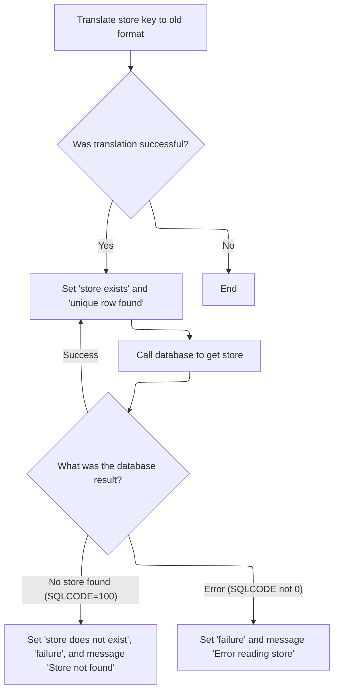
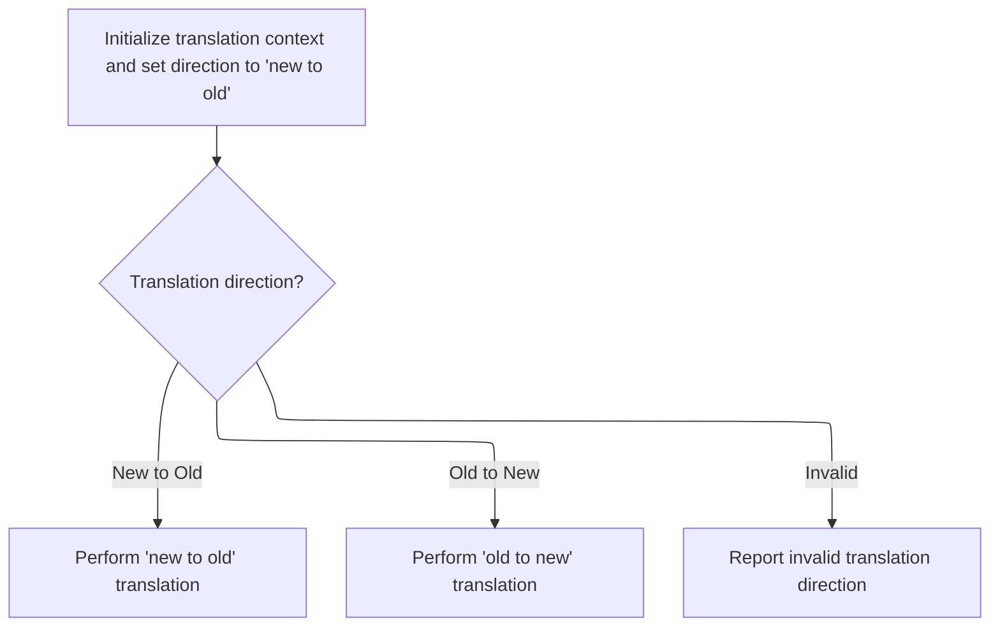
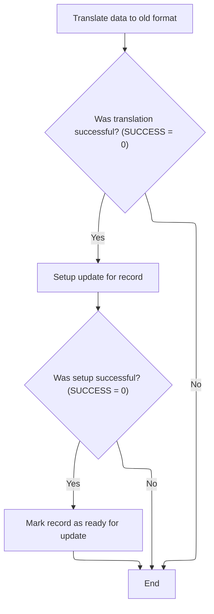

This document describes the process for synchronizing store data. The flow starts by triggering a sync request, then fetches and validates the store data. If validation and translation to the legacy format succeed, the store data is updated.

# Spec

## Detailed View of the Program's Functionality

a. Main Program Flow and Initialization

The main program begins by initializing its working storage and environment. It checks that the input data represents a valid store type and that the environment (batch or CICS) is set correctly. If the input is for an update and the class zone is not current, it attempts to fetch the latest class zone data. If any of these checks fail, the program sets a failure flag and returns an error message.

b. Sync Sequence Trigger

When the main logic determines that an add or update operation is requested, it triggers the sync sequence. This sequence is responsible for ensuring that the "old" database (legacy store tables) is synchronized with the "new" master database.

c. Fetching and Validating Store Data

The sync sequence first attempts to fetch the current store data from the legacy database. This involves:

- Translating the store key from the new format to the old format, so the legacy database routines can understand it.
- If translation is successful, it marks the store as existing and prepares to fetch a unique row from the legacy database.
- It then calls the legacy database access routine to retrieve the store data.
- The result of this fetch is evaluated:
  - If no store is found, it marks the store as not existing, sets a failure flag, and prepares an error message indicating the store was not found.
  - If there is a database error, it sets a failure flag and builds an error message with the SQL error code.
  - If the fetch is successful, it proceeds to the next step.

d. Translating Data for Legacy Compatibility

The translation step is handled by a separate module. This module is called with a flag indicating the direction of translation (new-to-old or old-to-new). For the sync process, the translation is always from the new format to the old format. The translation module:

- Initializes its workspace.
- Checks the translation direction.
- If the direction is new-to-old, it copies relevant fields from the new structure to the old structure, handling different item classes as needed.
- If the direction is invalid, it sets a failure flag and returns an error message.

e. Updating Store Data After Validation

If the fetch and translation steps are successful, the sync sequence proceeds to update the legacy store data:

- It translates the data to the old format again to ensure the update routines have the correct structure.
- If translation is successful, it sets up the update operation.
- If the setup is successful, it marks the record as ready for update and performs the update using the legacy database access routine.
- After the update, it checks the result:
  - If the store record is not found, it sets a failure flag and builds an error message.
  - If there is a database error, it sets a failure flag and builds an error message with the SQL error code.

f. Error Handling and Messaging

Throughout the process, at each critical step (initialization, translation, fetch, update), the code checks for success. If any step fails, it sets a failure flag and constructs a descriptive error message, often including the key of the store and any relevant SQL error codes. This ensures that any issues can be diagnosed and reported clearly.

g. Summary

The overall flow ensures that only valid, properly translated data is used to update the legacy store tables. The process is robust, with checks and error handling at every stage, and is designed to keep the legacy and new databases in sync until the legacy system is retired.

# Rule Definition

| Paragraph Name                                                                     | Rule ID | Category          | Description                                                                                                                                                                                                                 | Conditions                                                                             | Remarks                                                                                                                                                                                 |
| ---------------------------------------------------------------------------------- | ------- | ----------------- | --------------------------------------------------------------------------------------------------------------------------------------------------------------------------------------------------------------------------- | -------------------------------------------------------------------------------------- | --------------------------------------------------------------------------------------------------------------------------------------------------------------------------------------- |
| 100-INITIALIZE (MMMS0161.cbl)                                                      | RL-001  | Conditional Logic | Only store types (LOC-TYP-CD equal to K-STORE-LOC-TYPE) are allowed for class zone operations. If the input is not a store type, the operation fails.                                                                       | LOC-TYP-CD of P-DDDTCZ01 is not equal to K-STORE-LOC-TYPE.                             | K-STORE-LOC-TYPE is a constant representing valid store types. Failure flag is set and IS-RTRN-MSG-TXT is populated with 'MMMS0161 - only store types can have class zones!'.           |
| 200-NEW-2-OLD, 210-POPULATE-DDDPST01, 220-POPULATE-DDDTRL01 (MMMS0162.cbl)         | RL-002  | Computation       | Translate fields from new-format (P-DDDTCZ01) to old-format (DDDPST01 for IMS, P-DDDTRL01 for DB2) based on ITM-CLS-CD. AD-ZONE and AD-ZONE-EXCP are mapped to corresponding zone and exception fields for each item class. | Translation is triggered when YYYN111A-NEW-2-OLD is set.                               | Item class codes handled: 12, 13, 14, 36, 37. AD-ZONE and AD-ZONE-EXCP are mapped to specific fields in old formats. Output fields are alphanumeric or numeric as defined in copybooks. |
| 1400-GET-DDDTRL01 (MMMS0161.cbl)                                                   | RL-003  | Conditional Logic | Fetch the current store record from legacy DB2 table using translated key fields. Set existence flags based on fetch result.                                                                                                | Fetch is performed after translation to old format and when SUCCESS is true.           | Uses DAO call (NNNS0120-DDDTRL01-DAO). Flags set: DDDTRL01-EXISTS, DDDTRL01-DOES-NOT-EXIST. SQLCODE is checked for result: 100 means not found, 0 means found.                          |
| 1500-UPDATE-DDDTRL01, 1520-READY-UPD-DDDTRL01 (MMMS0161.cbl)                       | RL-004  | Computation       | Update the legacy DB2 table with translated data if the store record exists and translation was successful.                                                                                                                 | Update is performed if DDDTRL01-EXISTS is true and SUCCESS is true.                    | Update performed via DAO call. SQLCODE is checked for errors. Output includes updated legacy record.                                                                                    |
| 1400-GET-DDDTRL01, 1520-READY-UPD-DDDTRL01 (MMMS0161.cbl)                          | RL-005  | Conditional Logic | If the store record does not exist, set the DDDTRL01-DOES-NOT-EXIST flag and populate the return message field.                                                                                                             | SQLCODE = 100 after fetch or update attempt.                                           | IS-RTRN-MSG-TXT is set to 'Store not found' or similar error message. DDDTRL01-DOES-NOT-EXIST flag is set.                                                                              |
| 120-GET-CZ, 1400-GET-DDDTRL01, 1520-READY-UPD-DDDTRL01 (MMMS0161.cbl)              | RL-006  | Conditional Logic | If any error occurs during translation or database operations, set the FAILURE flag and populate the return message field with an appropriate error message.                                                                | Any error detected (SQLCODE not 0, invalid input, etc.)                                | FAILURE flag is set. IS-RTRN-MSG-TXT is populated with detailed error message including SQLCODE if applicable.                                                                          |
| Throughout MMMS0161.cbl and MMMS0162.cbl (main logic, error handling, translation) | RL-007  | Data Assignment   | Set status flags (SUCCESS, FAILURE, DDDTRL01-EXISTS, DDDTRL01-DOES-NOT-EXIST) and return a message indicating the result of the operation.                                                                                  | After each major operation (initialization, translation, fetch, update, delete, error) | Flags are single-character or boolean fields. IS-RTRN-MSG-TXT is a string field for messaging. Output must include updated legacy records and status/messaging fields.                  |
| 2010-CLEAR-ZONE (MMMS0161.cbl)                                                     | RL-008  | Data Assignment   | When a class zone is deleted, clear the corresponding zone and exception fields in both IMS and DB2 tables for the relevant item class.                                                                                     | Triggered by delete operation (YYYN110A-DEL) and SUCCESS is true.                      | Fields to clear: class zone and exception fields for item classes 12, 13, 14, 36, 37. Fields are initialized to default/empty values.                                                   |

# User Stories

## User Story 1: Validate store type and initialize sync operation

---

### Story Description:

As a system, I want to validate that only store types are processed for class zone operations so that invalid input is rejected and users are informed of the reason for failure.

---

### Business Rule Mapping:

| Rule ID | Paragraph Name                                                                     | Rule Description                                                                                                                                             |
| ------- | ---------------------------------------------------------------------------------- | ------------------------------------------------------------------------------------------------------------------------------------------------------------ |
| RL-001  | 100-INITIALIZE (MMMS0161.cbl)                                                      | Only store types (LOC-TYP-CD equal to K-STORE-LOC-TYPE) are allowed for class zone operations. If the input is not a store type, the operation fails.        |
| RL-006  | 120-GET-CZ, 1400-GET-DDDTRL01, 1520-READY-UPD-DDDTRL01 (MMMS0161.cbl)              | If any error occurs during translation or database operations, set the FAILURE flag and populate the return message field with an appropriate error message. |
| RL-007  | Throughout MMMS0161.cbl and MMMS0162.cbl (main logic, error handling, translation) | Set status flags (SUCCESS, FAILURE, DDDTRL01-EXISTS, DDDTRL01-DOES-NOT-EXIST) and return a message indicating the result of the operation.                   |

---

### Relevant Functionality:

- **100-INITIALIZE (MMMS0161.cbl)**
  1. **RL-001:**
     - If input store type is not valid:
       - Set FAILURE flag to TRUE
       - Set IS-RTRN-MSG-TXT to error message
       - Abort further processing.
- **120-GET-CZ**
  1. **RL-006:**
     - On error:
       - Set FAILURE to TRUE
       - Set IS-RTRN-MSG-TXT to error message (may include SQLCODE and key info)
- **Throughout MMMS0161.cbl and MMMS0162.cbl (main logic**
  1. **RL-007:**
     - After each operation:
       - Set appropriate status flag (SUCCESS, FAILURE, etc.)
       - Set IS-RTRN-MSG-TXT to result or error message
       - Include updated legacy records in output

## User Story 2: Translate new-format store data to legacy formats

---

### Story Description:

As a system, I want to translate new-format store data to legacy IMS and DB2 structures based on item class codes so that legacy systems receive correctly mapped zone and exception fields.

---

### Business Rule Mapping:

| Rule ID | Paragraph Name                                                                     | Rule Description                                                                                                                                                                                                            |
| ------- | ---------------------------------------------------------------------------------- | --------------------------------------------------------------------------------------------------------------------------------------------------------------------------------------------------------------------------- |
| RL-002  | 200-NEW-2-OLD, 210-POPULATE-DDDPST01, 220-POPULATE-DDDTRL01 (MMMS0162.cbl)         | Translate fields from new-format (P-DDDTCZ01) to old-format (DDDPST01 for IMS, P-DDDTRL01 for DB2) based on ITM-CLS-CD. AD-ZONE and AD-ZONE-EXCP are mapped to corresponding zone and exception fields for each item class. |
| RL-007  | Throughout MMMS0161.cbl and MMMS0162.cbl (main logic, error handling, translation) | Set status flags (SUCCESS, FAILURE, DDDTRL01-EXISTS, DDDTRL01-DOES-NOT-EXIST) and return a message indicating the result of the operation.                                                                                  |

---

### Relevant Functionality:

- **200-NEW-2-OLD**
  1. **RL-002:**
     - For each item class code:
       - If ITM-CLS-CD is 12, 13, or 14:
         - Map AD-ZONE to class zone field
         - Map AD-ZONE-EXCP to class exception zone field
       - If ITM-CLS-CD is 36 or 37:
         - Map AD-ZONE-EXCP to class exception zone field only.
- **Throughout MMMS0161.cbl and MMMS0162.cbl (main logic**
  1. **RL-007:**
     - After each operation:
       - Set appropriate status flag (SUCCESS, FAILURE, etc.)
       - Set IS-RTRN-MSG-TXT to result or error message
       - Include updated legacy records in output

## User Story 3: Fetch and update legacy store records

---

### Story Description:

As a system, I want to fetch the current store record from legacy tables and update it with translated data if it exists so that store information remains current and accurate.

---

### Business Rule Mapping:

| Rule ID | Paragraph Name                                                                     | Rule Description                                                                                                                           |
| ------- | ---------------------------------------------------------------------------------- | ------------------------------------------------------------------------------------------------------------------------------------------ |
| RL-004  | 1500-UPDATE-DDDTRL01, 1520-READY-UPD-DDDTRL01 (MMMS0161.cbl)                       | Update the legacy DB2 table with translated data if the store record exists and translation was successful.                                |
| RL-003  | 1400-GET-DDDTRL01 (MMMS0161.cbl)                                                   | Fetch the current store record from legacy DB2 table using translated key fields. Set existence flags based on fetch result.               |
| RL-007  | Throughout MMMS0161.cbl and MMMS0162.cbl (main logic, error handling, translation) | Set status flags (SUCCESS, FAILURE, DDDTRL01-EXISTS, DDDTRL01-DOES-NOT-EXIST) and return a message indicating the result of the operation. |

---

### Relevant Functionality:

- **1500-UPDATE-DDDTRL01**
  1. **RL-004:**
     - If DDDTRL01-EXISTS and SUCCESS:
       - Call DAO to update record
       - If SQLCODE = 100 or != 0:
         - Set FAILURE to TRUE
         - Set IS-RTRN-MSG-TXT to error message
- **1400-GET-DDDTRL01 (MMMS0161.cbl)**
  1. **RL-003:**
     - Call DAO to fetch record
     - If SQLCODE = 100:
       - Set DDDTRL01-DOES-NOT-EXIST to TRUE
       - Set FAILURE to TRUE
       - Set IS-RTRN-MSG-TXT to 'Store not found'
     - If SQLCODE != 0:
       - Set FAILURE to TRUE
       - Set IS-RTRN-MSG-TXT to error message
     - If SQLCODE = 0:
       - Set DDDTRL01-EXISTS to TRUE
- **Throughout MMMS0161.cbl and MMMS0162.cbl (main logic**
  1. **RL-007:**
     - After each operation:
       - Set appropriate status flag (SUCCESS, FAILURE, etc.)
       - Set IS-RTRN-MSG-TXT to result or error message
       - Include updated legacy records in output

## User Story 4: Handle missing store records and errors

---

### Story Description:

As a system, I want to set appropriate flags and return messages when a store record does not exist or when errors occur during processing so that users are clearly informed of the outcome and any issues.

---

### Business Rule Mapping:

| Rule ID | Paragraph Name                                                                     | Rule Description                                                                                                                                             |
| ------- | ---------------------------------------------------------------------------------- | ------------------------------------------------------------------------------------------------------------------------------------------------------------ |
| RL-005  | 1400-GET-DDDTRL01, 1520-READY-UPD-DDDTRL01 (MMMS0161.cbl)                          | If the store record does not exist, set the DDDTRL01-DOES-NOT-EXIST flag and populate the return message field.                                              |
| RL-006  | 120-GET-CZ, 1400-GET-DDDTRL01, 1520-READY-UPD-DDDTRL01 (MMMS0161.cbl)              | If any error occurs during translation or database operations, set the FAILURE flag and populate the return message field with an appropriate error message. |
| RL-007  | Throughout MMMS0161.cbl and MMMS0162.cbl (main logic, error handling, translation) | Set status flags (SUCCESS, FAILURE, DDDTRL01-EXISTS, DDDTRL01-DOES-NOT-EXIST) and return a message indicating the result of the operation.                   |

---

### Relevant Functionality:

- **1400-GET-DDDTRL01**
  1. **RL-005:**
     - If SQLCODE = 100 after fetch or update:
       - Set DDDTRL01-DOES-NOT-EXIST to TRUE
       - Set FAILURE to TRUE
       - Set IS-RTRN-MSG-TXT to 'Store not found' or appropriate message
- **120-GET-CZ**
  1. **RL-006:**
     - On error:
       - Set FAILURE to TRUE
       - Set IS-RTRN-MSG-TXT to error message (may include SQLCODE and key info)
- **Throughout MMMS0161.cbl and MMMS0162.cbl (main logic**
  1. **RL-007:**
     - After each operation:
       - Set appropriate status flag (SUCCESS, FAILURE, etc.)
       - Set IS-RTRN-MSG-TXT to result or error message
       - Include updated legacy records in output

## User Story 5: Clear class zone and exception fields on delete

---

### Story Description:

As a system, I want to clear class zone and exception fields in legacy tables when a class zone is deleted so that deleted zones are properly removed from all relevant records.

---

### Business Rule Mapping:

| Rule ID | Paragraph Name                                                                     | Rule Description                                                                                                                           |
| ------- | ---------------------------------------------------------------------------------- | ------------------------------------------------------------------------------------------------------------------------------------------ |
| RL-008  | 2010-CLEAR-ZONE (MMMS0161.cbl)                                                     | When a class zone is deleted, clear the corresponding zone and exception fields in both IMS and DB2 tables for the relevant item class.    |
| RL-007  | Throughout MMMS0161.cbl and MMMS0162.cbl (main logic, error handling, translation) | Set status flags (SUCCESS, FAILURE, DDDTRL01-EXISTS, DDDTRL01-DOES-NOT-EXIST) and return a message indicating the result of the operation. |

---

### Relevant Functionality:

- **2010-CLEAR-ZONE (MMMS0161.cbl)**
  1. **RL-008:**
     - For each item class code:
       - Initialize (clear) zone and exception fields in both legacy tables
- **Throughout MMMS0161.cbl and MMMS0162.cbl (main logic**
  1. **RL-007:**
     - After each operation:
       - Set appropriate status flag (SUCCESS, FAILURE, etc.)
       - Set IS-RTRN-MSG-TXT to result or error message
       - Include updated legacy records in output

# Code Walkthrough

## Triggering the Sync Sequence

<SwmSnippet path="/base/src/MMMS0161.cbl" line="179">

---

`1000-DO-THE-SYNC` starts the sync, fetches the current store data, and only updates if everything checks out.

```cobol
018400 1000-DO-THE-SYNC.                                                00018400
018500     IF SUCCESS                                                   00018500
018600       PERFORM 1400-GET-DDDTRL01                                  00018600
018700       IF SUCCESS                                                 00018700
018800         PERFORM 1500-UPDATE-DDDTRL01                             00018800
018900       END-IF                                                     00018900
019000     END-IF                                                       00019000
019100     .                                                            00019100
```

---

</SwmSnippet>

### Fetching and Validating Store Data



<SwmSnippet path="/base/src/MMMS0161.cbl" line="194">

---

`1400-GET-DDDTRL01` handles fetching the store data. It starts by translating the input to the legacy format (calls 9000-TRANSLATE-TO-OLD) so the DAO can work with it. If translation works, it marks the row as existing, sets the exit flag, and tries to fetch the row. Based on the SQLCODE, it sets flags for existence or failure and builds error messages as needed. The flow assumes the store key is already set up in DDDPST01.

```cobol
019900 1400-GET-DDDTRL01.                                               00019900
020000     PERFORM 9000-TRANSLATE-TO-OLD                                00020000
020100     IF SUCCESS                                                   00020100
020200       SET DDDTRL01-EXISTS            TO TRUE                     00020200
020300       SET EXIT-GET-UNIQUE-ROW        TO TRUE                     00020300
020400       PERFORM 9200-CALL-DDDTRL01-DAO                             00020400
020500                                                                  00020500
020600       EVALUATE TRUE                                              00020600
020700         WHEN SQLCODE = 100                                       00020700
020800           SET  DDDTRL01-DOES-NOT-EXIST TO TRUE                   00020800
020900           SET  FAILURE                 TO TRUE                   00020900
021000           MOVE 'MMMS0161 - Store not found in DB2 Table (FCRL)!' 00021000
021100             TO IS-RTRN-MSG-TXT                                   00021100
021200                                                                  00021200
021300         WHEN SQLCODE NOT = 0                                     00021300
021400           SET  FAILURE TO TRUE                                   00021400
021500           MOVE SQLCODE TO WS-SQLCODE                             00021500
021600           MOVE SPACES  TO IS-RTRN-MSG-TXT                        00021600
021700           STRING 'MMMS0161 - Error reading DB2 Store, '          00021700
021800                  'key='      ST-STORE-KEY OF DDDPST01            00021800
021900                  ',SQL=' WS-SQLCODE '.'                          00021900
022000                  DELIMITED BY SIZE INTO IS-RTRN-MSG-TXT          00022000
022100       END-EVALUATE                                               00022100
022200     END-IF                                                       00022200
022300     .                                                            00022300
```

---

</SwmSnippet>

### Translating Data for Legacy Compatibility



<SwmSnippet path="/base/src/MMMS0161.cbl" line="320">

---

`9000-TRANSLATE-TO-OLD` sets up the translation mode and calls MMMS0162 to convert the data from the new format to the old one. This is needed because the DAO and other legacy routines only understand the old structure. If the translation fails, the rest of the sync won't proceed.

```cobol
032500 9000-TRANSLATE-TO-OLD.                                           00032500
032600     INITIALIZE YYYN111A                                          00032600
032700     SET YYYN111A-NEW-2-OLD           TO TRUE                     00032700
032800                                                                  00032800
032900     CALL MMMS0162-TRANSLATE-CZ USING                             00032900
033000         XXXN001A                                                 00033000
033100         YYYN111A                                                 00033100
033200         P-DDDTCZ01                                               00033200
033300         DDDPST01                                                 00033300
033400         P-DDDTRL01                                               00033400
033500     .                                                            00033500
```

---

</SwmSnippet>

<SwmSnippet path="/base/src/MMMS0162.cbl" line="53">

---

`000-MAIN` in MMMS0162 initializes the workspace, checks which translation is needed (new-to-old or old-to-new), and performs the right operation. If the mode is invalid, it sets failure and returns an error message. Both directions are supported, but only one runs per call.

```cobol
005700 000-MAIN.                                                        00005700
005800     PERFORM 100-INITIALIZE                                       00005800
005900                                                                  00005900
006000     EVALUATE TRUE                                                00006000
006100       WHEN YYYN111A-NEW-2-OLD                                    00006100
006200         PERFORM 200-NEW-2-OLD                                    00006200
006300                                                                  00006300
006400       WHEN YYYN111A-OLD-2-NEW                                    00006400
006500         PERFORM 500-OLD-2-NEW                                    00006500
006600                                                                  00006600
006700       WHEN OTHER                                                 00006700
006800         SET FAILURE TO TRUE                                      00006800
006900         MOVE 'MMMS0162 - Invalid translation function.'          00006900
007000           TO IS-RTRN-MSG-TXT                                     00007000
007100     END-EVALUATE                                                 00007100
007200                                                                  00007200
007300     GOBACK                                                       00007300
007400     .                                                            00007400
```

---

</SwmSnippet>

### Updating Store Data After Validation



<SwmSnippet path="/base/src/MMMS0161.cbl" line="224">

---

`1500-UPDATE-DDDTRL01` starts by translating the data to the legacy format again (calls 9000-TRANSLATE-TO-OLD) to make sure the update routines get the right structure. If translation works, it sets up and readies the update. If any step fails, the update doesn't proceed.

```cobol
022900 1500-UPDATE-DDDTRL01.                                            00022900
023000     PERFORM 9000-TRANSLATE-TO-OLD                                00023000
023100     IF SUCCESS                                                   00023100
023200       PERFORM 1510-SETUP-UPD-DDDTRL01                            00023200
023300       IF SUCCESS                                                 00023300
023400         PERFORM 1520-READY-UPD-DDDTRL01                          00023400
023500       END-IF                                                     00023500
023600     END-IF                                                       00023600
023700     .                                                            00023700
```

---

</SwmSnippet>

&nbsp;

*This is an auto-generated document by Swimm 🌊 and has not yet been verified by a human*

<SwmMeta version="3.0.0" repo-id="Z2l0aHViJTNBJTNBU3dpbW1pby1keW5jYWxsLWRlbW8lM0ElM0FHaXJpLVN3aW1t" repo-name="Swimmio-dyncall-demo"><sup>Powered by [Swimm](https://app.swimm.io/)</sup></SwmMeta>
