# Overview

This document explains the flow of department table operations. The system processes department transaction requests, manages database connections, and ensures department records are accurately updated, inserted, or purged, while supporting auditability and event notification.

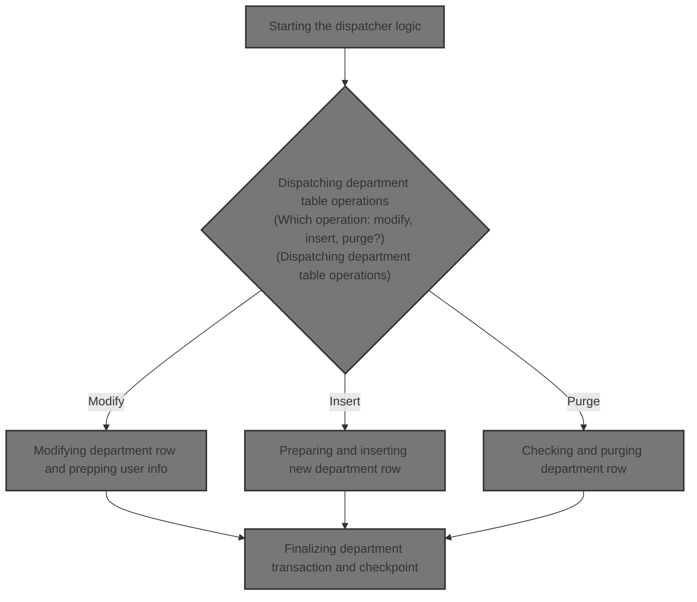

## Dependencies

### Programs

- <SwmToken path="base/src/NNNS0573.cbl" pos="235:5:5" line-data="025800       STRING &#39;NNNS0573 - Error connecting to Oracle. Sqlcode =&#39;  00025800">`NNNS0573`</SwmToken> (<SwmPath>[base/src/NNNS0573.cbl](base/src/NNNS0573.cbl)</SwmPath>)
- <SwmToken path="base/src/XXXS0210.cbl" pos="2:7:7" line-data="000200 PROGRAM-ID.    YYYS0210.                                         00000200">`YYYS0210`</SwmToken> (<SwmPath>[base/src/XXXS0210.cbl](base/src/XXXS0210.cbl)</SwmPath>)
- <SwmToken path="base/src/XXXS0210.cbl" pos="55:4:4" line-data="007540     CALL YYYS0220-DBMS-CON-MGR USING                             00007540">`YYYS0220`</SwmToken> (<SwmPath>[base/src/YYYS0220.cbl](base/src/YYYS0220.cbl)</SwmPath>)
- <SwmToken path="base/src/YYYS0211.cbl" pos="2:7:7" line-data="000200 PROGRAM-ID.    YYYS0211.                                         00000200">`YYYS0211`</SwmToken> (<SwmPath>[base/src/YYYS0211.cbl](base/src/YYYS0211.cbl)</SwmPath>)
- <SwmToken path="base/src/YYYS0212.cbl" pos="96:9:9" line-data="010300         STRING &#39;Error in YYYS0212. Oracle code:&#39;                 00010300">`YYYS0212`</SwmToken> (<SwmPath>[base/src/YYYS0212.cbl](base/src/YYYS0212.cbl)</SwmPath>)
- <SwmToken path="base/src/NNNS0573.cbl" pos="565:4:4" line-data="058500     CALL WWWS0100-CONTROL-SUBR USING                             00058500">`WWWS0100`</SwmToken> (<SwmPath>[base/src/WWWS0100.cbl](base/src/WWWS0100.cbl)</SwmPath>)
- <SwmToken path="base/src/NNNS0573.cbl" pos="589:4:4" line-data="060900     CALL ZZZS0197-EVENT-MGR USING                                00060900">`ZZZS0197`</SwmToken> (<SwmPath>[base/src/ZZZS0197.cbl](base/src/ZZZS0197.cbl)</SwmPath>)
- <SwmToken path="base/src/ZZZS0197.cbl" pos="16:20:20" line-data="004300 01 WS-EVENT-STAGER                 PIC X(8) VALUE &#39;YYYS0175&#39;.    00004300">`YYYS0175`</SwmToken>
- YYYS0127
- YYYS0107
- <SwmToken path="base/src/NNNS0573.cbl" pos="521:8:8" line-data="054310     PERFORM 4500-CALL-MMMS0304-RI-DEL-CHK                        00054310">`MMMS0304`</SwmToken>

### Copybooks

- SQLCA
- <SwmToken path="base/src/NNNS0573.cbl" pos="181:4:4" line-data="020400     INITIALIZE XXXN001A                                          00020400">`XXXN001A`</SwmToken> (<SwmPath>[base/src/XXXN001A.cpy](base/src/XXXN001A.cpy)</SwmPath>)
- <SwmToken path="base/src/XXXS0210.cbl" pos="53:4:4" line-data="007510     SET YYYC0220-SET-ORACLE-CON TO TRUE                          00007510">`YYYC0220`</SwmToken> (<SwmPath>[base/src/YYYC0220.cpy](base/src/YYYC0220.cpy)</SwmPath>)
- <SwmToken path="base/src/NNNS0573.cbl" pos="47:4:4" line-data="007100 COPY YYYN000A.                                                   00007100">`YYYN000A`</SwmToken> (<SwmPath>[base/src/YYYN000A.cpy](base/src/YYYN000A.cpy)</SwmPath>)
- <SwmToken path="base/src/NNNS0573.cbl" pos="564:4:4" line-data="058400     SET WWWC0100-GET-TASK  TO TRUE                               00058400">`WWWC0100`</SwmToken> (<SwmPath>[base/src/WWWC0100.cpy](base/src/WWWC0100.cpy)</SwmPath>)
- <SwmToken path="base/src/ZZZS0197.cbl" pos="41:4:4" line-data="006800 COPY YYYC0175.                                                   00006800">`YYYC0175`</SwmToken>
- <SwmToken path="base/src/NNNS0573.cbl" pos="460:4:4" line-data="048300       SET YYYN110A-UPD TO TRUE                                   00048300">`YYYN110A`</SwmToken> (<SwmPath>[base/src/YYYN110A.cpy](base/src/YYYN110A.cpy)</SwmPath>)
- <SwmToken path="base/src/NNNS0573.cbl" pos="584:10:10" line-data="060400     MOVE &#39;SDPM&#39;                TO ZZZC0197-TRX-ID                00060400">`ZZZC0197`</SwmToken> (<SwmPath>[base/src/ZZZC0197.cpy](base/src/ZZZC0197.cpy)</SwmPath>)
- <SwmToken path="base/src/NNNS0573.cbl" pos="44:4:4" line-data="006800 COPY NNNN000U.                                                   00006800">`NNNN000U`</SwmToken> (<SwmPath>[base/src/NNNN000U.cpy](base/src/NNNN000U.cpy)</SwmPath>)
- <SwmToken path="base/src/NNNS0573.cbl" pos="45:4:4" line-data="006900 COPY HHHTDP01.                                                   00006900">`HHHTDP01`</SwmToken> (<SwmPath>[base/src/HHHTDP01.cpy](base/src/HHHTDP01.cpy)</SwmPath>)
- XXXEIBLK
- <SwmToken path="base/src/NNNS0573.cbl" pos="454:4:4" line-data="047700     MOVE YYYC0107-USER TO LST-UPDT-USR-ID OF DCLXXX-DEPT         00047700">`YYYC0107`</SwmToken> (<SwmPath>[base/src/YYYC0107.cpy](base/src/YYYC0107.cpy)</SwmPath>)
- <SwmToken path="base/src/NNNS0573.cbl" pos="453:4:4" line-data="047600     MOVE YYYC0127-TS   TO LST-UPDT-TS     OF DCLXXX-DEPT         00047600">`YYYC0127`</SwmToken> (<SwmPath>[base/src/YYYC0127.cpy](base/src/YYYC0127.cpy)</SwmPath>)
- <SwmToken path="base/src/NNNS0573.cbl" pos="578:12:12" line-data="059800       TO XXX-DEPT-NBR OF ZZZC0125                                00059800">`ZZZC0125`</SwmToken> (<SwmPath>[base/src/ZZZC0125.cpy](base/src/ZZZC0125.cpy)</SwmPath>)
- <SwmToken path="base/src/NNNS0573.cbl" pos="574:4:4" line-data="059400     INITIALIZE ZZZC0550                                          00059400">`ZZZC0550`</SwmToken> (<SwmPath>[base/src/ZZZC0550.cpy](base/src/ZZZC0550.cpy)</SwmPath>)
- <SwmToken path="base/src/NNNS0573.cbl" pos="57:4:4" line-data="008100 COPY MMMC0257.                                                   00008100">`MMMC0257`</SwmToken> (<SwmPath>[base/src/MMMC0257.cpy](base/src/MMMC0257.cpy)</SwmPath>)
- <SwmToken path="base/src/NNNS0573.cbl" pos="58:4:4" line-data="008200 COPY MMMK001D.                                                   00008200">`MMMK001D`</SwmToken> (<SwmPath>[base/src/MMMK001D.cpy](base/src/MMMK001D.cpy)</SwmPath>)
- <SwmToken path="base/src/NNNS0573.cbl" pos="627:4:4" line-data="064610     INITIALIZE MMMC0304                                          00064610">`MMMC0304`</SwmToken> (<SwmPath>[base/src/MMMC0304.cpy](base/src/MMMC0304.cpy)</SwmPath>)
- <SwmToken path="base/src/NNNS0573.cbl" pos="184:12:12" line-data="020700     MOVE NNNN0000-INDEX-HANDLE TO DDDTDP01-INDEX-HANDLE          00020700">`DDDTDP01`</SwmToken> (<SwmPath>[base/src/DDDTDP01.cpy](base/src/DDDTDP01.cpy)</SwmPath>)
- <SwmToken path="base/src/NNNS0573.cbl" pos="191:5:5" line-data="021400     IF (YYYN005A-ORACLE       OR EXIT-PUT-INSERT-ROW             00021400">`YYYN005A`</SwmToken> (<SwmPath>[base/src/YYYN005A.cpy](base/src/YYYN005A.cpy)</SwmPath>)
- <SwmToken path="base/src/NNNS0573.cbl" pos="184:4:4" line-data="020700     MOVE NNNN0000-INDEX-HANDLE TO DDDTDP01-INDEX-HANDLE          00020700">`NNNN0000`</SwmToken> (<SwmPath>[base/src/NNNN0000.cpy](base/src/NNNN0000.cpy)</SwmPath>)
- <SwmToken path="base/src/NNNS0573.cbl" pos="137:4:4" line-data="016000 COPY PPPTDP01.                                                   00016000">`PPPTDP01`</SwmToken> (<SwmPath>[base/src/PPPTDP01.cpy](base/src/PPPTDP01.cpy)</SwmPath>)

# Where is this program used?

This program is used once, as represented in the following diagram:

```mermaid
graph TD
  0a5lg("Database Cursor Operations Handler (WWWS0040)") --> halrr("Table IO Object for Department Data (NNNS0573)"):::currentEntity
click 0a5lg openCode "base/src/WWWS0040.cbl:1"
  
  
click halrr openCode "base/src/NNNS0573.cbl:1"
    classDef currentEntity color:#000000,fill:#7CB9F4

%% Swimm:
%% graph TD
%%   0a5lg("Database Cursor Operations Handler (WWWS0040)") --> halrr("Table IO Object for Department Data (<SwmToken path="base/src/NNNS0573.cbl" pos="235:5:5" line-data="025800       STRING &#39;NNNS0573 - Error connecting to Oracle. Sqlcode =&#39;  00025800">`NNNS0573`</SwmToken>)"):::currentEntity
%% click 0a5lg openCode "<SwmPath>[base/src/WWWS0040.cbl](base/src/WWWS0040.cbl)</SwmPath>:1"
%%   
%%   
%% click halrr openCode "<SwmPath>[base/src/NNNS0573.cbl](base/src/NNNS0573.cbl)</SwmPath>:1"
%%     classDef currentEntity color:#000000,fill:#7CB9F4
```

## Detailed View of the Program's Functionality

# Main Dispatcher Initialization and Oracle Connection

## Initialization Sequence

The dispatcher logic begins by initializing all internal data structures and resetting relevant fields to ensure a clean state for the transaction. This includes clearing out working storage, setting checkpoint counters to zero, and preparing the index handles for department data. If the operation is not a cursor close, department data is copied from the input structure to the internal structure, ensuring the data is formatted correctly for downstream database operations.

## Oracle Connection Setup

After initialization, the dispatcher checks if an Oracle connection is required (based on flags indicating the type of operation). If so, it calls a routine to establish the Oracle database connection. If the connection fails, the SQL error code is captured and an error message is constructed for diagnostics.

# Database Connection Management

## Switching to Oracle

When a connection to Oracle is needed, the dispatcher sets a flag indicating the desired connection type and calls a connection manager routine. This routine updates the connection state and increments usage statistics for Oracle requests.

## Connection Manager Dispatch

The connection manager acts as a dispatcher, evaluating the requested function code and performing the appropriate subroutine. It can switch connections between <SwmToken path="base/src/NNNS0573.cbl" pos="182:2:2" line-data="020500                DB2-STUFF                                         00020500">`DB2`</SwmToken> and Oracle, retrieve or reset usage statistics, and handle overrides. If an unrecognized function code is received, it sets an error flag and message.

## Switching to <SwmToken path="base/src/NNNS0573.cbl" pos="182:2:2" line-data="020500                DB2-STUFF                                         00020500">`DB2`</SwmToken>

When switching back to <SwmToken path="base/src/NNNS0573.cbl" pos="182:2:2" line-data="020500                DB2-STUFF                                         00020500">`DB2`</SwmToken>, the connection manager sets the <SwmToken path="base/src/NNNS0573.cbl" pos="182:2:2" line-data="020500                DB2-STUFF                                         00020500">`DB2`</SwmToken> connection flag and calls the appropriate subroutine to update the connection state and statistics. It chooses the <SwmToken path="base/src/NNNS0573.cbl" pos="182:2:2" line-data="020500                DB2-STUFF                                         00020500">`DB2`</SwmToken> environment (production or test) based on internal flags and handles errors by setting flags and constructing error messages.

# Department Table Operations

## Operation Dispatch

After initialization and connection setup, the dispatcher evaluates which department operation is requested (open cursor, close cursor, get unique row, get next row, modify row, insert row, purge row, or special I/O). It then performs the corresponding subroutine.

## Cursor Operations

- **Open Cursor:** Checks the cursor ID and opens the appropriate database cursor for department queries. If the ID is invalid, sets an error flag and message.
- **Close Cursor:** Checks the cursor ID and closes the appropriate database cursor. If the ID is invalid, sets an error flag and message.

## Row Retrieval

- **Get Unique Row:** Executes a SQL SELECT to fetch a unique department row using primary keys, loads the result into the output structure, and checks for nulls.
- **Get Next Row:** Checks the cursor ID and performs the appropriate fetch operation. If the ID is invalid, sets an error flag and message, then checks for nulls in the result.

# Modifying Department Rows

## Preparing for Modification

Before modifying a department row, the dispatcher ensures all required fields are set and prepares null indicators. It then fetches the current date and user information for audit stamping. If the environment is CICS, it retrieves the user from the CICS system; otherwise, it sets a default user ID.

## Fetching Current Values

If previous steps are successful, the dispatcher fetches the current department name using the department number and sub-department ID as keys. This value is used for later comparison and event logic. If the fetch fails, it sets an error flag and constructs an error message.

## Performing the Update

The dispatcher updates the department's timestamp and user ID, then calls the update routine. If the update is successful, it sets checkpoint and update flags, checks if the department name changed (to set the stage event flag), and calls the denormalization process to handle downstream effects or event triggers.

# Inserting New Department Rows

## Preparing for Insert

When inserting a new department row, the dispatcher prepares null indicators and fetches the current date and user information. Only if these steps succeed does it proceed to insert the row.

## Assigning Organization ID

Before inserting, the dispatcher calculates the next available organization ID by running a SQL query to get the maximum org ID from both the LOCATION and department tables, then increments it for the new row. If the query fails, it sets an error flag and message.

## Finalizing Insert

If the insert is successful, the dispatcher sets checkpoint and add flags, then calls the denormalization process to handle any downstream effects or events.

# Purging Department Rows

## Deletion Check and Purge

Before purging a department row, the dispatcher calls a routine to validate that the row can be deleted. Only if this check passes does it proceed with the actual delete operation. If the delete is successful, it sets delete flags and checkpoint, then calls the denormalization process.

# Denormalization and Event Workflow

## Passing Environment and Workflow Control

After modifying, inserting, or purging a row, the dispatcher copies the system environment to the event structure and calls a control subroutine to retrieve the current workflow state for the user. This sets up the context for any event actions that follow.

## Workflow Task Operations

The workflow manager initializes the environment and evaluates whether to set or get the workflow task state. It stores or retrieves user workflow information for later use.

## Issuing Department Events

If workflow control is successful, the dispatcher prepares event data by moving department info and hardcoded transaction/program IDs into the event structure, then calls the event manager to send the event. Only certain transaction types and batch environments are allowed to issue events, and duplicate events are filtered out.

## Event Filtering and Issuing

Events are filtered by transaction type and batch environment, and duplicates are weeded out. If the event passes these checks, it is issued by calling the event stager with the prepared event data.

## Secondary Event Issuing

If the update succeeded and both scan and stage event flags are set, the dispatcher sets the modify flag, updates the transaction data, and issues a second event as required by business rules.

# Finalizing and Cleaning Up

## Finalizing Dispatcher

After completing the requested operation, the dispatcher performs cleanup actions, updates checkpoints, and moves data fields as needed. If the operation involved Oracle or required a <SwmToken path="base/src/NNNS0573.cbl" pos="182:2:2" line-data="020500                DB2-STUFF                                         00020500">`DB2`</SwmToken> context switch, it calls the routine to switch back to <SwmToken path="base/src/NNNS0573.cbl" pos="182:2:2" line-data="020500                DB2-STUFF                                         00020500">`DB2`</SwmToken> and copies the SQL status code for error tracking.

## <SwmToken path="base/src/NNNS0573.cbl" pos="182:2:2" line-data="020500                DB2-STUFF                                         00020500">`DB2`</SwmToken> Connection and Error Handling

The <SwmToken path="base/src/NNNS0573.cbl" pos="182:2:2" line-data="020500                DB2-STUFF                                         00020500">`DB2`</SwmToken> connection routine initializes the shutdown sequence, ensures the database connection is handled, converts Oracle SQL codes for business logic, restores any saved state, and completes the exit process.

## Oracle Error Code Translation

If an Oracle error code is present, the error conversion routine splits the error string into message parts and the Oracle code, then maps known Oracle codes to <SwmToken path="base/src/NNNS0573.cbl" pos="182:2:2" line-data="020500                DB2-STUFF                                         00020500">`DB2`</SwmToken> SQLCODEs. If the code is not recognized, it constructs a generic error message for the user.

# Summary

This flow coordinates department data operations (query, update, insert, delete), manages database connections (Oracle/DB2), handles workflow and event issuing, and ensures proper error handling and cleanup. Each operation is dispatched based on the requested action, with careful management of connection state, audit information, and event triggers to maintain data integrity and support business processes.

# Rule Definition

| Paragraph Name                                                                                                                                                                                                                                                                                                                                                                                                                                                                                                                                                                                                                                                                                                                                                                                                                                                                                                                                                                                                                                                                                                                                                                                                                                                                                                                                                                                                                                                                                                                       | Rule ID | Category          | Description                                                                                                                                                                                                                                                                                                                                               | Conditions                                                                                                                                                                                                                                                                                                                                                                                  | Remarks                                                                                                                                                                                                                                                                                                                                                                                                                                                                                                                                                                                                                                                                                                                                                                     |
| ------------------------------------------------------------------------------------------------------------------------------------------------------------------------------------------------------------------------------------------------------------------------------------------------------------------------------------------------------------------------------------------------------------------------------------------------------------------------------------------------------------------------------------------------------------------------------------------------------------------------------------------------------------------------------------------------------------------------------------------------------------------------------------------------------------------------------------------------------------------------------------------------------------------------------------------------------------------------------------------------------------------------------------------------------------------------------------------------------------------------------------------------------------------------------------------------------------------------------------------------------------------------------------------------------------------------------------------------------------------------------------------------------------------------------------------------------------------------------------------------------------------------------------ | ------- | ----------------- | --------------------------------------------------------------------------------------------------------------------------------------------------------------------------------------------------------------------------------------------------------------------------------------------------------------------------------------------------------- | ------------------------------------------------------------------------------------------------------------------------------------------------------------------------------------------------------------------------------------------------------------------------------------------------------------------------------------------------------------------------------------------- | --------------------------------------------------------------------------------------------------------------------------------------------------------------------------------------------------------------------------------------------------------------------------------------------------------------------------------------------------------------------------------------------------------------------------------------------------------------------------------------------------------------------------------------------------------------------------------------------------------------------------------------------------------------------------------------------------------------------------------------------------------------------------- |
| <SwmToken path="base/src/NNNS0573.cbl" pos="151:4:6" line-data="017400     PERFORM 100-INITIALIZATION                                   00017400">`100-INITIALIZATION`</SwmToken> in <SwmPath>[base/src/NNNS0573.cbl](base/src/NNNS0573.cbl)</SwmPath>, <SwmToken path="base/src/NNNS0573.cbl" pos="151:4:6" line-data="017400     PERFORM 100-INITIALIZATION                                   00017400">`100-INITIALIZATION`</SwmToken> in <SwmPath>[base/src/XXXS0210.cbl](base/src/XXXS0210.cbl)</SwmPath>, <SwmToken path="base/src/NNNS0573.cbl" pos="151:4:6" line-data="017400     PERFORM 100-INITIALIZATION                                   00017400">`100-INITIALIZATION`</SwmToken> in <SwmPath>[base/src/YYYS0220.cbl](base/src/YYYS0220.cbl)</SwmPath>, <SwmToken path="base/src/WWWS0100.cbl" pos="39:4:6" line-data="011800     PERFORM 100-INITIALIZE                                       00011800">`100-INITIALIZE`</SwmToken> in <SwmPath>[base/src/WWWS0100.cbl](base/src/WWWS0100.cbl)</SwmPath>, <SwmToken path="base/src/WWWS0100.cbl" pos="39:4:6" line-data="011800     PERFORM 100-INITIALIZE                                       00011800">`100-INITIALIZE`</SwmToken> in <SwmPath>[base/src/YYYS0212.cbl](base/src/YYYS0212.cbl)</SwmPath>, <SwmToken path="base/src/NNNS0573.cbl" pos="151:4:6" line-data="017400     PERFORM 100-INITIALIZATION                                   00017400">`100-INITIALIZATION`</SwmToken> in <SwmPath>[base/src/YYYS0211.cbl](base/src/YYYS0211.cbl)</SwmPath> | RL-001  | Data Assignment   | Before any business logic or database operations, all internal data structures and fields must be initialized and reset to their default values.                                                                                                                                                                                                          | Always at the start of dispatcher or subroutine execution.                                                                                                                                                                                                                                                                                                                                  | Initialization includes setting numeric fields to zero, alphanumeric fields to spaces, and resetting any status or indicator flags.                                                                                                                                                                                                                                                                                                                                                                                                                                                                                                                                                                                                                                         |
| <SwmToken path="base/src/NNNS0573.cbl" pos="151:4:6" line-data="017400     PERFORM 100-INITIALIZATION                                   00017400">`100-INITIALIZATION`</SwmToken>, <SwmToken path="base/src/NNNS0573.cbl" pos="189:4:14" line-data="021200       PERFORM 110-MOVE-PDA-FIELDS-2-DCL                          00021200">`110-MOVE-PDA-FIELDS-2-DCL`</SwmToken>, <SwmToken path="base/src/NNNS0573.cbl" pos="193:4:10" line-data="021600       PERFORM 115-CONNECT-TO-ORACLE                              00021600">`115-CONNECT-TO-ORACLE`</SwmToken> in <SwmPath>[base/src/NNNS0573.cbl](base/src/NNNS0573.cbl)</SwmPath>                                                                                                                                                                                                                                                                                                                                                                                                                                                                                                                                                                                                                                                                                                                                                                                                                                                                                             | RL-002  | Data Assignment   | Department data from input is copied to the database operation structure, and connection state is set up before any operation is performed.                                                                                                                                                                                                               | Before any database operation except cursor close.                                                                                                                                                                                                                                                                                                                                          | Department fields are copied field-by-field; if <SwmToken path="base/src/NNNS0573.cbl" pos="221:4:8" line-data="024400     IF ORG-ID-X OF P-DDDTDP01 = SPACES                           00024400">`ORG-ID-X`</SwmToken> is spaces, <SwmToken path="base/src/NNNS0573.cbl" pos="221:4:6" line-data="024400     IF ORG-ID-X OF P-DDDTDP01 = SPACES                           00024400">`ORG-ID`</SwmToken> is set to zero.                                                                                                                                                                                                                                                                                                                                                    |
| <SwmToken path="base/src/NNNS0573.cbl" pos="150:2:6" line-data="017300 0000-EXIT-DISPATCHER.                                            00017300">`0000-EXIT-DISPATCHER`</SwmToken> in <SwmPath>[base/src/NNNS0573.cbl](base/src/NNNS0573.cbl)</SwmPath>                                                                                                                                                                                                                                                                                                                                                                                                                                                                                                                                                                                                                                                                                                                                                                                                                                                                                                                                                                                                                                                                                                                                                                                                                                                                             | RL-003  | Conditional Logic | The dispatcher examines operation flags and calls the corresponding routine for open/close cursor, get row, modify, insert, purge, or special IO functions.                                                                                                                                                                                               | Operation flag must be set in input structure.                                                                                                                                                                                                                                                                                                                                              | Operation flags include <SwmToken path="base/src/NNNS0573.cbl" pos="155:4:8" line-data="017800       WHEN EXIT-OPEN-CURSOR                                      00017800">`EXIT-OPEN-CURSOR`</SwmToken>, <SwmToken path="base/src/NNNS0573.cbl" pos="165:4:10" line-data="018800       WHEN EXIT-PUT-INSERT-ROW                                   00018800">`EXIT-PUT-INSERT-ROW`</SwmToken>, <SwmToken path="base/src/NNNS0573.cbl" pos="167:4:10" line-data="019000       WHEN EXIT-PUT-PURGE-ROW                                    00019000">`EXIT-PUT-PURGE-ROW`</SwmToken>, <SwmToken path="base/src/NNNS0573.cbl" pos="163:4:10" line-data="018600       WHEN EXIT-PUT-MODIFY-ROW                                   00018600">`EXIT-PUT-MODIFY-ROW`</SwmToken>, etc. |
| <SwmToken path="base/src/NNNS0573.cbl" pos="189:4:14" line-data="021200       PERFORM 110-MOVE-PDA-FIELDS-2-DCL                          00021200">`110-MOVE-PDA-FIELDS-2-DCL`</SwmToken> in <SwmPath>[base/src/NNNS0573.cbl](base/src/NNNS0573.cbl)</SwmPath>                                                                                                                                                                                                                                                                                                                                                                                                                                                                                                                                                                                                                                                                                                                                                                                                                                                                                                                                                                                                                                                                                                                                                                                                                                                                       | RL-004  | Data Assignment   | All department fields are copied from input to database structure, with normalization of organization ID if input is spaces.                                                                                                                                                                                                                              | Before any database operation except cursor close.                                                                                                                                                                                                                                                                                                                                          | <SwmToken path="base/src/NNNS0573.cbl" pos="221:4:8" line-data="024400     IF ORG-ID-X OF P-DDDTDP01 = SPACES                           00024400">`ORG-ID-X`</SwmToken> as spaces results in <SwmToken path="base/src/NNNS0573.cbl" pos="221:4:6" line-data="024400     IF ORG-ID-X OF P-DDDTDP01 = SPACES                           00024400">`ORG-ID`</SwmToken> set to zero; all other fields are copied as-is.                                                                                                                                                                                                                                                                                                                                                          |
| <SwmToken path="base/src/NNNS0573.cbl" pos="156:4:10" line-data="017900          PERFORM 1000-EXIT-OPEN-CURSOR                           00017900">`1000-EXIT-OPEN-CURSOR`</SwmToken>, <SwmToken path="base/src/NNNS0573.cbl" pos="158:4:10" line-data="018100          PERFORM 1100-EXIT-CLOSE-CURSOR                          00018100">`1100-EXIT-CLOSE-CURSOR`</SwmToken> in <SwmPath>[base/src/NNNS0573.cbl](base/src/NNNS0573.cbl)</SwmPath>                                                                                                                                                                                                                                                                                                                                                                                                                                                                                                                                                                                                                                                                                                                                                                                                                                                                                                                                                                                                                                                                                   | RL-005  | Conditional Logic | Open or close the database cursor as requested, using the provided cursor ID and updating the cursor state.                                                                                                                                                                                                                                               | Operation flag is <SwmToken path="base/src/NNNS0573.cbl" pos="155:4:8" line-data="017800       WHEN EXIT-OPEN-CURSOR                                      00017800">`EXIT-OPEN-CURSOR`</SwmToken> or <SwmToken path="base/src/NNNS0573.cbl" pos="157:4:8" line-data="018000       WHEN EXIT-CLOSE-CURSOR                                     00018000">`EXIT-CLOSE-CURSOR`</SwmToken>.      | Cursor IDs are <SwmToken path="base/src/NNNS0573.cbl" pos="299:4:4" line-data="032200       WHEN DDDXDP01                                              00032200">`DDDXDP01`</SwmToken> and <SwmToken path="base/src/NNNS0573.cbl" pos="303:4:4" line-data="032600       WHEN DDDXDP02                                              00032600">`DDDXDP02`</SwmToken>; error message returned if invalid cursor ID.                                                                                                                                                                                                                                                                                                                                                            |
| <SwmToken path="base/src/NNNS0573.cbl" pos="160:4:12" line-data="018300          PERFORM 1200-EXIT-GET-UNIQUE-ROW                        00018300">`1200-EXIT-GET-UNIQUE-ROW`</SwmToken>, <SwmToken path="base/src/NNNS0573.cbl" pos="162:4:12" line-data="018500          PERFORM 1300-EXIT-GET-NEXT-ROW                          00018500">`1300-EXIT-GET-NEXT-ROW`</SwmToken> in <SwmPath>[base/src/NNNS0573.cbl](base/src/NNNS0573.cbl)</SwmPath>                                                                                                                                                                                                                                                                                                                                                                                                                                                                                                                                                                                                                                                                                                                                                                                                                                                                                                                                                                                                                                                                                | RL-006  | Computation       | Retrieve the matching department row from the database using department number and sub-department ID as keys, and populate the output record.                                                                                                                                                                                                             | Operation flag is <SwmToken path="base/src/NNNS0573.cbl" pos="159:4:10" line-data="018200       WHEN EXIT-GET-UNIQUE-ROW                                   00018200">`EXIT-GET-UNIQUE-ROW`</SwmToken> or <SwmToken path="base/src/NNNS0573.cbl" pos="161:4:10" line-data="018400       WHEN EXIT-GET-NEXT-ROW                                     00018400">`EXIT-GET-NEXT-ROW`</SwmToken>. | Keys are department number and sub-department ID; output record is populated field-by-field.                                                                                                                                                                                                                                                                                                                                                                                                                                                                                                                                                                                                                                                                                |
| <SwmToken path="base/src/NNNS0573.cbl" pos="164:4:12" line-data="018700          PERFORM 1400-EXIT-PUT-MODIFY-ROW                        00018700">`1400-EXIT-PUT-MODIFY-ROW`</SwmToken>, <SwmToken path="base/src/NNNS0573.cbl" pos="427:4:10" line-data="045000       PERFORM 1405-GET-CURR-VALUES                               00045000">`1405-GET-CURR-VALUES`</SwmToken>, <SwmToken path="base/src/NNNS0573.cbl" pos="428:4:10" line-data="045100       PERFORM 1410-DO-MODIFY-ROW                                 00045100">`1410-DO-MODIFY-ROW`</SwmToken> in <SwmPath>[base/src/NNNS0573.cbl](base/src/NNNS0573.cbl)</SwmPath>                                                                                                                                                                                                                                                                                                                                                                                                                                                                                                                                                                                                                                                                                                                                                                                                                                                                                              | RL-007  | Computation       | Ensure required fields are set, record current date and user, fetch current department name for comparison, update the row, and set flags for checkpoint, update, operation type, and event staging if name changed.                                                                                                                                      | Operation flag is <SwmToken path="base/src/NNNS0573.cbl" pos="163:4:10" line-data="018600       WHEN EXIT-PUT-MODIFY-ROW                                   00018600">`EXIT-PUT-MODIFY-ROW`</SwmToken> and required fields are present.                                                                                                                                                      | Current date and user are recorded; event staging flag set if department name changed.                                                                                                                                                                                                                                                                                                                                                                                                                                                                                                                                                                                                                                                                                      |
| <SwmToken path="base/src/NNNS0573.cbl" pos="166:4:12" line-data="018900          PERFORM 1500-EXIT-PUT-INSERT-ROW                        00018900">`1500-EXIT-PUT-INSERT-ROW`</SwmToken>, <SwmToken path="base/src/NNNS0573.cbl" pos="476:4:10" line-data="049900       PERFORM 1510-D0-INSERT-ROW                                 00049900">`1510-D0-INSERT-ROW`</SwmToken>, <SwmToken path="base/src/NNNS0573.cbl" pos="482:4:12" line-data="050500     PERFORM 1520-EXIT-GET-ORG-ID                                 00050500">`1520-EXIT-GET-ORG-ID`</SwmToken> in <SwmPath>[base/src/NNNS0573.cbl](base/src/NNNS0573.cbl)</SwmPath>                                                                                                                                                                                                                                                                                                                                                                                                                                                                                                                                                                                                                                                                                                                                                                                                                                                                                              | RL-008  | Computation       | Set required indicators, record current date and user, calculate next available organization ID by incrementing the maximum found in LOCATION and <SwmToken path="base/src/NNNS0573.cbl" pos="359:4:4" line-data="038200         FROM   XXX_DEPT                                          00038200">`XXX_DEPT`</SwmToken> tables, and insert the new row. | Operation flag is <SwmToken path="base/src/NNNS0573.cbl" pos="165:4:10" line-data="018800       WHEN EXIT-PUT-INSERT-ROW                                   00018800">`EXIT-PUT-INSERT-ROW`</SwmToken> and required fields are present.                                                                                                                                                      | <SwmToken path="base/src/NNNS0573.cbl" pos="221:4:6" line-data="024400     IF ORG-ID-X OF P-DDDTDP01 = SPACES                           00024400">`ORG-ID`</SwmToken> is set to max(<SwmToken path="base/src/NNNS0573.cbl" pos="501:10:12" line-data="052400         SELECT GREATEST (MAX (LOC.ORG_ID), MAX (DEPT.ORG_ID))    00052400">`LOC.ORG_ID`</SwmToken>, <SwmToken path="base/src/NNNS0573.cbl" pos="501:19:21" line-data="052400         SELECT GREATEST (MAX (LOC.ORG_ID), MAX (DEPT.ORG_ID))    00052400">`DEPT.ORG_ID`</SwmToken>) + 1; all required fields must be present.                                                                                                                                                                                    |
| <SwmToken path="base/src/NNNS0573.cbl" pos="168:4:12" line-data="019100          PERFORM 1600-EXIT-PUT-PURGE-ROW                         00019100">`1600-EXIT-PUT-PURGE-ROW`</SwmToken>, <SwmToken path="base/src/NNNS0573.cbl" pos="521:4:14" line-data="054310     PERFORM 4500-CALL-MMMS0304-RI-DEL-CHK                        00054310">`4500-CALL-MMMS0304-RI-DEL-CHK`</SwmToken> in <SwmPath>[base/src/NNNS0573.cbl](base/src/NNNS0573.cbl)</SwmPath>                                                                                                                                                                                                                                                                                                                                                                                                                                                                                                                                                                                                                                                                                                                                                                                                                                                                                                                                                                                                                                                                          | RL-009  | Computation       | Validate that the row can be deleted, perform the delete if allowed, and set delete flags and checkpoint indicators.                                                                                                                                                                                                                                      | Operation flag is <SwmToken path="base/src/NNNS0573.cbl" pos="167:4:10" line-data="019000       WHEN EXIT-PUT-PURGE-ROW                                    00019000">`EXIT-PUT-PURGE-ROW`</SwmToken> and validation passes.                                                                                                                                                                 | Validation performed by <SwmToken path="base/src/NNNS0573.cbl" pos="521:8:14" line-data="054310     PERFORM 4500-CALL-MMMS0304-RI-DEL-CHK                        00054310">`MMMS0304-RI-DEL-CHK`</SwmToken>; checkpoint and delete flags set if successful.                                                                                                                                                                                                                                                                                                                                                                                                                                                                                                                 |
| <SwmToken path="base/src/NNNS0573.cbl" pos="193:4:10" line-data="021600       PERFORM 115-CONNECT-TO-ORACLE                              00021600">`115-CONNECT-TO-ORACLE`</SwmToken>, <SwmToken path="base/src/NNNS0573.cbl" pos="254:4:10" line-data="027700       PERFORM 125-CONNECT-TO-DB2                                 00027700">`125-CONNECT-TO-DB2`</SwmToken> in <SwmPath>[base/src/NNNS0573.cbl](base/src/NNNS0573.cbl)</SwmPath>, <SwmToken path="base/src/XXXS0210.cbl" pos="35:4:10" line-data="004600     PERFORM 200-CONNECT-TO-ORACLE                                00004600">`200-CONNECT-TO-ORACLE`</SwmToken> in <SwmPath>[base/src/XXXS0210.cbl](base/src/XXXS0210.cbl)</SwmPath>, <SwmToken path="base/src/YYYS0211.cbl" pos="34:4:10" line-data="004900     PERFORM 200-CONNECT-TO-DB2                                   00004900">`200-CONNECT-TO-DB2`</SwmToken> in <SwmPath>[base/src/YYYS0211.cbl](base/src/YYYS0211.cbl)</SwmPath>, <SwmToken path="base/src/YYYS0220.cbl" pos="63:4:10" line-data="007200         PERFORM 300-SET-DB2-CON                                  00007200">`300-SET-DB2-CON`</SwmToken>, <SwmToken path="base/src/YYYS0220.cbl" pos="65:4:10" line-data="007400         PERFORM 400-SET-ORACLE-CON                               00007400">`400-SET-ORACLE-CON`</SwmToken> in <SwmPath>[base/src/YYYS0220.cbl](base/src/YYYS0220.cbl)</SwmPath>                                                                                                                            | RL-010  | Conditional Logic | Switch database connections between Oracle and <SwmToken path="base/src/NNNS0573.cbl" pos="182:2:2" line-data="020500                DB2-STUFF                                         00020500">`DB2`</SwmToken> as required by operation flags and environment, updating connection state and usage statistics.                                         | Operation requires Oracle or <SwmToken path="base/src/NNNS0573.cbl" pos="182:2:2" line-data="020500                DB2-STUFF                                         00020500">`DB2`</SwmToken> connection.                                                                                                                                                                                 | Connection state tracked by flags; statistics include total requests, DB2/Oracle requests, switches.                                                                                                                                                                                                                                                                                                                                                                                                                                                                                                                                                                                                                                                                        |
| <SwmToken path="base/src/YYYS0211.cbl" pos="35:4:10" line-data="005000     PERFORM 300-CNV-ORACLE-SQLCODE                               00005000">`300-CNV-ORACLE-SQLCODE`</SwmToken> in <SwmPath>[base/src/YYYS0211.cbl](base/src/YYYS0211.cbl)</SwmPath>, <SwmToken path="base/src/YYYS0212.cbl" pos="31:4:12" line-data="004000     PERFORM 200-FORMAT-USER-MSG-TXT                              00004000">`200-FORMAT-USER-MSG-TXT`</SwmToken> in <SwmPath>[base/src/YYYS0212.cbl](base/src/YYYS0212.cbl)</SwmPath>, error handling in <SwmPath>[base/src/NNNS0573.cbl](base/src/NNNS0573.cbl)</SwmPath>                                                                                                                                                                                                                                                                                                                                                                                                                                                                                                                                                                                                                                                                                                                                                                                                                                                                                                                         | RL-011  | Computation       | Map Oracle error codes to <SwmToken path="base/src/NNNS0573.cbl" pos="182:2:2" line-data="020500                DB2-STUFF                                         00020500">`DB2`</SwmToken> format and format user-facing error messages as needed.                                                                                                      | Oracle error code present or SQLCODE = -84 after <SwmToken path="base/src/NNNS0573.cbl" pos="182:2:2" line-data="020500                DB2-STUFF                                         00020500">`DB2`</SwmToken> operation.                                                                                                                                                              | Oracle error codes mapped to <SwmToken path="base/src/NNNS0573.cbl" pos="182:2:2" line-data="020500                DB2-STUFF                                         00020500">`DB2`</SwmToken> SQLCODEs; user message formatted as string with error code.                                                                                                                                                                                                                                                                                                                                                                                                                                                                                                                 |
| <SwmToken path="base/src/NNNS0573.cbl" pos="172:4:8" line-data="019500     PERFORM 120-EXIT-STUFF                                       00019500">`120-EXIT-STUFF`</SwmToken> in <SwmPath>[base/src/NNNS0573.cbl](base/src/NNNS0573.cbl)</SwmPath>                                                                                                                                                                                                                                                                                                                                                                                                                                                                                                                                                                                                                                                                                                                                                                                                                                                                                                                                                                                                                                                                                                                                                                                                                                                                                   | RL-012  | Computation       | After successful operations, increment checkpoint counter and ensure department record is synchronized between input/output and database structures.                                                                                                                                                                                                      | Operation successful (SUCCESS flag set).                                                                                                                                                                                                                                                                                                                                                    | Checkpoint counter incremented by 1; department record fields copied as needed.                                                                                                                                                                                                                                                                                                                                                                                                                                                                                                                                                                                                                                                                                             |
| <SwmToken path="base/src/NNNS0573.cbl" pos="466:4:8" line-data="048900       PERFORM 2000-DENORM-PROCESS                                00048900">`2000-DENORM-PROCESS`</SwmToken>, <SwmToken path="base/src/NNNS0573.cbl" pos="558:4:8" line-data="057800        PERFORM 2030-ISSUE-EVENTS                                 00057800">`2030-ISSUE-EVENTS`</SwmToken> in <SwmPath>[base/src/NNNS0573.cbl](base/src/NNNS0573.cbl)</SwmPath>, <SwmToken path="base/src/ZZZS0197.cbl" pos="65:4:8" line-data="009200       PERFORM 300-ISSUE-EVENT                                    00009200">`300-ISSUE-EVENT`</SwmToken> in <SwmPath>[base/src/ZZZS0197.cbl](base/src/ZZZS0197.cbl)</SwmPath>                                                                                                                                                                                                                                                                                                                                                                                                                                                                                                                                                                                                                                                                                                                                                                                                                                        | RL-013  | Computation       | After successful modify, insert, or purge, trigger denormalization and event logic, building and sending department event data if business rules require.                                                                                                                                                                                                 | Operation is modify, insert, or purge and event logic required.                                                                                                                                                                                                                                                                                                                             | Event data built from department fields; event issued via event manager routine.                                                                                                                                                                                                                                                                                                                                                                                                                                                                                                                                                                                                                                                                                            |
| <SwmToken path="base/src/NNNS0573.cbl" pos="556:4:10" line-data="057600     PERFORM 2010-CALL-CONTROL-SUBR                               00057600">`2010-CALL-CONTROL-SUBR`</SwmToken>, <SwmToken path="base/src/NNNS0573.cbl" pos="558:4:8" line-data="057800        PERFORM 2030-ISSUE-EVENTS                                 00057800">`2030-ISSUE-EVENTS`</SwmToken> in <SwmPath>[base/src/NNNS0573.cbl](base/src/NNNS0573.cbl)</SwmPath>                                                                                                                                                                                                                                                                                                                                                                                                                                                                                                                                                                                                                                                                                                                                                                                                                                                                                                                                                                                                                                                                                        | RL-014  | Conditional Logic | System environment and workflow state are passed to event routines, and events are only issued if workflow retrieval is successful.                                                                                                                                                                                                                       | Workflow retrieval routine returns SUCCESS.                                                                                                                                                                                                                                                                                                                                                 | System environment and workflow state passed as parameters; event issued only if workflow retrieval is successful.                                                                                                                                                                                                                                                                                                                                                                                                                                                                                                                                                                                                                                                          |
| <SwmToken path="base/src/ZZZS0197.cbl" pos="61:4:8" line-data="008800       PERFORM 200-WEED-EVENT                                     00008800">`200-WEED-EVENT`</SwmToken>, <SwmToken path="base/src/ZZZS0197.cbl" pos="91:4:12" line-data="011800     PERFORM 210-WEED-BY-HARD-CODE                                00011800">`210-WEED-BY-HARD-CODE`</SwmToken>, <SwmToken path="base/src/ZZZS0197.cbl" pos="93:4:10" line-data="012000       PERFORM 220-WEED-DUP-EVENTS                                00012000">`220-WEED-DUP-EVENTS`</SwmToken> in <SwmPath>[base/src/ZZZS0197.cbl](base/src/ZZZS0197.cbl)</SwmPath>                                                                                                                                                                                                                                                                                                                                                                                                                                                                                                                                                                                                                                                                                                                                                                                                                                                                                                          | RL-015  | Conditional Logic | Master data events are filtered and issued based on transaction type and batch environment, and duplicate events are processed according to business rules.                                                                                                                                                                                               | Transaction type and batch environment must match filtering rules.                                                                                                                                                                                                                                                                                                                          | Transaction types filtered by hard-coded list; duplicate events checked by compare data and transaction ID.                                                                                                                                                                                                                                                                                                                                                                                                                                                                                                                                                                                                                                                                 |
| <SwmToken path="base/src/NNNS0573.cbl" pos="172:4:8" line-data="019500     PERFORM 120-EXIT-STUFF                                       00019500">`120-EXIT-STUFF`</SwmToken> in <SwmPath>[base/src/NNNS0573.cbl](base/src/NNNS0573.cbl)</SwmPath>, <SwmToken path="base/src/YYYS0211.cbl" pos="36:4:10" line-data="005100     PERFORM 400-REVERT-SAVED-XXXN001A                            00005100">`400-REVERT-SAVED-XXXN001A`</SwmToken> in <SwmPath>[base/src/YYYS0211.cbl](base/src/YYYS0211.cbl)</SwmPath>                                                                                                                                                                                                                                                                                                                                                                                                                                                                                                                                                                                                                                                                                                                                                                                                                                                                                                                                                                                                                    | RL-016  | Computation       | At transaction end, clean up database context, update checkpoints, and restore any backup records before returning control.                                                                                                                                                                                                                               | At end of dispatcher execution.                                                                                                                                                                                                                                                                                                                                                             | Database context cleaned up; backup records restored from saved copies.                                                                                                                                                                                                                                                                                                                                                                                                                                                                                                                                                                                                                                                                                                     |

# User Stories

## User Story 1: Dispatcher Initialization and Data Preparation

---

### Story Description:

As a system, I want to initialize all internal data structures and prepare department data and connection state before any operation so that the dispatcher is ready for correct and consistent processing.

---

### Business Rule Mapping:

| Rule ID | Paragraph Name                                                                                                                                                                                                                                                                                                                                                                                                                                                                                                                                                                                                                                                                                                                                                                                                                                                                                                                                                                                                                                                                                                                                                                                                                                                                                                                                                                                                                                                                                                                       | Rule Description                                                                                                                                 |
| ------- | ------------------------------------------------------------------------------------------------------------------------------------------------------------------------------------------------------------------------------------------------------------------------------------------------------------------------------------------------------------------------------------------------------------------------------------------------------------------------------------------------------------------------------------------------------------------------------------------------------------------------------------------------------------------------------------------------------------------------------------------------------------------------------------------------------------------------------------------------------------------------------------------------------------------------------------------------------------------------------------------------------------------------------------------------------------------------------------------------------------------------------------------------------------------------------------------------------------------------------------------------------------------------------------------------------------------------------------------------------------------------------------------------------------------------------------------------------------------------------------------------------------------------------------ | ------------------------------------------------------------------------------------------------------------------------------------------------ |
| RL-002  | <SwmToken path="base/src/NNNS0573.cbl" pos="151:4:6" line-data="017400     PERFORM 100-INITIALIZATION                                   00017400">`100-INITIALIZATION`</SwmToken>, <SwmToken path="base/src/NNNS0573.cbl" pos="189:4:14" line-data="021200       PERFORM 110-MOVE-PDA-FIELDS-2-DCL                          00021200">`110-MOVE-PDA-FIELDS-2-DCL`</SwmToken>, <SwmToken path="base/src/NNNS0573.cbl" pos="193:4:10" line-data="021600       PERFORM 115-CONNECT-TO-ORACLE                              00021600">`115-CONNECT-TO-ORACLE`</SwmToken> in <SwmPath>[base/src/NNNS0573.cbl](base/src/NNNS0573.cbl)</SwmPath>                                                                                                                                                                                                                                                                                                                                                                                                                                                                                                                                                                                                                                                                                                                                                                                                                                                                                             | Department data from input is copied to the database operation structure, and connection state is set up before any operation is performed.      |
| RL-001  | <SwmToken path="base/src/NNNS0573.cbl" pos="151:4:6" line-data="017400     PERFORM 100-INITIALIZATION                                   00017400">`100-INITIALIZATION`</SwmToken> in <SwmPath>[base/src/NNNS0573.cbl](base/src/NNNS0573.cbl)</SwmPath>, <SwmToken path="base/src/NNNS0573.cbl" pos="151:4:6" line-data="017400     PERFORM 100-INITIALIZATION                                   00017400">`100-INITIALIZATION`</SwmToken> in <SwmPath>[base/src/XXXS0210.cbl](base/src/XXXS0210.cbl)</SwmPath>, <SwmToken path="base/src/NNNS0573.cbl" pos="151:4:6" line-data="017400     PERFORM 100-INITIALIZATION                                   00017400">`100-INITIALIZATION`</SwmToken> in <SwmPath>[base/src/YYYS0220.cbl](base/src/YYYS0220.cbl)</SwmPath>, <SwmToken path="base/src/WWWS0100.cbl" pos="39:4:6" line-data="011800     PERFORM 100-INITIALIZE                                       00011800">`100-INITIALIZE`</SwmToken> in <SwmPath>[base/src/WWWS0100.cbl](base/src/WWWS0100.cbl)</SwmPath>, <SwmToken path="base/src/WWWS0100.cbl" pos="39:4:6" line-data="011800     PERFORM 100-INITIALIZE                                       00011800">`100-INITIALIZE`</SwmToken> in <SwmPath>[base/src/YYYS0212.cbl](base/src/YYYS0212.cbl)</SwmPath>, <SwmToken path="base/src/NNNS0573.cbl" pos="151:4:6" line-data="017400     PERFORM 100-INITIALIZATION                                   00017400">`100-INITIALIZATION`</SwmToken> in <SwmPath>[base/src/YYYS0211.cbl](base/src/YYYS0211.cbl)</SwmPath> | Before any business logic or database operations, all internal data structures and fields must be initialized and reset to their default values. |
| RL-004  | <SwmToken path="base/src/NNNS0573.cbl" pos="189:4:14" line-data="021200       PERFORM 110-MOVE-PDA-FIELDS-2-DCL                          00021200">`110-MOVE-PDA-FIELDS-2-DCL`</SwmToken> in <SwmPath>[base/src/NNNS0573.cbl](base/src/NNNS0573.cbl)</SwmPath>                                                                                                                                                                                                                                                                                                                                                                                                                                                                                                                                                                                                                                                                                                                                                                                                                                                                                                                                                                                                                                                                                                                                                                                                                                                                       | All department fields are copied from input to database structure, with normalization of organization ID if input is spaces.                     |

---

### Relevant Functionality:

- <SwmToken path="base/src/NNNS0573.cbl" pos="151:4:6" line-data="017400     PERFORM 100-INITIALIZATION                                   00017400">`100-INITIALIZATION`</SwmToken>
  1. **RL-002:**
     - Copy each department field from input to database structure
     - If <SwmToken path="base/src/NNNS0573.cbl" pos="221:4:8" line-data="024400     IF ORG-ID-X OF P-DDDTDP01 = SPACES                           00024400">`ORG-ID-X`</SwmToken> is spaces, set <SwmToken path="base/src/NNNS0573.cbl" pos="221:4:6" line-data="024400     IF ORG-ID-X OF P-DDDTDP01 = SPACES                           00024400">`ORG-ID`</SwmToken> to zero
     - Set up connection state (Oracle or <SwmToken path="base/src/NNNS0573.cbl" pos="182:2:2" line-data="020500                DB2-STUFF                                         00020500">`DB2`</SwmToken>) as required
- <SwmToken path="base/src/NNNS0573.cbl" pos="151:4:6" line-data="017400     PERFORM 100-INITIALIZATION                                   00017400">`100-INITIALIZATION`</SwmToken> **in** <SwmPath>[base/src/NNNS0573.cbl](base/src/NNNS0573.cbl)</SwmPath>
  1. **RL-001:**
     - At program start:
       - Set all working storage fields to default values (zero, spaces, etc.)
       - Reset status and indicator flags
       - Prepare linkage and parameter areas for use
- <SwmToken path="base/src/NNNS0573.cbl" pos="189:4:14" line-data="021200       PERFORM 110-MOVE-PDA-FIELDS-2-DCL                          00021200">`110-MOVE-PDA-FIELDS-2-DCL`</SwmToken> **in** <SwmPath>[base/src/NNNS0573.cbl](base/src/NNNS0573.cbl)</SwmPath>
  1. **RL-004:**
     - For each department field:
       - Copy value from input to database structure
     - If <SwmToken path="base/src/NNNS0573.cbl" pos="221:4:8" line-data="024400     IF ORG-ID-X OF P-DDDTDP01 = SPACES                           00024400">`ORG-ID-X`</SwmToken> is spaces, set <SwmToken path="base/src/NNNS0573.cbl" pos="221:4:6" line-data="024400     IF ORG-ID-X OF P-DDDTDP01 = SPACES                           00024400">`ORG-ID`</SwmToken> to zero

## User Story 2: Department Operation Handling

---

### Story Description:

As a system, I want to determine and execute the requested department operation (open/close cursor, get row, modify, insert, purge) based on operation flags so that the correct business logic is performed for each request.

---

### Business Rule Mapping:

| Rule ID | Paragraph Name                                                                                                                                                                                                                                                                                                                                                                                                                                                                                                                                                                                                                          | Rule Description                                                                                                                                                                                                                                                                                                                                          |
| ------- | --------------------------------------------------------------------------------------------------------------------------------------------------------------------------------------------------------------------------------------------------------------------------------------------------------------------------------------------------------------------------------------------------------------------------------------------------------------------------------------------------------------------------------------------------------------------------------------------------------------------------------------- | --------------------------------------------------------------------------------------------------------------------------------------------------------------------------------------------------------------------------------------------------------------------------------------------------------------------------------------------------------- |
| RL-005  | <SwmToken path="base/src/NNNS0573.cbl" pos="156:4:10" line-data="017900          PERFORM 1000-EXIT-OPEN-CURSOR                           00017900">`1000-EXIT-OPEN-CURSOR`</SwmToken>, <SwmToken path="base/src/NNNS0573.cbl" pos="158:4:10" line-data="018100          PERFORM 1100-EXIT-CLOSE-CURSOR                          00018100">`1100-EXIT-CLOSE-CURSOR`</SwmToken> in <SwmPath>[base/src/NNNS0573.cbl](base/src/NNNS0573.cbl)</SwmPath>                                                                                                                                                                                      | Open or close the database cursor as requested, using the provided cursor ID and updating the cursor state.                                                                                                                                                                                                                                               |
| RL-006  | <SwmToken path="base/src/NNNS0573.cbl" pos="160:4:12" line-data="018300          PERFORM 1200-EXIT-GET-UNIQUE-ROW                        00018300">`1200-EXIT-GET-UNIQUE-ROW`</SwmToken>, <SwmToken path="base/src/NNNS0573.cbl" pos="162:4:12" line-data="018500          PERFORM 1300-EXIT-GET-NEXT-ROW                          00018500">`1300-EXIT-GET-NEXT-ROW`</SwmToken> in <SwmPath>[base/src/NNNS0573.cbl](base/src/NNNS0573.cbl)</SwmPath>                                                                                                                                                                                   | Retrieve the matching department row from the database using department number and sub-department ID as keys, and populate the output record.                                                                                                                                                                                                             |
| RL-007  | <SwmToken path="base/src/NNNS0573.cbl" pos="164:4:12" line-data="018700          PERFORM 1400-EXIT-PUT-MODIFY-ROW                        00018700">`1400-EXIT-PUT-MODIFY-ROW`</SwmToken>, <SwmToken path="base/src/NNNS0573.cbl" pos="427:4:10" line-data="045000       PERFORM 1405-GET-CURR-VALUES                               00045000">`1405-GET-CURR-VALUES`</SwmToken>, <SwmToken path="base/src/NNNS0573.cbl" pos="428:4:10" line-data="045100       PERFORM 1410-DO-MODIFY-ROW                                 00045100">`1410-DO-MODIFY-ROW`</SwmToken> in <SwmPath>[base/src/NNNS0573.cbl](base/src/NNNS0573.cbl)</SwmPath> | Ensure required fields are set, record current date and user, fetch current department name for comparison, update the row, and set flags for checkpoint, update, operation type, and event staging if name changed.                                                                                                                                      |
| RL-008  | <SwmToken path="base/src/NNNS0573.cbl" pos="166:4:12" line-data="018900          PERFORM 1500-EXIT-PUT-INSERT-ROW                        00018900">`1500-EXIT-PUT-INSERT-ROW`</SwmToken>, <SwmToken path="base/src/NNNS0573.cbl" pos="476:4:10" line-data="049900       PERFORM 1510-D0-INSERT-ROW                                 00049900">`1510-D0-INSERT-ROW`</SwmToken>, <SwmToken path="base/src/NNNS0573.cbl" pos="482:4:12" line-data="050500     PERFORM 1520-EXIT-GET-ORG-ID                                 00050500">`1520-EXIT-GET-ORG-ID`</SwmToken> in <SwmPath>[base/src/NNNS0573.cbl](base/src/NNNS0573.cbl)</SwmPath> | Set required indicators, record current date and user, calculate next available organization ID by incrementing the maximum found in LOCATION and <SwmToken path="base/src/NNNS0573.cbl" pos="359:4:4" line-data="038200         FROM   XXX_DEPT                                          00038200">`XXX_DEPT`</SwmToken> tables, and insert the new row. |
| RL-009  | <SwmToken path="base/src/NNNS0573.cbl" pos="168:4:12" line-data="019100          PERFORM 1600-EXIT-PUT-PURGE-ROW                         00019100">`1600-EXIT-PUT-PURGE-ROW`</SwmToken>, <SwmToken path="base/src/NNNS0573.cbl" pos="521:4:14" line-data="054310     PERFORM 4500-CALL-MMMS0304-RI-DEL-CHK                        00054310">`4500-CALL-MMMS0304-RI-DEL-CHK`</SwmToken> in <SwmPath>[base/src/NNNS0573.cbl](base/src/NNNS0573.cbl)</SwmPath>                                                                                                                                                                             | Validate that the row can be deleted, perform the delete if allowed, and set delete flags and checkpoint indicators.                                                                                                                                                                                                                                      |
| RL-003  | <SwmToken path="base/src/NNNS0573.cbl" pos="150:2:6" line-data="017300 0000-EXIT-DISPATCHER.                                            00017300">`0000-EXIT-DISPATCHER`</SwmToken> in <SwmPath>[base/src/NNNS0573.cbl](base/src/NNNS0573.cbl)</SwmPath>                                                                                                                                                                                                                                                                                                                                                                                | The dispatcher examines operation flags and calls the corresponding routine for open/close cursor, get row, modify, insert, purge, or special IO functions.                                                                                                                                                                                               |

---

### Relevant Functionality:

- <SwmToken path="base/src/NNNS0573.cbl" pos="156:4:10" line-data="017900          PERFORM 1000-EXIT-OPEN-CURSOR                           00017900">`1000-EXIT-OPEN-CURSOR`</SwmToken>
  1. **RL-005:**
     - If open cursor requested:
       - Open cursor by ID
       - If invalid, set failure and return error message
     - If close cursor requested:
       - Close cursor by ID
       - If invalid, set failure and return error message
- <SwmToken path="base/src/NNNS0573.cbl" pos="160:4:12" line-data="018300          PERFORM 1200-EXIT-GET-UNIQUE-ROW                        00018300">`1200-EXIT-GET-UNIQUE-ROW`</SwmToken>
  1. **RL-006:**
     - For unique row:
       - Select row from database using keys
       - Populate output structure
     - For next row:
       - Fetch next row from cursor
       - Populate output structure
- <SwmToken path="base/src/NNNS0573.cbl" pos="164:4:12" line-data="018700          PERFORM 1400-EXIT-PUT-MODIFY-ROW                        00018700">`1400-EXIT-PUT-MODIFY-ROW`</SwmToken>
  1. **RL-007:**
     - Edit null indicators
     - Get current date and user
     - Fetch current department name
     - If update successful:
       - Set checkpoint, update, operation type flags
       - If name changed, set event staging flag
       - Trigger denormalization/event logic
- <SwmToken path="base/src/NNNS0573.cbl" pos="166:4:12" line-data="018900          PERFORM 1500-EXIT-PUT-INSERT-ROW                        00018900">`1500-EXIT-PUT-INSERT-ROW`</SwmToken>
  1. **RL-008:**
     - Edit null indicators
     - Get current date and user
     - Get max org ID from LOCATION and <SwmToken path="base/src/NNNS0573.cbl" pos="359:4:4" line-data="038200         FROM   XXX_DEPT                                          00038200">`XXX_DEPT`</SwmToken>
     - Set org ID to max + 1
     - Insert row
     - If successful, set checkpoint and add flags
     - Trigger denormalization/event logic
- <SwmToken path="base/src/NNNS0573.cbl" pos="168:4:12" line-data="019100          PERFORM 1600-EXIT-PUT-PURGE-ROW                         00019100">`1600-EXIT-PUT-PURGE-ROW`</SwmToken>
  1. **RL-009:**
     - Call delete validation routine
     - If allowed, delete row
     - If successful, set checkpoint and delete flags
     - Trigger denormalization/event logic
- <SwmToken path="base/src/NNNS0573.cbl" pos="150:2:6" line-data="017300 0000-EXIT-DISPATCHER.                                            00017300">`0000-EXIT-DISPATCHER`</SwmToken> **in** <SwmPath>[base/src/NNNS0573.cbl](base/src/NNNS0573.cbl)</SwmPath>
  1. **RL-003:**
     - Evaluate operation flag
     - For each flag, perform the corresponding routine (e.g., open cursor, insert row, etc.)

## User Story 3: Database Connection and Error Management

---

### Story Description:

As a system, I want to manage database connections and handle error codes/messages appropriately so that operations can switch between Oracle and <SwmToken path="base/src/NNNS0573.cbl" pos="182:2:2" line-data="020500                DB2-STUFF                                         00020500">`DB2`</SwmToken> as needed and users receive meaningful error feedback.

---

### Business Rule Mapping:

| Rule ID | Paragraph Name                                                                                                                                                                                                                                                                                                                                                                                                                                                                                                                                                                                                                                                                                                                                                                                                                                                                                                                                                                                                                                                                                                                                                                                                                                                                                                                                                                                            | Rule Description                                                                                                                                                                                                                                                                                                  |
| ------- | --------------------------------------------------------------------------------------------------------------------------------------------------------------------------------------------------------------------------------------------------------------------------------------------------------------------------------------------------------------------------------------------------------------------------------------------------------------------------------------------------------------------------------------------------------------------------------------------------------------------------------------------------------------------------------------------------------------------------------------------------------------------------------------------------------------------------------------------------------------------------------------------------------------------------------------------------------------------------------------------------------------------------------------------------------------------------------------------------------------------------------------------------------------------------------------------------------------------------------------------------------------------------------------------------------------------------------------------------------------------------------------------------------- | ----------------------------------------------------------------------------------------------------------------------------------------------------------------------------------------------------------------------------------------------------------------------------------------------------------------- |
| RL-010  | <SwmToken path="base/src/NNNS0573.cbl" pos="193:4:10" line-data="021600       PERFORM 115-CONNECT-TO-ORACLE                              00021600">`115-CONNECT-TO-ORACLE`</SwmToken>, <SwmToken path="base/src/NNNS0573.cbl" pos="254:4:10" line-data="027700       PERFORM 125-CONNECT-TO-DB2                                 00027700">`125-CONNECT-TO-DB2`</SwmToken> in <SwmPath>[base/src/NNNS0573.cbl](base/src/NNNS0573.cbl)</SwmPath>, <SwmToken path="base/src/XXXS0210.cbl" pos="35:4:10" line-data="004600     PERFORM 200-CONNECT-TO-ORACLE                                00004600">`200-CONNECT-TO-ORACLE`</SwmToken> in <SwmPath>[base/src/XXXS0210.cbl](base/src/XXXS0210.cbl)</SwmPath>, <SwmToken path="base/src/YYYS0211.cbl" pos="34:4:10" line-data="004900     PERFORM 200-CONNECT-TO-DB2                                   00004900">`200-CONNECT-TO-DB2`</SwmToken> in <SwmPath>[base/src/YYYS0211.cbl](base/src/YYYS0211.cbl)</SwmPath>, <SwmToken path="base/src/YYYS0220.cbl" pos="63:4:10" line-data="007200         PERFORM 300-SET-DB2-CON                                  00007200">`300-SET-DB2-CON`</SwmToken>, <SwmToken path="base/src/YYYS0220.cbl" pos="65:4:10" line-data="007400         PERFORM 400-SET-ORACLE-CON                               00007400">`400-SET-ORACLE-CON`</SwmToken> in <SwmPath>[base/src/YYYS0220.cbl](base/src/YYYS0220.cbl)</SwmPath> | Switch database connections between Oracle and <SwmToken path="base/src/NNNS0573.cbl" pos="182:2:2" line-data="020500                DB2-STUFF                                         00020500">`DB2`</SwmToken> as required by operation flags and environment, updating connection state and usage statistics. |
| RL-011  | <SwmToken path="base/src/YYYS0211.cbl" pos="35:4:10" line-data="005000     PERFORM 300-CNV-ORACLE-SQLCODE                               00005000">`300-CNV-ORACLE-SQLCODE`</SwmToken> in <SwmPath>[base/src/YYYS0211.cbl](base/src/YYYS0211.cbl)</SwmPath>, <SwmToken path="base/src/YYYS0212.cbl" pos="31:4:12" line-data="004000     PERFORM 200-FORMAT-USER-MSG-TXT                              00004000">`200-FORMAT-USER-MSG-TXT`</SwmToken> in <SwmPath>[base/src/YYYS0212.cbl](base/src/YYYS0212.cbl)</SwmPath>, error handling in <SwmPath>[base/src/NNNS0573.cbl](base/src/NNNS0573.cbl)</SwmPath>                                                                                                                                                                                                                                                                                                                                                                                                                                                                                                                                                                                                                                                                                                                                                                                              | Map Oracle error codes to <SwmToken path="base/src/NNNS0573.cbl" pos="182:2:2" line-data="020500                DB2-STUFF                                         00020500">`DB2`</SwmToken> format and format user-facing error messages as needed.                                                              |

---

### Relevant Functionality:

- <SwmToken path="base/src/NNNS0573.cbl" pos="193:4:10" line-data="021600       PERFORM 115-CONNECT-TO-ORACLE                              00021600">`115-CONNECT-TO-ORACLE`</SwmToken>
  1. **RL-010:**
     - If Oracle connection required:
       - Connect to Oracle
       - Update statistics
     - If <SwmToken path="base/src/NNNS0573.cbl" pos="182:2:2" line-data="020500                DB2-STUFF                                         00020500">`DB2`</SwmToken> connection required:
       - Connect to <SwmToken path="base/src/NNNS0573.cbl" pos="182:2:2" line-data="020500                DB2-STUFF                                         00020500">`DB2`</SwmToken>
       - Update statistics
- <SwmToken path="base/src/YYYS0211.cbl" pos="35:4:10" line-data="005000     PERFORM 300-CNV-ORACLE-SQLCODE                               00005000">`300-CNV-ORACLE-SQLCODE`</SwmToken> **in** <SwmPath>[base/src/YYYS0211.cbl](base/src/YYYS0211.cbl)</SwmPath>
  1. **RL-011:**
     - If Oracle error code present:
       - Map to <SwmToken path="base/src/NNNS0573.cbl" pos="182:2:2" line-data="020500                DB2-STUFF                                         00020500">`DB2`</SwmToken> SQLCODE
       - Format user message
     - If SQLCODE = -84 after <SwmToken path="base/src/NNNS0573.cbl" pos="182:2:2" line-data="020500                DB2-STUFF                                         00020500">`DB2`</SwmToken> operation:
       - Call error conversion routine

## User Story 4: Transaction Finalization and Synchronization

---

### Story Description:

As a system, I want to update checkpoints, synchronize department records, clean up database context, and restore backups at the end of each transaction so that data integrity and consistency are maintained.

---

### Business Rule Mapping:

| Rule ID | Paragraph Name                                                                                                                                                                                                                                                                                                                                                                                                                                                                                                    | Rule Description                                                                                                                                     |
| ------- | ----------------------------------------------------------------------------------------------------------------------------------------------------------------------------------------------------------------------------------------------------------------------------------------------------------------------------------------------------------------------------------------------------------------------------------------------------------------------------------------------------------------- | ---------------------------------------------------------------------------------------------------------------------------------------------------- |
| RL-012  | <SwmToken path="base/src/NNNS0573.cbl" pos="172:4:8" line-data="019500     PERFORM 120-EXIT-STUFF                                       00019500">`120-EXIT-STUFF`</SwmToken> in <SwmPath>[base/src/NNNS0573.cbl](base/src/NNNS0573.cbl)</SwmPath>                                                                                                                                                                                                                                                                | After successful operations, increment checkpoint counter and ensure department record is synchronized between input/output and database structures. |
| RL-016  | <SwmToken path="base/src/NNNS0573.cbl" pos="172:4:8" line-data="019500     PERFORM 120-EXIT-STUFF                                       00019500">`120-EXIT-STUFF`</SwmToken> in <SwmPath>[base/src/NNNS0573.cbl](base/src/NNNS0573.cbl)</SwmPath>, <SwmToken path="base/src/YYYS0211.cbl" pos="36:4:10" line-data="005100     PERFORM 400-REVERT-SAVED-XXXN001A                            00005100">`400-REVERT-SAVED-XXXN001A`</SwmToken> in <SwmPath>[base/src/YYYS0211.cbl](base/src/YYYS0211.cbl)</SwmPath> | At transaction end, clean up database context, update checkpoints, and restore any backup records before returning control.                          |

---

### Relevant Functionality:

- <SwmToken path="base/src/NNNS0573.cbl" pos="172:4:8" line-data="019500     PERFORM 120-EXIT-STUFF                                       00019500">`120-EXIT-STUFF`</SwmToken> **in** <SwmPath>[base/src/NNNS0573.cbl](base/src/NNNS0573.cbl)</SwmPath>
  1. **RL-012:**
     - If operation successful:
       - Increment checkpoint counter
       - Copy department fields between structures
  2. **RL-016:**
     - At transaction end:
       - Clean up database context
       - Update checkpoint counter
       - Restore backup records if needed

## User Story 5: Event Issuing and Filtering After Operations

---

### Story Description:

As a system, I want to trigger denormalization, build and send department events, pass workflow state, and filter/issue master data events after successful modify, insert, or purge operations so that downstream systems are updated according to business rules.

---

### Business Rule Mapping:

| Rule ID | Paragraph Name                                                                                                                                                                                                                                                                                                                                                                                                                                                                                                                                                                                                                                                                                | Rule Description                                                                                                                                            |
| ------- | --------------------------------------------------------------------------------------------------------------------------------------------------------------------------------------------------------------------------------------------------------------------------------------------------------------------------------------------------------------------------------------------------------------------------------------------------------------------------------------------------------------------------------------------------------------------------------------------------------------------------------------------------------------------------------------------- | ----------------------------------------------------------------------------------------------------------------------------------------------------------- |
| RL-013  | <SwmToken path="base/src/NNNS0573.cbl" pos="466:4:8" line-data="048900       PERFORM 2000-DENORM-PROCESS                                00048900">`2000-DENORM-PROCESS`</SwmToken>, <SwmToken path="base/src/NNNS0573.cbl" pos="558:4:8" line-data="057800        PERFORM 2030-ISSUE-EVENTS                                 00057800">`2030-ISSUE-EVENTS`</SwmToken> in <SwmPath>[base/src/NNNS0573.cbl](base/src/NNNS0573.cbl)</SwmPath>, <SwmToken path="base/src/ZZZS0197.cbl" pos="65:4:8" line-data="009200       PERFORM 300-ISSUE-EVENT                                    00009200">`300-ISSUE-EVENT`</SwmToken> in <SwmPath>[base/src/ZZZS0197.cbl](base/src/ZZZS0197.cbl)</SwmPath> | After successful modify, insert, or purge, trigger denormalization and event logic, building and sending department event data if business rules require.   |
| RL-014  | <SwmToken path="base/src/NNNS0573.cbl" pos="556:4:10" line-data="057600     PERFORM 2010-CALL-CONTROL-SUBR                               00057600">`2010-CALL-CONTROL-SUBR`</SwmToken>, <SwmToken path="base/src/NNNS0573.cbl" pos="558:4:8" line-data="057800        PERFORM 2030-ISSUE-EVENTS                                 00057800">`2030-ISSUE-EVENTS`</SwmToken> in <SwmPath>[base/src/NNNS0573.cbl](base/src/NNNS0573.cbl)</SwmPath>                                                                                                                                                                                                                                                 | System environment and workflow state are passed to event routines, and events are only issued if workflow retrieval is successful.                         |
| RL-015  | <SwmToken path="base/src/ZZZS0197.cbl" pos="61:4:8" line-data="008800       PERFORM 200-WEED-EVENT                                     00008800">`200-WEED-EVENT`</SwmToken>, <SwmToken path="base/src/ZZZS0197.cbl" pos="91:4:12" line-data="011800     PERFORM 210-WEED-BY-HARD-CODE                                00011800">`210-WEED-BY-HARD-CODE`</SwmToken>, <SwmToken path="base/src/ZZZS0197.cbl" pos="93:4:10" line-data="012000       PERFORM 220-WEED-DUP-EVENTS                                00012000">`220-WEED-DUP-EVENTS`</SwmToken> in <SwmPath>[base/src/ZZZS0197.cbl](base/src/ZZZS0197.cbl)</SwmPath>                                                                   | Master data events are filtered and issued based on transaction type and batch environment, and duplicate events are processed according to business rules. |

---

### Relevant Functionality:

- <SwmToken path="base/src/NNNS0573.cbl" pos="466:4:8" line-data="048900       PERFORM 2000-DENORM-PROCESS                                00048900">`2000-DENORM-PROCESS`</SwmToken>
  1. **RL-013:**
     - After successful operation:
       - Build event data
       - Call event manager routine
       - Issue event if required
- <SwmToken path="base/src/NNNS0573.cbl" pos="556:4:10" line-data="057600     PERFORM 2010-CALL-CONTROL-SUBR                               00057600">`2010-CALL-CONTROL-SUBR`</SwmToken>
  1. **RL-014:**
     - Pass system environment and workflow state to event routine
     - If workflow retrieval successful, issue event
- <SwmToken path="base/src/ZZZS0197.cbl" pos="61:4:8" line-data="008800       PERFORM 200-WEED-EVENT                                     00008800">`200-WEED-EVENT`</SwmToken>
  1. **RL-015:**
     - If transaction type and batch environment match filter:
       - Set event to be weeded (not issued)
     - Check for duplicate events by compare data and transaction ID
     - Only issue event if not duplicate

# Workflow

# Starting the dispatcher logic

```mermaid
%%{init: {"flowchart": {"defaultRenderer": "elk"}} }%%
flowchart TD
    node1["Start: Initialize dispatcher"]
    click node1 openCode "base/src/NNNS0573.cbl:150:151"
    node1 --> node2["Preparing department data and connection state"]
    
    node2 --> node3["Connecting to Oracle and error handling"]
    
    node3 --> node4{"Which department operation is requested?"}
    click node4 openCode "base/src/NNNS0573.cbl:152:171"
    node4 -->|"Open Cursor (1)"| node5["Open department data cursor"]
    click node5 openCode "base/src/NNNS0573.cbl:297:314"
    node4 -->|"Close Cursor (2)"| node6["Close department data cursor"]
    click node6 openCode "base/src/NNNS0573.cbl:315:329"
    node4 -->|"Get Unique Row (3)"| node7["Retrieve unique department record"]
    click node7 openCode "base/src/NNNS0573.cbl:333:364"
    node4 -->|"Get Next Row (5)"| node8["Retrieve next department record"]
    click node8 openCode "base/src/NNNS0573.cbl:368:380"
    node4 -->|"Modify Row (8)"| node9["Modifying department row and prepping user info"]
    
    node9 --> node10["Fetching current department name"]
    
    node10 --> node11["Updating department row and triggering downstream logic"]
    
    node11 --> node12["Passing environment and controlling event workflow"]
    
    node12 --> node13["Building and sending department event data"]
    
    node4 -->|"Insert Row (9)"| node14["Preparing and inserting new department row"]
    
    node14 --> node15["Assigning org ID and inserting department data"]
    
    node15 --> node12
    node4 -->|"Purge Row (10)"| node16["Checking and purging department row"]
    
    node16 --> node12
    node4 -->|"Special IO (90)"| node17["Perform special IO functions"]
    click node17 openCode "base/src/NNNS0573.cbl:10000:10010"
    node4 -->|"Invalid code"| node18["Show error message"]
    click node18 openCode "base/src/NNNS0573.cbl:153:154"
    node5 --> node19["Finalize and exit"]
    node6 --> node19
    node7 --> node19
    node8 --> node19
    node13 --> node19
    node12 --> node19
    node17 --> node19
    node18 --> node19
    click node19 openCode "base/src/NNNS0573.cbl:172:174"
classDef HeadingStyle fill:#777777,stroke:#333,stroke-width:2px;
click node2 goToHeading "Preparing department data and connection state"
node2:::HeadingStyle
click node3 goToHeading "Connecting to Oracle and error handling"
node3:::HeadingStyle
click node9 goToHeading "Modifying department row and prepping user info"
node9:::HeadingStyle
click node10 goToHeading "Fetching current department name"
node10:::HeadingStyle
click node11 goToHeading "Updating department row and triggering downstream logic"
node11:::HeadingStyle
click node12 goToHeading "Passing environment and controlling event workflow"
node12:::HeadingStyle
click node13 goToHeading "Building and sending department event data"
node13:::HeadingStyle
click node14 goToHeading "Preparing and inserting new department row"
node14:::HeadingStyle
click node15 goToHeading "Assigning org ID and inserting department data"
node15:::HeadingStyle
click node16 goToHeading "Checking and purging department row"
node16:::HeadingStyle

%% Swimm:
%% %%{init: {"flowchart": {"defaultRenderer": "elk"}} }%%
%% flowchart TD
%%     node1["Start: Initialize dispatcher"]
%%     click node1 openCode "<SwmPath>[base/src/NNNS0573.cbl](base/src/NNNS0573.cbl)</SwmPath>:150:151"
%%     node1 --> node2["Preparing department data and connection state"]
%%     
%%     node2 --> node3["Connecting to Oracle and error handling"]
%%     
%%     node3 --> node4{"Which department operation is requested?"}
%%     click node4 openCode "<SwmPath>[base/src/NNNS0573.cbl](base/src/NNNS0573.cbl)</SwmPath>:152:171"
%%     node4 -->|"Open Cursor (1)"| node5["Open department data cursor"]
%%     click node5 openCode "<SwmPath>[base/src/NNNS0573.cbl](base/src/NNNS0573.cbl)</SwmPath>:297:314"
%%     node4 -->|"Close Cursor (2)"| node6["Close department data cursor"]
%%     click node6 openCode "<SwmPath>[base/src/NNNS0573.cbl](base/src/NNNS0573.cbl)</SwmPath>:315:329"
%%     node4 -->|"Get Unique Row (3)"| node7["Retrieve unique department record"]
%%     click node7 openCode "<SwmPath>[base/src/NNNS0573.cbl](base/src/NNNS0573.cbl)</SwmPath>:333:364"
%%     node4 -->|"Get Next Row (5)"| node8["Retrieve next department record"]
%%     click node8 openCode "<SwmPath>[base/src/NNNS0573.cbl](base/src/NNNS0573.cbl)</SwmPath>:368:380"
%%     node4 -->|"Modify Row (8)"| node9["Modifying department row and prepping user info"]
%%     
%%     node9 --> node10["Fetching current department name"]
%%     
%%     node10 --> node11["Updating department row and triggering downstream logic"]
%%     
%%     node11 --> node12["Passing environment and controlling event workflow"]
%%     
%%     node12 --> node13["Building and sending department event data"]
%%     
%%     node4 -->|"Insert Row (9)"| node14["Preparing and inserting new department row"]
%%     
%%     node14 --> node15["Assigning org ID and inserting department data"]
%%     
%%     node15 --> node12
%%     node4 -->|"Purge Row (10)"| node16["Checking and purging department row"]
%%     
%%     node16 --> node12
%%     node4 -->|"Special IO (90)"| node17["Perform special IO functions"]
%%     click node17 openCode "<SwmPath>[base/src/NNNS0573.cbl](base/src/NNNS0573.cbl)</SwmPath>:10000:10010"
%%     node4 -->|"Invalid code"| node18["Show error message"]
%%     click node18 openCode "<SwmPath>[base/src/NNNS0573.cbl](base/src/NNNS0573.cbl)</SwmPath>:153:154"
%%     node5 --> node19["Finalize and exit"]
%%     node6 --> node19
%%     node7 --> node19
%%     node8 --> node19
%%     node13 --> node19
%%     node12 --> node19
%%     node17 --> node19
%%     node18 --> node19
%%     click node19 openCode "<SwmPath>[base/src/NNNS0573.cbl](base/src/NNNS0573.cbl)</SwmPath>:172:174"
%% classDef HeadingStyle fill:#777777,stroke:#333,stroke-width:2px;
%% click node2 goToHeading "Preparing department data and connection state"
%% node2:::HeadingStyle
%% click node3 goToHeading "Connecting to Oracle and error handling"
%% node3:::HeadingStyle
%% click node9 goToHeading "Modifying department row and prepping user info"
%% node9:::HeadingStyle
%% click node10 goToHeading "Fetching current department name"
%% node10:::HeadingStyle
%% click node11 goToHeading "Updating department row and triggering downstream logic"
%% node11:::HeadingStyle
%% click node12 goToHeading "Passing environment and controlling event workflow"
%% node12:::HeadingStyle
%% click node13 goToHeading "Building and sending department event data"
%% node13:::HeadingStyle
%% click node14 goToHeading "Preparing and inserting new department row"
%% node14:::HeadingStyle
%% click node15 goToHeading "Assigning org ID and inserting department data"
%% node15:::HeadingStyle
%% click node16 goToHeading "Checking and purging department row"
%% node16:::HeadingStyle
```

This section is responsible for initializing the dispatcher logic for department operations, ensuring all data and connection states are properly set up before processing any business requests. It acts as the entry point for handling department-related database operations and event workflows.

<SwmSnippet path="/base/src/NNNS0573.cbl" line="150">

---

In <SwmToken path="base/src/NNNS0573.cbl" pos="150:2:6" line-data="017300 0000-EXIT-DISPATCHER.                                            00017300">`0000-EXIT-DISPATCHER`</SwmToken> we kick off the flow by calling <SwmToken path="base/src/NNNS0573.cbl" pos="151:4:6" line-data="017400     PERFORM 100-INITIALIZATION                                   00017400">`100-INITIALIZATION`</SwmToken>. This sets up all the internal data structures and resets fields so everything downstream works with fresh data. We call <SwmToken path="base/src/NNNS0573.cbl" pos="151:4:6" line-data="017400     PERFORM 100-INITIALIZATION                                   00017400">`100-INITIALIZATION`</SwmToken> next because we need the department data and connection state ready before any business logic or database operations can run.

```cobol
017300 0000-EXIT-DISPATCHER.                                            00017300
017400     PERFORM 100-INITIALIZATION                                   00017400
```

---

</SwmSnippet>

## Preparing department data and connection state

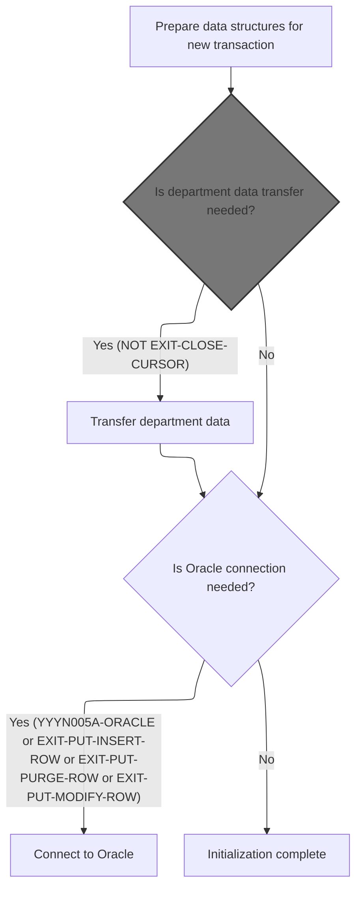

This section ensures that, at the start of each transaction, all relevant data structures are reset and synchronized. It conditionally transfers department data and establishes a database connection if the transaction requires it, ensuring the system is in a consistent and ready state for further processing.

| Category       | Rule Name                            | Description                                                                                                                                                                                                                                                                                                                                                                                                                                                                                                                                                                                                                                                                                                                                                                                                                                                                  |
| -------------- | ------------------------------------ | ---------------------------------------------------------------------------------------------------------------------------------------------------------------------------------------------------------------------------------------------------------------------------------------------------------------------------------------------------------------------------------------------------------------------------------------------------------------------------------------------------------------------------------------------------------------------------------------------------------------------------------------------------------------------------------------------------------------------------------------------------------------------------------------------------------------------------------------------------------------------------- |
| Business logic | Transaction data reset               | At the start of every new transaction, all relevant data structures and fields must be reset to their initial values to ensure no residual data from previous transactions affects the current operation.                                                                                                                                                                                                                                                                                                                                                                                                                                                                                                                                                                                                                                                                    |
| Business logic | Conditional department data transfer | Department data must be transferred from the source structure to the destination structure if the transaction is not an exit-close-cursor operation.                                                                                                                                                                                                                                                                                                                                                                                                                                                                                                                                                                                                                                                                                                                         |
| Business logic | Conditional Oracle connection        | An Oracle database connection must be established if the transaction requires it, specifically for operations identified as <SwmToken path="base/src/NNNS0573.cbl" pos="191:5:7" line-data="021400     IF (YYYN005A-ORACLE       OR EXIT-PUT-INSERT-ROW             00021400">`YYYN005A-ORACLE`</SwmToken>, <SwmToken path="base/src/NNNS0573.cbl" pos="165:4:10" line-data="018800       WHEN EXIT-PUT-INSERT-ROW                                   00018800">`EXIT-PUT-INSERT-ROW`</SwmToken>, <SwmToken path="base/src/NNNS0573.cbl" pos="167:4:10" line-data="019000       WHEN EXIT-PUT-PURGE-ROW                                    00019000">`EXIT-PUT-PURGE-ROW`</SwmToken>, or <SwmToken path="base/src/NNNS0573.cbl" pos="163:4:10" line-data="018600       WHEN EXIT-PUT-MODIFY-ROW                                   00018600">`EXIT-PUT-MODIFY-ROW`</SwmToken>. |
| Business logic | Initialization completion            | If neither department data transfer nor Oracle connection is required, the initialization process is considered complete and the system is ready for further processing.                                                                                                                                                                                                                                                                                                                                                                                                                                                                                                                                                                                                                                                                                                     |

<SwmSnippet path="/base/src/NNNS0573.cbl" line="180">

---

In <SwmToken path="base/src/NNNS0573.cbl" pos="180:2:4" line-data="020300 100-INITIALIZATION.                                              00020300">`100-INITIALIZATION`</SwmToken> we reset all the relevant fields and sync up the index handles. Next, we call <SwmToken path="base/src/NNNS0573.cbl" pos="189:4:14" line-data="021200       PERFORM 110-MOVE-PDA-FIELDS-2-DCL                          00021200">`110-MOVE-PDA-FIELDS-2-DCL`</SwmToken> to copy department data from the source structure to the destination structure, making sure the data is in the right format for database operations.

```cobol
020300 100-INITIALIZATION.                                              00020300
020400     INITIALIZE XXXN001A                                          00020400
020500                DB2-STUFF                                         00020500
020600                DAO-RETURN-CODE                                   00020600
020700     MOVE NNNN0000-INDEX-HANDLE TO DDDTDP01-INDEX-HANDLE          00020700
020800     MOVE 0 TO WS-CHECKPOINT-INC                                  00020800
020900     MOVE 0 TO SQLCODE                                            00020900
021000     MOVE 0 TO SQL-INIT-FLAG                                      00021000
021100     IF NOT EXIT-CLOSE-CURSOR                                     00021100
021200       PERFORM 110-MOVE-PDA-FIELDS-2-DCL                          00021200
021300     END-IF                                                       00021300
```

---

</SwmSnippet>

### Copying department fields for DB operations

This section ensures that all department fields are accurately transferred from the source to the destination structure, and that the <SwmToken path="base/src/NNNS0573.cbl" pos="221:4:6" line-data="024400     IF ORG-ID-X OF P-DDDTDP01 = SPACES                           00024400">`ORG-ID`</SwmToken> field is normalized to prevent blank values in the database. This prepares the data for subsequent database operations.

| Category        | Rule Name                                                                                                                                                                                 | Description                                                                                                                                                                                                                                                                                                                                                                                                                                                               |
| --------------- | ----------------------------------------------------------------------------------------------------------------------------------------------------------------------------------------- | ------------------------------------------------------------------------------------------------------------------------------------------------------------------------------------------------------------------------------------------------------------------------------------------------------------------------------------------------------------------------------------------------------------------------------------------------------------------------- |
| Data validation | Organization ID normalization                                                                                                                                                             | If the <SwmToken path="base/src/NNNS0573.cbl" pos="221:4:8" line-data="024400     IF ORG-ID-X OF P-DDDTDP01 = SPACES                           00024400">`ORG-ID-X`</SwmToken> field in the source is blank, the <SwmToken path="base/src/NNNS0573.cbl" pos="221:4:6" line-data="024400     IF ORG-ID-X OF P-DDDTDP01 = SPACES                           00024400">`ORG-ID`</SwmToken> field must be set to zero to avoid storing blank organization IDs in the database. |
| Business logic  | Department field transfer                                                                                                                                                                 | All department fields from the source structure must be copied to the destination structure to ensure data consistency for database operations.                                                                                                                                                                                                                                                                                                                           |
| Business logic  | Normalized <SwmToken path="base/src/NNNS0573.cbl" pos="221:4:6" line-data="024400     IF ORG-ID-X OF P-DDDTDP01 = SPACES                           00024400">`ORG-ID`</SwmToken> transfer | The normalized <SwmToken path="base/src/NNNS0573.cbl" pos="221:4:6" line-data="024400     IF ORG-ID-X OF P-DDDTDP01 = SPACES                           00024400">`ORG-ID`</SwmToken> value must be copied from the source to the destination structure to ensure the database receives a valid organization ID.                                                                                                                                                           |

<SwmSnippet path="/base/src/NNNS0573.cbl" line="202">

---

In <SwmToken path="base/src/NNNS0573.cbl" pos="202:2:12" line-data="022500 110-MOVE-PDA-FIELDS-2-DCL.                                       00022500">`110-MOVE-PDA-FIELDS-2-DCL`</SwmToken> we do a straight field-by-field copy from <SwmToken path="base/src/NNNS0573.cbl" pos="203:12:14" line-data="022600     MOVE XXX-DEPT-NBR OF P-DDDTDP01                              00022600">`P-DDDTDP01`</SwmToken> to <SwmToken path="base/src/NNNS0573.cbl" pos="204:12:14" line-data="022700       TO XXX-DEPT-NBR OF DCLXXX-DEPT                             00022700">`DCLXXX-DEPT`</SwmToken>. Every department field gets moved over so the destination structure is ready for DB operations.

```cobol
022500 110-MOVE-PDA-FIELDS-2-DCL.                                       00022500
022600     MOVE XXX-DEPT-NBR OF P-DDDTDP01                              00022600
022700       TO XXX-DEPT-NBR OF DCLXXX-DEPT                             00022700
022800     MOVE STR-SUB-DEPT-ID OF P-DDDTDP01                           00022800
022900       TO STR-SUB-DEPT-ID OF DCLXXX-DEPT                          00022900
023000     MOVE DEPT-NM OF P-DDDTDP01 TO DEPT-NM OF DCLXXX-DEPT         00023000
023100     MOVE DEPT-ABB OF P-DDDTDP01 TO DEPT-ABB OF DCLXXX-DEPT       00023100
023200     MOVE REPT-GRP-CD OF P-DDDTDP01 TO REPT-GRP-CD OF DCLXXX-DEPT 00023200
023300     MOVE GRPRFT-LO-PCT OF P-DDDTDP01                             00023300
023400       TO GRPRFT-LO-PCT OF DCLXXX-DEPT                            00023400
023500     MOVE GRPRFT-HI-PCT OF P-DDDTDP01                             00023500
023600       TO GRPRFT-HI-PCT OF DCLXXX-DEPT                            00023600
023700     MOVE SHRNK-LO-PCT OF P-DDDTDP01                              00023700
023800       TO SHRNK-LO-PCT OF DCLXXX-DEPT                             00023800
023900     MOVE SHRNK-HI-PCT OF P-DDDTDP01                              00023900
024000       TO SHRNK-HI-PCT OF DCLXXX-DEPT                             00024000
024100     MOVE LST-UPDT-USR-ID OF P-DDDTDP01                           00024100
024200       TO LST-UPDT-USR-ID OF DCLXXX-DEPT                          00024200
024300     MOVE LST-UPDT-TS OF P-DDDTDP01 TO LST-UPDT-TS OF DCLXXX-DEPT 00024300
```

---

</SwmSnippet>

<SwmSnippet path="/base/src/NNNS0573.cbl" line="221">

---

Here we check if <SwmToken path="base/src/NNNS0573.cbl" pos="221:4:8" line-data="024400     IF ORG-ID-X OF P-DDDTDP01 = SPACES                           00024400">`ORG-ID-X`</SwmToken> is spaces, and if so, set <SwmToken path="base/src/NNNS0573.cbl" pos="221:4:6" line-data="024400     IF ORG-ID-X OF P-DDDTDP01 = SPACES                           00024400">`ORG-ID`</SwmToken> to zero. This normalizes the data so we don't end up with blanks for org IDs in the DB.

```cobol
024400     IF ORG-ID-X OF P-DDDTDP01 = SPACES                           00024400
024500       MOVE ZERO TO ORG-ID OF P-DDDTDP01                          00024500
024600     END-IF                                                       00024600
```

---

</SwmSnippet>

<SwmSnippet path="/base/src/NNNS0573.cbl" line="224">

---

Finally we move the normalized <SwmToken path="base/src/NNNS0573.cbl" pos="224:4:6" line-data="024700     MOVE ORG-ID OF P-DDDTDP01                                    00024700">`ORG-ID`</SwmToken> from the source to the destination structure so the DB always gets a valid value.

```cobol
024700     MOVE ORG-ID OF P-DDDTDP01                                    00024700
024800       TO ORG-ID OF DCLXXX-DEPT                                   00024800
024900     .                                                            00024900
```

---

</SwmSnippet>

### Handling Oracle connection setup

<SwmSnippet path="/base/src/NNNS0573.cbl" line="191">

---

Back in <SwmToken path="base/src/NNNS0573.cbl" pos="151:4:6" line-data="017400     PERFORM 100-INITIALIZATION                                   00017400">`100-INITIALIZATION`</SwmToken>, after moving the fields, we check if Oracle access is needed (based on flags) and call <SwmToken path="base/src/NNNS0573.cbl" pos="193:4:10" line-data="021600       PERFORM 115-CONNECT-TO-ORACLE                              00021600">`115-CONNECT-TO-ORACLE`</SwmToken> to set up the DB connection if required.

```cobol
021400     IF (YYYN005A-ORACLE       OR EXIT-PUT-INSERT-ROW             00021400
021500         OR EXIT-PUT-PURGE-ROW OR EXIT-PUT-MODIFY-ROW)            00021500
021600       PERFORM 115-CONNECT-TO-ORACLE                              00021600
021700     END-IF                                                       00021700
```

---

</SwmSnippet>

## Connecting to Oracle and error handling

This section governs how the system attempts to connect to the Oracle database and how it responds to connection failures, ensuring that any errors are captured and communicated clearly.

| Category        | Rule Name                                | Description                                                                                                                                                                                                                                                                                                                                           |
| --------------- | ---------------------------------------- | ----------------------------------------------------------------------------------------------------------------------------------------------------------------------------------------------------------------------------------------------------------------------------------------------------------------------------------------------------- |
| Data validation | Oracle connection success criteria       | A successful Oracle database connection is defined as receiving a return code of 0 (SUCCESS) from the connection routine.                                                                                                                                                                                                                             |
| Business logic  | Standardized Oracle error message format | The error message for a failed Oracle connection must begin with a specific prefix ('<SwmToken path="base/src/NNNS0573.cbl" pos="235:5:5" line-data="025800       STRING &#39;NNNS0573 - Error connecting to Oracle. Sqlcode =&#39;  00025800">`NNNS0573`</SwmToken> - Error connecting to Oracle. Sqlcode =') followed by the actual SQL error code. |

<SwmSnippet path="/base/src/NNNS0573.cbl" line="229">

---

<SwmToken path="base/src/NNNS0573.cbl" pos="229:2:8" line-data="025200 115-CONNECT-TO-ORACLE.                                           00025200">`115-CONNECT-TO-ORACLE`</SwmToken> calls <SwmToken path="base/src/NNNS0573.cbl" pos="230:4:8" line-data="025300     CALL Z-ORA-CONNECT USING XXXN001A                            00025300">`Z-ORA-CONNECT`</SwmToken> to set up the Oracle DB connection. If it fails, we grab the SQL error code and build an error message. Next, we jump to <SwmPath>[base/src/XXXS0210.cbl](base/src/XXXS0210.cbl)</SwmPath> to continue connection setup and management.

```cobol
025200 115-CONNECT-TO-ORACLE.                                           00025200
025300     CALL Z-ORA-CONNECT USING XXXN001A                            00025300
025400                              SQLCA                               00025400
025500     IF NOT SUCCESS                                               00025500
025600       MOVE SQLCODE TO WS-SQLCODE                                 00025600
025700       MOVE SPACES  TO IS-RTRN-MSG-TXT                            00025700
025800       STRING 'NNNS0573 - Error connecting to Oracle. Sqlcode ='  00025800
025900               WS-SQLCODE                                         00025900
026000               DELIMITED BY SIZE INTO IS-RTRN-MSG-TXT             00026000
026100     END-IF                                                       00026100
```

---

</SwmSnippet>

## Initializing connection manager

The main product role of this section is to ensure that the system is properly initialized and that a valid Oracle database connection is established before any further processing occurs. This guarantees that downstream logic has the necessary resources to execute successfully.

| Category        | Rule Name                           | Description                                                                                                                              |
| --------------- | ----------------------------------- | ---------------------------------------------------------------------------------------------------------------------------------------- |
| Data validation | Environment Initialization Required | The system must always initialize all required resources and environment variables before attempting to establish a database connection. |
| Business logic  | Oracle Connection Prerequisite      | A valid Oracle database connection must be established before any downstream business logic is executed.                                 |

<SwmSnippet path="/base/src/XXXS0210.cbl" line="33">

---

In <SwmToken path="base/src/XXXS0210.cbl" pos="33:2:6" line-data="004400 0000-EXIT-DISPATCHER.                                            00004400">`0000-EXIT-DISPATCHER`</SwmToken>, we set up and switch the DB connection to Oracle for downstream logic.

```cobol
004400 0000-EXIT-DISPATCHER.                                            00004400
004500     PERFORM 100-INITIALIZATION                                   00004500
004600     PERFORM 200-CONNECT-TO-ORACLE                                00004600
005000     GOBACK                                                       00005000
005100     .                                                            00005100
```

---

</SwmSnippet>

## Switching to Oracle connection

This section governs the process of switching the application's active database connection to Oracle. It ensures that the correct flags are set and that the connection manager is invoked to perform the switch and update the connection state.

| Category       | Rule Name                      | Description                                                                                                                                              |
| -------------- | ------------------------------ | -------------------------------------------------------------------------------------------------------------------------------------------------------- |
| Business logic | Oracle connection flag         | When a request to switch to Oracle is received, the system must set the connection function code to 'S0' to indicate an Oracle connection is desired.    |
| Business logic | Connection manager invocation  | The database connection manager must be called whenever a switch to Oracle is requested, to handle the transition and update the connection state.       |
| Business logic | Oracle connection state update | The connection state must reflect Oracle as the current connection after a successful switch, indicated by the value '0' in the connection status field. |

<SwmSnippet path="/base/src/XXXS0210.cbl" line="52">

---

In <SwmToken path="base/src/XXXS0210.cbl" pos="52:2:8" line-data="007500 200-CONNECT-TO-ORACLE.                                           00007500">`200-CONNECT-TO-ORACLE`</SwmToken> we set the flag to switch to Oracle and then call the DBMS connection manager (<SwmToken path="base/src/XXXS0210.cbl" pos="55:4:4" line-data="007540     CALL YYYS0220-DBMS-CON-MGR USING                             00007540">`YYYS0220`</SwmToken>) to actually perform the switch and update the connection state.

```cobol
007500 200-CONNECT-TO-ORACLE.                                           00007500
007510     SET YYYC0220-SET-ORACLE-CON TO TRUE                          00007510
007530                                                                  00007530
007540     CALL YYYS0220-DBMS-CON-MGR USING                             00007540
007550         XXXN001A                                                 00007550
007560         YYYC0220                                                 00007560
010400     .                                                            00010400
```

---

</SwmSnippet>

## Dispatching connection manager operations

This section acts as a dispatcher for connection management operations. It determines which operation to perform based on the provided function code, ensuring the correct subroutine is executed for connection switching, statistics retrieval, or override management. If the function code is not recognized, it sets an error state and provides an appropriate error message.

| Category       | Rule Name                                                                                                                                                                               | Description                                                                                                                                                                                                                                                                                                                                                                                                                                                                                                                                                                                                                                                                                                    |
| -------------- | --------------------------------------------------------------------------------------------------------------------------------------------------------------------------------------- | -------------------------------------------------------------------------------------------------------------------------------------------------------------------------------------------------------------------------------------------------------------------------------------------------------------------------------------------------------------------------------------------------------------------------------------------------------------------------------------------------------------------------------------------------------------------------------------------------------------------------------------------------------------------------------------------------------------- |
| Business logic | Current connection inquiry                                                                                                                                                              | When the function code requests the current connection type, the system must return the current connection type without making any changes to the connection state.                                                                                                                                                                                                                                                                                                                                                                                                                                                                                                                                            |
| Business logic | <SwmToken path="base/src/NNNS0573.cbl" pos="182:2:2" line-data="020500                DB2-STUFF                                         00020500">`DB2`</SwmToken> connection switching | When the function code requests to set the <SwmToken path="base/src/NNNS0573.cbl" pos="182:2:2" line-data="020500                DB2-STUFF                                         00020500">`DB2`</SwmToken> connection, the system must establish a <SwmToken path="base/src/NNNS0573.cbl" pos="182:2:2" line-data="020500                DB2-STUFF                                         00020500">`DB2`</SwmToken> connection if not already connected, update the total and <SwmToken path="base/src/NNNS0573.cbl" pos="182:2:2" line-data="020500                DB2-STUFF                                         00020500">`DB2`</SwmToken> request statistics, and return the new connection state. |
| Business logic | Oracle connection switching                                                                                                                                                             | When the function code requests to set the Oracle connection, the system must establish an Oracle connection if not already connected, increment the relevant statistics, and return the new connection state.                                                                                                                                                                                                                                                                                                                                                                                                                                                                                                 |
| Business logic | Connection statistics retrieval                                                                                                                                                         | When the function code requests statistics, the system must return the current statistics related to connection usage, including total requests, <SwmToken path="base/src/NNNS0573.cbl" pos="182:2:2" line-data="020500                DB2-STUFF                                         00020500">`DB2`</SwmToken> requests, Oracle requests, connection switches, override requests, and override switches.                                                                                                                                                                                                                                                                                                  |
| Business logic | Statistics update                                                                                                                                                                       | When the function code requests to set statistics, the system must update the statistics fields as specified by the input, reflecting the latest usage data.                                                                                                                                                                                                                                                                                                                                                                                                                                                                                                                                                   |
| Business logic | Override connection management                                                                                                                                                          | When the function code requests to set an override connection, the system must apply the override and update the relevant statistics to reflect the override action.                                                                                                                                                                                                                                                                                                                                                                                                                                                                                                                                           |

<SwmSnippet path="/base/src/YYYS0220.cbl" line="56">

---

<SwmToken path="base/src/YYYS0220.cbl" pos="56:2:6" line-data="006500 0000-EXIT-DISPATCHER.                                            00006500">`0000-EXIT-DISPATCHER`</SwmToken> in <SwmPath>[base/src/YYYS0220.cbl](base/src/YYYS0220.cbl)</SwmPath> acts as a dispatcher, running different subroutines based on the function code. It handles connection switching, stats, and overrides, and errors out if the code isn't recognized.

```cobol
006500 0000-EXIT-DISPATCHER.                                            00006500
006600     PERFORM 100-INITIALIZATION                                   00006600
006700                                                                  00006700
006800     EVALUATE TRUE                                                00006800
006900       WHEN YYYC0220-GET-CURR-CON                                 00006900
007000         PERFORM 200-GET-CURR-CON                                 00007000
007100       WHEN YYYC0220-SET-DB2-CON                                  00007100
007200         PERFORM 300-SET-DB2-CON                                  00007200
007300       WHEN YYYC0220-SET-ORACLE-CON                               00007300
007400         PERFORM 400-SET-ORACLE-CON                               00007400
007500       WHEN YYYC0220-GET-STATS                                    00007500
007600         PERFORM 500-GET-STATS                                    00007600
007700       WHEN YYYC0220-SET-STATS                                    00007700
007800         PERFORM 600-SET-STATS                                    00007800
007900       WHEN YYYC0220-SET-OVERRIDE-CON                             00007900
008000         PERFORM 700-SET-OVERRIDE-CON                             00008000
008100       WHEN OTHER                                                 00008100
008200         SET  FAILURE TO TRUE                                     00008200
008300         MOVE 'YYYS0220 - Function not recognized!'               00008300
008400           TO IS-RTRN-MSG-TXT                                     00008400
008500     END-EVALUATE                                                 00008500
008600                                                                  00008600
008700     GOBACK                                                       00008700
008800     .                                                            00008800
```

---

</SwmSnippet>

<SwmSnippet path="/base/src/YYYS0220.cbl" line="97">

---

<SwmToken path="base/src/YYYS0220.cbl" pos="97:2:8" line-data="010600 200-GET-CURR-CON.                                                00010600">`200-GET-CURR-CON`</SwmToken> just copies the current connection type from working storage to the output field. It doesn't actually switch anything.

```cobol
010600 200-GET-CURR-CON.                                                00010600
010700     MOVE WS-YYYC0220-CURR-CON TO YYYC0220-CURR-CON               00010700
010800     .                                                            00010800
```

---

</SwmSnippet>

### Switching to <SwmToken path="base/src/NNNS0573.cbl" pos="182:2:2" line-data="020500                DB2-STUFF                                         00020500">`DB2`</SwmToken> and updating stats

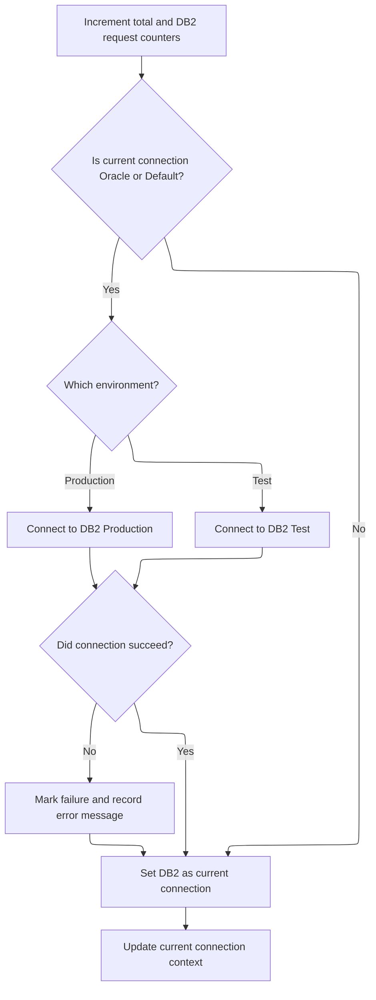

This section ensures that all requests requiring a <SwmToken path="base/src/NNNS0573.cbl" pos="182:2:2" line-data="020500                DB2-STUFF                                         00020500">`DB2`</SwmToken> connection are properly tracked, the correct <SwmToken path="base/src/NNNS0573.cbl" pos="182:2:2" line-data="020500                DB2-STUFF                                         00020500">`DB2`</SwmToken> environment is selected, and the system state is updated to reflect the new connection. It also ensures that failures are clearly marked and communicated for downstream processing.

| Category       | Rule Name                                                                                                                                                                                | Description                                                                                                                                                                                                                                                                                                                                                                                                                                                                                                                                                                                                                      |
| -------------- | ---------------------------------------------------------------------------------------------------------------------------------------------------------------------------------------- | -------------------------------------------------------------------------------------------------------------------------------------------------------------------------------------------------------------------------------------------------------------------------------------------------------------------------------------------------------------------------------------------------------------------------------------------------------------------------------------------------------------------------------------------------------------------------------------------------------------------------------- |
| Business logic | Request counting                                                                                                                                                                         | Each time a request is processed, increment the total requests counter and the <SwmToken path="base/src/NNNS0573.cbl" pos="182:2:2" line-data="020500                DB2-STUFF                                         00020500">`DB2`</SwmToken> requests counter by 1.                                                                                                                                                                                                                                                                                                                                                         |
| Business logic | Conditional <SwmToken path="base/src/NNNS0573.cbl" pos="182:2:2" line-data="020500                DB2-STUFF                                         00020500">`DB2`</SwmToken> switch    | If the current connection is Oracle or Default, increment the connection switches counter and attempt to switch to a <SwmToken path="base/src/NNNS0573.cbl" pos="182:2:2" line-data="020500                DB2-STUFF                                         00020500">`DB2`</SwmToken> connection.                                                                                                                                                                                                                                                                                                                              |
| Business logic | <SwmToken path="base/src/NNNS0573.cbl" pos="182:2:2" line-data="020500                DB2-STUFF                                         00020500">`DB2`</SwmToken> environment selection | Select the <SwmToken path="base/src/NNNS0573.cbl" pos="182:2:2" line-data="020500                DB2-STUFF                                         00020500">`DB2`</SwmToken> environment based on the environment flag: use <SwmToken path="base/src/NNNS0573.cbl" pos="182:2:2" line-data="020500                DB2-STUFF                                         00020500">`DB2`</SwmToken> Production if the production flag is set, otherwise use <SwmToken path="base/src/NNNS0573.cbl" pos="182:2:2" line-data="020500                DB2-STUFF                                         00020500">`DB2`</SwmToken> Test. |
| Business logic | Connection context update                                                                                                                                                                | After a successful or failed connection attempt, update the current connection context to reflect the latest state (<SwmToken path="base/src/NNNS0573.cbl" pos="182:2:2" line-data="020500                DB2-STUFF                                         00020500">`DB2`</SwmToken> or failure).                                                                                                                                                                                                                                                                                                                              |

<SwmSnippet path="/base/src/YYYS0220.cbl" line="105">

---

In <SwmToken path="base/src/YYYS0220.cbl" pos="105:2:8" line-data="011400 300-SET-DB2-CON.                                                 00011400">`300-SET-DB2-CON`</SwmToken> we bump the stats counters, switch to <SwmToken path="base/src/YYYS0220.cbl" pos="105:6:6" line-data="011400 300-SET-DB2-CON.                                                 00011400">`DB2`</SwmToken> if needed, set the <SwmToken path="base/src/YYYS0220.cbl" pos="105:6:6" line-data="011400 300-SET-DB2-CON.                                                 00011400">`DB2`</SwmToken> flag, and then update the current connection type for downstream logic.

```cobol
011400 300-SET-DB2-CON.                                                 00011400
011500     ADD 1 TO WS-TOT-REQS                                         00011500
011600     ADD 1 TO WS-DB2-REQS                                         00011600
011700                                                                  00011700
011800     IF WS-ORACLE-CON                                             00011800
011900     OR WS-DEFAULT-CON                                            00011900
012000       PERFORM 310-DO-SET-DB2-CON                                 00012000
012100     END-IF                                                       00012100
012200                                                                  00012200
012300     SET WS-DB2-CON TO TRUE                                       00012300
012400     PERFORM 200-GET-CURR-CON                                     00012400
012500     .                                                            00012500
```

---

</SwmSnippet>

<SwmSnippet path="/base/src/YYYS0220.cbl" line="119">

---

In <SwmToken path="base/src/YYYS0220.cbl" pos="119:2:10" line-data="012800 310-DO-SET-DB2-CON.                                              00012800">`310-DO-SET-DB2-CON`</SwmToken> we increment the switch counter, pick the <SwmToken path="base/src/YYYS0220.cbl" pos="119:8:8" line-data="012800 310-DO-SET-DB2-CON.                                              00012800">`DB2`</SwmToken> environment based on <SwmToken path="base/src/YYYS0220.cbl" pos="123:4:6" line-data="013200       WHEN WS-PROD                                               00013200">`WS-PROD`</SwmToken>, and handle errors by setting flags and building error messages if the connection fails.

```cobol
012800 310-DO-SET-DB2-CON.                                              00012800
012900     ADD 1 TO WS-CON-SWITCHES                                     00012900
013000                                                                  00013000
013100     EVALUATE TRUE                                                00013100
013200       WHEN WS-PROD                                               00013200
013300         EXEC SQL                                                 00013300
013400           CONNECT TO DB2P                                        00013400
013500         END-EXEC                                                 00013500
013600       WHEN OTHER                                                 00013600
013700         EXEC SQL                                                 00013700
013800           CONNECT TO DB2T                                        00013800
013900         END-EXEC                                                 00013900
014000     END-EVALUATE                                                 00014000
014100                                                                  00014100
014200     EVALUATE TRUE                                                00014200
014300       WHEN SQLCODE = 0                                           00014300
014400         CONTINUE                                                 00014400
014500                                                                  00014500
014600       WHEN OTHER                                                 00014600
014700         SET  FAILURE TO TRUE                                     00014700
014800         MOVE SQLCODE TO WS-SQLCODE                               00014800
014900         STRING 'YYYS0220 - Failure connecting to DB2, SQL='      00014900
015000                WS-SQLCODE                                        00015000
015100             DELIMITED BY SIZE INTO IS-RTRN-MSG-TXT               00015100
015200     END-EVALUATE                                                 00015200
015300     .                                                            00015300
```

---

</SwmSnippet>

### Switching to Oracle and updating stats

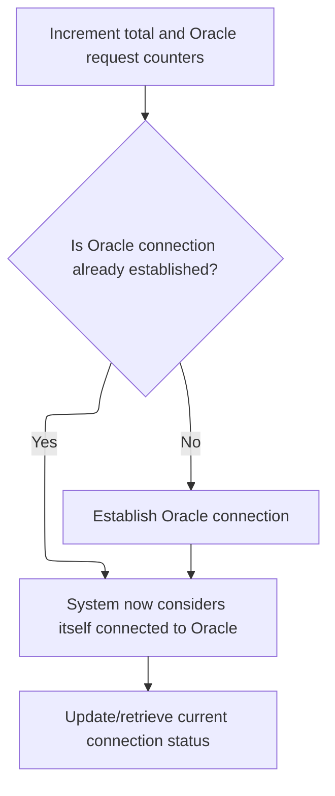

This section is responsible for managing the transition to an Oracle database connection, including updating relevant statistics, selecting the correct environment, and handling connection errors.

| Category       | Rule Name                        | Description                                                                                                                                                                                                                                                                                                                                                                                                                                                                                                                                                                                                                                                                                                                                                                                                                                                              |
| -------------- | -------------------------------- | ------------------------------------------------------------------------------------------------------------------------------------------------------------------------------------------------------------------------------------------------------------------------------------------------------------------------------------------------------------------------------------------------------------------------------------------------------------------------------------------------------------------------------------------------------------------------------------------------------------------------------------------------------------------------------------------------------------------------------------------------------------------------------------------------------------------------------------------------------------------------ |
| Business logic | Request Counting                 | Each time a request to switch to Oracle is processed, increment both the total request counter and the Oracle request counter by 1.                                                                                                                                                                                                                                                                                                                                                                                                                                                                                                                                                                                                                                                                                                                                      |
| Business logic | Conditional Oracle Connection    | If the Oracle connection is not already established, initiate a new connection to the appropriate Oracle environment based on the current environment flag (e.g., production, test, <SwmToken path="base/src/YYYS0220.cbl" pos="177:6:6" line-data="018600       WHEN WS-TST6                                               00018600">`TST6`</SwmToken>, <SwmToken path="base/src/YYYS0220.cbl" pos="182:6:6" line-data="019100       WHEN WS-TST5                                               00019100">`TST5`</SwmToken>, <SwmToken path="base/src/YYYS0220.cbl" pos="187:6:6" line-data="019600       WHEN WS-TST4                                               00019600">`TST4`</SwmToken>, <SwmToken path="base/src/YYYS0220.cbl" pos="192:6:6" line-data="020100       WHEN WS-TST3                                               00020100">`TST3`</SwmToken>). |
| Business logic | Connection Status Update         | After a successful connection attempt, set the Oracle connection status flag to true to indicate the system is now connected to Oracle.                                                                                                                                                                                                                                                                                                                                                                                                                                                                                                                                                                                                                                                                                                                                  |
| Business logic | Connection Switch Counting       | Increment the connection switch counter each time a new Oracle connection is established.                                                                                                                                                                                                                                                                                                                                                                                                                                                                                                                                                                                                                                                                                                                                                                                |
| Business logic | Current Connection Status Update | After switching to Oracle, update or retrieve the current connection status to ensure downstream logic has the correct information.                                                                                                                                                                                                                                                                                                                                                                                                                                                                                                                                                                                                                                                                                                                                      |

<SwmSnippet path="/base/src/YYYS0220.cbl" line="150">

---

In <SwmToken path="base/src/YYYS0220.cbl" pos="150:2:8" line-data="015900 400-SET-ORACLE-CON.                                              00015900">`400-SET-ORACLE-CON`</SwmToken> we bump the stats, set up the Oracle connection if it's not already active, set the flag, and update the current connection type for downstream logic.

```cobol
015900 400-SET-ORACLE-CON.                                              00015900
016000     ADD 1 TO WS-TOT-REQS                                         00016000
016100     ADD 1 TO WS-OCL-REQS                                         00016100
016200                                                                  00016200
016300     IF NOT WS-ORACLE-CON                                         00016300
016400       PERFORM 410-DO-SET-ORACLE-CON                              00016400
016500     END-IF                                                       00016500
016600                                                                  00016600
016700     SET WS-ORACLE-CON TO TRUE                                    00016700
016800     PERFORM 200-GET-CURR-CON                                     00016800
016900     .                                                            00016900
```

---

</SwmSnippet>

<SwmSnippet path="/base/src/YYYS0220.cbl" line="163">

---

In <SwmToken path="base/src/YYYS0220.cbl" pos="163:2:10" line-data="017200 410-DO-SET-ORACLE-CON.                                           00017200">`410-DO-SET-ORACLE-CON`</SwmToken> we increment the switch counter, pick the Oracle environment based on flags, and handle errors by setting flags and building error messages if the connection fails.

```cobol
017200 410-DO-SET-ORACLE-CON.                                           00017200
017300     ADD 1 TO WS-CON-SWITCHES                                     00017300
017400                                                                  00017400
017500     EVALUATE TRUE                                                00017500
017600       WHEN WS-PROD                                               00017600
017700         EXEC SQL                                                 00017700
017800           CONNECT TO DRDAASP1                                    00017800
017900         END-EXEC                                                 00017900
018000                                                                  00018000
018100       WHEN WS-TEST                                               00018100
018200         EXEC SQL                                                 00018200
018300           CONNECT TO DRDAASC7                                    00018300
018400         END-EXEC                                                 00018400
018500                                                                  00018500
018600       WHEN WS-TST6                                               00018600
018700         EXEC SQL                                                 00018700
018800           CONNECT TO DRDAASC6                                    00018800
018900         END-EXEC                                                 00018900
019000                                                                  00019000
019100       WHEN WS-TST5                                               00019100
019200         EXEC SQL                                                 00019200
019300           CONNECT TO DRDAASC5                                    00019300
019400         END-EXEC                                                 00019400
019500                                                                  00019500
019600       WHEN WS-TST4                                               00019600
019700         EXEC SQL                                                 00019700
019800           CONNECT TO DRDAASD1                                    00019800
019900         END-EXEC                                                 00019900
020000                                                                  00020000
020100       WHEN WS-TST3                                               00020100
020200         EXEC SQL                                                 00020200
020300           CONNECT TO DRDAASC1                                    00020300
020400         END-EXEC                                                 00020400
020500     END-EVALUATE                                                 00020500
020600                                                                  00020600
020700     EVALUATE TRUE                                                00020700
020800       WHEN SQLCODE = 0                                           00020800
020900         CONTINUE                                                 00020900
021000                                                                  00021000
021100       WHEN OTHER                                                 00021100
021200         SET  FAILURE TO TRUE                                     00021200
021300         MOVE SQLCODE TO WS-SQLCODE                               00021300
021400         STRING 'YYYS0220 - Failure connecting to Oracle, SQL='   00021400
021500                WS-SQLCODE                                        00021500
021600             DELIMITED BY SIZE INTO IS-RTRN-MSG-TXT               00021600
021700     END-EVALUATE                                                 00021700
021800     .                                                            00021800
```

---

</SwmSnippet>

### Getting connection and usage stats

<SwmSnippet path="/base/src/YYYS0220.cbl" line="215">

---

In <SwmToken path="base/src/YYYS0220.cbl" pos="215:2:6" line-data="022400 500-GET-STATS.                                                   00022400">`500-GET-STATS`</SwmToken> we call <SwmToken path="base/src/YYYS0220.cbl" pos="216:4:10" line-data="022500     PERFORM 200-GET-CURR-CON                                     00022500">`200-GET-CURR-CON`</SwmToken> to update the connection type, then copy all the usage and switch counters to the output fields for diagnostics or reporting.

```cobol
022400 500-GET-STATS.                                                   00022400
022500     PERFORM 200-GET-CURR-CON                                     00022500
022600                                                                  00022600
022700     MOVE WS-TOT-REQS     TO YYYC0220-TOT-REQS                    00022700
022800     MOVE WS-DB2-REQS     TO YYYC0220-DB2-REQS                    00022800
022900     MOVE WS-OCL-REQS     TO YYYC0220-OCL-REQS                    00022900
023000     MOVE WS-OVR-REQS     TO YYYC0220-OVR-REQS                    00023000
023100     MOVE WS-CON-SWITCHES TO YYYC0220-CON-SWITCHES                00023100
023200     MOVE WS-OVR-SWITCHES TO YYYC0220-OVR-SWITCHES                00023200
023300     .                                                            00023300
```

---

</SwmSnippet>

<SwmSnippet path="/base/src/YYYS0220.cbl" line="230">

---

<SwmToken path="base/src/YYYS0220.cbl" pos="230:2:6" line-data="023900 600-SET-STATS.                                                   00023900">`600-SET-STATS`</SwmToken> resets all the stats counters in both working storage and output, clearing out old usage data.

```cobol
023900 600-SET-STATS.                                                   00023900
024000     INITIALIZE WS-STATS                                          00024000
024100                YYYC0220-STATS                                    00024100
024200     .                                                            00024200
```

---

</SwmSnippet>

## Dispatching department table operations

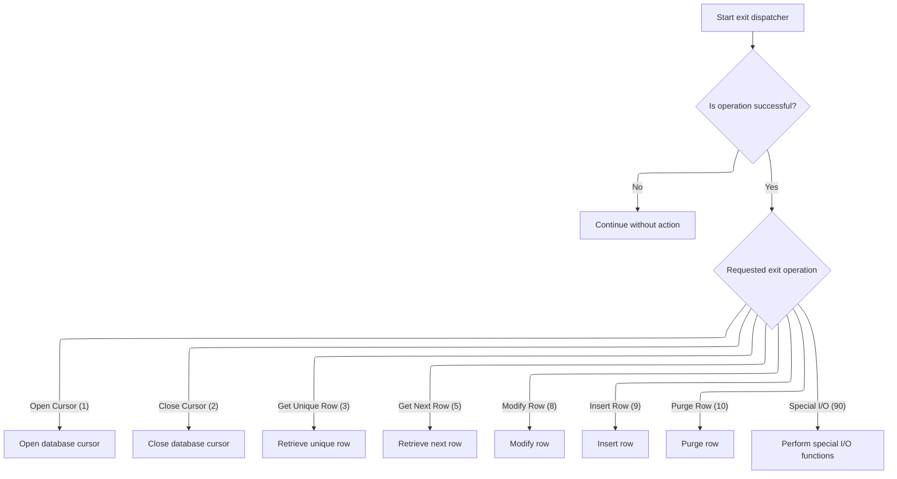

<SwmSnippet path="/base/src/NNNS0573.cbl" line="152">

---

After returning from <SwmToken path="base/src/NNNS0573.cbl" pos="151:4:6" line-data="017400     PERFORM 100-INITIALIZATION                                   00017400">`100-INITIALIZATION`</SwmToken> in <SwmToken path="base/src/NNNS0573.cbl" pos="150:2:6" line-data="017300 0000-EXIT-DISPATCHER.                                            00017300">`0000-EXIT-DISPATCHER`</SwmToken>, we use EVALUATE to pick the next operation. If <SwmToken path="base/src/NNNS0573.cbl" pos="155:4:8" line-data="017800       WHEN EXIT-OPEN-CURSOR                                      00017800">`EXIT-OPEN-CURSOR`</SwmToken> is set, we call <SwmToken path="base/src/NNNS0573.cbl" pos="156:4:10" line-data="017900          PERFORM 1000-EXIT-OPEN-CURSOR                           00017900">`1000-EXIT-OPEN-CURSOR`</SwmToken> to open the right DB cursor for department queries.

```cobol
017500     EVALUATE TRUE                                                00017500
017600       WHEN NOT SUCCESS                                           00017600
017700          CONTINUE                                                00017700
017800       WHEN EXIT-OPEN-CURSOR                                      00017800
017900          PERFORM 1000-EXIT-OPEN-CURSOR                           00017900
018000       WHEN EXIT-CLOSE-CURSOR                                     00018000
018100          PERFORM 1100-EXIT-CLOSE-CURSOR                          00018100
018200       WHEN EXIT-GET-UNIQUE-ROW                                   00018200
018300          PERFORM 1200-EXIT-GET-UNIQUE-ROW                        00018300
018400       WHEN EXIT-GET-NEXT-ROW                                     00018400
018500          PERFORM 1300-EXIT-GET-NEXT-ROW                          00018500
018600       WHEN EXIT-PUT-MODIFY-ROW                                   00018600
018700          PERFORM 1400-EXIT-PUT-MODIFY-ROW                        00018700
018800       WHEN EXIT-PUT-INSERT-ROW                                   00018800
018900          PERFORM 1500-EXIT-PUT-INSERT-ROW                        00018900
019000       WHEN EXIT-PUT-PURGE-ROW                                    00019000
019100          PERFORM 1600-EXIT-PUT-PURGE-ROW                         00019100
019200       WHEN EXIT-DO-SPECIAL-IO-FUNCS                              00019200
019300          PERFORM 10000-DO-SPECIAL-IO-FUNCS                       00019300
019400     END-EVALUATE                                                 00019400
```

---

</SwmSnippet>

<SwmSnippet path="/base/src/NNNS0573.cbl" line="297">

---

<SwmToken path="base/src/NNNS0573.cbl" pos="297:2:8" line-data="032000 1000-EXIT-OPEN-CURSOR.                                           00032000">`1000-EXIT-OPEN-CURSOR`</SwmToken> checks the cursor ID and opens the matching DB cursor. If the ID isn't valid, we set an error flag and message for the caller.

```cobol
032000 1000-EXIT-OPEN-CURSOR.                                           00032000
032100     EVALUATE TRUE                                                00032100
032200       WHEN DDDXDP01                                              00032200
032300         EXEC SQL                                                 00032300
032400           OPEN DDDXDP01                                          00032400
032500         END-EXEC                                                 00032500
032600       WHEN DDDXDP02                                              00032600
032700         EXEC SQL                                                 00032700
032800           OPEN DDDXDP02                                          00032800
032900         END-EXEC                                                 00032900
033000       WHEN OTHER                                                 00033000
033100         SET FAILURE TO TRUE                                      00033100
033200         MOVE 'NNNS0573 - Invalid open cursor ID.'                00033200
033300           TO IS-RTRN-MSG-TXT OF XXXN001A                         00033300
033400     END-EVALUATE                                                 00033400
```

---

</SwmSnippet>

<SwmSnippet path="/base/src/NNNS0573.cbl" line="315">

---

<SwmToken path="base/src/NNNS0573.cbl" pos="315:2:8" line-data="033800 1100-EXIT-CLOSE-CURSOR.                                          00033800">`1100-EXIT-CLOSE-CURSOR`</SwmToken> checks the cursor ID and closes the matching DB cursor. If the ID isn't valid, we set an error flag and message for the caller.

```cobol
033800 1100-EXIT-CLOSE-CURSOR.                                          00033800
033900     EVALUATE TRUE                                                00033900
034000       WHEN DDDXDP01                                              00034000
034100         EXEC SQL                                                 00034100
034200           CLOSE DDDXDP01                                         00034200
034300         END-EXEC                                                 00034300
034400       WHEN DDDXDP02                                              00034400
034500         EXEC SQL                                                 00034500
034600           CLOSE DDDXDP02                                         00034600
034700         END-EXEC                                                 00034700
034800       WHEN OTHER                                                 00034800
034900         SET FAILURE TO TRUE                                      00034900
035000         MOVE 'NNNS0573 - Invalid close cursor ID.'               00035000
035100           TO IS-RTRN-MSG-TXT OF XXXN001A                         00035100
035200     END-EVALUATE                                                 00035200
```

---

</SwmSnippet>

<SwmSnippet path="/base/src/NNNS0573.cbl" line="333">

---

<SwmToken path="base/src/NNNS0573.cbl" pos="333:2:10" line-data="035600 1200-EXIT-GET-UNIQUE-ROW.                                        00035600">`1200-EXIT-GET-UNIQUE-ROW`</SwmToken> runs a SQL SELECT to fetch a unique department row using the primary keys, loads the result into the output structure, and checks for nulls afterwards.

```cobol
035600 1200-EXIT-GET-UNIQUE-ROW.                                        00035600
035700     EXEC SQL                                                     00035700
035800         SELECT XXX_DEPT_NBR,                                     00035800
035900                STR_SUB_DEPT_ID,                                  00035900
036000                DEPT_NM,                                          00036000
036100                DEPT_ABB,                                         00036100
036200                REPT_GRP_CD,                                      00036200
036300                GRPRFT_LO_PCT,                                    00036300
036400                GRPRFT_HI_PCT,                                    00036400
036500                SHRNK_LO_PCT,                                     00036500
036600                SHRNK_HI_PCT,                                     00036600
036700                LST_UPDT_USR_ID,                                  00036700
036800                LST_UPDT_TS,                                      00036800
036900                ORG_ID                                            00036900
037000         INTO   :DCLXXX-DEPT.XXX-DEPT-NBR,                        00037000
037100                :DCLXXX-DEPT.STR-SUB-DEPT-ID,                     00037100
037200                :DCLXXX-DEPT.DEPT-NM,                             00037200
037300                :DCLXXX-DEPT.DEPT-ABB,                            00037300
037400                :DCLXXX-DEPT.REPT-GRP-CD,                         00037400
037500                :DCLXXX-DEPT.GRPRFT-LO-PCT,                       00037500
037600                :DCLXXX-DEPT.GRPRFT-HI-PCT,                       00037600
037700                :DCLXXX-DEPT.SHRNK-LO-PCT,                        00037700
037800                :DCLXXX-DEPT.SHRNK-HI-PCT,                        00037800
037900                :DCLXXX-DEPT.LST-UPDT-USR-ID,                     00037900
038000                :DCLXXX-DEPT.LST-UPDT-TS,                         00038000
038100                :DCLXXX-DEPT.ORG-ID                               00038100
038200         FROM   XXX_DEPT                                          00038200
038300         WHERE  XXX_DEPT_NBR = :DCLXXX-DEPT.XXX-DEPT-NBR          00038300
038400         AND    STR_SUB_DEPT_ID = :DCLXXX-DEPT.STR-SUB-DEPT-ID    00038400
038500     END-EXEC                                                     00038500
038600                                                                  00038600
038700     PERFORM 1700-CHECK-NULL-COLUMNS                              00038700
```

---

</SwmSnippet>

<SwmSnippet path="/base/src/NNNS0573.cbl" line="368">

---

<SwmToken path="base/src/NNNS0573.cbl" pos="368:2:10" line-data="039100 1300-EXIT-GET-NEXT-ROW.                                          00039100">`1300-EXIT-GET-NEXT-ROW`</SwmToken> checks the cursor ID and runs the right fetch operation. If the ID isn't valid, we set an error flag and message, then check for nulls in the result.

```cobol
039100 1300-EXIT-GET-NEXT-ROW.                                          00039100
039200     EVALUATE TRUE                                                00039200
039300       WHEN DDDXDP01                                              00039300
039400         PERFORM 1301-FETCH-DDDXDP01                              00039400
039500       WHEN DDDXDP02                                              00039500
039600         PERFORM 1302-FETCH-DDDXDP02                              00039600
039700       WHEN OTHER                                                 00039700
039800         SET FAILURE TO TRUE                                      00039800
039900         MOVE 'NNNS0573 - Invalid fetch cursor ID.'               00039900
040000           TO IS-RTRN-MSG-TXT OF XXXN001A                         00040000
040100     END-EVALUATE                                                 00040100
040200                                                                  00040200
040300     PERFORM 1700-CHECK-NULL-COLUMNS                              00040300
```

---

</SwmSnippet>

## Modifying department row and prepping user info

```mermaid
%%{init: {"flowchart": {"defaultRenderer": "elk"}} }%%
flowchart TD
    node1["Ensure all required fields are set"] --> node2["Record date and user who made the change"]
    click node1 openCode "base/src/NNNS0573.cbl:446:446"
    click node2 openCode "base/src/NNNS0573.cbl:447:447"
    node2 --> node7{"Is environment CICS?"}
    click node7 openCode "base/src/NNNS0573.cbl:637:637"
    node7 -->|"Yes"| node8["Record user from CICS"]
    click node8 openCode "base/src/NNNS0573.cbl:638:640"
    node7 -->|"No"| node9["Record user as NNNS0573"]
    click node9 openCode "base/src/NNNS0573.cbl:642:642"
    node8 --> node3{"SUCCESS = 0?"}
    node9 --> node3
    click node3 openCode "base/src/NNNS0573.cbl:449:449"
    node3 -->|"Yes"| node4["Retrieve current values"]
    click node4 openCode "base/src/NNNS0573.cbl:450:450"
    node4 --> node5["Modify the row"]
    click node5 openCode "base/src/NNNS0573.cbl:451:451"
    node3 -->|"No"| node6["End without modifying row"]
    click node6 openCode "base/src/NNNS0573.cbl:452:452"
classDef HeadingStyle fill:#777777,stroke:#333,stroke-width:2px;

%% Swimm:
%% %%{init: {"flowchart": {"defaultRenderer": "elk"}} }%%
%% flowchart TD
%%     node1["Ensure all required fields are set"] --> node2["Record date and user who made the change"]
%%     click node1 openCode "<SwmPath>[base/src/NNNS0573.cbl](base/src/NNNS0573.cbl)</SwmPath>:446:446"
%%     click node2 openCode "<SwmPath>[base/src/NNNS0573.cbl](base/src/NNNS0573.cbl)</SwmPath>:447:447"
%%     node2 --> node7{"Is environment CICS?"}
%%     click node7 openCode "<SwmPath>[base/src/NNNS0573.cbl](base/src/NNNS0573.cbl)</SwmPath>:637:637"
%%     node7 -->|"Yes"| node8["Record user from CICS"]
%%     click node8 openCode "<SwmPath>[base/src/NNNS0573.cbl](base/src/NNNS0573.cbl)</SwmPath>:638:640"
%%     node7 -->|"No"| node9["Record user as <SwmToken path="base/src/NNNS0573.cbl" pos="235:5:5" line-data="025800       STRING &#39;NNNS0573 - Error connecting to Oracle. Sqlcode =&#39;  00025800">`NNNS0573`</SwmToken>"]
%%     click node9 openCode "<SwmPath>[base/src/NNNS0573.cbl](base/src/NNNS0573.cbl)</SwmPath>:642:642"
%%     node8 --> node3{"SUCCESS = 0?"}
%%     node9 --> node3
%%     click node3 openCode "<SwmPath>[base/src/NNNS0573.cbl](base/src/NNNS0573.cbl)</SwmPath>:449:449"
%%     node3 -->|"Yes"| node4["Retrieve current values"]
%%     click node4 openCode "<SwmPath>[base/src/NNNS0573.cbl](base/src/NNNS0573.cbl)</SwmPath>:450:450"
%%     node4 --> node5["Modify the row"]
%%     click node5 openCode "<SwmPath>[base/src/NNNS0573.cbl](base/src/NNNS0573.cbl)</SwmPath>:451:451"
%%     node3 -->|"No"| node6["End without modifying row"]
%%     click node6 openCode "<SwmPath>[base/src/NNNS0573.cbl](base/src/NNNS0573.cbl)</SwmPath>:452:452"
%% classDef HeadingStyle fill:#777777,stroke:#333,stroke-width:2px;
```

This section ensures that any modification to a department row is properly validated and audit-stamped with the current date and user, supporting traceability and compliance requirements.

| Category        | Rule Name                          | Description                                                                                                                                                                                                                                                                                              |
| --------------- | ---------------------------------- | -------------------------------------------------------------------------------------------------------------------------------------------------------------------------------------------------------------------------------------------------------------------------------------------------------- |
| Data validation | Required fields validation         | All required fields for the department row must be set before any modification is allowed.                                                                                                                                                                                                               |
| Business logic  | Audit stamping                     | Every modification must be audit-stamped with the current date and the user who made the change.                                                                                                                                                                                                         |
| Business logic  | User identification by environment | If the environment is CICS, the user ID must be retrieved from the CICS session; otherwise, a default user ID (<SwmToken path="base/src/NNNS0573.cbl" pos="235:5:5" line-data="025800       STRING &#39;NNNS0573 - Error connecting to Oracle. Sqlcode =&#39;  00025800">`NNNS0573`</SwmToken>) is used. |
| Business logic  | Current value retrieval            | Before modifying the department row, the current values must be retrieved to check for changes and ensure only intended updates are made.                                                                                                                                                                |

<SwmSnippet path="/base/src/NNNS0573.cbl" line="422">

---

In <SwmToken path="base/src/NNNS0573.cbl" pos="422:2:10" line-data="044500 1400-EXIT-PUT-MODIFY-ROW.                                        00044500">`1400-EXIT-PUT-MODIFY-ROW`</SwmToken> we prep the null indicators, then call <SwmToken path="base/src/NNNS0573.cbl" pos="424:4:12" line-data="044700     PERFORM 2040-GET-DATE-AND-USER                               00044700">`2040-GET-DATE-AND-USER`</SwmToken> to fetch the current date and user info for audit stamping.

```cobol
044500 1400-EXIT-PUT-MODIFY-ROW.                                        00044500
044600     PERFORM 1800-EDIT-NULL-INDICATORS                            00044600
044700     PERFORM 2040-GET-DATE-AND-USER                               00044700
```

---

</SwmSnippet>

<SwmSnippet path="/base/src/NNNS0573.cbl" line="611">

---

<SwmToken path="base/src/NNNS0573.cbl" pos="611:2:10" line-data="063100 2040-GET-DATE-AND-USER.                                          00063100">`2040-GET-DATE-AND-USER`</SwmToken> calls <SwmToken path="base/src/NNNS0573.cbl" pos="612:4:8" line-data="063200     CALL Z-DATE-FUNCTIONS USING                                  00063200">`Z-DATE-FUNCTIONS`</SwmToken> for the date, then checks if we're in CICS. If so, it calls <SwmToken path="base/src/NNNS0573.cbl" pos="618:4:12" line-data="063800     CALL Z-GET-CICS-USER-ID USING                                00063800">`Z-GET-CICS-USER-ID`</SwmToken> for the user; otherwise, it sets a default user ID.

```cobol
063100 2040-GET-DATE-AND-USER.                                          00063100
063200     CALL Z-DATE-FUNCTIONS USING                                  00063200
063300         XXXN001A                                                 00063300
063400         YYYC0127                                                 00063400
063500                                                                  00063500
063600     IF  SUCCESS                                                  00063600
063700     AND YYYN005A-CICS-ENV                                        00063700
063800     CALL Z-GET-CICS-USER-ID USING                                00063800
063900         EIBLK    WS-DUMMY                                        00063900
064000         XXXN001A YYYC0107                                        00064000
064100     ELSE                                                         00064100
064200       MOVE 'NNNS0573' TO YYYC0107-USER                           00064200
064300     END-IF                                                       00064300
```

---

</SwmSnippet>

<SwmSnippet path="/base/src/NNNS0573.cbl" line="426">

---

After returning from <SwmToken path="base/src/NNNS0573.cbl" pos="424:4:12" line-data="044700     PERFORM 2040-GET-DATE-AND-USER                               00044700">`2040-GET-DATE-AND-USER`</SwmToken> in <SwmToken path="base/src/NNNS0573.cbl" pos="164:4:12" line-data="018700          PERFORM 1400-EXIT-PUT-MODIFY-ROW                        00018700">`1400-EXIT-PUT-MODIFY-ROW`</SwmToken>, we fetch the current department name with <SwmToken path="base/src/NNNS0573.cbl" pos="427:4:10" line-data="045000       PERFORM 1405-GET-CURR-VALUES                               00045000">`1405-GET-CURR-VALUES`</SwmToken> to check for changes before updating.

```cobol
044900     IF SUCCESS                                                   00044900
045000       PERFORM 1405-GET-CURR-VALUES                               00045000
045100       PERFORM 1410-DO-MODIFY-ROW                                 00045100
045200     END-IF                                                       00045200
```

---

</SwmSnippet>

## Fetching current department name

This section is responsible for retrieving the current department name for a given department number and sub-department ID. It ensures that the correct department name is available for subsequent processing, and handles errors by flagging failures and providing diagnostic information.

| Category        | Rule Name                      | Description                                                                                                                                                                           |
| --------------- | ------------------------------ | ------------------------------------------------------------------------------------------------------------------------------------------------------------------------------------- |
| Data validation | Department name lookup by keys | The department name must be fetched using both the department number and sub-department ID as lookup keys. If either key is missing or invalid, the fetch is considered unsuccessful. |
| Business logic  | No retry on fetch failure      | No retry or fallback logic is applied if the fetch fails; the process must proceed with the failure flagged and error message set.                                                    |

<SwmSnippet path="/base/src/NNNS0573.cbl" line="433">

---

In <SwmToken path="base/src/NNNS0573.cbl" pos="433:2:8" line-data="045600 1405-GET-CURR-VALUES.                                            00045600">`1405-GET-CURR-VALUES`</SwmToken> we run a SQL SELECT to fetch the department name using the department number and sub-department ID as keys. The result is used for later comparison and event logic.

```cobol
045600 1405-GET-CURR-VALUES.                                            00045600
045700     EXEC SQL                                                     00045700
045800         SELECT DEPT_NM                                           00045800
045900           INTO :WS-DEPT-NM                                       00045900
046000           FROM XXX_DEPT                                          00046000
046100         WHERE  XXX_DEPT_NBR = :DCLXXX-DEPT.XXX-DEPT-NBR          00046100
046200         AND    STR_SUB_DEPT_ID = :DCLXXX-DEPT.STR-SUB-DEPT-ID    00046200
046300     END-EXEC                                                     00046300
```

---

</SwmSnippet>

<SwmSnippet path="/base/src/NNNS0573.cbl" line="442">

---

Here, if the SQL SELECT fails in <SwmToken path="base/src/NNNS0573.cbl" pos="427:4:10" line-data="045000       PERFORM 1405-GET-CURR-VALUES                               00045000">`1405-GET-CURR-VALUES`</SwmToken>, we set FAILURE to TRUE, move the SQLCODE to <SwmToken path="base/src/NNNS0573.cbl" pos="444:8:10" line-data="046700       MOVE SQLCODE TO WS-SQLCODE                                 00046700">`WS-SQLCODE`</SwmToken>, and build an error message string with the code. This flags the error for the rest of the flow and provides a message for diagnostics. No retry or fallback logic is present.

```cobol
046500     IF SQLCODE NOT = 0                                           00046500
046600       SET  FAILURE TO TRUE                                       00046600
046700       MOVE SQLCODE TO WS-SQLCODE                                 00046700
046800       STRING 'NNNS0573 - Error getting current values,'          00046800
046900              'RC=' WS-SQLCODE '.'                                00046900
047000           DELIMITED BY SIZE INTO IS-RTRN-MSG-TXT                 00047000
047100     END-IF                                                       00047100
```

---

</SwmSnippet>

## Updating department row and triggering downstream logic

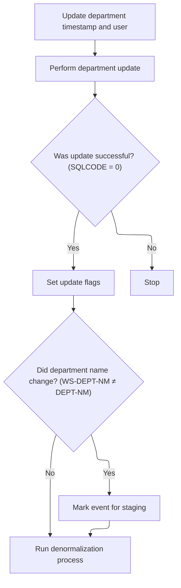

This section ensures that department updates are properly audited, triggers necessary business logic flags, and initiates downstream processes such as event staging and denormalization when appropriate.

| Category       | Rule Name                    | Description                                                                                                                                     |
| -------------- | ---------------------------- | ----------------------------------------------------------------------------------------------------------------------------------------------- |
| Business logic | Audit update                 | Whenever a department row is updated, the timestamp and user ID must be refreshed to reflect the latest change.                                 |
| Business logic | Update status flags          | If the update operation on the department row is successful, checkpoint and update flags must be set to indicate the operation type and status. |
| Business logic | Department name change event | If the department name has changed as part of the update, an event must be staged to signal downstream systems of the change.                   |
| Business logic | Denormalization trigger      | After a successful update, the denormalization process must be triggered to propagate changes and maintain data consistency across systems.     |

<SwmSnippet path="/base/src/NNNS0573.cbl" line="452">

---

In <SwmToken path="base/src/NNNS0573.cbl" pos="452:2:8" line-data="047500 1410-DO-MODIFY-ROW.                                              00047500">`1410-DO-MODIFY-ROW`</SwmToken>, we update the department's timestamp and user ID, then call the update routine. If the update works (SQLCODE = 0), we set checkpoint and update flags, check if the department name changed (to set the stage event flag), and then call the denormalization process. This ties together audit, business logic, and event triggers in one place.

```cobol
047500 1410-DO-MODIFY-ROW.                                              00047500
047600     MOVE YYYC0127-TS   TO LST-UPDT-TS     OF DCLXXX-DEPT         00047600
047700     MOVE YYYC0107-USER TO LST-UPDT-USR-ID OF DCLXXX-DEPT         00047700
047800                                                                  00047800
047900     PERFORM 5000-CALL-NNNS0573-CUD-ROUTINE                       00047900
```

---

</SwmSnippet>

<SwmSnippet path="/base/src/NNNS0573.cbl" line="458">

---

After the update, if it succeeded, we set a bunch of business logic flags (for checkpoint, update, operation type, and event staging if the name changed). Then we call the denormalization process to handle any downstream effects or event triggers tied to this update.

```cobol
048100     IF SQLCODE = 0                                               00048100
048200       MOVE 1 TO WS-CHECKPOINT-INC                                00048200
048300       SET YYYN110A-UPD TO TRUE                                   00048300
048400       SET STD-UPD TO TRUE                                        00048400
048500       SET MODIFY-OPERATION     TO TRUE                           00048500
048600       IF (WS-DEPT-NM        NOT = DEPT-NM OF DCLXXX-DEPT)        00048600
048700          SET STAGE-EVENT TO TRUE                                 00048700
048800       END-IF                                                     00048800
048900       PERFORM 2000-DENORM-PROCESS                                00048900
049000     END-IF                                                       00049000
```

---

</SwmSnippet>

## Passing environment and controlling event workflow

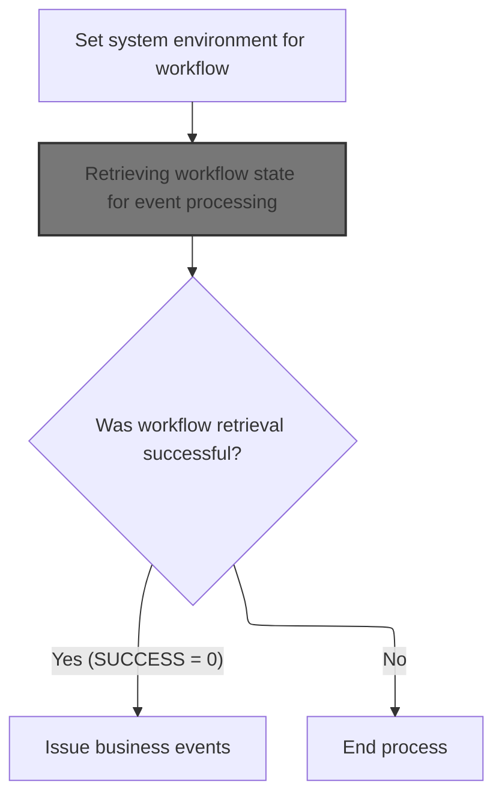

This section ensures that the system environment is correctly set up and that the workflow state is retrieved before any business events are processed. It controls whether event processing can proceed based on the success of workflow state retrieval.

| Category       | Rule Name                   | Description                                                                                                                                                      |
| -------------- | --------------------------- | ---------------------------------------------------------------------------------------------------------------------------------------------------------------- |
| Business logic | Set environment context     | The system environment must be set using the current transaction's environment data before any workflow state retrieval or event processing occurs.              |
| Business logic | Workflow state prerequisite | Workflow state must be retrieved before any business events can be processed. If the workflow state cannot be retrieved, no further event processing is allowed. |
| Business logic | Event issuance on success   | If the workflow state retrieval is successful (indicated by SUCCESS = 0), business events must be issued as the next step in the process.                        |

<SwmSnippet path="/base/src/NNNS0573.cbl" line="554">

---

In <SwmToken path="base/src/NNNS0573.cbl" pos="554:2:6" line-data="057400 2000-DENORM-PROCESS.                                             00057400">`2000-DENORM-PROCESS`</SwmToken>, we copy the system environment from <SwmToken path="base/src/NNNS0573.cbl" pos="555:4:8" line-data="057500     MOVE YYYN005A-SYS-ENV      TO YYYN110A-SYS-ENV               00057500">`YYYN005A-SYS-ENV`</SwmToken> to <SwmToken path="base/src/NNNS0573.cbl" pos="555:12:16" line-data="057500     MOVE YYYN005A-SYS-ENV      TO YYYN110A-SYS-ENV               00057500">`YYYN110A-SYS-ENV`</SwmToken>, then call the control subroutine to get the current workflow state. This sets up the right context for any event actions that might follow.

```cobol
057400 2000-DENORM-PROCESS.                                             00057400
057500     MOVE YYYN005A-SYS-ENV      TO YYYN110A-SYS-ENV               00057500
057600     PERFORM 2010-CALL-CONTROL-SUBR                               00057600
```

---

</SwmSnippet>

### Retrieving workflow state for event processing

This section ensures that the most up-to-date workflow state is retrieved for a user before any event processing occurs. This is critical for maintaining accurate event handling and workflow transitions.

| Category        | Rule Name                    | Description                                                                                                                                                                                                                                                                                             |
| --------------- | ---------------------------- | ------------------------------------------------------------------------------------------------------------------------------------------------------------------------------------------------------------------------------------------------------------------------------------------------------- |
| Data validation | Workflow retrieval flag      | The <SwmToken path="base/src/NNNS0573.cbl" pos="564:6:8" line-data="058400     SET WWWC0100-GET-TASK  TO TRUE                               00058400">`GET-TASK`</SwmToken> flag must be set to indicate that the workflow manager should perform a retrieval operation, not an update or other action. |
| Business logic  | Pre-event workflow retrieval | The workflow state must be retrieved for the specific user before any event processing can begin.                                                                                                                                                                                                       |
| Business logic  | Contextual workflow state    | The workflow manager must only return the workflow state relevant to the user and the current event context.                                                                                                                                                                                            |

<SwmSnippet path="/base/src/NNNS0573.cbl" line="563">

---

<SwmToken path="base/src/NNNS0573.cbl" pos="563:2:8" line-data="058300 2010-CALL-CONTROL-SUBR.                                          00058300">`2010-CALL-CONTROL-SUBR`</SwmToken> sets the <SwmToken path="base/src/NNNS0573.cbl" pos="564:6:8" line-data="058400     SET WWWC0100-GET-TASK  TO TRUE                               00058400">`GET-TASK`</SwmToken> flag and calls the workflow manager (<SwmToken path="base/src/NNNS0573.cbl" pos="565:4:4" line-data="058500     CALL WWWS0100-CONTROL-SUBR USING                             00058500">`WWWS0100`</SwmToken>) to fetch the current workflow state for the user. This info is needed for any event logic that follows.

```cobol
058300 2010-CALL-CONTROL-SUBR.                                          00058300
058400     SET WWWC0100-GET-TASK  TO TRUE                               00058400
058500     CALL WWWS0100-CONTROL-SUBR USING                             00058500
058600         XXXN001A                                                 00058600
058700         WWWC0100                                                 00058700
058800     .                                                            00058800
```

---

</SwmSnippet>

### Initializing and dispatching workflow task operations

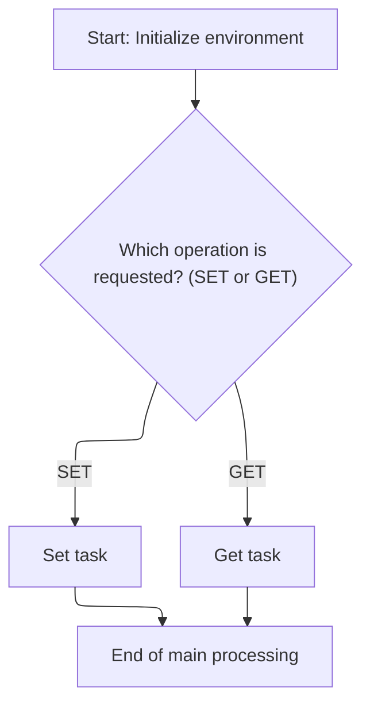

This section governs the initialization and dispatching of workflow task operations, determining whether to store or retrieve workflow task information based on the requested operation type.

| Category        | Rule Name                 | Description                                                                                                                                                       |
| --------------- | ------------------------- | ----------------------------------------------------------------------------------------------------------------------------------------------------------------- |
| Data validation | Operation Type Validation | The requested operation type must be explicitly specified as either 'SET' or 'GET' in the input. Any other value is considered invalid and must not proceed.      |
| Business logic  | Set Task State            | If the operation type is 'SET', the workflow task state must be updated according to the provided data, making the new state available for subsequent operations. |
| Business logic  | Get Task State            | If the operation type is 'GET', the current workflow task state must be retrieved and returned to the requester, reflecting the latest available information.     |

<SwmSnippet path="/base/src/WWWS0100.cbl" line="38">

---

<SwmToken path="base/src/WWWS0100.cbl" pos="38:2:4" line-data="011700 000-MAIN.                                                        00011700">`000-MAIN`</SwmToken> runs initialization, then uses EVALUATE to pick between setting or getting the workflow task state. This controls how user workflow info is stored or retrieved for later use.

```cobol
011700 000-MAIN.                                                        00011700
011800     PERFORM 100-INITIALIZE                                       00011800
011900                                                                  00011900
012300     EVALUATE TRUE                                                00012300
012400       WHEN WWWC0100-SET-TASK                                     00012400
012500         PERFORM 200-SET-TASK                                     00012500
012600       WHEN WWWC0100-GET-TASK                                     00012600
012700         PERFORM 300-GET-TASK                                     00012700
013800     END-EVALUATE                                                 00013800
014100                                                                  00014100
014200     GOBACK                                                       00014200
014300     .                                                            00014300
```

---

</SwmSnippet>

<SwmSnippet path="/base/src/WWWS0100.cbl" line="55">

---

<SwmToken path="base/src/WWWS0100.cbl" pos="55:2:4" line-data="014900 100-INITIALIZE.                                                  00014900">`100-INITIALIZE`</SwmToken> clears out the internal structure, but the comment suggests it might also prep the workflow state for the current task, not just generic setup.

```cobol
014900 100-INITIALIZE.                                                  00014900
015800     INITIALIZE XXXN001A                                          00015800
017000     .                                                            00017000
```

---

</SwmSnippet>

### Conditionally issuing department events after workflow control

<SwmSnippet path="/base/src/NNNS0573.cbl" line="557">

---

We only trigger event issuing if the workflow control worked.

```cobol
057700     IF SUCCESS                                                   00057700
057800        PERFORM 2030-ISSUE-EVENTS                                 00057800
057900     END-IF                                                       00057900
```

---

</SwmSnippet>

## Building and sending department event data

This section is responsible for preparing and sending department event data when a qualifying transaction occurs. It ensures that department information and specific transaction/program identifiers are correctly included in the event structure before the event is sent to the event manager for further processing.

| Category       | Rule Name                      | Description                                                                                                                                                                                                                          |
| -------------- | ------------------------------ | ------------------------------------------------------------------------------------------------------------------------------------------------------------------------------------------------------------------------------------ |
| Business logic | Department event gating        | Department events must only be issued when the transaction type is 'DEPT'.                                                                                                                                                           |
| Business logic | Department data inclusion      | The event data must include the department number and sub-department ID from the transaction record.                                                                                                                                 |
| Business logic | Transaction ID assignment      | The transaction ID for department events must be set to 'SDPM'.                                                                                                                                                                      |
| Business logic | Program ID assignment          | The program ID for department events must be set to <SwmToken path="base/src/NNNS0573.cbl" pos="586:5:5" line-data="060600     MOVE &#39;XXXS0512&#39;            TO ZZZC0197-PROGRAM               00060600">`XXXS0512`</SwmToken>. |
| Business logic | User field blanking            | The user field in the event data must be set to blank for department events.                                                                                                                                                         |
| Business logic | System environment propagation | The system environment value must be copied from the current transaction environment into the event data.                                                                                                                            |
| Business logic | Event dispatch requirement     | Department events must be sent to the event manager for processing once all required data is populated.                                                                                                                              |

<SwmSnippet path="/base/src/NNNS0573.cbl" line="573">

---

In <SwmToken path="base/src/NNNS0573.cbl" pos="573:2:6" line-data="059300 2030-ISSUE-EVENTS.                                               00059300">`2030-ISSUE-EVENTS`</SwmToken>, we prep the event data by moving department info and hardcoded transaction/program IDs into the event structure, then call the event manager to send the event. The meaning of these IDs is domain-specific.

```cobol
059300 2030-ISSUE-EVENTS.                                               00059300
059400     INITIALIZE ZZZC0550                                          00059400
059500     SET YYYN110A-ORACLE    TO TRUE                               00059500
059600     SET DEPARTMENT-EVENT   TO TRUE                               00059600
059700     MOVE XXX-DEPT-NBR OF P-DDDTDP01                              00059700
059800       TO XXX-DEPT-NBR OF ZZZC0125                                00059800
059900          XXX-DEPT-NBR      OF ZZZC0550-DEPT-DATA                 00059900
060000     MOVE STR-SUB-DEPT-ID OF P-DDDTDP01                           00060000
060100       TO STR-SUB-DEPT-ID OF ZZZC0125                             00060100
060200          STR-SUB-DEPT-ID   OF ZZZC0550-DEPT-DATA                 00060200
060300                                                                  00060300
060400     MOVE 'SDPM'                TO ZZZC0197-TRX-ID                00060400
060500     MOVE ZZZC0125              TO ZZZC0197-TRX-REC               00060500
060600     MOVE 'XXXS0512'            TO ZZZC0197-PROGRAM               00060600
060700     MOVE '    '                TO ZZZC0197-USER                  00060700
060800     MOVE YYYN005A-SYS-ENV      TO YYYN110A-SYS-ENV               00060800
060900     CALL ZZZS0197-EVENT-MGR USING                                00060900
061000          XXXN001A                                                00061000
061100          YYYN110A                                                00061100
061200          ZZZC0197                                                00061200
```

---

</SwmSnippet>

### Filtering and issuing master data events

This section controls which master data events are sent downstream by applying business rules for filtering and issuing events. It ensures that only events meeting specific criteria are processed further, supporting data integrity and downstream system requirements.

| Category        | Rule Name             | Description                                                                                                                                                                                                                                                                                           |
| --------------- | --------------------- | ----------------------------------------------------------------------------------------------------------------------------------------------------------------------------------------------------------------------------------------------------------------------------------------------------- |
| Data validation | Transaction ID filter | Only master data events with a transaction ID other than 'CFIP' are eligible for further processing. Events with transaction ID 'CFIP' are excluded from downstream issuance.                                                                                                                         |
| Business logic  | Process event gating  | A master data event is only issued downstream if the <SwmToken path="base/src/ZZZS0197.cbl" pos="64:4:6" line-data="009100     IF PROCESS-EVENT                                             00009100">`PROCESS-EVENT`</SwmToken> flag is set to 'X'. If the flag is not set, the event is not issued. |

<SwmSnippet path="/base/src/ZZZS0197.cbl" line="57">

---

In <SwmToken path="base/src/ZZZS0197.cbl" pos="57:2:4" line-data="008400 000-MAINLINE.                                                    00008400">`000-MAINLINE`</SwmToken>, we initialize, filter out certain events by transaction ID, and only issue events if the <SwmToken path="base/src/ZZZS0197.cbl" pos="64:4:6" line-data="009100     IF PROCESS-EVENT                                             00009100">`PROCESS-EVENT`</SwmToken> flag is set. This controls which events actually get sent downstream.

```cobol
008400 000-MAINLINE.                                                    00008400
008500     PERFORM 100-INITIALIZE                                       00008500
008600                                                                  00008600
008700*    IF  ZZZC0197-TRX-ID NOT = 'CFIP'                             00008700
008800       PERFORM 200-WEED-EVENT                                     00008800
008900*    END-IF                                                       00008900
009000                                                                  00009000
009100     IF PROCESS-EVENT                                             00009100
009200       PERFORM 300-ISSUE-EVENT                                    00009200
009300     END-IF                                                       00009300
009400                                                                  00009400
009500     GOBACK                                                       00009500
009600     .                                                            00009600
```

---

</SwmSnippet>

### Filtering events by transaction type and batch environment

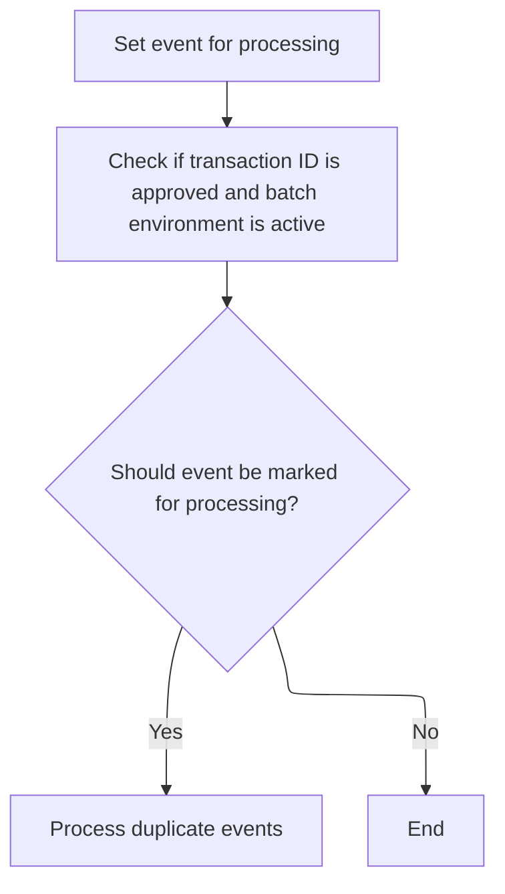

This section filters incoming events to ensure only those with approved transaction types and that are processed in a batch environment are considered for further processing. It also ensures that duplicate events are not processed multiple times.

| Category        | Rule Name                     | Description                                                                                                                                                                                                                                                                                                                                                                                                                                                                                                                                                                                                                                                          |
| --------------- | ----------------------------- | -------------------------------------------------------------------------------------------------------------------------------------------------------------------------------------------------------------------------------------------------------------------------------------------------------------------------------------------------------------------------------------------------------------------------------------------------------------------------------------------------------------------------------------------------------------------------------------------------------------------------------------------------------------------- |
| Data validation | Approved transaction types    | Only events with a transaction type that matches one of the approved codes are eligible for processing. The approved codes are: BVLM, APLM, BDMM, BCAM, CCSM, CEMM, CNCM, COMM, CRCM, CSCM, CTOM, DIRM, DISM, DSDM, FINM, ICCM, ITMM, IWVM, LOBM, MCEM, MRGM, OBSM, ORBM, PBCM, PBNM, PBTM, PCCM, PCTM, PDSH, PDUA, PDUP, PIPM, PRIM, PRMM, PRRM, PSBM, PSCM, RARM, RFTM, RITM, RRFM, RTDM, RTTM, SCAM, SDPM, SLDM, STAM, STPM, STRM, STTM, <SwmToken path="base/src/ZZZS0197.cbl" pos="149:14:14" line-data="017600*      OR ZZZC0197-TRX-ID = &#39;T2TM&#39;                                00017600">`T2TM`</SwmToken>, TRDM, VCMM, VENM, VISM, VLIM, WHSM, WLIM. |
| Data validation | Batch environment requirement | Events are only eligible for processing if they occur in a batch environment. If the batch environment indicator is not set, the event is excluded from further processing.                                                                                                                                                                                                                                                                                                                                                                                                                                                                                          |
| Business logic  | Eligibility for processing    | If an event passes both the transaction type and batch environment checks, it is marked for processing. Otherwise, it is excluded from further processing.                                                                                                                                                                                                                                                                                                                                                                                                                                                                                                           |
| Business logic  | Duplicate event removal       | Duplicate events are identified and removed from the set of events to be processed, ensuring that each eligible event is only processed once.                                                                                                                                                                                                                                                                                                                                                                                                                                                                                                                        |

<SwmSnippet path="/base/src/ZZZS0197.cbl" line="89">

---

We filter events by type and batch, then weed out duplicates.

```cobol
011600 200-WEED-EVENT.                                                  00011600
011700     SET PROCESS-EVENT TO TRUE                                    00011700
011800     PERFORM 210-WEED-BY-HARD-CODE                                00011800
011900     IF PROCESS-EVENT                                             00011900
012000       PERFORM 220-WEED-DUP-EVENTS                                00012000
012100     END-IF                                                       00012100
012200     .                                                            00012200
```

---

</SwmSnippet>

<SwmSnippet path="/base/src/ZZZS0197.cbl" line="98">

---

We check the transaction ID against a big list and batch mode, then flag the event if both match.

```cobol
012500 210-WEED-BY-HARD-CODE.                                           00012500
012600     IF  (ZZZC0197-TRX-ID = 'BVLM'                                00012600
012700*      OR ZZZC0197-TRX-ID = 'APLM'                                00012700
012800*      OR ZZZC0197-TRX-ID = 'BDMM'                                00012800
012900*      OR ZZZC0197-TRX-ID = 'BCAM'                                00012900
013000*      OR ZZZC0197-TRX-ID = 'CCSM'                                00013000
013100*      OR ZZZC0197-TRX-ID = 'CEMM'                                00013100
013200       OR ZZZC0197-TRX-ID = 'CNCM'                                00013200
013300*      OR ZZZC0197-TRX-ID = 'COMM'                                00013300
013400*      OR ZZZC0197-TRX-ID = 'CRCM'                                00013400
013500*      OR ZZZC0197-TRX-ID = 'CSCM'                                00013500
013600*      OR ZZZC0197-TRX-ID = 'CTOM'                                00013600
013700*      OR ZZZC0197-TRX-ID = 'DIRM'                                00013700
013800*      OR ZZZC0197-TRX-ID = 'DISM'                                00013800
013900*      OR ZZZC0197-TRX-ID = 'DSDM'                                00013900
014000*      OR ZZZC0197-TRX-ID = 'FINM'                                00014000
014100*      OR ZZZC0197-TRX-ID = 'ICCM'                                00014100
014200*      OR ZZZC0197-TRX-ID = 'ITMM'                                00014200
014300       OR ZZZC0197-TRX-ID = 'IWVM'                                00014300
014400*      OR ZZZC0197-TRX-ID = 'LOBM'                                00014400
014500*      OR ZZZC0197-TRX-ID = 'MCEM'                                00014500
014600*      OR ZZZC0197-TRX-ID = 'MRGM'                                00014600
014700       OR ZZZC0197-TRX-ID = 'OBSM'                                00014700
014800*      OR ZZZC0197-TRX-ID = 'ORBM'                                00014800
014900       OR ZZZC0197-TRX-ID = 'PBCM'                                00014900
015000*      OR ZZZC0197-TRX-ID = 'PBNM'                                00015000
015100       OR ZZZC0197-TRX-ID = 'PBTM'                                00015100
015200*      OR ZZZC0197-TRX-ID = 'PCCM'                                00015200
015300*      OR ZZZC0197-TRX-ID = 'PCTM'                                00015300
015400*      OR ZZZC0197-TRX-ID = 'PDSH'                                00015400
015500*      OR ZZZC0197-TRX-ID = 'PDUA'                                00015500
015600*      OR ZZZC0197-TRX-ID = 'PDUP'                                00015600
015700       OR ZZZC0197-TRX-ID = 'PIPM'                                00015700
015800*      OR ZZZC0197-TRX-ID = 'PRIM'                                00015800
015900*      OR ZZZC0197-TRX-ID = 'PRMM'                                00015900
016000*      OR ZZZC0197-TRX-ID = 'PRRM'                                00016000
016100       OR ZZZC0197-TRX-ID = 'PSBM'                                00016100
016200*      OR ZZZC0197-TRX-ID = 'PSCM'                                00016200
016300       OR ZZZC0197-TRX-ID = 'RARM'                                00016300
016400       OR ZZZC0197-TRX-ID = 'RFTM'                                00016400
016500       OR ZZZC0197-TRX-ID = 'RITM'                                00016500
016600       OR ZZZC0197-TRX-ID = 'RRFM'                                00016600
016700       OR ZZZC0197-TRX-ID = 'RTDM'                                00016700
016800*      OR ZZZC0197-TRX-ID = 'RTTM'                                00016800
016900       OR ZZZC0197-TRX-ID = 'SCAM'                                00016900
017000*      OR ZZZC0197-TRX-ID = 'SDPM'                                00017000
017100*      OR ZZZC0197-TRX-ID = 'SLDM'                                00017100
017200       OR ZZZC0197-TRX-ID = 'STAM'                                00017200
017300*      OR ZZZC0197-TRX-ID = 'STPM'                                00017300
017400*      OR ZZZC0197-TRX-ID = 'STRM'                                00017400
017500       OR ZZZC0197-TRX-ID = 'STTM'                                00017500
017600*      OR ZZZC0197-TRX-ID = 'T2TM'                                00017600
017700       OR ZZZC0197-TRX-ID = 'TRDM'                                00017700
017800*      OR ZZZC0197-TRX-ID = 'VCMM'                                00017800
017900*      OR ZZZC0197-TRX-ID = 'VENM'                                00017900
018000*      OR ZZZC0197-TRX-ID = 'VISM'                                00018000
018100*      OR ZZZC0197-TRX-ID = 'VLIM'                                00018100
018200*      OR ZZZC0197-TRX-ID = 'WHSM'                                00018200
018300       OR ZZZC0197-TRX-ID = 'WLIM')                               00018300
018400       AND YYYN110A-BATCH-ENV                                     00018400
018500         SET WEED-EVENT TO TRUE                                   00018500
018600     END-IF                                                       00018600
018700     .                                                            00018700
```

---

</SwmSnippet>

### Issuing secondary event for department changes

<SwmSnippet path="/base/src/NNNS0573.cbl" line="594">

---

After returning from the event manager call in <SwmToken path="base/src/NNNS0573.cbl" pos="558:4:8" line-data="057800        PERFORM 2030-ISSUE-EVENTS                                 00057800">`2030-ISSUE-EVENTS`</SwmToken>, if the update succeeded and both scan and stage event flags are set, we set the modify flag, update the transaction data, and issue a second event. This is all driven by business rules.

```cobol
061400     IF SQLCODE = 0 AND WWWC0100-CREATE-SCAN-EVENT AND            00061400
061500        STAGE-EVENT                                               00061500
061600         SET  MODIFY-OPERATION      TO TRUE                       00061600
061700         MOVE ZZZC0550              TO ZZZC0197-TRX-REC           00061700
061800         MOVE ZZZC0550-TRX          TO ZZZC0197-TRX-ID            00061800
061900                                       ZZZC0197-TRX-CD            00061900
062000         MOVE 'NNNS0573'            TO ZZZC0197-PROGRAM           00062000
062100         MOVE YYYC0107-USER         TO ZZZC0197-USER              00062100
062200         MOVE YYYN005A-SYS-ENV      TO YYYN110A-SYS-ENV           00062200
062300         CALL ZZZS0197-EVENT-MGR USING                            00062300
062400              XXXN001A                                            00062400
062500              YYYN110A                                            00062500
062600              ZZZC0197                                            00062600
062700     END-IF                                                       00062700
```

---

</SwmSnippet>

## Preparing and inserting new department row

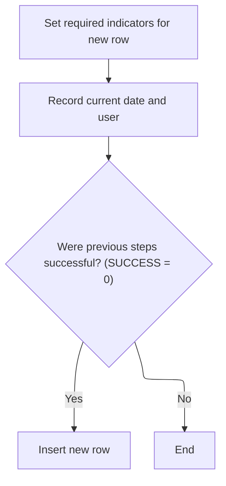

This section ensures that when a new department row is added, all required indicators are set and audit information (date and user) is accurately recorded. The insertion only occurs if all preparatory steps are successful, ensuring data integrity and auditability.

| Category       | Rule Name                 | Description                                                                                                                                         |
| -------------- | ------------------------- | --------------------------------------------------------------------------------------------------------------------------------------------------- |
| Business logic | Conditional row insertion | A new department row must only be inserted if all required indicators are set and the current date and user information are successfully retrieved. |
| Business logic | Audit field population    | The audit fields for the new department row must always include the current date and the user responsible for the insertion.                        |

<SwmSnippet path="/base/src/NNNS0573.cbl" line="471">

---

In <SwmToken path="base/src/NNNS0573.cbl" pos="471:2:10" line-data="049400 1500-EXIT-PUT-INSERT-ROW.                                        00049400">`1500-EXIT-PUT-INSERT-ROW`</SwmToken>, we prep null indicators, fetch the current date and user, and only try to insert the row if that fetch worked. This keeps audit info in sync with new records.

```cobol
049400 1500-EXIT-PUT-INSERT-ROW.                                        00049400
049500     PERFORM 1800-EDIT-NULL-INDICATORS                            00049500
049600                                                                  00049600
049700     PERFORM 2040-GET-DATE-AND-USER                               00049700
```

---

</SwmSnippet>

<SwmSnippet path="/base/src/NNNS0573.cbl" line="475">

---

After getting the date and user info in <SwmToken path="base/src/NNNS0573.cbl" pos="166:4:12" line-data="018900          PERFORM 1500-EXIT-PUT-INSERT-ROW                        00018900">`1500-EXIT-PUT-INSERT-ROW`</SwmToken>, we only insert the new department row if SUCCESS is set. This keeps the audit fields valid for new records.

```cobol
049800     IF SUCCESS                                                   00049800
049900       PERFORM 1510-D0-INSERT-ROW                                 00049900
050000     END-IF                                                       00050000
```

---

</SwmSnippet>

## Assigning org ID and inserting department data

This section ensures that every new department row inserted into the system is assigned a unique organization ID, maintaining data integrity across LOCATION and <SwmToken path="base/src/NNNS0573.cbl" pos="359:4:4" line-data="038200         FROM   XXX_DEPT                                          00038200">`XXX_DEPT`</SwmToken> tables.

| Category        | Rule Name                      | Description                                                                                                                                                                                                                                                                                                                                                                         |
| --------------- | ------------------------------ | ----------------------------------------------------------------------------------------------------------------------------------------------------------------------------------------------------------------------------------------------------------------------------------------------------------------------------------------------------------------------------------- |
| Data validation | Add action validation          | Department row insertion is only permitted when the action type is 'Add' (ACTION-TAKEN = 'A' or YYYN110A-IO-FUNC = 'A').                                                                                                                                                                                                                                                            |
| Data validation | Insertion success confirmation | A successful department row insertion must result in a success code (SUCCESS = 0) being set, indicating the operation completed without errors.                                                                                                                                                                                                                                     |
| Business logic  | Unique org ID assignment       | A new department row must be assigned an organization ID that is unique across both LOCATION and <SwmToken path="base/src/NNNS0573.cbl" pos="359:4:4" line-data="038200         FROM   XXX_DEPT                                          00038200">`XXX_DEPT`</SwmToken> tables. The new org ID is calculated as one greater than the current maximum org ID found in either table. |

<SwmSnippet path="/base/src/NNNS0573.cbl" line="481">

---

In <SwmToken path="base/src/NNNS0573.cbl" pos="481:2:8" line-data="050400 1510-D0-INSERT-ROW.                                              00050400">`1510-D0-INSERT-ROW`</SwmToken>, we call the org ID assignment routine before inserting the department row. This guarantees the new row gets a unique org ID based on the current max from both tables.

```cobol
050400 1510-D0-INSERT-ROW.                                              00050400
050500     PERFORM 1520-EXIT-GET-ORG-ID                                 00050500
```

---

</SwmSnippet>

### Calculating next available organization ID

This section ensures that each new department receives a unique organization ID by calculating the next available value across both LOCATION and <SwmToken path="base/src/NNNS0573.cbl" pos="359:4:4" line-data="038200         FROM   XXX_DEPT                                          00038200">`XXX_DEPT`</SwmToken> tables. It also handles errors in the ID generation process.

| Category       | Rule Name                          | Description                                                                                                                                                                                                                                                                                                      |
| -------------- | ---------------------------------- | ---------------------------------------------------------------------------------------------------------------------------------------------------------------------------------------------------------------------------------------------------------------------------------------------------------------- |
| Business logic | Unique organization ID enforcement | The organization ID assigned to a new department must be unique across both LOCATION and <SwmToken path="base/src/NNNS0573.cbl" pos="359:4:4" line-data="038200         FROM   XXX_DEPT                                          00038200">`XXX_DEPT`</SwmToken> tables.                                         |
| Business logic | Next available ID calculation      | The next available organization ID is calculated by incrementing the highest existing organization ID found in LOCATION and <SwmToken path="base/src/NNNS0573.cbl" pos="359:4:4" line-data="038200         FROM   XXX_DEPT                                          00038200">`XXX_DEPT`</SwmToken> tables by 1. |

<SwmSnippet path="/base/src/NNNS0573.cbl" line="499">

---

In <SwmToken path="base/src/NNNS0573.cbl" pos="499:2:10" line-data="052200 1520-EXIT-GET-ORG-ID.                                            00052200">`1520-EXIT-GET-ORG-ID`</SwmToken>, we run a SQL query to get the max org ID from LOCATION and <SwmToken path="base/src/NNNS0573.cbl" pos="503:4:4" line-data="052600         FROM   XXX_DEPT DEPT, LOCATION LOC                       00052600">`XXX_DEPT`</SwmToken>, then increment it for the new department. This keeps IDs unique across both tables.

```cobol
052200 1520-EXIT-GET-ORG-ID.                                            00052200
052300     EXEC SQL                                                     00052300
052400         SELECT GREATEST (MAX (LOC.ORG_ID), MAX (DEPT.ORG_ID))    00052400
052500         INTO   :DCLXXX-DEPT.ORG-ID                               00052500
052600         FROM   XXX_DEPT DEPT, LOCATION LOC                       00052600
052700         WITH UR                                                  00052700
052800     END-EXEC                                                     00052800
```

---

</SwmSnippet>

<SwmSnippet path="/base/src/NNNS0573.cbl" line="507">

---

After running the query in <SwmToken path="base/src/NNNS0573.cbl" pos="482:4:12" line-data="050500     PERFORM 1520-EXIT-GET-ORG-ID                                 00050500">`1520-EXIT-GET-ORG-ID`</SwmToken>, if it works, we increment the org ID and use it for the new department. If it fails, we flag the error and set a message for downstream handling.

```cobol
053000     EVALUATE TRUE                                                00053000
053100       WHEN SQLCODE = 0                                           00053100
053200         COMPUTE ORG-ID OF DCLXXX-DEPT =                          00053200
053300                 ORG-ID OF DCLXXX-DEPT + 1                        00053300
053400       WHEN OTHER                                                 00053400
053500         SET  FAILURE TO TRUE                                     00053500
053600         MOVE 'NNNS0573 - Error getting ORG_ID!'                  00053600
053700           TO IS-RTRN-MSG-TXT                                     00053700
053800     END-EVALUATE                                                 00053800
```

---

</SwmSnippet>

### Finalizing insert and triggering denormalization

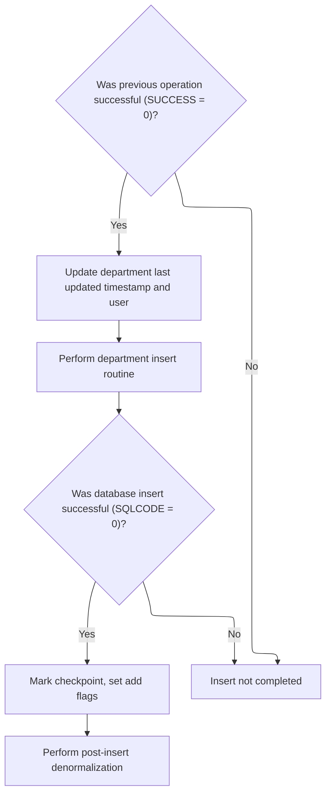

<SwmSnippet path="/base/src/NNNS0573.cbl" line="483">

---

After getting the org ID in <SwmToken path="base/src/NNNS0573.cbl" pos="476:4:10" line-data="049900       PERFORM 1510-D0-INSERT-ROW                                 00049900">`1510-D0-INSERT-ROW`</SwmToken>, if the insert works, we set the checkpoint and add flags, then call denormalization to handle any downstream effects or events.

```cobol
050600     IF SUCCESS                                                   00050600
050700       MOVE YYYC0127-TS   TO LST-UPDT-TS     OF DCLXXX-DEPT       00050700
050800       MOVE YYYC0107-USER TO LST-UPDT-USR-ID OF DCLXXX-DEPT       00050800
050900                                                                  00050900
051000       PERFORM 5000-CALL-NNNS0573-CUD-ROUTINE                     00051000
```

---

</SwmSnippet>

<SwmSnippet path="/base/src/NNNS0573.cbl" line="489">

---

After finishing the insert, we set the right flags and call denormalization to handle any follow-up actions or events for the new department row.

```cobol
051200       IF SQLCODE = 0                                             00051200
051300         MOVE 1 TO WS-CHECKPOINT-INC                              00051300
051400         SET YYYN110A-ADD TO TRUE                                 00051400
051500         SET STD-ADD TO TRUE                                      00051500
051600         PERFORM 2000-DENORM-PROCESS                              00051600
051700       END-IF                                                     00051700
```

---

</SwmSnippet>

## Checking and purging department row

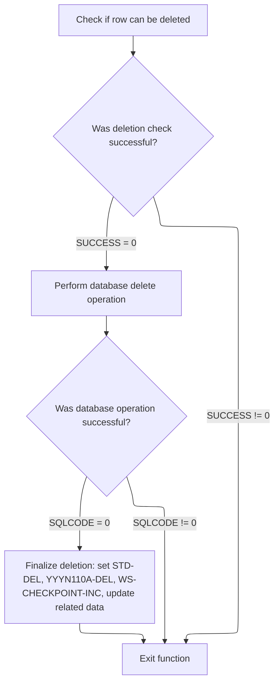

This section ensures that department rows are only deleted if they pass a business validation check. It coordinates the validation, deletion, and post-deletion processes, ensuring data integrity and proper downstream handling.

| Category        | Rule Name                              | Description                                                                                                                                                                                                                                                                                                                                                                                                                                                                                                                                                                                                                                                             |
| --------------- | -------------------------------------- | ----------------------------------------------------------------------------------------------------------------------------------------------------------------------------------------------------------------------------------------------------------------------------------------------------------------------------------------------------------------------------------------------------------------------------------------------------------------------------------------------------------------------------------------------------------------------------------------------------------------------------------------------------------------------- |
| Data validation | Referential integrity check required   | A department row can only be deleted if it passes the referential integrity delete check performed by the <SwmToken path="base/src/NNNS0573.cbl" pos="521:8:8" line-data="054310     PERFORM 4500-CALL-MMMS0304-RI-DEL-CHK                        00054310">`MMMS0304`</SwmToken> program. If the check fails, no deletion or downstream logic is performed.                                                                                                                                                                                                                                                                                                            |
| Business logic  | Conditional database deletion          | If the referential integrity check is successful, the department row is deleted from the database. If the database operation fails, no further actions are taken.                                                                                                                                                                                                                                                                                                                                                                                                                                                                                                       |
| Business logic  | Post-deletion state update             | After a successful deletion, the system must set the <SwmToken path="base/src/NNNS0573.cbl" pos="528:4:6" line-data="054900         SET STD-DEL TO TRUE                                      00054900">`STD-DEL`</SwmToken> and <SwmToken path="base/src/NNNS0573.cbl" pos="527:4:6" line-data="054800         SET YYYN110A-DEL TO TRUE                                 00054800">`YYYN110A-DEL`</SwmToken> flags to indicate the row has been deleted, and increment the <SwmToken path="base/src/NNNS0573.cbl" pos="185:8:12" line-data="020800     MOVE 0 TO WS-CHECKPOINT-INC                                  00020800">`WS-CHECKPOINT-INC`</SwmToken> value by 1. |
| Business logic  | Trigger denormalization after deletion | After a successful deletion and state update, the denormalization process must be triggered to handle any downstream effects or events related to the deletion.                                                                                                                                                                                                                                                                                                                                                                                                                                                                                                         |

<SwmSnippet path="/base/src/NNNS0573.cbl" line="519">

---

In <SwmToken path="base/src/NNNS0573.cbl" pos="519:2:10" line-data="054200 1600-EXIT-PUT-PURGE-ROW.                                         00054200">`1600-EXIT-PUT-PURGE-ROW`</SwmToken>, we call the delete check routine to make sure the department can be purged. Only if it passes do we proceed with the actual delete and any downstream logic.

```cobol
054200 1600-EXIT-PUT-PURGE-ROW.                                         00054200
054300                                                                  00054300
054310     PERFORM 4500-CALL-MMMS0304-RI-DEL-CHK                        00054310
```

---

</SwmSnippet>

<SwmSnippet path="/base/src/NNNS0573.cbl" line="626">

---

In <SwmToken path="base/src/NNNS0573.cbl" pos="626:2:12" line-data="064600 4500-CALL-MMMS0304-RI-DEL-CHK.                                   00064600">`4500-CALL-MMMS0304-RI-DEL-CHK`</SwmToken>, we prep the delete check structure with department info and set flags for function and connection type, then call the <SwmToken path="base/src/NNNS0573.cbl" pos="626:6:6" line-data="064600 4500-CALL-MMMS0304-RI-DEL-CHK.                                   00064600">`MMMS0304`</SwmToken> program to validate the delete.

```cobol
064600 4500-CALL-MMMS0304-RI-DEL-CHK.                                   00064600
064610     INITIALIZE MMMC0304                                          00064610
064620     MOVE XXX-DEPT-NBR    OF DCLXXX-DEPT                          00064620
064630       TO MMMC0304-XXX-DEPT-NBR                                   00064630
064640     MOVE STR-SUB-DEPT-ID OF DCLXXX-DEPT                          00064640
064650       TO MMMC0304-STR-SUB-DEPT-ID                                00064650
064660     SET MMMC0304-DELETE-CHECK TO TRUE                            00064660
064670     SET MMMC0304-XXX-DEPT     TO TRUE                            00064670
064680     SET MMMC0304-ORACLE       TO TRUE                            00064680
064690     CALL MMMS0304-RI-DEL-CHK USING                               00064690
064691          XXXN001A                                                00064691
064692          MMMC0304                                                00064692
064693     .                                                            00064693
```

---

</SwmSnippet>

<SwmSnippet path="/base/src/NNNS0573.cbl" line="522">

---

After the delete check and actual delete in <SwmToken path="base/src/NNNS0573.cbl" pos="168:4:12" line-data="019100          PERFORM 1600-EXIT-PUT-PURGE-ROW                         00019100">`1600-EXIT-PUT-PURGE-ROW`</SwmToken>, if it worked, we set the delete flags and checkpoint, then call denormalization to handle any downstream effects or events.

```cobol
054320     IF SUCCESS                                                   00054320
054400       PERFORM 5000-CALL-NNNS0573-CUD-ROUTINE                     00054400
054500                                                                  00054500
054600       IF SQLCODE = 0                                             00054600
054700         MOVE 1 TO WS-CHECKPOINT-INC                              00054700
054800         SET YYYN110A-DEL TO TRUE                                 00054800
054900         SET STD-DEL TO TRUE                                      00054900
055000         PERFORM 2000-DENORM-PROCESS                              00055000
055100       END-IF                                                     00055100
055110     END-IF                                                       00055110
```

---

</SwmSnippet>

## Finalizing dispatcher and cleaning up after purge

<SwmSnippet path="/base/src/NNNS0573.cbl" line="172">

---

After finishing the purge in <SwmToken path="base/src/NNNS0573.cbl" pos="150:2:6" line-data="017300 0000-EXIT-DISPATCHER.                                            00017300">`0000-EXIT-DISPATCHER`</SwmToken>, we call <SwmToken path="base/src/NNNS0573.cbl" pos="172:4:8" line-data="019500     PERFORM 120-EXIT-STUFF                                       00019500">`120-EXIT-STUFF`</SwmToken> to wrap up any pending actions, update checkpoints, and clean up the database context before returning.

```cobol
019500     PERFORM 120-EXIT-STUFF                                       00019500
019600     GOBACK                                                       00019600
019700     .                                                            00019700
```

---

</SwmSnippet>

# Finalizing department transaction and checkpoint

```mermaid
%%{init: {"flowchart": {"defaultRenderer": "elk"}} }%%
flowchart TD
    node1["Start exit process"]
    click node1 openCode "base/src/NNNS0573.cbl:245:245"
    node1 --> node2{"Was previous operation successful? (SUCCESS = 0)"}
    click node2 openCode "base/src/NNNS0573.cbl:246:246"
    node2 -->|"Yes"| node3{"Is cursor not being closed? (EXIT-CLOSE-CURSOR != 2)"}
    click node3 openCode "base/src/NNNS0573.cbl:247:247"
    node3 -->|"Yes"| node4["Move data fields before exit"]
    click node4 openCode "base/src/NNNS0573.cbl:248:248"
    node4 --> node5["Update checkpoint counter"]
    click node5 openCode "base/src/NNNS0573.cbl:250:250"
    node3 -->|"No"| node5
    node2 -->|"No"| node8["Update SQL status code"]
    click node8 openCode "base/src/NNNS0573.cbl:256:256"
    node5 --> node6{"Is Oracle or DB2 action required? (YYYN005A-ORACLE = 'O' or EXIT-PUT-INSERT-ROW = 9 or EXIT-PUT-PURGE-ROW = 10 or EXIT-PUT-MODIFY-ROW = 8)"}
    click node6 openCode "base/src/NNNS0573.cbl:252:253"
    node6 -->|"Yes"| node7["Connect to DB2"]
    click node7 openCode "base/src/NNNS0573.cbl:254:254"
    node7 --> node8
    node6 -->|"No"| node8
classDef HeadingStyle fill:#777777,stroke:#333,stroke-width:2px;

%% Swimm:
%% %%{init: {"flowchart": {"defaultRenderer": "elk"}} }%%
%% flowchart TD
%%     node1["Start exit process"]
%%     click node1 openCode "<SwmPath>[base/src/NNNS0573.cbl](base/src/NNNS0573.cbl)</SwmPath>:245:245"
%%     node1 --> node2{"Was previous operation successful? (SUCCESS = 0)"}
%%     click node2 openCode "<SwmPath>[base/src/NNNS0573.cbl](base/src/NNNS0573.cbl)</SwmPath>:246:246"
%%     node2 -->|"Yes"| node3{"Is cursor not being closed? (<SwmToken path="base/src/NNNS0573.cbl" pos="157:4:8" line-data="018000       WHEN EXIT-CLOSE-CURSOR                                     00018000">`EXIT-CLOSE-CURSOR`</SwmToken> != 2)"}
%%     click node3 openCode "<SwmPath>[base/src/NNNS0573.cbl](base/src/NNNS0573.cbl)</SwmPath>:247:247"
%%     node3 -->|"Yes"| node4["Move data fields before exit"]
%%     click node4 openCode "<SwmPath>[base/src/NNNS0573.cbl](base/src/NNNS0573.cbl)</SwmPath>:248:248"
%%     node4 --> node5["Update checkpoint counter"]
%%     click node5 openCode "<SwmPath>[base/src/NNNS0573.cbl](base/src/NNNS0573.cbl)</SwmPath>:250:250"
%%     node3 -->|"No"| node5
%%     node2 -->|"No"| node8["Update SQL status code"]
%%     click node8 openCode "<SwmPath>[base/src/NNNS0573.cbl](base/src/NNNS0573.cbl)</SwmPath>:256:256"
%%     node5 --> node6{"Is Oracle or <SwmToken path="base/src/NNNS0573.cbl" pos="182:2:2" line-data="020500                DB2-STUFF                                         00020500">`DB2`</SwmToken> action required? (<SwmToken path="base/src/NNNS0573.cbl" pos="191:5:7" line-data="021400     IF (YYYN005A-ORACLE       OR EXIT-PUT-INSERT-ROW             00021400">`YYYN005A-ORACLE`</SwmToken> = 'O' or <SwmToken path="base/src/NNNS0573.cbl" pos="165:4:10" line-data="018800       WHEN EXIT-PUT-INSERT-ROW                                   00018800">`EXIT-PUT-INSERT-ROW`</SwmToken> = 9 or <SwmToken path="base/src/NNNS0573.cbl" pos="167:4:10" line-data="019000       WHEN EXIT-PUT-PURGE-ROW                                    00019000">`EXIT-PUT-PURGE-ROW`</SwmToken> = 10 or <SwmToken path="base/src/NNNS0573.cbl" pos="163:4:10" line-data="018600       WHEN EXIT-PUT-MODIFY-ROW                                   00018600">`EXIT-PUT-MODIFY-ROW`</SwmToken> = 8)"}
%%     click node6 openCode "<SwmPath>[base/src/NNNS0573.cbl](base/src/NNNS0573.cbl)</SwmPath>:252:253"
%%     node6 -->|"Yes"| node7["Connect to <SwmToken path="base/src/NNNS0573.cbl" pos="182:2:2" line-data="020500                DB2-STUFF                                         00020500">`DB2`</SwmToken>"]
%%     click node7 openCode "<SwmPath>[base/src/NNNS0573.cbl](base/src/NNNS0573.cbl)</SwmPath>:254:254"
%%     node7 --> node8
%%     node6 -->|"No"| node8
%% classDef HeadingStyle fill:#777777,stroke:#333,stroke-width:2px;
```

This section ensures that after a department transaction, all relevant data is synchronized, checkpoint counters are updated for tracking, and the database connection is correctly set for subsequent operations. It also ensures that any errors are properly tracked via the SQL status code.

| Category        | Rule Name                       | Description                                                                                                                                                                                                                                                                                                                                                           |
| --------------- | ------------------------------- | --------------------------------------------------------------------------------------------------------------------------------------------------------------------------------------------------------------------------------------------------------------------------------------------------------------------------------------------------------------------- |
| Data validation | SQL status code update          | The SQL status code must always be updated at the end of the process to reflect the outcome of the most recent database operation.                                                                                                                                                                                                                                    |
| Business logic  | Data synchronization on success | If the previous operation was successful and the cursor is not being closed, department data must be moved to the main record to keep it in sync for any follow-up database actions.                                                                                                                                                                                  |
| Business logic  | Checkpoint counter increment    | After a successful operation, the checkpoint counter must be incremented by the value of <SwmToken path="base/src/NNNS0573.cbl" pos="185:8:12" line-data="020800     MOVE 0 TO WS-CHECKPOINT-INC                                  00020800">`WS-CHECKPOINT-INC`</SwmToken> to track the number of successful transactions.                                            |
| Business logic  | Database context switch         | If the operation involved Oracle or was an insert, purge, or modify action, the database context must be switched back to <SwmToken path="base/src/NNNS0573.cbl" pos="182:2:2" line-data="020500                DB2-STUFF                                         00020500">`DB2`</SwmToken> to ensure subsequent operations are executed in the correct environment. |

<SwmSnippet path="/base/src/NNNS0573.cbl" line="245">

---

In <SwmToken path="base/src/NNNS0573.cbl" pos="245:2:6" line-data="026800 120-EXIT-STUFF.                                                  00026800">`120-EXIT-STUFF`</SwmToken>, we only move department data from <SwmToken path="base/src/NNNS0573.cbl" pos="204:12:14" line-data="022700       TO XXX-DEPT-NBR OF DCLXXX-DEPT                             00022700">`DCLXXX-DEPT`</SwmToken> to <SwmToken path="base/src/NNNS0573.cbl" pos="203:12:14" line-data="022600     MOVE XXX-DEPT-NBR OF P-DDDTDP01                              00022600">`P-DDDTDP01`</SwmToken> if the operation succeeded and we're not closing the cursor. This keeps the main record in sync for any follow-up DB actions. We also bump the checkpoint counter to track successful operations.

```cobol
026800 120-EXIT-STUFF.                                                  00026800
026900     IF SUCCESS                                                   00026900
027000       IF NOT EXIT-CLOSE-CURSOR                                   00027000
027100         PERFORM 130-MOVE-DCL-2-PDA-FIELDS                        00027100
027200       END-IF                                                     00027200
027300       ADD WS-CHECKPOINT-INC TO YYYN005A-CHKPT-CNT                00027300
027400     END-IF                                                       00027400
```

---

</SwmSnippet>

<SwmSnippet path="/base/src/NNNS0573.cbl" line="252">

---

After wrapping up in <SwmToken path="base/src/NNNS0573.cbl" pos="172:4:8" line-data="019500     PERFORM 120-EXIT-STUFF                                       00019500">`120-EXIT-STUFF`</SwmToken>, if we just did an insert, purge, or modify (or were using Oracle), we call <SwmToken path="base/src/NNNS0573.cbl" pos="254:4:10" line-data="027700       PERFORM 125-CONNECT-TO-DB2                                 00027700">`125-CONNECT-TO-DB2`</SwmToken> to switch the DB context back to <SwmToken path="base/src/NNNS0573.cbl" pos="254:10:10" line-data="027700       PERFORM 125-CONNECT-TO-DB2                                 00027700">`DB2`</SwmToken>. This keeps the DB connection state consistent for whatever comes next. We also copy the SQLCODE for error tracking.

```cobol
027500     IF (YYYN005A-ORACLE       OR EXIT-PUT-INSERT-ROW             00027500
027600         OR EXIT-PUT-PURGE-ROW OR EXIT-PUT-MODIFY-ROW)            00027600
027700       PERFORM 125-CONNECT-TO-DB2                                 00027700
027800     END-IF                                                       00027800
027900     MOVE SQLCODE TO DB2-SQL-CODE                                 00027900
028000     .                                                            00028000
```

---

</SwmSnippet>

# Switching database context to <SwmToken path="base/src/NNNS0573.cbl" pos="182:2:2" line-data="020500                DB2-STUFF                                         00020500">`DB2`</SwmToken>

This section ensures that all logic related to connecting to <SwmToken path="base/src/NNNS0573.cbl" pos="182:2:2" line-data="020500                DB2-STUFF                                         00020500">`DB2`</SwmToken> is handled in a single place, improving maintainability and consistency of database operations.

| Category       | Rule Name                                                                                                                                                                              | Description                                                                                                                                                                                                                                                                  |
| -------------- | -------------------------------------------------------------------------------------------------------------------------------------------------------------------------------------- | ---------------------------------------------------------------------------------------------------------------------------------------------------------------------------------------------------------------------------------------------------------------------------- |
| Business logic | <SwmToken path="base/src/NNNS0573.cbl" pos="182:2:2" line-data="020500                DB2-STUFF                                         00020500">`DB2`</SwmToken> context enforcement | The system must always switch the database context to <SwmToken path="base/src/NNNS0573.cbl" pos="182:2:2" line-data="020500                DB2-STUFF                                         00020500">`DB2`</SwmToken> before performing any DB2-specific operations.      |
| Business logic | Backup record restoration                                                                                                                                                              | If a backup record exists prior to switching to <SwmToken path="base/src/NNNS0573.cbl" pos="182:2:2" line-data="020500                DB2-STUFF                                         00020500">`DB2`</SwmToken>, it must be restored after the connection is established. |

<SwmSnippet path="/base/src/NNNS0573.cbl" line="260">

---

<SwmToken path="base/src/NNNS0573.cbl" pos="260:2:8" line-data="028300 125-CONNECT-TO-DB2.                                              00028300">`125-CONNECT-TO-DB2`</SwmToken> just calls <SwmToken path="base/src/NNNS0573.cbl" pos="261:4:8" line-data="028400     CALL Z-DB2-CONNECT         USING XXXN001A                    00028400">`Z-DB2-CONNECT`</SwmToken> (<SwmToken path="base/src/YYYS0211.cbl" pos="2:7:7" line-data="000200 PROGRAM-ID.    YYYS0211.                                         00000200">`YYYS0211`</SwmToken>) to handle the <SwmToken path="base/src/NNNS0573.cbl" pos="260:8:8" line-data="028300 125-CONNECT-TO-DB2.                                              00028300">`DB2`</SwmToken> connection switch, error translation, and restoring any backup record. This keeps all <SwmToken path="base/src/NNNS0573.cbl" pos="260:8:8" line-data="028300 125-CONNECT-TO-DB2.                                              00028300">`DB2`</SwmToken> connection logic in one place.

```cobol
028300 125-CONNECT-TO-DB2.                                              00028300
028400     CALL Z-DB2-CONNECT         USING XXXN001A                    00028400
028500                                      SQLCA                       00028500
028600     .                                                            00028600
```

---

</SwmSnippet>

# Coordinating <SwmToken path="base/src/NNNS0573.cbl" pos="182:2:2" line-data="020500                DB2-STUFF                                         00020500">`DB2`</SwmToken> connection and error handling

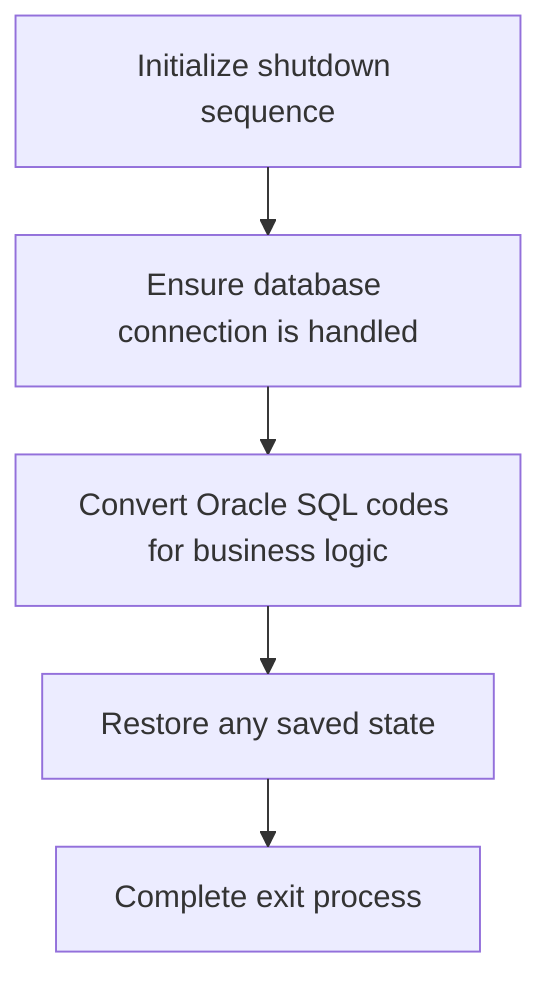

This section coordinates the shutdown sequence for a process that interacts with <SwmToken path="base/src/NNNS0573.cbl" pos="182:2:2" line-data="020500                DB2-STUFF                                         00020500">`DB2`</SwmToken> and Oracle databases. It ensures that the database connection is properly switched and managed, error codes are converted for business logic, and any saved state is restored before the process exits. This maintains system integrity and prepares the environment for subsequent operations.

| Category        | Rule Name                        | Description                                                                                                                                         |
| --------------- | -------------------------------- | --------------------------------------------------------------------------------------------------------------------------------------------------- |
| Data validation | Shutdown sequence initialization | The shutdown sequence must always be initialized before any connection or error handling logic is performed.                                        |
| Business logic  | Database connection integrity    | The system must ensure that any active database connection is properly closed or switched before completing the shutdown sequence.                  |
| Business logic  | Oracle error code conversion     | Any Oracle SQL error codes encountered during the process must be converted to the appropriate business logic error codes before the process exits. |
| Business logic  | Restore saved state              | If there is any saved state from previous operations, it must be restored before the process completes the exit sequence.                           |

<SwmSnippet path="/base/src/YYYS0211.cbl" line="32">

---

<SwmToken path="base/src/YYYS0211.cbl" pos="32:2:6" line-data="004700 0000-EXIT-DISPATCHER.                                            00004700">`0000-EXIT-DISPATCHER`</SwmToken> in <SwmToken path="base/src/YYYS0211.cbl" pos="2:7:7" line-data="000200 PROGRAM-ID.    YYYS0211.                                         00000200">`YYYS0211`</SwmToken> runs init, switches to <SwmToken path="base/src/YYYS0211.cbl" pos="34:10:10" line-data="004900     PERFORM 200-CONNECT-TO-DB2                                   00004900">`DB2`</SwmToken>, converts Oracle error codes if needed, and restores the backup record. This keeps the connection and error state clean for the next operation.

```cobol
004700 0000-EXIT-DISPATCHER.                                            00004700
004800     PERFORM 100-INITIALIZATION                                   00004800
004900     PERFORM 200-CONNECT-TO-DB2                                   00004900
005000     PERFORM 300-CNV-ORACLE-SQLCODE                               00005000
005100     PERFORM 400-REVERT-SAVED-XXXN001A                            00005100
005300     GOBACK                                                       00005300
005400     .                                                            00005400
```

---

</SwmSnippet>

<SwmSnippet path="/base/src/YYYS0211.cbl" line="53">

---

In <SwmToken path="base/src/YYYS0211.cbl" pos="53:2:8" line-data="007300 200-CONNECT-TO-DB2.                                              00007300">`200-CONNECT-TO-DB2`</SwmToken>, we set the <SwmToken path="base/src/YYYS0211.cbl" pos="53:8:8" line-data="007300 200-CONNECT-TO-DB2.                                              00007300">`DB2`</SwmToken> switch flag and call the connection manager (<SwmToken path="base/src/YYYS0211.cbl" pos="55:4:4" line-data="007500     CALL YYYS0220-DBMS-CON-MGR USING                             00007500">`YYYS0220`</SwmToken>) to actually perform the switch and update the connection state and stats. This keeps all connection logic in one place.

```cobol
007300 200-CONNECT-TO-DB2.                                              00007300
007400     SET YYYC0220-SET-DB2-CON TO TRUE                             00007400
007500     CALL YYYS0220-DBMS-CON-MGR USING                             00007500
007600         XXXN001A                                                 00007600
007700         YYYC0220                                                 00007700
008100     .                                                            00008100
```

---

</SwmSnippet>

# Translating Oracle error codes to <SwmToken path="base/src/NNNS0573.cbl" pos="182:2:2" line-data="020500                DB2-STUFF                                         00020500">`DB2`</SwmToken> format

This section ensures that Oracle-specific error codes, specifically SQLCODE -84, are translated into a DB2-style error format. This translation is necessary to maintain consistency in error handling across systems that expect <SwmToken path="base/src/NNNS0573.cbl" pos="182:2:2" line-data="020500                DB2-STUFF                                         00020500">`DB2`</SwmToken> error codes and messages.

| Category       | Rule Name                                                                                                                                                                                   | Description                                                                                                                                                                                                                                                                                                |
| -------------- | ------------------------------------------------------------------------------------------------------------------------------------------------------------------------------------------- | ---------------------------------------------------------------------------------------------------------------------------------------------------------------------------------------------------------------------------------------------------------------------------------------------------------- |
| Business logic | <SwmToken path="base/src/NNNS0573.cbl" pos="182:2:2" line-data="020500                DB2-STUFF                                         00020500">`DB2`</SwmToken> Error Format Consistency | The translation process must produce a DB2-style error code and message that can be used by downstream systems expecting <SwmToken path="base/src/NNNS0573.cbl" pos="182:2:2" line-data="020500                DB2-STUFF                                         00020500">`DB2`</SwmToken> error formats. |

<SwmSnippet path="/base/src/YYYS0211.cbl" line="65">

---

In <SwmToken path="base/src/YYYS0211.cbl" pos="65:2:8" line-data="009500 300-CNV-ORACLE-SQLCODE.                                          00009500">`300-CNV-ORACLE-SQLCODE`</SwmToken>, if we hit SQLCODE -84, we call the Oracle error conversion routine (<SwmToken path="base/src/YYYS0212.cbl" pos="96:9:9" line-data="010300         STRING &#39;Error in YYYS0212. Oracle code:&#39;                 00010300">`YYYS0212`</SwmToken>) to map the Oracle error to a DB2-style code and message. This keeps error handling consistent for downstream logic.

```cobol
009500 300-CNV-ORACLE-SQLCODE.                                          00009500
009600     IF  SUCCESS                                                  00009600
009610     AND SQLCODE = -84                                            00009610
009720       CALL Z-ORA-ERR-CONVERSION USING                            00009720
009730           XXXN001A                                               00009730
009740           SQLCA                                                  00009740
009750     END-IF                                                       00009750
010200     .                                                            00010200
```

---

</SwmSnippet>

# Formatting and mapping Oracle error messages

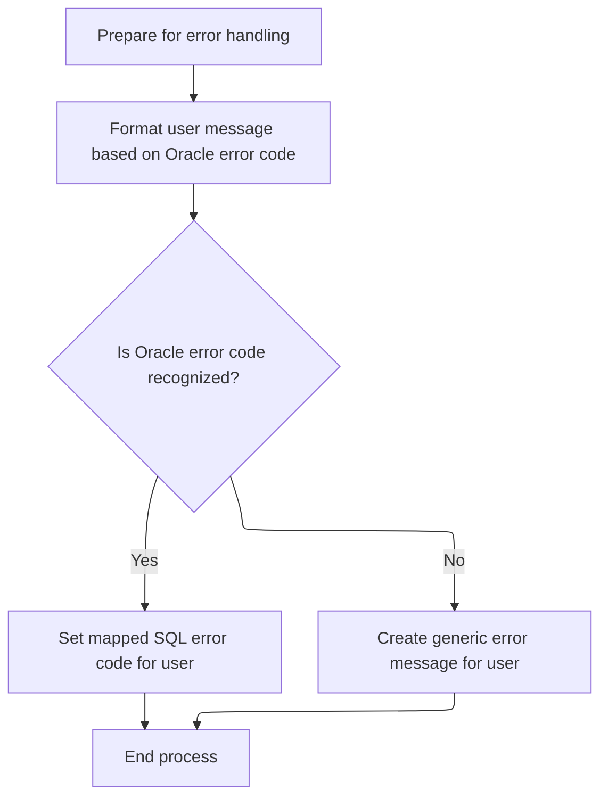

This section standardizes error reporting by formatting Oracle error messages and mapping known Oracle error codes to <SwmToken path="base/src/NNNS0573.cbl" pos="182:2:2" line-data="020500                DB2-STUFF                                         00020500">`DB2`</SwmToken> SQLCODEs. This ensures users receive clear, consistent, and actionable error information regardless of the original Oracle error details.

| Category       | Rule Name                                                                                                                                                                                  | Description                                                                                                                                                                                                                                                                                                                             |
| -------------- | ------------------------------------------------------------------------------------------------------------------------------------------------------------------------------------------ | --------------------------------------------------------------------------------------------------------------------------------------------------------------------------------------------------------------------------------------------------------------------------------------------------------------------------------------- |
| Business logic | Oracle to <SwmToken path="base/src/NNNS0573.cbl" pos="182:2:2" line-data="020500                DB2-STUFF                                         00020500">`DB2`</SwmToken> error mapping | If the Oracle error code is recognized, it must be mapped to a specific <SwmToken path="base/src/NNNS0573.cbl" pos="182:2:2" line-data="020500                DB2-STUFF                                         00020500">`DB2`</SwmToken> SQLCODE according to the defined mapping table.                                              |
| Business logic | Maintain error code mapping table                                                                                                                                                          | The mapping between Oracle error codes and <SwmToken path="base/src/NNNS0573.cbl" pos="182:2:2" line-data="020500                DB2-STUFF                                         00020500">`DB2`</SwmToken> SQLCODEs must be maintained and updated as business requirements evolve, ensuring all relevant Oracle errors are covered. |

<SwmSnippet path="/base/src/YYYS0212.cbl" line="29">

---

<SwmToken path="base/src/YYYS0212.cbl" pos="29:2:6" line-data="003800 000-MAIN-PROCESS.                                                00003800">`000-MAIN-PROCESS`</SwmToken> clears out the error fields, then calls the formatter to map Oracle error info to a user-facing code and message. This keeps error reporting clean and consistent.

```cobol
003800 000-MAIN-PROCESS.                                                00003800
003900     PERFORM 100-INITIALIZE                                       00003900
004000     PERFORM 200-FORMAT-USER-MSG-TXT                              00004000
004100     GOBACK                                                       00004100
004200     .                                                            00004200
```

---

</SwmSnippet>

<SwmSnippet path="/base/src/YYYS0212.cbl" line="50">

---

In <SwmToken path="base/src/YYYS0212.cbl" pos="50:2:10" line-data="005900 200-FORMAT-USER-MSG-TXT.                                         00005900">`200-FORMAT-USER-MSG-TXT`</SwmToken>, we split the Oracle error string into three message parts and the Oracle code using UNSTRING. Then we map known Oracle codes to <SwmToken path="base/src/NNNS0573.cbl" pos="182:2:2" line-data="020500                DB2-STUFF                                         00020500">`DB2`</SwmToken> SQLCODEs with EVALUATE. If the code isn't recognized, we build a generic error message. The whole thing assumes the error string is space-delimited and has four parts.

```cobol
005900 200-FORMAT-USER-MSG-TXT.                                         00005900
006000     UNSTRING SQLERRMC  DELIMITED BY SPACE INTO                   00006000
006100                        WS-ERR-MSG1                               00006100
006200                        WS-ERR-MSG2                               00006200
006300                        WS-ERR-MSG3                               00006300
006400                        WS-ERR-ORA-CODE                           00006400
006500     EVALUATE WS-ERR-ORA-CODE                                     00006500
006510       WHEN  '60   '                                              00006510
006520         MOVE  -911                             TO SQLCODE        00006520
006600       WHEN  '904  '                                              00006600
006700       WHEN  '310  '                                              00006700
006800         MOVE  -206                             TO SQLCODE        00006800
006900       WHEN  '615  '                                              00006900
007000       WHEN  '616  '                                              00007000
007100         MOVE  -420                             TO SQLCODE        00007100
007200       WHEN  '942  '                                              00007200
007300         MOVE  -204                             TO SQLCODE        00007300
007400       WHEN  '1403 '                                              00007400
007500         MOVE  -100                             TO SQLCODE        00007500
007600       WHEN  '1001 '                                              00007600
007700         MOVE  -501                             TO SQLCODE        00007700
007800       WHEN  '1438 '                                              00007800
007900         MOVE  -413                             TO SQLCODE        00007900
008000       WHEN  '2112 '                                              00008000
008100       WHEN  '1422 '                                              00008100
008200         MOVE  -811                             TO SQLCODE        00008200
008300       WHEN  '2049 '                                              00008300
008400         MOVE  -913                             TO SQLCODE        00008400
008500       WHEN  '2291 '                                              00008500
008600         MOVE  -530                             TO SQLCODE        00008600
008700       WHEN  '2292 '                                              00008700
008800         MOVE  -532                             TO SQLCODE        00008800
008900       WHEN  '6502 '                                              00008900
009000         MOVE  -304                             TO SQLCODE        00009000
009100       WHEN  '6508 '                                              00009100
009200         MOVE  -440                             TO SQLCODE        00009200
009300       WHEN  '6511 '                                              00009300
009400         MOVE  -502                             TO SQLCODE        00009400
009500       WHEN  '6550 '                                              00009500
009600       WHEN  '6553 '                                              00009600
009700         MOVE  -440                             TO SQLCODE        00009700
009800       WHEN  '14028'                                              00009800
009900         MOVE  -538                             TO SQLCODE        00009900
010000       WHEN  '30006'                                              00010000
010100         MOVE  -904                             TO SQLCODE        00010100
010200       WHEN OTHER                                                 00010200
010300         STRING 'Error in YYYS0212. Oracle code:'                 00010300
010300                 WS-ERR-ORA-CODE                                  00010320
010300         DELIMITED BY SIZE INTO IS-RTRN-MSG2-TXT                  00010330
010500     END-EVALUATE                                                 00010500
010600     MOVE SPACES                                TO SQLERRMC       00010600
010700     .                                                            00010700
```

---

</SwmSnippet>

&nbsp;

*This is an auto-generated document by Swimm 🌊 and has not yet been verified by a human*

<SwmMeta version="3.0.0" repo-id="Z2l0aHViJTNBJTNBU3dpbW1pby1keW5jYWxsLWRlbW8lM0ElM0FHaXJpLVN3aW1t" repo-name="Swimmio-dyncall-demo"><sup>Powered by [Swimm](https://app.swimm.io/)</sup></SwmMeta>
