# Overview

This document explains the flow for managing location/class advertisement zone data. The flow receives operation codes and context data, performs table operations, synchronizes data across <SwmToken path="base/src/NNNS0473.cbl" pos="291:10:10" line-data="030000        PERFORM 125-CONNECT-TO-DB2                                00030000">`DB2`</SwmToken> and Oracle, and issues business events for location and store updates.

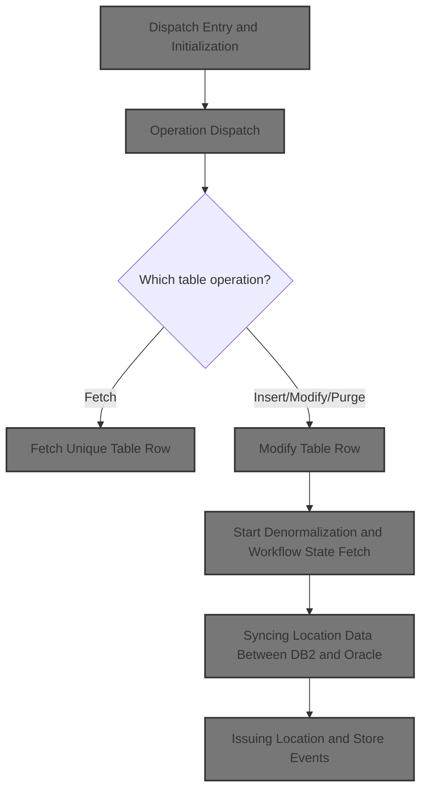
```mermaid
flowchart TD
    node1["Dispatch Entry and Initialization"]:::HeadingStyle
    click node1 goToHeading "Dispatch Entry and Initialization"
    node1 --> node2["Operation Dispatch"]:::HeadingStyle
    click node2 goToHeading "Operation Dispatch"
    node2 --> node3{"Which table operation?"}
    node3 -->|"Fetch"| node4["Fetch Unique Table Row"]:::HeadingStyle
    click node4 goToHeading "Fetch Unique Table Row"
    node3 -->|"Insert/Modify/Purge"| node5["Modify Table Row"]:::HeadingStyle
    click node5 goToHeading "Modify Table Row"
    node5 --> node6["Start Denormalization and Workflow State Fetch"]:::HeadingStyle
    click node6 goToHeading "Start Denormalization and Workflow State Fetch"
    node6 --> node7["Syncing Location Data Between DB2 and Oracle"]:::HeadingStyle
    click node7 goToHeading "Syncing Location Data Between DB2 and Oracle"
    node7 --> node8["Issuing Location and Store Events"]:::HeadingStyle
    click node8 goToHeading "Issuing Location and Store Events"
classDef HeadingStyle fill:#777777,stroke:#333,stroke-width:2px;

%% Swimm:
%% flowchart TD
%%     node1["Dispatch Entry and Initialization"]:::HeadingStyle
%%     click node1 goToHeading "Dispatch Entry and Initialization"
%%     node1 --> node2["Operation Dispatch"]:::HeadingStyle
%%     click node2 goToHeading "Operation Dispatch"
%%     node2 --> node3{"Which table operation?"}
%%     node3 -->|"Fetch"| node4["Fetch Unique Table Row"]:::HeadingStyle
%%     click node4 goToHeading "Fetch Unique Table Row"
%%     node3 -->|"Insert/Modify/Purge"| node5["Modify Table Row"]:::HeadingStyle
%%     click node5 goToHeading "Modify Table Row"
%%     node5 --> node6["Start Denormalization and Workflow State Fetch"]:::HeadingStyle
%%     click node6 goToHeading "Start Denormalization and Workflow State Fetch"
%%     node6 --> node7["Syncing Location Data Between <SwmToken path="base/src/NNNS0473.cbl" pos="291:10:10" line-data="030000        PERFORM 125-CONNECT-TO-DB2                                00030000">`DB2`</SwmToken> and Oracle"]:::HeadingStyle
%%     click node7 goToHeading "Syncing Location Data Between <SwmToken path="base/src/NNNS0473.cbl" pos="291:10:10" line-data="030000        PERFORM 125-CONNECT-TO-DB2                                00030000">`DB2`</SwmToken> and Oracle"
%%     node7 --> node8["Issuing Location and Store Events"]:::HeadingStyle
%%     click node8 goToHeading "Issuing Location and Store Events"
%% classDef HeadingStyle fill:#777777,stroke:#333,stroke-width:2px;
```

## Dependencies

### Programs

- <SwmToken path="base/src/NNNS0473.cbl" pos="273:5:5" line-data="028200       STRING &#39;NNNS0473 - Error connecting to Oracle. Sqlcode =&#39;  00028200">`NNNS0473`</SwmToken> (<SwmPath>[base/src/NNNS0473.cbl](base/src/NNNS0473.cbl)</SwmPath>)
- <SwmToken path="base/src/XXXS0210.cbl" pos="2:7:7" line-data="000200 PROGRAM-ID.    YYYS0210.                                         00000200">`YYYS0210`</SwmToken> (<SwmPath>[base/src/XXXS0210.cbl](base/src/XXXS0210.cbl)</SwmPath>)
- <SwmToken path="base/src/XXXS0210.cbl" pos="55:4:4" line-data="007540     CALL YYYS0220-DBMS-CON-MGR USING                             00007540">`YYYS0220`</SwmToken> (<SwmPath>[base/src/YYYS0220.cbl](base/src/YYYS0220.cbl)</SwmPath>)
- <SwmToken path="base/src/YYYS0211.cbl" pos="2:7:7" line-data="000200 PROGRAM-ID.    YYYS0211.                                         00000200">`YYYS0211`</SwmToken> (<SwmPath>[base/src/YYYS0211.cbl](base/src/YYYS0211.cbl)</SwmPath>)
- <SwmToken path="base/src/YYYS0212.cbl" pos="96:9:9" line-data="010300         STRING &#39;Error in YYYS0212. Oracle code:&#39;                 00010300">`YYYS0212`</SwmToken> (<SwmPath>[base/src/YYYS0212.cbl](base/src/YYYS0212.cbl)</SwmPath>)
- <SwmToken path="base/src/NNNS0473.cbl" pos="555:4:4" line-data="060000     CALL WWWS0100-CONTROL-SUBR USING                             00060000">`WWWS0100`</SwmToken> (<SwmPath>[base/src/WWWS0100.cbl](base/src/WWWS0100.cbl)</SwmPath>)
- <SwmToken path="base/src/NNNS0473.cbl" pos="565:4:4" line-data="060900     CALL MMMS0161-SYNC-CZ USING                                  00060900">`MMMS0161`</SwmToken> (<SwmPath>[base/src/MMMS0161.cbl](base/src/MMMS0161.cbl)</SwmPath>)
- <SwmToken path="base/src/MMMS0161.cbl" pos="324:4:4" line-data="032900     CALL MMMS0162-TRANSLATE-CZ USING                             00032900">`MMMS0162`</SwmToken> (<SwmPath>[base/src/MMMS0162.cbl](base/src/MMMS0162.cbl)</SwmPath>)
- <SwmToken path="base/src/MMMS0161.cbl" pos="333:4:4" line-data="033800     CALL NNNS0120-DDDTRL01-DAO USING                             00033800">`NNNS0120`</SwmToken> (<SwmPath>[base/src/NNNS0120.cbl](base/src/NNNS0120.cbl)</SwmPath>)
- <SwmToken path="base/src/NNNS0120.cbl" pos="24:4:4" line-data="004500 01 MMMS0304-RI-DEL-CHK                PIC X(8) VALUE &#39;MMMS0304&#39;. 00004500">`MMMS0304`</SwmToken>
- <SwmToken path="base/src/NNNS0120.cbl" pos="3942:8:8" line-data="396300     PERFORM 5000-CALL-NNNU0120-CUD-ROUTINE                       00396300">`NNNU0120`</SwmToken>
- <SwmToken path="base/src/NNNS0473.cbl" pos="585:4:4" line-data="062800       CALL ZZZS0197-EVENT-MGR USING                              00062800">`ZZZS0197`</SwmToken> (<SwmPath>[base/src/ZZZS0197.cbl](base/src/ZZZS0197.cbl)</SwmPath>)
- <SwmToken path="base/src/ZZZS0197.cbl" pos="16:20:20" line-data="004300 01 WS-EVENT-STAGER                 PIC X(8) VALUE &#39;YYYS0175&#39;.    00004300">`YYYS0175`</SwmToken>
- YYYS0107
- <SwmToken path="base/src/NNNS0473.cbl" pos="497:8:8" line-data="052200     PERFORM 4600-CALL-MMMS0335-RI-ADD-CHK                        00052200">`MMMS0335`</SwmToken> (<SwmPath>[base/src/MMMS0335.cbl](base/src/MMMS0335.cbl)</SwmPath>)
- <SwmToken path="base/src/NNNS0473.cbl" pos="640:4:4" line-data="066410     CALL NNNU0473-ORACLE-UPDATE USING                            00066410">`NNNU0473`</SwmToken> (<SwmPath>[base/src/NNNU0473.cbl](base/src/NNNU0473.cbl)</SwmPath>)

### Copybooks

- SQLCA
- <SwmToken path="base/src/NNNS0473.cbl" pos="230:4:4" line-data="023900     INITIALIZE XXXN001A                                          00023900">`XXXN001A`</SwmToken> (<SwmPath>[base/src/XXXN001A.cpy](base/src/XXXN001A.cpy)</SwmPath>)
- <SwmToken path="base/src/XXXS0210.cbl" pos="53:4:4" line-data="007510     SET YYYC0220-SET-ORACLE-CON TO TRUE                          00007510">`YYYC0220`</SwmToken> (<SwmPath>[base/src/YYYC0220.cpy](base/src/YYYC0220.cpy)</SwmPath>)
- <SwmToken path="base/src/NNNS0473.cbl" pos="42:4:4" line-data="005200 COPY YYYN000A.                                                   00005200">`YYYN000A`</SwmToken> (<SwmPath>[base/src/YYYN000A.cpy](base/src/YYYN000A.cpy)</SwmPath>)
- <SwmToken path="base/src/NNNS0473.cbl" pos="544:4:4" line-data="058600     AND WWWC0100-NORM-TASK                                       00058600">`WWWC0100`</SwmToken> (<SwmPath>[base/src/WWWC0100.cpy](base/src/WWWC0100.cpy)</SwmPath>)
- <SwmToken path="base/src/MMMS0161.cbl" pos="321:4:4" line-data="032600     INITIALIZE YYYN111A                                          00032600">`YYYN111A`</SwmToken> (<SwmPath>[base/src/YYYN111A.cpy](base/src/YYYN111A.cpy)</SwmPath>)
- <SwmToken path="base/src/NNNS0473.cbl" pos="186:4:4" line-data="019500 COPY PPPTCZ01.                                                   00019500">`PPPTCZ01`</SwmToken> (<SwmPath>[base/src/PPPTCZ01.cpy](base/src/PPPTCZ01.cpy)</SwmPath>)
- <SwmToken path="base/src/MMMS0161.cbl" pos="127:2:2" line-data="013500                DDDPST01                                          00013500">`DDDPST01`</SwmToken> (<SwmPath>[base/src/DDDPST01.cpy](base/src/DDDPST01.cpy)</SwmPath>)
- <SwmToken path="base/src/MMMS0161.cbl" pos="57:4:4" line-data="006500 COPY PPPTRL01.                                                   00006500">`PPPTRL01`</SwmToken> (<SwmPath>[base/src/PPPTRL01.cpy](base/src/PPPTRL01.cpy)</SwmPath>)
- <SwmToken path="base/src/NNNS0473.cbl" pos="51:4:4" line-data="006100 COPY NNNN000U.                                                   00006100">`NNNN000U`</SwmToken> (<SwmPath>[base/src/NNNN000U.cpy](base/src/NNNN000U.cpy)</SwmPath>)
- <SwmToken path="base/src/NNNS0120.cbl" pos="29:4:4" line-data="005000 COPY HHHTRL01.                                                   00005000">`HHHTRL01`</SwmToken> (<SwmPath>[base/src/HHHTRL01.cpy](base/src/HHHTRL01.cpy)</SwmPath>)
- <SwmToken path="base/src/NNNS0120.cbl" pos="31:4:4" line-data="005200 COPY MMMC0304.                                                   00005200">`MMMC0304`</SwmToken> (<SwmPath>[base/src/MMMC0304.cpy](base/src/MMMC0304.cpy)</SwmPath>)
- <SwmToken path="base/src/MMMS0161.cbl" pos="128:4:4" line-data="013600                P-DDDTRL01                                        00013600">`DDDTRL01`</SwmToken> (<SwmPath>[base/src/DDDTRL01.cpy](base/src/DDDTRL01.cpy)</SwmPath>)
- <SwmToken path="base/src/NNNS0120.cbl" pos="1971:12:12" line-data="199200     CALL Z-DB2-CONNECT         USING W00N001A                    00199200">`W00N001A`</SwmToken>
- <SwmToken path="base/src/NNNS0473.cbl" pos="239:5:5" line-data="024800     IF (YYYN005A-ORACLE       OR EXIT-PUT-INSERT-ROW             00024800">`YYYN005A`</SwmToken> (<SwmPath>[base/src/YYYN005A.cpy](base/src/YYYN005A.cpy)</SwmPath>)
- <SwmToken path="base/src/NNNS0473.cbl" pos="232:4:4" line-data="024100     MOVE NNNN0000-INDEX-HANDLE TO DDDTCZ01-INDEX-HANDLE          00024100">`NNNN0000`</SwmToken> (<SwmPath>[base/src/NNNN0000.cpy](base/src/NNNN0000.cpy)</SwmPath>)
- <SwmToken path="base/src/MMMS0161.cbl" pos="43:4:4" line-data="005100 COPY YYYN000C.                                                   00005100">`YYYN000C`</SwmToken> (<SwmPath>[base/src/YYYN000C.cpy](base/src/YYYN000C.cpy)</SwmPath>)
- <SwmToken path="base/src/MMMS0161.cbl" pos="45:4:4" line-data="005300 COPY YYYC0097.                                                   00005300">`YYYC0097`</SwmToken> (<SwmPath>[base/src/YYYC0097.cpy](base/src/YYYC0097.cpy)</SwmPath>)
- <SwmToken path="base/src/NNNS0473.cbl" pos="49:4:4" line-data="005900 COPY MMMK001B.                                                   00005900">`MMMK001B`</SwmToken> (<SwmPath>[base/src/MMMK001B.cpy](base/src/MMMK001B.cpy)</SwmPath>)
- <SwmToken path="base/src/MMMS0161.cbl" pos="50:4:4" line-data="005800 COPY YYYC0131.                                                   00005800">`YYYC0131`</SwmToken>
- <SwmToken path="base/src/MMMS0161.cbl" pos="51:4:4" line-data="005900 COPY TTTK0001.                                                   00005900">`TTTK0001`</SwmToken>
- DDDBSSAS
- <SwmToken path="base/src/NNNS0473.cbl" pos="487:4:4" line-data="051200       SET YYYN110A-UPD TO TRUE                                   00051200">`YYYN110A`</SwmToken> (<SwmPath>[base/src/YYYN110A.cpy](base/src/YYYN110A.cpy)</SwmPath>)
- <SwmToken path="base/src/NNNS0473.cbl" pos="564:4:4" line-data="060800     SET MMMC0161-CZ-IS-CURRENT TO TRUE                           00060800">`MMMC0161`</SwmToken> (<SwmPath>[base/src/MMMC0161.cpy](base/src/MMMC0161.cpy)</SwmPath>)
- <SwmToken path="base/src/ZZZS0197.cbl" pos="41:4:4" line-data="006800 COPY YYYC0175.                                                   00006800">`YYYC0175`</SwmToken>
- <SwmToken path="base/src/NNNS0473.cbl" pos="580:8:8" line-data="062300       MOVE ZZZC0032              TO ZZZC0197-TRX-REC             00062300">`ZZZC0197`</SwmToken> (<SwmPath>[base/src/ZZZC0197.cpy](base/src/ZZZC0197.cpy)</SwmPath>)
- DDDTAC01
- DDDTCM01
- DDDTCS01
- DDDTEA01
- DDDTIC01
- DDDTAV01
- DDDTSC01
- DDDTBF01
- DDDTZN01
- DDDTCT01
- <SwmToken path="base/src/NNNS0473.cbl" pos="623:4:4" line-data="066330     INITIALIZE MMMC0335                                          00066330">`MMMC0335`</SwmToken> (<SwmPath>[base/src/MMMC0335.cpy](base/src/MMMC0335.cpy)</SwmPath>)
- <SwmToken path="base/src/NNNS0473.cbl" pos="232:12:12" line-data="024100     MOVE NNNN0000-INDEX-HANDLE TO DDDTCZ01-INDEX-HANDLE          00024100">`DDDTCZ01`</SwmToken> (<SwmPath>[base/src/DDDTCZ01.cpy](base/src/DDDTCZ01.cpy)</SwmPath>)
- XXXEIBLK
- <SwmToken path="base/src/NNNS0473.cbl" pos="41:4:4" line-data="005100 COPY HHHTCZ01.                                                   00005100">`HHHTCZ01`</SwmToken> (<SwmPath>[base/src/HHHTCZ01.cpy](base/src/HHHTCZ01.cpy)</SwmPath>)
- <SwmToken path="base/src/NNNS0473.cbl" pos="583:4:4" line-data="062600       MOVE YYYC0107-USER         TO ZZZC0197-USER                00062600">`YYYC0107`</SwmToken> (<SwmPath>[base/src/YYYC0107.cpy](base/src/YYYC0107.cpy)</SwmPath>)
- <SwmToken path="base/src/NNNS0473.cbl" pos="577:24:24" line-data="062000       MOVE LOC-NBR OF P-DDDTCZ01 TO ST-STORE-NUMBER OF ZZZC0032  00062000">`ZZZC0032`</SwmToken> (<SwmPath>[base/src/ZZZC0032.cpy](base/src/ZZZC0032.cpy)</SwmPath>)
- <SwmToken path="base/src/NNNS0473.cbl" pos="578:8:8" line-data="062100                                     LOC-NBR OF ZZZC0094          00062100">`ZZZC0094`</SwmToken> (<SwmPath>[base/src/ZZZC0094.cpy](base/src/ZZZC0094.cpy)</SwmPath>)

# Where is this program used?

This program is used multiple times in the codebase as represented in the following diagram:


```mermaid
graph TD
  8bu8r("Database Operation Handler (WWWS0003)") --> j2yar("Table IO Object for Location Class Advertisement Zones (NNNS0473)"):::currentEntity
click 8bu8r openCode "base/src/WWWS0003.cbl:1"
khyjd("Synchronizing Store Class Zones (MMMS0161)") --> j2yar("Table IO Object for Location Class Advertisement Zones (NNNS0473)"):::currentEntity
click khyjd openCode "base/src/MMMS0161.cbl:1"
7iip6("Managing Location Data (NNNS0487)") --> j2yar("Table IO Object for Location Class Advertisement Zones (NNNS0473)"):::currentEntity
click 7iip6 openCode "base/src/NNNS0487.cbl:1"
  
  
click j2yar openCode "base/src/NNNS0473.cbl:1"
    classDef currentEntity color:#000000,fill:#7CB9F4

%% Swimm:
%% graph TD
%%   8bu8r("Database Operation Handler (WWWS0003)") --> j2yar("Table IO Object for Location Class Advertisement Zones (<SwmToken path="base/src/NNNS0473.cbl" pos="273:5:5" line-data="028200       STRING &#39;NNNS0473 - Error connecting to Oracle. Sqlcode =&#39;  00028200">`NNNS0473`</SwmToken>)"):::currentEntity
%% click 8bu8r openCode "<SwmPath>[base/src/WWWS0003.cbl](base/src/WWWS0003.cbl)</SwmPath>:1"
%% khyjd("Synchronizing Store Class Zones (<SwmToken path="base/src/NNNS0473.cbl" pos="565:4:4" line-data="060900     CALL MMMS0161-SYNC-CZ USING                                  00060900">`MMMS0161`</SwmToken>)") --> j2yar("Table IO Object for Location Class Advertisement Zones (<SwmToken path="base/src/NNNS0473.cbl" pos="273:5:5" line-data="028200       STRING &#39;NNNS0473 - Error connecting to Oracle. Sqlcode =&#39;  00028200">`NNNS0473`</SwmToken>)"):::currentEntity
%% click khyjd openCode "<SwmPath>[base/src/MMMS0161.cbl](base/src/MMMS0161.cbl)</SwmPath>:1"
%% 7iip6("Managing Location Data (NNNS0487)") --> j2yar("Table IO Object for Location Class Advertisement Zones (<SwmToken path="base/src/NNNS0473.cbl" pos="273:5:5" line-data="028200       STRING &#39;NNNS0473 - Error connecting to Oracle. Sqlcode =&#39;  00028200">`NNNS0473`</SwmToken>)"):::currentEntity
%% click 7iip6 openCode "<SwmPath>[base/src/NNNS0487.cbl](base/src/NNNS0487.cbl)</SwmPath>:1"
%%   
%%   
%% click j2yar openCode "<SwmPath>[base/src/NNNS0473.cbl](base/src/NNNS0473.cbl)</SwmPath>:1"
%%     classDef currentEntity color:#000000,fill:#7CB9F4
```

## Detailed View of the Program's Functionality

# Swimmio-dyncall-demo: Data Synchronization and Event Flow

## 1\. Initialization and Main Dispatch

### Entry Point and Setup

- The main entry point for table operations is a dispatcher routine.
- Upon entry, all working areas, status flags, and SQL state are reset to ensure a clean environment.
- If the operation is not a cursor close, business data fields are copied from the input area to the internal data structure.
- If the operation involves Oracle (insert, modify, purge, or Oracle flag is set), a connection to Oracle is established by calling an external routine dedicated to Oracle connectivity.
- If the Oracle connection fails, an error code and message are prepared for the caller.

### Operation Dispatch

- After initialization, the dispatcher examines the requested operation code and routes to the appropriate handler:
  - Open Cursor: Opens a database cursor for fetching rows.
  - Close Cursor: Closes an open database cursor.
  - Get Unique Row: Fetches a single, unique row from the table.
  - Get Next Row: Fetches the next row using the current cursor.
  - Modify Row: Updates an existing row.
  - Insert Row: Inserts a new row, with referential integrity validation.
  - Purge Row: Deletes a row.
  - Special IO: Reserved for custom or special operations.
- After the operation, a finalization routine is called to move results back to the output area, update checkpoint counters, and, if needed, switch the database connection back to <SwmToken path="base/src/NNNS0473.cbl" pos="291:10:10" line-data="030000        PERFORM 125-CONNECT-TO-DB2                                00030000">`DB2`</SwmToken>.

---

## 2\. Database Connection Management

### Oracle Connection

- When an Oracle operation is required, a dedicated routine is called to establish the connection.
- This routine delegates to an external program, which sets a flag indicating an Oracle connection is needed and calls a connection manager.
- The connection manager checks the requested operation and environment, switches the connection to Oracle, and updates internal statistics and state.
- If the connection fails, an error code and message are set for the caller.

### <SwmToken path="base/src/NNNS0473.cbl" pos="291:10:10" line-data="030000        PERFORM 125-CONNECT-TO-DB2                                00030000">`DB2`</SwmToken> Connection

- After Oracle operations (insert, modify, purge), the system switches back to <SwmToken path="base/src/NNNS0473.cbl" pos="291:10:10" line-data="030000        PERFORM 125-CONNECT-TO-DB2                                00030000">`DB2`</SwmToken> by calling a similar connection manager routine.
- This routine sets a flag for <SwmToken path="base/src/NNNS0473.cbl" pos="291:10:10" line-data="030000        PERFORM 125-CONNECT-TO-DB2                                00030000">`DB2`</SwmToken>, calls the connection manager, and updates the state.
- If the connection fails, an error code and message are set.

### Connection Manager

- The connection manager receives requests to switch between <SwmToken path="base/src/NNNS0473.cbl" pos="291:10:10" line-data="030000        PERFORM 125-CONNECT-TO-DB2                                00030000">`DB2`</SwmToken> and Oracle, get/set connection stats, or override the current connection.
- It maintains counters for total requests, DB2/Oracle/override requests, and connection switches.
- It can also reset statistics or handle override requests, updating the current connection state accordingly.

---

## 3\. Table Operations

### Open/Close Cursor

- The dispatcher checks the requested cursor handle and opens or closes the corresponding SQL cursor.
- If the handle is invalid, an error is flagged and a message is returned.

### Fetching Rows

- For unique row fetches, a SELECT is issued with the key fields, and results are placed in the output structure.
- For next-row fetches, the dispatcher determines which cursor is active and fetches the next row accordingly.
- After fetching, a routine checks for NULL columns and handles them as needed.

### Modifying Rows

- Before modifying, null indicators are validated and any business events are checked.
- If the previous operation was successful, the update is performed by calling a specialized routine that delegates to an Oracle-specific update handler.
- If the update succeeds, checkpoint and update flags are set, and denormalization/event logic is triggered.

### Inserting Rows

- Before inserting, null indicators are validated and a referential integrity check is performed by calling a dedicated validation routine.
- If validation passes, the insert is performed by the same Oracle-specific handler as for updates.
- If the insert succeeds, checkpoint and add/update flags are set, and denormalization/event logic is triggered.

### Purging Rows

- The purge operation calls the Oracle-specific handler to delete the row.
- If the delete succeeds, checkpoint and delete flags are set, and denormalization/event logic is triggered.

---

## 4\. Denormalization and Synchronization

### Workflow State Fetch

- After a successful update/insert/delete, the system prepares for denormalization by copying the environment variable and fetching the current workflow state via a control subroutine.
- The control subroutine determines if a normalization task is required.

### Conditional Synchronization

- If normalization is needed, a sync subroutine is called to synchronize location/class/zone data between <SwmToken path="base/src/NNNS0473.cbl" pos="291:10:10" line-data="030000        PERFORM 125-CONNECT-TO-DB2                                00030000">`DB2`</SwmToken> and Oracle.
- The sync routine sets flags for the environment and calls a dedicated synchronization program.

### Synchronization Logic

- The sync program initializes the environment and validates that the location type is a store.
- If the class zone is not current and an update is requested, it fetches the latest store/class/zone record.
- If the fetch fails, an error is set.
- If the fetch succeeds, the store data is updated in the legacy database.

### Deletion Logic

- For deletes, the sync program first checks if the store exists.
- If not, it initializes the output area.
- If the store exists, it clears the relevant zone fields and updates the store record.

---

## 5\. Event Issuance

### Event Preparation

- After successful denormalization and synchronization, the system prepares to issue business events.
- The environment is set to Oracle, and the current user is determined (either from the transaction context or set to 'BATCH').
- Event payloads are constructed for the location and, if applicable, for the store.

### Event Filtering and Deduplication

- The event manager initializes its state and applies hardcoded filters to determine if the event should be processed (e.g., only certain transaction IDs in batch mode).
- It checks for duplicate events by comparing the current event data to previously issued events.
- If the event passes all filters, it is staged for processing.

### Event Issuance

- The event manager sets environment flags, action codes (add, delete, modify), and other metadata.
- The event is then passed to an external stager for further processing.

---

## 6\. Error Handling and Finalization

### Oracle Error Conversion

- If an Oracle operation returns a specific error code, a conversion routine is called to map the Oracle error to a DB2-style SQLCODE and user message.
- The conversion routine parses the Oracle error message, extracts the code, and maps it to a known <SwmToken path="base/src/NNNS0473.cbl" pos="291:10:10" line-data="030000        PERFORM 125-CONNECT-TO-DB2                                00030000">`DB2`</SwmToken> error code or constructs a generic error message if the code is unrecognized.

### Finalization

- After each operation, the system moves results back to the output area, updates checkpoint counters, and, if needed, switches the database connection back to <SwmToken path="base/src/NNNS0473.cbl" pos="291:10:10" line-data="030000        PERFORM 125-CONNECT-TO-DB2                                00030000">`DB2`</SwmToken>.
- The system ensures that all state and error codes are properly set for the next operation or for the caller.

---

## 7\. Summary

- The flow is highly modular, with each operation (fetch, insert, update, delete) routed to a dedicated handler.
- Database connections are managed centrally, with explicit switching between <SwmToken path="base/src/NNNS0473.cbl" pos="291:10:10" line-data="030000        PERFORM 125-CONNECT-TO-DB2                                00030000">`DB2`</SwmToken> and Oracle as needed.
- Denormalization and event logic are triggered only after successful data changes.
- Error handling is robust, with conversion routines to ensure consistent error reporting across database systems.
- The system is designed for reliability, modularity, and clear separation of concerns between data operations, synchronization, and event management.

# Rule Definition

| Paragraph Name                                                                                                                                                                                                                                                                                                                                                                                                                                                                                                                                                                                                                                                                                                                                                                                                                                                                                                                                                                                                                                                                                                                   | Rule ID | Category          | Description                                                                                                                                                                                                                                                                                                                                                                                                                                                                                                                                                                                                                                                                                                                                                                                                                                                     | Conditions                                                                                                                                                                                                             | Remarks                                                                                                                                                                                                                                                                                                                                                                                                                                                                                                                                                             |
| -------------------------------------------------------------------------------------------------------------------------------------------------------------------------------------------------------------------------------------------------------------------------------------------------------------------------------------------------------------------------------------------------------------------------------------------------------------------------------------------------------------------------------------------------------------------------------------------------------------------------------------------------------------------------------------------------------------------------------------------------------------------------------------------------------------------------------------------------------------------------------------------------------------------------------------------------------------------------------------------------------------------------------------------------------------------------------------------------------------------------------- | ------- | ----------------- | --------------------------------------------------------------------------------------------------------------------------------------------------------------------------------------------------------------------------------------------------------------------------------------------------------------------------------------------------------------------------------------------------------------------------------------------------------------------------------------------------------------------------------------------------------------------------------------------------------------------------------------------------------------------------------------------------------------------------------------------------------------------------------------------------------------------------------------------------------------- | ---------------------------------------------------------------------------------------------------------------------------------------------------------------------------------------------------------------------- | ------------------------------------------------------------------------------------------------------------------------------------------------------------------------------------------------------------------------------------------------------------------------------------------------------------------------------------------------------------------------------------------------------------------------------------------------------------------------------------------------------------------------------------------------------------------- |
| <SwmToken path="base/src/NNNS0473.cbl" pos="200:4:6" line-data="020900     PERFORM 100-INITIALIZATION                                   00020900">`100-INITIALIZATION`</SwmToken>, <SwmToken path="base/src/NNNS0473.cbl" pos="199:2:6" line-data="020800 0000-EXIT-DISPATCHER.                                            00020800">`0000-EXIT-DISPATCHER`</SwmToken> (<SwmToken path="base/src/NNNS0473.cbl" pos="273:5:5" line-data="028200       STRING &#39;NNNS0473 - Error connecting to Oracle. Sqlcode =&#39;  00028200">`NNNS0473`</SwmToken>, <SwmToken path="base/src/MMMS0161.cbl" pos="333:4:4" line-data="033800     CALL NNNS0120-DDDTRL01-DAO USING                             00033800">`NNNS0120`</SwmToken>)                                                                                                                                                                                                                                                                                                                                                                                                | RL-001  | Conditional Logic | Before any table operation, the dispatcher must initialize all control structures, reset status, and prepare the database handle.                                                                                                                                                                                                                                                                                                                                                                                                                                                                                                                                                                                                                                                                                                                               | Any operation code is received by the dispatcher.                                                                                                                                                                      | Initialization includes resetting transaction data, checkpoint, synchronizing handles, and copying business data fields unless closing a cursor. Data structures must conform to <SwmToken path="base/src/NNNS0473.cbl" pos="230:4:4" line-data="023900     INITIALIZE XXXN001A                                          00023900">`XXXN001A`</SwmToken> and <SwmToken path="base/src/NNNS0473.cbl" pos="239:5:5" line-data="024800     IF (YYYN005A-ORACLE       OR EXIT-PUT-INSERT-ROW             00024800">`YYYN005A`</SwmToken> field definitions and lengths. |
| <SwmToken path="base/src/NNNS0473.cbl" pos="199:2:6" line-data="020800 0000-EXIT-DISPATCHER.                                            00020800">`0000-EXIT-DISPATCHER`</SwmToken> (<SwmToken path="base/src/NNNS0473.cbl" pos="273:5:5" line-data="028200       STRING &#39;NNNS0473 - Error connecting to Oracle. Sqlcode =&#39;  00028200">`NNNS0473`</SwmToken>, <SwmToken path="base/src/MMMS0161.cbl" pos="333:4:4" line-data="033800     CALL NNNS0120-DDDTRL01-DAO USING                             00033800">`NNNS0120`</SwmToken>)                                                                                                                                                                                                                                                                                                                                                                                                                                                                                                                                                                                   | RL-002  | Conditional Logic | The dispatcher must support and route operation codes to the correct handler, ensuring all required preconditions (such as DB connection) are met.                                                                                                                                                                                                                                                                                                                                                                                                                                                                                                                                                                                                                                                                                                              | Operation code is one of: 0, 1, 2, 3, 5, 8, 9, 10, 90.                                                                                                                                                                 | Operation codes: 0 (SUCCESS/no-op), 1 (Open Cursor), 2 (Close Cursor), 3 (Get Unique Row), 5 (Get Next Row), 8 (Modify Row), 9 (Insert Row), 10 (Purge Row), 90 (Special I/O).                                                                                                                                                                                                                                                                                                                                                                                      |
| <SwmToken path="base/src/NNNS0473.cbl" pos="200:4:6" line-data="020900     PERFORM 100-INITIALIZATION                                   00020900">`100-INITIALIZATION`</SwmToken> (<SwmToken path="base/src/NNNS0473.cbl" pos="273:5:5" line-data="028200       STRING &#39;NNNS0473 - Error connecting to Oracle. Sqlcode =&#39;  00028200">`NNNS0473`</SwmToken>, <SwmToken path="base/src/MMMS0161.cbl" pos="333:4:4" line-data="033800     CALL NNNS0120-DDDTRL01-DAO USING                             00033800">`NNNS0120`</SwmToken>)                                                                                                                                                                                                                                                                                                                                                                                                                                                                                                                                                                                     | RL-003  | Conditional Logic | If the operation requires Oracle (<SwmToken path="base/src/NNNS0473.cbl" pos="239:5:7" line-data="024800     IF (YYYN005A-ORACLE       OR EXIT-PUT-INSERT-ROW             00024800">`YYYN005A-ORACLE`</SwmToken> = 'O', or operation code is 8, 9, or 10), the system must establish an Oracle DB connection before proceeding.                                                                                                                                                                                                                                                                                                                                                                                                                                                                                                                                 | <SwmToken path="base/src/NNNS0473.cbl" pos="239:5:7" line-data="024800     IF (YYYN005A-ORACLE       OR EXIT-PUT-INSERT-ROW             00024800">`YYYN005A-ORACLE`</SwmToken> = 'O' or operation code is 8, 9, or 10. | Oracle connection is established via <SwmToken path="base/src/NNNS0473.cbl" pos="267:4:8" line-data="027600     CALL Z-ORA-CONNECT USING XXXN001A                            00027600">`Z-ORA-CONNECT`</SwmToken>. Connection statistics and state are updated via connection manager.                                                                                                                                                                                                                                                                              |
| <SwmToken path="base/src/NNNS0473.cbl" pos="205:4:10" line-data="021400          PERFORM 1000-EXIT-OPEN-CURSOR                           00021400">`1000-EXIT-OPEN-CURSOR`</SwmToken>, <SwmToken path="base/src/NNNS0473.cbl" pos="207:4:10" line-data="021600          PERFORM 1100-EXIT-CLOSE-CURSOR                          00021600">`1100-EXIT-CLOSE-CURSOR`</SwmToken>, <SwmToken path="base/src/NNNS0473.cbl" pos="211:4:12" line-data="022000          PERFORM 1300-EXIT-GET-NEXT-ROW                          00022000">`1300-EXIT-GET-NEXT-ROW`</SwmToken> (<SwmToken path="base/src/NNNS0473.cbl" pos="273:5:5" line-data="028200       STRING &#39;NNNS0473 - Error connecting to Oracle. Sqlcode =&#39;  00028200">`NNNS0473`</SwmToken>, <SwmToken path="base/src/MMMS0161.cbl" pos="333:4:4" line-data="033800     CALL NNNS0120-DDDTRL01-DAO USING                             00033800">`NNNS0120`</SwmToken>)                                                                                                                                                                                                 | RL-004  | Conditional Logic | For cursor operations, the system must support up to four cursor handles (01-04). Invalid handles must result in failure status and an error message.                                                                                                                                                                                                                                                                                                                                                                                                                                                                                                                                                                                                                                                                                                           | Cursor operation is requested with a handle outside 01-04.                                                                                                                                                             | Error message is returned in <SwmToken path="base/src/NNNS0473.cbl" pos="272:8:14" line-data="028100       MOVE SPACES  TO IS-RTRN-MSG-TXT                            00028100">`IS-RTRN-MSG-TXT`</SwmToken>. Status is set to FAILURE.                                                                                                                                                                                                                                                                                                                             |
| <SwmToken path="base/src/NNNS0473.cbl" pos="209:4:12" line-data="021800          PERFORM 1200-EXIT-GET-UNIQUE-ROW                        00021800">`1200-EXIT-GET-UNIQUE-ROW`</SwmToken>, <SwmToken path="base/src/NNNS0473.cbl" pos="213:4:12" line-data="022200          PERFORM 1400-EXIT-PUT-MODIFY-ROW                        00022200">`1400-EXIT-PUT-MODIFY-ROW`</SwmToken>, <SwmToken path="base/src/NNNS0473.cbl" pos="215:4:12" line-data="022400          PERFORM 1500-EXIT-PUT-INSERT-ROW                        00022400">`1500-EXIT-PUT-INSERT-ROW`</SwmToken>, <SwmToken path="base/src/NNNS0473.cbl" pos="217:4:12" line-data="022600          PERFORM 1600-EXIT-PUT-PURGE-ROW                         00022600">`1600-EXIT-PUT-PURGE-ROW`</SwmToken> (<SwmToken path="base/src/NNNS0473.cbl" pos="273:5:5" line-data="028200       STRING &#39;NNNS0473 - Error connecting to Oracle. Sqlcode =&#39;  00028200">`NNNS0473`</SwmToken>, <SwmToken path="base/src/MMMS0161.cbl" pos="333:4:4" line-data="033800     CALL NNNS0120-DDDTRL01-DAO USING                             00033800">`NNNS0120`</SwmToken>) | RL-005  | Computation       | For row operations (get, insert, modify, purge), the system must use the key fields (<SwmToken path="base/src/NNNS0473.cbl" pos="386:15:19" line-data="039500         INTO   :DCLXXXL-LOC-CLS-AD-ZN.LOC-TYP-CD,                00039500">`LOC-TYP-CD`</SwmToken>, <SwmToken path="base/src/NNNS0473.cbl" pos="387:13:15" line-data="039600                :DCLXXXL-LOC-CLS-AD-ZN.LOC-NBR,                   00039600">`LOC-NBR`</SwmToken>, <SwmToken path="base/src/NNNS0473.cbl" pos="388:13:17" line-data="039700                :DCLXXXL-LOC-CLS-AD-ZN.ITM-CLS-CD,                00039700">`ITM-CLS-CD`</SwmToken>) to identify the target row.                                                                                                                                                                                                            | Row operation is requested.                                                                                                                                                                                            | Key fields must be present and conform to field definitions. Used in WHERE clause for SQL operations.                                                                                                                                                                                                                                                                                                                                                                                                                                                               |
| <SwmToken path="base/src/NNNS0473.cbl" pos="215:4:12" line-data="022400          PERFORM 1500-EXIT-PUT-INSERT-ROW                        00022400">`1500-EXIT-PUT-INSERT-ROW`</SwmToken> (<SwmToken path="base/src/NNNS0473.cbl" pos="273:5:5" line-data="028200       STRING &#39;NNNS0473 - Error connecting to Oracle. Sqlcode =&#39;  00028200">`NNNS0473`</SwmToken>), <SwmToken path="base/src/NNNS0473.cbl" pos="497:4:14" line-data="052200     PERFORM 4600-CALL-MMMS0335-RI-ADD-CHK                        00052200">`4600-CALL-MMMS0335-RI-ADD-CHK`</SwmToken>                                                                                                                                                                                                                                                                                                                                                                                                                                                                                                                                                        | RL-006  | Conditional Logic | On insert, the system must validate referential integrity before performing the insert. If validation fails, the insert must not proceed.                                                                                                                                                                                                                                                                                                                                                                                                                                                                                                                                                                                                                                                                                                                       | Insert operation is requested.                                                                                                                                                                                         | Referential integrity check is performed via MMMS0335-RI-INSERT-CHK. Insert only proceeds if check is successful.                                                                                                                                                                                                                                                                                                                                                                                                                                                   |
| <SwmToken path="base/src/NNNS0473.cbl" pos="213:4:12" line-data="022200          PERFORM 1400-EXIT-PUT-MODIFY-ROW                        00022200">`1400-EXIT-PUT-MODIFY-ROW`</SwmToken> (<SwmToken path="base/src/NNNS0473.cbl" pos="273:5:5" line-data="028200       STRING &#39;NNNS0473 - Error connecting to Oracle. Sqlcode =&#39;  00028200">`NNNS0473`</SwmToken>, <SwmToken path="base/src/MMMS0161.cbl" pos="333:4:4" line-data="033800     CALL NNNS0120-DDDTRL01-DAO USING                             00033800">`NNNS0120`</SwmToken>)                                                                                                                                                                                                                                                                                                                                                                                                                                                                                                                                                                              | RL-007  | Conditional Logic | On modify, the system must only update the row if the previous operation was successful (SQLCODE = 0).                                                                                                                                                                                                                                                                                                                                                                                                                                                                                                                                                                                                                                                                                                                                                          | Modify operation is requested and previous SQLCODE = 0.                                                                                                                                                                | SQLCODE must be checked before update. Only proceed if 0.                                                                                                                                                                                                                                                                                                                                                                                                                                                                                                           |
| <SwmToken path="base/src/NNNS0473.cbl" pos="217:4:12" line-data="022600          PERFORM 1600-EXIT-PUT-PURGE-ROW                         00022600">`1600-EXIT-PUT-PURGE-ROW`</SwmToken> (<SwmToken path="base/src/NNNS0473.cbl" pos="273:5:5" line-data="028200       STRING &#39;NNNS0473 - Error connecting to Oracle. Sqlcode =&#39;  00028200">`NNNS0473`</SwmToken>, <SwmToken path="base/src/MMMS0161.cbl" pos="333:4:4" line-data="033800     CALL NNNS0120-DDDTRL01-DAO USING                             00033800">`NNNS0120`</SwmToken>)                                                                                                                                                                                                                                                                                                                                                                                                                                                                                                                                                                               | RL-008  | Conditional Logic | On purge, the system must delete the row matching all key fields. No extra validation is performed beyond key matching.                                                                                                                                                                                                                                                                                                                                                                                                                                                                                                                                                                                                                                                                                                                                         | Purge operation is requested.                                                                                                                                                                                          | Delete is performed using key fields only. No additional checks.                                                                                                                                                                                                                                                                                                                                                                                                                                                                                                    |
| <SwmToken path="base/src/NNNS0473.cbl" pos="489:4:8" line-data="051400       PERFORM 2000-DENORM-PROCESS                                00051400">`2000-DENORM-PROCESS`</SwmToken>, <SwmToken path="base/src/NNNS0473.cbl" pos="548:4:8" line-data="059200          PERFORM 2030-ISSUE-EVENTS                               00059200">`2030-ISSUE-EVENTS`</SwmToken> (<SwmToken path="base/src/NNNS0473.cbl" pos="273:5:5" line-data="028200       STRING &#39;NNNS0473 - Error connecting to Oracle. Sqlcode =&#39;  00028200">`NNNS0473`</SwmToken>)                                                                                                                                                                                                                                                                                                                                                                                                                                                                                                                                                                           | RL-009  | Conditional Logic | After any successful insert, modify, or purge, the system must trigger denormalization and event logic, including workflow state fetch and location/store event issuance.                                                                                                                                                                                                                                                                                                                                                                                                                                                                                                                                                                                                                                                                                       | Insert, modify, or purge operation is successful.                                                                                                                                                                      | Denormalization synchronizes location/class/zone data between <SwmToken path="base/src/NNNS0473.cbl" pos="291:10:10" line-data="030000        PERFORM 125-CONNECT-TO-DB2                                00030000">`DB2`</SwmToken> and Oracle, updates legacy/master store records. Events are issued for location and store if location type is 'S'.                                                                                                                                                                                                               |
| Throughout, especially after DB operations (<SwmToken path="base/src/NNNS0473.cbl" pos="273:5:5" line-data="028200       STRING &#39;NNNS0473 - Error connecting to Oracle. Sqlcode =&#39;  00028200">`NNNS0473`</SwmToken>, <SwmToken path="base/src/MMMS0161.cbl" pos="333:4:4" line-data="033800     CALL NNNS0120-DDDTRL01-DAO USING                             00033800">`NNNS0120`</SwmToken>, <SwmToken path="base/src/NNNS0473.cbl" pos="585:4:4" line-data="062800       CALL ZZZS0197-EVENT-MGR USING                              00062800">`ZZZS0197`</SwmToken>, etc.)                                                                                                                                                                                                                                                                                                                                                                                                                                                                                                                                             | RL-010  | Data Assignment   | All error and status messages must be returned in <SwmToken path="base/src/NNNS0473.cbl" pos="272:8:14" line-data="028100       MOVE SPACES  TO IS-RTRN-MSG-TXT                            00028100">`IS-RTRN-MSG-TXT`</SwmToken> of <SwmToken path="base/src/NNNS0473.cbl" pos="230:4:4" line-data="023900     INITIALIZE XXXN001A                                          00023900">`XXXN001A`</SwmToken>. The status of each operation must be reflected in <SwmToken path="base/src/NNNS0473.cbl" pos="231:2:4" line-data="024000                DAO-STATUS                                        00024000">`DAO-STATUS`</SwmToken> of <SwmToken path="base/src/NNNS0473.cbl" pos="230:4:4" line-data="023900     INITIALIZE XXXN001A                                          00023900">`XXXN001A`</SwmToken>, with '0' for SUCCESS and '1' for FAILURE. | Any operation completes (success or failure).                                                                                                                                                                          | <SwmToken path="base/src/NNNS0473.cbl" pos="272:8:14" line-data="028100       MOVE SPACES  TO IS-RTRN-MSG-TXT                            00028100">`IS-RTRN-MSG-TXT`</SwmToken>: string, error/status message. <SwmToken path="base/src/NNNS0473.cbl" pos="231:2:4" line-data="024000                DAO-STATUS                                        00024000">`DAO-STATUS`</SwmToken>: '0' (SUCCESS), '1' (FAILURE).                                                                                                                                             |
| <SwmToken path="base/src/NNNS0473.cbl" pos="221:4:8" line-data="023000     PERFORM 120-EXIT-STUFF                                       00023000">`120-EXIT-STUFF`</SwmToken> (<SwmToken path="base/src/NNNS0473.cbl" pos="273:5:5" line-data="028200       STRING &#39;NNNS0473 - Error connecting to Oracle. Sqlcode =&#39;  00028200">`NNNS0473`</SwmToken>, <SwmToken path="base/src/MMMS0161.cbl" pos="333:4:4" line-data="033800     CALL NNNS0120-DDDTRL01-DAO USING                             00033800">`NNNS0120`</SwmToken>), <SwmToken path="base/src/NNNS0473.cbl" pos="291:4:10" line-data="030000        PERFORM 125-CONNECT-TO-DB2                                00030000">`125-CONNECT-TO-DB2`</SwmToken>                                                                                                                                                                                                                                                                                                                                                                                                     | RL-011  | Conditional Logic | After any Oracle operation or row update/insert/purge, the system must switch the DB connection back to <SwmToken path="base/src/NNNS0473.cbl" pos="291:10:10" line-data="030000        PERFORM 125-CONNECT-TO-DB2                                00030000">`DB2`</SwmToken> and restore the last saved business record state.                                                                                                                                                                                                                                                                                                                                                                                                                                                                                                                                  | Oracle operation or row update/insert/purge has completed.                                                                                                                                                             | <SwmToken path="base/src/NNNS0473.cbl" pos="291:10:10" line-data="030000        PERFORM 125-CONNECT-TO-DB2                                00030000">`DB2`</SwmToken> connection is restored via <SwmToken path="base/src/NNNS0473.cbl" pos="301:4:8" line-data="031000     CALL Z-DB2-CONNECT         USING XXXN001A                    00031000">`Z-DB2-CONNECT`</SwmToken>. Business record state is restored from saved copy.                                                                                                                                    |
| <SwmToken path="base/src/NNNS0473.cbl" pos="221:4:8" line-data="023000     PERFORM 120-EXIT-STUFF                                       00023000">`120-EXIT-STUFF`</SwmToken> (<SwmToken path="base/src/NNNS0473.cbl" pos="273:5:5" line-data="028200       STRING &#39;NNNS0473 - Error connecting to Oracle. Sqlcode =&#39;  00028200">`NNNS0473`</SwmToken>, <SwmToken path="base/src/MMMS0161.cbl" pos="333:4:4" line-data="033800     CALL NNNS0120-DDDTRL01-DAO USING                             00033800">`NNNS0120`</SwmToken>)                                                                                                                                                                                                                                                                                                                                                                                                                                                                                                                                                                                         | RL-012  | Computation       | The system must maintain and update checkpoint counts in <SwmToken path="base/src/NNNS0473.cbl" pos="287:12:16" line-data="029600       ADD WS-CHECKPOINT-INC TO YYYN005A-CHKPT-CNT                00029600">`YYYN005A-CHKPT-CNT`</SwmToken> for each transaction.                                                                                                                                                                                                                                                                                                                                                                                                                                                                                                                                                                                              | Transaction completes successfully.                                                                                                                                                                                    | <SwmToken path="base/src/NNNS0473.cbl" pos="287:12:16" line-data="029600       ADD WS-CHECKPOINT-INC TO YYYN005A-CHKPT-CNT                00029600">`YYYN005A-CHKPT-CNT`</SwmToken>: numeric field, incremented by 1 for each successful transaction.                                                                                                                                                                                                                                                                                                               |
| Throughout, especially initialization and data movement routines (<SwmToken path="base/src/NNNS0473.cbl" pos="273:5:5" line-data="028200       STRING &#39;NNNS0473 - Error connecting to Oracle. Sqlcode =&#39;  00028200">`NNNS0473`</SwmToken>, <SwmToken path="base/src/MMMS0161.cbl" pos="333:4:4" line-data="033800     CALL NNNS0120-DDDTRL01-DAO USING                             00033800">`NNNS0120`</SwmToken>)                                                                                                                                                                                                                                                                                                                                                                                                                                                                                                                                                                                                                                                                                                      | RL-013  | Conditional Logic | All input and output data must conform to the field definitions and lengths specified for <SwmToken path="base/src/NNNS0473.cbl" pos="230:4:4" line-data="023900     INITIALIZE XXXN001A                                          00023900">`XXXN001A`</SwmToken> and <SwmToken path="base/src/NNNS0473.cbl" pos="239:5:5" line-data="024800     IF (YYYN005A-ORACLE       OR EXIT-PUT-INSERT-ROW             00024800">`YYYN005A`</SwmToken>.                                                                                                                                                                                                                                                                                                                                                                                                                  | Any data is input or output.                                                                                                                                                                                           | <SwmToken path="base/src/NNNS0473.cbl" pos="230:4:4" line-data="023900     INITIALIZE XXXN001A                                          00023900">`XXXN001A`</SwmToken> and <SwmToken path="base/src/NNNS0473.cbl" pos="239:5:5" line-data="024800     IF (YYYN005A-ORACLE       OR EXIT-PUT-INSERT-ROW             00024800">`YYYN005A`</SwmToken> define field sizes, types, and alignment. All data must match these definitions.                                                                                                                                |

# User Stories

## User Story 1: Dispatcher Initialization, Routing, and Data Integrity

---

### Story Description:

As a system, I want to initialize all control structures, reset status, prepare the database handle, route operation codes to the correct handler, validate cursor handles, maintain checkpoint counts, and ensure all input/output data conforms to field definitions so that every table operation starts from a known state, is processed correctly, and maintains data integrity.

---

### Business Rule Mapping:

| Rule ID | Paragraph Name                                                                                                                                                                                                                                                                                                                                                                                                                                                                                                                                                                                                                                                                                                                                                                                                                                                                                                                   | Rule Description                                                                                                                                                                                                                                                                                                                                                                                                                               |
| ------- | -------------------------------------------------------------------------------------------------------------------------------------------------------------------------------------------------------------------------------------------------------------------------------------------------------------------------------------------------------------------------------------------------------------------------------------------------------------------------------------------------------------------------------------------------------------------------------------------------------------------------------------------------------------------------------------------------------------------------------------------------------------------------------------------------------------------------------------------------------------------------------------------------------------------------------- | ---------------------------------------------------------------------------------------------------------------------------------------------------------------------------------------------------------------------------------------------------------------------------------------------------------------------------------------------------------------------------------------------------------------------------------------------- |
| RL-001  | <SwmToken path="base/src/NNNS0473.cbl" pos="200:4:6" line-data="020900     PERFORM 100-INITIALIZATION                                   00020900">`100-INITIALIZATION`</SwmToken>, <SwmToken path="base/src/NNNS0473.cbl" pos="199:2:6" line-data="020800 0000-EXIT-DISPATCHER.                                            00020800">`0000-EXIT-DISPATCHER`</SwmToken> (<SwmToken path="base/src/NNNS0473.cbl" pos="273:5:5" line-data="028200       STRING &#39;NNNS0473 - Error connecting to Oracle. Sqlcode =&#39;  00028200">`NNNS0473`</SwmToken>, <SwmToken path="base/src/MMMS0161.cbl" pos="333:4:4" line-data="033800     CALL NNNS0120-DDDTRL01-DAO USING                             00033800">`NNNS0120`</SwmToken>)                                                                                                                                                                                                | Before any table operation, the dispatcher must initialize all control structures, reset status, and prepare the database handle.                                                                                                                                                                                                                                                                                                              |
| RL-004  | <SwmToken path="base/src/NNNS0473.cbl" pos="205:4:10" line-data="021400          PERFORM 1000-EXIT-OPEN-CURSOR                           00021400">`1000-EXIT-OPEN-CURSOR`</SwmToken>, <SwmToken path="base/src/NNNS0473.cbl" pos="207:4:10" line-data="021600          PERFORM 1100-EXIT-CLOSE-CURSOR                          00021600">`1100-EXIT-CLOSE-CURSOR`</SwmToken>, <SwmToken path="base/src/NNNS0473.cbl" pos="211:4:12" line-data="022000          PERFORM 1300-EXIT-GET-NEXT-ROW                          00022000">`1300-EXIT-GET-NEXT-ROW`</SwmToken> (<SwmToken path="base/src/NNNS0473.cbl" pos="273:5:5" line-data="028200       STRING &#39;NNNS0473 - Error connecting to Oracle. Sqlcode =&#39;  00028200">`NNNS0473`</SwmToken>, <SwmToken path="base/src/MMMS0161.cbl" pos="333:4:4" line-data="033800     CALL NNNS0120-DDDTRL01-DAO USING                             00033800">`NNNS0120`</SwmToken>) | For cursor operations, the system must support up to four cursor handles (01-04). Invalid handles must result in failure status and an error message.                                                                                                                                                                                                                                                                                          |
| RL-002  | <SwmToken path="base/src/NNNS0473.cbl" pos="199:2:6" line-data="020800 0000-EXIT-DISPATCHER.                                            00020800">`0000-EXIT-DISPATCHER`</SwmToken> (<SwmToken path="base/src/NNNS0473.cbl" pos="273:5:5" line-data="028200       STRING &#39;NNNS0473 - Error connecting to Oracle. Sqlcode =&#39;  00028200">`NNNS0473`</SwmToken>, <SwmToken path="base/src/MMMS0161.cbl" pos="333:4:4" line-data="033800     CALL NNNS0120-DDDTRL01-DAO USING                             00033800">`NNNS0120`</SwmToken>)                                                                                                                                                                                                                                                                                                                                                                                   | The dispatcher must support and route operation codes to the correct handler, ensuring all required preconditions (such as DB connection) are met.                                                                                                                                                                                                                                                                                             |
| RL-012  | <SwmToken path="base/src/NNNS0473.cbl" pos="221:4:8" line-data="023000     PERFORM 120-EXIT-STUFF                                       00023000">`120-EXIT-STUFF`</SwmToken> (<SwmToken path="base/src/NNNS0473.cbl" pos="273:5:5" line-data="028200       STRING &#39;NNNS0473 - Error connecting to Oracle. Sqlcode =&#39;  00028200">`NNNS0473`</SwmToken>, <SwmToken path="base/src/MMMS0161.cbl" pos="333:4:4" line-data="033800     CALL NNNS0120-DDDTRL01-DAO USING                             00033800">`NNNS0120`</SwmToken>)                                                                                                                                                                                                                                                                                                                                                                                         | The system must maintain and update checkpoint counts in <SwmToken path="base/src/NNNS0473.cbl" pos="287:12:16" line-data="029600       ADD WS-CHECKPOINT-INC TO YYYN005A-CHKPT-CNT                00029600">`YYYN005A-CHKPT-CNT`</SwmToken> for each transaction.                                                                                                                                                                             |
| RL-013  | Throughout, especially initialization and data movement routines (<SwmToken path="base/src/NNNS0473.cbl" pos="273:5:5" line-data="028200       STRING &#39;NNNS0473 - Error connecting to Oracle. Sqlcode =&#39;  00028200">`NNNS0473`</SwmToken>, <SwmToken path="base/src/MMMS0161.cbl" pos="333:4:4" line-data="033800     CALL NNNS0120-DDDTRL01-DAO USING                             00033800">`NNNS0120`</SwmToken>)                                                                                                                                                                                                                                                                                                                                                                                                                                                                                                      | All input and output data must conform to the field definitions and lengths specified for <SwmToken path="base/src/NNNS0473.cbl" pos="230:4:4" line-data="023900     INITIALIZE XXXN001A                                          00023900">`XXXN001A`</SwmToken> and <SwmToken path="base/src/NNNS0473.cbl" pos="239:5:5" line-data="024800     IF (YYYN005A-ORACLE       OR EXIT-PUT-INSERT-ROW             00024800">`YYYN005A`</SwmToken>. |

---

### Relevant Functionality:

- <SwmToken path="base/src/NNNS0473.cbl" pos="200:4:6" line-data="020900     PERFORM 100-INITIALIZATION                                   00020900">`100-INITIALIZATION`</SwmToken>
  1. **RL-001:**
     - On entry, perform initialization routine:
       - Reset transaction data and checkpoint
       - Synchronize handles
       - Copy business data fields unless closing a cursor
       - Prepare database handle
       - Set up status fields
- <SwmToken path="base/src/NNNS0473.cbl" pos="205:4:10" line-data="021400          PERFORM 1000-EXIT-OPEN-CURSOR                           00021400">`1000-EXIT-OPEN-CURSOR`</SwmToken>
  1. **RL-004:**
     - On cursor operation:
       - Check if handle is valid (01-04)
       - If invalid, set failure status and return error message
- <SwmToken path="base/src/NNNS0473.cbl" pos="199:2:6" line-data="020800 0000-EXIT-DISPATCHER.                                            00020800">`0000-EXIT-DISPATCHER`</SwmToken> **(**<SwmToken path="base/src/NNNS0473.cbl" pos="273:5:5" line-data="028200       STRING &#39;NNNS0473 - Error connecting to Oracle. Sqlcode =&#39;  00028200">`NNNS0473`</SwmToken>
  1. **RL-002:**
     - Evaluate operation code
     - Route to corresponding handler (e.g., open cursor, close cursor, get row, etc.)
     - Before handler, check and establish DB connection if required
- <SwmToken path="base/src/NNNS0473.cbl" pos="221:4:8" line-data="023000     PERFORM 120-EXIT-STUFF                                       00023000">`120-EXIT-STUFF`</SwmToken> **(**<SwmToken path="base/src/NNNS0473.cbl" pos="273:5:5" line-data="028200       STRING &#39;NNNS0473 - Error connecting to Oracle. Sqlcode =&#39;  00028200">`NNNS0473`</SwmToken>
  1. **RL-012:**
     - On successful transaction:
       - Increment checkpoint count
- **Throughout**
  1. **RL-013:**
     - On data input/output:
       - Validate data against field definitions and lengths
       - Reject or correct data that does not conform

## User Story 2: Database Connection Management

---

### Story Description:

As a system, I want to establish and switch database connections between Oracle and <SwmToken path="base/src/NNNS0473.cbl" pos="291:10:10" line-data="030000        PERFORM 125-CONNECT-TO-DB2                                00030000">`DB2`</SwmToken> as required by the operation, updating connection statistics and restoring business record state after Oracle operations so that the correct database is used and data integrity is maintained.

---

### Business Rule Mapping:

| Rule ID | Paragraph Name                                                                                                                                                                                                                                                                                                                                                                                                                                                                                                                                                                                                                                                                                                               | Rule Description                                                                                                                                                                                                                                                                                                                |
| ------- | ---------------------------------------------------------------------------------------------------------------------------------------------------------------------------------------------------------------------------------------------------------------------------------------------------------------------------------------------------------------------------------------------------------------------------------------------------------------------------------------------------------------------------------------------------------------------------------------------------------------------------------------------------------------------------------------------------------------------------- | ------------------------------------------------------------------------------------------------------------------------------------------------------------------------------------------------------------------------------------------------------------------------------------------------------------------------------- |
| RL-003  | <SwmToken path="base/src/NNNS0473.cbl" pos="200:4:6" line-data="020900     PERFORM 100-INITIALIZATION                                   00020900">`100-INITIALIZATION`</SwmToken> (<SwmToken path="base/src/NNNS0473.cbl" pos="273:5:5" line-data="028200       STRING &#39;NNNS0473 - Error connecting to Oracle. Sqlcode =&#39;  00028200">`NNNS0473`</SwmToken>, <SwmToken path="base/src/MMMS0161.cbl" pos="333:4:4" line-data="033800     CALL NNNS0120-DDDTRL01-DAO USING                             00033800">`NNNS0120`</SwmToken>)                                                                                                                                                                                 | If the operation requires Oracle (<SwmToken path="base/src/NNNS0473.cbl" pos="239:5:7" line-data="024800     IF (YYYN005A-ORACLE       OR EXIT-PUT-INSERT-ROW             00024800">`YYYN005A-ORACLE`</SwmToken> = 'O', or operation code is 8, 9, or 10), the system must establish an Oracle DB connection before proceeding. |
| RL-011  | <SwmToken path="base/src/NNNS0473.cbl" pos="221:4:8" line-data="023000     PERFORM 120-EXIT-STUFF                                       00023000">`120-EXIT-STUFF`</SwmToken> (<SwmToken path="base/src/NNNS0473.cbl" pos="273:5:5" line-data="028200       STRING &#39;NNNS0473 - Error connecting to Oracle. Sqlcode =&#39;  00028200">`NNNS0473`</SwmToken>, <SwmToken path="base/src/MMMS0161.cbl" pos="333:4:4" line-data="033800     CALL NNNS0120-DDDTRL01-DAO USING                             00033800">`NNNS0120`</SwmToken>), <SwmToken path="base/src/NNNS0473.cbl" pos="291:4:10" line-data="030000        PERFORM 125-CONNECT-TO-DB2                                00030000">`125-CONNECT-TO-DB2`</SwmToken> | After any Oracle operation or row update/insert/purge, the system must switch the DB connection back to <SwmToken path="base/src/NNNS0473.cbl" pos="291:10:10" line-data="030000        PERFORM 125-CONNECT-TO-DB2                                00030000">`DB2`</SwmToken> and restore the last saved business record state.  |

---

### Relevant Functionality:

- <SwmToken path="base/src/NNNS0473.cbl" pos="200:4:6" line-data="020900     PERFORM 100-INITIALIZATION                                   00020900">`100-INITIALIZATION`</SwmToken> **(**<SwmToken path="base/src/NNNS0473.cbl" pos="273:5:5" line-data="028200       STRING &#39;NNNS0473 - Error connecting to Oracle. Sqlcode =&#39;  00028200">`NNNS0473`</SwmToken>
  1. **RL-003:**
     - If Oracle is required (by flag or operation code):
       - Call Oracle connection routine
       - Update connection statistics/state
- <SwmToken path="base/src/NNNS0473.cbl" pos="221:4:8" line-data="023000     PERFORM 120-EXIT-STUFF                                       00023000">`120-EXIT-STUFF`</SwmToken> **(**<SwmToken path="base/src/NNNS0473.cbl" pos="273:5:5" line-data="028200       STRING &#39;NNNS0473 - Error connecting to Oracle. Sqlcode =&#39;  00028200">`NNNS0473`</SwmToken>
  1. **RL-011:**
     - After Oracle or row operation:
       - Call <SwmToken path="base/src/NNNS0473.cbl" pos="291:10:10" line-data="030000        PERFORM 125-CONNECT-TO-DB2                                00030000">`DB2`</SwmToken> connection routine
       - Restore business record state

## User Story 3: Row Operations, Denormalization, Events, and Feedback

---

### Story Description:

As a user, I want to get, insert, modify, and purge rows using key fields to identify the target row, ensuring referential integrity on insert, successful previous operation on modify, key matching on purge, and after successful operations, trigger denormalization and business events, with clear error and status messages reported for each operation so that row-level operations are accurate, data is synchronized, workflows are updated, and I am informed of the outcome.

---

### Business Rule Mapping:

| Rule ID | Paragraph Name                                                                                                                                                                                                                                                                                                                                                                                                                                                                                                                                                                                                                                                                                                                                                                                                                                                                                                                                                                                                                                                                                                                   | Rule Description                                                                                                                                                                                                                                                                                                                                                                                                                                                                                                                                                                                                                                                                                                                                                                                                                                                |
| ------- | -------------------------------------------------------------------------------------------------------------------------------------------------------------------------------------------------------------------------------------------------------------------------------------------------------------------------------------------------------------------------------------------------------------------------------------------------------------------------------------------------------------------------------------------------------------------------------------------------------------------------------------------------------------------------------------------------------------------------------------------------------------------------------------------------------------------------------------------------------------------------------------------------------------------------------------------------------------------------------------------------------------------------------------------------------------------------------------------------------------------------------- | --------------------------------------------------------------------------------------------------------------------------------------------------------------------------------------------------------------------------------------------------------------------------------------------------------------------------------------------------------------------------------------------------------------------------------------------------------------------------------------------------------------------------------------------------------------------------------------------------------------------------------------------------------------------------------------------------------------------------------------------------------------------------------------------------------------------------------------------------------------- |
| RL-005  | <SwmToken path="base/src/NNNS0473.cbl" pos="209:4:12" line-data="021800          PERFORM 1200-EXIT-GET-UNIQUE-ROW                        00021800">`1200-EXIT-GET-UNIQUE-ROW`</SwmToken>, <SwmToken path="base/src/NNNS0473.cbl" pos="213:4:12" line-data="022200          PERFORM 1400-EXIT-PUT-MODIFY-ROW                        00022200">`1400-EXIT-PUT-MODIFY-ROW`</SwmToken>, <SwmToken path="base/src/NNNS0473.cbl" pos="215:4:12" line-data="022400          PERFORM 1500-EXIT-PUT-INSERT-ROW                        00022400">`1500-EXIT-PUT-INSERT-ROW`</SwmToken>, <SwmToken path="base/src/NNNS0473.cbl" pos="217:4:12" line-data="022600          PERFORM 1600-EXIT-PUT-PURGE-ROW                         00022600">`1600-EXIT-PUT-PURGE-ROW`</SwmToken> (<SwmToken path="base/src/NNNS0473.cbl" pos="273:5:5" line-data="028200       STRING &#39;NNNS0473 - Error connecting to Oracle. Sqlcode =&#39;  00028200">`NNNS0473`</SwmToken>, <SwmToken path="base/src/MMMS0161.cbl" pos="333:4:4" line-data="033800     CALL NNNS0120-DDDTRL01-DAO USING                             00033800">`NNNS0120`</SwmToken>) | For row operations (get, insert, modify, purge), the system must use the key fields (<SwmToken path="base/src/NNNS0473.cbl" pos="386:15:19" line-data="039500         INTO   :DCLXXXL-LOC-CLS-AD-ZN.LOC-TYP-CD,                00039500">`LOC-TYP-CD`</SwmToken>, <SwmToken path="base/src/NNNS0473.cbl" pos="387:13:15" line-data="039600                :DCLXXXL-LOC-CLS-AD-ZN.LOC-NBR,                   00039600">`LOC-NBR`</SwmToken>, <SwmToken path="base/src/NNNS0473.cbl" pos="388:13:17" line-data="039700                :DCLXXXL-LOC-CLS-AD-ZN.ITM-CLS-CD,                00039700">`ITM-CLS-CD`</SwmToken>) to identify the target row.                                                                                                                                                                                                            |
| RL-009  | <SwmToken path="base/src/NNNS0473.cbl" pos="489:4:8" line-data="051400       PERFORM 2000-DENORM-PROCESS                                00051400">`2000-DENORM-PROCESS`</SwmToken>, <SwmToken path="base/src/NNNS0473.cbl" pos="548:4:8" line-data="059200          PERFORM 2030-ISSUE-EVENTS                               00059200">`2030-ISSUE-EVENTS`</SwmToken> (<SwmToken path="base/src/NNNS0473.cbl" pos="273:5:5" line-data="028200       STRING &#39;NNNS0473 - Error connecting to Oracle. Sqlcode =&#39;  00028200">`NNNS0473`</SwmToken>)                                                                                                                                                                                                                                                                                                                                                                                                                                                                                                                                                                           | After any successful insert, modify, or purge, the system must trigger denormalization and event logic, including workflow state fetch and location/store event issuance.                                                                                                                                                                                                                                                                                                                                                                                                                                                                                                                                                                                                                                                                                       |
| RL-006  | <SwmToken path="base/src/NNNS0473.cbl" pos="215:4:12" line-data="022400          PERFORM 1500-EXIT-PUT-INSERT-ROW                        00022400">`1500-EXIT-PUT-INSERT-ROW`</SwmToken> (<SwmToken path="base/src/NNNS0473.cbl" pos="273:5:5" line-data="028200       STRING &#39;NNNS0473 - Error connecting to Oracle. Sqlcode =&#39;  00028200">`NNNS0473`</SwmToken>), <SwmToken path="base/src/NNNS0473.cbl" pos="497:4:14" line-data="052200     PERFORM 4600-CALL-MMMS0335-RI-ADD-CHK                        00052200">`4600-CALL-MMMS0335-RI-ADD-CHK`</SwmToken>                                                                                                                                                                                                                                                                                                                                                                                                                                                                                                                                                        | On insert, the system must validate referential integrity before performing the insert. If validation fails, the insert must not proceed.                                                                                                                                                                                                                                                                                                                                                                                                                                                                                                                                                                                                                                                                                                                       |
| RL-007  | <SwmToken path="base/src/NNNS0473.cbl" pos="213:4:12" line-data="022200          PERFORM 1400-EXIT-PUT-MODIFY-ROW                        00022200">`1400-EXIT-PUT-MODIFY-ROW`</SwmToken> (<SwmToken path="base/src/NNNS0473.cbl" pos="273:5:5" line-data="028200       STRING &#39;NNNS0473 - Error connecting to Oracle. Sqlcode =&#39;  00028200">`NNNS0473`</SwmToken>, <SwmToken path="base/src/MMMS0161.cbl" pos="333:4:4" line-data="033800     CALL NNNS0120-DDDTRL01-DAO USING                             00033800">`NNNS0120`</SwmToken>)                                                                                                                                                                                                                                                                                                                                                                                                                                                                                                                                                                              | On modify, the system must only update the row if the previous operation was successful (SQLCODE = 0).                                                                                                                                                                                                                                                                                                                                                                                                                                                                                                                                                                                                                                                                                                                                                          |
| RL-008  | <SwmToken path="base/src/NNNS0473.cbl" pos="217:4:12" line-data="022600          PERFORM 1600-EXIT-PUT-PURGE-ROW                         00022600">`1600-EXIT-PUT-PURGE-ROW`</SwmToken> (<SwmToken path="base/src/NNNS0473.cbl" pos="273:5:5" line-data="028200       STRING &#39;NNNS0473 - Error connecting to Oracle. Sqlcode =&#39;  00028200">`NNNS0473`</SwmToken>, <SwmToken path="base/src/MMMS0161.cbl" pos="333:4:4" line-data="033800     CALL NNNS0120-DDDTRL01-DAO USING                             00033800">`NNNS0120`</SwmToken>)                                                                                                                                                                                                                                                                                                                                                                                                                                                                                                                                                                               | On purge, the system must delete the row matching all key fields. No extra validation is performed beyond key matching.                                                                                                                                                                                                                                                                                                                                                                                                                                                                                                                                                                                                                                                                                                                                         |
| RL-010  | Throughout, especially after DB operations (<SwmToken path="base/src/NNNS0473.cbl" pos="273:5:5" line-data="028200       STRING &#39;NNNS0473 - Error connecting to Oracle. Sqlcode =&#39;  00028200">`NNNS0473`</SwmToken>, <SwmToken path="base/src/MMMS0161.cbl" pos="333:4:4" line-data="033800     CALL NNNS0120-DDDTRL01-DAO USING                             00033800">`NNNS0120`</SwmToken>, <SwmToken path="base/src/NNNS0473.cbl" pos="585:4:4" line-data="062800       CALL ZZZS0197-EVENT-MGR USING                              00062800">`ZZZS0197`</SwmToken>, etc.)                                                                                                                                                                                                                                                                                                                                                                                                                                                                                                                                             | All error and status messages must be returned in <SwmToken path="base/src/NNNS0473.cbl" pos="272:8:14" line-data="028100       MOVE SPACES  TO IS-RTRN-MSG-TXT                            00028100">`IS-RTRN-MSG-TXT`</SwmToken> of <SwmToken path="base/src/NNNS0473.cbl" pos="230:4:4" line-data="023900     INITIALIZE XXXN001A                                          00023900">`XXXN001A`</SwmToken>. The status of each operation must be reflected in <SwmToken path="base/src/NNNS0473.cbl" pos="231:2:4" line-data="024000                DAO-STATUS                                        00024000">`DAO-STATUS`</SwmToken> of <SwmToken path="base/src/NNNS0473.cbl" pos="230:4:4" line-data="023900     INITIALIZE XXXN001A                                          00023900">`XXXN001A`</SwmToken>, with '0' for SUCCESS and '1' for FAILURE. |

---

### Relevant Functionality:

- <SwmToken path="base/src/NNNS0473.cbl" pos="209:4:12" line-data="021800          PERFORM 1200-EXIT-GET-UNIQUE-ROW                        00021800">`1200-EXIT-GET-UNIQUE-ROW`</SwmToken>
  1. **RL-005:**
     - For row operations:
       - Use <SwmToken path="base/src/NNNS0473.cbl" pos="386:15:19" line-data="039500         INTO   :DCLXXXL-LOC-CLS-AD-ZN.LOC-TYP-CD,                00039500">`LOC-TYP-CD`</SwmToken>, <SwmToken path="base/src/NNNS0473.cbl" pos="387:13:15" line-data="039600                :DCLXXXL-LOC-CLS-AD-ZN.LOC-NBR,                   00039600">`LOC-NBR`</SwmToken>, <SwmToken path="base/src/NNNS0473.cbl" pos="388:13:17" line-data="039700                :DCLXXXL-LOC-CLS-AD-ZN.ITM-CLS-CD,                00039700">`ITM-CLS-CD`</SwmToken> as key fields in SQL WHERE clause
- <SwmToken path="base/src/NNNS0473.cbl" pos="489:4:8" line-data="051400       PERFORM 2000-DENORM-PROCESS                                00051400">`2000-DENORM-PROCESS`</SwmToken>
  1. **RL-009:**
     - After successful row change:
       - Trigger denormalization process
       - Fetch workflow state
       - Issue location/store events as required
- <SwmToken path="base/src/NNNS0473.cbl" pos="215:4:12" line-data="022400          PERFORM 1500-EXIT-PUT-INSERT-ROW                        00022400">`1500-EXIT-PUT-INSERT-ROW`</SwmToken> **(**<SwmToken path="base/src/NNNS0473.cbl" pos="273:5:5" line-data="028200       STRING &#39;NNNS0473 - Error connecting to Oracle. Sqlcode =&#39;  00028200">`NNNS0473`</SwmToken>**)**
  1. **RL-006:**
     - On insert operation:
       - Call referential integrity check
       - If check fails, do not proceed with insert
- <SwmToken path="base/src/NNNS0473.cbl" pos="213:4:12" line-data="022200          PERFORM 1400-EXIT-PUT-MODIFY-ROW                        00022200">`1400-EXIT-PUT-MODIFY-ROW`</SwmToken> **(**<SwmToken path="base/src/NNNS0473.cbl" pos="273:5:5" line-data="028200       STRING &#39;NNNS0473 - Error connecting to Oracle. Sqlcode =&#39;  00028200">`NNNS0473`</SwmToken>
  1. **RL-007:**
     - On modify operation:
       - Check SQLCODE
       - If SQLCODE = 0, proceed with update
- <SwmToken path="base/src/NNNS0473.cbl" pos="217:4:12" line-data="022600          PERFORM 1600-EXIT-PUT-PURGE-ROW                         00022600">`1600-EXIT-PUT-PURGE-ROW`</SwmToken> **(**<SwmToken path="base/src/NNNS0473.cbl" pos="273:5:5" line-data="028200       STRING &#39;NNNS0473 - Error connecting to Oracle. Sqlcode =&#39;  00028200">`NNNS0473`</SwmToken>
  1. **RL-008:**
     - On purge operation:
       - Delete row where key fields match
- **Throughout**
  1. **RL-010:**
     - After operation:
       - Set <SwmToken path="base/src/NNNS0473.cbl" pos="272:8:14" line-data="028100       MOVE SPACES  TO IS-RTRN-MSG-TXT                            00028100">`IS-RTRN-MSG-TXT`</SwmToken> to error/status message
       - Set <SwmToken path="base/src/NNNS0473.cbl" pos="231:2:4" line-data="024000                DAO-STATUS                                        00024000">`DAO-STATUS`</SwmToken> to '0' or '1' as appropriate

# Workflow

# Dispatch Entry and Initialization

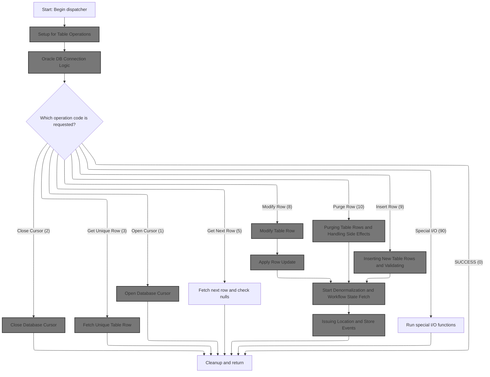
```mermaid
%%{init: {"flowchart": {"defaultRenderer": "elk"}} }%%
flowchart TD
  node1["Start: Begin dispatcher"] --> node2["Setup for Table Operations"]
  click node1 openCode "base/src/NNNS0473.cbl:199:200"
  
  node2 --> node3["Oracle DB Connection Logic"]
  
  node3 --> node7{"Which operation code is requested?"}
  click node7 openCode "base/src/NNNS0473.cbl:201:229"
  node7 -->|"SUCCESS (0)"| node17["Cleanup and return"]
  click node17 openCode "base/src/NNNS0473.cbl:221:223"
  node7 -->|"Open Cursor (1)"| node8["Open Database Cursor"]
  
  node8 --> node17
  node7 -->|"Close Cursor (2)"| node9["Close Database Cursor"]
  
  node9 --> node17
  node7 -->|"Get Unique Row (3)"| node10["Fetch Unique Table Row"]
  
  node10 --> node17
  node7 -->|"Get Next Row (5)"| node18["Fetch next row and check nulls"]
  click node18 openCode "base/src/NNNS0473.cbl:401:417"
  node18 --> node17
  node7 -->|"Modify Row (8)"| node11["Modify Table Row"]
  
  node11 --> node12["Apply Row Update"]
  
  node12 --> node13["Start Denormalization and Workflow State Fetch"]
  
  node13 --> node14["Issuing Location and Store Events"]
  
  node14 --> node17
  node7 -->|"Insert Row (9)"| node15["Inserting New Table Rows and Validating"]
  
  node15 --> node13
  node7 -->|"Purge Row (10)"| node16["Purging Table Rows and Handling Side Effects"]
  
  node16 --> node13
  node7 -->|"Special I/O (90)"| node19["Run special I/O functions"]
  click node19 openCode "base/src/NNNS0473.cbl:10000:10020"
  node19 --> node17
classDef HeadingStyle fill:#777777,stroke:#333,stroke-width:2px;
click node2 goToHeading "Setup for Table Operations"
node2:::HeadingStyle
click node3 goToHeading "Oracle DB Connection Logic"
node3:::HeadingStyle
click node8 goToHeading "Open Database Cursor"
node8:::HeadingStyle
click node9 goToHeading "Close Database Cursor"
node9:::HeadingStyle
click node10 goToHeading "Fetch Unique Table Row"
node10:::HeadingStyle
click node11 goToHeading "Modify Table Row"
node11:::HeadingStyle
click node12 goToHeading "Apply Row Update"
node12:::HeadingStyle
click node13 goToHeading "Start Denormalization and Workflow State Fetch"
node13:::HeadingStyle
click node14 goToHeading "Issuing Location and Store Events"
node14:::HeadingStyle
click node15 goToHeading "Inserting New Table Rows and Validating"
node15:::HeadingStyle
click node16 goToHeading "Purging Table Rows and Handling Side Effects"
node16:::HeadingStyle

%% Swimm:
%% %%{init: {"flowchart": {"defaultRenderer": "elk"}} }%%
%% flowchart TD
%%   node1["Start: Begin dispatcher"] --> node2["Setup for Table Operations"]
%%   click node1 openCode "<SwmPath>[base/src/NNNS0473.cbl](base/src/NNNS0473.cbl)</SwmPath>:199:200"
%%   
%%   node2 --> node3["Oracle DB Connection Logic"]
%%   
%%   node3 --> node7{"Which operation code is requested?"}
%%   click node7 openCode "<SwmPath>[base/src/NNNS0473.cbl](base/src/NNNS0473.cbl)</SwmPath>:201:229"
%%   node7 -->|"SUCCESS (0)"| node17["Cleanup and return"]
%%   click node17 openCode "<SwmPath>[base/src/NNNS0473.cbl](base/src/NNNS0473.cbl)</SwmPath>:221:223"
%%   node7 -->|"Open Cursor (1)"| node8["Open Database Cursor"]
%%   
%%   node8 --> node17
%%   node7 -->|"Close Cursor (2)"| node9["Close Database Cursor"]
%%   
%%   node9 --> node17
%%   node7 -->|"Get Unique Row (3)"| node10["Fetch Unique Table Row"]
%%   
%%   node10 --> node17
%%   node7 -->|"Get Next Row (5)"| node18["Fetch next row and check nulls"]
%%   click node18 openCode "<SwmPath>[base/src/NNNS0473.cbl](base/src/NNNS0473.cbl)</SwmPath>:401:417"
%%   node18 --> node17
%%   node7 -->|"Modify Row (8)"| node11["Modify Table Row"]
%%   
%%   node11 --> node12["Apply Row Update"]
%%   
%%   node12 --> node13["Start Denormalization and Workflow State Fetch"]
%%   
%%   node13 --> node14["Issuing Location and Store Events"]
%%   
%%   node14 --> node17
%%   node7 -->|"Insert Row (9)"| node15["Inserting New Table Rows and Validating"]
%%   
%%   node15 --> node13
%%   node7 -->|"Purge Row (10)"| node16["Purging Table Rows and Handling Side Effects"]
%%   
%%   node16 --> node13
%%   node7 -->|"Special I/O (90)"| node19["Run special I/O functions"]
%%   click node19 openCode "<SwmPath>[base/src/NNNS0473.cbl](base/src/NNNS0473.cbl)</SwmPath>:10000:10020"
%%   node19 --> node17
%% classDef HeadingStyle fill:#777777,stroke:#333,stroke-width:2px;
%% click node2 goToHeading "Setup for Table Operations"
%% node2:::HeadingStyle
%% click node3 goToHeading "Oracle DB Connection Logic"
%% node3:::HeadingStyle
%% click node8 goToHeading "Open Database Cursor"
%% node8:::HeadingStyle
%% click node9 goToHeading "Close Database Cursor"
%% node9:::HeadingStyle
%% click node10 goToHeading "Fetch Unique Table Row"
%% node10:::HeadingStyle
%% click node11 goToHeading "Modify Table Row"
%% node11:::HeadingStyle
%% click node12 goToHeading "Apply Row Update"
%% node12:::HeadingStyle
%% click node13 goToHeading "Start Denormalization and Workflow State Fetch"
%% node13:::HeadingStyle
%% click node14 goToHeading "Issuing Location and Store Events"
%% node14:::HeadingStyle
%% click node15 goToHeading "Inserting New Table Rows and Validating"
%% node15:::HeadingStyle
%% click node16 goToHeading "Purging Table Rows and Handling Side Effects"
%% node16:::HeadingStyle
```

The main product role of this section is to ensure that all prerequisites for database and table operations are met by initializing control structures and establishing a database connection. It then dispatches the requested operation based on the provided operation code, ensuring reliable and consistent execution of business logic.

| Category        | Rule Name                       | Description                                                                                                                                                                                                                                                                                                                                     |
| --------------- | ------------------------------- | ----------------------------------------------------------------------------------------------------------------------------------------------------------------------------------------------------------------------------------------------------------------------------------------------------------------------------------------------- |
| Data validation | Mandatory Initialization        | Initialization of all control structures and database handles must occur before any table or database operation is dispatched. If initialization fails, no further operations are allowed.                                                                                                                                                      |
| Data validation | Clean Exit Requirement          | A successful initialization and operation dispatch must result in a clean exit, resetting any temporary status or control variables to ensure the environment is ready for the next request.                                                                                                                                                    |
| Data validation | Database Connection Enforcement | Database connection must be established before any operation that modifies or queries the database (such as insert, modify, purge, or fetch). If the connection fails, an error message with the Oracle error code must be returned and no further action taken.                                                                                |
| Business logic  | Operation Code Dispatch         | The dispatcher must select and execute the correct operation based on the provided operation code. Supported codes are: 0 (Success/No-op), 1 (Open Cursor), 2 (Close Cursor), 3 (Get Unique Row), 5 (Get Next Row), 8 (Modify Row), 9 (Insert Row), 10 (Purge Row), and 90 (Special I/O). Any unsupported code must result in an error message. |

<SwmSnippet path="/base/src/NNNS0473.cbl" line="199">

---

In <SwmToken path="base/src/NNNS0473.cbl" pos="199:2:6" line-data="020800 0000-EXIT-DISPATCHER.                                            00020800">`0000-EXIT-DISPATCHER`</SwmToken> this is where the flow starts. It immediately calls <SwmToken path="base/src/NNNS0473.cbl" pos="200:4:6" line-data="020900     PERFORM 100-INITIALIZATION                                   00020900">`100-INITIALIZATION`</SwmToken> to prep all the control structures, reset status, and set up the DB handle. Without this, none of the table operations or DB logic would work reliably, so we need to call initialization first before dispatching any actual work.

```cobol
020800 0000-EXIT-DISPATCHER.                                            00020800
020900     PERFORM 100-INITIALIZATION                                   00020900
```

---

</SwmSnippet>

## Setup for Table Operations


```mermaid
%%{init: {"flowchart": {"defaultRenderer": "elk"}} }%%
flowchart TD
    node1["Reset transaction data, checkpoint, and synchronize handles"] --> node2{"Is cursor not in exit-close state? (EXIT-CLOSE-CURSOR ≠ 2)"}
    click node1 openCode "base/src/NNNS0473.cbl:23900:24400"
    node2 -->|"Yes"| node3["Move business data fields for transaction"]
    click node2 openCode "base/src/NNNS0473.cbl:24500:24700"
    node3 --> node4{"Need Oracle connection? (YYYN005A-ORACLE = 'O' or EXIT-PUT-INSERT-ROW = 9 or EXIT-PUT-PURGE-ROW = 10 or EXIT-PUT-MODIFY-ROW = 8)"}
    node2 -->|"No"| node4
    click node3 openCode "base/src/NNNS0473.cbl:24600:24700"
    click node4 openCode "base/src/NNNS0473.cbl:24800:25100"
    node4 -->|"Yes"| node5["Connect to Oracle"]
    node4 -->|"No"| node6["Ready for database operations"]
    click node5 openCode "base/src/NNNS0473.cbl:25000:25100"
    node5 --> node6
    click node6 openCode "base/src/NNNS0473.cbl:25100:25100"
classDef HeadingStyle fill:#777777,stroke:#333,stroke-width:2px;

%% Swimm:
%% %%{init: {"flowchart": {"defaultRenderer": "elk"}} }%%
%% flowchart TD
%%     node1["Reset transaction data, checkpoint, and synchronize handles"] --> node2{"Is cursor not in exit-close state? (<SwmToken path="base/src/NNNS0473.cbl" pos="206:4:8" line-data="021500       WHEN EXIT-CLOSE-CURSOR                                     00021500">`EXIT-CLOSE-CURSOR`</SwmToken> ≠ 2)"}
%%     click node1 openCode "<SwmPath>[base/src/NNNS0473.cbl](base/src/NNNS0473.cbl)</SwmPath>:23900:24400"
%%     node2 -->|"Yes"| node3["Move business data fields for transaction"]
%%     click node2 openCode "<SwmPath>[base/src/NNNS0473.cbl](base/src/NNNS0473.cbl)</SwmPath>:24500:24700"
%%     node3 --> node4{"Need Oracle connection? (<SwmToken path="base/src/NNNS0473.cbl" pos="239:5:7" line-data="024800     IF (YYYN005A-ORACLE       OR EXIT-PUT-INSERT-ROW             00024800">`YYYN005A-ORACLE`</SwmToken> = 'O' or <SwmToken path="base/src/NNNS0473.cbl" pos="214:4:10" line-data="022300       WHEN EXIT-PUT-INSERT-ROW                                   00022300">`EXIT-PUT-INSERT-ROW`</SwmToken> = 9 or <SwmToken path="base/src/NNNS0473.cbl" pos="216:4:10" line-data="022500       WHEN EXIT-PUT-PURGE-ROW                                    00022500">`EXIT-PUT-PURGE-ROW`</SwmToken> = 10 or <SwmToken path="base/src/NNNS0473.cbl" pos="212:4:10" line-data="022100       WHEN EXIT-PUT-MODIFY-ROW                                   00022100">`EXIT-PUT-MODIFY-ROW`</SwmToken> = 8)"}
%%     node2 -->|"No"| node4
%%     click node3 openCode "<SwmPath>[base/src/NNNS0473.cbl](base/src/NNNS0473.cbl)</SwmPath>:24600:24700"
%%     click node4 openCode "<SwmPath>[base/src/NNNS0473.cbl](base/src/NNNS0473.cbl)</SwmPath>:24800:25100"
%%     node4 -->|"Yes"| node5["Connect to Oracle"]
%%     node4 -->|"No"| node6["Ready for database operations"]
%%     click node5 openCode "<SwmPath>[base/src/NNNS0473.cbl](base/src/NNNS0473.cbl)</SwmPath>:25000:25100"
%%     node5 --> node6
%%     click node6 openCode "<SwmPath>[base/src/NNNS0473.cbl](base/src/NNNS0473.cbl)</SwmPath>:25100:25100"
%% classDef HeadingStyle fill:#777777,stroke:#333,stroke-width:2px;
```

This section ensures that all necessary preconditions are met before any table operation is performed. It guarantees that the transaction context is clean and that any required database connections are established, minimizing the risk of errors during subsequent operations.

| Category       | Rule Name                                | Description                                                                                                                                                                                                                                                                                                                                                                                                                                                                                                                                                                                                                                                                                                                                                                                                                                                                                        |
| -------------- | ---------------------------------------- | -------------------------------------------------------------------------------------------------------------------------------------------------------------------------------------------------------------------------------------------------------------------------------------------------------------------------------------------------------------------------------------------------------------------------------------------------------------------------------------------------------------------------------------------------------------------------------------------------------------------------------------------------------------------------------------------------------------------------------------------------------------------------------------------------------------------------------------------------------------------------------------------------- |
| Business logic | Reset transaction context                | All transaction-related working data, status flags, and SQL flags must be reset at the start of any table operation to ensure a clean context.                                                                                                                                                                                                                                                                                                                                                                                                                                                                                                                                                                                                                                                                                                                                                     |
| Business logic | Copy business data for active operations | If the operation is not a cursor close (<SwmToken path="base/src/NNNS0473.cbl" pos="206:4:8" line-data="021500       WHEN EXIT-CLOSE-CURSOR                                     00021500">`EXIT-CLOSE-CURSOR`</SwmToken> ≠ 2), business data fields related to the transaction must be copied to the working area to prepare for the operation.                                                                                                                                                                                                                                                                                                                                                                                                                                                                                                                                                    |
| Business logic | Conditional Oracle connection            | An Oracle database connection must be established if the operation is an insert, modify, purge, or if the Oracle flag is set (<SwmToken path="base/src/NNNS0473.cbl" pos="239:5:7" line-data="024800     IF (YYYN005A-ORACLE       OR EXIT-PUT-INSERT-ROW             00024800">`YYYN005A-ORACLE`</SwmToken> = 'O', <SwmToken path="base/src/NNNS0473.cbl" pos="214:4:10" line-data="022300       WHEN EXIT-PUT-INSERT-ROW                                   00022300">`EXIT-PUT-INSERT-ROW`</SwmToken> = 9, <SwmToken path="base/src/NNNS0473.cbl" pos="212:4:10" line-data="022100       WHEN EXIT-PUT-MODIFY-ROW                                   00022100">`EXIT-PUT-MODIFY-ROW`</SwmToken> = 8, or <SwmToken path="base/src/NNNS0473.cbl" pos="216:4:10" line-data="022500       WHEN EXIT-PUT-PURGE-ROW                                    00022500">`EXIT-PUT-PURGE-ROW`</SwmToken> = 10). |
| Business logic | No preparation for cursor close          | If the operation is a cursor close (<SwmToken path="base/src/NNNS0473.cbl" pos="206:4:8" line-data="021500       WHEN EXIT-CLOSE-CURSOR                                     00021500">`EXIT-CLOSE-CURSOR`</SwmToken> = 2), business data fields are not copied, and no Oracle connection is established.                                                                                                                                                                                                                                                                                                                                                                                                                                                                                                                                                                                           |

<SwmSnippet path="/base/src/NNNS0473.cbl" line="229">

---

In <SwmToken path="base/src/NNNS0473.cbl" pos="229:2:4" line-data="023800 100-INITIALIZATION.                                              00023800">`100-INITIALIZATION`</SwmToken> we reset the main working area, clear status and SQL flags, and copy over location/classification fields if we're not closing a cursor. This sets up the context for any DB operation that follows.

```cobol
023800 100-INITIALIZATION.                                              00023800
023900     INITIALIZE XXXN001A                                          00023900
024000                DAO-STATUS                                        00024000
024100     MOVE NNNN0000-INDEX-HANDLE TO DDDTCZ01-INDEX-HANDLE          00024100
024200     MOVE 0 TO WS-CHECKPOINT-INC                                  00024200
024300     MOVE 0 TO SQLCODE                                            00024300
024400     MOVE 0 TO SQL-INIT-FLAG                                      00024400
024500     IF NOT EXIT-CLOSE-CURSOR                                     00024500
024600       PERFORM 110-MOVE-PDA-FIELDS-2-DCL                          00024600
024700     END-IF                                                       00024700
```

---

</SwmSnippet>

<SwmSnippet path="/base/src/NNNS0473.cbl" line="239">

---

After finishing <SwmToken path="base/src/NNNS0473.cbl" pos="200:4:6" line-data="020900     PERFORM 100-INITIALIZATION                                   00020900">`100-INITIALIZATION`</SwmToken>, we check if the operation needs Oracle (insert, modify, purge, or Oracle flag). If so, we call <SwmToken path="base/src/NNNS0473.cbl" pos="241:4:10" line-data="025000       PERFORM 115-CONNECT-TO-ORACLE                              00025000">`115-CONNECT-TO-ORACLE`</SwmToken> to set up the DB connection for those actions. No need to connect if we're just reading or not using Oracle.

```cobol
024800     IF (YYYN005A-ORACLE       OR EXIT-PUT-INSERT-ROW             00024800
024900         OR EXIT-PUT-PURGE-ROW OR EXIT-PUT-MODIFY-ROW)            00024900
025000       PERFORM 115-CONNECT-TO-ORACLE                              00025000
025100     END-IF                                                       00025100
```

---

</SwmSnippet>

## Oracle DB Connection Logic

This section is responsible for managing the Oracle database connection process, ensuring that any connection failures are properly captured and communicated through a standardized error message format.

<SwmSnippet path="/base/src/NNNS0473.cbl" line="266">

---

<SwmToken path="base/src/NNNS0473.cbl" pos="266:2:8" line-data="027500 115-CONNECT-TO-ORACLE.                                           00027500">`115-CONNECT-TO-ORACLE`</SwmToken> calls <SwmToken path="base/src/NNNS0473.cbl" pos="267:4:8" line-data="027600     CALL Z-ORA-CONNECT USING XXXN001A                            00027600">`Z-ORA-CONNECT`</SwmToken> (which is actually <SwmPath>[base/src/XXXS0210.cbl](base/src/XXXS0210.cbl)</SwmPath>) to handle the Oracle DB connection. If it fails, we stash the error code and build a message for whoever needs to know. We call the external program because that's where the actual DB connection logic lives.

```cobol
027500 115-CONNECT-TO-ORACLE.                                           00027500
027600     CALL Z-ORA-CONNECT USING XXXN001A                            00027600
027700                              SQLCA                               00027700
027800                                                                  00027800
027900     IF NOT SUCCESS                                               00027900
028000       MOVE SQLCODE TO WS-SQLCODE                                 00028000
028100       MOVE SPACES  TO IS-RTRN-MSG-TXT                            00028100
028200       STRING 'NNNS0473 - Error connecting to Oracle. Sqlcode ='  00028200
028300               WS-SQLCODE                                         00028300
028400               DELIMITED BY SIZE INTO IS-RTRN-MSG-TXT             00028400
028500     END-IF                                                       00028500
```

---

</SwmSnippet>

## Connection Manager Dispatch

This section is responsible for initializing the application and ensuring that a valid Oracle database connection is established before any further processing occurs. It acts as the gateway for all database-related operations in the app.

| Category        | Rule Name                     | Description                                                                                                                                      |
| --------------- | ----------------------------- | ------------------------------------------------------------------------------------------------------------------------------------------------ |
| Data validation | Mandatory Initialization      | The application must always perform initialization before attempting to connect to the Oracle database.                                          |
| Business logic  | Oracle Connection Requirement | The system must establish a connection to the Oracle database before allowing any database-dependent operations to proceed.                      |
| Technical step  | Clean Termination             | The section must always terminate cleanly after initialization and connection setup, ensuring no lingering processes or resources are left open. |

<SwmSnippet path="/base/src/XXXS0210.cbl" line="33">

---

<SwmToken path="base/src/XXXS0210.cbl" pos="33:2:6" line-data="004400 0000-EXIT-DISPATCHER.                                            00004400">`0000-EXIT-DISPATCHER`</SwmToken> in <SwmPath>[base/src/XXXS0210.cbl](base/src/XXXS0210.cbl)</SwmPath> first runs its own initialization, then switches the DB connection to Oracle by calling the connection manager. This is the entry point for setting up Oracle connectivity for the rest of the app.

```cobol
004400 0000-EXIT-DISPATCHER.                                            00004400
004500     PERFORM 100-INITIALIZATION                                   00004500
004600     PERFORM 200-CONNECT-TO-ORACLE                                00004600
005000     GOBACK                                                       00005000
005100     .                                                            00005100
```

---

</SwmSnippet>

## Switch to Oracle Connection

This section is responsible for initiating a switch of the database connection to Oracle by setting the appropriate flag and delegating the actual switch to the connection manager.

| Category        | Rule Name                         | Description                                                                                                                                                                                                                                                                                                                                    |
| --------------- | --------------------------------- | ---------------------------------------------------------------------------------------------------------------------------------------------------------------------------------------------------------------------------------------------------------------------------------------------------------------------------------------------- |
| Data validation | Valid Connection Type Enforcement | The system must ensure that only valid connection types ('S0' for Oracle, 'SD' for <SwmToken path="base/src/NNNS0473.cbl" pos="291:10:10" line-data="030000        PERFORM 125-CONNECT-TO-DB2                                00030000">`DB2`</SwmToken>, etc.) are set in the YYYC0220-FUNC field before delegating to the connection manager. |
| Business logic  | Oracle Connection Flag            | When a request to switch to Oracle is received, the system must set the YYYC0220-FUNC field to 'S0' to indicate the Oracle connection type.                                                                                                                                                                                                    |
| Business logic  | Delegation to Connection Manager  | The system must delegate the actual database connection switch to the database connection manager after preparing the request.                                                                                                                                                                                                                 |

<SwmSnippet path="/base/src/XXXS0210.cbl" line="52">

---

In <SwmToken path="base/src/XXXS0210.cbl" pos="52:2:8" line-data="007500 200-CONNECT-TO-ORACLE.                                           00007500">`200-CONNECT-TO-ORACLE`</SwmToken>, we set a flag to indicate we want Oracle, then call the DB connection manager (<SwmToken path="base/src/XXXS0210.cbl" pos="55:4:4" line-data="007540     CALL YYYS0220-DBMS-CON-MGR USING                             00007540">`YYYS0220`</SwmToken>). The manager handles the actual switch, so we just prep the request and hand it off.

```cobol
007500 200-CONNECT-TO-ORACLE.                                           00007500
007510     SET YYYC0220-SET-ORACLE-CON TO TRUE                          00007510
007530                                                                  00007530
007540     CALL YYYS0220-DBMS-CON-MGR USING                             00007540
007550         XXXN001A                                                 00007550
007560         YYYC0220                                                 00007560
010400     .                                                            00010400
```

---

</SwmSnippet>

## Connection Manager Routing

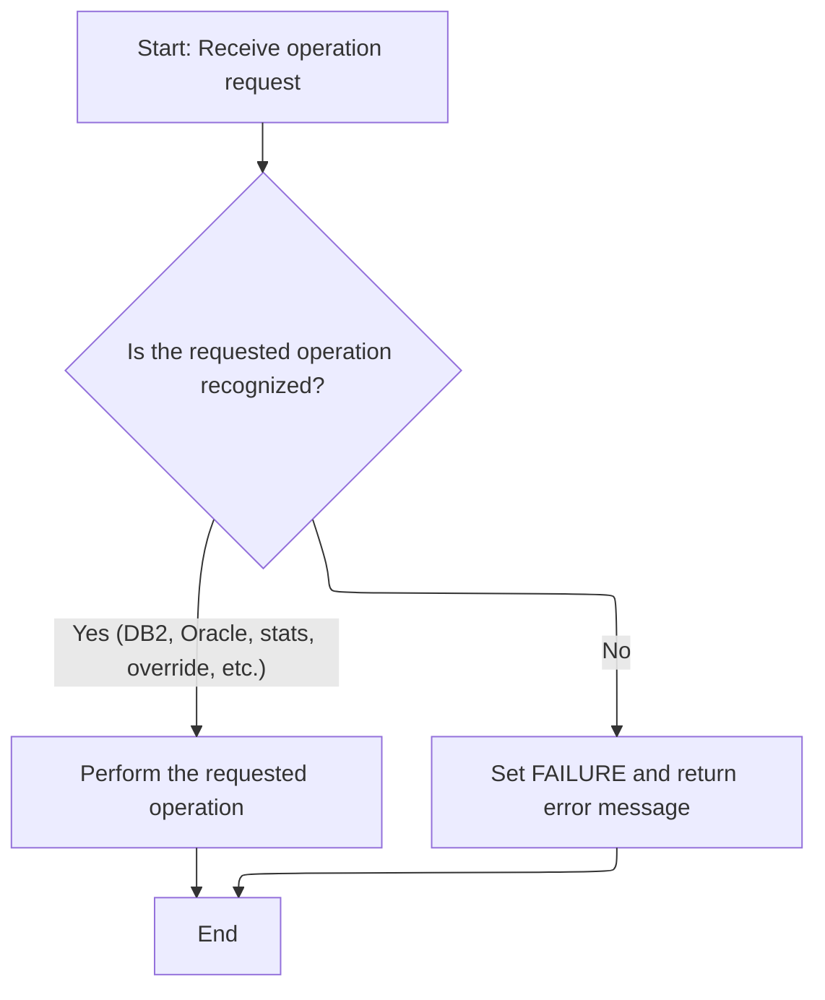
```mermaid
%%{init: {"flowchart": {"defaultRenderer": "elk"}} }%%
flowchart TD
    node1["Start: Receive operation request"] --> node2{"Is the requested operation recognized?"}
    click node1 openCode "base/src/YYYS0220.cbl:56:58"
    node2 -->|"Yes (DB2, Oracle, stats, override, etc.)"| node3["Perform the requested operation"]
    click node2 openCode "base/src/YYYS0220.cbl:59:76"
    node2 -->|"No"| node4["Set FAILURE and return error message"]
    click node4 openCode "base/src/YYYS0220.cbl:72:75"
    node3 --> node5["End"]
    click node3 openCode "base/src/YYYS0220.cbl:60:71"
    node4 --> node5
    node5["End"]
    click node5 openCode "base/src/YYYS0220.cbl:78:79"
classDef HeadingStyle fill:#777777,stroke:#333,stroke-width:2px;

%% Swimm:
%% %%{init: {"flowchart": {"defaultRenderer": "elk"}} }%%
%% flowchart TD
%%     node1["Start: Receive operation request"] --> node2{"Is the requested operation recognized?"}
%%     click node1 openCode "<SwmPath>[base/src/YYYS0220.cbl](base/src/YYYS0220.cbl)</SwmPath>:56:58"
%%     node2 -->|"Yes (<SwmToken path="base/src/NNNS0473.cbl" pos="291:10:10" line-data="030000        PERFORM 125-CONNECT-TO-DB2                                00030000">`DB2`</SwmToken>, Oracle, stats, override, etc.)"| node3["Perform the requested operation"]
%%     click node2 openCode "<SwmPath>[base/src/YYYS0220.cbl](base/src/YYYS0220.cbl)</SwmPath>:59:76"
%%     node2 -->|"No"| node4["Set FAILURE and return error message"]
%%     click node4 openCode "<SwmPath>[base/src/YYYS0220.cbl](base/src/YYYS0220.cbl)</SwmPath>:72:75"
%%     node3 --> node5["End"]
%%     click node3 openCode "<SwmPath>[base/src/YYYS0220.cbl](base/src/YYYS0220.cbl)</SwmPath>:60:71"
%%     node4 --> node5
%%     node5["End"]
%%     click node5 openCode "<SwmPath>[base/src/YYYS0220.cbl](base/src/YYYS0220.cbl)</SwmPath>:78:79"
%% classDef HeadingStyle fill:#777777,stroke:#333,stroke-width:2px;
```

The Connection Manager Routing section determines which operation to perform based on the function code provided in the request. It supports recognized operations such as getting or setting the current connection, switching between <SwmToken path="base/src/NNNS0473.cbl" pos="291:10:10" line-data="030000        PERFORM 125-CONNECT-TO-DB2                                00030000">`DB2`</SwmToken> and Oracle, managing statistics, and handling overrides. If the function code is not recognized, it returns a failure status and an error message.

| Category        | Rule Name                        | Description                                                                                                                                                                                                                                                                                                                                                                                                       |
| --------------- | -------------------------------- | ----------------------------------------------------------------------------------------------------------------------------------------------------------------------------------------------------------------------------------------------------------------------------------------------------------------------------------------------------------------------------------------------------------------- |
| Data validation | Recognized operation enforcement | Only requests with a recognized function code (such as 'GC', 'SD', 'S0', 'GS', 'SS', 'SO') are processed; all others are rejected.                                                                                                                                                                                                                                                                                |
| Business logic  | Current connection reporting     | When the 'get current connection' operation is requested, the system must return the current connection state without making any changes to the connection.                                                                                                                                                                                                                                                       |
| Business logic  | Database connection switching    | When a request to switch to <SwmToken path="base/src/NNNS0473.cbl" pos="291:10:10" line-data="030000        PERFORM 125-CONNECT-TO-DB2                                00030000">`DB2`</SwmToken> or Oracle is received, the system must establish the requested connection if not already active, update the relevant statistics counters, and return the new connection state.                                   |
| Business logic  | Statistics management            | Statistics-related operations must accurately retrieve or update the statistics fields (such as total requests, <SwmToken path="base/src/NNNS0473.cbl" pos="291:10:10" line-data="030000        PERFORM 125-CONNECT-TO-DB2                                00030000">`DB2`</SwmToken> requests, Oracle requests, connection switches, override requests, and override switches) as requested by the function code. |

<SwmSnippet path="/base/src/YYYS0220.cbl" line="56">

---

<SwmToken path="base/src/YYYS0220.cbl" pos="56:2:6" line-data="006500 0000-EXIT-DISPATCHER.                                            00006500">`0000-EXIT-DISPATCHER`</SwmToken> in <SwmPath>[base/src/YYYS0220.cbl](base/src/YYYS0220.cbl)</SwmPath> routes the request based on the function code. It can get/set the current connection, switch DBs, get/set stats, or handle overrides. If the code isn't recognized, it flags an error and returns a message.

```cobol
006500 0000-EXIT-DISPATCHER.                                            00006500
006600     PERFORM 100-INITIALIZATION                                   00006600
006700                                                                  00006700
006800     EVALUATE TRUE                                                00006800
006900       WHEN YYYC0220-GET-CURR-CON                                 00006900
007000         PERFORM 200-GET-CURR-CON                                 00007000
007100       WHEN YYYC0220-SET-DB2-CON                                  00007100
007200         PERFORM 300-SET-DB2-CON                                  00007200
007300       WHEN YYYC0220-SET-ORACLE-CON                               00007300
007400         PERFORM 400-SET-ORACLE-CON                               00007400
007500       WHEN YYYC0220-GET-STATS                                    00007500
007600         PERFORM 500-GET-STATS                                    00007600
007700       WHEN YYYC0220-SET-STATS                                    00007700
007800         PERFORM 600-SET-STATS                                    00007800
007900       WHEN YYYC0220-SET-OVERRIDE-CON                             00007900
008000         PERFORM 700-SET-OVERRIDE-CON                             00008000
008100       WHEN OTHER                                                 00008100
008200         SET  FAILURE TO TRUE                                     00008200
008300         MOVE 'YYYS0220 - Function not recognized!'               00008300
008400           TO IS-RTRN-MSG-TXT                                     00008400
008500     END-EVALUATE                                                 00008500
008600                                                                  00008600
008700     GOBACK                                                       00008700
008800     .                                                            00008800
```

---

</SwmSnippet>

<SwmSnippet path="/base/src/YYYS0220.cbl" line="97">

---

<SwmToken path="base/src/YYYS0220.cbl" pos="97:2:8" line-data="010600 200-GET-CURR-CON.                                                00010600">`200-GET-CURR-CON`</SwmToken> just copies the current connection state to the output structure. It doesn't actually switch the DB connection, just reports what the current state is. The comment about setting <SwmToken path="base/src/NNNS0473.cbl" pos="291:10:10" line-data="030000        PERFORM 125-CONNECT-TO-DB2                                00030000">`DB2`</SwmToken> is misleading here.

```cobol
010600 200-GET-CURR-CON.                                                00010600
010700     MOVE WS-YYYC0220-CURR-CON TO YYYC0220-CURR-CON               00010700
010800     .                                                            00010800
```

---

</SwmSnippet>

### Switch to <SwmToken path="base/src/NNNS0473.cbl" pos="291:10:10" line-data="030000        PERFORM 125-CONNECT-TO-DB2                                00030000">`DB2`</SwmToken> Connection

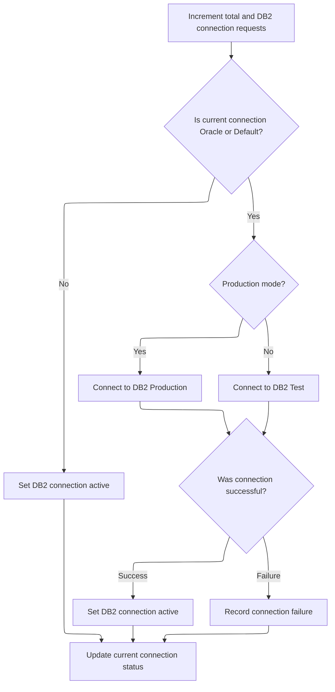
```mermaid
%%{init: {"flowchart": {"defaultRenderer": "elk"}} }%%
flowchart TD
    node1["Increment total and DB2 connection requests"]
    click node1 openCode "base/src/YYYS0220.cbl:115:116"
    node1 --> node2{"Is current connection Oracle or Default?"}
    click node2 openCode "base/src/YYYS0220.cbl:118:119"
    node2 -->|"Yes"| node3{"Production mode?"}
    node2 -->|"No"| node5["Set DB2 connection active"]
    click node5 openCode "base/src/YYYS0220.cbl:123:123"
    node3 -->|"Yes"| node6["Connect to DB2 Production"]
    click node6 openCode "base/src/YYYS0220.cbl:134:135"
    node3 -->|"No"| node7["Connect to DB2 Test"]
    click node7 openCode "base/src/YYYS0220.cbl:138:139"
    node6 --> node8{"Was connection successful?"}
    node7 --> node8
    click node8 openCode "base/src/YYYS0220.cbl:143:146"
    node8 -->|"Success"| node9["Set DB2 connection active"]
    click node9 openCode "base/src/YYYS0220.cbl:123:123"
    node8 -->|"Failure"| node10["Record connection failure"]
    click node10 openCode "base/src/YYYS0220.cbl:147:151"
    node9 --> node11["Update current connection status"]
    node10 --> node11["Update current connection status"]
    node5 --> node11["Update current connection status"]
    click node11 openCode "base/src/YYYS0220.cbl:124:124"
classDef HeadingStyle fill:#777777,stroke:#333,stroke-width:2px;

%% Swimm:
%% %%{init: {"flowchart": {"defaultRenderer": "elk"}} }%%
%% flowchart TD
%%     node1["Increment total and <SwmToken path="base/src/NNNS0473.cbl" pos="291:10:10" line-data="030000        PERFORM 125-CONNECT-TO-DB2                                00030000">`DB2`</SwmToken> connection requests"]
%%     click node1 openCode "<SwmPath>[base/src/YYYS0220.cbl](base/src/YYYS0220.cbl)</SwmPath>:115:116"
%%     node1 --> node2{"Is current connection Oracle or Default?"}
%%     click node2 openCode "<SwmPath>[base/src/YYYS0220.cbl](base/src/YYYS0220.cbl)</SwmPath>:118:119"
%%     node2 -->|"Yes"| node3{"Production mode?"}
%%     node2 -->|"No"| node5["Set <SwmToken path="base/src/NNNS0473.cbl" pos="291:10:10" line-data="030000        PERFORM 125-CONNECT-TO-DB2                                00030000">`DB2`</SwmToken> connection active"]
%%     click node5 openCode "<SwmPath>[base/src/YYYS0220.cbl](base/src/YYYS0220.cbl)</SwmPath>:123:123"
%%     node3 -->|"Yes"| node6["Connect to <SwmToken path="base/src/NNNS0473.cbl" pos="291:10:10" line-data="030000        PERFORM 125-CONNECT-TO-DB2                                00030000">`DB2`</SwmToken> Production"]
%%     click node6 openCode "<SwmPath>[base/src/YYYS0220.cbl](base/src/YYYS0220.cbl)</SwmPath>:134:135"
%%     node3 -->|"No"| node7["Connect to <SwmToken path="base/src/NNNS0473.cbl" pos="291:10:10" line-data="030000        PERFORM 125-CONNECT-TO-DB2                                00030000">`DB2`</SwmToken> Test"]
%%     click node7 openCode "<SwmPath>[base/src/YYYS0220.cbl](base/src/YYYS0220.cbl)</SwmPath>:138:139"
%%     node6 --> node8{"Was connection successful?"}
%%     node7 --> node8
%%     click node8 openCode "<SwmPath>[base/src/YYYS0220.cbl](base/src/YYYS0220.cbl)</SwmPath>:143:146"
%%     node8 -->|"Success"| node9["Set <SwmToken path="base/src/NNNS0473.cbl" pos="291:10:10" line-data="030000        PERFORM 125-CONNECT-TO-DB2                                00030000">`DB2`</SwmToken> connection active"]
%%     click node9 openCode "<SwmPath>[base/src/YYYS0220.cbl](base/src/YYYS0220.cbl)</SwmPath>:123:123"
%%     node8 -->|"Failure"| node10["Record connection failure"]
%%     click node10 openCode "<SwmPath>[base/src/YYYS0220.cbl](base/src/YYYS0220.cbl)</SwmPath>:147:151"
%%     node9 --> node11["Update current connection status"]
%%     node10 --> node11["Update current connection status"]
%%     node5 --> node11["Update current connection status"]
%%     click node11 openCode "<SwmPath>[base/src/YYYS0220.cbl](base/src/YYYS0220.cbl)</SwmPath>:124:124"
%% classDef HeadingStyle fill:#777777,stroke:#333,stroke-width:2px;
```

This section ensures that when a request is made to switch to a <SwmToken path="base/src/NNNS0473.cbl" pos="291:10:10" line-data="030000        PERFORM 125-CONNECT-TO-DB2                                00030000">`DB2`</SwmToken> connection, the system accurately tracks the request, performs the switch if necessary, connects to the appropriate <SwmToken path="base/src/NNNS0473.cbl" pos="291:10:10" line-data="030000        PERFORM 125-CONNECT-TO-DB2                                00030000">`DB2`</SwmToken> environment (production or test), and provides clear feedback on the outcome, including error details if the connection fails.

| Category       | Rule Name                                                                                                                                                                               | Description                                                                                                                                                                                                                                                                                                                                                                                                                                                                         |
| -------------- | --------------------------------------------------------------------------------------------------------------------------------------------------------------------------------------- | ----------------------------------------------------------------------------------------------------------------------------------------------------------------------------------------------------------------------------------------------------------------------------------------------------------------------------------------------------------------------------------------------------------------------------------------------------------------------------------- |
| Business logic | Request counting                                                                                                                                                                        | Each time a request to switch to <SwmToken path="base/src/NNNS0473.cbl" pos="291:10:10" line-data="030000        PERFORM 125-CONNECT-TO-DB2                                00030000">`DB2`</SwmToken> is processed, increment the total requests counter and the <SwmToken path="base/src/NNNS0473.cbl" pos="291:10:10" line-data="030000        PERFORM 125-CONNECT-TO-DB2                                00030000">`DB2`</SwmToken> requests counter by 1.                        |
| Business logic | Conditional <SwmToken path="base/src/NNNS0473.cbl" pos="291:10:10" line-data="030000        PERFORM 125-CONNECT-TO-DB2                                00030000">`DB2`</SwmToken> switch | Only attempt to switch to a <SwmToken path="base/src/NNNS0473.cbl" pos="291:10:10" line-data="030000        PERFORM 125-CONNECT-TO-DB2                                00030000">`DB2`</SwmToken> connection if the current connection is either Oracle or Default; otherwise, set <SwmToken path="base/src/NNNS0473.cbl" pos="291:10:10" line-data="030000        PERFORM 125-CONNECT-TO-DB2                                00030000">`DB2`</SwmToken> as active without switching. |
| Business logic | Switch counting                                                                                                                                                                         | When switching to <SwmToken path="base/src/NNNS0473.cbl" pos="291:10:10" line-data="030000        PERFORM 125-CONNECT-TO-DB2                                00030000">`DB2`</SwmToken>, increment the connection switch counter by 1 to track how many times a connection switch has occurred.                                                                                                                                                                                      |
| Business logic | Environment-based connection                                                                                                                                                            | If the system is in production mode, connect to the <SwmToken path="base/src/NNNS0473.cbl" pos="291:10:10" line-data="030000        PERFORM 125-CONNECT-TO-DB2                                00030000">`DB2`</SwmToken> Production environment; otherwise, connect to the <SwmToken path="base/src/NNNS0473.cbl" pos="291:10:10" line-data="030000        PERFORM 125-CONNECT-TO-DB2                                00030000">`DB2`</SwmToken> Test environment.                   |
| Business logic | Connection status update                                                                                                                                                                | After a successful or failed connection attempt, update the current connection status for the caller to reflect the latest state.                                                                                                                                                                                                                                                                                                                                                   |

<SwmSnippet path="/base/src/YYYS0220.cbl" line="105">

---

<SwmToken path="base/src/YYYS0220.cbl" pos="105:2:8" line-data="011400 300-SET-DB2-CON.                                                 00011400">`300-SET-DB2-CON`</SwmToken> bumps the stats for total and <SwmToken path="base/src/YYYS0220.cbl" pos="105:6:6" line-data="011400 300-SET-DB2-CON.                                                 00011400">`DB2`</SwmToken> requests, then switches to <SwmToken path="base/src/YYYS0220.cbl" pos="105:6:6" line-data="011400 300-SET-DB2-CON.                                                 00011400">`DB2`</SwmToken> if we're not already there. After switching, it updates the current connection state for the caller.

```cobol
011400 300-SET-DB2-CON.                                                 00011400
011500     ADD 1 TO WS-TOT-REQS                                         00011500
011600     ADD 1 TO WS-DB2-REQS                                         00011600
011700                                                                  00011700
011800     IF WS-ORACLE-CON                                             00011800
011900     OR WS-DEFAULT-CON                                            00011900
012000       PERFORM 310-DO-SET-DB2-CON                                 00012000
012100     END-IF                                                       00012100
012200                                                                  00012200
012300     SET WS-DB2-CON TO TRUE                                       00012300
012400     PERFORM 200-GET-CURR-CON                                     00012400
012500     .                                                            00012500
```

---

</SwmSnippet>

<SwmSnippet path="/base/src/YYYS0220.cbl" line="119">

---

<SwmToken path="base/src/YYYS0220.cbl" pos="119:2:10" line-data="012800 310-DO-SET-DB2-CON.                                              00012800">`310-DO-SET-DB2-CON`</SwmToken> increments the connection switch counter, then checks if we're in production or test. It connects to <SwmToken path="base/src/YYYS0220.cbl" pos="125:6:6" line-data="013400           CONNECT TO DB2P                                        00013400">`DB2P`</SwmToken> or <SwmToken path="base/src/YYYS0220.cbl" pos="129:6:6" line-data="013800           CONNECT TO DB2T                                        00013800">`DB2T`</SwmToken> accordingly. If the connection fails, it sets a failure flag and builds an error message with the SQLCODE.

```cobol
012800 310-DO-SET-DB2-CON.                                              00012800
012900     ADD 1 TO WS-CON-SWITCHES                                     00012900
013000                                                                  00013000
013100     EVALUATE TRUE                                                00013100
013200       WHEN WS-PROD                                               00013200
013300         EXEC SQL                                                 00013300
013400           CONNECT TO DB2P                                        00013400
013500         END-EXEC                                                 00013500
013600       WHEN OTHER                                                 00013600
013700         EXEC SQL                                                 00013700
013800           CONNECT TO DB2T                                        00013800
013900         END-EXEC                                                 00013900
014000     END-EVALUATE                                                 00014000
014100                                                                  00014100
014200     EVALUATE TRUE                                                00014200
014300       WHEN SQLCODE = 0                                           00014300
014400         CONTINUE                                                 00014400
014500                                                                  00014500
014600       WHEN OTHER                                                 00014600
014700         SET  FAILURE TO TRUE                                     00014700
014800         MOVE SQLCODE TO WS-SQLCODE                               00014800
014900         STRING 'YYYS0220 - Failure connecting to DB2, SQL='      00014900
015000                WS-SQLCODE                                        00015000
015100             DELIMITED BY SIZE INTO IS-RTRN-MSG-TXT               00015100
015200     END-EVALUATE                                                 00015200
015300     .                                                            00015300
```

---

</SwmSnippet>

### Switch to Oracle and Track Usage

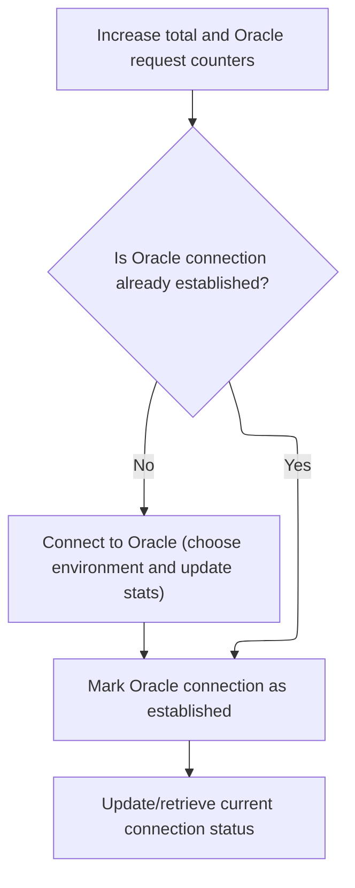
```mermaid
%%{init: {"flowchart": {"defaultRenderer": "elk"}} }%%
flowchart TD
    node1["Increase total and Oracle request counters"]
    click node1 openCode "base/src/YYYS0220.cbl:160:161"
    node1 --> node2{"Is Oracle connection already established?"}
    click node2 openCode "base/src/YYYS0220.cbl:163:163"
    node2 -->|"No"| node3["Connect to Oracle (choose environment and update stats)"]
    click node3 openCode "base/src/YYYS0220.cbl:164:165"
    node2 -->|"Yes"| node4["Mark Oracle connection as established"]
    node3 --> node4
    click node4 openCode "base/src/YYYS0220.cbl:167:167"
    node4 --> node5["Update/retrieve current connection status"]
    click node5 openCode "base/src/YYYS0220.cbl:168:168"
classDef HeadingStyle fill:#777777,stroke:#333,stroke-width:2px;

%% Swimm:
%% %%{init: {"flowchart": {"defaultRenderer": "elk"}} }%%
%% flowchart TD
%%     node1["Increase total and Oracle request counters"]
%%     click node1 openCode "<SwmPath>[base/src/YYYS0220.cbl](base/src/YYYS0220.cbl)</SwmPath>:160:161"
%%     node1 --> node2{"Is Oracle connection already established?"}
%%     click node2 openCode "<SwmPath>[base/src/YYYS0220.cbl](base/src/YYYS0220.cbl)</SwmPath>:163:163"
%%     node2 -->|"No"| node3["Connect to Oracle (choose environment and update stats)"]
%%     click node3 openCode "<SwmPath>[base/src/YYYS0220.cbl](base/src/YYYS0220.cbl)</SwmPath>:164:165"
%%     node2 -->|"Yes"| node4["Mark Oracle connection as established"]
%%     node3 --> node4
%%     click node4 openCode "<SwmPath>[base/src/YYYS0220.cbl](base/src/YYYS0220.cbl)</SwmPath>:167:167"
%%     node4 --> node5["Update/retrieve current connection status"]
%%     click node5 openCode "<SwmPath>[base/src/YYYS0220.cbl](base/src/YYYS0220.cbl)</SwmPath>:168:168"
%% classDef HeadingStyle fill:#777777,stroke:#333,stroke-width:2px;
```

This section is responsible for switching the active database connection to Oracle, updating usage statistics, and reporting the current connection status and any errors encountered during the process.

| Category       | Rule Name                     | Description                                                                                                                                                                                                                                                                                                                                                                                                                                                                                                                                                                                                                                                                                                                                                                                                                                                                                      |
| -------------- | ----------------------------- | ------------------------------------------------------------------------------------------------------------------------------------------------------------------------------------------------------------------------------------------------------------------------------------------------------------------------------------------------------------------------------------------------------------------------------------------------------------------------------------------------------------------------------------------------------------------------------------------------------------------------------------------------------------------------------------------------------------------------------------------------------------------------------------------------------------------------------------------------------------------------------------------------ |
| Business logic | Request Counting              | Every time a request is made to switch to Oracle, increment the total request counter and the Oracle request counter by 1.                                                                                                                                                                                                                                                                                                                                                                                                                                                                                                                                                                                                                                                                                                                                                                       |
| Business logic | Conditional Oracle Connection | If the Oracle connection is not already established, increment the connection switch counter by 1 and attempt to connect to the correct Oracle environment based on the environment flag (e.g., PROD, TEST, <SwmToken path="base/src/YYYS0220.cbl" pos="177:6:6" line-data="018600       WHEN WS-TST6                                               00018600">`TST6`</SwmToken>, <SwmToken path="base/src/YYYS0220.cbl" pos="182:6:6" line-data="019100       WHEN WS-TST5                                               00019100">`TST5`</SwmToken>, <SwmToken path="base/src/YYYS0220.cbl" pos="187:6:6" line-data="019600       WHEN WS-TST4                                               00019600">`TST4`</SwmToken>, <SwmToken path="base/src/YYYS0220.cbl" pos="192:6:6" line-data="020100       WHEN WS-TST3                                               00020100">`TST3`</SwmToken>). |
| Business logic | Connection Status Reporting   | After switching to Oracle, update and return the current connection status to the caller.                                                                                                                                                                                                                                                                                                                                                                                                                                                                                                                                                                                                                                                                                                                                                                                                        |

<SwmSnippet path="/base/src/YYYS0220.cbl" line="150">

---

<SwmToken path="base/src/YYYS0220.cbl" pos="150:2:8" line-data="015900 400-SET-ORACLE-CON.                                              00015900">`400-SET-ORACLE-CON`</SwmToken> bumps the stats for total and Oracle requests, then switches to Oracle if we're not already there. After switching, it updates the current connection state for the caller.

```cobol
015900 400-SET-ORACLE-CON.                                              00015900
016000     ADD 1 TO WS-TOT-REQS                                         00016000
016100     ADD 1 TO WS-OCL-REQS                                         00016100
016200                                                                  00016200
016300     IF NOT WS-ORACLE-CON                                         00016300
016400       PERFORM 410-DO-SET-ORACLE-CON                              00016400
016500     END-IF                                                       00016500
016600                                                                  00016600
016700     SET WS-ORACLE-CON TO TRUE                                    00016700
016800     PERFORM 200-GET-CURR-CON                                     00016800
016900     .                                                            00016900
```

---

</SwmSnippet>

<SwmSnippet path="/base/src/YYYS0220.cbl" line="163">

---

<SwmToken path="base/src/YYYS0220.cbl" pos="163:2:10" line-data="017200 410-DO-SET-ORACLE-CON.                                           00017200">`410-DO-SET-ORACLE-CON`</SwmToken> increments the connection switch counter, checks which environment flag is set, and connects to the right Oracle DB for that environment. If the connection fails, it sets a failure flag and builds an error message with the SQLCODE.

```cobol
017200 410-DO-SET-ORACLE-CON.                                           00017200
017300     ADD 1 TO WS-CON-SWITCHES                                     00017300
017400                                                                  00017400
017500     EVALUATE TRUE                                                00017500
017600       WHEN WS-PROD                                               00017600
017700         EXEC SQL                                                 00017700
017800           CONNECT TO DRDAASP1                                    00017800
017900         END-EXEC                                                 00017900
018000                                                                  00018000
018100       WHEN WS-TEST                                               00018100
018200         EXEC SQL                                                 00018200
018300           CONNECT TO DRDAASC7                                    00018300
018400         END-EXEC                                                 00018400
018500                                                                  00018500
018600       WHEN WS-TST6                                               00018600
018700         EXEC SQL                                                 00018700
018800           CONNECT TO DRDAASC6                                    00018800
018900         END-EXEC                                                 00018900
019000                                                                  00019000
019100       WHEN WS-TST5                                               00019100
019200         EXEC SQL                                                 00019200
019300           CONNECT TO DRDAASC5                                    00019300
019400         END-EXEC                                                 00019400
019500                                                                  00019500
019600       WHEN WS-TST4                                               00019600
019700         EXEC SQL                                                 00019700
019800           CONNECT TO DRDAASD1                                    00019800
019900         END-EXEC                                                 00019900
020000                                                                  00020000
020100       WHEN WS-TST3                                               00020100
020200         EXEC SQL                                                 00020200
020300           CONNECT TO DRDAASC1                                    00020300
020400         END-EXEC                                                 00020400
020500     END-EVALUATE                                                 00020500
020600                                                                  00020600
020700     EVALUATE TRUE                                                00020700
020800       WHEN SQLCODE = 0                                           00020800
020900         CONTINUE                                                 00020900
021000                                                                  00021000
021100       WHEN OTHER                                                 00021100
021200         SET  FAILURE TO TRUE                                     00021200
021300         MOVE SQLCODE TO WS-SQLCODE                               00021300
021400         STRING 'YYYS0220 - Failure connecting to Oracle, SQL='   00021400
021500                WS-SQLCODE                                        00021500
021600             DELIMITED BY SIZE INTO IS-RTRN-MSG-TXT               00021600
021700     END-EVALUATE                                                 00021700
021800     .                                                            00021800
```

---

</SwmSnippet>

### Connection Stats and Overrides

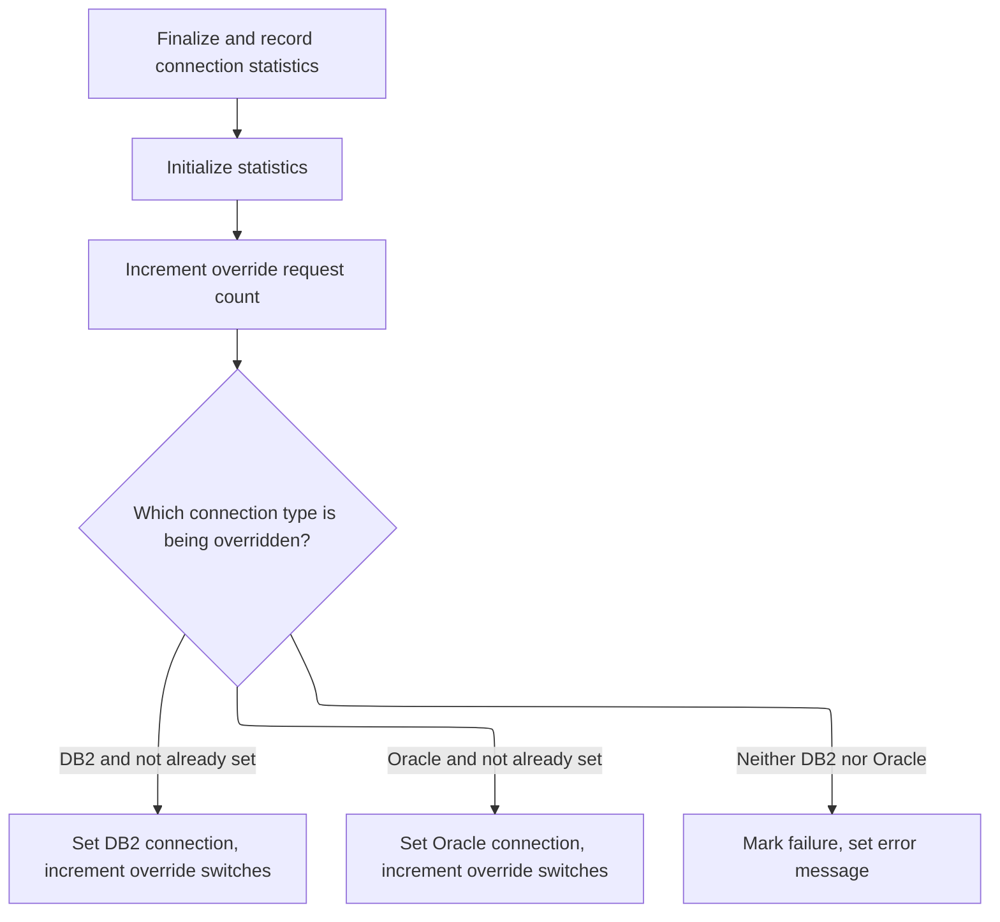
```mermaid
%%{init: {"flowchart": {"defaultRenderer": "elk"}} }%%
flowchart TD
    node1["Finalize and record connection statistics"]
    click node1 openCode "base/src/YYYS0220.cbl:22400:23300"
    node1 --> node2["Initialize statistics"]
    click node2 openCode "base/src/YYYS0220.cbl:23900:24200"
    node2 --> node3["Increment override request count"]
    click node3 openCode "base/src/YYYS0220.cbl:24800:24900"
    node3 --> node4{"Which connection type is being overridden?"}
    click node4 openCode "base/src/YYYS0220.cbl:25100:26200"
    node4 -->|"DB2 and not already set"| node5["Set DB2 connection, increment override switches"]
    click node5 openCode "base/src/YYYS0220.cbl:25400:25600"
    node4 -->|"Oracle and not already set"| node6["Set Oracle connection, increment override switches"]
    click node6 openCode "base/src/YYYS0220.cbl:25900:26100"
    node4 -->|"Neither DB2 nor Oracle"| node7["Mark failure, set error message"]
    click node7 openCode "base/src/YYYS0220.cbl:26300:26500"
classDef HeadingStyle fill:#777777,stroke:#333,stroke-width:2px;

%% Swimm:
%% %%{init: {"flowchart": {"defaultRenderer": "elk"}} }%%
%% flowchart TD
%%     node1["Finalize and record connection statistics"]
%%     click node1 openCode "<SwmPath>[base/src/YYYS0220.cbl](base/src/YYYS0220.cbl)</SwmPath>:22400:23300"
%%     node1 --> node2["Initialize statistics"]
%%     click node2 openCode "<SwmPath>[base/src/YYYS0220.cbl](base/src/YYYS0220.cbl)</SwmPath>:23900:24200"
%%     node2 --> node3["Increment override request count"]
%%     click node3 openCode "<SwmPath>[base/src/YYYS0220.cbl](base/src/YYYS0220.cbl)</SwmPath>:24800:24900"
%%     node3 --> node4{"Which connection type is being overridden?"}
%%     click node4 openCode "<SwmPath>[base/src/YYYS0220.cbl](base/src/YYYS0220.cbl)</SwmPath>:25100:26200"
%%     node4 -->|"<SwmToken path="base/src/NNNS0473.cbl" pos="291:10:10" line-data="030000        PERFORM 125-CONNECT-TO-DB2                                00030000">`DB2`</SwmToken> and not already set"| node5["Set <SwmToken path="base/src/NNNS0473.cbl" pos="291:10:10" line-data="030000        PERFORM 125-CONNECT-TO-DB2                                00030000">`DB2`</SwmToken> connection, increment override switches"]
%%     click node5 openCode "<SwmPath>[base/src/YYYS0220.cbl](base/src/YYYS0220.cbl)</SwmPath>:25400:25600"
%%     node4 -->|"Oracle and not already set"| node6["Set Oracle connection, increment override switches"]
%%     click node6 openCode "<SwmPath>[base/src/YYYS0220.cbl](base/src/YYYS0220.cbl)</SwmPath>:25900:26100"
%%     node4 -->|"Neither <SwmToken path="base/src/NNNS0473.cbl" pos="291:10:10" line-data="030000        PERFORM 125-CONNECT-TO-DB2                                00030000">`DB2`</SwmToken> nor Oracle"| node7["Mark failure, set error message"]
%%     click node7 openCode "<SwmPath>[base/src/YYYS0220.cbl](base/src/YYYS0220.cbl)</SwmPath>:26300:26500"
%% classDef HeadingStyle fill:#777777,stroke:#333,stroke-width:2px;
```

<SwmSnippet path="/base/src/YYYS0220.cbl" line="215">

---

<SwmToken path="base/src/YYYS0220.cbl" pos="215:2:6" line-data="022400 500-GET-STATS.                                                   00022400">`500-GET-STATS`</SwmToken> grabs the current connection type, then copies all the stats (total requests, DB2/Oracle/override counts, switches) to the output structure. This is for reporting or monitoring connection usage.

```cobol
022400 500-GET-STATS.                                                   00022400
022500     PERFORM 200-GET-CURR-CON                                     00022500
022600                                                                  00022600
022700     MOVE WS-TOT-REQS     TO YYYC0220-TOT-REQS                    00022700
022800     MOVE WS-DB2-REQS     TO YYYC0220-DB2-REQS                    00022800
022900     MOVE WS-OCL-REQS     TO YYYC0220-OCL-REQS                    00022900
023000     MOVE WS-OVR-REQS     TO YYYC0220-OVR-REQS                    00023000
023100     MOVE WS-CON-SWITCHES TO YYYC0220-CON-SWITCHES                00023100
023200     MOVE WS-OVR-SWITCHES TO YYYC0220-OVR-SWITCHES                00023200
023300     .                                                            00023300
```

---

</SwmSnippet>

<SwmSnippet path="/base/src/YYYS0220.cbl" line="230">

---

<SwmToken path="base/src/YYYS0220.cbl" pos="230:2:6" line-data="023900 600-SET-STATS.                                                   00023900">`600-SET-STATS`</SwmToken> just resets all the stats counters (requests, switches, overrides) in both working storage and the output structure. This wipes out any previous usage data.

```cobol
023900 600-SET-STATS.                                                   00023900
024000     INITIALIZE WS-STATS                                          00024000
024100                YYYC0220-STATS                                    00024100
024200     .                                                            00024200
```

---

</SwmSnippet>

<SwmSnippet path="/base/src/YYYS0220.cbl" line="239">

---

<SwmToken path="base/src/YYYS0220.cbl" pos="239:2:8" line-data="024800 700-SET-OVERRIDE-CON.                                            00024800">`700-SET-OVERRIDE-CON`</SwmToken> bumps the override request counter, then checks which override is requested (<SwmToken path="base/src/YYYS0220.cbl" pos="243:6:6" line-data="025200       WHEN YYYC0220-DB2-CON                                      00025200">`DB2`</SwmToken> or Oracle). If valid and not already set, it sets the flag and increments the switch counter. If invalid, it flags an error and writes a message.

```cobol
024800 700-SET-OVERRIDE-CON.                                            00024800
024900     ADD 1 TO WS-OVR-REQS                                         00024900
025000                                                                  00025000
025100     EVALUATE TRUE                                                00025100
025200       WHEN YYYC0220-DB2-CON                                      00025200
025300       AND  NOT WS-DB2-CON                                        00025300
025400         SET WS-DB2-CON    TO TRUE                                00025400
025500         ADD 1             TO WS-OVR-SWITCHES                     00025500
025600                                                                  00025600
025700       WHEN YYYC0220-ORACLE-CON                                   00025700
025800       AND NOT WS-ORACLE-CON                                      00025800
025900         SET WS-ORACLE-CON TO TRUE                                00025900
026000         ADD 1             TO WS-OVR-SWITCHES                     00026000
026100                                                                  00026100
026200       WHEN OTHER                                                 00026200
026300         SET FAILURE TO TRUE                                      00026300
026400         MOVE 'YYYS0220 - Invalid over-ride connection!'          00026400
026500           TO IS-RTRN-MSG-TXT                                     00026500
026600     END-EVALUATE                                                 00026600
026700     .                                                            00026700
```

---

</SwmSnippet>

## Operation Dispatch


```mermaid
%%{init: {"flowchart": {"defaultRenderer": "elk"}} }%%
flowchart TD
    node1{"What operation is requested?"}
    node1 -->|"Open Cursor (1)"| node2["Open the data cursor"]
    click node2 openCode "base/src/NNNS0473.cbl:204:205"
    node1 -->|"Close Cursor (2)"| node3["Close the data cursor"]
    click node3 openCode "base/src/NNNS0473.cbl:206:207"
    node1 -->|"Get Unique Row (3)"| node4["Retrieve a unique row"]
    click node4 openCode "base/src/NNNS0473.cbl:208:209"
    node1 -->|"Get Next Row (5)"| node5["Retrieve the next row"]
    click node5 openCode "base/src/NNNS0473.cbl:210:211"
    node1 -->|"Modify Row (8)"| node6["Modify an existing row"]
    click node6 openCode "base/src/NNNS0473.cbl:212:213"
    node1 -->|"Insert Row (9)"| node7["Insert a new row"]
    click node7 openCode "base/src/NNNS0473.cbl:214:215"
    node1 -->|"Purge Row (10)"| node8["Delete a row"]
    click node8 openCode "base/src/NNNS0473.cbl:216:217"
    node1 -->|"Special IO (90)"| node9["Perform special IO functions"]
    click node9 openCode "base/src/NNNS0473.cbl:218:219"
    node1 -->|"Success (0)"| node10["No operation needed"]
    click node10 openCode "base/src/NNNS0473.cbl:202:203"
    click node1 openCode "base/src/NNNS0473.cbl:201:220"
classDef HeadingStyle fill:#777777,stroke:#333,stroke-width:2px;

%% Swimm:
%% %%{init: {"flowchart": {"defaultRenderer": "elk"}} }%%
%% flowchart TD
%%     node1{"What operation is requested?"}
%%     node1 -->|"Open Cursor (1)"| node2["Open the data cursor"]
%%     click node2 openCode "<SwmPath>[base/src/NNNS0473.cbl](base/src/NNNS0473.cbl)</SwmPath>:204:205"
%%     node1 -->|"Close Cursor (2)"| node3["Close the data cursor"]
%%     click node3 openCode "<SwmPath>[base/src/NNNS0473.cbl](base/src/NNNS0473.cbl)</SwmPath>:206:207"
%%     node1 -->|"Get Unique Row (3)"| node4["Retrieve a unique row"]
%%     click node4 openCode "<SwmPath>[base/src/NNNS0473.cbl](base/src/NNNS0473.cbl)</SwmPath>:208:209"
%%     node1 -->|"Get Next Row (5)"| node5["Retrieve the next row"]
%%     click node5 openCode "<SwmPath>[base/src/NNNS0473.cbl](base/src/NNNS0473.cbl)</SwmPath>:210:211"
%%     node1 -->|"Modify Row (8)"| node6["Modify an existing row"]
%%     click node6 openCode "<SwmPath>[base/src/NNNS0473.cbl](base/src/NNNS0473.cbl)</SwmPath>:212:213"
%%     node1 -->|"Insert Row (9)"| node7["Insert a new row"]
%%     click node7 openCode "<SwmPath>[base/src/NNNS0473.cbl](base/src/NNNS0473.cbl)</SwmPath>:214:215"
%%     node1 -->|"Purge Row (10)"| node8["Delete a row"]
%%     click node8 openCode "<SwmPath>[base/src/NNNS0473.cbl](base/src/NNNS0473.cbl)</SwmPath>:216:217"
%%     node1 -->|"Special IO (90)"| node9["Perform special IO functions"]
%%     click node9 openCode "<SwmPath>[base/src/NNNS0473.cbl](base/src/NNNS0473.cbl)</SwmPath>:218:219"
%%     node1 -->|"Success (0)"| node10["No operation needed"]
%%     click node10 openCode "<SwmPath>[base/src/NNNS0473.cbl](base/src/NNNS0473.cbl)</SwmPath>:202:203"
%%     click node1 openCode "<SwmPath>[base/src/NNNS0473.cbl](base/src/NNNS0473.cbl)</SwmPath>:201:220"
%% classDef HeadingStyle fill:#777777,stroke:#333,stroke-width:2px;
```

<SwmSnippet path="/base/src/NNNS0473.cbl" line="201">

---

Back in <SwmToken path="base/src/NNNS0473.cbl" pos="199:2:6" line-data="020800 0000-EXIT-DISPATCHER.                                            00020800">`0000-EXIT-DISPATCHER`</SwmToken>, after <SwmToken path="base/src/NNNS0473.cbl" pos="200:4:6" line-data="020900     PERFORM 100-INITIALIZATION                                   00020900">`100-INITIALIZATION`</SwmToken>, we branch based on the operation code. If it's an open cursor request, we call <SwmToken path="base/src/NNNS0473.cbl" pos="205:4:10" line-data="021400          PERFORM 1000-EXIT-OPEN-CURSOR                           00021400">`1000-EXIT-OPEN-CURSOR`</SwmToken> to actually open the DB cursor for later fetches. Each operation code gets routed to its handler here.

```cobol
021000     EVALUATE TRUE                                                00021000
021100       WHEN NOT SUCCESS                                           00021100
021200          CONTINUE                                                00021200
021300       WHEN EXIT-OPEN-CURSOR                                      00021300
021400          PERFORM 1000-EXIT-OPEN-CURSOR                           00021400
021500       WHEN EXIT-CLOSE-CURSOR                                     00021500
021600          PERFORM 1100-EXIT-CLOSE-CURSOR                          00021600
021700       WHEN EXIT-GET-UNIQUE-ROW                                   00021700
021800          PERFORM 1200-EXIT-GET-UNIQUE-ROW                        00021800
021900       WHEN EXIT-GET-NEXT-ROW                                     00021900
022000          PERFORM 1300-EXIT-GET-NEXT-ROW                          00022000
022100       WHEN EXIT-PUT-MODIFY-ROW                                   00022100
022200          PERFORM 1400-EXIT-PUT-MODIFY-ROW                        00022200
022300       WHEN EXIT-PUT-INSERT-ROW                                   00022300
022400          PERFORM 1500-EXIT-PUT-INSERT-ROW                        00022400
022500       WHEN EXIT-PUT-PURGE-ROW                                    00022500
022600          PERFORM 1600-EXIT-PUT-PURGE-ROW                         00022600
022700       WHEN EXIT-DO-SPECIAL-IO-FUNCS                              00022700
022800          PERFORM 10000-DO-SPECIAL-IO-FUNCS                       00022800
022900     END-EVALUATE                                                 00022900
```

---

</SwmSnippet>

## Open Database Cursor

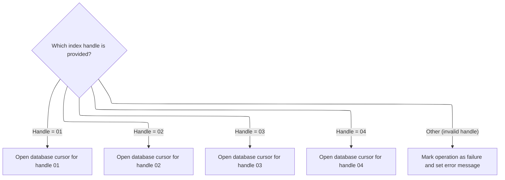
```mermaid
%%{init: {"flowchart": {"defaultRenderer": "elk"}} }%%
flowchart TD
    node1{"Which index handle is provided?"}
    click node1 openCode "base/src/NNNS0473.cbl:328:349"
    node1 -->|"Handle = 01"| node2["Open database cursor for handle 01"]
    click node2 openCode "base/src/NNNS0473.cbl:329:332"
    node1 -->|"Handle = 02"| node3["Open database cursor for handle 02"]
    click node3 openCode "base/src/NNNS0473.cbl:333:336"
    node1 -->|"Handle = 03"| node4["Open database cursor for handle 03"]
    click node4 openCode "base/src/NNNS0473.cbl:337:340"
    node1 -->|"Handle = 04"| node5["Open database cursor for handle 04"]
    click node5 openCode "base/src/NNNS0473.cbl:341:344"
    node1 -->|"Other (invalid handle)"| node6["Mark operation as failure and set error message"]
    click node6 openCode "base/src/NNNS0473.cbl:345:348"
classDef HeadingStyle fill:#777777,stroke:#333,stroke-width:2px;

%% Swimm:
%% %%{init: {"flowchart": {"defaultRenderer": "elk"}} }%%
%% flowchart TD
%%     node1{"Which index handle is provided?"}
%%     click node1 openCode "<SwmPath>[base/src/NNNS0473.cbl](base/src/NNNS0473.cbl)</SwmPath>:328:349"
%%     node1 -->|"Handle = 01"| node2["Open database cursor for handle 01"]
%%     click node2 openCode "<SwmPath>[base/src/NNNS0473.cbl](base/src/NNNS0473.cbl)</SwmPath>:329:332"
%%     node1 -->|"Handle = 02"| node3["Open database cursor for handle 02"]
%%     click node3 openCode "<SwmPath>[base/src/NNNS0473.cbl](base/src/NNNS0473.cbl)</SwmPath>:333:336"
%%     node1 -->|"Handle = 03"| node4["Open database cursor for handle 03"]
%%     click node4 openCode "<SwmPath>[base/src/NNNS0473.cbl](base/src/NNNS0473.cbl)</SwmPath>:337:340"
%%     node1 -->|"Handle = 04"| node5["Open database cursor for handle 04"]
%%     click node5 openCode "<SwmPath>[base/src/NNNS0473.cbl](base/src/NNNS0473.cbl)</SwmPath>:341:344"
%%     node1 -->|"Other (invalid handle)"| node6["Mark operation as failure and set error message"]
%%     click node6 openCode "<SwmPath>[base/src/NNNS0473.cbl](base/src/NNNS0473.cbl)</SwmPath>:345:348"
%% classDef HeadingStyle fill:#777777,stroke:#333,stroke-width:2px;
```

This section governs the logic for opening a database cursor based on a provided index handle. It ensures only valid handles are accepted and provides clear error feedback for invalid requests.

| Category        | Rule Name                   | Description                                                                                                                                          |
| --------------- | --------------------------- | ---------------------------------------------------------------------------------------------------------------------------------------------------- |
| Data validation | Valid handle requirement    | Only index handles with values 01, 02, 03, or 04 are considered valid for opening a database cursor. Any other value is treated as invalid.          |
| Data validation | Consistent output structure | The output structure must always include a return code (SUCCESS or FAILURE) and an appropriate message text, regardless of the outcome.              |
| Business logic  | Cursor open success         | If the provided index handle matches one of the valid values, the corresponding database cursor is opened and the operation is marked as successful. |

<SwmSnippet path="/base/src/NNNS0473.cbl" line="327">

---

In <SwmToken path="base/src/NNNS0473.cbl" pos="327:2:8" line-data="033600 1000-EXIT-OPEN-CURSOR.                                           00033600">`1000-EXIT-OPEN-CURSOR`</SwmToken>, we check the cursor ID and open the matching SQL cursor (one of four possible). If the ID isn't valid, we set a failure flag and write an error message. The cursor IDs are hardcoded constants from the index info struct.

```cobol
033600 1000-EXIT-OPEN-CURSOR.                                           00033600
033700     EVALUATE TRUE                                                00033700
033800       WHEN DDDXCZ01                                              00033800
033900         EXEC SQL                                                 00033900
034000           OPEN DDDXCZ01                                          00034000
034100         END-EXEC                                                 00034100
034200       WHEN DDDXCZ02                                              00034200
034300         EXEC SQL                                                 00034300
034400           OPEN DDDXCZ02                                          00034400
034500         END-EXEC                                                 00034500
034600       WHEN DDDXCZ03                                              00034600
034700         EXEC SQL                                                 00034700
034800           OPEN DDDXCZ03                                          00034800
034900         END-EXEC                                                 00034900
035000       WHEN DDDXCZ04                                              00035000
035100         EXEC SQL                                                 00035100
035200           OPEN DDDXCZ04                                          00035200
035300         END-EXEC                                                 00035300
```

---

</SwmSnippet>

<SwmSnippet path="/base/src/NNNS0473.cbl" line="345">

---

If the cursor ID is invalid, we set FAILURE to TRUE and write an error message to the output structure. The caller gets this status and knows the open failed.

```cobol
035400       WHEN OTHER                                                 00035400
035500         SET FAILURE TO TRUE                                      00035500
035600         MOVE 'NNNS0473 - Invalid open cursor ID.'                00035600
035700           TO IS-RTRN-MSG-TXT OF XXXN001A                         00035700
035800     END-EVALUATE                                                 00035800
```

---

</SwmSnippet>

## Close Database Cursor

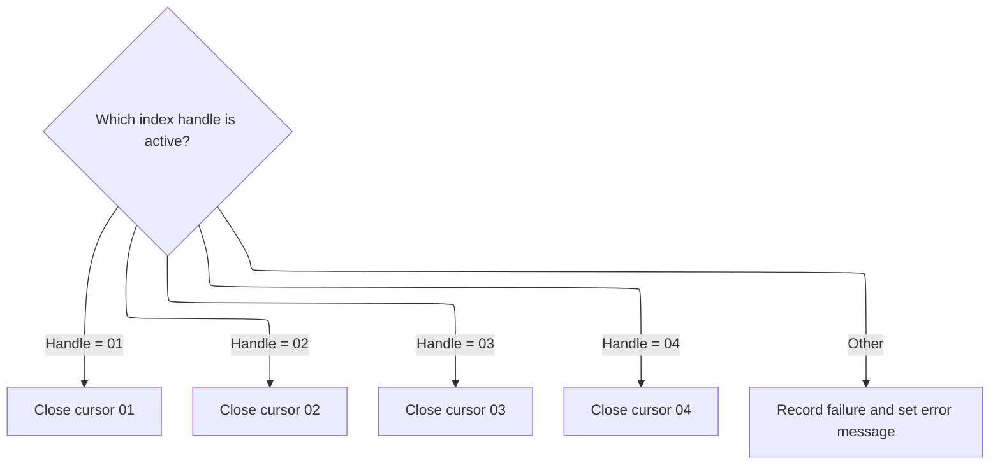
```mermaid
%%{init: {"flowchart": {"defaultRenderer": "elk"}} }%%
flowchart TD
    node1{"Which index handle is active?"}
    click node1 openCode "base/src/NNNS0473.cbl:353:375"
    node1 -->|"Handle = 01"| node2["Close cursor 01"]
    click node2 openCode "base/src/NNNS0473.cbl:355:358"
    node1 -->|"Handle = 02"| node3["Close cursor 02"]
    click node3 openCode "base/src/NNNS0473.cbl:359:362"
    node1 -->|"Handle = 03"| node4["Close cursor 03"]
    click node4 openCode "base/src/NNNS0473.cbl:363:366"
    node1 -->|"Handle = 04"| node5["Close cursor 04"]
    click node5 openCode "base/src/NNNS0473.cbl:367:370"
    node1 -->|"Other"| node6["Record failure and set error message"]
    click node6 openCode "base/src/NNNS0473.cbl:371:374"
classDef HeadingStyle fill:#777777,stroke:#333,stroke-width:2px;

%% Swimm:
%% %%{init: {"flowchart": {"defaultRenderer": "elk"}} }%%
%% flowchart TD
%%     node1{"Which index handle is active?"}
%%     click node1 openCode "<SwmPath>[base/src/NNNS0473.cbl](base/src/NNNS0473.cbl)</SwmPath>:353:375"
%%     node1 -->|"Handle = 01"| node2["Close cursor 01"]
%%     click node2 openCode "<SwmPath>[base/src/NNNS0473.cbl](base/src/NNNS0473.cbl)</SwmPath>:355:358"
%%     node1 -->|"Handle = 02"| node3["Close cursor 02"]
%%     click node3 openCode "<SwmPath>[base/src/NNNS0473.cbl](base/src/NNNS0473.cbl)</SwmPath>:359:362"
%%     node1 -->|"Handle = 03"| node4["Close cursor 03"]
%%     click node4 openCode "<SwmPath>[base/src/NNNS0473.cbl](base/src/NNNS0473.cbl)</SwmPath>:363:366"
%%     node1 -->|"Handle = 04"| node5["Close cursor 04"]
%%     click node5 openCode "<SwmPath>[base/src/NNNS0473.cbl](base/src/NNNS0473.cbl)</SwmPath>:367:370"
%%     node1 -->|"Other"| node6["Record failure and set error message"]
%%     click node6 openCode "<SwmPath>[base/src/NNNS0473.cbl](base/src/NNNS0473.cbl)</SwmPath>:371:374"
%% classDef HeadingStyle fill:#777777,stroke:#333,stroke-width:2px;
```

This section is responsible for closing a database cursor based on a provided index handle. It ensures that only valid, predefined cursor handles can be closed, and provides clear feedback if an invalid handle is supplied.

| Category        | Rule Name                | Description                                                                                                                                 |
| --------------- | ------------------------ | ------------------------------------------------------------------------------------------------------------------------------------------- |
| Data validation | Valid handle enforcement | Only index handles with values 01, 02, 03, or 04 are considered valid for closing a database cursor. Any other value is treated as invalid. |
| Business logic  | Successful cursor close  | When a valid handle is provided, the corresponding database cursor must be closed, and no error message should be returned.                 |

<SwmSnippet path="/base/src/NNNS0473.cbl" line="353">

---

In <SwmToken path="base/src/NNNS0473.cbl" pos="353:2:8" line-data="036200 1100-EXIT-CLOSE-CURSOR.                                          00036200">`1100-EXIT-CLOSE-CURSOR`</SwmToken>, we check the cursor ID and close the matching SQL cursor (one of four possible). If the ID isn't valid, we set a failure flag and write an error message. The cursor IDs are hardcoded constants from the index info struct.

```cobol
036200 1100-EXIT-CLOSE-CURSOR.                                          00036200
036300     EVALUATE TRUE                                                00036300
036400       WHEN DDDXCZ01                                              00036400
036500         EXEC SQL                                                 00036500
036600           CLOSE DDDXCZ01                                         00036600
036700         END-EXEC                                                 00036700
036800       WHEN DDDXCZ02                                              00036800
036900         EXEC SQL                                                 00036900
037000           CLOSE DDDXCZ02                                         00037000
037100         END-EXEC                                                 00037100
037200       WHEN DDDXCZ03                                              00037200
037300         EXEC SQL                                                 00037300
037400           CLOSE DDDXCZ03                                         00037400
037500         END-EXEC                                                 00037500
037600       WHEN DDDXCZ04                                              00037600
037700         EXEC SQL                                                 00037700
037800           CLOSE DDDXCZ04                                         00037800
037900         END-EXEC                                                 00037900
```

---

</SwmSnippet>

<SwmSnippet path="/base/src/NNNS0473.cbl" line="371">

---

If the cursor ID is invalid, we set FAILURE to TRUE and write an error message to the output structure. The caller gets this status and knows the close failed.

```cobol
038000       WHEN OTHER                                                 00038000
038100         SET FAILURE TO TRUE                                      00038100
038200         MOVE 'NNNS0473 - Invalid close cursor ID.'               00038200
038300           TO IS-RTRN-MSG-TXT OF XXXN001A                         00038300
038400     END-EVALUATE                                                 00038400
```

---

</SwmSnippet>

## Fetch Unique Table Row

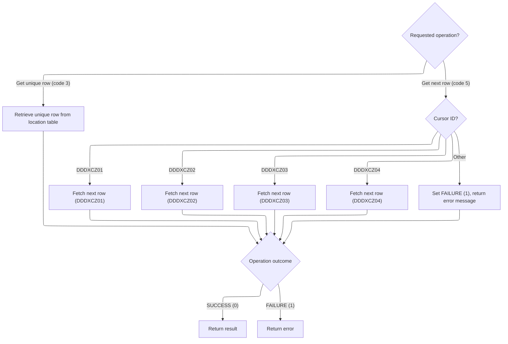
```mermaid
%%{init: {"flowchart": {"defaultRenderer": "elk"}} }%%
flowchart TD
    node1{"Requested operation?"}
    click node1 openCode "base/src/NNNS0473.cbl:379:397"
    node1 -->|"Get unique row (code 3)"| node2["Retrieve unique row from location table"]
    click node2 openCode "base/src/NNNS0473.cbl:379:395"
    node1 -->|"Get next row (code 5)"| node3{"Cursor ID?"}
    click node3 openCode "base/src/NNNS0473.cbl:401:415"
    node3 -->|DDDXCZ01| node4["Fetch next row (DDDXCZ01)"]
    click node4 openCode "base/src/NNNS0473.cbl:404:404"
    node3 -->|DDDXCZ02| node5["Fetch next row (DDDXCZ02)"]
    click node5 openCode "base/src/NNNS0473.cbl:406:406"
    node3 -->|DDDXCZ03| node6["Fetch next row (DDDXCZ03)"]
    click node6 openCode "base/src/NNNS0473.cbl:408:408"
    node3 -->|DDDXCZ04| node7["Fetch next row (DDDXCZ04)"]
    click node7 openCode "base/src/NNNS0473.cbl:410:410"
    node3 -->|"Other"| node8["Set FAILURE (1), return error message"]
    click node8 openCode "base/src/NNNS0473.cbl:412:414"
    node2 --> node9["Check for missing data"]
    click node9 openCode "base/src/NNNS0473.cbl:397:397"
    node4 --> node9
    node5 --> node9
    node6 --> node9
    node7 --> node9
    node8 --> node9
    node9{"Operation outcome"}
    click node9 openCode "base/src/NNNS0473.cbl:397:397"
    node9 -->|"SUCCESS (0)"| node10["Return result"]
    click node10 openCode "base/src/NNNS0473.cbl:397:397"
    node9 -->|"FAILURE (1)"| node11["Return error"]
    click node11 openCode "base/src/NNNS0473.cbl:412:414"

classDef HeadingStyle fill:#777777,stroke:#333,stroke-width:2px;

%% Swimm:
%% %%{init: {"flowchart": {"defaultRenderer": "elk"}} }%%
%% flowchart TD
%%     node1{"Requested operation?"}
%%     click node1 openCode "<SwmPath>[base/src/NNNS0473.cbl](base/src/NNNS0473.cbl)</SwmPath>:379:397"
%%     node1 -->|"Get unique row (code 3)"| node2["Retrieve unique row from location table"]
%%     click node2 openCode "<SwmPath>[base/src/NNNS0473.cbl](base/src/NNNS0473.cbl)</SwmPath>:379:395"
%%     node1 -->|"Get next row (code 5)"| node3{"Cursor ID?"}
%%     click node3 openCode "<SwmPath>[base/src/NNNS0473.cbl](base/src/NNNS0473.cbl)</SwmPath>:401:415"
%%     node3 -->|<SwmToken path="base/src/NNNS0473.cbl" pos="329:4:4" line-data="033800       WHEN DDDXCZ01                                              00033800">`DDDXCZ01`</SwmToken>| node4["Fetch next row (<SwmToken path="base/src/NNNS0473.cbl" pos="329:4:4" line-data="033800       WHEN DDDXCZ01                                              00033800">`DDDXCZ01`</SwmToken>)"]
%%     click node4 openCode "<SwmPath>[base/src/NNNS0473.cbl](base/src/NNNS0473.cbl)</SwmPath>:404:404"
%%     node3 -->|<SwmToken path="base/src/NNNS0473.cbl" pos="333:4:4" line-data="034200       WHEN DDDXCZ02                                              00034200">`DDDXCZ02`</SwmToken>| node5["Fetch next row (<SwmToken path="base/src/NNNS0473.cbl" pos="333:4:4" line-data="034200       WHEN DDDXCZ02                                              00034200">`DDDXCZ02`</SwmToken>)"]
%%     click node5 openCode "<SwmPath>[base/src/NNNS0473.cbl](base/src/NNNS0473.cbl)</SwmPath>:406:406"
%%     node3 -->|<SwmToken path="base/src/NNNS0473.cbl" pos="337:4:4" line-data="034600       WHEN DDDXCZ03                                              00034600">`DDDXCZ03`</SwmToken>| node6["Fetch next row (<SwmToken path="base/src/NNNS0473.cbl" pos="337:4:4" line-data="034600       WHEN DDDXCZ03                                              00034600">`DDDXCZ03`</SwmToken>)"]
%%     click node6 openCode "<SwmPath>[base/src/NNNS0473.cbl](base/src/NNNS0473.cbl)</SwmPath>:408:408"
%%     node3 -->|<SwmToken path="base/src/NNNS0473.cbl" pos="341:4:4" line-data="035000       WHEN DDDXCZ04                                              00035000">`DDDXCZ04`</SwmToken>| node7["Fetch next row (<SwmToken path="base/src/NNNS0473.cbl" pos="341:4:4" line-data="035000       WHEN DDDXCZ04                                              00035000">`DDDXCZ04`</SwmToken>)"]
%%     click node7 openCode "<SwmPath>[base/src/NNNS0473.cbl](base/src/NNNS0473.cbl)</SwmPath>:410:410"
%%     node3 -->|"Other"| node8["Set FAILURE (1), return error message"]
%%     click node8 openCode "<SwmPath>[base/src/NNNS0473.cbl](base/src/NNNS0473.cbl)</SwmPath>:412:414"
%%     node2 --> node9["Check for missing data"]
%%     click node9 openCode "<SwmPath>[base/src/NNNS0473.cbl](base/src/NNNS0473.cbl)</SwmPath>:397:397"
%%     node4 --> node9
%%     node5 --> node9
%%     node6 --> node9
%%     node7 --> node9
%%     node8 --> node9
%%     node9{"Operation outcome"}
%%     click node9 openCode "<SwmPath>[base/src/NNNS0473.cbl](base/src/NNNS0473.cbl)</SwmPath>:397:397"
%%     node9 -->|"SUCCESS (0)"| node10["Return result"]
%%     click node10 openCode "<SwmPath>[base/src/NNNS0473.cbl](base/src/NNNS0473.cbl)</SwmPath>:397:397"
%%     node9 -->|"FAILURE (1)"| node11["Return error"]
%%     click node11 openCode "<SwmPath>[base/src/NNNS0473.cbl](base/src/NNNS0473.cbl)</SwmPath>:412:414"
%% 
%% classDef HeadingStyle fill:#777777,stroke:#333,stroke-width:2px;
```

<SwmSnippet path="/base/src/NNNS0473.cbl" line="379">

---

<SwmToken path="base/src/NNNS0473.cbl" pos="211:4:12" line-data="022000          PERFORM 1300-EXIT-GET-NEXT-ROW                          00022000">`1300-EXIT-GET-NEXT-ROW`</SwmToken> checks the cursor ID and calls the right fetch routine for that cursor. If the ID isn't valid, it flags an error and writes a message. After fetching, it checks for nulls in the result.

```cobol
038800 1200-EXIT-GET-UNIQUE-ROW.                                        00038800
038900     EXEC SQL                                                     00038900
039000         SELECT LOC_TYP_CD,                                       00039000
039100                LOC_NBR,                                          00039100
039200                ITM_CLS_CD,                                       00039200
039300                AD_ZONE,                                          00039300
039400                AD_ZONE_EXCP                                      00039400
039500         INTO   :DCLXXXL-LOC-CLS-AD-ZN.LOC-TYP-CD,                00039500
039600                :DCLXXXL-LOC-CLS-AD-ZN.LOC-NBR,                   00039600
039700                :DCLXXXL-LOC-CLS-AD-ZN.ITM-CLS-CD,                00039700
039800                :DCLXXXL-LOC-CLS-AD-ZN.AD-ZONE,                   00039800
039900                :DCLXXXL-LOC-CLS-AD-ZN.AD-ZONE-EXCP               00039900
040000         FROM   XXXL_LOC_CLS_AD_ZN                                00040000
040100         WHERE  LOC_TYP_CD = :DCLXXXL-LOC-CLS-AD-ZN.LOC-TYP-CD    00040100
040200         AND    LOC_NBR = :DCLXXXL-LOC-CLS-AD-ZN.LOC-NBR          00040200
040300         AND    ITM_CLS_CD = :DCLXXXL-LOC-CLS-AD-ZN.ITM-CLS-CD    00040300
040400     END-EXEC                                                     00040400
040500                                                                  00040500
040600     PERFORM 1700-CHECK-NULL-COLUMNS                              00040600
```

---

</SwmSnippet>

<SwmSnippet path="/base/src/NNNS0473.cbl" line="401">

---

<SwmToken path="base/src/NNNS0473.cbl" pos="401:2:10" line-data="041000 1300-EXIT-GET-NEXT-ROW.                                          00041000">`1300-EXIT-GET-NEXT-ROW`</SwmToken> checks the cursor ID and dispatches to the right fetch routine for that cursor. If the ID isn't valid, it flags an error and writes a message. After fetching, it checks for nulls in the result.

```cobol
041000 1300-EXIT-GET-NEXT-ROW.                                          00041000
041100     EVALUATE TRUE                                                00041100
041200       WHEN DDDXCZ01                                              00041200
041300         PERFORM 1301-FETCH-DDDXCZ01                              00041300
041400       WHEN DDDXCZ02                                              00041400
041500         PERFORM 1302-FETCH-DDDXCZ02                              00041500
041600       WHEN DDDXCZ03                                              00041600
041700         PERFORM 1303-FETCH-DDDXCZ03                              00041700
041800       WHEN DDDXCZ04                                              00041800
041900         PERFORM 1304-FETCH-DDDXCZ04                              00041900
042000       WHEN OTHER                                                 00042000
042100         SET FAILURE TO TRUE                                      00042100
042200         MOVE 'NNNS0473 - Invalid fetch cursor ID.'               00042200
042300           TO IS-RTRN-MSG-TXT OF XXXN001A                         00042300
042400     END-EVALUATE                                                 00042400
042500                                                                  00042500
042600     PERFORM 1700-CHECK-NULL-COLUMNS                              00042600
```

---

</SwmSnippet>

## Modify Table Row

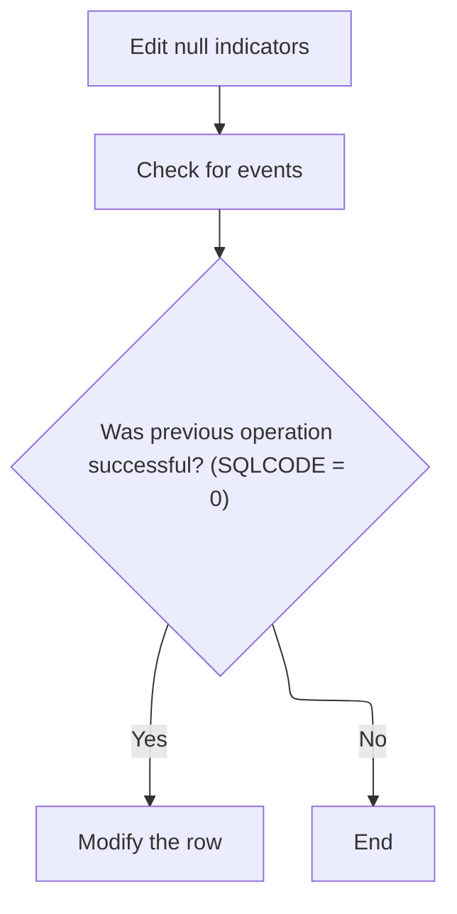
```mermaid
%%{init: {"flowchart": {"defaultRenderer": "elk"}} }%%
flowchart TD
    node1["Edit null indicators"]
    click node1 openCode "base/src/NNNS0473.cbl:470:470"
    node1 --> node2["Check for events"]
    click node2 openCode "base/src/NNNS0473.cbl:471:471"
    node2 --> node3{"Was previous operation successful? (SQLCODE = 0)"}
    click node3 openCode "base/src/NNNS0473.cbl:472:472"
    node3 -->|"Yes"| node4["Modify the row"]
    click node4 openCode "base/src/NNNS0473.cbl:473:473"
    node3 -->|"No"| node5["End"]
    click node5 openCode "base/src/NNNS0473.cbl:474:474"
classDef HeadingStyle fill:#777777,stroke:#333,stroke-width:2px;

%% Swimm:
%% %%{init: {"flowchart": {"defaultRenderer": "elk"}} }%%
%% flowchart TD
%%     node1["Edit null indicators"]
%%     click node1 openCode "<SwmPath>[base/src/NNNS0473.cbl](base/src/NNNS0473.cbl)</SwmPath>:470:470"
%%     node1 --> node2["Check for events"]
%%     click node2 openCode "<SwmPath>[base/src/NNNS0473.cbl](base/src/NNNS0473.cbl)</SwmPath>:471:471"
%%     node2 --> node3{"Was previous operation successful? (SQLCODE = 0)"}
%%     click node3 openCode "<SwmPath>[base/src/NNNS0473.cbl](base/src/NNNS0473.cbl)</SwmPath>:472:472"
%%     node3 -->|"Yes"| node4["Modify the row"]
%%     click node4 openCode "<SwmPath>[base/src/NNNS0473.cbl](base/src/NNNS0473.cbl)</SwmPath>:473:473"
%%     node3 -->|"No"| node5["End"]
%%     click node5 openCode "<SwmPath>[base/src/NNNS0473.cbl](base/src/NNNS0473.cbl)</SwmPath>:474:474"
%% classDef HeadingStyle fill:#777777,stroke:#333,stroke-width:2px;
```

This section ensures that a table row is only modified when all validation steps are passed and the database is in a consistent state. It prevents updates in the event of errors or failed checks, maintaining data integrity.

| Category        | Rule Name                      | Description                                                                                                                                                                              |
| --------------- | ------------------------------ | ---------------------------------------------------------------------------------------------------------------------------------------------------------------------------------------- |
| Data validation | Edit Null Indicators First     | Null indicators must be edited before any attempt to modify the database row. This ensures that all nullable fields are correctly flagged prior to update.                               |
| Data validation | Check for Events Before Update | All relevant events must be checked before proceeding with the row modification. This ensures that any business or system events that could affect the update are handled appropriately. |
| Business logic  | Update Only on Success         | The row modification is only performed if the previous database operation was successful, as indicated by SQLCODE = 0. No update is attempted if there was an error.                     |

<SwmSnippet path="/base/src/NNNS0473.cbl" line="469">

---

After the checks in <SwmToken path="base/src/NNNS0473.cbl" pos="469:2:10" line-data="047800 1400-EXIT-PUT-MODIFY-ROW.                                        00047800">`1400-EXIT-PUT-MODIFY-ROW`</SwmToken>, we only call <SwmToken path="base/src/NNNS0473.cbl" pos="473:4:10" line-data="048200       PERFORM 1420-D0-MODIFY-ROW                                 00048200">`1420-D0-MODIFY-ROW`</SwmToken> if SQLCODE is 0. That means everything is valid and we're clear to update the DB row.

```cobol
047800 1400-EXIT-PUT-MODIFY-ROW.                                        00047800
047900     PERFORM 1800-EDIT-NULL-INDICATORS                            00047900
048000     PERFORM 1410-CHECK-FOR-EVENTS                                00048000
```

---

</SwmSnippet>

<SwmSnippet path="/base/src/NNNS0473.cbl" line="472">

---

After the checks in <SwmToken path="base/src/NNNS0473.cbl" pos="213:4:12" line-data="022200          PERFORM 1400-EXIT-PUT-MODIFY-ROW                        00022200">`1400-EXIT-PUT-MODIFY-ROW`</SwmToken>, we only call <SwmToken path="base/src/NNNS0473.cbl" pos="473:4:10" line-data="048200       PERFORM 1420-D0-MODIFY-ROW                                 00048200">`1420-D0-MODIFY-ROW`</SwmToken> if SQLCODE is 0. That means everything is valid and we're clear to update the DB row.

```cobol
048100     IF SQLCODE = 0                                               00048100
048200       PERFORM 1420-D0-MODIFY-ROW                                 00048200
048300     END-IF                                                       00048300
```

---

</SwmSnippet>

## Apply Row Update

This section is responsible for applying updates to a database row, ensuring that the correct operation is performed based on the input codes and that any additional business logic, such as denormalization, is handled appropriately.

| Category        | Rule Name                   | Description                                                                                                                                          |
| --------------- | --------------------------- | ---------------------------------------------------------------------------------------------------------------------------------------------------- |
| Data validation | Update action validation    | A row update operation must only be performed when the action code is set to 'U' (update) in the input data.                                         |
| Business logic  | Apply requested changes     | The update routine must apply all changes to the database row as specified in the input data, ensuring the row reflects the requested modifications. |
| Business logic  | Denormalization enforcement | If denormalization is required for the updated row, the routine must perform all necessary denormalization steps to maintain data integrity.         |
| Business logic  | Checkpoint increment        | The update operation must increment the checkpoint counter to track the number of successful updates performed.                                      |

<SwmSnippet path="/base/src/NNNS0473.cbl" line="483">

---

In <SwmToken path="base/src/NNNS0473.cbl" pos="483:2:8" line-data="049200 1420-D0-MODIFY-ROW.                                              00049200">`1420-D0-MODIFY-ROW`</SwmToken>, we call <SwmToken path="base/src/NNNS0473.cbl" pos="484:4:12" line-data="050900     PERFORM 5000-CALL-NNNS0473-CUD-ROUTINE                       00050900">`5000-CALL-NNNS0473-CUD-ROUTINE`</SwmToken> to actually update the DB row. This routine does the heavy lifting—applying the update and handling any extra logic like denormalization.

```cobol
049200 1420-D0-MODIFY-ROW.                                              00049200
050900     PERFORM 5000-CALL-NNNS0473-CUD-ROUTINE                       00050900
```

---

</SwmSnippet>

### Handing Off Row Updates to Oracle Logic

This section is responsible for handing off row update operations to a dedicated Oracle logic routine, ensuring that all required data and context are provided for the update, and that the main program remains clean and focused on flow control.

| Category        | Rule Name                       | Description                                                                                                                              |
| --------------- | ------------------------------- | ---------------------------------------------------------------------------------------------------------------------------------------- |
| Data validation | Complete Context Provision      | All required context and data structures must be provided to the Oracle update routine to ensure the row update is performed accurately. |
| Business logic  | Delegated Update Responsibility | The main program must delegate the row update operation to the specialized Oracle routine, rather than handling the update directly.     |
| Business logic  | Oracle Routine Update Execution | The Oracle update routine must process the update using the provided data and context, ensuring the database row is updated as intended. |

<SwmSnippet path="/base/src/NNNS0473.cbl" line="639">

---

<SwmToken path="base/src/NNNS0473.cbl" pos="639:2:10" line-data="066400 5000-CALL-NNNS0473-CUD-ROUTINE.                                  00066400">`5000-CALL-NNNS0473-CUD-ROUTINE`</SwmToken> just delegates the actual update to <SwmToken path="base/src/NNNS0473.cbl" pos="640:4:8" line-data="066410     CALL NNNU0473-ORACLE-UPDATE USING                            00066410">`NNNU0473-ORACLE-UPDATE`</SwmToken>, passing all the context and data structures needed for the DB operation. This keeps the update logic out of the main program and lets the specialized routine handle all the Oracle-specific SQL work. We call <SwmPath>[base/src/NNNU0473.cbl](base/src/NNNU0473.cbl)</SwmPath> here because that's where the real update happens, and it keeps the main code clean and focused on flow control.

```cobol
066400 5000-CALL-NNNS0473-CUD-ROUTINE.                                  00066400
066410     CALL NNNU0473-ORACLE-UPDATE USING                            00066410
066420          XXXN001A                                                00066420
066430          SQLCA                                                   00066430
066440          YYYN005A                                                00066440
066450          NNNN0000-PARMS                                          00066450
066460          DDDTCZ01                                                00066460
066470     .                                                            00066470
```

---

</SwmSnippet>

### Routing Row Operations and Handling Deletes

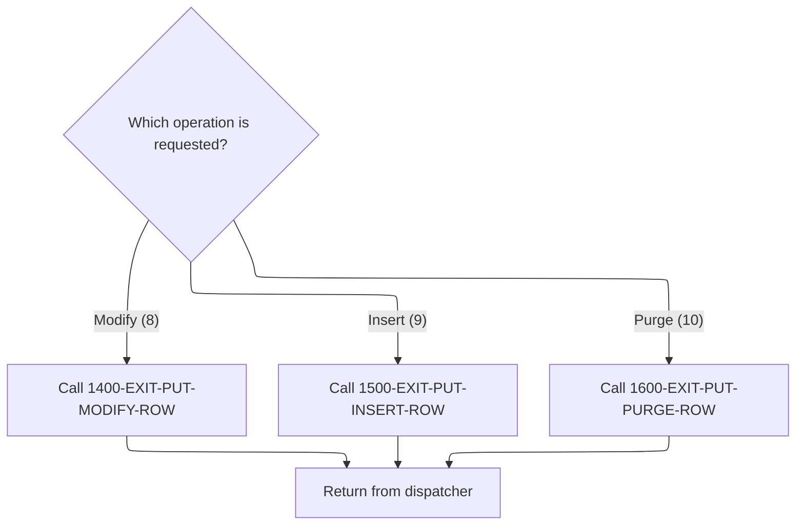
```mermaid
%%{init: {"flowchart": {"defaultRenderer": "elk"}} }%%
flowchart TD
    node1{"Which operation is requested?"}
    click node1 openCode "base/src/NNNU0473.cbl:49:56"
    node1 -->|"Modify (8)"| node2["Call 1400-EXIT-PUT-MODIFY-ROW"]
    click node2 openCode "base/src/NNNU0473.cbl:51:51"
    node1 -->|"Insert (9)"| node3["Call 1500-EXIT-PUT-INSERT-ROW"]
    click node3 openCode "base/src/NNNU0473.cbl:53:53"
    node1 -->|"Purge (10)"| node4["Call 1600-EXIT-PUT-PURGE-ROW"]
    click node4 openCode "base/src/NNNU0473.cbl:55:55"
    node2 --> node5["Return from dispatcher"]
    node3 --> node5
    node4 --> node5
    click node5 openCode "base/src/NNNU0473.cbl:57:57"

classDef HeadingStyle fill:#777777,stroke:#333,stroke-width:2px;

%% Swimm:
%% %%{init: {"flowchart": {"defaultRenderer": "elk"}} }%%
%% flowchart TD
%%     node1{"Which operation is requested?"}
%%     click node1 openCode "<SwmPath>[base/src/NNNU0473.cbl](base/src/NNNU0473.cbl)</SwmPath>:49:56"
%%     node1 -->|"Modify (8)"| node2["Call <SwmToken path="base/src/NNNS0473.cbl" pos="213:4:12" line-data="022200          PERFORM 1400-EXIT-PUT-MODIFY-ROW                        00022200">`1400-EXIT-PUT-MODIFY-ROW`</SwmToken>"]
%%     click node2 openCode "<SwmPath>[base/src/NNNU0473.cbl](base/src/NNNU0473.cbl)</SwmPath>:51:51"
%%     node1 -->|"Insert (9)"| node3["Call <SwmToken path="base/src/NNNS0473.cbl" pos="215:4:12" line-data="022400          PERFORM 1500-EXIT-PUT-INSERT-ROW                        00022400">`1500-EXIT-PUT-INSERT-ROW`</SwmToken>"]
%%     click node3 openCode "<SwmPath>[base/src/NNNU0473.cbl](base/src/NNNU0473.cbl)</SwmPath>:53:53"
%%     node1 -->|"Purge (10)"| node4["Call <SwmToken path="base/src/NNNS0473.cbl" pos="217:4:12" line-data="022600          PERFORM 1600-EXIT-PUT-PURGE-ROW                         00022600">`1600-EXIT-PUT-PURGE-ROW`</SwmToken>"]
%%     click node4 openCode "<SwmPath>[base/src/NNNU0473.cbl](base/src/NNNU0473.cbl)</SwmPath>:55:55"
%%     node2 --> node5["Return from dispatcher"]
%%     node3 --> node5
%%     node4 --> node5
%%     click node5 openCode "<SwmPath>[base/src/NNNU0473.cbl](base/src/NNNU0473.cbl)</SwmPath>:57:57"
%% 
%% classDef HeadingStyle fill:#777777,stroke:#333,stroke-width:2px;
```

This section routes row-level database operations based on the operation code provided. It ensures that the correct handler is called for modify, insert, or purge (delete) actions, and that deletes are performed using all three key fields to uniquely identify the row.

| Category        | Rule Name                    | Description                                                                                                                                                                                                                                                                                                                                                                                                                                                                                                                                                                                                                                                            |
| --------------- | ---------------------------- | ---------------------------------------------------------------------------------------------------------------------------------------------------------------------------------------------------------------------------------------------------------------------------------------------------------------------------------------------------------------------------------------------------------------------------------------------------------------------------------------------------------------------------------------------------------------------------------------------------------------------------------------------------------------------- |
| Data validation | Delete key match requirement | Delete operations must only affect rows where all three key fields match the input exactly; partial matches are not permitted.                                                                                                                                                                                                                                                                                                                                                                                                                                                                                                                                         |
| Business logic  | Modify operation routing     | If the operation code is 8, the system must perform a modify operation on the target row.                                                                                                                                                                                                                                                                                                                                                                                                                                                                                                                                                                              |
| Business logic  | Insert operation routing     | If the operation code is 9, the system must perform an insert operation for a new row.                                                                                                                                                                                                                                                                                                                                                                                                                                                                                                                                                                                 |
| Business logic  | Delete operation routing     | If the operation code is 10, the system must perform a purge (delete) operation, removing the row that matches all three key fields: <SwmToken path="base/src/NNNS0473.cbl" pos="381:4:4" line-data="039000         SELECT LOC_TYP_CD,                                       00039000">`LOC_TYP_CD`</SwmToken>, <SwmToken path="base/src/NNNS0473.cbl" pos="382:2:2" line-data="039100                LOC_NBR,                                          00039100">`LOC_NBR`</SwmToken>, and <SwmToken path="base/src/NNNS0473.cbl" pos="383:2:2" line-data="039200                ITM_CLS_CD,                                       00039200">`ITM_CLS_CD`</SwmToken>. |

<SwmSnippet path="/base/src/NNNU0473.cbl" line="44">

---

<SwmToken path="base/src/NNNU0473.cbl" pos="44:2:6" line-data="004800 0000-EXIT-DISPATCHER.                                            00480000">`0000-EXIT-DISPATCHER`</SwmToken> in <SwmPath>[base/src/NNNU0473.cbl](base/src/NNNU0473.cbl)</SwmPath> is the main router for row-level operations. It checks the operation code and jumps to the right handler for modify, insert, or purge. For deletes, it calls <SwmToken path="base/src/NNNU0473.cbl" pos="51:4:12" line-data="005500          PERFORM 1600-EXIT-PUT-PURGE-ROW                         00550000">`1600-EXIT-PUT-PURGE-ROW`</SwmToken>, which runs a SQL DELETE on the table using the key fields from the input structure. This keeps each DB action isolated and easy to follow.

```cobol
004800 0000-EXIT-DISPATCHER.                                            00480000
004900      EVALUATE TRUE                                               00490000
005000       WHEN EXIT-PUT-MODIFY-ROW                                   00500000
005100          PERFORM 1400-EXIT-PUT-MODIFY-ROW                        00510000
005200       WHEN EXIT-PUT-INSERT-ROW                                   00520000
005300          PERFORM 1500-EXIT-PUT-INSERT-ROW                        00530000
005400       WHEN EXIT-PUT-PURGE-ROW                                    00540000
005500          PERFORM 1600-EXIT-PUT-PURGE-ROW                         00550000
005600      END-EVALUATE                                                00560000
005700     GOBACK                                                       00570000
005800     .                                                            00580000
```

---

</SwmSnippet>

<SwmSnippet path="/base/src/NNNU0473.cbl" line="104">

---

<SwmToken path="base/src/NNNU0473.cbl" pos="104:2:10" line-data="008200 1600-EXIT-PUT-PURGE-ROW.                                         00820000">`1600-EXIT-PUT-PURGE-ROW`</SwmToken> runs a SQL DELETE on <SwmToken path="base/src/NNNU0473.cbl" pos="106:6:6" line-data="051400         DELETE FROM XXXX_LOC_CLS_AD_ZN                           00051400">`XXXX_LOC_CLS_AD_ZN`</SwmToken>, using <SwmToken path="base/src/NNNU0473.cbl" pos="107:4:4" line-data="051500         WHERE  LOC_TYP_CD = :DCLXXXX-LOC-CLS-AD-ZN.LOC-TYP-CD    00051500">`LOC_TYP_CD`</SwmToken>, <SwmToken path="base/src/NNNU0473.cbl" pos="108:4:4" line-data="051600         AND    LOC_NBR = :DCLXXXX-LOC-CLS-AD-ZN.LOC-NBR          00051600">`LOC_NBR`</SwmToken>, and <SwmToken path="base/src/NNNU0473.cbl" pos="109:4:4" line-data="051700         AND    ITM_CLS_CD = :DCLXXXX-LOC-CLS-AD-ZN.ITM-CLS-CD    00051700">`ITM_CLS_CD`</SwmToken> from the input struct as the WHERE clause. This makes sure only the row matching all three keys gets deleted. It assumes those fields are valid and doesn't do extra validation here.

```cobol
008200 1600-EXIT-PUT-PURGE-ROW.                                         00820000
008300       EXEC SQL                                                   00830000
051400         DELETE FROM XXXX_LOC_CLS_AD_ZN                           00051400
051500         WHERE  LOC_TYP_CD = :DCLXXXX-LOC-CLS-AD-ZN.LOC-TYP-CD    00051500
051600         AND    LOC_NBR = :DCLXXXX-LOC-CLS-AD-ZN.LOC-NBR          00051600
051700         AND    ITM_CLS_CD = :DCLXXXX-LOC-CLS-AD-ZN.ITM-CLS-CD    00051700
008400       END-EXEC                                                   00840000
008500     .                                                            00850000
```

---

</SwmSnippet>

### Post-Update Flags and Denormalization Trigger

<SwmSnippet path="/base/src/NNNS0473.cbl" line="485">

---

After returning from <SwmToken path="base/src/NNNS0473.cbl" pos="484:4:12" line-data="050900     PERFORM 5000-CALL-NNNS0473-CUD-ROUTINE                       00050900">`5000-CALL-NNNS0473-CUD-ROUTINE`</SwmToken>, <SwmToken path="base/src/NNNS0473.cbl" pos="473:4:10" line-data="048200       PERFORM 1420-D0-MODIFY-ROW                                 00048200">`1420-D0-MODIFY-ROW`</SwmToken> checks if the update succeeded (SQLCODE = 0). If so, it sets checkpoint and update flags and then calls <SwmToken path="base/src/NNNS0473.cbl" pos="489:4:8" line-data="051400       PERFORM 2000-DENORM-PROCESS                                00051400">`2000-DENORM-PROCESS`</SwmToken> to handle denormalization and event sync. This keeps the update and denorm/event logic separate.

```cobol
051000     IF SQLCODE = 0                                               00051000
051100       MOVE 1 TO WS-CHECKPOINT-INC                                00051100
051200       SET YYYN110A-UPD TO TRUE                                   00051200
051300       SET LOC-UPD      TO TRUE                                   00051300
051400       PERFORM 2000-DENORM-PROCESS                                00051400
051500     END-IF                                                       00051500
```

---

</SwmSnippet>

## Start Denormalization and Workflow State Fetch


```mermaid
%%{init: {"flowchart": {"defaultRenderer": "elk"}} }%%
flowchart TD
  node1["Start: Set system environment for process"]
  click node1 openCode "base/src/NNNS0473.cbl:540:542"
  node1 --> node2["Fetching Workflow State for Denorm Logic"]
  
  node2 --> node3["Task Routing and Initialization for Workflow State"]
  
  node3 --> node4{"Was control subroutine successful? (SUCCESS = 0)"}
  click node4 openCode "base/src/NNNS0473.cbl:543:543"
  node4 -->|"Yes"| node5{"Is this a normalization task? (WWWC0100-NORM-TASK = '    ')"}
  click node5 openCode "base/src/NNNS0473.cbl:544:544"
  node5 -->|"Yes"| node6["Syncing Location Data Between DB2 and Oracle"]
  
  node6 --> node7["Environment Setup and Store/Class/Zone Validation"]
  
  node7 --> node8["Syncing Legacy and Master Store Records"]
  
  node8 --> node9["Fetching Store Data for Sync"]
  
  node9 --> node10["Translating Data Structure for DAO Fetch"]
  
  node10 --> node11["Fetching Store Record from DAO"]
  
  node11 --> node12["Store DAO Operation Dispatch"]
  
  node12 --> node13["Finalizing Store DAO Transaction"]
  
  node13 --> node14["Switching to DB2 Connection"]
  
  node14 --> node15["DB2 Connection Setup and Error Handling"]
  
  node15 --> node16["Oracle Error Code Conversion"]
  
  node16 --> node17["Formatting and Mapping Oracle Errors"]
  
  node17 --> node18["Updating Store Records in DB2"]
  
  node18 --> node19["Deleting Store Zones and Updating Records"]
  
  node19 --> node20{"Was synchronization successful? (SUCCESS = 0)"}
  click node20 openCode "base/src/NNNS0473.cbl:547:547"
  node20 -->|"Yes"| node21["Issue business events (2030-ISSUE-EVENTS)"]
  click node21 openCode "base/src/NNNS0473.cbl:548:548"
  node20 -->|"No"| node22["Finish process"]
  click node22 openCode "base/src/NNNS0473.cbl:549:549"
  node5 -->|"No"| node22
  node4 -->|"No"| node22
classDef HeadingStyle fill:#777777,stroke:#333,stroke-width:2px;
click node2 goToHeading "Fetching Workflow State for Denorm Logic"
node2:::HeadingStyle
click node3 goToHeading "Task Routing and Initialization for Workflow State"
node3:::HeadingStyle
click node6 goToHeading "Syncing Location Data Between DB2 and Oracle"
node6:::HeadingStyle
click node7 goToHeading "Environment Setup and Store/Class/Zone Validation"
node7:::HeadingStyle
click node8 goToHeading "Syncing Legacy and Master Store Records"
node8:::HeadingStyle
click node9 goToHeading "Fetching Store Data for Sync"
node9:::HeadingStyle
click node10 goToHeading "Translating Data Structure for DAO Fetch"
node10:::HeadingStyle
click node11 goToHeading "Fetching Store Record from DAO"
node11:::HeadingStyle
click node12 goToHeading "Store DAO Operation Dispatch"
node12:::HeadingStyle
click node13 goToHeading "Finalizing Store DAO Transaction"
node13:::HeadingStyle
click node14 goToHeading "Switching to DB2 Connection"
node14:::HeadingStyle
click node15 goToHeading "base/src/NNNS0473.cbl:291 Connection Setup and Error Handling"
node15:::HeadingStyle
click node16 goToHeading "Oracle Error Code Conversion"
node16:::HeadingStyle
click node17 goToHeading "Formatting and Mapping Oracle Errors"
node17:::HeadingStyle
click node18 goToHeading "Updating Store Records in DB2"
node18:::HeadingStyle
click node19 goToHeading "Deleting Store Zones and Updating Records"
node19:::HeadingStyle

%% Swimm:
%% %%{init: {"flowchart": {"defaultRenderer": "elk"}} }%%
%% flowchart TD
%%   node1["Start: Set system environment for process"]
%%   click node1 openCode "<SwmPath>[base/src/NNNS0473.cbl](base/src/NNNS0473.cbl)</SwmPath>:540:542"
%%   node1 --> node2["Fetching Workflow State for Denorm Logic"]
%%   
%%   node2 --> node3["Task Routing and Initialization for Workflow State"]
%%   
%%   node3 --> node4{"Was control subroutine successful? (SUCCESS = 0)"}
%%   click node4 openCode "<SwmPath>[base/src/NNNS0473.cbl](base/src/NNNS0473.cbl)</SwmPath>:543:543"
%%   node4 -->|"Yes"| node5{"Is this a normalization task? (<SwmToken path="base/src/NNNS0473.cbl" pos="544:4:8" line-data="058600     AND WWWC0100-NORM-TASK                                       00058600">`WWWC0100-NORM-TASK`</SwmToken> = '    ')"}
%%   click node5 openCode "<SwmPath>[base/src/NNNS0473.cbl](base/src/NNNS0473.cbl)</SwmPath>:544:544"
%%   node5 -->|"Yes"| node6["Syncing Location Data Between <SwmToken path="base/src/NNNS0473.cbl" pos="291:10:10" line-data="030000        PERFORM 125-CONNECT-TO-DB2                                00030000">`DB2`</SwmToken> and Oracle"]
%%   
%%   node6 --> node7["Environment Setup and Store/Class/Zone Validation"]
%%   
%%   node7 --> node8["Syncing Legacy and Master Store Records"]
%%   
%%   node8 --> node9["Fetching Store Data for Sync"]
%%   
%%   node9 --> node10["Translating Data Structure for DAO Fetch"]
%%   
%%   node10 --> node11["Fetching Store Record from DAO"]
%%   
%%   node11 --> node12["Store DAO Operation Dispatch"]
%%   
%%   node12 --> node13["Finalizing Store DAO Transaction"]
%%   
%%   node13 --> node14["Switching to <SwmToken path="base/src/NNNS0473.cbl" pos="291:10:10" line-data="030000        PERFORM 125-CONNECT-TO-DB2                                00030000">`DB2`</SwmToken> Connection"]
%%   
%%   node14 --> node15["<SwmToken path="base/src/NNNS0473.cbl" pos="291:10:10" line-data="030000        PERFORM 125-CONNECT-TO-DB2                                00030000">`DB2`</SwmToken> Connection Setup and Error Handling"]
%%   
%%   node15 --> node16["Oracle Error Code Conversion"]
%%   
%%   node16 --> node17["Formatting and Mapping Oracle Errors"]
%%   
%%   node17 --> node18["Updating Store Records in <SwmToken path="base/src/NNNS0473.cbl" pos="291:10:10" line-data="030000        PERFORM 125-CONNECT-TO-DB2                                00030000">`DB2`</SwmToken>"]
%%   
%%   node18 --> node19["Deleting Store Zones and Updating Records"]
%%   
%%   node19 --> node20{"Was synchronization successful? (SUCCESS = 0)"}
%%   click node20 openCode "<SwmPath>[base/src/NNNS0473.cbl](base/src/NNNS0473.cbl)</SwmPath>:547:547"
%%   node20 -->|"Yes"| node21["Issue business events (<SwmToken path="base/src/NNNS0473.cbl" pos="548:4:8" line-data="059200          PERFORM 2030-ISSUE-EVENTS                               00059200">`2030-ISSUE-EVENTS`</SwmToken>)"]
%%   click node21 openCode "<SwmPath>[base/src/NNNS0473.cbl](base/src/NNNS0473.cbl)</SwmPath>:548:548"
%%   node20 -->|"No"| node22["Finish process"]
%%   click node22 openCode "<SwmPath>[base/src/NNNS0473.cbl](base/src/NNNS0473.cbl)</SwmPath>:549:549"
%%   node5 -->|"No"| node22
%%   node4 -->|"No"| node22
%% classDef HeadingStyle fill:#777777,stroke:#333,stroke-width:2px;
%% click node2 goToHeading "Fetching Workflow State for Denorm Logic"
%% node2:::HeadingStyle
%% click node3 goToHeading "Task Routing and Initialization for Workflow State"
%% node3:::HeadingStyle
%% click node6 goToHeading "Syncing Location Data Between <SwmToken path="base/src/NNNS0473.cbl" pos="291:10:10" line-data="030000        PERFORM 125-CONNECT-TO-DB2                                00030000">`DB2`</SwmToken> and Oracle"
%% node6:::HeadingStyle
%% click node7 goToHeading "Environment Setup and Store/Class/Zone Validation"
%% node7:::HeadingStyle
%% click node8 goToHeading "Syncing Legacy and Master Store Records"
%% node8:::HeadingStyle
%% click node9 goToHeading "Fetching Store Data for Sync"
%% node9:::HeadingStyle
%% click node10 goToHeading "Translating Data Structure for DAO Fetch"
%% node10:::HeadingStyle
%% click node11 goToHeading "Fetching Store Record from DAO"
%% node11:::HeadingStyle
%% click node12 goToHeading "Store DAO Operation Dispatch"
%% node12:::HeadingStyle
%% click node13 goToHeading "Finalizing Store DAO Transaction"
%% node13:::HeadingStyle
%% click node14 goToHeading "Switching to <SwmToken path="base/src/NNNS0473.cbl" pos="291:10:10" line-data="030000        PERFORM 125-CONNECT-TO-DB2                                00030000">`DB2`</SwmToken> Connection"
%% node14:::HeadingStyle
%% click node15 goToHeading "<SwmToken path="base/src/NNNS0473.cbl" pos="291:10:10" line-data="030000        PERFORM 125-CONNECT-TO-DB2                                00030000">`DB2`</SwmToken> Connection Setup and Error Handling"
%% node15:::HeadingStyle
%% click node16 goToHeading "Oracle Error Code Conversion"
%% node16:::HeadingStyle
%% click node17 goToHeading "Formatting and Mapping Oracle Errors"
%% node17:::HeadingStyle
%% click node18 goToHeading "Updating Store Records in <SwmToken path="base/src/NNNS0473.cbl" pos="291:10:10" line-data="030000        PERFORM 125-CONNECT-TO-DB2                                00030000">`DB2`</SwmToken>"
%% node18:::HeadingStyle
%% click node19 goToHeading "Deleting Store Zones and Updating Records"
%% node19:::HeadingStyle
```

This section is responsible for initializing the system environment and retrieving the workflow state necessary for denormalization and synchronization processes. It ensures that the correct context is set and that only valid tasks proceed to further business logic, including data synchronization and event issuance.

| Category        | Rule Name                              | Description                                                                                                                                                                                                                                                                                                                                                                                                                                                                                                                                             |
| --------------- | -------------------------------------- | ------------------------------------------------------------------------------------------------------------------------------------------------------------------------------------------------------------------------------------------------------------------------------------------------------------------------------------------------------------------------------------------------------------------------------------------------------------------------------------------------------------------------------------------------------- |
| Data validation | Workflow State Validation              | The workflow state must be fetched and validated before any denormalization or synchronization logic is performed. If the workflow state fetch fails, the process must terminate immediately.                                                                                                                                                                                                                                                                                                                                                           |
| Business logic  | Normalization Task Eligibility         | Only normalization tasks (where <SwmToken path="base/src/NNNS0473.cbl" pos="544:4:8" line-data="058600     AND WWWC0100-NORM-TASK                                       00058600">`WWWC0100-NORM-TASK`</SwmToken> equals spaces) are eligible for location data synchronization between <SwmToken path="base/src/NNNS0473.cbl" pos="291:10:10" line-data="030000        PERFORM 125-CONNECT-TO-DB2                                00030000">`DB2`</SwmToken> and Oracle. Non-normalization tasks must bypass synchronization and terminate the process. |
| Business logic  | Synchronization Success Event Issuance | If synchronization between <SwmToken path="base/src/NNNS0473.cbl" pos="291:10:10" line-data="030000        PERFORM 125-CONNECT-TO-DB2                                00030000">`DB2`</SwmToken> and Oracle is successful (SUCCESS equals 0), business events must be issued to notify downstream systems. If synchronization fails, the process must terminate without issuing events.                                                                                                                                                                  |

<SwmSnippet path="/base/src/NNNS0473.cbl" line="540">

---

In <SwmToken path="base/src/NNNS0473.cbl" pos="540:2:6" line-data="058200 2000-DENORM-PROCESS.                                             00058200">`2000-DENORM-PROCESS`</SwmToken>, we first copy the system environment variable to make sure the right context is set. Then we call <SwmToken path="base/src/NNNS0473.cbl" pos="542:4:10" line-data="058400     PERFORM 2010-CALL-CONTROL-SUBR                               00058400">`2010-CALL-CONTROL-SUBR`</SwmToken> to fetch the user's workflow state. This sets up everything needed for possible denormalization and event logic that comes next.

```cobol
058200 2000-DENORM-PROCESS.                                             00058200
058300     MOVE YYYN005A-SYS-ENV      TO YYYN110A-SYS-ENV               00058300
058400     PERFORM 2010-CALL-CONTROL-SUBR                               00058400
```

---

</SwmSnippet>

### Fetching Workflow State for Denorm Logic

This section ensures that the latest workflow state is retrieved before any denormalization or event logic is considered. It acts as a gatekeeper for downstream processing decisions.

| Category        | Rule Name                                                                                                                                                                                | Description                                                                                                                                                                                                                                                                                                 |
| --------------- | ---------------------------------------------------------------------------------------------------------------------------------------------------------------------------------------- | ----------------------------------------------------------------------------------------------------------------------------------------------------------------------------------------------------------------------------------------------------------------------------------------------------------- |
| Data validation | <SwmToken path="base/src/NNNS0473.cbl" pos="554:6:8" line-data="059900     SET WWWC0100-GET-TASK  TO TRUE                               00059900">`GET-TASK`</SwmToken> Flag Requirement | The <SwmToken path="base/src/NNNS0473.cbl" pos="554:6:8" line-data="059900     SET WWWC0100-GET-TASK  TO TRUE                               00059900">`GET-TASK`</SwmToken> flag must be set to indicate that the workflow state is being requested, and only then should the control subroutine be called. |
| Business logic  | Workflow State Prerequisite                                                                                                                                                              | The workflow state must be fetched before any denormalization or event routines are considered for execution.                                                                                                                                                                                               |
| Business logic  | Workflow State Driven Logic                                                                                                                                                              | The workflow state information retrieved must be used to determine whether denormalization or event routines are necessary.                                                                                                                                                                                 |

<SwmSnippet path="/base/src/NNNS0473.cbl" line="553">

---

<SwmToken path="base/src/NNNS0473.cbl" pos="553:2:8" line-data="059800 2010-CALL-CONTROL-SUBR.                                          00059800">`2010-CALL-CONTROL-SUBR`</SwmToken> sets the <SwmToken path="base/src/NNNS0473.cbl" pos="554:6:8" line-data="059900     SET WWWC0100-GET-TASK  TO TRUE                               00059900">`GET-TASK`</SwmToken> flag and calls <SwmToken path="base/src/NNNS0473.cbl" pos="555:4:8" line-data="060000     CALL WWWS0100-CONTROL-SUBR USING                             00060000">`WWWS0100-CONTROL-SUBR`</SwmToken> to fetch the current workflow state. This info is used to decide if we need to run denormalization or event routines later.

```cobol
059800 2010-CALL-CONTROL-SUBR.                                          00059800
059900     SET WWWC0100-GET-TASK  TO TRUE                               00059900
060000     CALL WWWS0100-CONTROL-SUBR USING                             00060000
060100         XXXN001A                                                 00060100
060200         WWWC0100                                                 00060200
060300     .                                                            00060300
```

---

</SwmSnippet>

### Task Routing and Initialization for Workflow State

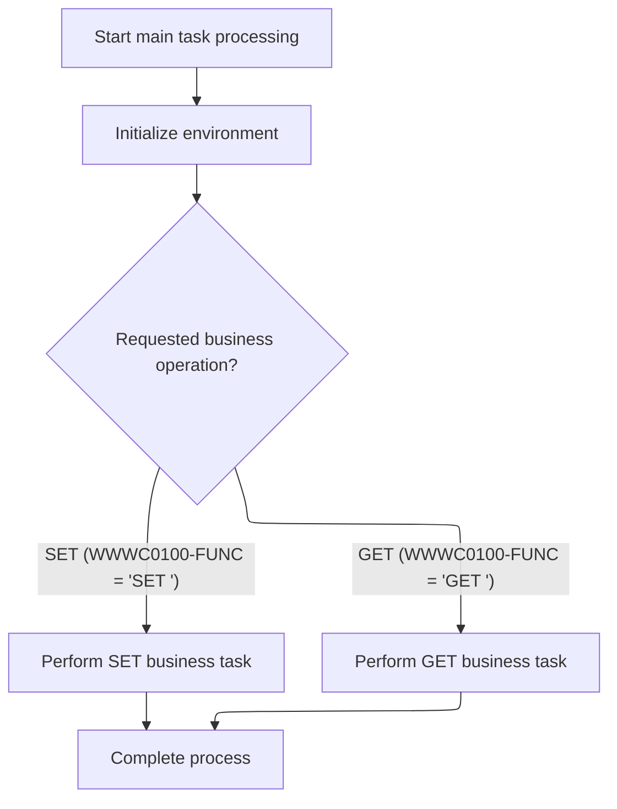
```mermaid
%%{init: {"flowchart": {"defaultRenderer": "elk"}} }%%
flowchart TD
    node1["Start main task processing"] --> node2["Initialize environment"]
    click node1 openCode "base/src/WWWS0100.cbl:38:39"
    click node2 openCode "base/src/WWWS0100.cbl:55:57"
    node2 --> node3{"Requested business operation?"}
    click node3 openCode "base/src/WWWS0100.cbl:41:46"
    node3 -->|"SET (WWWC0100-FUNC = 'SET ')"| node4["Perform SET business task"]
    click node4 openCode "base/src/WWWS0100.cbl:43:43"
    node3 -->|"GET (WWWC0100-FUNC = 'GET ')"| node5["Perform GET business task"]
    click node5 openCode "base/src/WWWS0100.cbl:45:45"
    node4 --> node6["Complete process"]
    node5 --> node6
    click node6 openCode "base/src/WWWS0100.cbl:48:49"
classDef HeadingStyle fill:#777777,stroke:#333,stroke-width:2px;

%% Swimm:
%% %%{init: {"flowchart": {"defaultRenderer": "elk"}} }%%
%% flowchart TD
%%     node1["Start main task processing"] --> node2["Initialize environment"]
%%     click node1 openCode "<SwmPath>[base/src/WWWS0100.cbl](base/src/WWWS0100.cbl)</SwmPath>:38:39"
%%     click node2 openCode "<SwmPath>[base/src/WWWS0100.cbl](base/src/WWWS0100.cbl)</SwmPath>:55:57"
%%     node2 --> node3{"Requested business operation?"}
%%     click node3 openCode "<SwmPath>[base/src/WWWS0100.cbl](base/src/WWWS0100.cbl)</SwmPath>:41:46"
%%     node3 -->|"SET (WWWC0100-FUNC = 'SET ')"| node4["Perform SET business task"]
%%     click node4 openCode "<SwmPath>[base/src/WWWS0100.cbl](base/src/WWWS0100.cbl)</SwmPath>:43:43"
%%     node3 -->|"GET (WWWC0100-FUNC = 'GET ')"| node5["Perform GET business task"]
%%     click node5 openCode "<SwmPath>[base/src/WWWS0100.cbl](base/src/WWWS0100.cbl)</SwmPath>:45:45"
%%     node4 --> node6["Complete process"]
%%     node5 --> node6
%%     click node6 openCode "<SwmPath>[base/src/WWWS0100.cbl](base/src/WWWS0100.cbl)</SwmPath>:48:49"
%% classDef HeadingStyle fill:#777777,stroke:#333,stroke-width:2px;
```

This section ensures that the workflow environment is correctly initialized and that the requested business operation (either SET or GET) is routed to the appropriate processing routine. It maintains clear separation between initialization and business logic execution, supporting modular and maintainable workflow state management.

| Category        | Rule Name                           | Description                                                                                                                                                                            |
| --------------- | ----------------------------------- | -------------------------------------------------------------------------------------------------------------------------------------------------------------------------------------- |
| Data validation | Environment Initialization Required | The workflow environment must be initialized before any business operation is performed. This ensures that all data structures are in a known, clean state at the start of processing. |
| Data validation | Operation Type Validation           | The system must determine the requested business operation by evaluating the FUNC field. Only 'SET ' and 'GET ' operations are valid for routing in this section.                      |
| Business logic  | SET Task Routing                    | If the FUNC field is set to 'SET ', the system must perform the SET business task routine.                                                                                             |
| Business logic  | GET Task Routing                    | If the FUNC field is set to 'GET ', the system must perform the GET business task routine.                                                                                             |
| Business logic  | Process Completion                  | After the requested business operation is completed, the process must terminate cleanly, ensuring no further processing occurs in this workflow state section.                         |

<SwmSnippet path="/base/src/WWWS0100.cbl" line="38">

---

<SwmToken path="base/src/WWWS0100.cbl" pos="38:2:4" line-data="011700 000-MAIN.                                                        00011700">`000-MAIN`</SwmToken> in <SwmPath>[base/src/WWWS0100.cbl](base/src/WWWS0100.cbl)</SwmPath> runs initialization, then checks if we're setting or getting a task based on the FUNC field. It branches to the right routine and then returns. This keeps task state logic clear and modular.

```cobol
011700 000-MAIN.                                                        00011700
011800     PERFORM 100-INITIALIZE                                       00011800
011900                                                                  00011900
012300     EVALUATE TRUE                                                00012300
012400       WHEN WWWC0100-SET-TASK                                     00012400
012500         PERFORM 200-SET-TASK                                     00012500
012600       WHEN WWWC0100-GET-TASK                                     00012600
012700         PERFORM 300-GET-TASK                                     00012700
013800     END-EVALUATE                                                 00013800
014100                                                                  00014100
014200     GOBACK                                                       00014200
014300     .                                                            00014300
```

---

</SwmSnippet>

<SwmSnippet path="/base/src/WWWS0100.cbl" line="55">

---

<SwmToken path="base/src/WWWS0100.cbl" pos="55:2:4" line-data="014900 100-INITIALIZE.                                                  00014900">`100-INITIALIZE`</SwmToken> just clears out <SwmToken path="base/src/WWWS0100.cbl" pos="56:4:4" line-data="015800     INITIALIZE XXXN001A                                          00015800">`XXXN001A`</SwmToken>. There's no other logic here, so it's just prepping the structure for use in the workflow routines.

```cobol
014900 100-INITIALIZE.                                                  00014900
015800     INITIALIZE XXXN001A                                          00015800
017000     .                                                            00017000
```

---

</SwmSnippet>

### Conditional Sync Trigger After Workflow Fetch

<SwmSnippet path="/base/src/NNNS0473.cbl" line="543">

---

After returning from <SwmToken path="base/src/NNNS0473.cbl" pos="542:4:10" line-data="058400     PERFORM 2010-CALL-CONTROL-SUBR                               00058400">`2010-CALL-CONTROL-SUBR`</SwmToken>, <SwmToken path="base/src/NNNS0473.cbl" pos="489:4:8" line-data="051400       PERFORM 2000-DENORM-PROCESS                                00051400">`2000-DENORM-PROCESS`</SwmToken> checks if the workflow fetch worked and if the <SwmToken path="base/src/NNNS0473.cbl" pos="544:6:8" line-data="058600     AND WWWC0100-NORM-TASK                                       00058600">`NORM-TASK`</SwmToken> flag is set. If both are true, it calls <SwmToken path="base/src/NNNS0473.cbl" pos="545:4:10" line-data="058700       PERFORM 2020-CALL-SYNC-SUBR                                00058700">`2020-CALL-SYNC-SUBR`</SwmToken> to sync location data between <SwmToken path="base/src/NNNS0473.cbl" pos="291:10:10" line-data="030000        PERFORM 125-CONNECT-TO-DB2                                00030000">`DB2`</SwmToken> and Oracle. This keeps sync logic conditional and avoids extra work.

```cobol
058500     IF  SUCCESS                                                  00058500
058600     AND WWWC0100-NORM-TASK                                       00058600
058700       PERFORM 2020-CALL-SYNC-SUBR                                00058700
058800     END-IF                                                       00058800
```

---

</SwmSnippet>

### Syncing Location Data Between <SwmToken path="base/src/NNNS0473.cbl" pos="291:10:10" line-data="030000        PERFORM 125-CONNECT-TO-DB2                                00030000">`DB2`</SwmToken> and Oracle

This section ensures that all necessary context flags are set before triggering the sync process for location/class/zone data between <SwmToken path="base/src/NNNS0473.cbl" pos="291:10:10" line-data="030000        PERFORM 125-CONNECT-TO-DB2                                00030000">`DB2`</SwmToken> and Oracle. It acts as a preparatory and validation step to guarantee that the sync routine receives the correct parameters and context for accurate data synchronization.

| Category        | Rule Name               | Description                                                                                                                                                |
| --------------- | ----------------------- | ---------------------------------------------------------------------------------------------------------------------------------------------------------- |
| Data validation | Last Call Required      | The sync process must only be initiated when the last-call flag is set, indicating this is the final or only sync attempt for the current operation.       |
| Data validation | Oracle Targeting        | The sync must be targeted to the Oracle database, as indicated by the Oracle flag being set, ensuring the correct destination for the data update.         |
| Data validation | Current Zone Context    | The current-zone flag must be set to indicate that the sync pertains to the current zone context, ensuring only relevant data is synchronized.             |
| Data validation | Complete Data Provision | The sync routine must be called with all required data structures (location, class, zone, and context information) to ensure a complete and accurate sync. |

<SwmSnippet path="/base/src/NNNS0473.cbl" line="561">

---

<SwmToken path="base/src/NNNS0473.cbl" pos="561:2:8" line-data="060600 2020-CALL-SYNC-SUBR.                                             00060600">`2020-CALL-SYNC-SUBR`</SwmToken> sets the last-call, Oracle, and current-zone flags, then calls <SwmToken path="base/src/NNNS0473.cbl" pos="565:4:8" line-data="060900     CALL MMMS0161-SYNC-CZ USING                                  00060900">`MMMS0161-SYNC-CZ`</SwmToken> to sync location/class/zone data between <SwmToken path="base/src/NNNS0473.cbl" pos="291:10:10" line-data="030000        PERFORM 125-CONNECT-TO-DB2                                00030000">`DB2`</SwmToken> and Oracle. All the sync logic is in <SwmPath>[base/src/MMMS0161.cbl](base/src/MMMS0161.cbl)</SwmPath>, so we just prep the flags and call out.

```cobol
060600 2020-CALL-SYNC-SUBR.                                             00060600
060700     SET YYYN110A-LAST-CALL     TO TRUE                           00060700
060710     SET YYYN110A-ORACLE        TO TRUE                           00060710
060800     SET MMMC0161-CZ-IS-CURRENT TO TRUE                           00060800
060900     CALL MMMS0161-SYNC-CZ USING                                  00060900
061000         XXXN001A                                                 00061000
061100         YYYN110A                                                 00061100
061200         MMMC0161                                                 00061200
061300         P-DDDTCZ01                                               00061300
061400     .                                                            00061400
```

---

</SwmSnippet>

### Sync or Delete Store Records Based on Operation Code


```mermaid
%%{init: {"flowchart": {"defaultRenderer": "elk"}} }%%
flowchart TD
    node1["Initialize environment"]
    click node1 openCode "base/src/MMMS0161.cbl:91:91"
    node1 --> node2{"Is initialization successful? (SUCCESS = 0)"}
    click node2 openCode "base/src/MMMS0161.cbl:93:93"
    node2 -->|"Yes"| node3{"Requested operation?"}
    click node3 openCode "base/src/MMMS0161.cbl:94:102"
    node3 -->|"Add (A) or Update (U)"| node4["Perform synchronization"]
    click node4 openCode "base/src/MMMS0161.cbl:97:97"
    node3 -->|"Delete (D)"| node5["Perform deletion"]
    click node5 openCode "base/src/MMMS0161.cbl:100:100"
    node3 -->|"Other"| node6["Set FAILURE, return error message: 'MMMS0161 - Invalid YYYN110A-IO-FUNC passed.'"]
    click node6 openCode "base/src/MMMS0161.cbl:103:105"
    node2 -->|"No"| node7["Return from function"]
    click node7 openCode "base/src/MMMS0161.cbl:109:109"
    node4 --> node7
    node5 --> node7
    node6 --> node7
classDef HeadingStyle fill:#777777,stroke:#333,stroke-width:2px;

%% Swimm:
%% %%{init: {"flowchart": {"defaultRenderer": "elk"}} }%%
%% flowchart TD
%%     node1["Initialize environment"]
%%     click node1 openCode "<SwmPath>[base/src/MMMS0161.cbl](base/src/MMMS0161.cbl)</SwmPath>:91:91"
%%     node1 --> node2{"Is initialization successful? (SUCCESS = 0)"}
%%     click node2 openCode "<SwmPath>[base/src/MMMS0161.cbl](base/src/MMMS0161.cbl)</SwmPath>:93:93"
%%     node2 -->|"Yes"| node3{"Requested operation?"}
%%     click node3 openCode "<SwmPath>[base/src/MMMS0161.cbl](base/src/MMMS0161.cbl)</SwmPath>:94:102"
%%     node3 -->|"Add (A) or Update (U)"| node4["Perform synchronization"]
%%     click node4 openCode "<SwmPath>[base/src/MMMS0161.cbl](base/src/MMMS0161.cbl)</SwmPath>:97:97"
%%     node3 -->|"Delete (D)"| node5["Perform deletion"]
%%     click node5 openCode "<SwmPath>[base/src/MMMS0161.cbl](base/src/MMMS0161.cbl)</SwmPath>:100:100"
%%     node3 -->|"Other"| node6["Set FAILURE, return error message: '<SwmToken path="base/src/NNNS0473.cbl" pos="565:4:4" line-data="060900     CALL MMMS0161-SYNC-CZ USING                                  00060900">`MMMS0161`</SwmToken> - Invalid <SwmToken path="base/src/MMMS0161.cbl" pos="96:11:15" line-data="010400           MOVE &#39;MMMS0161 - Invalid YYYN110A-IO-FUNC passed.&#39;     00010400">`YYYN110A-IO-FUNC`</SwmToken> passed.'"]
%%     click node6 openCode "<SwmPath>[base/src/MMMS0161.cbl](base/src/MMMS0161.cbl)</SwmPath>:103:105"
%%     node2 -->|"No"| node7["Return from function"]
%%     click node7 openCode "<SwmPath>[base/src/MMMS0161.cbl](base/src/MMMS0161.cbl)</SwmPath>:109:109"
%%     node4 --> node7
%%     node5 --> node7
%%     node6 --> node7
%% classDef HeadingStyle fill:#777777,stroke:#333,stroke-width:2px;
```

This section governs the logic for synchronizing or deleting store records based on the provided operation code. It ensures that only valid operations are performed and that errors are handled appropriately.

| Category        | Rule Name                  | Description                                                                                                                          |
| --------------- | -------------------------- | ------------------------------------------------------------------------------------------------------------------------------------ |
| Data validation | Initialization gatekeeping | If the environment initialization does not succeed (SUCCESS ≠ 0), no further processing occurs and the function returns immediately. |
| Business logic  | Sync on add or update      | If the operation code is 'A' (Add) or 'U' (Update), the section performs synchronization of store records.                           |
| Business logic  | Delete on delete code      | If the operation code is 'D' (Delete), the section performs deletion of store records.                                               |

<SwmSnippet path="/base/src/MMMS0161.cbl" line="82">

---

<SwmToken path="base/src/MMMS0161.cbl" pos="82:2:4" line-data="009000 000-MAIN.                                                        00009000">`000-MAIN`</SwmToken> in <SwmPath>[base/src/MMMS0161.cbl](base/src/MMMS0161.cbl)</SwmPath> runs init, then checks the operation code. If it's add or update, it syncs store records; if it's delete, it runs the delete routine. Anything else is flagged as an error. This keeps the sync/delete logic clear and direct.

```cobol
009000 000-MAIN.                                                        00009000
009100     PERFORM 100-INITIALIZE                                       00009100
009200                                                                  00009200
009300     IF SUCCESS                                                   00009300
009400       EVALUATE TRUE                                              00009400
009500         WHEN YYYN110A-ADD                                        00009500
009600         OR   YYYN110A-UPD                                        00009600
009700           PERFORM 1000-DO-THE-SYNC                               00009700
009800                                                                  00009800
009900         WHEN YYYN110A-DEL                                        00009900
010000           PERFORM 2000-DO-THE-DELETE                             00010000
010100                                                                  00010100
010200         WHEN OTHER                                               00010200
010300           SET FAILURE TO TRUE                                    00010300
010400           MOVE 'MMMS0161 - Invalid YYYN110A-IO-FUNC passed.'     00010400
010500             TO IS-RTRN-MSG-TXT                                   00010500
010600       END-EVALUATE                                               00010600
010700     END-IF                                                       00010700
010800                                                                  00010800
010900     GOBACK                                                       00010900
011000     .                                                            00011000
```

---

</SwmSnippet>

### Environment Setup and Store/Class/Zone Validation

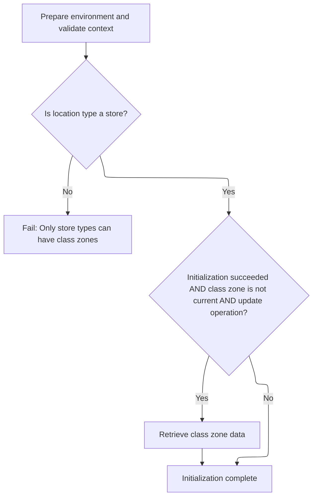
```mermaid
%%{init: {"flowchart": {"defaultRenderer": "elk"}} }%%
flowchart TD
    node1["Prepare environment and validate context"]
    click node1 openCode "base/src/MMMS0161.cbl:13300:14800"
    node1 --> node2{"Is location type a store?"}
    click node2 openCode "base/src/MMMS0161.cbl:11900:12300"
    node2 -->|"No"| node3["Fail: Only store types can have class zones"]
    click node3 openCode "base/src/MMMS0161.cbl:12000:12200"
    node2 -->|"Yes"| node4{"Initialization succeeded AND class zone is not current AND update operation?"}
    click node4 openCode "base/src/MMMS0161.cbl:12500:12800"
    node4 -->|"Yes"| node5["Retrieve class zone data"]
    click node5 openCode "base/src/MMMS0161.cbl:15100:17800"
    node4 -->|"No"| node6["Initialization complete"]
    click node6 openCode "base/src/MMMS0161.cbl:13000:13000"
    node5 --> node6
classDef HeadingStyle fill:#777777,stroke:#333,stroke-width:2px;

%% Swimm:
%% %%{init: {"flowchart": {"defaultRenderer": "elk"}} }%%
%% flowchart TD
%%     node1["Prepare environment and validate context"]
%%     click node1 openCode "<SwmPath>[base/src/MMMS0161.cbl](base/src/MMMS0161.cbl)</SwmPath>:13300:14800"
%%     node1 --> node2{"Is location type a store?"}
%%     click node2 openCode "<SwmPath>[base/src/MMMS0161.cbl](base/src/MMMS0161.cbl)</SwmPath>:11900:12300"
%%     node2 -->|"No"| node3["Fail: Only store types can have class zones"]
%%     click node3 openCode "<SwmPath>[base/src/MMMS0161.cbl](base/src/MMMS0161.cbl)</SwmPath>:12000:12200"
%%     node2 -->|"Yes"| node4{"Initialization succeeded AND class zone is not current AND update operation?"}
%%     click node4 openCode "<SwmPath>[base/src/MMMS0161.cbl](base/src/MMMS0161.cbl)</SwmPath>:12500:12800"
%%     node4 -->|"Yes"| node5["Retrieve class zone data"]
%%     click node5 openCode "<SwmPath>[base/src/MMMS0161.cbl](base/src/MMMS0161.cbl)</SwmPath>:15100:17800"
%%     node4 -->|"No"| node6["Initialization complete"]
%%     click node6 openCode "<SwmPath>[base/src/MMMS0161.cbl](base/src/MMMS0161.cbl)</SwmPath>:13000:13000"
%%     node5 --> node6
%% classDef HeadingStyle fill:#777777,stroke:#333,stroke-width:2px;
```

This section ensures that the environment is correctly set up and validates that only store-type locations can have class zones. It also determines whether class zone data needs to be fetched based on the current state and operation type.

| Category        | Rule Name                     | Description                                                                                                                                                                                   |
| --------------- | ----------------------------- | --------------------------------------------------------------------------------------------------------------------------------------------------------------------------------------------- |
| Data validation | Store type enforcement        | Only locations with type 'S' (store) are permitted to have class zones. Any other location type results in a failure and an error message stating that only store types can have class zones. |
| Data validation | Environment validation        | The environment variable must be recognized as either CICS, BATCH, or ORACLE. If the environment is not recognized, initialization fails and an error message is returned.                    |
| Business logic  | Class zone update requirement | If initialization succeeds, the class zone is not current, and the operation is an update, the system must retrieve the latest store/class/zone record.                                       |

<SwmSnippet path="/base/src/MMMS0161.cbl" line="108">

---

<SwmToken path="base/src/MMMS0161.cbl" pos="108:2:4" line-data="011600 100-INITIALIZE.                                                  00011600">`100-INITIALIZE`</SwmToken> sets up the environment and checks if the location type is a store ('S'). If not, it fails out with an error. If the flags say the class zone isn't current and we're updating, it calls <SwmToken path="base/src/MMMS0161.cbl" pos="120:4:8" line-data="012800       PERFORM 120-GET-CZ                                         00012800">`120-GET-CZ`</SwmToken> to fetch the latest store/class/zone record. This keeps the logic tight and business rules enforced.

```cobol
011600 100-INITIALIZE.                                                  00011600
011700     PERFORM 110-MISC-INITS                                       00011700
011800                                                                  00011800
011900     IF LOC-TYP-CD OF P-DDDTCZ01 NOT = K-STORE-LOC-TYPE           00011900
012000       SET FAILURE TO TRUE                                        00012000
012100       MOVE 'MMMS0161 - only store types can have class zones!'   00012100
012200         TO IS-RTRN-MSG-TXT                                       00012200
012300     END-IF                                                       00012300
012400                                                                  00012400
012500     IF  SUCCESS                                                  00012500
012600     AND MMMC0161-CZ-IS-NOT-CURRENT                               00012600
012700     AND YYYN110A-UPD                                             00012700
012800       PERFORM 120-GET-CZ                                         00012800
012900     END-IF                                                       00012900
013000     .                                                            00013000
```

---

</SwmSnippet>

<SwmSnippet path="/base/src/MMMS0161.cbl" line="125">

---

<SwmToken path="base/src/MMMS0161.cbl" pos="125:2:6" line-data="013300 110-MISC-INITS.                                                  00013300">`110-MISC-INITS`</SwmToken> checks the environment variable and sets flags for CICS, BATCH, or ORACLE. If the env var isn't recognized, it sets FAILURE and an error message. This makes sure the rest of the flow knows what context it's running in.

```cobol
013300 110-MISC-INITS.                                                  00013300
013400     INITIALIZE XXXN001A                                          00013400
013500                DDDPST01                                          00013500
013600                P-DDDTRL01                                        00013600
013700                                                                  00013700
013800     EVALUATE TRUE                                                00013800
013900       WHEN YYYN110A-CICS-ENV                                     00013900
014000         SET YYYN005A-CICS-ENV        TO TRUE                     00014000
014100       WHEN YYYN110A-BATCH-ENV                                    00014100
014200         SET YYYN005A-BATCH-ENV       TO TRUE                     00014200
014300       WHEN OTHER                                                 00014300
014400         SET FAILURE TO TRUE                                      00014400
014500         MOVE 'MMMS0161 - Invalid environment variable.'          00014500
014600           TO IS-RTRN-MSG-TXT                                     00014600
014700     END-EVALUATE                                                 00014700
014710     IF YYYN110A-ORACLE                                           00014710
014720         SET YYYN005A-ORACLE  TO TRUE                             00014720
014730     END-IF                                                       00014730
014800     .                                                            00014800
```

---

</SwmSnippet>

<SwmSnippet path="/base/src/MMMS0161.cbl" line="146">

---

<SwmToken path="base/src/MMMS0161.cbl" pos="146:2:6" line-data="015100 120-GET-CZ.                                                      00015100">`120-GET-CZ`</SwmToken> sets the exit code for unique row fetch and calls <SwmToken path="base/src/MMMS0161.cbl" pos="148:4:8" line-data="015300     CALL NNNS0473-CZ-DAO USING                                   00015300">`NNNS0473-CZ-DAO`</SwmToken> to get the store/class/zone record. It checks SQLCODE for not found or error and sets failure/message as needed. This is the main DB fetch for the class zone data.

```cobol
015100 120-GET-CZ.                                                      00015100
015200     SET EXIT-GET-UNIQUE-ROW TO TRUE                              00015200
015300     CALL NNNS0473-CZ-DAO USING                                   00015300
015400         XXXN001A                                                 00015400
015500         SQLCA                                                    00015500
015600         YYYN005A                                                 00015600
015700         NNNN0000-PARMS                                           00015700
015800         P-DDDTCZ01                                               00015800
015900                                                                  00015900
016000     EVALUATE TRUE                                                00016000
016100       WHEN NOT SUCCESS                                           00016100
016200         CONTINUE                                                 00016200
016300                                                                  00016300
016400       WHEN SQLCODE = 100                                         00016400
016500         SET  FAILURE                 TO TRUE                     00016500
016600         MOVE 'MMMS0161 - Store/Cls/Zone does not exist!'         00016600
016700           TO IS-RTRN-MSG-TXT                                     00016700
016800                                                                  00016800
016900       WHEN SQLCODE NOT = 0                                       00016900
017000         MOVE SQLCODE                 TO WS-SQLCODE               00017000
017100         SET  FAILURE                 TO TRUE                     00017100
017200         MOVE SPACES                  TO IS-RTRN-MSG-TXT          00017200
017300         STRING 'MMMS0161 - Failure getting Cls Ad Zn, SQLCODE='  00017300
017400                 WS-SQLCODE                                       00017400
017500                 DELIMITED BY SIZE                                00017500
017600                 INTO IS-RTRN-MSG-TXT                             00017600
017700     END-EVALUATE                                                 00017700
017800     .                                                            00017800
```

---

</SwmSnippet>

### Syncing Legacy and Master Store Records

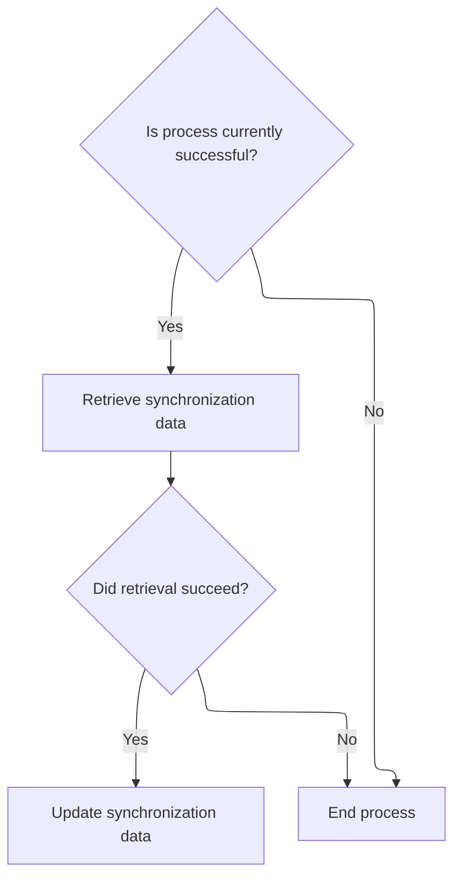
```mermaid
%%{init: {"flowchart": {"defaultRenderer": "elk"}} }%%
flowchart TD
  node1{"Is process currently successful?"}
  click node1 openCode "base/src/MMMS0161.cbl:180:185"
  node1 -->|"Yes"| node2["Retrieve synchronization data"]
  click node2 openCode "base/src/MMMS0161.cbl:186:186"
  node2 --> node3{"Did retrieval succeed?"}
  click node3 openCode "base/src/MMMS0161.cbl:187:187"
  node3 -->|"Yes"| node4["Update synchronization data"]
  click node4 openCode "base/src/MMMS0161.cbl:188:188"
  node3 -->|"No"| node5["End process"]
  click node5 openCode "base/src/MMMS0161.cbl:191:191"
  node1 -->|"No"| node5
classDef HeadingStyle fill:#777777,stroke:#333,stroke-width:2px;

%% Swimm:
%% %%{init: {"flowchart": {"defaultRenderer": "elk"}} }%%
%% flowchart TD
%%   node1{"Is process currently successful?"}
%%   click node1 openCode "<SwmPath>[base/src/MMMS0161.cbl](base/src/MMMS0161.cbl)</SwmPath>:180:185"
%%   node1 -->|"Yes"| node2["Retrieve synchronization data"]
%%   click node2 openCode "<SwmPath>[base/src/MMMS0161.cbl](base/src/MMMS0161.cbl)</SwmPath>:186:186"
%%   node2 --> node3{"Did retrieval succeed?"}
%%   click node3 openCode "<SwmPath>[base/src/MMMS0161.cbl](base/src/MMMS0161.cbl)</SwmPath>:187:187"
%%   node3 -->|"Yes"| node4["Update synchronization data"]
%%   click node4 openCode "<SwmPath>[base/src/MMMS0161.cbl](base/src/MMMS0161.cbl)</SwmPath>:188:188"
%%   node3 -->|"No"| node5["End process"]
%%   click node5 openCode "<SwmPath>[base/src/MMMS0161.cbl](base/src/MMMS0161.cbl)</SwmPath>:191:191"
%%   node1 -->|"No"| node5
%% classDef HeadingStyle fill:#777777,stroke:#333,stroke-width:2px;
```

This section governs the business logic for synchronizing legacy store records with master store data, ensuring that updates only occur when all prerequisite conditions are met and preventing erroneous updates.

| Category        | Rule Name                              | Description                                                                                                                         |
| --------------- | -------------------------------------- | ----------------------------------------------------------------------------------------------------------------------------------- |
| Data validation | Sync Only on Success                   | Synchronization of legacy store records with master store data is only attempted if the process status is successful (SUCCESS = 0). |
| Business logic  | Update Only After Successful Retrieval | Legacy store records are updated only after successful retrieval of synchronization data from the master store.                     |

<SwmSnippet path="/base/src/MMMS0161.cbl" line="179">

---

<SwmToken path="base/src/MMMS0161.cbl" pos="179:2:8" line-data="018400 1000-DO-THE-SYNC.                                                00018400">`1000-DO-THE-SYNC`</SwmToken> fetches the store data from <SwmToken path="base/src/NNNS0473.cbl" pos="291:10:10" line-data="030000        PERFORM 125-CONNECT-TO-DB2                                00030000">`DB2`</SwmToken> (<SwmToken path="base/src/MMMS0161.cbl" pos="181:4:8" line-data="018600       PERFORM 1400-GET-DDDTRL01                                  00018600">`1400-GET-DDDTRL01`</SwmToken>), and if that works, updates the legacy DB record (<SwmToken path="base/src/MMMS0161.cbl" pos="183:4:8" line-data="018800         PERFORM 1500-UPDATE-DDDTRL01                             00018800">`1500-UPDATE-DDDTRL01`</SwmToken>). The update is skipped if the fetch fails. This keeps the sync logic safe and avoids bad updates.

```cobol
018400 1000-DO-THE-SYNC.                                                00018400
018500     IF SUCCESS                                                   00018500
018600       PERFORM 1400-GET-DDDTRL01                                  00018600
018700       IF SUCCESS                                                 00018700
018800         PERFORM 1500-UPDATE-DDDTRL01                             00018800
018900       END-IF                                                     00018900
019000     END-IF                                                       00019000
019100     .                                                            00019100
```

---

</SwmSnippet>

### Fetching Store Data for Sync

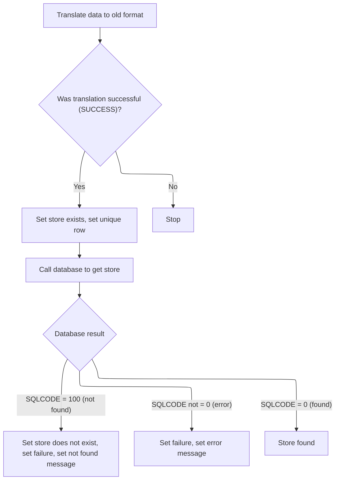
```mermaid
%%{init: {"flowchart": {"defaultRenderer": "elk"}} }%%
flowchart TD
    node1["Translate data to old format"]
    click node1 openCode "base/src/MMMS0161.cbl:200:200"
    node1 --> node2{"Was translation successful (SUCCESS)?"}
    click node2 openCode "base/src/MMMS0161.cbl:201:201"
    node2 -->|"Yes"| node3["Set store exists, set unique row"]
    click node3 openCode "base/src/MMMS0161.cbl:202:203"
    node3 --> node4["Call database to get store"]
    click node4 openCode "base/src/MMMS0161.cbl:204:204"
    node4 --> node5{"Database result"}
    click node5 openCode "base/src/MMMS0161.cbl:206:206"
    node5 -->|"SQLCODE = 100 (not found)"| node6["Set store does not exist, set failure, set not found message"]
    click node6 openCode "base/src/MMMS0161.cbl:208:211"
    node5 -->|"SQLCODE not = 0 (error)"| node7["Set failure, set error message"]
    click node7 openCode "base/src/MMMS0161.cbl:214:220"
    node5 -->|"SQLCODE = 0 (found)"| node8["Store found"]
    click node8 openCode "base/src/MMMS0161.cbl:221:221"
    node2 -->|"No"| node9["Stop"]
    click node9 openCode "base/src/MMMS0161.cbl:222:222"

classDef HeadingStyle fill:#777777,stroke:#333,stroke-width:2px;

%% Swimm:
%% %%{init: {"flowchart": {"defaultRenderer": "elk"}} }%%
%% flowchart TD
%%     node1["Translate data to old format"]
%%     click node1 openCode "<SwmPath>[base/src/MMMS0161.cbl](base/src/MMMS0161.cbl)</SwmPath>:200:200"
%%     node1 --> node2{"Was translation successful (SUCCESS)?"}
%%     click node2 openCode "<SwmPath>[base/src/MMMS0161.cbl](base/src/MMMS0161.cbl)</SwmPath>:201:201"
%%     node2 -->|"Yes"| node3["Set store exists, set unique row"]
%%     click node3 openCode "<SwmPath>[base/src/MMMS0161.cbl](base/src/MMMS0161.cbl)</SwmPath>:202:203"
%%     node3 --> node4["Call database to get store"]
%%     click node4 openCode "<SwmPath>[base/src/MMMS0161.cbl](base/src/MMMS0161.cbl)</SwmPath>:204:204"
%%     node4 --> node5{"Database result"}
%%     click node5 openCode "<SwmPath>[base/src/MMMS0161.cbl](base/src/MMMS0161.cbl)</SwmPath>:206:206"
%%     node5 -->|"SQLCODE = 100 (not found)"| node6["Set store does not exist, set failure, set not found message"]
%%     click node6 openCode "<SwmPath>[base/src/MMMS0161.cbl](base/src/MMMS0161.cbl)</SwmPath>:208:211"
%%     node5 -->|"SQLCODE not = 0 (error)"| node7["Set failure, set error message"]
%%     click node7 openCode "<SwmPath>[base/src/MMMS0161.cbl](base/src/MMMS0161.cbl)</SwmPath>:214:220"
%%     node5 -->|"SQLCODE = 0 (found)"| node8["Store found"]
%%     click node8 openCode "<SwmPath>[base/src/MMMS0161.cbl](base/src/MMMS0161.cbl)</SwmPath>:221:221"
%%     node2 -->|"No"| node9["Stop"]
%%     click node9 openCode "<SwmPath>[base/src/MMMS0161.cbl](base/src/MMMS0161.cbl)</SwmPath>:222:222"
%% 
%% classDef HeadingStyle fill:#777777,stroke:#333,stroke-width:2px;
```

This section governs the process of fetching store data for synchronization. It ensures that input data is correctly translated, checks for the existence of the store in the database, and provides clear status and messaging for not found or error scenarios.

| Category        | Rule Name                | Description                                                                                                                            |
| --------------- | ------------------------ | -------------------------------------------------------------------------------------------------------------------------------------- |
| Data validation | Translation prerequisite | If the input data cannot be translated to the old format, the process must stop and no further actions are taken.                      |
| Business logic  | Unique store fetch       | If the translation is successful, the system must check if the store exists in the database and only fetch a unique row for the store. |
| Business logic  | Store found confirmation | If the store is found in the database (SQLCODE = 0), the system must indicate that the store exists and proceed with synchronization.  |

<SwmSnippet path="/base/src/MMMS0161.cbl" line="194">

---

<SwmToken path="base/src/MMMS0161.cbl" pos="194:2:6" line-data="019900 1400-GET-DDDTRL01.                                               00019900">`1400-GET-DDDTRL01`</SwmToken> translates the input to old format, sets flags for row existence, and calls the DAO to fetch the store. It handles not found and error cases with specific failure messages. The <SwmToken path="base/src/MMMS0161.cbl" pos="198:4:10" line-data="020300       SET EXIT-GET-UNIQUE-ROW        TO TRUE                     00020300">`EXIT-GET-UNIQUE-ROW`</SwmToken> flag tells the DAO to stop after one fetch.

```cobol
019900 1400-GET-DDDTRL01.                                               00019900
020000     PERFORM 9000-TRANSLATE-TO-OLD                                00020000
020100     IF SUCCESS                                                   00020100
020200       SET DDDTRL01-EXISTS            TO TRUE                     00020200
020300       SET EXIT-GET-UNIQUE-ROW        TO TRUE                     00020300
020400       PERFORM 9200-CALL-DDDTRL01-DAO                             00020400
020500                                                                  00020500
020600       EVALUATE TRUE                                              00020600
020700         WHEN SQLCODE = 100                                       00020700
020800           SET  DDDTRL01-DOES-NOT-EXIST TO TRUE                   00020800
020900           SET  FAILURE                 TO TRUE                   00020900
021000           MOVE 'MMMS0161 - Store not found in DB2 Table (FCRL)!' 00021000
021100             TO IS-RTRN-MSG-TXT                                   00021100
021200                                                                  00021200
021300         WHEN SQLCODE NOT = 0                                     00021300
021400           SET  FAILURE TO TRUE                                   00021400
021500           MOVE SQLCODE TO WS-SQLCODE                             00021500
021600           MOVE SPACES  TO IS-RTRN-MSG-TXT                        00021600
021700           STRING 'MMMS0161 - Error reading DB2 Store, '          00021700
021800                  'key='      ST-STORE-KEY OF DDDPST01            00021800
021900                  ',SQL=' WS-SQLCODE '.'                          00021900
022000                  DELIMITED BY SIZE INTO IS-RTRN-MSG-TXT          00022000
022100       END-EVALUATE                                               00022100
022200     END-IF                                                       00022200
022300     .                                                            00022300
```

---

</SwmSnippet>

### Translating Data Structure for DAO Fetch

This section ensures that data passed to the DAO is in the correct (old) format by translating from the new format using a dedicated translation routine. This translation is necessary for compatibility with legacy systems and to maintain data integrity.

| Category        | Rule Name                             | Description                                                                                                                                                                         |
| --------------- | ------------------------------------- | ----------------------------------------------------------------------------------------------------------------------------------------------------------------------------------- |
| Data validation | Mandatory Translation Step            | The translation process must always be invoked before any DAO fetch operation to prevent data mismatches.                                                                           |
| Data validation | Constant Value Consistency            | All constants used in the translation (such as location types and maximum values) must match the values defined in the KONSTANTS structure to ensure consistency across the system. |
| Business logic  | DAO Format Consistency                | All data sent to the DAO must be in the old format, regardless of the original input format.                                                                                        |
| Business logic  | Translation Function Code Enforcement | The translation must use the specific function code 'N' to indicate a new-to-old format conversion.                                                                                 |

<SwmSnippet path="/base/src/MMMS0161.cbl" line="320">

---

<SwmToken path="base/src/MMMS0161.cbl" pos="320:2:8" line-data="032500 9000-TRANSLATE-TO-OLD.                                           00032500">`9000-TRANSLATE-TO-OLD`</SwmToken> preps the data by translating from the new format to the old one, then calls <SwmToken path="base/src/MMMS0161.cbl" pos="324:4:8" line-data="032900     CALL MMMS0162-TRANSLATE-CZ USING                             00032900">`MMMS0162-TRANSLATE-CZ`</SwmToken> to do the actual conversion. This makes sure the DAO gets data in the format it expects.

```cobol
032500 9000-TRANSLATE-TO-OLD.                                           00032500
032600     INITIALIZE YYYN111A                                          00032600
032700     SET YYYN111A-NEW-2-OLD           TO TRUE                     00032700
032800                                                                  00032800
032900     CALL MMMS0162-TRANSLATE-CZ USING                             00032900
033000         XXXN001A                                                 00033000
033100         YYYN111A                                                 00033100
033200         P-DDDTCZ01                                               00033200
033300         DDDPST01                                                 00033300
033400         P-DDDTRL01                                               00033400
033500     .                                                            00033500
```

---

</SwmSnippet>

### Data Translation Direction Routing

The main product role for this section is to ensure that data translation requests are routed in the correct direction based on business requirements, and to provide clear status feedback on the outcome of the routing process.

| Category       | Rule Name                      | Description                                                                                                                   |
| -------------- | ------------------------------ | ----------------------------------------------------------------------------------------------------------------------------- |
| Business logic | New-to-Old Translation Routing | If the translation direction is set to 'N', the system must route the data translation from the new format to the old format. |
| Business logic | Old-to-New Translation Routing | If the translation direction is set to 'O', the system must route the data translation from the old format to the new format. |

See <SwmLink doc-title="Translating Store and Item Class Data Between Formats">[Translating Store and Item Class Data Between Formats](.swm%5Ctranslating-store-and-item-class-data-between-formats.dz6y0qkb.sw.md)</SwmLink>

### Fetching Store Record from DAO

This section's main product role is to ensure that store records are fetched from the database in a standardized and reliable manner by delegating all database operations to a dedicated DAO routine. It acts as a bridge between the business logic and the data layer, ensuring data consistency and separation of concerns.

| Category        | Rule Name                     | Description                                                                                                                                                             |
| --------------- | ----------------------------- | ----------------------------------------------------------------------------------------------------------------------------------------------------------------------- |
| Data validation | Complete parameter passing    | The DAO routine must receive all required parameters, including store identifiers and context information, to accurately retrieve the correct store record.             |
| Business logic  | Centralized store data access | All requests to fetch store records must be routed through the designated DAO routine, ensuring a single point of access for store data retrieval.                      |
| Business logic  | DAO exclusivity for DB access | The DAO routine is the only component permitted to interact directly with the database for store record retrieval, preventing unauthorized or inconsistent data access. |

<SwmSnippet path="/base/src/MMMS0161.cbl" line="332">

---

<SwmToken path="base/src/MMMS0161.cbl" pos="332:2:8" line-data="033700 9200-CALL-DDDTRL01-DAO.                                          00033700">`9200-CALL-DDDTRL01-DAO`</SwmToken> just calls <SwmToken path="base/src/MMMS0161.cbl" pos="333:4:8" line-data="033800     CALL NNNS0120-DDDTRL01-DAO USING                             00033800">`NNNS0120-DDDTRL01-DAO`</SwmToken> to fetch the store record. All the DB logic is in the DAO, so the main code just passes the data and lets the DAO handle it.

```cobol
033700 9200-CALL-DDDTRL01-DAO.                                          00033700
033800     CALL NNNS0120-DDDTRL01-DAO USING                             00033800
033900         XXXN001A                                                 00033900
034000         SQLCA                                                    00034000
034100         YYYN005A                                                 00034100
034200         NNNN0000-PARMS                                           00034200
034300         P-DDDTRL01                                               00034300
034400     .                                                            00034400
```

---

</SwmSnippet>

### Store DAO Operation Dispatch

This section governs how DAO operations are dispatched based on exit codes and file identifiers. It ensures that only valid operations are performed on supported files/tables, and that each operation is mapped to the correct business action.

| Category        | Rule Name                      | Description                                                                                                                                                                                                                                         |
| --------------- | ------------------------------ | --------------------------------------------------------------------------------------------------------------------------------------------------------------------------------------------------------------------------------------------------- |
| Data validation | Valid exit code enforcement    | Only exit codes that are explicitly defined (1, 2, 3, 5, 8, 9, 10, 90) may be used to dispatch DAO operations. Any other exit code is considered invalid and must not trigger an operation.                                                         |
| Data validation | Supported file enforcement     | DAO operations may only be dispatched to files or tables that are explicitly listed in the NNNN0000-FILE variable (e.g., 'XXXPST01', 'WXXD210', 'TABLE   ', etc.). Any operation targeting an unsupported file must be rejected.                    |
| Data validation | Required parameter validation  | The key and record length parameters must be provided and valid for operations that require them (such as get, insert, modify, purge row). If these parameters are missing or invalid, the operation must be rejected.                              |
| Business logic  | Exit code to operation mapping | Each exit code must correspond to a specific business operation: 1=open cursor, 2=close cursor, 3=get unique row, 5=get next row, 8=modify row, 9=insert row, 10=purge row, 90=special IO functions. The mapping must be consistent and documented. |

See <SwmLink doc-title="Dispatching Store and Database Operations">[Dispatching Store and Database Operations](.swm%5Cdispatching-store-and-database-operations.lfgjhtc9.sw.md)</SwmLink>

### Finalizing Store DAO Transaction

```mermaid
%%{init: {"flowchart": {"defaultRenderer": "elk"}} }%%
flowchart TD
    node1{"Was the operation successful?"}
    click node1 openCode "base/src/NNNS0120.cbl:1954:1980"
    node1 -->|"Yes"| node2{"Is this NOT a cursor close? (EXIT-CLOSE-CURSOR ≠ 2)"}
    click node2 openCode "base/src/NNNS0120.cbl:1955:1978"
    node2 -->|"Yes"| node3["Move data fields for further processing"]
    click node3 openCode "base/src/NNNS0120.cbl:1956:1977"
    node3 --> node4["Update checkpoint counter"]
    click node4 openCode "base/src/NNNS0120.cbl:1958:1979"
    node2 -->|"No"| node4
    node1 -->|"No"| node6{"Is this an Oracle or row operation? (YYYN005A-ORACLE = 'O' or EXIT-PUT-INSERT-ROW = 9 or EXIT-PUT-PURGE-ROW = 10 or EXIT-PUT-MODIFY-ROW = 8)"}
    click node6 openCode "base/src/NNNS0120.cbl:1960:1984"
    node4 --> node6
    node6 -->|"Yes"| node7["Ensure database connection"]
    click node7 openCode "base/src/NNNS0120.cbl:1962:1983"
    node6 -->|"No"| node8["End"]
    click node8 openCode "base/src/NNNS0120.cbl:1985:1985"
    node7 --> node8
classDef HeadingStyle fill:#777777,stroke:#333,stroke-width:2px;

%% Swimm:
%% %%{init: {"flowchart": {"defaultRenderer": "elk"}} }%%
%% flowchart TD
%%     node1{"Was the operation successful?"}
%%     click node1 openCode "<SwmPath>[base/src/NNNS0120.cbl](base/src/NNNS0120.cbl)</SwmPath>:1954:1980"
%%     node1 -->|"Yes"| node2{"Is this NOT a cursor close? (<SwmToken path="base/src/NNNS0473.cbl" pos="206:4:8" line-data="021500       WHEN EXIT-CLOSE-CURSOR                                     00021500">`EXIT-CLOSE-CURSOR`</SwmToken> ≠ 2)"}
%%     click node2 openCode "<SwmPath>[base/src/NNNS0120.cbl](base/src/NNNS0120.cbl)</SwmPath>:1955:1978"
%%     node2 -->|"Yes"| node3["Move data fields for further processing"]
%%     click node3 openCode "<SwmPath>[base/src/NNNS0120.cbl](base/src/NNNS0120.cbl)</SwmPath>:1956:1977"
%%     node3 --> node4["Update checkpoint counter"]
%%     click node4 openCode "<SwmPath>[base/src/NNNS0120.cbl](base/src/NNNS0120.cbl)</SwmPath>:1958:1979"
%%     node2 -->|"No"| node4
%%     node1 -->|"No"| node6{"Is this an Oracle or row operation? (<SwmToken path="base/src/NNNS0473.cbl" pos="239:5:7" line-data="024800     IF (YYYN005A-ORACLE       OR EXIT-PUT-INSERT-ROW             00024800">`YYYN005A-ORACLE`</SwmToken> = 'O' or <SwmToken path="base/src/NNNS0473.cbl" pos="214:4:10" line-data="022300       WHEN EXIT-PUT-INSERT-ROW                                   00022300">`EXIT-PUT-INSERT-ROW`</SwmToken> = 9 or <SwmToken path="base/src/NNNS0473.cbl" pos="216:4:10" line-data="022500       WHEN EXIT-PUT-PURGE-ROW                                    00022500">`EXIT-PUT-PURGE-ROW`</SwmToken> = 10 or <SwmToken path="base/src/NNNS0473.cbl" pos="212:4:10" line-data="022100       WHEN EXIT-PUT-MODIFY-ROW                                   00022100">`EXIT-PUT-MODIFY-ROW`</SwmToken> = 8)"}
%%     click node6 openCode "<SwmPath>[base/src/NNNS0120.cbl](base/src/NNNS0120.cbl)</SwmPath>:1960:1984"
%%     node4 --> node6
%%     node6 -->|"Yes"| node7["Ensure database connection"]
%%     click node7 openCode "<SwmPath>[base/src/NNNS0120.cbl](base/src/NNNS0120.cbl)</SwmPath>:1962:1983"
%%     node6 -->|"No"| node8["End"]
%%     click node8 openCode "<SwmPath>[base/src/NNNS0120.cbl](base/src/NNNS0120.cbl)</SwmPath>:1985:1985"
%%     node7 --> node8
%% classDef HeadingStyle fill:#777777,stroke:#333,stroke-width:2px;
```

This section ensures that after a Store DAO transaction, the system correctly updates transaction data, manages checkpointing, and maintains database connectivity for specific operations. It is critical for maintaining data integrity and operational consistency.

| Category       | Rule Name                               | Description                                                                                                                                                                                                                                                                                                                                                                                                                                                                                                                                                                                                                                                                                                                                                                                                                                                                                                        |
| -------------- | --------------------------------------- | ------------------------------------------------------------------------------------------------------------------------------------------------------------------------------------------------------------------------------------------------------------------------------------------------------------------------------------------------------------------------------------------------------------------------------------------------------------------------------------------------------------------------------------------------------------------------------------------------------------------------------------------------------------------------------------------------------------------------------------------------------------------------------------------------------------------------------------------------------------------------------------------------------------------ |
| Business logic | Copy Data on Success                    | If the transaction operation is successful and it is not a cursor close (<SwmToken path="base/src/NNNS0473.cbl" pos="206:4:8" line-data="021500       WHEN EXIT-CLOSE-CURSOR                                     00021500">`EXIT-CLOSE-CURSOR`</SwmToken> ≠ 2), the relevant store/location data fields must be copied for further processing.                                                                                                                                                                                                                                                                                                                                                                                                                                                                                                                                                                     |
| Business logic | Increment Checkpoint Counter            | After a successful operation (regardless of cursor close), the checkpoint counter (<SwmToken path="base/src/NNNS0473.cbl" pos="287:12:16" line-data="029600       ADD WS-CHECKPOINT-INC TO YYYN005A-CHKPT-CNT                00029600">`YYYN005A-CHKPT-CNT`</SwmToken>) must be incremented by the value of <SwmToken path="base/src/NNNS0473.cbl" pos="233:8:12" line-data="024200     MOVE 0 TO WS-CHECKPOINT-INC                                  00024200">`WS-CHECKPOINT-INC`</SwmToken>.                                                                                                                                                                                                                                                                                                                                                                                                                     |
| Business logic | Ensure DB Connection for Row/Oracle Ops | If the operation is not successful, and it is an Oracle or row operation (<SwmToken path="base/src/NNNS0473.cbl" pos="239:5:7" line-data="024800     IF (YYYN005A-ORACLE       OR EXIT-PUT-INSERT-ROW             00024800">`YYYN005A-ORACLE`</SwmToken> = 'O' or <SwmToken path="base/src/NNNS0473.cbl" pos="214:4:10" line-data="022300       WHEN EXIT-PUT-INSERT-ROW                                   00022300">`EXIT-PUT-INSERT-ROW`</SwmToken> = 9 or <SwmToken path="base/src/NNNS0473.cbl" pos="216:4:10" line-data="022500       WHEN EXIT-PUT-PURGE-ROW                                    00022500">`EXIT-PUT-PURGE-ROW`</SwmToken> = 10 or <SwmToken path="base/src/NNNS0473.cbl" pos="212:4:10" line-data="022100       WHEN EXIT-PUT-MODIFY-ROW                                   00022100">`EXIT-PUT-MODIFY-ROW`</SwmToken> = 8), a database connection must be ensured before ending the process. |
| Business logic | End on Non-Row/Oracle Failure           | If the operation is not successful and it is not an Oracle or row operation, the process ends without further action.                                                                                                                                                                                                                                                                                                                                                                                                                                                                                                                                                                                                                                                                                                                                                                                              |

<SwmSnippet path="/base/src/NNNS0120.cbl" line="1953">

---

<SwmToken path="base/src/NNNS0120.cbl" pos="1953:2:6" line-data="197400 120-EXIT-STUFF.                                                  00197400">`120-EXIT-STUFF`</SwmToken> copies store/location data to the output struct if the transaction worked and not closing a cursor, bumps the checkpoint count, and connects to <SwmToken path="base/src/NNNS0120.cbl" pos="1962:10:10" line-data="198300        PERFORM  125-CONNECT-TO-DB2                               00198300">`DB2`</SwmToken> if the operation was an insert, modify, purge, or Oracle. This keeps the transaction state and DB connection in sync.

```cobol
197400 120-EXIT-STUFF.                                                  00197400
197500     IF SUCCESS                                                   00197500
197600       IF NOT EXIT-CLOSE-CURSOR                                   00197600
197700         PERFORM 130-MOVE-DCL-2-PDA-FIELDS                        00197700
197800       END-IF                                                     00197800
197900         ADD WS-CHECKPOINT-INC TO YYYN005A-CHKPT-CNT              00197900
198000     END-IF                                                       00198000
198100     IF (YYYN005A-ORACLE       OR EXIT-PUT-INSERT-ROW             00198100
198200         OR EXIT-PUT-PURGE-ROW OR EXIT-PUT-MODIFY-ROW)            00198200
198300        PERFORM  125-CONNECT-TO-DB2                               00198300
198400     END-IF                                                       00198400
198500     .                                                            00198500
```

---

</SwmSnippet>

### Switching to <SwmToken path="base/src/NNNS0473.cbl" pos="291:10:10" line-data="030000        PERFORM 125-CONNECT-TO-DB2                                00030000">`DB2`</SwmToken> Connection

This section ensures that the application can switch its active database connection to <SwmToken path="base/src/NNNS0473.cbl" pos="291:10:10" line-data="030000        PERFORM 125-CONNECT-TO-DB2                                00030000">`DB2`</SwmToken> by invoking a dedicated connection routine. It is a critical step for any operations that require <SwmToken path="base/src/NNNS0473.cbl" pos="291:10:10" line-data="030000        PERFORM 125-CONNECT-TO-DB2                                00030000">`DB2`</SwmToken> as the backend database.

| Category       | Rule Name                                                                                                                                                                                   | Description                                                                                                                                                                                                                                                                     |
| -------------- | ------------------------------------------------------------------------------------------------------------------------------------------------------------------------------------------- | ------------------------------------------------------------------------------------------------------------------------------------------------------------------------------------------------------------------------------------------------------------------------------- |
| Business logic | <SwmToken path="base/src/NNNS0473.cbl" pos="291:10:10" line-data="030000        PERFORM 125-CONNECT-TO-DB2                                00030000">`DB2`</SwmToken> Connection Requirement | The system must switch the active database connection to <SwmToken path="base/src/NNNS0473.cbl" pos="291:10:10" line-data="030000        PERFORM 125-CONNECT-TO-DB2                                00030000">`DB2`</SwmToken> before any DB2-specific operations are performed. |

<SwmSnippet path="/base/src/NNNS0120.cbl" line="1970">

---

<SwmToken path="base/src/NNNS0120.cbl" pos="1970:2:8" line-data="199100 125-CONNECT-TO-DB2.                                              00199100">`125-CONNECT-TO-DB2`</SwmToken> just calls <SwmToken path="base/src/NNNS0120.cbl" pos="1971:4:8" line-data="199200     CALL Z-DB2-CONNECT         USING W00N001A                    00199200">`Z-DB2-CONNECT`</SwmToken> (<SwmToken path="base/src/YYYS0211.cbl" pos="2:7:7" line-data="000200 PROGRAM-ID.    YYYS0211.                                         00000200">`YYYS0211`</SwmToken>) to switch the DB connection to <SwmToken path="base/src/NNNS0120.cbl" pos="1970:8:8" line-data="199100 125-CONNECT-TO-DB2.                                              00199100">`DB2`</SwmToken>. All the connection logic is there, so this routine just passes the context and lets it handle the details.

```cobol
199100 125-CONNECT-TO-DB2.                                              00199100
199200     CALL Z-DB2-CONNECT         USING W00N001A                    00199200
199300                                      SQLCA                       00199300
199400     .                                                            00199400
```

---

</SwmSnippet>

### <SwmToken path="base/src/NNNS0473.cbl" pos="291:10:10" line-data="030000        PERFORM 125-CONNECT-TO-DB2                                00030000">`DB2`</SwmToken> Connection Setup and Error Handling

```mermaid
%%{init: {"flowchart": {"defaultRenderer": "elk"}} }%%
flowchart TD
    node1["Begin orderly shutdown"]
    click node1 openCode "base/src/YYYS0211.cbl:32:32"
    node1 --> node2["Prepare and reset main data (XXXN001A)"]
    click node2 openCode "base/src/YYYS0211.cbl:44:47"
    node2 --> node3["Ensure database connection is properly managed"]
    click node3 openCode "base/src/YYYS0211.cbl:53:58"
    node3 --> node4["Translate database status codes for reporting"]
    click node4 openCode "base/src/YYYS0211.cbl:35:35"
    node4 --> node5["Restore any temporary changes to main data (XXXN001A)"]
    click node5 openCode "base/src/YYYS0211.cbl:36:36"
    node5 --> node6["Complete shutdown and exit process"]
    click node6 openCode "base/src/YYYS0211.cbl:37:37"

classDef HeadingStyle fill:#777777,stroke:#333,stroke-width:2px;

%% Swimm:
%% %%{init: {"flowchart": {"defaultRenderer": "elk"}} }%%
%% flowchart TD
%%     node1["Begin orderly shutdown"]
%%     click node1 openCode "<SwmPath>[base/src/YYYS0211.cbl](base/src/YYYS0211.cbl)</SwmPath>:32:32"
%%     node1 --> node2["Prepare and reset main data (<SwmToken path="base/src/NNNS0473.cbl" pos="230:4:4" line-data="023900     INITIALIZE XXXN001A                                          00023900">`XXXN001A`</SwmToken>)"]
%%     click node2 openCode "<SwmPath>[base/src/YYYS0211.cbl](base/src/YYYS0211.cbl)</SwmPath>:44:47"
%%     node2 --> node3["Ensure database connection is properly managed"]
%%     click node3 openCode "<SwmPath>[base/src/YYYS0211.cbl](base/src/YYYS0211.cbl)</SwmPath>:53:58"
%%     node3 --> node4["Translate database status codes for reporting"]
%%     click node4 openCode "<SwmPath>[base/src/YYYS0211.cbl](base/src/YYYS0211.cbl)</SwmPath>:35:35"
%%     node4 --> node5["Restore any temporary changes to main data (<SwmToken path="base/src/NNNS0473.cbl" pos="230:4:4" line-data="023900     INITIALIZE XXXN001A                                          00023900">`XXXN001A`</SwmToken>)"]
%%     click node5 openCode "<SwmPath>[base/src/YYYS0211.cbl](base/src/YYYS0211.cbl)</SwmPath>:36:36"
%%     node5 --> node6["Complete shutdown and exit process"]
%%     click node6 openCode "<SwmPath>[base/src/YYYS0211.cbl](base/src/YYYS0211.cbl)</SwmPath>:37:37"
%% 
%% classDef HeadingStyle fill:#777777,stroke:#333,stroke-width:2px;
```

This section is responsible for orchestrating the <SwmToken path="base/src/NNNS0473.cbl" pos="291:10:10" line-data="030000        PERFORM 125-CONNECT-TO-DB2                                00030000">`DB2`</SwmToken> connection lifecycle, including initialization, connection request, error code translation, and restoration of saved data. It centralizes all <SwmToken path="base/src/NNNS0473.cbl" pos="291:10:10" line-data="030000        PERFORM 125-CONNECT-TO-DB2                                00030000">`DB2`</SwmToken> connection and error handling logic to ensure consistency and reliability.

| Category        | Rule Name                                                                                                                                                                                  | Description                                                                                                                                                                                                                                                                                                                                                                                                                                                                             |
| --------------- | ------------------------------------------------------------------------------------------------------------------------------------------------------------------------------------------ | --------------------------------------------------------------------------------------------------------------------------------------------------------------------------------------------------------------------------------------------------------------------------------------------------------------------------------------------------------------------------------------------------------------------------------------------------------------------------------------- |
| Data validation | Data area initialization                                                                                                                                                                   | Main data (<SwmToken path="base/src/NNNS0473.cbl" pos="230:4:4" line-data="023900     INITIALIZE XXXN001A                                          00023900">`XXXN001A`</SwmToken>) must be cleared and initialized before starting new database operations to avoid accidental data leaks between transactions.                                                                                                                                                                        |
| Business logic  | Main data backup                                                                                                                                                                           | Before any database operation, the current state of main data (<SwmToken path="base/src/NNNS0473.cbl" pos="230:4:4" line-data="023900     INITIALIZE XXXN001A                                          00023900">`XXXN001A`</SwmToken>) must be saved to a backup area (<SwmToken path="base/src/YYYS0211.cbl" pos="45:8:10" line-data="006100     MOVE XXXN001A TO WS-XXXN001A                                 00006100">`WS-XXXN001A`</SwmToken>) to prevent data loss or corruption. |
| Business logic  | <SwmToken path="base/src/NNNS0473.cbl" pos="291:10:10" line-data="030000        PERFORM 125-CONNECT-TO-DB2                                00030000">`DB2`</SwmToken> connection delegation | A <SwmToken path="base/src/NNNS0473.cbl" pos="291:10:10" line-data="030000        PERFORM 125-CONNECT-TO-DB2                                00030000">`DB2`</SwmToken> connection request must be flagged and handed off to the connection manager, which is responsible for establishing the connection and updating connection status.                                                                                                                                                |
| Business logic  | Error code translation                                                                                                                                                                     | Any Oracle SQL error codes encountered must be translated into standardized codes for reporting and downstream processing.                                                                                                                                                                                                                                                                                                                                                              |
| Business logic  | Restore main data                                                                                                                                                                          | After database operations, any temporary changes made to main data (<SwmToken path="base/src/NNNS0473.cbl" pos="230:4:4" line-data="023900     INITIALIZE XXXN001A                                          00023900">`XXXN001A`</SwmToken>) must be reverted to their original state using the backup.                                                                                                                                                                                 |
| Business logic  | Orderly shutdown                                                                                                                                                                           | The shutdown process must be completed in an orderly fashion, ensuring all resources are released and the application exits cleanly.                                                                                                                                                                                                                                                                                                                                                    |

<SwmSnippet path="/base/src/YYYS0211.cbl" line="32">

---

<SwmToken path="base/src/YYYS0211.cbl" pos="32:2:6" line-data="004700 0000-EXIT-DISPATCHER.                                            00004700">`0000-EXIT-DISPATCHER`</SwmToken> in <SwmPath>[base/src/YYYS0211.cbl](base/src/YYYS0211.cbl)</SwmPath> runs init, connects to <SwmToken path="base/src/YYYS0211.cbl" pos="34:10:10" line-data="004900     PERFORM 200-CONNECT-TO-DB2                                   00004900">`DB2`</SwmToken>, converts Oracle error codes if needed, restores saved state, and then returns. This keeps all the <SwmToken path="base/src/YYYS0211.cbl" pos="34:10:10" line-data="004900     PERFORM 200-CONNECT-TO-DB2                                   00004900">`DB2`</SwmToken> connection and error handling logic in one spot.

```cobol
004700 0000-EXIT-DISPATCHER.                                            00004700
004800     PERFORM 100-INITIALIZATION                                   00004800
004900     PERFORM 200-CONNECT-TO-DB2                                   00004900
005000     PERFORM 300-CNV-ORACLE-SQLCODE                               00005000
005100     PERFORM 400-REVERT-SAVED-XXXN001A                            00005100
005300     GOBACK                                                       00005300
005400     .                                                            00005400
```

---

</SwmSnippet>

<SwmSnippet path="/base/src/YYYS0211.cbl" line="44">

---

In <SwmToken path="base/src/YYYS0211.cbl" pos="44:2:4" line-data="006000 100-INITIALIZATION.                                              00006000">`100-INITIALIZATION`</SwmToken>, we copy <SwmToken path="base/src/YYYS0211.cbl" pos="45:4:4" line-data="006100     MOVE XXXN001A TO WS-XXXN001A                                 00006100">`XXXN001A`</SwmToken> to <SwmToken path="base/src/YYYS0211.cbl" pos="45:8:10" line-data="006100     MOVE XXXN001A TO WS-XXXN001A                                 00006100">`WS-XXXN001A`</SwmToken> to save its current state, then immediately initialize <SwmToken path="base/src/YYYS0211.cbl" pos="45:4:4" line-data="006100     MOVE XXXN001A TO WS-XXXN001A                                 00006100">`XXXN001A`</SwmToken> to clear it out for the next operation. This is just prepping the working area: we keep a backup in <SwmToken path="base/src/YYYS0211.cbl" pos="45:8:10" line-data="006100     MOVE XXXN001A TO WS-XXXN001A                                 00006100">`WS-XXXN001A`</SwmToken> and make sure <SwmToken path="base/src/YYYS0211.cbl" pos="45:4:4" line-data="006100     MOVE XXXN001A TO WS-XXXN001A                                 00006100">`XXXN001A`</SwmToken> is empty and ready for whatever comes next. This pattern is common in COBOL to avoid accidental data leaks between operations.

```cobol
006000 100-INITIALIZATION.                                              00006000
006100     MOVE XXXN001A TO WS-XXXN001A                                 00006100
006200     INITIALIZE XXXN001A                                          00006200
006400     .                                                            00006400
```

---

</SwmSnippet>

<SwmSnippet path="/base/src/YYYS0211.cbl" line="53">

---

In <SwmToken path="base/src/YYYS0211.cbl" pos="53:2:8" line-data="007300 200-CONNECT-TO-DB2.                                              00007300">`200-CONNECT-TO-DB2`</SwmToken>, we set the flag to request a <SwmToken path="base/src/YYYS0211.cbl" pos="53:8:8" line-data="007300 200-CONNECT-TO-DB2.                                              00007300">`DB2`</SwmToken> connection, then call the connection manager (<SwmToken path="base/src/YYYS0211.cbl" pos="55:4:4" line-data="007500     CALL YYYS0220-DBMS-CON-MGR USING                             00007500">`YYYS0220`</SwmToken>). That manager handles the actual DB switch, updates stats, and returns the new state. We just prep the request and hand it off—no direct DB logic here.

```cobol
007300 200-CONNECT-TO-DB2.                                              00007300
007400     SET YYYC0220-SET-DB2-CON TO TRUE                             00007400
007500     CALL YYYS0220-DBMS-CON-MGR USING                             00007500
007600         XXXN001A                                                 00007600
007700         YYYC0220                                                 00007700
008100     .                                                            00008100
```

---

</SwmSnippet>

### Oracle Error Code Conversion

This section ensures that Oracle-specific error codes are converted to DB2-style codes when a successful database call returns SQLCODE -84, maintaining consistency in error handling across the application.

<SwmSnippet path="/base/src/YYYS0211.cbl" line="65">

---

In <SwmToken path="base/src/YYYS0211.cbl" pos="65:2:8" line-data="009500 300-CNV-ORACLE-SQLCODE.                                          00009500">`300-CNV-ORACLE-SQLCODE`</SwmToken>, we check if the last DB call was successful but returned SQLCODE -84. If so, we call the Oracle error conversion routine (<SwmToken path="base/src/YYYS0212.cbl" pos="96:9:9" line-data="010300         STRING &#39;Error in YYYS0212. Oracle code:&#39;                 00010300">`YYYS0212`</SwmToken>) to map that Oracle error to a DB2-style code. This keeps error handling consistent for downstream logic.

```cobol
009500 300-CNV-ORACLE-SQLCODE.                                          00009500
009600     IF  SUCCESS                                                  00009600
009610     AND SQLCODE = -84                                            00009610
009720       CALL Z-ORA-ERR-CONVERSION USING                            00009720
009730           XXXN001A                                               00009730
009740           SQLCA                                                  00009740
009750     END-IF                                                       00009750
010200     .                                                            00010200
```

---

</SwmSnippet>

### Formatting and Mapping Oracle Errors

```mermaid
%%{init: {"flowchart": {"defaultRenderer": "elk"}} }%%
flowchart TD
    node1["Initialize process"]
    click node1 openCode "base/src/YYYS0212.cbl:29:30"
    node1 --> node2["Format user message"]
    click node2 openCode "base/src/YYYS0212.cbl:31:32"
    node2 --> node3{"Is Oracle error code recognized?"}
    click node3 openCode "base/src/YYYS0212.cbl:56:95"
    node3 -->|"Yes"| node4["Map Oracle error code (e.g. '60', '904', etc.) to business error code (e.g. -911, -206, etc.)"]
    click node4 openCode "base/src/YYYS0212.cbl:57:92"
    node3 -->|"No"| node5["Create generic user message with Oracle error code"]
    click node5 openCode "base/src/YYYS0212.cbl:95:99"
    node4 --> node6["End"]
    node5 --> node6
    click node6 openCode "base/src/YYYS0212.cbl:32:33"

classDef HeadingStyle fill:#777777,stroke:#333,stroke-width:2px;

%% Swimm:
%% %%{init: {"flowchart": {"defaultRenderer": "elk"}} }%%
%% flowchart TD
%%     node1["Initialize process"]
%%     click node1 openCode "<SwmPath>[base/src/YYYS0212.cbl](base/src/YYYS0212.cbl)</SwmPath>:29:30"
%%     node1 --> node2["Format user message"]
%%     click node2 openCode "<SwmPath>[base/src/YYYS0212.cbl](base/src/YYYS0212.cbl)</SwmPath>:31:32"
%%     node2 --> node3{"Is Oracle error code recognized?"}
%%     click node3 openCode "<SwmPath>[base/src/YYYS0212.cbl](base/src/YYYS0212.cbl)</SwmPath>:56:95"
%%     node3 -->|"Yes"| node4["Map Oracle error code (e.g. '60', '904', etc.) to business error code (e.g. -911, -206, etc.)"]
%%     click node4 openCode "<SwmPath>[base/src/YYYS0212.cbl](base/src/YYYS0212.cbl)</SwmPath>:57:92"
%%     node3 -->|"No"| node5["Create generic user message with Oracle error code"]
%%     click node5 openCode "<SwmPath>[base/src/YYYS0212.cbl](base/src/YYYS0212.cbl)</SwmPath>:95:99"
%%     node4 --> node6["End"]
%%     node5 --> node6
%%     click node6 openCode "<SwmPath>[base/src/YYYS0212.cbl](base/src/YYYS0212.cbl)</SwmPath>:32:33"
%% 
%% classDef HeadingStyle fill:#777777,stroke:#333,stroke-width:2px;
```

This section is responsible for interpreting Oracle error messages and converting them into standardized DB2-style error codes and user messages for downstream systems and users. The mapping ensures consistent error handling and reporting regardless of the originating database system.

| Category       | Rule Name                       | Description                                                                                                           |
| -------------- | ------------------------------- | --------------------------------------------------------------------------------------------------------------------- |
| Business logic | Recognized Oracle error mapping | If the Oracle error code is recognized in the mapping list, assign the corresponding DB2-style SQLCODE to the output. |

<SwmSnippet path="/base/src/YYYS0212.cbl" line="29">

---

In <SwmToken path="base/src/YYYS0212.cbl" pos="29:2:6" line-data="003800 000-MAIN-PROCESS.                                                00003800">`000-MAIN-PROCESS`</SwmToken>, we always clear out the error fields, then parse and map the Oracle error code to a DB2-style SQLCODE and user message. The parsing assumes the error string is space-delimited and the Oracle code is the last chunk. If the code isn't recognized, we build a generic error message.

```cobol
003800 000-MAIN-PROCESS.                                                00003800
003900     PERFORM 100-INITIALIZE                                       00003900
004000     PERFORM 200-FORMAT-USER-MSG-TXT                              00004000
004100     GOBACK                                                       00004100
004200     .                                                            00004200
```

---

</SwmSnippet>

<SwmSnippet path="/base/src/YYYS0212.cbl" line="50">

---

In <SwmToken path="base/src/YYYS0212.cbl" pos="50:2:10" line-data="005900 200-FORMAT-USER-MSG-TXT.                                         00005900">`200-FORMAT-USER-MSG-TXT`</SwmToken>, we split the Oracle error message into parts, grab the Oracle code, and map it to a <SwmToken path="base/src/NNNS0473.cbl" pos="291:10:10" line-data="030000        PERFORM 125-CONNECT-TO-DB2                                00030000">`DB2`</SwmToken> SQLCODE using a big EVALUATE/WHEN block. If the code isn't in the list, we just build a generic error message. The mapping is custom to this repo and assumes the error string is always space-delimited.

```cobol
005900 200-FORMAT-USER-MSG-TXT.                                         00005900
006000     UNSTRING SQLERRMC  DELIMITED BY SPACE INTO                   00006000
006100                        WS-ERR-MSG1                               00006100
006200                        WS-ERR-MSG2                               00006200
006300                        WS-ERR-MSG3                               00006300
006400                        WS-ERR-ORA-CODE                           00006400
006500     EVALUATE WS-ERR-ORA-CODE                                     00006500
006510       WHEN  '60   '                                              00006510
006520         MOVE  -911                             TO SQLCODE        00006520
006600       WHEN  '904  '                                              00006600
006700       WHEN  '310  '                                              00006700
006800         MOVE  -206                             TO SQLCODE        00006800
006900       WHEN  '615  '                                              00006900
007000       WHEN  '616  '                                              00007000
007100         MOVE  -420                             TO SQLCODE        00007100
007200       WHEN  '942  '                                              00007200
007300         MOVE  -204                             TO SQLCODE        00007300
007400       WHEN  '1403 '                                              00007400
007500         MOVE  -100                             TO SQLCODE        00007500
007600       WHEN  '1001 '                                              00007600
007700         MOVE  -501                             TO SQLCODE        00007700
007800       WHEN  '1438 '                                              00007800
007900         MOVE  -413                             TO SQLCODE        00007900
008000       WHEN  '2112 '                                              00008000
008100       WHEN  '1422 '                                              00008100
008200         MOVE  -811                             TO SQLCODE        00008200
008300       WHEN  '2049 '                                              00008300
008400         MOVE  -913                             TO SQLCODE        00008400
008500       WHEN  '2291 '                                              00008500
008600         MOVE  -530                             TO SQLCODE        00008600
008700       WHEN  '2292 '                                              00008700
008800         MOVE  -532                             TO SQLCODE        00008800
008900       WHEN  '6502 '                                              00008900
009000         MOVE  -304                             TO SQLCODE        00009000
009100       WHEN  '6508 '                                              00009100
009200         MOVE  -440                             TO SQLCODE        00009200
009300       WHEN  '6511 '                                              00009300
009400         MOVE  -502                             TO SQLCODE        00009400
009500       WHEN  '6550 '                                              00009500
009600       WHEN  '6553 '                                              00009600
009700         MOVE  -440                             TO SQLCODE        00009700
009800       WHEN  '14028'                                              00009800
009900         MOVE  -538                             TO SQLCODE        00009900
010000       WHEN  '30006'                                              00010000
010100         MOVE  -904                             TO SQLCODE        00010100
010200       WHEN OTHER                                                 00010200
010300         STRING 'Error in YYYS0212. Oracle code:'                 00010300
010300                 WS-ERR-ORA-CODE                                  00010320
010300         DELIMITED BY SIZE INTO IS-RTRN-MSG2-TXT                  00010330
010500     END-EVALUATE                                                 00010500
010600     MOVE SPACES                                TO SQLERRMC       00010600
010700     .                                                            00010700
```

---

</SwmSnippet>

### Updating Store Records in <SwmToken path="base/src/NNNS0473.cbl" pos="291:10:10" line-data="030000        PERFORM 125-CONNECT-TO-DB2                                00030000">`DB2`</SwmToken>

```mermaid
%%{init: {"flowchart": {"defaultRenderer": "elk"}} }%%
flowchart TD
  node1["Translate data to old format"] --> node2{"Translation successful?"}
  click node1 openCode "base/src/MMMS0161.cbl:225:226"
  node2 -->|"SUCCESS"| node3["Setup update operation"]
  node2 -->|"FAILURE"| node10["Operation stopped"]
  click node2 openCode "base/src/MMMS0161.cbl:226:227"
  node3 --> node4{"Setup successful?"}
  click node3 openCode "base/src/MMMS0161.cbl:227:228"
  node4 -->|"SUCCESS"| node5["Prepare and update store record"]
  node4 -->|"FAILURE"| node10
  click node4 openCode "base/src/MMMS0161.cbl:228:230"
  node5 --> node6{"Database result"}
  click node5 openCode "base/src/MMMS0161.cbl:241:242"
  node6 -->|"SQLCODE = 100"| node7["Store record not found - notify"]
  node6 -->|"SQLCODE != 0"| node8["Database error - notify"]
  node6 -->|"SQLCODE = 0"| node9["Update successful"]
  click node6 openCode "base/src/MMMS0161.cbl:244:262"
  click node7 openCode "base/src/MMMS0161.cbl:245:253"
  click node8 openCode "base/src/MMMS0161.cbl:254:261"
  click node9 openCode "base/src/MMMS0161.cbl:242:244"
  node7 --> node10
  node8 --> node10
  node9 --> node10
  node10["Operation completed"]

classDef HeadingStyle fill:#777777,stroke:#333,stroke-width:2px;

%% Swimm:
%% %%{init: {"flowchart": {"defaultRenderer": "elk"}} }%%
%% flowchart TD
%%   node1["Translate data to old format"] --> node2{"Translation successful?"}
%%   click node1 openCode "<SwmPath>[base/src/MMMS0161.cbl](base/src/MMMS0161.cbl)</SwmPath>:225:226"
%%   node2 -->|"SUCCESS"| node3["Setup update operation"]
%%   node2 -->|"FAILURE"| node10["Operation stopped"]
%%   click node2 openCode "<SwmPath>[base/src/MMMS0161.cbl](base/src/MMMS0161.cbl)</SwmPath>:226:227"
%%   node3 --> node4{"Setup successful?"}
%%   click node3 openCode "<SwmPath>[base/src/MMMS0161.cbl](base/src/MMMS0161.cbl)</SwmPath>:227:228"
%%   node4 -->|"SUCCESS"| node5["Prepare and update store record"]
%%   node4 -->|"FAILURE"| node10
%%   click node4 openCode "<SwmPath>[base/src/MMMS0161.cbl](base/src/MMMS0161.cbl)</SwmPath>:228:230"
%%   node5 --> node6{"Database result"}
%%   click node5 openCode "<SwmPath>[base/src/MMMS0161.cbl](base/src/MMMS0161.cbl)</SwmPath>:241:242"
%%   node6 -->|"SQLCODE = 100"| node7["Store record not found - notify"]
%%   node6 -->|"SQLCODE != 0"| node8["Database error - notify"]
%%   node6 -->|"SQLCODE = 0"| node9["Update successful"]
%%   click node6 openCode "<SwmPath>[base/src/MMMS0161.cbl](base/src/MMMS0161.cbl)</SwmPath>:244:262"
%%   click node7 openCode "<SwmPath>[base/src/MMMS0161.cbl](base/src/MMMS0161.cbl)</SwmPath>:245:253"
%%   click node8 openCode "<SwmPath>[base/src/MMMS0161.cbl](base/src/MMMS0161.cbl)</SwmPath>:254:261"
%%   click node9 openCode "<SwmPath>[base/src/MMMS0161.cbl](base/src/MMMS0161.cbl)</SwmPath>:242:244"
%%   node7 --> node10
%%   node8 --> node10
%%   node9 --> node10
%%   node10["Operation completed"]
%% 
%% classDef HeadingStyle fill:#777777,stroke:#333,stroke-width:2px;
```

This section ensures that store records in the <SwmToken path="base/src/NNNS0473.cbl" pos="291:10:10" line-data="030000        PERFORM 125-CONNECT-TO-DB2                                00030000">`DB2`</SwmToken> database are updated only after successful data translation and setup. It provides clear error handling and user notifications if the update cannot be performed due to missing records or database errors.

| Category        | Rule Name                      | Description                                                                                                                                   |
| --------------- | ------------------------------ | --------------------------------------------------------------------------------------------------------------------------------------------- |
| Data validation | Data translation prerequisite  | Store data must be translated to the old format before any update operation can proceed. If translation fails, the update process is stopped. |
| Data validation | Conditional update setup       | The update operation is only set up if the data translation is successful. If setup fails, the update process is stopped.                     |
| Data validation | Update only on full validation | The store record is only updated if both translation and setup steps are successful. Any failure in these steps halts the update process.     |
| Business logic  | Successful update confirmation | If the database returns SQLCODE = 0, the update is considered successful and the process completes normally.                                  |

<SwmSnippet path="/base/src/MMMS0161.cbl" line="224">

---

In <SwmToken path="base/src/MMMS0161.cbl" pos="224:2:6" line-data="022900 1500-UPDATE-DDDTRL01.                                            00022900">`1500-UPDATE-DDDTRL01`</SwmToken>, we translate the store data to the old format, then run setup and ready routines before actually updating the <SwmToken path="base/src/NNNS0473.cbl" pos="291:10:10" line-data="030000        PERFORM 125-CONNECT-TO-DB2                                00030000">`DB2`</SwmToken> record. Each step checks for success before moving on, so we only update if everything lines up.

```cobol
022900 1500-UPDATE-DDDTRL01.                                            00022900
023000     PERFORM 9000-TRANSLATE-TO-OLD                                00023000
023100     IF SUCCESS                                                   00023100
023200       PERFORM 1510-SETUP-UPD-DDDTRL01                            00023200
023300       IF SUCCESS                                                 00023300
023400         PERFORM 1520-READY-UPD-DDDTRL01                          00023400
023500       END-IF                                                     00023500
023600     END-IF                                                       00023600
023700     .                                                            00023700
```

---

</SwmSnippet>

<SwmSnippet path="/base/src/MMMS0161.cbl" line="240">

---

In <SwmToken path="base/src/MMMS0161.cbl" pos="240:2:8" line-data="024500 1520-READY-UPD-DDDTRL01.                                         00024500">`1520-READY-UPD-DDDTRL01`</SwmToken>, we set the modify flag, call the DAO to update the store record, and then check SQLCODE. If the record isn't found or the update fails, we set FAILURE and build an error message with the store key and SQLCODE.

```cobol
024500 1520-READY-UPD-DDDTRL01.                                         00024500
024600     SET EXIT-PUT-MODIFY-ROW          TO TRUE                     00024600
024700     PERFORM 9200-CALL-DDDTRL01-DAO                               00024700
024800                                                                  00024800
024900     EVALUATE TRUE                                                00024900
025000       WHEN SQLCODE = 100                                         00025000
025100         MOVE SQLCODE                 TO WS-SQLCODE               00025100
025200         SET  FAILURE                 TO TRUE                     00025200
025300         MOVE SPACES                  TO IS-RTRN-MSG-TXT          00025300
025400         STRING 'MMMS0161 - DB2 Store record not found,'          00025400
025500                'key='      ST-STORE-KEY OF DDDPST01              00025500
025600                ',SQL=' WS-SQLCODE '.'                            00025600
025700                DELIMITED BY SIZE INTO IS-RTRN-MSG-TXT            00025700
025800                                                                  00025800
025900       WHEN SQLCODE NOT = 0                                       00025900
026000         MOVE SQLCODE                 TO WS-SQLCODE               00026000
026100         SET  FAILURE                 TO TRUE                     00026100
026200         MOVE SPACES                  TO IS-RTRN-MSG-TXT          00026200
026300         STRING 'MMMS0161 - Error adding DB2 Store, '             00026300
026400                'key='      ST-STORE-KEY OF DDDPST01              00026400
026500                ',SQL=' WS-SQLCODE '.'                            00026500
026600                DELIMITED BY SIZE INTO IS-RTRN-MSG-TXT            00026600
026700     END-EVALUATE                                                 00026700
026800     .                                                            00026800
```

---

</SwmSnippet>

### Deleting Store Zones and Updating Records

```mermaid
%%{init: {"flowchart": {"defaultRenderer": "elk"}} }%%
flowchart TD
    node1["Start deletion process"]
    click node1 openCode "base/src/MMMS0161.cbl:27500:27600"
    node1 --> node2{"Was previous operation successful? (SUCCESS = 0)"}
    click node2 openCode "base/src/MMMS0161.cbl:27600:27600"
    node2 -->|"Yes"| node3["Check for record (1400-GET-DDDTRL01)"]
    click node3 openCode "base/src/MMMS0161.cbl:27700:27700"
    node2 -->|"No"| node10["End"]
    node3 --> node4{"Was operation still successful? (SUCCESS = 0)"}
    click node4 openCode "base/src/MMMS0161.cbl:27800:27800"
    node4 -->|"Yes"| node5{"Does record NOT exist? (DDDTRL01-DOES-NOT-EXIST)"}
    click node5 openCode "base/src/MMMS0161.cbl:27900:27900"
    node5 -->|"Yes"| node6["Initialize return area"]
    click node6 openCode "base/src/MMMS0161.cbl:28000:28000"
    node5 -->|"No"| node7["Proceed"]
    node6 --> node10
    node7 --> node8{"Was previous operation successful? (SUCCESS = 0)"}
    click node8 openCode "base/src/MMMS0161.cbl:28400:28400"
    node8 -->|"Yes"| node9["Clear relevant data zones (2010-CLEAR-ZONE)"]
    click node9 openCode "base/src/MMMS0161.cbl:28500:28500"
    node9 --> node11{"Was operation still successful? (SUCCESS = 0)"}
    click node11 openCode "base/src/MMMS0161.cbl:28600:28600"
    node11 -->|"Yes"| node12{"Does record exist? (DDDTRL01-EXISTS)"}
    click node12 openCode "base/src/MMMS0161.cbl:28700:28700"
    node12 -->|"Yes"| node13["Prepare record for update (1520-READY-UPD-DDDTRL01)"]
    click node13 openCode "base/src/MMMS0161.cbl:28800:28800"
    node12 -->|"No"| node10
    node13 --> node10
    node11 -->|"No"| node10
    node8 -->|"No"| node10
    node7 --> node10
    node4 -->|"No"| node10
    node10["End"]
    click node10 openCode "base/src/MMMS0161.cbl:29200:29200"
classDef HeadingStyle fill:#777777,stroke:#333,stroke-width:2px;

%% Swimm:
%% %%{init: {"flowchart": {"defaultRenderer": "elk"}} }%%
%% flowchart TD
%%     node1["Start deletion process"]
%%     click node1 openCode "<SwmPath>[base/src/MMMS0161.cbl](base/src/MMMS0161.cbl)</SwmPath>:27500:27600"
%%     node1 --> node2{"Was previous operation successful? (SUCCESS = 0)"}
%%     click node2 openCode "<SwmPath>[base/src/MMMS0161.cbl](base/src/MMMS0161.cbl)</SwmPath>:27600:27600"
%%     node2 -->|"Yes"| node3["Check for record (<SwmToken path="base/src/MMMS0161.cbl" pos="181:4:8" line-data="018600       PERFORM 1400-GET-DDDTRL01                                  00018600">`1400-GET-DDDTRL01`</SwmToken>)"]
%%     click node3 openCode "<SwmPath>[base/src/MMMS0161.cbl](base/src/MMMS0161.cbl)</SwmPath>:27700:27700"
%%     node2 -->|"No"| node10["End"]
%%     node3 --> node4{"Was operation still successful? (SUCCESS = 0)"}
%%     click node4 openCode "<SwmPath>[base/src/MMMS0161.cbl](base/src/MMMS0161.cbl)</SwmPath>:27800:27800"
%%     node4 -->|"Yes"| node5{"Does record NOT exist? (<SwmToken path="base/src/MMMS0161.cbl" pos="203:4:10" line-data="020800           SET  DDDTRL01-DOES-NOT-EXIST TO TRUE                   00020800">`DDDTRL01-DOES-NOT-EXIST`</SwmToken>)"}
%%     click node5 openCode "<SwmPath>[base/src/MMMS0161.cbl](base/src/MMMS0161.cbl)</SwmPath>:27900:27900"
%%     node5 -->|"Yes"| node6["Initialize return area"]
%%     click node6 openCode "<SwmPath>[base/src/MMMS0161.cbl](base/src/MMMS0161.cbl)</SwmPath>:28000:28000"
%%     node5 -->|"No"| node7["Proceed"]
%%     node6 --> node10
%%     node7 --> node8{"Was previous operation successful? (SUCCESS = 0)"}
%%     click node8 openCode "<SwmPath>[base/src/MMMS0161.cbl](base/src/MMMS0161.cbl)</SwmPath>:28400:28400"
%%     node8 -->|"Yes"| node9["Clear relevant data zones (<SwmToken path="base/src/MMMS0161.cbl" pos="280:4:8" line-data="028500       PERFORM 2010-CLEAR-ZONE                                    00028500">`2010-CLEAR-ZONE`</SwmToken>)"]
%%     click node9 openCode "<SwmPath>[base/src/MMMS0161.cbl](base/src/MMMS0161.cbl)</SwmPath>:28500:28500"
%%     node9 --> node11{"Was operation still successful? (SUCCESS = 0)"}
%%     click node11 openCode "<SwmPath>[base/src/MMMS0161.cbl](base/src/MMMS0161.cbl)</SwmPath>:28600:28600"
%%     node11 -->|"Yes"| node12{"Does record exist? (<SwmToken path="base/src/MMMS0161.cbl" pos="197:4:6" line-data="020200       SET DDDTRL01-EXISTS            TO TRUE                     00020200">`DDDTRL01-EXISTS`</SwmToken>)"}
%%     click node12 openCode "<SwmPath>[base/src/MMMS0161.cbl](base/src/MMMS0161.cbl)</SwmPath>:28700:28700"
%%     node12 -->|"Yes"| node13["Prepare record for update (<SwmToken path="base/src/MMMS0161.cbl" pos="229:4:10" line-data="023400         PERFORM 1520-READY-UPD-DDDTRL01                          00023400">`1520-READY-UPD-DDDTRL01`</SwmToken>)"]
%%     click node13 openCode "<SwmPath>[base/src/MMMS0161.cbl](base/src/MMMS0161.cbl)</SwmPath>:28800:28800"
%%     node12 -->|"No"| node10
%%     node13 --> node10
%%     node11 -->|"No"| node10
%%     node8 -->|"No"| node10
%%     node7 --> node10
%%     node4 -->|"No"| node10
%%     node10["End"]
%%     click node10 openCode "<SwmPath>[base/src/MMMS0161.cbl](base/src/MMMS0161.cbl)</SwmPath>:29200:29200"
%% classDef HeadingStyle fill:#777777,stroke:#333,stroke-width:2px;
```

This section governs the business logic for deleting store zones and updating records. It ensures that only valid operations proceed, that only relevant zones are cleared based on item class codes, and that records are updated only when appropriate.

| Category        | Rule Name                     | Description                                                                                                                                                                                                                                                                                                                                                                                                                                                          |
| --------------- | ----------------------------- | -------------------------------------------------------------------------------------------------------------------------------------------------------------------------------------------------------------------------------------------------------------------------------------------------------------------------------------------------------------------------------------------------------------------------------------------------------------------- |
| Data validation | Success gating                | Deletion and update operations must only proceed if the previous operation was successful (SUCCESS = 0). If any step fails, the process ends immediately.                                                                                                                                                                                                                                                                                                            |
| Business logic  | Missing record initialization | If the store record does not exist (<SwmToken path="base/src/MMMS0161.cbl" pos="203:4:10" line-data="020800           SET  DDDTRL01-DOES-NOT-EXIST TO TRUE                   00020800">`DDDTRL01-DOES-NOT-EXIST`</SwmToken>), the return area (<SwmToken path="base/src/NNNS0473.cbl" pos="230:4:4" line-data="023900     INITIALIZE XXXN001A                                          00023900">`XXXN001A`</SwmToken>) must be initialized to indicate this status. |
| Business logic  | Selective zone clearing       | Zone data must only be cleared if the item class code (<SwmToken path="base/src/NNNS0473.cbl" pos="388:13:17" line-data="039700                :DCLXXXL-LOC-CLS-AD-ZN.ITM-CLS-CD,                00039700">`ITM-CLS-CD`</SwmToken>) is 12, 13, 14, 36, or 37. No action is taken for other codes.                                                                                                                                                                    |
| Business logic  | Conditional record update     | If the store record exists after zone clearing (<SwmToken path="base/src/MMMS0161.cbl" pos="197:4:6" line-data="020200       SET DDDTRL01-EXISTS            TO TRUE                     00020200">`DDDTRL01-EXISTS`</SwmToken>), the record must be prepared for update. If not, no update occurs.                                                                                                                                                                   |

<SwmSnippet path="/base/src/MMMS0161.cbl" line="270">

---

In <SwmToken path="base/src/MMMS0161.cbl" pos="270:2:8" line-data="027500 2000-DO-THE-DELETE.                                              00027500">`2000-DO-THE-DELETE`</SwmToken>, we first fetch the store data to check if it exists. If not found, we initialize <SwmToken path="base/src/MMMS0161.cbl" pos="275:4:4" line-data="028000         INITIALIZE XXXN001A                                      00028000">`XXXN001A`</SwmToken>. If everything's still successful, we clear the zone data, and if the store exists, we update the store record. Each step depends on the previous one working.

```cobol
027500 2000-DO-THE-DELETE.                                              00027500
027600     IF SUCCESS                                                   00027600
027700       PERFORM 1400-GET-DDDTRL01                                  00027700
027800       IF  NOT SUCCESS                                            00027800
027900       AND DDDTRL01-DOES-NOT-EXIST                                00027900
028000         INITIALIZE XXXN001A                                      00028000
028100       END-IF                                                     00028100
028200     END-IF                                                       00028200
028300                                                                  00028300
028400     IF SUCCESS                                                   00028400
028500       PERFORM 2010-CLEAR-ZONE                                    00028500
028600       IF SUCCESS                                                 00028600
028700         IF DDDTRL01-EXISTS                                       00028700
028800           PERFORM 1520-READY-UPD-DDDTRL01                        00028800
028900         END-IF                                                   00028900
029000       END-IF                                                     00029000
029100     END-IF                                                       00029100
029200     .                                                            00029200
```

---

</SwmSnippet>

<SwmSnippet path="/base/src/MMMS0161.cbl" line="290">

---

In <SwmToken path="base/src/MMMS0161.cbl" pos="290:2:6" line-data="029500 2010-CLEAR-ZONE.                                                 00029500">`2010-CLEAR-ZONE`</SwmToken>, we only initialize zone fields if <SwmToken path="base/src/MMMS0161.cbl" pos="291:4:8" line-data="029600     EVALUATE ITM-CLS-CD                                          00029600">`ITM-CLS-CD`</SwmToken> is 12, 13, 14, 36, or 37. If it's anything else, the function does nothing. This is a hidden assumption and could cause problems if unexpected codes show up.

```cobol
029500 2010-CLEAR-ZONE.                                                 00029500
029600     EVALUATE ITM-CLS-CD                                          00029600
029700      WHEN 12                                                     00029700
029800        INITIALIZE ST-CLASS12-ZONE                                00029800
029900                   ST-CLASS12-EXCEPTION-AD-ZONE                   00029900
030000                   FC-RL-CL12-ZONE-NO                             00030000
030100                   FC-RL-CL12-ADZN-NO                             00030100
030200      WHEN 13                                                     00030200
030300        INITIALIZE ST-CLASS13-ZONE                                00030300
030400                   ST-CLASS13-EXCEPTION-AD-ZONE                   00030400
030500                   FC-RL-CL13-ZONE-NO                             00030500
030600                   FC-RL-CL13-ADZN-NO                             00030600
030700      WHEN 14                                                     00030700
030800        INITIALIZE ST-CLASS14-ZONE                                00030800
030900                   ST-CLASS14-EXCEPTION-AD-ZONE                   00030900
031000                   FC-RL-CL14-ZONE-NO                             00031000
031100                   FC-RL-CL14-ADZN-NO                             00031100
031200      WHEN 36                                                     00031200
031300        INITIALIZE ST-CLASS36-EXCEPTION-AD-ZONE                   00031300
031400                   FC-RL-CL36-ADZN-NO                             00031400
031500      WHEN 37                                                     00031500
031600        INITIALIZE ST-CLASS37-EXCEPTION-AD-ZONE                   00031600
031700                   FC-RL-CL37-ADZN-NO                             00031700
031800     END-EVALUATE                                                 00031800
031900     .                                                            00031900
```

---

</SwmSnippet>

### Triggering Location Update Events

<SwmSnippet path="/base/src/NNNS0473.cbl" line="547">

---

Back in <SwmToken path="base/src/NNNS0473.cbl" pos="489:4:8" line-data="051400       PERFORM 2000-DENORM-PROCESS                                00051400">`2000-DENORM-PROCESS`</SwmToken>, after returning from <SwmToken path="base/src/NNNS0473.cbl" pos="545:4:10" line-data="058700       PERFORM 2020-CALL-SYNC-SUBR                                00058700">`2020-CALL-SYNC-SUBR`</SwmToken>, we only call <SwmToken path="base/src/NNNS0473.cbl" pos="548:4:8" line-data="059200          PERFORM 2030-ISSUE-EVENTS                               00059200">`2030-ISSUE-EVENTS`</SwmToken> if everything succeeded. This makes sure we only send location update events when all the sync and workflow logic worked.

```cobol
058900     IF SUCCESS                                                   00058900
059200          PERFORM 2030-ISSUE-EVENTS                               00059200
059400     END-IF                                                       00059400
```

---

</SwmSnippet>

## Issuing Location and Store Events

This section governs the business logic for issuing events when a location or store is updated. It ensures that the correct event types are generated and sent to the event manager, based on the type of location and the success of prerequisite operations.

| Category        | Rule Name                                | Description                                                                                                                                                                                                                                                                                               |
| --------------- | ---------------------------------------- | --------------------------------------------------------------------------------------------------------------------------------------------------------------------------------------------------------------------------------------------------------------------------------------------------------- |
| Data validation | Event data completeness requirement      | Events must only be issued if all required fields in the input data structures are present and valid; otherwise, the event may not be processed correctly.                                                                                                                                                |
| Data validation | Environment setting requirement          | The environment must be set to ORACLE before issuing any events, ensuring that events are processed in the correct system context.                                                                                                                                                                        |
| Business logic  | Location event issuance                  | A 'CUST' event must be issued for every location update when the prerequisite user retrieval is successful.                                                                                                                                                                                               |
| Business logic  | Store event issuance for store locations | If the location type is 'S' (store), a 'STRM' event must also be issued for the store in addition to the location event.                                                                                                                                                                                  |
| Business logic  | Event identification constants           | The transaction ID for location events must be set to 'CUST' and the program ID to <SwmToken path="base/src/NNNS0473.cbl" pos="273:5:5" line-data="028200       STRING &#39;NNNS0473 - Error connecting to Oracle. Sqlcode =&#39;  00028200">`NNNS0473`</SwmToken> for all events issued by this section. |

<SwmSnippet path="/base/src/NNNS0473.cbl" line="573">

---

In <SwmToken path="base/src/NNNS0473.cbl" pos="573:2:6" line-data="061700 2030-ISSUE-EVENTS.                                               00061700">`2030-ISSUE-EVENTS`</SwmToken>, we set the environment to ORACLE, get the current user, and if successful, build and send a 'CUST' event for the location. If the location type is 'S', we also build and send a 'STRM' event for the store. All the payloads and context are repo-specific structs.

```cobol
061700 2030-ISSUE-EVENTS.                                               00061700
061710     SET YYYN110A-ORACLE        TO TRUE                           00061710
061800     PERFORM 2040-GET-CURRENT-USER                                00061800
```

---

</SwmSnippet>

<SwmSnippet path="/base/src/NNNS0473.cbl" line="576">

---

After prepping the event payloads, we call the event manager (<SwmToken path="base/src/NNNS0473.cbl" pos="585:4:4" line-data="062800       CALL ZZZS0197-EVENT-MGR USING                              00062800">`ZZZS0197`</SwmToken>) to actually process and stage the events. The call uses hardcoded transaction and program IDs, and assumes the input structs have all the right fields. If anything's missing, the event might not be processed correctly.

```cobol
061900     IF SUCCESS                                                   00061900
062000       MOVE LOC-NBR OF P-DDDTCZ01 TO ST-STORE-NUMBER OF ZZZC0032  00062000
062100                                     LOC-NBR OF ZZZC0094          00062100
062200       SET  ZZZC0032-UPD-FXXX     TO TRUE                         00062200
062300       MOVE ZZZC0032              TO ZZZC0197-TRX-REC             00062300
062400       MOVE 'CUST'                TO ZZZC0197-TRX-ID              00062400
062500       MOVE 'NNNS0473'            TO ZZZC0197-PROGRAM             00062500
062600       MOVE YYYC0107-USER         TO ZZZC0197-USER                00062600
062700       MOVE YYYN005A-SYS-ENV      TO YYYN110A-SYS-ENV             00062700
062800       CALL ZZZS0197-EVENT-MGR USING                              00062800
062900           XXXN001A                                               00062900
063000           YYYN110A                                               00063000
063100           ZZZC0197                                               00063100
```

---

</SwmSnippet>

### Event Initialization and Filtering

This section governs the initialization, filtering, and issuing of events based on transaction ID and control flags. It ensures only relevant events are processed and issued, while others are filtered out.

| Category        | Rule Name                        | Description                                                                                                                                                                                                                                                                                                                                                                                                                       |
| --------------- | -------------------------------- | --------------------------------------------------------------------------------------------------------------------------------------------------------------------------------------------------------------------------------------------------------------------------------------------------------------------------------------------------------------------------------------------------------------------------------- |
| Data validation | Event Initialization Requirement | Initialization must occur before any event filtering or issuing, ensuring all relevant variables are set to their starting values.                                                                                                                                                                                                                                                                                                |
| Business logic  | Transaction ID Filtering         | If the transaction ID (<SwmToken path="base/src/NNNS0473.cbl" pos="581:10:14" line-data="062400       MOVE &#39;CUST&#39;                TO ZZZC0197-TRX-ID              00062400">`ZZZC0197-TRX-ID`</SwmToken>) is not equal to 'CFIP', the event must be filtered before any further processing.                                                                                                                                |
| Business logic  | Event Issuance Control           | An event is only issued if the <SwmToken path="base/src/ZZZS0197.cbl" pos="64:4:6" line-data="009100     IF PROCESS-EVENT                                             00009100">`PROCESS-EVENT`</SwmToken> flag is set, which occurs when <SwmToken path="base/src/ZZZS0197.cbl" pos="19:4:8" line-data="004600     05 WS-FEET-PRINT               PIC X(01) VALUE SPACES.       00004600">`WS-FEET-PRINT`</SwmToken> equals 'X'. |

<SwmSnippet path="/base/src/ZZZS0197.cbl" line="57">

---

<SwmToken path="base/src/ZZZS0197.cbl" pos="57:2:4" line-data="008400 000-MAINLINE.                                                    00008400">`000-MAINLINE`</SwmToken> sets up, filters, and issues events if needed.

```cobol
008400 000-MAINLINE.                                                    00008400
008500     PERFORM 100-INITIALIZE                                       00008500
008600                                                                  00008600
008700*    IF  ZZZC0197-TRX-ID NOT = 'CFIP'                             00008700
008800       PERFORM 200-WEED-EVENT                                     00008800
008900*    END-IF                                                       00008900
009000                                                                  00009000
009100     IF PROCESS-EVENT                                             00009100
009200       PERFORM 300-ISSUE-EVENT                                    00009200
009300     END-IF                                                       00009300
009400                                                                  00009400
009500     GOBACK                                                       00009500
009600     .                                                            00009600
```

---

</SwmSnippet>

### Filtering Events by Type and Environment

This section ensures that only specific types of events, occurring in the batch environment, are marked for further processing. It also prevents duplicate events from being processed.

| Category        | Rule Name                   | Description                                                                                                    |
| --------------- | --------------------------- | -------------------------------------------------------------------------------------------------------------- |
| Data validation | Duplicate Event Prevention  | Events that have already been marked as processed (duplicates) are not eligible for further processing.        |
| Data validation | Strict Eligibility Criteria | If an event does not meet both the transaction type and environment criteria, it is not marked for processing. |
| Business logic  | Batch Environment Only      | Events are only eligible for processing if they occur in the batch environment.                                |

<SwmSnippet path="/base/src/ZZZS0197.cbl" line="89">

---

<SwmToken path="base/src/ZZZS0197.cbl" pos="89:2:6" line-data="011600 200-WEED-EVENT.                                                  00011600">`200-WEED-EVENT`</SwmToken> runs a hard-coded filter and duplicate check before marking events for processing.

```cobol
011600 200-WEED-EVENT.                                                  00011600
011700     SET PROCESS-EVENT TO TRUE                                    00011700
011800     PERFORM 210-WEED-BY-HARD-CODE                                00011800
011900     IF PROCESS-EVENT                                             00011900
012000       PERFORM 220-WEED-DUP-EVENTS                                00012000
012100     END-IF                                                       00012100
012200     .                                                            00012200
```

---

</SwmSnippet>

<SwmSnippet path="/base/src/ZZZS0197.cbl" line="98">

---

In <SwmToken path="base/src/ZZZS0197.cbl" pos="98:2:10" line-data="012500 210-WEED-BY-HARD-CODE.                                           00012500">`210-WEED-BY-HARD-CODE`</SwmToken>, we check if the transaction ID matches any in a big hardcoded list and if the environment is batch. If both match, we set the event flag. This is just how COBOL does membership checks—lots of ORs.

```cobol
012500 210-WEED-BY-HARD-CODE.                                           00012500
012600     IF  (ZZZC0197-TRX-ID = 'BVLM'                                00012600
012700*      OR ZZZC0197-TRX-ID = 'APLM'                                00012700
012800*      OR ZZZC0197-TRX-ID = 'BDMM'                                00012800
012900*      OR ZZZC0197-TRX-ID = 'BCAM'                                00012900
013000*      OR ZZZC0197-TRX-ID = 'CCSM'                                00013000
013100*      OR ZZZC0197-TRX-ID = 'CEMM'                                00013100
013200       OR ZZZC0197-TRX-ID = 'CNCM'                                00013200
013300*      OR ZZZC0197-TRX-ID = 'COMM'                                00013300
013400*      OR ZZZC0197-TRX-ID = 'CRCM'                                00013400
013500*      OR ZZZC0197-TRX-ID = 'CSCM'                                00013500
013600*      OR ZZZC0197-TRX-ID = 'CTOM'                                00013600
013700*      OR ZZZC0197-TRX-ID = 'DIRM'                                00013700
013800*      OR ZZZC0197-TRX-ID = 'DISM'                                00013800
013900*      OR ZZZC0197-TRX-ID = 'DSDM'                                00013900
014000*      OR ZZZC0197-TRX-ID = 'FINM'                                00014000
014100*      OR ZZZC0197-TRX-ID = 'ICCM'                                00014100
014200*      OR ZZZC0197-TRX-ID = 'ITMM'                                00014200
014300       OR ZZZC0197-TRX-ID = 'IWVM'                                00014300
014400*      OR ZZZC0197-TRX-ID = 'LOBM'                                00014400
014500*      OR ZZZC0197-TRX-ID = 'MCEM'                                00014500
014600*      OR ZZZC0197-TRX-ID = 'MRGM'                                00014600
014700       OR ZZZC0197-TRX-ID = 'OBSM'                                00014700
014800*      OR ZZZC0197-TRX-ID = 'ORBM'                                00014800
014900       OR ZZZC0197-TRX-ID = 'PBCM'                                00014900
015000*      OR ZZZC0197-TRX-ID = 'PBNM'                                00015000
015100       OR ZZZC0197-TRX-ID = 'PBTM'                                00015100
015200*      OR ZZZC0197-TRX-ID = 'PCCM'                                00015200
015300*      OR ZZZC0197-TRX-ID = 'PCTM'                                00015300
015400*      OR ZZZC0197-TRX-ID = 'PDSH'                                00015400
015500*      OR ZZZC0197-TRX-ID = 'PDUA'                                00015500
015600*      OR ZZZC0197-TRX-ID = 'PDUP'                                00015600
015700       OR ZZZC0197-TRX-ID = 'PIPM'                                00015700
015800*      OR ZZZC0197-TRX-ID = 'PRIM'                                00015800
015900*      OR ZZZC0197-TRX-ID = 'PRMM'                                00015900
016000*      OR ZZZC0197-TRX-ID = 'PRRM'                                00016000
016100       OR ZZZC0197-TRX-ID = 'PSBM'                                00016100
016200*      OR ZZZC0197-TRX-ID = 'PSCM'                                00016200
016300       OR ZZZC0197-TRX-ID = 'RARM'                                00016300
016400       OR ZZZC0197-TRX-ID = 'RFTM'                                00016400
016500       OR ZZZC0197-TRX-ID = 'RITM'                                00016500
016600       OR ZZZC0197-TRX-ID = 'RRFM'                                00016600
016700       OR ZZZC0197-TRX-ID = 'RTDM'                                00016700
016800*      OR ZZZC0197-TRX-ID = 'RTTM'                                00016800
016900       OR ZZZC0197-TRX-ID = 'SCAM'                                00016900
017000*      OR ZZZC0197-TRX-ID = 'SDPM'                                00017000
017100*      OR ZZZC0197-TRX-ID = 'SLDM'                                00017100
017200       OR ZZZC0197-TRX-ID = 'STAM'                                00017200
017300*      OR ZZZC0197-TRX-ID = 'STPM'                                00017300
017400*      OR ZZZC0197-TRX-ID = 'STRM'                                00017400
017500       OR ZZZC0197-TRX-ID = 'STTM'                                00017500
017600*      OR ZZZC0197-TRX-ID = 'T2TM'                                00017600
017700       OR ZZZC0197-TRX-ID = 'TRDM'                                00017700
017800*      OR ZZZC0197-TRX-ID = 'VCMM'                                00017800
017900*      OR ZZZC0197-TRX-ID = 'VENM'                                00017900
018000*      OR ZZZC0197-TRX-ID = 'VISM'                                00018000
018100*      OR ZZZC0197-TRX-ID = 'VLIM'                                00018100
018200*      OR ZZZC0197-TRX-ID = 'WHSM'                                00018200
018300       OR ZZZC0197-TRX-ID = 'WLIM')                               00018300
018400       AND YYYN110A-BATCH-ENV                                     00018400
018500         SET WEED-EVENT TO TRUE                                   00018500
018600     END-IF                                                       00018600
018700     .                                                            00018700
```

---

</SwmSnippet>

### Issuing Store-Specific Events

<SwmSnippet path="/base/src/NNNS0473.cbl" line="590">

---

After returning from the event manager call in <SwmToken path="base/src/NNNS0473.cbl" pos="548:4:8" line-data="059200          PERFORM 2030-ISSUE-EVENTS                               00059200">`2030-ISSUE-EVENTS`</SwmToken>, we check if the location type is 'S' (store). If so, we prep and send a second event with store-specific data. All the payloads and context are repo-specific, and the event manager handles both events.

```cobol
063300       EVALUATE TRUE                                              00063300
063400                                                                  00063400
063500       WHEN LOC-TYP-CD   OF P-DDDTCZ01 = K-STORE-LOC-TYPE         00063500
063600         MOVE LOC-TYP-CD OF P-DDDTCZ01 TO                         00063600
063700                                       LOC-TYP-CD OF ZZZC0094     00063700
063800         MOVE ZZZC0094              TO ZZZC0197-TRX-REC           00063800
063900         MOVE 'STRM'                TO ZZZC0197-TRX-ID            00063900
064000         MOVE 'NNNS0473'            TO ZZZC0197-PROGRAM           00064000
064100         MOVE YYYC0107-USER         TO ZZZC0197-USER              00064100
064200         MOVE YYYN005A-SYS-ENV      TO YYYN110A-SYS-ENV           00064200
064300         CALL ZZZS0197-EVENT-MGR USING                            00064300
064400              XXXN001A                                            00064400
064500              YYYN110A                                            00064500
064600              ZZZC0197                                            00064600
064700                                                                  00064700
064800       END-EVALUATE                                               00064800
```

---

</SwmSnippet>

## Inserting New Table Rows and Validating

This section governs the process for inserting new rows into a table, ensuring that all required validations are performed before the row is added. It manages the flow of editing null indicators, running external validation checks, and only proceeding with insertion if all checks are successful. It also sets flags and initiates denormalization upon successful insertion.

| Category        | Rule Name                 | Description                                                                                                                                                                                         |
| --------------- | ------------------------- | --------------------------------------------------------------------------------------------------------------------------------------------------------------------------------------------------- |
| Data validation | Null Indicator Validation | A new row may only be inserted if all required null indicators are correctly set and pass validation.                                                                                               |
| Business logic  | External Insertion Check  | External validation must be performed using the item class code, zone, and zone exception before a row can be inserted. The insertion is only allowed if the validation returns a success code (0). |
| Business logic  | Post-Insertion Actions    | If the insertion is successful, flags must be set to indicate the success and denormalization must be triggered for the affected data.                                                              |

<SwmSnippet path="/base/src/NNNS0473.cbl" line="494">

---

In <SwmToken path="base/src/NNNS0473.cbl" pos="494:2:10" line-data="051900 1500-EXIT-PUT-INSERT-ROW.                                        00051900">`1500-EXIT-PUT-INSERT-ROW`</SwmToken>, we edit null indicators, run a validation check, and only insert the row if the check passes. If the insert works, we set flags and kick off denormalization. Each step is gated by the previous one.

```cobol
051900 1500-EXIT-PUT-INSERT-ROW.                                        00051900
052000     PERFORM 1800-EDIT-NULL-INDICATORS                            00052000
052100                                                                  00052100
052200     PERFORM 4600-CALL-MMMS0335-RI-ADD-CHK                        00052200
```

---

</SwmSnippet>

### Validating Referential Integrity Before Insert

This section ensures that any new record insertions maintain referential integrity by validating references using the <SwmToken path="base/src/NNNS0473.cbl" pos="497:8:8" line-data="052200     PERFORM 4600-CALL-MMMS0335-RI-ADD-CHK                        00052200">`MMMS0335`</SwmToken> routine before the insert is performed.

| Category        | Rule Name                        | Description                                                                                                                                                                                                                                                                                |
| --------------- | -------------------------------- | ------------------------------------------------------------------------------------------------------------------------------------------------------------------------------------------------------------------------------------------------------------------------------------------ |
| Data validation | Referential integrity validation | Before any insert operation, the system must validate that all referenced entities exist and are valid in the database.                                                                                                                                                                    |
| Business logic  | Insert permission on validation  | Insert operations are only permitted if the referential integrity check returns a positive validation result from <SwmToken path="base/src/NNNS0473.cbl" pos="497:8:8" line-data="052200     PERFORM 4600-CALL-MMMS0335-RI-ADD-CHK                        00052200">`MMMS0335`</SwmToken>. |

<SwmSnippet path="/base/src/NNNS0473.cbl" line="622">

---

<SwmToken path="base/src/NNNS0473.cbl" pos="622:2:12" line-data="066320 4600-CALL-MMMS0335-RI-ADD-CHK.                                   00066320">`4600-CALL-MMMS0335-RI-ADD-CHK`</SwmToken> sets up and calls <SwmToken path="base/src/NNNS0473.cbl" pos="622:6:6" line-data="066320 4600-CALL-MMMS0335-RI-ADD-CHK.                                   00066320">`MMMS0335`</SwmToken> to validate the insert.

```cobol
066320 4600-CALL-MMMS0335-RI-ADD-CHK.                                   00066320
066330     INITIALIZE MMMC0335                                          00066330
066340     MOVE ITM-CLS-CD                   OF DCLXXXL-LOC-CLS-AD-ZN   00066340
066350                                       TO MMMC0335-ITM-CLS-CD     00066350
066360     MOVE AD-ZONE-EXCP                 OF DCLXXXL-LOC-CLS-AD-ZN   00066360
066370                                       TO MMMC0335-AD-ZONE-EXCP   00066370
066371     MOVE AD-ZONE                      OF DCLXXXL-LOC-CLS-AD-ZN   00066371
066372                                       TO MMMC0335-AD-ZONE        00066372
066380     SET   MMMC0335-INSERT-CHECK       TO TRUE                    00066380
066390     SET   MMMC0335-XXXL-LOC-CLS-AD-ZN TO TRUE                    00066390
066391     SET   MMMC0335-ORACLE             TO TRUE                    00066391
066392     CALL  MMMC0335-RI-INSERT-CHK      USING                      00066392
066393           XXXN001A                                               00066393
066394           MMMC0335                                               00066394
066395     .                                                            00066395
```

---

</SwmSnippet>

### Business Operation Validation and DB Connection

This section ensures that business operations are valid and that database connections are established and managed correctly. It provides feedback on the success or failure of operations and connections, supporting both Oracle and <SwmToken path="base/src/NNNS0473.cbl" pos="291:10:10" line-data="030000        PERFORM 125-CONNECT-TO-DB2                                00030000">`DB2`</SwmToken> databases.

| Category        | Rule Name                     | Description                                                                                                                              |
| --------------- | ----------------------------- | ---------------------------------------------------------------------------------------------------------------------------------------- |
| Data validation | Operation Success Criteria    | A business operation is considered successful only if the return code is 0 (SUCCESS, BUENO, or COOL). Any other value indicates failure. |
| Data validation | Connection Validation         | The section must validate that the database connection variable is set before attempting any business operation.                         |
| Data validation | Operation Type Validation     | The operation type must be specified and valid (e.g., insert check) before processing any business logic.                                |
| Business logic  | Oracle Connection Enforcement | If the database connection type is set to Oracle, all operations must be executed against the Oracle database.                           |

See <SwmLink doc-title="Main Validation and Database Setup Flow">[Main Validation and Database Setup Flow](.swm%5Cmain-validation-and-database-setup-flow.qu6epvx4.sw.md)</SwmLink>

### Finalizing Insert and Triggering Denormalization

```mermaid
%%{init: {"flowchart": {"defaultRenderer": "elk"}} }%%
flowchart TD
    node1{"Was the insert operation successful? (SUCCESS = 0)"}
    click node1 openCode "base/src/NNNS0473.cbl:498:498"
    node1 -->|"Yes"| node2["Execute database insert/update/delete routine"]
    click node2 openCode "base/src/NNNS0473.cbl:499:499"
    node2 --> node3{"Did the database routine succeed? (SQLCODE = 0)"}
    click node3 openCode "base/src/NNNS0473.cbl:500:500"
    node3 -->|"Yes"| node4["Update business state: checkpoint increment, mark add operation, mark location update"]
    click node4 openCode "base/src/NNNS0473.cbl:501:503"
    node4 --> node5["Run denormalization process"]
    click node5 openCode "base/src/NNNS0473.cbl:504:504"
    node3 -->|"No"| node6["No further action"]
    click node6 openCode "base/src/NNNS0473.cbl:505:506"
    node1 -->|"No"| node6
classDef HeadingStyle fill:#777777,stroke:#333,stroke-width:2px;

%% Swimm:
%% %%{init: {"flowchart": {"defaultRenderer": "elk"}} }%%
%% flowchart TD
%%     node1{"Was the insert operation successful? (SUCCESS = 0)"}
%%     click node1 openCode "<SwmPath>[base/src/NNNS0473.cbl](base/src/NNNS0473.cbl)</SwmPath>:498:498"
%%     node1 -->|"Yes"| node2["Execute database insert/update/delete routine"]
%%     click node2 openCode "<SwmPath>[base/src/NNNS0473.cbl](base/src/NNNS0473.cbl)</SwmPath>:499:499"
%%     node2 --> node3{"Did the database routine succeed? (SQLCODE = 0)"}
%%     click node3 openCode "<SwmPath>[base/src/NNNS0473.cbl](base/src/NNNS0473.cbl)</SwmPath>:500:500"
%%     node3 -->|"Yes"| node4["Update business state: checkpoint increment, mark add operation, mark location update"]
%%     click node4 openCode "<SwmPath>[base/src/NNNS0473.cbl](base/src/NNNS0473.cbl)</SwmPath>:501:503"
%%     node4 --> node5["Run denormalization process"]
%%     click node5 openCode "<SwmPath>[base/src/NNNS0473.cbl](base/src/NNNS0473.cbl)</SwmPath>:504:504"
%%     node3 -->|"No"| node6["No further action"]
%%     click node6 openCode "<SwmPath>[base/src/NNNS0473.cbl](base/src/NNNS0473.cbl)</SwmPath>:505:506"
%%     node1 -->|"No"| node6
%% classDef HeadingStyle fill:#777777,stroke:#333,stroke-width:2px;
```

<SwmSnippet path="/base/src/NNNS0473.cbl" line="498">

---

After returning from <SwmToken path="base/src/NNNS0473.cbl" pos="497:4:14" line-data="052200     PERFORM 4600-CALL-MMMS0335-RI-ADD-CHK                        00052200">`4600-CALL-MMMS0335-RI-ADD-CHK`</SwmToken> in <SwmToken path="base/src/NNNS0473.cbl" pos="215:4:12" line-data="022400          PERFORM 1500-EXIT-PUT-INSERT-ROW                        00022400">`1500-EXIT-PUT-INSERT-ROW`</SwmToken>, we only call the CUD routine and set flags if everything succeeded. If the DB insert works (SQLCODE = 0), we bump the checkpoint, set add/update flags, and kick off denormalization.

```cobol
052300     IF SUCCESS                                                   00052300
053600        PERFORM 5000-CALL-NNNS0473-CUD-ROUTINE                    00053600
053700        IF SQLCODE = 0                                            00053700
053800           MOVE 1 TO WS-CHECKPOINT-INC                            00053800
053900           SET YYYN110A-ADD TO TRUE                               00053900
054000           SET LOC-UPD      TO TRUE                               00054000
054100           PERFORM 2000-DENORM-PROCESS                            00054100
054200        END-IF                                                    00054200
054210     END-IF                                                       00054210
```

---

</SwmSnippet>

## Purging Table Rows and Handling Side Effects

```mermaid
%%{init: {"flowchart": {"defaultRenderer": "elk"}} }%%
flowchart TD
    node1["Execute database row purge"] --> node2{"Was purge successful? (SQLCODE = 0)"}
    click node1 openCode "base/src/NNNS0473.cbl:511:511"
    node2 -->|"Yes"| node3["Update checkpoint for business process"]
    click node2 openCode "base/src/NNNS0473.cbl:512:517"
    click node3 openCode "base/src/NNNS0473.cbl:513:513"
    node3 --> node4["Mark row as deleted"]
    click node4 openCode "base/src/NNNS0473.cbl:514:514"
    node4 --> node5["Mark location as updated"]
    click node5 openCode "base/src/NNNS0473.cbl:515:515"
    node5 --> node6["Trigger denormalization process"]
    click node6 openCode "base/src/NNNS0473.cbl:516:516"
    node2 -->|"No"| node7["No business state changes"]
    click node7 openCode "base/src/NNNS0473.cbl:512:517"

classDef HeadingStyle fill:#777777,stroke:#333,stroke-width:2px;

%% Swimm:
%% %%{init: {"flowchart": {"defaultRenderer": "elk"}} }%%
%% flowchart TD
%%     node1["Execute database row purge"] --> node2{"Was purge successful? (SQLCODE = 0)"}
%%     click node1 openCode "<SwmPath>[base/src/NNNS0473.cbl](base/src/NNNS0473.cbl)</SwmPath>:511:511"
%%     node2 -->|"Yes"| node3["Update checkpoint for business process"]
%%     click node2 openCode "<SwmPath>[base/src/NNNS0473.cbl](base/src/NNNS0473.cbl)</SwmPath>:512:517"
%%     click node3 openCode "<SwmPath>[base/src/NNNS0473.cbl](base/src/NNNS0473.cbl)</SwmPath>:513:513"
%%     node3 --> node4["Mark row as deleted"]
%%     click node4 openCode "<SwmPath>[base/src/NNNS0473.cbl](base/src/NNNS0473.cbl)</SwmPath>:514:514"
%%     node4 --> node5["Mark location as updated"]
%%     click node5 openCode "<SwmPath>[base/src/NNNS0473.cbl](base/src/NNNS0473.cbl)</SwmPath>:515:515"
%%     node5 --> node6["Trigger denormalization process"]
%%     click node6 openCode "<SwmPath>[base/src/NNNS0473.cbl](base/src/NNNS0473.cbl)</SwmPath>:516:516"
%%     node2 -->|"No"| node7["No business state changes"]
%%     click node7 openCode "<SwmPath>[base/src/NNNS0473.cbl](base/src/NNNS0473.cbl)</SwmPath>:512:517"
%% 
%% classDef HeadingStyle fill:#777777,stroke:#333,stroke-width:2px;
```

This section governs the business logic for purging a database row and handling the necessary business state changes and side effects that must occur if the purge is successful. It ensures that only successful purges result in updates to business process checkpoints, deletion flags, location update flags, and triggers for denormalization.

| Category       | Rule Name                        | Description                                                                                                                  |
| -------------- | -------------------------------- | ---------------------------------------------------------------------------------------------------------------------------- |
| Business logic | Checkpoint on successful purge   | A checkpoint increment must be recorded for the business process only if the database row purge is successful (SQLCODE = 0). |
| Business logic | Mark row as deleted              | The row must be marked as deleted in the business state only if the purge is successful.                                     |
| Business logic | Flag location update             | The location associated with the purged row must be flagged as updated only if the purge is successful.                      |
| Business logic | Trigger denormalization on purge | A denormalization process must be triggered to synchronize tables and events only if the purge is successful.                |

<SwmSnippet path="/base/src/NNNS0473.cbl" line="510">

---

In <SwmToken path="base/src/NNNS0473.cbl" pos="510:2:10" line-data="054600 1600-EXIT-PUT-PURGE-ROW.                                         00054600">`1600-EXIT-PUT-PURGE-ROW`</SwmToken>, we call the CUD routine to handle the actual DB delete. We only move on if SQLCODE is 0, meaning the purge worked.

```cobol
054600 1600-EXIT-PUT-PURGE-ROW.                                         00054600
055300     PERFORM 5000-CALL-NNNS0473-CUD-ROUTINE                       00055300
```

---

</SwmSnippet>

<SwmSnippet path="/base/src/NNNS0473.cbl" line="512">

---

After returning from <SwmToken path="base/src/NNNS0473.cbl" pos="484:4:12" line-data="050900     PERFORM 5000-CALL-NNNS0473-CUD-ROUTINE                       00050900">`5000-CALL-NNNS0473-CUD-ROUTINE`</SwmToken> in <SwmToken path="base/src/NNNS0473.cbl" pos="217:4:12" line-data="022600          PERFORM 1600-EXIT-PUT-PURGE-ROW                         00022600">`1600-EXIT-PUT-PURGE-ROW`</SwmToken>, we only set checkpoint and flags if the purge worked. Then we kick off denormalization to sync tables and trigger events.

```cobol
055400     IF SQLCODE = 0                                               00055400
055500       MOVE 1 TO WS-CHECKPOINT-INC                                00055500
055600       SET YYYN110A-DEL TO TRUE                                   00055600
055700       SET LOC-UPD      TO TRUE                                   00055700
055800       PERFORM 2000-DENORM-PROCESS                                00055800
055900     END-IF                                                       00055900
```

---

</SwmSnippet>

## Finalizing Transaction and Exit

<SwmSnippet path="/base/src/NNNS0473.cbl" line="221">

---

After returning from <SwmToken path="base/src/NNNS0473.cbl" pos="217:4:12" line-data="022600          PERFORM 1600-EXIT-PUT-PURGE-ROW                         00022600">`1600-EXIT-PUT-PURGE-ROW`</SwmToken> in <SwmToken path="base/src/NNNS0473.cbl" pos="199:2:6" line-data="020800 0000-EXIT-DISPATCHER.                                            00020800">`0000-EXIT-DISPATCHER`</SwmToken>, we always call <SwmToken path="base/src/NNNS0473.cbl" pos="221:4:8" line-data="023000     PERFORM 120-EXIT-STUFF                                       00023000">`120-EXIT-STUFF`</SwmToken> to wrap up the transaction—update checkpoints, transfer data, and set up DB connections if flags are set.

```cobol
023000     PERFORM 120-EXIT-STUFF                                       00023000
023100     GOBACK                                                       00023100
023200     .                                                            00023200
```

---

</SwmSnippet>

# Finalizing Data and DB Connection

```mermaid
%%{init: {"flowchart": {"defaultRenderer": "elk"}} }%%
flowchart TD
    node1{"Was transaction successful? (SUCCESS = 0)"}
    click node1 openCode "base/src/NNNS0473.cbl:282:283"
    node1 -->|"Yes"| node2{"Is cursor close required? (EXIT-CLOSE-CURSOR ≠ 2)"}
    click node2 openCode "base/src/NNNS0473.cbl:283:285"
    node2 -->|"No"| node3["Move transaction data fields"]
    click node3 openCode "base/src/NNNS0473.cbl:285:286"
    node3 --> node4["Update checkpoint count"]
    click node4 openCode "base/src/NNNS0473.cbl:287:287"
    node2 -->|"Yes"| node4
    node4 --> node5{"Is transaction type Oracle, Insert, Purge, or Modify? (YYYN005A-ORACLE = 'O', EXIT-PUT-INSERT-ROW = 9, EXIT-PUT-PURGE-ROW = 10, EXIT-PUT-MODIFY-ROW = 8)"}
    click node5 openCode "base/src/NNNS0473.cbl:289:292"
    node5 -->|"Yes"| node6["Connect to DB2"]
    click node6 openCode "base/src/NNNS0473.cbl:300:303"
    node5 -->|"No"| node7["Finalize transaction and store SQL code"]
    click node7 openCode "base/src/NNNS0473.cbl:293:294"
    node6 --> node7
    node1 -->|"No"| node7
classDef HeadingStyle fill:#777777,stroke:#333,stroke-width:2px;

%% Swimm:
%% %%{init: {"flowchart": {"defaultRenderer": "elk"}} }%%
%% flowchart TD
%%     node1{"Was transaction successful? (SUCCESS = 0)"}
%%     click node1 openCode "<SwmPath>[base/src/NNNS0473.cbl](base/src/NNNS0473.cbl)</SwmPath>:282:283"
%%     node1 -->|"Yes"| node2{"Is cursor close required? (<SwmToken path="base/src/NNNS0473.cbl" pos="206:4:8" line-data="021500       WHEN EXIT-CLOSE-CURSOR                                     00021500">`EXIT-CLOSE-CURSOR`</SwmToken> ≠ 2)"}
%%     click node2 openCode "<SwmPath>[base/src/NNNS0473.cbl](base/src/NNNS0473.cbl)</SwmPath>:283:285"
%%     node2 -->|"No"| node3["Move transaction data fields"]
%%     click node3 openCode "<SwmPath>[base/src/NNNS0473.cbl](base/src/NNNS0473.cbl)</SwmPath>:285:286"
%%     node3 --> node4["Update checkpoint count"]
%%     click node4 openCode "<SwmPath>[base/src/NNNS0473.cbl](base/src/NNNS0473.cbl)</SwmPath>:287:287"
%%     node2 -->|"Yes"| node4
%%     node4 --> node5{"Is transaction type Oracle, Insert, Purge, or Modify? (<SwmToken path="base/src/NNNS0473.cbl" pos="239:5:7" line-data="024800     IF (YYYN005A-ORACLE       OR EXIT-PUT-INSERT-ROW             00024800">`YYYN005A-ORACLE`</SwmToken> = 'O', <SwmToken path="base/src/NNNS0473.cbl" pos="214:4:10" line-data="022300       WHEN EXIT-PUT-INSERT-ROW                                   00022300">`EXIT-PUT-INSERT-ROW`</SwmToken> = 9, <SwmToken path="base/src/NNNS0473.cbl" pos="216:4:10" line-data="022500       WHEN EXIT-PUT-PURGE-ROW                                    00022500">`EXIT-PUT-PURGE-ROW`</SwmToken> = 10, <SwmToken path="base/src/NNNS0473.cbl" pos="212:4:10" line-data="022100       WHEN EXIT-PUT-MODIFY-ROW                                   00022100">`EXIT-PUT-MODIFY-ROW`</SwmToken> = 8)"}
%%     click node5 openCode "<SwmPath>[base/src/NNNS0473.cbl](base/src/NNNS0473.cbl)</SwmPath>:289:292"
%%     node5 -->|"Yes"| node6["Connect to <SwmToken path="base/src/NNNS0473.cbl" pos="291:10:10" line-data="030000        PERFORM 125-CONNECT-TO-DB2                                00030000">`DB2`</SwmToken>"]
%%     click node6 openCode "<SwmPath>[base/src/NNNS0473.cbl](base/src/NNNS0473.cbl)</SwmPath>:300:303"
%%     node5 -->|"No"| node7["Finalize transaction and store SQL code"]
%%     click node7 openCode "<SwmPath>[base/src/NNNS0473.cbl](base/src/NNNS0473.cbl)</SwmPath>:293:294"
%%     node6 --> node7
%%     node1 -->|"No"| node7
%% classDef HeadingStyle fill:#777777,stroke:#333,stroke-width:2px;
```

This section ensures that after a transaction is processed, all relevant data is finalized, checkpoint counts are updated, and the database connection is correctly set for subsequent operations. It also ensures that error codes and business context are properly restored, maintaining system integrity and readiness.

| Category       | Rule Name                    | Description                                                                                                                                                                                                                                                                                                                                                                                                                                                                                                                                                                                                                                                                                                                                                                                                                                                                                                                                                                                                                                                               |
| -------------- | ---------------------------- | ------------------------------------------------------------------------------------------------------------------------------------------------------------------------------------------------------------------------------------------------------------------------------------------------------------------------------------------------------------------------------------------------------------------------------------------------------------------------------------------------------------------------------------------------------------------------------------------------------------------------------------------------------------------------------------------------------------------------------------------------------------------------------------------------------------------------------------------------------------------------------------------------------------------------------------------------------------------------------------------------------------------------------------------------------------------------- |
| Business logic | Conditional Output Data Move | Only if the transaction is successful (SUCCESS = 0) and a cursor close is not required (<SwmToken path="base/src/NNNS0473.cbl" pos="206:4:8" line-data="021500       WHEN EXIT-CLOSE-CURSOR                                     00021500">`EXIT-CLOSE-CURSOR`</SwmToken> ≠ 2), the transaction's location and classification data are moved to the output area.                                                                                                                                                                                                                                                                                                                                                                                                                                                                                                                                                                                                                                                                                                           |
| Business logic | Checkpoint Count Update      | After a successful transaction, the checkpoint count for the transaction is incremented by the value of <SwmToken path="base/src/NNNS0473.cbl" pos="233:8:12" line-data="024200     MOVE 0 TO WS-CHECKPOINT-INC                                  00024200">`WS-CHECKPOINT-INC`</SwmToken>.                                                                                                                                                                                                                                                                                                                                                                                                                                                                                                                                                                                                                                                                                                                                                                                |
| Business logic | Database Context Restoration | If the transaction type is Oracle, Insert, Purge, or Modify (<SwmToken path="base/src/NNNS0473.cbl" pos="239:5:7" line-data="024800     IF (YYYN005A-ORACLE       OR EXIT-PUT-INSERT-ROW             00024800">`YYYN005A-ORACLE`</SwmToken> = 'O', <SwmToken path="base/src/NNNS0473.cbl" pos="214:4:10" line-data="022300       WHEN EXIT-PUT-INSERT-ROW                                   00022300">`EXIT-PUT-INSERT-ROW`</SwmToken> = 9, <SwmToken path="base/src/NNNS0473.cbl" pos="216:4:10" line-data="022500       WHEN EXIT-PUT-PURGE-ROW                                    00022500">`EXIT-PUT-PURGE-ROW`</SwmToken> = 10, <SwmToken path="base/src/NNNS0473.cbl" pos="212:4:10" line-data="022100       WHEN EXIT-PUT-MODIFY-ROW                                   00022100">`EXIT-PUT-MODIFY-ROW`</SwmToken> = 8), the system must reconnect to <SwmToken path="base/src/NNNS0473.cbl" pos="291:10:10" line-data="030000        PERFORM 125-CONNECT-TO-DB2                                00030000">`DB2`</SwmToken> to restore the default database context. |
| Business logic | SQL Code Preservation        | After finalizing the transaction, the SQL code from the last operation is stored in the <SwmToken path="base/src/NNNS0473.cbl" pos="293:8:12" line-data="030200     MOVE SQLCODE            TO DB2-SQL-CODE                      00030200">`DB2-SQL-CODE`</SwmToken> field for reference and error handling.                                                                                                                                                                                                                                                                                                                                                                                                                                                                                                                                                                                                                                                                                                                                                              |

<SwmSnippet path="/base/src/NNNS0473.cbl" line="282">

---

In <SwmToken path="base/src/NNNS0473.cbl" pos="282:2:6" line-data="029100 120-EXIT-STUFF.                                                  00029100">`120-EXIT-STUFF`</SwmToken>, we only move location/classification data to the output area if the operation succeeded and we're not closing a cursor. Then we bump the checkpoint count for the transaction.

```cobol
029100 120-EXIT-STUFF.                                                  00029100
029200     IF SUCCESS                                                   00029200
029300       IF NOT EXIT-CLOSE-CURSOR                                   00029300
029400         PERFORM 130-MOVE-DCL-2-PDA-FIELDS                        00029400
029500       END-IF                                                     00029500
029600       ADD WS-CHECKPOINT-INC TO YYYN005A-CHKPT-CNT                00029600
029700     END-IF                                                       00029700
```

---

</SwmSnippet>

<SwmSnippet path="/base/src/NNNS0473.cbl" line="289">

---

After finishing <SwmToken path="base/src/NNNS0473.cbl" pos="221:4:8" line-data="023000     PERFORM 120-EXIT-STUFF                                       00023000">`120-EXIT-STUFF`</SwmToken>, we only call <SwmToken path="base/src/NNNS0473.cbl" pos="291:4:10" line-data="030000        PERFORM 125-CONNECT-TO-DB2                                00030000">`125-CONNECT-TO-DB2`</SwmToken> if we've done an Oracle op or a row update/insert/purge. This keeps the DB connection state in sync for the next steps.

```cobol
029800     IF (YYYN005A-ORACLE       OR EXIT-PUT-INSERT-ROW             00029800
029900         OR EXIT-PUT-PURGE-ROW OR EXIT-PUT-MODIFY-ROW)            00029900
030000        PERFORM 125-CONNECT-TO-DB2                                00030000
030100     END-IF                                                       00030100
030200     MOVE SQLCODE            TO DB2-SQL-CODE                      00030200
030300     .                                                            00030300
```

---

</SwmSnippet>

<SwmSnippet path="/base/src/NNNS0473.cbl" line="300">

---

<SwmToken path="base/src/NNNS0473.cbl" pos="300:2:8" line-data="030900 125-CONNECT-TO-DB2.                                              00030900">`125-CONNECT-TO-DB2`</SwmToken> is where we switch the system connection back to <SwmToken path="base/src/NNNS0473.cbl" pos="300:8:8" line-data="030900 125-CONNECT-TO-DB2.                                              00030900">`DB2`</SwmToken> after any Oracle work is done. We call <SwmPath>[base/src/YYYS0211.cbl](base/src/YYYS0211.cbl)</SwmPath> here, which doesn't just flip the DB connection—it also restores the last saved business record and translates any Oracle error codes to the internal format. This makes sure the system is back in its default state and ready for the next transaction, with all the right context and error handling in place.

```cobol
030900 125-CONNECT-TO-DB2.                                              00030900
031000     CALL Z-DB2-CONNECT         USING XXXN001A                    00031000
031100                                      SQLCA                       00031100
031200     .                                                            00031200
```

---

</SwmSnippet>

&nbsp;

*This is an auto-generated document by Swimm 🌊 and has not yet been verified by a human*

<SwmMeta version="3.0.0" repo-id="Z2l0aHViJTNBJTNBU3dpbW1pby1keW5jYWxsLWRlbW8lM0ElM0FHaXJpLVN3aW1t" repo-name="Swimmio-dyncall-demo"><sup>Powered by [Swimm](https://app.swimm.io/)</sup></SwmMeta>
