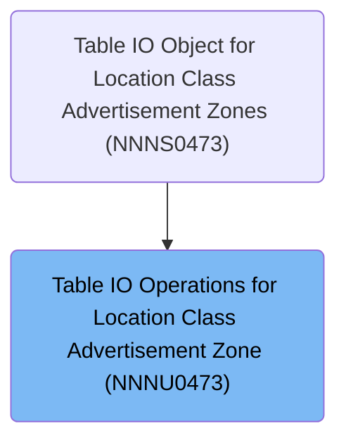

# Overview

This document explains the flow for dispatching and handling table row operations for location-class advertising zones. The flow receives requests to modify, insert, or purge records and routes each request to the appropriate database operation.

## Dependencies

### Program

- <SwmToken path="base/src/NNNU0473.cbl" pos="2:7:7" line-data="000200 PROGRAM-ID.    NNNU0473.                                         00020000">`NNNU0473`</SwmToken> (<SwmPath>[base/src/NNNU0473.cbl](base/src/NNNU0473.cbl)</SwmPath>)

### Copybooks

- <SwmToken path="base/src/NNNU0473.cbl" pos="25:4:4" line-data="002900 COPY XXXN001A.                                                   00290000">`XXXN001A`</SwmToken> (<SwmPath>[base/src/XXXN001A.cpy](base/src/XXXN001A.cpy)</SwmPath>)
- SQLCA
- <SwmToken path="base/src/NNNU0473.cbl" pos="29:4:4" line-data="003300 COPY YYYN005A.                                                   00330000">`YYYN005A`</SwmToken> (<SwmPath>[base/src/YYYN005A.cpy](base/src/YYYN005A.cpy)</SwmPath>)
- <SwmToken path="base/src/NNNU0473.cbl" pos="30:4:4" line-data="003400 COPY NNNN0000.                                                   00340000">`NNNN0000`</SwmToken> (<SwmPath>[base/src/NNNN0000.cpy](base/src/NNNN0000.cpy)</SwmPath>)
- <SwmToken path="base/src/NNNU0473.cbl" pos="14:13:13" line-data="001400* Table Name  : XXXX_LOC_CLS_AD_ZN , DDDTCZ01                     00140000">`DDDTCZ01`</SwmToken> (<SwmPath>[base/src/DDDTCZ01.cpy](base/src/DDDTCZ01.cpy)</SwmPath>)

# Where is this program used?

This program is used once, as represented in the following diagram:



## Detailed View of the Program's Functionality

# Main Program Structure

This program is designed as a database access object for a specific table. It is structured to handle three main operations on the table: modifying an existing row, inserting a new row, and deleting (purging) a row. The program is modular, with each operation handled in its own section, and a dispatcher at the entry point to route requests.

---

## Entry Point and Dispatcher

The main entry point of the program is a dispatcher section. When the program is called, it receives several parameters, including a structure that indicates which operation to perform. The dispatcher uses a control variable to determine which database operation is requested:

- If the request is to modify a row, it routes to the section that handles updates.
- If the request is to insert a new row, it routes to the section that handles inserts.
- If the request is to purge (delete) a row, it routes to the section that handles deletes.

After performing the requested operation, the program returns control to the caller.

---

## Modifying an Existing Table Row

When the dispatcher determines that a row modification is requested, it performs the following steps:

1. It calls a dedicated section for modifying a row.
2. This section executes an SQL UPDATE statement.
3. The update statement sets all columns of the row to the values provided in the input structure.
4. The row to be updated is identified by matching three key fields (location type code, location number, and item class code) in the WHERE clause.
5. No additional logic or checks are performed; the update is direct.

---

## Inserting a New Table Row

When the dispatcher determines that a new row should be inserted, the following occurs:

1. The dispatcher calls a handler section for inserting a row.
2. This handler section immediately delegates to another section that performs the actual insert.
3. The insert section executes an SQL INSERT statement.
4. The values for all columns are taken directly from the input structure.
5. No validation or existence checks are performed; the data is assumed to be ready for insertion.

---

## Purging (Deleting) a Table Row

When the dispatcher determines that a row should be deleted, the following steps are taken:

1. The dispatcher calls a handler section for purging a row.
2. This section executes an SQL DELETE statement.
3. The row to be deleted is identified by matching the same three key fields as in the update operation.
4. No checks are performed to see if the row exists before attempting the delete.

---

## Data Flow and Modularity

- The program uses a modular approach: the dispatcher only routes requests, and each operation (modify, insert, purge) is handled in its own section.
- All database operations use embedded SQL and rely on a shared input structure for their data.
- The program assumes that the input structure is correctly populated before being called.
- There is no error handling, validation, or business logic in these sections; all logic is focused on direct database manipulation.

---

## Summary

- The program acts as a simple, direct interface to a database table, supporting update, insert, and delete operations.
- It is structured for clarity and maintainability, with each operation isolated in its own section.
- The dispatcher at the entry point ensures that only the requested operation is performed.
- All operations are performed using embedded SQL, with no additional checks or logic.

# Rule Definition

| Paragraph Name                                                                                                                                                                                                                                                                                                                                                        | Rule ID | Category          | Description                                                                                                                                                                                                                                                                                                                                                                                                                                                                                                                                                                                                                                                                     | Conditions                                                                                                                                                                                                                                                                                                                                                                                                                                                                                                                                                                                                | Remarks                                                                                                                                                                                              |
| --------------------------------------------------------------------------------------------------------------------------------------------------------------------------------------------------------------------------------------------------------------------------------------------------------------------------------------------------------------------- | ------- | ----------------- | ------------------------------------------------------------------------------------------------------------------------------------------------------------------------------------------------------------------------------------------------------------------------------------------------------------------------------------------------------------------------------------------------------------------------------------------------------------------------------------------------------------------------------------------------------------------------------------------------------------------------------------------------------------------------------- | --------------------------------------------------------------------------------------------------------------------------------------------------------------------------------------------------------------------------------------------------------------------------------------------------------------------------------------------------------------------------------------------------------------------------------------------------------------------------------------------------------------------------------------------------------------------------------------------------------- | ---------------------------------------------------------------------------------------------------------------------------------------------------------------------------------------------------- |
| <SwmToken path="base/src/NNNU0473.cbl" pos="44:2:6" line-data="004800 0000-EXIT-DISPATCHER.                                            00480000">`0000-EXIT-DISPATCHER`</SwmToken>                                                                                                                                                                                    | RL-001  | Conditional Logic | The dispatcher evaluates the value of the control variable and routes execution to the corresponding database operation: insert, update, or delete.                                                                                                                                                                                                                                                                                                                                                                                                                                                                                                                             | The control variable must be set to one of: <SwmToken path="base/src/NNNU0473.cbl" pos="46:4:10" line-data="005000       WHEN EXIT-PUT-MODIFY-ROW                                   00500000">`EXIT-PUT-MODIFY-ROW`</SwmToken>, <SwmToken path="base/src/NNNU0473.cbl" pos="48:4:10" line-data="005200       WHEN EXIT-PUT-INSERT-ROW                                   00520000">`EXIT-PUT-INSERT-ROW`</SwmToken>, or <SwmToken path="base/src/NNNU0473.cbl" pos="50:4:10" line-data="005400       WHEN EXIT-PUT-PURGE-ROW                                    00540000">`EXIT-PUT-PURGE-ROW`</SwmToken>. | The control variable must exactly match one of the three allowed string values. No other values are handled. The dispatcher does not perform any validation or error handling for unexpected values. |
| <SwmToken path="base/src/NNNU0473.cbl" pos="49:4:12" line-data="005300          PERFORM 1500-EXIT-PUT-INSERT-ROW                        00530000">`1500-EXIT-PUT-INSERT-ROW`</SwmToken>, <SwmToken path="base/src/NNNU0473.cbl" pos="82:4:8" line-data="007200      PERFORM 1505-DO-INSERT                                      00720000">`1505-DO-INSERT`</SwmToken> | RL-002  | Computation       | When the control variable is set to <SwmToken path="base/src/NNNU0473.cbl" pos="48:4:10" line-data="005200       WHEN EXIT-PUT-INSERT-ROW                                   00520000">`EXIT-PUT-INSERT-ROW`</SwmToken>, the program inserts a new row into the <SwmToken path="base/src/NNNU0473.cbl" pos="88:6:6" line-data="048900         INSERT INTO XXXX_LOC_CLS_AD_ZN (                         00048900">`XXXX_LOC_CLS_AD_ZN`</SwmToken> table using all fields from the <SwmToken path="base/src/NNNU0473.cbl" pos="95:3:11" line-data="049600             :DCLXXXX-LOC-CLS-AD-ZN.LOC-TYP-CD,                   00049600">`DCLXXXX-LOC-CLS-AD-ZN`</SwmToken> structure. | The control variable must be set to <SwmToken path="base/src/NNNU0473.cbl" pos="48:4:10" line-data="005200       WHEN EXIT-PUT-INSERT-ROW                                   00520000">`EXIT-PUT-INSERT-ROW`</SwmToken>.                                                                                                                                                                                                                                                                                                                                                                                   | The fields and their formats are:                                                                                                                                                                    |

- <SwmToken path="base/src/NNNU0473.cbl" pos="89:2:2" line-data="049000             LOC_TYP_CD,                                          00049000">`LOC_TYP_CD`</SwmToken>: string, length 2
- <SwmToken path="base/src/NNNU0473.cbl" pos="90:2:2" line-data="049100             LOC_NBR,                                             00049100">`LOC_NBR`</SwmToken>: number, length 5
- <SwmToken path="base/src/NNNU0473.cbl" pos="91:2:2" line-data="049200             ITM_CLS_CD,                                          00049200">`ITM_CLS_CD`</SwmToken>: string, length 4
- <SwmToken path="base/src/NNNU0473.cbl" pos="92:2:2" line-data="049300             AD_ZONE,                                             00049300">`AD_ZONE`</SwmToken>: string, length 2
- <SwmToken path="base/src/NNNU0473.cbl" pos="93:2:2" line-data="049400             AD_ZONE_EXCP )                                       00049400">`AD_ZONE_EXCP`</SwmToken>: string, length 1 All fields must be provided. The table and structure fields must match exactly in name, type, and length. | | <SwmToken path="base/src/NNNU0473.cbl" pos="47:4:12" line-data="005100          PERFORM 1400-EXIT-PUT-MODIFY-ROW                        00510000">`1400-EXIT-PUT-MODIFY-ROW`</SwmToken>, <SwmToken path="base/src/NNNU0473.cbl" pos="57:4:8" line-data="006100      PERFORM 1405-DO-UPDATE                                      00610000">`1405-DO-UPDATE`</SwmToken> | RL-003 | Computation | When the control variable is set to <SwmToken path="base/src/NNNU0473.cbl" pos="46:4:10" line-data="005000       WHEN EXIT-PUT-MODIFY-ROW                                   00500000">`EXIT-PUT-MODIFY-ROW`</SwmToken>, the program updates all fields of the row in the <SwmToken path="base/src/NNNU0473.cbl" pos="88:6:6" line-data="048900         INSERT INTO XXXX_LOC_CLS_AD_ZN (                         00048900">`XXXX_LOC_CLS_AD_ZN`</SwmToken> table that matches the key fields from the structure. | The control variable must be set to <SwmToken path="base/src/NNNU0473.cbl" pos="46:4:10" line-data="005000       WHEN EXIT-PUT-MODIFY-ROW                                   00500000">`EXIT-PUT-MODIFY-ROW`</SwmToken>. The row to update is identified by matching <SwmToken path="base/src/NNNU0473.cbl" pos="89:2:2" line-data="049000             LOC_TYP_CD,                                          00049000">`LOC_TYP_CD`</SwmToken>, <SwmToken path="base/src/NNNU0473.cbl" pos="90:2:2" line-data="049100             LOC_NBR,                                             00049100">`LOC_NBR`</SwmToken>, <SwmToken path="base/src/NNNU0473.cbl" pos="91:2:2" line-data="049200             ITM_CLS_CD,                                          00049200">`ITM_CLS_CD`</SwmToken>, and <SwmToken path="base/src/NNNU0473.cbl" pos="92:2:2" line-data="049300             AD_ZONE,                                             00049300">`AD_ZONE`</SwmToken>. | All fields, including <SwmToken path="base/src/NNNU0473.cbl" pos="93:2:2" line-data="049400             AD_ZONE_EXCP )                                       00049400">`AD_ZONE_EXCP`</SwmToken>, are updated. The key fields are:
- <SwmToken path="base/src/NNNU0473.cbl" pos="89:2:2" line-data="049000             LOC_TYP_CD,                                          00049000">`LOC_TYP_CD`</SwmToken>: string, length 2
- <SwmToken path="base/src/NNNU0473.cbl" pos="90:2:2" line-data="049100             LOC_NBR,                                             00049100">`LOC_NBR`</SwmToken>: number, length 5
- <SwmToken path="base/src/NNNU0473.cbl" pos="91:2:2" line-data="049200             ITM_CLS_CD,                                          00049200">`ITM_CLS_CD`</SwmToken>: string, length 4
- <SwmToken path="base/src/NNNU0473.cbl" pos="92:2:2" line-data="049300             AD_ZONE,                                             00049300">`AD_ZONE`</SwmToken>: string, length 2 The update sets all columns to the values from the structure, regardless of whether they have changed. | | <SwmToken path="base/src/NNNU0473.cbl" pos="51:4:12" line-data="005500          PERFORM 1600-EXIT-PUT-PURGE-ROW                         00550000">`1600-EXIT-PUT-PURGE-ROW`</SwmToken> | RL-004 | Computation | When the control variable is set to <SwmToken path="base/src/NNNU0473.cbl" pos="50:4:10" line-data="005400       WHEN EXIT-PUT-PURGE-ROW                                    00540000">`EXIT-PUT-PURGE-ROW`</SwmToken>, the program deletes the row from the <SwmToken path="base/src/NNNU0473.cbl" pos="88:6:6" line-data="048900         INSERT INTO XXXX_LOC_CLS_AD_ZN (                         00048900">`XXXX_LOC_CLS_AD_ZN`</SwmToken> table that matches the key fields from the structure. | The control variable must be set to <SwmToken path="base/src/NNNU0473.cbl" pos="50:4:10" line-data="005400       WHEN EXIT-PUT-PURGE-ROW                                    00540000">`EXIT-PUT-PURGE-ROW`</SwmToken>. The row to delete is identified by matching <SwmToken path="base/src/NNNU0473.cbl" pos="89:2:2" line-data="049000             LOC_TYP_CD,                                          00049000">`LOC_TYP_CD`</SwmToken>, <SwmToken path="base/src/NNNU0473.cbl" pos="90:2:2" line-data="049100             LOC_NBR,                                             00049100">`LOC_NBR`</SwmToken>, <SwmToken path="base/src/NNNU0473.cbl" pos="91:2:2" line-data="049200             ITM_CLS_CD,                                          00049200">`ITM_CLS_CD`</SwmToken>, and <SwmToken path="base/src/NNNU0473.cbl" pos="92:2:2" line-data="049300             AD_ZONE,                                             00049300">`AD_ZONE`</SwmToken>. | The key fields are:
- <SwmToken path="base/src/NNNU0473.cbl" pos="89:2:2" line-data="049000             LOC_TYP_CD,                                          00049000">`LOC_TYP_CD`</SwmToken>: string, length 2
- <SwmToken path="base/src/NNNU0473.cbl" pos="90:2:2" line-data="049100             LOC_NBR,                                             00049100">`LOC_NBR`</SwmToken>: number, length 5
- <SwmToken path="base/src/NNNU0473.cbl" pos="91:2:2" line-data="049200             ITM_CLS_CD,                                          00049200">`ITM_CLS_CD`</SwmToken>: string, length 4
- <SwmToken path="base/src/NNNU0473.cbl" pos="92:2:2" line-data="049300             AD_ZONE,                                             00049300">`AD_ZONE`</SwmToken>: string, length 2 Only the row matching all key fields is deleted. No other fields are used in the WHERE clause. |

# User Stories

## User Story 1: Insert a new row when requested

---

### Story Description:

As a user, I want the system to evaluate the control variable and, when set to <SwmToken path="base/src/NNNU0473.cbl" pos="48:4:10" line-data="005200       WHEN EXIT-PUT-INSERT-ROW                                   00520000">`EXIT-PUT-INSERT-ROW`</SwmToken>, insert a new row into the <SwmToken path="base/src/NNNU0473.cbl" pos="88:6:6" line-data="048900         INSERT INTO XXXX_LOC_CLS_AD_ZN (                         00048900">`XXXX_LOC_CLS_AD_ZN`</SwmToken> table using all fields from the <SwmToken path="base/src/NNNU0473.cbl" pos="95:3:11" line-data="049600             :DCLXXXX-LOC-CLS-AD-ZN.LOC-TYP-CD,                   00049600">`DCLXXXX-LOC-CLS-AD-ZN`</SwmToken> structure so that new location/class/zone data can be added to the system.

---

### Business Rule Mapping:

| Rule ID | Paragraph Name                                                                                                                                                                                                                                                                                                                                                        | Rule Description                                                                                                                                                                                                                                                                                                                                                                                                                                                                                                                                                                                                                                                                |
| ------- | --------------------------------------------------------------------------------------------------------------------------------------------------------------------------------------------------------------------------------------------------------------------------------------------------------------------------------------------------------------------- | ------------------------------------------------------------------------------------------------------------------------------------------------------------------------------------------------------------------------------------------------------------------------------------------------------------------------------------------------------------------------------------------------------------------------------------------------------------------------------------------------------------------------------------------------------------------------------------------------------------------------------------------------------------------------------- |
| RL-001  | <SwmToken path="base/src/NNNU0473.cbl" pos="44:2:6" line-data="004800 0000-EXIT-DISPATCHER.                                            00480000">`0000-EXIT-DISPATCHER`</SwmToken>                                                                                                                                                                                    | The dispatcher evaluates the value of the control variable and routes execution to the corresponding database operation: insert, update, or delete.                                                                                                                                                                                                                                                                                                                                                                                                                                                                                                                             |
| RL-002  | <SwmToken path="base/src/NNNU0473.cbl" pos="49:4:12" line-data="005300          PERFORM 1500-EXIT-PUT-INSERT-ROW                        00530000">`1500-EXIT-PUT-INSERT-ROW`</SwmToken>, <SwmToken path="base/src/NNNU0473.cbl" pos="82:4:8" line-data="007200      PERFORM 1505-DO-INSERT                                      00720000">`1505-DO-INSERT`</SwmToken> | When the control variable is set to <SwmToken path="base/src/NNNU0473.cbl" pos="48:4:10" line-data="005200       WHEN EXIT-PUT-INSERT-ROW                                   00520000">`EXIT-PUT-INSERT-ROW`</SwmToken>, the program inserts a new row into the <SwmToken path="base/src/NNNU0473.cbl" pos="88:6:6" line-data="048900         INSERT INTO XXXX_LOC_CLS_AD_ZN (                         00048900">`XXXX_LOC_CLS_AD_ZN`</SwmToken> table using all fields from the <SwmToken path="base/src/NNNU0473.cbl" pos="95:3:11" line-data="049600             :DCLXXXX-LOC-CLS-AD-ZN.LOC-TYP-CD,                   00049600">`DCLXXXX-LOC-CLS-AD-ZN`</SwmToken> structure. |

---

### Relevant Functionality:

- <SwmToken path="base/src/NNNU0473.cbl" pos="44:2:6" line-data="004800 0000-EXIT-DISPATCHER.                                            00480000">`0000-EXIT-DISPATCHER`</SwmToken>
  1. **RL-001:**
     - Evaluate the control variable:
       - If it is <SwmToken path="base/src/NNNU0473.cbl" pos="46:4:10" line-data="005000       WHEN EXIT-PUT-MODIFY-ROW                                   00500000">`EXIT-PUT-MODIFY-ROW`</SwmToken>, perform the update routine.
       - If it is <SwmToken path="base/src/NNNU0473.cbl" pos="48:4:10" line-data="005200       WHEN EXIT-PUT-INSERT-ROW                                   00520000">`EXIT-PUT-INSERT-ROW`</SwmToken>, perform the insert routine.
       - If it is <SwmToken path="base/src/NNNU0473.cbl" pos="50:4:10" line-data="005400       WHEN EXIT-PUT-PURGE-ROW                                    00540000">`EXIT-PUT-PURGE-ROW`</SwmToken>, perform the delete routine.
     - After performing the operation, return control to the caller.
- <SwmToken path="base/src/NNNU0473.cbl" pos="49:4:12" line-data="005300          PERFORM 1500-EXIT-PUT-INSERT-ROW                        00530000">`1500-EXIT-PUT-INSERT-ROW`</SwmToken>
  1. **RL-002:**
     - When the dispatcher selects the insert operation:
       - Execute an SQL INSERT statement into the table <SwmToken path="base/src/NNNU0473.cbl" pos="88:6:6" line-data="048900         INSERT INTO XXXX_LOC_CLS_AD_ZN (                         00048900">`XXXX_LOC_CLS_AD_ZN`</SwmToken>.
       - Use the values from the structure for all columns.
       - No validation or existence check is performed before the insert.

## User Story 2: Update an existing row when requested

---

### Story Description:

As a user, I want the system to evaluate the control variable and, when set to <SwmToken path="base/src/NNNU0473.cbl" pos="46:4:10" line-data="005000       WHEN EXIT-PUT-MODIFY-ROW                                   00500000">`EXIT-PUT-MODIFY-ROW`</SwmToken>, update all fields of the existing row in the <SwmToken path="base/src/NNNU0473.cbl" pos="88:6:6" line-data="048900         INSERT INTO XXXX_LOC_CLS_AD_ZN (                         00048900">`XXXX_LOC_CLS_AD_ZN`</SwmToken> table that matches the key fields from the <SwmToken path="base/src/NNNU0473.cbl" pos="95:3:11" line-data="049600             :DCLXXXX-LOC-CLS-AD-ZN.LOC-TYP-CD,                   00049600">`DCLXXXX-LOC-CLS-AD-ZN`</SwmToken> structure so that location/class/zone data can be modified as needed.

---

### Business Rule Mapping:

| Rule ID | Paragraph Name                                                                                                                                                                                                                                                                                                                                                        | Rule Description                                                                                                                                                                                                                                                                                                                                                                                                                                                                                                |
| ------- | --------------------------------------------------------------------------------------------------------------------------------------------------------------------------------------------------------------------------------------------------------------------------------------------------------------------------------------------------------------------- | --------------------------------------------------------------------------------------------------------------------------------------------------------------------------------------------------------------------------------------------------------------------------------------------------------------------------------------------------------------------------------------------------------------------------------------------------------------------------------------------------------------- |
| RL-001  | <SwmToken path="base/src/NNNU0473.cbl" pos="44:2:6" line-data="004800 0000-EXIT-DISPATCHER.                                            00480000">`0000-EXIT-DISPATCHER`</SwmToken>                                                                                                                                                                                    | The dispatcher evaluates the value of the control variable and routes execution to the corresponding database operation: insert, update, or delete.                                                                                                                                                                                                                                                                                                                                                             |
| RL-003  | <SwmToken path="base/src/NNNU0473.cbl" pos="47:4:12" line-data="005100          PERFORM 1400-EXIT-PUT-MODIFY-ROW                        00510000">`1400-EXIT-PUT-MODIFY-ROW`</SwmToken>, <SwmToken path="base/src/NNNU0473.cbl" pos="57:4:8" line-data="006100      PERFORM 1405-DO-UPDATE                                      00610000">`1405-DO-UPDATE`</SwmToken> | When the control variable is set to <SwmToken path="base/src/NNNU0473.cbl" pos="46:4:10" line-data="005000       WHEN EXIT-PUT-MODIFY-ROW                                   00500000">`EXIT-PUT-MODIFY-ROW`</SwmToken>, the program updates all fields of the row in the <SwmToken path="base/src/NNNU0473.cbl" pos="88:6:6" line-data="048900         INSERT INTO XXXX_LOC_CLS_AD_ZN (                         00048900">`XXXX_LOC_CLS_AD_ZN`</SwmToken> table that matches the key fields from the structure. |

---

### Relevant Functionality:

- <SwmToken path="base/src/NNNU0473.cbl" pos="44:2:6" line-data="004800 0000-EXIT-DISPATCHER.                                            00480000">`0000-EXIT-DISPATCHER`</SwmToken>
  1. **RL-001:**
     - Evaluate the control variable:
       - If it is <SwmToken path="base/src/NNNU0473.cbl" pos="46:4:10" line-data="005000       WHEN EXIT-PUT-MODIFY-ROW                                   00500000">`EXIT-PUT-MODIFY-ROW`</SwmToken>, perform the update routine.
       - If it is <SwmToken path="base/src/NNNU0473.cbl" pos="48:4:10" line-data="005200       WHEN EXIT-PUT-INSERT-ROW                                   00520000">`EXIT-PUT-INSERT-ROW`</SwmToken>, perform the insert routine.
       - If it is <SwmToken path="base/src/NNNU0473.cbl" pos="50:4:10" line-data="005400       WHEN EXIT-PUT-PURGE-ROW                                    00540000">`EXIT-PUT-PURGE-ROW`</SwmToken>, perform the delete routine.
     - After performing the operation, return control to the caller.
- <SwmToken path="base/src/NNNU0473.cbl" pos="47:4:12" line-data="005100          PERFORM 1400-EXIT-PUT-MODIFY-ROW                        00510000">`1400-EXIT-PUT-MODIFY-ROW`</SwmToken>
  1. **RL-003:**
     - When the dispatcher selects the update operation:
       - Execute an SQL UPDATE statement on the table <SwmToken path="base/src/NNNU0473.cbl" pos="88:6:6" line-data="048900         INSERT INTO XXXX_LOC_CLS_AD_ZN (                         00048900">`XXXX_LOC_CLS_AD_ZN`</SwmToken>.
       - Set all columns to the values from the structure.
       - The WHERE clause matches the key fields from the structure.
       - No validation or existence check is performed before the update.

## User Story 3: Delete a row when requested

---

### Story Description:

As a user, I want the system to evaluate the control variable and, when set to <SwmToken path="base/src/NNNU0473.cbl" pos="50:4:10" line-data="005400       WHEN EXIT-PUT-PURGE-ROW                                    00540000">`EXIT-PUT-PURGE-ROW`</SwmToken>, delete the row from the <SwmToken path="base/src/NNNU0473.cbl" pos="88:6:6" line-data="048900         INSERT INTO XXXX_LOC_CLS_AD_ZN (                         00048900">`XXXX_LOC_CLS_AD_ZN`</SwmToken> table that matches the key fields from the <SwmToken path="base/src/NNNU0473.cbl" pos="95:3:11" line-data="049600             :DCLXXXX-LOC-CLS-AD-ZN.LOC-TYP-CD,                   00049600">`DCLXXXX-LOC-CLS-AD-ZN`</SwmToken> structure so that obsolete location/class/zone data can be removed from the system.

---

### Business Rule Mapping:

| Rule ID | Paragraph Name                                                                                                                                                                         | Rule Description                                                                                                                                                                                                                                                                                                                                                                                                                                                                                   |
| ------- | -------------------------------------------------------------------------------------------------------------------------------------------------------------------------------------- | -------------------------------------------------------------------------------------------------------------------------------------------------------------------------------------------------------------------------------------------------------------------------------------------------------------------------------------------------------------------------------------------------------------------------------------------------------------------------------------------------- |
| RL-001  | <SwmToken path="base/src/NNNU0473.cbl" pos="44:2:6" line-data="004800 0000-EXIT-DISPATCHER.                                            00480000">`0000-EXIT-DISPATCHER`</SwmToken>     | The dispatcher evaluates the value of the control variable and routes execution to the corresponding database operation: insert, update, or delete.                                                                                                                                                                                                                                                                                                                                                |
| RL-004  | <SwmToken path="base/src/NNNU0473.cbl" pos="51:4:12" line-data="005500          PERFORM 1600-EXIT-PUT-PURGE-ROW                         00550000">`1600-EXIT-PUT-PURGE-ROW`</SwmToken> | When the control variable is set to <SwmToken path="base/src/NNNU0473.cbl" pos="50:4:10" line-data="005400       WHEN EXIT-PUT-PURGE-ROW                                    00540000">`EXIT-PUT-PURGE-ROW`</SwmToken>, the program deletes the row from the <SwmToken path="base/src/NNNU0473.cbl" pos="88:6:6" line-data="048900         INSERT INTO XXXX_LOC_CLS_AD_ZN (                         00048900">`XXXX_LOC_CLS_AD_ZN`</SwmToken> table that matches the key fields from the structure. |

---

### Relevant Functionality:

- <SwmToken path="base/src/NNNU0473.cbl" pos="44:2:6" line-data="004800 0000-EXIT-DISPATCHER.                                            00480000">`0000-EXIT-DISPATCHER`</SwmToken>
  1. **RL-001:**
     - Evaluate the control variable:
       - If it is <SwmToken path="base/src/NNNU0473.cbl" pos="46:4:10" line-data="005000       WHEN EXIT-PUT-MODIFY-ROW                                   00500000">`EXIT-PUT-MODIFY-ROW`</SwmToken>, perform the update routine.
       - If it is <SwmToken path="base/src/NNNU0473.cbl" pos="48:4:10" line-data="005200       WHEN EXIT-PUT-INSERT-ROW                                   00520000">`EXIT-PUT-INSERT-ROW`</SwmToken>, perform the insert routine.
       - If it is <SwmToken path="base/src/NNNU0473.cbl" pos="50:4:10" line-data="005400       WHEN EXIT-PUT-PURGE-ROW                                    00540000">`EXIT-PUT-PURGE-ROW`</SwmToken>, perform the delete routine.
     - After performing the operation, return control to the caller.
- <SwmToken path="base/src/NNNU0473.cbl" pos="51:4:12" line-data="005500          PERFORM 1600-EXIT-PUT-PURGE-ROW                         00550000">`1600-EXIT-PUT-PURGE-ROW`</SwmToken>
  1. **RL-004:**
     - When the dispatcher selects the delete operation:
       - Execute an SQL DELETE statement on the table <SwmToken path="base/src/NNNU0473.cbl" pos="88:6:6" line-data="048900         INSERT INTO XXXX_LOC_CLS_AD_ZN (                         00048900">`XXXX_LOC_CLS_AD_ZN`</SwmToken>.
       - The WHERE clause matches the key fields from the structure.
       - No validation or existence check is performed before the delete.

# Workflow

# Dispatching Table Row Operations

This section acts as a dispatcher, routing incoming requests to the correct database operation (modify, insert, or purge) based on a control variable. It ensures that each operation is handled by its dedicated logic, maintaining separation of concerns and clarity in processing.

| Category        | Rule Name                         | Description                                                                                                                                                                                                   |
| --------------- | --------------------------------- | ------------------------------------------------------------------------------------------------------------------------------------------------------------------------------------------------------------- |
| Data validation | Recognized Control Values         | The dispatcher must recognize the following control variable values: 8 for modify, 9 for insert, and 10 for purge.                                                                                            |
| Business logic  | Route to Modify Operation         | If the control variable is set to the value for 'modify', the dispatcher must route the request to the modify operation handler.                                                                              |
| Business logic  | Route to Insert Operation         | If the control variable is set to the value for 'insert', the dispatcher must route the request to the insert operation handler, which will add a new location-class advertising zone record to the database. |
| Business logic  | Route to Purge Operation          | If the control variable is set to the value for 'purge', the dispatcher must route the request to the purge operation handler.                                                                                |
| Technical step  | Dispatcher Separation of Concerns | The dispatcher must not perform any database operation itself; it only routes requests to the appropriate handler.                                                                                            |

<SwmSnippet path="/base/src/NNNU0473.cbl" line="44">

---

<SwmToken path="base/src/NNNU0473.cbl" pos="44:2:6" line-data="004800 0000-EXIT-DISPATCHER.                                            00480000">`0000-EXIT-DISPATCHER`</SwmToken> is the entry point that routes requests to the right database operation (modify, insert, or purge) based on the control variable. When the insert case is hit, it calls <SwmToken path="base/src/NNNU0473.cbl" pos="49:4:12" line-data="005300          PERFORM 1500-EXIT-PUT-INSERT-ROW                        00530000">`1500-EXIT-PUT-INSERT-ROW`</SwmToken> to handle adding a new row. This separation keeps the dispatcher focused on routing and leaves the actual insert logic to a dedicated function.

```cobol
004800 0000-EXIT-DISPATCHER.                                            00480000
004900      EVALUATE TRUE                                               00490000
005000       WHEN EXIT-PUT-MODIFY-ROW                                   00500000
005100          PERFORM 1400-EXIT-PUT-MODIFY-ROW                        00510000
005200       WHEN EXIT-PUT-INSERT-ROW                                   00520000
005300          PERFORM 1500-EXIT-PUT-INSERT-ROW                        00530000
005400       WHEN EXIT-PUT-PURGE-ROW                                    00540000
005500          PERFORM 1600-EXIT-PUT-PURGE-ROW                         00550000
005600      END-EVALUATE                                                00560000
005700     GOBACK                                                       00570000
005800     .                                                            00580000
```

---

</SwmSnippet>

## Inserting a New Table Row

This section handles the insertion of a new record into the database table. It assumes that all data provided is ready for insertion and does not perform any additional checks or transformations.

<SwmSnippet path="/base/src/NNNU0473.cbl" line="81">

---

<SwmToken path="base/src/NNNU0473.cbl" pos="81:2:10" line-data="007100 1500-EXIT-PUT-INSERT-ROW.                                        00710000">`1500-EXIT-PUT-INSERT-ROW`</SwmToken> just delegates to <SwmToken path="base/src/NNNU0473.cbl" pos="82:4:8" line-data="007200      PERFORM 1505-DO-INSERT                                      00720000">`1505-DO-INSERT`</SwmToken> to actually perform the database insert. This keeps the flow modular and makes it easier to update the insert logic without touching the dispatcher or handler.

```cobol
007100 1500-EXIT-PUT-INSERT-ROW.                                        00710000
007200      PERFORM 1505-DO-INSERT                                      00720000
007300     .                                                            00730000
```

---

</SwmSnippet>

<SwmSnippet path="/base/src/NNNU0473.cbl" line="86">

---

<SwmToken path="base/src/NNNU0473.cbl" pos="86:2:6" line-data="007600 1505-DO-INSERT.                                                  00760000">`1505-DO-INSERT`</SwmToken> does the actual SQL insert using embedded SQL. It takes the values from the <SwmToken path="base/src/NNNU0473.cbl" pos="95:3:11" line-data="049600             :DCLXXXX-LOC-CLS-AD-ZN.LOC-TYP-CD,                   00049600">`DCLXXXX-LOC-CLS-AD-ZN`</SwmToken> structure and pushes them straight into the table, no extra logic or checks. It assumes the data is ready to go.

```cobol
007600 1505-DO-INSERT.                                                  00760000
007700     EXEC SQL                                                     00770000
048900         INSERT INTO XXXX_LOC_CLS_AD_ZN (                         00048900
049000             LOC_TYP_CD,                                          00049000
049100             LOC_NBR,                                             00049100
049200             ITM_CLS_CD,                                          00049200
049300             AD_ZONE,                                             00049300
049400             AD_ZONE_EXCP )                                       00049400
049500         VALUES (                                                 00049500
049600             :DCLXXXX-LOC-CLS-AD-ZN.LOC-TYP-CD,                   00049600
049700             :DCLXXXX-LOC-CLS-AD-ZN.LOC-NBR,                      00049700
049800             :DCLXXXX-LOC-CLS-AD-ZN.ITM-CLS-CD,                   00049800
049900             :DCLXXXX-LOC-CLS-AD-ZN.AD-ZONE,                      00049900
050000             :DCLXXXX-LOC-CLS-AD-ZN.AD-ZONE-EXCP )                00050000
007800     END-EXEC                                                     00780000
```

---

</SwmSnippet>

## Purging a Table Row

<SwmSnippet path="/base/src/NNNU0473.cbl" line="104">

---

<SwmToken path="base/src/NNNU0473.cbl" pos="104:2:10" line-data="008200 1600-EXIT-PUT-PURGE-ROW.                                         00820000">`1600-EXIT-PUT-PURGE-ROW`</SwmToken> deletes a row from the table using the key fields from <SwmToken path="base/src/NNNU0473.cbl" pos="107:9:17" line-data="051500         WHERE  LOC_TYP_CD = :DCLXXXX-LOC-CLS-AD-ZN.LOC-TYP-CD    00051500">`DCLXXXX-LOC-CLS-AD-ZN`</SwmToken>. It uses embedded SQL and expects the structure to be filled in with the right values. No checks for existence or extra logic.

```cobol
008200 1600-EXIT-PUT-PURGE-ROW.                                         00820000
008300       EXEC SQL                                                   00830000
051400         DELETE FROM XXXX_LOC_CLS_AD_ZN                           00051400
051500         WHERE  LOC_TYP_CD = :DCLXXXX-LOC-CLS-AD-ZN.LOC-TYP-CD    00051500
051600         AND    LOC_NBR = :DCLXXXX-LOC-CLS-AD-ZN.LOC-NBR          00051600
051700         AND    ITM_CLS_CD = :DCLXXXX-LOC-CLS-AD-ZN.ITM-CLS-CD    00051700
008400       END-EXEC                                                   00840000
```

---

</SwmSnippet>

&nbsp;

*This is an auto-generated document by Swimm 🌊 and has not yet been verified by a human*

<SwmMeta version="3.0.0" repo-id="Z2l0aHViJTNBJTNBU3dpbW1pby1keW5jYWxsLWRlbW8lM0ElM0FHaXJpLVN3aW1t" repo-name="Swimmio-dyncall-demo"><sup>Powered by [Swimm](https://app.swimm.io/)</sup></SwmMeta>
