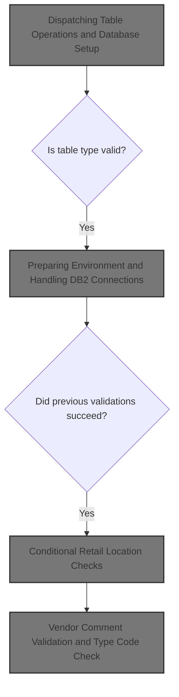
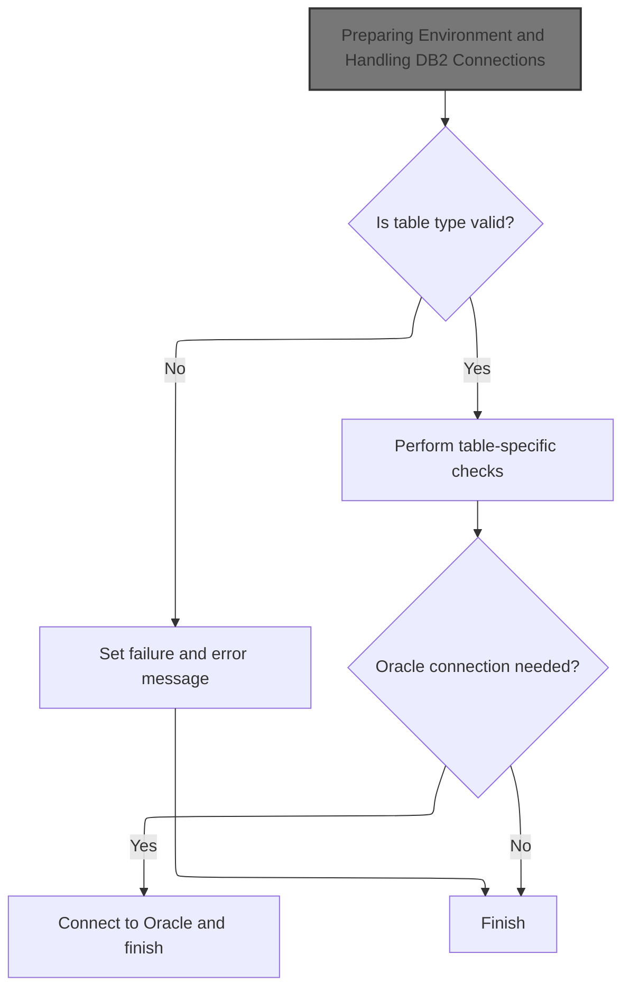
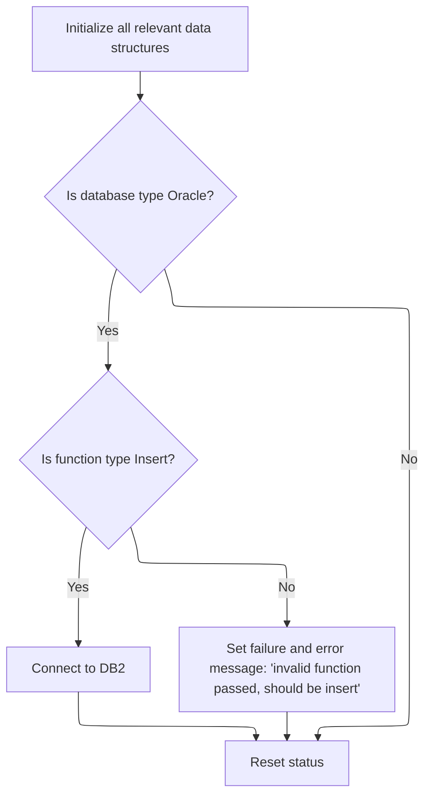
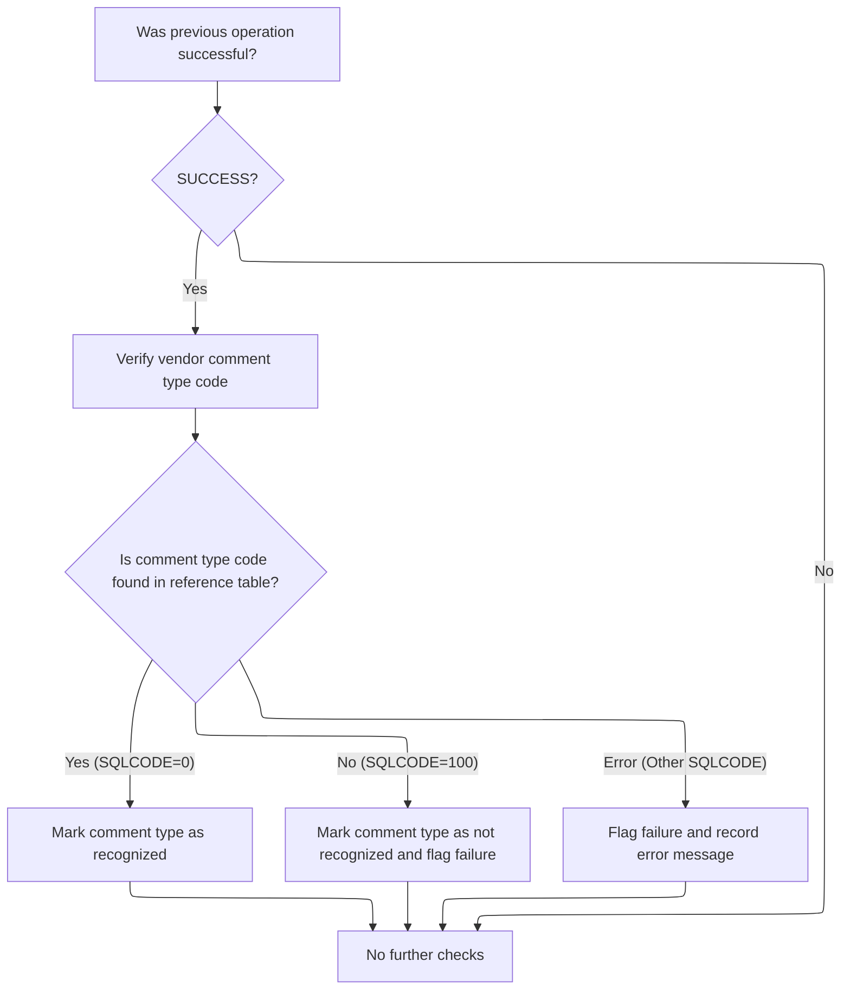

This document describes the flow for orchestrating table validation and database setup. The flow prepares the environment, evaluates the table type, and dispatches to the appropriate business logic for validation. For Oracle databases, it manages connection setup. Conditional checks for retail locations and vendor comments are performed only if previous validations succeed.



# Spec

## Detailed View of the Program's Functionality

# Main Program Flow

The program begins execution in the main logic section. The first step is to perform initialization, which sets up the environment and handles database connection logic. After initialization, the program examines the type of table operation requested. This is done using a multi-branch conditional structure that checks the table code provided as input. For each recognized table code, a corresponding subroutine is performed to handle specific validation or referential integrity checks. If the table code is not recognized, the program sets a failure flag and constructs an error message indicating an invalid table was passed.

After handling the table-specific logic, the program checks if the target database is Oracle. If so, it temporarily saves certain variables, performs the Oracle connection routine, and then restores the saved variables. The program then ends execution and returns control to the caller.

---

# Environment Preparation and Database Connection

During initialization, the program resets key data structures and working storage areas to a clean state. It then checks if the target database is Oracle. If it is, the program further checks if the requested function is an insert operation. If both conditions are met, it performs a connection to the DB2 database by calling an external routine. If the function is not an insert, it sets a failure flag and builds an error message indicating that only insert operations are valid in this context. Regardless of the database type, the program resets the status field to spaces to ensure a clean state for subsequent operations.

---

# Table Operation Dispatch and Validation

After initialization, the program uses a conditional structure to determine which table-specific validation or referential integrity check to perform. Each recognized table code triggers a different subroutine:

- For certain codes, the program simply continues without further action.
- For others, it performs vendor location checks, shipping option checks, retail location checks, retail location class/address/zone checks, or vendor transaction control checks.
- For the vendor comments table, it performs a vendor comment validation routine.
- If the table code is not recognized, the program sets a failure flag and constructs an error message indicating the table is invalid.

---

# Oracle Connection Handling

If the target database is Oracle, the program saves the current state of key variables, calls an external routine to establish a connection to Oracle, and then restores the saved variables. This ensures that the environment is correctly set up for Oracle operations without losing any important context from before the connection.

---

# Conditional Retail Location Checks

When the program is handling a retail location table operation, it first checks if the previous steps were successful. If so, it would (if not commented out) perform an e-commerce market area check. If that check is also successful and a parent flag is set, it would then perform a computer type check. These steps are chained together, with each subsequent check only performed if the previous one succeeded and the relevant flags are set.

---

# Vendor Comment Validation and Type Code Check

For vendor comment table operations, the program first checks if all previous operations were successful. If so, it performs a validation of the vendor comment type code. This involves moving the input comment type code into a host variable and executing a database query to check if the code exists in a reference table. The result of the query determines the next action:

- If the code is found, the program marks the comment type as recognized.
- If the code is not found, it marks the comment type as not recognized, sets a failure flag, and constructs an error message.
- If there is a database error, it sets a failure flag and records a detailed error message including the SQL error code.

---

# Database Connection Subroutines

There are two main subroutines for database connections:

- The DB2 connection subroutine calls an external routine to establish a connection to the DB2 database, passing the necessary parameters.
- The Oracle connection subroutine calls a different external routine to set up system variables and connect to the Oracle database.

---

# Summary

The program is structured to initialize its environment, dispatch table-specific validation routines based on input, handle database connections (with special logic for Oracle), and perform detailed validation checks for certain table types. Error handling is robust, with failure flags and descriptive messages set whenever an invalid operation or database error occurs. The flow is modular, with each major operation encapsulated in its own subroutine, allowing for clear separation of concerns and easier maintenance.

# Rule Definition

| Paragraph Name                                                   | Rule ID | Category          | Description                                                                                                                                                                                                             | Conditions                                                     | Remarks                                                                                                                                                                                                                                                                |
| ---------------------------------------------------------------- | ------- | ----------------- | ----------------------------------------------------------------------------------------------------------------------------------------------------------------------------------------------------------------------- | -------------------------------------------------------------- | ---------------------------------------------------------------------------------------------------------------------------------------------------------------------------------------------------------------------------------------------------------------------- |
| 010-INITIALIZE                                                   | RL-001  | Data Assignment   | Before any processing begins, the program must initialize all relevant working storage and data structures to ensure a clean state.                                                                                     | Program start.                                                 | All working storage areas and linkage structures are initialized to spaces or default values. No specific output format, but all fields are cleared.                                                                                                                   |
| 000-MAIN-LINE                                                    | RL-002  | Conditional Logic | The program must check that the MMMC0335-TABLE field contains a value between 001 and 011. If not, it sets the FAILURE flag, clears the return message, and builds an error message.                                    | MMMC0335-TABLE value is not in the range 001–011.              | Valid values: 001–011 (inclusive). FAILURE is a boolean flag. IS-RTRN-MSG-TXT is an alphanumeric string for error messages.                                                                                                                                            |
| 000-MAIN-LINE                                                    | RL-003  | Conditional Logic | For table type values 001–010, the program continues processing. Some values trigger specific checks, but no additional validation or SQL checks are performed for 001–004.                                             | MMMC0335-TABLE is 001–010.                                     | No additional validation for 001–004. For 005–010, specific routines are called but not detailed in the spec.                                                                                                                                                          |
| 000-MAIN-LINE, 1100-CHK-VENDOR-COMMENTS, 1105-CHK-CMT-TYP-CD     | RL-004  | Conditional Logic | For table type 011, the program checks if SUCCESS is true, moves the comment type code to the host variable, and executes a SQL SELECT to validate the code. Output flags and messages are set based on the SQL result. | MMMC0335-TABLE is 011 and SUCCESS is true.                     | SQL query: SELECT XXX_TYP_CD FROM XXX_TYP_CD WHERE XXX_TYP_CD = DCLCMT-TYP-CD.CMT-TYP-CD FETCH FIRST 1 ROWS ONLY. Output flags: MMMC0335-PARENT, MMMC0335-NO-PARENT, SUCCESS, FAILURE. Status: 'VALID', 'INVALID', 'ERROR'. IS-RTRN-MSG-TXT is an alphanumeric string. |
| 010-INITIALIZE, 020-CONNECT-TO-ORACLE, 015-CONNECT-TO-DB2        | RL-005  | Conditional Logic | The program connects to the appropriate database based on the MMMC0335-ORACLE flag and MMMC0335-FUNC value. Only valid operations are allowed.                                                                          | MMMC0335-ORACLE is true. MMMC0335-FUNC must be 'I' for insert. | MMMC0335-ORACLE is a boolean flag. MMMC0335-FUNC must be 'I'. Connection strings: Z-ORA-CONNECT ('YYYS0210'), Z-DB2-CONNECT ('YYYS0211').                                                                                                                              |
| End of 000-MAIN-LINE and all routines that update flags/messages | RL-006  | Data Assignment   | After processing, the program outputs the updated MMMC0335 linkage structure, including all flags, status, and error message fields.                                                                                    | End of processing.                                             | Output includes all fields: MMMC0335-TABLE, MMMC0335-FUNC, MMMC0335-ORACLE, MMMC0335-CMT-TYP-CD, MMMC0335-STATUS (string), SUCCESS (boolean), FAILURE (boolean), MMMC0335-PARENT (boolean), MMMC0335-NO-PARENT (boolean), IS-RTRN-MSG-TXT (string).                    |

# User Stories

## User Story 1: Initialize, connect to database, and finalize linkage structure

---

### Story Description:

As a system, I want all relevant data structures and working storage to be initialized before processing begins, connect to the correct database when required, and output the updated linkage structure after processing so that the program starts in a clean state, uses the correct backend, and provides all necessary results to the caller.

---

### Business Rule Mapping:

| Rule ID | Paragraph Name                                                   | Rule Description                                                                                                                               |
| ------- | ---------------------------------------------------------------- | ---------------------------------------------------------------------------------------------------------------------------------------------- |
| RL-001  | 010-INITIALIZE                                                   | Before any processing begins, the program must initialize all relevant working storage and data structures to ensure a clean state.            |
| RL-005  | 010-INITIALIZE, 020-CONNECT-TO-ORACLE, 015-CONNECT-TO-DB2        | The program connects to the appropriate database based on the MMMC0335-ORACLE flag and MMMC0335-FUNC value. Only valid operations are allowed. |
| RL-006  | End of 000-MAIN-LINE and all routines that update flags/messages | After processing, the program outputs the updated MMMC0335 linkage structure, including all flags, status, and error message fields.           |

---

### Relevant Functionality:

- **010-INITIALIZE**
  1. **RL-001:**
     - On program start:
       - Initialize all working storage areas to spaces or default values
       - Initialize linkage structures
       - Clear status fields
  2. **RL-005:**
     - If MMMC0335-ORACLE is true:
       - If MMMC0335-FUNC = 'I':
         - Connect to DB2
       - Else:
         - Set FAILURE to true
         - Build error message: 'MMMS0335 - invalid function passed function should be insert'
- **End of 000-MAIN-LINE and all routines that update flags/messages**
  1. **RL-006:**
     - After all processing:
       - Output the updated MMMC0335 linkage structure with all flags, status, and error message fields

## User Story 2: Validate input and process based on table type, including comment type code validation

---

### Story Description:

As a user, I want the program to validate the MMMC0335-TABLE input and process it according to its value, including validating the comment type code for table type 011, so that invalid inputs are caught early, valid table types are handled appropriately, and recognized codes are confirmed with clear feedback.

---

### Business Rule Mapping:

| Rule ID | Paragraph Name                                               | Rule Description                                                                                                                                                                                                        |
| ------- | ------------------------------------------------------------ | ----------------------------------------------------------------------------------------------------------------------------------------------------------------------------------------------------------------------- |
| RL-002  | 000-MAIN-LINE                                                | The program must check that the MMMC0335-TABLE field contains a value between 001 and 011. If not, it sets the FAILURE flag, clears the return message, and builds an error message.                                    |
| RL-003  | 000-MAIN-LINE                                                | For table type values 001–010, the program continues processing. Some values trigger specific checks, but no additional validation or SQL checks are performed for 001–004.                                             |
| RL-004  | 000-MAIN-LINE, 1100-CHK-VENDOR-COMMENTS, 1105-CHK-CMT-TYP-CD | For table type 011, the program checks if SUCCESS is true, moves the comment type code to the host variable, and executes a SQL SELECT to validate the code. Output flags and messages are set based on the SQL result. |

---

### Relevant Functionality:

- **000-MAIN-LINE**
  1. **RL-002:**
     - If MMMC0335-TABLE < 001 or > 011:
       - Set FAILURE to true
       - Clear IS-RTRN-MSG-TXT
       - Build error message: 'MMMS0335 - invalid table passed'
  2. **RL-003:**
     - If MMMC0335-TABLE is 001–004:
       - Continue
     - If MMMC0335-TABLE is 005–010:
       - Perform corresponding check routine
  3. **RL-004:**
     - If MMMC0335-TABLE is 011 and SUCCESS is true:
       - Move MMMC0335-CMT-TYP-CD to host variable
       - Execute SQL SELECT for comment type code
       - If SQLCODE = 0:
         - Set MMMC0335-PARENT to true
         - Set SUCCESS to true
         - Set FAILURE to false
         - Set MMMC0335-STATUS to 'VALID'
         - Set IS-RTRN-MSG-TXT to indicate code is recognized
       - If SQLCODE = 100:
         - Set MMMC0335-NO-PARENT to true
         - Set FAILURE to true
         - Set SUCCESS to false
         - Set MMMC0335-STATUS to 'INVALID'
         - Set IS-RTRN-MSG-TXT to indicate code is not recognized
       - If SQLCODE is any other value:
         - Set FAILURE to true
         - Set SUCCESS to false
         - Set MMMC0335-STATUS to 'ERROR'
         - Set IS-RTRN-MSG-TXT to include SQL error code

# Code Walkthrough

## Dispatching Table Operations and Database Setup



<SwmSnippet path="/base/src/MMMS0335.cbl" line="86">

---

000-MAIN-LINE kicks off the flow by calling 010-INITIALIZE to prep the environment and handle DB connection logic. Then it uses EVALUATE on MMMC0335-TABLE to pick which subroutine to run for vendor location checks. If the table code is unknown, it sets a failure flag and builds an error message. If Oracle is the target DB, it moves connection variables to working storage, calls the Oracle connect routine, and restores them after. The flow ends with GOBACK.

```cobol
010600 000-MAIN-LINE.                                                   00010600
010700     PERFORM 010-INITIALIZE                                       00010700
010800     EVALUATE MMMC0335-TABLE                                      00010800
010900       WHEN 001                                                   00010900
011100       WHEN 002                                                   00011100
011300       WHEN 003                                                   00011300
011500       WHEN 004                                                   00011500
011600         CONTINUE                                                 00011600
011700       WHEN 005                                                   00011700
011800         PERFORM 500-CHK-XXX-VEND-LOC                             00011800
011900       WHEN 006                                                   00011900
012000         PERFORM 600-CHK-LOC-SHPNG-OPT                            00012000
012100       WHEN 007                                                   00012100
012200         PERFORM 700-CHK-RETAIL-LOC                               00012200
012300       WHEN 008                                                   00012300
012400         PERFORM 800-CHK-RETL-LOC-CLS-AD-ZN                       00012400
012500       WHEN 009                                                   00012500
012600         PERFORM 900-CHK-XXX-VEND-LOC                             00012600
012700       WHEN 010                                                   00012700
012800         PERFORM 1000-CHK-VEND-TRXAL-CNTL                         00012800
012900       WHEN 011                                                   00012900
013000         PERFORM 1100-CHK-VENDOR-COMMENTS                         00013000
013100       WHEN OTHER                                                 00013100
013200         SET FAILURE   TO TRUE                                    00013200
013300         MOVE SPACES  TO IS-RTRN-MSG-TXT                          00013300
013400         STRING 'MMMS0335 - invalid table passed '                00013400
013500                DELIMITED BY SIZE INTO IS-RTRN-MSG-TXT            00013500
013600     END-EVALUATE                                                 00013600
013700     IF MMMC0335-ORACLE                                           00013700
013800       MOVE XXXN001A   TO  WS-XXXN001A                            00013800
013900       MOVE SQLCA      TO  WS-SQLCA                               00013900
014000       PERFORM 020-CONNECT-TO-ORACLE                              00014000
014100       MOVE WS-XXXN001A  TO XXXN001A                              00014100
014200       MOVE WS-SQLCA     TO SQLCA                                 00014200
014300     END-IF                                                       00014300
014400                                                                  00014400
014500     GOBACK                                                       00014500
014600     .                                                            00014600
```

---

</SwmSnippet>

### Preparing Environment and Handling DB2 Connections



<SwmSnippet path="/base/src/MMMS0335.cbl" line="129">

---

010-INITIALIZE checks for Oracle and insert ops, connects to DB2 if valid, or sets an error if not.

```cobol
015200 010-INITIALIZE.                                                  00015200
015300     INITIALIZE XXXN001A                                          00015300
015400                WS-XXXN001A                                       00015400
015500                WS-SQLCA                                          00015500
015600                                                                  00015600
015700     IF MMMC0335-ORACLE                                           00015700
015800       IF MMMC0335-FUNC  = 'I'                                    00015800
015900         PERFORM 015-CONNECT-TO-DB2                               00015900
016000       ELSE                                                       00016000
016100         SET FAILURE TO TRUE                                      00016100
016200         MOVE SPACES  TO IS-RTRN-MSG-TXT                          00016200
016300         STRING 'MMMS0335 - invalid function passed '             00016300
016400                'function should be insert'                       00016400
016500                DELIMITED BY SIZE INTO IS-RTRN-MSG-TXT            00016500
016600       END-IF                                                     00016600
016700     END-IF                                                       00016700
016800                                                                  00016800
016900     MOVE SPACES   TO MMMC0335-STATUS                             00016900
017000     .                                                            00017000
```

---

</SwmSnippet>

<SwmSnippet path="/base/src/MMMS0335.cbl" line="153">

---

015-CONNECT-TO-DB2 calls YYYS0211.cbl to prep DB2 connection and error handling.

```cobol
017600 015-CONNECT-TO-DB2.                                              00017600
017700     CALL Z-DB2-CONNECT         USING XXXN001A                    00017700
017800                                      SQLCA                       00017800
017900     .                                                            00017900
```

---

</SwmSnippet>

### Conditional Retail Location Checks

<SwmSnippet path="/base/src/MMMS0335.cbl" line="260">

---

700-CHK-RETAIL-LOC runs only if SUCCESS is set, then conditionally performs 705-CHK-ECOMM-MKT-AREA and, if still successful and MMMC0335-PARENT is set, 710-CHK-CMPTR-TYP. This chains checks based on previous results and flags.

```cobol
046200 700-CHK-RETAIL-LOC.                                              00046200
046300      IF SUCCESS                                                  00046300
046400*       PERFORM 705-CHK-ECOMM-MKT-AREA                            00046400
046500*       IF SUCCESS AND MMMC0335-PARENT                            00046500
046600*         PERFORM 710-CHK-CMPTR-TYP                               00046600
046700*       END-IF                                                    00046700
046800        CONTINUE                                                  00046800
046900      END-IF                                                      00046900
047000      .                                                           00047000
```

---

</SwmSnippet>

### Vendor Comment Validation and Type Code Check



<SwmSnippet path="/base/src/MMMS0335.cbl" line="484">

---

1100-CHK-VENDOR-COMMENTS checks if previous steps succeeded, then calls 1105-CHK-CMT-TYP-CD to validate the comment type code. This keeps comment validation gated by earlier results.

```cobol
072300 1100-CHK-VENDOR-COMMENTS.                                        00072300
072400      IF SUCCESS                                                  00072400
072500        PERFORM 1105-CHK-CMT-TYP-CD                               00072500
072600      END-IF                                                      00072600
072700      .                                                           00072700
```

---

</SwmSnippet>

<SwmSnippet path="/base/src/MMMS0335.cbl" line="491">

---

1105-CHK-CMT-TYP-CD moves the comment type code to the SQL host variable, runs a SELECT to check if it exists in XXX_TYP_CD, and sets flags or error messages based on the SQLCODE result. Only one row is fetched for validation.

```cobol
073000 1105-CHK-CMT-TYP-CD.                                             00073000
073100     MOVE MMMC0335-CMT-TYP-CD                                     00073100
073200       TO CMT-TYP-CD             OF DCLCMT-TYP-CD                 00073200
073300                                                                  00073300
073400     EXEC SQL                                                     00073400
073500        SELECT XXX_TYP_CD                                         00073500
073600         INTO : DCLCMT-TYP-CD.CMT-TYP-CD                          00073600
073700        FROM XXX_TYP_CD                                           00073700
073800        WHERE XXX_TYP_CD                                          00073800
073900                      = :DCLCMT-TYP-CD.CMT-TYP-CD                 00073900
074000        FETCH FIRST 1 ROWS ONLY                                   00074000
074100     END-EXEC                                                     00074100
074200                                                                  00074200
074300     EVALUATE TRUE                                                00074300
074400       WHEN SQLCODE = 0                                           00074400
074500         SET MMMC0335-PARENT     TO  TRUE                         00074500
074600       WHEN SQLCODE = 100                                         00074600
074700         SET  MMMC0335-NO-PARENT TO TRUE                          00074700
074800         SET FAILURE             TO TRUE                          00074800
074900         MOVE SQLCODE            TO WS-SQLCODE                    00074900
075000         MOVE SPACE              TO IS-RTRN-MSG-TXT               00075000
075100         STRING 'MMMS0335 - XXX_TYP_CD'                           00075100
075200                 ' should be in XXX_TYP_CD,'                      00075200
075300                 ' rule = MDVCMDCT '                              00075300
075400         DELIMITED BY SIZE INTO IS-RTRN-MSG-TXT                   00075400
075500       WHEN OTHER                                                 00075500
075600         SET FAILURE             TO TRUE                          00075600
075700         MOVE SQLCODE            TO WS-SQLCODE                    00075700
075800         MOVE SPACE              TO IS-RTRN-MSG-TXT               00075800
075900         STRING 'MMMS0335 - SQL error on table '                  00075900
076000                'XXX_TYP_CD, '                                    00076000
076100                 'Sqlcode = ' WS-SQLCODE                          00076100
076200         DELIMITED BY SIZE INTO IS-RTRN-MSG-TXT                   00076200
076300     END-EVALUATE                                                 00076300
076400     .                                                            00076400
```

---

</SwmSnippet>

### Oracle Connection Setup

<SwmSnippet path="/base/src/MMMS0335.cbl" line="162">

---

020-CONNECT-TO-ORACLE calls XXXS0210.cbl to set up system variables and connect to Oracle. This gets the environment ready for Oracle DB work.

```cobol
018500 020-CONNECT-TO-ORACLE.                                           00018500
018600     CALL Z-ORA-CONNECT USING XXXN001A                            00018600
018700                              SQLCA                               00018700
018800     .                                                            00018800
```

---

</SwmSnippet>

&nbsp;

*This is an auto-generated document by Swimm 🌊 and has not yet been verified by a human*

<SwmMeta version="3.0.0" repo-id="Z2l0aHViJTNBJTNBU3dpbW1pby1keW5jYWxsLWRlbW8lM0ElM0FHaXJpLVN3aW1t" repo-name="Swimmio-dyncall-demo"><sup>Powered by [Swimm](https://app.swimm.io/)</sup></SwmMeta>
